Red OS - Tested Hardware & Statistics
-------------------------------------

A project to collect tested hardware configurations for Red OS.

Anyone can contribute to this report by the [hw-probe](https://github.com/linuxhw/hw-probe) tool:

    sudo -E hw-probe -all -upload

Please contribute! Especially if your hardware is rare.

This is a report for all computer types. See also reports for [desktops](/Dist/Red_OS/Desktop/README.md) and [notebooks](/Dist/Red_OS/Notebook/README.md).

Contents
--------

* [ Test Cases ](#test-cases)

* [ System ](#system)
  - [ OS                       ](#os)
  - [ OS Family                ](#os-family)
  - [ Kernel                   ](#kernel)
  - [ Kernel Family            ](#kernel-family)
  - [ Kernel Major Ver.        ](#kernel-major-ver)
  - [ Arch                     ](#arch)
  - [ DE                       ](#de)
  - [ Display Server           ](#display-server)
  - [ Display Manager          ](#display-manager)
  - [ OS Lang                  ](#os-lang)
  - [ Boot Mode                ](#boot-mode)
  - [ Filesystem               ](#filesystem)
  - [ Part. scheme             ](#part-scheme)
  - [ Dual Boot with Linux/BSD ](#dual-boot-with-linuxbsd)
  - [ Dual Boot (Win)          ](#dual-boot-win)

* [ Board ](#board)
  - [ Vendor                   ](#vendor)
  - [ Model                    ](#model)
  - [ Model Family             ](#model-family)
  - [ MFG Year                 ](#mfg-year)
  - [ Form Factor              ](#form-factor)
  - [ Secure Boot              ](#secure-boot)
  - [ Coreboot                 ](#coreboot)
  - [ RAM Size                 ](#ram-size)
  - [ RAM Used                 ](#ram-used)
  - [ Total Drives             ](#total-drives)
  - [ Has CD-ROM               ](#has-cd-rom)
  - [ Has Ethernet             ](#has-ethernet)
  - [ Has WiFi                 ](#has-wifi)
  - [ Has Bluetooth            ](#has-bluetooth)

* [ Location ](#location)
  - [ Country                  ](#country)
  - [ City                     ](#city)

* [ Drives ](#drives)
  - [ Drive Vendor             ](#drive-vendor)
  - [ Drive Model              ](#drive-model)
  - [ HDD Vendor               ](#hdd-vendor)
  - [ SSD Vendor               ](#ssd-vendor)
  - [ Drive Kind               ](#drive-kind)
  - [ Drive Connector          ](#drive-connector)
  - [ Drive Size               ](#drive-size)
  - [ Space Total              ](#space-total)
  - [ Space Used               ](#space-used)
  - [ Malfunc. Drives          ](#malfunc-drives)
  - [ Malfunc. Drive Vendor    ](#malfunc-drive-vendor)
  - [ Malfunc. HDD Vendor      ](#malfunc-hdd-vendor)
  - [ Malfunc. Drive Kind      ](#malfunc-drive-kind)
  - [ Failed Drives            ](#failed-drives)
  - [ Failed Drive Vendor      ](#failed-drive-vendor)
  - [ Drive Status             ](#drive-status)

* [ Storage controller ](#storage-controller)
  - [ Storage Vendor           ](#storage-vendor)
  - [ Storage Model            ](#storage-model)
  - [ Storage Kind             ](#storage-kind)

* [ Processor ](#processor)
  - [ CPU Vendor               ](#cpu-vendor)
  - [ CPU Model                ](#cpu-model)
  - [ CPU Model Family         ](#cpu-model-family)
  - [ CPU Cores                ](#cpu-cores)
  - [ CPU Sockets              ](#cpu-sockets)
  - [ CPU Threads              ](#cpu-threads)
  - [ CPU Op-Modes             ](#cpu-op-modes)
  - [ CPU Microcode            ](#cpu-microcode)
  - [ CPU Microarch            ](#cpu-microarch)

* [ Graphics ](#graphics)
  - [ GPU Vendor               ](#gpu-vendor)
  - [ GPU Model                ](#gpu-model)
  - [ GPU Combo                ](#gpu-combo)
  - [ GPU Driver               ](#gpu-driver)
  - [ GPU Memory               ](#gpu-memory)

* [ Monitor ](#monitor)
  - [ Monitor Vendor           ](#monitor-vendor)
  - [ Monitor Model            ](#monitor-model)
  - [ Monitor Resolution       ](#monitor-resolution)
  - [ Monitor Diagonal         ](#monitor-diagonal)
  - [ Monitor Width            ](#monitor-width)
  - [ Aspect Ratio             ](#aspect-ratio)
  - [ Monitor Area             ](#monitor-area)
  - [ Pixel Density            ](#pixel-density)
  - [ Multiple Monitors        ](#multiple-monitors)

* [ Network ](#network)
  - [ Net Controller Vendor    ](#net-controller-vendor)
  - [ Net Controller Model     ](#net-controller-model)
  - [ Wireless Vendor          ](#wireless-vendor)
  - [ Wireless Model           ](#wireless-model)
  - [ Ethernet Vendor          ](#ethernet-vendor)
  - [ Ethernet Model           ](#ethernet-model)
  - [ Net Controller Kind      ](#net-controller-kind)
  - [ Used Controller          ](#used-controller)
  - [ NICs                     ](#nics)
  - [ IPv6                     ](#ipv6)

* [ Bluetooth ](#bluetooth)
  - [ Bluetooth Vendor         ](#bluetooth-vendor)
  - [ Bluetooth Model          ](#bluetooth-model)

* [ Sound ](#sound)
  - [ Sound Vendor             ](#sound-vendor)
  - [ Sound Model              ](#sound-model)

* [ Memory ](#memory)
  - [ Memory Vendor            ](#memory-vendor)
  - [ Memory Model             ](#memory-model)
  - [ Memory Kind              ](#memory-kind)
  - [ Memory Form Factor       ](#memory-form-factor)
  - [ Memory Size              ](#memory-size)
  - [ Memory Speed             ](#memory-speed)

* [ Printers & scanners ](#printers--scanners)
  - [ Printer Vendor           ](#printer-vendor)
  - [ Printer Model            ](#printer-model)
  - [ Scanner Vendor           ](#scanner-vendor)
  - [ Scanner Model            ](#scanner-model)

* [ Camera ](#camera)
  - [ Camera Vendor            ](#camera-vendor)
  - [ Camera Model             ](#camera-model)

* [ Security ](#security)
  - [ Fingerprint Vendor       ](#fingerprint-vendor)
  - [ Fingerprint Model        ](#fingerprint-model)
  - [ Chipcard Vendor          ](#chipcard-vendor)
  - [ Chipcard Model           ](#chipcard-model)

* [ Unsupported ](#unsupported)
  - [ Unsupported Devices      ](#unsupported-devices)
  - [ Unsupported Device Types ](#unsupported-device-types)

Test Cases
----------

Total: 1070

| Vendor        | Model                       | Form-Factor | Probe                                                      | Date         |
|---------------|-----------------------------|-------------|------------------------------------------------------------|--------------|
| ASUSTek       | B150M-C                     | Desktop     | [c37140281a](https://linux-hardware.org/?probe=c37140281a) | Dec 30, 2025 |
| Gigabyte      | H110M-S2H-CF                | Desktop     | [56fb39017b](https://linux-hardware.org/?probe=56fb39017b) | Dec 29, 2025 |
| 3Logic Gro... | DMB-H310-TMI01              | All in one  | [b0c894269f](https://linux-hardware.org/?probe=b0c894269f) | Dec 18, 2025 |
| 3Logic Gro... | DMB-H310-TMI01              | All in one  | [fd088dda47](https://linux-hardware.org/?probe=fd088dda47) | Dec 18, 2025 |
| Lenovo        | V130-15IKB 81HN             | Notebook    | [1505b2f652](https://linux-hardware.org/?probe=1505b2f652) | Dec 16, 2025 |
| Lenovo        | ThinkBook 15 G4 ABA 21DL    | Notebook    | [cc682c2aac](https://linux-hardware.org/?probe=cc682c2aac) | Dec 16, 2025 |
| Dell          | Latitude E7270              | Notebook    | [20b809fbe1](https://linux-hardware.org/?probe=20b809fbe1) | Dec 14, 2025 |
| Dell          | Latitude E7270              | Notebook    | [a3b36fd0f4](https://linux-hardware.org/?probe=a3b36fd0f4) | Dec 12, 2025 |
| LTD Delovo... | EVE 14 C414 ES4060EW        | Notebook    | [f20cec0847](https://linux-hardware.org/?probe=f20cec0847) | Dec 12, 2025 |
| Lenovo        | IdeaPad 5 2-in-1 14AHP9 ... | Convertible | [b99c61129e](https://linux-hardware.org/?probe=b99c61129e) | Dec 12, 2025 |
| Infinix       | Y3 Max                      | Notebook    | [7cc7c0d52f](https://linux-hardware.org/?probe=7cc7c0d52f) | Dec 08, 2025 |
| HP            | 255 G7 Notebook PC          | Notebook    | [a56d0d29fc](https://linux-hardware.org/?probe=a56d0d29fc) | Dec 03, 2025 |
| HP            | 255 G7 Notebook PC          | Notebook    | [2c5e713545](https://linux-hardware.org/?probe=2c5e713545) | Dec 02, 2025 |
| MSI           | MAG B660M BAZOOKA DDR4      | Desktop     | [893fe08a71](https://linux-hardware.org/?probe=893fe08a71) | Nov 28, 2025 |
| Acer          | Aspire V5-552G              | Notebook    | [08e6c77301](https://linux-hardware.org/?probe=08e6c77301) | Nov 27, 2025 |
| MTR           | HN-469579.025 V1.0          | Desktop     | [c20b1f9918](https://linux-hardware.org/?probe=c20b1f9918) | Nov 26, 2025 |
| HP            | 255 G7 Notebook PC          | Notebook    | [b82b2eb482](https://linux-hardware.org/?probe=b82b2eb482) | Nov 26, 2025 |
| Gigabyte      | H410M H V2                  | Desktop     | [7bf0d747c3](https://linux-hardware.org/?probe=7bf0d747c3) | Nov 25, 2025 |
| Unknown       | Unknown                     | Desktop     | [864d58b3ee](https://linux-hardware.org/?probe=864d58b3ee) | Nov 24, 2025 |
| ASUSTek       | PRIME H370M-PLUS            | Desktop     | [0bca14114b](https://linux-hardware.org/?probe=0bca14114b) | Nov 18, 2025 |
| DIO           | I610M4C Ver:                | Desktop     | [d574bef7e6](https://linux-hardware.org/?probe=d574bef7e6) | Nov 17, 2025 |
| Lenovo        | ThinkPad L15 Gen 1 20U8S... | Notebook    | [98db0d4c28](https://linux-hardware.org/?probe=98db0d4c28) | Nov 16, 2025 |
| Gigabyte      | H410M S2H V2                | Desktop     | [ce64fa159b](https://linux-hardware.org/?probe=ce64fa159b) | Nov 12, 2025 |
| MSI           | A520M-A PRO                 | Desktop     | [2264628cc1](https://linux-hardware.org/?probe=2264628cc1) | Nov 07, 2025 |
| MSI           | MS-AE061                    | All in one  | [7cf3ed70e1](https://linux-hardware.org/?probe=7cf3ed70e1) | Nov 05, 2025 |
| Lenovo        | ThinkBook 15 G4 ABA 21DL    | Notebook    | [6860407bcc](https://linux-hardware.org/?probe=6860407bcc) | Nov 05, 2025 |
| ICL           | H410SB                      | Desktop     | [f56fd2d182](https://linux-hardware.org/?probe=f56fd2d182) | Oct 30, 2025 |
| DEXP          | Atlas M15-A5W305            | Notebook    | [1e3a66aca6](https://linux-hardware.org/?probe=1e3a66aca6) | Oct 28, 2025 |
| HomeNET       | B660I-D Chipset             | Desktop     | [017c148d72](https://linux-hardware.org/?probe=017c148d72) | Oct 28, 2025 |
| Dell          | Precision 7560              | Notebook    | [3b00fba8c9](https://linux-hardware.org/?probe=3b00fba8c9) | Oct 27, 2025 |
| Acer          | Aspire S32-1856             | All in one  | [df0fe0f69b](https://linux-hardware.org/?probe=df0fe0f69b) | Oct 27, 2025 |
| Gigabyte      | H410M H V2                  | Desktop     | [4078a09585](https://linux-hardware.org/?probe=4078a09585) | Oct 21, 2025 |
| Aquarius      | Cmp NS755                   | Notebook    | [7b3657cfa5](https://linux-hardware.org/?probe=7b3657cfa5) | Oct 20, 2025 |
| Lenovo        | IdeaPad L340-17IRH Gamin... | Notebook    | [fbeecc3978](https://linux-hardware.org/?probe=fbeecc3978) | Oct 17, 2025 |
| Lenovo        | ThinkBook 15 G3 ACL 21A4    | Notebook    | [db33dc1d98](https://linux-hardware.org/?probe=db33dc1d98) | Oct 17, 2025 |
| HP            | 86E9 A                      | Desktop     | [be341f0c37](https://linux-hardware.org/?probe=be341f0c37) | Oct 17, 2025 |
| MSI           | H81M-P33                    | Desktop     | [131fb86792](https://linux-hardware.org/?probe=131fb86792) | Oct 16, 2025 |
| Gigabyte      | H410M H V3                  | Desktop     | [f37bb7d0ed](https://linux-hardware.org/?probe=f37bb7d0ed) | Oct 16, 2025 |
| iRU           | LPGR.469559.012             | All in one  | [1f1d33aa1e](https://linux-hardware.org/?probe=1f1d33aa1e) | Oct 16, 2025 |
| Dell          | Precision 7560              | Notebook    | [3d3f2fd0e6](https://linux-hardware.org/?probe=3d3f2fd0e6) | Oct 16, 2025 |
| ASUSTek       | ROG Zephyrus G15 GA503RS... | Notebook    | [82403ded0f](https://linux-hardware.org/?probe=82403ded0f) | Oct 15, 2025 |
| ASUSTek       | ROG Zephyrus G15 GA503RS... | Notebook    | [d7931673c4](https://linux-hardware.org/?probe=d7931673c4) | Oct 15, 2025 |
| ASUSTek       | VivoBook_ASUSLaptop X170... | Notebook    | [5273419dac](https://linux-hardware.org/?probe=5273419dac) | Oct 14, 2025 |
| ASUSTek       | VivoBook_ASUSLaptop X170... | Notebook    | [cf712a1c3e](https://linux-hardware.org/?probe=cf712a1c3e) | Oct 14, 2025 |
| Lenovo        | No DPK                      | All in one  | [027c69e111](https://linux-hardware.org/?probe=027c69e111) | Oct 14, 2025 |
| HONOR         | BMH-WCX9                    | Notebook    | [272c29a6f0](https://linux-hardware.org/?probe=272c29a6f0) | Oct 11, 2025 |
| Dell          | Vostro 5468                 | Notebook    | [6ebb323adc](https://linux-hardware.org/?probe=6ebb323adc) | Oct 10, 2025 |
| Intel         | NUC7JYB M37329-500          | Mini pc     | [b593ea5979](https://linux-hardware.org/?probe=b593ea5979) | Oct 10, 2025 |
| Lenovo        | G700 20251                  | Notebook    | [8f2938b8b2](https://linux-hardware.org/?probe=8f2938b8b2) | Oct 10, 2025 |
| Lenovo        | G700 20251                  | Notebook    | [dfa65dc67d](https://linux-hardware.org/?probe=dfa65dc67d) | Oct 09, 2025 |
| Lenovo        | B550 20053                  | Notebook    | [12289a2080](https://linux-hardware.org/?probe=12289a2080) | Oct 01, 2025 |
| Gigabyte      | B450M H                     | Desktop     | [7ec39ced72](https://linux-hardware.org/?probe=7ec39ced72) | Sep 30, 2025 |
| Lenovo        | ThinkBook 15 G4 ABA 21DL    | Notebook    | [31ab15ddb2](https://linux-hardware.org/?probe=31ab15ddb2) | Sep 30, 2025 |
| Lenovo        | B550 20053                  | Notebook    | [813e97cec1](https://linux-hardware.org/?probe=813e97cec1) | Sep 30, 2025 |
| Lenovo        | B590 20208                  | Notebook    | [db8a8cbd0c](https://linux-hardware.org/?probe=db8a8cbd0c) | Sep 28, 2025 |
| Lenovo        | B590 20208                  | Notebook    | [c0e320409b](https://linux-hardware.org/?probe=c0e320409b) | Sep 28, 2025 |
| Dell          | Precision 7560              | Notebook    | [a5ff1e8c5f](https://linux-hardware.org/?probe=a5ff1e8c5f) | Sep 26, 2025 |
| Lenovo        | No DPK                      | All in one  | [163fc9b918](https://linux-hardware.org/?probe=163fc9b918) | Sep 25, 2025 |
| Intel         | HM65 Ver:5.4                | Desktop     | [d9e6b0d7ee](https://linux-hardware.org/?probe=d9e6b0d7ee) | Sep 24, 2025 |
| ASUSTek       | VivoBook_ASUSLaptop X340... | Notebook    | [58b51e9dbb](https://linux-hardware.org/?probe=58b51e9dbb) | Sep 18, 2025 |
| MSI           | Z77A-G45 Thunderbolt        | Desktop     | [28c6c6c453](https://linux-hardware.org/?probe=28c6c6c453) | Sep 18, 2025 |
| rombica       | TXAN03 V12                  | All in one  | [dc27298651](https://linux-hardware.org/?probe=dc27298651) | Sep 17, 2025 |
| MTR           | HN-X730 V1.0                | Desktop     | [63e6468416](https://linux-hardware.org/?probe=63e6468416) | Sep 16, 2025 |
| Lenovo        | ThinkBook 15 G4 ABA 21DL    | Notebook    | [48d0497478](https://linux-hardware.org/?probe=48d0497478) | Sep 16, 2025 |
| Graviton      | DMB-H510-MCA01              | Desktop     | [929f4f29c9](https://linux-hardware.org/?probe=929f4f29c9) | Sep 15, 2025 |
| Intel         | DH61BF AAG81311-101         | Desktop     | [ca0411f0a9](https://linux-hardware.org/?probe=ca0411f0a9) | Sep 12, 2025 |
| Intel         | DH61BF AAG81311-101         | Desktop     | [2e2afd1d90](https://linux-hardware.org/?probe=2e2afd1d90) | Sep 12, 2025 |
| INTECH PRO    | H6104D4G V2.0               | Desktop     | [cc7600dd9c](https://linux-hardware.org/?probe=cc7600dd9c) | Sep 11, 2025 |
| HP            | 83EB                        | All in one  | [0d52ee4d53](https://linux-hardware.org/?probe=0d52ee4d53) | Sep 08, 2025 |
| AZW           | GK mini                     | Desktop     | [01f739f5dc](https://linux-hardware.org/?probe=01f739f5dc) | Sep 04, 2025 |
| Acer          | Aspire A315-21              | Notebook    | [3118b09d3d](https://linux-hardware.org/?probe=3118b09d3d) | Sep 03, 2025 |
| Lenovo        | B590 20206                  | Notebook    | [0931135e97](https://linux-hardware.org/?probe=0931135e97) | Sep 02, 2025 |
| Graviton      | DMB-A620-MCA01              | Desktop     | [80dc13b375](https://linux-hardware.org/?probe=80dc13b375) | Sep 02, 2025 |
| Lenovo        | B590 20206                  | Notebook    | [9b44348ed8](https://linux-hardware.org/?probe=9b44348ed8) | Sep 02, 2025 |
| Graviton      | DMB-A620-MCA01              | Desktop     | [64ac1947fc](https://linux-hardware.org/?probe=64ac1947fc) | Sep 02, 2025 |
| Graviton      | DMB-H610-MCA01              | Desktop     | [5f42ea1439](https://linux-hardware.org/?probe=5f42ea1439) | Sep 02, 2025 |
| Dell          | Precision 7560              | Notebook    | [cbb782a558](https://linux-hardware.org/?probe=cbb782a558) | Sep 02, 2025 |
| AZW           | MINI S                      | Desktop     | [ee448ad0fb](https://linux-hardware.org/?probe=ee448ad0fb) | Aug 28, 2025 |
| ASUSTek       | B75M-A                      | Desktop     | [f316f01599](https://linux-hardware.org/?probe=f316f01599) | Aug 25, 2025 |
| MSI           | Z77A-G45 Thunderbolt        | Desktop     | [ed55333293](https://linux-hardware.org/?probe=ed55333293) | Aug 21, 2025 |
| Lenovo        | ThinkBook 15 G2 ARE 20VG    | Notebook    | [10f618ce11](https://linux-hardware.org/?probe=10f618ce11) | Aug 21, 2025 |
| Lenovo        | ThinkBook 15 G2 ARE 20VG    | Notebook    | [7e87a4666b](https://linux-hardware.org/?probe=7e87a4666b) | Aug 21, 2025 |
| ASUSTek       | Vivobook Go E1504FA_E150... | Notebook    | [3731836d2d](https://linux-hardware.org/?probe=3731836d2d) | Aug 17, 2025 |
| HP            | Pavilion g7                 | Notebook    | [58428ab5a5](https://linux-hardware.org/?probe=58428ab5a5) | Aug 17, 2025 |
| ICL           | H510SB-TM v2.0              | All in one  | [cab1ebc7d5](https://linux-hardware.org/?probe=cab1ebc7d5) | Aug 15, 2025 |
| Aquarius      | AQB560M                     | Desktop     | [da256febc7](https://linux-hardware.org/?probe=da256febc7) | Aug 14, 2025 |
| ICL           | S1523 G1R                   | Notebook    | [ddccc2c405](https://linux-hardware.org/?probe=ddccc2c405) | Aug 13, 2025 |
| ASUSTek       | H110M-A D3                  | Desktop     | [54a4120a63](https://linux-hardware.org/?probe=54a4120a63) | Aug 13, 2025 |
| BESHTAU       | LT1502RU001                 | Notebook    | [b36effc9b6](https://linux-hardware.org/?probe=b36effc9b6) | Aug 08, 2025 |
| MSI           | PRO H510M-B ll              | Desktop     | [54c67a1f03](https://linux-hardware.org/?probe=54c67a1f03) | Aug 07, 2025 |
| Gigabyte      | B550M DS3H                  | Desktop     | [0019415ecf](https://linux-hardware.org/?probe=0019415ecf) | Aug 07, 2025 |
| MSI           | G41M-P28                    | Desktop     | [43214a8103](https://linux-hardware.org/?probe=43214a8103) | Aug 07, 2025 |
| MSI           | PRO B650-S WIFI             | Desktop     | [8d8aa4cf7b](https://linux-hardware.org/?probe=8d8aa4cf7b) | Aug 06, 2025 |
| iRU           | 310H6ITF                    | Mini pc     | [f3fe3010c7](https://linux-hardware.org/?probe=f3fe3010c7) | Aug 05, 2025 |
| Gigabyte      | H610M S2H V3 DDR4           | All in one  | [40286ad426](https://linux-hardware.org/?probe=40286ad426) | Aug 04, 2025 |
| Gigabyte      | H610M S2H V3 DDR4           | All in one  | [ae76b734ae](https://linux-hardware.org/?probe=ae76b734ae) | Aug 04, 2025 |
| ASUSTek       | PRIME Z890-P WIFI           | Desktop     | [08c81e10fe](https://linux-hardware.org/?probe=08c81e10fe) | Jul 31, 2025 |
| ASUSTek       | P8B75-M LX PLUS             | Desktop     | [6822a51741](https://linux-hardware.org/?probe=6822a51741) | Jul 31, 2025 |
| Rikor         | MSK 401.1                   | Notebook    | [ce28e3de2d](https://linux-hardware.org/?probe=ce28e3de2d) | Jul 30, 2025 |
| HP            | 2B5E                        | Desktop     | [09af2456e8](https://linux-hardware.org/?probe=09af2456e8) | Jul 29, 2025 |
| TECNO Mobi... | MEGABOOK K16SDA             | Notebook    | [4b5fbd0ae2](https://linux-hardware.org/?probe=4b5fbd0ae2) | Jul 27, 2025 |
| HP            | 255 G7 Notebook PC          | Notebook    | [2c47c23df3](https://linux-hardware.org/?probe=2c47c23df3) | Jul 24, 2025 |
| Dell          | 0FRVY0 A03                  | Server      | [d8f38eff97](https://linux-hardware.org/?probe=d8f38eff97) | Jul 23, 2025 |
| Lenovo        | ThinkBook 15 G4 ABA 21DL    | Notebook    | [f9ee6e28b0](https://linux-hardware.org/?probe=f9ee6e28b0) | Jul 22, 2025 |
| Gigabyte      | B760M DS3H DDR4             | Desktop     | [49f61f5d5b](https://linux-hardware.org/?probe=49f61f5d5b) | Jul 21, 2025 |
| Dell          | Precision 7560              | Notebook    | [1ecb96ad6c](https://linux-hardware.org/?probe=1ecb96ad6c) | Jul 21, 2025 |
| DEPO Compu... | DACN.469555.003             | Server      | [6e3cc40c7b](https://linux-hardware.org/?probe=6e3cc40c7b) | Jul 18, 2025 |
| Graviton      | DMB-H610-TMI02              | All in one  | [9b715b222b](https://linux-hardware.org/?probe=9b715b222b) | Jul 14, 2025 |
| Graviton      | DMB-H610-TMI02              | All in one  | [e7d1e35f0c](https://linux-hardware.org/?probe=e7d1e35f0c) | Jul 14, 2025 |
| ICL           | S1513 G1R                   | Notebook    | [c04f9f624a](https://linux-hardware.org/?probe=c04f9f624a) | Jul 12, 2025 |
| ASUSTek       | VivoBook_ASUSLaptop X160... | Notebook    | [89eb93aca3](https://linux-hardware.org/?probe=89eb93aca3) | Jul 09, 2025 |
| Intel         | B75 V1.6B                   | Desktop     | [d33e360896](https://linux-hardware.org/?probe=d33e360896) | Jul 07, 2025 |
| ASUSTek       | VivoBook_ASUSLaptop X170... | Notebook    | [78e418fa3a](https://linux-hardware.org/?probe=78e418fa3a) | Jul 07, 2025 |
| ASUSTek       | VivoBook_ASUSLaptop X170... | Notebook    | [8677b2e1c9](https://linux-hardware.org/?probe=8677b2e1c9) | Jul 07, 2025 |
| Gigabyte      | B75M-D3V                    | Desktop     | [579acf5833](https://linux-hardware.org/?probe=579acf5833) | Jul 04, 2025 |
| Lenovo        | IdeaPad L340-15API 81LW     | Notebook    | [a9f46b2b48](https://linux-hardware.org/?probe=a9f46b2b48) | Jul 03, 2025 |
| Intel         | B75 V1.6B                   | Desktop     | [aa3e9afee7](https://linux-hardware.org/?probe=aa3e9afee7) | Jun 30, 2025 |
| ASUSTek       | PRIME Z890-P WIFI           | Desktop     | [484a864d5a](https://linux-hardware.org/?probe=484a864d5a) | Jun 29, 2025 |
| ASUSTek       | PRIME H510M-K               | Desktop     | [2fdedd70b1](https://linux-hardware.org/?probe=2fdedd70b1) | Jun 26, 2025 |
| ASUSTek       | PRIME H770-PLUS D4          | Desktop     | [b8837c1cff](https://linux-hardware.org/?probe=b8837c1cff) | Jun 26, 2025 |
| Lenovo        | ThinkBook 15 G4 ABA 21DL    | Notebook    | [0b20ca3197](https://linux-hardware.org/?probe=0b20ca3197) | Jun 19, 2025 |
| Lenovo        | BRASWELL SDK0J40706 WIN ... | Desktop     | [4b3035c591](https://linux-hardware.org/?probe=4b3035c591) | Jun 18, 2025 |
| Gigabyte      | B365M DS3H                  | Desktop     | [82cabf8850](https://linux-hardware.org/?probe=82cabf8850) | Jun 17, 2025 |
| Dell          | Precision 7560              | Notebook    | [62c16e9624](https://linux-hardware.org/?probe=62c16e9624) | Jun 17, 2025 |
| Gigabyte      | B365M D3H-RD-CF             | Desktop     | [b74c48e0b5](https://linux-hardware.org/?probe=b74c48e0b5) | Jun 17, 2025 |
| Gigabyte      | P55A-UD3                    | Desktop     | [bb2f808156](https://linux-hardware.org/?probe=bb2f808156) | Jun 17, 2025 |
| Lenovo        | 3781 No DPK                 | All in one  | [3eaac4c3ce](https://linux-hardware.org/?probe=3eaac4c3ce) | Jun 17, 2025 |
| DEXP          | Atlas M15-I3W302            | Notebook    | [0e59ee973a](https://linux-hardware.org/?probe=0e59ee973a) | Jun 07, 2025 |
| Intel         | DH61CR AAG14064-203         | Desktop     | [6122aad4c5](https://linux-hardware.org/?probe=6122aad4c5) | Jun 06, 2025 |
| Dell          | Precision 7560              | Notebook    | [e4e171830f](https://linux-hardware.org/?probe=e4e171830f) | Jun 04, 2025 |
| Gigabyte      | B365M DS3H                  | Desktop     | [c09dd86b3c](https://linux-hardware.org/?probe=c09dd86b3c) | Jun 02, 2025 |
| ASUSTek       | P5KC                        | Desktop     | [e19ec310ce](https://linux-hardware.org/?probe=e19ec310ce) | May 30, 2025 |
| HP            | 8267 A01                    | Mini pc     | [b06c6eb874](https://linux-hardware.org/?probe=b06c6eb874) | May 30, 2025 |
| Intel         | DH61BF AAG81311-101         | Desktop     | [05106390af](https://linux-hardware.org/?probe=05106390af) | May 29, 2025 |
| Gigabyte      | B760M DS3H DDR4             | Desktop     | [174fa9a723](https://linux-hardware.org/?probe=174fa9a723) | May 29, 2025 |
| Gigabyte      | B450 AORUS ELITE V2         | Desktop     | [05b3b44652](https://linux-hardware.org/?probe=05b3b44652) | May 29, 2025 |
| MSI           | MEG X570 UNIFY              | Desktop     | [0d90dee018](https://linux-hardware.org/?probe=0d90dee018) | May 29, 2025 |
| Lenovo        | ThinkPad E15 Gen 4 21E60... | Notebook    | [a22ae723dd](https://linux-hardware.org/?probe=a22ae723dd) | May 29, 2025 |
| Gigabyte      | H610M S2H V2 DDR4           | Desktop     | [798240aced](https://linux-hardware.org/?probe=798240aced) | May 29, 2025 |
| Sony          | SVE1713X9RB                 | Notebook    | [6c823f3496](https://linux-hardware.org/?probe=6c823f3496) | May 29, 2025 |
| ASUSTek       | PRIME H610M-R D4            | Desktop     | [380d9fb585](https://linux-hardware.org/?probe=380d9fb585) | May 29, 2025 |
| Aquarius      | AQB560M                     | Desktop     | [2eb1be89d1](https://linux-hardware.org/?probe=2eb1be89d1) | May 20, 2025 |
| Dell          | Precision 7560              | Notebook    | [bc289d38fa](https://linux-hardware.org/?probe=bc289d38fa) | May 20, 2025 |
| Lenovo        | ThinkBook 15 G4 ABA 21DL    | Notebook    | [350db3eede](https://linux-hardware.org/?probe=350db3eede) | May 20, 2025 |
| Unknown       | Unknown                     | Desktop     | [9e0e1d60fa](https://linux-hardware.org/?probe=9e0e1d60fa) | May 14, 2025 |
| Lenovo        | ThinkPad E14 20RA001LRT     | Notebook    | [64e4e79aa1](https://linux-hardware.org/?probe=64e4e79aa1) | May 09, 2025 |
| Lenovo        | ThinkPad E14 20RA001LRT     | Notebook    | [b6fbc293e2](https://linux-hardware.org/?probe=b6fbc293e2) | May 09, 2025 |
| KVADRA        | B760                        | Server      | [25d9076976](https://linux-hardware.org/?probe=25d9076976) | May 07, 2025 |
| Gigabyte      | H310M S2H x.x               | Desktop     | [f5dd08f865](https://linux-hardware.org/?probe=f5dd08f865) | May 05, 2025 |
| MSI           | G31M3-F V2                  | Desktop     | [0682a12e4c](https://linux-hardware.org/?probe=0682a12e4c) | May 05, 2025 |
| Pegatron      | E60                         | Desktop     | [3905de17f0](https://linux-hardware.org/?probe=3905de17f0) | May 02, 2025 |
| HP            | 0AECh D                     | Desktop     | [f4502445d6](https://linux-hardware.org/?probe=f4502445d6) | May 01, 2025 |
| ASUSTek       | X551MA                      | Notebook    | [0fca4ea7dd](https://linux-hardware.org/?probe=0fca4ea7dd) | Apr 30, 2025 |
| ASUSTek       | VivoBook_ASUSLaptop X160... | Notebook    | [c09dcebb18](https://linux-hardware.org/?probe=c09dcebb18) | Apr 30, 2025 |
| ASUSTek       | P5GC-VM                     | Desktop     | [a9b4d64ad0](https://linux-hardware.org/?probe=a9b4d64ad0) | Apr 25, 2025 |
| ASUSTek       | P5GC-VM                     | Desktop     | [ed742e683d](https://linux-hardware.org/?probe=ed742e683d) | Apr 25, 2025 |
| ASUSTek       | P5GC-VM                     | Desktop     | [08e85e1b3a](https://linux-hardware.org/?probe=08e85e1b3a) | Apr 25, 2025 |
| ASUSTek       | P5GC-VM                     | Desktop     | [b00d718d98](https://linux-hardware.org/?probe=b00d718d98) | Apr 25, 2025 |
| ASUSTek       | P5GC-VM                     | Desktop     | [b63d2b0d8c](https://linux-hardware.org/?probe=b63d2b0d8c) | Apr 25, 2025 |
| ASUSTek       | P5GC-VM                     | Desktop     | [8c8a96b69e](https://linux-hardware.org/?probe=8c8a96b69e) | Apr 25, 2025 |
| ASUSTek       | P5GC-VM                     | Desktop     | [6d24b61234](https://linux-hardware.org/?probe=6d24b61234) | Apr 25, 2025 |
| Unknown       | Unknown                     | Notebook    | [334b9581ae](https://linux-hardware.org/?probe=334b9581ae) | Apr 24, 2025 |
| ASUSTek       | P8H77-V                     | Desktop     | [62bf1d31f9](https://linux-hardware.org/?probe=62bf1d31f9) | Apr 22, 2025 |
| ASUSTek       | Pro H610T D4                | Desktop     | [6f7d2f61b1](https://linux-hardware.org/?probe=6f7d2f61b1) | Apr 22, 2025 |
| Lenovo        | ThinkBook 15 G4 ABA 21DL    | Notebook    | [abf5a41ef1](https://linux-hardware.org/?probe=abf5a41ef1) | Apr 22, 2025 |
| HP            | 0AECh D                     | Desktop     | [4ad90b3488](https://linux-hardware.org/?probe=4ad90b3488) | Apr 21, 2025 |
| ASUSTek       | P5GC-VM                     | Desktop     | [170d92633a](https://linux-hardware.org/?probe=170d92633a) | Apr 21, 2025 |
| ASUSTek       | P5GC-VM                     | Desktop     | [80f52cea9a](https://linux-hardware.org/?probe=80f52cea9a) | Apr 21, 2025 |
| HP            | 0AECh D                     | Desktop     | [95ee884da6](https://linux-hardware.org/?probe=95ee884da6) | Apr 21, 2025 |
| Lenovo        | ThinkBook 15 G4 ABA 21DL    | Notebook    | [d01c317096](https://linux-hardware.org/?probe=d01c317096) | Apr 19, 2025 |
| MSI           | H510M PRO-E                 | Desktop     | [aeab3d15df](https://linux-hardware.org/?probe=aeab3d15df) | Apr 18, 2025 |
| HP            | 0AECh D                     | Desktop     | [b5e71ee7d8](https://linux-hardware.org/?probe=b5e71ee7d8) | Apr 17, 2025 |
| ASUSTek       | ROG CROSSHAIR VIII HERO     | Desktop     | [7decd8127c](https://linux-hardware.org/?probe=7decd8127c) | Apr 16, 2025 |
| ICL           | H410SB                      | Desktop     | [6c91babe95](https://linux-hardware.org/?probe=6c91babe95) | Apr 15, 2025 |
| Lenovo        | ThinkBook 15 G4 ABA 21DL    | Notebook    | [a9fd4c746d](https://linux-hardware.org/?probe=a9fd4c746d) | Apr 15, 2025 |
| Lenovo        | IdeaPad L340-15API 81LW     | Notebook    | [f5cc057069](https://linux-hardware.org/?probe=f5cc057069) | Apr 14, 2025 |
| HP            | 340S G7 Notebook PC         | Notebook    | [8737216f9a](https://linux-hardware.org/?probe=8737216f9a) | Apr 13, 2025 |
| MSI           | MS-AF821                    | All in one  | [46b40b3aca](https://linux-hardware.org/?probe=46b40b3aca) | Apr 07, 2025 |
| Inspur        | YZMB-00870-102 NF5180M5     | Server      | [8c90ca3ae4](https://linux-hardware.org/?probe=8c90ca3ae4) | Apr 04, 2025 |
| Lenovo        | IdeaPad 1 15IAU7 82QD       | Notebook    | [ad5c739927](https://linux-hardware.org/?probe=ad5c739927) | Apr 03, 2025 |
| HP            | 829A                        | Mini pc     | [7294ace089](https://linux-hardware.org/?probe=7294ace089) | Apr 01, 2025 |
| Dell          | Precision M4700             | Notebook    | [fa01dccf62](https://linux-hardware.org/?probe=fa01dccf62) | Mar 31, 2025 |
| ASUSTek       | PRIME A620M-K               | Desktop     | [768b8c3537](https://linux-hardware.org/?probe=768b8c3537) | Mar 31, 2025 |
| Lenovo        | ThinkPad T430 23493V2       | Notebook    | [bd31142ce4](https://linux-hardware.org/?probe=bd31142ce4) | Mar 28, 2025 |
| ASUSTek       | P5G41TD-M PRO               | Desktop     | [f83d64645b](https://linux-hardware.org/?probe=f83d64645b) | Mar 27, 2025 |
| Lenovo        | ThinkBook 15 G4 IAP 21DJ    | Notebook    | [6f5984f81d](https://linux-hardware.org/?probe=6f5984f81d) | Mar 27, 2025 |
| Unknown       | SKYBAY                      | Desktop     | [7071732f58](https://linux-hardware.org/?probe=7071732f58) | Mar 27, 2025 |
| iRU           | P233                        | All in one  | [61e8d38db6](https://linux-hardware.org/?probe=61e8d38db6) | Mar 27, 2025 |
| ASUSTek       | P8H61                       | Desktop     | [5ac8ad5b49](https://linux-hardware.org/?probe=5ac8ad5b49) | Mar 26, 2025 |
| Lenovo        | ThinkBook 15 G4 ABA 21DL    | Notebook    | [db62b49c07](https://linux-hardware.org/?probe=db62b49c07) | Mar 25, 2025 |
| ASUSTek       | PRIME H510T2/CSM            | Desktop     | [301260ed92](https://linux-hardware.org/?probe=301260ed92) | Mar 24, 2025 |
| Dell          | Precision 7560              | Notebook    | [8760bed416](https://linux-hardware.org/?probe=8760bed416) | Mar 24, 2025 |
| Gigabyte      | B85M-D2V                    | Desktop     | [f1b9111335](https://linux-hardware.org/?probe=f1b9111335) | Mar 20, 2025 |
| MSI           | MAG B660M BAZOOKA DDR4      | Desktop     | [f009256f20](https://linux-hardware.org/?probe=f009256f20) | Mar 20, 2025 |
| HP            | ZBook 15v G5                | Notebook    | [06f56f1212](https://linux-hardware.org/?probe=06f56f1212) | Mar 20, 2025 |
| Dell          | Latitude E6430              | Notebook    | [c2d1c89259](https://linux-hardware.org/?probe=c2d1c89259) | Mar 19, 2025 |
| ASUSTek       | X99-DELUXE                  | Desktop     | [d46b2e294f](https://linux-hardware.org/?probe=d46b2e294f) | Mar 18, 2025 |
| Dell          | Precision 7560              | Notebook    | [ed6817fd7f](https://linux-hardware.org/?probe=ed6817fd7f) | Mar 18, 2025 |
| Lenovo        | ThinkBook 15 G4 ABA 21DL    | Notebook    | [b99de6ff45](https://linux-hardware.org/?probe=b99de6ff45) | Mar 18, 2025 |
| ASUSTek       | PRIME H610M-R D4            | Desktop     | [768bcd38af](https://linux-hardware.org/?probe=768bcd38af) | Mar 18, 2025 |
| Sony          | SVE1713X9RB                 | Notebook    | [032a9cc3e6](https://linux-hardware.org/?probe=032a9cc3e6) | Mar 17, 2025 |
| ASUSTek       | PRIME H610M-R D4            | Desktop     | [da5a3958c5](https://linux-hardware.org/?probe=da5a3958c5) | Mar 17, 2025 |
| ASRock        | H61M-GS                     | Desktop     | [207c6df6e8](https://linux-hardware.org/?probe=207c6df6e8) | Mar 14, 2025 |
| Lenovo        | 36C8 SDK0J40679 WIN 3273... | Desktop     | [98fb0ef530](https://linux-hardware.org/?probe=98fb0ef530) | Mar 13, 2025 |
| ASRock        | H310CM-HDV                  | Desktop     | [563b637206](https://linux-hardware.org/?probe=563b637206) | Mar 13, 2025 |
| ASUSTek       | PRIME B360-PLUS             | Desktop     | [193de808c1](https://linux-hardware.org/?probe=193de808c1) | Mar 12, 2025 |
| ASUSTek       | PRIME B360-PLUS             | Desktop     | [ad8430b630](https://linux-hardware.org/?probe=ad8430b630) | Mar 11, 2025 |
| Unknown       | B760RU001                   | Desktop     | [f5d8231c0d](https://linux-hardware.org/?probe=f5d8231c0d) | Mar 11, 2025 |
| LIFE TECH     | Intel H510U PRO Ver:TYT-... | Desktop     | [f05669d3b5](https://linux-hardware.org/?probe=f05669d3b5) | Mar 10, 2025 |
| Lenovo        | 36F3 SDK0J40688 WIN 3424... | All in one  | [aca277caec](https://linux-hardware.org/?probe=aca277caec) | Mar 09, 2025 |
| ASUSTek       | P8H61                       | Desktop     | [ce67070905](https://linux-hardware.org/?probe=ce67070905) | Mar 08, 2025 |
| Intel         | TH510-D4 v2                 | All in one  | [71ee6ea72e](https://linux-hardware.org/?probe=71ee6ea72e) | Mar 06, 2025 |
| Intel         | TH510-D4 v2                 | All in one  | [fe45939ca4](https://linux-hardware.org/?probe=fe45939ca4) | Mar 06, 2025 |
| Dell          | Precision M4700             | Notebook    | [b409f7a3ee](https://linux-hardware.org/?probe=b409f7a3ee) | Mar 04, 2025 |
| Lenovo        | ThinkBook 15 G4 ABA 21DL    | Notebook    | [a2b6d9377b](https://linux-hardware.org/?probe=a2b6d9377b) | Mar 04, 2025 |
| Gigabyte      | AB350M-DS3H V2-CF           | Desktop     | [294b5368ec](https://linux-hardware.org/?probe=294b5368ec) | Mar 04, 2025 |
| INFERIT       | INFPC                       | Desktop     | [ce4c46cb8d](https://linux-hardware.org/?probe=ce4c46cb8d) | Feb 27, 2025 |
| ASUSTek       | PRIME H510M-R               | Desktop     | [340fdc0f60](https://linux-hardware.org/?probe=340fdc0f60) | Feb 26, 2025 |
| Lenovo        | Z50-70 20354                | Notebook    | [87e32a13dd](https://linux-hardware.org/?probe=87e32a13dd) | Feb 24, 2025 |
| MSI           | G41M-P33 Combo              | Desktop     | [20f742cd29](https://linux-hardware.org/?probe=20f742cd29) | Feb 24, 2025 |
| ASUSTek       | H61M-K                      | Desktop     | [9d50c8a7e2](https://linux-hardware.org/?probe=9d50c8a7e2) | Feb 24, 2025 |
| ASUSTek       | P5GC-MX/1333                | Desktop     | [5e3d95759a](https://linux-hardware.org/?probe=5e3d95759a) | Feb 24, 2025 |
| ASUSTek       | H61M-K                      | Desktop     | [54ff3390d2](https://linux-hardware.org/?probe=54ff3390d2) | Feb 24, 2025 |
| HUAWEI        | BOM-WXX9                    | Notebook    | [b8079d129b](https://linux-hardware.org/?probe=b8079d129b) | Feb 24, 2025 |
| ASUSTek       | P5GC-MX/1333                | Desktop     | [0ec7aef2c7](https://linux-hardware.org/?probe=0ec7aef2c7) | Feb 24, 2025 |
| ASRock        | H61M-DGS                    | Desktop     | [5ac582c568](https://linux-hardware.org/?probe=5ac582c568) | Feb 24, 2025 |
| ASRock        | A75M-HVS                    | Desktop     | [871e1d6506](https://linux-hardware.org/?probe=871e1d6506) | Feb 24, 2025 |
| ASRock        | G41M-VS3                    | Desktop     | [fe7ba9a100](https://linux-hardware.org/?probe=fe7ba9a100) | Feb 24, 2025 |
| ASUSTek       | H61M-K                      | Desktop     | [63c76f4af3](https://linux-hardware.org/?probe=63c76f4af3) | Feb 24, 2025 |
| ASUSTek       | H61M-K                      | Desktop     | [f8e505c602](https://linux-hardware.org/?probe=f8e505c602) | Feb 24, 2025 |
| Gigabyte      | H61M-S2PV                   | Desktop     | [eb5a5beb3f](https://linux-hardware.org/?probe=eb5a5beb3f) | Feb 24, 2025 |
| Intel         | DH61CR AAG14064-203         | Desktop     | [ad4bf81f52](https://linux-hardware.org/?probe=ad4bf81f52) | Feb 24, 2025 |
| Acer          | Aspire A315-59              | Notebook    | [8c5ffd37a2](https://linux-hardware.org/?probe=8c5ffd37a2) | Feb 22, 2025 |
| Lenovo        | G700 20251                  | Notebook    | [bf6ab72f00](https://linux-hardware.org/?probe=bf6ab72f00) | Feb 21, 2025 |
| MSI           | H61I-E35                    | Desktop     | [437614c6ae](https://linux-hardware.org/?probe=437614c6ae) | Feb 20, 2025 |
| MSI           | H61I-E35                    | Desktop     | [e93b5cc21b](https://linux-hardware.org/?probe=e93b5cc21b) | Feb 20, 2025 |
| Lenovo        | V580c 20160                 | Notebook    | [28cf6f13b9](https://linux-hardware.org/?probe=28cf6f13b9) | Feb 20, 2025 |
| HP            | 85A1                        | All in one  | [1c601da0ea](https://linux-hardware.org/?probe=1c601da0ea) | Feb 19, 2025 |
| Lenovo        | ThinkBook 15 G4 ABA 21DL    | Notebook    | [0b172c7aa6](https://linux-hardware.org/?probe=0b172c7aa6) | Feb 18, 2025 |
| MSI           | H61I-E35                    | Desktop     | [f4b0faf686](https://linux-hardware.org/?probe=f4b0faf686) | Feb 17, 2025 |
| Getac         | S510                        | Notebook    | [da98bd0f49](https://linux-hardware.org/?probe=da98bd0f49) | Feb 17, 2025 |
| ASUSTek       | H81M-K                      | Desktop     | [e0cfb07ee5](https://linux-hardware.org/?probe=e0cfb07ee5) | Feb 17, 2025 |
| ASUSTek       | H81M2                       | Desktop     | [363b301a46](https://linux-hardware.org/?probe=363b301a46) | Feb 13, 2025 |
| ASUSTek       | B75M-PLUS                   | Desktop     | [1e78f897f5](https://linux-hardware.org/?probe=1e78f897f5) | Feb 04, 2025 |
| DEPO Compu... | DPH410S                     | Desktop     | [8bdb2f820e](https://linux-hardware.org/?probe=8bdb2f820e) | Feb 03, 2025 |
| iRU           | AraT                        | All in one  | [c43620663a](https://linux-hardware.org/?probe=c43620663a) | Feb 03, 2025 |
| HP            | 81BA 0010                   | All in one  | [f67fab55e7](https://linux-hardware.org/?probe=f67fab55e7) | Feb 03, 2025 |
| Dell          | Precision M4700             | Notebook    | [74c2c3ac52](https://linux-hardware.org/?probe=74c2c3ac52) | Feb 03, 2025 |
| DEPO Compu... | DPH410S                     | Desktop     | [67e933b407](https://linux-hardware.org/?probe=67e933b407) | Jan 31, 2025 |
| Lenovo        | 1052 NOK                    | Desktop     | [0d678a0987](https://linux-hardware.org/?probe=0d678a0987) | Jan 27, 2025 |
| Acer          | Aspire 5742G                | Notebook    | [3c3176f4b0](https://linux-hardware.org/?probe=3c3176f4b0) | Jan 27, 2025 |
| Gigabyte      | B365M DS3H                  | Desktop     | [7ee602da75](https://linux-hardware.org/?probe=7ee602da75) | Jan 27, 2025 |
| ASUSTek       | ROG Flow X16 GV601VV_GV6... | Convertible | [d91e9d5d55](https://linux-hardware.org/?probe=d91e9d5d55) | Jan 25, 2025 |
| Graviton      | DMB-Q670-TMI01              | Desktop     | [f20205b981](https://linux-hardware.org/?probe=f20205b981) | Jan 23, 2025 |
| Aquarius      | AQB760MIs1                  | Desktop     | [49af56f2a0](https://linux-hardware.org/?probe=49af56f2a0) | Jan 22, 2025 |
| Aquarius      | AQB760MIs1                  | Desktop     | [706605aec8](https://linux-hardware.org/?probe=706605aec8) | Jan 22, 2025 |
| Lenovo        | B590 20206                  | Notebook    | [1b972f4491](https://linux-hardware.org/?probe=1b972f4491) | Jan 22, 2025 |
| ASUSTek       | P5G41T-M LX2/GB             | Desktop     | [a70c1e9b8d](https://linux-hardware.org/?probe=a70c1e9b8d) | Jan 21, 2025 |
| ASUSTek       | H81M2                       | Desktop     | [f6ecfb6bec](https://linux-hardware.org/?probe=f6ecfb6bec) | Jan 21, 2025 |
| ASUSTek       | H81M2                       | Desktop     | [446fb0fc3b](https://linux-hardware.org/?probe=446fb0fc3b) | Jan 21, 2025 |
| HP            | 84EE 1100                   | All in one  | [ab77c9cc6b](https://linux-hardware.org/?probe=ab77c9cc6b) | Jan 21, 2025 |
| Dell          | Precision M4700             | Notebook    | [75131ae38e](https://linux-hardware.org/?probe=75131ae38e) | Jan 21, 2025 |
| HP            | 84EE 1100                   | All in one  | [72fe7e91ff](https://linux-hardware.org/?probe=72fe7e91ff) | Jan 20, 2025 |
| Gigabyte      | Z77X-UD5H                   | Desktop     | [cab3f4e86d](https://linux-hardware.org/?probe=cab3f4e86d) | Jan 17, 2025 |
| ASUSTek       | PRIME H610T2-CSM D4         | Desktop     | [143e6c1fdd](https://linux-hardware.org/?probe=143e6c1fdd) | Jan 17, 2025 |
| Gigabyte      | AB350M-DS3H V2-CF           | Desktop     | [ddd3981011](https://linux-hardware.org/?probe=ddd3981011) | Jan 17, 2025 |
| HPE           | ProLiant DL20 Gen10         | Server      | [b5f705b96c](https://linux-hardware.org/?probe=b5f705b96c) | Jan 17, 2025 |
| HPE           | ProLiant DL20 Gen10         | Server      | [fa6fd7c7dc](https://linux-hardware.org/?probe=fa6fd7c7dc) | Jan 17, 2025 |
| Unknown       | Unknown                     | Desktop     | [45f50f357c](https://linux-hardware.org/?probe=45f50f357c) | Jan 16, 2025 |
| Inspur        | YZMB-00870-102 NF5180M5     | Server      | [73c337dff0](https://linux-hardware.org/?probe=73c337dff0) | Jan 16, 2025 |
| Gigabyte      | AB350M-DS3H V2-CF           | Desktop     | [4f315f84a0](https://linux-hardware.org/?probe=4f315f84a0) | Jan 16, 2025 |
| HP            | 8626                        | Desktop     | [5a47ed16e3](https://linux-hardware.org/?probe=5a47ed16e3) | Jan 15, 2025 |
| Gigabyte      | B560 HD3                    | Desktop     | [7555560a0a](https://linux-hardware.org/?probe=7555560a0a) | Jan 15, 2025 |
| HP            | 8626                        | Desktop     | [2927d9db71](https://linux-hardware.org/?probe=2927d9db71) | Jan 14, 2025 |
| Dell          | 0WMJ54 A01                  | Desktop     | [59a5688b5d](https://linux-hardware.org/?probe=59a5688b5d) | Jan 14, 2025 |
| HP            | 2179                        | Desktop     | [c614e03a53](https://linux-hardware.org/?probe=c614e03a53) | Jan 13, 2025 |
| MSI           | PRO H510M-B                 | Desktop     | [71e95bf28d](https://linux-hardware.org/?probe=71e95bf28d) | Jan 13, 2025 |
| MSI           | PRO H510M-B                 | Desktop     | [399b2f672f](https://linux-hardware.org/?probe=399b2f672f) | Jan 13, 2025 |
| MSI           | PRO H510M-B                 | Desktop     | [5e38bac77f](https://linux-hardware.org/?probe=5e38bac77f) | Jan 13, 2025 |
| ECS           | 671T-M                      | Desktop     | [4979f70139](https://linux-hardware.org/?probe=4979f70139) | Jan 09, 2025 |
| Lenovo        | B590 20206                  | Notebook    | [c118a5bc12](https://linux-hardware.org/?probe=c118a5bc12) | Dec 26, 2024 |
| Graviton      | DMB-Q670-TMI01              | Desktop     | [c609b9c45c](https://linux-hardware.org/?probe=c609b9c45c) | Dec 26, 2024 |
| Lenovo        | B590 20206                  | Notebook    | [04580fdd68](https://linux-hardware.org/?probe=04580fdd68) | Dec 26, 2024 |
| Graviton      | DMB-Q670-TMI01              | Desktop     | [425c41687c](https://linux-hardware.org/?probe=425c41687c) | Dec 26, 2024 |
| Lenovo        | IdeaPad L340-15API 81LW     | Notebook    | [d2b53b04f1](https://linux-hardware.org/?probe=d2b53b04f1) | Dec 24, 2024 |
| Dell          | 0PJPW3 A04                  | Server      | [e80578896e](https://linux-hardware.org/?probe=e80578896e) | Dec 23, 2024 |
| HP            | 8158 A01                    | Mini pc     | [27469d63a1](https://linux-hardware.org/?probe=27469d63a1) | Dec 19, 2024 |
| Gigabyte      | H110M-S2H-CF                | Desktop     | [89c03187e1](https://linux-hardware.org/?probe=89c03187e1) | Dec 19, 2024 |
| Gigabyte      | A620M H                     | Desktop     | [bef78fc714](https://linux-hardware.org/?probe=bef78fc714) | Dec 19, 2024 |
| Gigabyte      | A620M H                     | Desktop     | [a48a1efcc8](https://linux-hardware.org/?probe=a48a1efcc8) | Dec 18, 2024 |
| Intel         | DH61BF AAG81311-101         | Desktop     | [4d21569356](https://linux-hardware.org/?probe=4d21569356) | Dec 18, 2024 |
| HUAWEI        | BoDE-WXX9                   | Notebook    | [e172af52db](https://linux-hardware.org/?probe=e172af52db) | Dec 18, 2024 |
| HUAWEI        | BOM-WXX9                    | Notebook    | [bdfe4e0a02](https://linux-hardware.org/?probe=bdfe4e0a02) | Dec 17, 2024 |
| MSI           | MS-AF011                    | All in one  | [552a70ee5c](https://linux-hardware.org/?probe=552a70ee5c) | Dec 16, 2024 |
| MSI           | MS-AF011                    | All in one  | [c57d1c2859](https://linux-hardware.org/?probe=c57d1c2859) | Dec 16, 2024 |
| ASUSTek       | ASUS TUF Gaming A15 FA50... | Notebook    | [a1a92c896a](https://linux-hardware.org/?probe=a1a92c896a) | Dec 16, 2024 |
| Acer          | Aspire S32-1856             | All in one  | [3460649da4](https://linux-hardware.org/?probe=3460649da4) | Dec 16, 2024 |
| Gigabyte      | H510M H                     | Desktop     | [a49d561fb0](https://linux-hardware.org/?probe=a49d561fb0) | Dec 15, 2024 |
| BESHTAU       | Q670D5RU002 V1.0            | Desktop     | [59e2adb673](https://linux-hardware.org/?probe=59e2adb673) | Dec 13, 2024 |
| Gigabyte      | A520M S2H                   | Desktop     | [5fc4416068](https://linux-hardware.org/?probe=5fc4416068) | Dec 13, 2024 |
| Acer          | Aspire S32-1856             | All in one  | [9783266149](https://linux-hardware.org/?probe=9783266149) | Dec 13, 2024 |
| Intel         | DH61CR AAG14064-203         | Desktop     | [2acdad4c78](https://linux-hardware.org/?probe=2acdad4c78) | Dec 12, 2024 |
| Dell          | Precision M4700             | Notebook    | [291ffb667e](https://linux-hardware.org/?probe=291ffb667e) | Dec 11, 2024 |
| DEPO Compu... | DPH410S                     | Desktop     | [a986fc28d0](https://linux-hardware.org/?probe=a986fc28d0) | Dec 11, 2024 |
| Unknown       | Unknown                     | Soc         | [5adcbf3330](https://linux-hardware.org/?probe=5adcbf3330) | Dec 10, 2024 |
| HP            | EliteBook 855 G8 Noteboo... | Notebook    | [bcfc822291](https://linux-hardware.org/?probe=bcfc822291) | Dec 10, 2024 |
| ASUSTek       | PRIME B360M-C               | Desktop     | [5110e95caf](https://linux-hardware.org/?probe=5110e95caf) | Dec 10, 2024 |
| ASUSTek       | PRIME B360M-C               | Desktop     | [b08f5fe789](https://linux-hardware.org/?probe=b08f5fe789) | Dec 10, 2024 |
| Infinix       | INBOOK X3 Plus              | Notebook    | [bcb0b23532](https://linux-hardware.org/?probe=bcb0b23532) | Dec 09, 2024 |
| Intel         | DH61CR AAG14064-203         | Desktop     | [c4751390a8](https://linux-hardware.org/?probe=c4751390a8) | Dec 09, 2024 |
| ECS           | H81H3-M4                    | Desktop     | [bc47715809](https://linux-hardware.org/?probe=bc47715809) | Dec 06, 2024 |
| HP            | 625                         | Notebook    | [a5d254f381](https://linux-hardware.org/?probe=a5d254f381) | Dec 06, 2024 |
| INFERIT       | IFMBH510MKPR G10a           | Desktop     | [48fdaa7cd0](https://linux-hardware.org/?probe=48fdaa7cd0) | Dec 04, 2024 |
| Kraftway      | KWH510                      | Desktop     | [1f385fb7ae](https://linux-hardware.org/?probe=1f385fb7ae) | Dec 04, 2024 |
| Gigabyte      | A520M S2H                   | Desktop     | [1f167af92b](https://linux-hardware.org/?probe=1f167af92b) | Nov 28, 2024 |
| Gigabyte      | A520M S2H                   | Desktop     | [08a50a8073](https://linux-hardware.org/?probe=08a50a8073) | Nov 28, 2024 |
| MSI           | B250M PRO-VDH               | Desktop     | [95c02414bb](https://linux-hardware.org/?probe=95c02414bb) | Nov 27, 2024 |
| HP            | 250 G8 Notebook PC          | Notebook    | [f97ac5efbf](https://linux-hardware.org/?probe=f97ac5efbf) | Nov 27, 2024 |
| Dell          | Precision M4700             | Notebook    | [554f31582e](https://linux-hardware.org/?probe=554f31582e) | Nov 27, 2024 |
| MSI           | MS-1738                     | Notebook    | [c78d18847a](https://linux-hardware.org/?probe=c78d18847a) | Nov 26, 2024 |
| Dell          | 0VNM11 A01                  | Desktop     | [40eccd6be6](https://linux-hardware.org/?probe=40eccd6be6) | Nov 26, 2024 |
| Intel         | S5520HC E26045-407          | Server      | [bd871b1c6f](https://linux-hardware.org/?probe=bd871b1c6f) | Nov 26, 2024 |
| HP            | ProBook 450 G2              | Notebook    | [46bffb65f4](https://linux-hardware.org/?probe=46bffb65f4) | Nov 26, 2024 |
| Supermicro    | X10DRiB                     | Desktop     | [b00821a487](https://linux-hardware.org/?probe=b00821a487) | Nov 25, 2024 |
| HP            | ProBook 450 G2              | Notebook    | [0e1b332ae9](https://linux-hardware.org/?probe=0e1b332ae9) | Nov 25, 2024 |
| HP            | ProBook 450 G2              | Notebook    | [db7205adc1](https://linux-hardware.org/?probe=db7205adc1) | Nov 22, 2024 |
| Unknown       | Unknown                     | Notebook    | [276273e5a4](https://linux-hardware.org/?probe=276273e5a4) | Nov 16, 2024 |
| Gigabyte      | B365M DS3H                  | Desktop     | [8690967d76](https://linux-hardware.org/?probe=8690967d76) | Nov 13, 2024 |
| Gigabyte      | B365M D3H-CF                | Desktop     | [a5838abf59](https://linux-hardware.org/?probe=a5838abf59) | Nov 12, 2024 |
| BESHTAU       | H610RU001 V1.0              | Desktop     | [50a3234041](https://linux-hardware.org/?probe=50a3234041) | Nov 12, 2024 |
| ASUSTek       | P8H67-M PRO                 | Desktop     | [c694929d4d](https://linux-hardware.org/?probe=c694929d4d) | Nov 11, 2024 |
| ASUSTek       | H61M-K                      | Desktop     | [caea237027](https://linux-hardware.org/?probe=caea237027) | Nov 11, 2024 |
| ASUSTek       | B85M-G                      | Desktop     | [8057418501](https://linux-hardware.org/?probe=8057418501) | Nov 11, 2024 |
| Gigabyte      | H81M-S2VP                   | Desktop     | [30e754b191](https://linux-hardware.org/?probe=30e754b191) | Nov 11, 2024 |
| Gigabyte      | F2A55M-S1                   | Desktop     | [b1994169b0](https://linux-hardware.org/?probe=b1994169b0) | Nov 11, 2024 |
| Gigabyte      | H81M-S2VP                   | Desktop     | [0bd4b5605c](https://linux-hardware.org/?probe=0bd4b5605c) | Nov 11, 2024 |
| Gigabyte      | F2A55M-S1                   | Desktop     | [44d2040a89](https://linux-hardware.org/?probe=44d2040a89) | Nov 11, 2024 |
| MSI           | A520M-A PRO                 | Desktop     | [d5bdcf81dd](https://linux-hardware.org/?probe=d5bdcf81dd) | Nov 11, 2024 |
| ASRock        | H610M-HVS                   | Desktop     | [b304feae94](https://linux-hardware.org/?probe=b304feae94) | Nov 07, 2024 |
| HP            | 84EE 1100                   | All in one  | [07e4fb51e4](https://linux-hardware.org/?probe=07e4fb51e4) | Nov 07, 2024 |
| DEPO Compu... | DPH610T                     | All in one  | [0daaf7e4b7](https://linux-hardware.org/?probe=0daaf7e4b7) | Nov 07, 2024 |
| Gigabyte      | H55M-UD2H                   | Desktop     | [961478c114](https://linux-hardware.org/?probe=961478c114) | Nov 07, 2024 |
| ASRock        | H310CM-DVS                  | Desktop     | [a1ad62188e](https://linux-hardware.org/?probe=a1ad62188e) | Nov 07, 2024 |
| Graviton      | 23-156P                     | Notebook    | [3b593a068c](https://linux-hardware.org/?probe=3b593a068c) | Nov 05, 2024 |
| HP            | 84EE 1100                   | All in one  | [05f47fc062](https://linux-hardware.org/?probe=05f47fc062) | Nov 05, 2024 |
| Dell          | Inspiron 5770               | Notebook    | [ed13db6ca0](https://linux-hardware.org/?probe=ed13db6ca0) | Nov 05, 2024 |
| Graviton      | 23-156P                     | Notebook    | [2c150d69e6](https://linux-hardware.org/?probe=2c150d69e6) | Nov 05, 2024 |
| MSI           | B360M PRO-VDH               | Desktop     | [7991e1acba](https://linux-hardware.org/?probe=7991e1acba) | Nov 02, 2024 |
| HP            | 82A5                        | Mini pc     | [1a5069219b](https://linux-hardware.org/?probe=1a5069219b) | Oct 31, 2024 |
| Dell          | Precision M4700             | Notebook    | [62d0c61c5b](https://linux-hardware.org/?probe=62d0c61c5b) | Oct 29, 2024 |
| TECNO Mobi... | MEGABOOK T15AA              | Notebook    | [9a28f9ea8b](https://linux-hardware.org/?probe=9a28f9ea8b) | Oct 22, 2024 |
| HUAWEI        | BOM-WXX9                    | Notebook    | [0a8ba0ea9c](https://linux-hardware.org/?probe=0a8ba0ea9c) | Oct 21, 2024 |
| Lenovo        | 3178 SDK0J40697 WIN 3305... | Desktop     | [e2785d8d28](https://linux-hardware.org/?probe=e2785d8d28) | Oct 21, 2024 |
| Aquarius      | AQH310CM                    | Desktop     | [cf03695b5e](https://linux-hardware.org/?probe=cf03695b5e) | Oct 18, 2024 |
| Dell          | Precision M4700             | Notebook    | [4ba30ec7dc](https://linux-hardware.org/?probe=4ba30ec7dc) | Oct 17, 2024 |
| Insyde        | Purley                      | Server      | [19f56b169e](https://linux-hardware.org/?probe=19f56b169e) | Oct 14, 2024 |
| Lenovo        | IdeaPad Slim 5 16IMH9 83... | Notebook    | [c13d606d8d](https://linux-hardware.org/?probe=c13d606d8d) | Oct 14, 2024 |
| Lenovo        | IdeaPad Slim 5 16IMH9 83... | Notebook    | [7c056fd094](https://linux-hardware.org/?probe=7c056fd094) | Oct 14, 2024 |
| ASUSTek       | Vivobook Go E1504FA_E150... | Notebook    | [5d06bad1c1](https://linux-hardware.org/?probe=5d06bad1c1) | Oct 11, 2024 |
| Irbis         | NB656                       | Notebook    | [f54d72ba00](https://linux-hardware.org/?probe=f54d72ba00) | Oct 10, 2024 |
| Getac         | S410G5                      | Notebook    | [98b2b79421](https://linux-hardware.org/?probe=98b2b79421) | Oct 10, 2024 |
| Gigabyte      | B75M-D3V                    | Desktop     | [3360dc0f64](https://linux-hardware.org/?probe=3360dc0f64) | Oct 08, 2024 |
| ASRock        | H310CM-HDV/M.2              | Desktop     | [797e92230b](https://linux-hardware.org/?probe=797e92230b) | Oct 04, 2024 |
| Dell          | 0KYWH7 A03                  | Desktop     | [c029d50cdd](https://linux-hardware.org/?probe=c029d50cdd) | Oct 02, 2024 |
| Dell          | 0V4W66 A00                  | Desktop     | [fbe88e537a](https://linux-hardware.org/?probe=fbe88e537a) | Sep 30, 2024 |
| ASUSTek       | VivoBook_ASUSLaptop M160... | Notebook    | [1062107e62](https://linux-hardware.org/?probe=1062107e62) | Sep 28, 2024 |
| Chuwi         | GemiBook Plus               | Notebook    | [de869d366c](https://linux-hardware.org/?probe=de869d366c) | Sep 27, 2024 |
| Dell          | Precision M4700             | Notebook    | [ce3cda2d73](https://linux-hardware.org/?probe=ce3cda2d73) | Sep 20, 2024 |
| HUAWEI        | BOD-WXX9                    | Notebook    | [3bc442585a](https://linux-hardware.org/?probe=3bc442585a) | Sep 20, 2024 |
| HUAWEI        | BOD-WXX9                    | Notebook    | [d62388c6c7](https://linux-hardware.org/?probe=d62388c6c7) | Sep 20, 2024 |
| Dell          | Precision M4700             | Notebook    | [16e80ad11f](https://linux-hardware.org/?probe=16e80ad11f) | Sep 19, 2024 |
| HP            | EliteBook 840 G8 Noteboo... | Notebook    | [261aa65f79](https://linux-hardware.org/?probe=261aa65f79) | Sep 09, 2024 |
| HP            | Laptop 17-by2xxx            | Notebook    | [16058e97f2](https://linux-hardware.org/?probe=16058e97f2) | Sep 08, 2024 |
| HP            | ProBook 450 G2              | Notebook    | [d80c8abc21](https://linux-hardware.org/?probe=d80c8abc21) | Sep 04, 2024 |
| Lenovo        | 36DC No DPK                 | All in one  | [cfe8a83de3](https://linux-hardware.org/?probe=cfe8a83de3) | Sep 03, 2024 |
| TECNO Mobi... | MEGABOOK T15AA              | Notebook    | [8f22df45e0](https://linux-hardware.org/?probe=8f22df45e0) | Sep 03, 2024 |
| Dell          | Precision M4700             | Notebook    | [9ac18fa798](https://linux-hardware.org/?probe=9ac18fa798) | Sep 03, 2024 |
| Dell          | Precision M4700             | Notebook    | [67120ae7b7](https://linux-hardware.org/?probe=67120ae7b7) | Sep 01, 2024 |
| HP            | ProBook 450 G2              | Notebook    | [1614032def](https://linux-hardware.org/?probe=1614032def) | Aug 30, 2024 |
| Huanan        | X99-BD4 V1.34               | Desktop     | [9ff89a88f1](https://linux-hardware.org/?probe=9ff89a88f1) | Aug 25, 2024 |
| Acer          | Aspire XC-885 V:1.1         | Desktop     | [09f000529a](https://linux-hardware.org/?probe=09f000529a) | Aug 22, 2024 |
| MSI           | H310M PRO-VDH               | Desktop     | [1e0b767085](https://linux-hardware.org/?probe=1e0b767085) | Aug 22, 2024 |
| DEPO Compu... | DPH610S                     | Notebook    | [cae887ea79](https://linux-hardware.org/?probe=cae887ea79) | Aug 20, 2024 |
| ICL           | H410SB                      | Desktop     | [05b3ed6993](https://linux-hardware.org/?probe=05b3ed6993) | Aug 16, 2024 |
| Huanan        | X99-BD4 V1.34               | Desktop     | [d62a8cb955](https://linux-hardware.org/?probe=d62a8cb955) | Aug 09, 2024 |
| INFERIT       | IFAIOI5IP                   | All in one  | [d2ec637175](https://linux-hardware.org/?probe=d2ec637175) | Aug 05, 2024 |
| Dell          | Precision M4700             | Notebook    | [e90b829dae](https://linux-hardware.org/?probe=e90b829dae) | Aug 02, 2024 |
| Acer          | Aspire 5742G                | Notebook    | [45def493cd](https://linux-hardware.org/?probe=45def493cd) | Jul 29, 2024 |
| Intel         | DH61BF AAG81311-101         | Desktop     | [b9ef99ffd8](https://linux-hardware.org/?probe=b9ef99ffd8) | Jul 29, 2024 |
| ASUSTek       | PRIME H510M-R               | Desktop     | [8bbda40ace](https://linux-hardware.org/?probe=8bbda40ace) | Jul 29, 2024 |
| Gigabyte      | B365M DS3H                  | Desktop     | [785322816c](https://linux-hardware.org/?probe=785322816c) | Jul 29, 2024 |
| Gigabyte      | B360HD3                     | Desktop     | [1cd46b9994](https://linux-hardware.org/?probe=1cd46b9994) | Jul 29, 2024 |
| ASUSTek       | N61Jv                       | Notebook    | [641730f2ac](https://linux-hardware.org/?probe=641730f2ac) | Jul 26, 2024 |
| Aquarius      | AQH410T                     | Desktop     | [f30b737c64](https://linux-hardware.org/?probe=f30b737c64) | Jul 25, 2024 |
| HP            | 8599                        | Desktop     | [5571e112b3](https://linux-hardware.org/?probe=5571e112b3) | Jul 23, 2024 |
| MSI           | B450M MORTAR MAX            | Desktop     | [2a0cbaac64](https://linux-hardware.org/?probe=2a0cbaac64) | Jul 20, 2024 |
| Foxconn       | M61PMV FAB                  | Desktop     | [4c63ed31bc](https://linux-hardware.org/?probe=4c63ed31bc) | Jul 14, 2024 |
| Foxconn       | M61PMV FAB                  | Desktop     | [8fba56f752](https://linux-hardware.org/?probe=8fba56f752) | Jul 12, 2024 |
| HP            | ProBook 4720s               | Notebook    | [74fd9eee71](https://linux-hardware.org/?probe=74fd9eee71) | Jul 11, 2024 |
| HP            | 3396                        | Desktop     | [c4cd06b045](https://linux-hardware.org/?probe=c4cd06b045) | Jul 08, 2024 |
| Dell          | Precision M4700             | Notebook    | [d50c6cdb48](https://linux-hardware.org/?probe=d50c6cdb48) | Jul 08, 2024 |
| Chuwi         | HeroBox                     | Mini pc     | [736643138c](https://linux-hardware.org/?probe=736643138c) | Jul 06, 2024 |
| HP            | 18E6                        | Desktop     | [0201e189b7](https://linux-hardware.org/?probe=0201e189b7) | Jul 02, 2024 |
| Lenovo        | 3111 NOK                    | Desktop     | [8a4da42802](https://linux-hardware.org/?probe=8a4da42802) | Jul 02, 2024 |
| ASUSTek       | B85M-G                      | Desktop     | [9618ac190c](https://linux-hardware.org/?probe=9618ac190c) | Jun 28, 2024 |
| ASRock        | H610M-HVS                   | Desktop     | [44957c7ccb](https://linux-hardware.org/?probe=44957c7ccb) | Jun 26, 2024 |
| Dell          | Precision M4700             | Notebook    | [e65decbc74](https://linux-hardware.org/?probe=e65decbc74) | Jun 26, 2024 |
| Lenovo        | IdeaPad Z580                | Notebook    | [3c9898faa1](https://linux-hardware.org/?probe=3c9898faa1) | Jun 20, 2024 |
| Lenovo        | IdeaPad Z580                | Notebook    | [50ac519b75](https://linux-hardware.org/?probe=50ac519b75) | Jun 20, 2024 |
| Dell          | Precision M4700             | Notebook    | [ded8148269](https://linux-hardware.org/?probe=ded8148269) | Jun 20, 2024 |
| ASUSTek       | B150M-K                     | Desktop     | [fac6b0f586](https://linux-hardware.org/?probe=fac6b0f586) | Jun 19, 2024 |
| ASUSTek       | B150M-K                     | Desktop     | [326710cc69](https://linux-hardware.org/?probe=326710cc69) | Jun 19, 2024 |
| Acer          | Aspire A315-42G             | Notebook    | [f63af66df7](https://linux-hardware.org/?probe=f63af66df7) | Jun 17, 2024 |
| ASUSTek       | TUF Gaming FX705DT_FX705... | Notebook    | [21c00a1a7e](https://linux-hardware.org/?probe=21c00a1a7e) | Jun 09, 2024 |
| Lenovo        | G570 20079                  | Notebook    | [a55b57b2d9](https://linux-hardware.org/?probe=a55b57b2d9) | Jun 07, 2024 |
| MTR           | DP1000T-B V2.0              | All in one  | [576fe622b5](https://linux-hardware.org/?probe=576fe622b5) | Jun 04, 2024 |
| HIPER Powe... | HO-K23M-H510-B V1.0.3       | All in one  | [31cd6de3ed](https://linux-hardware.org/?probe=31cd6de3ed) | May 31, 2024 |
| MSI           | H61M-P31                    | Desktop     | [d0742079a6](https://linux-hardware.org/?probe=d0742079a6) | May 31, 2024 |
| Intel         | DH61BF AAG81311-101         | Desktop     | [210077e8dc](https://linux-hardware.org/?probe=210077e8dc) | May 31, 2024 |
| Lenovo        | 36DF No DPK                 | All in one  | [09b231052c](https://linux-hardware.org/?probe=09b231052c) | May 23, 2024 |
| Toshiba       | Satellite C650              | Notebook    | [b3c1dc0ded](https://linux-hardware.org/?probe=b3c1dc0ded) | May 22, 2024 |
| Gigabyte      | GA-880GMA-UD2H              | Desktop     | [2cb7e34625](https://linux-hardware.org/?probe=2cb7e34625) | May 17, 2024 |
| DEPO Compu... | DPH610S                     | Notebook    | [5c1b9da621](https://linux-hardware.org/?probe=5c1b9da621) | May 16, 2024 |
| 3Logic Gro... | TUNDRA                      | Server      | [41df429035](https://linux-hardware.org/?probe=41df429035) | May 15, 2024 |
| Apple         | MacBookPro5,3               | Notebook    | [b8e92a4880](https://linux-hardware.org/?probe=b8e92a4880) | May 12, 2024 |
| HP            | Pavilion Gaming Laptop 1... | Notebook    | [0d046abb98](https://linux-hardware.org/?probe=0d046abb98) | May 11, 2024 |
| Unknown       | Unknown                     | Notebook    | [3c4e207a92](https://linux-hardware.org/?probe=3c4e207a92) | May 09, 2024 |
| MSI           | PRO H610M-E DDR4            | Desktop     | [a415f46a9e](https://linux-hardware.org/?probe=a415f46a9e) | May 07, 2024 |
| MSI           | PRO H610M-E DDR4            | Desktop     | [e4adc14010](https://linux-hardware.org/?probe=e4adc14010) | May 06, 2024 |
| Dell          | Precision M4700             | Notebook    | [fa5aa96761](https://linux-hardware.org/?probe=fa5aa96761) | Apr 23, 2024 |
| MACHENIKE     | MACHCREATOR-16              | Notebook    | [03f369c46b](https://linux-hardware.org/?probe=03f369c46b) | Apr 15, 2024 |
| Acer          | Aspire C24-963              | All in one  | [45437c3235](https://linux-hardware.org/?probe=45437c3235) | Apr 11, 2024 |
| ASRock        | H610M-HVS                   | Desktop     | [bb1b76d77f](https://linux-hardware.org/?probe=bb1b76d77f) | Apr 10, 2024 |
| MACHENIKE     | L17A                        | Notebook    | [5bd336609a](https://linux-hardware.org/?probe=5bd336609a) | Apr 10, 2024 |
| ASUSTek       | H110-PLUS                   | Desktop     | [f9d667563c](https://linux-hardware.org/?probe=f9d667563c) | Apr 10, 2024 |
| Gigabyte      | B75M-D3V                    | Desktop     | [606efbdac3](https://linux-hardware.org/?probe=606efbdac3) | Apr 10, 2024 |
| Gigabyte      | B75M-D3V                    | Desktop     | [af364f4b61](https://linux-hardware.org/?probe=af364f4b61) | Apr 09, 2024 |
| Dell          | Precision M4700             | Notebook    | [14e5ad11ff](https://linux-hardware.org/?probe=14e5ad11ff) | Apr 08, 2024 |
| Unknown       | X133                        | Notebook    | [c85c7ccafc](https://linux-hardware.org/?probe=c85c7ccafc) | Apr 05, 2024 |
| Gigabyte      | B75M-D3V                    | Desktop     | [2c9d3860d1](https://linux-hardware.org/?probe=2c9d3860d1) | Apr 05, 2024 |
| ASRock        | H610M-HVS                   | Desktop     | [0fe84d2ae2](https://linux-hardware.org/?probe=0fe84d2ae2) | Apr 05, 2024 |
| HP            | 85A2                        | All in one  | [4c618f5dde](https://linux-hardware.org/?probe=4c618f5dde) | Apr 02, 2024 |
| Foxconn       | 2ABF                        | Desktop     | [1948e2f590](https://linux-hardware.org/?probe=1948e2f590) | Mar 28, 2024 |
| MSI           | MAG B760M MORTAR            | Desktop     | [a7d3ac796f](https://linux-hardware.org/?probe=a7d3ac796f) | Mar 24, 2024 |
| Gigabyte      | A520M K V2                  | Desktop     | [bb5ad21304](https://linux-hardware.org/?probe=bb5ad21304) | Mar 24, 2024 |
| Gigabyte      | H510M S2H V2                | Desktop     | [cbfecba3df](https://linux-hardware.org/?probe=cbfecba3df) | Mar 20, 2024 |
| HP            | 85A2                        | All in one  | [c43047c854](https://linux-hardware.org/?probe=c43047c854) | Mar 20, 2024 |
| Gigabyte      | H510M S2H V2                | Desktop     | [f9d491fb3a](https://linux-hardware.org/?probe=f9d491fb3a) | Mar 20, 2024 |
| ASUSTek       | PRIME H310M-R R2.0          | Desktop     | [6c0a847cf4](https://linux-hardware.org/?probe=6c0a847cf4) | Mar 20, 2024 |
| Gigabyte      | H310M H                     | Desktop     | [041eca17dc](https://linux-hardware.org/?probe=041eca17dc) | Mar 20, 2024 |
| ASUSTek       | P8H61-M LX3 R2.0            | Desktop     | [21877754a0](https://linux-hardware.org/?probe=21877754a0) | Mar 20, 2024 |
| HP            | 198E                        | Desktop     | [dfdd44b32d](https://linux-hardware.org/?probe=dfdd44b32d) | Mar 20, 2024 |
| ASUSTek       | PRIME B360-PLUS             | Desktop     | [286fb4ec0a](https://linux-hardware.org/?probe=286fb4ec0a) | Mar 20, 2024 |
| Unknown       | T360D11                     | Desktop     | [8dc0de16f8](https://linux-hardware.org/?probe=8dc0de16f8) | Mar 20, 2024 |
| HP            | 2B43                        | Desktop     | [365885e742](https://linux-hardware.org/?probe=365885e742) | Mar 20, 2024 |
| Dell          | Precision M4700             | Notebook    | [667558cba6](https://linux-hardware.org/?probe=667558cba6) | Mar 20, 2024 |
| Acer          | Aspire XC-885 V:1.1         | Desktop     | [ec2b946862](https://linux-hardware.org/?probe=ec2b946862) | Mar 20, 2024 |
| Gigabyte      | B75M-D3V                    | Desktop     | [4a7f8b6b79](https://linux-hardware.org/?probe=4a7f8b6b79) | Mar 15, 2024 |
| Fujitsu Si... | LIFEBOOK T5010              | Notebook    | [99e6ef98f0](https://linux-hardware.org/?probe=99e6ef98f0) | Mar 14, 2024 |
| ASRock        | H610M-HVS                   | Desktop     | [3189e4304b](https://linux-hardware.org/?probe=3189e4304b) | Mar 13, 2024 |
| 3Logic Gro... | AMUR DMB-H310-MCA01         | Desktop     | [3b98bf5ca7](https://linux-hardware.org/?probe=3b98bf5ca7) | Mar 11, 2024 |
| INTECH PRO    | H510-M2 v5.0                | Desktop     | [6afefbab74](https://linux-hardware.org/?probe=6afefbab74) | Mar 11, 2024 |
| ASUSTek       | PRIME B360M-D               | Desktop     | [7d2950146c](https://linux-hardware.org/?probe=7d2950146c) | Mar 09, 2024 |
| MSI           | H61I-E35                    | Desktop     | [dbc777c090](https://linux-hardware.org/?probe=dbc777c090) | Mar 07, 2024 |
| Acer          | Extensa 215-33              | Notebook    | [efe3c07386](https://linux-hardware.org/?probe=efe3c07386) | Mar 04, 2024 |
| Acer          | Extensa 215-33              | Notebook    | [0b2c9b5116](https://linux-hardware.org/?probe=0b2c9b5116) | Mar 04, 2024 |
| HP            | EliteBook 2540p             | Notebook    | [f0aab0e0f6](https://linux-hardware.org/?probe=f0aab0e0f6) | Mar 02, 2024 |
| Lenovo        | IdeaPad Gaming 3 15ARH05... | Notebook    | [de96f427a2](https://linux-hardware.org/?probe=de96f427a2) | Mar 02, 2024 |
| 3Logic Gro... | DMB-H310-TMI01              | All in one  | [abf2cc9c16](https://linux-hardware.org/?probe=abf2cc9c16) | Mar 01, 2024 |
| Dell          | Precision M4700             | Notebook    | [8e50df0d77](https://linux-hardware.org/?probe=8e50df0d77) | Mar 01, 2024 |
| Dell          | Inspiron 3537               | Notebook    | [e05c7c262b](https://linux-hardware.org/?probe=e05c7c262b) | Mar 01, 2024 |
| ASUSTek       | ROG Zephyrus S17 GX701LX... | Notebook    | [15a8eddc01](https://linux-hardware.org/?probe=15a8eddc01) | Feb 29, 2024 |
| MSI           | H61I-E35                    | Desktop     | [d9c1e6f02c](https://linux-hardware.org/?probe=d9c1e6f02c) | Feb 29, 2024 |
| MSI           | H61I-E35                    | Desktop     | [7c13263839](https://linux-hardware.org/?probe=7c13263839) | Feb 29, 2024 |
| MSI           | H61I-E35                    | Desktop     | [b389d340cc](https://linux-hardware.org/?probe=b389d340cc) | Feb 29, 2024 |
| MSI           | H61I-E35                    | Desktop     | [42d07a20da](https://linux-hardware.org/?probe=42d07a20da) | Feb 29, 2024 |
| MSI           | H61I-E35                    | Desktop     | [be3349f314](https://linux-hardware.org/?probe=be3349f314) | Feb 29, 2024 |
| Dell          | Inspiron 3537               | Notebook    | [e76d792669](https://linux-hardware.org/?probe=e76d792669) | Feb 29, 2024 |
| Gigabyte      | H510M H                     | Desktop     | [e3f138dca5](https://linux-hardware.org/?probe=e3f138dca5) | Feb 28, 2024 |
| Gigabyte      | H510M H                     | Desktop     | [3f8d7911a8](https://linux-hardware.org/?probe=3f8d7911a8) | Feb 28, 2024 |
| Graviton      | DMB-Q670-TMI01              | All in one  | [401238ae67](https://linux-hardware.org/?probe=401238ae67) | Feb 27, 2024 |
| Graviton      | DMB-Q670-TMI01              | All in one  | [bfb39519ce](https://linux-hardware.org/?probe=bfb39519ce) | Feb 27, 2024 |
| Unknown       | T610D11-ALD                 | Desktop     | [5015ded00e](https://linux-hardware.org/?probe=5015ded00e) | Feb 22, 2024 |
| Lenovo        | IdeaPad 1 15IAU7 82QD       | Notebook    | [b6a4906cf3](https://linux-hardware.org/?probe=b6a4906cf3) | Feb 20, 2024 |
| Unknown       | TA320 Series                | Desktop     | [df96f8b57d](https://linux-hardware.org/?probe=df96f8b57d) | Feb 16, 2024 |
| Acer          | Aspire A315-24P             | Notebook    | [96c7b5b101](https://linux-hardware.org/?probe=96c7b5b101) | Feb 15, 2024 |
| Lenovo        | IdeaPad L340-15API 81LW     | Notebook    | [5299dd1826](https://linux-hardware.org/?probe=5299dd1826) | Feb 13, 2024 |
| Dell          | Precision M4700             | Notebook    | [02cfb33222](https://linux-hardware.org/?probe=02cfb33222) | Feb 13, 2024 |
| Infinix       | INBOOK X2 GEN11             | Notebook    | [f1d916474f](https://linux-hardware.org/?probe=f1d916474f) | Feb 12, 2024 |
| Infinix       | INBOOK X2 GEN11             | Notebook    | [43a65f4060](https://linux-hardware.org/?probe=43a65f4060) | Feb 12, 2024 |
| ASUSTek       | PRIME H510T2/CSM            | Desktop     | [6b8f0a0684](https://linux-hardware.org/?probe=6b8f0a0684) | Feb 09, 2024 |
| Gigabyte      | B760M DS3H DDR4             | Desktop     | [672b95fe29](https://linux-hardware.org/?probe=672b95fe29) | Feb 08, 2024 |
| Gigabyte      | B365M H                     | Desktop     | [ac7a22a8f4](https://linux-hardware.org/?probe=ac7a22a8f4) | Jan 30, 2024 |
| Unknown       | T360D11                     | Desktop     | [4f06f14ee6](https://linux-hardware.org/?probe=4f06f14ee6) | Jan 30, 2024 |
| HP            | 8431                        | All in one  | [a0646a07e1](https://linux-hardware.org/?probe=a0646a07e1) | Jan 30, 2024 |
| Gigabyte      | B360HD3                     | Desktop     | [7a7e6d1518](https://linux-hardware.org/?probe=7a7e6d1518) | Jan 30, 2024 |
| Gigabyte      | B75M-D3V                    | Desktop     | [5628f77cd1](https://linux-hardware.org/?probe=5628f77cd1) | Jan 30, 2024 |
| HP            | 8431                        | All in one  | [e07be0c225](https://linux-hardware.org/?probe=e07be0c225) | Jan 29, 2024 |
| Lenovo        | IdeaPad L340-15API 81LW     | Notebook    | [db2cd07d84](https://linux-hardware.org/?probe=db2cd07d84) | Jan 26, 2024 |
| ASUSTek       | X99-E WS                    | Desktop     | [92cb95eaef](https://linux-hardware.org/?probe=92cb95eaef) | Jan 25, 2024 |
| ASRock        | B365M-ITX/ac                | Desktop     | [1a48a2a936](https://linux-hardware.org/?probe=1a48a2a936) | Jan 24, 2024 |
| ASRock        | B365M-ITX/ac                | Desktop     | [e7719cba1d](https://linux-hardware.org/?probe=e7719cba1d) | Jan 24, 2024 |
| ASRock        | B365M-ITX/ac                | Desktop     | [b2abf616b0](https://linux-hardware.org/?probe=b2abf616b0) | Jan 24, 2024 |
| HP            | 3399                        | Desktop     | [5126e6fb32](https://linux-hardware.org/?probe=5126e6fb32) | Jan 23, 2024 |
| Foxconn       | 2ABF                        | Desktop     | [4983fd3ab4](https://linux-hardware.org/?probe=4983fd3ab4) | Jan 22, 2024 |
| ASRock        | B365M-ITX/ac                | Desktop     | [45d94979a5](https://linux-hardware.org/?probe=45d94979a5) | Jan 19, 2024 |
| MSI           | PRO H610M-E DDR4            | Desktop     | [66e82c879d](https://linux-hardware.org/?probe=66e82c879d) | Jan 19, 2024 |
| MSI           | PRO H610M-E DDR4            | Desktop     | [af8a99bcf3](https://linux-hardware.org/?probe=af8a99bcf3) | Jan 19, 2024 |
| Lenovo        | IdeaPad L340-15API 81LW     | Notebook    | [ca9e77a64e](https://linux-hardware.org/?probe=ca9e77a64e) | Jan 19, 2024 |
| Supermicro    | X10DRiB                     | Server      | [6d35cc0c34](https://linux-hardware.org/?probe=6d35cc0c34) | Jan 16, 2024 |
| Intel         | S2600WFT H48104-854         | Server      | [781f43495a](https://linux-hardware.org/?probe=781f43495a) | Jan 16, 2024 |
| Acer          | Aspire A315-24P             | Notebook    | [abc7a5352b](https://linux-hardware.org/?probe=abc7a5352b) | Jan 14, 2024 |
| Acer          | Aspire A315-24P             | Notebook    | [166d3493a4](https://linux-hardware.org/?probe=166d3493a4) | Jan 14, 2024 |
| ASRock        | H81M-VG4 R2.0               | Desktop     | [f13e1664ba](https://linux-hardware.org/?probe=f13e1664ba) | Jan 12, 2024 |
| BESHTAU       | B560RU V51                  | Desktop     | [dec20966d4](https://linux-hardware.org/?probe=dec20966d4) | Jan 11, 2024 |
| Lenovo        | IdeaPad L340-15API 81LW     | Notebook    | [04855eeea8](https://linux-hardware.org/?probe=04855eeea8) | Jan 09, 2024 |
| Acer          | Extensa 215-22              | Notebook    | [c2884d7a5d](https://linux-hardware.org/?probe=c2884d7a5d) | Jan 09, 2024 |
| Unknown       | Unknown                     | All in one  | [e96082202f](https://linux-hardware.org/?probe=e96082202f) | Jan 09, 2024 |
| Lenovo        | ThinkPad T61 6464WM6        | Notebook    | [a0b959c7c4](https://linux-hardware.org/?probe=a0b959c7c4) | Jan 05, 2024 |
| Lenovo        | ThinkPad T61 6464WM6        | Notebook    | [3cf7d0764e](https://linux-hardware.org/?probe=3cf7d0764e) | Jan 05, 2024 |
| Lenovo        | ThinkPad T430 23493V2       | Notebook    | [8cbff5c75a](https://linux-hardware.org/?probe=8cbff5c75a) | Jan 02, 2024 |
| KVADRA        | NAU LE15T                   | Notebook    | [b53fe7cc28](https://linux-hardware.org/?probe=b53fe7cc28) | Jan 02, 2024 |
| ASUSTek       | TUF Gaming FX705DT_FX705... | Notebook    | [c71368b0eb](https://linux-hardware.org/?probe=c71368b0eb) | Jan 01, 2024 |
| iRU           | 15ALC                       | Notebook    | [28f7177799](https://linux-hardware.org/?probe=28f7177799) | Dec 22, 2023 |
| Dell          | Precision M4700             | Notebook    | [3048d06ee6](https://linux-hardware.org/?probe=3048d06ee6) | Dec 21, 2023 |
| ASUSTek       | H97M-E                      | Desktop     | [090fcf5a52](https://linux-hardware.org/?probe=090fcf5a52) | Dec 21, 2023 |
| Lenovo        | ThinkCentre A70 7099L8G     | Desktop     | [9720608634](https://linux-hardware.org/?probe=9720608634) | Dec 20, 2023 |
| Lenovo        | V15 G1 IML 82NB             | Notebook    | [90d82dc1a1](https://linux-hardware.org/?probe=90d82dc1a1) | Dec 18, 2023 |
| ASUSTek       | PRIME B360M-K               | Desktop     | [d52ec68e39](https://linux-hardware.org/?probe=d52ec68e39) | Dec 18, 2023 |
| Biostar       | H610MH                      | Desktop     | [6a0d454360](https://linux-hardware.org/?probe=6a0d454360) | Dec 18, 2023 |
| Lenovo        | IdeaPad L340-15API 81LW     | Notebook    | [c4aead03a2](https://linux-hardware.org/?probe=c4aead03a2) | Dec 13, 2023 |
| MSI           | A320M-A PRO                 | Desktop     | [0542ba556a](https://linux-hardware.org/?probe=0542ba556a) | Dec 10, 2023 |
| Lenovo        | V15 G2 ALC 82KD             | Notebook    | [02763925e5](https://linux-hardware.org/?probe=02763925e5) | Dec 08, 2023 |
| Acer          | Aspire C24-963              | All in one  | [60ba059a0f](https://linux-hardware.org/?probe=60ba059a0f) | Dec 07, 2023 |
| Lenovo        | 312D NOK                    | Mini pc     | [d9e7bff910](https://linux-hardware.org/?probe=d9e7bff910) | Dec 07, 2023 |
| ASRock        | B365M-ITX/ac                | Desktop     | [01d47685dd](https://linux-hardware.org/?probe=01d47685dd) | Dec 06, 2023 |
| Acer          | Aspire C24-963              | All in one  | [9c0233708f](https://linux-hardware.org/?probe=9c0233708f) | Dec 06, 2023 |
| Lenovo        | IdeaPad L340-15API 81LW     | Notebook    | [3b62534051](https://linux-hardware.org/?probe=3b62534051) | Nov 29, 2023 |
| Lenovo        | ThinkPad X230 23245C8       | Notebook    | [bf518076d5](https://linux-hardware.org/?probe=bf518076d5) | Nov 29, 2023 |
| Gigabyte      | A320M-S2H-CF                | Desktop     | [ae4263fce1](https://linux-hardware.org/?probe=ae4263fce1) | Nov 28, 2023 |
| Dell          | Vostro 3590                 | Notebook    | [8ca5eb4e42](https://linux-hardware.org/?probe=8ca5eb4e42) | Nov 27, 2023 |
| Gigabyte      | H410M S2H V2                | Desktop     | [07a85d20b8](https://linux-hardware.org/?probe=07a85d20b8) | Nov 27, 2023 |
| ASUSTek       | E5402WHA                    | All in one  | [f10bbeba90](https://linux-hardware.org/?probe=f10bbeba90) | Nov 23, 2023 |
| ASUSTek       | P8H61 PRO                   | Desktop     | [f5ae04b987](https://linux-hardware.org/?probe=f5ae04b987) | Nov 22, 2023 |
| Lenovo        | ThinkPad T460s 20FAS1TQ0... | Notebook    | [5586688561](https://linux-hardware.org/?probe=5586688561) | Nov 21, 2023 |
| Dell          | 0MGK50 A02                  | Desktop     | [44cca29f66](https://linux-hardware.org/?probe=44cca29f66) | Nov 21, 2023 |
| HP            | EliteBook 850 G1            | Notebook    | [7d7599e0d0](https://linux-hardware.org/?probe=7d7599e0d0) | Nov 21, 2023 |
| HUAWEI        | NDZ-WXX9                    | Notebook    | [95caa4b8a1](https://linux-hardware.org/?probe=95caa4b8a1) | Nov 21, 2023 |
| HUAWEI        | NDZ-WXX9                    | Notebook    | [0324427380](https://linux-hardware.org/?probe=0324427380) | Nov 21, 2023 |
| Lenovo        | 3738 No DPK                 | All in one  | [963309ed48](https://linux-hardware.org/?probe=963309ed48) | Nov 21, 2023 |
| Lenovo        | 3738 No DPK                 | All in one  | [894963056c](https://linux-hardware.org/?probe=894963056c) | Nov 21, 2023 |
| ASUSTek       | P8H61 PRO                   | Desktop     | [e029a02461](https://linux-hardware.org/?probe=e029a02461) | Nov 21, 2023 |
| Lenovo        | 3738 No DPK                 | All in one  | [ac1b4a389c](https://linux-hardware.org/?probe=ac1b4a389c) | Nov 21, 2023 |
| Acer          | Aspire Z3620                | All in one  | [96fedbc73a](https://linux-hardware.org/?probe=96fedbc73a) | Nov 21, 2023 |
| ASUSTek       | P8H61 PRO                   | Desktop     | [966108e5dc](https://linux-hardware.org/?probe=966108e5dc) | Nov 21, 2023 |
| Gigabyte      | PH67A-D3-B3                 | Desktop     | [b95aa31de0](https://linux-hardware.org/?probe=b95aa31de0) | Nov 21, 2023 |
| HP            | ProLiant DL180 Gen9         | Server      | [941492dd99](https://linux-hardware.org/?probe=941492dd99) | Nov 20, 2023 |
| Gigabyte      | H61M-S1                     | Desktop     | [5b55e90cd2](https://linux-hardware.org/?probe=5b55e90cd2) | Nov 20, 2023 |
| ASUSTek       | Z87-A                       | Desktop     | [ef419190cb](https://linux-hardware.org/?probe=ef419190cb) | Nov 20, 2023 |
| Gigabyte      | H270-HD3-CF                 | Desktop     | [c492bd0c05](https://linux-hardware.org/?probe=c492bd0c05) | Nov 20, 2023 |
| Gigabyte      | A320M-S2H-CF                | Desktop     | [05b1279d72](https://linux-hardware.org/?probe=05b1279d72) | Nov 20, 2023 |
| Gigabyte      | H270-HD3-CF                 | Desktop     | [d203bd1f2e](https://linux-hardware.org/?probe=d203bd1f2e) | Nov 20, 2023 |
| ASUSTek       | PRIME B350M-K               | Desktop     | [3fb45b3fae](https://linux-hardware.org/?probe=3fb45b3fae) | Nov 20, 2023 |
| ASUSTek       | PRIME B350M-K               | Desktop     | [1e85870bb4](https://linux-hardware.org/?probe=1e85870bb4) | Nov 20, 2023 |
| Gigabyte      | A320M-S2H-CF                | Desktop     | [d97ba119eb](https://linux-hardware.org/?probe=d97ba119eb) | Nov 20, 2023 |
| Unknown       | TA320 Series                | Desktop     | [2ba015f4da](https://linux-hardware.org/?probe=2ba015f4da) | Nov 20, 2023 |
| HP            | ProLiant DL360 Gen9         | Server      | [076964fb48](https://linux-hardware.org/?probe=076964fb48) | Nov 20, 2023 |
| ASRock        | B365M-ITX/ac                | Desktop     | [d9aef8d62e](https://linux-hardware.org/?probe=d9aef8d62e) | Nov 20, 2023 |
| ONDA          | H410D4 IPC                  | Desktop     | [5ace66c92d](https://linux-hardware.org/?probe=5ace66c92d) | Nov 20, 2023 |
| BESHTAU       | B560RU V51                  | Desktop     | [188829d0c2](https://linux-hardware.org/?probe=188829d0c2) | Nov 20, 2023 |
| HP            | 87F3 0100                   | All in one  | [240a088585](https://linux-hardware.org/?probe=240a088585) | Nov 18, 2023 |
| ICL           | H410SB-TM2                  | Desktop     | [d63641c6e3](https://linux-hardware.org/?probe=d63641c6e3) | Nov 17, 2023 |
| SYS           | DMB-H310-TMI01              | All in one  | [473c0522d9](https://linux-hardware.org/?probe=473c0522d9) | Nov 17, 2023 |
| Gigabyte      | B75M-D3V                    | Desktop     | [2ca3738c72](https://linux-hardware.org/?probe=2ca3738c72) | Nov 17, 2023 |
| Acer          | Aspire C24-420              | All in one  | [b4c4e14837](https://linux-hardware.org/?probe=b4c4e14837) | Nov 17, 2023 |
| ASRock        | H81M-DG4                    | Desktop     | [089b0f3839](https://linux-hardware.org/?probe=089b0f3839) | Nov 17, 2023 |
| Acer          | Aspire C24-320              | All in one  | [645dabc9b8](https://linux-hardware.org/?probe=645dabc9b8) | Nov 17, 2023 |
| ASUSTek       | V241FA                      | All in one  | [370bf37b1c](https://linux-hardware.org/?probe=370bf37b1c) | Nov 17, 2023 |
| Intel         | 600 Series Chipset          | All in one  | [0ddf62e15e](https://linux-hardware.org/?probe=0ddf62e15e) | Nov 17, 2023 |
| Lenovo        | IdeaPad L340-15API 81LW     | Notebook    | [9dbd54affc](https://linux-hardware.org/?probe=9dbd54affc) | Nov 14, 2023 |
| ASUSTek       | K53SC                       | Notebook    | [e86d8effd9](https://linux-hardware.org/?probe=e86d8effd9) | Nov 11, 2023 |
| ASRock        | B365M Pro4-F                | Desktop     | [cc09f89cd0](https://linux-hardware.org/?probe=cc09f89cd0) | Nov 09, 2023 |
| ASRock        | B365M Pro4-F                | Desktop     | [17ec369170](https://linux-hardware.org/?probe=17ec369170) | Nov 09, 2023 |
| iRU           | LPGR.469559.010             | All in one  | [65ecfd904d](https://linux-hardware.org/?probe=65ecfd904d) | Nov 08, 2023 |
| Gigabyte      | A320M-H-CF                  | Desktop     | [290c167538](https://linux-hardware.org/?probe=290c167538) | Nov 08, 2023 |
| Dell          | Precision M4700             | Notebook    | [ab52e67d9d](https://linux-hardware.org/?probe=ab52e67d9d) | Nov 01, 2023 |
| Gigabyte      | B75M-D3V                    | Desktop     | [c6d1fc4965](https://linux-hardware.org/?probe=c6d1fc4965) | Oct 31, 2023 |
| Gigabyte      | H510M H                     | Desktop     | [d89e17690d](https://linux-hardware.org/?probe=d89e17690d) | Oct 31, 2023 |
| HP            | 84EE 1100                   | All in one  | [85b02dcac3](https://linux-hardware.org/?probe=85b02dcac3) | Oct 30, 2023 |
| ASRock        | X570 Phantom Gaming 4       | Desktop     | [893389d935](https://linux-hardware.org/?probe=893389d935) | Oct 25, 2023 |
| HP            | Pavilion dv6                | Notebook    | [d8a8dfefd7](https://linux-hardware.org/?probe=d8a8dfefd7) | Oct 24, 2023 |
| Dell          | Precision M4700             | Notebook    | [4d590a378f](https://linux-hardware.org/?probe=4d590a378f) | Oct 24, 2023 |
| Lenovo        | IdeaPad L340-15API 81LW     | Notebook    | [41dfd82cb6](https://linux-hardware.org/?probe=41dfd82cb6) | Oct 23, 2023 |
| Lenovo        | 1052 SDK0J40697 WIN 3305... | Desktop     | [9bf87234d6](https://linux-hardware.org/?probe=9bf87234d6) | Oct 23, 2023 |
| Lenovo        | 1052 SDK0J40697 WIN 3305... | Desktop     | [d1f56e838d](https://linux-hardware.org/?probe=d1f56e838d) | Oct 23, 2023 |
| HP            | Pavilion dv6                | Notebook    | [71c2062cbf](https://linux-hardware.org/?probe=71c2062cbf) | Oct 22, 2023 |
| Graviton      | DMB-H310-TMI01              | All in one  | [2c1e5f43d9](https://linux-hardware.org/?probe=2c1e5f43d9) | Oct 20, 2023 |
| MSI           | A320M-A PRO                 | Desktop     | [6290cec60c](https://linux-hardware.org/?probe=6290cec60c) | Oct 20, 2023 |
| MSI           | A320M-A PRO                 | Desktop     | [287fa14302](https://linux-hardware.org/?probe=287fa14302) | Oct 20, 2023 |
| Gigabyte      | B75M-D3V                    | Desktop     | [0fd9732532](https://linux-hardware.org/?probe=0fd9732532) | Oct 19, 2023 |
| Unknown       | Unknown                     | Desktop     | [9947f3f38b](https://linux-hardware.org/?probe=9947f3f38b) | Oct 17, 2023 |
| ASRock        | H510M-HVS R2.0              | Desktop     | [83c36787ea](https://linux-hardware.org/?probe=83c36787ea) | Oct 17, 2023 |
| ASUSTek       | P8Z77-V LX                  | Desktop     | [6457a793cd](https://linux-hardware.org/?probe=6457a793cd) | Oct 14, 2023 |
| Lenovo        | 312D NOK                    | Mini pc     | [23b760e539](https://linux-hardware.org/?probe=23b760e539) | Oct 12, 2023 |
| Lenovo        | 312D NOK                    | Mini pc     | [c3a319200c](https://linux-hardware.org/?probe=c3a319200c) | Oct 12, 2023 |
| Graviton      | Unknown                     | Notebook    | [69c721a100](https://linux-hardware.org/?probe=69c721a100) | Oct 10, 2023 |
| Lenovo        | 3752 NOK                    | Desktop     | [e3eda8aae7](https://linux-hardware.org/?probe=e3eda8aae7) | Oct 10, 2023 |
| HP            | Laptop 15-bw0xx             | Notebook    | [4440996d7b](https://linux-hardware.org/?probe=4440996d7b) | Oct 07, 2023 |
| HP            | Laptop 15-bw0xx             | Notebook    | [7774477854](https://linux-hardware.org/?probe=7774477854) | Oct 07, 2023 |
| Lenovo        | 3752 NOK                    | Desktop     | [5e3d37b336](https://linux-hardware.org/?probe=5e3d37b336) | Oct 05, 2023 |
| HUAWEI        | BDZ-WXX9                    | Notebook    | [a33a848e40](https://linux-hardware.org/?probe=a33a848e40) | Sep 26, 2023 |
| Lenovo        | IdeaPad L340-15API 81LW     | Notebook    | [b85adec006](https://linux-hardware.org/?probe=b85adec006) | Sep 25, 2023 |
| Gigabyte      | H61M-DS2H                   | Desktop     | [f3e31ed154](https://linux-hardware.org/?probe=f3e31ed154) | Sep 22, 2023 |
| Intel         | NUC10i5FNB M38063-308       | Mini pc     | [bb9b5c4509](https://linux-hardware.org/?probe=bb9b5c4509) | Sep 21, 2023 |
| Unknown       | DMB-A520-MCA01              | Desktop     | [a959513e7c](https://linux-hardware.org/?probe=a959513e7c) | Sep 18, 2023 |
| iRU           | 15ALC                       | Notebook    | [c5839fb7da](https://linux-hardware.org/?probe=c5839fb7da) | Sep 17, 2023 |
| iRU           | 15ALC                       | Notebook    | [87679b8dc1](https://linux-hardware.org/?probe=87679b8dc1) | Sep 17, 2023 |
| Gigabyte      | H110M-H-CF                  | Desktop     | [5eadb71ae4](https://linux-hardware.org/?probe=5eadb71ae4) | Sep 15, 2023 |
| HP            | ProBook 6570b               | Notebook    | [baf81a81a2](https://linux-hardware.org/?probe=baf81a81a2) | Sep 13, 2023 |
| HP            | ProBook 6570b               | Notebook    | [90aaacf4af](https://linux-hardware.org/?probe=90aaacf4af) | Sep 13, 2023 |
| ASUSTek       | VivoBook_ASUSLaptop X513... | Notebook    | [006062545f](https://linux-hardware.org/?probe=006062545f) | Sep 13, 2023 |
| ASRock        | H510M-HVS R2.0              | Desktop     | [018a3b8abe](https://linux-hardware.org/?probe=018a3b8abe) | Sep 08, 2023 |
| MSI           | MS-B0A41                    | Desktop     | [c93409061c](https://linux-hardware.org/?probe=c93409061c) | Sep 06, 2023 |
| HP            | Laptop 15s-fq2xxx           | Notebook    | [2135954523](https://linux-hardware.org/?probe=2135954523) | Sep 04, 2023 |
| HP            | 250 15.6 inch G9 Noteboo... | Notebook    | [7c560dfe57](https://linux-hardware.org/?probe=7c560dfe57) | Aug 31, 2023 |
| ICL           | S1511 G1R                   | Notebook    | [421df1df8d](https://linux-hardware.org/?probe=421df1df8d) | Aug 28, 2023 |
| Lenovo        | ThinkBook 15 G3 ACL 21A4    | Notebook    | [a3a1e805b2](https://linux-hardware.org/?probe=a3a1e805b2) | Aug 27, 2023 |
| DEPO Compu... | DPH410S                     | Desktop     | [88076446b3](https://linux-hardware.org/?probe=88076446b3) | Aug 18, 2023 |
| DEPO Compu... | DPH410S                     | Desktop     | [201a0612e4](https://linux-hardware.org/?probe=201a0612e4) | Aug 18, 2023 |
| Lenovo        | ThinkPad E15 Gen 4 21E60... | Notebook    | [cfe21994b6](https://linux-hardware.org/?probe=cfe21994b6) | Aug 17, 2023 |
| Lenovo        | IdeaPad L340-15API 81LW     | Notebook    | [7d63566e0a](https://linux-hardware.org/?probe=7d63566e0a) | Aug 11, 2023 |
| ASUSTek       | TUF Gaming A520M-PLUS II    | Desktop     | [fb99152b24](https://linux-hardware.org/?probe=fb99152b24) | Aug 10, 2023 |
| ASUSTek       | TUF Gaming A520M-PLUS II    | Desktop     | [5aeb5ebcbf](https://linux-hardware.org/?probe=5aeb5ebcbf) | Aug 09, 2023 |
| Dell          | Precision M4700             | Notebook    | [95ac580b0d](https://linux-hardware.org/?probe=95ac580b0d) | Aug 08, 2023 |
| Gigabyte      | B360HD3                     | Desktop     | [4dc4fb1691](https://linux-hardware.org/?probe=4dc4fb1691) | Aug 08, 2023 |
| MSI           | Modern 14 C12M              | Notebook    | [aa352b05aa](https://linux-hardware.org/?probe=aa352b05aa) | Aug 03, 2023 |
| Timi          | Redmi Book Pro 15 2022      | Notebook    | [8a2a5c6265](https://linux-hardware.org/?probe=8a2a5c6265) | Jul 30, 2023 |
| Gigabyte      | B360HD3                     | Desktop     | [b297b777be](https://linux-hardware.org/?probe=b297b777be) | Jul 25, 2023 |
| Dell          | Vostro 3400                 | Notebook    | [ee71316b5e](https://linux-hardware.org/?probe=ee71316b5e) | Jul 17, 2023 |
| Gigabyte      | G5 ME                       | Notebook    | [eaefa9c2c6](https://linux-hardware.org/?probe=eaefa9c2c6) | Jul 17, 2023 |
| RDW           | MB-B450M V.1                | All in one  | [cc732c4e21](https://linux-hardware.org/?probe=cc732c4e21) | Jul 12, 2023 |
| Dell          | Precision M4700             | Notebook    | [7dc84c10b5](https://linux-hardware.org/?probe=7dc84c10b5) | Jul 11, 2023 |
| Dell          | Inspiron 3583               | Notebook    | [3f5ae451c0](https://linux-hardware.org/?probe=3f5ae451c0) | Jul 09, 2023 |
| Timi          | Redmi G 2022                | Notebook    | [30e96afcdd](https://linux-hardware.org/?probe=30e96afcdd) | Jul 08, 2023 |
| Timi          | Redmi G 2022                | Notebook    | [cd2b7e13ce](https://linux-hardware.org/?probe=cd2b7e13ce) | Jul 04, 2023 |
| ICL           | Si1407                      | Notebook    | [c4c9d43042](https://linux-hardware.org/?probe=c4c9d43042) | Jul 04, 2023 |
| Biostar       | H610MH                      | Desktop     | [ba1951d1fa](https://linux-hardware.org/?probe=ba1951d1fa) | Jun 19, 2023 |
| Aquarius      | NS483                       | Notebook    | [dd5daf7f12](https://linux-hardware.org/?probe=dd5daf7f12) | Jun 18, 2023 |
| HP            | Laptop 15-bw0xx             | Notebook    | [a161ef52b4](https://linux-hardware.org/?probe=a161ef52b4) | Jun 18, 2023 |
| HP            | 895F                        | All in one  | [1f8ae4f41b](https://linux-hardware.org/?probe=1f8ae4f41b) | Jun 15, 2023 |
| HP            | 895F                        | All in one  | [998f1d4e21](https://linux-hardware.org/?probe=998f1d4e21) | Jun 15, 2023 |
| ASRock        | A320M-HDV R4.0              | Desktop     | [2a3c6cf0ab](https://linux-hardware.org/?probe=2a3c6cf0ab) | Jun 14, 2023 |
| Gigabyte      | H510M H                     | Desktop     | [337e4a106e](https://linux-hardware.org/?probe=337e4a106e) | Jun 13, 2023 |
| HP            | 895F                        | All in one  | [355d6e856c](https://linux-hardware.org/?probe=355d6e856c) | Jun 08, 2023 |
| Lenovo        | 316E NOK                    | Mini pc     | [ac55415914](https://linux-hardware.org/?probe=ac55415914) | Jun 05, 2023 |
| Dell          | 0VNM11 A01                  | Desktop     | [df3c87a033](https://linux-hardware.org/?probe=df3c87a033) | Jun 02, 2023 |
| Dell          | 0VNM11 A01                  | Desktop     | [308b943182](https://linux-hardware.org/?probe=308b943182) | Jun 01, 2023 |
| Gigabyte      | B450 GAMING X               | Desktop     | [b92d2128ad](https://linux-hardware.org/?probe=b92d2128ad) | Jun 01, 2023 |
| Gigabyte      | B560M D3H                   | Desktop     | [8579e0281a](https://linux-hardware.org/?probe=8579e0281a) | May 30, 2023 |
| MSI           | MS-ACD31                    | All in one  | [d958890b05](https://linux-hardware.org/?probe=d958890b05) | May 30, 2023 |
| Lenovo        | G570 20079                  | Notebook    | [4843789a62](https://linux-hardware.org/?probe=4843789a62) | May 30, 2023 |
| Intel         | NUC7JYB J67970-403          | Mini pc     | [8af314920e](https://linux-hardware.org/?probe=8af314920e) | May 29, 2023 |
| HP            | 83F0                        | Desktop     | [77cfad8631](https://linux-hardware.org/?probe=77cfad8631) | May 26, 2023 |
| Gigabyte      | A320M-S2H-CF                | Desktop     | [a98cdfee26](https://linux-hardware.org/?probe=a98cdfee26) | May 25, 2023 |
| Gigabyte      | Z77-DS3H                    | Desktop     | [1e1fb2110f](https://linux-hardware.org/?probe=1e1fb2110f) | May 24, 2023 |
| Acer          | Aspire A315-58              | Notebook    | [59d36ef46d](https://linux-hardware.org/?probe=59d36ef46d) | May 22, 2023 |
| HP            | EliteBook 8440p             | Notebook    | [3ad250d762](https://linux-hardware.org/?probe=3ad250d762) | May 22, 2023 |
| MSI           | H510M-A PRO                 | Desktop     | [c5f452ea28](https://linux-hardware.org/?probe=c5f452ea28) | May 18, 2023 |
| MTR           | DP1000T-B V2.0              | All in one  | [f607fe37d0](https://linux-hardware.org/?probe=f607fe37d0) | May 18, 2023 |
| MSI           | GL62 6QF                    | Notebook    | [6ae5c650f3](https://linux-hardware.org/?probe=6ae5c650f3) | May 14, 2023 |
| HP            | Pavilion Laptop 15-eh1xx... | Notebook    | [3de097b441](https://linux-hardware.org/?probe=3de097b441) | May 12, 2023 |
| Lenovo        | 316E NOK                    | Mini pc     | [cf7aa805b4](https://linux-hardware.org/?probe=cf7aa805b4) | May 11, 2023 |
| Dell          | Vostro 5391                 | Notebook    | [f5342b41ec](https://linux-hardware.org/?probe=f5342b41ec) | May 06, 2023 |
| Graviton      | N14I-T                      | Notebook    | [e82c8f00d8](https://linux-hardware.org/?probe=e82c8f00d8) | May 05, 2023 |
| Aquarius      | AQH410T                     | Desktop     | [aeeb40c393](https://linux-hardware.org/?probe=aeeb40c393) | May 04, 2023 |
| Lenovo        | 316E NOK                    | Mini pc     | [0c5d92ebf9](https://linux-hardware.org/?probe=0c5d92ebf9) | May 04, 2023 |
| Lenovo        | 316E NOK                    | Mini pc     | [7f787e2e46](https://linux-hardware.org/?probe=7f787e2e46) | May 04, 2023 |
| Unknown       | Unknown                     | Desktop     | [3522381ca7](https://linux-hardware.org/?probe=3522381ca7) | May 02, 2023 |
| Lenovo        | IdeaPad L340-15API 81LW     | Notebook    | [a61a9a88bc](https://linux-hardware.org/?probe=a61a9a88bc) | May 02, 2023 |
| Unknown       | Unknown                     | Desktop     | [4ec0da1442](https://linux-hardware.org/?probe=4ec0da1442) | May 02, 2023 |
| MSI           | A520M PRO                   | Desktop     | [6d37fb0e46](https://linux-hardware.org/?probe=6d37fb0e46) | May 02, 2023 |
| Lenovo        | ThinkBook 15 G2 ITL 20VE    | Notebook    | [8f8a912636](https://linux-hardware.org/?probe=8f8a912636) | May 01, 2023 |
| ASUSTek       | PRIME H310M-R R2.0          | Desktop     | [41d545e4d7](https://linux-hardware.org/?probe=41d545e4d7) | Apr 28, 2023 |
| HP            | Laptop 15-bw0xx             | Notebook    | [387eecc18e](https://linux-hardware.org/?probe=387eecc18e) | Apr 27, 2023 |
| Acer          | Aspire C24-963              | All in one  | [7b4eeebdbc](https://linux-hardware.org/?probe=7b4eeebdbc) | Apr 27, 2023 |
| ASRock        | B365M-ITX/ac                | Desktop     | [e4c8218911](https://linux-hardware.org/?probe=e4c8218911) | Apr 27, 2023 |
| Lenovo        | 36F3 No DPK                 | All in one  | [40bd947612](https://linux-hardware.org/?probe=40bd947612) | Apr 24, 2023 |
| Lenovo        | 36F3 SDK0J40688 WIN 3424... | All in one  | [7a81eae6f1](https://linux-hardware.org/?probe=7a81eae6f1) | Apr 24, 2023 |
| Gigabyte      | B365M H                     | Desktop     | [aca220e594](https://linux-hardware.org/?probe=aca220e594) | Apr 22, 2023 |
| HP            | ProBook 440 G8 Notebook ... | Notebook    | [40aaf19667](https://linux-hardware.org/?probe=40aaf19667) | Apr 21, 2023 |
| Gigabyte      | H310M S2H x.x               | Desktop     | [eec2055c19](https://linux-hardware.org/?probe=eec2055c19) | Apr 20, 2023 |
| Intel         | DH61BF AAG81311-101         | Desktop     | [a9329736fb](https://linux-hardware.org/?probe=a9329736fb) | Apr 19, 2023 |
| Gigabyte      | H61M-S1                     | Desktop     | [e2ed275252](https://linux-hardware.org/?probe=e2ed275252) | Apr 19, 2023 |
| Gigabyte      | H61M-S1                     | Desktop     | [a6aaf5f17a](https://linux-hardware.org/?probe=a6aaf5f17a) | Apr 19, 2023 |
| HP            | 81BA 0010                   | All in one  | [b4e5d6fafb](https://linux-hardware.org/?probe=b4e5d6fafb) | Apr 12, 2023 |
| MSI           | G41M-P33 Combo              | Desktop     | [d2623477d9](https://linux-hardware.org/?probe=d2623477d9) | Apr 10, 2023 |
| Unknown       | Unknown                     | Notebook    | [c959a62e36](https://linux-hardware.org/?probe=c959a62e36) | Apr 10, 2023 |
| HONOR         | BMH-WCX9                    | Notebook    | [2082d3c772](https://linux-hardware.org/?probe=2082d3c772) | Apr 08, 2023 |
| Intel         | D945GNT AAC96315-405        | Desktop     | [cdfdfbcda4](https://linux-hardware.org/?probe=cdfdfbcda4) | Apr 07, 2023 |
| Unknown       | Unknown                     | Notebook    | [70ff15284b](https://linux-hardware.org/?probe=70ff15284b) | Apr 07, 2023 |
| 3Logic Gro... | TUNDRA                      | Server      | [51dc310024](https://linux-hardware.org/?probe=51dc310024) | Apr 07, 2023 |
| Intel         | DH61BF AAG81311-101         | Desktop     | [49921908d1](https://linux-hardware.org/?probe=49921908d1) | Apr 06, 2023 |
| Unknown       | Unknown                     | Notebook    | [9a068872f6](https://linux-hardware.org/?probe=9a068872f6) | Apr 06, 2023 |
| 3Logic Gro... | TUNDRA                      | Server      | [d4d160584c](https://linux-hardware.org/?probe=d4d160584c) | Apr 06, 2023 |
| HP            | ProBook 4525s               | Notebook    | [164d8993b4](https://linux-hardware.org/?probe=164d8993b4) | Apr 04, 2023 |
| MSI           | PRO Z790-A WIFI             | Desktop     | [5fd883493a](https://linux-hardware.org/?probe=5fd883493a) | Apr 03, 2023 |
| MSI           | G41M-P33 Combo              | Desktop     | [44b5c81131](https://linux-hardware.org/?probe=44b5c81131) | Apr 03, 2023 |
| MSI           | Sword 15 A12UE              | Notebook    | [3389b32105](https://linux-hardware.org/?probe=3389b32105) | Apr 01, 2023 |
| Quanta        | 2AC5 100                    | Desktop     | [7f253a82dc](https://linux-hardware.org/?probe=7f253a82dc) | Mar 31, 2023 |
| Lenovo        | IdeaPad L340-15API 81LW     | Notebook    | [36b3103f3f](https://linux-hardware.org/?probe=36b3103f3f) | Mar 31, 2023 |
| MSI           | G31TM-P21                   | Desktop     | [7404d94ca4](https://linux-hardware.org/?probe=7404d94ca4) | Mar 31, 2023 |
| ASUSTek       | PRIME H310M-R R2.0          | Desktop     | [3ad3c5e45c](https://linux-hardware.org/?probe=3ad3c5e45c) | Mar 30, 2023 |
| ASUSTek       | PRIME H310M-R R2.0          | Desktop     | [8400d48ed0](https://linux-hardware.org/?probe=8400d48ed0) | Mar 29, 2023 |
| MSI           | G41M-P33 Combo              | Desktop     | [ea8ce90ed5](https://linux-hardware.org/?probe=ea8ce90ed5) | Mar 27, 2023 |
| Lenovo        | IdeaPad 1 15ALC7 82R4       | Notebook    | [deb6990c19](https://linux-hardware.org/?probe=deb6990c19) | Mar 27, 2023 |
| HONOR         | NBR-WAX9                    | Notebook    | [ef91ef3645](https://linux-hardware.org/?probe=ef91ef3645) | Mar 27, 2023 |
| MSI           | Modern 15 B12M              | Notebook    | [eded7b36b1](https://linux-hardware.org/?probe=eded7b36b1) | Mar 27, 2023 |
| MSI           | Modern 15 B12M              | Notebook    | [9ee3ca41c8](https://linux-hardware.org/?probe=9ee3ca41c8) | Mar 27, 2023 |
| HP            | 0AA4h                       | Desktop     | [a77b084eba](https://linux-hardware.org/?probe=a77b084eba) | Mar 25, 2023 |
| Intel         | D945GNT AAC96315-405        | Desktop     | [fcc7a18f89](https://linux-hardware.org/?probe=fcc7a18f89) | Mar 24, 2023 |
| iRU           | P231                        | All in one  | [98e5c0ba37](https://linux-hardware.org/?probe=98e5c0ba37) | Mar 23, 2023 |
| DEPO Compu... | MS-7846                     | Desktop     | [baaaef2394](https://linux-hardware.org/?probe=baaaef2394) | Mar 22, 2023 |
| MSI           | Sword 15 A12UE              | Notebook    | [f4341a491a](https://linux-hardware.org/?probe=f4341a491a) | Mar 21, 2023 |
| Lenovo        | IdeaPad L340-15API 81LW     | Notebook    | [be9b767d92](https://linux-hardware.org/?probe=be9b767d92) | Mar 20, 2023 |
| Intel         | D945GNT AAC96315-405        | Desktop     | [58c99c07a6](https://linux-hardware.org/?probe=58c99c07a6) | Mar 17, 2023 |
| Biostar       | H610MH                      | Desktop     | [6b367d747d](https://linux-hardware.org/?probe=6b367d747d) | Mar 16, 2023 |
| Gigabyte      | B550 AORUS ELITE AX V2      | Desktop     | [9e172b266b](https://linux-hardware.org/?probe=9e172b266b) | Mar 16, 2023 |
| HP            | 0B4Ch D                     | Desktop     | [a26dff699b](https://linux-hardware.org/?probe=a26dff699b) | Mar 14, 2023 |
| ASRock        | H61M-DGS                    | Desktop     | [47b6690dc8](https://linux-hardware.org/?probe=47b6690dc8) | Mar 13, 2023 |
| ASRock        | H61M-DGS                    | Desktop     | [7c7bdc15fe](https://linux-hardware.org/?probe=7c7bdc15fe) | Mar 13, 2023 |
| Lenovo        | ThinkPad T14 Gen 3 21AJS... | Notebook    | [b473b68faf](https://linux-hardware.org/?probe=b473b68faf) | Mar 10, 2023 |
| Lenovo        | ThinkPad T14 Gen 3 21AJS... | Notebook    | [4a8589fbdf](https://linux-hardware.org/?probe=4a8589fbdf) | Mar 10, 2023 |
| Gigabyte      | B560M AORUS PRO             | Desktop     | [9442ced293](https://linux-hardware.org/?probe=9442ced293) | Mar 09, 2023 |
| HP            | 8599                        | Desktop     | [2b9bd0b4a7](https://linux-hardware.org/?probe=2b9bd0b4a7) | Mar 07, 2023 |
| ASUSTek       | P5GC-MX/1333                | Desktop     | [ccb99906a8](https://linux-hardware.org/?probe=ccb99906a8) | Mar 06, 2023 |
| MSI           | G41M-P33 Combo              | Desktop     | [a78a4114e6](https://linux-hardware.org/?probe=a78a4114e6) | Mar 06, 2023 |
| ASRock        | H61M-DGS                    | Desktop     | [388d4b38c1](https://linux-hardware.org/?probe=388d4b38c1) | Mar 06, 2023 |
| ASUSTek       | P5GC-MX/1333                | Desktop     | [6d97e48a7e](https://linux-hardware.org/?probe=6d97e48a7e) | Mar 06, 2023 |
| ASRock        | H61M-DGS                    | Desktop     | [8741c0e2f1](https://linux-hardware.org/?probe=8741c0e2f1) | Mar 06, 2023 |
| ASUSTek       | PRIME B560M-K               | Desktop     | [9e1f0243d7](https://linux-hardware.org/?probe=9e1f0243d7) | Mar 06, 2023 |
| Intel         | D945GNT AAC96315-405        | Desktop     | [0d02616013](https://linux-hardware.org/?probe=0d02616013) | Mar 03, 2023 |
| Gigabyte      | A320M-S2H V2-CF             | Desktop     | [2485632618](https://linux-hardware.org/?probe=2485632618) | Mar 02, 2023 |
| ASRock        | H510M-HVS R2.0              | Desktop     | [9acee9d7d4](https://linux-hardware.org/?probe=9acee9d7d4) | Mar 02, 2023 |
| Aquarius      | AQB560M                     | Desktop     | [fedd6483cd](https://linux-hardware.org/?probe=fedd6483cd) | Mar 01, 2023 |
| ASUSTek       | V241DA                      | All in one  | [0779deca8b](https://linux-hardware.org/?probe=0779deca8b) | Feb 28, 2023 |
| Graviton      | DMB-H610-TMI01              | All in one  | [4c3b90ede8](https://linux-hardware.org/?probe=4c3b90ede8) | Feb 28, 2023 |
| Aquarius      | AQB560M                     | Desktop     | [ee0c530562](https://linux-hardware.org/?probe=ee0c530562) | Feb 28, 2023 |
| Foxconn       | 2ABF                        | Desktop     | [d6eb6b4839](https://linux-hardware.org/?probe=d6eb6b4839) | Feb 28, 2023 |
| Graviton      | DMB-H610-TMI01              | All in one  | [98eee7b827](https://linux-hardware.org/?probe=98eee7b827) | Feb 28, 2023 |
| Gigabyte      | B365M H                     | Desktop     | [dbb3e73c89](https://linux-hardware.org/?probe=dbb3e73c89) | Feb 27, 2023 |
| Lenovo        | IdeaPad 330-15ARR 81D2      | Notebook    | [b116afe451](https://linux-hardware.org/?probe=b116afe451) | Feb 27, 2023 |
| Kraftway      | ACCORD                      | Notebook    | [8fe15f2f2b](https://linux-hardware.org/?probe=8fe15f2f2b) | Feb 22, 2023 |
| Intel         | DH61CR AAG14064-204         | Desktop     | [f511e61852](https://linux-hardware.org/?probe=f511e61852) | Feb 21, 2023 |
| Lenovo        | ThinkCentre M91p 4524PL4    | Desktop     | [5cda5522e8](https://linux-hardware.org/?probe=5cda5522e8) | Feb 21, 2023 |
| Intel         | DH61CR AAG14064-204         | Desktop     | [eec6e2f905](https://linux-hardware.org/?probe=eec6e2f905) | Feb 21, 2023 |
| Graviton      | DMB-H610-TMI01              | All in one  | [e3156cc208](https://linux-hardware.org/?probe=e3156cc208) | Feb 20, 2023 |
| Graviton      | DMB-H610-TMI01              | All in one  | [243ef00f70](https://linux-hardware.org/?probe=243ef00f70) | Feb 17, 2023 |
| Lenovo        | B590 20208                  | Notebook    | [10e9491ee4](https://linux-hardware.org/?probe=10e9491ee4) | Feb 17, 2023 |
| Lenovo        | B590 20208                  | Notebook    | [a3b352975c](https://linux-hardware.org/?probe=a3b352975c) | Feb 17, 2023 |
| HP            | 18E7                        | Desktop     | [2c779d2395](https://linux-hardware.org/?probe=2c779d2395) | Feb 17, 2023 |
| Lenovo        | IdeaPad L340-15API 81LW     | Notebook    | [4d9144193f](https://linux-hardware.org/?probe=4d9144193f) | Feb 17, 2023 |
| iRU           | v1.0                        | Desktop     | [9d70818485](https://linux-hardware.org/?probe=9d70818485) | Feb 17, 2023 |
| Lenovo        | ThinkBook 15 G2 ARE 20VG    | Notebook    | [9de0373acc](https://linux-hardware.org/?probe=9de0373acc) | Feb 16, 2023 |
| Lenovo        | 31A7 NOK                    | Mini pc     | [17f1e0f135](https://linux-hardware.org/?probe=17f1e0f135) | Feb 16, 2023 |
| iRU           | P231                        | All in one  | [4aa7858493](https://linux-hardware.org/?probe=4aa7858493) | Feb 14, 2023 |
| ICL           | H410SB                      | Desktop     | [e994f10643](https://linux-hardware.org/?probe=e994f10643) | Feb 14, 2023 |
| MSI           | PRO B660M-E DDR4            | Desktop     | [aab30259f8](https://linux-hardware.org/?probe=aab30259f8) | Feb 13, 2023 |
| HP            | 895F                        | All in one  | [0c23df771f](https://linux-hardware.org/?probe=0c23df771f) | Feb 13, 2023 |
| Acer          | Aspire C27-1655             | All in one  | [4fe6ca7f88](https://linux-hardware.org/?probe=4fe6ca7f88) | Feb 13, 2023 |
| Gigabyte      | B560M DS3H V2               | Desktop     | [2512d8d9ab](https://linux-hardware.org/?probe=2512d8d9ab) | Feb 10, 2023 |
| Lenovo        | IdeaPad L340-15API 81LW     | Notebook    | [09073fcfc8](https://linux-hardware.org/?probe=09073fcfc8) | Feb 10, 2023 |
| HP            | G62                         | Notebook    | [8bc9454fb1](https://linux-hardware.org/?probe=8bc9454fb1) | Feb 10, 2023 |
| MSI           | H510M-A PRO                 | Desktop     | [dea6a1a077](https://linux-hardware.org/?probe=dea6a1a077) | Feb 09, 2023 |
| Lenovo        | IdeaPad L340-15API 81LW     | Notebook    | [d3b63de821](https://linux-hardware.org/?probe=d3b63de821) | Feb 07, 2023 |
| Gigabyte      | B365M DS3H                  | Desktop     | [4bc9beae71](https://linux-hardware.org/?probe=4bc9beae71) | Feb 07, 2023 |
| Lenovo        | IdeaPad 5 15ARE05 81YQ      | Notebook    | [a2172caf56](https://linux-hardware.org/?probe=a2172caf56) | Feb 06, 2023 |
| Lenovo        | IdeaPad 5 15ARE05 81YQ      | Notebook    | [77faeb6b52](https://linux-hardware.org/?probe=77faeb6b52) | Feb 06, 2023 |
| Gigabyte      | M61SME-S2                   | Desktop     | [395b6fa893](https://linux-hardware.org/?probe=395b6fa893) | Feb 06, 2023 |
| HP            | Pavilion 15                 | Notebook    | [eb37d7677c](https://linux-hardware.org/?probe=eb37d7677c) | Feb 06, 2023 |
| Lenovo        | 3708 NOK                    | Desktop     | [b306f4c9dc](https://linux-hardware.org/?probe=b306f4c9dc) | Feb 06, 2023 |
| Compal        | DIP00                       | Desktop     | [fc6de899ba](https://linux-hardware.org/?probe=fc6de899ba) | Feb 06, 2023 |
| Lenovo        | IdeaPad L340-15API 81LW     | Notebook    | [bb0481d7a8](https://linux-hardware.org/?probe=bb0481d7a8) | Feb 06, 2023 |
| ASRock        | H61M-VG4                    | Desktop     | [b2fec94855](https://linux-hardware.org/?probe=b2fec94855) | Feb 05, 2023 |
| HP            | 8599                        | Desktop     | [3ffedfbc62](https://linux-hardware.org/?probe=3ffedfbc62) | Jan 31, 2023 |
| Lenovo        | 316E NOK                    | Mini pc     | [c53133f306](https://linux-hardware.org/?probe=c53133f306) | Jan 31, 2023 |
| Lenovo        | 316E NOK                    | Mini pc     | [9721d24c04](https://linux-hardware.org/?probe=9721d24c04) | Jan 31, 2023 |
| HP            | 8599                        | Desktop     | [759d3a0829](https://linux-hardware.org/?probe=759d3a0829) | Jan 31, 2023 |
| Intel         | S2600WFT H48104-854         | Server      | [68791b3635](https://linux-hardware.org/?probe=68791b3635) | Jan 30, 2023 |
| Gigabyte      | B365M H                     | Desktop     | [89d336f0b7](https://linux-hardware.org/?probe=89d336f0b7) | Jan 30, 2023 |
| DEPO Compu... | DPH410S                     | Desktop     | [d380c83ebf](https://linux-hardware.org/?probe=d380c83ebf) | Jan 28, 2023 |
| ASUSTek       | H81M-K                      | Desktop     | [13f23afb38](https://linux-hardware.org/?probe=13f23afb38) | Jan 27, 2023 |
| Aquarius      | AQB560M                     | Desktop     | [1187e4d240](https://linux-hardware.org/?probe=1187e4d240) | Jan 27, 2023 |
| Lenovo        | ThinkCentre M70e 0851RZ3    | Desktop     | [23b8d711f4](https://linux-hardware.org/?probe=23b8d711f4) | Jan 25, 2023 |
| Graviton      | DMB-H610-TMI01              | All in one  | [87c61b6748](https://linux-hardware.org/?probe=87c61b6748) | Jan 25, 2023 |
| MSI           | PRO H610M-E DDR4            | Desktop     | [8a06b2350d](https://linux-hardware.org/?probe=8a06b2350d) | Jan 25, 2023 |
| Lenovo        | IdeaPad L340-15API 81LW     | Notebook    | [186aef8e0c](https://linux-hardware.org/?probe=186aef8e0c) | Jan 24, 2023 |
| MSI           | PRO H610M-E DDR4            | Desktop     | [d5c4129361](https://linux-hardware.org/?probe=d5c4129361) | Jan 23, 2023 |
| HP            | 18E4                        | Desktop     | [9a62a59c37](https://linux-hardware.org/?probe=9a62a59c37) | Jan 20, 2023 |
| ASUSTek       | PRIME B460M-K               | Desktop     | [86d4a0e87c](https://linux-hardware.org/?probe=86d4a0e87c) | Jan 20, 2023 |
| Lenovo        | V130-15IKB 81HN             | Notebook    | [a74a5b3b7b](https://linux-hardware.org/?probe=a74a5b3b7b) | Jan 20, 2023 |
| ASUSTek       | V241FA                      | All in one  | [24ed481783](https://linux-hardware.org/?probe=24ed481783) | Jan 20, 2023 |
| Lenovo        | IdeaPad L340-15API 81LW     | Notebook    | [8472d89767](https://linux-hardware.org/?probe=8472d89767) | Jan 20, 2023 |
| Gigabyte      | B360HD3                     | Desktop     | [cbd81c917f](https://linux-hardware.org/?probe=cbd81c917f) | Jan 20, 2023 |
| Lenovo        | IdeaPad L340-15API 81LW     | Notebook    | [7d95709d81](https://linux-hardware.org/?probe=7d95709d81) | Jan 19, 2023 |
| Gigabyte      | H610M S2H DDR4              | Desktop     | [4e77673e60](https://linux-hardware.org/?probe=4e77673e60) | Jan 19, 2023 |
| MSI           | PRO H610M-E DDR4            | Desktop     | [3f185b85f5](https://linux-hardware.org/?probe=3f185b85f5) | Jan 18, 2023 |
| ASUSTek       | H81M-K                      | Desktop     | [1e6f35ceff](https://linux-hardware.org/?probe=1e6f35ceff) | Jan 18, 2023 |
| Gigabyte      | B360HD3                     | Desktop     | [3fb3939014](https://linux-hardware.org/?probe=3fb3939014) | Jan 18, 2023 |
| Samsung       | DP300A2A-B01RU SEC_SW_RE... | All in one  | [03c97b653e](https://linux-hardware.org/?probe=03c97b653e) | Jan 18, 2023 |
| NCI           | PC BLICK101                 | Soc         | [018eb0b0bb](https://linux-hardware.org/?probe=018eb0b0bb) | Jan 18, 2023 |
| Gigabyte      | B360HD3                     | Desktop     | [8b992a1d50](https://linux-hardware.org/?probe=8b992a1d50) | Jan 17, 2023 |
| ASUSTek       | H81M-K                      | Desktop     | [a4ee55fea9](https://linux-hardware.org/?probe=a4ee55fea9) | Jan 17, 2023 |
| Samsung       | DP300A2A-B01RU SEC_SW_RE... | All in one  | [35cae36101](https://linux-hardware.org/?probe=35cae36101) | Jan 17, 2023 |
| HP            | Pavilion Laptop 15-eh1xx... | Notebook    | [b6e4100bc6](https://linux-hardware.org/?probe=b6e4100bc6) | Jan 17, 2023 |
| Unknown       | T310D11                     | Desktop     | [acce0e1df1](https://linux-hardware.org/?probe=acce0e1df1) | Jan 16, 2023 |
| Graviton      | DMB-H610-TMI01              | All in one  | [aea58aa72f](https://linux-hardware.org/?probe=aea58aa72f) | Jan 16, 2023 |
| Gigabyte      | B360HD3                     | Desktop     | [6c3f234091](https://linux-hardware.org/?probe=6c3f234091) | Jan 11, 2023 |
| ASUSTek       | H81M-K                      | Desktop     | [2e985853be](https://linux-hardware.org/?probe=2e985853be) | Jan 11, 2023 |
| ASUSTek       | PRIME H610M-K D4            | Desktop     | [31ecdfb704](https://linux-hardware.org/?probe=31ecdfb704) | Jan 11, 2023 |
| ASUSTek       | PRIME B365M-A               | Desktop     | [4f9477b846](https://linux-hardware.org/?probe=4f9477b846) | Jan 08, 2023 |
| HP            | 82DC 1000                   | All in one  | [12c8c204ff](https://linux-hardware.org/?probe=12c8c204ff) | Dec 30, 2022 |
| Lenovo        | IdeaPad L340-15API 81LW     | Notebook    | [a05251fd39](https://linux-hardware.org/?probe=a05251fd39) | Dec 29, 2022 |
| 3Logic Gro... | Graviton N15i-K2            | Notebook    | [fe79eba13b](https://linux-hardware.org/?probe=fe79eba13b) | Dec 29, 2022 |
| ASUSTek       | M5A78L-M LX V2              | Desktop     | [f040219e23](https://linux-hardware.org/?probe=f040219e23) | Dec 26, 2022 |
| ASUSTek       | PRIME H510T2/CSM            | Desktop     | [b5ff4bd9d6](https://linux-hardware.org/?probe=b5ff4bd9d6) | Dec 26, 2022 |
| HP            | 895F                        | All in one  | [670e3fa0fa](https://linux-hardware.org/?probe=670e3fa0fa) | Dec 26, 2022 |
| HP            | Notebook                    | Notebook    | [10dfda9549](https://linux-hardware.org/?probe=10dfda9549) | Dec 24, 2022 |
| HP            | 895F                        | All in one  | [8e512dfec4](https://linux-hardware.org/?probe=8e512dfec4) | Dec 23, 2022 |
| HP            | 895F                        | All in one  | [0360aa0d07](https://linux-hardware.org/?probe=0360aa0d07) | Dec 23, 2022 |
| ASUSTek       | PRIME H510T2/CSM            | Desktop     | [f5f35c12a4](https://linux-hardware.org/?probe=f5f35c12a4) | Dec 23, 2022 |
| ASUSTek       | PRIME H510T2/CSM            | Desktop     | [686b84facc](https://linux-hardware.org/?probe=686b84facc) | Dec 23, 2022 |
| DEPO Compu... | DPH410S                     | Desktop     | [0ba02e46fa](https://linux-hardware.org/?probe=0ba02e46fa) | Dec 22, 2022 |
| MSI           | B450-A PRO MAX              | Desktop     | [8ea27950b9](https://linux-hardware.org/?probe=8ea27950b9) | Dec 21, 2022 |
| Lenovo        | ThinkPad E15 Gen 4 21E60... | Notebook    | [4c1ad2ea2e](https://linux-hardware.org/?probe=4c1ad2ea2e) | Dec 18, 2022 |
| Kraftway      | ACCORD                      | Notebook    | [a199d930ff](https://linux-hardware.org/?probe=a199d930ff) | Dec 18, 2022 |
| Gigabyte      | M61SME-S2                   | Desktop     | [8babc33ab6](https://linux-hardware.org/?probe=8babc33ab6) | Dec 17, 2022 |
| Shanghai Z... | ZXE CRB                     | Notebook    | [20ce0a7f23](https://linux-hardware.org/?probe=20ce0a7f23) | Dec 16, 2022 |
| MSI           | B450-A PRO MAX              | Desktop     | [257ccc50d8](https://linux-hardware.org/?probe=257ccc50d8) | Dec 15, 2022 |
| Colorful T... | H610M-K M.2 V20             | Desktop     | [795e44f6f2](https://linux-hardware.org/?probe=795e44f6f2) | Dec 15, 2022 |
| Gigabyte      | H110M-S2-CF                 | Desktop     | [af9afd9f4b](https://linux-hardware.org/?probe=af9afd9f4b) | Dec 14, 2022 |
| ASUSTek       | PB62                        | Desktop     | [fb3796ceea](https://linux-hardware.org/?probe=fb3796ceea) | Dec 12, 2022 |
| ASUSTek       | PB62                        | Desktop     | [4d4a5fcc93](https://linux-hardware.org/?probe=4d4a5fcc93) | Dec 12, 2022 |
| Lenovo        | IdeaPad L340-15API 81LW     | Notebook    | [6cedae9702](https://linux-hardware.org/?probe=6cedae9702) | Dec 10, 2022 |
| Gigabyte      | B365M DS3H                  | Desktop     | [89e51f2eaa](https://linux-hardware.org/?probe=89e51f2eaa) | Dec 09, 2022 |
| Lenovo        | IdeaPad L340-15API 81LW     | Notebook    | [311f47baef](https://linux-hardware.org/?probe=311f47baef) | Dec 09, 2022 |
| HP            | Laptop 15s-eq1xxx           | Notebook    | [79a0f9e73a](https://linux-hardware.org/?probe=79a0f9e73a) | Dec 08, 2022 |
| HP            | Laptop 15s-eq1xxx           | Notebook    | [c1cd524970](https://linux-hardware.org/?probe=c1cd524970) | Dec 08, 2022 |
| Aquarius      | NS685U R11                  | Notebook    | [c0dff8c525](https://linux-hardware.org/?probe=c0dff8c525) | Dec 08, 2022 |
| Lenovo        | 10088                       | All in one  | [5fe857bab3](https://linux-hardware.org/?probe=5fe857bab3) | Dec 07, 2022 |
| ICL           | RAYbook Si1512              | Notebook    | [b8c52ae5cb](https://linux-hardware.org/?probe=b8c52ae5cb) | Dec 06, 2022 |
| ASUSTek       | P7H55-M                     | Desktop     | [aaa5171bd6](https://linux-hardware.org/?probe=aaa5171bd6) | Dec 06, 2022 |
| HP            | Laptop 15s-eq1xxx           | Notebook    | [0cd3371014](https://linux-hardware.org/?probe=0cd3371014) | Dec 05, 2022 |
| MSI           | Sword 15 A12UE              | Notebook    | [32df733b5e](https://linux-hardware.org/?probe=32df733b5e) | Dec 04, 2022 |
| ASRock        | H510M-HVS R2.0              | Desktop     | [4309758f8f](https://linux-hardware.org/?probe=4309758f8f) | Dec 02, 2022 |
| HP            | 84EE 1100                   | All in one  | [7efea8ad7f](https://linux-hardware.org/?probe=7efea8ad7f) | Dec 01, 2022 |
| Lenovo        | Aptio CRB No DPK            | Mini pc     | [eeddc09936](https://linux-hardware.org/?probe=eeddc09936) | Nov 28, 2022 |
| Lenovo        | IdeaPad L340-15API 81LW     | Notebook    | [ddb1791ff6](https://linux-hardware.org/?probe=ddb1791ff6) | Nov 28, 2022 |
| Gigabyte      | B365M DS3H                  | Desktop     | [4b9ee0ef6a](https://linux-hardware.org/?probe=4b9ee0ef6a) | Nov 28, 2022 |
| Gigabyte      | H410M S2H V3                | Desktop     | [8882bfe4f8](https://linux-hardware.org/?probe=8882bfe4f8) | Nov 28, 2022 |
| Lenovo        | IdeaPad 700-15ISK 80RU      | Notebook    | [d9ae3d1795](https://linux-hardware.org/?probe=d9ae3d1795) | Nov 27, 2022 |
| Gigabyte      | X570S UD                    | Desktop     | [381b3c892d](https://linux-hardware.org/?probe=381b3c892d) | Nov 25, 2022 |
| Lenovo        | 31900059 STD                | All in one  | [812cce763f](https://linux-hardware.org/?probe=812cce763f) | Nov 25, 2022 |
| Lenovo        | 31900059 STD                | All in one  | [bfe8939ffc](https://linux-hardware.org/?probe=bfe8939ffc) | Nov 25, 2022 |
| ASUSTek       | PRIME Z590-P                | Desktop     | [7d6cf8c81f](https://linux-hardware.org/?probe=7d6cf8c81f) | Nov 24, 2022 |
| Lenovo        | IdeaPad L340-15API 81LW     | Notebook    | [ff3d0a1ecf](https://linux-hardware.org/?probe=ff3d0a1ecf) | Nov 24, 2022 |
| Lenovo        | IdeaPad L340-15API 81LW     | Notebook    | [f86569d54b](https://linux-hardware.org/?probe=f86569d54b) | Nov 24, 2022 |
| Gigabyte      | B365M DS3H                  | Desktop     | [e48d26b26f](https://linux-hardware.org/?probe=e48d26b26f) | Nov 21, 2022 |
| HUAWEI        | NBD-WXX9                    | Notebook    | [a54f42b51e](https://linux-hardware.org/?probe=a54f42b51e) | Nov 18, 2022 |
| HUAWEI        | NBD-WXX9                    | Notebook    | [faa0deab8f](https://linux-hardware.org/?probe=faa0deab8f) | Nov 18, 2022 |
| ASRock        | P43Twins1600                | Desktop     | [1db44f50c4](https://linux-hardware.org/?probe=1db44f50c4) | Nov 18, 2022 |
| ASRock        | H310CM-DVS                  | Desktop     | [23194fe7d9](https://linux-hardware.org/?probe=23194fe7d9) | Nov 16, 2022 |
| HP            | 2179                        | Desktop     | [3407225f33](https://linux-hardware.org/?probe=3407225f33) | Nov 14, 2022 |
| ASRock        | H310CM-DVS                  | Desktop     | [86932d2426](https://linux-hardware.org/?probe=86932d2426) | Nov 14, 2022 |
| Lenovo        | ThinkPad X220 4290RB3       | Notebook    | [37959973aa](https://linux-hardware.org/?probe=37959973aa) | Nov 11, 2022 |
| ASUSTek       | PRIME H510T2/CSM            | Desktop     | [ef983bc60e](https://linux-hardware.org/?probe=ef983bc60e) | Nov 11, 2022 |
| Lenovo        | IdeaPad L340-15API 81LW     | Notebook    | [3fd33e6782](https://linux-hardware.org/?probe=3fd33e6782) | Nov 09, 2022 |
| Lenovo        | 312D NOK                    | Mini pc     | [e525d01069](https://linux-hardware.org/?probe=e525d01069) | Nov 08, 2022 |
| Lenovo        | 312D NOK                    | Mini pc     | [b74787fe62](https://linux-hardware.org/?probe=b74787fe62) | Nov 08, 2022 |
| ASRock        | H61M-VG4                    | Desktop     | [63f5fe9444](https://linux-hardware.org/?probe=63f5fe9444) | Nov 04, 2022 |
| Lenovo        | IdeaPad L340-15API 81LW     | Notebook    | [dba14315ca](https://linux-hardware.org/?probe=dba14315ca) | Nov 03, 2022 |
| Lenovo        | 312D NOK                    | Mini pc     | [4776ed964f](https://linux-hardware.org/?probe=4776ed964f) | Nov 03, 2022 |
| Lenovo        | 312D NOK                    | Mini pc     | [2c20efc0df](https://linux-hardware.org/?probe=2c20efc0df) | Nov 03, 2022 |
| Gigabyte      | A520M DS3H                  | Desktop     | [8fe13e2165](https://linux-hardware.org/?probe=8fe13e2165) | Nov 02, 2022 |
| ASRock        | H510M-HVS R2.0              | Desktop     | [562f466f8d](https://linux-hardware.org/?probe=562f466f8d) | Nov 02, 2022 |
| ASRock        | B450M Pro4                  | Desktop     | [38b68c6946](https://linux-hardware.org/?probe=38b68c6946) | Nov 02, 2022 |
| ASRock        | H510M-HVS R2.0              | Desktop     | [b68271c648](https://linux-hardware.org/?probe=b68271c648) | Nov 02, 2022 |
| Gigabyte      | B450M H                     | Desktop     | [06bbc75ef0](https://linux-hardware.org/?probe=06bbc75ef0) | Nov 01, 2022 |
| MSI           | 0A90                        | Desktop     | [47fa407c02](https://linux-hardware.org/?probe=47fa407c02) | Nov 01, 2022 |
| Lenovo        | IdeaPad L340-15API 81LW     | Notebook    | [d653658a53](https://linux-hardware.org/?probe=d653658a53) | Oct 28, 2022 |
| Gigabyte      | B560M H                     | Desktop     | [00766db60b](https://linux-hardware.org/?probe=00766db60b) | Oct 28, 2022 |
| MSI           | 0A90                        | Desktop     | [a15ab9db5e](https://linux-hardware.org/?probe=a15ab9db5e) | Oct 28, 2022 |
| Gigabyte      | GA-880GM-D2H                | Desktop     | [cacdacb3ad](https://linux-hardware.org/?probe=cacdacb3ad) | Oct 28, 2022 |
| Lenovo        | IdeaPad L340-15API 81LW     | Notebook    | [b9ab6b9cf2](https://linux-hardware.org/?probe=b9ab6b9cf2) | Oct 28, 2022 |
| Lenovo        | 3188 SDK0J40697 WIN 3305... | Desktop     | [9c429fe90c](https://linux-hardware.org/?probe=9c429fe90c) | Oct 27, 2022 |
| Acer          | Aspire A517-52              | Notebook    | [1ee47a3ab6](https://linux-hardware.org/?probe=1ee47a3ab6) | Oct 25, 2022 |
| ASUSTek       | H81M-K                      | Desktop     | [92dbe47379](https://linux-hardware.org/?probe=92dbe47379) | Oct 25, 2022 |
| ASUSTek       | H81M-K                      | Desktop     | [247782b262](https://linux-hardware.org/?probe=247782b262) | Oct 25, 2022 |
| Lenovo        | IdeaPad 5 Pro 14ACN6 82L... | Notebook    | [14537f243b](https://linux-hardware.org/?probe=14537f243b) | Oct 24, 2022 |
| THUNDEROBO... | 911AirD                     | Notebook    | [f471a1c9db](https://linux-hardware.org/?probe=f471a1c9db) | Oct 23, 2022 |
| Lenovo        | 3708 NOK                    | Desktop     | [f48f731517](https://linux-hardware.org/?probe=f48f731517) | Oct 21, 2022 |
| Intel         | S2600WFT H48104-854         | Server      | [4887ba4bfa](https://linux-hardware.org/?probe=4887ba4bfa) | Oct 21, 2022 |
| Acer          | Aspire A517-52              | Notebook    | [7515d53b5d](https://linux-hardware.org/?probe=7515d53b5d) | Oct 21, 2022 |
| Gigabyte      | B360HD3                     | Desktop     | [bbbdee0883](https://linux-hardware.org/?probe=bbbdee0883) | Oct 21, 2022 |
| Gigabyte      | B75M-D3V                    | Desktop     | [71c9391b8b](https://linux-hardware.org/?probe=71c9391b8b) | Oct 21, 2022 |
| Lenovo        | IdeaPad L340-15API 81LW     | Notebook    | [3fc175d4a0](https://linux-hardware.org/?probe=3fc175d4a0) | Oct 20, 2022 |
| Lenovo        | 312D NOK                    | Mini pc     | [39838b7f39](https://linux-hardware.org/?probe=39838b7f39) | Oct 20, 2022 |
| Lenovo        | ThinkBook 15 G3 ACL 21A4    | Notebook    | [fe184c8f5b](https://linux-hardware.org/?probe=fe184c8f5b) | Oct 19, 2022 |
| Lenovo        | ThinkBook 15 G3 ACL 21A4    | Notebook    | [0db79bc085](https://linux-hardware.org/?probe=0db79bc085) | Oct 19, 2022 |
| Gigabyte      | H510M S2H                   | Desktop     | [e75a8830af](https://linux-hardware.org/?probe=e75a8830af) | Oct 19, 2022 |
| Gigabyte      | H510M S2H                   | Desktop     | [b8303261ad](https://linux-hardware.org/?probe=b8303261ad) | Oct 18, 2022 |
| HP            | 83EB                        | All in one  | [1011557c31](https://linux-hardware.org/?probe=1011557c31) | Oct 18, 2022 |
| HP            | 83EB                        | All in one  | [f81210f730](https://linux-hardware.org/?probe=f81210f730) | Oct 18, 2022 |
| Intel         | S2600WFT H48104-854         | Server      | [7fa3948164](https://linux-hardware.org/?probe=7fa3948164) | Oct 17, 2022 |
| ASUSTek       | H81M-K                      | Desktop     | [c6958291bd](https://linux-hardware.org/?probe=c6958291bd) | Oct 14, 2022 |
| Lenovo        | IdeaPad L340-15API 81LW     | Notebook    | [1cdde90662](https://linux-hardware.org/?probe=1cdde90662) | Oct 13, 2022 |
| HP            | 1495                        | Desktop     | [b1523ff4a6](https://linux-hardware.org/?probe=b1523ff4a6) | Oct 13, 2022 |
| YADRO         | VEGMAN Motherboard MBDX8... | Server      | [97b57f8628](https://linux-hardware.org/?probe=97b57f8628) | Oct 13, 2022 |
| YADRO         | VEGMAN Motherboard MBDX8... | Server      | [f74f853f54](https://linux-hardware.org/?probe=f74f853f54) | Oct 12, 2022 |
| ASUSTek       | PRIME H510T2/CSM            | Desktop     | [087d1975e1](https://linux-hardware.org/?probe=087d1975e1) | Oct 12, 2022 |
| ASUSTek       | B150M-C                     | Desktop     | [1d936352ea](https://linux-hardware.org/?probe=1d936352ea) | Oct 10, 2022 |
| Gigabyte      | H110M-S2-CF                 | Desktop     | [e799b41d70](https://linux-hardware.org/?probe=e799b41d70) | Oct 09, 2022 |
| Acer          | Aspire 2920                 | Notebook    | [c588bacc95](https://linux-hardware.org/?probe=c588bacc95) | Oct 08, 2022 |
| Acer          | Aspire 2920                 | Notebook    | [34b41a4e67](https://linux-hardware.org/?probe=34b41a4e67) | Oct 08, 2022 |
| MSI           | H55M-E33                    | Desktop     | [95423ecdbe](https://linux-hardware.org/?probe=95423ecdbe) | Oct 07, 2022 |
| ASUSTek       | X540NV                      | Notebook    | [31e4464fea](https://linux-hardware.org/?probe=31e4464fea) | Oct 07, 2022 |
| ASRock        | B460M Pro4                  | Desktop     | [9fd01561ce](https://linux-hardware.org/?probe=9fd01561ce) | Oct 07, 2022 |
| ASRock        | B460M Pro4                  | Desktop     | [4c0bb83f01](https://linux-hardware.org/?probe=4c0bb83f01) | Oct 07, 2022 |
| MSI           | H55M-E33                    | Desktop     | [7af53a4dee](https://linux-hardware.org/?probe=7af53a4dee) | Oct 06, 2022 |
| Lenovo        | IdeaPad L340-15API 81LW     | Notebook    | [7f8e650618](https://linux-hardware.org/?probe=7f8e650618) | Oct 06, 2022 |
| Acer          | Aspire 2920                 | Notebook    | [538f7a6e26](https://linux-hardware.org/?probe=538f7a6e26) | Oct 05, 2022 |
| HP            | OMEN by Laptop              | Notebook    | [0a8238a876](https://linux-hardware.org/?probe=0a8238a876) | Oct 05, 2022 |
| Lenovo        | 3188 SDK0J40697 WIN 3305... | Desktop     | [b90de94f3d](https://linux-hardware.org/?probe=b90de94f3d) | Oct 05, 2022 |
| THUNDEROBO... | 911AirD                     | Notebook    | [69a9650652](https://linux-hardware.org/?probe=69a9650652) | Oct 03, 2022 |
| Lenovo        | IdeaPad L340-15API 81LW     | Notebook    | [89b48cd98e](https://linux-hardware.org/?probe=89b48cd98e) | Oct 03, 2022 |
| Lenovo        | 32E4 NOK                    | Mini pc     | [f49f7ba847](https://linux-hardware.org/?probe=f49f7ba847) | Oct 03, 2022 |
| Digma         | EVE 11 C408                 | Notebook    | [b5c7ac8ed3](https://linux-hardware.org/?probe=b5c7ac8ed3) | Sep 30, 2022 |
| ASRock        | B360M-HDV                   | Desktop     | [fad5a877f5](https://linux-hardware.org/?probe=fad5a877f5) | Sep 30, 2022 |
| THUNDEROBO... | 911AirD                     | Notebook    | [99f1b7e253](https://linux-hardware.org/?probe=99f1b7e253) | Sep 29, 2022 |
| RDW           | MB-B450M V.1                | Desktop     | [8c3a565d43](https://linux-hardware.org/?probe=8c3a565d43) | Sep 26, 2022 |
| Gigabyte      | B550 AORUS ELITE V2         | Desktop     | [1748378749](https://linux-hardware.org/?probe=1748378749) | Sep 22, 2022 |
| Gigabyte      | B75M-D3V                    | Desktop     | [3888b56318](https://linux-hardware.org/?probe=3888b56318) | Sep 22, 2022 |
| Gigabyte      | B550 AORUS ELITE V2         | Desktop     | [66a228f8c5](https://linux-hardware.org/?probe=66a228f8c5) | Sep 21, 2022 |
| ICL           | RAYbook Si1512              | Notebook    | [0b610b66a9](https://linux-hardware.org/?probe=0b610b66a9) | Sep 20, 2022 |
| Gigabyte      | H110M-S2-CF                 | Desktop     | [fd03d25b78](https://linux-hardware.org/?probe=fd03d25b78) | Sep 15, 2022 |
| ECS           | H510H6-M7                   | Desktop     | [1275257180](https://linux-hardware.org/?probe=1275257180) | Sep 14, 2022 |
| Lenovo        | IdeaPad L340-15API 81LW     | Notebook    | [713797403a](https://linux-hardware.org/?probe=713797403a) | Sep 09, 2022 |
| IP3 Techno... | ACN30                       | Notebook    | [af9694cea8](https://linux-hardware.org/?probe=af9694cea8) | Sep 06, 2022 |
| IP3 Techno... | ACN30                       | Notebook    | [03f14a115d](https://linux-hardware.org/?probe=03f14a115d) | Sep 05, 2022 |
| Unknown       | Unknown                     | Desktop     | [40c1fd4544](https://linux-hardware.org/?probe=40c1fd4544) | Sep 05, 2022 |
| Gigabyte      | B450 AORUS PRO-CF           | Desktop     | [04b62ac6e3](https://linux-hardware.org/?probe=04b62ac6e3) | Sep 04, 2022 |
| Gigabyte      | B450 AORUS PRO-CF           | Desktop     | [a60315c259](https://linux-hardware.org/?probe=a60315c259) | Sep 04, 2022 |
| MSI           | FX610                       | Notebook    | [a822818a58](https://linux-hardware.org/?probe=a822818a58) | Sep 03, 2022 |
| ASRock        | N68-VS3 FX                  | Desktop     | [b4c043c208](https://linux-hardware.org/?probe=b4c043c208) | Sep 01, 2022 |
| ASRock        | B365M Pro4-F                | Desktop     | [3b519201e2](https://linux-hardware.org/?probe=3b519201e2) | Aug 22, 2022 |
| Gigabyte      | X58-USB3                    | Desktop     | [5119bcb630](https://linux-hardware.org/?probe=5119bcb630) | Aug 19, 2022 |
| IP3 Techno... | ACN30                       | Notebook    | [e25ed534c0](https://linux-hardware.org/?probe=e25ed534c0) | Aug 18, 2022 |
| ICL           | RAYbook Si1512              | Notebook    | [a42c4dc65a](https://linux-hardware.org/?probe=a42c4dc65a) | Aug 09, 2022 |
| ASRock        | H110M-DVS R2.0              | Desktop     | [c02a953cda](https://linux-hardware.org/?probe=c02a953cda) | Aug 01, 2022 |
| Gigabyte      | B365M DS3H                  | Desktop     | [14f73b6a3a](https://linux-hardware.org/?probe=14f73b6a3a) | Aug 01, 2022 |
| Digma         | EVE 15 P417 ES5063EW        | Notebook    | [a584c678b5](https://linux-hardware.org/?probe=a584c678b5) | Jul 27, 2022 |
| Digma         | EVE 15 C407 ES5054EW        | Notebook    | [4fd01756b2](https://linux-hardware.org/?probe=4fd01756b2) | Jul 27, 2022 |
| Digma         | EVE 15 C407 ES5054EW        | Notebook    | [008b02cc92](https://linux-hardware.org/?probe=008b02cc92) | Jul 26, 2022 |
| Dell          | 040DDP A00                  | Desktop     | [5375c9c059](https://linux-hardware.org/?probe=5375c9c059) | Jul 26, 2022 |
| Lenovo        | IdeaPad 5 Pro 14ACN6 82L... | Notebook    | [413949a727](https://linux-hardware.org/?probe=413949a727) | Jul 25, 2022 |
| Lenovo        | V15-IWL 81YE                | Notebook    | [3bfcedd5c8](https://linux-hardware.org/?probe=3bfcedd5c8) | Jul 22, 2022 |
| Lenovo        | V15-IWL 81YE                | Notebook    | [c49282206c](https://linux-hardware.org/?probe=c49282206c) | Jul 22, 2022 |
| Lenovo        | V15-IWL 81YE                | Notebook    | [d598c4587d](https://linux-hardware.org/?probe=d598c4587d) | Jul 22, 2022 |
| DEPO Compu... | DPH310T                     | Desktop     | [7cc031e93b](https://linux-hardware.org/?probe=7cc031e93b) | Jul 22, 2022 |
| DEPO Compu... | DPH310T                     | Desktop     | [946610c122](https://linux-hardware.org/?probe=946610c122) | Jul 22, 2022 |
| Lenovo        | V15-IWL 81YE                | Notebook    | [5b1e962751](https://linux-hardware.org/?probe=5b1e962751) | Jul 22, 2022 |
| Lenovo        | V15-IWL 81YE                | Notebook    | [4e120b3b63](https://linux-hardware.org/?probe=4e120b3b63) | Jul 22, 2022 |
| DEPO Compu... | DPH310T                     | Desktop     | [fbff39be7e](https://linux-hardware.org/?probe=fbff39be7e) | Jul 22, 2022 |
| Lenovo        | V15-IWL 81YE                | Notebook    | [2d5bedf224](https://linux-hardware.org/?probe=2d5bedf224) | Jul 22, 2022 |
| Lenovo        | V15-IWL 81YE                | Notebook    | [297ce5144e](https://linux-hardware.org/?probe=297ce5144e) | Jul 22, 2022 |
| Lenovo        | V15-IWL 81YE                | Notebook    | [84b7cd1115](https://linux-hardware.org/?probe=84b7cd1115) | Jul 22, 2022 |
| Lenovo        | V15-IWL 81YE                | Notebook    | [a92b6c5d73](https://linux-hardware.org/?probe=a92b6c5d73) | Jul 22, 2022 |
| Lenovo        | V15-IWL 81YE                | Notebook    | [51ebd271c8](https://linux-hardware.org/?probe=51ebd271c8) | Jul 22, 2022 |
| DEPO Compu... | DPH310T                     | Desktop     | [0076bf5efc](https://linux-hardware.org/?probe=0076bf5efc) | Jul 22, 2022 |
| Lenovo        | V15-IWL 81YE                | Notebook    | [44ad7f7d47](https://linux-hardware.org/?probe=44ad7f7d47) | Jul 22, 2022 |
| Lenovo        | V15-IWL 81YE                | Notebook    | [49068a26b5](https://linux-hardware.org/?probe=49068a26b5) | Jul 22, 2022 |
| Lenovo        | V15-IWL 81YE                | Notebook    | [62ce596bf3](https://linux-hardware.org/?probe=62ce596bf3) | Jul 22, 2022 |
| Lenovo        | V15-IWL 81YE                | Notebook    | [812db8ad6f](https://linux-hardware.org/?probe=812db8ad6f) | Jul 22, 2022 |
| Lenovo        | V15-IWL 81YE                | Notebook    | [d4c2b5ffad](https://linux-hardware.org/?probe=d4c2b5ffad) | Jul 22, 2022 |
| Lenovo        | V15-IWL 81YE                | Notebook    | [4c0179b60e](https://linux-hardware.org/?probe=4c0179b60e) | Jul 22, 2022 |
| Lenovo        | IdeaPad L340-15API 81LW     | Notebook    | [8601888983](https://linux-hardware.org/?probe=8601888983) | Jul 22, 2022 |
| Lenovo        | V15-IWL 81YE                | Notebook    | [1d505390d6](https://linux-hardware.org/?probe=1d505390d6) | Jul 22, 2022 |
| HONOR         | NBR-WAX9                    | Notebook    | [5b3340311a](https://linux-hardware.org/?probe=5b3340311a) | Jul 20, 2022 |
| Lenovo        | IdeaPad L340-15API 81LW     | Notebook    | [154c254eac](https://linux-hardware.org/?probe=154c254eac) | Jul 19, 2022 |
| Gigabyte      | G5 GD                       | Notebook    | [60921a7ff6](https://linux-hardware.org/?probe=60921a7ff6) | Jul 19, 2022 |
| Gigabyte      | G5 GD                       | Notebook    | [c24f8b4ba6](https://linux-hardware.org/?probe=c24f8b4ba6) | Jul 19, 2022 |
| Lenovo        | 312D NOK                    | Mini pc     | [4f1a1bfb2d](https://linux-hardware.org/?probe=4f1a1bfb2d) | Jul 19, 2022 |
| Gigabyte      | 970A-D3                     | Desktop     | [f2ae77cc0c](https://linux-hardware.org/?probe=f2ae77cc0c) | Jul 17, 2022 |
| HONOR         | NBR-WAX9                    | Notebook    | [fe971bb8c3](https://linux-hardware.org/?probe=fe971bb8c3) | Jul 08, 2022 |
| Lenovo        | IdeaPad 3 15ITL05 81X8      | Notebook    | [2835672840](https://linux-hardware.org/?probe=2835672840) | Jul 07, 2022 |
| Kraftway      | ACCORD                      | Notebook    | [24e49bc011](https://linux-hardware.org/?probe=24e49bc011) | Jun 27, 2022 |
| Kraftway      | ACCORD                      | Notebook    | [39e3c55e89](https://linux-hardware.org/?probe=39e3c55e89) | Jun 27, 2022 |
| ASUSTek       | M2N68-AM Plus               | Desktop     | [d85cded80a](https://linux-hardware.org/?probe=d85cded80a) | Jun 20, 2022 |
| Aquarius      | NS685U                      | Notebook    | [ecedc7cbb6](https://linux-hardware.org/?probe=ecedc7cbb6) | Jun 08, 2022 |
| ASUSTek       | PRIME H510T2/CSM            | Desktop     | [28e8a1e19c](https://linux-hardware.org/?probe=28e8a1e19c) | Jun 07, 2022 |
| ASUSTek       | H81M-K                      | Desktop     | [df5b1991e1](https://linux-hardware.org/?probe=df5b1991e1) | Jun 07, 2022 |
| ICL           | Unknown                     | Notebook    | [4dc89fc689](https://linux-hardware.org/?probe=4dc89fc689) | Jun 07, 2022 |

...

See full list of test cases in the file [Test_Cases.md](</Dist/Red_OS/All/Test_Cases.md>).

System
------

OS
--

Installed operating systems

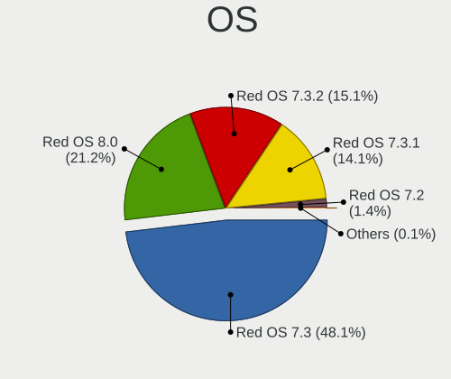

| Name         | Computers | Percent |
|--------------|-----------|---------|
| Red OS 7.3   | 373       | 48.13%  |
| Red OS 8.0   | 164       | 21.16%  |
| Red OS 7.3.2 | 117       | 15.1%   |
| Red OS 7.3.1 | 109       | 14.06%  |
| Red OS 7.2   | 11        | 1.42%   |
| Red OS 8.0.2 | 1         | 0.13%   |

OS Family
---------

OS without a version

| Name   | Computers | Percent |
|--------|-----------|---------|
| Red OS | 743       | 100%    |

Kernel
------

Version of the Linux kernel

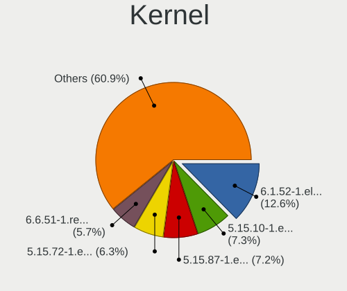

| Version                 | Computers | Percent |
|-------------------------|-----------|---------|
| 6.1.52-1.el7.3.x86_64   | 104       | 12.64%  |
| 5.15.10-1.el7.x86_64    | 60        | 7.29%   |
| 5.15.87-1.el7.3.x86_64  | 59        | 7.17%   |
| 5.15.72-1.el7.3.x86_64  | 52        | 6.32%   |
| 6.6.51-1.red80.x86_64   | 47        | 5.71%   |
| 5.10.29-1.el7.x86_64    | 43        | 5.22%   |
| 6.12.21-1.red80.x86_64  | 42        | 5.1%    |
| 6.1.110-1.el7.3.x86_64  | 35        | 4.25%   |
| 6.6.6-1.red80.x86_64    | 32        | 3.89%   |
| 5.15.35-5.el7.3.x86_64  | 27        | 3.28%   |
| 5.14.9-1.el7.x86_64     | 25        | 3.04%   |
| 6.1.128-2.el7.3.x86_64  | 23        | 2.79%   |
| 5.10.29-3.el7.x86_64    | 20        | 2.43%   |
| 6.6.76-1.red80.x86_64   | 19        | 2.31%   |
| 5.15.78-2.el7.3.x86_64  | 19        | 2.31%   |
| 5.15.35-4.el7.3.x86_64  | 19        | 2.31%   |
| 5.15.35-1.el7.3.x86_64  | 18        | 2.19%   |
| 6.12.37-1.red80.x86_64  | 15        | 1.82%   |
| 5.15.131-1.el7.3.x86_64 | 15        | 1.82%   |
| 6.1.20-2.el7.3.x86_64   | 13        | 1.58%   |
| 6.1.94-1.el7.3.x86_64   | 12        | 1.46%   |
| 6.1.44-1.el7.3.x86_64   | 12        | 1.46%   |
| 6.1.148-1.el7.3.x86_64  | 10        | 1.22%   |
| 6.6.34-1.red80.x86_64   | 9         | 1.09%   |
| 6.1.38-2.el7.3.x86_64   | 9         | 1.09%   |
| 6.1.143-1.el7.3.x86_64  | 9         | 1.09%   |
| 6.6.26-1.red80.x86_64   | 8         | 0.97%   |
| 6.12.56-1.red80.x86_64  | 8         | 0.97%   |
| 5.15.125-1.el7.3.x86_64 | 8         | 0.97%   |
| 4.19.79-1.el7.x86_64    | 8         | 0.97%   |
| 5.15.167-1.el7.3.x86_64 | 5         | 0.61%   |
| 5.15.10-2.el7.x86_64    | 5         | 0.61%   |
| 5.15.10-3.el7.x86_64    | 4         | 0.49%   |
| 5.10.1-1.el7.x86_64     | 4         | 0.49%   |
| 5.10.24-2.el7.x86_64    | 3         | 0.36%   |
| 6.1.52-1.red80.x86_64   | 2         | 0.24%   |
| 6.1.158-1.el7.3.x86_64  | 2         | 0.24%   |
| 6.1.11-1.el7.3.x86_64   | 2         | 0.24%   |
| 5.18.1-1.el7.x86_64     | 2         | 0.24%   |
| 5.15.10-4.el7.x86_64    | 2         | 0.24%   |

Kernel Family
-------------

Linux kernel without a distro release

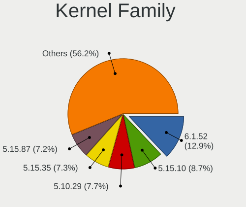

| Version  | Computers | Percent |
|----------|-----------|---------|
| 6.1.52   | 106       | 12.94%  |
| 5.15.10  | 71        | 8.67%   |
| 5.10.29  | 63        | 7.69%   |
| 5.15.35  | 60        | 7.33%   |
| 5.15.87  | 59        | 7.2%    |
| 5.15.72  | 52        | 6.35%   |
| 6.6.51   | 47        | 5.74%   |
| 6.12.21  | 42        | 5.13%   |
| 6.1.110  | 35        | 4.27%   |
| 6.6.6    | 32        | 3.91%   |
| 5.14.9   | 25        | 3.05%   |
| 6.1.128  | 23        | 2.81%   |
| 6.6.76   | 19        | 2.32%   |
| 5.15.78  | 19        | 2.32%   |
| 6.12.37  | 15        | 1.83%   |
| 5.15.131 | 15        | 1.83%   |
| 6.1.20   | 13        | 1.59%   |
| 6.1.94   | 12        | 1.47%   |
| 6.1.44   | 12        | 1.47%   |
| 6.1.148  | 10        | 1.22%   |
| 6.6.34   | 9         | 1.1%    |
| 6.1.38   | 9         | 1.1%    |
| 6.1.143  | 9         | 1.1%    |
| 6.6.26   | 8         | 0.98%   |
| 6.12.56  | 8         | 0.98%   |
| 5.15.125 | 8         | 0.98%   |
| 4.19.79  | 8         | 0.98%   |
| 5.15.167 | 5         | 0.61%   |
| 5.10.24  | 5         | 0.61%   |
| 5.10.1   | 4         | 0.49%   |
| 6.1.158  | 2         | 0.24%   |
| 6.1.11   | 2         | 0.24%   |
| 5.18.1   | 2         | 0.24%   |
| 4.19.204 | 2         | 0.24%   |
| 6.8.0    | 1         | 0.12%   |
| 6.6.52   | 1         | 0.12%   |
| 5.4.197  | 1         | 0.12%   |
| 5.15.178 | 1         | 0.12%   |
| 5.15.120 | 1         | 0.12%   |
| 5.13.15  | 1         | 0.12%   |

Kernel Major Ver.
-----------------

Linux kernel major version

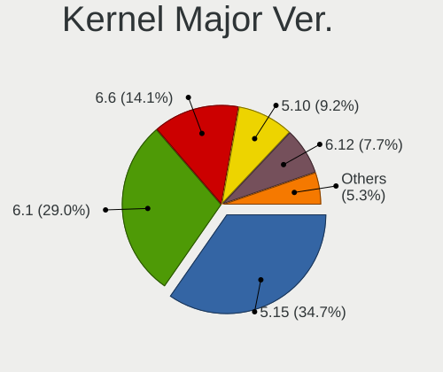

| Version | Computers | Percent |
|---------|-----------|---------|
| 5.15    | 270       | 34.66%  |
| 6.1     | 226       | 29.01%  |
| 6.6     | 110       | 14.12%  |
| 5.10    | 72        | 9.24%   |
| 6.12    | 60        | 7.7%    |
| 5.14    | 25        | 3.21%   |
| 4.19    | 11        | 1.41%   |
| 5.18    | 2         | 0.26%   |
| 6.8     | 1         | 0.13%   |
| 5.4     | 1         | 0.13%   |
| 5.13    | 1         | 0.13%   |

Arch
----

OS architecture (x86_64, i586, etc.)

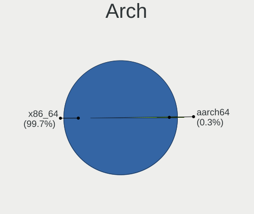

| Name    | Computers | Percent |
|---------|-----------|---------|
| x86_64  | 741       | 99.73%  |
| aarch64 | 2         | 0.27%   |

DE
--

Desktop Environment

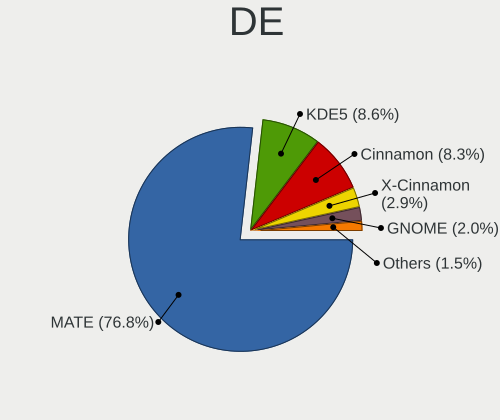

| Name       | Computers | Percent |
|------------|-----------|---------|
| MATE       | 582       | 76.78%  |
| KDE5       | 65        | 8.58%   |
| Cinnamon   | 63        | 8.31%   |
| X-Cinnamon | 22        | 2.9%    |
| GNOME      | 15        | 1.98%   |
| Unknown    | 9         | 1.19%   |
| openbox    | 1         | 0.13%   |
| i3         | 1         | 0.13%   |

Display Server
--------------

X11 or Wayland

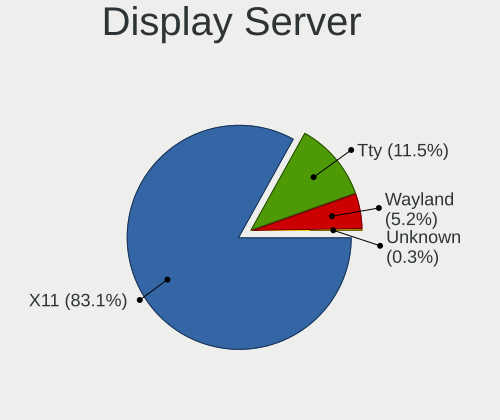

| Name    | Computers | Percent |
|---------|-----------|---------|
| X11     | 628       | 83.07%  |
| Tty     | 87        | 11.51%  |
| Wayland | 39        | 5.16%   |
| Unknown | 2         | 0.26%   |

Display Manager
---------------

SDDM, LightDM, etc.

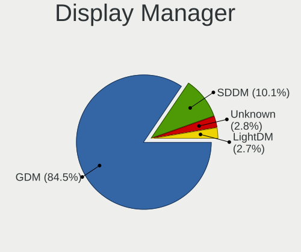

| Name    | Computers | Percent |
|---------|-----------|---------|
| GDM     | 636       | 84.46%  |
| SDDM    | 76        | 10.09%  |
| Unknown | 21        | 2.79%   |
| LightDM | 20        | 2.66%   |

OS Lang
-------

Language

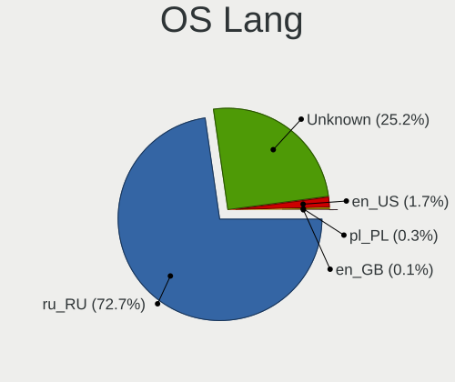

| Lang    | Computers | Percent |
|---------|-----------|---------|
| ru_RU   | 552       | 72.73%  |
| Unknown | 191       | 25.16%  |
| en_US   | 13        | 1.71%   |
| pl_PL   | 2         | 0.26%   |
| en_GB   | 1         | 0.13%   |

Boot Mode
---------

EFI or BIOS

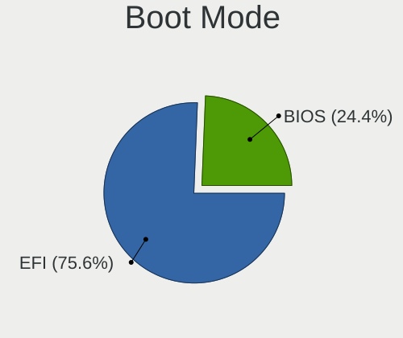

| Mode | Computers | Percent |
|------|-----------|---------|
| EFI  | 568       | 75.63%  |
| BIOS | 183       | 24.37%  |

Filesystem
----------

Type of filesystem

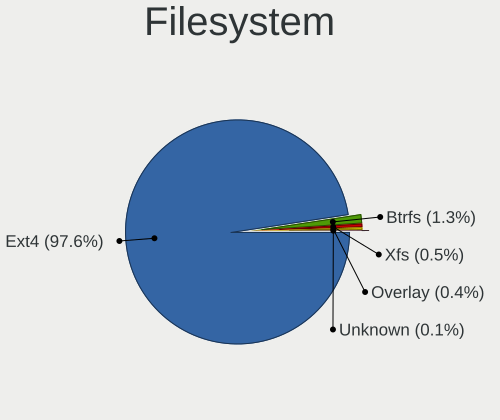

| Type    | Computers | Percent |
|---------|-----------|---------|
| Ext4    | 728       | 97.59%  |
| Btrfs   | 10        | 1.34%   |
| Xfs     | 4         | 0.54%   |
| Overlay | 3         | 0.4%    |
| Unknown | 1         | 0.13%   |

Part. scheme
------------

Scheme of partitioning

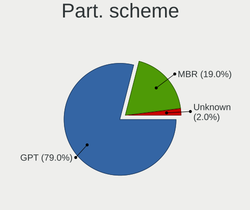

| Type    | Computers | Percent |
|---------|-----------|---------|
| GPT     | 590       | 78.98%  |
| MBR     | 142       | 19.01%  |
| Unknown | 15        | 2.01%   |

Dual Boot with Linux/BSD
------------------------

Hosting more than one Linux/BSD

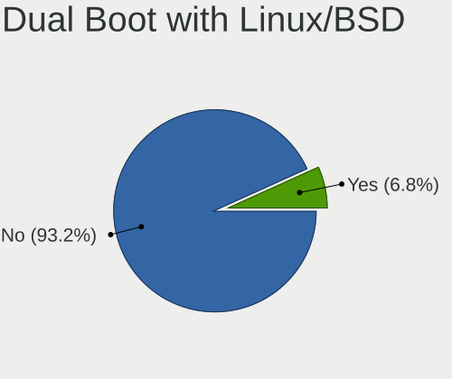

| Dual boot | Computers | Percent |
|-----------|-----------|---------|
| No        | 702       | 93.23%  |
| Yes       | 51        | 6.77%   |

Dual Boot (Win)
---------------

Hosting Linux and Windows

| Dual boot | Computers | Percent |
|-----------|-----------|---------|
| No        | 590       | 78.77%  |
| Yes       | 159       | 21.23%  |

Board
-----

Vendor
------

Motherboard manufacturer

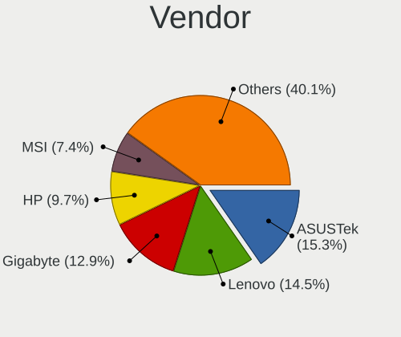

| Name                 | Computers | Percent |
|----------------------|-----------|---------|
| ASUSTek Computer     | 114       | 15.34%  |
| Lenovo               | 108       | 14.54%  |
| Gigabyte Technology  | 96        | 12.92%  |
| Hewlett-Packard      | 72        | 9.69%   |
| MSI                  | 55        | 7.4%    |
| ASRock               | 38        | 5.11%   |
| Acer                 | 24        | 3.23%   |
| Unknown              | 22        | 2.96%   |
| Dell                 | 20        | 2.69%   |
| Intel                | 18        | 2.42%   |
| Aquarius             | 18        | 2.42%   |
| ICL                  | 15        | 2.02%   |
| Graviton             | 15        | 2.02%   |
| DEPO Computers       | 14        | 1.88%   |
| iRU                  | 11        | 1.48%   |
| HUAWEI               | 11        | 1.48%   |
| 3Logic Group         | 7         | 0.94%   |
| BESHTAU              | 5         | 0.67%   |
| MTR                  | 4         | 0.54%   |
| Kraftway             | 4         | 0.54%   |
| Foxconn              | 4         | 0.54%   |
| Digma                | 4         | 0.54%   |
| Infinix              | 3         | 0.4%    |
| INFERIT              | 3         | 0.4%    |
| HONOR                | 3         | 0.4%    |
| ECS                  | 3         | 0.4%    |
| Biostar              | 3         | 0.4%    |
| TECNO Mobile Limited | 2         | 0.27%   |
| Supermicro           | 2         | 0.27%   |
| RDW                  | 2         | 0.27%   |
| Pegatron             | 2         | 0.27%   |
| MACHENIKE            | 2         | 0.27%   |
| KVADRA               | 2         | 0.27%   |
| IP3 Technology       | 2         | 0.27%   |
| INTECH PRO           | 2         | 0.27%   |
| DEXP                 | 2         | 0.27%   |
| Chuwi                | 2         | 0.27%   |
| AZW                  | 2         | 0.27%   |
| YADRO                | 1         | 0.13%   |
| Toshiba              | 1         | 0.13%   |

Model
-----

Motherboard model

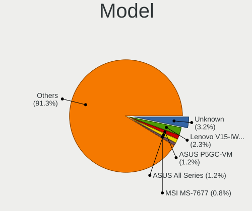

| Name                               | Computers | Percent |
|------------------------------------|-----------|---------|
| Unknown                            | 24        | 3.23%   |
| Lenovo V15-IWL 81YE                | 17        | 2.29%   |
| ASUS P5GC-VM                       | 9         | 1.21%   |
| ASUS All Series                    | 9         | 1.21%   |
| MSI MS-7677                        | 6         | 0.81%   |
| Gigabyte B365M DS3H                | 6         | 0.81%   |
| DEPO Computers DPH410S             | 5         | 0.67%   |
| ASUS H61M-K                        | 5         | 0.67%   |
| ASRock H510M-HVS R2.0              | 5         | 0.67%   |
| ASRock B365M-ITX/ac                | 5         | 0.67%   |
| Lenovo ThinkBook 15 G3 ACL 21A4    | 4         | 0.54%   |
| ICL RAY B102                       | 4         | 0.54%   |
| HP Pavilion All-in-One 27-xa0xxx   | 4         | 0.54%   |
| Gigabyte H510M H                   | 4         | 0.54%   |
| DEPO Computers DPH310T             | 4         | 0.54%   |
| ASUS PRIME H510T2/CSM              | 4         | 0.54%   |
| ASRock H61M-DGS                    | 4         | 0.54%   |
| MSI MS-7E05                        | 3         | 0.4%    |
| MSI MS-7D48                        | 3         | 0.4%    |
| MSI MS-7D14                        | 3         | 0.4%    |
| MSI MS-7C51                        | 3         | 0.4%    |
| Lenovo ThinkCentre M70q 11DT003GRU | 3         | 0.4%    |
| Lenovo B590 20206                  | 3         | 0.4%    |
| Kraftway ACCORD                    | 3         | 0.4%    |
| Intel DH61BF AAG81311-101          | 3         | 0.4%    |
| Intel D945GNT AAC96315-405         | 3         | 0.4%    |
| ICL RAYbook Si1512                 | 3         | 0.4%    |
| HUAWEI BOM-WXX9                    | 3         | 0.4%    |
| HP Laptop 15s-eq1xxx               | 3         | 0.4%    |
| Graviton M52i                      | 3         | 0.4%    |
| Gigabyte H110M-S2                  | 3         | 0.4%    |
| Gigabyte B760M DS3H DDR4           | 3         | 0.4%    |
| Gigabyte B75M-D3V                  | 3         | 0.4%    |
| Gigabyte A320M-S2H                 | 3         | 0.4%    |
| Biostar H610MH                     | 3         | 0.4%    |
| ASUS PRIME H310M-R R2.0            | 3         | 0.4%    |
| ASUS P5GC-MX/1333                  | 3         | 0.4%    |
| ASRock H610M-HVS                   | 3         | 0.4%    |
| Aquarius P30 K44 R53               | 3         | 0.4%    |
| Acer Aspire C24-963                | 3         | 0.4%    |

Model Family
------------

Motherboard model prefix

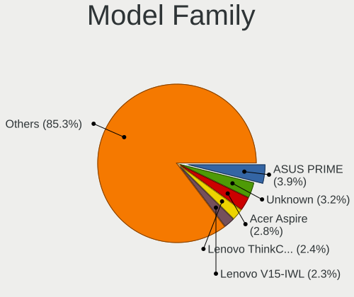

| Name                   | Computers | Percent |
|------------------------|-----------|---------|
| ASUS PRIME             | 29        | 3.9%    |
| Unknown                | 24        | 3.23%   |
| Acer Aspire            | 21        | 2.83%   |
| Lenovo ThinkCentre     | 18        | 2.42%   |
| Lenovo V15-IWL         | 17        | 2.29%   |
| Lenovo IdeaPad         | 16        | 2.15%   |
| Lenovo IdeaCentre      | 13        | 1.75%   |
| Lenovo ThinkPad        | 11        | 1.48%   |
| Lenovo ThinkBook       | 11        | 1.48%   |
| HP Pavilion            | 10        | 1.35%   |
| Gigabyte B365M         | 10        | 1.35%   |
| ASUS Vivobook          | 9         | 1.21%   |
| ASUS P5GC-VM           | 9         | 1.21%   |
| ASUS All               | 9         | 1.21%   |
| HP ProDesk             | 7         | 0.94%   |
| HP Laptop              | 7         | 0.94%   |
| Gigabyte H510M         | 7         | 0.94%   |
| Dell OptiPlex          | 7         | 0.94%   |
| MSI MS-7677            | 6         | 0.81%   |
| HP ProOne              | 6         | 0.81%   |
| Gigabyte H410M         | 6         | 0.81%   |
| Lenovo B590            | 5         | 0.67%   |
| ICL RAY                | 5         | 0.67%   |
| HP ProBook             | 5         | 0.67%   |
| HP EliteBook           | 5         | 0.67%   |
| Gigabyte B560M         | 5         | 0.67%   |
| DEPO Computers DPH410S | 5         | 0.67%   |
| ASUS H61M-K            | 5         | 0.67%   |
| ASRock H510M-HVS       | 5         | 0.67%   |
| ASRock B365M-ITX       | 5         | 0.67%   |
| MSI Modern             | 4         | 0.54%   |
| ICL RAYbook            | 4         | 0.54%   |
| HP Compaq              | 4         | 0.54%   |
| Gigabyte A520M         | 4         | 0.54%   |
| Gigabyte A320M-S2H     | 4         | 0.54%   |
| DEPO Computers DPH310T | 4         | 0.54%   |
| Dell Vostro            | 4         | 0.54%   |
| ASUS ROG               | 4         | 0.54%   |
| ASUS P8H61             | 4         | 0.54%   |
| ASRock H61M-DGS        | 4         | 0.54%   |

MFG Year
--------

Motherboard manufacture year

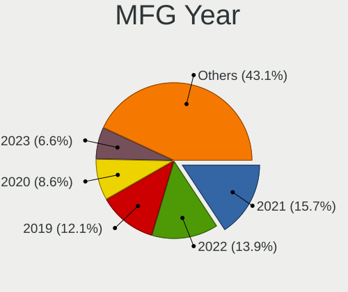

| Year    | Computers | Percent |
|---------|-----------|---------|
| 2021    | 117       | 15.75%  |
| 2022    | 103       | 13.86%  |
| 2019    | 90        | 12.11%  |
| 2020    | 64        | 8.61%   |
| 2023    | 49        | 6.59%   |
| 2012    | 48        | 6.46%   |
| 2018    | 46        | 6.19%   |
| 2011    | 33        | 4.44%   |
| 2013    | 31        | 4.17%   |
| 2010    | 25        | 3.36%   |
| 2024    | 24        | 3.23%   |
| 2017    | 20        | 2.69%   |
| 2016    | 20        | 2.69%   |
| 2007    | 19        | 2.56%   |
| 2014    | 18        | 2.42%   |
| 2015    | 12        | 1.62%   |
| 2009    | 12        | 1.62%   |
| 2025    | 4         | 0.54%   |
| 2008    | 4         | 0.54%   |
| 2006    | 3         | 0.4%    |
| Unknown | 1         | 0.13%   |

Form Factor
-----------

Physical design of the computer

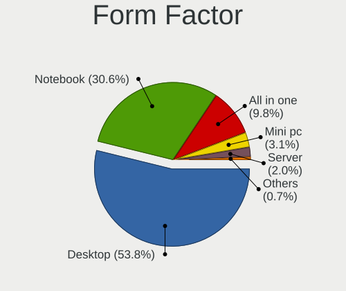

| Name           | Computers | Percent |
|----------------|-----------|---------|
| Desktop        | 400       | 53.84%  |
| Notebook       | 227       | 30.55%  |
| All in one     | 73        | 9.83%   |
| Mini pc        | 23        | 3.1%    |
| Server         | 15        | 2.02%   |
| System on chip | 2         | 0.27%   |
| Convertible    | 2         | 0.27%   |
| Tablet         | 1         | 0.13%   |

Secure Boot
-----------

Enabled or disabled

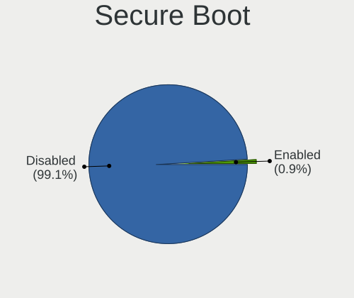

| State    | Computers | Percent |
|----------|-----------|---------|
| Disabled | 736       | 99.06%  |
| Enabled  | 7         | 0.94%   |

Coreboot
--------

Have coreboot on board

| Used | Computers | Percent |
|------|-----------|---------|
| No   | 743       | 100%    |

RAM Size
--------

Total RAM memory

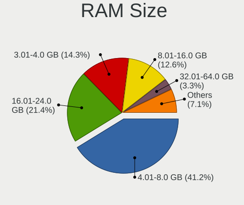

| Size in GB      | Computers | Percent |
|-----------------|-----------|---------|
| 4.01-8.0        | 308       | 41.23%  |
| 16.01-24.0      | 160       | 21.42%  |
| 3.01-4.0        | 107       | 14.32%  |
| 8.01-16.0       | 94        | 12.58%  |
| 32.01-64.0      | 25        | 3.35%   |
| 64.01-256.0     | 13        | 1.74%   |
| 2.01-3.0        | 12        | 1.61%   |
| 1.01-2.0        | 11        | 1.47%   |
| 24.01-32.0      | 8         | 1.07%   |
| More than 256.0 | 7         | 0.94%   |
| 0.51-1.0        | 1         | 0.13%   |
| Unknown         | 1         | 0.13%   |

RAM Used
--------

Used RAM memory

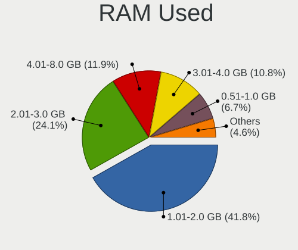

| Used GB     | Computers | Percent |
|-------------|-----------|---------|
| 1.01-2.0    | 333       | 41.83%  |
| 2.01-3.0    | 192       | 24.12%  |
| 4.01-8.0    | 95        | 11.93%  |
| 3.01-4.0    | 86        | 10.8%   |
| 0.51-1.0    | 53        | 6.66%   |
| 8.01-16.0   | 26        | 3.27%   |
| 64.01-256.0 | 3         | 0.38%   |
| 16.01-24.0  | 3         | 0.38%   |
| 0.01-0.5    | 3         | 0.38%   |
| 32.01-64.0  | 1         | 0.13%   |
| Unknown     | 1         | 0.13%   |

Total Drives
------------

Number of drives on board

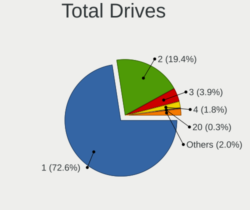

| Drives | Computers | Percent |
|--------|-----------|---------|
| 1      | 553       | 72.57%  |
| 2      | 148       | 19.42%  |
| 3      | 30        | 3.94%   |
| 4      | 14        | 1.84%   |
| 20     | 2         | 0.26%   |
| 8      | 2         | 0.26%   |
| 7      | 2         | 0.26%   |
| 5      | 2         | 0.26%   |
| 0      | 2         | 0.26%   |
| 25     | 1         | 0.13%   |
| 19     | 1         | 0.13%   |
| 12     | 1         | 0.13%   |
| 11     | 1         | 0.13%   |
| 10     | 1         | 0.13%   |
| 9      | 1         | 0.13%   |
| 6      | 1         | 0.13%   |

Has CD-ROM
----------

Has CD-ROM on board

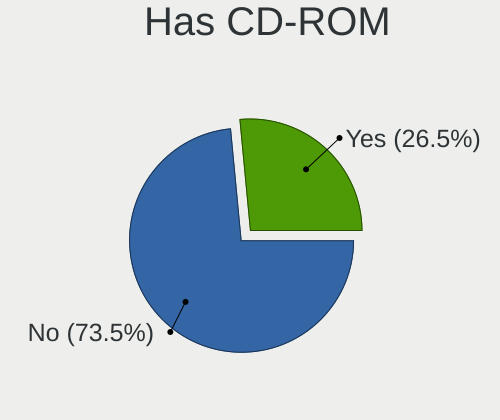

| Presented | Computers | Percent |
|-----------|-----------|---------|
| No        | 549       | 73.49%  |
| Yes       | 198       | 26.51%  |

Has Ethernet
------------

Has Ethernet on board

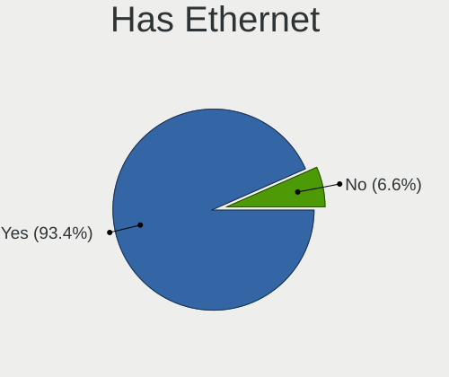

| Presented | Computers | Percent |
|-----------|-----------|---------|
| Yes       | 694       | 93.41%  |
| No        | 49        | 6.59%   |

Has WiFi
--------

Has WiFi module

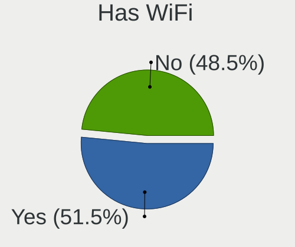

| Presented | Computers | Percent |
|-----------|-----------|---------|
| Yes       | 385       | 51.54%  |
| No        | 362       | 48.46%  |

Has Bluetooth
-------------

Has Bluetooth module

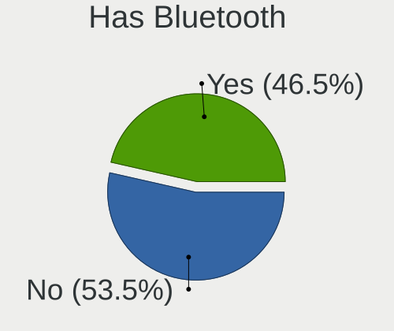

| Presented | Computers | Percent |
|-----------|-----------|---------|
| No        | 401       | 53.54%  |
| Yes       | 348       | 46.46%  |

Location
--------

Country
-------

Geographic location (country)

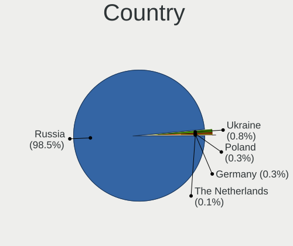

| Country         | Computers | Percent |
|-----------------|-----------|---------|
| Russia          | 732       | 98.52%  |
| Ukraine         | 6         | 0.81%   |
| Poland          | 2         | 0.27%   |
| Germany         | 2         | 0.27%   |
| The Netherlands | 1         | 0.13%   |

City
----

Geographic location (city)

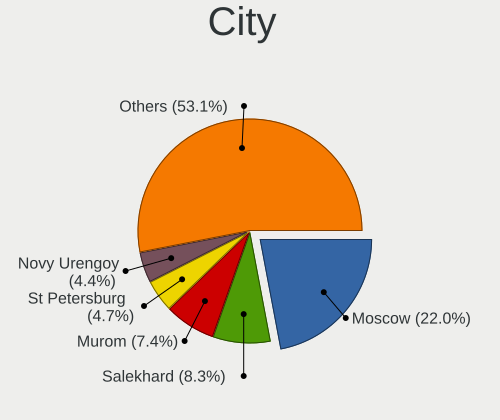

| City              | Computers | Percent |
|-------------------|-----------|---------|
| Moscow            | 169       | 22.03%  |
| Salekhard         | 64        | 8.34%   |
| Murom             | 57        | 7.43%   |
| St Petersburg     | 36        | 4.69%   |
| Novy Urengoy      | 34        | 4.43%   |
| Perm              | 25        | 3.26%   |
| Yekaterinburg     | 24        | 3.13%   |
| Labytnangi        | 20        | 2.61%   |
| Krasnodar         | 14        | 1.83%   |
| Zima              | 11        | 1.43%   |
| Yuzhno-Sakhalinsk | 10        | 1.3%    |
| Volgograd         | 10        | 1.3%    |
| Stavropol         | 10        | 1.3%    |
| Polazna           | 10        | 1.3%    |
| Vladimir          | 9         | 1.17%   |
| Barnaul           | 7         | 0.91%   |
| Orenburg          | 6         | 0.78%   |
| Novosibirsk       | 6         | 0.78%   |
| Muromskiy         | 6         | 0.78%   |
| Lipetsk           | 6         | 0.78%   |
| Kaluga            | 6         | 0.78%   |
| Zhukovskiy        | 5         | 0.65%   |
| Yakutsk           | 5         | 0.65%   |
| Ryazan            | 5         | 0.65%   |
| Rostov-on-Don     | 5         | 0.65%   |
| Nizhniy Novgorod  | 5         | 0.65%   |
| Kurgan            | 5         | 0.65%   |
| Khabarovsk        | 5         | 0.65%   |
| Chelyabinsk       | 5         | 0.65%   |
| Balashikha        | 5         | 0.65%   |
| Voronezh          | 4         | 0.52%   |
| Vladivostok       | 4         | 0.52%   |
| Veliky Novgorod   | 4         | 0.52%   |
| Ufa               | 4         | 0.52%   |
| Tver              | 4         | 0.52%   |
| Samara            | 4         | 0.52%   |
| Pushkino          | 4         | 0.52%   |
| Nadym             | 4         | 0.52%   |
| Krasnoyarsk       | 4         | 0.52%   |
| Zheleznodorozhnyy | 3         | 0.39%   |

Drives
------

Drive Vendor
------------

Hard drive vendors

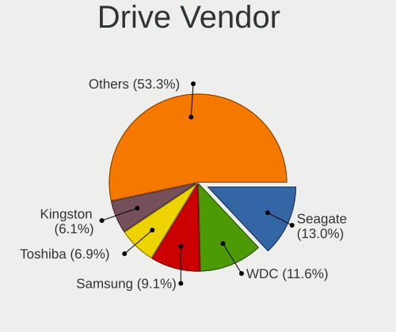

| Vendor              | Computers | Drives | Percent |
|---------------------|-----------|--------|---------|
| Seagate             | 127       | 177    | 13.03%  |
| WDC                 | 113       | 152    | 11.59%  |
| Samsung Electronics | 89        | 182    | 9.13%   |
| Toshiba             | 67        | 121    | 6.87%   |
| Kingston            | 59        | 66     | 6.05%   |
| A-DATA Technology   | 58        | 63     | 5.95%   |
| SK hynix            | 32        | 36     | 3.28%   |
| Apacer              | 23        | 27     | 2.36%   |
| Hitachi             | 21        | 23     | 2.15%   |
| SanDisk             | 20        | 26     | 2.05%   |
| Micron Technology   | 19        | 37     | 1.95%   |
| KingSpec            | 19        | 26     | 1.95%   |
| Intel               | 19        | 35     | 1.95%   |
| Foxline             | 18        | 18     | 1.85%   |
| Silicon Motion      | 15        | 16     | 1.54%   |
| Crucial             | 15        | 20     | 1.54%   |
| Unknown             | 14        | 15     | 1.44%   |
| Phison              | 13        | 13     | 1.33%   |
| China               | 13        | 25     | 1.33%   |
| Netac               | 12        | 14     | 1.23%   |
| ExeGate             | 12        | 14     | 1.23%   |
| SPCC                | 11        | 13     | 1.13%   |
| Patriot             | 11        | 11     | 1.13%   |
| HGST                | 11        | 11     | 1.13%   |
| AGI                 | 10        | 10     | 1.03%   |
| Unknown             | 9         | 10     | 0.92%   |
| AMD                 | 8         | 8      | 0.82%   |
| KIOXIA              | 6         | 6      | 0.62%   |
| Hewlett-Packard     | 6         | 38     | 0.62%   |
| Gigabyte Technology | 6         | 6      | 0.62%   |
| UMIS                | 5         | 5      | 0.51%   |
| Transcend           | 5         | 5      | 0.51%   |
| Qumo                | 5         | 6      | 0.51%   |
| FORESEE             | 5         | 6      | 0.51%   |
| YMTC                | 4         | 4      | 0.41%   |
| Smartbuy            | 4         | 4      | 0.41%   |
| JMicron Technology  | 4         | 4      | 0.41%   |
| Hikvision           | 4         | 4      | 0.41%   |
| GOODRAM             | 4         | 4      | 0.41%   |
| Digma               | 4         | 4      | 0.41%   |

Drive Model
-----------

Hard drive models

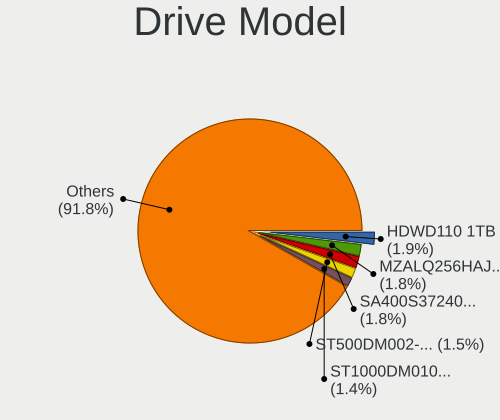

| Model                                  | Computers | Percent |
|----------------------------------------|-----------|---------|
| Toshiba HDWD110 1TB                    | 19        | 1.86%   |
| Samsung MZALQ256HAJD-000L2 256GB       | 18        | 1.76%   |
| Kingston SA400S37240G 240GB SSD        | 18        | 1.76%   |
| Seagate ST500DM002-1BD142 500GB        | 15        | 1.47%   |
| Seagate ST1000DM010-2EP102 1TB         | 14        | 1.37%   |
| A-DATA SX6000PNP 256GB                 | 13        | 1.27%   |
| Toshiba DT01ACA100 1TB                 | 12        | 1.17%   |
| Seagate ST1000LM049-2GH172 1TB         | 11        | 1.08%   |
| Unknown                                | 9         | 0.88%   |
| WDC WDS240G2G0A-00JH30 240GB SSD       | 8         | 0.78%   |
| Kingston SA400S37480G 480GB SSD        | 8         | 0.78%   |
| SPCC Solid State Disk 256GB            | 7         | 0.68%   |
| Seagate ST1000DM003-1ER162 1TB         | 7         | 0.68%   |
| Samsung SSD 860 EVO 250GB              | 7         | 0.68%   |
| Foxline FLSSD256M80E13TCX5 256GB       | 7         | 0.68%   |
| Apacer AS2280P4 256GB                  | 7         | 0.68%   |
| Toshiba HDWL110 1TB                    | 6         | 0.59%   |
| Seagate ST3160811AS 160GB              | 6         | 0.59%   |
| Crucial CT240BX500SSD1 240GB           | 6         | 0.59%   |
| Apacer AS340 240GB SSD                 | 6         | 0.59%   |
| A-DATA SX6000PNP 512GB                 | 6         | 0.59%   |
| Toshiba DT01ACA050 500GB               | 5         | 0.49%   |
| Seagate ST1000DM003-1SB102 1TB         | 5         | 0.49%   |
| Kingston SNVS500G 500GB                | 5         | 0.49%   |
| Kingston SA400S37120G 120GB SSD        | 5         | 0.49%   |
| KingSpec P3-256 256GB SSD              | 5         | 0.49%   |
| AGI AGI512G16AI198 512GB               | 5         | 0.49%   |
| A-DATA SU650 240GB SSD                 | 5         | 0.49%   |
| Toshiba MQ01ABF050 500GB               | 4         | 0.39%   |
| SK hynix HFM128GDHTNG-8310B 128GB      | 4         | 0.39%   |
| Silicon Motion Wodposit NVMe SSD 256GB | 4         | 0.39%   |
| Seagate ST500LT012-1DG142 500GB        | 4         | 0.39%   |
| Seagate ST1000LM035-1RK172 1TB         | 4         | 0.39%   |
| Seagate ST1000DM010-2DM162 1TB         | 4         | 0.39%   |
| SanDisk NVMe SSD Drive 512GB           | 4         | 0.39%   |
| Samsung SSD 970 EVO Plus 1TB           | 4         | 0.39%   |
| Patriot Burst Elite 240GB SSD          | 4         | 0.39%   |
| Crucial CT480BX500SSD1 480GB           | 4         | 0.39%   |
| Apacer AS350 256GB SSD                 | 4         | 0.39%   |
| WDC WDS480G2G0A-00JH30 480GB SSD       | 3         | 0.29%   |

HDD Vendor
----------

Hard disk drive vendors

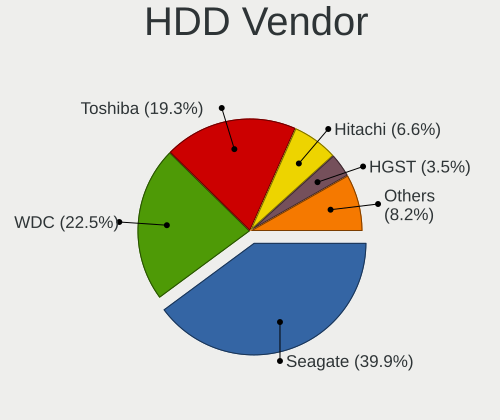

| Vendor              | Computers | Drives  | Percent |
|---------------------|-----------|---------|---------|
| Seagate             | 126       | 176     | 39.87%  |
| WDC                 | 71        | 105     | 22.47%  |
| Toshiba             | 61        | 113     | 19.3%   |
| Hitachi             | 21        | 23      | 6.65%   |
| HGST                | 11        | 11      | 3.48%   |
| Samsung Electronics | 6         | 7       | 1.9%    |
| Unknown             | 3         | 4       | 0.95%   |
| JMicron Technology  | 3         | 3       | 0.95%   |
| Hewlett-Packard     | 3         | 31      | 0.95%   |
| Lenovo              | 2         | 32      | 0.63%   |
| HPE                 | 2         | 3       | 0.63%   |
| USB                 | 1         | 1       | 0.32%   |
| LIO-ORG             | 1         | 1       | 0.32%   |
| JetFlash            | 1         | 1       | 0.32%   |
| HUAWEI              | 1         | Unknown | 0.32%   |
| Fujitsu             | 1         | 1       | 0.32%   |
| External            | 1         | 1       | 0.32%   |
| ACASIS              | 1         | 1       | 0.32%   |

SSD Vendor
----------

Solid state drive vendors

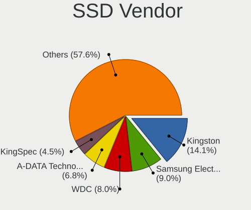

| Vendor              | Computers | Drives | Percent |
|---------------------|-----------|--------|---------|
| Kingston            | 44        | 49     | 14.15%  |
| Samsung Electronics | 28        | 72     | 9%      |
| WDC                 | 25        | 27     | 8.04%   |
| A-DATA Technology   | 21        | 21     | 6.75%   |
| KingSpec            | 14        | 21     | 4.5%    |
| Intel               | 12        | 27     | 3.86%   |
| Crucial             | 12        | 17     | 3.86%   |
| China               | 12        | 24     | 3.86%   |
| Apacer              | 12        | 14     | 3.86%   |
| Patriot             | 10        | 10     | 3.22%   |
| SPCC                | 9         | 11     | 2.89%   |
| ExeGate             | 9         | 10     | 2.89%   |
| SanDisk             | 8         | 13     | 2.57%   |
| Foxline             | 8         | 8      | 2.57%   |
| Netac               | 7         | 9      | 2.25%   |
| Transcend           | 5         | 5      | 1.61%   |
| Qumo                | 5         | 6      | 1.61%   |
| Smartbuy            | 4         | 4      | 1.29%   |
| Unknown             | 4         | 4      | 1.29%   |
| Toshiba             | 3         | 4      | 0.96%   |
| Plextor             | 3         | 3      | 0.96%   |
| Micron Technology   | 3         | 3      | 0.96%   |
| HYDRA               | 3         | 3      | 0.96%   |
| GOODRAM             | 3         | 3      | 0.96%   |
| Gigabyte Technology | 3         | 3      | 0.96%   |
| Digma               | 3         | 3      | 0.96%   |
| AMD                 | 3         | 3      | 0.96%   |
| AGI                 | 3         | 3      | 0.96%   |
| SK hynix            | 2         | 2      | 0.64%   |
| KIOXIA-EXCERIA      | 2         | 2      | 0.64%   |
| Hewlett-Packard     | 2         | 5      | 0.64%   |
| DEXP                | 2         | 3      | 0.64%   |
| WDC WDS             | 1         | 1      | 0.32%   |
| Verbatim            | 1         | 1      | 0.32%   |
| TXRUI               | 1         | 1      | 0.32%   |
| Thinkplus           | 1         | 1      | 0.32%   |
| TESLA               | 1         | 2      | 0.32%   |
| SSSTC               | 1         | 2      | 0.32%   |
| SPCC Sol            | 1         | 1      | 0.32%   |
| SM400               | 1         | 1      | 0.32%   |

Drive Kind
----------

HDD or SSD

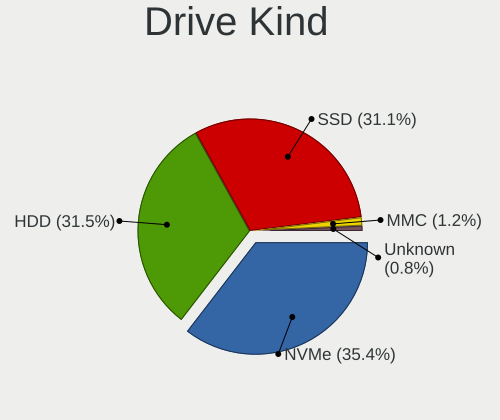

| Kind    | Computers | Drives | Percent |
|---------|-----------|--------|---------|
| NVMe    | 324       | 422    | 35.45%  |
| HDD     | 288       | 514    | 31.51%  |
| SSD     | 284       | 423    | 31.07%  |
| MMC     | 11        | 13     | 1.2%    |
| Unknown | 7         | 7      | 0.77%   |

Drive Connector
---------------

SATA, SAS, NVMe, etc.

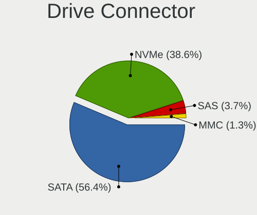

| Type | Computers | Drives | Percent |
|------|-----------|--------|---------|
| SATA | 473       | 878    | 56.38%  |
| NVMe | 324       | 422    | 38.62%  |
| SAS  | 31        | 66     | 3.69%   |
| MMC  | 11        | 13     | 1.31%   |

Drive Size
----------

Size of hard drive

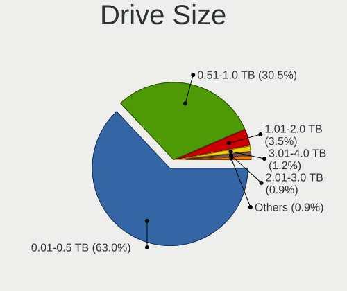

| Size in TB | Computers | Drives | Percent |
|------------|-----------|--------|---------|
| 0.01-0.5   | 361       | 511    | 63%     |
| 0.51-1.0   | 175       | 267    | 30.54%  |
| 1.01-2.0   | 20        | 79     | 3.49%   |
| 3.01-4.0   | 7         | 13     | 1.22%   |
| 2.01-3.0   | 5         | 46     | 0.87%   |
| 4.01-10.0  | 4         | 14     | 0.7%    |
| 10.01-20.0 | 1         | 7      | 0.17%   |

Space Total
-----------

Amount of disk space available on the file system

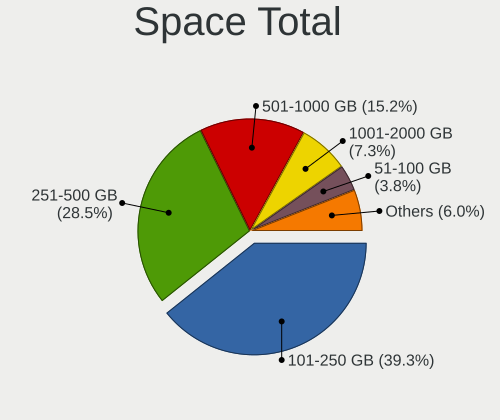

| Size in GB     | Computers | Percent |
|----------------|-----------|---------|
| 101-250        | 302       | 39.27%  |
| 251-500        | 219       | 28.48%  |
| 501-1000       | 117       | 15.21%  |
| 1001-2000      | 56        | 7.28%   |
| 51-100         | 29        | 3.77%   |
| 21-50          | 15        | 1.95%   |
| More than 3000 | 11        | 1.43%   |
| 2001-3000      | 11        | 1.43%   |
| 1-20           | 6         | 0.78%   |
| Unknown        | 3         | 0.39%   |

Space Used
----------

Amount of used disk space

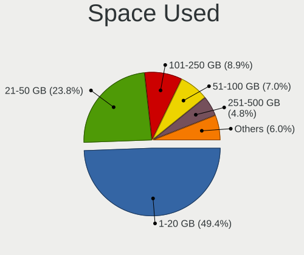

| Used GB        | Computers | Percent |
|----------------|-----------|---------|
| 1-20           | 388       | 49.43%  |
| 21-50          | 187       | 23.82%  |
| 101-250        | 70        | 8.92%   |
| 51-100         | 55        | 7.01%   |
| 251-500        | 38        | 4.84%   |
| 501-1000       | 26        | 3.31%   |
| 1001-2000      | 10        | 1.27%   |
| More than 3000 | 5         | 0.64%   |
| 2001-3000      | 3         | 0.38%   |
| Unknown        | 3         | 0.38%   |

Malfunc. Drives
---------------

Drive models with a malfunction

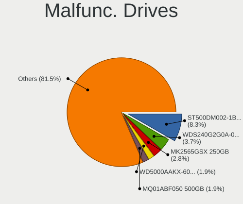

| Model                                    | Computers | Drives | Percent |
|------------------------------------------|-----------|--------|---------|
| Seagate ST500DM002-1BD142 500GB          | 9         | 10     | 8.33%   |
| WDC WDS240G2G0A-00JH30 240GB SSD         | 4         | 4      | 3.7%    |
| Toshiba MK2565GSX 250GB                  | 3         | 3      | 2.78%   |
| WDC WD5000AAKX-60U6AA0 500GB             | 2         | 2      | 1.85%   |
| Toshiba MQ01ABF050 500GB                 | 2         | 19     | 1.85%   |
| Seagate ST500LT012-1DG142 500GB          | 2         | 2      | 1.85%   |
| Seagate ST3500413AS 500GB                | 2         | 2      | 1.85%   |
| Seagate ST3160811AS 160GB                | 2         | 2      | 1.85%   |
| Seagate ST1000DM010-2EP102 1TB           | 2         | 6      | 1.85%   |
| Hitachi HDS723015BLA642 1TB              | 2         | 2      | 1.85%   |
| Hitachi HDS721616PLA380 160GB            | 2         | 2      | 1.85%   |
| Hitachi HDP725025GLA380 250GB            | 2         | 2      | 1.85%   |
| HGST HTS545050A7E380 500GB               | 2         | 2      | 1.85%   |
| WDC WDS120G2G0A-00JH30 120GB SSD         | 1         | 1      | 0.93%   |
| WDC WD7500BPVT-00HXZT3 752GB             | 1         | 1      | 0.93%   |
| WDC WD5000AAVS-00ZTB0 500GB              | 1         | 1      | 0.93%   |
| WDC WD5000AAKS-00V1A0 500GB              | 1         | 2      | 0.93%   |
| WDC WD5000AAKS-00D2B0 500GB              | 1         | 1      | 0.93%   |
| WDC WD3201ABYS-01B9A0 320GB              | 1         | 1      | 0.93%   |
| WDC WD3200BPVT-24ZEST0 320GB             | 1         | 1      | 0.93%   |
| WDC WD3200BEVT-22A23T0 320GB             | 1         | 1      | 0.93%   |
| WDC WD3200AAKX-001CA0 320GB              | 1         | 1      | 0.93%   |
| WDC WD2500AAJS-22VTA0 250GB              | 1         | 1      | 0.93%   |
| WDC WD1600AAJS-00B4A0 160GB              | 1         | 1      | 0.93%   |
| WDC WD10SPZX-24Z10 1TB                   | 1         | 1      | 0.93%   |
| WDC WD10EZEX-75ZF5A0 1TB                 | 1         | 2      | 0.93%   |
| WDC WD10EZEX-00WN4A0 1TB                 | 1         | 1      | 0.93%   |
| WDC WD10EZEX-00BN5A0 1TB                 | 1         | 1      | 0.93%   |
| WDC WD10EARS-00Y5B1 1TB                  | 1         | 1      | 0.93%   |
| WDC WD10EALX-009BA0 1TB                  | 1         | 1      | 0.93%   |
| WDC WD1003FBYX-01Y7B0 1TB                | 1         | 1      | 0.93%   |
| WDC WD1001FALS-00J7B1 1TB                | 1         | 1      | 0.93%   |
| WDC WD Green M.2 2280 240GB              | 1         | 1      | 0.93%   |
| WDC WD Blue SA510 2.5 500GB              | 1         | 1      | 0.93%   |
| Transcend TS256GSSD230S 256GB            | 1         | 1      | 0.93%   |
| Toshiba THNSNK256GVN8 M.2 2280 256GB SSD | 1         | 1      | 0.93%   |
| Toshiba MK6475GSX 640GB                  | 1         | 1      | 0.93%   |
| Toshiba MK5075GSX 500GB                  | 1         | 12     | 0.93%   |
| Toshiba MK5059GSXP 500GB                 | 1         | 1      | 0.93%   |
| Toshiba HDWD110 1TB                      | 1         | 2      | 0.93%   |

Malfunc. Drive Vendor
---------------------

Vendors of faulty drives

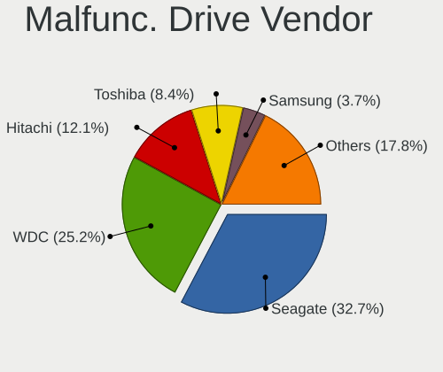

| Vendor              | Computers | Drives | Percent |
|---------------------|-----------|--------|---------|
| Seagate             | 35        | 42     | 32.71%  |
| WDC                 | 27        | 29     | 25.23%  |
| Hitachi             | 13        | 13     | 12.15%  |
| Toshiba             | 9         | 39     | 8.41%   |
| Samsung Electronics | 4         | 4      | 3.74%   |
| Kingston            | 3         | 3      | 2.8%    |
| HGST                | 3         | 3      | 2.8%    |
| A-DATA Technology   | 3         | 3      | 2.8%    |
| Transcend           | 1         | 1      | 0.93%   |
| SSSTC               | 1         | 2      | 0.93%   |
| SPCC                | 1         | 1      | 0.93%   |
| Netac               | 1         | 3      | 0.93%   |
| HYDRA               | 1         | 1      | 0.93%   |
| Hikvision           | 1         | 1      | 0.93%   |
| Fujitsu             | 1         | 1      | 0.93%   |
| ExeGate             | 1         | 1      | 0.93%   |
| DEXP                | 1         | 2      | 0.93%   |
| Unknown             | 1         | 1      | 0.93%   |

Malfunc. HDD Vendor
-------------------

Vendors of faulty HDD drives

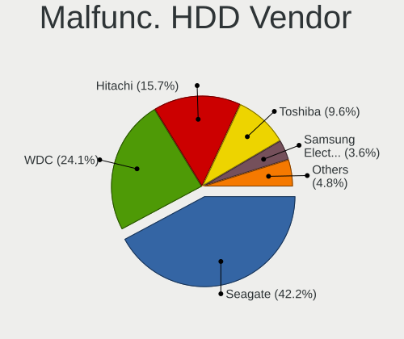

| Vendor              | Computers | Drives | Percent |
|---------------------|-----------|--------|---------|
| Seagate             | 35        | 42     | 42.17%  |
| WDC                 | 20        | 22     | 24.1%   |
| Hitachi             | 13        | 13     | 15.66%  |
| Toshiba             | 8         | 38     | 9.64%   |
| Samsung Electronics | 3         | 3      | 3.61%   |
| HGST                | 3         | 3      | 3.61%   |
| Fujitsu             | 1         | 1      | 1.2%    |

Malfunc. Drive Kind
-------------------

Kinds of faulty drives

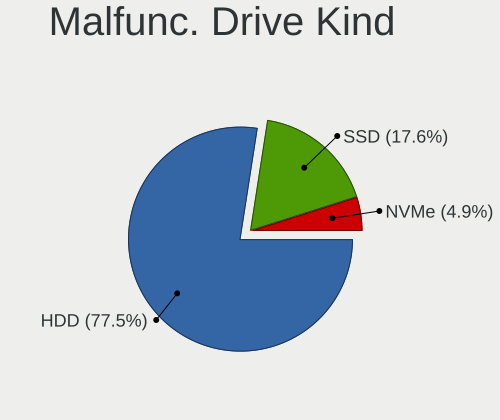

| Kind | Computers | Drives | Percent |
|------|-----------|--------|---------|
| HDD  | 79        | 122    | 77.45%  |
| SSD  | 18        | 23     | 17.65%  |
| NVMe | 5         | 5      | 4.9%    |

Failed Drives
-------------

Failed drive models

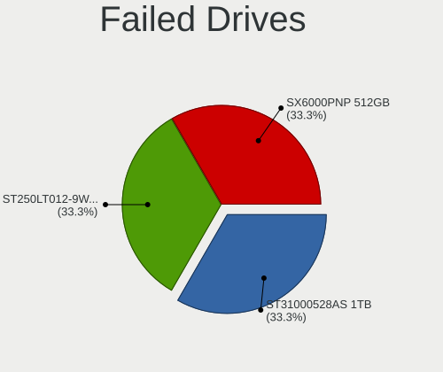

| Model                             | Computers | Drives | Percent |
|-----------------------------------|-----------|--------|---------|
| Seagate ST31000528AS 1TB          | 1         | 1      | 33.33%  |
| Seagate ST250LT012-9WS141 250GB   | 1         | 2      | 33.33%  |
| A-DATA Technology SX6000PNP 512GB | 1         | 3      | 33.33%  |

Failed Drive Vendor
-------------------

Failed drive vendors

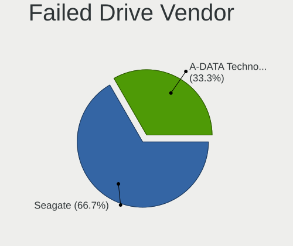

| Vendor            | Computers | Drives | Percent |
|-------------------|-----------|--------|---------|
| Seagate           | 2         | 3      | 66.67%  |
| A-DATA Technology | 1         | 3      | 33.33%  |

Drive Status
------------

Number of failed and malfunc. drives

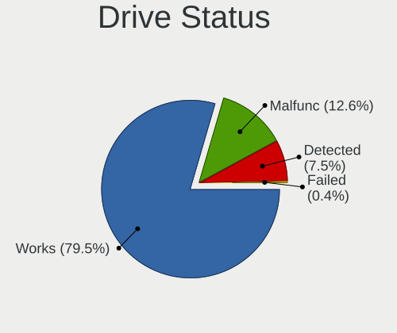

| Status   | Computers | Drives | Percent |
|----------|-----------|--------|---------|
| Works    | 644       | 1118   | 79.51%  |
| Malfunc  | 102       | 150    | 12.59%  |
| Detected | 61        | 105    | 7.53%   |
| Failed   | 3         | 6      | 0.37%   |

Storage controller
------------------

Storage Vendor
--------------

Storage controller vendors

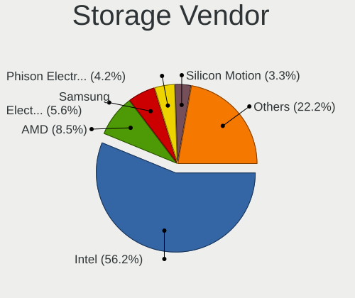

| Vendor                           | Computers | Percent |
|----------------------------------|-----------|---------|
| Intel                            | 581       | 56.19%  |
| AMD                              | 88        | 8.51%   |
| Samsung Electronics              | 58        | 5.61%   |
| Phison Electronics               | 43        | 4.16%   |
| Silicon Motion                   | 34        | 3.29%   |
| SK hynix                         | 30        | 2.9%    |
| SanDisk                          | 29        | 2.8%    |
| ADATA Technology                 | 25        | 2.42%   |
| Realtek Semiconductor            | 20        | 1.93%   |
| Kingston Technology Company      | 19        | 1.84%   |
| Micron Technology                | 16        | 1.55%   |
| MAXIO Technology (Hangzhou)      | 14        | 1.35%   |
| LSI Logic / Symbios Logic        | 8         | 0.77%   |
| Shenzhen Longsys Electronics     | 7         | 0.68%   |
| Nvidia                           | 6         | 0.58%   |
| Union Memory (Shenzhen)          | 5         | 0.48%   |
| KIOXIA                           | 5         | 0.48%   |
| JMicron Technology               | 5         | 0.48%   |
| Yangtze Memory Technologies      | 4         | 0.39%   |
| Toshiba America Info Systems     | 4         | 0.39%   |
| ASMedia Technology               | 4         | 0.39%   |
| Shenzhen Shichuangyi Electronics | 3         | 0.29%   |
| Netac Technology                 | 3         | 0.29%   |
| Marvell Technology Group         | 3         | 0.29%   |
| Broadcom / LSI                   | 3         | 0.29%   |
| VIA Technologies                 | 2         | 0.19%   |
| Solid State Storage Technology   | 2         | 0.19%   |
| ShenZhen TIGO Semiconductor      | 2         | 0.19%   |
| Micron/Crucial Technology        | 2         | 0.19%   |
| Hewlett-Packard                  | 2         | 0.19%   |
| Unknown                          | 2         | 0.19%   |
| Zhaoxin                          | 1         | 0.1%    |
| YEESTOR Microelectronics         | 1         | 0.1%    |
| Silicon Integrated Systems [SiS] | 1         | 0.1%    |
| Integrated Technology Express    | 1         | 0.1%    |
| INNOGRIT                         | 1         | 0.1%    |

Storage Model
-------------

Storage controller models

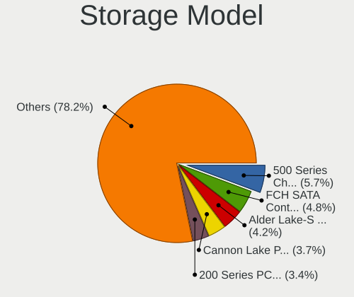

| Model                                                                                   | Computers | Percent |
|-----------------------------------------------------------------------------------------|-----------|---------|
| Intel 500 Series Chipset Family SATA AHCI Controller                                    | 66        | 5.71%   |
| AMD FCH SATA Controller [AHCI mode]                                                     | 55        | 4.76%   |
| Intel Alder Lake-S PCH SATA Controller [AHCI Mode]                                      | 49        | 4.24%   |
| Intel Cannon Lake PCH SATA AHCI Controller                                              | 43        | 3.72%   |
| Intel 200 Series PCH SATA controller [AHCI mode]                                        | 39        | 3.37%   |
| Samsung NVMe SSD Controller 980 (DRAM-less)                                             | 35        | 3.03%   |
| Phison PS5013-E13 PCIe3 NVMe Controller (DRAM-less)                                     | 32        | 2.77%   |
| Intel 6 Series/C200 Series Chipset Family 6 port Desktop SATA AHCI Controller           | 32        | 2.77%   |
| Intel Cannon Point-LP SATA Controller [AHCI Mode]                                       | 30        | 2.6%    |
| Silicon Motion SM2263EN/SM2263XT (DRAM-less) NVMe SSD Controllers                       | 29        | 2.51%   |
| Intel NM10/ICH7 Family SATA Controller [IDE mode]                                       | 26        | 2.25%   |
| Intel 8 Series/C220 Series Chipset Family 6-port SATA Controller 1 [AHCI mode]          | 25        | 2.16%   |
| Intel 82801G (ICH7 Family) IDE Controller                                               | 24        | 2.08%   |
| Intel Volume Management Device NVMe RAID Controller                                     | 20        | 1.73%   |
| Intel Q170/Q150/B150/H170/H110/Z170/CM236 Chipset SATA Controller [AHCI Mode]           | 20        | 1.73%   |
| Intel Comet Lake SATA AHCI Controller                                                   | 20        | 1.73%   |
| Intel 7 Series Chipset Family 6-port SATA Controller [AHCI mode]                        | 17        | 1.47%   |
| Intel 400 Series Chipset Family SATA AHCI Controller                                    | 17        | 1.47%   |
| AMD 500 Series Chipset SATA Controller                                                  | 16        | 1.38%   |
| Intel Tiger Lake-LP SATA Controller                                                     | 13        | 1.12%   |
| Intel Alder Lake-P SATA AHCI Controller                                                 | 13        | 1.12%   |
| ADATA XPG GAMMIXS1 1L, XPG GAMMIX S5, LEGEND 710 / 740, SWORDFISH NVMe SSD (DRAM-less)  | 13        | 1.12%   |
| Intel SATA Controller [RAID mode]                                                       | 12        | 1.04%   |
| Intel 7 Series/C210 Series Chipset Family 6-port SATA Controller [AHCI mode]            | 12        | 1.04%   |
| Intel 6 Series/C200 Series Chipset Family Desktop SATA Controller (IDE mode, ports 4-5) | 12        | 1.04%   |
| Intel 6 Series/C200 Series Chipset Family Desktop SATA Controller (IDE mode, ports 0-3) | 12        | 1.04%   |
| Samsung NVMe SSD Controller SM981/PM981/PM983                                           | 11        | 0.95%   |
| Realtek RTS5763DL NVMe SSD Controller (DRAM-less)                                       | 11        | 0.95%   |
| MAXIO (Hangzhou) NVMe SSD Controller MAP1202 (DRAM-less)                                | 10        | 0.87%   |
| Intel Sunrise Point-LP SATA Controller [AHCI mode]                                      | 10        | 0.87%   |
| Intel Raptor Lake SATA AHCI Controller                                                  | 10        | 0.87%   |
| AMD A320 Chipset SATA Controller [AHCI mode]                                            | 10        | 0.87%   |
| AMD 400 Series Chipset SATA Controller                                                  | 10        | 0.87%   |
| SK hynix Gold P31/BC711/PC711 NVMe Solid State Drive                                    | 9         | 0.78%   |
| Samsung NVMe SSD Controller PM9A1/PM9A3/980PRO                                          | 9         | 0.78%   |
| Intel Celeron/Pentium Silver Processor SATA Controller                                  | 9         | 0.78%   |
| SK hynix BC501 NVMe Solid State Drive                                                   | 8         | 0.69%   |
| Intel Ice Lake-LP SATA Controller [AHCI mode]                                           | 8         | 0.69%   |
| SanDisk Ultra 3D / WD PC SN530, IX SN530, Blue SN550 NVMe SSD (DRAM-less)               | 7         | 0.61%   |
| Micron 2450 NVMe SSD [HendrixV] (DRAM-less)                                             | 7         | 0.61%   |

Storage Kind
------------

Kind of storage controller (IDE, SATA, NVMe, SAS, ...)

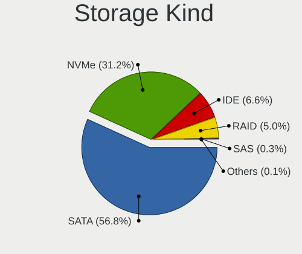

| Kind | Computers | Percent |
|------|-----------|---------|
| SATA | 590       | 56.79%  |
| NVMe | 324       | 31.18%  |
| IDE  | 69        | 6.64%   |
| RAID | 52        | 5%      |
| SAS  | 3         | 0.29%   |
| SCSI | 1         | 0.1%    |

Processor
---------

CPU Vendor
----------

Processor vendors

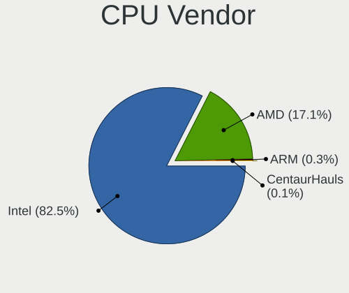

| Vendor       | Computers | Percent |
|--------------|-----------|---------|
| Intel        | 613       | 82.5%   |
| AMD          | 127       | 17.09%  |
| ARM          | 2         | 0.27%   |
| CentaurHauls | 1         | 0.13%   |

CPU Model
---------

Processor models

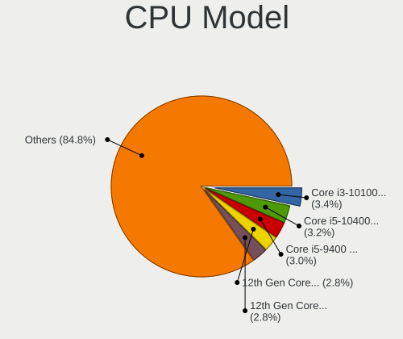

| Model                                         | Computers | Percent |
|-----------------------------------------------|-----------|---------|
| Intel Core i3-10100 CPU @ 3.60GHz             | 25        | 3.36%   |
| Intel Core i5-10400 CPU @ 2.90GHz             | 24        | 3.22%   |
| Intel Core i5-9400 CPU @ 2.90GHz              | 22        | 2.95%   |
| Intel 12th Gen Core i5-12400                  | 21        | 2.82%   |
| Intel 12th Gen Core i3-12100                  | 21        | 2.82%   |
| Intel Core i5-8265U CPU @ 1.60GHz             | 18        | 2.42%   |
| Intel Core i3-10105 CPU @ 3.70GHz             | 11        | 1.48%   |
| Intel 11th Gen Core i5-1135G7 @ 2.40GHz       | 11        | 1.48%   |
| Intel Pentium Gold G5400 CPU @ 3.70GHz        | 8         | 1.07%   |
| Intel Core i5-3470 CPU @ 3.20GHz              | 8         | 1.07%   |
| Intel Core i5-8279U CPU @ 2.40GHz             | 7         | 0.94%   |
| Intel 12th Gen Core i3-1215U                  | 7         | 0.94%   |
| AMD Ryzen 5 3500U with Radeon Vega Mobile Gfx | 7         | 0.94%   |
| Intel Core i5-8400T CPU @ 1.70GHz             | 6         | 0.81%   |
| Intel Core i5-10500 CPU @ 3.10GHz             | 6         | 0.81%   |
| Intel Core i3-8100T CPU @ 3.10GHz             | 6         | 0.81%   |
| Intel Core i3-2120 CPU @ 3.30GHz              | 6         | 0.81%   |
| Intel Core 2 Duo CPU E8400 @ 3.00GHz          | 6         | 0.81%   |
| Intel 11th Gen Core i5-11400 @ 2.60GHz        | 6         | 0.81%   |
| Intel 11th Gen Core i3-1115G4 @ 3.00GHz       | 6         | 0.81%   |
| Intel Core i5-8259U CPU @ 2.30GHz             | 5         | 0.67%   |
| Intel Core i5-10210U CPU @ 1.60GHz            | 5         | 0.67%   |
| Intel Core i3-9100 CPU @ 3.60GHz              | 5         | 0.67%   |
| Intel Core i3-8100 CPU @ 3.60GHz              | 5         | 0.67%   |
| Intel Core i3-3240 CPU @ 3.40GHz              | 5         | 0.67%   |
| Intel Celeron J4125 CPU @ 2.00GHz             | 5         | 0.67%   |
| Intel 12th Gen Core i5-1235U                  | 5         | 0.67%   |
| AMD Ryzen 5 PRO 4650G with Radeon Graphics    | 5         | 0.67%   |
| AMD Ryzen 5 5600G with Radeon Graphics        | 5         | 0.67%   |
| AMD Ryzen 5 5500U with Radeon Graphics        | 5         | 0.67%   |
| AMD Ryzen 3 5300U with Radeon Graphics        | 5         | 0.67%   |
| Intel Pentium Gold G5420 CPU @ 3.80GHz        | 4         | 0.54%   |
| Intel N100                                    | 4         | 0.54%   |
| Intel Core i7-2600 CPU @ 3.40GHz              | 4         | 0.54%   |
| Intel Core i5-8400 CPU @ 2.80GHz              | 4         | 0.54%   |
| Intel Core i5-6500 CPU @ 3.20GHz              | 4         | 0.54%   |
| Intel Core i5-4460 CPU @ 3.20GHz              | 4         | 0.54%   |
| Intel Core i5-2400 CPU @ 3.10GHz              | 4         | 0.54%   |
| Intel Core i5-1035G1 CPU @ 1.00GHz            | 4         | 0.54%   |
| Intel Core i3-1005G1 CPU @ 1.20GHz            | 4         | 0.54%   |

CPU Model Family
----------------

Processor model prefix

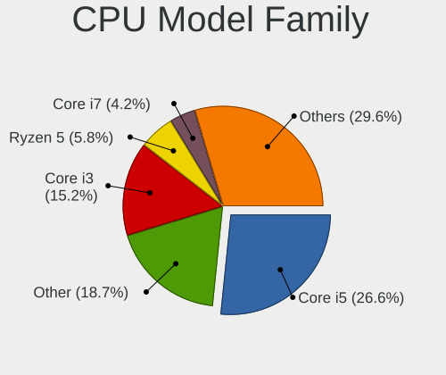

| Model                          | Computers | Percent |
|--------------------------------|-----------|---------|
| Intel Core i5                  | 198       | 26.61%  |
| Other                          | 139       | 18.68%  |
| Intel Core i3                  | 113       | 15.19%  |
| AMD Ryzen 5                    | 43        | 5.78%   |
| Intel Core i7                  | 31        | 4.17%   |
| AMD Ryzen 3                    | 27        | 3.63%   |
| Intel Pentium                  | 26        | 3.49%   |
| Intel Celeron                  | 26        | 3.49%   |
| Intel Pentium Gold             | 19        | 2.55%   |
| Intel Core 2 Duo               | 16        | 2.15%   |
| Intel Xeon                     | 15        | 2.02%   |
| AMD Ryzen 7                    | 15        | 2.02%   |
| AMD Ryzen 5 PRO                | 7         | 0.94%   |
| Intel Pentium Dual-Core        | 6         | 0.81%   |
| Intel Pentium Dual             | 6         | 0.81%   |
| AMD Ryzen 9                    | 6         | 0.81%   |
| AMD A6                         | 6         | 0.81%   |
| Intel Core                     | 4         | 0.54%   |
| Intel Xeon Gold                | 3         | 0.4%    |
| Intel Pentium 4                | 3         | 0.4%    |
| Intel Core 2 Quad              | 3         | 0.4%    |
| AMD FX                         | 3         | 0.4%    |
| AMD Athlon II X2               | 3         | 0.4%    |
| Intel Xeon Silver              | 2         | 0.27%   |
| Intel Pentium Silver           | 2         | 0.27%   |
| AMD Ryzen 7 PRO                | 2         | 0.27%   |
| AMD Ryzen 3 PRO                | 2         | 0.27%   |
| AMD Phenom II                  | 2         | 0.27%   |
| AMD Embedded                   | 2         | 0.27%   |
| AMD Athlon                     | 2         | 0.27%   |
| AMD A4                         | 2         | 0.27%   |
| Intel Xeon Bronze              | 1         | 0.13%   |
| Intel Genuine                  | 1         | 0.13%   |
| Intel Core 2                   | 1         | 0.13%   |
| Intel Celeron Dual-Core        | 1         | 0.13%   |
| Intel Atom                     | 1         | 0.13%   |
| AMD Turion X2 Dual-Core Mobile | 1         | 0.13%   |
| AMD Turion II                  | 1         | 0.13%   |
| AMD Phenom                     | 1         | 0.13%   |
| AMD Athlon II X4               | 1         | 0.13%   |

CPU Cores
---------

Number of processor cores

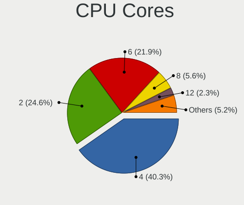

| Number | Computers | Percent |
|--------|-----------|---------|
| 4      | 300       | 40.32%  |
| 2      | 183       | 24.6%   |
| 6      | 163       | 21.91%  |
| 8      | 42        | 5.65%   |
| 12     | 17        | 2.28%   |
| 10     | 10        | 1.34%   |
| 1      | 9         | 1.21%   |
| 16     | 5         | 0.67%   |
| 14     | 5         | 0.67%   |
| 24     | 2         | 0.27%   |
| 20     | 2         | 0.27%   |
| 3      | 2         | 0.27%   |
| 52     | 1         | 0.13%   |
| 40     | 1         | 0.13%   |
| 36     | 1         | 0.13%   |
| 28     | 1         | 0.13%   |

CPU Sockets
-----------

Number of sockets

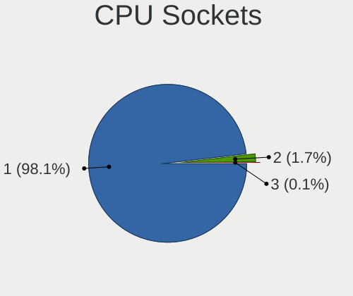

| Number | Computers | Percent |
|--------|-----------|---------|
| 1      | 729       | 98.12%  |
| 2      | 13        | 1.75%   |
| 3      | 1         | 0.13%   |

CPU Threads
-----------

Threads per core (Hyper-Threading)

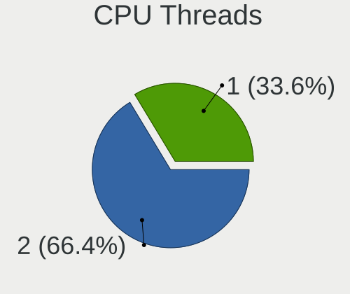

| Number | Computers | Percent |
|--------|-----------|---------|
| 2      | 493       | 66.35%  |
| 1      | 250       | 33.65%  |

CPU Op-Modes
------------

CPU Operation Modes (32-bit, 64-bit)

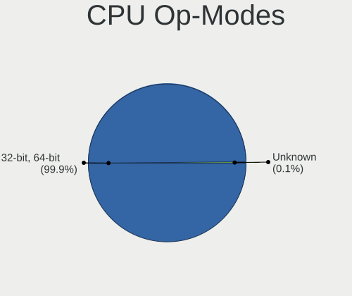

| Op mode        | Computers | Percent |
|----------------|-----------|---------|
| 32-bit, 64-bit | 742       | 99.87%  |
| Unknown        | 1         | 0.13%   |

CPU Microcode
-------------

Microcode number

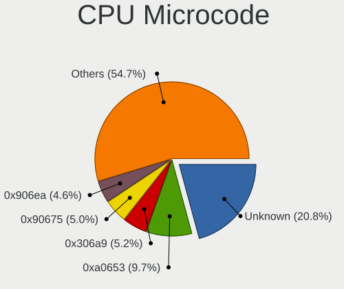

| Number     | Computers | Percent |
|------------|-----------|---------|
| Unknown    | 157       | 20.79%  |
| 0xa0653    | 73        | 9.67%   |
| 0x306a9    | 39        | 5.17%   |
| 0x90675    | 38        | 5.03%   |
| 0x906ea    | 35        | 4.64%   |
| 0x206a7    | 28        | 3.71%   |
| 0x806ec    | 26        | 3.44%   |
| 0x306c3    | 23        | 3.05%   |
| 0x806c1    | 17        | 2.25%   |
| 0x906ed    | 16        | 2.12%   |
| 0x1067a    | 16        | 2.12%   |
| 0x906eb    | 15        | 1.99%   |
| 0x806ea    | 14        | 1.85%   |
| 0x506e3    | 12        | 1.59%   |
| 0x08600106 | 12        | 1.59%   |
| 0xa0671    | 11        | 1.46%   |
| 0x906a4    | 11        | 1.46%   |
| 0x0a50000c | 11        | 1.46%   |
| 0x08108109 | 11        | 1.46%   |
| 0x08608103 | 10        | 1.32%   |
| 0x906e9    | 9         | 1.19%   |
| 0x906a3    | 9         | 1.19%   |
| 0x706e5    | 8         | 1.06%   |
| 0x6fd      | 8         | 1.06%   |
| 0x0a50000d | 7         | 0.93%   |
| 0x50657    | 6         | 0.79%   |
| 0x08108102 | 6         | 0.79%   |
| 0xa0655    | 5         | 0.66%   |
| 0x90672    | 5         | 0.66%   |
| 0x40651    | 5         | 0.66%   |
| 0x706a8    | 4         | 0.53%   |
| 0x08101016 | 4         | 0.53%   |
| 0x0810100b | 4         | 0.53%   |
| 0x010000c8 | 4         | 0.53%   |
| 0xf49      | 3         | 0.4%    |
| 0x806d1    | 3         | 0.4%    |
| 0x806c2    | 3         | 0.4%    |
| 0x406e3    | 3         | 0.4%    |
| 0x306f2    | 3         | 0.4%    |
| 0x20652    | 3         | 0.4%    |

CPU Microarch
-------------

Microarchitecture

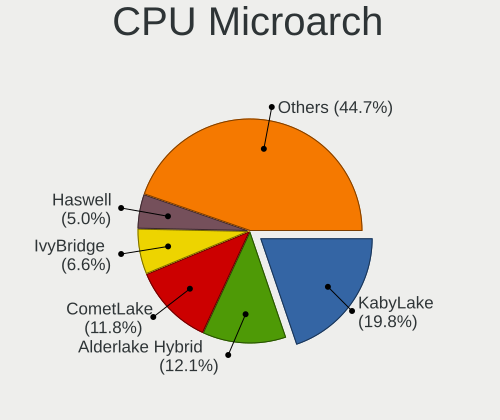

| Name              | Computers | Percent |
|-------------------|-----------|---------|
| KabyLake          | 147       | 19.78%  |
| Alderlake Hybrid  | 90        | 12.11%  |
| CometLake         | 88        | 11.84%  |
| IvyBridge         | 49        | 6.59%   |
| Haswell           | 37        | 4.98%   |
| Unknown           | 36        | 4.85%   |
| SandyBridge       | 35        | 4.71%   |
| Zen 3             | 27        | 3.63%   |
| Skylake           | 26        | 3.5%    |
| TigerLake         | 25        | 3.36%   |
| Icelake           | 24        | 3.23%   |
| Zen+              | 21        | 2.83%   |
| Zen 2             | 21        | 2.83%   |
| Penryn            | 21        | 2.83%   |
| Core              | 14        | 1.88%   |
| Westmere          | 11        | 1.48%   |
| Zen               | 10        | 1.35%   |
| Goldmont plus     | 9         | 1.21%   |
| K10               | 8         | 1.08%   |
| Excavator         | 7         | 0.94%   |
| Goldmont          | 6         | 0.81%   |
| Nehalem           | 5         | 0.67%   |
| Gracemont         | 5         | 0.67%   |
| Silvermont        | 4         | 0.54%   |
| Piledriver        | 4         | 0.54%   |
| NetBurst          | 3         | 0.4%    |
| Broadwell         | 3         | 0.4%    |
| Bulldozer         | 2         | 0.27%   |
| Meteorlake Hybrid | 1         | 0.13%   |
| Lunarlake Hybrid  | 1         | 0.13%   |
| K8 & K10 hybrid   | 1         | 0.13%   |
| K10 Llano         | 1         | 0.13%   |
| Bonnell           | 1         | 0.13%   |

Graphics
--------

GPU Vendor
----------

Vendors of graphics cards

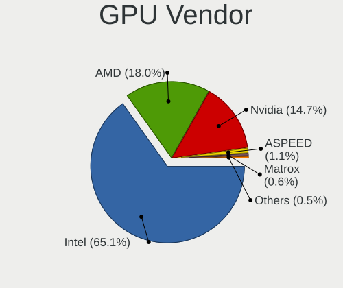

| Vendor                           | Computers | Percent |
|----------------------------------|-----------|---------|
| Intel                            | 529       | 65.15%  |
| AMD                              | 146       | 17.98%  |
| Nvidia                           | 119       | 14.66%  |
| ASPEED Technology                | 9         | 1.11%   |
| Matrox Electronics Systems       | 5         | 0.62%   |
| ATI Technologies                 | 2         | 0.25%   |
| Zhaoxin                          | 1         | 0.12%   |
| Silicon Integrated Systems [SiS] | 1         | 0.12%   |

GPU Model
---------

Graphics card models

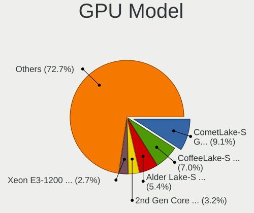

| Model                                                                       | Computers | Percent |
|-----------------------------------------------------------------------------|-----------|---------|
| Intel CometLake-S GT2 [UHD Graphics 630]                                    | 75        | 9.15%   |
| Intel CoffeeLake-S GT2 [UHD Graphics 630]                                   | 57        | 6.95%   |
| Intel Alder Lake-S GT1 [UHD Graphics 730]                                   | 44        | 5.37%   |
| Intel 2nd Generation Core Processor Family Integrated Graphics Controller   | 26        | 3.17%   |
| Intel Xeon E3-1200 v2/3rd Gen Core processor Graphics Controller            | 22        | 2.68%   |
| Intel Xeon E3-1200 v3/4th Gen Core Processor Integrated Graphics Controller | 21        | 2.56%   |
| Intel WhiskeyLake-U GT2 [UHD Graphics 620]                                  | 21        | 2.56%   |
| AMD Picasso/Raven 2 [Radeon Vega Series / Radeon Vega Mobile Series]        | 18        | 2.2%    |
| AMD Cezanne [Radeon Vega Series / Radeon Vega Mobile Series]                | 18        | 2.2%    |
| Intel TigerLake-LP GT2 [Iris Xe Graphics]                                   | 17        | 2.07%   |
| AMD Renoir [Radeon Vega Series / Radeon Vega Mobile Series]                 | 17        | 2.07%   |
| Intel 3rd Gen Core processor Graphics Controller                            | 16        | 1.95%   |
| Intel 82945G/GZ Integrated Graphics Controller                              | 15        | 1.83%   |
| Intel CoffeeLake-U GT3e [Iris Plus Graphics 655]                            | 12        | 1.46%   |
| Intel CoffeeLake-S GT1 [UHD Graphics 610]                                   | 12        | 1.46%   |
| AMD Lucienne                                                                | 12        | 1.46%   |
| Intel Skylake-S GT2 [HD Graphics 530]                                       | 10        | 1.22%   |
| Nvidia GT218 [GeForce 210]                                                  | 9         | 1.1%    |
| Intel Kaby Lake-S GT2 [HD Graphics 630]                                     | 9         | 1.1%    |
| Intel Alder Lake-S GT1 [UHD Graphics 770]                                   | 9         | 1.1%    |
| ASPEED Technology ASPEED Graphics Family                                    | 9         | 1.1%    |
| Intel Tiger Lake-LP GT2 [UHD Graphics G4]                                   | 8         | 0.98%   |
| Intel Iris Plus Graphics G1 (Ice Lake)                                      | 8         | 0.98%   |
| Intel 4 Series Chipset Integrated Graphics Controller                       | 8         | 0.98%   |
| Nvidia GK208B [GeForce GT 710]                                              | 7         | 0.85%   |
| Intel GeminiLake [UHD Graphics 600]                                         | 7         | 0.85%   |
| Intel CometLake-U GT2 [UHD Graphics]                                        | 7         | 0.85%   |
| Intel Alder Lake-UP3 GT2 [Iris Xe Graphics]                                 | 7         | 0.85%   |
| Intel Alder Lake-UP3 GT1 [UHD Graphics]                                     | 7         | 0.85%   |
| AMD Raven Ridge [Radeon Vega Series / Radeon Vega Mobile Series]            | 7         | 0.85%   |
| Intel RocketLake-S GT1 [UHD Graphics 730]                                   | 6         | 0.73%   |
| Intel Raptor Lake-P [UHD Graphics]                                          | 6         | 0.73%   |
| Intel Haswell-ULT Integrated Graphics Controller                            | 6         | 0.73%   |
| Intel Alder Lake-N [UHD Graphics]                                           | 6         | 0.73%   |
| Nvidia GF117M [GeForce 610M/710M/810M/820M / GT 620M/625M/630M/720M]        | 5         | 0.61%   |
| Intel Core Processor Integrated Graphics Controller                         | 5         | 0.61%   |
| AMD Mendocino [Radeon 610M]                                                 | 5         | 0.61%   |
| Nvidia TU117M [GeForce GTX 1650 Mobile / Max-Q]                             | 4         | 0.49%   |
| Intel Skylake-U GT2 [HD Graphics 520]                                       | 4         | 0.49%   |
| Intel RocketLake-S GT1 [UHD Graphics 750]                                   | 4         | 0.49%   |

GPU Combo
---------

Combinations of graphics cards

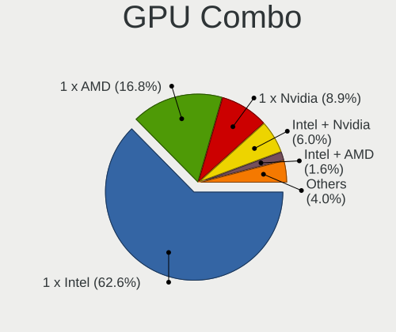

| Name            | Computers | Percent |
|-----------------|-----------|---------|
| 1 x Intel       | 466       | 62.63%  |
| 1 x AMD         | 125       | 16.8%   |
| 1 x Nvidia      | 66        | 8.87%   |
| Intel + Nvidia  | 45        | 6.05%   |
| Intel + AMD     | 12        | 1.61%   |
| 1 x ASPEED      | 8         | 1.08%   |
| AMD + Nvidia    | 6         | 0.81%   |
| 2 x AMD         | 5         | 0.67%   |
| 1 x Matrox      | 5         | 0.67%   |
| Other           | 2         | 0.27%   |
| 2 x Nvidia      | 1         | 0.13%   |
| 1 x Zhaoxin     | 1         | 0.13%   |
| 1 x SiS         | 1         | 0.13%   |
| Nvidia + ASPEED | 1         | 0.13%   |

GPU Driver
----------

Free vs proprietary

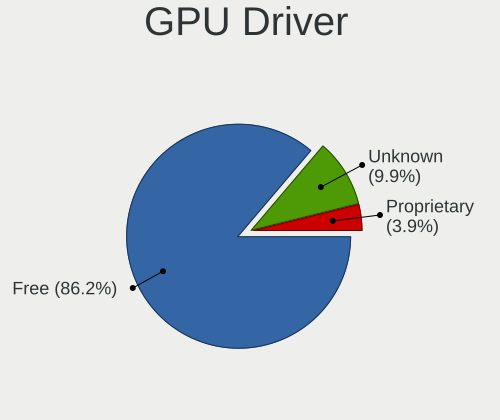

| Driver      | Computers | Percent |
|-------------|-----------|---------|
| Free        | 644       | 86.21%  |
| Unknown     | 74        | 9.91%   |
| Proprietary | 29        | 3.88%   |

GPU Memory
----------

Total video memory

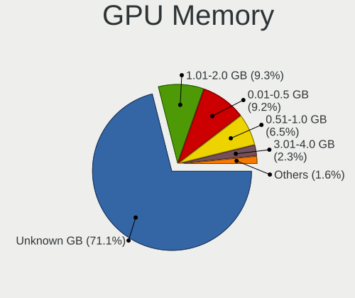

| Size in GB | Computers | Percent |
|------------|-----------|---------|
| Unknown    | 533       | 71.07%  |
| 1.01-2.0   | 70        | 9.33%   |
| 0.01-0.5   | 69        | 9.2%    |
| 0.51-1.0   | 49        | 6.53%   |
| 3.01-4.0   | 17        | 2.27%   |
| 7.01-8.0   | 7         | 0.93%   |
| 2.01-3.0   | 2         | 0.27%   |
| 8.01-16.0  | 2         | 0.27%   |
| 5.01-6.0   | 1         | 0.13%   |

Monitor
-------

Monitor Vendor
--------------

Monitor vendors

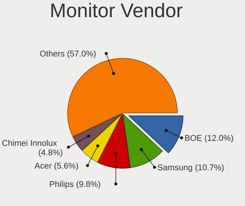

| Vendor                  | Computers | Percent |
|-------------------------|-----------|---------|
| BOE                     | 87        | 11.98%  |
| Samsung Electronics     | 78        | 10.74%  |
| Philips                 | 71        | 9.78%   |
| Acer                    | 41        | 5.65%   |
| Chimei Innolux          | 35        | 4.82%   |
| LG Display              | 33        | 4.55%   |
| Hewlett-Packard         | 33        | 4.55%   |
| ViewSonic               | 28        | 3.86%   |
| AOC                     | 28        | 3.86%   |
| Lenovo                  | 27        | 3.72%   |
| Goldstar                | 25        | 3.44%   |
| Dell                    | 24        | 3.31%   |
| AU Optronics            | 23        | 3.17%   |
| BenQ                    | 22        | 3.03%   |
| ASUSTek Computer        | 15        | 2.07%   |
| SGT                     | 11        | 1.52%   |
| Ancor Communications    | 8         | 1.1%    |
| RTK                     | 7         | 0.96%   |
| NEC Computers           | 7         | 0.96%   |
| PANDA                   | 6         | 0.83%   |
| Iiyama                  | 6         | 0.83%   |
| CS_                     | 6         | 0.83%   |
| SKM                     | 5         | 0.69%   |
| Chi Mei Optoelectronics | 5         | 0.69%   |
| VIE                     | 4         | 0.55%   |
| TR_                     | 4         | 0.55%   |
| IPS                     | 4         | 0.55%   |
| HUAWEI                  | 4         | 0.55%   |
| ECS                     | 4         | 0.55%   |
| Daewoo                  | 4         | 0.55%   |
| CSOT                    | 4         | 0.55%   |
| CHD                     | 4         | 0.55%   |
| VSD                     | 3         | 0.41%   |
| Toshiba                 | 3         | 0.41%   |
| TMX                     | 3         | 0.41%   |
| Sony                    | 3         | 0.41%   |
| OOO                     | 3         | 0.41%   |
| MSI                     | 3         | 0.41%   |
| CSO                     | 3         | 0.41%   |
| XYM                     | 2         | 0.28%   |

Monitor Model
-------------

Monitor models

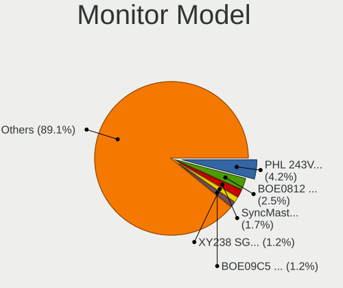

| Model                                                                | Computers | Percent |
|----------------------------------------------------------------------|-----------|---------|
| Philips PHL 243V7 PHLC155 1920x1080 527x296mm 23.8-inch              | 31        | 4.16%   |
| BOE LCD Monitor BOE0812 1920x1080 344x194mm 15.5-inch                | 19        | 2.55%   |
| Samsung Electronics SyncMaster SAM036E 1280x1024 376x301mm 19.0-inch | 13        | 1.74%   |
| SGT XY238 SGT2386 1920x1080 530x290mm 23.8-inch                      | 9         | 1.21%   |
| BOE LCD Monitor BOE09C5 1920x1080 345x194mm 15.6-inch                | 9         | 1.21%   |
| Samsung Electronics SyncMaster SAM01B7 1280x1024 340x270mm 17.1-inch | 7         | 0.94%   |
| Philips PHL 243V5 PHLC0D1 1920x1080 521x293mm 23.5-inch              | 7         | 0.94%   |
| Philips 226VL PHLC081 1920x1080 480x268mm 21.6-inch                  | 7         | 0.94%   |
| ViewSonic VA2719-2K VSC6B34 2560x1440 597x336mm 27.0-inch            | 6         | 0.8%    |
| Lenovo TIO22Gen4 LEN111A 1920x1080 476x268mm 21.5-inch               | 6         | 0.8%    |
| CS_ LCD Monitor CS_5211 1920x1080 527x296mm 23.8-inch                | 6         | 0.8%    |
| SKM T24 Air SKM9322 1920x1080 519x324mm 24.1-inch                    | 5         | 0.67%   |
| Chimei Innolux LCD Monitor CMN151E 1920x1080 344x193mm 15.5-inch     | 5         | 0.67%   |
| BOE LCD Monitor BOE0872 1920x1080 344x194mm 15.5-inch                | 5         | 0.67%   |
| BOE LCD Monitor BOE0700 1920x1080 344x194mm 15.5-inch                | 5         | 0.67%   |
| Acer SA240Y ACR057F 1920x1080 527x296mm 23.8-inch                    | 5         | 0.67%   |
| Acer AIO LCD ACR40B0 1920x1080 527x296mm 23.8-inch                   | 5         | 0.67%   |
| TR_ LCD Monitor TR_5511 1920x1080 519x324mm 24.1-inch                | 4         | 0.54%   |
| Samsung Electronics S24B300 SAM08B3 1920x1080 521x293mm 23.5-inch    | 4         | 0.54%   |
| Philips PHL 240V5 PHLC10A 1920x1080 527x296mm 23.8-inch              | 4         | 0.54%   |
| Lenovo LEN-V5S5/S4-B LEN1201 1920x1080 527x296mm 23.8-inch           | 4         | 0.54%   |
| Hewlett-Packard ALL-in-One HPN4026 1920x1080 598x336mm 27.0-inch     | 4         | 0.54%   |
| ECS AIO PC ECS2486 1920x1080 520x300mm 23.6-inch                     | 4         | 0.54%   |
| Chimei Innolux LCD Monitor CMN15F5 1920x1080 344x193mm 15.5-inch     | 4         | 0.54%   |
| Chimei Innolux LCD Monitor CMN15E7 1920x1080 344x193mm 15.5-inch     | 4         | 0.54%   |
| BOE LCD Monitor BOE0936 1920x1080 344x194mm 15.5-inch                | 4         | 0.54%   |
| BenQ GW2270 BNQ78DB 1920x1080 476x268mm 21.5-inch                    | 4         | 0.54%   |
| AOC 2470W AOC2470 1920x1080 521x293mm 23.5-inch                      | 4         | 0.54%   |
| ViewSonic VA2465 SERIES VSCB730 1920x1080 521x293mm 23.5-inch        | 3         | 0.4%    |
| ViewSonic VA2046 SERIES VSC6D2E 1600x900 432x240mm 19.5-inch         | 3         | 0.4%    |
| VIE J2475FFHD VIE1919 1920x1080 520x310mm 23.8-inch                  | 3         | 0.4%    |
| Samsung Electronics S20D300 SAM0BDB 1366x768 432x240mm 19.5-inch     | 3         | 0.4%    |
| Samsung Electronics S20B300 SAM08A8 1600x900 443x249mm 20.0-inch     | 3         | 0.4%    |
| RTK HDMI RTK2732 2560x1440 597x336mm 27.0-inch                       | 3         | 0.4%    |
| Philips PHL 273V7 PHLC156 1920x1080 598x336mm 27.0-inch              | 3         | 0.4%    |
| LG Display LCD Monitor LGD062E 1920x1080 344x194mm 15.5-inch         | 3         | 0.4%    |
| LG Display LCD Monitor LGD02DC 1366x768 344x194mm 15.5-inch          | 3         | 0.4%    |
| Lenovo LEN-B-A LENF908 1920x1080 527x296mm 23.8-inch                 | 3         | 0.4%    |
| Goldstar E2042 GSM4ED7 1600x900 443x249mm 20.0-inch                  | 3         | 0.4%    |
| Daewoo HDMI DWE2100 1280x1024 476x268mm 21.5-inch                    | 3         | 0.4%    |

Monitor Resolution
------------------

Monitor screen resolution

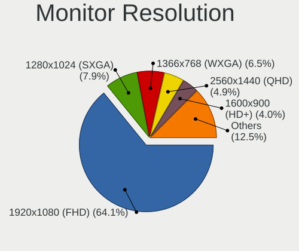

| Resolution         | Computers | Percent |
|--------------------|-----------|---------|
| 1920x1080 (FHD)    | 431       | 64.14%  |
| 1280x1024 (SXGA)   | 53        | 7.89%   |
| 1366x768 (WXGA)    | 44        | 6.55%   |
| 2560x1440 (QHD)    | 33        | 4.91%   |
| 1600x900 (HD+)     | 27        | 4.02%   |
| 3840x2160 (4K)     | 20        | 2.98%   |
| 1920x1200 (WUXGA)  | 19        | 2.83%   |
| 2560x1600          | 12        | 1.79%   |
| 2560x1080          | 6         | 0.89%   |
| 1680x1050 (WSXGA+) | 5         | 0.74%   |
| 3440x1440          | 4         | 0.6%    |
| 1440x900 (WXGA+)   | 3         | 0.45%   |
| 1280x800 (WXGA)    | 3         | 0.45%   |
| 1024x768 (XGA)     | 3         | 0.45%   |
| 1600x1200          | 2         | 0.3%    |
| 3840x2560          | 1         | 0.15%   |
| 3200x2000          | 1         | 0.15%   |
| 2880x1800          | 1         | 0.15%   |
| 2240x1400          | 1         | 0.15%   |
| 2160x1440          | 1         | 0.15%   |
| 1360x768           | 1         | 0.15%   |
| 1280x960           | 1         | 0.15%   |

Monitor Diagonal
----------------

Diagonal size in inches

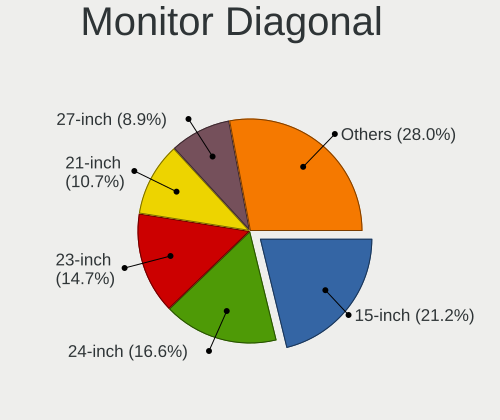

| Inches  | Computers | Percent |
|---------|-----------|---------|
| 15      | 153       | 21.19%  |
| 24      | 120       | 16.62%  |
| 23      | 106       | 14.68%  |
| 21      | 77        | 10.66%  |
| 27      | 64        | 8.86%   |
| 19      | 40        | 5.54%   |
| 17      | 36        | 4.99%   |
| 20      | 17        | 2.35%   |
| 14      | 15        | 2.08%   |
| 34      | 10        | 1.39%   |
| 16      | 10        | 1.39%   |
| 31      | 9         | 1.25%   |
| 32      | 8         | 1.11%   |
| 13      | 8         | 1.11%   |
| 18      | 7         | 0.97%   |
| 26      | 6         | 0.83%   |
| 22      | 6         | 0.83%   |
| Unknown | 6         | 0.83%   |
| 12      | 5         | 0.69%   |
| 84      | 2         | 0.28%   |
| 54      | 2         | 0.28%   |
| 40      | 2         | 0.28%   |
| 28      | 2         | 0.28%   |
| 25      | 2         | 0.28%   |
| 11      | 2         | 0.28%   |
| 64      | 1         | 0.14%   |
| 63      | 1         | 0.14%   |
| 57      | 1         | 0.14%   |
| 55      | 1         | 0.14%   |
| 52      | 1         | 0.14%   |
| 49      | 1         | 0.14%   |
| 46      | 1         | 0.14%   |

Monitor Width
-------------

Physical width

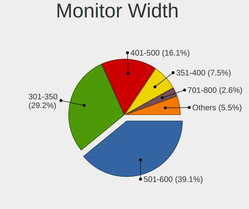

| Width in mm | Computers | Percent |
|-------------|-----------|---------|
| 501-600     | 270       | 39.07%  |
| 301-350     | 202       | 29.23%  |
| 401-500     | 111       | 16.06%  |
| 351-400     | 52        | 7.53%   |
| 701-800     | 18        | 2.6%    |
| 601-700     | 11        | 1.59%   |
| 1001-1500   | 9         | 1.3%    |
| 201-300     | 8         | 1.16%   |
| Unknown     | 6         | 0.87%   |
| 1501-2000   | 2         | 0.29%   |
| 901-1000    | 2         | 0.29%   |

Aspect Ratio
------------

Proportional relationship between the width and the height

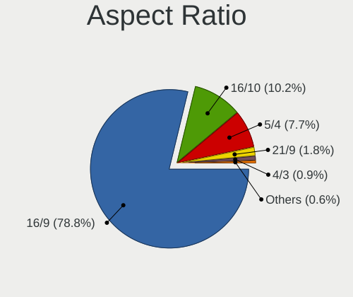

| Ratio | Computers | Percent |
|-------|-----------|---------|
| 16/9  | 520       | 78.79%  |
| 16/10 | 67        | 10.15%  |
| 5/4   | 51        | 7.73%   |
| 21/9  | 12        | 1.82%   |
| 4/3   | 6         | 0.91%   |
| 6/5   | 2         | 0.3%    |
| 32/9  | 1         | 0.15%   |
| 3/2   | 1         | 0.15%   |

Monitor Area
------------

Area in inch²

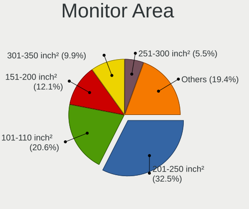

| Area in inch² | Computers | Percent |
|----------------|-----------|---------|
| 201-250        | 229       | 32.48%  |
| 101-110        | 145       | 20.57%  |
| 151-200        | 85        | 12.06%  |
| 301-350        | 70        | 9.93%   |
| 251-300        | 39        | 5.53%   |
| 351-500        | 28        | 3.97%   |
| 141-150        | 25        | 3.55%   |
| 81-90          | 22        | 3.12%   |
| 111-120        | 17        | 2.41%   |
| 121-130        | 12        | 1.7%    |
| More than 1000 | 9         | 1.28%   |
| 131-140        | 6         | 0.85%   |
| Unknown        | 6         | 0.85%   |
| 61-70          | 5         | 0.71%   |
| 501-1000       | 4         | 0.57%   |
| 51-60          | 2         | 0.28%   |
| 71-80          | 1         | 0.14%   |

Pixel Density
-------------

Pixels per inch

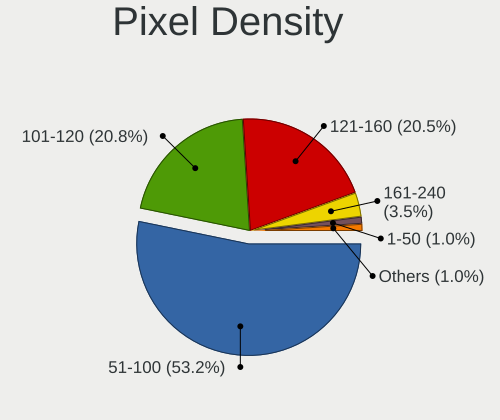

| Density       | Computers | Percent |
|---------------|-----------|---------|
| 51-100        | 364       | 53.22%  |
| 101-120       | 142       | 20.76%  |
| 121-160       | 140       | 20.47%  |
| 161-240       | 24        | 3.51%   |
| 1-50          | 7         | 1.02%   |
| Unknown       | 6         | 0.88%   |
| More than 240 | 1         | 0.15%   |

Multiple Monitors
-----------------

Total monitors connected

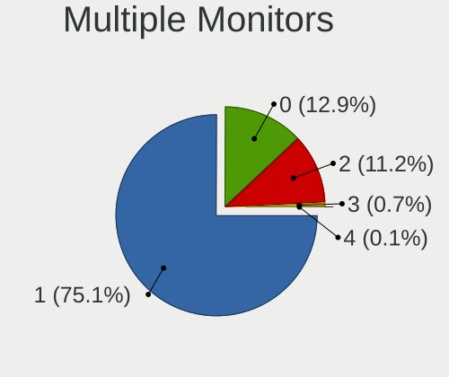

| Total | Computers | Percent |
|-------|-----------|---------|
| 1     | 569       | 75.07%  |
| 0     | 98        | 12.93%  |
| 2     | 85        | 11.21%  |
| 3     | 5         | 0.66%   |
| 4     | 1         | 0.13%   |

Network
-------

Net Controller Vendor
---------------------

Controller vendors

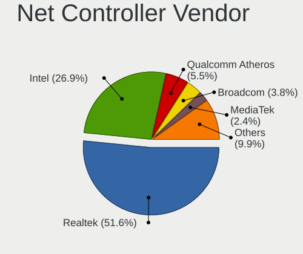

| Vendor                                 | Computers | Percent |
|----------------------------------------|-----------|---------|
| Realtek Semiconductor                  | 522       | 51.58%  |
| Intel                                  | 272       | 26.88%  |
| Qualcomm Atheros                       | 56        | 5.53%   |
| Broadcom                               | 38        | 3.75%   |
| MediaTek                               | 24        | 2.37%   |
| Xiaomi                                 | 18        | 1.78%   |
| TP-Link                                | 10        | 0.99%   |
| Ralink                                 | 7         | 0.69%   |
| Nvidia                                 | 6         | 0.59%   |
| Samsung Electronics                    | 5         | 0.49%   |
| Ralink Technology                      | 5         | 0.49%   |
| OPPO Electronics                       | 5         | 0.49%   |
| Mercucys                               | 5         | 0.49%   |
| ASIX Electronics                       | 4         | 0.4%    |
| Xilinx                                 | 3         | 0.3%    |
| Qualcomm                               | 3         | 0.3%    |
| Huawei Technologies                    | 3         | 0.3%    |
| D-Link                                 | 3         | 0.3%    |
| Broadcom Limited                       | 3         | 0.3%    |
| Mellanox Technologies                  | 2         | 0.2%    |
| American Megatrends                    | 2         | 0.2%    |
| VIA Technologies                       | 1         | 0.1%    |
| Suzhou Motorcomm Electronic Technology | 1         | 0.1%    |
| Spreadtrum Communications              | 1         | 0.1%    |
| Sony Ericsson Mobile Communications AB | 1         | 0.1%    |
| Silicon Integrated Systems [SiS]       | 1         | 0.1%    |
| Qualcomm Atheros Communications        | 1         | 0.1%    |
| QinHeng Electronics                    | 1         | 0.1%    |
| OKB SAPR                               | 1         | 0.1%    |
| Metrologic Instruments                 | 1         | 0.1%    |
| Marvell Technology Group               | 1         | 0.1%    |
| Linksys                                | 1         | 0.1%    |
| Google                                 | 1         | 0.1%    |
| Edimax Technology                      | 1         | 0.1%    |
| Dell                                   | 1         | 0.1%    |
| ASUSTek Computer                       | 1         | 0.1%    |
| 802.11g Adapter [Linksys WUSB54GC v3]  | 1         | 0.1%    |

Net Controller Model
--------------------

Controller models

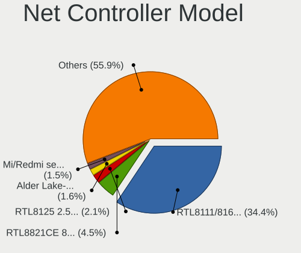

| Model                                                                  | Computers | Percent |
|------------------------------------------------------------------------|-----------|---------|
| Realtek RTL8111/8168/8211/8411 PCI Express Gigabit Ethernet Controller | 408       | 34.37%  |
| Realtek RTL8821CE 802.11ac PCIe Wireless Network Adapter               | 54        | 4.55%   |
| Realtek RTL8125 2.5GbE Controller                                      | 25        | 2.11%   |
| Intel Alder Lake-P PCH CNVi WiFi                                       | 19        | 1.6%    |
| Xiaomi Mi/Redmi series (RNDIS)                                         | 18        | 1.52%   |
| Realtek RTL8153 Gigabit Ethernet Adapter                               | 17        | 1.43%   |
| Intel Wireless 7265                                                    | 17        | 1.43%   |
| Intel Wi-Fi 6 AX201                                                    | 17        | 1.43%   |
| Realtek RTL810xE PCI Express Fast Ethernet controller                  | 16        | 1.35%   |
| Intel Ethernet Connection (14) I219-V                                  | 16        | 1.35%   |
| Qualcomm Atheros QCA9377 802.11ac Wireless Network Adapter             | 15        | 1.26%   |
| Realtek RTL8822CE 802.11ac PCIe Wireless Network Adapter               | 14        | 1.18%   |
| Intel Wireless 3165                                                    | 14        | 1.18%   |
| Intel Ethernet Connection (2) I219-V                                   | 14        | 1.18%   |
| Intel Ethernet Controller I225-V                                       | 13        | 1.1%    |
| Intel Ethernet Connection (17) I219-V                                  | 13        | 1.1%    |
| Intel Alder Lake-S PCH CNVi WiFi                                       | 12        | 1.01%   |
| Broadcom BCM43142 802.11b/g/n                                          | 12        | 1.01%   |
| Realtek RTL8152 Fast Ethernet Adapter                                  | 11        | 0.93%   |
| Intel Wi-Fi 6 AX200                                                    | 11        | 0.93%   |
| Intel Ethernet Connection (7) I219-V                                   | 11        | 0.93%   |
| Intel Dual Band Wireless-AC 3168NGW [Stone Peak]                       | 11        | 0.93%   |
| Realtek RTL8852BE PCIe 802.11ax Wireless Network Controller            | 10        | 0.84%   |
| Qualcomm Atheros Attansic L1 Gigabit Ethernet                          | 10        | 0.84%   |
| MediaTek MT7921 802.11ax PCIe Wireless Network Adapter [Filogic 330]   | 9         | 0.76%   |
| Intel Ethernet Connection (17) I219-LM                                 | 9         | 0.76%   |
| Intel 82579LM Gigabit Network Connection (Lewisville)                  | 9         | 0.76%   |
| Realtek RTL8188EUS 802.11n Wireless Network Adapter                    | 8         | 0.67%   |
| MediaTek MT7902 802.11ax PCIe Wireless Network Adapter [Filogic 310]   | 8         | 0.67%   |
| Intel Ethernet Connection (6) I219-V                                   | 8         | 0.67%   |
| Qualcomm Atheros AR9285 Wireless Network Adapter (PCI-Express)         | 7         | 0.59%   |
| Realtek RTL8822BE 802.11a/b/g/n/ac WiFi adapter                        | 6         | 0.51%   |
| Intel I211 Gigabit Network Connection                                  | 6         | 0.51%   |
| Intel Dual Band Wireless-AC 3165 Plus Bluetooth                        | 6         | 0.51%   |
| Intel Comet Lake PCH-LP CNVi WiFi                                      | 6         | 0.51%   |
| Intel Comet Lake PCH CNVi WiFi                                         | 6         | 0.51%   |
| Intel Cannon Point-LP CNVi [Wireless-AC]                               | 6         | 0.51%   |
| Intel 82579V Gigabit Network Connection                                | 6         | 0.51%   |
| Realtek RTL8723BE PCIe Wireless Network Adapter                        | 5         | 0.42%   |
| Realtek 802.11ac NIC                                                   | 5         | 0.42%   |

Wireless Vendor
---------------

Wireless vendors

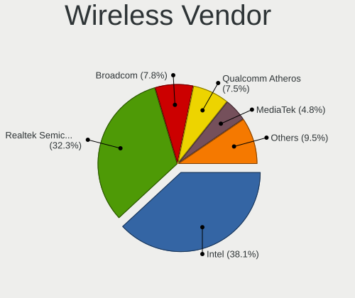

| Vendor                                | Computers | Percent |
|---------------------------------------|-----------|---------|
| Intel                                 | 152       | 38.1%   |
| Realtek Semiconductor                 | 129       | 32.33%  |
| Broadcom                              | 31        | 7.77%   |
| Qualcomm Atheros                      | 30        | 7.52%   |
| MediaTek                              | 19        | 4.76%   |
| TP-Link                               | 9         | 2.26%   |
| Ralink                                | 7         | 1.75%   |
| Ralink Technology                     | 5         | 1.25%   |
| Mercucys                              | 5         | 1.25%   |
| D-Link                                | 3         | 0.75%   |
| Qualcomm                              | 2         | 0.5%    |
| Broadcom Limited                      | 2         | 0.5%    |
| Qualcomm Atheros Communications       | 1         | 0.25%   |
| Linksys                               | 1         | 0.25%   |
| Edimax Technology                     | 1         | 0.25%   |
| ASUSTek Computer                      | 1         | 0.25%   |
| 802.11g Adapter [Linksys WUSB54GC v3] | 1         | 0.25%   |

Wireless Model
--------------

Wireless models

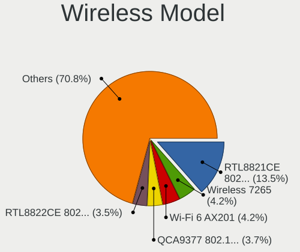

| Model                                                                | Computers | Percent |
|----------------------------------------------------------------------|-----------|---------|
| Realtek RTL8821CE 802.11ac PCIe Wireless Network Adapter             | 54        | 13.47%  |
| Intel Wireless 7265                                                  | 17        | 4.24%   |
| Intel Wi-Fi 6 AX201                                                  | 17        | 4.24%   |
| Qualcomm Atheros QCA9377 802.11ac Wireless Network Adapter           | 15        | 3.74%   |
| Realtek RTL8822CE 802.11ac PCIe Wireless Network Adapter             | 14        | 3.49%   |
| Intel Wireless 3165                                                  | 14        | 3.49%   |
| Broadcom BCM43142 802.11b/g/n                                        | 12        | 2.99%   |
| Intel Wi-Fi 6 AX200                                                  | 11        | 2.74%   |
| Intel Dual Band Wireless-AC 3168NGW [Stone Peak]                     | 11        | 2.74%   |
| Realtek RTL8852BE PCIe 802.11ax Wireless Network Controller          | 9         | 2.24%   |
| MediaTek MT7921 802.11ax PCIe Wireless Network Adapter [Filogic 330] | 9         | 2.24%   |
| Intel Alder Lake-S PCH CNVi WiFi                                     | 9         | 2.24%   |
| Realtek RTL8188EUS 802.11n Wireless Network Adapter                  | 8         | 2%      |
| MediaTek MT7902 802.11ax PCIe Wireless Network Adapter [Filogic 310] | 8         | 2%      |
| Qualcomm Atheros AR9285 Wireless Network Adapter (PCI-Express)       | 7         | 1.75%   |
| Realtek RTL8822BE 802.11a/b/g/n/ac WiFi adapter                      | 6         | 1.5%    |
| Intel Dual Band Wireless-AC 3165 Plus Bluetooth                      | 6         | 1.5%    |
| Intel Comet Lake PCH-LP CNVi WiFi                                    | 6         | 1.5%    |
| Intel Comet Lake PCH CNVi WiFi                                       | 6         | 1.5%    |
| Intel Cannon Point-LP CNVi [Wireless-AC]                             | 6         | 1.5%    |
| Realtek RTL8723BE PCIe Wireless Network Adapter                      | 5         | 1.25%   |
| Realtek 802.11ac NIC                                                 | 5         | 1.25%   |
| Mercucys 802.11n NIC                                                 | 5         | 1.25%   |
| Intel Wireless 8265 / 8275                                           | 5         | 1.25%   |
| Intel Wi-Fi 6E(802.11ax) AX210/AX1675* 2x2 [Typhoon Peak]            | 5         | 1.25%   |
| Intel Tiger Lake PCH CNVi WiFi                                       | 5         | 1.25%   |
| Intel Ice Lake-LP PCH CNVi WiFi                                      | 5         | 1.25%   |
| Broadcom BCM4312 802.11b/g LP-PHY                                    | 5         | 1.25%   |
| Realtek RTL8852AE 802.11ax PCIe Wireless Network Adapter             | 4         | 1%      |
| Realtek 802.11n WLAN Adapter                                         | 4         | 1%      |
| Ralink MT7601U Wireless Adapter                                      | 4         | 1%      |
| Intel Cannon Lake PCH CNVi WiFi                                      | 4         | 1%      |
| Intel Alder Lake-P PCH CNVi WiFi                                     | 4         | 1%      |
| Broadcom BCM43228 802.11a/b/g/n                                      | 4         | 1%      |
| Broadcom BCM4313 802.11bgn Wireless Network Adapter                  | 4         | 1%      |
| Realtek RTL8723BU 802.11b/g/n WLAN Adapter                           | 3         | 0.75%   |
| Realtek RTL8192CU 802.11n WLAN Adapter                               | 3         | 0.75%   |
| Realtek RTL8188EE Wireless Network Adapter                           | 3         | 0.75%   |
| Qualcomm Atheros QCA9565 / AR9565 Wireless Network Adapter           | 3         | 0.75%   |
| Intel Centrino Advanced-N 6205 [Taylor Peak]                         | 3         | 0.75%   |

Ethernet Vendor
---------------

Ethernet vendors

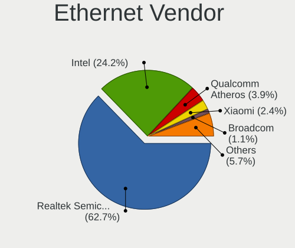

| Vendor                                 | Computers | Percent |
|----------------------------------------|-----------|---------|
| Realtek Semiconductor                  | 471       | 62.72%  |
| Intel                                  | 182       | 24.23%  |
| Qualcomm Atheros                       | 29        | 3.86%   |
| Xiaomi                                 | 18        | 2.4%    |
| Broadcom                               | 8         | 1.07%   |
| Nvidia                                 | 6         | 0.8%    |
| Samsung Electronics                    | 5         | 0.67%   |
| OPPO Electronics                       | 5         | 0.67%   |
| MediaTek                               | 5         | 0.67%   |
| ASIX Electronics                       | 4         | 0.53%   |
| Mellanox Technologies                  | 2         | 0.27%   |
| Huawei Technologies                    | 2         | 0.27%   |
| American Megatrends                    | 2         | 0.27%   |
| VIA Technologies                       | 1         | 0.13%   |
| TP-Link                                | 1         | 0.13%   |
| Suzhou Motorcomm Electronic Technology | 1         | 0.13%   |
| Spreadtrum Communications              | 1         | 0.13%   |
| Sony Ericsson Mobile Communications AB | 1         | 0.13%   |
| Silicon Integrated Systems [SiS]       | 1         | 0.13%   |
| Qualcomm                               | 1         | 0.13%   |
| OKB SAPR                               | 1         | 0.13%   |
| Marvell Technology Group               | 1         | 0.13%   |
| Google                                 | 1         | 0.13%   |
| Dell                                   | 1         | 0.13%   |
| Broadcom Limited                       | 1         | 0.13%   |

Ethernet Model
--------------

Ethernet models

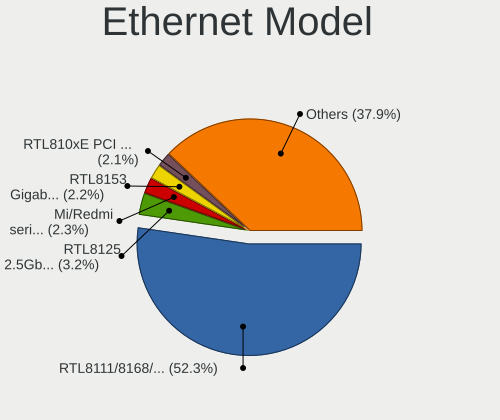

| Model                                                                  | Computers | Percent |
|------------------------------------------------------------------------|-----------|---------|
| Realtek RTL8111/8168/8211/8411 PCI Express Gigabit Ethernet Controller | 408       | 52.31%  |
| Realtek RTL8125 2.5GbE Controller                                      | 25        | 3.21%   |
| Xiaomi Mi/Redmi series (RNDIS)                                         | 18        | 2.31%   |
| Realtek RTL8153 Gigabit Ethernet Adapter                               | 17        | 2.18%   |
| Realtek RTL810xE PCI Express Fast Ethernet controller                  | 16        | 2.05%   |
| Intel Ethernet Connection (14) I219-V                                  | 16        | 2.05%   |
| Intel Alder Lake-P PCH CNVi WiFi                                       | 15        | 1.92%   |
| Intel Ethernet Connection (2) I219-V                                   | 14        | 1.79%   |
| Intel Ethernet Controller I225-V                                       | 13        | 1.67%   |
| Intel Ethernet Connection (17) I219-V                                  | 13        | 1.67%   |
| Realtek RTL8152 Fast Ethernet Adapter                                  | 11        | 1.41%   |
| Intel Ethernet Connection (7) I219-V                                   | 11        | 1.41%   |
| Qualcomm Atheros Attansic L1 Gigabit Ethernet                          | 10        | 1.28%   |
| Intel Ethernet Connection (17) I219-LM                                 | 9         | 1.15%   |
| Intel 82579LM Gigabit Network Connection (Lewisville)                  | 9         | 1.15%   |
| Intel Ethernet Connection (6) I219-V                                   | 8         | 1.03%   |
| Intel I211 Gigabit Network Connection                                  | 6         | 0.77%   |
| Intel 82579V Gigabit Network Connection                                | 6         | 0.77%   |
| OPPO Ace 3V                                                            | 5         | 0.64%   |
| Intel I350 Gigabit Network Connection                                  | 5         | 0.64%   |
| Intel I210 Gigabit Network Connection                                  | 5         | 0.64%   |
| Intel Ethernet Connection (7) I219-LM                                  | 5         | 0.64%   |
| Intel Ethernet Connection (12) I219-V                                  | 5         | 0.64%   |
| Intel Ethernet Connection (11) I219-V                                  | 5         | 0.64%   |
| Samsung Galaxy series, misc. (tethering mode)                          | 4         | 0.51%   |
| Realtek RTL-8100/8101L/8139 PCI Fast Ethernet Adapter                  | 4         | 0.51%   |
| Nvidia MCP61 Ethernet                                                  | 4         | 0.51%   |
| Intel NM10/ICH7 Family LAN Controller                                  | 4         | 0.51%   |
| Intel Ethernet Connection I217-LM                                      | 4         | 0.51%   |
| ASIX AX88179 Gigabit Ethernet                                          | 4         | 0.51%   |
| Qualcomm Atheros Attansic L2 Fast Ethernet                             | 3         | 0.38%   |
| Qualcomm Atheros AR8161 Gigabit Ethernet                               | 3         | 0.38%   |
| Qualcomm Atheros AR8152 v2.0 Fast Ethernet                             | 3         | 0.38%   |
| Qualcomm Atheros AR8151 v2.0 Gigabit Ethernet                          | 3         | 0.38%   |
| MediaTek Infinix HOT 50i                                               | 3         | 0.38%   |
| Intel Ethernet Connection (16) I219-V                                  | 3         | 0.38%   |
| Intel Ethernet Connection (14) I219-LM                                 | 3         | 0.38%   |
| Intel Ethernet Connection (10) I219-V                                  | 3         | 0.38%   |
| Intel Alder Lake-S PCH CNVi WiFi                                       | 3         | 0.38%   |
| Qualcomm Atheros QCA8171 Gigabit Ethernet                              | 2         | 0.26%   |

Net Controller Kind
-------------------

Ethernet, WiFi or modem

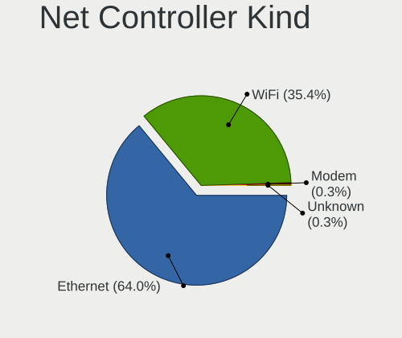

| Kind     | Computers | Percent |
|----------|-----------|---------|
| Ethernet | 694       | 64.02%  |
| WiFi     | 384       | 35.42%  |
| Modem    | 3         | 0.28%   |
| Unknown  | 3         | 0.28%   |

Used Controller
---------------

Currently used network controller

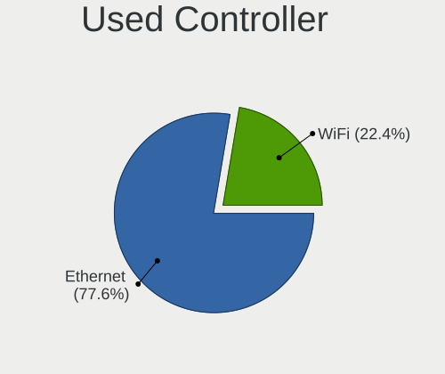

| Kind     | Computers | Percent |
|----------|-----------|---------|
| Ethernet | 587       | 77.65%  |
| WiFi     | 169       | 22.35%  |

NICs
----

Total network controllers on board

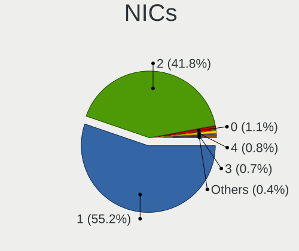

| Total | Computers | Percent |
|-------|-----------|---------|
| 1     | 411       | 55.24%  |
| 2     | 311       | 41.8%   |
| 0     | 8         | 1.08%   |
| 4     | 6         | 0.81%   |
| 3     | 5         | 0.67%   |
| 6     | 2         | 0.27%   |
| 7     | 1         | 0.13%   |

IPv6
----

IPv6 vs IPv4

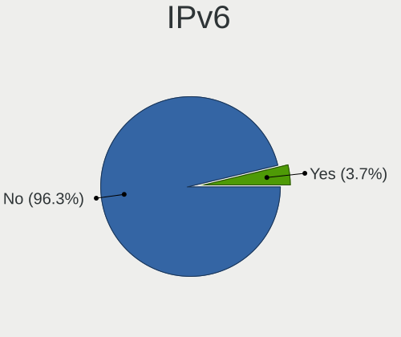

| Used | Computers | Percent |
|------|-----------|---------|
| No   | 720       | 96.26%  |
| Yes  | 28        | 3.74%   |

Bluetooth
---------

Bluetooth Vendor
----------------

Controller vendors

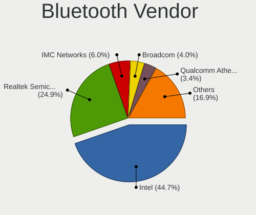

| Vendor                          | Computers | Percent |
|---------------------------------|-----------|---------|
| Intel                           | 156       | 44.7%   |
| Realtek Semiconductor           | 87        | 24.93%  |
| IMC Networks                    | 21        | 6.02%   |
| Broadcom                        | 14        | 4.01%   |
| Qualcomm Atheros Communications | 12        | 3.44%   |
| Foxconn / Hon Hai               | 11        | 3.15%   |
| Lite-On Technology              | 10        | 2.87%   |
| Foxconn International           | 8         | 2.29%   |
| Realtek                         | 5         | 1.43%   |
| Cambridge Silicon Radio         | 5         | 1.43%   |
| TP-Link                         | 4         | 1.15%   |
| ASUSTek Computer                | 4         | 1.15%   |
| Hewlett-Packard                 | 3         | 0.86%   |
| Ralink                          | 2         | 0.57%   |
| Taiyo Yuden                     | 1         | 0.29%   |
| Opticis                         | 1         | 0.29%   |
| MediaTek                        | 1         | 0.29%   |
| Dell                            | 1         | 0.29%   |
| Apple                           | 1         | 0.29%   |
| Actions                         | 1         | 0.29%   |
| Unknown                         | 1         | 0.29%   |

Bluetooth Model
---------------

Controller models

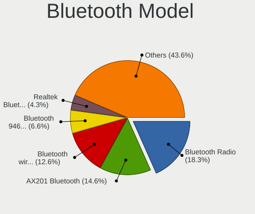

| Model                                               | Computers | Percent |
|-----------------------------------------------------|-----------|---------|
| Realtek Bluetooth Radio                             | 64        | 18.34%  |
| Intel AX201 Bluetooth                               | 51        | 14.61%  |
| Intel Bluetooth wireless interface                  | 44        | 12.61%  |
| Intel Bluetooth 9460/9560 Jefferson Peak (JfP)      | 23        | 6.59%   |
| Realtek  Bluetooth 4.2 Adapter                      | 15        | 4.3%    |
| Intel Bluetooth Device                              | 13        | 3.72%   |
| IMC Networks Wireless_Device                        | 11        | 3.15%   |
| Intel Wireless-AC 3168 Bluetooth                    | 10        | 2.87%   |
| Intel AX200 Bluetooth                               | 10        | 2.87%   |
| Foxconn International BCM43142A0 Bluetooth module   | 8         | 2.29%   |
| Qualcomm Atheros  Bluetooth Device                  | 7         | 2.01%   |
| IMC Networks Bluetooth Radio                        | 7         | 2.01%   |
| Lite-On Qualcomm Atheros QCA9377 Bluetooth          | 6         | 1.72%   |
| Realtek Bluetooth Radio                             | 5         | 1.43%   |
| Intel AX210 Bluetooth                               | 5         | 1.43%   |
| Foxconn / Hon Hai MediaTek Bluetooth Adapter        | 5         | 1.43%   |
| Cambridge Silicon Radio Bluetooth Dongle (HCI mode) | 5         | 1.43%   |
| TP-Link TP-T@- UB500 Adapter                        | 4         | 1.15%   |
| Realtek Bluetooth 5.3 Radio                         | 4         | 1.15%   |
| Realtek 802.11ac WLAN Adapter                       | 3         | 0.86%   |
| IMC Networks Bluetooth Device                       | 3         | 0.86%   |
| HP Broadcom 2070 Bluetooth Combo                    | 3         | 0.86%   |
| Broadcom HP Portable Bumble Bee                     | 3         | 0.86%   |
| Ralink RT3290 Bluetooth                             | 2         | 0.57%   |
| Qualcomm Atheros AR3011 Bluetooth                   | 2         | 0.57%   |
| Lite-On Wireless_Device                             | 2         | 0.57%   |
| Lite-On Broadcom BCM43142A0 Bluetooth Device        | 2         | 0.57%   |
| Foxconn / Hon Hai Bluetooth Device                  | 2         | 0.57%   |
| Broadcom HP Portable Valentine                      | 2         | 0.57%   |
| Taiyo Yuden Bluetooth Device                        | 1         | 0.29%   |
| Realtek RTL8723A Bluetooth                          | 1         | 0.29%   |
| Qualcomm Atheros QCA61x4 Bluetooth 4.0              | 1         | 0.29%   |
| Qualcomm Atheros AR9462 Bluetooth                   | 1         | 0.29%   |
| Qualcomm Atheros AR3012 Bluetooth 4.0               | 1         | 0.29%   |
| Opticis Bluetooth Radio                             | 1         | 0.29%   |
| MediaTek Wireless_Device                            | 1         | 0.29%   |
| Foxconn / Hon Hai Wireless_Device                   | 1         | 0.29%   |
| Foxconn / Hon Hai Broadcom BCM20702A1 Bluetooth     | 1         | 0.29%   |
| Foxconn / Hon Hai Broadcom BCM20702 Bluetooth       | 1         | 0.29%   |
| Foxconn / Hon Hai Bluetooth USB Host Controller     | 1         | 0.29%   |

Sound
-----

Sound Vendor
------------

Sound card vendors

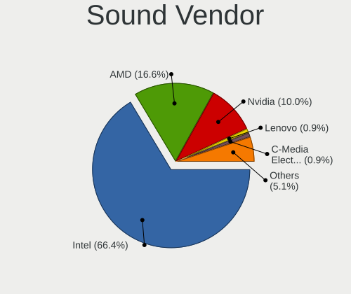

| Vendor                                       | Computers | Percent |
|----------------------------------------------|-----------|---------|
| Intel                                        | 595       | 66.41%  |
| AMD                                          | 149       | 16.63%  |
| Nvidia                                       | 90        | 10.04%  |
| Lenovo                                       | 8         | 0.89%   |
| C-Media Electronics                          | 8         | 0.89%   |
| Texas Instruments                            | 7         | 0.78%   |
| Logitech                                     | 5         | 0.56%   |
| Generalplus Technology                       | 4         | 0.45%   |
| Creative Technology                          | 4         | 0.45%   |
| JMTek                                        | 3         | 0.33%   |
| Razer USA                                    | 2         | 0.22%   |
| Hewlett-Packard                              | 2         | 0.22%   |
| ASUSTek Computer                             | 2         | 0.22%   |
| Zoran Co. Personal Media Division (Nogatech) | 1         | 0.11%   |
| Zhaoxin                                      | 1         | 0.11%   |
| Weltrend Semiconductor                       | 1         | 0.11%   |
| Telink                                       | 1         | 0.11%   |
| Silicon Integrated Systems [SiS]             | 1         | 0.11%   |
| Samson Technologies                          | 1         | 0.11%   |
| Realtek Semiconductor                        | 1         | 0.11%   |
| MosArt Semiconductor                         | 1         | 0.11%   |
| KTMicro                                      | 1         | 0.11%   |
| Jieli Technology                             | 1         | 0.11%   |
| iCreate Technologies                         | 1         | 0.11%   |
| GN Netcom                                    | 1         | 0.11%   |
| FiiO Electronics Technology                  | 1         | 0.11%   |
| DSEA A/S                                     | 1         | 0.11%   |
| DisplayLink                                  | 1         | 0.11%   |
| Audient                                      | 1         | 0.11%   |
| Unknown                                      | 1         | 0.11%   |

Sound Model
-----------

Sound card models

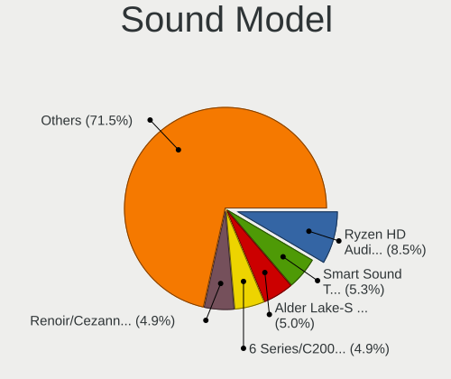

| Model                                                                      | Computers | Percent |
|----------------------------------------------------------------------------|-----------|---------|
| AMD Ryzen HD Audio Controller                                              | 87        | 8.48%   |
| Intel Smart Sound Technology (SST) Audio Controller                        | 54        | 5.26%   |
| Intel Alder Lake-S HD Audio Controller                                     | 51        | 4.97%   |
| Intel 6 Series/C200 Series Chipset Family High Definition Audio Controller | 50        | 4.87%   |
| AMD Renoir/Cezanne HDMI/DP Audio Controller                                | 50        | 4.87%   |
| Intel Cannon Lake PCH cAVS                                                 | 48        | 4.68%   |
| Intel 200 Series PCH HD Audio                                              | 42        | 4.09%   |
| Intel 7 Series/C216 Chipset Family High Definition Audio Controller        | 34        | 3.31%   |
| Intel Cannon Point-LP High Definition Audio Controller                     | 33        | 3.22%   |
| Intel NM10/ICH7 Family High Definition Audio Controller                    | 27        | 2.63%   |
| Intel 8 Series/C220 Series Chipset High Definition Audio Controller        | 26        | 2.53%   |
| Intel Tiger Lake-LP Smart Sound Technology Audio Controller                | 25        | 2.44%   |
| Intel Alder Lake PCH-P High Definition Audio Controller                    | 24        | 2.34%   |
| AMD Raven/Raven2/Fenghuang HDMI/DP Audio Controller                        | 24        | 2.34%   |
| Intel 100 Series/C230 Series Chipset Family HD Audio Controller            | 21        | 2.05%   |
| Intel Xeon E3-1200 v3/4th Gen Core Processor HD Audio Controller           | 19        | 1.85%   |
| Intel Tiger Lake-H HD Audio Controller                                     | 18        | 1.75%   |
| Intel Comet Lake PCH-V cAVS                                                | 18        | 1.75%   |
| Intel Comet Lake PCH cAVS                                                  | 14        | 1.36%   |
| Nvidia High Definition Audio Controller                                    | 12        | 1.17%   |
| Intel 5 Series/3400 Series Chipset High Definition Audio                   | 12        | 1.17%   |
| AMD Radeon High Definition Audio Controller                                | 12        | 1.17%   |
| Intel Sunrise Point-LP HD Audio                                            | 11        | 1.07%   |
| Intel Raptor Lake High Definition Audio Controller                         | 10        | 0.97%   |
| Intel Ice Lake-LP Smart Sound Technology Audio Controller                  | 9         | 0.88%   |
| Intel Comet Lake PCH-LP cAVS                                               | 9         | 0.88%   |
| Intel Celeron/Pentium Silver Processor High Definition Audio               | 9         | 0.88%   |
| AMD Starship/Matisse HD Audio Controller                                   | 9         | 0.88%   |
| Nvidia GK208 HDMI/DP Audio Controller                                      | 8         | 0.78%   |
| Nvidia GF108 High Definition Audio Controller                              | 8         | 0.78%   |
| Intel Raptor Lake-P/U/H cAVS                                               | 8         | 0.78%   |
| AMD SBx00 Azalia (Intel HDA)                                               | 8         | 0.78%   |
| Texas Instruments PCM2902 Audio Codec                                      | 7         | 0.68%   |
| Nvidia TU107 GeForce GTX 1650 High Definition Audio Controller             | 7         | 0.68%   |
| AMD Family 15h (Models 60h-6fh) Audio Controller                           | 7         | 0.68%   |
| Nvidia GP107GL High Definition Audio Controller                            | 6         | 0.58%   |
| Nvidia GK107 HDMI Audio Controller                                         | 6         | 0.58%   |
| Lenovo ThinkCentre TIO22Gen4 for USB Audio                                 | 6         | 0.58%   |
| Intel Haswell-ULT HD Audio Controller                                      | 6         | 0.58%   |
| Intel Celeron N3350/Pentium N4200/Atom E3900 Series Audio Cluster          | 6         | 0.58%   |

Memory
------

Memory Vendor
-------------

Memory module vendors

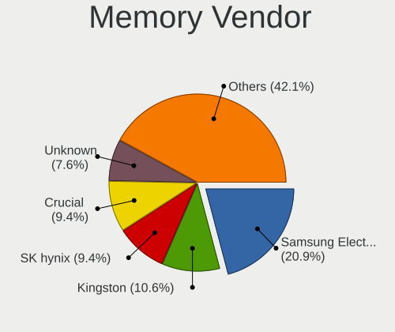

| Vendor                                  | Computers | Percent |
|-----------------------------------------|-----------|---------|
| Samsung Electronics                     | 167       | 20.9%   |
| Kingston                                | 85        | 10.64%  |
| SK hynix                                | 75        | 9.39%   |
| Crucial                                 | 75        | 9.39%   |
| Unknown                                 | 61        | 7.63%   |
| Micron Technology                       | 43        | 5.38%   |
| Foxline                                 | 38        | 4.76%   |
| A-DATA Technology                       | 26        | 3.25%   |
| Apacer                                  | 22        | 2.75%   |
| Ramaxel Technology                      | 20        | 2.5%    |
| Patriot                                 | 20        | 2.5%    |
| AMD                                     | 20        | 2.5%    |
| Unknown                                 | 19        | 2.38%   |
| KingSpec                                | 10        | 1.25%   |
| Unknown (ABCD)                          | 8         | 1%      |
| Unknown (0x7FFF)                        | 8         | 1%      |
| Netac                                   | 6         | 0.75%   |
| Elpida                                  | 6         | 0.75%   |
| Unknown (0x0080)                        | 5         | 0.63%   |
| Silicon Power Computer & Communications | 4         | 0.5%    |
| Qumo                                    | 4         | 0.5%    |
| G.Skill                                 | 4         | 0.5%    |
| Corsair                                 | 4         | 0.5%    |
| Unknown (89F7)                          | 3         | 0.38%   |
| Silicon Power                           | 3         | 0.38%   |
| Neo Forza                               | 3         | 0.38%   |
| Nanya Technology                        | 3         | 0.38%   |
| Hikvision                               | 3         | 0.38%   |
| GOODRAM                                 | 3         | 0.38%   |
| ChangXin Memory                         | 3         | 0.38%   |
| Unknown (BA8A)                          | 2         | 0.25%   |
| Unknown (0x0E54)                        | 2         | 0.25%   |
| Unknown (0x0B7A)                        | 2         | 0.25%   |
| Shenzhen Micro Innovation Industry      | 2         | 0.25%   |
| SHARETRONIC                             | 2         | 0.25%   |
| Patriot Memory (PDP Systems)            | 2         | 0.25%   |
| KingTiger                               | 2         | 0.25%   |
| Kimtigo Semiconductor (HK) Limited      | 2         | 0.25%   |
| HomeNet                                 | 2         | 0.25%   |
| Hewlett-Packard                         | 2         | 0.25%   |

Memory Model
------------

Memory module models

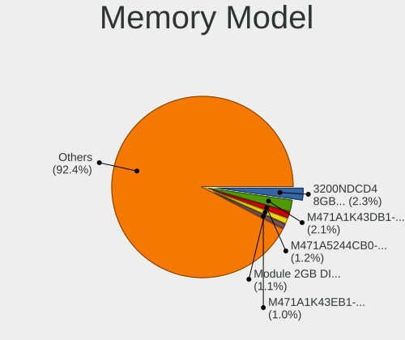

| Model                                                             | Computers | Percent |
|-------------------------------------------------------------------|-----------|---------|
| Unknown                                                           | 19        | 2.26%   |
| Samsung RAM M471A1K43DB1-CTD 8GB SODIMM DDR4 2667MT/s             | 18        | 2.14%   |
| Samsung RAM M471A5244CB0-CWE 4GB SODIMM DDR4 3200MT/s             | 10        | 1.19%   |
| Unknown RAM Module 2GB DIMM DDR2 333MT/s                          | 9         | 1.07%   |
| Samsung RAM M471A1K43EB1-CWE 8GB SODIMM DDR4 3200MT/s             | 8         | 0.95%   |
| Foxline RAM FL2666D4U19-8G 8GB DIMM DDR4 2667MT/s                 | 8         | 0.95%   |
| Foxline RAM FL2666D4S19-8G 8GB SODIMM DDR4 2667MT/s               | 8         | 0.95%   |
| Unknown RAM Module 1GB DIMM DDR2 333MT/s                          | 7         | 0.83%   |
| SK hynix RAM HMA81GS6CJR8N-VK 8GB SODIMM DDR4 2667MT/s            | 6         | 0.71%   |
| Samsung RAM M471B5173QH0-YK0 4GB SODIMM DDR3 1600MT/s             | 6         | 0.71%   |
| Samsung RAM M471A1K43DB1-CWE 8GB SODIMM DDR4 3200MT/s             | 6         | 0.71%   |
| Samsung RAM M471A1K43CB1-CTD 8GB SODIMM DDR4 3200MT/s             | 6         | 0.71%   |
| Micron RAM 4ATF1G64HZ-3G2E1 8GB SODIMM DDR4 3200MT/s              | 6         | 0.71%   |
| Foxline RAM FL3200D4S22-8G 8GB SODIMM DDR4 3200MT/s               | 6         | 0.71%   |
| AMD RAM R748G2606U2S 8GB DIMM DDR4 3200MT/s                       | 6         | 0.71%   |
| Unknown RAM Module 4GB DIMM DDR3 1333MT/s                         | 5         | 0.59%   |
| Unknown RAM Module 2GB DIMM SDRAM                                 | 5         | 0.59%   |
| Unknown (ABCD) RAM 123456789012345678 2GB SODIMM LPDDR4 2400MT/s  | 5         | 0.59%   |
| Patriot RAM PSD44G266681 4GB DIMM DDR4 2667MT/s                   | 5         | 0.59%   |
| Kingston RAM 99U5584-005.A00LF 4GB DIMM DDR3 1600MT/s             | 5         | 0.59%   |
| Crucial RAM CT8G4DFS8266.M8FD 8GB DIMM DDR4 3600MT/s              | 5         | 0.59%   |
| Unknown RAM Module 2GB DIMM SDRAM 800MT/s                         | 4         | 0.48%   |
| Unknown (0x7FFF) RAM GRAVITON 8G4-USDM01 8GB SODIMM DDR4 3200MT/s | 4         | 0.48%   |
| SK hynix RAM HMA851S6DJR6N-XN 4GB Row Of Chips DDR4 3200MT/s      | 4         | 0.48%   |
| Samsung RAM M471B5773DH0-CH9 2GB SODIMM DDR3 1600MT/s             | 4         | 0.48%   |
| Samsung RAM M471A5244CB0-CWE 4GB Row Of Chips DDR4 3200MT/s       | 4         | 0.48%   |
| Samsung RAM M471A5244CB0-CTD 4GB SODIMM DDR4 3266MT/s             | 4         | 0.48%   |
| Samsung RAM M471A5244CB0-CRC 4GB SODIMM DDR4 2667MT/s             | 4         | 0.48%   |
| Ramaxel RAM RMSA3260ME78HAF-2666 8GB SODIMM DDR4 2667MT/s         | 4         | 0.48%   |
| Micron RAM 4ATF1G64HZ-3G2E1 8GB Row Of Chips DDR4 3200MT/s        | 4         | 0.48%   |
| Kingston RAM 99U5474-026.A00LF 4GB DIMM DDR3 1333MT/s             | 4         | 0.48%   |
| KingSpec RAM KS2666D4P12008G 8GB DIMM DDR4 2667MT/s               | 4         | 0.48%   |
| Crucial RAM CT8G4SFS832A.M8FR 8GB SODIMM DDR4 3200MT/s            | 4         | 0.48%   |
| Apacer RAM D12.2755BS.001 16GB DIMM DDR4 3200MT/s                 | 4         | 0.48%   |
| Unknown RAM Module 8GB DIMM DDR3 1333MT/s                         | 3         | 0.36%   |
| Unknown RAM Module 2GB DIMM DDR3 1333MT/s                         | 3         | 0.36%   |
| Unknown RAM Module 2GB DIMM 1333MT/s                              | 3         | 0.36%   |
| Unknown (ABCD) RAM 123456789012345678 2GB DIMM LPDDR4 2133MT/s    | 3         | 0.36%   |
| SK hynix RAM HMAA1GS6CJR6N-XN 8GB Row Of Chips DDR4 3200MT/s      | 3         | 0.36%   |
| SK hynix RAM HMA851S6DJR6N-XN 4GB SODIMM DDR4 3200MT/s            | 3         | 0.36%   |

Memory Kind
-----------

Memory module kinds

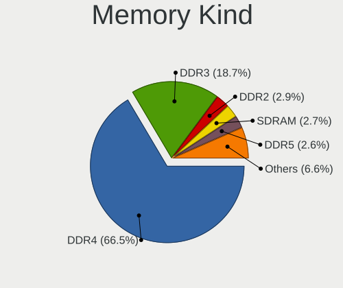

| Kind    | Computers | Percent |
|---------|-----------|---------|
| DDR4    | 484       | 66.48%  |
| DDR3    | 136       | 18.68%  |
| DDR2    | 21        | 2.88%   |
| SDRAM   | 20        | 2.75%   |
| DDR5    | 19        | 2.61%   |
| LPDDR4  | 18        | 2.47%   |
| Unknown | 16        | 2.2%    |
| LPDDR5  | 11        | 1.51%   |
| DDR     | 2         | 0.27%   |
| LPDDR3  | 1         | 0.14%   |

Memory Form Factor
------------------

Physical design of the memory module

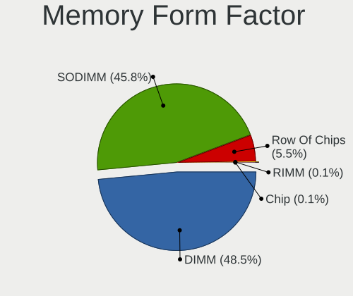

| Name         | Computers | Percent |
|--------------|-----------|---------|
| DIMM         | 355       | 48.5%   |
| SODIMM       | 335       | 45.77%  |
| Row Of Chips | 40        | 5.46%   |
| RIMM         | 1         | 0.14%   |
| Chip         | 1         | 0.14%   |

Memory Size
-----------

Memory module size

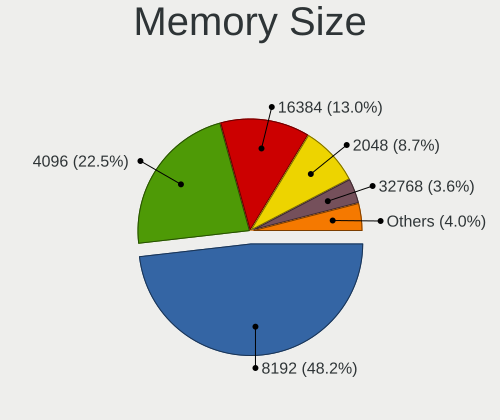

| Size  | Computers | Percent |
|-------|-----------|---------|
| 8192  | 372       | 48.19%  |
| 4096  | 174       | 22.54%  |
| 16384 | 100       | 12.95%  |
| 2048  | 67        | 8.68%   |
| 32768 | 28        | 3.63%   |
| 1024  | 27        | 3.5%    |
| 65536 | 3         | 0.39%   |
| 512   | 1         | 0.13%   |

Memory Speed
------------

Memory module speed

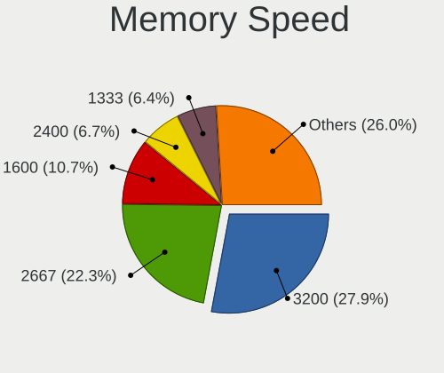

| Speed   | Computers | Percent |
|---------|-----------|---------|
| 3200    | 213       | 27.92%  |
| 2667    | 170       | 22.28%  |
| 1600    | 82        | 10.75%  |
| 2400    | 51        | 6.68%   |
| 1333    | 49        | 6.42%   |
| 2133    | 19        | 2.49%   |
| 3600    | 14        | 1.83%   |
| 2666    | 13        | 1.7%    |
| 4800    | 11        | 1.44%   |
| 333     | 11        | 1.44%   |
| 6400    | 8         | 1.05%   |
| 800     | 8         | 1.05%   |
| Unknown | 8         | 1.05%   |
| 5600    | 7         | 0.92%   |
| 2933    | 7         | 0.92%   |
| 3266    | 6         | 0.79%   |
| 1067    | 6         | 0.79%   |
| 667     | 6         | 0.79%   |
| 1334    | 5         | 0.66%   |
| 4267    | 4         | 0.52%   |
| 2800    | 4         | 0.52%   |
| 1866    | 4         | 0.52%   |
| 1066    | 4         | 0.52%   |
| 533     | 4         | 0.52%   |
| 5400    | 3         | 0.39%   |
| 4000    | 3         | 0.39%   |
| 3733    | 3         | 0.39%   |
| 3533    | 3         | 0.39%   |
| 2934    | 3         | 0.39%   |
| 1800    | 3         | 0.39%   |
| 8400    | 2         | 0.26%   |
| 7500    | 2         | 0.26%   |
| 4199    | 2         | 0.26%   |
| 3800    | 2         | 0.26%   |
| 3466    | 2         | 0.26%   |
| 3334    | 2         | 0.26%   |
| 3333    | 2         | 0.26%   |
| 2733    | 2         | 0.26%   |
| 266     | 2         | 0.26%   |
| 5500    | 1         | 0.13%   |

Printers & scanners
-------------------

Printer Vendor
--------------

Printer device vendors

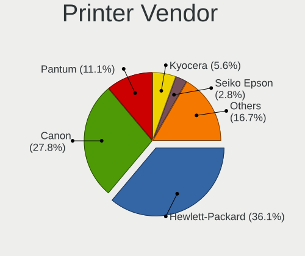

| Vendor                 | Computers | Percent |
|------------------------|-----------|---------|
| Hewlett-Packard        | 13        | 36.11%  |
| Canon                  | 10        | 27.78%  |
| Pantum                 | 4         | 11.11%  |
| Kyocera                | 2         | 5.56%   |
| STMicroelectronics     | 1         | 2.78%   |
| Seiko Epson            | 1         | 2.78%   |
| Samsung Electronics    | 1         | 2.78%   |
| Intermec Technologies  | 1         | 2.78%   |
| Custom Engineering SPA | 1         | 2.78%   |
| CACTUS                 | 1         | 2.78%   |
| Brother Industries     | 1         | 2.78%   |

Printer Model
-------------

Printer device models

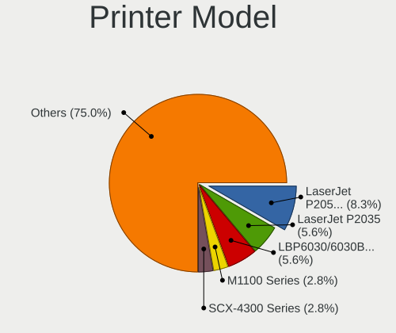

| Model                                                     | Computers | Percent |
|-----------------------------------------------------------|-----------|---------|
| HP LaserJet P2055 series                                  | 3         | 8.33%   |
| HP LaserJet P2035                                         | 2         | 5.56%   |
| Canon LBP6030/6030B/6018L                                 | 2         | 5.56%   |
| STMicroelectronics LED badge -- mini LED display -- 11x44 | 1         | 2.78%   |
| Seiko Epson M1100 Series                                  | 1         | 2.78%   |
| Samsung SCX-4300 Series                                   | 1         | 2.78%   |
| Pantum P3300DN series                                     | 1         | 2.78%   |
| Pantum P3010DW series                                     | 1         | 2.78%   |
| Pantum BM5100FDW series                                   | 1         | 2.78%   |
| Pantum BM5100ADN series                                   | 1         | 2.78%   |
| Kyocera FS-1040                                           | 1         | 2.78%   |
| Kyocera ECOSYS M2135dn                                    | 1         | 2.78%   |
| Intermec PC23                                             | 1         | 2.78%   |
| HP LaserJet P1005                                         | 1         | 2.78%   |
| HP LaserJet M402dn                                        | 1         | 2.78%   |
| HP LaserJet M203-M206                                     | 1         | 2.78%   |
| HP LaserJet M14-M17                                       | 1         | 2.78%   |
| HP LaserJet M109-M112                                     | 1         | 2.78%   |
| HP LaserJet 1010                                          | 1         | 2.78%   |
| HP HP LaserJet Pro M428-M429                              | 1         | 2.78%   |
| HP Designjet T1200 PostScript                             | 1         | 2.78%   |
| Custom Engineering SPA VKP80200dpi                        | 1         | 2.78%   |
| Canon MF4800 Series                                       | 1         | 2.78%   |
| Canon MF450 Series                                        | 1         | 2.78%   |
| Canon MF440 Series                                        | 1         | 2.78%   |
| Canon MF410 Series                                        | 1         | 2.78%   |
| Canon MF3010                                              | 1         | 2.78%   |
| Canon LiDE 300                                            | 1         | 2.78%   |
| Canon LBP3010/LBP3018/LBP3050                             | 1         | 2.78%   |
| Canon I-SENSYS MF4550d                                    | 1         | 2.78%   |
| CACTUS CS-LP1120                                          | 1         | 2.78%   |
| Brother HL-L2360D series                                  | 1         | 2.78%   |

Scanner Vendor
--------------

Scanner device vendors

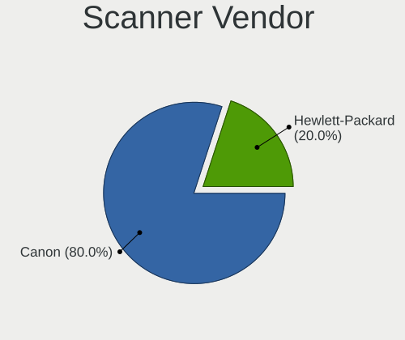

| Vendor          | Computers | Percent |
|-----------------|-----------|---------|
| Canon           | 4         | 80%     |
| Hewlett-Packard | 1         | 20%     |

Scanner Model
-------------

Scanner device models

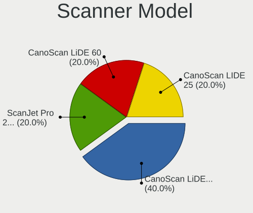

| Model                   | Computers | Percent |
|-------------------------|-----------|---------|
| Canon CanoScan LiDE 110 | 2         | 40%     |
| HP ScanJet Pro 2000 s2  | 1         | 20%     |
| Canon CanoScan LiDE 60  | 1         | 20%     |
| Canon CanoScan LIDE 25  | 1         | 20%     |

Camera
------

Camera Vendor
-------------

Camera device vendors

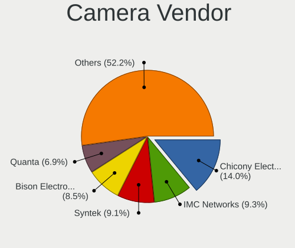

| Vendor                                 | Computers | Percent |
|----------------------------------------|-----------|---------|
| Chicony Electronics                    | 51        | 14.01%  |
| IMC Networks                           | 34        | 9.34%   |
| Syntek                                 | 33        | 9.07%   |
| Bison Electronics                      | 31        | 8.52%   |
| Quanta                                 | 25        | 6.87%   |
| Microdia                               | 23        | 6.32%   |
| Realtek Semiconductor                  | 21        | 5.77%   |
| Sunplus Innovation Technology          | 20        | 5.49%   |
| SunplusIT                              | 18        | 4.95%   |
| Alcor Micro                            | 16        | 4.4%    |
| Logitech                               | 9         | 2.47%   |
| Cheng Uei Precision Industry (Foxlink) | 9         | 2.47%   |
| Luxvisions Innotech Limited            | 8         | 2.2%    |
| Hopewin Electronic Material            | 6         | 1.65%   |
| Z-Star Microelectronics                | 5         | 1.37%   |
| Sonix Technology                       | 5         | 1.37%   |
| Suyin                                  | 4         | 1.1%    |
| Lite-On Technology                     | 4         | 1.1%    |
| Apple                                  | 4         | 1.1%    |
| icSpring                               | 3         | 0.82%   |
| USB Camera CS                          | 2         | 0.55%   |
| lihappe8                               | 2         | 0.55%   |
| KYE Systems (Mouse Systems)            | 2         | 0.55%   |
| GEMBIRD                                | 2         | 0.55%   |
| Creative Technology                    | 2         | 0.55%   |
| AlcorMicroCorp                         | 2         | 0.55%   |
| Acer                                   | 2         | 0.55%   |
| Web Camera                             | 1         | 0.27%   |
| WaveRider Communications               | 1         | 0.27%   |
| Sunplus IT                             | 1         | 0.27%   |
| Shine-optics                           | 1         | 0.27%   |
| QuickShot                              | 1         | 0.27%   |
| Primax Electronics                     | 1         | 0.27%   |
| Novatek Microelectronics               | 1         | 0.27%   |
| Mimaki Engineering                     | 1         | 0.27%   |
| Microsoft                              | 1         | 0.27%   |
| Magic Control Technology               | 1         | 0.27%   |
| MacroSilicon                           | 1         | 0.27%   |
| kingcome                               | 1         | 0.27%   |
| JMicron Technology                     | 1         | 0.27%   |

Camera Model
------------

Camera device models

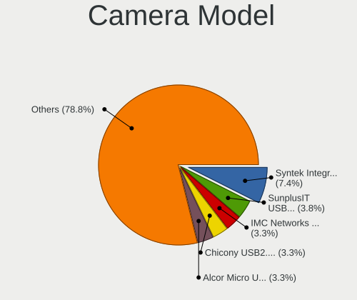

| Model                                               | Computers | Percent |
|-----------------------------------------------------|-----------|---------|
| Syntek Integrated Camera                            | 27        | 7.42%   |
| SunplusIT USB Camera                                | 14        | 3.85%   |
| IMC Networks USB2.0 HD UVC WebCam                   | 12        | 3.3%    |
| Chicony USB2.0 FHD UVC WebCam                       | 12        | 3.3%    |
| Alcor Micro USB 2.0 PC Camera                       | 12        | 3.3%    |
| Chicony Integrated Camera                           | 11        | 3.02%   |
| Bison Integrated Camera                             | 10        | 2.75%   |
| Microdia Camera                                     | 9         | 2.47%   |
| IMC Networks Integrated Camera                      | 9         | 2.47%   |
| Realtek 1080p Camera                                | 8         | 2.2%    |
| Bison Lenovo Integrated Webcam                      | 7         | 1.92%   |
| Hopewin Electronic Material Integrated Camera       | 6         | 1.65%   |
| IMC Networks HD Camera                              | 5         | 1.37%   |
| Sunplus USB Microphone                              | 4         | 1.1%    |
| Sunplus Integrated Camera                           | 4         | 1.1%    |
| Quanta ov9734_techfront_camera                      | 4         | 1.1%    |
| Quanta HP 2.0MP High Definition Webcam              | 4         | 1.1%    |
| Microdia Webcam Vitade AF                           | 4         | 1.1%    |
| Microdia UGREEN Camera                              | 4         | 1.1%    |
| Lite-On HP 2.0MP High Definition Webcam             | 4         | 1.1%    |
| IMC Networks ov9734_azurewave_camera                | 4         | 1.1%    |
| Bison BisonCam,NB Pro                               | 4         | 1.1%    |
| Syntek Lenovo EasyCamera                            | 3         | 0.82%   |
| Realtek USB Camera                                  | 3         | 0.82%   |
| Quanta HP Webcam                                    | 3         | 0.82%   |
| Quanta HP TrueVision HD Camera                      | 3         | 0.82%   |
| Luxvisions Innotech Limited Integrated Camera       | 3         | 0.82%   |
| Luxvisions Innotech Limited HP TrueVision HD Camera | 3         | 0.82%   |
| Logitech Webcam C270                                | 3         | 0.82%   |
| Logitech HD Webcam C615                             | 3         | 0.82%   |
| icSpring camera                                     | 3         | 0.82%   |
| Chicony HP High Definition 1MP Webcam               | 3         | 0.82%   |
| Chicony ACER HD User Facing                         | 3         | 0.82%   |
| Bison FHD Camera                                    | 3         | 0.82%   |
| Apple iPhone 5/5C/5S/6/SE/7/8/X                     | 3         | 0.82%   |
| Z-Star Lenovo USB2.0 UVC Camera                     | 2         | 0.55%   |
| USB Camera CS USB Camera CS                         | 2         | 0.55%   |
| SunplusIT SPCA2650 AV Camera                        | 2         | 0.55%   |
| Sunplus Integrated_Webcam_HD                        | 2         | 0.55%   |
| Sunplus FULL HD webcam                              | 2         | 0.55%   |

Security
--------

Fingerprint Vendor
------------------

Fingerprint sensor vendors

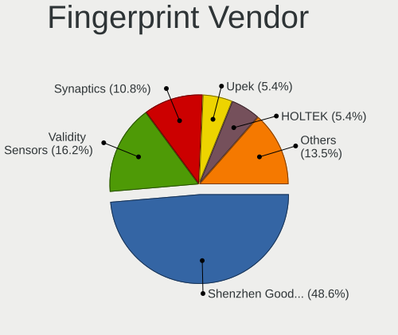

| Vendor                     | Computers | Percent |
|----------------------------|-----------|---------|
| Shenzhen Goodix Technology | 18        | 48.65%  |
| Validity Sensors           | 6         | 16.22%  |
| Synaptics                  | 4         | 10.81%  |
| Upek                       | 2         | 5.41%   |
| HOLTEK                     | 2         | 5.41%   |
| Focal-systems.Corp         | 2         | 5.41%   |
| Elan Microelectronics      | 2         | 5.41%   |
| AuthenTec                  | 1         | 2.7%    |

Fingerprint Model
-----------------

Fingerprint sensor models

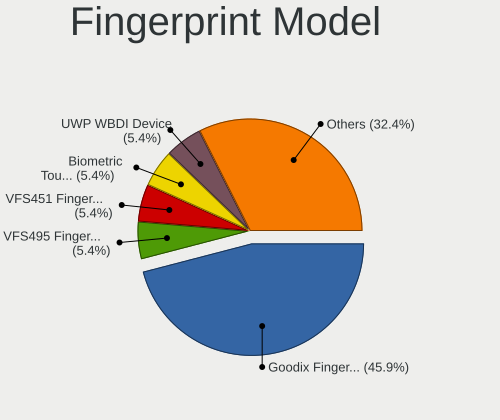

| Model                                                                      | Computers | Percent |
|----------------------------------------------------------------------------|-----------|---------|
| Shenzhen Goodix  FingerPrint Device                                        | 17        | 45.95%  |
| Validity Sensors VFS495 Fingerprint Reader                                 | 2         | 5.41%   |
| Validity Sensors VFS451 Fingerprint Reader                                 | 2         | 5.41%   |
| Upek Biometric Touchchip/Touchstrip Fingerprint Sensor                     | 2         | 5.41%   |
| Synaptics UWP WBDI Device                                                  | 2         | 5.41%   |
| HOLTEK FocalTech Fingerprint Device                                        | 2         | 5.41%   |
| Focal-systems.Corp FT9201Fingerprint.                                      | 2         | 5.41%   |
| Validity Sensors VFS7500 Touch Fingerprint Sensor                          | 1         | 2.7%    |
| Validity Sensors Synaptics VFS7552 Touch Fingerprint Sensor with PurePrint | 1         | 2.7%    |
| Synaptics  FS7604 Touch Fingerprint Sensor with PurePrint                  | 1         | 2.7%    |
| Synaptics FS7604 Touch Fingerprint Sensor with PurePrint                   | 1         | 2.7%    |
| Shenzhen Goodix Fingerprint Reader                                         | 1         | 2.7%    |
| Elan ELAN:Fingerprint                                                      | 1         | 2.7%    |
| Elan ELAN:ARM-M4                                                           | 1         | 2.7%    |
| AuthenTec AES2550 Fingerprint Sensor                                       | 1         | 2.7%    |

Chipcard Vendor
---------------

Chipcard module vendors

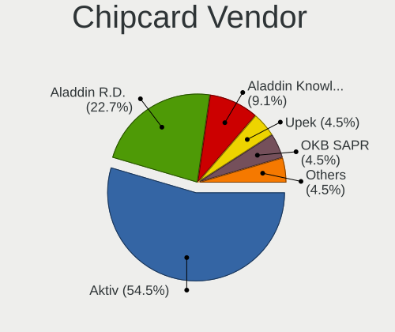

| Vendor                    | Computers | Percent |
|---------------------------|-----------|---------|
| Aktiv                     | 12        | 54.55%  |
| Aladdin R.D.              | 5         | 22.73%  |
| Aladdin Knowledge Systems | 2         | 9.09%   |
| Upek                      | 1         | 4.55%   |
| OKB SAPR                  | 1         | 4.55%   |
| Broadcom                  | 1         | 4.55%   |

Chipcard Model
--------------

Chipcard module models

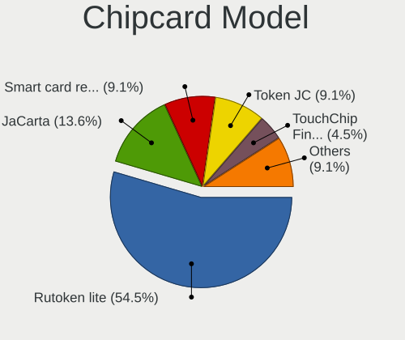

| Model                                                      | Computers | Percent |
|------------------------------------------------------------|-----------|---------|
| Aktiv Rutoken lite                                         | 12        | 54.55%  |
| Aladdin R.D. JaCarta                                       | 3         | 13.64%  |
| Aladdin R.D. Smart card reader JCR721                      | 2         | 9.09%   |
| Aladdin Knowledge Systems Token JC                         | 2         | 9.09%   |
| Upek TouchChip Fingerprint Coprocessor (WBF advanced mode) | 1         | 4.55%   |
| OKB SAPR Accord AMDZ GXM2 v.P                              | 1         | 4.55%   |
| Broadcom 58200                                             | 1         | 4.55%   |

Unsupported
-----------

Unsupported Devices
-------------------

Total unsupported devices on board

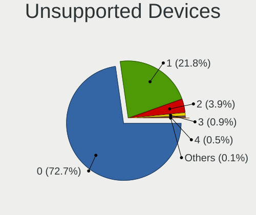

| Total | Computers | Percent |
|-------|-----------|---------|
| 0     | 547       | 72.74%  |
| 1     | 164       | 21.81%  |
| 2     | 29        | 3.86%   |
| 3     | 7         | 0.93%   |
| 4     | 4         | 0.53%   |
| 6     | 1         | 0.13%   |

Unsupported Device Types
------------------------

Types of unsupported devices

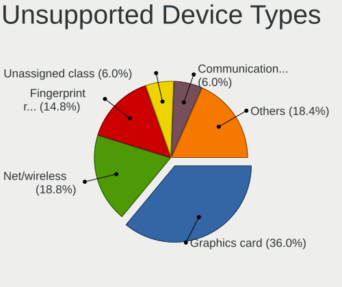

| Type                     | Computers | Percent |
|--------------------------|-----------|---------|
| Graphics card            | 90        | 36%     |
| Net/wireless             | 47        | 18.8%   |
| Fingerprint reader       | 37        | 14.8%   |
| Unassigned class         | 15        | 6%      |
| Communication controller | 15        | 6%      |
| Chipcard                 | 8         | 3.2%    |
| Bluetooth                | 8         | 3.2%    |
| Multimedia controller    | 7         | 2.8%    |
| Camera                   | 7         | 2.8%    |
| Net/ethernet             | 6         | 2.4%    |
| Sound                    | 3         | 1.2%    |
| Network                  | 3         | 1.2%    |
| Card reader              | 2         | 0.8%    |
| Storage/raid             | 1         | 0.4%    |
| Storage                  | 1         | 0.4%    |

