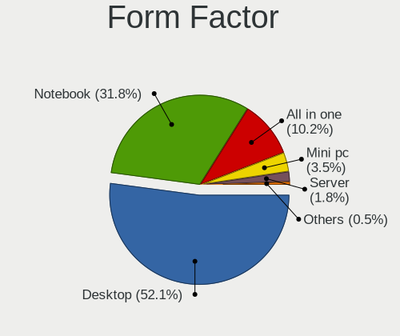
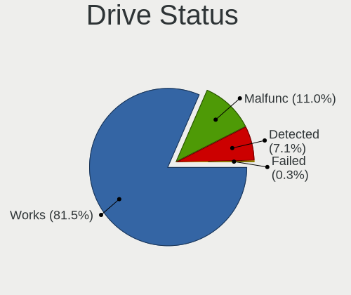
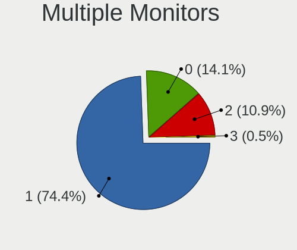

Red OS - Tested Hardware & Statistics
-------------------------------------

A project to collect tested hardware configurations for Red OS.

Anyone can contribute to this report by the [hw-probe](https://github.com/linuxhw/hw-probe) tool:

    sudo -E hw-probe -all -upload

Please contribute! Especially if your hardware is rare.

This is a report for all computer types. See also reports for [desktops](/Dist/Red_OS/Desktop/README.md) and [notebooks](/Dist/Red_OS/Notebook/README.md).

Contents
--------

* [ Test Cases ](#test-cases)

* [ System ](#system)
  - [ OS                       ](#os)
  - [ OS Family                ](#os-family)
  - [ Kernel                   ](#kernel)
  - [ Kernel Family            ](#kernel-family)
  - [ Kernel Major Ver.        ](#kernel-major-ver)
  - [ Arch                     ](#arch)
  - [ DE                       ](#de)
  - [ Display Server           ](#display-server)
  - [ Display Manager          ](#display-manager)
  - [ OS Lang                  ](#os-lang)
  - [ Boot Mode                ](#boot-mode)
  - [ Filesystem               ](#filesystem)
  - [ Part. scheme             ](#part-scheme)
  - [ Dual Boot with Linux/BSD ](#dual-boot-with-linuxbsd)
  - [ Dual Boot (Win)          ](#dual-boot-win)

* [ Board ](#board)
  - [ Vendor                   ](#vendor)
  - [ Model                    ](#model)
  - [ Model Family             ](#model-family)
  - [ MFG Year                 ](#mfg-year)
  - [ Form Factor              ](#form-factor)
  - [ Secure Boot              ](#secure-boot)
  - [ Coreboot                 ](#coreboot)
  - [ RAM Size                 ](#ram-size)
  - [ RAM Used                 ](#ram-used)
  - [ Total Drives             ](#total-drives)
  - [ Has CD-ROM               ](#has-cd-rom)
  - [ Has Ethernet             ](#has-ethernet)
  - [ Has WiFi                 ](#has-wifi)
  - [ Has Bluetooth            ](#has-bluetooth)

* [ Location ](#location)
  - [ Country                  ](#country)
  - [ City                     ](#city)

* [ Drives ](#drives)
  - [ Drive Vendor             ](#drive-vendor)
  - [ Drive Model              ](#drive-model)
  - [ HDD Vendor               ](#hdd-vendor)
  - [ SSD Vendor               ](#ssd-vendor)
  - [ Drive Kind               ](#drive-kind)
  - [ Drive Connector          ](#drive-connector)
  - [ Drive Size               ](#drive-size)
  - [ Space Total              ](#space-total)
  - [ Space Used               ](#space-used)
  - [ Malfunc. Drives          ](#malfunc-drives)
  - [ Malfunc. Drive Vendor    ](#malfunc-drive-vendor)
  - [ Malfunc. HDD Vendor      ](#malfunc-hdd-vendor)
  - [ Malfunc. Drive Kind      ](#malfunc-drive-kind)
  - [ Failed Drives            ](#failed-drives)
  - [ Failed Drive Vendor      ](#failed-drive-vendor)
  - [ Drive Status             ](#drive-status)

* [ Storage controller ](#storage-controller)
  - [ Storage Vendor           ](#storage-vendor)
  - [ Storage Model            ](#storage-model)
  - [ Storage Kind             ](#storage-kind)

* [ Processor ](#processor)
  - [ CPU Vendor               ](#cpu-vendor)
  - [ CPU Model                ](#cpu-model)
  - [ CPU Model Family         ](#cpu-model-family)
  - [ CPU Cores                ](#cpu-cores)
  - [ CPU Sockets              ](#cpu-sockets)
  - [ CPU Threads              ](#cpu-threads)
  - [ CPU Op-Modes             ](#cpu-op-modes)
  - [ CPU Microcode            ](#cpu-microcode)
  - [ CPU Microarch            ](#cpu-microarch)

* [ Graphics ](#graphics)
  - [ GPU Vendor               ](#gpu-vendor)
  - [ GPU Model                ](#gpu-model)
  - [ GPU Combo                ](#gpu-combo)
  - [ GPU Driver               ](#gpu-driver)
  - [ GPU Memory               ](#gpu-memory)

* [ Monitor ](#monitor)
  - [ Monitor Vendor           ](#monitor-vendor)
  - [ Monitor Model            ](#monitor-model)
  - [ Monitor Resolution       ](#monitor-resolution)
  - [ Monitor Diagonal         ](#monitor-diagonal)
  - [ Monitor Width            ](#monitor-width)
  - [ Aspect Ratio             ](#aspect-ratio)
  - [ Monitor Area             ](#monitor-area)
  - [ Pixel Density            ](#pixel-density)
  - [ Multiple Monitors        ](#multiple-monitors)

* [ Network ](#network)
  - [ Net Controller Vendor    ](#net-controller-vendor)
  - [ Net Controller Model     ](#net-controller-model)
  - [ Wireless Vendor          ](#wireless-vendor)
  - [ Wireless Model           ](#wireless-model)
  - [ Ethernet Vendor          ](#ethernet-vendor)
  - [ Ethernet Model           ](#ethernet-model)
  - [ Net Controller Kind      ](#net-controller-kind)
  - [ Used Controller          ](#used-controller)
  - [ NICs                     ](#nics)
  - [ IPv6                     ](#ipv6)

* [ Bluetooth ](#bluetooth)
  - [ Bluetooth Vendor         ](#bluetooth-vendor)
  - [ Bluetooth Model          ](#bluetooth-model)

* [ Sound ](#sound)
  - [ Sound Vendor             ](#sound-vendor)
  - [ Sound Model              ](#sound-model)

* [ Memory ](#memory)
  - [ Memory Vendor            ](#memory-vendor)
  - [ Memory Model             ](#memory-model)
  - [ Memory Kind              ](#memory-kind)
  - [ Memory Form Factor       ](#memory-form-factor)
  - [ Memory Size              ](#memory-size)
  - [ Memory Speed             ](#memory-speed)

* [ Printers & scanners ](#printers--scanners)
  - [ Printer Vendor           ](#printer-vendor)
  - [ Printer Model            ](#printer-model)
  - [ Scanner Vendor           ](#scanner-vendor)
  - [ Scanner Model            ](#scanner-model)

* [ Camera ](#camera)
  - [ Camera Vendor            ](#camera-vendor)
  - [ Camera Model             ](#camera-model)

* [ Security ](#security)
  - [ Fingerprint Vendor       ](#fingerprint-vendor)
  - [ Fingerprint Model        ](#fingerprint-model)
  - [ Chipcard Vendor          ](#chipcard-vendor)
  - [ Chipcard Model           ](#chipcard-model)

* [ Unsupported ](#unsupported)
  - [ Unsupported Devices      ](#unsupported-devices)
  - [ Unsupported Device Types ](#unsupported-device-types)

Test Cases
----------

Total: 142

| Vendor        | Model                       | Form-Factor | Probe                                                      | Date         |
|---------------|-----------------------------|-------------|------------------------------------------------------------|--------------|
| THUNDEROBO... | 911AirD                     | Notebook    | [448f04d201](https://linux-hardware.org/?probe=448f04d201) | Sep 30, 2022 |
| Digma         | EVE 11 C408                 | Notebook    | [b5c7ac8ed3](https://linux-hardware.org/?probe=b5c7ac8ed3) | Sep 30, 2022 |
| ASRock        | B360M-HDV                   | Desktop     | [fad5a877f5](https://linux-hardware.org/?probe=fad5a877f5) | Sep 30, 2022 |
| THUNDEROBO... | 911AirD                     | Notebook    | [99f1b7e253](https://linux-hardware.org/?probe=99f1b7e253) | Sep 29, 2022 |
| RDW           | MB-B450M V.1                | Desktop     | [8c3a565d43](https://linux-hardware.org/?probe=8c3a565d43) | Sep 26, 2022 |
| Gigabyte      | B550 AORUS ELITE V2         | Desktop     | [1748378749](https://linux-hardware.org/?probe=1748378749) | Sep 22, 2022 |
| Gigabyte      | B75M-D3V                    | Desktop     | [3888b56318](https://linux-hardware.org/?probe=3888b56318) | Sep 22, 2022 |
| Gigabyte      | B550 AORUS ELITE V2         | Desktop     | [66a228f8c5](https://linux-hardware.org/?probe=66a228f8c5) | Sep 21, 2022 |
| ICL           | RAYbook Si1512              | Notebook    | [0b610b66a9](https://linux-hardware.org/?probe=0b610b66a9) | Sep 20, 2022 |
| Gigabyte      | H110M-S2-CF                 | Desktop     | [fd03d25b78](https://linux-hardware.org/?probe=fd03d25b78) | Sep 15, 2022 |
| ECS           | H510H6-M7                   | Desktop     | [1275257180](https://linux-hardware.org/?probe=1275257180) | Sep 14, 2022 |
| Lenovo        | IdeaPad L340-15API 81LW     | Notebook    | [713797403a](https://linux-hardware.org/?probe=713797403a) | Sep 09, 2022 |
| IP3 Techno... | ACN30                       | Notebook    | [af9694cea8](https://linux-hardware.org/?probe=af9694cea8) | Sep 06, 2022 |
| IP3 Techno... | ACN30                       | Notebook    | [03f14a115d](https://linux-hardware.org/?probe=03f14a115d) | Sep 05, 2022 |
| Unknown       | Unknown                     | Desktop     | [40c1fd4544](https://linux-hardware.org/?probe=40c1fd4544) | Sep 05, 2022 |
| Gigabyte      | B450 AORUS PRO-CF           | Desktop     | [04b62ac6e3](https://linux-hardware.org/?probe=04b62ac6e3) | Sep 04, 2022 |
| Gigabyte      | B450 AORUS PRO-CF           | Desktop     | [a60315c259](https://linux-hardware.org/?probe=a60315c259) | Sep 04, 2022 |
| MSI           | FX610                       | Notebook    | [a822818a58](https://linux-hardware.org/?probe=a822818a58) | Sep 03, 2022 |
| ASRock        | N68-VS3 FX                  | Desktop     | [b4c043c208](https://linux-hardware.org/?probe=b4c043c208) | Sep 01, 2022 |
| Lenovo        | IdeaPad L340-15API 81LW     | Notebook    | [17761aa8e3](https://linux-hardware.org/?probe=17761aa8e3) | Aug 23, 2022 |
| ASRock        | B365M Pro4-F                | Desktop     | [3b519201e2](https://linux-hardware.org/?probe=3b519201e2) | Aug 22, 2022 |
| Gigabyte      | X58-USB3                    | Desktop     | [5119bcb630](https://linux-hardware.org/?probe=5119bcb630) | Aug 19, 2022 |
| IP3 Techno... | ACN30                       | Notebook    | [e25ed534c0](https://linux-hardware.org/?probe=e25ed534c0) | Aug 18, 2022 |
| ICL           | RAYbook Si1512              | Notebook    | [a42c4dc65a](https://linux-hardware.org/?probe=a42c4dc65a) | Aug 09, 2022 |
| ASRock        | H110M-DVS R2.0              | Desktop     | [c02a953cda](https://linux-hardware.org/?probe=c02a953cda) | Aug 01, 2022 |
| Gigabyte      | B365M DS3H                  | Desktop     | [14f73b6a3a](https://linux-hardware.org/?probe=14f73b6a3a) | Aug 01, 2022 |
| Digma         | EVE 15 P417 ES5063EW        | Notebook    | [a584c678b5](https://linux-hardware.org/?probe=a584c678b5) | Jul 27, 2022 |
| Digma         | EVE 15 C407 ES5054EW        | Notebook    | [4fd01756b2](https://linux-hardware.org/?probe=4fd01756b2) | Jul 27, 2022 |
| Digma         | EVE 15 C407 ES5054EW        | Notebook    | [008b02cc92](https://linux-hardware.org/?probe=008b02cc92) | Jul 26, 2022 |
| Dell          | 040DDP A00                  | Desktop     | [5375c9c059](https://linux-hardware.org/?probe=5375c9c059) | Jul 26, 2022 |
| Lenovo        | IdeaPad 5 Pro 14ACN6 82L... | Notebook    | [413949a727](https://linux-hardware.org/?probe=413949a727) | Jul 25, 2022 |
| Lenovo        | IdeaPad L340-15API 81LW     | Notebook    | [2ea5a4f753](https://linux-hardware.org/?probe=2ea5a4f753) | Jul 22, 2022 |
| Lenovo        | V15-IWL 81YE                | Notebook    | [3bfcedd5c8](https://linux-hardware.org/?probe=3bfcedd5c8) | Jul 22, 2022 |
| Lenovo        | V15-IWL 81YE                | Notebook    | [c49282206c](https://linux-hardware.org/?probe=c49282206c) | Jul 22, 2022 |
| Lenovo        | V15-IWL 81YE                | Notebook    | [d598c4587d](https://linux-hardware.org/?probe=d598c4587d) | Jul 22, 2022 |
| DEPO Compu... | DPH310T                     | Desktop     | [7cc031e93b](https://linux-hardware.org/?probe=7cc031e93b) | Jul 22, 2022 |
| DEPO Compu... | DPH310T                     | Desktop     | [946610c122](https://linux-hardware.org/?probe=946610c122) | Jul 22, 2022 |
| Lenovo        | V15-IWL 81YE                | Notebook    | [5b1e962751](https://linux-hardware.org/?probe=5b1e962751) | Jul 22, 2022 |
| Lenovo        | V15-IWL 81YE                | Notebook    | [4e120b3b63](https://linux-hardware.org/?probe=4e120b3b63) | Jul 22, 2022 |
| DEPO Compu... | DPH310T                     | Desktop     | [fbff39be7e](https://linux-hardware.org/?probe=fbff39be7e) | Jul 22, 2022 |
| Lenovo        | V15-IWL 81YE                | Notebook    | [2d5bedf224](https://linux-hardware.org/?probe=2d5bedf224) | Jul 22, 2022 |
| Lenovo        | V15-IWL 81YE                | Notebook    | [297ce5144e](https://linux-hardware.org/?probe=297ce5144e) | Jul 22, 2022 |
| Lenovo        | V15-IWL 81YE                | Notebook    | [84b7cd1115](https://linux-hardware.org/?probe=84b7cd1115) | Jul 22, 2022 |
| Lenovo        | V15-IWL 81YE                | Notebook    | [a92b6c5d73](https://linux-hardware.org/?probe=a92b6c5d73) | Jul 22, 2022 |
| Lenovo        | V15-IWL 81YE                | Notebook    | [51ebd271c8](https://linux-hardware.org/?probe=51ebd271c8) | Jul 22, 2022 |
| DEPO Compu... | DPH310T                     | Desktop     | [0076bf5efc](https://linux-hardware.org/?probe=0076bf5efc) | Jul 22, 2022 |
| Lenovo        | V15-IWL 81YE                | Notebook    | [44ad7f7d47](https://linux-hardware.org/?probe=44ad7f7d47) | Jul 22, 2022 |
| Lenovo        | V15-IWL 81YE                | Notebook    | [49068a26b5](https://linux-hardware.org/?probe=49068a26b5) | Jul 22, 2022 |
| Lenovo        | V15-IWL 81YE                | Notebook    | [62ce596bf3](https://linux-hardware.org/?probe=62ce596bf3) | Jul 22, 2022 |
| Lenovo        | V15-IWL 81YE                | Notebook    | [812db8ad6f](https://linux-hardware.org/?probe=812db8ad6f) | Jul 22, 2022 |
| Lenovo        | V15-IWL 81YE                | Notebook    | [d4c2b5ffad](https://linux-hardware.org/?probe=d4c2b5ffad) | Jul 22, 2022 |
| Lenovo        | V15-IWL 81YE                | Notebook    | [4c0179b60e](https://linux-hardware.org/?probe=4c0179b60e) | Jul 22, 2022 |
| Lenovo        | IdeaPad L340-15API 81LW     | Notebook    | [8601888983](https://linux-hardware.org/?probe=8601888983) | Jul 22, 2022 |
| Lenovo        | V15-IWL 81YE                | Notebook    | [1d505390d6](https://linux-hardware.org/?probe=1d505390d6) | Jul 22, 2022 |
| Lenovo        | IdeaPad L340-15API 81LW     | Notebook    | [d481776a74](https://linux-hardware.org/?probe=d481776a74) | Jul 21, 2022 |
| Lenovo        | IdeaPad L340-15API 81LW     | Notebook    | [ef738973d3](https://linux-hardware.org/?probe=ef738973d3) | Jul 20, 2022 |
| HONOR         | NBR-WAX9                    | Notebook    | [5b3340311a](https://linux-hardware.org/?probe=5b3340311a) | Jul 20, 2022 |
| Lenovo        | IdeaPad L340-15API 81LW     | Notebook    | [154c254eac](https://linux-hardware.org/?probe=154c254eac) | Jul 19, 2022 |
| Gigabyte      | G5 GD                       | Notebook    | [60921a7ff6](https://linux-hardware.org/?probe=60921a7ff6) | Jul 19, 2022 |
| Gigabyte      | G5 GD                       | Notebook    | [c24f8b4ba6](https://linux-hardware.org/?probe=c24f8b4ba6) | Jul 19, 2022 |
| Lenovo        | 312D NOK                    | Mini pc     | [4f1a1bfb2d](https://linux-hardware.org/?probe=4f1a1bfb2d) | Jul 19, 2022 |
| Gigabyte      | 970A-D3                     | Desktop     | [f2ae77cc0c](https://linux-hardware.org/?probe=f2ae77cc0c) | Jul 17, 2022 |
| HONOR         | NBR-WAX9                    | Notebook    | [fe971bb8c3](https://linux-hardware.org/?probe=fe971bb8c3) | Jul 08, 2022 |
| Lenovo        | IdeaPad 3 15ITL05 81X8      | Notebook    | [2835672840](https://linux-hardware.org/?probe=2835672840) | Jul 07, 2022 |
| Kraftway      | ACCORD                      | Notebook    | [24e49bc011](https://linux-hardware.org/?probe=24e49bc011) | Jun 27, 2022 |
| Kraftway      | ACCORD                      | Notebook    | [39e3c55e89](https://linux-hardware.org/?probe=39e3c55e89) | Jun 27, 2022 |
| ASUSTek       | M2N68-AM Plus               | Desktop     | [d85cded80a](https://linux-hardware.org/?probe=d85cded80a) | Jun 20, 2022 |
| Aquarius      | NS685U                      | Notebook    | [ecedc7cbb6](https://linux-hardware.org/?probe=ecedc7cbb6) | Jun 08, 2022 |
| ASUSTek       | PRIME H510T2/CSM            | Desktop     | [28e8a1e19c](https://linux-hardware.org/?probe=28e8a1e19c) | Jun 07, 2022 |
| ASUSTek       | H81M-K                      | Desktop     | [df5b1991e1](https://linux-hardware.org/?probe=df5b1991e1) | Jun 07, 2022 |
| ICL           | Unknown                     | Notebook    | [4dc89fc689](https://linux-hardware.org/?probe=4dc89fc689) | Jun 07, 2022 |
| HP            | 0B4Ch D                     | Desktop     | [8ea7efbf2e](https://linux-hardware.org/?probe=8ea7efbf2e) | Jun 07, 2022 |
| iRU           | v1.0                        | Mini pc     | [845212ce42](https://linux-hardware.org/?probe=845212ce42) | Jun 02, 2022 |
| iRU           | v1.0                        | Mini pc     | [dab83a5e53](https://linux-hardware.org/?probe=dab83a5e53) | Jun 02, 2022 |
| ASRock        | B365M Pro4-F                | Desktop     | [3a12e41029](https://linux-hardware.org/?probe=3a12e41029) | Jun 01, 2022 |
| iRU           | v1.0                        | Mini pc     | [15b125fb9e](https://linux-hardware.org/?probe=15b125fb9e) | May 31, 2022 |
| iRU           | v1.0                        | Mini pc     | [991e061d78](https://linux-hardware.org/?probe=991e061d78) | May 31, 2022 |
| MSI           | A520M PRO                   | Desktop     | [3eb8006c14](https://linux-hardware.org/?probe=3eb8006c14) | May 26, 2022 |
| MSI           | A520M PRO                   | Desktop     | [9766bbe4c0](https://linux-hardware.org/?probe=9766bbe4c0) | May 25, 2022 |
| ASRock        | B365M Pro4-F                | Desktop     | [b3b2ee08af](https://linux-hardware.org/?probe=b3b2ee08af) | May 23, 2022 |
| MSI           | H510TI-S01                  | Desktop     | [efe42ef07a](https://linux-hardware.org/?probe=efe42ef07a) | May 19, 2022 |
| ASUSTek       | V241IC-R                    | All in one  | [48add8dc01](https://linux-hardware.org/?probe=48add8dc01) | May 19, 2022 |
| Gigabyte      | B365M H                     | Desktop     | [e405d209d4](https://linux-hardware.org/?probe=e405d209d4) | May 11, 2022 |
| mtech         | MTL1578                     | Notebook    | [bf25c26ea0](https://linux-hardware.org/?probe=bf25c26ea0) | May 11, 2022 |
| ASUSTek       | H81M-K                      | Desktop     | [66bb3248d5](https://linux-hardware.org/?probe=66bb3248d5) | May 11, 2022 |
| Digma         | CITI 10 C402T CS1044EW      | Tablet      | [eefe92e281](https://linux-hardware.org/?probe=eefe92e281) | May 04, 2022 |
| ASRock        | B560 Pro4                   | Desktop     | [1c3459c038](https://linux-hardware.org/?probe=1c3459c038) | Apr 19, 2022 |
| HUAWEI        | BOD-WXX9                    | Notebook    | [e2e025dd4f](https://linux-hardware.org/?probe=e2e025dd4f) | Apr 15, 2022 |
| Acer          | TravelMate P215-53          | Notebook    | [124fdb3b64](https://linux-hardware.org/?probe=124fdb3b64) | Apr 14, 2022 |
| Lenovo        | ThinkBook 14-IIL 20SL       | Notebook    | [be41efbec8](https://linux-hardware.org/?probe=be41efbec8) | Apr 05, 2022 |
| Gigabyte      | B75M-D3V                    | Desktop     | [d648ac5ab2](https://linux-hardware.org/?probe=d648ac5ab2) | Apr 01, 2022 |
| Gigabyte      | B75M-D2V                    | Desktop     | [7b4861c8af](https://linux-hardware.org/?probe=7b4861c8af) | Apr 01, 2022 |
| Gigabyte      | H410M H V3                  | Desktop     | [9d86d8119a](https://linux-hardware.org/?probe=9d86d8119a) | Apr 01, 2022 |
| Gigabyte      | B75M-D2V                    | Desktop     | [b8ff95c0f1](https://linux-hardware.org/?probe=b8ff95c0f1) | Mar 30, 2022 |
| Aquarius      | NS585 R32                   | Notebook    | [582389ca98](https://linux-hardware.org/?probe=582389ca98) | Mar 24, 2022 |
| Lenovo        | 312D SDK0J40697 WIN 3305... | Mini pc     | [e76e5359b7](https://linux-hardware.org/?probe=e76e5359b7) | Mar 23, 2022 |
| Lenovo        | IdeaPad L340-15IWL 81LG     | Notebook    | [56f9ebba91](https://linux-hardware.org/?probe=56f9ebba91) | Mar 22, 2022 |
| Lenovo        | ThinkBook 15 G3 ACL 21A4    | Notebook    | [e18b80073c](https://linux-hardware.org/?probe=e18b80073c) | Mar 21, 2022 |
| 3Logic Gro... | APM Graviton A15i-K2        | Notebook    | [e93bcf2f42](https://linux-hardware.org/?probe=e93bcf2f42) | Mar 09, 2022 |
| ASUSTek       | H110-PLUS                   | Desktop     | [5074891336](https://linux-hardware.org/?probe=5074891336) | Mar 09, 2022 |
| Aquarius      | AQH410T                     | Desktop     | [f02c2d0259](https://linux-hardware.org/?probe=f02c2d0259) | Mar 02, 2022 |
| Aquarius      | AQB560M                     | All in one  | [4d3df118f0](https://linux-hardware.org/?probe=4d3df118f0) | Mar 01, 2022 |
| Aquarius      | AQB560M                     | Desktop     | [091fa6d697](https://linux-hardware.org/?probe=091fa6d697) | Mar 01, 2022 |
| Lenovo        | 316E SDK0J40697 WIN 3305... | Mini pc     | [bf51c93832](https://linux-hardware.org/?probe=bf51c93832) | Feb 22, 2022 |
| Lenovo        | 316E SDK0J40697 WIN 3305... | Mini pc     | [a831ba5c10](https://linux-hardware.org/?probe=a831ba5c10) | Feb 22, 2022 |
| Gigabyte      | B560M DS3H                  | Desktop     | [9db1aef186](https://linux-hardware.org/?probe=9db1aef186) | Feb 18, 2022 |
| ASUSTek       | TUF Gaming FX705DT_FX705... | Notebook    | [227a2658d0](https://linux-hardware.org/?probe=227a2658d0) | Feb 15, 2022 |
| ASUSTek       | PRIME H510M-K               | Desktop     | [c1f9ad0faf](https://linux-hardware.org/?probe=c1f9ad0faf) | Feb 01, 2022 |
| Gigabyte      | B75M-D3V                    | Desktop     | [14d2075383](https://linux-hardware.org/?probe=14d2075383) | Jan 31, 2022 |
| ASUSTek       | PRIME H510T2/CSM            | Desktop     | [38ddf02b60](https://linux-hardware.org/?probe=38ddf02b60) | Jan 31, 2022 |
| Gigabyte      | B365M DS3H                  | Desktop     | [36db0c9260](https://linux-hardware.org/?probe=36db0c9260) | Jan 17, 2022 |
| HP            | Laptop 15s-eq1xxx           | Notebook    | [7ed7e139d8](https://linux-hardware.org/?probe=7ed7e139d8) | Dec 20, 2021 |
| HP            | Laptop 15s-eq1xxx           | Notebook    | [55ab1c9ab8](https://linux-hardware.org/?probe=55ab1c9ab8) | Dec 20, 2021 |
| HUAWEI        | NBLK-WAX9X                  | Notebook    | [5bb21d6bf6](https://linux-hardware.org/?probe=5bb21d6bf6) | Dec 13, 2021 |
| Aquarius      | AQB560M                     | Desktop     | [ff20437ae0](https://linux-hardware.org/?probe=ff20437ae0) | Nov 25, 2021 |
| Aquarius      | AQB560M                     | Desktop     | [4656a05904](https://linux-hardware.org/?probe=4656a05904) | Nov 22, 2021 |
| Gigabyte      | B75M-D2V                    | Desktop     | [ef54320d4b](https://linux-hardware.org/?probe=ef54320d4b) | Oct 19, 2021 |
| Gigabyte      | B560M DS3H                  | Desktop     | [5a071f96dd](https://linux-hardware.org/?probe=5a071f96dd) | Oct 19, 2021 |
| ICL           | RAYbook Si1514              | Notebook    | [9ddc61deba](https://linux-hardware.org/?probe=9ddc61deba) | Sep 13, 2021 |
| ASUSTek       | TUF Gaming FX705DT_FX705... | Notebook    | [4f59992d0f](https://linux-hardware.org/?probe=4f59992d0f) | Sep 11, 2021 |
| ASRock        | H470M-HDV                   | Desktop     | [ba7bdac2dd](https://linux-hardware.org/?probe=ba7bdac2dd) | Sep 04, 2021 |
| Gigabyte      | H110M-M2-CF                 | Desktop     | [54a20af366](https://linux-hardware.org/?probe=54a20af366) | Aug 27, 2021 |
| HP            | Laptop 15-dw3xxx            | Notebook    | [d8b35044ab](https://linux-hardware.org/?probe=d8b35044ab) | Jul 29, 2021 |
| Lenovo        | IdeaPad 5 15ARE05 81YQ      | Notebook    | [9b2c758081](https://linux-hardware.org/?probe=9b2c758081) | Jun 10, 2021 |
| ASUSTek       | H110-PLUS                   | Desktop     | [11e1a45e67](https://linux-hardware.org/?probe=11e1a45e67) | Jun 03, 2021 |
| Gigabyte      | B365M DS3H                  | Desktop     | [7b4a0634ef](https://linux-hardware.org/?probe=7b4a0634ef) | Apr 26, 2021 |
| ASUSTek       | H110M-PLUS                  | Desktop     | [b779fb9e40](https://linux-hardware.org/?probe=b779fb9e40) | Apr 09, 2021 |
| ASUSTek       | P8H61-I LX R2.0             | Desktop     | [6e0321d64f](https://linux-hardware.org/?probe=6e0321d64f) | Apr 08, 2021 |
| ASUSTek       | X75VD                       | Notebook    | [95ea9551da](https://linux-hardware.org/?probe=95ea9551da) | Apr 05, 2021 |
| ASUSTek       | TUF Gaming FX705DT_FX705... | Notebook    | [916d4b225b](https://linux-hardware.org/?probe=916d4b225b) | Mar 30, 2021 |
| ASUSTek       | TUF Gaming FX705DT_FX705... | Notebook    | [ebfafc7409](https://linux-hardware.org/?probe=ebfafc7409) | Mar 26, 2021 |
| HUAWEI        | BOHL-WXX9                   | Notebook    | [cf5559d576](https://linux-hardware.org/?probe=cf5559d576) | Mar 26, 2021 |
| Gigabyte      | B365M DS3H                  | Desktop     | [d151197565](https://linux-hardware.org/?probe=d151197565) | Mar 26, 2021 |
| HP            | Pavilion g6                 | Notebook    | [1ca79b1950](https://linux-hardware.org/?probe=1ca79b1950) | Mar 26, 2021 |
| ASUSTek       | H81M-K                      | Desktop     | [a61243addd](https://linux-hardware.org/?probe=a61243addd) | Mar 26, 2021 |
| ASUSTek       | H110M-K                     | Desktop     | [30e7a27178](https://linux-hardware.org/?probe=30e7a27178) | Mar 22, 2021 |
| ASUSTek       | H110M-K                     | Desktop     | [da0a735a9f](https://linux-hardware.org/?probe=da0a735a9f) | Mar 18, 2021 |
| Pegatron      | A35                         | Notebook    | [9923a21e8c](https://linux-hardware.org/?probe=9923a21e8c) | Mar 04, 2021 |
| ASUSTek       | H81M-K                      | Desktop     | [5898a71c25](https://linux-hardware.org/?probe=5898a71c25) | Nov 03, 2020 |
| Gigabyte      | B360M DS3H                  | Desktop     | [12f125beba](https://linux-hardware.org/?probe=12f125beba) | Jan 16, 2020 |
| Gigabyte      | B360M DS3H                  | Desktop     | [c88331017f](https://linux-hardware.org/?probe=c88331017f) | Jan 16, 2020 |
| ASUSTek       | H81M-K                      | Desktop     | [24adf26804](https://linux-hardware.org/?probe=24adf26804) | Jan 13, 2020 |

System
------

OS
--

Installed operating systems

| Name         | Computers | Percent |
|--------------|-----------|---------|
| Red OS 7.3.1 | 67        | 58.77%  |
| Red OS 7.3   | 41        | 35.96%  |
| Red OS 7.2   | 5         | 4.39%   |
| Red OS 7.3.2 | 1         | 0.88%   |

OS Family
---------

OS without a version

| Name   | Computers | Percent |
|--------|-----------|---------|
| Red OS | 108       | 100%    |

Kernel
------

Version of the Linux kernel

| Version                | Computers | Percent |
|------------------------|-----------|---------|
| 5.15.10-1.el7.x86_64   | 30        | 25.21%  |
| 5.10.29-1.el7.x86_64   | 22        | 18.49%  |
| 5.15.35-4.el7.3.x86_64 | 17        | 14.29%  |
| 5.15.35-1.el7.3.x86_64 | 15        | 12.61%  |
| 5.15.35-5.el7.3.x86_64 | 5         | 4.2%    |
| 5.15.10-2.el7.x86_64   | 5         | 4.2%    |
| 5.15.10-3.el7.x86_64   | 4         | 3.36%   |
| 5.10.1-1.el7.x86_64    | 4         | 3.36%   |
| 5.10.24-2.el7.x86_64   | 3         | 2.52%   |
| 4.19.79-1.el7.x86_64   | 3         | 2.52%   |
| 5.18.1-1.el7.x86_64    | 2         | 1.68%   |
| 5.15.10-4.el7.x86_64   | 2         | 1.68%   |
| 5.14.9-1.el7.x86_64    | 1         | 0.84%   |
| 5.13.15-1.el7.x86_64   | 1         | 0.84%   |
| 5.10.29-3.el7.x86_64   | 1         | 0.84%   |
| 5.10.24-3.el7.x86_64   | 1         | 0.84%   |
| 5.10.24-1.el7.x86_64   | 1         | 0.84%   |
| 4.19.56-2.el7.x86_64   | 1         | 0.84%   |
| 4.19.204-1.el7.x86_64  | 1         | 0.84%   |

Kernel Family
-------------

Linux kernel without a distro release

| Version  | Computers | Percent |
|----------|-----------|---------|
| 5.15.10  | 41        | 34.75%  |
| 5.15.35  | 36        | 30.51%  |
| 5.10.29  | 23        | 19.49%  |
| 5.10.24  | 5         | 4.24%   |
| 5.10.1   | 4         | 3.39%   |
| 4.19.79  | 3         | 2.54%   |
| 5.18.1   | 2         | 1.69%   |
| 5.14.9   | 1         | 0.85%   |
| 5.13.15  | 1         | 0.85%   |
| 4.19.56  | 1         | 0.85%   |
| 4.19.204 | 1         | 0.85%   |

Kernel Major Ver.
-----------------

Linux kernel major version

| Version | Computers | Percent |
|---------|-----------|---------|
| 5.15    | 75        | 65.22%  |
| 5.10    | 31        | 26.96%  |
| 4.19    | 5         | 4.35%   |
| 5.18    | 2         | 1.74%   |
| 5.14    | 1         | 0.87%   |
| 5.13    | 1         | 0.87%   |

Arch
----

OS architecture (x86_64, i586, etc.)

| Name   | Computers | Percent |
|--------|-----------|---------|
| x86_64 | 108       | 100%    |

DE
--

Desktop Environment

| Name       | Computers | Percent |
|------------|-----------|---------|
| MATE       | 87        | 76.99%  |
| Cinnamon   | 23        | 20.35%  |
| X-Cinnamon | 2         | 1.77%   |
| Unknown    | 1         | 0.88%   |

Display Server
--------------

X11 or Wayland

| Name    | Computers | Percent |
|---------|-----------|---------|
| X11     | 99        | 89.19%  |
| Wayland | 11        | 9.91%   |
| Unknown | 1         | 0.9%    |

Display Manager
---------------

SDDM, LightDM, etc.

| Name    | Computers | Percent |
|---------|-----------|---------|
| GDM     | 101       | 92.66%  |
| SDDM    | 5         | 4.59%   |
| Unknown | 3         | 2.75%   |

OS Lang
-------

Language

| Lang    | Computers | Percent |
|---------|-----------|---------|
| Unknown | 103       | 94.5%   |
| ru_RU   | 5         | 4.59%   |
| en_US   | 1         | 0.92%   |

Boot Mode
---------

EFI or BIOS

| Mode | Computers | Percent |
|------|-----------|---------|
| EFI  | 85        | 76.58%  |
| BIOS | 26        | 23.42%  |

Filesystem
----------

Type of filesystem

| Type    | Computers | Percent |
|---------|-----------|---------|
| Ext4    | 105       | 96.33%  |
| Btrfs   | 3         | 2.75%   |
| Unknown | 1         | 0.92%   |

Part. scheme
------------

Scheme of partitioning

| Type    | Computers | Percent |
|---------|-----------|---------|
| GPT     | 88        | 80%     |
| MBR     | 19        | 17.27%  |
| Unknown | 3         | 2.73%   |

Dual Boot with Linux/BSD
------------------------

Hosting more than one Linux/BSD

| Dual boot | Computers | Percent |
|-----------|-----------|---------|
| No        | 99        | 90%     |
| Yes       | 11        | 10%     |

Dual Boot (Win)
---------------

Hosting Linux and Windows

| Dual boot | Computers | Percent |
|-----------|-----------|---------|
| No        | 86        | 78.18%  |
| Yes       | 24        | 21.82%  |

Board
-----

Vendor
------

Motherboard manufacturer

| Name                | Computers | Percent |
|---------------------|-----------|---------|
| Lenovo              | 27        | 25%     |
| Gigabyte Technology | 19        | 17.59%  |
| ASUSTek Computer    | 12        | 11.11%  |
| Aquarius            | 7         | 6.48%   |
| ASRock              | 6         | 5.56%   |
| MSI                 | 4         | 3.7%    |
| ICL                 | 4         | 3.7%    |
| Hewlett-Packard     | 4         | 3.7%    |
| Digma               | 4         | 3.7%    |
| DEPO Computers      | 4         | 3.7%    |
| HUAWEI              | 3         | 2.78%   |
| IP3 Technology      | 2         | 1.85%   |
| THUNDEROBOT         | 1         | 0.93%   |
| RDW                 | 1         | 0.93%   |
| Pegatron            | 1         | 0.93%   |
| mtech               | 1         | 0.93%   |
| Kraftway            | 1         | 0.93%   |
| iRU                 | 1         | 0.93%   |
| HONOR               | 1         | 0.93%   |
| ECS                 | 1         | 0.93%   |
| Dell                | 1         | 0.93%   |
| Acer                | 1         | 0.93%   |
| 3Logic Group        | 1         | 0.93%   |
| Unknown             | 1         | 0.93%   |

Model
-----

Motherboard model

| Name                                | Computers | Percent |
|-------------------------------------|-----------|---------|
| Lenovo V15-IWL 81YE                 | 17        | 15.74%  |
| Gigabyte B365M DS3H                 | 4         | 3.7%    |
| DEPO Computers DPH310T              | 4         | 3.7%    |
| MSI MS-7D14                         | 2         | 1.85%   |
| IP3 ACN30                           | 2         | 1.85%   |
| ICL RAYbook Si1512                  | 2         | 1.85%   |
| Gigabyte B560M DS3H                 | 2         | 1.85%   |
| Gigabyte B550 AORUS ELITE V2        | 2         | 1.85%   |
| Unknown                             | 2         | 1.85%   |
| THUNDEROBOT 911AirD                 | 1         | 0.93%   |
| RDW RDW-MB-B450M V.1                | 1         | 0.93%   |
| Pegatron A35                        | 1         | 0.93%   |
| mtech MTL1578                       | 1         | 0.93%   |
| MSI MS-7D35                         | 1         | 0.93%   |
| MSI FX610                           | 1         | 0.93%   |
| Lenovo ThinkCentre M720q 10T8S08X00 | 1         | 0.93%   |
| Lenovo ThinkCentre M720q 10T7S18500 | 1         | 0.93%   |
| Lenovo ThinkCentre M70q 11DT003QRU  | 1         | 0.93%   |
| Lenovo ThinkBook 15 G3 ACL 21A4     | 1         | 0.93%   |
| Lenovo ThinkBook 14-IIL 20SL        | 1         | 0.93%   |
| Lenovo IdeaPad L340-15IWL 81LG      | 1         | 0.93%   |
| Lenovo IdeaPad L340-15API 81LW      | 1         | 0.93%   |
| Lenovo IdeaPad 5 Pro 14ACN6 82L7    | 1         | 0.93%   |
| Lenovo IdeaPad 5 15ARE05 81YQ       | 1         | 0.93%   |
| Lenovo IdeaPad 3 15ITL05 81X8       | 1         | 0.93%   |
| Kraftway ACCORD                     | 1         | 0.93%   |
| iRU P11AP                           | 1         | 0.93%   |
| ICL RAYbook Si1514                  | 1         | 0.93%   |
| HUAWEI NBLK-WAX9X                   | 1         | 0.93%   |
| HUAWEI BOHL-WXX9                    | 1         | 0.93%   |
| HUAWEI BOD-WXX9                     | 1         | 0.93%   |
| HONOR NBR-WAX9                      | 1         | 0.93%   |
| HP Z400 Workstation                 | 1         | 0.93%   |
| HP Pavilion g6                      | 1         | 0.93%   |
| HP Laptop 15s-eq1xxx                | 1         | 0.93%   |
| HP Laptop 15-dw3xxx                 | 1         | 0.93%   |
| Gigabyte X58-USB3                   | 1         | 0.93%   |
| Gigabyte H410M H V3                 | 1         | 0.93%   |
| Gigabyte H110M-S2                   | 1         | 0.93%   |
| Gigabyte H110M-M.2                  | 1         | 0.93%   |

Model Family
------------

Motherboard model prefix

| Name                   | Computers | Percent |
|------------------------|-----------|---------|
| Lenovo V15-IWL         | 17        | 15.74%  |
| Lenovo IdeaPad         | 5         | 4.63%   |
| Gigabyte B365M         | 5         | 4.63%   |
| DEPO Computers DPH310T | 4         | 3.7%    |
| Lenovo ThinkCentre     | 3         | 2.78%   |
| ICL RAYbook            | 3         | 2.78%   |
| Digma EVE              | 3         | 2.78%   |
| MSI MS-7D14            | 2         | 1.85%   |
| Lenovo ThinkBook       | 2         | 1.85%   |
| IP3 ACN30              | 2         | 1.85%   |
| HP Laptop              | 2         | 1.85%   |
| Gigabyte B560M         | 2         | 1.85%   |
| Gigabyte B550          | 2         | 1.85%   |
| ASUS PRIME             | 2         | 1.85%   |
| Aquarius Pro           | 2         | 1.85%   |
| Unknown                | 2         | 1.85%   |
| THUNDEROBOT 911AirD    | 1         | 0.93%   |
| RDW RDW-MB-B450M       | 1         | 0.93%   |
| Pegatron A35           | 1         | 0.93%   |
| mtech MTL1578          | 1         | 0.93%   |
| MSI MS-7D35            | 1         | 0.93%   |
| MSI FX610              | 1         | 0.93%   |
| Kraftway ACCORD        | 1         | 0.93%   |
| iRU P11AP              | 1         | 0.93%   |
| HUAWEI NBLK-WAX9X      | 1         | 0.93%   |
| HUAWEI BOHL-WXX9       | 1         | 0.93%   |
| HUAWEI BOD-WXX9        | 1         | 0.93%   |
| HONOR NBR-WAX9         | 1         | 0.93%   |
| HP Z400                | 1         | 0.93%   |
| HP Pavilion            | 1         | 0.93%   |
| Gigabyte X58-USB3      | 1         | 0.93%   |
| Gigabyte H410M         | 1         | 0.93%   |
| Gigabyte H110M-S2      | 1         | 0.93%   |
| Gigabyte H110M-M.2     | 1         | 0.93%   |
| Gigabyte G5            | 1         | 0.93%   |
| Gigabyte B75M-D3V      | 1         | 0.93%   |
| Gigabyte B75M-D2V      | 1         | 0.93%   |
| Gigabyte B450          | 1         | 0.93%   |
| Gigabyte B360M-DS3H    | 1         | 0.93%   |
| Gigabyte 970A-D3       | 1         | 0.93%   |

MFG Year
--------

Motherboard manufacture year

| Year | Computers | Percent |
|------|-----------|---------|
| 2019 | 33        | 30.56%  |
| 2021 | 29        | 26.85%  |
| 2020 | 16        | 14.81%  |
| 2022 | 6         | 5.56%   |
| 2012 | 6         | 5.56%   |
| 2016 | 5         | 4.63%   |
| 2018 | 4         | 3.7%    |
| 2010 | 3         | 2.78%   |
| 2011 | 2         | 1.85%   |
| 2017 | 1         | 0.93%   |
| 2014 | 1         | 0.93%   |
| 2013 | 1         | 0.93%   |
| 2009 | 1         | 0.93%   |

Form Factor
-----------

Physical design of the computer

| Name       | Computers | Percent |
|------------|-----------|---------|
| Notebook   | 52        | 48.15%  |
| Desktop    | 49        | 45.37%  |
| Mini pc    | 4         | 3.7%    |
| All in one | 2         | 1.85%   |
| Tablet     | 1         | 0.93%   |

Secure Boot
-----------

Enabled or disabled

| State    | Computers | Percent |
|----------|-----------|---------|
| Disabled | 108       | 100%    |

Coreboot
--------

Have coreboot on board

| Used | Computers | Percent |
|------|-----------|---------|
| No   | 108       | 100%    |

RAM Size
--------

Total RAM memory

| Size in GB | Computers | Percent |
|------------|-----------|---------|
| 4.01-8.0   | 56        | 51.85%  |
| 16.01-24.0 | 20        | 18.52%  |
| 8.01-16.0  | 14        | 12.96%  |
| 3.01-4.0   | 13        | 12.04%  |
| 24.01-32.0 | 2         | 1.85%   |
| 32.01-64.0 | 1         | 0.93%   |
| 2.01-3.0   | 1         | 0.93%   |
| Unknown    | 1         | 0.93%   |

RAM Used
--------

Used RAM memory

| Used GB   | Computers | Percent |
|-----------|-----------|---------|
| 1.01-2.0  | 55        | 47.01%  |
| 2.01-3.0  | 19        | 16.24%  |
| 0.51-1.0  | 15        | 12.82%  |
| 3.01-4.0  | 13        | 11.11%  |
| 4.01-8.0  | 12        | 10.26%  |
| 8.01-16.0 | 2         | 1.71%   |
| Unknown   | 1         | 0.85%   |

Total Drives
------------

Number of drives on board

| Drives | Computers | Percent |
|--------|-----------|---------|
| 1      | 83        | 74.77%  |
| 2      | 21        | 18.92%  |
| 3      | 4         | 3.6%    |
| 4      | 2         | 1.8%    |
| 5      | 1         | 0.9%    |

Has CD-ROM
----------

Has CD-ROM on board

| Presented | Computers | Percent |
|-----------|-----------|---------|
| No        | 90        | 83.33%  |
| Yes       | 18        | 16.67%  |

Has Ethernet
------------

Has Ethernet on board

| Presented | Computers | Percent |
|-----------|-----------|---------|
| Yes       | 81        | 75%     |
| No        | 27        | 25%     |

Has WiFi
--------

Has WiFi module

| Presented | Computers | Percent |
|-----------|-----------|---------|
| Yes       | 67        | 60.91%  |
| No        | 43        | 39.09%  |

Has Bluetooth
-------------

Has Bluetooth module

| Presented | Computers | Percent |
|-----------|-----------|---------|
| Yes       | 54        | 50%     |
| No        | 54        | 50%     |

Location
--------

Country
-------

Geographic location (country)

| Country | Computers | Percent |
|---------|-----------|---------|
| Russia  | 107       | 99.07%  |
| Ukraine | 1         | 0.93%   |

City
----

Geographic location (city)

| City          | Computers | Percent |
|---------------|-----------|---------|
| Salekhard     | 28        | 25.69%  |
| Murom         | 26        | 23.85%  |
| Moscow        | 18        | 16.51%  |
| Yekaterinburg | 3         | 2.75%   |
| Ryazan        | 3         | 2.75%   |
| Kursk         | 3         | 2.75%   |
| Vladimir      | 2         | 1.83%   |
| Novy Urengoy  | 2         | 1.83%   |
| Novosibirsk   | 2         | 1.83%   |
| Krasnodar     | 2         | 1.83%   |
| Yaroslavl     | 1         | 0.92%   |
| Ulyanovsk     | 1         | 0.92%   |
| Tomsk         | 1         | 0.92%   |
| Surgut        | 1         | 0.92%   |
| Stavropol     | 1         | 0.92%   |
| St Petersburg | 1         | 0.92%   |
| Sevastopol    | 1         | 0.92%   |
| Saratov       | 1         | 0.92%   |
| Rostov-on-Don | 1         | 0.92%   |
| Perm          | 1         | 0.92%   |
| Penza         | 1         | 0.92%   |
| Krasnoyarsk   | 1         | 0.92%   |
| Kovrov        | 1         | 0.92%   |
| Korsakov      | 1         | 0.92%   |
| Kirov         | 1         | 0.92%   |
| Kholmsk       | 1         | 0.92%   |
| Kaluga        | 1         | 0.92%   |
| Bryansk       | 1         | 0.92%   |
| Belgorod      | 1         | 0.92%   |
| Arzamas       | 1         | 0.92%   |

Drives
------

Drive Vendor
------------

Hard drive vendors

| Vendor                       | Computers | Drives | Percent |
|------------------------------|-----------|--------|---------|
| Samsung Electronics          | 25        | 30     | 17.99%  |
| Seagate                      | 22        | 34     | 15.83%  |
| WDC                          | 16        | 20     | 11.51%  |
| Toshiba                      | 10        | 12     | 7.19%   |
| A-DATA Technology            | 9         | 9      | 6.47%   |
| Foxline                      | 6         | 6      | 4.32%   |
| Kingston                     | 5         | 5      | 3.6%    |
| Apacer                       | 5         | 5      | 3.6%    |
| SanDisk                      | 4         | 5      | 2.88%   |
| SK hynix                     | 3         | 3      | 2.16%   |
| Phison                       | 3         | 3      | 2.16%   |
| Crucial                      | 3         | 6      | 2.16%   |
| Unknown                      | 3         | 4      | 2.16%   |
| Unknown                      | 2         | 2      | 1.44%   |
| Transcend                    | 2         | 2      | 1.44%   |
| Silicon Motion               | 2         | 2      | 1.44%   |
| Patriot                      | 2         | 2      | 1.44%   |
| Micron Technology            | 2         | 4      | 1.44%   |
| KIOXIA-EXCERIA               | 2         | 2      | 1.44%   |
| XPG                          | 1         | 1      | 0.72%   |
| UMIS                         | 1         | 1      | 0.72%   |
| Smartbuy                     | 1         | 1      | 0.72%   |
| Shenzhen Longsys Electronics | 1         | 1      | 0.72%   |
| KingSpec                     | 1         | 1      | 0.72%   |
| Kimtigo                      | 1         | 1      | 0.72%   |
| JMicron Technology           | 1         | 1      | 0.72%   |
| ITHOO                        | 1         | 1      | 0.72%   |
| GOODRAM                      | 1         | 1      | 0.72%   |
| Gigabyte Technology          | 1         | 1      | 0.72%   |
| ExeGate                      | 1         | 1      | 0.72%   |
| China                        | 1         | 1      | 0.72%   |
| AMD                          | 1         | 1      | 0.72%   |

Drive Model
-----------

Hard drive models

| Model                                  | Computers | Percent |
|----------------------------------------|-----------|---------|
| Samsung MZALQ256HAJD-000L2 256GB       | 17        | 11.81%  |
| Seagate ST1000LM049-2GH172 1TB         | 5         | 3.47%   |
| Seagate ST1000DM010-2EP102 1TB         | 4         | 2.78%   |
| Apacer AS2280P4 256GB                  | 4         | 2.78%   |
| SanDisk SD8SBAT256G1122 256GB SSD      | 3         | 2.08%   |
| Foxline FLSSD256M80E13TCX5 256GB       | 3         | 2.08%   |
| Unknown                                | 3         | 2.08%   |
| Toshiba HDWD110 1TB                    | 2         | 1.39%   |
| Toshiba HDWD105 500GB                  | 2         | 1.39%   |
| Silicon Motion Wodposit NVMe SSD 256GB | 2         | 1.39%   |
| Seagate ST500DM002-1BD142 500GB        | 2         | 1.39%   |
| Seagate ST1000DM010-2DM162 1TB         | 2         | 1.39%   |
| Seagate ST1000DM003-1SB10C 1TB         | 2         | 1.39%   |
| Samsung SSD 860 EVO 250GB              | 2         | 1.39%   |
| KIOXIA-EXCERIA SATA SSD 480GB          | 2         | 1.39%   |
| Kingston SA400S37240G 240GB SSD        | 2         | 1.39%   |
| Foxline FLSSD240X5SE 240GB             | 2         | 1.39%   |
| Crucial CT240BX500SSD1 240GB           | 2         | 1.39%   |
| A-DATA SU800 256GB SSD                 | 2         | 1.39%   |
| A-DATA SU630 960GB SSD                 | 2         | 1.39%   |
| XPG GAMMIX S70 BLADE 1TB               | 1         | 0.69%   |
| WDC WD5000BPVT-55HXZT3 500GB           | 1         | 0.69%   |
| WDC WD5000AAKX-75U6AA0 500GB           | 1         | 0.69%   |
| WDC WD40PURZ-85TTDY0 4TB               | 1         | 0.69%   |
| WDC WD3200AAKX-001CA0 320GB            | 1         | 0.69%   |
| WDC WD20EFRX-68EUZN0 2TB               | 1         | 0.69%   |
| WDC WD20EARX-00PASB0 2TB               | 1         | 0.69%   |
| WDC WD15EARS-19MVWB0 1TB               | 1         | 0.69%   |
| WDC WD10SPZX-24Z10 1TB                 | 1         | 0.69%   |
| WDC WD10SPZX-00Z10T0 1TB               | 1         | 0.69%   |
| WDC WD10EZEX-22MFCA0 1TB               | 1         | 0.69%   |
| WDC WD10EARS-00Y5B1 1TB                | 1         | 0.69%   |
| WDC WD1002FAEX-00Z3A0 1TB              | 1         | 0.69%   |
| WDC PC SN530 SDBPNPZ-512G-1114 512GB   | 1         | 0.69%   |
| WDC PC SN530 SDBPNPZ-512G-1027 512GB   | 1         | 0.69%   |
| WDC PC SN530 SDBPNPZ-256G-1006 256GB   | 1         | 0.69%   |
| WDC PC SN530 SDBPMPZ-512G-1101 512GB   | 1         | 0.69%   |
| WDC PC SN520 SDAPMUW-512G-1101 512GB   | 1         | 0.69%   |
| Unknown SLD128  128GB                  | 1         | 0.69%   |
| Unknown 58K722  128GB                  | 1         | 0.69%   |

HDD Vendor
----------

Hard disk drive vendors

| Vendor  | Computers | Drives | Percent |
|---------|-----------|--------|---------|
| Seagate | 22        | 34     | 55%     |
| WDC     | 11        | 15     | 27.5%   |
| Toshiba | 7         | 9      | 17.5%   |

SSD Vendor
----------

Solid state drive vendors

| Vendor              | Computers | Drives | Percent |
|---------------------|-----------|--------|---------|
| A-DATA Technology   | 6         | 6      | 16.22%  |
| SanDisk             | 4         | 5      | 10.81%  |
| Samsung Electronics | 4         | 5      | 10.81%  |
| Kingston            | 3         | 3      | 8.11%   |
| Foxline             | 3         | 3      | 8.11%   |
| Crucial             | 3         | 6      | 8.11%   |
| Transcend           | 2         | 2      | 5.41%   |
| Patriot             | 2         | 2      | 5.41%   |
| KIOXIA-EXCERIA      | 2         | 2      | 5.41%   |
| Toshiba             | 1         | 1      | 2.7%    |
| Smartbuy            | 1         | 1      | 2.7%    |
| Micron Technology   | 1         | 1      | 2.7%    |
| KingSpec            | 1         | 1      | 2.7%    |
| GOODRAM             | 1         | 1      | 2.7%    |
| ExeGate             | 1         | 1      | 2.7%    |
| China               | 1         | 1      | 2.7%    |
| Apacer              | 1         | 1      | 2.7%    |

Drive Kind
----------

HDD or SSD

| Kind    | Computers | Drives | Percent |
|---------|-----------|--------|---------|
| NVMe    | 54        | 62     | 40.3%   |
| HDD     | 38        | 58     | 28.36%  |
| SSD     | 36        | 42     | 26.87%  |
| MMC     | 5         | 6      | 3.73%   |
| Unknown | 1         | 1      | 0.75%   |

Drive Connector
---------------

SATA, SAS, NVMe, etc.

| Type | Computers | Drives | Percent |
|------|-----------|--------|---------|
| SATA | 63        | 100    | 50.81%  |
| NVMe | 54        | 61     | 43.55%  |
| MMC  | 5         | 6      | 4.03%   |
| SAS  | 2         | 2      | 1.61%   |

Drive Size
----------

Size of hard drive

| Size in TB | Computers | Drives | Percent |
|------------|-----------|--------|---------|
| 0.01-0.5   | 41        | 50     | 54.67%  |
| 0.51-1.0   | 29        | 44     | 38.67%  |
| 1.01-2.0   | 4         | 5      | 5.33%   |
| 3.01-4.0   | 1         | 1      | 1.33%   |

Space Total
-----------

Amount of disk space available on the file system

| Size in GB | Computers | Percent |
|------------|-----------|---------|
| 101-250    | 49        | 44.14%  |
| 501-1000   | 21        | 18.92%  |
| 251-500    | 20        | 18.02%  |
| 51-100     | 8         | 7.21%   |
| 1001-2000  | 6         | 5.41%   |
| 2001-3000  | 3         | 2.7%    |
| 21-50      | 2         | 1.8%    |
| 1-20       | 1         | 0.9%    |
| Unknown    | 1         | 0.9%    |

Space Used
----------

Amount of used disk space

| Used GB   | Computers | Percent |
|-----------|-----------|---------|
| 1-20      | 77        | 66.38%  |
| 21-50     | 10        | 8.62%   |
| 501-1000  | 9         | 7.76%   |
| 101-250   | 6         | 5.17%   |
| 51-100    | 6         | 5.17%   |
| 251-500   | 5         | 4.31%   |
| 1001-2000 | 2         | 1.72%   |
| Unknown   | 1         | 0.86%   |

Malfunc. Drives
---------------

Drive models with a malfunction

| Model                               | Computers | Drives | Percent |
|-------------------------------------|-----------|--------|---------|
| WDC WD3200AAKX-001CA0 320GB         | 1         | 1      | 12.5%   |
| WDC WD10SPZX-24Z10 1TB              | 1         | 1      | 12.5%   |
| WDC WD10EARS-00Y5B1 1TB             | 1         | 1      | 12.5%   |
| Toshiba MQ01ABF050 500GB            | 1         | 3      | 12.5%   |
| Seagate ST750LM022 HN-M750MBB 752GB | 1         | 1      | 12.5%   |
| Seagate ST3250823AS 250GB           | 1         | 1      | 12.5%   |
| Seagate ST1000DM010-2EP102 1TB      | 1         | 3      | 12.5%   |
| A-DATA Technology SU800 256GB SSD   | 1         | 1      | 12.5%   |

Malfunc. Drive Vendor
---------------------

Vendors of faulty drives

| Vendor            | Computers | Drives | Percent |
|-------------------|-----------|--------|---------|
| WDC               | 3         | 3      | 37.5%   |
| Seagate           | 3         | 5      | 37.5%   |
| Toshiba           | 1         | 3      | 12.5%   |
| A-DATA Technology | 1         | 1      | 12.5%   |

Malfunc. HDD Vendor
-------------------

Vendors of faulty HDD drives

| Vendor  | Computers | Drives | Percent |
|---------|-----------|--------|---------|
| WDC     | 3         | 3      | 42.86%  |
| Seagate | 3         | 5      | 42.86%  |
| Toshiba | 1         | 3      | 14.29%  |

Malfunc. Drive Kind
-------------------

Kinds of faulty drives

| Kind | Computers | Drives | Percent |
|------|-----------|--------|---------|
| HDD  | 6         | 11     | 85.71%  |
| SSD  | 1         | 1      | 14.29%  |

Failed Drives
-------------

Failed drive models

Zero info for selected period =(

Failed Drive Vendor
-------------------

Failed drive vendors

Zero info for selected period =(

Drive Status
------------

Number of failed and malfunc. drives

| Status   | Computers | Drives | Percent |
|----------|-----------|--------|---------|
| Works    | 99        | 144    | 86.84%  |
| Detected | 8         | 13     | 7.02%   |
| Malfunc  | 7         | 12     | 6.14%   |

Storage controller
------------------

Storage Vendor
--------------

Storage controller vendors

| Vendor                       | Computers | Percent |
|------------------------------|-----------|---------|
| Intel                        | 87        | 55.41%  |
| Samsung Electronics          | 22        | 14.01%  |
| AMD                          | 12        | 7.64%   |
| Phison Electronics           | 11        | 7.01%   |
| SanDisk                      | 5         | 3.18%   |
| SK hynix                     | 3         | 1.91%   |
| Silicon Motion               | 3         | 1.91%   |
| Realtek Semiconductor        | 3         | 1.91%   |
| Toshiba America Info Systems | 2         | 1.27%   |
| Nvidia                       | 2         | 1.27%   |
| Kingston Technology Company  | 2         | 1.27%   |
| Union Memory (Shenzhen)      | 1         | 0.64%   |
| Shenzhen Longsys Electronics | 1         | 0.64%   |
| Micron Technology            | 1         | 0.64%   |
| ADATA Technology             | 1         | 0.64%   |
| Unknown                      | 1         | 0.64%   |

Storage Model
-------------

Storage controller models

| Model                                                                            | Computers | Percent |
|----------------------------------------------------------------------------------|-----------|---------|
| Intel Cannon Point-LP SATA Controller [AHCI Mode]                                | 25        | 14.88%  |
| Samsung NVMe SSD Controller 980                                                  | 20        | 11.9%   |
| Intel 500 Series Chipset Family SATA AHCI Controller                             | 15        | 8.93%   |
| Phison PS5013 E13 NVMe Controller                                                | 10        | 5.95%   |
| Intel 200 Series PCH SATA controller [AHCI mode]                                 | 10        | 5.95%   |
| Intel Q170/Q150/B150/H170/H110/Z170/CM236 Chipset SATA Controller [AHCI Mode]    | 6         | 3.57%   |
| AMD FCH SATA Controller [AHCI mode]                                              | 6         | 3.57%   |
| Intel Cannon Lake PCH SATA AHCI Controller                                       | 5         | 2.98%   |
| Intel Tiger Lake-LP SATA Controller                                              | 4         | 2.38%   |
| AMD 500 Series Chipset SATA Controller                                           | 4         | 2.38%   |
| Silicon Motion SM2263EN/SM2263XT SSD Controller                                  | 3         | 1.79%   |
| SanDisk WD Blue SN550 NVMe SSD                                                   | 3         | 1.79%   |
| Realtek Realtek Non-Volatile memory controller                                   | 3         | 1.79%   |
| Intel Comet Lake SATA AHCI Controller                                            | 3         | 1.79%   |
| Intel Celeron N3350/Pentium N4200/Atom E3900 Series SATA AHCI Controller         | 3         | 1.79%   |
| Intel 7 Series Chipset Family 6-port SATA Controller [AHCI mode]                 | 3         | 1.79%   |
| Toshiba America Info Systems XG6 NVMe SSD Controller                             | 2         | 1.19%   |
| Samsung NVMe SSD Controller SM981/PM981/PM983                                    | 2         | 1.19%   |
| Nvidia MCP61 SATA Controller                                                     | 2         | 1.19%   |
| Nvidia MCP61 IDE                                                                 | 2         | 1.19%   |
| Kingston Company Company Non-Volatile memory controller                          | 2         | 1.19%   |
| Intel Volume Management Device NVMe RAID Controller                              | 2         | 1.19%   |
| Intel Celeron/Pentium Silver Processor SATA Controller                           | 2         | 1.19%   |
| Intel 8 Series/C220 Series Chipset Family 6-port SATA Controller 1 [AHCI mode]   | 2         | 1.19%   |
| AMD SB7x0/SB8x0/SB9x0 SATA Controller [AHCI mode]                                | 2         | 1.19%   |
| AMD 400 Series Chipset SATA Controller                                           | 2         | 1.19%   |
| Union Memory (Shenzhen) Non-Volatile memory controller                           | 1         | 0.6%    |
| SK hynix Gold P31 SSD                                                            | 1         | 0.6%    |
| SK hynix BC511                                                                   | 1         | 0.6%    |
| SK hynix BC501 NVMe Solid State Drive                                            | 1         | 0.6%    |
| Shenzhen Longsys Electronics Non-Volatile memory controller                      | 1         | 0.6%    |
| SanDisk PC SN520 NVMe SSD                                                        | 1         | 0.6%    |
| SanDisk Non-Volatile memory controller                                           | 1         | 0.6%    |
| Samsung NVMe SSD Controller PM9A1/PM9A3/980PRO                                   | 1         | 0.6%    |
| Phison E16 PCIe4 NVMe Controller                                                 | 1         | 0.6%    |
| Micron Non-Volatile memory controller                                            | 1         | 0.6%    |
| Intel Sunrise Point-LP SATA Controller [AHCI mode]                               | 1         | 0.6%    |
| Intel SATA Controller [RAID mode]                                                | 1         | 0.6%    |
| Intel Ice Lake-LP SATA Controller [AHCI mode]                                    | 1         | 0.6%    |
| Intel Atom/Celeron/Pentium Processor x5-E8000/J3xxx/N3xxx Series SATA Controller | 1         | 0.6%    |

Storage Kind
------------

Kind of storage controller (IDE, SATA, NVMe, SAS, ...)

| Kind | Computers | Percent |
|------|-----------|---------|
| SATA | 95        | 60.13%  |
| NVMe | 54        | 34.18%  |
| IDE  | 6         | 3.8%    |
| RAID | 3         | 1.9%    |

Processor
---------

CPU Vendor
----------

Processor vendors

| Vendor | Computers | Percent |
|--------|-----------|---------|
| Intel  | 88        | 81.48%  |
| AMD    | 20        | 18.52%  |

CPU Model
---------

Processor models

| Model                                         | Computers | Percent |
|-----------------------------------------------|-----------|---------|
| Intel Core i5-8265U CPU @ 1.60GHz             | 18        | 16.67%  |
| Intel Core i5-9400 CPU @ 2.90GHz              | 10        | 9.26%   |
| Intel Core i3-10100 CPU @ 3.60GHz             | 8         | 7.41%   |
| Intel Core i5-8279U CPU @ 2.40GHz             | 5         | 4.63%   |
| Intel Core i5-3470 CPU @ 3.20GHz              | 3         | 2.78%   |
| Intel Celeron CPU N3350 @ 1.10GHz             | 3         | 2.78%   |
| Intel Pentium CPU G4500 @ 3.50GHz             | 2         | 1.85%   |
| Intel Core i5-8259U CPU @ 2.30GHz             | 2         | 1.85%   |
| Intel Core i3-6100 CPU @ 3.70GHz              | 2         | 1.85%   |
| Intel Celeron J4125 CPU @ 2.00GHz             | 2         | 1.85%   |
| Intel 11th Gen Core i5-1135G7 @ 2.40GHz       | 2         | 1.85%   |
| AMD Ryzen 7 PRO 4750G with Radeon Graphics    | 2         | 1.85%   |
| AMD Ryzen 5 4500U with Radeon Graphics        | 2         | 1.85%   |
| AMD Ryzen 5 3500U with Radeon Vega Mobile Gfx | 2         | 1.85%   |
| AMD Ryzen 3 5400U with Radeon Graphics        | 2         | 1.85%   |
| Intel Xeon CPU W3670 @ 3.20GHz                | 1         | 0.93%   |
| Intel Pentium Gold G6400 CPU @ 4.00GHz        | 1         | 0.93%   |
| Intel Pentium Gold G5400 CPU @ 3.70GHz        | 1         | 0.93%   |
| Intel Pentium CPU J3710 @ 1.60GHz             | 1         | 0.93%   |
| Intel Pentium CPU G4560 @ 3.50GHz             | 1         | 0.93%   |
| Intel Core i7-10700 CPU @ 2.90GHz             | 1         | 0.93%   |
| Intel Core i7 CPU 950 @ 3.07GHz               | 1         | 0.93%   |
| Intel Core i5-9400F CPU @ 2.90GHz             | 1         | 0.93%   |
| Intel Core i5-8500T CPU @ 2.10GHz             | 1         | 0.93%   |
| Intel Core i5-4590 CPU @ 3.30GHz              | 1         | 0.93%   |
| Intel Core i5-3210M CPU @ 2.50GHz             | 1         | 0.93%   |
| Intel Core i5-2450M CPU @ 2.50GHz             | 1         | 0.93%   |
| Intel Core i5-10600K CPU @ 4.10GHz            | 1         | 0.93%   |
| Intel Core i5-10500 CPU @ 3.10GHz             | 1         | 0.93%   |
| Intel Core i5-10400T CPU @ 2.00GHz            | 1         | 0.93%   |
| Intel Core i5-1035G1 CPU @ 1.00GHz            | 1         | 0.93%   |
| Intel Core i3-9300 CPU @ 3.70GHz              | 1         | 0.93%   |
| Intel Core i3-8100T CPU @ 3.10GHz             | 1         | 0.93%   |
| Intel Core i3-6006U CPU @ 2.00GHz             | 1         | 0.93%   |
| Intel Core i3-4160 CPU @ 3.60GHz              | 1         | 0.93%   |
| Intel Core i3-2350M CPU @ 2.30GHz             | 1         | 0.93%   |
| Intel Core i3-10110U CPU @ 2.10GHz            | 1         | 0.93%   |
| Intel Core i3-10105 CPU @ 3.70GHz             | 1         | 0.93%   |
| Intel Celeron G5925 CPU @ 3.60GHz             | 1         | 0.93%   |
| Intel Celeron CPU G3900 @ 2.80GHz             | 1         | 0.93%   |

CPU Model Family
----------------

Processor model prefix

| Model              | Computers | Percent |
|--------------------|-----------|---------|
| Intel Core i5      | 47        | 43.52%  |
| Intel Core i3      | 17        | 15.74%  |
| Other              | 8         | 7.41%   |
| Intel Celeron      | 7         | 6.48%   |
| AMD Ryzen 5        | 7         | 6.48%   |
| Intel Pentium      | 4         | 3.7%    |
| AMD Ryzen 3        | 4         | 3.7%    |
| Intel Pentium Gold | 2         | 1.85%   |
| Intel Core i7      | 2         | 1.85%   |
| AMD Ryzen 7 PRO    | 2         | 1.85%   |
| AMD Ryzen 7        | 2         | 1.85%   |
| AMD FX             | 2         | 1.85%   |
| Intel Xeon         | 1         | 0.93%   |
| AMD Ryzen 5 PRO    | 1         | 0.93%   |
| AMD Phenom II      | 1         | 0.93%   |
| AMD Athlon II X2   | 1         | 0.93%   |

CPU Cores
---------

Number of processor cores

| Number | Computers | Percent |
|--------|-----------|---------|
| 4      | 57        | 52.78%  |
| 6      | 24        | 22.22%  |
| 2      | 21        | 19.44%  |
| 8      | 4         | 3.7%    |
| 3      | 2         | 1.85%   |

CPU Sockets
-----------

Number of sockets

| Number | Computers | Percent |
|--------|-----------|---------|
| 1      | 108       | 100%    |

CPU Threads
-----------

Threads per core (Hyper-Threading)

| Number | Computers | Percent |
|--------|-----------|---------|
| 2      | 74        | 68.52%  |
| 1      | 34        | 31.48%  |

CPU Op-Modes
------------

CPU Operation Modes (32-bit, 64-bit)

| Op mode        | Computers | Percent |
|----------------|-----------|---------|
| 32-bit, 64-bit | 107       | 99.07%  |
| Unknown        | 1         | 0.93%   |

CPU Microcode
-------------

Microcode number

| Number     | Computers | Percent |
|------------|-----------|---------|
| 0x806ec    | 19        | 17.43%  |
| 0xa0653    | 13        | 11.93%  |
| 0x906ed    | 8         | 7.34%   |
| 0x806ea    | 7         | 6.42%   |
| 0x906ea    | 5         | 4.59%   |
| 0x806c1    | 5         | 4.59%   |
| 0x506e3    | 5         | 4.59%   |
| 0x08600106 | 5         | 4.59%   |
| 0x306a9    | 4         | 3.67%   |
| 0x0a50000c | 3         | 2.75%   |
| 0x906eb    | 2         | 1.83%   |
| 0x806d1    | 2         | 1.83%   |
| 0x706a8    | 2         | 1.83%   |
| 0x506ca    | 2         | 1.83%   |
| 0x306c3    | 2         | 1.83%   |
| 0x206a7    | 2         | 1.83%   |
| 0x08108102 | 2         | 1.83%   |
| 0xa0671    | 1         | 0.92%   |
| 0xa0655    | 1         | 0.92%   |
| 0xa0654    | 1         | 0.92%   |
| 0x906e9    | 1         | 0.92%   |
| 0x706e5    | 1         | 0.92%   |
| 0x506c9    | 1         | 0.92%   |
| 0x406e3    | 1         | 0.92%   |
| 0x406c4    | 1         | 0.92%   |
| 0x206c2    | 1         | 0.92%   |
| 0x106a5    | 1         | 0.92%   |
| 0x0a50000d | 1         | 0.92%   |
| 0x0a201016 | 1         | 0.92%   |
| 0x08608103 | 1         | 0.92%   |
| 0x08600104 | 1         | 0.92%   |
| 0x08108109 | 1         | 0.92%   |
| 0x08101016 | 1         | 0.92%   |
| 0x06000852 | 1         | 0.92%   |
| 0x0600063e | 1         | 0.92%   |
| 0x010000c8 | 1         | 0.92%   |
| 0x010000c7 | 1         | 0.92%   |
| Unknown    | 1         | 0.92%   |

CPU Microarch
-------------

Microarchitecture

| Name          | Computers | Percent |
|---------------|-----------|---------|
| KabyLake      | 42        | 38.89%  |
| CometLake     | 15        | 13.89%  |
| Zen 2         | 6         | 5.56%   |
| Skylake       | 6         | 5.56%   |
| Zen 3         | 5         | 4.63%   |
| TigerLake     | 5         | 4.63%   |
| IvyBridge     | 4         | 3.7%    |
| Zen+          | 3         | 2.78%   |
| IceLake       | 3         | 2.78%   |
| Goldmont      | 3         | 2.78%   |
| SandyBridge   | 2         | 1.85%   |
| K10           | 2         | 1.85%   |
| Haswell       | 2         | 1.85%   |
| Goldmont plus | 2         | 1.85%   |
| Unknown       | 2         | 1.85%   |
| Zen           | 1         | 0.93%   |
| Westmere      | 1         | 0.93%   |
| Silvermont    | 1         | 0.93%   |
| Piledriver    | 1         | 0.93%   |
| Nehalem       | 1         | 0.93%   |
| Bulldozer     | 1         | 0.93%   |

Graphics
--------

GPU Vendor
----------

Vendors of graphics cards

| Vendor | Computers | Percent |
|--------|-----------|---------|
| Intel  | 82        | 71.3%   |
| AMD    | 21        | 18.26%  |
| Nvidia | 12        | 10.43%  |

GPU Model
---------

Graphics card models

| Model                                                                                    | Computers | Percent |
|------------------------------------------------------------------------------------------|-----------|---------|
| Intel WhiskeyLake-U GT2 [UHD Graphics 620]                                               | 18        | 15.38%  |
| Intel CoffeeLake-S GT2 [UHD Graphics 630]                                                | 13        | 11.11%  |
| Intel CometLake-S GT2 [UHD Graphics 630]                                                 | 12        | 10.26%  |
| Intel CoffeeLake-U GT3e [Iris Plus Graphics 655]                                         | 7         | 5.98%   |
| AMD Renoir                                                                               | 6         | 5.13%   |
| AMD Cezanne                                                                              | 4         | 3.42%   |
| Intel Xeon E3-1200 v2/3rd Gen Core processor Graphics Controller                         | 3         | 2.56%   |
| Intel TigerLake-LP GT2 [Iris Xe Graphics]                                                | 3         | 2.56%   |
| Intel HD Graphics 530                                                                    | 3         | 2.56%   |
| Intel HD Graphics 500                                                                    | 3         | 2.56%   |
| AMD Picasso/Raven 2 [Radeon Vega Series / Radeon Vega Mobile Series]                     | 3         | 2.56%   |
| Nvidia TU117M [GeForce GTX 1650 Mobile / Max-Q]                                          | 2         | 1.71%   |
| Intel TigerLake-H GT1 [UHD Graphics]                                                     | 2         | 1.71%   |
| Intel Tiger Lake UHD Graphics                                                            | 2         | 1.71%   |
| Intel GeminiLake [UHD Graphics 600]                                                      | 2         | 1.71%   |
| Intel CometLake-S GT1 [UHD Graphics 610]                                                 | 2         | 1.71%   |
| Intel 2nd Generation Core Processor Family Integrated Graphics Controller                | 2         | 1.71%   |
| Nvidia TU104 [GeForce RTX 2060]                                                          | 1         | 0.85%   |
| Nvidia NV43 [GeForce 6600 GT]                                                            | 1         | 0.85%   |
| Nvidia GM108M [GeForce MX110]                                                            | 1         | 0.85%   |
| Nvidia GK208B [GeForce GT 710]                                                           | 1         | 0.85%   |
| Nvidia GF119M [GeForce 610M]                                                             | 1         | 0.85%   |
| Nvidia GF114 [GeForce GTX 560 Ti]                                                        | 1         | 0.85%   |
| Nvidia GF108M [GeForce GT 620M/630M/635M/640M LE]                                        | 1         | 0.85%   |
| Nvidia GF108 [GeForce GT 620]                                                            | 1         | 0.85%   |
| Nvidia GA107M [GeForce RTX 3050 Mobile]                                                  | 1         | 0.85%   |
| Nvidia G94GL [Quadro FX 1800]                                                            | 1         | 0.85%   |
| Intel Xeon E3-1200 v3/4th Gen Core Processor Integrated Graphics Controller              | 1         | 0.85%   |
| Intel Skylake GT2 [HD Graphics 520]                                                      | 1         | 0.85%   |
| Intel RocketLake-S GT1 [UHD Graphics 730]                                                | 1         | 0.85%   |
| Intel Iris Plus Graphics G1 (Ice Lake)                                                   | 1         | 0.85%   |
| Intel HD Graphics 610                                                                    | 1         | 0.85%   |
| Intel CometLake-U GT2 [UHD Graphics]                                                     | 1         | 0.85%   |
| Intel CoffeeLake-S GT1 [UHD Graphics 610]                                                | 1         | 0.85%   |
| Intel Atom/Celeron/Pentium Processor x5-E8000/J3xxx/N3xxx Integrated Graphics Controller | 1         | 0.85%   |
| Intel 4th Generation Core Processor Family Integrated Graphics Controller                | 1         | 0.85%   |
| Intel 3rd Gen Core processor Graphics Controller                                         | 1         | 0.85%   |
| AMD Thames [Radeon HD 7500M/7600M Series]                                                | 1         | 0.85%   |
| AMD RV770 [Radeon HD 4850]                                                               | 1         | 0.85%   |
| AMD RV515 PRO [Radeon X1300/X1550 Series] (Secondary)                                    | 1         | 0.85%   |

GPU Combo
---------

Combinations of graphics cards

| Name           | Computers | Percent |
|----------------|-----------|---------|
| 1 x Intel      | 76        | 70.37%  |
| 1 x AMD        | 17        | 15.74%  |
| 1 x Nvidia     | 6         | 5.56%   |
| Intel + Nvidia | 5         | 4.63%   |
| 2 x AMD        | 2         | 1.85%   |
| Intel + AMD    | 1         | 0.93%   |
| AMD + Nvidia   | 1         | 0.93%   |

GPU Driver
----------

Free vs proprietary

| Driver      | Computers | Percent |
|-------------|-----------|---------|
| Free        | 96        | 88.07%  |
| Unknown     | 11        | 10.09%  |
| Proprietary | 2         | 1.83%   |

GPU Memory
----------

Total video memory

| Size in GB | Computers | Percent |
|------------|-----------|---------|
| Unknown    | 80        | 72.73%  |
| 1.01-2.0   | 10        | 9.09%   |
| 0.01-0.5   | 8         | 7.27%   |
| 0.51-1.0   | 7         | 6.36%   |
| 3.01-4.0   | 5         | 4.55%   |

Monitor
-------

Monitor Vendor
--------------

Monitor vendors

| Vendor               | Computers | Percent |
|----------------------|-----------|---------|
| BOE                  | 30        | 28.3%   |
| Samsung Electronics  | 12        | 11.32%  |
| Philips              | 12        | 11.32%  |
| ViewSonic            | 8         | 7.55%   |
| Chimei Innolux       | 6         | 5.66%   |
| Acer                 | 6         | 5.66%   |
| BenQ                 | 5         | 4.72%   |
| LG Display           | 4         | 3.77%   |
| AU Optronics         | 4         | 3.77%   |
| AOC                  | 4         | 3.77%   |
| PANDA                | 3         | 2.83%   |
| SGT                  | 2         | 1.89%   |
| Ancor Communications | 2         | 1.89%   |
| XSP                  | 1         | 0.94%   |
| Sony                 | 1         | 0.94%   |
| ITE                  | 1         | 0.94%   |
| Iiyama               | 1         | 0.94%   |
| DOY                  | 1         | 0.94%   |
| Dell                 | 1         | 0.94%   |
| CHR                  | 1         | 0.94%   |
| ASUSTek Computer     | 1         | 0.94%   |

Monitor Model
-------------

Monitor models

| Model                                                                   | Computers | Percent |
|-------------------------------------------------------------------------|-----------|---------|
| BOE LCD Monitor BOE0812 1920x1080 344x194mm 15.5-inch                   | 17        | 15.74%  |
| Philips PHL 243V7 PHLC155 1920x1080 527x296mm 23.8-inch                 | 6         | 5.56%   |
| BOE LCD Monitor BOE09C5 1920x1080 341x192mm 15.4-inch                   | 5         | 4.63%   |
| ViewSonic VA2719-2K VSC6B34 2560x1440 597x336mm 27.0-inch               | 4         | 3.7%    |
| Philips PHL 240V5 PHLC10A 1920x1080 530x300mm 24.0-inch                 | 3         | 2.78%   |
| BOE LCD Monitor BOE0700 1920x1080 344x194mm 15.5-inch                   | 3         | 2.78%   |
| ViewSonic VA2407 SERIES VSC8C31 1920x1080 521x293mm 23.5-inch           | 2         | 1.85%   |
| SGT XY238 SGT2386 1920x1080 530x290mm 23.8-inch                         | 2         | 1.85%   |
| Samsung Electronics S24B300 SAM08B3 1920x1080 521x293mm 23.5-inch       | 2         | 1.85%   |
| Samsung Electronics C27R50x SAM0F9D 1920x1080 598x336mm 27.0-inch       | 2         | 1.85%   |
| Chimei Innolux LCD Monitor CMN15F5 1920x1080 344x193mm 15.5-inch        | 2         | 1.85%   |
| Chimei Innolux LCD Monitor CMN151E 1920x1080 344x193mm 15.5-inch        | 2         | 1.85%   |
| BOE LCD Monitor BOE0877 1920x1080 309x173mm 13.9-inch                   | 2         | 1.85%   |
| AU Optronics LCD Monitor AUO28ED 1920x1080 344x193mm 15.5-inch          | 2         | 1.85%   |
| AOC 2470W AOC2470 1920x1080 521x293mm 23.5-inch                         | 2         | 1.85%   |
| XSP Digital XSP2380 1920x1080 520x310mm 23.8-inch                       | 1         | 0.93%   |
| ViewSonic VX510 VSC6419 1024x768 304x228mm 15.0-inch                    | 1         | 0.93%   |
| ViewSonic VA2465 SERIES VSCB730 1920x1080 521x293mm 23.5-inch           | 1         | 0.93%   |
| Sony SDM-S73 SNY2770 1280x1024 359x287mm 18.1-inch                      | 1         | 0.93%   |
| Samsung Electronics SA300/SA350 SAM0795 1920x1080 520x290mm 23.4-inch   | 1         | 0.93%   |
| Samsung Electronics S24D300 SAM0B42 1920x1080 531x299mm 24.0-inch       | 1         | 0.93%   |
| Samsung Electronics S24B300 SAM08B4 1920x1080 521x293mm 23.5-inch       | 1         | 0.93%   |
| Samsung Electronics LCD Monitor SEC5541 1366x768 340x190mm 15.3-inch    | 1         | 0.93%   |
| Samsung Electronics LCD Monitor SEC315A 1366x768 344x194mm 15.5-inch    | 1         | 0.93%   |
| Samsung Electronics LCD Monitor SEC314F 1600x900 382x215mm 17.3-inch    | 1         | 0.93%   |
| Samsung Electronics LCD Monitor SAM71B4 3840x2160 1872x1053mm 84.6-inch | 1         | 0.93%   |
| Samsung Electronics LCD Monitor SAM7085 1920x1200 698x392mm 31.5-inch   | 1         | 0.93%   |
| Samsung Electronics LCD Monitor SAM7016 3840x2160 1872x1053mm 84.6-inch | 1         | 0.93%   |
| Philips PHL 241B8Q PHL0929 1920x1080 530x300mm 24.0-inch                | 1         | 0.93%   |
| Philips 226VL PHLC081 1920x1080 480x268mm 21.6-inch                     | 1         | 0.93%   |
| Philips 226V4 PHLC0B1 1920x1080 477x268mm 21.5-inch                     | 1         | 0.93%   |
| Philips 190VL PHLC080 1440x900 408x255mm 18.9-inch                      | 1         | 0.93%   |
| PANDA LM156LF1L03 NCP001C 1920x1080 344x194mm 15.5-inch                 | 1         | 0.93%   |
| PANDA LCD Monitor NCP0040 1920x1080 344x194mm 15.5-inch                 | 1         | 0.93%   |
| PANDA LC116LF3L03 NCP000A 1920x1080 256x144mm 11.6-inch                 | 1         | 0.93%   |
| LG Display LCD Monitor LGD063B 1920x1080 382x215mm 17.3-inch            | 1         | 0.93%   |
| LG Display LCD Monitor LGD062E 1920x1080 344x194mm 15.5-inch            | 1         | 0.93%   |
| LG Display LCD Monitor LGD0573 1920x1080 344x194mm 15.5-inch            | 1         | 0.93%   |
| LG Display LCD Monitor LGD02DC 1366x768 344x194mm 15.5-inch             | 1         | 0.93%   |
| ITE DP2VGA V226 ITE6516 1920x1080 600x340mm 27.2-inch                   | 1         | 0.93%   |

Monitor Resolution
------------------

Monitor screen resolution

| Resolution        | Computers | Percent |
|-------------------|-----------|---------|
| 1920x1080 (FHD)   | 80        | 80%     |
| 2560x1440 (QHD)   | 5         | 5%      |
| 3840x2160 (4K)    | 3         | 3%      |
| 1600x900 (HD+)    | 3         | 3%      |
| 1366x768 (WXGA)   | 3         | 3%      |
| 1280x1024 (SXGA)  | 2         | 2%      |
| 2240x1400         | 1         | 1%      |
| 1920x1200 (WUXGA) | 1         | 1%      |
| 1440x900 (WXGA+)  | 1         | 1%      |
| 1024x768 (XGA)    | 1         | 1%      |

Monitor Diagonal
----------------

Diagonal size in inches

| Inches | Computers | Percent |
|--------|-----------|---------|
| 15     | 43        | 40.57%  |
| 24     | 17        | 16.04%  |
| 23     | 13        | 12.26%  |
| 27     | 10        | 9.43%   |
| 21     | 6         | 5.66%   |
| 13     | 3         | 2.83%   |
| 84     | 2         | 1.89%   |
| 20     | 2         | 1.89%   |
| 19     | 2         | 1.89%   |
| 17     | 2         | 1.89%   |
| 14     | 2         | 1.89%   |
| 32     | 1         | 0.94%   |
| 31     | 1         | 0.94%   |
| 18     | 1         | 0.94%   |
| 11     | 1         | 0.94%   |

Monitor Width
-------------

Physical width

| Width in mm | Computers | Percent |
|-------------|-----------|---------|
| 301-350     | 48        | 47.06%  |
| 501-600     | 36        | 35.29%  |
| 401-500     | 9         | 8.82%   |
| 351-400     | 4         | 3.92%   |
| 1501-2000   | 2         | 1.96%   |
| 701-800     | 1         | 0.98%   |
| 601-700     | 1         | 0.98%   |
| 201-300     | 1         | 0.98%   |

Aspect Ratio
------------

Proportional relationship between the width and the height

| Ratio | Computers | Percent |
|-------|-----------|---------|
| 16/9  | 89        | 92.71%  |
| 16/10 | 4         | 4.17%   |
| 5/4   | 2         | 2.08%   |
| 4/3   | 1         | 1.04%   |

Monitor Area
------------

Area in inch

| Area in inch | Computers | Percent |
|----------------|-----------|---------|
| 101-110        | 43        | 41.35%  |
| 201-250        | 32        | 30.77%  |
| 301-350        | 10        | 9.62%   |
| 81-90          | 5         | 4.81%   |
| 151-200        | 5         | 4.81%   |
| More than 1000 | 2         | 1.92%   |
| 351-500        | 2         | 1.92%   |
| 251-300        | 2         | 1.92%   |
| 121-130        | 2         | 1.92%   |
| 51-60          | 1         | 0.96%   |

Pixel Density
-------------

Pixels per inch

| Density | Computers | Percent |
|---------|-----------|---------|
| 121-160 | 44        | 44.44%  |
| 51-100  | 38        | 38.38%  |
| 101-120 | 15        | 15.15%  |
| 161-240 | 2         | 2.02%   |

Multiple Monitors
-----------------

Total monitors connected

| Total | Computers | Percent |
|-------|-----------|---------|
| 1     | 89        | 80.18%  |
| 0     | 12        | 10.81%  |
| 2     | 10        | 9.01%   |

Network
-------

Net Controller Vendor
---------------------

Controller vendors

| Vendor                | Computers | Percent |
|-----------------------|-----------|---------|
| Realtek Semiconductor | 78        | 58.65%  |
| Intel                 | 34        | 25.56%  |
| Qualcomm Atheros      | 4         | 3.01%   |
| TP-Link               | 3         | 2.26%   |
| Broadcom              | 3         | 2.26%   |
| Nvidia                | 2         | 1.5%    |
| MediaTek              | 2         | 1.5%    |
| Xiaomi                | 1         | 0.75%   |
| Samsung Electronics   | 1         | 0.75%   |
| Ralink Technology     | 1         | 0.75%   |
| Ralink                | 1         | 0.75%   |
| OKB SAPR              | 1         | 0.75%   |
| Mercucys              | 1         | 0.75%   |
| Edimax Technology     | 1         | 0.75%   |

Net Controller Model
--------------------

Controller models

| Model                                                             | Computers | Percent |
|-------------------------------------------------------------------|-----------|---------|
| Realtek RTL8111/8168/8411 PCI Express Gigabit Ethernet Controller | 47        | 30.32%  |
| Realtek RTL8821CE 802.11ac PCIe Wireless Network Adapter          | 25        | 16.13%  |
| Intel Ethernet Controller I225-V                                  | 7         | 4.52%   |
| Intel Ethernet Connection (6) I219-V                              | 6         | 3.87%   |
| Intel Wireless 7265                                               | 5         | 3.23%   |
| Intel Wireless 3165                                               | 5         | 3.23%   |
| Realtek RTL8822CE 802.11ac PCIe Wireless Network Adapter          | 3         | 1.94%   |
| Realtek RTL8723BU 802.11b/g/n WLAN Adapter                        | 3         | 1.94%   |
| Realtek RTL8188EUS 802.11n Wireless Network Adapter               | 3         | 1.94%   |
| Intel Wi-Fi 6 AX201                                               | 3         | 1.94%   |
| Intel Ethernet Connection (7) I219-V                              | 3         | 1.94%   |
| Intel Ethernet Connection (14) I219-V                             | 3         | 1.94%   |
| Realtek RTL8125 2.5GbE Controller                                 | 2         | 1.29%   |
| Qualcomm Atheros QCA9377 802.11ac Wireless Network Adapter        | 2         | 1.29%   |
| Nvidia MCP61 Ethernet                                             | 2         | 1.29%   |
| Intel Ethernet Connection (2) I219-V                              | 2         | 1.29%   |
| Intel Cannon Point-LP CNVi [Wireless-AC]                          | 2         | 1.29%   |
| Xiaomi Mi/Redmi series (RNDIS)                                    | 1         | 0.65%   |
| TP-Link USB 10/100 LAN                                            | 1         | 0.65%   |
| TP-Link Archer T3U [Realtek RTL8812BU]                            | 1         | 0.65%   |
| TP-Link 802.11n NIC                                               | 1         | 0.65%   |
| Samsung Galaxy series, misc. (tethering mode)                     | 1         | 0.65%   |
| Realtek RTL8852AE 802.11ax PCIe Wireless Network Adapter          | 1         | 0.65%   |
| Realtek RTL8153 Gigabit Ethernet Adapter                          | 1         | 0.65%   |
| Realtek RTL810xE PCI Express Fast Ethernet controller             | 1         | 0.65%   |
| Realtek 802.11n WLAN Adapter                                      | 1         | 0.65%   |
| Realtek 802.11ac NIC                                              | 1         | 0.65%   |
| Ralink MT7601U Wireless Adapter                                   | 1         | 0.65%   |
| Ralink RT3290 Wireless 802.11n 1T/1R PCIe                         | 1         | 0.65%   |
| Qualcomm Atheros AR9485 Wireless Network Adapter                  | 1         | 0.65%   |
| Qualcomm Atheros AR8161 Gigabit Ethernet                          | 1         | 0.65%   |
| OKB SAPR Ethernet controller                                      | 1         | 0.65%   |
| Mercucys 802.11n NIC                                              | 1         | 0.65%   |
| MediaTek TECNO POVA 2                                             | 1         | 0.65%   |
| MediaTek MT7921 802.11ax PCI Express Wireless Network Adapter     | 1         | 0.65%   |
| Intel Tiger Lake PCH CNVi WiFi                                    | 1         | 0.65%   |
| Intel Ice Lake-LP PCH CNVi WiFi                                   | 1         | 0.65%   |
| Intel I211 Gigabit Network Connection                             | 1         | 0.65%   |
| Intel Ethernet Controller I225-LM                                 | 1         | 0.65%   |
| Intel Ethernet Connection (13) I219-V                             | 1         | 0.65%   |

Wireless Vendor
---------------

Wireless vendors

| Vendor                | Computers | Percent |
|-----------------------|-----------|---------|
| Realtek Semiconductor | 37        | 53.62%  |
| Intel                 | 20        | 28.99%  |
| Qualcomm Atheros      | 3         | 4.35%   |
| TP-Link               | 2         | 2.9%    |
| Broadcom              | 2         | 2.9%    |
| Ralink Technology     | 1         | 1.45%   |
| Ralink                | 1         | 1.45%   |
| Mercucys              | 1         | 1.45%   |
| MediaTek              | 1         | 1.45%   |
| Edimax Technology     | 1         | 1.45%   |

Wireless Model
--------------

Wireless models

| Model                                                         | Computers | Percent |
|---------------------------------------------------------------|-----------|---------|
| Realtek RTL8821CE 802.11ac PCIe Wireless Network Adapter      | 25        | 36.23%  |
| Intel Wireless 7265                                           | 5         | 7.25%   |
| Intel Wireless 3165                                           | 5         | 7.25%   |
| Realtek RTL8822CE 802.11ac PCIe Wireless Network Adapter      | 3         | 4.35%   |
| Realtek RTL8723BU 802.11b/g/n WLAN Adapter                    | 3         | 4.35%   |
| Realtek RTL8188EUS 802.11n Wireless Network Adapter           | 3         | 4.35%   |
| Intel Wi-Fi 6 AX201                                           | 3         | 4.35%   |
| Qualcomm Atheros QCA9377 802.11ac Wireless Network Adapter    | 2         | 2.9%    |
| Intel Cannon Point-LP CNVi [Wireless-AC]                      | 2         | 2.9%    |
| TP-Link Archer T3U [Realtek RTL8812BU]                        | 1         | 1.45%   |
| TP-Link 802.11n NIC                                           | 1         | 1.45%   |
| Realtek RTL8852AE 802.11ax PCIe Wireless Network Adapter      | 1         | 1.45%   |
| Realtek 802.11n WLAN Adapter                                  | 1         | 1.45%   |
| Realtek 802.11ac NIC                                          | 1         | 1.45%   |
| Ralink MT7601U Wireless Adapter                               | 1         | 1.45%   |
| Ralink RT3290 Wireless 802.11n 1T/1R PCIe                     | 1         | 1.45%   |
| Qualcomm Atheros AR9485 Wireless Network Adapter              | 1         | 1.45%   |
| Mercucys 802.11n NIC                                          | 1         | 1.45%   |
| MediaTek MT7921 802.11ax PCI Express Wireless Network Adapter | 1         | 1.45%   |
| Intel Tiger Lake PCH CNVi WiFi                                | 1         | 1.45%   |
| Intel Ice Lake-LP PCH CNVi WiFi                               | 1         | 1.45%   |
| Intel Dual Band Wireless-AC 3165 Plus Bluetooth               | 1         | 1.45%   |
| Intel Comet Lake PCH-LP CNVi WiFi                             | 1         | 1.45%   |
| Intel Comet Lake PCH CNVi WiFi                                | 1         | 1.45%   |
| Edimax AC1200 MU-MIMO USB2.0 Adapter                          | 1         | 1.45%   |
| Broadcom BCM4352 802.11ac Wireless Network Adapter            | 1         | 1.45%   |
| Broadcom BCM4313 802.11bgn Wireless Network Adapter           | 1         | 1.45%   |

Ethernet Vendor
---------------

Ethernet vendors

| Vendor                | Computers | Percent |
|-----------------------|-----------|---------|
| Realtek Semiconductor | 51        | 59.3%   |
| Intel                 | 26        | 30.23%  |
| Nvidia                | 2         | 2.33%   |
| Xiaomi                | 1         | 1.16%   |
| TP-Link               | 1         | 1.16%   |
| Samsung Electronics   | 1         | 1.16%   |
| Qualcomm Atheros      | 1         | 1.16%   |
| OKB SAPR              | 1         | 1.16%   |
| MediaTek              | 1         | 1.16%   |
| Broadcom              | 1         | 1.16%   |

Ethernet Model
--------------

Ethernet models

| Model                                                             | Computers | Percent |
|-------------------------------------------------------------------|-----------|---------|
| Realtek RTL8111/8168/8411 PCI Express Gigabit Ethernet Controller | 47        | 54.65%  |
| Intel Ethernet Controller I225-V                                  | 7         | 8.14%   |
| Intel Ethernet Connection (6) I219-V                              | 6         | 6.98%   |
| Intel Ethernet Connection (7) I219-V                              | 3         | 3.49%   |
| Intel Ethernet Connection (14) I219-V                             | 3         | 3.49%   |
| Realtek RTL8125 2.5GbE Controller                                 | 2         | 2.33%   |
| Nvidia MCP61 Ethernet                                             | 2         | 2.33%   |
| Intel Ethernet Connection (2) I219-V                              | 2         | 2.33%   |
| Xiaomi Mi/Redmi series (RNDIS)                                    | 1         | 1.16%   |
| TP-Link USB 10/100 LAN                                            | 1         | 1.16%   |
| Samsung Galaxy series, misc. (tethering mode)                     | 1         | 1.16%   |
| Realtek RTL8153 Gigabit Ethernet Adapter                          | 1         | 1.16%   |
| Realtek RTL810xE PCI Express Fast Ethernet controller             | 1         | 1.16%   |
| Qualcomm Atheros AR8161 Gigabit Ethernet                          | 1         | 1.16%   |
| OKB SAPR Ethernet controller                                      | 1         | 1.16%   |
| MediaTek TECNO POVA 2                                             | 1         | 1.16%   |
| Intel I211 Gigabit Network Connection                             | 1         | 1.16%   |
| Intel Ethernet Controller I225-LM                                 | 1         | 1.16%   |
| Intel Ethernet Connection (13) I219-V                             | 1         | 1.16%   |
| Intel Ethernet Connection (11) I219-V                             | 1         | 1.16%   |
| Intel 82574L Gigabit Network Connection                           | 1         | 1.16%   |
| Broadcom NetXtreme BCM5764M Gigabit Ethernet PCIe                 | 1         | 1.16%   |

Net Controller Kind
-------------------

Ethernet, WiFi or modem

| Kind     | Computers | Percent |
|----------|-----------|---------|
| Ethernet | 81        | 54.73%  |
| WiFi     | 67        | 45.27%  |

Used Controller
---------------

Currently used network controller

| Kind     | Computers | Percent |
|----------|-----------|---------|
| Ethernet | 69        | 63.3%   |
| WiFi     | 40        | 36.7%   |

NICs
----

Total network controllers on board

| Total | Computers | Percent |
|-------|-----------|---------|
| 1     | 67        | 62.04%  |
| 2     | 37        | 34.26%  |
| 0     | 4         | 3.7%    |

IPv6
----

IPv6 vs IPv4

| Used | Computers | Percent |
|------|-----------|---------|
| No   | 106       | 97.25%  |
| Yes  | 3         | 2.75%   |

Bluetooth
---------

Bluetooth Vendor
----------------

Controller vendors

| Vendor                          | Computers | Percent |
|---------------------------------|-----------|---------|
| Realtek Semiconductor           | 26        | 48.15%  |
| Intel                           | 18        | 33.33%  |
| IMC Networks                    | 3         | 5.56%   |
| Realtek                         | 2         | 3.7%    |
| Broadcom                        | 2         | 3.7%    |
| Ralink                          | 1         | 1.85%   |
| Qualcomm Atheros Communications | 1         | 1.85%   |
| Foxconn / Hon Hai               | 1         | 1.85%   |

Bluetooth Model
---------------

Controller models

| Model                                            | Computers | Percent |
|--------------------------------------------------|-----------|---------|
| Realtek Bluetooth Radio                          | 25        | 46.3%   |
| Intel Bluetooth wireless interface               | 10        | 18.52%  |
| Intel Bluetooth 9460/9560 Jefferson Peak (JfP)   | 4         | 7.41%   |
| Intel AX201 Bluetooth                            | 4         | 7.41%   |
| Realtek Bluetooth Radio                          | 2         | 3.7%    |
| IMC Networks Bluetooth Radio                     | 2         | 3.7%    |
| Realtek  Bluetooth 4.2 Adapter                   | 1         | 1.85%   |
| Ralink RT3290 Bluetooth                          | 1         | 1.85%   |
| Qualcomm Atheros  Bluetooth Device               | 1         | 1.85%   |
| IMC Networks Bluetooth Device                    | 1         | 1.85%   |
| Foxconn / Hon Hai Wireless_Device                | 1         | 1.85%   |
| Broadcom HP Portable Valentine                   | 1         | 1.85%   |
| Broadcom BCM92046DG-CL1ROM Bluetooth 2.1 Adapter | 1         | 1.85%   |

Sound
-----

Sound Vendor
------------

Sound card vendors

| Vendor               | Computers | Percent |
|----------------------|-----------|---------|
| Intel                | 88        | 71.54%  |
| AMD                  | 21        | 17.07%  |
| Nvidia               | 9         | 7.32%   |
| Texas Instruments    | 1         | 0.81%   |
| Razer USA            | 1         | 0.81%   |
| MosArt Semiconductor | 1         | 0.81%   |
| Lenovo               | 1         | 0.81%   |
| C-Media Electronics  | 1         | 0.81%   |

Sound Model
-----------

Sound card models

| Model                                                                                             | Computers | Percent |
|---------------------------------------------------------------------------------------------------|-----------|---------|
| Intel Cannon Point-LP High Definition Audio Controller                                            | 25        | 17.73%  |
| AMD Family 17h/19h HD Audio Controller                                                            | 15        | 10.64%  |
| Intel Audio device                                                                                | 12        | 8.51%   |
| AMD Renoir Radeon High Definition Audio Controller                                                | 11        | 7.8%    |
| Intel 200 Series PCH HD Audio                                                                     | 10        | 7.09%   |
| Intel 100 Series/C230 Series Chipset Family HD Audio Controller                                   | 6         | 4.26%   |
| Intel Tiger Lake-LP Smart Sound Technology Audio Controller                                       | 5         | 3.55%   |
| Intel Cannon Lake PCH cAVS                                                                        | 5         | 3.55%   |
| Intel 7 Series/C216 Chipset Family High Definition Audio Controller                               | 5         | 3.55%   |
| Intel Tiger Lake-H HD Audio Controller                                                            | 3         | 2.13%   |
| Intel Celeron N3350/Pentium N4200/Atom E3900 Series Audio Cluster                                 | 3         | 2.13%   |
| AMD Raven/Raven2/Fenghuang HDMI/DP Audio Controller                                               | 3         | 2.13%   |
| Nvidia TU107 GeForce GTX 1650 High Definition Audio Controller                                    | 2         | 1.42%   |
| Nvidia MCP61 High Definition Audio                                                                | 2         | 1.42%   |
| Nvidia GF108 High Definition Audio Controller                                                     | 2         | 1.42%   |
| Intel Xeon E3-1200 v3/4th Gen Core Processor HD Audio Controller                                  | 2         | 1.42%   |
| Intel Comet Lake PCH cAVS                                                                         | 2         | 1.42%   |
| Intel Celeron/Pentium Silver Processor High Definition Audio                                      | 2         | 1.42%   |
| Intel 82801JI (ICH10 Family) HD Audio Controller                                                  | 2         | 1.42%   |
| Intel 8 Series/C220 Series Chipset High Definition Audio Controller                               | 2         | 1.42%   |
| AMD SBx00 Azalia (Intel HDA)                                                                      | 2         | 1.42%   |
| Texas Instruments PCM2902 Audio Codec                                                             | 1         | 0.71%   |
| Razer USA Kraken Tournament Edition                                                               | 1         | 0.71%   |
| Nvidia TU104 HD Audio Controller                                                                  | 1         | 0.71%   |
| Nvidia GK208 HDMI/DP Audio Controller                                                             | 1         | 0.71%   |
| Nvidia GF114 HDMI Audio Controller                                                                | 1         | 0.71%   |
| Nvidia Audio device                                                                               | 1         | 0.71%   |
| MosArt Semiconductor MosArt USB Audio Device                                                      | 1         | 0.71%   |
| Lenovo ThinkCentre TIO27 for USB-audio                                                            | 1         | 0.71%   |
| Intel Sunrise Point-LP HD Audio                                                                   | 1         | 0.71%   |
| Intel Ice Lake-LP Smart Sound Technology Audio Controller                                         | 1         | 0.71%   |
| Intel Comet Lake PCH-V cAVS                                                                       | 1         | 0.71%   |
| Intel Comet Lake PCH-LP cAVS                                                                      | 1         | 0.71%   |
| Intel Atom/Celeron/Pentium Processor x5-E8000/J3xxx/N3xxx Series High Definition Audio Controller | 1         | 0.71%   |
| Intel 6 Series/C200 Series Chipset Family High Definition Audio Controller                        | 1         | 0.71%   |
| C-Media Electronics Audio Adapter (Unitek Y-247A)                                                 | 1         | 0.71%   |
| AMD Starship/Matisse HD Audio Controller                                                          | 1         | 0.71%   |
| AMD RV770 HDMI Audio [Radeon HD 4850/4870]                                                        | 1         | 0.71%   |
| AMD RS880 HDMI Audio [Radeon HD 4200 Series]                                                      | 1         | 0.71%   |
| AMD Cedar HDMI Audio [Radeon HD 5400/6300/7300 Series]                                            | 1         | 0.71%   |

Memory
------

Memory Vendor
-------------

Memory module vendors

| Vendor              | Computers | Percent |
|---------------------|-----------|---------|
| Samsung Electronics | 28        | 25.23%  |
| Crucial             | 15        | 13.51%  |
| Foxline             | 12        | 10.81%  |
| SK hynix            | 10        | 9.01%   |
| Kingston            | 7         | 6.31%   |
| Unknown (ABCD)      | 5         | 4.5%    |
| Unknown             | 5         | 4.5%    |
| Ramaxel Technology  | 5         | 4.5%    |
| Micron Technology   | 4         | 3.6%    |
| AMD                 | 4         | 3.6%    |
| Patriot             | 2         | 1.8%    |
| Elpida              | 2         | 1.8%    |
| Corsair             | 2         | 1.8%    |
| A-DATA Technology   | 2         | 1.8%    |
| Unknown             | 2         | 1.8%    |
| Qumo                | 1         | 0.9%    |
| Neo Forza           | 1         | 0.9%    |
| King Tiger          | 1         | 0.9%    |
| Golden Empire       | 1         | 0.9%    |
| ChangXin Memory     | 1         | 0.9%    |
| Apacer              | 1         | 0.9%    |

Memory Model
------------

Memory module models

| Model                                                            | Computers | Percent |
|------------------------------------------------------------------|-----------|---------|
| Samsung RAM M471A1K43DB1-CTD 8GB SODIMM DDR4 2667MT/s            | 17        | 15.04%  |
| Foxline RAM FL2666D4S19-8G 8GB SODIMM DDR4 2667MT/s              | 5         | 4.42%   |
| Unknown (ABCD) RAM 123456789012345678 1GB SODIMM LPDDR4 2400MT/s | 3         | 2.65%   |
| Foxline RAM FL2666D4U19-8G 8192MB DIMM DDR4 2667MT/s             | 3         | 2.65%   |
| Unknown RAM Module 8GB DIMM DDR4 2667MT/s                        | 2         | 1.77%   |
| Unknown (ABCD) RAM 123456789012345678 2048MB DIMM DDR3 2133MT/s  | 2         | 1.77%   |
| SK hynix RAM HMA851S6DJR6N-XN 4GB Row Of Chips DDR4 3200MT/s     | 2         | 1.77%   |
| SK hynix RAM HMA851S6CJR6N-VK 4GB Row Of Chips DDR4 2667MT/s     | 2         | 1.77%   |
| Samsung RAM M471A5244CB0-CWE 4GB SODIMM DDR4 3200MT/s            | 2         | 1.77%   |
| Ramaxel RAM RMSA3260ME78HAF-2666 8GB SODIMM DDR4 2667MT/s        | 2         | 1.77%   |
| Patriot RAM PSD48G266681 8GB DIMM DDR4 2934MT/s                  | 2         | 1.77%   |
| Micron RAM 4ATF1G64HZ-3G2E1 8192MB SODIMM DDR4 3200MT/s          | 2         | 1.77%   |
| Kingston RAM KHX2666C16/16G 16384MB DIMM DDR4 3200MT/s           | 2         | 1.77%   |
| Foxline RAM FL3200D4S22-8G 8GB SODIMM DDR4 3200MT/s              | 2         | 1.77%   |
| Crucial RAM CT4G4DFS8213.C8FBD2 4GB DIMM DDR4 2800MT/s           | 2         | 1.77%   |
| AMD RAM R748G2606U2S 8GB DIMM DDR4 3200MT/s                      | 2         | 1.77%   |
| Unknown                                                          | 2         | 1.77%   |
| Unknown RAM Module 2GB DIMM DDR3 1066MT/s                        | 1         | 0.88%   |
| Unknown RAM Module 2GB DIMM DDR2 800MT/s                         | 1         | 0.88%   |
| Unknown RAM Module 2GB DIMM 400MT/s                              | 1         | 0.88%   |
| SK hynix RAM HMT451U6MFR8C-PB 4GB DIMM DDR3 1800MT/s             | 1         | 0.88%   |
| SK hynix RAM HMT451U6AFR8C-PB 4GB DIMM DDR3 1600MT/s             | 1         | 0.88%   |
| SK hynix RAM HMT351S6CFR8C-PB 4GB SODIMM DDR3 1600MT/s           | 1         | 0.88%   |
| SK hynix RAM HMT125U7TFR8C-H9 2GB DIMM DDR3 1333MT/s             | 1         | 0.88%   |
| SK hynix RAM HMAA1GS6CJR6N-XN 8GB Row Of Chips DDR4 3200MT/s     | 1         | 0.88%   |
| SK hynix RAM HMA81GS6JJR8N-VK 8192MB SODIMM DDR4 2667MT/s        | 1         | 0.88%   |
| Samsung RAM M471B5773DH0-CK0 2GB SODIMM DDR3 1600MT/s            | 1         | 0.88%   |
| Samsung RAM M471A5244CB0-CTD 4GB SODIMM DDR4 3266MT/s            | 1         | 0.88%   |
| Samsung RAM M471A5244CB0-CRC 4GB SODIMM DDR4 2667MT/s            | 1         | 0.88%   |
| Samsung RAM M471A2K43DB1-CTD 16GB SODIMM DDR4 2667MT/s           | 1         | 0.88%   |
| Samsung RAM M471A1K43EB1-CWE 8GB SODIMM DDR4 3200MT/s            | 1         | 0.88%   |
| Samsung RAM M471A1K43DB1-CWE 8192MB SODIMM DDR4 3200MT/s         | 1         | 0.88%   |
| Samsung RAM M378B5273DH0-CH9 4GB DIMM DDR3 2133MT/s              | 1         | 0.88%   |
| Samsung RAM M378B5273DH0 4GB DIMM DDR3 1333MT/s                  | 1         | 0.88%   |
| Samsung RAM M378A2G43MX3-CTD 16GB DIMM DDR4 3466MT/s             | 1         | 0.88%   |
| Ramaxel RAM RMSA3310MJ86H9F-3200 4GB SODIMM DDR4 3200MT/s        | 1         | 0.88%   |
| Ramaxel RAM RMSA3300ME78HBF-2666 16GB SODIMM DDR4 2667MT/s       | 1         | 0.88%   |
| Ramaxel RAM RMSA3270ME86H9F-2666 4GB SODIMM DDR4 2667MT/s        | 1         | 0.88%   |
| Qumo RAM QUM4U-4G2133KK15 4GB DIMM DDR4 2133MT/s                 | 1         | 0.88%   |
| Neo Forza RAM NMUD480E82-2666E 8GB DIMM DDR4 2667MT/s            | 1         | 0.88%   |

Memory Kind
-----------

Memory module kinds

| Kind    | Computers | Percent |
|---------|-----------|---------|
| DDR4    | 84        | 82.35%  |
| DDR3    | 10        | 9.8%    |
| LPDDR4  | 5         | 4.9%    |
| Unknown | 2         | 1.96%   |
| DDR2    | 1         | 0.98%   |

Memory Form Factor
------------------

Physical design of the memory module

| Name         | Computers | Percent |
|--------------|-----------|---------|
| SODIMM       | 58        | 55.77%  |
| DIMM         | 40        | 38.46%  |
| Row Of Chips | 6         | 5.77%   |

Memory Size
-----------

Memory module size

| Size  | Computers | Percent |
|-------|-----------|---------|
| 8192  | 64        | 58.72%  |
| 4096  | 28        | 25.69%  |
| 16384 | 9         | 8.26%   |
| 2048  | 7         | 6.42%   |
| 32768 | 1         | 0.92%   |

Memory Speed
------------

Memory module speed

| Speed | Computers | Percent |
|-------|-----------|---------|
| 2667  | 45        | 42.06%  |
| 3200  | 22        | 20.56%  |
| 2400  | 10        | 9.35%   |
| 1600  | 4         | 3.74%   |
| 1333  | 4         | 3.74%   |
| 2133  | 3         | 2.8%    |
| 3466  | 2         | 1.87%   |
| 2934  | 2         | 1.87%   |
| 2800  | 2         | 1.87%   |
| 3400  | 1         | 0.93%   |
| 3266  | 1         | 0.93%   |
| 3000  | 1         | 0.93%   |
| 2933  | 1         | 0.93%   |
| 2866  | 1         | 0.93%   |
| 2733  | 1         | 0.93%   |
| 2666  | 1         | 0.93%   |
| 1800  | 1         | 0.93%   |
| 1334  | 1         | 0.93%   |
| 1066  | 1         | 0.93%   |
| 800   | 1         | 0.93%   |
| 400   | 1         | 0.93%   |
| 333   | 1         | 0.93%   |

Printers & scanners
-------------------

Printer Vendor
--------------

Printer device vendors

Zero info for selected period =(

Printer Model
-------------

Printer device models

Zero info for selected period =(

Scanner Vendor
--------------

Scanner device vendors

| Vendor | Computers | Percent |
|--------|-----------|---------|
| Canon  | 1         | 100%    |

Scanner Model
-------------

Scanner device models

| Model                  | Computers | Percent |
|------------------------|-----------|---------|
| Canon CanoScan LIDE 25 | 1         | 100%    |

Camera
------

Camera Vendor
-------------

Camera device vendors

| Vendor                                 | Computers | Percent |
|----------------------------------------|-----------|---------|
| Syntek                                 | 19        | 28.79%  |
| Chicony Electronics                    | 12        | 18.18%  |
| IMC Networks                           | 7         | 10.61%  |
| Alcor Micro                            | 5         | 7.58%   |
| SunplusIT                              | 4         | 6.06%   |
| Acer                                   | 4         | 6.06%   |
| USB Camera CS                          | 2         | 3.03%   |
| Sunplus Innovation Technology          | 2         | 3.03%   |
| Quanta                                 | 2         | 3.03%   |
| Realtek Semiconductor                  | 1         | 1.52%   |
| Microdia                               | 1         | 1.52%   |
| Luxvisions Innotech Limited            | 1         | 1.52%   |
| Logitech                               | 1         | 1.52%   |
| Creative Technology                    | 1         | 1.52%   |
| Cheng Uei Precision Industry (Foxlink) | 1         | 1.52%   |
| Arkmicro Technologies                  | 1         | 1.52%   |
| Apple                                  | 1         | 1.52%   |
| AlcorMicroCorp                         | 1         | 1.52%   |

Camera Model
------------

Camera device models

| Model                                                         | Computers | Percent |
|---------------------------------------------------------------|-----------|---------|
| Syntek Integrated Camera                                      | 18        | 27.27%  |
| Chicony USB camera                                            | 7         | 10.61%  |
| SunplusIT USB camera                                          | 4         | 6.06%   |
| Acer Integrated Camera                                        | 3         | 4.55%   |
| USB Camera CS USB Camera CS                                   | 2         | 3.03%   |
| IMC Networks USB2.0 HD UVC WebCam                             | 2         | 3.03%   |
| IMC Networks ov9734_azurewave_camera                          | 2         | 3.03%   |
| IMC Networks Integrated Camera                                | 2         | 3.03%   |
| Alcor Micro USB 2.0 PC Camera                                 | 2         | 3.03%   |
| Syntek Integrated RGB Camera                                  | 1         | 1.52%   |
| Sunplus BKX Usb FHD Camera                                    | 1         | 1.52%   |
| Sunplus ASUS USB2.0 Webcam                                    | 1         | 1.52%   |
| Realtek 1080p Camera                                          | 1         | 1.52%   |
| Quanta USB HD Webcam                                          | 1         | 1.52%   |
| Quanta HD Camera                                              | 1         | 1.52%   |
| Microdia CameraA                                              | 1         | 1.52%   |
| Luxvisions Innotech Limited HP TrueVision HD Camera           | 1         | 1.52%   |
| Logitech HD Webcam C615                                       | 1         | 1.52%   |
| IMC Networks HD Camera                                        | 1         | 1.52%   |
| Creative VF0530 Live! Cam Chat IM                             | 1         | 1.52%   |
| Chicony USB2.0 Camera                                         | 1         | 1.52%   |
| Chicony Integrated Camera                                     | 1         | 1.52%   |
| Chicony HP Webcam-50                                          | 1         | 1.52%   |
| Chicony HP TrueVision HD Camera                               | 1         | 1.52%   |
| Chicony HD User Facing                                        | 1         | 1.52%   |
| Cheng Uei Precision Industry (Foxlink) USB2.0 UVC 1.3M Webcam | 1         | 1.52%   |
| Arkmicro USB2.0 PC CAMERA                                     | 1         | 1.52%   |
| Apple iPhone5/5C/5S/6                                         | 1         | 1.52%   |
| AlcorMicroCorp SHUNCCM                                        | 1         | 1.52%   |
| Alcor Micro USB2.0 Camera                                     | 1         | 1.52%   |
| Alcor Micro USB FHD Camera                                    | 1         | 1.52%   |
| Alcor Micro SHUNCCM2MP                                        | 1         | 1.52%   |
| Acer BisonCam, NB Pro                                         | 1         | 1.52%   |

Security
--------

Fingerprint Vendor
------------------

Fingerprint sensor vendors

| Vendor                     | Computers | Percent |
|----------------------------|-----------|---------|
| Shenzhen Goodix Technology | 4         | 100%    |

Fingerprint Model
-----------------

Fingerprint sensor models

| Model                               | Computers | Percent |
|-------------------------------------|-----------|---------|
| Shenzhen Goodix  Fingerprint Device | 4         | 100%    |

Chipcard Vendor
---------------

Chipcard module vendors

| Vendor       | Computers | Percent |
|--------------|-----------|---------|
| Aladdin R.D. | 1         | 100%    |

Chipcard Model
--------------

Chipcard module models

| Model                | Computers | Percent |
|----------------------|-----------|---------|
| Aladdin R.D. JaCarta | 1         | 100%    |

Unsupported
-----------

Unsupported Devices
-------------------

Total unsupported devices on board

| Total | Computers | Percent |
|-------|-----------|---------|
| 0     | 89        | 80.18%  |
| 1     | 21        | 18.92%  |
| 2     | 1         | 0.9%    |

Unsupported Device Types
------------------------

Types of unsupported devices

| Type                  | Computers | Percent |
|-----------------------|-----------|---------|
| Graphics card         | 12        | 52.17%  |
| Fingerprint reader    | 4         | 17.39%  |
| Net/wireless          | 3         | 13.04%  |
| Net/ethernet          | 1         | 4.35%   |
| Multimedia controller | 1         | 4.35%   |
| Chipcard              | 1         | 4.35%   |
| Bluetooth             | 1         | 4.35%   |

