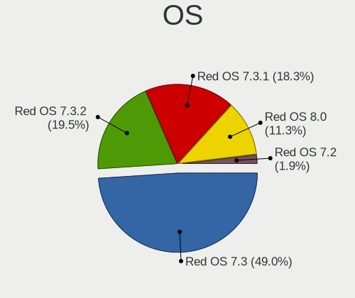
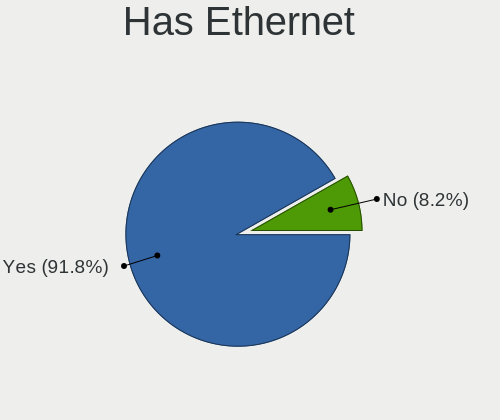
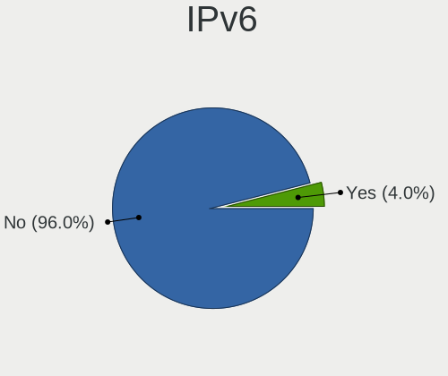
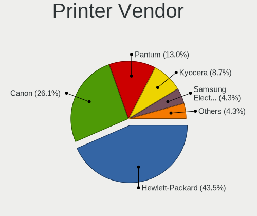

Red OS - Tested Hardware & Statistics
-------------------------------------

A project to collect tested hardware configurations for Red OS.

Anyone can contribute to this report by the [hw-probe](https://github.com/linuxhw/hw-probe) tool:

    sudo -E hw-probe -all -upload

Please contribute! Especially if your hardware is rare.

This is a report for all computer types. See also reports for [desktops](/Dist/Red_OS/Desktop/README.md) and [notebooks](/Dist/Red_OS/Notebook/README.md).

Contents
--------

* [ Test Cases ](#test-cases)

* [ System ](#system)
  - [ OS                       ](#os)
  - [ OS Family                ](#os-family)
  - [ Kernel                   ](#kernel)
  - [ Kernel Family            ](#kernel-family)
  - [ Kernel Major Ver.        ](#kernel-major-ver)
  - [ Arch                     ](#arch)
  - [ DE                       ](#de)
  - [ Display Server           ](#display-server)
  - [ Display Manager          ](#display-manager)
  - [ OS Lang                  ](#os-lang)
  - [ Boot Mode                ](#boot-mode)
  - [ Filesystem               ](#filesystem)
  - [ Part. scheme             ](#part-scheme)
  - [ Dual Boot with Linux/BSD ](#dual-boot-with-linuxbsd)
  - [ Dual Boot (Win)          ](#dual-boot-win)

* [ Board ](#board)
  - [ Vendor                   ](#vendor)
  - [ Model                    ](#model)
  - [ Model Family             ](#model-family)
  - [ MFG Year                 ](#mfg-year)
  - [ Form Factor              ](#form-factor)
  - [ Secure Boot              ](#secure-boot)
  - [ Coreboot                 ](#coreboot)
  - [ RAM Size                 ](#ram-size)
  - [ RAM Used                 ](#ram-used)
  - [ Total Drives             ](#total-drives)
  - [ Has CD-ROM               ](#has-cd-rom)
  - [ Has Ethernet             ](#has-ethernet)
  - [ Has WiFi                 ](#has-wifi)
  - [ Has Bluetooth            ](#has-bluetooth)

* [ Location ](#location)
  - [ Country                  ](#country)
  - [ City                     ](#city)

* [ Drives ](#drives)
  - [ Drive Vendor             ](#drive-vendor)
  - [ Drive Model              ](#drive-model)
  - [ HDD Vendor               ](#hdd-vendor)
  - [ SSD Vendor               ](#ssd-vendor)
  - [ Drive Kind               ](#drive-kind)
  - [ Drive Connector          ](#drive-connector)
  - [ Drive Size               ](#drive-size)
  - [ Space Total              ](#space-total)
  - [ Space Used               ](#space-used)
  - [ Malfunc. Drives          ](#malfunc-drives)
  - [ Malfunc. Drive Vendor    ](#malfunc-drive-vendor)
  - [ Malfunc. HDD Vendor      ](#malfunc-hdd-vendor)
  - [ Malfunc. Drive Kind      ](#malfunc-drive-kind)
  - [ Failed Drives            ](#failed-drives)
  - [ Failed Drive Vendor      ](#failed-drive-vendor)
  - [ Drive Status             ](#drive-status)

* [ Storage controller ](#storage-controller)
  - [ Storage Vendor           ](#storage-vendor)
  - [ Storage Model            ](#storage-model)
  - [ Storage Kind             ](#storage-kind)

* [ Processor ](#processor)
  - [ CPU Vendor               ](#cpu-vendor)
  - [ CPU Model                ](#cpu-model)
  - [ CPU Model Family         ](#cpu-model-family)
  - [ CPU Cores                ](#cpu-cores)
  - [ CPU Sockets              ](#cpu-sockets)
  - [ CPU Threads              ](#cpu-threads)
  - [ CPU Op-Modes             ](#cpu-op-modes)
  - [ CPU Microcode            ](#cpu-microcode)
  - [ CPU Microarch            ](#cpu-microarch)

* [ Graphics ](#graphics)
  - [ GPU Vendor               ](#gpu-vendor)
  - [ GPU Model                ](#gpu-model)
  - [ GPU Combo                ](#gpu-combo)
  - [ GPU Driver               ](#gpu-driver)
  - [ GPU Memory               ](#gpu-memory)

* [ Monitor ](#monitor)
  - [ Monitor Vendor           ](#monitor-vendor)
  - [ Monitor Model            ](#monitor-model)
  - [ Monitor Resolution       ](#monitor-resolution)
  - [ Monitor Diagonal         ](#monitor-diagonal)
  - [ Monitor Width            ](#monitor-width)
  - [ Aspect Ratio             ](#aspect-ratio)
  - [ Monitor Area             ](#monitor-area)
  - [ Pixel Density            ](#pixel-density)
  - [ Multiple Monitors        ](#multiple-monitors)

* [ Network ](#network)
  - [ Net Controller Vendor    ](#net-controller-vendor)
  - [ Net Controller Model     ](#net-controller-model)
  - [ Wireless Vendor          ](#wireless-vendor)
  - [ Wireless Model           ](#wireless-model)
  - [ Ethernet Vendor          ](#ethernet-vendor)
  - [ Ethernet Model           ](#ethernet-model)
  - [ Net Controller Kind      ](#net-controller-kind)
  - [ Used Controller          ](#used-controller)
  - [ NICs                     ](#nics)
  - [ IPv6                     ](#ipv6)

* [ Bluetooth ](#bluetooth)
  - [ Bluetooth Vendor         ](#bluetooth-vendor)
  - [ Bluetooth Model          ](#bluetooth-model)

* [ Sound ](#sound)
  - [ Sound Vendor             ](#sound-vendor)
  - [ Sound Model              ](#sound-model)

* [ Memory ](#memory)
  - [ Memory Vendor            ](#memory-vendor)
  - [ Memory Model             ](#memory-model)
  - [ Memory Kind              ](#memory-kind)
  - [ Memory Form Factor       ](#memory-form-factor)
  - [ Memory Size              ](#memory-size)
  - [ Memory Speed             ](#memory-speed)

* [ Printers & scanners ](#printers--scanners)
  - [ Printer Vendor           ](#printer-vendor)
  - [ Printer Model            ](#printer-model)
  - [ Scanner Vendor           ](#scanner-vendor)
  - [ Scanner Model            ](#scanner-model)

* [ Camera ](#camera)
  - [ Camera Vendor            ](#camera-vendor)
  - [ Camera Model             ](#camera-model)

* [ Security ](#security)
  - [ Fingerprint Vendor       ](#fingerprint-vendor)
  - [ Fingerprint Model        ](#fingerprint-model)
  - [ Chipcard Vendor          ](#chipcard-vendor)
  - [ Chipcard Model           ](#chipcard-model)

* [ Unsupported ](#unsupported)
  - [ Unsupported Devices      ](#unsupported-devices)
  - [ Unsupported Device Types ](#unsupported-device-types)

Test Cases
----------

Total: 216

| Vendor        | Model                       | Form-Factor | Probe                                                      | Date         |
|---------------|-----------------------------|-------------|------------------------------------------------------------|--------------|
| HP            | 84EE 1100                   | All in one  | [7efea8ad7f](https://linux-hardware.org/?probe=7efea8ad7f) | Dec 01, 2022 |
| Lenovo        | Aptio CRB No DPK            | Mini pc     | [eeddc09936](https://linux-hardware.org/?probe=eeddc09936) | Nov 28, 2022 |
| Lenovo        | IdeaPad L340-15API 81LW     | Notebook    | [ddb1791ff6](https://linux-hardware.org/?probe=ddb1791ff6) | Nov 28, 2022 |
| Gigabyte      | B365M DS3H                  | Desktop     | [4b9ee0ef6a](https://linux-hardware.org/?probe=4b9ee0ef6a) | Nov 28, 2022 |
| Gigabyte      | H410M S2H V3                | Desktop     | [8882bfe4f8](https://linux-hardware.org/?probe=8882bfe4f8) | Nov 28, 2022 |
| Lenovo        | IdeaPad 700-15ISK 80RU      | Notebook    | [d9ae3d1795](https://linux-hardware.org/?probe=d9ae3d1795) | Nov 27, 2022 |
| Gigabyte      | X570S UD                    | Desktop     | [381b3c892d](https://linux-hardware.org/?probe=381b3c892d) | Nov 25, 2022 |
| Lenovo        | 31900059 STD                | All in one  | [812cce763f](https://linux-hardware.org/?probe=812cce763f) | Nov 25, 2022 |
| Lenovo        | 31900059 STD                | All in one  | [bfe8939ffc](https://linux-hardware.org/?probe=bfe8939ffc) | Nov 25, 2022 |
| ASUSTek       | PRIME Z590-P                | Desktop     | [7d6cf8c81f](https://linux-hardware.org/?probe=7d6cf8c81f) | Nov 24, 2022 |
| Lenovo        | IdeaPad L340-15API 81LW     | Notebook    | [ff3d0a1ecf](https://linux-hardware.org/?probe=ff3d0a1ecf) | Nov 24, 2022 |
| Lenovo        | IdeaPad L340-15API 81LW     | Notebook    | [f86569d54b](https://linux-hardware.org/?probe=f86569d54b) | Nov 24, 2022 |
| Gigabyte      | B365M DS3H                  | Desktop     | [e48d26b26f](https://linux-hardware.org/?probe=e48d26b26f) | Nov 21, 2022 |
| HUAWEI        | NBD-WXX9                    | Notebook    | [a54f42b51e](https://linux-hardware.org/?probe=a54f42b51e) | Nov 18, 2022 |
| HUAWEI        | NBD-WXX9                    | Notebook    | [faa0deab8f](https://linux-hardware.org/?probe=faa0deab8f) | Nov 18, 2022 |
| Unknown       | P43Twins1600                | Desktop     | [1db44f50c4](https://linux-hardware.org/?probe=1db44f50c4) | Nov 18, 2022 |
| ASRock        | H310CM-DVS                  | Desktop     | [23194fe7d9](https://linux-hardware.org/?probe=23194fe7d9) | Nov 16, 2022 |
| HP            | 2179                        | Desktop     | [3407225f33](https://linux-hardware.org/?probe=3407225f33) | Nov 14, 2022 |
| ASRock        | H310CM-DVS                  | Desktop     | [86932d2426](https://linux-hardware.org/?probe=86932d2426) | Nov 14, 2022 |
| Lenovo        | ThinkPad X220 4290RB3       | Notebook    | [37959973aa](https://linux-hardware.org/?probe=37959973aa) | Nov 11, 2022 |
| ASUSTek       | PRIME H510T2/CSM            | Desktop     | [ef983bc60e](https://linux-hardware.org/?probe=ef983bc60e) | Nov 11, 2022 |
| Lenovo        | IdeaPad L340-15API 81LW     | Notebook    | [3fd33e6782](https://linux-hardware.org/?probe=3fd33e6782) | Nov 09, 2022 |
| Lenovo        | 312D NOK                    | Mini pc     | [e525d01069](https://linux-hardware.org/?probe=e525d01069) | Nov 08, 2022 |
| Lenovo        | 312D NOK                    | Mini pc     | [b74787fe62](https://linux-hardware.org/?probe=b74787fe62) | Nov 08, 2022 |
| ASRock        | H61M-VG4                    | Desktop     | [63f5fe9444](https://linux-hardware.org/?probe=63f5fe9444) | Nov 04, 2022 |
| Lenovo        | IdeaPad L340-15API 81LW     | Notebook    | [dba14315ca](https://linux-hardware.org/?probe=dba14315ca) | Nov 03, 2022 |
| Lenovo        | 312D NOK                    | Mini pc     | [4776ed964f](https://linux-hardware.org/?probe=4776ed964f) | Nov 03, 2022 |
| Lenovo        | 312D NOK                    | Mini pc     | [2c20efc0df](https://linux-hardware.org/?probe=2c20efc0df) | Nov 03, 2022 |
| Gigabyte      | A520M DS3H                  | Desktop     | [8fe13e2165](https://linux-hardware.org/?probe=8fe13e2165) | Nov 02, 2022 |
| ASRock        | H510M-HVS R2.0              | Desktop     | [562f466f8d](https://linux-hardware.org/?probe=562f466f8d) | Nov 02, 2022 |
| ASRock        | B450M Pro4                  | Desktop     | [38b68c6946](https://linux-hardware.org/?probe=38b68c6946) | Nov 02, 2022 |
| ASRock        | H510M-HVS R2.0              | Desktop     | [b68271c648](https://linux-hardware.org/?probe=b68271c648) | Nov 02, 2022 |
| Gigabyte      | B450M H                     | Desktop     | [06bbc75ef0](https://linux-hardware.org/?probe=06bbc75ef0) | Nov 01, 2022 |
| MSI           | 0A90                        | Desktop     | [47fa407c02](https://linux-hardware.org/?probe=47fa407c02) | Nov 01, 2022 |
| Lenovo        | IdeaPad L340-15API 81LW     | Notebook    | [d653658a53](https://linux-hardware.org/?probe=d653658a53) | Oct 28, 2022 |
| Gigabyte      | B560M H                     | Desktop     | [00766db60b](https://linux-hardware.org/?probe=00766db60b) | Oct 28, 2022 |
| MSI           | 0A90                        | Desktop     | [a15ab9db5e](https://linux-hardware.org/?probe=a15ab9db5e) | Oct 28, 2022 |
| Gigabyte      | GA-880GM-D2H                | Desktop     | [cacdacb3ad](https://linux-hardware.org/?probe=cacdacb3ad) | Oct 28, 2022 |
| Lenovo        | IdeaPad L340-15API 81LW     | Notebook    | [b9ab6b9cf2](https://linux-hardware.org/?probe=b9ab6b9cf2) | Oct 28, 2022 |
| Lenovo        | 3188 SDK0J40697 WIN 3305... | Desktop     | [9c429fe90c](https://linux-hardware.org/?probe=9c429fe90c) | Oct 27, 2022 |
| Acer          | Aspire A517-52              | Notebook    | [1ee47a3ab6](https://linux-hardware.org/?probe=1ee47a3ab6) | Oct 25, 2022 |
| ASUSTek       | H81M-K                      | Desktop     | [92dbe47379](https://linux-hardware.org/?probe=92dbe47379) | Oct 25, 2022 |
| ASUSTek       | H81M-K                      | Desktop     | [247782b262](https://linux-hardware.org/?probe=247782b262) | Oct 25, 2022 |
| Lenovo        | IdeaPad 5 Pro 14ACN6 82L... | Notebook    | [14537f243b](https://linux-hardware.org/?probe=14537f243b) | Oct 24, 2022 |
| THUNDEROBO... | 911AirD                     | Notebook    | [f471a1c9db](https://linux-hardware.org/?probe=f471a1c9db) | Oct 23, 2022 |
| Lenovo        | 3708 NOK                    | Desktop     | [f48f731517](https://linux-hardware.org/?probe=f48f731517) | Oct 21, 2022 |
| Intel         | S2600WFT H48104-854         | Server      | [4887ba4bfa](https://linux-hardware.org/?probe=4887ba4bfa) | Oct 21, 2022 |
| Acer          | Aspire A517-52              | Notebook    | [7515d53b5d](https://linux-hardware.org/?probe=7515d53b5d) | Oct 21, 2022 |
| Gigabyte      | B360HD3                     | Desktop     | [bbbdee0883](https://linux-hardware.org/?probe=bbbdee0883) | Oct 21, 2022 |
| Gigabyte      | B75M-D3V                    | Desktop     | [71c9391b8b](https://linux-hardware.org/?probe=71c9391b8b) | Oct 21, 2022 |
| Lenovo        | IdeaPad L340-15API 81LW     | Notebook    | [3fc175d4a0](https://linux-hardware.org/?probe=3fc175d4a0) | Oct 20, 2022 |
| Lenovo        | 312D NOK                    | Mini pc     | [39838b7f39](https://linux-hardware.org/?probe=39838b7f39) | Oct 20, 2022 |
| Lenovo        | ThinkBook 15 G3 ACL 21A4    | Notebook    | [fe184c8f5b](https://linux-hardware.org/?probe=fe184c8f5b) | Oct 19, 2022 |
| Lenovo        | ThinkBook 15 G3 ACL 21A4    | Notebook    | [0db79bc085](https://linux-hardware.org/?probe=0db79bc085) | Oct 19, 2022 |
| Gigabyte      | H510M S2H                   | Desktop     | [e75a8830af](https://linux-hardware.org/?probe=e75a8830af) | Oct 19, 2022 |
| Gigabyte      | H510M S2H                   | Desktop     | [b8303261ad](https://linux-hardware.org/?probe=b8303261ad) | Oct 18, 2022 |
| HP            | 83EB                        | All in one  | [1011557c31](https://linux-hardware.org/?probe=1011557c31) | Oct 18, 2022 |
| HP            | 83EB                        | All in one  | [f81210f730](https://linux-hardware.org/?probe=f81210f730) | Oct 18, 2022 |
| Intel         | S2600WFT H48104-854         | Server      | [7fa3948164](https://linux-hardware.org/?probe=7fa3948164) | Oct 17, 2022 |
| ASUSTek       | H81M-K                      | Desktop     | [c6958291bd](https://linux-hardware.org/?probe=c6958291bd) | Oct 14, 2022 |
| Lenovo        | IdeaPad L340-15API 81LW     | Notebook    | [1cdde90662](https://linux-hardware.org/?probe=1cdde90662) | Oct 13, 2022 |
| HP            | 1495                        | Desktop     | [b1523ff4a6](https://linux-hardware.org/?probe=b1523ff4a6) | Oct 13, 2022 |
| YADRO         | VEGMAN Motherboard MBDX8... | Server      | [97b57f8628](https://linux-hardware.org/?probe=97b57f8628) | Oct 13, 2022 |
| YADRO         | VEGMAN Motherboard MBDX8... | Server      | [f74f853f54](https://linux-hardware.org/?probe=f74f853f54) | Oct 12, 2022 |
| ASUSTek       | PRIME H510T2/CSM            | Desktop     | [087d1975e1](https://linux-hardware.org/?probe=087d1975e1) | Oct 12, 2022 |
| ASUSTek       | B150M-C                     | Desktop     | [1d936352ea](https://linux-hardware.org/?probe=1d936352ea) | Oct 10, 2022 |
| Gigabyte      | H110M-S2-CF                 | Desktop     | [e799b41d70](https://linux-hardware.org/?probe=e799b41d70) | Oct 09, 2022 |
| Acer          | Aspire 2920                 | Notebook    | [c588bacc95](https://linux-hardware.org/?probe=c588bacc95) | Oct 08, 2022 |
| Acer          | Aspire 2920                 | Notebook    | [34b41a4e67](https://linux-hardware.org/?probe=34b41a4e67) | Oct 08, 2022 |
| MSI           | H55M-E33                    | Desktop     | [95423ecdbe](https://linux-hardware.org/?probe=95423ecdbe) | Oct 07, 2022 |
| ASUSTek       | X540NV                      | Notebook    | [31e4464fea](https://linux-hardware.org/?probe=31e4464fea) | Oct 07, 2022 |
| ASRock        | B460M Pro4                  | Desktop     | [9fd01561ce](https://linux-hardware.org/?probe=9fd01561ce) | Oct 07, 2022 |
| ASRock        | B460M Pro4                  | Desktop     | [4c0bb83f01](https://linux-hardware.org/?probe=4c0bb83f01) | Oct 07, 2022 |
| MSI           | H55M-E33                    | Desktop     | [7af53a4dee](https://linux-hardware.org/?probe=7af53a4dee) | Oct 06, 2022 |
| Lenovo        | IdeaPad L340-15API 81LW     | Notebook    | [7f8e650618](https://linux-hardware.org/?probe=7f8e650618) | Oct 06, 2022 |
| Acer          | Aspire 2920                 | Notebook    | [538f7a6e26](https://linux-hardware.org/?probe=538f7a6e26) | Oct 05, 2022 |
| HP            | OMEN by Laptop              | Notebook    | [0a8238a876](https://linux-hardware.org/?probe=0a8238a876) | Oct 05, 2022 |
| Lenovo        | 3188 SDK0J40697 WIN 3305... | Desktop     | [b90de94f3d](https://linux-hardware.org/?probe=b90de94f3d) | Oct 05, 2022 |
| THUNDEROBO... | 911AirD                     | Notebook    | [69a9650652](https://linux-hardware.org/?probe=69a9650652) | Oct 03, 2022 |
| Lenovo        | IdeaPad L340-15API 81LW     | Notebook    | [89b48cd98e](https://linux-hardware.org/?probe=89b48cd98e) | Oct 03, 2022 |
| Lenovo        | 32E4 NOK                    | Mini pc     | [f49f7ba847](https://linux-hardware.org/?probe=f49f7ba847) | Oct 03, 2022 |
| Digma         | EVE 11 C408                 | Notebook    | [b5c7ac8ed3](https://linux-hardware.org/?probe=b5c7ac8ed3) | Sep 30, 2022 |
| ASRock        | B360M-HDV                   | Desktop     | [fad5a877f5](https://linux-hardware.org/?probe=fad5a877f5) | Sep 30, 2022 |
| THUNDEROBO... | 911AirD                     | Notebook    | [99f1b7e253](https://linux-hardware.org/?probe=99f1b7e253) | Sep 29, 2022 |
| RDW           | MB-B450M V.1                | Desktop     | [8c3a565d43](https://linux-hardware.org/?probe=8c3a565d43) | Sep 26, 2022 |
| Gigabyte      | B550 AORUS ELITE V2         | Desktop     | [1748378749](https://linux-hardware.org/?probe=1748378749) | Sep 22, 2022 |
| Gigabyte      | B75M-D3V                    | Desktop     | [3888b56318](https://linux-hardware.org/?probe=3888b56318) | Sep 22, 2022 |
| Gigabyte      | B550 AORUS ELITE V2         | Desktop     | [66a228f8c5](https://linux-hardware.org/?probe=66a228f8c5) | Sep 21, 2022 |
| ICL           | RAYbook Si1512              | Notebook    | [0b610b66a9](https://linux-hardware.org/?probe=0b610b66a9) | Sep 20, 2022 |
| Gigabyte      | H110M-S2-CF                 | Desktop     | [fd03d25b78](https://linux-hardware.org/?probe=fd03d25b78) | Sep 15, 2022 |
| ECS           | H510H6-M7                   | Desktop     | [1275257180](https://linux-hardware.org/?probe=1275257180) | Sep 14, 2022 |
| Lenovo        | IdeaPad L340-15API 81LW     | Notebook    | [713797403a](https://linux-hardware.org/?probe=713797403a) | Sep 09, 2022 |
| IP3 Techno... | ACN30                       | Notebook    | [af9694cea8](https://linux-hardware.org/?probe=af9694cea8) | Sep 06, 2022 |
| IP3 Techno... | ACN30                       | Notebook    | [03f14a115d](https://linux-hardware.org/?probe=03f14a115d) | Sep 05, 2022 |
| Unknown       | Unknown                     | Desktop     | [40c1fd4544](https://linux-hardware.org/?probe=40c1fd4544) | Sep 05, 2022 |
| Gigabyte      | B450 AORUS PRO-CF           | Desktop     | [04b62ac6e3](https://linux-hardware.org/?probe=04b62ac6e3) | Sep 04, 2022 |
| Gigabyte      | B450 AORUS PRO-CF           | Desktop     | [a60315c259](https://linux-hardware.org/?probe=a60315c259) | Sep 04, 2022 |
| MSI           | FX610                       | Notebook    | [a822818a58](https://linux-hardware.org/?probe=a822818a58) | Sep 03, 2022 |
| ASRock        | N68-VS3 FX                  | Desktop     | [b4c043c208](https://linux-hardware.org/?probe=b4c043c208) | Sep 01, 2022 |
| ASRock        | B365M Pro4-F                | Desktop     | [3b519201e2](https://linux-hardware.org/?probe=3b519201e2) | Aug 22, 2022 |
| Gigabyte      | X58-USB3                    | Desktop     | [5119bcb630](https://linux-hardware.org/?probe=5119bcb630) | Aug 19, 2022 |
| IP3 Techno... | ACN30                       | Notebook    | [e25ed534c0](https://linux-hardware.org/?probe=e25ed534c0) | Aug 18, 2022 |
| ICL           | RAYbook Si1512              | Notebook    | [a42c4dc65a](https://linux-hardware.org/?probe=a42c4dc65a) | Aug 09, 2022 |
| ASRock        | H110M-DVS R2.0              | Desktop     | [c02a953cda](https://linux-hardware.org/?probe=c02a953cda) | Aug 01, 2022 |
| Gigabyte      | B365M DS3H                  | Desktop     | [14f73b6a3a](https://linux-hardware.org/?probe=14f73b6a3a) | Aug 01, 2022 |
| Digma         | EVE 15 P417 ES5063EW        | Notebook    | [a584c678b5](https://linux-hardware.org/?probe=a584c678b5) | Jul 27, 2022 |
| Digma         | EVE 15 C407 ES5054EW        | Notebook    | [4fd01756b2](https://linux-hardware.org/?probe=4fd01756b2) | Jul 27, 2022 |
| Digma         | EVE 15 C407 ES5054EW        | Notebook    | [008b02cc92](https://linux-hardware.org/?probe=008b02cc92) | Jul 26, 2022 |
| Dell          | 040DDP A00                  | Desktop     | [5375c9c059](https://linux-hardware.org/?probe=5375c9c059) | Jul 26, 2022 |
| Lenovo        | IdeaPad 5 Pro 14ACN6 82L... | Notebook    | [413949a727](https://linux-hardware.org/?probe=413949a727) | Jul 25, 2022 |
| Lenovo        | V15-IWL 81YE                | Notebook    | [3bfcedd5c8](https://linux-hardware.org/?probe=3bfcedd5c8) | Jul 22, 2022 |
| Lenovo        | V15-IWL 81YE                | Notebook    | [c49282206c](https://linux-hardware.org/?probe=c49282206c) | Jul 22, 2022 |
| Lenovo        | V15-IWL 81YE                | Notebook    | [d598c4587d](https://linux-hardware.org/?probe=d598c4587d) | Jul 22, 2022 |
| DEPO Compu... | DPH310T                     | Desktop     | [7cc031e93b](https://linux-hardware.org/?probe=7cc031e93b) | Jul 22, 2022 |
| DEPO Compu... | DPH310T                     | Desktop     | [946610c122](https://linux-hardware.org/?probe=946610c122) | Jul 22, 2022 |
| Lenovo        | V15-IWL 81YE                | Notebook    | [5b1e962751](https://linux-hardware.org/?probe=5b1e962751) | Jul 22, 2022 |
| Lenovo        | V15-IWL 81YE                | Notebook    | [4e120b3b63](https://linux-hardware.org/?probe=4e120b3b63) | Jul 22, 2022 |
| DEPO Compu... | DPH310T                     | Desktop     | [fbff39be7e](https://linux-hardware.org/?probe=fbff39be7e) | Jul 22, 2022 |
| Lenovo        | V15-IWL 81YE                | Notebook    | [2d5bedf224](https://linux-hardware.org/?probe=2d5bedf224) | Jul 22, 2022 |
| Lenovo        | V15-IWL 81YE                | Notebook    | [297ce5144e](https://linux-hardware.org/?probe=297ce5144e) | Jul 22, 2022 |
| Lenovo        | V15-IWL 81YE                | Notebook    | [84b7cd1115](https://linux-hardware.org/?probe=84b7cd1115) | Jul 22, 2022 |
| Lenovo        | V15-IWL 81YE                | Notebook    | [a92b6c5d73](https://linux-hardware.org/?probe=a92b6c5d73) | Jul 22, 2022 |
| Lenovo        | V15-IWL 81YE                | Notebook    | [51ebd271c8](https://linux-hardware.org/?probe=51ebd271c8) | Jul 22, 2022 |
| DEPO Compu... | DPH310T                     | Desktop     | [0076bf5efc](https://linux-hardware.org/?probe=0076bf5efc) | Jul 22, 2022 |
| Lenovo        | V15-IWL 81YE                | Notebook    | [44ad7f7d47](https://linux-hardware.org/?probe=44ad7f7d47) | Jul 22, 2022 |
| Lenovo        | V15-IWL 81YE                | Notebook    | [49068a26b5](https://linux-hardware.org/?probe=49068a26b5) | Jul 22, 2022 |
| Lenovo        | V15-IWL 81YE                | Notebook    | [62ce596bf3](https://linux-hardware.org/?probe=62ce596bf3) | Jul 22, 2022 |
| Lenovo        | V15-IWL 81YE                | Notebook    | [812db8ad6f](https://linux-hardware.org/?probe=812db8ad6f) | Jul 22, 2022 |
| Lenovo        | V15-IWL 81YE                | Notebook    | [d4c2b5ffad](https://linux-hardware.org/?probe=d4c2b5ffad) | Jul 22, 2022 |
| Lenovo        | V15-IWL 81YE                | Notebook    | [4c0179b60e](https://linux-hardware.org/?probe=4c0179b60e) | Jul 22, 2022 |
| Lenovo        | IdeaPad L340-15API 81LW     | Notebook    | [8601888983](https://linux-hardware.org/?probe=8601888983) | Jul 22, 2022 |
| Lenovo        | V15-IWL 81YE                | Notebook    | [1d505390d6](https://linux-hardware.org/?probe=1d505390d6) | Jul 22, 2022 |
| HONOR         | NBR-WAX9                    | Notebook    | [5b3340311a](https://linux-hardware.org/?probe=5b3340311a) | Jul 20, 2022 |
| Lenovo        | IdeaPad L340-15API 81LW     | Notebook    | [154c254eac](https://linux-hardware.org/?probe=154c254eac) | Jul 19, 2022 |
| Gigabyte      | G5 GD                       | Notebook    | [60921a7ff6](https://linux-hardware.org/?probe=60921a7ff6) | Jul 19, 2022 |
| Gigabyte      | G5 GD                       | Notebook    | [c24f8b4ba6](https://linux-hardware.org/?probe=c24f8b4ba6) | Jul 19, 2022 |
| Lenovo        | 312D NOK                    | Mini pc     | [4f1a1bfb2d](https://linux-hardware.org/?probe=4f1a1bfb2d) | Jul 19, 2022 |
| Gigabyte      | 970A-D3                     | Desktop     | [f2ae77cc0c](https://linux-hardware.org/?probe=f2ae77cc0c) | Jul 17, 2022 |
| HONOR         | NBR-WAX9                    | Notebook    | [fe971bb8c3](https://linux-hardware.org/?probe=fe971bb8c3) | Jul 08, 2022 |
| Lenovo        | IdeaPad 3 15ITL05 81X8      | Notebook    | [2835672840](https://linux-hardware.org/?probe=2835672840) | Jul 07, 2022 |
| Kraftway      | ACCORD                      | Notebook    | [24e49bc011](https://linux-hardware.org/?probe=24e49bc011) | Jun 27, 2022 |
| Kraftway      | ACCORD                      | Notebook    | [39e3c55e89](https://linux-hardware.org/?probe=39e3c55e89) | Jun 27, 2022 |
| ASUSTek       | M2N68-AM Plus               | Desktop     | [d85cded80a](https://linux-hardware.org/?probe=d85cded80a) | Jun 20, 2022 |
| Aquarius      | NS685U                      | Notebook    | [ecedc7cbb6](https://linux-hardware.org/?probe=ecedc7cbb6) | Jun 08, 2022 |
| ASUSTek       | PRIME H510T2/CSM            | Desktop     | [28e8a1e19c](https://linux-hardware.org/?probe=28e8a1e19c) | Jun 07, 2022 |
| ASUSTek       | H81M-K                      | Desktop     | [df5b1991e1](https://linux-hardware.org/?probe=df5b1991e1) | Jun 07, 2022 |
| ICL           | Unknown                     | Notebook    | [4dc89fc689](https://linux-hardware.org/?probe=4dc89fc689) | Jun 07, 2022 |
| HP            | 0B4Ch D                     | Desktop     | [8ea7efbf2e](https://linux-hardware.org/?probe=8ea7efbf2e) | Jun 07, 2022 |
| iRU           | v1.0                        | Mini pc     | [845212ce42](https://linux-hardware.org/?probe=845212ce42) | Jun 02, 2022 |
| iRU           | v1.0                        | Mini pc     | [15b125fb9e](https://linux-hardware.org/?probe=15b125fb9e) | May 31, 2022 |
| iRU           | v1.0                        | Mini pc     | [991e061d78](https://linux-hardware.org/?probe=991e061d78) | May 31, 2022 |
| MSI           | A520M PRO                   | Desktop     | [3eb8006c14](https://linux-hardware.org/?probe=3eb8006c14) | May 26, 2022 |
| MSI           | A520M PRO                   | Desktop     | [9766bbe4c0](https://linux-hardware.org/?probe=9766bbe4c0) | May 25, 2022 |
| ASRock        | B365M Pro4-F                | Desktop     | [b3b2ee08af](https://linux-hardware.org/?probe=b3b2ee08af) | May 23, 2022 |
| MSI           | H510TI-S01                  | Desktop     | [efe42ef07a](https://linux-hardware.org/?probe=efe42ef07a) | May 19, 2022 |
| ASUSTek       | V241IC-R                    | All in one  | [48add8dc01](https://linux-hardware.org/?probe=48add8dc01) | May 19, 2022 |
| Gigabyte      | B365M H                     | Desktop     | [e405d209d4](https://linux-hardware.org/?probe=e405d209d4) | May 11, 2022 |
| mtech         | MTL1578                     | Notebook    | [bf25c26ea0](https://linux-hardware.org/?probe=bf25c26ea0) | May 11, 2022 |
| ASUSTek       | H81M-K                      | Desktop     | [66bb3248d5](https://linux-hardware.org/?probe=66bb3248d5) | May 11, 2022 |
| Digma         | CITI 10 C402T CS1044EW      | Tablet      | [eefe92e281](https://linux-hardware.org/?probe=eefe92e281) | May 04, 2022 |
| ASRock        | B560 Pro4                   | Desktop     | [1c3459c038](https://linux-hardware.org/?probe=1c3459c038) | Apr 19, 2022 |
| HUAWEI        | BOD-WXX9                    | Notebook    | [e2e025dd4f](https://linux-hardware.org/?probe=e2e025dd4f) | Apr 15, 2022 |
| Acer          | TravelMate P215-53          | Notebook    | [124fdb3b64](https://linux-hardware.org/?probe=124fdb3b64) | Apr 14, 2022 |
| Lenovo        | ThinkBook 14-IIL 20SL       | Notebook    | [be41efbec8](https://linux-hardware.org/?probe=be41efbec8) | Apr 05, 2022 |
| Gigabyte      | B75M-D3V                    | Desktop     | [d648ac5ab2](https://linux-hardware.org/?probe=d648ac5ab2) | Apr 01, 2022 |
| Gigabyte      | B75M-D2V                    | Desktop     | [7b4861c8af](https://linux-hardware.org/?probe=7b4861c8af) | Apr 01, 2022 |
| Gigabyte      | H410M H V3                  | Desktop     | [9d86d8119a](https://linux-hardware.org/?probe=9d86d8119a) | Apr 01, 2022 |
| Gigabyte      | B75M-D2V                    | Desktop     | [b8ff95c0f1](https://linux-hardware.org/?probe=b8ff95c0f1) | Mar 30, 2022 |
| Aquarius      | NS585 R32                   | Notebook    | [582389ca98](https://linux-hardware.org/?probe=582389ca98) | Mar 24, 2022 |
| Lenovo        | 312D SDK0J40697 WIN 3305... | Mini pc     | [e76e5359b7](https://linux-hardware.org/?probe=e76e5359b7) | Mar 23, 2022 |
| Lenovo        | IdeaPad L340-15IWL 81LG     | Notebook    | [56f9ebba91](https://linux-hardware.org/?probe=56f9ebba91) | Mar 22, 2022 |
| Lenovo        | ThinkBook 15 G3 ACL 21A4    | Notebook    | [e18b80073c](https://linux-hardware.org/?probe=e18b80073c) | Mar 21, 2022 |
| 3Logic Gro... | APM Graviton A15i-K2        | Notebook    | [e93bcf2f42](https://linux-hardware.org/?probe=e93bcf2f42) | Mar 09, 2022 |
| ASUSTek       | H110-PLUS                   | Desktop     | [5074891336](https://linux-hardware.org/?probe=5074891336) | Mar 09, 2022 |
| Aquarius      | AQH410T                     | Desktop     | [f02c2d0259](https://linux-hardware.org/?probe=f02c2d0259) | Mar 02, 2022 |
| Aquarius      | AQB560M                     | All in one  | [4d3df118f0](https://linux-hardware.org/?probe=4d3df118f0) | Mar 01, 2022 |
| Aquarius      | AQB560M                     | Desktop     | [091fa6d697](https://linux-hardware.org/?probe=091fa6d697) | Mar 01, 2022 |
| Lenovo        | 316E SDK0J40697 WIN 3305... | Mini pc     | [bf51c93832](https://linux-hardware.org/?probe=bf51c93832) | Feb 22, 2022 |
| Lenovo        | 316E SDK0J40697 WIN 3305... | Mini pc     | [a831ba5c10](https://linux-hardware.org/?probe=a831ba5c10) | Feb 22, 2022 |
| Gigabyte      | B560M DS3H                  | Desktop     | [9db1aef186](https://linux-hardware.org/?probe=9db1aef186) | Feb 18, 2022 |
| ASUSTek       | TUF Gaming FX705DT_FX705... | Notebook    | [227a2658d0](https://linux-hardware.org/?probe=227a2658d0) | Feb 15, 2022 |
| ASUSTek       | PRIME H510M-K               | Desktop     | [c1f9ad0faf](https://linux-hardware.org/?probe=c1f9ad0faf) | Feb 01, 2022 |
| Gigabyte      | B75M-D3V                    | Desktop     | [14d2075383](https://linux-hardware.org/?probe=14d2075383) | Jan 31, 2022 |
| ASUSTek       | PRIME H510T2/CSM            | Desktop     | [38ddf02b60](https://linux-hardware.org/?probe=38ddf02b60) | Jan 31, 2022 |
| Gigabyte      | B365M DS3H                  | Desktop     | [36db0c9260](https://linux-hardware.org/?probe=36db0c9260) | Jan 17, 2022 |
| HP            | Laptop 15s-eq1xxx           | Notebook    | [7ed7e139d8](https://linux-hardware.org/?probe=7ed7e139d8) | Dec 20, 2021 |
| HP            | Laptop 15s-eq1xxx           | Notebook    | [55ab1c9ab8](https://linux-hardware.org/?probe=55ab1c9ab8) | Dec 20, 2021 |
| HUAWEI        | NBLK-WAX9X                  | Notebook    | [5bb21d6bf6](https://linux-hardware.org/?probe=5bb21d6bf6) | Dec 13, 2021 |
| Aquarius      | AQB560M                     | Desktop     | [ff20437ae0](https://linux-hardware.org/?probe=ff20437ae0) | Nov 25, 2021 |
| Aquarius      | AQB560M                     | Desktop     | [4656a05904](https://linux-hardware.org/?probe=4656a05904) | Nov 22, 2021 |
| Gigabyte      | B75M-D2V                    | Desktop     | [ef54320d4b](https://linux-hardware.org/?probe=ef54320d4b) | Oct 19, 2021 |
| Gigabyte      | B560M DS3H                  | Desktop     | [5a071f96dd](https://linux-hardware.org/?probe=5a071f96dd) | Oct 19, 2021 |
| ICL           | RAYbook Si1514              | Notebook    | [9ddc61deba](https://linux-hardware.org/?probe=9ddc61deba) | Sep 13, 2021 |
| ASUSTek       | TUF Gaming FX705DT_FX705... | Notebook    | [4f59992d0f](https://linux-hardware.org/?probe=4f59992d0f) | Sep 11, 2021 |
| ASRock        | H470M-HDV                   | Desktop     | [ba7bdac2dd](https://linux-hardware.org/?probe=ba7bdac2dd) | Sep 04, 2021 |
| Gigabyte      | H110M-M2-CF                 | Desktop     | [54a20af366](https://linux-hardware.org/?probe=54a20af366) | Aug 27, 2021 |
| HP            | Laptop 15-dw3xxx            | Notebook    | [d8b35044ab](https://linux-hardware.org/?probe=d8b35044ab) | Jul 29, 2021 |
| Lenovo        | IdeaPad 5 15ARE05 81YQ      | Notebook    | [9b2c758081](https://linux-hardware.org/?probe=9b2c758081) | Jun 10, 2021 |
| ASUSTek       | H110-PLUS                   | Desktop     | [11e1a45e67](https://linux-hardware.org/?probe=11e1a45e67) | Jun 03, 2021 |
| Gigabyte      | B365M DS3H                  | Desktop     | [7b4a0634ef](https://linux-hardware.org/?probe=7b4a0634ef) | Apr 26, 2021 |
| ASUSTek       | H110M-PLUS                  | Desktop     | [b779fb9e40](https://linux-hardware.org/?probe=b779fb9e40) | Apr 09, 2021 |
| ASUSTek       | P8H61-I LX R2.0             | Desktop     | [6e0321d64f](https://linux-hardware.org/?probe=6e0321d64f) | Apr 08, 2021 |
| ASUSTek       | X75VD                       | Notebook    | [95ea9551da](https://linux-hardware.org/?probe=95ea9551da) | Apr 05, 2021 |
| ASUSTek       | TUF Gaming FX705DT_FX705... | Notebook    | [916d4b225b](https://linux-hardware.org/?probe=916d4b225b) | Mar 30, 2021 |
| ASUSTek       | TUF Gaming FX705DT_FX705... | Notebook    | [ebfafc7409](https://linux-hardware.org/?probe=ebfafc7409) | Mar 26, 2021 |
| HUAWEI        | BOHL-WXX9                   | Notebook    | [cf5559d576](https://linux-hardware.org/?probe=cf5559d576) | Mar 26, 2021 |
| Gigabyte      | B365M DS3H                  | Desktop     | [d151197565](https://linux-hardware.org/?probe=d151197565) | Mar 26, 2021 |
| HP            | Pavilion g6                 | Notebook    | [1ca79b1950](https://linux-hardware.org/?probe=1ca79b1950) | Mar 26, 2021 |
| ASUSTek       | H81M-K                      | Desktop     | [a61243addd](https://linux-hardware.org/?probe=a61243addd) | Mar 26, 2021 |
| ASUSTek       | H110M-K                     | Desktop     | [30e7a27178](https://linux-hardware.org/?probe=30e7a27178) | Mar 22, 2021 |
| ASUSTek       | H110M-K                     | Desktop     | [da0a735a9f](https://linux-hardware.org/?probe=da0a735a9f) | Mar 18, 2021 |
| Pegatron      | A35                         | Notebook    | [9923a21e8c](https://linux-hardware.org/?probe=9923a21e8c) | Mar 04, 2021 |
| ASUSTek       | H81M-K                      | Desktop     | [5898a71c25](https://linux-hardware.org/?probe=5898a71c25) | Nov 03, 2020 |
| Gigabyte      | B360M DS3H                  | Desktop     | [12f125beba](https://linux-hardware.org/?probe=12f125beba) | Jan 16, 2020 |
| Gigabyte      | B360M DS3H                  | Desktop     | [c88331017f](https://linux-hardware.org/?probe=c88331017f) | Jan 16, 2020 |
| ASUSTek       | H81M-K                      | Desktop     | [24adf26804](https://linux-hardware.org/?probe=24adf26804) | Jan 13, 2020 |

System
------

OS
--

Installed operating systems

| Name         | Computers | Percent |
|--------------|-----------|---------|
| Red OS 7.3.1 | 93        | 58.86%  |
| Red OS 7.3   | 51        | 32.28%  |
| Red OS 7.3.2 | 8         | 5.06%   |
| Red OS 7.2   | 6         | 3.8%    |

OS Family
---------

OS without a version

| Name   | Computers | Percent |
|--------|-----------|---------|
| Red OS | 148       | 100%    |

Kernel
------

Version of the Linux kernel

| Version                | Computers | Percent |
|------------------------|-----------|---------|
| 5.15.10-1.el7.x86_64   | 46        | 27.71%  |
| 5.10.29-1.el7.x86_64   | 26        | 15.66%  |
| 5.15.35-5.el7.3.x86_64 | 21        | 12.65%  |
| 5.15.35-4.el7.3.x86_64 | 19        | 11.45%  |
| 5.15.35-1.el7.3.x86_64 | 16        | 9.64%   |
| 5.15.72-1.el7.3.x86_64 | 6         | 3.61%   |
| 5.15.10-2.el7.x86_64   | 5         | 3.01%   |
| 5.15.10-3.el7.x86_64   | 4         | 2.41%   |
| 5.10.1-1.el7.x86_64    | 4         | 2.41%   |
| 4.19.79-1.el7.x86_64   | 4         | 2.41%   |
| 5.10.24-2.el7.x86_64   | 3         | 1.81%   |
| 5.18.1-1.el7.x86_64    | 2         | 1.2%    |
| 5.15.10-4.el7.x86_64   | 2         | 1.2%    |
| 5.10.29-3.el7.x86_64   | 2         | 1.2%    |
| 5.14.9-1.el7.x86_64    | 1         | 0.6%    |
| 5.13.15-1.el7.x86_64   | 1         | 0.6%    |
| 5.10.24-3.el7.x86_64   | 1         | 0.6%    |
| 5.10.24-1.el7.x86_64   | 1         | 0.6%    |
| 4.19.56-2.el7.x86_64   | 1         | 0.6%    |
| 4.19.204-1.el7.x86_64  | 1         | 0.6%    |

Kernel Family
-------------

Linux kernel without a distro release

| Version  | Computers | Percent |
|----------|-----------|---------|
| 5.15.10  | 57        | 35.19%  |
| 5.15.35  | 52        | 32.1%   |
| 5.10.29  | 28        | 17.28%  |
| 5.15.72  | 6         | 3.7%    |
| 5.10.24  | 5         | 3.09%   |
| 5.10.1   | 4         | 2.47%   |
| 4.19.79  | 4         | 2.47%   |
| 5.18.1   | 2         | 1.23%   |
| 5.14.9   | 1         | 0.62%   |
| 5.13.15  | 1         | 0.62%   |
| 4.19.56  | 1         | 0.62%   |
| 4.19.204 | 1         | 0.62%   |

Kernel Major Ver.
-----------------

Linux kernel major version

| Version | Computers | Percent |
|---------|-----------|---------|
| 5.15    | 111       | 70.7%   |
| 5.10    | 36        | 22.93%  |
| 4.19    | 6         | 3.82%   |
| 5.18    | 2         | 1.27%   |
| 5.14    | 1         | 0.64%   |
| 5.13    | 1         | 0.64%   |

Arch
----

OS architecture (x86_64, i586, etc.)

| Name   | Computers | Percent |
|--------|-----------|---------|
| x86_64 | 148       | 100%    |

DE
--

Desktop Environment

| Name       | Computers | Percent |
|------------|-----------|---------|
| MATE       | 120       | 77.42%  |
| Cinnamon   | 31        | 20%     |
| X-Cinnamon | 2         | 1.29%   |
| Unknown    | 2         | 1.29%   |

Display Server
--------------

X11 or Wayland

| Name    | Computers | Percent |
|---------|-----------|---------|
| X11     | 140       | 92.11%  |
| Wayland | 11        | 7.24%   |
| Unknown | 1         | 0.66%   |

Display Manager
---------------

SDDM, LightDM, etc.

| Name    | Computers | Percent |
|---------|-----------|---------|
| GDM     | 141       | 94%     |
| SDDM    | 5         | 3.33%   |
| Unknown | 4         | 2.67%   |

OS Lang
-------

Language

| Lang    | Computers | Percent |
|---------|-----------|---------|
| Unknown | 143       | 95.97%  |
| ru_RU   | 5         | 3.36%   |
| en_US   | 1         | 0.67%   |

Boot Mode
---------

EFI or BIOS

| Mode | Computers | Percent |
|------|-----------|---------|
| EFI  | 113       | 74.34%  |
| BIOS | 39        | 25.66%  |

Filesystem
----------

Type of filesystem

| Type    | Computers | Percent |
|---------|-----------|---------|
| Ext4    | 145       | 96.67%  |
| Btrfs   | 4         | 2.67%   |
| Unknown | 1         | 0.67%   |

Part. scheme
------------

Scheme of partitioning

| Type    | Computers | Percent |
|---------|-----------|---------|
| GPT     | 116       | 77.33%  |
| MBR     | 31        | 20.67%  |
| Unknown | 3         | 2%      |

Dual Boot with Linux/BSD
------------------------

Hosting more than one Linux/BSD

| Dual boot | Computers | Percent |
|-----------|-----------|---------|
| No        | 134       | 89.33%  |
| Yes       | 16        | 10.67%  |

Dual Boot (Win)
---------------

Hosting Linux and Windows

| Dual boot | Computers | Percent |
|-----------|-----------|---------|
| No        | 110       | 73.33%  |
| Yes       | 40        | 26.67%  |

Board
-----

Vendor
------

Motherboard manufacturer

| Name                | Computers | Percent |
|---------------------|-----------|---------|
| Lenovo              | 36        | 24.32%  |
| Gigabyte Technology | 28        | 18.92%  |
| ASUSTek Computer    | 16        | 10.81%  |
| ASRock              | 11        | 7.43%   |
| Hewlett-Packard     | 9         | 6.08%   |
| Aquarius            | 7         | 4.73%   |
| MSI                 | 6         | 4.05%   |
| ICL                 | 4         | 2.7%    |
| HUAWEI              | 4         | 2.7%    |
| Digma               | 4         | 2.7%    |
| DEPO Computers      | 4         | 2.7%    |
| Acer                | 3         | 2.03%   |
| IP3 Technology      | 2         | 1.35%   |
| Unknown             | 2         | 1.35%   |
| YADRO               | 1         | 0.68%   |
| THUNDEROBOT         | 1         | 0.68%   |
| RDW                 | 1         | 0.68%   |
| Pegatron            | 1         | 0.68%   |
| mtech               | 1         | 0.68%   |
| Kraftway            | 1         | 0.68%   |
| iRU                 | 1         | 0.68%   |
| Intel               | 1         | 0.68%   |
| HONOR               | 1         | 0.68%   |
| ECS                 | 1         | 0.68%   |
| Dell                | 1         | 0.68%   |
| 3Logic Group        | 1         | 0.68%   |

Model
-----

Motherboard model

| Name                                     | Computers | Percent |
|------------------------------------------|-----------|---------|
| Lenovo V15-IWL 81YE                      | 17        | 11.49%  |
| Gigabyte B365M DS3H                      | 4         | 2.7%    |
| DEPO Computers DPH310T                   | 4         | 2.7%    |
| Unknown                                  | 3         | 2.03%   |
| MSI MS-7D14                              | 2         | 1.35%   |
| Lenovo ThinkBook 15 G3 ACL 21A4          | 2         | 1.35%   |
| IP3 ACN30                                | 2         | 1.35%   |
| ICL RAYbook Si1512                       | 2         | 1.35%   |
| Gigabyte H110M-S2                        | 2         | 1.35%   |
| Gigabyte B560M DS3H                      | 2         | 1.35%   |
| Gigabyte B550 AORUS ELITE V2             | 2         | 1.35%   |
| ASUS PC                                  | 2         | 1.35%   |
| YADRO VEGMAN S220 Server                 | 1         | 0.68%   |
| THUNDEROBOT 911AirD                      | 1         | 0.68%   |
| RDW RDW-MB-B450M V.1                     | 1         | 0.68%   |
| Pegatron A35                             | 1         | 0.68%   |
| mtech MTL1578                            | 1         | 0.68%   |
| MSI MS-7D35                              | 1         | 0.68%   |
| MSI MS-7636                              | 1         | 0.68%   |
| MSI FX610                                | 1         | 0.68%   |
| MSI Compaq dx2300 Microtower             | 1         | 0.68%   |
| Lenovo V50s-07IMB 11EF0011RU             | 1         | 0.68%   |
| Lenovo ThinkPad X220 4290RB3             | 1         | 0.68%   |
| Lenovo ThinkCentre M75q Gen 2 11JNS02N00 | 1         | 0.68%   |
| Lenovo ThinkCentre M720q 10T8S08X00      | 1         | 0.68%   |
| Lenovo ThinkCentre M720q 10T7S18500      | 1         | 0.68%   |
| Lenovo ThinkCentre M720q 10T7004KRU      | 1         | 0.68%   |
| Lenovo ThinkCentre M70q 11DT003QRU       | 1         | 0.68%   |
| Lenovo ThinkBook 14-IIL 20SL             | 1         | 0.68%   |
| Lenovo S200z 10K5001YRU                  | 1         | 0.68%   |
| Lenovo IdeaPad L340-15IWL 81LG           | 1         | 0.68%   |
| Lenovo IdeaPad L340-15API 81LW           | 1         | 0.68%   |
| Lenovo IdeaPad 700-15ISK 80RU            | 1         | 0.68%   |
| Lenovo IdeaPad 5 Pro 14ACN6 82L7         | 1         | 0.68%   |
| Lenovo IdeaPad 5 15ARE05 81YQ            | 1         | 0.68%   |
| Lenovo IdeaPad 3 15ITL05 81X8            | 1         | 0.68%   |
| Lenovo IdeaCentre B550 10135             | 1         | 0.68%   |
| Lenovo IdeaCentre 3 07ADA05 90MV0059RS   | 1         | 0.68%   |
| Kraftway ACCORD                          | 1         | 0.68%   |
| iRU P11AP                                | 1         | 0.68%   |

Model Family
------------

Motherboard model prefix

| Name                   | Computers | Percent |
|------------------------|-----------|---------|
| Lenovo V15-IWL         | 17        | 11.49%  |
| Lenovo IdeaPad         | 6         | 4.05%   |
| Lenovo ThinkCentre     | 5         | 3.38%   |
| Gigabyte B365M         | 5         | 3.38%   |
| DEPO Computers DPH310T | 4         | 2.7%    |
| Lenovo ThinkBook       | 3         | 2.03%   |
| ICL RAYbook            | 3         | 2.03%   |
| Gigabyte B560M         | 3         | 2.03%   |
| Digma EVE              | 3         | 2.03%   |
| ASUS PRIME             | 3         | 2.03%   |
| Unknown                | 3         | 2.03%   |
| MSI MS-7D14            | 2         | 1.35%   |
| Lenovo IdeaCentre      | 2         | 1.35%   |
| IP3 ACN30              | 2         | 1.35%   |
| HP ProOne              | 2         | 1.35%   |
| HP Pavilion            | 2         | 1.35%   |
| HP Laptop              | 2         | 1.35%   |
| Gigabyte H410M         | 2         | 1.35%   |
| Gigabyte H110M-S2      | 2         | 1.35%   |
| Gigabyte B550          | 2         | 1.35%   |
| ASUS PC                | 2         | 1.35%   |
| Aquarius Pro           | 2         | 1.35%   |
| Acer Aspire            | 2         | 1.35%   |
| YADRO VEGMAN           | 1         | 0.68%   |
| THUNDEROBOT 911AirD    | 1         | 0.68%   |
| RDW RDW-MB-B450M       | 1         | 0.68%   |
| Pegatron A35           | 1         | 0.68%   |
| mtech MTL1578          | 1         | 0.68%   |
| MSI MS-7D35            | 1         | 0.68%   |
| MSI MS-7636            | 1         | 0.68%   |
| MSI FX610              | 1         | 0.68%   |
| MSI Compaq             | 1         | 0.68%   |
| Lenovo V50s-07IMB      | 1         | 0.68%   |
| Lenovo ThinkPad        | 1         | 0.68%   |
| Lenovo S200z           | 1         | 0.68%   |
| Kraftway ACCORD        | 1         | 0.68%   |
| iRU P11AP              | 1         | 0.68%   |
| Intel S2600WFT         | 1         | 0.68%   |
| HUAWEI NBLK-WAX9X      | 1         | 0.68%   |
| HUAWEI NBD-WXX9        | 1         | 0.68%   |

MFG Year
--------

Motherboard manufacture year

| Year | Computers | Percent |
|------|-----------|---------|
| 2021 | 39        | 26.35%  |
| 2019 | 36        | 24.32%  |
| 2020 | 22        | 14.86%  |
| 2022 | 8         | 5.41%   |
| 2018 | 8         | 5.41%   |
| 2016 | 7         | 4.73%   |
| 2012 | 6         | 4.05%   |
| 2011 | 4         | 2.7%    |
| 2010 | 4         | 2.7%    |
| 2014 | 3         | 2.03%   |
| 2017 | 2         | 1.35%   |
| 2015 | 2         | 1.35%   |
| 2013 | 2         | 1.35%   |
| 2009 | 2         | 1.35%   |
| 2007 | 2         | 1.35%   |
| 2008 | 1         | 0.68%   |

Form Factor
-----------

Physical design of the computer

| Name       | Computers | Percent |
|------------|-----------|---------|
| Desktop    | 73        | 49.32%  |
| Notebook   | 60        | 40.54%  |
| Mini pc    | 7         | 4.73%   |
| All in one | 5         | 3.38%   |
| Server     | 2         | 1.35%   |
| Tablet     | 1         | 0.68%   |

Secure Boot
-----------

Enabled or disabled

| State    | Computers | Percent |
|----------|-----------|---------|
| Disabled | 148       | 100%    |

Coreboot
--------

Have coreboot on board

| Used | Computers | Percent |
|------|-----------|---------|
| No   | 148       | 100%    |

RAM Size
--------

Total RAM memory

| Size in GB      | Computers | Percent |
|-----------------|-----------|---------|
| 4.01-8.0        | 75        | 50.68%  |
| 16.01-24.0      | 25        | 16.89%  |
| 8.01-16.0       | 18        | 12.16%  |
| 3.01-4.0        | 17        | 11.49%  |
| 32.01-64.0      | 4         | 2.7%    |
| More than 256.0 | 2         | 1.35%   |
| 24.01-32.0      | 2         | 1.35%   |
| 1.01-2.0        | 2         | 1.35%   |
| 2.01-3.0        | 1         | 0.68%   |
| 0.51-1.0        | 1         | 0.68%   |
| Unknown         | 1         | 0.68%   |

RAM Used
--------

Used RAM memory

| Used GB   | Computers | Percent |
|-----------|-----------|---------|
| 1.01-2.0  | 74        | 47.13%  |
| 2.01-3.0  | 24        | 15.29%  |
| 0.51-1.0  | 22        | 14.01%  |
| 3.01-4.0  | 19        | 12.1%   |
| 4.01-8.0  | 13        | 8.28%   |
| 8.01-16.0 | 3         | 1.91%   |
| 0.01-0.5  | 1         | 0.64%   |
| Unknown   | 1         | 0.64%   |

Total Drives
------------

Number of drives on board

| Drives | Computers | Percent |
|--------|-----------|---------|
| 1      | 108       | 70.59%  |
| 2      | 32        | 20.92%  |
| 3      | 6         | 3.92%   |
| 4      | 3         | 1.96%   |
| 12     | 1         | 0.65%   |
| 7      | 1         | 0.65%   |
| 5      | 1         | 0.65%   |
| 0      | 1         | 0.65%   |

Has CD-ROM
----------

Has CD-ROM on board

| Presented | Computers | Percent |
|-----------|-----------|---------|
| No        | 113       | 75.84%  |
| Yes       | 36        | 24.16%  |

Has Ethernet
------------

Has Ethernet on board

| Presented | Computers | Percent |
|-----------|-----------|---------|
| Yes       | 118       | 79.73%  |
| No        | 30        | 20.27%  |

Has WiFi
--------

Has WiFi module

| Presented | Computers | Percent |
|-----------|-----------|---------|
| Yes       | 88        | 58.67%  |
| No        | 62        | 41.33%  |

Has Bluetooth
-------------

Has Bluetooth module

| Presented | Computers | Percent |
|-----------|-----------|---------|
| No        | 77        | 51.68%  |
| Yes       | 72        | 48.32%  |

Location
--------

Country
-------

Geographic location (country)

| Country | Computers | Percent |
|---------|-----------|---------|
| Russia  | 147       | 99.32%  |
| Ukraine | 1         | 0.68%   |

City
----

Geographic location (city)

| City             | Computers | Percent |
|------------------|-----------|---------|
| Salekhard        | 31        | 20.81%  |
| Murom            | 31        | 20.81%  |
| Moscow           | 27        | 18.12%  |
| Yekaterinburg    | 5         | 3.36%   |
| Krasnodar        | 4         | 2.68%   |
| Ryazan           | 3         | 2.01%   |
| Novosibirsk      | 3         | 2.01%   |
| Kursk            | 3         | 2.01%   |
| Khabarovsk       | 3         | 2.01%   |
| Kaluga           | 3         | 2.01%   |
| Vladimir         | 2         | 1.34%   |
| Ulyanovsk        | 2         | 1.34%   |
| St Petersburg    | 2         | 1.34%   |
| Perm             | 2         | 1.34%   |
| Novy Urengoy     | 2         | 1.34%   |
| Krasnoyarsk      | 2         | 1.34%   |
| Balashikha       | 2         | 1.34%   |
| Yaroslavl        | 1         | 0.67%   |
| Voronezh         | 1         | 0.67%   |
| Tomsk            | 1         | 0.67%   |
| Surgut           | 1         | 0.67%   |
| Stavropol        | 1         | 0.67%   |
| Sevastopol       | 1         | 0.67%   |
| Saratov          | 1         | 0.67%   |
| Rostov-on-Don    | 1         | 0.67%   |
| Penza            | 1         | 0.67%   |
| Noyabrsk         | 1         | 0.67%   |
| Nizhniy Novgorod | 1         | 0.67%   |
| Magadan          | 1         | 0.67%   |
| Labytnangi       | 1         | 0.67%   |
| Kovrov           | 1         | 0.67%   |
| Korsakov         | 1         | 0.67%   |
| Kol'chugino      | 1         | 0.67%   |
| Kirov            | 1         | 0.67%   |
| Kholmsk          | 1         | 0.67%   |
| Bryansk          | 1         | 0.67%   |
| Belgorod         | 1         | 0.67%   |
| Arzamas          | 1         | 0.67%   |
| Arkhangelsk      | 1         | 0.67%   |

Drives
------

Drive Vendor
------------

Hard drive vendors

| Vendor                       | Computers | Drives | Percent |
|------------------------------|-----------|--------|---------|
| Samsung Electronics          | 32        | 43     | 16.08%  |
| Seagate                      | 31        | 45     | 15.58%  |
| WDC                          | 28        | 32     | 14.07%  |
| Toshiba                      | 15        | 18     | 7.54%   |
| A-DATA Technology            | 13        | 13     | 6.53%   |
| Kingston                     | 11        | 12     | 5.53%   |
| Foxline                      | 6         | 6      | 3.02%   |
| Apacer                       | 5         | 5      | 2.51%   |
| SK hynix                     | 4         | 4      | 2.01%   |
| SanDisk                      | 4         | 5      | 2.01%   |
| Crucial                      | 4         | 6      | 2.01%   |
| Phison                       | 3         | 3      | 1.51%   |
| Patriot                      | 3         | 3      | 1.51%   |
| Intel                        | 3         | 9      | 1.51%   |
| Unknown                      | 3         | 4      | 1.51%   |
| Unknown                      | 2         | 2      | 1.01%   |
| Transcend                    | 2         | 2      | 1.01%   |
| Silicon Motion               | 2         | 2      | 1.01%   |
| Micron Technology            | 2         | 4      | 1.01%   |
| KIOXIA-EXCERIA               | 2         | 2      | 1.01%   |
| KingSpec                     | 2         | 2      | 1.01%   |
| Hitachi                      | 2         | 2      | 1.01%   |
| HGST                         | 2         | 2      | 1.01%   |
| XPG                          | 1         | 1      | 0.5%    |
| UMIS                         | 1         | 1      | 0.5%    |
| SPCC                         | 1         | 1      | 0.5%    |
| Smartbuy                     | 1         | 1      | 0.5%    |
| Shenzhen Longsys Electronics | 1         | 1      | 0.5%    |
| Plextor                      | 1         | 1      | 0.5%    |
| Netac                        | 1         | 1      | 0.5%    |
| LIO-ORG                      | 1         | 1      | 0.5%    |
| Lenovo                       | 1         | 8      | 0.5%    |
| Kimtigo                      | 1         | 2      | 0.5%    |
| JMicron Technology           | 1         | 1      | 0.5%    |
| ITHOO                        | 1         | 1      | 0.5%    |
| GOODRAM                      | 1         | 1      | 0.5%    |
| Gigabyte Technology          | 1         | 1      | 0.5%    |
| ExeGate                      | 1         | 1      | 0.5%    |
| Corsair                      | 1         | 1      | 0.5%    |
| China                        | 1         | 1      | 0.5%    |

Drive Model
-----------

Hard drive models

| Model                                  | Computers | Percent |
|----------------------------------------|-----------|---------|
| Samsung MZALQ256HAJD-000L2 256GB       | 17        | 8.25%   |
| Seagate ST1000LM049-2GH172 1TB         | 6         | 2.91%   |
| Toshiba HDWD110 1TB                    | 4         | 1.94%   |
| Seagate ST1000DM010-2EP102 1TB         | 4         | 1.94%   |
| Kingston SA400S37240G 240GB SSD        | 4         | 1.94%   |
| Apacer AS2280P4 256GB                  | 4         | 1.94%   |
| Seagate ST500DM002-1BD142 500GB        | 3         | 1.46%   |
| Seagate ST1000DM010-2DM162 1TB         | 3         | 1.46%   |
| SanDisk SD8SBAT256G1122 256GB SSD      | 3         | 1.46%   |
| Samsung SSD 860 EVO 250GB              | 3         | 1.46%   |
| Foxline FLSSD256M80E13TCX5 256GB       | 3         | 1.46%   |
| Crucial CT240BX500SSD1 240GB           | 3         | 1.46%   |
| Unknown                                | 3         | 1.46%   |
| WDC WDS240G2G0A-00JH30 240GB SSD       | 2         | 0.97%   |
| WDC PC SN530 SDBPNPZ-512G-1114 512GB   | 2         | 0.97%   |
| Toshiba HDWD105 500GB                  | 2         | 0.97%   |
| Toshiba DT01ACA100 1TB                 | 2         | 0.97%   |
| SK hynix SKHynix_HFM256GD3HX015N 256GB | 2         | 0.97%   |
| Silicon Motion Wodposit NVMe SSD 256GB | 2         | 0.97%   |
| Seagate ST1000DM003-1SB10C 1TB         | 2         | 0.97%   |
| KIOXIA-EXCERIA SATA SSD 480GB          | 2         | 0.97%   |
| Kingston OM8PCP3512F-A02 512GB         | 2         | 0.97%   |
| Foxline FLSSD240X5SE 240GB             | 2         | 0.97%   |
| A-DATA SU800 256GB SSD                 | 2         | 0.97%   |
| A-DATA SU650 240GB SSD                 | 2         | 0.97%   |
| A-DATA SU630 960GB SSD                 | 2         | 0.97%   |
| XPG GAMMIX S70 BLADE 2TB               | 1         | 0.49%   |
| WDC WDS500G2B0B-00YS70 500GB SSD       | 1         | 0.49%   |
| WDC WDS250G2B0A-00SM50 250GB SSD       | 1         | 0.49%   |
| WDC WD5000BPVT-55HXZT3 500GB           | 1         | 0.49%   |
| WDC WD5000AZLX-08K2TA0 500GB           | 1         | 0.49%   |
| WDC WD5000AAKX-75U6AA0 500GB           | 1         | 0.49%   |
| WDC WD5000AAKS-00V1A0 500GB            | 1         | 0.49%   |
| WDC WD5000AAKS-00D2B0 500GB            | 1         | 0.49%   |
| WDC WD40PURZ-85TTDY0 4TB               | 1         | 0.49%   |
| WDC WD3200AAKX-001CA0 320GB            | 1         | 0.49%   |
| WDC WD30EFRX-68EUZN0 3TB               | 1         | 0.49%   |
| WDC WD20EFRX-68EUZN0 2TB               | 1         | 0.49%   |
| WDC WD20EARX-00PASB0 2TB               | 1         | 0.49%   |
| WDC WD15EARS-19MVWB0 1TB               | 1         | 0.49%   |

HDD Vendor
----------

Hard disk drive vendors

| Vendor              | Computers | Drives | Percent |
|---------------------|-----------|--------|---------|
| Seagate             | 31        | 45     | 45.59%  |
| WDC                 | 17        | 21     | 25%     |
| Toshiba             | 12        | 15     | 17.65%  |
| Samsung Electronics | 2         | 3      | 2.94%   |
| Hitachi             | 2         | 2      | 2.94%   |
| HGST                | 2         | 2      | 2.94%   |
| LIO-ORG             | 1         | 1      | 1.47%   |
| Lenovo              | 1         | 8      | 1.47%   |

SSD Vendor
----------

Solid state drive vendors

| Vendor              | Computers | Drives | Percent |
|---------------------|-----------|--------|---------|
| A-DATA Technology   | 9         | 9      | 16.36%  |
| Kingston            | 7         | 7      | 12.73%  |
| Samsung Electronics | 6         | 10     | 10.91%  |
| WDC                 | 4         | 4      | 7.27%   |
| SanDisk             | 4         | 5      | 7.27%   |
| Crucial             | 4         | 6      | 7.27%   |
| Foxline             | 3         | 3      | 5.45%   |
| Transcend           | 2         | 2      | 3.64%   |
| Patriot             | 2         | 2      | 3.64%   |
| KIOXIA-EXCERIA      | 2         | 2      | 3.64%   |
| KingSpec            | 2         | 2      | 3.64%   |
| Toshiba             | 1         | 1      | 1.82%   |
| Smartbuy            | 1         | 1      | 1.82%   |
| Plextor             | 1         | 1      | 1.82%   |
| Micron Technology   | 1         | 1      | 1.82%   |
| JMicron Technology  | 1         | 1      | 1.82%   |
| Intel               | 1         | 7      | 1.82%   |
| GOODRAM             | 1         | 1      | 1.82%   |
| ExeGate             | 1         | 1      | 1.82%   |
| China               | 1         | 1      | 1.82%   |
| Apacer              | 1         | 1      | 1.82%   |

Drive Kind
----------

HDD or SSD

| Kind    | Computers | Drives | Percent |
|---------|-----------|--------|---------|
| NVMe    | 68        | 80     | 35.98%  |
| HDD     | 62        | 97     | 32.8%   |
| SSD     | 53        | 68     | 28.04%  |
| MMC     | 5         | 6      | 2.65%   |
| Unknown | 1         | 1      | 0.53%   |

Drive Connector
---------------

SATA, SAS, NVMe, etc.

| Type | Computers | Drives | Percent |
|------|-----------|--------|---------|
| SATA | 95        | 164    | 55.88%  |
| NVMe | 68        | 80     | 40%     |
| MMC  | 5         | 6      | 2.94%   |
| SAS  | 2         | 2      | 1.18%   |

Drive Size
----------

Size of hard drive

| Size in TB | Computers | Drives | Percent |
|------------|-----------|--------|---------|
| 0.01-0.5   | 62        | 78     | 52.99%  |
| 0.51-1.0   | 43        | 61     | 36.75%  |
| 1.01-2.0   | 8         | 16     | 6.84%   |
| 3.01-4.0   | 2         | 6      | 1.71%   |
| 2.01-3.0   | 1         | 1      | 0.85%   |
| 4.01-10.0  | 1         | 3      | 0.85%   |

Space Total
-----------

Amount of disk space available on the file system

| Size in GB     | Computers | Percent |
|----------------|-----------|---------|
| 101-250        | 62        | 40.79%  |
| 251-500        | 30        | 19.74%  |
| 501-1000       | 28        | 18.42%  |
| 51-100         | 11        | 7.24%   |
| 1001-2000      | 9         | 5.92%   |
| 2001-3000      | 5         | 3.29%   |
| 21-50          | 3         | 1.97%   |
| More than 3000 | 2         | 1.32%   |
| 1-20           | 1         | 0.66%   |
| Unknown        | 1         | 0.66%   |

Space Used
----------

Amount of used disk space

| Used GB        | Computers | Percent |
|----------------|-----------|---------|
| 1-20           | 101       | 64.74%  |
| 21-50          | 17        | 10.9%   |
| 101-250        | 9         | 5.77%   |
| 501-1000       | 9         | 5.77%   |
| 51-100         | 8         | 5.13%   |
| 251-500        | 6         | 3.85%   |
| 1001-2000      | 4         | 2.56%   |
| More than 3000 | 1         | 0.64%   |
| Unknown        | 1         | 0.64%   |

Malfunc. Drives
---------------

Drive models with a malfunction

| Model                               | Computers | Drives | Percent |
|-------------------------------------|-----------|--------|---------|
| WDC WDS240G2G0A-00JH30 240GB SSD    | 2         | 2      | 10%     |
| Seagate ST1000DM010-2EP102 1TB      | 2         | 5      | 10%     |
| WDC WD5000AAKS-00V1A0 500GB         | 1         | 1      | 5%      |
| WDC WD5000AAKS-00D2B0 500GB         | 1         | 1      | 5%      |
| WDC WD3200AAKX-001CA0 320GB         | 1         | 1      | 5%      |
| WDC WD10SPZX-24Z10 1TB              | 1         | 1      | 5%      |
| WDC WD10EARS-00Y5B1 1TB             | 1         | 1      | 5%      |
| Toshiba MQ01ABF050 500GB            | 1         | 4      | 5%      |
| Toshiba MK5059GSXP 500GB            | 1         | 1      | 5%      |
| SPCC M.2 PCIe SSD 512GB             | 1         | 1      | 5%      |
| Seagate ST9500423AS 500GB           | 1         | 1      | 5%      |
| Seagate ST750LM022 HN-M750MBB 752GB | 1         | 1      | 5%      |
| Seagate ST500DM002-1BD142 500GB     | 1         | 1      | 5%      |
| Seagate ST3250823AS 250GB           | 1         | 1      | 5%      |
| Kingston SHPM2280P2H 240G SSD       | 1         | 1      | 5%      |
| Hitachi HDS5C1050CLA382 500GB       | 1         | 1      | 5%      |
| HGST HTS721010A9E630 1TB            | 1         | 1      | 5%      |
| A-DATA Technology SU800 256GB SSD   | 1         | 1      | 5%      |

Malfunc. Drive Vendor
---------------------

Vendors of faulty drives

| Vendor            | Computers | Drives | Percent |
|-------------------|-----------|--------|---------|
| WDC               | 7         | 7      | 35%     |
| Seagate           | 6         | 9      | 30%     |
| Toshiba           | 2         | 5      | 10%     |
| SPCC              | 1         | 1      | 5%      |
| Kingston          | 1         | 1      | 5%      |
| Hitachi           | 1         | 1      | 5%      |
| HGST              | 1         | 1      | 5%      |
| A-DATA Technology | 1         | 1      | 5%      |

Malfunc. HDD Vendor
-------------------

Vendors of faulty HDD drives

| Vendor  | Computers | Drives | Percent |
|---------|-----------|--------|---------|
| Seagate | 6         | 9      | 40%     |
| WDC     | 5         | 5      | 33.33%  |
| Toshiba | 2         | 5      | 13.33%  |
| Hitachi | 1         | 1      | 6.67%   |
| HGST    | 1         | 1      | 6.67%   |

Malfunc. Drive Kind
-------------------

Kinds of faulty drives

| Kind | Computers | Drives | Percent |
|------|-----------|--------|---------|
| HDD  | 13        | 21     | 76.47%  |
| SSD  | 3         | 4      | 17.65%  |
| NVMe | 1         | 1      | 5.88%   |

Failed Drives
-------------

Failed drive models

Zero info for selected period =(

Failed Drive Vendor
-------------------

Failed drive vendors

Zero info for selected period =(

Drive Status
------------

Number of failed and malfunc. drives

| Status   | Computers | Drives | Percent |
|----------|-----------|--------|---------|
| Works    | 135       | 212    | 83.85%  |
| Malfunc  | 17        | 26     | 10.56%  |
| Detected | 9         | 14     | 5.59%   |

Storage controller
------------------

Storage Vendor
--------------

Storage controller vendors

| Vendor                       | Computers | Percent |
|------------------------------|-----------|---------|
| Intel                        | 119       | 55.87%  |
| Samsung Electronics          | 25        | 11.74%  |
| AMD                          | 19        | 8.92%   |
| Phison Electronics           | 12        | 5.63%   |
| SanDisk                      | 7         | 3.29%   |
| Kingston Technology Company  | 5         | 2.35%   |
| SK hynix                     | 4         | 1.88%   |
| Realtek Semiconductor        | 4         | 1.88%   |
| Silicon Motion               | 3         | 1.41%   |
| Toshiba America Info Systems | 2         | 0.94%   |
| Nvidia                       | 2         | 0.94%   |
| JMicron Technology           | 2         | 0.94%   |
| ADATA Technology             | 2         | 0.94%   |
| Union Memory (Shenzhen)      | 1         | 0.47%   |
| Shenzhen Longsys Electronics | 1         | 0.47%   |
| Netac Technology             | 1         | 0.47%   |
| Micron Technology            | 1         | 0.47%   |
| MAXIO Technology (Hangzhou)  | 1         | 0.47%   |
| LSI Logic / Symbios Logic    | 1         | 0.47%   |
| Unknown                      | 1         | 0.47%   |

Storage Model
-------------

Storage controller models

| Model                                                                            | Computers | Percent |
|----------------------------------------------------------------------------------|-----------|---------|
| Intel Cannon Point-LP SATA Controller [AHCI Mode]                                | 25        | 10.78%  |
| Samsung NVMe SSD Controller 980                                                  | 23        | 9.91%   |
| Intel 500 Series Chipset Family SATA AHCI Controller                             | 21        | 9.05%   |
| Intel 200 Series PCH SATA controller [AHCI mode]                                 | 11        | 4.74%   |
| Phison PS5013 E13 NVMe Controller                                                | 10        | 4.31%   |
| AMD FCH SATA Controller [AHCI mode]                                              | 10        | 4.31%   |
| Intel Cannon Lake PCH SATA AHCI Controller                                       | 9         | 3.88%   |
| Intel Q170/Q150/B150/H170/H110/Z170/CM236 Chipset SATA Controller [AHCI Mode]    | 8         | 3.45%   |
| Intel Tiger Lake-LP SATA Controller                                              | 5         | 2.16%   |
| AMD 500 Series Chipset SATA Controller                                           | 5         | 2.16%   |
| SanDisk WD Blue SN550 NVMe SSD                                                   | 4         | 1.72%   |
| Kingston Company Company Non-Volatile memory controller                          | 4         | 1.72%   |
| Intel Celeron N3350/Pentium N4200/Atom E3900 Series SATA AHCI Controller         | 4         | 1.72%   |
| Intel 8 Series/C220 Series Chipset Family 6-port SATA Controller 1 [AHCI mode]   | 4         | 1.72%   |
| AMD 400 Series Chipset SATA Controller                                           | 4         | 1.72%   |
| Silicon Motion SM2263EN/SM2263XT SSD Controller                                  | 3         | 1.29%   |
| Realtek Realtek Non-Volatile memory controller                                   | 3         | 1.29%   |
| Intel Volume Management Device NVMe RAID Controller                              | 3         | 1.29%   |
| Intel Comet Lake SATA AHCI Controller                                            | 3         | 1.29%   |
| Intel 7 Series Chipset Family 6-port SATA Controller [AHCI mode]                 | 3         | 1.29%   |
| Toshiba America Info Systems XG6 NVMe SSD Controller                             | 2         | 0.86%   |
| SK hynix Gold P31/PC711 NVMe Solid State Drive                                   | 2         | 0.86%   |
| SanDisk Non-Volatile memory controller                                           | 2         | 0.86%   |
| Samsung NVMe SSD Controller SM981/PM981/PM983                                    | 2         | 0.86%   |
| Phison E16 PCIe4 NVMe Controller                                                 | 2         | 0.86%   |
| Nvidia MCP61 SATA Controller                                                     | 2         | 0.86%   |
| Nvidia MCP61 IDE                                                                 | 2         | 0.86%   |
| JMicron JMB368 IDE controller                                                    | 2         | 0.86%   |
| Intel HM170/QM170 Chipset SATA Controller [AHCI Mode]                            | 2         | 0.86%   |
| Intel Celeron/Pentium Silver Processor SATA Controller                           | 2         | 0.86%   |
| Intel Atom/Celeron/Pentium Processor x5-E8000/J3xxx/N3xxx Series SATA Controller | 2         | 0.86%   |
| Intel 6 Series/C200 Series Chipset Family 6 port Desktop SATA AHCI Controller    | 2         | 0.86%   |
| Intel 400 Series Chipset Family SATA AHCI Controller                             | 2         | 0.86%   |
| AMD SB7x0/SB8x0/SB9x0 SATA Controller [AHCI mode]                                | 2         | 0.86%   |
| AMD SB7x0/SB8x0/SB9x0 IDE Controller                                             | 2         | 0.86%   |
| ADATA A Non-Volatile memory controller                                           | 2         | 0.86%   |
| Union Memory (Shenzhen) Non-Volatile memory controller                           | 1         | 0.43%   |
| SK hynix BC511                                                                   | 1         | 0.43%   |
| SK hynix BC501 NVMe Solid State Drive                                            | 1         | 0.43%   |
| Shenzhen Longsys Electronics Non-Volatile memory controller                      | 1         | 0.43%   |

Storage Kind
------------

Kind of storage controller (IDE, SATA, NVMe, SAS, ...)

| Kind | Computers | Percent |
|------|-----------|---------|
| SATA | 129       | 60%     |
| NVMe | 68        | 31.63%  |
| IDE  | 11        | 5.12%   |
| RAID | 6         | 2.79%   |
| SAS  | 1         | 0.47%   |

Processor
---------

CPU Vendor
----------

Processor vendors

| Vendor | Computers | Percent |
|--------|-----------|---------|
| Intel  | 120       | 81.08%  |
| AMD    | 28        | 18.92%  |

CPU Model
---------

Processor models

| Model                                         | Computers | Percent |
|-----------------------------------------------|-----------|---------|
| Intel Core i5-8265U CPU @ 1.60GHz             | 18        | 12.16%  |
| Intel Core i5-9400 CPU @ 2.90GHz              | 10        | 6.76%   |
| Intel Core i3-10100 CPU @ 3.60GHz             | 10        | 6.76%   |
| Intel Core i5-8279U CPU @ 2.40GHz             | 5         | 3.38%   |
| Intel Core i5-3470 CPU @ 3.20GHz              | 3         | 2.03%   |
| Intel Core i5-10400 CPU @ 2.90GHz             | 3         | 2.03%   |
| Intel Celeron CPU N3350 @ 1.10GHz             | 3         | 2.03%   |
| Intel 11th Gen Core i5-1135G7 @ 2.40GHz       | 3         | 2.03%   |
| AMD Ryzen 5 3500U with Radeon Vega Mobile Gfx | 3         | 2.03%   |
| Intel Pentium CPU G4500 @ 3.50GHz             | 2         | 1.35%   |
| Intel Core i5-8400T CPU @ 1.70GHz             | 2         | 1.35%   |
| Intel Core i5-8259U CPU @ 2.30GHz             | 2         | 1.35%   |
| Intel Core i5-10500 CPU @ 3.10GHz             | 2         | 1.35%   |
| Intel Core i3-8100T CPU @ 3.10GHz             | 2         | 1.35%   |
| Intel Core i3-6100 CPU @ 3.70GHz              | 2         | 1.35%   |
| Intel Celeron J4125 CPU @ 2.00GHz             | 2         | 1.35%   |
| Intel 11th Gen Core i3-1115G4 @ 3.00GHz       | 2         | 1.35%   |
| AMD Ryzen 7 PRO 4750G with Radeon Graphics    | 2         | 1.35%   |
| AMD Ryzen 5 4500U with Radeon Graphics        | 2         | 1.35%   |
| AMD Ryzen 3 5400U with Radeon Graphics        | 2         | 1.35%   |
| AMD Ryzen 3 5300U with Radeon Graphics        | 2         | 1.35%   |
| AMD FX-4100 Quad-Core Processor               | 2         | 1.35%   |
| Intel Xeon Silver 4214 CPU @ 2.20GHz          | 1         | 0.68%   |
| Intel Xeon Gold 5220 CPU @ 2.20GHz            | 1         | 0.68%   |
| Intel Xeon CPU W3670 @ 3.20GHz                | 1         | 0.68%   |
| Intel Pentium Gold G6400 CPU @ 4.00GHz        | 1         | 0.68%   |
| Intel Pentium Gold G5400 CPU @ 3.70GHz        | 1         | 0.68%   |
| Intel Pentium CPU N4200 @ 1.10GHz             | 1         | 0.68%   |
| Intel Pentium CPU J3710 @ 1.60GHz             | 1         | 0.68%   |
| Intel Pentium CPU G4560 @ 3.50GHz             | 1         | 0.68%   |
| Intel Pentium CPU G4400 @ 3.30GHz             | 1         | 0.68%   |
| Intel Core i7-6700HQ CPU @ 2.60GHz            | 1         | 0.68%   |
| Intel Core i7-4790T CPU @ 2.70GHz             | 1         | 0.68%   |
| Intel Core i7-2600 CPU @ 3.40GHz              | 1         | 0.68%   |
| Intel Core i7-10700K CPU @ 3.80GHz            | 1         | 0.68%   |
| Intel Core i7-10700 CPU @ 2.90GHz             | 1         | 0.68%   |
| Intel Core i7 CPU 950 @ 3.07GHz               | 1         | 0.68%   |
| Intel Core i5-9400F CPU @ 2.90GHz             | 1         | 0.68%   |
| Intel Core i5-8500T CPU @ 2.10GHz             | 1         | 0.68%   |
| Intel Core i5-7300HQ CPU @ 2.50GHz            | 1         | 0.68%   |

CPU Model Family
----------------

Processor model prefix

| Model              | Computers | Percent |
|--------------------|-----------|---------|
| Intel Core i5      | 57        | 38.51%  |
| Intel Core i3      | 23        | 15.54%  |
| Other              | 10        | 6.76%   |
| Intel Celeron      | 10        | 6.76%   |
| AMD Ryzen 5        | 10        | 6.76%   |
| Intel Pentium      | 6         | 4.05%   |
| Intel Core i7      | 6         | 4.05%   |
| AMD Ryzen 3        | 6         | 4.05%   |
| AMD FX             | 3         | 2.03%   |
| Intel Pentium Gold | 2         | 1.35%   |
| Intel Core 2 Duo   | 2         | 1.35%   |
| AMD Ryzen 7 PRO    | 2         | 1.35%   |
| AMD Ryzen 7        | 2         | 1.35%   |
| Intel Xeon Silver  | 1         | 0.68%   |
| Intel Xeon Gold    | 1         | 0.68%   |
| Intel Xeon         | 1         | 0.68%   |
| Intel Core 2       | 1         | 0.68%   |
| AMD Ryzen 9        | 1         | 0.68%   |
| AMD Ryzen 5 PRO    | 1         | 0.68%   |
| AMD Ryzen 3 PRO    | 1         | 0.68%   |
| AMD Phenom II      | 1         | 0.68%   |
| AMD Athlon II X2   | 1         | 0.68%   |

CPU Cores
---------

Number of processor cores

| Number | Computers | Percent |
|--------|-----------|---------|
| 4      | 74        | 50%     |
| 6      | 32        | 21.62%  |
| 2      | 32        | 21.62%  |
| 8      | 5         | 3.38%   |
| 3      | 2         | 1.35%   |
| 36     | 1         | 0.68%   |
| 24     | 1         | 0.68%   |
| 12     | 1         | 0.68%   |

CPU Sockets
-----------

Number of sockets

| Number | Computers | Percent |
|--------|-----------|---------|
| 1      | 146       | 98.65%  |
| 2      | 2         | 1.35%   |

CPU Threads
-----------

Threads per core (Hyper-Threading)

| Number | Computers | Percent |
|--------|-----------|---------|
| 2      | 98        | 66.22%  |
| 1      | 50        | 33.78%  |

CPU Op-Modes
------------

CPU Operation Modes (32-bit, 64-bit)

| Op mode        | Computers | Percent |
|----------------|-----------|---------|
| 32-bit, 64-bit | 147       | 99.32%  |
| Unknown        | 1         | 0.68%   |

CPU Microcode
-------------

Microcode number

| Number     | Computers | Percent |
|------------|-----------|---------|
| 0xa0653    | 20        | 13.33%  |
| 0x806ec    | 19        | 12.67%  |
| 0x906ed    | 8         | 5.33%   |
| 0x506e3    | 8         | 5.33%   |
| 0x906ea    | 7         | 4.67%   |
| 0x806ea    | 7         | 4.67%   |
| 0x806c1    | 7         | 4.67%   |
| 0x906eb    | 5         | 3.33%   |
| 0x306a9    | 5         | 3.33%   |
| 0x08600106 | 5         | 3.33%   |
| 0x306c3    | 4         | 2.67%   |
| 0x206a7    | 4         | 2.67%   |
| 0x0a50000c | 4         | 2.67%   |
| 0x0a50000d | 3         | 2%      |
| 0x08108109 | 3         | 2%      |
| 0xa0655    | 2         | 1.33%   |
| 0x906e9    | 2         | 1.33%   |
| 0x806d1    | 2         | 1.33%   |
| 0x706a8    | 2         | 1.33%   |
| 0x506ca    | 2         | 1.33%   |
| 0x506c9    | 2         | 1.33%   |
| 0x50657    | 2         | 1.33%   |
| 0x406c4    | 2         | 1.33%   |
| 0x08608103 | 2         | 1.33%   |
| 0x08108102 | 2         | 1.33%   |
| 0x0600063e | 2         | 1.33%   |
| 0xa0671    | 1         | 0.67%   |
| 0xa0654    | 1         | 0.67%   |
| 0x706e5    | 1         | 0.67%   |
| 0x6fa      | 1         | 0.67%   |
| 0x6f6      | 1         | 0.67%   |
| 0x406e3    | 1         | 0.67%   |
| 0x206c2    | 1         | 0.67%   |
| 0x20652    | 1         | 0.67%   |
| 0x106a5    | 1         | 0.67%   |
| 0x1067a    | 1         | 0.67%   |
| 0x0a201205 | 1         | 0.67%   |
| 0x0a201016 | 1         | 0.67%   |
| 0x08701021 | 1         | 0.67%   |
| 0x08600104 | 1         | 0.67%   |

CPU Microarch
-------------

Microarchitecture

| Name          | Computers | Percent |
|---------------|-----------|---------|
| KabyLake      | 48        | 32.43%  |
| CometLake     | 23        | 15.54%  |
| Skylake       | 11        | 7.43%   |
| Zen 3         | 8         | 5.41%   |
| Zen 2         | 7         | 4.73%   |
| TigerLake     | 7         | 4.73%   |
| Zen+          | 5         | 3.38%   |
| IvyBridge     | 5         | 3.38%   |
| SandyBridge   | 4         | 2.7%    |
| Haswell       | 4         | 2.7%    |
| Goldmont      | 4         | 2.7%    |
| Icelake       | 3         | 2.03%   |
| Unknown       | 3         | 2.03%   |
| Westmere      | 2         | 1.35%   |
| Silvermont    | 2         | 1.35%   |
| K10           | 2         | 1.35%   |
| Goldmont plus | 2         | 1.35%   |
| Core          | 2         | 1.35%   |
| Bulldozer     | 2         | 1.35%   |
| Zen           | 1         | 0.68%   |
| Piledriver    | 1         | 0.68%   |
| Penryn        | 1         | 0.68%   |
| Nehalem       | 1         | 0.68%   |

Graphics
--------

GPU Vendor
----------

Vendors of graphics cards

| Vendor            | Computers | Percent |
|-------------------|-----------|---------|
| Intel             | 108       | 67.08%  |
| AMD               | 30        | 18.63%  |
| Nvidia            | 21        | 13.04%  |
| ASPEED Technology | 2         | 1.24%   |

GPU Model
---------

Graphics card models

| Model                                                                                    | Computers | Percent |
|------------------------------------------------------------------------------------------|-----------|---------|
| Intel WhiskeyLake-U GT2 [UHD Graphics 620]                                               | 18        | 10.98%  |
| Intel CometLake-S GT2 [UHD Graphics 630]                                                 | 18        | 10.98%  |
| Intel CoffeeLake-S GT2 [UHD Graphics 630]                                                | 17        | 10.37%  |
| Intel CoffeeLake-U GT3e [Iris Plus Graphics 655]                                         | 7         | 4.27%   |
| AMD Renoir                                                                               | 6         | 3.66%   |
| AMD Cezanne [Radeon Vega Series / Radeon Vega Mobile Series]                             | 6         | 3.66%   |
| Intel HD Graphics 530                                                                    | 5         | 3.05%   |
| AMD Picasso/Raven 2 [Radeon Vega Series / Radeon Vega Mobile Series]                     | 5         | 3.05%   |
| Intel Xeon E3-1200 v2/3rd Gen Core processor Graphics Controller                         | 4         | 2.44%   |
| Intel TigerLake-LP GT2 [Iris Xe Graphics]                                                | 4         | 2.44%   |
| Intel 2nd Generation Core Processor Family Integrated Graphics Controller                | 4         | 2.44%   |
| Intel Xeon E3-1200 v3/4th Gen Core Processor Integrated Graphics Controller              | 3         | 1.83%   |
| Intel Tiger Lake-LP GT2 [UHD Graphics G4]                                                | 3         | 1.83%   |
| Intel HD Graphics 500                                                                    | 3         | 1.83%   |
| Nvidia TU117M [GeForce GTX 1650 Mobile / Max-Q]                                          | 2         | 1.22%   |
| Intel TigerLake-H GT1 [UHD Graphics]                                                     | 2         | 1.22%   |
| Intel GeminiLake [UHD Graphics 600]                                                      | 2         | 1.22%   |
| Intel CometLake-S GT1 [UHD Graphics 610]                                                 | 2         | 1.22%   |
| Intel CoffeeLake-S GT1 [UHD Graphics 610]                                                | 2         | 1.22%   |
| Intel Atom/Celeron/Pentium Processor x5-E8000/J3xxx/N3xxx Integrated Graphics Controller | 2         | 1.22%   |
| ASPEED Technology ASPEED Graphics Family                                                 | 2         | 1.22%   |
| AMD Lucienne                                                                             | 2         | 1.22%   |
| Nvidia TU116 [GeForce GTX 1650]                                                          | 1         | 0.61%   |
| Nvidia TU106 [GeForce RTX 2070]                                                          | 1         | 0.61%   |
| Nvidia TU104 [GeForce RTX 2060]                                                          | 1         | 0.61%   |
| Nvidia NV43 [GeForce 6600 GT]                                                            | 1         | 0.61%   |
| Nvidia GP108 [GeForce GT 1030]                                                           | 1         | 0.61%   |
| Nvidia GP107M [GeForce GTX 1050 Mobile]                                                  | 1         | 0.61%   |
| Nvidia GP106 [GeForce GTX 1060 3GB]                                                      | 1         | 0.61%   |
| Nvidia GM108M [GeForce MX110]                                                            | 1         | 0.61%   |
| Nvidia GM108M [GeForce 920MX]                                                            | 1         | 0.61%   |
| Nvidia GM107M [GeForce GTX 950M]                                                         | 1         | 0.61%   |
| Nvidia GK208B [GeForce GT 710]                                                           | 1         | 0.61%   |
| Nvidia GK104 [GeForce GTX 760]                                                           | 1         | 0.61%   |
| Nvidia GF119M [GeForce 610M]                                                             | 1         | 0.61%   |
| Nvidia GF114 [GeForce GTX 560 Ti]                                                        | 1         | 0.61%   |
| Nvidia GF108M [GeForce GT 620M/630M/635M/640M LE]                                        | 1         | 0.61%   |
| Nvidia GF108 [GeForce GT 620]                                                            | 1         | 0.61%   |
| Nvidia GA107M [GeForce RTX 3050 Mobile]                                                  | 1         | 0.61%   |
| Nvidia G94GL [Quadro FX 1800]                                                            | 1         | 0.61%   |

GPU Combo
---------

Combinations of graphics cards

| Name           | Computers | Percent |
|----------------|-----------|---------|
| 1 x Intel      | 96        | 64.86%  |
| 1 x AMD        | 25        | 16.89%  |
| 1 x Nvidia     | 11        | 7.43%   |
| Intel + Nvidia | 9         | 6.08%   |
| 2 x AMD        | 2         | 1.35%   |
| Intel + AMD    | 2         | 1.35%   |
| 1 x ASPEED     | 2         | 1.35%   |
| AMD + Nvidia   | 1         | 0.68%   |

GPU Driver
----------

Free vs proprietary

| Driver      | Computers | Percent |
|-------------|-----------|---------|
| Free        | 127       | 84.67%  |
| Unknown     | 18        | 12%     |
| Proprietary | 5         | 3.33%   |

GPU Memory
----------

Total video memory

| Size in GB | Computers | Percent |
|------------|-----------|---------|
| Unknown    | 106       | 70.67%  |
| 1.01-2.0   | 17        | 11.33%  |
| 0.01-0.5   | 10        | 6.67%   |
| 3.01-4.0   | 8         | 5.33%   |
| 0.51-1.0   | 8         | 5.33%   |
| 2.01-3.0   | 1         | 0.67%   |

Monitor
-------

Monitor Vendor
--------------

Monitor vendors

| Vendor               | Computers | Percent |
|----------------------|-----------|---------|
| BOE                  | 33        | 22.76%  |
| Samsung Electronics  | 16        | 11.03%  |
| Philips              | 14        | 9.66%   |
| ViewSonic            | 11        | 7.59%   |
| Acer                 | 9         | 6.21%   |
| LG Display           | 7         | 4.83%   |
| Chimei Innolux       | 7         | 4.83%   |
| BenQ                 | 7         | 4.83%   |
| AOC                  | 5         | 3.45%   |
| AU Optronics         | 4         | 2.76%   |
| PANDA                | 3         | 2.07%   |
| Lenovo               | 3         | 2.07%   |
| Hewlett-Packard      | 3         | 2.07%   |
| Goldstar             | 3         | 2.07%   |
| Dell                 | 3         | 2.07%   |
| Ancor Communications | 3         | 2.07%   |
| SGT                  | 2         | 1.38%   |
| HUAWEI               | 2         | 1.38%   |
| XSP                  | 1         | 0.69%   |
| WYT                  | 1         | 0.69%   |
| Toshiba              | 1         | 0.69%   |
| Sony                 | 1         | 0.69%   |
| RGT                  | 1         | 0.69%   |
| ITE                  | 1         | 0.69%   |
| Iiyama               | 1         | 0.69%   |
| DOY                  | 1         | 0.69%   |
| CHR                  | 1         | 0.69%   |
| ASUSTek Computer     | 1         | 0.69%   |

Monitor Model
-------------

Monitor models

| Model                                                                   | Computers | Percent |
|-------------------------------------------------------------------------|-----------|---------|
| BOE LCD Monitor BOE0812 1920x1080 344x194mm 15.5-inch                   | 17        | 11.26%  |
| Philips PHL 243V7 PHLC155 1920x1080 527x296mm 23.8-inch                 | 7         | 4.64%   |
| BOE LCD Monitor BOE09C5 1920x1080 345x194mm 15.6-inch                   | 5         | 3.31%   |
| ViewSonic VA2719-2K VSC6B34 2560x1440 597x336mm 27.0-inch               | 4         | 2.65%   |
| Philips PHL 240V5 PHLC10A 1920x1080 530x300mm 24.0-inch                 | 3         | 1.99%   |
| Chimei Innolux LCD Monitor CMN151E 1920x1080 344x193mm 15.5-inch        | 3         | 1.99%   |
| BOE LCD Monitor BOE0877 1920x1080 309x173mm 13.9-inch                   | 3         | 1.99%   |
| BOE LCD Monitor BOE0700 1920x1080 344x194mm 15.5-inch                   | 3         | 1.99%   |
| ViewSonic VA2465 SERIES VSCB730 1920x1080 521x293mm 23.5-inch           | 2         | 1.32%   |
| ViewSonic VA2407 Series VSC8C31 1920x1080 521x293mm 23.5-inch           | 2         | 1.32%   |
| SGT XY238 SGT2386 1920x1080 530x290mm 23.8-inch                         | 2         | 1.32%   |
| Samsung Electronics S24B300 SAM08B3 1920x1080 521x293mm 23.5-inch       | 2         | 1.32%   |
| Samsung Electronics C27R50x SAM0F9D 1920x1080 598x336mm 27.0-inch       | 2         | 1.32%   |
| Chimei Innolux LCD Monitor CMN15F5 1920x1080 344x193mm 15.5-inch        | 2         | 1.32%   |
| BenQ FP93E BNQ76D6 1280x1024 376x301mm 19.0-inch                        | 2         | 1.32%   |
| AU Optronics LCD Monitor AUO28ED 1920x1080 344x193mm 15.5-inch          | 2         | 1.32%   |
| AOC 2470W AOC2470 1920x1080 521x293mm 23.5-inch                         | 2         | 1.32%   |
| Acer SA240Y ACR057F 1920x1080 527x296mm 23.8-inch                       | 2         | 1.32%   |
| XSP Digital XSP2380 1920x1080 520x310mm 23.8-inch                       | 1         | 0.66%   |
| WYT MNT-ANALOG WYT0323 1280x1024 330x270mm 16.8-inch                    | 1         | 0.66%   |
| ViewSonic VX510 VSC6419 1024x768 304x228mm 15.0-inch                    | 1         | 0.66%   |
| ViewSonic VX2250 SERIES VSCCB25 1920x1080 477x268mm 21.5-inch           | 1         | 0.66%   |
| ViewSonic PJ VSC9B34 1920x1080                                          | 1         | 0.66%   |
| Toshiba LCD Monitor LCD58EB 1280x800 261x163mm 12.1-inch                | 1         | 0.66%   |
| Sony SDM-S73 SNY2770 1280x1024 359x287mm 18.1-inch                      | 1         | 0.66%   |
| Samsung Electronics SyncMaster SAM01B7 1280x1024 338x270mm 17.0-inch    | 1         | 0.66%   |
| Samsung Electronics SA300/SA350 SAM0795 1920x1080 521x293mm 23.5-inch   | 1         | 0.66%   |
| Samsung Electronics S24F350 SAM0D21 1920x1080 521x293mm 23.5-inch       | 1         | 0.66%   |
| Samsung Electronics S24D300 SAM0B42 1920x1080 531x299mm 24.0-inch       | 1         | 0.66%   |
| Samsung Electronics S24B300 SAM08B4 1920x1080 521x293mm 23.5-inch       | 1         | 0.66%   |
| Samsung Electronics LCD Monitor SEC5541 1366x768 344x193mm 15.5-inch    | 1         | 0.66%   |
| Samsung Electronics LCD Monitor SEC315A 1366x768 344x194mm 15.5-inch    | 1         | 0.66%   |
| Samsung Electronics LCD Monitor SEC314F 1600x900 382x215mm 17.3-inch    | 1         | 0.66%   |
| Samsung Electronics LCD Monitor SAM71B4 3840x2160 1872x1053mm 84.6-inch | 1         | 0.66%   |
| Samsung Electronics LCD Monitor SAM7085 1920x1200 698x392mm 31.5-inch   | 1         | 0.66%   |
| Samsung Electronics LCD Monitor SAM7016 3840x2160 950x540mm 43.0-inch   | 1         | 0.66%   |
| Samsung Electronics LCD Monitor SAM090B 1920x1080 890x500mm 40.2-inch   | 1         | 0.66%   |
| Samsung Electronics LC32G5xT SAM7088 2560x1440 698x393mm 31.5-inch      | 1         | 0.66%   |
| RGT LCD Monitor RGT1352 1920x1080 480x270mm 21.7-inch                   | 1         | 0.66%   |
| Philips PHL 246V5 PHLC0C5 1920x1080 531x299mm 24.0-inch                 | 1         | 0.66%   |

Monitor Resolution
------------------

Monitor screen resolution

| Resolution        | Computers | Percent |
|-------------------|-----------|---------|
| 1920x1080 (FHD)   | 102       | 74.45%  |
| 2560x1440 (QHD)   | 8         | 5.84%   |
| 1280x1024 (SXGA)  | 6         | 4.38%   |
| 1366x768 (WXGA)   | 5         | 3.65%   |
| 1600x900 (HD+)    | 4         | 2.92%   |
| 3840x2160 (4K)    | 3         | 2.19%   |
| 1920x1200 (WUXGA) | 2         | 1.46%   |
| 3440x1440         | 1         | 0.73%   |
| 2560x1080         | 1         | 0.73%   |
| 2240x1400         | 1         | 0.73%   |
| 1600x1200         | 1         | 0.73%   |
| 1440x900 (WXGA+)  | 1         | 0.73%   |
| 1280x800 (WXGA)   | 1         | 0.73%   |
| 1024x768 (XGA)    | 1         | 0.73%   |

Monitor Diagonal
----------------

Diagonal size in inches

| Inches  | Computers | Percent |
|---------|-----------|---------|
| 15      | 47        | 32.19%  |
| 24      | 21        | 14.38%  |
| 23      | 21        | 14.38%  |
| 21      | 12        | 8.22%   |
| 27      | 11        | 7.53%   |
| 20      | 4         | 2.74%   |
| 19      | 4         | 2.74%   |
| 17      | 4         | 2.74%   |
| 13      | 4         | 2.74%   |
| 31      | 3         | 2.05%   |
| 84      | 2         | 1.37%   |
| 14      | 2         | 1.37%   |
| 12      | 2         | 1.37%   |
| 54      | 1         | 0.68%   |
| 34      | 1         | 0.68%   |
| 32      | 1         | 0.68%   |
| 26      | 1         | 0.68%   |
| 25      | 1         | 0.68%   |
| 18      | 1         | 0.68%   |
| 16      | 1         | 0.68%   |
| 11      | 1         | 0.68%   |
| Unknown | 1         | 0.68%   |

Monitor Width
-------------

Physical width

| Width in mm | Computers | Percent |
|-------------|-----------|---------|
| 301-350     | 55        | 39.29%  |
| 501-600     | 50        | 35.71%  |
| 401-500     | 16        | 11.43%  |
| 351-400     | 7         | 5%      |
| 601-700     | 3         | 2.14%   |
| 201-300     | 3         | 2.14%   |
| 701-800     | 2         | 1.43%   |
| 1501-2000   | 2         | 1.43%   |
| 1001-1500   | 1         | 0.71%   |
| Unknown     | 1         | 0.71%   |

Aspect Ratio
------------

Proportional relationship between the width and the height

| Ratio | Computers | Percent |
|-------|-----------|---------|
| 16/9  | 117       | 88.64%  |
| 16/10 | 6         | 4.55%   |
| 5/4   | 5         | 3.79%   |
| 4/3   | 2         | 1.52%   |
| 6/5   | 1         | 0.76%   |
| 21/9  | 1         | 0.76%   |

Monitor Area
------------

Area in inch

| Area in inch | Computers | Percent |
|----------------|-----------|---------|
| 201-250        | 47        | 32.87%  |
| 101-110        | 47        | 32.87%  |
| 301-350        | 12        | 8.39%   |
| 151-200        | 11        | 7.69%   |
| 81-90          | 6         | 4.2%    |
| 351-500        | 5         | 3.5%    |
| More than 1000 | 3         | 2.1%    |
| 251-300        | 3         | 2.1%    |
| 121-130        | 3         | 2.1%    |
| 61-70          | 2         | 1.4%    |
| 51-60          | 1         | 0.7%    |
| 141-150        | 1         | 0.7%    |
| 131-140        | 1         | 0.7%    |
| Unknown        | 1         | 0.7%    |

Pixel Density
-------------

Pixels per inch

| Density | Computers | Percent |
|---------|-----------|---------|
| 51-100  | 55        | 40.74%  |
| 121-160 | 51        | 37.78%  |
| 101-120 | 25        | 18.52%  |
| 161-240 | 2         | 1.48%   |
| 1-50    | 1         | 0.74%   |
| Unknown | 1         | 0.74%   |

Multiple Monitors
-----------------

Total monitors connected

| Total | Computers | Percent |
|-------|-----------|---------|
| 1     | 115       | 75.66%  |
| 0     | 21        | 13.82%  |
| 2     | 16        | 10.53%  |

Network
-------

Net Controller Vendor
---------------------

Controller vendors

| Vendor                | Computers | Percent |
|-----------------------|-----------|---------|
| Realtek Semiconductor | 108       | 56.54%  |
| Intel                 | 49        | 25.65%  |
| Qualcomm Atheros      | 6         | 3.14%   |
| TP-Link               | 5         | 2.62%   |
| Broadcom              | 5         | 2.62%   |
| MediaTek              | 4         | 2.09%   |
| Samsung Electronics   | 3         | 1.57%   |
| Nvidia                | 2         | 1.05%   |
| Xiaomi                | 1         | 0.52%   |
| VIA Technologies      | 1         | 0.52%   |
| Ralink Technology     | 1         | 0.52%   |
| Ralink                | 1         | 0.52%   |
| OKB SAPR              | 1         | 0.52%   |
| Mercucys              | 1         | 0.52%   |
| Mellanox Technologies | 1         | 0.52%   |
| Edimax Technology     | 1         | 0.52%   |
| ASIX Electronics      | 1         | 0.52%   |

Net Controller Model
--------------------

Controller models

| Model                                                             | Computers | Percent |
|-------------------------------------------------------------------|-----------|---------|
| Realtek RTL8111/8168/8411 PCI Express Gigabit Ethernet Controller | 71        | 31.28%  |
| Realtek RTL8821CE 802.11ac PCIe Wireless Network Adapter          | 26        | 11.45%  |
| Realtek RTL8188EUS 802.11n Wireless Network Adapter               | 7         | 3.08%   |
| Intel Ethernet Controller I225-V                                  | 7         | 3.08%   |
| Intel Wireless 7265                                               | 6         | 2.64%   |
| Intel Ethernet Connection (6) I219-V                              | 6         | 2.64%   |
| Intel Wireless 3165                                               | 5         | 2.2%    |
| Realtek RTL8822CE 802.11ac PCIe Wireless Network Adapter          | 4         | 1.76%   |
| Realtek RTL8125 2.5GbE Controller                                 | 4         | 1.76%   |
| Intel Wi-Fi 6 AX201                                               | 4         | 1.76%   |
| Intel Ethernet Connection (7) I219-V                              | 4         | 1.76%   |
| Intel Ethernet Connection (14) I219-V                             | 4         | 1.76%   |
| Realtek RTL8723BU 802.11b/g/n WLAN Adapter                        | 3         | 1.32%   |
| Intel Dual Band Wireless-AC 3165 Plus Bluetooth                   | 3         | 1.32%   |
| TP-Link TL-WN821N v5/v6 [RTL8192EU]                               | 2         | 0.88%   |
| Samsung Galaxy series, misc. (tethering mode)                     | 2         | 0.88%   |
| Realtek RTL8852AE 802.11ax PCIe Wireless Network Adapter          | 2         | 0.88%   |
| Realtek RTL8153 Gigabit Ethernet Adapter                          | 2         | 0.88%   |
| Qualcomm Atheros QCA9377 802.11ac Wireless Network Adapter        | 2         | 0.88%   |
| Nvidia MCP61 Ethernet                                             | 2         | 0.88%   |
| MediaTek MT7921 802.11ax PCI Express Wireless Network Adapter     | 2         | 0.88%   |
| Intel Wireless 8265 / 8275                                        | 2         | 0.88%   |
| Intel Ethernet Connection (2) I219-V                              | 2         | 0.88%   |
| Intel Cannon Point-LP CNVi [Wireless-AC]                          | 2         | 0.88%   |
| Intel 82579LM Gigabit Network Connection (Lewisville)             | 2         | 0.88%   |
| Xiaomi Mi/Redmi series (RNDIS)                                    | 1         | 0.44%   |
| VIA VT6105/VT6106S [Rhine-III]                                    | 1         | 0.44%   |
| TP-Link USB 10/100 LAN                                            | 1         | 0.44%   |
| TP-Link Archer T3U [Realtek RTL8812BU]                            | 1         | 0.44%   |
| TP-Link 802.11n NIC                                               | 1         | 0.44%   |
| TP-Link 802.11ac WLAN Adapter                                     | 1         | 0.44%   |
| Samsung GT-I9070 (network tethering, USB debugging enabled)       | 1         | 0.44%   |
| Realtek RTL8822BE 802.11a/b/g/n/ac WiFi adapter                   | 1         | 0.44%   |
| Realtek RTL8192EE PCIe Wireless Network Adapter                   | 1         | 0.44%   |
| Realtek RTL8192CU 802.11n WLAN Adapter                            | 1         | 0.44%   |
| Realtek RTL8188CE 802.11b/g/n WiFi Adapter                        | 1         | 0.44%   |
| Realtek RTL810xE PCI Express Fast Ethernet controller             | 1         | 0.44%   |
| Realtek RTL-8100/8101L/8139 PCI Fast Ethernet Adapter             | 1         | 0.44%   |
| Realtek 802.11n WLAN Adapter                                      | 1         | 0.44%   |
| Realtek 802.11ac NIC                                              | 1         | 0.44%   |

Wireless Vendor
---------------

Wireless vendors

| Vendor                | Computers | Percent |
|-----------------------|-----------|---------|
| Realtek Semiconductor | 47        | 51.09%  |
| Intel                 | 28        | 30.43%  |
| TP-Link               | 4         | 4.35%   |
| Qualcomm Atheros      | 4         | 4.35%   |
| Broadcom              | 3         | 3.26%   |
| MediaTek              | 2         | 2.17%   |
| Ralink Technology     | 1         | 1.09%   |
| Ralink                | 1         | 1.09%   |
| Mercucys              | 1         | 1.09%   |
| Edimax Technology     | 1         | 1.09%   |

Wireless Model
--------------

Wireless models

| Model                                                         | Computers | Percent |
|---------------------------------------------------------------|-----------|---------|
| Realtek RTL8821CE 802.11ac PCIe Wireless Network Adapter      | 26        | 27.66%  |
| Realtek RTL8188EUS 802.11n Wireless Network Adapter           | 7         | 7.45%   |
| Intel Wireless 7265                                           | 6         | 6.38%   |
| Intel Wireless 3165                                           | 5         | 5.32%   |
| Realtek RTL8822CE 802.11ac PCIe Wireless Network Adapter      | 4         | 4.26%   |
| Intel Wi-Fi 6 AX201                                           | 4         | 4.26%   |
| Realtek RTL8723BU 802.11b/g/n WLAN Adapter                    | 3         | 3.19%   |
| Intel Dual Band Wireless-AC 3165 Plus Bluetooth               | 3         | 3.19%   |
| TP-Link TL-WN821N v5/v6 [RTL8192EU]                           | 2         | 2.13%   |
| Realtek RTL8852AE 802.11ax PCIe Wireless Network Adapter      | 2         | 2.13%   |
| Qualcomm Atheros QCA9377 802.11ac Wireless Network Adapter    | 2         | 2.13%   |
| MediaTek MT7921 802.11ax PCI Express Wireless Network Adapter | 2         | 2.13%   |
| Intel Wireless 8265 / 8275                                    | 2         | 2.13%   |
| Intel Cannon Point-LP CNVi [Wireless-AC]                      | 2         | 2.13%   |
| TP-Link Archer T3U [Realtek RTL8812BU]                        | 1         | 1.06%   |
| TP-Link 802.11n NIC                                           | 1         | 1.06%   |
| TP-Link 802.11ac WLAN Adapter                                 | 1         | 1.06%   |
| Realtek RTL8822BE 802.11a/b/g/n/ac WiFi adapter               | 1         | 1.06%   |
| Realtek RTL8192EE PCIe Wireless Network Adapter               | 1         | 1.06%   |
| Realtek RTL8192CU 802.11n WLAN Adapter                        | 1         | 1.06%   |
| Realtek RTL8188CE 802.11b/g/n WiFi Adapter                    | 1         | 1.06%   |
| Realtek 802.11n WLAN Adapter                                  | 1         | 1.06%   |
| Realtek 802.11ac NIC                                          | 1         | 1.06%   |
| Ralink MT7601U Wireless Adapter                               | 1         | 1.06%   |
| Ralink RT3290 Wireless 802.11n 1T/1R PCIe                     | 1         | 1.06%   |
| Qualcomm Atheros QCA9565 / AR9565 Wireless Network Adapter    | 1         | 1.06%   |
| Qualcomm Atheros AR9485 Wireless Network Adapter              | 1         | 1.06%   |
| Mercucys 802.11n NIC                                          | 1         | 1.06%   |
| Intel Tiger Lake PCH CNVi WiFi                                | 1         | 1.06%   |
| Intel PRO/Wireless 3945ABG [Golan] Network Connection         | 1         | 1.06%   |
| Intel Ice Lake-LP PCH CNVi WiFi                               | 1         | 1.06%   |
| Intel Comet Lake PCH-LP CNVi WiFi                             | 1         | 1.06%   |
| Intel Comet Lake PCH CNVi WiFi                                | 1         | 1.06%   |
| Intel Cannon Lake PCH CNVi WiFi                               | 1         | 1.06%   |
| Edimax AC1200 MU-MIMO USB2.0 Adapter                          | 1         | 1.06%   |
| Broadcom BCM4352 802.11ac Wireless Network Adapter            | 1         | 1.06%   |
| Broadcom BCM43228 802.11a/b/g/n                               | 1         | 1.06%   |
| Broadcom BCM4313 802.11bgn Wireless Network Adapter           | 1         | 1.06%   |

Ethernet Vendor
---------------

Ethernet vendors

| Vendor                | Computers | Percent |
|-----------------------|-----------|---------|
| Realtek Semiconductor | 77        | 59.69%  |
| Intel                 | 35        | 27.13%  |
| Samsung Electronics   | 3         | 2.33%   |
| Qualcomm Atheros      | 2         | 1.55%   |
| Nvidia                | 2         | 1.55%   |
| MediaTek              | 2         | 1.55%   |
| Broadcom              | 2         | 1.55%   |
| Xiaomi                | 1         | 0.78%   |
| VIA Technologies      | 1         | 0.78%   |
| TP-Link               | 1         | 0.78%   |
| OKB SAPR              | 1         | 0.78%   |
| Mellanox Technologies | 1         | 0.78%   |
| ASIX Electronics      | 1         | 0.78%   |

Ethernet Model
--------------

Ethernet models

| Model                                                             | Computers | Percent |
|-------------------------------------------------------------------|-----------|---------|
| Realtek RTL8111/8168/8411 PCI Express Gigabit Ethernet Controller | 71        | 53.38%  |
| Intel Ethernet Controller I225-V                                  | 7         | 5.26%   |
| Intel Ethernet Connection (6) I219-V                              | 6         | 4.51%   |
| Realtek RTL8125 2.5GbE Controller                                 | 4         | 3.01%   |
| Intel Ethernet Connection (7) I219-V                              | 4         | 3.01%   |
| Intel Ethernet Connection (14) I219-V                             | 4         | 3.01%   |
| Samsung Galaxy series, misc. (tethering mode)                     | 2         | 1.5%    |
| Realtek RTL8153 Gigabit Ethernet Adapter                          | 2         | 1.5%    |
| Nvidia MCP61 Ethernet                                             | 2         | 1.5%    |
| Intel Ethernet Connection (2) I219-V                              | 2         | 1.5%    |
| Intel 82579LM Gigabit Network Connection (Lewisville)             | 2         | 1.5%    |
| Xiaomi Mi/Redmi series (RNDIS)                                    | 1         | 0.75%   |
| VIA VT6105/VT6106S [Rhine-III]                                    | 1         | 0.75%   |
| TP-Link USB 10/100 LAN                                            | 1         | 0.75%   |
| Samsung GT-I9070 (network tethering, USB debugging enabled)       | 1         | 0.75%   |
| Realtek RTL810xE PCI Express Fast Ethernet controller             | 1         | 0.75%   |
| Realtek RTL-8100/8101L/8139 PCI Fast Ethernet Adapter             | 1         | 0.75%   |
| Qualcomm Atheros AR8161 Gigabit Ethernet                          | 1         | 0.75%   |
| Qualcomm Atheros AR8151 v2.0 Gigabit Ethernet                     | 1         | 0.75%   |
| OKB SAPR Ethernet controller                                      | 1         | 0.75%   |
| Mellanox MT27800 Family [ConnectX-5]                              | 1         | 0.75%   |
| MediaTek TECNO F1                                                 | 1         | 0.75%   |
| MediaTek N152DL                                                   | 1         | 0.75%   |
| Intel NM10/ICH7 Family LAN Controller                             | 1         | 0.75%   |
| Intel I211 Gigabit Network Connection                             | 1         | 0.75%   |
| Intel I210 Gigabit Network Connection                             | 1         | 0.75%   |
| Intel Ethernet Controller X710 for 10GbE SFP+                     | 1         | 0.75%   |
| Intel Ethernet Controller I225-LM                                 | 1         | 0.75%   |
| Intel Ethernet Connection X722 for 10GbE SFP+                     | 1         | 0.75%   |
| Intel Ethernet Connection X722 for 10GBASE-T                      | 1         | 0.75%   |
| Intel Ethernet Connection (7) I219-LM                             | 1         | 0.75%   |
| Intel Ethernet Connection (13) I219-V                             | 1         | 0.75%   |
| Intel Ethernet Connection (12) I219-V                             | 1         | 0.75%   |
| Intel Ethernet Connection (11) I219-V                             | 1         | 0.75%   |
| Intel 82574L Gigabit Network Connection                           | 1         | 0.75%   |
| Broadcom NetXtreme BCM5764M Gigabit Ethernet PCIe                 | 1         | 0.75%   |
| Broadcom NetLink BCM5787M Gigabit Ethernet PCI Express            | 1         | 0.75%   |
| ASIX AX88179 Gigabit Ethernet                                     | 1         | 0.75%   |

Net Controller Kind
-------------------

Ethernet, WiFi or modem

| Kind     | Computers | Percent |
|----------|-----------|---------|
| Ethernet | 118       | 57.28%  |
| WiFi     | 88        | 42.72%  |

Used Controller
---------------

Currently used network controller

| Kind     | Computers | Percent |
|----------|-----------|---------|
| Ethernet | 100       | 65.79%  |
| WiFi     | 52        | 34.21%  |

NICs
----

Total network controllers on board

| Total | Computers | Percent |
|-------|-----------|---------|
| 1     | 89        | 60.14%  |
| 2     | 53        | 35.81%  |
| 0     | 4         | 2.7%    |
| 7     | 1         | 0.68%   |
| 4     | 1         | 0.68%   |

IPv6
----

IPv6 vs IPv4

| Used | Computers | Percent |
|------|-----------|---------|
| No   | 145       | 97.32%  |
| Yes  | 4         | 2.68%   |

Bluetooth
---------

Bluetooth Vendor
----------------

Controller vendors

| Vendor                          | Computers | Percent |
|---------------------------------|-----------|---------|
| Realtek Semiconductor           | 30        | 41.67%  |
| Intel                           | 25        | 34.72%  |
| Broadcom                        | 5         | 6.94%   |
| IMC Networks                    | 3         | 4.17%   |
| Realtek                         | 2         | 2.78%   |
| Qualcomm Atheros Communications | 2         | 2.78%   |
| TP-Link                         | 1         | 1.39%   |
| Ralink                          | 1         | 1.39%   |
| Lite-On Technology              | 1         | 1.39%   |
| Foxconn / Hon Hai               | 1         | 1.39%   |
| Cambridge Silicon Radio         | 1         | 1.39%   |

Bluetooth Model
---------------

Controller models

| Model                                               | Computers | Percent |
|-----------------------------------------------------|-----------|---------|
| Realtek Bluetooth Radio                             | 28        | 38.89%  |
| Intel Bluetooth wireless interface                  | 15        | 20.83%  |
| Intel Bluetooth 9460/9560 Jefferson Peak (JfP)      | 5         | 6.94%   |
| Intel AX201 Bluetooth                               | 5         | 6.94%   |
| Realtek  Bluetooth 4.2 Adapter                      | 2         | 2.78%   |
| Realtek Bluetooth Radio                             | 2         | 2.78%   |
| IMC Networks Bluetooth Radio                        | 2         | 2.78%   |
| TP-Link UB500 Adapter                               | 1         | 1.39%   |
| Ralink RT3290 Bluetooth                             | 1         | 1.39%   |
| Qualcomm Atheros  Bluetooth Device                  | 1         | 1.39%   |
| Qualcomm Atheros AR3012 Bluetooth 4.0               | 1         | 1.39%   |
| Lite-On Wireless_Device                             | 1         | 1.39%   |
| IMC Networks Bluetooth Device                       | 1         | 1.39%   |
| Foxconn / Hon Hai Wireless_Device                   | 1         | 1.39%   |
| Cambridge Silicon Radio Bluetooth Dongle (HCI mode) | 1         | 1.39%   |
| Broadcom HP Portable Valentine                      | 1         | 1.39%   |
| Broadcom HP Portable Bumble Bee                     | 1         | 1.39%   |
| Broadcom BCM92046DG-CL1ROM Bluetooth 2.1 Adapter    | 1         | 1.39%   |
| Broadcom BCM2045B (BDC-2.1)                         | 1         | 1.39%   |
| Broadcom BCM2045 Bluetooth                          | 1         | 1.39%   |

Sound
-----

Sound Vendor
------------

Sound card vendors

| Vendor               | Computers | Percent |
|----------------------|-----------|---------|
| Intel                | 118       | 69.01%  |
| AMD                  | 31        | 18.13%  |
| Nvidia               | 15        | 8.77%   |
| C-Media Electronics  | 2         | 1.17%   |
| Texas Instruments    | 1         | 0.58%   |
| Razer USA            | 1         | 0.58%   |
| MosArt Semiconductor | 1         | 0.58%   |
| Lenovo               | 1         | 0.58%   |
| Creative Technology  | 1         | 0.58%   |

Sound Model
-----------

Sound card models

| Model                                                                                             | Computers | Percent |
|---------------------------------------------------------------------------------------------------|-----------|---------|
| Intel Cannon Point-LP High Definition Audio Controller                                            | 25        | 12.69%  |
| AMD Family 17h/19h HD Audio Controller                                                            | 20        | 10.15%  |
| Intel Audio device                                                                                | 18        | 9.14%   |
| AMD Renoir Radeon High Definition Audio Controller                                                | 14        | 7.11%   |
| Intel 200 Series PCH HD Audio                                                                     | 11        | 5.58%   |
| Intel Cannon Lake PCH cAVS                                                                        | 9         | 4.57%   |
| Intel 100 Series/C230 Series Chipset Family HD Audio Controller                                   | 9         | 4.57%   |
| Intel Tiger Lake-LP Smart Sound Technology Audio Controller                                       | 7         | 3.55%   |
| Intel 7 Series/C216 Chipset Family High Definition Audio Controller                               | 5         | 2.54%   |
| AMD Raven/Raven2/Fenghuang HDMI/DP Audio Controller                                               | 5         | 2.54%   |
| Intel Xeon E3-1200 v3/4th Gen Core Processor HD Audio Controller                                  | 4         | 2.03%   |
| Intel Celeron N3350/Pentium N4200/Atom E3900 Series Audio Cluster                                 | 4         | 2.03%   |
| Intel 8 Series/C220 Series Chipset High Definition Audio Controller                               | 4         | 2.03%   |
| Intel 6 Series/C200 Series Chipset Family High Definition Audio Controller                        | 4         | 2.03%   |
| Intel Tiger Lake-H HD Audio Controller                                                            | 3         | 1.52%   |
| Intel Comet Lake PCH-V cAVS                                                                       | 3         | 1.52%   |
| Intel 82801JI (ICH10 Family) HD Audio Controller                                                  | 3         | 1.52%   |
| AMD Starship/Matisse HD Audio Controller                                                          | 3         | 1.52%   |
| AMD SBx00 Azalia (Intel HDA)                                                                      | 3         | 1.52%   |
| Nvidia TU107 GeForce GTX 1650 High Definition Audio Controller                                    | 2         | 1.02%   |
| Nvidia MCP61 High Definition Audio                                                                | 2         | 1.02%   |
| Nvidia GF108 High Definition Audio Controller                                                     | 2         | 1.02%   |
| Intel Comet Lake PCH cAVS                                                                         | 2         | 1.02%   |
| Intel Celeron/Pentium Silver Processor High Definition Audio                                      | 2         | 1.02%   |
| Intel Atom/Celeron/Pentium Processor x5-E8000/J3xxx/N3xxx Series High Definition Audio Controller | 2         | 1.02%   |
| AMD RS880 HDMI Audio [Radeon HD 4200 Series]                                                      | 2         | 1.02%   |
| AMD Baffin HDMI/DP Audio [Radeon RX 550 640SP / RX 560/560X]                                      | 2         | 1.02%   |
| Texas Instruments PCM2902 Audio Codec                                                             | 1         | 0.51%   |
| Razer USA Kraken Tournament Edition                                                               | 1         | 0.51%   |
| Nvidia TU116 High Definition Audio Controller                                                     | 1         | 0.51%   |
| Nvidia TU106 High Definition Audio Controller                                                     | 1         | 0.51%   |
| Nvidia TU104 HD Audio Controller                                                                  | 1         | 0.51%   |
| Nvidia GP108 High Definition Audio Controller                                                     | 1         | 0.51%   |
| Nvidia GP107GL High Definition Audio Controller                                                   | 1         | 0.51%   |
| Nvidia GP106 High Definition Audio Controller                                                     | 1         | 0.51%   |
| Nvidia GK208 HDMI/DP Audio Controller                                                             | 1         | 0.51%   |
| Nvidia GK104 HDMI Audio Controller                                                                | 1         | 0.51%   |
| Nvidia GF114 HDMI Audio Controller                                                                | 1         | 0.51%   |
| Nvidia Audio device                                                                               | 1         | 0.51%   |
| MosArt Semiconductor MosArt USB Audio Device                                                      | 1         | 0.51%   |

Memory
------

Memory Vendor
-------------

Memory module vendors

| Vendor              | Computers | Percent |
|---------------------|-----------|---------|
| Samsung Electronics | 37        | 23.72%  |
| Crucial             | 19        | 12.18%  |
| SK hynix            | 14        | 8.97%   |
| Kingston            | 13        | 8.33%   |
| Foxline             | 13        | 8.33%   |
| Unknown             | 10        | 6.41%   |
| Ramaxel Technology  | 8         | 5.13%   |
| Unknown (ABCD)      | 5         | 3.21%   |
| Patriot             | 5         | 3.21%   |
| Micron Technology   | 5         | 3.21%   |
| AMD                 | 5         | 3.21%   |
| Elpida              | 3         | 1.92%   |
| Unknown             | 3         | 1.92%   |
| Qumo                | 2         | 1.28%   |
| Neo Forza           | 2         | 1.28%   |
| Corsair             | 2         | 1.28%   |
| ChangXin Memory     | 2         | 1.28%   |
| Apacer              | 2         | 1.28%   |
| A-DATA Technology   | 2         | 1.28%   |
| Unknown (BA8A)      | 1         | 0.64%   |
| King Tiger          | 1         | 0.64%   |
| Good Wealth         | 1         | 0.64%   |
| Golden Empire       | 1         | 0.64%   |

Memory Model
------------

Memory module models

| Model                                                            | Computers | Percent |
|------------------------------------------------------------------|-----------|---------|
| Samsung RAM M471A1K43DB1-CTD 8GB SODIMM DDR4 2667MT/s            | 17        | 10.63%  |
| Foxline RAM FL2666D4S19-8G 8GB SODIMM DDR4 2667MT/s              | 5         | 3.13%   |
| Foxline RAM FL2666D4U19-8G 8GB DIMM DDR4 2667MT/s                | 4         | 2.5%    |
| Unknown (ABCD) RAM 123456789012345678 2GB SODIMM LPDDR4 2400MT/s | 3         | 1.88%   |
| Samsung RAM M471A5244CB0-CWE 4096MB SODIMM DDR4 3200MT/s         | 3         | 1.88%   |
| Ramaxel RAM RMSA3260ME78HAF-2666 8GB SODIMM DDR4 2667MT/s        | 3         | 1.88%   |
| Micron RAM 4ATF1G64HZ-3G2E1 8GB SODIMM DDR4 3200MT/s             | 3         | 1.88%   |
| AMD RAM R748G2606U2S 8GB DIMM DDR4 3200MT/s                      | 3         | 1.88%   |
| Unknown                                                          | 3         | 1.88%   |
| Unknown RAM Module 8GB DIMM DDR4 2667MT/s                        | 2         | 1.25%   |
| Unknown (ABCD) RAM 123456789012345678 4GB DIMM DDR4 2400MT/s     | 2         | 1.25%   |
| SK hynix RAM HMA851S6DJR6N-XN 4096MB Row Of Chips DDR4 3200MT/s  | 2         | 1.25%   |
| SK hynix RAM HMA851S6CJR6N-VK 4GB Row Of Chips DDR4 2667MT/s     | 2         | 1.25%   |
| Samsung RAM M471A1K43DB1-CWE 8192MB SODIMM DDR4 3200MT/s         | 2         | 1.25%   |
| Patriot RAM PSD48G266681 8GB DIMM DDR4 2934MT/s                  | 2         | 1.25%   |
| Neo Forza RAM NMUD480E82-2666E 8GB DIMM DDR4 2667MT/s            | 2         | 1.25%   |
| Kingston RAM KHX2666C16/16G 16GB DIMM DDR4 3200MT/s              | 2         | 1.25%   |
| Kingston RAM 99U5734-036.A00G 16GB DIMM DDR4 2667MT/s            | 2         | 1.25%   |
| Foxline RAM FL3200D4S22-8G 8GB SODIMM DDR4 3200MT/s              | 2         | 1.25%   |
| Crucial RAM CT8G4DFRA266.C8FP 8192MB DIMM DDR4 2666MT/s          | 2         | 1.25%   |
| Crucial RAM CT4G4DFS8213.C8FBD2 4GB DIMM DDR4 2800MT/s           | 2         | 1.25%   |
| Unknown RAM Module 4GB DIMM SDRAM                                | 1         | 0.63%   |
| Unknown RAM Module 4GB DIMM 1333MT/s                             | 1         | 0.63%   |
| Unknown RAM Module 2GB SODIMM DDR2 667MT/s                       | 1         | 0.63%   |
| Unknown RAM Module 2GB DIMM SDRAM                                | 1         | 0.63%   |
| Unknown RAM Module 2GB DIMM DDR3 1066MT/s                        | 1         | 0.63%   |
| Unknown RAM Module 2GB DIMM DDR2 800MT/s                         | 1         | 0.63%   |
| Unknown RAM Module 2GB DIMM 400MT/s                              | 1         | 0.63%   |
| Unknown RAM Module 1GB DIMM SDRAM                                | 1         | 0.63%   |
| Unknown RAM Module 1GB DIMM DDR2 667MT/s                         | 1         | 0.63%   |
| Unknown (BA8A) RAM Module 8GB SODIMM DDR4 2667MT/s               | 1         | 0.63%   |
| SK hynix RAM HMT451U6MFR8C-PB 4GB DIMM DDR3 1800MT/s             | 1         | 0.63%   |
| SK hynix RAM HMT451U6AFR8C-PB 4GB DIMM DDR3 1600MT/s             | 1         | 0.63%   |
| SK hynix RAM HMT351S6CFR8C-PB 4GB SODIMM DDR3 1600MT/s           | 1         | 0.63%   |
| SK hynix RAM HMT125U7TFR8C-H9 2GB DIMM DDR3 1333MT/s             | 1         | 0.63%   |
| SK hynix RAM HMT112U6TFR8C-H9 1GB DIMM DDR3 1333MT/s             | 1         | 0.63%   |
| SK hynix RAM HMAA1GS6CJR6N-XN 8GB Row Of Chips DDR4 3200MT/s     | 1         | 0.63%   |
| SK hynix RAM HMA851S6DJR6N-XN 4GB Row Of Chips DDR4 3200MT/s     | 1         | 0.63%   |
| SK hynix RAM HMA851S6CJR6N-VK 4GB SODIMM DDR4 2667MT/s           | 1         | 0.63%   |
| SK hynix RAM HMA81GS6JJR8N-VK 8GB SODIMM DDR4 2667MT/s           | 1         | 0.63%   |

Memory Kind
-----------

Memory module kinds

| Kind    | Computers | Percent |
|---------|-----------|---------|
| DDR4    | 112       | 78.32%  |
| DDR3    | 17        | 11.89%  |
| LPDDR4  | 6         | 4.2%    |
| DDR2    | 3         | 2.1%    |
| Unknown | 3         | 2.1%    |
| SDRAM   | 2         | 1.4%    |

Memory Form Factor
------------------

Physical design of the memory module

| Name         | Computers | Percent |
|--------------|-----------|---------|
| SODIMM       | 73        | 50%     |
| DIMM         | 65        | 44.52%  |
| Row Of Chips | 8         | 5.48%   |

Memory Size
-----------

Memory module size

| Size  | Computers | Percent |
|-------|-----------|---------|
| 8192  | 87        | 56.49%  |
| 4096  | 33        | 21.43%  |
| 16384 | 12        | 7.79%   |
| 2048  | 11        | 7.14%   |
| 32768 | 5         | 3.25%   |
| 1024  | 5         | 3.25%   |
| 65536 | 1         | 0.65%   |

Memory Speed
------------

Memory module speed

| Speed   | Computers | Percent |
|---------|-----------|---------|
| 2667    | 56        | 37.84%  |
| 3200    | 32        | 21.62%  |
| 2400    | 11        | 7.43%   |
| 1600    | 8         | 5.41%   |
| 1333    | 7         | 4.73%   |
| 2666    | 4         | 2.7%    |
| 2133    | 4         | 2.7%    |
| 2933    | 3         | 2.03%   |
| 3466    | 2         | 1.35%   |
| 2934    | 2         | 1.35%   |
| 2800    | 2         | 1.35%   |
| 667     | 2         | 1.35%   |
| Unknown | 2         | 1.35%   |
| 3733    | 1         | 0.68%   |
| 3400    | 1         | 0.68%   |
| 3266    | 1         | 0.68%   |
| 3000    | 1         | 0.68%   |
| 2866    | 1         | 0.68%   |
| 2733    | 1         | 0.68%   |
| 1866    | 1         | 0.68%   |
| 1800    | 1         | 0.68%   |
| 1334    | 1         | 0.68%   |
| 1066    | 1         | 0.68%   |
| 800     | 1         | 0.68%   |
| 400     | 1         | 0.68%   |
| 333     | 1         | 0.68%   |

Printers & scanners
-------------------

Printer Vendor
--------------

Printer device vendors

| Vendor | Computers | Percent |
|--------|-----------|---------|
| Pantum | 1         | 100%    |

Printer Model
-------------

Printer device models

| Model                   | Computers | Percent |
|-------------------------|-----------|---------|
| Pantum BM5100ADN series | 1         | 100%    |

Scanner Vendor
--------------

Scanner device vendors

| Vendor          | Computers | Percent |
|-----------------|-----------|---------|
| Canon           | 2         | 66.67%  |
| Hewlett-Packard | 1         | 33.33%  |

Scanner Model
-------------

Scanner device models

| Model                   | Computers | Percent |
|-------------------------|-----------|---------|
| HP ScanJet Pro 2000 s2  | 1         | 33.33%  |
| Canon CanoScan LIDE 25  | 1         | 33.33%  |
| Canon CanoScan LiDE 110 | 1         | 33.33%  |

Camera
------

Camera Vendor
-------------

Camera device vendors

| Vendor                                 | Computers | Percent |
|----------------------------------------|-----------|---------|
| Syntek                                 | 21        | 25.93%  |
| Chicony Electronics                    | 15        | 18.52%  |
| IMC Networks                           | 10        | 12.35%  |
| Alcor Micro                            | 6         | 7.41%   |
| SunplusIT                              | 4         | 4.94%   |
| Acer                                   | 4         | 4.94%   |
| Quanta                                 | 3         | 3.7%    |
| USB Camera CS                          | 2         | 2.47%   |
| Sunplus Innovation Technology          | 2         | 2.47%   |
| Logitech                               | 2         | 2.47%   |
| Cheng Uei Precision Industry (Foxlink) | 2         | 2.47%   |
| Z-Star Microelectronics                | 1         | 1.23%   |
| Suyin                                  | 1         | 1.23%   |
| Realtek Semiconductor                  | 1         | 1.23%   |
| Microdia                               | 1         | 1.23%   |
| Luxvisions Innotech Limited            | 1         | 1.23%   |
| Lite-On Technology                     | 1         | 1.23%   |
| Creative Technology                    | 1         | 1.23%   |
| Arkmicro Technologies                  | 1         | 1.23%   |
| Apple                                  | 1         | 1.23%   |
| AlcorMicroCorp                         | 1         | 1.23%   |

Camera Model
------------

Camera device models

| Model                                                                      | Computers | Percent |
|----------------------------------------------------------------------------|-----------|---------|
| Syntek Integrated Camera                                                   | 18        | 22.22%  |
| Chicony USB camera                                                         | 7         | 8.64%   |
| Alcor Micro USB 2.0 PC Camera                                              | 4         | 4.94%   |
| SunplusIT 5M-A2SP Webcam                                                   | 3         | 3.7%    |
| IMC Networks ov9734_azurewave_camera                                       | 3         | 3.7%    |
| IMC Networks Integrated Camera                                             | 3         | 3.7%    |
| Acer Integrated Camera                                                     | 3         | 3.7%    |
| USB Camera CS USB Camera CS                                                | 2         | 2.47%   |
| Logitech HD Webcam C615                                                    | 2         | 2.47%   |
| IMC Networks USB2.0 HD UVC WebCam                                          | 2         | 2.47%   |
| Chicony HD User Facing                                                     | 2         | 2.47%   |
| Z-Star Lenovo USB2.0 UVC Camera                                            | 1         | 1.23%   |
| Syntek LENOVO LBG 720P CAM                                                 | 1         | 1.23%   |
| Syntek Lenovo EasyCamera                                                   | 1         | 1.23%   |
| Syntek Integrated RGB Camera                                               | 1         | 1.23%   |
| Suyin Acer CrystalEye Webcam                                               | 1         | 1.23%   |
| SunplusIT USB camera                                                       | 1         | 1.23%   |
| Sunplus BKX Usb FHD Camera                                                 | 1         | 1.23%   |
| Sunplus Asus Webcam                                                        | 1         | 1.23%   |
| Realtek 1080p Camera                                                       | 1         | 1.23%   |
| Quanta USB HD Webcam                                                       | 1         | 1.23%   |
| Quanta HP 2.0MP High Definition Webcam                                     | 1         | 1.23%   |
| Quanta HD Camera                                                           | 1         | 1.23%   |
| Microdia Hy-HD-Camera                                                      | 1         | 1.23%   |
| Luxvisions Innotech Limited HP TrueVision HD Camera                        | 1         | 1.23%   |
| Lite-On HP 2.0MP High Definition Webcam                                    | 1         | 1.23%   |
| IMC Networks USB2.0 VGA UVC WebCam                                         | 1         | 1.23%   |
| IMC Networks HD Camera                                                     | 1         | 1.23%   |
| Creative VF0530 Live! Cam Chat IM                                          | 1         | 1.23%   |
| Chicony USB2.0 Camera                                                      | 1         | 1.23%   |
| Chicony Lenovo Integrated Camera (0.3MP)                                   | 1         | 1.23%   |
| Chicony Integrated Camera                                                  | 1         | 1.23%   |
| Chicony HP Webcam-50                                                       | 1         | 1.23%   |
| Chicony HP TrueVision HD Camera                                            | 1         | 1.23%   |
| Chicony HP High Definition 1MP Webcam                                      | 1         | 1.23%   |
| Cheng Uei Precision Industry (Foxlink) USB2.0 UVC 1.3M Webcam              | 1         | 1.23%   |
| Cheng Uei Precision Industry (Foxlink) HP Wide Vision HD integrated webcam | 1         | 1.23%   |
| Arkmicro USB2.0 PC CAMERA                                                  | 1         | 1.23%   |
| Apple iPhone 5/5C/5S/6/SE                                                  | 1         | 1.23%   |
| AlcorMicroCorp SHUNCCM                                                     | 1         | 1.23%   |

Security
--------

Fingerprint Vendor
------------------

Fingerprint sensor vendors

| Vendor                     | Computers | Percent |
|----------------------------|-----------|---------|
| Shenzhen Goodix Technology | 6         | 100%    |

Fingerprint Model
-----------------

Fingerprint sensor models

| Model                               | Computers | Percent |
|-------------------------------------|-----------|---------|
| Shenzhen Goodix  Fingerprint Device | 6         | 100%    |

Chipcard Vendor
---------------

Chipcard module vendors

| Vendor       | Computers | Percent |
|--------------|-----------|---------|
| Aladdin R.D. | 1         | 100%    |

Chipcard Model
--------------

Chipcard module models

| Model                | Computers | Percent |
|----------------------|-----------|---------|
| Aladdin R.D. JaCarta | 1         | 100%    |

Unsupported
-----------

Unsupported Devices
-------------------

Total unsupported devices on board

| Total | Computers | Percent |
|-------|-----------|---------|
| 0     | 116       | 76.32%  |
| 1     | 30        | 19.74%  |
| 2     | 3         | 1.97%   |
| 3     | 2         | 1.32%   |
| 4     | 1         | 0.66%   |

Unsupported Device Types
------------------------

Types of unsupported devices

| Type                     | Computers | Percent |
|--------------------------|-----------|---------|
| Graphics card            | 19        | 44.19%  |
| Net/wireless             | 7         | 16.28%  |
| Fingerprint reader       | 6         | 13.95%  |
| Unassigned class         | 3         | 6.98%   |
| Communication controller | 3         | 6.98%   |
| Net/ethernet             | 2         | 4.65%   |
| Multimedia controller    | 1         | 2.33%   |
| Chipcard                 | 1         | 2.33%   |
| Bluetooth                | 1         | 2.33%   |

