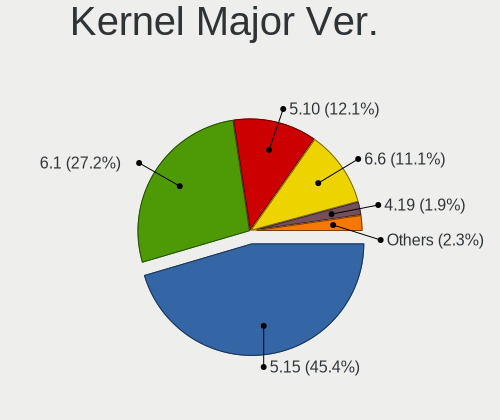
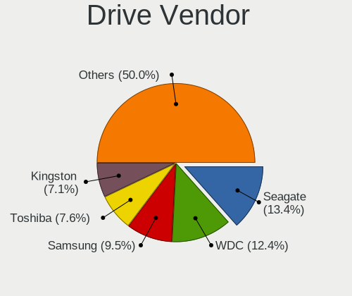
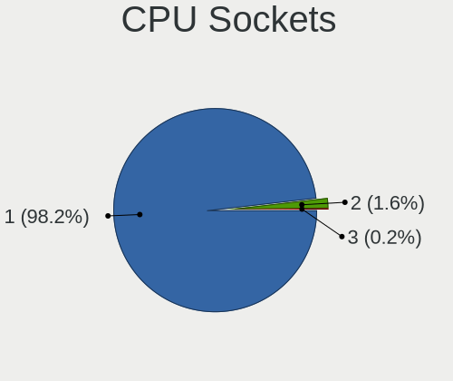
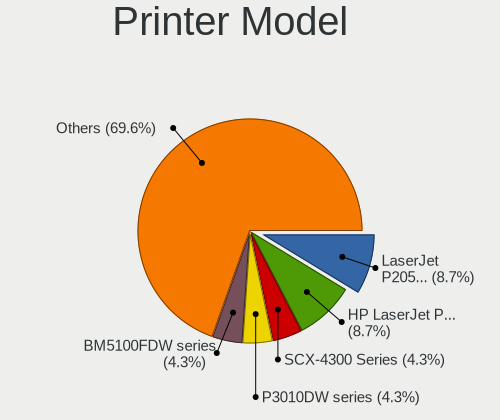
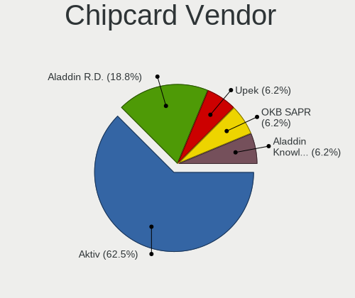
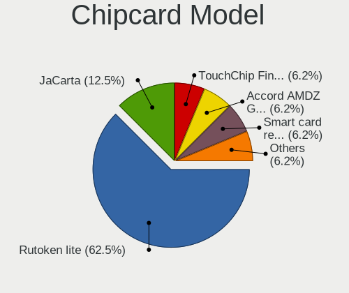

Red OS - Tested Hardware & Statistics
-------------------------------------

A project to collect tested hardware configurations for Red OS.

Anyone can contribute to this report by the [hw-probe](https://github.com/linuxhw/hw-probe) tool:

    sudo -E hw-probe -all -upload

Please contribute! Especially if your hardware is rare.

This is a report for all computer types. See also reports for [desktops](/Dist/Red_OS/Desktop/README.md) and [notebooks](/Dist/Red_OS/Notebook/README.md).

Contents
--------

* [ Test Cases ](#test-cases)

* [ System ](#system)
  - [ OS                       ](#os)
  - [ OS Family                ](#os-family)
  - [ Kernel                   ](#kernel)
  - [ Kernel Family            ](#kernel-family)
  - [ Kernel Major Ver.        ](#kernel-major-ver)
  - [ Arch                     ](#arch)
  - [ DE                       ](#de)
  - [ Display Server           ](#display-server)
  - [ Display Manager          ](#display-manager)
  - [ OS Lang                  ](#os-lang)
  - [ Boot Mode                ](#boot-mode)
  - [ Filesystem               ](#filesystem)
  - [ Part. scheme             ](#part-scheme)
  - [ Dual Boot with Linux/BSD ](#dual-boot-with-linuxbsd)
  - [ Dual Boot (Win)          ](#dual-boot-win)

* [ Board ](#board)
  - [ Vendor                   ](#vendor)
  - [ Model                    ](#model)
  - [ Model Family             ](#model-family)
  - [ MFG Year                 ](#mfg-year)
  - [ Form Factor              ](#form-factor)
  - [ Secure Boot              ](#secure-boot)
  - [ Coreboot                 ](#coreboot)
  - [ RAM Size                 ](#ram-size)
  - [ RAM Used                 ](#ram-used)
  - [ Total Drives             ](#total-drives)
  - [ Has CD-ROM               ](#has-cd-rom)
  - [ Has Ethernet             ](#has-ethernet)
  - [ Has WiFi                 ](#has-wifi)
  - [ Has Bluetooth            ](#has-bluetooth)

* [ Location ](#location)
  - [ Country                  ](#country)
  - [ City                     ](#city)

* [ Drives ](#drives)
  - [ Drive Vendor             ](#drive-vendor)
  - [ Drive Model              ](#drive-model)
  - [ HDD Vendor               ](#hdd-vendor)
  - [ SSD Vendor               ](#ssd-vendor)
  - [ Drive Kind               ](#drive-kind)
  - [ Drive Connector          ](#drive-connector)
  - [ Drive Size               ](#drive-size)
  - [ Space Total              ](#space-total)
  - [ Space Used               ](#space-used)
  - [ Malfunc. Drives          ](#malfunc-drives)
  - [ Malfunc. Drive Vendor    ](#malfunc-drive-vendor)
  - [ Malfunc. HDD Vendor      ](#malfunc-hdd-vendor)
  - [ Malfunc. Drive Kind      ](#malfunc-drive-kind)
  - [ Failed Drives            ](#failed-drives)
  - [ Failed Drive Vendor      ](#failed-drive-vendor)
  - [ Drive Status             ](#drive-status)

* [ Storage controller ](#storage-controller)
  - [ Storage Vendor           ](#storage-vendor)
  - [ Storage Model            ](#storage-model)
  - [ Storage Kind             ](#storage-kind)

* [ Processor ](#processor)
  - [ CPU Vendor               ](#cpu-vendor)
  - [ CPU Model                ](#cpu-model)
  - [ CPU Model Family         ](#cpu-model-family)
  - [ CPU Cores                ](#cpu-cores)
  - [ CPU Sockets              ](#cpu-sockets)
  - [ CPU Threads              ](#cpu-threads)
  - [ CPU Op-Modes             ](#cpu-op-modes)
  - [ CPU Microcode            ](#cpu-microcode)
  - [ CPU Microarch            ](#cpu-microarch)

* [ Graphics ](#graphics)
  - [ GPU Vendor               ](#gpu-vendor)
  - [ GPU Model                ](#gpu-model)
  - [ GPU Combo                ](#gpu-combo)
  - [ GPU Driver               ](#gpu-driver)
  - [ GPU Memory               ](#gpu-memory)

* [ Monitor ](#monitor)
  - [ Monitor Vendor           ](#monitor-vendor)
  - [ Monitor Model            ](#monitor-model)
  - [ Monitor Resolution       ](#monitor-resolution)
  - [ Monitor Diagonal         ](#monitor-diagonal)
  - [ Monitor Width            ](#monitor-width)
  - [ Aspect Ratio             ](#aspect-ratio)
  - [ Monitor Area             ](#monitor-area)
  - [ Pixel Density            ](#pixel-density)
  - [ Multiple Monitors        ](#multiple-monitors)

* [ Network ](#network)
  - [ Net Controller Vendor    ](#net-controller-vendor)
  - [ Net Controller Model     ](#net-controller-model)
  - [ Wireless Vendor          ](#wireless-vendor)
  - [ Wireless Model           ](#wireless-model)
  - [ Ethernet Vendor          ](#ethernet-vendor)
  - [ Ethernet Model           ](#ethernet-model)
  - [ Net Controller Kind      ](#net-controller-kind)
  - [ Used Controller          ](#used-controller)
  - [ NICs                     ](#nics)
  - [ IPv6                     ](#ipv6)

* [ Bluetooth ](#bluetooth)
  - [ Bluetooth Vendor         ](#bluetooth-vendor)
  - [ Bluetooth Model          ](#bluetooth-model)

* [ Sound ](#sound)
  - [ Sound Vendor             ](#sound-vendor)
  - [ Sound Model              ](#sound-model)

* [ Memory ](#memory)
  - [ Memory Vendor            ](#memory-vendor)
  - [ Memory Model             ](#memory-model)
  - [ Memory Kind              ](#memory-kind)
  - [ Memory Form Factor       ](#memory-form-factor)
  - [ Memory Size              ](#memory-size)
  - [ Memory Speed             ](#memory-speed)

* [ Printers & scanners ](#printers--scanners)
  - [ Printer Vendor           ](#printer-vendor)
  - [ Printer Model            ](#printer-model)
  - [ Scanner Vendor           ](#scanner-vendor)
  - [ Scanner Model            ](#scanner-model)

* [ Camera ](#camera)
  - [ Camera Vendor            ](#camera-vendor)
  - [ Camera Model             ](#camera-model)

* [ Security ](#security)
  - [ Fingerprint Vendor       ](#fingerprint-vendor)
  - [ Fingerprint Model        ](#fingerprint-model)
  - [ Chipcard Vendor          ](#chipcard-vendor)
  - [ Chipcard Model           ](#chipcard-model)

* [ Unsupported ](#unsupported)
  - [ Unsupported Devices      ](#unsupported-devices)
  - [ Unsupported Device Types ](#unsupported-device-types)

Test Cases
----------

Total: 790

| Vendor        | Model                       | Form-Factor | Probe                                                      | Date         |
|---------------|-----------------------------|-------------|------------------------------------------------------------|--------------|
| Lenovo        | B590 20206                  | Notebook    | [c118a5bc12](https://linux-hardware.org/?probe=c118a5bc12) | Dec 26, 2024 |
| Graviton      | DMB-Q670-TMI01              | Desktop     | [c609b9c45c](https://linux-hardware.org/?probe=c609b9c45c) | Dec 26, 2024 |
| Lenovo        | B590 20206                  | Notebook    | [04580fdd68](https://linux-hardware.org/?probe=04580fdd68) | Dec 26, 2024 |
| Graviton      | DMB-Q670-TMI01              | Desktop     | [425c41687c](https://linux-hardware.org/?probe=425c41687c) | Dec 26, 2024 |
| Lenovo        | IdeaPad L340-15API 81LW     | Notebook    | [d2b53b04f1](https://linux-hardware.org/?probe=d2b53b04f1) | Dec 24, 2024 |
| Dell          | 0PJPW3 A04                  | Server      | [e80578896e](https://linux-hardware.org/?probe=e80578896e) | Dec 23, 2024 |
| HP            | 8158 A01                    | Mini pc     | [27469d63a1](https://linux-hardware.org/?probe=27469d63a1) | Dec 19, 2024 |
| Gigabyte      | H110M-S2H-CF                | Desktop     | [89c03187e1](https://linux-hardware.org/?probe=89c03187e1) | Dec 19, 2024 |
| Gigabyte      | A620M H                     | Desktop     | [bef78fc714](https://linux-hardware.org/?probe=bef78fc714) | Dec 19, 2024 |
| Gigabyte      | A620M H                     | Desktop     | [a48a1efcc8](https://linux-hardware.org/?probe=a48a1efcc8) | Dec 18, 2024 |
| Intel         | DH61BF AAG81311-101         | Desktop     | [4d21569356](https://linux-hardware.org/?probe=4d21569356) | Dec 18, 2024 |
| HUAWEI        | BoDE-WXX9                   | Notebook    | [e172af52db](https://linux-hardware.org/?probe=e172af52db) | Dec 18, 2024 |
| HUAWEI        | BOM-WXX9                    | Notebook    | [bdfe4e0a02](https://linux-hardware.org/?probe=bdfe4e0a02) | Dec 17, 2024 |
| MSI           | MS-AF011                    | All in one  | [552a70ee5c](https://linux-hardware.org/?probe=552a70ee5c) | Dec 16, 2024 |
| MSI           | MS-AF011                    | All in one  | [c57d1c2859](https://linux-hardware.org/?probe=c57d1c2859) | Dec 16, 2024 |
| ASUSTek       | ASUS TUF Gaming A15 FA50... | Notebook    | [a1a92c896a](https://linux-hardware.org/?probe=a1a92c896a) | Dec 16, 2024 |
| Acer          | Aspire S32-1856             | All in one  | [3460649da4](https://linux-hardware.org/?probe=3460649da4) | Dec 16, 2024 |
| Gigabyte      | H510M H                     | Desktop     | [a49d561fb0](https://linux-hardware.org/?probe=a49d561fb0) | Dec 15, 2024 |
| BESHTAU       | Q670D5RU002 V1.0            | Desktop     | [59e2adb673](https://linux-hardware.org/?probe=59e2adb673) | Dec 13, 2024 |
| Gigabyte      | A520M S2H                   | Desktop     | [5fc4416068](https://linux-hardware.org/?probe=5fc4416068) | Dec 13, 2024 |
| Acer          | Aspire S32-1856             | All in one  | [9783266149](https://linux-hardware.org/?probe=9783266149) | Dec 13, 2024 |
| Intel         | DH61CR AAG14064-203         | Desktop     | [2acdad4c78](https://linux-hardware.org/?probe=2acdad4c78) | Dec 12, 2024 |
| Dell          | Precision M4700             | Notebook    | [291ffb667e](https://linux-hardware.org/?probe=291ffb667e) | Dec 11, 2024 |
| DEPO Compu... | DPH410S                     | Desktop     | [a986fc28d0](https://linux-hardware.org/?probe=a986fc28d0) | Dec 11, 2024 |
| Unknown       | Unknown                     | Soc         | [5adcbf3330](https://linux-hardware.org/?probe=5adcbf3330) | Dec 10, 2024 |
| HP            | EliteBook 855 G8 Noteboo... | Notebook    | [bcfc822291](https://linux-hardware.org/?probe=bcfc822291) | Dec 10, 2024 |
| ASUSTek       | PRIME B360M-C               | Desktop     | [5110e95caf](https://linux-hardware.org/?probe=5110e95caf) | Dec 10, 2024 |
| ASUSTek       | PRIME B360M-C               | Desktop     | [b08f5fe789](https://linux-hardware.org/?probe=b08f5fe789) | Dec 10, 2024 |
| Infinix       | INBOOK X3 Plus              | Notebook    | [bcb0b23532](https://linux-hardware.org/?probe=bcb0b23532) | Dec 09, 2024 |
| Intel         | DH61CR AAG14064-203         | Desktop     | [c4751390a8](https://linux-hardware.org/?probe=c4751390a8) | Dec 09, 2024 |
| ECS           | H81H3-M4                    | Desktop     | [bc47715809](https://linux-hardware.org/?probe=bc47715809) | Dec 06, 2024 |
| HP            | 625                         | Notebook    | [a5d254f381](https://linux-hardware.org/?probe=a5d254f381) | Dec 06, 2024 |
| INFERIT       | IFMBH510MKPR G10a           | Desktop     | [48fdaa7cd0](https://linux-hardware.org/?probe=48fdaa7cd0) | Dec 04, 2024 |
| Kraftway      | KWH510                      | Desktop     | [1f385fb7ae](https://linux-hardware.org/?probe=1f385fb7ae) | Dec 04, 2024 |
| Gigabyte      | A520M S2H                   | Desktop     | [1f167af92b](https://linux-hardware.org/?probe=1f167af92b) | Nov 28, 2024 |
| Gigabyte      | A520M S2H                   | Desktop     | [08a50a8073](https://linux-hardware.org/?probe=08a50a8073) | Nov 28, 2024 |
| MSI           | B250M PRO-VDH               | Desktop     | [95c02414bb](https://linux-hardware.org/?probe=95c02414bb) | Nov 27, 2024 |
| HP            | 250 G8 Notebook PC          | Notebook    | [f97ac5efbf](https://linux-hardware.org/?probe=f97ac5efbf) | Nov 27, 2024 |
| Dell          | Precision M4700             | Notebook    | [554f31582e](https://linux-hardware.org/?probe=554f31582e) | Nov 27, 2024 |
| MSI           | MS-1738                     | Notebook    | [c78d18847a](https://linux-hardware.org/?probe=c78d18847a) | Nov 26, 2024 |
| Dell          | 0VNM11 A01                  | Desktop     | [40eccd6be6](https://linux-hardware.org/?probe=40eccd6be6) | Nov 26, 2024 |
| Intel         | S5520HC E26045-407          | Server      | [bd871b1c6f](https://linux-hardware.org/?probe=bd871b1c6f) | Nov 26, 2024 |
| HP            | ProBook 450 G2              | Notebook    | [46bffb65f4](https://linux-hardware.org/?probe=46bffb65f4) | Nov 26, 2024 |
| Supermicro    | X10DRiB                     | Desktop     | [b00821a487](https://linux-hardware.org/?probe=b00821a487) | Nov 25, 2024 |
| HP            | ProBook 450 G2              | Notebook    | [0e1b332ae9](https://linux-hardware.org/?probe=0e1b332ae9) | Nov 25, 2024 |
| HP            | ProBook 450 G2              | Notebook    | [db7205adc1](https://linux-hardware.org/?probe=db7205adc1) | Nov 22, 2024 |
| Unknown       | Unknown                     | Notebook    | [276273e5a4](https://linux-hardware.org/?probe=276273e5a4) | Nov 16, 2024 |
| Gigabyte      | B365M DS3H                  | Desktop     | [8690967d76](https://linux-hardware.org/?probe=8690967d76) | Nov 13, 2024 |
| Gigabyte      | B365M D3H-CF                | Desktop     | [a5838abf59](https://linux-hardware.org/?probe=a5838abf59) | Nov 12, 2024 |
| BESHTAU       | H610RU001 V1.0              | Desktop     | [50a3234041](https://linux-hardware.org/?probe=50a3234041) | Nov 12, 2024 |
| ASUSTek       | P8H67-M PRO                 | Desktop     | [c694929d4d](https://linux-hardware.org/?probe=c694929d4d) | Nov 11, 2024 |
| ASUSTek       | H61M-K                      | Desktop     | [caea237027](https://linux-hardware.org/?probe=caea237027) | Nov 11, 2024 |
| ASUSTek       | B85M-G                      | Desktop     | [8057418501](https://linux-hardware.org/?probe=8057418501) | Nov 11, 2024 |
| Gigabyte      | H81M-S2VP                   | Desktop     | [30e754b191](https://linux-hardware.org/?probe=30e754b191) | Nov 11, 2024 |
| Gigabyte      | F2A55M-S1                   | Desktop     | [b1994169b0](https://linux-hardware.org/?probe=b1994169b0) | Nov 11, 2024 |
| Gigabyte      | H81M-S2VP                   | Desktop     | [0bd4b5605c](https://linux-hardware.org/?probe=0bd4b5605c) | Nov 11, 2024 |
| Gigabyte      | F2A55M-S1                   | Desktop     | [44d2040a89](https://linux-hardware.org/?probe=44d2040a89) | Nov 11, 2024 |
| MSI           | A520M-A PRO                 | Desktop     | [d5bdcf81dd](https://linux-hardware.org/?probe=d5bdcf81dd) | Nov 11, 2024 |
| ASRock        | H610M-HVS                   | Desktop     | [b304feae94](https://linux-hardware.org/?probe=b304feae94) | Nov 07, 2024 |
| HP            | 84EE 1100                   | All in one  | [07e4fb51e4](https://linux-hardware.org/?probe=07e4fb51e4) | Nov 07, 2024 |
| DEPO Compu... | DPH610T                     | All in one  | [0daaf7e4b7](https://linux-hardware.org/?probe=0daaf7e4b7) | Nov 07, 2024 |
| Gigabyte      | H55M-UD2H                   | Desktop     | [961478c114](https://linux-hardware.org/?probe=961478c114) | Nov 07, 2024 |
| ASRock        | H310CM-DVS                  | Desktop     | [a1ad62188e](https://linux-hardware.org/?probe=a1ad62188e) | Nov 07, 2024 |
| Graviton      | 23-156P                     | Notebook    | [3b593a068c](https://linux-hardware.org/?probe=3b593a068c) | Nov 05, 2024 |
| HP            | 84EE 1100                   | All in one  | [05f47fc062](https://linux-hardware.org/?probe=05f47fc062) | Nov 05, 2024 |
| Dell          | Inspiron 5770               | Notebook    | [ed13db6ca0](https://linux-hardware.org/?probe=ed13db6ca0) | Nov 05, 2024 |
| Graviton      | 23-156P                     | Notebook    | [2c150d69e6](https://linux-hardware.org/?probe=2c150d69e6) | Nov 05, 2024 |
| MSI           | B360M PRO-VDH               | Desktop     | [7991e1acba](https://linux-hardware.org/?probe=7991e1acba) | Nov 02, 2024 |
| HP            | 82A5                        | Mini pc     | [1a5069219b](https://linux-hardware.org/?probe=1a5069219b) | Oct 31, 2024 |
| Dell          | Precision M4700             | Notebook    | [62d0c61c5b](https://linux-hardware.org/?probe=62d0c61c5b) | Oct 29, 2024 |
| TECNO Mobi... | MEGABOOK T15AA              | Notebook    | [9a28f9ea8b](https://linux-hardware.org/?probe=9a28f9ea8b) | Oct 22, 2024 |
| HUAWEI        | BOM-WXX9                    | Notebook    | [0a8ba0ea9c](https://linux-hardware.org/?probe=0a8ba0ea9c) | Oct 21, 2024 |
| Lenovo        | 3178 SDK0J40697 WIN 3305... | Desktop     | [e2785d8d28](https://linux-hardware.org/?probe=e2785d8d28) | Oct 21, 2024 |
| Aquarius      | AQH310CM                    | Desktop     | [cf03695b5e](https://linux-hardware.org/?probe=cf03695b5e) | Oct 18, 2024 |
| Dell          | Precision M4700             | Notebook    | [4ba30ec7dc](https://linux-hardware.org/?probe=4ba30ec7dc) | Oct 17, 2024 |
| Insyde        | Purley                      | Server      | [19f56b169e](https://linux-hardware.org/?probe=19f56b169e) | Oct 14, 2024 |
| Lenovo        | IdeaPad Slim 5 16IMH9 83... | Notebook    | [c13d606d8d](https://linux-hardware.org/?probe=c13d606d8d) | Oct 14, 2024 |
| Lenovo        | IdeaPad Slim 5 16IMH9 83... | Notebook    | [7c056fd094](https://linux-hardware.org/?probe=7c056fd094) | Oct 14, 2024 |
| ASUSTek       | Vivobook Go E1504FA_E150... | Notebook    | [5d06bad1c1](https://linux-hardware.org/?probe=5d06bad1c1) | Oct 11, 2024 |
| Irbis         | NB656                       | Notebook    | [f54d72ba00](https://linux-hardware.org/?probe=f54d72ba00) | Oct 10, 2024 |
| Getac         | S410G5                      | Notebook    | [98b2b79421](https://linux-hardware.org/?probe=98b2b79421) | Oct 10, 2024 |
| Gigabyte      | B75M-D3V                    | Desktop     | [3360dc0f64](https://linux-hardware.org/?probe=3360dc0f64) | Oct 08, 2024 |
| ASRock        | H310CM-HDV/M.2              | Desktop     | [797e92230b](https://linux-hardware.org/?probe=797e92230b) | Oct 04, 2024 |
| Dell          | 0KYWH7 A03                  | Desktop     | [c029d50cdd](https://linux-hardware.org/?probe=c029d50cdd) | Oct 02, 2024 |
| Dell          | 0V4W66 A00                  | Desktop     | [fbe88e537a](https://linux-hardware.org/?probe=fbe88e537a) | Sep 30, 2024 |
| ASUSTek       | VivoBook_ASUSLaptop M160... | Notebook    | [1062107e62](https://linux-hardware.org/?probe=1062107e62) | Sep 28, 2024 |
| Chuwi         | GemiBook Plus               | Notebook    | [de869d366c](https://linux-hardware.org/?probe=de869d366c) | Sep 27, 2024 |
| Dell          | Precision M4700             | Notebook    | [ce3cda2d73](https://linux-hardware.org/?probe=ce3cda2d73) | Sep 20, 2024 |
| HUAWEI        | BOD-WXX9                    | Notebook    | [3bc442585a](https://linux-hardware.org/?probe=3bc442585a) | Sep 20, 2024 |
| HUAWEI        | BOD-WXX9                    | Notebook    | [d62388c6c7](https://linux-hardware.org/?probe=d62388c6c7) | Sep 20, 2024 |
| Dell          | Precision M4700             | Notebook    | [16e80ad11f](https://linux-hardware.org/?probe=16e80ad11f) | Sep 19, 2024 |
| HP            | EliteBook 840 G8 Noteboo... | Notebook    | [261aa65f79](https://linux-hardware.org/?probe=261aa65f79) | Sep 09, 2024 |
| HP            | Laptop 17-by2xxx            | Notebook    | [16058e97f2](https://linux-hardware.org/?probe=16058e97f2) | Sep 08, 2024 |
| HP            | ProBook 450 G2              | Notebook    | [d80c8abc21](https://linux-hardware.org/?probe=d80c8abc21) | Sep 04, 2024 |
| Lenovo        | 36DC No DPK                 | All in one  | [cfe8a83de3](https://linux-hardware.org/?probe=cfe8a83de3) | Sep 03, 2024 |
| TECNO Mobi... | MEGABOOK T15AA              | Notebook    | [8f22df45e0](https://linux-hardware.org/?probe=8f22df45e0) | Sep 03, 2024 |
| Dell          | Precision M4700             | Notebook    | [9ac18fa798](https://linux-hardware.org/?probe=9ac18fa798) | Sep 03, 2024 |
| Dell          | Precision M4700             | Notebook    | [67120ae7b7](https://linux-hardware.org/?probe=67120ae7b7) | Sep 01, 2024 |
| HP            | ProBook 450 G2              | Notebook    | [1614032def](https://linux-hardware.org/?probe=1614032def) | Aug 30, 2024 |
| Huanan        | X99-BD4 V1.34               | Desktop     | [9ff89a88f1](https://linux-hardware.org/?probe=9ff89a88f1) | Aug 25, 2024 |
| Acer          | Aspire XC-885 V:1.1         | Desktop     | [09f000529a](https://linux-hardware.org/?probe=09f000529a) | Aug 22, 2024 |
| MSI           | H310M PRO-VDH               | Desktop     | [1e0b767085](https://linux-hardware.org/?probe=1e0b767085) | Aug 22, 2024 |
| DEPO Compu... | DPH610S                     | Notebook    | [cae887ea79](https://linux-hardware.org/?probe=cae887ea79) | Aug 20, 2024 |
| ICL           | H410SB                      | Desktop     | [05b3ed6993](https://linux-hardware.org/?probe=05b3ed6993) | Aug 16, 2024 |
| Huanan        | X99-BD4 V1.34               | Desktop     | [d62a8cb955](https://linux-hardware.org/?probe=d62a8cb955) | Aug 09, 2024 |
| INFERIT       | IFAIOI5IP                   | All in one  | [d2ec637175](https://linux-hardware.org/?probe=d2ec637175) | Aug 05, 2024 |
| Dell          | Precision M4700             | Notebook    | [e90b829dae](https://linux-hardware.org/?probe=e90b829dae) | Aug 02, 2024 |
| Acer          | Aspire 5742G                | Notebook    | [45def493cd](https://linux-hardware.org/?probe=45def493cd) | Jul 29, 2024 |
| Intel         | DH61BF AAG81311-101         | Desktop     | [b9ef99ffd8](https://linux-hardware.org/?probe=b9ef99ffd8) | Jul 29, 2024 |
| ASUSTek       | PRIME H510M-R               | Desktop     | [8bbda40ace](https://linux-hardware.org/?probe=8bbda40ace) | Jul 29, 2024 |
| Gigabyte      | B365M DS3H                  | Desktop     | [785322816c](https://linux-hardware.org/?probe=785322816c) | Jul 29, 2024 |
| Gigabyte      | B360HD3                     | Desktop     | [1cd46b9994](https://linux-hardware.org/?probe=1cd46b9994) | Jul 29, 2024 |
| ASUSTek       | N61Jv                       | Notebook    | [641730f2ac](https://linux-hardware.org/?probe=641730f2ac) | Jul 26, 2024 |
| Aquarius      | AQH410T                     | Desktop     | [f30b737c64](https://linux-hardware.org/?probe=f30b737c64) | Jul 25, 2024 |
| HP            | 8599                        | Desktop     | [5571e112b3](https://linux-hardware.org/?probe=5571e112b3) | Jul 23, 2024 |
| MSI           | B450M MORTAR MAX            | Desktop     | [2a0cbaac64](https://linux-hardware.org/?probe=2a0cbaac64) | Jul 20, 2024 |
| Foxconn       | M61PMV FAB                  | Desktop     | [4c63ed31bc](https://linux-hardware.org/?probe=4c63ed31bc) | Jul 14, 2024 |
| Foxconn       | M61PMV FAB                  | Desktop     | [8fba56f752](https://linux-hardware.org/?probe=8fba56f752) | Jul 12, 2024 |
| HP            | ProBook 4720s               | Notebook    | [74fd9eee71](https://linux-hardware.org/?probe=74fd9eee71) | Jul 11, 2024 |
| HP            | 3396                        | Desktop     | [c4cd06b045](https://linux-hardware.org/?probe=c4cd06b045) | Jul 08, 2024 |
| Dell          | Precision M4700             | Notebook    | [d50c6cdb48](https://linux-hardware.org/?probe=d50c6cdb48) | Jul 08, 2024 |
| Chuwi         | HeroBox                     | Mini pc     | [736643138c](https://linux-hardware.org/?probe=736643138c) | Jul 06, 2024 |
| HP            | 18E6                        | Desktop     | [0201e189b7](https://linux-hardware.org/?probe=0201e189b7) | Jul 02, 2024 |
| Lenovo        | 3111 NOK                    | Desktop     | [8a4da42802](https://linux-hardware.org/?probe=8a4da42802) | Jul 02, 2024 |
| ASUSTek       | B85M-G                      | Desktop     | [9618ac190c](https://linux-hardware.org/?probe=9618ac190c) | Jun 28, 2024 |
| ASRock        | H610M-HVS                   | Desktop     | [44957c7ccb](https://linux-hardware.org/?probe=44957c7ccb) | Jun 26, 2024 |
| Dell          | Precision M4700             | Notebook    | [e65decbc74](https://linux-hardware.org/?probe=e65decbc74) | Jun 26, 2024 |
| Lenovo        | IdeaPad Z580                | Notebook    | [3c9898faa1](https://linux-hardware.org/?probe=3c9898faa1) | Jun 20, 2024 |
| Lenovo        | IdeaPad Z580                | Notebook    | [50ac519b75](https://linux-hardware.org/?probe=50ac519b75) | Jun 20, 2024 |
| Dell          | Precision M4700             | Notebook    | [ded8148269](https://linux-hardware.org/?probe=ded8148269) | Jun 20, 2024 |
| ASUSTek       | B150M-K                     | Desktop     | [fac6b0f586](https://linux-hardware.org/?probe=fac6b0f586) | Jun 19, 2024 |
| ASUSTek       | B150M-K                     | Desktop     | [326710cc69](https://linux-hardware.org/?probe=326710cc69) | Jun 19, 2024 |
| Acer          | Aspire A315-42G             | Notebook    | [f63af66df7](https://linux-hardware.org/?probe=f63af66df7) | Jun 17, 2024 |
| ASUSTek       | TUF Gaming FX705DT_FX705... | Notebook    | [21c00a1a7e](https://linux-hardware.org/?probe=21c00a1a7e) | Jun 09, 2024 |
| Lenovo        | G570 20079                  | Notebook    | [a55b57b2d9](https://linux-hardware.org/?probe=a55b57b2d9) | Jun 07, 2024 |
| MTR           | DP1000T-B V2.0              | All in one  | [576fe622b5](https://linux-hardware.org/?probe=576fe622b5) | Jun 04, 2024 |
| HIPER Powe... | HO-K23M-H510-B V1.0.3       | All in one  | [31cd6de3ed](https://linux-hardware.org/?probe=31cd6de3ed) | May 31, 2024 |
| MSI           | H61M-P31                    | Desktop     | [d0742079a6](https://linux-hardware.org/?probe=d0742079a6) | May 31, 2024 |
| Intel         | DH61BF AAG81311-101         | Desktop     | [210077e8dc](https://linux-hardware.org/?probe=210077e8dc) | May 31, 2024 |
| Lenovo        | 36DF No DPK                 | All in one  | [09b231052c](https://linux-hardware.org/?probe=09b231052c) | May 23, 2024 |
| Toshiba       | Satellite C650              | Notebook    | [b3c1dc0ded](https://linux-hardware.org/?probe=b3c1dc0ded) | May 22, 2024 |
| Gigabyte      | GA-880GMA-UD2H              | Desktop     | [2cb7e34625](https://linux-hardware.org/?probe=2cb7e34625) | May 17, 2024 |
| DEPO Compu... | DPH610S                     | Notebook    | [5c1b9da621](https://linux-hardware.org/?probe=5c1b9da621) | May 16, 2024 |
| 3Logic Gro... | TUNDRA                      | Server      | [41df429035](https://linux-hardware.org/?probe=41df429035) | May 15, 2024 |
| Apple         | MacBookPro5,3               | Notebook    | [b8e92a4880](https://linux-hardware.org/?probe=b8e92a4880) | May 12, 2024 |
| HP            | Pavilion Gaming Laptop 1... | Notebook    | [0d046abb98](https://linux-hardware.org/?probe=0d046abb98) | May 11, 2024 |
| Unknown       | Unknown                     | Notebook    | [3c4e207a92](https://linux-hardware.org/?probe=3c4e207a92) | May 09, 2024 |
| MSI           | PRO H610M-E DDR4            | Desktop     | [a415f46a9e](https://linux-hardware.org/?probe=a415f46a9e) | May 07, 2024 |
| MSI           | PRO H610M-E DDR4            | Desktop     | [e4adc14010](https://linux-hardware.org/?probe=e4adc14010) | May 06, 2024 |
| Dell          | Precision M4700             | Notebook    | [fa5aa96761](https://linux-hardware.org/?probe=fa5aa96761) | Apr 23, 2024 |
| MACHENIKE     | MACHCREATOR-16              | Notebook    | [03f369c46b](https://linux-hardware.org/?probe=03f369c46b) | Apr 15, 2024 |
| Acer          | Aspire C24-963              | All in one  | [45437c3235](https://linux-hardware.org/?probe=45437c3235) | Apr 11, 2024 |
| ASRock        | H610M-HVS                   | Desktop     | [bb1b76d77f](https://linux-hardware.org/?probe=bb1b76d77f) | Apr 10, 2024 |
| MACHENIKE     | L17A                        | Notebook    | [5bd336609a](https://linux-hardware.org/?probe=5bd336609a) | Apr 10, 2024 |
| ASUSTek       | H110-PLUS                   | Desktop     | [f9d667563c](https://linux-hardware.org/?probe=f9d667563c) | Apr 10, 2024 |
| Gigabyte      | B75M-D3V                    | Desktop     | [606efbdac3](https://linux-hardware.org/?probe=606efbdac3) | Apr 10, 2024 |
| Gigabyte      | B75M-D3V                    | Desktop     | [af364f4b61](https://linux-hardware.org/?probe=af364f4b61) | Apr 09, 2024 |
| Dell          | Precision M4700             | Notebook    | [14e5ad11ff](https://linux-hardware.org/?probe=14e5ad11ff) | Apr 08, 2024 |
| Unknown       | X133                        | Notebook    | [c85c7ccafc](https://linux-hardware.org/?probe=c85c7ccafc) | Apr 05, 2024 |
| Gigabyte      | B75M-D3V                    | Desktop     | [2c9d3860d1](https://linux-hardware.org/?probe=2c9d3860d1) | Apr 05, 2024 |
| ASRock        | H610M-HVS                   | Desktop     | [0fe84d2ae2](https://linux-hardware.org/?probe=0fe84d2ae2) | Apr 05, 2024 |
| HP            | 85A2                        | All in one  | [4c618f5dde](https://linux-hardware.org/?probe=4c618f5dde) | Apr 02, 2024 |
| Foxconn       | 2ABF                        | Desktop     | [1948e2f590](https://linux-hardware.org/?probe=1948e2f590) | Mar 28, 2024 |
| MSI           | MAG B760M MORTAR            | Desktop     | [a7d3ac796f](https://linux-hardware.org/?probe=a7d3ac796f) | Mar 24, 2024 |
| Gigabyte      | A520M K V2                  | Desktop     | [bb5ad21304](https://linux-hardware.org/?probe=bb5ad21304) | Mar 24, 2024 |
| Gigabyte      | H510M S2H V2                | Desktop     | [cbfecba3df](https://linux-hardware.org/?probe=cbfecba3df) | Mar 20, 2024 |
| HP            | 85A2                        | All in one  | [c43047c854](https://linux-hardware.org/?probe=c43047c854) | Mar 20, 2024 |
| Gigabyte      | H510M S2H V2                | Desktop     | [f9d491fb3a](https://linux-hardware.org/?probe=f9d491fb3a) | Mar 20, 2024 |
| ASUSTek       | PRIME H310M-R R2.0          | Desktop     | [6c0a847cf4](https://linux-hardware.org/?probe=6c0a847cf4) | Mar 20, 2024 |
| Gigabyte      | H310M H                     | Desktop     | [041eca17dc](https://linux-hardware.org/?probe=041eca17dc) | Mar 20, 2024 |
| ASUSTek       | P8H61-M LX3 R2.0            | Desktop     | [21877754a0](https://linux-hardware.org/?probe=21877754a0) | Mar 20, 2024 |
| HP            | 198E                        | Desktop     | [dfdd44b32d](https://linux-hardware.org/?probe=dfdd44b32d) | Mar 20, 2024 |
| ASUSTek       | PRIME B360-PLUS             | Desktop     | [286fb4ec0a](https://linux-hardware.org/?probe=286fb4ec0a) | Mar 20, 2024 |
| Unknown       | T360D11                     | Desktop     | [8dc0de16f8](https://linux-hardware.org/?probe=8dc0de16f8) | Mar 20, 2024 |
| HP            | 2B43                        | Desktop     | [365885e742](https://linux-hardware.org/?probe=365885e742) | Mar 20, 2024 |
| Dell          | Precision M4700             | Notebook    | [667558cba6](https://linux-hardware.org/?probe=667558cba6) | Mar 20, 2024 |
| Acer          | Aspire XC-885 V:1.1         | Desktop     | [ec2b946862](https://linux-hardware.org/?probe=ec2b946862) | Mar 20, 2024 |
| Gigabyte      | B75M-D3V                    | Desktop     | [4a7f8b6b79](https://linux-hardware.org/?probe=4a7f8b6b79) | Mar 15, 2024 |
| Fujitsu Si... | LIFEBOOK T5010              | Notebook    | [99e6ef98f0](https://linux-hardware.org/?probe=99e6ef98f0) | Mar 14, 2024 |
| ASRock        | H610M-HVS                   | Desktop     | [3189e4304b](https://linux-hardware.org/?probe=3189e4304b) | Mar 13, 2024 |
| 3Logic Gro... | AMUR DMB-H310-MCA01         | Desktop     | [3b98bf5ca7](https://linux-hardware.org/?probe=3b98bf5ca7) | Mar 11, 2024 |
| INTECH PRO    | H510-M2 v5.0                | Desktop     | [6afefbab74](https://linux-hardware.org/?probe=6afefbab74) | Mar 11, 2024 |
| ASUSTek       | PRIME B360M-D               | Desktop     | [7d2950146c](https://linux-hardware.org/?probe=7d2950146c) | Mar 09, 2024 |
| MSI           | H61I-E35                    | Desktop     | [dbc777c090](https://linux-hardware.org/?probe=dbc777c090) | Mar 07, 2024 |
| Acer          | Extensa 215-33              | Notebook    | [efe3c07386](https://linux-hardware.org/?probe=efe3c07386) | Mar 04, 2024 |
| Acer          | Extensa 215-33              | Notebook    | [0b2c9b5116](https://linux-hardware.org/?probe=0b2c9b5116) | Mar 04, 2024 |
| HP            | EliteBook 2540p             | Notebook    | [f0aab0e0f6](https://linux-hardware.org/?probe=f0aab0e0f6) | Mar 02, 2024 |
| Lenovo        | IdeaPad Gaming 3 15ARH05... | Notebook    | [de96f427a2](https://linux-hardware.org/?probe=de96f427a2) | Mar 02, 2024 |
| 3Logic Gro... | DMB-H310-TMI01              | All in one  | [abf2cc9c16](https://linux-hardware.org/?probe=abf2cc9c16) | Mar 01, 2024 |
| Dell          | Precision M4700             | Notebook    | [8e50df0d77](https://linux-hardware.org/?probe=8e50df0d77) | Mar 01, 2024 |
| Dell          | Inspiron 3537               | Notebook    | [e05c7c262b](https://linux-hardware.org/?probe=e05c7c262b) | Mar 01, 2024 |
| ASUSTek       | ROG Zephyrus S17 GX701LX... | Notebook    | [15a8eddc01](https://linux-hardware.org/?probe=15a8eddc01) | Feb 29, 2024 |
| MSI           | H61I-E35                    | Desktop     | [d9c1e6f02c](https://linux-hardware.org/?probe=d9c1e6f02c) | Feb 29, 2024 |
| MSI           | H61I-E35                    | Desktop     | [7c13263839](https://linux-hardware.org/?probe=7c13263839) | Feb 29, 2024 |
| MSI           | H61I-E35                    | Desktop     | [b389d340cc](https://linux-hardware.org/?probe=b389d340cc) | Feb 29, 2024 |
| MSI           | H61I-E35                    | Desktop     | [42d07a20da](https://linux-hardware.org/?probe=42d07a20da) | Feb 29, 2024 |
| MSI           | H61I-E35                    | Desktop     | [be3349f314](https://linux-hardware.org/?probe=be3349f314) | Feb 29, 2024 |
| Dell          | Inspiron 3537               | Notebook    | [e76d792669](https://linux-hardware.org/?probe=e76d792669) | Feb 29, 2024 |
| Gigabyte      | H510M H                     | Desktop     | [e3f138dca5](https://linux-hardware.org/?probe=e3f138dca5) | Feb 28, 2024 |
| Gigabyte      | H510M H                     | Desktop     | [3f8d7911a8](https://linux-hardware.org/?probe=3f8d7911a8) | Feb 28, 2024 |
| Graviton      | DMB-Q670-TMI01              | All in one  | [401238ae67](https://linux-hardware.org/?probe=401238ae67) | Feb 27, 2024 |
| Graviton      | DMB-Q670-TMI01              | All in one  | [bfb39519ce](https://linux-hardware.org/?probe=bfb39519ce) | Feb 27, 2024 |
| Unknown       | T610D11-ALD                 | Desktop     | [5015ded00e](https://linux-hardware.org/?probe=5015ded00e) | Feb 22, 2024 |
| Lenovo        | IdeaPad 1 15IAU7 82QD       | Notebook    | [b6a4906cf3](https://linux-hardware.org/?probe=b6a4906cf3) | Feb 20, 2024 |
| Unknown       | TA320 Series                | Desktop     | [df96f8b57d](https://linux-hardware.org/?probe=df96f8b57d) | Feb 16, 2024 |
| Acer          | Aspire A315-24P             | Notebook    | [96c7b5b101](https://linux-hardware.org/?probe=96c7b5b101) | Feb 15, 2024 |
| Lenovo        | IdeaPad L340-15API 81LW     | Notebook    | [5299dd1826](https://linux-hardware.org/?probe=5299dd1826) | Feb 13, 2024 |
| Dell          | Precision M4700             | Notebook    | [02cfb33222](https://linux-hardware.org/?probe=02cfb33222) | Feb 13, 2024 |
| Infinix       | INBOOK X2 GEN11             | Notebook    | [f1d916474f](https://linux-hardware.org/?probe=f1d916474f) | Feb 12, 2024 |
| Infinix       | INBOOK X2 GEN11             | Notebook    | [43a65f4060](https://linux-hardware.org/?probe=43a65f4060) | Feb 12, 2024 |
| ASUSTek       | PRIME H510T2/CSM            | Desktop     | [6b8f0a0684](https://linux-hardware.org/?probe=6b8f0a0684) | Feb 09, 2024 |
| Gigabyte      | B760M DS3H DDR4             | Desktop     | [672b95fe29](https://linux-hardware.org/?probe=672b95fe29) | Feb 08, 2024 |
| Gigabyte      | B365M H                     | Desktop     | [ac7a22a8f4](https://linux-hardware.org/?probe=ac7a22a8f4) | Jan 30, 2024 |
| Unknown       | T360D11                     | Desktop     | [4f06f14ee6](https://linux-hardware.org/?probe=4f06f14ee6) | Jan 30, 2024 |
| HP            | 8431                        | All in one  | [a0646a07e1](https://linux-hardware.org/?probe=a0646a07e1) | Jan 30, 2024 |
| Gigabyte      | B360HD3                     | Desktop     | [7a7e6d1518](https://linux-hardware.org/?probe=7a7e6d1518) | Jan 30, 2024 |
| Gigabyte      | B75M-D3V                    | Desktop     | [5628f77cd1](https://linux-hardware.org/?probe=5628f77cd1) | Jan 30, 2024 |
| HP            | 8431                        | All in one  | [e07be0c225](https://linux-hardware.org/?probe=e07be0c225) | Jan 29, 2024 |
| Lenovo        | IdeaPad L340-15API 81LW     | Notebook    | [db2cd07d84](https://linux-hardware.org/?probe=db2cd07d84) | Jan 26, 2024 |
| ASUSTek       | X99-E WS                    | Desktop     | [92cb95eaef](https://linux-hardware.org/?probe=92cb95eaef) | Jan 25, 2024 |
| ASRock        | B365M-ITX/ac                | Desktop     | [1a48a2a936](https://linux-hardware.org/?probe=1a48a2a936) | Jan 24, 2024 |
| ASRock        | B365M-ITX/ac                | Desktop     | [e7719cba1d](https://linux-hardware.org/?probe=e7719cba1d) | Jan 24, 2024 |
| ASRock        | B365M-ITX/ac                | Desktop     | [b2abf616b0](https://linux-hardware.org/?probe=b2abf616b0) | Jan 24, 2024 |
| HP            | 3399                        | Desktop     | [5126e6fb32](https://linux-hardware.org/?probe=5126e6fb32) | Jan 23, 2024 |
| Foxconn       | 2ABF                        | Desktop     | [4983fd3ab4](https://linux-hardware.org/?probe=4983fd3ab4) | Jan 22, 2024 |
| ASRock        | B365M-ITX/ac                | Desktop     | [45d94979a5](https://linux-hardware.org/?probe=45d94979a5) | Jan 19, 2024 |
| MSI           | PRO H610M-E DDR4            | Desktop     | [66e82c879d](https://linux-hardware.org/?probe=66e82c879d) | Jan 19, 2024 |
| MSI           | PRO H610M-E DDR4            | Desktop     | [af8a99bcf3](https://linux-hardware.org/?probe=af8a99bcf3) | Jan 19, 2024 |
| Lenovo        | IdeaPad L340-15API 81LW     | Notebook    | [ca9e77a64e](https://linux-hardware.org/?probe=ca9e77a64e) | Jan 19, 2024 |
| Supermicro    | X10DRiB                     | Server      | [6d35cc0c34](https://linux-hardware.org/?probe=6d35cc0c34) | Jan 16, 2024 |
| Intel         | S2600WFT H48104-854         | Server      | [781f43495a](https://linux-hardware.org/?probe=781f43495a) | Jan 16, 2024 |
| Acer          | Aspire A315-24P             | Notebook    | [abc7a5352b](https://linux-hardware.org/?probe=abc7a5352b) | Jan 14, 2024 |
| Acer          | Aspire A315-24P             | Notebook    | [166d3493a4](https://linux-hardware.org/?probe=166d3493a4) | Jan 14, 2024 |
| ASRock        | H81M-VG4 R2.0               | Desktop     | [f13e1664ba](https://linux-hardware.org/?probe=f13e1664ba) | Jan 12, 2024 |
| BESHTAU       | B560RU V51                  | Desktop     | [dec20966d4](https://linux-hardware.org/?probe=dec20966d4) | Jan 11, 2024 |
| Lenovo        | IdeaPad L340-15API 81LW     | Notebook    | [04855eeea8](https://linux-hardware.org/?probe=04855eeea8) | Jan 09, 2024 |
| Acer          | Extensa 215-22              | Notebook    | [c2884d7a5d](https://linux-hardware.org/?probe=c2884d7a5d) | Jan 09, 2024 |
| Unknown       | Unknown                     | All in one  | [e96082202f](https://linux-hardware.org/?probe=e96082202f) | Jan 09, 2024 |
| Lenovo        | ThinkPad T61 6464WM6        | Notebook    | [a0b959c7c4](https://linux-hardware.org/?probe=a0b959c7c4) | Jan 05, 2024 |
| Lenovo        | ThinkPad T61 6464WM6        | Notebook    | [3cf7d0764e](https://linux-hardware.org/?probe=3cf7d0764e) | Jan 05, 2024 |
| Lenovo        | ThinkPad T430 23493V2       | Notebook    | [8cbff5c75a](https://linux-hardware.org/?probe=8cbff5c75a) | Jan 02, 2024 |
| KVADRA        | NAU LE15T                   | Notebook    | [b53fe7cc28](https://linux-hardware.org/?probe=b53fe7cc28) | Jan 02, 2024 |
| ASUSTek       | TUF Gaming FX705DT_FX705... | Notebook    | [c71368b0eb](https://linux-hardware.org/?probe=c71368b0eb) | Jan 01, 2024 |
| iRU           | 15ALC                       | Notebook    | [28f7177799](https://linux-hardware.org/?probe=28f7177799) | Dec 22, 2023 |
| Dell          | Precision M4700             | Notebook    | [3048d06ee6](https://linux-hardware.org/?probe=3048d06ee6) | Dec 21, 2023 |
| ASUSTek       | H97M-E                      | Desktop     | [090fcf5a52](https://linux-hardware.org/?probe=090fcf5a52) | Dec 21, 2023 |
| Lenovo        | ThinkCentre A70 7099L8G     | Desktop     | [9720608634](https://linux-hardware.org/?probe=9720608634) | Dec 20, 2023 |
| Lenovo        | V15 G1 IML 82NB             | Notebook    | [90d82dc1a1](https://linux-hardware.org/?probe=90d82dc1a1) | Dec 18, 2023 |
| ASUSTek       | PRIME B360M-K               | Desktop     | [d52ec68e39](https://linux-hardware.org/?probe=d52ec68e39) | Dec 18, 2023 |
| Biostar       | H610MH                      | Desktop     | [6a0d454360](https://linux-hardware.org/?probe=6a0d454360) | Dec 18, 2023 |
| Lenovo        | IdeaPad L340-15API 81LW     | Notebook    | [c4aead03a2](https://linux-hardware.org/?probe=c4aead03a2) | Dec 13, 2023 |
| MSI           | A320M-A PRO                 | Desktop     | [0542ba556a](https://linux-hardware.org/?probe=0542ba556a) | Dec 10, 2023 |
| Lenovo        | V15 G2 ALC 82KD             | Notebook    | [02763925e5](https://linux-hardware.org/?probe=02763925e5) | Dec 08, 2023 |
| Acer          | Aspire C24-963              | All in one  | [60ba059a0f](https://linux-hardware.org/?probe=60ba059a0f) | Dec 07, 2023 |
| Lenovo        | 312D NOK                    | Mini pc     | [d9e7bff910](https://linux-hardware.org/?probe=d9e7bff910) | Dec 07, 2023 |
| ASRock        | B365M-ITX/ac                | Desktop     | [01d47685dd](https://linux-hardware.org/?probe=01d47685dd) | Dec 06, 2023 |
| Acer          | Aspire C24-963              | All in one  | [9c0233708f](https://linux-hardware.org/?probe=9c0233708f) | Dec 06, 2023 |
| Lenovo        | IdeaPad L340-15API 81LW     | Notebook    | [3b62534051](https://linux-hardware.org/?probe=3b62534051) | Nov 29, 2023 |
| Lenovo        | ThinkPad X230 23245C8       | Notebook    | [bf518076d5](https://linux-hardware.org/?probe=bf518076d5) | Nov 29, 2023 |
| Gigabyte      | A320M-S2H-CF                | Desktop     | [ae4263fce1](https://linux-hardware.org/?probe=ae4263fce1) | Nov 28, 2023 |
| Dell          | Vostro 3590                 | Notebook    | [8ca5eb4e42](https://linux-hardware.org/?probe=8ca5eb4e42) | Nov 27, 2023 |
| Gigabyte      | H410M S2H V2                | Desktop     | [07a85d20b8](https://linux-hardware.org/?probe=07a85d20b8) | Nov 27, 2023 |
| ASUSTek       | E5402WHA                    | All in one  | [f10bbeba90](https://linux-hardware.org/?probe=f10bbeba90) | Nov 23, 2023 |
| ASUSTek       | P8H61 PRO                   | Desktop     | [f5ae04b987](https://linux-hardware.org/?probe=f5ae04b987) | Nov 22, 2023 |
| Lenovo        | ThinkPad T460s 20FAS1TQ0... | Notebook    | [5586688561](https://linux-hardware.org/?probe=5586688561) | Nov 21, 2023 |
| Dell          | 0MGK50 A02                  | Desktop     | [44cca29f66](https://linux-hardware.org/?probe=44cca29f66) | Nov 21, 2023 |
| HP            | EliteBook 850 G1            | Notebook    | [7d7599e0d0](https://linux-hardware.org/?probe=7d7599e0d0) | Nov 21, 2023 |
| HUAWEI        | NDZ-WXX9                    | Notebook    | [95caa4b8a1](https://linux-hardware.org/?probe=95caa4b8a1) | Nov 21, 2023 |
| HUAWEI        | NDZ-WXX9                    | Notebook    | [0324427380](https://linux-hardware.org/?probe=0324427380) | Nov 21, 2023 |
| Lenovo        | 3738 No DPK                 | All in one  | [963309ed48](https://linux-hardware.org/?probe=963309ed48) | Nov 21, 2023 |
| Lenovo        | 3738 No DPK                 | All in one  | [894963056c](https://linux-hardware.org/?probe=894963056c) | Nov 21, 2023 |
| ASUSTek       | P8H61 PRO                   | Desktop     | [e029a02461](https://linux-hardware.org/?probe=e029a02461) | Nov 21, 2023 |
| Lenovo        | 3738 No DPK                 | All in one  | [ac1b4a389c](https://linux-hardware.org/?probe=ac1b4a389c) | Nov 21, 2023 |
| Acer          | Aspire Z3620                | All in one  | [96fedbc73a](https://linux-hardware.org/?probe=96fedbc73a) | Nov 21, 2023 |
| ASUSTek       | P8H61 PRO                   | Desktop     | [966108e5dc](https://linux-hardware.org/?probe=966108e5dc) | Nov 21, 2023 |
| Gigabyte      | PH67A-D3-B3                 | Desktop     | [b95aa31de0](https://linux-hardware.org/?probe=b95aa31de0) | Nov 21, 2023 |
| HP            | ProLiant DL180 Gen9         | Server      | [941492dd99](https://linux-hardware.org/?probe=941492dd99) | Nov 20, 2023 |
| Gigabyte      | H61M-S1                     | Desktop     | [5b55e90cd2](https://linux-hardware.org/?probe=5b55e90cd2) | Nov 20, 2023 |
| ASUSTek       | Z87-A                       | Desktop     | [ef419190cb](https://linux-hardware.org/?probe=ef419190cb) | Nov 20, 2023 |
| Gigabyte      | H270-HD3-CF                 | Desktop     | [c492bd0c05](https://linux-hardware.org/?probe=c492bd0c05) | Nov 20, 2023 |
| Gigabyte      | A320M-S2H-CF                | Desktop     | [05b1279d72](https://linux-hardware.org/?probe=05b1279d72) | Nov 20, 2023 |
| Gigabyte      | H270-HD3-CF                 | Desktop     | [d203bd1f2e](https://linux-hardware.org/?probe=d203bd1f2e) | Nov 20, 2023 |
| ASUSTek       | PRIME B350M-K               | Desktop     | [3fb45b3fae](https://linux-hardware.org/?probe=3fb45b3fae) | Nov 20, 2023 |
| ASUSTek       | PRIME B350M-K               | Desktop     | [1e85870bb4](https://linux-hardware.org/?probe=1e85870bb4) | Nov 20, 2023 |
| Gigabyte      | A320M-S2H-CF                | Desktop     | [d97ba119eb](https://linux-hardware.org/?probe=d97ba119eb) | Nov 20, 2023 |
| Unknown       | TA320 Series                | Desktop     | [2ba015f4da](https://linux-hardware.org/?probe=2ba015f4da) | Nov 20, 2023 |
| HP            | ProLiant DL360 Gen9         | Server      | [076964fb48](https://linux-hardware.org/?probe=076964fb48) | Nov 20, 2023 |
| ASRock        | B365M-ITX/ac                | Desktop     | [d9aef8d62e](https://linux-hardware.org/?probe=d9aef8d62e) | Nov 20, 2023 |
| ONDA          | H410D4 IPC                  | Desktop     | [5ace66c92d](https://linux-hardware.org/?probe=5ace66c92d) | Nov 20, 2023 |
| BESHTAU       | B560RU V51                  | Desktop     | [188829d0c2](https://linux-hardware.org/?probe=188829d0c2) | Nov 20, 2023 |
| HP            | 87F3 0100                   | All in one  | [240a088585](https://linux-hardware.org/?probe=240a088585) | Nov 18, 2023 |
| ICL           | H410SB-TM2                  | Desktop     | [d63641c6e3](https://linux-hardware.org/?probe=d63641c6e3) | Nov 17, 2023 |
| SYS           | DMB-H310-TMI01              | All in one  | [473c0522d9](https://linux-hardware.org/?probe=473c0522d9) | Nov 17, 2023 |
| Gigabyte      | B75M-D3V                    | Desktop     | [2ca3738c72](https://linux-hardware.org/?probe=2ca3738c72) | Nov 17, 2023 |
| Acer          | Aspire C24-420              | All in one  | [b4c4e14837](https://linux-hardware.org/?probe=b4c4e14837) | Nov 17, 2023 |
| ASRock        | H81M-DG4                    | Desktop     | [089b0f3839](https://linux-hardware.org/?probe=089b0f3839) | Nov 17, 2023 |
| Acer          | Aspire C24-320              | All in one  | [645dabc9b8](https://linux-hardware.org/?probe=645dabc9b8) | Nov 17, 2023 |
| ASUSTek       | V241FA                      | All in one  | [370bf37b1c](https://linux-hardware.org/?probe=370bf37b1c) | Nov 17, 2023 |
| Intel         | 600 Series Chipset          | All in one  | [0ddf62e15e](https://linux-hardware.org/?probe=0ddf62e15e) | Nov 17, 2023 |
| Lenovo        | IdeaPad L340-15API 81LW     | Notebook    | [9dbd54affc](https://linux-hardware.org/?probe=9dbd54affc) | Nov 14, 2023 |
| ASUSTek       | K53SC                       | Notebook    | [e86d8effd9](https://linux-hardware.org/?probe=e86d8effd9) | Nov 11, 2023 |
| ASRock        | B365M Pro4-F                | Desktop     | [cc09f89cd0](https://linux-hardware.org/?probe=cc09f89cd0) | Nov 09, 2023 |
| ASRock        | B365M Pro4-F                | Desktop     | [17ec369170](https://linux-hardware.org/?probe=17ec369170) | Nov 09, 2023 |
| iRU           | LPGR.469559.010             | All in one  | [65ecfd904d](https://linux-hardware.org/?probe=65ecfd904d) | Nov 08, 2023 |
| Gigabyte      | A320M-H-CF                  | Desktop     | [290c167538](https://linux-hardware.org/?probe=290c167538) | Nov 08, 2023 |
| Dell          | Precision M4700             | Notebook    | [ab52e67d9d](https://linux-hardware.org/?probe=ab52e67d9d) | Nov 01, 2023 |
| Gigabyte      | B75M-D3V                    | Desktop     | [c6d1fc4965](https://linux-hardware.org/?probe=c6d1fc4965) | Oct 31, 2023 |
| Gigabyte      | H510M H                     | Desktop     | [d89e17690d](https://linux-hardware.org/?probe=d89e17690d) | Oct 31, 2023 |
| HP            | 84EE 1100                   | All in one  | [85b02dcac3](https://linux-hardware.org/?probe=85b02dcac3) | Oct 30, 2023 |
| ASRock        | X570 Phantom Gaming 4       | Desktop     | [893389d935](https://linux-hardware.org/?probe=893389d935) | Oct 25, 2023 |
| HP            | Pavilion dv6                | Notebook    | [d8a8dfefd7](https://linux-hardware.org/?probe=d8a8dfefd7) | Oct 24, 2023 |
| Dell          | Precision M4700             | Notebook    | [4d590a378f](https://linux-hardware.org/?probe=4d590a378f) | Oct 24, 2023 |
| Lenovo        | IdeaPad L340-15API 81LW     | Notebook    | [41dfd82cb6](https://linux-hardware.org/?probe=41dfd82cb6) | Oct 23, 2023 |
| Lenovo        | 1052 SDK0J40697 WIN 3305... | Desktop     | [9bf87234d6](https://linux-hardware.org/?probe=9bf87234d6) | Oct 23, 2023 |
| Lenovo        | 1052 SDK0J40697 WIN 3305... | Desktop     | [d1f56e838d](https://linux-hardware.org/?probe=d1f56e838d) | Oct 23, 2023 |
| HP            | Pavilion dv6                | Notebook    | [71c2062cbf](https://linux-hardware.org/?probe=71c2062cbf) | Oct 22, 2023 |
| Graviton      | DMB-H310-TMI01              | All in one  | [2c1e5f43d9](https://linux-hardware.org/?probe=2c1e5f43d9) | Oct 20, 2023 |
| MSI           | A320M-A PRO                 | Desktop     | [6290cec60c](https://linux-hardware.org/?probe=6290cec60c) | Oct 20, 2023 |
| MSI           | A320M-A PRO                 | Desktop     | [287fa14302](https://linux-hardware.org/?probe=287fa14302) | Oct 20, 2023 |
| Gigabyte      | B75M-D3V                    | Desktop     | [0fd9732532](https://linux-hardware.org/?probe=0fd9732532) | Oct 19, 2023 |
| Unknown       | Unknown                     | Desktop     | [9947f3f38b](https://linux-hardware.org/?probe=9947f3f38b) | Oct 17, 2023 |
| ASRock        | H510M-HVS R2.0              | Desktop     | [83c36787ea](https://linux-hardware.org/?probe=83c36787ea) | Oct 17, 2023 |
| ASUSTek       | P8Z77-V LX                  | Desktop     | [6457a793cd](https://linux-hardware.org/?probe=6457a793cd) | Oct 14, 2023 |
| Lenovo        | 312D NOK                    | Mini pc     | [23b760e539](https://linux-hardware.org/?probe=23b760e539) | Oct 12, 2023 |
| Lenovo        | 312D NOK                    | Mini pc     | [c3a319200c](https://linux-hardware.org/?probe=c3a319200c) | Oct 12, 2023 |
| Graviton      | Unknown                     | Notebook    | [69c721a100](https://linux-hardware.org/?probe=69c721a100) | Oct 10, 2023 |
| Lenovo        | 3752 NOK                    | Desktop     | [e3eda8aae7](https://linux-hardware.org/?probe=e3eda8aae7) | Oct 10, 2023 |
| HP            | Laptop 15-bw0xx             | Notebook    | [4440996d7b](https://linux-hardware.org/?probe=4440996d7b) | Oct 07, 2023 |
| HP            | Laptop 15-bw0xx             | Notebook    | [7774477854](https://linux-hardware.org/?probe=7774477854) | Oct 07, 2023 |
| Lenovo        | 3752 NOK                    | Desktop     | [5e3d37b336](https://linux-hardware.org/?probe=5e3d37b336) | Oct 05, 2023 |
| HUAWEI        | BDZ-WXX9                    | Notebook    | [a33a848e40](https://linux-hardware.org/?probe=a33a848e40) | Sep 26, 2023 |
| Lenovo        | IdeaPad L340-15API 81LW     | Notebook    | [b85adec006](https://linux-hardware.org/?probe=b85adec006) | Sep 25, 2023 |
| Gigabyte      | H61M-DS2H                   | Desktop     | [f3e31ed154](https://linux-hardware.org/?probe=f3e31ed154) | Sep 22, 2023 |
| Intel         | NUC10i5FNB M38063-308       | Mini pc     | [bb9b5c4509](https://linux-hardware.org/?probe=bb9b5c4509) | Sep 21, 2023 |
| Unknown       | DMB-A520-MCA01              | Desktop     | [a959513e7c](https://linux-hardware.org/?probe=a959513e7c) | Sep 18, 2023 |
| iRU           | 15ALC                       | Notebook    | [c5839fb7da](https://linux-hardware.org/?probe=c5839fb7da) | Sep 17, 2023 |
| iRU           | 15ALC                       | Notebook    | [87679b8dc1](https://linux-hardware.org/?probe=87679b8dc1) | Sep 17, 2023 |
| Gigabyte      | H110M-H-CF                  | Desktop     | [5eadb71ae4](https://linux-hardware.org/?probe=5eadb71ae4) | Sep 15, 2023 |
| HP            | ProBook 6570b               | Notebook    | [baf81a81a2](https://linux-hardware.org/?probe=baf81a81a2) | Sep 13, 2023 |
| HP            | ProBook 6570b               | Notebook    | [90aaacf4af](https://linux-hardware.org/?probe=90aaacf4af) | Sep 13, 2023 |
| ASUSTek       | VivoBook_ASUSLaptop X513... | Notebook    | [006062545f](https://linux-hardware.org/?probe=006062545f) | Sep 13, 2023 |
| ASRock        | H510M-HVS R2.0              | Desktop     | [018a3b8abe](https://linux-hardware.org/?probe=018a3b8abe) | Sep 08, 2023 |
| MSI           | MS-B0A41                    | Desktop     | [c93409061c](https://linux-hardware.org/?probe=c93409061c) | Sep 06, 2023 |
| HP            | Laptop 15s-fq2xxx           | Notebook    | [2135954523](https://linux-hardware.org/?probe=2135954523) | Sep 04, 2023 |
| HP            | 250 15.6 inch G9 Noteboo... | Notebook    | [7c560dfe57](https://linux-hardware.org/?probe=7c560dfe57) | Aug 31, 2023 |
| ICL           | S1511 G1R                   | Notebook    | [421df1df8d](https://linux-hardware.org/?probe=421df1df8d) | Aug 28, 2023 |
| Lenovo        | ThinkBook 15 G3 ACL 21A4    | Notebook    | [a3a1e805b2](https://linux-hardware.org/?probe=a3a1e805b2) | Aug 27, 2023 |
| DEPO Compu... | DPH410S                     | Desktop     | [88076446b3](https://linux-hardware.org/?probe=88076446b3) | Aug 18, 2023 |
| DEPO Compu... | DPH410S                     | Desktop     | [201a0612e4](https://linux-hardware.org/?probe=201a0612e4) | Aug 18, 2023 |
| Lenovo        | ThinkPad E15 Gen 4 21E60... | Notebook    | [cfe21994b6](https://linux-hardware.org/?probe=cfe21994b6) | Aug 17, 2023 |
| Lenovo        | IdeaPad L340-15API 81LW     | Notebook    | [7d63566e0a](https://linux-hardware.org/?probe=7d63566e0a) | Aug 11, 2023 |
| ASUSTek       | TUF Gaming A520M-PLUS II    | Desktop     | [fb99152b24](https://linux-hardware.org/?probe=fb99152b24) | Aug 10, 2023 |
| ASUSTek       | TUF Gaming A520M-PLUS II    | Desktop     | [5aeb5ebcbf](https://linux-hardware.org/?probe=5aeb5ebcbf) | Aug 09, 2023 |
| Dell          | Precision M4700             | Notebook    | [95ac580b0d](https://linux-hardware.org/?probe=95ac580b0d) | Aug 08, 2023 |
| Gigabyte      | B360HD3                     | Desktop     | [4dc4fb1691](https://linux-hardware.org/?probe=4dc4fb1691) | Aug 08, 2023 |
| MSI           | Modern 14 C12M              | Notebook    | [aa352b05aa](https://linux-hardware.org/?probe=aa352b05aa) | Aug 03, 2023 |
| Timi          | Redmi Book Pro 15 2022      | Notebook    | [8a2a5c6265](https://linux-hardware.org/?probe=8a2a5c6265) | Jul 30, 2023 |
| Gigabyte      | B360HD3                     | Desktop     | [b297b777be](https://linux-hardware.org/?probe=b297b777be) | Jul 25, 2023 |
| Dell          | Vostro 3400                 | Notebook    | [ee71316b5e](https://linux-hardware.org/?probe=ee71316b5e) | Jul 17, 2023 |
| Gigabyte      | G5 ME                       | Notebook    | [eaefa9c2c6](https://linux-hardware.org/?probe=eaefa9c2c6) | Jul 17, 2023 |
| RDW           | MB-B450M V.1                | All in one  | [cc732c4e21](https://linux-hardware.org/?probe=cc732c4e21) | Jul 12, 2023 |
| Dell          | Precision M4700             | Notebook    | [7dc84c10b5](https://linux-hardware.org/?probe=7dc84c10b5) | Jul 11, 2023 |
| Dell          | Inspiron 3583               | Notebook    | [3f5ae451c0](https://linux-hardware.org/?probe=3f5ae451c0) | Jul 09, 2023 |
| Timi          | Redmi G 2022                | Notebook    | [30e96afcdd](https://linux-hardware.org/?probe=30e96afcdd) | Jul 08, 2023 |
| Timi          | Redmi G 2022                | Notebook    | [cd2b7e13ce](https://linux-hardware.org/?probe=cd2b7e13ce) | Jul 04, 2023 |
| ICL           | Si1407                      | Notebook    | [c4c9d43042](https://linux-hardware.org/?probe=c4c9d43042) | Jul 04, 2023 |
| Biostar       | H610MH                      | Desktop     | [ba1951d1fa](https://linux-hardware.org/?probe=ba1951d1fa) | Jun 19, 2023 |
| Aquarius      | NS483                       | Notebook    | [dd5daf7f12](https://linux-hardware.org/?probe=dd5daf7f12) | Jun 18, 2023 |
| HP            | Laptop 15-bw0xx             | Notebook    | [a161ef52b4](https://linux-hardware.org/?probe=a161ef52b4) | Jun 18, 2023 |
| HP            | 895F                        | All in one  | [1f8ae4f41b](https://linux-hardware.org/?probe=1f8ae4f41b) | Jun 15, 2023 |
| HP            | 895F                        | All in one  | [998f1d4e21](https://linux-hardware.org/?probe=998f1d4e21) | Jun 15, 2023 |
| ASRock        | A320M-HDV R4.0              | Desktop     | [2a3c6cf0ab](https://linux-hardware.org/?probe=2a3c6cf0ab) | Jun 14, 2023 |
| Gigabyte      | H510M H                     | Desktop     | [337e4a106e](https://linux-hardware.org/?probe=337e4a106e) | Jun 13, 2023 |
| HP            | 895F                        | All in one  | [355d6e856c](https://linux-hardware.org/?probe=355d6e856c) | Jun 08, 2023 |
| Lenovo        | 316E NOK                    | Mini pc     | [ac55415914](https://linux-hardware.org/?probe=ac55415914) | Jun 05, 2023 |
| Dell          | 0VNM11 A01                  | Desktop     | [df3c87a033](https://linux-hardware.org/?probe=df3c87a033) | Jun 02, 2023 |
| Dell          | 0VNM11 A01                  | Desktop     | [308b943182](https://linux-hardware.org/?probe=308b943182) | Jun 01, 2023 |
| Gigabyte      | B450 GAMING X               | Desktop     | [b92d2128ad](https://linux-hardware.org/?probe=b92d2128ad) | Jun 01, 2023 |
| Gigabyte      | B560M D3H                   | Desktop     | [8579e0281a](https://linux-hardware.org/?probe=8579e0281a) | May 30, 2023 |
| MSI           | MS-ACD31                    | All in one  | [d958890b05](https://linux-hardware.org/?probe=d958890b05) | May 30, 2023 |
| Lenovo        | G570 20079                  | Notebook    | [4843789a62](https://linux-hardware.org/?probe=4843789a62) | May 30, 2023 |
| Intel         | NUC7JYB J67970-403          | Mini pc     | [8af314920e](https://linux-hardware.org/?probe=8af314920e) | May 29, 2023 |
| HP            | 83F0                        | Desktop     | [77cfad8631](https://linux-hardware.org/?probe=77cfad8631) | May 26, 2023 |
| Gigabyte      | A320M-S2H-CF                | Desktop     | [a98cdfee26](https://linux-hardware.org/?probe=a98cdfee26) | May 25, 2023 |
| Gigabyte      | Z77-DS3H                    | Desktop     | [1e1fb2110f](https://linux-hardware.org/?probe=1e1fb2110f) | May 24, 2023 |
| Acer          | Aspire A315-58              | Notebook    | [59d36ef46d](https://linux-hardware.org/?probe=59d36ef46d) | May 22, 2023 |
| HP            | EliteBook 8440p             | Notebook    | [3ad250d762](https://linux-hardware.org/?probe=3ad250d762) | May 22, 2023 |
| MSI           | H510M-A PRO                 | Desktop     | [c5f452ea28](https://linux-hardware.org/?probe=c5f452ea28) | May 18, 2023 |
| MTR           | DP1000T-B V2.0              | All in one  | [f607fe37d0](https://linux-hardware.org/?probe=f607fe37d0) | May 18, 2023 |
| MSI           | GL62 6QF                    | Notebook    | [6ae5c650f3](https://linux-hardware.org/?probe=6ae5c650f3) | May 14, 2023 |
| HP            | Pavilion Laptop 15-eh1xx... | Notebook    | [3de097b441](https://linux-hardware.org/?probe=3de097b441) | May 12, 2023 |
| Lenovo        | 316E NOK                    | Mini pc     | [cf7aa805b4](https://linux-hardware.org/?probe=cf7aa805b4) | May 11, 2023 |
| Dell          | Vostro 5391                 | Notebook    | [f5342b41ec](https://linux-hardware.org/?probe=f5342b41ec) | May 06, 2023 |
| Graviton      | N14I-T                      | Notebook    | [e82c8f00d8](https://linux-hardware.org/?probe=e82c8f00d8) | May 05, 2023 |
| Aquarius      | AQH410T                     | Desktop     | [aeeb40c393](https://linux-hardware.org/?probe=aeeb40c393) | May 04, 2023 |
| Lenovo        | 316E NOK                    | Mini pc     | [0c5d92ebf9](https://linux-hardware.org/?probe=0c5d92ebf9) | May 04, 2023 |
| Lenovo        | 316E NOK                    | Mini pc     | [7f787e2e46](https://linux-hardware.org/?probe=7f787e2e46) | May 04, 2023 |
| Unknown       | Unknown                     | Desktop     | [3522381ca7](https://linux-hardware.org/?probe=3522381ca7) | May 02, 2023 |
| Lenovo        | IdeaPad L340-15API 81LW     | Notebook    | [a61a9a88bc](https://linux-hardware.org/?probe=a61a9a88bc) | May 02, 2023 |
| Unknown       | Unknown                     | Desktop     | [4ec0da1442](https://linux-hardware.org/?probe=4ec0da1442) | May 02, 2023 |
| MSI           | A520M PRO                   | Desktop     | [6d37fb0e46](https://linux-hardware.org/?probe=6d37fb0e46) | May 02, 2023 |
| Lenovo        | ThinkBook 15 G2 ITL 20VE    | Notebook    | [8f8a912636](https://linux-hardware.org/?probe=8f8a912636) | May 01, 2023 |
| ASUSTek       | PRIME H310M-R R2.0          | Desktop     | [41d545e4d7](https://linux-hardware.org/?probe=41d545e4d7) | Apr 28, 2023 |
| HP            | Laptop 15-bw0xx             | Notebook    | [387eecc18e](https://linux-hardware.org/?probe=387eecc18e) | Apr 27, 2023 |
| Acer          | Aspire C24-963              | All in one  | [7b4eeebdbc](https://linux-hardware.org/?probe=7b4eeebdbc) | Apr 27, 2023 |
| ASRock        | B365M-ITX/ac                | Desktop     | [e4c8218911](https://linux-hardware.org/?probe=e4c8218911) | Apr 27, 2023 |
| Lenovo        | 36F3 No DPK                 | All in one  | [40bd947612](https://linux-hardware.org/?probe=40bd947612) | Apr 24, 2023 |
| Lenovo        | 36F3 SDK0J40688 WIN 3424... | All in one  | [7a81eae6f1](https://linux-hardware.org/?probe=7a81eae6f1) | Apr 24, 2023 |
| Gigabyte      | B365M H                     | Desktop     | [aca220e594](https://linux-hardware.org/?probe=aca220e594) | Apr 22, 2023 |
| HP            | ProBook 440 G8 Notebook ... | Notebook    | [40aaf19667](https://linux-hardware.org/?probe=40aaf19667) | Apr 21, 2023 |
| Gigabyte      | H310M S2H x.x               | Desktop     | [eec2055c19](https://linux-hardware.org/?probe=eec2055c19) | Apr 20, 2023 |
| Intel         | DH61BF AAG81311-101         | Desktop     | [a9329736fb](https://linux-hardware.org/?probe=a9329736fb) | Apr 19, 2023 |
| Gigabyte      | H61M-S1                     | Desktop     | [e2ed275252](https://linux-hardware.org/?probe=e2ed275252) | Apr 19, 2023 |
| Gigabyte      | H61M-S1                     | Desktop     | [a6aaf5f17a](https://linux-hardware.org/?probe=a6aaf5f17a) | Apr 19, 2023 |
| HP            | 81BA 0010                   | All in one  | [b4e5d6fafb](https://linux-hardware.org/?probe=b4e5d6fafb) | Apr 12, 2023 |
| MSI           | G41M-P33 Combo              | Desktop     | [d2623477d9](https://linux-hardware.org/?probe=d2623477d9) | Apr 10, 2023 |
| Unknown       | Unknown                     | Notebook    | [c959a62e36](https://linux-hardware.org/?probe=c959a62e36) | Apr 10, 2023 |
| HONOR         | BMH-WCX9                    | Notebook    | [2082d3c772](https://linux-hardware.org/?probe=2082d3c772) | Apr 08, 2023 |
| Intel         | D945GNT AAC96315-405        | Desktop     | [cdfdfbcda4](https://linux-hardware.org/?probe=cdfdfbcda4) | Apr 07, 2023 |
| Unknown       | Unknown                     | Notebook    | [70ff15284b](https://linux-hardware.org/?probe=70ff15284b) | Apr 07, 2023 |
| 3Logic Gro... | TUNDRA                      | Server      | [51dc310024](https://linux-hardware.org/?probe=51dc310024) | Apr 07, 2023 |
| Intel         | DH61BF AAG81311-101         | Desktop     | [49921908d1](https://linux-hardware.org/?probe=49921908d1) | Apr 06, 2023 |
| Unknown       | Unknown                     | Notebook    | [9a068872f6](https://linux-hardware.org/?probe=9a068872f6) | Apr 06, 2023 |
| 3Logic Gro... | TUNDRA                      | Server      | [d4d160584c](https://linux-hardware.org/?probe=d4d160584c) | Apr 06, 2023 |
| HP            | ProBook 4525s               | Notebook    | [164d8993b4](https://linux-hardware.org/?probe=164d8993b4) | Apr 04, 2023 |
| MSI           | PRO Z790-A WIFI             | Desktop     | [5fd883493a](https://linux-hardware.org/?probe=5fd883493a) | Apr 03, 2023 |
| MSI           | G41M-P33 Combo              | Desktop     | [44b5c81131](https://linux-hardware.org/?probe=44b5c81131) | Apr 03, 2023 |
| MSI           | Sword 15 A12UE              | Notebook    | [3389b32105](https://linux-hardware.org/?probe=3389b32105) | Apr 01, 2023 |
| Quanta        | 2AC5 100                    | Desktop     | [7f253a82dc](https://linux-hardware.org/?probe=7f253a82dc) | Mar 31, 2023 |
| Lenovo        | IdeaPad L340-15API 81LW     | Notebook    | [36b3103f3f](https://linux-hardware.org/?probe=36b3103f3f) | Mar 31, 2023 |
| MSI           | G31TM-P21                   | Desktop     | [7404d94ca4](https://linux-hardware.org/?probe=7404d94ca4) | Mar 31, 2023 |
| ASUSTek       | PRIME H310M-R R2.0          | Desktop     | [3ad3c5e45c](https://linux-hardware.org/?probe=3ad3c5e45c) | Mar 30, 2023 |
| ASUSTek       | PRIME H310M-R R2.0          | Desktop     | [8400d48ed0](https://linux-hardware.org/?probe=8400d48ed0) | Mar 29, 2023 |
| MSI           | G41M-P33 Combo              | Desktop     | [ea8ce90ed5](https://linux-hardware.org/?probe=ea8ce90ed5) | Mar 27, 2023 |
| Lenovo        | IdeaPad 1 15ALC7 82R4       | Notebook    | [deb6990c19](https://linux-hardware.org/?probe=deb6990c19) | Mar 27, 2023 |
| HONOR         | NBR-WAX9                    | Notebook    | [ef91ef3645](https://linux-hardware.org/?probe=ef91ef3645) | Mar 27, 2023 |
| MSI           | Modern 15 B12M              | Notebook    | [eded7b36b1](https://linux-hardware.org/?probe=eded7b36b1) | Mar 27, 2023 |
| MSI           | Modern 15 B12M              | Notebook    | [9ee3ca41c8](https://linux-hardware.org/?probe=9ee3ca41c8) | Mar 27, 2023 |
| HP            | 0AA4h                       | Desktop     | [a77b084eba](https://linux-hardware.org/?probe=a77b084eba) | Mar 25, 2023 |
| Intel         | D945GNT AAC96315-405        | Desktop     | [fcc7a18f89](https://linux-hardware.org/?probe=fcc7a18f89) | Mar 24, 2023 |
| iRU           | P231                        | All in one  | [98e5c0ba37](https://linux-hardware.org/?probe=98e5c0ba37) | Mar 23, 2023 |
| DEPO Compu... | MS-7846                     | Desktop     | [baaaef2394](https://linux-hardware.org/?probe=baaaef2394) | Mar 22, 2023 |
| MSI           | Sword 15 A12UE              | Notebook    | [f4341a491a](https://linux-hardware.org/?probe=f4341a491a) | Mar 21, 2023 |
| Lenovo        | IdeaPad L340-15API 81LW     | Notebook    | [be9b767d92](https://linux-hardware.org/?probe=be9b767d92) | Mar 20, 2023 |
| Intel         | D945GNT AAC96315-405        | Desktop     | [58c99c07a6](https://linux-hardware.org/?probe=58c99c07a6) | Mar 17, 2023 |
| Biostar       | H610MH                      | Desktop     | [6b367d747d](https://linux-hardware.org/?probe=6b367d747d) | Mar 16, 2023 |
| Gigabyte      | B550 AORUS ELITE AX V2      | Desktop     | [9e172b266b](https://linux-hardware.org/?probe=9e172b266b) | Mar 16, 2023 |
| HP            | 0B4Ch D                     | Desktop     | [a26dff699b](https://linux-hardware.org/?probe=a26dff699b) | Mar 14, 2023 |
| ASRock        | H61M-DGS                    | Desktop     | [47b6690dc8](https://linux-hardware.org/?probe=47b6690dc8) | Mar 13, 2023 |
| ASRock        | H61M-DGS                    | Desktop     | [7c7bdc15fe](https://linux-hardware.org/?probe=7c7bdc15fe) | Mar 13, 2023 |
| Lenovo        | ThinkPad T14 Gen 3 21AJS... | Notebook    | [b473b68faf](https://linux-hardware.org/?probe=b473b68faf) | Mar 10, 2023 |
| Lenovo        | ThinkPad T14 Gen 3 21AJS... | Notebook    | [4a8589fbdf](https://linux-hardware.org/?probe=4a8589fbdf) | Mar 10, 2023 |
| Gigabyte      | B560M AORUS PRO             | Desktop     | [9442ced293](https://linux-hardware.org/?probe=9442ced293) | Mar 09, 2023 |
| HP            | 8599                        | Desktop     | [2b9bd0b4a7](https://linux-hardware.org/?probe=2b9bd0b4a7) | Mar 07, 2023 |
| ASUSTek       | P5GC-MX/1333                | Desktop     | [ccb99906a8](https://linux-hardware.org/?probe=ccb99906a8) | Mar 06, 2023 |
| MSI           | G41M-P33 Combo              | Desktop     | [a78a4114e6](https://linux-hardware.org/?probe=a78a4114e6) | Mar 06, 2023 |
| ASRock        | H61M-DGS                    | Desktop     | [388d4b38c1](https://linux-hardware.org/?probe=388d4b38c1) | Mar 06, 2023 |
| ASUSTek       | P5GC-MX/1333                | Desktop     | [6d97e48a7e](https://linux-hardware.org/?probe=6d97e48a7e) | Mar 06, 2023 |
| ASRock        | H61M-DGS                    | Desktop     | [8741c0e2f1](https://linux-hardware.org/?probe=8741c0e2f1) | Mar 06, 2023 |
| ASUSTek       | PRIME B560M-K               | Desktop     | [9e1f0243d7](https://linux-hardware.org/?probe=9e1f0243d7) | Mar 06, 2023 |
| Intel         | D945GNT AAC96315-405        | Desktop     | [0d02616013](https://linux-hardware.org/?probe=0d02616013) | Mar 03, 2023 |
| Gigabyte      | A320M-S2H V2-CF             | Desktop     | [2485632618](https://linux-hardware.org/?probe=2485632618) | Mar 02, 2023 |
| ASRock        | H510M-HVS R2.0              | Desktop     | [9acee9d7d4](https://linux-hardware.org/?probe=9acee9d7d4) | Mar 02, 2023 |
| Aquarius      | AQB560M                     | Desktop     | [fedd6483cd](https://linux-hardware.org/?probe=fedd6483cd) | Mar 01, 2023 |
| ASUSTek       | V241DA                      | All in one  | [0779deca8b](https://linux-hardware.org/?probe=0779deca8b) | Feb 28, 2023 |
| Graviton      | DMB-H610-TMI01              | All in one  | [4c3b90ede8](https://linux-hardware.org/?probe=4c3b90ede8) | Feb 28, 2023 |
| Aquarius      | AQB560M                     | Desktop     | [ee0c530562](https://linux-hardware.org/?probe=ee0c530562) | Feb 28, 2023 |
| Foxconn       | 2ABF                        | Desktop     | [d6eb6b4839](https://linux-hardware.org/?probe=d6eb6b4839) | Feb 28, 2023 |
| Graviton      | DMB-H610-TMI01              | All in one  | [98eee7b827](https://linux-hardware.org/?probe=98eee7b827) | Feb 28, 2023 |
| Gigabyte      | B365M H                     | Desktop     | [dbb3e73c89](https://linux-hardware.org/?probe=dbb3e73c89) | Feb 27, 2023 |
| Lenovo        | IdeaPad 330-15ARR 81D2      | Notebook    | [b116afe451](https://linux-hardware.org/?probe=b116afe451) | Feb 27, 2023 |
| Kraftway      | ACCORD                      | Notebook    | [8fe15f2f2b](https://linux-hardware.org/?probe=8fe15f2f2b) | Feb 22, 2023 |
| Intel         | DH61CR AAG14064-204         | Desktop     | [f511e61852](https://linux-hardware.org/?probe=f511e61852) | Feb 21, 2023 |
| Lenovo        | ThinkCentre M91p 4524PL4    | Desktop     | [5cda5522e8](https://linux-hardware.org/?probe=5cda5522e8) | Feb 21, 2023 |
| Intel         | DH61CR AAG14064-204         | Desktop     | [eec6e2f905](https://linux-hardware.org/?probe=eec6e2f905) | Feb 21, 2023 |
| Graviton      | DMB-H610-TMI01              | All in one  | [e3156cc208](https://linux-hardware.org/?probe=e3156cc208) | Feb 20, 2023 |
| Graviton      | DMB-H610-TMI01              | All in one  | [243ef00f70](https://linux-hardware.org/?probe=243ef00f70) | Feb 17, 2023 |
| Lenovo        | B590 20208                  | Notebook    | [10e9491ee4](https://linux-hardware.org/?probe=10e9491ee4) | Feb 17, 2023 |
| Lenovo        | B590 20208                  | Notebook    | [a3b352975c](https://linux-hardware.org/?probe=a3b352975c) | Feb 17, 2023 |
| HP            | 18E7                        | Desktop     | [2c779d2395](https://linux-hardware.org/?probe=2c779d2395) | Feb 17, 2023 |
| Lenovo        | IdeaPad L340-15API 81LW     | Notebook    | [4d9144193f](https://linux-hardware.org/?probe=4d9144193f) | Feb 17, 2023 |
| iRU           | v1.0                        | Desktop     | [9d70818485](https://linux-hardware.org/?probe=9d70818485) | Feb 17, 2023 |
| Lenovo        | ThinkBook 15 G2 ARE 20VG    | Notebook    | [9de0373acc](https://linux-hardware.org/?probe=9de0373acc) | Feb 16, 2023 |
| Lenovo        | 31A7 NOK                    | Mini pc     | [17f1e0f135](https://linux-hardware.org/?probe=17f1e0f135) | Feb 16, 2023 |
| iRU           | P231                        | All in one  | [4aa7858493](https://linux-hardware.org/?probe=4aa7858493) | Feb 14, 2023 |
| ICL           | H410SB                      | Desktop     | [e994f10643](https://linux-hardware.org/?probe=e994f10643) | Feb 14, 2023 |
| MSI           | PRO B660M-E DDR4            | Desktop     | [aab30259f8](https://linux-hardware.org/?probe=aab30259f8) | Feb 13, 2023 |
| HP            | 895F                        | All in one  | [0c23df771f](https://linux-hardware.org/?probe=0c23df771f) | Feb 13, 2023 |
| Acer          | Aspire C27-1655             | All in one  | [4fe6ca7f88](https://linux-hardware.org/?probe=4fe6ca7f88) | Feb 13, 2023 |
| Gigabyte      | B560M DS3H V2               | Desktop     | [2512d8d9ab](https://linux-hardware.org/?probe=2512d8d9ab) | Feb 10, 2023 |
| Lenovo        | IdeaPad L340-15API 81LW     | Notebook    | [09073fcfc8](https://linux-hardware.org/?probe=09073fcfc8) | Feb 10, 2023 |
| HP            | G62                         | Notebook    | [8bc9454fb1](https://linux-hardware.org/?probe=8bc9454fb1) | Feb 10, 2023 |
| MSI           | H510M-A PRO                 | Desktop     | [dea6a1a077](https://linux-hardware.org/?probe=dea6a1a077) | Feb 09, 2023 |
| Lenovo        | IdeaPad L340-15API 81LW     | Notebook    | [d3b63de821](https://linux-hardware.org/?probe=d3b63de821) | Feb 07, 2023 |
| Gigabyte      | B365M DS3H                  | Desktop     | [4bc9beae71](https://linux-hardware.org/?probe=4bc9beae71) | Feb 07, 2023 |
| Lenovo        | IdeaPad 5 15ARE05 81YQ      | Notebook    | [a2172caf56](https://linux-hardware.org/?probe=a2172caf56) | Feb 06, 2023 |
| Lenovo        | IdeaPad 5 15ARE05 81YQ      | Notebook    | [77faeb6b52](https://linux-hardware.org/?probe=77faeb6b52) | Feb 06, 2023 |
| Gigabyte      | M61SME-S2                   | Desktop     | [395b6fa893](https://linux-hardware.org/?probe=395b6fa893) | Feb 06, 2023 |
| HP            | Pavilion 15                 | Notebook    | [eb37d7677c](https://linux-hardware.org/?probe=eb37d7677c) | Feb 06, 2023 |
| Lenovo        | 3708 NOK                    | Desktop     | [b306f4c9dc](https://linux-hardware.org/?probe=b306f4c9dc) | Feb 06, 2023 |
| Compal        | DIP00                       | Desktop     | [fc6de899ba](https://linux-hardware.org/?probe=fc6de899ba) | Feb 06, 2023 |
| Lenovo        | IdeaPad L340-15API 81LW     | Notebook    | [bb0481d7a8](https://linux-hardware.org/?probe=bb0481d7a8) | Feb 06, 2023 |
| ASRock        | H61M-VG4                    | Desktop     | [b2fec94855](https://linux-hardware.org/?probe=b2fec94855) | Feb 05, 2023 |
| HP            | 8599                        | Desktop     | [3ffedfbc62](https://linux-hardware.org/?probe=3ffedfbc62) | Jan 31, 2023 |
| Lenovo        | 316E NOK                    | Mini pc     | [c53133f306](https://linux-hardware.org/?probe=c53133f306) | Jan 31, 2023 |
| Lenovo        | 316E NOK                    | Mini pc     | [9721d24c04](https://linux-hardware.org/?probe=9721d24c04) | Jan 31, 2023 |
| HP            | 8599                        | Desktop     | [759d3a0829](https://linux-hardware.org/?probe=759d3a0829) | Jan 31, 2023 |
| Intel         | S2600WFT H48104-854         | Server      | [68791b3635](https://linux-hardware.org/?probe=68791b3635) | Jan 30, 2023 |
| Gigabyte      | B365M H                     | Desktop     | [89d336f0b7](https://linux-hardware.org/?probe=89d336f0b7) | Jan 30, 2023 |
| DEPO Compu... | DPH410S                     | Desktop     | [d380c83ebf](https://linux-hardware.org/?probe=d380c83ebf) | Jan 28, 2023 |
| ASUSTek       | H81M-K                      | Desktop     | [13f23afb38](https://linux-hardware.org/?probe=13f23afb38) | Jan 27, 2023 |
| Aquarius      | AQB560M                     | Desktop     | [1187e4d240](https://linux-hardware.org/?probe=1187e4d240) | Jan 27, 2023 |
| Lenovo        | ThinkCentre M70e 0851RZ3    | Desktop     | [23b8d711f4](https://linux-hardware.org/?probe=23b8d711f4) | Jan 25, 2023 |
| Graviton      | DMB-H610-TMI01              | All in one  | [87c61b6748](https://linux-hardware.org/?probe=87c61b6748) | Jan 25, 2023 |
| MSI           | PRO H610M-E DDR4            | Desktop     | [8a06b2350d](https://linux-hardware.org/?probe=8a06b2350d) | Jan 25, 2023 |
| Lenovo        | IdeaPad L340-15API 81LW     | Notebook    | [186aef8e0c](https://linux-hardware.org/?probe=186aef8e0c) | Jan 24, 2023 |
| MSI           | PRO H610M-E DDR4            | Desktop     | [d5c4129361](https://linux-hardware.org/?probe=d5c4129361) | Jan 23, 2023 |
| HP            | 18E4                        | Desktop     | [9a62a59c37](https://linux-hardware.org/?probe=9a62a59c37) | Jan 20, 2023 |
| ASUSTek       | PRIME B460M-K               | Desktop     | [86d4a0e87c](https://linux-hardware.org/?probe=86d4a0e87c) | Jan 20, 2023 |
| Lenovo        | V130-15IKB 81HN             | Notebook    | [a74a5b3b7b](https://linux-hardware.org/?probe=a74a5b3b7b) | Jan 20, 2023 |
| ASUSTek       | V241FA                      | All in one  | [24ed481783](https://linux-hardware.org/?probe=24ed481783) | Jan 20, 2023 |
| Lenovo        | IdeaPad L340-15API 81LW     | Notebook    | [8472d89767](https://linux-hardware.org/?probe=8472d89767) | Jan 20, 2023 |
| Gigabyte      | B360HD3                     | Desktop     | [cbd81c917f](https://linux-hardware.org/?probe=cbd81c917f) | Jan 20, 2023 |
| Lenovo        | IdeaPad L340-15API 81LW     | Notebook    | [7d95709d81](https://linux-hardware.org/?probe=7d95709d81) | Jan 19, 2023 |
| Gigabyte      | H610M S2H DDR4              | Desktop     | [4e77673e60](https://linux-hardware.org/?probe=4e77673e60) | Jan 19, 2023 |
| MSI           | PRO H610M-E DDR4            | Desktop     | [3f185b85f5](https://linux-hardware.org/?probe=3f185b85f5) | Jan 18, 2023 |
| ASUSTek       | H81M-K                      | Desktop     | [1e6f35ceff](https://linux-hardware.org/?probe=1e6f35ceff) | Jan 18, 2023 |
| Gigabyte      | B360HD3                     | Desktop     | [3fb3939014](https://linux-hardware.org/?probe=3fb3939014) | Jan 18, 2023 |
| Samsung       | DP300A2A-B01RU SEC_SW_RE... | All in one  | [03c97b653e](https://linux-hardware.org/?probe=03c97b653e) | Jan 18, 2023 |
| NCI           | PC BLICK101                 | Soc         | [018eb0b0bb](https://linux-hardware.org/?probe=018eb0b0bb) | Jan 18, 2023 |
| Gigabyte      | B360HD3                     | Desktop     | [8b992a1d50](https://linux-hardware.org/?probe=8b992a1d50) | Jan 17, 2023 |
| ASUSTek       | H81M-K                      | Desktop     | [a4ee55fea9](https://linux-hardware.org/?probe=a4ee55fea9) | Jan 17, 2023 |
| Samsung       | DP300A2A-B01RU SEC_SW_RE... | All in one  | [35cae36101](https://linux-hardware.org/?probe=35cae36101) | Jan 17, 2023 |
| HP            | Pavilion Laptop 15-eh1xx... | Notebook    | [b6e4100bc6](https://linux-hardware.org/?probe=b6e4100bc6) | Jan 17, 2023 |
| Unknown       | T310D11                     | Desktop     | [acce0e1df1](https://linux-hardware.org/?probe=acce0e1df1) | Jan 16, 2023 |
| Graviton      | DMB-H610-TMI01              | All in one  | [aea58aa72f](https://linux-hardware.org/?probe=aea58aa72f) | Jan 16, 2023 |
| Gigabyte      | B360HD3                     | Desktop     | [6c3f234091](https://linux-hardware.org/?probe=6c3f234091) | Jan 11, 2023 |
| ASUSTek       | H81M-K                      | Desktop     | [2e985853be](https://linux-hardware.org/?probe=2e985853be) | Jan 11, 2023 |
| ASUSTek       | PRIME H610M-K D4            | Desktop     | [31ecdfb704](https://linux-hardware.org/?probe=31ecdfb704) | Jan 11, 2023 |
| ASUSTek       | PRIME B365M-A               | Desktop     | [4f9477b846](https://linux-hardware.org/?probe=4f9477b846) | Jan 08, 2023 |
| HP            | 82DC 1000                   | All in one  | [12c8c204ff](https://linux-hardware.org/?probe=12c8c204ff) | Dec 30, 2022 |
| Lenovo        | IdeaPad L340-15API 81LW     | Notebook    | [a05251fd39](https://linux-hardware.org/?probe=a05251fd39) | Dec 29, 2022 |
| 3Logic Gro... | Graviton N15i-K2            | Notebook    | [fe79eba13b](https://linux-hardware.org/?probe=fe79eba13b) | Dec 29, 2022 |
| ASUSTek       | M5A78L-M LX V2              | Desktop     | [f040219e23](https://linux-hardware.org/?probe=f040219e23) | Dec 26, 2022 |
| ASUSTek       | PRIME H510T2/CSM            | Desktop     | [b5ff4bd9d6](https://linux-hardware.org/?probe=b5ff4bd9d6) | Dec 26, 2022 |
| HP            | 895F                        | All in one  | [670e3fa0fa](https://linux-hardware.org/?probe=670e3fa0fa) | Dec 26, 2022 |
| HP            | Notebook                    | Notebook    | [10dfda9549](https://linux-hardware.org/?probe=10dfda9549) | Dec 24, 2022 |
| HP            | 895F                        | All in one  | [8e512dfec4](https://linux-hardware.org/?probe=8e512dfec4) | Dec 23, 2022 |
| HP            | 895F                        | All in one  | [0360aa0d07](https://linux-hardware.org/?probe=0360aa0d07) | Dec 23, 2022 |
| ASUSTek       | PRIME H510T2/CSM            | Desktop     | [f5f35c12a4](https://linux-hardware.org/?probe=f5f35c12a4) | Dec 23, 2022 |
| ASUSTek       | PRIME H510T2/CSM            | Desktop     | [686b84facc](https://linux-hardware.org/?probe=686b84facc) | Dec 23, 2022 |
| DEPO Compu... | DPH410S                     | Desktop     | [0ba02e46fa](https://linux-hardware.org/?probe=0ba02e46fa) | Dec 22, 2022 |
| MSI           | B450-A PRO MAX              | Desktop     | [8ea27950b9](https://linux-hardware.org/?probe=8ea27950b9) | Dec 21, 2022 |
| Lenovo        | ThinkPad E15 Gen 4 21E60... | Notebook    | [4c1ad2ea2e](https://linux-hardware.org/?probe=4c1ad2ea2e) | Dec 18, 2022 |
| Kraftway      | ACCORD                      | Notebook    | [a199d930ff](https://linux-hardware.org/?probe=a199d930ff) | Dec 18, 2022 |
| Gigabyte      | M61SME-S2                   | Desktop     | [8babc33ab6](https://linux-hardware.org/?probe=8babc33ab6) | Dec 17, 2022 |
| Shanghai Z... | ZXE CRB                     | Notebook    | [20ce0a7f23](https://linux-hardware.org/?probe=20ce0a7f23) | Dec 16, 2022 |
| MSI           | B450-A PRO MAX              | Desktop     | [257ccc50d8](https://linux-hardware.org/?probe=257ccc50d8) | Dec 15, 2022 |
| Colorful T... | H610M-K M.2 V20             | Desktop     | [795e44f6f2](https://linux-hardware.org/?probe=795e44f6f2) | Dec 15, 2022 |
| Gigabyte      | H110M-S2-CF                 | Desktop     | [af9afd9f4b](https://linux-hardware.org/?probe=af9afd9f4b) | Dec 14, 2022 |
| ASUSTek       | PB62                        | Desktop     | [fb3796ceea](https://linux-hardware.org/?probe=fb3796ceea) | Dec 12, 2022 |
| ASUSTek       | PB62                        | Desktop     | [4d4a5fcc93](https://linux-hardware.org/?probe=4d4a5fcc93) | Dec 12, 2022 |
| Lenovo        | IdeaPad L340-15API 81LW     | Notebook    | [6cedae9702](https://linux-hardware.org/?probe=6cedae9702) | Dec 10, 2022 |
| Gigabyte      | B365M DS3H                  | Desktop     | [89e51f2eaa](https://linux-hardware.org/?probe=89e51f2eaa) | Dec 09, 2022 |
| Lenovo        | IdeaPad L340-15API 81LW     | Notebook    | [311f47baef](https://linux-hardware.org/?probe=311f47baef) | Dec 09, 2022 |
| HP            | Laptop 15s-eq1xxx           | Notebook    | [79a0f9e73a](https://linux-hardware.org/?probe=79a0f9e73a) | Dec 08, 2022 |
| HP            | Laptop 15s-eq1xxx           | Notebook    | [c1cd524970](https://linux-hardware.org/?probe=c1cd524970) | Dec 08, 2022 |
| Aquarius      | NS685U R11                  | Notebook    | [c0dff8c525](https://linux-hardware.org/?probe=c0dff8c525) | Dec 08, 2022 |
| Lenovo        | 10088                       | All in one  | [5fe857bab3](https://linux-hardware.org/?probe=5fe857bab3) | Dec 07, 2022 |
| ICL           | RAYbook Si1512              | Notebook    | [b8c52ae5cb](https://linux-hardware.org/?probe=b8c52ae5cb) | Dec 06, 2022 |
| ASUSTek       | P7H55-M                     | Desktop     | [aaa5171bd6](https://linux-hardware.org/?probe=aaa5171bd6) | Dec 06, 2022 |
| HP            | Laptop 15s-eq1xxx           | Notebook    | [0cd3371014](https://linux-hardware.org/?probe=0cd3371014) | Dec 05, 2022 |
| MSI           | Sword 15 A12UE              | Notebook    | [32df733b5e](https://linux-hardware.org/?probe=32df733b5e) | Dec 04, 2022 |
| ASRock        | H510M-HVS R2.0              | Desktop     | [4309758f8f](https://linux-hardware.org/?probe=4309758f8f) | Dec 02, 2022 |
| HP            | 84EE 1100                   | All in one  | [7efea8ad7f](https://linux-hardware.org/?probe=7efea8ad7f) | Dec 01, 2022 |
| Lenovo        | Aptio CRB No DPK            | Mini pc     | [eeddc09936](https://linux-hardware.org/?probe=eeddc09936) | Nov 28, 2022 |
| Lenovo        | IdeaPad L340-15API 81LW     | Notebook    | [ddb1791ff6](https://linux-hardware.org/?probe=ddb1791ff6) | Nov 28, 2022 |
| Gigabyte      | B365M DS3H                  | Desktop     | [4b9ee0ef6a](https://linux-hardware.org/?probe=4b9ee0ef6a) | Nov 28, 2022 |
| Gigabyte      | H410M S2H V3                | Desktop     | [8882bfe4f8](https://linux-hardware.org/?probe=8882bfe4f8) | Nov 28, 2022 |
| Lenovo        | IdeaPad 700-15ISK 80RU      | Notebook    | [d9ae3d1795](https://linux-hardware.org/?probe=d9ae3d1795) | Nov 27, 2022 |
| Gigabyte      | X570S UD                    | Desktop     | [381b3c892d](https://linux-hardware.org/?probe=381b3c892d) | Nov 25, 2022 |
| Lenovo        | 31900059 STD                | All in one  | [812cce763f](https://linux-hardware.org/?probe=812cce763f) | Nov 25, 2022 |
| Lenovo        | 31900059 STD                | All in one  | [bfe8939ffc](https://linux-hardware.org/?probe=bfe8939ffc) | Nov 25, 2022 |
| ASUSTek       | PRIME Z590-P                | Desktop     | [7d6cf8c81f](https://linux-hardware.org/?probe=7d6cf8c81f) | Nov 24, 2022 |
| Lenovo        | IdeaPad L340-15API 81LW     | Notebook    | [ff3d0a1ecf](https://linux-hardware.org/?probe=ff3d0a1ecf) | Nov 24, 2022 |
| Lenovo        | IdeaPad L340-15API 81LW     | Notebook    | [f86569d54b](https://linux-hardware.org/?probe=f86569d54b) | Nov 24, 2022 |
| Gigabyte      | B365M DS3H                  | Desktop     | [e48d26b26f](https://linux-hardware.org/?probe=e48d26b26f) | Nov 21, 2022 |
| HUAWEI        | NBD-WXX9                    | Notebook    | [a54f42b51e](https://linux-hardware.org/?probe=a54f42b51e) | Nov 18, 2022 |
| HUAWEI        | NBD-WXX9                    | Notebook    | [faa0deab8f](https://linux-hardware.org/?probe=faa0deab8f) | Nov 18, 2022 |
| ASRock        | P43Twins1600                | Desktop     | [1db44f50c4](https://linux-hardware.org/?probe=1db44f50c4) | Nov 18, 2022 |
| ASRock        | H310CM-DVS                  | Desktop     | [23194fe7d9](https://linux-hardware.org/?probe=23194fe7d9) | Nov 16, 2022 |
| HP            | 2179                        | Desktop     | [3407225f33](https://linux-hardware.org/?probe=3407225f33) | Nov 14, 2022 |
| ASRock        | H310CM-DVS                  | Desktop     | [86932d2426](https://linux-hardware.org/?probe=86932d2426) | Nov 14, 2022 |
| Lenovo        | ThinkPad X220 4290RB3       | Notebook    | [37959973aa](https://linux-hardware.org/?probe=37959973aa) | Nov 11, 2022 |
| ASUSTek       | PRIME H510T2/CSM            | Desktop     | [ef983bc60e](https://linux-hardware.org/?probe=ef983bc60e) | Nov 11, 2022 |
| Lenovo        | IdeaPad L340-15API 81LW     | Notebook    | [3fd33e6782](https://linux-hardware.org/?probe=3fd33e6782) | Nov 09, 2022 |
| Lenovo        | 312D NOK                    | Mini pc     | [e525d01069](https://linux-hardware.org/?probe=e525d01069) | Nov 08, 2022 |
| Lenovo        | 312D NOK                    | Mini pc     | [b74787fe62](https://linux-hardware.org/?probe=b74787fe62) | Nov 08, 2022 |
| ASRock        | H61M-VG4                    | Desktop     | [63f5fe9444](https://linux-hardware.org/?probe=63f5fe9444) | Nov 04, 2022 |
| Lenovo        | IdeaPad L340-15API 81LW     | Notebook    | [dba14315ca](https://linux-hardware.org/?probe=dba14315ca) | Nov 03, 2022 |
| Lenovo        | 312D NOK                    | Mini pc     | [4776ed964f](https://linux-hardware.org/?probe=4776ed964f) | Nov 03, 2022 |
| Lenovo        | 312D NOK                    | Mini pc     | [2c20efc0df](https://linux-hardware.org/?probe=2c20efc0df) | Nov 03, 2022 |
| Gigabyte      | A520M DS3H                  | Desktop     | [8fe13e2165](https://linux-hardware.org/?probe=8fe13e2165) | Nov 02, 2022 |
| ASRock        | H510M-HVS R2.0              | Desktop     | [562f466f8d](https://linux-hardware.org/?probe=562f466f8d) | Nov 02, 2022 |
| ASRock        | B450M Pro4                  | Desktop     | [38b68c6946](https://linux-hardware.org/?probe=38b68c6946) | Nov 02, 2022 |
| ASRock        | H510M-HVS R2.0              | Desktop     | [b68271c648](https://linux-hardware.org/?probe=b68271c648) | Nov 02, 2022 |
| Gigabyte      | B450M H                     | Desktop     | [06bbc75ef0](https://linux-hardware.org/?probe=06bbc75ef0) | Nov 01, 2022 |
| MSI           | 0A90                        | Desktop     | [47fa407c02](https://linux-hardware.org/?probe=47fa407c02) | Nov 01, 2022 |
| Lenovo        | IdeaPad L340-15API 81LW     | Notebook    | [d653658a53](https://linux-hardware.org/?probe=d653658a53) | Oct 28, 2022 |
| Gigabyte      | B560M H                     | Desktop     | [00766db60b](https://linux-hardware.org/?probe=00766db60b) | Oct 28, 2022 |
| MSI           | 0A90                        | Desktop     | [a15ab9db5e](https://linux-hardware.org/?probe=a15ab9db5e) | Oct 28, 2022 |
| Gigabyte      | GA-880GM-D2H                | Desktop     | [cacdacb3ad](https://linux-hardware.org/?probe=cacdacb3ad) | Oct 28, 2022 |
| Lenovo        | IdeaPad L340-15API 81LW     | Notebook    | [b9ab6b9cf2](https://linux-hardware.org/?probe=b9ab6b9cf2) | Oct 28, 2022 |
| Lenovo        | 3188 SDK0J40697 WIN 3305... | Desktop     | [9c429fe90c](https://linux-hardware.org/?probe=9c429fe90c) | Oct 27, 2022 |
| Acer          | Aspire A517-52              | Notebook    | [1ee47a3ab6](https://linux-hardware.org/?probe=1ee47a3ab6) | Oct 25, 2022 |
| ASUSTek       | H81M-K                      | Desktop     | [92dbe47379](https://linux-hardware.org/?probe=92dbe47379) | Oct 25, 2022 |
| ASUSTek       | H81M-K                      | Desktop     | [247782b262](https://linux-hardware.org/?probe=247782b262) | Oct 25, 2022 |
| Lenovo        | IdeaPad 5 Pro 14ACN6 82L... | Notebook    | [14537f243b](https://linux-hardware.org/?probe=14537f243b) | Oct 24, 2022 |
| THUNDEROBO... | 911AirD                     | Notebook    | [f471a1c9db](https://linux-hardware.org/?probe=f471a1c9db) | Oct 23, 2022 |
| Lenovo        | 3708 NOK                    | Desktop     | [f48f731517](https://linux-hardware.org/?probe=f48f731517) | Oct 21, 2022 |
| Intel         | S2600WFT H48104-854         | Server      | [4887ba4bfa](https://linux-hardware.org/?probe=4887ba4bfa) | Oct 21, 2022 |
| Acer          | Aspire A517-52              | Notebook    | [7515d53b5d](https://linux-hardware.org/?probe=7515d53b5d) | Oct 21, 2022 |
| Gigabyte      | B360HD3                     | Desktop     | [bbbdee0883](https://linux-hardware.org/?probe=bbbdee0883) | Oct 21, 2022 |
| Gigabyte      | B75M-D3V                    | Desktop     | [71c9391b8b](https://linux-hardware.org/?probe=71c9391b8b) | Oct 21, 2022 |
| Lenovo        | IdeaPad L340-15API 81LW     | Notebook    | [3fc175d4a0](https://linux-hardware.org/?probe=3fc175d4a0) | Oct 20, 2022 |
| Lenovo        | 312D NOK                    | Mini pc     | [39838b7f39](https://linux-hardware.org/?probe=39838b7f39) | Oct 20, 2022 |
| Lenovo        | ThinkBook 15 G3 ACL 21A4    | Notebook    | [fe184c8f5b](https://linux-hardware.org/?probe=fe184c8f5b) | Oct 19, 2022 |
| Lenovo        | ThinkBook 15 G3 ACL 21A4    | Notebook    | [0db79bc085](https://linux-hardware.org/?probe=0db79bc085) | Oct 19, 2022 |
| Gigabyte      | H510M S2H                   | Desktop     | [e75a8830af](https://linux-hardware.org/?probe=e75a8830af) | Oct 19, 2022 |
| Gigabyte      | H510M S2H                   | Desktop     | [b8303261ad](https://linux-hardware.org/?probe=b8303261ad) | Oct 18, 2022 |
| HP            | 83EB                        | All in one  | [1011557c31](https://linux-hardware.org/?probe=1011557c31) | Oct 18, 2022 |
| HP            | 83EB                        | All in one  | [f81210f730](https://linux-hardware.org/?probe=f81210f730) | Oct 18, 2022 |
| Intel         | S2600WFT H48104-854         | Server      | [7fa3948164](https://linux-hardware.org/?probe=7fa3948164) | Oct 17, 2022 |
| ASUSTek       | H81M-K                      | Desktop     | [c6958291bd](https://linux-hardware.org/?probe=c6958291bd) | Oct 14, 2022 |
| Lenovo        | IdeaPad L340-15API 81LW     | Notebook    | [1cdde90662](https://linux-hardware.org/?probe=1cdde90662) | Oct 13, 2022 |
| HP            | 1495                        | Desktop     | [b1523ff4a6](https://linux-hardware.org/?probe=b1523ff4a6) | Oct 13, 2022 |
| YADRO         | VEGMAN Motherboard MBDX8... | Server      | [97b57f8628](https://linux-hardware.org/?probe=97b57f8628) | Oct 13, 2022 |
| YADRO         | VEGMAN Motherboard MBDX8... | Server      | [f74f853f54](https://linux-hardware.org/?probe=f74f853f54) | Oct 12, 2022 |
| ASUSTek       | PRIME H510T2/CSM            | Desktop     | [087d1975e1](https://linux-hardware.org/?probe=087d1975e1) | Oct 12, 2022 |
| ASUSTek       | B150M-C                     | Desktop     | [1d936352ea](https://linux-hardware.org/?probe=1d936352ea) | Oct 10, 2022 |
| Gigabyte      | H110M-S2-CF                 | Desktop     | [e799b41d70](https://linux-hardware.org/?probe=e799b41d70) | Oct 09, 2022 |
| Acer          | Aspire 2920                 | Notebook    | [c588bacc95](https://linux-hardware.org/?probe=c588bacc95) | Oct 08, 2022 |
| Acer          | Aspire 2920                 | Notebook    | [34b41a4e67](https://linux-hardware.org/?probe=34b41a4e67) | Oct 08, 2022 |
| MSI           | H55M-E33                    | Desktop     | [95423ecdbe](https://linux-hardware.org/?probe=95423ecdbe) | Oct 07, 2022 |
| ASUSTek       | X540NV                      | Notebook    | [31e4464fea](https://linux-hardware.org/?probe=31e4464fea) | Oct 07, 2022 |
| ASRock        | B460M Pro4                  | Desktop     | [9fd01561ce](https://linux-hardware.org/?probe=9fd01561ce) | Oct 07, 2022 |
| ASRock        | B460M Pro4                  | Desktop     | [4c0bb83f01](https://linux-hardware.org/?probe=4c0bb83f01) | Oct 07, 2022 |
| MSI           | H55M-E33                    | Desktop     | [7af53a4dee](https://linux-hardware.org/?probe=7af53a4dee) | Oct 06, 2022 |
| Lenovo        | IdeaPad L340-15API 81LW     | Notebook    | [7f8e650618](https://linux-hardware.org/?probe=7f8e650618) | Oct 06, 2022 |
| Acer          | Aspire 2920                 | Notebook    | [538f7a6e26](https://linux-hardware.org/?probe=538f7a6e26) | Oct 05, 2022 |
| HP            | OMEN by Laptop              | Notebook    | [0a8238a876](https://linux-hardware.org/?probe=0a8238a876) | Oct 05, 2022 |
| Lenovo        | 3188 SDK0J40697 WIN 3305... | Desktop     | [b90de94f3d](https://linux-hardware.org/?probe=b90de94f3d) | Oct 05, 2022 |
| THUNDEROBO... | 911AirD                     | Notebook    | [69a9650652](https://linux-hardware.org/?probe=69a9650652) | Oct 03, 2022 |
| Lenovo        | IdeaPad L340-15API 81LW     | Notebook    | [89b48cd98e](https://linux-hardware.org/?probe=89b48cd98e) | Oct 03, 2022 |
| Lenovo        | 32E4 NOK                    | Mini pc     | [f49f7ba847](https://linux-hardware.org/?probe=f49f7ba847) | Oct 03, 2022 |
| Digma         | EVE 11 C408                 | Notebook    | [b5c7ac8ed3](https://linux-hardware.org/?probe=b5c7ac8ed3) | Sep 30, 2022 |
| ASRock        | B360M-HDV                   | Desktop     | [fad5a877f5](https://linux-hardware.org/?probe=fad5a877f5) | Sep 30, 2022 |
| THUNDEROBO... | 911AirD                     | Notebook    | [99f1b7e253](https://linux-hardware.org/?probe=99f1b7e253) | Sep 29, 2022 |
| RDW           | MB-B450M V.1                | Desktop     | [8c3a565d43](https://linux-hardware.org/?probe=8c3a565d43) | Sep 26, 2022 |
| Gigabyte      | B550 AORUS ELITE V2         | Desktop     | [1748378749](https://linux-hardware.org/?probe=1748378749) | Sep 22, 2022 |
| Gigabyte      | B75M-D3V                    | Desktop     | [3888b56318](https://linux-hardware.org/?probe=3888b56318) | Sep 22, 2022 |
| Gigabyte      | B550 AORUS ELITE V2         | Desktop     | [66a228f8c5](https://linux-hardware.org/?probe=66a228f8c5) | Sep 21, 2022 |
| ICL           | RAYbook Si1512              | Notebook    | [0b610b66a9](https://linux-hardware.org/?probe=0b610b66a9) | Sep 20, 2022 |
| Gigabyte      | H110M-S2-CF                 | Desktop     | [fd03d25b78](https://linux-hardware.org/?probe=fd03d25b78) | Sep 15, 2022 |
| ECS           | H510H6-M7                   | Desktop     | [1275257180](https://linux-hardware.org/?probe=1275257180) | Sep 14, 2022 |
| Lenovo        | IdeaPad L340-15API 81LW     | Notebook    | [713797403a](https://linux-hardware.org/?probe=713797403a) | Sep 09, 2022 |
| IP3 Techno... | ACN30                       | Notebook    | [af9694cea8](https://linux-hardware.org/?probe=af9694cea8) | Sep 06, 2022 |
| IP3 Techno... | ACN30                       | Notebook    | [03f14a115d](https://linux-hardware.org/?probe=03f14a115d) | Sep 05, 2022 |
| Unknown       | Unknown                     | Desktop     | [40c1fd4544](https://linux-hardware.org/?probe=40c1fd4544) | Sep 05, 2022 |
| Gigabyte      | B450 AORUS PRO-CF           | Desktop     | [04b62ac6e3](https://linux-hardware.org/?probe=04b62ac6e3) | Sep 04, 2022 |
| Gigabyte      | B450 AORUS PRO-CF           | Desktop     | [a60315c259](https://linux-hardware.org/?probe=a60315c259) | Sep 04, 2022 |
| MSI           | FX610                       | Notebook    | [a822818a58](https://linux-hardware.org/?probe=a822818a58) | Sep 03, 2022 |
| ASRock        | N68-VS3 FX                  | Desktop     | [b4c043c208](https://linux-hardware.org/?probe=b4c043c208) | Sep 01, 2022 |
| ASRock        | B365M Pro4-F                | Desktop     | [3b519201e2](https://linux-hardware.org/?probe=3b519201e2) | Aug 22, 2022 |
| Gigabyte      | X58-USB3                    | Desktop     | [5119bcb630](https://linux-hardware.org/?probe=5119bcb630) | Aug 19, 2022 |
| IP3 Techno... | ACN30                       | Notebook    | [e25ed534c0](https://linux-hardware.org/?probe=e25ed534c0) | Aug 18, 2022 |
| ICL           | RAYbook Si1512              | Notebook    | [a42c4dc65a](https://linux-hardware.org/?probe=a42c4dc65a) | Aug 09, 2022 |
| ASRock        | H110M-DVS R2.0              | Desktop     | [c02a953cda](https://linux-hardware.org/?probe=c02a953cda) | Aug 01, 2022 |
| Gigabyte      | B365M DS3H                  | Desktop     | [14f73b6a3a](https://linux-hardware.org/?probe=14f73b6a3a) | Aug 01, 2022 |
| Digma         | EVE 15 P417 ES5063EW        | Notebook    | [a584c678b5](https://linux-hardware.org/?probe=a584c678b5) | Jul 27, 2022 |
| Digma         | EVE 15 C407 ES5054EW        | Notebook    | [4fd01756b2](https://linux-hardware.org/?probe=4fd01756b2) | Jul 27, 2022 |
| Digma         | EVE 15 C407 ES5054EW        | Notebook    | [008b02cc92](https://linux-hardware.org/?probe=008b02cc92) | Jul 26, 2022 |
| Dell          | 040DDP A00                  | Desktop     | [5375c9c059](https://linux-hardware.org/?probe=5375c9c059) | Jul 26, 2022 |
| Lenovo        | IdeaPad 5 Pro 14ACN6 82L... | Notebook    | [413949a727](https://linux-hardware.org/?probe=413949a727) | Jul 25, 2022 |
| Lenovo        | V15-IWL 81YE                | Notebook    | [3bfcedd5c8](https://linux-hardware.org/?probe=3bfcedd5c8) | Jul 22, 2022 |
| Lenovo        | V15-IWL 81YE                | Notebook    | [c49282206c](https://linux-hardware.org/?probe=c49282206c) | Jul 22, 2022 |
| Lenovo        | V15-IWL 81YE                | Notebook    | [d598c4587d](https://linux-hardware.org/?probe=d598c4587d) | Jul 22, 2022 |
| DEPO Compu... | DPH310T                     | Desktop     | [7cc031e93b](https://linux-hardware.org/?probe=7cc031e93b) | Jul 22, 2022 |
| DEPO Compu... | DPH310T                     | Desktop     | [946610c122](https://linux-hardware.org/?probe=946610c122) | Jul 22, 2022 |
| Lenovo        | V15-IWL 81YE                | Notebook    | [5b1e962751](https://linux-hardware.org/?probe=5b1e962751) | Jul 22, 2022 |
| Lenovo        | V15-IWL 81YE                | Notebook    | [4e120b3b63](https://linux-hardware.org/?probe=4e120b3b63) | Jul 22, 2022 |
| DEPO Compu... | DPH310T                     | Desktop     | [fbff39be7e](https://linux-hardware.org/?probe=fbff39be7e) | Jul 22, 2022 |
| Lenovo        | V15-IWL 81YE                | Notebook    | [2d5bedf224](https://linux-hardware.org/?probe=2d5bedf224) | Jul 22, 2022 |
| Lenovo        | V15-IWL 81YE                | Notebook    | [297ce5144e](https://linux-hardware.org/?probe=297ce5144e) | Jul 22, 2022 |
| Lenovo        | V15-IWL 81YE                | Notebook    | [84b7cd1115](https://linux-hardware.org/?probe=84b7cd1115) | Jul 22, 2022 |
| Lenovo        | V15-IWL 81YE                | Notebook    | [a92b6c5d73](https://linux-hardware.org/?probe=a92b6c5d73) | Jul 22, 2022 |
| Lenovo        | V15-IWL 81YE                | Notebook    | [51ebd271c8](https://linux-hardware.org/?probe=51ebd271c8) | Jul 22, 2022 |
| DEPO Compu... | DPH310T                     | Desktop     | [0076bf5efc](https://linux-hardware.org/?probe=0076bf5efc) | Jul 22, 2022 |
| Lenovo        | V15-IWL 81YE                | Notebook    | [44ad7f7d47](https://linux-hardware.org/?probe=44ad7f7d47) | Jul 22, 2022 |
| Lenovo        | V15-IWL 81YE                | Notebook    | [49068a26b5](https://linux-hardware.org/?probe=49068a26b5) | Jul 22, 2022 |
| Lenovo        | V15-IWL 81YE                | Notebook    | [62ce596bf3](https://linux-hardware.org/?probe=62ce596bf3) | Jul 22, 2022 |
| Lenovo        | V15-IWL 81YE                | Notebook    | [812db8ad6f](https://linux-hardware.org/?probe=812db8ad6f) | Jul 22, 2022 |
| Lenovo        | V15-IWL 81YE                | Notebook    | [d4c2b5ffad](https://linux-hardware.org/?probe=d4c2b5ffad) | Jul 22, 2022 |
| Lenovo        | V15-IWL 81YE                | Notebook    | [4c0179b60e](https://linux-hardware.org/?probe=4c0179b60e) | Jul 22, 2022 |
| Lenovo        | IdeaPad L340-15API 81LW     | Notebook    | [8601888983](https://linux-hardware.org/?probe=8601888983) | Jul 22, 2022 |
| Lenovo        | V15-IWL 81YE                | Notebook    | [1d505390d6](https://linux-hardware.org/?probe=1d505390d6) | Jul 22, 2022 |
| HONOR         | NBR-WAX9                    | Notebook    | [5b3340311a](https://linux-hardware.org/?probe=5b3340311a) | Jul 20, 2022 |
| Lenovo        | IdeaPad L340-15API 81LW     | Notebook    | [154c254eac](https://linux-hardware.org/?probe=154c254eac) | Jul 19, 2022 |
| Gigabyte      | G5 GD                       | Notebook    | [60921a7ff6](https://linux-hardware.org/?probe=60921a7ff6) | Jul 19, 2022 |
| Gigabyte      | G5 GD                       | Notebook    | [c24f8b4ba6](https://linux-hardware.org/?probe=c24f8b4ba6) | Jul 19, 2022 |
| Lenovo        | 312D NOK                    | Mini pc     | [4f1a1bfb2d](https://linux-hardware.org/?probe=4f1a1bfb2d) | Jul 19, 2022 |
| Gigabyte      | 970A-D3                     | Desktop     | [f2ae77cc0c](https://linux-hardware.org/?probe=f2ae77cc0c) | Jul 17, 2022 |
| HONOR         | NBR-WAX9                    | Notebook    | [fe971bb8c3](https://linux-hardware.org/?probe=fe971bb8c3) | Jul 08, 2022 |
| Lenovo        | IdeaPad 3 15ITL05 81X8      | Notebook    | [2835672840](https://linux-hardware.org/?probe=2835672840) | Jul 07, 2022 |
| Kraftway      | ACCORD                      | Notebook    | [24e49bc011](https://linux-hardware.org/?probe=24e49bc011) | Jun 27, 2022 |
| Kraftway      | ACCORD                      | Notebook    | [39e3c55e89](https://linux-hardware.org/?probe=39e3c55e89) | Jun 27, 2022 |
| ASUSTek       | M2N68-AM Plus               | Desktop     | [d85cded80a](https://linux-hardware.org/?probe=d85cded80a) | Jun 20, 2022 |
| Aquarius      | NS685U                      | Notebook    | [ecedc7cbb6](https://linux-hardware.org/?probe=ecedc7cbb6) | Jun 08, 2022 |
| ASUSTek       | PRIME H510T2/CSM            | Desktop     | [28e8a1e19c](https://linux-hardware.org/?probe=28e8a1e19c) | Jun 07, 2022 |
| ASUSTek       | H81M-K                      | Desktop     | [df5b1991e1](https://linux-hardware.org/?probe=df5b1991e1) | Jun 07, 2022 |
| ICL           | Unknown                     | Notebook    | [4dc89fc689](https://linux-hardware.org/?probe=4dc89fc689) | Jun 07, 2022 |
| HP            | 0B4Ch D                     | Desktop     | [8ea7efbf2e](https://linux-hardware.org/?probe=8ea7efbf2e) | Jun 07, 2022 |
| iRU           | v1.0                        | Mini pc     | [845212ce42](https://linux-hardware.org/?probe=845212ce42) | Jun 02, 2022 |
| iRU           | v1.0                        | Mini pc     | [15b125fb9e](https://linux-hardware.org/?probe=15b125fb9e) | May 31, 2022 |
| iRU           | v1.0                        | Mini pc     | [991e061d78](https://linux-hardware.org/?probe=991e061d78) | May 31, 2022 |
| MSI           | A520M PRO                   | Desktop     | [3eb8006c14](https://linux-hardware.org/?probe=3eb8006c14) | May 26, 2022 |
| MSI           | A520M PRO                   | Desktop     | [9766bbe4c0](https://linux-hardware.org/?probe=9766bbe4c0) | May 25, 2022 |
| ASRock        | B365M Pro4-F                | Desktop     | [b3b2ee08af](https://linux-hardware.org/?probe=b3b2ee08af) | May 23, 2022 |
| MSI           | H510TI-S01                  | Desktop     | [efe42ef07a](https://linux-hardware.org/?probe=efe42ef07a) | May 19, 2022 |
| ASUSTek       | V241IC-R                    | All in one  | [48add8dc01](https://linux-hardware.org/?probe=48add8dc01) | May 19, 2022 |
| Gigabyte      | B365M H                     | Desktop     | [e405d209d4](https://linux-hardware.org/?probe=e405d209d4) | May 11, 2022 |
| mtech         | MTL1578                     | Notebook    | [bf25c26ea0](https://linux-hardware.org/?probe=bf25c26ea0) | May 11, 2022 |
| ASUSTek       | H81M-K                      | Desktop     | [66bb3248d5](https://linux-hardware.org/?probe=66bb3248d5) | May 11, 2022 |
| Digma         | CITI 10 C402T CS1044EW      | Tablet      | [eefe92e281](https://linux-hardware.org/?probe=eefe92e281) | May 04, 2022 |
| ASRock        | B560 Pro4                   | Desktop     | [1c3459c038](https://linux-hardware.org/?probe=1c3459c038) | Apr 19, 2022 |
| HUAWEI        | BOD-WXX9                    | Notebook    | [e2e025dd4f](https://linux-hardware.org/?probe=e2e025dd4f) | Apr 15, 2022 |
| Acer          | TravelMate P215-53          | Notebook    | [124fdb3b64](https://linux-hardware.org/?probe=124fdb3b64) | Apr 14, 2022 |
| Lenovo        | ThinkBook 14-IIL 20SL       | Notebook    | [be41efbec8](https://linux-hardware.org/?probe=be41efbec8) | Apr 05, 2022 |
| Gigabyte      | B75M-D3V                    | Desktop     | [d648ac5ab2](https://linux-hardware.org/?probe=d648ac5ab2) | Apr 01, 2022 |
| Gigabyte      | B75M-D2V                    | Desktop     | [7b4861c8af](https://linux-hardware.org/?probe=7b4861c8af) | Apr 01, 2022 |
| Gigabyte      | H410M H V3                  | Desktop     | [9d86d8119a](https://linux-hardware.org/?probe=9d86d8119a) | Apr 01, 2022 |
| Gigabyte      | B75M-D2V                    | Desktop     | [b8ff95c0f1](https://linux-hardware.org/?probe=b8ff95c0f1) | Mar 30, 2022 |
| Aquarius      | NS585 R32                   | Notebook    | [582389ca98](https://linux-hardware.org/?probe=582389ca98) | Mar 24, 2022 |
| Lenovo        | 312D SDK0J40697 WIN 3305... | Mini pc     | [e76e5359b7](https://linux-hardware.org/?probe=e76e5359b7) | Mar 23, 2022 |
| Lenovo        | IdeaPad L340-15IWL 81LG     | Notebook    | [56f9ebba91](https://linux-hardware.org/?probe=56f9ebba91) | Mar 22, 2022 |
| Lenovo        | ThinkBook 15 G3 ACL 21A4    | Notebook    | [e18b80073c](https://linux-hardware.org/?probe=e18b80073c) | Mar 21, 2022 |
| 3Logic Gro... | APM Graviton A15i-K2        | Notebook    | [e93bcf2f42](https://linux-hardware.org/?probe=e93bcf2f42) | Mar 09, 2022 |
| ASUSTek       | H110-PLUS                   | Desktop     | [5074891336](https://linux-hardware.org/?probe=5074891336) | Mar 09, 2022 |
| Aquarius      | AQH410T                     | Desktop     | [f02c2d0259](https://linux-hardware.org/?probe=f02c2d0259) | Mar 02, 2022 |
| Aquarius      | AQB560M                     | All in one  | [4d3df118f0](https://linux-hardware.org/?probe=4d3df118f0) | Mar 01, 2022 |
| Aquarius      | AQB560M                     | Desktop     | [091fa6d697](https://linux-hardware.org/?probe=091fa6d697) | Mar 01, 2022 |
| Lenovo        | 316E SDK0J40697 WIN 3305... | Mini pc     | [bf51c93832](https://linux-hardware.org/?probe=bf51c93832) | Feb 22, 2022 |
| Lenovo        | 316E SDK0J40697 WIN 3305... | Mini pc     | [a831ba5c10](https://linux-hardware.org/?probe=a831ba5c10) | Feb 22, 2022 |
| Gigabyte      | B560M DS3H                  | Desktop     | [9db1aef186](https://linux-hardware.org/?probe=9db1aef186) | Feb 18, 2022 |
| ASUSTek       | TUF Gaming FX705DT_FX705... | Notebook    | [227a2658d0](https://linux-hardware.org/?probe=227a2658d0) | Feb 15, 2022 |
| ASUSTek       | PRIME H510M-K               | Desktop     | [c1f9ad0faf](https://linux-hardware.org/?probe=c1f9ad0faf) | Feb 01, 2022 |
| Gigabyte      | B75M-D3V                    | Desktop     | [14d2075383](https://linux-hardware.org/?probe=14d2075383) | Jan 31, 2022 |
| ASUSTek       | PRIME H510T2/CSM            | Desktop     | [38ddf02b60](https://linux-hardware.org/?probe=38ddf02b60) | Jan 31, 2022 |
| Gigabyte      | B365M DS3H                  | Desktop     | [36db0c9260](https://linux-hardware.org/?probe=36db0c9260) | Jan 17, 2022 |
| HP            | Laptop 15s-eq1xxx           | Notebook    | [7ed7e139d8](https://linux-hardware.org/?probe=7ed7e139d8) | Dec 20, 2021 |
| HP            | Laptop 15s-eq1xxx           | Notebook    | [55ab1c9ab8](https://linux-hardware.org/?probe=55ab1c9ab8) | Dec 20, 2021 |
| HUAWEI        | NBLK-WAX9X                  | Notebook    | [5bb21d6bf6](https://linux-hardware.org/?probe=5bb21d6bf6) | Dec 13, 2021 |
| Aquarius      | AQB560M                     | Desktop     | [ff20437ae0](https://linux-hardware.org/?probe=ff20437ae0) | Nov 25, 2021 |
| Aquarius      | AQB560M                     | Desktop     | [4656a05904](https://linux-hardware.org/?probe=4656a05904) | Nov 22, 2021 |
| Gigabyte      | B75M-D2V                    | Desktop     | [ef54320d4b](https://linux-hardware.org/?probe=ef54320d4b) | Oct 19, 2021 |
| Gigabyte      | B560M DS3H                  | Desktop     | [5a071f96dd](https://linux-hardware.org/?probe=5a071f96dd) | Oct 19, 2021 |
| ICL           | RAYbook Si1514              | Notebook    | [9ddc61deba](https://linux-hardware.org/?probe=9ddc61deba) | Sep 13, 2021 |
| ASUSTek       | TUF Gaming FX705DT_FX705... | Notebook    | [4f59992d0f](https://linux-hardware.org/?probe=4f59992d0f) | Sep 11, 2021 |
| ASRock        | H470M-HDV                   | Desktop     | [ba7bdac2dd](https://linux-hardware.org/?probe=ba7bdac2dd) | Sep 04, 2021 |
| Gigabyte      | H110M-M2-CF                 | Desktop     | [54a20af366](https://linux-hardware.org/?probe=54a20af366) | Aug 27, 2021 |
| HP            | Laptop 15-dw3xxx            | Notebook    | [d8b35044ab](https://linux-hardware.org/?probe=d8b35044ab) | Jul 29, 2021 |
| Lenovo        | IdeaPad 5 15ARE05 81YQ      | Notebook    | [9b2c758081](https://linux-hardware.org/?probe=9b2c758081) | Jun 10, 2021 |
| ASUSTek       | H110-PLUS                   | Desktop     | [11e1a45e67](https://linux-hardware.org/?probe=11e1a45e67) | Jun 03, 2021 |
| Gigabyte      | B365M DS3H                  | Desktop     | [7b4a0634ef](https://linux-hardware.org/?probe=7b4a0634ef) | Apr 26, 2021 |
| ASUSTek       | H110M-PLUS                  | Desktop     | [b779fb9e40](https://linux-hardware.org/?probe=b779fb9e40) | Apr 09, 2021 |
| ASUSTek       | P8H61-I LX R2.0             | Desktop     | [6e0321d64f](https://linux-hardware.org/?probe=6e0321d64f) | Apr 08, 2021 |
| ASUSTek       | X75VD                       | Notebook    | [95ea9551da](https://linux-hardware.org/?probe=95ea9551da) | Apr 05, 2021 |
| ASUSTek       | TUF Gaming FX705DT_FX705... | Notebook    | [916d4b225b](https://linux-hardware.org/?probe=916d4b225b) | Mar 30, 2021 |
| ASUSTek       | TUF Gaming FX705DT_FX705... | Notebook    | [ebfafc7409](https://linux-hardware.org/?probe=ebfafc7409) | Mar 26, 2021 |
| HUAWEI        | BOHL-WXX9                   | Notebook    | [cf5559d576](https://linux-hardware.org/?probe=cf5559d576) | Mar 26, 2021 |
| Gigabyte      | B365M DS3H                  | Desktop     | [d151197565](https://linux-hardware.org/?probe=d151197565) | Mar 26, 2021 |
| HP            | Pavilion g6                 | Notebook    | [1ca79b1950](https://linux-hardware.org/?probe=1ca79b1950) | Mar 26, 2021 |
| ASUSTek       | H81M-K                      | Desktop     | [a61243addd](https://linux-hardware.org/?probe=a61243addd) | Mar 26, 2021 |
| ASUSTek       | H110M-K                     | Desktop     | [30e7a27178](https://linux-hardware.org/?probe=30e7a27178) | Mar 22, 2021 |
| ASUSTek       | H110M-K                     | Desktop     | [da0a735a9f](https://linux-hardware.org/?probe=da0a735a9f) | Mar 18, 2021 |
| Pegatron      | A35                         | Notebook    | [9923a21e8c](https://linux-hardware.org/?probe=9923a21e8c) | Mar 04, 2021 |
| ASUSTek       | H81M-K                      | Desktop     | [5898a71c25](https://linux-hardware.org/?probe=5898a71c25) | Nov 03, 2020 |
| Gigabyte      | B360M DS3H                  | Desktop     | [12f125beba](https://linux-hardware.org/?probe=12f125beba) | Jan 16, 2020 |
| Gigabyte      | B360M DS3H                  | Desktop     | [c88331017f](https://linux-hardware.org/?probe=c88331017f) | Jan 16, 2020 |
| ASUSTek       | H81M-K                      | Desktop     | [24adf26804](https://linux-hardware.org/?probe=24adf26804) | Jan 13, 2020 |

...

See full list of test cases in the file [Test_Cases.md](</Dist/Red_OS/All/Test_Cases.md>).

System
------

OS
--

Installed operating systems

| Name         | Computers | Percent |
|--------------|-----------|---------|
| Red OS 7.3   | 281       | 48.95%  |
| Red OS 7.3.2 | 112       | 19.51%  |
| Red OS 7.3.1 | 105       | 18.29%  |
| Red OS 8.0   | 65        | 11.32%  |
| Red OS 7.2   | 11        | 1.92%   |

OS Family
---------

OS without a version

| Name   | Computers | Percent |
|--------|-----------|---------|
| Red OS | 547       | 100%    |

Kernel
------

Version of the Linux kernel

| Version                    | Computers | Percent |
|----------------------------|-----------|---------|
| 6.1.52-1.el7.3.x86_64      | 99        | 16.42%  |
| 5.15.87-1.el7.3.x86_64     | 58        | 9.62%   |
| 5.15.10-1.el7.x86_64       | 56        | 9.29%   |
| 5.15.72-1.el7.3.x86_64     | 50        | 8.29%   |
| 5.10.29-1.el7.x86_64       | 41        | 6.8%    |
| 6.6.6-1.red80.x86_64       | 26        | 4.31%   |
| 6.6.51-1.red80.x86_64      | 25        | 4.15%   |
| 5.15.35-5.el7.3.x86_64     | 25        | 4.15%   |
| 5.15.78-2.el7.3.x86_64     | 19        | 3.15%   |
| 5.15.35-4.el7.3.x86_64     | 19        | 3.15%   |
| 5.10.29-3.el7.x86_64       | 19        | 3.15%   |
| 5.15.35-1.el7.3.x86_64     | 18        | 2.99%   |
| 5.15.131-1.el7.3.x86_64    | 15        | 2.49%   |
| 6.1.110-1.el7.3.x86_64     | 14        | 2.32%   |
| 6.1.20-2.el7.3.x86_64      | 13        | 2.16%   |
| 6.1.44-1.el7.3.x86_64      | 10        | 1.66%   |
| 6.6.34-1.red80.x86_64      | 9         | 1.49%   |
| 6.1.94-1.el7.3.x86_64      | 9         | 1.49%   |
| 6.1.38-2.el7.3.x86_64      | 8         | 1.33%   |
| 5.15.125-1.el7.3.x86_64    | 8         | 1.33%   |
| 5.14.9-1.el7.x86_64        | 8         | 1.33%   |
| 4.19.79-1.el7.x86_64       | 8         | 1.33%   |
| 6.6.26-1.red80.x86_64      | 7         | 1.16%   |
| 5.15.10-2.el7.x86_64       | 5         | 0.83%   |
| 5.15.167-1.el7.3.x86_64    | 4         | 0.66%   |
| 5.15.10-3.el7.x86_64       | 4         | 0.66%   |
| 5.10.1-1.el7.x86_64        | 4         | 0.66%   |
| 5.10.24-2.el7.x86_64       | 3         | 0.5%    |
| 6.1.52-1.red80.x86_64      | 2         | 0.33%   |
| 6.1.11-1.el7.3.x86_64      | 2         | 0.33%   |
| 5.18.1-1.el7.x86_64        | 2         | 0.33%   |
| 5.15.10-4.el7.x86_64       | 2         | 0.33%   |
| 6.8.0-rc5+                 | 1         | 0.17%   |
| 6.6.52-1.red80.x86_64-rt43 | 1         | 0.17%   |
| 5.4.197-1.el7.aarch64      | 1         | 0.17%   |
| 5.15.120                   | 1         | 0.17%   |
| 5.13.15-1.el7.x86_64       | 1         | 0.17%   |
| 5.10.24-3.el7.x86_64       | 1         | 0.17%   |
| 5.10.24-1.el7.x86_64       | 1         | 0.17%   |
| 5.10.160-4.el7.3.aarch64   | 1         | 0.17%   |

Kernel Family
-------------

Linux kernel without a distro release

| Version  | Computers | Percent |
|----------|-----------|---------|
| 6.1.52   | 101       | 16.86%  |
| 5.15.10  | 67        | 11.19%  |
| 5.10.29  | 60        | 10.02%  |
| 5.15.87  | 58        | 9.68%   |
| 5.15.35  | 58        | 9.68%   |
| 5.15.72  | 50        | 8.35%   |
| 6.6.6    | 26        | 4.34%   |
| 6.6.51   | 25        | 4.17%   |
| 5.15.78  | 19        | 3.17%   |
| 5.15.131 | 15        | 2.5%    |
| 6.1.110  | 14        | 2.34%   |
| 6.1.20   | 13        | 2.17%   |
| 6.1.44   | 10        | 1.67%   |
| 6.6.34   | 9         | 1.5%    |
| 6.1.94   | 9         | 1.5%    |
| 6.1.38   | 8         | 1.34%   |
| 5.15.125 | 8         | 1.34%   |
| 5.14.9   | 8         | 1.34%   |
| 4.19.79  | 8         | 1.34%   |
| 6.6.26   | 7         | 1.17%   |
| 5.10.24  | 5         | 0.83%   |
| 5.15.167 | 4         | 0.67%   |
| 5.10.1   | 4         | 0.67%   |
| 6.1.11   | 2         | 0.33%   |
| 5.18.1   | 2         | 0.33%   |
| 4.19.204 | 2         | 0.33%   |
| 6.8.0    | 1         | 0.17%   |
| 6.6.52   | 1         | 0.17%   |
| 5.4.197  | 1         | 0.17%   |
| 5.15.120 | 1         | 0.17%   |
| 5.13.15  | 1         | 0.17%   |
| 5.10.160 | 1         | 0.17%   |
| 4.19.56  | 1         | 0.17%   |

Kernel Major Ver.
-----------------

Linux kernel major version

| Version | Computers | Percent |
|---------|-----------|---------|
| 5.15    | 259       | 45.44%  |
| 6.1     | 155       | 27.19%  |
| 5.10    | 69        | 12.11%  |
| 6.6     | 63        | 11.05%  |
| 4.19    | 11        | 1.93%   |
| 5.14    | 8         | 1.4%    |
| 5.18    | 2         | 0.35%   |
| 6.8     | 1         | 0.18%   |
| 5.4     | 1         | 0.18%   |
| 5.13    | 1         | 0.18%   |

Arch
----

OS architecture (x86_64, i586, etc.)

| Name    | Computers | Percent |
|---------|-----------|---------|
| x86_64  | 545       | 99.63%  |
| aarch64 | 2         | 0.37%   |

DE
--

Desktop Environment

| Name       | Computers | Percent |
|------------|-----------|---------|
| MATE       | 448       | 80%     |
| Cinnamon   | 55        | 9.82%   |
| KDE5       | 22        | 3.93%   |
| X-Cinnamon | 21        | 3.75%   |
| GNOME      | 7         | 1.25%   |
| Unknown    | 7         | 1.25%   |

Display Server
--------------

X11 or Wayland

| Name    | Computers | Percent |
|---------|-----------|---------|
| X11     | 492       | 88.49%  |
| Tty     | 41        | 7.37%   |
| Wayland | 21        | 3.78%   |
| Unknown | 2         | 0.36%   |

Display Manager
---------------

SDDM, LightDM, etc.

| Name    | Computers | Percent |
|---------|-----------|---------|
| GDM     | 494       | 89.01%  |
| SDDM    | 34        | 6.13%   |
| Unknown | 15        | 2.7%    |
| LightDM | 12        | 2.16%   |

OS Lang
-------

Language

| Lang    | Computers | Percent |
|---------|-----------|---------|
| ru_RU   | 361       | 64.46%  |
| Unknown | 191       | 34.11%  |
| en_US   | 7         | 1.25%   |
| en_GB   | 1         | 0.18%   |

Boot Mode
---------

EFI or BIOS

| Mode | Computers | Percent |
|------|-----------|---------|
| EFI  | 425       | 76.85%  |
| BIOS | 128       | 23.15%  |

Filesystem
----------

Type of filesystem

| Type    | Computers | Percent |
|---------|-----------|---------|
| Ext4    | 540       | 98.18%  |
| Btrfs   | 7         | 1.27%   |
| Xfs     | 1         | 0.18%   |
| Overlay | 1         | 0.18%   |
| Unknown | 1         | 0.18%   |

Part. scheme
------------

Scheme of partitioning

| Type    | Computers | Percent |
|---------|-----------|---------|
| GPT     | 435       | 78.95%  |
| MBR     | 107       | 19.42%  |
| Unknown | 9         | 1.63%   |

Dual Boot with Linux/BSD
------------------------

Hosting more than one Linux/BSD

| Dual boot | Computers | Percent |
|-----------|-----------|---------|
| No        | 515       | 92.79%  |
| Yes       | 40        | 7.21%   |

Dual Boot (Win)
---------------

Hosting Linux and Windows

| Dual boot | Computers | Percent |
|-----------|-----------|---------|
| No        | 426       | 77.31%  |
| Yes       | 125       | 22.69%  |

Board
-----

Vendor
------

Motherboard manufacturer

| Name                           | Computers | Percent |
|--------------------------------|-----------|---------|
| Lenovo                         | 83        | 15.17%  |
| Gigabyte Technology            | 76        | 13.89%  |
| ASUSTek Computer               | 65        | 11.88%  |
| Hewlett-Packard                | 57        | 10.42%  |
| MSI                            | 41        | 7.5%    |
| ASRock                         | 33        | 6.03%   |
| Acer                           | 20        | 3.66%   |
| Unknown                        | 16        | 2.93%   |
| Dell                           | 14        | 2.56%   |
| Aquarius                       | 14        | 2.56%   |
| Intel                          | 12        | 2.19%   |
| DEPO Computers                 | 12        | 2.19%   |
| ICL                            | 10        | 1.83%   |
| HUAWEI                         | 10        | 1.83%   |
| Graviton                       | 10        | 1.83%   |
| iRU                            | 7         | 1.28%   |
| 3Logic Group                   | 6         | 1.1%    |
| Kraftway                       | 4         | 0.73%   |
| Foxconn                        | 4         | 0.73%   |
| Digma                          | 4         | 0.73%   |
| BESHTAU                        | 4         | 0.73%   |
| Biostar                        | 3         | 0.55%   |
| Supermicro                     | 2         | 0.37%   |
| RDW                            | 2         | 0.37%   |
| MTR                            | 2         | 0.37%   |
| MACHENIKE                      | 2         | 0.37%   |
| IP3 Technology                 | 2         | 0.37%   |
| Infinix                        | 2         | 0.37%   |
| INFERIT                        | 2         | 0.37%   |
| HONOR                          | 2         | 0.37%   |
| ECS                            | 2         | 0.37%   |
| Chuwi                          | 2         | 0.37%   |
| YADRO                          | 1         | 0.18%   |
| Toshiba                        | 1         | 0.18%   |
| Timi                           | 1         | 0.18%   |
| THUNDEROBOT                    | 1         | 0.18%   |
| TECNO Mobile Limited           | 1         | 0.18%   |
| SYS                            | 1         | 0.18%   |
| Shanghai Zhaoxin Semiconductor | 1         | 0.18%   |
| Quanta                         | 1         | 0.18%   |

Model
-----

Motherboard model

| Name                                      | Computers | Percent |
|-------------------------------------------|-----------|---------|
| Unknown                                   | 18        | 3.29%   |
| Lenovo V15-IWL 81YE                       | 17        | 3.11%   |
| ASUS All Series                           | 7         | 1.28%   |
| MSI MS-7677                               | 6         | 1.1%    |
| Gigabyte B365M DS3H                       | 6         | 1.1%    |
| ASRock H510M-HVS R2.0                     | 5         | 0.91%   |
| ASRock B365M-ITX/ac                       | 5         | 0.91%   |
| Gigabyte H510M H                          | 4         | 0.73%   |
| DEPO Computers DPH410S                    | 4         | 0.73%   |
| DEPO Computers DPH310T                    | 4         | 0.73%   |
| MSI MS-7D48                               | 3         | 0.55%   |
| MSI MS-7D14                               | 3         | 0.55%   |
| MSI MS-7C51                               | 3         | 0.55%   |
| Lenovo ThinkCentre M70q 11DT003GRU        | 3         | 0.55%   |
| Lenovo ThinkBook 15 G3 ACL 21A4           | 3         | 0.55%   |
| Kraftway ACCORD                           | 3         | 0.55%   |
| Intel D945GNT AAC96315-405                | 3         | 0.55%   |
| ICL RAYbook Si1512                        | 3         | 0.55%   |
| HP Pavilion All-in-One 27-xa0xxx          | 3         | 0.55%   |
| HP Laptop 15s-eq1xxx                      | 3         | 0.55%   |
| Graviton M52i                             | 3         | 0.55%   |
| Gigabyte H110M-S2                         | 3         | 0.55%   |
| Gigabyte A320M-S2H                        | 3         | 0.55%   |
| Biostar H610MH                            | 3         | 0.55%   |
| ASUS PRIME H510T2/CSM                     | 3         | 0.55%   |
| ASUS PRIME H310M-R R2.0                   | 3         | 0.55%   |
| ASRock H61M-DGS                           | 3         | 0.55%   |
| ASRock H610M-HVS                          | 3         | 0.55%   |
| Acer Aspire C24-963                       | 3         | 0.55%   |
| Acer Aspire A315-24P                      | 3         | 0.55%   |
| MTR DP1000T-B V2.0                        | 2         | 0.37%   |
| MSI MS-7D22                               | 2         | 0.37%   |
| Lenovo ThinkCentre M720q 10T7S18500       | 2         | 0.37%   |
| Lenovo IdeaPad L340-15API 81LW            | 2         | 0.37%   |
| Lenovo IdeaCentre AIO 3 24IIL5 F0FR004QRK | 2         | 0.37%   |
| Lenovo G570 20079                         | 2         | 0.37%   |
| iRU P2320P                                | 2         | 0.37%   |
| iRU 15ALC                                 | 2         | 0.37%   |
| IP3 ACN30                                 | 2         | 0.37%   |
| Intel DH61BF AAG81311-101                 | 2         | 0.37%   |

Model Family
------------

Motherboard model prefix

| Name                   | Computers | Percent |
|------------------------|-----------|---------|
| ASUS PRIME             | 20        | 3.66%   |
| Unknown                | 18        | 3.29%   |
| Lenovo V15-IWL         | 17        | 3.11%   |
| Lenovo ThinkCentre     | 17        | 3.11%   |
| Acer Aspire            | 17        | 3.11%   |
| Lenovo IdeaPad         | 13        | 2.38%   |
| Lenovo IdeaCentre      | 10        | 1.83%   |
| Lenovo ThinkPad        | 9         | 1.65%   |
| Gigabyte B365M         | 9         | 1.65%   |
| HP Pavilion            | 8         | 1.46%   |
| HP Laptop              | 7         | 1.28%   |
| Gigabyte H510M         | 7         | 1.28%   |
| ASUS All               | 7         | 1.28%   |
| MSI MS-7677            | 6         | 1.1%    |
| Lenovo ThinkBook       | 6         | 1.1%    |
| HP ProDesk             | 6         | 1.1%    |
| Dell OptiPlex          | 6         | 1.1%    |
| HP ProBook             | 5         | 0.91%   |
| HP EliteBook           | 5         | 0.91%   |
| Gigabyte B560M         | 5         | 0.91%   |
| ASRock H510M-HVS       | 5         | 0.91%   |
| ASRock B365M-ITX       | 5         | 0.91%   |
| ICL RAYbook            | 4         | 0.73%   |
| HP Compaq              | 4         | 0.73%   |
| Gigabyte A520M         | 4         | 0.73%   |
| Gigabyte A320M-S2H     | 4         | 0.73%   |
| DEPO Computers DPH410S | 4         | 0.73%   |
| DEPO Computers DPH310T | 4         | 0.73%   |
| Aquarius Pro           | 4         | 0.73%   |
| MSI MS-7D48            | 3         | 0.55%   |
| MSI MS-7D14            | 3         | 0.55%   |
| MSI MS-7C51            | 3         | 0.55%   |
| MSI Modern             | 3         | 0.55%   |
| Kraftway ACCORD        | 3         | 0.55%   |
| Intel D945GNT          | 3         | 0.55%   |
| ICL RAY                | 3         | 0.55%   |
| HP ProOne              | 3         | 0.55%   |
| HP EliteOne            | 3         | 0.55%   |
| Graviton M52i          | 3         | 0.55%   |
| Gigabyte H410M         | 3         | 0.55%   |

MFG Year
--------

Motherboard manufacture year

| Year    | Computers | Percent |
|---------|-----------|---------|
| 2021    | 97        | 17.73%  |
| 2022    | 84        | 15.36%  |
| 2019    | 80        | 14.63%  |
| 2020    | 52        | 9.51%   |
| 2018    | 35        | 6.4%    |
| 2012    | 31        | 5.67%   |
| 2011    | 25        | 4.57%   |
| 2023    | 24        | 4.39%   |
| 2010    | 22        | 4.02%   |
| 2016    | 16        | 2.93%   |
| 2013    | 16        | 2.93%   |
| 2017    | 14        | 2.56%   |
| 2014    | 14        | 2.56%   |
| 2015    | 10        | 1.83%   |
| 2024    | 7         | 1.28%   |
| 2009    | 6         | 1.1%    |
| 2007    | 6         | 1.1%    |
| 2008    | 4         | 0.73%   |
| 2006    | 3         | 0.55%   |
| Unknown | 1         | 0.18%   |

Form Factor
-----------

Physical design of the computer

| Name           | Computers | Percent |
|----------------|-----------|---------|
| Desktop        | 285       | 52.1%   |
| Notebook       | 174       | 31.81%  |
| All in one     | 56        | 10.24%  |
| Mini pc        | 19        | 3.47%   |
| Server         | 10        | 1.83%   |
| System on chip | 2         | 0.37%   |
| Tablet         | 1         | 0.18%   |

Secure Boot
-----------

Enabled or disabled

| State    | Computers | Percent |
|----------|-----------|---------|
| Disabled | 541       | 98.9%   |
| Enabled  | 6         | 1.1%    |

Coreboot
--------

Have coreboot on board

| Used | Computers | Percent |
|------|-----------|---------|
| No   | 547       | 100%    |

RAM Size
--------

Total RAM memory

| Size in GB      | Computers | Percent |
|-----------------|-----------|---------|
| 4.01-8.0        | 252       | 45.9%   |
| 16.01-24.0      | 113       | 20.58%  |
| 3.01-4.0        | 67        | 12.2%   |
| 8.01-16.0       | 64        | 11.66%  |
| 32.01-64.0      | 14        | 2.55%   |
| 1.01-2.0        | 10        | 1.82%   |
| 2.01-3.0        | 8         | 1.46%   |
| 64.01-256.0     | 8         | 1.46%   |
| 24.01-32.0      | 6         | 1.09%   |
| More than 256.0 | 5         | 0.91%   |
| 0.51-1.0        | 1         | 0.18%   |
| Unknown         | 1         | 0.18%   |

RAM Used
--------

Used RAM memory

| Used GB     | Computers | Percent |
|-------------|-----------|---------|
| 1.01-2.0    | 263       | 45.34%  |
| 2.01-3.0    | 132       | 22.76%  |
| 4.01-8.0    | 68        | 11.72%  |
| 3.01-4.0    | 59        | 10.17%  |
| 0.51-1.0    | 36        | 6.21%   |
| 8.01-16.0   | 13        | 2.24%   |
| 64.01-256.0 | 3         | 0.52%   |
| 0.01-0.5    | 3         | 0.52%   |
| 16.01-24.0  | 2         | 0.34%   |
| Unknown     | 1         | 0.17%   |

Total Drives
------------

Number of drives on board

| Drives | Computers | Percent |
|--------|-----------|---------|
| 1      | 411       | 73.39%  |
| 2      | 105       | 18.75%  |
| 3      | 22        | 3.93%   |
| 4      | 7         | 1.25%   |
| 20     | 2         | 0.36%   |
| 7      | 2         | 0.36%   |
| 5      | 2         | 0.36%   |
| 0      | 2         | 0.36%   |
| 19     | 1         | 0.18%   |
| 12     | 1         | 0.18%   |
| 11     | 1         | 0.18%   |
| 10     | 1         | 0.18%   |
| 9      | 1         | 0.18%   |
| 8      | 1         | 0.18%   |
| 6      | 1         | 0.18%   |

Has CD-ROM
----------

Has CD-ROM on board

| Presented | Computers | Percent |
|-----------|-----------|---------|
| No        | 410       | 74.55%  |
| Yes       | 140       | 25.45%  |

Has Ethernet
------------

Has Ethernet on board

| Presented | Computers | Percent |
|-----------|-----------|---------|
| Yes       | 502       | 91.77%  |
| No        | 45        | 8.23%   |

Has WiFi
--------

Has WiFi module

| Presented | Computers | Percent |
|-----------|-----------|---------|
| Yes       | 299       | 54.26%  |
| No        | 252       | 45.74%  |

Has Bluetooth
-------------

Has Bluetooth module

| Presented | Computers | Percent |
|-----------|-----------|---------|
| No        | 293       | 53.27%  |
| Yes       | 257       | 46.73%  |

Location
--------

Country
-------

Geographic location (country)

| Country | Computers | Percent |
|---------|-----------|---------|
| Russia  | 543       | 99.27%  |
| Ukraine | 3         | 0.55%   |
| Germany | 1         | 0.18%   |

City
----

Geographic location (city)

| City              | Computers | Percent |
|-------------------|-----------|---------|
| Moscow            | 114       | 20.28%  |
| Salekhard         | 56        | 9.96%   |
| Murom             | 48        | 8.54%   |
| Novy Urengoy      | 27        | 4.8%    |
| St Petersburg     | 23        | 4.09%   |
| Perm              | 21        | 3.74%   |
| Labytnangi        | 20        | 3.56%   |
| Yekaterinburg     | 17        | 3.02%   |
| Zima              | 11        | 1.96%   |
| Krasnodar         | 10        | 1.78%   |
| Volgograd         | 9         | 1.6%    |
| Yuzhno-Sakhalinsk | 8         | 1.42%   |
| Polazna           | 8         | 1.42%   |
| Vladimir          | 6         | 1.07%   |
| Ryazan            | 5         | 0.89%   |
| Orenburg          | 5         | 0.89%   |
| Novosibirsk       | 5         | 0.89%   |
| Muromskiy         | 5         | 0.89%   |
| Kaluga            | 5         | 0.89%   |
| Barnaul           | 5         | 0.89%   |
| Balashikha        | 5         | 0.89%   |
| Yakutsk           | 4         | 0.71%   |
| Veliky Novgorod   | 4         | 0.71%   |
| Tver              | 4         | 0.71%   |
| Stavropol         | 4         | 0.71%   |
| Pushkino          | 4         | 0.71%   |
| Krasnoyarsk       | 4         | 0.71%   |
| Khabarovsk        | 4         | 0.71%   |
| Chelyabinsk       | 4         | 0.71%   |
| Vladivostok       | 3         | 0.53%   |
| Ulyanovsk         | 3         | 0.53%   |
| Ufa               | 3         | 0.53%   |
| Shakhtersk        | 3         | 0.53%   |
| Nizhniy Novgorod  | 3         | 0.53%   |
| Nal'chik          | 3         | 0.53%   |
| Nadym             | 3         | 0.53%   |
| Lipetsk           | 3         | 0.53%   |
| Kursk             | 3         | 0.53%   |
| Kurgan            | 3         | 0.53%   |
| Izhevsk           | 3         | 0.53%   |

Drives
------

Drive Vendor
------------

Hard drive vendors

| Vendor              | Computers | Drives | Percent |
|---------------------|-----------|--------|---------|
| Seagate             | 95        | 131    | 13.42%  |
| WDC                 | 88        | 117    | 12.43%  |
| Samsung Electronics | 67        | 113    | 9.46%   |
| Toshiba             | 54        | 100    | 7.63%   |
| Kingston            | 50        | 55     | 7.06%   |
| A-DATA Technology   | 43        | 46     | 6.07%   |
| SK hynix            | 25        | 29     | 3.53%   |
| Foxline             | 17        | 17     | 2.4%    |
| Apacer              | 16        | 17     | 2.26%   |
| SanDisk             | 15        | 19     | 2.12%   |
| Intel               | 14        | 26     | 1.98%   |
| KingSpec            | 13        | 17     | 1.84%   |
| Unknown             | 12        | 12     | 1.69%   |
| Micron Technology   | 12        | 20     | 1.69%   |
| AGI                 | 10        | 10     | 1.41%   |
| Silicon Motion      | 9         | 9      | 1.27%   |
| Patriot             | 9         | 9      | 1.27%   |
| Hitachi             | 9         | 9      | 1.27%   |
| Crucial             | 9         | 13     | 1.27%   |
| China               | 9         | 20     | 1.27%   |
| Phison              | 8         | 8      | 1.13%   |
| Netac               | 8         | 10     | 1.13%   |
| HGST                | 7         | 7      | 0.99%   |
| ExeGate             | 7         | 9      | 0.99%   |
| Unknown             | 7         | 8      | 0.99%   |
| AMD                 | 6         | 6      | 0.85%   |
| UMIS                | 5         | 5      | 0.71%   |
| SPCC                | 5         | 6      | 0.71%   |
| YMTC                | 4         | 4      | 0.56%   |
| Transcend           | 4         | 4      | 0.56%   |
| Qumo                | 4         | 5      | 0.56%   |
| KIOXIA              | 4         | 4      | 0.56%   |
| Gigabyte Technology | 4         | 4      | 0.56%   |
| FORESEE             | 4         | 5      | 0.56%   |
| Plextor             | 3         | 3      | 0.42%   |
| Lenovo              | 3         | 33     | 0.42%   |
| HYDRA               | 3         | 3      | 0.42%   |
| Hewlett-Packard     | 3         | 35     | 0.42%   |
| Digma               | 3         | 3      | 0.42%   |
| Smartbuy            | 2         | 2      | 0.28%   |

Drive Model
-----------

Hard drive models

| Model                                  | Computers | Percent |
|----------------------------------------|-----------|---------|
| Samsung MZALQ256HAJD-000L2 256GB       | 18        | 2.44%   |
| Toshiba HDWD110 1TB                    | 17        | 2.3%    |
| Kingston SA400S37240G 240GB SSD        | 16        | 2.17%   |
| Seagate ST500DM002-1BD142 500GB        | 13        | 1.76%   |
| Seagate ST1000DM010-2EP102 1TB         | 11        | 1.49%   |
| A-DATA SX6000PNP 256GB                 | 10        | 1.35%   |
| Toshiba DT01ACA100 1TB                 | 9         | 1.22%   |
| Seagate ST1000LM049-2GH172 1TB         | 8         | 1.08%   |
| Unknown                                | 7         | 0.95%   |
| WDC WDS240G2G0A-00JH30 240GB SSD       | 6         | 0.81%   |
| Toshiba HDWL110 1TB                    | 6         | 0.81%   |
| Samsung SSD 860 EVO 250GB              | 6         | 0.81%   |
| Kingston SA400S37480G 480GB SSD        | 6         | 0.81%   |
| Foxline FLSSD256M80E13TCX5 256GB       | 6         | 0.81%   |
| Apacer AS2280P4 256GB                  | 6         | 0.81%   |
| Kingston SNVS500G 500GB                | 5         | 0.68%   |
| Apacer AS340 240GB SSD                 | 5         | 0.68%   |
| AGI AGI512G16AI198 512GB               | 5         | 0.68%   |
| A-DATA SX6000PNP 512GB                 | 5         | 0.68%   |
| Toshiba DT01ACA050 500GB               | 4         | 0.54%   |
| SK hynix HFM128GDHTNG-8310B 128GB      | 4         | 0.54%   |
| Silicon Motion Wodposit NVMe SSD 256GB | 4         | 0.54%   |
| Seagate ST3160811AS 160GB              | 4         | 0.54%   |
| Seagate ST1000LM035-1RK172 1TB         | 4         | 0.54%   |
| Seagate ST1000DM010-2DM162 1TB         | 4         | 0.54%   |
| Seagate ST1000DM003-1SB102 1TB         | 4         | 0.54%   |
| Kingston SA400S37120G 120GB SSD        | 4         | 0.54%   |
| KingSpec P3-256 256GB                  | 4         | 0.54%   |
| Crucial CT240BX500SSD1 240GB           | 4         | 0.54%   |
| A-DATA SU650 240GB SSD                 | 4         | 0.54%   |
| WDC WDS480G2G0A-00JH30 480GB SSD       | 3         | 0.41%   |
| WDC WD5000AAKX-60U6AA0 500GB           | 3         | 0.41%   |
| WDC WD10SPZX-21Z10T0 1TB               | 3         | 0.41%   |
| WDC WD Blue SA510 2.5 500GB            | 3         | 0.41%   |
| WDC PC SN530 SDBPMPZ-256G-1001 256GB   | 3         | 0.41%   |
| Unknown SD/MMC/MS PRO 128GB            | 3         | 0.41%   |
| UMIS RPIRJ256VME2MWD 256GB             | 3         | 0.41%   |
| Toshiba MK2565GSX 250GB                | 3         | 0.41%   |
| Toshiba HDWD105 500GB                  | 3         | 0.41%   |
| Seagate ST1000DM003-1ER162 1TB         | 3         | 0.41%   |

HDD Vendor
----------

Hard disk drive vendors

| Vendor              | Computers | Drives | Percent |
|---------------------|-----------|--------|---------|
| Seagate             | 94        | 130    | 40.69%  |
| WDC                 | 53        | 79     | 22.94%  |
| Toshiba             | 50        | 95     | 21.65%  |
| Hitachi             | 9         | 9      | 3.9%    |
| HGST                | 7         | 7      | 3.03%   |
| Samsung Electronics | 4         | 5      | 1.73%   |
| Unknown             | 3         | 3      | 1.3%    |
| Hewlett-Packard     | 3         | 31     | 1.3%    |
| Lenovo              | 2         | 32     | 0.87%   |
| JMicron Technology  | 2         | 2      | 0.87%   |
| USB                 | 1         | 1      | 0.43%   |
| LIO-ORG             | 1         | 1      | 0.43%   |
| HPE                 | 1         | 2      | 0.43%   |
| Fujitsu             | 1         | 1      | 0.43%   |

SSD Vendor
----------

Solid state drive vendors

| Vendor              | Computers | Drives | Percent |
|---------------------|-----------|--------|---------|
| Kingston            | 37        | 41     | 16.23%  |
| WDC                 | 21        | 21     | 9.21%   |
| Samsung Electronics | 19        | 40     | 8.33%   |
| A-DATA Technology   | 16        | 16     | 7.02%   |
| KingSpec            | 13        | 17     | 5.7%    |
| China               | 9         | 20     | 3.95%   |
| Apacer              | 9         | 10     | 3.95%   |
| Patriot             | 8         | 8      | 3.51%   |
| Intel               | 8         | 20     | 3.51%   |
| Foxline             | 8         | 8      | 3.51%   |
| Crucial             | 8         | 12     | 3.51%   |
| SanDisk             | 7         | 11     | 3.07%   |
| Netac               | 5         | 7      | 2.19%   |
| ExeGate             | 5         | 6      | 2.19%   |
| Transcend           | 4         | 4      | 1.75%   |
| Qumo                | 4         | 5      | 1.75%   |
| SPCC                | 3         | 4      | 1.32%   |
| Plextor             | 3         | 3      | 1.32%   |
| Micron Technology   | 3         | 3      | 1.32%   |
| HYDRA               | 3         | 3      | 1.32%   |
| AGI                 | 3         | 3      | 1.32%   |
| Unknown             | 3         | 3      | 1.32%   |
| Smartbuy            | 2         | 2      | 0.88%   |
| KIOXIA-EXCERIA      | 2         | 2      | 0.88%   |
| GOODRAM             | 2         | 2      | 0.88%   |
| Digma               | 2         | 2      | 0.88%   |
| AMD                 | 2         | 2      | 0.88%   |
| Verbatim            | 1         | 1      | 0.44%   |
| TXRUI               | 1         | 1      | 0.44%   |
| Toshiba             | 1         | 1      | 0.44%   |
| Thinkplus           | 1         | 1      | 0.44%   |
| SPCC Sol            | 1         | 1      | 0.44%   |
| SM400               | 1         | 1      | 0.44%   |
| SK hynix            | 1         | 1      | 0.44%   |
| Seagate             | 1         | 1      | 0.44%   |
| OSCOO               | 1         | 1      | 0.44%   |
| Lenovo              | 1         | 1      | 0.44%   |
| Kuesuny             | 1         | 1      | 0.44%   |
| HS-SSD-E100         | 1         | 1      | 0.44%   |
| Hewlett-Packard     | 1         | 4      | 0.44%   |

Drive Kind
----------

HDD or SSD

| Kind    | Computers | Drives | Percent |
|---------|-----------|--------|---------|
| NVMe    | 234       | 282    | 35.03%  |
| HDD     | 211       | 398    | 31.59%  |
| SSD     | 209       | 298    | 31.29%  |
| MMC     | 10        | 12     | 1.5%    |
| Unknown | 4         | 4      | 0.6%    |

Drive Connector
---------------

SATA, SAS, NVMe, etc.

| Type | Computers | Drives | Percent |
|------|-----------|--------|---------|
| SATA | 350       | 674    | 57.19%  |
| NVMe | 234       | 281    | 38.24%  |
| SAS  | 18        | 27     | 2.94%   |
| MMC  | 10        | 12     | 1.63%   |

Drive Size
----------

Size of hard drive

| Size in TB | Computers | Drives | Percent |
|------------|-----------|--------|---------|
| 0.01-0.5   | 260       | 370    | 62.2%   |
| 0.51-1.0   | 132       | 222    | 31.58%  |
| 1.01-2.0   | 12        | 30     | 2.87%   |
| 3.01-4.0   | 5         | 9      | 1.2%    |
| 2.01-3.0   | 5         | 46     | 1.2%    |
| 4.01-10.0  | 3         | 12     | 0.72%   |
| 10.01-20.0 | 1         | 7      | 0.24%   |

Space Total
-----------

Amount of disk space available on the file system

| Size in GB     | Computers | Percent |
|----------------|-----------|---------|
| 101-250        | 224       | 39.86%  |
| 251-500        | 156       | 27.76%  |
| 501-1000       | 84        | 14.95%  |
| 1001-2000      | 41        | 7.3%    |
| 51-100         | 23        | 4.09%   |
| 21-50          | 13        | 2.31%   |
| More than 3000 | 8         | 1.42%   |
| 2001-3000      | 6         | 1.07%   |
| 1-20           | 4         | 0.71%   |
| Unknown        | 3         | 0.53%   |

Space Used
----------

Amount of used disk space

| Used GB        | Computers | Percent |
|----------------|-----------|---------|
| 1-20           | 310       | 53.82%  |
| 21-50          | 126       | 21.88%  |
| 101-250        | 43        | 7.47%   |
| 51-100         | 42        | 7.29%   |
| 501-1000       | 21        | 3.65%   |
| 251-500        | 18        | 3.13%   |
| 1001-2000      | 6         | 1.04%   |
| More than 3000 | 5         | 0.87%   |
| Unknown        | 3         | 0.52%   |
| 2001-3000      | 2         | 0.35%   |

Malfunc. Drives
---------------

Drive models with a malfunction

| Model                               | Computers | Drives | Percent |
|-------------------------------------|-----------|--------|---------|
| Seagate ST500DM002-1BD142 500GB     | 8         | 9      | 11.27%  |
| Toshiba MK2565GSX 250GB             | 3         | 3      | 4.23%   |
| WDC WDS240G2G0A-00JH30 240GB SSD    | 2         | 2      | 2.82%   |
| WDC WD5000AAKX-60U6AA0 500GB        | 2         | 2      | 2.82%   |
| Seagate ST3500413AS 500GB           | 2         | 2      | 2.82%   |
| Seagate ST3160811AS 160GB           | 2         | 2      | 2.82%   |
| Seagate ST1000DM010-2EP102 1TB      | 2         | 6      | 2.82%   |
| WDC WDS120G2G0A-00JH30 120GB SSD    | 1         | 1      | 1.41%   |
| WDC WD7500BPVT-00HXZT3 752GB        | 1         | 1      | 1.41%   |
| WDC WD5000AAKS-00V1A0 500GB         | 1         | 2      | 1.41%   |
| WDC WD5000AAKS-00D2B0 500GB         | 1         | 1      | 1.41%   |
| WDC WD3200BPVT-24ZEST0 320GB        | 1         | 1      | 1.41%   |
| WDC WD3200BEVT-22A23T0 320GB        | 1         | 1      | 1.41%   |
| WDC WD3200AAKX-001CA0 320GB         | 1         | 1      | 1.41%   |
| WDC WD1600AAJS-00B4A0 160GB         | 1         | 1      | 1.41%   |
| WDC WD10SPZX-24Z10 1TB              | 1         | 1      | 1.41%   |
| WDC WD10EZEX-75ZF5A0 1TB            | 1         | 2      | 1.41%   |
| WDC WD10EZEX-00WN4A0 1TB            | 1         | 1      | 1.41%   |
| WDC WD10EZEX-00BN5A0 1TB            | 1         | 1      | 1.41%   |
| WDC WD10EARS-00Y5B1 1TB             | 1         | 1      | 1.41%   |
| WDC WD10EALX-009BA0 1TB             | 1         | 1      | 1.41%   |
| WDC WD1001FALS-00J7B1 1TB           | 1         | 1      | 1.41%   |
| WDC WD Green M.2 2280 240GB         | 1         | 1      | 1.41%   |
| WDC WD Blue SA510 2.5 500GB         | 1         | 1      | 1.41%   |
| Toshiba MQ01ABF050 500GB            | 1         | 16     | 1.41%   |
| Toshiba MK5075GSX 500GB             | 1         | 10     | 1.41%   |
| Toshiba MK5059GSXP 500GB            | 1         | 1      | 1.41%   |
| Toshiba HDWD110 1TB                 | 1         | 1      | 1.41%   |
| SPCC M.2 PCIe SSD 512GB             | 1         | 1      | 1.41%   |
| Seagate ST9500423AS 500GB           | 1         | 1      | 1.41%   |
| Seagate ST9500420AS 500GB           | 1         | 1      | 1.41%   |
| Seagate ST9500325AS 500GB           | 1         | 1      | 1.41%   |
| Seagate ST750LM022 HN-M750MBB 752GB | 1         | 1      | 1.41%   |
| Seagate ST500LT012-9WS142 500GB     | 1         | 1      | 1.41%   |
| Seagate ST500LT012-1DG142 500GB     | 1         | 1      | 1.41%   |
| Seagate ST500DM005 HD502HJ 500GB    | 1         | 1      | 1.41%   |
| Seagate ST3250823AS 250GB           | 1         | 1      | 1.41%   |
| Seagate ST3250318AS 250GB           | 1         | 2      | 1.41%   |
| Seagate ST31000524NS 1TB            | 1         | 1      | 1.41%   |
| Seagate ST2000DM001-1CH164 2TB      | 1         | 1      | 1.41%   |

Malfunc. Drive Vendor
---------------------

Vendors of faulty drives

| Vendor              | Computers | Drives | Percent |
|---------------------|-----------|--------|---------|
| Seagate             | 26        | 32     | 37.14%  |
| WDC                 | 21        | 23     | 30%     |
| Toshiba             | 6         | 31     | 8.57%   |
| Hitachi             | 4         | 4      | 5.71%   |
| Kingston            | 3         | 3      | 4.29%   |
| Samsung Electronics | 2         | 2      | 2.86%   |
| A-DATA Technology   | 2         | 2      | 2.86%   |
| SPCC                | 1         | 1      | 1.43%   |
| Netac               | 1         | 3      | 1.43%   |
| HYDRA               | 1         | 1      | 1.43%   |
| HGST                | 1         | 1      | 1.43%   |
| Fujitsu             | 1         | 1      | 1.43%   |
| Unknown             | 1         | 1      | 1.43%   |

Malfunc. HDD Vendor
-------------------

Vendors of faulty HDD drives

| Vendor              | Computers | Drives | Percent |
|---------------------|-----------|--------|---------|
| Seagate             | 26        | 32     | 46.43%  |
| WDC                 | 16        | 18     | 28.57%  |
| Toshiba             | 6         | 31     | 10.71%  |
| Hitachi             | 4         | 4      | 7.14%   |
| Samsung Electronics | 2         | 2      | 3.57%   |
| HGST                | 1         | 1      | 1.79%   |
| Fujitsu             | 1         | 1      | 1.79%   |

Malfunc. Drive Kind
-------------------

Kinds of faulty drives

| Kind | Computers | Drives | Percent |
|------|-----------|--------|---------|
| HDD  | 52        | 89     | 80%     |
| SSD  | 11        | 14     | 16.92%  |
| NVMe | 2         | 2      | 3.08%   |

Failed Drives
-------------

Failed drive models

| Model                             | Computers | Drives | Percent |
|-----------------------------------|-----------|--------|---------|
| Seagate ST250LT012-9WS141 250GB   | 1         | 1      | 50%     |
| A-DATA Technology SX6000PNP 512GB | 1         | 1      | 50%     |

Failed Drive Vendor
-------------------

Failed drive vendors

| Vendor            | Computers | Drives | Percent |
|-------------------|-----------|--------|---------|
| Seagate           | 1         | 1      | 50%     |
| A-DATA Technology | 1         | 1      | 50%     |

Drive Status
------------

Number of failed and malfunc. drives

| Status   | Computers | Drives | Percent |
|----------|-----------|--------|---------|
| Works    | 481       | 821    | 81.53%  |
| Malfunc  | 65        | 105    | 11.02%  |
| Detected | 42        | 66     | 7.12%   |
| Failed   | 2         | 2      | 0.34%   |

Storage controller
------------------

Storage Vendor
--------------

Storage controller vendors

| Vendor                         | Computers | Percent |
|--------------------------------|-----------|---------|
| Intel                          | 425       | 56.29%  |
| AMD                            | 71        | 9.4%    |
| Samsung Electronics            | 46        | 6.09%   |
| Phison Electronics             | 30        | 3.97%   |
| SK hynix                       | 24        | 3.18%   |
| SanDisk                        | 22        | 2.91%   |
| Silicon Motion                 | 19        | 2.52%   |
| Realtek Semiconductor          | 18        | 2.38%   |
| Kingston Technology Company    | 15        | 1.99%   |
| ADATA Technology               | 15        | 1.99%   |
| Micron Technology              | 9         | 1.19%   |
| MAXIO Technology (Hangzhou)    | 7         | 0.93%   |
| Union Memory (Shenzhen)        | 5         | 0.66%   |
| Shenzhen Longsys Electronics   | 5         | 0.66%   |
| Nvidia                         | 5         | 0.66%   |
| LSI Logic / Symbios Logic      | 5         | 0.66%   |
| Yangtze Memory Technologies    | 4         | 0.53%   |
| KIOXIA                         | 4         | 0.53%   |
| JMicron Technology             | 4         | 0.53%   |
| Toshiba America Info Systems   | 3         | 0.4%    |
| Netac Technology               | 3         | 0.4%    |
| ASMedia Technology             | 3         | 0.4%    |
| VIA Technologies               | 2         | 0.26%   |
| Solid State Storage Technology | 2         | 0.26%   |
| ShenZhen TIGO Semiconductor    | 2         | 0.26%   |
| Hewlett-Packard                | 2         | 0.26%   |
| Broadcom / LSI                 | 2         | 0.26%   |
| Zhaoxin                        | 1         | 0.13%   |
| Micron/Crucial Technology      | 1         | 0.13%   |
| Marvell Technology Group       | 1         | 0.13%   |

Storage Model
-------------

Storage controller models

| Model                                                                                                              | Computers | Percent |
|--------------------------------------------------------------------------------------------------------------------|-----------|---------|
| Intel 500 Series Chipset Family SATA AHCI Controller                                                               | 53        | 6.35%   |
| AMD FCH SATA Controller [AHCI mode]                                                                                | 45        | 5.39%   |
| Intel Cannon Lake PCH SATA AHCI Controller                                                                         | 36        | 4.31%   |
| Samsung NVMe SSD Controller 980 (DRAM-less)                                                                        | 32        | 3.83%   |
| Intel Alder Lake-S PCH SATA Controller [AHCI Mode]                                                                 | 32        | 3.83%   |
| Intel 200 Series PCH SATA controller [AHCI mode]                                                                   | 32        | 3.83%   |
| Intel Cannon Point-LP SATA Controller [AHCI Mode]                                                                  | 30        | 3.59%   |
| Intel 6 Series/C200 Series Chipset Family 6 port Desktop SATA AHCI Controller                                      | 26        | 3.11%   |
| Phison PS5013-E13 PCIe3 NVMe Controller (DRAM-less)                                                                | 25        | 2.99%   |
| Intel 8 Series/C220 Series Chipset Family 6-port SATA Controller 1 [AHCI mode]                                     | 18        | 2.16%   |
| Silicon Motion SM2263EN/SM2263XT (DRAM-less) NVMe SSD Controllers                                                  | 16        | 1.92%   |
| Intel Q170/Q150/B150/H170/H110/Z170/CM236 Chipset SATA Controller [AHCI Mode]                                      | 15        | 1.8%    |
| Intel Comet Lake SATA AHCI Controller                                                                              | 15        | 1.8%    |
| Intel 400 Series Chipset Family SATA AHCI Controller                                                               | 14        | 1.68%   |
| AMD 500 Series Chipset SATA Controller                                                                             | 14        | 1.68%   |
| Intel Volume Management Device NVMe RAID Controller                                                                | 13        | 1.56%   |
| Intel Tiger Lake-LP SATA Controller                                                                                | 12        | 1.44%   |
| Realtek RTS5763DL NVMe SSD Controller (DRAM-less)                                                                  | 10        | 1.2%    |
| AMD A320 Chipset SATA Controller [AHCI mode]                                                                       | 10        | 1.2%    |
| Intel SATA Controller [RAID Mode]                                                                                  | 9         | 1.08%   |
| Intel NM10/ICH7 Family SATA Controller [IDE mode]                                                                  | 9         | 1.08%   |
| Intel Alder Lake-P SATA AHCI Controller                                                                            | 9         | 1.08%   |
| SK hynix Gold P31/BC711/PC711 NVMe Solid State Drive                                                               | 8         | 0.96%   |
| Intel 7 Series Chipset Family 6-port SATA Controller [AHCI mode]                                                   | 8         | 0.96%   |
| AMD 400 Series Chipset SATA Controller                                                                             | 8         | 0.96%   |
| ADATA XPG GAMMIXS1 1L, XPG GAMMIX S5, LEGEND 710 / 740, SWORDFISH NVMe SSD (DRAM-less)                             | 8         | 0.96%   |
| SK hynix BC501 NVMe Solid State Drive                                                                              | 7         | 0.84%   |
| SanDisk Ultra 3D / WD PC SN530, IX SN530, Blue SN550 NVMe SSD (DRAM-less)                                          | 7         | 0.84%   |
| Samsung NVMe SSD Controller SM981/PM981/PM983                                                                      | 7         | 0.84%   |
| Samsung NVMe SSD Controller PM9A1/PM9A3/980PRO                                                                     | 7         | 0.84%   |
| Intel Sunrise Point-LP SATA Controller [AHCI mode]                                                                 | 7         | 0.84%   |
| Intel Ice Lake-LP SATA Controller [AHCI mode]                                                                      | 7         | 0.84%   |
| Intel 82801G (ICH7 Family) IDE Controller                                                                          | 7         | 0.84%   |
| Intel 6 Series/C200 Series Chipset Family Desktop SATA Controller (IDE mode, ports 4-5)                            | 7         | 0.84%   |
| Intel 6 Series/C200 Series Chipset Family Desktop SATA Controller (IDE mode, ports 0-3)                            | 7         | 0.84%   |
| Intel Celeron/Pentium Silver Processor SATA Controller                                                             | 6         | 0.72%   |
| AMD SB7x0/SB8x0/SB9x0 SATA Controller [AHCI mode]                                                                  | 6         | 0.72%   |
| SK hynix BC511 NVMe SSD                                                                                            | 5         | 0.6%    |
| Shenzhen Longsys FORESEE XP1000 / Lexar Professional CFexpress Type B Gold series, NM620 PCIe NVME SSD (DRAM-less) | 5         | 0.6%    |
| SanDisk PC SN530 NVMe SSD (DRAM-less)                                                                              | 5         | 0.6%    |

Storage Kind
------------

Kind of storage controller (IDE, SATA, NVMe, SAS, ...)

| Kind | Computers | Percent |
|------|-----------|---------|
| SATA | 449       | 58.85%  |
| NVMe | 234       | 30.67%  |
| IDE  | 43        | 5.64%   |
| RAID | 36        | 4.72%   |
| SAS  | 1         | 0.13%   |

Processor
---------

CPU Vendor
----------

Processor vendors

| Vendor       | Computers | Percent |
|--------------|-----------|---------|
| Intel        | 447       | 81.72%  |
| AMD          | 97        | 17.73%  |
| ARM          | 2         | 0.37%   |
| CentaurHauls | 1         | 0.18%   |

CPU Model
---------

Processor models

| Model                                         | Computers | Percent |
|-----------------------------------------------|-----------|---------|
| Intel Core i5-9400 CPU @ 2.90GHz              | 21        | 3.83%   |
| Intel Core i3-10100 CPU @ 3.60GHz             | 21        | 3.83%   |
| Intel Core i5-8265U CPU @ 1.60GHz             | 18        | 3.28%   |
| Intel Core i5-10400 CPU @ 2.90GHz             | 18        | 3.28%   |
| Intel 12th Gen Core i3-12100                  | 14        | 2.55%   |
| Intel 12th Gen Core i5-12400                  | 11        | 2.01%   |
| Intel 11th Gen Core i5-1135G7 @ 2.40GHz       | 11        | 2.01%   |
| Intel Core i3-10105 CPU @ 3.70GHz             | 8         | 1.46%   |
| Intel Pentium Gold G5400 CPU @ 3.70GHz        | 7         | 1.28%   |
| Intel Core i5-3470 CPU @ 3.20GHz              | 7         | 1.28%   |
| Intel Core i5-8279U CPU @ 2.40GHz             | 6         | 1.09%   |
| Intel Core i3-2120 CPU @ 3.30GHz              | 6         | 1.09%   |
| Intel 11th Gen Core i3-1115G4 @ 3.00GHz       | 6         | 1.09%   |
| Intel Core i5-8400T CPU @ 1.70GHz             | 5         | 0.91%   |
| Intel Core i5-8259U CPU @ 2.30GHz             | 5         | 0.91%   |
| Intel Core i5-10500 CPU @ 3.10GHz             | 5         | 0.91%   |
| Intel Core i5-10210U CPU @ 1.60GHz            | 5         | 0.91%   |
| Intel Core i3-8100 CPU @ 3.60GHz              | 5         | 0.91%   |
| Intel 12th Gen Core i5-1235U                  | 5         | 0.91%   |
| AMD Ryzen 5 PRO 4650G with Radeon Graphics    | 5         | 0.91%   |
| AMD Ryzen 5 3500U with Radeon Vega Mobile Gfx | 5         | 0.91%   |
| Intel Core i7-2600 CPU @ 3.40GHz              | 4         | 0.73%   |
| Intel Core i5-8400 CPU @ 2.80GHz              | 4         | 0.73%   |
| Intel Core i5-2400 CPU @ 3.10GHz              | 4         | 0.73%   |
| Intel Core i5-1035G1 CPU @ 1.00GHz            | 4         | 0.73%   |
| Intel Core i3-8100T CPU @ 3.10GHz             | 4         | 0.73%   |
| Intel Celeron J4125 CPU @ 2.00GHz             | 4         | 0.73%   |
| Intel 11th Gen Core i5-11400 @ 2.60GHz        | 4         | 0.73%   |
| AMD Ryzen 5 5600G with Radeon Graphics        | 4         | 0.73%   |
| AMD Ryzen 3 5300U with Radeon Graphics        | 4         | 0.73%   |
| Intel Pentium Gold G5420 CPU @ 3.80GHz        | 3         | 0.55%   |
| Intel Pentium CPU G4500 @ 3.50GHz             | 3         | 0.55%   |
| Intel Pentium 4 CPU 3.06GHz                   | 3         | 0.55%   |
| Intel Core i7-10700K CPU @ 3.80GHz            | 3         | 0.55%   |
| Intel Core i5-9400F CPU @ 2.90GHz             | 3         | 0.55%   |
| Intel Core i5-8250U CPU @ 1.60GHz             | 3         | 0.55%   |
| Intel Core i5-7400 CPU @ 3.00GHz              | 3         | 0.55%   |
| Intel Core i5-4460 CPU @ 3.20GHz              | 3         | 0.55%   |
| Intel Core i3-9100 CPU @ 3.60GHz              | 3         | 0.55%   |
| Intel Core i3-8145U CPU @ 2.10GHz             | 3         | 0.55%   |

CPU Model Family
----------------

Processor model prefix

| Model                          | Computers | Percent |
|--------------------------------|-----------|---------|
| Intel Core i5                  | 160       | 29.25%  |
| Other                          | 93        | 17%     |
| Intel Core i3                  | 87        | 15.9%   |
| AMD Ryzen 5                    | 31        | 5.67%   |
| Intel Core i7                  | 24        | 4.39%   |
| AMD Ryzen 3                    | 22        | 4.02%   |
| Intel Celeron                  | 19        | 3.47%   |
| Intel Pentium                  | 17        | 3.11%   |
| Intel Pentium Gold             | 16        | 2.93%   |
| AMD Ryzen 7                    | 12        | 2.19%   |
| Intel Xeon                     | 9         | 1.65%   |
| Intel Core 2 Duo               | 9         | 1.65%   |
| AMD Ryzen 5 PRO                | 6         | 1.1%    |
| AMD A6                         | 5         | 0.91%   |
| Intel Pentium 4                | 3         | 0.55%   |
| AMD FX                         | 3         | 0.55%   |
| AMD Athlon II X2               | 3         | 0.55%   |
| Intel Xeon Silver              | 2         | 0.37%   |
| Intel Xeon Gold                | 2         | 0.37%   |
| Intel Core                     | 2         | 0.37%   |
| AMD Ryzen 9                    | 2         | 0.37%   |
| AMD Ryzen 7 PRO                | 2         | 0.37%   |
| AMD Phenom II                  | 2         | 0.37%   |
| AMD Athlon                     | 2         | 0.37%   |
| Intel Xeon Bronze              | 1         | 0.18%   |
| Intel Pentium Silver           | 1         | 0.18%   |
| Intel Pentium Dual-Core        | 1         | 0.18%   |
| Intel Pentium Dual             | 1         | 0.18%   |
| Intel Core 2                   | 1         | 0.18%   |
| Intel Celeron Dual-Core        | 1         | 0.18%   |
| Intel Atom                     | 1         | 0.18%   |
| AMD Turion X2 Dual-Core Mobile | 1         | 0.18%   |
| AMD Turion II                  | 1         | 0.18%   |
| AMD Ryzen 3 PRO                | 1         | 0.18%   |
| AMD Phenom                     | 1         | 0.18%   |
| AMD Embedded                   | 1         | 0.18%   |
| AMD Athlon II X4               | 1         | 0.18%   |
| AMD A4                         | 1         | 0.18%   |

CPU Cores
---------

Number of processor cores

| Number | Computers | Percent |
|--------|-----------|---------|
| 4      | 225       | 41.13%  |
| 2      | 132       | 24.13%  |
| 6      | 118       | 21.57%  |
| 8      | 30        | 5.48%   |
| 12     | 13        | 2.38%   |
| 1      | 8         | 1.46%   |
| 10     | 7         | 1.28%   |
| 16     | 3         | 0.55%   |
| 14     | 3         | 0.55%   |
| 24     | 2         | 0.37%   |
| 3      | 2         | 0.37%   |
| 52     | 1         | 0.18%   |
| 36     | 1         | 0.18%   |
| 28     | 1         | 0.18%   |
| 20     | 1         | 0.18%   |

CPU Sockets
-----------

Number of sockets

| Number | Computers | Percent |
|--------|-----------|---------|
| 1      | 537       | 98.17%  |
| 2      | 9         | 1.65%   |
| 3      | 1         | 0.18%   |

CPU Threads
-----------

Threads per core (Hyper-Threading)

| Number | Computers | Percent |
|--------|-----------|---------|
| 2      | 370       | 67.64%  |
| 1      | 177       | 32.36%  |

CPU Op-Modes
------------

CPU Operation Modes (32-bit, 64-bit)

| Op mode        | Computers | Percent |
|----------------|-----------|---------|
| 32-bit, 64-bit | 546       | 99.82%  |
| Unknown        | 1         | 0.18%   |

CPU Microcode
-------------

Microcode number

| Number     | Computers | Percent |
|------------|-----------|---------|
| 0xa0653    | 62        | 11.19%  |
| Unknown    | 58        | 10.47%  |
| 0x906ea    | 31        | 5.6%    |
| 0x90675    | 28        | 5.05%   |
| 0x206a7    | 27        | 4.87%   |
| 0x806ec    | 26        | 4.69%   |
| 0x306a9    | 24        | 4.33%   |
| 0x306c3    | 19        | 3.43%   |
| 0x806c1    | 17        | 3.07%   |
| 0x906ed    | 15        | 2.71%   |
| 0x806ea    | 13        | 2.35%   |
| 0x906eb    | 12        | 2.17%   |
| 0x08600106 | 12        | 2.17%   |
| 0x506e3    | 11        | 1.99%   |
| 0x08108109 | 11        | 1.99%   |
| 0xa0671    | 9         | 1.62%   |
| 0x906e9    | 9         | 1.62%   |
| 0x0a50000c | 9         | 1.62%   |
| 0x08608103 | 9         | 1.62%   |
| 0x906a3    | 8         | 1.44%   |
| 0x906a4    | 7         | 1.26%   |
| 0x706e5    | 7         | 1.26%   |
| 0x1067a    | 6         | 1.08%   |
| 0x0a50000d | 6         | 1.08%   |
| 0x50657    | 5         | 0.9%    |
| 0xa0655    | 4         | 0.72%   |
| 0x90672    | 4         | 0.72%   |
| 0x40651    | 4         | 0.72%   |
| 0x08108102 | 4         | 0.72%   |
| 0x0810100b | 4         | 0.72%   |
| 0x010000c8 | 4         | 0.72%   |
| 0xf49      | 3         | 0.54%   |
| 0x806d1    | 3         | 0.54%   |
| 0x706a8    | 3         | 0.54%   |
| 0x406e3    | 3         | 0.54%   |
| 0x306f2    | 3         | 0.54%   |
| 0x20652    | 3         | 0.54%   |
| 0x08a00006 | 3         | 0.54%   |
| 0x08101016 | 3         | 0.54%   |
| 0xb06e0    | 2         | 0.36%   |

CPU Microarch
-------------

Microarchitecture

| Name              | Computers | Percent |
|-------------------|-----------|---------|
| KabyLake          | 124       | 22.67%  |
| CometLake         | 71        | 12.98%  |
| Alderlake Hybrid  | 55        | 10.05%  |
| SandyBridge       | 29        | 5.3%    |
| Haswell           | 29        | 5.3%    |
| IvyBridge         | 25        | 4.57%   |
| Unknown           | 25        | 4.57%   |
| TigerLake         | 23        | 4.2%    |
| Skylake           | 21        | 3.84%   |
| Zen 3             | 18        | 3.29%   |
| Zen 2             | 18        | 3.29%   |
| Zen+              | 17        | 3.11%   |
| IceLake           | 16        | 2.93%   |
| Westmere          | 9         | 1.65%   |
| Penryn            | 9         | 1.65%   |
| Zen               | 8         | 1.46%   |
| K10               | 8         | 1.46%   |
| Goldmont plus     | 6         | 1.1%    |
| Excavator         | 5         | 0.91%   |
| Core              | 5         | 0.91%   |
| Nehalem           | 4         | 0.73%   |
| Goldmont          | 4         | 0.73%   |
| Piledriver        | 3         | 0.55%   |
| NetBurst          | 3         | 0.55%   |
| Gracemont         | 3         | 0.55%   |
| Silvermont        | 2         | 0.37%   |
| Bulldozer         | 2         | 0.37%   |
| Broadwell         | 2         | 0.37%   |
| Meteorlake Hybrid | 1         | 0.18%   |
| K8 & K10 hybrid   | 1         | 0.18%   |
| Bonnell           | 1         | 0.18%   |

Graphics
--------

GPU Vendor
----------

Vendors of graphics cards

| Vendor                     | Computers | Percent |
|----------------------------|-----------|---------|
| Intel                      | 393       | 65.94%  |
| AMD                        | 107       | 17.95%  |
| Nvidia                     | 83        | 13.93%  |
| ASPEED Technology          | 7         | 1.17%   |
| Matrox Electronics Systems | 3         | 0.5%    |
| ATI Technologies           | 2         | 0.34%   |
| Zhaoxin                    | 1         | 0.17%   |

GPU Model
---------

Graphics card models

| Model                                                                       | Computers | Percent |
|-----------------------------------------------------------------------------|-----------|---------|
| Intel CometLake-S GT2 [UHD Graphics 630]                                    | 59        | 9.78%   |
| Intel CoffeeLake-S GT2 [UHD Graphics 630]                                   | 49        | 8.13%   |
| Intel Alder Lake-S GT1 [UHD Graphics 730]                                   | 26        | 4.31%   |
| Intel 2nd Generation Core Processor Family Integrated Graphics Controller   | 24        | 3.98%   |
| Intel WhiskeyLake-U GT2 [UHD Graphics 620]                                  | 21        | 3.48%   |
| Intel Xeon E3-1200 v3/4th Gen Core Processor Integrated Graphics Controller | 17        | 2.82%   |
| Intel TigerLake-LP GT2 [Iris Xe Graphics]                                   | 15        | 2.49%   |
| AMD Renoir [Radeon Vega Series / Radeon Vega Mobile Series]                 | 15        | 2.49%   |
| AMD Picasso/Raven 2 [Radeon Vega Series / Radeon Vega Mobile Series]        | 15        | 2.49%   |
| AMD Cezanne [Radeon Vega Series / Radeon Vega Mobile Series]                | 15        | 2.49%   |
| Intel Xeon E3-1200 v2/3rd Gen Core processor Graphics Controller            | 12        | 1.99%   |
| Intel CoffeeLake-U GT3e [Iris Plus Graphics 655]                            | 11        | 1.82%   |
| Intel HD Graphics 530                                                       | 10        | 1.66%   |
| Intel CoffeeLake-S GT1 [UHD Graphics 610]                                   | 10        | 1.66%   |
| Intel HD Graphics 630                                                       | 9         | 1.49%   |
| AMD Lucienne                                                                | 9         | 1.49%   |
| Intel Tiger Lake-LP GT2 [UHD Graphics G4]                                   | 8         | 1.33%   |
| Intel Iris Plus Graphics G1 (Ice Lake)                                      | 7         | 1.16%   |
| Intel 3rd Gen Core processor Graphics Controller                            | 7         | 1.16%   |
| ASPEED Technology ASPEED Graphics Family                                    | 7         | 1.16%   |
| Nvidia GT218 [GeForce 210]                                                  | 6         | 1%      |
| Intel CometLake-U GT2 [UHD Graphics]                                        | 6         | 1%      |
| Intel Alder Lake-UP3 GT2 [Iris Xe Graphics]                                 | 6         | 1%      |
| AMD Raven Ridge [Radeon Vega Series / Radeon Vega Mobile Series]            | 6         | 1%      |
| Intel Haswell-ULT Integrated Graphics Controller                            | 5         | 0.83%   |
| Intel GeminiLake [UHD Graphics 600]                                         | 5         | 0.83%   |
| Nvidia GK208B [GeForce GT 710]                                              | 4         | 0.66%   |
| Intel RocketLake-S GT1 [UHD Graphics 730]                                   | 4         | 0.66%   |
| Intel Core Processor Integrated Graphics Controller                         | 4         | 0.66%   |
| Intel CometLake-S GT1 [UHD Graphics 610]                                    | 4         | 0.66%   |
| Intel Alder Lake-P GT2 [Iris Xe Graphics]                                   | 4         | 0.66%   |
| Intel 82945G/GZ Integrated Graphics Controller                              | 4         | 0.66%   |
| Intel 4 Series Chipset Integrated Graphics Controller                       | 4         | 0.66%   |
| AMD Park [Mobility Radeon HD 5430/5450/5470]                                | 4         | 0.66%   |
| AMD Mendocino                                                               | 4         | 0.66%   |
| Nvidia TU117M [GeForce GTX 1650 Mobile / Max-Q]                             | 3         | 0.5%    |
| Nvidia GA107M [GeForce RTX 3050 Mobile]                                     | 3         | 0.5%    |
| Intel UHD Graphics 620                                                      | 3         | 0.5%    |
| Intel TigerLake-H GT1 [UHD Graphics]                                        | 3         | 0.5%    |
| Intel Skylake GT2 [HD Graphics 520]                                         | 3         | 0.5%    |

GPU Combo
---------

Combinations of graphics cards

| Name            | Computers | Percent |
|-----------------|-----------|---------|
| 1 x Intel       | 348       | 63.62%  |
| 1 x AMD         | 91        | 16.64%  |
| 1 x Nvidia      | 45        | 8.23%   |
| Intel + Nvidia  | 31        | 5.67%   |
| Intel + AMD     | 9         | 1.65%   |
| 1 x ASPEED      | 6         | 1.1%    |
| AMD + Nvidia    | 5         | 0.91%   |
| 2 x AMD         | 4         | 0.73%   |
| 1 x Matrox      | 3         | 0.55%   |
| Other           | 2         | 0.37%   |
| 2 x Nvidia      | 1         | 0.18%   |
| 1 x Zhaoxin     | 1         | 0.18%   |
| Nvidia + ASPEED | 1         | 0.18%   |

GPU Driver
----------

Free vs proprietary

| Driver      | Computers | Percent |
|-------------|-----------|---------|
| Free        | 470       | 85.3%   |
| Unknown     | 61        | 11.07%  |
| Proprietary | 20        | 3.63%   |

GPU Memory
----------

Total video memory

| Size in GB | Computers | Percent |
|------------|-----------|---------|
| Unknown    | 392       | 71.01%  |
| 1.01-2.0   | 53        | 9.6%    |
| 0.01-0.5   | 53        | 9.6%    |
| 0.51-1.0   | 34        | 6.16%   |
| 3.01-4.0   | 13        | 2.36%   |
| 7.01-8.0   | 4         | 0.72%   |
| 2.01-3.0   | 2         | 0.36%   |
| 5.01-6.0   | 1         | 0.18%   |

Monitor
-------

Monitor Vendor
--------------

Monitor vendors

| Vendor               | Computers | Percent |
|----------------------|-----------|---------|
| BOE                  | 71        | 13.55%  |
| Philips              | 54        | 10.31%  |
| Samsung Electronics  | 51        | 9.73%   |
| Acer                 | 34        | 6.49%   |
| LG Display           | 26        | 4.96%   |
| Hewlett-Packard      | 26        | 4.96%   |
| Chimei Innolux       | 23        | 4.39%   |
| ViewSonic            | 22        | 4.2%    |
| Lenovo               | 22        | 4.2%    |
| BenQ                 | 18        | 3.44%   |
| Goldstar             | 16        | 3.05%   |
| AOC                  | 16        | 3.05%   |
| AU Optronics         | 15        | 2.86%   |
| Dell                 | 14        | 2.67%   |
| ASUSTek Computer     | 10        | 1.91%   |
| SGT                  | 9         | 1.72%   |
| RTK                  | 6         | 1.15%   |
| NEC Computers        | 6         | 1.15%   |
| PANDA                | 5         | 0.95%   |
| Ancor Communications | 5         | 0.95%   |
| SKM                  | 4         | 0.76%   |
| CS_                  | 4         | 0.76%   |
| CHD                  | 4         | 0.76%   |
| Toshiba              | 3         | 0.57%   |
| Sony                 | 3         | 0.57%   |
| OOO                  | 3         | 0.57%   |
| Iiyama               | 3         | 0.57%   |
| ECS                  | 3         | 0.57%   |
| Daewoo               | 3         | 0.57%   |
| CSO                  | 3         | 0.57%   |
| VIE                  | 2         | 0.38%   |
| TR_                  | 2         | 0.38%   |
| TMX                  | 2         | 0.38%   |
| NLE                  | 2         | 0.38%   |
| Mi                   | 2         | 0.38%   |
| ITE                  | 2         | 0.38%   |
| IPS                  | 2         | 0.38%   |
| HUAWEI               | 2         | 0.38%   |
| CHR                  | 2         | 0.38%   |
| XYK                  | 1         | 0.19%   |

Monitor Model
-------------

Monitor models

| Model                                                                | Computers | Percent |
|----------------------------------------------------------------------|-----------|---------|
| Philips PHL 243V7 PHLC155 1920x1080 527x296mm 23.8-inch              | 19        | 3.54%   |
| BOE LCD Monitor BOE0812 1920x1080 344x194mm 15.5-inch                | 19        | 3.54%   |
| SGT XY238 SGT2386 1920x1080 530x290mm 23.8-inch                      | 9         | 1.68%   |
| BOE LCD Monitor BOE09C5 1920x1080 341x192mm 15.4-inch                | 9         | 1.68%   |
| Philips 226VL PHLC081 1920x1080 480x268mm 21.6-inch                  | 7         | 1.3%    |
| ViewSonic VA2719-2K VSC6B34 2560x1440 597x336mm 27.0-inch            | 6         | 1.12%   |
| Samsung Electronics SyncMaster SAM01B7 1280x1024 338x270mm 17.0-inch | 6         | 1.12%   |
| Philips PHL 243V5 PHLC0D1 1920x1080 521x293mm 23.5-inch              | 6         | 1.12%   |
| Lenovo TIO22Gen4 LEN111A 1920x1080 476x268mm 21.5-inch               | 6         | 1.12%   |
| Acer SA240Y ACR057F 1920x1080 527x296mm 23.8-inch                    | 5         | 0.93%   |
| Acer AIO LCD ACR40B0 1920x1080 527x296mm 23.8-inch                   | 5         | 0.93%   |
| SKM LCD Monitor SKM9322 1920x1080 519x324mm 24.1-inch                | 4         | 0.74%   |
| CS_ LCD Monitor CS_5211 1920x1080 519x324mm 24.1-inch                | 4         | 0.74%   |
| Chimei Innolux LCD Monitor CMN151E 1920x1080 344x193mm 15.5-inch     | 4         | 0.74%   |
| BOE LCD Monitor BOE0872 1920x1080 344x194mm 15.5-inch                | 4         | 0.74%   |
| BOE LCD Monitor BOE0700 1920x1080 344x194mm 15.5-inch                | 4         | 0.74%   |
| BenQ GW2270 BNQ78DB 1920x1080 476x268mm 21.5-inch                    | 4         | 0.74%   |
| ViewSonic VA2465 SERIES VSCB730 1920x1080 521x293mm 23.5-inch        | 3         | 0.56%   |
| ViewSonic VA2046 SERIES VSC6D2E 1600x900 432x240mm 19.5-inch         | 3         | 0.56%   |
| Samsung Electronics S24B300 SAM08B3 1920x1080 521x293mm 23.5-inch    | 3         | 0.56%   |
| RTK HDMI RTK2732 2560x1440 597x336mm 27.0-inch                       | 3         | 0.56%   |
| Philips PHL 273V7 PHLC156 1920x1080 598x336mm 27.0-inch              | 3         | 0.56%   |
| Philips PHL 240V5 PHLC10A 1920x1080 527x296mm 23.8-inch              | 3         | 0.56%   |
| LG Display LCD Monitor LGD062E 1920x1080 344x194mm 15.5-inch         | 3         | 0.56%   |
| LG Display LCD Monitor LGD02DC 1366x768 344x194mm 15.5-inch          | 3         | 0.56%   |
| Lenovo LEN-A350-B-A LENF908 1920x1080 527x296mm 23.8-inch            | 3         | 0.56%   |
| Lenovo LCD Monitor LEN1201 1920x1080 476x268mm 21.5-inch             | 3         | 0.56%   |
| Hewlett-Packard ALL-in-One HPN4026 1920x1080 598x336mm 27.0-inch     | 3         | 0.56%   |
| Goldstar E2042 GSM4ED7 1600x900 443x249mm 20.0-inch                  | 3         | 0.56%   |
| ECS AIO PC ECS2486 1920x1080 520x300mm 23.6-inch                     | 3         | 0.56%   |
| Daewoo HDMI DWE2100 1280x1024 476x268mm 21.5-inch                    | 3         | 0.56%   |
| Chimei Innolux LCD Monitor CMN15F5 1920x1080 344x193mm 15.5-inch     | 3         | 0.56%   |
| Chimei Innolux LCD Monitor CMN15E7 1920x1080 344x193mm 15.5-inch     | 3         | 0.56%   |
| CHD DM-MONB2401 CHD2380 1920x1080 527x296mm 23.8-inch                | 3         | 0.56%   |
| BOE LCD Monitor BOE0936 1920x1080 344x194mm 15.5-inch                | 3         | 0.56%   |
| BOE LCD Monitor BOE0877 1920x1080 309x173mm 13.9-inch                | 3         | 0.56%   |
| AU Optronics LCD Monitor AUO0100 1920x1080                           | 3         | 0.56%   |
| ViewSonic VA2407 Series VSC8C31 1920x1080 521x293mm 23.5-inch        | 2         | 0.37%   |
| VIE IM27VL1 VIE1919 1920x1080 600x330mm 27.0-inch                    | 2         | 0.37%   |
| TR_ LCD Monitor TR_5511 1920x1080 519x324mm 24.1-inch                | 2         | 0.37%   |

Monitor Resolution
------------------

Monitor screen resolution

| Resolution         | Computers | Percent |
|--------------------|-----------|---------|
| 1920x1080 (FHD)    | 333       | 68.24%  |
| 1280x1024 (SXGA)   | 30        | 6.15%   |
| 1366x768 (WXGA)    | 29        | 5.94%   |
| 2560x1440 (QHD)    | 24        | 4.92%   |
| 1600x900 (HD+)     | 21        | 4.3%    |
| 3840x2160 (4K)     | 14        | 2.87%   |
| 1920x1200 (WUXGA)  | 13        | 2.66%   |
| 3440x1440          | 3         | 0.61%   |
| 2560x1080          | 3         | 0.61%   |
| 1680x1050 (WSXGA+) | 3         | 0.61%   |
| 1280x800 (WXGA)    | 3         | 0.61%   |
| 1024x768 (XGA)     | 3         | 0.61%   |
| 1600x1200          | 2         | 0.41%   |
| 1440x900 (WXGA+)   | 2         | 0.41%   |
| 3200x2000          | 1         | 0.2%    |
| 2560x1600          | 1         | 0.2%    |
| 2240x1400          | 1         | 0.2%    |
| 1360x768           | 1         | 0.2%    |
| 1280x960           | 1         | 0.2%    |

Monitor Diagonal
----------------

Diagonal size in inches

| Inches  | Computers | Percent |
|---------|-----------|---------|
| 15      | 121       | 23.31%  |
| 23      | 82        | 15.8%   |
| 24      | 81        | 15.61%  |
| 21      | 60        | 11.56%  |
| 27      | 45        | 8.67%   |
| 19      | 23        | 4.43%   |
| 17      | 20        | 3.85%   |
| 20      | 14        | 2.7%    |
| 14      | 10        | 1.93%   |
| 31      | 8         | 1.54%   |
| 13      | 7         | 1.35%   |
| 34      | 6         | 1.16%   |
| 18      | 6         | 1.16%   |
| 26      | 4         | 0.77%   |
| 22      | 4         | 0.77%   |
| 16      | 4         | 0.77%   |
| 12      | 4         | 0.77%   |
| Unknown | 4         | 0.77%   |
| 32      | 3         | 0.58%   |
| 84      | 2         | 0.39%   |
| 40      | 2         | 0.39%   |
| 25      | 2         | 0.39%   |
| 64      | 1         | 0.19%   |
| 57      | 1         | 0.19%   |
| 55      | 1         | 0.19%   |
| 54      | 1         | 0.19%   |
| 52      | 1         | 0.19%   |
| 46      | 1         | 0.19%   |
| 11      | 1         | 0.19%   |

Monitor Width
-------------

Physical width

| Width in mm | Computers | Percent |
|-------------|-----------|---------|
| 501-600     | 197       | 39.4%   |
| 301-350     | 150       | 30%     |
| 401-500     | 86        | 17.2%   |
| 351-400     | 30        | 6%      |
| 701-800     | 9         | 1.8%    |
| 601-700     | 8         | 1.6%    |
| 201-300     | 6         | 1.2%    |
| 1001-1500   | 6         | 1.2%    |
| Unknown     | 4         | 0.8%    |
| 1501-2000   | 2         | 0.4%    |
| 901-1000    | 2         | 0.4%    |

Aspect Ratio
------------

Proportional relationship between the width and the height

| Ratio | Computers | Percent |
|-------|-----------|---------|
| 16/9  | 398       | 83.09%  |
| 16/10 | 37        | 7.72%   |
| 5/4   | 30        | 6.26%   |
| 21/9  | 8         | 1.67%   |
| 4/3   | 5         | 1.04%   |
| 6/5   | 1         | 0.21%   |

Monitor Area
------------

Area in inch

| Area in inch | Computers | Percent |
|----------------|-----------|---------|
| 201-250        | 171       | 33.6%   |
| 101-110        | 122       | 23.97%  |
| 151-200        | 59        | 11.59%  |
| 301-350        | 49        | 9.63%   |
| 251-300        | 27        | 5.3%    |
| 351-500        | 17        | 3.34%   |
| 81-90          | 16        | 3.14%   |
| 141-150        | 16        | 3.14%   |
| 121-130        | 8         | 1.57%   |
| More than 1000 | 7         | 1.38%   |
| 61-70          | 4         | 0.79%   |
| Unknown        | 4         | 0.79%   |
| 501-1000       | 3         | 0.59%   |
| 131-140        | 2         | 0.39%   |
| 111-120        | 2         | 0.39%   |
| 71-80          | 1         | 0.2%    |
| 51-60          | 1         | 0.2%    |

Pixel Density
-------------

Pixels per inch

| Density       | Computers | Percent |
|---------------|-----------|---------|
| 51-100        | 252       | 51.12%  |
| 121-160       | 117       | 23.73%  |
| 101-120       | 107       | 21.7%   |
| 161-240       | 7         | 1.42%   |
| 1-50          | 5         | 1.01%   |
| Unknown       | 4         | 0.81%   |
| More than 240 | 1         | 0.2%    |

Multiple Monitors
-----------------

Total monitors connected

| Total | Computers | Percent |
|-------|-----------|---------|
| 1     | 416       | 74.42%  |
| 0     | 79        | 14.13%  |
| 2     | 61        | 10.91%  |
| 3     | 3         | 0.54%   |

Network
-------

Net Controller Vendor
---------------------

Controller vendors

| Vendor                                 | Computers | Percent |
|----------------------------------------|-----------|---------|
| Realtek Semiconductor                  | 385       | 52.24%  |
| Intel                                  | 215       | 29.17%  |
| Qualcomm Atheros                       | 31        | 4.21%   |
| Broadcom                               | 23        | 3.12%   |
| Xiaomi                                 | 14        | 1.9%    |
| MediaTek                               | 12        | 1.63%   |
| TP-Link                                | 9         | 1.22%   |
| Ralink                                 | 5         | 0.68%   |
| Nvidia                                 | 5         | 0.68%   |
| Samsung Electronics                    | 4         | 0.54%   |
| Mercucys                               | 4         | 0.54%   |
| Xilinx                                 | 3         | 0.41%   |
| Ralink Technology                      | 3         | 0.41%   |
| OPPO Electronics                       | 3         | 0.41%   |
| Huawei Technologies                    | 3         | 0.41%   |
| Qualcomm                               | 2         | 0.27%   |
| D-Link                                 | 2         | 0.27%   |
| ASIX Electronics                       | 2         | 0.27%   |
| American Megatrends                    | 2         | 0.27%   |
| VIA Technologies                       | 1         | 0.14%   |
| Sony Ericsson Mobile Communications AB | 1         | 0.14%   |
| Qualcomm Atheros Communications        | 1         | 0.14%   |
| OKB SAPR                               | 1         | 0.14%   |
| Metrologic Instruments                 | 1         | 0.14%   |
| Mellanox Technologies                  | 1         | 0.14%   |
| Marvell Technology Group               | 1         | 0.14%   |
| Edimax Technology                      | 1         | 0.14%   |
| Broadcom Limited                       | 1         | 0.14%   |
| ASUSTek Computer                       | 1         | 0.14%   |

Net Controller Model
--------------------

Controller models

| Model                                                                  | Computers | Percent |
|------------------------------------------------------------------------|-----------|---------|
| Realtek RTL8111/8168/8211/8411 PCI Express Gigabit Ethernet Controller | 301       | 34.64%  |
| Realtek RTL8821CE 802.11ac PCIe Wireless Network Adapter               | 45        | 5.18%   |
| Intel Wireless 7265                                                    | 17        | 1.96%   |
| Intel Wi-Fi 6 AX201                                                    | 17        | 1.96%   |
| Intel Alder Lake-P PCH CNVi WiFi                                       | 15        | 1.73%   |
| Xiaomi Mi/Redmi series (RNDIS)                                         | 14        | 1.61%   |
| Intel Ethernet Connection (2) I219-V                                   | 13        | 1.5%    |
| Realtek RTL8153 Gigabit Ethernet Adapter                               | 12        | 1.38%   |
| Realtek RTL8125 2.5GbE Controller                                      | 12        | 1.38%   |
| Realtek RTL810xE PCI Express Fast Ethernet controller                  | 12        | 1.38%   |
| Qualcomm Atheros QCA9377 802.11ac Wireless Network Adapter             | 12        | 1.38%   |
| Intel Ethernet Controller I225-V                                       | 11        | 1.27%   |
| Intel Ethernet Connection (14) I219-V                                  | 11        | 1.27%   |
| Intel Ethernet Connection (7) I219-V                                   | 10        | 1.15%   |
| Intel Ethernet Connection (17) I219-V                                  | 10        | 1.15%   |
| Intel Dual Band Wireless-AC 3168NGW [Stone Peak]                       | 10        | 1.15%   |
| Realtek RTL8822CE 802.11ac PCIe Wireless Network Adapter               | 9         | 1.04%   |
| Intel Wireless 3165                                                    | 9         | 1.04%   |
| Realtek RTL8188EUS 802.11n Wireless Network Adapter                    | 8         | 0.92%   |
| Realtek RTL8152 Fast Ethernet Adapter                                  | 8         | 0.92%   |
| Intel Ethernet Connection (6) I219-V                                   | 8         | 0.92%   |
| Intel Ethernet Connection (17) I219-LM                                 | 8         | 0.92%   |
| Intel 82579LM Gigabit Network Connection (Lewisville)                  | 8         | 0.92%   |
| Qualcomm Atheros AR9285 Wireless Network Adapter (PCI-Express)         | 7         | 0.81%   |
| Intel Wi-Fi 6 AX200                                                    | 7         | 0.81%   |
| Intel Alder Lake-S PCH CNVi WiFi                                       | 7         | 0.81%   |
| Realtek RTL8852BE PCIe 802.11ax Wireless Network Controller            | 6         | 0.69%   |
| Intel Comet Lake PCH CNVi WiFi                                         | 6         | 0.69%   |
| Realtek RTL8822BE 802.11a/b/g/n/ac WiFi adapter                        | 5         | 0.58%   |
| Realtek RTL8723BE PCIe Wireless Network Adapter                        | 5         | 0.58%   |
| Intel Tiger Lake PCH CNVi WiFi                                         | 5         | 0.58%   |
| Intel Ethernet Connection (11) I219-V                                  | 5         | 0.58%   |
| Intel Dual Band Wireless-AC 3165 Plus Bluetooth                        | 5         | 0.58%   |
| Intel Comet Lake PCH-LP CNVi WiFi                                      | 5         | 0.58%   |
| Intel Cannon Point-LP CNVi [Wireless-AC]                               | 5         | 0.58%   |
| Realtek 802.11ac NIC                                                   | 4         | 0.46%   |
| Nvidia MCP61 Ethernet                                                  | 4         | 0.46%   |
| Mercucys 802.11n NIC                                                   | 4         | 0.46%   |
| MediaTek Wi-Fi 6E MT7902 Wireless Network Adapter                      | 4         | 0.46%   |
| MediaTek MT7921 802.11ax PCI Express Wireless Network Adapter          | 4         | 0.46%   |

Wireless Vendor
---------------

Wireless vendors

| Vendor                          | Computers | Percent |
|---------------------------------|-----------|---------|
| Intel                           | 132       | 42.44%  |
| Realtek Semiconductor           | 101       | 32.48%  |
| Qualcomm Atheros                | 24        | 7.72%   |
| Broadcom                        | 18        | 5.79%   |
| MediaTek                        | 9         | 2.89%   |
| TP-Link                         | 8         | 2.57%   |
| Ralink                          | 5         | 1.61%   |
| Mercucys                        | 4         | 1.29%   |
| Ralink Technology               | 3         | 0.96%   |
| D-Link                          | 2         | 0.64%   |
| Qualcomm Atheros Communications | 1         | 0.32%   |
| Qualcomm                        | 1         | 0.32%   |
| Edimax Technology               | 1         | 0.32%   |
| Broadcom Limited                | 1         | 0.32%   |
| ASUSTek Computer                | 1         | 0.32%   |

Wireless Model
--------------

Wireless models

| Model                                                          | Computers | Percent |
|----------------------------------------------------------------|-----------|---------|
| Realtek RTL8821CE 802.11ac PCIe Wireless Network Adapter       | 45        | 14.38%  |
| Intel Wireless 7265                                            | 17        | 5.43%   |
| Intel Wi-Fi 6 AX201                                            | 17        | 5.43%   |
| Intel Alder Lake-P PCH CNVi WiFi                               | 15        | 4.79%   |
| Qualcomm Atheros QCA9377 802.11ac Wireless Network Adapter     | 12        | 3.83%   |
| Intel Dual Band Wireless-AC 3168NGW [Stone Peak]               | 10        | 3.19%   |
| Realtek RTL8822CE 802.11ac PCIe Wireless Network Adapter       | 9         | 2.88%   |
| Intel Wireless 3165                                            | 9         | 2.88%   |
| Realtek RTL8188EUS 802.11n Wireless Network Adapter            | 8         | 2.56%   |
| Qualcomm Atheros AR9285 Wireless Network Adapter (PCI-Express) | 7         | 2.24%   |
| Intel Wi-Fi 6 AX200                                            | 7         | 2.24%   |
| Intel Alder Lake-S PCH CNVi WiFi                               | 7         | 2.24%   |
| Intel Comet Lake PCH CNVi WiFi                                 | 6         | 1.92%   |
| Realtek RTL8852BE PCIe 802.11ax Wireless Network Controller    | 5         | 1.6%    |
| Realtek RTL8822BE 802.11a/b/g/n/ac WiFi adapter                | 5         | 1.6%    |
| Realtek RTL8723BE PCIe Wireless Network Adapter                | 5         | 1.6%    |
| Intel Tiger Lake PCH CNVi WiFi                                 | 5         | 1.6%    |
| Intel Dual Band Wireless-AC 3165 Plus Bluetooth                | 5         | 1.6%    |
| Intel Comet Lake PCH-LP CNVi WiFi                              | 5         | 1.6%    |
| Intel Cannon Point-LP CNVi [Wireless-AC]                       | 5         | 1.6%    |
| Realtek 802.11ac NIC                                           | 4         | 1.28%   |
| Mercucys 802.11n NIC                                           | 4         | 1.28%   |
| MediaTek Wi-Fi 6E MT7902 Wireless Network Adapter              | 4         | 1.28%   |
| MediaTek MT7921 802.11ax PCI Express Wireless Network Adapter  | 4         | 1.28%   |
| Intel Wireless 8265 / 8275                                     | 4         | 1.28%   |
| Intel Ice Lake-LP PCH CNVi WiFi                                | 4         | 1.28%   |
| Broadcom BCM43142 802.11b/g/n                                  | 4         | 1.28%   |
| Broadcom BCM4312 802.11b/g LP-PHY                              | 4         | 1.28%   |
| Realtek RTL8852AE 802.11ax PCIe Wireless Network Adapter       | 3         | 0.96%   |
| Realtek RTL8723BU 802.11b/g/n WLAN Adapter                     | 3         | 0.96%   |
| Qualcomm Atheros QCA9565 / AR9565 Wireless Network Adapter     | 3         | 0.96%   |
| Broadcom BCM43228 802.11a/b/g/n                                | 3         | 0.96%   |
| Broadcom BCM4313 802.11bgn Wireless Network Adapter            | 3         | 0.96%   |
| TP-Link TL-WN821N v5/v6 [RTL8192EU]                            | 2         | 0.64%   |
| TP-Link AC600 wireless Realtek RTL8811AU [Archer T2U Nano]     | 2         | 0.64%   |
| TP-Link 802.11n NIC                                            | 2         | 0.64%   |
| Realtek RTL8723DE Wireless Network Adapter                     | 2         | 0.64%   |
| Realtek RTL8192CU 802.11n WLAN Adapter                         | 2         | 0.64%   |
| Realtek RTL8188EE Wireless Network Adapter                     | 2         | 0.64%   |
| Realtek RTL8188CE 802.11b/g/n WiFi Adapter                     | 2         | 0.64%   |

Ethernet Vendor
---------------

Ethernet vendors

| Vendor                                 | Computers | Percent |
|----------------------------------------|-----------|---------|
| Realtek Semiconductor                  | 341       | 63.86%  |
| Intel                                  | 138       | 25.84%  |
| Xiaomi                                 | 14        | 2.62%   |
| Qualcomm Atheros                       | 9         | 1.69%   |
| Nvidia                                 | 5         | 0.94%   |
| Broadcom                               | 5         | 0.94%   |
| Samsung Electronics                    | 3         | 0.56%   |
| OPPO Electronics                       | 3         | 0.56%   |
| MediaTek                               | 3         | 0.56%   |
| Huawei Technologies                    | 2         | 0.37%   |
| ASIX Electronics                       | 2         | 0.37%   |
| American Megatrends                    | 2         | 0.37%   |
| VIA Technologies                       | 1         | 0.19%   |
| TP-Link                                | 1         | 0.19%   |
| Sony Ericsson Mobile Communications AB | 1         | 0.19%   |
| Qualcomm                               | 1         | 0.19%   |
| OKB SAPR                               | 1         | 0.19%   |
| Mellanox Technologies                  | 1         | 0.19%   |
| Marvell Technology Group               | 1         | 0.19%   |

Ethernet Model
--------------

Ethernet models

| Model                                                                  | Computers | Percent |
|------------------------------------------------------------------------|-----------|---------|
| Realtek RTL8111/8168/8211/8411 PCI Express Gigabit Ethernet Controller | 301       | 54.73%  |
| Xiaomi Mi/Redmi series (RNDIS)                                         | 14        | 2.55%   |
| Intel Ethernet Connection (2) I219-V                                   | 13        | 2.36%   |
| Realtek RTL8153 Gigabit Ethernet Adapter                               | 12        | 2.18%   |
| Realtek RTL8125 2.5GbE Controller                                      | 12        | 2.18%   |
| Realtek RTL810xE PCI Express Fast Ethernet controller                  | 12        | 2.18%   |
| Intel Ethernet Controller I225-V                                       | 11        | 2%      |
| Intel Ethernet Connection (14) I219-V                                  | 11        | 2%      |
| Intel Ethernet Connection (7) I219-V                                   | 10        | 1.82%   |
| Intel Ethernet Connection (17) I219-V                                  | 10        | 1.82%   |
| Realtek RTL8152 Fast Ethernet Adapter                                  | 8         | 1.45%   |
| Intel Ethernet Connection (6) I219-V                                   | 8         | 1.45%   |
| Intel Ethernet Connection (17) I219-LM                                 | 8         | 1.45%   |
| Intel 82579LM Gigabit Network Connection (Lewisville)                  | 8         | 1.45%   |
| Intel Ethernet Connection (11) I219-V                                  | 5         | 0.91%   |
| Nvidia MCP61 Ethernet                                                  | 4         | 0.73%   |
| Intel NM10/ICH7 Family LAN Controller                                  | 4         | 0.73%   |
| Samsung Galaxy series, misc. (tethering mode)                          | 3         | 0.55%   |
| OPPO OnePlus Nord 4                                                    | 3         | 0.55%   |
| Intel I350 Gigabit Network Connection                                  | 3         | 0.55%   |
| Intel I211 Gigabit Network Connection                                  | 3         | 0.55%   |
| Intel I210 Gigabit Network Connection                                  | 3         | 0.55%   |
| Intel Ethernet Connection I217-LM                                      | 3         | 0.55%   |
| Intel Ethernet Connection (12) I219-V                                  | 3         | 0.55%   |
| Intel Ethernet Connection (10) I219-V                                  | 3         | 0.55%   |
| Intel CNVi: Wi-Fi                                                      | 3         | 0.55%   |
| Intel 82579V Gigabit Network Connection                                | 3         | 0.55%   |
| Realtek RTL-8100/8101L/8139 PCI Fast Ethernet Adapter                  | 2         | 0.36%   |
| Qualcomm Atheros AR8161 Gigabit Ethernet                               | 2         | 0.36%   |
| Qualcomm Atheros AR8152 v2.0 Fast Ethernet                             | 2         | 0.36%   |
| MediaTek Infinix SMART 5                                               | 2         | 0.36%   |
| Intel Ethernet Controller I225-LM                                      | 2         | 0.36%   |
| Intel Ethernet Connection X722 for 1GbE                                | 2         | 0.36%   |
| Intel Ethernet Connection (7) I219-LM                                  | 2         | 0.36%   |
| Intel Ethernet Connection (16) I219-V                                  | 2         | 0.36%   |
| Intel Ethernet Connection (16) I219-LM                                 | 2         | 0.36%   |
| Intel Ethernet Connection (13) I219-V                                  | 2         | 0.36%   |
| Intel 82599ES 10-Gigabit SFI/SFP+ Network Connection                   | 2         | 0.36%   |
| Intel 82577LM Gigabit Network Connection                               | 2         | 0.36%   |
| Huawei FOA-LX9                                                         | 2         | 0.36%   |

Net Controller Kind
-------------------

Ethernet, WiFi or modem

| Kind     | Computers | Percent |
|----------|-----------|---------|
| Ethernet | 503       | 62.25%  |
| WiFi     | 299       | 37%     |
| Modem    | 3         | 0.37%   |
| Unknown  | 3         | 0.37%   |

Used Controller
---------------

Currently used network controller

| Kind     | Computers | Percent |
|----------|-----------|---------|
| Ethernet | 417       | 75%     |
| WiFi     | 139       | 25%     |

NICs
----

Total network controllers on board

| Total | Computers | Percent |
|-------|-----------|---------|
| 1     | 306       | 55.84%  |
| 2     | 225       | 41.06%  |
| 4     | 6         | 1.09%   |
| 0     | 6         | 1.09%   |
| 3     | 3         | 0.55%   |
| 7     | 1         | 0.18%   |
| 6     | 1         | 0.18%   |

IPv6
----

IPv6 vs IPv4

| Used | Computers | Percent |
|------|-----------|---------|
| No   | 529       | 96.01%  |
| Yes  | 22        | 3.99%   |

Bluetooth
---------

Bluetooth Vendor
----------------

Controller vendors

| Vendor                          | Computers | Percent |
|---------------------------------|-----------|---------|
| Intel                           | 123       | 47.86%  |
| Realtek Semiconductor           | 66        | 25.68%  |
| IMC Networks                    | 13        | 5.06%   |
| Broadcom                        | 11        | 4.28%   |
| Qualcomm Atheros Communications | 10        | 3.89%   |
| Lite-On Technology              | 7         | 2.72%   |
| Realtek                         | 4         | 1.56%   |
| Foxconn / Hon Hai               | 4         | 1.56%   |
| Hewlett-Packard                 | 3         | 1.17%   |
| Cambridge Silicon Radio         | 3         | 1.17%   |
| TP-Link                         | 2         | 0.78%   |
| Ralink                          | 2         | 0.78%   |
| Foxconn International           | 2         | 0.78%   |
| ASUSTek Computer                | 2         | 0.78%   |
| Taiyo Yuden                     | 1         | 0.39%   |
| Opticis                         | 1         | 0.39%   |
| MediaTek                        | 1         | 0.39%   |
| Apple                           | 1         | 0.39%   |
| Actions                         | 1         | 0.39%   |

Bluetooth Model
---------------

Controller models

| Model                                               | Computers | Percent |
|-----------------------------------------------------|-----------|---------|
| Realtek Bluetooth Radio                             | 48        | 18.68%  |
| Intel AX201 Bluetooth                               | 43        | 16.73%  |
| Intel Bluetooth wireless interface                  | 36        | 14.01%  |
| Intel Bluetooth 9460/9560 Jefferson Peak (JfP)      | 17        | 6.61%   |
| Realtek  Bluetooth 4.2 Adapter                      | 11        | 4.28%   |
| Intel AX211 Bluetooth                               | 10        | 3.89%   |
| Intel Wireless-AC 3168 Bluetooth                    | 9         | 3.5%    |
| IMC Networks Bluetooth Radio                        | 7         | 2.72%   |
| Qualcomm Atheros  Bluetooth Device                  | 6         | 2.33%   |
| Intel AX200 Bluetooth                               | 6         | 2.33%   |
| Realtek 802.11ac WLAN Adapter                       | 5         | 1.95%   |
| Lite-On Qualcomm Atheros QCA9377 Bluetooth          | 5         | 1.95%   |
| Realtek Bluetooth Radio                             | 4         | 1.56%   |
| IMC Networks Wireless_Device                        | 4         | 1.56%   |
| HP Broadcom 2070 Bluetooth Combo                    | 3         | 1.17%   |
| Cambridge Silicon Radio Bluetooth Dongle (HCI mode) | 3         | 1.17%   |
| TP-Link TP-Link Bluetooth USB Adapter               | 2         | 0.78%   |
| Realtek Bluetooth 5.3 Radio                         | 2         | 0.78%   |
| Ralink RT3290 Bluetooth                             | 2         | 0.78%   |
| Qualcomm Atheros AR3011 Bluetooth                   | 2         | 0.78%   |
| Lite-On Wireless_Device                             | 2         | 0.78%   |
| Intel AX210 Bluetooth                               | 2         | 0.78%   |
| IMC Networks Bluetooth Device                       | 2         | 0.78%   |
| Foxconn International BCM43142A0 Bluetooth module   | 2         | 0.78%   |
| Foxconn / Hon Hai MediaTek Bluetooth Adapter        | 2         | 0.78%   |
| Broadcom HP Portable Bumble Bee                     | 2         | 0.78%   |
| Taiyo Yuden Bluetooth Device                        | 1         | 0.39%   |
| Qualcomm Atheros AR9462 Bluetooth                   | 1         | 0.39%   |
| Qualcomm Atheros AR3012 Bluetooth 4.0               | 1         | 0.39%   |
| Opticis Bluetooth Radio                             | 1         | 0.39%   |
| MediaTek Wireless_Device                            | 1         | 0.39%   |
| Foxconn / Hon Hai Broadcom BCM20702 Bluetooth       | 1         | 0.39%   |
| Foxconn / Hon Hai Bluetooth Device                  | 1         | 0.39%   |
| Broadcom HP Portable Valentine                      | 1         | 0.39%   |
| Broadcom HP Portable SoftSailing                    | 1         | 0.39%   |
| Broadcom BCM92046DG-CL1ROM Bluetooth 2.1 Adapter    | 1         | 0.39%   |
| Broadcom BCM43142A0 Bluetooth 4.0                   | 1         | 0.39%   |
| Broadcom BCM20702A0 Bluetooth                       | 1         | 0.39%   |
| Broadcom BCM20702 Bluetooth 4.0 [ThinkPad]          | 1         | 0.39%   |
| Broadcom BCM2070 Bluetooth 2.1 + EDR                | 1         | 0.39%   |

Sound
-----

Sound Vendor
------------

Sound card vendors

| Vendor                 | Computers | Percent |
|------------------------|-----------|---------|
| Intel                  | 435       | 67.76%  |
| AMD                    | 109       | 16.98%  |
| Nvidia                 | 60        | 9.35%   |
| Lenovo                 | 8         | 1.25%   |
| C-Media Electronics    | 8         | 1.25%   |
| Texas Instruments      | 7         | 1.09%   |
| Logitech               | 3         | 0.47%   |
| Creative Technology    | 3         | 0.47%   |
| Razer USA              | 2         | 0.31%   |
| Generalplus Technology | 2         | 0.31%   |
| Zhaoxin                | 1         | 0.16%   |
| Samson Technologies    | 1         | 0.16%   |
| MosArt Semiconductor   | 1         | 0.16%   |
| JMTek                  | 1         | 0.16%   |
| GN Netcom              | 1         | 0.16%   |

Sound Model
-----------

Sound card models

| Model                                                                      | Computers | Percent |
|----------------------------------------------------------------------------|-----------|---------|
| AMD Family 17h/19h/1ah HD Audio Controller                                 | 67        | 9.04%   |
| Intel Smart Sound Technology (SST) Audio Controller                        | 45        | 6.07%   |
| Intel Cannon Lake PCH cAVS                                                 | 39        | 5.26%   |
| AMD Renoir Radeon High Definition Audio Controller                         | 38        | 5.13%   |
| Intel 6 Series/C200 Series Chipset Family High Definition Audio Controller | 37        | 4.99%   |
| Intel 200 Series PCH HD Audio                                              | 35        | 4.72%   |
| Intel Alder Lake-S HD Audio Controller                                     | 34        | 4.59%   |
| Intel Cannon Point-LP High Definition Audio Controller                     | 32        | 4.32%   |
| Intel Tiger Lake-LP Smart Sound Technology Audio Controller                | 23        | 3.1%    |
| Intel 8 Series/C220 Series Chipset High Definition Audio Controller        | 20        | 2.7%    |
| AMD Raven/Raven2/Fenghuang HDMI/DP Audio Controller                        | 20        | 2.7%    |
| Intel Alder Lake PCH-P High Definition Audio Controller                    | 17        | 2.29%   |
| Intel 7 Series/C216 Chipset Family High Definition Audio Controller        | 17        | 2.29%   |
| Intel 100 Series/C230 Series Chipset Family HD Audio Controller            | 17        | 2.29%   |
| Intel Xeon E3-1200 v3/4th Gen Core Processor HD Audio Controller           | 16        | 2.16%   |
| Intel Comet Lake PCH-V cAVS                                                | 15        | 2.02%   |
| Intel Tiger Lake-H HD Audio Controller                                     | 12        | 1.62%   |
| Intel NM10/ICH7 Family High Definition Audio Controller                    | 10        | 1.35%   |
| Intel 5 Series/3400 Series Chipset High Definition Audio                   | 10        | 1.35%   |
| Intel Comet Lake PCH cAVS                                                  | 9         | 1.21%   |
| Nvidia High Definition Audio Controller                                    | 8         | 1.08%   |
| Intel Sunrise Point-LP HD Audio                                            | 8         | 1.08%   |
| Intel Comet Lake PCH-LP cAVS                                               | 8         | 1.08%   |
| AMD SBx00 Azalia (Intel HDA)                                               | 8         | 1.08%   |
| Texas Instruments PCM2902 Audio Codec                                      | 7         | 0.94%   |
| Intel Ice Lake-LP Smart Sound Technology Audio Controller                  | 7         | 0.94%   |
| AMD Rembrandt Radeon High Definition Audio Controller                      | 7         | 0.94%   |
| Lenovo ThinkCentre TIO22Gen4 for USB Audio                                 | 6         | 0.81%   |
| Intel Celeron/Pentium Silver Processor High Definition Audio               | 6         | 0.81%   |
| AMD Starship/Matisse HD Audio Controller                                   | 6         | 0.81%   |
| Nvidia GK208 HDMI/DP Audio Controller                                      | 5         | 0.67%   |
| Nvidia GK107 HDMI Audio Controller                                         | 5         | 0.67%   |
| Nvidia GA106 High Definition Audio Controller                              | 5         | 0.67%   |
| Intel Haswell-ULT HD Audio Controller                                      | 5         | 0.67%   |
| Intel 8 Series HD Audio Controller                                         | 5         | 0.67%   |
| AMD Family 15h (Models 60h-6fh) Audio Controller                           | 5         | 0.67%   |
| Nvidia TU107 GeForce GTX 1650 High Definition Audio Controller             | 4         | 0.54%   |
| Nvidia MCP61 High Definition Audio                                         | 4         | 0.54%   |
| Nvidia GP107GL High Definition Audio Controller                            | 4         | 0.54%   |
| Nvidia GF108 High Definition Audio Controller                              | 4         | 0.54%   |

Memory
------

Memory Vendor
-------------

Memory module vendors

| Vendor                                  | Computers | Percent |
|-----------------------------------------|-----------|---------|
| Samsung Electronics                     | 123       | 20.88%  |
| Crucial                                 | 64        | 10.87%  |
| Kingston                                | 62        | 10.53%  |
| SK hynix                                | 59        | 10.02%  |
| Unknown                                 | 35        | 5.94%   |
| Micron Technology                       | 34        | 5.77%   |
| Foxline                                 | 32        | 5.43%   |
| Apacer                                  | 19        | 3.23%   |
| Ramaxel Technology                      | 17        | 2.89%   |
| Patriot                                 | 17        | 2.89%   |
| A-DATA Technology                       | 16        | 2.72%   |
| AMD                                     | 14        | 2.38%   |
| Unknown                                 | 10        | 1.7%    |
| Unknown (ABCD)                          | 7         | 1.19%   |
| KingSpec                                | 5         | 0.85%   |
| Elpida                                  | 5         | 0.85%   |
| Unknown (0x7FFF)                        | 4         | 0.68%   |
| Netac                                   | 4         | 0.68%   |
| Silicon Power Computer & Communications | 3         | 0.51%   |
| Silicon Power                           | 3         | 0.51%   |
| Qumo                                    | 3         | 0.51%   |
| Neo Forza                               | 3         | 0.51%   |
| Nanya Technology                        | 3         | 0.51%   |
| G.Skill                                 | 3         | 0.51%   |
| Corsair                                 | 3         | 0.51%   |
| ChangXin Memory                         | 3         | 0.51%   |
| Unknown (89F7)                          | 2         | 0.34%   |
| Unknown (0x0080)                        | 2         | 0.34%   |
| SHARETRONIC                             | 2         | 0.34%   |
| KingTiger                               | 2         | 0.34%   |
| HomeNet                                 | 2         | 0.34%   |
| Hewlett-Packard                         | 2         | 0.34%   |
| GOODRAM                                 | 2         | 0.34%   |
| Gold Key                                | 2         | 0.34%   |
| DEPO Computers                          | 2         | 0.34%   |
| Unknown (BA8A)                          | 1         | 0.17%   |
| Unknown (8C8F)                          | 1         | 0.17%   |
| Unknown (8AD6)                          | 1         | 0.17%   |
| Unknown (0x0E54)                        | 1         | 0.17%   |
| Unknown (0x0BF7)                        | 1         | 0.17%   |

Memory Model
------------

Memory module models

| Model                                                             | Computers | Percent |
|-------------------------------------------------------------------|-----------|---------|
| Samsung RAM M471A1K43DB1-CTD 8GB SODIMM DDR4 2667MT/s             | 18        | 2.93%   |
| Unknown                                                           | 10        | 1.63%   |
| Samsung RAM M471A5244CB0-CWE 4096MB SODIMM DDR4 3200MT/s          | 8         | 1.3%    |
| Foxline RAM FL2666D4S19-8G 8GB SODIMM DDR4 2667MT/s               | 8         | 1.3%    |
| Samsung RAM M471A1K43EB1-CWE 8GB SODIMM DDR4 3200MT/s             | 7         | 1.14%   |
| Foxline RAM FL2666D4U19-8G 8GB DIMM DDR4 2667MT/s                 | 7         | 1.14%   |
| Samsung RAM M471A1K43DB1-CWE 8GB SODIMM DDR4 3200MT/s             | 6         | 0.98%   |
| Patriot RAM PSD44G266681 4GB DIMM DDR4 2667MT/s                   | 5         | 0.81%   |
| Micron RAM 4ATF1G64HZ-3G2E1 8GB SODIMM DDR4 3200MT/s              | 5         | 0.81%   |
| Foxline RAM FL3200D4S22-8G 8GB SODIMM DDR4 3200MT/s               | 5         | 0.81%   |
| Crucial RAM CT8G4DFS8266.M8FD 8192MB DIMM DDR4 3600MT/s           | 5         | 0.81%   |
| AMD RAM R748G2606U2S 8GB DIMM DDR4 3200MT/s                       | 5         | 0.81%   |
| Unknown RAM Module 4GB DIMM DDR3 1333MT/s                         | 4         | 0.65%   |
| Unknown (ABCD) RAM 123456789012345678 2GB SODIMM LPDDR3 2400MT/s  | 4         | 0.65%   |
| SK hynix RAM HMA81GS6CJR8N-VK 8GB SODIMM DDR4 2667MT/s            | 4         | 0.65%   |
| Samsung RAM M471B5173QH0-YK0 4GB SODIMM DDR3 1600MT/s             | 4         | 0.65%   |
| Samsung RAM M471A5244CB0-CWE 4096MB Row Of Chips DDR4 3200MT/s    | 4         | 0.65%   |
| Samsung RAM M471A1K43CB1-CTD 8GB SODIMM DDR4 2667MT/s             | 4         | 0.65%   |
| Ramaxel RAM RMSA3260ME78HAF-2666 8GB SODIMM DDR4 2667MT/s         | 4         | 0.65%   |
| Kingston RAM 99U5584-005.A00LF 4GB DIMM DDR3 1600MT/s             | 4         | 0.65%   |
| Crucial RAM CT8G4SFS832A.M8FR 8GB SODIMM DDR4 3200MT/s            | 4         | 0.65%   |
| Apacer RAM D12.2755BS.001 16GB DIMM DDR4 3200MT/s                 | 4         | 0.65%   |
| Unknown RAM Module 2GB DIMM DDR3 1333MT/s                         | 3         | 0.49%   |
| Unknown (ABCD) RAM 123456789012345678 2GB DIMM DDR3 2400MT/s      | 3         | 0.49%   |
| Unknown (0x7FFF) RAM GRAVITON 8G4-USDM01 8GB SODIMM DDR4 3200MT/s | 3         | 0.49%   |
| SK hynix RAM HMA851S6DJR6N-XN 4GB Row Of Chips DDR4 3200MT/s      | 3         | 0.49%   |
| SK hynix RAM HMA81GS6DJR8N-XN 8GB SODIMM DDR4 3200MT/s            | 3         | 0.49%   |
| SK hynix RAM H9JCNNNCP3MLYR-N6E 4GB SODIMM LPDDR5 6400MT/s        | 3         | 0.49%   |
| Samsung RAM M471B5673FH0-CH9 2GB SODIMM DDR3 1334MT/s             | 3         | 0.49%   |
| Samsung RAM M471A5244CB0-CTD 4GB SODIMM DDR4 3266MT/s             | 3         | 0.49%   |
| Samsung RAM M471A5244CB0-CRC 4GB SODIMM DDR4 2667MT/s             | 3         | 0.49%   |
| Samsung RAM M471A1G44BB0-CWE 8GB SODIMM DDR4 3200MT/s             | 3         | 0.49%   |
| Samsung RAM M378A1K43EB2-CWE 8GB DIMM DDR4 3200MT/s               | 3         | 0.49%   |
| Patriot RAM PSD48G266681 8GB DIMM DDR4 2934MT/s                   | 3         | 0.49%   |
| Netac RAM Module 8GB SODIMM DDR4 3200MT/s                         | 3         | 0.49%   |
| Neo Forza RAM NMUD480E82-2666E 8GB DIMM DDR4 2667MT/s             | 3         | 0.49%   |
| Micron RAM 4ATF51264HZ-3G2J1 4GB SODIMM DDR4 3200MT/s             | 3         | 0.49%   |
| Micron RAM 4ATF1G64HZ-3G2E1 8GB Row Of Chips DDR4 3200MT/s        | 3         | 0.49%   |
| KingSpec RAM KS2666D4P12008G 8GB DIMM DDR4 2667MT/s               | 3         | 0.49%   |
| Foxline RAM FL2400D4S17S-8G 8GB SODIMM DDR4 2400MT/s              | 3         | 0.49%   |

Memory Kind
-----------

Memory module kinds

| Kind    | Computers | Percent |
|---------|-----------|---------|
| DDR4    | 377       | 70.34%  |
| DDR3    | 92        | 17.16%  |
| LPDDR4  | 15        | 2.8%    |
| Unknown | 13        | 2.43%   |
| SDRAM   | 10        | 1.87%   |
| DDR2    | 10        | 1.87%   |
| LPDDR5  | 9         | 1.68%   |
| DDR5    | 8         | 1.49%   |
| LPDDR3  | 1         | 0.19%   |
| DDR     | 1         | 0.19%   |

Memory Form Factor
------------------

Physical design of the memory module

| Name         | Computers | Percent |
|--------------|-----------|---------|
| DIMM         | 255       | 47.22%  |
| SODIMM       | 254       | 47.04%  |
| Row Of Chips | 30        | 5.56%   |
| Chip         | 1         | 0.19%   |

Memory Size
-----------

Memory module size

| Size  | Computers | Percent |
|-------|-----------|---------|
| 8192  | 290       | 50.97%  |
| 4096  | 133       | 23.37%  |
| 16384 | 69        | 12.13%  |
| 2048  | 45        | 7.91%   |
| 1024  | 16        | 2.81%   |
| 32768 | 13        | 2.28%   |
| 65536 | 2         | 0.35%   |
| 512   | 1         | 0.18%   |

Memory Speed
------------

Memory module speed

| Speed   | Computers | Percent |
|---------|-----------|---------|
| 3200    | 149       | 26.61%  |
| 2667    | 146       | 26.07%  |
| 1600    | 48        | 8.57%   |
| 2400    | 43        | 7.68%   |
| 1333    | 35        | 6.25%   |
| 2133    | 14        | 2.5%    |
| 2666    | 10        | 1.79%   |
| 3600    | 9         | 1.61%   |
| 6400    | 7         | 1.25%   |
| 2933    | 7         | 1.25%   |
| 4800    | 6         | 1.07%   |
| 1334    | 6         | 1.07%   |
| 800     | 6         | 1.07%   |
| 1067    | 5         | 0.89%   |
| 667     | 5         | 0.89%   |
| 3266    | 4         | 0.71%   |
| 2800    | 4         | 0.71%   |
| 1066    | 4         | 0.71%   |
| 533     | 4         | 0.71%   |
| 4267    | 3         | 0.54%   |
| 3733    | 3         | 0.54%   |
| 2934    | 3         | 0.54%   |
| 1866    | 3         | 0.54%   |
| 1800    | 3         | 0.54%   |
| Unknown | 3         | 0.54%   |
| 5600    | 2         | 0.36%   |
| 5200    | 2         | 0.36%   |
| 4000    | 2         | 0.36%   |
| 3533    | 2         | 0.36%   |
| 3466    | 2         | 0.36%   |
| 2866    | 2         | 0.36%   |
| 2733    | 2         | 0.36%   |
| 333     | 2         | 0.36%   |
| 7500    | 1         | 0.18%   |
| 5500    | 1         | 0.18%   |
| 3800    | 1         | 0.18%   |
| 3334    | 1         | 0.18%   |
| 3066    | 1         | 0.18%   |
| 3000    | 1         | 0.18%   |
| 2734    | 1         | 0.18%   |

Printers & scanners
-------------------

Printer Vendor
--------------

Printer device vendors

| Vendor              | Computers | Percent |
|---------------------|-----------|---------|
| Hewlett-Packard     | 10        | 43.48%  |
| Canon               | 6         | 26.09%  |
| Pantum              | 3         | 13.04%  |
| Kyocera             | 2         | 8.7%    |
| Samsung Electronics | 1         | 4.35%   |
| CACTUS              | 1         | 4.35%   |

Printer Model
-------------

Printer device models

| Model                         | Computers | Percent |
|-------------------------------|-----------|---------|
| HP LaserJet P2055 series      | 2         | 8.7%    |
| HP HP LaserJet P2035          | 2         | 8.7%    |
| Samsung SCX-4300 Series       | 1         | 4.35%   |
| Pantum P3010DW series         | 1         | 4.35%   |
| Pantum BM5100FDW series       | 1         | 4.35%   |
| Pantum BM5100ADN series       | 1         | 4.35%   |
| Kyocera FS-1040               | 1         | 4.35%   |
| Kyocera ECOSYS M2135dn        | 1         | 4.35%   |
| HP LaserJet M402dn            | 1         | 4.35%   |
| HP LaserJet M203-M206         | 1         | 4.35%   |
| HP LaserJet M109-M112         | 1         | 4.35%   |
| HP LaserJet 1010              | 1         | 4.35%   |
| HP HP LaserJet Pro M428-M429  | 1         | 4.35%   |
| HP Designjet T1200 PostScript | 1         | 4.35%   |
| Canon MF4800 Series           | 1         | 4.35%   |
| Canon MF450 Series            | 1         | 4.35%   |
| Canon MF440 Series            | 1         | 4.35%   |
| Canon MF410 Series            | 1         | 4.35%   |
| Canon MF3010                  | 1         | 4.35%   |
| Canon LBP6030/6030B/6018L     | 1         | 4.35%   |
| CACTUS CS-LP1120              | 1         | 4.35%   |

Scanner Vendor
--------------

Scanner device vendors

| Vendor          | Computers | Percent |
|-----------------|-----------|---------|
| Canon           | 2         | 66.67%  |
| Hewlett-Packard | 1         | 33.33%  |

Scanner Model
-------------

Scanner device models

| Model                   | Computers | Percent |
|-------------------------|-----------|---------|
| HP ScanJet Pro 2000 s2  | 1         | 33.33%  |
| Canon CanoScan LIDE 25  | 1         | 33.33%  |
| Canon CanoScan LiDE 110 | 1         | 33.33%  |

Camera
------

Camera Vendor
-------------

Camera device vendors

| Vendor                                 | Computers | Percent |
|----------------------------------------|-----------|---------|
| Chicony Electronics                    | 38        | 13.62%  |
| Syntek                                 | 28        | 10.04%  |
| IMC Networks                           | 25        | 8.96%   |
| Microdia                               | 20        | 7.17%   |
| Quanta                                 | 19        | 6.81%   |
| SunplusIT                              | 18        | 6.45%   |
| Realtek Semiconductor                  | 17        | 6.09%   |
| Bison Electronics                      | 17        | 6.09%   |
| Sunplus Innovation Technology          | 13        | 4.66%   |
| Alcor Micro                            | 11        | 3.94%   |
| Logitech                               | 8         | 2.87%   |
| Cheng Uei Precision Industry (Foxlink) | 8         | 2.87%   |
| Luxvisions Innotech Limited            | 7         | 2.51%   |
| Hopewin Electronic Material            | 6         | 2.15%   |
| Acer                                   | 5         | 1.79%   |
| Z-Star Microelectronics                | 4         | 1.43%   |
| Sonix Technology                       | 4         | 1.43%   |
| Suyin                                  | 3         | 1.08%   |
| Lite-On Technology                     | 3         | 1.08%   |
| Apple                                  | 3         | 1.08%   |
| USB Camera CS                          | 2         | 0.72%   |
| lihappe8                               | 2         | 0.72%   |
| KYE Systems (Mouse Systems)            | 2         | 0.72%   |
| Creative Technology                    | 2         | 0.72%   |
| AlcorMicroCorp                         | 2         | 0.72%   |
| WaveRider Communications               | 1         | 0.36%   |
| QuickShot                              | 1         | 0.36%   |
| Primax Electronics                     | 1         | 0.36%   |
| Novatek Microelectronics               | 1         | 0.36%   |
| JMicron Technology                     | 1         | 0.36%   |
| Importek                               | 1         | 0.36%   |
| icSpring                               | 1         | 0.36%   |
| GEMBIRD                                | 1         | 0.36%   |
| BTF-240516-XH                          | 1         | 0.36%   |
| Arkmicro Technologies                  | 1         | 0.36%   |
| ALi                                    | 1         | 0.36%   |
| Unknown                                | 1         | 0.36%   |

Camera Model
------------

Camera device models

| Model                                               | Computers | Percent |
|-----------------------------------------------------|-----------|---------|
| Syntek Integrated Camera                            | 25        | 8.96%   |
| SunplusIT USB Camera                                | 16        | 5.73%   |
| Chicony USB2.0 FHD UVC WebCam                       | 11        | 3.94%   |
| Microdia Camera                                     | 8         | 2.87%   |
| Alcor Micro USB 2.0 PC Camera                       | 8         | 2.87%   |
| IMC Networks Integrated Camera                      | 7         | 2.51%   |
| Realtek 1080p Camera                                | 6         | 2.15%   |
| Microdia USB 2.0 Camera                             | 6         | 2.15%   |
| IMC Networks USB2.0 HD UVC WebCam                   | 6         | 2.15%   |
| Hopewin Electronic Material Integrated Camera       | 6         | 2.15%   |
| Chicony Integrated Camera                           | 6         | 2.15%   |
| Bison Integrated Camera                             | 6         | 2.15%   |
| IMC Networks HD Camera                              | 5         | 1.79%   |
| Sunplus USB Microphone                              | 4         | 1.43%   |
| IMC Networks ov9734_azurewave_camera                | 4         | 1.43%   |
| Sunplus DICOTA 4K                                   | 3         | 1.08%   |
| Realtek USB Camera                                  | 3         | 1.08%   |
| Quanta HP Webcam                                    | 3         | 1.08%   |
| Quanta HP TrueVision HD Camera                      | 3         | 1.08%   |
| Microdia Webcam Vitade AF                           | 3         | 1.08%   |
| Luxvisions Innotech Limited HP TrueVision HD Camera | 3         | 1.08%   |
| Logitech HD Webcam C615                             | 3         | 1.08%   |
| Lite-On HP 2.0MP High Definition Webcam             | 3         | 1.08%   |
| Chicony HP High Definition 1MP Webcam               | 3         | 1.08%   |
| Chicony ACER HD User Facing                         | 3         | 1.08%   |
| Bison Lenovo Integrated Webcam                      | 3         | 1.08%   |
| Acer Integrated Camera                              | 3         | 1.08%   |
| USB Camera CS USB Camera CS                         | 2         | 0.72%   |
| Sonix USB 2.0 Camera                                | 2         | 0.72%   |
| Realtek Integrated_Webcam_HD                        | 2         | 0.72%   |
| Quanta USB2.0 HD UVC WebCam                         | 2         | 0.72%   |
| Quanta ov9734_techfront_camera                      | 2         | 0.72%   |
| Quanta HP 2.0MP High Definition Webcam              | 2         | 0.72%   |
| Luxvisions Innotech Limited Integrated Camera       | 2         | 0.72%   |
| Luxvisions Innotech Limited HP HD Camera            | 2         | 0.72%   |
| Logitech Webcam C270                                | 2         | 0.72%   |
| lihappe8 USB 2.0 Camera                             | 2         | 0.72%   |
| Chicony HP Webcam [2 MP Macro]                      | 2         | 0.72%   |
| Chicony HD User Facing                              | 2         | 0.72%   |
| Chicony Chicony USB2.0 Camera                       | 2         | 0.72%   |

Security
--------

Fingerprint Vendor
------------------

Fingerprint sensor vendors

| Vendor                     | Computers | Percent |
|----------------------------|-----------|---------|
| Shenzhen Goodix Technology | 13        | 54.17%  |
| Validity Sensors           | 5         | 20.83%  |
| Synaptics                  | 4         | 16.67%  |
| Elan Microelectronics      | 1         | 4.17%   |
| AuthenTec                  | 1         | 4.17%   |

Fingerprint Model
-----------------

Fingerprint sensor models

| Model                                                     | Computers | Percent |
|-----------------------------------------------------------|-----------|---------|
| Shenzhen Goodix  Fingerprint Device                       | 13        | 54.17%  |
| Validity Sensors VFS495 Fingerprint Reader                | 2         | 8.33%   |
| Validity Sensors VFS451 Fingerprint Reader                | 2         | 8.33%   |
| Synaptics UWP WBDI Device                                 | 2         | 8.33%   |
| Validity Sensors VFS7500 Touch Fingerprint Sensor         | 1         | 4.17%   |
| Synaptics  FS7604 Touch Fingerprint Sensor with PurePrint | 1         | 4.17%   |
| Synaptics FS7604 Touch Fingerprint Sensor with PurePrint  | 1         | 4.17%   |
| Elan ELAN:Fingerprint                                     | 1         | 4.17%   |
| AuthenTec AES2550 Fingerprint Sensor                      | 1         | 4.17%   |

Chipcard Vendor
---------------

Chipcard module vendors

| Vendor                    | Computers | Percent |
|---------------------------|-----------|---------|
| Aktiv                     | 10        | 62.5%   |
| Aladdin R.D.              | 3         | 18.75%  |
| Upek                      | 1         | 6.25%   |
| OKB SAPR                  | 1         | 6.25%   |
| Aladdin Knowledge Systems | 1         | 6.25%   |

Chipcard Model
--------------

Chipcard module models

| Model                                                      | Computers | Percent |
|------------------------------------------------------------|-----------|---------|
| Aktiv Rutoken lite                                         | 10        | 62.5%   |
| Aladdin R.D. JaCarta                                       | 2         | 12.5%   |
| Upek TouchChip Fingerprint Coprocessor (WBF advanced mode) | 1         | 6.25%   |
| OKB SAPR Accord AMDZ GXM2 v.P                              | 1         | 6.25%   |
| Aladdin R.D. Smart card reader JCR721                      | 1         | 6.25%   |
| Aladdin Knowledge Systems Token JC                         | 1         | 6.25%   |

Unsupported
-----------

Unsupported Devices
-------------------

Total unsupported devices on board

| Total | Computers | Percent |
|-------|-----------|---------|
| 0     | 405       | 73.1%   |
| 1     | 118       | 21.3%   |
| 2     | 22        | 3.97%   |
| 4     | 4         | 0.72%   |
| 3     | 4         | 0.72%   |
| 6     | 1         | 0.18%   |

Unsupported Device Types
------------------------

Types of unsupported devices

| Type                     | Computers | Percent |
|--------------------------|-----------|---------|
| Graphics card            | 73        | 39.89%  |
| Net/wireless             | 33        | 18.03%  |
| Fingerprint reader       | 24        | 13.11%  |
| Unassigned class         | 11        | 6.01%   |
| Communication controller | 10        | 5.46%   |
| Multimedia controller    | 7         | 3.83%   |
| Chipcard                 | 7         | 3.83%   |
| Bluetooth                | 5         | 2.73%   |
| Sound                    | 3         | 1.64%   |
| Network                  | 3         | 1.64%   |
| Camera                   | 3         | 1.64%   |
| Net/ethernet             | 2         | 1.09%   |
| Storage/raid             | 1         | 0.55%   |
| Storage                  | 1         | 0.55%   |

