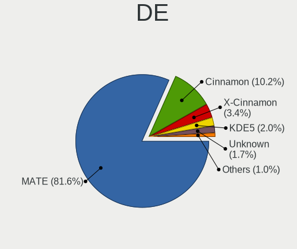
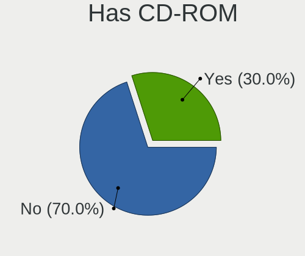
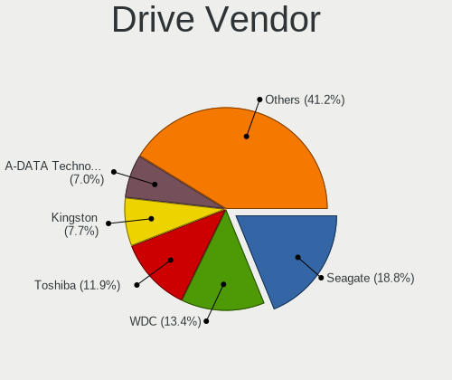
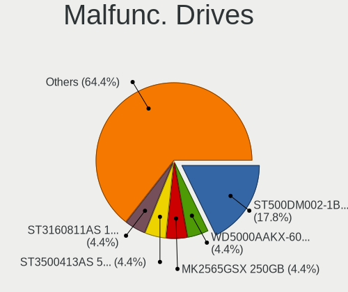
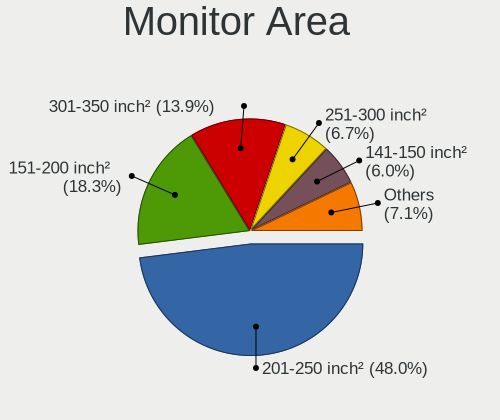
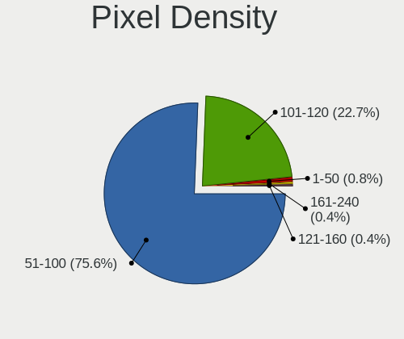
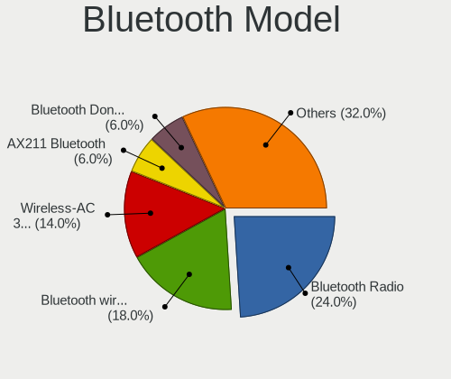
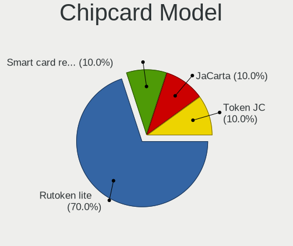

Red OS - Tested Hardware & Statistics (Desktops)
------------------------------------------------

A project to collect tested hardware configurations for Red OS.

Anyone can contribute to this report by the [hw-probe](https://github.com/linuxhw/hw-probe) tool:

    sudo -E hw-probe -all -upload

Please contribute! Especially if your hardware is rare.

Contents
--------

* [ Test Cases ](#test-cases)

* [ System ](#system)
  - [ OS                       ](#os)
  - [ OS Family                ](#os-family)
  - [ Kernel                   ](#kernel)
  - [ Kernel Family            ](#kernel-family)
  - [ Kernel Major Ver.        ](#kernel-major-ver)
  - [ Arch                     ](#arch)
  - [ DE                       ](#de)
  - [ Display Server           ](#display-server)
  - [ Display Manager          ](#display-manager)
  - [ OS Lang                  ](#os-lang)
  - [ Boot Mode                ](#boot-mode)
  - [ Filesystem               ](#filesystem)
  - [ Part. scheme             ](#part-scheme)
  - [ Dual Boot with Linux/BSD ](#dual-boot-with-linuxbsd)
  - [ Dual Boot (Win)          ](#dual-boot-win)

* [ Board ](#board)
  - [ Vendor                   ](#vendor)
  - [ Model                    ](#model)
  - [ Model Family             ](#model-family)
  - [ MFG Year                 ](#mfg-year)
  - [ Form Factor              ](#form-factor)
  - [ Secure Boot              ](#secure-boot)
  - [ Coreboot                 ](#coreboot)
  - [ RAM Size                 ](#ram-size)
  - [ RAM Used                 ](#ram-used)
  - [ Total Drives             ](#total-drives)
  - [ Has CD-ROM               ](#has-cd-rom)
  - [ Has Ethernet             ](#has-ethernet)
  - [ Has WiFi                 ](#has-wifi)
  - [ Has Bluetooth            ](#has-bluetooth)

* [ Location ](#location)
  - [ Country                  ](#country)
  - [ City                     ](#city)

* [ Drives ](#drives)
  - [ Drive Vendor             ](#drive-vendor)
  - [ Drive Model              ](#drive-model)
  - [ HDD Vendor               ](#hdd-vendor)
  - [ SSD Vendor               ](#ssd-vendor)
  - [ Drive Kind               ](#drive-kind)
  - [ Drive Connector          ](#drive-connector)
  - [ Drive Size               ](#drive-size)
  - [ Space Total              ](#space-total)
  - [ Space Used               ](#space-used)
  - [ Malfunc. Drives          ](#malfunc-drives)
  - [ Malfunc. Drive Vendor    ](#malfunc-drive-vendor)
  - [ Malfunc. HDD Vendor      ](#malfunc-hdd-vendor)
  - [ Malfunc. Drive Kind      ](#malfunc-drive-kind)
  - [ Failed Drives            ](#failed-drives)
  - [ Failed Drive Vendor      ](#failed-drive-vendor)
  - [ Drive Status             ](#drive-status)

* [ Storage controller ](#storage-controller)
  - [ Storage Vendor           ](#storage-vendor)
  - [ Storage Model            ](#storage-model)
  - [ Storage Kind             ](#storage-kind)

* [ Processor ](#processor)
  - [ CPU Vendor               ](#cpu-vendor)
  - [ CPU Model                ](#cpu-model)
  - [ CPU Model Family         ](#cpu-model-family)
  - [ CPU Cores                ](#cpu-cores)
  - [ CPU Sockets              ](#cpu-sockets)
  - [ CPU Threads              ](#cpu-threads)
  - [ CPU Op-Modes             ](#cpu-op-modes)
  - [ CPU Microcode            ](#cpu-microcode)
  - [ CPU Microarch            ](#cpu-microarch)

* [ Graphics ](#graphics)
  - [ GPU Vendor               ](#gpu-vendor)
  - [ GPU Model                ](#gpu-model)
  - [ GPU Combo                ](#gpu-combo)
  - [ GPU Driver               ](#gpu-driver)
  - [ GPU Memory               ](#gpu-memory)

* [ Monitor ](#monitor)
  - [ Monitor Vendor           ](#monitor-vendor)
  - [ Monitor Model            ](#monitor-model)
  - [ Monitor Resolution       ](#monitor-resolution)
  - [ Monitor Diagonal         ](#monitor-diagonal)
  - [ Monitor Width            ](#monitor-width)
  - [ Aspect Ratio             ](#aspect-ratio)
  - [ Monitor Area             ](#monitor-area)
  - [ Pixel Density            ](#pixel-density)
  - [ Multiple Monitors        ](#multiple-monitors)

* [ Network ](#network)
  - [ Net Controller Vendor    ](#net-controller-vendor)
  - [ Net Controller Model     ](#net-controller-model)
  - [ Wireless Vendor          ](#wireless-vendor)
  - [ Wireless Model           ](#wireless-model)
  - [ Ethernet Vendor          ](#ethernet-vendor)
  - [ Ethernet Model           ](#ethernet-model)
  - [ Net Controller Kind      ](#net-controller-kind)
  - [ Used Controller          ](#used-controller)
  - [ NICs                     ](#nics)
  - [ IPv6                     ](#ipv6)

* [ Bluetooth ](#bluetooth)
  - [ Bluetooth Vendor         ](#bluetooth-vendor)
  - [ Bluetooth Model          ](#bluetooth-model)

* [ Sound ](#sound)
  - [ Sound Vendor             ](#sound-vendor)
  - [ Sound Model              ](#sound-model)

* [ Memory ](#memory)
  - [ Memory Vendor            ](#memory-vendor)
  - [ Memory Model             ](#memory-model)
  - [ Memory Kind              ](#memory-kind)
  - [ Memory Form Factor       ](#memory-form-factor)
  - [ Memory Size              ](#memory-size)
  - [ Memory Speed             ](#memory-speed)

* [ Printers & scanners ](#printers--scanners)
  - [ Printer Vendor           ](#printer-vendor)
  - [ Printer Model            ](#printer-model)
  - [ Scanner Vendor           ](#scanner-vendor)
  - [ Scanner Model            ](#scanner-model)

* [ Camera ](#camera)
  - [ Camera Vendor            ](#camera-vendor)
  - [ Camera Model             ](#camera-model)

* [ Security ](#security)
  - [ Fingerprint Vendor       ](#fingerprint-vendor)
  - [ Fingerprint Model        ](#fingerprint-model)
  - [ Chipcard Vendor          ](#chipcard-vendor)
  - [ Chipcard Model           ](#chipcard-model)

* [ Unsupported ](#unsupported)
  - [ Unsupported Devices      ](#unsupported-devices)
  - [ Unsupported Device Types ](#unsupported-device-types)

Test Cases
----------

Total: 63

| Vendor        | Model               | Probe                                                      | Date         |
|---------------|---------------------|------------------------------------------------------------|--------------|
| ASRock        | B360M-HDV           | [fad5a877f5](https://linux-hardware.org/?probe=fad5a877f5) | Sep 30, 2022 |
| RDW           | MB-B450M V.1        | [8c3a565d43](https://linux-hardware.org/?probe=8c3a565d43) | Sep 26, 2022 |
| Gigabyte      | B550 AORUS ELITE V2 | [1748378749](https://linux-hardware.org/?probe=1748378749) | Sep 22, 2022 |
| Gigabyte      | B75M-D3V            | [3888b56318](https://linux-hardware.org/?probe=3888b56318) | Sep 22, 2022 |
| Gigabyte      | B550 AORUS ELITE V2 | [66a228f8c5](https://linux-hardware.org/?probe=66a228f8c5) | Sep 21, 2022 |
| Gigabyte      | H110M-S2-CF         | [fd03d25b78](https://linux-hardware.org/?probe=fd03d25b78) | Sep 15, 2022 |
| ECS           | H510H6-M7           | [1275257180](https://linux-hardware.org/?probe=1275257180) | Sep 14, 2022 |
| Unknown       | Unknown             | [40c1fd4544](https://linux-hardware.org/?probe=40c1fd4544) | Sep 05, 2022 |
| Gigabyte      | B450 AORUS PRO-CF   | [04b62ac6e3](https://linux-hardware.org/?probe=04b62ac6e3) | Sep 04, 2022 |
| Gigabyte      | B450 AORUS PRO-CF   | [a60315c259](https://linux-hardware.org/?probe=a60315c259) | Sep 04, 2022 |
| ASRock        | N68-VS3 FX          | [b4c043c208](https://linux-hardware.org/?probe=b4c043c208) | Sep 01, 2022 |
| ASRock        | B365M Pro4-F        | [3b519201e2](https://linux-hardware.org/?probe=3b519201e2) | Aug 22, 2022 |
| Gigabyte      | X58-USB3            | [5119bcb630](https://linux-hardware.org/?probe=5119bcb630) | Aug 19, 2022 |
| ASRock        | H110M-DVS R2.0      | [c02a953cda](https://linux-hardware.org/?probe=c02a953cda) | Aug 01, 2022 |
| Gigabyte      | B365M DS3H          | [14f73b6a3a](https://linux-hardware.org/?probe=14f73b6a3a) | Aug 01, 2022 |
| Dell          | 040DDP A00          | [5375c9c059](https://linux-hardware.org/?probe=5375c9c059) | Jul 26, 2022 |
| DEPO Compu... | DPH310T             | [7cc031e93b](https://linux-hardware.org/?probe=7cc031e93b) | Jul 22, 2022 |
| DEPO Compu... | DPH310T             | [946610c122](https://linux-hardware.org/?probe=946610c122) | Jul 22, 2022 |
| DEPO Compu... | DPH310T             | [fbff39be7e](https://linux-hardware.org/?probe=fbff39be7e) | Jul 22, 2022 |
| DEPO Compu... | DPH310T             | [0076bf5efc](https://linux-hardware.org/?probe=0076bf5efc) | Jul 22, 2022 |
| Gigabyte      | 970A-D3             | [f2ae77cc0c](https://linux-hardware.org/?probe=f2ae77cc0c) | Jul 17, 2022 |
| ASUSTek       | M2N68-AM Plus       | [d85cded80a](https://linux-hardware.org/?probe=d85cded80a) | Jun 20, 2022 |
| ASUSTek       | PRIME H510T2/CSM    | [28e8a1e19c](https://linux-hardware.org/?probe=28e8a1e19c) | Jun 07, 2022 |
| ASUSTek       | H81M-K              | [df5b1991e1](https://linux-hardware.org/?probe=df5b1991e1) | Jun 07, 2022 |
| HP            | 0B4Ch D             | [8ea7efbf2e](https://linux-hardware.org/?probe=8ea7efbf2e) | Jun 07, 2022 |
| ASRock        | B365M Pro4-F        | [3a12e41029](https://linux-hardware.org/?probe=3a12e41029) | Jun 01, 2022 |
| MSI           | A520M PRO           | [3eb8006c14](https://linux-hardware.org/?probe=3eb8006c14) | May 26, 2022 |
| MSI           | A520M PRO           | [9766bbe4c0](https://linux-hardware.org/?probe=9766bbe4c0) | May 25, 2022 |
| ASRock        | B365M Pro4-F        | [b3b2ee08af](https://linux-hardware.org/?probe=b3b2ee08af) | May 23, 2022 |
| MSI           | H510TI-S01          | [efe42ef07a](https://linux-hardware.org/?probe=efe42ef07a) | May 19, 2022 |
| Gigabyte      | B365M H             | [e405d209d4](https://linux-hardware.org/?probe=e405d209d4) | May 11, 2022 |
| ASUSTek       | H81M-K              | [66bb3248d5](https://linux-hardware.org/?probe=66bb3248d5) | May 11, 2022 |
| ASRock        | B560 Pro4           | [1c3459c038](https://linux-hardware.org/?probe=1c3459c038) | Apr 19, 2022 |
| Gigabyte      | B75M-D3V            | [d648ac5ab2](https://linux-hardware.org/?probe=d648ac5ab2) | Apr 01, 2022 |
| Gigabyte      | B75M-D2V            | [7b4861c8af](https://linux-hardware.org/?probe=7b4861c8af) | Apr 01, 2022 |
| Gigabyte      | H410M H V3          | [9d86d8119a](https://linux-hardware.org/?probe=9d86d8119a) | Apr 01, 2022 |
| Gigabyte      | B75M-D2V            | [b8ff95c0f1](https://linux-hardware.org/?probe=b8ff95c0f1) | Mar 30, 2022 |
| ASUSTek       | H110-PLUS           | [5074891336](https://linux-hardware.org/?probe=5074891336) | Mar 09, 2022 |
| Aquarius      | AQH410T             | [f02c2d0259](https://linux-hardware.org/?probe=f02c2d0259) | Mar 02, 2022 |
| Aquarius      | AQB560M             | [091fa6d697](https://linux-hardware.org/?probe=091fa6d697) | Mar 01, 2022 |
| Gigabyte      | B560M DS3H          | [9db1aef186](https://linux-hardware.org/?probe=9db1aef186) | Feb 18, 2022 |
| ASUSTek       | PRIME H510M-K       | [c1f9ad0faf](https://linux-hardware.org/?probe=c1f9ad0faf) | Feb 01, 2022 |
| Gigabyte      | B75M-D3V            | [14d2075383](https://linux-hardware.org/?probe=14d2075383) | Jan 31, 2022 |
| ASUSTek       | PRIME H510T2/CSM    | [38ddf02b60](https://linux-hardware.org/?probe=38ddf02b60) | Jan 31, 2022 |
| Gigabyte      | B365M DS3H          | [36db0c9260](https://linux-hardware.org/?probe=36db0c9260) | Jan 17, 2022 |
| Aquarius      | AQB560M             | [ff20437ae0](https://linux-hardware.org/?probe=ff20437ae0) | Nov 25, 2021 |
| Aquarius      | AQB560M             | [4656a05904](https://linux-hardware.org/?probe=4656a05904) | Nov 22, 2021 |
| Gigabyte      | B75M-D2V            | [ef54320d4b](https://linux-hardware.org/?probe=ef54320d4b) | Oct 19, 2021 |
| Gigabyte      | B560M DS3H          | [5a071f96dd](https://linux-hardware.org/?probe=5a071f96dd) | Oct 19, 2021 |
| ASRock        | H470M-HDV           | [ba7bdac2dd](https://linux-hardware.org/?probe=ba7bdac2dd) | Sep 04, 2021 |
| Gigabyte      | H110M-M2-CF         | [54a20af366](https://linux-hardware.org/?probe=54a20af366) | Aug 27, 2021 |
| ASUSTek       | H110-PLUS           | [11e1a45e67](https://linux-hardware.org/?probe=11e1a45e67) | Jun 03, 2021 |
| Gigabyte      | B365M DS3H          | [7b4a0634ef](https://linux-hardware.org/?probe=7b4a0634ef) | Apr 26, 2021 |
| ASUSTek       | H110M-PLUS          | [b779fb9e40](https://linux-hardware.org/?probe=b779fb9e40) | Apr 09, 2021 |
| ASUSTek       | P8H61-I LX R2.0     | [6e0321d64f](https://linux-hardware.org/?probe=6e0321d64f) | Apr 08, 2021 |
| Gigabyte      | B365M DS3H          | [d151197565](https://linux-hardware.org/?probe=d151197565) | Mar 26, 2021 |
| ASUSTek       | H81M-K              | [a61243addd](https://linux-hardware.org/?probe=a61243addd) | Mar 26, 2021 |
| ASUSTek       | H110M-K             | [30e7a27178](https://linux-hardware.org/?probe=30e7a27178) | Mar 22, 2021 |
| ASUSTek       | H110M-K             | [da0a735a9f](https://linux-hardware.org/?probe=da0a735a9f) | Mar 18, 2021 |
| ASUSTek       | H81M-K              | [5898a71c25](https://linux-hardware.org/?probe=5898a71c25) | Nov 03, 2020 |
| Gigabyte      | B360M DS3H          | [12f125beba](https://linux-hardware.org/?probe=12f125beba) | Jan 16, 2020 |
| Gigabyte      | B360M DS3H          | [c88331017f](https://linux-hardware.org/?probe=c88331017f) | Jan 16, 2020 |
| ASUSTek       | H81M-K              | [24adf26804](https://linux-hardware.org/?probe=24adf26804) | Jan 13, 2020 |

System
------

OS
--

Installed operating systems

| Name         | Desktops | Percent |
|--------------|----------|---------|
| Red OS 7.3.1 | 26       | 48.15%  |
| Red OS 7.3   | 22       | 40.74%  |
| Red OS 7.2   | 5        | 9.26%   |
| Red OS 7.3.2 | 1        | 1.85%   |

OS Family
---------

OS without a version

| Name   | Desktops | Percent |
|--------|----------|---------|
| Red OS | 49       | 100%    |

Kernel
------

Version of the Linux kernel

| Version                | Desktops | Percent |
|------------------------|----------|---------|
| 5.10.29-1.el7.x86_64   | 12       | 21.43%  |
| 5.15.10-1.el7.x86_64   | 11       | 19.64%  |
| 5.15.35-1.el7.3.x86_64 | 7        | 12.5%   |
| 5.15.35-4.el7.3.x86_64 | 6        | 10.71%  |
| 5.15.35-5.el7.3.x86_64 | 5        | 8.93%   |
| 5.15.10-3.el7.x86_64   | 3        | 5.36%   |
| 5.15.10-2.el7.x86_64   | 3        | 5.36%   |
| 4.19.79-1.el7.x86_64   | 3        | 5.36%   |
| 5.14.9-1.el7.x86_64    | 1        | 1.79%   |
| 5.10.24-3.el7.x86_64   | 1        | 1.79%   |
| 5.10.24-2.el7.x86_64   | 1        | 1.79%   |
| 5.10.1-1.el7.x86_64    | 1        | 1.79%   |
| 4.19.56-2.el7.x86_64   | 1        | 1.79%   |
| 4.19.204-1.el7.x86_64  | 1        | 1.79%   |

Kernel Family
-------------

Linux kernel without a distro release

| Version  | Desktops | Percent |
|----------|----------|---------|
| 5.15.35  | 17       | 30.91%  |
| 5.15.10  | 17       | 30.91%  |
| 5.10.29  | 12       | 21.82%  |
| 4.19.79  | 3        | 5.45%   |
| 5.10.24  | 2        | 3.64%   |
| 5.14.9   | 1        | 1.82%   |
| 5.10.1   | 1        | 1.82%   |
| 4.19.56  | 1        | 1.82%   |
| 4.19.204 | 1        | 1.82%   |

Kernel Major Ver.
-----------------

Linux kernel major version

| Version | Desktops | Percent |
|---------|----------|---------|
| 5.15    | 33       | 61.11%  |
| 5.10    | 15       | 27.78%  |
| 4.19    | 5        | 9.26%   |
| 5.14    | 1        | 1.85%   |

Arch
----

OS architecture (x86_64, i586, etc.)

| Name   | Desktops | Percent |
|--------|----------|---------|
| x86_64 | 49       | 100%    |

DE
--

Desktop Environment

| Name       | Desktops | Percent |
|------------|----------|---------|
| MATE       | 39       | 73.58%  |
| Cinnamon   | 12       | 22.64%  |
| X-Cinnamon | 1        | 1.89%   |
| Unknown    | 1        | 1.89%   |

Display Server
--------------

X11 or Wayland

| Name    | Desktops | Percent |
|---------|----------|---------|
| X11     | 44       | 86.27%  |
| Wayland | 6        | 11.76%  |
| Unknown | 1        | 1.96%   |

Display Manager
---------------

SDDM, LightDM, etc.

| Name    | Desktops | Percent |
|---------|----------|---------|
| GDM     | 46       | 92%     |
| SDDM    | 2        | 4%      |
| Unknown | 2        | 4%      |

OS Lang
-------

Language

| Lang    | Desktops | Percent |
|---------|----------|---------|
| Unknown | 46       | 92%     |
| ru_RU   | 4        | 8%      |

Boot Mode
---------

EFI or BIOS

| Mode | Desktops | Percent |
|------|----------|---------|
| EFI  | 32       | 62.75%  |
| BIOS | 19       | 37.25%  |

Filesystem
----------

Type of filesystem

| Type    | Desktops | Percent |
|---------|----------|---------|
| Ext4    | 46       | 93.88%  |
| Btrfs   | 2        | 4.08%   |
| Unknown | 1        | 2.04%   |

Part. scheme
------------

Scheme of partitioning

| Type    | Desktops | Percent |
|---------|----------|---------|
| GPT     | 34       | 66.67%  |
| MBR     | 15       | 29.41%  |
| Unknown | 2        | 3.92%   |

Dual Boot with Linux/BSD
------------------------

Hosting more than one Linux/BSD

| Dual boot | Desktops | Percent |
|-----------|----------|---------|
| No        | 44       | 86.27%  |
| Yes       | 7        | 13.73%  |

Dual Boot (Win)
---------------

Hosting Linux and Windows

| Dual boot | Desktops | Percent |
|-----------|----------|---------|
| No        | 40       | 80%     |
| Yes       | 10       | 20%     |

Board
-----

Vendor
------

Motherboard manufacturer

| Name                | Desktops | Percent |
|---------------------|----------|---------|
| Gigabyte Technology | 18       | 36.73%  |
| ASUSTek Computer    | 9        | 18.37%  |
| ASRock              | 6        | 12.24%  |
| DEPO Computers      | 4        | 8.16%   |
| Aquarius            | 4        | 8.16%   |
| MSI                 | 3        | 6.12%   |
| RDW                 | 1        | 2.04%   |
| Hewlett-Packard     | 1        | 2.04%   |
| ECS                 | 1        | 2.04%   |
| Dell                | 1        | 2.04%   |
| Unknown             | 1        | 2.04%   |

Model
-----

Motherboard model

| Name                         | Desktops | Percent |
|------------------------------|----------|---------|
| Gigabyte B365M DS3H          | 4        | 8.16%   |
| DEPO Computers DPH310T       | 4        | 8.16%   |
| MSI MS-7D14                  | 2        | 4.08%   |
| Gigabyte B560M DS3H          | 2        | 4.08%   |
| Gigabyte B550 AORUS ELITE V2 | 2        | 4.08%   |
| RDW RDW-MB-B450M V.1         | 1        | 2.04%   |
| MSI MS-7D35                  | 1        | 2.04%   |
| HP Z400 Workstation          | 1        | 2.04%   |
| Gigabyte X58-USB3            | 1        | 2.04%   |
| Gigabyte H410M H V3          | 1        | 2.04%   |
| Gigabyte H110M-S2            | 1        | 2.04%   |
| Gigabyte H110M-M.2           | 1        | 2.04%   |
| Gigabyte B75M-D3V            | 1        | 2.04%   |
| Gigabyte B75M-D2V            | 1        | 2.04%   |
| Gigabyte B450 AORUS PRO      | 1        | 2.04%   |
| Gigabyte B365M H             | 1        | 2.04%   |
| Gigabyte B360M-DS3H          | 1        | 2.04%   |
| Gigabyte 970A-D3             | 1        | 2.04%   |
| ECS H510H6-M7                | 1        | 2.04%   |
| Dell OptiPlex 3020           | 1        | 2.04%   |
| ASUS PRIME H510T2/CSM        | 1        | 2.04%   |
| ASUS PRIME H510M-K           | 1        | 2.04%   |
| ASUS PC                      | 1        | 2.04%   |
| ASUS P8H61-I LX R2.0         | 1        | 2.04%   |
| ASUS M2N68-AM Plus           | 1        | 2.04%   |
| ASUS H110M-PLUS              | 1        | 2.04%   |
| ASUS H110M-K                 | 1        | 2.04%   |
| ASUS H110-PLUS               | 1        | 2.04%   |
| ASUS All Series              | 1        | 2.04%   |
| ASRock N68-VS3 FX            | 1        | 2.04%   |
| ASRock H470M-HDV             | 1        | 2.04%   |
| ASRock H110M-DVS R2.0        | 1        | 2.04%   |
| ASRock B560 Pro4             | 1        | 2.04%   |
| ASRock B365M Pro4-F          | 1        | 2.04%   |
| ASRock B360M-HDV             | 1        | 2.04%   |
| Aquarius Pro T584            | 1        | 2.04%   |
| Aquarius P30 K44 R53         | 1        | 2.04%   |
| Aquarius AQH410T             | 1        | 2.04%   |
| Aquarius AQB560M             | 1        | 2.04%   |
| Unknown                      | 1        | 2.04%   |

Model Family
------------

Motherboard model prefix

| Name                   | Desktops | Percent |
|------------------------|----------|---------|
| Gigabyte B365M         | 5        | 10.2%   |
| DEPO Computers DPH310T | 4        | 8.16%   |
| MSI MS-7D14            | 2        | 4.08%   |
| Gigabyte B560M         | 2        | 4.08%   |
| Gigabyte B550          | 2        | 4.08%   |
| ASUS PRIME             | 2        | 4.08%   |
| RDW RDW-MB-B450M       | 1        | 2.04%   |
| MSI MS-7D35            | 1        | 2.04%   |
| HP Z400                | 1        | 2.04%   |
| Gigabyte X58-USB3      | 1        | 2.04%   |
| Gigabyte H410M         | 1        | 2.04%   |
| Gigabyte H110M-S2      | 1        | 2.04%   |
| Gigabyte H110M-M.2     | 1        | 2.04%   |
| Gigabyte B75M-D3V      | 1        | 2.04%   |
| Gigabyte B75M-D2V      | 1        | 2.04%   |
| Gigabyte B450          | 1        | 2.04%   |
| Gigabyte B360M-DS3H    | 1        | 2.04%   |
| Gigabyte 970A-D3       | 1        | 2.04%   |
| ECS H510H6-M7          | 1        | 2.04%   |
| Dell OptiPlex          | 1        | 2.04%   |
| ASUS PC                | 1        | 2.04%   |
| ASUS P8H61-I           | 1        | 2.04%   |
| ASUS M2N68-AM          | 1        | 2.04%   |
| ASUS H110M-PLUS        | 1        | 2.04%   |
| ASUS H110M-K           | 1        | 2.04%   |
| ASUS H110-PLUS         | 1        | 2.04%   |
| ASUS All               | 1        | 2.04%   |
| ASRock N68-VS3         | 1        | 2.04%   |
| ASRock H470M-HDV       | 1        | 2.04%   |
| ASRock H110M-DVS       | 1        | 2.04%   |
| ASRock B560            | 1        | 2.04%   |
| ASRock B365M           | 1        | 2.04%   |
| ASRock B360M-HDV       | 1        | 2.04%   |
| Aquarius Pro           | 1        | 2.04%   |
| Aquarius P30           | 1        | 2.04%   |
| Aquarius AQH410T       | 1        | 2.04%   |
| Aquarius AQB560M       | 1        | 2.04%   |
| Unknown                | 1        | 2.04%   |

MFG Year
--------

Motherboard manufacture year

| Year | Desktops | Percent |
|------|----------|---------|
| 2021 | 13       | 26.53%  |
| 2020 | 8        | 16.33%  |
| 2019 | 6        | 12.24%  |
| 2016 | 5        | 10.2%   |
| 2012 | 4        | 8.16%   |
| 2022 | 3        | 6.12%   |
| 2018 | 3        | 6.12%   |
| 2010 | 2        | 4.08%   |
| 2017 | 1        | 2.04%   |
| 2014 | 1        | 2.04%   |
| 2013 | 1        | 2.04%   |
| 2011 | 1        | 2.04%   |
| 2009 | 1        | 2.04%   |

Form Factor
-----------

Physical design of the computer

| Name    | Desktops | Percent |
|---------|----------|---------|
| Desktop | 49       | 100%    |

Secure Boot
-----------

Enabled or disabled

| State    | Desktops | Percent |
|----------|----------|---------|
| Disabled | 49       | 100%    |

Coreboot
--------

Have coreboot on board

| Used | Desktops | Percent |
|------|----------|---------|
| No   | 49       | 100%    |

RAM Size
--------

Total RAM memory

| Size in GB | Desktops | Percent |
|------------|----------|---------|
| 16.01-24.0 | 16       | 32.65%  |
| 4.01-8.0   | 13       | 26.53%  |
| 8.01-16.0  | 9        | 18.37%  |
| 3.01-4.0   | 7        | 14.29%  |
| 24.01-32.0 | 2        | 4.08%   |
| 32.01-64.0 | 1        | 2.04%   |
| Unknown    | 1        | 2.04%   |

RAM Used
--------

Used RAM memory

| Used GB   | Desktops | Percent |
|-----------|----------|---------|
| 1.01-2.0  | 21       | 38.18%  |
| 4.01-8.0  | 11       | 20%     |
| 3.01-4.0  | 8        | 14.55%  |
| 2.01-3.0  | 6        | 10.91%  |
| 0.51-1.0  | 6        | 10.91%  |
| 8.01-16.0 | 2        | 3.64%   |
| Unknown   | 1        | 1.82%   |

Total Drives
------------

Number of drives on board

| Drives | Desktops | Percent |
|--------|----------|---------|
| 1      | 31       | 60.78%  |
| 2      | 16       | 31.37%  |
| 4      | 2        | 3.92%   |
| 5      | 1        | 1.96%   |
| 3      | 1        | 1.96%   |

Has CD-ROM
----------

Has CD-ROM on board

| Presented | Desktops | Percent |
|-----------|----------|---------|
| No        | 35       | 71.43%  |
| Yes       | 14       | 28.57%  |

Has Ethernet
------------

Has Ethernet on board

| Presented | Desktops | Percent |
|-----------|----------|---------|
| Yes       | 49       | 100%    |

Has WiFi
--------

Has WiFi module

| Presented | Desktops | Percent |
|-----------|----------|---------|
| No        | 40       | 78.43%  |
| Yes       | 11       | 21.57%  |

Has Bluetooth
-------------

Has Bluetooth module

| Presented | Desktops | Percent |
|-----------|----------|---------|
| No        | 42       | 85.71%  |
| Yes       | 7        | 14.29%  |

Location
--------

Country
-------

Geographic location (country)

| Country | Desktops | Percent |
|---------|----------|---------|
| Russia  | 49       | 100%    |

City
----

Geographic location (city)

| City          | Desktops | Percent |
|---------------|----------|---------|
| Murom         | 14       | 28.57%  |
| Salekhard     | 9        | 18.37%  |
| Moscow        | 8        | 16.33%  |
| Yekaterinburg | 2        | 4.08%   |
| Ulyanovsk     | 1        | 2.04%   |
| Tomsk         | 1        | 2.04%   |
| Surgut        | 1        | 2.04%   |
| Stavropol     | 1        | 2.04%   |
| St Petersburg | 1        | 2.04%   |
| Rostov-on-Don | 1        | 2.04%   |
| Penza         | 1        | 2.04%   |
| Novosibirsk   | 1        | 2.04%   |
| Kursk         | 1        | 2.04%   |
| Krasnodar     | 1        | 2.04%   |
| Kovrov        | 1        | 2.04%   |
| Kirov         | 1        | 2.04%   |
| Kholmsk       | 1        | 2.04%   |
| Kaluga        | 1        | 2.04%   |
| Bryansk       | 1        | 2.04%   |
| Arzamas       | 1        | 2.04%   |

Drives
------

Drive Vendor
------------

Hard drive vendors

| Vendor                       | Desktops | Drives | Percent |
|------------------------------|----------|--------|---------|
| Seagate                      | 19       | 31     | 26.76%  |
| WDC                          | 8        | 10     | 11.27%  |
| Toshiba                      | 7        | 7      | 9.86%   |
| A-DATA Technology            | 5        | 5      | 7.04%   |
| Kingston                     | 4        | 4      | 5.63%   |
| Apacer                       | 4        | 4      | 5.63%   |
| SanDisk                      | 3        | 4      | 4.23%   |
| Samsung Electronics          | 3        | 6      | 4.23%   |
| Foxline                      | 3        | 3      | 4.23%   |
| Patriot                      | 2        | 2      | 2.82%   |
| KIOXIA-EXCERIA               | 2        | 2      | 2.82%   |
| Crucial                      | 2        | 5      | 2.82%   |
| XPG                          | 1        | 1      | 1.41%   |
| Smartbuy                     | 1        | 1      | 1.41%   |
| Shenzhen Longsys Electronics | 1        | 1      | 1.41%   |
| Phison                       | 1        | 1      | 1.41%   |
| KingSpec                     | 1        | 1      | 1.41%   |
| GOODRAM                      | 1        | 1      | 1.41%   |
| ExeGate                      | 1        | 1      | 1.41%   |
| China                        | 1        | 1      | 1.41%   |
| AMD                          | 1        | 1      | 1.41%   |

Drive Model
-----------

Hard drive models

| Model                                 | Desktops | Percent |
|---------------------------------------|----------|---------|
| Seagate ST1000LM049-2GH172 1TB        | 4        | 5.26%   |
| Seagate ST1000DM010-2EP102 1TB        | 4        | 5.26%   |
| Apacer AS2280P4 256GB                 | 4        | 5.26%   |
| Toshiba HDWD110 1TB                   | 2        | 2.63%   |
| Toshiba HDWD105 500GB                 | 2        | 2.63%   |
| Seagate ST500DM002-1BD142 500GB       | 2        | 2.63%   |
| Seagate ST1000DM010-2DM162 1TB        | 2        | 2.63%   |
| Seagate ST1000DM003-1SB10C 1TB        | 2        | 2.63%   |
| SanDisk SD8SBAT256G1122 256GB SSD     | 2        | 2.63%   |
| Samsung SSD 860 EVO 250GB             | 2        | 2.63%   |
| KIOXIA-EXCERIA SATA SSD 480GB         | 2        | 2.63%   |
| Kingston SA400S37240G 240GB SSD       | 2        | 2.63%   |
| Foxline FLSSD240X5SE 240GB            | 2        | 2.63%   |
| Crucial CT240BX500SSD1 240GB          | 2        | 2.63%   |
| XPG GAMMIX S70 BLADE 1TB              | 1        | 1.32%   |
| WDC WD5000AAKX-75U6AA0 500GB          | 1        | 1.32%   |
| WDC WD40PURZ-85TTDY0 4TB              | 1        | 1.32%   |
| WDC WD3200AAKX-001CA0 320GB           | 1        | 1.32%   |
| WDC WD20EFRX-68EUZN0 2TB              | 1        | 1.32%   |
| WDC WD20EARX-00PASB0 2TB              | 1        | 1.32%   |
| WDC WD15EARS-19MVWB0 1TB              | 1        | 1.32%   |
| WDC WD10EZEX-22MFCA0 1TB              | 1        | 1.32%   |
| WDC WD10EARS-00Y5B1 1TB               | 1        | 1.32%   |
| WDC WD1002FAEX-00Z3A0 1TB             | 1        | 1.32%   |
| Toshiba MK5075GSX 500GB               | 1        | 1.32%   |
| Toshiba KHK61VSE960G 960GB SSD        | 1        | 1.32%   |
| Toshiba DT01ACA200 2TB                | 1        | 1.32%   |
| Smartbuy SSD 240GB                    | 1        | 1.32%   |
| Shenzhen Longsys NVMe SSD Drive 256GB | 1        | 1.32%   |
| Seagate ST3400620AS 400GB             | 1        | 1.32%   |
| Seagate ST3320620AS 320GB             | 1        | 1.32%   |
| Seagate ST3250823AS 250GB             | 1        | 1.32%   |
| Seagate ST31000528AS 1TB              | 1        | 1.32%   |
| Seagate ST2000DM008-2UB102 2TB        | 1        | 1.32%   |
| Seagate ST1000DM003-1SB102 1TB        | 1        | 1.32%   |
| SanDisk SSD PLUS 240GB                | 1        | 1.32%   |
| Samsung SSD 980 PRO 500GB             | 1        | 1.32%   |
| Samsung SSD 970 EVO Plus 1TB          | 1        | 1.32%   |
| Samsung SSD 870 EVO 250GB             | 1        | 1.32%   |
| Samsung SSD 860 EVO 1TB               | 1        | 1.32%   |

HDD Vendor
----------

Hard disk drive vendors

| Vendor  | Desktops | Drives | Percent |
|---------|----------|--------|---------|
| Seagate | 19       | 31     | 57.58%  |
| WDC     | 8        | 10     | 24.24%  |
| Toshiba | 6        | 6      | 18.18%  |

SSD Vendor
----------

Solid state drive vendors

| Vendor              | Desktops | Drives | Percent |
|---------------------|----------|--------|---------|
| SanDisk             | 3        | 4      | 11.11%  |
| Samsung Electronics | 3        | 4      | 11.11%  |
| Kingston            | 3        | 3      | 11.11%  |
| Foxline             | 3        | 3      | 11.11%  |
| A-DATA Technology   | 3        | 3      | 11.11%  |
| Patriot             | 2        | 2      | 7.41%   |
| KIOXIA-EXCERIA      | 2        | 2      | 7.41%   |
| Crucial             | 2        | 5      | 7.41%   |
| Toshiba             | 1        | 1      | 3.7%    |
| Smartbuy            | 1        | 1      | 3.7%    |
| KingSpec            | 1        | 1      | 3.7%    |
| GOODRAM             | 1        | 1      | 3.7%    |
| ExeGate             | 1        | 1      | 3.7%    |
| China               | 1        | 1      | 3.7%    |

Drive Kind
----------

HDD or SSD

| Kind | Desktops | Drives | Percent |
|------|----------|--------|---------|
| HDD  | 31       | 47     | 45.59%  |
| SSD  | 26       | 32     | 38.24%  |
| NVMe | 11       | 13     | 16.18%  |

Drive Connector
---------------

SATA, SAS, NVMe, etc.

| Type | Desktops | Drives | Percent |
|------|----------|--------|---------|
| SATA | 46       | 79     | 80.7%   |
| NVMe | 11       | 13     | 19.3%   |

Drive Size
----------

Size of hard drive

| Size in TB | Desktops | Drives | Percent |
|------------|----------|--------|---------|
| 0.01-0.5   | 30       | 37     | 51.72%  |
| 0.51-1.0   | 23       | 36     | 39.66%  |
| 1.01-2.0   | 4        | 5      | 6.9%    |
| 3.01-4.0   | 1        | 1      | 1.72%   |

Space Total
-----------

Amount of disk space available on the file system

| Size in GB | Desktops | Percent |
|------------|----------|---------|
| 101-250    | 15       | 29.41%  |
| 501-1000   | 15       | 29.41%  |
| 251-500    | 10       | 19.61%  |
| 51-100     | 4        | 7.84%   |
| 2001-3000  | 3        | 5.88%   |
| 1001-2000  | 3        | 5.88%   |
| Unknown    | 1        | 1.96%   |

Space Used
----------

Amount of used disk space

| Used GB   | Desktops | Percent |
|-----------|----------|---------|
| 1-20      | 31       | 56.36%  |
| 501-1000  | 7        | 12.73%  |
| 21-50     | 5        | 9.09%   |
| 51-100    | 4        | 7.27%   |
| 251-500   | 3        | 5.45%   |
| 101-250   | 2        | 3.64%   |
| 1001-2000 | 2        | 3.64%   |
| Unknown   | 1        | 1.82%   |

Malfunc. Drives
---------------

Drive models with a malfunction

| Model                          | Desktops | Drives | Percent |
|--------------------------------|----------|--------|---------|
| WDC WD3200AAKX-001CA0 320GB    | 1        | 1      | 25%     |
| WDC WD10EARS-00Y5B1 1TB        | 1        | 1      | 25%     |
| Seagate ST3250823AS 250GB      | 1        | 1      | 25%     |
| Seagate ST1000DM010-2EP102 1TB | 1        | 3      | 25%     |

Malfunc. Drive Vendor
---------------------

Vendors of faulty drives

| Vendor  | Desktops | Drives | Percent |
|---------|----------|--------|---------|
| WDC     | 2        | 2      | 50%     |
| Seagate | 2        | 4      | 50%     |

Malfunc. HDD Vendor
-------------------

Vendors of faulty HDD drives

| Vendor  | Desktops | Drives | Percent |
|---------|----------|--------|---------|
| WDC     | 2        | 2      | 50%     |
| Seagate | 2        | 4      | 50%     |

Malfunc. Drive Kind
-------------------

Kinds of faulty drives

| Kind | Desktops | Drives | Percent |
|------|----------|--------|---------|
| HDD  | 3        | 6      | 100%    |

Failed Drives
-------------

Failed drive models

Zero info for selected period =(

Failed Drive Vendor
-------------------

Failed drive vendors

Zero info for selected period =(

Drive Status
------------

Number of failed and malfunc. drives

| Status   | Desktops | Drives | Percent |
|----------|----------|--------|---------|
| Works    | 46       | 82     | 92%     |
| Malfunc  | 3        | 6      | 6%      |
| Detected | 1        | 4      | 2%      |

Storage controller
------------------

Storage Vendor
--------------

Storage controller vendors

| Vendor                       | Desktops | Percent |
|------------------------------|----------|---------|
| Intel                        | 40       | 65.57%  |
| AMD                          | 7        | 11.48%  |
| Phison Electronics           | 5        | 8.2%    |
| Realtek Semiconductor        | 2        | 3.28%   |
| Nvidia                       | 2        | 3.28%   |
| Silicon Motion               | 1        | 1.64%   |
| Shenzhen Longsys Electronics | 1        | 1.64%   |
| Samsung Electronics          | 1        | 1.64%   |
| Kingston Technology Company  | 1        | 1.64%   |
| ADATA Technology             | 1        | 1.64%   |

Storage Model
-------------

Storage controller models

| Model                                                                                   | Desktops | Percent |
|-----------------------------------------------------------------------------------------|----------|---------|
| Intel 500 Series Chipset Family SATA AHCI Controller                                    | 12       | 17.39%  |
| Intel 200 Series PCH SATA controller [AHCI mode]                                        | 10       | 14.49%  |
| Intel Q170/Q150/B150/H170/H110/Z170/CM236 Chipset SATA Controller [AHCI Mode]           | 6        | 8.7%    |
| Phison PS5013 E13 NVMe Controller                                                       | 5        | 7.25%   |
| AMD 500 Series Chipset SATA Controller                                                  | 4        | 5.8%    |
| Realtek Realtek Non-Volatile memory controller                                          | 2        | 2.9%    |
| Nvidia MCP61 SATA Controller                                                            | 2        | 2.9%    |
| Nvidia MCP61 IDE                                                                        | 2        | 2.9%    |
| Intel Cannon Lake PCH SATA AHCI Controller                                              | 2        | 2.9%    |
| Intel 8 Series/C220 Series Chipset Family 6-port SATA Controller 1 [AHCI mode]          | 2        | 2.9%    |
| AMD FCH SATA Controller [AHCI mode]                                                     | 2        | 2.9%    |
| AMD 400 Series Chipset SATA Controller                                                  | 2        | 2.9%    |
| Silicon Motion SM2263EN/SM2263XT SSD Controller                                         | 1        | 1.45%   |
| Shenzhen Longsys Electronics Non-Volatile memory controller                             | 1        | 1.45%   |
| Samsung NVMe SSD Controller SM981/PM981/PM983                                           | 1        | 1.45%   |
| Samsung NVMe SSD Controller PM9A1/PM9A3/980PRO                                          | 1        | 1.45%   |
| Kingston Company Company Non-Volatile memory controller                                 | 1        | 1.45%   |
| Intel SATA Controller [RAID mode]                                                       | 1        | 1.45%   |
| Intel Comet Lake SATA AHCI Controller                                                   | 1        | 1.45%   |
| Intel Celeron/Pentium Silver Processor SATA Controller                                  | 1        | 1.45%   |
| Intel 82801JI (ICH10 Family) 4 port SATA IDE Controller #1                              | 1        | 1.45%   |
| Intel 82801JI (ICH10 Family) 2 port SATA IDE Controller #2                              | 1        | 1.45%   |
| Intel 7 Series/C210 Series Chipset Family 6-port SATA Controller [AHCI mode]            | 1        | 1.45%   |
| Intel 7 Series/C210 Series Chipset Family 4-port SATA Controller [IDE mode]             | 1        | 1.45%   |
| Intel 7 Series/C210 Series Chipset Family 2-port SATA Controller [IDE mode]             | 1        | 1.45%   |
| Intel 6 Series/C200 Series Chipset Family Desktop SATA Controller (IDE mode, ports 4-5) | 1        | 1.45%   |
| Intel 6 Series/C200 Series Chipset Family Desktop SATA Controller (IDE mode, ports 0-3) | 1        | 1.45%   |
| Intel 400 Series Chipset Family SATA AHCI Controller                                    | 1        | 1.45%   |
| AMD SB7x0/SB8x0/SB9x0 SATA Controller [AHCI mode]                                       | 1        | 1.45%   |
| ADATA A Non-Volatile memory controller                                                  | 1        | 1.45%   |

Storage Kind
------------

Kind of storage controller (IDE, SATA, NVMe, SAS, ...)

| Kind | Desktops | Percent |
|------|----------|---------|
| SATA | 43       | 71.67%  |
| NVMe | 11       | 18.33%  |
| IDE  | 5        | 8.33%   |
| RAID | 1        | 1.67%   |

Processor
---------

CPU Vendor
----------

Processor vendors

| Vendor | Desktops | Percent |
|--------|----------|---------|
| Intel  | 40       | 81.63%  |
| AMD    | 9        | 18.37%  |

CPU Model
---------

Processor models

| Model                                       | Desktops | Percent |
|---------------------------------------------|----------|---------|
| Intel Core i5-9400 CPU @ 2.90GHz            | 10       | 20.41%  |
| Intel Core i3-10100 CPU @ 3.60GHz           | 7        | 14.29%  |
| Intel Core i5-3470 CPU @ 3.20GHz            | 3        | 6.12%   |
| Intel Pentium CPU G4500 @ 3.50GHz           | 2        | 4.08%   |
| Intel Core i3-6100 CPU @ 3.70GHz            | 2        | 4.08%   |
| AMD Ryzen 7 PRO 4750G with Radeon Graphics  | 2        | 4.08%   |
| Intel Xeon CPU W3670 @ 3.20GHz              | 1        | 2.04%   |
| Intel Pentium Gold G6400 CPU @ 4.00GHz      | 1        | 2.04%   |
| Intel Pentium Gold G5400 CPU @ 3.70GHz      | 1        | 2.04%   |
| Intel Pentium CPU G4560 @ 3.50GHz           | 1        | 2.04%   |
| Intel Core i7-10700 CPU @ 2.90GHz           | 1        | 2.04%   |
| Intel Core i7 CPU 950 @ 3.07GHz             | 1        | 2.04%   |
| Intel Core i5-9400F CPU @ 2.90GHz           | 1        | 2.04%   |
| Intel Core i5-4590 CPU @ 3.30GHz            | 1        | 2.04%   |
| Intel Core i5-10600K CPU @ 4.10GHz          | 1        | 2.04%   |
| Intel Core i5-10500 CPU @ 3.10GHz           | 1        | 2.04%   |
| Intel Core i3-4160 CPU @ 3.60GHz            | 1        | 2.04%   |
| Intel Core i3-10105 CPU @ 3.70GHz           | 1        | 2.04%   |
| Intel Celeron J4125 CPU @ 2.00GHz           | 1        | 2.04%   |
| Intel Celeron G5925 CPU @ 3.60GHz           | 1        | 2.04%   |
| Intel Celeron CPU G3900 @ 2.80GHz           | 1        | 2.04%   |
| Intel 11th Gen Core i5-11400 @ 2.60GHz      | 1        | 2.04%   |
| AMD Ryzen 7 5700G with Radeon Graphics      | 1        | 2.04%   |
| AMD Ryzen 5 PRO 4650G with Radeon Graphics  | 1        | 2.04%   |
| AMD Ryzen 5 5600X 6-Core Processor          | 1        | 2.04%   |
| AMD Ryzen 5 2400G with Radeon Vega Graphics | 1        | 2.04%   |
| AMD FX-6300 Six-Core Processor              | 1        | 2.04%   |
| AMD FX-4100 Quad-Core Processor             | 1        | 2.04%   |
| AMD Athlon II X2 240 Processor              | 1        | 2.04%   |

CPU Model Family
----------------

Processor model prefix

| Model              | Desktops | Percent |
|--------------------|----------|---------|
| Intel Core i5      | 17       | 34.69%  |
| Intel Core i3      | 11       | 22.45%  |
| Intel Pentium      | 3        | 6.12%   |
| Intel Celeron      | 3        | 6.12%   |
| Intel Pentium Gold | 2        | 4.08%   |
| Intel Core i7      | 2        | 4.08%   |
| AMD Ryzen 7 PRO    | 2        | 4.08%   |
| AMD Ryzen 5        | 2        | 4.08%   |
| AMD FX             | 2        | 4.08%   |
| Other              | 1        | 2.04%   |
| Intel Xeon         | 1        | 2.04%   |
| AMD Ryzen 7        | 1        | 2.04%   |
| AMD Ryzen 5 PRO    | 1        | 2.04%   |
| AMD Athlon II X2   | 1        | 2.04%   |

CPU Cores
---------

Number of processor cores

| Number | Desktops | Percent |
|--------|----------|---------|
| 6      | 17       | 34.69%  |
| 4      | 15       | 30.61%  |
| 2      | 12       | 24.49%  |
| 8      | 4        | 8.16%   |
| 3      | 1        | 2.04%   |

CPU Sockets
-----------

Number of sockets

| Number | Desktops | Percent |
|--------|----------|---------|
| 1      | 49       | 100%    |

CPU Threads
-----------

Threads per core (Hyper-Threading)

| Number | Desktops | Percent |
|--------|----------|---------|
| 2      | 27       | 55.1%   |
| 1      | 22       | 44.9%   |

CPU Op-Modes
------------

CPU Operation Modes (32-bit, 64-bit)

| Op mode        | Desktops | Percent |
|----------------|----------|---------|
| 32-bit, 64-bit | 48       | 97.96%  |
| Unknown        | 1        | 2.04%   |

CPU Microcode
-------------

Microcode number

| Number     | Desktops | Percent |
|------------|----------|---------|
| 0xa0653    | 11       | 22%     |
| 0x906ed    | 8        | 16%     |
| 0x506e3    | 5        | 10%     |
| 0x906ea    | 4        | 8%      |
| 0x306a9    | 3        | 6%      |
| 0x08600106 | 3        | 6%      |
| 0x306c3    | 2        | 4%      |
| 0xa0671    | 1        | 2%      |
| 0xa0655    | 1        | 2%      |
| 0xa0654    | 1        | 2%      |
| 0x906e9    | 1        | 2%      |
| 0x706a8    | 1        | 2%      |
| 0x206c2    | 1        | 2%      |
| 0x106a5    | 1        | 2%      |
| 0x0a50000d | 1        | 2%      |
| 0x0a201016 | 1        | 2%      |
| 0x08101016 | 1        | 2%      |
| 0x06000852 | 1        | 2%      |
| 0x0600063e | 1        | 2%      |
| 0x010000c7 | 1        | 2%      |
| Unknown    | 1        | 2%      |

CPU Microarch
-------------

Microarchitecture

| Name          | Desktops | Percent |
|---------------|----------|---------|
| KabyLake      | 13       | 26.53%  |
| CometLake     | 13       | 26.53%  |
| Skylake       | 5        | 10.2%   |
| Zen 2         | 3        | 6.12%   |
| IvyBridge     | 3        | 6.12%   |
| Zen 3         | 2        | 4.08%   |
| Haswell       | 2        | 4.08%   |
| Zen           | 1        | 2.04%   |
| Westmere      | 1        | 2.04%   |
| Piledriver    | 1        | 2.04%   |
| Nehalem       | 1        | 2.04%   |
| K10           | 1        | 2.04%   |
| Goldmont plus | 1        | 2.04%   |
| Bulldozer     | 1        | 2.04%   |
| Unknown       | 1        | 2.04%   |

Graphics
--------

GPU Vendor
----------

Vendors of graphics cards

| Vendor | Desktops | Percent |
|--------|----------|---------|
| Intel  | 34       | 69.39%  |
| AMD    | 9        | 18.37%  |
| Nvidia | 6        | 12.24%  |

GPU Model
---------

Graphics card models

| Model                                                                       | Desktops | Percent |
|-----------------------------------------------------------------------------|----------|---------|
| Intel CometLake-S GT2 [UHD Graphics 630]                                    | 10       | 20%     |
| Intel CoffeeLake-S GT2 [UHD Graphics 630]                                   | 10       | 20%     |
| Intel Xeon E3-1200 v2/3rd Gen Core processor Graphics Controller            | 3        | 6%      |
| Intel HD Graphics 530                                                       | 3        | 6%      |
| AMD Renoir                                                                  | 3        | 6%      |
| Intel CometLake-S GT1 [UHD Graphics 610]                                    | 2        | 4%      |
| Nvidia TU104 [GeForce RTX 2060]                                             | 1        | 2%      |
| Nvidia NV43 [GeForce 6600 GT]                                               | 1        | 2%      |
| Nvidia GK208B [GeForce GT 710]                                              | 1        | 2%      |
| Nvidia GF114 [GeForce GTX 560 Ti]                                           | 1        | 2%      |
| Nvidia GF108 [GeForce GT 620]                                               | 1        | 2%      |
| Nvidia G94GL [Quadro FX 1800]                                               | 1        | 2%      |
| Intel Xeon E3-1200 v3/4th Gen Core Processor Integrated Graphics Controller | 1        | 2%      |
| Intel RocketLake-S GT1 [UHD Graphics 730]                                   | 1        | 2%      |
| Intel HD Graphics 610                                                       | 1        | 2%      |
| Intel GeminiLake [UHD Graphics 600]                                         | 1        | 2%      |
| Intel CoffeeLake-S GT1 [UHD Graphics 610]                                   | 1        | 2%      |
| Intel 4th Generation Core Processor Family Integrated Graphics Controller   | 1        | 2%      |
| AMD RV770 [Radeon HD 4850]                                                  | 1        | 2%      |
| AMD RV515 PRO [Radeon X1300/X1550 Series] (Secondary)                       | 1        | 2%      |
| AMD RV515 PRO [Radeon X1300/X1550 Series]                                   | 1        | 2%      |
| AMD Raven Ridge [Radeon Vega Series / Radeon Vega Mobile Series]            | 1        | 2%      |
| AMD Park [Mobility Radeon HD 5430]                                          | 1        | 2%      |
| AMD Cezanne                                                                 | 1        | 2%      |
| AMD Baffin [Radeon RX 550 640SP / RX 560/560X]                              | 1        | 2%      |

GPU Combo
---------

Combinations of graphics cards

| Name       | Desktops | Percent |
|------------|----------|---------|
| 1 x Intel  | 34       | 69.39%  |
| 1 x AMD    | 8        | 16.33%  |
| 1 x Nvidia | 6        | 12.24%  |
| 2 x AMD    | 1        | 2.04%   |

GPU Driver
----------

Free vs proprietary

| Driver      | Desktops | Percent |
|-------------|----------|---------|
| Free        | 40       | 81.63%  |
| Unknown     | 8        | 16.33%  |
| Proprietary | 1        | 2.04%   |

GPU Memory
----------

Total video memory

| Size in GB | Desktops | Percent |
|------------|----------|---------|
| Unknown    | 36       | 73.47%  |
| 1.01-2.0   | 5        | 10.2%   |
| 0.01-0.5   | 4        | 8.16%   |
| 0.51-1.0   | 3        | 6.12%   |
| 3.01-4.0   | 1        | 2.04%   |

Monitor
-------

Monitor Vendor
--------------

Monitor vendors

| Vendor              | Desktops | Percent |
|---------------------|----------|---------|
| Philips             | 10       | 21.74%  |
| ViewSonic           | 8        | 17.39%  |
| Samsung Electronics | 7        | 15.22%  |
| Acer                | 6        | 13.04%  |
| BenQ                | 5        | 10.87%  |
| AOC                 | 4        | 8.7%    |
| SGT                 | 2        | 4.35%   |
| Sony                | 1        | 2.17%   |
| DOY                 | 1        | 2.17%   |
| Dell                | 1        | 2.17%   |
| CHR                 | 1        | 2.17%   |

Monitor Model
-------------

Monitor models

| Model                                                                 | Desktops | Percent |
|-----------------------------------------------------------------------|----------|---------|
| Philips PHL 243V7 PHLC155 1920x1080 527x296mm 23.8-inch               | 6        | 12.5%   |
| ViewSonic VA2719-2K VSC6B34 2560x1440 597x336mm 27.0-inch             | 4        | 8.33%   |
| ViewSonic VA2407 SERIES VSC8C31 1920x1080 521x293mm 23.5-inch         | 2        | 4.17%   |
| SGT XY238 SGT2386 1920x1080 530x290mm 23.8-inch                       | 2        | 4.17%   |
| Samsung Electronics S24B300 SAM08B3 1920x1080 521x293mm 23.5-inch     | 2        | 4.17%   |
| Samsung Electronics C27R50x SAM0F9D 1920x1080 598x336mm 27.0-inch     | 2        | 4.17%   |
| Philips PHL 240V5 PHLC10A 1920x1080 530x300mm 24.0-inch               | 2        | 4.17%   |
| AOC 2470W AOC2470 1920x1080 521x293mm 23.5-inch                       | 2        | 4.17%   |
| ViewSonic VX510 VSC6419 1024x768 304x228mm 15.0-inch                  | 1        | 2.08%   |
| ViewSonic VA2465 SERIES VSCB730 1920x1080 521x293mm 23.5-inch         | 1        | 2.08%   |
| Sony SDM-S73 SNY2770 1280x1024 359x287mm 18.1-inch                    | 1        | 2.08%   |
| Samsung Electronics SA300/SA350 SAM0795 1920x1080 520x290mm 23.4-inch | 1        | 2.08%   |
| Samsung Electronics S24D300 SAM0B42 1920x1080 531x299mm 24.0-inch     | 1        | 2.08%   |
| Samsung Electronics S24B300 SAM08B4 1920x1080 521x293mm 23.5-inch     | 1        | 2.08%   |
| Samsung Electronics LCD Monitor SAM7085 1920x1200 698x392mm 31.5-inch | 1        | 2.08%   |
| Philips PHL 241B8Q PHL0929 1920x1080 530x300mm 24.0-inch              | 1        | 2.08%   |
| Philips 226VL PHLC081 1920x1080 480x268mm 21.6-inch                   | 1        | 2.08%   |
| Philips 190VL PHLC080 1440x900 408x255mm 18.9-inch                    | 1        | 2.08%   |
| DOY LCD Monitor DOY2760 1920x1080 598x336mm 27.0-inch                 | 1        | 2.08%   |
| Dell U2412M DELA079 1920x1200 518x324mm 24.1-inch                     | 1        | 2.08%   |
| CHR CH7511B CHR7511 1920x1080 519x324mm 24.1-inch                     | 1        | 2.08%   |
| BenQ V2420H BNQ7B14 1920x1080 531x299mm 24.0-inch                     | 1        | 2.08%   |
| BenQ GW2470 BNQ78E4 1920x1080 527x296mm 23.8-inch                     | 1        | 2.08%   |
| BenQ GW2270 BNQ78DB 1920x1080 476x268mm 21.5-inch                     | 1        | 2.08%   |
| BenQ GL2023 BNQ78CC 1600x900 443x249mm 20.0-inch                      | 1        | 2.08%   |
| BenQ FP93E BNQ76D6 1280x1024 376x301mm 19.0-inch                      | 1        | 2.08%   |
| AOC U3277WB AOC3277 3840x2160 698x393mm 31.5-inch                     | 1        | 2.08%   |
| AOC 2250W AOC2250 1920x1080 480x270mm 21.7-inch                       | 1        | 2.08%   |
| Acer VG272U ACR0778 2560x1440 597x336mm 27.0-inch                     | 1        | 2.08%   |
| Acer V243HQ ACR00B0 1920x1080 521x293mm 23.5-inch                     | 1        | 2.08%   |
| Acer SA240Y ACR057F 1920x1080 527x296mm 23.8-inch                     | 1        | 2.08%   |
| Acer SA230 ACR057E 1920x1080 509x286mm 23.0-inch                      | 1        | 2.08%   |
| Acer K222HQL ACR03E1 1920x1080 477x268mm 21.5-inch                    | 1        | 2.08%   |
| Acer H226HQL ACR0319 1920x1080 476x268mm 21.5-inch                    | 1        | 2.08%   |

Monitor Resolution
------------------

Monitor screen resolution

| Resolution        | Desktops | Percent |
|-------------------|----------|---------|
| 1920x1080 (FHD)   | 30       | 71.43%  |
| 2560x1440 (QHD)   | 5        | 11.9%   |
| 1280x1024 (SXGA)  | 2        | 4.76%   |
| 3840x2160 (4K)    | 1        | 2.38%   |
| 1920x1200 (WUXGA) | 1        | 2.38%   |
| 1600x900 (HD+)    | 1        | 2.38%   |
| 1440x900 (WXGA+)  | 1        | 2.38%   |
| 1024x768 (XGA)    | 1        | 2.38%   |

Monitor Diagonal
----------------

Diagonal size in inches

| Inches | Desktops | Percent |
|--------|----------|---------|
| 24     | 14       | 30.43%  |
| 23     | 11       | 23.91%  |
| 27     | 9        | 19.57%  |
| 21     | 5        | 10.87%  |
| 19     | 2        | 4.35%   |
| 32     | 1        | 2.17%   |
| 31     | 1        | 2.17%   |
| 20     | 1        | 2.17%   |
| 18     | 1        | 2.17%   |
| 15     | 1        | 2.17%   |

Monitor Width
-------------

Physical width

| Width in mm | Desktops | Percent |
|-------------|----------|---------|
| 501-600     | 30       | 71.43%  |
| 401-500     | 7        | 16.67%  |
| 351-400     | 2        | 4.76%   |
| 701-800     | 1        | 2.38%   |
| 601-700     | 1        | 2.38%   |
| 301-350     | 1        | 2.38%   |

Aspect Ratio
------------

Proportional relationship between the width and the height

| Ratio | Desktops | Percent |
|-------|----------|---------|
| 16/9  | 36       | 85.71%  |
| 16/10 | 3        | 7.14%   |
| 5/4   | 2        | 4.76%   |
| 4/3   | 1        | 2.38%   |

Monitor Area
------------

Area in inch

| Area in inch | Desktops | Percent |
|----------------|----------|---------|
| 201-250        | 26       | 59.09%  |
| 301-350        | 9        | 20.45%  |
| 151-200        | 4        | 9.09%   |
| 351-500        | 2        | 4.55%   |
| 251-300        | 2        | 4.55%   |
| 101-110        | 1        | 2.27%   |

Pixel Density
-------------

Pixels per inch

| Density | Desktops | Percent |
|---------|----------|---------|
| 51-100  | 30       | 75%     |
| 101-120 | 10       | 25%     |

Multiple Monitors
-----------------

Total monitors connected

| Total | Desktops | Percent |
|-------|----------|---------|
| 1     | 39       | 75%     |
| 0     | 7        | 13.46%  |
| 2     | 6        | 11.54%  |

Network
-------

Net Controller Vendor
---------------------

Controller vendors

| Vendor                | Desktops | Percent |
|-----------------------|----------|---------|
| Realtek Semiconductor | 38       | 64.41%  |
| Intel                 | 13       | 22.03%  |
| Nvidia                | 2        | 3.39%   |
| Broadcom              | 2        | 3.39%   |
| TP-Link               | 1        | 1.69%   |
| Ralink Technology     | 1        | 1.69%   |
| Mercucys              | 1        | 1.69%   |
| Edimax Technology     | 1        | 1.69%   |

Net Controller Model
--------------------

Controller models

| Model                                                             | Desktops | Percent |
|-------------------------------------------------------------------|----------|---------|
| Realtek RTL8111/8168/8411 PCI Express Gigabit Ethernet Controller | 33       | 53.23%  |
| Intel Ethernet Controller I225-V                                  | 4        | 6.45%   |
| Realtek RTL8821CE 802.11ac PCIe Wireless Network Adapter          | 3        | 4.84%   |
| Intel Ethernet Connection (14) I219-V                             | 3        | 4.84%   |
| Realtek RTL8188EUS 802.11n Wireless Network Adapter               | 2        | 3.23%   |
| Realtek RTL8125 2.5GbE Controller                                 | 2        | 3.23%   |
| Nvidia MCP61 Ethernet                                             | 2        | 3.23%   |
| Intel Ethernet Connection (2) I219-V                              | 2        | 3.23%   |
| TP-Link USB 10/100 LAN                                            | 1        | 1.61%   |
| Realtek 802.11ac NIC                                              | 1        | 1.61%   |
| Ralink MT7601U Wireless Adapter                                   | 1        | 1.61%   |
| Mercucys 802.11n NIC                                              | 1        | 1.61%   |
| Intel Wireless 3165                                               | 1        | 1.61%   |
| Intel I211 Gigabit Network Connection                             | 1        | 1.61%   |
| Intel Ethernet Connection (7) I219-V                              | 1        | 1.61%   |
| Intel 82574L Gigabit Network Connection                           | 1        | 1.61%   |
| Edimax AC1200 MU-MIMO USB2.0 Adapter                              | 1        | 1.61%   |
| Broadcom NetXtreme BCM5764M Gigabit Ethernet PCIe                 | 1        | 1.61%   |
| Broadcom BCM4352 802.11ac Wireless Network Adapter                | 1        | 1.61%   |

Wireless Vendor
---------------

Wireless vendors

| Vendor                | Desktops | Percent |
|-----------------------|----------|---------|
| Realtek Semiconductor | 6        | 54.55%  |
| Ralink Technology     | 1        | 9.09%   |
| Mercucys              | 1        | 9.09%   |
| Intel                 | 1        | 9.09%   |
| Edimax Technology     | 1        | 9.09%   |
| Broadcom              | 1        | 9.09%   |

Wireless Model
--------------

Wireless models

| Model                                                    | Desktops | Percent |
|----------------------------------------------------------|----------|---------|
| Realtek RTL8821CE 802.11ac PCIe Wireless Network Adapter | 3        | 27.27%  |
| Realtek RTL8188EUS 802.11n Wireless Network Adapter      | 2        | 18.18%  |
| Realtek 802.11ac NIC                                     | 1        | 9.09%   |
| Ralink MT7601U Wireless Adapter                          | 1        | 9.09%   |
| Mercucys 802.11n NIC                                     | 1        | 9.09%   |
| Intel Wireless 3165                                      | 1        | 9.09%   |
| Edimax AC1200 MU-MIMO USB2.0 Adapter                     | 1        | 9.09%   |
| Broadcom BCM4352 802.11ac Wireless Network Adapter       | 1        | 9.09%   |

Ethernet Vendor
---------------

Ethernet vendors

| Vendor                | Desktops | Percent |
|-----------------------|----------|---------|
| Realtek Semiconductor | 35       | 68.63%  |
| Intel                 | 12       | 23.53%  |
| Nvidia                | 2        | 3.92%   |
| TP-Link               | 1        | 1.96%   |
| Broadcom              | 1        | 1.96%   |

Ethernet Model
--------------

Ethernet models

| Model                                                             | Desktops | Percent |
|-------------------------------------------------------------------|----------|---------|
| Realtek RTL8111/8168/8411 PCI Express Gigabit Ethernet Controller | 33       | 64.71%  |
| Intel Ethernet Controller I225-V                                  | 4        | 7.84%   |
| Intel Ethernet Connection (14) I219-V                             | 3        | 5.88%   |
| Realtek RTL8125 2.5GbE Controller                                 | 2        | 3.92%   |
| Nvidia MCP61 Ethernet                                             | 2        | 3.92%   |
| Intel Ethernet Connection (2) I219-V                              | 2        | 3.92%   |
| TP-Link USB 10/100 LAN                                            | 1        | 1.96%   |
| Intel I211 Gigabit Network Connection                             | 1        | 1.96%   |
| Intel Ethernet Connection (7) I219-V                              | 1        | 1.96%   |
| Intel 82574L Gigabit Network Connection                           | 1        | 1.96%   |
| Broadcom NetXtreme BCM5764M Gigabit Ethernet PCIe                 | 1        | 1.96%   |

Net Controller Kind
-------------------

Ethernet, WiFi or modem

| Kind     | Desktops | Percent |
|----------|----------|---------|
| Ethernet | 49       | 81.67%  |
| WiFi     | 11       | 18.33%  |

Used Controller
---------------

Currently used network controller

| Kind     | Desktops | Percent |
|----------|----------|---------|
| Ethernet | 48       | 94.12%  |
| WiFi     | 3        | 5.88%   |

NICs
----

Total network controllers on board

| Total | Desktops | Percent |
|-------|----------|---------|
| 1     | 39       | 79.59%  |
| 2     | 10       | 20.41%  |

IPv6
----

IPv6 vs IPv4

| Used | Desktops | Percent |
|------|----------|---------|
| No   | 49       | 100%    |

Bluetooth
---------

Bluetooth Vendor
----------------

Controller vendors

| Vendor                | Desktops | Percent |
|-----------------------|----------|---------|
| Realtek Semiconductor | 5        | 71.43%  |
| Intel                 | 1        | 14.29%  |
| Broadcom              | 1        | 14.29%  |

Bluetooth Model
---------------

Controller models

| Model                                            | Desktops | Percent |
|--------------------------------------------------|----------|---------|
| Realtek Bluetooth Radio                          | 5        | 71.43%  |
| Intel Bluetooth wireless interface               | 1        | 14.29%  |
| Broadcom BCM92046DG-CL1ROM Bluetooth 2.1 Adapter | 1        | 14.29%  |

Sound
-----

Sound Vendor
------------

Sound card vendors

| Vendor              | Desktops | Percent |
|---------------------|----------|---------|
| Intel               | 40       | 68.97%  |
| AMD                 | 10       | 17.24%  |
| Nvidia              | 5        | 8.62%   |
| Texas Instruments   | 1        | 1.72%   |
| Razer USA           | 1        | 1.72%   |
| C-Media Electronics | 1        | 1.72%   |

Sound Model
-----------

Sound card models

| Model                                                                      | Desktops | Percent |
|----------------------------------------------------------------------------|----------|---------|
| Intel Audio device                                                         | 11       | 16.67%  |
| Intel 200 Series PCH HD Audio                                              | 10       | 15.15%  |
| Intel 100 Series/C230 Series Chipset Family HD Audio Controller            | 6        | 9.09%   |
| AMD Family 17h/19h HD Audio Controller                                     | 5        | 7.58%   |
| AMD Renoir Radeon High Definition Audio Controller                         | 4        | 6.06%   |
| Nvidia MCP61 High Definition Audio                                         | 2        | 3.03%   |
| Intel Xeon E3-1200 v3/4th Gen Core Processor HD Audio Controller           | 2        | 3.03%   |
| Intel Cannon Lake PCH cAVS                                                 | 2        | 3.03%   |
| Intel 82801JI (ICH10 Family) HD Audio Controller                           | 2        | 3.03%   |
| Intel 8 Series/C220 Series Chipset High Definition Audio Controller        | 2        | 3.03%   |
| Intel 7 Series/C216 Chipset Family High Definition Audio Controller        | 2        | 3.03%   |
| Texas Instruments PCM2902 Audio Codec                                      | 1        | 1.52%   |
| Razer USA Kraken Tournament Edition                                        | 1        | 1.52%   |
| Nvidia TU104 HD Audio Controller                                           | 1        | 1.52%   |
| Nvidia GK208 HDMI/DP Audio Controller                                      | 1        | 1.52%   |
| Nvidia GF114 HDMI Audio Controller                                         | 1        | 1.52%   |
| Nvidia GF108 High Definition Audio Controller                              | 1        | 1.52%   |
| Intel Tiger Lake-H HD Audio Controller                                     | 1        | 1.52%   |
| Intel Comet Lake PCH-V cAVS                                                | 1        | 1.52%   |
| Intel Comet Lake PCH cAVS                                                  | 1        | 1.52%   |
| Intel Celeron/Pentium Silver Processor High Definition Audio               | 1        | 1.52%   |
| Intel 6 Series/C200 Series Chipset Family High Definition Audio Controller | 1        | 1.52%   |
| C-Media Electronics Audio Adapter (Unitek Y-247A)                          | 1        | 1.52%   |
| AMD Starship/Matisse HD Audio Controller                                   | 1        | 1.52%   |
| AMD SBx00 Azalia (Intel HDA)                                               | 1        | 1.52%   |
| AMD RV770 HDMI Audio [Radeon HD 4850/4870]                                 | 1        | 1.52%   |
| AMD Raven/Raven2/Fenghuang HDMI/DP Audio Controller                        | 1        | 1.52%   |
| AMD Cedar HDMI Audio [Radeon HD 5400/6300/7300 Series]                     | 1        | 1.52%   |
| AMD Baffin HDMI/DP Audio [Radeon RX 550 640SP / RX 560/560X]               | 1        | 1.52%   |

Memory
------

Memory Vendor
-------------

Memory module vendors

| Vendor              | Desktops | Percent |
|---------------------|----------|---------|
| Crucial             | 10       | 20%     |
| Foxline             | 7        | 14%     |
| Kingston            | 6        | 12%     |
| Unknown             | 4        | 8%      |
| AMD                 | 4        | 8%      |
| SK hynix            | 3        | 6%      |
| Samsung Electronics | 2        | 4%      |
| Patriot             | 2        | 4%      |
| Corsair             | 2        | 4%      |
| A-DATA Technology   | 2        | 4%      |
| Unknown             | 2        | 4%      |
| Unknown (ABCD)      | 1        | 2%      |
| Qumo                | 1        | 2%      |
| Neo Forza           | 1        | 2%      |
| Golden Empire       | 1        | 2%      |
| ChangXin Memory     | 1        | 2%      |
| Apacer              | 1        | 2%      |

Memory Model
------------

Memory module models

| Model                                                           | Desktops | Percent |
|-----------------------------------------------------------------|----------|---------|
| Foxline RAM FL2666D4S19-8G 8GB SODIMM DDR4 2667MT/s             | 4        | 7.84%   |
| Foxline RAM FL2666D4U19-8G 8192MB DIMM DDR4 2667MT/s            | 3        | 5.88%   |
| Unknown RAM Module 8GB DIMM DDR4 2667MT/s                       | 2        | 3.92%   |
| Patriot RAM PSD48G266681 8GB DIMM DDR4 2934MT/s                 | 2        | 3.92%   |
| Kingston RAM KHX2666C16/16G 16384MB DIMM DDR4 3200MT/s          | 2        | 3.92%   |
| Crucial RAM CT4G4DFS8213.C8FBD2 4GB DIMM DDR4 2800MT/s          | 2        | 3.92%   |
| AMD RAM R748G2606U2S 8GB DIMM DDR4 3200MT/s                     | 2        | 3.92%   |
| Unknown                                                         | 2        | 3.92%   |
| Unknown RAM Module 2GB DIMM DDR2 800MT/s                        | 1        | 1.96%   |
| Unknown RAM Module 2GB DIMM 400MT/s                             | 1        | 1.96%   |
| Unknown (ABCD) RAM 123456789012345678 2048MB DIMM DDR3 2133MT/s | 1        | 1.96%   |
| SK hynix RAM HMT451U6MFR8C-PB 4GB DIMM DDR3 1800MT/s            | 1        | 1.96%   |
| SK hynix RAM HMT451U6AFR8C-PB 4GB DIMM DDR3 1600MT/s            | 1        | 1.96%   |
| SK hynix RAM HMT125U7TFR8C-H9 2GB DIMM DDR3 1333MT/s            | 1        | 1.96%   |
| Samsung RAM M378B5273DH0-CH9 4GB DIMM DDR3 2133MT/s             | 1        | 1.96%   |
| Samsung RAM M378B5273DH0 4GB DIMM DDR3 1333MT/s                 | 1        | 1.96%   |
| Qumo RAM QUM4U-4G2133KK15 4GB DIMM DDR4 2133MT/s                | 1        | 1.96%   |
| Neo Forza RAM NMUD480E82-2666E 8GB DIMM DDR4 2667MT/s           | 1        | 1.96%   |
| Kingston RAM KHX2666C16/8G 8GB DIMM DDR4 3466MT/s               | 1        | 1.96%   |
| Kingston RAM 99U5584-003.A00LF 4GB DIMM DDR3 1600MT/s           | 1        | 1.96%   |
| Kingston RAM 99U5471-060.A00LF 8GB DIMM DDR3 1333MT/s           | 1        | 1.96%   |
| Kingston RAM 99U5471-047.A00LF 8GB DIMM DDR3 1333MT/s           | 1        | 1.96%   |
| Kingston RAM 99P5663-010.A00G 16GB SODIMM DDR4 2667MT/s         | 1        | 1.96%   |
| Golden Empire RAM CL23-23-23 D4-3200 8GB DIMM DDR4 2933MT/s     | 1        | 1.96%   |
| Crucial RAM CT8G4SFRA266.C8FE 8GB SODIMM DDR4 2667MT/s          | 1        | 1.96%   |
| Crucial RAM CT8G4DFS8266.M8FE 8GB DIMM DDR4 2667MT/s            | 1        | 1.96%   |
| Crucial RAM CT8G4DFS824A.M8FH3 8GB DIMM DDR4 2400MT/s           | 1        | 1.96%   |
| Crucial RAM CT8G4DFRA266.C8FP 8GB DIMM DDR4 2666MT/s            | 1        | 1.96%   |
| Crucial RAM CT8G4DFRA266.C16FG 8GB DIMM DDR4 2667MT/s           | 1        | 1.96%   |
| Crucial RAM CT8G4DFD8213.M16FA 8192MB DIMM DDR4 2133MT/s        | 1        | 1.96%   |
| Crucial RAM CT4G4DFS824A.C8FE 4GB DIMM DDR4 2400MT/s            | 1        | 1.96%   |
| Crucial RAM CT4G4DFS824A.C8FBD2 4GB DIMM DDR4 2733MT/s          | 1        | 1.96%   |
| Corsair RAM CMX4GX3M2A160 2GB DIMM DDR3 1333MT/s                | 1        | 1.96%   |
| Corsair RAM CMK8GX4M1A2666C16 8GB DIMM DDR4 3000MT/s            | 1        | 1.96%   |
| ChangXin Memory RAM QUM4S-8G2666P19 8GB SODIMM DDR4 2667MT/s    | 1        | 1.96%   |
| Apacer RAM D22.22242S.001 8GB SODIMM DDR4 2667MT/s              | 1        | 1.96%   |
| AMD RAM R9S432G3206U2K 16GB DIMM DDR4 3200MT/s                  | 1        | 1.96%   |
| AMD RAM R744G2606U1S 4GB DIMM DDR4 2866MT/s                     | 1        | 1.96%   |
| A-DATA RAM Module 8GB SODIMM DDR4 2667MT/s                      | 1        | 1.96%   |
| A-DATA RAM DDR4 3200 16GB DIMM DDR4 3400MT/s                    | 1        | 1.96%   |

Memory Kind
-----------

Memory module kinds

| Kind    | Desktops | Percent |
|---------|----------|---------|
| DDR4    | 35       | 77.78%  |
| DDR3    | 6        | 13.33%  |
| Unknown | 2        | 4.44%   |
| LPDDR4  | 1        | 2.22%   |
| DDR2    | 1        | 2.22%   |

Memory Form Factor
------------------

Physical design of the memory module

| Name   | Desktops | Percent |
|--------|----------|---------|
| DIMM   | 37       | 82.22%  |
| SODIMM | 8        | 17.78%  |

Memory Size
-----------

Memory module size

| Size  | Desktops | Percent |
|-------|----------|---------|
| 8192  | 27       | 54%     |
| 4096  | 13       | 26%     |
| 16384 | 5        | 10%     |
| 2048  | 4        | 8%      |
| 32768 | 1        | 2%      |

Memory Speed
------------

Memory module speed

| Speed | Desktops | Percent |
|-------|----------|---------|
| 2667  | 16       | 32.65%  |
| 3200  | 5        | 10.2%   |
| 2400  | 4        | 8.16%   |
| 1333  | 4        | 8.16%   |
| 2133  | 3        | 6.12%   |
| 2934  | 2        | 4.08%   |
| 2800  | 2        | 4.08%   |
| 1600  | 2        | 4.08%   |
| 3466  | 1        | 2.04%   |
| 3400  | 1        | 2.04%   |
| 3000  | 1        | 2.04%   |
| 2933  | 1        | 2.04%   |
| 2866  | 1        | 2.04%   |
| 2733  | 1        | 2.04%   |
| 2666  | 1        | 2.04%   |
| 1800  | 1        | 2.04%   |
| 800   | 1        | 2.04%   |
| 400   | 1        | 2.04%   |
| 333   | 1        | 2.04%   |

Printers & scanners
-------------------

Printer Vendor
--------------

Printer device vendors

Zero info for selected period =(

Printer Model
-------------

Printer device models

Zero info for selected period =(

Scanner Vendor
--------------

Scanner device vendors

| Vendor | Desktops | Percent |
|--------|----------|---------|
| Canon  | 1        | 100%    |

Scanner Model
-------------

Scanner device models

| Model                  | Desktops | Percent |
|------------------------|----------|---------|
| Canon CanoScan LIDE 25 | 1        | 100%    |

Camera
------

Camera Vendor
-------------

Camera device vendors

| Vendor                | Desktops | Percent |
|-----------------------|----------|---------|
| SunplusIT             | 3        | 25%     |
| Alcor Micro           | 3        | 25%     |
| Realtek Semiconductor | 1        | 8.33%   |
| Logitech              | 1        | 8.33%   |
| Creative Technology   | 1        | 8.33%   |
| Arkmicro Technologies | 1        | 8.33%   |
| Apple                 | 1        | 8.33%   |
| AlcorMicroCorp        | 1        | 8.33%   |

Camera Model
------------

Camera device models

| Model                             | Desktops | Percent |
|-----------------------------------|----------|---------|
| SunplusIT USB Camera              | 3        | 25%     |
| Alcor Micro USB 2.0 PC Camera     | 2        | 16.67%  |
| Realtek 1080p Camera              | 1        | 8.33%   |
| Logitech HD Webcam C615           | 1        | 8.33%   |
| Creative VF0530 Live! Cam Chat IM | 1        | 8.33%   |
| Arkmicro USB2.0 PC CAMERA         | 1        | 8.33%   |
| Apple iPhone5/5C/5S/6             | 1        | 8.33%   |
| AlcorMicroCorp SHUNCCM            | 1        | 8.33%   |
| Alcor Micro USB2.0 Camera         | 1        | 8.33%   |

Security
--------

Fingerprint Vendor
------------------

Fingerprint sensor vendors

Zero info for selected period =(

Fingerprint Model
-----------------

Fingerprint sensor models

Zero info for selected period =(

Chipcard Vendor
---------------

Chipcard module vendors

| Vendor       | Desktops | Percent |
|--------------|----------|---------|
| Aladdin R.D. | 1        | 100%    |

Chipcard Model
--------------

Chipcard module models

| Model                | Desktops | Percent |
|----------------------|----------|---------|
| Aladdin R.D. JaCarta | 1        | 100%    |

Unsupported
-----------

Unsupported Devices
-------------------

Total unsupported devices on board

| Total | Desktops | Percent |
|-------|----------|---------|
| 0     | 40       | 78.43%  |
| 1     | 11       | 21.57%  |

Unsupported Device Types
------------------------

Types of unsupported devices

| Type          | Desktops | Percent |
|---------------|----------|---------|
| Graphics card | 8        | 72.73%  |
| Net/wireless  | 2        | 18.18%  |
| Chipcard      | 1        | 9.09%   |

