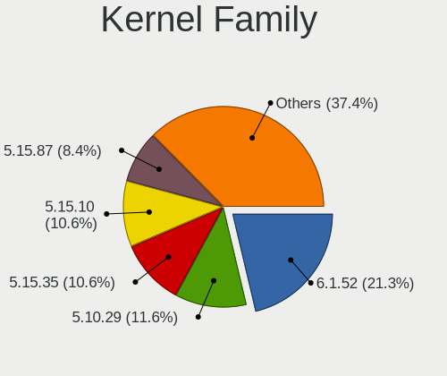
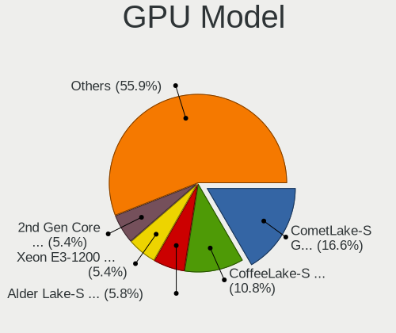
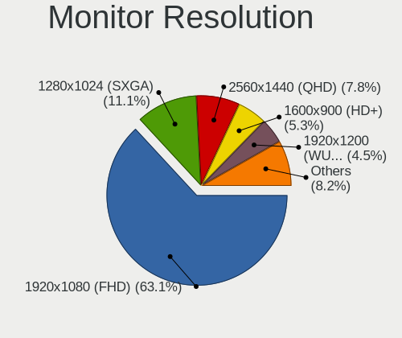
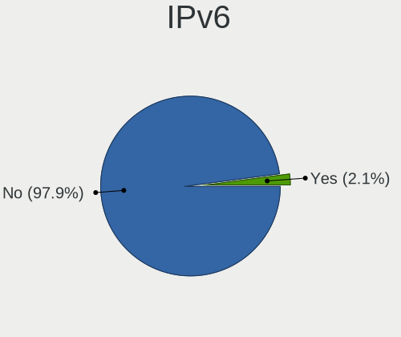
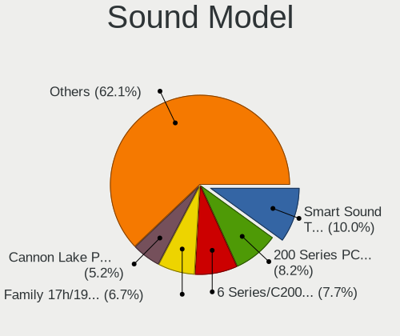

Red OS - Tested Hardware & Statistics (Desktops)
------------------------------------------------

A project to collect tested hardware configurations for Red OS.

Anyone can contribute to this report by the [hw-probe](https://github.com/linuxhw/hw-probe) tool:

    sudo -E hw-probe -all -upload

Please contribute! Especially if your hardware is rare.

Contents
--------

* [ Test Cases ](#test-cases)

* [ System ](#system)
  - [ OS                       ](#os)
  - [ OS Family                ](#os-family)
  - [ Kernel                   ](#kernel)
  - [ Kernel Family            ](#kernel-family)
  - [ Kernel Major Ver.        ](#kernel-major-ver)
  - [ Arch                     ](#arch)
  - [ DE                       ](#de)
  - [ Display Server           ](#display-server)
  - [ Display Manager          ](#display-manager)
  - [ OS Lang                  ](#os-lang)
  - [ Boot Mode                ](#boot-mode)
  - [ Filesystem               ](#filesystem)
  - [ Part. scheme             ](#part-scheme)
  - [ Dual Boot with Linux/BSD ](#dual-boot-with-linuxbsd)
  - [ Dual Boot (Win)          ](#dual-boot-win)

* [ Board ](#board)
  - [ Vendor                   ](#vendor)
  - [ Model                    ](#model)
  - [ Model Family             ](#model-family)
  - [ MFG Year                 ](#mfg-year)
  - [ Form Factor              ](#form-factor)
  - [ Secure Boot              ](#secure-boot)
  - [ Coreboot                 ](#coreboot)
  - [ RAM Size                 ](#ram-size)
  - [ RAM Used                 ](#ram-used)
  - [ Total Drives             ](#total-drives)
  - [ Has CD-ROM               ](#has-cd-rom)
  - [ Has Ethernet             ](#has-ethernet)
  - [ Has WiFi                 ](#has-wifi)
  - [ Has Bluetooth            ](#has-bluetooth)

* [ Location ](#location)
  - [ Country                  ](#country)
  - [ City                     ](#city)

* [ Drives ](#drives)
  - [ Drive Vendor             ](#drive-vendor)
  - [ Drive Model              ](#drive-model)
  - [ HDD Vendor               ](#hdd-vendor)
  - [ SSD Vendor               ](#ssd-vendor)
  - [ Drive Kind               ](#drive-kind)
  - [ Drive Connector          ](#drive-connector)
  - [ Drive Size               ](#drive-size)
  - [ Space Total              ](#space-total)
  - [ Space Used               ](#space-used)
  - [ Malfunc. Drives          ](#malfunc-drives)
  - [ Malfunc. Drive Vendor    ](#malfunc-drive-vendor)
  - [ Malfunc. HDD Vendor      ](#malfunc-hdd-vendor)
  - [ Malfunc. Drive Kind      ](#malfunc-drive-kind)
  - [ Failed Drives            ](#failed-drives)
  - [ Failed Drive Vendor      ](#failed-drive-vendor)
  - [ Drive Status             ](#drive-status)

* [ Storage controller ](#storage-controller)
  - [ Storage Vendor           ](#storage-vendor)
  - [ Storage Model            ](#storage-model)
  - [ Storage Kind             ](#storage-kind)

* [ Processor ](#processor)
  - [ CPU Vendor               ](#cpu-vendor)
  - [ CPU Model                ](#cpu-model)
  - [ CPU Model Family         ](#cpu-model-family)
  - [ CPU Cores                ](#cpu-cores)
  - [ CPU Sockets              ](#cpu-sockets)
  - [ CPU Threads              ](#cpu-threads)
  - [ CPU Op-Modes             ](#cpu-op-modes)
  - [ CPU Microcode            ](#cpu-microcode)
  - [ CPU Microarch            ](#cpu-microarch)

* [ Graphics ](#graphics)
  - [ GPU Vendor               ](#gpu-vendor)
  - [ GPU Model                ](#gpu-model)
  - [ GPU Combo                ](#gpu-combo)
  - [ GPU Driver               ](#gpu-driver)
  - [ GPU Memory               ](#gpu-memory)

* [ Monitor ](#monitor)
  - [ Monitor Vendor           ](#monitor-vendor)
  - [ Monitor Model            ](#monitor-model)
  - [ Monitor Resolution       ](#monitor-resolution)
  - [ Monitor Diagonal         ](#monitor-diagonal)
  - [ Monitor Width            ](#monitor-width)
  - [ Aspect Ratio             ](#aspect-ratio)
  - [ Monitor Area             ](#monitor-area)
  - [ Pixel Density            ](#pixel-density)
  - [ Multiple Monitors        ](#multiple-monitors)

* [ Network ](#network)
  - [ Net Controller Vendor    ](#net-controller-vendor)
  - [ Net Controller Model     ](#net-controller-model)
  - [ Wireless Vendor          ](#wireless-vendor)
  - [ Wireless Model           ](#wireless-model)
  - [ Ethernet Vendor          ](#ethernet-vendor)
  - [ Ethernet Model           ](#ethernet-model)
  - [ Net Controller Kind      ](#net-controller-kind)
  - [ Used Controller          ](#used-controller)
  - [ NICs                     ](#nics)
  - [ IPv6                     ](#ipv6)

* [ Bluetooth ](#bluetooth)
  - [ Bluetooth Vendor         ](#bluetooth-vendor)
  - [ Bluetooth Model          ](#bluetooth-model)

* [ Sound ](#sound)
  - [ Sound Vendor             ](#sound-vendor)
  - [ Sound Model              ](#sound-model)

* [ Memory ](#memory)
  - [ Memory Vendor            ](#memory-vendor)
  - [ Memory Model             ](#memory-model)
  - [ Memory Kind              ](#memory-kind)
  - [ Memory Form Factor       ](#memory-form-factor)
  - [ Memory Size              ](#memory-size)
  - [ Memory Speed             ](#memory-speed)

* [ Printers & scanners ](#printers--scanners)
  - [ Printer Vendor           ](#printer-vendor)
  - [ Printer Model            ](#printer-model)
  - [ Scanner Vendor           ](#scanner-vendor)
  - [ Scanner Model            ](#scanner-model)

* [ Camera ](#camera)
  - [ Camera Vendor            ](#camera-vendor)
  - [ Camera Model             ](#camera-model)

* [ Security ](#security)
  - [ Fingerprint Vendor       ](#fingerprint-vendor)
  - [ Fingerprint Model        ](#fingerprint-model)
  - [ Chipcard Vendor          ](#chipcard-vendor)
  - [ Chipcard Model           ](#chipcard-model)

* [ Unsupported ](#unsupported)
  - [ Unsupported Devices      ](#unsupported-devices)
  - [ Unsupported Device Types ](#unsupported-device-types)

Test Cases
----------

Total: 316

| Vendor        | Model                       | Probe                                                      | Date         |
|---------------|-----------------------------|------------------------------------------------------------|--------------|
| MSI           | PRO H610M-E DDR4            | [a415f46a9e](https://linux-hardware.org/?probe=a415f46a9e) | May 07, 2024 |
| MSI           | PRO H610M-E DDR4            | [e4adc14010](https://linux-hardware.org/?probe=e4adc14010) | May 06, 2024 |
| ASRock        | H610M-HVS                   | [bb1b76d77f](https://linux-hardware.org/?probe=bb1b76d77f) | Apr 10, 2024 |
| ASUSTek       | H110-PLUS                   | [f9d667563c](https://linux-hardware.org/?probe=f9d667563c) | Apr 10, 2024 |
| Gigabyte      | B75M-D3V                    | [606efbdac3](https://linux-hardware.org/?probe=606efbdac3) | Apr 10, 2024 |
| Gigabyte      | B75M-D3V                    | [af364f4b61](https://linux-hardware.org/?probe=af364f4b61) | Apr 09, 2024 |
| Gigabyte      | B75M-D3V                    | [2c9d3860d1](https://linux-hardware.org/?probe=2c9d3860d1) | Apr 05, 2024 |
| ASRock        | H610M-HVS                   | [0fe84d2ae2](https://linux-hardware.org/?probe=0fe84d2ae2) | Apr 05, 2024 |
| Foxconn       | 2ABF                        | [1948e2f590](https://linux-hardware.org/?probe=1948e2f590) | Mar 28, 2024 |
| MSI           | MAG B760M MORTAR            | [a7d3ac796f](https://linux-hardware.org/?probe=a7d3ac796f) | Mar 24, 2024 |
| Gigabyte      | A520M K V2                  | [bb5ad21304](https://linux-hardware.org/?probe=bb5ad21304) | Mar 24, 2024 |
| Gigabyte      | H510M S2H V2                | [cbfecba3df](https://linux-hardware.org/?probe=cbfecba3df) | Mar 20, 2024 |
| Gigabyte      | H510M S2H V2                | [f9d491fb3a](https://linux-hardware.org/?probe=f9d491fb3a) | Mar 20, 2024 |
| ASUSTek       | PRIME H310M-R R2.0          | [6c0a847cf4](https://linux-hardware.org/?probe=6c0a847cf4) | Mar 20, 2024 |
| Gigabyte      | H310M H                     | [041eca17dc](https://linux-hardware.org/?probe=041eca17dc) | Mar 20, 2024 |
| ASUSTek       | P8H61-M LX3 R2.0            | [21877754a0](https://linux-hardware.org/?probe=21877754a0) | Mar 20, 2024 |
| HP            | 198E                        | [dfdd44b32d](https://linux-hardware.org/?probe=dfdd44b32d) | Mar 20, 2024 |
| ASUSTek       | PRIME B360-PLUS             | [286fb4ec0a](https://linux-hardware.org/?probe=286fb4ec0a) | Mar 20, 2024 |
| Unknown       | T360D11                     | [8dc0de16f8](https://linux-hardware.org/?probe=8dc0de16f8) | Mar 20, 2024 |
| HP            | 2B43                        | [365885e742](https://linux-hardware.org/?probe=365885e742) | Mar 20, 2024 |
| Acer          | Aspire XC-885 V:1.1         | [ec2b946862](https://linux-hardware.org/?probe=ec2b946862) | Mar 20, 2024 |
| Gigabyte      | B75M-D3V                    | [4a7f8b6b79](https://linux-hardware.org/?probe=4a7f8b6b79) | Mar 15, 2024 |
| ASRock        | H610M-HVS                   | [3189e4304b](https://linux-hardware.org/?probe=3189e4304b) | Mar 13, 2024 |
| 3Logic Gro... | AMUR DMB-H310-MCA01         | [3b98bf5ca7](https://linux-hardware.org/?probe=3b98bf5ca7) | Mar 11, 2024 |
| INTECH PRO    | H510-M2 v5.0                | [6afefbab74](https://linux-hardware.org/?probe=6afefbab74) | Mar 11, 2024 |
| ASUSTek       | PRIME B360M-D               | [7d2950146c](https://linux-hardware.org/?probe=7d2950146c) | Mar 09, 2024 |
| MSI           | H61I-E35                    | [dbc777c090](https://linux-hardware.org/?probe=dbc777c090) | Mar 07, 2024 |
| MSI           | H61I-E35                    | [d9c1e6f02c](https://linux-hardware.org/?probe=d9c1e6f02c) | Feb 29, 2024 |
| MSI           | H61I-E35                    | [7c13263839](https://linux-hardware.org/?probe=7c13263839) | Feb 29, 2024 |
| MSI           | H61I-E35                    | [b389d340cc](https://linux-hardware.org/?probe=b389d340cc) | Feb 29, 2024 |
| MSI           | H61I-E35                    | [42d07a20da](https://linux-hardware.org/?probe=42d07a20da) | Feb 29, 2024 |
| MSI           | H61I-E35                    | [be3349f314](https://linux-hardware.org/?probe=be3349f314) | Feb 29, 2024 |
| Gigabyte      | H510M H                     | [e3f138dca5](https://linux-hardware.org/?probe=e3f138dca5) | Feb 28, 2024 |
| Gigabyte      | H510M H                     | [3f8d7911a8](https://linux-hardware.org/?probe=3f8d7911a8) | Feb 28, 2024 |
| Unknown       | T610D11-ALD                 | [5015ded00e](https://linux-hardware.org/?probe=5015ded00e) | Feb 22, 2024 |
| Unknown       | TA320 Series                | [df96f8b57d](https://linux-hardware.org/?probe=df96f8b57d) | Feb 16, 2024 |
| ASUSTek       | PRIME H510T2/CSM            | [6b8f0a0684](https://linux-hardware.org/?probe=6b8f0a0684) | Feb 09, 2024 |
| Gigabyte      | B760M DS3H DDR4             | [672b95fe29](https://linux-hardware.org/?probe=672b95fe29) | Feb 08, 2024 |
| Gigabyte      | B365M H                     | [ac7a22a8f4](https://linux-hardware.org/?probe=ac7a22a8f4) | Jan 30, 2024 |
| Unknown       | T360D11                     | [4f06f14ee6](https://linux-hardware.org/?probe=4f06f14ee6) | Jan 30, 2024 |
| Gigabyte      | B360HD3                     | [7a7e6d1518](https://linux-hardware.org/?probe=7a7e6d1518) | Jan 30, 2024 |
| Gigabyte      | B75M-D3V                    | [5628f77cd1](https://linux-hardware.org/?probe=5628f77cd1) | Jan 30, 2024 |
| ASUSTek       | X99-E WS                    | [92cb95eaef](https://linux-hardware.org/?probe=92cb95eaef) | Jan 25, 2024 |
| ASRock        | B365M-ITX/ac                | [1a48a2a936](https://linux-hardware.org/?probe=1a48a2a936) | Jan 24, 2024 |
| ASRock        | B365M-ITX/ac                | [e7719cba1d](https://linux-hardware.org/?probe=e7719cba1d) | Jan 24, 2024 |
| ASRock        | B365M-ITX/ac                | [b2abf616b0](https://linux-hardware.org/?probe=b2abf616b0) | Jan 24, 2024 |
| HP            | 3399                        | [5126e6fb32](https://linux-hardware.org/?probe=5126e6fb32) | Jan 23, 2024 |
| Foxconn       | 2ABF                        | [4983fd3ab4](https://linux-hardware.org/?probe=4983fd3ab4) | Jan 22, 2024 |
| ASRock        | B365M-ITX/ac                | [45d94979a5](https://linux-hardware.org/?probe=45d94979a5) | Jan 19, 2024 |
| MSI           | PRO H610M-E DDR4            | [66e82c879d](https://linux-hardware.org/?probe=66e82c879d) | Jan 19, 2024 |
| MSI           | PRO H610M-E DDR4            | [af8a99bcf3](https://linux-hardware.org/?probe=af8a99bcf3) | Jan 19, 2024 |
| ASRock        | H81M-VG4 R2.0               | [f13e1664ba](https://linux-hardware.org/?probe=f13e1664ba) | Jan 12, 2024 |
| BESHTAU       | B560RU V51                  | [dec20966d4](https://linux-hardware.org/?probe=dec20966d4) | Jan 11, 2024 |
| ASUSTek       | H97M-E                      | [090fcf5a52](https://linux-hardware.org/?probe=090fcf5a52) | Dec 21, 2023 |
| Lenovo        | ThinkCentre A70 7099L8G     | [9720608634](https://linux-hardware.org/?probe=9720608634) | Dec 20, 2023 |
| ASUSTek       | PRIME B360M-K               | [d52ec68e39](https://linux-hardware.org/?probe=d52ec68e39) | Dec 18, 2023 |
| Biostar       | H610MH                      | [6a0d454360](https://linux-hardware.org/?probe=6a0d454360) | Dec 18, 2023 |
| MSI           | A320M-A PRO                 | [0542ba556a](https://linux-hardware.org/?probe=0542ba556a) | Dec 10, 2023 |
| ASRock        | B365M-ITX/ac                | [01d47685dd](https://linux-hardware.org/?probe=01d47685dd) | Dec 06, 2023 |
| Gigabyte      | A320M-S2H-CF                | [ae4263fce1](https://linux-hardware.org/?probe=ae4263fce1) | Nov 28, 2023 |
| Gigabyte      | H410M S2H V2                | [07a85d20b8](https://linux-hardware.org/?probe=07a85d20b8) | Nov 27, 2023 |
| ASUSTek       | P8H61 PRO                   | [f5ae04b987](https://linux-hardware.org/?probe=f5ae04b987) | Nov 22, 2023 |
| Dell          | 0MGK50 A02                  | [44cca29f66](https://linux-hardware.org/?probe=44cca29f66) | Nov 21, 2023 |
| ASUSTek       | P8H61 PRO                   | [e029a02461](https://linux-hardware.org/?probe=e029a02461) | Nov 21, 2023 |
| ASUSTek       | P8H61 PRO                   | [966108e5dc](https://linux-hardware.org/?probe=966108e5dc) | Nov 21, 2023 |
| Gigabyte      | PH67A-D3-B3                 | [b95aa31de0](https://linux-hardware.org/?probe=b95aa31de0) | Nov 21, 2023 |
| Gigabyte      | H61M-S1                     | [5b55e90cd2](https://linux-hardware.org/?probe=5b55e90cd2) | Nov 20, 2023 |
| ASUSTek       | Z87-A                       | [ef419190cb](https://linux-hardware.org/?probe=ef419190cb) | Nov 20, 2023 |
| Gigabyte      | H270-HD3-CF                 | [c492bd0c05](https://linux-hardware.org/?probe=c492bd0c05) | Nov 20, 2023 |
| Gigabyte      | A320M-S2H-CF                | [05b1279d72](https://linux-hardware.org/?probe=05b1279d72) | Nov 20, 2023 |
| Gigabyte      | H270-HD3-CF                 | [d203bd1f2e](https://linux-hardware.org/?probe=d203bd1f2e) | Nov 20, 2023 |
| ASUSTek       | PRIME B350M-K               | [3fb45b3fae](https://linux-hardware.org/?probe=3fb45b3fae) | Nov 20, 2023 |
| ASUSTek       | PRIME B350M-K               | [1e85870bb4](https://linux-hardware.org/?probe=1e85870bb4) | Nov 20, 2023 |
| Gigabyte      | A320M-S2H-CF                | [d97ba119eb](https://linux-hardware.org/?probe=d97ba119eb) | Nov 20, 2023 |
| Unknown       | TA320 Series                | [2ba015f4da](https://linux-hardware.org/?probe=2ba015f4da) | Nov 20, 2023 |
| ASRock        | B365M-ITX/ac                | [d9aef8d62e](https://linux-hardware.org/?probe=d9aef8d62e) | Nov 20, 2023 |
| ONDA          | H410D4 IPC                  | [5ace66c92d](https://linux-hardware.org/?probe=5ace66c92d) | Nov 20, 2023 |
| BESHTAU       | B560RU V51                  | [188829d0c2](https://linux-hardware.org/?probe=188829d0c2) | Nov 20, 2023 |
| ICL           | H410SB-TM2                  | [d63641c6e3](https://linux-hardware.org/?probe=d63641c6e3) | Nov 17, 2023 |
| Gigabyte      | B75M-D3V                    | [2ca3738c72](https://linux-hardware.org/?probe=2ca3738c72) | Nov 17, 2023 |
| ASRock        | H81M-DG4                    | [089b0f3839](https://linux-hardware.org/?probe=089b0f3839) | Nov 17, 2023 |
| ASRock        | B365M Pro4-F                | [cc09f89cd0](https://linux-hardware.org/?probe=cc09f89cd0) | Nov 09, 2023 |
| ASRock        | B365M Pro4-F                | [17ec369170](https://linux-hardware.org/?probe=17ec369170) | Nov 09, 2023 |
| Gigabyte      | A320M-H-CF                  | [290c167538](https://linux-hardware.org/?probe=290c167538) | Nov 08, 2023 |
| Gigabyte      | B75M-D3V                    | [c6d1fc4965](https://linux-hardware.org/?probe=c6d1fc4965) | Oct 31, 2023 |
| Gigabyte      | H510M H                     | [d89e17690d](https://linux-hardware.org/?probe=d89e17690d) | Oct 31, 2023 |
| ASRock        | X570 Phantom Gaming 4       | [893389d935](https://linux-hardware.org/?probe=893389d935) | Oct 25, 2023 |
| Lenovo        | 1052 SDK0J40697 WIN 3305... | [9bf87234d6](https://linux-hardware.org/?probe=9bf87234d6) | Oct 23, 2023 |
| Lenovo        | 1052 SDK0J40697 WIN 3305... | [d1f56e838d](https://linux-hardware.org/?probe=d1f56e838d) | Oct 23, 2023 |
| MSI           | A320M-A PRO                 | [6290cec60c](https://linux-hardware.org/?probe=6290cec60c) | Oct 20, 2023 |
| MSI           | A320M-A PRO                 | [287fa14302](https://linux-hardware.org/?probe=287fa14302) | Oct 20, 2023 |
| Gigabyte      | B75M-D3V                    | [0fd9732532](https://linux-hardware.org/?probe=0fd9732532) | Oct 19, 2023 |
| Unknown       | Unknown                     | [9947f3f38b](https://linux-hardware.org/?probe=9947f3f38b) | Oct 17, 2023 |
| ASRock        | H510M-HVS R2.0              | [83c36787ea](https://linux-hardware.org/?probe=83c36787ea) | Oct 17, 2023 |
| ASUSTek       | P8Z77-V LX                  | [6457a793cd](https://linux-hardware.org/?probe=6457a793cd) | Oct 14, 2023 |
| Lenovo        | 3752 NOK                    | [e3eda8aae7](https://linux-hardware.org/?probe=e3eda8aae7) | Oct 10, 2023 |
| Lenovo        | 3752 NOK                    | [5e3d37b336](https://linux-hardware.org/?probe=5e3d37b336) | Oct 05, 2023 |
| Gigabyte      | H61M-DS2H                   | [f3e31ed154](https://linux-hardware.org/?probe=f3e31ed154) | Sep 22, 2023 |
| Unknown       | DMB-A520-MCA01              | [a959513e7c](https://linux-hardware.org/?probe=a959513e7c) | Sep 18, 2023 |
| Gigabyte      | H110M-H-CF                  | [5eadb71ae4](https://linux-hardware.org/?probe=5eadb71ae4) | Sep 15, 2023 |
| ASRock        | H510M-HVS R2.0              | [018a3b8abe](https://linux-hardware.org/?probe=018a3b8abe) | Sep 08, 2023 |
| MSI           | MS-B0A41                    | [c93409061c](https://linux-hardware.org/?probe=c93409061c) | Sep 06, 2023 |
| DEPO Compu... | DPH410S                     | [88076446b3](https://linux-hardware.org/?probe=88076446b3) | Aug 18, 2023 |
| DEPO Compu... | DPH410S                     | [201a0612e4](https://linux-hardware.org/?probe=201a0612e4) | Aug 18, 2023 |
| ASUSTek       | TUF Gaming A520M-PLUS II    | [fb99152b24](https://linux-hardware.org/?probe=fb99152b24) | Aug 10, 2023 |
| ASUSTek       | TUF Gaming A520M-PLUS II    | [5aeb5ebcbf](https://linux-hardware.org/?probe=5aeb5ebcbf) | Aug 09, 2023 |
| Gigabyte      | B360HD3                     | [4dc4fb1691](https://linux-hardware.org/?probe=4dc4fb1691) | Aug 08, 2023 |
| Gigabyte      | B360HD3                     | [b297b777be](https://linux-hardware.org/?probe=b297b777be) | Jul 25, 2023 |
| Biostar       | H610MH                      | [ba1951d1fa](https://linux-hardware.org/?probe=ba1951d1fa) | Jun 19, 2023 |
| ASRock        | A320M-HDV R4.0              | [2a3c6cf0ab](https://linux-hardware.org/?probe=2a3c6cf0ab) | Jun 14, 2023 |
| Gigabyte      | H510M H                     | [337e4a106e](https://linux-hardware.org/?probe=337e4a106e) | Jun 13, 2023 |
| Dell          | 0VNM11 A01                  | [df3c87a033](https://linux-hardware.org/?probe=df3c87a033) | Jun 02, 2023 |
| Dell          | 0VNM11 A01                  | [308b943182](https://linux-hardware.org/?probe=308b943182) | Jun 01, 2023 |
| Gigabyte      | B450 GAMING X               | [b92d2128ad](https://linux-hardware.org/?probe=b92d2128ad) | Jun 01, 2023 |
| Gigabyte      | B560M D3H                   | [8579e0281a](https://linux-hardware.org/?probe=8579e0281a) | May 30, 2023 |
| HP            | 83F0                        | [77cfad8631](https://linux-hardware.org/?probe=77cfad8631) | May 26, 2023 |
| Gigabyte      | A320M-S2H-CF                | [a98cdfee26](https://linux-hardware.org/?probe=a98cdfee26) | May 25, 2023 |
| Gigabyte      | Z77-DS3H                    | [1e1fb2110f](https://linux-hardware.org/?probe=1e1fb2110f) | May 24, 2023 |
| MSI           | H510M-A PRO                 | [c5f452ea28](https://linux-hardware.org/?probe=c5f452ea28) | May 18, 2023 |
| Aquarius      | AQH410T                     | [aeeb40c393](https://linux-hardware.org/?probe=aeeb40c393) | May 04, 2023 |
| Unknown       | Unknown                     | [3522381ca7](https://linux-hardware.org/?probe=3522381ca7) | May 02, 2023 |
| Unknown       | Unknown                     | [4ec0da1442](https://linux-hardware.org/?probe=4ec0da1442) | May 02, 2023 |
| MSI           | A520M PRO                   | [6d37fb0e46](https://linux-hardware.org/?probe=6d37fb0e46) | May 02, 2023 |
| ASUSTek       | PRIME H310M-R R2.0          | [41d545e4d7](https://linux-hardware.org/?probe=41d545e4d7) | Apr 28, 2023 |
| ASRock        | B365M-ITX/ac                | [e4c8218911](https://linux-hardware.org/?probe=e4c8218911) | Apr 27, 2023 |
| Gigabyte      | B365M H                     | [aca220e594](https://linux-hardware.org/?probe=aca220e594) | Apr 22, 2023 |
| Gigabyte      | H310M S2H x.x               | [eec2055c19](https://linux-hardware.org/?probe=eec2055c19) | Apr 20, 2023 |
| Intel         | DH61BF AAG81311-101         | [a9329736fb](https://linux-hardware.org/?probe=a9329736fb) | Apr 19, 2023 |
| Gigabyte      | H61M-S1                     | [e2ed275252](https://linux-hardware.org/?probe=e2ed275252) | Apr 19, 2023 |
| Gigabyte      | H61M-S1                     | [a6aaf5f17a](https://linux-hardware.org/?probe=a6aaf5f17a) | Apr 19, 2023 |
| MSI           | G41M-P33 Combo              | [d2623477d9](https://linux-hardware.org/?probe=d2623477d9) | Apr 10, 2023 |
| Intel         | D945GNT AAC96315-405        | [cdfdfbcda4](https://linux-hardware.org/?probe=cdfdfbcda4) | Apr 07, 2023 |
| Intel         | DH61BF AAG81311-101         | [49921908d1](https://linux-hardware.org/?probe=49921908d1) | Apr 06, 2023 |
| MSI           | PRO Z790-A WIFI             | [5fd883493a](https://linux-hardware.org/?probe=5fd883493a) | Apr 03, 2023 |
| MSI           | G41M-P33 Combo              | [44b5c81131](https://linux-hardware.org/?probe=44b5c81131) | Apr 03, 2023 |
| Quanta        | 2AC5 100                    | [7f253a82dc](https://linux-hardware.org/?probe=7f253a82dc) | Mar 31, 2023 |
| MSI           | G31TM-P21                   | [7404d94ca4](https://linux-hardware.org/?probe=7404d94ca4) | Mar 31, 2023 |
| ASUSTek       | PRIME H310M-R R2.0          | [3ad3c5e45c](https://linux-hardware.org/?probe=3ad3c5e45c) | Mar 30, 2023 |
| ASUSTek       | PRIME H310M-R R2.0          | [8400d48ed0](https://linux-hardware.org/?probe=8400d48ed0) | Mar 29, 2023 |
| MSI           | G41M-P33 Combo              | [ea8ce90ed5](https://linux-hardware.org/?probe=ea8ce90ed5) | Mar 27, 2023 |
| HP            | 0AA4h                       | [a77b084eba](https://linux-hardware.org/?probe=a77b084eba) | Mar 25, 2023 |
| Intel         | D945GNT AAC96315-405        | [fcc7a18f89](https://linux-hardware.org/?probe=fcc7a18f89) | Mar 24, 2023 |
| DEPO Compu... | MS-7846                     | [baaaef2394](https://linux-hardware.org/?probe=baaaef2394) | Mar 22, 2023 |
| Intel         | D945GNT AAC96315-405        | [58c99c07a6](https://linux-hardware.org/?probe=58c99c07a6) | Mar 17, 2023 |
| Biostar       | H610MH                      | [6b367d747d](https://linux-hardware.org/?probe=6b367d747d) | Mar 16, 2023 |
| Gigabyte      | B550 AORUS ELITE AX V2      | [9e172b266b](https://linux-hardware.org/?probe=9e172b266b) | Mar 16, 2023 |
| HP            | 0B4Ch D                     | [a26dff699b](https://linux-hardware.org/?probe=a26dff699b) | Mar 14, 2023 |
| ASRock        | H61M-DGS                    | [47b6690dc8](https://linux-hardware.org/?probe=47b6690dc8) | Mar 13, 2023 |
| ASRock        | H61M-DGS                    | [7c7bdc15fe](https://linux-hardware.org/?probe=7c7bdc15fe) | Mar 13, 2023 |
| Gigabyte      | B560M AORUS PRO             | [9442ced293](https://linux-hardware.org/?probe=9442ced293) | Mar 09, 2023 |
| HP            | 8599                        | [2b9bd0b4a7](https://linux-hardware.org/?probe=2b9bd0b4a7) | Mar 07, 2023 |
| ASUSTek       | P5GC-MX/1333                | [ccb99906a8](https://linux-hardware.org/?probe=ccb99906a8) | Mar 06, 2023 |
| MSI           | G41M-P33 Combo              | [a78a4114e6](https://linux-hardware.org/?probe=a78a4114e6) | Mar 06, 2023 |
| ASRock        | H61M-DGS                    | [388d4b38c1](https://linux-hardware.org/?probe=388d4b38c1) | Mar 06, 2023 |
| ASUSTek       | P5GC-MX/1333                | [6d97e48a7e](https://linux-hardware.org/?probe=6d97e48a7e) | Mar 06, 2023 |
| ASRock        | H61M-DGS                    | [8741c0e2f1](https://linux-hardware.org/?probe=8741c0e2f1) | Mar 06, 2023 |
| ASUSTek       | PRIME B560M-K               | [9e1f0243d7](https://linux-hardware.org/?probe=9e1f0243d7) | Mar 06, 2023 |
| Intel         | D945GNT AAC96315-405        | [0d02616013](https://linux-hardware.org/?probe=0d02616013) | Mar 03, 2023 |
| Gigabyte      | A320M-S2H V2-CF             | [2485632618](https://linux-hardware.org/?probe=2485632618) | Mar 02, 2023 |
| ASRock        | H510M-HVS R2.0              | [9acee9d7d4](https://linux-hardware.org/?probe=9acee9d7d4) | Mar 02, 2023 |
| Aquarius      | AQB560M                     | [fedd6483cd](https://linux-hardware.org/?probe=fedd6483cd) | Mar 01, 2023 |
| Aquarius      | AQB560M                     | [ee0c530562](https://linux-hardware.org/?probe=ee0c530562) | Feb 28, 2023 |
| Foxconn       | 2ABF                        | [d6eb6b4839](https://linux-hardware.org/?probe=d6eb6b4839) | Feb 28, 2023 |
| Gigabyte      | B365M H                     | [dbb3e73c89](https://linux-hardware.org/?probe=dbb3e73c89) | Feb 27, 2023 |
| Intel         | DH61CR AAG14064-204         | [f511e61852](https://linux-hardware.org/?probe=f511e61852) | Feb 21, 2023 |
| Lenovo        | ThinkCentre M91p 4524PL4    | [5cda5522e8](https://linux-hardware.org/?probe=5cda5522e8) | Feb 21, 2023 |
| Intel         | DH61CR AAG14064-204         | [eec6e2f905](https://linux-hardware.org/?probe=eec6e2f905) | Feb 21, 2023 |
| HP            | 18E7                        | [2c779d2395](https://linux-hardware.org/?probe=2c779d2395) | Feb 17, 2023 |
| iRU           | v1.0                        | [9d70818485](https://linux-hardware.org/?probe=9d70818485) | Feb 17, 2023 |
| ICL           | H410SB                      | [e994f10643](https://linux-hardware.org/?probe=e994f10643) | Feb 14, 2023 |
| MSI           | PRO B660M-E DDR4            | [aab30259f8](https://linux-hardware.org/?probe=aab30259f8) | Feb 13, 2023 |
| Gigabyte      | B560M DS3H V2               | [2512d8d9ab](https://linux-hardware.org/?probe=2512d8d9ab) | Feb 10, 2023 |
| MSI           | H510M-A PRO                 | [dea6a1a077](https://linux-hardware.org/?probe=dea6a1a077) | Feb 09, 2023 |
| Gigabyte      | B365M DS3H                  | [4bc9beae71](https://linux-hardware.org/?probe=4bc9beae71) | Feb 07, 2023 |
| Gigabyte      | M61SME-S2                   | [395b6fa893](https://linux-hardware.org/?probe=395b6fa893) | Feb 06, 2023 |
| Lenovo        | 3708 NOK                    | [b306f4c9dc](https://linux-hardware.org/?probe=b306f4c9dc) | Feb 06, 2023 |
| Compal        | DIP00                       | [fc6de899ba](https://linux-hardware.org/?probe=fc6de899ba) | Feb 06, 2023 |
| ASRock        | H61M-VG4                    | [b2fec94855](https://linux-hardware.org/?probe=b2fec94855) | Feb 05, 2023 |
| HP            | 8599                        | [3ffedfbc62](https://linux-hardware.org/?probe=3ffedfbc62) | Jan 31, 2023 |
| HP            | 8599                        | [759d3a0829](https://linux-hardware.org/?probe=759d3a0829) | Jan 31, 2023 |
| Gigabyte      | B365M H                     | [89d336f0b7](https://linux-hardware.org/?probe=89d336f0b7) | Jan 30, 2023 |
| DEPO Compu... | DPH410S                     | [d380c83ebf](https://linux-hardware.org/?probe=d380c83ebf) | Jan 28, 2023 |
| ASUSTek       | H81M-K                      | [13f23afb38](https://linux-hardware.org/?probe=13f23afb38) | Jan 27, 2023 |
| Aquarius      | AQB560M                     | [1187e4d240](https://linux-hardware.org/?probe=1187e4d240) | Jan 27, 2023 |
| Lenovo        | ThinkCentre M70e 0851RZ3    | [23b8d711f4](https://linux-hardware.org/?probe=23b8d711f4) | Jan 25, 2023 |
| MSI           | PRO H610M-E DDR4            | [8a06b2350d](https://linux-hardware.org/?probe=8a06b2350d) | Jan 25, 2023 |
| MSI           | PRO H610M-E DDR4            | [d5c4129361](https://linux-hardware.org/?probe=d5c4129361) | Jan 23, 2023 |
| HP            | 18E4                        | [9a62a59c37](https://linux-hardware.org/?probe=9a62a59c37) | Jan 20, 2023 |
| ASUSTek       | PRIME B460M-K               | [86d4a0e87c](https://linux-hardware.org/?probe=86d4a0e87c) | Jan 20, 2023 |
| Gigabyte      | B360HD3                     | [cbd81c917f](https://linux-hardware.org/?probe=cbd81c917f) | Jan 20, 2023 |
| Gigabyte      | H610M S2H DDR4              | [4e77673e60](https://linux-hardware.org/?probe=4e77673e60) | Jan 19, 2023 |
| MSI           | PRO H610M-E DDR4            | [3f185b85f5](https://linux-hardware.org/?probe=3f185b85f5) | Jan 18, 2023 |
| ASUSTek       | H81M-K                      | [1e6f35ceff](https://linux-hardware.org/?probe=1e6f35ceff) | Jan 18, 2023 |
| Gigabyte      | B360HD3                     | [3fb3939014](https://linux-hardware.org/?probe=3fb3939014) | Jan 18, 2023 |
| Gigabyte      | B360HD3                     | [8b992a1d50](https://linux-hardware.org/?probe=8b992a1d50) | Jan 17, 2023 |
| ASUSTek       | H81M-K                      | [a4ee55fea9](https://linux-hardware.org/?probe=a4ee55fea9) | Jan 17, 2023 |
| Unknown       | T310D11                     | [acce0e1df1](https://linux-hardware.org/?probe=acce0e1df1) | Jan 16, 2023 |
| Gigabyte      | B360HD3                     | [6c3f234091](https://linux-hardware.org/?probe=6c3f234091) | Jan 11, 2023 |
| ASUSTek       | H81M-K                      | [2e985853be](https://linux-hardware.org/?probe=2e985853be) | Jan 11, 2023 |
| ASUSTek       | PRIME H610M-K D4            | [31ecdfb704](https://linux-hardware.org/?probe=31ecdfb704) | Jan 11, 2023 |
| ASUSTek       | PRIME B365M-A               | [4f9477b846](https://linux-hardware.org/?probe=4f9477b846) | Jan 08, 2023 |
| ASUSTek       | M5A78L-M LX V2              | [f040219e23](https://linux-hardware.org/?probe=f040219e23) | Dec 26, 2022 |
| ASUSTek       | PRIME H510T2/CSM            | [b5ff4bd9d6](https://linux-hardware.org/?probe=b5ff4bd9d6) | Dec 26, 2022 |
| ASUSTek       | PRIME H510T2/CSM            | [f5f35c12a4](https://linux-hardware.org/?probe=f5f35c12a4) | Dec 23, 2022 |
| ASUSTek       | PRIME H510T2/CSM            | [686b84facc](https://linux-hardware.org/?probe=686b84facc) | Dec 23, 2022 |
| DEPO Compu... | DPH410S                     | [0ba02e46fa](https://linux-hardware.org/?probe=0ba02e46fa) | Dec 22, 2022 |
| MSI           | B450-A PRO MAX              | [8ea27950b9](https://linux-hardware.org/?probe=8ea27950b9) | Dec 21, 2022 |
| Gigabyte      | M61SME-S2                   | [8babc33ab6](https://linux-hardware.org/?probe=8babc33ab6) | Dec 17, 2022 |
| MSI           | B450-A PRO MAX              | [257ccc50d8](https://linux-hardware.org/?probe=257ccc50d8) | Dec 15, 2022 |
| Colorful T... | H610M-K M.2 V20             | [795e44f6f2](https://linux-hardware.org/?probe=795e44f6f2) | Dec 15, 2022 |
| Gigabyte      | H110M-S2-CF                 | [af9afd9f4b](https://linux-hardware.org/?probe=af9afd9f4b) | Dec 14, 2022 |
| ASUSTek       | PB62                        | [fb3796ceea](https://linux-hardware.org/?probe=fb3796ceea) | Dec 12, 2022 |
| ASUSTek       | PB62                        | [4d4a5fcc93](https://linux-hardware.org/?probe=4d4a5fcc93) | Dec 12, 2022 |
| Gigabyte      | B365M DS3H                  | [89e51f2eaa](https://linux-hardware.org/?probe=89e51f2eaa) | Dec 09, 2022 |
| ASUSTek       | P7H55-M                     | [aaa5171bd6](https://linux-hardware.org/?probe=aaa5171bd6) | Dec 06, 2022 |
| ASRock        | H510M-HVS R2.0              | [4309758f8f](https://linux-hardware.org/?probe=4309758f8f) | Dec 02, 2022 |
| Gigabyte      | B365M DS3H                  | [4b9ee0ef6a](https://linux-hardware.org/?probe=4b9ee0ef6a) | Nov 28, 2022 |
| Gigabyte      | H410M S2H V3                | [8882bfe4f8](https://linux-hardware.org/?probe=8882bfe4f8) | Nov 28, 2022 |
| Gigabyte      | X570S UD                    | [381b3c892d](https://linux-hardware.org/?probe=381b3c892d) | Nov 25, 2022 |
| ASUSTek       | PRIME Z590-P                | [7d6cf8c81f](https://linux-hardware.org/?probe=7d6cf8c81f) | Nov 24, 2022 |
| Gigabyte      | B365M DS3H                  | [e48d26b26f](https://linux-hardware.org/?probe=e48d26b26f) | Nov 21, 2022 |
| Unknown       | P43Twins1600                | [1db44f50c4](https://linux-hardware.org/?probe=1db44f50c4) | Nov 18, 2022 |
| ASRock        | H310CM-DVS                  | [23194fe7d9](https://linux-hardware.org/?probe=23194fe7d9) | Nov 16, 2022 |
| HP            | 2179                        | [3407225f33](https://linux-hardware.org/?probe=3407225f33) | Nov 14, 2022 |
| ASRock        | H310CM-DVS                  | [86932d2426](https://linux-hardware.org/?probe=86932d2426) | Nov 14, 2022 |
| ASUSTek       | PRIME H510T2/CSM            | [ef983bc60e](https://linux-hardware.org/?probe=ef983bc60e) | Nov 11, 2022 |
| ASRock        | H61M-VG4                    | [63f5fe9444](https://linux-hardware.org/?probe=63f5fe9444) | Nov 04, 2022 |
| Gigabyte      | A520M DS3H                  | [8fe13e2165](https://linux-hardware.org/?probe=8fe13e2165) | Nov 02, 2022 |
| ASRock        | H510M-HVS R2.0              | [562f466f8d](https://linux-hardware.org/?probe=562f466f8d) | Nov 02, 2022 |
| ASRock        | B450M Pro4                  | [38b68c6946](https://linux-hardware.org/?probe=38b68c6946) | Nov 02, 2022 |
| ASRock        | H510M-HVS R2.0              | [b68271c648](https://linux-hardware.org/?probe=b68271c648) | Nov 02, 2022 |
| Gigabyte      | B450M H                     | [06bbc75ef0](https://linux-hardware.org/?probe=06bbc75ef0) | Nov 01, 2022 |
| MSI           | 0A90                        | [47fa407c02](https://linux-hardware.org/?probe=47fa407c02) | Nov 01, 2022 |
| Gigabyte      | B560M H                     | [00766db60b](https://linux-hardware.org/?probe=00766db60b) | Oct 28, 2022 |
| MSI           | 0A90                        | [a15ab9db5e](https://linux-hardware.org/?probe=a15ab9db5e) | Oct 28, 2022 |
| Gigabyte      | GA-880GM-D2H                | [cacdacb3ad](https://linux-hardware.org/?probe=cacdacb3ad) | Oct 28, 2022 |
| Lenovo        | 3188 SDK0J40697 WIN 3305... | [9c429fe90c](https://linux-hardware.org/?probe=9c429fe90c) | Oct 27, 2022 |
| ASUSTek       | H81M-K                      | [92dbe47379](https://linux-hardware.org/?probe=92dbe47379) | Oct 25, 2022 |
| ASUSTek       | H81M-K                      | [247782b262](https://linux-hardware.org/?probe=247782b262) | Oct 25, 2022 |
| Lenovo        | 3708 NOK                    | [f48f731517](https://linux-hardware.org/?probe=f48f731517) | Oct 21, 2022 |
| Gigabyte      | B360HD3                     | [bbbdee0883](https://linux-hardware.org/?probe=bbbdee0883) | Oct 21, 2022 |
| Gigabyte      | B75M-D3V                    | [71c9391b8b](https://linux-hardware.org/?probe=71c9391b8b) | Oct 21, 2022 |
| Gigabyte      | H510M S2H                   | [e75a8830af](https://linux-hardware.org/?probe=e75a8830af) | Oct 19, 2022 |
| Gigabyte      | H510M S2H                   | [b8303261ad](https://linux-hardware.org/?probe=b8303261ad) | Oct 18, 2022 |
| ASUSTek       | H81M-K                      | [c6958291bd](https://linux-hardware.org/?probe=c6958291bd) | Oct 14, 2022 |
| HP            | 1495                        | [b1523ff4a6](https://linux-hardware.org/?probe=b1523ff4a6) | Oct 13, 2022 |
| ASUSTek       | PRIME H510T2/CSM            | [087d1975e1](https://linux-hardware.org/?probe=087d1975e1) | Oct 12, 2022 |
| ASUSTek       | B150M-C                     | [1d936352ea](https://linux-hardware.org/?probe=1d936352ea) | Oct 10, 2022 |
| Gigabyte      | H110M-S2-CF                 | [e799b41d70](https://linux-hardware.org/?probe=e799b41d70) | Oct 09, 2022 |
| MSI           | H55M-E33                    | [95423ecdbe](https://linux-hardware.org/?probe=95423ecdbe) | Oct 07, 2022 |
| ASRock        | B460M Pro4                  | [9fd01561ce](https://linux-hardware.org/?probe=9fd01561ce) | Oct 07, 2022 |
| ASRock        | B460M Pro4                  | [4c0bb83f01](https://linux-hardware.org/?probe=4c0bb83f01) | Oct 07, 2022 |
| MSI           | H55M-E33                    | [7af53a4dee](https://linux-hardware.org/?probe=7af53a4dee) | Oct 06, 2022 |
| Lenovo        | 3188 SDK0J40697 WIN 3305... | [b90de94f3d](https://linux-hardware.org/?probe=b90de94f3d) | Oct 05, 2022 |
| ASRock        | B360M-HDV                   | [fad5a877f5](https://linux-hardware.org/?probe=fad5a877f5) | Sep 30, 2022 |
| RDW           | MB-B450M V.1                | [8c3a565d43](https://linux-hardware.org/?probe=8c3a565d43) | Sep 26, 2022 |
| Gigabyte      | B550 AORUS ELITE V2         | [1748378749](https://linux-hardware.org/?probe=1748378749) | Sep 22, 2022 |
| Gigabyte      | B75M-D3V                    | [3888b56318](https://linux-hardware.org/?probe=3888b56318) | Sep 22, 2022 |
| Gigabyte      | B550 AORUS ELITE V2         | [66a228f8c5](https://linux-hardware.org/?probe=66a228f8c5) | Sep 21, 2022 |
| Gigabyte      | H110M-S2-CF                 | [fd03d25b78](https://linux-hardware.org/?probe=fd03d25b78) | Sep 15, 2022 |
| ECS           | H510H6-M7                   | [1275257180](https://linux-hardware.org/?probe=1275257180) | Sep 14, 2022 |
| Unknown       | Unknown                     | [40c1fd4544](https://linux-hardware.org/?probe=40c1fd4544) | Sep 05, 2022 |
| Gigabyte      | B450 AORUS PRO-CF           | [04b62ac6e3](https://linux-hardware.org/?probe=04b62ac6e3) | Sep 04, 2022 |
| Gigabyte      | B450 AORUS PRO-CF           | [a60315c259](https://linux-hardware.org/?probe=a60315c259) | Sep 04, 2022 |
| ASRock        | N68-VS3 FX                  | [b4c043c208](https://linux-hardware.org/?probe=b4c043c208) | Sep 01, 2022 |
| ASRock        | B365M Pro4-F                | [3b519201e2](https://linux-hardware.org/?probe=3b519201e2) | Aug 22, 2022 |
| Gigabyte      | X58-USB3                    | [5119bcb630](https://linux-hardware.org/?probe=5119bcb630) | Aug 19, 2022 |
| ASRock        | H110M-DVS R2.0              | [c02a953cda](https://linux-hardware.org/?probe=c02a953cda) | Aug 01, 2022 |
| Gigabyte      | B365M DS3H                  | [14f73b6a3a](https://linux-hardware.org/?probe=14f73b6a3a) | Aug 01, 2022 |
| Dell          | 040DDP A00                  | [5375c9c059](https://linux-hardware.org/?probe=5375c9c059) | Jul 26, 2022 |
| DEPO Compu... | DPH310T                     | [7cc031e93b](https://linux-hardware.org/?probe=7cc031e93b) | Jul 22, 2022 |
| DEPO Compu... | DPH310T                     | [946610c122](https://linux-hardware.org/?probe=946610c122) | Jul 22, 2022 |
| DEPO Compu... | DPH310T                     | [fbff39be7e](https://linux-hardware.org/?probe=fbff39be7e) | Jul 22, 2022 |
| DEPO Compu... | DPH310T                     | [0076bf5efc](https://linux-hardware.org/?probe=0076bf5efc) | Jul 22, 2022 |
| Gigabyte      | 970A-D3                     | [f2ae77cc0c](https://linux-hardware.org/?probe=f2ae77cc0c) | Jul 17, 2022 |
| ASUSTek       | M2N68-AM Plus               | [d85cded80a](https://linux-hardware.org/?probe=d85cded80a) | Jun 20, 2022 |
| ASUSTek       | PRIME H510T2/CSM            | [28e8a1e19c](https://linux-hardware.org/?probe=28e8a1e19c) | Jun 07, 2022 |
| ASUSTek       | H81M-K                      | [df5b1991e1](https://linux-hardware.org/?probe=df5b1991e1) | Jun 07, 2022 |
| HP            | 0B4Ch D                     | [8ea7efbf2e](https://linux-hardware.org/?probe=8ea7efbf2e) | Jun 07, 2022 |
| MSI           | A520M PRO                   | [3eb8006c14](https://linux-hardware.org/?probe=3eb8006c14) | May 26, 2022 |
| MSI           | A520M PRO                   | [9766bbe4c0](https://linux-hardware.org/?probe=9766bbe4c0) | May 25, 2022 |
| ASRock        | B365M Pro4-F                | [b3b2ee08af](https://linux-hardware.org/?probe=b3b2ee08af) | May 23, 2022 |
| MSI           | H510TI-S01                  | [efe42ef07a](https://linux-hardware.org/?probe=efe42ef07a) | May 19, 2022 |
| Gigabyte      | B365M H                     | [e405d209d4](https://linux-hardware.org/?probe=e405d209d4) | May 11, 2022 |
| ASUSTek       | H81M-K                      | [66bb3248d5](https://linux-hardware.org/?probe=66bb3248d5) | May 11, 2022 |
| ASRock        | B560 Pro4                   | [1c3459c038](https://linux-hardware.org/?probe=1c3459c038) | Apr 19, 2022 |
| Gigabyte      | B75M-D3V                    | [d648ac5ab2](https://linux-hardware.org/?probe=d648ac5ab2) | Apr 01, 2022 |
| Gigabyte      | B75M-D2V                    | [7b4861c8af](https://linux-hardware.org/?probe=7b4861c8af) | Apr 01, 2022 |
| Gigabyte      | H410M H V3                  | [9d86d8119a](https://linux-hardware.org/?probe=9d86d8119a) | Apr 01, 2022 |
| Gigabyte      | B75M-D2V                    | [b8ff95c0f1](https://linux-hardware.org/?probe=b8ff95c0f1) | Mar 30, 2022 |
| ASUSTek       | H110-PLUS                   | [5074891336](https://linux-hardware.org/?probe=5074891336) | Mar 09, 2022 |
| Aquarius      | AQH410T                     | [f02c2d0259](https://linux-hardware.org/?probe=f02c2d0259) | Mar 02, 2022 |
| Aquarius      | AQB560M                     | [091fa6d697](https://linux-hardware.org/?probe=091fa6d697) | Mar 01, 2022 |
| Gigabyte      | B560M DS3H                  | [9db1aef186](https://linux-hardware.org/?probe=9db1aef186) | Feb 18, 2022 |
| ASUSTek       | PRIME H510M-K               | [c1f9ad0faf](https://linux-hardware.org/?probe=c1f9ad0faf) | Feb 01, 2022 |
| Gigabyte      | B75M-D3V                    | [14d2075383](https://linux-hardware.org/?probe=14d2075383) | Jan 31, 2022 |
| ASUSTek       | PRIME H510T2/CSM            | [38ddf02b60](https://linux-hardware.org/?probe=38ddf02b60) | Jan 31, 2022 |
| Gigabyte      | B365M DS3H                  | [36db0c9260](https://linux-hardware.org/?probe=36db0c9260) | Jan 17, 2022 |
| Aquarius      | AQB560M                     | [ff20437ae0](https://linux-hardware.org/?probe=ff20437ae0) | Nov 25, 2021 |
| Aquarius      | AQB560M                     | [4656a05904](https://linux-hardware.org/?probe=4656a05904) | Nov 22, 2021 |
| Gigabyte      | B75M-D2V                    | [ef54320d4b](https://linux-hardware.org/?probe=ef54320d4b) | Oct 19, 2021 |
| Gigabyte      | B560M DS3H                  | [5a071f96dd](https://linux-hardware.org/?probe=5a071f96dd) | Oct 19, 2021 |
| ASRock        | H470M-HDV                   | [ba7bdac2dd](https://linux-hardware.org/?probe=ba7bdac2dd) | Sep 04, 2021 |
| Gigabyte      | H110M-M2-CF                 | [54a20af366](https://linux-hardware.org/?probe=54a20af366) | Aug 27, 2021 |
| ASUSTek       | H110-PLUS                   | [11e1a45e67](https://linux-hardware.org/?probe=11e1a45e67) | Jun 03, 2021 |
| Gigabyte      | B365M DS3H                  | [7b4a0634ef](https://linux-hardware.org/?probe=7b4a0634ef) | Apr 26, 2021 |
| ASUSTek       | H110M-PLUS                  | [b779fb9e40](https://linux-hardware.org/?probe=b779fb9e40) | Apr 09, 2021 |
| ASUSTek       | P8H61-I LX R2.0             | [6e0321d64f](https://linux-hardware.org/?probe=6e0321d64f) | Apr 08, 2021 |
| Gigabyte      | B365M DS3H                  | [d151197565](https://linux-hardware.org/?probe=d151197565) | Mar 26, 2021 |
| ASUSTek       | H81M-K                      | [a61243addd](https://linux-hardware.org/?probe=a61243addd) | Mar 26, 2021 |
| ASUSTek       | H110M-K                     | [30e7a27178](https://linux-hardware.org/?probe=30e7a27178) | Mar 22, 2021 |
| ASUSTek       | H110M-K                     | [da0a735a9f](https://linux-hardware.org/?probe=da0a735a9f) | Mar 18, 2021 |
| ASUSTek       | H81M-K                      | [5898a71c25](https://linux-hardware.org/?probe=5898a71c25) | Nov 03, 2020 |
| Gigabyte      | B360M DS3H                  | [12f125beba](https://linux-hardware.org/?probe=12f125beba) | Jan 16, 2020 |
| Gigabyte      | B360M DS3H                  | [c88331017f](https://linux-hardware.org/?probe=c88331017f) | Jan 16, 2020 |
| ASUSTek       | H81M-K                      | [24adf26804](https://linux-hardware.org/?probe=24adf26804) | Jan 13, 2020 |

System
------

OS
--

Installed operating systems

| Name         | Desktops | Percent |
|--------------|----------|---------|
| Red OS 7.3   | 131      | 53.69%  |
| Red OS 7.3.1 | 49       | 20.08%  |
| Red OS 7.3.2 | 48       | 19.67%  |
| Red OS 7.2   | 9        | 3.69%   |
| Red OS 8.0   | 7        | 2.87%   |

OS Family
---------

OS without a version

| Name   | Desktops | Percent |
|--------|----------|---------|
| Red OS | 231      | 100%    |

Kernel
------

Version of the Linux kernel

| Version                 | Desktops | Percent |
|-------------------------|----------|---------|
| 6.1.52-1.el7.3.x86_64   | 49       | 19.29%  |
| 5.15.87-1.el7.3.x86_64  | 26       | 10.24%  |
| 5.15.10-1.el7.x86_64    | 25       | 9.84%   |
| 5.10.29-1.el7.x86_64    | 25       | 9.84%   |
| 5.15.35-5.el7.3.x86_64  | 19       | 7.48%   |
| 5.15.72-1.el7.3.x86_64  | 18       | 7.09%   |
| 5.15.78-2.el7.3.x86_64  | 11       | 4.33%   |
| 5.15.35-1.el7.3.x86_64  | 9        | 3.54%   |
| 5.14.9-1.el7.x86_64     | 8        | 3.15%   |
| 5.10.29-3.el7.x86_64    | 8        | 3.15%   |
| 6.1.44-1.el7.3.x86_64   | 7        | 2.76%   |
| 5.15.35-4.el7.3.x86_64  | 7        | 2.76%   |
| 5.15.131-1.el7.3.x86_64 | 7        | 2.76%   |
| 4.19.79-1.el7.x86_64    | 7        | 2.76%   |
| 6.6.6-1.red80.x86_64    | 6        | 2.36%   |
| 6.1.20-2.el7.3.x86_64   | 5        | 1.97%   |
| 5.15.10-3.el7.x86_64    | 3        | 1.18%   |
| 5.15.10-2.el7.x86_64    | 3        | 1.18%   |
| 6.1.38-2.el7.3.x86_64   | 2        | 0.79%   |
| 5.15.125-1.el7.3.x86_64 | 2        | 0.79%   |
| 6.1.52-1.red80.x86_64   | 1        | 0.39%   |
| 6.1.11-1.el7.3.x86_64   | 1        | 0.39%   |
| 5.10.24-3.el7.x86_64    | 1        | 0.39%   |
| 5.10.24-2.el7.x86_64    | 1        | 0.39%   |
| 5.10.1-1.el7.x86_64     | 1        | 0.39%   |
| 4.19.56-2.el7.x86_64    | 1        | 0.39%   |
| 4.19.204-1.el7.x86_64   | 1        | 0.39%   |

Kernel Family
-------------

Linux kernel without a distro release

| Version  | Desktops | Percent |
|----------|----------|---------|
| 6.1.52   | 50       | 19.92%  |
| 5.10.29  | 33       | 13.15%  |
| 5.15.35  | 32       | 12.75%  |
| 5.15.10  | 31       | 12.35%  |
| 5.15.87  | 26       | 10.36%  |
| 5.15.72  | 18       | 7.17%   |
| 5.15.78  | 11       | 4.38%   |
| 5.14.9   | 8        | 3.19%   |
| 6.1.44   | 7        | 2.79%   |
| 5.15.131 | 7        | 2.79%   |
| 4.19.79  | 7        | 2.79%   |
| 6.6.6    | 6        | 2.39%   |
| 6.1.20   | 5        | 1.99%   |
| 6.1.38   | 2        | 0.8%    |
| 5.15.125 | 2        | 0.8%    |
| 5.10.24  | 2        | 0.8%    |
| 6.1.11   | 1        | 0.4%    |
| 5.10.1   | 1        | 0.4%    |
| 4.19.56  | 1        | 0.4%    |
| 4.19.204 | 1        | 0.4%    |

Kernel Major Ver.
-----------------

Linux kernel major version

| Version | Desktops | Percent |
|---------|----------|---------|
| 5.15    | 117      | 48.55%  |
| 6.1     | 65       | 26.97%  |
| 5.10    | 36       | 14.94%  |
| 4.19    | 9        | 3.73%   |
| 5.14    | 8        | 3.32%   |
| 6.6     | 6        | 2.49%   |

Arch
----

OS architecture (x86_64, i586, etc.)

| Name   | Desktops | Percent |
|--------|----------|---------|
| x86_64 | 231      | 100%    |

DE
--

Desktop Environment

| Name       | Desktops | Percent |
|------------|----------|---------|
| MATE       | 192      | 80.33%  |
| Cinnamon   | 30       | 12.55%  |
| X-Cinnamon | 9        | 3.77%   |
| Unknown    | 5        | 2.09%   |
| GNOME      | 2        | 0.84%   |
| KDE5       | 1        | 0.42%   |

Display Server
--------------

X11 or Wayland

| Name    | Desktops | Percent |
|---------|----------|---------|
| X11     | 202      | 86.32%  |
| Tty     | 24       | 10.26%  |
| Wayland | 6        | 2.56%   |
| Unknown | 2        | 0.85%   |

Display Manager
---------------

SDDM, LightDM, etc.

| Name    | Desktops | Percent |
|---------|----------|---------|
| GDM     | 215      | 91.88%  |
| LightDM | 7        | 2.99%   |
| Unknown | 7        | 2.99%   |
| SDDM    | 5        | 2.14%   |

OS Lang
-------

Language

| Lang    | Desktops | Percent |
|---------|----------|---------|
| ru_RU   | 138      | 58.23%  |
| Unknown | 95       | 40.08%  |
| en_US   | 4        | 1.69%   |

Boot Mode
---------

EFI or BIOS

| Mode | Desktops | Percent |
|------|----------|---------|
| EFI  | 156      | 66.38%  |
| BIOS | 79       | 33.62%  |

Filesystem
----------

Type of filesystem

| Type    | Desktops | Percent |
|---------|----------|---------|
| Ext4    | 228      | 97.85%  |
| Btrfs   | 4        | 1.72%   |
| Unknown | 1        | 0.43%   |

Part. scheme
------------

Scheme of partitioning

| Type    | Desktops | Percent |
|---------|----------|---------|
| GPT     | 158      | 67.52%  |
| MBR     | 73       | 31.2%   |
| Unknown | 3        | 1.28%   |

Dual Boot with Linux/BSD
------------------------

Hosting more than one Linux/BSD

| Dual boot | Desktops | Percent |
|-----------|----------|---------|
| No        | 219      | 93.19%  |
| Yes       | 16       | 6.81%   |

Dual Boot (Win)
---------------

Hosting Linux and Windows

| Dual boot | Desktops | Percent |
|-----------|----------|---------|
| No        | 184      | 78.97%  |
| Yes       | 49       | 21.03%  |

Board
-----

Vendor
------

Motherboard manufacturer

| Name                | Desktops | Percent |
|---------------------|----------|---------|
| Gigabyte Technology | 61       | 26.41%  |
| ASUSTek Computer    | 42       | 18.18%  |
| ASRock              | 29       | 12.55%  |
| MSI                 | 27       | 11.69%  |
| Hewlett-Packard     | 11       | 4.76%   |
| Unknown             | 11       | 4.76%   |
| DEPO Computers      | 8        | 3.46%   |
| Lenovo              | 7        | 3.03%   |
| Aquarius            | 7        | 3.03%   |
| Intel               | 5        | 2.16%   |
| Foxconn             | 3        | 1.3%    |
| Dell                | 3        | 1.3%    |
| Biostar             | 3        | 1.3%    |
| ICL                 | 2        | 0.87%   |
| BESHTAU             | 2        | 0.87%   |
| RDW                 | 1        | 0.43%   |
| Quanta              | 1        | 0.43%   |
| ONDA                | 1        | 0.43%   |
| iRU                 | 1        | 0.43%   |
| INTECH PRO          | 1        | 0.43%   |
| ECS                 | 1        | 0.43%   |
| Compal              | 1        | 0.43%   |
| Colorful Technology | 1        | 0.43%   |
| Acer                | 1        | 0.43%   |
| 3Logic Group        | 1        | 0.43%   |

Model
-----

Motherboard model

| Name                            | Desktops | Percent |
|---------------------------------|----------|---------|
| Unknown                         | 11       | 4.76%   |
| MSI MS-7677                     | 6        | 2.6%    |
| Gigabyte B365M DS3H             | 5        | 2.16%   |
| ASUS All Series                 | 5        | 2.16%   |
| ASRock H510M-HVS R2.0           | 5        | 2.16%   |
| ASRock B365M-ITX/ac             | 5        | 2.16%   |
| DEPO Computers DPH310T          | 4        | 1.73%   |
| MSI MS-7D48                     | 3        | 1.3%    |
| MSI MS-7D14                     | 3        | 1.3%    |
| MSI MS-7C51                     | 3        | 1.3%    |
| Intel D945GNT AAC96315-405      | 3        | 1.3%    |
| Gigabyte H510M H                | 3        | 1.3%    |
| Gigabyte H110M-S2               | 3        | 1.3%    |
| Gigabyte A320M-S2H              | 3        | 1.3%    |
| DEPO Computers DPH410S          | 3        | 1.3%    |
| Biostar H610MH                  | 3        | 1.3%    |
| ASUS PRIME H510T2/CSM           | 3        | 1.3%    |
| ASUS PRIME H310M-R R2.0         | 3        | 1.3%    |
| ASRock H61M-DGS                 | 3        | 1.3%    |
| MSI MS-7D22                     | 2        | 0.87%   |
| Gigabyte H510M S2H V2           | 2        | 0.87%   |
| Gigabyte H270-HD3               | 2        | 0.87%   |
| Gigabyte B75M-D3V               | 2        | 0.87%   |
| Gigabyte B560M DS3H             | 2        | 0.87%   |
| Gigabyte B550 AORUS ELITE V2    | 2        | 0.87%   |
| Gigabyte B365M H                | 2        | 0.87%   |
| Foxconn Pro3500 Series          | 2        | 0.87%   |
| BESHTAU B560RU                  | 2        | 0.87%   |
| ASUS PRIME B350M-K              | 2        | 0.87%   |
| ASUS PC                         | 2        | 0.87%   |
| ASUS P8H61 PRO                  | 2        | 0.87%   |
| ASUS MINIPC PB62                | 2        | 0.87%   |
| ASUS H110-PLUS                  | 2        | 0.87%   |
| ASRock H610M-HVS                | 2        | 0.87%   |
| Aquarius P30 K44 R53            | 2        | 0.87%   |
| Aquarius AQB560M                | 2        | 0.87%   |
| RDW RDW-MB-B450M V.1            | 1        | 0.43%   |
| Quanta 120-1104er               | 1        | 0.43%   |
| ONDA H410D4 IPC                 | 1        | 0.43%   |
| MSI PRO H610 DP21 13M (MS-B0A4) | 1        | 0.43%   |

Model Family
------------

Motherboard model prefix

| Name                   | Desktops | Percent |
|------------------------|----------|---------|
| ASUS PRIME             | 17       | 7.36%   |
| Unknown                | 11       | 4.76%   |
| Gigabyte B365M         | 7        | 3.03%   |
| MSI MS-7677            | 6        | 2.6%    |
| Gigabyte H510M         | 6        | 2.6%    |
| Gigabyte B560M         | 5        | 2.16%   |
| ASUS All               | 5        | 2.16%   |
| ASRock H510M-HVS       | 5        | 2.16%   |
| ASRock B365M-ITX       | 5        | 2.16%   |
| HP ProDesk             | 4        | 1.73%   |
| Gigabyte A320M-S2H     | 4        | 1.73%   |
| DEPO Computers DPH310T | 4        | 1.73%   |
| MSI MS-7D48            | 3        | 1.3%    |
| MSI MS-7D14            | 3        | 1.3%    |
| MSI MS-7C51            | 3        | 1.3%    |
| Lenovo ThinkCentre     | 3        | 1.3%    |
| Intel D945GNT          | 3        | 1.3%    |
| HP Compaq              | 3        | 1.3%    |
| Gigabyte H410M         | 3        | 1.3%    |
| Gigabyte H110M-S2      | 3        | 1.3%    |
| Gigabyte B550          | 3        | 1.3%    |
| DEPO Computers DPH410S | 3        | 1.3%    |
| Dell OptiPlex          | 3        | 1.3%    |
| Biostar H610MH         | 3        | 1.3%    |
| ASRock H61M-DGS        | 3        | 1.3%    |
| MSI MS-7D22            | 2        | 0.87%   |
| ICL RAY                | 2        | 0.87%   |
| Gigabyte H310M         | 2        | 0.87%   |
| Gigabyte H270-HD3      | 2        | 0.87%   |
| Gigabyte B75M-D3V      | 2        | 0.87%   |
| Gigabyte B450          | 2        | 0.87%   |
| Gigabyte A520M         | 2        | 0.87%   |
| Foxconn Pro3500        | 2        | 0.87%   |
| BESHTAU B560RU         | 2        | 0.87%   |
| ASUS PC                | 2        | 0.87%   |
| ASUS P8H61             | 2        | 0.87%   |
| ASUS MINIPC            | 2        | 0.87%   |
| ASUS H110-PLUS         | 2        | 0.87%   |
| ASRock H610M-HVS       | 2        | 0.87%   |
| Aquarius Pro           | 2        | 0.87%   |

MFG Year
--------

Motherboard manufacture year

| Year | Desktops | Percent |
|------|----------|---------|
| 2021 | 49       | 21.21%  |
| 2022 | 31       | 13.42%  |
| 2019 | 26       | 11.26%  |
| 2018 | 20       | 8.66%   |
| 2011 | 17       | 7.36%   |
| 2020 | 15       | 6.49%   |
| 2012 | 15       | 6.49%   |
| 2016 | 9        | 3.9%    |
| 2014 | 8        | 3.46%   |
| 2013 | 8        | 3.46%   |
| 2017 | 6        | 2.6%    |
| 2010 | 6        | 2.6%    |
| 2023 | 5        | 2.16%   |
| 2015 | 5        | 2.16%   |
| 2007 | 4        | 1.73%   |
| 2009 | 3        | 1.3%    |
| 2006 | 3        | 1.3%    |
| 2008 | 1        | 0.43%   |

Form Factor
-----------

Physical design of the computer

| Name    | Desktops | Percent |
|---------|----------|---------|
| Desktop | 231      | 100%    |

Secure Boot
-----------

Enabled or disabled

| State    | Desktops | Percent |
|----------|----------|---------|
| Disabled | 226      | 97.84%  |
| Enabled  | 5        | 2.16%   |

Coreboot
--------

Have coreboot on board

| Used | Desktops | Percent |
|------|----------|---------|
| No   | 231      | 100%    |

RAM Size
--------

Total RAM memory

| Size in GB  | Desktops | Percent |
|-------------|----------|---------|
| 4.01-8.0    | 85       | 36.64%  |
| 16.01-24.0  | 62       | 26.72%  |
| 3.01-4.0    | 33       | 14.22%  |
| 8.01-16.0   | 29       | 12.5%   |
| 32.01-64.0  | 8        | 3.45%   |
| 1.01-2.0    | 6        | 2.59%   |
| 24.01-32.0  | 3        | 1.29%   |
| 2.01-3.0    | 3        | 1.29%   |
| 64.01-256.0 | 1        | 0.43%   |
| 0.51-1.0    | 1        | 0.43%   |
| Unknown     | 1        | 0.43%   |

RAM Used
--------

Used RAM memory

| Used GB   | Desktops | Percent |
|-----------|----------|---------|
| 1.01-2.0  | 99       | 40.41%  |
| 2.01-3.0  | 55       | 22.45%  |
| 4.01-8.0  | 31       | 12.65%  |
| 3.01-4.0  | 29       | 11.84%  |
| 0.51-1.0  | 20       | 8.16%   |
| 8.01-16.0 | 7        | 2.86%   |
| 0.01-0.5  | 3        | 1.22%   |
| Unknown   | 1        | 0.41%   |

Total Drives
------------

Number of drives on board

| Drives | Desktops | Percent |
|--------|----------|---------|
| 1      | 163      | 68.78%  |
| 2      | 53       | 22.36%  |
| 3      | 14       | 5.91%   |
| 4      | 5        | 2.11%   |
| 5      | 2        | 0.84%   |

Has CD-ROM
----------

Has CD-ROM on board

| Presented | Desktops | Percent |
|-----------|----------|---------|
| No        | 161      | 69.1%   |
| Yes       | 72       | 30.9%   |

Has Ethernet
------------

Has Ethernet on board

| Presented | Desktops | Percent |
|-----------|----------|---------|
| Yes       | 230      | 99.57%  |
| No        | 1        | 0.43%   |

Has WiFi
--------

Has WiFi module

| Presented | Desktops | Percent |
|-----------|----------|---------|
| No        | 177      | 75.64%  |
| Yes       | 57       | 24.36%  |

Has Bluetooth
-------------

Has Bluetooth module

| Presented | Desktops | Percent |
|-----------|----------|---------|
| No        | 191      | 81.62%  |
| Yes       | 43       | 18.38%  |

Location
--------

Country
-------

Geographic location (country)

| Country | Desktops | Percent |
|---------|----------|---------|
| Russia  | 230      | 99.57%  |
| Ukraine | 1        | 0.43%   |

City
----

Geographic location (city)

| City              | Desktops | Percent |
|-------------------|----------|---------|
| Moscow            | 41       | 17.37%  |
| Salekhard         | 29       | 12.29%  |
| Murom             | 25       | 10.59%  |
| Novy Urengoy      | 18       | 7.63%   |
| Zima              | 10       | 4.24%   |
| Perm              | 8        | 3.39%   |
| Yekaterinburg     | 7        | 2.97%   |
| Labytnangi        | 7        | 2.97%   |
| St Petersburg     | 5        | 2.12%   |
| Volgograd         | 4        | 1.69%   |
| Krasnodar         | 4        | 1.69%   |
| Tver              | 3        | 1.27%   |
| Stavropol         | 3        | 1.27%   |
| Novosibirsk       | 3        | 1.27%   |
| Muromskiy         | 3        | 1.27%   |
| Kurgan            | 3        | 1.27%   |
| Kaluga            | 3        | 1.27%   |
| Bryansk           | 3        | 1.27%   |
| Balashikha        | 3        | 1.27%   |
| Vladimir          | 2        | 0.85%   |
| Veliky Novgorod   | 2        | 0.85%   |
| Ulyanovsk         | 2        | 0.85%   |
| Tomsk             | 2        | 0.85%   |
| Surgut            | 2        | 0.85%   |
| Penza             | 2        | 0.85%   |
| Orenburg          | 2        | 0.85%   |
| Nal'chik          | 2        | 0.85%   |
| Nadym             | 2        | 0.85%   |
| Kol'chugino       | 2        | 0.85%   |
| Kirov             | 2        | 0.85%   |
| Khabarovsk        | 2        | 0.85%   |
| Baksan            | 2        | 0.85%   |
| Yuzhno-Sakhalinsk | 1        | 0.42%   |
| Vladivostok       | 1        | 0.42%   |
| Ufa               | 1        | 0.42%   |
| Tyumen            | 1        | 0.42%   |
| Svetlograd        | 1        | 0.42%   |
| Sochi             | 1        | 0.42%   |
| Shakhtersk        | 1        | 0.42%   |
| Sevastopol        | 1        | 0.42%   |

Drives
------

Drive Vendor
------------

Hard drive vendors

| Vendor                       | Desktops | Drives | Percent |
|------------------------------|----------|--------|---------|
| Seagate                      | 65       | 87     | 20.63%  |
| WDC                          | 42       | 52     | 13.33%  |
| Toshiba                      | 34       | 48     | 10.79%  |
| Kingston                     | 27       | 29     | 8.57%   |
| A-DATA Technology            | 24       | 26     | 7.62%   |
| Samsung Electronics          | 21       | 28     | 6.67%   |
| Apacer                       | 11       | 11     | 3.49%   |
| Foxline                      | 8        | 8      | 2.54%   |
| KingSpec                     | 7        | 7      | 2.22%   |
| Crucial                      | 6        | 10     | 1.9%    |
| SanDisk                      | 5        | 9      | 1.59%   |
| Patriot                      | 5        | 5      | 1.59%   |
| Netac                        | 5        | 5      | 1.59%   |
| Hitachi                      | 5        | 5      | 1.59%   |
| ExeGate                      | 5        | 6      | 1.59%   |
| Intel                        | 4        | 4      | 1.27%   |
| China                        | 4        | 4      | 1.27%   |
| AGI                          | 4        | 4      | 1.27%   |
| SPCC                         | 3        | 3      | 0.95%   |
| Qumo                         | 3        | 3      | 0.95%   |
| AMD                          | 3        | 3      | 0.95%   |
| Shenzhen Longsys Electronics | 2        | 2      | 0.63%   |
| MSI                          | 2        | 2      | 0.63%   |
| KIOXIA-EXCERIA               | 2        | 2      | 0.63%   |
| HYDRA                        | 2        | 2      | 0.63%   |
| GOODRAM                      | 2        | 2      | 0.63%   |
| Unknown                      | 2        | 2      | 0.63%   |
| XPG                          | 1        | 1      | 0.32%   |
| Verbatim                     | 1        | 1      | 0.32%   |
| Unknown                      | 1        | 1      | 0.32%   |
| Smartbuy                     | 1        | 1      | 0.32%   |
| Silicon Motion               | 1        | 1      | 0.32%   |
| Plextor                      | 1        | 1      | 0.32%   |
| Phison                       | 1        | 1      | 0.32%   |
| KIOXIA                       | 1        | 1      | 0.32%   |
| HS-SSD-E100                  | 1        | 1      | 0.32%   |
| HGST                         | 1        | 1      | 0.32%   |
| Dahua                        | 1        | 1      | 0.32%   |
| Corsair                      | 1        | 1      | 0.32%   |

Drive Model
-----------

Hard drive models

| Model                                | Desktops | Percent |
|--------------------------------------|----------|---------|
| Toshiba HDWD110 1TB                  | 13       | 3.95%   |
| Seagate ST500DM002-1BD142 500GB      | 11       | 3.34%   |
| Kingston SA400S37240G 240GB SSD      | 9        | 2.74%   |
| Seagate ST1000DM010-2EP102 1TB       | 8        | 2.43%   |
| A-DATA SX6000PNP 256GB               | 8        | 2.43%   |
| Toshiba HDWL110 1TB                  | 6        | 1.82%   |
| Toshiba DT01ACA100 1TB               | 6        | 1.82%   |
| Seagate ST1000LM049-2GH172 1TB       | 5        | 1.52%   |
| Kingston SA400S37480G 480GB SSD      | 5        | 1.52%   |
| Apacer AS2280P4 256GB                | 5        | 1.52%   |
| Seagate ST3160811AS 160GB            | 4        | 1.22%   |
| Seagate ST1000DM010-2DM162 1TB       | 4        | 1.22%   |
| WDC WD5000AAKX-60U6AA0 500GB         | 3        | 0.91%   |
| Toshiba DT01ACA050 500GB             | 3        | 0.91%   |
| Seagate ST1000DM003-1ER162 1TB       | 3        | 0.91%   |
| Samsung SSD 980 PRO 500GB            | 3        | 0.91%   |
| Samsung SSD 870 EVO 250GB            | 3        | 0.91%   |
| Samsung SSD 860 EVO 250GB            | 3        | 0.91%   |
| Kingston SA400S37120G 120GB SSD      | 3        | 0.91%   |
| KingSpec P3-256 256GB SSD            | 3        | 0.91%   |
| Foxline FLSSD240X5SE 240GB           | 3        | 0.91%   |
| Crucial CT240BX500SSD1 240GB         | 3        | 0.91%   |
| Apacer AS340 240GB SSD               | 3        | 0.91%   |
| AGI AGI512G16AI198 512GB             | 3        | 0.91%   |
| WDC WDS480G2G0A-00JH30 480GB SSD     | 2        | 0.61%   |
| WDC WDS240G2G0A-00JH30 240GB SSD     | 2        | 0.61%   |
| WDC WD10EZEX-22MFCA0 1TB             | 2        | 0.61%   |
| WDC WD10EZEX-00BBHA0 1TB             | 2        | 0.61%   |
| WDC PC SN530 SDBPMPZ-256G-1001 256GB | 2        | 0.61%   |
| Toshiba MK2565GSX 250GB              | 2        | 0.61%   |
| Toshiba HDWD105 500GB                | 2        | 0.61%   |
| Seagate ST3500418AS 500GB            | 2        | 0.61%   |
| Seagate ST3500413AS 500GB            | 2        | 0.61%   |
| Seagate ST250LM004 HN-M250MBB 250GB  | 2        | 0.61%   |
| Seagate ST1000DM003-1SB10C 1TB       | 2        | 0.61%   |
| SanDisk SD8SBAT256G1122 256GB SSD    | 2        | 0.61%   |
| Samsung SSD 970 EVO Plus 1TB         | 2        | 0.61%   |
| Samsung HD161HJ 160GB                | 2        | 0.61%   |
| Patriot Burst Elite 240GB SSD        | 2        | 0.61%   |
| Netac NVMe SSD 256GB                 | 2        | 0.61%   |

HDD Vendor
----------

Hard disk drive vendors

| Vendor              | Desktops | Drives | Percent |
|---------------------|----------|--------|---------|
| Seagate             | 64       | 86     | 45.71%  |
| WDC                 | 33       | 40     | 23.57%  |
| Toshiba             | 33       | 47     | 23.57%  |
| Hitachi             | 5        | 5      | 3.57%   |
| Samsung Electronics | 4        | 5      | 2.86%   |
| HGST                | 1        | 1      | 0.71%   |

SSD Vendor
----------

Solid state drive vendors

| Vendor              | Desktops | Drives | Percent |
|---------------------|----------|--------|---------|
| Kingston            | 21       | 22     | 18.42%  |
| Samsung Electronics | 9        | 11     | 7.89%   |
| A-DATA Technology   | 9        | 9      | 7.89%   |
| WDC                 | 8        | 8      | 7.02%   |
| KingSpec            | 7        | 7      | 6.14%   |
| Foxline             | 7        | 7      | 6.14%   |
| Apacer              | 6        | 6      | 5.26%   |
| ExeGate             | 5        | 6      | 4.39%   |
| Crucial             | 5        | 9      | 4.39%   |
| SanDisk             | 4        | 8      | 3.51%   |
| Patriot             | 4        | 4      | 3.51%   |
| China               | 4        | 4      | 3.51%   |
| Qumo                | 3        | 3      | 2.63%   |
| Intel               | 3        | 3      | 2.63%   |
| SPCC                | 2        | 2      | 1.75%   |
| KIOXIA-EXCERIA      | 2        | 2      | 1.75%   |
| HYDRA               | 2        | 2      | 1.75%   |
| GOODRAM             | 2        | 2      | 1.75%   |
| Verbatim            | 1        | 1      | 0.88%   |
| Toshiba             | 1        | 1      | 0.88%   |
| Smartbuy            | 1        | 1      | 0.88%   |
| Seagate             | 1        | 1      | 0.88%   |
| Plextor             | 1        | 1      | 0.88%   |
| Netac               | 1        | 1      | 0.88%   |
| HS-SSD-E100         | 1        | 1      | 0.88%   |
| Dahua               | 1        | 1      | 0.88%   |
| AMD                 | 1        | 1      | 0.88%   |
| AGI                 | 1        | 1      | 0.88%   |
| Unknown             | 1        | 1      | 0.88%   |

Drive Kind
----------

HDD or SSD

| Kind    | Desktops | Drives | Percent |
|---------|----------|--------|---------|
| HDD     | 128      | 184    | 42.81%  |
| SSD     | 108      | 126    | 36.12%  |
| NVMe    | 61       | 69     | 20.4%   |
| MMC     | 1        | 1      | 0.33%   |
| Unknown | 1        | 1      | 0.33%   |

Drive Connector
---------------

SATA, SAS, NVMe, etc.

| Type | Desktops | Drives | Percent |
|------|----------|--------|---------|
| SATA | 196      | 307    | 74.81%  |
| NVMe | 61       | 69     | 23.28%  |
| SAS  | 4        | 4      | 1.53%   |
| MMC  | 1        | 1      | 0.38%   |

Drive Size
----------

Size of hard drive

| Size in TB | Desktops | Drives | Percent |
|------------|----------|--------|---------|
| 0.01-0.5   | 140      | 174    | 59.83%  |
| 0.51-1.0   | 80       | 117    | 34.19%  |
| 1.01-2.0   | 8        | 12     | 3.42%   |
| 3.01-4.0   | 3        | 3      | 1.28%   |
| 2.01-3.0   | 2        | 2      | 0.85%   |
| 4.01-10.0  | 1        | 2      | 0.43%   |

Space Total
-----------

Amount of disk space available on the file system

| Size in GB     | Desktops | Percent |
|----------------|----------|---------|
| 101-250        | 89       | 37.55%  |
| 251-500        | 60       | 25.32%  |
| 501-1000       | 50       | 21.1%   |
| 1001-2000      | 19       | 8.02%   |
| 51-100         | 8        | 3.38%   |
| 2001-3000      | 5        | 2.11%   |
| More than 3000 | 3        | 1.27%   |
| 21-50          | 2        | 0.84%   |
| Unknown        | 1        | 0.42%   |

Space Used
----------

Amount of used disk space

| Used GB        | Desktops | Percent |
|----------------|----------|---------|
| 1-20           | 110      | 44.72%  |
| 21-50          | 64       | 26.02%  |
| 51-100         | 22       | 8.94%   |
| 101-250        | 21       | 8.54%   |
| 501-1000       | 11       | 4.47%   |
| 251-500        | 10       | 4.07%   |
| 1001-2000      | 4        | 1.63%   |
| More than 3000 | 2        | 0.81%   |
| 2001-3000      | 1        | 0.41%   |
| Unknown        | 1        | 0.41%   |

Malfunc. Drives
---------------

Drive models with a malfunction

| Model                             | Desktops | Drives | Percent |
|-----------------------------------|----------|--------|---------|
| Seagate ST500DM002-1BD142 500GB   | 7        | 8      | 18.42%  |
| WDC WD5000AAKX-60U6AA0 500GB      | 2        | 2      | 5.26%   |
| Toshiba MK2565GSX 250GB           | 2        | 2      | 5.26%   |
| Seagate ST3500413AS 500GB         | 2        | 2      | 5.26%   |
| Seagate ST3160811AS 160GB         | 2        | 2      | 5.26%   |
| Seagate ST1000DM010-2EP102 1TB    | 2        | 6      | 5.26%   |
| WDC WDS240G2G0A-00JH30 240GB SSD  | 1        | 1      | 2.63%   |
| WDC WD7500BPVT-00HXZT3 752GB      | 1        | 1      | 2.63%   |
| WDC WD5000AAKS-00V1A0 500GB       | 1        | 2      | 2.63%   |
| WDC WD5000AAKS-00D2B0 500GB       | 1        | 1      | 2.63%   |
| WDC WD3200AAKX-001CA0 320GB       | 1        | 1      | 2.63%   |
| WDC WD10EZEX-75ZF5A0 1TB          | 1        | 2      | 2.63%   |
| WDC WD10EZEX-00WN4A0 1TB          | 1        | 1      | 2.63%   |
| WDC WD10EZEX-00BN5A0 1TB          | 1        | 1      | 2.63%   |
| WDC WD10EARS-00Y5B1 1TB           | 1        | 1      | 2.63%   |
| WDC WD10EALX-009BA0 1TB           | 1        | 1      | 2.63%   |
| WDC WD Blue SA510 2.5 500GB SSD   | 1        | 1      | 2.63%   |
| SPCC M.2 PCIe SSD 512GB           | 1        | 1      | 2.63%   |
| Seagate ST9500423AS 500GB         | 1        | 1      | 2.63%   |
| Seagate ST3250823AS 250GB         | 1        | 1      | 2.63%   |
| Seagate ST3250318AS 250GB         | 1        | 2      | 2.63%   |
| Seagate ST31000524NS 1TB          | 1        | 1      | 2.63%   |
| Seagate ST2000DM001-1CH164 2TB    | 1        | 1      | 2.63%   |
| Samsung Electronics HD400LJ 400GB | 1        | 1      | 2.63%   |
| Samsung Electronics HD161HJ 160GB | 1        | 1      | 2.63%   |
| Hitachi HTS543216L9A300 160GB     | 1        | 1      | 2.63%   |
| Hitachi HDS5C1050CLA382 500GB     | 1        | 1      | 2.63%   |

Malfunc. Drive Vendor
---------------------

Vendors of faulty drives

| Vendor              | Desktops | Drives | Percent |
|---------------------|----------|--------|---------|
| Seagate             | 18       | 24     | 47.37%  |
| WDC                 | 13       | 15     | 34.21%  |
| Toshiba             | 2        | 2      | 5.26%   |
| Samsung Electronics | 2        | 2      | 5.26%   |
| Hitachi             | 2        | 2      | 5.26%   |
| SPCC                | 1        | 1      | 2.63%   |

Malfunc. HDD Vendor
-------------------

Vendors of faulty HDD drives

| Vendor              | Desktops | Drives | Percent |
|---------------------|----------|--------|---------|
| Seagate             | 18       | 24     | 51.43%  |
| WDC                 | 11       | 13     | 31.43%  |
| Toshiba             | 2        | 2      | 5.71%   |
| Samsung Electronics | 2        | 2      | 5.71%   |
| Hitachi             | 2        | 2      | 5.71%   |

Malfunc. Drive Kind
-------------------

Kinds of faulty drives

| Kind | Desktops | Drives | Percent |
|------|----------|--------|---------|
| HDD  | 31       | 43     | 91.18%  |
| SSD  | 2        | 2      | 5.88%   |
| NVMe | 1        | 1      | 2.94%   |

Failed Drives
-------------

Failed drive models

| Model                           | Desktops | Drives | Percent |
|---------------------------------|----------|--------|---------|
| Seagate ST250LT012-9WS141 250GB | 1        | 1      | 100%    |

Failed Drive Vendor
-------------------

Failed drive vendors

| Vendor  | Desktops | Drives | Percent |
|---------|----------|--------|---------|
| Seagate | 1        | 1      | 100%    |

Drive Status
------------

Number of failed and malfunc. drives

| Status   | Desktops | Drives | Percent |
|----------|----------|--------|---------|
| Works    | 206      | 323    | 82.73%  |
| Malfunc  | 34       | 46     | 13.65%  |
| Detected | 8        | 11     | 3.21%   |
| Failed   | 1        | 1      | 0.4%    |

Storage controller
------------------

Storage Vendor
--------------

Storage controller vendors

| Vendor                       | Desktops | Percent |
|------------------------------|----------|---------|
| Intel                        | 191      | 63.88%  |
| AMD                          | 36       | 12.04%  |
| Realtek Semiconductor        | 12       | 4.01%   |
| Samsung Electronics          | 10       | 3.34%   |
| Phison Electronics           | 10       | 3.34%   |
| Silicon Motion               | 6        | 2.01%   |
| Kingston Technology Company  | 6        | 2.01%   |
| ADATA Technology             | 5        | 1.67%   |
| SanDisk                      | 4        | 1.34%   |
| Nvidia                       | 3        | 1%      |
| Netac Technology             | 3        | 1%      |
| ASMedia Technology           | 3        | 1%      |
| Shenzhen Longsys Electronics | 2        | 0.67%   |
| JMicron Technology           | 2        | 0.67%   |
| VIA Technologies             | 1        | 0.33%   |
| ShenZhen TIGO Semiconductor  | 1        | 0.33%   |
| Micron/Crucial Technology    | 1        | 0.33%   |
| MAXIO Technology (Hangzhou)  | 1        | 0.33%   |
| Marvell Technology Group     | 1        | 0.33%   |
| KIOXIA                       | 1        | 0.33%   |

Storage Model
-------------

Storage controller models

| Model                                                                                                              | Desktops | Percent |
|--------------------------------------------------------------------------------------------------------------------|----------|---------|
| Intel 500 Series Chipset Family SATA AHCI Controller                                                               | 43       | 12.43%  |
| Intel 200 Series PCH SATA controller [AHCI mode]                                                                   | 23       | 6.65%   |
| Intel 6 Series/C200 Series Chipset Family 6 port Desktop SATA AHCI Controller                                      | 21       | 6.07%   |
| AMD FCH SATA Controller [AHCI mode]                                                                                | 21       | 6.07%   |
| Intel Alder Lake-S PCH SATA Controller [AHCI Mode]                                                                 | 15       | 4.34%   |
| Intel Cannon Lake PCH SATA AHCI Controller                                                                         | 14       | 4.05%   |
| Intel Q170/Q150/B150/H170/H110/Z170/CM236 Chipset SATA Controller [AHCI Mode]                                      | 12       | 3.47%   |
| AMD 500 Series Chipset SATA Controller                                                                             | 11       | 3.18%   |
| Realtek RTS5763DL NVMe SSD Controller (DRAM-less)                                                                  | 10       | 2.89%   |
| Intel 8 Series/C220 Series Chipset Family 6-port SATA Controller 1 [AHCI mode]                                     | 10       | 2.89%   |
| Intel 400 Series Chipset Family SATA AHCI Controller                                                               | 10       | 2.89%   |
| AMD FCH SATA Controller D                                                                                          | 10       | 2.89%   |
| Phison PS5013-E13 PCIe3 NVMe Controller (DRAM-less)                                                                | 9        | 2.6%    |
| Intel NM10/ICH7 Family SATA Controller [IDE mode]                                                                  | 9        | 2.6%    |
| Intel 82801G (ICH7 Family) IDE Controller                                                                          | 7        | 2.02%   |
| Silicon Motion SM2263EN/SM2263XT (DRAM-less) NVMe SSD Controllers                                                  | 6        | 1.73%   |
| AMD 400 Series Chipset SATA Controller                                                                             | 6        | 1.73%   |
| Samsung NVMe SSD Controller PM9A1/PM9A3/980PRO                                                                     | 5        | 1.45%   |
| Intel 6 Series/C200 Series Chipset Family Desktop SATA Controller (IDE mode, ports 4-5)                            | 5        | 1.45%   |
| Intel 6 Series/C200 Series Chipset Family Desktop SATA Controller (IDE mode, ports 0-3)                            | 5        | 1.45%   |
| Intel SATA Controller [RAID mode]                                                                                  | 4        | 1.16%   |
| Samsung NVMe SSD Controller SM981/PM981/PM983                                                                      | 3        | 0.87%   |
| Samsung NVMe SSD Controller 980 (DRAM-less)                                                                        | 3        | 0.87%   |
| Nvidia MCP61 SATA Controller                                                                                       | 3        | 0.87%   |
| Nvidia MCP61 IDE                                                                                                   | 3        | 0.87%   |
| Intel Raptor Lake SATA AHCI Controller                                                                             | 3        | 0.87%   |
| Intel Comet Lake SATA AHCI Controller                                                                              | 3        | 0.87%   |
| Intel 7 Series/C210 Series Chipset Family 6-port SATA Controller [AHCI mode]                                       | 3        | 0.87%   |
| Intel 7 Series/C210 Series Chipset Family 4-port SATA Controller [IDE mode]                                        | 3        | 0.87%   |
| Intel 7 Series/C210 Series Chipset Family 2-port SATA Controller [IDE mode]                                        | 3        | 0.87%   |
| ASMedia ASM1061/ASM1062 Serial ATA Controller                                                                      | 3        | 0.87%   |
| AMD 300 Series Chipset SATA Controller                                                                             | 3        | 0.87%   |
| Shenzhen Longsys FORESEE XP1000 / Lexar Professional CFexpress Type B Gold series, NM620 PCIe NVME SSD (DRAM-less) | 2        | 0.58%   |
| SanDisk PC SN530 NVMe SSD (DRAM-less)                                                                              | 2        | 0.58%   |
| Netac PCIe 3 SM based NVMe SSD (DRAM-less)                                                                         | 2        | 0.58%   |
| Kingston Company OM8PCP Design-In PCIe 3 NVMe SSD (DRAM-less)                                                      | 2        | 0.58%   |
| Kingston Company NV1 NVMe SSD SM2263XT (DRAM-less)                                                                 | 2        | 0.58%   |
| JMicron JMB368 IDE controller                                                                                      | 2        | 0.58%   |
| Intel Celeron/Pentium Silver Processor SATA Controller                                                             | 2        | 0.58%   |
| Intel 8 Series/C220 Series Chipset Family 4-port SATA Controller 1 [IDE mode]                                      | 2        | 0.58%   |

Storage Kind
------------

Kind of storage controller (IDE, SATA, NVMe, SAS, ...)

| Kind | Desktops | Percent |
|------|----------|---------|
| SATA | 201      | 67.45%  |
| NVMe | 61       | 20.47%  |
| IDE  | 29       | 9.73%   |
| RAID | 7        | 2.35%   |

Processor
---------

CPU Vendor
----------

Processor vendors

| Vendor | Desktops | Percent |
|--------|----------|---------|
| Intel  | 192      | 83.12%  |
| AMD    | 39       | 16.88%  |

CPU Model
---------

Processor models

| Model                                        | Desktops | Percent |
|----------------------------------------------|----------|---------|
| Intel Core i5-9400 CPU @ 2.90GHz             | 19       | 8.23%   |
| Intel Core i3-10100 CPU @ 3.60GHz            | 17       | 7.36%   |
| Intel Core i5-10400 CPU @ 2.90GHz            | 13       | 5.63%   |
| Intel Core i3-10105 CPU @ 3.70GHz            | 7        | 3.03%   |
| Intel 12th Gen Core i5-12400                 | 7        | 3.03%   |
| Intel Core i5-3470 CPU @ 3.20GHz             | 6        | 2.6%    |
| Intel Core i3-2120 CPU @ 3.30GHz             | 6        | 2.6%    |
| Intel 12th Gen Core i3-12100                 | 5        | 2.16%   |
| Intel Pentium Gold G5400 CPU @ 3.70GHz       | 4        | 1.73%   |
| Intel Core i7-2600 CPU @ 3.40GHz             | 4        | 1.73%   |
| Intel Core i5-2400 CPU @ 3.10GHz             | 4        | 1.73%   |
| Intel Core i5-10500 CPU @ 3.10GHz            | 4        | 1.73%   |
| AMD Ryzen 5 PRO 4650G with Radeon Graphics   | 4        | 1.73%   |
| Intel Pentium CPU G4500 @ 3.50GHz            | 3        | 1.3%    |
| Intel Pentium 4 CPU 3.06GHz                  | 3        | 1.3%    |
| Intel Core i7-10700K CPU @ 3.80GHz           | 3        | 1.3%    |
| Intel Core i5-9400F CPU @ 2.90GHz            | 3        | 1.3%    |
| Intel Core i3-8100 CPU @ 3.60GHz             | 3        | 1.3%    |
| Intel Core i3-6100 CPU @ 3.70GHz             | 3        | 1.3%    |
| Intel 11th Gen Core i7-11700 @ 2.50GHz       | 3        | 1.3%    |
| Intel 11th Gen Core i5-11400 @ 2.60GHz       | 3        | 1.3%    |
| AMD Ryzen 7 5700G with Radeon Graphics       | 3        | 1.3%    |
| AMD Ryzen 5 2400G with Radeon Vega Graphics  | 3        | 1.3%    |
| Intel Pentium Gold G5420 CPU @ 3.80GHz       | 2        | 0.87%   |
| Intel Pentium CPU G630 @ 2.70GHz             | 2        | 0.87%   |
| Intel Pentium CPU G2030 @ 3.00GHz            | 2        | 0.87%   |
| Intel Core i7-7700 CPU @ 3.60GHz             | 2        | 0.87%   |
| Intel Core i7-4770 CPU @ 3.40GHz             | 2        | 0.87%   |
| Intel Core i7-3770 CPU @ 3.40GHz             | 2        | 0.87%   |
| Intel Core i5-4590 CPU @ 3.30GHz             | 2        | 0.87%   |
| Intel Core i3-4160 CPU @ 3.60GHz             | 2        | 0.87%   |
| Intel Celeron J4125 CPU @ 2.00GHz            | 2        | 0.87%   |
| Intel 12th Gen Core i5-12400F                | 2        | 0.87%   |
| AMD Ryzen 7 PRO 4750G with Radeon Graphics   | 2        | 0.87%   |
| AMD Ryzen 5 5600G with Radeon Graphics       | 2        | 0.87%   |
| AMD Ryzen 3 3200G with Radeon Vega Graphics  | 2        | 0.87%   |
| AMD Ryzen 3 2200GE with Radeon Vega Graphics | 2        | 0.87%   |
| AMD FX-4100 Quad-Core Processor              | 2        | 0.87%   |
| AMD Athlon 3000G with Radeon Vega Graphics   | 2        | 0.87%   |
| AMD A6-9500 RADEON R5, 8 COMPUTE CORES 2C+6G | 2        | 0.87%   |

CPU Model Family
----------------

Processor model prefix

| Model                   | Desktops | Percent |
|-------------------------|----------|---------|
| Intel Core i5           | 67       | 29%     |
| Intel Core i3           | 42       | 18.18%  |
| Other                   | 25       | 10.82%  |
| Intel Core i7           | 17       | 7.36%   |
| Intel Pentium           | 11       | 4.76%   |
| AMD Ryzen 5             | 11       | 4.76%   |
| Intel Pentium Gold      | 9        | 3.9%    |
| Intel Celeron           | 9        | 3.9%    |
| AMD Ryzen 3             | 6        | 2.6%    |
| AMD Ryzen 7             | 5        | 2.16%   |
| Intel Core 2 Duo        | 4        | 1.73%   |
| AMD Ryzen 5 PRO         | 4        | 1.73%   |
| Intel Pentium 4         | 3        | 1.3%    |
| AMD FX                  | 3        | 1.3%    |
| Intel Xeon              | 2        | 0.87%   |
| AMD Ryzen 7 PRO         | 2        | 0.87%   |
| AMD Athlon II X2        | 2        | 0.87%   |
| AMD Athlon              | 2        | 0.87%   |
| AMD A6                  | 2        | 0.87%   |
| Intel Pentium Dual-Core | 1        | 0.43%   |
| Intel Pentium Dual      | 1        | 0.43%   |
| Intel Core 2            | 1        | 0.43%   |
| AMD Ryzen 9             | 1        | 0.43%   |
| AMD Phenom              | 1        | 0.43%   |

CPU Cores
---------

Number of processor cores

| Number | Desktops | Percent |
|--------|----------|---------|
| 4      | 84       | 36.36%  |
| 6      | 69       | 29.87%  |
| 2      | 53       | 22.94%  |
| 8      | 16       | 6.93%   |
| 1      | 6        | 2.6%    |
| 12     | 2        | 0.87%   |
| 3      | 1        | 0.43%   |

CPU Sockets
-----------

Number of sockets

| Number | Desktops | Percent |
|--------|----------|---------|
| 1      | 231      | 100%    |

CPU Threads
-----------

Threads per core (Hyper-Threading)

| Number | Desktops | Percent |
|--------|----------|---------|
| 2      | 143      | 61.9%   |
| 1      | 88       | 38.1%   |

CPU Op-Modes
------------

CPU Operation Modes (32-bit, 64-bit)

| Op mode        | Desktops | Percent |
|----------------|----------|---------|
| 32-bit, 64-bit | 230      | 99.57%  |
| Unknown        | 1        | 0.43%   |

CPU Microcode
-------------

Microcode number

| Number     | Desktops | Percent |
|------------|----------|---------|
| 0xa0653    | 44       | 18.88%  |
| 0x906ea    | 19       | 8.15%   |
| 0x206a7    | 17       | 7.3%    |
| 0x306a9    | 15       | 6.44%   |
| 0x90675    | 13       | 5.58%   |
| 0x306c3    | 13       | 5.58%   |
| 0x906ed    | 12       | 5.15%   |
| 0x506e3    | 9        | 3.86%   |
| Unknown    | 9        | 3.86%   |
| 0xa0671    | 8        | 3.43%   |
| 0x08600106 | 6        | 2.58%   |
| 0x906e9    | 5        | 2.15%   |
| 0x08108109 | 5        | 2.15%   |
| 0xa0655    | 4        | 1.72%   |
| 0x906eb    | 4        | 1.72%   |
| 0x1067a    | 4        | 1.72%   |
| 0x0a50000c | 4        | 1.72%   |
| 0xf49      | 3        | 1.29%   |
| 0x08101016 | 3        | 1.29%   |
| 0x0810100b | 3        | 1.29%   |
| 0x90672    | 2        | 0.86%   |
| 0x706a8    | 2        | 0.86%   |
| 0x6fd      | 2        | 0.86%   |
| 0x0a50000d | 2        | 0.86%   |
| 0x08701021 | 2        | 0.86%   |
| 0x06006118 | 2        | 0.86%   |
| 0x0600063e | 2        | 0.86%   |
| 0xb06f5    | 1        | 0.43%   |
| 0xa0654    | 1        | 0.43%   |
| 0xa0652    | 1        | 0.43%   |
| 0x6f6      | 1        | 0.43%   |
| 0x306f2    | 1        | 0.43%   |
| 0x206c2    | 1        | 0.43%   |
| 0x20652    | 1        | 0.43%   |
| 0x106e5    | 1        | 0.43%   |
| 0x106a5    | 1        | 0.43%   |
| 0x10661    | 1        | 0.43%   |
| 0x0a201205 | 1        | 0.43%   |
| 0x0a201016 | 1        | 0.43%   |
| 0x0a201009 | 1        | 0.43%   |

CPU Microarch
-------------

Microarchitecture

| Name             | Desktops | Percent |
|------------------|----------|---------|
| CometLake        | 51       | 22.08%  |
| KabyLake         | 42       | 18.18%  |
| SandyBridge      | 17       | 7.36%   |
| Alderlake Hybrid | 17       | 7.36%   |
| IvyBridge        | 15       | 6.49%   |
| Haswell          | 14       | 6.06%   |
| Skylake          | 10       | 4.33%   |
| Zen 3            | 9        | 3.9%    |
| Zen 2            | 8        | 3.46%   |
| Zen+             | 7        | 3.03%   |
| Zen              | 7        | 3.03%   |
| Icelake          | 5        | 2.16%   |
| Penryn           | 4        | 1.73%   |
| Core             | 4        | 1.73%   |
| Unknown          | 4        | 1.73%   |
| NetBurst         | 3        | 1.3%    |
| K10              | 3        | 1.3%    |
| Westmere         | 2        | 0.87%   |
| Nehalem          | 2        | 0.87%   |
| Goldmont plus    | 2        | 0.87%   |
| Excavator        | 2        | 0.87%   |
| Bulldozer        | 2        | 0.87%   |
| Piledriver       | 1        | 0.43%   |

Graphics
--------

GPU Vendor
----------

Vendors of graphics cards

| Vendor           | Desktops | Percent |
|------------------|----------|---------|
| Intel            | 159      | 66.53%  |
| Nvidia           | 41       | 17.15%  |
| AMD              | 37       | 15.48%  |
| ATI Technologies | 2        | 0.84%   |

GPU Model
---------

Graphics card models

| Model                                                                       | Desktops | Percent |
|-----------------------------------------------------------------------------|----------|---------|
| Intel CometLake-S GT2 [UHD Graphics 630]                                    | 42       | 17.5%   |
| Intel CoffeeLake-S GT2 [UHD Graphics 630]                                   | 24       | 10%     |
| Intel Alder Lake-S GT1 [UHD Graphics 730]                                   | 13       | 5.42%   |
| Intel 2nd Generation Core Processor Family Integrated Graphics Controller   | 13       | 5.42%   |
| Intel Xeon E3-1200 v3/4th Gen Core Processor Integrated Graphics Controller | 10       | 4.17%   |
| Intel Xeon E3-1200 v2/3rd Gen Core processor Graphics Controller            | 10       | 4.17%   |
| Intel HD Graphics 530                                                       | 7        | 2.92%   |
| Nvidia GT218 [GeForce 210]                                                  | 6        | 2.5%    |
| Intel CoffeeLake-S GT1 [UHD Graphics 610]                                   | 6        | 2.5%    |
| AMD Renoir [Radeon RX Vega 6 (Ryzen 4000/5000 Mobile Series)]               | 6        | 2.5%    |
| AMD Cezanne [Radeon Vega Series / Radeon Vega Mobile Series]                | 6        | 2.5%    |
| AMD Raven Ridge [Radeon Vega Series / Radeon Vega Mobile Series]            | 5        | 2.08%   |
| AMD Picasso/Raven 2 [Radeon Vega Series / Radeon Vega Mobile Series]        | 5        | 2.08%   |
| Nvidia GK208B [GeForce GT 710]                                              | 4        | 1.67%   |
| Intel HD Graphics 630                                                       | 4        | 1.67%   |
| Intel 82945G/GZ Integrated Graphics Controller                              | 4        | 1.67%   |
| Intel RocketLake-S GT1 [UHD Graphics 750]                                   | 3        | 1.25%   |
| Intel RocketLake-S GT1 [UHD Graphics 730]                                   | 3        | 1.25%   |
| Intel CometLake-S GT1 [UHD Graphics 610]                                    | 3        | 1.25%   |
| Intel 4 Series Chipset Integrated Graphics Controller                       | 3        | 1.25%   |
| Nvidia GP107 [GeForce GTX 1050 Ti]                                          | 2        | 0.83%   |
| Nvidia GK107 [GeForce GTX 650]                                              | 2        | 0.83%   |
| Nvidia GK104 [GeForce GTX 670]                                              | 2        | 0.83%   |
| Nvidia GA106 [Geforce RTX 3050]                                             | 2        | 0.83%   |
| Intel GeminiLake [UHD Graphics 600]                                         | 2        | 0.83%   |
| Intel 4th Generation Core Processor Family Integrated Graphics Controller   | 2        | 0.83%   |
| ATI Technologies Wani [Radeon R5/R6/R7 Graphics]                            | 2        | 0.83%   |
| AMD Oland PRO [Radeon R7 240/340 / Radeon 520]                              | 2        | 0.83%   |
| AMD Cape Verde PRO [Radeon HD 7750/8740 / R7 250E]                          | 2        | 0.83%   |
| Nvidia TU117GLM [Quadro T1000 Mobile]                                       | 1        | 0.42%   |
| Nvidia TU116 [GeForce GTX 1650]                                             | 1        | 0.42%   |
| Nvidia TU106 [GeForce RTX 2070]                                             | 1        | 0.42%   |
| Nvidia TU104 [GeForce RTX 2060]                                             | 1        | 0.42%   |
| Nvidia NV43 [GeForce 6600 GT]                                               | 1        | 0.42%   |
| Nvidia GP108 [GeForce GT 1030]                                              | 1        | 0.42%   |
| Nvidia GP106 [GeForce GTX 1060 3GB]                                         | 1        | 0.42%   |
| Nvidia GM107 [GeForce GTX 750 Ti]                                           | 1        | 0.42%   |
| Nvidia GK208B [GeForce GT 730]                                              | 1        | 0.42%   |
| Nvidia GK107GL [Quadro K420]                                                | 1        | 0.42%   |
| Nvidia GK107 [GeForce GT 740]                                               | 1        | 0.42%   |

GPU Combo
---------

Combinations of graphics cards

| Name           | Desktops | Percent |
|----------------|----------|---------|
| 1 x Intel      | 152      | 65.8%   |
| 1 x Nvidia     | 38       | 16.45%  |
| 1 x AMD        | 36       | 15.58%  |
| Intel + Nvidia | 2        | 0.87%   |
| 2 x AMD        | 1        | 0.43%   |
| Intel + AMD    | 1        | 0.43%   |
| AMD + Nvidia   | 1        | 0.43%   |

GPU Driver
----------

Free vs proprietary

| Driver      | Desktops | Percent |
|-------------|----------|---------|
| Free        | 190      | 81.9%   |
| Unknown     | 31       | 13.36%  |
| Proprietary | 11       | 4.74%   |

GPU Memory
----------

Total video memory

| Size in GB | Desktops | Percent |
|------------|----------|---------|
| Unknown    | 166      | 71.86%  |
| 0.01-0.5   | 21       | 9.09%   |
| 1.01-2.0   | 20       | 8.66%   |
| 0.51-1.0   | 17       | 7.36%   |
| 3.01-4.0   | 4        | 1.73%   |
| 7.01-8.0   | 2        | 0.87%   |
| 2.01-3.0   | 1        | 0.43%   |

Monitor
-------

Monitor Vendor
--------------

Monitor vendors

| Vendor               | Desktops | Percent |
|----------------------|----------|---------|
| Philips              | 37       | 17.45%  |
| Samsung Electronics  | 31       | 14.62%  |
| Acer                 | 21       | 9.91%   |
| AOC                  | 14       | 6.6%    |
| ViewSonic            | 13       | 6.13%   |
| Dell                 | 12       | 5.66%   |
| BenQ                 | 12       | 5.66%   |
| Goldstar             | 11       | 5.19%   |
| Hewlett-Packard      | 10       | 4.72%   |
| SGT                  | 9        | 4.25%   |
| Sony                 | 3        | 1.42%   |
| OOO                  | 3        | 1.42%   |
| NEC Computers        | 3        | 1.42%   |
| Lenovo               | 3        | 1.42%   |
| Daewoo               | 3        | 1.42%   |
| CHD                  | 3        | 1.42%   |
| ASUSTek Computer     | 3        | 1.42%   |
| VIE                  | 2        | 0.94%   |
| SKM                  | 2        | 0.94%   |
| RTK                  | 2        | 0.94%   |
| CHR                  | 2        | 0.94%   |
| XYK                  | 1        | 0.47%   |
| STD                  | 1        | 0.47%   |
| Mi                   | 1        | 0.47%   |
| JRY                  | 1        | 0.47%   |
| ITE                  | 1        | 0.47%   |
| HUAWEI               | 1        | 0.47%   |
| Fujitsu Siemens      | 1        | 0.47%   |
| DOY                  | 1        | 0.47%   |
| CS_                  | 1        | 0.47%   |
| BOE                  | 1        | 0.47%   |
| AVX                  | 1        | 0.47%   |
| Ancor Communications | 1        | 0.47%   |
| Unknown              | 1        | 0.47%   |

Monitor Model
-------------

Monitor models

| Model                                                                 | Desktops | Percent |
|-----------------------------------------------------------------------|----------|---------|
| Philips PHL 243V7 PHLC155 1920x1080 527x296mm 23.8-inch               | 14       | 6.31%   |
| SGT XY238 SGT2386 1920x1080 530x290mm 23.8-inch                       | 9        | 4.05%   |
| Philips 226VL PHLC081 1920x1080 480x268mm 21.6-inch                   | 7        | 3.15%   |
| Samsung Electronics SyncMaster SAM01B7 1280x1024 340x270mm 17.1-inch  | 6        | 2.7%    |
| ViewSonic VA2719-2K VSC6B34 2560x1440 597x336mm 27.0-inch             | 5        | 2.25%   |
| Philips PHL 243V5 PHLC0D1 1920x1080 521x293mm 23.5-inch               | 5        | 2.25%   |
| Acer SA240Y ACR057F 1920x1080 530x300mm 24.0-inch                     | 4        | 1.8%    |
| Goldstar E2042 GSM4ED7 1600x900 443x249mm 20.0-inch                   | 3        | 1.35%   |
| Daewoo HDMI DWE2100 1280x1024 476x268mm 21.5-inch                     | 3        | 1.35%   |
| ViewSonic VA2465 SERIES VSCB730 1920x1080 521x293mm 23.5-inch         | 2        | 0.9%    |
| ViewSonic VA2407 Series VSC8C31 1920x1080 521x293mm 23.5-inch         | 2        | 0.9%    |
| VIE IM27VL1 VIE1919 1920x1080 600x330mm 27.0-inch                     | 2        | 0.9%    |
| SKM T24 Air SKM9322 1920x1080 519x324mm 24.1-inch                     | 2        | 0.9%    |
| Samsung Electronics SyncMaster SAM036E 1280x1024 376x301mm 19.0-inch  | 2        | 0.9%    |
| Samsung Electronics SA300/SA350 SAM0794 1920x1080 521x293mm 23.5-inch | 2        | 0.9%    |
| Samsung Electronics S24B300 SAM08B3 1920x1080 521x293mm 23.5-inch     | 2        | 0.9%    |
| Samsung Electronics S24B300 SAM08B2 1920x1080 531x299mm 24.0-inch     | 2        | 0.9%    |
| Samsung Electronics S22E200 SAM0C6D 1920x1080 477x268mm 21.5-inch     | 2        | 0.9%    |
| Samsung Electronics S20B300 SAM08A8 1600x900 443x249mm 20.0-inch      | 2        | 0.9%    |
| Samsung Electronics C27R50x SAM0F9D 1920x1080 598x336mm 27.0-inch     | 2        | 0.9%    |
| RTK HDMI RTK2380 1920x1080 530x290mm 23.8-inch                        | 2        | 0.9%    |
| Philips PHL 273V7 PHLC156 1920x1080 598x336mm 27.0-inch               | 2        | 0.9%    |
| Philips PHL 240V5 PHLC10A 1920x1080 527x296mm 23.8-inch               | 2        | 0.9%    |
| Philips PHL 223V5 PHLC0CF 1920x1080 477x268mm 21.5-inch               | 2        | 0.9%    |
| OOO HDMI OOO2380 1920x1080 526x296mm 23.8-inch                        | 2        | 0.9%    |
| CHR ET2031I CHR7511 1600x900 518x333mm 24.2-inch                      | 2        | 0.9%    |
| CHD DM-MONB2401 CHD2380 1920x1080 527x296mm 23.8-inch                 | 2        | 0.9%    |
| BenQ FP93E BNQ76D6 1280x1024 376x301mm 19.0-inch                      | 2        | 0.9%    |
| AOC Q3277 AOC3277 2560x1440 708x399mm 32.0-inch                       | 2        | 0.9%    |
| AOC 2470W AOC2470 1920x1080 521x293mm 23.5-inch                       | 2        | 0.9%    |
| Acer V243HQ ACR00B0 1920x1080 521x293mm 23.5-inch                     | 2        | 0.9%    |
| Acer V233H ACR0090 1920x1080 510x287mm 23.0-inch                      | 2        | 0.9%    |
| Acer K222HQL ACR03E1 1920x1080 480x270mm 21.7-inch                    | 2        | 0.9%    |
| Acer ET241Y ACR056C 1920x1080 527x296mm 23.8-inch                     | 2        | 0.9%    |
| XYK MF270G XYK2705 1920x1080 600x330mm 27.0-inch                      | 1        | 0.45%   |
| ViewSonic VX510 VSC6419 1024x768 304x228mm 15.0-inch                  | 1        | 0.45%   |
| ViewSonic VX2250 SERIES VSCCB25 1920x1080 477x268mm 21.5-inch         | 1        | 0.45%   |
| ViewSonic VA2432-FHD VSCB639 1920x1080 527x296mm 23.8-inch            | 1        | 0.45%   |
| ViewSonic VA2261 VSC0F30 1920x1080 480x270mm 21.7-inch                | 1        | 0.45%   |
| STD Monitor STD2023 1920x1080 480x260mm 21.5-inch                     | 1        | 0.45%   |

Monitor Resolution
------------------

Monitor screen resolution

| Resolution        | Desktops | Percent |
|-------------------|----------|---------|
| 1920x1080 (FHD)   | 130      | 65.99%  |
| 1280x1024 (SXGA)  | 23       | 11.68%  |
| 2560x1440 (QHD)   | 14       | 7.11%   |
| 1600x900 (HD+)    | 9        | 4.57%   |
| 1920x1200 (WUXGA) | 8        | 4.06%   |
| 3840x2160 (4K)    | 4        | 2.03%   |
| 1366x768 (WXGA)   | 3        | 1.52%   |
| 1600x1200         | 2        | 1.02%   |
| 3440x1440         | 1        | 0.51%   |
| 1440x900 (WXGA+)  | 1        | 0.51%   |
| 1280x960          | 1        | 0.51%   |
| 1024x768 (XGA)    | 1        | 0.51%   |

Monitor Diagonal
----------------

Diagonal size in inches

| Inches | Desktops | Percent |
|--------|----------|---------|
| 23     | 53       | 25%     |
| 24     | 49       | 23.11%  |
| 21     | 37       | 17.45%  |
| 27     | 23       | 10.85%  |
| 19     | 14       | 6.6%    |
| 20     | 11       | 5.19%   |
| 17     | 10       | 4.72%   |
| 31     | 4        | 1.89%   |
| 18     | 3        | 1.42%   |
| 15     | 3        | 1.42%   |
| 32     | 2        | 0.94%   |
| 25     | 2        | 0.94%   |
| 34     | 1        | 0.47%   |

Monitor Width
-------------

Physical width

| Width in mm | Desktops | Percent |
|-------------|----------|---------|
| 501-600     | 115      | 57.79%  |
| 401-500     | 50       | 25.13%  |
| 351-400     | 14       | 7.04%   |
| 301-350     | 13       | 6.53%   |
| 601-700     | 4        | 2.01%   |
| 701-800     | 3        | 1.51%   |

Aspect Ratio
------------

Proportional relationship between the width and the height

| Ratio | Desktops | Percent |
|-------|----------|---------|
| 16/9  | 153      | 78.06%  |
| 5/4   | 24       | 12.24%  |
| 16/10 | 15       | 7.65%   |
| 4/3   | 3        | 1.53%   |
| 21/9  | 1        | 0.51%   |

Monitor Area
------------

Area in inch

| Area in inch | Desktops | Percent |
|----------------|----------|---------|
| 201-250        | 107      | 52.2%   |
| 151-200        | 38       | 18.54%  |
| 301-350        | 23       | 11.22%  |
| 251-300        | 15       | 7.32%   |
| 141-150        | 12       | 5.85%   |
| 351-500        | 7        | 3.41%   |
| 101-110        | 3        | 1.46%   |

Pixel Density
-------------

Pixels per inch

| Density | Desktops | Percent |
|---------|----------|---------|
| 51-100  | 148      | 76.29%  |
| 101-120 | 45       | 23.2%   |
| 121-160 | 1        | 0.52%   |

Multiple Monitors
-----------------

Total monitors connected

| Total | Desktops | Percent |
|-------|----------|---------|
| 1     | 173      | 72.38%  |
| 0     | 38       | 15.9%   |
| 2     | 28       | 11.72%  |

Network
-------

Net Controller Vendor
---------------------

Controller vendors

| Vendor                   | Desktops | Percent |
|--------------------------|----------|---------|
| Realtek Semiconductor    | 177      | 65.07%  |
| Intel                    | 64       | 23.53%  |
| TP-Link                  | 4        | 1.47%   |
| Broadcom                 | 4        | 1.47%   |
| Qualcomm Atheros         | 3        | 1.1%    |
| Nvidia                   | 3        | 1.1%    |
| Samsung Electronics      | 2        | 0.74%   |
| Ralink Technology        | 2        | 0.74%   |
| Mercucys                 | 2        | 0.74%   |
| MediaTek                 | 2        | 0.74%   |
| VIA Technologies         | 1        | 0.37%   |
| Ralink                   | 1        | 0.37%   |
| Qualcomm                 | 1        | 0.37%   |
| Metrologic Instruments   | 1        | 0.37%   |
| Marvell Technology Group | 1        | 0.37%   |
| Huawei Technologies      | 1        | 0.37%   |
| Edimax Technology        | 1        | 0.37%   |
| D-Link                   | 1        | 0.37%   |
| ASIX Electronics         | 1        | 0.37%   |

Net Controller Model
--------------------

Controller models

| Model                                                                  | Desktops | Percent |
|------------------------------------------------------------------------|----------|---------|
| Realtek RTL8111/8168/8211/8411 PCI Express Gigabit Ethernet Controller | 157      | 51.31%  |
| Realtek RTL8125 2.5GbE Controller                                      | 10       | 3.27%   |
| Intel Ethernet Connection (2) I219-V                                   | 9        | 2.94%   |
| Intel Ethernet Controller I225-V                                       | 8        | 2.61%   |
| Intel Ethernet Connection (14) I219-V                                  | 8        | 2.61%   |
| Realtek RTL8821CE 802.11ac PCIe Wireless Network Adapter               | 7        | 2.29%   |
| Intel Dual Band Wireless-AC 3168NGW [Stone Peak]                       | 7        | 2.29%   |
| Realtek RTL8188EUS 802.11n Wireless Network Adapter                    | 5        | 1.63%   |
| Intel Ethernet Connection (17) I219-V                                  | 5        | 1.63%   |
| Intel Wireless 7265                                                    | 4        | 1.31%   |
| Intel NM10/ICH7 Family LAN Controller                                  | 4        | 1.31%   |
| Realtek 802.11ac NIC                                                   | 3        | 0.98%   |
| Nvidia MCP61 Ethernet                                                  | 3        | 0.98%   |
| Intel Wireless 3165                                                    | 3        | 0.98%   |
| Intel 82579LM Gigabit Network Connection (Lewisville)                  | 3        | 0.98%   |
| Realtek RTL8723BE PCIe Wireless Network Adapter                        | 2        | 0.65%   |
| Realtek RTL8188EE Wireless Network Adapter                             | 2        | 0.65%   |
| Realtek RTL8153 Gigabit Ethernet Adapter                               | 2        | 0.65%   |
| Realtek RTL810xE PCI Express Fast Ethernet controller                  | 2        | 0.65%   |
| Realtek RTL-8100/8101L/8139 PCI Fast Ethernet Adapter                  | 2        | 0.65%   |
| Ralink MT7601U Wireless Adapter                                        | 2        | 0.65%   |
| Mercucys 802.11n NIC                                                   | 2        | 0.65%   |
| Intel Tiger Lake PCH CNVi WiFi                                         | 2        | 0.65%   |
| Intel I211 Gigabit Network Connection                                  | 2        | 0.65%   |
| Intel I210 Gigabit Network Connection                                  | 2        | 0.65%   |
| Intel Ethernet Connection I217-LM                                      | 2        | 0.65%   |
| Intel Ethernet Connection (7) I219-V                                   | 2        | 0.65%   |
| Intel Ethernet Connection (12) I219-V                                  | 2        | 0.65%   |
| Intel Ethernet Connection (10) I219-V                                  | 2        | 0.65%   |
| Intel Alder Lake-S PCH CNVi WiFi                                       | 2        | 0.65%   |
| VIA VT6105/VT6106S [Rhine-III]                                         | 1        | 0.33%   |
| TP-Link USB 10/100 LAN                                                 | 1        | 0.33%   |
| TP-Link TL-WN823N v2/v3 [Realtek RTL8192EU]                            | 1        | 0.33%   |
| TP-Link TL-WN821N v5/v6 [RTL8192EU]                                    | 1        | 0.33%   |
| TP-Link AC600 wireless Realtek RTL8811AU [Archer T2U Nano]             | 1        | 0.33%   |
| Samsung GT-I9070 (network tethering, USB debugging enabled)            | 1        | 0.33%   |
| Samsung Galaxy series, misc. (tethering mode)                          | 1        | 0.33%   |
| Realtek RTL88x2bu [AC1200 Techkey]                                     | 1        | 0.33%   |
| Realtek RTL8852BE PCIe 802.11ax Wireless Network Controller            | 1        | 0.33%   |
| Realtek RTL8812AE 802.11ac PCIe Wireless Network Adapter               | 1        | 0.33%   |

Wireless Vendor
---------------

Wireless vendors

| Vendor                | Desktops | Percent |
|-----------------------|----------|---------|
| Realtek Semiconductor | 24       | 41.38%  |
| Intel                 | 20       | 34.48%  |
| TP-Link               | 3        | 5.17%   |
| Broadcom              | 3        | 5.17%   |
| Ralink Technology     | 2        | 3.45%   |
| Mercucys              | 2        | 3.45%   |
| Ralink                | 1        | 1.72%   |
| MediaTek              | 1        | 1.72%   |
| Edimax Technology     | 1        | 1.72%   |
| D-Link                | 1        | 1.72%   |

Wireless Model
--------------

Wireless models

| Model                                                           | Desktops | Percent |
|-----------------------------------------------------------------|----------|---------|
| Realtek RTL8821CE 802.11ac PCIe Wireless Network Adapter        | 7        | 12.07%  |
| Intel Dual Band Wireless-AC 3168NGW [Stone Peak]                | 7        | 12.07%  |
| Realtek RTL8188EUS 802.11n Wireless Network Adapter             | 5        | 8.62%   |
| Intel Wireless 7265                                             | 4        | 6.9%    |
| Realtek 802.11ac NIC                                            | 3        | 5.17%   |
| Intel Wireless 3165                                             | 3        | 5.17%   |
| Realtek RTL8723BE PCIe Wireless Network Adapter                 | 2        | 3.45%   |
| Realtek RTL8188EE Wireless Network Adapter                      | 2        | 3.45%   |
| Ralink MT7601U Wireless Adapter                                 | 2        | 3.45%   |
| Mercucys 802.11n NIC                                            | 2        | 3.45%   |
| Intel Tiger Lake PCH CNVi WiFi                                  | 2        | 3.45%   |
| Intel Alder Lake-S PCH CNVi WiFi                                | 2        | 3.45%   |
| TP-Link TL-WN823N v2/v3 [Realtek RTL8192EU]                     | 1        | 1.72%   |
| TP-Link TL-WN821N v5/v6 [RTL8192EU]                             | 1        | 1.72%   |
| TP-Link AC600 wireless Realtek RTL8811AU [Archer T2U Nano]      | 1        | 1.72%   |
| Realtek RTL88x2bu [AC1200 Techkey]                              | 1        | 1.72%   |
| Realtek RTL8852BE PCIe 802.11ax Wireless Network Controller     | 1        | 1.72%   |
| Realtek RTL8812AE 802.11ac PCIe Wireless Network Adapter        | 1        | 1.72%   |
| Realtek RTL8192EE PCIe Wireless Network Adapter                 | 1        | 1.72%   |
| Realtek RTL8192CU 802.11n WLAN Adapter                          | 1        | 1.72%   |
| Ralink RT5390 Wireless 802.11n 1T/1R PCIe                       | 1        | 1.72%   |
| MediaTek MT7921K (RZ608) Wi-Fi 6E 80MHz                         | 1        | 1.72%   |
| Intel Wireless 7260                                             | 1        | 1.72%   |
| Intel Raptor Lake-S PCH CNVi WiFi                               | 1        | 1.72%   |
| Edimax EW-7822ULC 802.11ac Wireless Adapter [Realtek RTL8812AU] | 1        | 1.72%   |
| D-Link 802.11 n WLAN                                            | 1        | 1.72%   |
| Broadcom BCM4360 802.11ac Dual Band Wireless Network Adapter    | 1        | 1.72%   |
| Broadcom BCM4352 802.11ac Dual Band Wireless Network Adapter    | 1        | 1.72%   |
| Broadcom BCM43228 802.11a/b/g/n                                 | 1        | 1.72%   |

Ethernet Vendor
---------------

Ethernet vendors

| Vendor                   | Desktops | Percent |
|--------------------------|----------|---------|
| Realtek Semiconductor    | 169      | 70.42%  |
| Intel                    | 55       | 22.92%  |
| Qualcomm Atheros         | 3        | 1.25%   |
| Nvidia                   | 3        | 1.25%   |
| Samsung Electronics      | 2        | 0.83%   |
| VIA Technologies         | 1        | 0.42%   |
| TP-Link                  | 1        | 0.42%   |
| Qualcomm                 | 1        | 0.42%   |
| MediaTek                 | 1        | 0.42%   |
| Marvell Technology Group | 1        | 0.42%   |
| Huawei Technologies      | 1        | 0.42%   |
| Broadcom                 | 1        | 0.42%   |
| ASIX Electronics         | 1        | 0.42%   |

Ethernet Model
--------------

Ethernet models

| Model                                                                  | Desktops | Percent |
|------------------------------------------------------------------------|----------|---------|
| Realtek RTL8111/8168/8211/8411 PCI Express Gigabit Ethernet Controller | 157      | 63.56%  |
| Realtek RTL8125 2.5GbE Controller                                      | 10       | 4.05%   |
| Intel Ethernet Connection (2) I219-V                                   | 9        | 3.64%   |
| Intel Ethernet Controller I225-V                                       | 8        | 3.24%   |
| Intel Ethernet Connection (14) I219-V                                  | 8        | 3.24%   |
| Intel Ethernet Connection (17) I219-V                                  | 5        | 2.02%   |
| Intel NM10/ICH7 Family LAN Controller                                  | 4        | 1.62%   |
| Nvidia MCP61 Ethernet                                                  | 3        | 1.21%   |
| Intel 82579LM Gigabit Network Connection (Lewisville)                  | 3        | 1.21%   |
| Realtek RTL8153 Gigabit Ethernet Adapter                               | 2        | 0.81%   |
| Realtek RTL810xE PCI Express Fast Ethernet controller                  | 2        | 0.81%   |
| Realtek RTL-8100/8101L/8139 PCI Fast Ethernet Adapter                  | 2        | 0.81%   |
| Intel I211 Gigabit Network Connection                                  | 2        | 0.81%   |
| Intel I210 Gigabit Network Connection                                  | 2        | 0.81%   |
| Intel Ethernet Connection I217-LM                                      | 2        | 0.81%   |
| Intel Ethernet Connection (7) I219-V                                   | 2        | 0.81%   |
| Intel Ethernet Connection (12) I219-V                                  | 2        | 0.81%   |
| Intel Ethernet Connection (10) I219-V                                  | 2        | 0.81%   |
| VIA VT6105/VT6106S [Rhine-III]                                         | 1        | 0.4%    |
| TP-Link USB 10/100 LAN                                                 | 1        | 0.4%    |
| Samsung GT-I9070 (network tethering, USB debugging enabled)            | 1        | 0.4%    |
| Samsung Galaxy series, misc. (tethering mode)                          | 1        | 0.4%    |
| Realtek RTL8111/8168/8411 PCI Express Gigabit Ethernet Controller      | 1        | 0.4%    |
| Qualcomm Nokia G42 5G                                                  | 1        | 0.4%    |
| Qualcomm Atheros Attansic L2 Fast Ethernet                             | 1        | 0.4%    |
| Qualcomm Atheros AR8161 Gigabit Ethernet                               | 1        | 0.4%    |
| Qualcomm Atheros AR8151 v2.0 Gigabit Ethernet                          | 1        | 0.4%    |
| MediaTek RMX3085                                                       | 1        | 0.4%    |
| Marvell Group 88E8057 PCI-E Gigabit Ethernet Controller                | 1        | 0.4%    |
| Intel Ethernet Controller I225-LM                                      | 1        | 0.4%    |
| Intel Ethernet Connection (2) I219-LM                                  | 1        | 0.4%    |
| Intel Ethernet Connection (2) I218-LM                                  | 1        | 0.4%    |
| Intel Ethernet Connection (17) I219-LM                                 | 1        | 0.4%    |
| Intel Ethernet Connection (14) I219-LM                                 | 1        | 0.4%    |
| Intel 82579V Gigabit Network Connection                                | 1        | 0.4%    |
| Intel 82574L Gigabit Network Connection                                | 1        | 0.4%    |
| Intel 82566DM-2 Gigabit Network Connection                             | 1        | 0.4%    |
| Huawei VTR-L09                                                         | 1        | 0.4%    |
| Broadcom NetXtreme BCM5764M Gigabit Ethernet PCIe                      | 1        | 0.4%    |
| ASIX AX88179 Gigabit Ethernet                                          | 1        | 0.4%    |

Net Controller Kind
-------------------

Ethernet, WiFi or modem

| Kind     | Desktops | Percent |
|----------|----------|---------|
| Ethernet | 230      | 79.86%  |
| WiFi     | 57       | 19.79%  |
| Modem    | 1        | 0.35%   |

Used Controller
---------------

Currently used network controller

| Kind     | Desktops | Percent |
|----------|----------|---------|
| Ethernet | 219      | 93.59%  |
| WiFi     | 15       | 6.41%   |

NICs
----

Total network controllers on board

| Total | Desktops | Percent |
|-------|----------|---------|
| 1     | 181      | 78.35%  |
| 2     | 48       | 20.78%  |
| 4     | 1        | 0.43%   |
| 3     | 1        | 0.43%   |

IPv6
----

IPv6 vs IPv4

| Used | Desktops | Percent |
|------|----------|---------|
| No   | 228      | 98.7%   |
| Yes  | 3        | 1.3%    |

Bluetooth
---------

Bluetooth Vendor
----------------

Controller vendors

| Vendor                  | Desktops | Percent |
|-------------------------|----------|---------|
| Intel                   | 20       | 46.51%  |
| Realtek Semiconductor   | 12       | 27.91%  |
| Cambridge Silicon Radio | 3        | 6.98%   |
| TP-Link                 | 2        | 4.65%   |
| IMC Networks            | 2        | 4.65%   |
| Broadcom                | 2        | 4.65%   |
| MediaTek                | 1        | 2.33%   |
| ASUSTek Computer        | 1        | 2.33%   |

Bluetooth Model
---------------

Controller models

| Model                                               | Desktops | Percent |
|-----------------------------------------------------|----------|---------|
| Realtek Bluetooth Radio                             | 11       | 25.58%  |
| Intel Bluetooth wireless interface                  | 8        | 18.6%   |
| Intel Wireless-AC 3168 Bluetooth                    | 7        | 16.28%  |
| Cambridge Silicon Radio Bluetooth Dongle (HCI mode) | 3        | 6.98%   |
| TP-Link UB500 Adapter                               | 2        | 4.65%   |
| Intel AX211 Bluetooth                               | 2        | 4.65%   |
| Intel AX201 Bluetooth                               | 2        | 4.65%   |
| IMC Networks Bluetooth Radio                        | 2        | 4.65%   |
| Realtek Bluetooth 5.3 Radio                         | 1        | 2.33%   |
| MediaTek Wireless_Device                            | 1        | 2.33%   |
| Intel Bluetooth 9460/9560 Jefferson Peak (JfP)      | 1        | 2.33%   |
| Broadcom HP Portable Bumble Bee                     | 1        | 2.33%   |
| Broadcom BCM92046DG-CL1ROM Bluetooth 2.1 Adapter    | 1        | 2.33%   |
| ASUS Broadcom BCM20702A0 Bluetooth                  | 1        | 2.33%   |

Sound
-----

Sound Vendor
------------

Sound card vendors

| Vendor                 | Desktops | Percent |
|------------------------|----------|---------|
| Intel                  | 192      | 66.67%  |
| AMD                    | 44       | 15.28%  |
| Nvidia                 | 36       | 12.5%   |
| Texas Instruments      | 5        | 1.74%   |
| C-Media Electronics    | 5        | 1.74%   |
| Razer USA              | 2        | 0.69%   |
| Samson Technologies    | 1        | 0.35%   |
| Logitech               | 1        | 0.35%   |
| Generalplus Technology | 1        | 0.35%   |
| Creative Technology    | 1        | 0.35%   |

Sound Model
-----------

Sound card models

| Model                                                                      | Desktops | Percent |
|----------------------------------------------------------------------------|----------|---------|
| Intel Smart Sound Technology (SST) Audio Controller                        | 36       | 11.08%  |
| Intel 6 Series/C200 Series Chipset Family High Definition Audio Controller | 26       | 8%      |
| Intel 200 Series PCH HD Audio                                              | 25       | 7.69%   |
| AMD Family 17h/19h HD Audio Controller                                     | 23       | 7.08%   |
| Intel Cannon Lake PCH cAVS                                                 | 15       | 4.62%   |
| Intel Alder Lake-S HD Audio Controller                                     | 15       | 4.62%   |
| Intel 8 Series/C220 Series Chipset High Definition Audio Controller        | 12       | 3.69%   |
| Intel 100 Series/C230 Series Chipset Family HD Audio Controller            | 12       | 3.69%   |
| AMD Renoir Radeon High Definition Audio Controller                         | 12       | 3.69%   |
| Intel Comet Lake PCH-V cAVS                                                | 11       | 3.38%   |
| AMD Raven/Raven2/Fenghuang HDMI/DP Audio Controller                        | 10       | 3.08%   |
| Intel Xeon E3-1200 v3/4th Gen Core Processor HD Audio Controller           | 9        | 2.77%   |
| Intel NM10/ICH7 Family High Definition Audio Controller                    | 9        | 2.77%   |
| Intel Tiger Lake-H HD Audio Controller                                     | 8        | 2.46%   |
| Nvidia High Definition Audio Controller                                    | 6        | 1.85%   |
| Intel 7 Series/C216 Chipset Family High Definition Audio Controller        | 6        | 1.85%   |
| Texas Instruments PCM2902 Audio Codec                                      | 5        | 1.54%   |
| Nvidia GK208 HDMI/DP Audio Controller                                      | 5        | 1.54%   |
| AMD Starship/Matisse HD Audio Controller                                   | 5        | 1.54%   |
| Nvidia GK107 HDMI Audio Controller                                         | 4        | 1.23%   |
| AMD Oland/Hainan/Cape Verde/Pitcairn HDMI Audio [Radeon HD 7000 Series]    | 4        | 1.23%   |
| Nvidia MCP61 High Definition Audio                                         | 3        | 0.92%   |
| Nvidia GK104 HDMI Audio Controller                                         | 3        | 0.92%   |
| Nvidia GA106 High Definition Audio Controller                              | 3        | 0.92%   |
| Intel Raptor Lake High Definition Audio Controller                         | 3        | 0.92%   |
| Intel Comet Lake PCH cAVS                                                  | 3        | 0.92%   |
| Intel 82801JI (ICH10 Family) HD Audio Controller                           | 3        | 0.92%   |
| AMD SBx00 Azalia (Intel HDA)                                               | 3        | 0.92%   |
| AMD Family 17h (Models 00h-0fh) HD Audio Controller                        | 3        | 0.92%   |
| Razer USA Kraken Tournament Edition                                        | 2        | 0.62%   |
| Nvidia GP107GL High Definition Audio Controller                            | 2        | 0.62%   |
| Nvidia GF108 High Definition Audio Controller                              | 2        | 0.62%   |
| Intel Celeron/Pentium Silver Processor High Definition Audio               | 2        | 0.62%   |
| Intel 5 Series/3400 Series Chipset High Definition Audio                   | 2        | 0.62%   |
| C-Media Electronics Audio Adapter (Unitek Y-247A)                          | 2        | 0.62%   |
| AMD Family 15h (Models 60h-6fh) Audio Controller                           | 2        | 0.62%   |
| AMD Baffin HDMI/DP Audio [Radeon RX 550 640SP / RX 560/560X]               | 2        | 0.62%   |
| Samson Technologies C01U Pro condenser microphone                          | 1        | 0.31%   |
| Nvidia TU116 High Definition Audio Controller                              | 1        | 0.31%   |
| Nvidia TU107 GeForce GTX 1650 High Definition Audio Controller             | 1        | 0.31%   |

Memory
------

Memory Vendor
-------------

Memory module vendors

| Vendor                                  | Desktops | Percent |
|-----------------------------------------|----------|---------|
| Crucial                                 | 43       | 17.55%  |
| Kingston                                | 35       | 14.29%  |
| Unknown                                 | 24       | 9.8%    |
| Samsung Electronics                     | 18       | 7.35%   |
| Foxline                                 | 17       | 6.94%   |
| Apacer                                  | 13       | 5.31%   |
| SK hynix                                | 12       | 4.9%    |
| Patriot                                 | 12       | 4.9%    |
| AMD                                     | 10       | 4.08%   |
| A-DATA Technology                       | 9        | 3.67%   |
| Micron Technology                       | 5        | 2.04%   |
| Unknown                                 | 5        | 2.04%   |
| G.Skill                                 | 3        | 1.22%   |
| Elpida                                  | 3        | 1.22%   |
| Corsair                                 | 3        | 1.22%   |
| Unknown (ABCD)                          | 2        | 0.82%   |
| Unknown (89F7)                          | 2        | 0.82%   |
| Unknown (0x0080)                        | 2        | 0.82%   |
| Silicon Power                           | 2        | 0.82%   |
| Qumo                                    | 2        | 0.82%   |
| Neo Forza                               | 2        | 0.82%   |
| KingTiger                               | 2        | 0.82%   |
| KingSpec                                | 2        | 0.82%   |
| HomeNet                                 | 2        | 0.82%   |
| Unknown (8AD6)                          | 1        | 0.41%   |
| Unknown (0B7A)                          | 1        | 0.41%   |
| Transcend                               | 1        | 0.41%   |
| Silicon Power Computer & Communications | 1        | 0.41%   |
| Shenzhen Micro Innovation Industry      | 1        | 0.41%   |
| SHARETRONIC                             | 1        | 0.41%   |
| Patriot Memory (PDP Systems)            | 1        | 0.41%   |
| Netac                                   | 1        | 0.41%   |
| Kingmax                                 | 1        | 0.41%   |
| Innodisk                                | 1        | 0.41%   |
| Good Wealth                             | 1        | 0.41%   |
| Goldkey                                 | 1        | 0.41%   |
| Golden Empire                           | 1        | 0.41%   |
| Gold Key                                | 1        | 0.41%   |
| ChangXin Memory                         | 1        | 0.41%   |

Memory Model
------------

Memory module models

| Model                                                        | Desktops | Percent |
|--------------------------------------------------------------|----------|---------|
| Foxline RAM FL2666D4U19-8G 8GB DIMM DDR4 2667MT/s            | 6        | 2.37%   |
| Patriot RAM PSD44G266681 4GB DIMM DDR4 2667MT/s              | 5        | 1.98%   |
| Foxline RAM FL2666D4S19-8G 8GB SODIMM DDR4 2667MT/s          | 5        | 1.98%   |
| Unknown                                                      | 5        | 1.98%   |
| AMD RAM R748G2606U2S 8GB DIMM DDR4 3200MT/s                  | 4        | 1.58%   |
| Samsung RAM M378A1K43EB2-CWE 8GB DIMM DDR4 3200MT/s          | 3        | 1.19%   |
| Kingston RAM 99U5584-005.A00LF 4GB DIMM DDR3 1600MT/s        | 3        | 1.19%   |
| Crucial RAM CT8G4DFS8266.M8FD 8GB DIMM DDR4 3600MT/s         | 3        | 1.19%   |
| Crucial RAM CT8G4DFS824A.C8FDD1 8GB DIMM DDR4 3200MT/s       | 3        | 1.19%   |
| Unknown RAM Module 8GB DIMM DDR4 2667MT/s                    | 2        | 0.79%   |
| Unknown RAM Module 4GB DIMM DDR3 1333MT/s                    | 2        | 0.79%   |
| Unknown RAM Module 2GB DIMM SDRAM 800MT/s                    | 2        | 0.79%   |
| Unknown RAM Module 2GB DIMM SDRAM                            | 2        | 0.79%   |
| Unknown RAM Module 2GB DIMM DDR3 1333MT/s                    | 2        | 0.79%   |
| Unknown RAM Module 2GB DIMM 1333MT/s                         | 2        | 0.79%   |
| Unknown (ABCD) RAM 123456789012345678 4GB DIMM DDR4 2400MT/s | 2        | 0.79%   |
| SK hynix RAM HMT451U6MFR8C-PB 4GB DIMM DDR3 1800MT/s         | 2        | 0.79%   |
| Samsung RAM Module 1GB DIMM DDR2 533MT/s                     | 2        | 0.79%   |
| Patriot RAM PSD48G266681 8GB DIMM DDR4 2934MT/s              | 2        | 0.79%   |
| Patriot RAM PSD48G240082 8GB DIMM DDR4 2400MT/s              | 2        | 0.79%   |
| Neo Forza RAM NMUD480E82-2666E 8GB DIMM DDR4 2667MT/s        | 2        | 0.79%   |
| Micron RAM 8ATF1G64AZ-2G6E1 8GB DIMM DDR4 2667MT/s           | 2        | 0.79%   |
| KingTiger RAM Module 2GB DIMM DDR3 1333MT/s                  | 2        | 0.79%   |
| Kingston RAM KHX2666C16/16G 16GB DIMM DDR4 3200MT/s          | 2        | 0.79%   |
| Kingston RAM KF552C40-16 16GB DIMM 5200MT/s                  | 2        | 0.79%   |
| Kingston RAM 99U5734-036.A00G 16GB DIMM DDR4 2667MT/s        | 2        | 0.79%   |
| Kingston RAM 99U5471-054.A00LF 8GB DIMM DDR3 1600MT/s        | 2        | 0.79%   |
| Kingston RAM 9905584-015.A00LF 4GB DIMM DDR3 1600MT/s        | 2        | 0.79%   |
| KingSpec RAM KS2666D4P12008G 8GB DIMM DDR4 2667MT/s          | 2        | 0.79%   |
| HomeNet RAM HN SO 8GB 8192MB SODIMM DDR4 3200MT/s            | 2        | 0.79%   |
| G.Skill RAM F4-3200C16-8GVKB 8GB DIMM DDR4 3866MT/s          | 2        | 0.79%   |
| Foxline RAM FL3200D4U22-16G 16GB DIMM DDR4 3200MT/s          | 2        | 0.79%   |
| Foxline RAM FL2666D4S19S-16G 16GB SODIMM DDR4 2667MT/s       | 2        | 0.79%   |
| Crucial RAM ST51264BA1339.16FK 4GB DIMM DDR3 1333MT/s        | 2        | 0.79%   |
| Crucial RAM CT8G4SFS824A.M8FE 8GB SODIMM DDR4 2667MT/s       | 2        | 0.79%   |
| Crucial RAM CT8G4SFRA32A.C16FG 8GB SODIMM DDR4 3200MT/s      | 2        | 0.79%   |
| Crucial RAM CT8G4DFS824A.C8FHD1 8GB DIMM DDR4 3200MT/s       | 2        | 0.79%   |
| Crucial RAM CT8G4DFRA32A.M8FR 8GB DIMM DDR4 3533MT/s         | 2        | 0.79%   |
| Crucial RAM CT8G4DFRA266.C8FP 8GB DIMM DDR4 2667MT/s         | 2        | 0.79%   |
| Crucial RAM CT8G4DFD8213.C16FHP 8GB DIMM DDR4 2133MT/s       | 2        | 0.79%   |

Memory Kind
-----------

Memory module kinds

| Kind    | Desktops | Percent |
|---------|----------|---------|
| DDR4    | 156      | 68.72%  |
| DDR3    | 44       | 19.38%  |
| SDRAM   | 8        | 3.52%   |
| DDR2    | 7        | 3.08%   |
| Unknown | 6        | 2.64%   |
| LPDDR4  | 3        | 1.32%   |
| DDR5    | 2        | 0.88%   |
| DDR     | 1        | 0.44%   |

Memory Form Factor
------------------

Physical design of the memory module

| Name   | Desktops | Percent |
|--------|----------|---------|
| DIMM   | 193      | 85.4%   |
| SODIMM | 33       | 14.6%   |

Memory Size
-----------

Memory module size

| Size  | Desktops | Percent |
|-------|----------|---------|
| 8192  | 120      | 49.79%  |
| 4096  | 57       | 23.65%  |
| 16384 | 28       | 11.62%  |
| 2048  | 21       | 8.71%   |
| 1024  | 8        | 3.32%   |
| 32768 | 6        | 2.49%   |
| 512   | 1        | 0.41%   |

Memory Speed
------------

Memory module speed

| Speed   | Desktops | Percent |
|---------|----------|---------|
| 2667    | 64       | 27%     |
| 3200    | 40       | 16.88%  |
| 1333    | 22       | 9.28%   |
| 1600    | 20       | 8.44%   |
| 2400    | 17       | 7.17%   |
| 2133    | 9        | 3.8%    |
| 2666    | 7        | 2.95%   |
| 3600    | 6        | 2.53%   |
| 2933    | 5        | 2.11%   |
| 800     | 5        | 2.11%   |
| 2800    | 3        | 1.27%   |
| 1800    | 3        | 1.27%   |
| 533     | 3        | 1.27%   |
| Unknown | 3        | 1.27%   |
| 5200    | 2        | 0.84%   |
| 3866    | 2        | 0.84%   |
| 3533    | 2        | 0.84%   |
| 2934    | 2        | 0.84%   |
| 1866    | 2        | 0.84%   |
| 1066    | 2        | 0.84%   |
| 667     | 2        | 0.84%   |
| 333     | 2        | 0.84%   |
| 3800    | 1        | 0.42%   |
| 3733    | 1        | 0.42%   |
| 3466    | 1        | 0.42%   |
| 3334    | 1        | 0.42%   |
| 3266    | 1        | 0.42%   |
| 3066    | 1        | 0.42%   |
| 3000    | 1        | 0.42%   |
| 2866    | 1        | 0.42%   |
| 2733    | 1        | 0.42%   |
| 2187    | 1        | 0.42%   |
| 2134    | 1        | 0.42%   |
| 2000    | 1        | 0.42%   |
| 1648    | 1        | 0.42%   |
| 400     | 1        | 0.42%   |

Printers & scanners
-------------------

Printer Vendor
--------------

Printer device vendors

| Vendor          | Desktops | Percent |
|-----------------|----------|---------|
| Hewlett-Packard | 7        | 63.64%  |
| Canon           | 2        | 18.18%  |
| Pantum          | 1        | 9.09%   |
| Kyocera         | 1        | 9.09%   |

Printer Model
-------------

Printer device models

| Model                         | Desktops | Percent |
|-------------------------------|----------|---------|
| Pantum BM5100ADN series       | 1        | 9.09%   |
| Kyocera FS-1040               | 1        | 9.09%   |
| HP LaserJet Pro M428-M429     | 1        | 9.09%   |
| HP LaserJet P2055 series      | 1        | 9.09%   |
| HP LaserJet M203-M206         | 1        | 9.09%   |
| HP LaserJet M109-M112         | 1        | 9.09%   |
| HP LaserJet 1010              | 1        | 9.09%   |
| HP HP LaserJet P2035          | 1        | 9.09%   |
| HP Designjet T1200 PostScript | 1        | 9.09%   |
| Canon MF440 Series            | 1        | 9.09%   |
| Canon MF410 Series            | 1        | 9.09%   |

Scanner Vendor
--------------

Scanner device vendors

| Vendor          | Desktops | Percent |
|-----------------|----------|---------|
| Canon           | 2        | 66.67%  |
| Hewlett-Packard | 1        | 33.33%  |

Scanner Model
-------------

Scanner device models

| Model                   | Desktops | Percent |
|-------------------------|----------|---------|
| HP ScanJet Pro 2000 s2  | 1        | 33.33%  |
| Canon CanoScan LIDE 25  | 1        | 33.33%  |
| Canon CanoScan LiDE 110 | 1        | 33.33%  |

Camera
------

Camera Vendor
-------------

Camera device vendors

| Vendor                        | Desktops | Percent |
|-------------------------------|----------|---------|
| SunplusIT                     | 14       | 27.45%  |
| Logitech                      | 7        | 13.73%  |
| Realtek Semiconductor         | 6        | 11.76%  |
| Microdia                      | 5        | 9.8%    |
| Alcor Micro                   | 5        | 9.8%    |
| Chicony Electronics           | 3        | 5.88%   |
| Sunplus Innovation Technology | 2        | 3.92%   |
| lihappe8                      | 2        | 3.92%   |
| KYE Systems (Mouse Systems)   | 2        | 3.92%   |
| Novatek Microelectronics      | 1        | 1.96%   |
| Creative Technology           | 1        | 1.96%   |
| Arkmicro Technologies         | 1        | 1.96%   |
| Apple                         | 1        | 1.96%   |
| AlcorMicroCorp                | 1        | 1.96%   |

Camera Model
------------

Camera device models

| Model                                     | Desktops | Percent |
|-------------------------------------------|----------|---------|
| SunplusIT USB Camera                      | 13       | 25.49%  |
| Microdia Camera                           | 5        | 9.8%    |
| Alcor Micro USB 2.0 PC Camera             | 4        | 7.84%   |
| Realtek USB Camera                        | 3        | 5.88%   |
| Realtek 1080p Camera                      | 3        | 5.88%   |
| Logitech HD Webcam C615                   | 3        | 5.88%   |
| Logitech Webcam C270                      | 2        | 3.92%   |
| lihappe8 USB 2.0 Camera                   | 2        | 3.92%   |
| Chicony HP High Definition 1MP Webcam     | 2        | 3.92%   |
| SunplusIT USB 2.0 Camera                  | 1        | 1.96%   |
| Sunplus USB Microphone                    | 1        | 1.96%   |
| Sunplus 2-USB 2.0 Camera                  | 1        | 1.96%   |
| Novatek HP High Definition 2MP Webcam     | 1        | 1.96%   |
| Logitech Webcam C310                      | 1        | 1.96%   |
| Logitech B525 HD Webcam                   | 1        | 1.96%   |
| KYE Systems (Mouse Systems) Genius Webcam | 1        | 1.96%   |
| KYE Systems (Mouse Systems) FaceCam 1000X | 1        | 1.96%   |
| Creative VF0530 Live! Cam Chat IM         | 1        | 1.96%   |
| Chicony HP 0.3MP Webcam                   | 1        | 1.96%   |
| Arkmicro USB2.0 PC CAMERA                 | 1        | 1.96%   |
| Apple iPhone 5/5C/5S/6/SE/7/8/X           | 1        | 1.96%   |
| AlcorMicroCorp SHUNCCM                    | 1        | 1.96%   |
| Alcor Micro USB FHD Camera                | 1        | 1.96%   |

Security
--------

Fingerprint Vendor
------------------

Fingerprint sensor vendors

Zero info for selected period =(

Fingerprint Model
-----------------

Fingerprint sensor models

Zero info for selected period =(

Chipcard Vendor
---------------

Chipcard module vendors

| Vendor       | Desktops | Percent |
|--------------|----------|---------|
| Aktiv        | 5        | 71.43%  |
| Aladdin R.D. | 2        | 28.57%  |

Chipcard Model
--------------

Chipcard module models

| Model                                 | Desktops | Percent |
|---------------------------------------|----------|---------|
| Aktiv Rutoken lite                    | 5        | 71.43%  |
| Aladdin R.D. Smart card reader JCR721 | 1        | 14.29%  |
| Aladdin R.D. JaCarta                  | 1        | 14.29%  |

Unsupported
-----------

Unsupported Devices
-------------------

Total unsupported devices on board

| Total | Desktops | Percent |
|-------|----------|---------|
| 0     | 190      | 81.2%   |
| 1     | 41       | 17.52%  |
| 4     | 1        | 0.43%   |
| 3     | 1        | 0.43%   |
| 2     | 1        | 0.43%   |

Unsupported Device Types
------------------------

Types of unsupported devices

| Type                     | Desktops | Percent |
|--------------------------|----------|---------|
| Graphics card            | 35       | 70%     |
| Net/wireless             | 7        | 14%     |
| Communication controller | 3        | 6%      |
| Unassigned class         | 1        | 2%      |
| Sound                    | 1        | 2%      |
| Network                  | 1        | 2%      |
| Net/ethernet             | 1        | 2%      |
| Chipcard                 | 1        | 2%      |

