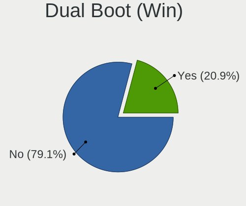
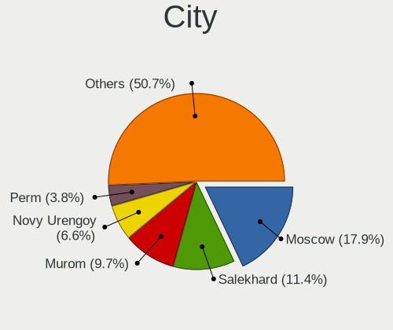
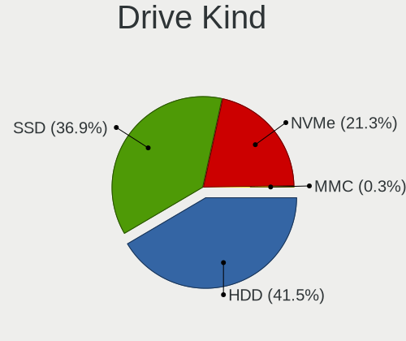
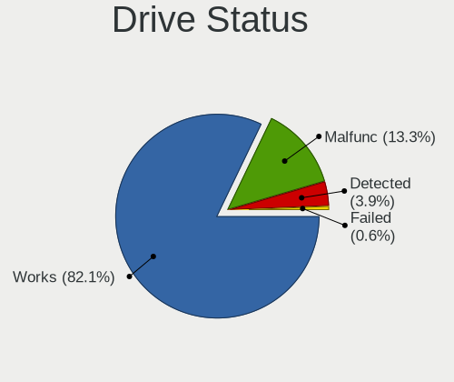
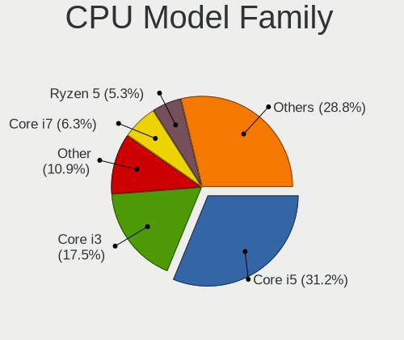
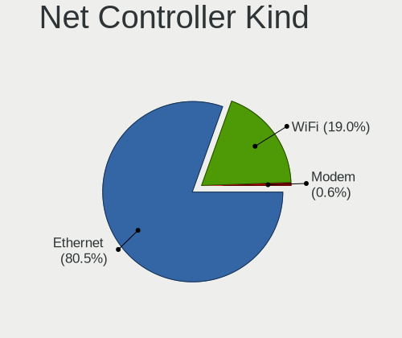
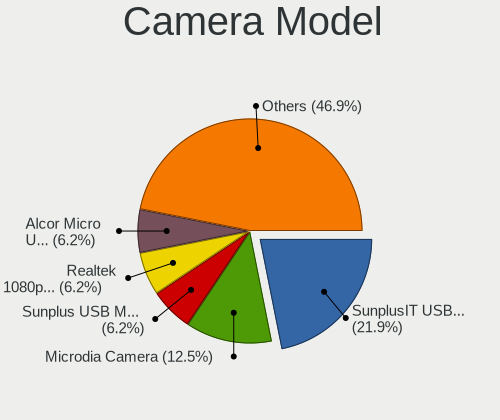

Red OS - Tested Hardware & Statistics (Desktops)
------------------------------------------------

A project to collect tested hardware configurations for Red OS.

Anyone can contribute to this report by the [hw-probe](https://github.com/linuxhw/hw-probe) tool:

    sudo -E hw-probe -all -upload

Please contribute! Especially if your hardware is rare.

Contents
--------

* [ Test Cases ](#test-cases)

* [ System ](#system)
  - [ OS                       ](#os)
  - [ OS Family                ](#os-family)
  - [ Kernel                   ](#kernel)
  - [ Kernel Family            ](#kernel-family)
  - [ Kernel Major Ver.        ](#kernel-major-ver)
  - [ Arch                     ](#arch)
  - [ DE                       ](#de)
  - [ Display Server           ](#display-server)
  - [ Display Manager          ](#display-manager)
  - [ OS Lang                  ](#os-lang)
  - [ Boot Mode                ](#boot-mode)
  - [ Filesystem               ](#filesystem)
  - [ Part. scheme             ](#part-scheme)
  - [ Dual Boot with Linux/BSD ](#dual-boot-with-linuxbsd)
  - [ Dual Boot (Win)          ](#dual-boot-win)

* [ Board ](#board)
  - [ Vendor                   ](#vendor)
  - [ Model                    ](#model)
  - [ Model Family             ](#model-family)
  - [ MFG Year                 ](#mfg-year)
  - [ Form Factor              ](#form-factor)
  - [ Secure Boot              ](#secure-boot)
  - [ Coreboot                 ](#coreboot)
  - [ RAM Size                 ](#ram-size)
  - [ RAM Used                 ](#ram-used)
  - [ Total Drives             ](#total-drives)
  - [ Has CD-ROM               ](#has-cd-rom)
  - [ Has Ethernet             ](#has-ethernet)
  - [ Has WiFi                 ](#has-wifi)
  - [ Has Bluetooth            ](#has-bluetooth)

* [ Location ](#location)
  - [ Country                  ](#country)
  - [ City                     ](#city)

* [ Drives ](#drives)
  - [ Drive Vendor             ](#drive-vendor)
  - [ Drive Model              ](#drive-model)
  - [ HDD Vendor               ](#hdd-vendor)
  - [ SSD Vendor               ](#ssd-vendor)
  - [ Drive Kind               ](#drive-kind)
  - [ Drive Connector          ](#drive-connector)
  - [ Drive Size               ](#drive-size)
  - [ Space Total              ](#space-total)
  - [ Space Used               ](#space-used)
  - [ Malfunc. Drives          ](#malfunc-drives)
  - [ Malfunc. Drive Vendor    ](#malfunc-drive-vendor)
  - [ Malfunc. HDD Vendor      ](#malfunc-hdd-vendor)
  - [ Malfunc. Drive Kind      ](#malfunc-drive-kind)
  - [ Failed Drives            ](#failed-drives)
  - [ Failed Drive Vendor      ](#failed-drive-vendor)
  - [ Drive Status             ](#drive-status)

* [ Storage controller ](#storage-controller)
  - [ Storage Vendor           ](#storage-vendor)
  - [ Storage Model            ](#storage-model)
  - [ Storage Kind             ](#storage-kind)

* [ Processor ](#processor)
  - [ CPU Vendor               ](#cpu-vendor)
  - [ CPU Model                ](#cpu-model)
  - [ CPU Model Family         ](#cpu-model-family)
  - [ CPU Cores                ](#cpu-cores)
  - [ CPU Sockets              ](#cpu-sockets)
  - [ CPU Threads              ](#cpu-threads)
  - [ CPU Op-Modes             ](#cpu-op-modes)
  - [ CPU Microcode            ](#cpu-microcode)
  - [ CPU Microarch            ](#cpu-microarch)

* [ Graphics ](#graphics)
  - [ GPU Vendor               ](#gpu-vendor)
  - [ GPU Model                ](#gpu-model)
  - [ GPU Combo                ](#gpu-combo)
  - [ GPU Driver               ](#gpu-driver)
  - [ GPU Memory               ](#gpu-memory)

* [ Monitor ](#monitor)
  - [ Monitor Vendor           ](#monitor-vendor)
  - [ Monitor Model            ](#monitor-model)
  - [ Monitor Resolution       ](#monitor-resolution)
  - [ Monitor Diagonal         ](#monitor-diagonal)
  - [ Monitor Width            ](#monitor-width)
  - [ Aspect Ratio             ](#aspect-ratio)
  - [ Monitor Area             ](#monitor-area)
  - [ Pixel Density            ](#pixel-density)
  - [ Multiple Monitors        ](#multiple-monitors)

* [ Network ](#network)
  - [ Net Controller Vendor    ](#net-controller-vendor)
  - [ Net Controller Model     ](#net-controller-model)
  - [ Wireless Vendor          ](#wireless-vendor)
  - [ Wireless Model           ](#wireless-model)
  - [ Ethernet Vendor          ](#ethernet-vendor)
  - [ Ethernet Model           ](#ethernet-model)
  - [ Net Controller Kind      ](#net-controller-kind)
  - [ Used Controller          ](#used-controller)
  - [ NICs                     ](#nics)
  - [ IPv6                     ](#ipv6)

* [ Bluetooth ](#bluetooth)
  - [ Bluetooth Vendor         ](#bluetooth-vendor)
  - [ Bluetooth Model          ](#bluetooth-model)

* [ Sound ](#sound)
  - [ Sound Vendor             ](#sound-vendor)
  - [ Sound Model              ](#sound-model)

* [ Memory ](#memory)
  - [ Memory Vendor            ](#memory-vendor)
  - [ Memory Model             ](#memory-model)
  - [ Memory Kind              ](#memory-kind)
  - [ Memory Form Factor       ](#memory-form-factor)
  - [ Memory Size              ](#memory-size)
  - [ Memory Speed             ](#memory-speed)

* [ Printers & scanners ](#printers--scanners)
  - [ Printer Vendor           ](#printer-vendor)
  - [ Printer Model            ](#printer-model)
  - [ Scanner Vendor           ](#scanner-vendor)
  - [ Scanner Model            ](#scanner-model)

* [ Camera ](#camera)
  - [ Camera Vendor            ](#camera-vendor)
  - [ Camera Model             ](#camera-model)

* [ Security ](#security)
  - [ Fingerprint Vendor       ](#fingerprint-vendor)
  - [ Fingerprint Model        ](#fingerprint-model)
  - [ Chipcard Vendor          ](#chipcard-vendor)
  - [ Chipcard Model           ](#chipcard-model)

* [ Unsupported ](#unsupported)
  - [ Unsupported Devices      ](#unsupported-devices)
  - [ Unsupported Device Types ](#unsupported-device-types)

Test Cases
----------

Total: 100

| Vendor        | Model                       | Probe                                                      | Date         |
|---------------|-----------------------------|------------------------------------------------------------|--------------|
| Gigabyte      | B365M DS3H                  | [4b9ee0ef6a](https://linux-hardware.org/?probe=4b9ee0ef6a) | Nov 28, 2022 |
| Gigabyte      | H410M S2H V3                | [8882bfe4f8](https://linux-hardware.org/?probe=8882bfe4f8) | Nov 28, 2022 |
| Gigabyte      | X570S UD                    | [381b3c892d](https://linux-hardware.org/?probe=381b3c892d) | Nov 25, 2022 |
| ASUSTek       | PRIME Z590-P                | [7d6cf8c81f](https://linux-hardware.org/?probe=7d6cf8c81f) | Nov 24, 2022 |
| Gigabyte      | B365M DS3H                  | [e48d26b26f](https://linux-hardware.org/?probe=e48d26b26f) | Nov 21, 2022 |
| Unknown       | P43Twins1600                | [1db44f50c4](https://linux-hardware.org/?probe=1db44f50c4) | Nov 18, 2022 |
| ASRock        | H310CM-DVS                  | [23194fe7d9](https://linux-hardware.org/?probe=23194fe7d9) | Nov 16, 2022 |
| HP            | 2179                        | [3407225f33](https://linux-hardware.org/?probe=3407225f33) | Nov 14, 2022 |
| ASRock        | H310CM-DVS                  | [86932d2426](https://linux-hardware.org/?probe=86932d2426) | Nov 14, 2022 |
| ASUSTek       | PRIME H510T2/CSM            | [ef983bc60e](https://linux-hardware.org/?probe=ef983bc60e) | Nov 11, 2022 |
| ASRock        | H61M-VG4                    | [63f5fe9444](https://linux-hardware.org/?probe=63f5fe9444) | Nov 04, 2022 |
| Gigabyte      | A520M DS3H                  | [8fe13e2165](https://linux-hardware.org/?probe=8fe13e2165) | Nov 02, 2022 |
| ASRock        | H510M-HVS R2.0              | [562f466f8d](https://linux-hardware.org/?probe=562f466f8d) | Nov 02, 2022 |
| ASRock        | B450M Pro4                  | [38b68c6946](https://linux-hardware.org/?probe=38b68c6946) | Nov 02, 2022 |
| ASRock        | H510M-HVS R2.0              | [b68271c648](https://linux-hardware.org/?probe=b68271c648) | Nov 02, 2022 |
| Gigabyte      | B450M H                     | [06bbc75ef0](https://linux-hardware.org/?probe=06bbc75ef0) | Nov 01, 2022 |
| MSI           | 0A90                        | [47fa407c02](https://linux-hardware.org/?probe=47fa407c02) | Nov 01, 2022 |
| Gigabyte      | B560M H                     | [00766db60b](https://linux-hardware.org/?probe=00766db60b) | Oct 28, 2022 |
| MSI           | 0A90                        | [a15ab9db5e](https://linux-hardware.org/?probe=a15ab9db5e) | Oct 28, 2022 |
| Gigabyte      | GA-880GM-D2H                | [cacdacb3ad](https://linux-hardware.org/?probe=cacdacb3ad) | Oct 28, 2022 |
| Lenovo        | 3188 SDK0J40697 WIN 3305... | [9c429fe90c](https://linux-hardware.org/?probe=9c429fe90c) | Oct 27, 2022 |
| ASUSTek       | H81M-K                      | [92dbe47379](https://linux-hardware.org/?probe=92dbe47379) | Oct 25, 2022 |
| ASUSTek       | H81M-K                      | [247782b262](https://linux-hardware.org/?probe=247782b262) | Oct 25, 2022 |
| Lenovo        | 3708 NOK                    | [f48f731517](https://linux-hardware.org/?probe=f48f731517) | Oct 21, 2022 |
| Gigabyte      | B360HD3                     | [bbbdee0883](https://linux-hardware.org/?probe=bbbdee0883) | Oct 21, 2022 |
| Gigabyte      | B75M-D3V                    | [71c9391b8b](https://linux-hardware.org/?probe=71c9391b8b) | Oct 21, 2022 |
| Gigabyte      | H510M S2H                   | [e75a8830af](https://linux-hardware.org/?probe=e75a8830af) | Oct 19, 2022 |
| Gigabyte      | H510M S2H                   | [b8303261ad](https://linux-hardware.org/?probe=b8303261ad) | Oct 18, 2022 |
| ASUSTek       | H81M-K                      | [c6958291bd](https://linux-hardware.org/?probe=c6958291bd) | Oct 14, 2022 |
| HP            | 1495                        | [b1523ff4a6](https://linux-hardware.org/?probe=b1523ff4a6) | Oct 13, 2022 |
| ASUSTek       | PRIME H510T2/CSM            | [087d1975e1](https://linux-hardware.org/?probe=087d1975e1) | Oct 12, 2022 |
| ASUSTek       | B150M-C                     | [1d936352ea](https://linux-hardware.org/?probe=1d936352ea) | Oct 10, 2022 |
| Gigabyte      | H110M-S2-CF                 | [e799b41d70](https://linux-hardware.org/?probe=e799b41d70) | Oct 09, 2022 |
| MSI           | H55M-E33                    | [95423ecdbe](https://linux-hardware.org/?probe=95423ecdbe) | Oct 07, 2022 |
| ASRock        | B460M Pro4                  | [9fd01561ce](https://linux-hardware.org/?probe=9fd01561ce) | Oct 07, 2022 |
| ASRock        | B460M Pro4                  | [4c0bb83f01](https://linux-hardware.org/?probe=4c0bb83f01) | Oct 07, 2022 |
| MSI           | H55M-E33                    | [7af53a4dee](https://linux-hardware.org/?probe=7af53a4dee) | Oct 06, 2022 |
| Lenovo        | 3188 SDK0J40697 WIN 3305... | [b90de94f3d](https://linux-hardware.org/?probe=b90de94f3d) | Oct 05, 2022 |
| ASRock        | B360M-HDV                   | [fad5a877f5](https://linux-hardware.org/?probe=fad5a877f5) | Sep 30, 2022 |
| RDW           | MB-B450M V.1                | [8c3a565d43](https://linux-hardware.org/?probe=8c3a565d43) | Sep 26, 2022 |
| Gigabyte      | B550 AORUS ELITE V2         | [1748378749](https://linux-hardware.org/?probe=1748378749) | Sep 22, 2022 |
| Gigabyte      | B75M-D3V                    | [3888b56318](https://linux-hardware.org/?probe=3888b56318) | Sep 22, 2022 |
| Gigabyte      | B550 AORUS ELITE V2         | [66a228f8c5](https://linux-hardware.org/?probe=66a228f8c5) | Sep 21, 2022 |
| Gigabyte      | H110M-S2-CF                 | [fd03d25b78](https://linux-hardware.org/?probe=fd03d25b78) | Sep 15, 2022 |
| ECS           | H510H6-M7                   | [1275257180](https://linux-hardware.org/?probe=1275257180) | Sep 14, 2022 |
| Unknown       | Unknown                     | [40c1fd4544](https://linux-hardware.org/?probe=40c1fd4544) | Sep 05, 2022 |
| Gigabyte      | B450 AORUS PRO-CF           | [04b62ac6e3](https://linux-hardware.org/?probe=04b62ac6e3) | Sep 04, 2022 |
| Gigabyte      | B450 AORUS PRO-CF           | [a60315c259](https://linux-hardware.org/?probe=a60315c259) | Sep 04, 2022 |
| ASRock        | N68-VS3 FX                  | [b4c043c208](https://linux-hardware.org/?probe=b4c043c208) | Sep 01, 2022 |
| ASRock        | B365M Pro4-F                | [3b519201e2](https://linux-hardware.org/?probe=3b519201e2) | Aug 22, 2022 |
| Gigabyte      | X58-USB3                    | [5119bcb630](https://linux-hardware.org/?probe=5119bcb630) | Aug 19, 2022 |
| ASRock        | H110M-DVS R2.0              | [c02a953cda](https://linux-hardware.org/?probe=c02a953cda) | Aug 01, 2022 |
| Gigabyte      | B365M DS3H                  | [14f73b6a3a](https://linux-hardware.org/?probe=14f73b6a3a) | Aug 01, 2022 |
| Dell          | 040DDP A00                  | [5375c9c059](https://linux-hardware.org/?probe=5375c9c059) | Jul 26, 2022 |
| DEPO Compu... | DPH310T                     | [7cc031e93b](https://linux-hardware.org/?probe=7cc031e93b) | Jul 22, 2022 |
| DEPO Compu... | DPH310T                     | [946610c122](https://linux-hardware.org/?probe=946610c122) | Jul 22, 2022 |
| DEPO Compu... | DPH310T                     | [fbff39be7e](https://linux-hardware.org/?probe=fbff39be7e) | Jul 22, 2022 |
| DEPO Compu... | DPH310T                     | [0076bf5efc](https://linux-hardware.org/?probe=0076bf5efc) | Jul 22, 2022 |
| Gigabyte      | 970A-D3                     | [f2ae77cc0c](https://linux-hardware.org/?probe=f2ae77cc0c) | Jul 17, 2022 |
| ASUSTek       | M2N68-AM Plus               | [d85cded80a](https://linux-hardware.org/?probe=d85cded80a) | Jun 20, 2022 |
| ASUSTek       | PRIME H510T2/CSM            | [28e8a1e19c](https://linux-hardware.org/?probe=28e8a1e19c) | Jun 07, 2022 |
| ASUSTek       | H81M-K                      | [df5b1991e1](https://linux-hardware.org/?probe=df5b1991e1) | Jun 07, 2022 |
| HP            | 0B4Ch D                     | [8ea7efbf2e](https://linux-hardware.org/?probe=8ea7efbf2e) | Jun 07, 2022 |
| MSI           | A520M PRO                   | [3eb8006c14](https://linux-hardware.org/?probe=3eb8006c14) | May 26, 2022 |
| MSI           | A520M PRO                   | [9766bbe4c0](https://linux-hardware.org/?probe=9766bbe4c0) | May 25, 2022 |
| ASRock        | B365M Pro4-F                | [b3b2ee08af](https://linux-hardware.org/?probe=b3b2ee08af) | May 23, 2022 |
| MSI           | H510TI-S01                  | [efe42ef07a](https://linux-hardware.org/?probe=efe42ef07a) | May 19, 2022 |
| Gigabyte      | B365M H                     | [e405d209d4](https://linux-hardware.org/?probe=e405d209d4) | May 11, 2022 |
| ASUSTek       | H81M-K                      | [66bb3248d5](https://linux-hardware.org/?probe=66bb3248d5) | May 11, 2022 |
| ASRock        | B560 Pro4                   | [1c3459c038](https://linux-hardware.org/?probe=1c3459c038) | Apr 19, 2022 |
| Gigabyte      | B75M-D3V                    | [d648ac5ab2](https://linux-hardware.org/?probe=d648ac5ab2) | Apr 01, 2022 |
| Gigabyte      | B75M-D2V                    | [7b4861c8af](https://linux-hardware.org/?probe=7b4861c8af) | Apr 01, 2022 |
| Gigabyte      | H410M H V3                  | [9d86d8119a](https://linux-hardware.org/?probe=9d86d8119a) | Apr 01, 2022 |
| Gigabyte      | B75M-D2V                    | [b8ff95c0f1](https://linux-hardware.org/?probe=b8ff95c0f1) | Mar 30, 2022 |
| ASUSTek       | H110-PLUS                   | [5074891336](https://linux-hardware.org/?probe=5074891336) | Mar 09, 2022 |
| Aquarius      | AQH410T                     | [f02c2d0259](https://linux-hardware.org/?probe=f02c2d0259) | Mar 02, 2022 |
| Aquarius      | AQB560M                     | [091fa6d697](https://linux-hardware.org/?probe=091fa6d697) | Mar 01, 2022 |
| Gigabyte      | B560M DS3H                  | [9db1aef186](https://linux-hardware.org/?probe=9db1aef186) | Feb 18, 2022 |
| ASUSTek       | PRIME H510M-K               | [c1f9ad0faf](https://linux-hardware.org/?probe=c1f9ad0faf) | Feb 01, 2022 |
| Gigabyte      | B75M-D3V                    | [14d2075383](https://linux-hardware.org/?probe=14d2075383) | Jan 31, 2022 |
| ASUSTek       | PRIME H510T2/CSM            | [38ddf02b60](https://linux-hardware.org/?probe=38ddf02b60) | Jan 31, 2022 |
| Gigabyte      | B365M DS3H                  | [36db0c9260](https://linux-hardware.org/?probe=36db0c9260) | Jan 17, 2022 |
| Aquarius      | AQB560M                     | [ff20437ae0](https://linux-hardware.org/?probe=ff20437ae0) | Nov 25, 2021 |
| Aquarius      | AQB560M                     | [4656a05904](https://linux-hardware.org/?probe=4656a05904) | Nov 22, 2021 |
| Gigabyte      | B75M-D2V                    | [ef54320d4b](https://linux-hardware.org/?probe=ef54320d4b) | Oct 19, 2021 |
| Gigabyte      | B560M DS3H                  | [5a071f96dd](https://linux-hardware.org/?probe=5a071f96dd) | Oct 19, 2021 |
| ASRock        | H470M-HDV                   | [ba7bdac2dd](https://linux-hardware.org/?probe=ba7bdac2dd) | Sep 04, 2021 |
| Gigabyte      | H110M-M2-CF                 | [54a20af366](https://linux-hardware.org/?probe=54a20af366) | Aug 27, 2021 |
| ASUSTek       | H110-PLUS                   | [11e1a45e67](https://linux-hardware.org/?probe=11e1a45e67) | Jun 03, 2021 |
| Gigabyte      | B365M DS3H                  | [7b4a0634ef](https://linux-hardware.org/?probe=7b4a0634ef) | Apr 26, 2021 |
| ASUSTek       | H110M-PLUS                  | [b779fb9e40](https://linux-hardware.org/?probe=b779fb9e40) | Apr 09, 2021 |
| ASUSTek       | P8H61-I LX R2.0             | [6e0321d64f](https://linux-hardware.org/?probe=6e0321d64f) | Apr 08, 2021 |
| Gigabyte      | B365M DS3H                  | [d151197565](https://linux-hardware.org/?probe=d151197565) | Mar 26, 2021 |
| ASUSTek       | H81M-K                      | [a61243addd](https://linux-hardware.org/?probe=a61243addd) | Mar 26, 2021 |
| ASUSTek       | H110M-K                     | [30e7a27178](https://linux-hardware.org/?probe=30e7a27178) | Mar 22, 2021 |
| ASUSTek       | H110M-K                     | [da0a735a9f](https://linux-hardware.org/?probe=da0a735a9f) | Mar 18, 2021 |
| ASUSTek       | H81M-K                      | [5898a71c25](https://linux-hardware.org/?probe=5898a71c25) | Nov 03, 2020 |
| Gigabyte      | B360M DS3H                  | [12f125beba](https://linux-hardware.org/?probe=12f125beba) | Jan 16, 2020 |
| Gigabyte      | B360M DS3H                  | [c88331017f](https://linux-hardware.org/?probe=c88331017f) | Jan 16, 2020 |
| ASUSTek       | H81M-K                      | [24adf26804](https://linux-hardware.org/?probe=24adf26804) | Jan 13, 2020 |

System
------

OS
--

Installed operating systems

| Name         | Desktops | Percent |
|--------------|----------|---------|
| Red OS 7.3.1 | 41       | 51.9%   |
| Red OS 7.3   | 28       | 35.44%  |
| Red OS 7.2   | 6        | 7.59%   |
| Red OS 7.3.2 | 4        | 5.06%   |

OS Family
---------

OS without a version

| Name   | Desktops | Percent |
|--------|----------|---------|
| Red OS | 73       | 100%    |

Kernel
------

Version of the Linux kernel

| Version                | Desktops | Percent |
|------------------------|----------|---------|
| 5.15.10-1.el7.x86_64   | 20       | 24.1%   |
| 5.15.35-5.el7.3.x86_64 | 15       | 18.07%  |
| 5.10.29-1.el7.x86_64   | 15       | 18.07%  |
| 5.15.35-1.el7.3.x86_64 | 8        | 9.64%   |
| 5.15.35-4.el7.3.x86_64 | 7        | 8.43%   |
| 4.19.79-1.el7.x86_64   | 4        | 4.82%   |
| 5.15.10-3.el7.x86_64   | 3        | 3.61%   |
| 5.15.10-2.el7.x86_64   | 3        | 3.61%   |
| 5.15.72-1.el7.3.x86_64 | 2        | 2.41%   |
| 5.14.9-1.el7.x86_64    | 1        | 1.2%    |
| 5.10.24-3.el7.x86_64   | 1        | 1.2%    |
| 5.10.24-2.el7.x86_64   | 1        | 1.2%    |
| 5.10.1-1.el7.x86_64    | 1        | 1.2%    |
| 4.19.56-2.el7.x86_64   | 1        | 1.2%    |
| 4.19.204-1.el7.x86_64  | 1        | 1.2%    |

Kernel Family
-------------

Linux kernel without a distro release

| Version  | Desktops | Percent |
|----------|----------|---------|
| 5.15.35  | 27       | 33.75%  |
| 5.15.10  | 26       | 32.5%   |
| 5.10.29  | 15       | 18.75%  |
| 4.19.79  | 4        | 5%      |
| 5.15.72  | 2        | 2.5%    |
| 5.10.24  | 2        | 2.5%    |
| 5.14.9   | 1        | 1.25%   |
| 5.10.1   | 1        | 1.25%   |
| 4.19.56  | 1        | 1.25%   |
| 4.19.204 | 1        | 1.25%   |

Kernel Major Ver.
-----------------

Linux kernel major version

| Version | Desktops | Percent |
|---------|----------|---------|
| 5.15    | 54       | 68.35%  |
| 5.10    | 18       | 22.78%  |
| 4.19    | 6        | 7.59%   |
| 5.14    | 1        | 1.27%   |

Arch
----

OS architecture (x86_64, i586, etc.)

| Name   | Desktops | Percent |
|--------|----------|---------|
| x86_64 | 73       | 100%    |

DE
--

Desktop Environment

| Name       | Desktops | Percent |
|------------|----------|---------|
| MATE       | 58       | 74.36%  |
| Cinnamon   | 17       | 21.79%  |
| Unknown    | 2        | 2.56%   |
| X-Cinnamon | 1        | 1.28%   |

Display Server
--------------

X11 or Wayland

| Name    | Desktops | Percent |
|---------|----------|---------|
| X11     | 69       | 90.79%  |
| Wayland | 6        | 7.89%   |
| Unknown | 1        | 1.32%   |

Display Manager
---------------

SDDM, LightDM, etc.

| Name    | Desktops | Percent |
|---------|----------|---------|
| GDM     | 69       | 93.24%  |
| Unknown | 3        | 4.05%   |
| SDDM    | 2        | 2.7%    |

OS Lang
-------

Language

| Lang    | Desktops | Percent |
|---------|----------|---------|
| Unknown | 70       | 94.59%  |
| ru_RU   | 4        | 5.41%   |

Boot Mode
---------

EFI or BIOS

| Mode | Desktops | Percent |
|------|----------|---------|
| EFI  | 48       | 63.16%  |
| BIOS | 28       | 36.84%  |

Filesystem
----------

Type of filesystem

| Type    | Desktops | Percent |
|---------|----------|---------|
| Ext4    | 70       | 94.59%  |
| Btrfs   | 3        | 4.05%   |
| Unknown | 1        | 1.35%   |

Part. scheme
------------

Scheme of partitioning

| Type    | Desktops | Percent |
|---------|----------|---------|
| GPT     | 50       | 66.67%  |
| MBR     | 23       | 30.67%  |
| Unknown | 2        | 2.67%   |

Dual Boot with Linux/BSD
------------------------

Hosting more than one Linux/BSD

| Dual boot | Desktops | Percent |
|-----------|----------|---------|
| No        | 66       | 88%     |
| Yes       | 9        | 12%     |

Dual Boot (Win)
---------------

Hosting Linux and Windows

| Dual boot | Desktops | Percent |
|-----------|----------|---------|
| No        | 55       | 74.32%  |
| Yes       | 19       | 25.68%  |

Board
-----

Vendor
------

Motherboard manufacturer

| Name                | Desktops | Percent |
|---------------------|----------|---------|
| Gigabyte Technology | 27       | 36.99%  |
| ASUSTek Computer    | 12       | 16.44%  |
| ASRock              | 11       | 15.07%  |
| MSI                 | 5        | 6.85%   |
| DEPO Computers      | 4        | 5.48%   |
| Aquarius            | 4        | 5.48%   |
| Hewlett-Packard     | 3        | 4.11%   |
| Lenovo              | 2        | 2.74%   |
| Unknown             | 2        | 2.74%   |
| RDW                 | 1        | 1.37%   |
| ECS                 | 1        | 1.37%   |
| Dell                | 1        | 1.37%   |

Model
-----

Motherboard model

| Name                                   | Desktops | Percent |
|----------------------------------------|----------|---------|
| Gigabyte B365M DS3H                    | 4        | 5.48%   |
| DEPO Computers DPH310T                 | 4        | 5.48%   |
| MSI MS-7D14                            | 2        | 2.74%   |
| Gigabyte H110M-S2                      | 2        | 2.74%   |
| Gigabyte B560M DS3H                    | 2        | 2.74%   |
| Gigabyte B550 AORUS ELITE V2           | 2        | 2.74%   |
| ASUS PC                                | 2        | 2.74%   |
| Unknown                                | 2        | 2.74%   |
| RDW RDW-MB-B450M V.1                   | 1        | 1.37%   |
| MSI MS-7D35                            | 1        | 1.37%   |
| MSI MS-7636                            | 1        | 1.37%   |
| MSI Compaq dx2300 Microtower           | 1        | 1.37%   |
| Lenovo V50s-07IMB 11EF0011RU           | 1        | 1.37%   |
| Lenovo IdeaCentre 3 07ADA05 90MV0059RS | 1        | 1.37%   |
| HP Z400 Workstation                    | 1        | 1.37%   |
| HP ProOne 400 G1 AiO                   | 1        | 1.37%   |
| HP Compaq 8200 Elite SFF PC            | 1        | 1.37%   |
| Gigabyte X58-USB3                      | 1        | 1.37%   |
| Gigabyte X570S UD                      | 1        | 1.37%   |
| Gigabyte H510M S2H                     | 1        | 1.37%   |
| Gigabyte H410M S2H V3                  | 1        | 1.37%   |
| Gigabyte H410M H V3                    | 1        | 1.37%   |
| Gigabyte H110M-M.2                     | 1        | 1.37%   |
| Gigabyte GA-880GM-D2H                  | 1        | 1.37%   |
| Gigabyte B75M-D3V                      | 1        | 1.37%   |
| Gigabyte B75M-D2V                      | 1        | 1.37%   |
| Gigabyte B560M H                       | 1        | 1.37%   |
| Gigabyte B450M H                       | 1        | 1.37%   |
| Gigabyte B450 AORUS PRO                | 1        | 1.37%   |
| Gigabyte B365M H                       | 1        | 1.37%   |
| Gigabyte B360M-DS3H                    | 1        | 1.37%   |
| Gigabyte B360 HD3                      | 1        | 1.37%   |
| Gigabyte A520M DS3H                    | 1        | 1.37%   |
| Gigabyte 970A-D3                       | 1        | 1.37%   |
| ECS H510H6-M7                          | 1        | 1.37%   |
| Dell OptiPlex 3020                     | 1        | 1.37%   |
| ASUS PRIME Z590-P                      | 1        | 1.37%   |
| ASUS PRIME H510T2/CSM                  | 1        | 1.37%   |
| ASUS PRIME H510M-K                     | 1        | 1.37%   |
| ASUS P8H61-I LX R2.0                   | 1        | 1.37%   |

Model Family
------------

Motherboard model prefix

| Name                   | Desktops | Percent |
|------------------------|----------|---------|
| Gigabyte B365M         | 5        | 6.85%   |
| DEPO Computers DPH310T | 4        | 5.48%   |
| Gigabyte B560M         | 3        | 4.11%   |
| ASUS PRIME             | 3        | 4.11%   |
| MSI MS-7D14            | 2        | 2.74%   |
| Gigabyte H410M         | 2        | 2.74%   |
| Gigabyte H110M-S2      | 2        | 2.74%   |
| Gigabyte B550          | 2        | 2.74%   |
| ASUS PC                | 2        | 2.74%   |
| Unknown                | 2        | 2.74%   |
| RDW RDW-MB-B450M       | 1        | 1.37%   |
| MSI MS-7D35            | 1        | 1.37%   |
| MSI MS-7636            | 1        | 1.37%   |
| MSI Compaq             | 1        | 1.37%   |
| Lenovo V50s-07IMB      | 1        | 1.37%   |
| Lenovo IdeaCentre      | 1        | 1.37%   |
| HP Z400                | 1        | 1.37%   |
| HP ProOne              | 1        | 1.37%   |
| HP Compaq              | 1        | 1.37%   |
| Gigabyte X58-USB3      | 1        | 1.37%   |
| Gigabyte X570S         | 1        | 1.37%   |
| Gigabyte H510M         | 1        | 1.37%   |
| Gigabyte H110M-M.2     | 1        | 1.37%   |
| Gigabyte GA-880GM-D2H  | 1        | 1.37%   |
| Gigabyte B75M-D3V      | 1        | 1.37%   |
| Gigabyte B75M-D2V      | 1        | 1.37%   |
| Gigabyte B450M         | 1        | 1.37%   |
| Gigabyte B450          | 1        | 1.37%   |
| Gigabyte B360M-DS3H    | 1        | 1.37%   |
| Gigabyte B360          | 1        | 1.37%   |
| Gigabyte A520M         | 1        | 1.37%   |
| Gigabyte 970A-D3       | 1        | 1.37%   |
| ECS H510H6-M7          | 1        | 1.37%   |
| Dell OptiPlex          | 1        | 1.37%   |
| ASUS P8H61-I           | 1        | 1.37%   |
| ASUS M2N68-AM          | 1        | 1.37%   |
| ASUS H110M-PLUS        | 1        | 1.37%   |
| ASUS H110M-K           | 1        | 1.37%   |
| ASUS H110-PLUS         | 1        | 1.37%   |
| ASUS B150M-C           | 1        | 1.37%   |

MFG Year
--------

Motherboard manufacture year

| Year | Desktops | Percent |
|------|----------|---------|
| 2021 | 19       | 26.03%  |
| 2020 | 11       | 15.07%  |
| 2019 | 7        | 9.59%   |
| 2018 | 6        | 8.22%   |
| 2016 | 6        | 8.22%   |
| 2022 | 5        | 6.85%   |
| 2012 | 4        | 5.48%   |
| 2010 | 3        | 4.11%   |
| 2014 | 2        | 2.74%   |
| 2013 | 2        | 2.74%   |
| 2011 | 2        | 2.74%   |
| 2009 | 2        | 2.74%   |
| 2017 | 1        | 1.37%   |
| 2015 | 1        | 1.37%   |
| 2008 | 1        | 1.37%   |
| 2007 | 1        | 1.37%   |

Form Factor
-----------

Physical design of the computer

| Name    | Desktops | Percent |
|---------|----------|---------|
| Desktop | 73       | 100%    |

Secure Boot
-----------

Enabled or disabled

| State    | Desktops | Percent |
|----------|----------|---------|
| Disabled | 73       | 100%    |

Coreboot
--------

Have coreboot on board

| Used | Desktops | Percent |
|------|----------|---------|
| No   | 73       | 100%    |

RAM Size
--------

Total RAM memory

| Size in GB | Desktops | Percent |
|------------|----------|---------|
| 4.01-8.0   | 25       | 34.25%  |
| 16.01-24.0 | 19       | 26.03%  |
| 8.01-16.0  | 12       | 16.44%  |
| 3.01-4.0   | 8        | 10.96%  |
| 32.01-64.0 | 4        | 5.48%   |
| 24.01-32.0 | 2        | 2.74%   |
| 1.01-2.0   | 1        | 1.37%   |
| 0.51-1.0   | 1        | 1.37%   |
| Unknown    | 1        | 1.37%   |

RAM Used
--------

Used RAM memory

| Used GB   | Desktops | Percent |
|-----------|----------|---------|
| 1.01-2.0  | 32       | 40.51%  |
| 4.01-8.0  | 12       | 15.19%  |
| 3.01-4.0  | 11       | 13.92%  |
| 0.51-1.0  | 10       | 12.66%  |
| 2.01-3.0  | 9        | 11.39%  |
| 8.01-16.0 | 3        | 3.8%    |
| 0.01-0.5  | 1        | 1.27%   |
| Unknown   | 1        | 1.27%   |

Total Drives
------------

Number of drives on board

| Drives | Desktops | Percent |
|--------|----------|---------|
| 1      | 46       | 60.53%  |
| 2      | 23       | 30.26%  |
| 4      | 3        | 3.95%   |
| 3      | 3        | 3.95%   |
| 5      | 1        | 1.32%   |

Has CD-ROM
----------

Has CD-ROM on board

| Presented | Desktops | Percent |
|-----------|----------|---------|
| No        | 49       | 66.22%  |
| Yes       | 25       | 33.78%  |

Has Ethernet
------------

Has Ethernet on board

| Presented | Desktops | Percent |
|-----------|----------|---------|
| Yes       | 72       | 98.63%  |
| No        | 1        | 1.37%   |

Has WiFi
--------

Has WiFi module

| Presented | Desktops | Percent |
|-----------|----------|---------|
| No        | 57       | 76%     |
| Yes       | 18       | 24%     |

Has Bluetooth
-------------

Has Bluetooth module

| Presented | Desktops | Percent |
|-----------|----------|---------|
| No        | 63       | 85.14%  |
| Yes       | 11       | 14.86%  |

Location
--------

Country
-------

Geographic location (country)

| Country | Desktops | Percent |
|---------|----------|---------|
| Russia  | 73       | 100%    |

City
----

Geographic location (city)

| City          | Desktops | Percent |
|---------------|----------|---------|
| Murom         | 17       | 23.29%  |
| Moscow        | 14       | 19.18%  |
| Salekhard     | 12       | 16.44%  |
| Yekaterinburg | 4        | 5.48%   |
| Novosibirsk   | 2        | 2.74%   |
| Khabarovsk    | 2        | 2.74%   |
| Kaluga        | 2        | 2.74%   |
| Balashikha    | 2        | 2.74%   |
| Ulyanovsk     | 1        | 1.37%   |
| Tomsk         | 1        | 1.37%   |
| Surgut        | 1        | 1.37%   |
| Stavropol     | 1        | 1.37%   |
| St Petersburg | 1        | 1.37%   |
| Rostov-on-Don | 1        | 1.37%   |
| Penza         | 1        | 1.37%   |
| Magadan       | 1        | 1.37%   |
| Kursk         | 1        | 1.37%   |
| Krasnoyarsk   | 1        | 1.37%   |
| Krasnodar     | 1        | 1.37%   |
| Kovrov        | 1        | 1.37%   |
| Kol'chugino   | 1        | 1.37%   |
| Kirov         | 1        | 1.37%   |
| Kholmsk       | 1        | 1.37%   |
| Bryansk       | 1        | 1.37%   |
| Arzamas       | 1        | 1.37%   |
| Arkhangelsk   | 1        | 1.37%   |

Drives
------

Drive Vendor
------------

Hard drive vendors

| Vendor                       | Desktops | Drives | Percent |
|------------------------------|----------|--------|---------|
| Seagate                      | 25       | 39     | 22.94%  |
| WDC                          | 15       | 17     | 13.76%  |
| Toshiba                      | 11       | 11     | 10.09%  |
| Kingston                     | 9        | 10     | 8.26%   |
| Samsung Electronics          | 8        | 12     | 7.34%   |
| A-DATA Technology            | 7        | 7      | 6.42%   |
| Apacer                       | 4        | 4      | 3.67%   |
| SanDisk                      | 3        | 4      | 2.75%   |
| Patriot                      | 3        | 3      | 2.75%   |
| Foxline                      | 3        | 3      | 2.75%   |
| Crucial                      | 3        | 5      | 2.75%   |
| KIOXIA-EXCERIA               | 2        | 2      | 1.83%   |
| KingSpec                     | 2        | 2      | 1.83%   |
| Hitachi                      | 2        | 2      | 1.83%   |
| XPG                          | 1        | 1      | 0.92%   |
| SPCC                         | 1        | 1      | 0.92%   |
| Smartbuy                     | 1        | 1      | 0.92%   |
| Shenzhen Longsys Electronics | 1        | 1      | 0.92%   |
| Phison                       | 1        | 1      | 0.92%   |
| Netac                        | 1        | 1      | 0.92%   |
| Intel                        | 1        | 1      | 0.92%   |
| GOODRAM                      | 1        | 1      | 0.92%   |
| ExeGate                      | 1        | 1      | 0.92%   |
| Corsair                      | 1        | 1      | 0.92%   |
| China                        | 1        | 1      | 0.92%   |
| AMD                          | 1        | 1      | 0.92%   |

Drive Model
-----------

Hard drive models

| Model                                 | Desktops | Percent |
|---------------------------------------|----------|---------|
| Toshiba HDWD110 1TB                   | 4        | 3.51%   |
| Seagate ST1000LM049-2GH172 1TB        | 4        | 3.51%   |
| Seagate ST1000DM010-2EP102 1TB        | 4        | 3.51%   |
| Kingston SA400S37240G 240GB SSD       | 4        | 3.51%   |
| Apacer AS2280P4 256GB                 | 4        | 3.51%   |
| Seagate ST500DM002-1BD142 500GB       | 3        | 2.63%   |
| Seagate ST1000DM010-2DM162 1TB        | 3        | 2.63%   |
| Crucial CT240BX500SSD1 240GB          | 3        | 2.63%   |
| Toshiba HDWD105 500GB                 | 2        | 1.75%   |
| Toshiba DT01ACA100 1TB                | 2        | 1.75%   |
| Seagate ST1000DM003-1SB10C 1TB        | 2        | 1.75%   |
| SanDisk SD8SBAT256G1122 256GB SSD     | 2        | 1.75%   |
| Samsung SSD 860 EVO 250GB             | 2        | 1.75%   |
| KIOXIA-EXCERIA SATA SSD 480GB         | 2        | 1.75%   |
| Kingston OM8PCP3512F-A02 512GB        | 2        | 1.75%   |
| Foxline FLSSD240X5SE 240GB            | 2        | 1.75%   |
| XPG GAMMIX S70 BLADE 2TB              | 1        | 0.88%   |
| WDC WDS240G2G0A-00JH30 240GB SSD      | 1        | 0.88%   |
| WDC WD5000AAKX-75U6AA0 500GB          | 1        | 0.88%   |
| WDC WD5000AAKS-00V1A0 500GB           | 1        | 0.88%   |
| WDC WD5000AAKS-00D2B0 500GB           | 1        | 0.88%   |
| WDC WD40PURZ-85TTDY0 4TB              | 1        | 0.88%   |
| WDC WD3200AAKX-001CA0 320GB           | 1        | 0.88%   |
| WDC WD30EFRX-68EUZN0 3TB              | 1        | 0.88%   |
| WDC WD20EFRX-68EUZN0 2TB              | 1        | 0.88%   |
| WDC WD20EARX-00PASB0 2TB              | 1        | 0.88%   |
| WDC WD15EARS-19MVWB0 1TB              | 1        | 0.88%   |
| WDC WD10SPZX-22Z10T1 1TB              | 1        | 0.88%   |
| WDC WD10EZEX-22MFCA0 1TB              | 1        | 0.88%   |
| WDC WD10EZEX-00BBHA0 1TB              | 1        | 0.88%   |
| WDC WD10EARS-00Y5B1 1TB               | 1        | 0.88%   |
| WDC WD1002FAEX-00Z3A0 1TB             | 1        | 0.88%   |
| WDC PC SN530 SDBPMPZ-256G-1001 256GB  | 1        | 0.88%   |
| Toshiba MK5075GSX 500GB               | 1        | 0.88%   |
| Toshiba KHK61VSE960G 960GB SSD        | 1        | 0.88%   |
| Toshiba DT01ACA200 2TB                | 1        | 0.88%   |
| SPCC M.2 PCIe SSD 512GB               | 1        | 0.88%   |
| Smartbuy SSD 240GB                    | 1        | 0.88%   |
| Shenzhen Longsys NVMe SSD Drive 256GB | 1        | 0.88%   |
| Seagate ST9500423AS 500GB             | 1        | 0.88%   |

HDD Vendor
----------

Hard disk drive vendors

| Vendor              | Desktops | Drives | Percent |
|---------------------|----------|--------|---------|
| Seagate             | 25       | 39     | 48.08%  |
| WDC                 | 13       | 15     | 25%     |
| Toshiba             | 10       | 10     | 19.23%  |
| Samsung Electronics | 2        | 3      | 3.85%   |
| Hitachi             | 2        | 2      | 3.85%   |

SSD Vendor
----------

Solid state drive vendors

| Vendor              | Desktops | Drives | Percent |
|---------------------|----------|--------|---------|
| Kingston            | 6        | 6      | 16.67%  |
| A-DATA Technology   | 5        | 5      | 13.89%  |
| Samsung Electronics | 4        | 5      | 11.11%  |
| SanDisk             | 3        | 4      | 8.33%   |
| Foxline             | 3        | 3      | 8.33%   |
| Crucial             | 3        | 5      | 8.33%   |
| Patriot             | 2        | 2      | 5.56%   |
| KIOXIA-EXCERIA      | 2        | 2      | 5.56%   |
| KingSpec            | 2        | 2      | 5.56%   |
| WDC                 | 1        | 1      | 2.78%   |
| Toshiba             | 1        | 1      | 2.78%   |
| Smartbuy            | 1        | 1      | 2.78%   |
| GOODRAM             | 1        | 1      | 2.78%   |
| ExeGate             | 1        | 1      | 2.78%   |
| China               | 1        | 1      | 2.78%   |

Drive Kind
----------

HDD or SSD

| Kind | Desktops | Drives | Percent |
|------|----------|--------|---------|
| HDD  | 47       | 69     | 46.08%  |
| SSD  | 35       | 40     | 34.31%  |
| NVMe | 20       | 24     | 19.61%  |

Drive Connector
---------------

SATA, SAS, NVMe, etc.

| Type | Desktops | Drives | Percent |
|------|----------|--------|---------|
| SATA | 66       | 109    | 76.74%  |
| NVMe | 20       | 24     | 23.26%  |

Drive Size
----------

Size of hard drive

| Size in TB | Desktops | Drives | Percent |
|------------|----------|--------|---------|
| 0.01-0.5   | 41       | 51     | 49.4%   |
| 0.51-1.0   | 34       | 49     | 40.96%  |
| 1.01-2.0   | 6        | 7      | 7.23%   |
| 3.01-4.0   | 1        | 1      | 1.2%    |
| 2.01-3.0   | 1        | 1      | 1.2%    |

Space Total
-----------

Amount of disk space available on the file system

| Size in GB     | Desktops | Percent |
|----------------|----------|---------|
| 501-1000       | 22       | 28.95%  |
| 101-250        | 20       | 26.32%  |
| 251-500        | 15       | 19.74%  |
| 51-100         | 6        | 7.89%   |
| 2001-3000      | 5        | 6.58%   |
| 1001-2000      | 5        | 6.58%   |
| More than 3000 | 1        | 1.32%   |
| 21-50          | 1        | 1.32%   |
| Unknown        | 1        | 1.32%   |

Space Used
----------

Amount of used disk space

| Used GB        | Desktops | Percent |
|----------------|----------|---------|
| 1-20           | 42       | 53.16%  |
| 21-50          | 10       | 12.66%  |
| 501-1000       | 7        | 8.86%   |
| 51-100         | 6        | 7.59%   |
| 101-250        | 5        | 6.33%   |
| 251-500        | 4        | 5.06%   |
| 1001-2000      | 3        | 3.8%    |
| More than 3000 | 1        | 1.27%   |
| Unknown        | 1        | 1.27%   |

Malfunc. Drives
---------------

Drive models with a malfunction

| Model                            | Desktops | Drives | Percent |
|----------------------------------|----------|--------|---------|
| Seagate ST1000DM010-2EP102 1TB   | 2        | 5      | 16.67%  |
| WDC WDS240G2G0A-00JH30 240GB SSD | 1        | 1      | 8.33%   |
| WDC WD5000AAKS-00V1A0 500GB      | 1        | 1      | 8.33%   |
| WDC WD5000AAKS-00D2B0 500GB      | 1        | 1      | 8.33%   |
| WDC WD3200AAKX-001CA0 320GB      | 1        | 1      | 8.33%   |
| WDC WD10EARS-00Y5B1 1TB          | 1        | 1      | 8.33%   |
| SPCC M.2 PCIe SSD 512GB          | 1        | 1      | 8.33%   |
| Seagate ST9500423AS 500GB        | 1        | 1      | 8.33%   |
| Seagate ST500DM002-1BD142 500GB  | 1        | 1      | 8.33%   |
| Seagate ST3250823AS 250GB        | 1        | 1      | 8.33%   |
| Hitachi HDS5C1050CLA382 500GB    | 1        | 1      | 8.33%   |

Malfunc. Drive Vendor
---------------------

Vendors of faulty drives

| Vendor  | Desktops | Drives | Percent |
|---------|----------|--------|---------|
| WDC     | 5        | 5      | 41.67%  |
| Seagate | 5        | 8      | 41.67%  |
| SPCC    | 1        | 1      | 8.33%   |
| Hitachi | 1        | 1      | 8.33%   |

Malfunc. HDD Vendor
-------------------

Vendors of faulty HDD drives

| Vendor  | Desktops | Drives | Percent |
|---------|----------|--------|---------|
| Seagate | 5        | 8      | 50%     |
| WDC     | 4        | 4      | 40%     |
| Hitachi | 1        | 1      | 10%     |

Malfunc. Drive Kind
-------------------

Kinds of faulty drives

| Kind | Desktops | Drives | Percent |
|------|----------|--------|---------|
| HDD  | 8        | 13     | 80%     |
| NVMe | 1        | 1      | 10%     |
| SSD  | 1        | 1      | 10%     |

Failed Drives
-------------

Failed drive models

Zero info for selected period =(

Failed Drive Vendor
-------------------

Failed drive vendors

Zero info for selected period =(

Drive Status
------------

Number of failed and malfunc. drives

| Status   | Desktops | Drives | Percent |
|----------|----------|--------|---------|
| Works    | 68       | 113    | 85%     |
| Malfunc  | 10       | 15     | 12.5%   |
| Detected | 2        | 5      | 2.5%    |

Storage controller
------------------

Storage Vendor
--------------

Storage controller vendors

| Vendor                       | Desktops | Percent |
|------------------------------|----------|---------|
| Intel                        | 58       | 60.42%  |
| AMD                          | 13       | 13.54%  |
| Phison Electronics           | 6        | 6.25%   |
| Samsung Electronics          | 3        | 3.13%   |
| Realtek Semiconductor        | 3        | 3.13%   |
| Kingston Technology Company  | 3        | 3.13%   |
| Nvidia                       | 2        | 2.08%   |
| JMicron Technology           | 2        | 2.08%   |
| Silicon Motion               | 1        | 1.04%   |
| Shenzhen Longsys Electronics | 1        | 1.04%   |
| SanDisk                      | 1        | 1.04%   |
| Netac Technology             | 1        | 1.04%   |
| MAXIO Technology (Hangzhou)  | 1        | 1.04%   |
| ADATA Technology             | 1        | 1.04%   |

Storage Model
-------------

Storage controller models

| Model                                                                                   | Desktops | Percent |
|-----------------------------------------------------------------------------------------|----------|---------|
| Intel 500 Series Chipset Family SATA AHCI Controller                                    | 18       | 16.67%  |
| Intel 200 Series PCH SATA controller [AHCI mode]                                        | 11       | 10.19%  |
| Intel Q170/Q150/B150/H170/H110/Z170/CM236 Chipset SATA Controller [AHCI Mode]           | 8        | 7.41%   |
| Phison PS5013 E13 NVMe Controller                                                       | 5        | 4.63%   |
| AMD FCH SATA Controller [AHCI mode]                                                     | 5        | 4.63%   |
| AMD 500 Series Chipset SATA Controller                                                  | 5        | 4.63%   |
| AMD 400 Series Chipset SATA Controller                                                  | 4        | 3.7%    |
| Kingston Company Company Non-Volatile memory controller                                 | 3        | 2.78%   |
| Intel Cannon Lake PCH SATA AHCI Controller                                              | 3        | 2.78%   |
| Intel 8 Series/C220 Series Chipset Family 6-port SATA Controller 1 [AHCI mode]          | 3        | 2.78%   |
| Samsung NVMe SSD Controller 980                                                         | 2        | 1.85%   |
| Realtek Realtek Non-Volatile memory controller                                          | 2        | 1.85%   |
| Nvidia MCP61 SATA Controller                                                            | 2        | 1.85%   |
| Nvidia MCP61 IDE                                                                        | 2        | 1.85%   |
| JMicron JMB368 IDE controller                                                           | 2        | 1.85%   |
| Intel 6 Series/C200 Series Chipset Family 6 port Desktop SATA AHCI Controller           | 2        | 1.85%   |
| Intel 400 Series Chipset Family SATA AHCI Controller                                    | 2        | 1.85%   |
| Silicon Motion SM2263EN/SM2263XT SSD Controller                                         | 1        | 0.93%   |
| Shenzhen Longsys Electronics Non-Volatile memory controller                             | 1        | 0.93%   |
| SanDisk Non-Volatile memory controller                                                  | 1        | 0.93%   |
| Samsung NVMe SSD Controller SM981/PM981/PM983                                           | 1        | 0.93%   |
| Samsung NVMe SSD Controller PM9A1/PM9A3/980PRO                                          | 1        | 0.93%   |
| Realtek RTS5763DL NVMe SSD Controller                                                   | 1        | 0.93%   |
| Phison E16 PCIe4 NVMe Controller                                                        | 1        | 0.93%   |
| Netac Non-Volatile memory controller                                                    | 1        | 0.93%   |
| MAXIO (Hangzhou) NVMe SSD Controller MAP1202                                            | 1        | 0.93%   |
| Intel SATA Controller [RAID mode]                                                       | 1        | 0.93%   |
| Intel Non-Volatile memory controller                                                    | 1        | 0.93%   |
| Intel NM10/ICH7 Family SATA Controller [IDE mode]                                       | 1        | 0.93%   |
| Intel Comet Lake SATA AHCI Controller                                                   | 1        | 0.93%   |
| Intel Celeron/Pentium Silver Processor SATA Controller                                  | 1        | 0.93%   |
| Intel 82801JI (ICH10 Family) SATA AHCI Controller                                       | 1        | 0.93%   |
| Intel 82801JI (ICH10 Family) 4 port SATA IDE Controller #1                              | 1        | 0.93%   |
| Intel 82801JI (ICH10 Family) 2 port SATA IDE Controller #2                              | 1        | 0.93%   |
| Intel 7 Series/C210 Series Chipset Family 6-port SATA Controller [AHCI mode]            | 1        | 0.93%   |
| Intel 7 Series/C210 Series Chipset Family 4-port SATA Controller [IDE mode]             | 1        | 0.93%   |
| Intel 7 Series/C210 Series Chipset Family 2-port SATA Controller [IDE mode]             | 1        | 0.93%   |
| Intel 6 Series/C200 Series Chipset Family Desktop SATA Controller (IDE mode, ports 4-5) | 1        | 0.93%   |
| Intel 6 Series/C200 Series Chipset Family Desktop SATA Controller (IDE mode, ports 0-3) | 1        | 0.93%   |
| Intel 5 Series/3400 Series Chipset 4 port SATA IDE Controller                           | 1        | 0.93%   |

Storage Kind
------------

Kind of storage controller (IDE, SATA, NVMe, SAS, ...)

| Kind | Desktops | Percent |
|------|----------|---------|
| SATA | 64       | 67.37%  |
| NVMe | 20       | 21.05%  |
| IDE  | 9        | 9.47%   |
| RAID | 2        | 2.11%   |

Processor
---------

CPU Vendor
----------

Processor vendors

| Vendor | Desktops | Percent |
|--------|----------|---------|
| Intel  | 58       | 79.45%  |
| AMD    | 15       | 20.55%  |

CPU Model
---------

Processor models

| Model                                      | Desktops | Percent |
|--------------------------------------------|----------|---------|
| Intel Core i5-9400 CPU @ 2.90GHz           | 10       | 13.7%   |
| Intel Core i3-10100 CPU @ 3.60GHz          | 9        | 12.33%  |
| Intel Core i5-3470 CPU @ 3.20GHz           | 3        | 4.11%   |
| Intel Core i5-10400 CPU @ 2.90GHz          | 3        | 4.11%   |
| Intel Pentium CPU G4500 @ 3.50GHz          | 2        | 2.74%   |
| Intel Core i5-10500 CPU @ 3.10GHz          | 2        | 2.74%   |
| Intel Core i3-6100 CPU @ 3.70GHz           | 2        | 2.74%   |
| AMD Ryzen 7 PRO 4750G with Radeon Graphics | 2        | 2.74%   |
| AMD FX-4100 Quad-Core Processor            | 2        | 2.74%   |
| Intel Xeon CPU W3670 @ 3.20GHz             | 1        | 1.37%   |
| Intel Pentium Gold G6400 CPU @ 4.00GHz     | 1        | 1.37%   |
| Intel Pentium Gold G5400 CPU @ 3.70GHz     | 1        | 1.37%   |
| Intel Pentium CPU G4560 @ 3.50GHz          | 1        | 1.37%   |
| Intel Pentium CPU G4400 @ 3.30GHz          | 1        | 1.37%   |
| Intel Core i7-4790T CPU @ 2.70GHz          | 1        | 1.37%   |
| Intel Core i7-2600 CPU @ 3.40GHz           | 1        | 1.37%   |
| Intel Core i7-10700K CPU @ 3.80GHz         | 1        | 1.37%   |
| Intel Core i7-10700 CPU @ 2.90GHz          | 1        | 1.37%   |
| Intel Core i7 CPU 950 @ 3.07GHz            | 1        | 1.37%   |
| Intel Core i5-9400F CPU @ 2.90GHz          | 1        | 1.37%   |
| Intel Core i5-6500 CPU @ 3.20GHz           | 1        | 1.37%   |
| Intel Core i5-4590 CPU @ 3.30GHz           | 1        | 1.37%   |
| Intel Core i5-10600K CPU @ 4.10GHz         | 1        | 1.37%   |
| Intel Core i5 CPU 650 @ 3.20GHz            | 1        | 1.37%   |
| Intel Core i3-8100 CPU @ 3.60GHz           | 1        | 1.37%   |
| Intel Core i3-4160 CPU @ 3.60GHz           | 1        | 1.37%   |
| Intel Core i3-10105 CPU @ 3.70GHz          | 1        | 1.37%   |
| Intel Core i3-10100F CPU @ 3.60GHz         | 1        | 1.37%   |
| Intel Core 2 Duo CPU E8400 @ 3.00GHz       | 1        | 1.37%   |
| Intel Core 2 CPU 6600 @ 2.40GHz            | 1        | 1.37%   |
| Intel Celeron J4125 CPU @ 2.00GHz          | 1        | 1.37%   |
| Intel Celeron G5925 CPU @ 3.60GHz          | 1        | 1.37%   |
| Intel Celeron G4920 CPU @ 3.20GHz          | 1        | 1.37%   |
| Intel Celeron CPU G3900 @ 2.80GHz          | 1        | 1.37%   |
| Intel Celeron CPU G1610 @ 2.60GHz          | 1        | 1.37%   |
| Intel 11th Gen Core i5-11400 @ 2.60GHz     | 1        | 1.37%   |
| AMD Ryzen 9 5900X 12-Core Processor        | 1        | 1.37%   |
| AMD Ryzen 7 5700G with Radeon Graphics     | 1        | 1.37%   |
| AMD Ryzen 5 PRO 4650G with Radeon Graphics | 1        | 1.37%   |
| AMD Ryzen 5 5600X 6-Core Processor         | 1        | 1.37%   |

CPU Model Family
----------------

Processor model prefix

| Model              | Desktops | Percent |
|--------------------|----------|---------|
| Intel Core i5      | 23       | 31.51%  |
| Intel Core i3      | 15       | 20.55%  |
| Intel Core i7      | 5        | 6.85%   |
| Intel Celeron      | 5        | 6.85%   |
| AMD Ryzen 5        | 5        | 6.85%   |
| Intel Pentium      | 4        | 5.48%   |
| AMD FX             | 3        | 4.11%   |
| Intel Pentium Gold | 2        | 2.74%   |
| AMD Ryzen 7 PRO    | 2        | 2.74%   |
| Other              | 1        | 1.37%   |
| Intel Xeon         | 1        | 1.37%   |
| Intel Core 2 Duo   | 1        | 1.37%   |
| Intel Core 2       | 1        | 1.37%   |
| AMD Ryzen 9        | 1        | 1.37%   |
| AMD Ryzen 7        | 1        | 1.37%   |
| AMD Ryzen 5 PRO    | 1        | 1.37%   |
| AMD Ryzen 3        | 1        | 1.37%   |
| AMD Athlon II X2   | 1        | 1.37%   |

CPU Cores
---------

Number of processor cores

| Number | Desktops | Percent |
|--------|----------|---------|
| 4      | 24       | 32.88%  |
| 6      | 23       | 31.51%  |
| 2      | 19       | 26.03%  |
| 8      | 5        | 6.85%   |
| 12     | 1        | 1.37%   |
| 3      | 1        | 1.37%   |

CPU Sockets
-----------

Number of sockets

| Number | Desktops | Percent |
|--------|----------|---------|
| 1      | 73       | 100%    |

CPU Threads
-----------

Threads per core (Hyper-Threading)

| Number | Desktops | Percent |
|--------|----------|---------|
| 2      | 43       | 58.9%   |
| 1      | 30       | 41.1%   |

CPU Op-Modes
------------

CPU Operation Modes (32-bit, 64-bit)

| Op mode        | Desktops | Percent |
|----------------|----------|---------|
| 32-bit, 64-bit | 72       | 98.63%  |
| Unknown        | 1        | 1.37%   |

CPU Microcode
-------------

Microcode number

| Number     | Desktops | Percent |
|------------|----------|---------|
| 0xa0653    | 18       | 24.32%  |
| 0x906ed    | 8        | 10.81%  |
| 0x506e3    | 7        | 9.46%   |
| 0x906ea    | 4        | 5.41%   |
| 0x306a9    | 4        | 5.41%   |
| 0x306c3    | 3        | 4.05%   |
| 0x08600106 | 3        | 4.05%   |
| 0xa0655    | 2        | 2.7%    |
| 0x906eb    | 2        | 2.7%    |
| 0x0a50000d | 2        | 2.7%    |
| 0x08108109 | 2        | 2.7%    |
| 0x0600063e | 2        | 2.7%    |
| 0xa0671    | 1        | 1.35%   |
| 0xa0654    | 1        | 1.35%   |
| 0x906e9    | 1        | 1.35%   |
| 0x706a8    | 1        | 1.35%   |
| 0x6f6      | 1        | 1.35%   |
| 0x206c2    | 1        | 1.35%   |
| 0x206a7    | 1        | 1.35%   |
| 0x20652    | 1        | 1.35%   |
| 0x106a5    | 1        | 1.35%   |
| 0x1067a    | 1        | 1.35%   |
| 0x0a201205 | 1        | 1.35%   |
| 0x0a201016 | 1        | 1.35%   |
| 0x08701021 | 1        | 1.35%   |
| 0x08101016 | 1        | 1.35%   |
| 0x06000852 | 1        | 1.35%   |
| 0x010000c7 | 1        | 1.35%   |
| Unknown    | 1        | 1.35%   |

CPU Microarch
-------------

Microarchitecture

| Name          | Desktops | Percent |
|---------------|----------|---------|
| CometLake     | 21       | 28.77%  |
| KabyLake      | 15       | 20.55%  |
| Skylake       | 7        | 9.59%   |
| Zen 3         | 4        | 5.48%   |
| Zen 2         | 4        | 5.48%   |
| IvyBridge     | 4        | 5.48%   |
| Haswell       | 3        | 4.11%   |
| Zen+          | 2        | 2.74%   |
| Westmere      | 2        | 2.74%   |
| Bulldozer     | 2        | 2.74%   |
| Zen           | 1        | 1.37%   |
| SandyBridge   | 1        | 1.37%   |
| Piledriver    | 1        | 1.37%   |
| Penryn        | 1        | 1.37%   |
| Nehalem       | 1        | 1.37%   |
| K10           | 1        | 1.37%   |
| Goldmont plus | 1        | 1.37%   |
| Core          | 1        | 1.37%   |
| Unknown       | 1        | 1.37%   |

Graphics
--------

GPU Vendor
----------

Vendors of graphics cards

| Vendor | Desktops | Percent |
|--------|----------|---------|
| Intel  | 48       | 64%     |
| AMD    | 15       | 20%     |
| Nvidia | 12       | 16%     |

GPU Model
---------

Graphics card models

| Model                                                                       | Desktops | Percent |
|-----------------------------------------------------------------------------|----------|---------|
| Intel CometLake-S GT2 [UHD Graphics 630]                                    | 16       | 21.05%  |
| Intel CoffeeLake-S GT2 [UHD Graphics 630]                                   | 11       | 14.47%  |
| Intel Xeon E3-1200 v2/3rd Gen Core processor Graphics Controller            | 4        | 5.26%   |
| Intel HD Graphics 530                                                       | 4        | 5.26%   |
| AMD Renoir                                                                  | 3        | 3.95%   |
| Intel Xeon E3-1200 v3/4th Gen Core Processor Integrated Graphics Controller | 2        | 2.63%   |
| Intel CometLake-S GT1 [UHD Graphics 610]                                    | 2        | 2.63%   |
| Intel CoffeeLake-S GT1 [UHD Graphics 610]                                   | 2        | 2.63%   |
| AMD Picasso/Raven 2 [Radeon Vega Series / Radeon Vega Mobile Series]        | 2        | 2.63%   |
| AMD Cezanne [Radeon Vega Series / Radeon Vega Mobile Series]                | 2        | 2.63%   |
| Nvidia TU116 [GeForce GTX 1650]                                             | 1        | 1.32%   |
| Nvidia TU106 [GeForce RTX 2070]                                             | 1        | 1.32%   |
| Nvidia TU104 [GeForce RTX 2060]                                             | 1        | 1.32%   |
| Nvidia NV43 [GeForce 6600 GT]                                               | 1        | 1.32%   |
| Nvidia GP108 [GeForce GT 1030]                                              | 1        | 1.32%   |
| Nvidia GP106 [GeForce GTX 1060 3GB]                                         | 1        | 1.32%   |
| Nvidia GK208B [GeForce GT 710]                                              | 1        | 1.32%   |
| Nvidia GK104 [GeForce GTX 760]                                              | 1        | 1.32%   |
| Nvidia GF114 [GeForce GTX 560 Ti]                                           | 1        | 1.32%   |
| Nvidia GF108 [GeForce GT 620]                                               | 1        | 1.32%   |
| Nvidia G94GL [Quadro FX 1800]                                               | 1        | 1.32%   |
| Nvidia G92 [GeForce GTS 250]                                                | 1        | 1.32%   |
| Intel RocketLake-S GT1 [UHD Graphics 730]                                   | 1        | 1.32%   |
| Intel HD Graphics 610                                                       | 1        | 1.32%   |
| Intel HD Graphics 510                                                       | 1        | 1.32%   |
| Intel GeminiLake [UHD Graphics 600]                                         | 1        | 1.32%   |
| Intel 82946GZ/GL Integrated Graphics Controller                             | 1        | 1.32%   |
| Intel 4th Generation Core Processor Family Integrated Graphics Controller   | 1        | 1.32%   |
| Intel 2nd Generation Core Processor Family Integrated Graphics Controller   | 1        | 1.32%   |
| AMD RV770 [Radeon HD 4850]                                                  | 1        | 1.32%   |
| AMD RV515 PRO [Radeon X1300/X1550 Series] (Secondary)                       | 1        | 1.32%   |
| AMD RV515 PRO [Radeon X1300/X1550 Series]                                   | 1        | 1.32%   |
| AMD RS880 [Radeon HD 4250]                                                  | 1        | 1.32%   |
| AMD Raven Ridge [Radeon Vega Series / Radeon Vega Mobile Series]            | 1        | 1.32%   |
| AMD Park [Mobility Radeon HD 5430]                                          | 1        | 1.32%   |
| AMD Lexa PRO [Radeon 540/540X/550/550X / RX 540X/550/550X]                  | 1        | 1.32%   |
| AMD Juniper XT [Radeon HD 5770]                                             | 1        | 1.32%   |
| AMD Baffin [Radeon RX 550 640SP / RX 560/560X]                              | 1        | 1.32%   |

GPU Combo
---------

Combinations of graphics cards

| Name           | Desktops | Percent |
|----------------|----------|---------|
| 1 x Intel      | 46       | 63.01%  |
| 1 x AMD        | 14       | 19.18%  |
| 1 x Nvidia     | 11       | 15.07%  |
| 2 x AMD        | 1        | 1.37%   |
| Intel + Nvidia | 1        | 1.37%   |

GPU Driver
----------

Free vs proprietary

| Driver      | Desktops | Percent |
|-------------|----------|---------|
| Free        | 57       | 78.08%  |
| Unknown     | 13       | 17.81%  |
| Proprietary | 3        | 4.11%   |

GPU Memory
----------

Total video memory

| Size in GB | Desktops | Percent |
|------------|----------|---------|
| Unknown    | 51       | 69.86%  |
| 1.01-2.0   | 9        | 12.33%  |
| 0.01-0.5   | 6        | 8.22%   |
| 0.51-1.0   | 4        | 5.48%   |
| 3.01-4.0   | 2        | 2.74%   |
| 2.01-3.0   | 1        | 1.37%   |

Monitor
-------

Monitor Vendor
--------------

Monitor vendors

| Vendor               | Desktops | Percent |
|----------------------|----------|---------|
| Philips              | 11       | 16.67%  |
| ViewSonic            | 10       | 15.15%  |
| Samsung Electronics  | 9        | 13.64%  |
| Acer                 | 8        | 12.12%  |
| BenQ                 | 7        | 10.61%  |
| AOC                  | 5        | 7.58%   |
| Goldstar             | 3        | 4.55%   |
| Dell                 | 3        | 4.55%   |
| SGT                  | 2        | 3.03%   |
| Hewlett-Packard      | 2        | 3.03%   |
| Sony                 | 1        | 1.52%   |
| Lenovo               | 1        | 1.52%   |
| HUAWEI               | 1        | 1.52%   |
| DOY                  | 1        | 1.52%   |
| CHR                  | 1        | 1.52%   |
| Ancor Communications | 1        | 1.52%   |

Monitor Model
-------------

Monitor models

| Model                                                                 | Desktops | Percent |
|-----------------------------------------------------------------------|----------|---------|
| Philips PHL 243V7 PHLC155 1920x1080 527x296mm 23.8-inch               | 7        | 9.72%   |
| ViewSonic VA2719-2K VSC6B34 2560x1440 597x336mm 27.0-inch             | 4        | 5.56%   |
| ViewSonic VA2465 SERIES VSCB730 1920x1080 521x293mm 23.5-inch         | 2        | 2.78%   |
| ViewSonic VA2407 Series VSC8C31 1920x1080 521x293mm 23.5-inch         | 2        | 2.78%   |
| SGT XY238 SGT2386 1920x1080 530x290mm 23.8-inch                       | 2        | 2.78%   |
| Samsung Electronics S24B300 SAM08B3 1920x1080 521x293mm 23.5-inch     | 2        | 2.78%   |
| Samsung Electronics C27R50x SAM0F9D 1920x1080 598x336mm 27.0-inch     | 2        | 2.78%   |
| Philips PHL 240V5 PHLC10A 1920x1080 530x300mm 24.0-inch               | 2        | 2.78%   |
| BenQ FP93E BNQ76D6 1280x1024 376x301mm 19.0-inch                      | 2        | 2.78%   |
| AOC 2470W AOC2470 1920x1080 521x293mm 23.5-inch                       | 2        | 2.78%   |
| Acer SA240Y ACR057F 1920x1080 527x296mm 23.8-inch                     | 2        | 2.78%   |
| ViewSonic VX510 VSC6419 1024x768 304x228mm 15.0-inch                  | 1        | 1.39%   |
| ViewSonic VX2250 SERIES VSCCB25 1920x1080 477x268mm 21.5-inch         | 1        | 1.39%   |
| Sony SDM-S73 SNY2770 1280x1024 359x287mm 18.1-inch                    | 1        | 1.39%   |
| Samsung Electronics SyncMaster SAM01B7 1280x1024 338x270mm 17.0-inch  | 1        | 1.39%   |
| Samsung Electronics SA300/SA350 SAM0795 1920x1080 521x293mm 23.5-inch | 1        | 1.39%   |
| Samsung Electronics S24D300 SAM0B42 1920x1080 531x299mm 24.0-inch     | 1        | 1.39%   |
| Samsung Electronics S24B300 SAM08B4 1920x1080 521x293mm 23.5-inch     | 1        | 1.39%   |
| Samsung Electronics LCD Monitor SAM7085 1920x1200 698x392mm 31.5-inch | 1        | 1.39%   |
| Samsung Electronics LC32G5xT SAM7088 2560x1440 698x393mm 31.5-inch    | 1        | 1.39%   |
| Philips PHL 246V5 PHLC0C5 1920x1080 531x299mm 24.0-inch               | 1        | 1.39%   |
| Philips PHL 241B8Q PHL0929 1920x1080 527x296mm 23.8-inch              | 1        | 1.39%   |
| Philips 226VL PHLC081 1920x1080 480x268mm 21.6-inch                   | 1        | 1.39%   |
| Philips 206VL PHLC08C 1600x900 443x249mm 20.0-inch                    | 1        | 1.39%   |
| Philips 190VL PHLC080 1440x900 408x255mm 18.9-inch                    | 1        | 1.39%   |
| Lenovo S24e-20 LEN62AE 1920x1080 527x296mm 23.8-inch                  | 1        | 1.39%   |
| HUAWEI SSN-24 HWV6E4E 1920x1080 527x296mm 23.8-inch                   | 1        | 1.39%   |
| Hewlett-Packard Z22i HWP308E 1920x1080 477x268mm 21.5-inch            | 1        | 1.39%   |
| Hewlett-Packard LP2065 HWP0A71 1600x1200 408x306mm 20.1-inch          | 1        | 1.39%   |
| Goldstar FULL HD GSM5ABA 1920x1080 480x270mm 21.7-inch                | 1        | 1.39%   |
| Goldstar E2250 GSM578E 1920x1080 477x268mm 21.5-inch                  | 1        | 1.39%   |
| Goldstar 2D HD TV GSM59CA 1366x768 509x286mm 23.0-inch                | 1        | 1.39%   |
| DOY LCD Monitor DOY2760 1920x1080 598x336mm 27.0-inch                 | 1        | 1.39%   |
| Dell U2412M DELA079 1920x1200 518x324mm 24.1-inch                     | 1        | 1.39%   |
| Dell S2721DGF DEL41DA 2560x1440 597x336mm 27.0-inch                   | 1        | 1.39%   |
| Dell S2721DGF DEL41D9 2560x1440 597x336mm 27.0-inch                   | 1        | 1.39%   |
| Dell P2417H DELA0DC 1920x1080 527x296mm 23.8-inch                     | 1        | 1.39%   |
| CHR CH7511B CHR7511 1920x1080 519x324mm 24.1-inch                     | 1        | 1.39%   |
| BenQ V2420H BNQ7B14 1920x1080 531x299mm 24.0-inch                     | 1        | 1.39%   |
| BenQ V2200Eco BNQ7D03 1920x1080 477x268mm 21.5-inch                   | 1        | 1.39%   |

Monitor Resolution
------------------

Monitor screen resolution

| Resolution        | Desktops | Percent |
|-------------------|----------|---------|
| 1920x1080 (FHD)   | 43       | 68.25%  |
| 2560x1440 (QHD)   | 8        | 12.7%   |
| 1280x1024 (SXGA)  | 4        | 6.35%   |
| 1920x1200 (WUXGA) | 2        | 3.17%   |
| 1600x900 (HD+)    | 2        | 3.17%   |
| 3840x2160 (4K)    | 1        | 1.59%   |
| 1600x1200         | 1        | 1.59%   |
| 1440x900 (WXGA+)  | 1        | 1.59%   |
| 1024x768 (XGA)    | 1        | 1.59%   |

Monitor Diagonal
----------------

Diagonal size in inches

| Inches | Desktops | Percent |
|--------|----------|---------|
| 24     | 18       | 26.47%  |
| 23     | 16       | 23.53%  |
| 27     | 10       | 14.71%  |
| 21     | 10       | 14.71%  |
| 31     | 3        | 4.41%   |
| 20     | 3        | 4.41%   |
| 19     | 3        | 4.41%   |
| 32     | 1        | 1.47%   |
| 25     | 1        | 1.47%   |
| 18     | 1        | 1.47%   |
| 17     | 1        | 1.47%   |
| 15     | 1        | 1.47%   |

Monitor Width
-------------

Physical width

| Width in mm | Desktops | Percent |
|-------------|----------|---------|
| 501-600     | 40       | 64.52%  |
| 401-500     | 13       | 20.97%  |
| 601-700     | 3        | 4.84%   |
| 351-400     | 3        | 4.84%   |
| 301-350     | 2        | 3.23%   |
| 701-800     | 1        | 1.61%   |

Aspect Ratio
------------

Proportional relationship between the width and the height

| Ratio | Desktops | Percent |
|-------|----------|---------|
| 16/9  | 52       | 83.87%  |
| 5/4   | 4        | 6.45%   |
| 16/10 | 4        | 6.45%   |
| 4/3   | 2        | 3.23%   |

Monitor Area
------------

Area in inch

| Area in inch | Desktops | Percent |
|----------------|----------|---------|
| 201-250        | 37       | 56.92%  |
| 301-350        | 10       | 15.38%  |
| 151-200        | 9        | 13.85%  |
| 351-500        | 4        | 6.15%   |
| 251-300        | 3        | 4.62%   |
| 141-150        | 1        | 1.54%   |
| 101-110        | 1        | 1.54%   |

Pixel Density
-------------

Pixels per inch

| Density | Desktops | Percent |
|---------|----------|---------|
| 51-100  | 43       | 72.88%  |
| 101-120 | 16       | 27.12%  |

Multiple Monitors
-----------------

Total monitors connected

| Total | Desktops | Percent |
|-------|----------|---------|
| 1     | 55       | 71.43%  |
| 0     | 13       | 16.88%  |
| 2     | 9        | 11.69%  |

Network
-------

Net Controller Vendor
---------------------

Controller vendors

| Vendor                | Desktops | Percent |
|-----------------------|----------|---------|
| Realtek Semiconductor | 58       | 63.74%  |
| Intel                 | 17       | 18.68%  |
| Broadcom              | 3        | 3.3%    |
| TP-Link               | 2        | 2.2%    |
| Samsung Electronics   | 2        | 2.2%    |
| Nvidia                | 2        | 2.2%    |
| VIA Technologies      | 1        | 1.1%    |
| Ralink Technology     | 1        | 1.1%    |
| Qualcomm Atheros      | 1        | 1.1%    |
| Mercucys              | 1        | 1.1%    |
| MediaTek              | 1        | 1.1%    |
| Edimax Technology     | 1        | 1.1%    |
| ASIX Electronics      | 1        | 1.1%    |

Net Controller Model
--------------------

Controller models

| Model                                                             | Desktops | Percent |
|-------------------------------------------------------------------|----------|---------|
| Realtek RTL8111/8168/8411 PCI Express Gigabit Ethernet Controller | 49       | 49.49%  |
| Realtek RTL8821CE 802.11ac PCIe Wireless Network Adapter          | 4        | 4.04%   |
| Realtek RTL8188EUS 802.11n Wireless Network Adapter               | 4        | 4.04%   |
| Realtek RTL8125 2.5GbE Controller                                 | 4        | 4.04%   |
| Intel Ethernet Controller I225-V                                  | 4        | 4.04%   |
| Intel Ethernet Connection (14) I219-V                             | 4        | 4.04%   |
| Nvidia MCP61 Ethernet                                             | 2        | 2.02%   |
| Intel Ethernet Connection (2) I219-V                              | 2        | 2.02%   |
| VIA VT6105/VT6106S [Rhine-III]                                    | 1        | 1.01%   |
| TP-Link USB 10/100 LAN                                            | 1        | 1.01%   |
| TP-Link TL-WN821N v5/v6 [RTL8192EU]                               | 1        | 1.01%   |
| Samsung GT-I9070 (network tethering, USB debugging enabled)       | 1        | 1.01%   |
| Samsung Galaxy series, misc. (tethering mode)                     | 1        | 1.01%   |
| Realtek RTL8192EE PCIe Wireless Network Adapter                   | 1        | 1.01%   |
| Realtek RTL8192CU 802.11n WLAN Adapter                            | 1        | 1.01%   |
| Realtek RTL8153 Gigabit Ethernet Adapter                          | 1        | 1.01%   |
| Realtek RTL-8100/8101L/8139 PCI Fast Ethernet Adapter             | 1        | 1.01%   |
| Realtek 802.11ac NIC                                              | 1        | 1.01%   |
| Ralink MT7601U Wireless Adapter                                   | 1        | 1.01%   |
| Qualcomm Atheros AR8151 v2.0 Gigabit Ethernet                     | 1        | 1.01%   |
| Mercucys 802.11n NIC                                              | 1        | 1.01%   |
| MediaTek N152DL                                                   | 1        | 1.01%   |
| Intel Wireless 3165                                               | 1        | 1.01%   |
| Intel NM10/ICH7 Family LAN Controller                             | 1        | 1.01%   |
| Intel I211 Gigabit Network Connection                             | 1        | 1.01%   |
| Intel Ethernet Connection (7) I219-V                              | 1        | 1.01%   |
| Intel Ethernet Connection (12) I219-V                             | 1        | 1.01%   |
| Intel 82579LM Gigabit Network Connection (Lewisville)             | 1        | 1.01%   |
| Intel 82574L Gigabit Network Connection                           | 1        | 1.01%   |
| Edimax AC1200 MU-MIMO USB2.0 Adapter                              | 1        | 1.01%   |
| Broadcom NetXtreme BCM5764M Gigabit Ethernet PCIe                 | 1        | 1.01%   |
| Broadcom BCM4352 802.11ac Wireless Network Adapter                | 1        | 1.01%   |
| Broadcom BCM43228 802.11a/b/g/n                                   | 1        | 1.01%   |
| ASIX AX88179 Gigabit Ethernet                                     | 1        | 1.01%   |

Wireless Vendor
---------------

Wireless vendors

| Vendor                | Desktops | Percent |
|-----------------------|----------|---------|
| Realtek Semiconductor | 11       | 61.11%  |
| Broadcom              | 2        | 11.11%  |
| TP-Link               | 1        | 5.56%   |
| Ralink Technology     | 1        | 5.56%   |
| Mercucys              | 1        | 5.56%   |
| Intel                 | 1        | 5.56%   |
| Edimax Technology     | 1        | 5.56%   |

Wireless Model
--------------

Wireless models

| Model                                                    | Desktops | Percent |
|----------------------------------------------------------|----------|---------|
| Realtek RTL8821CE 802.11ac PCIe Wireless Network Adapter | 4        | 22.22%  |
| Realtek RTL8188EUS 802.11n Wireless Network Adapter      | 4        | 22.22%  |
| TP-Link TL-WN821N v5/v6 [RTL8192EU]                      | 1        | 5.56%   |
| Realtek RTL8192EE PCIe Wireless Network Adapter          | 1        | 5.56%   |
| Realtek RTL8192CU 802.11n WLAN Adapter                   | 1        | 5.56%   |
| Realtek 802.11ac NIC                                     | 1        | 5.56%   |
| Ralink MT7601U Wireless Adapter                          | 1        | 5.56%   |
| Mercucys 802.11n NIC                                     | 1        | 5.56%   |
| Intel Wireless 3165                                      | 1        | 5.56%   |
| Edimax AC1200 MU-MIMO USB2.0 Adapter                     | 1        | 5.56%   |
| Broadcom BCM4352 802.11ac Wireless Network Adapter       | 1        | 5.56%   |
| Broadcom BCM43228 802.11a/b/g/n                          | 1        | 5.56%   |

Ethernet Vendor
---------------

Ethernet vendors

| Vendor                | Desktops | Percent |
|-----------------------|----------|---------|
| Realtek Semiconductor | 53       | 67.09%  |
| Intel                 | 16       | 20.25%  |
| Samsung Electronics   | 2        | 2.53%   |
| Nvidia                | 2        | 2.53%   |
| VIA Technologies      | 1        | 1.27%   |
| TP-Link               | 1        | 1.27%   |
| Qualcomm Atheros      | 1        | 1.27%   |
| MediaTek              | 1        | 1.27%   |
| Broadcom              | 1        | 1.27%   |
| ASIX Electronics      | 1        | 1.27%   |

Ethernet Model
--------------

Ethernet models

| Model                                                             | Desktops | Percent |
|-------------------------------------------------------------------|----------|---------|
| Realtek RTL8111/8168/8411 PCI Express Gigabit Ethernet Controller | 49       | 60.49%  |
| Realtek RTL8125 2.5GbE Controller                                 | 4        | 4.94%   |
| Intel Ethernet Controller I225-V                                  | 4        | 4.94%   |
| Intel Ethernet Connection (14) I219-V                             | 4        | 4.94%   |
| Nvidia MCP61 Ethernet                                             | 2        | 2.47%   |
| Intel Ethernet Connection (2) I219-V                              | 2        | 2.47%   |
| VIA VT6105/VT6106S [Rhine-III]                                    | 1        | 1.23%   |
| TP-Link USB 10/100 LAN                                            | 1        | 1.23%   |
| Samsung GT-I9070 (network tethering, USB debugging enabled)       | 1        | 1.23%   |
| Samsung Galaxy series, misc. (tethering mode)                     | 1        | 1.23%   |
| Realtek RTL8153 Gigabit Ethernet Adapter                          | 1        | 1.23%   |
| Realtek RTL-8100/8101L/8139 PCI Fast Ethernet Adapter             | 1        | 1.23%   |
| Qualcomm Atheros AR8151 v2.0 Gigabit Ethernet                     | 1        | 1.23%   |
| MediaTek N152DL                                                   | 1        | 1.23%   |
| Intel NM10/ICH7 Family LAN Controller                             | 1        | 1.23%   |
| Intel I211 Gigabit Network Connection                             | 1        | 1.23%   |
| Intel Ethernet Connection (7) I219-V                              | 1        | 1.23%   |
| Intel Ethernet Connection (12) I219-V                             | 1        | 1.23%   |
| Intel 82579LM Gigabit Network Connection (Lewisville)             | 1        | 1.23%   |
| Intel 82574L Gigabit Network Connection                           | 1        | 1.23%   |
| Broadcom NetXtreme BCM5764M Gigabit Ethernet PCIe                 | 1        | 1.23%   |
| ASIX AX88179 Gigabit Ethernet                                     | 1        | 1.23%   |

Net Controller Kind
-------------------

Ethernet, WiFi or modem

| Kind     | Desktops | Percent |
|----------|----------|---------|
| Ethernet | 72       | 80%     |
| WiFi     | 18       | 20%     |

Used Controller
---------------

Currently used network controller

| Kind     | Desktops | Percent |
|----------|----------|---------|
| Ethernet | 68       | 91.89%  |
| WiFi     | 6        | 8.11%   |

NICs
----

Total network controllers on board

| Total | Desktops | Percent |
|-------|----------|---------|
| 1     | 59       | 80.82%  |
| 2     | 14       | 19.18%  |

IPv6
----

IPv6 vs IPv4

| Used | Desktops | Percent |
|------|----------|---------|
| No   | 72       | 98.63%  |
| Yes  | 1        | 1.37%   |

Bluetooth
---------

Bluetooth Vendor
----------------

Controller vendors

| Vendor                  | Desktops | Percent |
|-------------------------|----------|---------|
| Realtek Semiconductor   | 6        | 54.55%  |
| Broadcom                | 2        | 18.18%  |
| TP-Link                 | 1        | 9.09%   |
| Intel                   | 1        | 9.09%   |
| Cambridge Silicon Radio | 1        | 9.09%   |

Bluetooth Model
---------------

Controller models

| Model                                               | Desktops | Percent |
|-----------------------------------------------------|----------|---------|
| Realtek Bluetooth Radio                             | 6        | 54.55%  |
| TP-Link UB500 Adapter                               | 1        | 9.09%   |
| Intel Bluetooth wireless interface                  | 1        | 9.09%   |
| Cambridge Silicon Radio Bluetooth Dongle (HCI mode) | 1        | 9.09%   |
| Broadcom HP Portable Bumble Bee                     | 1        | 9.09%   |
| Broadcom BCM92046DG-CL1ROM Bluetooth 2.1 Adapter    | 1        | 9.09%   |

Sound
-----

Sound Vendor
------------

Sound card vendors

| Vendor              | Desktops | Percent |
|---------------------|----------|---------|
| Intel               | 58       | 63.74%  |
| AMD                 | 18       | 19.78%  |
| Nvidia              | 10       | 10.99%  |
| C-Media Electronics | 2        | 2.2%    |
| Texas Instruments   | 1        | 1.1%    |
| Razer USA           | 1        | 1.1%    |
| Creative Technology | 1        | 1.1%    |

Sound Model
-----------

Sound card models

| Model                                                                      | Desktops | Percent |
|----------------------------------------------------------------------------|----------|---------|
| Intel Audio device                                                         | 17       | 16.35%  |
| Intel 200 Series PCH HD Audio                                              | 11       | 10.58%  |
| Intel 100 Series/C230 Series Chipset Family HD Audio Controller            | 8        | 7.69%   |
| AMD Family 17h/19h HD Audio Controller                                     | 8        | 7.69%   |
| AMD Renoir Radeon High Definition Audio Controller                         | 5        | 4.81%   |
| Intel Xeon E3-1200 v3/4th Gen Core Processor HD Audio Controller           | 3        | 2.88%   |
| Intel Comet Lake PCH-V cAVS                                                | 3        | 2.88%   |
| Intel Cannon Lake PCH cAVS                                                 | 3        | 2.88%   |
| Intel 82801JI (ICH10 Family) HD Audio Controller                           | 3        | 2.88%   |
| Intel 8 Series/C220 Series Chipset High Definition Audio Controller        | 3        | 2.88%   |
| Intel 6 Series/C200 Series Chipset Family High Definition Audio Controller | 3        | 2.88%   |
| AMD Starship/Matisse HD Audio Controller                                   | 3        | 2.88%   |
| AMD Raven/Raven2/Fenghuang HDMI/DP Audio Controller                        | 3        | 2.88%   |
| Nvidia MCP61 High Definition Audio                                         | 2        | 1.92%   |
| Intel 7 Series/C216 Chipset Family High Definition Audio Controller        | 2        | 1.92%   |
| AMD SBx00 Azalia (Intel HDA)                                               | 2        | 1.92%   |
| AMD Baffin HDMI/DP Audio [Radeon RX 550 640SP / RX 560/560X]               | 2        | 1.92%   |
| Texas Instruments PCM2902 Audio Codec                                      | 1        | 0.96%   |
| Razer USA Kraken Tournament Edition                                        | 1        | 0.96%   |
| Nvidia TU116 High Definition Audio Controller                              | 1        | 0.96%   |
| Nvidia TU106 High Definition Audio Controller                              | 1        | 0.96%   |
| Nvidia TU104 HD Audio Controller                                           | 1        | 0.96%   |
| Nvidia GP108 High Definition Audio Controller                              | 1        | 0.96%   |
| Nvidia GP106 High Definition Audio Controller                              | 1        | 0.96%   |
| Nvidia GK208 HDMI/DP Audio Controller                                      | 1        | 0.96%   |
| Nvidia GK104 HDMI Audio Controller                                         | 1        | 0.96%   |
| Nvidia GF114 HDMI Audio Controller                                         | 1        | 0.96%   |
| Nvidia GF108 High Definition Audio Controller                              | 1        | 0.96%   |
| Intel Tiger Lake-H HD Audio Controller                                     | 1        | 0.96%   |
| Intel NM10/ICH7 Family High Definition Audio Controller                    | 1        | 0.96%   |
| Intel Comet Lake PCH cAVS                                                  | 1        | 0.96%   |
| Intel Celeron/Pentium Silver Processor High Definition Audio               | 1        | 0.96%   |
| Intel 5 Series/3400 Series Chipset High Definition Audio                   | 1        | 0.96%   |
| Creative Technology Sound Blaster Play! 3                                  | 1        | 0.96%   |
| C-Media Electronics USB PnP Sound Device                                   | 1        | 0.96%   |
| C-Media Electronics Audio Adapter (Unitek Y-247A)                          | 1        | 0.96%   |
| AMD RV770 HDMI Audio [Radeon HD 4850/4870]                                 | 1        | 0.96%   |
| AMD RS880 HDMI Audio [Radeon HD 4200 Series]                               | 1        | 0.96%   |
| AMD Juniper HDMI Audio [Radeon HD 5700 Series]                             | 1        | 0.96%   |
| AMD Cedar HDMI Audio [Radeon HD 5400/6300/7300 Series]                     | 1        | 0.96%   |

Memory
------

Memory Vendor
-------------

Memory module vendors

| Vendor              | Desktops | Percent |
|---------------------|----------|---------|
| Crucial             | 14       | 18.42%  |
| Kingston            | 11       | 14.47%  |
| Unknown             | 8        | 10.53%  |
| Foxline             | 8        | 10.53%  |
| Samsung Electronics | 5        | 6.58%   |
| Patriot             | 5        | 6.58%   |
| AMD                 | 5        | 6.58%   |
| SK hynix            | 4        | 5.26%   |
| Neo Forza           | 2        | 2.63%   |
| Corsair             | 2        | 2.63%   |
| Apacer              | 2        | 2.63%   |
| A-DATA Technology   | 2        | 2.63%   |
| Unknown             | 2        | 2.63%   |
| Unknown (ABCD)      | 1        | 1.32%   |
| Qumo                | 1        | 1.32%   |
| Good Wealth         | 1        | 1.32%   |
| Golden Empire       | 1        | 1.32%   |
| Elpida              | 1        | 1.32%   |
| ChangXin Memory     | 1        | 1.32%   |

Memory Model
------------

Memory module models

| Model                                                        | Desktops | Percent |
|--------------------------------------------------------------|----------|---------|
| Foxline RAM FL2666D4U19-8G 8GB DIMM DDR4 2667MT/s            | 4        | 5.13%   |
| Foxline RAM FL2666D4S19-8G 8GB SODIMM DDR4 2667MT/s          | 4        | 5.13%   |
| AMD RAM R748G2606U2S 8GB DIMM DDR4 3200MT/s                  | 3        | 3.85%   |
| Unknown RAM Module 8GB DIMM DDR4 2667MT/s                    | 2        | 2.56%   |
| Patriot RAM PSD48G266681 8GB DIMM DDR4 2934MT/s              | 2        | 2.56%   |
| Neo Forza RAM NMUD480E82-2666E 8GB DIMM DDR4 2667MT/s        | 2        | 2.56%   |
| Kingston RAM KHX2666C16/16G 16GB DIMM DDR4 3200MT/s          | 2        | 2.56%   |
| Kingston RAM 99U5734-036.A00G 16GB DIMM DDR4 2667MT/s        | 2        | 2.56%   |
| Crucial RAM CT8G4DFRA266.C8FP 8192MB DIMM DDR4 2666MT/s      | 2        | 2.56%   |
| Crucial RAM CT4G4DFS8213.C8FBD2 4GB DIMM DDR4 2800MT/s       | 2        | 2.56%   |
| Unknown                                                      | 2        | 2.56%   |
| Unknown RAM Module 4GB DIMM SDRAM                            | 1        | 1.28%   |
| Unknown RAM Module 4GB DIMM 1333MT/s                         | 1        | 1.28%   |
| Unknown RAM Module 2GB DIMM SDRAM                            | 1        | 1.28%   |
| Unknown RAM Module 2GB DIMM DDR2 800MT/s                     | 1        | 1.28%   |
| Unknown RAM Module 2GB DIMM 400MT/s                          | 1        | 1.28%   |
| Unknown RAM Module 1GB DIMM SDRAM                            | 1        | 1.28%   |
| Unknown RAM Module 1GB DIMM DDR2 667MT/s                     | 1        | 1.28%   |
| Unknown (ABCD) RAM 123456789012345678 4GB DIMM DDR4 2400MT/s | 1        | 1.28%   |
| SK hynix RAM HMT451U6MFR8C-PB 4GB DIMM DDR3 1800MT/s         | 1        | 1.28%   |
| SK hynix RAM HMT451U6AFR8C-PB 4GB DIMM DDR3 1600MT/s         | 1        | 1.28%   |
| SK hynix RAM HMT125U7TFR8C-H9 2GB DIMM DDR3 1333MT/s         | 1        | 1.28%   |
| SK hynix RAM HMT112U6TFR8C-H9 1GB DIMM DDR3 1333MT/s         | 1        | 1.28%   |
| Samsung RAM M471B5173QH0-YK0 4GB SODIMM DDR3 1600MT/s        | 1        | 1.28%   |
| Samsung RAM M471A5244CB0-CWE 4096MB SODIMM DDR4 3200MT/s     | 1        | 1.28%   |
| Samsung RAM M378B5273DH0-CH9 4GB DIMM DDR3 2133MT/s          | 1        | 1.28%   |
| Samsung RAM M378B5273DH0 4GB DIMM DDR3 1333MT/s              | 1        | 1.28%   |
| Samsung RAM M378A1K43EB2-CWE 8GB DIMM DDR4 3200MT/s          | 1        | 1.28%   |
| Qumo RAM QUM4U-4G2133KK15 4GB DIMM DDR4 2133MT/s             | 1        | 1.28%   |
| Patriot RAM PSD48G240082 8GB DIMM DDR4 2400MT/s              | 1        | 1.28%   |
| Patriot RAM PSD416G320081 16GB DIMM DDR4 3200MT/s            | 1        | 1.28%   |
| Patriot RAM 3200 C16 Series 16GB DIMM DDR4 3200MT/s          | 1        | 1.28%   |
| Kingston RAM Module 4GB DIMM DDR3 1333MT/s                   | 1        | 1.28%   |
| Kingston RAM KHX2666C16/8G 8GB DIMM DDR4 3466MT/s            | 1        | 1.28%   |
| Kingston RAM 99U5584-003.A00LF 4GB DIMM DDR3 1600MT/s        | 1        | 1.28%   |
| Kingston RAM 99U5471-060.A00LF 8GB DIMM DDR3 1333MT/s        | 1        | 1.28%   |
| Kingston RAM 99U5471-047.A00LF 8GB DIMM DDR3 1333MT/s        | 1        | 1.28%   |
| Kingston RAM 99P5700-014.A00G 8GB SODIMM DDR4 2667MT/s       | 1        | 1.28%   |
| Kingston RAM 99P5663-010.A00G 16GB SODIMM DDR4 2667MT/s      | 1        | 1.28%   |
| Kingston RAM 9905702-017.A00G 8GB DIMM DDR4 2933MT/s         | 1        | 1.28%   |

Memory Kind
-----------

Memory module kinds

| Kind    | Desktops | Percent |
|---------|----------|---------|
| DDR4    | 53       | 75.71%  |
| DDR3    | 9        | 12.86%  |
| Unknown | 3        | 4.29%   |
| SDRAM   | 2        | 2.86%   |
| DDR2    | 2        | 2.86%   |
| LPDDR4  | 1        | 1.43%   |

Memory Form Factor
------------------

Physical design of the memory module

| Name   | Desktops | Percent |
|--------|----------|---------|
| DIMM   | 59       | 84.29%  |
| SODIMM | 11       | 15.71%  |

Memory Size
-----------

Memory module size

| Size  | Desktops | Percent |
|-------|----------|---------|
| 8192  | 39       | 50.65%  |
| 4096  | 18       | 23.38%  |
| 16384 | 8        | 10.39%  |
| 2048  | 6        | 7.79%   |
| 32768 | 3        | 3.9%    |
| 1024  | 3        | 3.9%    |

Memory Speed
------------

Memory module speed

| Speed   | Desktops | Percent |
|---------|----------|---------|
| 2667    | 22       | 29.73%  |
| 3200    | 12       | 16.22%  |
| 1333    | 7        | 9.46%   |
| 2400    | 5        | 6.76%   |
| 2133    | 4        | 5.41%   |
| 2666    | 3        | 4.05%   |
| 1600    | 3        | 4.05%   |
| 2934    | 2        | 2.7%    |
| 2933    | 2        | 2.7%    |
| 2800    | 2        | 2.7%    |
| Unknown | 2        | 2.7%    |
| 3466    | 1        | 1.35%   |
| 3400    | 1        | 1.35%   |
| 3000    | 1        | 1.35%   |
| 2866    | 1        | 1.35%   |
| 2733    | 1        | 1.35%   |
| 1800    | 1        | 1.35%   |
| 800     | 1        | 1.35%   |
| 667     | 1        | 1.35%   |
| 400     | 1        | 1.35%   |
| 333     | 1        | 1.35%   |

Printers & scanners
-------------------

Printer Vendor
--------------

Printer device vendors

| Vendor | Desktops | Percent |
|--------|----------|---------|
| Pantum | 1        | 100%    |

Printer Model
-------------

Printer device models

| Model                   | Desktops | Percent |
|-------------------------|----------|---------|
| Pantum BM5100ADN series | 1        | 100%    |

Scanner Vendor
--------------

Scanner device vendors

| Vendor          | Desktops | Percent |
|-----------------|----------|---------|
| Canon           | 2        | 66.67%  |
| Hewlett-Packard | 1        | 33.33%  |

Scanner Model
-------------

Scanner device models

| Model                   | Desktops | Percent |
|-------------------------|----------|---------|
| HP ScanJet Pro 2000 s2  | 1        | 33.33%  |
| Canon CanoScan LIDE 25  | 1        | 33.33%  |
| Canon CanoScan LiDE 110 | 1        | 33.33%  |

Camera
------

Camera Vendor
-------------

Camera device vendors

| Vendor                | Desktops | Percent |
|-----------------------|----------|---------|
| Alcor Micro           | 4        | 26.67%  |
| SunplusIT             | 3        | 20%     |
| Logitech              | 2        | 13.33%  |
| Realtek Semiconductor | 1        | 6.67%   |
| Creative Technology   | 1        | 6.67%   |
| Chicony Electronics   | 1        | 6.67%   |
| Arkmicro Technologies | 1        | 6.67%   |
| Apple                 | 1        | 6.67%   |
| AlcorMicroCorp        | 1        | 6.67%   |

Camera Model
------------

Camera device models

| Model                                 | Desktops | Percent |
|---------------------------------------|----------|---------|
| Alcor Micro USB 2.0 PC Camera         | 4        | 26.67%  |
| SunplusIT 5M-A2SP Webcam              | 3        | 20%     |
| Logitech HD Webcam C615               | 2        | 13.33%  |
| Realtek 1080p Camera                  | 1        | 6.67%   |
| Creative VF0530 Live! Cam Chat IM     | 1        | 6.67%   |
| Chicony HP High Definition 1MP Webcam | 1        | 6.67%   |
| Arkmicro USB2.0 PC CAMERA             | 1        | 6.67%   |
| Apple iPhone 5/5C/5S/6/SE             | 1        | 6.67%   |
| AlcorMicroCorp SHUNCCM                | 1        | 6.67%   |

Security
--------

Fingerprint Vendor
------------------

Fingerprint sensor vendors

Zero info for selected period =(

Fingerprint Model
-----------------

Fingerprint sensor models

Zero info for selected period =(

Chipcard Vendor
---------------

Chipcard module vendors

| Vendor       | Desktops | Percent |
|--------------|----------|---------|
| Aladdin R.D. | 1        | 100%    |

Chipcard Model
--------------

Chipcard module models

| Model                | Desktops | Percent |
|----------------------|----------|---------|
| Aladdin R.D. JaCarta | 1        | 100%    |

Unsupported
-----------

Unsupported Devices
-------------------

Total unsupported devices on board

| Total | Desktops | Percent |
|-------|----------|---------|
| 0     | 59       | 78.67%  |
| 1     | 15       | 20%     |
| 3     | 1        | 1.33%   |

Unsupported Device Types
------------------------

Types of unsupported devices

| Type                     | Desktops | Percent |
|--------------------------|----------|---------|
| Graphics card            | 13       | 72.22%  |
| Net/wireless             | 2        | 11.11%  |
| Net/ethernet             | 1        | 5.56%   |
| Communication controller | 1        | 5.56%   |
| Chipcard                 | 1        | 5.56%   |

