Red OS - Tested Hardware & Statistics (Desktops)
------------------------------------------------

A project to collect tested hardware configurations for Red OS.

Anyone can contribute to this report by the [hw-probe](https://github.com/linuxhw/hw-probe) tool:

    sudo -E hw-probe -all -upload

Please contribute! Especially if your hardware is rare.

Contents
--------

* [ Test Cases ](#test-cases)

* [ System ](#system)
  - [ OS                       ](#os)
  - [ OS Family                ](#os-family)
  - [ Kernel                   ](#kernel)
  - [ Kernel Family            ](#kernel-family)
  - [ Kernel Major Ver.        ](#kernel-major-ver)
  - [ Arch                     ](#arch)
  - [ DE                       ](#de)
  - [ Display Server           ](#display-server)
  - [ Display Manager          ](#display-manager)
  - [ OS Lang                  ](#os-lang)
  - [ Boot Mode                ](#boot-mode)
  - [ Filesystem               ](#filesystem)
  - [ Part. scheme             ](#part-scheme)
  - [ Dual Boot with Linux/BSD ](#dual-boot-with-linuxbsd)
  - [ Dual Boot (Win)          ](#dual-boot-win)

* [ Board ](#board)
  - [ Vendor                   ](#vendor)
  - [ Model                    ](#model)
  - [ Model Family             ](#model-family)
  - [ MFG Year                 ](#mfg-year)
  - [ Form Factor              ](#form-factor)
  - [ Secure Boot              ](#secure-boot)
  - [ Coreboot                 ](#coreboot)
  - [ RAM Size                 ](#ram-size)
  - [ RAM Used                 ](#ram-used)
  - [ Total Drives             ](#total-drives)
  - [ Has CD-ROM               ](#has-cd-rom)
  - [ Has Ethernet             ](#has-ethernet)
  - [ Has WiFi                 ](#has-wifi)
  - [ Has Bluetooth            ](#has-bluetooth)

* [ Location ](#location)
  - [ Country                  ](#country)
  - [ City                     ](#city)

* [ Drives ](#drives)
  - [ Drive Vendor             ](#drive-vendor)
  - [ Drive Model              ](#drive-model)
  - [ HDD Vendor               ](#hdd-vendor)
  - [ SSD Vendor               ](#ssd-vendor)
  - [ Drive Kind               ](#drive-kind)
  - [ Drive Connector          ](#drive-connector)
  - [ Drive Size               ](#drive-size)
  - [ Space Total              ](#space-total)
  - [ Space Used               ](#space-used)
  - [ Malfunc. Drives          ](#malfunc-drives)
  - [ Malfunc. Drive Vendor    ](#malfunc-drive-vendor)
  - [ Malfunc. HDD Vendor      ](#malfunc-hdd-vendor)
  - [ Malfunc. Drive Kind      ](#malfunc-drive-kind)
  - [ Failed Drives            ](#failed-drives)
  - [ Failed Drive Vendor      ](#failed-drive-vendor)
  - [ Drive Status             ](#drive-status)

* [ Storage controller ](#storage-controller)
  - [ Storage Vendor           ](#storage-vendor)
  - [ Storage Model            ](#storage-model)
  - [ Storage Kind             ](#storage-kind)

* [ Processor ](#processor)
  - [ CPU Vendor               ](#cpu-vendor)
  - [ CPU Model                ](#cpu-model)
  - [ CPU Model Family         ](#cpu-model-family)
  - [ CPU Cores                ](#cpu-cores)
  - [ CPU Sockets              ](#cpu-sockets)
  - [ CPU Threads              ](#cpu-threads)
  - [ CPU Op-Modes             ](#cpu-op-modes)
  - [ CPU Microcode            ](#cpu-microcode)
  - [ CPU Microarch            ](#cpu-microarch)

* [ Graphics ](#graphics)
  - [ GPU Vendor               ](#gpu-vendor)
  - [ GPU Model                ](#gpu-model)
  - [ GPU Combo                ](#gpu-combo)
  - [ GPU Driver               ](#gpu-driver)
  - [ GPU Memory               ](#gpu-memory)

* [ Monitor ](#monitor)
  - [ Monitor Vendor           ](#monitor-vendor)
  - [ Monitor Model            ](#monitor-model)
  - [ Monitor Resolution       ](#monitor-resolution)
  - [ Monitor Diagonal         ](#monitor-diagonal)
  - [ Monitor Width            ](#monitor-width)
  - [ Aspect Ratio             ](#aspect-ratio)
  - [ Monitor Area             ](#monitor-area)
  - [ Pixel Density            ](#pixel-density)
  - [ Multiple Monitors        ](#multiple-monitors)

* [ Network ](#network)
  - [ Net Controller Vendor    ](#net-controller-vendor)
  - [ Net Controller Model     ](#net-controller-model)
  - [ Wireless Vendor          ](#wireless-vendor)
  - [ Wireless Model           ](#wireless-model)
  - [ Ethernet Vendor          ](#ethernet-vendor)
  - [ Ethernet Model           ](#ethernet-model)
  - [ Net Controller Kind      ](#net-controller-kind)
  - [ Used Controller          ](#used-controller)
  - [ NICs                     ](#nics)
  - [ IPv6                     ](#ipv6)

* [ Bluetooth ](#bluetooth)
  - [ Bluetooth Vendor         ](#bluetooth-vendor)
  - [ Bluetooth Model          ](#bluetooth-model)

* [ Sound ](#sound)
  - [ Sound Vendor             ](#sound-vendor)
  - [ Sound Model              ](#sound-model)

* [ Memory ](#memory)
  - [ Memory Vendor            ](#memory-vendor)
  - [ Memory Model             ](#memory-model)
  - [ Memory Kind              ](#memory-kind)
  - [ Memory Form Factor       ](#memory-form-factor)
  - [ Memory Size              ](#memory-size)
  - [ Memory Speed             ](#memory-speed)

* [ Printers & scanners ](#printers--scanners)
  - [ Printer Vendor           ](#printer-vendor)
  - [ Printer Model            ](#printer-model)
  - [ Scanner Vendor           ](#scanner-vendor)
  - [ Scanner Model            ](#scanner-model)

* [ Camera ](#camera)
  - [ Camera Vendor            ](#camera-vendor)
  - [ Camera Model             ](#camera-model)

* [ Security ](#security)
  - [ Fingerprint Vendor       ](#fingerprint-vendor)
  - [ Fingerprint Model        ](#fingerprint-model)
  - [ Chipcard Vendor          ](#chipcard-vendor)
  - [ Chipcard Model           ](#chipcard-model)

* [ Unsupported ](#unsupported)
  - [ Unsupported Devices      ](#unsupported-devices)
  - [ Unsupported Device Types ](#unsupported-device-types)

Test Cases
----------

Total: 115

| Vendor        | Model                       | Probe                                                      | Date         |
|---------------|-----------------------------|------------------------------------------------------------|--------------|
| ASUSTek       | M5A78L-M LX V2              | [f040219e23](https://linux-hardware.org/?probe=f040219e23) | Dec 26, 2022 |
| ASUSTek       | PRIME H510T2/CSM            | [b5ff4bd9d6](https://linux-hardware.org/?probe=b5ff4bd9d6) | Dec 26, 2022 |
| ASUSTek       | PRIME H510T2/CSM            | [f5f35c12a4](https://linux-hardware.org/?probe=f5f35c12a4) | Dec 23, 2022 |
| ASUSTek       | PRIME H510T2/CSM            | [686b84facc](https://linux-hardware.org/?probe=686b84facc) | Dec 23, 2022 |
| DEPO Compu... | DPH410S                     | [0ba02e46fa](https://linux-hardware.org/?probe=0ba02e46fa) | Dec 22, 2022 |
| MSI           | B450-A PRO MAX              | [8ea27950b9](https://linux-hardware.org/?probe=8ea27950b9) | Dec 21, 2022 |
| Gigabyte      | M61SME-S2                   | [8babc33ab6](https://linux-hardware.org/?probe=8babc33ab6) | Dec 17, 2022 |
| MSI           | B450-A PRO MAX              | [257ccc50d8](https://linux-hardware.org/?probe=257ccc50d8) | Dec 15, 2022 |
| Colorful T... | H610M-K M.2 V20             | [795e44f6f2](https://linux-hardware.org/?probe=795e44f6f2) | Dec 15, 2022 |
| Gigabyte      | H110M-S2-CF                 | [af9afd9f4b](https://linux-hardware.org/?probe=af9afd9f4b) | Dec 14, 2022 |
| ASUSTek       | PB62                        | [fb3796ceea](https://linux-hardware.org/?probe=fb3796ceea) | Dec 12, 2022 |
| ASUSTek       | PB62                        | [4d4a5fcc93](https://linux-hardware.org/?probe=4d4a5fcc93) | Dec 12, 2022 |
| Gigabyte      | B365M DS3H                  | [89e51f2eaa](https://linux-hardware.org/?probe=89e51f2eaa) | Dec 09, 2022 |
| ASUSTek       | P7H55-M                     | [aaa5171bd6](https://linux-hardware.org/?probe=aaa5171bd6) | Dec 06, 2022 |
| ASRock        | H510M-HVS R2.0              | [4309758f8f](https://linux-hardware.org/?probe=4309758f8f) | Dec 02, 2022 |
| Gigabyte      | B365M DS3H                  | [4b9ee0ef6a](https://linux-hardware.org/?probe=4b9ee0ef6a) | Nov 28, 2022 |
| Gigabyte      | H410M S2H V3                | [8882bfe4f8](https://linux-hardware.org/?probe=8882bfe4f8) | Nov 28, 2022 |
| Gigabyte      | X570S UD                    | [381b3c892d](https://linux-hardware.org/?probe=381b3c892d) | Nov 25, 2022 |
| ASUSTek       | PRIME Z590-P                | [7d6cf8c81f](https://linux-hardware.org/?probe=7d6cf8c81f) | Nov 24, 2022 |
| Gigabyte      | B365M DS3H                  | [e48d26b26f](https://linux-hardware.org/?probe=e48d26b26f) | Nov 21, 2022 |
| Unknown       | P43Twins1600                | [1db44f50c4](https://linux-hardware.org/?probe=1db44f50c4) | Nov 18, 2022 |
| ASRock        | H310CM-DVS                  | [23194fe7d9](https://linux-hardware.org/?probe=23194fe7d9) | Nov 16, 2022 |
| HP            | 2179                        | [3407225f33](https://linux-hardware.org/?probe=3407225f33) | Nov 14, 2022 |
| ASRock        | H310CM-DVS                  | [86932d2426](https://linux-hardware.org/?probe=86932d2426) | Nov 14, 2022 |
| ASUSTek       | PRIME H510T2/CSM            | [ef983bc60e](https://linux-hardware.org/?probe=ef983bc60e) | Nov 11, 2022 |
| ASRock        | H61M-VG4                    | [63f5fe9444](https://linux-hardware.org/?probe=63f5fe9444) | Nov 04, 2022 |
| Gigabyte      | A520M DS3H                  | [8fe13e2165](https://linux-hardware.org/?probe=8fe13e2165) | Nov 02, 2022 |
| ASRock        | H510M-HVS R2.0              | [562f466f8d](https://linux-hardware.org/?probe=562f466f8d) | Nov 02, 2022 |
| ASRock        | B450M Pro4                  | [38b68c6946](https://linux-hardware.org/?probe=38b68c6946) | Nov 02, 2022 |
| ASRock        | H510M-HVS R2.0              | [b68271c648](https://linux-hardware.org/?probe=b68271c648) | Nov 02, 2022 |
| Gigabyte      | B450M H                     | [06bbc75ef0](https://linux-hardware.org/?probe=06bbc75ef0) | Nov 01, 2022 |
| MSI           | 0A90                        | [47fa407c02](https://linux-hardware.org/?probe=47fa407c02) | Nov 01, 2022 |
| Gigabyte      | B560M H                     | [00766db60b](https://linux-hardware.org/?probe=00766db60b) | Oct 28, 2022 |
| MSI           | 0A90                        | [a15ab9db5e](https://linux-hardware.org/?probe=a15ab9db5e) | Oct 28, 2022 |
| Gigabyte      | GA-880GM-D2H                | [cacdacb3ad](https://linux-hardware.org/?probe=cacdacb3ad) | Oct 28, 2022 |
| Lenovo        | 3188 SDK0J40697 WIN 3305... | [9c429fe90c](https://linux-hardware.org/?probe=9c429fe90c) | Oct 27, 2022 |
| ASUSTek       | H81M-K                      | [92dbe47379](https://linux-hardware.org/?probe=92dbe47379) | Oct 25, 2022 |
| ASUSTek       | H81M-K                      | [247782b262](https://linux-hardware.org/?probe=247782b262) | Oct 25, 2022 |
| Lenovo        | 3708 NOK                    | [f48f731517](https://linux-hardware.org/?probe=f48f731517) | Oct 21, 2022 |
| Gigabyte      | B360HD3                     | [bbbdee0883](https://linux-hardware.org/?probe=bbbdee0883) | Oct 21, 2022 |
| Gigabyte      | B75M-D3V                    | [71c9391b8b](https://linux-hardware.org/?probe=71c9391b8b) | Oct 21, 2022 |
| Gigabyte      | H510M S2H                   | [e75a8830af](https://linux-hardware.org/?probe=e75a8830af) | Oct 19, 2022 |
| Gigabyte      | H510M S2H                   | [b8303261ad](https://linux-hardware.org/?probe=b8303261ad) | Oct 18, 2022 |
| ASUSTek       | H81M-K                      | [c6958291bd](https://linux-hardware.org/?probe=c6958291bd) | Oct 14, 2022 |
| HP            | 1495                        | [b1523ff4a6](https://linux-hardware.org/?probe=b1523ff4a6) | Oct 13, 2022 |
| ASUSTek       | PRIME H510T2/CSM            | [087d1975e1](https://linux-hardware.org/?probe=087d1975e1) | Oct 12, 2022 |
| ASUSTek       | B150M-C                     | [1d936352ea](https://linux-hardware.org/?probe=1d936352ea) | Oct 10, 2022 |
| Gigabyte      | H110M-S2-CF                 | [e799b41d70](https://linux-hardware.org/?probe=e799b41d70) | Oct 09, 2022 |
| MSI           | H55M-E33                    | [95423ecdbe](https://linux-hardware.org/?probe=95423ecdbe) | Oct 07, 2022 |
| ASRock        | B460M Pro4                  | [9fd01561ce](https://linux-hardware.org/?probe=9fd01561ce) | Oct 07, 2022 |
| ASRock        | B460M Pro4                  | [4c0bb83f01](https://linux-hardware.org/?probe=4c0bb83f01) | Oct 07, 2022 |
| MSI           | H55M-E33                    | [7af53a4dee](https://linux-hardware.org/?probe=7af53a4dee) | Oct 06, 2022 |
| Lenovo        | 3188 SDK0J40697 WIN 3305... | [b90de94f3d](https://linux-hardware.org/?probe=b90de94f3d) | Oct 05, 2022 |
| ASRock        | B360M-HDV                   | [fad5a877f5](https://linux-hardware.org/?probe=fad5a877f5) | Sep 30, 2022 |
| RDW           | MB-B450M V.1                | [8c3a565d43](https://linux-hardware.org/?probe=8c3a565d43) | Sep 26, 2022 |
| Gigabyte      | B550 AORUS ELITE V2         | [1748378749](https://linux-hardware.org/?probe=1748378749) | Sep 22, 2022 |
| Gigabyte      | B75M-D3V                    | [3888b56318](https://linux-hardware.org/?probe=3888b56318) | Sep 22, 2022 |
| Gigabyte      | B550 AORUS ELITE V2         | [66a228f8c5](https://linux-hardware.org/?probe=66a228f8c5) | Sep 21, 2022 |
| Gigabyte      | H110M-S2-CF                 | [fd03d25b78](https://linux-hardware.org/?probe=fd03d25b78) | Sep 15, 2022 |
| ECS           | H510H6-M7                   | [1275257180](https://linux-hardware.org/?probe=1275257180) | Sep 14, 2022 |
| Unknown       | Unknown                     | [40c1fd4544](https://linux-hardware.org/?probe=40c1fd4544) | Sep 05, 2022 |
| Gigabyte      | B450 AORUS PRO-CF           | [04b62ac6e3](https://linux-hardware.org/?probe=04b62ac6e3) | Sep 04, 2022 |
| Gigabyte      | B450 AORUS PRO-CF           | [a60315c259](https://linux-hardware.org/?probe=a60315c259) | Sep 04, 2022 |
| ASRock        | N68-VS3 FX                  | [b4c043c208](https://linux-hardware.org/?probe=b4c043c208) | Sep 01, 2022 |
| ASRock        | B365M Pro4-F                | [3b519201e2](https://linux-hardware.org/?probe=3b519201e2) | Aug 22, 2022 |
| Gigabyte      | X58-USB3                    | [5119bcb630](https://linux-hardware.org/?probe=5119bcb630) | Aug 19, 2022 |
| ASRock        | H110M-DVS R2.0              | [c02a953cda](https://linux-hardware.org/?probe=c02a953cda) | Aug 01, 2022 |
| Gigabyte      | B365M DS3H                  | [14f73b6a3a](https://linux-hardware.org/?probe=14f73b6a3a) | Aug 01, 2022 |
| Dell          | 040DDP A00                  | [5375c9c059](https://linux-hardware.org/?probe=5375c9c059) | Jul 26, 2022 |
| DEPO Compu... | DPH310T                     | [7cc031e93b](https://linux-hardware.org/?probe=7cc031e93b) | Jul 22, 2022 |
| DEPO Compu... | DPH310T                     | [946610c122](https://linux-hardware.org/?probe=946610c122) | Jul 22, 2022 |
| DEPO Compu... | DPH310T                     | [fbff39be7e](https://linux-hardware.org/?probe=fbff39be7e) | Jul 22, 2022 |
| DEPO Compu... | DPH310T                     | [0076bf5efc](https://linux-hardware.org/?probe=0076bf5efc) | Jul 22, 2022 |
| Gigabyte      | 970A-D3                     | [f2ae77cc0c](https://linux-hardware.org/?probe=f2ae77cc0c) | Jul 17, 2022 |
| ASUSTek       | M2N68-AM Plus               | [d85cded80a](https://linux-hardware.org/?probe=d85cded80a) | Jun 20, 2022 |
| ASUSTek       | PRIME H510T2/CSM            | [28e8a1e19c](https://linux-hardware.org/?probe=28e8a1e19c) | Jun 07, 2022 |
| ASUSTek       | H81M-K                      | [df5b1991e1](https://linux-hardware.org/?probe=df5b1991e1) | Jun 07, 2022 |
| HP            | 0B4Ch D                     | [8ea7efbf2e](https://linux-hardware.org/?probe=8ea7efbf2e) | Jun 07, 2022 |
| MSI           | A520M PRO                   | [3eb8006c14](https://linux-hardware.org/?probe=3eb8006c14) | May 26, 2022 |
| MSI           | A520M PRO                   | [9766bbe4c0](https://linux-hardware.org/?probe=9766bbe4c0) | May 25, 2022 |
| ASRock        | B365M Pro4-F                | [b3b2ee08af](https://linux-hardware.org/?probe=b3b2ee08af) | May 23, 2022 |
| MSI           | H510TI-S01                  | [efe42ef07a](https://linux-hardware.org/?probe=efe42ef07a) | May 19, 2022 |
| Gigabyte      | B365M H                     | [e405d209d4](https://linux-hardware.org/?probe=e405d209d4) | May 11, 2022 |
| ASUSTek       | H81M-K                      | [66bb3248d5](https://linux-hardware.org/?probe=66bb3248d5) | May 11, 2022 |
| ASRock        | B560 Pro4                   | [1c3459c038](https://linux-hardware.org/?probe=1c3459c038) | Apr 19, 2022 |
| Gigabyte      | B75M-D3V                    | [d648ac5ab2](https://linux-hardware.org/?probe=d648ac5ab2) | Apr 01, 2022 |
| Gigabyte      | B75M-D2V                    | [7b4861c8af](https://linux-hardware.org/?probe=7b4861c8af) | Apr 01, 2022 |
| Gigabyte      | H410M H V3                  | [9d86d8119a](https://linux-hardware.org/?probe=9d86d8119a) | Apr 01, 2022 |
| Gigabyte      | B75M-D2V                    | [b8ff95c0f1](https://linux-hardware.org/?probe=b8ff95c0f1) | Mar 30, 2022 |
| ASUSTek       | H110-PLUS                   | [5074891336](https://linux-hardware.org/?probe=5074891336) | Mar 09, 2022 |
| Aquarius      | AQH410T                     | [f02c2d0259](https://linux-hardware.org/?probe=f02c2d0259) | Mar 02, 2022 |
| Aquarius      | AQB560M                     | [091fa6d697](https://linux-hardware.org/?probe=091fa6d697) | Mar 01, 2022 |
| Gigabyte      | B560M DS3H                  | [9db1aef186](https://linux-hardware.org/?probe=9db1aef186) | Feb 18, 2022 |
| ASUSTek       | PRIME H510M-K               | [c1f9ad0faf](https://linux-hardware.org/?probe=c1f9ad0faf) | Feb 01, 2022 |
| Gigabyte      | B75M-D3V                    | [14d2075383](https://linux-hardware.org/?probe=14d2075383) | Jan 31, 2022 |
| ASUSTek       | PRIME H510T2/CSM            | [38ddf02b60](https://linux-hardware.org/?probe=38ddf02b60) | Jan 31, 2022 |
| Gigabyte      | B365M DS3H                  | [36db0c9260](https://linux-hardware.org/?probe=36db0c9260) | Jan 17, 2022 |
| Aquarius      | AQB560M                     | [ff20437ae0](https://linux-hardware.org/?probe=ff20437ae0) | Nov 25, 2021 |
| Aquarius      | AQB560M                     | [4656a05904](https://linux-hardware.org/?probe=4656a05904) | Nov 22, 2021 |
| Gigabyte      | B75M-D2V                    | [ef54320d4b](https://linux-hardware.org/?probe=ef54320d4b) | Oct 19, 2021 |
| Gigabyte      | B560M DS3H                  | [5a071f96dd](https://linux-hardware.org/?probe=5a071f96dd) | Oct 19, 2021 |
| ASRock        | H470M-HDV                   | [ba7bdac2dd](https://linux-hardware.org/?probe=ba7bdac2dd) | Sep 04, 2021 |
| Gigabyte      | H110M-M2-CF                 | [54a20af366](https://linux-hardware.org/?probe=54a20af366) | Aug 27, 2021 |
| ASUSTek       | H110-PLUS                   | [11e1a45e67](https://linux-hardware.org/?probe=11e1a45e67) | Jun 03, 2021 |
| Gigabyte      | B365M DS3H                  | [7b4a0634ef](https://linux-hardware.org/?probe=7b4a0634ef) | Apr 26, 2021 |
| ASUSTek       | H110M-PLUS                  | [b779fb9e40](https://linux-hardware.org/?probe=b779fb9e40) | Apr 09, 2021 |
| ASUSTek       | P8H61-I LX R2.0             | [6e0321d64f](https://linux-hardware.org/?probe=6e0321d64f) | Apr 08, 2021 |
| Gigabyte      | B365M DS3H                  | [d151197565](https://linux-hardware.org/?probe=d151197565) | Mar 26, 2021 |
| ASUSTek       | H81M-K                      | [a61243addd](https://linux-hardware.org/?probe=a61243addd) | Mar 26, 2021 |
| ASUSTek       | H110M-K                     | [30e7a27178](https://linux-hardware.org/?probe=30e7a27178) | Mar 22, 2021 |
| ASUSTek       | H110M-K                     | [da0a735a9f](https://linux-hardware.org/?probe=da0a735a9f) | Mar 18, 2021 |
| ASUSTek       | H81M-K                      | [5898a71c25](https://linux-hardware.org/?probe=5898a71c25) | Nov 03, 2020 |
| Gigabyte      | B360M DS3H                  | [12f125beba](https://linux-hardware.org/?probe=12f125beba) | Jan 16, 2020 |
| Gigabyte      | B360M DS3H                  | [c88331017f](https://linux-hardware.org/?probe=c88331017f) | Jan 16, 2020 |
| ASUSTek       | H81M-K                      | [24adf26804](https://linux-hardware.org/?probe=24adf26804) | Jan 13, 2020 |

System
------

OS
--

Installed operating systems

| Name         | Desktops | Percent |
|--------------|----------|---------|
| Red OS 7.3.1 | 41       | 45.05%  |
| Red OS 7.3   | 32       | 35.16%  |
| Red OS 7.3.2 | 10       | 10.99%  |
| Red OS 7.2   | 8        | 8.79%   |

OS Family
---------

OS without a version

| Name   | Desktops | Percent |
|--------|----------|---------|
| Red OS | 85       | 100%    |

Kernel
------

Version of the Linux kernel

| Version                | Desktops | Percent |
|------------------------|----------|---------|
| 5.15.10-1.el7.x86_64   | 20       | 21.05%  |
| 5.15.35-5.el7.3.x86_64 | 17       | 17.89%  |
| 5.10.29-1.el7.x86_64   | 17       | 17.89%  |
| 5.15.35-1.el7.3.x86_64 | 8        | 8.42%   |
| 5.15.35-4.el7.3.x86_64 | 7        | 7.37%   |
| 5.15.72-1.el7.3.x86_64 | 6        | 6.32%   |
| 4.19.79-1.el7.x86_64   | 6        | 6.32%   |
| 5.15.10-3.el7.x86_64   | 3        | 3.16%   |
| 5.15.10-2.el7.x86_64   | 3        | 3.16%   |
| 5.15.78-2.el7.3.x86_64 | 2        | 2.11%   |
| 5.14.9-1.el7.x86_64    | 1        | 1.05%   |
| 5.10.24-3.el7.x86_64   | 1        | 1.05%   |
| 5.10.24-2.el7.x86_64   | 1        | 1.05%   |
| 5.10.1-1.el7.x86_64    | 1        | 1.05%   |
| 4.19.56-2.el7.x86_64   | 1        | 1.05%   |
| 4.19.204-1.el7.x86_64  | 1        | 1.05%   |

Kernel Family
-------------

Linux kernel without a distro release

| Version  | Desktops | Percent |
|----------|----------|---------|
| 5.15.35  | 29       | 31.52%  |
| 5.15.10  | 26       | 28.26%  |
| 5.10.29  | 17       | 18.48%  |
| 5.15.72  | 6        | 6.52%   |
| 4.19.79  | 6        | 6.52%   |
| 5.15.78  | 2        | 2.17%   |
| 5.10.24  | 2        | 2.17%   |
| 5.14.9   | 1        | 1.09%   |
| 5.10.1   | 1        | 1.09%   |
| 4.19.56  | 1        | 1.09%   |
| 4.19.204 | 1        | 1.09%   |

Kernel Major Ver.
-----------------

Linux kernel major version

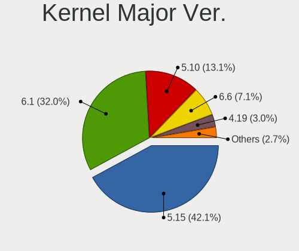

| Version | Desktops | Percent |
|---------|----------|---------|
| 5.15    | 62       | 68.13%  |
| 5.10    | 20       | 21.98%  |
| 4.19    | 8        | 8.79%   |
| 5.14    | 1        | 1.1%    |

Arch
----

OS architecture (x86_64, i586, etc.)

| Name   | Desktops | Percent |
|--------|----------|---------|
| x86_64 | 85       | 100%    |

DE
--

Desktop Environment

| Name       | Desktops | Percent |
|------------|----------|---------|
| MATE       | 68       | 75.56%  |
| Cinnamon   | 19       | 21.11%  |
| Unknown    | 2        | 2.22%   |
| X-Cinnamon | 1        | 1.11%   |

Display Server
--------------

X11 or Wayland

| Name    | Desktops | Percent |
|---------|----------|---------|
| X11     | 81       | 92.05%  |
| Wayland | 6        | 6.82%   |
| Unknown | 1        | 1.14%   |

Display Manager
---------------

SDDM, LightDM, etc.

| Name    | Desktops | Percent |
|---------|----------|---------|
| GDM     | 81       | 94.19%  |
| Unknown | 3        | 3.49%   |
| SDDM    | 2        | 2.33%   |

OS Lang
-------

Language

| Lang    | Desktops | Percent |
|---------|----------|---------|
| Unknown | 81       | 94.19%  |
| ru_RU   | 5        | 5.81%   |

Boot Mode
---------

EFI or BIOS

| Mode | Desktops | Percent |
|------|----------|---------|
| EFI  | 57       | 64.77%  |
| BIOS | 31       | 35.23%  |

Filesystem
----------

Type of filesystem

| Type    | Desktops | Percent |
|---------|----------|---------|
| Ext4    | 82       | 95.35%  |
| Btrfs   | 3        | 3.49%   |
| Unknown | 1        | 1.16%   |

Part. scheme
------------

Scheme of partitioning

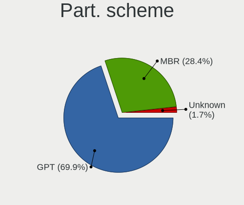

| Type    | Desktops | Percent |
|---------|----------|---------|
| GPT     | 59       | 67.82%  |
| MBR     | 26       | 29.89%  |
| Unknown | 2        | 2.3%    |

Dual Boot with Linux/BSD
------------------------

Hosting more than one Linux/BSD

| Dual boot | Desktops | Percent |
|-----------|----------|---------|
| No        | 77       | 88.51%  |
| Yes       | 10       | 11.49%  |

Dual Boot (Win)
---------------

Hosting Linux and Windows

| Dual boot | Desktops | Percent |
|-----------|----------|---------|
| No        | 64       | 74.42%  |
| Yes       | 22       | 25.58%  |

Board
-----

Vendor
------

Motherboard manufacturer

| Name                | Desktops | Percent |
|---------------------|----------|---------|
| Gigabyte Technology | 29       | 34.12%  |
| ASUSTek Computer    | 18       | 21.18%  |
| ASRock              | 12       | 14.12%  |
| MSI                 | 6        | 7.06%   |
| DEPO Computers      | 5        | 5.88%   |
| Aquarius            | 4        | 4.71%   |
| Hewlett-Packard     | 3        | 3.53%   |
| Lenovo              | 2        | 2.35%   |
| Unknown             | 2        | 2.35%   |
| RDW                 | 1        | 1.18%   |
| ECS                 | 1        | 1.18%   |
| Dell                | 1        | 1.18%   |
| Colorful Technology | 1        | 1.18%   |

Model
-----

Motherboard model

| Name                                   | Desktops | Percent |
|----------------------------------------|----------|---------|
| Gigabyte B365M DS3H                    | 4        | 4.71%   |
| DEPO Computers DPH310T                 | 4        | 4.71%   |
| Gigabyte H110M-S2                      | 3        | 3.53%   |
| MSI MS-7D14                            | 2        | 2.35%   |
| Gigabyte B560M DS3H                    | 2        | 2.35%   |
| Gigabyte B550 AORUS ELITE V2           | 2        | 2.35%   |
| ASUS PRIME H510T2/CSM                  | 2        | 2.35%   |
| ASUS PC                                | 2        | 2.35%   |
| ASUS MINIPC PB62                       | 2        | 2.35%   |
| ASRock H510M-HVS R2.0                  | 2        | 2.35%   |
| Unknown                                | 2        | 2.35%   |
| RDW RDW-MB-B450M V.1                   | 1        | 1.18%   |
| MSI MS-7D35                            | 1        | 1.18%   |
| MSI MS-7B86                            | 1        | 1.18%   |
| MSI MS-7636                            | 1        | 1.18%   |
| MSI Compaq dx2300 Microtower           | 1        | 1.18%   |
| Lenovo V50s-07IMB 11EF0011RU           | 1        | 1.18%   |
| Lenovo IdeaCentre 3 07ADA05 90MV0059RS | 1        | 1.18%   |
| HP Z400 Workstation                    | 1        | 1.18%   |
| HP ProOne 400 G1 AiO                   | 1        | 1.18%   |
| HP Compaq 8200 Elite SFF PC            | 1        | 1.18%   |
| Gigabyte X58-USB3                      | 1        | 1.18%   |
| Gigabyte X570S UD                      | 1        | 1.18%   |
| Gigabyte M61SME-S2                     | 1        | 1.18%   |
| Gigabyte H510M S2H                     | 1        | 1.18%   |
| Gigabyte H410M S2H V3                  | 1        | 1.18%   |
| Gigabyte H410M H V3                    | 1        | 1.18%   |
| Gigabyte H110M-M.2                     | 1        | 1.18%   |
| Gigabyte GA-880GM-D2H                  | 1        | 1.18%   |
| Gigabyte B75M-D3V                      | 1        | 1.18%   |
| Gigabyte B75M-D2V                      | 1        | 1.18%   |
| Gigabyte B560M H                       | 1        | 1.18%   |
| Gigabyte B450M H                       | 1        | 1.18%   |
| Gigabyte B450 AORUS PRO                | 1        | 1.18%   |
| Gigabyte B365M H                       | 1        | 1.18%   |
| Gigabyte B360M-DS3H                    | 1        | 1.18%   |
| Gigabyte B360 HD3                      | 1        | 1.18%   |
| Gigabyte A520M DS3H                    | 1        | 1.18%   |
| Gigabyte 970A-D3                       | 1        | 1.18%   |
| ECS H510H6-M7                          | 1        | 1.18%   |

Model Family
------------

Motherboard model prefix

| Name                   | Desktops | Percent |
|------------------------|----------|---------|
| Gigabyte B365M         | 5        | 5.88%   |
| DEPO Computers DPH310T | 4        | 4.71%   |
| ASUS PRIME             | 4        | 4.71%   |
| Gigabyte H110M-S2      | 3        | 3.53%   |
| Gigabyte B560M         | 3        | 3.53%   |
| MSI MS-7D14            | 2        | 2.35%   |
| Gigabyte H410M         | 2        | 2.35%   |
| Gigabyte B550          | 2        | 2.35%   |
| ASUS PC                | 2        | 2.35%   |
| ASUS MINIPC            | 2        | 2.35%   |
| ASRock H510M-HVS       | 2        | 2.35%   |
| Unknown                | 2        | 2.35%   |
| RDW RDW-MB-B450M       | 1        | 1.18%   |
| MSI MS-7D35            | 1        | 1.18%   |
| MSI MS-7B86            | 1        | 1.18%   |
| MSI MS-7636            | 1        | 1.18%   |
| MSI Compaq             | 1        | 1.18%   |
| Lenovo V50s-07IMB      | 1        | 1.18%   |
| Lenovo IdeaCentre      | 1        | 1.18%   |
| HP Z400                | 1        | 1.18%   |
| HP ProOne              | 1        | 1.18%   |
| HP Compaq              | 1        | 1.18%   |
| Gigabyte X58-USB3      | 1        | 1.18%   |
| Gigabyte X570S         | 1        | 1.18%   |
| Gigabyte M61SME-S2     | 1        | 1.18%   |
| Gigabyte H510M         | 1        | 1.18%   |
| Gigabyte H110M-M.2     | 1        | 1.18%   |
| Gigabyte GA-880GM-D2H  | 1        | 1.18%   |
| Gigabyte B75M-D3V      | 1        | 1.18%   |
| Gigabyte B75M-D2V      | 1        | 1.18%   |
| Gigabyte B450M         | 1        | 1.18%   |
| Gigabyte B450          | 1        | 1.18%   |
| Gigabyte B360M-DS3H    | 1        | 1.18%   |
| Gigabyte B360          | 1        | 1.18%   |
| Gigabyte A520M         | 1        | 1.18%   |
| Gigabyte 970A-D3       | 1        | 1.18%   |
| ECS H510H6-M7          | 1        | 1.18%   |
| DEPO Computers DPH410S | 1        | 1.18%   |
| Dell OptiPlex          | 1        | 1.18%   |
| Colorful H610M-K       | 1        | 1.18%   |

MFG Year
--------

Motherboard manufacture year

| Year | Desktops | Percent |
|------|----------|---------|
| 2021 | 22       | 25.88%  |
| 2020 | 11       | 12.94%  |
| 2022 | 9        | 10.59%  |
| 2019 | 8        | 9.41%   |
| 2016 | 7        | 8.24%   |
| 2018 | 6        | 7.06%   |
| 2012 | 4        | 4.71%   |
| 2010 | 4        | 4.71%   |
| 2011 | 3        | 3.53%   |
| 2014 | 2        | 2.35%   |
| 2013 | 2        | 2.35%   |
| 2009 | 2        | 2.35%   |
| 2007 | 2        | 2.35%   |
| 2017 | 1        | 1.18%   |
| 2015 | 1        | 1.18%   |
| 2008 | 1        | 1.18%   |

Form Factor
-----------

Physical design of the computer

| Name    | Desktops | Percent |
|---------|----------|---------|
| Desktop | 85       | 100%    |

Secure Boot
-----------

Enabled or disabled

| State    | Desktops | Percent |
|----------|----------|---------|
| Disabled | 85       | 100%    |

Coreboot
--------

Have coreboot on board

| Used | Desktops | Percent |
|------|----------|---------|
| No   | 85       | 100%    |

RAM Size
--------

Total RAM memory

| Size in GB | Desktops | Percent |
|------------|----------|---------|
| 4.01-8.0   | 30       | 35.29%  |
| 16.01-24.0 | 22       | 25.88%  |
| 8.01-16.0  | 15       | 17.65%  |
| 3.01-4.0   | 9        | 10.59%  |
| 32.01-64.0 | 4        | 4.71%   |
| 24.01-32.0 | 2        | 2.35%   |
| 1.01-2.0   | 1        | 1.18%   |
| 0.51-1.0   | 1        | 1.18%   |
| Unknown    | 1        | 1.18%   |

RAM Used
--------

Used RAM memory

| Used GB   | Desktops | Percent |
|-----------|----------|---------|
| 1.01-2.0  | 39       | 42.86%  |
| 4.01-8.0  | 13       | 14.29%  |
| 2.01-3.0  | 13       | 14.29%  |
| 3.01-4.0  | 11       | 12.09%  |
| 0.51-1.0  | 10       | 10.99%  |
| 8.01-16.0 | 3        | 3.3%    |
| 0.01-0.5  | 1        | 1.1%    |
| Unknown   | 1        | 1.1%    |

Total Drives
------------

Number of drives on board

| Drives | Desktops | Percent |
|--------|----------|---------|
| 1      | 53       | 60.23%  |
| 2      | 28       | 31.82%  |
| 4      | 3        | 3.41%   |
| 3      | 3        | 3.41%   |
| 5      | 1        | 1.14%   |

Has CD-ROM
----------

Has CD-ROM on board

| Presented | Desktops | Percent |
|-----------|----------|---------|
| No        | 59       | 68.6%   |
| Yes       | 27       | 31.4%   |

Has Ethernet
------------

Has Ethernet on board

| Presented | Desktops | Percent |
|-----------|----------|---------|
| Yes       | 84       | 98.82%  |
| No        | 1        | 1.18%   |

Has WiFi
--------

Has WiFi module

| Presented | Desktops | Percent |
|-----------|----------|---------|
| No        | 64       | 73.56%  |
| Yes       | 23       | 26.44%  |

Has Bluetooth
-------------

Has Bluetooth module

| Presented | Desktops | Percent |
|-----------|----------|---------|
| No        | 70       | 81.4%   |
| Yes       | 16       | 18.6%   |

Location
--------

Country
-------

Geographic location (country)

| Country | Desktops | Percent |
|---------|----------|---------|
| Russia  | 85       | 100%    |

City
----

Geographic location (city)

| City            | Desktops | Percent |
|-----------------|----------|---------|
| Murom           | 18       | 21.18%  |
| Salekhard       | 15       | 17.65%  |
| Moscow          | 14       | 16.47%  |
| Yekaterinburg   | 4        | 4.71%   |
| Veliky Novgorod | 2        | 2.35%   |
| Novy Urengoy    | 2        | 2.35%   |
| Novosibirsk     | 2        | 2.35%   |
| Khabarovsk      | 2        | 2.35%   |
| Kaluga          | 2        | 2.35%   |
| Balashikha      | 2        | 2.35%   |
| Baksan          | 2        | 2.35%   |
| Ulyanovsk       | 1        | 1.18%   |
| Tomsk           | 1        | 1.18%   |
| Surgut          | 1        | 1.18%   |
| Stavropol       | 1        | 1.18%   |
| St Petersburg   | 1        | 1.18%   |
| Rostov-on-Don   | 1        | 1.18%   |
| Perm            | 1        | 1.18%   |
| Penza           | 1        | 1.18%   |
| Nadym           | 1        | 1.18%   |
| Magadan         | 1        | 1.18%   |
| Kursk           | 1        | 1.18%   |
| Krasnoyarsk     | 1        | 1.18%   |
| Krasnodar       | 1        | 1.18%   |
| Kovrov          | 1        | 1.18%   |
| Kol'chugino     | 1        | 1.18%   |
| Kirov           | 1        | 1.18%   |
| Kholmsk         | 1        | 1.18%   |
| Bryansk         | 1        | 1.18%   |
| Arzamas         | 1        | 1.18%   |
| Arkhangelsk     | 1        | 1.18%   |

Drives
------

Drive Vendor
------------

Hard drive vendors

| Vendor                       | Desktops | Drives | Percent |
|------------------------------|----------|--------|---------|
| Seagate                      | 26       | 41     | 20.97%  |
| WDC                          | 18       | 21     | 14.52%  |
| Toshiba                      | 11       | 11     | 8.87%   |
| Kingston                     | 10       | 11     | 8.06%   |
| Samsung Electronics          | 9        | 13     | 7.26%   |
| A-DATA Technology            | 7        | 7      | 5.65%   |
| Apacer                       | 5        | 5      | 4.03%   |
| SanDisk                      | 4        | 5      | 3.23%   |
| Patriot                      | 3        | 3      | 2.42%   |
| Hitachi                      | 3        | 3      | 2.42%   |
| Foxline                      | 3        | 3      | 2.42%   |
| Crucial                      | 3        | 6      | 2.42%   |
| KIOXIA-EXCERIA               | 2        | 2      | 1.61%   |
| KingSpec                     | 2        | 2      | 1.61%   |
| ExeGate                      | 2        | 3      | 1.61%   |
| AMD                          | 2        | 2      | 1.61%   |
| AGI                          | 2        | 2      | 1.61%   |
| XPG                          | 1        | 1      | 0.81%   |
| Unknown                      | 1        | 1      | 0.81%   |
| SPCC                         | 1        | 1      | 0.81%   |
| Smartbuy                     | 1        | 1      | 0.81%   |
| Silicon Motion               | 1        | 1      | 0.81%   |
| Shenzhen Longsys Electronics | 1        | 1      | 0.81%   |
| Phison                       | 1        | 1      | 0.81%   |
| Netac                        | 1        | 1      | 0.81%   |
| Intel                        | 1        | 1      | 0.81%   |
| GOODRAM                      | 1        | 1      | 0.81%   |
| Corsair                      | 1        | 1      | 0.81%   |
| China                        | 1        | 1      | 0.81%   |

Drive Model
-----------

Hard drive models

| Model                                | Desktops | Percent |
|--------------------------------------|----------|---------|
| Toshiba HDWD110 1TB                  | 4        | 3.08%   |
| Seagate ST500DM002-1BD142 500GB      | 4        | 3.08%   |
| Seagate ST1000LM049-2GH172 1TB       | 4        | 3.08%   |
| Seagate ST1000DM010-2EP102 1TB       | 4        | 3.08%   |
| Kingston SA400S37240G 240GB SSD      | 4        | 3.08%   |
| Apacer AS2280P4 256GB                | 4        | 3.08%   |
| Seagate ST1000DM010-2DM162 1TB       | 3        | 2.31%   |
| Crucial CT240BX500SSD1 240GB         | 3        | 2.31%   |
| WDC WD10EZEX-22MFCA0 1TB             | 2        | 1.54%   |
| Toshiba HDWD105 500GB                | 2        | 1.54%   |
| Toshiba DT01ACA100 1TB               | 2        | 1.54%   |
| Seagate ST1000DM003-1SB10C 1TB       | 2        | 1.54%   |
| SanDisk SD8SBAT256G1122 256GB SSD    | 2        | 1.54%   |
| Samsung SSD 860 EVO 250GB            | 2        | 1.54%   |
| KIOXIA-EXCERIA SATA SSD 480GB        | 2        | 1.54%   |
| Kingston SA400S37120G 120GB SSD      | 2        | 1.54%   |
| Kingston OM8PCP3512F-A02 512GB       | 2        | 1.54%   |
| Foxline FLSSD240X5SE 240GB           | 2        | 1.54%   |
| ExeGate EX276690RUS(960G 960GB SSD   | 2        | 1.54%   |
| AGI AGI512G16AI198 512GB             | 2        | 1.54%   |
| XPG GAMMIX S70 BLADE 2TB             | 1        | 0.77%   |
| WDC WDS240G2G0A-00JH30 240GB SSD     | 1        | 0.77%   |
| WDC WD5000AAKX-75U6AA0 500GB         | 1        | 0.77%   |
| WDC WD5000AAKS-00V1A0 500GB          | 1        | 0.77%   |
| WDC WD5000AAKS-00D2B0 500GB          | 1        | 0.77%   |
| WDC WD40PURZ-85TTDY0 4TB             | 1        | 0.77%   |
| WDC WD3200AAKX-001CA0 320GB          | 1        | 0.77%   |
| WDC WD30EFRX-68EUZN0 3TB             | 1        | 0.77%   |
| WDC WD25 00LPCX-24C6HT0 250GB        | 1        | 0.77%   |
| WDC WD20EFRX-68EUZN0 2TB             | 1        | 0.77%   |
| WDC WD20EARX-00PASB0 2TB             | 1        | 0.77%   |
| WDC WD15EARS-19MVWB0 1TB             | 1        | 0.77%   |
| WDC WD10SPZX-22Z10T1 1TB             | 1        | 0.77%   |
| WDC WD10EZEX-75ZF5A0 1TB             | 1        | 0.77%   |
| WDC WD10EZEX-00WN4A0 1TB             | 1        | 0.77%   |
| WDC WD10EZEX-00BBHA0 1TB             | 1        | 0.77%   |
| WDC WD10EARS-00Y5B1 1TB              | 1        | 0.77%   |
| WDC WD1002FAEX-00Z3A0 1TB            | 1        | 0.77%   |
| WDC PC SN530 SDBPMPZ-256G-1001 256GB | 1        | 0.77%   |
| Unknown NVMe SSD Drive 256GB         | 1        | 0.77%   |

HDD Vendor
----------

Hard disk drive vendors

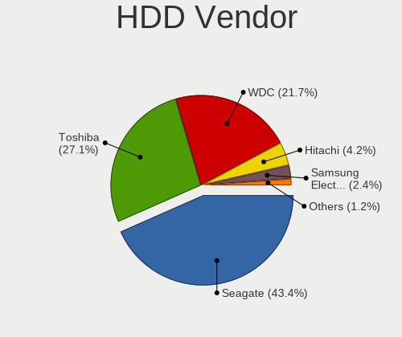

| Vendor              | Desktops | Drives | Percent |
|---------------------|----------|--------|---------|
| Seagate             | 26       | 41     | 44.83%  |
| WDC                 | 16       | 19     | 27.59%  |
| Toshiba             | 10       | 10     | 17.24%  |
| Samsung Electronics | 3        | 4      | 5.17%   |
| Hitachi             | 3        | 3      | 5.17%   |

SSD Vendor
----------

Solid state drive vendors

| Vendor              | Desktops | Drives | Percent |
|---------------------|----------|--------|---------|
| Kingston            | 7        | 7      | 17.5%   |
| A-DATA Technology   | 5        | 5      | 12.5%   |
| Samsung Electronics | 4        | 5      | 10%     |
| SanDisk             | 3        | 4      | 7.5%    |
| Foxline             | 3        | 3      | 7.5%    |
| Crucial             | 3        | 6      | 7.5%    |
| Patriot             | 2        | 2      | 5%      |
| KIOXIA-EXCERIA      | 2        | 2      | 5%      |
| KingSpec            | 2        | 2      | 5%      |
| ExeGate             | 2        | 3      | 5%      |
| WDC                 | 1        | 1      | 2.5%    |
| Toshiba             | 1        | 1      | 2.5%    |
| Smartbuy            | 1        | 1      | 2.5%    |
| GOODRAM             | 1        | 1      | 2.5%    |
| China               | 1        | 1      | 2.5%    |
| Apacer              | 1        | 1      | 2.5%    |
| AMD                 | 1        | 1      | 2.5%    |

Drive Kind
----------

HDD or SSD

| Kind | Desktops | Drives | Percent |
|------|----------|--------|---------|
| HDD  | 52       | 77     | 44.83%  |
| SSD  | 39       | 46     | 33.62%  |
| NVMe | 25       | 29     | 21.55%  |

Drive Connector
---------------

SATA, SAS, NVMe, etc.

| Type | Desktops | Drives | Percent |
|------|----------|--------|---------|
| SATA | 73       | 122    | 73.74%  |
| NVMe | 25       | 29     | 25.25%  |
| SAS  | 1        | 1      | 1.01%   |

Drive Size
----------

Size of hard drive

| Size in TB | Desktops | Drives | Percent |
|------------|----------|--------|---------|
| 0.01-0.5   | 47       | 58     | 50.54%  |
| 0.51-1.0   | 38       | 56     | 40.86%  |
| 1.01-2.0   | 6        | 7      | 6.45%   |
| 3.01-4.0   | 1        | 1      | 1.08%   |
| 2.01-3.0   | 1        | 1      | 1.08%   |

Space Total
-----------

Amount of disk space available on the file system

| Size in GB     | Desktops | Percent |
|----------------|----------|---------|
| 101-250        | 24       | 27.27%  |
| 501-1000       | 24       | 27.27%  |
| 251-500        | 19       | 21.59%  |
| 1001-2000      | 7        | 7.95%   |
| 51-100         | 6        | 6.82%   |
| 2001-3000      | 5        | 5.68%   |
| More than 3000 | 1        | 1.14%   |
| 21-50          | 1        | 1.14%   |
| Unknown        | 1        | 1.14%   |

Space Used
----------

Amount of used disk space

| Used GB        | Desktops | Percent |
|----------------|----------|---------|
| 1-20           | 49       | 53.26%  |
| 21-50          | 12       | 13.04%  |
| 501-1000       | 8        | 8.7%    |
| 101-250        | 7        | 7.61%   |
| 51-100         | 6        | 6.52%   |
| 251-500        | 4        | 4.35%   |
| 1001-2000      | 3        | 3.26%   |
| More than 3000 | 1        | 1.09%   |
| 2001-3000      | 1        | 1.09%   |
| Unknown        | 1        | 1.09%   |

Malfunc. Drives
---------------

Drive models with a malfunction

| Model                             | Desktops | Drives | Percent |
|-----------------------------------|----------|--------|---------|
| Seagate ST500DM002-1BD142 500GB   | 2        | 2      | 12.5%   |
| Seagate ST1000DM010-2EP102 1TB    | 2        | 6      | 12.5%   |
| WDC WDS240G2G0A-00JH30 240GB SSD  | 1        | 1      | 6.25%   |
| WDC WD5000AAKS-00V1A0 500GB       | 1        | 1      | 6.25%   |
| WDC WD5000AAKS-00D2B0 500GB       | 1        | 1      | 6.25%   |
| WDC WD3200AAKX-001CA0 320GB       | 1        | 1      | 6.25%   |
| WDC WD10EZEX-75ZF5A0 1TB          | 1        | 1      | 6.25%   |
| WDC WD10EZEX-00WN4A0 1TB          | 1        | 1      | 6.25%   |
| WDC WD10EARS-00Y5B1 1TB           | 1        | 1      | 6.25%   |
| SPCC M.2 PCIe SSD 512GB           | 1        | 1      | 6.25%   |
| Seagate ST9500423AS 500GB         | 1        | 1      | 6.25%   |
| Seagate ST3250823AS 250GB         | 1        | 1      | 6.25%   |
| Samsung Electronics HD400LJ 400GB | 1        | 1      | 6.25%   |
| Hitachi HDS5C1050CLA382 500GB     | 1        | 1      | 6.25%   |

Malfunc. Drive Vendor
---------------------

Vendors of faulty drives

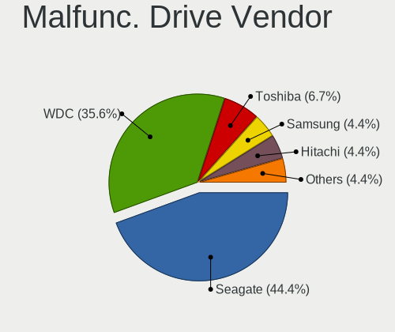

| Vendor              | Desktops | Drives | Percent |
|---------------------|----------|--------|---------|
| WDC                 | 7        | 7      | 43.75%  |
| Seagate             | 6        | 10     | 37.5%   |
| SPCC                | 1        | 1      | 6.25%   |
| Samsung Electronics | 1        | 1      | 6.25%   |
| Hitachi             | 1        | 1      | 6.25%   |

Malfunc. HDD Vendor
-------------------

Vendors of faulty HDD drives

| Vendor              | Desktops | Drives | Percent |
|---------------------|----------|--------|---------|
| WDC                 | 6        | 6      | 42.86%  |
| Seagate             | 6        | 10     | 42.86%  |
| Samsung Electronics | 1        | 1      | 7.14%   |
| Hitachi             | 1        | 1      | 7.14%   |

Malfunc. Drive Kind
-------------------

Kinds of faulty drives

| Kind | Desktops | Drives | Percent |
|------|----------|--------|---------|
| HDD  | 11       | 18     | 84.62%  |
| NVMe | 1        | 1      | 7.69%   |
| SSD  | 1        | 1      | 7.69%   |

Failed Drives
-------------

Failed drive models

Zero info for selected period =(

Failed Drive Vendor
-------------------

Failed drive vendors

Zero info for selected period =(

Drive Status
------------

Number of failed and malfunc. drives

| Status   | Desktops | Drives | Percent |
|----------|----------|--------|---------|
| Works    | 77       | 125    | 81.91%  |
| Malfunc  | 13       | 20     | 13.83%  |
| Detected | 4        | 7      | 4.26%   |

Storage controller
------------------

Storage Vendor
--------------

Storage controller vendors

| Vendor                       | Desktops | Percent |
|------------------------------|----------|---------|
| Intel                        | 67       | 58.77%  |
| AMD                          | 15       | 13.16%  |
| Phison Electronics           | 6        | 5.26%   |
| Silicon Motion               | 4        | 3.51%   |
| Samsung Electronics          | 3        | 2.63%   |
| Realtek Semiconductor        | 3        | 2.63%   |
| Nvidia                       | 3        | 2.63%   |
| Kingston Technology Company  | 3        | 2.63%   |
| SanDisk                      | 2        | 1.75%   |
| JMicron Technology           | 2        | 1.75%   |
| VIA Technologies             | 1        | 0.88%   |
| Shenzhen Longsys Electronics | 1        | 0.88%   |
| Netac Technology             | 1        | 0.88%   |
| MAXIO Technology (Hangzhou)  | 1        | 0.88%   |
| ADATA Technology             | 1        | 0.88%   |
| Unknown                      | 1        | 0.88%   |

Storage Model
-------------

Storage controller models

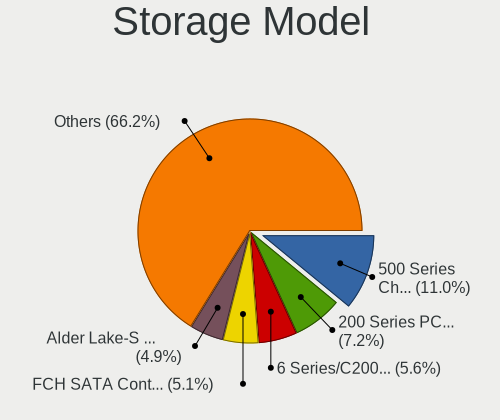

| Model                                                                          | Desktops | Percent |
|--------------------------------------------------------------------------------|----------|---------|
| Intel 500 Series Chipset Family SATA AHCI Controller                           | 23       | 17.83%  |
| Intel 200 Series PCH SATA controller [AHCI mode]                               | 11       | 8.53%   |
| Intel Q170/Q150/B150/H170/H110/Z170/CM236 Chipset SATA Controller [AHCI Mode]  | 9        | 6.98%   |
| Phison PS5013 E13 NVMe Controller                                              | 5        | 3.88%   |
| AMD FCH SATA Controller [AHCI mode]                                            | 5        | 3.88%   |
| AMD 500 Series Chipset SATA Controller                                         | 5        | 3.88%   |
| AMD 400 Series Chipset SATA Controller                                         | 5        | 3.88%   |
| Silicon Motion SM2263EN/SM2263XT SSD Controller                                | 4        | 3.1%    |
| Nvidia MCP61 SATA Controller                                                   | 3        | 2.33%   |
| Nvidia MCP61 IDE                                                               | 3        | 2.33%   |
| Kingston Company Company Non-Volatile memory controller                        | 3        | 2.33%   |
| Intel Cannon Lake PCH SATA AHCI Controller                                     | 3        | 2.33%   |
| Intel 8 Series/C220 Series Chipset Family 6-port SATA Controller 1 [AHCI mode] | 3        | 2.33%   |
| Intel 400 Series Chipset Family SATA AHCI Controller                           | 3        | 2.33%   |
| Samsung NVMe SSD Controller 980                                                | 2        | 1.55%   |
| Realtek Realtek Non-Volatile memory controller                                 | 2        | 1.55%   |
| JMicron JMB368 IDE controller                                                  | 2        | 1.55%   |
| Intel 6 Series/C200 Series Chipset Family 6 port Desktop SATA AHCI Controller  | 2        | 1.55%   |
| Intel 5 Series/3400 Series Chipset 4 port SATA IDE Controller                  | 2        | 1.55%   |
| Intel 5 Series/3400 Series Chipset 2 port SATA IDE Controller                  | 2        | 1.55%   |
| AMD SB7x0/SB8x0/SB9x0 SATA Controller [IDE mode]                               | 2        | 1.55%   |
| AMD SB7x0/SB8x0/SB9x0 IDE Controller                                           | 2        | 1.55%   |
| VIA VT6415 PATA IDE Host Controller                                            | 1        | 0.78%   |
| Shenzhen Longsys Electronics Non-Volatile memory controller                    | 1        | 0.78%   |
| SanDisk WD Blue SN570 NVMe SSD                                                 | 1        | 0.78%   |
| SanDisk Non-Volatile memory controller                                         | 1        | 0.78%   |
| Samsung NVMe SSD Controller SM981/PM981/PM983                                  | 1        | 0.78%   |
| Samsung NVMe SSD Controller PM9A1/PM9A3/980PRO                                 | 1        | 0.78%   |
| Realtek RTS5763DL NVMe SSD Controller                                          | 1        | 0.78%   |
| Phison E16 PCIe4 NVMe Controller                                               | 1        | 0.78%   |
| Netac Non-Volatile memory controller                                           | 1        | 0.78%   |
| MAXIO (Hangzhou) NVMe SSD Controller MAP1202                                   | 1        | 0.78%   |
| Intel SATA Controller [RAID mode]                                              | 1        | 0.78%   |
| Intel Non-Volatile memory controller                                           | 1        | 0.78%   |
| Intel NM10/ICH7 Family SATA Controller [IDE mode]                              | 1        | 0.78%   |
| Intel Comet Lake SATA AHCI Controller                                          | 1        | 0.78%   |
| Intel Celeron/Pentium Silver Processor SATA Controller                         | 1        | 0.78%   |
| Intel Alder Lake-S PCH SATA Controller [AHCI Mode]                             | 1        | 0.78%   |
| Intel 82801JI (ICH10 Family) SATA AHCI Controller                              | 1        | 0.78%   |
| Intel 82801JI (ICH10 Family) 4 port SATA IDE Controller #1                     | 1        | 0.78%   |

Storage Kind
------------

Kind of storage controller (IDE, SATA, NVMe, SAS, ...)

| Kind | Desktops | Percent |
|------|----------|---------|
| SATA | 74       | 65.49%  |
| NVMe | 25       | 22.12%  |
| IDE  | 12       | 10.62%  |
| RAID | 2        | 1.77%   |

Processor
---------

CPU Vendor
----------

Processor vendors

| Vendor | Desktops | Percent |
|--------|----------|---------|
| Intel  | 67       | 78.82%  |
| AMD    | 18       | 21.18%  |

CPU Model
---------

Processor models

| Model                                      | Desktops | Percent |
|--------------------------------------------|----------|---------|
| Intel Core i5-9400 CPU @ 2.90GHz           | 10       | 11.76%  |
| Intel Core i3-10100 CPU @ 3.60GHz          | 10       | 11.76%  |
| Intel Core i5-10400 CPU @ 2.90GHz          | 4        | 4.71%   |
| Intel Pentium CPU G4500 @ 3.50GHz          | 3        | 3.53%   |
| Intel Core i5-3470 CPU @ 3.20GHz           | 3        | 3.53%   |
| Intel Core i7-10700K CPU @ 3.80GHz         | 2        | 2.35%   |
| Intel Core i5-10500 CPU @ 3.10GHz          | 2        | 2.35%   |
| Intel Core i3-6100 CPU @ 3.70GHz           | 2        | 2.35%   |
| Intel Core i3-10105 CPU @ 3.70GHz          | 2        | 2.35%   |
| Intel 11th Gen Core i7-11700 @ 2.50GHz     | 2        | 2.35%   |
| AMD Ryzen 7 PRO 4750G with Radeon Graphics | 2        | 2.35%   |
| AMD FX-4100 Quad-Core Processor            | 2        | 2.35%   |
| Intel Xeon CPU W3670 @ 3.20GHz             | 1        | 1.18%   |
| Intel Pentium Gold G6400 CPU @ 4.00GHz     | 1        | 1.18%   |
| Intel Pentium Gold G5400 CPU @ 3.70GHz     | 1        | 1.18%   |
| Intel Pentium CPU G4560 @ 3.50GHz          | 1        | 1.18%   |
| Intel Pentium CPU G4400 @ 3.30GHz          | 1        | 1.18%   |
| Intel Core i7-4790T CPU @ 2.70GHz          | 1        | 1.18%   |
| Intel Core i7-2600 CPU @ 3.40GHz           | 1        | 1.18%   |
| Intel Core i7-10700 CPU @ 2.90GHz          | 1        | 1.18%   |
| Intel Core i7 CPU 950 @ 3.07GHz            | 1        | 1.18%   |
| Intel Core i5-9400F CPU @ 2.90GHz          | 1        | 1.18%   |
| Intel Core i5-6500 CPU @ 3.20GHz           | 1        | 1.18%   |
| Intel Core i5-4590 CPU @ 3.30GHz           | 1        | 1.18%   |
| Intel Core i5-10600K CPU @ 4.10GHz         | 1        | 1.18%   |
| Intel Core i5 CPU 750 @ 2.67GHz            | 1        | 1.18%   |
| Intel Core i5 CPU 650 @ 3.20GHz            | 1        | 1.18%   |
| Intel Core i3-8100 CPU @ 3.60GHz           | 1        | 1.18%   |
| Intel Core i3-4160 CPU @ 3.60GHz           | 1        | 1.18%   |
| Intel Core i3-10100F CPU @ 3.60GHz         | 1        | 1.18%   |
| Intel Core 2 Duo CPU E8400 @ 3.00GHz       | 1        | 1.18%   |
| Intel Core 2 CPU 6600 @ 2.40GHz            | 1        | 1.18%   |
| Intel Celeron J4125 CPU @ 2.00GHz          | 1        | 1.18%   |
| Intel Celeron G5925 CPU @ 3.60GHz          | 1        | 1.18%   |
| Intel Celeron G4920 CPU @ 3.20GHz          | 1        | 1.18%   |
| Intel Celeron CPU G3900 @ 2.80GHz          | 1        | 1.18%   |
| Intel Celeron CPU G1610 @ 2.60GHz          | 1        | 1.18%   |
| Intel 12th Gen Core i3-12100               | 1        | 1.18%   |
| Intel 11th Gen Core i5-11400 @ 2.60GHz     | 1        | 1.18%   |
| AMD Ryzen 9 5900X 12-Core Processor        | 1        | 1.18%   |

CPU Model Family
----------------

Processor model prefix

| Model              | Desktops | Percent |
|--------------------|----------|---------|
| Intel Core i5      | 25       | 29.41%  |
| Intel Core i3      | 17       | 20%     |
| Intel Core i7      | 6        | 7.06%   |
| Intel Pentium      | 5        | 5.88%   |
| Intel Celeron      | 5        | 5.88%   |
| AMD Ryzen 5        | 5        | 5.88%   |
| Other              | 4        | 4.71%   |
| AMD FX             | 3        | 3.53%   |
| Intel Pentium Gold | 2        | 2.35%   |
| AMD Ryzen 7 PRO    | 2        | 2.35%   |
| AMD Athlon II X2   | 2        | 2.35%   |
| Intel Xeon         | 1        | 1.18%   |
| Intel Core 2 Duo   | 1        | 1.18%   |
| Intel Core 2       | 1        | 1.18%   |
| AMD Ryzen 9        | 1        | 1.18%   |
| AMD Ryzen 7        | 1        | 1.18%   |
| AMD Ryzen 5 PRO    | 1        | 1.18%   |
| AMD Ryzen 3        | 1        | 1.18%   |
| AMD Phenom         | 1        | 1.18%   |
| AMD Athlon         | 1        | 1.18%   |

CPU Cores
---------

Number of processor cores

| Number | Desktops | Percent |
|--------|----------|---------|
| 4      | 29       | 34.12%  |
| 6      | 24       | 28.24%  |
| 2      | 22       | 25.88%  |
| 8      | 8        | 9.41%   |
| 12     | 1        | 1.18%   |
| 3      | 1        | 1.18%   |

CPU Sockets
-----------

Number of sockets

| Number | Desktops | Percent |
|--------|----------|---------|
| 1      | 85       | 100%    |

CPU Threads
-----------

Threads per core (Hyper-Threading)

| Number | Desktops | Percent |
|--------|----------|---------|
| 2      | 51       | 60%     |
| 1      | 34       | 40%     |

CPU Op-Modes
------------

CPU Operation Modes (32-bit, 64-bit)

| Op mode        | Desktops | Percent |
|----------------|----------|---------|
| 32-bit, 64-bit | 84       | 98.82%  |
| Unknown        | 1        | 1.18%   |

CPU Microcode
-------------

Microcode number

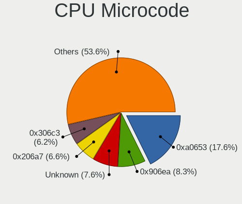

| Number     | Desktops | Percent |
|------------|----------|---------|
| 0xa0653    | 21       | 24.42%  |
| 0x906ed    | 8        | 9.3%    |
| 0x506e3    | 8        | 9.3%    |
| 0x906ea    | 4        | 4.65%   |
| 0x306a9    | 4        | 4.65%   |
| 0xa0671    | 3        | 3.49%   |
| 0xa0655    | 3        | 3.49%   |
| 0x306c3    | 3        | 3.49%   |
| 0x08600106 | 3        | 3.49%   |
| 0x08108109 | 3        | 3.49%   |
| 0x906eb    | 2        | 2.33%   |
| 0x0a50000d | 2        | 2.33%   |
| 0x0600063e | 2        | 2.33%   |
| 0xa0654    | 1        | 1.16%   |
| 0x906e9    | 1        | 1.16%   |
| 0x90675    | 1        | 1.16%   |
| 0x706a8    | 1        | 1.16%   |
| 0x6f6      | 1        | 1.16%   |
| 0x206c2    | 1        | 1.16%   |
| 0x206a7    | 1        | 1.16%   |
| 0x20652    | 1        | 1.16%   |
| 0x106e5    | 1        | 1.16%   |
| 0x106a5    | 1        | 1.16%   |
| 0x1067a    | 1        | 1.16%   |
| 0x0a201205 | 1        | 1.16%   |
| 0x0a201016 | 1        | 1.16%   |
| 0x08701021 | 1        | 1.16%   |
| 0x08101016 | 1        | 1.16%   |
| 0x06000852 | 1        | 1.16%   |
| 0x010000c8 | 1        | 1.16%   |
| 0x010000c7 | 1        | 1.16%   |
| 0x01000083 | 1        | 1.16%   |
| Unknown    | 1        | 1.16%   |

CPU Microarch
-------------

Microarchitecture

| Name             | Desktops | Percent |
|------------------|----------|---------|
| CometLake        | 25       | 29.41%  |
| KabyLake         | 15       | 17.65%  |
| Skylake          | 8        | 9.41%   |
| Zen 3            | 4        | 4.71%   |
| Zen 2            | 4        | 4.71%   |
| IvyBridge        | 4        | 4.71%   |
| Zen+             | 3        | 3.53%   |
| K10              | 3        | 3.53%   |
| Haswell          | 3        | 3.53%   |
| Unknown          | 3        | 3.53%   |
| Westmere         | 2        | 2.35%   |
| Nehalem          | 2        | 2.35%   |
| Bulldozer        | 2        | 2.35%   |
| Zen              | 1        | 1.18%   |
| SandyBridge      | 1        | 1.18%   |
| Piledriver       | 1        | 1.18%   |
| Penryn           | 1        | 1.18%   |
| Goldmont plus    | 1        | 1.18%   |
| Core             | 1        | 1.18%   |
| Alderlake Hybrid | 1        | 1.18%   |

Graphics
--------

GPU Vendor
----------

Vendors of graphics cards

| Vendor | Desktops | Percent |
|--------|----------|---------|
| Intel  | 56       | 63.64%  |
| AMD    | 17       | 19.32%  |
| Nvidia | 15       | 17.05%  |

GPU Model
---------

Graphics card models

| Model                                                                       | Desktops | Percent |
|-----------------------------------------------------------------------------|----------|---------|
| Intel CometLake-S GT2 [UHD Graphics 630]                                    | 20       | 22.47%  |
| Intel CoffeeLake-S GT2 [UHD Graphics 630]                                   | 11       | 12.36%  |
| Intel HD Graphics 530                                                       | 5        | 5.62%   |
| Intel Xeon E3-1200 v2/3rd Gen Core processor Graphics Controller            | 4        | 4.49%   |
| AMD Renoir                                                                  | 3        | 3.37%   |
| AMD Picasso/Raven 2 [Radeon Vega Series / Radeon Vega Mobile Series]        | 3        | 3.37%   |
| Nvidia GK208B [GeForce GT 710]                                              | 2        | 2.25%   |
| Intel Xeon E3-1200 v3/4th Gen Core Processor Integrated Graphics Controller | 2        | 2.25%   |
| Intel RocketLake-S GT1 [UHD Graphics 750]                                   | 2        | 2.25%   |
| Intel CometLake-S GT1 [UHD Graphics 610]                                    | 2        | 2.25%   |
| Intel CoffeeLake-S GT1 [UHD Graphics 610]                                   | 2        | 2.25%   |
| AMD Cezanne [Radeon Vega Series / Radeon Vega Mobile Series]                | 2        | 2.25%   |
| Nvidia TU116 [GeForce GTX 1650]                                             | 1        | 1.12%   |
| Nvidia TU106 [GeForce RTX 2070]                                             | 1        | 1.12%   |
| Nvidia TU104 [GeForce RTX 2060]                                             | 1        | 1.12%   |
| Nvidia NV43 [GeForce 6600 GT]                                               | 1        | 1.12%   |
| Nvidia GT218 [GeForce 210]                                                  | 1        | 1.12%   |
| Nvidia GP108 [GeForce GT 1030]                                              | 1        | 1.12%   |
| Nvidia GP106 [GeForce GTX 1060 3GB]                                         | 1        | 1.12%   |
| Nvidia GM107 [GeForce GTX 750 Ti]                                           | 1        | 1.12%   |
| Nvidia GK104 [GeForce GTX 760]                                              | 1        | 1.12%   |
| Nvidia GF114 [GeForce GTX 560 Ti]                                           | 1        | 1.12%   |
| Nvidia GF108 [GeForce GT 620]                                               | 1        | 1.12%   |
| Nvidia G94GL [Quadro FX 1800]                                               | 1        | 1.12%   |
| Nvidia G92 [GeForce GTS 250]                                                | 1        | 1.12%   |
| Intel RocketLake-S GT1 [UHD Graphics 730]                                   | 1        | 1.12%   |
| Intel HD Graphics 610                                                       | 1        | 1.12%   |
| Intel HD Graphics 510                                                       | 1        | 1.12%   |
| Intel GeminiLake [UHD Graphics 600]                                         | 1        | 1.12%   |
| Intel Alder Lake-S GT1 [UHD Graphics 730]                                   | 1        | 1.12%   |
| Intel 82946GZ/GL Integrated Graphics Controller                             | 1        | 1.12%   |
| Intel 4th Generation Core Processor Family Integrated Graphics Controller   | 1        | 1.12%   |
| Intel 2nd Generation Core Processor Family Integrated Graphics Controller   | 1        | 1.12%   |
| AMD RV770 [Radeon HD 4850]                                                  | 1        | 1.12%   |
| AMD RV515 PRO [Radeon X1300/X1550 Series] (Secondary)                       | 1        | 1.12%   |
| AMD RV515 PRO [Radeon X1300/X1550 Series]                                   | 1        | 1.12%   |
| AMD RS880 [Radeon HD 4250]                                                  | 1        | 1.12%   |
| AMD RS780L [Radeon 3000]                                                    | 1        | 1.12%   |
| AMD Raven Ridge [Radeon Vega Series / Radeon Vega Mobile Series]            | 1        | 1.12%   |
| AMD Park [Mobility Radeon HD 5430]                                          | 1        | 1.12%   |

GPU Combo
---------

Combinations of graphics cards

| Name           | Desktops | Percent |
|----------------|----------|---------|
| 1 x Intel      | 54       | 63.53%  |
| 1 x AMD        | 15       | 17.65%  |
| 1 x Nvidia     | 13       | 15.29%  |
| 2 x AMD        | 1        | 1.18%   |
| Intel + Nvidia | 1        | 1.18%   |
| AMD + Nvidia   | 1        | 1.18%   |

GPU Driver
----------

Free vs proprietary

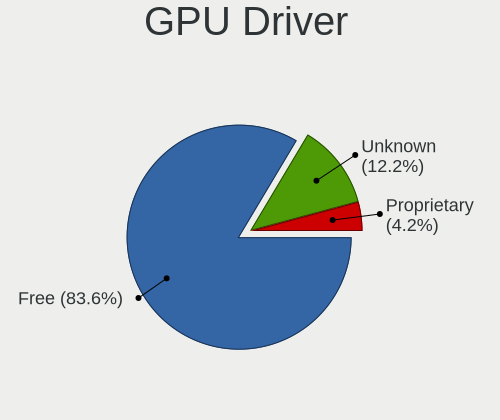

| Driver      | Desktops | Percent |
|-------------|----------|---------|
| Free        | 62       | 72.94%  |
| Unknown     | 19       | 22.35%  |
| Proprietary | 4        | 4.71%   |

GPU Memory
----------

Total video memory

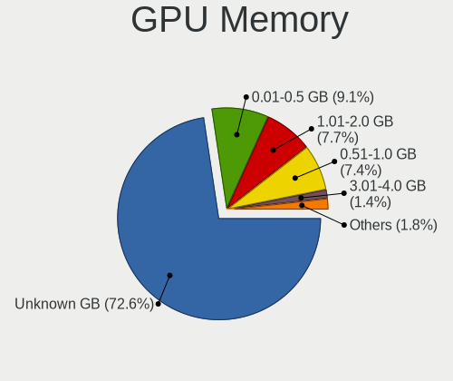

| Size in GB | Desktops | Percent |
|------------|----------|---------|
| Unknown    | 60       | 70.59%  |
| 1.01-2.0   | 10       | 11.76%  |
| 0.01-0.5   | 7        | 8.24%   |
| 0.51-1.0   | 5        | 5.88%   |
| 3.01-4.0   | 2        | 2.35%   |
| 2.01-3.0   | 1        | 1.18%   |

Monitor
-------

Monitor Vendor
--------------

Monitor vendors

| Vendor               | Desktops | Percent |
|----------------------|----------|---------|
| Philips              | 13       | 17.81%  |
| Samsung Electronics  | 11       | 15.07%  |
| ViewSonic            | 10       | 13.7%   |
| Acer                 | 8        | 10.96%  |
| BenQ                 | 7        | 9.59%   |
| AOC                  | 6        | 8.22%   |
| Dell                 | 4        | 5.48%   |
| SGT                  | 3        | 4.11%   |
| Goldstar             | 3        | 4.11%   |
| Hewlett-Packard      | 2        | 2.74%   |
| Sony                 | 1        | 1.37%   |
| Lenovo               | 1        | 1.37%   |
| HUAWEI               | 1        | 1.37%   |
| DOY                  | 1        | 1.37%   |
| CHR                  | 1        | 1.37%   |
| Ancor Communications | 1        | 1.37%   |

Monitor Model
-------------

Monitor models

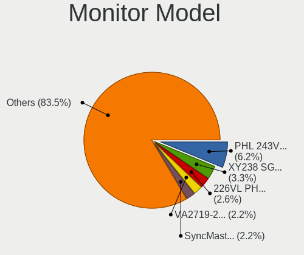

| Model                                                                 | Desktops | Percent |
|-----------------------------------------------------------------------|----------|---------|
| Philips PHL 243V7 PHLC155 1920x1080 527x296mm 23.8-inch               | 7        | 8.86%   |
| ViewSonic VA2719-2K VSC6B34 2560x1440 597x336mm 27.0-inch             | 4        | 5.06%   |
| SGT XY238 SGT2386 1920x1080 530x290mm 23.8-inch                       | 3        | 3.8%    |
| ViewSonic VA2465 SERIES VSCB730 1920x1080 521x293mm 23.5-inch         | 2        | 2.53%   |
| ViewSonic VA2407 Series VSC8C31 1920x1080 521x293mm 23.5-inch         | 2        | 2.53%   |
| Samsung Electronics S24B300 SAM08B3 1920x1080 521x293mm 23.5-inch     | 2        | 2.53%   |
| Samsung Electronics C27R50x SAM0F9D 1920x1080 600x340mm 27.2-inch     | 2        | 2.53%   |
| Philips PHL 240V5 PHLC10A 1920x1080 527x296mm 23.8-inch               | 2        | 2.53%   |
| BenQ FP93E BNQ76D6 1280x1024 376x301mm 19.0-inch                      | 2        | 2.53%   |
| AOC 2470W AOC2470 1920x1080 521x293mm 23.5-inch                       | 2        | 2.53%   |
| Acer SA240Y ACR057F 1920x1080 527x296mm 23.8-inch                     | 2        | 2.53%   |
| ViewSonic VX510 VSC6419 1024x768 304x228mm 15.0-inch                  | 1        | 1.27%   |
| ViewSonic VX2250 SERIES VSCCB25 1920x1080 477x268mm 21.5-inch         | 1        | 1.27%   |
| Sony SDM-S73 SNY2770 1280x1024 359x287mm 18.1-inch                    | 1        | 1.27%   |
| Samsung Electronics SyncMaster SAM0580 1280x1024 376x301mm 19.0-inch  | 1        | 1.27%   |
| Samsung Electronics SyncMaster SAM01B7 1280x1024 338x270mm 17.0-inch  | 1        | 1.27%   |
| Samsung Electronics SMB2030N SAM0634 1600x900 443x249mm 20.0-inch     | 1        | 1.27%   |
| Samsung Electronics SA300/SA350 SAM0795 1920x1080 521x293mm 23.5-inch | 1        | 1.27%   |
| Samsung Electronics S24D300 SAM0B42 1920x1080 531x299mm 24.0-inch     | 1        | 1.27%   |
| Samsung Electronics S24B300 SAM08B4 1920x1080 521x293mm 23.5-inch     | 1        | 1.27%   |
| Samsung Electronics LCD Monitor SAM7085 1920x1200 698x392mm 31.5-inch | 1        | 1.27%   |
| Samsung Electronics LC32G5xT SAM7088 2560x1440 698x393mm 31.5-inch    | 1        | 1.27%   |
| Philips PHL 246V5 PHLC0C5 1920x1080 531x299mm 24.0-inch               | 1        | 1.27%   |
| Philips PHL 241E1 PHLC207 1920x1080 527x296mm 23.8-inch               | 1        | 1.27%   |
| Philips PHL 241B8Q PHL0929 1920x1080 527x296mm 23.8-inch              | 1        | 1.27%   |
| Philips PHL 223V5 PHLC0CF 1920x1080 477x268mm 21.5-inch               | 1        | 1.27%   |
| Philips 226VL PHLC081 1920x1080 480x268mm 21.6-inch                   | 1        | 1.27%   |
| Philips 206VL PHLC08C 1600x900 443x249mm 20.0-inch                    | 1        | 1.27%   |
| Philips 190VL PHLC080 1440x900 408x255mm 18.9-inch                    | 1        | 1.27%   |
| Lenovo S24e-20 LEN62AE 1920x1080 527x296mm 23.8-inch                  | 1        | 1.27%   |
| HUAWEI SSN-24 HWV6E4E 1920x1080 527x296mm 23.8-inch                   | 1        | 1.27%   |
| Hewlett-Packard Z22i HWP308E 1920x1080 477x268mm 21.5-inch            | 1        | 1.27%   |
| Hewlett-Packard LP2065 HWP0A71 1600x1200 408x306mm 20.1-inch          | 1        | 1.27%   |
| Goldstar FULL HD GSM5ABA 1920x1080 480x270mm 21.7-inch                | 1        | 1.27%   |
| Goldstar E2250 GSM578E 1920x1080 477x268mm 21.5-inch                  | 1        | 1.27%   |
| Goldstar 2D HD TV GSM59CA 1366x768 509x286mm 23.0-inch                | 1        | 1.27%   |
| DOY LCD Monitor DOY2760 1920x1080 598x336mm 27.0-inch                 | 1        | 1.27%   |
| Dell U2412M DELA079 1920x1200 518x324mm 24.1-inch                     | 1        | 1.27%   |
| Dell SE2416H DELD082 1920x1080 527x296mm 23.8-inch                    | 1        | 1.27%   |
| Dell S2721DGF DEL41DA 2560x1440 597x336mm 27.0-inch                   | 1        | 1.27%   |

Monitor Resolution
------------------

Monitor screen resolution

| Resolution        | Desktops | Percent |
|-------------------|----------|---------|
| 1920x1080 (FHD)   | 48       | 68.57%  |
| 2560x1440 (QHD)   | 8        | 11.43%  |
| 1280x1024 (SXGA)  | 5        | 7.14%   |
| 1600x900 (HD+)    | 3        | 4.29%   |
| 1920x1200 (WUXGA) | 2        | 2.86%   |
| 3840x2160 (4K)    | 1        | 1.43%   |
| 1600x1200         | 1        | 1.43%   |
| 1440x900 (WXGA+)  | 1        | 1.43%   |
| 1024x768 (XGA)    | 1        | 1.43%   |

Monitor Diagonal
----------------

Diagonal size in inches

| Inches | Desktops | Percent |
|--------|----------|---------|
| 24     | 20       | 26.67%  |
| 23     | 17       | 22.67%  |
| 21     | 12       | 16%     |
| 27     | 10       | 13.33%  |
| 20     | 4        | 5.33%   |
| 19     | 4        | 5.33%   |
| 31     | 3        | 4%      |
| 32     | 1        | 1.33%   |
| 25     | 1        | 1.33%   |
| 18     | 1        | 1.33%   |
| 17     | 1        | 1.33%   |
| 15     | 1        | 1.33%   |

Monitor Width
-------------

Physical width

| Width in mm | Desktops | Percent |
|-------------|----------|---------|
| 501-600     | 43       | 62.32%  |
| 401-500     | 16       | 23.19%  |
| 351-400     | 4        | 5.8%    |
| 601-700     | 3        | 4.35%   |
| 301-350     | 2        | 2.9%    |
| 701-800     | 1        | 1.45%   |

Aspect Ratio
------------

Proportional relationship between the width and the height

| Ratio | Desktops | Percent |
|-------|----------|---------|
| 16/9  | 58       | 84.06%  |
| 5/4   | 5        | 7.25%   |
| 16/10 | 4        | 5.8%    |
| 4/3   | 2        | 2.9%    |

Monitor Area
------------

Area in inch

| Area in inch | Desktops | Percent |
|----------------|----------|---------|
| 201-250        | 42       | 58.33%  |
| 151-200        | 11       | 15.28%  |
| 301-350        | 10       | 13.89%  |
| 351-500        | 4        | 5.56%   |
| 251-300        | 3        | 4.17%   |
| 141-150        | 1        | 1.39%   |
| 101-110        | 1        | 1.39%   |

Pixel Density
-------------

Pixels per inch

| Density | Desktops | Percent |
|---------|----------|---------|
| 51-100  | 47       | 72.31%  |
| 101-120 | 18       | 27.69%  |

Multiple Monitors
-----------------

Total monitors connected

| Total | Desktops | Percent |
|-------|----------|---------|
| 1     | 60       | 67.42%  |
| 0     | 19       | 21.35%  |
| 2     | 10       | 11.24%  |

Network
-------

Net Controller Vendor
---------------------

Controller vendors

| Vendor                | Desktops | Percent |
|-----------------------|----------|---------|
| Realtek Semiconductor | 66       | 62.26%  |
| Intel                 | 22       | 20.75%  |
| Nvidia                | 3        | 2.83%   |
| Broadcom              | 3        | 2.83%   |
| TP-Link               | 2        | 1.89%   |
| Samsung Electronics   | 2        | 1.89%   |
| Mercucys              | 2        | 1.89%   |
| VIA Technologies      | 1        | 0.94%   |
| Ralink Technology     | 1        | 0.94%   |
| Qualcomm Atheros      | 1        | 0.94%   |
| MediaTek              | 1        | 0.94%   |
| Edimax Technology     | 1        | 0.94%   |
| ASIX Electronics      | 1        | 0.94%   |

Net Controller Model
--------------------

Controller models

| Model                                                             | Desktops | Percent |
|-------------------------------------------------------------------|----------|---------|
| Realtek RTL8111/8168/8411 PCI Express Gigabit Ethernet Controller | 57       | 48.72%  |
| Intel Ethernet Connection (14) I219-V                             | 6        | 5.13%   |
| Realtek RTL8125 2.5GbE Controller                                 | 5        | 4.27%   |
| Realtek RTL8821CE 802.11ac PCIe Wireless Network Adapter          | 4        | 3.42%   |
| Realtek RTL8188EUS 802.11n Wireless Network Adapter               | 4        | 3.42%   |
| Intel Ethernet Controller I225-V                                  | 4        | 3.42%   |
| Nvidia MCP61 Ethernet                                             | 3        | 2.56%   |
| Mercucys 802.11n NIC                                              | 2        | 1.71%   |
| Intel Wireless 7265                                               | 2        | 1.71%   |
| Intel Tiger Lake PCH CNVi WiFi                                    | 2        | 1.71%   |
| Intel Ethernet Connection (2) I219-V                              | 2        | 1.71%   |
| VIA VT6105/VT6106S [Rhine-III]                                    | 1        | 0.85%   |
| TP-Link USB 10/100 LAN                                            | 1        | 0.85%   |
| TP-Link TL-WN821N v5/v6 [RTL8192EU]                               | 1        | 0.85%   |
| Samsung GT-I9070 (network tethering, USB debugging enabled)       | 1        | 0.85%   |
| Samsung Galaxy series, misc. (tethering mode)                     | 1        | 0.85%   |
| Realtek RTL8192EE PCIe Wireless Network Adapter                   | 1        | 0.85%   |
| Realtek RTL8192CU 802.11n WLAN Adapter                            | 1        | 0.85%   |
| Realtek RTL8153 Gigabit Ethernet Adapter                          | 1        | 0.85%   |
| Realtek RTL-8100/8101L/8139 PCI Fast Ethernet Adapter             | 1        | 0.85%   |
| Realtek 802.11ac NIC                                              | 1        | 0.85%   |
| Ralink MT7601U Wireless Adapter                                   | 1        | 0.85%   |
| Qualcomm Atheros AR8151 v2.0 Gigabit Ethernet                     | 1        | 0.85%   |
| MediaTek Infinix NOTE 11                                          | 1        | 0.85%   |
| Intel Wireless 3165                                               | 1        | 0.85%   |
| Intel NM10/ICH7 Family LAN Controller                             | 1        | 0.85%   |
| Intel I211 Gigabit Network Connection                             | 1        | 0.85%   |
| Intel Ethernet Connection (7) I219-V                              | 1        | 0.85%   |
| Intel Ethernet Connection (17) I219-V                             | 1        | 0.85%   |
| Intel Ethernet Connection (12) I219-V                             | 1        | 0.85%   |
| Intel 82579LM Gigabit Network Connection (Lewisville)             | 1        | 0.85%   |
| Intel 82574L Gigabit Network Connection                           | 1        | 0.85%   |
| Edimax AC1200 MU-MIMO USB2.0 Adapter                              | 1        | 0.85%   |
| Broadcom NetXtreme BCM5764M Gigabit Ethernet PCIe                 | 1        | 0.85%   |
| Broadcom BCM4352 802.11ac Wireless Network Adapter                | 1        | 0.85%   |
| Broadcom BCM43228 802.11a/b/g/n                                   | 1        | 0.85%   |
| ASIX AX88179 Gigabit Ethernet                                     | 1        | 0.85%   |

Wireless Vendor
---------------

Wireless vendors

| Vendor                | Desktops | Percent |
|-----------------------|----------|---------|
| Realtek Semiconductor | 11       | 47.83%  |
| Intel                 | 5        | 21.74%  |
| Mercucys              | 2        | 8.7%    |
| Broadcom              | 2        | 8.7%    |
| TP-Link               | 1        | 4.35%   |
| Ralink Technology     | 1        | 4.35%   |
| Edimax Technology     | 1        | 4.35%   |

Wireless Model
--------------

Wireless models

| Model                                                    | Desktops | Percent |
|----------------------------------------------------------|----------|---------|
| Realtek RTL8821CE 802.11ac PCIe Wireless Network Adapter | 4        | 17.39%  |
| Realtek RTL8188EUS 802.11n Wireless Network Adapter      | 4        | 17.39%  |
| Mercucys 802.11n NIC                                     | 2        | 8.7%    |
| Intel Wireless 7265                                      | 2        | 8.7%    |
| Intel Tiger Lake PCH CNVi WiFi                           | 2        | 8.7%    |
| TP-Link TL-WN821N v5/v6 [RTL8192EU]                      | 1        | 4.35%   |
| Realtek RTL8192EE PCIe Wireless Network Adapter          | 1        | 4.35%   |
| Realtek RTL8192CU 802.11n WLAN Adapter                   | 1        | 4.35%   |
| Realtek 802.11ac NIC                                     | 1        | 4.35%   |
| Ralink MT7601U Wireless Adapter                          | 1        | 4.35%   |
| Intel Wireless 3165                                      | 1        | 4.35%   |
| Edimax AC1200 MU-MIMO USB2.0 Adapter                     | 1        | 4.35%   |
| Broadcom BCM4352 802.11ac Wireless Network Adapter       | 1        | 4.35%   |
| Broadcom BCM43228 802.11a/b/g/n                          | 1        | 4.35%   |

Ethernet Vendor
---------------

Ethernet vendors

| Vendor                | Desktops | Percent |
|-----------------------|----------|---------|
| Realtek Semiconductor | 61       | 67.03%  |
| Intel                 | 19       | 20.88%  |
| Nvidia                | 3        | 3.3%    |
| Samsung Electronics   | 2        | 2.2%    |
| VIA Technologies      | 1        | 1.1%    |
| TP-Link               | 1        | 1.1%    |
| Qualcomm Atheros      | 1        | 1.1%    |
| MediaTek              | 1        | 1.1%    |
| Broadcom              | 1        | 1.1%    |
| ASIX Electronics      | 1        | 1.1%    |

Ethernet Model
--------------

Ethernet models

| Model                                                             | Desktops | Percent |
|-------------------------------------------------------------------|----------|---------|
| Realtek RTL8111/8168/8411 PCI Express Gigabit Ethernet Controller | 57       | 60.64%  |
| Intel Ethernet Connection (14) I219-V                             | 6        | 6.38%   |
| Realtek RTL8125 2.5GbE Controller                                 | 5        | 5.32%   |
| Intel Ethernet Controller I225-V                                  | 4        | 4.26%   |
| Nvidia MCP61 Ethernet                                             | 3        | 3.19%   |
| Intel Ethernet Connection (2) I219-V                              | 2        | 2.13%   |
| VIA VT6105/VT6106S [Rhine-III]                                    | 1        | 1.06%   |
| TP-Link USB 10/100 LAN                                            | 1        | 1.06%   |
| Samsung GT-I9070 (network tethering, USB debugging enabled)       | 1        | 1.06%   |
| Samsung Galaxy series, misc. (tethering mode)                     | 1        | 1.06%   |
| Realtek RTL8153 Gigabit Ethernet Adapter                          | 1        | 1.06%   |
| Realtek RTL-8100/8101L/8139 PCI Fast Ethernet Adapter             | 1        | 1.06%   |
| Qualcomm Atheros AR8151 v2.0 Gigabit Ethernet                     | 1        | 1.06%   |
| MediaTek Infinix NOTE 11                                          | 1        | 1.06%   |
| Intel NM10/ICH7 Family LAN Controller                             | 1        | 1.06%   |
| Intel I211 Gigabit Network Connection                             | 1        | 1.06%   |
| Intel Ethernet Connection (7) I219-V                              | 1        | 1.06%   |
| Intel Ethernet Connection (17) I219-V                             | 1        | 1.06%   |
| Intel Ethernet Connection (12) I219-V                             | 1        | 1.06%   |
| Intel 82579LM Gigabit Network Connection (Lewisville)             | 1        | 1.06%   |
| Intel 82574L Gigabit Network Connection                           | 1        | 1.06%   |
| Broadcom NetXtreme BCM5764M Gigabit Ethernet PCIe                 | 1        | 1.06%   |
| ASIX AX88179 Gigabit Ethernet                                     | 1        | 1.06%   |

Net Controller Kind
-------------------

Ethernet, WiFi or modem

| Kind     | Desktops | Percent |
|----------|----------|---------|
| Ethernet | 84       | 78.5%   |
| WiFi     | 23       | 21.5%   |

Used Controller
---------------

Currently used network controller

| Kind     | Desktops | Percent |
|----------|----------|---------|
| Ethernet | 80       | 93.02%  |
| WiFi     | 6        | 6.98%   |

NICs
----

Total network controllers on board

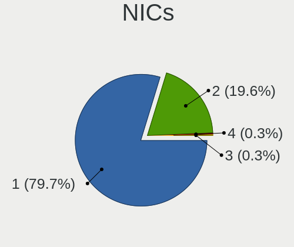

| Total | Desktops | Percent |
|-------|----------|---------|
| 1     | 66       | 77.65%  |
| 2     | 19       | 22.35%  |

IPv6
----

IPv6 vs IPv4

| Used | Desktops | Percent |
|------|----------|---------|
| No   | 84       | 98.82%  |
| Yes  | 1        | 1.18%   |

Bluetooth
---------

Bluetooth Vendor
----------------

Controller vendors

| Vendor                  | Desktops | Percent |
|-------------------------|----------|---------|
| Realtek Semiconductor   | 6        | 37.5%   |
| Intel                   | 5        | 31.25%  |
| Cambridge Silicon Radio | 2        | 12.5%   |
| Broadcom                | 2        | 12.5%   |
| TP-Link                 | 1        | 6.25%   |

Bluetooth Model
---------------

Controller models

| Model                                               | Desktops | Percent |
|-----------------------------------------------------|----------|---------|
| Realtek Bluetooth Radio                             | 6        | 37.5%   |
| Intel Bluetooth wireless interface                  | 3        | 18.75%  |
| Intel AX201 Bluetooth                               | 2        | 12.5%   |
| Cambridge Silicon Radio Bluetooth Dongle (HCI mode) | 2        | 12.5%   |
| TP-Link UB500 Adapter                               | 1        | 6.25%   |
| Broadcom HP Portable Bumble Bee                     | 1        | 6.25%   |
| Broadcom BCM92046DG-CL1ROM Bluetooth 2.1 Adapter    | 1        | 6.25%   |

Sound
-----

Sound Vendor
------------

Sound card vendors

| Vendor              | Desktops | Percent |
|---------------------|----------|---------|
| Intel               | 67       | 63.81%  |
| AMD                 | 20       | 19.05%  |
| Nvidia              | 13       | 12.38%  |
| C-Media Electronics | 2        | 1.9%    |
| Texas Instruments   | 1        | 0.95%   |
| Razer USA           | 1        | 0.95%   |
| Creative Technology | 1        | 0.95%   |

Sound Model
-----------

Sound card models

| Model                                                                      | Desktops | Percent |
|----------------------------------------------------------------------------|----------|---------|
| Intel Audio device                                                         | 20       | 16.67%  |
| Intel 200 Series PCH HD Audio                                              | 11       | 9.17%   |
| Intel 100 Series/C230 Series Chipset Family HD Audio Controller            | 9        | 7.5%    |
| AMD Family 17h/19h HD Audio Controller                                     | 9        | 7.5%    |
| AMD Renoir Radeon High Definition Audio Controller                         | 5        | 4.17%   |
| Intel Comet Lake PCH-V cAVS                                                | 4        | 3.33%   |
| AMD Raven/Raven2/Fenghuang HDMI/DP Audio Controller                        | 4        | 3.33%   |
| Nvidia MCP61 High Definition Audio                                         | 3        | 2.5%    |
| Intel Xeon E3-1200 v3/4th Gen Core Processor HD Audio Controller           | 3        | 2.5%    |
| Intel Tiger Lake-H HD Audio Controller                                     | 3        | 2.5%    |
| Intel Cannon Lake PCH cAVS                                                 | 3        | 2.5%    |
| Intel 82801JI (ICH10 Family) HD Audio Controller                           | 3        | 2.5%    |
| Intel 8 Series/C220 Series Chipset High Definition Audio Controller        | 3        | 2.5%    |
| Intel 6 Series/C200 Series Chipset Family High Definition Audio Controller | 3        | 2.5%    |
| AMD Starship/Matisse HD Audio Controller                                   | 3        | 2.5%    |
| AMD SBx00 Azalia (Intel HDA)                                               | 3        | 2.5%    |
| Nvidia GK208 HDMI/DP Audio Controller                                      | 2        | 1.67%   |
| Intel 7 Series/C216 Chipset Family High Definition Audio Controller        | 2        | 1.67%   |
| Intel 5 Series/3400 Series Chipset High Definition Audio                   | 2        | 1.67%   |
| AMD Baffin HDMI/DP Audio [Radeon RX 550 640SP / RX 560/560X]               | 2        | 1.67%   |
| Texas Instruments PCM2902 Audio Codec                                      | 1        | 0.83%   |
| Razer USA Kraken Tournament Edition                                        | 1        | 0.83%   |
| Nvidia TU116 High Definition Audio Controller                              | 1        | 0.83%   |
| Nvidia TU106 High Definition Audio Controller                              | 1        | 0.83%   |
| Nvidia TU104 HD Audio Controller                                           | 1        | 0.83%   |
| Nvidia High Definition Audio Controller                                    | 1        | 0.83%   |
| Nvidia GP108 High Definition Audio Controller                              | 1        | 0.83%   |
| Nvidia GP106 High Definition Audio Controller                              | 1        | 0.83%   |
| Nvidia GM107 High Definition Audio Controller [GeForce 940MX]              | 1        | 0.83%   |
| Nvidia GK104 HDMI Audio Controller                                         | 1        | 0.83%   |
| Nvidia GF114 HDMI Audio Controller                                         | 1        | 0.83%   |
| Nvidia GF108 High Definition Audio Controller                              | 1        | 0.83%   |
| Intel NM10/ICH7 Family High Definition Audio Controller                    | 1        | 0.83%   |
| Intel Comet Lake PCH cAVS                                                  | 1        | 0.83%   |
| Intel Celeron/Pentium Silver Processor High Definition Audio               | 1        | 0.83%   |
| Intel Alder Lake-S HD Audio Controller                                     | 1        | 0.83%   |
| Creative Technology Sound Blaster Play! 3                                  | 1        | 0.83%   |
| C-Media Electronics USB PnP Sound Device                                   | 1        | 0.83%   |
| C-Media Electronics Audio Adapter (Unitek Y-247A)                          | 1        | 0.83%   |
| AMD RV770 HDMI Audio [Radeon HD 4850/4870]                                 | 1        | 0.83%   |

Memory
------

Memory Vendor
-------------

Memory module vendors

| Vendor              | Desktops | Percent |
|---------------------|----------|---------|
| Crucial             | 16       | 18.18%  |
| Unknown             | 12       | 13.64%  |
| Kingston            | 11       | 12.5%   |
| Foxline             | 8        | 9.09%   |
| Samsung Electronics | 6        | 6.82%   |
| SK hynix            | 5        | 5.68%   |
| Patriot             | 5        | 5.68%   |
| AMD                 | 5        | 5.68%   |
| Unknown             | 4        | 4.55%   |
| Apacer              | 3        | 3.41%   |
| Neo Forza           | 2        | 2.27%   |
| Corsair             | 2        | 2.27%   |
| A-DATA Technology   | 2        | 2.27%   |
| Unknown (ABCD)      | 1        | 1.14%   |
| Unknown (89F7)      | 1        | 1.14%   |
| Qumo                | 1        | 1.14%   |
| Good Wealth         | 1        | 1.14%   |
| Golden Empire       | 1        | 1.14%   |
| Elpida              | 1        | 1.14%   |
| ChangXin Memory     | 1        | 1.14%   |

Memory Model
------------

Memory module models

| Model                                                        | Desktops | Percent |
|--------------------------------------------------------------|----------|---------|
| Foxline RAM FL2666D4U19-8G 8GB DIMM DDR4 2667MT/s            | 4        | 4.44%   |
| Foxline RAM FL2666D4S19-8G 8GB SODIMM DDR4 2667MT/s          | 4        | 4.44%   |
| Unknown                                                      | 4        | 4.44%   |
| AMD RAM R748G2606U2S 8GB DIMM DDR4 3200MT/s                  | 3        | 3.33%   |
| Unknown RAM Module 8GB DIMM DDR4 2667MT/s                    | 2        | 2.22%   |
| Samsung RAM M378A1K43EB2-CWE 8GB DIMM DDR4 3200MT/s          | 2        | 2.22%   |
| Patriot RAM PSD48G266681 8192MB DIMM DDR4 2934MT/s           | 2        | 2.22%   |
| Neo Forza RAM NMUD480E82-2666E 8GB DIMM DDR4 2667MT/s        | 2        | 2.22%   |
| Kingston RAM KHX2666C16/16G 16GB DIMM DDR4 3200MT/s          | 2        | 2.22%   |
| Kingston RAM 99U5734-036.A00G 16GB DIMM DDR4 2667MT/s        | 2        | 2.22%   |
| Crucial RAM CT8G4SFRA32A.C16FG 8GB SODIMM DDR4 3200MT/s      | 2        | 2.22%   |
| Crucial RAM CT8G4DFRA266.C8FP 8GB DIMM DDR4 2666MT/s         | 2        | 2.22%   |
| Crucial RAM CT4G4DFS8213.C8FBD2 4GB DIMM DDR4 2800MT/s       | 2        | 2.22%   |
| Unknown RAM Module 8GB DIMM DDR4 2133MT/s                    | 1        | 1.11%   |
| Unknown RAM Module 4GB DIMM SDRAM                            | 1        | 1.11%   |
| Unknown RAM Module 4GB DIMM DDR 1066MT/s                     | 1        | 1.11%   |
| Unknown RAM Module 4GB DIMM 800MT/s                          | 1        | 1.11%   |
| Unknown RAM Module 4GB DIMM 1333MT/s                         | 1        | 1.11%   |
| Unknown RAM Module 2GB DIMM SDRAM                            | 1        | 1.11%   |
| Unknown RAM Module 2GB DIMM DDR2 800MT/s                     | 1        | 1.11%   |
| Unknown RAM Module 2GB DIMM 400MT/s                          | 1        | 1.11%   |
| Unknown RAM Module 2GB DIMM 1333MT/s                         | 1        | 1.11%   |
| Unknown RAM Module 1GB DIMM SDRAM                            | 1        | 1.11%   |
| Unknown RAM Module 1GB DIMM DDR2 667MT/s                     | 1        | 1.11%   |
| Unknown (ABCD) RAM 123456789012345678 4GB DIMM DDR4 2400MT/s | 1        | 1.11%   |
| Unknown (89F7) RAM Module 8192MB DIMM DDR4 2667MT/s          | 1        | 1.11%   |
| SK hynix RAM HMT451U6MFR8C-PB 4GB DIMM DDR3 1800MT/s         | 1        | 1.11%   |
| SK hynix RAM HMT451U6AFR8C-PB 4GB DIMM DDR3 1600MT/s         | 1        | 1.11%   |
| SK hynix RAM HMT125U7TFR8C-H9 2GB DIMM DDR3 1333MT/s         | 1        | 1.11%   |
| SK hynix RAM HMT112U6TFR8C-H9 1GB DIMM DDR3 1333MT/s         | 1        | 1.11%   |
| SK hynix RAM HMA81GU6CJR8N-XN 8GB DIMM DDR4 3200MT/s         | 1        | 1.11%   |
| Samsung RAM M471B5173QH0-YK0 4GB SODIMM DDR3 1600MT/s        | 1        | 1.11%   |
| Samsung RAM M471A5244CB0-CWE 4GB SODIMM DDR4 3200MT/s        | 1        | 1.11%   |
| Samsung RAM M378B5273DH0-CH9 4096MB DIMM DDR3 2133MT/s       | 1        | 1.11%   |
| Samsung RAM M378B5273DH0 4GB DIMM DDR3 1333MT/s              | 1        | 1.11%   |
| Qumo RAM QUM4U-4G2133KK15 4GB DIMM DDR4 2133MT/s             | 1        | 1.11%   |
| Patriot RAM PSD48G240082 8GB DIMM DDR4 2400MT/s              | 1        | 1.11%   |
| Patriot RAM PSD416G320081 16GB DIMM DDR4 3200MT/s            | 1        | 1.11%   |
| Patriot RAM 3200 C16 Series 16GB DIMM DDR4 3200MT/s          | 1        | 1.11%   |
| Kingston RAM Module 4GB DIMM DDR3 1333MT/s                   | 1        | 1.11%   |

Memory Kind
-----------

Memory module kinds

| Kind    | Desktops | Percent |
|---------|----------|---------|
| DDR4    | 62       | 75.61%  |
| DDR3    | 9        | 10.98%  |
| Unknown | 5        | 6.1%    |
| SDRAM   | 2        | 2.44%   |
| DDR2    | 2        | 2.44%   |
| LPDDR4  | 1        | 1.22%   |
| DDR     | 1        | 1.22%   |

Memory Form Factor
------------------

Physical design of the memory module

| Name   | Desktops | Percent |
|--------|----------|---------|
| DIMM   | 67       | 81.71%  |
| SODIMM | 15       | 18.29%  |

Memory Size
-----------

Memory module size

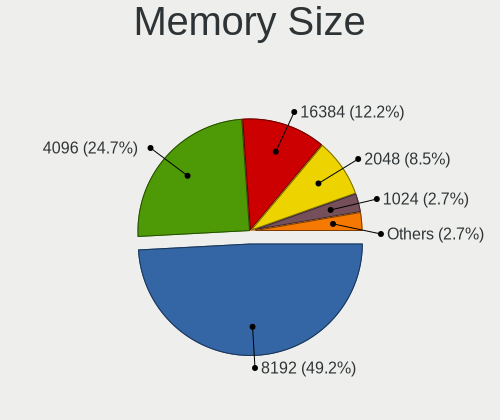

| Size  | Desktops | Percent |
|-------|----------|---------|
| 8192  | 48       | 53.93%  |
| 4096  | 20       | 22.47%  |
| 16384 | 8        | 8.99%   |
| 2048  | 7        | 7.87%   |
| 32768 | 3        | 3.37%   |
| 1024  | 3        | 3.37%   |

Memory Speed
------------

Memory module speed

| Speed   | Desktops | Percent |
|---------|----------|---------|
| 2667    | 23       | 26.74%  |
| 3200    | 19       | 22.09%  |
| 1333    | 8        | 9.3%    |
| 2400    | 5        | 5.81%   |
| 2133    | 5        | 5.81%   |
| 2666    | 3        | 3.49%   |
| 1600    | 3        | 3.49%   |
| 2934    | 2        | 2.33%   |
| 2933    | 2        | 2.33%   |
| 2800    | 2        | 2.33%   |
| 800     | 2        | 2.33%   |
| Unknown | 2        | 2.33%   |
| 3466    | 1        | 1.16%   |
| 3400    | 1        | 1.16%   |
| 3000    | 1        | 1.16%   |
| 2866    | 1        | 1.16%   |
| 2733    | 1        | 1.16%   |
| 1800    | 1        | 1.16%   |
| 1066    | 1        | 1.16%   |
| 667     | 1        | 1.16%   |
| 400     | 1        | 1.16%   |
| 333     | 1        | 1.16%   |

Printers & scanners
-------------------

Printer Vendor
--------------

Printer device vendors

| Vendor | Desktops | Percent |
|--------|----------|---------|
| Pantum | 1        | 100%    |

Printer Model
-------------

Printer device models

| Model                   | Desktops | Percent |
|-------------------------|----------|---------|
| Pantum BM5100ADN series | 1        | 100%    |

Scanner Vendor
--------------

Scanner device vendors

| Vendor          | Desktops | Percent |
|-----------------|----------|---------|
| Canon           | 2        | 66.67%  |
| Hewlett-Packard | 1        | 33.33%  |

Scanner Model
-------------

Scanner device models

| Model                   | Desktops | Percent |
|-------------------------|----------|---------|
| HP ScanJet Pro 2000 s2  | 1        | 33.33%  |
| Canon CanoScan LIDE 25  | 1        | 33.33%  |
| Canon CanoScan LiDE 110 | 1        | 33.33%  |

Camera
------

Camera Vendor
-------------

Camera device vendors

| Vendor                | Desktops | Percent |
|-----------------------|----------|---------|
| SunplusIT             | 5        | 26.32%  |
| Alcor Micro           | 4        | 21.05%  |
| Logitech              | 3        | 15.79%  |
| Realtek Semiconductor | 2        | 10.53%  |
| Creative Technology   | 1        | 5.26%   |
| Chicony Electronics   | 1        | 5.26%   |
| Arkmicro Technologies | 1        | 5.26%   |
| Apple                 | 1        | 5.26%   |
| AlcorMicroCorp        | 1        | 5.26%   |

Camera Model
------------

Camera device models

| Model                                 | Desktops | Percent |
|---------------------------------------|----------|---------|
| SunplusIT USB Camera                  | 5        | 26.32%  |
| Alcor Micro USB 2.0 PC Camera         | 4        | 21.05%  |
| Logitech HD Webcam C615               | 3        | 15.79%  |
| Realtek 1080p Camera                  | 2        | 10.53%  |
| Creative VF0530 Live! Cam Chat IM     | 1        | 5.26%   |
| Chicony HP High Definition 1MP Webcam | 1        | 5.26%   |
| Arkmicro USB2.0 PC CAMERA             | 1        | 5.26%   |
| Apple iPhone5/5C/5S/6                 | 1        | 5.26%   |
| AlcorMicroCorp SHUNCCM                | 1        | 5.26%   |

Security
--------

Fingerprint Vendor
------------------

Fingerprint sensor vendors

Zero info for selected period =(

Fingerprint Model
-----------------

Fingerprint sensor models

Zero info for selected period =(

Chipcard Vendor
---------------

Chipcard module vendors

| Vendor       | Desktops | Percent |
|--------------|----------|---------|
| Aladdin R.D. | 1        | 100%    |

Chipcard Model
--------------

Chipcard module models

| Model                | Desktops | Percent |
|----------------------|----------|---------|
| Aladdin R.D. JaCarta | 1        | 100%    |

Unsupported
-----------

Unsupported Devices
-------------------

Total unsupported devices on board

| Total | Desktops | Percent |
|-------|----------|---------|
| 0     | 65       | 74.71%  |
| 1     | 19       | 21.84%  |
| 4     | 1        | 1.15%   |
| 3     | 1        | 1.15%   |
| 2     | 1        | 1.15%   |

Unsupported Device Types
------------------------

Types of unsupported devices

| Type                     | Desktops | Percent |
|--------------------------|----------|---------|
| Graphics card            | 19       | 67.86%  |
| Communication controller | 3        | 10.71%  |
| Net/wireless             | 2        | 7.14%   |
| Sound                    | 1        | 3.57%   |
| Network                  | 1        | 3.57%   |
| Net/ethernet             | 1        | 3.57%   |
| Chipcard                 | 1        | 3.57%   |

