Red OS - Tested Hardware & Statistics (Notebooks)
-------------------------------------------------

A project to collect tested hardware configurations for Red OS.

Anyone can contribute to this report by the [hw-probe](https://github.com/linuxhw/hw-probe) tool:

    sudo -E hw-probe -all -upload

Please contribute! Especially if your hardware is rare.

Contents
--------

* [ Test Cases ](#test-cases)

* [ System ](#system)
  - [ OS                       ](#os)
  - [ OS Family                ](#os-family)
  - [ Kernel                   ](#kernel)
  - [ Kernel Family            ](#kernel-family)
  - [ Kernel Major Ver.        ](#kernel-major-ver)
  - [ Arch                     ](#arch)
  - [ DE                       ](#de)
  - [ Display Server           ](#display-server)
  - [ Display Manager          ](#display-manager)
  - [ OS Lang                  ](#os-lang)
  - [ Boot Mode                ](#boot-mode)
  - [ Filesystem               ](#filesystem)
  - [ Part. scheme             ](#part-scheme)
  - [ Dual Boot with Linux/BSD ](#dual-boot-with-linuxbsd)
  - [ Dual Boot (Win)          ](#dual-boot-win)

* [ Board ](#board)
  - [ Vendor                   ](#vendor)
  - [ Model                    ](#model)
  - [ Model Family             ](#model-family)
  - [ MFG Year                 ](#mfg-year)
  - [ Form Factor              ](#form-factor)
  - [ Secure Boot              ](#secure-boot)
  - [ Coreboot                 ](#coreboot)
  - [ RAM Size                 ](#ram-size)
  - [ RAM Used                 ](#ram-used)
  - [ Total Drives             ](#total-drives)
  - [ Has CD-ROM               ](#has-cd-rom)
  - [ Has Ethernet             ](#has-ethernet)
  - [ Has WiFi                 ](#has-wifi)
  - [ Has Bluetooth            ](#has-bluetooth)

* [ Location ](#location)
  - [ Country                  ](#country)
  - [ City                     ](#city)

* [ Drives ](#drives)
  - [ Drive Vendor             ](#drive-vendor)
  - [ Drive Model              ](#drive-model)
  - [ HDD Vendor               ](#hdd-vendor)
  - [ SSD Vendor               ](#ssd-vendor)
  - [ Drive Kind               ](#drive-kind)
  - [ Drive Connector          ](#drive-connector)
  - [ Drive Size               ](#drive-size)
  - [ Space Total              ](#space-total)
  - [ Space Used               ](#space-used)
  - [ Malfunc. Drives          ](#malfunc-drives)
  - [ Malfunc. Drive Vendor    ](#malfunc-drive-vendor)
  - [ Malfunc. HDD Vendor      ](#malfunc-hdd-vendor)
  - [ Malfunc. Drive Kind      ](#malfunc-drive-kind)
  - [ Failed Drives            ](#failed-drives)
  - [ Failed Drive Vendor      ](#failed-drive-vendor)
  - [ Drive Status             ](#drive-status)

* [ Storage controller ](#storage-controller)
  - [ Storage Vendor           ](#storage-vendor)
  - [ Storage Model            ](#storage-model)
  - [ Storage Kind             ](#storage-kind)

* [ Processor ](#processor)
  - [ CPU Vendor               ](#cpu-vendor)
  - [ CPU Model                ](#cpu-model)
  - [ CPU Model Family         ](#cpu-model-family)
  - [ CPU Cores                ](#cpu-cores)
  - [ CPU Sockets              ](#cpu-sockets)
  - [ CPU Threads              ](#cpu-threads)
  - [ CPU Op-Modes             ](#cpu-op-modes)
  - [ CPU Microcode            ](#cpu-microcode)
  - [ CPU Microarch            ](#cpu-microarch)

* [ Graphics ](#graphics)
  - [ GPU Vendor               ](#gpu-vendor)
  - [ GPU Model                ](#gpu-model)
  - [ GPU Combo                ](#gpu-combo)
  - [ GPU Driver               ](#gpu-driver)
  - [ GPU Memory               ](#gpu-memory)

* [ Monitor ](#monitor)
  - [ Monitor Vendor           ](#monitor-vendor)
  - [ Monitor Model            ](#monitor-model)
  - [ Monitor Resolution       ](#monitor-resolution)
  - [ Monitor Diagonal         ](#monitor-diagonal)
  - [ Monitor Width            ](#monitor-width)
  - [ Aspect Ratio             ](#aspect-ratio)
  - [ Monitor Area             ](#monitor-area)
  - [ Pixel Density            ](#pixel-density)
  - [ Multiple Monitors        ](#multiple-monitors)

* [ Network ](#network)
  - [ Net Controller Vendor    ](#net-controller-vendor)
  - [ Net Controller Model     ](#net-controller-model)
  - [ Wireless Vendor          ](#wireless-vendor)
  - [ Wireless Model           ](#wireless-model)
  - [ Ethernet Vendor          ](#ethernet-vendor)
  - [ Ethernet Model           ](#ethernet-model)
  - [ Net Controller Kind      ](#net-controller-kind)
  - [ Used Controller          ](#used-controller)
  - [ NICs                     ](#nics)
  - [ IPv6                     ](#ipv6)

* [ Bluetooth ](#bluetooth)
  - [ Bluetooth Vendor         ](#bluetooth-vendor)
  - [ Bluetooth Model          ](#bluetooth-model)

* [ Sound ](#sound)
  - [ Sound Vendor             ](#sound-vendor)
  - [ Sound Model              ](#sound-model)

* [ Memory ](#memory)
  - [ Memory Vendor            ](#memory-vendor)
  - [ Memory Model             ](#memory-model)
  - [ Memory Kind              ](#memory-kind)
  - [ Memory Form Factor       ](#memory-form-factor)
  - [ Memory Size              ](#memory-size)
  - [ Memory Speed             ](#memory-speed)

* [ Printers & scanners ](#printers--scanners)
  - [ Printer Vendor           ](#printer-vendor)
  - [ Printer Model            ](#printer-model)
  - [ Scanner Vendor           ](#scanner-vendor)
  - [ Scanner Model            ](#scanner-model)

* [ Camera ](#camera)
  - [ Camera Vendor            ](#camera-vendor)
  - [ Camera Model             ](#camera-model)

* [ Security ](#security)
  - [ Fingerprint Vendor       ](#fingerprint-vendor)
  - [ Fingerprint Model        ](#fingerprint-model)
  - [ Chipcard Vendor          ](#chipcard-vendor)
  - [ Chipcard Model           ](#chipcard-model)

* [ Unsupported ](#unsupported)
  - [ Unsupported Devices      ](#unsupported-devices)
  - [ Unsupported Device Types ](#unsupported-device-types)

Test Cases
----------

Total: 383

| Vendor        | Model                       | Probe                                                      | Date         |
|---------------|-----------------------------|------------------------------------------------------------|--------------|
| Lenovo        | V130-15IKB 81HN             | [1505b2f652](https://linux-hardware.org/?probe=1505b2f652) | Dec 16, 2025 |
| Lenovo        | ThinkBook 15 G4 ABA 21DL    | [cc682c2aac](https://linux-hardware.org/?probe=cc682c2aac) | Dec 16, 2025 |
| Dell          | Latitude E7270              | [20b809fbe1](https://linux-hardware.org/?probe=20b809fbe1) | Dec 14, 2025 |
| Dell          | Latitude E7270              | [a3b36fd0f4](https://linux-hardware.org/?probe=a3b36fd0f4) | Dec 12, 2025 |
| LTD Delovo... | EVE 14 C414 ES4060EW        | [f20cec0847](https://linux-hardware.org/?probe=f20cec0847) | Dec 12, 2025 |
| Infinix       | Y3 Max                      | [7cc7c0d52f](https://linux-hardware.org/?probe=7cc7c0d52f) | Dec 08, 2025 |
| HP            | 255 G7 Notebook PC          | [a56d0d29fc](https://linux-hardware.org/?probe=a56d0d29fc) | Dec 03, 2025 |
| HP            | 255 G7 Notebook PC          | [2c5e713545](https://linux-hardware.org/?probe=2c5e713545) | Dec 02, 2025 |
| Acer          | Aspire V5-552G              | [08e6c77301](https://linux-hardware.org/?probe=08e6c77301) | Nov 27, 2025 |
| HP            | 255 G7 Notebook PC          | [b82b2eb482](https://linux-hardware.org/?probe=b82b2eb482) | Nov 26, 2025 |
| Lenovo        | ThinkPad L15 Gen 1 20U8S... | [98db0d4c28](https://linux-hardware.org/?probe=98db0d4c28) | Nov 16, 2025 |
| Lenovo        | ThinkBook 15 G4 ABA 21DL    | [6860407bcc](https://linux-hardware.org/?probe=6860407bcc) | Nov 05, 2025 |
| DEXP          | Atlas M15-A5W305            | [1e3a66aca6](https://linux-hardware.org/?probe=1e3a66aca6) | Oct 28, 2025 |
| Dell          | Precision 7560              | [3b00fba8c9](https://linux-hardware.org/?probe=3b00fba8c9) | Oct 27, 2025 |
| Aquarius      | Cmp NS755                   | [7b3657cfa5](https://linux-hardware.org/?probe=7b3657cfa5) | Oct 20, 2025 |
| Lenovo        | IdeaPad L340-17IRH Gamin... | [fbeecc3978](https://linux-hardware.org/?probe=fbeecc3978) | Oct 17, 2025 |
| Lenovo        | ThinkBook 15 G3 ACL 21A4    | [db33dc1d98](https://linux-hardware.org/?probe=db33dc1d98) | Oct 17, 2025 |
| Dell          | Precision 7560              | [3d3f2fd0e6](https://linux-hardware.org/?probe=3d3f2fd0e6) | Oct 16, 2025 |
| ASUSTek       | ROG Zephyrus G15 GA503RS... | [82403ded0f](https://linux-hardware.org/?probe=82403ded0f) | Oct 15, 2025 |
| ASUSTek       | ROG Zephyrus G15 GA503RS... | [d7931673c4](https://linux-hardware.org/?probe=d7931673c4) | Oct 15, 2025 |
| ASUSTek       | VivoBook_ASUSLaptop X170... | [5273419dac](https://linux-hardware.org/?probe=5273419dac) | Oct 14, 2025 |
| ASUSTek       | VivoBook_ASUSLaptop X170... | [cf712a1c3e](https://linux-hardware.org/?probe=cf712a1c3e) | Oct 14, 2025 |
| HONOR         | BMH-WCX9                    | [272c29a6f0](https://linux-hardware.org/?probe=272c29a6f0) | Oct 11, 2025 |
| Dell          | Vostro 5468                 | [6ebb323adc](https://linux-hardware.org/?probe=6ebb323adc) | Oct 10, 2025 |
| Lenovo        | G700 20251                  | [8f2938b8b2](https://linux-hardware.org/?probe=8f2938b8b2) | Oct 10, 2025 |
| Lenovo        | G700 20251                  | [dfa65dc67d](https://linux-hardware.org/?probe=dfa65dc67d) | Oct 09, 2025 |
| Lenovo        | B550 20053                  | [12289a2080](https://linux-hardware.org/?probe=12289a2080) | Oct 01, 2025 |
| Lenovo        | ThinkBook 15 G4 ABA 21DL    | [31ab15ddb2](https://linux-hardware.org/?probe=31ab15ddb2) | Sep 30, 2025 |
| Lenovo        | B550 20053                  | [813e97cec1](https://linux-hardware.org/?probe=813e97cec1) | Sep 30, 2025 |
| Lenovo        | B590 20208                  | [db8a8cbd0c](https://linux-hardware.org/?probe=db8a8cbd0c) | Sep 28, 2025 |
| Lenovo        | B590 20208                  | [c0e320409b](https://linux-hardware.org/?probe=c0e320409b) | Sep 28, 2025 |
| Dell          | Precision 7560              | [a5ff1e8c5f](https://linux-hardware.org/?probe=a5ff1e8c5f) | Sep 26, 2025 |
| ASUSTek       | VivoBook_ASUSLaptop X340... | [58b51e9dbb](https://linux-hardware.org/?probe=58b51e9dbb) | Sep 18, 2025 |
| Lenovo        | ThinkBook 15 G4 ABA 21DL    | [48d0497478](https://linux-hardware.org/?probe=48d0497478) | Sep 16, 2025 |
| Acer          | Aspire A315-21              | [3118b09d3d](https://linux-hardware.org/?probe=3118b09d3d) | Sep 03, 2025 |
| Lenovo        | B590 20206                  | [0931135e97](https://linux-hardware.org/?probe=0931135e97) | Sep 02, 2025 |
| Lenovo        | B590 20206                  | [9b44348ed8](https://linux-hardware.org/?probe=9b44348ed8) | Sep 02, 2025 |
| Dell          | Precision 7560              | [cbb782a558](https://linux-hardware.org/?probe=cbb782a558) | Sep 02, 2025 |
| Lenovo        | ThinkBook 15 G2 ARE 20VG    | [10f618ce11](https://linux-hardware.org/?probe=10f618ce11) | Aug 21, 2025 |
| Lenovo        | ThinkBook 15 G2 ARE 20VG    | [7e87a4666b](https://linux-hardware.org/?probe=7e87a4666b) | Aug 21, 2025 |
| ASUSTek       | Vivobook Go E1504FA_E150... | [3731836d2d](https://linux-hardware.org/?probe=3731836d2d) | Aug 17, 2025 |
| HP            | Pavilion g7                 | [58428ab5a5](https://linux-hardware.org/?probe=58428ab5a5) | Aug 17, 2025 |
| ICL           | S1523 G1R                   | [ddccc2c405](https://linux-hardware.org/?probe=ddccc2c405) | Aug 13, 2025 |
| BESHTAU       | LT1502RU001                 | [b36effc9b6](https://linux-hardware.org/?probe=b36effc9b6) | Aug 08, 2025 |
| Rikor         | MSK 401.1                   | [ce28e3de2d](https://linux-hardware.org/?probe=ce28e3de2d) | Jul 30, 2025 |
| TECNO Mobi... | MEGABOOK K16SDA             | [4b5fbd0ae2](https://linux-hardware.org/?probe=4b5fbd0ae2) | Jul 27, 2025 |
| HP            | 255 G7 Notebook PC          | [2c47c23df3](https://linux-hardware.org/?probe=2c47c23df3) | Jul 24, 2025 |
| Lenovo        | ThinkBook 15 G4 ABA 21DL    | [f9ee6e28b0](https://linux-hardware.org/?probe=f9ee6e28b0) | Jul 22, 2025 |
| Dell          | Precision 7560              | [1ecb96ad6c](https://linux-hardware.org/?probe=1ecb96ad6c) | Jul 21, 2025 |
| ICL           | S1513 G1R                   | [c04f9f624a](https://linux-hardware.org/?probe=c04f9f624a) | Jul 12, 2025 |
| ASUSTek       | VivoBook_ASUSLaptop X160... | [89eb93aca3](https://linux-hardware.org/?probe=89eb93aca3) | Jul 09, 2025 |
| ASUSTek       | VivoBook_ASUSLaptop X170... | [78e418fa3a](https://linux-hardware.org/?probe=78e418fa3a) | Jul 07, 2025 |
| ASUSTek       | VivoBook_ASUSLaptop X170... | [8677b2e1c9](https://linux-hardware.org/?probe=8677b2e1c9) | Jul 07, 2025 |
| Lenovo        | IdeaPad L340-15API 81LW     | [a9f46b2b48](https://linux-hardware.org/?probe=a9f46b2b48) | Jul 03, 2025 |
| Lenovo        | ThinkBook 15 G4 ABA 21DL    | [0b20ca3197](https://linux-hardware.org/?probe=0b20ca3197) | Jun 19, 2025 |
| Dell          | Precision 7560              | [62c16e9624](https://linux-hardware.org/?probe=62c16e9624) | Jun 17, 2025 |
| DEXP          | Atlas M15-I3W302            | [0e59ee973a](https://linux-hardware.org/?probe=0e59ee973a) | Jun 07, 2025 |
| Dell          | Precision 7560              | [e4e171830f](https://linux-hardware.org/?probe=e4e171830f) | Jun 04, 2025 |
| Lenovo        | ThinkPad E15 Gen 4 21E60... | [a22ae723dd](https://linux-hardware.org/?probe=a22ae723dd) | May 29, 2025 |
| Sony          | SVE1713X9RB                 | [6c823f3496](https://linux-hardware.org/?probe=6c823f3496) | May 29, 2025 |
| Dell          | Precision 7560              | [bc289d38fa](https://linux-hardware.org/?probe=bc289d38fa) | May 20, 2025 |
| Lenovo        | ThinkBook 15 G4 ABA 21DL    | [350db3eede](https://linux-hardware.org/?probe=350db3eede) | May 20, 2025 |
| Lenovo        | ThinkPad E14 20RA001LRT     | [64e4e79aa1](https://linux-hardware.org/?probe=64e4e79aa1) | May 09, 2025 |
| Lenovo        | ThinkPad E14 20RA001LRT     | [b6fbc293e2](https://linux-hardware.org/?probe=b6fbc293e2) | May 09, 2025 |
| ASUSTek       | X551MA                      | [0fca4ea7dd](https://linux-hardware.org/?probe=0fca4ea7dd) | Apr 30, 2025 |
| ASUSTek       | VivoBook_ASUSLaptop X160... | [c09dcebb18](https://linux-hardware.org/?probe=c09dcebb18) | Apr 30, 2025 |
| Unknown       | Unknown                     | [334b9581ae](https://linux-hardware.org/?probe=334b9581ae) | Apr 24, 2025 |
| Lenovo        | ThinkBook 15 G4 ABA 21DL    | [abf5a41ef1](https://linux-hardware.org/?probe=abf5a41ef1) | Apr 22, 2025 |
| Lenovo        | ThinkBook 15 G4 ABA 21DL    | [d01c317096](https://linux-hardware.org/?probe=d01c317096) | Apr 19, 2025 |
| Lenovo        | ThinkBook 15 G4 ABA 21DL    | [a9fd4c746d](https://linux-hardware.org/?probe=a9fd4c746d) | Apr 15, 2025 |
| Lenovo        | IdeaPad L340-15API 81LW     | [f5cc057069](https://linux-hardware.org/?probe=f5cc057069) | Apr 14, 2025 |
| HP            | 340S G7 Notebook PC         | [8737216f9a](https://linux-hardware.org/?probe=8737216f9a) | Apr 13, 2025 |
| Lenovo        | IdeaPad 1 15IAU7 82QD       | [ad5c739927](https://linux-hardware.org/?probe=ad5c739927) | Apr 03, 2025 |
| Dell          | Precision M4700             | [fa01dccf62](https://linux-hardware.org/?probe=fa01dccf62) | Mar 31, 2025 |
| Lenovo        | ThinkPad T430 23493V2       | [bd31142ce4](https://linux-hardware.org/?probe=bd31142ce4) | Mar 28, 2025 |
| Lenovo        | ThinkBook 15 G4 IAP 21DJ    | [6f5984f81d](https://linux-hardware.org/?probe=6f5984f81d) | Mar 27, 2025 |
| Lenovo        | ThinkBook 15 G4 ABA 21DL    | [db62b49c07](https://linux-hardware.org/?probe=db62b49c07) | Mar 25, 2025 |
| Dell          | Precision 7560              | [8760bed416](https://linux-hardware.org/?probe=8760bed416) | Mar 24, 2025 |
| HP            | ZBook 15v G5                | [06f56f1212](https://linux-hardware.org/?probe=06f56f1212) | Mar 20, 2025 |
| Dell          | Latitude E6430              | [c2d1c89259](https://linux-hardware.org/?probe=c2d1c89259) | Mar 19, 2025 |
| Dell          | Precision 7560              | [ed6817fd7f](https://linux-hardware.org/?probe=ed6817fd7f) | Mar 18, 2025 |
| Lenovo        | ThinkBook 15 G4 ABA 21DL    | [b99de6ff45](https://linux-hardware.org/?probe=b99de6ff45) | Mar 18, 2025 |
| Sony          | SVE1713X9RB                 | [032a9cc3e6](https://linux-hardware.org/?probe=032a9cc3e6) | Mar 17, 2025 |
| Dell          | Precision M4700             | [b409f7a3ee](https://linux-hardware.org/?probe=b409f7a3ee) | Mar 04, 2025 |
| Lenovo        | ThinkBook 15 G4 ABA 21DL    | [a2b6d9377b](https://linux-hardware.org/?probe=a2b6d9377b) | Mar 04, 2025 |
| Lenovo        | Z50-70 20354                | [87e32a13dd](https://linux-hardware.org/?probe=87e32a13dd) | Feb 24, 2025 |
| HUAWEI        | BOM-WXX9                    | [b8079d129b](https://linux-hardware.org/?probe=b8079d129b) | Feb 24, 2025 |
| Acer          | Aspire A315-59              | [8c5ffd37a2](https://linux-hardware.org/?probe=8c5ffd37a2) | Feb 22, 2025 |
| Lenovo        | G700 20251                  | [bf6ab72f00](https://linux-hardware.org/?probe=bf6ab72f00) | Feb 21, 2025 |
| Lenovo        | V580c 20160                 | [28cf6f13b9](https://linux-hardware.org/?probe=28cf6f13b9) | Feb 20, 2025 |
| Lenovo        | ThinkBook 15 G4 ABA 21DL    | [0b172c7aa6](https://linux-hardware.org/?probe=0b172c7aa6) | Feb 18, 2025 |
| Getac         | S510                        | [da98bd0f49](https://linux-hardware.org/?probe=da98bd0f49) | Feb 17, 2025 |
| Dell          | Precision M4700             | [74c2c3ac52](https://linux-hardware.org/?probe=74c2c3ac52) | Feb 03, 2025 |
| Acer          | Aspire 5742G                | [3c3176f4b0](https://linux-hardware.org/?probe=3c3176f4b0) | Jan 27, 2025 |
| Lenovo        | B590 20206                  | [1b972f4491](https://linux-hardware.org/?probe=1b972f4491) | Jan 22, 2025 |
| Dell          | Precision M4700             | [75131ae38e](https://linux-hardware.org/?probe=75131ae38e) | Jan 21, 2025 |
| Lenovo        | B590 20206                  | [c118a5bc12](https://linux-hardware.org/?probe=c118a5bc12) | Dec 26, 2024 |
| Lenovo        | B590 20206                  | [04580fdd68](https://linux-hardware.org/?probe=04580fdd68) | Dec 26, 2024 |
| Lenovo        | IdeaPad L340-15API 81LW     | [d2b53b04f1](https://linux-hardware.org/?probe=d2b53b04f1) | Dec 24, 2024 |
| HUAWEI        | BoDE-WXX9                   | [e172af52db](https://linux-hardware.org/?probe=e172af52db) | Dec 18, 2024 |
| HUAWEI        | BOM-WXX9                    | [bdfe4e0a02](https://linux-hardware.org/?probe=bdfe4e0a02) | Dec 17, 2024 |
| ASUSTek       | ASUS TUF Gaming A15 FA50... | [a1a92c896a](https://linux-hardware.org/?probe=a1a92c896a) | Dec 16, 2024 |
| Dell          | Precision M4700             | [291ffb667e](https://linux-hardware.org/?probe=291ffb667e) | Dec 11, 2024 |
| HP            | EliteBook 855 G8 Noteboo... | [bcfc822291](https://linux-hardware.org/?probe=bcfc822291) | Dec 10, 2024 |
| Infinix       | INBOOK X3 Plus              | [bcb0b23532](https://linux-hardware.org/?probe=bcb0b23532) | Dec 09, 2024 |
| HP            | 625                         | [a5d254f381](https://linux-hardware.org/?probe=a5d254f381) | Dec 06, 2024 |
| HP            | 250 G8 Notebook PC          | [f97ac5efbf](https://linux-hardware.org/?probe=f97ac5efbf) | Nov 27, 2024 |
| Dell          | Precision M4700             | [554f31582e](https://linux-hardware.org/?probe=554f31582e) | Nov 27, 2024 |
| MSI           | MS-1738                     | [c78d18847a](https://linux-hardware.org/?probe=c78d18847a) | Nov 26, 2024 |
| HP            | ProBook 450 G2              | [46bffb65f4](https://linux-hardware.org/?probe=46bffb65f4) | Nov 26, 2024 |
| HP            | ProBook 450 G2              | [0e1b332ae9](https://linux-hardware.org/?probe=0e1b332ae9) | Nov 25, 2024 |
| HP            | ProBook 450 G2              | [db7205adc1](https://linux-hardware.org/?probe=db7205adc1) | Nov 22, 2024 |
| Unknown       | Unknown                     | [276273e5a4](https://linux-hardware.org/?probe=276273e5a4) | Nov 16, 2024 |
| Graviton      | 23-156P                     | [3b593a068c](https://linux-hardware.org/?probe=3b593a068c) | Nov 05, 2024 |
| Dell          | Inspiron 5770               | [ed13db6ca0](https://linux-hardware.org/?probe=ed13db6ca0) | Nov 05, 2024 |
| Graviton      | 23-156P                     | [2c150d69e6](https://linux-hardware.org/?probe=2c150d69e6) | Nov 05, 2024 |
| Dell          | Precision M4700             | [62d0c61c5b](https://linux-hardware.org/?probe=62d0c61c5b) | Oct 29, 2024 |
| TECNO Mobi... | MEGABOOK T15AA              | [9a28f9ea8b](https://linux-hardware.org/?probe=9a28f9ea8b) | Oct 22, 2024 |
| HUAWEI        | BOM-WXX9                    | [0a8ba0ea9c](https://linux-hardware.org/?probe=0a8ba0ea9c) | Oct 21, 2024 |
| Dell          | Precision M4700             | [4ba30ec7dc](https://linux-hardware.org/?probe=4ba30ec7dc) | Oct 17, 2024 |
| Lenovo        | IdeaPad Slim 5 16IMH9 83... | [c13d606d8d](https://linux-hardware.org/?probe=c13d606d8d) | Oct 14, 2024 |
| Lenovo        | IdeaPad Slim 5 16IMH9 83... | [7c056fd094](https://linux-hardware.org/?probe=7c056fd094) | Oct 14, 2024 |
| ASUSTek       | Vivobook Go E1504FA_E150... | [5d06bad1c1](https://linux-hardware.org/?probe=5d06bad1c1) | Oct 11, 2024 |
| Irbis         | NB656                       | [f54d72ba00](https://linux-hardware.org/?probe=f54d72ba00) | Oct 10, 2024 |
| Getac         | S410G5                      | [98b2b79421](https://linux-hardware.org/?probe=98b2b79421) | Oct 10, 2024 |
| ASUSTek       | VivoBook_ASUSLaptop M160... | [1062107e62](https://linux-hardware.org/?probe=1062107e62) | Sep 28, 2024 |
| Chuwi         | GemiBook Plus               | [de869d366c](https://linux-hardware.org/?probe=de869d366c) | Sep 27, 2024 |
| Dell          | Precision M4700             | [ce3cda2d73](https://linux-hardware.org/?probe=ce3cda2d73) | Sep 20, 2024 |
| HUAWEI        | BOD-WXX9                    | [3bc442585a](https://linux-hardware.org/?probe=3bc442585a) | Sep 20, 2024 |
| HUAWEI        | BOD-WXX9                    | [d62388c6c7](https://linux-hardware.org/?probe=d62388c6c7) | Sep 20, 2024 |
| Dell          | Precision M4700             | [16e80ad11f](https://linux-hardware.org/?probe=16e80ad11f) | Sep 19, 2024 |
| HP            | EliteBook 840 G8 Noteboo... | [261aa65f79](https://linux-hardware.org/?probe=261aa65f79) | Sep 09, 2024 |
| HP            | Laptop 17-by2xxx            | [16058e97f2](https://linux-hardware.org/?probe=16058e97f2) | Sep 08, 2024 |
| HP            | ProBook 450 G2              | [d80c8abc21](https://linux-hardware.org/?probe=d80c8abc21) | Sep 04, 2024 |
| TECNO Mobi... | MEGABOOK T15AA              | [8f22df45e0](https://linux-hardware.org/?probe=8f22df45e0) | Sep 03, 2024 |
| Dell          | Precision M4700             | [9ac18fa798](https://linux-hardware.org/?probe=9ac18fa798) | Sep 03, 2024 |
| Dell          | Precision M4700             | [67120ae7b7](https://linux-hardware.org/?probe=67120ae7b7) | Sep 01, 2024 |
| HP            | ProBook 450 G2              | [1614032def](https://linux-hardware.org/?probe=1614032def) | Aug 30, 2024 |
| DEPO Compu... | DPH610S                     | [cae887ea79](https://linux-hardware.org/?probe=cae887ea79) | Aug 20, 2024 |
| Dell          | Precision M4700             | [e90b829dae](https://linux-hardware.org/?probe=e90b829dae) | Aug 02, 2024 |
| Acer          | Aspire 5742G                | [45def493cd](https://linux-hardware.org/?probe=45def493cd) | Jul 29, 2024 |
| ASUSTek       | N61Jv                       | [641730f2ac](https://linux-hardware.org/?probe=641730f2ac) | Jul 26, 2024 |
| HP            | ProBook 4720s               | [74fd9eee71](https://linux-hardware.org/?probe=74fd9eee71) | Jul 11, 2024 |
| Dell          | Precision M4700             | [d50c6cdb48](https://linux-hardware.org/?probe=d50c6cdb48) | Jul 08, 2024 |
| Dell          | Precision M4700             | [e65decbc74](https://linux-hardware.org/?probe=e65decbc74) | Jun 26, 2024 |
| Lenovo        | IdeaPad Z580                | [3c9898faa1](https://linux-hardware.org/?probe=3c9898faa1) | Jun 20, 2024 |
| Lenovo        | IdeaPad Z580                | [50ac519b75](https://linux-hardware.org/?probe=50ac519b75) | Jun 20, 2024 |
| Dell          | Precision M4700             | [ded8148269](https://linux-hardware.org/?probe=ded8148269) | Jun 20, 2024 |
| Acer          | Aspire A315-42G             | [f63af66df7](https://linux-hardware.org/?probe=f63af66df7) | Jun 17, 2024 |
| ASUSTek       | TUF Gaming FX705DT_FX705... | [21c00a1a7e](https://linux-hardware.org/?probe=21c00a1a7e) | Jun 09, 2024 |
| Lenovo        | G570 20079                  | [a55b57b2d9](https://linux-hardware.org/?probe=a55b57b2d9) | Jun 07, 2024 |
| Toshiba       | Satellite C650              | [b3c1dc0ded](https://linux-hardware.org/?probe=b3c1dc0ded) | May 22, 2024 |
| DEPO Compu... | DPH610S                     | [5c1b9da621](https://linux-hardware.org/?probe=5c1b9da621) | May 16, 2024 |
| Apple         | MacBookPro5,3               | [b8e92a4880](https://linux-hardware.org/?probe=b8e92a4880) | May 12, 2024 |
| HP            | Pavilion Gaming Laptop 1... | [0d046abb98](https://linux-hardware.org/?probe=0d046abb98) | May 11, 2024 |
| Unknown       | Unknown                     | [3c4e207a92](https://linux-hardware.org/?probe=3c4e207a92) | May 09, 2024 |
| Dell          | Precision M4700             | [fa5aa96761](https://linux-hardware.org/?probe=fa5aa96761) | Apr 23, 2024 |
| MACHENIKE     | MACHCREATOR-16              | [03f369c46b](https://linux-hardware.org/?probe=03f369c46b) | Apr 15, 2024 |
| MACHENIKE     | L17A                        | [5bd336609a](https://linux-hardware.org/?probe=5bd336609a) | Apr 10, 2024 |
| Dell          | Precision M4700             | [14e5ad11ff](https://linux-hardware.org/?probe=14e5ad11ff) | Apr 08, 2024 |
| Unknown       | X133                        | [c85c7ccafc](https://linux-hardware.org/?probe=c85c7ccafc) | Apr 05, 2024 |
| Dell          | Precision M4700             | [667558cba6](https://linux-hardware.org/?probe=667558cba6) | Mar 20, 2024 |
| Fujitsu Si... | LIFEBOOK T5010              | [99e6ef98f0](https://linux-hardware.org/?probe=99e6ef98f0) | Mar 14, 2024 |
| Acer          | Extensa 215-33              | [efe3c07386](https://linux-hardware.org/?probe=efe3c07386) | Mar 04, 2024 |
| Acer          | Extensa 215-33              | [0b2c9b5116](https://linux-hardware.org/?probe=0b2c9b5116) | Mar 04, 2024 |
| HP            | EliteBook 2540p             | [f0aab0e0f6](https://linux-hardware.org/?probe=f0aab0e0f6) | Mar 02, 2024 |
| Lenovo        | IdeaPad Gaming 3 15ARH05... | [de96f427a2](https://linux-hardware.org/?probe=de96f427a2) | Mar 02, 2024 |
| Dell          | Precision M4700             | [8e50df0d77](https://linux-hardware.org/?probe=8e50df0d77) | Mar 01, 2024 |
| Dell          | Inspiron 3537               | [e05c7c262b](https://linux-hardware.org/?probe=e05c7c262b) | Mar 01, 2024 |
| ASUSTek       | ROG Zephyrus S17 GX701LX... | [15a8eddc01](https://linux-hardware.org/?probe=15a8eddc01) | Feb 29, 2024 |
| Dell          | Inspiron 3537               | [e76d792669](https://linux-hardware.org/?probe=e76d792669) | Feb 29, 2024 |
| Lenovo        | IdeaPad 1 15IAU7 82QD       | [b6a4906cf3](https://linux-hardware.org/?probe=b6a4906cf3) | Feb 20, 2024 |
| Acer          | Aspire A315-24P             | [96c7b5b101](https://linux-hardware.org/?probe=96c7b5b101) | Feb 15, 2024 |
| Lenovo        | IdeaPad L340-15API 81LW     | [5299dd1826](https://linux-hardware.org/?probe=5299dd1826) | Feb 13, 2024 |
| Dell          | Precision M4700             | [02cfb33222](https://linux-hardware.org/?probe=02cfb33222) | Feb 13, 2024 |
| Infinix       | INBOOK X2 GEN11             | [f1d916474f](https://linux-hardware.org/?probe=f1d916474f) | Feb 12, 2024 |
| Infinix       | INBOOK X2 GEN11             | [43a65f4060](https://linux-hardware.org/?probe=43a65f4060) | Feb 12, 2024 |
| Lenovo        | IdeaPad L340-15API 81LW     | [db2cd07d84](https://linux-hardware.org/?probe=db2cd07d84) | Jan 26, 2024 |
| Lenovo        | IdeaPad L340-15API 81LW     | [ca9e77a64e](https://linux-hardware.org/?probe=ca9e77a64e) | Jan 19, 2024 |
| Acer          | Aspire A315-24P             | [abc7a5352b](https://linux-hardware.org/?probe=abc7a5352b) | Jan 14, 2024 |
| Acer          | Aspire A315-24P             | [166d3493a4](https://linux-hardware.org/?probe=166d3493a4) | Jan 14, 2024 |
| Lenovo        | IdeaPad L340-15API 81LW     | [04855eeea8](https://linux-hardware.org/?probe=04855eeea8) | Jan 09, 2024 |
| Acer          | Extensa 215-22              | [c2884d7a5d](https://linux-hardware.org/?probe=c2884d7a5d) | Jan 09, 2024 |
| Lenovo        | ThinkPad T61 6464WM6        | [a0b959c7c4](https://linux-hardware.org/?probe=a0b959c7c4) | Jan 05, 2024 |
| Lenovo        | ThinkPad T61 6464WM6        | [3cf7d0764e](https://linux-hardware.org/?probe=3cf7d0764e) | Jan 05, 2024 |
| Lenovo        | ThinkPad T430 23493V2       | [8cbff5c75a](https://linux-hardware.org/?probe=8cbff5c75a) | Jan 02, 2024 |
| KVADRA        | NAU LE15T                   | [b53fe7cc28](https://linux-hardware.org/?probe=b53fe7cc28) | Jan 02, 2024 |
| ASUSTek       | TUF Gaming FX705DT_FX705... | [c71368b0eb](https://linux-hardware.org/?probe=c71368b0eb) | Jan 01, 2024 |
| iRU           | 15ALC                       | [28f7177799](https://linux-hardware.org/?probe=28f7177799) | Dec 22, 2023 |
| Dell          | Precision M4700             | [3048d06ee6](https://linux-hardware.org/?probe=3048d06ee6) | Dec 21, 2023 |
| Lenovo        | V15 G1 IML 82NB             | [90d82dc1a1](https://linux-hardware.org/?probe=90d82dc1a1) | Dec 18, 2023 |
| Lenovo        | IdeaPad L340-15API 81LW     | [c4aead03a2](https://linux-hardware.org/?probe=c4aead03a2) | Dec 13, 2023 |
| Lenovo        | V15 G2 ALC 82KD             | [02763925e5](https://linux-hardware.org/?probe=02763925e5) | Dec 08, 2023 |
| Lenovo        | IdeaPad L340-15API 81LW     | [3b62534051](https://linux-hardware.org/?probe=3b62534051) | Nov 29, 2023 |
| Lenovo        | ThinkPad X230 23245C8       | [bf518076d5](https://linux-hardware.org/?probe=bf518076d5) | Nov 29, 2023 |
| Dell          | Vostro 3590                 | [8ca5eb4e42](https://linux-hardware.org/?probe=8ca5eb4e42) | Nov 27, 2023 |
| Lenovo        | ThinkPad T460s 20FAS1TQ0... | [5586688561](https://linux-hardware.org/?probe=5586688561) | Nov 21, 2023 |
| HP            | EliteBook 850 G1            | [7d7599e0d0](https://linux-hardware.org/?probe=7d7599e0d0) | Nov 21, 2023 |
| HUAWEI        | NDZ-WXX9                    | [95caa4b8a1](https://linux-hardware.org/?probe=95caa4b8a1) | Nov 21, 2023 |
| HUAWEI        | NDZ-WXX9                    | [0324427380](https://linux-hardware.org/?probe=0324427380) | Nov 21, 2023 |
| Lenovo        | IdeaPad L340-15API 81LW     | [9dbd54affc](https://linux-hardware.org/?probe=9dbd54affc) | Nov 14, 2023 |
| ASUSTek       | K53SC                       | [e86d8effd9](https://linux-hardware.org/?probe=e86d8effd9) | Nov 11, 2023 |
| Dell          | Precision M4700             | [ab52e67d9d](https://linux-hardware.org/?probe=ab52e67d9d) | Nov 01, 2023 |
| HP            | Pavilion dv6                | [d8a8dfefd7](https://linux-hardware.org/?probe=d8a8dfefd7) | Oct 24, 2023 |
| Dell          | Precision M4700             | [4d590a378f](https://linux-hardware.org/?probe=4d590a378f) | Oct 24, 2023 |
| Lenovo        | IdeaPad L340-15API 81LW     | [41dfd82cb6](https://linux-hardware.org/?probe=41dfd82cb6) | Oct 23, 2023 |
| HP            | Pavilion dv6                | [71c2062cbf](https://linux-hardware.org/?probe=71c2062cbf) | Oct 22, 2023 |
| Graviton      | Unknown                     | [69c721a100](https://linux-hardware.org/?probe=69c721a100) | Oct 10, 2023 |
| HP            | Laptop 15-bw0xx             | [4440996d7b](https://linux-hardware.org/?probe=4440996d7b) | Oct 07, 2023 |
| HP            | Laptop 15-bw0xx             | [7774477854](https://linux-hardware.org/?probe=7774477854) | Oct 07, 2023 |
| HUAWEI        | BDZ-WXX9                    | [a33a848e40](https://linux-hardware.org/?probe=a33a848e40) | Sep 26, 2023 |
| Lenovo        | IdeaPad L340-15API 81LW     | [b85adec006](https://linux-hardware.org/?probe=b85adec006) | Sep 25, 2023 |
| iRU           | 15ALC                       | [c5839fb7da](https://linux-hardware.org/?probe=c5839fb7da) | Sep 17, 2023 |
| iRU           | 15ALC                       | [87679b8dc1](https://linux-hardware.org/?probe=87679b8dc1) | Sep 17, 2023 |
| HP            | ProBook 6570b               | [baf81a81a2](https://linux-hardware.org/?probe=baf81a81a2) | Sep 13, 2023 |
| HP            | ProBook 6570b               | [90aaacf4af](https://linux-hardware.org/?probe=90aaacf4af) | Sep 13, 2023 |
| ASUSTek       | VivoBook_ASUSLaptop X513... | [006062545f](https://linux-hardware.org/?probe=006062545f) | Sep 13, 2023 |
| HP            | Laptop 15s-fq2xxx           | [2135954523](https://linux-hardware.org/?probe=2135954523) | Sep 04, 2023 |
| HP            | 250 15.6 inch G9 Noteboo... | [7c560dfe57](https://linux-hardware.org/?probe=7c560dfe57) | Aug 31, 2023 |
| ICL           | S1511 G1R                   | [421df1df8d](https://linux-hardware.org/?probe=421df1df8d) | Aug 28, 2023 |
| Lenovo        | ThinkBook 15 G3 ACL 21A4    | [a3a1e805b2](https://linux-hardware.org/?probe=a3a1e805b2) | Aug 27, 2023 |
| Lenovo        | ThinkPad E15 Gen 4 21E60... | [cfe21994b6](https://linux-hardware.org/?probe=cfe21994b6) | Aug 17, 2023 |
| Lenovo        | IdeaPad L340-15API 81LW     | [7d63566e0a](https://linux-hardware.org/?probe=7d63566e0a) | Aug 11, 2023 |
| Dell          | Precision M4700             | [95ac580b0d](https://linux-hardware.org/?probe=95ac580b0d) | Aug 08, 2023 |
| MSI           | Modern 14 C12M              | [aa352b05aa](https://linux-hardware.org/?probe=aa352b05aa) | Aug 03, 2023 |
| Timi          | Redmi Book Pro 15 2022      | [8a2a5c6265](https://linux-hardware.org/?probe=8a2a5c6265) | Jul 30, 2023 |
| Dell          | Vostro 3400                 | [ee71316b5e](https://linux-hardware.org/?probe=ee71316b5e) | Jul 17, 2023 |
| Gigabyte      | G5 ME                       | [eaefa9c2c6](https://linux-hardware.org/?probe=eaefa9c2c6) | Jul 17, 2023 |
| Dell          | Precision M4700             | [7dc84c10b5](https://linux-hardware.org/?probe=7dc84c10b5) | Jul 11, 2023 |
| Dell          | Inspiron 3583               | [3f5ae451c0](https://linux-hardware.org/?probe=3f5ae451c0) | Jul 09, 2023 |
| Timi          | Redmi G 2022                | [30e96afcdd](https://linux-hardware.org/?probe=30e96afcdd) | Jul 08, 2023 |
| Timi          | Redmi G 2022                | [cd2b7e13ce](https://linux-hardware.org/?probe=cd2b7e13ce) | Jul 04, 2023 |
| ICL           | Si1407                      | [c4c9d43042](https://linux-hardware.org/?probe=c4c9d43042) | Jul 04, 2023 |
| Aquarius      | NS483                       | [dd5daf7f12](https://linux-hardware.org/?probe=dd5daf7f12) | Jun 18, 2023 |
| HP            | Laptop 15-bw0xx             | [a161ef52b4](https://linux-hardware.org/?probe=a161ef52b4) | Jun 18, 2023 |
| Lenovo        | G570 20079                  | [4843789a62](https://linux-hardware.org/?probe=4843789a62) | May 30, 2023 |
| Acer          | Aspire A315-58              | [59d36ef46d](https://linux-hardware.org/?probe=59d36ef46d) | May 22, 2023 |
| HP            | EliteBook 8440p             | [3ad250d762](https://linux-hardware.org/?probe=3ad250d762) | May 22, 2023 |
| MSI           | GL62 6QF                    | [6ae5c650f3](https://linux-hardware.org/?probe=6ae5c650f3) | May 14, 2023 |
| HP            | Pavilion Laptop 15-eh1xx... | [3de097b441](https://linux-hardware.org/?probe=3de097b441) | May 12, 2023 |
| Dell          | Vostro 5391                 | [f5342b41ec](https://linux-hardware.org/?probe=f5342b41ec) | May 06, 2023 |
| Graviton      | N14I-T                      | [e82c8f00d8](https://linux-hardware.org/?probe=e82c8f00d8) | May 05, 2023 |
| Lenovo        | IdeaPad L340-15API 81LW     | [a61a9a88bc](https://linux-hardware.org/?probe=a61a9a88bc) | May 02, 2023 |
| Lenovo        | ThinkBook 15 G2 ITL 20VE    | [8f8a912636](https://linux-hardware.org/?probe=8f8a912636) | May 01, 2023 |
| HP            | Laptop 15-bw0xx             | [387eecc18e](https://linux-hardware.org/?probe=387eecc18e) | Apr 27, 2023 |
| HP            | ProBook 440 G8 Notebook ... | [40aaf19667](https://linux-hardware.org/?probe=40aaf19667) | Apr 21, 2023 |
| Unknown       | Unknown                     | [c959a62e36](https://linux-hardware.org/?probe=c959a62e36) | Apr 10, 2023 |
| HONOR         | BMH-WCX9                    | [2082d3c772](https://linux-hardware.org/?probe=2082d3c772) | Apr 08, 2023 |
| Unknown       | Unknown                     | [70ff15284b](https://linux-hardware.org/?probe=70ff15284b) | Apr 07, 2023 |
| Unknown       | Unknown                     | [9a068872f6](https://linux-hardware.org/?probe=9a068872f6) | Apr 06, 2023 |
| HP            | ProBook 4525s               | [164d8993b4](https://linux-hardware.org/?probe=164d8993b4) | Apr 04, 2023 |
| MSI           | Sword 15 A12UE              | [3389b32105](https://linux-hardware.org/?probe=3389b32105) | Apr 01, 2023 |
| Lenovo        | IdeaPad L340-15API 81LW     | [36b3103f3f](https://linux-hardware.org/?probe=36b3103f3f) | Mar 31, 2023 |
| Lenovo        | IdeaPad 1 15ALC7 82R4       | [deb6990c19](https://linux-hardware.org/?probe=deb6990c19) | Mar 27, 2023 |
| HONOR         | NBR-WAX9                    | [ef91ef3645](https://linux-hardware.org/?probe=ef91ef3645) | Mar 27, 2023 |
| MSI           | Modern 15 B12M              | [eded7b36b1](https://linux-hardware.org/?probe=eded7b36b1) | Mar 27, 2023 |
| MSI           | Modern 15 B12M              | [9ee3ca41c8](https://linux-hardware.org/?probe=9ee3ca41c8) | Mar 27, 2023 |
| MSI           | Sword 15 A12UE              | [f4341a491a](https://linux-hardware.org/?probe=f4341a491a) | Mar 21, 2023 |
| Lenovo        | IdeaPad L340-15API 81LW     | [be9b767d92](https://linux-hardware.org/?probe=be9b767d92) | Mar 20, 2023 |
| Lenovo        | ThinkPad T14 Gen 3 21AJS... | [b473b68faf](https://linux-hardware.org/?probe=b473b68faf) | Mar 10, 2023 |
| Lenovo        | ThinkPad T14 Gen 3 21AJS... | [4a8589fbdf](https://linux-hardware.org/?probe=4a8589fbdf) | Mar 10, 2023 |
| Lenovo        | IdeaPad 330-15ARR 81D2      | [b116afe451](https://linux-hardware.org/?probe=b116afe451) | Feb 27, 2023 |
| Kraftway      | ACCORD                      | [8fe15f2f2b](https://linux-hardware.org/?probe=8fe15f2f2b) | Feb 22, 2023 |
| Lenovo        | B590 20208                  | [10e9491ee4](https://linux-hardware.org/?probe=10e9491ee4) | Feb 17, 2023 |
| Lenovo        | B590 20208                  | [a3b352975c](https://linux-hardware.org/?probe=a3b352975c) | Feb 17, 2023 |
| Lenovo        | IdeaPad L340-15API 81LW     | [4d9144193f](https://linux-hardware.org/?probe=4d9144193f) | Feb 17, 2023 |
| Lenovo        | ThinkBook 15 G2 ARE 20VG    | [9de0373acc](https://linux-hardware.org/?probe=9de0373acc) | Feb 16, 2023 |
| Lenovo        | IdeaPad L340-15API 81LW     | [09073fcfc8](https://linux-hardware.org/?probe=09073fcfc8) | Feb 10, 2023 |
| HP            | G62                         | [8bc9454fb1](https://linux-hardware.org/?probe=8bc9454fb1) | Feb 10, 2023 |
| Lenovo        | IdeaPad L340-15API 81LW     | [d3b63de821](https://linux-hardware.org/?probe=d3b63de821) | Feb 07, 2023 |
| Lenovo        | IdeaPad 5 15ARE05 81YQ      | [a2172caf56](https://linux-hardware.org/?probe=a2172caf56) | Feb 06, 2023 |
| Lenovo        | IdeaPad 5 15ARE05 81YQ      | [77faeb6b52](https://linux-hardware.org/?probe=77faeb6b52) | Feb 06, 2023 |
| HP            | Pavilion 15                 | [eb37d7677c](https://linux-hardware.org/?probe=eb37d7677c) | Feb 06, 2023 |
| Lenovo        | IdeaPad L340-15API 81LW     | [bb0481d7a8](https://linux-hardware.org/?probe=bb0481d7a8) | Feb 06, 2023 |
| Lenovo        | IdeaPad L340-15API 81LW     | [186aef8e0c](https://linux-hardware.org/?probe=186aef8e0c) | Jan 24, 2023 |
| Lenovo        | V130-15IKB 81HN             | [a74a5b3b7b](https://linux-hardware.org/?probe=a74a5b3b7b) | Jan 20, 2023 |
| Lenovo        | IdeaPad L340-15API 81LW     | [8472d89767](https://linux-hardware.org/?probe=8472d89767) | Jan 20, 2023 |
| Lenovo        | IdeaPad L340-15API 81LW     | [7d95709d81](https://linux-hardware.org/?probe=7d95709d81) | Jan 19, 2023 |
| HP            | Pavilion Laptop 15-eh1xx... | [b6e4100bc6](https://linux-hardware.org/?probe=b6e4100bc6) | Jan 17, 2023 |
| Lenovo        | IdeaPad L340-15API 81LW     | [a05251fd39](https://linux-hardware.org/?probe=a05251fd39) | Dec 29, 2022 |
| 3Logic Gro... | Graviton N15i-K2            | [fe79eba13b](https://linux-hardware.org/?probe=fe79eba13b) | Dec 29, 2022 |
| HP            | Notebook                    | [10dfda9549](https://linux-hardware.org/?probe=10dfda9549) | Dec 24, 2022 |
| Lenovo        | ThinkPad E15 Gen 4 21E60... | [4c1ad2ea2e](https://linux-hardware.org/?probe=4c1ad2ea2e) | Dec 18, 2022 |
| Kraftway      | ACCORD                      | [a199d930ff](https://linux-hardware.org/?probe=a199d930ff) | Dec 18, 2022 |
| Shanghai Z... | ZXE CRB                     | [20ce0a7f23](https://linux-hardware.org/?probe=20ce0a7f23) | Dec 16, 2022 |
| Lenovo        | IdeaPad L340-15API 81LW     | [6cedae9702](https://linux-hardware.org/?probe=6cedae9702) | Dec 10, 2022 |
| Lenovo        | IdeaPad L340-15API 81LW     | [311f47baef](https://linux-hardware.org/?probe=311f47baef) | Dec 09, 2022 |
| HP            | Laptop 15s-eq1xxx           | [79a0f9e73a](https://linux-hardware.org/?probe=79a0f9e73a) | Dec 08, 2022 |
| HP            | Laptop 15s-eq1xxx           | [c1cd524970](https://linux-hardware.org/?probe=c1cd524970) | Dec 08, 2022 |
| Aquarius      | NS685U R11                  | [c0dff8c525](https://linux-hardware.org/?probe=c0dff8c525) | Dec 08, 2022 |
| ICL           | RAYbook Si1512              | [b8c52ae5cb](https://linux-hardware.org/?probe=b8c52ae5cb) | Dec 06, 2022 |
| HP            | Laptop 15s-eq1xxx           | [0cd3371014](https://linux-hardware.org/?probe=0cd3371014) | Dec 05, 2022 |
| MSI           | Sword 15 A12UE              | [32df733b5e](https://linux-hardware.org/?probe=32df733b5e) | Dec 04, 2022 |
| Lenovo        | IdeaPad L340-15API 81LW     | [ddb1791ff6](https://linux-hardware.org/?probe=ddb1791ff6) | Nov 28, 2022 |
| Lenovo        | IdeaPad 700-15ISK 80RU      | [d9ae3d1795](https://linux-hardware.org/?probe=d9ae3d1795) | Nov 27, 2022 |
| Lenovo        | IdeaPad L340-15API 81LW     | [ff3d0a1ecf](https://linux-hardware.org/?probe=ff3d0a1ecf) | Nov 24, 2022 |
| Lenovo        | IdeaPad L340-15API 81LW     | [f86569d54b](https://linux-hardware.org/?probe=f86569d54b) | Nov 24, 2022 |
| HUAWEI        | NBD-WXX9                    | [a54f42b51e](https://linux-hardware.org/?probe=a54f42b51e) | Nov 18, 2022 |
| HUAWEI        | NBD-WXX9                    | [faa0deab8f](https://linux-hardware.org/?probe=faa0deab8f) | Nov 18, 2022 |
| Lenovo        | ThinkPad X220 4290RB3       | [37959973aa](https://linux-hardware.org/?probe=37959973aa) | Nov 11, 2022 |
| Lenovo        | IdeaPad L340-15API 81LW     | [3fd33e6782](https://linux-hardware.org/?probe=3fd33e6782) | Nov 09, 2022 |
| Lenovo        | IdeaPad L340-15API 81LW     | [dba14315ca](https://linux-hardware.org/?probe=dba14315ca) | Nov 03, 2022 |
| Lenovo        | IdeaPad L340-15API 81LW     | [d653658a53](https://linux-hardware.org/?probe=d653658a53) | Oct 28, 2022 |
| Lenovo        | IdeaPad L340-15API 81LW     | [b9ab6b9cf2](https://linux-hardware.org/?probe=b9ab6b9cf2) | Oct 28, 2022 |
| Acer          | Aspire A517-52              | [1ee47a3ab6](https://linux-hardware.org/?probe=1ee47a3ab6) | Oct 25, 2022 |
| Lenovo        | IdeaPad 5 Pro 14ACN6 82L... | [14537f243b](https://linux-hardware.org/?probe=14537f243b) | Oct 24, 2022 |
| THUNDEROBO... | 911AirD                     | [f471a1c9db](https://linux-hardware.org/?probe=f471a1c9db) | Oct 23, 2022 |
| Acer          | Aspire A517-52              | [7515d53b5d](https://linux-hardware.org/?probe=7515d53b5d) | Oct 21, 2022 |
| Lenovo        | IdeaPad L340-15API 81LW     | [3fc175d4a0](https://linux-hardware.org/?probe=3fc175d4a0) | Oct 20, 2022 |
| Lenovo        | ThinkBook 15 G3 ACL 21A4    | [fe184c8f5b](https://linux-hardware.org/?probe=fe184c8f5b) | Oct 19, 2022 |
| Lenovo        | ThinkBook 15 G3 ACL 21A4    | [0db79bc085](https://linux-hardware.org/?probe=0db79bc085) | Oct 19, 2022 |
| Lenovo        | IdeaPad L340-15API 81LW     | [1cdde90662](https://linux-hardware.org/?probe=1cdde90662) | Oct 13, 2022 |
| Acer          | Aspire 2920                 | [c588bacc95](https://linux-hardware.org/?probe=c588bacc95) | Oct 08, 2022 |
| Acer          | Aspire 2920                 | [34b41a4e67](https://linux-hardware.org/?probe=34b41a4e67) | Oct 08, 2022 |
| ASUSTek       | X540NV                      | [31e4464fea](https://linux-hardware.org/?probe=31e4464fea) | Oct 07, 2022 |
| Lenovo        | IdeaPad L340-15API 81LW     | [7f8e650618](https://linux-hardware.org/?probe=7f8e650618) | Oct 06, 2022 |
| Acer          | Aspire 2920                 | [538f7a6e26](https://linux-hardware.org/?probe=538f7a6e26) | Oct 05, 2022 |
| HP            | OMEN by Laptop              | [0a8238a876](https://linux-hardware.org/?probe=0a8238a876) | Oct 05, 2022 |
| THUNDEROBO... | 911AirD                     | [69a9650652](https://linux-hardware.org/?probe=69a9650652) | Oct 03, 2022 |
| Lenovo        | IdeaPad L340-15API 81LW     | [89b48cd98e](https://linux-hardware.org/?probe=89b48cd98e) | Oct 03, 2022 |
| Digma         | EVE 11 C408                 | [b5c7ac8ed3](https://linux-hardware.org/?probe=b5c7ac8ed3) | Sep 30, 2022 |
| THUNDEROBO... | 911AirD                     | [99f1b7e253](https://linux-hardware.org/?probe=99f1b7e253) | Sep 29, 2022 |
| ICL           | RAYbook Si1512              | [0b610b66a9](https://linux-hardware.org/?probe=0b610b66a9) | Sep 20, 2022 |
| Lenovo        | IdeaPad L340-15API 81LW     | [713797403a](https://linux-hardware.org/?probe=713797403a) | Sep 09, 2022 |
| IP3 Techno... | ACN30                       | [af9694cea8](https://linux-hardware.org/?probe=af9694cea8) | Sep 06, 2022 |
| IP3 Techno... | ACN30                       | [03f14a115d](https://linux-hardware.org/?probe=03f14a115d) | Sep 05, 2022 |
| MSI           | FX610                       | [a822818a58](https://linux-hardware.org/?probe=a822818a58) | Sep 03, 2022 |
| IP3 Techno... | ACN30                       | [e25ed534c0](https://linux-hardware.org/?probe=e25ed534c0) | Aug 18, 2022 |
| ICL           | RAYbook Si1512              | [a42c4dc65a](https://linux-hardware.org/?probe=a42c4dc65a) | Aug 09, 2022 |
| Digma         | EVE 15 P417 ES5063EW        | [a584c678b5](https://linux-hardware.org/?probe=a584c678b5) | Jul 27, 2022 |
| Digma         | EVE 15 C407 ES5054EW        | [4fd01756b2](https://linux-hardware.org/?probe=4fd01756b2) | Jul 27, 2022 |
| Digma         | EVE 15 C407 ES5054EW        | [008b02cc92](https://linux-hardware.org/?probe=008b02cc92) | Jul 26, 2022 |
| Lenovo        | IdeaPad 5 Pro 14ACN6 82L... | [413949a727](https://linux-hardware.org/?probe=413949a727) | Jul 25, 2022 |
| Lenovo        | V15-IWL 81YE                | [3bfcedd5c8](https://linux-hardware.org/?probe=3bfcedd5c8) | Jul 22, 2022 |
| Lenovo        | V15-IWL 81YE                | [c49282206c](https://linux-hardware.org/?probe=c49282206c) | Jul 22, 2022 |
| Lenovo        | V15-IWL 81YE                | [d598c4587d](https://linux-hardware.org/?probe=d598c4587d) | Jul 22, 2022 |
| Lenovo        | V15-IWL 81YE                | [5b1e962751](https://linux-hardware.org/?probe=5b1e962751) | Jul 22, 2022 |
| Lenovo        | V15-IWL 81YE                | [4e120b3b63](https://linux-hardware.org/?probe=4e120b3b63) | Jul 22, 2022 |
| Lenovo        | V15-IWL 81YE                | [2d5bedf224](https://linux-hardware.org/?probe=2d5bedf224) | Jul 22, 2022 |
| Lenovo        | V15-IWL 81YE                | [297ce5144e](https://linux-hardware.org/?probe=297ce5144e) | Jul 22, 2022 |
| Lenovo        | V15-IWL 81YE                | [84b7cd1115](https://linux-hardware.org/?probe=84b7cd1115) | Jul 22, 2022 |
| Lenovo        | V15-IWL 81YE                | [a92b6c5d73](https://linux-hardware.org/?probe=a92b6c5d73) | Jul 22, 2022 |
| Lenovo        | V15-IWL 81YE                | [51ebd271c8](https://linux-hardware.org/?probe=51ebd271c8) | Jul 22, 2022 |
| Lenovo        | V15-IWL 81YE                | [44ad7f7d47](https://linux-hardware.org/?probe=44ad7f7d47) | Jul 22, 2022 |
| Lenovo        | V15-IWL 81YE                | [49068a26b5](https://linux-hardware.org/?probe=49068a26b5) | Jul 22, 2022 |
| Lenovo        | V15-IWL 81YE                | [62ce596bf3](https://linux-hardware.org/?probe=62ce596bf3) | Jul 22, 2022 |
| Lenovo        | V15-IWL 81YE                | [812db8ad6f](https://linux-hardware.org/?probe=812db8ad6f) | Jul 22, 2022 |
| Lenovo        | V15-IWL 81YE                | [d4c2b5ffad](https://linux-hardware.org/?probe=d4c2b5ffad) | Jul 22, 2022 |
| Lenovo        | V15-IWL 81YE                | [4c0179b60e](https://linux-hardware.org/?probe=4c0179b60e) | Jul 22, 2022 |
| Lenovo        | IdeaPad L340-15API 81LW     | [8601888983](https://linux-hardware.org/?probe=8601888983) | Jul 22, 2022 |
| Lenovo        | V15-IWL 81YE                | [1d505390d6](https://linux-hardware.org/?probe=1d505390d6) | Jul 22, 2022 |
| HONOR         | NBR-WAX9                    | [5b3340311a](https://linux-hardware.org/?probe=5b3340311a) | Jul 20, 2022 |
| Lenovo        | IdeaPad L340-15API 81LW     | [154c254eac](https://linux-hardware.org/?probe=154c254eac) | Jul 19, 2022 |
| Gigabyte      | G5 GD                       | [60921a7ff6](https://linux-hardware.org/?probe=60921a7ff6) | Jul 19, 2022 |
| Gigabyte      | G5 GD                       | [c24f8b4ba6](https://linux-hardware.org/?probe=c24f8b4ba6) | Jul 19, 2022 |
| HONOR         | NBR-WAX9                    | [fe971bb8c3](https://linux-hardware.org/?probe=fe971bb8c3) | Jul 08, 2022 |
| Lenovo        | IdeaPad 3 15ITL05 81X8      | [2835672840](https://linux-hardware.org/?probe=2835672840) | Jul 07, 2022 |
| Kraftway      | ACCORD                      | [24e49bc011](https://linux-hardware.org/?probe=24e49bc011) | Jun 27, 2022 |
| Kraftway      | ACCORD                      | [39e3c55e89](https://linux-hardware.org/?probe=39e3c55e89) | Jun 27, 2022 |
| Aquarius      | NS685U                      | [ecedc7cbb6](https://linux-hardware.org/?probe=ecedc7cbb6) | Jun 08, 2022 |
| ICL           | Unknown                     | [4dc89fc689](https://linux-hardware.org/?probe=4dc89fc689) | Jun 07, 2022 |
| mtech         | MTL1578                     | [bf25c26ea0](https://linux-hardware.org/?probe=bf25c26ea0) | May 11, 2022 |
| HUAWEI        | BOD-WXX9                    | [e2e025dd4f](https://linux-hardware.org/?probe=e2e025dd4f) | Apr 15, 2022 |
| Acer          | TravelMate P215-53          | [124fdb3b64](https://linux-hardware.org/?probe=124fdb3b64) | Apr 14, 2022 |
| Lenovo        | ThinkBook 14-IIL 20SL       | [be41efbec8](https://linux-hardware.org/?probe=be41efbec8) | Apr 05, 2022 |
| Aquarius      | NS585 R32                   | [582389ca98](https://linux-hardware.org/?probe=582389ca98) | Mar 24, 2022 |
| Lenovo        | IdeaPad L340-15IWL 81LG     | [56f9ebba91](https://linux-hardware.org/?probe=56f9ebba91) | Mar 22, 2022 |
| Lenovo        | ThinkBook 15 G3 ACL 21A4    | [e18b80073c](https://linux-hardware.org/?probe=e18b80073c) | Mar 21, 2022 |
| 3Logic Gro... | APM Graviton A15i-K2        | [e93bcf2f42](https://linux-hardware.org/?probe=e93bcf2f42) | Mar 09, 2022 |
| ASUSTek       | TUF Gaming FX705DT_FX705... | [227a2658d0](https://linux-hardware.org/?probe=227a2658d0) | Feb 15, 2022 |
| HP            | Laptop 15s-eq1xxx           | [7ed7e139d8](https://linux-hardware.org/?probe=7ed7e139d8) | Dec 20, 2021 |
| HP            | Laptop 15s-eq1xxx           | [55ab1c9ab8](https://linux-hardware.org/?probe=55ab1c9ab8) | Dec 20, 2021 |
| HUAWEI        | NBLK-WAX9X                  | [5bb21d6bf6](https://linux-hardware.org/?probe=5bb21d6bf6) | Dec 13, 2021 |
| ICL           | RAYbook Si1514              | [9ddc61deba](https://linux-hardware.org/?probe=9ddc61deba) | Sep 13, 2021 |
| ASUSTek       | TUF Gaming FX705DT_FX705... | [4f59992d0f](https://linux-hardware.org/?probe=4f59992d0f) | Sep 11, 2021 |
| HP            | Laptop 15-dw3xxx            | [d8b35044ab](https://linux-hardware.org/?probe=d8b35044ab) | Jul 29, 2021 |
| Lenovo        | IdeaPad 5 15ARE05 81YQ      | [9b2c758081](https://linux-hardware.org/?probe=9b2c758081) | Jun 10, 2021 |
| ASUSTek       | X75VD                       | [95ea9551da](https://linux-hardware.org/?probe=95ea9551da) | Apr 05, 2021 |
| ASUSTek       | TUF Gaming FX705DT_FX705... | [916d4b225b](https://linux-hardware.org/?probe=916d4b225b) | Mar 30, 2021 |
| ASUSTek       | TUF Gaming FX705DT_FX705... | [ebfafc7409](https://linux-hardware.org/?probe=ebfafc7409) | Mar 26, 2021 |
| HUAWEI        | BOHL-WXX9                   | [cf5559d576](https://linux-hardware.org/?probe=cf5559d576) | Mar 26, 2021 |
| HP            | Pavilion g6                 | [1ca79b1950](https://linux-hardware.org/?probe=1ca79b1950) | Mar 26, 2021 |
| Pegatron      | A35                         | [9923a21e8c](https://linux-hardware.org/?probe=9923a21e8c) | Mar 04, 2021 |

System
------

OS
--

Installed operating systems

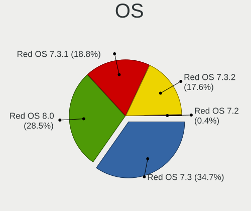

| Name         | Notebooks | Percent |
|--------------|-----------|---------|
| Red OS 7.3   | 83        | 34.73%  |
| Red OS 8.0   | 68        | 28.45%  |
| Red OS 7.3.1 | 45        | 18.83%  |
| Red OS 7.3.2 | 42        | 17.57%  |
| Red OS 7.2   | 1         | 0.42%   |

OS Family
---------

OS without a version

| Name   | Notebooks | Percent |
|--------|-----------|---------|
| Red OS | 227       | 100%    |

Kernel
------

Version of the Linux kernel

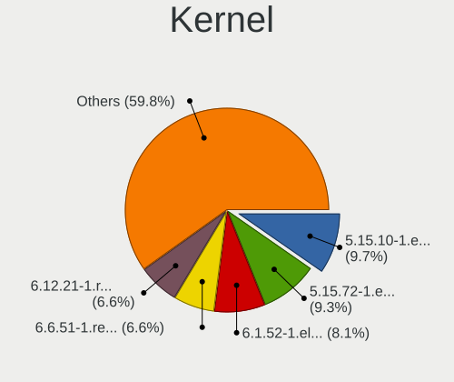

| Version                    | Notebooks | Percent |
|----------------------------|-----------|---------|
| 5.15.10-1.el7.x86_64       | 25        | 9.65%   |
| 5.15.72-1.el7.3.x86_64     | 24        | 9.27%   |
| 6.1.52-1.el7.3.x86_64      | 21        | 8.11%   |
| 6.6.51-1.red80.x86_64      | 17        | 6.56%   |
| 6.12.21-1.red80.x86_64     | 17        | 6.56%   |
| 6.6.6-1.red80.x86_64       | 16        | 6.18%   |
| 5.15.87-1.el7.3.x86_64     | 16        | 6.18%   |
| 5.10.29-1.el7.x86_64       | 12        | 4.63%   |
| 5.15.35-4.el7.3.x86_64     | 10        | 3.86%   |
| 6.1.110-1.el7.3.x86_64     | 9         | 3.47%   |
| 6.6.76-1.red80.x86_64      | 7         | 2.7%    |
| 6.6.34-1.red80.x86_64      | 7         | 2.7%    |
| 6.12.37-1.red80.x86_64     | 6         | 2.32%   |
| 5.15.35-1.el7.3.x86_64     | 6         | 2.32%   |
| 6.1.38-2.el7.3.x86_64      | 5         | 1.93%   |
| 5.15.125-1.el7.3.x86_64    | 5         | 1.93%   |
| 6.6.26-1.red80.x86_64      | 4         | 1.54%   |
| 6.12.56-1.red80.x86_64     | 4         | 1.54%   |
| 6.1.20-2.el7.3.x86_64      | 4         | 1.54%   |
| 6.1.128-2.el7.3.x86_64     | 4         | 1.54%   |
| 5.15.35-5.el7.3.x86_64     | 4         | 1.54%   |
| 6.1.94-1.el7.3.x86_64      | 3         | 1.16%   |
| 6.1.44-1.el7.3.x86_64      | 3         | 1.16%   |
| 6.1.148-1.el7.3.x86_64     | 3         | 1.16%   |
| 6.1.143-1.el7.3.x86_64     | 3         | 1.16%   |
| 5.10.1-1.el7.x86_64        | 3         | 1.16%   |
| 5.15.78-2.el7.3.x86_64     | 2         | 0.77%   |
| 5.15.131-1.el7.3.x86_64    | 2         | 0.77%   |
| 5.15.10-4.el7.x86_64       | 2         | 0.77%   |
| 5.10.29-3.el7.x86_64       | 2         | 0.77%   |
| 5.10.24-2.el7.x86_64       | 2         | 0.77%   |
| 6.8.0-rc5+                 | 1         | 0.39%   |
| 6.6.52-1.red80.x86_64-rt43 | 1         | 0.39%   |
| 6.1.52-1.red80.x86_64      | 1         | 0.39%   |
| 6.1.158-1.el7.3.x86_64     | 1         | 0.39%   |
| 5.18.1-1.el7.x86_64        | 1         | 0.39%   |
| 5.15.120                   | 1         | 0.39%   |
| 5.15.10-3.el7.x86_64       | 1         | 0.39%   |
| 5.15.10-2.el7.x86_64       | 1         | 0.39%   |
| 5.13.15-1.el7.x86_64       | 1         | 0.39%   |

Kernel Family
-------------

Linux kernel without a distro release

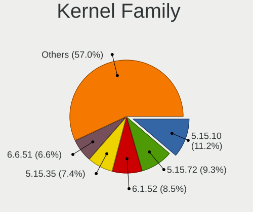

| Version  | Notebooks | Percent |
|----------|-----------|---------|
| 5.15.10  | 29        | 11.24%  |
| 5.15.72  | 24        | 9.3%    |
| 6.1.52   | 22        | 8.53%   |
| 5.15.35  | 19        | 7.36%   |
| 6.6.51   | 17        | 6.59%   |
| 6.12.21  | 17        | 6.59%   |
| 6.6.6    | 16        | 6.2%    |
| 5.15.87  | 16        | 6.2%    |
| 5.10.29  | 14        | 5.43%   |
| 6.1.110  | 9         | 3.49%   |
| 6.6.76   | 7         | 2.71%   |
| 6.6.34   | 7         | 2.71%   |
| 6.12.37  | 6         | 2.33%   |
| 6.1.38   | 5         | 1.94%   |
| 5.15.125 | 5         | 1.94%   |
| 6.6.26   | 4         | 1.55%   |
| 6.12.56  | 4         | 1.55%   |
| 6.1.20   | 4         | 1.55%   |
| 6.1.128  | 4         | 1.55%   |
| 6.1.94   | 3         | 1.16%   |
| 6.1.44   | 3         | 1.16%   |
| 6.1.148  | 3         | 1.16%   |
| 6.1.143  | 3         | 1.16%   |
| 5.10.24  | 3         | 1.16%   |
| 5.10.1   | 3         | 1.16%   |
| 5.15.78  | 2         | 0.78%   |
| 5.15.131 | 2         | 0.78%   |
| 6.8.0    | 1         | 0.39%   |
| 6.6.52   | 1         | 0.39%   |
| 6.1.158  | 1         | 0.39%   |
| 5.18.1   | 1         | 0.39%   |
| 5.15.120 | 1         | 0.39%   |
| 5.13.15  | 1         | 0.39%   |
| 4.19.79  | 1         | 0.39%   |

Kernel Major Ver.
-----------------

Linux kernel major version

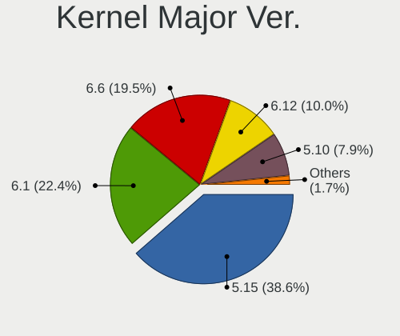

| Version | Notebooks | Percent |
|---------|-----------|---------|
| 5.15    | 93        | 38.59%  |
| 6.1     | 54        | 22.41%  |
| 6.6     | 47        | 19.5%   |
| 6.12    | 24        | 9.96%   |
| 5.10    | 19        | 7.88%   |
| 6.8     | 1         | 0.41%   |
| 5.18    | 1         | 0.41%   |
| 5.13    | 1         | 0.41%   |
| 4.19    | 1         | 0.41%   |

Arch
----

OS architecture (x86_64, i586, etc.)

| Name   | Notebooks | Percent |
|--------|-----------|---------|
| x86_64 | 227       | 100%    |

DE
--

Desktop Environment

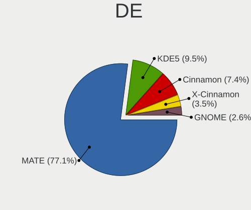

| Name       | Notebooks | Percent |
|------------|-----------|---------|
| MATE       | 178       | 77.06%  |
| KDE5       | 22        | 9.52%   |
| Cinnamon   | 17        | 7.36%   |
| X-Cinnamon | 8         | 3.46%   |
| GNOME      | 6         | 2.6%    |

Display Server
--------------

X11 or Wayland

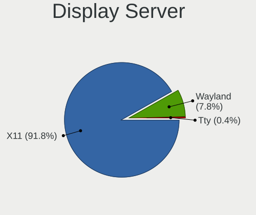

| Name    | Notebooks | Percent |
|---------|-----------|---------|
| X11     | 213       | 91.81%  |
| Wayland | 18        | 7.76%   |
| Tty     | 1         | 0.43%   |

Display Manager
---------------

SDDM, LightDM, etc.

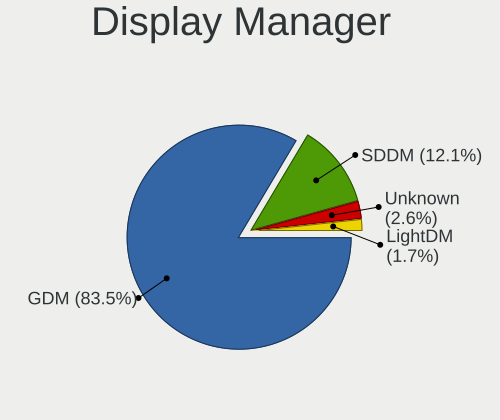

| Name    | Notebooks | Percent |
|---------|-----------|---------|
| GDM     | 193       | 83.55%  |
| SDDM    | 28        | 12.12%  |
| Unknown | 6         | 2.6%    |
| LightDM | 4         | 1.73%   |

OS Lang
-------

Language

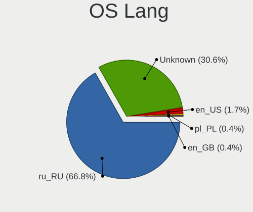

| Lang    | Notebooks | Percent |
|---------|-----------|---------|
| ru_RU   | 155       | 66.81%  |
| Unknown | 71        | 30.6%   |
| en_US   | 4         | 1.72%   |
| pl_PL   | 1         | 0.43%   |
| en_GB   | 1         | 0.43%   |

Boot Mode
---------

EFI or BIOS

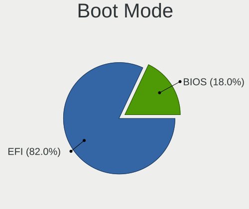

| Mode | Notebooks | Percent |
|------|-----------|---------|
| EFI  | 187       | 82.02%  |
| BIOS | 41        | 17.98%  |

Filesystem
----------

Type of filesystem

| Type    | Notebooks | Percent |
|---------|-----------|---------|
| Ext4    | 221       | 96.93%  |
| Overlay | 3         | 1.32%   |
| Xfs     | 2         | 0.88%   |
| Btrfs   | 2         | 0.88%   |

Part. scheme
------------

Scheme of partitioning

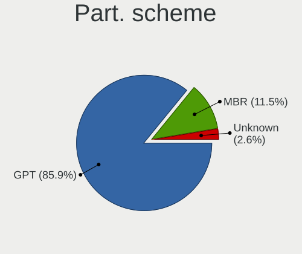

| Type    | Notebooks | Percent |
|---------|-----------|---------|
| GPT     | 195       | 85.9%   |
| MBR     | 26        | 11.45%  |
| Unknown | 6         | 2.64%   |

Dual Boot with Linux/BSD
------------------------

Hosting more than one Linux/BSD

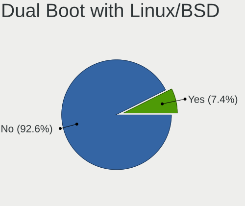

| Dual boot | Notebooks | Percent |
|-----------|-----------|---------|
| No        | 213       | 92.61%  |
| Yes       | 17        | 7.39%   |

Dual Boot (Win)
---------------

Hosting Linux and Windows

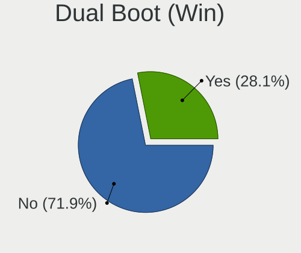

| Dual boot | Notebooks | Percent |
|-----------|-----------|---------|
| No        | 166       | 71.86%  |
| Yes       | 65        | 28.14%  |

Board
-----

Vendor
------

Motherboard manufacturer

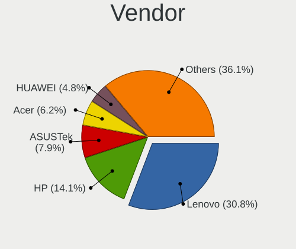

| Name                           | Notebooks | Percent |
|--------------------------------|-----------|---------|
| Lenovo                         | 70        | 30.84%  |
| Hewlett-Packard                | 32        | 14.1%   |
| ASUSTek Computer               | 18        | 7.93%   |
| Acer                           | 14        | 6.17%   |
| HUAWEI                         | 11        | 4.85%   |
| Dell                           | 11        | 4.85%   |
| ICL                            | 9         | 3.96%   |
| MSI                            | 6         | 2.64%   |
| Aquarius                       | 5         | 2.2%    |
| Unknown                        | 5         | 2.2%    |
| Kraftway                       | 3         | 1.32%   |
| Infinix                        | 3         | 1.32%   |
| HONOR                          | 3         | 1.32%   |
| Graviton                       | 3         | 1.32%   |
| Digma                          | 3         | 1.32%   |
| TECNO Mobile Limited           | 2         | 0.88%   |
| MACHENIKE                      | 2         | 0.88%   |
| iRU                            | 2         | 0.88%   |
| IP3 Technology                 | 2         | 0.88%   |
| Gigabyte Technology            | 2         | 0.88%   |
| DEXP                           | 2         | 0.88%   |
| DEPO Computers                 | 2         | 0.88%   |
| 3Logic Group                   | 2         | 0.88%   |
| Toshiba                        | 1         | 0.44%   |
| Timi                           | 1         | 0.44%   |
| THUNDEROBOT                    | 1         | 0.44%   |
| Sony                           | 1         | 0.44%   |
| Shanghai Zhaoxin Semiconductor | 1         | 0.44%   |
| Rikor                          | 1         | 0.44%   |
| Pegatron                       | 1         | 0.44%   |
| mtech                          | 1         | 0.44%   |
| LTD Delovoy Office             | 1         | 0.44%   |
| KVADRA                         | 1         | 0.44%   |
| Getac                          | 1         | 0.44%   |
| Fujitsu Siemens                | 1         | 0.44%   |
| Chuwi                          | 1         | 0.44%   |
| BESHTAU                        | 1         | 0.44%   |
| Apple                          | 1         | 0.44%   |

Model
-----

Motherboard model

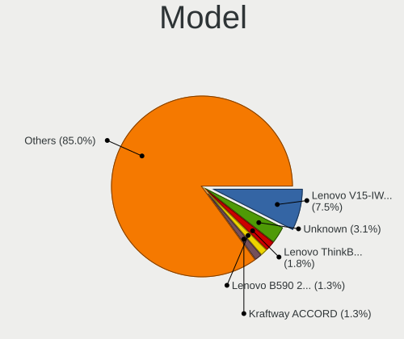

| Name                                     | Notebooks | Percent |
|------------------------------------------|-----------|---------|
| Lenovo V15-IWL 81YE                      | 17        | 7.49%   |
| Unknown                                  | 7         | 3.08%   |
| Lenovo ThinkBook 15 G3 ACL 21A4          | 4         | 1.76%   |
| Lenovo B590 20206                        | 3         | 1.32%   |
| Kraftway ACCORD                          | 3         | 1.32%   |
| ICL RAYbook Si1512                       | 3         | 1.32%   |
| HUAWEI BOM-WXX9                          | 3         | 1.32%   |
| HP Laptop 15s-eq1xxx                     | 3         | 1.32%   |
| Acer Aspire A315-24P                     | 3         | 1.32%   |
| Lenovo V130-15IKB 81HN                   | 2         | 0.88%   |
| Lenovo ThinkBook 15 G4 ABA 21DL          | 2         | 0.88%   |
| Lenovo ThinkBook 15 G2 ARE 20VG          | 2         | 0.88%   |
| Lenovo IdeaPad L340-15API 81LW           | 2         | 0.88%   |
| Lenovo IdeaPad 1 15IAU7 82QD             | 2         | 0.88%   |
| Lenovo G700 20251                        | 2         | 0.88%   |
| Lenovo G570 20079                        | 2         | 0.88%   |
| Lenovo B590 20208                        | 2         | 0.88%   |
| iRU 15ALC                                | 2         | 0.88%   |
| IP3 ACN30                                | 2         | 0.88%   |
| HUAWEI BOD-WXX9                          | 2         | 0.88%   |
| HONOR BMH-WCX9                           | 2         | 0.88%   |
| HP 255 G7 Notebook PC                    | 2         | 0.88%   |
| DEPO Computers DPH610S                   | 2         | 0.88%   |
| ASUS VivoBook_ASUSLaptop X1605VA_X1605VA | 2         | 0.88%   |
| ASUS Vivobook Go E1504FA_E1504FA         | 2         | 0.88%   |
| Acer Aspire 5742G                        | 2         | 0.88%   |
| Toshiba Satellite C650                   | 1         | 0.44%   |
| Timi Redmi Book Pro 15 2022              | 1         | 0.44%   |
| THUNDEROBOT 911AirD                      | 1         | 0.44%   |
| TECNO Mobile Limited MEGABOOK T15AA      | 1         | 0.44%   |
| TECNO Mobile Limited MEGABOOK K16SDA     | 1         | 0.44%   |
| Sony SVE1713X9RB                         | 1         | 0.44%   |
| Shanghai Zhaoxin ZXE CRB                 | 1         | 0.44%   |
| Rikor MSK 401.1                          | 1         | 0.44%   |
| Pegatron A35                             | 1         | 0.44%   |
| mtech MTL1578                            | 1         | 0.44%   |
| MSI Sword 15 A12UE                       | 1         | 0.44%   |
| MSI MS-1738                              | 1         | 0.44%   |
| MSI Modern 15 B12M                       | 1         | 0.44%   |
| MSI Modern 14 C12M                       | 1         | 0.44%   |

Model Family
------------

Motherboard model prefix

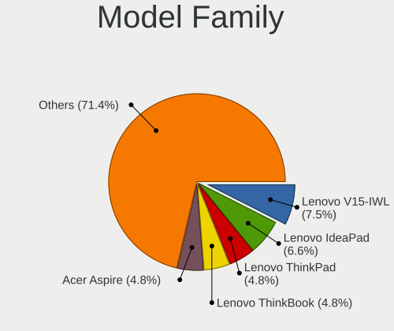

| Name                          | Notebooks | Percent |
|-------------------------------|-----------|---------|
| Lenovo V15-IWL                | 17        | 7.49%   |
| Lenovo IdeaPad                | 15        | 6.61%   |
| Lenovo ThinkPad               | 11        | 4.85%   |
| Lenovo ThinkBook              | 11        | 4.85%   |
| Acer Aspire                   | 11        | 4.85%   |
| ASUS Vivobook                 | 9         | 3.96%   |
| HP Laptop                     | 7         | 3.08%   |
| Unknown                       | 7         | 3.08%   |
| Lenovo B590                   | 5         | 2.2%    |
| HP ProBook                    | 5         | 2.2%    |
| HP Pavilion                   | 5         | 2.2%    |
| HP EliteBook                  | 5         | 2.2%    |
| ICL RAYbook                   | 4         | 1.76%   |
| Dell Vostro                   | 4         | 1.76%   |
| Kraftway ACCORD               | 3         | 1.32%   |
| HUAWEI BOM-WXX9               | 3         | 1.32%   |
| Digma EVE                     | 3         | 1.32%   |
| Dell Inspiron                 | 3         | 1.32%   |
| TECNO Mobile Limited MEGABOOK | 2         | 0.88%   |
| MSI Modern                    | 2         | 0.88%   |
| Lenovo V15                    | 2         | 0.88%   |
| Lenovo V130-15IKB             | 2         | 0.88%   |
| Lenovo G700                   | 2         | 0.88%   |
| Lenovo G570                   | 2         | 0.88%   |
| iRU 15ALC                     | 2         | 0.88%   |
| IP3 ACN30                     | 2         | 0.88%   |
| Infinix INBOOK                | 2         | 0.88%   |
| HUAWEI BOD-WXX9               | 2         | 0.88%   |
| HONOR BMH-WCX9                | 2         | 0.88%   |
| HP 255                        | 2         | 0.88%   |
| HP 250                        | 2         | 0.88%   |
| Gigabyte G5                   | 2         | 0.88%   |
| DEXP Atlas                    | 2         | 0.88%   |
| DEPO Computers DPH610S        | 2         | 0.88%   |
| Dell Precision                | 2         | 0.88%   |
| Dell Latitude                 | 2         | 0.88%   |
| ASUS ROG                      | 2         | 0.88%   |
| Aquarius NS685U               | 2         | 0.88%   |
| Acer Extensa                  | 2         | 0.88%   |
| Toshiba Satellite             | 1         | 0.44%   |

MFG Year
--------

Motherboard manufacture year

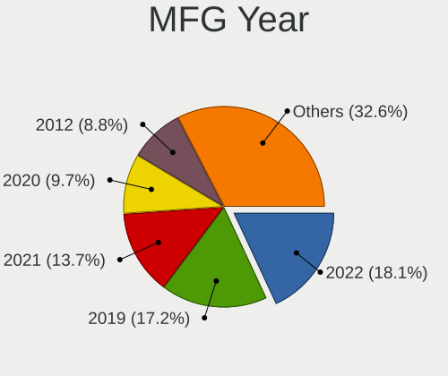

| Year | Notebooks | Percent |
|------|-----------|---------|
| 2022 | 41        | 18.06%  |
| 2019 | 39        | 17.18%  |
| 2021 | 31        | 13.66%  |
| 2020 | 22        | 9.69%   |
| 2012 | 20        | 8.81%   |
| 2010 | 13        | 5.73%   |
| 2023 | 12        | 5.29%   |
| 2017 | 7         | 3.08%   |
| 2013 | 7         | 3.08%   |
| 2011 | 7         | 3.08%   |
| 2024 | 6         | 2.64%   |
| 2018 | 6         | 2.64%   |
| 2016 | 4         | 1.76%   |
| 2014 | 3         | 1.32%   |
| 2009 | 3         | 1.32%   |
| 2008 | 2         | 0.88%   |
| 2007 | 2         | 0.88%   |
| 2025 | 1         | 0.44%   |
| 2015 | 1         | 0.44%   |

Form Factor
-----------

Physical design of the computer

| Name     | Notebooks | Percent |
|----------|-----------|---------|
| Notebook | 227       | 100%    |

Secure Boot
-----------

Enabled or disabled

| State    | Notebooks | Percent |
|----------|-----------|---------|
| Disabled | 227       | 100%    |

Coreboot
--------

Have coreboot on board

| Used | Notebooks | Percent |
|------|-----------|---------|
| No   | 227       | 100%    |

RAM Size
--------

Total RAM memory

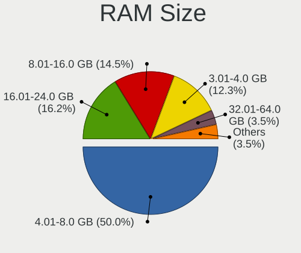

| Size in GB  | Notebooks | Percent |
|-------------|-----------|---------|
| 4.01-8.0    | 114       | 50%     |
| 16.01-24.0  | 37        | 16.23%  |
| 8.01-16.0   | 33        | 14.47%  |
| 3.01-4.0    | 28        | 12.28%  |
| 32.01-64.0  | 8         | 3.51%   |
| 2.01-3.0    | 5         | 2.19%   |
| 1.01-2.0    | 2         | 0.88%   |
| 64.01-256.0 | 1         | 0.44%   |

RAM Used
--------

Used RAM memory

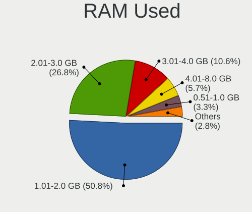

| Used GB    | Notebooks | Percent |
|------------|-----------|---------|
| 1.01-2.0   | 125       | 50.81%  |
| 2.01-3.0   | 66        | 26.83%  |
| 3.01-4.0   | 26        | 10.57%  |
| 4.01-8.0   | 14        | 5.69%   |
| 0.51-1.0   | 8         | 3.25%   |
| 8.01-16.0  | 4         | 1.63%   |
| 16.01-24.0 | 2         | 0.81%   |
| 32.01-64.0 | 1         | 0.41%   |

Total Drives
------------

Number of drives on board

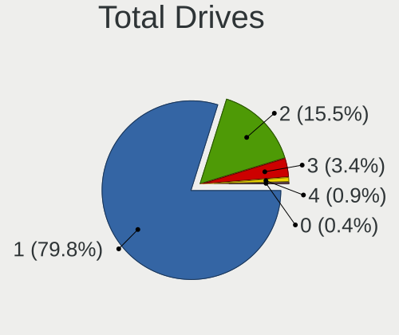

| Drives | Notebooks | Percent |
|--------|-----------|---------|
| 1      | 186       | 79.83%  |
| 2      | 36        | 15.45%  |
| 3      | 8         | 3.43%   |
| 4      | 2         | 0.86%   |
| 0      | 1         | 0.43%   |

Has CD-ROM
----------

Has CD-ROM on board

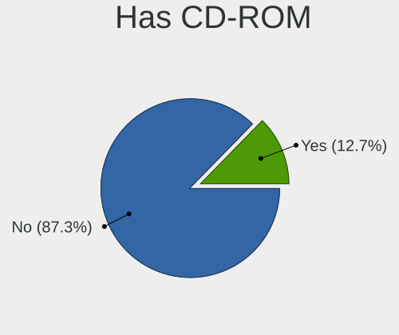

| Presented | Notebooks | Percent |
|-----------|-----------|---------|
| No        | 183       | 80.26%  |
| Yes       | 45        | 19.74%  |

Has Ethernet
------------

Has Ethernet on board

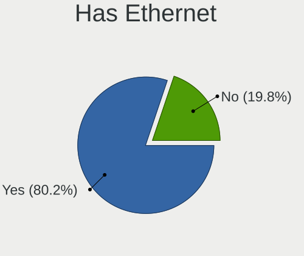

| Presented | Notebooks | Percent |
|-----------|-----------|---------|
| Yes       | 182       | 80.18%  |
| No        | 45        | 19.82%  |

Has WiFi
--------

Has WiFi module

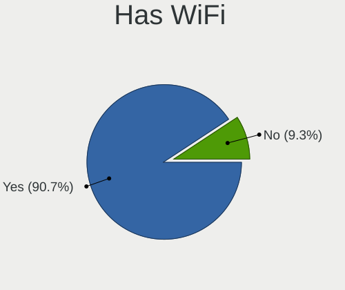

| Presented | Notebooks | Percent |
|-----------|-----------|---------|
| Yes       | 206       | 90.75%  |
| No        | 21        | 9.25%   |

Has Bluetooth
-------------

Has Bluetooth module

| Presented | Notebooks | Percent |
|-----------|-----------|---------|
| Yes       | 193       | 84.65%  |
| No        | 35        | 15.35%  |

Location
--------

Country
-------

Geographic location (country)

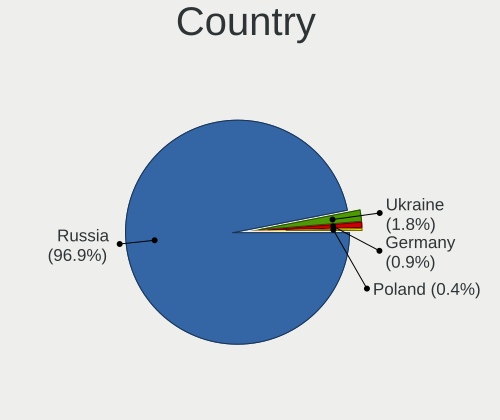

| Country | Notebooks | Percent |
|---------|-----------|---------|
| Russia  | 220       | 96.92%  |
| Ukraine | 4         | 1.76%   |
| Germany | 2         | 0.88%   |
| Poland  | 1         | 0.44%   |

City
----

Geographic location (city)

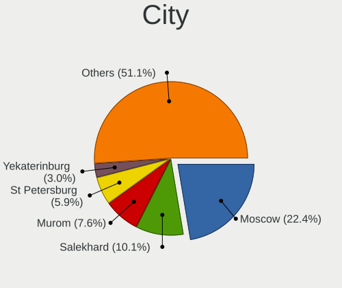

| City              | Notebooks | Percent |
|-------------------|-----------|---------|
| Moscow            | 53        | 22.36%  |
| Salekhard         | 24        | 10.13%  |
| Murom             | 18        | 7.59%   |
| St Petersburg     | 14        | 5.91%   |
| Yekaterinburg     | 7         | 2.95%   |
| Perm              | 7         | 2.95%   |
| Vladimir          | 5         | 2.11%   |
| Novy Urengoy      | 5         | 2.11%   |
| Krasnodar         | 5         | 2.11%   |
| Yakutsk           | 4         | 1.69%   |
| Samara            | 3         | 1.27%   |
| Ryazan            | 3         | 1.27%   |
| Orenburg          | 3         | 1.27%   |
| Novosibirsk       | 3         | 1.27%   |
| Nizhniy Novgorod  | 3         | 1.27%   |
| Muromskiy         | 3         | 1.27%   |
| Stavropol         | 2         | 0.84%   |
| Sarapul           | 2         | 0.84%   |
| Saransk           | 2         | 0.84%   |
| Rostov-on-Don     | 2         | 0.84%   |
| Nadym             | 2         | 0.84%   |
| Lipetsk           | 2         | 0.84%   |
| Kursk             | 2         | 0.84%   |
| Krasnoyarsk       | 2         | 0.84%   |
| Kazan’          | 2         | 0.84%   |
| Kaluga            | 2         | 0.84%   |
| Chelyabinsk       | 2         | 0.84%   |
| Zima              | 1         | 0.42%   |
| Zelenogorsk       | 1         | 0.42%   |
| Zadonsk           | 1         | 0.42%   |
| Yuzhno-Sakhalinsk | 1         | 0.42%   |
| Yaroslavl         | 1         | 0.42%   |
| Voronezh          | 1         | 0.42%   |
| Volzhskiy         | 1         | 0.42%   |
| Volgograd         | 1         | 0.42%   |
| Vladivostok       | 1         | 0.42%   |
| Ulyanovsk         | 1         | 0.42%   |
| Tver              | 1         | 0.42%   |
| Tula              | 1         | 0.42%   |
| Tambov            | 1         | 0.42%   |

Drives
------

Drive Vendor
------------

Hard drive vendors

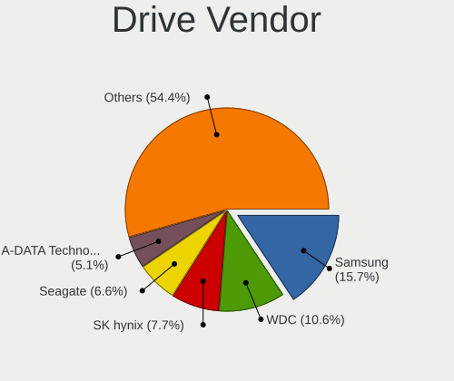

| Vendor                         | Notebooks | Drives | Percent |
|--------------------------------|-----------|--------|---------|
| Samsung Electronics            | 43        | 83     | 15.69%  |
| WDC                            | 29        | 50     | 10.58%  |
| SK hynix                       | 21        | 23     | 7.66%   |
| Seagate                        | 18        | 23     | 6.57%   |
| A-DATA Technology              | 14        | 14     | 5.11%   |
| Micron Technology              | 13        | 28     | 4.74%   |
| Unknown                        | 9         | 9      | 3.28%   |
| Toshiba                        | 9         | 40     | 3.28%   |
| Kingston                       | 9         | 11     | 3.28%   |
| Silicon Motion                 | 8         | 8      | 2.92%   |
| SanDisk                        | 8         | 10     | 2.92%   |
| HGST                           | 7         | 7      | 2.55%   |
| Intel                          | 6         | 7      | 2.19%   |
| Foxline                        | 6         | 6      | 2.19%   |
| Phison                         | 5         | 5      | 1.82%   |
| FORESEE                        | 5         | 6      | 1.82%   |
| China                          | 5         | 16     | 1.82%   |
| YMTC                           | 4         | 4      | 1.46%   |
| KIOXIA                         | 4         | 4      | 1.46%   |
| JMicron Technology             | 4         | 4      | 1.46%   |
| Unknown                        | 4         | 4      | 1.46%   |
| KingSpec                       | 3         | 9      | 1.09%   |
| Hitachi                        | 3         | 4      | 1.09%   |
| Gigabyte Technology            | 3         | 3      | 1.09%   |
| Crucial                        | 3         | 3      | 1.09%   |
| UMIS                           | 2         | 2      | 0.73%   |
| SSSTC                          | 2         | 3      | 0.73%   |
| SCY                            | 2         | 2      | 0.73%   |
| Patriot                        | 2         | 2      | 0.73%   |
| Netac                          | 2         | 4      | 0.73%   |
| Apacer                         | 2         | 3      | 0.73%   |
| Wodposit                       | 1         | 1      | 0.36%   |
| WDC WDS                        | 1         | 1      | 0.36%   |
| Transcend                      | 1         | 1      | 0.36%   |
| Thinkplus                      | 1         | 1      | 0.36%   |
| SPCC Sol                       | 1         | 1      | 0.36%   |
| Solid State Storage Technology | 1         | 1      | 0.36%   |
| SM400                          | 1         | 1      | 0.36%   |
| Phison Electronics             | 1         | 1      | 0.36%   |
| Palit                          | 1         | 1      | 0.36%   |

Drive Model
-----------

Hard drive models

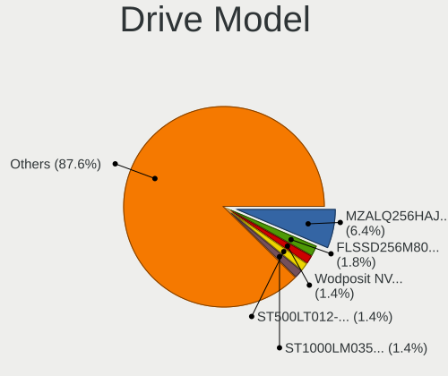

| Model                                  | Notebooks | Percent |
|----------------------------------------|-----------|---------|
| Samsung MZALQ256HAJD-000L2 256GB       | 18        | 6.36%   |
| Foxline FLSSD256M80E13TCX5 256GB       | 5         | 1.77%   |
| Silicon Motion Wodposit NVMe SSD 256GB | 4         | 1.41%   |
| Seagate ST500LT012-1DG142 500GB        | 4         | 1.41%   |
| Seagate ST1000LM035-1RK172 1TB         | 4         | 1.41%   |
| Unknown                                | 4         | 1.41%   |
| Toshiba MQ01ABF050 500GB               | 3         | 1.06%   |
| SK hynix SKHynix_HFM256GD3HX015N 256GB | 3         | 1.06%   |
| Silicon Motion PCIe-8 SSD 512GB        | 3         | 1.06%   |
| SanDisk NVMe SSD Drive 512GB           | 3         | 1.06%   |
| Samsung MZALQ512HALU-000L2 512GB       | 3         | 1.06%   |
| Micron 2400_MTFDKBA512QFM 512GB        | 3         | 1.06%   |
| Kingston SA400S37240G 240GB SSD        | 3         | 1.06%   |
| JMicron Generic 320GB                  | 3         | 1.06%   |
| YMTC PC005 512GB                       | 2         | 0.71%   |
| WDC WD10SPZX-24Z10 1TB                 | 2         | 0.71%   |
| WDC WD10SPZX-00Z10T0 1TB               | 2         | 0.71%   |
| WDC PC SN530 SDBPNPZ-512G-1114 512GB   | 2         | 0.71%   |
| WDC PC SN530 SDBPNPZ-512G-1006 512GB   | 2         | 0.71%   |
| WDC PC SN520 SDAPMUW-512G-1101 512GB   | 2         | 0.71%   |
| Unknown xD/SD/M.S.                     | 2         | 0.71%   |
| Unknown NVMe SSD Drive 512GB           | 2         | 0.71%   |
| Unknown 58K722  128GB                  | 2         | 0.71%   |
| SK hynix SKHynix_HFS256GEJ4X112N 256GB | 2         | 0.71%   |
| SK hynix PC711 HFS512GDE9X073N 512GB   | 2         | 0.71%   |
| SK hynix HFS512GEJ9X108N 512GB         | 2         | 0.71%   |
| Seagate ST9500325AS 500GB              | 2         | 0.71%   |
| Seagate ST1000LM024 HN-M101MBB 1TB     | 2         | 0.71%   |
| SanDisk NVMe SSD Drive 1TB             | 2         | 0.71%   |
| Samsung MZVLQ256HAJD-000H1 256GB       | 2         | 0.71%   |
| Samsung MZVL4512HBLU-00BTW 512GB       | 2         | 0.71%   |
| Samsung MZALQ256HBJD-00BL2 256GB       | 2         | 0.71%   |
| Micron 2450_MTFDKBA512TFK 512GB        | 2         | 0.71%   |
| KIOXIA KBG40ZNS256G NVMe 256GB         | 2         | 0.71%   |
| HGST HTS545050A7E380 500GB             | 2         | 0.71%   |
| Gigabyte GP-GSM2NE3256GNTD 256GB       | 2         | 0.71%   |
| FORESEE XP1000F512G 512GB              | 2         | 0.71%   |
| FORESEE VP1000F512G 512GB              | 2         | 0.71%   |
| A-DATA SX6000PNP 512GB                 | 2         | 0.71%   |
| A-DATA SX6000LNP 256GB                 | 2         | 0.71%   |

HDD Vendor
----------

Hard disk drive vendors

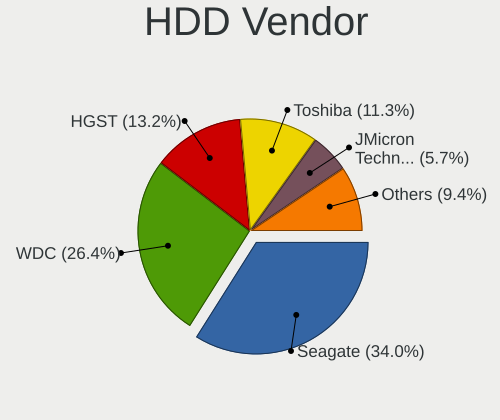

| Vendor             | Notebooks | Drives | Percent |
|--------------------|-----------|--------|---------|
| Seagate            | 18        | 23     | 33.96%  |
| WDC                | 14        | 35     | 26.42%  |
| HGST               | 7         | 7      | 13.21%  |
| Toshiba            | 6         | 36     | 11.32%  |
| JMicron Technology | 3         | 3      | 5.66%   |
| Hitachi            | 3         | 4      | 5.66%   |
| Unknown            | 1         | 1      | 1.89%   |
| Fujitsu            | 1         | 1      | 1.89%   |

SSD Vendor
----------

Solid state drive vendors

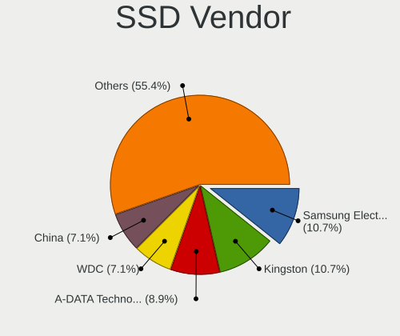

| Vendor              | Notebooks | Drives | Percent |
|---------------------|-----------|--------|---------|
| Samsung Electronics | 6         | 6      | 10.71%  |
| Kingston            | 6         | 8      | 10.71%  |
| A-DATA Technology   | 5         | 5      | 8.93%   |
| WDC                 | 4         | 4      | 7.14%   |
| China               | 4         | 15     | 7.14%   |
| SK hynix            | 2         | 2      | 3.57%   |
| SanDisk             | 2         | 3      | 3.57%   |
| Patriot             | 2         | 2      | 3.57%   |
| Netac               | 2         | 4      | 3.57%   |
| KingSpec            | 2         | 8      | 3.57%   |
| Crucial             | 2         | 2      | 3.57%   |
| Apacer              | 2         | 3      | 3.57%   |
| Unknown             | 2         | 2      | 3.57%   |
| WDC WDS             | 1         | 1      | 1.79%   |
| Transcend           | 1         | 1      | 1.79%   |
| Toshiba             | 1         | 1      | 1.79%   |
| Thinkplus           | 1         | 1      | 1.79%   |
| SSSTC               | 1         | 2      | 1.79%   |
| SPCC Sol            | 1         | 1      | 1.79%   |
| SM400               | 1         | 1      | 1.79%   |
| Palit               | 1         | 1      | 1.79%   |
| Micron Technology   | 1         | 1      | 1.79%   |
| Lenovo              | 1         | 1      | 1.79%   |
| Intel               | 1         | 1      | 1.79%   |
| FORESEE             | 1         | 1      | 1.79%   |
| DEXP                | 1         | 2      | 1.79%   |
| Corsair             | 1         | 2      | 1.79%   |
| AMD                 | 1         | 1      | 1.79%   |

Drive Kind
----------

HDD or SSD

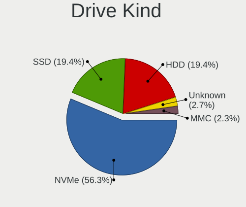

| Kind    | Notebooks | Drives | Percent |
|---------|-----------|--------|---------|
| NVMe    | 148       | 214    | 56.27%  |
| SSD     | 51        | 82     | 19.39%  |
| HDD     | 51        | 110    | 19.39%  |
| Unknown | 7         | 7      | 2.66%   |
| MMC     | 6         | 6      | 2.28%   |

Drive Connector
---------------

SATA, SAS, NVMe, etc.

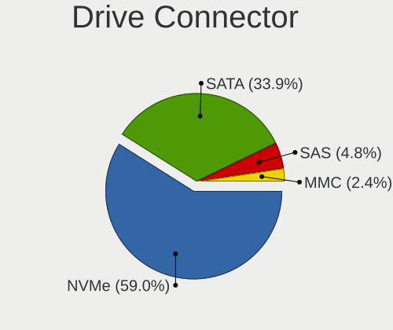

| Type | Notebooks | Drives | Percent |
|------|-----------|--------|---------|
| NVMe | 148       | 214    | 58.96%  |
| SATA | 85        | 184    | 33.86%  |
| SAS  | 12        | 15     | 4.78%   |
| MMC  | 6         | 6      | 2.39%   |

Drive Size
----------

Size of hard drive

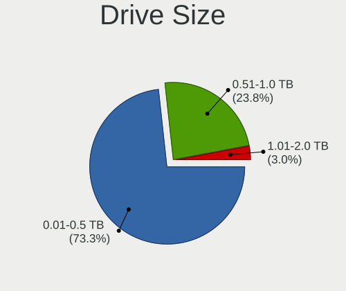

| Size in TB | Notebooks | Drives | Percent |
|------------|-----------|--------|---------|
| 0.01-0.5   | 74        | 121    | 73.27%  |
| 0.51-1.0   | 24        | 50     | 23.76%  |
| 1.01-2.0   | 3         | 21     | 2.97%   |

Space Total
-----------

Amount of disk space available on the file system

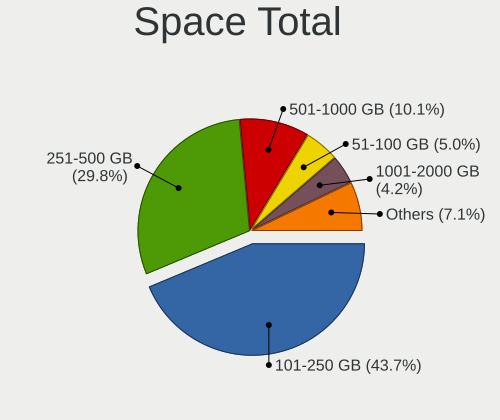

| Size in GB     | Notebooks | Percent |
|----------------|-----------|---------|
| 101-250        | 104       | 43.7%   |
| 251-500        | 71        | 29.83%  |
| 501-1000       | 24        | 10.08%  |
| 51-100         | 12        | 5.04%   |
| 1001-2000      | 10        | 4.2%    |
| 21-50          | 8         | 3.36%   |
| 1-20           | 6         | 2.52%   |
| 2001-3000      | 2         | 0.84%   |
| More than 3000 | 1         | 0.42%   |

Space Used
----------

Amount of used disk space

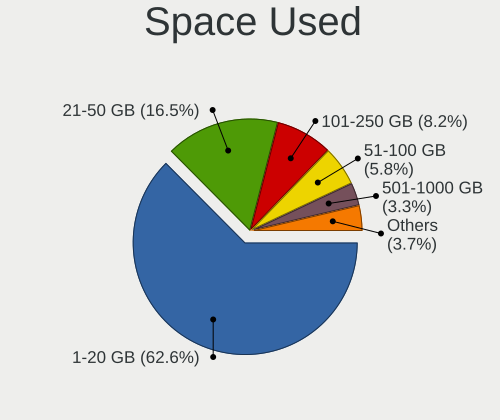

| Used GB   | Notebooks | Percent |
|-----------|-----------|---------|
| 1-20      | 152       | 62.55%  |
| 21-50     | 40        | 16.46%  |
| 101-250   | 20        | 8.23%   |
| 51-100    | 14        | 5.76%   |
| 501-1000  | 8         | 3.29%   |
| 251-500   | 5         | 2.06%   |
| 1001-2000 | 4         | 1.65%   |

Malfunc. Drives
---------------

Drive models with a malfunction

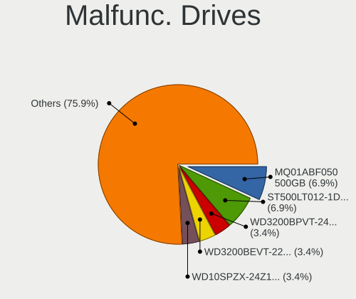

| Model                                    | Notebooks | Drives | Percent |
|------------------------------------------|-----------|--------|---------|
| Toshiba MQ01ABF050 500GB                 | 2         | 19     | 6.9%    |
| Seagate ST500LT012-1DG142 500GB          | 2         | 2      | 6.9%    |
| WDC WD3200BPVT-24ZEST0 320GB             | 1         | 1      | 3.45%   |
| WDC WD3200BEVT-22A23T0 320GB             | 1         | 1      | 3.45%   |
| WDC WD10SPZX-24Z10 1TB                   | 1         | 1      | 3.45%   |
| WDC WD Green M.2 2280 240GB              | 1         | 1      | 3.45%   |
| Toshiba THNSNK256GVN8 M.2 2280 256GB SSD | 1         | 1      | 3.45%   |
| Toshiba MK5075GSX 500GB                  | 1         | 12     | 3.45%   |
| Toshiba MK5059GSXP 500GB                 | 1         | 1      | 3.45%   |
| Toshiba MK2565GSX 250GB                  | 1         | 1      | 3.45%   |
| SSSTC CV8-8E128-HP 128GB SSD             | 1         | 2      | 3.45%   |
| Seagate ST9500420AS 500GB                | 1         | 1      | 3.45%   |
| Seagate ST9500325AS 500GB                | 1         | 1      | 3.45%   |
| Seagate ST9250315AS 250GB                | 1         | 2      | 3.45%   |
| Seagate ST750LM022 HN-M750MBB 752GB      | 1         | 1      | 3.45%   |
| Seagate ST500LT012-9WS142 500GB          | 1         | 1      | 3.45%   |
| Seagate ST1000LM035-1RK172 1TB           | 1         | 1      | 3.45%   |
| Netac SSD 512GB                          | 1         | 3      | 3.45%   |
| Kingston SUV400S37120G 120GB SSD         | 1         | 1      | 3.45%   |
| Hitachi HTS725032A9A364 320GB            | 1         | 1      | 3.45%   |
| Hitachi HTS543232A7A384 320GB            | 1         | 1      | 3.45%   |
| HGST HTS721010A9E630 1TB                 | 1         | 1      | 3.45%   |
| HGST HTS545050A7E380 500GB               | 1         | 1      | 3.45%   |
| Fujitsu MJA2500BH FFS G1 500GB           | 1         | 1      | 3.45%   |
| DEXP SSD C100 512Gb                      | 1         | 2      | 3.45%   |
| A-DATA Technology SX6000NP 512GB         | 1         | 1      | 3.45%   |
| A-DATA Technology SU800 256GB SSD        | 1         | 1      | 3.45%   |

Malfunc. Drive Vendor
---------------------

Vendors of faulty drives

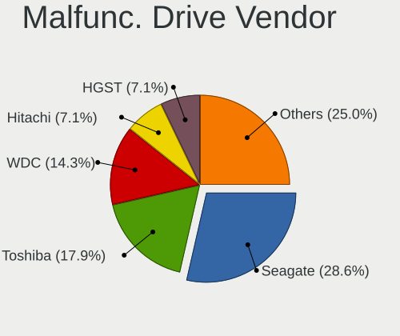

| Vendor            | Notebooks | Drives | Percent |
|-------------------|-----------|--------|---------|
| Seagate           | 8         | 9      | 28.57%  |
| Toshiba           | 5         | 34     | 17.86%  |
| WDC               | 4         | 4      | 14.29%  |
| Hitachi           | 2         | 2      | 7.14%   |
| HGST              | 2         | 2      | 7.14%   |
| A-DATA Technology | 2         | 2      | 7.14%   |
| SSSTC             | 1         | 2      | 3.57%   |
| Netac             | 1         | 3      | 3.57%   |
| Kingston          | 1         | 1      | 3.57%   |
| Fujitsu           | 1         | 1      | 3.57%   |
| DEXP              | 1         | 2      | 3.57%   |

Malfunc. HDD Vendor
-------------------

Vendors of faulty HDD drives

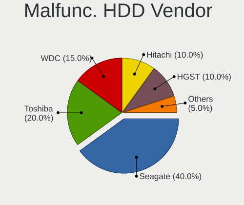

| Vendor  | Notebooks | Drives | Percent |
|---------|-----------|--------|---------|
| Seagate | 8         | 9      | 40%     |
| Toshiba | 4         | 33     | 20%     |
| WDC     | 3         | 3      | 15%     |
| Hitachi | 2         | 2      | 10%     |
| HGST    | 2         | 2      | 10%     |
| Fujitsu | 1         | 1      | 5%      |

Malfunc. Drive Kind
-------------------

Kinds of faulty drives

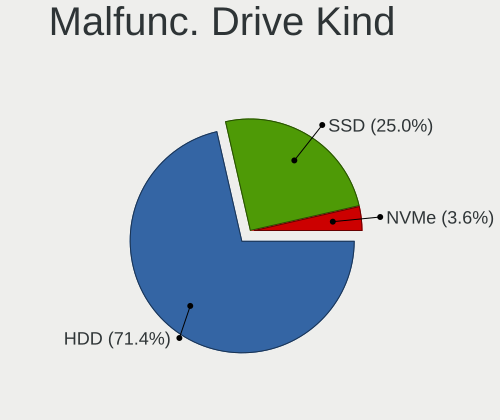

| Kind | Notebooks | Drives | Percent |
|------|-----------|--------|---------|
| HDD  | 20        | 50     | 71.43%  |
| SSD  | 7         | 11     | 25%     |
| NVMe | 1         | 1      | 3.57%   |

Failed Drives
-------------

Failed drive models

Zero info for selected period =(

Failed Drive Vendor
-------------------

Failed drive vendors

Zero info for selected period =(

Drive Status
------------

Number of failed and malfunc. drives

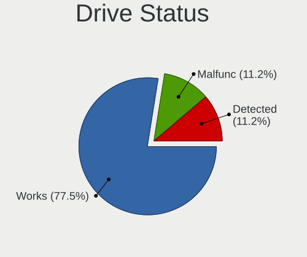

| Status   | Notebooks | Drives | Percent |
|----------|-----------|--------|---------|
| Works    | 193       | 316    | 77.51%  |
| Detected | 28        | 41     | 11.24%  |
| Malfunc  | 28        | 62     | 11.24%  |

Storage controller
------------------

Storage Vendor
--------------

Storage controller vendors

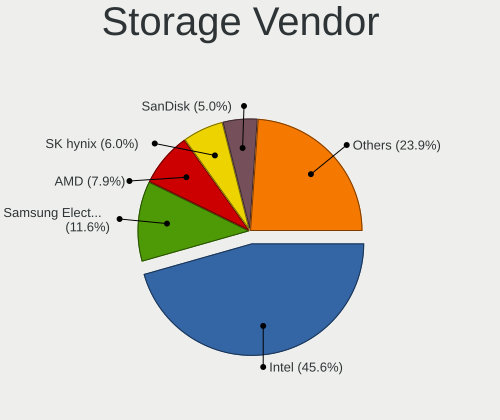

| Vendor                           | Notebooks | Percent |
|----------------------------------|-----------|---------|
| Intel                            | 145       | 45.6%   |
| Samsung Electronics              | 37        | 11.64%  |
| AMD                              | 25        | 7.86%   |
| SK hynix                         | 19        | 5.97%   |
| SanDisk                          | 16        | 5.03%   |
| Phison Electronics               | 15        | 4.72%   |
| Micron Technology                | 12        | 3.77%   |
| Silicon Motion                   | 8         | 2.52%   |
| ADATA Technology                 | 7         | 2.2%    |
| Yangtze Memory Technologies      | 4         | 1.26%   |
| Shenzhen Longsys Electronics     | 4         | 1.26%   |
| KIOXIA                           | 4         | 1.26%   |
| Realtek Semiconductor            | 3         | 0.94%   |
| MAXIO Technology (Hangzhou)      | 3         | 0.94%   |
| Kingston Technology Company      | 3         | 0.94%   |
| Union Memory (Shenzhen)          | 2         | 0.63%   |
| Toshiba America Info Systems     | 2         | 0.63%   |
| Solid State Storage Technology   | 2         | 0.63%   |
| Shenzhen Shichuangyi Electronics | 2         | 0.63%   |
| Unknown                          | 2         | 0.63%   |
| Zhaoxin                          | 1         | 0.31%   |
| ShenZhen TIGO Semiconductor      | 1         | 0.31%   |
| Nvidia                           | 1         | 0.31%   |

Storage Model
-------------

Storage controller models

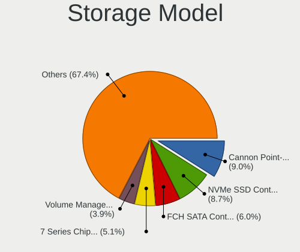

| Model                                                                                                              | Notebooks | Percent |
|--------------------------------------------------------------------------------------------------------------------|-----------|---------|
| Intel Cannon Point-LP SATA Controller [AHCI Mode]                                                                  | 30        | 8.98%   |
| Samsung NVMe SSD Controller 980 (DRAM-less)                                                                        | 29        | 8.68%   |
| AMD FCH SATA Controller [AHCI mode]                                                                                | 20        | 5.99%   |
| Intel 7 Series Chipset Family 6-port SATA Controller [AHCI mode]                                                   | 17        | 5.09%   |
| Intel Volume Management Device NVMe RAID Controller                                                                | 13        | 3.89%   |
| Phison PS5013-E13 PCIe3 NVMe Controller (DRAM-less)                                                                | 11        | 3.29%   |
| Intel Tiger Lake-LP SATA Controller                                                                                | 11        | 3.29%   |
| Intel Alder Lake-P SATA AHCI Controller                                                                            | 11        | 3.29%   |
| SK hynix Gold P31/BC711/PC711 NVMe Solid State Drive                                                               | 8         | 2.4%    |
| Intel Comet Lake SATA AHCI Controller                                                                              | 7         | 2.1%    |
| SanDisk Ultra 3D / WD PC SN530, IX SN530, Blue SN550 NVMe SSD (DRAM-less)                                          | 6         | 1.8%    |
| Micron 2450 NVMe SSD [HendrixV] (DRAM-less)                                                                        | 6         | 1.8%    |
| Intel Sunrise Point-LP SATA Controller [AHCI mode]                                                                 | 6         | 1.8%    |
| Intel 8 Series SATA Controller 1 [AHCI mode]                                                                       | 6         | 1.8%    |
| SK hynix BC901 NVMe Solid State Drive (DRAM-less)                                                                  | 5         | 1.5%    |
| SanDisk WD SN560/SN740/SN770/SN5000 NVMe SSD                                                                       | 5         | 1.5%    |
| Samsung NVMe SSD Controller SM981/PM981/PM983                                                                      | 5         | 1.5%    |
| Intel 6 Series/C200 Series Chipset Family 6 port Mobile SATA AHCI Controller                                       | 5         | 1.5%    |
| Intel 5 Series/3400 Series Chipset 4 port SATA AHCI Controller                                                     | 5         | 1.5%    |
| SK hynix BC511 NVMe SSD                                                                                            | 4         | 1.2%    |
| Silicon Motion SM2263EN/SM2263XT (DRAM-less) NVMe SSD Controllers                                                  | 4         | 1.2%    |
| Silicon Motion Non-Volatile memory controller                                                                      | 4         | 1.2%    |
| Shenzhen Longsys FORESEE XP1000 / Lexar Professional CFexpress Type B Gold series, NM620 PCIe NVME SSD (DRAM-less) | 4         | 1.2%    |
| KIOXIA NVMe SSD Controller BG4 (DRAM-less)                                                                         | 4         | 1.2%    |
| Intel Celeron N3350/Pentium N4200/Atom E3900 Series SATA AHCI Controller                                           | 4         | 1.2%    |
| AMD SB7x0/SB8x0/SB9x0 SATA Controller [AHCI mode]                                                                  | 4         | 1.2%    |
| ADATA XPG GAMMIXS1 1L, XPG GAMMIX S5, LEGEND 710 / 740, SWORDFISH NVMe SSD (DRAM-less)                             | 4         | 1.2%    |
| Samsung NVMe SSD Controller PM9B1 (DRAM-less)                                                                      | 3         | 0.9%    |
| Micron 2400 NVMe SSD (DRAM-less)                                                                                   | 3         | 0.9%    |
| MAXIO (Hangzhou) NVMe SSD Controller MAP1202 (DRAM-less)                                                           | 3         | 0.9%    |
| Intel HM170/QM170 Chipset SATA Controller [AHCI Mode]                                                              | 3         | 0.9%    |
| Intel Cannon Lake Mobile PCH SATA AHCI Controller                                                                  | 3         | 0.9%    |
| Intel 82801IBM/IEM (ICH9M/ICH9M-E) 4 port SATA Controller [AHCI mode]                                              | 3         | 0.9%    |
| Intel 82801 Mobile SATA Controller [RAID mode]                                                                     | 3         | 0.9%    |
| Intel 5 Series/3400 Series Chipset 6 port SATA AHCI Controller                                                     | 3         | 0.9%    |
| Yangtze Memory PC005 NVMe SSD                                                                                      | 2         | 0.6%    |
| Toshiba America Info Systems XG6 NVMe SSD Controller                                                               | 2         | 0.6%    |
| SK hynix BC501 NVMe Solid State Drive                                                                              | 2         | 0.6%    |
| Shenzhen Shichuangyi MAP1202-Based NVMe SSD (DRAM-less)                                                            | 2         | 0.6%    |
| SanDisk PC SN520 x2 M.2 2242 NVMe SSD                                                                              | 2         | 0.6%    |

Storage Kind
------------

Kind of storage controller (IDE, SATA, NVMe, SAS, ...)

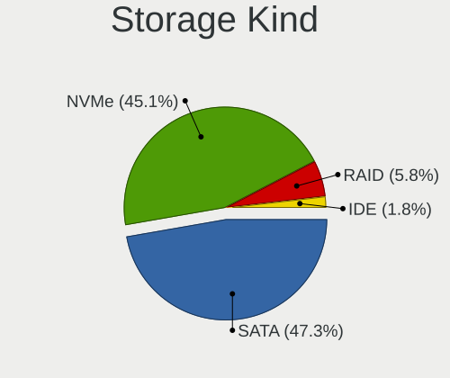

| Kind | Notebooks | Percent |
|------|-----------|---------|
| SATA | 155       | 47.26%  |
| NVMe | 148       | 45.12%  |
| RAID | 19        | 5.79%   |
| IDE  | 6         | 1.83%   |

Processor
---------

CPU Vendor
----------

Processor vendors

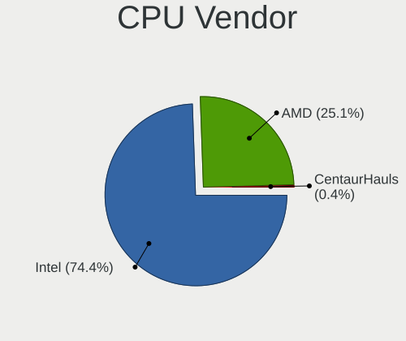

| Vendor       | Notebooks | Percent |
|--------------|-----------|---------|
| Intel        | 169       | 74.45%  |
| AMD          | 57        | 25.11%  |
| CentaurHauls | 1         | 0.44%   |

CPU Model
---------

Processor models

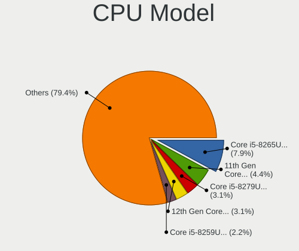

| Model                                         | Notebooks | Percent |
|-----------------------------------------------|-----------|---------|
| Intel Core i5-8265U CPU @ 1.60GHz             | 18        | 7.89%   |
| Intel 11th Gen Core i5-1135G7 @ 2.40GHz       | 10        | 4.39%   |
| Intel Core i5-8279U CPU @ 2.40GHz             | 7         | 3.07%   |
| Intel 12th Gen Core i3-1215U                  | 7         | 3.07%   |
| Intel Core i5-8259U CPU @ 2.30GHz             | 5         | 2.19%   |
| Intel 12th Gen Core i5-1235U                  | 5         | 2.19%   |
| Intel 11th Gen Core i3-1115G4 @ 3.00GHz       | 5         | 2.19%   |
| AMD Ryzen 5 5500U with Radeon Graphics        | 5         | 2.19%   |
| AMD Ryzen 5 3500U with Radeon Vega Mobile Gfx | 5         | 2.19%   |
| AMD Ryzen 3 5300U with Radeon Graphics        | 5         | 2.19%   |
| Intel Core i5-10210U CPU @ 1.60GHz            | 4         | 1.75%   |
| AMD Ryzen 5 4500U with Radeon Graphics        | 4         | 1.75%   |
| Intel Pentium CPU 2020M @ 2.40GHz             | 3         | 1.32%   |
| Intel Core i5-3230M CPU @ 2.60GHz             | 3         | 1.32%   |
| Intel Core i3 CPU M 330 @ 2.13GHz             | 3         | 1.32%   |
| Intel 12th Gen Core i7-1255U                  | 3         | 1.32%   |
| Intel 12th Gen Core i5-12500H                 | 3         | 1.32%   |
| AMD Ryzen 5 7520U with Radeon Graphics        | 3         | 1.32%   |
| AMD Ryzen 3 5400U with Radeon Graphics        | 3         | 1.32%   |
| AMD Ryzen 3 4300U with Radeon Graphics        | 3         | 1.32%   |
| Intel Core i5-9300H CPU @ 2.40GHz             | 2         | 0.88%   |
| Intel Core i5-8250U CPU @ 1.60GHz             | 2         | 0.88%   |
| Intel Core i5-7200U CPU @ 2.50GHz             | 2         | 0.88%   |
| Intel Core i5-6300U CPU @ 2.40GHz             | 2         | 0.88%   |
| Intel Core i5-4210U CPU @ 1.70GHz             | 2         | 0.88%   |
| Intel Core i5-4200U CPU @ 1.60GHz             | 2         | 0.88%   |
| Intel Core i5-3210M CPU @ 2.50GHz             | 2         | 0.88%   |
| Intel Core i3-3120M CPU @ 2.50GHz             | 2         | 0.88%   |
| Intel Core i3-3110M CPU @ 2.40GHz             | 2         | 0.88%   |
| Intel Core i3-10110U CPU @ 2.10GHz            | 2         | 0.88%   |
| Intel Celeron CPU N3350 @ 1.10GHz             | 2         | 0.88%   |
| Intel 12th Gen Core i7-12700H                 | 2         | 0.88%   |
| Intel 11th Gen Core i7-1165G7 @ 2.80GHz       | 2         | 0.88%   |
| AMD Ryzen 7 5700U with Radeon Graphics        | 2         | 0.88%   |
| AMD Ryzen 5 5625U with Radeon Graphics        | 2         | 0.88%   |
| AMD Ryzen 5 5600U with Radeon Graphics        | 2         | 0.88%   |
| AMD Ryzen 3 7320U with Radeon Graphics        | 2         | 0.88%   |
| Intel Xeon W-11955M CPU @ 2.60GHz             | 1         | 0.44%   |
| Intel Pentium Gold 7505 @ 2.00GHz             | 1         | 0.44%   |
| Intel Pentium Dual-Core CPU T4300 @ 2.10GHz   | 1         | 0.44%   |

CPU Model Family
----------------

Processor model prefix

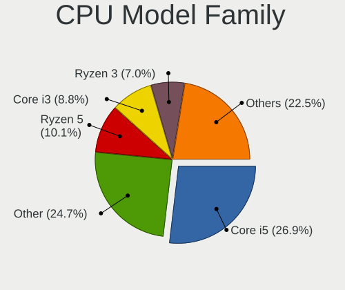

| Model                          | Notebooks | Percent |
|--------------------------------|-----------|---------|
| Intel Core i5                  | 61        | 26.87%  |
| Other                          | 56        | 24.67%  |
| AMD Ryzen 5                    | 23        | 10.13%  |
| Intel Core i3                  | 20        | 8.81%   |
| AMD Ryzen 3                    | 16        | 7.05%   |
| Intel Core i7                  | 8         | 3.52%   |
| Intel Celeron                  | 8         | 3.52%   |
| Intel Pentium                  | 7         | 3.08%   |
| AMD Ryzen 7                    | 7         | 3.08%   |
| Intel Core 2 Duo               | 4         | 1.76%   |
| AMD Ryzen 9                    | 2         | 0.88%   |
| AMD Phenom II                  | 2         | 0.88%   |
| AMD A4                         | 2         | 0.88%   |
| Intel Xeon                     | 1         | 0.44%   |
| Intel Pentium Gold             | 1         | 0.44%   |
| Intel Pentium Dual-Core        | 1         | 0.44%   |
| Intel Core                     | 1         | 0.44%   |
| Intel Celeron Dual-Core        | 1         | 0.44%   |
| Intel Atom                     | 1         | 0.44%   |
| AMD Turion X2 Dual-Core Mobile | 1         | 0.44%   |
| AMD Turion II                  | 1         | 0.44%   |
| AMD Ryzen 5 PRO                | 1         | 0.44%   |
| AMD Ryzen 3 PRO                | 1         | 0.44%   |
| AMD A10                        | 1         | 0.44%   |

CPU Cores
---------

Number of processor cores

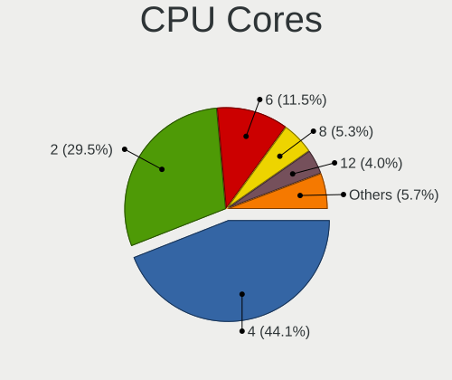

| Number | Notebooks | Percent |
|--------|-----------|---------|
| 4      | 100       | 44.05%  |
| 2      | 67        | 29.52%  |
| 6      | 26        | 11.45%  |
| 8      | 12        | 5.29%   |
| 12     | 9         | 3.96%   |
| 10     | 8         | 3.52%   |
| 14     | 3         | 1.32%   |
| 16     | 1         | 0.44%   |
| 3      | 1         | 0.44%   |

CPU Sockets
-----------

Number of sockets

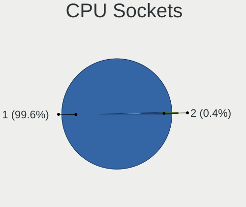

| Number | Notebooks | Percent |
|--------|-----------|---------|
| 1      | 226       | 99.56%  |
| 2      | 1         | 0.44%   |

CPU Threads
-----------

Threads per core (Hyper-Threading)

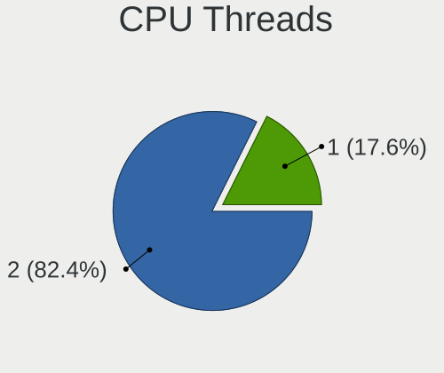

| Number | Notebooks | Percent |
|--------|-----------|---------|
| 2      | 187       | 82.38%  |
| 1      | 40        | 17.62%  |

CPU Op-Modes
------------

CPU Operation Modes (32-bit, 64-bit)

| Op mode        | Notebooks | Percent |
|----------------|-----------|---------|
| 32-bit, 64-bit | 227       | 100%    |

CPU Microcode
-------------

Microcode number

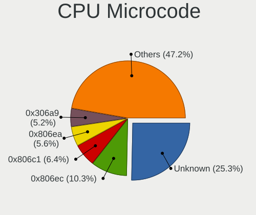

| Number     | Notebooks | Percent |
|------------|-----------|---------|
| Unknown    | 59        | 25.32%  |
| 0x806ec    | 24        | 10.3%   |
| 0x806c1    | 15        | 6.44%   |
| 0x806ea    | 13        | 5.58%   |
| 0x306a9    | 12        | 5.15%   |
| 0x906a4    | 11        | 4.72%   |
| 0x08608103 | 10        | 4.29%   |
| 0x906a3    | 9         | 3.86%   |
| 0x206a7    | 6         | 2.58%   |
| 0x0a50000c | 6         | 2.58%   |
| 0x08108102 | 6         | 2.58%   |
| 0x40651    | 5         | 2.15%   |
| 0x08600106 | 5         | 2.15%   |
| 0x806c2    | 3         | 1.29%   |
| 0x0a50000d | 3         | 1.29%   |
| 0x08a00006 | 3         | 1.29%   |
| 0xb06e0    | 2         | 0.86%   |
| 0x906ea    | 2         | 0.86%   |
| 0x806d1    | 2         | 0.86%   |
| 0x506e3    | 2         | 0.86%   |
| 0x506ca    | 2         | 0.86%   |
| 0x20652    | 2         | 0.86%   |
| 0x1067a    | 2         | 0.86%   |
| 0x08600104 | 2         | 0.86%   |
| 0x08108109 | 2         | 0.86%   |
| 0x010000c8 | 2         | 0.86%   |
| 0xa0660    | 1         | 0.43%   |
| 0x906eb    | 1         | 0.43%   |
| 0x906e9    | 1         | 0.43%   |
| 0x90675    | 1         | 0.43%   |
| 0x90672    | 1         | 0.43%   |
| 0x806e9    | 1         | 0.43%   |
| 0x706e5    | 1         | 0.43%   |
| 0x6fa      | 1         | 0.43%   |
| 0x506c9    | 1         | 0.43%   |
| 0x406e3    | 1         | 0.43%   |
| 0x406c4    | 1         | 0.43%   |
| 0x20655    | 1         | 0.43%   |
| 0x10676    | 1         | 0.43%   |
| 0x0a704101 | 1         | 0.43%   |

CPU Microarch
-------------

Microarchitecture

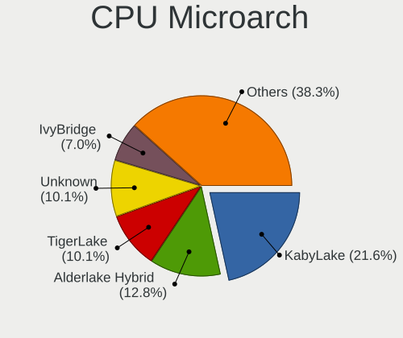

| Name              | Notebooks | Percent |
|-------------------|-----------|---------|
| KabyLake          | 49        | 21.59%  |
| Alderlake Hybrid  | 29        | 12.78%  |
| TigerLake         | 23        | 10.13%  |
| Unknown           | 23        | 10.13%  |
| IvyBridge         | 16        | 7.05%   |
| Zen 3             | 11        | 4.85%   |
| Zen 2             | 9         | 3.96%   |
| Zen+              | 8         | 3.52%   |
| Westmere          | 8         | 3.52%   |
| SandyBridge       | 8         | 3.52%   |
| Haswell           | 6         | 2.64%   |
| Penryn            | 5         | 2.2%    |
| Icelake           | 5         | 2.2%    |
| Skylake           | 4         | 1.76%   |
| Goldmont          | 4         | 1.76%   |
| K10               | 3         | 1.32%   |
| Silvermont        | 2         | 0.88%   |
| Gracemont         | 2         | 0.88%   |
| Goldmont plus     | 2         | 0.88%   |
| Excavator         | 2         | 0.88%   |
| CometLake         | 2         | 0.88%   |
| Zen               | 1         | 0.44%   |
| Piledriver        | 1         | 0.44%   |
| Meteorlake Hybrid | 1         | 0.44%   |
| K8 & K10 hybrid   | 1         | 0.44%   |
| Core              | 1         | 0.44%   |
| Bonnell           | 1         | 0.44%   |

Graphics
--------

GPU Vendor
----------

Vendors of graphics cards

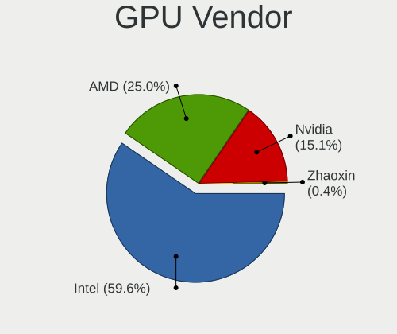

| Vendor  | Notebooks | Percent |
|---------|-----------|---------|
| Intel   | 162       | 59.56%  |
| AMD     | 68        | 25%     |
| Nvidia  | 41        | 15.07%  |
| Zhaoxin | 1         | 0.37%   |

GPU Model
---------

Graphics card models

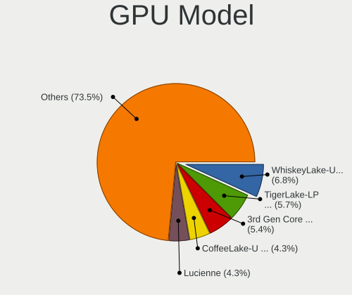

| Model                                                                         | Notebooks | Percent |
|-------------------------------------------------------------------------------|-----------|---------|
| Intel WhiskeyLake-U GT2 [UHD Graphics 620]                                    | 19        | 6.81%   |
| Intel TigerLake-LP GT2 [Iris Xe Graphics]                                     | 16        | 5.73%   |
| Intel 3rd Gen Core processor Graphics Controller                              | 15        | 5.38%   |
| Intel CoffeeLake-U GT3e [Iris Plus Graphics 655]                              | 12        | 4.3%    |
| AMD Lucienne                                                                  | 12        | 4.3%    |
| AMD Renoir [Radeon Vega Series / Radeon Vega Mobile Series]                   | 9         | 3.23%   |
| Intel 2nd Generation Core Processor Family Integrated Graphics Controller     | 8         | 2.87%   |
| AMD Picasso/Raven 2 [Radeon Vega Series / Radeon Vega Mobile Series]          | 8         | 2.87%   |
| AMD Cezanne [Radeon Vega Series / Radeon Vega Mobile Series]                  | 8         | 2.87%   |
| Intel Tiger Lake-LP GT2 [UHD Graphics G4]                                     | 7         | 2.51%   |
| Intel Alder Lake-UP3 GT2 [Iris Xe Graphics]                                   | 7         | 2.51%   |
| Intel Alder Lake-UP3 GT1 [UHD Graphics]                                       | 7         | 2.51%   |
| Intel Haswell-ULT Integrated Graphics Controller                              | 6         | 2.15%   |
| Intel CometLake-U GT2 [UHD Graphics]                                          | 6         | 2.15%   |
| Intel Core Processor Integrated Graphics Controller                           | 5         | 1.79%   |
| AMD Mendocino [Radeon 610M]                                                   | 5         | 1.79%   |
| Nvidia TU117M [GeForce GTX 1650 Mobile / Max-Q]                               | 4         | 1.43%   |
| Nvidia GF117M [GeForce 610M/710M/810M/820M / GT 620M/625M/630M/720M]          | 4         | 1.43%   |
| Intel Raptor Lake-P [UHD Graphics]                                            | 4         | 1.43%   |
| Intel Alder Lake-P Integrated Graphics Controller                             | 4         | 1.43%   |
| Intel Alder Lake-P GT2 [Iris Xe Graphics]                                     | 4         | 1.43%   |
| AMD Park [Mobility Radeon HD 5430/5450/5470]                                  | 4         | 1.43%   |
| Nvidia GA107M [GeForce RTX 3050 Mobile]                                       | 3         | 1.08%   |
| Intel Mobile 4 Series Chipset Integrated Graphics Controller                  | 3         | 1.08%   |
| Intel Kaby Lake-U GT2 [HD Graphics 620]                                       | 3         | 1.08%   |
| Intel CoffeeLake-H GT2 [UHD Graphics 630]                                     | 3         | 1.08%   |
| Intel Apollo Lake GT1 [HD Graphics 500]                                       | 3         | 1.08%   |
| AMD Rembrandt [Radeon 680M]                                                   | 3         | 1.08%   |
| AMD Barcelo                                                                   | 3         | 1.08%   |
| Nvidia GK208M [GeForce GT 740M]                                               | 2         | 0.72%   |
| Nvidia GF108M [GeForce GT 620M/630M/635M/640M LE]                             | 2         | 0.72%   |
| Intel TigerLake-H GT1 [UHD Graphics]                                          | 2         | 0.72%   |
| Intel Skylake-U GT2 [HD Graphics 520]                                         | 2         | 0.72%   |
| Intel Skylake-H GT2 [HD Graphics 530]                                         | 2         | 0.72%   |
| Intel Mobile GM965/GL960 Integrated Graphics Controller (secondary)           | 2         | 0.72%   |
| Intel Mobile GM965/GL960 Integrated Graphics Controller (primary)             | 2         | 0.72%   |
| Intel Kaby Lake-R GT2 [UHD Graphics 620]                                      | 2         | 0.72%   |
| Intel GeminiLake [UHD Graphics 600]                                           | 2         | 0.72%   |
| Intel Alder Lake-N [UHD Graphics]                                             | 2         | 0.72%   |
| AMD Sun XT [Radeon HD 8670A/8670M/8690M / R5 M330 / M430 / Radeon 520 Mobile] | 2         | 0.72%   |

GPU Combo
---------

Combinations of graphics cards

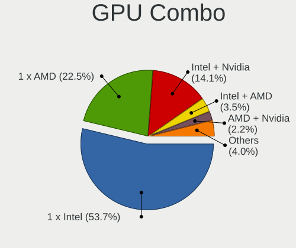

| Name           | Notebooks | Percent |
|----------------|-----------|---------|
| 1 x Intel      | 122       | 53.74%  |
| 1 x AMD        | 51        | 22.47%  |
| Intel + Nvidia | 32        | 14.1%   |
| Intel + AMD    | 8         | 3.52%   |
| AMD + Nvidia   | 5         | 2.2%    |
| 2 x AMD        | 4         | 1.76%   |
| 1 x Nvidia     | 3         | 1.32%   |
| 2 x Nvidia     | 1         | 0.44%   |
| 1 x Zhaoxin    | 1         | 0.44%   |

GPU Driver
----------

Free vs proprietary

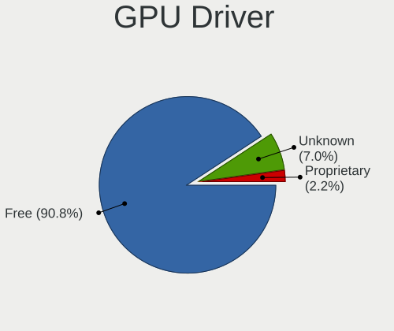

| Driver      | Notebooks | Percent |
|-------------|-----------|---------|
| Free        | 207       | 90.79%  |
| Unknown     | 16        | 7.02%   |
| Proprietary | 5         | 2.19%   |

GPU Memory
----------

Total video memory

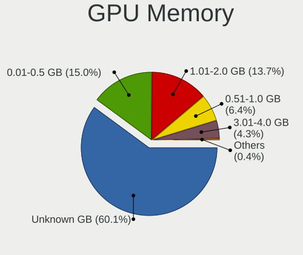

| Size in GB | Notebooks | Percent |
|------------|-----------|---------|
| Unknown    | 140       | 60.09%  |
| 0.01-0.5   | 35        | 15.02%  |
| 1.01-2.0   | 32        | 13.73%  |
| 0.51-1.0   | 15        | 6.44%   |
| 3.01-4.0   | 10        | 4.29%   |
| 7.01-8.0   | 1         | 0.43%   |

Monitor
-------

Monitor Vendor
--------------

Monitor vendors

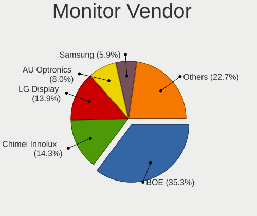

| Vendor                  | Notebooks | Percent |
|-------------------------|-----------|---------|
| BOE                     | 84        | 35.29%  |
| Chimei Innolux          | 34        | 14.29%  |
| LG Display              | 33        | 13.87%  |
| AU Optronics            | 19        | 7.98%   |
| Samsung Electronics     | 14        | 5.88%   |
| PANDA                   | 6         | 2.52%   |
| Philips                 | 5         | 2.1%    |
| Chi Mei Optoelectronics | 5         | 2.1%    |
| CSOT                    | 4         | 1.68%   |
| CSO                     | 3         | 1.26%   |
| Acer                    | 3         | 1.26%   |
| ViewSonic               | 2         | 0.84%   |
| TMX                     | 2         | 0.84%   |
| NLE                     | 2         | 0.84%   |
| Lenovo                  | 2         | 0.84%   |
| HUAWEI                  | 2         | 0.84%   |
| Dell                    | 2         | 0.84%   |
| Ancor Communications    | 2         | 0.84%   |
| Toshiba                 | 1         | 0.42%   |
| SKG                     | 1         | 0.42%   |
| Sharp                   | 1         | 0.42%   |
| RGT                     | 1         | 0.42%   |
| NEC Computers           | 1         | 0.42%   |
| KVT                     | 1         | 0.42%   |
| IPS                     | 1         | 0.42%   |
| InfoVision              | 1         | 0.42%   |
| Iiyama                  | 1         | 0.42%   |
| HannStar                | 1         | 0.42%   |
| Goldstar                | 1         | 0.42%   |
| Apple                   | 1         | 0.42%   |
| AOC                     | 1         | 0.42%   |
| AGT                     | 1         | 0.42%   |

Monitor Model
-------------

Monitor models

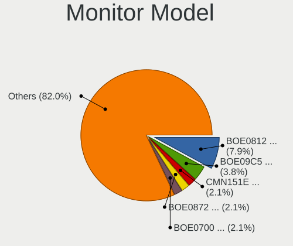

| Model                                                            | Notebooks | Percent |
|------------------------------------------------------------------|-----------|---------|
| BOE LCD Monitor BOE0812 1920x1080 344x194mm 15.5-inch            | 19        | 7.95%   |
| BOE LCD Monitor BOE09C5 1920x1080 345x194mm 15.6-inch            | 9         | 3.77%   |
| Chimei Innolux LCD Monitor CMN151E 1920x1080 344x193mm 15.5-inch | 5         | 2.09%   |
| BOE LCD Monitor BOE0872 1920x1080 344x194mm 15.5-inch            | 5         | 2.09%   |
| BOE LCD Monitor BOE0700 1920x1080 344x194mm 15.5-inch            | 5         | 2.09%   |
| Chimei Innolux LCD Monitor CMN15F5 1920x1080 344x193mm 15.5-inch | 4         | 1.67%   |
| Chimei Innolux LCD Monitor CMN15E7 1920x1080 344x193mm 15.5-inch | 4         | 1.67%   |
| BOE LCD Monitor BOE0936 1920x1080 344x194mm 15.5-inch            | 4         | 1.67%   |
| LG Display LCD Monitor LGD062E 1920x1080 344x194mm 15.5-inch     | 3         | 1.26%   |
| LG Display LCD Monitor LGD02DC 1366x768 344x194mm 15.5-inch      | 3         | 1.26%   |
| Chimei Innolux LCD Monitor CMN1618 1920x1200 344x215mm 16.0-inch | 3         | 1.26%   |
| BOE LCD Monitor BOE0AF7 1920x1080 344x194mm 15.5-inch            | 3         | 1.26%   |
| BOE LCD Monitor BOE0877 1920x1080 309x173mm 13.9-inch            | 3         | 1.26%   |
| AU Optronics LCD Monitor AUO38ED 1920x1080 344x193mm 15.5-inch   | 3         | 1.26%   |
| NLE Newline NLE0032 3840x2160 944x398mm 40.3-inch                | 2         | 0.84%   |
| LG Display LCD Monitor LGD033B 1366x768 344x194mm 15.5-inch      | 2         | 0.84%   |
| LG Display LCD Monitor LGD033A 1366x768 344x194mm 15.5-inch      | 2         | 0.84%   |
| LG Display LCD Monitor LGD02AC 1366x768 344x194mm 15.5-inch      | 2         | 0.84%   |
| HUAWEI ZQE-CBA HWV6A25 3440x1440 797x334mm 34.0-inch             | 2         | 0.84%   |
| Dell E2316H DELF06B 1920x1080 509x286mm 23.0-inch                | 2         | 0.84%   |
| CSOT SNF601BS1-1 CSO150D 1920x1080 344x193mm 15.5-inch           | 2         | 0.84%   |
| Chimei Innolux LCD Monitor CMN1738 1920x1080 381x214mm 17.2-inch | 2         | 0.84%   |
| Chimei Innolux LCD Monitor CMN1552 1920x1080 344x193mm 15.5-inch | 2         | 0.84%   |
| BOE LCD Monitor BOE0AED 1920x1080 344x194mm 15.5-inch            | 2         | 0.84%   |
| BOE LCD Monitor BOE0A56 1920x1080 344x194mm 15.5-inch            | 2         | 0.84%   |
| BOE LCD Monitor BOE0900 1920x1080 344x194mm 15.5-inch            | 2         | 0.84%   |
| BOE LCD Monitor BOE084E 1920x1080 382x215mm 17.3-inch            | 2         | 0.84%   |
| BOE LCD Monitor BOE07D0 1920x1080 294x165mm 13.3-inch            | 2         | 0.84%   |
| BOE LCD Monitor BOE07CB 1920x1080 344x193mm 15.5-inch            | 2         | 0.84%   |
| BOE LCD Monitor BOE06A5 1366x768 344x194mm 15.5-inch             | 2         | 0.84%   |
| AU Optronics LCD Monitor AUOE48D 1920x1080 344x194mm 15.5-inch   | 2         | 0.84%   |
| AU Optronics LCD Monitor AUO28ED 1920x1080 344x193mm 15.5-inch   | 2         | 0.84%   |
| AU Optronics LCD Monitor AUO22EC 1366x768 344x193mm 15.5-inch    | 2         | 0.84%   |
| ViewSonic VA2418-FHD VSCD739 1920x1080 527x296mm 23.8-inch       | 1         | 0.42%   |
| ViewSonic PJ VSC9B34 1920x1080                                   | 1         | 0.42%   |
| Toshiba LCD Monitor LCD58EB 1280x800 260x160mm 12.0-inch         | 1         | 0.42%   |
| TMX TL156MDMP11-0 TMX1560 3200x2000 336x210mm 15.6-inch          | 1         | 0.42%   |
| TMX TL140VDXP04-0 TMX1398 1920x1080 309x174mm 14.0-inch          | 1         | 0.42%   |
| SKG 65 Monitor SKG6500 3840x2160 1430x800mm 64.5-inch            | 1         | 0.42%   |
| Sharp LQ173M1JW03 SHP14DC 1920x1080 382x215mm 17.3-inch          | 1         | 0.42%   |

Monitor Resolution
------------------

Monitor screen resolution

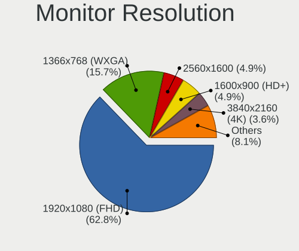

| Resolution         | Notebooks | Percent |
|--------------------|-----------|---------|
| 1920x1080 (FHD)    | 140       | 62.78%  |
| 1366x768 (WXGA)    | 35        | 15.7%   |
| 2560x1600          | 11        | 4.93%   |
| 1600x900 (HD+)     | 11        | 4.93%   |
| 3840x2160 (4K)     | 8         | 3.59%   |
| 1920x1200 (WUXGA)  | 5         | 2.24%   |
| 1280x800 (WXGA)    | 3         | 1.35%   |
| 2560x1440 (QHD)    | 2         | 0.9%    |
| 1680x1050 (WSXGA+) | 2         | 0.9%    |
| 3440x1440          | 1         | 0.45%   |
| 3200x2000          | 1         | 0.45%   |
| 2560x1080          | 1         | 0.45%   |
| 2240x1400          | 1         | 0.45%   |
| 1440x900 (WXGA+)   | 1         | 0.45%   |
| 1280x1024 (SXGA)   | 1         | 0.45%   |

Monitor Diagonal
----------------

Diagonal size in inches

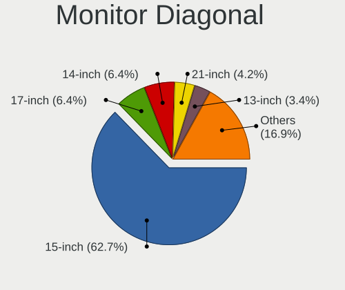

| Inches  | Notebooks | Percent |
|---------|-----------|---------|
| 15      | 148       | 62.71%  |
| 17      | 15        | 6.36%   |
| 14      | 15        | 6.36%   |
| 21      | 10        | 4.24%   |
| 13      | 8         | 3.39%   |
| 16      | 7         | 2.97%   |
| 24      | 5         | 2.12%   |
| 12      | 5         | 2.12%   |
| 34      | 4         | 1.69%   |
| 84      | 2         | 0.85%   |
| 40      | 2         | 0.85%   |
| 27      | 2         | 0.85%   |
| 23      | 2         | 0.85%   |
| 20      | 2         | 0.85%   |
| 11      | 2         | 0.85%   |
| 64      | 1         | 0.42%   |
| 55      | 1         | 0.42%   |
| 54      | 1         | 0.42%   |
| 31      | 1         | 0.42%   |
| 22      | 1         | 0.42%   |
| 19      | 1         | 0.42%   |
| Unknown | 1         | 0.42%   |

Monitor Width
-------------

Physical width

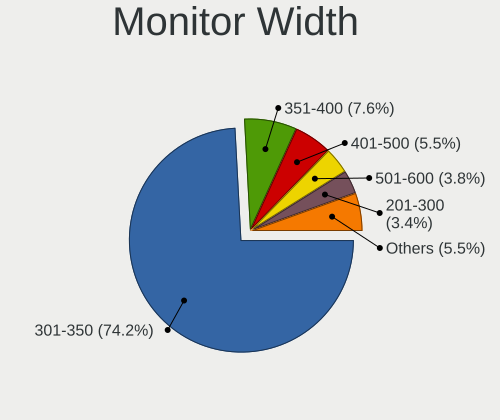

| Width in mm | Notebooks | Percent |
|-------------|-----------|---------|
| 301-350     | 175       | 74.15%  |
| 351-400     | 18        | 7.63%   |
| 401-500     | 13        | 5.51%   |
| 501-600     | 9         | 3.81%   |
| 201-300     | 8         | 3.39%   |
| 701-800     | 4         | 1.69%   |
| 1001-1500   | 3         | 1.27%   |
| 1501-2000   | 2         | 0.85%   |
| 901-1000    | 2         | 0.85%   |
| 601-700     | 1         | 0.42%   |
| Unknown     | 1         | 0.42%   |

Aspect Ratio
------------

Proportional relationship between the width and the height

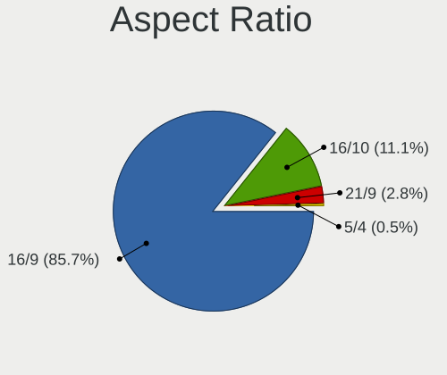

| Ratio | Notebooks | Percent |
|-------|-----------|---------|
| 16/9  | 186       | 85.71%  |
| 16/10 | 24        | 11.06%  |
| 21/9  | 6         | 2.76%   |
| 5/4   | 1         | 0.46%   |

Monitor Area
------------

Area in inch²

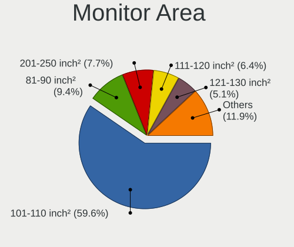

| Area in inch² | Notebooks | Percent |
|----------------|-----------|---------|
| 101-110        | 140       | 59.57%  |
| 81-90          | 22        | 9.36%   |
| 201-250        | 18        | 7.66%   |
| 111-120        | 15        | 6.38%   |
| 121-130        | 12        | 5.11%   |
| More than 1000 | 5         | 2.13%   |
| 61-70          | 5         | 2.13%   |
| 351-500        | 4         | 1.7%    |
| 151-200        | 3         | 1.28%   |
| 131-140        | 3         | 1.28%   |
| 51-60          | 2         | 0.85%   |
| 301-350        | 2         | 0.85%   |
| 501-1000       | 2         | 0.85%   |
| 71-80          | 1         | 0.43%   |
| Unknown        | 1         | 0.43%   |

Pixel Density
-------------

Pixels per inch

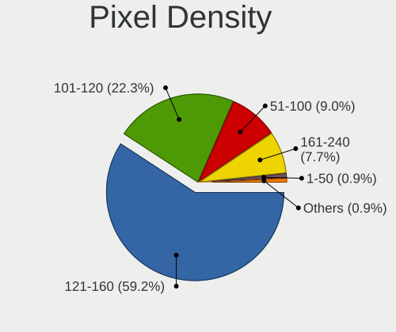

| Density       | Notebooks | Percent |
|---------------|-----------|---------|
| 121-160       | 138       | 59.23%  |
| 101-120       | 52        | 22.32%  |
| 51-100        | 21        | 9.01%   |
| 161-240       | 18        | 7.73%   |
| 1-50          | 2         | 0.86%   |
| More than 240 | 1         | 0.43%   |
| Unknown       | 1         | 0.43%   |

Multiple Monitors
-----------------

Total monitors connected

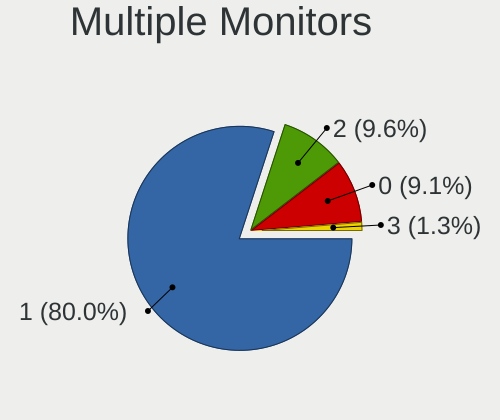

| Total | Notebooks | Percent |
|-------|-----------|---------|
| 1     | 184       | 80%     |
| 2     | 22        | 9.57%   |
| 0     | 21        | 9.13%   |
| 3     | 3         | 1.3%    |

Network
-------

Net Controller Vendor
---------------------

Controller vendors

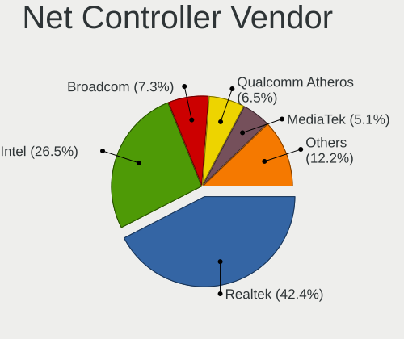

| Vendor                    | Notebooks | Percent |
|---------------------------|-----------|---------|
| Realtek Semiconductor     | 157       | 42.43%  |
| Intel                     | 98        | 26.49%  |
| Broadcom                  | 27        | 7.3%    |
| Qualcomm Atheros          | 24        | 6.49%   |
| MediaTek                  | 19        | 5.14%   |
| Xiaomi                    | 15        | 4.05%   |
| OPPO Electronics          | 4         | 1.08%   |
| TP-Link                   | 3         | 0.81%   |
| Samsung Electronics       | 3         | 0.81%   |
| Broadcom Limited          | 3         | 0.81%   |
| ASIX Electronics          | 3         | 0.81%   |
| Xilinx                    | 2         | 0.54%   |
| Ralink                    | 2         | 0.54%   |
| Qualcomm                  | 2         | 0.54%   |
| Mercucys                  | 2         | 0.54%   |
| Huawei Technologies       | 2         | 0.54%   |
| Spreadtrum Communications | 1         | 0.27%   |
| Ralink Technology         | 1         | 0.27%   |
| OKB SAPR                  | 1         | 0.27%   |
| Nvidia                    | 1         | 0.27%   |

Net Controller Model
--------------------

Controller models

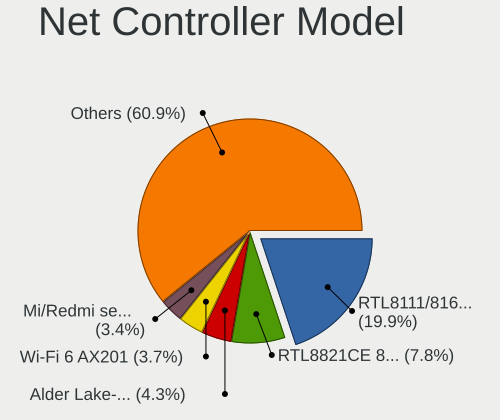

| Model                                                                  | Notebooks | Percent |
|------------------------------------------------------------------------|-----------|---------|
| Realtek RTL8111/8168/8211/8411 PCI Express Gigabit Ethernet Controller | 87        | 19.91%  |
| Realtek RTL8821CE 802.11ac PCIe Wireless Network Adapter               | 34        | 7.78%   |
| Intel Alder Lake-P PCH CNVi WiFi                                       | 19        | 4.35%   |
| Intel Wi-Fi 6 AX201                                                    | 16        | 3.66%   |
| Xiaomi Mi/Redmi series (RNDIS)                                         | 15        | 3.43%   |
| Realtek RTL8153 Gigabit Ethernet Adapter                               | 14        | 3.2%    |
| Realtek RTL810xE PCI Express Fast Ethernet controller                  | 12        | 2.75%   |
| Intel Wireless 7265                                                    | 12        | 2.75%   |
| Broadcom BCM43142 802.11b/g/n                                          | 11        | 2.52%   |
| Realtek RTL8822CE 802.11ac PCIe Wireless Network Adapter               | 10        | 2.29%   |
| Realtek RTL8152 Fast Ethernet Adapter                                  | 10        | 2.29%   |
| MediaTek MT7921 802.11ax PCIe Wireless Network Adapter [Filogic 330]   | 8         | 1.83%   |
| MediaTek MT7902 802.11ax PCIe Wireless Network Adapter [Filogic 310]   | 8         | 1.83%   |
| Intel Ethernet Connection (6) I219-V                                   | 8         | 1.83%   |
| Realtek RTL8852BE PCIe 802.11ax Wireless Network Controller            | 7         | 1.6%    |
| Qualcomm Atheros AR9285 Wireless Network Adapter (PCI-Express)         | 7         | 1.6%    |
| Qualcomm Atheros QCA9377 802.11ac Wireless Network Adapter             | 6         | 1.37%   |
| Intel Wireless 3165                                                    | 5         | 1.14%   |
| Intel Comet Lake PCH-LP CNVi WiFi                                      | 5         | 1.14%   |
| Intel Cannon Point-LP CNVi [Wireless-AC]                               | 5         | 1.14%   |
| Intel 82579LM Gigabit Network Connection (Lewisville)                  | 5         | 1.14%   |
| Broadcom BCM4312 802.11b/g LP-PHY                                      | 5         | 1.14%   |
| Realtek RTL8852AE 802.11ax PCIe Wireless Network Adapter               | 4         | 0.92%   |
| OPPO Ace 3V                                                            | 4         | 0.92%   |
| Broadcom BCM4313 802.11bgn Wireless Network Adapter                    | 4         | 0.92%   |
| Samsung Galaxy series, misc. (tethering mode)                          | 3         | 0.69%   |
| Realtek RTL8188EUS 802.11n Wireless Network Adapter                    | 3         | 0.69%   |
| Realtek 802.11n WLAN Adapter                                           | 3         | 0.69%   |
| Intel Ethernet Connection (16) I219-V                                  | 3         | 0.69%   |
| Intel Dual Band Wireless-AC 3165 Plus Bluetooth                        | 3         | 0.69%   |
| Intel Centrino Advanced-N 6205 [Taylor Peak]                           | 3         | 0.69%   |
| ASIX AX88179 Gigabit Ethernet                                          | 3         | 0.69%   |
| Xilinx Network controller                                              | 2         | 0.46%   |
| Realtek RTL8723DE Wireless Network Adapter                             | 2         | 0.46%   |
| Realtek RTL8723BU 802.11b/g/n WLAN Adapter                             | 2         | 0.46%   |
| Ralink RT3290 Wireless 802.11n 1T/1R PCIe                              | 2         | 0.46%   |
| Qualcomm QCNFA765 Wireless Network Adapter                             | 2         | 0.46%   |
| Qualcomm Atheros QCA8171 Gigabit Ethernet                              | 2         | 0.46%   |
| Qualcomm Atheros AR9485 Wireless Network Adapter                       | 2         | 0.46%   |
| Qualcomm Atheros AR8162 Fast Ethernet                                  | 2         | 0.46%   |

Wireless Vendor
---------------

Wireless vendors

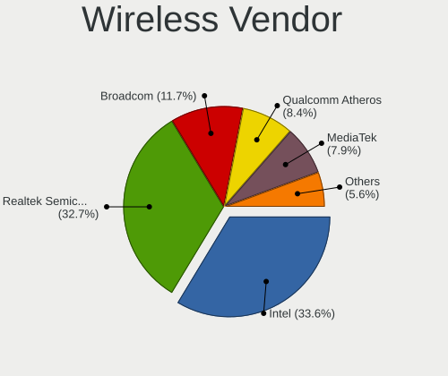

| Vendor                | Notebooks | Percent |
|-----------------------|-----------|---------|
| Intel                 | 72        | 33.64%  |
| Realtek Semiconductor | 70        | 32.71%  |
| Broadcom              | 25        | 11.68%  |
| Qualcomm Atheros      | 18        | 8.41%   |
| MediaTek              | 17        | 7.94%   |
| TP-Link               | 3         | 1.4%    |
| Ralink                | 2         | 0.93%   |
| Qualcomm              | 2         | 0.93%   |
| Mercucys              | 2         | 0.93%   |
| Broadcom Limited      | 2         | 0.93%   |
| Ralink Technology     | 1         | 0.47%   |

Wireless Model
--------------

Wireless models

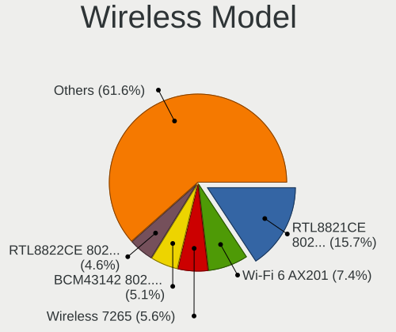

| Model                                                                | Notebooks | Percent |
|----------------------------------------------------------------------|-----------|---------|
| Realtek RTL8821CE 802.11ac PCIe Wireless Network Adapter             | 34        | 15.74%  |
| Intel Wi-Fi 6 AX201                                                  | 16        | 7.41%   |
| Intel Wireless 7265                                                  | 12        | 5.56%   |
| Broadcom BCM43142 802.11b/g/n                                        | 11        | 5.09%   |
| Realtek RTL8822CE 802.11ac PCIe Wireless Network Adapter             | 10        | 4.63%   |
| MediaTek MT7921 802.11ax PCIe Wireless Network Adapter [Filogic 330] | 8         | 3.7%    |
| MediaTek MT7902 802.11ax PCIe Wireless Network Adapter [Filogic 310] | 8         | 3.7%    |
| Realtek RTL8852BE PCIe 802.11ax Wireless Network Controller          | 7         | 3.24%   |
| Qualcomm Atheros AR9285 Wireless Network Adapter (PCI-Express)       | 7         | 3.24%   |
| Qualcomm Atheros QCA9377 802.11ac Wireless Network Adapter           | 6         | 2.78%   |
| Intel Wireless 3165                                                  | 5         | 2.31%   |
| Intel Comet Lake PCH-LP CNVi WiFi                                    | 5         | 2.31%   |
| Intel Cannon Point-LP CNVi [Wireless-AC]                             | 5         | 2.31%   |
| Broadcom BCM4312 802.11b/g LP-PHY                                    | 5         | 2.31%   |
| Realtek RTL8852AE 802.11ax PCIe Wireless Network Adapter             | 4         | 1.85%   |
| Intel Alder Lake-P PCH CNVi WiFi                                     | 4         | 1.85%   |
| Broadcom BCM4313 802.11bgn Wireless Network Adapter                  | 4         | 1.85%   |
| Realtek RTL8188EUS 802.11n Wireless Network Adapter                  | 3         | 1.39%   |
| Realtek 802.11n WLAN Adapter                                         | 3         | 1.39%   |
| Intel Dual Band Wireless-AC 3165 Plus Bluetooth                      | 3         | 1.39%   |
| Intel Centrino Advanced-N 6205 [Taylor Peak]                         | 3         | 1.39%   |
| Realtek RTL8723DE Wireless Network Adapter                           | 2         | 0.93%   |
| Realtek RTL8723BU 802.11b/g/n WLAN Adapter                           | 2         | 0.93%   |
| Ralink RT3290 Wireless 802.11n 1T/1R PCIe                            | 2         | 0.93%   |
| Qualcomm QCNFA765 Wireless Network Adapter                           | 2         | 0.93%   |
| Qualcomm Atheros AR9485 Wireless Network Adapter                     | 2         | 0.93%   |
| Mercucys 802.11n NIC                                                 | 2         | 0.93%   |
| Intel Wi-Fi 6E(802.11ax) AX210/AX1675* 2x2 [Typhoon Peak]            | 2         | 0.93%   |
| Intel Wi-Fi 6 AX200                                                  | 2         | 0.93%   |
| Intel Ice Lake-LP PCH CNVi WiFi                                      | 2         | 0.93%   |
| Intel Alder Lake-N PCH CNVi WiFi                                     | 2         | 0.93%   |
| Broadcom Limited BCM4352 802.11ac Dual Band Wireless Network Adapter | 2         | 0.93%   |
| Broadcom BCM43228 802.11a/b/g/n                                      | 2         | 0.93%   |
| Broadcom BCM4322 802.11a/b/g/n Wireless LAN Controller               | 2         | 0.93%   |
| TP-Link TL-WN821N v5/v6 [RTL8192EU]                                  | 1         | 0.46%   |
| TP-Link Archer T4U ver.3                                             | 1         | 0.46%   |
| TP-Link AC600 wireless Realtek RTL8811AU [Archer T2U Nano]           | 1         | 0.46%   |
| TP-Link 802.11n NIC                                                  | 1         | 0.46%   |
| Realtek RTL8822BE 802.11a/b/g/n/ac WiFi adapter                      | 1         | 0.46%   |
| Realtek RTL8812AU 802.11a/b/g/n/ac 2T2R DB WLAN Adapter              | 1         | 0.46%   |

Ethernet Vendor
---------------

Ethernet vendors

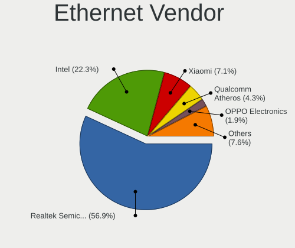

| Vendor                    | Notebooks | Percent |
|---------------------------|-----------|---------|
| Realtek Semiconductor     | 120       | 56.87%  |
| Intel                     | 47        | 22.27%  |
| Xiaomi                    | 15        | 7.11%   |
| Qualcomm Atheros          | 9         | 4.27%   |
| OPPO Electronics          | 4         | 1.9%    |
| Samsung Electronics       | 3         | 1.42%   |
| Broadcom                  | 3         | 1.42%   |
| ASIX Electronics          | 3         | 1.42%   |
| MediaTek                  | 2         | 0.95%   |
| Spreadtrum Communications | 1         | 0.47%   |
| OKB SAPR                  | 1         | 0.47%   |
| Nvidia                    | 1         | 0.47%   |
| Huawei Technologies       | 1         | 0.47%   |
| Broadcom Limited          | 1         | 0.47%   |

Ethernet Model
--------------

Ethernet models

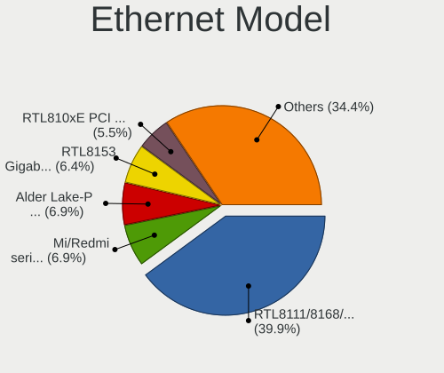

| Model                                                                  | Notebooks | Percent |
|------------------------------------------------------------------------|-----------|---------|
| Realtek RTL8111/8168/8211/8411 PCI Express Gigabit Ethernet Controller | 87        | 39.91%  |
| Xiaomi Mi/Redmi series (RNDIS)                                         | 15        | 6.88%   |
| Intel Alder Lake-P PCH CNVi WiFi                                       | 15        | 6.88%   |
| Realtek RTL8153 Gigabit Ethernet Adapter                               | 14        | 6.42%   |
| Realtek RTL810xE PCI Express Fast Ethernet controller                  | 12        | 5.5%    |
| Realtek RTL8152 Fast Ethernet Adapter                                  | 10        | 4.59%   |
| Intel Ethernet Connection (6) I219-V                                   | 8         | 3.67%   |
| Intel 82579LM Gigabit Network Connection (Lewisville)                  | 5         | 2.29%   |
| OPPO Ace 3V                                                            | 4         | 1.83%   |
| Samsung Galaxy series, misc. (tethering mode)                          | 3         | 1.38%   |
| Intel Ethernet Connection (16) I219-V                                  | 3         | 1.38%   |
| ASIX AX88179 Gigabit Ethernet                                          | 3         | 1.38%   |
| Qualcomm Atheros QCA8171 Gigabit Ethernet                              | 2         | 0.92%   |
| Qualcomm Atheros AR8162 Fast Ethernet                                  | 2         | 0.92%   |
| Qualcomm Atheros AR8152 v2.0 Fast Ethernet                             | 2         | 0.92%   |
| Intel Ethernet Controller I225-V                                       | 2         | 0.92%   |
| Intel Ethernet Connection I219-LM                                      | 2         | 0.92%   |
| Intel Ethernet Connection (16) I219-LM                                 | 2         | 0.92%   |
| Intel Ethernet Connection (13) I219-V                                  | 2         | 0.92%   |
| Intel 82579V Gigabit Network Connection                                | 2         | 0.92%   |
| Intel 82577LM Gigabit Network Connection                               | 2         | 0.92%   |
| Spreadtrum Android                                                     | 1         | 0.46%   |
| Realtek RTL8125 2.5GbE Controller                                      | 1         | 0.46%   |
| Qualcomm Atheros AR8161 Gigabit Ethernet                               | 1         | 0.46%   |
| Qualcomm Atheros AR8152 v1.1 Fast Ethernet                             | 1         | 0.46%   |
| Qualcomm Atheros AR8131 Gigabit Ethernet                               | 1         | 0.46%   |
| OKB SAPR Ethernet controller                                           | 1         | 0.46%   |
| Nvidia MCP79 Ethernet                                                  | 1         | 0.46%   |
| MediaTek Infinix HOT 50i                                               | 1         | 0.46%   |
| MediaTek A015                                                          | 1         | 0.46%   |
| Intel Ethernet Connection I218-LM                                      | 1         | 0.46%   |
| Intel Ethernet Connection (7) I219-V                                   | 1         | 0.46%   |
| Intel Ethernet Connection (7) I219-LM                                  | 1         | 0.46%   |
| Intel Ethernet Connection (23) I219-LM                                 | 1         | 0.46%   |
| Intel Ethernet Connection (14) I219-LM                                 | 1         | 0.46%   |
| Intel 82567LM Gigabit Network Connection                               | 1         | 0.46%   |
| Intel 82566MM Gigabit Network Connection                               | 1         | 0.46%   |
| Huawei FOA-LX9                                                         | 1         | 0.46%   |
| Broadcom NetLink BCM5906M Fast Ethernet PCI Express                    | 1         | 0.46%   |
| Broadcom NetLink BCM5787M Gigabit Ethernet PCI Express                 | 1         | 0.46%   |

Net Controller Kind
-------------------

Ethernet, WiFi or modem

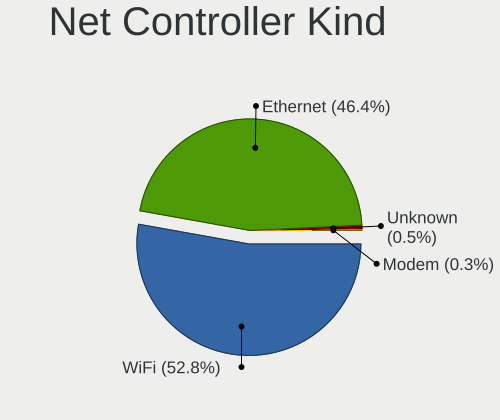

| Kind     | Notebooks | Percent |
|----------|-----------|---------|
| WiFi     | 206       | 52.82%  |
| Ethernet | 181       | 46.41%  |
| Unknown  | 2         | 0.51%   |
| Modem    | 1         | 0.26%   |

Used Controller
---------------

Currently used network controller

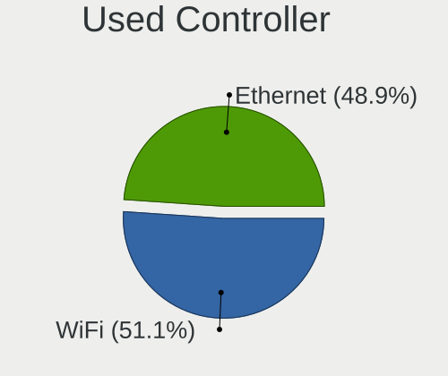

| Kind     | Notebooks | Percent |
|----------|-----------|---------|
| WiFi     | 118       | 51.08%  |
| Ethernet | 113       | 48.92%  |

NICs
----

Total network controllers on board

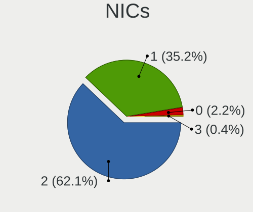

| Total | Notebooks | Percent |
|-------|-----------|---------|
| 2     | 141       | 62.11%  |
| 1     | 80        | 35.24%  |
| 0     | 5         | 2.2%    |
| 3     | 1         | 0.44%   |

IPv6
----

IPv6 vs IPv4

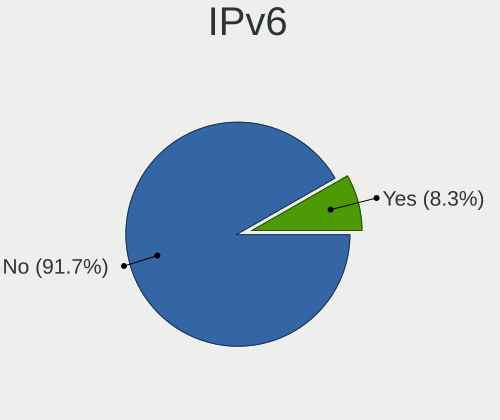

| Used | Notebooks | Percent |
|------|-----------|---------|
| No   | 211       | 91.74%  |
| Yes  | 19        | 8.26%   |

Bluetooth
---------

Bluetooth Vendor
----------------

Controller vendors

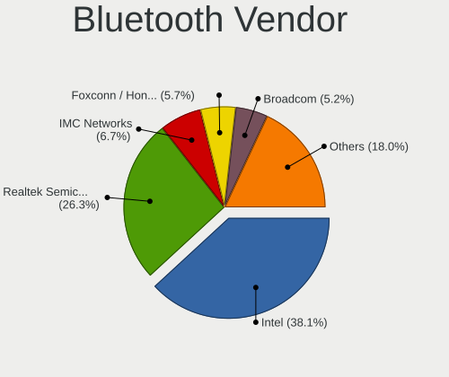

| Vendor                          | Notebooks | Percent |
|---------------------------------|-----------|---------|
| Intel                           | 74        | 38.14%  |
| Realtek Semiconductor           | 51        | 26.29%  |
| IMC Networks                    | 13        | 6.7%    |
| Foxconn / Hon Hai               | 11        | 5.67%   |
| Broadcom                        | 10        | 5.15%   |
| Qualcomm Atheros Communications | 7         | 3.61%   |
| Foxconn International           | 7         | 3.61%   |
| Realtek                         | 5         | 2.58%   |
| Lite-On Technology              | 5         | 2.58%   |
| Hewlett-Packard                 | 3         | 1.55%   |
| Ralink                          | 2         | 1.03%   |
| ASUSTek Computer                | 2         | 1.03%   |
| Taiyo Yuden                     | 1         | 0.52%   |
| Opticis                         | 1         | 0.52%   |
| Dell                            | 1         | 0.52%   |
| Apple                           | 1         | 0.52%   |

Bluetooth Model
---------------

Controller models

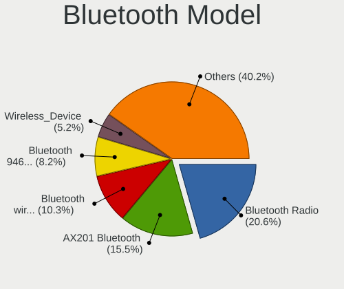

| Model                                             | Notebooks | Percent |
|---------------------------------------------------|-----------|---------|
| Realtek Bluetooth Radio                           | 40        | 20.62%  |
| Intel AX201 Bluetooth                             | 30        | 15.46%  |
| Intel Bluetooth wireless interface                | 20        | 10.31%  |
| Intel Bluetooth 9460/9560 Jefferson Peak (JfP)    | 16        | 8.25%   |
| IMC Networks Wireless_Device                      | 10        | 5.15%   |
| Realtek  Bluetooth 4.2 Adapter                    | 8         | 4.12%   |
| Foxconn International BCM43142A0 Bluetooth module | 7         | 3.61%   |
| Realtek Bluetooth Radio                           | 5         | 2.58%   |
| Foxconn / Hon Hai MediaTek Bluetooth Adapter      | 5         | 2.58%   |
| Qualcomm Atheros  Bluetooth Device                | 4         | 2.06%   |
| Intel Bluetooth Device                            | 4         | 2.06%   |
| IMC Networks Bluetooth Radio                      | 3         | 1.55%   |
| HP Broadcom 2070 Bluetooth Combo                  | 3         | 1.55%   |
| Realtek 802.11ac WLAN Adapter                     | 2         | 1.03%   |
| Ralink RT3290 Bluetooth                           | 2         | 1.03%   |
| Qualcomm Atheros AR3011 Bluetooth                 | 2         | 1.03%   |
| Lite-On Qualcomm Atheros QCA9377 Bluetooth        | 2         | 1.03%   |
| Lite-On Broadcom BCM43142A0 Bluetooth Device      | 2         | 1.03%   |
| Intel AX210 Bluetooth                             | 2         | 1.03%   |
| Intel AX200 Bluetooth                             | 2         | 1.03%   |
| Foxconn / Hon Hai Bluetooth Device                | 2         | 1.03%   |
| Broadcom HP Portable Valentine                    | 2         | 1.03%   |
| Taiyo Yuden Bluetooth Device                      | 1         | 0.52%   |
| Realtek RTL8723A Bluetooth                        | 1         | 0.52%   |
| Qualcomm Atheros AR9462 Bluetooth                 | 1         | 0.52%   |
| Opticis Bluetooth Radio                           | 1         | 0.52%   |
| Lite-On Wireless_Device                           | 1         | 0.52%   |
| Foxconn / Hon Hai Wireless_Device                 | 1         | 0.52%   |
| Foxconn / Hon Hai Broadcom BCM20702A1 Bluetooth   | 1         | 0.52%   |
| Foxconn / Hon Hai Broadcom BCM20702 Bluetooth     | 1         | 0.52%   |
| Foxconn / Hon Hai Bluetooth USB Host Controller   | 1         | 0.52%   |
| Dell BCM20702A0 Bluetooth Module                  | 1         | 0.52%   |
| Broadcom HP Portable SoftSailing                  | 1         | 0.52%   |
| Broadcom HP Portable Bumble Bee                   | 1         | 0.52%   |
| Broadcom BCM43142A0 Bluetooth 4.0                 | 1         | 0.52%   |
| Broadcom BCM20702A0 Bluetooth                     | 1         | 0.52%   |
| Broadcom BCM20702 Bluetooth 4.0 [ThinkPad]        | 1         | 0.52%   |
| Broadcom BCM2070 Bluetooth 2.1 + EDR              | 1         | 0.52%   |
| Broadcom BCM2045B (BDC-2.1)                       | 1         | 0.52%   |
| Broadcom BCM2045 Bluetooth                        | 1         | 0.52%   |

Sound
-----

Sound Vendor
------------

Sound card vendors

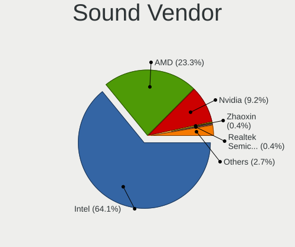

| Vendor                 | Notebooks | Percent |
|------------------------|-----------|---------|
| Intel                  | 168       | 64.12%  |
| AMD                    | 61        | 23.28%  |
| Nvidia                 | 24        | 9.16%   |
| Zhaoxin                | 1         | 0.38%   |
| Realtek Semiconductor  | 1         | 0.38%   |
| MosArt Semiconductor   | 1         | 0.38%   |
| Lenovo                 | 1         | 0.38%   |
| JMTek                  | 1         | 0.38%   |
| GN Netcom              | 1         | 0.38%   |
| Generalplus Technology | 1         | 0.38%   |
| C-Media Electronics    | 1         | 0.38%   |
| ASUSTek Computer       | 1         | 0.38%   |

Sound Model
-----------

Sound card models

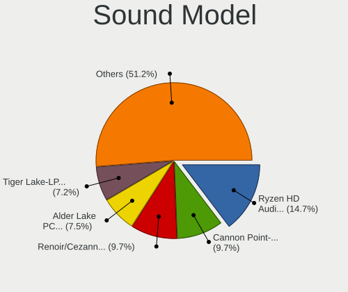

| Model                                                                                     | Notebooks | Percent |
|-------------------------------------------------------------------------------------------|-----------|---------|
| AMD Ryzen HD Audio Controller                                                             | 47        | 14.69%  |
| Intel Cannon Point-LP High Definition Audio Controller                                    | 31        | 9.69%   |
| AMD Renoir/Cezanne HDMI/DP Audio Controller                                               | 31        | 9.69%   |
| Intel Alder Lake PCH-P High Definition Audio Controller                                   | 24        | 7.5%    |
| Intel Tiger Lake-LP Smart Sound Technology Audio Controller                               | 23        | 7.19%   |
| Intel 7 Series/C216 Chipset Family High Definition Audio Controller                       | 19        | 5.94%   |
| Intel Comet Lake PCH-LP cAVS                                                              | 8         | 2.5%    |
| Intel 5 Series/3400 Series Chipset High Definition Audio                                  | 8         | 2.5%    |
| AMD Raven/Raven2/Fenghuang HDMI/DP Audio Controller                                       | 8         | 2.5%    |
| AMD Radeon High Definition Audio Controller                                               | 8         | 2.5%    |
| Intel Sunrise Point-LP HD Audio                                                           | 7         | 2.19%   |
| Intel Haswell-ULT HD Audio Controller                                                     | 6         | 1.88%   |
| Intel 8 Series HD Audio Controller                                                        | 6         | 1.88%   |
| Intel Cannon Lake PCH cAVS                                                                | 5         | 1.56%   |
| Intel 6 Series/C200 Series Chipset Family High Definition Audio Controller                | 5         | 1.56%   |
| Nvidia TU107 GeForce GTX 1650 High Definition Audio Controller                            | 4         | 1.25%   |
| Nvidia GF108 High Definition Audio Controller                                             | 4         | 1.25%   |
| Intel Raptor Lake-P/U/H cAVS                                                              | 4         | 1.25%   |
| Intel Celeron N3350/Pentium N4200/Atom E3900 Series Audio Cluster                         | 4         | 1.25%   |
| AMD SBx00 Azalia (Intel HDA)                                                              | 4         | 1.25%   |
| Nvidia GP107GL High Definition Audio Controller                                           | 3         | 0.94%   |
| Intel Tiger Lake-H HD Audio Controller                                                    | 3         | 0.94%   |
| Intel 82801I (ICH9 Family) HD Audio Controller                                            | 3         | 0.94%   |
| AMD Cedar HDMI Audio [Radeon HD 5400/6300/7300 Series]                                    | 3         | 0.94%   |
| Nvidia High Definition Audio Controller                                                   | 2         | 0.63%   |
| Nvidia GA107 High Definition Audio Controller                                             | 2         | 0.63%   |
| Nvidia GA106 High Definition Audio Controller                                             | 2         | 0.63%   |
| Intel Ice Lake-LP Smart Sound Technology Audio Controller                                 | 2         | 0.63%   |
| Intel Celeron/Pentium Silver Processor High Definition Audio                              | 2         | 0.63%   |
| Intel Alder Lake-S HD Audio Controller                                                    | 2         | 0.63%   |
| Intel Alder Lake-N PCH High Definition Audio Controller                                   | 2         | 0.63%   |
| Intel 82801H (ICH8 Family) HD Audio Controller                                            | 2         | 0.63%   |
| Intel 100 Series/C230 Series Chipset Family HD Audio Controller                           | 2         | 0.63%   |
| AMD RV710/730 HDMI Audio [Radeon HD 4000 series]                                          | 2         | 0.63%   |
| AMD RS880 HDMI Audio [Radeon HD 4200 Series]                                              | 2         | 0.63%   |
| AMD High Definition Audio Controller                                                      | 2         | 0.63%   |
| AMD Family 15h (Models 60h-6fh) Audio Controller                                          | 2         | 0.63%   |
| Zhaoxin ZX-E High Definition Audio Controller                                             | 1         | 0.31%   |
| Zhaoxin ZX-100/KX-5000/KX-6000/KX-6000G/KH-40000/KX-7000 High Definition Audio Controller | 1         | 0.31%   |
| Realtek Semiconductor USB Audio                                                           | 1         | 0.31%   |

Memory
------

Memory Vendor
-------------

Memory module vendors

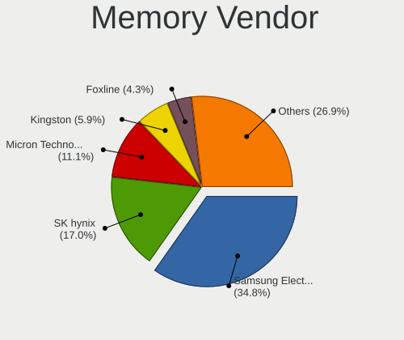

| Vendor                                  | Notebooks | Percent |
|-----------------------------------------|-----------|---------|
| Samsung Electronics                     | 88        | 34.78%  |
| SK hynix                                | 43        | 17%     |
| Micron Technology                       | 28        | 11.07%  |
| Kingston                                | 15        | 5.93%   |
| Foxline                                 | 11        | 4.35%   |
| Crucial                                 | 9         | 3.56%   |
| Unknown                                 | 8         | 3.16%   |
| Ramaxel Technology                      | 6         | 2.37%   |
| Unknown                                 | 6         | 2.37%   |
| Unknown (ABCD)                          | 4         | 1.58%   |
| Patriot                                 | 3         | 1.19%   |
| Elpida                                  | 3         | 1.19%   |
| A-DATA Technology                       | 3         | 1.19%   |
| Silicon Power Computer & Communications | 2         | 0.79%   |
| Qumo                                    | 2         | 0.79%   |
| KingSpec                                | 2         | 0.79%   |
| ChangXin Memory                         | 2         | 0.79%   |
| Wodposit                                | 1         | 0.4%    |
| Unknown (8C8F)                          | 1         | 0.4%    |
| Unknown (0x7FFF)                        | 1         | 0.4%    |
| Unknown (0x0CAB)                        | 1         | 0.4%    |
| Unknown (0x0080)                        | 1         | 0.4%    |
| Silicon Power                           | 1         | 0.4%    |
| SHARETRONIC                             | 1         | 0.4%    |
| Netac                                   | 1         | 0.4%    |
| Nanya Technology                        | 1         | 0.4%    |
| Longsys                                 | 1         | 0.4%    |
| King Tiger                              | 1         | 0.4%    |
| Kimtigo Semiconductor (HK) Limited      | 1         | 0.4%    |
| Hikvision                               | 1         | 0.4%    |
| G.Skill                                 | 1         | 0.4%    |
| DEPO Computers                          | 1         | 0.4%    |
| ASint Technology                        | 1         | 0.4%    |
| Apacer                                  | 1         | 0.4%    |
| <Invalid>                               | 1         | 0.4%    |

Memory Model
------------

Memory module models

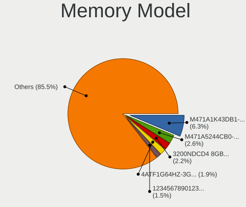

| Model                                                            | Notebooks | Percent |
|------------------------------------------------------------------|-----------|---------|
| Samsung RAM M471A1K43DB1-CTD 8GB SODIMM DDR4 2667MT/s            | 17        | 6.32%   |
| Samsung RAM M471A5244CB0-CWE 4GB SODIMM DDR4 3200MT/s            | 7         | 2.6%    |
| Unknown                                                          | 6         | 2.23%   |
| Micron RAM 4ATF1G64HZ-3G2E1 8GB SODIMM DDR4 3200MT/s             | 5         | 1.86%   |
| Unknown (ABCD) RAM 123456789012345678 2GB SODIMM LPDDR4 2400MT/s | 4         | 1.49%   |
| SK hynix RAM HMA851S6DJR6N-XN 4GB Row Of Chips DDR4 3200MT/s     | 4         | 1.49%   |
| Samsung RAM M471B5773DH0-CH9 2GB SODIMM DDR3 1600MT/s            | 4         | 1.49%   |
| Samsung RAM M471B5173QH0-YK0 4GB SODIMM DDR3 1600MT/s            | 4         | 1.49%   |
| Samsung RAM M471A5244CB0-CWE 4GB Row Of Chips DDR4 3200MT/s      | 4         | 1.49%   |
| Samsung RAM M471A5244CB0-CTD 4GB SODIMM DDR4 3266MT/s            | 4         | 1.49%   |
| Samsung RAM M471A1K43DB1-CWE 8GB SODIMM DDR4 3200MT/s            | 4         | 1.49%   |
| Micron RAM 4ATF1G64HZ-3G2E1 8GB Row Of Chips DDR4 3200MT/s       | 4         | 1.49%   |
| SK hynix RAM HMAA1GS6CJR6N-XN 8GB Row Of Chips DDR4 3200MT/s     | 3         | 1.12%   |
| SK hynix RAM HMA851S6DJR6N-XN 4GB SODIMM DDR4 3200MT/s           | 3         | 1.12%   |
| SK hynix RAM HMA81GS6JJR8N-VK 8GB SODIMM DDR4 2667MT/s           | 3         | 1.12%   |
| SK hynix RAM H9JCNNNCP3MLYR-N6E 4GB SODIMM LPDDR5 6400MT/s       | 3         | 1.12%   |
| Samsung RAM M471B5673FH0-CH9 2048MB SODIMM DDR3 1600MT/s         | 3         | 1.12%   |
| Samsung RAM M471A1K43EB1-CWE 8GB SODIMM DDR4 3200MT/s            | 3         | 1.12%   |
| Samsung RAM M471A1G44BB0-CWE 8GB SODIMM DDR4 3200MT/s            | 3         | 1.12%   |
| Micron RAM 4ATF51264HZ-3G2J1 4GB SODIMM DDR4 3200MT/s            | 3         | 1.12%   |
| Foxline RAM FL3200D4S22-8G 8GB SODIMM DDR4 3200MT/s              | 3         | 1.12%   |
| Foxline RAM FL2666D4S19-8G 8GB SODIMM DDR4 2667MT/s              | 3         | 1.12%   |
| Foxline RAM FL2400D4S17S-8G 8GB SODIMM DDR4 2400MT/s             | 3         | 1.12%   |
| Unknown RAM Module 2GB SODIMM DDR2 667MT/s                       | 2         | 0.74%   |
| SK hynix RAM HMT451S6AFR8A-PB 4GB SODIMM DDR3 1600MT/s           | 2         | 0.74%   |
| SK hynix RAM HMT351S6CFR8C-PB 4GB SODIMM DDR3 1600MT/s           | 2         | 0.74%   |
| SK hynix RAM HMT351S6BFR8C-H9 4GB SODIMM DDR3 1333MT/s           | 2         | 0.74%   |
| SK hynix RAM HMAA1GS6CJR6N-XN 8GB SODIMM DDR4 3200MT/s           | 2         | 0.74%   |
| SK hynix RAM HMA851S6CJR6N-XN 4GB SODIMM DDR4 3200MT/s           | 2         | 0.74%   |
| SK hynix RAM HMA851S6CJR6N-VK 4GB Row Of Chips DDR4 2667MT/s     | 2         | 0.74%   |
| SK hynix RAM HMA81GS6DJR8N-XN 8GB SODIMM DDR4 3200MT/s           | 2         | 0.74%   |
| SK hynix RAM HMA81GS6CJR8N-VK 8GB SODIMM DDR4 2667MT/s           | 2         | 0.74%   |
| SK hynix RAM HMA81GS6AFR8N-UH 8GB SODIMM DDR4 2667MT/s           | 2         | 0.74%   |
| SK hynix RAM H9JCNNNCP3MLYR-N6E 2GB Row Of Chips LPDDR5 6400MT/s | 2         | 0.74%   |
| Silicon Power & RAM Module 8GB SODIMM DDR4 3200MT/s              | 2         | 0.74%   |
| Samsung RAM M471B5773CHS-CH9 2GB SODIMM DDR3 4199MT/s            | 2         | 0.74%   |
| Samsung RAM M471B5173BH0-CK0 4GB SODIMM DDR3 1600MT/s            | 2         | 0.74%   |
| Samsung RAM M471A5244CB0-CRC 4GB SODIMM DDR4 2667MT/s            | 2         | 0.74%   |
| Samsung RAM M471A2K43DB1-CTD 16GB SODIMM DDR4 2667MT/s           | 2         | 0.74%   |
| Samsung RAM M471A2G44BM0-CWE 16GB SODIMM DDR4 3200MT/s           | 2         | 0.74%   |

Memory Kind
-----------

Memory module kinds

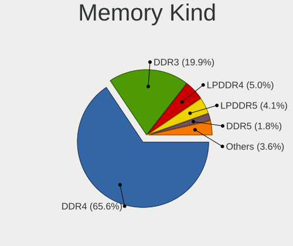

| Kind    | Notebooks | Percent |
|---------|-----------|---------|
| DDR4    | 145       | 65.61%  |
| DDR3    | 44        | 19.91%  |
| LPDDR4  | 11        | 4.98%   |
| LPDDR5  | 9         | 4.07%   |
| DDR5    | 4         | 1.81%   |
| DDR2    | 3         | 1.36%   |
| SDRAM   | 2         | 0.9%    |
| Unknown | 2         | 0.9%    |
| LPDDR3  | 1         | 0.45%   |

Memory Form Factor
------------------

Physical design of the memory module

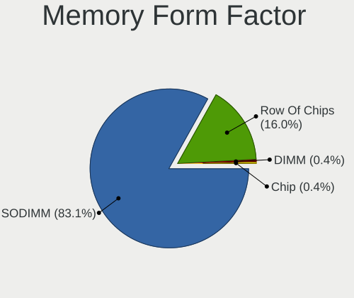

| Name         | Notebooks | Percent |
|--------------|-----------|---------|
| SODIMM       | 192       | 83.12%  |
| Row Of Chips | 37        | 16.02%  |
| DIMM         | 1         | 0.43%   |
| Chip         | 1         | 0.43%   |

Memory Size
-----------

Memory module size

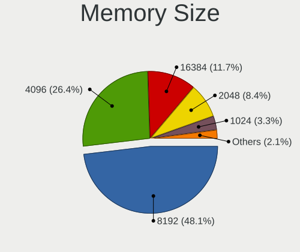

| Size  | Notebooks | Percent |
|-------|-----------|---------|
| 8192  | 115       | 48.12%  |
| 4096  | 63        | 26.36%  |
| 16384 | 28        | 11.72%  |
| 2048  | 20        | 8.37%   |
| 1024  | 8         | 3.35%   |
| 32768 | 5         | 2.09%   |

Memory Speed
------------

Memory module speed

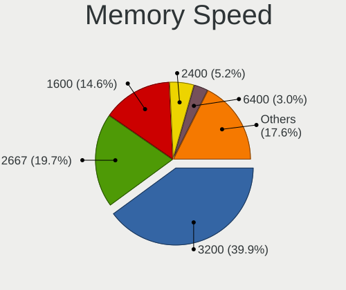

| Speed | Notebooks | Percent |
|-------|-----------|---------|
| 3200  | 93        | 39.91%  |
| 2667  | 46        | 19.74%  |
| 1600  | 34        | 14.59%  |
| 2400  | 12        | 5.15%   |
| 6400  | 7         | 3%      |
| 1334  | 5         | 2.15%   |
| 4267  | 4         | 1.72%   |
| 3266  | 4         | 1.72%   |
| 1333  | 4         | 1.72%   |
| 4800  | 3         | 1.29%   |
| 1067  | 3         | 1.29%   |
| 667   | 3         | 1.29%   |
| 4199  | 2         | 0.86%   |
| 3733  | 2         | 0.86%   |
| 2133  | 2         | 0.86%   |
| 7500  | 1         | 0.43%   |
| 5600  | 1         | 0.43%   |
| 5500  | 1         | 0.43%   |
| 2666  | 1         | 0.43%   |
| 1866  | 1         | 0.43%   |
| 1200  | 1         | 0.43%   |
| 1066  | 1         | 0.43%   |
| 975   | 1         | 0.43%   |
| 533   | 1         | 0.43%   |

Printers & scanners
-------------------

Printer Vendor
--------------

Printer device vendors

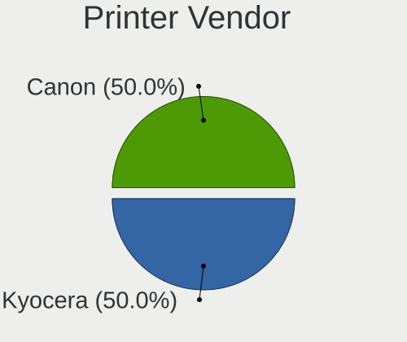

| Vendor  | Notebooks | Percent |
|---------|-----------|---------|
| Kyocera | 1         | 50%     |
| Canon   | 1         | 50%     |

Printer Model
-------------

Printer device models

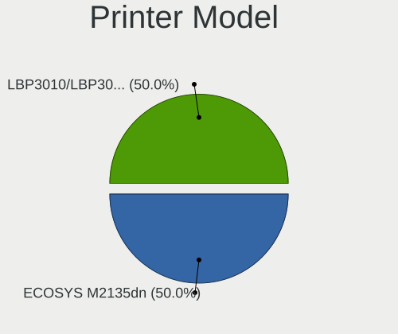

| Model                         | Notebooks | Percent |
|-------------------------------|-----------|---------|
| Kyocera ECOSYS M2135dn        | 1         | 50%     |
| Canon LBP3010/LBP3018/LBP3050 | 1         | 50%     |

Scanner Vendor
--------------

Scanner device vendors

| Vendor | Notebooks | Percent |
|--------|-----------|---------|
| Canon  | 1         | 100%    |

Scanner Model
-------------

Scanner device models

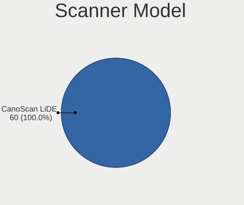

| Model                  | Notebooks | Percent |
|------------------------|-----------|---------|
| Canon CanoScan LiDE 60 | 1         | 100%    |

Camera
------

Camera Vendor
-------------

Camera device vendors

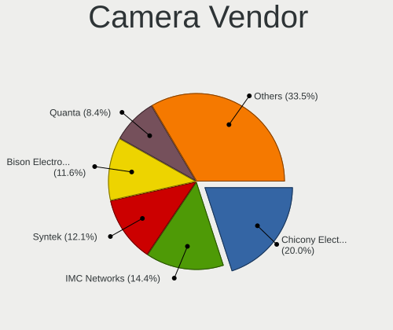

| Vendor                                 | Notebooks | Percent |
|----------------------------------------|-----------|---------|
| Chicony Electronics                    | 43        | 20%     |
| IMC Networks                           | 31        | 14.42%  |
| Syntek                                 | 26        | 12.09%  |
| Bison Electronics                      | 25        | 11.63%  |
| Quanta                                 | 18        | 8.37%   |
| Sunplus Innovation Technology          | 10        | 4.65%   |
| Microdia                               | 9         | 4.19%   |
| Luxvisions Innotech Limited            | 7         | 3.26%   |
| Realtek Semiconductor                  | 6         | 2.79%   |
| Cheng Uei Precision Industry (Foxlink) | 6         | 2.79%   |
| Sonix Technology                       | 5         | 2.33%   |
| SunplusIT                              | 4         | 1.86%   |
| Suyin                                  | 3         | 1.4%    |
| Z-Star Microelectronics                | 2         | 0.93%   |
| USB Camera CS                          | 2         | 0.93%   |
| GEMBIRD                                | 2         | 0.93%   |
| Apple                                  | 2         | 0.93%   |
| Alcor Micro                            | 2         | 0.93%   |
| Acer                                   | 2         | 0.93%   |
| Shine-optics                           | 1         | 0.47%   |
| Primax Electronics                     | 1         | 0.47%   |
| JMicron Technology                     | 1         | 0.47%   |
| Importek                               | 1         | 0.47%   |
| icSpring                               | 1         | 0.47%   |
| BTF-240516-XH                          | 1         | 0.47%   |
| BRS 2Mp Camera                         | 1         | 0.47%   |
| BillionPixels                          | 1         | 0.47%   |
| ALi                                    | 1         | 0.47%   |
| Unknown                                | 1         | 0.47%   |

Camera Model
------------

Camera device models

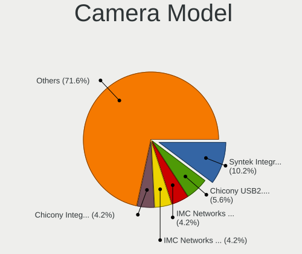

| Model                                               | Notebooks | Percent |
|-----------------------------------------------------|-----------|---------|
| Syntek Integrated Camera                            | 22        | 10.23%  |
| Chicony USB2.0 FHD UVC WebCam                       | 12        | 5.58%   |
| IMC Networks USB2.0 HD UVC WebCam                   | 9         | 4.19%   |
| IMC Networks Integrated Camera                      | 9         | 4.19%   |
| Chicony Integrated Camera                           | 9         | 4.19%   |
| Bison Lenovo Integrated Webcam                      | 7         | 3.26%   |
| Bison Integrated Camera                             | 7         | 3.26%   |
| IMC Networks HD Camera                              | 5         | 2.33%   |
| Sunplus Integrated Camera                           | 4         | 1.86%   |
| Quanta ov9734_techfront_camera                      | 4         | 1.86%   |
| IMC Networks ov9734_azurewave_camera                | 4         | 1.86%   |
| Bison BisonCam,NB Pro                               | 4         | 1.86%   |
| Syntek Lenovo EasyCamera                            | 3         | 1.4%    |
| Quanta HP Webcam                                    | 3         | 1.4%    |
| Microdia Webcam Vitade AF                           | 3         | 1.4%    |
| Luxvisions Innotech Limited Integrated Camera       | 3         | 1.4%    |
| Chicony ACER HD User Facing                         | 3         | 1.4%    |
| USB Camera CS USB Camera CS                         | 2         | 0.93%   |
| Sunplus Integrated_Webcam_HD                        | 2         | 0.93%   |
| Sonix USB 2.0 Camera                                | 2         | 0.93%   |
| Sonix Integrated Webcam_FHD                         | 2         | 0.93%   |
| Realtek Integrated_Webcam_HD                        | 2         | 0.93%   |
| Realtek Integrated Webcam                           | 2         | 0.93%   |
| Quanta VGA WebCam                                   | 2         | 0.93%   |
| Quanta HP TrueVision HD Camera                      | 2         | 0.93%   |
| Microdia USB 2.0 Camera                             | 2         | 0.93%   |
| Microdia Integrated_Webcam_HD                       | 2         | 0.93%   |
| Luxvisions Innotech Limited HP TrueVision HD Camera | 2         | 0.93%   |
| Luxvisions Innotech Limited HP HD Camera            | 2         | 0.93%   |
| IMC Networks HP TrueVision HD Camera                | 2         | 0.93%   |
| GEMBIRD USB2.0 PC CAMERA                            | 2         | 0.93%   |
| Chicony Integrated Camera (1280x720@30)             | 2         | 0.93%   |
| Chicony HP Webcam [2 MP Macro]                      | 2         | 0.93%   |
| Chicony HP Webcam                                   | 2         | 0.93%   |
| Chicony HD User Facing                              | 2         | 0.93%   |
| Chicony Chicony USB2.0 Camera                       | 2         | 0.93%   |
| Cheng Uei Precision Industry (Foxlink) Webcam       | 2         | 0.93%   |
| Bison HD Webcam                                     | 2         | 0.93%   |
| Alcor Micro USB 2.0 Camera                          | 2         | 0.93%   |
| Z-Star Venus USB2.0 Camera                          | 1         | 0.47%   |

Security
--------

Fingerprint Vendor
------------------

Fingerprint sensor vendors

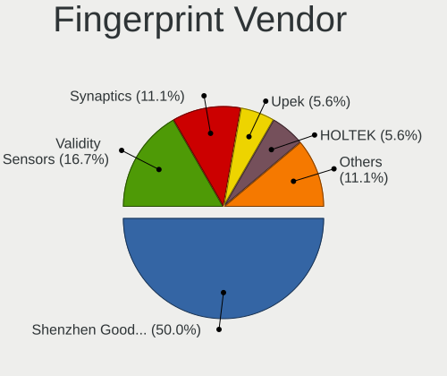

| Vendor                     | Notebooks | Percent |
|----------------------------|-----------|---------|
| Shenzhen Goodix Technology | 18        | 50%     |
| Validity Sensors           | 6         | 16.67%  |
| Synaptics                  | 4         | 11.11%  |
| Upek                       | 2         | 5.56%   |
| HOLTEK                     | 2         | 5.56%   |
| Elan Microelectronics      | 2         | 5.56%   |
| Focal-systems.Corp         | 1         | 2.78%   |
| AuthenTec                  | 1         | 2.78%   |

Fingerprint Model
-----------------

Fingerprint sensor models

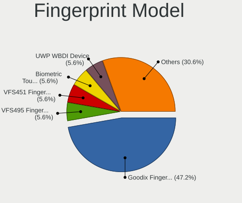

| Model                                                                      | Notebooks | Percent |
|----------------------------------------------------------------------------|-----------|---------|
| Shenzhen Goodix  FingerPrint Device                                        | 17        | 47.22%  |
| Validity Sensors VFS495 Fingerprint Reader                                 | 2         | 5.56%   |
| Validity Sensors VFS451 Fingerprint Reader                                 | 2         | 5.56%   |
| Upek Biometric Touchchip/Touchstrip Fingerprint Sensor                     | 2         | 5.56%   |
| Synaptics UWP WBDI Device                                                  | 2         | 5.56%   |
| HOLTEK FocalTech Fingerprint Device                                        | 2         | 5.56%   |
| Validity Sensors VFS7500 Touch Fingerprint Sensor                          | 1         | 2.78%   |
| Validity Sensors Synaptics VFS7552 Touch Fingerprint Sensor with PurePrint | 1         | 2.78%   |
| Synaptics  FS7604 Touch Fingerprint Sensor with PurePrint                  | 1         | 2.78%   |
| Synaptics FS7604 Touch Fingerprint Sensor with PurePrint                   | 1         | 2.78%   |
| Shenzhen Goodix Fingerprint Reader                                         | 1         | 2.78%   |
| Focal-systems.Corp FT9201Fingerprint.                                      | 1         | 2.78%   |
| Elan ELAN:Fingerprint                                                      | 1         | 2.78%   |
| Elan ELAN:ARM-M4                                                           | 1         | 2.78%   |
| AuthenTec AES2550 Fingerprint Sensor                                       | 1         | 2.78%   |

Chipcard Vendor
---------------

Chipcard module vendors

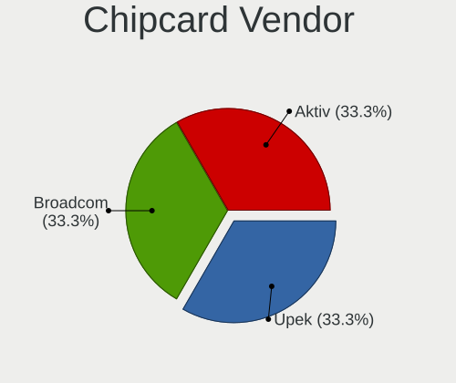

| Vendor   | Notebooks | Percent |
|----------|-----------|---------|
| Upek     | 1         | 33.33%  |
| Broadcom | 1         | 33.33%  |
| Aktiv    | 1         | 33.33%  |

Chipcard Model
--------------

Chipcard module models

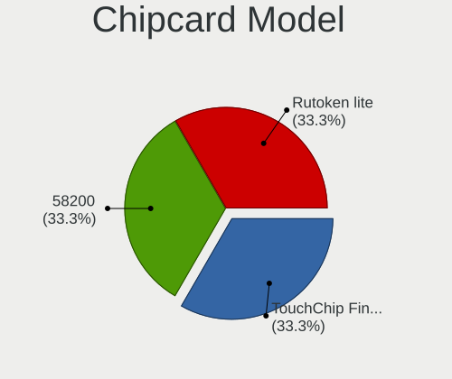

| Model                                                      | Notebooks | Percent |
|------------------------------------------------------------|-----------|---------|
| Upek TouchChip Fingerprint Coprocessor (WBF advanced mode) | 1         | 33.33%  |
| Broadcom 58200                                             | 1         | 33.33%  |
| Aktiv Rutoken lite                                         | 1         | 33.33%  |

Unsupported
-----------

Unsupported Devices
-------------------

Total unsupported devices on board

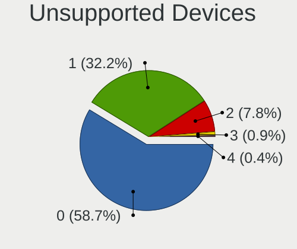

| Total | Notebooks | Percent |
|-------|-----------|---------|
| 0     | 135       | 58.7%   |
| 1     | 74        | 32.17%  |
| 2     | 18        | 7.83%   |
| 3     | 2         | 0.87%   |
| 4     | 1         | 0.43%   |

Unsupported Device Types
------------------------

Types of unsupported devices

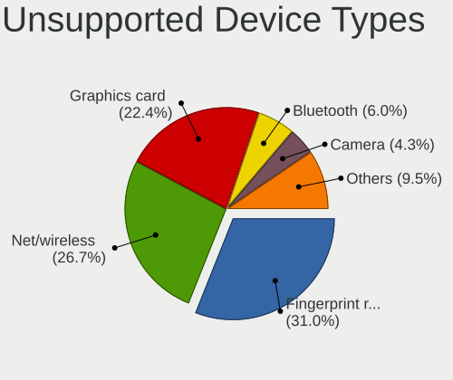

| Type                     | Notebooks | Percent |
|--------------------------|-----------|---------|
| Fingerprint reader       | 36        | 31.03%  |
| Net/wireless             | 31        | 26.72%  |
| Graphics card            | 26        | 22.41%  |
| Bluetooth                | 7         | 6.03%   |
| Camera                   | 5         | 4.31%   |
| Multimedia controller    | 3         | 2.59%   |
| Network                  | 2         | 1.72%   |
| Storage                  | 1         | 0.86%   |
| Sound                    | 1         | 0.86%   |
| Net/ethernet             | 1         | 0.86%   |
| Communication controller | 1         | 0.86%   |
| Chipcard                 | 1         | 0.86%   |
| Card reader              | 1         | 0.86%   |

