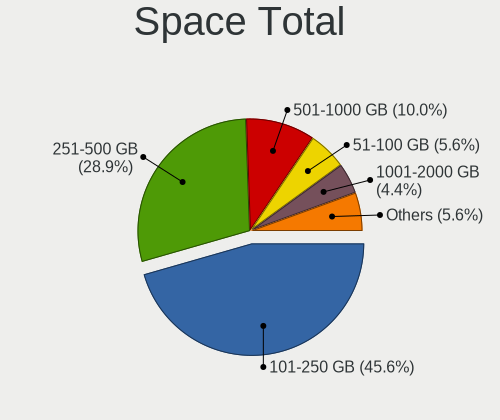
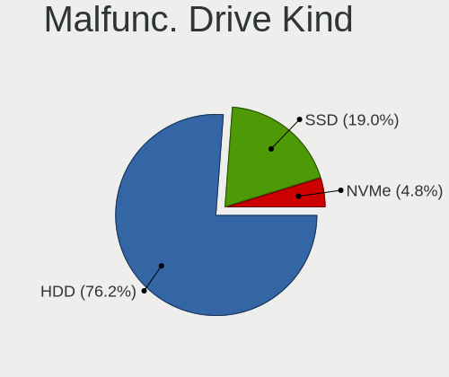
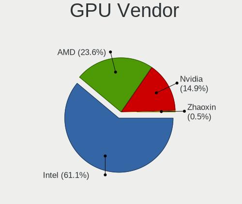
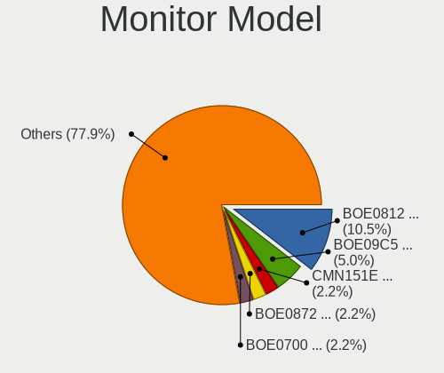
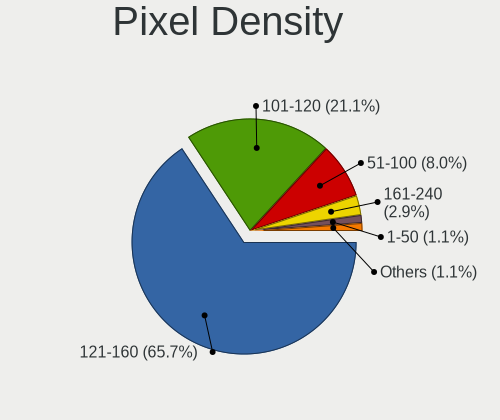
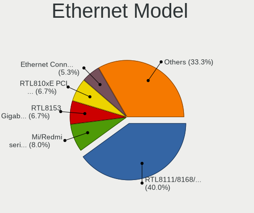
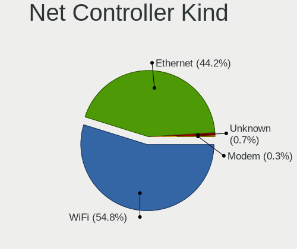
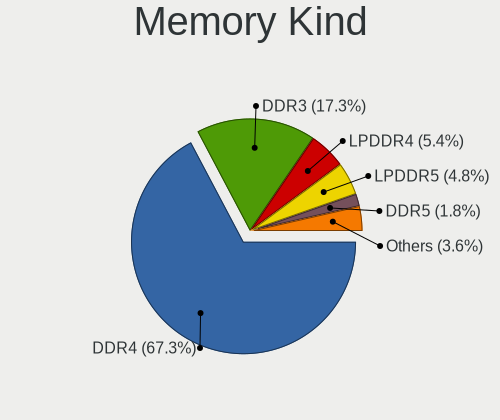

Red OS - Tested Hardware & Statistics (Notebooks)
-------------------------------------------------

A project to collect tested hardware configurations for Red OS.

Anyone can contribute to this report by the [hw-probe](https://github.com/linuxhw/hw-probe) tool:

    sudo -E hw-probe -all -upload

Please contribute! Especially if your hardware is rare.

Contents
--------

* [ Test Cases ](#test-cases)

* [ System ](#system)
  - [ OS                       ](#os)
  - [ OS Family                ](#os-family)
  - [ Kernel                   ](#kernel)
  - [ Kernel Family            ](#kernel-family)
  - [ Kernel Major Ver.        ](#kernel-major-ver)
  - [ Arch                     ](#arch)
  - [ DE                       ](#de)
  - [ Display Server           ](#display-server)
  - [ Display Manager          ](#display-manager)
  - [ OS Lang                  ](#os-lang)
  - [ Boot Mode                ](#boot-mode)
  - [ Filesystem               ](#filesystem)
  - [ Part. scheme             ](#part-scheme)
  - [ Dual Boot with Linux/BSD ](#dual-boot-with-linuxbsd)
  - [ Dual Boot (Win)          ](#dual-boot-win)

* [ Board ](#board)
  - [ Vendor                   ](#vendor)
  - [ Model                    ](#model)
  - [ Model Family             ](#model-family)
  - [ MFG Year                 ](#mfg-year)
  - [ Form Factor              ](#form-factor)
  - [ Secure Boot              ](#secure-boot)
  - [ Coreboot                 ](#coreboot)
  - [ RAM Size                 ](#ram-size)
  - [ RAM Used                 ](#ram-used)
  - [ Total Drives             ](#total-drives)
  - [ Has CD-ROM               ](#has-cd-rom)
  - [ Has Ethernet             ](#has-ethernet)
  - [ Has WiFi                 ](#has-wifi)
  - [ Has Bluetooth            ](#has-bluetooth)

* [ Location ](#location)
  - [ Country                  ](#country)
  - [ City                     ](#city)

* [ Drives ](#drives)
  - [ Drive Vendor             ](#drive-vendor)
  - [ Drive Model              ](#drive-model)
  - [ HDD Vendor               ](#hdd-vendor)
  - [ SSD Vendor               ](#ssd-vendor)
  - [ Drive Kind               ](#drive-kind)
  - [ Drive Connector          ](#drive-connector)
  - [ Drive Size               ](#drive-size)
  - [ Space Total              ](#space-total)
  - [ Space Used               ](#space-used)
  - [ Malfunc. Drives          ](#malfunc-drives)
  - [ Malfunc. Drive Vendor    ](#malfunc-drive-vendor)
  - [ Malfunc. HDD Vendor      ](#malfunc-hdd-vendor)
  - [ Malfunc. Drive Kind      ](#malfunc-drive-kind)
  - [ Failed Drives            ](#failed-drives)
  - [ Failed Drive Vendor      ](#failed-drive-vendor)
  - [ Drive Status             ](#drive-status)

* [ Storage controller ](#storage-controller)
  - [ Storage Vendor           ](#storage-vendor)
  - [ Storage Model            ](#storage-model)
  - [ Storage Kind             ](#storage-kind)

* [ Processor ](#processor)
  - [ CPU Vendor               ](#cpu-vendor)
  - [ CPU Model                ](#cpu-model)
  - [ CPU Model Family         ](#cpu-model-family)
  - [ CPU Cores                ](#cpu-cores)
  - [ CPU Sockets              ](#cpu-sockets)
  - [ CPU Threads              ](#cpu-threads)
  - [ CPU Op-Modes             ](#cpu-op-modes)
  - [ CPU Microcode            ](#cpu-microcode)
  - [ CPU Microarch            ](#cpu-microarch)

* [ Graphics ](#graphics)
  - [ GPU Vendor               ](#gpu-vendor)
  - [ GPU Model                ](#gpu-model)
  - [ GPU Combo                ](#gpu-combo)
  - [ GPU Driver               ](#gpu-driver)
  - [ GPU Memory               ](#gpu-memory)

* [ Monitor ](#monitor)
  - [ Monitor Vendor           ](#monitor-vendor)
  - [ Monitor Model            ](#monitor-model)
  - [ Monitor Resolution       ](#monitor-resolution)
  - [ Monitor Diagonal         ](#monitor-diagonal)
  - [ Monitor Width            ](#monitor-width)
  - [ Aspect Ratio             ](#aspect-ratio)
  - [ Monitor Area             ](#monitor-area)
  - [ Pixel Density            ](#pixel-density)
  - [ Multiple Monitors        ](#multiple-monitors)

* [ Network ](#network)
  - [ Net Controller Vendor    ](#net-controller-vendor)
  - [ Net Controller Model     ](#net-controller-model)
  - [ Wireless Vendor          ](#wireless-vendor)
  - [ Wireless Model           ](#wireless-model)
  - [ Ethernet Vendor          ](#ethernet-vendor)
  - [ Ethernet Model           ](#ethernet-model)
  - [ Net Controller Kind      ](#net-controller-kind)
  - [ Used Controller          ](#used-controller)
  - [ NICs                     ](#nics)
  - [ IPv6                     ](#ipv6)

* [ Bluetooth ](#bluetooth)
  - [ Bluetooth Vendor         ](#bluetooth-vendor)
  - [ Bluetooth Model          ](#bluetooth-model)

* [ Sound ](#sound)
  - [ Sound Vendor             ](#sound-vendor)
  - [ Sound Model              ](#sound-model)

* [ Memory ](#memory)
  - [ Memory Vendor            ](#memory-vendor)
  - [ Memory Model             ](#memory-model)
  - [ Memory Kind              ](#memory-kind)
  - [ Memory Form Factor       ](#memory-form-factor)
  - [ Memory Size              ](#memory-size)
  - [ Memory Speed             ](#memory-speed)

* [ Printers & scanners ](#printers--scanners)
  - [ Printer Vendor           ](#printer-vendor)
  - [ Printer Model            ](#printer-model)
  - [ Scanner Vendor           ](#scanner-vendor)
  - [ Scanner Model            ](#scanner-model)

* [ Camera ](#camera)
  - [ Camera Vendor            ](#camera-vendor)
  - [ Camera Model             ](#camera-model)

* [ Security ](#security)
  - [ Fingerprint Vendor       ](#fingerprint-vendor)
  - [ Fingerprint Model        ](#fingerprint-model)
  - [ Chipcard Vendor          ](#chipcard-vendor)
  - [ Chipcard Model           ](#chipcard-model)

* [ Unsupported ](#unsupported)
  - [ Unsupported Devices      ](#unsupported-devices)
  - [ Unsupported Device Types ](#unsupported-device-types)

Test Cases
----------

Total: 228

| Vendor        | Model                       | Probe                                                      | Date         |
|---------------|-----------------------------|------------------------------------------------------------|--------------|
| Unknown       | Unknown                     | [3c4e207a92](https://linux-hardware.org/?probe=3c4e207a92) | May 09, 2024 |
| Dell          | Precision M4700             | [fa5aa96761](https://linux-hardware.org/?probe=fa5aa96761) | Apr 23, 2024 |
| MACHENIKE     | MACHCREATOR-16              | [03f369c46b](https://linux-hardware.org/?probe=03f369c46b) | Apr 15, 2024 |
| MACHENIKE     | L17A                        | [5bd336609a](https://linux-hardware.org/?probe=5bd336609a) | Apr 10, 2024 |
| Dell          | Precision M4700             | [14e5ad11ff](https://linux-hardware.org/?probe=14e5ad11ff) | Apr 08, 2024 |
| Unknown       | X133                        | [c85c7ccafc](https://linux-hardware.org/?probe=c85c7ccafc) | Apr 05, 2024 |
| Dell          | Precision M4700             | [667558cba6](https://linux-hardware.org/?probe=667558cba6) | Mar 20, 2024 |
| Fujitsu Si... | LIFEBOOK T5010              | [99e6ef98f0](https://linux-hardware.org/?probe=99e6ef98f0) | Mar 14, 2024 |
| Acer          | Extensa 215-33              | [efe3c07386](https://linux-hardware.org/?probe=efe3c07386) | Mar 04, 2024 |
| Acer          | Extensa 215-33              | [0b2c9b5116](https://linux-hardware.org/?probe=0b2c9b5116) | Mar 04, 2024 |
| HP            | EliteBook 2540p             | [f0aab0e0f6](https://linux-hardware.org/?probe=f0aab0e0f6) | Mar 02, 2024 |
| Lenovo        | IdeaPad Gaming 3 15ARH05... | [de96f427a2](https://linux-hardware.org/?probe=de96f427a2) | Mar 02, 2024 |
| Dell          | Precision M4700             | [8e50df0d77](https://linux-hardware.org/?probe=8e50df0d77) | Mar 01, 2024 |
| Dell          | Inspiron 3537               | [e05c7c262b](https://linux-hardware.org/?probe=e05c7c262b) | Mar 01, 2024 |
| ASUSTek       | ROG Zephyrus S17 GX701LX... | [15a8eddc01](https://linux-hardware.org/?probe=15a8eddc01) | Feb 29, 2024 |
| Dell          | Inspiron 3537               | [e76d792669](https://linux-hardware.org/?probe=e76d792669) | Feb 29, 2024 |
| Lenovo        | IdeaPad 1 15IAU7 82QD       | [b6a4906cf3](https://linux-hardware.org/?probe=b6a4906cf3) | Feb 20, 2024 |
| Acer          | Aspire A315-24P             | [96c7b5b101](https://linux-hardware.org/?probe=96c7b5b101) | Feb 15, 2024 |
| Lenovo        | IdeaPad L340-15API 81LW     | [5299dd1826](https://linux-hardware.org/?probe=5299dd1826) | Feb 13, 2024 |
| Dell          | Precision M4700             | [02cfb33222](https://linux-hardware.org/?probe=02cfb33222) | Feb 13, 2024 |
| Infinix       | INBOOK X2 GEN11             | [f1d916474f](https://linux-hardware.org/?probe=f1d916474f) | Feb 12, 2024 |
| Infinix       | INBOOK X2 GEN11             | [43a65f4060](https://linux-hardware.org/?probe=43a65f4060) | Feb 12, 2024 |
| Lenovo        | IdeaPad L340-15API 81LW     | [db2cd07d84](https://linux-hardware.org/?probe=db2cd07d84) | Jan 26, 2024 |
| Lenovo        | IdeaPad L340-15API 81LW     | [ca9e77a64e](https://linux-hardware.org/?probe=ca9e77a64e) | Jan 19, 2024 |
| Acer          | Aspire A315-24P             | [abc7a5352b](https://linux-hardware.org/?probe=abc7a5352b) | Jan 14, 2024 |
| Acer          | Aspire A315-24P             | [166d3493a4](https://linux-hardware.org/?probe=166d3493a4) | Jan 14, 2024 |
| Lenovo        | IdeaPad L340-15API 81LW     | [04855eeea8](https://linux-hardware.org/?probe=04855eeea8) | Jan 09, 2024 |
| Acer          | Extensa 215-22              | [c2884d7a5d](https://linux-hardware.org/?probe=c2884d7a5d) | Jan 09, 2024 |
| Lenovo        | ThinkPad T61 6464WM6        | [a0b959c7c4](https://linux-hardware.org/?probe=a0b959c7c4) | Jan 05, 2024 |
| Lenovo        | ThinkPad T61 6464WM6        | [3cf7d0764e](https://linux-hardware.org/?probe=3cf7d0764e) | Jan 05, 2024 |
| Lenovo        | ThinkPad T430 23493V2       | [8cbff5c75a](https://linux-hardware.org/?probe=8cbff5c75a) | Jan 02, 2024 |
| KVADRA        | NAU LE15T                   | [b53fe7cc28](https://linux-hardware.org/?probe=b53fe7cc28) | Jan 02, 2024 |
| ASUSTek       | TUF Gaming FX705DT_FX705... | [c71368b0eb](https://linux-hardware.org/?probe=c71368b0eb) | Jan 01, 2024 |
| iRU           | 15ALC                       | [28f7177799](https://linux-hardware.org/?probe=28f7177799) | Dec 22, 2023 |
| Dell          | Precision M4700             | [3048d06ee6](https://linux-hardware.org/?probe=3048d06ee6) | Dec 21, 2023 |
| Lenovo        | V15 G1 IML 82NB             | [90d82dc1a1](https://linux-hardware.org/?probe=90d82dc1a1) | Dec 18, 2023 |
| Lenovo        | IdeaPad L340-15API 81LW     | [c4aead03a2](https://linux-hardware.org/?probe=c4aead03a2) | Dec 13, 2023 |
| Lenovo        | V15 G2 ALC 82KD             | [02763925e5](https://linux-hardware.org/?probe=02763925e5) | Dec 08, 2023 |
| Lenovo        | IdeaPad L340-15API 81LW     | [3b62534051](https://linux-hardware.org/?probe=3b62534051) | Nov 29, 2023 |
| Lenovo        | ThinkPad X230 23245C8       | [bf518076d5](https://linux-hardware.org/?probe=bf518076d5) | Nov 29, 2023 |
| Dell          | Vostro 3590                 | [8ca5eb4e42](https://linux-hardware.org/?probe=8ca5eb4e42) | Nov 27, 2023 |
| Lenovo        | ThinkPad T460s 20FAS1TQ0... | [5586688561](https://linux-hardware.org/?probe=5586688561) | Nov 21, 2023 |
| HP            | EliteBook 850 G1            | [7d7599e0d0](https://linux-hardware.org/?probe=7d7599e0d0) | Nov 21, 2023 |
| HUAWEI        | NDZ-WXX9                    | [95caa4b8a1](https://linux-hardware.org/?probe=95caa4b8a1) | Nov 21, 2023 |
| HUAWEI        | NDZ-WXX9                    | [0324427380](https://linux-hardware.org/?probe=0324427380) | Nov 21, 2023 |
| Lenovo        | IdeaPad L340-15API 81LW     | [9dbd54affc](https://linux-hardware.org/?probe=9dbd54affc) | Nov 14, 2023 |
| ASUSTek       | K53SC                       | [e86d8effd9](https://linux-hardware.org/?probe=e86d8effd9) | Nov 11, 2023 |
| Dell          | Precision M4700             | [ab52e67d9d](https://linux-hardware.org/?probe=ab52e67d9d) | Nov 01, 2023 |
| HP            | Pavilion dv6                | [d8a8dfefd7](https://linux-hardware.org/?probe=d8a8dfefd7) | Oct 24, 2023 |
| Dell          | Precision M4700             | [4d590a378f](https://linux-hardware.org/?probe=4d590a378f) | Oct 24, 2023 |
| Lenovo        | IdeaPad L340-15API 81LW     | [41dfd82cb6](https://linux-hardware.org/?probe=41dfd82cb6) | Oct 23, 2023 |
| HP            | Pavilion dv6                | [71c2062cbf](https://linux-hardware.org/?probe=71c2062cbf) | Oct 22, 2023 |
| Graviton      | Unknown                     | [69c721a100](https://linux-hardware.org/?probe=69c721a100) | Oct 10, 2023 |
| HP            | Laptop 15-bw0xx             | [4440996d7b](https://linux-hardware.org/?probe=4440996d7b) | Oct 07, 2023 |
| HP            | Laptop 15-bw0xx             | [7774477854](https://linux-hardware.org/?probe=7774477854) | Oct 07, 2023 |
| HUAWEI        | BDZ-WXX9                    | [a33a848e40](https://linux-hardware.org/?probe=a33a848e40) | Sep 26, 2023 |
| Lenovo        | IdeaPad L340-15API 81LW     | [b85adec006](https://linux-hardware.org/?probe=b85adec006) | Sep 25, 2023 |
| iRU           | 15ALC                       | [c5839fb7da](https://linux-hardware.org/?probe=c5839fb7da) | Sep 17, 2023 |
| iRU           | 15ALC                       | [87679b8dc1](https://linux-hardware.org/?probe=87679b8dc1) | Sep 17, 2023 |
| HP            | ProBook 6570b               | [baf81a81a2](https://linux-hardware.org/?probe=baf81a81a2) | Sep 13, 2023 |
| HP            | ProBook 6570b               | [90aaacf4af](https://linux-hardware.org/?probe=90aaacf4af) | Sep 13, 2023 |
| ASUSTek       | VivoBook_ASUSLaptop X513... | [006062545f](https://linux-hardware.org/?probe=006062545f) | Sep 13, 2023 |
| HP            | Laptop 15s-fq2xxx           | [2135954523](https://linux-hardware.org/?probe=2135954523) | Sep 04, 2023 |
| HP            | 250 15.6 inch G9 Noteboo... | [7c560dfe57](https://linux-hardware.org/?probe=7c560dfe57) | Aug 31, 2023 |
| ICL           | S1511 G1R                   | [421df1df8d](https://linux-hardware.org/?probe=421df1df8d) | Aug 28, 2023 |
| Lenovo        | ThinkBook 15 G3 ACL 21A4    | [a3a1e805b2](https://linux-hardware.org/?probe=a3a1e805b2) | Aug 27, 2023 |
| Lenovo        | ThinkPad E15 Gen 4 21E60... | [cfe21994b6](https://linux-hardware.org/?probe=cfe21994b6) | Aug 17, 2023 |
| Lenovo        | IdeaPad L340-15API 81LW     | [7d63566e0a](https://linux-hardware.org/?probe=7d63566e0a) | Aug 11, 2023 |
| Dell          | Precision M4700             | [95ac580b0d](https://linux-hardware.org/?probe=95ac580b0d) | Aug 08, 2023 |
| MSI           | Modern 14 C12M              | [aa352b05aa](https://linux-hardware.org/?probe=aa352b05aa) | Aug 03, 2023 |
| Timi          | Redmi Book Pro 15 2022      | [8a2a5c6265](https://linux-hardware.org/?probe=8a2a5c6265) | Jul 30, 2023 |
| Dell          | Vostro 3400                 | [ee71316b5e](https://linux-hardware.org/?probe=ee71316b5e) | Jul 17, 2023 |
| Gigabyte      | G5 ME                       | [eaefa9c2c6](https://linux-hardware.org/?probe=eaefa9c2c6) | Jul 17, 2023 |
| Dell          | Precision M4700             | [7dc84c10b5](https://linux-hardware.org/?probe=7dc84c10b5) | Jul 11, 2023 |
| Dell          | Inspiron 3583               | [3f5ae451c0](https://linux-hardware.org/?probe=3f5ae451c0) | Jul 09, 2023 |
| Timi          | Redmi G 2022                | [30e96afcdd](https://linux-hardware.org/?probe=30e96afcdd) | Jul 08, 2023 |
| Timi          | Redmi G 2022                | [cd2b7e13ce](https://linux-hardware.org/?probe=cd2b7e13ce) | Jul 04, 2023 |
| ICL           | Si1407                      | [c4c9d43042](https://linux-hardware.org/?probe=c4c9d43042) | Jul 04, 2023 |
| Aquarius      | NS483                       | [dd5daf7f12](https://linux-hardware.org/?probe=dd5daf7f12) | Jun 18, 2023 |
| HP            | Laptop 15-bw0xx             | [a161ef52b4](https://linux-hardware.org/?probe=a161ef52b4) | Jun 18, 2023 |
| Lenovo        | G570 20079                  | [4843789a62](https://linux-hardware.org/?probe=4843789a62) | May 30, 2023 |
| Acer          | Aspire A315-58              | [59d36ef46d](https://linux-hardware.org/?probe=59d36ef46d) | May 22, 2023 |
| HP            | EliteBook 8440p             | [3ad250d762](https://linux-hardware.org/?probe=3ad250d762) | May 22, 2023 |
| MSI           | GL62 6QF                    | [6ae5c650f3](https://linux-hardware.org/?probe=6ae5c650f3) | May 14, 2023 |
| HP            | Pavilion Laptop 15-eh1xx... | [3de097b441](https://linux-hardware.org/?probe=3de097b441) | May 12, 2023 |
| Dell          | Vostro 5391                 | [f5342b41ec](https://linux-hardware.org/?probe=f5342b41ec) | May 06, 2023 |
| Graviton      | N14I-T                      | [e82c8f00d8](https://linux-hardware.org/?probe=e82c8f00d8) | May 05, 2023 |
| Lenovo        | IdeaPad L340-15API 81LW     | [a61a9a88bc](https://linux-hardware.org/?probe=a61a9a88bc) | May 02, 2023 |
| Lenovo        | ThinkBook 15 G2 ITL 20VE    | [8f8a912636](https://linux-hardware.org/?probe=8f8a912636) | May 01, 2023 |
| HP            | Laptop 15-bw0xx             | [387eecc18e](https://linux-hardware.org/?probe=387eecc18e) | Apr 27, 2023 |
| HP            | ProBook 440 G8 Notebook ... | [40aaf19667](https://linux-hardware.org/?probe=40aaf19667) | Apr 21, 2023 |
| Unknown       | Unknown                     | [c959a62e36](https://linux-hardware.org/?probe=c959a62e36) | Apr 10, 2023 |
| HONOR         | BMH-WCX9                    | [2082d3c772](https://linux-hardware.org/?probe=2082d3c772) | Apr 08, 2023 |
| Unknown       | Unknown                     | [70ff15284b](https://linux-hardware.org/?probe=70ff15284b) | Apr 07, 2023 |
| Unknown       | Unknown                     | [9a068872f6](https://linux-hardware.org/?probe=9a068872f6) | Apr 06, 2023 |
| HP            | ProBook 4525s               | [164d8993b4](https://linux-hardware.org/?probe=164d8993b4) | Apr 04, 2023 |
| MSI           | Sword 15 A12UE              | [3389b32105](https://linux-hardware.org/?probe=3389b32105) | Apr 01, 2023 |
| Lenovo        | IdeaPad L340-15API 81LW     | [36b3103f3f](https://linux-hardware.org/?probe=36b3103f3f) | Mar 31, 2023 |
| Lenovo        | IdeaPad 1 15ALC7 82R4       | [deb6990c19](https://linux-hardware.org/?probe=deb6990c19) | Mar 27, 2023 |
| HONOR         | NBR-WAX9                    | [ef91ef3645](https://linux-hardware.org/?probe=ef91ef3645) | Mar 27, 2023 |
| MSI           | Modern 15 B12M              | [eded7b36b1](https://linux-hardware.org/?probe=eded7b36b1) | Mar 27, 2023 |
| MSI           | Modern 15 B12M              | [9ee3ca41c8](https://linux-hardware.org/?probe=9ee3ca41c8) | Mar 27, 2023 |
| MSI           | Sword 15 A12UE              | [f4341a491a](https://linux-hardware.org/?probe=f4341a491a) | Mar 21, 2023 |
| Lenovo        | IdeaPad L340-15API 81LW     | [be9b767d92](https://linux-hardware.org/?probe=be9b767d92) | Mar 20, 2023 |
| Lenovo        | ThinkPad T14 Gen 3 21AJS... | [b473b68faf](https://linux-hardware.org/?probe=b473b68faf) | Mar 10, 2023 |
| Lenovo        | ThinkPad T14 Gen 3 21AJS... | [4a8589fbdf](https://linux-hardware.org/?probe=4a8589fbdf) | Mar 10, 2023 |
| Lenovo        | IdeaPad 330-15ARR 81D2      | [b116afe451](https://linux-hardware.org/?probe=b116afe451) | Feb 27, 2023 |
| Kraftway      | ACCORD                      | [8fe15f2f2b](https://linux-hardware.org/?probe=8fe15f2f2b) | Feb 22, 2023 |
| Lenovo        | B590 20208                  | [10e9491ee4](https://linux-hardware.org/?probe=10e9491ee4) | Feb 17, 2023 |
| Lenovo        | B590 20208                  | [a3b352975c](https://linux-hardware.org/?probe=a3b352975c) | Feb 17, 2023 |
| Lenovo        | IdeaPad L340-15API 81LW     | [4d9144193f](https://linux-hardware.org/?probe=4d9144193f) | Feb 17, 2023 |
| Lenovo        | ThinkBook 15 G2 ARE 20VG    | [9de0373acc](https://linux-hardware.org/?probe=9de0373acc) | Feb 16, 2023 |
| Lenovo        | IdeaPad L340-15API 81LW     | [09073fcfc8](https://linux-hardware.org/?probe=09073fcfc8) | Feb 10, 2023 |
| HP            | G62                         | [8bc9454fb1](https://linux-hardware.org/?probe=8bc9454fb1) | Feb 10, 2023 |
| Lenovo        | IdeaPad L340-15API 81LW     | [d3b63de821](https://linux-hardware.org/?probe=d3b63de821) | Feb 07, 2023 |
| Lenovo        | IdeaPad 5 15ARE05 81YQ      | [a2172caf56](https://linux-hardware.org/?probe=a2172caf56) | Feb 06, 2023 |
| Lenovo        | IdeaPad 5 15ARE05 81YQ      | [77faeb6b52](https://linux-hardware.org/?probe=77faeb6b52) | Feb 06, 2023 |
| HP            | Pavilion 15                 | [eb37d7677c](https://linux-hardware.org/?probe=eb37d7677c) | Feb 06, 2023 |
| Lenovo        | IdeaPad L340-15API 81LW     | [bb0481d7a8](https://linux-hardware.org/?probe=bb0481d7a8) | Feb 06, 2023 |
| Lenovo        | IdeaPad L340-15API 81LW     | [186aef8e0c](https://linux-hardware.org/?probe=186aef8e0c) | Jan 24, 2023 |
| Lenovo        | V130-15IKB 81HN             | [a74a5b3b7b](https://linux-hardware.org/?probe=a74a5b3b7b) | Jan 20, 2023 |
| Lenovo        | IdeaPad L340-15API 81LW     | [8472d89767](https://linux-hardware.org/?probe=8472d89767) | Jan 20, 2023 |
| Lenovo        | IdeaPad L340-15API 81LW     | [7d95709d81](https://linux-hardware.org/?probe=7d95709d81) | Jan 19, 2023 |
| HP            | Pavilion Laptop 15-eh1xx... | [b6e4100bc6](https://linux-hardware.org/?probe=b6e4100bc6) | Jan 17, 2023 |
| Lenovo        | IdeaPad L340-15API 81LW     | [a05251fd39](https://linux-hardware.org/?probe=a05251fd39) | Dec 29, 2022 |
| 3Logic Gro... | Graviton N15i-K2            | [fe79eba13b](https://linux-hardware.org/?probe=fe79eba13b) | Dec 29, 2022 |
| HP            | Notebook                    | [10dfda9549](https://linux-hardware.org/?probe=10dfda9549) | Dec 24, 2022 |
| Lenovo        | ThinkPad E15 Gen 4 21E60... | [4c1ad2ea2e](https://linux-hardware.org/?probe=4c1ad2ea2e) | Dec 18, 2022 |
| Kraftway      | ACCORD                      | [a199d930ff](https://linux-hardware.org/?probe=a199d930ff) | Dec 18, 2022 |
| Shanghai Z... | ZXE CRB                     | [20ce0a7f23](https://linux-hardware.org/?probe=20ce0a7f23) | Dec 16, 2022 |
| Lenovo        | IdeaPad L340-15API 81LW     | [6cedae9702](https://linux-hardware.org/?probe=6cedae9702) | Dec 10, 2022 |
| Lenovo        | IdeaPad L340-15API 81LW     | [311f47baef](https://linux-hardware.org/?probe=311f47baef) | Dec 09, 2022 |
| HP            | Laptop 15s-eq1xxx           | [79a0f9e73a](https://linux-hardware.org/?probe=79a0f9e73a) | Dec 08, 2022 |
| HP            | Laptop 15s-eq1xxx           | [c1cd524970](https://linux-hardware.org/?probe=c1cd524970) | Dec 08, 2022 |
| Aquarius      | NS685U R11                  | [c0dff8c525](https://linux-hardware.org/?probe=c0dff8c525) | Dec 08, 2022 |
| ICL           | RAYbook Si1512              | [b8c52ae5cb](https://linux-hardware.org/?probe=b8c52ae5cb) | Dec 06, 2022 |
| HP            | Laptop 15s-eq1xxx           | [0cd3371014](https://linux-hardware.org/?probe=0cd3371014) | Dec 05, 2022 |
| MSI           | Sword 15 A12UE              | [32df733b5e](https://linux-hardware.org/?probe=32df733b5e) | Dec 04, 2022 |
| Lenovo        | IdeaPad L340-15API 81LW     | [ddb1791ff6](https://linux-hardware.org/?probe=ddb1791ff6) | Nov 28, 2022 |
| Lenovo        | IdeaPad 700-15ISK 80RU      | [d9ae3d1795](https://linux-hardware.org/?probe=d9ae3d1795) | Nov 27, 2022 |
| Lenovo        | IdeaPad L340-15API 81LW     | [ff3d0a1ecf](https://linux-hardware.org/?probe=ff3d0a1ecf) | Nov 24, 2022 |
| Lenovo        | IdeaPad L340-15API 81LW     | [f86569d54b](https://linux-hardware.org/?probe=f86569d54b) | Nov 24, 2022 |
| HUAWEI        | NBD-WXX9                    | [a54f42b51e](https://linux-hardware.org/?probe=a54f42b51e) | Nov 18, 2022 |
| HUAWEI        | NBD-WXX9                    | [faa0deab8f](https://linux-hardware.org/?probe=faa0deab8f) | Nov 18, 2022 |
| Lenovo        | ThinkPad X220 4290RB3       | [37959973aa](https://linux-hardware.org/?probe=37959973aa) | Nov 11, 2022 |
| Lenovo        | IdeaPad L340-15API 81LW     | [3fd33e6782](https://linux-hardware.org/?probe=3fd33e6782) | Nov 09, 2022 |
| Lenovo        | IdeaPad L340-15API 81LW     | [dba14315ca](https://linux-hardware.org/?probe=dba14315ca) | Nov 03, 2022 |
| Lenovo        | IdeaPad L340-15API 81LW     | [d653658a53](https://linux-hardware.org/?probe=d653658a53) | Oct 28, 2022 |
| Lenovo        | IdeaPad L340-15API 81LW     | [b9ab6b9cf2](https://linux-hardware.org/?probe=b9ab6b9cf2) | Oct 28, 2022 |
| Acer          | Aspire A517-52              | [1ee47a3ab6](https://linux-hardware.org/?probe=1ee47a3ab6) | Oct 25, 2022 |
| Lenovo        | IdeaPad 5 Pro 14ACN6 82L... | [14537f243b](https://linux-hardware.org/?probe=14537f243b) | Oct 24, 2022 |
| THUNDEROBO... | 911AirD                     | [f471a1c9db](https://linux-hardware.org/?probe=f471a1c9db) | Oct 23, 2022 |
| Acer          | Aspire A517-52              | [7515d53b5d](https://linux-hardware.org/?probe=7515d53b5d) | Oct 21, 2022 |
| Lenovo        | IdeaPad L340-15API 81LW     | [3fc175d4a0](https://linux-hardware.org/?probe=3fc175d4a0) | Oct 20, 2022 |
| Lenovo        | ThinkBook 15 G3 ACL 21A4    | [fe184c8f5b](https://linux-hardware.org/?probe=fe184c8f5b) | Oct 19, 2022 |
| Lenovo        | ThinkBook 15 G3 ACL 21A4    | [0db79bc085](https://linux-hardware.org/?probe=0db79bc085) | Oct 19, 2022 |
| Lenovo        | IdeaPad L340-15API 81LW     | [1cdde90662](https://linux-hardware.org/?probe=1cdde90662) | Oct 13, 2022 |
| Acer          | Aspire 2920                 | [c588bacc95](https://linux-hardware.org/?probe=c588bacc95) | Oct 08, 2022 |
| Acer          | Aspire 2920                 | [34b41a4e67](https://linux-hardware.org/?probe=34b41a4e67) | Oct 08, 2022 |
| ASUSTek       | X540NV                      | [31e4464fea](https://linux-hardware.org/?probe=31e4464fea) | Oct 07, 2022 |
| Lenovo        | IdeaPad L340-15API 81LW     | [7f8e650618](https://linux-hardware.org/?probe=7f8e650618) | Oct 06, 2022 |
| Acer          | Aspire 2920                 | [538f7a6e26](https://linux-hardware.org/?probe=538f7a6e26) | Oct 05, 2022 |
| HP            | OMEN by Laptop              | [0a8238a876](https://linux-hardware.org/?probe=0a8238a876) | Oct 05, 2022 |
| THUNDEROBO... | 911AirD                     | [69a9650652](https://linux-hardware.org/?probe=69a9650652) | Oct 03, 2022 |
| Lenovo        | IdeaPad L340-15API 81LW     | [89b48cd98e](https://linux-hardware.org/?probe=89b48cd98e) | Oct 03, 2022 |
| Digma         | EVE 11 C408                 | [b5c7ac8ed3](https://linux-hardware.org/?probe=b5c7ac8ed3) | Sep 30, 2022 |
| THUNDEROBO... | 911AirD                     | [99f1b7e253](https://linux-hardware.org/?probe=99f1b7e253) | Sep 29, 2022 |
| ICL           | RAYbook Si1512              | [0b610b66a9](https://linux-hardware.org/?probe=0b610b66a9) | Sep 20, 2022 |
| Lenovo        | IdeaPad L340-15API 81LW     | [713797403a](https://linux-hardware.org/?probe=713797403a) | Sep 09, 2022 |
| IP3 Techno... | ACN30                       | [af9694cea8](https://linux-hardware.org/?probe=af9694cea8) | Sep 06, 2022 |
| IP3 Techno... | ACN30                       | [03f14a115d](https://linux-hardware.org/?probe=03f14a115d) | Sep 05, 2022 |
| MSI           | FX610                       | [a822818a58](https://linux-hardware.org/?probe=a822818a58) | Sep 03, 2022 |
| IP3 Techno... | ACN30                       | [e25ed534c0](https://linux-hardware.org/?probe=e25ed534c0) | Aug 18, 2022 |
| ICL           | RAYbook Si1512              | [a42c4dc65a](https://linux-hardware.org/?probe=a42c4dc65a) | Aug 09, 2022 |
| Digma         | EVE 15 P417 ES5063EW        | [a584c678b5](https://linux-hardware.org/?probe=a584c678b5) | Jul 27, 2022 |
| Digma         | EVE 15 C407 ES5054EW        | [4fd01756b2](https://linux-hardware.org/?probe=4fd01756b2) | Jul 27, 2022 |
| Digma         | EVE 15 C407 ES5054EW        | [008b02cc92](https://linux-hardware.org/?probe=008b02cc92) | Jul 26, 2022 |
| Lenovo        | IdeaPad 5 Pro 14ACN6 82L... | [413949a727](https://linux-hardware.org/?probe=413949a727) | Jul 25, 2022 |
| Lenovo        | V15-IWL 81YE                | [3bfcedd5c8](https://linux-hardware.org/?probe=3bfcedd5c8) | Jul 22, 2022 |
| Lenovo        | V15-IWL 81YE                | [c49282206c](https://linux-hardware.org/?probe=c49282206c) | Jul 22, 2022 |
| Lenovo        | V15-IWL 81YE                | [d598c4587d](https://linux-hardware.org/?probe=d598c4587d) | Jul 22, 2022 |
| Lenovo        | V15-IWL 81YE                | [5b1e962751](https://linux-hardware.org/?probe=5b1e962751) | Jul 22, 2022 |
| Lenovo        | V15-IWL 81YE                | [4e120b3b63](https://linux-hardware.org/?probe=4e120b3b63) | Jul 22, 2022 |
| Lenovo        | V15-IWL 81YE                | [2d5bedf224](https://linux-hardware.org/?probe=2d5bedf224) | Jul 22, 2022 |
| Lenovo        | V15-IWL 81YE                | [297ce5144e](https://linux-hardware.org/?probe=297ce5144e) | Jul 22, 2022 |
| Lenovo        | V15-IWL 81YE                | [84b7cd1115](https://linux-hardware.org/?probe=84b7cd1115) | Jul 22, 2022 |
| Lenovo        | V15-IWL 81YE                | [a92b6c5d73](https://linux-hardware.org/?probe=a92b6c5d73) | Jul 22, 2022 |
| Lenovo        | V15-IWL 81YE                | [51ebd271c8](https://linux-hardware.org/?probe=51ebd271c8) | Jul 22, 2022 |
| Lenovo        | V15-IWL 81YE                | [44ad7f7d47](https://linux-hardware.org/?probe=44ad7f7d47) | Jul 22, 2022 |
| Lenovo        | V15-IWL 81YE                | [49068a26b5](https://linux-hardware.org/?probe=49068a26b5) | Jul 22, 2022 |
| Lenovo        | V15-IWL 81YE                | [62ce596bf3](https://linux-hardware.org/?probe=62ce596bf3) | Jul 22, 2022 |
| Lenovo        | V15-IWL 81YE                | [812db8ad6f](https://linux-hardware.org/?probe=812db8ad6f) | Jul 22, 2022 |
| Lenovo        | V15-IWL 81YE                | [d4c2b5ffad](https://linux-hardware.org/?probe=d4c2b5ffad) | Jul 22, 2022 |
| Lenovo        | V15-IWL 81YE                | [4c0179b60e](https://linux-hardware.org/?probe=4c0179b60e) | Jul 22, 2022 |
| Lenovo        | IdeaPad L340-15API 81LW     | [8601888983](https://linux-hardware.org/?probe=8601888983) | Jul 22, 2022 |
| Lenovo        | V15-IWL 81YE                | [1d505390d6](https://linux-hardware.org/?probe=1d505390d6) | Jul 22, 2022 |
| HONOR         | NBR-WAX9                    | [5b3340311a](https://linux-hardware.org/?probe=5b3340311a) | Jul 20, 2022 |
| Lenovo        | IdeaPad L340-15API 81LW     | [154c254eac](https://linux-hardware.org/?probe=154c254eac) | Jul 19, 2022 |
| Gigabyte      | G5 GD                       | [60921a7ff6](https://linux-hardware.org/?probe=60921a7ff6) | Jul 19, 2022 |
| Gigabyte      | G5 GD                       | [c24f8b4ba6](https://linux-hardware.org/?probe=c24f8b4ba6) | Jul 19, 2022 |
| HONOR         | NBR-WAX9                    | [fe971bb8c3](https://linux-hardware.org/?probe=fe971bb8c3) | Jul 08, 2022 |
| Lenovo        | IdeaPad 3 15ITL05 81X8      | [2835672840](https://linux-hardware.org/?probe=2835672840) | Jul 07, 2022 |
| Kraftway      | ACCORD                      | [24e49bc011](https://linux-hardware.org/?probe=24e49bc011) | Jun 27, 2022 |
| Kraftway      | ACCORD                      | [39e3c55e89](https://linux-hardware.org/?probe=39e3c55e89) | Jun 27, 2022 |
| Aquarius      | NS685U                      | [ecedc7cbb6](https://linux-hardware.org/?probe=ecedc7cbb6) | Jun 08, 2022 |
| ICL           | Unknown                     | [4dc89fc689](https://linux-hardware.org/?probe=4dc89fc689) | Jun 07, 2022 |
| mtech         | MTL1578                     | [bf25c26ea0](https://linux-hardware.org/?probe=bf25c26ea0) | May 11, 2022 |
| HUAWEI        | BOD-WXX9                    | [e2e025dd4f](https://linux-hardware.org/?probe=e2e025dd4f) | Apr 15, 2022 |
| Acer          | TravelMate P215-53          | [124fdb3b64](https://linux-hardware.org/?probe=124fdb3b64) | Apr 14, 2022 |
| Lenovo        | ThinkBook 14-IIL 20SL       | [be41efbec8](https://linux-hardware.org/?probe=be41efbec8) | Apr 05, 2022 |
| Aquarius      | NS585 R32                   | [582389ca98](https://linux-hardware.org/?probe=582389ca98) | Mar 24, 2022 |
| Lenovo        | IdeaPad L340-15IWL 81LG     | [56f9ebba91](https://linux-hardware.org/?probe=56f9ebba91) | Mar 22, 2022 |
| Lenovo        | ThinkBook 15 G3 ACL 21A4    | [e18b80073c](https://linux-hardware.org/?probe=e18b80073c) | Mar 21, 2022 |
| 3Logic Gro... | APM Graviton A15i-K2        | [e93bcf2f42](https://linux-hardware.org/?probe=e93bcf2f42) | Mar 09, 2022 |
| ASUSTek       | TUF Gaming FX705DT_FX705... | [227a2658d0](https://linux-hardware.org/?probe=227a2658d0) | Feb 15, 2022 |
| HP            | Laptop 15s-eq1xxx           | [7ed7e139d8](https://linux-hardware.org/?probe=7ed7e139d8) | Dec 20, 2021 |
| HP            | Laptop 15s-eq1xxx           | [55ab1c9ab8](https://linux-hardware.org/?probe=55ab1c9ab8) | Dec 20, 2021 |
| HUAWEI        | NBLK-WAX9X                  | [5bb21d6bf6](https://linux-hardware.org/?probe=5bb21d6bf6) | Dec 13, 2021 |
| ICL           | RAYbook Si1514              | [9ddc61deba](https://linux-hardware.org/?probe=9ddc61deba) | Sep 13, 2021 |
| ASUSTek       | TUF Gaming FX705DT_FX705... | [4f59992d0f](https://linux-hardware.org/?probe=4f59992d0f) | Sep 11, 2021 |
| HP            | Laptop 15-dw3xxx            | [d8b35044ab](https://linux-hardware.org/?probe=d8b35044ab) | Jul 29, 2021 |
| Lenovo        | IdeaPad 5 15ARE05 81YQ      | [9b2c758081](https://linux-hardware.org/?probe=9b2c758081) | Jun 10, 2021 |
| ASUSTek       | X75VD                       | [95ea9551da](https://linux-hardware.org/?probe=95ea9551da) | Apr 05, 2021 |
| ASUSTek       | TUF Gaming FX705DT_FX705... | [916d4b225b](https://linux-hardware.org/?probe=916d4b225b) | Mar 30, 2021 |
| ASUSTek       | TUF Gaming FX705DT_FX705... | [ebfafc7409](https://linux-hardware.org/?probe=ebfafc7409) | Mar 26, 2021 |
| HUAWEI        | BOHL-WXX9                   | [cf5559d576](https://linux-hardware.org/?probe=cf5559d576) | Mar 26, 2021 |
| HP            | Pavilion g6                 | [1ca79b1950](https://linux-hardware.org/?probe=1ca79b1950) | Mar 26, 2021 |
| Pegatron      | A35                         | [9923a21e8c](https://linux-hardware.org/?probe=9923a21e8c) | Mar 04, 2021 |

System
------

OS
--

Installed operating systems

| Name         | Notebooks | Percent |
|--------------|-----------|---------|
| Red OS 7.3   | 51        | 34.46%  |
| Red OS 7.3.1 | 45        | 30.41%  |
| Red OS 7.3.2 | 41        | 27.7%   |
| Red OS 8.0   | 10        | 6.76%   |
| Red OS 7.2   | 1         | 0.68%   |

OS Family
---------

OS without a version

| Name   | Notebooks | Percent |
|--------|-----------|---------|
| Red OS | 140       | 100%    |

Kernel
------

Version of the Linux kernel

| Version                 | Notebooks | Percent |
|-------------------------|-----------|---------|
| 5.15.10-1.el7.x86_64    | 25        | 16.23%  |
| 5.15.72-1.el7.3.x86_64  | 23        | 14.94%  |
| 6.1.52-1.el7.3.x86_64   | 16        | 10.39%  |
| 5.15.87-1.el7.3.x86_64  | 15        | 9.74%   |
| 5.15.35-4.el7.3.x86_64  | 10        | 6.49%   |
| 6.6.6-1.red80.x86_64    | 9         | 5.84%   |
| 5.10.29-1.el7.x86_64    | 9         | 5.84%   |
| 5.15.35-1.el7.3.x86_64  | 6         | 3.9%    |
| 6.1.38-2.el7.3.x86_64   | 4         | 2.6%    |
| 6.1.20-2.el7.3.x86_64   | 4         | 2.6%    |
| 5.15.35-5.el7.3.x86_64  | 4         | 2.6%    |
| 5.15.125-1.el7.3.x86_64 | 4         | 2.6%    |
| 6.1.44-1.el7.3.x86_64   | 3         | 1.95%   |
| 5.10.1-1.el7.x86_64     | 3         | 1.95%   |
| 5.15.78-2.el7.3.x86_64  | 2         | 1.3%    |
| 5.15.131-1.el7.3.x86_64 | 2         | 1.3%    |
| 5.15.10-4.el7.x86_64    | 2         | 1.3%    |
| 5.10.29-3.el7.x86_64    | 2         | 1.3%    |
| 5.10.24-2.el7.x86_64    | 2         | 1.3%    |
| 6.8.0-rc5+              | 1         | 0.65%   |
| 6.1.52-1.red80.x86_64   | 1         | 0.65%   |
| 5.18.1-1.el7.x86_64     | 1         | 0.65%   |
| 5.15.120                | 1         | 0.65%   |
| 5.15.10-3.el7.x86_64    | 1         | 0.65%   |
| 5.15.10-2.el7.x86_64    | 1         | 0.65%   |
| 5.13.15-1.el7.x86_64    | 1         | 0.65%   |
| 5.10.24-1.el7.x86_64    | 1         | 0.65%   |
| 4.19.79-1.el7.x86_64    | 1         | 0.65%   |

Kernel Family
-------------

Linux kernel without a distro release

| Version  | Notebooks | Percent |
|----------|-----------|---------|
| 5.15.10  | 29        | 18.95%  |
| 5.15.72  | 23        | 15.03%  |
| 5.15.35  | 19        | 12.42%  |
| 6.1.52   | 17        | 11.11%  |
| 5.15.87  | 15        | 9.8%    |
| 5.10.29  | 11        | 7.19%   |
| 6.6.6    | 9         | 5.88%   |
| 6.1.38   | 4         | 2.61%   |
| 6.1.20   | 4         | 2.61%   |
| 5.15.125 | 4         | 2.61%   |
| 6.1.44   | 3         | 1.96%   |
| 5.10.24  | 3         | 1.96%   |
| 5.10.1   | 3         | 1.96%   |
| 5.15.78  | 2         | 1.31%   |
| 5.15.131 | 2         | 1.31%   |
| 6.8.0    | 1         | 0.65%   |
| 5.18.1   | 1         | 0.65%   |
| 5.15.120 | 1         | 0.65%   |
| 5.13.15  | 1         | 0.65%   |
| 4.19.79  | 1         | 0.65%   |

Kernel Major Ver.
-----------------

Linux kernel major version

| Version | Notebooks | Percent |
|---------|-----------|---------|
| 5.15    | 90        | 61.64%  |
| 6.1     | 27        | 18.49%  |
| 5.10    | 16        | 10.96%  |
| 6.6     | 9         | 6.16%   |
| 6.8     | 1         | 0.68%   |
| 5.18    | 1         | 0.68%   |
| 5.13    | 1         | 0.68%   |
| 4.19    | 1         | 0.68%   |

Arch
----

OS architecture (x86_64, i586, etc.)

| Name   | Notebooks | Percent |
|--------|-----------|---------|
| x86_64 | 140       | 100%    |

DE
--

Desktop Environment

| Name       | Notebooks | Percent |
|------------|-----------|---------|
| MATE       | 116       | 81.69%  |
| Cinnamon   | 15        | 10.56%  |
| X-Cinnamon | 7         | 4.93%   |
| KDE5       | 2         | 1.41%   |
| GNOME      | 2         | 1.41%   |

Display Server
--------------

X11 or Wayland

| Name    | Notebooks | Percent |
|---------|-----------|---------|
| X11     | 136       | 95.77%  |
| Wayland | 6         | 4.23%   |

Display Manager
---------------

SDDM, LightDM, etc.

| Name    | Notebooks | Percent |
|---------|-----------|---------|
| GDM     | 128       | 90.14%  |
| SDDM    | 7         | 4.93%   |
| Unknown | 4         | 2.82%   |
| LightDM | 3         | 2.11%   |

OS Lang
-------

Language

| Lang    | Notebooks | Percent |
|---------|-----------|---------|
| ru_RU   | 71        | 49.31%  |
| Unknown | 71        | 49.31%  |
| en_US   | 1         | 0.69%   |
| en_GB   | 1         | 0.69%   |

Boot Mode
---------

EFI or BIOS

| Mode | Notebooks | Percent |
|------|-----------|---------|
| EFI  | 120       | 85.11%  |
| BIOS | 21        | 14.89%  |

Filesystem
----------

Type of filesystem

| Type    | Notebooks | Percent |
|---------|-----------|---------|
| Ext4    | 137       | 97.16%  |
| Btrfs   | 2         | 1.42%   |
| Xfs     | 1         | 0.71%   |
| Overlay | 1         | 0.71%   |

Part. scheme
------------

Scheme of partitioning

| Type    | Notebooks | Percent |
|---------|-----------|---------|
| GPT     | 118       | 84.29%  |
| MBR     | 18        | 12.86%  |
| Unknown | 4         | 2.86%   |

Dual Boot with Linux/BSD
------------------------

Hosting more than one Linux/BSD

| Dual boot | Notebooks | Percent |
|-----------|-----------|---------|
| No        | 129       | 90.85%  |
| Yes       | 13        | 9.15%   |

Dual Boot (Win)
---------------

Hosting Linux and Windows

| Dual boot | Notebooks | Percent |
|-----------|-----------|---------|
| No        | 106       | 74.65%  |
| Yes       | 36        | 25.35%  |

Board
-----

Vendor
------

Motherboard manufacturer

| Name                           | Notebooks | Percent |
|--------------------------------|-----------|---------|
| Lenovo                         | 48        | 34.29%  |
| Hewlett-Packard                | 19        | 13.57%  |
| Acer                           | 8         | 5.71%   |
| ICL                            | 7         | 5%      |
| HUAWEI                         | 6         | 4.29%   |
| Dell                           | 6         | 4.29%   |
| ASUSTek Computer               | 6         | 4.29%   |
| MSI                            | 5         | 3.57%   |
| Aquarius                       | 4         | 2.86%   |
| Kraftway                       | 3         | 2.14%   |
| Digma                          | 3         | 2.14%   |
| Unknown                        | 3         | 2.14%   |
| MACHENIKE                      | 2         | 1.43%   |
| iRU                            | 2         | 1.43%   |
| IP3 Technology                 | 2         | 1.43%   |
| HONOR                          | 2         | 1.43%   |
| Graviton                       | 2         | 1.43%   |
| Gigabyte Technology            | 2         | 1.43%   |
| 3Logic Group                   | 2         | 1.43%   |
| Timi                           | 1         | 0.71%   |
| THUNDEROBOT                    | 1         | 0.71%   |
| Shanghai Zhaoxin Semiconductor | 1         | 0.71%   |
| Pegatron                       | 1         | 0.71%   |
| mtech                          | 1         | 0.71%   |
| KVADRA                         | 1         | 0.71%   |
| Infinix                        | 1         | 0.71%   |
| Fujitsu Siemens                | 1         | 0.71%   |

Model
-----

Motherboard model

| Name                                 | Notebooks | Percent |
|--------------------------------------|-----------|---------|
| Lenovo V15-IWL 81YE                  | 17        | 12.14%  |
| Unknown                              | 5         | 3.57%   |
| Lenovo ThinkBook 15 G3 ACL 21A4      | 3         | 2.14%   |
| Kraftway ACCORD                      | 3         | 2.14%   |
| ICL RAYbook Si1512                   | 3         | 2.14%   |
| HP Laptop 15s-eq1xxx                 | 3         | 2.14%   |
| Acer Aspire A315-24P                 | 3         | 2.14%   |
| Lenovo IdeaPad L340-15API 81LW       | 2         | 1.43%   |
| iRU 15ALC                            | 2         | 1.43%   |
| IP3 ACN30                            | 2         | 1.43%   |
| Timi Redmi Book Pro 15 2022          | 1         | 0.71%   |
| THUNDEROBOT 911AirD                  | 1         | 0.71%   |
| Shanghai Zhaoxin ZXE CRB             | 1         | 0.71%   |
| Pegatron A35                         | 1         | 0.71%   |
| mtech MTL1578                        | 1         | 0.71%   |
| MSI Sword 15 A12UE                   | 1         | 0.71%   |
| MSI Modern 15 B12M                   | 1         | 0.71%   |
| MSI Modern 14 C12M                   | 1         | 0.71%   |
| MSI GL62 6QF                         | 1         | 0.71%   |
| MSI FX610                            | 1         | 0.71%   |
| MACHENIKE MACHCREATOR-16             | 1         | 0.71%   |
| MACHENIKE L17A                       | 1         | 0.71%   |
| Lenovo V15 G2 ALC 82KD               | 1         | 0.71%   |
| Lenovo V15 G1 IML 82NB               | 1         | 0.71%   |
| Lenovo V130-15IKB 81HN               | 1         | 0.71%   |
| Lenovo ThinkPad X230 23245C8         | 1         | 0.71%   |
| Lenovo ThinkPad X220 4290RB3         | 1         | 0.71%   |
| Lenovo ThinkPad T61 6464WM6          | 1         | 0.71%   |
| Lenovo ThinkPad T460s 20FAS1TQ02     | 1         | 0.71%   |
| Lenovo ThinkPad T430 23493V2         | 1         | 0.71%   |
| Lenovo ThinkPad T14 Gen 3 21AJS2DE00 | 1         | 0.71%   |
| Lenovo ThinkPad T14 Gen 3 21AJS2DD00 | 1         | 0.71%   |
| Lenovo ThinkPad E15 Gen 4 21E6009UGP | 1         | 0.71%   |
| Lenovo ThinkPad E15 Gen 4 21E60061RT | 1         | 0.71%   |
| Lenovo ThinkBook 15 G2 ITL 20VE      | 1         | 0.71%   |
| Lenovo ThinkBook 15 G2 ARE 20VG      | 1         | 0.71%   |
| Lenovo ThinkBook 14-IIL 20SL         | 1         | 0.71%   |
| Lenovo IdeaPad L340-15IWL 81LG       | 1         | 0.71%   |
| Lenovo IdeaPad Gaming 3 15ARH05 82EY | 1         | 0.71%   |
| Lenovo IdeaPad 700-15ISK 80RU        | 1         | 0.71%   |

Model Family
------------

Motherboard model prefix

| Name                     | Notebooks | Percent |
|--------------------------|-----------|---------|
| Lenovo V15-IWL           | 17        | 12.14%  |
| Lenovo IdeaPad           | 11        | 7.86%   |
| Lenovo ThinkPad          | 9         | 6.43%   |
| Lenovo ThinkBook         | 6         | 4.29%   |
| HP Laptop                | 6         | 4.29%   |
| Acer Aspire              | 5         | 3.57%   |
| Unknown                  | 5         | 3.57%   |
| ICL RAYbook              | 4         | 2.86%   |
| Kraftway ACCORD          | 3         | 2.14%   |
| HP ProBook               | 3         | 2.14%   |
| HP Pavilion              | 3         | 2.14%   |
| HP EliteBook             | 3         | 2.14%   |
| Digma EVE                | 3         | 2.14%   |
| Dell Vostro              | 3         | 2.14%   |
| MSI Modern               | 2         | 1.43%   |
| Lenovo V15               | 2         | 1.43%   |
| iRU 15ALC                | 2         | 1.43%   |
| IP3 ACN30                | 2         | 1.43%   |
| Gigabyte G5              | 2         | 1.43%   |
| Dell Inspiron            | 2         | 1.43%   |
| Aquarius NS685U          | 2         | 1.43%   |
| Acer Extensa             | 2         | 1.43%   |
| Timi Redmi               | 1         | 0.71%   |
| THUNDEROBOT 911AirD      | 1         | 0.71%   |
| Shanghai Zhaoxin ZXE     | 1         | 0.71%   |
| Pegatron A35             | 1         | 0.71%   |
| mtech MTL1578            | 1         | 0.71%   |
| MSI Sword                | 1         | 0.71%   |
| MSI GL62                 | 1         | 0.71%   |
| MSI FX610                | 1         | 0.71%   |
| MACHENIKE MACHCREATOR-16 | 1         | 0.71%   |
| MACHENIKE L17A           | 1         | 0.71%   |
| Lenovo V130-15IKB        | 1         | 0.71%   |
| Lenovo G570              | 1         | 0.71%   |
| Lenovo B590              | 1         | 0.71%   |
| KVADRA NAU               | 1         | 0.71%   |
| Infinix INBOOK           | 1         | 0.71%   |
| ICL Si1407               | 1         | 0.71%   |
| ICL S1511                | 1         | 0.71%   |
| HUAWEI NDZ-WXX9          | 1         | 0.71%   |

MFG Year
--------

Motherboard manufacture year

| Year | Notebooks | Percent |
|------|-----------|---------|
| 2019 | 32        | 22.86%  |
| 2022 | 26        | 18.57%  |
| 2021 | 25        | 17.86%  |
| 2020 | 17        | 12.14%  |
| 2012 | 9         | 6.43%   |
| 2010 | 6         | 4.29%   |
| 2011 | 5         | 3.57%   |
| 2023 | 4         | 2.86%   |
| 2017 | 3         | 2.14%   |
| 2018 | 2         | 1.43%   |
| 2016 | 2         | 1.43%   |
| 2013 | 2         | 1.43%   |
| 2008 | 2         | 1.43%   |
| 2007 | 2         | 1.43%   |
| 2015 | 1         | 0.71%   |
| 2014 | 1         | 0.71%   |
| 2009 | 1         | 0.71%   |

Form Factor
-----------

Physical design of the computer

| Name     | Notebooks | Percent |
|----------|-----------|---------|
| Notebook | 140       | 100%    |

Secure Boot
-----------

Enabled or disabled

| State    | Notebooks | Percent |
|----------|-----------|---------|
| Disabled | 140       | 100%    |

Coreboot
--------

Have coreboot on board

| Used | Notebooks | Percent |
|------|-----------|---------|
| No   | 140       | 100%    |

RAM Size
--------

Total RAM memory

| Size in GB | Notebooks | Percent |
|------------|-----------|---------|
| 4.01-8.0   | 79        | 56.03%  |
| 16.01-24.0 | 22        | 15.6%   |
| 3.01-4.0   | 17        | 12.06%  |
| 8.01-16.0  | 17        | 12.06%  |
| 32.01-64.0 | 3         | 2.13%   |
| 2.01-3.0   | 2         | 1.42%   |
| 1.01-2.0   | 1         | 0.71%   |

RAM Used
--------

Used RAM memory

| Used GB   | Notebooks | Percent |
|-----------|-----------|---------|
| 1.01-2.0  | 88        | 59.06%  |
| 2.01-3.0  | 37        | 24.83%  |
| 3.01-4.0  | 9         | 6.04%   |
| 0.51-1.0  | 8         | 5.37%   |
| 4.01-8.0  | 5         | 3.36%   |
| 8.01-16.0 | 2         | 1.34%   |

Total Drives
------------

Number of drives on board

| Drives | Notebooks | Percent |
|--------|-----------|---------|
| 1      | 120       | 83.92%  |
| 2      | 15        | 10.49%  |
| 3      | 6         | 4.2%    |
| 4      | 1         | 0.7%    |
| 0      | 1         | 0.7%    |

Has CD-ROM
----------

Has CD-ROM on board

| Presented | Notebooks | Percent |
|-----------|-----------|---------|
| No        | 119       | 84.4%   |
| Yes       | 22        | 15.6%   |

Has Ethernet
------------

Has Ethernet on board

| Presented | Notebooks | Percent |
|-----------|-----------|---------|
| Yes       | 106       | 75.71%  |
| No        | 34        | 24.29%  |

Has WiFi
--------

Has WiFi module

| Presented | Notebooks | Percent |
|-----------|-----------|---------|
| Yes       | 138       | 98.57%  |
| No        | 2         | 1.43%   |

Has Bluetooth
-------------

Has Bluetooth module

| Presented | Notebooks | Percent |
|-----------|-----------|---------|
| Yes       | 121       | 86.43%  |
| No        | 19        | 13.57%  |

Location
--------

Country
-------

Geographic location (country)

| Country | Notebooks | Percent |
|---------|-----------|---------|
| Russia  | 138       | 98.57%  |
| Ukraine | 1         | 0.71%   |
| Germany | 1         | 0.71%   |

City
----

Geographic location (city)

| City             | Notebooks | Percent |
|------------------|-----------|---------|
| Moscow           | 35        | 24.14%  |
| Salekhard        | 22        | 15.17%  |
| Murom            | 16        | 11.03%  |
| St Petersburg    | 8         | 5.52%   |
| Yekaterinburg    | 4         | 2.76%   |
| Perm             | 4         | 2.76%   |
| Yakutsk          | 3         | 2.07%   |
| Vladimir         | 3         | 2.07%   |
| Ryazan           | 3         | 2.07%   |
| Orenburg         | 3         | 2.07%   |
| Novy Urengoy     | 3         | 2.07%   |
| Krasnodar        | 3         | 2.07%   |
| Saransk          | 2         | 1.38%   |
| Nizhniy Novgorod | 2         | 1.38%   |
| Kursk            | 2         | 1.38%   |
| Krasnoyarsk      | 2         | 1.38%   |
| Zima             | 1         | 0.69%   |
| Yaroslavl        | 1         | 0.69%   |
| Volzhskiy        | 1         | 0.69%   |
| Vladivostok      | 1         | 0.69%   |
| Ulyanovsk        | 1         | 0.69%   |
| Tver             | 1         | 0.69%   |
| Strezhevoy       | 1         | 0.69%   |
| Sevastopol       | 1         | 0.69%   |
| Saratov          | 1         | 0.69%   |
| Sarapul          | 1         | 0.69%   |
| Samara           | 1         | 0.69%   |
| Pushkino         | 1         | 0.69%   |
| Omsk             | 1         | 0.69%   |
| Novosibirsk      | 1         | 0.69%   |
| Novokuybyshevsk  | 1         | 0.69%   |
| Nadym            | 1         | 0.69%   |
| Muromskiy        | 1         | 0.69%   |
| Kropp            | 1         | 0.69%   |
| Kotel'niki       | 1         | 0.69%   |
| Kislovodsk       | 1         | 0.69%   |
| Kirzhach         | 1         | 0.69%   |
| Khabarovsk       | 1         | 0.69%   |
| Kaluga           | 1         | 0.69%   |
| Kalachinsk       | 1         | 0.69%   |

Drives
------

Drive Vendor
------------

Hard drive vendors

| Vendor              | Notebooks | Drives | Percent |
|---------------------|-----------|--------|---------|
| Samsung Electronics | 31        | 48     | 19.02%  |
| WDC                 | 20        | 30     | 12.27%  |
| SK hynix            | 12        | 14     | 7.36%   |
| Seagate             | 9         | 12     | 5.52%   |
| A-DATA Technology   | 8         | 8      | 4.91%   |
| SanDisk             | 6         | 6      | 3.68%   |
| Micron Technology   | 6         | 11     | 3.68%   |
| Unknown             | 5         | 5      | 3.07%   |
| Toshiba             | 5         | 30     | 3.07%   |
| Intel               | 5         | 5      | 3.07%   |
| HGST                | 5         | 5      | 3.07%   |
| Foxline             | 5         | 5      | 3.07%   |
| YMTC                | 4         | 4      | 2.45%   |
| Silicon Motion      | 4         | 4      | 2.45%   |
| Phison              | 3         | 3      | 1.84%   |
| Kingston            | 3         | 3      | 1.84%   |
| Gigabyte Technology | 3         | 3      | 1.84%   |
| China               | 3         | 10     | 1.84%   |
| UMIS                | 2         | 2      | 1.23%   |
| KIOXIA              | 2         | 2      | 1.23%   |
| JMicron Technology  | 2         | 2      | 1.23%   |
| Crucial             | 2         | 2      | 1.23%   |
| Transcend           | 1         | 1      | 0.61%   |
| Thinkplus           | 1         | 1      | 0.61%   |
| SSSTC               | 1         | 1      | 0.61%   |
| SPCC Sol            | 1         | 1      | 0.61%   |
| Patriot             | 1         | 1      | 0.61%   |
| Netac               | 1         | 1      | 0.61%   |
| Lenovo              | 1         | 1      | 0.61%   |
| KingSpec            | 1         | 1      | 0.61%   |
| Kimtigo             | 1         | 2      | 0.61%   |
| ITHOO               | 1         | 1      | 0.61%   |
| HUAWEI              | 1         | 1      | 0.61%   |
| Hitachi             | 1         | 1      | 0.61%   |
| Hikvision           | 1         | 1      | 0.61%   |
| FORESEE             | 1         | 1      | 0.61%   |
| Digma               | 1         | 1      | 0.61%   |
| Corsair             | 1         | 2      | 0.61%   |
| Apacer              | 1         | 2      | 0.61%   |
| Unknown             | 1         | 1      | 0.61%   |

Drive Model
-----------

Hard drive models

| Model                                  | Notebooks | Percent |
|----------------------------------------|-----------|---------|
| Samsung MZALQ256HAJD-000L2 256GB       | 18        | 10.84%  |
| Foxline FLSSD256M80E13TCX5 256GB       | 5         | 3.01%   |
| Silicon Motion Wodposit NVMe SSD 256GB | 4         | 2.41%   |
| Seagate ST1000LM035-1RK172 1TB         | 3         | 1.81%   |
| SanDisk NVMe SSD Drive 512GB           | 3         | 1.81%   |
| Samsung MZALQ512HALU-000L2 512GB       | 3         | 1.81%   |
| YMTC PC005 512GB                       | 2         | 1.2%    |
| WDC WD10SPZX-24Z10 1TB                 | 2         | 1.2%    |
| WDC WD10SPZX-00Z10T0 1TB               | 2         | 1.2%    |
| WDC PC SN530 SDBPNPZ-512G-1114 512GB   | 2         | 1.2%    |
| Unknown NVMe SSD Drive 512GB           | 2         | 1.2%    |
| Toshiba MQ01ABF050 500GB               | 2         | 1.2%    |
| SK hynix SKHynix_HFM256GD3HX015N 256GB | 2         | 1.2%    |
| SK hynix PC711 HFS512GDE9X073N 512GB   | 2         | 1.2%    |
| Seagate ST500LT012-1DG142 500GB        | 2         | 1.2%    |
| Samsung MZALQ256HBJD-00BL2 256GB       | 2         | 1.2%    |
| Micron 2450_MTFDKBA512TFK 512GB        | 2         | 1.2%    |
| KIOXIA KBG40ZNS256G NVMe 256GB         | 2         | 1.2%    |
| JMicron Generic 320GB                  | 2         | 1.2%    |
| Gigabyte GP-GSM2NE3256GNTD 256GB       | 2         | 1.2%    |
| A-DATA SX6000PNP 512GB                 | 2         | 1.2%    |
| A-DATA SU650 240GB SSD                 | 2         | 1.2%    |
| YMTC PC300-512GB-B                     | 1         | 0.6%    |
| YMTC PC210-512GB-B                     | 1         | 0.6%    |
| WDC WDS500G2B0B-00YS70 500GB SSD       | 1         | 0.6%    |
| WDC WDS250G2B0A-00SM50 250GB SSD       | 1         | 0.6%    |
| WDC WD5000BPVT-55HXZT3 500GB           | 1         | 0.6%    |
| WDC WD3200BPVT-24JJ5T0 320GB           | 1         | 0.6%    |
| WDC WD3200BEVT-60ZCT1 320GB            | 1         | 0.6%    |
| WDC WD2500BEVT-22ZCT0 250GB            | 1         | 0.6%    |
| WDC WD10JPVX-22JC3T0 1TB               | 1         | 0.6%    |
| WDC WD My Passport 264F 1TB            | 1         | 0.6%    |
| WDC WD Green M.2 2280 240GB            | 1         | 0.6%    |
| WDC PC SN530 SDBPNPZ-512G-1027 512GB   | 1         | 0.6%    |
| WDC PC SN530 SDBPNPZ-512G-1006 512GB   | 1         | 0.6%    |
| WDC PC SN530 SDBPNPZ-256G-1006 256GB   | 1         | 0.6%    |
| WDC PC SN530 SDBPMPZ-512G-1101 512GB   | 1         | 0.6%    |
| WDC PC SN520 SDAPMUW-512G-1101 512GB   | 1         | 0.6%    |
| Unknown SLD128  128GB                  | 1         | 0.6%    |
| Unknown SD/MMC/MS PRO 128GB            | 1         | 0.6%    |

HDD Vendor
----------

Hard disk drive vendors

| Vendor             | Notebooks | Drives | Percent |
|--------------------|-----------|--------|---------|
| WDC                | 10        | 20     | 32.26%  |
| Seagate            | 9         | 12     | 29.03%  |
| HGST               | 5         | 5      | 16.13%  |
| Toshiba            | 3         | 27     | 9.68%   |
| JMicron Technology | 2         | 2      | 6.45%   |
| Unknown            | 1         | 1      | 3.23%   |
| Hitachi            | 1         | 1      | 3.23%   |

SSD Vendor
----------

Solid state drive vendors

| Vendor              | Notebooks | Drives | Percent |
|---------------------|-----------|--------|---------|
| Samsung Electronics | 4         | 4      | 13.79%  |
| A-DATA Technology   | 4         | 4      | 13.79%  |
| China               | 3         | 10     | 10.34%  |
| WDC                 | 2         | 2      | 6.9%    |
| SanDisk             | 2         | 2      | 6.9%    |
| Crucial             | 2         | 2      | 6.9%    |
| Transcend           | 1         | 1      | 3.45%   |
| Thinkplus           | 1         | 1      | 3.45%   |
| SPCC Sol            | 1         | 1      | 3.45%   |
| Patriot             | 1         | 1      | 3.45%   |
| Netac               | 1         | 1      | 3.45%   |
| Micron Technology   | 1         | 1      | 3.45%   |
| Lenovo              | 1         | 1      | 3.45%   |
| Kingston            | 1         | 1      | 3.45%   |
| KingSpec            | 1         | 1      | 3.45%   |
| Intel               | 1         | 1      | 3.45%   |
| Corsair             | 1         | 2      | 3.45%   |
| Apacer              | 1         | 2      | 3.45%   |

Drive Kind
----------

HDD or SSD

| Kind    | Notebooks | Drives | Percent |
|---------|-----------|--------|---------|
| NVMe    | 95        | 122    | 59.75%  |
| HDD     | 29        | 68     | 18.24%  |
| SSD     | 28        | 38     | 17.61%  |
| Unknown | 4         | 4      | 2.52%   |
| MMC     | 3         | 3      | 1.89%   |

Drive Connector
---------------

SATA, SAS, NVMe, etc.

| Type | Notebooks | Drives | Percent |
|------|-----------|--------|---------|
| NVMe | 95        | 122    | 62.5%   |
| SATA | 49        | 102    | 32.24%  |
| SAS  | 5         | 8      | 3.29%   |
| MMC  | 3         | 3      | 1.97%   |

Drive Size
----------

Size of hard drive

| Size in TB | Notebooks | Drives | Percent |
|------------|-----------|--------|---------|
| 0.01-0.5   | 40        | 72     | 72.73%  |
| 0.51-1.0   | 15        | 34     | 27.27%  |

Space Total
-----------

Amount of disk space available on the file system

| Size in GB | Notebooks | Percent |
|------------|-----------|---------|
| 101-250    | 67        | 46.21%  |
| 251-500    | 40        | 27.59%  |
| 501-1000   | 15        | 10.34%  |
| 1001-2000  | 8         | 5.52%   |
| 51-100     | 8         | 5.52%   |
| 1-20       | 4         | 2.76%   |
| 21-50      | 3         | 2.07%   |

Space Used
----------

Amount of used disk space

| Used GB   | Notebooks | Percent |
|-----------|-----------|---------|
| 1-20      | 101       | 68.71%  |
| 21-50     | 26        | 17.69%  |
| 101-250   | 7         | 4.76%   |
| 501-1000  | 5         | 3.4%    |
| 51-100    | 5         | 3.4%    |
| 251-500   | 2         | 1.36%   |
| 1001-2000 | 1         | 0.68%   |

Malfunc. Drives
---------------

Drive models with a malfunction

| Model                               | Notebooks | Drives | Percent |
|-------------------------------------|-----------|--------|---------|
| WDC WD10SPZX-24Z10 1TB              | 1         | 1      | 8.33%   |
| WDC WD Green M.2 2280 240GB         | 1         | 1      | 8.33%   |
| Toshiba MQ01ABF050 500GB            | 1         | 15     | 8.33%   |
| Toshiba MK5075GSX 500GB             | 1         | 9      | 8.33%   |
| Toshiba MK5059GSXP 500GB            | 1         | 1      | 8.33%   |
| Seagate ST750LM022 HN-M750MBB 752GB | 1         | 1      | 8.33%   |
| Seagate ST500LT012-1DG142 500GB     | 1         | 1      | 8.33%   |
| Seagate ST1000LM035-1RK172 1TB      | 1         | 1      | 8.33%   |
| Kingston SUV400S37120G 120GB SSD    | 1         | 1      | 8.33%   |
| Hitachi HTS543232A7A384 320GB       | 1         | 1      | 8.33%   |
| HGST HTS721010A9E630 1TB            | 1         | 1      | 8.33%   |
| A-DATA Technology SU800 256GB SSD   | 1         | 1      | 8.33%   |

Malfunc. Drive Vendor
---------------------

Vendors of faulty drives

| Vendor            | Notebooks | Drives | Percent |
|-------------------|-----------|--------|---------|
| Seagate           | 3         | 3      | 27.27%  |
| WDC               | 2         | 2      | 18.18%  |
| Toshiba           | 2         | 25     | 18.18%  |
| Kingston          | 1         | 1      | 9.09%   |
| Hitachi           | 1         | 1      | 9.09%   |
| HGST              | 1         | 1      | 9.09%   |
| A-DATA Technology | 1         | 1      | 9.09%   |

Malfunc. HDD Vendor
-------------------

Vendors of faulty HDD drives

| Vendor  | Notebooks | Drives | Percent |
|---------|-----------|--------|---------|
| Seagate | 3         | 3      | 33.33%  |
| WDC     | 2         | 2      | 22.22%  |
| Toshiba | 2         | 25     | 22.22%  |
| Hitachi | 1         | 1      | 11.11%  |
| HGST    | 1         | 1      | 11.11%  |

Malfunc. Drive Kind
-------------------

Kinds of faulty drives

| Kind | Notebooks | Drives | Percent |
|------|-----------|--------|---------|
| HDD  | 9         | 32     | 81.82%  |
| SSD  | 2         | 2      | 18.18%  |

Failed Drives
-------------

Failed drive models

Zero info for selected period =(

Failed Drive Vendor
-------------------

Failed drive vendors

Zero info for selected period =(

Drive Status
------------

Number of failed and malfunc. drives

| Status   | Notebooks | Drives | Percent |
|----------|-----------|--------|---------|
| Works    | 118       | 174    | 80.82%  |
| Detected | 17        | 27     | 11.64%  |
| Malfunc  | 11        | 34     | 7.53%   |

Storage controller
------------------

Storage Vendor
--------------

Storage controller vendors

| Vendor                         | Notebooks | Percent |
|--------------------------------|-----------|---------|
| Intel                          | 93        | 45.59%  |
| Samsung Electronics            | 27        | 13.24%  |
| AMD                            | 18        | 8.82%   |
| SK hynix                       | 12        | 5.88%   |
| SanDisk                        | 11        | 5.39%   |
| Phison Electronics             | 11        | 5.39%   |
| Micron Technology              | 5         | 2.45%   |
| Yangtze Memory Technologies    | 4         | 1.96%   |
| Silicon Motion                 | 4         | 1.96%   |
| MAXIO Technology (Hangzhou)    | 3         | 1.47%   |
| ADATA Technology               | 3         | 1.47%   |
| Union Memory (Shenzhen)        | 2         | 0.98%   |
| Toshiba America Info Systems   | 2         | 0.98%   |
| KIOXIA                         | 2         | 0.98%   |
| Kingston Technology Company    | 2         | 0.98%   |
| Zhaoxin                        | 1         | 0.49%   |
| Solid State Storage Technology | 1         | 0.49%   |
| ShenZhen TIGO Semiconductor    | 1         | 0.49%   |
| Shenzhen Longsys Electronics   | 1         | 0.49%   |
| Realtek Semiconductor          | 1         | 0.49%   |

Storage Model
-------------

Storage controller models

| Model                                                                                  | Notebooks | Percent |
|----------------------------------------------------------------------------------------|-----------|---------|
| Intel Cannon Point-LP SATA Controller [AHCI Mode]                                      | 30        | 13.82%  |
| Samsung NVMe SSD Controller 980 (DRAM-less)                                            | 26        | 11.98%  |
| AMD FCH SATA Controller [AHCI mode]                                                    | 15        | 6.91%   |
| Phison PS5013-E13 PCIe3 NVMe Controller (DRAM-less)                                    | 9         | 4.15%   |
| Intel Volume Management Device NVMe RAID Controller                                    | 8         | 3.69%   |
| Intel Tiger Lake-LP SATA Controller                                                    | 8         | 3.69%   |
| SK hynix Gold P31/BC711/PC711 NVMe Solid State Drive                                   | 7         | 3.23%   |
| Intel Alder Lake-P SATA AHCI Controller                                                | 7         | 3.23%   |
| Intel 7 Series Chipset Family 6-port SATA Controller [AHCI mode]                       | 6         | 2.76%   |
| SanDisk Ultra 3D / WD Blue SN550 NVMe SSD                                              | 5         | 2.3%    |
| Intel Comet Lake SATA AHCI Controller                                                  | 5         | 2.3%    |
| SK hynix BC511 NVMe SSD                                                                | 4         | 1.84%   |
| Silicon Motion SM2263EN/SM2263XT (DRAM-less) NVMe SSD Controllers                      | 4         | 1.84%   |
| Intel 8 Series SATA Controller 1 [AHCI mode]                                           | 4         | 1.84%   |
| SanDisk WD Black SN770 / PC SN740 256GB / PC SN560 (DRAM-less) NVMe SSD                | 3         | 1.38%   |
| Micron 2450 NVMe SSD [HendrixV] (DRAM-less)                                            | 3         | 1.38%   |
| MAXIO (Hangzhou) NVMe SSD Controller MAP1202 (DRAM-less)                               | 3         | 1.38%   |
| Intel HM170/QM170 Chipset SATA Controller [AHCI Mode]                                  | 3         | 1.38%   |
| Intel Celeron N3350/Pentium N4200/Atom E3900 Series SATA AHCI Controller               | 3         | 1.38%   |
| Intel 6 Series/C200 Series Chipset Family 6 port Mobile SATA AHCI Controller           | 3         | 1.38%   |
| AMD SB7x0/SB8x0/SB9x0 SATA Controller [AHCI mode]                                      | 3         | 1.38%   |
| ADATA XPG GAMMIXS1 1L, XPG GAMMIX S5, LEGEND 710 / 740, SWORDFISH NVMe SSD (DRAM-less) | 3         | 1.38%   |
| Yangtze Memory PC005 NVMe SSD                                                          | 2         | 0.92%   |
| Toshiba America Info Systems XG6 NVMe SSD Controller                                   | 2         | 0.92%   |
| Phison E16 PCIe4 NVMe Controller                                                       | 2         | 0.92%   |
| KIOXIA NVMe SSD Controller BG4 (DRAM-less)                                             | 2         | 0.92%   |
| Kingston Company NV1 NVMe SSD SM2263XT (DRAM-less)                                     | 2         | 0.92%   |
| Intel Tiger Lake SATA AHCI Controller                                                  | 2         | 0.92%   |
| Intel Sunrise Point-LP SATA Controller [AHCI mode]                                     | 2         | 0.92%   |
| Intel SSD 660P Series                                                                  | 2         | 0.92%   |
| Intel 82801HM/HEM (ICH8M/ICH8M-E) SATA Controller [AHCI mode]                          | 2         | 0.92%   |
| Intel 82801HM/HEM (ICH8M/ICH8M-E) IDE Controller                                       | 2         | 0.92%   |
| Intel 5 Series/3400 Series Chipset 6 port SATA AHCI Controller                         | 2         | 0.92%   |
| AMD SB7x0/SB8x0/SB9x0 IDE Controller                                                   | 2         | 0.92%   |
| Zhaoxin ZX-100/ZX-200/KX-6000/KX-6000G/KH-40000/KX-7000 StorX AHCI Controller          | 1         | 0.46%   |
| Yangtze Memory PC300 NVMe SSD (DRAM-less)                                              | 1         | 0.46%   |
| Yangtze Memory PC210 NVMe SSD                                                          | 1         | 0.46%   |
| Union Memory (Shenzhen) AM630 PCIe 4.0 NVMe SSD 256GB                                  | 1         | 0.46%   |
| Union Memory (Shenzhen) AM620 PCIe 3.0 NVMe SSD 512GB                                  | 1         | 0.46%   |
| Solid State Storage CA6-8D512 NVMe SSD M.2                                             | 1         | 0.46%   |

Storage Kind
------------

Kind of storage controller (IDE, SATA, NVMe, SAS, ...)

| Kind | Notebooks | Percent |
|------|-----------|---------|
| SATA | 103       | 48.13%  |
| NVMe | 95        | 44.39%  |
| RAID | 10        | 4.67%   |
| IDE  | 6         | 2.8%    |

Processor
---------

CPU Vendor
----------

Processor vendors

| Vendor       | Notebooks | Percent |
|--------------|-----------|---------|
| Intel        | 106       | 75.71%  |
| AMD          | 33        | 23.57%  |
| CentaurHauls | 1         | 0.71%   |

CPU Model
---------

Processor models

| Model                                         | Notebooks | Percent |
|-----------------------------------------------|-----------|---------|
| Intel Core i5-8265U CPU @ 1.60GHz             | 18        | 12.86%  |
| Intel 11th Gen Core i5-1135G7 @ 2.40GHz       | 7         | 5%      |
| Intel Core i5-8279U CPU @ 2.40GHz             | 6         | 4.29%   |
| Intel Core i5-8259U CPU @ 2.30GHz             | 5         | 3.57%   |
| Intel Core i5-10210U CPU @ 1.60GHz            | 4         | 2.86%   |
| Intel 12th Gen Core i5-1235U                  | 4         | 2.86%   |
| Intel 11th Gen Core i3-1115G4 @ 3.00GHz       | 4         | 2.86%   |
| AMD Ryzen 3 5300U with Radeon Graphics        | 4         | 2.86%   |
| Intel 12th Gen Core i5-12500H                 | 3         | 2.14%   |
| AMD Ryzen 5 7520U with Radeon Graphics        | 3         | 2.14%   |
| AMD Ryzen 5 5500U with Radeon Graphics        | 3         | 2.14%   |
| AMD Ryzen 5 4500U with Radeon Graphics        | 3         | 2.14%   |
| AMD Ryzen 3 5400U with Radeon Graphics        | 3         | 2.14%   |
| AMD Ryzen 3 4300U with Radeon Graphics        | 3         | 2.14%   |
| Intel Core i5-4200U CPU @ 1.60GHz             | 2         | 1.43%   |
| Intel Core i5-3210M CPU @ 2.50GHz             | 2         | 1.43%   |
| Intel Core i3-10110U CPU @ 2.10GHz            | 2         | 1.43%   |
| Intel Celeron CPU N3350 @ 1.10GHz             | 2         | 1.43%   |
| Intel 12th Gen Core i7-12700H                 | 2         | 1.43%   |
| Intel 12th Gen Core i7-1255U                  | 2         | 1.43%   |
| Intel 12th Gen Core i3-1215U                  | 2         | 1.43%   |
| Intel 11th Gen Core i7-1165G7 @ 2.80GHz       | 2         | 1.43%   |
| AMD Ryzen 5 3500U with Radeon Vega Mobile Gfx | 2         | 1.43%   |
| Intel Pentium Gold 7505 @ 2.00GHz             | 1         | 0.71%   |
| Intel Pentium CPU N4200 @ 1.10GHz             | 1         | 0.71%   |
| Intel Pentium CPU J3710 @ 1.60GHz             | 1         | 0.71%   |
| Intel Core i7-6700HQ CPU @ 2.60GHz            | 1         | 0.71%   |
| Intel Core i7-3740QM CPU @ 2.70GHz            | 1         | 0.71%   |
| Intel Core i7-10875H CPU @ 2.30GHz            | 1         | 0.71%   |
| Intel Core i7 CPU L 640 @ 2.13GHz             | 1         | 0.71%   |
| Intel Core i5-8250U CPU @ 1.60GHz             | 1         | 0.71%   |
| Intel Core i5-7300HQ CPU @ 2.50GHz            | 1         | 0.71%   |
| Intel Core i5-6300U CPU @ 2.40GHz             | 1         | 0.71%   |
| Intel Core i5-6300HQ CPU @ 2.30GHz            | 1         | 0.71%   |
| Intel Core i5-4210U CPU @ 1.70GHz             | 1         | 0.71%   |
| Intel Core i5-3320M CPU @ 2.60GHz             | 1         | 0.71%   |
| Intel Core i5-2450M CPU @ 2.50GHz             | 1         | 0.71%   |
| Intel Core i5-2410M CPU @ 2.30GHz             | 1         | 0.71%   |
| Intel Core i5-1035G1 CPU @ 1.00GHz            | 1         | 0.71%   |
| Intel Core i5 CPU M 520 @ 2.40GHz             | 1         | 0.71%   |

CPU Model Family
----------------

Processor model prefix

| Model                          | Notebooks | Percent |
|--------------------------------|-----------|---------|
| Intel Core i5                  | 47        | 33.57%  |
| Other                          | 33        | 23.57%  |
| AMD Ryzen 5                    | 14        | 10%     |
| Intel Core i3                  | 12        | 8.57%   |
| AMD Ryzen 3                    | 12        | 8.57%   |
| Intel Core i7                  | 4         | 2.86%   |
| Intel Celeron                  | 4         | 2.86%   |
| Intel Core 2 Duo               | 3         | 2.14%   |
| AMD Ryzen 7                    | 3         | 2.14%   |
| Intel Pentium                  | 2         | 1.43%   |
| AMD Phenom II                  | 2         | 1.43%   |
| Intel Pentium Gold             | 1         | 0.71%   |
| Intel Atom                     | 1         | 0.71%   |
| AMD Turion X2 Dual-Core Mobile | 1         | 0.71%   |
| AMD A4                         | 1         | 0.71%   |

CPU Cores
---------

Number of processor cores

| Number | Notebooks | Percent |
|--------|-----------|---------|
| 4      | 73        | 52.14%  |
| 2      | 37        | 26.43%  |
| 6      | 12        | 8.57%   |
| 10     | 6         | 4.29%   |
| 12     | 5         | 3.57%   |
| 8      | 4         | 2.86%   |
| 14     | 2         | 1.43%   |
| 3      | 1         | 0.71%   |

CPU Sockets
-----------

Number of sockets

| Number | Notebooks | Percent |
|--------|-----------|---------|
| 1      | 140       | 100%    |

CPU Threads
-----------

Threads per core (Hyper-Threading)

| Number | Notebooks | Percent |
|--------|-----------|---------|
| 2      | 116       | 82.86%  |
| 1      | 24        | 17.14%  |

CPU Op-Modes
------------

CPU Operation Modes (32-bit, 64-bit)

| Op mode        | Notebooks | Percent |
|----------------|-----------|---------|
| 32-bit, 64-bit | 140       | 100%    |

CPU Microcode
-------------

Microcode number

| Number     | Notebooks | Percent |
|------------|-----------|---------|
| 0x806ec    | 24        | 16.9%   |
| 0x806c1    | 15        | 10.56%  |
| 0x806ea    | 12        | 8.45%   |
| Unknown    | 9         | 6.34%   |
| 0x906a4    | 7         | 4.93%   |
| 0x906a3    | 7         | 4.93%   |
| 0x08608103 | 7         | 4.93%   |
| 0x306a9    | 6         | 4.23%   |
| 0x206a7    | 5         | 3.52%   |
| 0x08600106 | 5         | 3.52%   |
| 0x40651    | 4         | 2.82%   |
| 0x0a50000c | 4         | 2.82%   |
| 0x08a00006 | 3         | 2.11%   |
| 0x08108102 | 3         | 2.11%   |
| 0x806d1    | 2         | 1.41%   |
| 0x506e3    | 2         | 1.41%   |
| 0x506ca    | 2         | 1.41%   |
| 0x08600104 | 2         | 1.41%   |
| 0x08108109 | 2         | 1.41%   |
| 0x010000c8 | 2         | 1.41%   |
| 0xb06e0    | 1         | 0.7%    |
| 0xa0660    | 1         | 0.7%    |
| 0x906eb    | 1         | 0.7%    |
| 0x906e9    | 1         | 0.7%    |
| 0x806c2    | 1         | 0.7%    |
| 0x706e5    | 1         | 0.7%    |
| 0x6fa      | 1         | 0.7%    |
| 0x506c9    | 1         | 0.7%    |
| 0x406e3    | 1         | 0.7%    |
| 0x406c4    | 1         | 0.7%    |
| 0x20655    | 1         | 0.7%    |
| 0x20652    | 1         | 0.7%    |
| 0x10676    | 1         | 0.7%    |
| 0x0a50000d | 1         | 0.7%    |
| 0x0a404102 | 1         | 0.7%    |
| 0x0a404101 | 1         | 0.7%    |
| 0x0810100b | 1         | 0.7%    |
| 0x06006705 | 1         | 0.7%    |
| 0x02000057 | 1         | 0.7%    |

CPU Microarch
-------------

Microarchitecture

| Name             | Notebooks | Percent |
|------------------|-----------|---------|
| KabyLake         | 39        | 27.86%  |
| TigerLake        | 16        | 11.43%  |
| Alderlake Hybrid | 15        | 10.71%  |
| Unknown          | 13        | 9.29%   |
| Zen 2            | 7         | 5%      |
| IvyBridge        | 6         | 4.29%   |
| Zen+             | 5         | 3.57%   |
| SandyBridge      | 5         | 3.57%   |
| Zen 3            | 4         | 2.86%   |
| Haswell          | 4         | 2.86%   |
| Westmere         | 3         | 2.14%   |
| Skylake          | 3         | 2.14%   |
| Icelake          | 3         | 2.14%   |
| Goldmont         | 3         | 2.14%   |
| Penryn           | 2         | 1.43%   |
| K10              | 2         | 1.43%   |
| CometLake        | 2         | 1.43%   |
| Zen              | 1         | 0.71%   |
| Silvermont       | 1         | 0.71%   |
| K8 & K10 hybrid  | 1         | 0.71%   |
| Gracemont        | 1         | 0.71%   |
| Goldmont plus    | 1         | 0.71%   |
| Excavator        | 1         | 0.71%   |
| Core             | 1         | 0.71%   |
| Bonnell          | 1         | 0.71%   |

Graphics
--------

GPU Vendor
----------

Vendors of graphics cards

| Vendor  | Notebooks | Percent |
|---------|-----------|---------|
| Intel   | 105       | 62.5%   |
| AMD     | 38        | 22.62%  |
| Nvidia  | 24        | 14.29%  |
| Zhaoxin | 1         | 0.6%    |

GPU Model
---------

Graphics card models

| Model                                                                         | Notebooks | Percent |
|-------------------------------------------------------------------------------|-----------|---------|
| Intel WhiskeyLake-U GT2 [UHD Graphics 620]                                    | 19        | 11.05%  |
| Intel CoffeeLake-U GT3e [Iris Plus Graphics 655]                              | 11        | 6.4%    |
| Intel TigerLake-LP GT2 [Iris Xe Graphics]                                     | 10        | 5.81%   |
| AMD Renoir [Radeon RX Vega 6 (Ryzen 4000/5000 Mobile Series)]                 | 7         | 4.07%   |
| AMD Lucienne                                                                  | 7         | 4.07%   |
| Intel Tiger Lake-LP GT2 [UHD Graphics G4]                                     | 6         | 3.49%   |
| Intel 3rd Gen Core processor Graphics Controller                              | 6         | 3.49%   |
| Intel CometLake-U GT2 [UHD Graphics]                                          | 5         | 2.91%   |
| Intel Alder Lake-UP3 GT2 [Iris Xe Graphics]                                   | 5         | 2.91%   |
| Intel 2nd Generation Core Processor Family Integrated Graphics Controller     | 5         | 2.91%   |
| AMD Picasso/Raven 2 [Radeon Vega Series / Radeon Vega Mobile Series]          | 5         | 2.91%   |
| Intel Haswell-ULT Integrated Graphics Controller                              | 4         | 2.33%   |
| Intel Alder Lake-P GT2 [Iris Xe Graphics]                                     | 4         | 2.33%   |
| AMD Cezanne [Radeon Vega Series / Radeon Vega Mobile Series]                  | 4         | 2.33%   |
| Nvidia TU117M [GeForce GTX 1650 Mobile / Max-Q]                               | 3         | 1.74%   |
| Nvidia GA107M [GeForce RTX 3050 Mobile]                                       | 3         | 1.74%   |
| Intel Alder Lake-P Integrated Graphics Controller                             | 3         | 1.74%   |
| AMD Park [Mobility Radeon HD 5430/5450/5470]                                  | 3         | 1.74%   |
| AMD Mendocino                                                                 | 3         | 1.74%   |
| Intel TigerLake-H GT1 [UHD Graphics]                                          | 2         | 1.16%   |
| Intel Mobile GM965/GL960 Integrated Graphics Controller (secondary)           | 2         | 1.16%   |
| Intel Mobile GM965/GL960 Integrated Graphics Controller (primary)             | 2         | 1.16%   |
| Intel HD Graphics 530                                                         | 2         | 1.16%   |
| Intel HD Graphics 500                                                         | 2         | 1.16%   |
| Intel Core Processor Integrated Graphics Controller                           | 2         | 1.16%   |
| Intel Alder Lake-UP3 GT1 [UHD Graphics]                                       | 2         | 1.16%   |
| AMD Sun XT [Radeon HD 8670A/8670M/8690M / R5 M330 / M430 / Radeon 520 Mobile] | 2         | 1.16%   |
| AMD Rembrandt [Radeon 680M]                                                   | 2         | 1.16%   |
| Zhaoxin KX-6000 C-960 GPU                                                     | 1         | 0.58%   |
| Nvidia TU117M [GeForce MX550]                                                 | 1         | 0.58%   |
| Nvidia TU104BM [GeForce RTX 2080 SUPER Mobile / Max-Q]                        | 1         | 0.58%   |
| Nvidia GT218M [NVS 3100M]                                                     | 1         | 0.58%   |
| Nvidia GP108M [GeForce MX250]                                                 | 1         | 0.58%   |
| Nvidia GP107M [GeForce GTX 1050 Mobile]                                       | 1         | 0.58%   |
| Nvidia GM108M [GeForce MX110]                                                 | 1         | 0.58%   |
| Nvidia GM108M [GeForce 920MX]                                                 | 1         | 0.58%   |
| Nvidia GM107M [GeForce GTX 960M]                                              | 1         | 0.58%   |
| Nvidia GM107M [GeForce GTX 950M]                                              | 1         | 0.58%   |
| Nvidia GM107GLM [Quadro M1000M]                                               | 1         | 0.58%   |
| Nvidia GK208M [GeForce GT 740M]                                               | 1         | 0.58%   |

GPU Combo
---------

Combinations of graphics cards

| Name           | Notebooks | Percent |
|----------------|-----------|---------|
| 1 x Intel      | 80        | 57.14%  |
| 1 x AMD        | 28        | 20%     |
| Intel + Nvidia | 20        | 14.29%  |
| Intel + AMD    | 5         | 3.57%   |
| AMD + Nvidia   | 3         | 2.14%   |
| 2 x AMD        | 2         | 1.43%   |
| 1 x Zhaoxin    | 1         | 0.71%   |
| 1 x Nvidia     | 1         | 0.71%   |

GPU Driver
----------

Free vs proprietary

| Driver      | Notebooks | Percent |
|-------------|-----------|---------|
| Free        | 127       | 89.44%  |
| Unknown     | 12        | 8.45%   |
| Proprietary | 3         | 2.11%   |

GPU Memory
----------

Total video memory

| Size in GB | Notebooks | Percent |
|------------|-----------|---------|
| Unknown    | 89        | 61.81%  |
| 1.01-2.0   | 22        | 15.28%  |
| 0.01-0.5   | 16        | 11.11%  |
| 0.51-1.0   | 9         | 6.25%   |
| 3.01-4.0   | 7         | 4.86%   |
| 7.01-8.0   | 1         | 0.69%   |

Monitor
-------

Monitor Vendor
--------------

Monitor vendors

| Vendor               | Notebooks | Percent |
|----------------------|-----------|---------|
| BOE                  | 60        | 41.67%  |
| LG Display           | 19        | 13.19%  |
| Chimei Innolux       | 16        | 11.11%  |
| Samsung Electronics  | 11        | 7.64%   |
| AU Optronics         | 11        | 7.64%   |
| PANDA                | 5         | 3.47%   |
| Philips              | 4         | 2.78%   |
| TMX                  | 2         | 1.39%   |
| NLE                  | 2         | 1.39%   |
| Lenovo               | 2         | 1.39%   |
| Acer                 | 2         | 1.39%   |
| ViewSonic            | 1         | 0.69%   |
| Toshiba              | 1         | 0.69%   |
| Sharp                | 1         | 0.69%   |
| RGT                  | 1         | 0.69%   |
| Iiyama               | 1         | 0.69%   |
| HUAWEI               | 1         | 0.69%   |
| Dell                 | 1         | 0.69%   |
| CSO                  | 1         | 0.69%   |
| Ancor Communications | 1         | 0.69%   |
| AGT                  | 1         | 0.69%   |

Monitor Model
-------------

Monitor models

| Model                                                                  | Notebooks | Percent |
|------------------------------------------------------------------------|-----------|---------|
| BOE LCD Monitor BOE0812 1920x1080 344x194mm 15.5-inch                  | 19        | 13.1%   |
| BOE LCD Monitor BOE09C5 1920x1080 345x194mm 15.6-inch                  | 9         | 6.21%   |
| Chimei Innolux LCD Monitor CMN151E 1920x1080 344x193mm 15.5-inch       | 4         | 2.76%   |
| BOE LCD Monitor BOE0700 1920x1080 344x194mm 15.5-inch                  | 4         | 2.76%   |
| LG Display LCD Monitor LGD062E 1920x1080 344x194mm 15.5-inch           | 3         | 2.07%   |
| LG Display LCD Monitor LGD02DC 1366x768 344x194mm 15.5-inch            | 3         | 2.07%   |
| Chimei Innolux LCD Monitor CMN15F5 1920x1080 344x193mm 15.5-inch       | 3         | 2.07%   |
| Chimei Innolux LCD Monitor CMN15E7 1920x1080 344x193mm 15.5-inch       | 3         | 2.07%   |
| BOE LCD Monitor BOE0936 1920x1080 344x194mm 15.5-inch                  | 3         | 2.07%   |
| BOE LCD Monitor BOE0877 1920x1080 309x173mm 13.9-inch                  | 3         | 2.07%   |
| NLE Newline NLE0032 3840x2160 944x398mm 40.3-inch                      | 2         | 1.38%   |
| BOE LCD Monitor BOE0A56 1920x1080 344x194mm 15.5-inch                  | 2         | 1.38%   |
| BOE LCD Monitor BOE0900 1920x1080 344x194mm 15.5-inch                  | 2         | 1.38%   |
| BOE LCD Monitor BOE06A5 1366x768 344x194mm 15.5-inch                   | 2         | 1.38%   |
| AU Optronics LCD Monitor AUO38ED 1920x1080 344x193mm 15.5-inch         | 2         | 1.38%   |
| AU Optronics LCD Monitor AUO28ED 1920x1080 344x193mm 15.5-inch         | 2         | 1.38%   |
| ViewSonic PJ VSC9B34 1920x1080                                         | 1         | 0.69%   |
| Toshiba LCD Monitor LCD58EB 1280x800 261x163mm 12.1-inch               | 1         | 0.69%   |
| TMX TL156VDXP01 TMX1560 1920x1080 344x194mm 15.5-inch                  | 1         | 0.69%   |
| TMX TL140VDXP04-0 TMX1398 1920x1080 309x174mm 14.0-inch                | 1         | 0.69%   |
| Sharp LQ173M1JW03 SHP14DC 1920x1080 382x215mm 17.3-inch                | 1         | 0.69%   |
| Samsung Electronics LCD Monitor SEC5541 1366x768 344x193mm 15.5-inch   | 1         | 0.69%   |
| Samsung Electronics LCD Monitor SEC324C 1600x900 310x174mm 14.0-inch   | 1         | 0.69%   |
| Samsung Electronics LCD Monitor SEC315A 1366x768 344x194mm 15.5-inch   | 1         | 0.69%   |
| Samsung Electronics LCD Monitor SEC3152 1366x768 344x194mm 15.5-inch   | 1         | 0.69%   |
| Samsung Electronics LCD Monitor SEC3151 1366x768 344x194mm 15.5-inch   | 1         | 0.69%   |
| Samsung Electronics LCD Monitor SEC314F 1600x900 382x215mm 17.3-inch   | 1         | 0.69%   |
| Samsung Electronics LCD Monitor SDC4E51 1366x768 344x194mm 15.5-inch   | 1         | 0.69%   |
| Samsung Electronics LCD Monitor SDC4851 1366x768 344x194mm 15.5-inch   | 1         | 0.69%   |
| Samsung Electronics LCD Monitor SAM71B4 3840x2160 950x540mm 43.0-inch  | 1         | 0.69%   |
| Samsung Electronics LCD Monitor SAM7016 3840x2160 950x540mm 43.0-inch  | 1         | 0.69%   |
| Samsung Electronics LCD Monitor SAM090B 1920x1080 1020x570mm 46.0-inch | 1         | 0.69%   |
| RGT LCD Monitor RGT1352 1920x1080 480x270mm 21.7-inch                  | 1         | 0.69%   |
| Philips PHL 275S1 PHL094B 2560x1440 597x336mm 27.0-inch                | 1         | 0.69%   |
| Philips PHL 221V8 PHLC211 1920x1080 477x268mm 21.5-inch                | 1         | 0.69%   |
| Philips 227E4Q PHLC0A9 1920x1080 477x268mm 21.5-inch                   | 1         | 0.69%   |
| Philips 226V4 PHLC0B1 1920x1080 477x268mm 21.5-inch                    | 1         | 0.69%   |
| PANDA LM156LF1L03 NCP001C 1920x1080 344x194mm 15.5-inch                | 1         | 0.69%   |
| PANDA LM116LF3L02 NCP000A 1920x1080 256x144mm 11.6-inch                | 1         | 0.69%   |
| PANDA LCD Monitor NCP0065 1920x1080 309x174mm 14.0-inch                | 1         | 0.69%   |

Monitor Resolution
------------------

Monitor screen resolution

| Resolution         | Notebooks | Percent |
|--------------------|-----------|---------|
| 1920x1080 (FHD)    | 101       | 75.37%  |
| 1366x768 (WXGA)    | 17        | 12.69%  |
| 3840x2160 (4K)     | 3         | 2.24%   |
| 1600x900 (HD+)     | 3         | 2.24%   |
| 1280x800 (WXGA)    | 3         | 2.24%   |
| 3440x1440          | 1         | 0.75%   |
| 3200x2000          | 1         | 0.75%   |
| 2560x1600          | 1         | 0.75%   |
| 2560x1440 (QHD)    | 1         | 0.75%   |
| 2240x1400          | 1         | 0.75%   |
| 1680x1050 (WSXGA+) | 1         | 0.75%   |
| 1280x1024 (SXGA)   | 1         | 0.75%   |

Monitor Diagonal
----------------

Diagonal size in inches

| Inches  | Notebooks | Percent |
|---------|-----------|---------|
| 15      | 99        | 69.23%  |
| 14      | 9         | 6.29%   |
| 13      | 6         | 4.2%    |
| 17      | 5         | 3.5%    |
| 21      | 4         | 2.8%    |
| 12      | 4         | 2.8%    |
| 84      | 2         | 1.4%    |
| 40      | 2         | 1.4%    |
| 24      | 2         | 1.4%    |
| 55      | 1         | 0.7%    |
| 54      | 1         | 0.7%    |
| 34      | 1         | 0.7%    |
| 27      | 1         | 0.7%    |
| 23      | 1         | 0.7%    |
| 22      | 1         | 0.7%    |
| 19      | 1         | 0.7%    |
| 16      | 1         | 0.7%    |
| 11      | 1         | 0.7%    |
| Unknown | 1         | 0.7%    |

Monitor Width
-------------

Physical width

| Width in mm | Notebooks | Percent |
|-------------|-----------|---------|
| 301-350     | 113       | 79.02%  |
| 351-400     | 7         | 4.9%    |
| 201-300     | 6         | 4.2%    |
| 401-500     | 5         | 3.5%    |
| 501-600     | 4         | 2.8%    |
| 1501-2000   | 2         | 1.4%    |
| 1001-1500   | 2         | 1.4%    |
| 901-1000    | 2         | 1.4%    |
| 701-800     | 1         | 0.7%    |
| Unknown     | 1         | 0.7%    |

Aspect Ratio
------------

Proportional relationship between the width and the height

| Ratio | Notebooks | Percent |
|-------|-----------|---------|
| 16/9  | 120       | 91.6%   |
| 16/10 | 7         | 5.34%   |
| 21/9  | 3         | 2.29%   |
| 5/4   | 1         | 0.76%   |

Monitor Area
------------

Area in inch

| Area in inch | Notebooks | Percent |
|----------------|-----------|---------|
| 101-110        | 99        | 69.23%  |
| 81-90          | 14        | 9.79%   |
| 201-250        | 8         | 5.59%   |
| 121-130        | 5         | 3.5%    |
| More than 1000 | 4         | 2.8%    |
| 61-70          | 4         | 2.8%    |
| 501-1000       | 2         | 1.4%    |
| 71-80          | 1         | 0.7%    |
| 51-60          | 1         | 0.7%    |
| 351-500        | 1         | 0.7%    |
| 301-350        | 1         | 0.7%    |
| 151-200        | 1         | 0.7%    |
| 111-120        | 1         | 0.7%    |
| Unknown        | 1         | 0.7%    |

Pixel Density
-------------

Pixels per inch

| Density       | Notebooks | Percent |
|---------------|-----------|---------|
| 121-160       | 101       | 71.63%  |
| 101-120       | 23        | 16.31%  |
| 51-100        | 9         | 6.38%   |
| 161-240       | 4         | 2.84%   |
| 1-50          | 2         | 1.42%   |
| More than 240 | 1         | 0.71%   |
| Unknown       | 1         | 0.71%   |

Multiple Monitors
-----------------

Total monitors connected

| Total | Notebooks | Percent |
|-------|-----------|---------|
| 1     | 111       | 79.29%  |
| 0     | 15        | 10.71%  |
| 2     | 13        | 9.29%   |
| 3     | 1         | 0.71%   |

Network
-------

Net Controller Vendor
---------------------

Controller vendors

| Vendor                | Notebooks | Percent |
|-----------------------|-----------|---------|
| Realtek Semiconductor | 96        | 42.86%  |
| Intel                 | 71        | 31.7%   |
| Qualcomm Atheros      | 12        | 5.36%   |
| Xiaomi                | 11        | 4.91%   |
| Broadcom              | 11        | 4.91%   |
| MediaTek              | 8         | 3.57%   |
| TP-Link               | 2         | 0.89%   |
| Samsung Electronics   | 2         | 0.89%   |
| Ralink                | 2         | 0.89%   |
| Mercucys              | 2         | 0.89%   |
| Huawei Technologies   | 2         | 0.89%   |
| Ralink Technology     | 1         | 0.45%   |
| Qualcomm              | 1         | 0.45%   |
| OPPO Electronics      | 1         | 0.45%   |
| OKB SAPR              | 1         | 0.45%   |
| Broadcom Limited      | 1         | 0.45%   |

Net Controller Model
--------------------

Controller models

| Model                                                                  | Notebooks | Percent |
|------------------------------------------------------------------------|-----------|---------|
| Realtek RTL8111/8168/8211/8411 PCI Express Gigabit Ethernet Controller | 49        | 18.35%  |
| Realtek RTL8821CE 802.11ac PCIe Wireless Network Adapter               | 27        | 10.11%  |
| Intel Alder Lake-P PCH CNVi WiFi                                       | 13        | 4.87%   |
| Intel Wireless 7265                                                    | 12        | 4.49%   |
| Intel Wi-Fi 6 AX201                                                    | 12        | 4.49%   |
| Xiaomi Mi/Redmi series (RNDIS)                                         | 11        | 4.12%   |
| Realtek RTL8153 Gigabit Ethernet Adapter                               | 9         | 3.37%   |
| Intel Ethernet Connection (6) I219-V                                   | 8         | 3%      |
| Realtek RTL810xE PCI Express Fast Ethernet controller                  | 7         | 2.62%   |
| Realtek RTL8152 Fast Ethernet Adapter                                  | 5         | 1.87%   |
| Realtek RTL8852BE PCIe 802.11ax Wireless Network Controller            | 4         | 1.5%    |
| Realtek RTL8822CE 802.11ac PCIe Wireless Network Adapter               | 4         | 1.5%    |
| Intel Wireless 3165                                                    | 4         | 1.5%    |
| Intel Comet Lake PCH-LP CNVi WiFi                                      | 4         | 1.5%    |
| Intel Cannon Point-LP CNVi [Wireless-AC]                               | 4         | 1.5%    |
| Intel 82579LM Gigabit Network Connection (Lewisville)                  | 4         | 1.5%    |
| Realtek RTL8852AE 802.11ax PCIe Wireless Network Adapter               | 3         | 1.12%   |
| Realtek RTL8188EUS 802.11n Wireless Network Adapter                    | 3         | 1.12%   |
| Qualcomm Atheros QCA9377 802.11ac Wireless Network Adapter             | 3         | 1.12%   |
| Qualcomm Atheros AR9285 Wireless Network Adapter (PCI-Express)         | 3         | 1.12%   |
| MediaTek Wi-Fi 6E MT7902 Wireless Network Adapter                      | 3         | 1.12%   |
| MediaTek MT7921 802.11ax PCI Express Wireless Network Adapter          | 3         | 1.12%   |
| Broadcom BCM4313 802.11bgn Wireless Network Adapter                    | 3         | 1.12%   |
| Samsung Galaxy series, misc. (tethering mode)                          | 2         | 0.75%   |
| Realtek RTL8723BU 802.11b/g/n WLAN Adapter                             | 2         | 0.75%   |
| Ralink RT3290 Wireless 802.11n 1T/1R PCIe                              | 2         | 0.75%   |
| Mercucys 802.11n NIC                                                   | 2         | 0.75%   |
| Intel Wi-Fi 6 AX200                                                    | 2         | 0.75%   |
| Intel Ethernet Controller I225-V                                       | 2         | 0.75%   |
| Intel Ethernet Connection (16) I219-V                                  | 2         | 0.75%   |
| Intel Ethernet Connection (16) I219-LM                                 | 2         | 0.75%   |
| Intel Dual Band Wireless-AC 3165 Plus Bluetooth                        | 2         | 0.75%   |
| Intel Centrino Advanced-N 6205 [Taylor Peak]                           | 2         | 0.75%   |
| Intel 82577LM Gigabit Network Connection                               | 2         | 0.75%   |
| Broadcom BCM43228 802.11a/b/g/n                                        | 2         | 0.75%   |
| Broadcom BCM43142 802.11b/g/n                                          | 2         | 0.75%   |
| Broadcom BCM4312 802.11b/g LP-PHY                                      | 2         | 0.75%   |
| TP-Link TL-WN821N v5/v6 [RTL8192EU]                                    | 1         | 0.37%   |
| TP-Link AC600 wireless Realtek RTL8811AU [Archer T2U Nano]             | 1         | 0.37%   |
| TP-Link 802.11n NIC                                                    | 1         | 0.37%   |

Wireless Vendor
---------------

Wireless vendors

| Vendor                | Notebooks | Percent |
|-----------------------|-----------|---------|
| Intel                 | 65        | 44.52%  |
| Realtek Semiconductor | 47        | 32.19%  |
| Broadcom              | 10        | 6.85%   |
| Qualcomm Atheros      | 9         | 6.16%   |
| MediaTek              | 6         | 4.11%   |
| TP-Link               | 2         | 1.37%   |
| Ralink                | 2         | 1.37%   |
| Mercucys              | 2         | 1.37%   |
| Ralink Technology     | 1         | 0.68%   |
| Qualcomm              | 1         | 0.68%   |
| Broadcom Limited      | 1         | 0.68%   |

Wireless Model
--------------

Wireless models

| Model                                                                   | Notebooks | Percent |
|-------------------------------------------------------------------------|-----------|---------|
| Realtek RTL8821CE 802.11ac PCIe Wireless Network Adapter                | 27        | 18.24%  |
| Intel Alder Lake-P PCH CNVi WiFi                                        | 13        | 8.78%   |
| Intel Wireless 7265                                                     | 12        | 8.11%   |
| Intel Wi-Fi 6 AX201                                                     | 12        | 8.11%   |
| Realtek RTL8852BE PCIe 802.11ax Wireless Network Controller             | 4         | 2.7%    |
| Realtek RTL8822CE 802.11ac PCIe Wireless Network Adapter                | 4         | 2.7%    |
| Intel Wireless 3165                                                     | 4         | 2.7%    |
| Intel Comet Lake PCH-LP CNVi WiFi                                       | 4         | 2.7%    |
| Intel Cannon Point-LP CNVi [Wireless-AC]                                | 4         | 2.7%    |
| Realtek RTL8852AE 802.11ax PCIe Wireless Network Adapter                | 3         | 2.03%   |
| Realtek RTL8188EUS 802.11n Wireless Network Adapter                     | 3         | 2.03%   |
| Qualcomm Atheros QCA9377 802.11ac Wireless Network Adapter              | 3         | 2.03%   |
| Qualcomm Atheros AR9285 Wireless Network Adapter (PCI-Express)          | 3         | 2.03%   |
| MediaTek Wi-Fi 6E MT7902 Wireless Network Adapter                       | 3         | 2.03%   |
| MediaTek MT7921 802.11ax PCI Express Wireless Network Adapter           | 3         | 2.03%   |
| Broadcom BCM4313 802.11bgn Wireless Network Adapter                     | 3         | 2.03%   |
| Realtek RTL8723BU 802.11b/g/n WLAN Adapter                              | 2         | 1.35%   |
| Ralink RT3290 Wireless 802.11n 1T/1R PCIe                               | 2         | 1.35%   |
| Mercucys 802.11n NIC                                                    | 2         | 1.35%   |
| Intel Wi-Fi 6 AX200                                                     | 2         | 1.35%   |
| Intel Dual Band Wireless-AC 3165 Plus Bluetooth                         | 2         | 1.35%   |
| Intel Centrino Advanced-N 6205 [Taylor Peak]                            | 2         | 1.35%   |
| Broadcom BCM43228 802.11a/b/g/n                                         | 2         | 1.35%   |
| Broadcom BCM43142 802.11b/g/n                                           | 2         | 1.35%   |
| Broadcom BCM4312 802.11b/g LP-PHY                                       | 2         | 1.35%   |
| TP-Link TL-WN821N v5/v6 [RTL8192EU]                                     | 1         | 0.68%   |
| TP-Link AC600 wireless Realtek RTL8811AU [Archer T2U Nano]              | 1         | 0.68%   |
| TP-Link 802.11n NIC                                                     | 1         | 0.68%   |
| Realtek RTL8812AU 802.11a/b/g/n/ac 2T2R DB WLAN Adapter                 | 1         | 0.68%   |
| Realtek RTL8723DE Wireless Network Adapter                              | 1         | 0.68%   |
| Realtek RTL8188ETV Wireless LAN 802.11n Network Adapter                 | 1         | 0.68%   |
| Realtek RTL8188CE 802.11b/g/n WiFi Adapter                              | 1         | 0.68%   |
| Realtek 802.11n WLAN Adapter                                            | 1         | 0.68%   |
| Ralink RT5370 Wireless Adapter                                          | 1         | 0.68%   |
| Qualcomm QCNFA765 Wireless Network Adapter                              | 1         | 0.68%   |
| Qualcomm Atheros QCA9565 / AR9565 Wireless Network Adapter              | 1         | 0.68%   |
| Qualcomm Atheros AR9485 Wireless Network Adapter                        | 1         | 0.68%   |
| Qualcomm Atheros AR242x / AR542x Wireless Network Adapter (PCI-Express) | 1         | 0.68%   |
| Intel Wireless 8265 / 8275                                              | 1         | 0.68%   |
| Intel Wireless 8260                                                     | 1         | 0.68%   |

Ethernet Vendor
---------------

Ethernet vendors

| Vendor                | Notebooks | Percent |
|-----------------------|-----------|---------|
| Realtek Semiconductor | 68        | 58.62%  |
| Intel                 | 26        | 22.41%  |
| Xiaomi                | 11        | 9.48%   |
| Qualcomm Atheros      | 3         | 2.59%   |
| Samsung Electronics   | 2         | 1.72%   |
| MediaTek              | 2         | 1.72%   |
| OPPO Electronics      | 1         | 0.86%   |
| OKB SAPR              | 1         | 0.86%   |
| Huawei Technologies   | 1         | 0.86%   |
| Broadcom              | 1         | 0.86%   |

Ethernet Model
--------------

Ethernet models

| Model                                                                  | Notebooks | Percent |
|------------------------------------------------------------------------|-----------|---------|
| Realtek RTL8111/8168/8211/8411 PCI Express Gigabit Ethernet Controller | 49        | 41.53%  |
| Xiaomi Mi/Redmi series (RNDIS)                                         | 11        | 9.32%   |
| Realtek RTL8153 Gigabit Ethernet Adapter                               | 9         | 7.63%   |
| Intel Ethernet Connection (6) I219-V                                   | 8         | 6.78%   |
| Realtek RTL810xE PCI Express Fast Ethernet controller                  | 7         | 5.93%   |
| Realtek RTL8152 Fast Ethernet Adapter                                  | 5         | 4.24%   |
| Intel 82579LM Gigabit Network Connection (Lewisville)                  | 4         | 3.39%   |
| Samsung Galaxy series, misc. (tethering mode)                          | 2         | 1.69%   |
| Intel Ethernet Controller I225-V                                       | 2         | 1.69%   |
| Intel Ethernet Connection (16) I219-V                                  | 2         | 1.69%   |
| Intel Ethernet Connection (16) I219-LM                                 | 2         | 1.69%   |
| Intel 82577LM Gigabit Network Connection                               | 2         | 1.69%   |
| Qualcomm Atheros QCA8171 Gigabit Ethernet                              | 1         | 0.85%   |
| Qualcomm Atheros AR8161 Gigabit Ethernet                               | 1         | 0.85%   |
| Qualcomm Atheros AR8152 v2.0 Fast Ethernet                             | 1         | 0.85%   |
| OPPO SM8350-MTP _SN:9338D66C                                           | 1         | 0.85%   |
| OKB SAPR Ethernet controller                                           | 1         | 0.85%   |
| MediaTek RMX3085                                                       | 1         | 0.85%   |
| MediaTek Infinix NOTE 30 VIP                                           | 1         | 0.85%   |
| Intel Ethernet Connection I219-LM                                      | 1         | 0.85%   |
| Intel Ethernet Connection I218-LM                                      | 1         | 0.85%   |
| Intel Ethernet Connection (13) I219-V                                  | 1         | 0.85%   |
| Intel 82579V Gigabit Network Connection                                | 1         | 0.85%   |
| Intel 82567LM Gigabit Network Connection                               | 1         | 0.85%   |
| Intel 82566MM Gigabit Network Connection                               | 1         | 0.85%   |
| Huawei VTR-L09                                                         | 1         | 0.85%   |
| Broadcom NetLink BCM5787M Gigabit Ethernet PCI Express                 | 1         | 0.85%   |

Net Controller Kind
-------------------

Ethernet, WiFi or modem

| Kind     | Notebooks | Percent |
|----------|-----------|---------|
| WiFi     | 138       | 56.1%   |
| Ethernet | 107       | 43.5%   |
| Modem    | 1         | 0.41%   |

Used Controller
---------------

Currently used network controller

| Kind     | Notebooks | Percent |
|----------|-----------|---------|
| WiFi     | 80        | 56.34%  |
| Ethernet | 62        | 43.66%  |

NICs
----

Total network controllers on board

| Total | Notebooks | Percent |
|-------|-----------|---------|
| 2     | 83        | 59.29%  |
| 1     | 54        | 38.57%  |
| 0     | 3         | 2.14%   |

IPv6
----

IPv6 vs IPv4

| Used | Notebooks | Percent |
|------|-----------|---------|
| No   | 132       | 92.31%  |
| Yes  | 11        | 7.69%   |

Bluetooth
---------

Bluetooth Vendor
----------------

Controller vendors

| Vendor                          | Notebooks | Percent |
|---------------------------------|-----------|---------|
| Intel                           | 55        | 45.45%  |
| Realtek Semiconductor           | 34        | 28.1%   |
| Broadcom                        | 9         | 7.44%   |
| Qualcomm Atheros Communications | 6         | 4.96%   |
| IMC Networks                    | 5         | 4.13%   |
| Foxconn / Hon Hai               | 3         | 2.48%   |
| Realtek                         | 2         | 1.65%   |
| Ralink                          | 2         | 1.65%   |
| Hewlett-Packard                 | 2         | 1.65%   |
| Taiyo Yuden                     | 1         | 0.83%   |
| Opticis                         | 1         | 0.83%   |
| Lite-On Technology              | 1         | 0.83%   |

Bluetooth Model
---------------

Controller models

| Model                                          | Notebooks | Percent |
|------------------------------------------------|-----------|---------|
| Realtek Bluetooth Radio                        | 30        | 24.79%  |
| Intel AX201 Bluetooth                          | 20        | 16.53%  |
| Intel Bluetooth wireless interface             | 16        | 13.22%  |
| Intel Bluetooth 9460/9560 Jefferson Peak (JfP) | 12        | 9.92%   |
| Realtek  Bluetooth 4.2 Adapter                 | 4         | 3.31%   |
| Qualcomm Atheros  Bluetooth Device             | 3         | 2.48%   |
| Intel AX211 Bluetooth                          | 3         | 2.48%   |
| IMC Networks Wireless_Device                   | 3         | 2.48%   |
| Realtek Bluetooth Radio                        | 2         | 1.65%   |
| Ralink RT3290 Bluetooth                        | 2         | 1.65%   |
| Qualcomm Atheros AR3011 Bluetooth              | 2         | 1.65%   |
| Intel Bluetooth Device                         | 2         | 1.65%   |
| Intel AX200 Bluetooth                          | 2         | 1.65%   |
| IMC Networks Bluetooth Radio                   | 2         | 1.65%   |
| HP Broadcom 2070 Bluetooth Combo               | 2         | 1.65%   |
| Foxconn / Hon Hai MediaTek Bluetooth Adapter   | 2         | 1.65%   |
| Taiyo Yuden Bluetooth Device                   | 1         | 0.83%   |
| Qualcomm Atheros AR9462 Bluetooth              | 1         | 0.83%   |
| Opticis Bluetooth Radio                        | 1         | 0.83%   |
| Lite-On Wireless_Device                        | 1         | 0.83%   |
| Foxconn / Hon Hai Bluetooth Device             | 1         | 0.83%   |
| Broadcom HP Portable Valentine                 | 1         | 0.83%   |
| Broadcom HP Portable SoftSailing               | 1         | 0.83%   |
| Broadcom HP Portable Bumble Bee                | 1         | 0.83%   |
| Broadcom BCM43142A0 Bluetooth 4.0              | 1         | 0.83%   |
| Broadcom BCM20702A0 Bluetooth                  | 1         | 0.83%   |
| Broadcom BCM20702 Bluetooth 4.0 [ThinkPad]     | 1         | 0.83%   |
| Broadcom BCM2070 Bluetooth 2.1 + EDR           | 1         | 0.83%   |
| Broadcom BCM2045B (BDC-2.1)                    | 1         | 0.83%   |
| Broadcom BCM2045 Bluetooth                     | 1         | 0.83%   |

Sound
-----

Sound Vendor
------------

Sound card vendors

| Vendor                 | Notebooks | Percent |
|------------------------|-----------|---------|
| Intel                  | 106       | 67.52%  |
| AMD                    | 34        | 21.66%  |
| Nvidia                 | 11        | 7.01%   |
| Zhaoxin                | 1         | 0.64%   |
| MosArt Semiconductor   | 1         | 0.64%   |
| Lenovo                 | 1         | 0.64%   |
| JMTek                  | 1         | 0.64%   |
| GN Netcom              | 1         | 0.64%   |
| Generalplus Technology | 1         | 0.64%   |

Sound Model
-----------

Sound card models

| Model                                                                                             | Notebooks | Percent |
|---------------------------------------------------------------------------------------------------|-----------|---------|
| Intel Cannon Point-LP High Definition Audio Controller                                            | 30        | 15.63%  |
| AMD Family 17h/19h HD Audio Controller                                                            | 29        | 15.1%   |
| AMD Renoir Radeon High Definition Audio Controller                                                | 17        | 8.85%   |
| Intel Tiger Lake-LP Smart Sound Technology Audio Controller                                       | 16        | 8.33%   |
| Intel Alder Lake PCH-P High Definition Audio Controller                                           | 15        | 7.81%   |
| Intel 7 Series/C216 Chipset Family High Definition Audio Controller                               | 8         | 4.17%   |
| Intel Comet Lake PCH-LP cAVS                                                                      | 6         | 3.13%   |
| AMD Raven/Raven2/Fenghuang HDMI/DP Audio Controller                                               | 5         | 2.6%    |
| Intel Haswell-ULT HD Audio Controller                                                             | 4         | 2.08%   |
| Intel 8 Series HD Audio Controller                                                                | 4         | 2.08%   |
| AMD Rembrandt Radeon High Definition Audio Controller                                             | 4         | 2.08%   |
| Nvidia TU107 GeForce GTX 1650 High Definition Audio Controller                                    | 3         | 1.56%   |
| Intel Sunrise Point-LP HD Audio                                                                   | 3         | 1.56%   |
| Intel Celeron N3350/Pentium N4200/Atom E3900 Series Audio Cluster                                 | 3         | 1.56%   |
| Intel 6 Series/C200 Series Chipset Family High Definition Audio Controller                        | 3         | 1.56%   |
| Intel 5 Series/3400 Series Chipset High Definition Audio                                          | 3         | 1.56%   |
| AMD SBx00 Azalia (Intel HDA)                                                                      | 3         | 1.56%   |
| Nvidia Audio device                                                                               | 2         | 1.04%   |
| Intel Tiger Lake-H HD Audio Controller                                                            | 2         | 1.04%   |
| Intel 82801H (ICH8 Family) HD Audio Controller                                                    | 2         | 1.04%   |
| Intel 100 Series/C230 Series Chipset Family HD Audio Controller                                   | 2         | 1.04%   |
| AMD Cedar HDMI Audio [Radeon HD 5400/6300/7300 Series]                                            | 2         | 1.04%   |
| Zhaoxin ZX-E High Definition Audio Controller                                                     | 1         | 0.52%   |
| Zhaoxin ZX-100/KX-5000/KX-6000/KX-6000G/KH-40000/KX-7000 High Definition Audio Controller         | 1         | 0.52%   |
| Nvidia TU104 HD Audio Controller                                                                  | 1         | 0.52%   |
| Nvidia High Definition Audio Controller                                                           | 1         | 0.52%   |
| Nvidia GP107GL High Definition Audio Controller                                                   | 1         | 0.52%   |
| Nvidia GM107 High Definition Audio Controller [GeForce 940MX]                                     | 1         | 0.52%   |
| Nvidia GF108 High Definition Audio Controller                                                     | 1         | 0.52%   |
| Nvidia GA106 High Definition Audio Controller                                                     | 1         | 0.52%   |
| MosArt Semiconductor MosArt USB Audio Device                                                      | 1         | 0.52%   |
| Lenovo ThinkPad USB-C Dock Audio                                                                  | 1         | 0.52%   |
| JMTek USB PnP Audio Device                                                                        | 1         | 0.52%   |
| Intel NM10/ICH7 Family High Definition Audio Controller                                           | 1         | 0.52%   |
| Intel Ice Lake-LP Smart Sound Technology Audio Controller                                         | 1         | 0.52%   |
| Intel Comet Lake PCH cAVS                                                                         | 1         | 0.52%   |
| Intel CM238 HD Audio Controller                                                                   | 1         | 0.52%   |
| Intel Celeron/Pentium Silver Processor High Definition Audio                                      | 1         | 0.52%   |
| Intel Cannon Lake PCH cAVS                                                                        | 1         | 0.52%   |
| Intel Atom/Celeron/Pentium Processor x5-E8000/J3xxx/N3xxx Series High Definition Audio Controller | 1         | 0.52%   |

Memory
------

Memory Vendor
-------------

Memory module vendors

| Vendor                                  | Notebooks | Percent |
|-----------------------------------------|-----------|---------|
| Samsung Electronics                     | 56        | 36.36%  |
| SK hynix                                | 28        | 18.18%  |
| Micron Technology                       | 16        | 10.39%  |
| Foxline                                 | 10        | 6.49%   |
| Crucial                                 | 9         | 5.84%   |
| Unknown                                 | 6         | 3.9%    |
| Kingston                                | 6         | 3.9%    |
| Unknown (ABCD)                          | 3         | 1.95%   |
| Ramaxel Technology                      | 3         | 1.95%   |
| Silicon Power Computer & Communications | 2         | 1.3%    |
| Elpida                                  | 2         | 1.3%    |
| A-DATA Technology                       | 2         | 1.3%    |
| Unknown                                 | 2         | 1.3%    |
| Silicon Power                           | 1         | 0.65%   |
| SHARETRONIC                             | 1         | 0.65%   |
| Qumo                                    | 1         | 0.65%   |
| Patriot                                 | 1         | 0.65%   |
| King Tiger                              | 1         | 0.65%   |
| Kimtigo Semiconductor (HK) Limited      | 1         | 0.65%   |
| Hikvision                               | 1         | 0.65%   |
| ChangXin Memory                         | 1         | 0.65%   |
| <Invalid>                               | 1         | 0.65%   |

Memory Model
------------

Memory module models

| Model                                                            | Notebooks | Percent |
|------------------------------------------------------------------|-----------|---------|
| Samsung RAM M471A1K43DB1-CTD 8GB SODIMM DDR4 2667MT/s            | 17        | 10.43%  |
| Samsung RAM M471A5244CB0-CWE 4GB SODIMM DDR4 3200MT/s            | 5         | 3.07%   |
| Samsung RAM M471A5244CB0-CWE 4GB Row Of Chips DDR4 3200MT/s      | 4         | 2.45%   |
| Unknown (ABCD) RAM 123456789012345678 2GB SODIMM LPDDR4 2400MT/s | 3         | 1.84%   |
| SK hynix RAM HMA851S6DJR6N-XN 4GB Row Of Chips DDR4 3200MT/s     | 3         | 1.84%   |
| SK hynix RAM H9JCNNNCP3MLYR-N6E 4GB SODIMM LPDDR5 6400MT/s       | 3         | 1.84%   |
| Samsung RAM M471B5173QH0-YK0 4GB SODIMM DDR3 1600MT/s            | 3         | 1.84%   |
| Samsung RAM M471A5244CB0-CTD 4GB SODIMM DDR4 3266MT/s            | 3         | 1.84%   |
| Samsung RAM M471A1K43EB1-CWE 8GB SODIMM DDR4 3200MT/s            | 3         | 1.84%   |
| Samsung RAM M471A1G44BB0-CWE 8GB SODIMM DDR4 3200MT/s            | 3         | 1.84%   |
| Micron RAM 4ATF51264HZ-3G2J1 4GB SODIMM DDR4 3200MT/s            | 3         | 1.84%   |
| Micron RAM 4ATF1G64HZ-3G2E1 8GB SODIMM DDR4 3200MT/s             | 3         | 1.84%   |
| Foxline RAM FL3200D4S22-8G 8GB SODIMM DDR4 3200MT/s              | 3         | 1.84%   |
| Foxline RAM FL2666D4S19-8G 8GB SODIMM DDR4 2667MT/s              | 3         | 1.84%   |
| Foxline RAM FL2400D4S17S-8G 8GB SODIMM DDR4 2400MT/s             | 3         | 1.84%   |
| Unknown RAM Module 2GB SODIMM DDR2 667MT/s                       | 2         | 1.23%   |
| SK hynix RAM HMT351S6BFR8C-H9 4GB SODIMM DDR3 1333MT/s           | 2         | 1.23%   |
| SK hynix RAM HMAA1GS6CJR6N-XN 8GB Row Of Chips DDR4 3200MT/s     | 2         | 1.23%   |
| SK hynix RAM HMA851S6DJR6N-XN 4GB SODIMM DDR4 3200MT/s           | 2         | 1.23%   |
| SK hynix RAM HMA851S6CJR6N-XN 4GB SODIMM DDR4 3200MT/s           | 2         | 1.23%   |
| SK hynix RAM HMA851S6CJR6N-VK 4GB Row Of Chips DDR4 2667MT/s     | 2         | 1.23%   |
| SK hynix RAM H9JCNNNCP3MLYR-N6E 2GB Row Of Chips LPDDR5 6400MT/s | 2         | 1.23%   |
| Silicon Power & RAM Module 8GB SODIMM DDR4 3200MT/s              | 2         | 1.23%   |
| Samsung RAM M471B5773DH0-CH9 2GB SODIMM DDR3 1600MT/s            | 2         | 1.23%   |
| Samsung RAM M471A1K43DB1-CWE 8GB SODIMM DDR4 3200MT/s            | 2         | 1.23%   |
| Micron RAM Module 8GB SODIMM DDR4 3200MT/s                       | 2         | 1.23%   |
| Micron RAM 8ATF2G64HZ-3G2E1 8GB Row Of Chips DDR4 3200MT/s       | 2         | 1.23%   |
| Crucial RAM CT8G4SFS832A.M8FR 8GB SODIMM DDR4 3200MT/s           | 2         | 1.23%   |
| Crucial RAM CT8G4SFS832A.C8FN 8GB SODIMM DDR4 3200MT/s           | 2         | 1.23%   |
| A-DATA RAM Module 8GB SODIMM DDR4 3200MT/s                       | 2         | 1.23%   |
| Unknown                                                          | 2         | 1.23%   |
| Unknown RAM Module 4GB SODIMM 533MT/s                            | 1         | 0.61%   |
| Unknown RAM Module 4GB Chip DDR4 2133MT/s                        | 1         | 0.61%   |
| Unknown RAM Module 2GB SODIMM 667MT/s                            | 1         | 0.61%   |
| Unknown RAM Module 2GB SODIMM 533MT/s                            | 1         | 0.61%   |
| Unknown RAM Module 2GB DIMM DDR3 1066MT/s                        | 1         | 0.61%   |
| SK hynix RAM HYMP125S64CP8-S6 2GB SODIMM DDR2 975MT/s            | 1         | 0.61%   |
| SK hynix RAM HMT451S6AFR8A-PB 4096MB SODIMM DDR3 1600MT/s        | 1         | 0.61%   |
| SK hynix RAM HMT41GS6MFR8C-H9 8GB SODIMM DDR3 1333MT/s           | 1         | 0.61%   |
| SK hynix RAM HMT41GS6AFR8A-PB 8GB SODIMM DDR3 1600MT/s           | 1         | 0.61%   |

Memory Kind
-----------

Memory module kinds

| Kind    | Notebooks | Percent |
|---------|-----------|---------|
| DDR4    | 99        | 73.33%  |
| DDR3    | 19        | 14.07%  |
| LPDDR5  | 5         | 3.7%    |
| LPDDR4  | 5         | 3.7%    |
| DDR2    | 3         | 2.22%   |
| Unknown | 2         | 1.48%   |
| LPDDR3  | 1         | 0.74%   |
| DDR5    | 1         | 0.74%   |

Memory Form Factor
------------------

Physical design of the memory module

| Name         | Notebooks | Percent |
|--------------|-----------|---------|
| SODIMM       | 120       | 83.92%  |
| Row Of Chips | 21        | 14.69%  |
| DIMM         | 1         | 0.7%    |
| Chip         | 1         | 0.7%    |

Memory Size
-----------

Memory module size

| Size  | Notebooks | Percent |
|-------|-----------|---------|
| 8192  | 77        | 52.74%  |
| 4096  | 41        | 28.08%  |
| 16384 | 15        | 10.27%  |
| 2048  | 10        | 6.85%   |
| 1024  | 3         | 2.05%   |

Memory Speed
------------

Memory module speed

| Speed | Notebooks | Percent |
|-------|-----------|---------|
| 3200  | 56        | 39.72%  |
| 2667  | 36        | 25.53%  |
| 1600  | 14        | 9.93%   |
| 2400  | 10        | 7.09%   |
| 6400  | 5         | 3.55%   |
| 3266  | 3         | 2.13%   |
| 1333  | 3         | 2.13%   |
| 667   | 3         | 2.13%   |
| 2133  | 2         | 1.42%   |
| 1334  | 2         | 1.42%   |
| 4800  | 1         | 0.71%   |
| 3733  | 1         | 0.71%   |
| 2666  | 1         | 0.71%   |
| 1866  | 1         | 0.71%   |
| 1066  | 1         | 0.71%   |
| 975   | 1         | 0.71%   |
| 533   | 1         | 0.71%   |

Printers & scanners
-------------------

Printer Vendor
--------------

Printer device vendors

| Vendor  | Notebooks | Percent |
|---------|-----------|---------|
| Kyocera | 1         | 100%    |

Printer Model
-------------

Printer device models

| Model                  | Notebooks | Percent |
|------------------------|-----------|---------|
| Kyocera ECOSYS M2135dn | 1         | 100%    |

Scanner Vendor
--------------

Scanner device vendors

Zero info for selected period =(

Scanner Model
-------------

Scanner device models

Zero info for selected period =(

Camera
------

Camera Vendor
-------------

Camera device vendors

| Vendor                                 | Notebooks | Percent |
|----------------------------------------|-----------|---------|
| Chicony Electronics                    | 29        | 21.64%  |
| Syntek                                 | 21        | 15.67%  |
| IMC Networks                           | 17        | 12.69%  |
| Bison Electronics                      | 12        | 8.96%   |
| Quanta                                 | 9         | 6.72%   |
| Microdia                               | 7         | 5.22%   |
| Sunplus Innovation Technology          | 6         | 4.48%   |
| Acer                                   | 5         | 3.73%   |
| Realtek Semiconductor                  | 4         | 2.99%   |
| Luxvisions Innotech Limited            | 4         | 2.99%   |
| Cheng Uei Precision Industry (Foxlink) | 4         | 2.99%   |
| SunplusIT                              | 3         | 2.24%   |
| USB Camera CS                          | 2         | 1.49%   |
| Suyin                                  | 2         | 1.49%   |
| Sonix Technology                       | 2         | 1.49%   |
| Z-Star Microelectronics                | 1         | 0.75%   |
| Primax Electronics                     | 1         | 0.75%   |
| JMicron Technology                     | 1         | 0.75%   |
| icSpring                               | 1         | 0.75%   |
| GEMBIRD                                | 1         | 0.75%   |
| Alcor Micro                            | 1         | 0.75%   |
| Unknown                                | 1         | 0.75%   |

Camera Model
------------

Camera device models

| Model                                         | Notebooks | Percent |
|-----------------------------------------------|-----------|---------|
| Syntek Integrated Camera                      | 20        | 14.93%  |
| Chicony USB camera                            | 10        | 7.46%   |
| IMC Networks Integrated Camera                | 7         | 5.22%   |
| Chicony Integrated Camera                     | 5         | 3.73%   |
| IMC Networks ov9734_azurewave_camera          | 4         | 2.99%   |
| Bison BisonCam,NB Pro                         | 4         | 2.99%   |
| Sunplus PC Camera                             | 3         | 2.24%   |
| IMC Networks HD Camera                        | 3         | 2.24%   |
| Chicony ACER HD User Facing                   | 3         | 2.24%   |
| Bison Integrated Camera                       | 3         | 2.24%   |
| Acer Integrated Camera                        | 3         | 2.24%   |
| USB Camera CS USB Camera CS                   | 2         | 1.49%   |
| Sonix USB 2.0 Camera                          | 2         | 1.49%   |
| Realtek Integrated_Webcam_HD                  | 2         | 1.49%   |
| Quanta HP Webcam                              | 2         | 1.49%   |
| Quanta HP TrueVision HD Camera                | 2         | 1.49%   |
| Microdia Webcam Vitade AF                     | 2         | 1.49%   |
| Microdia USB 2.0 Camera                       | 2         | 1.49%   |
| Luxvisions Innotech Limited Integrated Camera | 2         | 1.49%   |
| Chicony USB2.0 Camera                         | 2         | 1.49%   |
| Chicony HP Webcam [2 MP Macro]                | 2         | 1.49%   |
| Chicony HD User Facing                        | 2         | 1.49%   |
| Bison HD Webcam                               | 2         | 1.49%   |
| Acer Lenovo Integrated Webcam                 | 2         | 1.49%   |
| Z-Star Sirius USB2.0 Camera                   | 1         | 0.75%   |
| Syntek Lenovo EasyCamera                      | 1         | 0.75%   |
| Suyin HP Truevision HD                        | 1         | 0.75%   |
| Suyin Acer CrystalEye Webcam                  | 1         | 0.75%   |
| SunplusIT XiaoMi USB 2.0 Webcam               | 1         | 0.75%   |
| SunplusIT USB 2.0 Camera                      | 1         | 0.75%   |
| SunplusIT HD Webcam                           | 1         | 0.75%   |
| Sunplus Integrated_Webcam_HD                  | 1         | 0.75%   |
| Sunplus BKX Usb FHD Camera                    | 1         | 0.75%   |
| Sunplus Asus Webcam                           | 1         | 0.75%   |
| Realtek USB Camera                            | 1         | 0.75%   |
| Realtek HP Truevision HD                      | 1         | 0.75%   |
| Quanta VGA WebCam                             | 1         | 0.75%   |
| Quanta USB2.0 HD UVC WebCam                   | 1         | 0.75%   |
| Quanta USB HD Webcam                          | 1         | 0.75%   |
| Quanta HD Camera                              | 1         | 0.75%   |

Security
--------

Fingerprint Vendor
------------------

Fingerprint sensor vendors

| Vendor                     | Notebooks | Percent |
|----------------------------|-----------|---------|
| Shenzhen Goodix Technology | 9         | 56.25%  |
| Validity Sensors           | 4         | 25%     |
| Synaptics                  | 2         | 12.5%   |
| AuthenTec                  | 1         | 6.25%   |

Fingerprint Model
-----------------

Fingerprint sensor models

| Model                                             | Notebooks | Percent |
|---------------------------------------------------|-----------|---------|
| Shenzhen Goodix  Fingerprint Device               | 9         | 56.25%  |
| Validity Sensors VFS451 Fingerprint Reader        | 2         | 12.5%   |
| Synaptics UWP WBDI Device                         | 2         | 12.5%   |
| Validity Sensors VFS7500 Touch Fingerprint Sensor | 1         | 6.25%   |
| Validity Sensors VFS495 Fingerprint Reader        | 1         | 6.25%   |
| AuthenTec AES2550 Fingerprint Sensor              | 1         | 6.25%   |

Chipcard Vendor
---------------

Chipcard module vendors

| Vendor | Notebooks | Percent |
|--------|-----------|---------|
| Upek   | 1         | 100%    |

Chipcard Model
--------------

Chipcard module models

| Model                                                      | Notebooks | Percent |
|------------------------------------------------------------|-----------|---------|
| Upek TouchChip Fingerprint Coprocessor (WBF advanced mode) | 1         | 100%    |

Unsupported
-----------

Unsupported Devices
-------------------

Total unsupported devices on board

| Total | Notebooks | Percent |
|-------|-----------|---------|
| 0     | 92        | 64.79%  |
| 1     | 39        | 27.46%  |
| 2     | 11        | 7.75%   |

Unsupported Device Types
------------------------

Types of unsupported devices

| Type                  | Notebooks | Percent |
|-----------------------|-----------|---------|
| Graphics card         | 17        | 29.31%  |
| Net/wireless          | 16        | 27.59%  |
| Fingerprint reader    | 16        | 27.59%  |
| Multimedia controller | 3         | 5.17%   |
| Bluetooth             | 2         | 3.45%   |
| Storage               | 1         | 1.72%   |
| Sound                 | 1         | 1.72%   |
| Net/ethernet          | 1         | 1.72%   |
| Chipcard              | 1         | 1.72%   |

