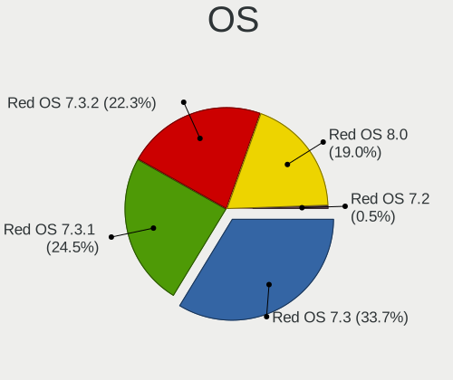
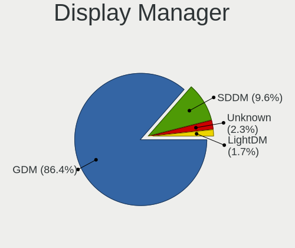
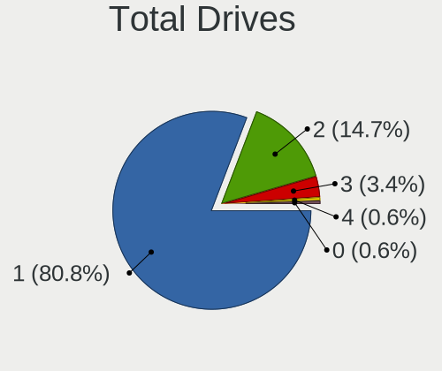
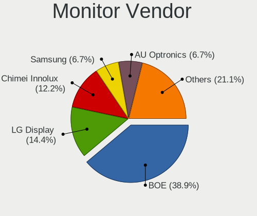
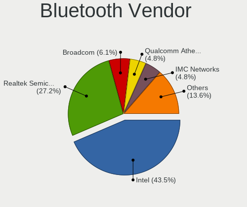
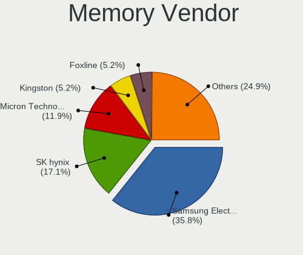
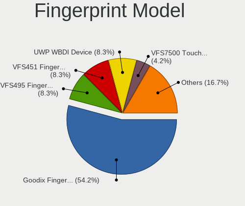

Red OS - Tested Hardware & Statistics (Notebooks)
-------------------------------------------------

A project to collect tested hardware configurations for Red OS.

Anyone can contribute to this report by the [hw-probe](https://github.com/linuxhw/hw-probe) tool:

    sudo -E hw-probe -all -upload

Please contribute! Especially if your hardware is rare.

Contents
--------

* [ Test Cases ](#test-cases)

* [ System ](#system)
  - [ OS                       ](#os)
  - [ OS Family                ](#os-family)
  - [ Kernel                   ](#kernel)
  - [ Kernel Family            ](#kernel-family)
  - [ Kernel Major Ver.        ](#kernel-major-ver)
  - [ Arch                     ](#arch)
  - [ DE                       ](#de)
  - [ Display Server           ](#display-server)
  - [ Display Manager          ](#display-manager)
  - [ OS Lang                  ](#os-lang)
  - [ Boot Mode                ](#boot-mode)
  - [ Filesystem               ](#filesystem)
  - [ Part. scheme             ](#part-scheme)
  - [ Dual Boot with Linux/BSD ](#dual-boot-with-linuxbsd)
  - [ Dual Boot (Win)          ](#dual-boot-win)

* [ Board ](#board)
  - [ Vendor                   ](#vendor)
  - [ Model                    ](#model)
  - [ Model Family             ](#model-family)
  - [ MFG Year                 ](#mfg-year)
  - [ Form Factor              ](#form-factor)
  - [ Secure Boot              ](#secure-boot)
  - [ Coreboot                 ](#coreboot)
  - [ RAM Size                 ](#ram-size)
  - [ RAM Used                 ](#ram-used)
  - [ Total Drives             ](#total-drives)
  - [ Has CD-ROM               ](#has-cd-rom)
  - [ Has Ethernet             ](#has-ethernet)
  - [ Has WiFi                 ](#has-wifi)
  - [ Has Bluetooth            ](#has-bluetooth)

* [ Location ](#location)
  - [ Country                  ](#country)
  - [ City                     ](#city)

* [ Drives ](#drives)
  - [ Drive Vendor             ](#drive-vendor)
  - [ Drive Model              ](#drive-model)
  - [ HDD Vendor               ](#hdd-vendor)
  - [ SSD Vendor               ](#ssd-vendor)
  - [ Drive Kind               ](#drive-kind)
  - [ Drive Connector          ](#drive-connector)
  - [ Drive Size               ](#drive-size)
  - [ Space Total              ](#space-total)
  - [ Space Used               ](#space-used)
  - [ Malfunc. Drives          ](#malfunc-drives)
  - [ Malfunc. Drive Vendor    ](#malfunc-drive-vendor)
  - [ Malfunc. HDD Vendor      ](#malfunc-hdd-vendor)
  - [ Malfunc. Drive Kind      ](#malfunc-drive-kind)
  - [ Failed Drives            ](#failed-drives)
  - [ Failed Drive Vendor      ](#failed-drive-vendor)
  - [ Drive Status             ](#drive-status)

* [ Storage controller ](#storage-controller)
  - [ Storage Vendor           ](#storage-vendor)
  - [ Storage Model            ](#storage-model)
  - [ Storage Kind             ](#storage-kind)

* [ Processor ](#processor)
  - [ CPU Vendor               ](#cpu-vendor)
  - [ CPU Model                ](#cpu-model)
  - [ CPU Model Family         ](#cpu-model-family)
  - [ CPU Cores                ](#cpu-cores)
  - [ CPU Sockets              ](#cpu-sockets)
  - [ CPU Threads              ](#cpu-threads)
  - [ CPU Op-Modes             ](#cpu-op-modes)
  - [ CPU Microcode            ](#cpu-microcode)
  - [ CPU Microarch            ](#cpu-microarch)

* [ Graphics ](#graphics)
  - [ GPU Vendor               ](#gpu-vendor)
  - [ GPU Model                ](#gpu-model)
  - [ GPU Combo                ](#gpu-combo)
  - [ GPU Driver               ](#gpu-driver)
  - [ GPU Memory               ](#gpu-memory)

* [ Monitor ](#monitor)
  - [ Monitor Vendor           ](#monitor-vendor)
  - [ Monitor Model            ](#monitor-model)
  - [ Monitor Resolution       ](#monitor-resolution)
  - [ Monitor Diagonal         ](#monitor-diagonal)
  - [ Monitor Width            ](#monitor-width)
  - [ Aspect Ratio             ](#aspect-ratio)
  - [ Monitor Area             ](#monitor-area)
  - [ Pixel Density            ](#pixel-density)
  - [ Multiple Monitors        ](#multiple-monitors)

* [ Network ](#network)
  - [ Net Controller Vendor    ](#net-controller-vendor)
  - [ Net Controller Model     ](#net-controller-model)
  - [ Wireless Vendor          ](#wireless-vendor)
  - [ Wireless Model           ](#wireless-model)
  - [ Ethernet Vendor          ](#ethernet-vendor)
  - [ Ethernet Model           ](#ethernet-model)
  - [ Net Controller Kind      ](#net-controller-kind)
  - [ Used Controller          ](#used-controller)
  - [ NICs                     ](#nics)
  - [ IPv6                     ](#ipv6)

* [ Bluetooth ](#bluetooth)
  - [ Bluetooth Vendor         ](#bluetooth-vendor)
  - [ Bluetooth Model          ](#bluetooth-model)

* [ Sound ](#sound)
  - [ Sound Vendor             ](#sound-vendor)
  - [ Sound Model              ](#sound-model)

* [ Memory ](#memory)
  - [ Memory Vendor            ](#memory-vendor)
  - [ Memory Model             ](#memory-model)
  - [ Memory Kind              ](#memory-kind)
  - [ Memory Form Factor       ](#memory-form-factor)
  - [ Memory Size              ](#memory-size)
  - [ Memory Speed             ](#memory-speed)

* [ Printers & scanners ](#printers--scanners)
  - [ Printer Vendor           ](#printer-vendor)
  - [ Printer Model            ](#printer-model)
  - [ Scanner Vendor           ](#scanner-vendor)
  - [ Scanner Model            ](#scanner-model)

* [ Camera ](#camera)
  - [ Camera Vendor            ](#camera-vendor)
  - [ Camera Model             ](#camera-model)

* [ Security ](#security)
  - [ Fingerprint Vendor       ](#fingerprint-vendor)
  - [ Fingerprint Model        ](#fingerprint-model)
  - [ Chipcard Vendor          ](#chipcard-vendor)
  - [ Chipcard Model           ](#chipcard-model)

* [ Unsupported ](#unsupported)
  - [ Unsupported Devices      ](#unsupported-devices)
  - [ Unsupported Device Types ](#unsupported-device-types)

Test Cases
----------

Total: 166

| Vendor        | Model                       | Probe                                                      | Date         |
|---------------|-----------------------------|------------------------------------------------------------|--------------|
| HP            | Laptop 15s-fq2xxx           | [2135954523](https://linux-hardware.org/?probe=2135954523) | Sep 04, 2023 |
| HP            | 250 15.6 inch G9 Noteboo... | [7c560dfe57](https://linux-hardware.org/?probe=7c560dfe57) | Aug 31, 2023 |
| ICL           | S1511 G1R                   | [421df1df8d](https://linux-hardware.org/?probe=421df1df8d) | Aug 28, 2023 |
| Lenovo        | ThinkBook 15 G3 ACL 21A4    | [a3a1e805b2](https://linux-hardware.org/?probe=a3a1e805b2) | Aug 27, 2023 |
| Lenovo        | ThinkPad E15 Gen 4 21E60... | [cfe21994b6](https://linux-hardware.org/?probe=cfe21994b6) | Aug 17, 2023 |
| Lenovo        | IdeaPad L340-15API 81LW     | [7d63566e0a](https://linux-hardware.org/?probe=7d63566e0a) | Aug 11, 2023 |
| Dell          | Precision M4700             | [95ac580b0d](https://linux-hardware.org/?probe=95ac580b0d) | Aug 08, 2023 |
| MSI           | Modern 14 C12M              | [aa352b05aa](https://linux-hardware.org/?probe=aa352b05aa) | Aug 03, 2023 |
| Timi          | Redmi Book Pro 15 2022      | [8a2a5c6265](https://linux-hardware.org/?probe=8a2a5c6265) | Jul 30, 2023 |
| Dell          | Vostro 3400                 | [ee71316b5e](https://linux-hardware.org/?probe=ee71316b5e) | Jul 17, 2023 |
| Gigabyte      | G5 ME                       | [eaefa9c2c6](https://linux-hardware.org/?probe=eaefa9c2c6) | Jul 17, 2023 |
| Dell          | Precision M4700             | [7dc84c10b5](https://linux-hardware.org/?probe=7dc84c10b5) | Jul 11, 2023 |
| Dell          | Inspiron 3583               | [3f5ae451c0](https://linux-hardware.org/?probe=3f5ae451c0) | Jul 09, 2023 |
| Timi          | Redmi G 2022                | [30e96afcdd](https://linux-hardware.org/?probe=30e96afcdd) | Jul 08, 2023 |
| Timi          | Redmi G 2022                | [cd2b7e13ce](https://linux-hardware.org/?probe=cd2b7e13ce) | Jul 04, 2023 |
| ICL           | Si1407                      | [c4c9d43042](https://linux-hardware.org/?probe=c4c9d43042) | Jul 04, 2023 |
| Aquarius      | NS483                       | [dd5daf7f12](https://linux-hardware.org/?probe=dd5daf7f12) | Jun 18, 2023 |
| HP            | Laptop 15-bw0xx             | [a161ef52b4](https://linux-hardware.org/?probe=a161ef52b4) | Jun 18, 2023 |
| Lenovo        | G570 20079                  | [4843789a62](https://linux-hardware.org/?probe=4843789a62) | May 30, 2023 |
| Acer          | Aspire A315-58              | [59d36ef46d](https://linux-hardware.org/?probe=59d36ef46d) | May 22, 2023 |
| HP            | EliteBook 8440p             | [3ad250d762](https://linux-hardware.org/?probe=3ad250d762) | May 22, 2023 |
| MSI           | GL62 6QF                    | [6ae5c650f3](https://linux-hardware.org/?probe=6ae5c650f3) | May 14, 2023 |
| HP            | Pavilion Laptop 15-eh1xx... | [3de097b441](https://linux-hardware.org/?probe=3de097b441) | May 12, 2023 |
| Dell          | Vostro 5391                 | [f5342b41ec](https://linux-hardware.org/?probe=f5342b41ec) | May 06, 2023 |
| Graviton      | N14I-T                      | [e82c8f00d8](https://linux-hardware.org/?probe=e82c8f00d8) | May 05, 2023 |
| Lenovo        | IdeaPad L340-15API 81LW     | [a61a9a88bc](https://linux-hardware.org/?probe=a61a9a88bc) | May 02, 2023 |
| Lenovo        | ThinkBook 15 G2 ITL 20VE    | [8f8a912636](https://linux-hardware.org/?probe=8f8a912636) | May 01, 2023 |
| HP            | Laptop 15-bw0xx             | [387eecc18e](https://linux-hardware.org/?probe=387eecc18e) | Apr 27, 2023 |
| HP            | ProBook 440 G8 Notebook ... | [40aaf19667](https://linux-hardware.org/?probe=40aaf19667) | Apr 21, 2023 |
| Unknown       | Unknown                     | [c959a62e36](https://linux-hardware.org/?probe=c959a62e36) | Apr 10, 2023 |
| HONOR         | BMH-WCX9                    | [2082d3c772](https://linux-hardware.org/?probe=2082d3c772) | Apr 08, 2023 |
| Unknown       | Unknown                     | [70ff15284b](https://linux-hardware.org/?probe=70ff15284b) | Apr 07, 2023 |
| Unknown       | Unknown                     | [9a068872f6](https://linux-hardware.org/?probe=9a068872f6) | Apr 06, 2023 |
| HP            | ProBook 4525s               | [164d8993b4](https://linux-hardware.org/?probe=164d8993b4) | Apr 04, 2023 |
| MSI           | Sword 15 A12UE              | [3389b32105](https://linux-hardware.org/?probe=3389b32105) | Apr 01, 2023 |
| Lenovo        | IdeaPad L340-15API 81LW     | [36b3103f3f](https://linux-hardware.org/?probe=36b3103f3f) | Mar 31, 2023 |
| Lenovo        | IdeaPad 1 15ALC7 82R4       | [deb6990c19](https://linux-hardware.org/?probe=deb6990c19) | Mar 27, 2023 |
| HONOR         | NBR-WAX9                    | [ef91ef3645](https://linux-hardware.org/?probe=ef91ef3645) | Mar 27, 2023 |
| MSI           | Modern 15 B12M              | [eded7b36b1](https://linux-hardware.org/?probe=eded7b36b1) | Mar 27, 2023 |
| MSI           | Modern 15 B12M              | [9ee3ca41c8](https://linux-hardware.org/?probe=9ee3ca41c8) | Mar 27, 2023 |
| MSI           | Sword 15 A12UE              | [f4341a491a](https://linux-hardware.org/?probe=f4341a491a) | Mar 21, 2023 |
| Lenovo        | IdeaPad L340-15API 81LW     | [be9b767d92](https://linux-hardware.org/?probe=be9b767d92) | Mar 20, 2023 |
| Lenovo        | ThinkPad T14 Gen 3 21AJS... | [b473b68faf](https://linux-hardware.org/?probe=b473b68faf) | Mar 10, 2023 |
| Lenovo        | ThinkPad T14 Gen 3 21AJS... | [4a8589fbdf](https://linux-hardware.org/?probe=4a8589fbdf) | Mar 10, 2023 |
| Lenovo        | IdeaPad 330-15ARR 81D2      | [b116afe451](https://linux-hardware.org/?probe=b116afe451) | Feb 27, 2023 |
| Kraftway      | ACCORD                      | [8fe15f2f2b](https://linux-hardware.org/?probe=8fe15f2f2b) | Feb 22, 2023 |
| Lenovo        | B590 20208                  | [10e9491ee4](https://linux-hardware.org/?probe=10e9491ee4) | Feb 17, 2023 |
| Lenovo        | B590 20208                  | [a3b352975c](https://linux-hardware.org/?probe=a3b352975c) | Feb 17, 2023 |
| Lenovo        | IdeaPad L340-15API 81LW     | [4d9144193f](https://linux-hardware.org/?probe=4d9144193f) | Feb 17, 2023 |
| Lenovo        | ThinkBook 15 G2 ARE 20VG    | [9de0373acc](https://linux-hardware.org/?probe=9de0373acc) | Feb 16, 2023 |
| Lenovo        | IdeaPad L340-15API 81LW     | [09073fcfc8](https://linux-hardware.org/?probe=09073fcfc8) | Feb 10, 2023 |
| HP            | G62                         | [8bc9454fb1](https://linux-hardware.org/?probe=8bc9454fb1) | Feb 10, 2023 |
| Lenovo        | IdeaPad L340-15API 81LW     | [d3b63de821](https://linux-hardware.org/?probe=d3b63de821) | Feb 07, 2023 |
| Lenovo        | IdeaPad 5 15ARE05 81YQ      | [a2172caf56](https://linux-hardware.org/?probe=a2172caf56) | Feb 06, 2023 |
| Lenovo        | IdeaPad 5 15ARE05 81YQ      | [77faeb6b52](https://linux-hardware.org/?probe=77faeb6b52) | Feb 06, 2023 |
| HP            | Pavilion 15                 | [eb37d7677c](https://linux-hardware.org/?probe=eb37d7677c) | Feb 06, 2023 |
| Lenovo        | IdeaPad L340-15API 81LW     | [bb0481d7a8](https://linux-hardware.org/?probe=bb0481d7a8) | Feb 06, 2023 |
| Lenovo        | IdeaPad L340-15API 81LW     | [186aef8e0c](https://linux-hardware.org/?probe=186aef8e0c) | Jan 24, 2023 |
| Lenovo        | V130-15IKB 81HN             | [a74a5b3b7b](https://linux-hardware.org/?probe=a74a5b3b7b) | Jan 20, 2023 |
| Lenovo        | IdeaPad L340-15API 81LW     | [8472d89767](https://linux-hardware.org/?probe=8472d89767) | Jan 20, 2023 |
| Lenovo        | IdeaPad L340-15API 81LW     | [7d95709d81](https://linux-hardware.org/?probe=7d95709d81) | Jan 19, 2023 |
| HP            | Pavilion Laptop 15-eh1xx... | [b6e4100bc6](https://linux-hardware.org/?probe=b6e4100bc6) | Jan 17, 2023 |
| Lenovo        | IdeaPad L340-15API 81LW     | [a05251fd39](https://linux-hardware.org/?probe=a05251fd39) | Dec 29, 2022 |
| 3Logic Gro... | Graviton N15i-K2            | [fe79eba13b](https://linux-hardware.org/?probe=fe79eba13b) | Dec 29, 2022 |
| HP            | Notebook                    | [10dfda9549](https://linux-hardware.org/?probe=10dfda9549) | Dec 24, 2022 |
| Lenovo        | ThinkPad E15 Gen 4 21E60... | [4c1ad2ea2e](https://linux-hardware.org/?probe=4c1ad2ea2e) | Dec 18, 2022 |
| Kraftway      | ACCORD                      | [a199d930ff](https://linux-hardware.org/?probe=a199d930ff) | Dec 18, 2022 |
| Shanghai Z... | ZXE CRB                     | [20ce0a7f23](https://linux-hardware.org/?probe=20ce0a7f23) | Dec 16, 2022 |
| Lenovo        | IdeaPad L340-15API 81LW     | [6cedae9702](https://linux-hardware.org/?probe=6cedae9702) | Dec 10, 2022 |
| Lenovo        | IdeaPad L340-15API 81LW     | [311f47baef](https://linux-hardware.org/?probe=311f47baef) | Dec 09, 2022 |
| HP            | Laptop 15s-eq1xxx           | [79a0f9e73a](https://linux-hardware.org/?probe=79a0f9e73a) | Dec 08, 2022 |
| HP            | Laptop 15s-eq1xxx           | [c1cd524970](https://linux-hardware.org/?probe=c1cd524970) | Dec 08, 2022 |
| Aquarius      | NS685U R11                  | [c0dff8c525](https://linux-hardware.org/?probe=c0dff8c525) | Dec 08, 2022 |
| ICL           | RAYbook Si1512              | [b8c52ae5cb](https://linux-hardware.org/?probe=b8c52ae5cb) | Dec 06, 2022 |
| HP            | Laptop 15s-eq1xxx           | [0cd3371014](https://linux-hardware.org/?probe=0cd3371014) | Dec 05, 2022 |
| MSI           | Sword 15 A12UE              | [32df733b5e](https://linux-hardware.org/?probe=32df733b5e) | Dec 04, 2022 |
| Lenovo        | IdeaPad L340-15API 81LW     | [ddb1791ff6](https://linux-hardware.org/?probe=ddb1791ff6) | Nov 28, 2022 |
| Lenovo        | IdeaPad 700-15ISK 80RU      | [d9ae3d1795](https://linux-hardware.org/?probe=d9ae3d1795) | Nov 27, 2022 |
| Lenovo        | IdeaPad L340-15API 81LW     | [ff3d0a1ecf](https://linux-hardware.org/?probe=ff3d0a1ecf) | Nov 24, 2022 |
| Lenovo        | IdeaPad L340-15API 81LW     | [f86569d54b](https://linux-hardware.org/?probe=f86569d54b) | Nov 24, 2022 |
| HUAWEI        | NBD-WXX9                    | [a54f42b51e](https://linux-hardware.org/?probe=a54f42b51e) | Nov 18, 2022 |
| HUAWEI        | NBD-WXX9                    | [faa0deab8f](https://linux-hardware.org/?probe=faa0deab8f) | Nov 18, 2022 |
| Lenovo        | ThinkPad X220 4290RB3       | [37959973aa](https://linux-hardware.org/?probe=37959973aa) | Nov 11, 2022 |
| Lenovo        | IdeaPad L340-15API 81LW     | [3fd33e6782](https://linux-hardware.org/?probe=3fd33e6782) | Nov 09, 2022 |
| Lenovo        | IdeaPad L340-15API 81LW     | [dba14315ca](https://linux-hardware.org/?probe=dba14315ca) | Nov 03, 2022 |
| Lenovo        | IdeaPad L340-15API 81LW     | [d653658a53](https://linux-hardware.org/?probe=d653658a53) | Oct 28, 2022 |
| Lenovo        | IdeaPad L340-15API 81LW     | [b9ab6b9cf2](https://linux-hardware.org/?probe=b9ab6b9cf2) | Oct 28, 2022 |
| Acer          | Aspire A517-52              | [1ee47a3ab6](https://linux-hardware.org/?probe=1ee47a3ab6) | Oct 25, 2022 |
| Lenovo        | IdeaPad 5 Pro 14ACN6 82L... | [14537f243b](https://linux-hardware.org/?probe=14537f243b) | Oct 24, 2022 |
| THUNDEROBO... | 911AirD                     | [f471a1c9db](https://linux-hardware.org/?probe=f471a1c9db) | Oct 23, 2022 |
| Acer          | Aspire A517-52              | [7515d53b5d](https://linux-hardware.org/?probe=7515d53b5d) | Oct 21, 2022 |
| Lenovo        | IdeaPad L340-15API 81LW     | [3fc175d4a0](https://linux-hardware.org/?probe=3fc175d4a0) | Oct 20, 2022 |
| Lenovo        | ThinkBook 15 G3 ACL 21A4    | [fe184c8f5b](https://linux-hardware.org/?probe=fe184c8f5b) | Oct 19, 2022 |
| Lenovo        | ThinkBook 15 G3 ACL 21A4    | [0db79bc085](https://linux-hardware.org/?probe=0db79bc085) | Oct 19, 2022 |
| Lenovo        | IdeaPad L340-15API 81LW     | [1cdde90662](https://linux-hardware.org/?probe=1cdde90662) | Oct 13, 2022 |
| Acer          | Aspire 2920                 | [c588bacc95](https://linux-hardware.org/?probe=c588bacc95) | Oct 08, 2022 |
| Acer          | Aspire 2920                 | [34b41a4e67](https://linux-hardware.org/?probe=34b41a4e67) | Oct 08, 2022 |
| ASUSTek       | X540NV                      | [31e4464fea](https://linux-hardware.org/?probe=31e4464fea) | Oct 07, 2022 |
| Lenovo        | IdeaPad L340-15API 81LW     | [7f8e650618](https://linux-hardware.org/?probe=7f8e650618) | Oct 06, 2022 |
| Acer          | Aspire 2920                 | [538f7a6e26](https://linux-hardware.org/?probe=538f7a6e26) | Oct 05, 2022 |
| HP            | OMEN by Laptop              | [0a8238a876](https://linux-hardware.org/?probe=0a8238a876) | Oct 05, 2022 |
| THUNDEROBO... | 911AirD                     | [69a9650652](https://linux-hardware.org/?probe=69a9650652) | Oct 03, 2022 |
| Lenovo        | IdeaPad L340-15API 81LW     | [89b48cd98e](https://linux-hardware.org/?probe=89b48cd98e) | Oct 03, 2022 |
| Digma         | EVE 11 C408                 | [b5c7ac8ed3](https://linux-hardware.org/?probe=b5c7ac8ed3) | Sep 30, 2022 |
| THUNDEROBO... | 911AirD                     | [99f1b7e253](https://linux-hardware.org/?probe=99f1b7e253) | Sep 29, 2022 |
| ICL           | RAYbook Si1512              | [0b610b66a9](https://linux-hardware.org/?probe=0b610b66a9) | Sep 20, 2022 |
| Lenovo        | IdeaPad L340-15API 81LW     | [713797403a](https://linux-hardware.org/?probe=713797403a) | Sep 09, 2022 |
| IP3 Techno... | ACN30                       | [af9694cea8](https://linux-hardware.org/?probe=af9694cea8) | Sep 06, 2022 |
| IP3 Techno... | ACN30                       | [03f14a115d](https://linux-hardware.org/?probe=03f14a115d) | Sep 05, 2022 |
| MSI           | FX610                       | [a822818a58](https://linux-hardware.org/?probe=a822818a58) | Sep 03, 2022 |
| IP3 Techno... | ACN30                       | [e25ed534c0](https://linux-hardware.org/?probe=e25ed534c0) | Aug 18, 2022 |
| ICL           | RAYbook Si1512              | [a42c4dc65a](https://linux-hardware.org/?probe=a42c4dc65a) | Aug 09, 2022 |
| Digma         | EVE 15 P417 ES5063EW        | [a584c678b5](https://linux-hardware.org/?probe=a584c678b5) | Jul 27, 2022 |
| Digma         | EVE 15 C407 ES5054EW        | [4fd01756b2](https://linux-hardware.org/?probe=4fd01756b2) | Jul 27, 2022 |
| Digma         | EVE 15 C407 ES5054EW        | [008b02cc92](https://linux-hardware.org/?probe=008b02cc92) | Jul 26, 2022 |
| Lenovo        | IdeaPad 5 Pro 14ACN6 82L... | [413949a727](https://linux-hardware.org/?probe=413949a727) | Jul 25, 2022 |
| Lenovo        | V15-IWL 81YE                | [3bfcedd5c8](https://linux-hardware.org/?probe=3bfcedd5c8) | Jul 22, 2022 |
| Lenovo        | V15-IWL 81YE                | [c49282206c](https://linux-hardware.org/?probe=c49282206c) | Jul 22, 2022 |
| Lenovo        | V15-IWL 81YE                | [d598c4587d](https://linux-hardware.org/?probe=d598c4587d) | Jul 22, 2022 |
| Lenovo        | V15-IWL 81YE                | [5b1e962751](https://linux-hardware.org/?probe=5b1e962751) | Jul 22, 2022 |
| Lenovo        | V15-IWL 81YE                | [4e120b3b63](https://linux-hardware.org/?probe=4e120b3b63) | Jul 22, 2022 |
| Lenovo        | V15-IWL 81YE                | [2d5bedf224](https://linux-hardware.org/?probe=2d5bedf224) | Jul 22, 2022 |
| Lenovo        | V15-IWL 81YE                | [297ce5144e](https://linux-hardware.org/?probe=297ce5144e) | Jul 22, 2022 |
| Lenovo        | V15-IWL 81YE                | [84b7cd1115](https://linux-hardware.org/?probe=84b7cd1115) | Jul 22, 2022 |
| Lenovo        | V15-IWL 81YE                | [a92b6c5d73](https://linux-hardware.org/?probe=a92b6c5d73) | Jul 22, 2022 |
| Lenovo        | V15-IWL 81YE                | [51ebd271c8](https://linux-hardware.org/?probe=51ebd271c8) | Jul 22, 2022 |
| Lenovo        | V15-IWL 81YE                | [44ad7f7d47](https://linux-hardware.org/?probe=44ad7f7d47) | Jul 22, 2022 |
| Lenovo        | V15-IWL 81YE                | [49068a26b5](https://linux-hardware.org/?probe=49068a26b5) | Jul 22, 2022 |
| Lenovo        | V15-IWL 81YE                | [62ce596bf3](https://linux-hardware.org/?probe=62ce596bf3) | Jul 22, 2022 |
| Lenovo        | V15-IWL 81YE                | [812db8ad6f](https://linux-hardware.org/?probe=812db8ad6f) | Jul 22, 2022 |
| Lenovo        | V15-IWL 81YE                | [d4c2b5ffad](https://linux-hardware.org/?probe=d4c2b5ffad) | Jul 22, 2022 |
| Lenovo        | V15-IWL 81YE                | [4c0179b60e](https://linux-hardware.org/?probe=4c0179b60e) | Jul 22, 2022 |
| Lenovo        | IdeaPad L340-15API 81LW     | [8601888983](https://linux-hardware.org/?probe=8601888983) | Jul 22, 2022 |
| Lenovo        | V15-IWL 81YE                | [1d505390d6](https://linux-hardware.org/?probe=1d505390d6) | Jul 22, 2022 |
| HONOR         | NBR-WAX9                    | [5b3340311a](https://linux-hardware.org/?probe=5b3340311a) | Jul 20, 2022 |
| Lenovo        | IdeaPad L340-15API 81LW     | [154c254eac](https://linux-hardware.org/?probe=154c254eac) | Jul 19, 2022 |
| Gigabyte      | G5 GD                       | [60921a7ff6](https://linux-hardware.org/?probe=60921a7ff6) | Jul 19, 2022 |
| Gigabyte      | G5 GD                       | [c24f8b4ba6](https://linux-hardware.org/?probe=c24f8b4ba6) | Jul 19, 2022 |
| HONOR         | NBR-WAX9                    | [fe971bb8c3](https://linux-hardware.org/?probe=fe971bb8c3) | Jul 08, 2022 |
| Lenovo        | IdeaPad 3 15ITL05 81X8      | [2835672840](https://linux-hardware.org/?probe=2835672840) | Jul 07, 2022 |
| Kraftway      | ACCORD                      | [24e49bc011](https://linux-hardware.org/?probe=24e49bc011) | Jun 27, 2022 |
| Kraftway      | ACCORD                      | [39e3c55e89](https://linux-hardware.org/?probe=39e3c55e89) | Jun 27, 2022 |
| Aquarius      | NS685U                      | [ecedc7cbb6](https://linux-hardware.org/?probe=ecedc7cbb6) | Jun 08, 2022 |
| ICL           | Unknown                     | [4dc89fc689](https://linux-hardware.org/?probe=4dc89fc689) | Jun 07, 2022 |
| mtech         | MTL1578                     | [bf25c26ea0](https://linux-hardware.org/?probe=bf25c26ea0) | May 11, 2022 |
| HUAWEI        | BOD-WXX9                    | [e2e025dd4f](https://linux-hardware.org/?probe=e2e025dd4f) | Apr 15, 2022 |
| Acer          | TravelMate P215-53          | [124fdb3b64](https://linux-hardware.org/?probe=124fdb3b64) | Apr 14, 2022 |
| Lenovo        | ThinkBook 14-IIL 20SL       | [be41efbec8](https://linux-hardware.org/?probe=be41efbec8) | Apr 05, 2022 |
| Aquarius      | NS585 R32                   | [582389ca98](https://linux-hardware.org/?probe=582389ca98) | Mar 24, 2022 |
| Lenovo        | IdeaPad L340-15IWL 81LG     | [56f9ebba91](https://linux-hardware.org/?probe=56f9ebba91) | Mar 22, 2022 |
| Lenovo        | ThinkBook 15 G3 ACL 21A4    | [e18b80073c](https://linux-hardware.org/?probe=e18b80073c) | Mar 21, 2022 |
| 3Logic Gro... | APM Graviton A15i-K2        | [e93bcf2f42](https://linux-hardware.org/?probe=e93bcf2f42) | Mar 09, 2022 |
| ASUSTek       | TUF Gaming FX705DT_FX705... | [227a2658d0](https://linux-hardware.org/?probe=227a2658d0) | Feb 15, 2022 |
| HP            | Laptop 15s-eq1xxx           | [7ed7e139d8](https://linux-hardware.org/?probe=7ed7e139d8) | Dec 20, 2021 |
| HP            | Laptop 15s-eq1xxx           | [55ab1c9ab8](https://linux-hardware.org/?probe=55ab1c9ab8) | Dec 20, 2021 |
| HUAWEI        | NBLK-WAX9X                  | [5bb21d6bf6](https://linux-hardware.org/?probe=5bb21d6bf6) | Dec 13, 2021 |
| ICL           | RAYbook Si1514              | [9ddc61deba](https://linux-hardware.org/?probe=9ddc61deba) | Sep 13, 2021 |
| ASUSTek       | TUF Gaming FX705DT_FX705... | [4f59992d0f](https://linux-hardware.org/?probe=4f59992d0f) | Sep 11, 2021 |
| HP            | Laptop 15-dw3xxx            | [d8b35044ab](https://linux-hardware.org/?probe=d8b35044ab) | Jul 29, 2021 |
| Lenovo        | IdeaPad 5 15ARE05 81YQ      | [9b2c758081](https://linux-hardware.org/?probe=9b2c758081) | Jun 10, 2021 |
| ASUSTek       | X75VD                       | [95ea9551da](https://linux-hardware.org/?probe=95ea9551da) | Apr 05, 2021 |
| ASUSTek       | TUF Gaming FX705DT_FX705... | [916d4b225b](https://linux-hardware.org/?probe=916d4b225b) | Mar 30, 2021 |
| ASUSTek       | TUF Gaming FX705DT_FX705... | [ebfafc7409](https://linux-hardware.org/?probe=ebfafc7409) | Mar 26, 2021 |
| HUAWEI        | BOHL-WXX9                   | [cf5559d576](https://linux-hardware.org/?probe=cf5559d576) | Mar 26, 2021 |
| HP            | Pavilion g6                 | [1ca79b1950](https://linux-hardware.org/?probe=1ca79b1950) | Mar 26, 2021 |
| Pegatron      | A35                         | [9923a21e8c](https://linux-hardware.org/?probe=9923a21e8c) | Mar 04, 2021 |

System
------

OS
--

Installed operating systems

| Name         | Notebooks | Percent |
|--------------|-----------|---------|
| Red OS 7.3.1 | 44        | 40%     |
| Red OS 7.3.2 | 41        | 37.27%  |
| Red OS 7.3   | 24        | 21.82%  |
| Red OS 7.2   | 1         | 0.91%   |

OS Family
---------

OS without a version

| Name   | Notebooks | Percent |
|--------|-----------|---------|
| Red OS | 105       | 100%    |

Kernel
------

Version of the Linux kernel

| Version                 | Notebooks | Percent |
|-------------------------|-----------|---------|
| 5.15.10-1.el7.x86_64    | 25        | 21.55%  |
| 5.15.72-1.el7.3.x86_64  | 22        | 18.97%  |
| 5.15.87-1.el7.3.x86_64  | 13        | 11.21%  |
| 5.15.35-4.el7.3.x86_64  | 10        | 8.62%   |
| 5.10.29-1.el7.x86_64    | 10        | 8.62%   |
| 5.15.35-1.el7.3.x86_64  | 6         | 5.17%   |
| 6.1.20-2.el7.3.x86_64   | 4         | 3.45%   |
| 5.15.35-5.el7.3.x86_64  | 4         | 3.45%   |
| 5.15.78-2.el7.3.x86_64  | 3         | 2.59%   |
| 5.10.1-1.el7.x86_64     | 3         | 2.59%   |
| 6.1.38-2.el7.3.x86_64   | 2         | 1.72%   |
| 5.15.10-4.el7.x86_64    | 2         | 1.72%   |
| 5.10.29-3.el7.x86_64    | 2         | 1.72%   |
| 5.10.24-2.el7.x86_64    | 2         | 1.72%   |
| 5.18.1-1.el7.x86_64     | 1         | 0.86%   |
| 5.15.125-1.el7.3.x86_64 | 1         | 0.86%   |
| 5.15.120                | 1         | 0.86%   |
| 5.15.10-3.el7.x86_64    | 1         | 0.86%   |
| 5.15.10-2.el7.x86_64    | 1         | 0.86%   |
| 5.13.15-1.el7.x86_64    | 1         | 0.86%   |
| 5.10.24-1.el7.x86_64    | 1         | 0.86%   |
| 4.19.79-1.el7.x86_64    | 1         | 0.86%   |

Kernel Family
-------------

Linux kernel without a distro release

| Version  | Notebooks | Percent |
|----------|-----------|---------|
| 5.15.10  | 29        | 25.22%  |
| 5.15.72  | 22        | 19.13%  |
| 5.15.35  | 19        | 16.52%  |
| 5.15.87  | 13        | 11.3%   |
| 5.10.29  | 12        | 10.43%  |
| 6.1.20   | 4         | 3.48%   |
| 5.15.78  | 3         | 2.61%   |
| 5.10.24  | 3         | 2.61%   |
| 5.10.1   | 3         | 2.61%   |
| 6.1.38   | 2         | 1.74%   |
| 5.18.1   | 1         | 0.87%   |
| 5.15.125 | 1         | 0.87%   |
| 5.15.120 | 1         | 0.87%   |
| 5.13.15  | 1         | 0.87%   |
| 4.19.79  | 1         | 0.87%   |

Kernel Major Ver.
-----------------

Linux kernel major version

| Version | Notebooks | Percent |
|---------|-----------|---------|
| 5.15    | 83        | 76.15%  |
| 5.10    | 17        | 15.6%   |
| 6.1     | 6         | 5.5%    |
| 5.18    | 1         | 0.92%   |
| 5.13    | 1         | 0.92%   |
| 4.19    | 1         | 0.92%   |

Arch
----

OS architecture (x86_64, i586, etc.)

| Name   | Notebooks | Percent |
|--------|-----------|---------|
| x86_64 | 105       | 100%    |

DE
--

Desktop Environment

| Name       | Notebooks | Percent |
|------------|-----------|---------|
| MATE       | 91        | 85.85%  |
| Cinnamon   | 12        | 11.32%  |
| X-Cinnamon | 3         | 2.83%   |

Display Server
--------------

X11 or Wayland

| Name    | Notebooks | Percent |
|---------|-----------|---------|
| X11     | 101       | 94.39%  |
| Wayland | 6         | 5.61%   |

Display Manager
---------------

SDDM, LightDM, etc.

| Name    | Notebooks | Percent |
|---------|-----------|---------|
| GDM     | 99        | 91.67%  |
| SDDM    | 4         | 3.7%    |
| Unknown | 3         | 2.78%   |
| LightDM | 2         | 1.85%   |

OS Lang
-------

Language

| Lang    | Notebooks | Percent |
|---------|-----------|---------|
| Unknown | 71        | 65.74%  |
| ru_RU   | 36        | 33.33%  |
| en_US   | 1         | 0.93%   |

Boot Mode
---------

EFI or BIOS

| Mode | Notebooks | Percent |
|------|-----------|---------|
| EFI  | 93        | 86.92%  |
| BIOS | 14        | 13.08%  |

Filesystem
----------

Type of filesystem

| Type    | Notebooks | Percent |
|---------|-----------|---------|
| Ext4    | 102       | 96.23%  |
| Btrfs   | 2         | 1.89%   |
| Xfs     | 1         | 0.94%   |
| Overlay | 1         | 0.94%   |

Part. scheme
------------

Scheme of partitioning

| Type    | Notebooks | Percent |
|---------|-----------|---------|
| GPT     | 92        | 86.79%  |
| MBR     | 11        | 10.38%  |
| Unknown | 3         | 2.83%   |

Dual Boot with Linux/BSD
------------------------

Hosting more than one Linux/BSD

| Dual boot | Notebooks | Percent |
|-----------|-----------|---------|
| No        | 95        | 89.62%  |
| Yes       | 11        | 10.38%  |

Dual Boot (Win)
---------------

Hosting Linux and Windows

| Dual boot | Notebooks | Percent |
|-----------|-----------|---------|
| No        | 80        | 74.07%  |
| Yes       | 28        | 25.93%  |

Board
-----

Vendor
------

Motherboard manufacturer

| Name                           | Notebooks | Percent |
|--------------------------------|-----------|---------|
| Lenovo                         | 39        | 37.14%  |
| Hewlett-Packard                | 15        | 14.29%  |
| ICL                            | 7         | 6.67%   |
| MSI                            | 5         | 4.76%   |
| HUAWEI                         | 4         | 3.81%   |
| Dell                           | 4         | 3.81%   |
| Aquarius                       | 4         | 3.81%   |
| Kraftway                       | 3         | 2.86%   |
| Digma                          | 3         | 2.86%   |
| ASUSTek Computer               | 3         | 2.86%   |
| Acer                           | 3         | 2.86%   |
| IP3 Technology                 | 2         | 1.9%    |
| HONOR                          | 2         | 1.9%    |
| Gigabyte Technology            | 2         | 1.9%    |
| 3Logic Group                   | 2         | 1.9%    |
| Timi                           | 1         | 0.95%   |
| THUNDEROBOT                    | 1         | 0.95%   |
| Shanghai Zhaoxin Semiconductor | 1         | 0.95%   |
| Pegatron                       | 1         | 0.95%   |
| mtech                          | 1         | 0.95%   |
| Graviton                       | 1         | 0.95%   |
| Unknown                        | 1         | 0.95%   |

Model
-----

Motherboard model

| Name                                 | Notebooks | Percent |
|--------------------------------------|-----------|---------|
| Lenovo V15-IWL 81YE                  | 17        | 16.19%  |
| Lenovo ThinkBook 15 G3 ACL 21A4      | 3         | 2.86%   |
| Kraftway ACCORD                      | 3         | 2.86%   |
| ICL RAYbook Si1512                   | 3         | 2.86%   |
| HP Laptop 15s-eq1xxx                 | 3         | 2.86%   |
| IP3 ACN30                            | 2         | 1.9%    |
| Unknown                              | 2         | 1.9%    |
| Timi Redmi Book Pro 15 2022          | 1         | 0.95%   |
| THUNDEROBOT 911AirD                  | 1         | 0.95%   |
| Shanghai Zhaoxin ZXE CRB             | 1         | 0.95%   |
| Pegatron A35                         | 1         | 0.95%   |
| mtech MTL1578                        | 1         | 0.95%   |
| MSI Sword 15 A12UE                   | 1         | 0.95%   |
| MSI Modern 15 B12M                   | 1         | 0.95%   |
| MSI Modern 14 C12M                   | 1         | 0.95%   |
| MSI GL62 6QF                         | 1         | 0.95%   |
| MSI FX610                            | 1         | 0.95%   |
| Lenovo V130-15IKB 81HN               | 1         | 0.95%   |
| Lenovo ThinkPad X220 4290RB3         | 1         | 0.95%   |
| Lenovo ThinkPad T14 Gen 3 21AJS2DE00 | 1         | 0.95%   |
| Lenovo ThinkPad T14 Gen 3 21AJS2DD00 | 1         | 0.95%   |
| Lenovo ThinkPad E15 Gen 4 21E6009UGP | 1         | 0.95%   |
| Lenovo ThinkPad E15 Gen 4 21E60061RT | 1         | 0.95%   |
| Lenovo ThinkBook 15 G2 ITL 20VE      | 1         | 0.95%   |
| Lenovo ThinkBook 15 G2 ARE 20VG      | 1         | 0.95%   |
| Lenovo ThinkBook 14-IIL 20SL         | 1         | 0.95%   |
| Lenovo IdeaPad L340-15IWL 81LG       | 1         | 0.95%   |
| Lenovo IdeaPad L340-15API 81LW       | 1         | 0.95%   |
| Lenovo IdeaPad 700-15ISK 80RU        | 1         | 0.95%   |
| Lenovo IdeaPad 5 Pro 14ACN6 82L7     | 1         | 0.95%   |
| Lenovo IdeaPad 5 15ARE05 81YQ        | 1         | 0.95%   |
| Lenovo IdeaPad 330-15ARR 81D2        | 1         | 0.95%   |
| Lenovo IdeaPad 3 15ITL05 81X8        | 1         | 0.95%   |
| Lenovo IdeaPad 1 15ALC7 82R4         | 1         | 0.95%   |
| Lenovo G570 20079                    | 1         | 0.95%   |
| Lenovo B590 20208                    | 1         | 0.95%   |
| ICL Si1407                           | 1         | 0.95%   |
| ICL S1511 G1R                        | 1         | 0.95%   |
| ICL RAYbook Si1514                   | 1         | 0.95%   |
| HUAWEI NBLK-WAX9X                    | 1         | 0.95%   |

Model Family
------------

Motherboard model prefix

| Name                 | Notebooks | Percent |
|----------------------|-----------|---------|
| Lenovo V15-IWL       | 17        | 16.19%  |
| Lenovo IdeaPad       | 8         | 7.62%   |
| Lenovo ThinkBook     | 6         | 5.71%   |
| HP Laptop            | 6         | 5.71%   |
| Lenovo ThinkPad      | 5         | 4.76%   |
| ICL RAYbook          | 4         | 3.81%   |
| Kraftway ACCORD      | 3         | 2.86%   |
| Digma EVE            | 3         | 2.86%   |
| MSI Modern           | 2         | 1.9%    |
| IP3 ACN30            | 2         | 1.9%    |
| HP ProBook           | 2         | 1.9%    |
| HP Pavilion          | 2         | 1.9%    |
| Gigabyte G5          | 2         | 1.9%    |
| Dell Vostro          | 2         | 1.9%    |
| Aquarius NS685U      | 2         | 1.9%    |
| Acer Aspire          | 2         | 1.9%    |
| Unknown              | 2         | 1.9%    |
| Timi Redmi           | 1         | 0.95%   |
| THUNDEROBOT 911AirD  | 1         | 0.95%   |
| Shanghai Zhaoxin ZXE | 1         | 0.95%   |
| Pegatron A35         | 1         | 0.95%   |
| mtech MTL1578        | 1         | 0.95%   |
| MSI Sword            | 1         | 0.95%   |
| MSI GL62             | 1         | 0.95%   |
| MSI FX610            | 1         | 0.95%   |
| Lenovo V130-15IKB    | 1         | 0.95%   |
| Lenovo G570          | 1         | 0.95%   |
| Lenovo B590          | 1         | 0.95%   |
| ICL Si1407           | 1         | 0.95%   |
| ICL S1511            | 1         | 0.95%   |
| HUAWEI NBLK-WAX9X    | 1         | 0.95%   |
| HUAWEI NBD-WXX9      | 1         | 0.95%   |
| HUAWEI BOHL-WXX9     | 1         | 0.95%   |
| HUAWEI BOD-WXX9      | 1         | 0.95%   |
| HONOR NBR-WAX9       | 1         | 0.95%   |
| HONOR BMH-WCX9       | 1         | 0.95%   |
| HP OMEN              | 1         | 0.95%   |
| HP Notebook          | 1         | 0.95%   |
| HP G62               | 1         | 0.95%   |
| HP EliteBook         | 1         | 0.95%   |

MFG Year
--------

Motherboard manufacture year

| Year | Notebooks | Percent |
|------|-----------|---------|
| 2019 | 30        | 28.57%  |
| 2021 | 23        | 21.9%   |
| 2022 | 17        | 16.19%  |
| 2020 | 14        | 13.33%  |
| 2010 | 5         | 4.76%   |
| 2012 | 4         | 3.81%   |
| 2017 | 3         | 2.86%   |
| 2011 | 3         | 2.86%   |
| 2018 | 2         | 1.9%    |
| 2016 | 1         | 0.95%   |
| 2015 | 1         | 0.95%   |
| 2013 | 1         | 0.95%   |
| 2007 | 1         | 0.95%   |

Form Factor
-----------

Physical design of the computer

| Name     | Notebooks | Percent |
|----------|-----------|---------|
| Notebook | 105       | 100%    |

Secure Boot
-----------

Enabled or disabled

| State    | Notebooks | Percent |
|----------|-----------|---------|
| Disabled | 105       | 100%    |

Coreboot
--------

Have coreboot on board

| Used | Notebooks | Percent |
|------|-----------|---------|
| No   | 105       | 100%    |

RAM Size
--------

Total RAM memory

| Size in GB | Notebooks | Percent |
|------------|-----------|---------|
| 4.01-8.0   | 66        | 62.86%  |
| 3.01-4.0   | 13        | 12.38%  |
| 16.01-24.0 | 13        | 12.38%  |
| 8.01-16.0  | 10        | 9.52%   |
| 2.01-3.0   | 2         | 1.9%    |
| 32.01-64.0 | 1         | 0.95%   |

RAM Used
--------

Used RAM memory

| Used GB   | Notebooks | Percent |
|-----------|-----------|---------|
| 1.01-2.0  | 65        | 59.09%  |
| 2.01-3.0  | 26        | 23.64%  |
| 0.51-1.0  | 9         | 8.18%   |
| 3.01-4.0  | 6         | 5.45%   |
| 4.01-8.0  | 2         | 1.82%   |
| 8.01-16.0 | 2         | 1.82%   |

Total Drives
------------

Number of drives on board

| Drives | Notebooks | Percent |
|--------|-----------|---------|
| 1      | 92        | 85.19%  |
| 2      | 11        | 10.19%  |
| 3      | 4         | 3.7%    |
| 4      | 1         | 0.93%   |

Has CD-ROM
----------

Has CD-ROM on board

| Presented | Notebooks | Percent |
|-----------|-----------|---------|
| No        | 89        | 83.96%  |
| Yes       | 17        | 16.04%  |

Has Ethernet
------------

Has Ethernet on board

| Presented | Notebooks | Percent |
|-----------|-----------|---------|
| Yes       | 73        | 69.52%  |
| No        | 32        | 30.48%  |

Has WiFi
--------

Has WiFi module

| Presented | Notebooks | Percent |
|-----------|-----------|---------|
| Yes       | 104       | 99.05%  |
| No        | 1         | 0.95%   |

Has Bluetooth
-------------

Has Bluetooth module

| Presented | Notebooks | Percent |
|-----------|-----------|---------|
| Yes       | 91        | 86.67%  |
| No        | 14        | 13.33%  |

Location
--------

Country
-------

Geographic location (country)

| Country | Notebooks | Percent |
|---------|-----------|---------|
| Russia  | 104       | 99.05%  |
| Ukraine | 1         | 0.95%   |

City
----

Geographic location (city)

| City             | Notebooks | Percent |
|------------------|-----------|---------|
| Moscow           | 25        | 22.94%  |
| Salekhard        | 22        | 20.18%  |
| Murom            | 16        | 14.68%  |
| St Petersburg    | 5         | 4.59%   |
| Yakutsk          | 3         | 2.75%   |
| Vladimir         | 3         | 2.75%   |
| Ryazan           | 3         | 2.75%   |
| Perm             | 3         | 2.75%   |
| Krasnodar        | 3         | 2.75%   |
| Yekaterinburg    | 2         | 1.83%   |
| Novy Urengoy     | 2         | 1.83%   |
| Nizhniy Novgorod | 2         | 1.83%   |
| Kursk            | 2         | 1.83%   |
| Yaroslavl        | 1         | 0.92%   |
| Volzhskiy        | 1         | 0.92%   |
| Vladivostok      | 1         | 0.92%   |
| Ulyanovsk        | 1         | 0.92%   |
| Tver             | 1         | 0.92%   |
| Strezhevoy       | 1         | 0.92%   |
| Sevastopol       | 1         | 0.92%   |
| Saratov          | 1         | 0.92%   |
| Omsk             | 1         | 0.92%   |
| Novosibirsk      | 1         | 0.92%   |
| Muromskiy        | 1         | 0.92%   |
| Krasnoyarsk      | 1         | 0.92%   |
| Kirzhach         | 1         | 0.92%   |
| Khabarovsk       | 1         | 0.92%   |
| Kaluga           | 1         | 0.92%   |
| Borinskoye       | 1         | 0.92%   |
| Belgorod         | 1         | 0.92%   |
| Balashikha       | 1         | 0.92%   |

Drives
------

Drive Vendor
------------

Hard drive vendors

| Vendor              | Notebooks | Drives | Percent |
|---------------------|-----------|--------|---------|
| Samsung Electronics | 28        | 39     | 23.14%  |
| WDC                 | 16        | 19     | 13.22%  |
| SK hynix            | 10        | 12     | 8.26%   |
| Seagate             | 7         | 8      | 5.79%   |
| A-DATA Technology   | 7         | 7      | 5.79%   |
| Toshiba             | 5         | 18     | 4.13%   |
| Foxline             | 5         | 5      | 4.13%   |
| Silicon Motion      | 4         | 4      | 3.31%   |
| Micron Technology   | 4         | 8      | 3.31%   |
| HGST                | 4         | 4      | 3.31%   |
| Phison              | 3         | 3      | 2.48%   |
| Gigabyte Technology | 3         | 3      | 2.48%   |
| Unknown             | 2         | 2      | 1.65%   |
| UMIS                | 2         | 2      | 1.65%   |
| Kingston            | 2         | 2      | 1.65%   |
| Intel               | 2         | 2      | 1.65%   |
| Crucial             | 2         | 2      | 1.65%   |
| China               | 2         | 3      | 1.65%   |
| YMTC                | 1         | 1      | 0.83%   |
| Transcend           | 1         | 1      | 0.83%   |
| SPCC Sol            | 1         | 1      | 0.83%   |
| SanDisk             | 1         | 1      | 0.83%   |
| Netac               | 1         | 1      | 0.83%   |
| KIOXIA              | 1         | 1      | 0.83%   |
| KingSpec            | 1         | 1      | 0.83%   |
| Kimtigo             | 1         | 2      | 0.83%   |
| JMicron Technology  | 1         | 1      | 0.83%   |
| ITHOO               | 1         | 1      | 0.83%   |
| HUAWEI              | 1         | 1      | 0.83%   |
| Apacer              | 1         | 2      | 0.83%   |
| Unknown             | 1         | 1      | 0.83%   |

Drive Model
-----------

Hard drive models

| Model                                     | Notebooks | Percent |
|-------------------------------------------|-----------|---------|
| Samsung MZALQ256HAJD-000L2 256GB          | 18        | 14.52%  |
| Foxline FLSSD256M80E13TCX5 256GB          | 5         | 4.03%   |
| Silicon Motion Wodposit NVMe SSD 256GB    | 4         | 3.23%   |
| WDC WD10SPZX-00Z10T0 1TB                  | 2         | 1.61%   |
| WDC PC SN530 SDBPNPZ-512G-1114 512GB      | 2         | 1.61%   |
| Toshiba MQ01ABF050 500GB                  | 2         | 1.61%   |
| SK hynix SKHynix_HFM256GD3HX015N 256GB    | 2         | 1.61%   |
| SK hynix PC711 HFS512GDE9X073N 512GB      | 2         | 1.61%   |
| Seagate ST1000LM035-1RK172 1TB            | 2         | 1.61%   |
| Samsung MZALQ512HALU-000L2 512GB          | 2         | 1.61%   |
| Samsung MZALQ256HBJD-00BL2 256GB          | 2         | 1.61%   |
| Gigabyte GP-GSM2NE3256GNTD 256GB          | 2         | 1.61%   |
| A-DATA SU650 240GB SSD                    | 2         | 1.61%   |
| YMTC PC210-512GB-B                        | 1         | 0.81%   |
| WDC WDS500G2B0B-00YS70 500GB SSD          | 1         | 0.81%   |
| WDC WDS250G2B0A-00SM50 250GB SSD          | 1         | 0.81%   |
| WDC WD5000BPVT-55HXZT3 500GB              | 1         | 0.81%   |
| WDC WD3200BPVT-24JJ5T0 320GB              | 1         | 0.81%   |
| WDC WD2500BEVT-22ZCT0 250GB               | 1         | 0.81%   |
| WDC WD10SPZX-24Z10 1TB                    | 1         | 0.81%   |
| WDC WD10JPVX-22JC3T0 1TB                  | 1         | 0.81%   |
| WDC PC SN530 SDBPNPZ-512G-1027 512GB      | 1         | 0.81%   |
| WDC PC SN530 SDBPNPZ-512G-1006 512GB      | 1         | 0.81%   |
| WDC PC SN530 SDBPNPZ-256G-1006 256GB      | 1         | 0.81%   |
| WDC PC SN530 SDBPMPZ-512G-1101 512GB      | 1         | 0.81%   |
| WDC PC SN520 SDAPMUW-512G-1101 512GB      | 1         | 0.81%   |
| Unknown SLD128  128GB                     | 1         | 0.81%   |
| Unknown 58K722  128GB                     | 1         | 0.81%   |
| UMIS RPJTJ512MEE1OWX 512GB                | 1         | 0.81%   |
| UMIS RPJTJ256MGE1QDQ 256GB                | 1         | 0.81%   |
| Transcend TS240GMTS820S 240GB SSD         | 1         | 0.81%   |
| Toshiba MK5075GSX 500GB                   | 1         | 0.81%   |
| Toshiba MK5059GSXP 500GB                  | 1         | 0.81%   |
| Toshiba KXG60ZNV512G 512GB                | 1         | 0.81%   |
| Toshiba KXG60ZNV256G 256GB                | 1         | 0.81%   |
| SPCC Sol id State Disk 256GB SSD          | 1         | 0.81%   |
| SK hynix SKHynix_HFS512GDE9X081N 512GB    | 1         | 0.81%   |
| SK hynix SKHynix_HFS256GDE9X081N 256GB    | 1         | 0.81%   |
| SK hynix SKHynix_HFM256GDHTNI-87A0B 256GB | 1         | 0.81%   |
| SK hynix BC711 NVMe 256GB                 | 1         | 0.81%   |

HDD Vendor
----------

Hard disk drive vendors

| Vendor  | Notebooks | Drives | Percent |
|---------|-----------|--------|---------|
| WDC     | 7         | 10     | 33.33%  |
| Seagate | 7         | 8      | 33.33%  |
| HGST    | 4         | 4      | 19.05%  |
| Toshiba | 3         | 15     | 14.29%  |

SSD Vendor
----------

Solid state drive vendors

| Vendor              | Notebooks | Drives | Percent |
|---------------------|-----------|--------|---------|
| A-DATA Technology   | 4         | 4      | 20%     |
| WDC                 | 2         | 2      | 10%     |
| Samsung Electronics | 2         | 2      | 10%     |
| Crucial             | 2         | 2      | 10%     |
| China               | 2         | 3      | 10%     |
| Transcend           | 1         | 1      | 5%      |
| SPCC Sol            | 1         | 1      | 5%      |
| SanDisk             | 1         | 1      | 5%      |
| Netac               | 1         | 1      | 5%      |
| Kingston            | 1         | 1      | 5%      |
| KingSpec            | 1         | 1      | 5%      |
| JMicron Technology  | 1         | 1      | 5%      |
| Apacer              | 1         | 2      | 5%      |

Drive Kind
----------

HDD or SSD

| Kind    | Notebooks | Drives | Percent |
|---------|-----------|--------|---------|
| NVMe    | 74        | 94     | 62.18%  |
| SSD     | 20        | 22     | 16.81%  |
| HDD     | 20        | 37     | 16.81%  |
| MMC     | 3         | 3      | 2.52%   |
| Unknown | 2         | 2      | 1.68%   |

Drive Connector
---------------

SATA, SAS, NVMe, etc.

| Type | Notebooks | Drives | Percent |
|------|-----------|--------|---------|
| NVMe | 74        | 94     | 64.35%  |
| SATA | 35        | 56     | 30.43%  |
| SAS  | 3         | 5      | 2.61%   |
| MMC  | 3         | 3      | 2.61%   |

Drive Size
----------

Size of hard drive

| Size in TB | Notebooks | Drives | Percent |
|------------|-----------|--------|---------|
| 0.01-0.5   | 27        | 43     | 72.97%  |
| 0.51-1.0   | 10        | 16     | 27.03%  |

Space Total
-----------

Amount of disk space available on the file system

| Size in GB | Notebooks | Percent |
|------------|-----------|---------|
| 101-250    | 57        | 52.29%  |
| 251-500    | 26        | 23.85%  |
| 501-1000   | 8         | 7.34%   |
| 51-100     | 8         | 7.34%   |
| 1001-2000  | 6         | 5.5%    |
| 1-20       | 3         | 2.75%   |
| 21-50      | 1         | 0.92%   |

Space Used
----------

Amount of used disk space

| Used GB   | Notebooks | Percent |
|-----------|-----------|---------|
| 1-20      | 79        | 71.82%  |
| 21-50     | 17        | 15.45%  |
| 101-250   | 4         | 3.64%   |
| 51-100    | 4         | 3.64%   |
| 501-1000  | 3         | 2.73%   |
| 251-500   | 2         | 1.82%   |
| 1001-2000 | 1         | 0.91%   |

Malfunc. Drives
---------------

Drive models with a malfunction

| Model                               | Notebooks | Drives | Percent |
|-------------------------------------|-----------|--------|---------|
| WDC WD10SPZX-24Z10 1TB              | 1         | 1      | 11.11%  |
| Toshiba MQ01ABF050 500GB            | 1         | 9      | 11.11%  |
| Toshiba MK5075GSX 500GB             | 1         | 3      | 11.11%  |
| Toshiba MK5059GSXP 500GB            | 1         | 1      | 11.11%  |
| Seagate ST750LM022 HN-M750MBB 752GB | 1         | 1      | 11.11%  |
| Seagate ST500LT012-1DG142 500GB     | 1         | 1      | 11.11%  |
| Kingston SUV400S37120G 120GB SSD    | 1         | 1      | 11.11%  |
| HGST HTS721010A9E630 1TB            | 1         | 1      | 11.11%  |
| A-DATA Technology SU800 256GB SSD   | 1         | 1      | 11.11%  |

Malfunc. Drive Vendor
---------------------

Vendors of faulty drives

| Vendor            | Notebooks | Drives | Percent |
|-------------------|-----------|--------|---------|
| Toshiba           | 2         | 13     | 25%     |
| Seagate           | 2         | 2      | 25%     |
| WDC               | 1         | 1      | 12.5%   |
| Kingston          | 1         | 1      | 12.5%   |
| HGST              | 1         | 1      | 12.5%   |
| A-DATA Technology | 1         | 1      | 12.5%   |

Malfunc. HDD Vendor
-------------------

Vendors of faulty HDD drives

| Vendor  | Notebooks | Drives | Percent |
|---------|-----------|--------|---------|
| Toshiba | 2         | 13     | 33.33%  |
| Seagate | 2         | 2      | 33.33%  |
| WDC     | 1         | 1      | 16.67%  |
| HGST    | 1         | 1      | 16.67%  |

Malfunc. Drive Kind
-------------------

Kinds of faulty drives

| Kind | Notebooks | Drives | Percent |
|------|-----------|--------|---------|
| HDD  | 6         | 17     | 75%     |
| SSD  | 2         | 2      | 25%     |

Failed Drives
-------------

Failed drive models

Zero info for selected period =(

Failed Drive Vendor
-------------------

Failed drive vendors

Zero info for selected period =(

Drive Status
------------

Number of failed and malfunc. drives

| Status   | Notebooks | Drives | Percent |
|----------|-----------|--------|---------|
| Works    | 96        | 126    | 86.49%  |
| Malfunc  | 8         | 19     | 7.21%   |
| Detected | 7         | 13     | 6.31%   |

Storage controller
------------------

Storage Vendor
--------------

Storage controller vendors

| Vendor                       | Notebooks | Percent |
|------------------------------|-----------|---------|
| Intel                        | 72        | 45.57%  |
| Samsung Electronics          | 26        | 16.46%  |
| AMD                          | 12        | 7.59%   |
| Phison Electronics           | 11        | 6.96%   |
| SK hynix                     | 10        | 6.33%   |
| SanDisk                      | 7         | 4.43%   |
| Silicon Motion               | 4         | 2.53%   |
| Micron Technology            | 4         | 2.53%   |
| Union Memory (Shenzhen)      | 2         | 1.27%   |
| Toshiba America Info Systems | 2         | 1.27%   |
| ADATA Technology             | 2         | 1.27%   |
| Zhaoxin                      | 1         | 0.63%   |
| Yangtze Memory Technologies  | 1         | 0.63%   |
| ShenZhen TIGO Semiconductor  | 1         | 0.63%   |
| Realtek Semiconductor        | 1         | 0.63%   |
| KIOXIA                       | 1         | 0.63%   |
| Kingston Technology Company  | 1         | 0.63%   |

Storage Model
-------------

Storage controller models

| Model                                                                        | Notebooks | Percent |
|------------------------------------------------------------------------------|-----------|---------|
| Intel Cannon Point-LP SATA Controller [AHCI Mode]                            | 30        | 18.07%  |
| Samsung NVMe SSD Controller 980                                              | 25        | 15.06%  |
| AMD FCH SATA Controller [AHCI mode]                                          | 10        | 6.02%   |
| Phison PS5013 E13 NVMe Controller                                            | 9         | 5.42%   |
| SK hynix Gold P31/BC711/PC711 NVMe Solid State Drive                         | 7         | 4.22%   |
| Intel Volume Management Device NVMe RAID Controller                          | 7         | 4.22%   |
| Intel Tiger Lake-LP SATA Controller                                          | 7         | 4.22%   |
| SanDisk WD Blue SN550 NVMe SSD                                               | 5         | 3.01%   |
| Silicon Motion SM2263EN/SM2263XT (DRAM-less) NVMe SSD Controllers            | 4         | 2.41%   |
| Intel 7 Series Chipset Family 6-port SATA Controller [AHCI mode]             | 4         | 2.41%   |
| SK hynix BC511 NVMe SSD                                                      | 3         | 1.81%   |
| Intel HM170/QM170 Chipset SATA Controller [AHCI Mode]                        | 3         | 1.81%   |
| Intel Comet Lake SATA AHCI Controller                                        | 3         | 1.81%   |
| Intel Celeron N3350/Pentium N4200/Atom E3900 Series SATA AHCI Controller     | 3         | 1.81%   |
| Intel Alder Lake-P SATA AHCI Controller                                      | 3         | 1.81%   |
| Toshiba America Info Systems XG6 NVMe SSD Controller                         | 2         | 1.2%    |
| Phison E16 PCIe4 NVMe Controller                                             | 2         | 1.2%    |
| Micron 2450 NVMe SSD [HendrixV] (DRAM-less)                                  | 2         | 1.2%    |
| Intel Tiger Lake SATA AHCI Controller                                        | 2         | 1.2%    |
| Intel Sunrise Point-LP SATA Controller [AHCI mode]                           | 2         | 1.2%    |
| Intel SSD 660P Series                                                        | 2         | 1.2%    |
| Intel 8 Series SATA Controller 1 [AHCI mode]                                 | 2         | 1.2%    |
| Intel 6 Series/C200 Series Chipset Family 6 port Mobile SATA AHCI Controller | 2         | 1.2%    |
| AMD SB7x0/SB8x0/SB9x0 SATA Controller [AHCI mode]                            | 2         | 1.2%    |
| ADATA ADATA XPG GAMMIXS1 1L Media (256 GB SSD)                               | 2         | 1.2%    |
| Zhaoxin ZX-100/ZX-200/KX-6000/KX-6000G StorX AHCI Controller                 | 1         | 0.6%    |
| Yangtze Memory PC210 NVMe SSD                                                | 1         | 0.6%    |
| Union Memory (Shenzhen) AM630 PCIe 4.0 NVMe SSD 256GB                        | 1         | 0.6%    |
| Union Memory (Shenzhen) AM620 PCIe 3.0 NVMe SSD 512GB                        | 1         | 0.6%    |
| ShenZhen TIGO kimtigo NVMe SSD (DRAM-less)                                   | 1         | 0.6%    |
| SanDisk PC SN530 NVMe SSD (DRAM-less)                                        | 1         | 0.6%    |
| SanDisk PC SN520 NVMe SSD                                                    | 1         | 0.6%    |
| Samsung NVMe SSD Controller PM9B1                                            | 1         | 0.6%    |
| Samsung NVMe SSD Controller PM9A1/PM9A3/980PRO                               | 1         | 0.6%    |
| Realtek RTS5765DL NVMe SSD Controller (DRAM-less)                            | 1         | 0.6%    |
| Micron 2400 NVMe SSD (DRAM-less)                                             | 1         | 0.6%    |
| Micron 2200S NVMe SSD [Cassandra]                                            | 1         | 0.6%    |
| KIOXIA NVMe SSD Controller BG4 (DRAM-less)                                   | 1         | 0.6%    |
| Kingston Company NVMe Controller                                             | 1         | 0.6%    |
| Intel Ice Lake-LP SATA Controller [AHCI mode]                                | 1         | 0.6%    |

Storage Kind
------------

Kind of storage controller (IDE, SATA, NVMe, SAS, ...)

| Kind | Notebooks | Percent |
|------|-----------|---------|
| SATA | 80        | 48.78%  |
| NVMe | 74        | 45.12%  |
| RAID | 8         | 4.88%   |
| IDE  | 2         | 1.22%   |

Processor
---------

CPU Vendor
----------

Processor vendors

| Vendor       | Notebooks | Percent |
|--------------|-----------|---------|
| Intel        | 81        | 77.14%  |
| AMD          | 23        | 21.9%   |
| CentaurHauls | 1         | 0.95%   |

CPU Model
---------

Processor models

| Model                                         | Notebooks | Percent |
|-----------------------------------------------|-----------|---------|
| Intel Core i5-8265U CPU @ 1.60GHz             | 18        | 17.14%  |
| Intel Core i5-8279U CPU @ 2.40GHz             | 6         | 5.71%   |
| Intel 11th Gen Core i5-1135G7 @ 2.40GHz       | 6         | 5.71%   |
| Intel Core i5-8259U CPU @ 2.30GHz             | 5         | 4.76%   |
| Intel Core i5-10210U CPU @ 1.60GHz            | 3         | 2.86%   |
| Intel 12th Gen Core i5-1235U                  | 3         | 2.86%   |
| Intel 11th Gen Core i3-1115G4 @ 3.00GHz       | 3         | 2.86%   |
| AMD Ryzen 5 4500U with Radeon Graphics        | 3         | 2.86%   |
| AMD Ryzen 3 5400U with Radeon Graphics        | 3         | 2.86%   |
| AMD Ryzen 3 5300U with Radeon Graphics        | 3         | 2.86%   |
| AMD Ryzen 3 4300U with Radeon Graphics        | 3         | 2.86%   |
| Intel Celeron CPU N3350 @ 1.10GHz             | 2         | 1.9%    |
| Intel 12th Gen Core i7-1255U                  | 2         | 1.9%    |
| AMD Ryzen 5 5500U with Radeon Graphics        | 2         | 1.9%    |
| AMD Ryzen 5 3500U with Radeon Vega Mobile Gfx | 2         | 1.9%    |
| Intel Pentium Gold 7505 @ 2.00GHz             | 1         | 0.95%   |
| Intel Pentium CPU N4200 @ 1.10GHz             | 1         | 0.95%   |
| Intel Pentium CPU J3710 @ 1.60GHz             | 1         | 0.95%   |
| Intel Core i7-6700HQ CPU @ 2.60GHz            | 1         | 0.95%   |
| Intel Core i7-3740QM CPU @ 2.70GHz            | 1         | 0.95%   |
| Intel Core i5-8250U CPU @ 1.60GHz             | 1         | 0.95%   |
| Intel Core i5-7300HQ CPU @ 2.50GHz            | 1         | 0.95%   |
| Intel Core i5-6300HQ CPU @ 2.30GHz            | 1         | 0.95%   |
| Intel Core i5-4200U CPU @ 1.60GHz             | 1         | 0.95%   |
| Intel Core i5-3210M CPU @ 2.50GHz             | 1         | 0.95%   |
| Intel Core i5-2450M CPU @ 2.50GHz             | 1         | 0.95%   |
| Intel Core i5-1035G1 CPU @ 1.00GHz            | 1         | 0.95%   |
| Intel Core i5 CPU M 520 @ 2.40GHz             | 1         | 0.95%   |
| Intel Core i3-9300 CPU @ 3.70GHz              | 1         | 0.95%   |
| Intel Core i3-8145U CPU @ 2.10GHz             | 1         | 0.95%   |
| Intel Core i3-7020U CPU @ 2.30GHz             | 1         | 0.95%   |
| Intel Core i3-4005U CPU @ 1.70GHz             | 1         | 0.95%   |
| Intel Core i3-3110M CPU @ 2.40GHz             | 1         | 0.95%   |
| Intel Core i3-2350M CPU @ 2.30GHz             | 1         | 0.95%   |
| Intel Core i3-2310M CPU @ 2.10GHz             | 1         | 0.95%   |
| Intel Core i3-10110U CPU @ 2.10GHz            | 1         | 0.95%   |
| Intel Core i3 CPU M 330 @ 2.13GHz             | 1         | 0.95%   |
| Intel Core 2 Duo CPU T7300 @ 2.00GHz          | 1         | 0.95%   |
| Intel Celeron CPU B815 @ 1.60GHz              | 1         | 0.95%   |
| Intel 12th Gen Core i7-1270P                  | 1         | 0.95%   |

CPU Model Family
----------------

Processor model prefix

| Model              | Notebooks | Percent |
|--------------------|-----------|---------|
| Intel Core i5      | 40        | 38.1%   |
| Other              | 24        | 22.86%  |
| Intel Core i3      | 9         | 8.57%   |
| AMD Ryzen 5        | 9         | 8.57%   |
| AMD Ryzen 3        | 9         | 8.57%   |
| Intel Celeron      | 3         | 2.86%   |
| Intel Pentium      | 2         | 1.9%    |
| Intel Core i7      | 2         | 1.9%    |
| AMD Ryzen 7        | 2         | 1.9%    |
| AMD Phenom II      | 2         | 1.9%    |
| Intel Pentium Gold | 1         | 0.95%   |
| Intel Core 2 Duo   | 1         | 0.95%   |
| AMD A4             | 1         | 0.95%   |

CPU Cores
---------

Number of processor cores

| Number | Notebooks | Percent |
|--------|-----------|---------|
| 4      | 64        | 60.95%  |
| 2      | 21        | 20%     |
| 6      | 9         | 8.57%   |
| 10     | 5         | 4.76%   |
| 12     | 3         | 2.86%   |
| 14     | 1         | 0.95%   |
| 8      | 1         | 0.95%   |
| 3      | 1         | 0.95%   |

CPU Sockets
-----------

Number of sockets

| Number | Notebooks | Percent |
|--------|-----------|---------|
| 1      | 105       | 100%    |

CPU Threads
-----------

Threads per core (Hyper-Threading)

| Number | Notebooks | Percent |
|--------|-----------|---------|
| 2      | 86        | 81.9%   |
| 1      | 19        | 18.1%   |

CPU Op-Modes
------------

CPU Operation Modes (32-bit, 64-bit)

| Op mode        | Notebooks | Percent |
|----------------|-----------|---------|
| 32-bit, 64-bit | 105       | 100%    |

CPU Microcode
-------------

Microcode number

| Number     | Notebooks | Percent |
|------------|-----------|---------|
| 0x806ec    | 22        | 20.75%  |
| 0x806ea    | 12        | 11.32%  |
| 0x806c1    | 12        | 11.32%  |
| 0x906a4    | 6         | 5.66%   |
| 0x08608103 | 5         | 4.72%   |
| 0x08600106 | 5         | 4.72%   |
| 0x906a3    | 4         | 3.77%   |
| 0x206a7    | 4         | 3.77%   |
| 0x0a50000c | 4         | 3.77%   |
| 0x306a9    | 3         | 2.83%   |
| 0x806d1    | 2         | 1.89%   |
| 0x506e3    | 2         | 1.89%   |
| 0x506ca    | 2         | 1.89%   |
| 0x40651    | 2         | 1.89%   |
| 0x08108102 | 2         | 1.89%   |
| 0x010000c8 | 2         | 1.89%   |
| Unknown    | 2         | 1.89%   |
| 0xa0660    | 1         | 0.94%   |
| 0x906eb    | 1         | 0.94%   |
| 0x906e9    | 1         | 0.94%   |
| 0x706e5    | 1         | 0.94%   |
| 0x6fa      | 1         | 0.94%   |
| 0x506c9    | 1         | 0.94%   |
| 0x406c4    | 1         | 0.94%   |
| 0x20655    | 1         | 0.94%   |
| 0x20652    | 1         | 0.94%   |
| 0x0a50000d | 1         | 0.94%   |
| 0x0a404101 | 1         | 0.94%   |
| 0x08600104 | 1         | 0.94%   |
| 0x08108109 | 1         | 0.94%   |
| 0x0810100b | 1         | 0.94%   |
| 0x06006705 | 1         | 0.94%   |

CPU Microarch
-------------

Microarchitecture

| Name             | Notebooks | Percent |
|------------------|-----------|---------|
| KabyLake         | 37        | 35.24%  |
| TigerLake        | 12        | 11.43%  |
| Alderlake Hybrid | 10        | 9.52%   |
| Unknown          | 7         | 6.67%   |
| Zen 2            | 6         | 5.71%   |
| Zen 3            | 4         | 3.81%   |
| SandyBridge      | 4         | 3.81%   |
| Zen+             | 3         | 2.86%   |
| IvyBridge        | 3         | 2.86%   |
| Icelake          | 3         | 2.86%   |
| Goldmont         | 3         | 2.86%   |
| Westmere         | 2         | 1.9%    |
| Skylake          | 2         | 1.9%    |
| K10              | 2         | 1.9%    |
| Haswell          | 2         | 1.9%    |
| Zen              | 1         | 0.95%   |
| Silvermont       | 1         | 0.95%   |
| Excavator        | 1         | 0.95%   |
| Core             | 1         | 0.95%   |
| CometLake        | 1         | 0.95%   |

Graphics
--------

GPU Vendor
----------

Vendors of graphics cards

| Vendor  | Notebooks | Percent |
|---------|-----------|---------|
| Intel   | 80        | 64%     |
| AMD     | 26        | 20.8%   |
| Nvidia  | 18        | 14.4%   |
| Zhaoxin | 1         | 0.8%    |

GPU Model
---------

Graphics card models

| Model                                                                     | Notebooks | Percent |
|---------------------------------------------------------------------------|-----------|---------|
| Intel WhiskeyLake-U GT2 [UHD Graphics 620]                                | 19        | 14.84%  |
| Intel CoffeeLake-U GT3e [Iris Plus Graphics 655]                          | 11        | 8.59%   |
| Intel TigerLake-LP GT2 [Iris Xe Graphics]                                 | 7         | 5.47%   |
| AMD Renoir                                                                | 6         | 4.69%   |
| Intel Tiger Lake-LP GT2 [UHD Graphics G4]                                 | 5         | 3.91%   |
| AMD Lucienne                                                              | 5         | 3.91%   |
| Intel Alder Lake-UP3 GT2 [Iris Xe Graphics]                               | 4         | 3.13%   |
| Intel Alder Lake-P Integrated Graphics Controller                         | 4         | 3.13%   |
| Intel 2nd Generation Core Processor Family Integrated Graphics Controller | 4         | 3.13%   |
| AMD Cezanne [Radeon Vega Series / Radeon Vega Mobile Series]              | 4         | 3.13%   |
| Intel CometLake-U GT2 [UHD Graphics]                                      | 3         | 2.34%   |
| Intel 3rd Gen Core processor Graphics Controller                          | 3         | 2.34%   |
| AMD Picasso/Raven 2 [Radeon Vega Series / Radeon Vega Mobile Series]      | 3         | 2.34%   |
| AMD Park [Mobility Radeon HD 5430/5450/5470]                              | 3         | 2.34%   |
| Nvidia TU117M [GeForce GTX 1650 Mobile / Max-Q]                           | 2         | 1.56%   |
| Intel TigerLake-H GT1 [UHD Graphics]                                      | 2         | 1.56%   |
| Intel HD Graphics 530                                                     | 2         | 1.56%   |
| Intel HD Graphics 500                                                     | 2         | 1.56%   |
| Intel Haswell-ULT Integrated Graphics Controller                          | 2         | 1.56%   |
| Zhaoxin ZX-E C-960 GPU                                                    | 1         | 0.78%   |
| Nvidia TU117M [GeForce MX550]                                             | 1         | 0.78%   |
| Nvidia GT218M [NVS 3100M]                                                 | 1         | 0.78%   |
| Nvidia GP108M [GeForce MX250]                                             | 1         | 0.78%   |
| Nvidia GP107M [GeForce GTX 1050 Mobile]                                   | 1         | 0.78%   |
| Nvidia GM108M [GeForce MX110]                                             | 1         | 0.78%   |
| Nvidia GM108M [GeForce 920MX]                                             | 1         | 0.78%   |
| Nvidia GM107M [GeForce GTX 960M]                                          | 1         | 0.78%   |
| Nvidia GM107M [GeForce GTX 950M]                                          | 1         | 0.78%   |
| Nvidia GM107GLM [Quadro M1000M]                                           | 1         | 0.78%   |
| Nvidia GK208M [GeForce GT 740M]                                           | 1         | 0.78%   |
| Nvidia GF119M [GeForce 610M]                                              | 1         | 0.78%   |
| Nvidia GF117M [GeForce 610M/710M/810M/820M / GT 620M/625M/630M/720M]      | 1         | 0.78%   |
| Nvidia GF108M [GeForce GT 620M/630M/635M/640M LE]                         | 1         | 0.78%   |
| Nvidia GA107M [GeForce RTX 3050 Ti Mobile]                                | 1         | 0.78%   |
| Nvidia GA107M [GeForce RTX 3050 Mobile]                                   | 1         | 0.78%   |
| Nvidia GA106M [GeForce RTX 3060 Mobile / Max-Q]                           | 1         | 0.78%   |
| Intel UHD Graphics 620                                                    | 1         | 0.78%   |
| Intel Mobile GM965/GL960 Integrated Graphics Controller (secondary)       | 1         | 0.78%   |
| Intel Mobile GM965/GL960 Integrated Graphics Controller (primary)         | 1         | 0.78%   |
| Intel Iris Plus Graphics G1 (Ice Lake)                                    | 1         | 0.78%   |

GPU Combo
---------

Combinations of graphics cards

| Name           | Notebooks | Percent |
|----------------|-----------|---------|
| 1 x Intel      | 61        | 58.1%   |
| 1 x AMD        | 20        | 19.05%  |
| Intel + Nvidia | 16        | 15.24%  |
| Intel + AMD    | 3         | 2.86%   |
| 2 x AMD        | 2         | 1.9%    |
| 1 x Zhaoxin    | 1         | 0.95%   |
| 1 x Nvidia     | 1         | 0.95%   |
| AMD + Nvidia   | 1         | 0.95%   |

GPU Driver
----------

Free vs proprietary

| Driver      | Notebooks | Percent |
|-------------|-----------|---------|
| Free        | 94        | 87.85%  |
| Unknown     | 11        | 10.28%  |
| Proprietary | 2         | 1.87%   |

GPU Memory
----------

Total video memory

| Size in GB | Notebooks | Percent |
|------------|-----------|---------|
| Unknown    | 67        | 62.04%  |
| 1.01-2.0   | 18        | 16.67%  |
| 0.01-0.5   | 11        | 10.19%  |
| 3.01-4.0   | 6         | 5.56%   |
| 0.51-1.0   | 6         | 5.56%   |

Monitor
-------

Monitor Vendor
--------------

Monitor vendors

| Vendor               | Notebooks | Percent |
|----------------------|-----------|---------|
| BOE                  | 47        | 43.12%  |
| LG Display           | 14        | 12.84%  |
| Chimei Innolux       | 13        | 11.93%  |
| Samsung Electronics  | 8         | 7.34%   |
| AU Optronics         | 7         | 6.42%   |
| PANDA                | 5         | 4.59%   |
| Philips              | 2         | 1.83%   |
| NLE                  | 2         | 1.83%   |
| Acer                 | 2         | 1.83%   |
| ViewSonic            | 1         | 0.92%   |
| Toshiba              | 1         | 0.92%   |
| TMX                  | 1         | 0.92%   |
| RGT                  | 1         | 0.92%   |
| Lenovo               | 1         | 0.92%   |
| Iiyama               | 1         | 0.92%   |
| HUAWEI               | 1         | 0.92%   |
| Dell                 | 1         | 0.92%   |
| Ancor Communications | 1         | 0.92%   |

Monitor Model
-------------

Monitor models

| Model                                                                 | Notebooks | Percent |
|-----------------------------------------------------------------------|-----------|---------|
| BOE LCD Monitor BOE0812 1920x1080 344x194mm 15.5-inch                 | 17        | 15.45%  |
| BOE LCD Monitor BOE09C5 1920x1080 345x194mm 15.6-inch                 | 9         | 8.18%   |
| Chimei Innolux LCD Monitor CMN151E 1920x1080 344x193mm 15.5-inch      | 4         | 3.64%   |
| LG Display LCD Monitor LGD062E 1920x1080 344x194mm 15.5-inch          | 3         | 2.73%   |
| Chimei Innolux LCD Monitor CMN15F5 1920x1080 344x193mm 15.5-inch      | 3         | 2.73%   |
| BOE LCD Monitor BOE0877 1920x1080 309x173mm 13.9-inch                 | 3         | 2.73%   |
| BOE LCD Monitor BOE0700 1920x1080 344x194mm 15.5-inch                 | 3         | 2.73%   |
| NLE Newline NLE0032 3840x2160 944x398mm 40.3-inch                     | 2         | 1.82%   |
| LG Display LCD Monitor LGD02DC 1366x768 344x194mm 15.5-inch           | 2         | 1.82%   |
| Chimei Innolux LCD Monitor CMN15E7 1920x1080 344x193mm 15.5-inch      | 2         | 1.82%   |
| BOE LCD Monitor BOE0936 1920x1080 344x194mm 15.5-inch                 | 2         | 1.82%   |
| BOE LCD Monitor BOE0900 1920x1080 344x194mm 15.5-inch                 | 2         | 1.82%   |
| BOE LCD Monitor BOE06A5 1366x768 344x194mm 15.5-inch                  | 2         | 1.82%   |
| AU Optronics LCD Monitor AUO38ED 1920x1080 344x193mm 15.5-inch        | 2         | 1.82%   |
| AU Optronics LCD Monitor AUO28ED 1920x1080 344x193mm 15.5-inch        | 2         | 1.82%   |
| ViewSonic PJ VSC9B34 1920x1080                                        | 1         | 0.91%   |
| Toshiba LCD Monitor LCD58EB 1280x800 261x163mm 12.1-inch              | 1         | 0.91%   |
| TMX TL156MDMP01-1 TMX1560 3200x2000 336x210mm 15.6-inch               | 1         | 0.91%   |
| Samsung Electronics LCD Monitor SEC5541 1366x768 344x193mm 15.5-inch  | 1         | 0.91%   |
| Samsung Electronics LCD Monitor SEC315A 1366x768 344x194mm 15.5-inch  | 1         | 0.91%   |
| Samsung Electronics LCD Monitor SEC3152 1366x768 344x194mm 15.5-inch  | 1         | 0.91%   |
| Samsung Electronics LCD Monitor SEC314F 1600x900 382x215mm 17.3-inch  | 1         | 0.91%   |
| Samsung Electronics LCD Monitor SDC4E51 1366x768 344x194mm 15.5-inch  | 1         | 0.91%   |
| Samsung Electronics LCD Monitor SAM71B4 3840x2160 950x540mm 43.0-inch | 1         | 0.91%   |
| Samsung Electronics LCD Monitor SAM7016 3840x2160 950x540mm 43.0-inch | 1         | 0.91%   |
| Samsung Electronics LCD Monitor SAM090B 1920x1080 890x500mm 40.2-inch | 1         | 0.91%   |
| RGT LCD Monitor RGT1352 1920x1080 480x270mm 21.7-inch                 | 1         | 0.91%   |
| Philips 227E4Q PHLC0A9 1920x1080 477x268mm 21.5-inch                  | 1         | 0.91%   |
| Philips 226V4 PHLC0B1 1920x1080 477x268mm 21.5-inch                   | 1         | 0.91%   |
| PANDA LM156LF1L03 NCP001C 1920x1080 344x194mm 15.5-inch               | 1         | 0.91%   |
| PANDA LM116LF3L02 NCP000A 1920x1080 256x144mm 11.6-inch               | 1         | 0.91%   |
| PANDA LCD Monitor NCP0065 1920x1080 309x174mm 14.0-inch               | 1         | 0.91%   |
| PANDA LCD Monitor NCP0040 1920x1080 344x194mm 15.5-inch               | 1         | 0.91%   |
| PANDA LCD Monitor NCP002B 1920x1080 309x174mm 14.0-inch               | 1         | 0.91%   |
| LG Display LCD Monitor LGDD302 1366x768 277x156mm 12.5-inch           | 1         | 0.91%   |
| LG Display LCD Monitor LGD0671 1920x1080 382x215mm 17.3-inch          | 1         | 0.91%   |
| LG Display LCD Monitor LGD063B 1920x1080 382x215mm 17.3-inch          | 1         | 0.91%   |
| LG Display LCD Monitor LGD0573 1920x1080 344x194mm 15.5-inch          | 1         | 0.91%   |
| LG Display LCD Monitor LGD0532 1920x1080 344x194mm 15.5-inch          | 1         | 0.91%   |
| LG Display LCD Monitor LGD039F 1366x768 345x194mm 15.6-inch           | 1         | 0.91%   |

Monitor Resolution
------------------

Monitor screen resolution

| Resolution         | Notebooks | Percent |
|--------------------|-----------|---------|
| 1920x1080 (FHD)    | 79        | 78.22%  |
| 1366x768 (WXGA)    | 12        | 11.88%  |
| 3840x2160 (4K)     | 3         | 2.97%   |
| 3440x1440          | 1         | 0.99%   |
| 3200x2000          | 1         | 0.99%   |
| 2240x1400          | 1         | 0.99%   |
| 1680x1050 (WSXGA+) | 1         | 0.99%   |
| 1600x900 (HD+)     | 1         | 0.99%   |
| 1280x800 (WXGA)    | 1         | 0.99%   |
| 1280x1024 (SXGA)   | 1         | 0.99%   |

Monitor Diagonal
----------------

Diagonal size in inches

| Inches  | Notebooks | Percent |
|---------|-----------|---------|
| 15      | 75        | 69.44%  |
| 14      | 6         | 5.56%   |
| 13      | 6         | 5.56%   |
| 21      | 3         | 2.78%   |
| 17      | 3         | 2.78%   |
| 84      | 2         | 1.85%   |
| 40      | 2         | 1.85%   |
| 24      | 2         | 1.85%   |
| 12      | 2         | 1.85%   |
| 54      | 1         | 0.93%   |
| 34      | 1         | 0.93%   |
| 23      | 1         | 0.93%   |
| 22      | 1         | 0.93%   |
| 19      | 1         | 0.93%   |
| 11      | 1         | 0.93%   |
| Unknown | 1         | 0.93%   |

Monitor Width
-------------

Physical width

| Width in mm | Notebooks | Percent |
|-------------|-----------|---------|
| 301-350     | 86        | 79.63%  |
| 401-500     | 4         | 3.7%    |
| 351-400     | 4         | 3.7%    |
| 201-300     | 4         | 3.7%    |
| 501-600     | 3         | 2.78%   |
| 1501-2000   | 2         | 1.85%   |
| 901-1000    | 2         | 1.85%   |
| 701-800     | 1         | 0.93%   |
| 1001-1500   | 1         | 0.93%   |
| Unknown     | 1         | 0.93%   |

Aspect Ratio
------------

Proportional relationship between the width and the height

| Ratio | Notebooks | Percent |
|-------|-----------|---------|
| 16/9  | 91        | 91.92%  |
| 16/10 | 4         | 4.04%   |
| 21/9  | 3         | 3.03%   |
| 5/4   | 1         | 1.01%   |

Monitor Area
------------

Area in inch

| Area in inch | Notebooks | Percent |
|----------------|-----------|---------|
| 101-110        | 75        | 69.44%  |
| 81-90          | 11        | 10.19%  |
| 201-250        | 7         | 6.48%   |
| More than 1000 | 3         | 2.78%   |
| 121-130        | 3         | 2.78%   |
| 61-70          | 2         | 1.85%   |
| 501-1000       | 2         | 1.85%   |
| 71-80          | 1         | 0.93%   |
| 51-60          | 1         | 0.93%   |
| 351-500        | 1         | 0.93%   |
| 151-200        | 1         | 0.93%   |
| Unknown        | 1         | 0.93%   |

Pixel Density
-------------

Pixels per inch

| Density       | Notebooks | Percent |
|---------------|-----------|---------|
| 121-160       | 77        | 72.64%  |
| 101-120       | 16        | 15.09%  |
| 51-100        | 7         | 6.6%    |
| 161-240       | 3         | 2.83%   |
| More than 240 | 1         | 0.94%   |
| 1-50          | 1         | 0.94%   |
| Unknown       | 1         | 0.94%   |

Multiple Monitors
-----------------

Total monitors connected

| Total | Notebooks | Percent |
|-------|-----------|---------|
| 1     | 82        | 78.1%   |
| 0     | 12        | 11.43%  |
| 2     | 10        | 9.52%   |
| 3     | 1         | 0.95%   |

Network
-------

Net Controller Vendor
---------------------

Controller vendors

| Vendor                | Notebooks | Percent |
|-----------------------|-----------|---------|
| Realtek Semiconductor | 74        | 46.54%  |
| Intel                 | 49        | 30.82%  |
| Broadcom              | 7         | 4.4%    |
| Xiaomi                | 6         | 3.77%   |
| Qualcomm Atheros      | 6         | 3.77%   |
| MediaTek              | 4         | 2.52%   |
| TP-Link               | 2         | 1.26%   |
| Samsung Electronics   | 2         | 1.26%   |
| Ralink                | 2         | 1.26%   |
| Huawei Technologies   | 2         | 1.26%   |
| Ralink Technology     | 1         | 0.63%   |
| Qualcomm              | 1         | 0.63%   |
| OPPO Electronics      | 1         | 0.63%   |
| OKB SAPR              | 1         | 0.63%   |
| Broadcom Limited      | 1         | 0.63%   |

Net Controller Model
--------------------

Controller models

| Model                                                             | Notebooks | Percent |
|-------------------------------------------------------------------|-----------|---------|
| Realtek RTL8111/8168/8411 PCI Express Gigabit Ethernet Controller | 35        | 18.13%  |
| Realtek RTL8821CE 802.11ac PCIe Wireless Network Adapter          | 26        | 13.47%  |
| Intel Wireless 7265                                               | 12        | 6.22%   |
| Intel Alder Lake-P PCH CNVi WiFi                                  | 9         | 4.66%   |
| Intel Wi-Fi 6 AX201                                               | 8         | 4.15%   |
| Intel Ethernet Connection (6) I219-V                              | 8         | 4.15%   |
| Xiaomi Mi/Redmi series (RNDIS)                                    | 6         | 3.11%   |
| Realtek RTL8153 Gigabit Ethernet Adapter                          | 5         | 2.59%   |
| Realtek RTL810xE PCI Express Fast Ethernet controller             | 5         | 2.59%   |
| Intel Wireless 3165                                               | 4         | 2.07%   |
| Intel Cannon Point-LP CNVi [Wireless-AC]                          | 4         | 2.07%   |
| Realtek RTL8852BE PCIe 802.11ax Wireless Network Controller       | 3         | 1.55%   |
| Realtek RTL8852AE 802.11ax PCIe Wireless Network Adapter          | 3         | 1.55%   |
| Realtek RTL8822CE 802.11ac PCIe Wireless Network Adapter          | 3         | 1.55%   |
| Realtek RTL8188EUS 802.11n Wireless Network Adapter               | 3         | 1.55%   |
| MediaTek MT7921 802.11ax PCI Express Wireless Network Adapter     | 3         | 1.55%   |
| Intel Comet Lake PCH-LP CNVi WiFi                                 | 3         | 1.55%   |
| Broadcom BCM4313 802.11bgn Wireless Network Adapter               | 3         | 1.55%   |
| Samsung Galaxy series, misc. (tethering mode)                     | 2         | 1.04%   |
| Realtek RTL8723BU 802.11b/g/n WLAN Adapter                        | 2         | 1.04%   |
| Realtek RTL8152 Fast Ethernet Adapter                             | 2         | 1.04%   |
| Ralink RT3290 Wireless 802.11n 1T/1R PCIe                         | 2         | 1.04%   |
| Intel Ethernet Controller I225-V                                  | 2         | 1.04%   |
| Intel Ethernet Connection (16) I219-V                             | 2         | 1.04%   |
| Intel Ethernet Connection (16) I219-LM                            | 2         | 1.04%   |
| Intel Dual Band Wireless-AC 3165 Plus Bluetooth                   | 2         | 1.04%   |
| Intel 82579LM Gigabit Network Connection (Lewisville)             | 2         | 1.04%   |
| Broadcom BCM43142 802.11b/g/n                                     | 2         | 1.04%   |
| TP-Link TL-WN821N Version 5 RTL8192EU                             | 1         | 0.52%   |
| TP-Link AC600 wireless Realtek RTL8811AU [Archer T2U Nano]        | 1         | 0.52%   |
| TP-Link 802.11n NIC                                               | 1         | 0.52%   |
| Realtek RTL8812AU 802.11a/b/g/n/ac 2T2R DB WLAN Adapter           | 1         | 0.52%   |
| Realtek RTL8723DE Wireless Network Adapter                        | 1         | 0.52%   |
| Realtek RTL8188CE 802.11b/g/n WiFi Adapter                        | 1         | 0.52%   |
| Realtek 802.11n WLAN Adapter                                      | 1         | 0.52%   |
| Ralink RT5370 Wireless Adapter                                    | 1         | 0.52%   |
| Qualcomm QCNFA765 Wireless Network Adapter                        | 1         | 0.52%   |
| Qualcomm Atheros QCA9377 802.11ac Wireless Network Adapter        | 1         | 0.52%   |
| Qualcomm Atheros QCA8171 Gigabit Ethernet                         | 1         | 0.52%   |
| Qualcomm Atheros AR9485 Wireless Network Adapter                  | 1         | 0.52%   |

Wireless Vendor
---------------

Wireless vendors

| Vendor                | Notebooks | Percent |
|-----------------------|-----------|---------|
| Intel                 | 47        | 43.12%  |
| Realtek Semiconductor | 43        | 39.45%  |
| Broadcom              | 6         | 5.5%    |
| Qualcomm Atheros      | 3         | 2.75%   |
| MediaTek              | 3         | 2.75%   |
| TP-Link               | 2         | 1.83%   |
| Ralink                | 2         | 1.83%   |
| Ralink Technology     | 1         | 0.92%   |
| Qualcomm              | 1         | 0.92%   |
| Broadcom Limited      | 1         | 0.92%   |

Wireless Model
--------------

Wireless models

| Model                                                          | Notebooks | Percent |
|----------------------------------------------------------------|-----------|---------|
| Realtek RTL8821CE 802.11ac PCIe Wireless Network Adapter       | 26        | 23.42%  |
| Intel Wireless 7265                                            | 12        | 10.81%  |
| Intel Alder Lake-P PCH CNVi WiFi                               | 9         | 8.11%   |
| Intel Wi-Fi 6 AX201                                            | 8         | 7.21%   |
| Intel Wireless 3165                                            | 4         | 3.6%    |
| Intel Cannon Point-LP CNVi [Wireless-AC]                       | 4         | 3.6%    |
| Realtek RTL8852BE PCIe 802.11ax Wireless Network Controller    | 3         | 2.7%    |
| Realtek RTL8852AE 802.11ax PCIe Wireless Network Adapter       | 3         | 2.7%    |
| Realtek RTL8822CE 802.11ac PCIe Wireless Network Adapter       | 3         | 2.7%    |
| Realtek RTL8188EUS 802.11n Wireless Network Adapter            | 3         | 2.7%    |
| MediaTek MT7921 802.11ax PCI Express Wireless Network Adapter  | 3         | 2.7%    |
| Intel Comet Lake PCH-LP CNVi WiFi                              | 3         | 2.7%    |
| Broadcom BCM4313 802.11bgn Wireless Network Adapter            | 3         | 2.7%    |
| Realtek RTL8723BU 802.11b/g/n WLAN Adapter                     | 2         | 1.8%    |
| Ralink RT3290 Wireless 802.11n 1T/1R PCIe                      | 2         | 1.8%    |
| Intel Dual Band Wireless-AC 3165 Plus Bluetooth                | 2         | 1.8%    |
| Broadcom BCM43142 802.11b/g/n                                  | 2         | 1.8%    |
| TP-Link TL-WN821N Version 5 RTL8192EU                          | 1         | 0.9%    |
| TP-Link AC600 wireless Realtek RTL8811AU [Archer T2U Nano]     | 1         | 0.9%    |
| TP-Link 802.11n NIC                                            | 1         | 0.9%    |
| Realtek RTL8812AU 802.11a/b/g/n/ac 2T2R DB WLAN Adapter        | 1         | 0.9%    |
| Realtek RTL8723DE Wireless Network Adapter                     | 1         | 0.9%    |
| Realtek RTL8188CE 802.11b/g/n WiFi Adapter                     | 1         | 0.9%    |
| Realtek 802.11n WLAN Adapter                                   | 1         | 0.9%    |
| Ralink RT5370 Wireless Adapter                                 | 1         | 0.9%    |
| Qualcomm QCNFA765 Wireless Network Adapter                     | 1         | 0.9%    |
| Qualcomm Atheros QCA9377 802.11ac Wireless Network Adapter     | 1         | 0.9%    |
| Qualcomm Atheros AR9485 Wireless Network Adapter               | 1         | 0.9%    |
| Qualcomm Atheros AR9285 Wireless Network Adapter (PCI-Express) | 1         | 0.9%    |
| Intel Wireless 8265 / 8275                                     | 1         | 0.9%    |
| Intel Tiger Lake PCH CNVi WiFi                                 | 1         | 0.9%    |
| Intel PRO/Wireless 3945ABG [Golan] Network Connection          | 1         | 0.9%    |
| Intel Ice Lake-LP PCH CNVi WiFi                                | 1         | 0.9%    |
| Intel Centrino Ultimate-N 6300                                 | 1         | 0.9%    |
| Broadcom Limited BCM4352 802.11ac Wireless Network Adapter     | 1         | 0.9%    |
| Broadcom BCM4312 802.11b/g LP-PHY                              | 1         | 0.9%    |

Ethernet Vendor
---------------

Ethernet vendors

| Vendor                | Notebooks | Percent |
|-----------------------|-----------|---------|
| Realtek Semiconductor | 46        | 57.5%   |
| Intel                 | 18        | 22.5%   |
| Xiaomi                | 6         | 7.5%    |
| Qualcomm Atheros      | 3         | 3.75%   |
| Samsung Electronics   | 2         | 2.5%    |
| OPPO Electronics      | 1         | 1.25%   |
| OKB SAPR              | 1         | 1.25%   |
| MediaTek              | 1         | 1.25%   |
| Huawei Technologies   | 1         | 1.25%   |
| Broadcom              | 1         | 1.25%   |

Ethernet Model
--------------

Ethernet models

| Model                                                             | Notebooks | Percent |
|-------------------------------------------------------------------|-----------|---------|
| Realtek RTL8111/8168/8411 PCI Express Gigabit Ethernet Controller | 35        | 43.21%  |
| Intel Ethernet Connection (6) I219-V                              | 8         | 9.88%   |
| Xiaomi Mi/Redmi series (RNDIS)                                    | 6         | 7.41%   |
| Realtek RTL8153 Gigabit Ethernet Adapter                          | 5         | 6.17%   |
| Realtek RTL810xE PCI Express Fast Ethernet controller             | 5         | 6.17%   |
| Samsung Galaxy series, misc. (tethering mode)                     | 2         | 2.47%   |
| Realtek RTL8152 Fast Ethernet Adapter                             | 2         | 2.47%   |
| Intel Ethernet Controller I225-V                                  | 2         | 2.47%   |
| Intel Ethernet Connection (16) I219-V                             | 2         | 2.47%   |
| Intel Ethernet Connection (16) I219-LM                            | 2         | 2.47%   |
| Intel 82579LM Gigabit Network Connection (Lewisville)             | 2         | 2.47%   |
| Qualcomm Atheros QCA8171 Gigabit Ethernet                         | 1         | 1.23%   |
| Qualcomm Atheros AR8161 Gigabit Ethernet                          | 1         | 1.23%   |
| Qualcomm Atheros AR8152 v2.0 Fast Ethernet                        | 1         | 1.23%   |
| OPPO OnePlus Nord                                                 | 1         | 1.23%   |
| OKB SAPR Ethernet controller                                      | 1         | 1.23%   |
| MediaTek Infinix HOT 11S NFC                                      | 1         | 1.23%   |
| Intel Ethernet Connection (13) I219-V                             | 1         | 1.23%   |
| Intel 82577LM Gigabit Network Connection                          | 1         | 1.23%   |
| Huawei MLA-L11                                                    | 1         | 1.23%   |
| Broadcom NetLink BCM5787M Gigabit Ethernet PCI Express            | 1         | 1.23%   |

Net Controller Kind
-------------------

Ethernet, WiFi or modem

| Kind     | Notebooks | Percent |
|----------|-----------|---------|
| WiFi     | 104       | 58.1%   |
| Ethernet | 74        | 41.34%  |
| Modem    | 1         | 0.56%   |

Used Controller
---------------

Currently used network controller

| Kind     | Notebooks | Percent |
|----------|-----------|---------|
| WiFi     | 63        | 58.88%  |
| Ethernet | 44        | 41.12%  |

NICs
----

Total network controllers on board

| Total | Notebooks | Percent |
|-------|-----------|---------|
| 2     | 61        | 58.1%   |
| 1     | 41        | 39.05%  |
| 0     | 3         | 2.86%   |

IPv6
----

IPv6 vs IPv4

| Used | Notebooks | Percent |
|------|-----------|---------|
| No   | 99        | 91.67%  |
| Yes  | 9         | 8.33%   |

Bluetooth
---------

Bluetooth Vendor
----------------

Controller vendors

| Vendor                          | Notebooks | Percent |
|---------------------------------|-----------|---------|
| Intel                           | 42        | 46.15%  |
| Realtek Semiconductor           | 30        | 32.97%  |
| Broadcom                        | 6         | 6.59%   |
| Foxconn / Hon Hai               | 3         | 3.3%    |
| Realtek                         | 2         | 2.2%    |
| Ralink                          | 2         | 2.2%    |
| IMC Networks                    | 2         | 2.2%    |
| Qualcomm Atheros Communications | 1         | 1.1%    |
| Opticis                         | 1         | 1.1%    |
| Lite-On Technology              | 1         | 1.1%    |
| Hewlett-Packard                 | 1         | 1.1%    |

Bluetooth Model
---------------

Controller models

| Model                                          | Notebooks | Percent |
|------------------------------------------------|-----------|---------|
| Realtek Bluetooth Radio                        | 26        | 28.57%  |
| Intel Bluetooth wireless interface             | 17        | 18.68%  |
| Intel AX201 Bluetooth                          | 12        | 13.19%  |
| Intel Bluetooth 9460/9560 Jefferson Peak (JfP) | 10        | 10.99%  |
| Realtek  Bluetooth 4.2 Adapter                 | 4         | 4.4%    |
| Intel Bluetooth Device                         | 3         | 3.3%    |
| Realtek 802.11ac WLAN Adapter                  | 2         | 2.2%    |
| Ralink RT3290 Bluetooth                        | 2         | 2.2%    |
| IMC Networks Bluetooth Radio                   | 2         | 2.2%    |
| Foxconn / Hon Hai MediaTek Bluetooth Adapter   | 2         | 2.2%    |
| Qualcomm Atheros  Bluetooth Device             | 1         | 1.1%    |
| Opticis Bluetooth Radio                        | 1         | 1.1%    |
| Lite-On Wireless_Device                        | 1         | 1.1%    |
| HP Broadcom 2070 Bluetooth Combo               | 1         | 1.1%    |
| Foxconn / Hon Hai Bluetooth Device             | 1         | 1.1%    |
| Broadcom HP Portable Valentine                 | 1         | 1.1%    |
| Broadcom BCM43142A0 Bluetooth 4.0              | 1         | 1.1%    |
| Broadcom BCM20702A0 Bluetooth                  | 1         | 1.1%    |
| Broadcom BCM2070 Bluetooth 2.1 + EDR           | 1         | 1.1%    |
| Broadcom BCM2045B (BDC-2.1)                    | 1         | 1.1%    |
| Broadcom BCM2045 Bluetooth                     | 1         | 1.1%    |

Sound
-----

Sound Vendor
------------

Sound card vendors

| Vendor                 | Notebooks | Percent |
|------------------------|-----------|---------|
| Intel                  | 81        | 69.83%  |
| AMD                    | 24        | 20.69%  |
| Nvidia                 | 8         | 6.9%    |
| Zhaoxin                | 1         | 0.86%   |
| MosArt Semiconductor   | 1         | 0.86%   |
| Generalplus Technology | 1         | 0.86%   |

Sound Model
-----------

Sound card models

| Model                                                                                             | Notebooks | Percent |
|---------------------------------------------------------------------------------------------------|-----------|---------|
| Intel Cannon Point-LP High Definition Audio Controller                                            | 30        | 21.28%  |
| AMD Family 17h/19h HD Audio Controller                                                            | 20        | 14.18%  |
| AMD Renoir Radeon High Definition Audio Controller                                                | 15        | 10.64%  |
| Intel Tiger Lake-LP Smart Sound Technology Audio Controller                                       | 12        | 8.51%   |
| Intel Alder Lake PCH-P High Definition Audio Controller                                           | 10        | 7.09%   |
| Intel 7 Series/C216 Chipset Family High Definition Audio Controller                               | 5         | 3.55%   |
| Intel Comet Lake PCH-LP cAVS                                                                      | 4         | 2.84%   |
| Intel Celeron N3350/Pentium N4200/Atom E3900 Series Audio Cluster                                 | 3         | 2.13%   |
| AMD Raven/Raven2/Fenghuang HDMI/DP Audio Controller                                               | 3         | 2.13%   |
| Nvidia TU107 GeForce GTX 1650 High Definition Audio Controller                                    | 2         | 1.42%   |
| Intel Tiger Lake-H HD Audio Controller                                                            | 2         | 1.42%   |
| Intel Sunrise Point-LP HD Audio                                                                   | 2         | 1.42%   |
| Intel Haswell-ULT HD Audio Controller                                                             | 2         | 1.42%   |
| Intel 8 Series HD Audio Controller                                                                | 2         | 1.42%   |
| Intel 6 Series/C200 Series Chipset Family High Definition Audio Controller                        | 2         | 1.42%   |
| Intel 5 Series/3400 Series Chipset High Definition Audio                                          | 2         | 1.42%   |
| Intel 100 Series/C230 Series Chipset Family HD Audio Controller                                   | 2         | 1.42%   |
| AMD SBx00 Azalia (Intel HDA)                                                                      | 2         | 1.42%   |
| AMD Cedar HDMI Audio [Radeon HD 5400/6300/7300 Series]                                            | 2         | 1.42%   |
| Zhaoxin ZX-E High Definition Audio Controller                                                     | 1         | 0.71%   |
| Zhaoxin ZX-100/KX-5000/KX-6000/KX-6000G High Definition Audio Controller                          | 1         | 0.71%   |
| Nvidia High Definition Audio Controller                                                           | 1         | 0.71%   |
| Nvidia GP107GL High Definition Audio Controller                                                   | 1         | 0.71%   |
| Nvidia GM107 High Definition Audio Controller [GeForce 940MX]                                     | 1         | 0.71%   |
| Nvidia GF108 High Definition Audio Controller                                                     | 1         | 0.71%   |
| Nvidia GA106 High Definition Audio Controller                                                     | 1         | 0.71%   |
| Nvidia Audio device                                                                               | 1         | 0.71%   |
| MosArt Semiconductor MosArt USB Audio Device                                                      | 1         | 0.71%   |
| Intel Ice Lake-LP Smart Sound Technology Audio Controller                                         | 1         | 0.71%   |
| Intel CM238 HD Audio Controller                                                                   | 1         | 0.71%   |
| Intel Cannon Lake PCH cAVS                                                                        | 1         | 0.71%   |
| Intel Atom/Celeron/Pentium Processor x5-E8000/J3xxx/N3xxx Series High Definition Audio Controller | 1         | 0.71%   |
| Intel 82801H (ICH8 Family) HD Audio Controller                                                    | 1         | 0.71%   |
| Generalplus Technology USB Audio Device                                                           | 1         | 0.71%   |
| AMD RS880 HDMI Audio [Radeon HD 4200 Series]                                                      | 1         | 0.71%   |
| AMD Rembrandt Radeon High Definition Audio Controller                                             | 1         | 0.71%   |
| AMD High Definition Audio Controller                                                              | 1         | 0.71%   |
| AMD Family 15h (Models 60h-6fh) Audio Controller                                                  | 1         | 0.71%   |

Memory
------

Memory Vendor
-------------

Memory module vendors

| Vendor              | Notebooks | Percent |
|---------------------|-----------|---------|
| Samsung Electronics | 47        | 40.87%  |
| SK hynix            | 19        | 16.52%  |
| Micron Technology   | 10        | 8.7%    |
| Foxline             | 10        | 8.7%    |
| Crucial             | 7         | 6.09%   |
| Kingston            | 4         | 3.48%   |
| Ramaxel Technology  | 3         | 2.61%   |
| Unknown (ABCD)      | 2         | 1.74%   |
| Unknown             | 2         | 1.74%   |
| Elpida              | 2         | 1.74%   |
| A-DATA Technology   | 2         | 1.74%   |
| SHARETRONIC         | 1         | 0.87%   |
| Qumo                | 1         | 0.87%   |
| Patriot             | 1         | 0.87%   |
| King Tiger          | 1         | 0.87%   |
| ChangXin Memory     | 1         | 0.87%   |
| <Invalid>           | 1         | 0.87%   |
| Unknown             | 1         | 0.87%   |

Memory Model
------------

Memory module models

| Model                                                            | Notebooks | Percent |
|------------------------------------------------------------------|-----------|---------|
| Samsung RAM M471A1K43DB1-CTD 8GB SODIMM DDR4 2667MT/s            | 17        | 14.05%  |
| Samsung RAM M471A5244CB0-CWE 4GB SODIMM DDR4 3200MT/s            | 4         | 3.31%   |
| SK hynix RAM HMA851S6DJR6N-XN 4GB Row Of Chips DDR4 3200MT/s     | 3         | 2.48%   |
| Samsung RAM M471A5244CB0-CWE 4GB Row Of Chips DDR4 3200MT/s      | 3         | 2.48%   |
| Samsung RAM M471A1K43EB1-CWE 8GB SODIMM DDR4 3200MT/s            | 3         | 2.48%   |
| Samsung RAM M471A1G44BB0-CWE 8GB SODIMM DDR4 3200MT/s            | 3         | 2.48%   |
| Micron RAM 4ATF51264HZ-3G2J1 4GB SODIMM DDR4 3200MT/s            | 3         | 2.48%   |
| Micron RAM 4ATF1G64HZ-3G2E1 8GB SODIMM DDR4 3200MT/s             | 3         | 2.48%   |
| Foxline RAM FL3200D4S22-8G 8192MB SODIMM DDR4 3200MT/s           | 3         | 2.48%   |
| Foxline RAM FL2666D4S19-8G 8192MB SODIMM DDR4 2667MT/s           | 3         | 2.48%   |
| Foxline RAM FL2400D4S17S-8G 8192MB SODIMM DDR4 2400MT/s          | 3         | 2.48%   |
| Unknown (ABCD) RAM 123456789012345678 4GB SODIMM LPDDR4 2400MT/s | 2         | 1.65%   |
| SK hynix RAM HMAA1GS6CJR6N-XN 8GB Row Of Chips DDR4 3200MT/s     | 2         | 1.65%   |
| SK hynix RAM HMA851S6DJR6N-XN 4GB SODIMM DDR4 3200MT/s           | 2         | 1.65%   |
| SK hynix RAM HMA851S6CJR6N-XN 4GB SODIMM DDR4 3200MT/s           | 2         | 1.65%   |
| SK hynix RAM HMA851S6CJR6N-VK 4GB Row Of Chips DDR4 2667MT/s     | 2         | 1.65%   |
| Samsung RAM M471B5773DH0-CH9 2GB SODIMM DDR3 1600MT/s            | 2         | 1.65%   |
| Samsung RAM M471B5173QH0-YK0 4GB SODIMM DDR3 1600MT/s            | 2         | 1.65%   |
| Samsung RAM M471A5244CB0-CTD 4GB SODIMM DDR4 3266MT/s            | 2         | 1.65%   |
| Samsung RAM M471A1K43DB1-CWE 8GB SODIMM DDR4 3200MT/s            | 2         | 1.65%   |
| Crucial RAM CT8G4SFS832A.M8FR 8GB SODIMM DDR4 3200MT/s           | 2         | 1.65%   |
| Crucial RAM CT8G4SFS832A.C8FN 8GB SODIMM DDR4 3200MT/s           | 2         | 1.65%   |
| A-DATA RAM Module 8GB SODIMM DDR4 3200MT/s                       | 2         | 1.65%   |
| Unknown RAM Module 2GB SODIMM DDR2 667MT/s                       | 1         | 0.83%   |
| Unknown RAM Module 2GB DIMM DDR3 1066MT/s                        | 1         | 0.83%   |
| SK hynix RAM HMT41GS6AFR8A-PB 8GB SODIMM DDR3 1600MT/s           | 1         | 0.83%   |
| SK hynix RAM HMT351S6CFR8C-PB 4GB SODIMM DDR3 1600MT/s           | 1         | 0.83%   |
| SK hynix RAM HMT351S6BFR8C-H9 4GB SODIMM DDR3 1333MT/s           | 1         | 0.83%   |
| SK hynix RAM HMAB2GS6CMR6N-XN 16GB SODIMM DDR4 3200MT/s          | 1         | 0.83%   |
| SK hynix RAM HMAA1GS6CJR6N-XN 8GB SODIMM DDR4 3200MT/s           | 1         | 0.83%   |
| SK hynix RAM HMA81GS6JJR8N-VK 8GB SODIMM DDR4 2667MT/s           | 1         | 0.83%   |
| SK hynix RAM HMA81GS6DJR8N-XN 8GB SODIMM DDR4 3200MT/s           | 1         | 0.83%   |
| SK hynix RAM HMA81GS6AFR8N-UH 8GB SODIMM DDR4 2667MT/s           | 1         | 0.83%   |
| SK hynix RAM H9JCNNNCP3MLYR-N6E 2GB Row Of Chips LPDDR5 6400MT/s | 1         | 0.83%   |
| SHARETRONIC RAM Module 4GB SODIMM DDR3 1600MT/s                  | 1         | 0.83%   |
| Samsung RAM P4AAF165WA-BCWDE 8GB SODIMM DDR4 3200MT/s            | 1         | 0.83%   |
| Samsung RAM M471B5773DH0-CK0 2GB SODIMM DDR3 1600MT/s            | 1         | 0.83%   |
| Samsung RAM M471B5673FH0-CH9 2GB SODIMM DDR3 1334MT/s            | 1         | 0.83%   |
| Samsung RAM M471B2873EH1-CH9 1GB SODIMM DDR3 1333MT/s            | 1         | 0.83%   |
| Samsung RAM M471B1G73DB0-YK0 8GB SODIMM DDR3 1600MT/s            | 1         | 0.83%   |

Memory Kind
-----------

Memory module kinds

| Kind   | Notebooks | Percent |
|--------|-----------|---------|
| DDR4   | 82        | 80.39%  |
| DDR3   | 14        | 13.73%  |
| LPDDR4 | 3         | 2.94%   |
| LPDDR5 | 1         | 0.98%   |
| LPDDR3 | 1         | 0.98%   |
| DDR2   | 1         | 0.98%   |

Memory Form Factor
------------------

Physical design of the memory module

| Name         | Notebooks | Percent |
|--------------|-----------|---------|
| SODIMM       | 93        | 86.11%  |
| Row Of Chips | 14        | 12.96%  |
| DIMM         | 1         | 0.93%   |

Memory Size
-----------

Memory module size

| Size  | Notebooks | Percent |
|-------|-----------|---------|
| 8192  | 63        | 58.33%  |
| 4096  | 28        | 25.93%  |
| 16384 | 8         | 7.41%   |
| 2048  | 6         | 5.56%   |
| 1024  | 3         | 2.78%   |

Memory Speed
------------

Memory module speed

| Speed | Notebooks | Percent |
|-------|-----------|---------|
| 3200  | 43        | 40.57%  |
| 2667  | 32        | 30.19%  |
| 1600  | 10        | 9.43%   |
| 2400  | 8         | 7.55%   |
| 3266  | 2         | 1.89%   |
| 1334  | 2         | 1.89%   |
| 1333  | 2         | 1.89%   |
| 6400  | 1         | 0.94%   |
| 3733  | 1         | 0.94%   |
| 2666  | 1         | 0.94%   |
| 2133  | 1         | 0.94%   |
| 1866  | 1         | 0.94%   |
| 1066  | 1         | 0.94%   |
| 667   | 1         | 0.94%   |

Printers & scanners
-------------------

Printer Vendor
--------------

Printer device vendors

Zero info for selected period =(

Printer Model
-------------

Printer device models

Zero info for selected period =(

Scanner Vendor
--------------

Scanner device vendors

Zero info for selected period =(

Scanner Model
-------------

Scanner device models

Zero info for selected period =(

Camera
------

Camera Vendor
-------------

Camera device vendors

| Vendor                                 | Notebooks | Percent |
|----------------------------------------|-----------|---------|
| Chicony Electronics                    | 22        | 21.15%  |
| Syntek                                 | 20        | 19.23%  |
| IMC Networks                           | 12        | 11.54%  |
| Bison Electronics                      | 11        | 10.58%  |
| Quanta                                 | 5         | 4.81%   |
| Microdia                               | 5         | 4.81%   |
| Sunplus Innovation Technology          | 4         | 3.85%   |
| Luxvisions Innotech Limited            | 4         | 3.85%   |
| Cheng Uei Precision Industry (Foxlink) | 4         | 3.85%   |
| Realtek Semiconductor                  | 3         | 2.88%   |
| Acer                                   | 3         | 2.88%   |
| USB Camera CS                          | 2         | 1.92%   |
| Suyin                                  | 2         | 1.92%   |
| SunplusIT                              | 2         | 1.92%   |
| Sonix Technology                       | 2         | 1.92%   |
| GEMBIRD                                | 1         | 0.96%   |
| Alcor Micro                            | 1         | 0.96%   |
| Unknown                                | 1         | 0.96%   |

Camera Model
------------

Camera device models

| Model                                               | Notebooks | Percent |
|-----------------------------------------------------|-----------|---------|
| Syntek Integrated Camera                            | 19        | 18.27%  |
| Chicony USB camera                                  | 10        | 9.62%   |
| Bison Integrated Camera                             | 5         | 4.81%   |
| IMC Networks ov9734_azurewave_camera                | 4         | 3.85%   |
| IMC Networks Integrated Camera                      | 4         | 3.85%   |
| Chicony Integrated Camera                           | 3         | 2.88%   |
| USB Camera CS USB Camera CS                         | 2         | 1.92%   |
| Sonix USB 2.0 Camera                                | 2         | 1.92%   |
| Quanta HP TrueVision HD Camera                      | 2         | 1.92%   |
| Microdia Webcam Vitade AF                           | 2         | 1.92%   |
| Luxvisions Innotech Limited Integrated Camera       | 2         | 1.92%   |
| Chicony USB2.0 Camera                               | 2         | 1.92%   |
| Chicony HD User Facing                              | 2         | 1.92%   |
| Bison Lenovo Integrated Webcam                      | 2         | 1.92%   |
| Bison HD Webcam                                     | 2         | 1.92%   |
| Acer BisonCam,NB Pro                                | 2         | 1.92%   |
| Syntek Lenovo EasyCamera                            | 1         | 0.96%   |
| Suyin HP Truevision HD                              | 1         | 0.96%   |
| Suyin Acer CrystalEye Webcam                        | 1         | 0.96%   |
| SunplusIT XiaoMi USB 2.0 Webcam                     | 1         | 0.96%   |
| SunplusIT USB camera                                | 1         | 0.96%   |
| Sunplus Integrated_Webcam_HD                        | 1         | 0.96%   |
| Sunplus FHD Camera Microphone                       | 1         | 0.96%   |
| Sunplus BKX Usb FHD Camera                          | 1         | 0.96%   |
| Sunplus Asus Webcam                                 | 1         | 0.96%   |
| Realtek USB2.0-Camera                               | 1         | 0.96%   |
| Realtek Integrated_Webcam_HD                        | 1         | 0.96%   |
| Realtek HP Truevision HD                            | 1         | 0.96%   |
| Quanta USB HD Webcam                                | 1         | 0.96%   |
| Quanta HP Webcam                                    | 1         | 0.96%   |
| Quanta HD Camera                                    | 1         | 0.96%   |
| Microdia Integrated_Webcam_HD                       | 1         | 0.96%   |
| Microdia Integrated Webcam                          | 1         | 0.96%   |
| Microdia GC02M2                                     | 1         | 0.96%   |
| Luxvisions Innotech Limited HP TrueVision HD Camera | 1         | 0.96%   |
| Luxvisions Innotech Limited HP HD Camera            | 1         | 0.96%   |
| IMC Networks USB2.0 VGA UVC WebCam                  | 1         | 0.96%   |
| IMC Networks USB2.0 HD UVC WebCam                   | 1         | 0.96%   |
| IMC Networks HP TrueVision HD Camera                | 1         | 0.96%   |
| IMC Networks HD Camera                              | 1         | 0.96%   |

Security
--------

Fingerprint Vendor
------------------

Fingerprint sensor vendors

| Vendor                     | Notebooks | Percent |
|----------------------------|-----------|---------|
| Shenzhen Goodix Technology | 7         | 70%     |
| Synaptics                  | 2         | 20%     |
| Validity Sensors           | 1         | 10%     |

Fingerprint Model
-----------------

Fingerprint sensor models

| Model                                      | Notebooks | Percent |
|--------------------------------------------|-----------|---------|
| Shenzhen Goodix  Fingerprint Device        | 7         | 70%     |
| Synaptics UWP WBDI Device                  | 2         | 20%     |
| Validity Sensors VFS451 Fingerprint Reader | 1         | 10%     |

Chipcard Vendor
---------------

Chipcard module vendors

Zero info for selected period =(

Chipcard Model
--------------

Chipcard module models

Zero info for selected period =(

Unsupported
-----------

Unsupported Devices
-------------------

Total unsupported devices on board

| Total | Notebooks | Percent |
|-------|-----------|---------|
| 0     | 74        | 69.16%  |
| 1     | 25        | 23.36%  |
| 2     | 8         | 7.48%   |

Unsupported Device Types
------------------------

Types of unsupported devices

| Type                  | Notebooks | Percent |
|-----------------------|-----------|---------|
| Graphics card         | 14        | 35.9%   |
| Net/wireless          | 10        | 25.64%  |
| Fingerprint reader    | 10        | 25.64%  |
| Bluetooth             | 2         | 5.13%   |
| Sound                 | 1         | 2.56%   |
| Net/ethernet          | 1         | 2.56%   |
| Multimedia controller | 1         | 2.56%   |

