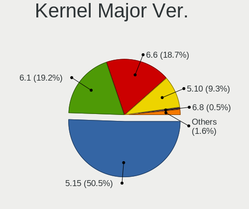
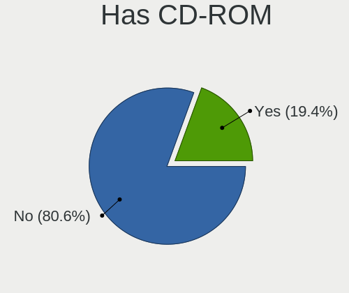
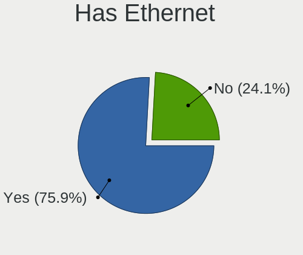
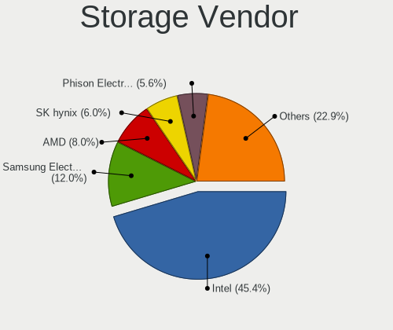
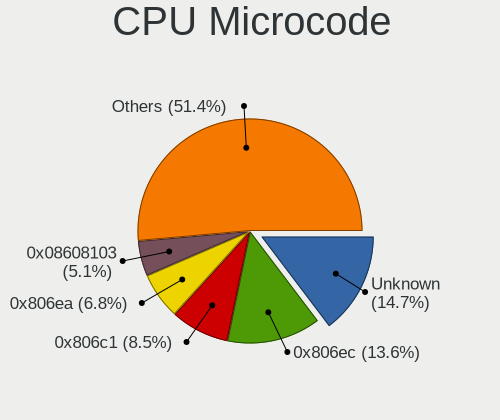
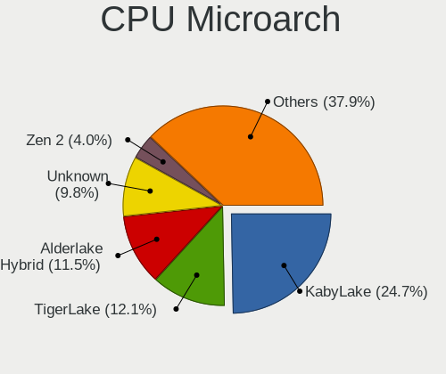
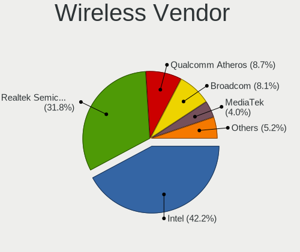
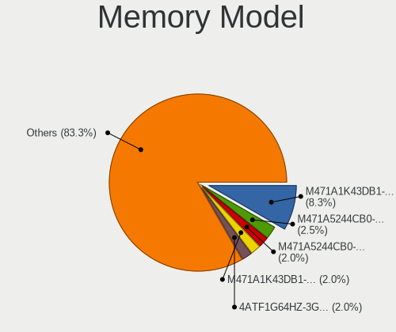

Red OS - Tested Hardware & Statistics (Notebooks)
-------------------------------------------------

A project to collect tested hardware configurations for Red OS.

Anyone can contribute to this report by the [hw-probe](https://github.com/linuxhw/hw-probe) tool:

    sudo -E hw-probe -all -upload

Please contribute! Especially if your hardware is rare.

Contents
--------

* [ Test Cases ](#test-cases)

* [ System ](#system)
  - [ OS                       ](#os)
  - [ OS Family                ](#os-family)
  - [ Kernel                   ](#kernel)
  - [ Kernel Family            ](#kernel-family)
  - [ Kernel Major Ver.        ](#kernel-major-ver)
  - [ Arch                     ](#arch)
  - [ DE                       ](#de)
  - [ Display Server           ](#display-server)
  - [ Display Manager          ](#display-manager)
  - [ OS Lang                  ](#os-lang)
  - [ Boot Mode                ](#boot-mode)
  - [ Filesystem               ](#filesystem)
  - [ Part. scheme             ](#part-scheme)
  - [ Dual Boot with Linux/BSD ](#dual-boot-with-linuxbsd)
  - [ Dual Boot (Win)          ](#dual-boot-win)

* [ Board ](#board)
  - [ Vendor                   ](#vendor)
  - [ Model                    ](#model)
  - [ Model Family             ](#model-family)
  - [ MFG Year                 ](#mfg-year)
  - [ Form Factor              ](#form-factor)
  - [ Secure Boot              ](#secure-boot)
  - [ Coreboot                 ](#coreboot)
  - [ RAM Size                 ](#ram-size)
  - [ RAM Used                 ](#ram-used)
  - [ Total Drives             ](#total-drives)
  - [ Has CD-ROM               ](#has-cd-rom)
  - [ Has Ethernet             ](#has-ethernet)
  - [ Has WiFi                 ](#has-wifi)
  - [ Has Bluetooth            ](#has-bluetooth)

* [ Location ](#location)
  - [ Country                  ](#country)
  - [ City                     ](#city)

* [ Drives ](#drives)
  - [ Drive Vendor             ](#drive-vendor)
  - [ Drive Model              ](#drive-model)
  - [ HDD Vendor               ](#hdd-vendor)
  - [ SSD Vendor               ](#ssd-vendor)
  - [ Drive Kind               ](#drive-kind)
  - [ Drive Connector          ](#drive-connector)
  - [ Drive Size               ](#drive-size)
  - [ Space Total              ](#space-total)
  - [ Space Used               ](#space-used)
  - [ Malfunc. Drives          ](#malfunc-drives)
  - [ Malfunc. Drive Vendor    ](#malfunc-drive-vendor)
  - [ Malfunc. HDD Vendor      ](#malfunc-hdd-vendor)
  - [ Malfunc. Drive Kind      ](#malfunc-drive-kind)
  - [ Failed Drives            ](#failed-drives)
  - [ Failed Drive Vendor      ](#failed-drive-vendor)
  - [ Drive Status             ](#drive-status)

* [ Storage controller ](#storage-controller)
  - [ Storage Vendor           ](#storage-vendor)
  - [ Storage Model            ](#storage-model)
  - [ Storage Kind             ](#storage-kind)

* [ Processor ](#processor)
  - [ CPU Vendor               ](#cpu-vendor)
  - [ CPU Model                ](#cpu-model)
  - [ CPU Model Family         ](#cpu-model-family)
  - [ CPU Cores                ](#cpu-cores)
  - [ CPU Sockets              ](#cpu-sockets)
  - [ CPU Threads              ](#cpu-threads)
  - [ CPU Op-Modes             ](#cpu-op-modes)
  - [ CPU Microcode            ](#cpu-microcode)
  - [ CPU Microarch            ](#cpu-microarch)

* [ Graphics ](#graphics)
  - [ GPU Vendor               ](#gpu-vendor)
  - [ GPU Model                ](#gpu-model)
  - [ GPU Combo                ](#gpu-combo)
  - [ GPU Driver               ](#gpu-driver)
  - [ GPU Memory               ](#gpu-memory)

* [ Monitor ](#monitor)
  - [ Monitor Vendor           ](#monitor-vendor)
  - [ Monitor Model            ](#monitor-model)
  - [ Monitor Resolution       ](#monitor-resolution)
  - [ Monitor Diagonal         ](#monitor-diagonal)
  - [ Monitor Width            ](#monitor-width)
  - [ Aspect Ratio             ](#aspect-ratio)
  - [ Monitor Area             ](#monitor-area)
  - [ Pixel Density            ](#pixel-density)
  - [ Multiple Monitors        ](#multiple-monitors)

* [ Network ](#network)
  - [ Net Controller Vendor    ](#net-controller-vendor)
  - [ Net Controller Model     ](#net-controller-model)
  - [ Wireless Vendor          ](#wireless-vendor)
  - [ Wireless Model           ](#wireless-model)
  - [ Ethernet Vendor          ](#ethernet-vendor)
  - [ Ethernet Model           ](#ethernet-model)
  - [ Net Controller Kind      ](#net-controller-kind)
  - [ Used Controller          ](#used-controller)
  - [ NICs                     ](#nics)
  - [ IPv6                     ](#ipv6)

* [ Bluetooth ](#bluetooth)
  - [ Bluetooth Vendor         ](#bluetooth-vendor)
  - [ Bluetooth Model          ](#bluetooth-model)

* [ Sound ](#sound)
  - [ Sound Vendor             ](#sound-vendor)
  - [ Sound Model              ](#sound-model)

* [ Memory ](#memory)
  - [ Memory Vendor            ](#memory-vendor)
  - [ Memory Model             ](#memory-model)
  - [ Memory Kind              ](#memory-kind)
  - [ Memory Form Factor       ](#memory-form-factor)
  - [ Memory Size              ](#memory-size)
  - [ Memory Speed             ](#memory-speed)

* [ Printers & scanners ](#printers--scanners)
  - [ Printer Vendor           ](#printer-vendor)
  - [ Printer Model            ](#printer-model)
  - [ Scanner Vendor           ](#scanner-vendor)
  - [ Scanner Model            ](#scanner-model)

* [ Camera ](#camera)
  - [ Camera Vendor            ](#camera-vendor)
  - [ Camera Model             ](#camera-model)

* [ Security ](#security)
  - [ Fingerprint Vendor       ](#fingerprint-vendor)
  - [ Fingerprint Model        ](#fingerprint-model)
  - [ Chipcard Vendor          ](#chipcard-vendor)
  - [ Chipcard Model           ](#chipcard-model)

* [ Unsupported ](#unsupported)
  - [ Unsupported Devices      ](#unsupported-devices)
  - [ Unsupported Device Types ](#unsupported-device-types)

Test Cases
----------

Total: 26

| Vendor        | Model                       | Probe                                                      | Date         |
|---------------|-----------------------------|------------------------------------------------------------|--------------|
| Kraftway      | ACCORD                      | [24e49bc011](https://linux-hardware.org/?probe=24e49bc011) | Jun 27, 2022 |
| Kraftway      | ACCORD                      | [39e3c55e89](https://linux-hardware.org/?probe=39e3c55e89) | Jun 27, 2022 |
| Aquarius      | NS685U                      | [ecedc7cbb6](https://linux-hardware.org/?probe=ecedc7cbb6) | Jun 08, 2022 |
| ICL           | Unknown                     | [4dc89fc689](https://linux-hardware.org/?probe=4dc89fc689) | Jun 07, 2022 |
| mtech         | MTL1578                     | [bf25c26ea0](https://linux-hardware.org/?probe=bf25c26ea0) | May 11, 2022 |
| HUAWEI        | BOD-WXX9                    | [e2e025dd4f](https://linux-hardware.org/?probe=e2e025dd4f) | Apr 15, 2022 |
| Acer          | TravelMate P215-53          | [124fdb3b64](https://linux-hardware.org/?probe=124fdb3b64) | Apr 14, 2022 |
| Lenovo        | ThinkBook 14-IIL 20SL       | [be41efbec8](https://linux-hardware.org/?probe=be41efbec8) | Apr 05, 2022 |
| Aquarius      | NS585 R32                   | [582389ca98](https://linux-hardware.org/?probe=582389ca98) | Mar 24, 2022 |
| Lenovo        | IdeaPad L340-15IWL 81LG     | [56f9ebba91](https://linux-hardware.org/?probe=56f9ebba91) | Mar 22, 2022 |
| Lenovo        | ThinkBook 15 G3 ACL 21A4    | [e18b80073c](https://linux-hardware.org/?probe=e18b80073c) | Mar 21, 2022 |
| 3Logic Gro... | APM Graviton A15i-K2        | [e93bcf2f42](https://linux-hardware.org/?probe=e93bcf2f42) | Mar 09, 2022 |
| ASUSTek       | TUF Gaming FX705DT_FX705... | [227a2658d0](https://linux-hardware.org/?probe=227a2658d0) | Feb 15, 2022 |
| HP            | Laptop 15s-eq1xxx           | [7ed7e139d8](https://linux-hardware.org/?probe=7ed7e139d8) | Dec 20, 2021 |
| HP            | Laptop 15s-eq1xxx           | [55ab1c9ab8](https://linux-hardware.org/?probe=55ab1c9ab8) | Dec 20, 2021 |
| HUAWEI        | NBLK-WAX9X                  | [5bb21d6bf6](https://linux-hardware.org/?probe=5bb21d6bf6) | Dec 13, 2021 |
| ICL           | RAYbook Si1514              | [9ddc61deba](https://linux-hardware.org/?probe=9ddc61deba) | Sep 13, 2021 |
| ASUSTek       | TUF Gaming FX705DT_FX705... | [4f59992d0f](https://linux-hardware.org/?probe=4f59992d0f) | Sep 11, 2021 |
| HP            | Laptop 15-dw3xxx            | [d8b35044ab](https://linux-hardware.org/?probe=d8b35044ab) | Jul 29, 2021 |
| Lenovo        | IdeaPad 5 15ARE05 81YQ      | [9b2c758081](https://linux-hardware.org/?probe=9b2c758081) | Jun 10, 2021 |
| ASUSTek       | X75VD                       | [95ea9551da](https://linux-hardware.org/?probe=95ea9551da) | Apr 05, 2021 |
| ASUSTek       | TUF Gaming FX705DT_FX705... | [916d4b225b](https://linux-hardware.org/?probe=916d4b225b) | Mar 30, 2021 |
| ASUSTek       | TUF Gaming FX705DT_FX705... | [ebfafc7409](https://linux-hardware.org/?probe=ebfafc7409) | Mar 26, 2021 |
| HUAWEI        | BOHL-WXX9                   | [cf5559d576](https://linux-hardware.org/?probe=cf5559d576) | Mar 26, 2021 |
| HP            | Pavilion g6                 | [1ca79b1950](https://linux-hardware.org/?probe=1ca79b1950) | Mar 26, 2021 |
| Pegatron      | A35                         | [9923a21e8c](https://linux-hardware.org/?probe=9923a21e8c) | Mar 04, 2021 |

System
------

OS
--

Installed operating systems

| Name         | Notebooks | Percent |
|--------------|-----------|---------|
| Red OS 7.3   | 12        | 54.55%  |
| Red OS 7.3.1 | 10        | 45.45%  |

OS Family
---------

OS without a version

| Name   | Notebooks | Percent |
|--------|-----------|---------|
| Red OS | 21        | 100%    |

Kernel
------

Version of the Linux kernel

| Version                | Notebooks | Percent |
|------------------------|-----------|---------|
| 5.10.29-1.el7.x86_64   | 7         | 30.43%  |
| 5.10.1-1.el7.x86_64    | 3         | 13.04%  |
| 5.15.35-1.el7.3.x86_64 | 2         | 8.7%    |
| 5.15.10-4.el7.x86_64   | 2         | 8.7%    |
| 5.15.10-1.el7.x86_64   | 2         | 8.7%    |
| 5.10.24-2.el7.x86_64   | 2         | 8.7%    |
| 5.18.1-1.el7.x86_64    | 1         | 4.35%   |
| 5.15.10-3.el7.x86_64   | 1         | 4.35%   |
| 5.15.10-2.el7.x86_64   | 1         | 4.35%   |
| 5.13.15-1.el7.x86_64   | 1         | 4.35%   |
| 5.10.24-1.el7.x86_64   | 1         | 4.35%   |

Kernel Family
-------------

Linux kernel without a distro release

| Version | Notebooks | Percent |
|---------|-----------|---------|
| 5.10.29 | 7         | 30.43%  |
| 5.15.10 | 6         | 26.09%  |
| 5.10.24 | 3         | 13.04%  |
| 5.10.1  | 3         | 13.04%  |
| 5.15.35 | 2         | 8.7%    |
| 5.18.1  | 1         | 4.35%   |
| 5.13.15 | 1         | 4.35%   |

Kernel Major Ver.
-----------------

Linux kernel major version

| Version | Notebooks | Percent |
|---------|-----------|---------|
| 5.10    | 12        | 54.55%  |
| 5.15    | 8         | 36.36%  |
| 5.18    | 1         | 4.55%   |
| 5.13    | 1         | 4.55%   |

Arch
----

OS architecture (x86_64, i586, etc.)

| Name   | Notebooks | Percent |
|--------|-----------|---------|
| x86_64 | 21        | 100%    |

DE
--

Desktop Environment

| Name     | Notebooks | Percent |
|----------|-----------|---------|
| MATE     | 15        | 71.43%  |
| Cinnamon | 6         | 28.57%  |

Display Server
--------------

X11 or Wayland

| Name    | Notebooks | Percent |
|---------|-----------|---------|
| X11     | 17        | 77.27%  |
| Wayland | 5         | 22.73%  |

Display Manager
---------------

SDDM, LightDM, etc.

| Name | Notebooks | Percent |
|------|-----------|---------|
| GDM  | 21        | 100%    |

OS Lang
-------

Language

| Lang    | Notebooks | Percent |
|---------|-----------|---------|
| Unknown | 20        | 95.24%  |
| en_US   | 1         | 4.76%   |

Boot Mode
---------

EFI or BIOS

| Mode | Notebooks | Percent |
|------|-----------|---------|
| EFI  | 18        | 81.82%  |
| BIOS | 4         | 18.18%  |

Filesystem
----------

Type of filesystem

| Type  | Notebooks | Percent |
|-------|-----------|---------|
| Ext4  | 21        | 95.45%  |
| Btrfs | 1         | 4.55%   |

Part. scheme
------------

Scheme of partitioning

| Type | Notebooks | Percent |
|------|-----------|---------|
| GPT  | 18        | 85.71%  |
| MBR  | 3         | 14.29%  |

Dual Boot with Linux/BSD
------------------------

Hosting more than one Linux/BSD

| Dual boot | Notebooks | Percent |
|-----------|-----------|---------|
| No        | 19        | 90.48%  |
| Yes       | 2         | 9.52%   |

Dual Boot (Win)
---------------

Hosting Linux and Windows

| Dual boot | Notebooks | Percent |
|-----------|-----------|---------|
| No        | 14        | 63.64%  |
| Yes       | 8         | 36.36%  |

Board
-----

Vendor
------

Motherboard manufacturer

| Name             | Notebooks | Percent |
|------------------|-----------|---------|
| Lenovo           | 4         | 19.05%  |
| HUAWEI           | 3         | 14.29%  |
| Hewlett-Packard  | 3         | 14.29%  |
| ICL              | 2         | 9.52%   |
| ASUSTek Computer | 2         | 9.52%   |
| Aquarius         | 2         | 9.52%   |
| Pegatron         | 1         | 4.76%   |
| mtech            | 1         | 4.76%   |
| Kraftway         | 1         | 4.76%   |
| Acer             | 1         | 4.76%   |
| 3Logic Group     | 1         | 4.76%   |

Model
-----

Motherboard model

| Name                              | Notebooks | Percent |
|-----------------------------------|-----------|---------|
| Pegatron A35                      | 1         | 4.76%   |
| mtech MTL1578                     | 1         | 4.76%   |
| Lenovo ThinkBook 15 G3 ACL 21A4   | 1         | 4.76%   |
| Lenovo ThinkBook 14-IIL 20SL      | 1         | 4.76%   |
| Lenovo IdeaPad L340-15IWL 81LG    | 1         | 4.76%   |
| Lenovo IdeaPad 5 15ARE05 81YQ     | 1         | 4.76%   |
| Kraftway ACCORD                   | 1         | 4.76%   |
| ICL RAYbook Si1514                | 1         | 4.76%   |
| HUAWEI NBLK-WAX9X                 | 1         | 4.76%   |
| HUAWEI BOHL-WXX9                  | 1         | 4.76%   |
| HUAWEI BOD-WXX9                   | 1         | 4.76%   |
| HP Pavilion g6                    | 1         | 4.76%   |
| HP Laptop 15s-eq1xxx              | 1         | 4.76%   |
| HP Laptop 15-dw3xxx               | 1         | 4.76%   |
| ASUS X75VD                        | 1         | 4.76%   |
| ASUS TUF Gaming FX705DT_FX705DT   | 1         | 4.76%   |
| Aquarius NS685U                   | 1         | 4.76%   |
| Aquarius NS585 R32                | 1         | 4.76%   |
| Acer TravelMate P215-53           | 1         | 4.76%   |
| 3Logic Group APM Graviton A15i-K2 | 1         | 4.76%   |
| Unknown                           | 1         | 4.76%   |

Model Family
------------

Motherboard model prefix

| Name              | Notebooks | Percent |
|-------------------|-----------|---------|
| Lenovo ThinkBook  | 2         | 9.52%   |
| Lenovo IdeaPad    | 2         | 9.52%   |
| HP Laptop         | 2         | 9.52%   |
| Pegatron A35      | 1         | 4.76%   |
| mtech MTL1578     | 1         | 4.76%   |
| Kraftway ACCORD   | 1         | 4.76%   |
| ICL RAYbook       | 1         | 4.76%   |
| HUAWEI NBLK-WAX9X | 1         | 4.76%   |
| HUAWEI BOHL-WXX9  | 1         | 4.76%   |
| HUAWEI BOD-WXX9   | 1         | 4.76%   |
| HP Pavilion       | 1         | 4.76%   |
| ASUS X75VD        | 1         | 4.76%   |
| ASUS TUF          | 1         | 4.76%   |
| Aquarius NS685U   | 1         | 4.76%   |
| Aquarius NS585    | 1         | 4.76%   |
| Acer TravelMate   | 1         | 4.76%   |
| 3Logic Group APM  | 1         | 4.76%   |
| Unknown           | 1         | 4.76%   |

MFG Year
--------

Motherboard manufacture year

| Year | Notebooks | Percent |
|------|-----------|---------|
| 2021 | 7         | 33.33%  |
| 2020 | 5         | 23.81%  |
| 2019 | 5         | 23.81%  |
| 2012 | 2         | 9.52%   |
| 2022 | 1         | 4.76%   |
| 2011 | 1         | 4.76%   |

Form Factor
-----------

Physical design of the computer

| Name     | Notebooks | Percent |
|----------|-----------|---------|
| Notebook | 21        | 100%    |

Secure Boot
-----------

Enabled or disabled

| State    | Notebooks | Percent |
|----------|-----------|---------|
| Disabled | 21        | 100%    |

Coreboot
--------

Have coreboot on board

| Used | Notebooks | Percent |
|------|-----------|---------|
| No   | 21        | 100%    |

RAM Size
--------

Total RAM memory

| Size in GB | Notebooks | Percent |
|------------|-----------|---------|
| 4.01-8.0   | 14        | 66.67%  |
| 16.01-24.0 | 3         | 14.29%  |
| 8.01-16.0  | 3         | 14.29%  |
| 3.01-4.0   | 1         | 4.76%   |

RAM Used
--------

Used RAM memory

| Used GB  | Notebooks | Percent |
|----------|-----------|---------|
| 1.01-2.0 | 11        | 52.38%  |
| 2.01-3.0 | 5         | 23.81%  |
| 0.51-1.0 | 3         | 14.29%  |
| 3.01-4.0 | 2         | 9.52%   |

Total Drives
------------

Number of drives on board

| Drives | Notebooks | Percent |
|--------|-----------|---------|
| 1      | 18        | 81.82%  |
| 2      | 3         | 13.64%  |
| 3      | 1         | 4.55%   |

Has CD-ROM
----------

Has CD-ROM on board

| Presented | Notebooks | Percent |
|-----------|-----------|---------|
| No        | 16        | 72.73%  |
| Yes       | 6         | 27.27%  |

Has Ethernet
------------

Has Ethernet on board

| Presented | Notebooks | Percent |
|-----------|-----------|---------|
| Yes       | 17        | 80.95%  |
| No        | 4         | 19.05%  |

Has WiFi
--------

Has WiFi module

| Presented | Notebooks | Percent |
|-----------|-----------|---------|
| Yes       | 21        | 100%    |

Has Bluetooth
-------------

Has Bluetooth module

| Presented | Notebooks | Percent |
|-----------|-----------|---------|
| Yes       | 17        | 80.95%  |
| No        | 4         | 19.05%  |

Location
--------

Country
-------

Geographic location (country)

| Country | Notebooks | Percent |
|---------|-----------|---------|
| Russia  | 20        | 95.24%  |
| Ukraine | 1         | 4.76%   |

City
----

Geographic location (city)

| City          | Notebooks | Percent |
|---------------|-----------|---------|
| Murom         | 7         | 33.33%  |
| Moscow        | 4         | 19.05%  |
| Vladimir      | 2         | 9.52%   |
| Kursk         | 2         | 9.52%   |
| Yekaterinburg | 1         | 4.76%   |
| Yaroslavl     | 1         | 4.76%   |
| Sevastopol    | 1         | 4.76%   |
| Perm          | 1         | 4.76%   |
| Novosibirsk   | 1         | 4.76%   |
| Krasnodar     | 1         | 4.76%   |

Drives
------

Drive Vendor
------------

Hard drive vendors

| Vendor              | Notebooks | Drives | Percent |
|---------------------|-----------|--------|---------|
| WDC                 | 7         | 9      | 29.17%  |
| A-DATA Technology   | 3         | 3      | 12.5%   |
| SK hynix            | 2         | 2      | 8.33%   |
| Samsung Electronics | 2         | 2      | 8.33%   |
| Toshiba             | 1         | 1      | 4.17%   |
| Seagate             | 1         | 1      | 4.17%   |
| SanDisk             | 1         | 1      | 4.17%   |
| Phison              | 1         | 1      | 4.17%   |
| Micron Technology   | 1         | 3      | 4.17%   |
| JMicron Technology  | 1         | 1      | 4.17%   |
| Gigabyte Technology | 1         | 1      | 4.17%   |
| Foxline             | 1         | 1      | 4.17%   |
| Crucial             | 1         | 1      | 4.17%   |
| Apacer              | 1         | 1      | 4.17%   |

Drive Model
-----------

Hard drive models

| Model                                     | Notebooks | Percent |
|-------------------------------------------|-----------|---------|
| WDC WD5000BPVT-55HXZT3 500GB              | 1         | 4.17%   |
| WDC WD10SPZX-00Z10T0 1TB                  | 1         | 4.17%   |
| WDC PC SN530 SDBPNPZ-512G-1114 512GB      | 1         | 4.17%   |
| WDC PC SN530 SDBPNPZ-512G-1027 512GB      | 1         | 4.17%   |
| WDC PC SN530 SDBPNPZ-256G-1006 256GB      | 1         | 4.17%   |
| WDC PC SN530 SDBPMPZ-512G-1101 512GB      | 1         | 4.17%   |
| WDC PC SN520 SDAPMUW-512G-1101 512GB      | 1         | 4.17%   |
| Toshiba KXG60ZNV512G 512GB                | 1         | 4.17%   |
| SK hynix SKHynix_HFM256GDHTNI-87A0B 256GB | 1         | 4.17%   |
| SK hynix SKHynix_HFM256GD3HX015N 256GB    | 1         | 4.17%   |
| Seagate ST750LM022 HN-M750MBB 752GB       | 1         | 4.17%   |
| SanDisk SD8SBAT256G1122 256GB SSD         | 1         | 4.17%   |
| Samsung SSD 860 EVO M.2 250GB             | 1         | 4.17%   |
| Samsung MZVLQ256HAJD-000H1 256GB          | 1         | 4.17%   |
| Phison 311CD0512GB                        | 1         | 4.17%   |
| Micron 2200V_MTFDHBA512TCK 512GB          | 1         | 4.17%   |
| JMicron Generic 2TB                       | 1         | 4.17%   |
| Gigabyte GP-GSM2NE3256GNTD 256GB          | 1         | 4.17%   |
| Foxline FLSSD256M80E13TCX5 256GB          | 1         | 4.17%   |
| Crucial CT250MX500SSD4 250GB              | 1         | 4.17%   |
| Apacer AS350 256GB SSD                    | 1         | 4.17%   |
| A-DATA SX6000LNP 256GB                    | 1         | 4.17%   |
| A-DATA SU800 256GB SSD                    | 1         | 4.17%   |
| A-DATA SU650 240GB SSD                    | 1         | 4.17%   |

HDD Vendor
----------

Hard disk drive vendors

| Vendor             | Notebooks | Drives | Percent |
|--------------------|-----------|--------|---------|
| WDC                | 2         | 4      | 50%     |
| Seagate            | 1         | 1      | 25%     |
| JMicron Technology | 1         | 1      | 25%     |

SSD Vendor
----------

Solid state drive vendors

| Vendor              | Notebooks | Drives | Percent |
|---------------------|-----------|--------|---------|
| A-DATA Technology   | 2         | 2      | 33.33%  |
| SanDisk             | 1         | 1      | 16.67%  |
| Samsung Electronics | 1         | 1      | 16.67%  |
| Crucial             | 1         | 1      | 16.67%  |
| Apacer              | 1         | 1      | 16.67%  |

Drive Kind
----------

HDD or SSD

| Kind | Notebooks | Drives | Percent |
|------|-----------|--------|---------|
| NVMe | 14        | 16     | 60.87%  |
| SSD  | 6         | 6      | 26.09%  |
| HDD  | 3         | 6      | 13.04%  |

Drive Connector
---------------

SATA, SAS, NVMe, etc.

| Type | Notebooks | Drives | Percent |
|------|-----------|--------|---------|
| NVMe | 14        | 16     | 58.33%  |
| SATA | 9         | 11     | 37.5%   |
| SAS  | 1         | 1      | 4.17%   |

Drive Size
----------

Size of hard drive

| Size in TB | Notebooks | Drives | Percent |
|------------|-----------|--------|---------|
| 0.01-0.5   | 7         | 7      | 70%     |
| 0.51-1.0   | 2         | 4      | 20%     |
| 1.01-2.0   | 1         | 1      | 10%     |

Space Total
-----------

Amount of disk space available on the file system

| Size in GB | Notebooks | Percent |
|------------|-----------|---------|
| 101-250    | 9         | 40.91%  |
| 251-500    | 7         | 31.82%  |
| 1001-2000  | 2         | 9.09%   |
| 21-50      | 1         | 4.55%   |
| 1-20       | 1         | 4.55%   |
| 501-1000   | 1         | 4.55%   |
| 51-100     | 1         | 4.55%   |

Space Used
----------

Amount of used disk space

| Used GB  | Notebooks | Percent |
|----------|-----------|---------|
| 1-20     | 13        | 59.09%  |
| 21-50    | 3         | 13.64%  |
| 101-250  | 2         | 9.09%   |
| 51-100   | 2         | 9.09%   |
| 251-500  | 1         | 4.55%   |
| 501-1000 | 1         | 4.55%   |

Malfunc. Drives
---------------

Drive models with a malfunction

| Model                               | Notebooks | Drives | Percent |
|-------------------------------------|-----------|--------|---------|
| Seagate ST750LM022 HN-M750MBB 752GB | 1         | 1      | 50%     |
| A-DATA Technology SU800 256GB SSD   | 1         | 1      | 50%     |

Malfunc. Drive Vendor
---------------------

Vendors of faulty drives

| Vendor            | Notebooks | Drives | Percent |
|-------------------|-----------|--------|---------|
| Seagate           | 1         | 1      | 50%     |
| A-DATA Technology | 1         | 1      | 50%     |

Malfunc. HDD Vendor
-------------------

Vendors of faulty HDD drives

| Vendor  | Notebooks | Drives | Percent |
|---------|-----------|--------|---------|
| Seagate | 1         | 1      | 100%    |

Malfunc. Drive Kind
-------------------

Kinds of faulty drives

| Kind | Notebooks | Drives | Percent |
|------|-----------|--------|---------|
| SSD  | 1         | 1      | 50%     |
| HDD  | 1         | 1      | 50%     |

Failed Drives
-------------

Failed drive models

Zero info for selected period =(

Failed Drive Vendor
-------------------

Failed drive vendors

Zero info for selected period =(

Drive Status
------------

Number of failed and malfunc. drives

| Status   | Notebooks | Drives | Percent |
|----------|-----------|--------|---------|
| Works    | 19        | 25     | 86.36%  |
| Malfunc  | 2         | 2      | 9.09%   |
| Detected | 1         | 1      | 4.55%   |

Storage controller
------------------

Storage Vendor
--------------

Storage controller vendors

| Vendor                       | Notebooks | Percent |
|------------------------------|-----------|---------|
| Intel                        | 14        | 45.16%  |
| SanDisk                      | 5         | 16.13%  |
| Phison Electronics           | 3         | 9.68%   |
| AMD                          | 3         | 9.68%   |
| SK hynix                     | 2         | 6.45%   |
| Toshiba America Info Systems | 1         | 3.23%   |
| Samsung Electronics          | 1         | 3.23%   |
| Realtek Semiconductor        | 1         | 3.23%   |
| Micron Technology            | 1         | 3.23%   |

Storage Model
-------------

Storage controller models

| Model                                                            | Notebooks | Percent |
|------------------------------------------------------------------|-----------|---------|
| Intel Cannon Point-LP SATA Controller [AHCI Mode]                | 6         | 18.75%  |
| SanDisk WD Blue SN550 NVMe SSD                                   | 3         | 9.38%   |
| Phison PS5013 E13 NVMe Controller                                | 3         | 9.38%   |
| Intel Tiger Lake-LP SATA Controller [AHCI mode]                  | 3         | 9.38%   |
| Intel 7 Series Chipset Family 6-port SATA Controller [AHCI mode] | 3         | 9.38%   |
| AMD FCH SATA Controller [AHCI mode]                              | 3         | 9.38%   |
| Toshiba America Info Systems XG6 NVMe SSD Controller             | 1         | 3.13%   |
| SK hynix Gold P31 SSD                                            | 1         | 3.13%   |
| SK hynix BC511                                                   | 1         | 3.13%   |
| SanDisk PC SN520 NVMe SSD                                        | 1         | 3.13%   |
| SanDisk Non-Volatile memory controller                           | 1         | 3.13%   |
| Samsung NVMe SSD Controller 980                                  | 1         | 3.13%   |
| Realtek Realtek Non-Volatile memory controller                   | 1         | 3.13%   |
| Micron Non-Volatile memory controller                            | 1         | 3.13%   |
| Intel Volume Management Device NVMe RAID Controller              | 1         | 3.13%   |
| Intel Ice Lake-LP SATA Controller [AHCI mode]                    | 1         | 3.13%   |
| Intel Cannon Lake PCH SATA AHCI Controller                       | 1         | 3.13%   |

Storage Kind
------------

Kind of storage controller (IDE, SATA, NVMe, SAS, ...)

| Kind | Notebooks | Percent |
|------|-----------|---------|
| SATA | 17        | 53.13%  |
| NVMe | 14        | 43.75%  |
| RAID | 1         | 3.13%   |

Processor
---------

CPU Vendor
----------

Processor vendors

| Vendor | Notebooks | Percent |
|--------|-----------|---------|
| Intel  | 15        | 71.43%  |
| AMD    | 6         | 28.57%  |

CPU Model
---------

Processor models

| Model                                         | Notebooks | Percent |
|-----------------------------------------------|-----------|---------|
| Intel Core i5-8279U CPU @ 2.40GHz             | 3         | 14.29%  |
| Intel Core i5-8259U CPU @ 2.30GHz             | 2         | 9.52%   |
| Intel 11th Gen Core i5-1135G7 @ 2.40GHz       | 2         | 9.52%   |
| AMD Ryzen 5 4500U with Radeon Graphics        | 2         | 9.52%   |
| Intel Core i5-8265U CPU @ 1.60GHz             | 1         | 4.76%   |
| Intel Core i5-3210M CPU @ 2.50GHz             | 1         | 4.76%   |
| Intel Core i5-2450M CPU @ 2.50GHz             | 1         | 4.76%   |
| Intel Core i5-1035G1 CPU @ 1.00GHz            | 1         | 4.76%   |
| Intel Core i3-9300 CPU @ 3.70GHz              | 1         | 4.76%   |
| Intel Core i3-2350M CPU @ 2.30GHz             | 1         | 4.76%   |
| Intel 11th Gen Core i7-1165G7 @ 2.80GHz       | 1         | 4.76%   |
| Intel 11th Gen Core i3-1125G4 @ 2.00GHz       | 1         | 4.76%   |
| AMD Ryzen 7 3750H with Radeon Vega Mobile Gfx | 1         | 4.76%   |
| AMD Ryzen 5 3500U with Radeon Vega Mobile Gfx | 1         | 4.76%   |
| AMD Ryzen 3 5300U with Radeon Graphics        | 1         | 4.76%   |
| AMD Ryzen 3 4300U with Radeon Graphics        | 1         | 4.76%   |

CPU Model Family
----------------

Processor model prefix

| Model         | Notebooks | Percent |
|---------------|-----------|---------|
| Intel Core i5 | 9         | 42.86%  |
| Other         | 4         | 19.05%  |
| AMD Ryzen 5   | 3         | 14.29%  |
| Intel Core i3 | 2         | 9.52%   |
| AMD Ryzen 3   | 2         | 9.52%   |
| AMD Ryzen 7   | 1         | 4.76%   |

CPU Cores
---------

Number of processor cores

| Number | Notebooks | Percent |
|--------|-----------|---------|
| 4      | 16        | 76.19%  |
| 2      | 3         | 14.29%  |
| 6      | 2         | 9.52%   |

CPU Sockets
-----------

Number of sockets

| Number | Notebooks | Percent |
|--------|-----------|---------|
| 1      | 21        | 100%    |

CPU Threads
-----------

Threads per core (Hyper-Threading)

| Number | Notebooks | Percent |
|--------|-----------|---------|
| 2      | 17        | 80.95%  |
| 1      | 4         | 19.05%  |

CPU Op-Modes
------------

CPU Operation Modes (32-bit, 64-bit)

| Op mode        | Notebooks | Percent |
|----------------|-----------|---------|
| 32-bit, 64-bit | 21        | 100%    |

CPU Microcode
-------------

Microcode number

| Number     | Notebooks | Percent |
|------------|-----------|---------|
| 0x806ea    | 5         | 23.81%  |
| 0x806c1    | 4         | 19.05%  |
| 0x206a7    | 2         | 9.52%   |
| 0x08600106 | 2         | 9.52%   |
| 0x906eb    | 1         | 4.76%   |
| 0x806ec    | 1         | 4.76%   |
| 0x706e5    | 1         | 4.76%   |
| 0x306a9    | 1         | 4.76%   |
| 0x08608103 | 1         | 4.76%   |
| 0x08600104 | 1         | 4.76%   |
| 0x08108109 | 1         | 4.76%   |
| 0x08108102 | 1         | 4.76%   |

CPU Microarch
-------------

Microarchitecture

| Name        | Notebooks | Percent |
|-------------|-----------|---------|
| KabyLake    | 7         | 33.33%  |
| TigerLake   | 4         | 19.05%  |
| Zen 2       | 3         | 14.29%  |
| Zen+        | 2         | 9.52%   |
| SandyBridge | 2         | 9.52%   |
| IvyBridge   | 1         | 4.76%   |
| IceLake     | 1         | 4.76%   |
| Unknown     | 1         | 4.76%   |

Graphics
--------

GPU Vendor
----------

Vendors of graphics cards

| Vendor | Notebooks | Percent |
|--------|-----------|---------|
| Intel  | 15        | 57.69%  |
| AMD    | 7         | 26.92%  |
| Nvidia | 4         | 15.38%  |

GPU Model
---------

Graphics card models

| Model                                                                     | Notebooks | Percent |
|---------------------------------------------------------------------------|-----------|---------|
| Intel CoffeeLake-U GT3e [Iris Plus Graphics 655]                          | 5         | 19.23%  |
| Intel TigerLake-LP GT2 [Iris Xe Graphics]                                 | 3         | 11.54%  |
| AMD Renoir                                                                | 3         | 11.54%  |
| Intel 2nd Generation Core Processor Family Integrated Graphics Controller | 2         | 7.69%   |
| AMD Picasso/Raven 2 [Radeon Vega Series / Radeon Vega Mobile Series]      | 2         | 7.69%   |
| Nvidia TU117M [GeForce GTX 1650 Mobile / Max-Q]                           | 1         | 3.85%   |
| Nvidia GM108M [GeForce MX110]                                             | 1         | 3.85%   |
| Nvidia GF119M [GeForce 610M]                                              | 1         | 3.85%   |
| Nvidia GF108M [GeForce GT 620M/630M/635M/640M LE]                         | 1         | 3.85%   |
| Intel WhiskeyLake-U GT2 [UHD Graphics 620]                                | 1         | 3.85%   |
| Intel Tiger Lake UHD Graphics                                             | 1         | 3.85%   |
| Intel Iris Plus Graphics G1 (Ice Lake)                                    | 1         | 3.85%   |
| Intel CoffeeLake-S GT2 [UHD Graphics 630]                                 | 1         | 3.85%   |
| Intel 3rd Gen Core processor Graphics Controller                          | 1         | 3.85%   |
| AMD Thames [Radeon HD 7500M/7600M Series]                                 | 1         | 3.85%   |
| AMD Lucienne                                                              | 1         | 3.85%   |

GPU Combo
---------

Combinations of graphics cards

| Name           | Notebooks | Percent |
|----------------|-----------|---------|
| 1 x Intel      | 11        | 52.38%  |
| 1 x AMD        | 5         | 23.81%  |
| Intel + Nvidia | 3         | 14.29%  |
| Intel + AMD    | 1         | 4.76%   |
| AMD + Nvidia   | 1         | 4.76%   |

GPU Driver
----------

Free vs proprietary

| Driver      | Notebooks | Percent |
|-------------|-----------|---------|
| Free        | 21        | 95.45%  |
| Proprietary | 1         | 4.55%   |

GPU Memory
----------

Total video memory

| Size in GB | Notebooks | Percent |
|------------|-----------|---------|
| Unknown    | 11        | 47.83%  |
| 0.51-1.0   | 4         | 17.39%  |
| 1.01-2.0   | 3         | 13.04%  |
| 0.01-0.5   | 3         | 13.04%  |
| 3.01-4.0   | 2         | 8.7%    |

Monitor
-------

Monitor Vendor
--------------

Monitor vendors

| Vendor               | Notebooks | Percent |
|----------------------|-----------|---------|
| BOE                  | 6         | 26.09%  |
| LG Display           | 4         | 17.39%  |
| Chimei Innolux       | 4         | 17.39%  |
| AU Optronics         | 3         | 13.04%  |
| Samsung Electronics  | 2         | 8.7%    |
| PANDA                | 2         | 8.7%    |
| Iiyama               | 1         | 4.35%   |
| Ancor Communications | 1         | 4.35%   |

Monitor Model
-------------

Monitor models

| Model                                                                | Notebooks | Percent |
|----------------------------------------------------------------------|-----------|---------|
| BOE LCD Monitor BOE09C5 1920x1080 345x194mm 15.6-inch                | 3         | 13.04%  |
| Chimei Innolux LCD Monitor CMN151E 1920x1080 344x193mm 15.5-inch     | 2         | 8.7%    |
| AU Optronics LCD Monitor AUO28ED 1920x1080 344x193mm 15.5-inch       | 2         | 8.7%    |
| Samsung Electronics LCD Monitor SEC315A 1366x768 344x194mm 15.5-inch | 1         | 4.35%   |
| Samsung Electronics LCD Monitor SEC314F 1600x900 382x215mm 17.3-inch | 1         | 4.35%   |
| PANDA LM156LF1L03 NCP001C 1920x1080 344x194mm 15.5-inch              | 1         | 4.35%   |
| PANDA LCD Monitor NCP0040 1920x1080 344x194mm 15.5-inch              | 1         | 4.35%   |
| LG Display LCD Monitor LGD063B 1920x1080 382x215mm 17.3-inch         | 1         | 4.35%   |
| LG Display LCD Monitor LGD062E 1920x1080 344x194mm 15.5-inch         | 1         | 4.35%   |
| LG Display LCD Monitor LGD0573 1920x1080 344x194mm 15.5-inch         | 1         | 4.35%   |
| LG Display LCD Monitor LGD02DC 1366x768 344x194mm 15.5-inch          | 1         | 4.35%   |
| Iiyama PL2493H IVM6148 1920x1080 527x296mm 23.8-inch                 | 1         | 4.35%   |
| Chimei Innolux LCD Monitor CMN15F5 1920x1080 344x193mm 15.5-inch     | 1         | 4.35%   |
| Chimei Innolux LCD Monitor CMN14D4 1920x1080 309x173mm 13.9-inch     | 1         | 4.35%   |
| BOE LCD Monitor BOE0877 1920x1080 309x173mm 13.9-inch                | 1         | 4.35%   |
| BOE LCD Monitor BOE0812 1920x1080 344x194mm 15.5-inch                | 1         | 4.35%   |
| BOE LCD Monitor BOE0700 1920x1080 344x194mm 15.5-inch                | 1         | 4.35%   |
| AU Optronics LCD Monitor AUODF87 1920x1080 344x193mm 15.5-inch       | 1         | 4.35%   |
| Ancor Communications VE228 ACI22FA 1920x1080 480x270mm 21.7-inch     | 1         | 4.35%   |

Monitor Resolution
------------------

Monitor screen resolution

| Resolution      | Notebooks | Percent |
|-----------------|-----------|---------|
| 1920x1080 (FHD) | 19        | 86.36%  |
| 1366x768 (WXGA) | 2         | 9.09%   |
| 1600x900 (HD+)  | 1         | 4.55%   |

Monitor Diagonal
----------------

Diagonal size in inches

| Inches | Notebooks | Percent |
|--------|-----------|---------|
| 15     | 17        | 73.91%  |
| 24     | 2         | 8.7%    |
| 17     | 2         | 8.7%    |
| 13     | 2         | 8.7%    |

Monitor Width
-------------

Physical width

| Width in mm | Notebooks | Percent |
|-------------|-----------|---------|
| 301-350     | 19        | 82.61%  |
| 501-600     | 2         | 8.7%    |
| 351-400     | 2         | 8.7%    |

Aspect Ratio
------------

Proportional relationship between the width and the height

| Ratio | Notebooks | Percent |
|-------|-----------|---------|
| 16/9  | 21        | 100%    |

Monitor Area
------------

Area in inch²

| Area in inch² | Notebooks | Percent |
|----------------|-----------|---------|
| 101-110        | 17        | 73.91%  |
| 81-90          | 2         | 8.7%    |
| 201-250        | 2         | 8.7%    |
| 121-130        | 2         | 8.7%    |

Pixel Density
-------------

Pixels per inch

| Density | Notebooks | Percent |
|---------|-----------|---------|
| 121-160 | 18        | 78.26%  |
| 101-120 | 3         | 13.04%  |
| 51-100  | 2         | 8.7%    |

Multiple Monitors
-----------------

Total monitors connected

| Total | Notebooks | Percent |
|-------|-----------|---------|
| 1     | 19        | 90.48%  |
| 2     | 2         | 9.52%   |

Network
-------

Net Controller Vendor
---------------------

Controller vendors

| Vendor                | Notebooks | Percent |
|-----------------------|-----------|---------|
| Realtek Semiconductor | 14        | 46.67%  |
| Intel                 | 9         | 30%     |
| Qualcomm Atheros      | 3         | 10%     |
| Samsung Electronics   | 1         | 3.33%   |
| Ralink                | 1         | 3.33%   |
| OKB SAPR              | 1         | 3.33%   |
| Broadcom              | 1         | 3.33%   |

Net Controller Model
--------------------

Controller models

| Model                                                             | Notebooks | Percent |
|-------------------------------------------------------------------|-----------|---------|
| Realtek RTL8111/8168/8411 PCI Express Gigabit Ethernet Controller | 9         | 22.5%   |
| Intel Ethernet Connection (6) I219-V                              | 4         | 10%     |
| Realtek RTL8822CE 802.11ac PCIe Wireless Network Adapter          | 3         | 7.5%    |
| Realtek RTL8821CE 802.11ac PCIe Wireless Network Adapter          | 3         | 7.5%    |
| Intel Wireless 7265                                               | 3         | 7.5%    |
| Intel Wi-Fi 6 AX201                                               | 2         | 5%      |
| Intel Cannon Point-LP CNVi [Wireless-AC]                          | 2         | 5%      |
| Samsung Galaxy series, misc. (tethering mode)                     | 1         | 2.5%    |
| Realtek RTL8852AE 802.11ax PCIe Wireless Network Adapter          | 1         | 2.5%    |
| Realtek RTL8188EUS 802.11n Wireless Network Adapter               | 1         | 2.5%    |
| Realtek RTL8153 Gigabit Ethernet Adapter                          | 1         | 2.5%    |
| Realtek RTL810xE PCI Express Fast Ethernet controller             | 1         | 2.5%    |
| Ralink RT3290 Wireless 802.11n 1T/1R PCIe                         | 1         | 2.5%    |
| Qualcomm Atheros QCA9377 802.11ac Wireless Network Adapter        | 1         | 2.5%    |
| Qualcomm Atheros AR9485 Wireless Network Adapter                  | 1         | 2.5%    |
| Qualcomm Atheros AR8161 Gigabit Ethernet                          | 1         | 2.5%    |
| OKB SAPR Ethernet controller                                      | 1         | 2.5%    |
| Intel Wireless 3165                                               | 1         | 2.5%    |
| Intel Ice Lake-LP PCH CNVi WiFi                                   | 1         | 2.5%    |
| Intel Ethernet Connection (13) I219-V                             | 1         | 2.5%    |
| Broadcom BCM4313 802.11bgn Wireless Network Adapter               | 1         | 2.5%    |

Wireless Vendor
---------------

Wireless vendors

| Vendor                | Notebooks | Percent |
|-----------------------|-----------|---------|
| Intel                 | 9         | 42.86%  |
| Realtek Semiconductor | 8         | 38.1%   |
| Qualcomm Atheros      | 2         | 9.52%   |
| Ralink                | 1         | 4.76%   |
| Broadcom              | 1         | 4.76%   |

Wireless Model
--------------

Wireless models

| Model                                                      | Notebooks | Percent |
|------------------------------------------------------------|-----------|---------|
| Realtek RTL8822CE 802.11ac PCIe Wireless Network Adapter   | 3         | 14.29%  |
| Realtek RTL8821CE 802.11ac PCIe Wireless Network Adapter   | 3         | 14.29%  |
| Intel Wireless 7265                                        | 3         | 14.29%  |
| Intel Wi-Fi 6 AX201                                        | 2         | 9.52%   |
| Intel Cannon Point-LP CNVi [Wireless-AC]                   | 2         | 9.52%   |
| Realtek RTL8852AE 802.11ax PCIe Wireless Network Adapter   | 1         | 4.76%   |
| Realtek RTL8188EUS 802.11n Wireless Network Adapter        | 1         | 4.76%   |
| Ralink RT3290 Wireless 802.11n 1T/1R PCIe                  | 1         | 4.76%   |
| Qualcomm Atheros QCA9377 802.11ac Wireless Network Adapter | 1         | 4.76%   |
| Qualcomm Atheros AR9485 Wireless Network Adapter           | 1         | 4.76%   |
| Intel Wireless 3165                                        | 1         | 4.76%   |
| Intel Ice Lake-LP PCH CNVi WiFi                            | 1         | 4.76%   |
| Broadcom BCM4313 802.11bgn Wireless Network Adapter        | 1         | 4.76%   |

Ethernet Vendor
---------------

Ethernet vendors

| Vendor                | Notebooks | Percent |
|-----------------------|-----------|---------|
| Realtek Semiconductor | 11        | 57.89%  |
| Intel                 | 5         | 26.32%  |
| Samsung Electronics   | 1         | 5.26%   |
| Qualcomm Atheros      | 1         | 5.26%   |
| OKB SAPR              | 1         | 5.26%   |

Ethernet Model
--------------

Ethernet models

| Model                                                             | Notebooks | Percent |
|-------------------------------------------------------------------|-----------|---------|
| Realtek RTL8111/8168/8411 PCI Express Gigabit Ethernet Controller | 9         | 47.37%  |
| Intel Ethernet Connection (6) I219-V                              | 4         | 21.05%  |
| Samsung Galaxy series, misc. (tethering mode)                     | 1         | 5.26%   |
| Realtek RTL8153 Gigabit Ethernet Adapter                          | 1         | 5.26%   |
| Realtek RTL810xE PCI Express Fast Ethernet controller             | 1         | 5.26%   |
| Qualcomm Atheros AR8161 Gigabit Ethernet                          | 1         | 5.26%   |
| OKB SAPR Ethernet controller                                      | 1         | 5.26%   |
| Intel Ethernet Connection (13) I219-V                             | 1         | 5.26%   |

Net Controller Kind
-------------------

Ethernet, WiFi or modem

| Kind     | Notebooks | Percent |
|----------|-----------|---------|
| WiFi     | 21        | 55.26%  |
| Ethernet | 17        | 44.74%  |

Used Controller
---------------

Currently used network controller

| Kind     | Notebooks | Percent |
|----------|-----------|---------|
| WiFi     | 11        | 52.38%  |
| Ethernet | 10        | 47.62%  |

NICs
----

Total network controllers on board

| Total | Notebooks | Percent |
|-------|-----------|---------|
| 2     | 16        | 76.19%  |
| 1     | 5         | 23.81%  |

IPv6
----

IPv6 vs IPv4

| Used | Notebooks | Percent |
|------|-----------|---------|
| No   | 20        | 95.24%  |
| Yes  | 1         | 4.76%   |

Bluetooth
---------

Bluetooth Vendor
----------------

Controller vendors

| Vendor                          | Notebooks | Percent |
|---------------------------------|-----------|---------|
| Intel                           | 7         | 41.18%  |
| Realtek Semiconductor           | 4         | 23.53%  |
| Realtek                         | 2         | 11.76%  |
| Ralink                          | 1         | 5.88%   |
| Qualcomm Atheros Communications | 1         | 5.88%   |
| IMC Networks                    | 1         | 5.88%   |
| Broadcom                        | 1         | 5.88%   |

Bluetooth Model
---------------

Controller models

| Model                                          | Notebooks | Percent |
|------------------------------------------------|-----------|---------|
| Realtek Bluetooth Radio                        | 3         | 17.65%  |
| Intel Bluetooth wireless interface             | 3         | 17.65%  |
| Realtek Bluetooth Radio                        | 2         | 11.76%  |
| Intel Bluetooth Device                         | 2         | 11.76%  |
| Intel Bluetooth 9460/9560 Jefferson Peak (JfP) | 2         | 11.76%  |
| Realtek  Bluetooth 4.2 Adapter                 | 1         | 5.88%   |
| Ralink RT3290 Bluetooth                        | 1         | 5.88%   |
| Qualcomm Atheros  Bluetooth Device             | 1         | 5.88%   |
| IMC Networks Bluetooth Radio                   | 1         | 5.88%   |
| Broadcom HP Portable Valentine                 | 1         | 5.88%   |

Sound
-----

Sound Vendor
------------

Sound card vendors

| Vendor | Notebooks | Percent |
|--------|-----------|---------|
| Intel  | 15        | 65.22%  |
| AMD    | 6         | 26.09%  |
| Nvidia | 2         | 8.7%    |

Sound Model
-----------

Sound card models

| Model                                                               | Notebooks | Percent |
|---------------------------------------------------------------------|-----------|---------|
| Intel Cannon Point-LP High Definition Audio Controller              | 6         | 21.43%  |
| AMD Family 17h/19h HD Audio Controller                              | 6         | 21.43%  |
| Intel Tiger Lake-LP Smart Sound Technology Audio Controller         | 4         | 14.29%  |
| AMD Renoir Radeon High Definition Audio Controller                  | 4         | 14.29%  |
| Intel 7 Series/C216 Chipset Family High Definition Audio Controller | 3         | 10.71%  |
| Nvidia TU107 GeForce GTX 1650 High Definition Audio Controller      | 1         | 3.57%   |
| Nvidia GF108 High Definition Audio Controller                       | 1         | 3.57%   |
| Intel Ice Lake-LP Smart Sound Technology Audio Controller           | 1         | 3.57%   |
| Intel Cannon Lake PCH cAVS                                          | 1         | 3.57%   |
| AMD Raven/Raven2/Fenghuang HDMI/DP Audio Controller                 | 1         | 3.57%   |

Memory
------

Memory Vendor
-------------

Memory module vendors

| Vendor              | Notebooks | Percent |
|---------------------|-----------|---------|
| SK hynix            | 6         | 27.27%  |
| Samsung Electronics | 4         | 18.18%  |
| Foxline             | 3         | 13.64%  |
| Crucial             | 3         | 13.64%  |
| Micron Technology   | 2         | 9.09%   |
| Elpida              | 2         | 9.09%   |
| Ramaxel Technology  | 1         | 4.55%   |
| Kingston            | 1         | 4.55%   |

Memory Model
------------

Memory module models

| Model                                                           | Notebooks | Percent |
|-----------------------------------------------------------------|-----------|---------|
| SK hynix RAM HMA851S6CJR6N-VK 4GB Row Of Chips DDR4 2667MT/s    | 2         | 8.7%    |
| Samsung RAM M471A5244CB0-CWE 4GB SODIMM DDR4 3200MT/s           | 2         | 8.7%    |
| SK hynix RAM HMT351S6CFR8C-PB 4GB SODIMM DDR3 1600MT/s          | 1         | 4.35%   |
| SK hynix RAM HMAA1GS6CJR6N-XN 8192MB Row Of Chips DDR4 3200MT/s | 1         | 4.35%   |
| SK hynix RAM HMA851S6DJR6N-XN 4GB Row Of Chips DDR4 3200MT/s    | 1         | 4.35%   |
| SK hynix RAM HMA81GS6JJR8N-VK 8GB SODIMM DDR4 2667MT/s          | 1         | 4.35%   |
| Samsung RAM M471B5773DH0-CK0 2GB SODIMM DDR3 1600MT/s           | 1         | 4.35%   |
| Samsung RAM M471A2K43DB1-CTD 16384MB SODIMM DDR4 2667MT/s       | 1         | 4.35%   |
| Ramaxel RAM RMSA3300ME78HBF-2666 16GB SODIMM DDR4 2667MT/s      | 1         | 4.35%   |
| Micron RAM 4ATF1G64HZ-3G2E1 8GB SODIMM DDR4 3200MT/s            | 1         | 4.35%   |
| Micron RAM 4ATF1G64HZ-3G2E1 8192MB Row Of Chips DDR4 3200MT/s   | 1         | 4.35%   |
| Kingston RAM HP32D4S2S1ME-4 4GB SODIMM DDR4 3200MT/s            | 1         | 4.35%   |
| Foxline RAM FL2666D4S19-8G 8GB SODIMM DDR4 2667MT/s             | 1         | 4.35%   |
| Foxline RAM FL2400D4S17S-8G 8GB SODIMM DDR4 2400MT/s            | 1         | 4.35%   |
| Foxline RAM FL2400D4S17-8G 8GB SODIMM DDR4 2400MT/s             | 1         | 4.35%   |
| Elpida RAM EBJ41UF8BCS0-DJ-F 4096MB SODIMM DDR3 1334MT/s        | 1         | 4.35%   |
| Elpida RAM EBJ40UG8BBU0-GN-F 4GB SODIMM DDR3 1600MT/s           | 1         | 4.35%   |
| Elpida RAM EBJ20UF8BCS0-DJ-F 2GB SODIMM DDR3 1334MT/s           | 1         | 4.35%   |
| Crucial RAM CT8G4SFRA32A.C8FN 8GB SODIMM DDR4 3200MT/s          | 1         | 4.35%   |
| Crucial RAM CT8G4SFRA266.C8FJ 8GB SODIMM DDR4 2667MT/s          | 1         | 4.35%   |
| Crucial RAM CB8GS2666.C8ET 8GB SODIMM DDR4 2667MT/s             | 1         | 4.35%   |

Memory Kind
-----------

Memory module kinds

| Kind | Notebooks | Percent |
|------|-----------|---------|
| DDR4 | 17        | 85%     |
| DDR3 | 3         | 15%     |

Memory Form Factor
------------------

Physical design of the memory module

| Name         | Notebooks | Percent |
|--------------|-----------|---------|
| SODIMM       | 16        | 76.19%  |
| Row Of Chips | 5         | 23.81%  |

Memory Size
-----------

Memory module size

| Size  | Notebooks | Percent |
|-------|-----------|---------|
| 8192  | 10        | 45.45%  |
| 4096  | 8         | 36.36%  |
| 16384 | 2         | 9.09%   |
| 2048  | 2         | 9.09%   |

Memory Speed
------------

Memory module speed

| Speed | Notebooks | Percent |
|-------|-----------|---------|
| 2667  | 8         | 40%     |
| 3200  | 7         | 35%     |
| 2400  | 2         | 10%     |
| 1600  | 2         | 10%     |
| 1334  | 1         | 5%      |

Printers & scanners
-------------------

Printer Vendor
--------------

Printer device vendors

Zero info for selected period =(

Printer Model
-------------

Printer device models

Zero info for selected period =(

Scanner Vendor
--------------

Scanner device vendors

Zero info for selected period =(

Scanner Model
-------------

Scanner device models

Zero info for selected period =(

Camera
------

Camera Vendor
-------------

Camera device vendors

| Vendor                                 | Notebooks | Percent |
|----------------------------------------|-----------|---------|
| IMC Networks                           | 6         | 28.57%  |
| Chicony Electronics                    | 6         | 28.57%  |
| Acer                                   | 3         | 14.29%  |
| Sunplus Innovation Technology          | 2         | 9.52%   |
| SunplusIT                              | 1         | 4.76%   |
| Microdia                               | 1         | 4.76%   |
| Luxvisions Innotech Limited            | 1         | 4.76%   |
| Cheng Uei Precision Industry (Foxlink) | 1         | 4.76%   |

Camera Model
------------

Camera device models

| Model                                                         | Notebooks | Percent |
|---------------------------------------------------------------|-----------|---------|
| Chicony USB camera                                            | 3         | 14.29%  |
| IMC Networks ov9734_azurewave_camera                          | 2         | 9.52%   |
| IMC Networks Integrated Camera                                | 2         | 9.52%   |
| Acer Integrated Camera                                        | 2         | 9.52%   |
| SunplusIT MTD camera                                          | 1         | 4.76%   |
| Sunplus Integrated Camera                                     | 1         | 4.76%   |
| Sunplus Asus Webcam                                           | 1         | 4.76%   |
| Microdia USB 2.0 Camera                                       | 1         | 4.76%   |
| Luxvisions Innotech Limited HP TrueVision HD Camera           | 1         | 4.76%   |
| IMC Networks USB2.0 HD UVC WebCam                             | 1         | 4.76%   |
| IMC Networks HD Camera                                        | 1         | 4.76%   |
| Chicony HP Webcam-50                                          | 1         | 4.76%   |
| Chicony HP TrueVision HD Camera                               | 1         | 4.76%   |
| Chicony HD User Facing                                        | 1         | 4.76%   |
| Cheng Uei Precision Industry (Foxlink) USB2.0 UVC 1.3M Webcam | 1         | 4.76%   |
| Acer BisonCam, NB Pro                                         | 1         | 4.76%   |

Security
--------

Fingerprint Vendor
------------------

Fingerprint sensor vendors

| Vendor                     | Notebooks | Percent |
|----------------------------|-----------|---------|
| Shenzhen Goodix Technology | 4         | 100%    |

Fingerprint Model
-----------------

Fingerprint sensor models

| Model                               | Notebooks | Percent |
|-------------------------------------|-----------|---------|
| Shenzhen Goodix  Fingerprint Device | 4         | 100%    |

Chipcard Vendor
---------------

Chipcard module vendors

Zero info for selected period =(

Chipcard Model
--------------

Chipcard module models

Zero info for selected period =(

Unsupported
-----------

Unsupported Devices
-------------------

Total unsupported devices on board

| Total | Notebooks | Percent |
|-------|-----------|---------|
| 0     | 15        | 68.18%  |
| 1     | 6         | 27.27%  |
| 2     | 1         | 4.55%   |

Unsupported Device Types
------------------------

Types of unsupported devices

| Type               | Notebooks | Percent |
|--------------------|-----------|---------|
| Fingerprint reader | 4         | 50%     |
| Net/wireless       | 1         | 12.5%   |
| Net/ethernet       | 1         | 12.5%   |
| Graphics card      | 1         | 12.5%   |
| Bluetooth          | 1         | 12.5%   |

