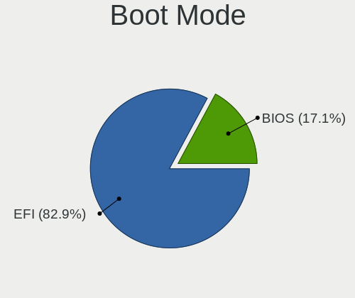
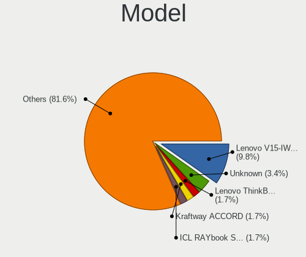
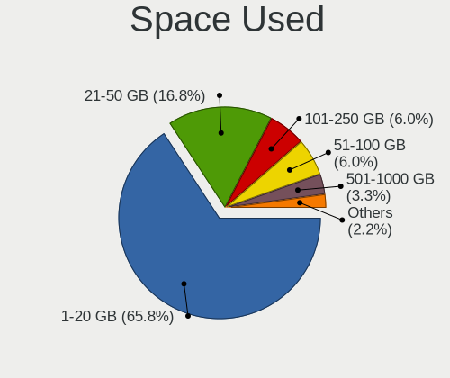
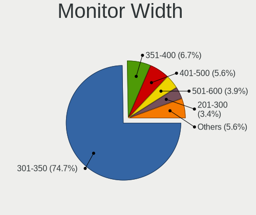
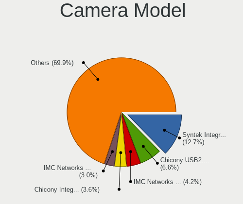
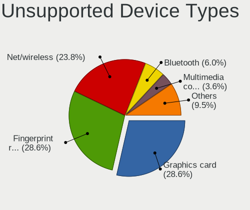

Red OS - Tested Hardware & Statistics (Notebooks)
-------------------------------------------------

A project to collect tested hardware configurations for Red OS.

Anyone can contribute to this report by the [hw-probe](https://github.com/linuxhw/hw-probe) tool:

    sudo -E hw-probe -all -upload

Please contribute! Especially if your hardware is rare.

Contents
--------

* [ Test Cases ](#test-cases)

* [ System ](#system)
  - [ OS                       ](#os)
  - [ OS Family                ](#os-family)
  - [ Kernel                   ](#kernel)
  - [ Kernel Family            ](#kernel-family)
  - [ Kernel Major Ver.        ](#kernel-major-ver)
  - [ Arch                     ](#arch)
  - [ DE                       ](#de)
  - [ Display Server           ](#display-server)
  - [ Display Manager          ](#display-manager)
  - [ OS Lang                  ](#os-lang)
  - [ Boot Mode                ](#boot-mode)
  - [ Filesystem               ](#filesystem)
  - [ Part. scheme             ](#part-scheme)
  - [ Dual Boot with Linux/BSD ](#dual-boot-with-linuxbsd)
  - [ Dual Boot (Win)          ](#dual-boot-win)

* [ Board ](#board)
  - [ Vendor                   ](#vendor)
  - [ Model                    ](#model)
  - [ Model Family             ](#model-family)
  - [ MFG Year                 ](#mfg-year)
  - [ Form Factor              ](#form-factor)
  - [ Secure Boot              ](#secure-boot)
  - [ Coreboot                 ](#coreboot)
  - [ RAM Size                 ](#ram-size)
  - [ RAM Used                 ](#ram-used)
  - [ Total Drives             ](#total-drives)
  - [ Has CD-ROM               ](#has-cd-rom)
  - [ Has Ethernet             ](#has-ethernet)
  - [ Has WiFi                 ](#has-wifi)
  - [ Has Bluetooth            ](#has-bluetooth)

* [ Location ](#location)
  - [ Country                  ](#country)
  - [ City                     ](#city)

* [ Drives ](#drives)
  - [ Drive Vendor             ](#drive-vendor)
  - [ Drive Model              ](#drive-model)
  - [ HDD Vendor               ](#hdd-vendor)
  - [ SSD Vendor               ](#ssd-vendor)
  - [ Drive Kind               ](#drive-kind)
  - [ Drive Connector          ](#drive-connector)
  - [ Drive Size               ](#drive-size)
  - [ Space Total              ](#space-total)
  - [ Space Used               ](#space-used)
  - [ Malfunc. Drives          ](#malfunc-drives)
  - [ Malfunc. Drive Vendor    ](#malfunc-drive-vendor)
  - [ Malfunc. HDD Vendor      ](#malfunc-hdd-vendor)
  - [ Malfunc. Drive Kind      ](#malfunc-drive-kind)
  - [ Failed Drives            ](#failed-drives)
  - [ Failed Drive Vendor      ](#failed-drive-vendor)
  - [ Drive Status             ](#drive-status)

* [ Storage controller ](#storage-controller)
  - [ Storage Vendor           ](#storage-vendor)
  - [ Storage Model            ](#storage-model)
  - [ Storage Kind             ](#storage-kind)

* [ Processor ](#processor)
  - [ CPU Vendor               ](#cpu-vendor)
  - [ CPU Model                ](#cpu-model)
  - [ CPU Model Family         ](#cpu-model-family)
  - [ CPU Cores                ](#cpu-cores)
  - [ CPU Sockets              ](#cpu-sockets)
  - [ CPU Threads              ](#cpu-threads)
  - [ CPU Op-Modes             ](#cpu-op-modes)
  - [ CPU Microcode            ](#cpu-microcode)
  - [ CPU Microarch            ](#cpu-microarch)

* [ Graphics ](#graphics)
  - [ GPU Vendor               ](#gpu-vendor)
  - [ GPU Model                ](#gpu-model)
  - [ GPU Combo                ](#gpu-combo)
  - [ GPU Driver               ](#gpu-driver)
  - [ GPU Memory               ](#gpu-memory)

* [ Monitor ](#monitor)
  - [ Monitor Vendor           ](#monitor-vendor)
  - [ Monitor Model            ](#monitor-model)
  - [ Monitor Resolution       ](#monitor-resolution)
  - [ Monitor Diagonal         ](#monitor-diagonal)
  - [ Monitor Width            ](#monitor-width)
  - [ Aspect Ratio             ](#aspect-ratio)
  - [ Monitor Area             ](#monitor-area)
  - [ Pixel Density            ](#pixel-density)
  - [ Multiple Monitors        ](#multiple-monitors)

* [ Network ](#network)
  - [ Net Controller Vendor    ](#net-controller-vendor)
  - [ Net Controller Model     ](#net-controller-model)
  - [ Wireless Vendor          ](#wireless-vendor)
  - [ Wireless Model           ](#wireless-model)
  - [ Ethernet Vendor          ](#ethernet-vendor)
  - [ Ethernet Model           ](#ethernet-model)
  - [ Net Controller Kind      ](#net-controller-kind)
  - [ Used Controller          ](#used-controller)
  - [ NICs                     ](#nics)
  - [ IPv6                     ](#ipv6)

* [ Bluetooth ](#bluetooth)
  - [ Bluetooth Vendor         ](#bluetooth-vendor)
  - [ Bluetooth Model          ](#bluetooth-model)

* [ Sound ](#sound)
  - [ Sound Vendor             ](#sound-vendor)
  - [ Sound Model              ](#sound-model)

* [ Memory ](#memory)
  - [ Memory Vendor            ](#memory-vendor)
  - [ Memory Model             ](#memory-model)
  - [ Memory Kind              ](#memory-kind)
  - [ Memory Form Factor       ](#memory-form-factor)
  - [ Memory Size              ](#memory-size)
  - [ Memory Speed             ](#memory-speed)

* [ Printers & scanners ](#printers--scanners)
  - [ Printer Vendor           ](#printer-vendor)
  - [ Printer Model            ](#printer-model)
  - [ Scanner Vendor           ](#scanner-vendor)
  - [ Scanner Model            ](#scanner-model)

* [ Camera ](#camera)
  - [ Camera Vendor            ](#camera-vendor)
  - [ Camera Model             ](#camera-model)

* [ Security ](#security)
  - [ Fingerprint Vendor       ](#fingerprint-vendor)
  - [ Fingerprint Model        ](#fingerprint-model)
  - [ Chipcard Vendor          ](#chipcard-vendor)
  - [ Chipcard Model           ](#chipcard-model)

* [ Unsupported ](#unsupported)
  - [ Unsupported Devices      ](#unsupported-devices)
  - [ Unsupported Device Types ](#unsupported-device-types)

Test Cases
----------

Total: 68

| Vendor        | Model                       | Probe                                                      | Date         |
|---------------|-----------------------------|------------------------------------------------------------|--------------|
| THUNDEROBO... | 911AirD                     | [448f04d201](https://linux-hardware.org/?probe=448f04d201) | Sep 30, 2022 |
| Digma         | EVE 11 C408                 | [b5c7ac8ed3](https://linux-hardware.org/?probe=b5c7ac8ed3) | Sep 30, 2022 |
| THUNDEROBO... | 911AirD                     | [99f1b7e253](https://linux-hardware.org/?probe=99f1b7e253) | Sep 29, 2022 |
| ICL           | RAYbook Si1512              | [0b610b66a9](https://linux-hardware.org/?probe=0b610b66a9) | Sep 20, 2022 |
| Lenovo        | IdeaPad L340-15API 81LW     | [713797403a](https://linux-hardware.org/?probe=713797403a) | Sep 09, 2022 |
| IP3 Techno... | ACN30                       | [af9694cea8](https://linux-hardware.org/?probe=af9694cea8) | Sep 06, 2022 |
| IP3 Techno... | ACN30                       | [03f14a115d](https://linux-hardware.org/?probe=03f14a115d) | Sep 05, 2022 |
| MSI           | FX610                       | [a822818a58](https://linux-hardware.org/?probe=a822818a58) | Sep 03, 2022 |
| Lenovo        | IdeaPad L340-15API 81LW     | [17761aa8e3](https://linux-hardware.org/?probe=17761aa8e3) | Aug 23, 2022 |
| IP3 Techno... | ACN30                       | [e25ed534c0](https://linux-hardware.org/?probe=e25ed534c0) | Aug 18, 2022 |
| ICL           | RAYbook Si1512              | [a42c4dc65a](https://linux-hardware.org/?probe=a42c4dc65a) | Aug 09, 2022 |
| Digma         | EVE 15 P417 ES5063EW        | [a584c678b5](https://linux-hardware.org/?probe=a584c678b5) | Jul 27, 2022 |
| Digma         | EVE 15 C407 ES5054EW        | [4fd01756b2](https://linux-hardware.org/?probe=4fd01756b2) | Jul 27, 2022 |
| Digma         | EVE 15 C407 ES5054EW        | [008b02cc92](https://linux-hardware.org/?probe=008b02cc92) | Jul 26, 2022 |
| Lenovo        | IdeaPad 5 Pro 14ACN6 82L... | [413949a727](https://linux-hardware.org/?probe=413949a727) | Jul 25, 2022 |
| Lenovo        | IdeaPad L340-15API 81LW     | [2ea5a4f753](https://linux-hardware.org/?probe=2ea5a4f753) | Jul 22, 2022 |
| Lenovo        | V15-IWL 81YE                | [3bfcedd5c8](https://linux-hardware.org/?probe=3bfcedd5c8) | Jul 22, 2022 |
| Lenovo        | V15-IWL 81YE                | [c49282206c](https://linux-hardware.org/?probe=c49282206c) | Jul 22, 2022 |
| Lenovo        | V15-IWL 81YE                | [d598c4587d](https://linux-hardware.org/?probe=d598c4587d) | Jul 22, 2022 |
| Lenovo        | V15-IWL 81YE                | [5b1e962751](https://linux-hardware.org/?probe=5b1e962751) | Jul 22, 2022 |
| Lenovo        | V15-IWL 81YE                | [4e120b3b63](https://linux-hardware.org/?probe=4e120b3b63) | Jul 22, 2022 |
| Lenovo        | V15-IWL 81YE                | [2d5bedf224](https://linux-hardware.org/?probe=2d5bedf224) | Jul 22, 2022 |
| Lenovo        | V15-IWL 81YE                | [297ce5144e](https://linux-hardware.org/?probe=297ce5144e) | Jul 22, 2022 |
| Lenovo        | V15-IWL 81YE                | [84b7cd1115](https://linux-hardware.org/?probe=84b7cd1115) | Jul 22, 2022 |
| Lenovo        | V15-IWL 81YE                | [a92b6c5d73](https://linux-hardware.org/?probe=a92b6c5d73) | Jul 22, 2022 |
| Lenovo        | V15-IWL 81YE                | [51ebd271c8](https://linux-hardware.org/?probe=51ebd271c8) | Jul 22, 2022 |
| Lenovo        | V15-IWL 81YE                | [44ad7f7d47](https://linux-hardware.org/?probe=44ad7f7d47) | Jul 22, 2022 |
| Lenovo        | V15-IWL 81YE                | [49068a26b5](https://linux-hardware.org/?probe=49068a26b5) | Jul 22, 2022 |
| Lenovo        | V15-IWL 81YE                | [62ce596bf3](https://linux-hardware.org/?probe=62ce596bf3) | Jul 22, 2022 |
| Lenovo        | V15-IWL 81YE                | [812db8ad6f](https://linux-hardware.org/?probe=812db8ad6f) | Jul 22, 2022 |
| Lenovo        | V15-IWL 81YE                | [d4c2b5ffad](https://linux-hardware.org/?probe=d4c2b5ffad) | Jul 22, 2022 |
| Lenovo        | V15-IWL 81YE                | [4c0179b60e](https://linux-hardware.org/?probe=4c0179b60e) | Jul 22, 2022 |
| Lenovo        | IdeaPad L340-15API 81LW     | [8601888983](https://linux-hardware.org/?probe=8601888983) | Jul 22, 2022 |
| Lenovo        | V15-IWL 81YE                | [1d505390d6](https://linux-hardware.org/?probe=1d505390d6) | Jul 22, 2022 |
| Lenovo        | IdeaPad L340-15API 81LW     | [d481776a74](https://linux-hardware.org/?probe=d481776a74) | Jul 21, 2022 |
| Lenovo        | IdeaPad L340-15API 81LW     | [ef738973d3](https://linux-hardware.org/?probe=ef738973d3) | Jul 20, 2022 |
| HONOR         | NBR-WAX9                    | [5b3340311a](https://linux-hardware.org/?probe=5b3340311a) | Jul 20, 2022 |
| Lenovo        | IdeaPad L340-15API 81LW     | [154c254eac](https://linux-hardware.org/?probe=154c254eac) | Jul 19, 2022 |
| Gigabyte      | G5 GD                       | [60921a7ff6](https://linux-hardware.org/?probe=60921a7ff6) | Jul 19, 2022 |
| Gigabyte      | G5 GD                       | [c24f8b4ba6](https://linux-hardware.org/?probe=c24f8b4ba6) | Jul 19, 2022 |
| HONOR         | NBR-WAX9                    | [fe971bb8c3](https://linux-hardware.org/?probe=fe971bb8c3) | Jul 08, 2022 |
| Lenovo        | IdeaPad 3 15ITL05 81X8      | [2835672840](https://linux-hardware.org/?probe=2835672840) | Jul 07, 2022 |
| Kraftway      | ACCORD                      | [24e49bc011](https://linux-hardware.org/?probe=24e49bc011) | Jun 27, 2022 |
| Kraftway      | ACCORD                      | [39e3c55e89](https://linux-hardware.org/?probe=39e3c55e89) | Jun 27, 2022 |
| Aquarius      | NS685U                      | [ecedc7cbb6](https://linux-hardware.org/?probe=ecedc7cbb6) | Jun 08, 2022 |
| ICL           | Unknown                     | [4dc89fc689](https://linux-hardware.org/?probe=4dc89fc689) | Jun 07, 2022 |
| mtech         | MTL1578                     | [bf25c26ea0](https://linux-hardware.org/?probe=bf25c26ea0) | May 11, 2022 |
| HUAWEI        | BOD-WXX9                    | [e2e025dd4f](https://linux-hardware.org/?probe=e2e025dd4f) | Apr 15, 2022 |
| Acer          | TravelMate P215-53          | [124fdb3b64](https://linux-hardware.org/?probe=124fdb3b64) | Apr 14, 2022 |
| Lenovo        | ThinkBook 14-IIL 20SL       | [be41efbec8](https://linux-hardware.org/?probe=be41efbec8) | Apr 05, 2022 |
| Aquarius      | NS585 R32                   | [582389ca98](https://linux-hardware.org/?probe=582389ca98) | Mar 24, 2022 |
| Lenovo        | IdeaPad L340-15IWL 81LG     | [56f9ebba91](https://linux-hardware.org/?probe=56f9ebba91) | Mar 22, 2022 |
| Lenovo        | ThinkBook 15 G3 ACL 21A4    | [e18b80073c](https://linux-hardware.org/?probe=e18b80073c) | Mar 21, 2022 |
| 3Logic Gro... | APM Graviton A15i-K2        | [e93bcf2f42](https://linux-hardware.org/?probe=e93bcf2f42) | Mar 09, 2022 |
| ASUSTek       | TUF Gaming FX705DT_FX705... | [227a2658d0](https://linux-hardware.org/?probe=227a2658d0) | Feb 15, 2022 |
| HP            | Laptop 15s-eq1xxx           | [7ed7e139d8](https://linux-hardware.org/?probe=7ed7e139d8) | Dec 20, 2021 |
| HP            | Laptop 15s-eq1xxx           | [55ab1c9ab8](https://linux-hardware.org/?probe=55ab1c9ab8) | Dec 20, 2021 |
| HUAWEI        | NBLK-WAX9X                  | [5bb21d6bf6](https://linux-hardware.org/?probe=5bb21d6bf6) | Dec 13, 2021 |
| ICL           | RAYbook Si1514              | [9ddc61deba](https://linux-hardware.org/?probe=9ddc61deba) | Sep 13, 2021 |
| ASUSTek       | TUF Gaming FX705DT_FX705... | [4f59992d0f](https://linux-hardware.org/?probe=4f59992d0f) | Sep 11, 2021 |
| HP            | Laptop 15-dw3xxx            | [d8b35044ab](https://linux-hardware.org/?probe=d8b35044ab) | Jul 29, 2021 |
| Lenovo        | IdeaPad 5 15ARE05 81YQ      | [9b2c758081](https://linux-hardware.org/?probe=9b2c758081) | Jun 10, 2021 |
| ASUSTek       | X75VD                       | [95ea9551da](https://linux-hardware.org/?probe=95ea9551da) | Apr 05, 2021 |
| ASUSTek       | TUF Gaming FX705DT_FX705... | [916d4b225b](https://linux-hardware.org/?probe=916d4b225b) | Mar 30, 2021 |
| ASUSTek       | TUF Gaming FX705DT_FX705... | [ebfafc7409](https://linux-hardware.org/?probe=ebfafc7409) | Mar 26, 2021 |
| HUAWEI        | BOHL-WXX9                   | [cf5559d576](https://linux-hardware.org/?probe=cf5559d576) | Mar 26, 2021 |
| HP            | Pavilion g6                 | [1ca79b1950](https://linux-hardware.org/?probe=1ca79b1950) | Mar 26, 2021 |
| Pegatron      | A35                         | [9923a21e8c](https://linux-hardware.org/?probe=9923a21e8c) | Mar 04, 2021 |

System
------

OS
--

Installed operating systems

| Name         | Notebooks | Percent |
|--------------|-----------|---------|
| Red OS 7.3.1 | 36        | 67.92%  |
| Red OS 7.3   | 17        | 32.08%  |

OS Family
---------

OS without a version

| Name   | Notebooks | Percent |
|--------|-----------|---------|
| Red OS | 52        | 100%    |

Kernel
------

Version of the Linux kernel

| Version                | Notebooks | Percent |
|------------------------|-----------|---------|
| 5.15.10-1.el7.x86_64   | 17        | 30.91%  |
| 5.15.35-4.el7.3.x86_64 | 10        | 18.18%  |
| 5.10.29-1.el7.x86_64   | 9         | 16.36%  |
| 5.15.35-1.el7.3.x86_64 | 6         | 10.91%  |
| 5.10.1-1.el7.x86_64    | 3         | 5.45%   |
| 5.15.10-4.el7.x86_64   | 2         | 3.64%   |
| 5.10.24-2.el7.x86_64   | 2         | 3.64%   |
| 5.18.1-1.el7.x86_64    | 1         | 1.82%   |
| 5.15.10-3.el7.x86_64   | 1         | 1.82%   |
| 5.15.10-2.el7.x86_64   | 1         | 1.82%   |
| 5.13.15-1.el7.x86_64   | 1         | 1.82%   |
| 5.10.29-3.el7.x86_64   | 1         | 1.82%   |
| 5.10.24-1.el7.x86_64   | 1         | 1.82%   |

Kernel Family
-------------

Linux kernel without a distro release

| Version | Notebooks | Percent |
|---------|-----------|---------|
| 5.15.10 | 21        | 38.18%  |
| 5.15.35 | 16        | 29.09%  |
| 5.10.29 | 10        | 18.18%  |
| 5.10.24 | 3         | 5.45%   |
| 5.10.1  | 3         | 5.45%   |
| 5.18.1  | 1         | 1.82%   |
| 5.13.15 | 1         | 1.82%   |

Kernel Major Ver.
-----------------

Linux kernel major version

| Version | Notebooks | Percent |
|---------|-----------|---------|
| 5.15    | 36        | 67.92%  |
| 5.10    | 15        | 28.3%   |
| 5.18    | 1         | 1.89%   |
| 5.13    | 1         | 1.89%   |

Arch
----

OS architecture (x86_64, i586, etc.)

| Name   | Notebooks | Percent |
|--------|-----------|---------|
| x86_64 | 52        | 100%    |

DE
--

Desktop Environment

| Name       | Notebooks | Percent |
|------------|-----------|---------|
| MATE       | 42        | 80.77%  |
| Cinnamon   | 9         | 17.31%  |
| X-Cinnamon | 1         | 1.92%   |

Display Server
--------------

X11 or Wayland

| Name    | Notebooks | Percent |
|---------|-----------|---------|
| X11     | 48        | 90.57%  |
| Wayland | 5         | 9.43%   |

Display Manager
---------------

SDDM, LightDM, etc.

| Name    | Notebooks | Percent |
|---------|-----------|---------|
| GDM     | 48        | 92.31%  |
| SDDM    | 3         | 5.77%   |
| Unknown | 1         | 1.92%   |

OS Lang
-------

Language

| Lang    | Notebooks | Percent |
|---------|-----------|---------|
| Unknown | 50        | 96.15%  |
| ru_RU   | 1         | 1.92%   |
| en_US   | 1         | 1.92%   |

Boot Mode
---------

EFI or BIOS

| Mode | Notebooks | Percent |
|------|-----------|---------|
| EFI  | 46        | 86.79%  |
| BIOS | 7         | 13.21%  |

Filesystem
----------

Type of filesystem

| Type  | Notebooks | Percent |
|-------|-----------|---------|
| Ext4  | 52        | 98.11%  |
| Btrfs | 1         | 1.89%   |

Part. scheme
------------

Scheme of partitioning

| Type    | Notebooks | Percent |
|---------|-----------|---------|
| GPT     | 47        | 90.38%  |
| MBR     | 4         | 7.69%   |
| Unknown | 1         | 1.92%   |

Dual Boot with Linux/BSD
------------------------

Hosting more than one Linux/BSD

| Dual boot | Notebooks | Percent |
|-----------|-----------|---------|
| No        | 48        | 92.31%  |
| Yes       | 4         | 7.69%   |

Dual Boot (Win)
---------------

Hosting Linux and Windows

| Dual boot | Notebooks | Percent |
|-----------|-----------|---------|
| No        | 40        | 75.47%  |
| Yes       | 13        | 24.53%  |

Board
-----

Vendor
------

Motherboard manufacturer

| Name                | Notebooks | Percent |
|---------------------|-----------|---------|
| Lenovo              | 24        | 46.15%  |
| ICL                 | 4         | 7.69%   |
| HUAWEI              | 3         | 5.77%   |
| Hewlett-Packard     | 3         | 5.77%   |
| Digma               | 3         | 5.77%   |
| IP3 Technology      | 2         | 3.85%   |
| ASUSTek Computer    | 2         | 3.85%   |
| Aquarius            | 2         | 3.85%   |
| THUNDEROBOT         | 1         | 1.92%   |
| Pegatron            | 1         | 1.92%   |
| mtech               | 1         | 1.92%   |
| MSI                 | 1         | 1.92%   |
| Kraftway            | 1         | 1.92%   |
| HONOR               | 1         | 1.92%   |
| Gigabyte Technology | 1         | 1.92%   |
| Acer                | 1         | 1.92%   |
| 3Logic Group        | 1         | 1.92%   |

Model
-----

Motherboard model

| Name                              | Notebooks | Percent |
|-----------------------------------|-----------|---------|
| Lenovo V15-IWL 81YE               | 17        | 32.69%  |
| IP3 ACN30                         | 2         | 3.85%   |
| ICL RAYbook Si1512                | 2         | 3.85%   |
| THUNDEROBOT 911AirD               | 1         | 1.92%   |
| Pegatron A35                      | 1         | 1.92%   |
| mtech MTL1578                     | 1         | 1.92%   |
| MSI FX610                         | 1         | 1.92%   |
| Lenovo ThinkBook 15 G3 ACL 21A4   | 1         | 1.92%   |
| Lenovo ThinkBook 14-IIL 20SL      | 1         | 1.92%   |
| Lenovo IdeaPad L340-15IWL 81LG    | 1         | 1.92%   |
| Lenovo IdeaPad L340-15API 81LW    | 1         | 1.92%   |
| Lenovo IdeaPad 5 Pro 14ACN6 82L7  | 1         | 1.92%   |
| Lenovo IdeaPad 5 15ARE05 81YQ     | 1         | 1.92%   |
| Lenovo IdeaPad 3 15ITL05 81X8     | 1         | 1.92%   |
| Kraftway ACCORD                   | 1         | 1.92%   |
| ICL RAYbook Si1514                | 1         | 1.92%   |
| HUAWEI NBLK-WAX9X                 | 1         | 1.92%   |
| HUAWEI BOHL-WXX9                  | 1         | 1.92%   |
| HUAWEI BOD-WXX9                   | 1         | 1.92%   |
| HONOR NBR-WAX9                    | 1         | 1.92%   |
| HP Pavilion g6                    | 1         | 1.92%   |
| HP Laptop 15s-eq1xxx              | 1         | 1.92%   |
| HP Laptop 15-dw3xxx               | 1         | 1.92%   |
| Gigabyte G5 GD                    | 1         | 1.92%   |
| Digma EVE 15 P417 ES5063EW        | 1         | 1.92%   |
| Digma EVE 15 C407 ES5054EW        | 1         | 1.92%   |
| Digma EVE 11 C408                 | 1         | 1.92%   |
| ASUS X75VD                        | 1         | 1.92%   |
| ASUS TUF Gaming FX705DT_FX705DT   | 1         | 1.92%   |
| Aquarius NS685U                   | 1         | 1.92%   |
| Aquarius NS585 R32                | 1         | 1.92%   |
| Acer TravelMate P215-53           | 1         | 1.92%   |
| 3Logic Group APM Graviton A15i-K2 | 1         | 1.92%   |
| Unknown                           | 1         | 1.92%   |

Model Family
------------

Motherboard model prefix

| Name                | Notebooks | Percent |
|---------------------|-----------|---------|
| Lenovo V15-IWL      | 17        | 32.69%  |
| Lenovo IdeaPad      | 5         | 9.62%   |
| ICL RAYbook         | 3         | 5.77%   |
| Digma EVE           | 3         | 5.77%   |
| Lenovo ThinkBook    | 2         | 3.85%   |
| IP3 ACN30           | 2         | 3.85%   |
| HP Laptop           | 2         | 3.85%   |
| THUNDEROBOT 911AirD | 1         | 1.92%   |
| Pegatron A35        | 1         | 1.92%   |
| mtech MTL1578       | 1         | 1.92%   |
| MSI FX610           | 1         | 1.92%   |
| Kraftway ACCORD     | 1         | 1.92%   |
| HUAWEI NBLK-WAX9X   | 1         | 1.92%   |
| HUAWEI BOHL-WXX9    | 1         | 1.92%   |
| HUAWEI BOD-WXX9     | 1         | 1.92%   |
| HONOR NBR-WAX9      | 1         | 1.92%   |
| HP Pavilion         | 1         | 1.92%   |
| Gigabyte G5         | 1         | 1.92%   |
| ASUS X75VD          | 1         | 1.92%   |
| ASUS TUF            | 1         | 1.92%   |
| Aquarius NS685U     | 1         | 1.92%   |
| Aquarius NS585      | 1         | 1.92%   |
| Acer TravelMate     | 1         | 1.92%   |
| 3Logic Group APM    | 1         | 1.92%   |
| Unknown             | 1         | 1.92%   |

MFG Year
--------

Motherboard manufacture year

| Year | Notebooks | Percent |
|------|-----------|---------|
| 2019 | 25        | 48.08%  |
| 2021 | 14        | 26.92%  |
| 2020 | 6         | 11.54%  |
| 2022 | 3         | 5.77%   |
| 2012 | 2         | 3.85%   |
| 2011 | 1         | 1.92%   |
| 2010 | 1         | 1.92%   |

Form Factor
-----------

Physical design of the computer

| Name     | Notebooks | Percent |
|----------|-----------|---------|
| Notebook | 52        | 100%    |

Secure Boot
-----------

Enabled or disabled

| State    | Notebooks | Percent |
|----------|-----------|---------|
| Disabled | 52        | 100%    |

Coreboot
--------

Have coreboot on board

| Used | Notebooks | Percent |
|------|-----------|---------|
| No   | 52        | 100%    |

RAM Size
--------

Total RAM memory

| Size in GB | Notebooks | Percent |
|------------|-----------|---------|
| 4.01-8.0   | 39        | 75%     |
| 3.01-4.0   | 4         | 7.69%   |
| 16.01-24.0 | 4         | 7.69%   |
| 8.01-16.0  | 4         | 7.69%   |
| 2.01-3.0   | 1         | 1.92%   |

RAM Used
--------

Used RAM memory

| Used GB  | Notebooks | Percent |
|----------|-----------|---------|
| 1.01-2.0 | 30        | 55.56%  |
| 2.01-3.0 | 12        | 22.22%  |
| 0.51-1.0 | 6         | 11.11%  |
| 3.01-4.0 | 5         | 9.26%   |
| 4.01-8.0 | 1         | 1.85%   |

Total Drives
------------

Number of drives on board

| Drives | Notebooks | Percent |
|--------|-----------|---------|
| 1      | 46        | 86.79%  |
| 2      | 4         | 7.55%   |
| 3      | 3         | 5.66%   |

Has CD-ROM
----------

Has CD-ROM on board

| Presented | Notebooks | Percent |
|-----------|-----------|---------|
| No        | 48        | 92.31%  |
| Yes       | 4         | 7.69%   |

Has Ethernet
------------

Has Ethernet on board

| Presented | Notebooks | Percent |
|-----------|-----------|---------|
| Yes       | 26        | 50%     |
| No        | 26        | 50%     |

Has WiFi
--------

Has WiFi module

| Presented | Notebooks | Percent |
|-----------|-----------|---------|
| Yes       | 51        | 98.08%  |
| No        | 1         | 1.92%   |

Has Bluetooth
-------------

Has Bluetooth module

| Presented | Notebooks | Percent |
|-----------|-----------|---------|
| Yes       | 43        | 82.69%  |
| No        | 9         | 17.31%  |

Location
--------

Country
-------

Geographic location (country)

| Country | Notebooks | Percent |
|---------|-----------|---------|
| Russia  | 51        | 98.08%  |
| Ukraine | 1         | 1.92%   |

City
----

Geographic location (city)

| City          | Notebooks | Percent |
|---------------|-----------|---------|
| Salekhard     | 18        | 33.96%  |
| Murom         | 10        | 18.87%  |
| Moscow        | 7         | 13.21%  |
| Ryazan        | 3         | 5.66%   |
| Vladimir      | 2         | 3.77%   |
| Novy Urengoy  | 2         | 3.77%   |
| Kursk         | 2         | 3.77%   |
| Yekaterinburg | 1         | 1.89%   |
| Yaroslavl     | 1         | 1.89%   |
| Sevastopol    | 1         | 1.89%   |
| Saratov       | 1         | 1.89%   |
| Perm          | 1         | 1.89%   |
| Novosibirsk   | 1         | 1.89%   |
| Krasnoyarsk   | 1         | 1.89%   |
| Krasnodar     | 1         | 1.89%   |
| Belgorod      | 1         | 1.89%   |

Drives
------

Drive Vendor
------------

Hard drive vendors

| Vendor              | Notebooks | Drives | Percent |
|---------------------|-----------|--------|---------|
| Samsung Electronics | 21        | 23     | 35%     |
| WDC                 | 8         | 10     | 13.33%  |
| Toshiba             | 3         | 5      | 5%      |
| Foxline             | 3         | 3      | 5%      |
| A-DATA Technology   | 3         | 3      | 5%      |
| Unknown             | 2         | 2      | 3.33%   |
| SK hynix            | 2         | 2      | 3.33%   |
| Silicon Motion      | 2         | 2      | 3.33%   |
| Seagate             | 2         | 2      | 3.33%   |
| Phison              | 2         | 2      | 3.33%   |
| UMIS                | 1         | 1      | 1.67%   |
| Transcend           | 1         | 1      | 1.67%   |
| SanDisk             | 1         | 1      | 1.67%   |
| Micron Technology   | 1         | 3      | 1.67%   |
| Kingston            | 1         | 1      | 1.67%   |
| Kimtigo             | 1         | 1      | 1.67%   |
| JMicron Technology  | 1         | 1      | 1.67%   |
| ITHOO               | 1         | 1      | 1.67%   |
| Gigabyte Technology | 1         | 1      | 1.67%   |
| Crucial             | 1         | 1      | 1.67%   |
| Apacer              | 1         | 1      | 1.67%   |
| Unknown             | 1         | 1      | 1.67%   |

Drive Model
-----------

Hard drive models

| Model                                     | Notebooks | Percent |
|-------------------------------------------|-----------|---------|
| Samsung MZALQ256HAJD-000L2 256GB          | 17        | 28.33%  |
| Foxline FLSSD256M80E13TCX5 256GB          | 3         | 5%      |
| Silicon Motion Wodposit NVMe SSD 256GB    | 2         | 3.33%   |
| WDC WD5000BPVT-55HXZT3 500GB              | 1         | 1.67%   |
| WDC WD10SPZX-24Z10 1TB                    | 1         | 1.67%   |
| WDC WD10SPZX-00Z10T0 1TB                  | 1         | 1.67%   |
| WDC PC SN530 SDBPNPZ-512G-1114 512GB      | 1         | 1.67%   |
| WDC PC SN530 SDBPNPZ-512G-1027 512GB      | 1         | 1.67%   |
| WDC PC SN530 SDBPNPZ-256G-1006 256GB      | 1         | 1.67%   |
| WDC PC SN530 SDBPMPZ-512G-1101 512GB      | 1         | 1.67%   |
| WDC PC SN520 SDAPMUW-512G-1101 512GB      | 1         | 1.67%   |
| Unknown SLD128  128GB                     | 1         | 1.67%   |
| Unknown 58K722  128GB                     | 1         | 1.67%   |
| UMIS RPJTJ512MEE1OWX 512GB                | 1         | 1.67%   |
| Transcend TS240GMTS820S 240GB SSD         | 1         | 1.67%   |
| Toshiba MQ01ABF050 500GB                  | 1         | 1.67%   |
| Toshiba KXG60ZNV512G 512GB                | 1         | 1.67%   |
| Toshiba KXG60ZNV256G 256GB                | 1         | 1.67%   |
| SK hynix SKHynix_HFM256GDHTNI-87A0B 256GB | 1         | 1.67%   |
| SK hynix SKHynix_HFM256GD3HX015N 256GB    | 1         | 1.67%   |
| Seagate ST750LM022 HN-M750MBB 752GB       | 1         | 1.67%   |
| Seagate ST1000LM024 HN-M101MBB 1TB        | 1         | 1.67%   |
| SanDisk SD8SBAT256G1122 256GB SSD         | 1         | 1.67%   |
| Samsung SSD 860 EVO M.2 250GB             | 1         | 1.67%   |
| Samsung MZVLQ256HAJD-000H1 256GB          | 1         | 1.67%   |
| Samsung MZALQ512HBLU-00BL2 512GB          | 1         | 1.67%   |
| Samsung MZALQ512HALU-000L2 512GB          | 1         | 1.67%   |
| Phison ESR512GTLG-E6GBTNB4 512GB          | 1         | 1.67%   |
| Phison 311CD0512GB                        | 1         | 1.67%   |
| Micron 2200V_MTFDHBA512TCK 512GB          | 1         | 1.67%   |
| Kingston SNVS500G 500GB                   | 1         | 1.67%   |
| Kimtigo SSD 256GB                         | 1         | 1.67%   |
| JMicron Generic 120GB                     | 1         | 1.67%   |
| ITHOO Tech 250GB                          | 1         | 1.67%   |
| Gigabyte GP-GSM2NE3256GNTD 256GB          | 1         | 1.67%   |
| Crucial CT250MX500SSD4 250GB              | 1         | 1.67%   |
| Apacer AS350 256GB SSD                    | 1         | 1.67%   |
| A-DATA SX6000LNP 256GB                    | 1         | 1.67%   |
| A-DATA SU800 256GB SSD                    | 1         | 1.67%   |
| A-DATA SU650 240GB SSD                    | 1         | 1.67%   |

HDD Vendor
----------

Hard disk drive vendors

| Vendor  | Notebooks | Drives | Percent |
|---------|-----------|--------|---------|
| WDC     | 3         | 5      | 50%     |
| Seagate | 2         | 2      | 33.33%  |
| Toshiba | 1         | 3      | 16.67%  |

SSD Vendor
----------

Solid state drive vendors

| Vendor              | Notebooks | Drives | Percent |
|---------------------|-----------|--------|---------|
| A-DATA Technology   | 2         | 2      | 28.57%  |
| Transcend           | 1         | 1      | 14.29%  |
| SanDisk             | 1         | 1      | 14.29%  |
| Samsung Electronics | 1         | 1      | 14.29%  |
| Crucial             | 1         | 1      | 14.29%  |
| Apacer              | 1         | 1      | 14.29%  |

Drive Kind
----------

HDD or SSD

| Kind    | Notebooks | Drives | Percent |
|---------|-----------|--------|---------|
| NVMe    | 41        | 47     | 70.69%  |
| SSD     | 7         | 7      | 12.07%  |
| HDD     | 6         | 10     | 10.34%  |
| MMC     | 3         | 3      | 5.17%   |
| Unknown | 1         | 1      | 1.72%   |

Drive Connector
---------------

SATA, SAS, NVMe, etc.

| Type | Notebooks | Drives | Percent |
|------|-----------|--------|---------|
| NVMe | 41        | 46     | 69.49%  |
| SATA | 13        | 17     | 22.03%  |
| MMC  | 3         | 3      | 5.08%   |
| SAS  | 2         | 2      | 3.39%   |

Drive Size
----------

Size of hard drive

| Size in TB | Notebooks | Drives | Percent |
|------------|-----------|--------|---------|
| 0.01-0.5   | 9         | 11     | 69.23%  |
| 0.51-1.0   | 4         | 6      | 30.77%  |

Space Total
-----------

Amount of disk space available on the file system

| Size in GB | Notebooks | Percent |
|------------|-----------|---------|
| 101-250    | 31        | 58.49%  |
| 251-500    | 9         | 16.98%  |
| 501-1000   | 4         | 7.55%   |
| 51-100     | 4         | 7.55%   |
| 1001-2000  | 3         | 5.66%   |
| 21-50      | 1         | 1.89%   |
| 1-20       | 1         | 1.89%   |

Space Used
----------

Amount of used disk space

| Used GB  | Notebooks | Percent |
|----------|-----------|---------|
| 1-20     | 39        | 72.22%  |
| 21-50    | 5         | 9.26%   |
| 101-250  | 4         | 7.41%   |
| 251-500  | 2         | 3.7%    |
| 501-1000 | 2         | 3.7%    |
| 51-100   | 2         | 3.7%    |

Malfunc. Drives
---------------

Drive models with a malfunction

| Model                               | Notebooks | Drives | Percent |
|-------------------------------------|-----------|--------|---------|
| WDC WD10SPZX-24Z10 1TB              | 1         | 1      | 25%     |
| Toshiba MQ01ABF050 500GB            | 1         | 3      | 25%     |
| Seagate ST750LM022 HN-M750MBB 752GB | 1         | 1      | 25%     |
| A-DATA Technology SU800 256GB SSD   | 1         | 1      | 25%     |

Malfunc. Drive Vendor
---------------------

Vendors of faulty drives

| Vendor            | Notebooks | Drives | Percent |
|-------------------|-----------|--------|---------|
| WDC               | 1         | 1      | 25%     |
| Toshiba           | 1         | 3      | 25%     |
| Seagate           | 1         | 1      | 25%     |
| A-DATA Technology | 1         | 1      | 25%     |

Malfunc. HDD Vendor
-------------------

Vendors of faulty HDD drives

| Vendor  | Notebooks | Drives | Percent |
|---------|-----------|--------|---------|
| WDC     | 1         | 1      | 33.33%  |
| Toshiba | 1         | 3      | 33.33%  |
| Seagate | 1         | 1      | 33.33%  |

Malfunc. Drive Kind
-------------------

Kinds of faulty drives

| Kind | Notebooks | Drives | Percent |
|------|-----------|--------|---------|
| HDD  | 3         | 5      | 75%     |
| SSD  | 1         | 1      | 25%     |

Failed Drives
-------------

Failed drive models

Zero info for selected period =(

Failed Drive Vendor
-------------------

Failed drive vendors

Zero info for selected period =(

Drive Status
------------

Number of failed and malfunc. drives

| Status   | Notebooks | Drives | Percent |
|----------|-----------|--------|---------|
| Works    | 47        | 56     | 83.93%  |
| Detected | 5         | 6      | 8.93%   |
| Malfunc  | 4         | 6      | 7.14%   |

Storage controller
------------------

Storage Vendor
--------------

Storage controller vendors

| Vendor                       | Notebooks | Percent |
|------------------------------|-----------|---------|
| Intel                        | 40        | 45.98%  |
| Samsung Electronics          | 20        | 22.99%  |
| Phison Electronics           | 6         | 6.9%    |
| SanDisk                      | 5         | 5.75%   |
| AMD                          | 5         | 5.75%   |
| Toshiba America Info Systems | 2         | 2.3%    |
| SK hynix                     | 2         | 2.3%    |
| Silicon Motion               | 2         | 2.3%    |
| Union Memory (Shenzhen)      | 1         | 1.15%   |
| Realtek Semiconductor        | 1         | 1.15%   |
| Micron Technology            | 1         | 1.15%   |
| Kingston Technology Company  | 1         | 1.15%   |
| Unknown                      | 1         | 1.15%   |

Storage Model
-------------

Storage controller models

| Model                                                                            | Notebooks | Percent |
|----------------------------------------------------------------------------------|-----------|---------|
| Intel Cannon Point-LP SATA Controller [AHCI Mode]                                | 25        | 27.78%  |
| Samsung NVMe SSD Controller 980                                                  | 20        | 22.22%  |
| Phison PS5013 E13 NVMe Controller                                                | 5         | 5.56%   |
| Intel Tiger Lake-LP SATA Controller                                              | 4         | 4.44%   |
| AMD FCH SATA Controller [AHCI mode]                                              | 4         | 4.44%   |
| SanDisk WD Blue SN550 NVMe SSD                                                   | 3         | 3.33%   |
| Intel 7 Series Chipset Family 6-port SATA Controller [AHCI mode]                 | 3         | 3.33%   |
| Toshiba America Info Systems XG6 NVMe SSD Controller                             | 2         | 2.22%   |
| Silicon Motion SM2263EN/SM2263XT SSD Controller                                  | 2         | 2.22%   |
| Intel Volume Management Device NVMe RAID Controller                              | 2         | 2.22%   |
| Intel Celeron N3350/Pentium N4200/Atom E3900 Series SATA AHCI Controller         | 2         | 2.22%   |
| Intel 500 Series Chipset Family SATA AHCI Controller                             | 2         | 2.22%   |
| Union Memory (Shenzhen) Non-Volatile memory controller                           | 1         | 1.11%   |
| SK hynix Gold P31 SSD                                                            | 1         | 1.11%   |
| SK hynix BC511                                                                   | 1         | 1.11%   |
| SanDisk PC SN520 NVMe SSD                                                        | 1         | 1.11%   |
| SanDisk Non-Volatile memory controller                                           | 1         | 1.11%   |
| Realtek Realtek Non-Volatile memory controller                                   | 1         | 1.11%   |
| Phison E16 PCIe4 NVMe Controller                                                 | 1         | 1.11%   |
| Micron Non-Volatile memory controller                                            | 1         | 1.11%   |
| Kingston Company Company Non-Volatile memory controller                          | 1         | 1.11%   |
| Intel Ice Lake-LP SATA Controller [AHCI mode]                                    | 1         | 1.11%   |
| Intel Comet Lake SATA AHCI Controller                                            | 1         | 1.11%   |
| Intel Cannon Lake PCH SATA AHCI Controller                                       | 1         | 1.11%   |
| Intel Atom/Celeron/Pentium Processor x5-E8000/J3xxx/N3xxx Series SATA Controller | 1         | 1.11%   |
| AMD SB7x0/SB8x0/SB9x0 SATA Controller [AHCI mode]                                | 1         | 1.11%   |
| AMD SB7x0/SB8x0/SB9x0 IDE Controller                                             | 1         | 1.11%   |
| Unknown                                                                          | 1         | 1.11%   |

Storage Kind
------------

Kind of storage controller (IDE, SATA, NVMe, SAS, ...)

| Kind | Notebooks | Percent |
|------|-----------|---------|
| SATA | 45        | 50.56%  |
| NVMe | 41        | 46.07%  |
| RAID | 2         | 2.25%   |
| IDE  | 1         | 1.12%   |

Processor
---------

CPU Vendor
----------

Processor vendors

| Vendor | Notebooks | Percent |
|--------|-----------|---------|
| Intel  | 41        | 78.85%  |
| AMD    | 11        | 21.15%  |

CPU Model
---------

Processor models

| Model                                         | Notebooks | Percent |
|-----------------------------------------------|-----------|---------|
| Intel Core i5-8265U CPU @ 1.60GHz             | 18        | 34.62%  |
| Intel Core i5-8279U CPU @ 2.40GHz             | 5         | 9.62%   |
| Intel Core i5-8259U CPU @ 2.30GHz             | 2         | 3.85%   |
| Intel Celeron CPU N3350 @ 1.10GHz             | 2         | 3.85%   |
| Intel 11th Gen Core i5-1135G7 @ 2.40GHz       | 2         | 3.85%   |
| AMD Ryzen 5 4500U with Radeon Graphics        | 2         | 3.85%   |
| AMD Ryzen 5 3500U with Radeon Vega Mobile Gfx | 2         | 3.85%   |
| AMD Ryzen 3 5400U with Radeon Graphics        | 2         | 3.85%   |
| Intel Pentium CPU J3710 @ 1.60GHz             | 1         | 1.92%   |
| Intel Core i5-3210M CPU @ 2.50GHz             | 1         | 1.92%   |
| Intel Core i5-2450M CPU @ 2.50GHz             | 1         | 1.92%   |
| Intel Core i5-1035G1 CPU @ 1.00GHz            | 1         | 1.92%   |
| Intel Core i3-9300 CPU @ 3.70GHz              | 1         | 1.92%   |
| Intel Core i3-2350M CPU @ 2.30GHz             | 1         | 1.92%   |
| Intel Core i3-10110U CPU @ 2.10GHz            | 1         | 1.92%   |
| Intel 11th Gen Core i7-1165G7 @ 2.80GHz       | 1         | 1.92%   |
| Intel 11th Gen Core i5-11400H @ 2.70GHz       | 1         | 1.92%   |
| Intel 11th Gen Core i5-11260H @ 2.60GHz       | 1         | 1.92%   |
| Intel 11th Gen Core i3-1125G4 @ 2.00GHz       | 1         | 1.92%   |
| Intel 11th Gen Core i3-1115G4 @ 3.00GHz       | 1         | 1.92%   |
| AMD Ryzen 7 3750H with Radeon Vega Mobile Gfx | 1         | 1.92%   |
| AMD Ryzen 5 5600U with Radeon Graphics        | 1         | 1.92%   |
| AMD Ryzen 3 5300U with Radeon Graphics        | 1         | 1.92%   |
| AMD Ryzen 3 4300U with Radeon Graphics        | 1         | 1.92%   |
| AMD Phenom II P820 Triple-Core Processor      | 1         | 1.92%   |

CPU Model Family
----------------

Processor model prefix

| Model         | Notebooks | Percent |
|---------------|-----------|---------|
| Intel Core i5 | 28        | 53.85%  |
| Other         | 7         | 13.46%  |
| AMD Ryzen 5   | 5         | 9.62%   |
| AMD Ryzen 3   | 4         | 7.69%   |
| Intel Core i3 | 3         | 5.77%   |
| Intel Celeron | 2         | 3.85%   |
| Intel Pentium | 1         | 1.92%   |
| AMD Ryzen 7   | 1         | 1.92%   |
| AMD Phenom II | 1         | 1.92%   |

CPU Cores
---------

Number of processor cores

| Number | Notebooks | Percent |
|--------|-----------|---------|
| 4      | 39        | 75%     |
| 2      | 7         | 13.46%  |
| 6      | 5         | 9.62%   |
| 3      | 1         | 1.92%   |

CPU Sockets
-----------

Number of sockets

| Number | Notebooks | Percent |
|--------|-----------|---------|
| 1      | 52        | 100%    |

CPU Threads
-----------

Threads per core (Hyper-Threading)

| Number | Notebooks | Percent |
|--------|-----------|---------|
| 2      | 44        | 84.62%  |
| 1      | 8         | 15.38%  |

CPU Op-Modes
------------

CPU Operation Modes (32-bit, 64-bit)

| Op mode        | Notebooks | Percent |
|----------------|-----------|---------|
| 32-bit, 64-bit | 52        | 100%    |

CPU Microcode
-------------

Microcode number

| Number     | Notebooks | Percent |
|------------|-----------|---------|
| 0x806ec    | 19        | 36.54%  |
| 0x806ea    | 7         | 13.46%  |
| 0x806c1    | 5         | 9.62%   |
| 0x0a50000c | 3         | 5.77%   |
| 0x806d1    | 2         | 3.85%   |
| 0x506ca    | 2         | 3.85%   |
| 0x206a7    | 2         | 3.85%   |
| 0x08600106 | 2         | 3.85%   |
| 0x08108102 | 2         | 3.85%   |
| 0x906eb    | 1         | 1.92%   |
| 0x706e5    | 1         | 1.92%   |
| 0x406c4    | 1         | 1.92%   |
| 0x306a9    | 1         | 1.92%   |
| 0x08608103 | 1         | 1.92%   |
| 0x08600104 | 1         | 1.92%   |
| 0x08108109 | 1         | 1.92%   |
| 0x010000c8 | 1         | 1.92%   |

CPU Microarch
-------------

Microarchitecture

| Name        | Notebooks | Percent |
|-------------|-----------|---------|
| KabyLake    | 27        | 51.92%  |
| TigerLake   | 5         | 9.62%   |
| Zen+        | 3         | 5.77%   |
| Zen 3       | 3         | 5.77%   |
| Zen 2       | 3         | 5.77%   |
| Icelake     | 3         | 5.77%   |
| SandyBridge | 2         | 3.85%   |
| Goldmont    | 2         | 3.85%   |
| Silvermont  | 1         | 1.92%   |
| K10         | 1         | 1.92%   |
| IvyBridge   | 1         | 1.92%   |
| Unknown     | 1         | 1.92%   |

Graphics
--------

GPU Vendor
----------

Vendors of graphics cards

| Vendor | Notebooks | Percent |
|--------|-----------|---------|
| Intel  | 41        | 69.49%  |
| AMD    | 12        | 20.34%  |
| Nvidia | 6         | 10.17%  |

GPU Model
---------

Graphics card models

| Model                                                                                    | Notebooks | Percent |
|------------------------------------------------------------------------------------------|-----------|---------|
| Intel WhiskeyLake-U GT2 [UHD Graphics 620]                                               | 18        | 30%     |
| Intel CoffeeLake-U GT3e [Iris Plus Graphics 655]                                         | 7         | 11.67%  |
| Intel TigerLake-LP GT2 [Iris Xe Graphics]                                                | 3         | 5%      |
| AMD Renoir                                                                               | 3         | 5%      |
| AMD Picasso/Raven 2 [Radeon Vega Series / Radeon Vega Mobile Series]                     | 3         | 5%      |
| AMD Cezanne                                                                              | 3         | 5%      |
| Nvidia TU117M [GeForce GTX 1650 Mobile / Max-Q]                                          | 2         | 3.33%   |
| Intel TigerLake-H GT1 [UHD Graphics]                                                     | 2         | 3.33%   |
| Intel Tiger Lake UHD Graphics                                                            | 2         | 3.33%   |
| Intel HD Graphics 500                                                                    | 2         | 3.33%   |
| Intel 2nd Generation Core Processor Family Integrated Graphics Controller                | 2         | 3.33%   |
| Nvidia GM108M [GeForce MX110]                                                            | 1         | 1.67%   |
| Nvidia GF119M [GeForce 610M]                                                             | 1         | 1.67%   |
| Nvidia GF108M [GeForce GT 620M/630M/635M/640M LE]                                        | 1         | 1.67%   |
| Nvidia GA107M [GeForce RTX 3050 Mobile]                                                  | 1         | 1.67%   |
| Intel Iris Plus Graphics G1 (Ice Lake)                                                   | 1         | 1.67%   |
| Intel CometLake-U GT2 [UHD Graphics]                                                     | 1         | 1.67%   |
| Intel CoffeeLake-S GT2 [UHD Graphics 630]                                                | 1         | 1.67%   |
| Intel Atom/Celeron/Pentium Processor x5-E8000/J3xxx/N3xxx Integrated Graphics Controller | 1         | 1.67%   |
| Intel 3rd Gen Core processor Graphics Controller                                         | 1         | 1.67%   |
| AMD Thames [Radeon HD 7500M/7600M Series]                                                | 1         | 1.67%   |
| AMD RS880M [Mobility Radeon HD 4225/4250]                                                | 1         | 1.67%   |
| AMD Park [Mobility Radeon HD 5430/5450/5470]                                             | 1         | 1.67%   |
| AMD Lucienne                                                                             | 1         | 1.67%   |

GPU Combo
---------

Combinations of graphics cards

| Name           | Notebooks | Percent |
|----------------|-----------|---------|
| 1 x Intel      | 35        | 67.31%  |
| 1 x AMD        | 9         | 17.31%  |
| Intel + Nvidia | 5         | 9.62%   |
| 2 x AMD        | 1         | 1.92%   |
| Intel + AMD    | 1         | 1.92%   |
| AMD + Nvidia   | 1         | 1.92%   |

GPU Driver
----------

Free vs proprietary

| Driver      | Notebooks | Percent |
|-------------|-----------|---------|
| Free        | 50        | 94.34%  |
| Unknown     | 2         | 3.77%   |
| Proprietary | 1         | 1.89%   |

GPU Memory
----------

Total video memory

| Size in GB | Notebooks | Percent |
|------------|-----------|---------|
| Unknown    | 37        | 68.52%  |
| 1.01-2.0   | 5         | 9.26%   |
| 3.01-4.0   | 4         | 7.41%   |
| 0.51-1.0   | 4         | 7.41%   |
| 0.01-0.5   | 4         | 7.41%   |

Monitor
-------

Monitor Vendor
--------------

Monitor vendors

| Vendor               | Notebooks | Percent |
|----------------------|-----------|---------|
| BOE                  | 30        | 54.55%  |
| Chimei Innolux       | 6         | 10.91%  |
| Samsung Electronics  | 5         | 9.09%   |
| LG Display           | 4         | 7.27%   |
| AU Optronics         | 4         | 7.27%   |
| PANDA                | 3         | 5.45%   |
| Philips              | 1         | 1.82%   |
| Iiyama               | 1         | 1.82%   |
| Ancor Communications | 1         | 1.82%   |

Monitor Model
-------------

Monitor models

| Model                                                                   | Notebooks | Percent |
|-------------------------------------------------------------------------|-----------|---------|
| BOE LCD Monitor BOE0812 1920x1080 344x194mm 15.5-inch                   | 17        | 30.91%  |
| BOE LCD Monitor BOE09C5 1920x1080 341x192mm 15.4-inch                   | 5         | 9.09%   |
| BOE LCD Monitor BOE0700 1920x1080 344x194mm 15.5-inch                   | 3         | 5.45%   |
| Chimei Innolux LCD Monitor CMN15F5 1920x1080 344x193mm 15.5-inch        | 2         | 3.64%   |
| Chimei Innolux LCD Monitor CMN151E 1920x1080 344x193mm 15.5-inch        | 2         | 3.64%   |
| BOE LCD Monitor BOE0877 1920x1080 309x173mm 13.9-inch                   | 2         | 3.64%   |
| AU Optronics LCD Monitor AUO28ED 1920x1080 344x193mm 15.5-inch          | 2         | 3.64%   |
| Samsung Electronics LCD Monitor SEC5541 1366x768 340x190mm 15.3-inch    | 1         | 1.82%   |
| Samsung Electronics LCD Monitor SEC315A 1366x768 344x194mm 15.5-inch    | 1         | 1.82%   |
| Samsung Electronics LCD Monitor SEC314F 1600x900 382x215mm 17.3-inch    | 1         | 1.82%   |
| Samsung Electronics LCD Monitor SAM71B4 3840x2160 1872x1053mm 84.6-inch | 1         | 1.82%   |
| Samsung Electronics LCD Monitor SAM7016 3840x2160 1872x1053mm 84.6-inch | 1         | 1.82%   |
| Philips 226V4 PHLC0B1 1920x1080 477x268mm 21.5-inch                     | 1         | 1.82%   |
| PANDA LM156LF1L03 NCP001C 1920x1080 344x194mm 15.5-inch                 | 1         | 1.82%   |
| PANDA LCD Monitor NCP0040 1920x1080 344x194mm 15.5-inch                 | 1         | 1.82%   |
| PANDA LC116LF3L03 NCP000A 1920x1080 256x144mm 11.6-inch                 | 1         | 1.82%   |
| LG Display LCD Monitor LGD063B 1920x1080 382x215mm 17.3-inch            | 1         | 1.82%   |
| LG Display LCD Monitor LGD062E 1920x1080 344x194mm 15.5-inch            | 1         | 1.82%   |
| LG Display LCD Monitor LGD0573 1920x1080 344x194mm 15.5-inch            | 1         | 1.82%   |
| LG Display LCD Monitor LGD02DC 1366x768 344x194mm 15.5-inch             | 1         | 1.82%   |
| Iiyama PL2493H IVM6148 1920x1080 527x296mm 23.8-inch                    | 1         | 1.82%   |
| Chimei Innolux LCD Monitor CMN1521 1920x1080 344x193mm 15.5-inch        | 1         | 1.82%   |
| Chimei Innolux LCD Monitor CMN14D4 1920x1080 309x173mm 13.9-inch        | 1         | 1.82%   |
| BOE LCD Monitor BOE097A 1920x1080 309x174mm 14.0-inch                   | 1         | 1.82%   |
| BOE LCD Monitor BOE0936 1920x1080 344x194mm 15.5-inch                   | 1         | 1.82%   |
| BOE LCD Monitor BOE0931 2240x1400 302x189mm 14.0-inch                   | 1         | 1.82%   |
| AU Optronics LCD Monitor AUODF87 1920x1080 344x193mm 15.5-inch          | 1         | 1.82%   |
| AU Optronics LCD Monitor AUO20ED 1920x1080 344x194mm 15.5-inch          | 1         | 1.82%   |
| Ancor Communications VE228 ACI22FA 1920x1080 477x268mm 21.5-inch        | 1         | 1.82%   |

Monitor Resolution
------------------

Monitor screen resolution

| Resolution      | Notebooks | Percent |
|-----------------|-----------|---------|
| 1920x1080 (FHD) | 46        | 86.79%  |
| 1366x768 (WXGA) | 3         | 5.66%   |
| 3840x2160 (4K)  | 2         | 3.77%   |
| 2240x1400       | 1         | 1.89%   |
| 1600x900 (HD+)  | 1         | 1.89%   |

Monitor Diagonal
----------------

Diagonal size in inches

| Inches | Notebooks | Percent |
|--------|-----------|---------|
| 15     | 42        | 76.36%  |
| 13     | 3         | 5.45%   |
| 84     | 2         | 3.64%   |
| 24     | 2         | 3.64%   |
| 17     | 2         | 3.64%   |
| 14     | 2         | 3.64%   |
| 21     | 1         | 1.82%   |
| 11     | 1         | 1.82%   |

Monitor Width
-------------

Physical width

| Width in mm | Notebooks | Percent |
|-------------|-----------|---------|
| 301-350     | 47        | 85.45%  |
| 501-600     | 2         | 3.64%   |
| 351-400     | 2         | 3.64%   |
| 1501-2000   | 2         | 3.64%   |
| 401-500     | 1         | 1.82%   |
| 201-300     | 1         | 1.82%   |

Aspect Ratio
------------

Proportional relationship between the width and the height

| Ratio | Notebooks | Percent |
|-------|-----------|---------|
| 16/9  | 49        | 98%     |
| 16/10 | 1         | 2%      |

Monitor Area
------------

Area in inch

| Area in inch | Notebooks | Percent |
|----------------|-----------|---------|
| 101-110        | 42        | 76.36%  |
| 81-90          | 5         | 9.09%   |
| 201-250        | 3         | 5.45%   |
| More than 1000 | 2         | 3.64%   |
| 121-130        | 2         | 3.64%   |
| 51-60          | 1         | 1.82%   |

Pixel Density
-------------

Pixels per inch

| Density | Notebooks | Percent |
|---------|-----------|---------|
| 121-160 | 44        | 80%     |
| 101-120 | 5         | 9.09%   |
| 51-100  | 4         | 7.27%   |
| 161-240 | 2         | 3.64%   |

Multiple Monitors
-----------------

Total monitors connected

| Total | Notebooks | Percent |
|-------|-----------|---------|
| 1     | 46        | 88.46%  |
| 2     | 4         | 7.69%   |
| 0     | 2         | 3.85%   |

Network
-------

Net Controller Vendor
---------------------

Controller vendors

| Vendor                | Notebooks | Percent |
|-----------------------|-----------|---------|
| Realtek Semiconductor | 38        | 58.46%  |
| Intel                 | 16        | 24.62%  |
| Qualcomm Atheros      | 3         | 4.62%   |
| MediaTek              | 2         | 3.08%   |
| Xiaomi                | 1         | 1.54%   |
| TP-Link               | 1         | 1.54%   |
| Samsung Electronics   | 1         | 1.54%   |
| Ralink                | 1         | 1.54%   |
| OKB SAPR              | 1         | 1.54%   |
| Broadcom              | 1         | 1.54%   |

Net Controller Model
--------------------

Controller models

| Model                                                             | Notebooks | Percent |
|-------------------------------------------------------------------|-----------|---------|
| Realtek RTL8821CE 802.11ac PCIe Wireless Network Adapter          | 22        | 27.16%  |
| Realtek RTL8111/8168/8411 PCI Express Gigabit Ethernet Controller | 13        | 16.05%  |
| Intel Ethernet Connection (6) I219-V                              | 6         | 7.41%   |
| Intel Wireless 7265                                               | 5         | 6.17%   |
| Realtek RTL8822CE 802.11ac PCIe Wireless Network Adapter          | 3         | 3.7%    |
| Intel Wireless 3165                                               | 3         | 3.7%    |
| Intel Wi-Fi 6 AX201                                               | 3         | 3.7%    |
| Realtek RTL8723BU 802.11b/g/n WLAN Adapter                        | 2         | 2.47%   |
| Intel Ethernet Controller I225-V                                  | 2         | 2.47%   |
| Intel Cannon Point-LP CNVi [Wireless-AC]                          | 2         | 2.47%   |
| Xiaomi Mi/Redmi series (RNDIS)                                    | 1         | 1.23%   |
| TP-Link 802.11n NIC                                               | 1         | 1.23%   |
| Samsung Galaxy series, misc. (tethering mode)                     | 1         | 1.23%   |
| Realtek RTL8852AE 802.11ax PCIe Wireless Network Adapter          | 1         | 1.23%   |
| Realtek RTL8188EUS 802.11n Wireless Network Adapter               | 1         | 1.23%   |
| Realtek RTL8153 Gigabit Ethernet Adapter                          | 1         | 1.23%   |
| Realtek RTL810xE PCI Express Fast Ethernet controller             | 1         | 1.23%   |
| Realtek 802.11n WLAN Adapter                                      | 1         | 1.23%   |
| Ralink RT3290 Wireless 802.11n 1T/1R PCIe                         | 1         | 1.23%   |
| Qualcomm Atheros QCA9377 802.11ac Wireless Network Adapter        | 1         | 1.23%   |
| Qualcomm Atheros AR9485 Wireless Network Adapter                  | 1         | 1.23%   |
| Qualcomm Atheros AR8161 Gigabit Ethernet                          | 1         | 1.23%   |
| OKB SAPR Ethernet controller                                      | 1         | 1.23%   |
| MediaTek TECNO POVA 2                                             | 1         | 1.23%   |
| MediaTek MT7921 802.11ax PCI Express Wireless Network Adapter     | 1         | 1.23%   |
| Intel Tiger Lake PCH CNVi WiFi                                    | 1         | 1.23%   |
| Intel Ice Lake-LP PCH CNVi WiFi                                   | 1         | 1.23%   |
| Intel Ethernet Connection (13) I219-V                             | 1         | 1.23%   |
| Intel Comet Lake PCH-LP CNVi WiFi                                 | 1         | 1.23%   |
| Broadcom BCM4313 802.11bgn Wireless Network Adapter               | 1         | 1.23%   |

Wireless Vendor
---------------

Wireless vendors

| Vendor                | Notebooks | Percent |
|-----------------------|-----------|---------|
| Realtek Semiconductor | 30        | 57.69%  |
| Intel                 | 16        | 30.77%  |
| Qualcomm Atheros      | 2         | 3.85%   |
| TP-Link               | 1         | 1.92%   |
| Ralink                | 1         | 1.92%   |
| MediaTek              | 1         | 1.92%   |
| Broadcom              | 1         | 1.92%   |

Wireless Model
--------------

Wireless models

| Model                                                         | Notebooks | Percent |
|---------------------------------------------------------------|-----------|---------|
| Realtek RTL8821CE 802.11ac PCIe Wireless Network Adapter      | 22        | 42.31%  |
| Intel Wireless 7265                                           | 5         | 9.62%   |
| Realtek RTL8822CE 802.11ac PCIe Wireless Network Adapter      | 3         | 5.77%   |
| Intel Wireless 3165                                           | 3         | 5.77%   |
| Intel Wi-Fi 6 AX201                                           | 3         | 5.77%   |
| Realtek RTL8723BU 802.11b/g/n WLAN Adapter                    | 2         | 3.85%   |
| Intel Cannon Point-LP CNVi [Wireless-AC]                      | 2         | 3.85%   |
| TP-Link 802.11n NIC                                           | 1         | 1.92%   |
| Realtek RTL8852AE 802.11ax PCIe Wireless Network Adapter      | 1         | 1.92%   |
| Realtek RTL8188EUS 802.11n Wireless Network Adapter           | 1         | 1.92%   |
| Realtek 802.11n WLAN Adapter                                  | 1         | 1.92%   |
| Ralink RT3290 Wireless 802.11n 1T/1R PCIe                     | 1         | 1.92%   |
| Qualcomm Atheros QCA9377 802.11ac Wireless Network Adapter    | 1         | 1.92%   |
| Qualcomm Atheros AR9485 Wireless Network Adapter              | 1         | 1.92%   |
| MediaTek MT7921 802.11ax PCI Express Wireless Network Adapter | 1         | 1.92%   |
| Intel Tiger Lake PCH CNVi WiFi                                | 1         | 1.92%   |
| Intel Ice Lake-LP PCH CNVi WiFi                               | 1         | 1.92%   |
| Intel Comet Lake PCH-LP CNVi WiFi                             | 1         | 1.92%   |
| Broadcom BCM4313 802.11bgn Wireless Network Adapter           | 1         | 1.92%   |

Ethernet Vendor
---------------

Ethernet vendors

| Vendor                | Notebooks | Percent |
|-----------------------|-----------|---------|
| Realtek Semiconductor | 15        | 51.72%  |
| Intel                 | 9         | 31.03%  |
| Xiaomi                | 1         | 3.45%   |
| Samsung Electronics   | 1         | 3.45%   |
| Qualcomm Atheros      | 1         | 3.45%   |
| OKB SAPR              | 1         | 3.45%   |
| MediaTek              | 1         | 3.45%   |

Ethernet Model
--------------

Ethernet models

| Model                                                             | Notebooks | Percent |
|-------------------------------------------------------------------|-----------|---------|
| Realtek RTL8111/8168/8411 PCI Express Gigabit Ethernet Controller | 13        | 44.83%  |
| Intel Ethernet Connection (6) I219-V                              | 6         | 20.69%  |
| Intel Ethernet Controller I225-V                                  | 2         | 6.9%    |
| Xiaomi Mi/Redmi series (RNDIS)                                    | 1         | 3.45%   |
| Samsung Galaxy series, misc. (tethering mode)                     | 1         | 3.45%   |
| Realtek RTL8153 Gigabit Ethernet Adapter                          | 1         | 3.45%   |
| Realtek RTL810xE PCI Express Fast Ethernet controller             | 1         | 3.45%   |
| Qualcomm Atheros AR8161 Gigabit Ethernet                          | 1         | 3.45%   |
| OKB SAPR Ethernet controller                                      | 1         | 3.45%   |
| MediaTek TECNO POVA 2                                             | 1         | 3.45%   |
| Intel Ethernet Connection (13) I219-V                             | 1         | 3.45%   |

Net Controller Kind
-------------------

Ethernet, WiFi or modem

| Kind     | Notebooks | Percent |
|----------|-----------|---------|
| WiFi     | 51        | 66.23%  |
| Ethernet | 26        | 33.77%  |

Used Controller
---------------

Currently used network controller

| Kind     | Notebooks | Percent |
|----------|-----------|---------|
| WiFi     | 35        | 70%     |
| Ethernet | 15        | 30%     |

NICs
----

Total network controllers on board

| Total | Notebooks | Percent |
|-------|-----------|---------|
| 1     | 26        | 50%     |
| 2     | 23        | 44.23%  |
| 0     | 3         | 5.77%   |

IPv6
----

IPv6 vs IPv4

| Used | Notebooks | Percent |
|------|-----------|---------|
| No   | 50        | 94.34%  |
| Yes  | 3         | 5.66%   |

Bluetooth
---------

Bluetooth Vendor
----------------

Controller vendors

| Vendor                          | Notebooks | Percent |
|---------------------------------|-----------|---------|
| Realtek Semiconductor           | 21        | 48.84%  |
| Intel                           | 14        | 32.56%  |
| Realtek                         | 2         | 4.65%   |
| IMC Networks                    | 2         | 4.65%   |
| Ralink                          | 1         | 2.33%   |
| Qualcomm Atheros Communications | 1         | 2.33%   |
| Foxconn / Hon Hai               | 1         | 2.33%   |
| Broadcom                        | 1         | 2.33%   |

Bluetooth Model
---------------

Controller models

| Model                                          | Notebooks | Percent |
|------------------------------------------------|-----------|---------|
| Realtek Bluetooth Radio                        | 20        | 46.51%  |
| Intel Bluetooth wireless interface             | 7         | 16.28%  |
| Intel Bluetooth 9460/9560 Jefferson Peak (JfP) | 4         | 9.3%    |
| Intel AX201 Bluetooth                          | 3         | 6.98%   |
| Realtek Bluetooth Radio                        | 2         | 4.65%   |
| IMC Networks Bluetooth Radio                   | 2         | 4.65%   |
| Realtek  Bluetooth 4.2 Adapter                 | 1         | 2.33%   |
| Ralink RT3290 Bluetooth                        | 1         | 2.33%   |
| Qualcomm Atheros  Bluetooth Device             | 1         | 2.33%   |
| Foxconn / Hon Hai Wireless_Device              | 1         | 2.33%   |
| Broadcom HP Portable Valentine                 | 1         | 2.33%   |

Sound
-----

Sound Vendor
------------

Sound card vendors

| Vendor               | Notebooks | Percent |
|----------------------|-----------|---------|
| Intel                | 41        | 71.93%  |
| AMD                  | 11        | 19.3%   |
| Nvidia               | 4         | 7.02%   |
| MosArt Semiconductor | 1         | 1.75%   |

Sound Model
-----------

Sound card models

| Model                                                                                             | Notebooks | Percent |
|---------------------------------------------------------------------------------------------------|-----------|---------|
| Intel Cannon Point-LP High Definition Audio Controller                                            | 25        | 37.31%  |
| AMD Family 17h/19h HD Audio Controller                                                            | 10        | 14.93%  |
| AMD Renoir Radeon High Definition Audio Controller                                                | 7         | 10.45%  |
| Intel Tiger Lake-LP Smart Sound Technology Audio Controller                                       | 5         | 7.46%   |
| Intel 7 Series/C216 Chipset Family High Definition Audio Controller                               | 3         | 4.48%   |
| Nvidia TU107 GeForce GTX 1650 High Definition Audio Controller                                    | 2         | 2.99%   |
| Intel Tiger Lake-H HD Audio Controller                                                            | 2         | 2.99%   |
| Intel Celeron N3350/Pentium N4200/Atom E3900 Series Audio Cluster                                 | 2         | 2.99%   |
| AMD Raven/Raven2/Fenghuang HDMI/DP Audio Controller                                               | 2         | 2.99%   |
| Nvidia GF108 High Definition Audio Controller                                                     | 1         | 1.49%   |
| Nvidia Audio device                                                                               | 1         | 1.49%   |
| MosArt Semiconductor MosArt USB Audio Device                                                      | 1         | 1.49%   |
| Intel Ice Lake-LP Smart Sound Technology Audio Controller                                         | 1         | 1.49%   |
| Intel Comet Lake PCH-LP cAVS                                                                      | 1         | 1.49%   |
| Intel Cannon Lake PCH cAVS                                                                        | 1         | 1.49%   |
| Intel Atom/Celeron/Pentium Processor x5-E8000/J3xxx/N3xxx Series High Definition Audio Controller | 1         | 1.49%   |
| AMD SBx00 Azalia (Intel HDA)                                                                      | 1         | 1.49%   |
| AMD RS880 HDMI Audio [Radeon HD 4200 Series]                                                      | 1         | 1.49%   |

Memory
------

Memory Vendor
-------------

Memory module vendors

| Vendor              | Notebooks | Percent |
|---------------------|-----------|---------|
| Samsung Electronics | 23        | 42.59%  |
| SK hynix            | 7         | 12.96%  |
| Foxline             | 5         | 9.26%   |
| Crucial             | 5         | 9.26%   |
| Micron Technology   | 4         | 7.41%   |
| Ramaxel Technology  | 3         | 5.56%   |
| Unknown (ABCD)      | 2         | 3.7%    |
| Elpida              | 2         | 3.7%    |
| Unknown             | 1         | 1.85%   |
| Kingston            | 1         | 1.85%   |
| King Tiger          | 1         | 1.85%   |

Memory Model
------------

Memory module models

| Model                                                            | Notebooks | Percent |
|------------------------------------------------------------------|-----------|---------|
| Samsung RAM M471A1K43DB1-CTD 8GB SODIMM DDR4 2667MT/s            | 17        | 30.91%  |
| Unknown (ABCD) RAM 123456789012345678 1GB SODIMM LPDDR4 2400MT/s | 2         | 3.64%   |
| SK hynix RAM HMA851S6DJR6N-XN 4GB Row Of Chips DDR4 3200MT/s     | 2         | 3.64%   |
| SK hynix RAM HMA851S6CJR6N-VK 4GB Row Of Chips DDR4 2667MT/s     | 2         | 3.64%   |
| Samsung RAM M471A5244CB0-CWE 4GB SODIMM DDR4 3200MT/s            | 2         | 3.64%   |
| Micron RAM 4ATF1G64HZ-3G2E1 8192MB SODIMM DDR4 3200MT/s          | 2         | 3.64%   |
| Foxline RAM FL3200D4S22-8G 8GB SODIMM DDR4 3200MT/s              | 2         | 3.64%   |
| Unknown RAM Module 2GB DIMM DDR3 1066MT/s                        | 1         | 1.82%   |
| SK hynix RAM HMT351S6CFR8C-PB 4GB SODIMM DDR3 1600MT/s           | 1         | 1.82%   |
| SK hynix RAM HMAA1GS6CJR6N-XN 8GB Row Of Chips DDR4 3200MT/s     | 1         | 1.82%   |
| SK hynix RAM HMA81GS6JJR8N-VK 8192MB SODIMM DDR4 2667MT/s        | 1         | 1.82%   |
| Samsung RAM M471B5773DH0-CK0 2GB SODIMM DDR3 1600MT/s            | 1         | 1.82%   |
| Samsung RAM M471A5244CB0-CTD 4GB SODIMM DDR4 3266MT/s            | 1         | 1.82%   |
| Samsung RAM M471A2K43DB1-CTD 16GB SODIMM DDR4 2667MT/s           | 1         | 1.82%   |
| Samsung RAM M471A1K43EB1-CWE 8GB SODIMM DDR4 3200MT/s            | 1         | 1.82%   |
| Ramaxel RAM RMSA3310MJ86H9F-3200 4GB SODIMM DDR4 3200MT/s        | 1         | 1.82%   |
| Ramaxel RAM RMSA3300ME78HBF-2666 16GB SODIMM DDR4 2667MT/s       | 1         | 1.82%   |
| Ramaxel RAM RMSA3270ME86H9F-2666 4GB SODIMM DDR4 2667MT/s        | 1         | 1.82%   |
| Micron RAM 4ATF51264HZ-3G2J1 4GB SODIMM DDR4 3200MT/s            | 1         | 1.82%   |
| Micron RAM 4ATF1G64HZ-3G2E1 8GB Row Of Chips DDR4 3200MT/s       | 1         | 1.82%   |
| Kingston RAM HP32D4S2S1ME-4 4096MB SODIMM DDR4 3200MT/s          | 1         | 1.82%   |
| King Tiger RAM KT8GS4AE8 8GB SODIMM DDR4 3200MT/s                | 1         | 1.82%   |
| Foxline RAM FL2666D4S19-8G 8GB SODIMM DDR4 2667MT/s              | 1         | 1.82%   |
| Foxline RAM FL2400D4S17S-8G 8GB SODIMM DDR4 2400MT/s             | 1         | 1.82%   |
| Foxline RAM FL2400D4S17-8G 8GB SODIMM DDR4 2400MT/s              | 1         | 1.82%   |
| Elpida RAM EBJ41UF8BCS0-DJ-F 4GB SODIMM DDR3 1334MT/s            | 1         | 1.82%   |
| Elpida RAM EBJ40UG8BBU0-GN-F 4GB SODIMM DDR3 1600MT/s            | 1         | 1.82%   |
| Elpida RAM EBJ20UF8BCS0-DJ-F 2GB SODIMM DDR3 1334MT/s            | 1         | 1.82%   |
| Crucial RAM CT8G4SFS832A.M8FR 8192MB SODIMM DDR4 3200MT/s        | 1         | 1.82%   |
| Crucial RAM CT8G4SFS832A.C8FN 8GB SODIMM DDR4 3200MT/s           | 1         | 1.82%   |
| Crucial RAM CT8G4SFRA32A.C8FN 8GB SODIMM DDR4 3200MT/s           | 1         | 1.82%   |
| Crucial RAM CT8G4SFRA266.C8FJ 8GB SODIMM DDR4 2667MT/s           | 1         | 1.82%   |
| Crucial RAM CB8GS2666.C8ET 8GB SODIMM DDR4 2667MT/s              | 1         | 1.82%   |

Memory Kind
-----------

Memory module kinds

| Kind   | Notebooks | Percent |
|--------|-----------|---------|
| DDR4   | 44        | 88%     |
| DDR3   | 4         | 8%      |
| LPDDR4 | 2         | 4%      |

Memory Form Factor
------------------

Physical design of the memory module

| Name         | Notebooks | Percent |
|--------------|-----------|---------|
| SODIMM       | 45        | 86.54%  |
| Row Of Chips | 6         | 11.54%  |
| DIMM         | 1         | 1.92%   |

Memory Size
-----------

Memory module size

| Size  | Notebooks | Percent |
|-------|-----------|---------|
| 8192  | 34        | 65.38%  |
| 4096  | 13        | 25%     |
| 2048  | 3         | 5.77%   |
| 16384 | 2         | 3.85%   |

Memory Speed
------------

Memory module speed

| Speed | Notebooks | Percent |
|-------|-----------|---------|
| 2667  | 26        | 50.98%  |
| 3200  | 16        | 31.37%  |
| 2400  | 4         | 7.84%   |
| 1600  | 2         | 3.92%   |
| 3266  | 1         | 1.96%   |
| 1334  | 1         | 1.96%   |
| 1066  | 1         | 1.96%   |

Printers & scanners
-------------------

Printer Vendor
--------------

Printer device vendors

Zero info for selected period =(

Printer Model
-------------

Printer device models

Zero info for selected period =(

Scanner Vendor
--------------

Scanner device vendors

Zero info for selected period =(

Scanner Model
-------------

Scanner device models

Zero info for selected period =(

Camera
------

Camera Vendor
-------------

Camera device vendors

| Vendor                                 | Notebooks | Percent |
|----------------------------------------|-----------|---------|
| Syntek                                 | 18        | 35.29%  |
| Chicony Electronics                    | 12        | 23.53%  |
| IMC Networks                           | 6         | 11.76%  |
| Acer                                   | 4         | 7.84%   |
| USB Camera CS                          | 2         | 3.92%   |
| Sunplus Innovation Technology          | 2         | 3.92%   |
| Quanta                                 | 2         | 3.92%   |
| SunplusIT                              | 1         | 1.96%   |
| Microdia                               | 1         | 1.96%   |
| Luxvisions Innotech Limited            | 1         | 1.96%   |
| Cheng Uei Precision Industry (Foxlink) | 1         | 1.96%   |
| Alcor Micro                            | 1         | 1.96%   |

Camera Model
------------

Camera device models

| Model                                                         | Notebooks | Percent |
|---------------------------------------------------------------|-----------|---------|
| Syntek Integrated Camera                                      | 18        | 35.29%  |
| Chicony USB camera                                            | 7         | 13.73%  |
| Acer Integrated Camera                                        | 3         | 5.88%   |
| USB Camera CS USB Camera CS                                   | 2         | 3.92%   |
| IMC Networks ov9734_azurewave_camera                          | 2         | 3.92%   |
| IMC Networks Integrated Camera                                | 2         | 3.92%   |
| SunplusIT USB camera                                          | 1         | 1.96%   |
| Sunplus BKX Usb FHD Camera                                    | 1         | 1.96%   |
| Sunplus ASUS USB2.0 Webcam                                    | 1         | 1.96%   |
| Quanta USB HD Webcam                                          | 1         | 1.96%   |
| Quanta HD Camera                                              | 1         | 1.96%   |
| Microdia CameraA                                              | 1         | 1.96%   |
| Luxvisions Innotech Limited HP TrueVision HD Camera           | 1         | 1.96%   |
| IMC Networks USB2.0 HD UVC WebCam                             | 1         | 1.96%   |
| IMC Networks HD Camera                                        | 1         | 1.96%   |
| Chicony USB2.0 Camera                                         | 1         | 1.96%   |
| Chicony Integrated Camera                                     | 1         | 1.96%   |
| Chicony HP Webcam-50                                          | 1         | 1.96%   |
| Chicony HP TrueVision HD Camera                               | 1         | 1.96%   |
| Chicony HD User Facing                                        | 1         | 1.96%   |
| Cheng Uei Precision Industry (Foxlink) USB2.0 UVC 1.3M Webcam | 1         | 1.96%   |
| Alcor Micro SHUNCCM2MP                                        | 1         | 1.96%   |
| Acer BisonCam, NB Pro                                         | 1         | 1.96%   |

Security
--------

Fingerprint Vendor
------------------

Fingerprint sensor vendors

| Vendor                     | Notebooks | Percent |
|----------------------------|-----------|---------|
| Shenzhen Goodix Technology | 4         | 100%    |

Fingerprint Model
-----------------

Fingerprint sensor models

| Model                               | Notebooks | Percent |
|-------------------------------------|-----------|---------|
| Shenzhen Goodix  Fingerprint Device | 4         | 100%    |

Chipcard Vendor
---------------

Chipcard module vendors

Zero info for selected period =(

Chipcard Model
--------------

Chipcard module models

Zero info for selected period =(

Unsupported
-----------

Unsupported Devices
-------------------

Total unsupported devices on board

| Total | Notebooks | Percent |
|-------|-----------|---------|
| 0     | 44        | 83.02%  |
| 1     | 8         | 15.09%  |
| 2     | 1         | 1.89%   |

Unsupported Device Types
------------------------

Types of unsupported devices

| Type               | Notebooks | Percent |
|--------------------|-----------|---------|
| Fingerprint reader | 4         | 40%     |
| Graphics card      | 3         | 30%     |
| Net/wireless       | 1         | 10%     |
| Net/ethernet       | 1         | 10%     |
| Bluetooth          | 1         | 10%     |

