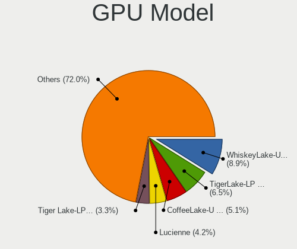
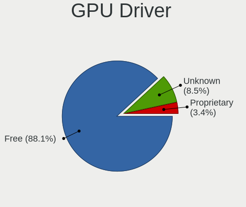
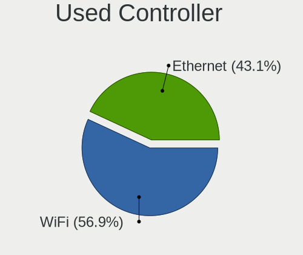
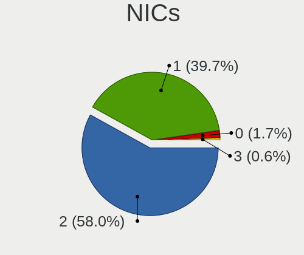
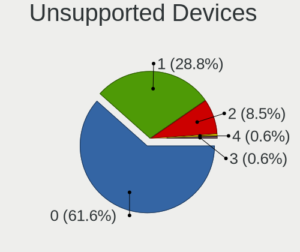

Red OS - Tested Hardware & Statistics (Notebooks)
-------------------------------------------------

A project to collect tested hardware configurations for Red OS.

Anyone can contribute to this report by the [hw-probe](https://github.com/linuxhw/hw-probe) tool:

    sudo -E hw-probe -all -upload

Please contribute! Especially if your hardware is rare.

Contents
--------

* [ Test Cases ](#test-cases)

* [ System ](#system)
  - [ OS                       ](#os)
  - [ OS Family                ](#os-family)
  - [ Kernel                   ](#kernel)
  - [ Kernel Family            ](#kernel-family)
  - [ Kernel Major Ver.        ](#kernel-major-ver)
  - [ Arch                     ](#arch)
  - [ DE                       ](#de)
  - [ Display Server           ](#display-server)
  - [ Display Manager          ](#display-manager)
  - [ OS Lang                  ](#os-lang)
  - [ Boot Mode                ](#boot-mode)
  - [ Filesystem               ](#filesystem)
  - [ Part. scheme             ](#part-scheme)
  - [ Dual Boot with Linux/BSD ](#dual-boot-with-linuxbsd)
  - [ Dual Boot (Win)          ](#dual-boot-win)

* [ Board ](#board)
  - [ Vendor                   ](#vendor)
  - [ Model                    ](#model)
  - [ Model Family             ](#model-family)
  - [ MFG Year                 ](#mfg-year)
  - [ Form Factor              ](#form-factor)
  - [ Secure Boot              ](#secure-boot)
  - [ Coreboot                 ](#coreboot)
  - [ RAM Size                 ](#ram-size)
  - [ RAM Used                 ](#ram-used)
  - [ Total Drives             ](#total-drives)
  - [ Has CD-ROM               ](#has-cd-rom)
  - [ Has Ethernet             ](#has-ethernet)
  - [ Has WiFi                 ](#has-wifi)
  - [ Has Bluetooth            ](#has-bluetooth)

* [ Location ](#location)
  - [ Country                  ](#country)
  - [ City                     ](#city)

* [ Drives ](#drives)
  - [ Drive Vendor             ](#drive-vendor)
  - [ Drive Model              ](#drive-model)
  - [ HDD Vendor               ](#hdd-vendor)
  - [ SSD Vendor               ](#ssd-vendor)
  - [ Drive Kind               ](#drive-kind)
  - [ Drive Connector          ](#drive-connector)
  - [ Drive Size               ](#drive-size)
  - [ Space Total              ](#space-total)
  - [ Space Used               ](#space-used)
  - [ Malfunc. Drives          ](#malfunc-drives)
  - [ Malfunc. Drive Vendor    ](#malfunc-drive-vendor)
  - [ Malfunc. HDD Vendor      ](#malfunc-hdd-vendor)
  - [ Malfunc. Drive Kind      ](#malfunc-drive-kind)
  - [ Failed Drives            ](#failed-drives)
  - [ Failed Drive Vendor      ](#failed-drive-vendor)
  - [ Drive Status             ](#drive-status)

* [ Storage controller ](#storage-controller)
  - [ Storage Vendor           ](#storage-vendor)
  - [ Storage Model            ](#storage-model)
  - [ Storage Kind             ](#storage-kind)

* [ Processor ](#processor)
  - [ CPU Vendor               ](#cpu-vendor)
  - [ CPU Model                ](#cpu-model)
  - [ CPU Model Family         ](#cpu-model-family)
  - [ CPU Cores                ](#cpu-cores)
  - [ CPU Sockets              ](#cpu-sockets)
  - [ CPU Threads              ](#cpu-threads)
  - [ CPU Op-Modes             ](#cpu-op-modes)
  - [ CPU Microcode            ](#cpu-microcode)
  - [ CPU Microarch            ](#cpu-microarch)

* [ Graphics ](#graphics)
  - [ GPU Vendor               ](#gpu-vendor)
  - [ GPU Model                ](#gpu-model)
  - [ GPU Combo                ](#gpu-combo)
  - [ GPU Driver               ](#gpu-driver)
  - [ GPU Memory               ](#gpu-memory)

* [ Monitor ](#monitor)
  - [ Monitor Vendor           ](#monitor-vendor)
  - [ Monitor Model            ](#monitor-model)
  - [ Monitor Resolution       ](#monitor-resolution)
  - [ Monitor Diagonal         ](#monitor-diagonal)
  - [ Monitor Width            ](#monitor-width)
  - [ Aspect Ratio             ](#aspect-ratio)
  - [ Monitor Area             ](#monitor-area)
  - [ Pixel Density            ](#pixel-density)
  - [ Multiple Monitors        ](#multiple-monitors)

* [ Network ](#network)
  - [ Net Controller Vendor    ](#net-controller-vendor)
  - [ Net Controller Model     ](#net-controller-model)
  - [ Wireless Vendor          ](#wireless-vendor)
  - [ Wireless Model           ](#wireless-model)
  - [ Ethernet Vendor          ](#ethernet-vendor)
  - [ Ethernet Model           ](#ethernet-model)
  - [ Net Controller Kind      ](#net-controller-kind)
  - [ Used Controller          ](#used-controller)
  - [ NICs                     ](#nics)
  - [ IPv6                     ](#ipv6)

* [ Bluetooth ](#bluetooth)
  - [ Bluetooth Vendor         ](#bluetooth-vendor)
  - [ Bluetooth Model          ](#bluetooth-model)

* [ Sound ](#sound)
  - [ Sound Vendor             ](#sound-vendor)
  - [ Sound Model              ](#sound-model)

* [ Memory ](#memory)
  - [ Memory Vendor            ](#memory-vendor)
  - [ Memory Model             ](#memory-model)
  - [ Memory Kind              ](#memory-kind)
  - [ Memory Form Factor       ](#memory-form-factor)
  - [ Memory Size              ](#memory-size)
  - [ Memory Speed             ](#memory-speed)

* [ Printers & scanners ](#printers--scanners)
  - [ Printer Vendor           ](#printer-vendor)
  - [ Printer Model            ](#printer-model)
  - [ Scanner Vendor           ](#scanner-vendor)
  - [ Scanner Model            ](#scanner-model)

* [ Camera ](#camera)
  - [ Camera Vendor            ](#camera-vendor)
  - [ Camera Model             ](#camera-model)

* [ Security ](#security)
  - [ Fingerprint Vendor       ](#fingerprint-vendor)
  - [ Fingerprint Model        ](#fingerprint-model)
  - [ Chipcard Vendor          ](#chipcard-vendor)
  - [ Chipcard Model           ](#chipcard-model)

* [ Unsupported ](#unsupported)
  - [ Unsupported Devices      ](#unsupported-devices)
  - [ Unsupported Device Types ](#unsupported-device-types)

Test Cases
----------

Total: 104

| Vendor        | Model                       | Probe                                                      | Date         |
|---------------|-----------------------------|------------------------------------------------------------|--------------|
| Lenovo        | IdeaPad L340-15API 81LW     | [a05251fd39](https://linux-hardware.org/?probe=a05251fd39) | Dec 29, 2022 |
| 3Logic Gro... | Graviton N15i-K2            | [fe79eba13b](https://linux-hardware.org/?probe=fe79eba13b) | Dec 29, 2022 |
| HP            | Notebook                    | [10dfda9549](https://linux-hardware.org/?probe=10dfda9549) | Dec 24, 2022 |
| Lenovo        | ThinkPad E15 Gen 4 21E60... | [4c1ad2ea2e](https://linux-hardware.org/?probe=4c1ad2ea2e) | Dec 18, 2022 |
| Kraftway      | ACCORD                      | [a199d930ff](https://linux-hardware.org/?probe=a199d930ff) | Dec 18, 2022 |
| Shanghai Z... | ZXE CRB                     | [20ce0a7f23](https://linux-hardware.org/?probe=20ce0a7f23) | Dec 16, 2022 |
| Lenovo        | IdeaPad L340-15API 81LW     | [6cedae9702](https://linux-hardware.org/?probe=6cedae9702) | Dec 10, 2022 |
| Lenovo        | IdeaPad L340-15API 81LW     | [311f47baef](https://linux-hardware.org/?probe=311f47baef) | Dec 09, 2022 |
| HP            | Laptop 15s-eq1xxx           | [79a0f9e73a](https://linux-hardware.org/?probe=79a0f9e73a) | Dec 08, 2022 |
| HP            | Laptop 15s-eq1xxx           | [c1cd524970](https://linux-hardware.org/?probe=c1cd524970) | Dec 08, 2022 |
| Aquarius      | NS685U R11                  | [c0dff8c525](https://linux-hardware.org/?probe=c0dff8c525) | Dec 08, 2022 |
| ICL           | RAYbook Si1512              | [b8c52ae5cb](https://linux-hardware.org/?probe=b8c52ae5cb) | Dec 06, 2022 |
| HP            | Laptop 15s-eq1xxx           | [0cd3371014](https://linux-hardware.org/?probe=0cd3371014) | Dec 05, 2022 |
| MSI           | Sword 15 A12UE              | [32df733b5e](https://linux-hardware.org/?probe=32df733b5e) | Dec 04, 2022 |
| Lenovo        | IdeaPad L340-15API 81LW     | [ddb1791ff6](https://linux-hardware.org/?probe=ddb1791ff6) | Nov 28, 2022 |
| Lenovo        | IdeaPad 700-15ISK 80RU      | [d9ae3d1795](https://linux-hardware.org/?probe=d9ae3d1795) | Nov 27, 2022 |
| Lenovo        | IdeaPad L340-15API 81LW     | [ff3d0a1ecf](https://linux-hardware.org/?probe=ff3d0a1ecf) | Nov 24, 2022 |
| Lenovo        | IdeaPad L340-15API 81LW     | [f86569d54b](https://linux-hardware.org/?probe=f86569d54b) | Nov 24, 2022 |
| HUAWEI        | NBD-WXX9                    | [a54f42b51e](https://linux-hardware.org/?probe=a54f42b51e) | Nov 18, 2022 |
| HUAWEI        | NBD-WXX9                    | [faa0deab8f](https://linux-hardware.org/?probe=faa0deab8f) | Nov 18, 2022 |
| Lenovo        | ThinkPad X220 4290RB3       | [37959973aa](https://linux-hardware.org/?probe=37959973aa) | Nov 11, 2022 |
| Lenovo        | IdeaPad L340-15API 81LW     | [3fd33e6782](https://linux-hardware.org/?probe=3fd33e6782) | Nov 09, 2022 |
| Lenovo        | IdeaPad L340-15API 81LW     | [dba14315ca](https://linux-hardware.org/?probe=dba14315ca) | Nov 03, 2022 |
| Lenovo        | IdeaPad L340-15API 81LW     | [d653658a53](https://linux-hardware.org/?probe=d653658a53) | Oct 28, 2022 |
| Lenovo        | IdeaPad L340-15API 81LW     | [b9ab6b9cf2](https://linux-hardware.org/?probe=b9ab6b9cf2) | Oct 28, 2022 |
| Acer          | Aspire A517-52              | [1ee47a3ab6](https://linux-hardware.org/?probe=1ee47a3ab6) | Oct 25, 2022 |
| Lenovo        | IdeaPad 5 Pro 14ACN6 82L... | [14537f243b](https://linux-hardware.org/?probe=14537f243b) | Oct 24, 2022 |
| THUNDEROBO... | 911AirD                     | [f471a1c9db](https://linux-hardware.org/?probe=f471a1c9db) | Oct 23, 2022 |
| Acer          | Aspire A517-52              | [7515d53b5d](https://linux-hardware.org/?probe=7515d53b5d) | Oct 21, 2022 |
| Lenovo        | IdeaPad L340-15API 81LW     | [3fc175d4a0](https://linux-hardware.org/?probe=3fc175d4a0) | Oct 20, 2022 |
| Lenovo        | ThinkBook 15 G3 ACL 21A4    | [fe184c8f5b](https://linux-hardware.org/?probe=fe184c8f5b) | Oct 19, 2022 |
| Lenovo        | ThinkBook 15 G3 ACL 21A4    | [0db79bc085](https://linux-hardware.org/?probe=0db79bc085) | Oct 19, 2022 |
| Lenovo        | IdeaPad L340-15API 81LW     | [1cdde90662](https://linux-hardware.org/?probe=1cdde90662) | Oct 13, 2022 |
| Acer          | Aspire 2920                 | [c588bacc95](https://linux-hardware.org/?probe=c588bacc95) | Oct 08, 2022 |
| Acer          | Aspire 2920                 | [34b41a4e67](https://linux-hardware.org/?probe=34b41a4e67) | Oct 08, 2022 |
| ASUSTek       | X540NV                      | [31e4464fea](https://linux-hardware.org/?probe=31e4464fea) | Oct 07, 2022 |
| Lenovo        | IdeaPad L340-15API 81LW     | [7f8e650618](https://linux-hardware.org/?probe=7f8e650618) | Oct 06, 2022 |
| Acer          | Aspire 2920                 | [538f7a6e26](https://linux-hardware.org/?probe=538f7a6e26) | Oct 05, 2022 |
| HP            | OMEN by Laptop              | [0a8238a876](https://linux-hardware.org/?probe=0a8238a876) | Oct 05, 2022 |
| THUNDEROBO... | 911AirD                     | [69a9650652](https://linux-hardware.org/?probe=69a9650652) | Oct 03, 2022 |
| Lenovo        | IdeaPad L340-15API 81LW     | [89b48cd98e](https://linux-hardware.org/?probe=89b48cd98e) | Oct 03, 2022 |
| Digma         | EVE 11 C408                 | [b5c7ac8ed3](https://linux-hardware.org/?probe=b5c7ac8ed3) | Sep 30, 2022 |
| THUNDEROBO... | 911AirD                     | [99f1b7e253](https://linux-hardware.org/?probe=99f1b7e253) | Sep 29, 2022 |
| ICL           | RAYbook Si1512              | [0b610b66a9](https://linux-hardware.org/?probe=0b610b66a9) | Sep 20, 2022 |
| Lenovo        | IdeaPad L340-15API 81LW     | [713797403a](https://linux-hardware.org/?probe=713797403a) | Sep 09, 2022 |
| IP3 Techno... | ACN30                       | [af9694cea8](https://linux-hardware.org/?probe=af9694cea8) | Sep 06, 2022 |
| IP3 Techno... | ACN30                       | [03f14a115d](https://linux-hardware.org/?probe=03f14a115d) | Sep 05, 2022 |
| MSI           | FX610                       | [a822818a58](https://linux-hardware.org/?probe=a822818a58) | Sep 03, 2022 |
| IP3 Techno... | ACN30                       | [e25ed534c0](https://linux-hardware.org/?probe=e25ed534c0) | Aug 18, 2022 |
| ICL           | RAYbook Si1512              | [a42c4dc65a](https://linux-hardware.org/?probe=a42c4dc65a) | Aug 09, 2022 |
| Digma         | EVE 15 P417 ES5063EW        | [a584c678b5](https://linux-hardware.org/?probe=a584c678b5) | Jul 27, 2022 |
| Digma         | EVE 15 C407 ES5054EW        | [4fd01756b2](https://linux-hardware.org/?probe=4fd01756b2) | Jul 27, 2022 |
| Digma         | EVE 15 C407 ES5054EW        | [008b02cc92](https://linux-hardware.org/?probe=008b02cc92) | Jul 26, 2022 |
| Lenovo        | IdeaPad 5 Pro 14ACN6 82L... | [413949a727](https://linux-hardware.org/?probe=413949a727) | Jul 25, 2022 |
| Lenovo        | V15-IWL 81YE                | [3bfcedd5c8](https://linux-hardware.org/?probe=3bfcedd5c8) | Jul 22, 2022 |
| Lenovo        | V15-IWL 81YE                | [c49282206c](https://linux-hardware.org/?probe=c49282206c) | Jul 22, 2022 |
| Lenovo        | V15-IWL 81YE                | [d598c4587d](https://linux-hardware.org/?probe=d598c4587d) | Jul 22, 2022 |
| Lenovo        | V15-IWL 81YE                | [5b1e962751](https://linux-hardware.org/?probe=5b1e962751) | Jul 22, 2022 |
| Lenovo        | V15-IWL 81YE                | [4e120b3b63](https://linux-hardware.org/?probe=4e120b3b63) | Jul 22, 2022 |
| Lenovo        | V15-IWL 81YE                | [2d5bedf224](https://linux-hardware.org/?probe=2d5bedf224) | Jul 22, 2022 |
| Lenovo        | V15-IWL 81YE                | [297ce5144e](https://linux-hardware.org/?probe=297ce5144e) | Jul 22, 2022 |
| Lenovo        | V15-IWL 81YE                | [84b7cd1115](https://linux-hardware.org/?probe=84b7cd1115) | Jul 22, 2022 |
| Lenovo        | V15-IWL 81YE                | [a92b6c5d73](https://linux-hardware.org/?probe=a92b6c5d73) | Jul 22, 2022 |
| Lenovo        | V15-IWL 81YE                | [51ebd271c8](https://linux-hardware.org/?probe=51ebd271c8) | Jul 22, 2022 |
| Lenovo        | V15-IWL 81YE                | [44ad7f7d47](https://linux-hardware.org/?probe=44ad7f7d47) | Jul 22, 2022 |
| Lenovo        | V15-IWL 81YE                | [49068a26b5](https://linux-hardware.org/?probe=49068a26b5) | Jul 22, 2022 |
| Lenovo        | V15-IWL 81YE                | [62ce596bf3](https://linux-hardware.org/?probe=62ce596bf3) | Jul 22, 2022 |
| Lenovo        | V15-IWL 81YE                | [812db8ad6f](https://linux-hardware.org/?probe=812db8ad6f) | Jul 22, 2022 |
| Lenovo        | V15-IWL 81YE                | [d4c2b5ffad](https://linux-hardware.org/?probe=d4c2b5ffad) | Jul 22, 2022 |
| Lenovo        | V15-IWL 81YE                | [4c0179b60e](https://linux-hardware.org/?probe=4c0179b60e) | Jul 22, 2022 |
| Lenovo        | IdeaPad L340-15API 81LW     | [8601888983](https://linux-hardware.org/?probe=8601888983) | Jul 22, 2022 |
| Lenovo        | V15-IWL 81YE                | [1d505390d6](https://linux-hardware.org/?probe=1d505390d6) | Jul 22, 2022 |
| HONOR         | NBR-WAX9                    | [5b3340311a](https://linux-hardware.org/?probe=5b3340311a) | Jul 20, 2022 |
| Lenovo        | IdeaPad L340-15API 81LW     | [154c254eac](https://linux-hardware.org/?probe=154c254eac) | Jul 19, 2022 |
| Gigabyte      | G5 GD                       | [60921a7ff6](https://linux-hardware.org/?probe=60921a7ff6) | Jul 19, 2022 |
| Gigabyte      | G5 GD                       | [c24f8b4ba6](https://linux-hardware.org/?probe=c24f8b4ba6) | Jul 19, 2022 |
| HONOR         | NBR-WAX9                    | [fe971bb8c3](https://linux-hardware.org/?probe=fe971bb8c3) | Jul 08, 2022 |
| Lenovo        | IdeaPad 3 15ITL05 81X8      | [2835672840](https://linux-hardware.org/?probe=2835672840) | Jul 07, 2022 |
| Kraftway      | ACCORD                      | [24e49bc011](https://linux-hardware.org/?probe=24e49bc011) | Jun 27, 2022 |
| Kraftway      | ACCORD                      | [39e3c55e89](https://linux-hardware.org/?probe=39e3c55e89) | Jun 27, 2022 |
| Aquarius      | NS685U                      | [ecedc7cbb6](https://linux-hardware.org/?probe=ecedc7cbb6) | Jun 08, 2022 |
| ICL           | Unknown                     | [4dc89fc689](https://linux-hardware.org/?probe=4dc89fc689) | Jun 07, 2022 |
| mtech         | MTL1578                     | [bf25c26ea0](https://linux-hardware.org/?probe=bf25c26ea0) | May 11, 2022 |
| HUAWEI        | BOD-WXX9                    | [e2e025dd4f](https://linux-hardware.org/?probe=e2e025dd4f) | Apr 15, 2022 |
| Acer          | TravelMate P215-53          | [124fdb3b64](https://linux-hardware.org/?probe=124fdb3b64) | Apr 14, 2022 |
| Lenovo        | ThinkBook 14-IIL 20SL       | [be41efbec8](https://linux-hardware.org/?probe=be41efbec8) | Apr 05, 2022 |
| Aquarius      | NS585 R32                   | [582389ca98](https://linux-hardware.org/?probe=582389ca98) | Mar 24, 2022 |
| Lenovo        | IdeaPad L340-15IWL 81LG     | [56f9ebba91](https://linux-hardware.org/?probe=56f9ebba91) | Mar 22, 2022 |
| Lenovo        | ThinkBook 15 G3 ACL 21A4    | [e18b80073c](https://linux-hardware.org/?probe=e18b80073c) | Mar 21, 2022 |
| 3Logic Gro... | APM Graviton A15i-K2        | [e93bcf2f42](https://linux-hardware.org/?probe=e93bcf2f42) | Mar 09, 2022 |
| ASUSTek       | TUF Gaming FX705DT_FX705... | [227a2658d0](https://linux-hardware.org/?probe=227a2658d0) | Feb 15, 2022 |
| HP            | Laptop 15s-eq1xxx           | [7ed7e139d8](https://linux-hardware.org/?probe=7ed7e139d8) | Dec 20, 2021 |
| HP            | Laptop 15s-eq1xxx           | [55ab1c9ab8](https://linux-hardware.org/?probe=55ab1c9ab8) | Dec 20, 2021 |
| HUAWEI        | NBLK-WAX9X                  | [5bb21d6bf6](https://linux-hardware.org/?probe=5bb21d6bf6) | Dec 13, 2021 |
| ICL           | RAYbook Si1514              | [9ddc61deba](https://linux-hardware.org/?probe=9ddc61deba) | Sep 13, 2021 |
| ASUSTek       | TUF Gaming FX705DT_FX705... | [4f59992d0f](https://linux-hardware.org/?probe=4f59992d0f) | Sep 11, 2021 |
| HP            | Laptop 15-dw3xxx            | [d8b35044ab](https://linux-hardware.org/?probe=d8b35044ab) | Jul 29, 2021 |
| Lenovo        | IdeaPad 5 15ARE05 81YQ      | [9b2c758081](https://linux-hardware.org/?probe=9b2c758081) | Jun 10, 2021 |
| ASUSTek       | X75VD                       | [95ea9551da](https://linux-hardware.org/?probe=95ea9551da) | Apr 05, 2021 |
| ASUSTek       | TUF Gaming FX705DT_FX705... | [916d4b225b](https://linux-hardware.org/?probe=916d4b225b) | Mar 30, 2021 |
| ASUSTek       | TUF Gaming FX705DT_FX705... | [ebfafc7409](https://linux-hardware.org/?probe=ebfafc7409) | Mar 26, 2021 |
| HUAWEI        | BOHL-WXX9                   | [cf5559d576](https://linux-hardware.org/?probe=cf5559d576) | Mar 26, 2021 |
| HP            | Pavilion g6                 | [1ca79b1950](https://linux-hardware.org/?probe=1ca79b1950) | Mar 26, 2021 |
| Pegatron      | A35                         | [9923a21e8c](https://linux-hardware.org/?probe=9923a21e8c) | Mar 04, 2021 |

System
------

OS
--

Installed operating systems

| Name         | Notebooks | Percent |
|--------------|-----------|---------|
| Red OS 7.3.1 | 44        | 60.27%  |
| Red OS 7.3   | 17        | 23.29%  |
| Red OS 7.3.2 | 12        | 16.44%  |

OS Family
---------

OS without a version

| Name   | Notebooks | Percent |
|--------|-----------|---------|
| Red OS | 70        | 100%    |

Kernel
------

Version of the Linux kernel

| Version                | Notebooks | Percent |
|------------------------|-----------|---------|
| 5.15.10-1.el7.x86_64   | 25        | 32.89%  |
| 5.15.35-4.el7.3.x86_64 | 10        | 13.16%  |
| 5.15.72-1.el7.3.x86_64 | 9         | 11.84%  |
| 5.10.29-1.el7.x86_64   | 9         | 11.84%  |
| 5.15.35-1.el7.3.x86_64 | 6         | 7.89%   |
| 5.15.35-5.el7.3.x86_64 | 4         | 5.26%   |
| 5.10.1-1.el7.x86_64    | 3         | 3.95%   |
| 5.15.10-4.el7.x86_64   | 2         | 2.63%   |
| 5.10.24-2.el7.x86_64   | 2         | 2.63%   |
| 5.18.1-1.el7.x86_64    | 1         | 1.32%   |
| 5.15.10-3.el7.x86_64   | 1         | 1.32%   |
| 5.15.10-2.el7.x86_64   | 1         | 1.32%   |
| 5.13.15-1.el7.x86_64   | 1         | 1.32%   |
| 5.10.29-3.el7.x86_64   | 1         | 1.32%   |
| 5.10.24-1.el7.x86_64   | 1         | 1.32%   |

Kernel Family
-------------

Linux kernel without a distro release

| Version | Notebooks | Percent |
|---------|-----------|---------|
| 5.15.10 | 29        | 38.67%  |
| 5.15.35 | 19        | 25.33%  |
| 5.10.29 | 10        | 13.33%  |
| 5.15.72 | 9         | 12%     |
| 5.10.24 | 3         | 4%      |
| 5.10.1  | 3         | 4%      |
| 5.18.1  | 1         | 1.33%   |
| 5.13.15 | 1         | 1.33%   |

Kernel Major Ver.
-----------------

Linux kernel major version

| Version | Notebooks | Percent |
|---------|-----------|---------|
| 5.15    | 54        | 76.06%  |
| 5.10    | 15        | 21.13%  |
| 5.18    | 1         | 1.41%   |
| 5.13    | 1         | 1.41%   |

Arch
----

OS architecture (x86_64, i586, etc.)

| Name   | Notebooks | Percent |
|--------|-----------|---------|
| x86_64 | 70        | 100%    |

DE
--

Desktop Environment

| Name       | Notebooks | Percent |
|------------|-----------|---------|
| MATE       | 59        | 83.1%   |
| Cinnamon   | 11        | 15.49%  |
| X-Cinnamon | 1         | 1.41%   |

Display Server
--------------

X11 or Wayland

| Name    | Notebooks | Percent |
|---------|-----------|---------|
| X11     | 66        | 92.96%  |
| Wayland | 5         | 7.04%   |

Display Manager
---------------

SDDM, LightDM, etc.

| Name    | Notebooks | Percent |
|---------|-----------|---------|
| GDM     | 67        | 94.37%  |
| SDDM    | 3         | 4.23%   |
| Unknown | 1         | 1.41%   |

OS Lang
-------

Language

| Lang    | Notebooks | Percent |
|---------|-----------|---------|
| Unknown | 68        | 97.14%  |
| ru_RU   | 1         | 1.43%   |
| en_US   | 1         | 1.43%   |

Boot Mode
---------

EFI or BIOS

| Mode | Notebooks | Percent |
|------|-----------|---------|
| EFI  | 62        | 87.32%  |
| BIOS | 9         | 12.68%  |

Filesystem
----------

Type of filesystem

| Type  | Notebooks | Percent |
|-------|-----------|---------|
| Ext4  | 70        | 98.59%  |
| Btrfs | 1         | 1.41%   |

Part. scheme
------------

Scheme of partitioning

| Type    | Notebooks | Percent |
|---------|-----------|---------|
| GPT     | 62        | 88.57%  |
| MBR     | 7         | 10%     |
| Unknown | 1         | 1.43%   |

Dual Boot with Linux/BSD
------------------------

Hosting more than one Linux/BSD

| Dual boot | Notebooks | Percent |
|-----------|-----------|---------|
| No        | 61        | 87.14%  |
| Yes       | 9         | 12.86%  |

Dual Boot (Win)
---------------

Hosting Linux and Windows

| Dual boot | Notebooks | Percent |
|-----------|-----------|---------|
| No        | 50        | 70.42%  |
| Yes       | 21        | 29.58%  |

Board
-----

Vendor
------

Motherboard manufacturer

| Name                           | Notebooks | Percent |
|--------------------------------|-----------|---------|
| Lenovo                         | 28        | 40%     |
| Hewlett-Packard                | 7         | 10%     |
| ICL                            | 5         | 7.14%   |
| HUAWEI                         | 4         | 5.71%   |
| Digma                          | 3         | 4.29%   |
| ASUSTek Computer               | 3         | 4.29%   |
| Aquarius                       | 3         | 4.29%   |
| Acer                           | 3         | 4.29%   |
| MSI                            | 2         | 2.86%   |
| Kraftway                       | 2         | 2.86%   |
| IP3 Technology                 | 2         | 2.86%   |
| 3Logic Group                   | 2         | 2.86%   |
| THUNDEROBOT                    | 1         | 1.43%   |
| Shanghai Zhaoxin Semiconductor | 1         | 1.43%   |
| Pegatron                       | 1         | 1.43%   |
| mtech                          | 1         | 1.43%   |
| HONOR                          | 1         | 1.43%   |
| Gigabyte Technology            | 1         | 1.43%   |

Model
-----

Motherboard model

| Name                                 | Notebooks | Percent |
|--------------------------------------|-----------|---------|
| Lenovo V15-IWL 81YE                  | 17        | 24.29%  |
| ICL RAYbook Si1512                   | 3         | 4.29%   |
| HP Laptop 15s-eq1xxx                 | 3         | 4.29%   |
| Lenovo ThinkBook 15 G3 ACL 21A4      | 2         | 2.86%   |
| Kraftway ACCORD                      | 2         | 2.86%   |
| IP3 ACN30                            | 2         | 2.86%   |
| THUNDEROBOT 911AirD                  | 1         | 1.43%   |
| Shanghai Zhaoxin ZXE CRB             | 1         | 1.43%   |
| Pegatron A35                         | 1         | 1.43%   |
| mtech MTL1578                        | 1         | 1.43%   |
| MSI Sword 15 A12UE                   | 1         | 1.43%   |
| MSI FX610                            | 1         | 1.43%   |
| Lenovo ThinkPad X220 4290RB3         | 1         | 1.43%   |
| Lenovo ThinkPad E15 Gen 4 21E6009UGP | 1         | 1.43%   |
| Lenovo ThinkBook 14-IIL 20SL         | 1         | 1.43%   |
| Lenovo IdeaPad L340-15IWL 81LG       | 1         | 1.43%   |
| Lenovo IdeaPad L340-15API 81LW       | 1         | 1.43%   |
| Lenovo IdeaPad 700-15ISK 80RU        | 1         | 1.43%   |
| Lenovo IdeaPad 5 Pro 14ACN6 82L7     | 1         | 1.43%   |
| Lenovo IdeaPad 5 15ARE05 81YQ        | 1         | 1.43%   |
| Lenovo IdeaPad 3 15ITL05 81X8        | 1         | 1.43%   |
| ICL RAYbook Si1514                   | 1         | 1.43%   |
| HUAWEI NBLK-WAX9X                    | 1         | 1.43%   |
| HUAWEI NBD-WXX9                      | 1         | 1.43%   |
| HUAWEI BOHL-WXX9                     | 1         | 1.43%   |
| HUAWEI BOD-WXX9                      | 1         | 1.43%   |
| HONOR NBR-WAX9                       | 1         | 1.43%   |
| HP Pavilion g6                       | 1         | 1.43%   |
| HP OMEN by Laptop                    | 1         | 1.43%   |
| HP Notebook                          | 1         | 1.43%   |
| HP Laptop 15-dw3xxx                  | 1         | 1.43%   |
| Gigabyte G5 GD                       | 1         | 1.43%   |
| Digma EVE 15 P417 ES5063EW           | 1         | 1.43%   |
| Digma EVE 15 C407 ES5054EW           | 1         | 1.43%   |
| Digma EVE 11 C408                    | 1         | 1.43%   |
| ASUS X75VD                           | 1         | 1.43%   |
| ASUS X540NV                          | 1         | 1.43%   |
| ASUS TUF Gaming FX705DT_FX705DT      | 1         | 1.43%   |
| Aquarius NS685U R11                  | 1         | 1.43%   |
| Aquarius NS685U                      | 1         | 1.43%   |

Model Family
------------

Motherboard model prefix

| Name                  | Notebooks | Percent |
|-----------------------|-----------|---------|
| Lenovo V15-IWL        | 17        | 24.29%  |
| Lenovo IdeaPad        | 6         | 8.57%   |
| ICL RAYbook           | 4         | 5.71%   |
| HP Laptop             | 4         | 5.71%   |
| Lenovo ThinkBook      | 3         | 4.29%   |
| Digma EVE             | 3         | 4.29%   |
| Lenovo ThinkPad       | 2         | 2.86%   |
| Kraftway ACCORD       | 2         | 2.86%   |
| IP3 ACN30             | 2         | 2.86%   |
| Aquarius NS685U       | 2         | 2.86%   |
| Acer Aspire           | 2         | 2.86%   |
| THUNDEROBOT 911AirD   | 1         | 1.43%   |
| Shanghai Zhaoxin ZXE  | 1         | 1.43%   |
| Pegatron A35          | 1         | 1.43%   |
| mtech MTL1578         | 1         | 1.43%   |
| MSI Sword             | 1         | 1.43%   |
| MSI FX610             | 1         | 1.43%   |
| HUAWEI NBLK-WAX9X     | 1         | 1.43%   |
| HUAWEI NBD-WXX9       | 1         | 1.43%   |
| HUAWEI BOHL-WXX9      | 1         | 1.43%   |
| HUAWEI BOD-WXX9       | 1         | 1.43%   |
| HONOR NBR-WAX9        | 1         | 1.43%   |
| HP Pavilion           | 1         | 1.43%   |
| HP OMEN               | 1         | 1.43%   |
| HP Notebook           | 1         | 1.43%   |
| Gigabyte G5           | 1         | 1.43%   |
| ASUS X75VD            | 1         | 1.43%   |
| ASUS X540NV           | 1         | 1.43%   |
| ASUS TUF              | 1         | 1.43%   |
| Aquarius NS585        | 1         | 1.43%   |
| Acer TravelMate       | 1         | 1.43%   |
| 3Logic Group Graviton | 1         | 1.43%   |
| 3Logic Group APM      | 1         | 1.43%   |
| Unknown               | 1         | 1.43%   |

MFG Year
--------

Motherboard manufacture year

| Year | Notebooks | Percent |
|------|-----------|---------|
| 2019 | 26        | 37.14%  |
| 2021 | 19        | 27.14%  |
| 2020 | 10        | 14.29%  |
| 2022 | 6         | 8.57%   |
| 2017 | 2         | 2.86%   |
| 2012 | 2         | 2.86%   |
| 2011 | 2         | 2.86%   |
| 2015 | 1         | 1.43%   |
| 2010 | 1         | 1.43%   |
| 2007 | 1         | 1.43%   |

Form Factor
-----------

Physical design of the computer

| Name     | Notebooks | Percent |
|----------|-----------|---------|
| Notebook | 70        | 100%    |

Secure Boot
-----------

Enabled or disabled

| State    | Notebooks | Percent |
|----------|-----------|---------|
| Disabled | 70        | 100%    |

Coreboot
--------

Have coreboot on board

| Used | Notebooks | Percent |
|------|-----------|---------|
| No   | 70        | 100%    |

RAM Size
--------

Total RAM memory

| Size in GB | Notebooks | Percent |
|------------|-----------|---------|
| 4.01-8.0   | 49        | 70%     |
| 3.01-4.0   | 8         | 11.43%  |
| 16.01-24.0 | 7         | 10%     |
| 8.01-16.0  | 5         | 7.14%   |
| 2.01-3.0   | 1         | 1.43%   |

RAM Used
--------

Used RAM memory

| Used GB  | Notebooks | Percent |
|----------|-----------|---------|
| 1.01-2.0 | 42        | 58.33%  |
| 2.01-3.0 | 16        | 22.22%  |
| 0.51-1.0 | 7         | 9.72%   |
| 3.01-4.0 | 6         | 8.33%   |
| 4.01-8.0 | 1         | 1.39%   |

Total Drives
------------

Number of drives on board

| Drives | Notebooks | Percent |
|--------|-----------|---------|
| 1      | 61        | 84.72%  |
| 2      | 7         | 9.72%   |
| 3      | 4         | 5.56%   |

Has CD-ROM
----------

Has CD-ROM on board

| Presented | Notebooks | Percent |
|-----------|-----------|---------|
| No        | 61        | 87.14%  |
| Yes       | 9         | 12.86%  |

Has Ethernet
------------

Has Ethernet on board

| Presented | Notebooks | Percent |
|-----------|-----------|---------|
| Yes       | 41        | 58.57%  |
| No        | 29        | 41.43%  |

Has WiFi
--------

Has WiFi module

| Presented | Notebooks | Percent |
|-----------|-----------|---------|
| Yes       | 69        | 98.57%  |
| No        | 1         | 1.43%   |

Has Bluetooth
-------------

Has Bluetooth module

| Presented | Notebooks | Percent |
|-----------|-----------|---------|
| Yes       | 61        | 87.14%  |
| No        | 9         | 12.86%  |

Location
--------

Country
-------

Geographic location (country)

| Country | Notebooks | Percent |
|---------|-----------|---------|
| Russia  | 69        | 98.57%  |
| Ukraine | 1         | 1.43%   |

City
----

Geographic location (city)

| City             | Notebooks | Percent |
|------------------|-----------|---------|
| Salekhard        | 20        | 27.78%  |
| Murom            | 13        | 18.06%  |
| Moscow           | 11        | 15.28%  |
| Ryazan           | 3         | 4.17%   |
| Yekaterinburg    | 2         | 2.78%   |
| Vladimir         | 2         | 2.78%   |
| Novy Urengoy     | 2         | 2.78%   |
| Kursk            | 2         | 2.78%   |
| Krasnodar        | 2         | 2.78%   |
| Yaroslavl        | 1         | 1.39%   |
| Yakutsk          | 1         | 1.39%   |
| Ulyanovsk        | 1         | 1.39%   |
| Sevastopol       | 1         | 1.39%   |
| Saratov          | 1         | 1.39%   |
| Perm             | 1         | 1.39%   |
| Omsk             | 1         | 1.39%   |
| Novosibirsk      | 1         | 1.39%   |
| Nizhniy Novgorod | 1         | 1.39%   |
| Muromskiy        | 1         | 1.39%   |
| Krasnoyarsk      | 1         | 1.39%   |
| Khabarovsk       | 1         | 1.39%   |
| Kaluga           | 1         | 1.39%   |
| Belgorod         | 1         | 1.39%   |
| Balashikha       | 1         | 1.39%   |

Drives
------

Drive Vendor
------------

Hard drive vendors

| Vendor              | Notebooks | Drives | Percent |
|---------------------|-----------|--------|---------|
| Samsung Electronics | 21        | 26     | 25.93%  |
| WDC                 | 11        | 13     | 13.58%  |
| SK hynix            | 5         | 5      | 6.17%   |
| Foxline             | 5         | 5      | 6.17%   |
| A-DATA Technology   | 5         | 5      | 6.17%   |
| Toshiba             | 4         | 8      | 4.94%   |
| Seagate             | 4         | 4      | 4.94%   |
| Unknown             | 2         | 2      | 2.47%   |
| UMIS                | 2         | 2      | 2.47%   |
| Silicon Motion      | 2         | 2      | 2.47%   |
| Phison              | 2         | 2      | 2.47%   |
| Micron Technology   | 2         | 4      | 2.47%   |
| HGST                | 2         | 2      | 2.47%   |
| Transcend           | 1         | 1      | 1.23%   |
| SPCC Sol            | 1         | 1      | 1.23%   |
| SanDisk             | 1         | 1      | 1.23%   |
| Kingston            | 1         | 1      | 1.23%   |
| KingSpec            | 1         | 1      | 1.23%   |
| Kimtigo             | 1         | 2      | 1.23%   |
| JMicron Technology  | 1         | 1      | 1.23%   |
| ITHOO               | 1         | 1      | 1.23%   |
| Intel               | 1         | 1      | 1.23%   |
| Gigabyte Technology | 1         | 1      | 1.23%   |
| Crucial             | 1         | 1      | 1.23%   |
| China               | 1         | 1      | 1.23%   |
| Apacer              | 1         | 1      | 1.23%   |
| Unknown             | 1         | 1      | 1.23%   |

Drive Model
-----------

Hard drive models

| Model                                     | Notebooks | Percent |
|-------------------------------------------|-----------|---------|
| Samsung MZALQ256HAJD-000L2 256GB          | 17        | 20.99%  |
| Foxline FLSSD256M80E13TCX5 256GB          | 5         | 6.17%   |
| WDC PC SN530 SDBPNPZ-512G-1114 512GB      | 2         | 2.47%   |
| SK hynix SKHynix_HFM256GD3HX015N 256GB    | 2         | 2.47%   |
| SK hynix PC711 HFS512GDE9X073N 512GB      | 2         | 2.47%   |
| Silicon Motion Wodposit NVMe SSD 256GB    | 2         | 2.47%   |
| A-DATA SU650 240GB SSD                    | 2         | 2.47%   |
| WDC WDS500G2B0B-00YS70 500GB SSD          | 1         | 1.23%   |
| WDC WDS250G2B0A-00SM50 250GB SSD          | 1         | 1.23%   |
| WDC WD5000BPVT-55HXZT3 500GB              | 1         | 1.23%   |
| WDC WD10SPZX-24Z10 1TB                    | 1         | 1.23%   |
| WDC WD10SPZX-00Z10T0 1TB                  | 1         | 1.23%   |
| WDC PC SN530 SDBPNPZ-512G-1027 512GB      | 1         | 1.23%   |
| WDC PC SN530 SDBPNPZ-256G-1006 256GB      | 1         | 1.23%   |
| WDC PC SN530 SDBPMPZ-512G-1101 512GB      | 1         | 1.23%   |
| WDC PC SN520 SDAPMUW-512G-1101 512GB      | 1         | 1.23%   |
| Unknown SLD128  128GB                     | 1         | 1.23%   |
| Unknown 58K722  128GB                     | 1         | 1.23%   |
| UMIS RPJTJ512MEE1OWX 512GB                | 1         | 1.23%   |
| UMIS RPJTJ256MGE1QDQ 256GB                | 1         | 1.23%   |
| Transcend TS240GMTS820S 240GB SSD         | 1         | 1.23%   |
| Toshiba MQ01ABF050 500GB                  | 1         | 1.23%   |
| Toshiba MK5059GSXP 500GB                  | 1         | 1.23%   |
| Toshiba KXG60ZNV512G 512GB                | 1         | 1.23%   |
| Toshiba KXG60ZNV256G 256GB                | 1         | 1.23%   |
| SPCC Sol id State Disk 64GB SSD           | 1         | 1.23%   |
| SK hynix SKHynix_HFM256GDHTNI-87A0B 256GB | 1         | 1.23%   |
| Seagate ST750LM022 HN-M750MBB 752GB       | 1         | 1.23%   |
| Seagate ST500LT012-1DG142 500GB           | 1         | 1.23%   |
| Seagate ST1000LM035-1RK172 1TB            | 1         | 1.23%   |
| Seagate ST1000LM024 HN-M101MBB 1TB        | 1         | 1.23%   |
| SanDisk SD8SBAT256G1122 256GB SSD         | 1         | 1.23%   |
| Samsung SSD 860 EVO M.2 250GB             | 1         | 1.23%   |
| Samsung MZVLQ256HAJD-000H1 256GB          | 1         | 1.23%   |
| Samsung MZALQ512HBLU-00BL2 512GB          | 1         | 1.23%   |
| Samsung MZALQ512HALU-000L2 512GB          | 1         | 1.23%   |
| Phison ESR512GTLG-E6GBTNB4 512GB          | 1         | 1.23%   |
| Phison 311CD0512GB                        | 1         | 1.23%   |
| Micron 2450_MTFDKBA512TFK 512GB           | 1         | 1.23%   |
| Micron 2200V_MTFDHBA512TCK 512GB          | 1         | 1.23%   |

HDD Vendor
----------

Hard disk drive vendors

| Vendor  | Notebooks | Drives | Percent |
|---------|-----------|--------|---------|
| Seagate | 4         | 4      | 36.36%  |
| WDC     | 3         | 5      | 27.27%  |
| Toshiba | 2         | 6      | 18.18%  |
| HGST    | 2         | 2      | 18.18%  |

SSD Vendor
----------

Solid state drive vendors

| Vendor              | Notebooks | Drives | Percent |
|---------------------|-----------|--------|---------|
| A-DATA Technology   | 4         | 4      | 26.67%  |
| WDC                 | 2         | 2      | 13.33%  |
| Transcend           | 1         | 1      | 6.67%   |
| SPCC Sol            | 1         | 1      | 6.67%   |
| SanDisk             | 1         | 1      | 6.67%   |
| Samsung Electronics | 1         | 1      | 6.67%   |
| KingSpec            | 1         | 1      | 6.67%   |
| JMicron Technology  | 1         | 1      | 6.67%   |
| Crucial             | 1         | 1      | 6.67%   |
| China               | 1         | 1      | 6.67%   |
| Apacer              | 1         | 1      | 6.67%   |

Drive Kind
----------

HDD or SSD

| Kind    | Notebooks | Drives | Percent |
|---------|-----------|--------|---------|
| NVMe    | 50        | 59     | 62.5%   |
| SSD     | 15        | 15     | 18.75%  |
| HDD     | 11        | 17     | 13.75%  |
| MMC     | 3         | 3      | 3.75%   |
| Unknown | 1         | 1      | 1.25%   |

Drive Connector
---------------

SATA, SAS, NVMe, etc.

| Type | Notebooks | Drives | Percent |
|------|-----------|--------|---------|
| NVMe | 50        | 59     | 63.29%  |
| SATA | 23        | 30     | 29.11%  |
| SAS  | 3         | 3      | 3.8%    |
| MMC  | 3         | 3      | 3.8%    |

Drive Size
----------

Size of hard drive

| Size in TB | Notebooks | Drives | Percent |
|------------|-----------|--------|---------|
| 0.01-0.5   | 19        | 24     | 76%     |
| 0.51-1.0   | 6         | 8      | 24%     |

Space Total
-----------

Amount of disk space available on the file system

| Size in GB | Notebooks | Percent |
|------------|-----------|---------|
| 101-250    | 40        | 56.34%  |
| 251-500    | 13        | 18.31%  |
| 51-100     | 8         | 11.27%  |
| 501-1000   | 4         | 5.63%   |
| 1001-2000  | 3         | 4.23%   |
| 1-20       | 2         | 2.82%   |
| 21-50      | 1         | 1.41%   |

Space Used
----------

Amount of used disk space

| Used GB  | Notebooks | Percent |
|----------|-----------|---------|
| 1-20     | 55        | 76.39%  |
| 21-50    | 7         | 9.72%   |
| 101-250  | 4         | 5.56%   |
| 251-500  | 2         | 2.78%   |
| 501-1000 | 2         | 2.78%   |
| 51-100   | 2         | 2.78%   |

Malfunc. Drives
---------------

Drive models with a malfunction

| Model                               | Notebooks | Drives | Percent |
|-------------------------------------|-----------|--------|---------|
| WDC WD10SPZX-24Z10 1TB              | 1         | 1      | 14.29%  |
| Toshiba MQ01ABF050 500GB            | 1         | 5      | 14.29%  |
| Toshiba MK5059GSXP 500GB            | 1         | 1      | 14.29%  |
| Seagate ST750LM022 HN-M750MBB 752GB | 1         | 1      | 14.29%  |
| Seagate ST500LT012-1DG142 500GB     | 1         | 1      | 14.29%  |
| HGST HTS721010A9E630 1TB            | 1         | 1      | 14.29%  |
| A-DATA Technology SU800 256GB SSD   | 1         | 1      | 14.29%  |

Malfunc. Drive Vendor
---------------------

Vendors of faulty drives

| Vendor            | Notebooks | Drives | Percent |
|-------------------|-----------|--------|---------|
| Toshiba           | 2         | 6      | 28.57%  |
| Seagate           | 2         | 2      | 28.57%  |
| WDC               | 1         | 1      | 14.29%  |
| HGST              | 1         | 1      | 14.29%  |
| A-DATA Technology | 1         | 1      | 14.29%  |

Malfunc. HDD Vendor
-------------------

Vendors of faulty HDD drives

| Vendor  | Notebooks | Drives | Percent |
|---------|-----------|--------|---------|
| Toshiba | 2         | 6      | 33.33%  |
| Seagate | 2         | 2      | 33.33%  |
| WDC     | 1         | 1      | 16.67%  |
| HGST    | 1         | 1      | 16.67%  |

Malfunc. Drive Kind
-------------------

Kinds of faulty drives

| Kind | Notebooks | Drives | Percent |
|------|-----------|--------|---------|
| HDD  | 6         | 10     | 85.71%  |
| SSD  | 1         | 1      | 14.29%  |

Failed Drives
-------------

Failed drive models

Zero info for selected period =(

Failed Drive Vendor
-------------------

Failed drive vendors

Zero info for selected period =(

Drive Status
------------

Number of failed and malfunc. drives

| Status   | Notebooks | Drives | Percent |
|----------|-----------|--------|---------|
| Works    | 63        | 77     | 82.89%  |
| Malfunc  | 7         | 11     | 9.21%   |
| Detected | 6         | 7      | 7.89%   |

Storage controller
------------------

Storage Vendor
--------------

Storage controller vendors

| Vendor                       | Notebooks | Percent |
|------------------------------|-----------|---------|
| Intel                        | 53        | 48.18%  |
| Samsung Electronics          | 20        | 18.18%  |
| Phison Electronics           | 8         | 7.27%   |
| SanDisk                      | 6         | 5.45%   |
| AMD                          | 6         | 5.45%   |
| SK hynix                     | 5         | 4.55%   |
| Union Memory (Shenzhen)      | 2         | 1.82%   |
| Toshiba America Info Systems | 2         | 1.82%   |
| Silicon Motion               | 2         | 1.82%   |
| Micron Technology            | 2         | 1.82%   |
| Zhaoxin                      | 1         | 0.91%   |
| Realtek Semiconductor        | 1         | 0.91%   |
| Kingston Technology Company  | 1         | 0.91%   |
| Unknown                      | 1         | 0.91%   |

Storage Model
-------------

Storage controller models

| Model                                                                            | Notebooks | Percent |
|----------------------------------------------------------------------------------|-----------|---------|
| Intel Cannon Point-LP SATA Controller [AHCI Mode]                                | 28        | 24.35%  |
| Samsung NVMe SSD Controller 980                                                  | 20        | 17.39%  |
| Phison PS5013 E13 NVMe Controller                                                | 7         | 6.09%   |
| Intel Tiger Lake-LP SATA Controller                                              | 5         | 4.35%   |
| AMD FCH SATA Controller [AHCI mode]                                              | 5         | 4.35%   |
| SK hynix Gold P31/PC711 NVMe Solid State Drive                                   | 4         | 3.48%   |
| SanDisk WD Blue SN550 NVMe SSD                                                   | 4         | 3.48%   |
| Intel Volume Management Device NVMe RAID Controller                              | 3         | 2.61%   |
| Intel Celeron N3350/Pentium N4200/Atom E3900 Series SATA AHCI Controller         | 3         | 2.61%   |
| Intel 7 Series Chipset Family 6-port SATA Controller [AHCI mode]                 | 3         | 2.61%   |
| Union Memory (Shenzhen) Non-Volatile memory controller                           | 2         | 1.74%   |
| Toshiba America Info Systems XG6 NVMe SSD Controller                             | 2         | 1.74%   |
| Silicon Motion SM2263EN/SM2263XT SSD Controller                                  | 2         | 1.74%   |
| Micron Non-Volatile memory controller                                            | 2         | 1.74%   |
| Intel HM170/QM170 Chipset SATA Controller [AHCI Mode]                            | 2         | 1.74%   |
| Intel Comet Lake SATA AHCI Controller                                            | 2         | 1.74%   |
| Intel 500 Series Chipset Family SATA AHCI Controller                             | 2         | 1.74%   |
| Zhaoxin ZX-100/ZX-200/ZX-E StorX AHCI Controller                                 | 1         | 0.87%   |
| SK hynix BC511                                                                   | 1         | 0.87%   |
| SanDisk PC SN520 NVMe SSD                                                        | 1         | 0.87%   |
| SanDisk Non-Volatile memory controller                                           | 1         | 0.87%   |
| Realtek Realtek Non-Volatile memory controller                                   | 1         | 0.87%   |
| Phison E16 PCIe4 NVMe Controller                                                 | 1         | 0.87%   |
| Kingston Company Company Non-Volatile memory controller                          | 1         | 0.87%   |
| Intel SSD 660P Series                                                            | 1         | 0.87%   |
| Intel Ice Lake-LP SATA Controller [AHCI mode]                                    | 1         | 0.87%   |
| Intel Cannon Lake PCH SATA AHCI Controller                                       | 1         | 0.87%   |
| Intel Atom/Celeron/Pentium Processor x5-E8000/J3xxx/N3xxx Series SATA Controller | 1         | 0.87%   |
| Intel Alder Lake-P SATA AHCI Controller                                          | 1         | 0.87%   |
| Intel 82801HM/HEM (ICH8M/ICH8M-E) SATA Controller [AHCI mode]                    | 1         | 0.87%   |
| Intel 82801HM/HEM (ICH8M/ICH8M-E) IDE Controller                                 | 1         | 0.87%   |
| Intel 8 Series SATA Controller 1 [AHCI mode]                                     | 1         | 0.87%   |
| Intel 6 Series/C200 Series Chipset Family 6 port Mobile SATA AHCI Controller     | 1         | 0.87%   |
| AMD SB7x0/SB8x0/SB9x0 SATA Controller [AHCI mode]                                | 1         | 0.87%   |
| AMD SB7x0/SB8x0/SB9x0 IDE Controller                                             | 1         | 0.87%   |
| Unknown                                                                          | 1         | 0.87%   |

Storage Kind
------------

Kind of storage controller (IDE, SATA, NVMe, SAS, ...)

| Kind | Notebooks | Percent |
|------|-----------|---------|
| SATA | 59        | 51.75%  |
| NVMe | 50        | 43.86%  |
| RAID | 3         | 2.63%   |
| IDE  | 2         | 1.75%   |

Processor
---------

CPU Vendor
----------

Processor vendors

| Vendor       | Notebooks | Percent |
|--------------|-----------|---------|
| Intel        | 55        | 78.57%  |
| AMD          | 14        | 20%     |
| CentaurHauls | 1         | 1.43%   |

CPU Model
---------

Processor models

| Model                                          | Notebooks | Percent |
|------------------------------------------------|-----------|---------|
| Intel Core i5-8265U CPU @ 1.60GHz              | 18        | 25.71%  |
| Intel Core i5-8279U CPU @ 2.40GHz              | 6         | 8.57%   |
| Intel Core i5-8259U CPU @ 2.30GHz              | 4         | 5.71%   |
| Intel 11th Gen Core i5-1135G7 @ 2.40GHz        | 3         | 4.29%   |
| AMD Ryzen 3 4300U with Radeon Graphics         | 3         | 4.29%   |
| Intel Celeron CPU N3350 @ 1.10GHz              | 2         | 2.86%   |
| Intel 11th Gen Core i3-1115G4 @ 3.00GHz        | 2         | 2.86%   |
| AMD Ryzen 5 4500U with Radeon Graphics         | 2         | 2.86%   |
| AMD Ryzen 5 3500U with Radeon Vega Mobile Gfx  | 2         | 2.86%   |
| AMD Ryzen 3 5400U with Radeon Graphics         | 2         | 2.86%   |
| AMD Ryzen 3 5300U with Radeon Graphics         | 2         | 2.86%   |
| Intel Pentium CPU N4200 @ 1.10GHz              | 1         | 1.43%   |
| Intel Pentium CPU J3710 @ 1.60GHz              | 1         | 1.43%   |
| Intel Core i7-6700HQ CPU @ 2.60GHz             | 1         | 1.43%   |
| Intel Core i5-7300HQ CPU @ 2.50GHz             | 1         | 1.43%   |
| Intel Core i5-3210M CPU @ 2.50GHz              | 1         | 1.43%   |
| Intel Core i5-2450M CPU @ 2.50GHz              | 1         | 1.43%   |
| Intel Core i5-1035G1 CPU @ 1.00GHz             | 1         | 1.43%   |
| Intel Core i5-10210U CPU @ 1.60GHz             | 1         | 1.43%   |
| Intel Core i3-9300 CPU @ 3.70GHz               | 1         | 1.43%   |
| Intel Core i3-4005U CPU @ 1.70GHz              | 1         | 1.43%   |
| Intel Core i3-2350M CPU @ 2.30GHz              | 1         | 1.43%   |
| Intel Core i3-2310M CPU @ 2.10GHz              | 1         | 1.43%   |
| Intel Core i3-10110U CPU @ 2.10GHz             | 1         | 1.43%   |
| Intel Core 2 Duo CPU T7300 @ 2.00GHz           | 1         | 1.43%   |
| Intel 12th Gen Core i7-12700H                  | 1         | 1.43%   |
| Intel 12th Gen Core i5-1235U                   | 1         | 1.43%   |
| Intel 11th Gen Core i7-1165G7 @ 2.80GHz        | 1         | 1.43%   |
| Intel 11th Gen Core i5-11400H @ 2.70GHz        | 1         | 1.43%   |
| Intel 11th Gen Core i5-11260H @ 2.60GHz        | 1         | 1.43%   |
| Intel 11th Gen Core i3-1125G4 @ 2.00GHz        | 1         | 1.43%   |
| CentaurHauls ZHAOXIN KaiXian KX-6640MA@2.2+GHz | 1         | 1.43%   |
| AMD Ryzen 7 3750H with Radeon Vega Mobile Gfx  | 1         | 1.43%   |
| AMD Ryzen 5 5600U with Radeon Graphics         | 1         | 1.43%   |
| AMD Phenom II P820 Triple-Core Processor       | 1         | 1.43%   |

CPU Model Family
----------------

Processor model prefix

| Model            | Notebooks | Percent |
|------------------|-----------|---------|
| Intel Core i5    | 33        | 47.14%  |
| Other            | 12        | 17.14%  |
| AMD Ryzen 3      | 7         | 10%     |
| Intel Core i3    | 5         | 7.14%   |
| AMD Ryzen 5      | 5         | 7.14%   |
| Intel Pentium    | 2         | 2.86%   |
| Intel Celeron    | 2         | 2.86%   |
| Intel Core i7    | 1         | 1.43%   |
| Intel Core 2 Duo | 1         | 1.43%   |
| AMD Ryzen 7      | 1         | 1.43%   |
| AMD Phenom II    | 1         | 1.43%   |

CPU Cores
---------

Number of processor cores

| Number | Notebooks | Percent |
|--------|-----------|---------|
| 4      | 51        | 72.86%  |
| 2      | 11        | 15.71%  |
| 6      | 5         | 7.14%   |
| 14     | 1         | 1.43%   |
| 10     | 1         | 1.43%   |
| 3      | 1         | 1.43%   |

CPU Sockets
-----------

Number of sockets

| Number | Notebooks | Percent |
|--------|-----------|---------|
| 1      | 70        | 100%    |

CPU Threads
-----------

Threads per core (Hyper-Threading)

| Number | Notebooks | Percent |
|--------|-----------|---------|
| 2      | 56        | 80%     |
| 1      | 14        | 20%     |

CPU Op-Modes
------------

CPU Operation Modes (32-bit, 64-bit)

| Op mode        | Notebooks | Percent |
|----------------|-----------|---------|
| 32-bit, 64-bit | 70        | 100%    |

CPU Microcode
-------------

Microcode number

| Number     | Notebooks | Percent |
|------------|-----------|---------|
| 0x806ec    | 20        | 28.17%  |
| 0x806ea    | 10        | 14.08%  |
| 0x806c1    | 7         | 9.86%   |
| 0x08600106 | 4         | 5.63%   |
| 0x206a7    | 3         | 4.23%   |
| 0x0a50000c | 3         | 4.23%   |
| 0x806d1    | 2         | 2.82%   |
| 0x506ca    | 2         | 2.82%   |
| 0x08608103 | 2         | 2.82%   |
| 0x08108102 | 2         | 2.82%   |
| 0x906eb    | 1         | 1.41%   |
| 0x906e9    | 1         | 1.41%   |
| 0x906a4    | 1         | 1.41%   |
| 0x906a3    | 1         | 1.41%   |
| 0x706e5    | 1         | 1.41%   |
| 0x6fa      | 1         | 1.41%   |
| 0x506e3    | 1         | 1.41%   |
| 0x506c9    | 1         | 1.41%   |
| 0x406c4    | 1         | 1.41%   |
| 0x40651    | 1         | 1.41%   |
| 0x306a9    | 1         | 1.41%   |
| 0x0a50000d | 1         | 1.41%   |
| 0x08600104 | 1         | 1.41%   |
| 0x08108109 | 1         | 1.41%   |
| 0x010000c8 | 1         | 1.41%   |
| Unknown    | 1         | 1.41%   |

CPU Microarch
-------------

Microarchitecture

| Name             | Notebooks | Percent |
|------------------|-----------|---------|
| KabyLake         | 32        | 45.71%  |
| TigerLake        | 7         | 10%     |
| Zen 2            | 5         | 7.14%   |
| Zen+             | 3         | 4.29%   |
| Zen 3            | 3         | 4.29%   |
| SandyBridge      | 3         | 4.29%   |
| Icelake          | 3         | 4.29%   |
| Goldmont         | 3         | 4.29%   |
| Unknown          | 3         | 4.29%   |
| Alderlake Hybrid | 2         | 2.86%   |
| Skylake          | 1         | 1.43%   |
| Silvermont       | 1         | 1.43%   |
| K10              | 1         | 1.43%   |
| IvyBridge        | 1         | 1.43%   |
| Haswell          | 1         | 1.43%   |
| Core             | 1         | 1.43%   |

Graphics
--------

GPU Vendor
----------

Vendors of graphics cards

| Vendor  | Notebooks | Percent |
|---------|-----------|---------|
| Intel   | 55        | 66.27%  |
| AMD     | 16        | 19.28%  |
| Nvidia  | 11        | 13.25%  |
| Zhaoxin | 1         | 1.2%    |

GPU Model
---------

Graphics card models

| Model                                                                                    | Notebooks | Percent |
|------------------------------------------------------------------------------------------|-----------|---------|
| Intel WhiskeyLake-U GT2 [UHD Graphics 620]                                               | 18        | 21.18%  |
| Intel CoffeeLake-U GT3e [Iris Plus Graphics 655]                                         | 10        | 11.76%  |
| AMD Renoir                                                                               | 5         | 5.88%   |
| Intel TigerLake-LP GT2 [Iris Xe Graphics]                                                | 4         | 4.71%   |
| Intel Tiger Lake-LP GT2 [UHD Graphics G4]                                                | 3         | 3.53%   |
| Intel 2nd Generation Core Processor Family Integrated Graphics Controller                | 3         | 3.53%   |
| AMD Picasso/Raven 2 [Radeon Vega Series / Radeon Vega Mobile Series]                     | 3         | 3.53%   |
| AMD Cezanne [Radeon Vega Series / Radeon Vega Mobile Series]                             | 3         | 3.53%   |
| Nvidia TU117M [GeForce GTX 1650 Mobile / Max-Q]                                          | 2         | 2.35%   |
| Intel TigerLake-H GT1 [UHD Graphics]                                                     | 2         | 2.35%   |
| Intel HD Graphics 500                                                                    | 2         | 2.35%   |
| Intel CometLake-U GT2 [UHD Graphics]                                                     | 2         | 2.35%   |
| AMD Lucienne                                                                             | 2         | 2.35%   |
| Zhaoxin ZX-E C-960 GPU                                                                   | 1         | 1.18%   |
| Nvidia TU117M [GeForce MX550]                                                            | 1         | 1.18%   |
| Nvidia GP107M [GeForce GTX 1050 Mobile]                                                  | 1         | 1.18%   |
| Nvidia GM108M [GeForce MX110]                                                            | 1         | 1.18%   |
| Nvidia GM108M [GeForce 920MX]                                                            | 1         | 1.18%   |
| Nvidia GM107M [GeForce GTX 950M]                                                         | 1         | 1.18%   |
| Nvidia GF119M [GeForce 610M]                                                             | 1         | 1.18%   |
| Nvidia GF108M [GeForce GT 620M/630M/635M/640M LE]                                        | 1         | 1.18%   |
| Nvidia GA107M [GeForce RTX 3050 Mobile]                                                  | 1         | 1.18%   |
| Nvidia GA106M [GeForce RTX 3060 Mobile / Max-Q]                                          | 1         | 1.18%   |
| Intel Mobile GM965/GL960 Integrated Graphics Controller (secondary)                      | 1         | 1.18%   |
| Intel Mobile GM965/GL960 Integrated Graphics Controller (primary)                        | 1         | 1.18%   |
| Intel Iris Plus Graphics G1 (Ice Lake)                                                   | 1         | 1.18%   |
| Intel HD Graphics 630                                                                    | 1         | 1.18%   |
| Intel HD Graphics 530                                                                    | 1         | 1.18%   |
| Intel Haswell-ULT Integrated Graphics Controller                                         | 1         | 1.18%   |
| Intel CoffeeLake-S GT2 [UHD Graphics 630]                                                | 1         | 1.18%   |
| Intel Atom/Celeron/Pentium Processor x5-E8000/J3xxx/N3xxx Integrated Graphics Controller | 1         | 1.18%   |
| Intel Apollo Lake [HD Graphics 505]                                                      | 1         | 1.18%   |
| Intel Alder Lake-UP3 GT2 [Iris Xe Graphics]                                              | 1         | 1.18%   |
| Intel Alder Lake-P Integrated Graphics Controller                                        | 1         | 1.18%   |
| Intel 3rd Gen Core processor Graphics Controller                                         | 1         | 1.18%   |
| AMD Thames [Radeon HD 7500M/7600M Series]                                                | 1         | 1.18%   |
| AMD Sun XT [Radeon HD 8670A/8670M/8690M / R5 M330 / M430 / Radeon 520 Mobile]            | 1         | 1.18%   |
| AMD RS880M [Mobility Radeon HD 4225/4250]                                                | 1         | 1.18%   |
| AMD Park [Mobility Radeon HD 5430/5450/5470]                                             | 1         | 1.18%   |

GPU Combo
---------

Combinations of graphics cards

| Name           | Notebooks | Percent |
|----------------|-----------|---------|
| 1 x Intel      | 43        | 61.43%  |
| 1 x AMD        | 12        | 17.14%  |
| Intel + Nvidia | 10        | 14.29%  |
| Intel + AMD    | 2         | 2.86%   |
| 2 x AMD        | 1         | 1.43%   |
| 1 x Zhaoxin    | 1         | 1.43%   |
| AMD + Nvidia   | 1         | 1.43%   |

GPU Driver
----------

Free vs proprietary

| Driver      | Notebooks | Percent |
|-------------|-----------|---------|
| Free        | 65        | 90.28%  |
| Unknown     | 5         | 6.94%   |
| Proprietary | 2         | 2.78%   |

GPU Memory
----------

Total video memory

| Size in GB | Notebooks | Percent |
|------------|-----------|---------|
| Unknown    | 47        | 65.28%  |
| 1.01-2.0   | 9         | 12.5%   |
| 3.01-4.0   | 6         | 8.33%   |
| 0.01-0.5   | 6         | 8.33%   |
| 0.51-1.0   | 4         | 5.56%   |

Monitor
-------

Monitor Vendor
--------------

Monitor vendors

| Vendor               | Notebooks | Percent |
|----------------------|-----------|---------|
| BOE                  | 37        | 47.44%  |
| LG Display           | 9         | 11.54%  |
| Samsung Electronics  | 7         | 8.97%   |
| Chimei Innolux       | 7         | 8.97%   |
| AU Optronics         | 4         | 5.13%   |
| PANDA                | 3         | 3.85%   |
| Philips              | 2         | 2.56%   |
| NLE                  | 2         | 2.56%   |
| ViewSonic            | 1         | 1.28%   |
| Toshiba              | 1         | 1.28%   |
| RGT                  | 1         | 1.28%   |
| Iiyama               | 1         | 1.28%   |
| HUAWEI               | 1         | 1.28%   |
| Ancor Communications | 1         | 1.28%   |
| Acer                 | 1         | 1.28%   |

Monitor Model
-------------

Monitor models

| Model                                                                   | Notebooks | Percent |
|-------------------------------------------------------------------------|-----------|---------|
| BOE LCD Monitor BOE0812 1920x1080 344x194mm 15.5-inch                   | 17        | 21.79%  |
| BOE LCD Monitor BOE09C5 1920x1080 345x194mm 15.6-inch                   | 8         | 10.26%  |
| LG Display LCD Monitor LGD062E 1920x1080 344x194mm 15.5-inch            | 3         | 3.85%   |
| Chimei Innolux LCD Monitor CMN151E 1920x1080 344x193mm 15.5-inch        | 3         | 3.85%   |
| BOE LCD Monitor BOE0877 1920x1080 309x173mm 13.9-inch                   | 3         | 3.85%   |
| BOE LCD Monitor BOE0700 1920x1080 344x194mm 15.5-inch                   | 3         | 3.85%   |
| NLE Newline NLE0032 3840x2160 944x398mm 40.3-inch                       | 2         | 2.56%   |
| Chimei Innolux LCD Monitor CMN15F5 1920x1080 344x193mm 15.5-inch        | 2         | 2.56%   |
| AU Optronics LCD Monitor AUO28ED 1920x1080 344x193mm 15.5-inch          | 2         | 2.56%   |
| ViewSonic PJ VSC9B34 1920x1080                                          | 1         | 1.28%   |
| Toshiba LCD Monitor LCD58EB 1280x800 261x163mm 12.1-inch                | 1         | 1.28%   |
| Samsung Electronics LCD Monitor SEC5541 1366x768 344x193mm 15.5-inch    | 1         | 1.28%   |
| Samsung Electronics LCD Monitor SEC315A 1366x768 344x194mm 15.5-inch    | 1         | 1.28%   |
| Samsung Electronics LCD Monitor SEC314F 1600x900 382x215mm 17.3-inch    | 1         | 1.28%   |
| Samsung Electronics LCD Monitor SDC4E51 1366x768 344x194mm 15.5-inch    | 1         | 1.28%   |
| Samsung Electronics LCD Monitor SAM71B4 3840x2160 1872x1053mm 84.6-inch | 1         | 1.28%   |
| Samsung Electronics LCD Monitor SAM7016 3840x2160 950x540mm 43.0-inch   | 1         | 1.28%   |
| Samsung Electronics LCD Monitor SAM090B 1920x1080 1020x570mm 46.0-inch  | 1         | 1.28%   |
| RGT LCD Monitor RGT1352 1920x1080 480x270mm 21.7-inch                   | 1         | 1.28%   |
| Philips 227E4Q PHLC0A9 1920x1080 477x268mm 21.5-inch                    | 1         | 1.28%   |
| Philips 226V4 PHLC0B1 1920x1080 477x268mm 21.5-inch                     | 1         | 1.28%   |
| PANDA LM156LF1L03 NCP001C 1920x1080 344x194mm 15.5-inch                 | 1         | 1.28%   |
| PANDA LM116LF3L01 NCP000A 1920x1080 256x144mm 11.6-inch                 | 1         | 1.28%   |
| PANDA LCD Monitor NCP0040 1920x1080 344x194mm 15.5-inch                 | 1         | 1.28%   |
| LG Display LCD Monitor LGDD302 1366x768 277x156mm 12.5-inch             | 1         | 1.28%   |
| LG Display LCD Monitor LGD0671 1920x1080 382x215mm 17.3-inch            | 1         | 1.28%   |
| LG Display LCD Monitor LGD063B 1920x1080 382x215mm 17.3-inch            | 1         | 1.28%   |
| LG Display LCD Monitor LGD0573 1920x1080 344x194mm 15.5-inch            | 1         | 1.28%   |
| LG Display LCD Monitor LGD0532 1920x1080 344x194mm 15.5-inch            | 1         | 1.28%   |
| LG Display LCD Monitor LGD02DC 1366x768 344x194mm 15.5-inch             | 1         | 1.28%   |
| Iiyama PL2493H IVM6148 1920x1080 527x296mm 23.8-inch                    | 1         | 1.28%   |
| HUAWEI ZQE-CAA HWV6A25 3440x1440 797x334mm 34.0-inch                    | 1         | 1.28%   |
| Chimei Innolux LCD Monitor CMN1521 1920x1080 344x193mm 15.5-inch        | 1         | 1.28%   |
| Chimei Innolux LCD Monitor CMN14D4 1920x1080 309x173mm 13.9-inch        | 1         | 1.28%   |
| BOE LCD Monitor BOE097A 1920x1080 309x174mm 14.0-inch                   | 1         | 1.28%   |
| BOE LCD Monitor BOE0936 1920x1080 344x194mm 15.5-inch                   | 1         | 1.28%   |
| BOE LCD Monitor BOE0931 2240x1400 302x189mm 14.0-inch                   | 1         | 1.28%   |
| BOE LCD Monitor BOE07D0 1920x1080 294x165mm 13.3-inch                   | 1         | 1.28%   |
| BOE LCD Monitor BOE06A5 1366x768 344x194mm 15.5-inch                    | 1         | 1.28%   |
| BOE LCD Monitor BOE065D 1920x1080 344x194mm 15.5-inch                   | 1         | 1.28%   |

Monitor Resolution
------------------

Monitor screen resolution

| Resolution       | Notebooks | Percent |
|------------------|-----------|---------|
| 1920x1080 (FHD)  | 58        | 80.56%  |
| 1366x768 (WXGA)  | 6         | 8.33%   |
| 3840x2160 (4K)   | 3         | 4.17%   |
| 3440x1440        | 1         | 1.39%   |
| 2240x1400        | 1         | 1.39%   |
| 1600x900 (HD+)   | 1         | 1.39%   |
| 1280x800 (WXGA)  | 1         | 1.39%   |
| 1280x1024 (SXGA) | 1         | 1.39%   |

Monitor Diagonal
----------------

Diagonal size in inches

| Inches  | Notebooks | Percent |
|---------|-----------|---------|
| 15      | 53        | 68.83%  |
| 13      | 4         | 5.19%   |
| 17      | 3         | 3.9%    |
| 84      | 2         | 2.6%    |
| 40      | 2         | 2.6%    |
| 24      | 2         | 2.6%    |
| 21      | 2         | 2.6%    |
| 14      | 2         | 2.6%    |
| 12      | 2         | 2.6%    |
| 54      | 1         | 1.3%    |
| 34      | 1         | 1.3%    |
| 19      | 1         | 1.3%    |
| 11      | 1         | 1.3%    |
| Unknown | 1         | 1.3%    |

Monitor Width
-------------

Physical width

| Width in mm | Notebooks | Percent |
|-------------|-----------|---------|
| 301-350     | 59        | 76.62%  |
| 351-400     | 4         | 5.19%   |
| 201-300     | 3         | 3.9%    |
| 501-600     | 2         | 2.6%    |
| 401-500     | 2         | 2.6%    |
| 1501-2000   | 2         | 2.6%    |
| 901-1000    | 2         | 2.6%    |
| 701-800     | 1         | 1.3%    |
| 1001-1500   | 1         | 1.3%    |
| Unknown     | 1         | 1.3%    |

Aspect Ratio
------------

Proportional relationship between the width and the height

| Ratio | Notebooks | Percent |
|-------|-----------|---------|
| 16/9  | 64        | 91.43%  |
| 21/9  | 3         | 4.29%   |
| 16/10 | 2         | 2.86%   |
| 5/4   | 1         | 1.43%   |

Monitor Area
------------

Area in inch

| Area in inch | Notebooks | Percent |
|----------------|-----------|---------|
| 101-110        | 53        | 68.83%  |
| 81-90          | 6         | 7.79%   |
| 201-250        | 4         | 5.19%   |
| More than 1000 | 3         | 3.9%    |
| 121-130        | 3         | 3.9%    |
| 61-70          | 2         | 2.6%    |
| 501-1000       | 2         | 2.6%    |
| 51-60          | 1         | 1.3%    |
| 351-500        | 1         | 1.3%    |
| 151-200        | 1         | 1.3%    |
| Unknown        | 1         | 1.3%    |

Pixel Density
-------------

Pixels per inch

| Density | Notebooks | Percent |
|---------|-----------|---------|
| 121-160 | 57        | 76%     |
| 101-120 | 10        | 13.33%  |
| 51-100  | 4         | 5.33%   |
| 161-240 | 2         | 2.67%   |
| 1-50    | 1         | 1.33%   |
| Unknown | 1         | 1.33%   |

Multiple Monitors
-----------------

Total monitors connected

| Total | Notebooks | Percent |
|-------|-----------|---------|
| 1     | 57        | 81.43%  |
| 2     | 8         | 11.43%  |
| 0     | 5         | 7.14%   |

Network
-------

Net Controller Vendor
---------------------

Controller vendors

| Vendor                | Notebooks | Percent |
|-----------------------|-----------|---------|
| Realtek Semiconductor | 51        | 53.13%  |
| Intel                 | 29        | 30.21%  |
| Qualcomm Atheros      | 3         | 3.13%   |
| MediaTek              | 3         | 3.13%   |
| Broadcom              | 3         | 3.13%   |
| TP-Link               | 2         | 2.08%   |
| Xiaomi                | 1         | 1.04%   |
| Samsung Electronics   | 1         | 1.04%   |
| Ralink                | 1         | 1.04%   |
| OPPO Electronics      | 1         | 1.04%   |
| OKB SAPR              | 1         | 1.04%   |

Net Controller Model
--------------------

Controller models

| Model                                                             | Notebooks | Percent |
|-------------------------------------------------------------------|-----------|---------|
| Realtek RTL8821CE 802.11ac PCIe Wireless Network Adapter          | 24        | 20%     |
| Realtek RTL8111/8168/8411 PCI Express Gigabit Ethernet Controller | 20        | 16.67%  |
| Intel Wireless 7265                                               | 10        | 8.33%   |
| Intel Ethernet Connection (6) I219-V                              | 8         | 6.67%   |
| Intel Wi-Fi 6 AX201                                               | 4         | 3.33%   |
| Realtek RTL8822CE 802.11ac PCIe Wireless Network Adapter          | 3         | 2.5%    |
| Realtek RTL8188EUS 802.11n Wireless Network Adapter               | 3         | 2.5%    |
| Realtek RTL8153 Gigabit Ethernet Adapter                          | 3         | 2.5%    |
| Realtek 802.11n WLAN Adapter                                      | 3         | 2.5%    |
| Intel Wireless 3165                                               | 3         | 2.5%    |
| Intel Cannon Point-LP CNVi [Wireless-AC]                          | 3         | 2.5%    |
| Realtek RTL8852AE 802.11ax PCIe Wireless Network Adapter          | 2         | 1.67%   |
| Realtek RTL810xE PCI Express Fast Ethernet controller             | 2         | 1.67%   |
| MediaTek MT7921 802.11ax PCI Express Wireless Network Adapter     | 2         | 1.67%   |
| Intel Ethernet Controller I225-V                                  | 2         | 1.67%   |
| Intel Alder Lake-P PCH CNVi WiFi                                  | 2         | 1.67%   |
| Xiaomi Mi/Redmi series (RNDIS)                                    | 1         | 0.83%   |
| TP-Link TL-WN821N v5/v6 [RTL8192EU]                               | 1         | 0.83%   |
| TP-Link AC600 wireless Realtek RTL8811AU [Archer T2U Nano]        | 1         | 0.83%   |
| TP-Link 802.11n NIC                                               | 1         | 0.83%   |
| Samsung Galaxy series, misc. (tethering mode)                     | 1         | 0.83%   |
| Realtek RTL8812AU 802.11a/b/g/n/ac 2T2R DB WLAN Adapter           | 1         | 0.83%   |
| Realtek RTL8188CE 802.11b/g/n WiFi Adapter                        | 1         | 0.83%   |
| Ralink RT3290 Wireless 802.11n 1T/1R PCIe                         | 1         | 0.83%   |
| Qualcomm Atheros QCA9377 802.11ac Wireless Network Adapter        | 1         | 0.83%   |
| Qualcomm Atheros AR9485 Wireless Network Adapter                  | 1         | 0.83%   |
| Qualcomm Atheros AR8161 Gigabit Ethernet                          | 1         | 0.83%   |
| OPPO RMX3263                                                      | 1         | 0.83%   |
| OKB SAPR Ethernet controller                                      | 1         | 0.83%   |
| MediaTek TECNO CAMON 18P                                          | 1         | 0.83%   |
| Intel Wireless 8265 / 8275                                        | 1         | 0.83%   |
| Intel Tiger Lake PCH CNVi WiFi                                    | 1         | 0.83%   |
| Intel PRO/Wireless 3945ABG [Golan] Network Connection             | 1         | 0.83%   |
| Intel Ice Lake-LP PCH CNVi WiFi                                   | 1         | 0.83%   |
| Intel Ethernet Connection (16) I219-V                             | 1         | 0.83%   |
| Intel Ethernet Connection (13) I219-V                             | 1         | 0.83%   |
| Intel Dual Band Wireless-AC 3165 Plus Bluetooth                   | 1         | 0.83%   |
| Intel Comet Lake PCH-LP CNVi WiFi                                 | 1         | 0.83%   |
| Intel 82579LM Gigabit Network Connection (Lewisville)             | 1         | 0.83%   |
| Broadcom NetLink BCM5787M Gigabit Ethernet PCI Express            | 1         | 0.83%   |

Wireless Vendor
---------------

Wireless vendors

| Vendor                | Notebooks | Percent |
|-----------------------|-----------|---------|
| Realtek Semiconductor | 36        | 49.32%  |
| Intel                 | 28        | 38.36%  |
| TP-Link               | 2         | 2.74%   |
| Qualcomm Atheros      | 2         | 2.74%   |
| MediaTek              | 2         | 2.74%   |
| Broadcom              | 2         | 2.74%   |
| Ralink                | 1         | 1.37%   |

Wireless Model
--------------

Wireless models

| Model                                                         | Notebooks | Percent |
|---------------------------------------------------------------|-----------|---------|
| Realtek RTL8821CE 802.11ac PCIe Wireless Network Adapter      | 24        | 32%     |
| Intel Wireless 7265                                           | 10        | 13.33%  |
| Intel Wi-Fi 6 AX201                                           | 4         | 5.33%   |
| Realtek RTL8822CE 802.11ac PCIe Wireless Network Adapter      | 3         | 4%      |
| Realtek RTL8188EUS 802.11n Wireless Network Adapter           | 3         | 4%      |
| Realtek 802.11n WLAN Adapter                                  | 3         | 4%      |
| Intel Wireless 3165                                           | 3         | 4%      |
| Intel Cannon Point-LP CNVi [Wireless-AC]                      | 3         | 4%      |
| Realtek RTL8852AE 802.11ax PCIe Wireless Network Adapter      | 2         | 2.67%   |
| MediaTek MT7921 802.11ax PCI Express Wireless Network Adapter | 2         | 2.67%   |
| Intel Alder Lake-P PCH CNVi WiFi                              | 2         | 2.67%   |
| TP-Link TL-WN821N v5/v6 [RTL8192EU]                           | 1         | 1.33%   |
| TP-Link AC600 wireless Realtek RTL8811AU [Archer T2U Nano]    | 1         | 1.33%   |
| TP-Link 802.11n NIC                                           | 1         | 1.33%   |
| Realtek RTL8812AU 802.11a/b/g/n/ac 2T2R DB WLAN Adapter       | 1         | 1.33%   |
| Realtek RTL8188CE 802.11b/g/n WiFi Adapter                    | 1         | 1.33%   |
| Ralink RT3290 Wireless 802.11n 1T/1R PCIe                     | 1         | 1.33%   |
| Qualcomm Atheros QCA9377 802.11ac Wireless Network Adapter    | 1         | 1.33%   |
| Qualcomm Atheros AR9485 Wireless Network Adapter              | 1         | 1.33%   |
| Intel Wireless 8265 / 8275                                    | 1         | 1.33%   |
| Intel Tiger Lake PCH CNVi WiFi                                | 1         | 1.33%   |
| Intel PRO/Wireless 3945ABG [Golan] Network Connection         | 1         | 1.33%   |
| Intel Ice Lake-LP PCH CNVi WiFi                               | 1         | 1.33%   |
| Intel Dual Band Wireless-AC 3165 Plus Bluetooth               | 1         | 1.33%   |
| Intel Comet Lake PCH-LP CNVi WiFi                             | 1         | 1.33%   |
| Broadcom BCM43142 802.11b/g/n                                 | 1         | 1.33%   |
| Broadcom BCM4313 802.11bgn Wireless Network Adapter           | 1         | 1.33%   |

Ethernet Vendor
---------------

Ethernet vendors

| Vendor                | Notebooks | Percent |
|-----------------------|-----------|---------|
| Realtek Semiconductor | 25        | 55.56%  |
| Intel                 | 13        | 28.89%  |
| Xiaomi                | 1         | 2.22%   |
| Samsung Electronics   | 1         | 2.22%   |
| Qualcomm Atheros      | 1         | 2.22%   |
| OPPO Electronics      | 1         | 2.22%   |
| OKB SAPR              | 1         | 2.22%   |
| MediaTek              | 1         | 2.22%   |
| Broadcom              | 1         | 2.22%   |

Ethernet Model
--------------

Ethernet models

| Model                                                             | Notebooks | Percent |
|-------------------------------------------------------------------|-----------|---------|
| Realtek RTL8111/8168/8411 PCI Express Gigabit Ethernet Controller | 20        | 44.44%  |
| Intel Ethernet Connection (6) I219-V                              | 8         | 17.78%  |
| Realtek RTL8153 Gigabit Ethernet Adapter                          | 3         | 6.67%   |
| Realtek RTL810xE PCI Express Fast Ethernet controller             | 2         | 4.44%   |
| Intel Ethernet Controller I225-V                                  | 2         | 4.44%   |
| Xiaomi Mi/Redmi series (RNDIS)                                    | 1         | 2.22%   |
| Samsung Galaxy series, misc. (tethering mode)                     | 1         | 2.22%   |
| Qualcomm Atheros AR8161 Gigabit Ethernet                          | 1         | 2.22%   |
| OPPO RMX3263                                                      | 1         | 2.22%   |
| OKB SAPR Ethernet controller                                      | 1         | 2.22%   |
| MediaTek TECNO CAMON 18P                                          | 1         | 2.22%   |
| Intel Ethernet Connection (16) I219-V                             | 1         | 2.22%   |
| Intel Ethernet Connection (13) I219-V                             | 1         | 2.22%   |
| Intel 82579LM Gigabit Network Connection (Lewisville)             | 1         | 2.22%   |
| Broadcom NetLink BCM5787M Gigabit Ethernet PCI Express            | 1         | 2.22%   |

Net Controller Kind
-------------------

Ethernet, WiFi or modem

| Kind     | Notebooks | Percent |
|----------|-----------|---------|
| WiFi     | 69        | 62.73%  |
| Ethernet | 41        | 37.27%  |

Used Controller
---------------

Currently used network controller

| Kind     | Notebooks | Percent |
|----------|-----------|---------|
| WiFi     | 45        | 64.29%  |
| Ethernet | 25        | 35.71%  |

NICs
----

Total network controllers on board

| Total | Notebooks | Percent |
|-------|-----------|---------|
| 2     | 36        | 51.43%  |
| 1     | 31        | 44.29%  |
| 0     | 3         | 4.29%   |

IPv6
----

IPv6 vs IPv4

| Used | Notebooks | Percent |
|------|-----------|---------|
| No   | 66        | 92.96%  |
| Yes  | 5         | 7.04%   |

Bluetooth
---------

Bluetooth Vendor
----------------

Controller vendors

| Vendor                          | Notebooks | Percent |
|---------------------------------|-----------|---------|
| Intel                           | 25        | 40.98%  |
| Realtek Semiconductor           | 24        | 39.34%  |
| Broadcom                        | 4         | 6.56%   |
| Realtek                         | 2         | 3.28%   |
| IMC Networks                    | 2         | 3.28%   |
| Ralink                          | 1         | 1.64%   |
| Qualcomm Atheros Communications | 1         | 1.64%   |
| Lite-On Technology              | 1         | 1.64%   |
| Foxconn / Hon Hai               | 1         | 1.64%   |

Bluetooth Model
---------------

Controller models

| Model                                          | Notebooks | Percent |
|------------------------------------------------|-----------|---------|
| Realtek Bluetooth Radio                        | 21        | 34.43%  |
| Intel Bluetooth wireless interface             | 14        | 22.95%  |
| Intel Bluetooth 9460/9560 Jefferson Peak (JfP) | 5         | 8.2%    |
| Intel AX201 Bluetooth                          | 5         | 8.2%    |
| Realtek  Bluetooth 4.2 Adapter                 | 3         | 4.92%   |
| Realtek Bluetooth Radio                        | 2         | 3.28%   |
| IMC Networks Bluetooth Radio                   | 2         | 3.28%   |
| Ralink RT3290 Bluetooth                        | 1         | 1.64%   |
| Qualcomm Atheros  Bluetooth Device             | 1         | 1.64%   |
| Lite-On Wireless_Device                        | 1         | 1.64%   |
| Intel Bluetooth Device                         | 1         | 1.64%   |
| Foxconn / Hon Hai Wireless_Device              | 1         | 1.64%   |
| Broadcom HP Portable Valentine                 | 1         | 1.64%   |
| Broadcom BCM43142A0 Bluetooth 4.0              | 1         | 1.64%   |
| Broadcom BCM2045B (BDC-2.1)                    | 1         | 1.64%   |
| Broadcom BCM2045 Bluetooth                     | 1         | 1.64%   |

Sound
-----

Sound Vendor
------------

Sound card vendors

| Vendor               | Notebooks | Percent |
|----------------------|-----------|---------|
| Intel                | 55        | 71.43%  |
| AMD                  | 14        | 18.18%  |
| Nvidia               | 6         | 7.79%   |
| Zhaoxin              | 1         | 1.3%    |
| MosArt Semiconductor | 1         | 1.3%    |

Sound Model
-----------

Sound card models

| Model                                                                                             | Notebooks | Percent |
|---------------------------------------------------------------------------------------------------|-----------|---------|
| Intel Cannon Point-LP High Definition Audio Controller                                            | 28        | 30.43%  |
| AMD Family 17h/19h HD Audio Controller                                                            | 13        | 14.13%  |
| AMD Renoir Radeon High Definition Audio Controller                                                | 10        | 10.87%  |
| Intel Tiger Lake-LP Smart Sound Technology Audio Controller                                       | 7         | 7.61%   |
| Intel Celeron N3350/Pentium N4200/Atom E3900 Series Audio Cluster                                 | 3         | 3.26%   |
| Intel 7 Series/C216 Chipset Family High Definition Audio Controller                               | 3         | 3.26%   |
| Nvidia TU107 GeForce GTX 1650 High Definition Audio Controller                                    | 2         | 2.17%   |
| Intel Tiger Lake-H HD Audio Controller                                                            | 2         | 2.17%   |
| Intel Comet Lake PCH-LP cAVS                                                                      | 2         | 2.17%   |
| Intel Alder Lake PCH-P High Definition Audio Controller                                           | 2         | 2.17%   |
| AMD Raven/Raven2/Fenghuang HDMI/DP Audio Controller                                               | 2         | 2.17%   |
| Zhaoxin ZX-E High Definition Audio Controller                                                     | 1         | 1.09%   |
| Zhaoxin ZX-100/ZX-D/ZX-E High Definition Audio Controller                                         | 1         | 1.09%   |
| Nvidia GP107GL High Definition Audio Controller                                                   | 1         | 1.09%   |
| Nvidia GF108 High Definition Audio Controller                                                     | 1         | 1.09%   |
| Nvidia GA106 High Definition Audio Controller                                                     | 1         | 1.09%   |
| Nvidia Audio device                                                                               | 1         | 1.09%   |
| MosArt Semiconductor MosArt USB Audio Device                                                      | 1         | 1.09%   |
| Intel Ice Lake-LP Smart Sound Technology Audio Controller                                         | 1         | 1.09%   |
| Intel Haswell-ULT HD Audio Controller                                                             | 1         | 1.09%   |
| Intel CM238 HD Audio Controller                                                                   | 1         | 1.09%   |
| Intel Cannon Lake PCH cAVS                                                                        | 1         | 1.09%   |
| Intel Atom/Celeron/Pentium Processor x5-E8000/J3xxx/N3xxx Series High Definition Audio Controller | 1         | 1.09%   |
| Intel 82801H (ICH8 Family) HD Audio Controller                                                    | 1         | 1.09%   |
| Intel 8 Series HD Audio Controller                                                                | 1         | 1.09%   |
| Intel 6 Series/C200 Series Chipset Family High Definition Audio Controller                        | 1         | 1.09%   |
| Intel 100 Series/C230 Series Chipset Family HD Audio Controller                                   | 1         | 1.09%   |
| AMD SBx00 Azalia (Intel HDA)                                                                      | 1         | 1.09%   |
| AMD RS880 HDMI Audio [Radeon HD 4200 Series]                                                      | 1         | 1.09%   |

Memory
------

Memory Vendor
-------------

Memory module vendors

| Vendor              | Notebooks | Percent |
|---------------------|-----------|---------|
| Samsung Electronics | 28        | 37.84%  |
| SK hynix            | 11        | 14.86%  |
| Foxline             | 9         | 12.16%  |
| Micron Technology   | 6         | 8.11%   |
| Crucial             | 5         | 6.76%   |
| Ramaxel Technology  | 3         | 4.05%   |
| Unknown (ABCD)      | 2         | 2.7%    |
| Unknown             | 2         | 2.7%    |
| Elpida              | 2         | 2.7%    |
| Qumo                | 1         | 1.35%   |
| Kingston            | 1         | 1.35%   |
| King Tiger          | 1         | 1.35%   |
| ChangXin Memory     | 1         | 1.35%   |
| <Invalid>           | 1         | 1.35%   |
| Unknown             | 1         | 1.35%   |

Memory Model
------------

Memory module models

| Model                                                            | Notebooks | Percent |
|------------------------------------------------------------------|-----------|---------|
| Samsung RAM M471A1K43DB1-CTD 8GB SODIMM DDR4 2667MT/s            | 17        | 22.37%  |
| SK hynix RAM HMA851S6DJR6N-XN 4GB Row Of Chips DDR4 3200MT/s     | 3         | 3.95%   |
| Micron RAM 4ATF1G64HZ-3G2E1 8GB SODIMM DDR4 3200MT/s             | 3         | 3.95%   |
| Foxline RAM FL3200D4S22-8G 8GB SODIMM DDR4 3200MT/s              | 3         | 3.95%   |
| Foxline RAM FL2666D4S19-8G 8GB SODIMM DDR4 2667MT/s              | 3         | 3.95%   |
| Unknown (ABCD) RAM 123456789012345678 2GB SODIMM LPDDR4 2400MT/s | 2         | 2.63%   |
| SK hynix RAM HMA851S6CJR6N-XN 4GB SODIMM DDR4 3200MT/s           | 2         | 2.63%   |
| SK hynix RAM HMA851S6CJR6N-VK 4GB Row Of Chips DDR4 2667MT/s     | 2         | 2.63%   |
| Samsung RAM M471A5244CB0-CWE 4GB SODIMM DDR4 3200MT/s            | 2         | 2.63%   |
| Samsung RAM M471A1K43DB1-CWE 8GB SODIMM DDR4 3200MT/s            | 2         | 2.63%   |
| Foxline RAM FL2400D4S17S-8G 8GB SODIMM DDR4 2400MT/s             | 2         | 2.63%   |
| Unknown RAM Module 2GB SODIMM DDR2 667MT/s                       | 1         | 1.32%   |
| Unknown RAM Module 2GB DIMM DDR3 1066MT/s                        | 1         | 1.32%   |
| SK hynix RAM HMT351S6CFR8C-PB 4GB SODIMM DDR3 1600MT/s           | 1         | 1.32%   |
| SK hynix RAM HMAA1GS6CJR6N-XN 8GB Row Of Chips DDR4 3200MT/s     | 1         | 1.32%   |
| SK hynix RAM HMA81GS6JJR8N-VK 8GB SODIMM DDR4 2667MT/s           | 1         | 1.32%   |
| SK hynix RAM HMA81GS6AFR8N-UH 8GB SODIMM DDR4 2667MT/s           | 1         | 1.32%   |
| Samsung RAM M471B5773DH0-CK0 2048MB SODIMM DDR3 1600MT/s         | 1         | 1.32%   |
| Samsung RAM M471B5773DH0-CH9 2GB SODIMM DDR3 1600MT/s            | 1         | 1.32%   |
| Samsung RAM M471B5173QH0-YK0 4GB SODIMM DDR3 1600MT/s            | 1         | 1.32%   |
| Samsung RAM M471A5244CB0-CTD 4GB SODIMM DDR4 3266MT/s            | 1         | 1.32%   |
| Samsung RAM M471A5244BB0-CRC 4GB SODIMM DDR4 2667MT/s            | 1         | 1.32%   |
| Samsung RAM M471A2K43DB1-CTD 16GB SODIMM DDR4 2667MT/s           | 1         | 1.32%   |
| Samsung RAM M471A1K43EB1-CWE 8GB SODIMM DDR4 3200MT/s            | 1         | 1.32%   |
| Samsung RAM M471A1G44BB0-CWE 8GB SODIMM DDR4 3200MT/s            | 1         | 1.32%   |
| Ramaxel RAM RMSA3310MJ86H9F-3200 4GB SODIMM DDR4 3200MT/s        | 1         | 1.32%   |
| Ramaxel RAM RMSA3300ME78HBF-2666 16GB SODIMM DDR4 2667MT/s       | 1         | 1.32%   |
| Ramaxel RAM RMSA3270ME86H9F-2666 4096MB SODIMM DDR4 2667MT/s     | 1         | 1.32%   |
| Qumo RAM QUM4S-8G3200P22 8GB SODIMM DDR4 3200MT/s                | 1         | 1.32%   |
| Micron RAM 8ATF1G64HZ-3G2R1 8GB SODIMM DDR4 3200MT/s             | 1         | 1.32%   |
| Micron RAM 4ATF51264HZ-3G2J1 4GB SODIMM DDR4 3200MT/s            | 1         | 1.32%   |
| Micron RAM 4ATF1G64HZ-3G2E1 8GB Row Of Chips DDR4 3200MT/s       | 1         | 1.32%   |
| Kingston RAM HP32D4S2S1ME-4 4GB SODIMM DDR4 3200MT/s             | 1         | 1.32%   |
| King Tiger RAM KT8GS4AE8 8GB SODIMM DDR4 3200MT/s                | 1         | 1.32%   |
| Foxline RAM FL2400D4S17-8G 8GB SODIMM DDR4 2400MT/s              | 1         | 1.32%   |
| Elpida RAM EBJ41UF8BCS0-DJ-F 4GB SODIMM DDR3 1334MT/s            | 1         | 1.32%   |
| Elpida RAM EBJ40UG8BBU0-GN-F 4GB SODIMM DDR3 1600MT/s            | 1         | 1.32%   |
| Elpida RAM EBJ20UF8BCS0-DJ-F 2GB SODIMM DDR3 1334MT/s            | 1         | 1.32%   |
| Crucial RAM CT8G4SFS832A.M8FR 8GB SODIMM DDR4 3200MT/s           | 1         | 1.32%   |
| Crucial RAM CT8G4SFS832A.C8FN 8GB SODIMM DDR4 3200MT/s           | 1         | 1.32%   |

Memory Kind
-----------

Memory module kinds

| Kind   | Notebooks | Percent |
|--------|-----------|---------|
| DDR4   | 57        | 83.82%  |
| DDR3   | 7         | 10.29%  |
| LPDDR4 | 3         | 4.41%   |
| DDR2   | 1         | 1.47%   |

Memory Form Factor
------------------

Physical design of the memory module

| Name         | Notebooks | Percent |
|--------------|-----------|---------|
| SODIMM       | 62        | 87.32%  |
| Row Of Chips | 8         | 11.27%  |
| DIMM         | 1         | 1.41%   |

Memory Size
-----------

Memory module size

| Size  | Notebooks | Percent |
|-------|-----------|---------|
| 8192  | 48        | 67.61%  |
| 4096  | 15        | 21.13%  |
| 2048  | 4         | 5.63%   |
| 16384 | 2         | 2.82%   |
| 1024  | 2         | 2.82%   |

Memory Speed
------------

Memory module speed

| Speed | Notebooks | Percent |
|-------|-----------|---------|
| 2667  | 30        | 43.48%  |
| 3200  | 23        | 33.33%  |
| 2400  | 5         | 7.25%   |
| 1600  | 4         | 5.8%    |
| 3733  | 1         | 1.45%   |
| 3266  | 1         | 1.45%   |
| 2666  | 1         | 1.45%   |
| 1866  | 1         | 1.45%   |
| 1334  | 1         | 1.45%   |
| 1066  | 1         | 1.45%   |
| 667   | 1         | 1.45%   |

Printers & scanners
-------------------

Printer Vendor
--------------

Printer device vendors

Zero info for selected period =(

Printer Model
-------------

Printer device models

Zero info for selected period =(

Scanner Vendor
--------------

Scanner device vendors

Zero info for selected period =(

Scanner Model
-------------

Scanner device models

Zero info for selected period =(

Camera
------

Camera Vendor
-------------

Camera device vendors

| Vendor                                 | Notebooks | Percent |
|----------------------------------------|-----------|---------|
| Syntek                                 | 19        | 27.54%  |
| Chicony Electronics                    | 16        | 23.19%  |
| IMC Networks                           | 9         | 13.04%  |
| Quanta                                 | 4         | 5.8%    |
| Acer                                   | 4         | 5.8%    |
| Luxvisions Innotech Limited            | 3         | 4.35%   |
| USB Camera CS                          | 2         | 2.9%    |
| Suyin                                  | 2         | 2.9%    |
| Sunplus Innovation Technology          | 2         | 2.9%    |
| Microdia                               | 2         | 2.9%    |
| Cheng Uei Precision Industry (Foxlink) | 2         | 2.9%    |
| SunplusIT                              | 1         | 1.45%   |
| Sonix Technology                       | 1         | 1.45%   |
| Alcor Micro                            | 1         | 1.45%   |
| Unknown                                | 1         | 1.45%   |

Camera Model
------------

Camera device models

| Model                                                                      | Notebooks | Percent |
|----------------------------------------------------------------------------|-----------|---------|
| Syntek Integrated Camera                                                   | 18        | 26.09%  |
| Chicony USB camera                                                         | 9         | 13.04%  |
| IMC Networks ov9734_azurewave_camera                                       | 3         | 4.35%   |
| IMC Networks Integrated Camera                                             | 3         | 4.35%   |
| Acer Integrated Camera                                                     | 3         | 4.35%   |
| USB Camera CS USB Camera CS                                                | 2         | 2.9%    |
| Quanta HP TrueVision HD Camera                                             | 2         | 2.9%    |
| Luxvisions Innotech Limited Integrated Camera                              | 2         | 2.9%    |
| Chicony HD User Facing                                                     | 2         | 2.9%    |
| Syntek Lenovo EasyCamera                                                   | 1         | 1.45%   |
| Suyin HP Truevision HD                                                     | 1         | 1.45%   |
| Suyin Acer CrystalEye Webcam                                               | 1         | 1.45%   |
| SunplusIT MTD camera                                                       | 1         | 1.45%   |
| Sunplus BKX Usb FHD Camera                                                 | 1         | 1.45%   |
| Sunplus Asus Webcam                                                        | 1         | 1.45%   |
| Sonix USB 2.0 Camera                                                       | 1         | 1.45%   |
| Quanta USB HD Webcam                                                       | 1         | 1.45%   |
| Quanta HD Camera                                                           | 1         | 1.45%   |
| Microdia Webcam Vitade AF                                                  | 1         | 1.45%   |
| Microdia USB 2.0 Camera                                                    | 1         | 1.45%   |
| Luxvisions Innotech Limited HP TrueVision HD Camera                        | 1         | 1.45%   |
| IMC Networks USB2.0 VGA UVC WebCam                                         | 1         | 1.45%   |
| IMC Networks USB2.0 HD UVC WebCam                                          | 1         | 1.45%   |
| IMC Networks HD Camera                                                     | 1         | 1.45%   |
| Chicony USB2.0 Camera                                                      | 1         | 1.45%   |
| Chicony Lenovo Integrated Camera (0.3MP)                                   | 1         | 1.45%   |
| Chicony Integrated Camera                                                  | 1         | 1.45%   |
| Chicony HP Webcam-50                                                       | 1         | 1.45%   |
| Chicony HP TrueVision HD Camera                                            | 1         | 1.45%   |
| Cheng Uei Precision Industry (Foxlink) USB2.0 UVC 1.3M Webcam              | 1         | 1.45%   |
| Cheng Uei Precision Industry (Foxlink) HP Wide Vision HD integrated webcam | 1         | 1.45%   |
| Alcor Micro USB 2.0 Camera                                                 | 1         | 1.45%   |
| Acer BisonCam, NB Pro                                                      | 1         | 1.45%   |
| Unknown                                                                    | 1         | 1.45%   |

Security
--------

Fingerprint Vendor
------------------

Fingerprint sensor vendors

| Vendor                     | Notebooks | Percent |
|----------------------------|-----------|---------|
| Shenzhen Goodix Technology | 6         | 100%    |

Fingerprint Model
-----------------

Fingerprint sensor models

| Model                               | Notebooks | Percent |
|-------------------------------------|-----------|---------|
| Shenzhen Goodix  Fingerprint Device | 6         | 100%    |

Chipcard Vendor
---------------

Chipcard module vendors

Zero info for selected period =(

Chipcard Model
--------------

Chipcard module models

Zero info for selected period =(

Unsupported
-----------

Unsupported Devices
-------------------

Total unsupported devices on board

| Total | Notebooks | Percent |
|-------|-----------|---------|
| 0     | 54        | 75%     |
| 1     | 13        | 18.06%  |
| 2     | 5         | 6.94%   |

Unsupported Device Types
------------------------

Types of unsupported devices

| Type               | Notebooks | Percent |
|--------------------|-----------|---------|
| Net/wireless       | 6         | 28.57%  |
| Graphics card      | 6         | 28.57%  |
| Fingerprint reader | 6         | 28.57%  |
| Sound              | 1         | 4.76%   |
| Net/ethernet       | 1         | 4.76%   |
| Bluetooth          | 1         | 4.76%   |

