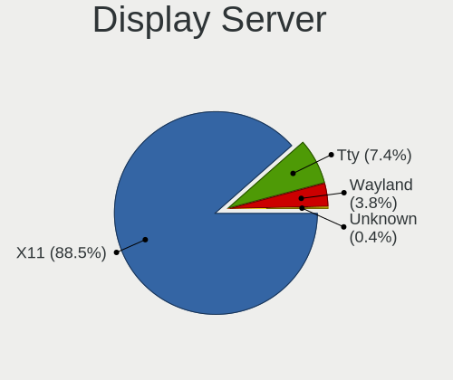
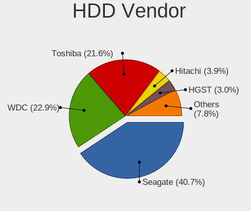
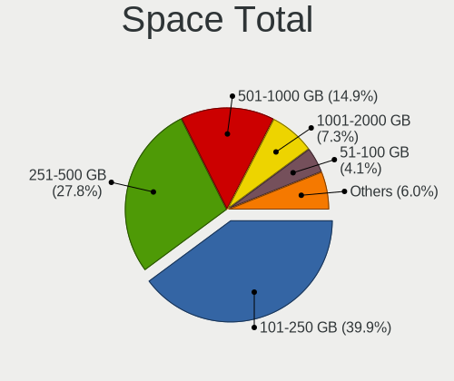
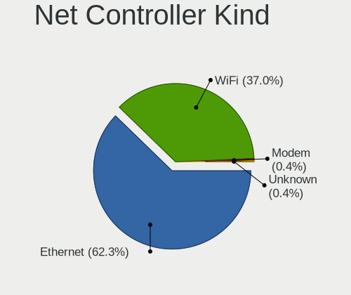

Red OS - Tested Hardware & Statistics
-------------------------------------

A project to collect tested hardware configurations for Red OS.

Anyone can contribute to this report by the [hw-probe](https://github.com/linuxhw/hw-probe) tool:

    sudo -E hw-probe -all -upload

Please contribute! Especially if your hardware is rare.

This is a report for all computer types. See also reports for [desktops](/Dist/Red_OS/Desktop/README.md) and [notebooks](/Dist/Red_OS/Notebook/README.md).

Contents
--------

* [ Test Cases ](#test-cases)

* [ System ](#system)
  - [ OS                       ](#os)
  - [ OS Family                ](#os-family)
  - [ Kernel                   ](#kernel)
  - [ Kernel Family            ](#kernel-family)
  - [ Kernel Major Ver.        ](#kernel-major-ver)
  - [ Arch                     ](#arch)
  - [ DE                       ](#de)
  - [ Display Server           ](#display-server)
  - [ Display Manager          ](#display-manager)
  - [ OS Lang                  ](#os-lang)
  - [ Boot Mode                ](#boot-mode)
  - [ Filesystem               ](#filesystem)
  - [ Part. scheme             ](#part-scheme)
  - [ Dual Boot with Linux/BSD ](#dual-boot-with-linuxbsd)
  - [ Dual Boot (Win)          ](#dual-boot-win)

* [ Board ](#board)
  - [ Vendor                   ](#vendor)
  - [ Model                    ](#model)
  - [ Model Family             ](#model-family)
  - [ MFG Year                 ](#mfg-year)
  - [ Form Factor              ](#form-factor)
  - [ Secure Boot              ](#secure-boot)
  - [ Coreboot                 ](#coreboot)
  - [ RAM Size                 ](#ram-size)
  - [ RAM Used                 ](#ram-used)
  - [ Total Drives             ](#total-drives)
  - [ Has CD-ROM               ](#has-cd-rom)
  - [ Has Ethernet             ](#has-ethernet)
  - [ Has WiFi                 ](#has-wifi)
  - [ Has Bluetooth            ](#has-bluetooth)

* [ Location ](#location)
  - [ Country                  ](#country)
  - [ City                     ](#city)

* [ Drives ](#drives)
  - [ Drive Vendor             ](#drive-vendor)
  - [ Drive Model              ](#drive-model)
  - [ HDD Vendor               ](#hdd-vendor)
  - [ SSD Vendor               ](#ssd-vendor)
  - [ Drive Kind               ](#drive-kind)
  - [ Drive Connector          ](#drive-connector)
  - [ Drive Size               ](#drive-size)
  - [ Space Total              ](#space-total)
  - [ Space Used               ](#space-used)
  - [ Malfunc. Drives          ](#malfunc-drives)
  - [ Malfunc. Drive Vendor    ](#malfunc-drive-vendor)
  - [ Malfunc. HDD Vendor      ](#malfunc-hdd-vendor)
  - [ Malfunc. Drive Kind      ](#malfunc-drive-kind)
  - [ Failed Drives            ](#failed-drives)
  - [ Failed Drive Vendor      ](#failed-drive-vendor)
  - [ Drive Status             ](#drive-status)

* [ Storage controller ](#storage-controller)
  - [ Storage Vendor           ](#storage-vendor)
  - [ Storage Model            ](#storage-model)
  - [ Storage Kind             ](#storage-kind)

* [ Processor ](#processor)
  - [ CPU Vendor               ](#cpu-vendor)
  - [ CPU Model                ](#cpu-model)
  - [ CPU Model Family         ](#cpu-model-family)
  - [ CPU Cores                ](#cpu-cores)
  - [ CPU Sockets              ](#cpu-sockets)
  - [ CPU Threads              ](#cpu-threads)
  - [ CPU Op-Modes             ](#cpu-op-modes)
  - [ CPU Microcode            ](#cpu-microcode)
  - [ CPU Microarch            ](#cpu-microarch)

* [ Graphics ](#graphics)
  - [ GPU Vendor               ](#gpu-vendor)
  - [ GPU Model                ](#gpu-model)
  - [ GPU Combo                ](#gpu-combo)
  - [ GPU Driver               ](#gpu-driver)
  - [ GPU Memory               ](#gpu-memory)

* [ Monitor ](#monitor)
  - [ Monitor Vendor           ](#monitor-vendor)
  - [ Monitor Model            ](#monitor-model)
  - [ Monitor Resolution       ](#monitor-resolution)
  - [ Monitor Diagonal         ](#monitor-diagonal)
  - [ Monitor Width            ](#monitor-width)
  - [ Aspect Ratio             ](#aspect-ratio)
  - [ Monitor Area             ](#monitor-area)
  - [ Pixel Density            ](#pixel-density)
  - [ Multiple Monitors        ](#multiple-monitors)

* [ Network ](#network)
  - [ Net Controller Vendor    ](#net-controller-vendor)
  - [ Net Controller Model     ](#net-controller-model)
  - [ Wireless Vendor          ](#wireless-vendor)
  - [ Wireless Model           ](#wireless-model)
  - [ Ethernet Vendor          ](#ethernet-vendor)
  - [ Ethernet Model           ](#ethernet-model)
  - [ Net Controller Kind      ](#net-controller-kind)
  - [ Used Controller          ](#used-controller)
  - [ NICs                     ](#nics)
  - [ IPv6                     ](#ipv6)

* [ Bluetooth ](#bluetooth)
  - [ Bluetooth Vendor         ](#bluetooth-vendor)
  - [ Bluetooth Model          ](#bluetooth-model)

* [ Sound ](#sound)
  - [ Sound Vendor             ](#sound-vendor)
  - [ Sound Model              ](#sound-model)

* [ Memory ](#memory)
  - [ Memory Vendor            ](#memory-vendor)
  - [ Memory Model             ](#memory-model)
  - [ Memory Kind              ](#memory-kind)
  - [ Memory Form Factor       ](#memory-form-factor)
  - [ Memory Size              ](#memory-size)
  - [ Memory Speed             ](#memory-speed)

* [ Printers & scanners ](#printers--scanners)
  - [ Printer Vendor           ](#printer-vendor)
  - [ Printer Model            ](#printer-model)
  - [ Scanner Vendor           ](#scanner-vendor)
  - [ Scanner Model            ](#scanner-model)

* [ Camera ](#camera)
  - [ Camera Vendor            ](#camera-vendor)
  - [ Camera Model             ](#camera-model)

* [ Security ](#security)
  - [ Fingerprint Vendor       ](#fingerprint-vendor)
  - [ Fingerprint Model        ](#fingerprint-model)
  - [ Chipcard Vendor          ](#chipcard-vendor)
  - [ Chipcard Model           ](#chipcard-model)

* [ Unsupported ](#unsupported)
  - [ Unsupported Devices      ](#unsupported-devices)
  - [ Unsupported Device Types ](#unsupported-device-types)

Test Cases
----------

Total: 118

| Vendor        | Model                       | Form-Factor | Probe                                                      | Date         |
|---------------|-----------------------------|-------------|------------------------------------------------------------|--------------|
| ASRock        | H110M-DVS R2.0              | Desktop     | [c02a953cda](https://linux-hardware.org/?probe=c02a953cda) | Aug 01, 2022 |
| Gigabyte      | B365M DS3H                  | Desktop     | [14f73b6a3a](https://linux-hardware.org/?probe=14f73b6a3a) | Aug 01, 2022 |
| Digma         | EVE 15 P417 ES5063EW        | Notebook    | [a584c678b5](https://linux-hardware.org/?probe=a584c678b5) | Jul 27, 2022 |
| Digma         | EVE 15 C407 ES5054EW        | Notebook    | [4fd01756b2](https://linux-hardware.org/?probe=4fd01756b2) | Jul 27, 2022 |
| Digma         | EVE 15 C407 ES5054EW        | Notebook    | [008b02cc92](https://linux-hardware.org/?probe=008b02cc92) | Jul 26, 2022 |
| Dell          | 040DDP A00                  | Desktop     | [5375c9c059](https://linux-hardware.org/?probe=5375c9c059) | Jul 26, 2022 |
| Lenovo        | IdeaPad 5 Pro 14ACN6 82L... | Notebook    | [413949a727](https://linux-hardware.org/?probe=413949a727) | Jul 25, 2022 |
| Lenovo        | IdeaPad L340-15API 81LW     | Notebook    | [2ea5a4f753](https://linux-hardware.org/?probe=2ea5a4f753) | Jul 22, 2022 |
| Lenovo        | V15-IWL 81YE                | Notebook    | [3bfcedd5c8](https://linux-hardware.org/?probe=3bfcedd5c8) | Jul 22, 2022 |
| Lenovo        | V15-IWL 81YE                | Notebook    | [c49282206c](https://linux-hardware.org/?probe=c49282206c) | Jul 22, 2022 |
| Lenovo        | V15-IWL 81YE                | Notebook    | [d598c4587d](https://linux-hardware.org/?probe=d598c4587d) | Jul 22, 2022 |
| DEPO Compu... | DPH310T                     | Desktop     | [7cc031e93b](https://linux-hardware.org/?probe=7cc031e93b) | Jul 22, 2022 |
| DEPO Compu... | DPH310T                     | Desktop     | [946610c122](https://linux-hardware.org/?probe=946610c122) | Jul 22, 2022 |
| Lenovo        | V15-IWL 81YE                | Notebook    | [5b1e962751](https://linux-hardware.org/?probe=5b1e962751) | Jul 22, 2022 |
| Lenovo        | V15-IWL 81YE                | Notebook    | [4e120b3b63](https://linux-hardware.org/?probe=4e120b3b63) | Jul 22, 2022 |
| DEPO Compu... | DPH310T                     | Desktop     | [fbff39be7e](https://linux-hardware.org/?probe=fbff39be7e) | Jul 22, 2022 |
| Lenovo        | V15-IWL 81YE                | Notebook    | [2d5bedf224](https://linux-hardware.org/?probe=2d5bedf224) | Jul 22, 2022 |
| Lenovo        | V15-IWL 81YE                | Notebook    | [297ce5144e](https://linux-hardware.org/?probe=297ce5144e) | Jul 22, 2022 |
| Lenovo        | V15-IWL 81YE                | Notebook    | [84b7cd1115](https://linux-hardware.org/?probe=84b7cd1115) | Jul 22, 2022 |
| Lenovo        | V15-IWL 81YE                | Notebook    | [a92b6c5d73](https://linux-hardware.org/?probe=a92b6c5d73) | Jul 22, 2022 |
| Lenovo        | V15-IWL 81YE                | Notebook    | [51ebd271c8](https://linux-hardware.org/?probe=51ebd271c8) | Jul 22, 2022 |
| DEPO Compu... | DPH310T                     | Desktop     | [0076bf5efc](https://linux-hardware.org/?probe=0076bf5efc) | Jul 22, 2022 |
| Lenovo        | V15-IWL 81YE                | Notebook    | [44ad7f7d47](https://linux-hardware.org/?probe=44ad7f7d47) | Jul 22, 2022 |
| Lenovo        | V15-IWL 81YE                | Notebook    | [49068a26b5](https://linux-hardware.org/?probe=49068a26b5) | Jul 22, 2022 |
| Lenovo        | V15-IWL 81YE                | Notebook    | [62ce596bf3](https://linux-hardware.org/?probe=62ce596bf3) | Jul 22, 2022 |
| Lenovo        | V15-IWL 81YE                | Notebook    | [812db8ad6f](https://linux-hardware.org/?probe=812db8ad6f) | Jul 22, 2022 |
| Lenovo        | V15-IWL 81YE                | Notebook    | [d4c2b5ffad](https://linux-hardware.org/?probe=d4c2b5ffad) | Jul 22, 2022 |
| Lenovo        | V15-IWL 81YE                | Notebook    | [4c0179b60e](https://linux-hardware.org/?probe=4c0179b60e) | Jul 22, 2022 |
| Lenovo        | IdeaPad L340-15API 81LW     | Notebook    | [8601888983](https://linux-hardware.org/?probe=8601888983) | Jul 22, 2022 |
| Lenovo        | V15-IWL 81YE                | Notebook    | [1d505390d6](https://linux-hardware.org/?probe=1d505390d6) | Jul 22, 2022 |
| Lenovo        | IdeaPad L340-15API 81LW     | Notebook    | [d481776a74](https://linux-hardware.org/?probe=d481776a74) | Jul 21, 2022 |
| Lenovo        | IdeaPad L340-15API 81LW     | Notebook    | [ef738973d3](https://linux-hardware.org/?probe=ef738973d3) | Jul 20, 2022 |
| HONOR         | NBR-WAX9                    | Notebook    | [5b3340311a](https://linux-hardware.org/?probe=5b3340311a) | Jul 20, 2022 |
| Lenovo        | IdeaPad L340-15API 81LW     | Notebook    | [154c254eac](https://linux-hardware.org/?probe=154c254eac) | Jul 19, 2022 |
| Gigabyte      | G5 GD                       | Notebook    | [60921a7ff6](https://linux-hardware.org/?probe=60921a7ff6) | Jul 19, 2022 |
| Gigabyte      | G5 GD                       | Notebook    | [c24f8b4ba6](https://linux-hardware.org/?probe=c24f8b4ba6) | Jul 19, 2022 |
| Lenovo        | 312D NOK                    | Mini pc     | [4f1a1bfb2d](https://linux-hardware.org/?probe=4f1a1bfb2d) | Jul 19, 2022 |
| Gigabyte      | 970A-D3                     | Desktop     | [f2ae77cc0c](https://linux-hardware.org/?probe=f2ae77cc0c) | Jul 17, 2022 |
| HONOR         | NBR-WAX9                    | Notebook    | [fe971bb8c3](https://linux-hardware.org/?probe=fe971bb8c3) | Jul 08, 2022 |
| Lenovo        | IdeaPad 3 15ITL05 81X8      | Notebook    | [2835672840](https://linux-hardware.org/?probe=2835672840) | Jul 07, 2022 |
| Kraftway      | ACCORD                      | Notebook    | [24e49bc011](https://linux-hardware.org/?probe=24e49bc011) | Jun 27, 2022 |
| Kraftway      | ACCORD                      | Notebook    | [39e3c55e89](https://linux-hardware.org/?probe=39e3c55e89) | Jun 27, 2022 |
| ASUSTek       | M2N68-AM Plus               | Desktop     | [d85cded80a](https://linux-hardware.org/?probe=d85cded80a) | Jun 20, 2022 |
| Aquarius      | NS685U                      | Notebook    | [ecedc7cbb6](https://linux-hardware.org/?probe=ecedc7cbb6) | Jun 08, 2022 |
| ASUSTek       | PRIME H510T2/CSM            | Desktop     | [28e8a1e19c](https://linux-hardware.org/?probe=28e8a1e19c) | Jun 07, 2022 |
| ASUSTek       | H81M-K                      | Desktop     | [df5b1991e1](https://linux-hardware.org/?probe=df5b1991e1) | Jun 07, 2022 |
| ICL           | Unknown                     | Notebook    | [4dc89fc689](https://linux-hardware.org/?probe=4dc89fc689) | Jun 07, 2022 |
| HP            | 0B4Ch D                     | Desktop     | [8ea7efbf2e](https://linux-hardware.org/?probe=8ea7efbf2e) | Jun 07, 2022 |
| iRU           | v1.0                        | Mini pc     | [845212ce42](https://linux-hardware.org/?probe=845212ce42) | Jun 02, 2022 |
| iRU           | v1.0                        | Mini pc     | [dab83a5e53](https://linux-hardware.org/?probe=dab83a5e53) | Jun 02, 2022 |
| ASRock        | B365M Pro4-F                | Desktop     | [3a12e41029](https://linux-hardware.org/?probe=3a12e41029) | Jun 01, 2022 |
| iRU           | v1.0                        | Mini pc     | [15b125fb9e](https://linux-hardware.org/?probe=15b125fb9e) | May 31, 2022 |
| iRU           | v1.0                        | Mini pc     | [991e061d78](https://linux-hardware.org/?probe=991e061d78) | May 31, 2022 |
| MSI           | A520M PRO                   | Desktop     | [3eb8006c14](https://linux-hardware.org/?probe=3eb8006c14) | May 26, 2022 |
| MSI           | A520M PRO                   | Desktop     | [9766bbe4c0](https://linux-hardware.org/?probe=9766bbe4c0) | May 25, 2022 |
| ASRock        | B365M Pro4-F                | Desktop     | [b3b2ee08af](https://linux-hardware.org/?probe=b3b2ee08af) | May 23, 2022 |
| MSI           | H510TI-S01                  | Desktop     | [efe42ef07a](https://linux-hardware.org/?probe=efe42ef07a) | May 19, 2022 |
| ASUSTek       | V241IC-R                    | All in one  | [48add8dc01](https://linux-hardware.org/?probe=48add8dc01) | May 19, 2022 |
| Gigabyte      | B365M H                     | Desktop     | [e405d209d4](https://linux-hardware.org/?probe=e405d209d4) | May 11, 2022 |
| mtech         | MTL1578                     | Notebook    | [bf25c26ea0](https://linux-hardware.org/?probe=bf25c26ea0) | May 11, 2022 |
| ASUSTek       | H81M-K                      | Desktop     | [66bb3248d5](https://linux-hardware.org/?probe=66bb3248d5) | May 11, 2022 |
| Digma         | CITI 10 C402T CS1044EW      | Tablet      | [eefe92e281](https://linux-hardware.org/?probe=eefe92e281) | May 04, 2022 |
| ASRock        | B560 Pro4                   | Desktop     | [1c3459c038](https://linux-hardware.org/?probe=1c3459c038) | Apr 19, 2022 |
| HUAWEI        | BOD-WXX9                    | Notebook    | [e2e025dd4f](https://linux-hardware.org/?probe=e2e025dd4f) | Apr 15, 2022 |
| Acer          | TravelMate P215-53          | Notebook    | [124fdb3b64](https://linux-hardware.org/?probe=124fdb3b64) | Apr 14, 2022 |
| Lenovo        | ThinkBook 14-IIL 20SL       | Notebook    | [be41efbec8](https://linux-hardware.org/?probe=be41efbec8) | Apr 05, 2022 |
| Gigabyte      | B75M-D3V                    | Desktop     | [d648ac5ab2](https://linux-hardware.org/?probe=d648ac5ab2) | Apr 01, 2022 |
| Gigabyte      | B75M-D2V                    | Desktop     | [7b4861c8af](https://linux-hardware.org/?probe=7b4861c8af) | Apr 01, 2022 |
| Gigabyte      | H410M H V3                  | Desktop     | [9d86d8119a](https://linux-hardware.org/?probe=9d86d8119a) | Apr 01, 2022 |
| Gigabyte      | B75M-D2V                    | Desktop     | [b8ff95c0f1](https://linux-hardware.org/?probe=b8ff95c0f1) | Mar 30, 2022 |
| Aquarius      | NS585 R32                   | Notebook    | [582389ca98](https://linux-hardware.org/?probe=582389ca98) | Mar 24, 2022 |
| Lenovo        | 312D SDK0J40697 WIN 3305... | Mini pc     | [e76e5359b7](https://linux-hardware.org/?probe=e76e5359b7) | Mar 23, 2022 |
| Lenovo        | IdeaPad L340-15IWL 81LG     | Notebook    | [56f9ebba91](https://linux-hardware.org/?probe=56f9ebba91) | Mar 22, 2022 |
| Lenovo        | ThinkBook 15 G3 ACL 21A4    | Notebook    | [e18b80073c](https://linux-hardware.org/?probe=e18b80073c) | Mar 21, 2022 |
| 3Logic Gro... | APM Graviton A15i-K2        | Notebook    | [e93bcf2f42](https://linux-hardware.org/?probe=e93bcf2f42) | Mar 09, 2022 |
| ASUSTek       | H110-PLUS                   | Desktop     | [5074891336](https://linux-hardware.org/?probe=5074891336) | Mar 09, 2022 |
| Aquarius      | AQH410T                     | Desktop     | [f02c2d0259](https://linux-hardware.org/?probe=f02c2d0259) | Mar 02, 2022 |
| Aquarius      | AQB560M                     | All in one  | [4d3df118f0](https://linux-hardware.org/?probe=4d3df118f0) | Mar 01, 2022 |
| Aquarius      | AQB560M                     | Desktop     | [091fa6d697](https://linux-hardware.org/?probe=091fa6d697) | Mar 01, 2022 |
| Lenovo        | 316E SDK0J40697 WIN 3305... | Mini pc     | [bf51c93832](https://linux-hardware.org/?probe=bf51c93832) | Feb 22, 2022 |
| Lenovo        | 316E SDK0J40697 WIN 3305... | Mini pc     | [a831ba5c10](https://linux-hardware.org/?probe=a831ba5c10) | Feb 22, 2022 |
| Gigabyte      | B560M DS3H                  | Desktop     | [9db1aef186](https://linux-hardware.org/?probe=9db1aef186) | Feb 18, 2022 |
| ASUSTek       | TUF Gaming FX705DT_FX705... | Notebook    | [227a2658d0](https://linux-hardware.org/?probe=227a2658d0) | Feb 15, 2022 |
| ASUSTek       | PRIME H510M-K               | Desktop     | [c1f9ad0faf](https://linux-hardware.org/?probe=c1f9ad0faf) | Feb 01, 2022 |
| Gigabyte      | B75M-D3V                    | Desktop     | [14d2075383](https://linux-hardware.org/?probe=14d2075383) | Jan 31, 2022 |
| ASUSTek       | PRIME H510T2/CSM            | Desktop     | [38ddf02b60](https://linux-hardware.org/?probe=38ddf02b60) | Jan 31, 2022 |
| Gigabyte      | B365M DS3H                  | Desktop     | [36db0c9260](https://linux-hardware.org/?probe=36db0c9260) | Jan 17, 2022 |
| HP            | Laptop 15s-eq1xxx           | Notebook    | [7ed7e139d8](https://linux-hardware.org/?probe=7ed7e139d8) | Dec 20, 2021 |
| HP            | Laptop 15s-eq1xxx           | Notebook    | [55ab1c9ab8](https://linux-hardware.org/?probe=55ab1c9ab8) | Dec 20, 2021 |
| HUAWEI        | NBLK-WAX9X                  | Notebook    | [5bb21d6bf6](https://linux-hardware.org/?probe=5bb21d6bf6) | Dec 13, 2021 |
| Aquarius      | AQB560M                     | Desktop     | [ff20437ae0](https://linux-hardware.org/?probe=ff20437ae0) | Nov 25, 2021 |
| Aquarius      | AQB560M                     | Desktop     | [4656a05904](https://linux-hardware.org/?probe=4656a05904) | Nov 22, 2021 |
| Gigabyte      | B75M-D2V                    | Desktop     | [ef54320d4b](https://linux-hardware.org/?probe=ef54320d4b) | Oct 19, 2021 |
| Gigabyte      | B560M DS3H                  | Desktop     | [5a071f96dd](https://linux-hardware.org/?probe=5a071f96dd) | Oct 19, 2021 |
| ICL           | RAYbook Si1514              | Notebook    | [9ddc61deba](https://linux-hardware.org/?probe=9ddc61deba) | Sep 13, 2021 |
| ASUSTek       | TUF Gaming FX705DT_FX705... | Notebook    | [4f59992d0f](https://linux-hardware.org/?probe=4f59992d0f) | Sep 11, 2021 |
| ASRock        | H470M-HDV                   | Desktop     | [ba7bdac2dd](https://linux-hardware.org/?probe=ba7bdac2dd) | Sep 04, 2021 |
| Gigabyte      | H110M-M2-CF                 | Desktop     | [54a20af366](https://linux-hardware.org/?probe=54a20af366) | Aug 27, 2021 |
| HP            | Laptop 15-dw3xxx            | Notebook    | [d8b35044ab](https://linux-hardware.org/?probe=d8b35044ab) | Jul 29, 2021 |
| Lenovo        | IdeaPad 5 15ARE05 81YQ      | Notebook    | [9b2c758081](https://linux-hardware.org/?probe=9b2c758081) | Jun 10, 2021 |
| ASUSTek       | H110-PLUS                   | Desktop     | [11e1a45e67](https://linux-hardware.org/?probe=11e1a45e67) | Jun 03, 2021 |
| Gigabyte      | B365M DS3H                  | Desktop     | [7b4a0634ef](https://linux-hardware.org/?probe=7b4a0634ef) | Apr 26, 2021 |
| ASUSTek       | H110M-PLUS                  | Desktop     | [b779fb9e40](https://linux-hardware.org/?probe=b779fb9e40) | Apr 09, 2021 |
| ASUSTek       | P8H61-I LX R2.0             | Desktop     | [6e0321d64f](https://linux-hardware.org/?probe=6e0321d64f) | Apr 08, 2021 |
| ASUSTek       | X75VD                       | Notebook    | [95ea9551da](https://linux-hardware.org/?probe=95ea9551da) | Apr 05, 2021 |
| ASUSTek       | TUF Gaming FX705DT_FX705... | Notebook    | [916d4b225b](https://linux-hardware.org/?probe=916d4b225b) | Mar 30, 2021 |
| ASUSTek       | TUF Gaming FX705DT_FX705... | Notebook    | [ebfafc7409](https://linux-hardware.org/?probe=ebfafc7409) | Mar 26, 2021 |
| HUAWEI        | BOHL-WXX9                   | Notebook    | [cf5559d576](https://linux-hardware.org/?probe=cf5559d576) | Mar 26, 2021 |
| Gigabyte      | B365M DS3H                  | Desktop     | [d151197565](https://linux-hardware.org/?probe=d151197565) | Mar 26, 2021 |
| HP            | Pavilion g6                 | Notebook    | [1ca79b1950](https://linux-hardware.org/?probe=1ca79b1950) | Mar 26, 2021 |
| ASUSTek       | H81M-K                      | Desktop     | [a61243addd](https://linux-hardware.org/?probe=a61243addd) | Mar 26, 2021 |
| ASUSTek       | H110M-K                     | Desktop     | [30e7a27178](https://linux-hardware.org/?probe=30e7a27178) | Mar 22, 2021 |
| ASUSTek       | H110M-K                     | Desktop     | [da0a735a9f](https://linux-hardware.org/?probe=da0a735a9f) | Mar 18, 2021 |
| Pegatron      | A35                         | Notebook    | [9923a21e8c](https://linux-hardware.org/?probe=9923a21e8c) | Mar 04, 2021 |
| ASUSTek       | H81M-K                      | Desktop     | [5898a71c25](https://linux-hardware.org/?probe=5898a71c25) | Nov 03, 2020 |
| Gigabyte      | B360M DS3H                  | Desktop     | [12f125beba](https://linux-hardware.org/?probe=12f125beba) | Jan 16, 2020 |
| Gigabyte      | B360M DS3H                  | Desktop     | [c88331017f](https://linux-hardware.org/?probe=c88331017f) | Jan 16, 2020 |
| ASUSTek       | H81M-K                      | Desktop     | [24adf26804](https://linux-hardware.org/?probe=24adf26804) | Jan 13, 2020 |

System
------

OS
--

Installed operating systems

| Name         | Computers | Percent |
|--------------|-----------|---------|
| Red OS 7.3.1 | 51        | 53.13%  |
| Red OS 7.3   | 40        | 41.67%  |
| Red OS 7.2   | 5         | 5.21%   |

OS Family
---------

OS without a version

| Name   | Computers | Percent |
|--------|-----------|---------|
| Red OS | 91        | 100%    |

Kernel
------

Version of the Linux kernel

| Version                | Computers | Percent |
|------------------------|-----------|---------|
| 5.15.10-1.el7.x86_64   | 23        | 23.23%  |
| 5.10.29-1.el7.x86_64   | 22        | 22.22%  |
| 5.15.35-1.el7.3.x86_64 | 15        | 15.15%  |
| 5.15.35-4.el7.3.x86_64 | 9         | 9.09%   |
| 5.15.10-2.el7.x86_64   | 5         | 5.05%   |
| 5.15.10-3.el7.x86_64   | 4         | 4.04%   |
| 5.10.1-1.el7.x86_64    | 4         | 4.04%   |
| 5.10.24-2.el7.x86_64   | 3         | 3.03%   |
| 4.19.79-1.el7.x86_64   | 3         | 3.03%   |
| 5.18.1-1.el7.x86_64    | 2         | 2.02%   |
| 5.15.10-4.el7.x86_64   | 2         | 2.02%   |
| 5.14.9-1.el7.x86_64    | 1         | 1.01%   |
| 5.13.15-1.el7.x86_64   | 1         | 1.01%   |
| 5.10.29-3.el7.x86_64   | 1         | 1.01%   |
| 5.10.24-3.el7.x86_64   | 1         | 1.01%   |
| 5.10.24-1.el7.x86_64   | 1         | 1.01%   |
| 4.19.56-2.el7.x86_64   | 1         | 1.01%   |
| 4.19.204-1.el7.x86_64  | 1         | 1.01%   |

Kernel Family
-------------

Linux kernel without a distro release

| Version  | Computers | Percent |
|----------|-----------|---------|
| 5.15.10  | 34        | 34.34%  |
| 5.15.35  | 24        | 24.24%  |
| 5.10.29  | 23        | 23.23%  |
| 5.10.24  | 5         | 5.05%   |
| 5.10.1   | 4         | 4.04%   |
| 4.19.79  | 3         | 3.03%   |
| 5.18.1   | 2         | 2.02%   |
| 5.14.9   | 1         | 1.01%   |
| 5.13.15  | 1         | 1.01%   |
| 4.19.56  | 1         | 1.01%   |
| 4.19.204 | 1         | 1.01%   |

Kernel Major Ver.
-----------------

Linux kernel major version

| Version | Computers | Percent |
|---------|-----------|---------|
| 5.15    | 58        | 59.18%  |
| 5.10    | 31        | 31.63%  |
| 4.19    | 5         | 5.1%    |
| 5.18    | 2         | 2.04%   |
| 5.14    | 1         | 1.02%   |
| 5.13    | 1         | 1.02%   |

Arch
----

OS architecture (x86_64, i586, etc.)

| Name   | Computers | Percent |
|--------|-----------|---------|
| x86_64 | 91        | 100%    |

DE
--

Desktop Environment

| Name       | Computers | Percent |
|------------|-----------|---------|
| MATE       | 72        | 75.79%  |
| Cinnamon   | 21        | 22.11%  |
| X-Cinnamon | 1         | 1.05%   |
| Unknown    | 1         | 1.05%   |

Display Server
--------------

X11 or Wayland

| Name    | Computers | Percent |
|---------|-----------|---------|
| X11     | 83        | 89.25%  |
| Wayland | 9         | 9.68%   |
| Unknown | 1         | 1.08%   |

Display Manager
---------------

SDDM, LightDM, etc.

| Name    | Computers | Percent |
|---------|-----------|---------|
| GDM     | 87        | 94.57%  |
| SDDM    | 4         | 4.35%   |
| Unknown | 1         | 1.09%   |

OS Lang
-------

Language

| Lang    | Computers | Percent |
|---------|-----------|---------|
| Unknown | 88        | 95.65%  |
| ru_RU   | 3         | 3.26%   |
| en_US   | 1         | 1.09%   |

Boot Mode
---------

EFI or BIOS

| Mode | Computers | Percent |
|------|-----------|---------|
| EFI  | 74        | 79.57%  |
| BIOS | 19        | 20.43%  |

Filesystem
----------

Type of filesystem

| Type    | Computers | Percent |
|---------|-----------|---------|
| Ext4    | 88        | 95.65%  |
| Btrfs   | 3         | 3.26%   |
| Unknown | 1         | 1.09%   |

Part. scheme
------------

Scheme of partitioning

| Type    | Computers | Percent |
|---------|-----------|---------|
| GPT     | 76        | 82.61%  |
| MBR     | 15        | 16.3%   |
| Unknown | 1         | 1.09%   |

Dual Boot with Linux/BSD
------------------------

Hosting more than one Linux/BSD

| Dual boot | Computers | Percent |
|-----------|-----------|---------|
| No        | 81        | 88.04%  |
| Yes       | 11        | 11.96%  |

Dual Boot (Win)
---------------

Hosting Linux and Windows

| Dual boot | Computers | Percent |
|-----------|-----------|---------|
| No        | 72        | 77.42%  |
| Yes       | 21        | 22.58%  |

Board
-----

Vendor
------

Motherboard manufacturer

| Name                | Computers | Percent |
|---------------------|-----------|---------|
| Lenovo              | 27        | 29.67%  |
| Gigabyte Technology | 14        | 15.38%  |
| ASUSTek Computer    | 12        | 13.19%  |
| Aquarius            | 7         | 7.69%   |
| Hewlett-Packard     | 4         | 4.4%    |
| DEPO Computers      | 4         | 4.4%    |
| ASRock              | 4         | 4.4%    |
| MSI                 | 3         | 3.3%    |
| HUAWEI              | 3         | 3.3%    |
| Digma               | 3         | 3.3%    |
| ICL                 | 2         | 2.2%    |
| Pegatron            | 1         | 1.1%    |
| mtech               | 1         | 1.1%    |
| Kraftway            | 1         | 1.1%    |
| iRU                 | 1         | 1.1%    |
| HONOR               | 1         | 1.1%    |
| Dell                | 1         | 1.1%    |
| Acer                | 1         | 1.1%    |
| 3Logic Group        | 1         | 1.1%    |

Model
-----

Motherboard model

| Name                                | Computers | Percent |
|-------------------------------------|-----------|---------|
| Lenovo V15-IWL 81YE                 | 17        | 18.68%  |
| Gigabyte B365M DS3H                 | 4         | 4.4%    |
| DEPO Computers DPH310T              | 4         | 4.4%    |
| MSI MS-7D14                         | 2         | 2.2%    |
| Gigabyte B560M DS3H                 | 2         | 2.2%    |
| Pegatron A35                        | 1         | 1.1%    |
| mtech MTL1578                       | 1         | 1.1%    |
| MSI MS-7D35                         | 1         | 1.1%    |
| Lenovo ThinkCentre M720q 10T8S08X00 | 1         | 1.1%    |
| Lenovo ThinkCentre M720q 10T7S18500 | 1         | 1.1%    |
| Lenovo ThinkCentre M70q 11DT003QRU  | 1         | 1.1%    |
| Lenovo ThinkBook 15 G3 ACL 21A4     | 1         | 1.1%    |
| Lenovo ThinkBook 14-IIL 20SL        | 1         | 1.1%    |
| Lenovo IdeaPad L340-15IWL 81LG      | 1         | 1.1%    |
| Lenovo IdeaPad L340-15API 81LW      | 1         | 1.1%    |
| Lenovo IdeaPad 5 Pro 14ACN6 82L7    | 1         | 1.1%    |
| Lenovo IdeaPad 5 15ARE05 81YQ       | 1         | 1.1%    |
| Lenovo IdeaPad 3 15ITL05 81X8       | 1         | 1.1%    |
| Kraftway ACCORD                     | 1         | 1.1%    |
| iRU P11AP                           | 1         | 1.1%    |
| ICL RAYbook Si1514                  | 1         | 1.1%    |
| HUAWEI NBLK-WAX9X                   | 1         | 1.1%    |
| HUAWEI BOHL-WXX9                    | 1         | 1.1%    |
| HUAWEI BOD-WXX9                     | 1         | 1.1%    |
| HONOR NBR-WAX9                      | 1         | 1.1%    |
| HP Z400 Workstation                 | 1         | 1.1%    |
| HP Pavilion g6                      | 1         | 1.1%    |
| HP Laptop 15s-eq1xxx                | 1         | 1.1%    |
| HP Laptop 15-dw3xxx                 | 1         | 1.1%    |
| Gigabyte H410M H V3                 | 1         | 1.1%    |
| Gigabyte H110M-M.2                  | 1         | 1.1%    |
| Gigabyte G5 GD                      | 1         | 1.1%    |
| Gigabyte B75M-D3V                   | 1         | 1.1%    |
| Gigabyte B75M-D2V                   | 1         | 1.1%    |
| Gigabyte B365M H                    | 1         | 1.1%    |
| Gigabyte B360M-DS3H                 | 1         | 1.1%    |
| Gigabyte 970A-D3                    | 1         | 1.1%    |
| Digma EVE 15 P417 ES5063EW          | 1         | 1.1%    |
| Digma EVE 15 C407 ES5054EW          | 1         | 1.1%    |
| Digma CITI 10 C402T CS1044EW        | 1         | 1.1%    |
| Dell OptiPlex 3020                  | 1         | 1.1%    |
| ASUS X75VD                          | 1         | 1.1%    |
| ASUS V241IC-R                       | 1         | 1.1%    |
| ASUS TUF Gaming FX705DT_FX705DT     | 1         | 1.1%    |
| ASUS PRIME H510T2/CSM               | 1         | 1.1%    |
| ASUS PRIME H510M-K                  | 1         | 1.1%    |
| ASUS PC                             | 1         | 1.1%    |
| ASUS P8H61-I LX R2.0                | 1         | 1.1%    |
| ASUS M2N68-AM Plus                  | 1         | 1.1%    |
| ASUS H110M-PLUS                     | 1         | 1.1%    |
| ASUS H110M-K                        | 1         | 1.1%    |
| ASUS H110-PLUS                      | 1         | 1.1%    |
| ASUS All Series                     | 1         | 1.1%    |
| ASRock H470M-HDV                    | 1         | 1.1%    |
| ASRock H110M-DVS R2.0               | 1         | 1.1%    |
| ASRock B560 Pro4                    | 1         | 1.1%    |
| ASRock B365M Pro4-F                 | 1         | 1.1%    |
| Aquarius Pro T584                   | 1         | 1.1%    |
| Aquarius Pro T514 R53               | 1         | 1.1%    |
| Aquarius P30 K44 R53                | 1         | 1.1%    |

Model Family
------------

Motherboard model prefix

| Name                   | Computers | Percent |
|------------------------|-----------|---------|
| Lenovo V15-IWL         | 17        | 18.68%  |
| Lenovo IdeaPad         | 5         | 5.49%   |
| Gigabyte B365M         | 5         | 5.49%   |
| DEPO Computers DPH310T | 4         | 4.4%    |
| Lenovo ThinkCentre     | 3         | 3.3%    |
| MSI MS-7D14            | 2         | 2.2%    |
| Lenovo ThinkBook       | 2         | 2.2%    |
| HP Laptop              | 2         | 2.2%    |
| Gigabyte B560M         | 2         | 2.2%    |
| Digma EVE              | 2         | 2.2%    |
| ASUS PRIME             | 2         | 2.2%    |
| Aquarius Pro           | 2         | 2.2%    |
| Pegatron A35           | 1         | 1.1%    |
| mtech MTL1578          | 1         | 1.1%    |
| MSI MS-7D35            | 1         | 1.1%    |
| Kraftway ACCORD        | 1         | 1.1%    |
| iRU P11AP              | 1         | 1.1%    |
| ICL RAYbook            | 1         | 1.1%    |
| HUAWEI NBLK-WAX9X      | 1         | 1.1%    |
| HUAWEI BOHL-WXX9       | 1         | 1.1%    |
| HUAWEI BOD-WXX9        | 1         | 1.1%    |
| HONOR NBR-WAX9         | 1         | 1.1%    |
| HP Z400                | 1         | 1.1%    |
| HP Pavilion            | 1         | 1.1%    |
| Gigabyte H410M         | 1         | 1.1%    |
| Gigabyte H110M-M.2     | 1         | 1.1%    |
| Gigabyte G5            | 1         | 1.1%    |
| Gigabyte B75M-D3V      | 1         | 1.1%    |
| Gigabyte B75M-D2V      | 1         | 1.1%    |
| Gigabyte B360M-DS3H    | 1         | 1.1%    |
| Gigabyte 970A-D3       | 1         | 1.1%    |
| Digma CITI             | 1         | 1.1%    |
| Dell OptiPlex          | 1         | 1.1%    |
| ASUS X75VD             | 1         | 1.1%    |
| ASUS V241IC-R          | 1         | 1.1%    |
| ASUS TUF               | 1         | 1.1%    |
| ASUS PC                | 1         | 1.1%    |
| ASUS P8H61-I           | 1         | 1.1%    |
| ASUS M2N68-AM          | 1         | 1.1%    |
| ASUS H110M-PLUS        | 1         | 1.1%    |
| ASUS H110M-K           | 1         | 1.1%    |
| ASUS H110-PLUS         | 1         | 1.1%    |
| ASUS All               | 1         | 1.1%    |
| ASRock H470M-HDV       | 1         | 1.1%    |
| ASRock H110M-DVS       | 1         | 1.1%    |
| ASRock B560            | 1         | 1.1%    |
| ASRock B365M           | 1         | 1.1%    |
| Aquarius P30           | 1         | 1.1%    |
| Aquarius NS685U        | 1         | 1.1%    |
| Aquarius NS585         | 1         | 1.1%    |
| Aquarius AQH410T       | 1         | 1.1%    |
| Aquarius AQB560M       | 1         | 1.1%    |
| Acer TravelMate        | 1         | 1.1%    |
| 3Logic Group APM       | 1         | 1.1%    |
| Unknown                | 1         | 1.1%    |

MFG Year
--------

Motherboard manufacture year

| Year | Computers | Percent |
|------|-----------|---------|
| 2019 | 31        | 34.07%  |
| 2021 | 26        | 28.57%  |
| 2020 | 13        | 14.29%  |
| 2012 | 6         | 6.59%   |
| 2022 | 3         | 3.3%    |
| 2016 | 3         | 3.3%    |
| 2018 | 2         | 2.2%    |
| 2017 | 2         | 2.2%    |
| 2014 | 1         | 1.1%    |
| 2013 | 1         | 1.1%    |
| 2011 | 1         | 1.1%    |
| 2010 | 1         | 1.1%    |
| 2009 | 1         | 1.1%    |

Form Factor
-----------

Physical design of the computer

| Name       | Computers | Percent |
|------------|-----------|---------|
| Notebook   | 45        | 49.45%  |
| Desktop    | 39        | 42.86%  |
| Mini pc    | 4         | 4.4%    |
| All in one | 2         | 2.2%    |
| Tablet     | 1         | 1.1%    |

Secure Boot
-----------

Enabled or disabled

| State    | Computers | Percent |
|----------|-----------|---------|
| Disabled | 91        | 100%    |

Coreboot
--------

Have coreboot on board

| Used | Computers | Percent |
|------|-----------|---------|
| No   | 91        | 100%    |

RAM Size
--------

Total RAM memory

| Size in GB | Computers | Percent |
|------------|-----------|---------|
| 4.01-8.0   | 46        | 50.55%  |
| 16.01-24.0 | 20        | 21.98%  |
| 8.01-16.0  | 13        | 14.29%  |
| 3.01-4.0   | 10        | 10.99%  |
| 24.01-32.0 | 1         | 1.1%    |
| Unknown    | 1         | 1.1%    |

RAM Used
--------

Used RAM memory

| Used GB   | Computers | Percent |
|-----------|-----------|---------|
| 1.01-2.0  | 42        | 43.3%   |
| 2.01-3.0  | 15        | 15.46%  |
| 0.51-1.0  | 14        | 14.43%  |
| 4.01-8.0  | 12        | 12.37%  |
| 3.01-4.0  | 12        | 12.37%  |
| 8.01-16.0 | 1         | 1.03%   |
| Unknown   | 1         | 1.03%   |

Total Drives
------------

Number of drives on board

| Drives | Computers | Percent |
|--------|-----------|---------|
| 1      | 69        | 74.19%  |
| 2      | 20        | 21.51%  |
| 3      | 3         | 3.23%   |
| 4      | 1         | 1.08%   |

Has CD-ROM
----------

Has CD-ROM on board

| Presented | Computers | Percent |
|-----------|-----------|---------|
| No        | 76        | 83.52%  |
| Yes       | 15        | 16.48%  |

Has Ethernet
------------

Has Ethernet on board

| Presented | Computers | Percent |
|-----------|-----------|---------|
| Yes       | 64        | 70.33%  |
| No        | 27        | 29.67%  |

Has WiFi
--------

Has WiFi module

| Presented | Computers | Percent |
|-----------|-----------|---------|
| Yes       | 59        | 63.44%  |
| No        | 34        | 36.56%  |

Has Bluetooth
-------------

Has Bluetooth module

| Presented | Computers | Percent |
|-----------|-----------|---------|
| Yes       | 48        | 52.75%  |
| No        | 43        | 47.25%  |

Location
--------

Country
-------

Geographic location (country)

| Country | Computers | Percent |
|---------|-----------|---------|
| Russia  | 90        | 98.9%   |
| Ukraine | 1         | 1.1%    |

City
----

Geographic location (city)

| City          | Computers | Percent |
|---------------|-----------|---------|
| Salekhard     | 28        | 30.77%  |
| Murom         | 24        | 26.37%  |
| Moscow        | 12        | 13.19%  |
| Kursk         | 3         | 3.3%    |
| Yekaterinburg | 2         | 2.2%    |
| Vladimir      | 2         | 2.2%    |
| Novy Urengoy  | 2         | 2.2%    |
| Krasnodar     | 2         | 2.2%    |
| Yaroslavl     | 1         | 1.1%    |
| Ulyanovsk     | 1         | 1.1%    |
| Surgut        | 1         | 1.1%    |
| Stavropol     | 1         | 1.1%    |
| Sevastopol    | 1         | 1.1%    |
| Perm          | 1         | 1.1%    |
| Penza         | 1         | 1.1%    |
| Novosibirsk   | 1         | 1.1%    |
| Kovrov        | 1         | 1.1%    |
| Korsakov      | 1         | 1.1%    |
| Kirov         | 1         | 1.1%    |
| Kholmsk       | 1         | 1.1%    |
| Kaluga        | 1         | 1.1%    |
| Bryansk       | 1         | 1.1%    |
| Belgorod      | 1         | 1.1%    |
| Arzamas       | 1         | 1.1%    |

Drives
------

Drive Vendor
------------

Hard drive vendors

| Vendor              | Computers | Drives | Percent |
|---------------------|-----------|--------|---------|
| Samsung Electronics | 24        | 24     | 20.69%  |
| Seagate             | 21        | 31     | 18.1%   |
| WDC                 | 12        | 15     | 10.34%  |
| Toshiba             | 8         | 8      | 6.9%    |
| A-DATA Technology   | 8         | 8      | 6.9%    |
| Apacer              | 5         | 5      | 4.31%   |
| SanDisk             | 4         | 5      | 3.45%   |
| Foxline             | 4         | 4      | 3.45%   |
| SK hynix            | 3         | 3      | 2.59%   |
| Kingston            | 3         | 3      | 2.59%   |
| Crucial             | 3         | 5      | 2.59%   |
| Unknown             | 2         | 2      | 1.72%   |
| Transcend           | 2         | 2      | 1.72%   |
| Phison              | 2         | 2      | 1.72%   |
| Micron Technology   | 2         | 4      | 1.72%   |
| KIOXIA-EXCERIA      | 2         | 2      | 1.72%   |
| Unknown             | 2         | 3      | 1.72%   |
| UMIS                | 1         | 1      | 0.86%   |
| Smartbuy            | 1         | 1      | 0.86%   |
| Patriot             | 1         | 1      | 0.86%   |
| JMicron Technology  | 1         | 1      | 0.86%   |
| ITHOO               | 1         | 1      | 0.86%   |
| Gigabyte Technology | 1         | 1      | 0.86%   |
| ExeGate             | 1         | 1      | 0.86%   |
| China               | 1         | 1      | 0.86%   |
| AMD                 | 1         | 1      | 0.86%   |

Drive Model
-----------

Hard drive models

| Model                                     | Computers | Percent |
|-------------------------------------------|-----------|---------|
| Samsung MZALQ256HAJD-000L2 256GB          | 17        | 14.53%  |
| Seagate ST1000LM049-2GH172 1TB            | 5         | 4.27%   |
| Seagate ST1000DM010-2EP102 1TB            | 4         | 3.42%   |
| Apacer AS2280P4 256GB                     | 4         | 3.42%   |
| SanDisk SD8SBAT256G1122 256GB SSD         | 3         | 2.56%   |
| Toshiba HDWD110 1TB                       | 2         | 1.71%   |
| Seagate ST500DM002-1BD142 500GB           | 2         | 1.71%   |
| Seagate ST1000DM010-2DM162 1TB            | 2         | 1.71%   |
| Seagate ST1000DM003-1SB10C 1TB            | 2         | 1.71%   |
| KIOXIA-EXCERIA SATA SSD 480GB             | 2         | 1.71%   |
| Foxline FLSSD240X5SE 240GB                | 2         | 1.71%   |
| Crucial CT240BX500SSD1 240GB              | 2         | 1.71%   |
| A-DATA SU800 256GB SSD                    | 2         | 1.71%   |
| A-DATA SU630 960GB SSD                    | 2         | 1.71%   |
| Unknown                                   | 2         | 1.71%   |
| WDC WD5000BPVT-55HXZT3 500GB              | 1         | 0.85%   |
| WDC WD5000AAKX-75U6AA0 500GB              | 1         | 0.85%   |
| WDC WD3200AAKX-001CA0 320GB               | 1         | 0.85%   |
| WDC WD20EARX-00PASB0 2TB                  | 1         | 0.85%   |
| WDC WD10SPZX-24Z10 1TB                    | 1         | 0.85%   |
| WDC WD10SPZX-00Z10T0 1TB                  | 1         | 0.85%   |
| WDC WD10EARS-00Y5B1 1TB                   | 1         | 0.85%   |
| WDC PC SN530 SDBPNPZ-512G-1114 512GB      | 1         | 0.85%   |
| WDC PC SN530 SDBPNPZ-512G-1027 512GB      | 1         | 0.85%   |
| WDC PC SN530 SDBPNPZ-256G-1006 256GB      | 1         | 0.85%   |
| WDC PC SN530 SDBPMPZ-512G-1101 512GB      | 1         | 0.85%   |
| WDC PC SN520 SDAPMUW-512G-1101 512GB      | 1         | 0.85%   |
| Unknown SLD128  128GB                     | 1         | 0.85%   |
| Unknown 58K722  128GB                     | 1         | 0.85%   |
| UMIS RPJTJ512MEE1OWX 512GB                | 1         | 0.85%   |
| Transcend TS480GMTS420S 480GB SSD         | 1         | 0.85%   |
| Transcend TS240GMTS820S 240GB SSD         | 1         | 0.85%   |
| Toshiba MQ01ABF050 500GB                  | 1         | 0.85%   |
| Toshiba KXG60ZNV512G 512GB                | 1         | 0.85%   |
| Toshiba KXG60ZNV256G 256GB                | 1         | 0.85%   |
| Toshiba KHK61VSE960G 960GB SSD            | 1         | 0.85%   |
| Toshiba HDWD105 500GB                     | 1         | 0.85%   |
| Toshiba DT01ACA200 2TB                    | 1         | 0.85%   |
| Smartbuy SSD 240GB                        | 1         | 0.85%   |
| SK hynix SKHynix_HFM256GDHTNI-87A0B 256GB | 1         | 0.85%   |
| SK hynix SKHynix_HFM256GD3HX015N 256GB    | 1         | 0.85%   |
| SK hynix HFM128GDHTNG-8310B 128GB         | 1         | 0.85%   |
| Seagate ST750LM022 HN-M750MBB 752GB       | 1         | 0.85%   |
| Seagate ST3400620AS 400GB                 | 1         | 0.85%   |
| Seagate ST3320620AS 320GB                 | 1         | 0.85%   |
| Seagate ST3250823AS 250GB                 | 1         | 0.85%   |
| Seagate ST31000528AS 1TB                  | 1         | 0.85%   |
| Seagate ST2000DM008-2UB102 2TB            | 1         | 0.85%   |
| Seagate ST1000DM003-1SB102 1TB            | 1         | 0.85%   |
| SanDisk SSD PLUS 240GB                    | 1         | 0.85%   |
| Samsung SSD 870 EVO 250GB                 | 1         | 0.85%   |
| Samsung SSD 860 EVO M.2 250GB             | 1         | 0.85%   |
| Samsung SSD 860 EVO 250GB                 | 1         | 0.85%   |
| Samsung MZVLQ256HAJD-000H1 256GB          | 1         | 0.85%   |
| Samsung MZVLB256HBHQ-000L7 256GB          | 1         | 0.85%   |
| Samsung MZALQ512HBLU-00BL2 512GB          | 1         | 0.85%   |
| Samsung MZALQ512HALU-000L2 512GB          | 1         | 0.85%   |
| Phison ESR512GTLG-E6GBTNB4 512GB          | 1         | 0.85%   |
| Phison 311CD0512GB                        | 1         | 0.85%   |
| Patriot P210 128GB SSD                    | 1         | 0.85%   |

HDD Vendor
----------

Hard disk drive vendors

| Vendor  | Computers | Drives | Percent |
|---------|-----------|--------|---------|
| Seagate | 21        | 31     | 63.64%  |
| WDC     | 7         | 10     | 21.21%  |
| Toshiba | 5         | 5      | 15.15%  |

SSD Vendor
----------

Solid state drive vendors

| Vendor              | Computers | Drives | Percent |
|---------------------|-----------|--------|---------|
| A-DATA Technology   | 5         | 5      | 16.67%  |
| SanDisk             | 4         | 5      | 13.33%  |
| Samsung Electronics | 3         | 3      | 10%     |
| Foxline             | 3         | 3      | 10%     |
| Crucial             | 3         | 5      | 10%     |
| Transcend           | 2         | 2      | 6.67%   |
| KIOXIA-EXCERIA      | 2         | 2      | 6.67%   |
| Toshiba             | 1         | 1      | 3.33%   |
| Smartbuy            | 1         | 1      | 3.33%   |
| Patriot             | 1         | 1      | 3.33%   |
| Micron Technology   | 1         | 1      | 3.33%   |
| Kingston            | 1         | 1      | 3.33%   |
| ExeGate             | 1         | 1      | 3.33%   |
| China               | 1         | 1      | 3.33%   |
| Apacer              | 1         | 1      | 3.33%   |

Drive Kind
----------

HDD or SSD

| Kind    | Computers | Drives | Percent |
|---------|-----------|--------|---------|
| NVMe    | 46        | 50     | 41.07%  |
| HDD     | 31        | 46     | 27.68%  |
| SSD     | 30        | 33     | 26.79%  |
| MMC     | 4         | 5      | 3.57%   |
| Unknown | 1         | 1      | 0.89%   |

Drive Connector
---------------

SATA, SAS, NVMe, etc.

| Type | Computers | Drives | Percent |
|------|-----------|--------|---------|
| SATA | 53        | 79     | 50.48%  |
| NVMe | 46        | 49     | 43.81%  |
| MMC  | 4         | 5      | 3.81%   |
| SAS  | 2         | 2      | 1.9%    |

Drive Size
----------

Size of hard drive

| Size in TB | Computers | Drives | Percent |
|------------|-----------|--------|---------|
| 0.01-0.5   | 34        | 39     | 54.84%  |
| 0.51-1.0   | 25        | 36     | 40.32%  |
| 1.01-2.0   | 3         | 4      | 4.84%   |

Space Total
-----------

Amount of disk space available on the file system

| Size in GB | Computers | Percent |
|------------|-----------|---------|
| 101-250    | 40        | 43.48%  |
| 251-500    | 18        | 19.57%  |
| 501-1000   | 17        | 18.48%  |
| 51-100     | 6         | 6.52%   |
| 1001-2000  | 5         | 5.43%   |
| 21-50      | 2         | 2.17%   |
| 2001-3000  | 2         | 2.17%   |
| 1-20       | 1         | 1.09%   |
| Unknown    | 1         | 1.09%   |

Space Used
----------

Amount of used disk space

| Used GB   | Computers | Percent |
|-----------|-----------|---------|
| 1-20      | 64        | 65.98%  |
| 21-50     | 7         | 7.22%   |
| 501-1000  | 7         | 7.22%   |
| 101-250   | 6         | 6.19%   |
| 251-500   | 5         | 5.15%   |
| 51-100    | 5         | 5.15%   |
| 1001-2000 | 2         | 2.06%   |
| Unknown   | 1         | 1.03%   |

Malfunc. Drives
---------------

Drive models with a malfunction

| Model                               | Computers | Drives | Percent |
|-------------------------------------|-----------|--------|---------|
| WDC WD3200AAKX-001CA0 320GB         | 1         | 1      | 12.5%   |
| WDC WD10SPZX-24Z10 1TB              | 1         | 1      | 12.5%   |
| WDC WD10EARS-00Y5B1 1TB             | 1         | 1      | 12.5%   |
| Toshiba MQ01ABF050 500GB            | 1         | 1      | 12.5%   |
| Seagate ST750LM022 HN-M750MBB 752GB | 1         | 1      | 12.5%   |
| Seagate ST3250823AS 250GB           | 1         | 1      | 12.5%   |
| Seagate ST1000DM010-2EP102 1TB      | 1         | 2      | 12.5%   |
| A-DATA Technology SU800 256GB SSD   | 1         | 1      | 12.5%   |

Malfunc. Drive Vendor
---------------------

Vendors of faulty drives

| Vendor            | Computers | Drives | Percent |
|-------------------|-----------|--------|---------|
| WDC               | 3         | 3      | 37.5%   |
| Seagate           | 3         | 4      | 37.5%   |
| Toshiba           | 1         | 1      | 12.5%   |
| A-DATA Technology | 1         | 1      | 12.5%   |

Malfunc. HDD Vendor
-------------------

Vendors of faulty HDD drives

| Vendor  | Computers | Drives | Percent |
|---------|-----------|--------|---------|
| WDC     | 3         | 3      | 42.86%  |
| Seagate | 3         | 4      | 42.86%  |
| Toshiba | 1         | 1      | 14.29%  |

Malfunc. Drive Kind
-------------------

Kinds of faulty drives

| Kind | Computers | Drives | Percent |
|------|-----------|--------|---------|
| HDD  | 6         | 8      | 85.71%  |
| SSD  | 1         | 1      | 14.29%  |

Failed Drives
-------------

Failed drive models

Zero info for selected period =(

Failed Drive Vendor
-------------------

Failed drive vendors

Zero info for selected period =(

Drive Status
------------

Number of failed and malfunc. drives

| Status   | Computers | Drives | Percent |
|----------|-----------|--------|---------|
| Works    | 85        | 119    | 87.63%  |
| Malfunc  | 7         | 9      | 7.22%   |
| Detected | 5         | 7      | 5.15%   |

Storage controller
------------------

Storage Vendor
--------------

Storage controller vendors

| Vendor                       | Computers | Percent |
|------------------------------|-----------|---------|
| Intel                        | 78        | 58.65%  |
| Samsung Electronics          | 21        | 15.79%  |
| Phison Electronics           | 8         | 6.02%   |
| AMD                          | 7         | 5.26%   |
| SanDisk                      | 5         | 3.76%   |
| SK hynix                     | 3         | 2.26%   |
| Realtek Semiconductor        | 3         | 2.26%   |
| Toshiba America Info Systems | 2         | 1.5%    |
| Kingston Technology Company  | 2         | 1.5%    |
| Union Memory (Shenzhen)      | 1         | 0.75%   |
| Silicon Motion               | 1         | 0.75%   |
| Nvidia                       | 1         | 0.75%   |
| Micron Technology            | 1         | 0.75%   |

Storage Model
-------------

Storage controller models

| Model                                                                                   | Computers | Percent |
|-----------------------------------------------------------------------------------------|-----------|---------|
| Intel Cannon Point-LP SATA Controller [AHCI Mode]                                       | 23        | 16.67%  |
| Samsung NVMe SSD Controller 980                                                         | 20        | 14.49%  |
| Intel 500 Series Chipset Family SATA AHCI Controller                                    | 13        | 9.42%   |
| Intel 200 Series PCH SATA controller [AHCI mode]                                        | 10        | 7.25%   |
| Phison PS5013 E13 NVMe Controller                                                       | 7         | 5.07%   |
| Intel Q170/Q150/B150/H170/H110/Z170/CM236 Chipset SATA Controller [AHCI Mode]           | 5         | 3.62%   |
| Intel Tiger Lake-LP SATA Controller                                                     | 4         | 2.9%    |
| Intel Cannon Lake PCH SATA AHCI Controller                                              | 4         | 2.9%    |
| AMD FCH SATA Controller [AHCI mode]                                                     | 4         | 2.9%    |
| SanDisk WD Blue SN550 NVMe SSD                                                          | 3         | 2.17%   |
| Realtek Realtek Non-Volatile memory controller                                          | 3         | 2.17%   |
| Intel Comet Lake SATA AHCI Controller                                                   | 3         | 2.17%   |
| Intel 7 Series Chipset Family 6-port SATA Controller [AHCI mode]                        | 3         | 2.17%   |
| Toshiba America Info Systems XG6 NVMe SSD Controller                                    | 2         | 1.45%   |
| Kingston Company Company Non-Volatile memory controller                                 | 2         | 1.45%   |
| Intel Volume Management Device NVMe RAID Controller                                     | 2         | 1.45%   |
| Intel Celeron N3350/Pentium N4200/Atom E3900 Series SATA AHCI Controller                | 2         | 1.45%   |
| Intel 8 Series/C220 Series Chipset Family 6-port SATA Controller 1 [AHCI mode]          | 2         | 1.45%   |
| AMD 500 Series Chipset SATA Controller                                                  | 2         | 1.45%   |
| Union Memory (Shenzhen) Non-Volatile memory controller                                  | 1         | 0.72%   |
| SK hynix Gold P31 SSD                                                                   | 1         | 0.72%   |
| SK hynix BC511                                                                          | 1         | 0.72%   |
| SK hynix BC501 NVMe Solid State Drive                                                   | 1         | 0.72%   |
| Silicon Motion SM2263EN/SM2263XT SSD Controller                                         | 1         | 0.72%   |
| SanDisk PC SN520 NVMe SSD                                                               | 1         | 0.72%   |
| SanDisk Non-Volatile memory controller                                                  | 1         | 0.72%   |
| Samsung NVMe SSD Controller SM981/PM981/PM983                                           | 1         | 0.72%   |
| Phison E16 PCIe4 NVMe Controller                                                        | 1         | 0.72%   |
| Nvidia MCP61 SATA Controller                                                            | 1         | 0.72%   |
| Nvidia MCP61 IDE                                                                        | 1         | 0.72%   |
| Micron Non-Volatile memory controller                                                   | 1         | 0.72%   |
| Intel Sunrise Point-LP SATA Controller [AHCI mode]                                      | 1         | 0.72%   |
| Intel SATA Controller [RAID mode]                                                       | 1         | 0.72%   |
| Intel Ice Lake-LP SATA Controller [AHCI mode]                                           | 1         | 0.72%   |
| Intel Celeron/Pentium Silver Processor SATA Controller                                  | 1         | 0.72%   |
| Intel Atom/Celeron/Pentium Processor x5-E8000/J3xxx/N3xxx Series SATA Controller        | 1         | 0.72%   |
| Intel 7 Series/C210 Series Chipset Family 6-port SATA Controller [AHCI mode]            | 1         | 0.72%   |
| Intel 7 Series/C210 Series Chipset Family 4-port SATA Controller [IDE mode]             | 1         | 0.72%   |
| Intel 7 Series/C210 Series Chipset Family 2-port SATA Controller [IDE mode]             | 1         | 0.72%   |
| Intel 6 Series/C200 Series Chipset Family Desktop SATA Controller (IDE mode, ports 4-5) | 1         | 0.72%   |
| Intel 6 Series/C200 Series Chipset Family Desktop SATA Controller (IDE mode, ports 0-3) | 1         | 0.72%   |
| Intel 400 Series Chipset Family SATA AHCI Controller                                    | 1         | 0.72%   |
| AMD SB7x0/SB8x0/SB9x0 SATA Controller [AHCI mode]                                       | 1         | 0.72%   |

Storage Kind
------------

Kind of storage controller (IDE, SATA, NVMe, SAS, ...)

| Kind | Computers | Percent |
|------|-----------|---------|
| SATA | 82        | 61.19%  |
| NVMe | 46        | 34.33%  |
| RAID | 3         | 2.24%   |
| IDE  | 3         | 2.24%   |

Processor
---------

CPU Vendor
----------

Processor vendors

| Vendor | Computers | Percent |
|--------|-----------|---------|
| Intel  | 79        | 86.81%  |
| AMD    | 12        | 13.19%  |

CPU Model
---------

Processor models

| Model                                         | Computers | Percent |
|-----------------------------------------------|-----------|---------|
| Intel Core i5-8265U CPU @ 1.60GHz             | 18        | 19.78%  |
| Intel Core i5-9400 CPU @ 2.90GHz              | 10        | 10.99%  |
| Intel Core i3-10100 CPU @ 3.60GHz             | 8         | 8.79%   |
| Intel Core i5-8279U CPU @ 2.40GHz             | 3         | 3.3%    |
| Intel Core i5-3470 CPU @ 3.20GHz              | 3         | 3.3%    |
| Intel Core i5-8259U CPU @ 2.30GHz             | 2         | 2.2%    |
| Intel Core i3-6100 CPU @ 3.70GHz              | 2         | 2.2%    |
| Intel Celeron CPU N3350 @ 1.10GHz             | 2         | 2.2%    |
| Intel 11th Gen Core i5-1135G7 @ 2.40GHz       | 2         | 2.2%    |
| AMD Ryzen 7 PRO 4750G with Radeon Graphics    | 2         | 2.2%    |
| AMD Ryzen 5 4500U with Radeon Graphics        | 2         | 2.2%    |
| AMD Ryzen 5 3500U with Radeon Vega Mobile Gfx | 2         | 2.2%    |
| Intel Xeon CPU W3670 @ 3.20GHz                | 1         | 1.1%    |
| Intel Pentium Gold G6400 CPU @ 4.00GHz        | 1         | 1.1%    |
| Intel Pentium CPU J3710 @ 1.60GHz             | 1         | 1.1%    |
| Intel Pentium CPU G4560 @ 3.50GHz             | 1         | 1.1%    |
| Intel Pentium CPU G4500 @ 3.50GHz             | 1         | 1.1%    |
| Intel Core i5-9400F CPU @ 2.90GHz             | 1         | 1.1%    |
| Intel Core i5-8500T CPU @ 2.10GHz             | 1         | 1.1%    |
| Intel Core i5-4590 CPU @ 3.30GHz              | 1         | 1.1%    |
| Intel Core i5-3210M CPU @ 2.50GHz             | 1         | 1.1%    |
| Intel Core i5-2450M CPU @ 2.50GHz             | 1         | 1.1%    |
| Intel Core i5-10600K CPU @ 4.10GHz            | 1         | 1.1%    |
| Intel Core i5-10500 CPU @ 3.10GHz             | 1         | 1.1%    |
| Intel Core i5-10400T CPU @ 2.00GHz            | 1         | 1.1%    |
| Intel Core i5-1035G1 CPU @ 1.00GHz            | 1         | 1.1%    |
| Intel Core i3-9300 CPU @ 3.70GHz              | 1         | 1.1%    |
| Intel Core i3-8100T CPU @ 3.10GHz             | 1         | 1.1%    |
| Intel Core i3-6006U CPU @ 2.00GHz             | 1         | 1.1%    |
| Intel Core i3-4160 CPU @ 3.60GHz              | 1         | 1.1%    |
| Intel Core i3-2350M CPU @ 2.30GHz             | 1         | 1.1%    |
| Intel Core i3-10110U CPU @ 2.10GHz            | 1         | 1.1%    |
| Intel Core i3-10105 CPU @ 3.70GHz             | 1         | 1.1%    |
| Intel Celeron J4125 CPU @ 2.00GHz             | 1         | 1.1%    |
| Intel Celeron G5925 CPU @ 3.60GHz             | 1         | 1.1%    |
| Intel Celeron CPU G3900 @ 2.80GHz             | 1         | 1.1%    |
| Intel 11th Gen Core i7-1165G7 @ 2.80GHz       | 1         | 1.1%    |
| Intel 11th Gen Core i5-11400H @ 2.70GHz       | 1         | 1.1%    |
| Intel 11th Gen Core i5-11400 @ 2.60GHz        | 1         | 1.1%    |
| Intel 11th Gen Core i3-1125G4 @ 2.00GHz       | 1         | 1.1%    |
| Intel 11th Gen Core i3-1115G4 @ 3.00GHz       | 1         | 1.1%    |
| AMD Ryzen 7 3750H with Radeon Vega Mobile Gfx | 1         | 1.1%    |
| AMD Ryzen 5 5600U with Radeon Graphics        | 1         | 1.1%    |
| AMD Ryzen 3 5300U with Radeon Graphics        | 1         | 1.1%    |
| AMD Ryzen 3 4300U with Radeon Graphics        | 1         | 1.1%    |
| AMD FX-6300 Six-Core Processor                | 1         | 1.1%    |
| AMD Athlon II X2 240 Processor                | 1         | 1.1%    |

CPU Model Family
----------------

Processor model prefix

| Model              | Computers | Percent |
|--------------------|-----------|---------|
| Intel Core i5      | 45        | 49.45%  |
| Intel Core i3      | 17        | 18.68%  |
| Other              | 7         | 7.69%   |
| Intel Celeron      | 5         | 5.49%   |
| AMD Ryzen 5        | 5         | 5.49%   |
| Intel Pentium      | 3         | 3.3%    |
| AMD Ryzen 7 PRO    | 2         | 2.2%    |
| AMD Ryzen 3        | 2         | 2.2%    |
| Intel Xeon         | 1         | 1.1%    |
| Intel Pentium Gold | 1         | 1.1%    |
| AMD Ryzen 7        | 1         | 1.1%    |
| AMD FX             | 1         | 1.1%    |
| AMD Athlon II X2   | 1         | 1.1%    |

CPU Cores
---------

Number of processor cores

| Number | Computers | Percent |
|--------|-----------|---------|
| 4      | 50        | 54.95%  |
| 6      | 21        | 23.08%  |
| 2      | 17        | 18.68%  |
| 8      | 2         | 2.2%    |
| 3      | 1         | 1.1%    |

CPU Sockets
-----------

Number of sockets

| Number | Computers | Percent |
|--------|-----------|---------|
| 1      | 91        | 100%    |

CPU Threads
-----------

Threads per core (Hyper-Threading)

| Number | Computers | Percent |
|--------|-----------|---------|
| 2      | 61        | 67.03%  |
| 1      | 30        | 32.97%  |

CPU Op-Modes
------------

CPU Operation Modes (32-bit, 64-bit)

| Op mode        | Computers | Percent |
|----------------|-----------|---------|
| 32-bit, 64-bit | 90        | 98.9%   |
| Unknown        | 1         | 1.1%    |

CPU Microcode
-------------

Microcode number

| Number     | Computers | Percent |
|------------|-----------|---------|
| 0x806ec    | 19        | 20.65%  |
| 0xa0653    | 13        | 14.13%  |
| 0x906ed    | 8         | 8.7%    |
| 0x806ea    | 5         | 5.43%   |
| 0x806c1    | 5         | 5.43%   |
| 0x906ea    | 4         | 4.35%   |
| 0x506e3    | 4         | 4.35%   |
| 0x306a9    | 4         | 4.35%   |
| 0x08600106 | 4         | 4.35%   |
| 0x906eb    | 2         | 2.17%   |
| 0x306c3    | 2         | 2.17%   |
| 0x206a7    | 2         | 2.17%   |
| 0x08108102 | 2         | 2.17%   |
| 0xa0671    | 1         | 1.09%   |
| 0xa0654    | 1         | 1.09%   |
| 0x906e9    | 1         | 1.09%   |
| 0x806d1    | 1         | 1.09%   |
| 0x706e5    | 1         | 1.09%   |
| 0x706a8    | 1         | 1.09%   |
| 0x506ca    | 1         | 1.09%   |
| 0x506c9    | 1         | 1.09%   |
| 0x406e3    | 1         | 1.09%   |
| 0x406c4    | 1         | 1.09%   |
| 0x206c2    | 1         | 1.09%   |
| 0x0a50000c | 1         | 1.09%   |
| 0x08608103 | 1         | 1.09%   |
| 0x08600104 | 1         | 1.09%   |
| 0x08108109 | 1         | 1.09%   |
| 0x06000852 | 1         | 1.09%   |
| 0x010000c7 | 1         | 1.09%   |
| Unknown    | 1         | 1.09%   |

CPU Microarch
-------------

Microarchitecture

| Name          | Computers | Percent |
|---------------|-----------|---------|
| KabyLake      | 39        | 42.86%  |
| CometLake     | 14        | 15.38%  |
| Zen 2         | 5         | 5.49%   |
| TigerLake     | 5         | 5.49%   |
| Skylake       | 5         | 5.49%   |
| IvyBridge     | 4         | 4.4%    |
| Zen+          | 3         | 3.3%    |
| SandyBridge   | 2         | 2.2%    |
| IceLake       | 2         | 2.2%    |
| Haswell       | 2         | 2.2%    |
| Goldmont      | 2         | 2.2%    |
| Unknown       | 2         | 2.2%    |
| Zen 3         | 1         | 1.1%    |
| Westmere      | 1         | 1.1%    |
| Silvermont    | 1         | 1.1%    |
| Piledriver    | 1         | 1.1%    |
| K10           | 1         | 1.1%    |
| Goldmont plus | 1         | 1.1%    |

Graphics
--------

GPU Vendor
----------

Vendors of graphics cards

| Vendor | Computers | Percent |
|--------|-----------|---------|
| Intel  | 75        | 77.32%  |
| AMD    | 13        | 13.4%   |
| Nvidia | 9         | 9.28%   |

GPU Model
---------

Graphics card models

| Model                                                                                    | Computers | Percent |
|------------------------------------------------------------------------------------------|-----------|---------|
| Intel WhiskeyLake-U GT2 [UHD Graphics 620]                                               | 18        | 18.37%  |
| Intel CoffeeLake-S GT2 [UHD Graphics 630]                                                | 13        | 13.27%  |
| Intel CometLake-S GT2 [UHD Graphics 630]                                                 | 11        | 11.22%  |
| Intel CoffeeLake-U GT3e [Iris Plus Graphics 655]                                         | 5         | 5.1%    |
| AMD Renoir                                                                               | 5         | 5.1%    |
| Intel Xeon E3-1200 v2/3rd Gen Core processor Graphics Controller                         | 3         | 3.06%   |
| Intel TigerLake-LP GT2 [Iris Xe Graphics]                                                | 3         | 3.06%   |
| Intel HD Graphics 530                                                                    | 3         | 3.06%   |
| AMD Picasso/Raven 2 [Radeon Vega Series / Radeon Vega Mobile Series]                     | 3         | 3.06%   |
| Intel Tiger Lake UHD Graphics                                                            | 2         | 2.04%   |
| Intel HD Graphics 500                                                                    | 2         | 2.04%   |
| Intel CometLake-S GT1 [UHD Graphics 610]                                                 | 2         | 2.04%   |
| Intel 2nd Generation Core Processor Family Integrated Graphics Controller                | 2         | 2.04%   |
| Nvidia TU117M [GeForce GTX 1650 Mobile / Max-Q]                                          | 1         | 1.02%   |
| Nvidia NV43 [GeForce 6600 GT]                                                            | 1         | 1.02%   |
| Nvidia GM108M [GeForce MX110]                                                            | 1         | 1.02%   |
| Nvidia GK208B [GeForce GT 710]                                                           | 1         | 1.02%   |
| Nvidia GF119M [GeForce 610M]                                                             | 1         | 1.02%   |
| Nvidia GF114 [GeForce GTX 560 Ti]                                                        | 1         | 1.02%   |
| Nvidia GF108M [GeForce GT 620M/630M/635M/640M LE]                                        | 1         | 1.02%   |
| Nvidia GA107M [GeForce RTX 3050 Mobile]                                                  | 1         | 1.02%   |
| Nvidia G94GL [Quadro FX 1800]                                                            | 1         | 1.02%   |
| Intel Xeon E3-1200 v3/4th Gen Core Processor Integrated Graphics Controller              | 1         | 1.02%   |
| Intel TigerLake-H GT1 [UHD Graphics]                                                     | 1         | 1.02%   |
| Intel Skylake GT2 [HD Graphics 520]                                                      | 1         | 1.02%   |
| Intel RocketLake-S GT1 [UHD Graphics 730]                                                | 1         | 1.02%   |
| Intel Iris Plus Graphics G1 (Ice Lake)                                                   | 1         | 1.02%   |
| Intel HD Graphics 610                                                                    | 1         | 1.02%   |
| Intel GeminiLake [UHD Graphics 600]                                                      | 1         | 1.02%   |
| Intel CometLake-U GT2 [UHD Graphics]                                                     | 1         | 1.02%   |
| Intel Atom/Celeron/Pentium Processor x5-E8000/J3xxx/N3xxx Integrated Graphics Controller | 1         | 1.02%   |
| Intel 4th Generation Core Processor Family Integrated Graphics Controller                | 1         | 1.02%   |
| Intel 3rd Gen Core processor Graphics Controller                                         | 1         | 1.02%   |
| AMD Thames [Radeon HD 7500M/7600M Series]                                                | 1         | 1.02%   |
| AMD RV515 PRO [Radeon X1300/X1550 Series] (Secondary)                                    | 1         | 1.02%   |
| AMD RV515 PRO [Radeon X1300/X1550 Series]                                                | 1         | 1.02%   |
| AMD Lucienne                                                                             | 1         | 1.02%   |
| AMD Cezanne                                                                              | 1         | 1.02%   |
| AMD Baffin [Radeon RX 550 640SP / RX 560/560X]                                           | 1         | 1.02%   |

GPU Combo
---------

Combinations of graphics cards

| Name           | Computers | Percent |
|----------------|-----------|---------|
| 1 x Intel      | 70        | 76.92%  |
| 1 x AMD        | 10        | 10.99%  |
| 1 x Nvidia     | 4         | 4.4%    |
| Intel + Nvidia | 4         | 4.4%    |
| 2 x AMD        | 1         | 1.1%    |
| Intel + AMD    | 1         | 1.1%    |
| AMD + Nvidia   | 1         | 1.1%    |

GPU Driver
----------

Free vs proprietary

| Driver      | Computers | Percent |
|-------------|-----------|---------|
| Free        | 82        | 89.13%  |
| Unknown     | 8         | 8.7%    |
| Proprietary | 2         | 2.17%   |

GPU Memory
----------

Total video memory

| Size in GB | Computers | Percent |
|------------|-----------|---------|
| Unknown    | 71        | 76.34%  |
| 1.01-2.0   | 8         | 8.6%    |
| 0.51-1.0   | 5         | 5.38%   |
| 0.01-0.5   | 5         | 5.38%   |
| 3.01-4.0   | 4         | 4.3%    |

Monitor
-------

Monitor Vendor
--------------

Monitor vendors

| Vendor               | Computers | Percent |
|----------------------|-----------|---------|
| BOE                  | 27        | 29.35%  |
| Samsung Electronics  | 10        | 10.87%  |
| Philips              | 10        | 10.87%  |
| ViewSonic            | 7         | 7.61%   |
| Chimei Innolux       | 6         | 6.52%   |
| Acer                 | 5         | 5.43%   |
| LG Display           | 4         | 4.35%   |
| AU Optronics         | 4         | 4.35%   |
| BenQ                 | 3         | 3.26%   |
| AOC                  | 3         | 3.26%   |
| SGT                  | 2         | 2.17%   |
| PANDA                | 2         | 2.17%   |
| Ancor Communications | 2         | 2.17%   |
| XSP                  | 1         | 1.09%   |
| ITE                  | 1         | 1.09%   |
| Iiyama               | 1         | 1.09%   |
| DOY                  | 1         | 1.09%   |
| Dell                 | 1         | 1.09%   |
| CHR                  | 1         | 1.09%   |
| ASUSTek Computer     | 1         | 1.09%   |

Monitor Model
-------------

Monitor models

| Model                                                                   | Computers | Percent |
|-------------------------------------------------------------------------|-----------|---------|
| BOE LCD Monitor BOE0812 1920x1080 344x194mm 15.5-inch                   | 17        | 18.09%  |
| Philips PHL 243V7 PHLC155 1920x1080 527x296mm 23.8-inch                 | 6         | 6.38%   |
| ViewSonic VA2719-2K VSC6B34 2560x1440 597x336mm 27.0-inch               | 4         | 4.26%   |
| Philips PHL 240V5 PHLC10A 1920x1080 527x296mm 23.8-inch                 | 3         | 3.19%   |
| BOE LCD Monitor BOE09C5 1920x1080 341x192mm 15.4-inch                   | 3         | 3.19%   |
| SGT XY238 SGT2386 1920x1080 530x290mm 23.8-inch                         | 2         | 2.13%   |
| Samsung Electronics S24B300 SAM08B3 1920x1080 521x293mm 23.5-inch       | 2         | 2.13%   |
| Samsung Electronics C27R50x SAM0F9D 1920x1080 598x336mm 27.0-inch       | 2         | 2.13%   |
| Chimei Innolux LCD Monitor CMN15F5 1920x1080 344x193mm 15.5-inch        | 2         | 2.13%   |
| Chimei Innolux LCD Monitor CMN151E 1920x1080 344x193mm 15.5-inch        | 2         | 2.13%   |
| BOE LCD Monitor BOE0877 1920x1080 309x173mm 13.9-inch                   | 2         | 2.13%   |
| BOE LCD Monitor BOE0700 1920x1080 344x194mm 15.5-inch                   | 2         | 2.13%   |
| AU Optronics LCD Monitor AUO28ED 1920x1080 344x193mm 15.5-inch          | 2         | 2.13%   |
| XSP Digital XSP2380 1920x1080 520x310mm 23.8-inch                       | 1         | 1.06%   |
| ViewSonic VX510 VSC6419 1024x768 304x228mm 15.0-inch                    | 1         | 1.06%   |
| ViewSonic VA2465 SERIES VSCB730 1920x1080 521x293mm 23.5-inch           | 1         | 1.06%   |
| ViewSonic LCD Monitor VSC8C31 1920x1080 520x290mm 23.4-inch             | 1         | 1.06%   |
| Samsung Electronics SA300/SA350 SAM0795 1920x1080 521x293mm 23.5-inch   | 1         | 1.06%   |
| Samsung Electronics S24B300 SAM08B4 1920x1080 521x293mm 23.5-inch       | 1         | 1.06%   |
| Samsung Electronics LCD Monitor SEC315A 1366x768 344x194mm 15.5-inch    | 1         | 1.06%   |
| Samsung Electronics LCD Monitor SEC314F 1600x900 382x215mm 17.3-inch    | 1         | 1.06%   |
| Samsung Electronics LCD Monitor SAM71B4 3840x2160 1872x1053mm 84.6-inch | 1         | 1.06%   |
| Samsung Electronics LCD Monitor SAM7085 1920x1200 698x392mm 31.5-inch   | 1         | 1.06%   |
| Samsung Electronics LCD Monitor SAM7016 3840x2160 1872x1053mm 84.6-inch | 1         | 1.06%   |
| Philips PHL 241B8Q PHL0929 1920x1080 530x300mm 24.0-inch                | 1         | 1.06%   |
| Philips LCD Monitor PHLC081 1920x1080 480x270mm 21.7-inch               | 1         | 1.06%   |
| PANDA LM156LF1L03 NCP001C 1920x1080 344x194mm 15.5-inch                 | 1         | 1.06%   |
| PANDA LCD Monitor NCP0040 1920x1080 344x194mm 15.5-inch                 | 1         | 1.06%   |
| LG Display LCD Monitor LGD063B 1920x1080 382x215mm 17.3-inch            | 1         | 1.06%   |
| LG Display LCD Monitor LGD062E 1920x1080 344x194mm 15.5-inch            | 1         | 1.06%   |
| LG Display LCD Monitor LGD0573 1920x1080 344x194mm 15.5-inch            | 1         | 1.06%   |
| LG Display LCD Monitor LGD02DC 1366x768 344x194mm 15.5-inch             | 1         | 1.06%   |
| ITE DP2VGA V226 ITE6516 1920x1080 600x340mm 27.2-inch                   | 1         | 1.06%   |
| Iiyama PL2493H IVM6148 1920x1080 527x296mm 23.8-inch                    | 1         | 1.06%   |
| DOY LCD Monitor DOY2760 1920x1080 598x336mm 27.0-inch                   | 1         | 1.06%   |
| Dell U2412M DELA079 1920x1200 518x324mm 24.1-inch                       | 1         | 1.06%   |
| CHR CH7511B CHR7511 1920x1080 519x324mm 24.1-inch                       | 1         | 1.06%   |
| Chimei Innolux LCD Monitor CMN1521 1920x1080 344x193mm 15.5-inch        | 1         | 1.06%   |
| Chimei Innolux LCD Monitor CMN14D4 1920x1080 309x173mm 13.9-inch        | 1         | 1.06%   |
| BOE LCD Monitor BOE097A 1920x1080 309x174mm 14.0-inch                   | 1         | 1.06%   |
| BOE LCD Monitor BOE0936 1920x1080 344x194mm 15.5-inch                   | 1         | 1.06%   |
| BOE LCD Monitor BOE0931 2240x1400 302x189mm 14.0-inch                   | 1         | 1.06%   |
| BenQ GW2470 BNQ78E4 1920x1080 527x296mm 23.8-inch                       | 1         | 1.06%   |
| BenQ GL2023 BNQ78CC 1600x900 443x249mm 20.0-inch                        | 1         | 1.06%   |
| BenQ FP93E BNQ76D6 1280x1024 376x301mm 19.0-inch                        | 1         | 1.06%   |
| AU Optronics LCD Monitor AUODF87 1920x1080 344x193mm 15.5-inch          | 1         | 1.06%   |
| AU Optronics LCD Monitor AUO20ED 1920x1080 344x193mm 15.5-inch          | 1         | 1.06%   |
| ASUSTek Computer VA24D AUS2403 1920x1080 527x296mm 23.8-inch            | 1         | 1.06%   |
| AOC Q3277 AOC3277 2560x1440 708x399mm 32.0-inch                         | 1         | 1.06%   |
| AOC 2470W AOC2470 1920x1080 521x293mm 23.5-inch                         | 1         | 1.06%   |
| AOC 2250W AOC2250 1920x1080 480x270mm 21.7-inch                         | 1         | 1.06%   |
| Ancor Communications VE228 ACI22FA 1920x1080 477x268mm 21.5-inch        | 1         | 1.06%   |
| Ancor Communications VE208 ACI20A8 1600x900 443x249mm 20.0-inch         | 1         | 1.06%   |
| Acer VG272U ACR0778 2560x1440 597x336mm 27.0-inch                       | 1         | 1.06%   |
| Acer V243HQ ACR00B0 1920x1080 521x293mm 23.5-inch                       | 1         | 1.06%   |
| Acer SA240Y ACR057F 1920x1080 527x296mm 23.8-inch                       | 1         | 1.06%   |
| Acer K222HQL ACR03E1 1920x1080 477x268mm 21.5-inch                      | 1         | 1.06%   |
| Acer H226HQL ACR0319 1920x1080 476x268mm 21.5-inch                      | 1         | 1.06%   |

Monitor Resolution
------------------

Monitor screen resolution

| Resolution        | Computers | Percent |
|-------------------|-----------|---------|
| 1920x1080 (FHD)   | 70        | 80.46%  |
| 2560x1440 (QHD)   | 5         | 5.75%   |
| 3840x2160 (4K)    | 3         | 3.45%   |
| 1600x900 (HD+)    | 3         | 3.45%   |
| 1366x768 (WXGA)   | 2         | 2.3%    |
| 2240x1400         | 1         | 1.15%   |
| 1920x1200 (WUXGA) | 1         | 1.15%   |
| 1280x1024 (SXGA)  | 1         | 1.15%   |
| 1024x768 (XGA)    | 1         | 1.15%   |

Monitor Diagonal
----------------

Diagonal size in inches

| Inches | Computers | Percent |
|--------|-----------|---------|
| 15     | 39        | 42.39%  |
| 24     | 15        | 16.3%   |
| 23     | 11        | 11.96%  |
| 27     | 9         | 9.78%   |
| 21     | 4         | 4.35%   |
| 13     | 3         | 3.26%   |
| 84     | 2         | 2.17%   |
| 20     | 2         | 2.17%   |
| 17     | 2         | 2.17%   |
| 14     | 2         | 2.17%   |
| 32     | 1         | 1.09%   |
| 31     | 1         | 1.09%   |
| 19     | 1         | 1.09%   |

Monitor Width
-------------

Physical width

| Width in mm | Computers | Percent |
|-------------|-----------|---------|
| 301-350     | 44        | 50%     |
| 501-600     | 31        | 35.23%  |
| 401-500     | 6         | 6.82%   |
| 351-400     | 3         | 3.41%   |
| 1501-2000   | 2         | 2.27%   |
| 701-800     | 1         | 1.14%   |
| 601-700     | 1         | 1.14%   |

Aspect Ratio
------------

Proportional relationship between the width and the height

| Ratio | Computers | Percent |
|-------|-----------|---------|
| 16/9  | 78        | 93.98%  |
| 16/10 | 3         | 3.61%   |
| 5/4   | 1         | 1.2%    |
| 4/3   | 1         | 1.2%    |

Monitor Area
------------

Area in inch

| Area in inch | Computers | Percent |
|----------------|-----------|---------|
| 101-110        | 39        | 43.33%  |
| 201-250        | 26        | 28.89%  |
| 301-350        | 9         | 10%     |
| 81-90          | 5         | 5.56%   |
| 151-200        | 3         | 3.33%   |
| More than 1000 | 2         | 2.22%   |
| 351-500        | 2         | 2.22%   |
| 251-300        | 2         | 2.22%   |
| 121-130        | 2         | 2.22%   |

Pixel Density
-------------

Pixels per inch

| Density | Computers | Percent |
|---------|-----------|---------|
| 121-160 | 41        | 48.24%  |
| 51-100  | 31        | 36.47%  |
| 101-120 | 12        | 14.12%  |
| 161-240 | 1         | 1.18%   |

Multiple Monitors
-----------------

Total monitors connected

| Total | Computers | Percent |
|-------|-----------|---------|
| 1     | 75        | 79.79%  |
| 2     | 10        | 10.64%  |
| 0     | 9         | 9.57%   |

Network
-------

Net Controller Vendor
---------------------

Controller vendors

| Vendor                | Computers | Percent |
|-----------------------|-----------|---------|
| Realtek Semiconductor | 69        | 62.73%  |
| Intel                 | 25        | 22.73%  |
| Qualcomm Atheros      | 4         | 3.64%   |
| TP-Link               | 2         | 1.82%   |
| Broadcom              | 2         | 1.82%   |
| Samsung Electronics   | 1         | 0.91%   |
| Ralink Technology     | 1         | 0.91%   |
| Ralink                | 1         | 0.91%   |
| OKB SAPR              | 1         | 0.91%   |
| Nvidia                | 1         | 0.91%   |
| Mercucys              | 1         | 0.91%   |
| MediaTek              | 1         | 0.91%   |
| Edimax Technology     | 1         | 0.91%   |

Net Controller Model
--------------------

Controller models

| Model                                                             | Computers | Percent |
|-------------------------------------------------------------------|-----------|---------|
| Realtek RTL8111/8168/8411 PCI Express Gigabit Ethernet Controller | 42        | 33.07%  |
| Realtek RTL8821CE 802.11ac PCIe Wireless Network Adapter          | 23        | 18.11%  |
| Intel Ethernet Controller I225-V                                  | 4         | 3.15%   |
| Intel Ethernet Connection (6) I219-V                              | 4         | 3.15%   |
| Realtek RTL8822CE 802.11ac PCIe Wireless Network Adapter          | 3         | 2.36%   |
| Realtek RTL8723BU 802.11b/g/n WLAN Adapter                        | 3         | 2.36%   |
| Realtek RTL8188EUS 802.11n Wireless Network Adapter               | 3         | 2.36%   |
| Intel Wireless 7265                                               | 3         | 2.36%   |
| Intel Wireless 3165                                               | 3         | 2.36%   |
| Intel Wi-Fi 6 AX201                                               | 3         | 2.36%   |
| Qualcomm Atheros QCA9377 802.11ac Wireless Network Adapter        | 2         | 1.57%   |
| Intel Ethernet Connection (7) I219-V                              | 2         | 1.57%   |
| Intel Ethernet Connection (2) I219-V                              | 2         | 1.57%   |
| Intel Ethernet Connection (14) I219-V                             | 2         | 1.57%   |
| Intel Cannon Point-LP CNVi [Wireless-AC]                          | 2         | 1.57%   |
| TP-Link 802.11n NIC                                               | 1         | 0.79%   |
| TP-Link 802.11ac NIC                                              | 1         | 0.79%   |
| Samsung Galaxy series, misc. (tethering mode)                     | 1         | 0.79%   |
| Realtek RTL8852AE 802.11ax PCIe Wireless Network Adapter          | 1         | 0.79%   |
| Realtek RTL8153 Gigabit Ethernet Adapter                          | 1         | 0.79%   |
| Realtek RTL810xE PCI Express Fast Ethernet controller             | 1         | 0.79%   |
| Realtek 802.11ac NIC                                              | 1         | 0.79%   |
| Ralink MT7601U Wireless Adapter                                   | 1         | 0.79%   |
| Ralink RT3290 Wireless 802.11n 1T/1R PCIe                         | 1         | 0.79%   |
| Qualcomm Atheros AR9485 Wireless Network Adapter                  | 1         | 0.79%   |
| Qualcomm Atheros AR8161 Gigabit Ethernet                          | 1         | 0.79%   |
| OKB SAPR Ethernet controller                                      | 1         | 0.79%   |
| Nvidia MCP61 Ethernet                                             | 1         | 0.79%   |
| Mercucys 802.11n NIC                                              | 1         | 0.79%   |
| MediaTek MT7921 802.11ax PCI Express Wireless Network Adapter     | 1         | 0.79%   |
| Intel Tiger Lake PCH CNVi WiFi                                    | 1         | 0.79%   |
| Intel Ice Lake-LP PCH CNVi WiFi                                   | 1         | 0.79%   |
| Intel Ethernet Controller I225-LM                                 | 1         | 0.79%   |
| Intel Ethernet Connection (13) I219-V                             | 1         | 0.79%   |
| Intel Ethernet Connection (11) I219-V                             | 1         | 0.79%   |
| Intel Dual Band Wireless-AC 3165 Plus Bluetooth                   | 1         | 0.79%   |
| Intel Comet Lake PCH-LP CNVi WiFi                                 | 1         | 0.79%   |
| Intel Comet Lake PCH CNVi WiFi                                    | 1         | 0.79%   |
| Edimax EW-7822ULC 802.11ac Wireless Adapter [Realtek RTL8812AU]   | 1         | 0.79%   |
| Broadcom NetXtreme BCM5764M Gigabit Ethernet PCIe                 | 1         | 0.79%   |
| Broadcom BCM4313 802.11bgn Wireless Network Adapter               | 1         | 0.79%   |

Wireless Vendor
---------------

Wireless vendors

| Vendor                | Computers | Percent |
|-----------------------|-----------|---------|
| Realtek Semiconductor | 34        | 55.74%  |
| Intel                 | 16        | 26.23%  |
| Qualcomm Atheros      | 3         | 4.92%   |
| TP-Link               | 2         | 3.28%   |
| Ralink Technology     | 1         | 1.64%   |
| Ralink                | 1         | 1.64%   |
| Mercucys              | 1         | 1.64%   |
| MediaTek              | 1         | 1.64%   |
| Edimax Technology     | 1         | 1.64%   |
| Broadcom              | 1         | 1.64%   |

Wireless Model
--------------

Wireless models

| Model                                                           | Computers | Percent |
|-----------------------------------------------------------------|-----------|---------|
| Realtek RTL8821CE 802.11ac PCIe Wireless Network Adapter        | 23        | 37.7%   |
| Realtek RTL8822CE 802.11ac PCIe Wireless Network Adapter        | 3         | 4.92%   |
| Realtek RTL8723BU 802.11b/g/n WLAN Adapter                      | 3         | 4.92%   |
| Realtek RTL8188EUS 802.11n Wireless Network Adapter             | 3         | 4.92%   |
| Intel Wireless 7265                                             | 3         | 4.92%   |
| Intel Wireless 3165                                             | 3         | 4.92%   |
| Intel Wi-Fi 6 AX201                                             | 3         | 4.92%   |
| Qualcomm Atheros QCA9377 802.11ac Wireless Network Adapter      | 2         | 3.28%   |
| Intel Cannon Point-LP CNVi [Wireless-AC]                        | 2         | 3.28%   |
| TP-Link 802.11n NIC                                             | 1         | 1.64%   |
| TP-Link 802.11ac NIC                                            | 1         | 1.64%   |
| Realtek RTL8852AE 802.11ax PCIe Wireless Network Adapter        | 1         | 1.64%   |
| Realtek 802.11ac NIC                                            | 1         | 1.64%   |
| Ralink MT7601U Wireless Adapter                                 | 1         | 1.64%   |
| Ralink RT3290 Wireless 802.11n 1T/1R PCIe                       | 1         | 1.64%   |
| Qualcomm Atheros AR9485 Wireless Network Adapter                | 1         | 1.64%   |
| Mercucys 802.11n NIC                                            | 1         | 1.64%   |
| MediaTek MT7921 802.11ax PCI Express Wireless Network Adapter   | 1         | 1.64%   |
| Intel Tiger Lake PCH CNVi WiFi                                  | 1         | 1.64%   |
| Intel Ice Lake-LP PCH CNVi WiFi                                 | 1         | 1.64%   |
| Intel Dual Band Wireless-AC 3165 Plus Bluetooth                 | 1         | 1.64%   |
| Intel Comet Lake PCH-LP CNVi WiFi                               | 1         | 1.64%   |
| Intel Comet Lake PCH CNVi WiFi                                  | 1         | 1.64%   |
| Edimax EW-7822ULC 802.11ac Wireless Adapter [Realtek RTL8812AU] | 1         | 1.64%   |
| Broadcom BCM4313 802.11bgn Wireless Network Adapter             | 1         | 1.64%   |

Ethernet Vendor
---------------

Ethernet vendors

| Vendor                | Computers | Percent |
|-----------------------|-----------|---------|
| Realtek Semiconductor | 44        | 66.67%  |
| Intel                 | 17        | 25.76%  |
| Samsung Electronics   | 1         | 1.52%   |
| Qualcomm Atheros      | 1         | 1.52%   |
| OKB SAPR              | 1         | 1.52%   |
| Nvidia                | 1         | 1.52%   |
| Broadcom              | 1         | 1.52%   |

Ethernet Model
--------------

Ethernet models

| Model                                                             | Computers | Percent |
|-------------------------------------------------------------------|-----------|---------|
| Realtek RTL8111/8168/8411 PCI Express Gigabit Ethernet Controller | 42        | 63.64%  |
| Intel Ethernet Controller I225-V                                  | 4         | 6.06%   |
| Intel Ethernet Connection (6) I219-V                              | 4         | 6.06%   |
| Intel Ethernet Connection (7) I219-V                              | 2         | 3.03%   |
| Intel Ethernet Connection (2) I219-V                              | 2         | 3.03%   |
| Intel Ethernet Connection (14) I219-V                             | 2         | 3.03%   |
| Samsung Galaxy series, misc. (tethering mode)                     | 1         | 1.52%   |
| Realtek RTL8153 Gigabit Ethernet Adapter                          | 1         | 1.52%   |
| Realtek RTL810xE PCI Express Fast Ethernet controller             | 1         | 1.52%   |
| Qualcomm Atheros AR8161 Gigabit Ethernet                          | 1         | 1.52%   |
| OKB SAPR Ethernet controller                                      | 1         | 1.52%   |
| Nvidia MCP61 Ethernet                                             | 1         | 1.52%   |
| Intel Ethernet Controller I225-LM                                 | 1         | 1.52%   |
| Intel Ethernet Connection (13) I219-V                             | 1         | 1.52%   |
| Intel Ethernet Connection (11) I219-V                             | 1         | 1.52%   |
| Broadcom NetXtreme BCM5764M Gigabit Ethernet PCIe                 | 1         | 1.52%   |

Net Controller Kind
-------------------

Ethernet, WiFi or modem

| Kind     | Computers | Percent |
|----------|-----------|---------|
| Ethernet | 64        | 52.03%  |
| WiFi     | 59        | 47.97%  |

Used Controller
---------------

Currently used network controller

| Kind     | Computers | Percent |
|----------|-----------|---------|
| Ethernet | 56        | 60.22%  |
| WiFi     | 37        | 39.78%  |

NICs
----

Total network controllers on board

| Total | Computers | Percent |
|-------|-----------|---------|
| 1     | 59        | 64.84%  |
| 2     | 29        | 31.87%  |
| 0     | 3         | 3.3%    |

IPv6
----

IPv6 vs IPv4

| Used | Computers | Percent |
|------|-----------|---------|
| No   | 88        | 96.7%   |
| Yes  | 3         | 3.3%    |

Bluetooth
---------

Bluetooth Vendor
----------------

Controller vendors

| Vendor                          | Computers | Percent |
|---------------------------------|-----------|---------|
| Realtek Semiconductor           | 25        | 52.08%  |
| Intel                           | 14        | 29.17%  |
| Realtek                         | 2         | 4.17%   |
| IMC Networks                    | 2         | 4.17%   |
| Broadcom                        | 2         | 4.17%   |
| Ralink                          | 1         | 2.08%   |
| Qualcomm Atheros Communications | 1         | 2.08%   |
| Foxconn / Hon Hai               | 1         | 2.08%   |

Bluetooth Model
---------------

Controller models

| Model                                            | Computers | Percent |
|--------------------------------------------------|-----------|---------|
| Realtek Bluetooth Radio                          | 24        | 50%     |
| Intel Bluetooth wireless interface               | 6         | 12.5%   |
| Intel Bluetooth 9460/9560 Jefferson Peak (JfP)   | 4         | 8.33%   |
| Intel AX201 Bluetooth                            | 4         | 8.33%   |
| Realtek Bluetooth Radio                          | 2         | 4.17%   |
| Realtek  Bluetooth 4.2 Adapter                   | 1         | 2.08%   |
| Ralink RT3290 Bluetooth                          | 1         | 2.08%   |
| Qualcomm Atheros  Bluetooth Device               | 1         | 2.08%   |
| IMC Networks Bluetooth Radio                     | 1         | 2.08%   |
| IMC Networks Bluetooth Device                    | 1         | 2.08%   |
| Foxconn / Hon Hai Wireless_Device                | 1         | 2.08%   |
| Broadcom HP Portable Valentine                   | 1         | 2.08%   |
| Broadcom BCM92046DG-CL1ROM Bluetooth 2.1 Adapter | 1         | 2.08%   |

Sound
-----

Sound Vendor
------------

Sound card vendors

| Vendor               | Computers | Percent |
|----------------------|-----------|---------|
| Intel                | 79        | 79.8%   |
| AMD                  | 12        | 12.12%  |
| Nvidia               | 6         | 6.06%   |
| MosArt Semiconductor | 1         | 1.01%   |
| Lenovo               | 1         | 1.01%   |

Sound Model
-----------

Sound card models

| Model                                                                                             | Computers | Percent |
|---------------------------------------------------------------------------------------------------|-----------|---------|
| Intel Cannon Point-LP High Definition Audio Controller                                            | 23        | 20.91%  |
| Intel Audio device                                                                                | 11        | 10%     |
| Intel 200 Series PCH HD Audio                                                                     | 10        | 9.09%   |
| AMD Family 17h/19h HD Audio Controller                                                            | 10        | 9.09%   |
| AMD Renoir Radeon High Definition Audio Controller                                                | 7         | 6.36%   |
| Intel Tiger Lake-LP Smart Sound Technology Audio Controller                                       | 5         | 4.55%   |
| Intel 7 Series/C216 Chipset Family High Definition Audio Controller                               | 5         | 4.55%   |
| Intel 100 Series/C230 Series Chipset Family HD Audio Controller                                   | 5         | 4.55%   |
| Intel Cannon Lake PCH cAVS                                                                        | 4         | 3.64%   |
| Intel Xeon E3-1200 v3/4th Gen Core Processor HD Audio Controller                                  | 2         | 1.82%   |
| Intel Tiger Lake-H HD Audio Controller                                                            | 2         | 1.82%   |
| Intel Comet Lake PCH cAVS                                                                         | 2         | 1.82%   |
| Intel Celeron N3350/Pentium N4200/Atom E3900 Series Audio Cluster                                 | 2         | 1.82%   |
| Intel 8 Series/C220 Series Chipset High Definition Audio Controller                               | 2         | 1.82%   |
| AMD Raven/Raven2/Fenghuang HDMI/DP Audio Controller                                               | 2         | 1.82%   |
| Nvidia TU107 GeForce GTX 1650 High Definition Audio Controller                                    | 1         | 0.91%   |
| Nvidia MCP61 High Definition Audio                                                                | 1         | 0.91%   |
| Nvidia GK208 HDMI/DP Audio Controller                                                             | 1         | 0.91%   |
| Nvidia GF114 HDMI Audio Controller                                                                | 1         | 0.91%   |
| Nvidia GF108 High Definition Audio Controller                                                     | 1         | 0.91%   |
| Nvidia Audio device                                                                               | 1         | 0.91%   |
| MosArt Semiconductor MosArt USB Audio Device                                                      | 1         | 0.91%   |
| Lenovo ThinkCentre TIO27 for USB-audio                                                            | 1         | 0.91%   |
| Intel Sunrise Point-LP HD Audio                                                                   | 1         | 0.91%   |
| Intel Ice Lake-LP Smart Sound Technology Audio Controller                                         | 1         | 0.91%   |
| Intel Comet Lake PCH-V cAVS                                                                       | 1         | 0.91%   |
| Intel Comet Lake PCH-LP cAVS                                                                      | 1         | 0.91%   |
| Intel Celeron/Pentium Silver Processor High Definition Audio                                      | 1         | 0.91%   |
| Intel Atom/Celeron/Pentium Processor x5-E8000/J3xxx/N3xxx Series High Definition Audio Controller | 1         | 0.91%   |
| Intel 82801JI (ICH10 Family) HD Audio Controller                                                  | 1         | 0.91%   |
| Intel 6 Series/C200 Series Chipset Family High Definition Audio Controller                        | 1         | 0.91%   |
| AMD SBx00 Azalia (Intel HDA)                                                                      | 1         | 0.91%   |
| AMD Baffin HDMI/DP Audio [Radeon RX 550 640SP / RX 560/560X]                                      | 1         | 0.91%   |

Memory
------

Memory Vendor
-------------

Memory module vendors

| Vendor              | Computers | Percent |
|---------------------|-----------|---------|
| Samsung Electronics | 28        | 29.17%  |
| Crucial             | 11        | 11.46%  |
| SK hynix            | 10        | 10.42%  |
| Foxline             | 10        | 10.42%  |
| Kingston            | 7         | 7.29%   |
| Ramaxel Technology  | 5         | 5.21%   |
| Unknown             | 4         | 4.17%   |
| Micron Technology   | 4         | 4.17%   |
| Unknown (ABCD)      | 3         | 3.13%   |
| AMD                 | 3         | 3.13%   |
| Elpida              | 2         | 2.08%   |
| Corsair             | 2         | 2.08%   |
| Qumo                | 1         | 1.04%   |
| Patriot             | 1         | 1.04%   |
| Neo Forza           | 1         | 1.04%   |
| ChangXin Memory     | 1         | 1.04%   |
| Apacer              | 1         | 1.04%   |
| A-DATA Technology   | 1         | 1.04%   |
| Unknown             | 1         | 1.04%   |

Memory Model
------------

Memory module models

| Model                                                            | Computers | Percent |
|------------------------------------------------------------------|-----------|---------|
| Samsung RAM M471A1K43DB1-CTD 8192MB SODIMM DDR4 2667MT/s         | 17        | 17.35%  |
| Foxline RAM FL2666D4S19-8G 8GB SODIMM DDR4 2667MT/s              | 5         | 5.1%    |
| Foxline RAM FL2666D4U19-8G 8192MB DIMM DDR4 2667MT/s             | 3         | 3.06%   |
| Unknown RAM Module 8GB DIMM DDR4 2667MT/s                        | 2         | 2.04%   |
| Unknown (ABCD) RAM 123456789012345678 4GB SODIMM LPDDR4 2400MT/s | 2         | 2.04%   |
| SK hynix RAM HMA851S6DJR6N-XN 4GB Row Of Chips DDR4 3200MT/s     | 2         | 2.04%   |
| SK hynix RAM HMA851S6CJR6N-VK 4GB Row Of Chips DDR4 2667MT/s     | 2         | 2.04%   |
| Samsung RAM M471A5244CB0-CWE 4GB SODIMM DDR4 3200MT/s            | 2         | 2.04%   |
| Ramaxel RAM RMSA3260ME78HAF-2666 8GB SODIMM DDR4 2667MT/s        | 2         | 2.04%   |
| Micron RAM 4ATF1G64HZ-3G2E1 8GB SODIMM DDR4 3200MT/s             | 2         | 2.04%   |
| Kingston RAM KHX2666C16/16G 16GB DIMM DDR4 3200MT/s              | 2         | 2.04%   |
| AMD RAM R748G2606U2S 8GB DIMM DDR4 3200MT/s                      | 2         | 2.04%   |
| Unknown RAM Module 2GB DIMM DDR3 1066MT/s                        | 1         | 1.02%   |
| Unknown RAM Module 2GB DIMM DDR2 800MT/s                         | 1         | 1.02%   |
| Unknown (ABCD) RAM 123456789012345678 4GB DIMM LPDDR4 2400MT/s   | 1         | 1.02%   |
| SK hynix RAM HMT451U6MFR8C-PB 4GB DIMM DDR3 1800MT/s             | 1         | 1.02%   |
| SK hynix RAM HMT451U6AFR8C-PB 4GB DIMM DDR3 1600MT/s             | 1         | 1.02%   |
| SK hynix RAM HMT351S6CFR8C-PB 4GB SODIMM DDR3 1600MT/s           | 1         | 1.02%   |
| SK hynix RAM HMT125U7TFR8C-H9 2GB DIMM DDR3 1333MT/s             | 1         | 1.02%   |
| SK hynix RAM HMAA1GS6CJR6N-XN 8GB Row Of Chips DDR4 3200MT/s     | 1         | 1.02%   |
| SK hynix RAM HMA81GS6JJR8N-VK 8GB SODIMM DDR4 2667MT/s           | 1         | 1.02%   |
| Samsung RAM M471B5773DH0-CK0 2GB SODIMM DDR3 1600MT/s            | 1         | 1.02%   |
| Samsung RAM M471A5244CB0-CTD 4096MB SODIMM DDR4 3266MT/s         | 1         | 1.02%   |
| Samsung RAM M471A5244CB0-CRC 4GB SODIMM DDR4 2667MT/s            | 1         | 1.02%   |
| Samsung RAM M471A2K43DB1-CTD 16GB SODIMM DDR4 2667MT/s           | 1         | 1.02%   |
| Samsung RAM M471A1K43EB1-CWE 8192MB SODIMM DDR4 3200MT/s         | 1         | 1.02%   |
| Samsung RAM M471A1K43DB1-CWE 8GB SODIMM DDR4 3200MT/s            | 1         | 1.02%   |
| Samsung RAM M378B5273DH0-CH9 4096MB DIMM DDR3 2133MT/s           | 1         | 1.02%   |
| Samsung RAM M378B5273DH0 4GB DIMM DDR3 1333MT/s                  | 1         | 1.02%   |
| Samsung RAM M378A2G43MX3-CTD 16GB DIMM DDR4 3466MT/s             | 1         | 1.02%   |
| Ramaxel RAM RMSA3310MJ86H9F-3200 4GB SODIMM DDR4 3200MT/s        | 1         | 1.02%   |
| Ramaxel RAM RMSA3300ME78HBF-2666 16GB SODIMM DDR4 2667MT/s       | 1         | 1.02%   |
| Ramaxel RAM RMSA3270ME86H9F-2666 4GB SODIMM DDR4 2667MT/s        | 1         | 1.02%   |
| Qumo RAM QUM4U-4G2133KK15 4GB DIMM DDR4 2133MT/s                 | 1         | 1.02%   |
| Patriot RAM PSD48G266681 8GB DIMM DDR4 2934MT/s                  | 1         | 1.02%   |
| Neo Forza RAM NMUD480E82-2666E 8GB DIMM DDR4 2667MT/s            | 1         | 1.02%   |
| Micron RAM 4ATF51264HZ-3G2J1 4GB SODIMM DDR4 3200MT/s            | 1         | 1.02%   |
| Micron RAM 4ATF1G64HZ-3G2E1 8GB Row Of Chips DDR4 3200MT/s       | 1         | 1.02%   |
| Kingston RAM KHX2666C16/8G 8GB DIMM DDR4 3466MT/s                | 1         | 1.02%   |
| Kingston RAM HP32D4S2S1ME-4 4GB SODIMM DDR4 3200MT/s             | 1         | 1.02%   |
| Kingston RAM 99U5584-003.A00LF 4GB DIMM DDR3 1600MT/s            | 1         | 1.02%   |
| Kingston RAM 99U5471-060.A00LF 8GB DIMM DDR3 1333MT/s            | 1         | 1.02%   |
| Kingston RAM 99U5471-047.A00LF 8GB DIMM DDR3 1333MT/s            | 1         | 1.02%   |
| Kingston RAM 99P5663-010.A00G 16GB SODIMM DDR4 2667MT/s          | 1         | 1.02%   |
| Foxline RAM FL2400D4S17S-8G 8GB SODIMM DDR4 2400MT/s             | 1         | 1.02%   |
| Foxline RAM FL2400D4S17-8G 8GB SODIMM DDR4 2400MT/s              | 1         | 1.02%   |
| Elpida RAM EBJ41UF8BCS0-DJ-F 4GB SODIMM DDR3 1334MT/s            | 1         | 1.02%   |
| Elpida RAM EBJ40UG8BBU0-GN-F 4096MB SODIMM DDR3 1600MT/s         | 1         | 1.02%   |
| Elpida RAM EBJ20UF8BCS0-DJ-F 2GB SODIMM DDR3 1334MT/s            | 1         | 1.02%   |
| Crucial RAM CT8G4SFRA32A.C8FN 8GB SODIMM DDR4 3200MT/s           | 1         | 1.02%   |
| Crucial RAM CT8G4SFRA266.C8FJ 8GB SODIMM DDR4 2667MT/s           | 1         | 1.02%   |
| Crucial RAM CT8G4SFRA266.C8FE 8GB SODIMM DDR4 2667MT/s           | 1         | 1.02%   |
| Crucial RAM CT8G4DFS8266.M8FE 8GB DIMM DDR4 2667MT/s             | 1         | 1.02%   |
| Crucial RAM CT8G4DFS824A.M8FH3 8GB DIMM DDR4 2400MT/s            | 1         | 1.02%   |
| Crucial RAM CT8G4DFRA266.C8FP 8GB DIMM DDR4 2666MT/s             | 1         | 1.02%   |
| Crucial RAM CT8G4DFRA266.C16FG 8GB DIMM DDR4 2667MT/s            | 1         | 1.02%   |
| Crucial RAM CT8G4DFD8213.M16FA 8192MB DIMM DDR4 2133MT/s         | 1         | 1.02%   |
| Crucial RAM CT4G4DFS824A.C8FE 4GB DIMM DDR4 2400MT/s             | 1         | 1.02%   |
| Crucial RAM CT4G4DFS8213.C8FBD2 4GB DIMM DDR4 2800MT/s           | 1         | 1.02%   |
| Crucial RAM CB8GS2666.C8ET 8GB SODIMM DDR4 2667MT/s              | 1         | 1.02%   |

Memory Kind
-----------

Memory module kinds

| Kind   | Computers | Percent |
|--------|-----------|---------|
| DDR4   | 73        | 83.91%  |
| DDR3   | 10        | 11.49%  |
| LPDDR4 | 3         | 3.45%   |
| DDR2   | 1         | 1.15%   |

Memory Form Factor
------------------

Physical design of the memory module

| Name         | Computers | Percent |
|--------------|-----------|---------|
| SODIMM       | 52        | 58.43%  |
| DIMM         | 31        | 34.83%  |
| Row Of Chips | 6         | 6.74%   |

Memory Size
-----------

Memory module size

| Size  | Computers | Percent |
|-------|-----------|---------|
| 8192  | 57        | 60.64%  |
| 4096  | 24        | 25.53%  |
| 16384 | 7         | 7.45%   |
| 2048  | 6         | 6.38%   |

Memory Speed
------------

Memory module speed

| Speed | Computers | Percent |
|-------|-----------|---------|
| 2667  | 45        | 48.91%  |
| 3200  | 16        | 17.39%  |
| 2400  | 8         | 8.7%    |
| 1600  | 4         | 4.35%   |
| 1333  | 4         | 4.35%   |
| 2133  | 3         | 3.26%   |
| 3466  | 2         | 2.17%   |
| 3266  | 1         | 1.09%   |
| 3000  | 1         | 1.09%   |
| 2934  | 1         | 1.09%   |
| 2866  | 1         | 1.09%   |
| 2800  | 1         | 1.09%   |
| 2666  | 1         | 1.09%   |
| 1800  | 1         | 1.09%   |
| 1334  | 1         | 1.09%   |
| 1066  | 1         | 1.09%   |
| 800   | 1         | 1.09%   |

Printers & scanners
-------------------

Printer Vendor
--------------

Printer device vendors

Zero info for selected period =(

Printer Model
-------------

Printer device models

Zero info for selected period =(

Scanner Vendor
--------------

Scanner device vendors

| Vendor | Computers | Percent |
|--------|-----------|---------|
| Canon  | 1         | 100%    |

Scanner Model
-------------

Scanner device models

| Model                  | Computers | Percent |
|------------------------|-----------|---------|
| Canon CanoScan LIDE 25 | 1         | 100%    |

Camera
------

Camera Vendor
-------------

Camera device vendors

| Vendor                                 | Computers | Percent |
|----------------------------------------|-----------|---------|
| Syntek                                 | 19        | 32.76%  |
| Chicony Electronics                    | 8         | 13.79%  |
| IMC Networks                           | 7         | 12.07%  |
| SunplusIT                              | 4         | 6.9%    |
| Alcor Micro                            | 4         | 6.9%    |
| Acer                                   | 4         | 6.9%    |
| USB Camera CS                          | 2         | 3.45%   |
| Sunplus Innovation Technology          | 2         | 3.45%   |
| Realtek Semiconductor                  | 1         | 1.72%   |
| Quanta                                 | 1         | 1.72%   |
| Microdia                               | 1         | 1.72%   |
| Luxvisions Innotech Limited            | 1         | 1.72%   |
| Creative Technology                    | 1         | 1.72%   |
| Cheng Uei Precision Industry (Foxlink) | 1         | 1.72%   |
| Arkmicro Technologies                  | 1         | 1.72%   |
| Apple                                  | 1         | 1.72%   |

Camera Model
------------

Camera device models

| Model                                                         | Computers | Percent |
|---------------------------------------------------------------|-----------|---------|
| Syntek Integrated Camera                                      | 18        | 31.03%  |
| SunplusIT USB Camera                                          | 3         | 5.17%   |
| Chicony USB camera                                            | 3         | 5.17%   |
| Alcor Micro USB 2.0 PC Camera                                 | 3         | 5.17%   |
| Acer Integrated Camera                                        | 3         | 5.17%   |
| USB Camera CS USB Camera CS                                   | 2         | 3.45%   |
| IMC Networks USB2.0 HD UVC WebCam                             | 2         | 3.45%   |
| IMC Networks ov9734_azurewave_camera                          | 2         | 3.45%   |
| IMC Networks Integrated Camera                                | 2         | 3.45%   |
| Syntek Integrated RGB Camera                                  | 1         | 1.72%   |
| SunplusIT MTD camera                                          | 1         | 1.72%   |
| Sunplus Integrated Camera                                     | 1         | 1.72%   |
| Sunplus ASUS USB2.0 Webcam                                    | 1         | 1.72%   |
| Realtek 1080p Camera                                          | 1         | 1.72%   |
| Quanta HD Camera                                              | 1         | 1.72%   |
| Microdia HDP Webcam USB                                       | 1         | 1.72%   |
| Luxvisions Innotech Limited HP TrueVision HD Camera           | 1         | 1.72%   |
| IMC Networks HD Camera                                        | 1         | 1.72%   |
| Creative VF0530 Live! Cam Chat IM                             | 1         | 1.72%   |
| Chicony USB2.0 Camera                                         | 1         | 1.72%   |
| Chicony Integrated Camera                                     | 1         | 1.72%   |
| Chicony HP Webcam-50                                          | 1         | 1.72%   |
| Chicony HP TrueVision HD Camera                               | 1         | 1.72%   |
| Chicony HD User Facing                                        | 1         | 1.72%   |
| Cheng Uei Precision Industry (Foxlink) USB2.0 UVC 1.3M Webcam | 1         | 1.72%   |
| Arkmicro USB2.0 PC CAMERA                                     | 1         | 1.72%   |
| Apple iPhone 5/5C/5S/6/SE                                     | 1         | 1.72%   |
| Alcor Micro USB FHD Camera                                    | 1         | 1.72%   |
| Acer BisonCam, NB Pro                                         | 1         | 1.72%   |

Security
--------

Fingerprint Vendor
------------------

Fingerprint sensor vendors

| Vendor                     | Computers | Percent |
|----------------------------|-----------|---------|
| Shenzhen Goodix Technology | 4         | 100%    |

Fingerprint Model
-----------------

Fingerprint sensor models

| Model                               | Computers | Percent |
|-------------------------------------|-----------|---------|
| Shenzhen Goodix  Fingerprint Device | 4         | 100%    |

Chipcard Vendor
---------------

Chipcard module vendors

| Vendor       | Computers | Percent |
|--------------|-----------|---------|
| Aladdin R.D. | 1         | 100%    |

Chipcard Model
--------------

Chipcard module models

| Model                | Computers | Percent |
|----------------------|-----------|---------|
| Aladdin R.D. JaCarta | 1         | 100%    |

Unsupported
-----------

Unsupported Devices
-------------------

Total unsupported devices on board

| Total | Computers | Percent |
|-------|-----------|---------|
| 0     | 74        | 79.57%  |
| 1     | 18        | 19.35%  |
| 2     | 1         | 1.08%   |

Unsupported Device Types
------------------------

Types of unsupported devices

| Type                  | Computers | Percent |
|-----------------------|-----------|---------|
| Graphics card         | 9         | 45%     |
| Fingerprint reader    | 4         | 20%     |
| Net/wireless          | 3         | 15%     |
| Net/ethernet          | 1         | 5%      |
| Multimedia controller | 1         | 5%      |
| Chipcard              | 1         | 5%      |
| Bluetooth             | 1         | 5%      |

