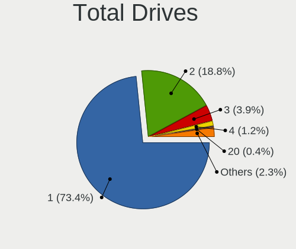
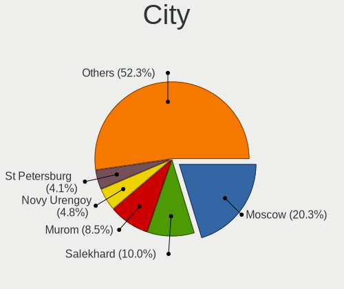
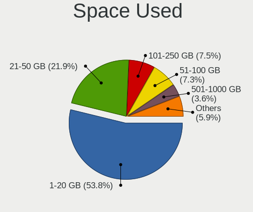
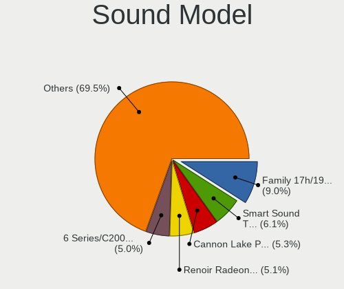

Red OS - Tested Hardware & Statistics
-------------------------------------

A project to collect tested hardware configurations for Red OS.

Anyone can contribute to this report by the [hw-probe](https://github.com/linuxhw/hw-probe) tool:

    sudo -E hw-probe -all -upload

Please contribute! Especially if your hardware is rare.

This is a report for all computer types. See also reports for [desktops](/Dist/Red_OS/Desktop/README.md) and [notebooks](/Dist/Red_OS/Notebook/README.md).

Contents
--------

* [ Test Cases ](#test-cases)

* [ System ](#system)
  - [ OS                       ](#os)
  - [ OS Family                ](#os-family)
  - [ Kernel                   ](#kernel)
  - [ Kernel Family            ](#kernel-family)
  - [ Kernel Major Ver.        ](#kernel-major-ver)
  - [ Arch                     ](#arch)
  - [ DE                       ](#de)
  - [ Display Server           ](#display-server)
  - [ Display Manager          ](#display-manager)
  - [ OS Lang                  ](#os-lang)
  - [ Boot Mode                ](#boot-mode)
  - [ Filesystem               ](#filesystem)
  - [ Part. scheme             ](#part-scheme)
  - [ Dual Boot with Linux/BSD ](#dual-boot-with-linuxbsd)
  - [ Dual Boot (Win)          ](#dual-boot-win)

* [ Board ](#board)
  - [ Vendor                   ](#vendor)
  - [ Model                    ](#model)
  - [ Model Family             ](#model-family)
  - [ MFG Year                 ](#mfg-year)
  - [ Form Factor              ](#form-factor)
  - [ Secure Boot              ](#secure-boot)
  - [ Coreboot                 ](#coreboot)
  - [ RAM Size                 ](#ram-size)
  - [ RAM Used                 ](#ram-used)
  - [ Total Drives             ](#total-drives)
  - [ Has CD-ROM               ](#has-cd-rom)
  - [ Has Ethernet             ](#has-ethernet)
  - [ Has WiFi                 ](#has-wifi)
  - [ Has Bluetooth            ](#has-bluetooth)

* [ Location ](#location)
  - [ Country                  ](#country)
  - [ City                     ](#city)

* [ Drives ](#drives)
  - [ Drive Vendor             ](#drive-vendor)
  - [ Drive Model              ](#drive-model)
  - [ HDD Vendor               ](#hdd-vendor)
  - [ SSD Vendor               ](#ssd-vendor)
  - [ Drive Kind               ](#drive-kind)
  - [ Drive Connector          ](#drive-connector)
  - [ Drive Size               ](#drive-size)
  - [ Space Total              ](#space-total)
  - [ Space Used               ](#space-used)
  - [ Malfunc. Drives          ](#malfunc-drives)
  - [ Malfunc. Drive Vendor    ](#malfunc-drive-vendor)
  - [ Malfunc. HDD Vendor      ](#malfunc-hdd-vendor)
  - [ Malfunc. Drive Kind      ](#malfunc-drive-kind)
  - [ Failed Drives            ](#failed-drives)
  - [ Failed Drive Vendor      ](#failed-drive-vendor)
  - [ Drive Status             ](#drive-status)

* [ Storage controller ](#storage-controller)
  - [ Storage Vendor           ](#storage-vendor)
  - [ Storage Model            ](#storage-model)
  - [ Storage Kind             ](#storage-kind)

* [ Processor ](#processor)
  - [ CPU Vendor               ](#cpu-vendor)
  - [ CPU Model                ](#cpu-model)
  - [ CPU Model Family         ](#cpu-model-family)
  - [ CPU Cores                ](#cpu-cores)
  - [ CPU Sockets              ](#cpu-sockets)
  - [ CPU Threads              ](#cpu-threads)
  - [ CPU Op-Modes             ](#cpu-op-modes)
  - [ CPU Microcode            ](#cpu-microcode)
  - [ CPU Microarch            ](#cpu-microarch)

* [ Graphics ](#graphics)
  - [ GPU Vendor               ](#gpu-vendor)
  - [ GPU Model                ](#gpu-model)
  - [ GPU Combo                ](#gpu-combo)
  - [ GPU Driver               ](#gpu-driver)
  - [ GPU Memory               ](#gpu-memory)

* [ Monitor ](#monitor)
  - [ Monitor Vendor           ](#monitor-vendor)
  - [ Monitor Model            ](#monitor-model)
  - [ Monitor Resolution       ](#monitor-resolution)
  - [ Monitor Diagonal         ](#monitor-diagonal)
  - [ Monitor Width            ](#monitor-width)
  - [ Aspect Ratio             ](#aspect-ratio)
  - [ Monitor Area             ](#monitor-area)
  - [ Pixel Density            ](#pixel-density)
  - [ Multiple Monitors        ](#multiple-monitors)

* [ Network ](#network)
  - [ Net Controller Vendor    ](#net-controller-vendor)
  - [ Net Controller Model     ](#net-controller-model)
  - [ Wireless Vendor          ](#wireless-vendor)
  - [ Wireless Model           ](#wireless-model)
  - [ Ethernet Vendor          ](#ethernet-vendor)
  - [ Ethernet Model           ](#ethernet-model)
  - [ Net Controller Kind      ](#net-controller-kind)
  - [ Used Controller          ](#used-controller)
  - [ NICs                     ](#nics)
  - [ IPv6                     ](#ipv6)

* [ Bluetooth ](#bluetooth)
  - [ Bluetooth Vendor         ](#bluetooth-vendor)
  - [ Bluetooth Model          ](#bluetooth-model)

* [ Sound ](#sound)
  - [ Sound Vendor             ](#sound-vendor)
  - [ Sound Model              ](#sound-model)

* [ Memory ](#memory)
  - [ Memory Vendor            ](#memory-vendor)
  - [ Memory Model             ](#memory-model)
  - [ Memory Kind              ](#memory-kind)
  - [ Memory Form Factor       ](#memory-form-factor)
  - [ Memory Size              ](#memory-size)
  - [ Memory Speed             ](#memory-speed)

* [ Printers & scanners ](#printers--scanners)
  - [ Printer Vendor           ](#printer-vendor)
  - [ Printer Model            ](#printer-model)
  - [ Scanner Vendor           ](#scanner-vendor)
  - [ Scanner Model            ](#scanner-model)

* [ Camera ](#camera)
  - [ Camera Vendor            ](#camera-vendor)
  - [ Camera Model             ](#camera-model)

* [ Security ](#security)
  - [ Fingerprint Vendor       ](#fingerprint-vendor)
  - [ Fingerprint Model        ](#fingerprint-model)
  - [ Chipcard Vendor          ](#chipcard-vendor)
  - [ Chipcard Model           ](#chipcard-model)

* [ Unsupported ](#unsupported)
  - [ Unsupported Devices      ](#unsupported-devices)
  - [ Unsupported Device Types ](#unsupported-device-types)

Test Cases
----------

Total: 326

| Vendor        | Model                       | Form-Factor | Probe                                                      | Date         |
|---------------|-----------------------------|-------------|------------------------------------------------------------|--------------|
| ASUSTek       | V241DA                      | All in one  | [0779deca8b](https://linux-hardware.org/?probe=0779deca8b) | Feb 28, 2023 |
| Graviton      | DMB-H610-TMI01              | All in one  | [4c3b90ede8](https://linux-hardware.org/?probe=4c3b90ede8) | Feb 28, 2023 |
| Aquarius      | AQB560M                     | Desktop     | [ee0c530562](https://linux-hardware.org/?probe=ee0c530562) | Feb 28, 2023 |
| Foxconn       | 2ABF                        | Desktop     | [d6eb6b4839](https://linux-hardware.org/?probe=d6eb6b4839) | Feb 28, 2023 |
| Graviton      | DMB-H610-TMI01              | All in one  | [98eee7b827](https://linux-hardware.org/?probe=98eee7b827) | Feb 28, 2023 |
| Gigabyte      | B365M H                     | Desktop     | [dbb3e73c89](https://linux-hardware.org/?probe=dbb3e73c89) | Feb 27, 2023 |
| Lenovo        | IdeaPad 330-15ARR 81D2      | Notebook    | [b116afe451](https://linux-hardware.org/?probe=b116afe451) | Feb 27, 2023 |
| Kraftway      | ACCORD                      | Notebook    | [8fe15f2f2b](https://linux-hardware.org/?probe=8fe15f2f2b) | Feb 22, 2023 |
| Intel         | DH61CR AAG14064-204         | Desktop     | [f511e61852](https://linux-hardware.org/?probe=f511e61852) | Feb 21, 2023 |
| Lenovo        | ThinkCentre M91p 4524PL4    | Desktop     | [5cda5522e8](https://linux-hardware.org/?probe=5cda5522e8) | Feb 21, 2023 |
| Intel         | DH61CR AAG14064-204         | Desktop     | [eec6e2f905](https://linux-hardware.org/?probe=eec6e2f905) | Feb 21, 2023 |
| Graviton      | DMB-H610-TMI01              | All in one  | [e3156cc208](https://linux-hardware.org/?probe=e3156cc208) | Feb 20, 2023 |
| Graviton      | DMB-H610-TMI01              | All in one  | [243ef00f70](https://linux-hardware.org/?probe=243ef00f70) | Feb 17, 2023 |
| Lenovo        | B590 20208                  | Notebook    | [10e9491ee4](https://linux-hardware.org/?probe=10e9491ee4) | Feb 17, 2023 |
| Lenovo        | B590 20208                  | Notebook    | [a3b352975c](https://linux-hardware.org/?probe=a3b352975c) | Feb 17, 2023 |
| HP            | 18E7                        | Desktop     | [2c779d2395](https://linux-hardware.org/?probe=2c779d2395) | Feb 17, 2023 |
| Lenovo        | IdeaPad L340-15API 81LW     | Notebook    | [4d9144193f](https://linux-hardware.org/?probe=4d9144193f) | Feb 17, 2023 |
| iRU           | v1.0                        | Desktop     | [9d70818485](https://linux-hardware.org/?probe=9d70818485) | Feb 17, 2023 |
| Lenovo        | ThinkBook 15 G2 ARE 20VG    | Notebook    | [9de0373acc](https://linux-hardware.org/?probe=9de0373acc) | Feb 16, 2023 |
| Lenovo        | 31A7 NOK                    | Mini pc     | [17f1e0f135](https://linux-hardware.org/?probe=17f1e0f135) | Feb 16, 2023 |
| iRU           | P231                        | All in one  | [4aa7858493](https://linux-hardware.org/?probe=4aa7858493) | Feb 14, 2023 |
| ICL           | H410SB                      | Desktop     | [e994f10643](https://linux-hardware.org/?probe=e994f10643) | Feb 14, 2023 |
| MSI           | PRO B660M-E DDR4            | Desktop     | [aab30259f8](https://linux-hardware.org/?probe=aab30259f8) | Feb 13, 2023 |
| HP            | 895F                        | All in one  | [0c23df771f](https://linux-hardware.org/?probe=0c23df771f) | Feb 13, 2023 |
| Acer          | Aspire C27-1655             | All in one  | [4fe6ca7f88](https://linux-hardware.org/?probe=4fe6ca7f88) | Feb 13, 2023 |
| Gigabyte      | B560M DS3H V2               | Desktop     | [2512d8d9ab](https://linux-hardware.org/?probe=2512d8d9ab) | Feb 10, 2023 |
| Lenovo        | IdeaPad L340-15API 81LW     | Notebook    | [09073fcfc8](https://linux-hardware.org/?probe=09073fcfc8) | Feb 10, 2023 |
| HP            | G62                         | Notebook    | [8bc9454fb1](https://linux-hardware.org/?probe=8bc9454fb1) | Feb 10, 2023 |
| MSI           | H510M-A PRO                 | Desktop     | [dea6a1a077](https://linux-hardware.org/?probe=dea6a1a077) | Feb 09, 2023 |
| Lenovo        | IdeaPad L340-15API 81LW     | Notebook    | [d3b63de821](https://linux-hardware.org/?probe=d3b63de821) | Feb 07, 2023 |
| Gigabyte      | B365M DS3H                  | Desktop     | [4bc9beae71](https://linux-hardware.org/?probe=4bc9beae71) | Feb 07, 2023 |
| Lenovo        | IdeaPad 5 15ARE05 81YQ      | Notebook    | [a2172caf56](https://linux-hardware.org/?probe=a2172caf56) | Feb 06, 2023 |
| Lenovo        | IdeaPad 5 15ARE05 81YQ      | Notebook    | [77faeb6b52](https://linux-hardware.org/?probe=77faeb6b52) | Feb 06, 2023 |
| Gigabyte      | M61SME-S2                   | Desktop     | [395b6fa893](https://linux-hardware.org/?probe=395b6fa893) | Feb 06, 2023 |
| HP            | Pavilion 15                 | Notebook    | [eb37d7677c](https://linux-hardware.org/?probe=eb37d7677c) | Feb 06, 2023 |
| Lenovo        | 3708 NOK                    | Desktop     | [b306f4c9dc](https://linux-hardware.org/?probe=b306f4c9dc) | Feb 06, 2023 |
| Compal        | DIP00                       | Desktop     | [fc6de899ba](https://linux-hardware.org/?probe=fc6de899ba) | Feb 06, 2023 |
| Lenovo        | IdeaPad L340-15API 81LW     | Notebook    | [bb0481d7a8](https://linux-hardware.org/?probe=bb0481d7a8) | Feb 06, 2023 |
| ASRock        | H61M-VG4                    | Desktop     | [b2fec94855](https://linux-hardware.org/?probe=b2fec94855) | Feb 05, 2023 |
| HP            | 8599                        | Desktop     | [3ffedfbc62](https://linux-hardware.org/?probe=3ffedfbc62) | Jan 31, 2023 |
| Lenovo        | 316E NOK                    | Mini pc     | [c53133f306](https://linux-hardware.org/?probe=c53133f306) | Jan 31, 2023 |
| Lenovo        | 316E NOK                    | Mini pc     | [9721d24c04](https://linux-hardware.org/?probe=9721d24c04) | Jan 31, 2023 |
| HP            | 8599                        | Desktop     | [759d3a0829](https://linux-hardware.org/?probe=759d3a0829) | Jan 31, 2023 |
| Intel         | S2600WFT H48104-854         | Server      | [68791b3635](https://linux-hardware.org/?probe=68791b3635) | Jan 30, 2023 |
| Gigabyte      | B365M H                     | Desktop     | [89d336f0b7](https://linux-hardware.org/?probe=89d336f0b7) | Jan 30, 2023 |
| DEPO Compu... | DPH410S                     | Desktop     | [d380c83ebf](https://linux-hardware.org/?probe=d380c83ebf) | Jan 28, 2023 |
| ASUSTek       | H81M-K                      | Desktop     | [13f23afb38](https://linux-hardware.org/?probe=13f23afb38) | Jan 27, 2023 |
| Aquarius      | AQB560M                     | Desktop     | [1187e4d240](https://linux-hardware.org/?probe=1187e4d240) | Jan 27, 2023 |
| Lenovo        | ThinkCentre M70e 0851RZ3    | Desktop     | [23b8d711f4](https://linux-hardware.org/?probe=23b8d711f4) | Jan 25, 2023 |
| Graviton      | DMB-H610-TMI01              | All in one  | [87c61b6748](https://linux-hardware.org/?probe=87c61b6748) | Jan 25, 2023 |
| MSI           | PRO H610M-E DDR4            | Desktop     | [8a06b2350d](https://linux-hardware.org/?probe=8a06b2350d) | Jan 25, 2023 |
| Lenovo        | IdeaPad L340-15API 81LW     | Notebook    | [186aef8e0c](https://linux-hardware.org/?probe=186aef8e0c) | Jan 24, 2023 |
| MSI           | PRO H610M-E DDR4            | Desktop     | [d5c4129361](https://linux-hardware.org/?probe=d5c4129361) | Jan 23, 2023 |
| HP            | 18E4                        | Desktop     | [9a62a59c37](https://linux-hardware.org/?probe=9a62a59c37) | Jan 20, 2023 |
| ASUSTek       | PRIME B460M-K               | Desktop     | [86d4a0e87c](https://linux-hardware.org/?probe=86d4a0e87c) | Jan 20, 2023 |
| Lenovo        | V130-15IKB 81HN             | Notebook    | [a74a5b3b7b](https://linux-hardware.org/?probe=a74a5b3b7b) | Jan 20, 2023 |
| ASUSTek       | V241FA                      | All in one  | [24ed481783](https://linux-hardware.org/?probe=24ed481783) | Jan 20, 2023 |
| Lenovo        | IdeaPad L340-15API 81LW     | Notebook    | [8472d89767](https://linux-hardware.org/?probe=8472d89767) | Jan 20, 2023 |
| Gigabyte      | B360HD3                     | Desktop     | [cbd81c917f](https://linux-hardware.org/?probe=cbd81c917f) | Jan 20, 2023 |
| Lenovo        | IdeaPad L340-15API 81LW     | Notebook    | [7d95709d81](https://linux-hardware.org/?probe=7d95709d81) | Jan 19, 2023 |
| Gigabyte      | H610M S2H DDR4              | Desktop     | [4e77673e60](https://linux-hardware.org/?probe=4e77673e60) | Jan 19, 2023 |
| MSI           | PRO H610M-E DDR4            | Desktop     | [3f185b85f5](https://linux-hardware.org/?probe=3f185b85f5) | Jan 18, 2023 |
| ASUSTek       | H81M-K                      | Desktop     | [1e6f35ceff](https://linux-hardware.org/?probe=1e6f35ceff) | Jan 18, 2023 |
| Gigabyte      | B360HD3                     | Desktop     | [3fb3939014](https://linux-hardware.org/?probe=3fb3939014) | Jan 18, 2023 |
| Samsung       | DP300A2A-B01RU SEC_SW_RE... | All in one  | [03c97b653e](https://linux-hardware.org/?probe=03c97b653e) | Jan 18, 2023 |
| NCI           | PC BLICK101                 | Soc         | [018eb0b0bb](https://linux-hardware.org/?probe=018eb0b0bb) | Jan 18, 2023 |
| Gigabyte      | B360HD3                     | Desktop     | [8b992a1d50](https://linux-hardware.org/?probe=8b992a1d50) | Jan 17, 2023 |
| ASUSTek       | H81M-K                      | Desktop     | [a4ee55fea9](https://linux-hardware.org/?probe=a4ee55fea9) | Jan 17, 2023 |
| Samsung       | DP300A2A-B01RU SEC_SW_RE... | All in one  | [35cae36101](https://linux-hardware.org/?probe=35cae36101) | Jan 17, 2023 |
| HP            | Pavilion Laptop 15-eh1xx... | Notebook    | [b6e4100bc6](https://linux-hardware.org/?probe=b6e4100bc6) | Jan 17, 2023 |
| Unknown       | T310D11                     | Desktop     | [acce0e1df1](https://linux-hardware.org/?probe=acce0e1df1) | Jan 16, 2023 |
| Graviton      | DMB-H610-TMI01              | All in one  | [aea58aa72f](https://linux-hardware.org/?probe=aea58aa72f) | Jan 16, 2023 |
| Gigabyte      | B360HD3                     | Desktop     | [6c3f234091](https://linux-hardware.org/?probe=6c3f234091) | Jan 11, 2023 |
| ASUSTek       | H81M-K                      | Desktop     | [2e985853be](https://linux-hardware.org/?probe=2e985853be) | Jan 11, 2023 |
| ASUSTek       | PRIME H610M-K D4            | Desktop     | [31ecdfb704](https://linux-hardware.org/?probe=31ecdfb704) | Jan 11, 2023 |
| ASUSTek       | PRIME B365M-A               | Desktop     | [4f9477b846](https://linux-hardware.org/?probe=4f9477b846) | Jan 08, 2023 |
| HP            | 82DC 1000                   | All in one  | [12c8c204ff](https://linux-hardware.org/?probe=12c8c204ff) | Dec 30, 2022 |
| Lenovo        | IdeaPad L340-15API 81LW     | Notebook    | [a05251fd39](https://linux-hardware.org/?probe=a05251fd39) | Dec 29, 2022 |
| 3Logic Gro... | Graviton N15i-K2            | Notebook    | [fe79eba13b](https://linux-hardware.org/?probe=fe79eba13b) | Dec 29, 2022 |
| ASUSTek       | M5A78L-M LX V2              | Desktop     | [f040219e23](https://linux-hardware.org/?probe=f040219e23) | Dec 26, 2022 |
| ASUSTek       | PRIME H510T2/CSM            | Desktop     | [b5ff4bd9d6](https://linux-hardware.org/?probe=b5ff4bd9d6) | Dec 26, 2022 |
| HP            | 895F                        | All in one  | [670e3fa0fa](https://linux-hardware.org/?probe=670e3fa0fa) | Dec 26, 2022 |
| HP            | Notebook                    | Notebook    | [10dfda9549](https://linux-hardware.org/?probe=10dfda9549) | Dec 24, 2022 |
| HP            | 895F                        | All in one  | [8e512dfec4](https://linux-hardware.org/?probe=8e512dfec4) | Dec 23, 2022 |
| HP            | 895F                        | All in one  | [0360aa0d07](https://linux-hardware.org/?probe=0360aa0d07) | Dec 23, 2022 |
| ASUSTek       | PRIME H510T2/CSM            | Desktop     | [f5f35c12a4](https://linux-hardware.org/?probe=f5f35c12a4) | Dec 23, 2022 |
| ASUSTek       | PRIME H510T2/CSM            | Desktop     | [686b84facc](https://linux-hardware.org/?probe=686b84facc) | Dec 23, 2022 |
| DEPO Compu... | DPH410S                     | Desktop     | [0ba02e46fa](https://linux-hardware.org/?probe=0ba02e46fa) | Dec 22, 2022 |
| MSI           | B450-A PRO MAX              | Desktop     | [8ea27950b9](https://linux-hardware.org/?probe=8ea27950b9) | Dec 21, 2022 |
| Lenovo        | ThinkPad E15 Gen 4 21E60... | Notebook    | [4c1ad2ea2e](https://linux-hardware.org/?probe=4c1ad2ea2e) | Dec 18, 2022 |
| Kraftway      | ACCORD                      | Notebook    | [a199d930ff](https://linux-hardware.org/?probe=a199d930ff) | Dec 18, 2022 |
| Gigabyte      | M61SME-S2                   | Desktop     | [8babc33ab6](https://linux-hardware.org/?probe=8babc33ab6) | Dec 17, 2022 |
| Shanghai Z... | ZXE CRB                     | Notebook    | [20ce0a7f23](https://linux-hardware.org/?probe=20ce0a7f23) | Dec 16, 2022 |
| MSI           | B450-A PRO MAX              | Desktop     | [257ccc50d8](https://linux-hardware.org/?probe=257ccc50d8) | Dec 15, 2022 |
| Colorful T... | H610M-K M.2 V20             | Desktop     | [795e44f6f2](https://linux-hardware.org/?probe=795e44f6f2) | Dec 15, 2022 |
| Gigabyte      | H110M-S2-CF                 | Desktop     | [af9afd9f4b](https://linux-hardware.org/?probe=af9afd9f4b) | Dec 14, 2022 |
| ASUSTek       | PB62                        | Desktop     | [fb3796ceea](https://linux-hardware.org/?probe=fb3796ceea) | Dec 12, 2022 |
| ASUSTek       | PB62                        | Desktop     | [4d4a5fcc93](https://linux-hardware.org/?probe=4d4a5fcc93) | Dec 12, 2022 |
| Lenovo        | IdeaPad L340-15API 81LW     | Notebook    | [6cedae9702](https://linux-hardware.org/?probe=6cedae9702) | Dec 10, 2022 |
| Gigabyte      | B365M DS3H                  | Desktop     | [89e51f2eaa](https://linux-hardware.org/?probe=89e51f2eaa) | Dec 09, 2022 |
| Lenovo        | IdeaPad L340-15API 81LW     | Notebook    | [311f47baef](https://linux-hardware.org/?probe=311f47baef) | Dec 09, 2022 |
| HP            | Laptop 15s-eq1xxx           | Notebook    | [79a0f9e73a](https://linux-hardware.org/?probe=79a0f9e73a) | Dec 08, 2022 |
| HP            | Laptop 15s-eq1xxx           | Notebook    | [c1cd524970](https://linux-hardware.org/?probe=c1cd524970) | Dec 08, 2022 |
| Aquarius      | NS685U R11                  | Notebook    | [c0dff8c525](https://linux-hardware.org/?probe=c0dff8c525) | Dec 08, 2022 |
| Lenovo        | 10088                       | All in one  | [5fe857bab3](https://linux-hardware.org/?probe=5fe857bab3) | Dec 07, 2022 |
| ICL           | RAYbook Si1512              | Notebook    | [b8c52ae5cb](https://linux-hardware.org/?probe=b8c52ae5cb) | Dec 06, 2022 |
| ASUSTek       | P7H55-M                     | Desktop     | [aaa5171bd6](https://linux-hardware.org/?probe=aaa5171bd6) | Dec 06, 2022 |
| HP            | Laptop 15s-eq1xxx           | Notebook    | [0cd3371014](https://linux-hardware.org/?probe=0cd3371014) | Dec 05, 2022 |
| MSI           | Sword 15 A12UE              | Notebook    | [32df733b5e](https://linux-hardware.org/?probe=32df733b5e) | Dec 04, 2022 |
| ASRock        | H510M-HVS R2.0              | Desktop     | [4309758f8f](https://linux-hardware.org/?probe=4309758f8f) | Dec 02, 2022 |
| HP            | 84EE 1100                   | All in one  | [7efea8ad7f](https://linux-hardware.org/?probe=7efea8ad7f) | Dec 01, 2022 |
| Lenovo        | Aptio CRB No DPK            | Mini pc     | [eeddc09936](https://linux-hardware.org/?probe=eeddc09936) | Nov 28, 2022 |
| Lenovo        | IdeaPad L340-15API 81LW     | Notebook    | [ddb1791ff6](https://linux-hardware.org/?probe=ddb1791ff6) | Nov 28, 2022 |
| Gigabyte      | B365M DS3H                  | Desktop     | [4b9ee0ef6a](https://linux-hardware.org/?probe=4b9ee0ef6a) | Nov 28, 2022 |
| Gigabyte      | H410M S2H V3                | Desktop     | [8882bfe4f8](https://linux-hardware.org/?probe=8882bfe4f8) | Nov 28, 2022 |
| Lenovo        | IdeaPad 700-15ISK 80RU      | Notebook    | [d9ae3d1795](https://linux-hardware.org/?probe=d9ae3d1795) | Nov 27, 2022 |
| Gigabyte      | X570S UD                    | Desktop     | [381b3c892d](https://linux-hardware.org/?probe=381b3c892d) | Nov 25, 2022 |
| Lenovo        | 31900059 STD                | All in one  | [812cce763f](https://linux-hardware.org/?probe=812cce763f) | Nov 25, 2022 |
| Lenovo        | 31900059 STD                | All in one  | [bfe8939ffc](https://linux-hardware.org/?probe=bfe8939ffc) | Nov 25, 2022 |
| ASUSTek       | PRIME Z590-P                | Desktop     | [7d6cf8c81f](https://linux-hardware.org/?probe=7d6cf8c81f) | Nov 24, 2022 |
| Lenovo        | IdeaPad L340-15API 81LW     | Notebook    | [ff3d0a1ecf](https://linux-hardware.org/?probe=ff3d0a1ecf) | Nov 24, 2022 |
| Lenovo        | IdeaPad L340-15API 81LW     | Notebook    | [f86569d54b](https://linux-hardware.org/?probe=f86569d54b) | Nov 24, 2022 |
| Gigabyte      | B365M DS3H                  | Desktop     | [e48d26b26f](https://linux-hardware.org/?probe=e48d26b26f) | Nov 21, 2022 |
| HUAWEI        | NBD-WXX9                    | Notebook    | [a54f42b51e](https://linux-hardware.org/?probe=a54f42b51e) | Nov 18, 2022 |
| HUAWEI        | NBD-WXX9                    | Notebook    | [faa0deab8f](https://linux-hardware.org/?probe=faa0deab8f) | Nov 18, 2022 |
| Unknown       | P43Twins1600                | Desktop     | [1db44f50c4](https://linux-hardware.org/?probe=1db44f50c4) | Nov 18, 2022 |
| ASRock        | H310CM-DVS                  | Desktop     | [23194fe7d9](https://linux-hardware.org/?probe=23194fe7d9) | Nov 16, 2022 |
| HP            | 2179                        | Desktop     | [3407225f33](https://linux-hardware.org/?probe=3407225f33) | Nov 14, 2022 |
| ASRock        | H310CM-DVS                  | Desktop     | [86932d2426](https://linux-hardware.org/?probe=86932d2426) | Nov 14, 2022 |
| Lenovo        | ThinkPad X220 4290RB3       | Notebook    | [37959973aa](https://linux-hardware.org/?probe=37959973aa) | Nov 11, 2022 |
| ASUSTek       | PRIME H510T2/CSM            | Desktop     | [ef983bc60e](https://linux-hardware.org/?probe=ef983bc60e) | Nov 11, 2022 |
| Lenovo        | IdeaPad L340-15API 81LW     | Notebook    | [3fd33e6782](https://linux-hardware.org/?probe=3fd33e6782) | Nov 09, 2022 |
| Lenovo        | 312D NOK                    | Mini pc     | [e525d01069](https://linux-hardware.org/?probe=e525d01069) | Nov 08, 2022 |
| Lenovo        | 312D NOK                    | Mini pc     | [b74787fe62](https://linux-hardware.org/?probe=b74787fe62) | Nov 08, 2022 |
| ASRock        | H61M-VG4                    | Desktop     | [63f5fe9444](https://linux-hardware.org/?probe=63f5fe9444) | Nov 04, 2022 |
| Lenovo        | IdeaPad L340-15API 81LW     | Notebook    | [dba14315ca](https://linux-hardware.org/?probe=dba14315ca) | Nov 03, 2022 |
| Lenovo        | 312D NOK                    | Mini pc     | [4776ed964f](https://linux-hardware.org/?probe=4776ed964f) | Nov 03, 2022 |
| Lenovo        | 312D NOK                    | Mini pc     | [2c20efc0df](https://linux-hardware.org/?probe=2c20efc0df) | Nov 03, 2022 |
| Gigabyte      | A520M DS3H                  | Desktop     | [8fe13e2165](https://linux-hardware.org/?probe=8fe13e2165) | Nov 02, 2022 |
| ASRock        | H510M-HVS R2.0              | Desktop     | [562f466f8d](https://linux-hardware.org/?probe=562f466f8d) | Nov 02, 2022 |
| ASRock        | B450M Pro4                  | Desktop     | [38b68c6946](https://linux-hardware.org/?probe=38b68c6946) | Nov 02, 2022 |
| ASRock        | H510M-HVS R2.0              | Desktop     | [b68271c648](https://linux-hardware.org/?probe=b68271c648) | Nov 02, 2022 |
| Gigabyte      | B450M H                     | Desktop     | [06bbc75ef0](https://linux-hardware.org/?probe=06bbc75ef0) | Nov 01, 2022 |
| MSI           | 0A90                        | Desktop     | [47fa407c02](https://linux-hardware.org/?probe=47fa407c02) | Nov 01, 2022 |
| Lenovo        | IdeaPad L340-15API 81LW     | Notebook    | [d653658a53](https://linux-hardware.org/?probe=d653658a53) | Oct 28, 2022 |
| Gigabyte      | B560M H                     | Desktop     | [00766db60b](https://linux-hardware.org/?probe=00766db60b) | Oct 28, 2022 |
| MSI           | 0A90                        | Desktop     | [a15ab9db5e](https://linux-hardware.org/?probe=a15ab9db5e) | Oct 28, 2022 |
| Gigabyte      | GA-880GM-D2H                | Desktop     | [cacdacb3ad](https://linux-hardware.org/?probe=cacdacb3ad) | Oct 28, 2022 |
| Lenovo        | IdeaPad L340-15API 81LW     | Notebook    | [b9ab6b9cf2](https://linux-hardware.org/?probe=b9ab6b9cf2) | Oct 28, 2022 |
| Lenovo        | 3188 SDK0J40697 WIN 3305... | Desktop     | [9c429fe90c](https://linux-hardware.org/?probe=9c429fe90c) | Oct 27, 2022 |
| Acer          | Aspire A517-52              | Notebook    | [1ee47a3ab6](https://linux-hardware.org/?probe=1ee47a3ab6) | Oct 25, 2022 |
| ASUSTek       | H81M-K                      | Desktop     | [92dbe47379](https://linux-hardware.org/?probe=92dbe47379) | Oct 25, 2022 |
| ASUSTek       | H81M-K                      | Desktop     | [247782b262](https://linux-hardware.org/?probe=247782b262) | Oct 25, 2022 |
| Lenovo        | IdeaPad 5 Pro 14ACN6 82L... | Notebook    | [14537f243b](https://linux-hardware.org/?probe=14537f243b) | Oct 24, 2022 |
| THUNDEROBO... | 911AirD                     | Notebook    | [f471a1c9db](https://linux-hardware.org/?probe=f471a1c9db) | Oct 23, 2022 |
| Lenovo        | 3708 NOK                    | Desktop     | [f48f731517](https://linux-hardware.org/?probe=f48f731517) | Oct 21, 2022 |
| Intel         | S2600WFT H48104-854         | Server      | [4887ba4bfa](https://linux-hardware.org/?probe=4887ba4bfa) | Oct 21, 2022 |
| Acer          | Aspire A517-52              | Notebook    | [7515d53b5d](https://linux-hardware.org/?probe=7515d53b5d) | Oct 21, 2022 |
| Gigabyte      | B360HD3                     | Desktop     | [bbbdee0883](https://linux-hardware.org/?probe=bbbdee0883) | Oct 21, 2022 |
| Gigabyte      | B75M-D3V                    | Desktop     | [71c9391b8b](https://linux-hardware.org/?probe=71c9391b8b) | Oct 21, 2022 |
| Lenovo        | IdeaPad L340-15API 81LW     | Notebook    | [3fc175d4a0](https://linux-hardware.org/?probe=3fc175d4a0) | Oct 20, 2022 |
| Lenovo        | 312D NOK                    | Mini pc     | [39838b7f39](https://linux-hardware.org/?probe=39838b7f39) | Oct 20, 2022 |
| Lenovo        | ThinkBook 15 G3 ACL 21A4    | Notebook    | [fe184c8f5b](https://linux-hardware.org/?probe=fe184c8f5b) | Oct 19, 2022 |
| Lenovo        | ThinkBook 15 G3 ACL 21A4    | Notebook    | [0db79bc085](https://linux-hardware.org/?probe=0db79bc085) | Oct 19, 2022 |
| Gigabyte      | H510M S2H                   | Desktop     | [e75a8830af](https://linux-hardware.org/?probe=e75a8830af) | Oct 19, 2022 |
| Gigabyte      | H510M S2H                   | Desktop     | [b8303261ad](https://linux-hardware.org/?probe=b8303261ad) | Oct 18, 2022 |
| HP            | 83EB                        | All in one  | [1011557c31](https://linux-hardware.org/?probe=1011557c31) | Oct 18, 2022 |
| HP            | 83EB                        | All in one  | [f81210f730](https://linux-hardware.org/?probe=f81210f730) | Oct 18, 2022 |
| Intel         | S2600WFT H48104-854         | Server      | [7fa3948164](https://linux-hardware.org/?probe=7fa3948164) | Oct 17, 2022 |
| ASUSTek       | H81M-K                      | Desktop     | [c6958291bd](https://linux-hardware.org/?probe=c6958291bd) | Oct 14, 2022 |
| Lenovo        | IdeaPad L340-15API 81LW     | Notebook    | [1cdde90662](https://linux-hardware.org/?probe=1cdde90662) | Oct 13, 2022 |
| HP            | 1495                        | Desktop     | [b1523ff4a6](https://linux-hardware.org/?probe=b1523ff4a6) | Oct 13, 2022 |
| YADRO         | VEGMAN Motherboard MBDX8... | Server      | [97b57f8628](https://linux-hardware.org/?probe=97b57f8628) | Oct 13, 2022 |
| YADRO         | VEGMAN Motherboard MBDX8... | Server      | [f74f853f54](https://linux-hardware.org/?probe=f74f853f54) | Oct 12, 2022 |
| ASUSTek       | PRIME H510T2/CSM            | Desktop     | [087d1975e1](https://linux-hardware.org/?probe=087d1975e1) | Oct 12, 2022 |
| ASUSTek       | B150M-C                     | Desktop     | [1d936352ea](https://linux-hardware.org/?probe=1d936352ea) | Oct 10, 2022 |
| Gigabyte      | H110M-S2-CF                 | Desktop     | [e799b41d70](https://linux-hardware.org/?probe=e799b41d70) | Oct 09, 2022 |
| Acer          | Aspire 2920                 | Notebook    | [c588bacc95](https://linux-hardware.org/?probe=c588bacc95) | Oct 08, 2022 |
| Acer          | Aspire 2920                 | Notebook    | [34b41a4e67](https://linux-hardware.org/?probe=34b41a4e67) | Oct 08, 2022 |
| MSI           | H55M-E33                    | Desktop     | [95423ecdbe](https://linux-hardware.org/?probe=95423ecdbe) | Oct 07, 2022 |
| ASUSTek       | X540NV                      | Notebook    | [31e4464fea](https://linux-hardware.org/?probe=31e4464fea) | Oct 07, 2022 |
| ASRock        | B460M Pro4                  | Desktop     | [9fd01561ce](https://linux-hardware.org/?probe=9fd01561ce) | Oct 07, 2022 |
| ASRock        | B460M Pro4                  | Desktop     | [4c0bb83f01](https://linux-hardware.org/?probe=4c0bb83f01) | Oct 07, 2022 |
| MSI           | H55M-E33                    | Desktop     | [7af53a4dee](https://linux-hardware.org/?probe=7af53a4dee) | Oct 06, 2022 |
| Lenovo        | IdeaPad L340-15API 81LW     | Notebook    | [7f8e650618](https://linux-hardware.org/?probe=7f8e650618) | Oct 06, 2022 |
| Acer          | Aspire 2920                 | Notebook    | [538f7a6e26](https://linux-hardware.org/?probe=538f7a6e26) | Oct 05, 2022 |
| HP            | OMEN by Laptop              | Notebook    | [0a8238a876](https://linux-hardware.org/?probe=0a8238a876) | Oct 05, 2022 |
| Lenovo        | 3188 SDK0J40697 WIN 3305... | Desktop     | [b90de94f3d](https://linux-hardware.org/?probe=b90de94f3d) | Oct 05, 2022 |
| THUNDEROBO... | 911AirD                     | Notebook    | [69a9650652](https://linux-hardware.org/?probe=69a9650652) | Oct 03, 2022 |
| Lenovo        | IdeaPad L340-15API 81LW     | Notebook    | [89b48cd98e](https://linux-hardware.org/?probe=89b48cd98e) | Oct 03, 2022 |
| Lenovo        | 32E4 NOK                    | Mini pc     | [f49f7ba847](https://linux-hardware.org/?probe=f49f7ba847) | Oct 03, 2022 |
| Digma         | EVE 11 C408                 | Notebook    | [b5c7ac8ed3](https://linux-hardware.org/?probe=b5c7ac8ed3) | Sep 30, 2022 |
| ASRock        | B360M-HDV                   | Desktop     | [fad5a877f5](https://linux-hardware.org/?probe=fad5a877f5) | Sep 30, 2022 |
| THUNDEROBO... | 911AirD                     | Notebook    | [99f1b7e253](https://linux-hardware.org/?probe=99f1b7e253) | Sep 29, 2022 |
| RDW           | MB-B450M V.1                | Desktop     | [8c3a565d43](https://linux-hardware.org/?probe=8c3a565d43) | Sep 26, 2022 |
| Gigabyte      | B550 AORUS ELITE V2         | Desktop     | [1748378749](https://linux-hardware.org/?probe=1748378749) | Sep 22, 2022 |
| Gigabyte      | B75M-D3V                    | Desktop     | [3888b56318](https://linux-hardware.org/?probe=3888b56318) | Sep 22, 2022 |
| Gigabyte      | B550 AORUS ELITE V2         | Desktop     | [66a228f8c5](https://linux-hardware.org/?probe=66a228f8c5) | Sep 21, 2022 |
| ICL           | RAYbook Si1512              | Notebook    | [0b610b66a9](https://linux-hardware.org/?probe=0b610b66a9) | Sep 20, 2022 |
| Gigabyte      | H110M-S2-CF                 | Desktop     | [fd03d25b78](https://linux-hardware.org/?probe=fd03d25b78) | Sep 15, 2022 |
| ECS           | H510H6-M7                   | Desktop     | [1275257180](https://linux-hardware.org/?probe=1275257180) | Sep 14, 2022 |
| Lenovo        | IdeaPad L340-15API 81LW     | Notebook    | [713797403a](https://linux-hardware.org/?probe=713797403a) | Sep 09, 2022 |
| IP3 Techno... | ACN30                       | Notebook    | [af9694cea8](https://linux-hardware.org/?probe=af9694cea8) | Sep 06, 2022 |
| IP3 Techno... | ACN30                       | Notebook    | [03f14a115d](https://linux-hardware.org/?probe=03f14a115d) | Sep 05, 2022 |
| Unknown       | Unknown                     | Desktop     | [40c1fd4544](https://linux-hardware.org/?probe=40c1fd4544) | Sep 05, 2022 |
| Gigabyte      | B450 AORUS PRO-CF           | Desktop     | [04b62ac6e3](https://linux-hardware.org/?probe=04b62ac6e3) | Sep 04, 2022 |
| Gigabyte      | B450 AORUS PRO-CF           | Desktop     | [a60315c259](https://linux-hardware.org/?probe=a60315c259) | Sep 04, 2022 |
| MSI           | FX610                       | Notebook    | [a822818a58](https://linux-hardware.org/?probe=a822818a58) | Sep 03, 2022 |
| ASRock        | N68-VS3 FX                  | Desktop     | [b4c043c208](https://linux-hardware.org/?probe=b4c043c208) | Sep 01, 2022 |
| ASRock        | B365M Pro4-F                | Desktop     | [3b519201e2](https://linux-hardware.org/?probe=3b519201e2) | Aug 22, 2022 |
| Gigabyte      | X58-USB3                    | Desktop     | [5119bcb630](https://linux-hardware.org/?probe=5119bcb630) | Aug 19, 2022 |
| IP3 Techno... | ACN30                       | Notebook    | [e25ed534c0](https://linux-hardware.org/?probe=e25ed534c0) | Aug 18, 2022 |
| ICL           | RAYbook Si1512              | Notebook    | [a42c4dc65a](https://linux-hardware.org/?probe=a42c4dc65a) | Aug 09, 2022 |
| ASRock        | H110M-DVS R2.0              | Desktop     | [c02a953cda](https://linux-hardware.org/?probe=c02a953cda) | Aug 01, 2022 |
| Gigabyte      | B365M DS3H                  | Desktop     | [14f73b6a3a](https://linux-hardware.org/?probe=14f73b6a3a) | Aug 01, 2022 |
| Digma         | EVE 15 P417 ES5063EW        | Notebook    | [a584c678b5](https://linux-hardware.org/?probe=a584c678b5) | Jul 27, 2022 |
| Digma         | EVE 15 C407 ES5054EW        | Notebook    | [4fd01756b2](https://linux-hardware.org/?probe=4fd01756b2) | Jul 27, 2022 |
| Digma         | EVE 15 C407 ES5054EW        | Notebook    | [008b02cc92](https://linux-hardware.org/?probe=008b02cc92) | Jul 26, 2022 |
| Dell          | 040DDP A00                  | Desktop     | [5375c9c059](https://linux-hardware.org/?probe=5375c9c059) | Jul 26, 2022 |
| Lenovo        | IdeaPad 5 Pro 14ACN6 82L... | Notebook    | [413949a727](https://linux-hardware.org/?probe=413949a727) | Jul 25, 2022 |
| Lenovo        | V15-IWL 81YE                | Notebook    | [3bfcedd5c8](https://linux-hardware.org/?probe=3bfcedd5c8) | Jul 22, 2022 |
| Lenovo        | V15-IWL 81YE                | Notebook    | [c49282206c](https://linux-hardware.org/?probe=c49282206c) | Jul 22, 2022 |
| Lenovo        | V15-IWL 81YE                | Notebook    | [d598c4587d](https://linux-hardware.org/?probe=d598c4587d) | Jul 22, 2022 |
| DEPO Compu... | DPH310T                     | Desktop     | [7cc031e93b](https://linux-hardware.org/?probe=7cc031e93b) | Jul 22, 2022 |
| DEPO Compu... | DPH310T                     | Desktop     | [946610c122](https://linux-hardware.org/?probe=946610c122) | Jul 22, 2022 |
| Lenovo        | V15-IWL 81YE                | Notebook    | [5b1e962751](https://linux-hardware.org/?probe=5b1e962751) | Jul 22, 2022 |
| Lenovo        | V15-IWL 81YE                | Notebook    | [4e120b3b63](https://linux-hardware.org/?probe=4e120b3b63) | Jul 22, 2022 |
| DEPO Compu... | DPH310T                     | Desktop     | [fbff39be7e](https://linux-hardware.org/?probe=fbff39be7e) | Jul 22, 2022 |
| Lenovo        | V15-IWL 81YE                | Notebook    | [2d5bedf224](https://linux-hardware.org/?probe=2d5bedf224) | Jul 22, 2022 |
| Lenovo        | V15-IWL 81YE                | Notebook    | [297ce5144e](https://linux-hardware.org/?probe=297ce5144e) | Jul 22, 2022 |
| Lenovo        | V15-IWL 81YE                | Notebook    | [84b7cd1115](https://linux-hardware.org/?probe=84b7cd1115) | Jul 22, 2022 |
| Lenovo        | V15-IWL 81YE                | Notebook    | [a92b6c5d73](https://linux-hardware.org/?probe=a92b6c5d73) | Jul 22, 2022 |
| Lenovo        | V15-IWL 81YE                | Notebook    | [51ebd271c8](https://linux-hardware.org/?probe=51ebd271c8) | Jul 22, 2022 |
| DEPO Compu... | DPH310T                     | Desktop     | [0076bf5efc](https://linux-hardware.org/?probe=0076bf5efc) | Jul 22, 2022 |
| Lenovo        | V15-IWL 81YE                | Notebook    | [44ad7f7d47](https://linux-hardware.org/?probe=44ad7f7d47) | Jul 22, 2022 |
| Lenovo        | V15-IWL 81YE                | Notebook    | [49068a26b5](https://linux-hardware.org/?probe=49068a26b5) | Jul 22, 2022 |
| Lenovo        | V15-IWL 81YE                | Notebook    | [62ce596bf3](https://linux-hardware.org/?probe=62ce596bf3) | Jul 22, 2022 |
| Lenovo        | V15-IWL 81YE                | Notebook    | [812db8ad6f](https://linux-hardware.org/?probe=812db8ad6f) | Jul 22, 2022 |
| Lenovo        | V15-IWL 81YE                | Notebook    | [d4c2b5ffad](https://linux-hardware.org/?probe=d4c2b5ffad) | Jul 22, 2022 |
| Lenovo        | V15-IWL 81YE                | Notebook    | [4c0179b60e](https://linux-hardware.org/?probe=4c0179b60e) | Jul 22, 2022 |
| Lenovo        | IdeaPad L340-15API 81LW     | Notebook    | [8601888983](https://linux-hardware.org/?probe=8601888983) | Jul 22, 2022 |
| Lenovo        | V15-IWL 81YE                | Notebook    | [1d505390d6](https://linux-hardware.org/?probe=1d505390d6) | Jul 22, 2022 |
| HONOR         | NBR-WAX9                    | Notebook    | [5b3340311a](https://linux-hardware.org/?probe=5b3340311a) | Jul 20, 2022 |
| Lenovo        | IdeaPad L340-15API 81LW     | Notebook    | [154c254eac](https://linux-hardware.org/?probe=154c254eac) | Jul 19, 2022 |
| Gigabyte      | G5 GD                       | Notebook    | [60921a7ff6](https://linux-hardware.org/?probe=60921a7ff6) | Jul 19, 2022 |
| Gigabyte      | G5 GD                       | Notebook    | [c24f8b4ba6](https://linux-hardware.org/?probe=c24f8b4ba6) | Jul 19, 2022 |
| Lenovo        | 312D NOK                    | Mini pc     | [4f1a1bfb2d](https://linux-hardware.org/?probe=4f1a1bfb2d) | Jul 19, 2022 |
| Gigabyte      | 970A-D3                     | Desktop     | [f2ae77cc0c](https://linux-hardware.org/?probe=f2ae77cc0c) | Jul 17, 2022 |
| HONOR         | NBR-WAX9                    | Notebook    | [fe971bb8c3](https://linux-hardware.org/?probe=fe971bb8c3) | Jul 08, 2022 |
| Lenovo        | IdeaPad 3 15ITL05 81X8      | Notebook    | [2835672840](https://linux-hardware.org/?probe=2835672840) | Jul 07, 2022 |
| Kraftway      | ACCORD                      | Notebook    | [24e49bc011](https://linux-hardware.org/?probe=24e49bc011) | Jun 27, 2022 |
| Kraftway      | ACCORD                      | Notebook    | [39e3c55e89](https://linux-hardware.org/?probe=39e3c55e89) | Jun 27, 2022 |
| ASUSTek       | M2N68-AM Plus               | Desktop     | [d85cded80a](https://linux-hardware.org/?probe=d85cded80a) | Jun 20, 2022 |
| Aquarius      | NS685U                      | Notebook    | [ecedc7cbb6](https://linux-hardware.org/?probe=ecedc7cbb6) | Jun 08, 2022 |
| ASUSTek       | PRIME H510T2/CSM            | Desktop     | [28e8a1e19c](https://linux-hardware.org/?probe=28e8a1e19c) | Jun 07, 2022 |
| ASUSTek       | H81M-K                      | Desktop     | [df5b1991e1](https://linux-hardware.org/?probe=df5b1991e1) | Jun 07, 2022 |
| ICL           | Unknown                     | Notebook    | [4dc89fc689](https://linux-hardware.org/?probe=4dc89fc689) | Jun 07, 2022 |
| HP            | 0B4Ch D                     | Desktop     | [8ea7efbf2e](https://linux-hardware.org/?probe=8ea7efbf2e) | Jun 07, 2022 |
| iRU           | v1.0                        | Mini pc     | [845212ce42](https://linux-hardware.org/?probe=845212ce42) | Jun 02, 2022 |
| iRU           | v1.0                        | Mini pc     | [15b125fb9e](https://linux-hardware.org/?probe=15b125fb9e) | May 31, 2022 |
| iRU           | v1.0                        | Mini pc     | [991e061d78](https://linux-hardware.org/?probe=991e061d78) | May 31, 2022 |
| MSI           | A520M PRO                   | Desktop     | [3eb8006c14](https://linux-hardware.org/?probe=3eb8006c14) | May 26, 2022 |
| MSI           | A520M PRO                   | Desktop     | [9766bbe4c0](https://linux-hardware.org/?probe=9766bbe4c0) | May 25, 2022 |
| ASRock        | B365M Pro4-F                | Desktop     | [b3b2ee08af](https://linux-hardware.org/?probe=b3b2ee08af) | May 23, 2022 |
| MSI           | H510TI-S01                  | Desktop     | [efe42ef07a](https://linux-hardware.org/?probe=efe42ef07a) | May 19, 2022 |
| ASUSTek       | V241IC-R                    | All in one  | [48add8dc01](https://linux-hardware.org/?probe=48add8dc01) | May 19, 2022 |
| Gigabyte      | B365M H                     | Desktop     | [e405d209d4](https://linux-hardware.org/?probe=e405d209d4) | May 11, 2022 |
| mtech         | MTL1578                     | Notebook    | [bf25c26ea0](https://linux-hardware.org/?probe=bf25c26ea0) | May 11, 2022 |
| ASUSTek       | H81M-K                      | Desktop     | [66bb3248d5](https://linux-hardware.org/?probe=66bb3248d5) | May 11, 2022 |
| Digma         | CITI 10 C402T CS1044EW      | Tablet      | [eefe92e281](https://linux-hardware.org/?probe=eefe92e281) | May 04, 2022 |
| ASRock        | B560 Pro4                   | Desktop     | [1c3459c038](https://linux-hardware.org/?probe=1c3459c038) | Apr 19, 2022 |
| HUAWEI        | BOD-WXX9                    | Notebook    | [e2e025dd4f](https://linux-hardware.org/?probe=e2e025dd4f) | Apr 15, 2022 |
| Acer          | TravelMate P215-53          | Notebook    | [124fdb3b64](https://linux-hardware.org/?probe=124fdb3b64) | Apr 14, 2022 |
| Lenovo        | ThinkBook 14-IIL 20SL       | Notebook    | [be41efbec8](https://linux-hardware.org/?probe=be41efbec8) | Apr 05, 2022 |
| Gigabyte      | B75M-D3V                    | Desktop     | [d648ac5ab2](https://linux-hardware.org/?probe=d648ac5ab2) | Apr 01, 2022 |
| Gigabyte      | B75M-D2V                    | Desktop     | [7b4861c8af](https://linux-hardware.org/?probe=7b4861c8af) | Apr 01, 2022 |
| Gigabyte      | H410M H V3                  | Desktop     | [9d86d8119a](https://linux-hardware.org/?probe=9d86d8119a) | Apr 01, 2022 |
| Gigabyte      | B75M-D2V                    | Desktop     | [b8ff95c0f1](https://linux-hardware.org/?probe=b8ff95c0f1) | Mar 30, 2022 |
| Aquarius      | NS585 R32                   | Notebook    | [582389ca98](https://linux-hardware.org/?probe=582389ca98) | Mar 24, 2022 |
| Lenovo        | 312D SDK0J40697 WIN 3305... | Mini pc     | [e76e5359b7](https://linux-hardware.org/?probe=e76e5359b7) | Mar 23, 2022 |
| Lenovo        | IdeaPad L340-15IWL 81LG     | Notebook    | [56f9ebba91](https://linux-hardware.org/?probe=56f9ebba91) | Mar 22, 2022 |
| Lenovo        | ThinkBook 15 G3 ACL 21A4    | Notebook    | [e18b80073c](https://linux-hardware.org/?probe=e18b80073c) | Mar 21, 2022 |
| 3Logic Gro... | APM Graviton A15i-K2        | Notebook    | [e93bcf2f42](https://linux-hardware.org/?probe=e93bcf2f42) | Mar 09, 2022 |
| ASUSTek       | H110-PLUS                   | Desktop     | [5074891336](https://linux-hardware.org/?probe=5074891336) | Mar 09, 2022 |
| Aquarius      | AQH410T                     | Desktop     | [f02c2d0259](https://linux-hardware.org/?probe=f02c2d0259) | Mar 02, 2022 |
| Aquarius      | AQB560M                     | All in one  | [4d3df118f0](https://linux-hardware.org/?probe=4d3df118f0) | Mar 01, 2022 |
| Aquarius      | AQB560M                     | Desktop     | [091fa6d697](https://linux-hardware.org/?probe=091fa6d697) | Mar 01, 2022 |
| Lenovo        | 316E SDK0J40697 WIN 3305... | Mini pc     | [bf51c93832](https://linux-hardware.org/?probe=bf51c93832) | Feb 22, 2022 |
| Lenovo        | 316E SDK0J40697 WIN 3305... | Mini pc     | [a831ba5c10](https://linux-hardware.org/?probe=a831ba5c10) | Feb 22, 2022 |
| Gigabyte      | B560M DS3H                  | Desktop     | [9db1aef186](https://linux-hardware.org/?probe=9db1aef186) | Feb 18, 2022 |
| ASUSTek       | TUF Gaming FX705DT_FX705... | Notebook    | [227a2658d0](https://linux-hardware.org/?probe=227a2658d0) | Feb 15, 2022 |
| ASUSTek       | PRIME H510M-K               | Desktop     | [c1f9ad0faf](https://linux-hardware.org/?probe=c1f9ad0faf) | Feb 01, 2022 |
| Gigabyte      | B75M-D3V                    | Desktop     | [14d2075383](https://linux-hardware.org/?probe=14d2075383) | Jan 31, 2022 |
| ASUSTek       | PRIME H510T2/CSM            | Desktop     | [38ddf02b60](https://linux-hardware.org/?probe=38ddf02b60) | Jan 31, 2022 |
| Gigabyte      | B365M DS3H                  | Desktop     | [36db0c9260](https://linux-hardware.org/?probe=36db0c9260) | Jan 17, 2022 |
| HP            | Laptop 15s-eq1xxx           | Notebook    | [7ed7e139d8](https://linux-hardware.org/?probe=7ed7e139d8) | Dec 20, 2021 |
| HP            | Laptop 15s-eq1xxx           | Notebook    | [55ab1c9ab8](https://linux-hardware.org/?probe=55ab1c9ab8) | Dec 20, 2021 |
| HUAWEI        | NBLK-WAX9X                  | Notebook    | [5bb21d6bf6](https://linux-hardware.org/?probe=5bb21d6bf6) | Dec 13, 2021 |
| Aquarius      | AQB560M                     | Desktop     | [ff20437ae0](https://linux-hardware.org/?probe=ff20437ae0) | Nov 25, 2021 |
| Aquarius      | AQB560M                     | Desktop     | [4656a05904](https://linux-hardware.org/?probe=4656a05904) | Nov 22, 2021 |
| Gigabyte      | B75M-D2V                    | Desktop     | [ef54320d4b](https://linux-hardware.org/?probe=ef54320d4b) | Oct 19, 2021 |
| Gigabyte      | B560M DS3H                  | Desktop     | [5a071f96dd](https://linux-hardware.org/?probe=5a071f96dd) | Oct 19, 2021 |
| ICL           | RAYbook Si1514              | Notebook    | [9ddc61deba](https://linux-hardware.org/?probe=9ddc61deba) | Sep 13, 2021 |
| ASUSTek       | TUF Gaming FX705DT_FX705... | Notebook    | [4f59992d0f](https://linux-hardware.org/?probe=4f59992d0f) | Sep 11, 2021 |
| ASRock        | H470M-HDV                   | Desktop     | [ba7bdac2dd](https://linux-hardware.org/?probe=ba7bdac2dd) | Sep 04, 2021 |
| Gigabyte      | H110M-M2-CF                 | Desktop     | [54a20af366](https://linux-hardware.org/?probe=54a20af366) | Aug 27, 2021 |
| HP            | Laptop 15-dw3xxx            | Notebook    | [d8b35044ab](https://linux-hardware.org/?probe=d8b35044ab) | Jul 29, 2021 |
| Lenovo        | IdeaPad 5 15ARE05 81YQ      | Notebook    | [9b2c758081](https://linux-hardware.org/?probe=9b2c758081) | Jun 10, 2021 |
| ASUSTek       | H110-PLUS                   | Desktop     | [11e1a45e67](https://linux-hardware.org/?probe=11e1a45e67) | Jun 03, 2021 |
| Gigabyte      | B365M DS3H                  | Desktop     | [7b4a0634ef](https://linux-hardware.org/?probe=7b4a0634ef) | Apr 26, 2021 |
| ASUSTek       | H110M-PLUS                  | Desktop     | [b779fb9e40](https://linux-hardware.org/?probe=b779fb9e40) | Apr 09, 2021 |
| ASUSTek       | P8H61-I LX R2.0             | Desktop     | [6e0321d64f](https://linux-hardware.org/?probe=6e0321d64f) | Apr 08, 2021 |
| ASUSTek       | X75VD                       | Notebook    | [95ea9551da](https://linux-hardware.org/?probe=95ea9551da) | Apr 05, 2021 |
| ASUSTek       | TUF Gaming FX705DT_FX705... | Notebook    | [916d4b225b](https://linux-hardware.org/?probe=916d4b225b) | Mar 30, 2021 |
| ASUSTek       | TUF Gaming FX705DT_FX705... | Notebook    | [ebfafc7409](https://linux-hardware.org/?probe=ebfafc7409) | Mar 26, 2021 |
| HUAWEI        | BOHL-WXX9                   | Notebook    | [cf5559d576](https://linux-hardware.org/?probe=cf5559d576) | Mar 26, 2021 |
| Gigabyte      | B365M DS3H                  | Desktop     | [d151197565](https://linux-hardware.org/?probe=d151197565) | Mar 26, 2021 |
| HP            | Pavilion g6                 | Notebook    | [1ca79b1950](https://linux-hardware.org/?probe=1ca79b1950) | Mar 26, 2021 |
| ASUSTek       | H81M-K                      | Desktop     | [a61243addd](https://linux-hardware.org/?probe=a61243addd) | Mar 26, 2021 |
| ASUSTek       | H110M-K                     | Desktop     | [30e7a27178](https://linux-hardware.org/?probe=30e7a27178) | Mar 22, 2021 |
| ASUSTek       | H110M-K                     | Desktop     | [da0a735a9f](https://linux-hardware.org/?probe=da0a735a9f) | Mar 18, 2021 |
| Pegatron      | A35                         | Notebook    | [9923a21e8c](https://linux-hardware.org/?probe=9923a21e8c) | Mar 04, 2021 |
| ASUSTek       | H81M-K                      | Desktop     | [5898a71c25](https://linux-hardware.org/?probe=5898a71c25) | Nov 03, 2020 |
| Gigabyte      | B360M DS3H                  | Desktop     | [12f125beba](https://linux-hardware.org/?probe=12f125beba) | Jan 16, 2020 |
| Gigabyte      | B360M DS3H                  | Desktop     | [c88331017f](https://linux-hardware.org/?probe=c88331017f) | Jan 16, 2020 |
| ASUSTek       | H81M-K                      | Desktop     | [24adf26804](https://linux-hardware.org/?probe=24adf26804) | Jan 13, 2020 |

System
------

OS
--

Installed operating systems

| Name         | Computers | Percent |
|--------------|-----------|---------|
| Red OS 7.3.1 | 95        | 41.3%   |
| Red OS 7.3   | 72        | 31.3%   |
| Red OS 7.3.2 | 55        | 23.91%  |
| Red OS 7.2   | 8         | 3.48%   |

OS Family
---------

OS without a version

| Name   | Computers | Percent |
|--------|-----------|---------|
| Red OS | 216       | 100%    |

Kernel
------

Version of the Linux kernel

| Version                | Computers | Percent |
|------------------------|-----------|---------|
| 5.15.10-1.el7.x86_64   | 51        | 20.9%   |
| 5.15.72-1.el7.3.x86_64 | 33        | 13.52%  |
| 5.10.29-1.el7.x86_64   | 32        | 13.11%  |
| 5.15.35-5.el7.3.x86_64 | 24        | 9.84%   |
| 5.15.35-4.el7.3.x86_64 | 19        | 7.79%   |
| 5.15.78-2.el7.3.x86_64 | 17        | 6.97%   |
| 5.15.35-1.el7.3.x86_64 | 16        | 6.56%   |
| 5.15.87-1.el7.3.x86_64 | 12        | 4.92%   |
| 4.19.79-1.el7.x86_64   | 6         | 2.46%   |
| 5.15.10-2.el7.x86_64   | 5         | 2.05%   |
| 5.10.29-3.el7.x86_64   | 5         | 2.05%   |
| 5.15.10-3.el7.x86_64   | 4         | 1.64%   |
| 5.10.1-1.el7.x86_64    | 4         | 1.64%   |
| 5.10.24-2.el7.x86_64   | 3         | 1.23%   |
| 5.18.1-1.el7.x86_64    | 2         | 0.82%   |
| 5.15.10-4.el7.x86_64   | 2         | 0.82%   |
| 5.14.9-1.el7.x86_64    | 2         | 0.82%   |
| 6.1.11-1.el7.3.x86_64  | 1         | 0.41%   |
| 5.4.197-1.el7.aarch64  | 1         | 0.41%   |
| 5.13.15-1.el7.x86_64   | 1         | 0.41%   |
| 5.10.24-3.el7.x86_64   | 1         | 0.41%   |
| 5.10.24-1.el7.x86_64   | 1         | 0.41%   |
| 4.19.56-2.el7.x86_64   | 1         | 0.41%   |
| 4.19.204-1.el7.x86_64  | 1         | 0.41%   |

Kernel Family
-------------

Linux kernel without a distro release

| Version  | Computers | Percent |
|----------|-----------|---------|
| 5.15.10  | 62        | 25.83%  |
| 5.15.35  | 55        | 22.92%  |
| 5.10.29  | 37        | 15.42%  |
| 5.15.72  | 33        | 13.75%  |
| 5.15.78  | 17        | 7.08%   |
| 5.15.87  | 12        | 5%      |
| 4.19.79  | 6         | 2.5%    |
| 5.10.24  | 5         | 2.08%   |
| 5.10.1   | 4         | 1.67%   |
| 5.18.1   | 2         | 0.83%   |
| 5.14.9   | 2         | 0.83%   |
| 6.1.11   | 1         | 0.42%   |
| 5.4.197  | 1         | 0.42%   |
| 5.13.15  | 1         | 0.42%   |
| 4.19.56  | 1         | 0.42%   |
| 4.19.204 | 1         | 0.42%   |

Kernel Major Ver.
-----------------

Linux kernel major version

| Version | Computers | Percent |
|---------|-----------|---------|
| 5.15    | 166       | 73.45%  |
| 5.10    | 45        | 19.91%  |
| 4.19    | 8         | 3.54%   |
| 5.18    | 2         | 0.88%   |
| 5.14    | 2         | 0.88%   |
| 6.1     | 1         | 0.44%   |
| 5.4     | 1         | 0.44%   |
| 5.13    | 1         | 0.44%   |

Arch
----

OS architecture (x86_64, i586, etc.)

| Name    | Computers | Percent |
|---------|-----------|---------|
| x86_64  | 215       | 99.54%  |
| aarch64 | 1         | 0.46%   |

DE
--

Desktop Environment

| Name       | Computers | Percent |
|------------|-----------|---------|
| MATE       | 183       | 81.7%   |
| Cinnamon   | 36        | 16.07%  |
| X-Cinnamon | 3         | 1.34%   |
| Unknown    | 2         | 0.89%   |

Display Server
--------------

X11 or Wayland

| Name    | Computers | Percent |
|---------|-----------|---------|
| X11     | 205       | 92.76%  |
| Wayland | 12        | 5.43%   |
| Tty     | 3         | 1.36%   |
| Unknown | 1         | 0.45%   |

Display Manager
---------------

SDDM, LightDM, etc.

| Name    | Computers | Percent |
|---------|-----------|---------|
| GDM     | 207       | 94.52%  |
| SDDM    | 5         | 2.28%   |
| Unknown | 5         | 2.28%   |
| LightDM | 2         | 0.91%   |

OS Lang
-------

Language

| Lang    | Computers | Percent |
|---------|-----------|---------|
| Unknown | 189       | 85.91%  |
| ru_RU   | 29        | 13.18%  |
| en_US   | 2         | 0.91%   |

Boot Mode
---------

EFI or BIOS

| Mode | Computers | Percent |
|------|-----------|---------|
| EFI  | 170       | 76.92%  |
| BIOS | 51        | 23.08%  |

Filesystem
----------

Type of filesystem

| Type    | Computers | Percent |
|---------|-----------|---------|
| Ext4    | 212       | 97.25%  |
| Btrfs   | 4         | 1.83%   |
| Overlay | 1         | 0.46%   |
| Unknown | 1         | 0.46%   |

Part. scheme
------------

Scheme of partitioning

| Type    | Computers | Percent |
|---------|-----------|---------|
| GPT     | 170       | 77.63%  |
| MBR     | 45        | 20.55%  |
| Unknown | 4         | 1.83%   |

Dual Boot with Linux/BSD
------------------------

Hosting more than one Linux/BSD

| Dual boot | Computers | Percent |
|-----------|-----------|---------|
| No        | 195       | 89.45%  |
| Yes       | 23        | 10.55%  |

Dual Boot (Win)
---------------

Hosting Linux and Windows

| Dual boot | Computers | Percent |
|-----------|-----------|---------|
| No        | 164       | 74.89%  |
| Yes       | 55        | 25.11%  |

Board
-----

Vendor
------

Motherboard manufacturer

| Name                           | Computers | Percent |
|--------------------------------|-----------|---------|
| Lenovo                         | 47        | 21.76%  |
| Gigabyte Technology            | 33        | 15.28%  |
| ASUSTek Computer               | 28        | 12.96%  |
| Hewlett-Packard                | 19        | 8.8%    |
| ASRock                         | 12        | 5.56%   |
| MSI                            | 11        | 5.09%   |
| Aquarius                       | 10        | 4.63%   |
| ICL                            | 6         | 2.78%   |
| DEPO Computers                 | 6         | 2.78%   |
| HUAWEI                         | 4         | 1.85%   |
| Graviton                       | 4         | 1.85%   |
| Digma                          | 4         | 1.85%   |
| Acer                           | 4         | 1.85%   |
| Kraftway                       | 3         | 1.39%   |
| iRU                            | 3         | 1.39%   |
| Unknown                        | 3         | 1.39%   |
| IP3 Technology                 | 2         | 0.93%   |
| Intel                          | 2         | 0.93%   |
| 3Logic Group                   | 2         | 0.93%   |
| YADRO                          | 1         | 0.46%   |
| THUNDEROBOT                    | 1         | 0.46%   |
| Shanghai Zhaoxin Semiconductor | 1         | 0.46%   |
| RDW                            | 1         | 0.46%   |
| Pegatron                       | 1         | 0.46%   |
| NCI                            | 1         | 0.46%   |
| mtech                          | 1         | 0.46%   |
| HONOR                          | 1         | 0.46%   |
| Foxconn                        | 1         | 0.46%   |
| ECS                            | 1         | 0.46%   |
| Dell                           | 1         | 0.46%   |
| Compal                         | 1         | 0.46%   |
| Colorful Technology            | 1         | 0.46%   |

Model
-----

Motherboard model

| Name                            | Computers | Percent |
|---------------------------------|-----------|---------|
| Lenovo V15-IWL 81YE             | 17        | 7.87%   |
| Gigabyte B365M DS3H             | 5         | 2.31%   |
| DEPO Computers DPH310T          | 4         | 1.85%   |
| Unknown                         | 4         | 1.85%   |
| Kraftway ACCORD                 | 3         | 1.39%   |
| ICL RAYbook Si1512              | 3         | 1.39%   |
| HP Laptop 15s-eq1xxx            | 3         | 1.39%   |
| Graviton M52i                   | 3         | 1.39%   |
| Gigabyte H110M-S2               | 3         | 1.39%   |
| MSI MS-7D14                     | 2         | 0.93%   |
| Lenovo ThinkBook 15 G3 ACL 21A4 | 2         | 0.93%   |
| IP3 ACN30                       | 2         | 0.93%   |
| Gigabyte B560M DS3H             | 2         | 0.93%   |
| Gigabyte B550 AORUS ELITE V2    | 2         | 0.93%   |
| DEPO Computers DPH410S          | 2         | 0.93%   |
| ASUS PRIME H510T2/CSM           | 2         | 0.93%   |
| ASUS PC                         | 2         | 0.93%   |
| ASUS MINIPC PB62                | 2         | 0.93%   |
| ASUS All Series                 | 2         | 0.93%   |
| ASRock H510M-HVS R2.0           | 2         | 0.93%   |
| Aquarius P30 K44 R53            | 2         | 0.93%   |
| Aquarius AQB560M                | 2         | 0.93%   |
| YADRO VEGMAN S220 Server        | 1         | 0.46%   |
| THUNDEROBOT 911AirD             | 1         | 0.46%   |
| Shanghai Zhaoxin ZXE CRB        | 1         | 0.46%   |
| RDW RDW-MB-B450M V.1            | 1         | 0.46%   |
| Pegatron A35                    | 1         | 0.46%   |
| NCI PC BLICK101                 | 1         | 0.46%   |
| mtech MTL1578                   | 1         | 0.46%   |
| MSI Sword 15 A12UE              | 1         | 0.46%   |
| MSI MS-7D48                     | 1         | 0.46%   |
| MSI MS-7D46                     | 1         | 0.46%   |
| MSI MS-7D35                     | 1         | 0.46%   |
| MSI MS-7D22                     | 1         | 0.46%   |
| MSI MS-7B86                     | 1         | 0.46%   |
| MSI MS-7636                     | 1         | 0.46%   |
| MSI FX610                       | 1         | 0.46%   |
| MSI Compaq dx2300 Microtower    | 1         | 0.46%   |
| Lenovo V50s-07IMB 11EF0011RU    | 1         | 0.46%   |
| Lenovo V130-15IKB 81HN          | 1         | 0.46%   |

Model Family
------------

Motherboard model prefix

| Name                   | Computers | Percent |
|------------------------|-----------|---------|
| Lenovo V15-IWL         | 17        | 7.87%   |
| Lenovo ThinkCentre     | 10        | 4.63%   |
| Lenovo IdeaPad         | 7         | 3.24%   |
| ASUS PRIME             | 7         | 3.24%   |
| Gigabyte B365M         | 6         | 2.78%   |
| Lenovo ThinkBook       | 4         | 1.85%   |
| ICL RAYbook            | 4         | 1.85%   |
| HP Laptop              | 4         | 1.85%   |
| Gigabyte B560M         | 4         | 1.85%   |
| DEPO Computers DPH310T | 4         | 1.85%   |
| Unknown                | 4         | 1.85%   |
| Lenovo IdeaCentre      | 3         | 1.39%   |
| Kraftway ACCORD        | 3         | 1.39%   |
| HP Pavilion            | 3         | 1.39%   |
| Graviton M52i          | 3         | 1.39%   |
| Gigabyte H110M-S2      | 3         | 1.39%   |
| Digma EVE              | 3         | 1.39%   |
| Acer Aspire            | 3         | 1.39%   |
| MSI MS-7D14            | 2         | 0.93%   |
| Lenovo ThinkPad        | 2         | 0.93%   |
| IP3 ACN30              | 2         | 0.93%   |
| HP ProOne              | 2         | 0.93%   |
| HP ProDesk             | 2         | 0.93%   |
| Gigabyte H410M         | 2         | 0.93%   |
| Gigabyte B550          | 2         | 0.93%   |
| DEPO Computers DPH410S | 2         | 0.93%   |
| ASUS PC                | 2         | 0.93%   |
| ASUS MINIPC            | 2         | 0.93%   |
| ASUS All               | 2         | 0.93%   |
| ASRock H510M-HVS       | 2         | 0.93%   |
| Aquarius Pro           | 2         | 0.93%   |
| Aquarius P30           | 2         | 0.93%   |
| Aquarius NS685U        | 2         | 0.93%   |
| Aquarius AQB560M       | 2         | 0.93%   |
| YADRO VEGMAN           | 1         | 0.46%   |
| THUNDEROBOT 911AirD    | 1         | 0.46%   |
| Shanghai Zhaoxin ZXE   | 1         | 0.46%   |
| RDW RDW-MB-B450M       | 1         | 0.46%   |
| Pegatron A35           | 1         | 0.46%   |
| NCI PC                 | 1         | 0.46%   |

MFG Year
--------

Motherboard manufacture year

| Year | Computers | Percent |
|------|-----------|---------|
| 2021 | 58        | 26.85%  |
| 2019 | 44        | 20.37%  |
| 2020 | 29        | 13.43%  |
| 2022 | 23        | 10.65%  |
| 2018 | 11        | 5.09%   |
| 2016 | 8         | 3.7%    |
| 2012 | 8         | 3.7%    |
| 2013 | 7         | 3.24%   |
| 2011 | 7         | 3.24%   |
| 2010 | 7         | 3.24%   |
| 2017 | 3         | 1.39%   |
| 2014 | 3         | 1.39%   |
| 2007 | 3         | 1.39%   |
| 2015 | 2         | 0.93%   |
| 2009 | 2         | 0.93%   |
| 2008 | 1         | 0.46%   |

Form Factor
-----------

Physical design of the computer

| Name           | Computers | Percent |
|----------------|-----------|---------|
| Desktop        | 109       | 50.46%  |
| Notebook       | 77        | 35.65%  |
| All in one     | 16        | 7.41%   |
| Mini pc        | 10        | 4.63%   |
| Server         | 2         | 0.93%   |
| System on chip | 1         | 0.46%   |
| Tablet         | 1         | 0.46%   |

Secure Boot
-----------

Enabled or disabled

| State    | Computers | Percent |
|----------|-----------|---------|
| Disabled | 215       | 99.54%  |
| Enabled  | 1         | 0.46%   |

Coreboot
--------

Have coreboot on board

| Used | Computers | Percent |
|------|-----------|---------|
| No   | 216       | 100%    |

RAM Size
--------

Total RAM memory

| Size in GB      | Computers | Percent |
|-----------------|-----------|---------|
| 4.01-8.0        | 107       | 49.54%  |
| 16.01-24.0      | 45        | 20.83%  |
| 3.01-4.0        | 26        | 12.04%  |
| 8.01-16.0       | 23        | 10.65%  |
| 32.01-64.0      | 4         | 1.85%   |
| 1.01-2.0        | 3         | 1.39%   |
| More than 256.0 | 2         | 0.93%   |
| 24.01-32.0      | 2         | 0.93%   |
| 2.01-3.0        | 2         | 0.93%   |
| 0.51-1.0        | 1         | 0.46%   |
| Unknown         | 1         | 0.46%   |

RAM Used
--------

Used RAM memory

| Used GB     | Computers | Percent |
|-------------|-----------|---------|
| 1.01-2.0    | 116       | 50.43%  |
| 2.01-3.0    | 37        | 16.09%  |
| 0.51-1.0    | 27        | 11.74%  |
| 3.01-4.0    | 24        | 10.43%  |
| 4.01-8.0    | 17        | 7.39%   |
| 8.01-16.0   | 6         | 2.61%   |
| 64.01-256.0 | 1         | 0.43%   |
| 0.01-0.5    | 1         | 0.43%   |
| Unknown     | 1         | 0.43%   |

Total Drives
------------

Number of drives on board

| Drives | Computers | Percent |
|--------|-----------|---------|
| 1      | 164       | 73.54%  |
| 2      | 42        | 18.83%  |
| 3      | 9         | 4.04%   |
| 4      | 3         | 1.35%   |
| 12     | 1         | 0.45%   |
| 11     | 1         | 0.45%   |
| 7      | 1         | 0.45%   |
| 5      | 1         | 0.45%   |
| 0      | 1         | 0.45%   |

Has CD-ROM
----------

Has CD-ROM on board

| Presented | Computers | Percent |
|-----------|-----------|---------|
| No        | 163       | 74.77%  |
| Yes       | 55        | 25.23%  |

Has Ethernet
------------

Has Ethernet on board

| Presented | Computers | Percent |
|-----------|-----------|---------|
| Yes       | 185       | 85.65%  |
| No        | 31        | 14.35%  |

Has WiFi
--------

Has WiFi module

| Presented | Computers | Percent |
|-----------|-----------|---------|
| Yes       | 127       | 57.99%  |
| No        | 92        | 42.01%  |

Has Bluetooth
-------------

Has Bluetooth module

| Presented | Computers | Percent |
|-----------|-----------|---------|
| No        | 111       | 50.92%  |
| Yes       | 107       | 49.08%  |

Location
--------

Country
-------

Geographic location (country)

| Country | Computers | Percent |
|---------|-----------|---------|
| Russia  | 215       | 99.54%  |
| Ukraine | 1         | 0.46%   |

City
----

Geographic location (city)

| City             | Computers | Percent |
|------------------|-----------|---------|
| Salekhard        | 41        | 18.64%  |
| Murom            | 38        | 17.27%  |
| Moscow           | 38        | 17.27%  |
| Yekaterinburg    | 6         | 2.73%   |
| Novy Urengoy     | 6         | 2.73%   |
| Krasnodar        | 6         | 2.73%   |
| Shakhtersk       | 4         | 1.82%   |
| Ryazan           | 4         | 1.82%   |
| Perm             | 4         | 1.82%   |
| Novosibirsk      | 4         | 1.82%   |
| Khabarovsk       | 4         | 1.82%   |
| Balashikha       | 4         | 1.82%   |
| Baksan           | 4         | 1.82%   |
| Veliky Novgorod  | 3         | 1.36%   |
| St Petersburg    | 3         | 1.36%   |
| Muromskiy        | 3         | 1.36%   |
| Labytnangi       | 3         | 1.36%   |
| Kursk            | 3         | 1.36%   |
| Kaluga           | 3         | 1.36%   |
| Vladimir         | 2         | 0.91%   |
| Ulyanovsk        | 2         | 0.91%   |
| Svetlograd       | 2         | 0.91%   |
| Penza            | 2         | 0.91%   |
| Kurgan           | 2         | 0.91%   |
| Krasnoyarsk      | 2         | 0.91%   |
| Kol'chugino      | 2         | 0.91%   |
| Yaroslavl        | 1         | 0.45%   |
| Yakutsk          | 1         | 0.45%   |
| Voronezh         | 1         | 0.45%   |
| Volgograd        | 1         | 0.45%   |
| Tver             | 1         | 0.45%   |
| Tomsk            | 1         | 0.45%   |
| Surgut           | 1         | 0.45%   |
| Stavropol        | 1         | 0.45%   |
| Sevastopol       | 1         | 0.45%   |
| Saratov          | 1         | 0.45%   |
| Rostov-on-Don    | 1         | 0.45%   |
| Omsk             | 1         | 0.45%   |
| Noyabrsk         | 1         | 0.45%   |
| Nizhniy Novgorod | 1         | 0.45%   |

Drives
------

Drive Vendor
------------

Hard drive vendors

| Vendor                       | Computers | Drives | Percent |
|------------------------------|-----------|--------|---------|
| Seagate                      | 42        | 59     | 14.95%  |
| WDC                          | 37        | 46     | 13.17%  |
| Samsung Electronics          | 37        | 55     | 13.17%  |
| Toshiba                      | 21        | 30     | 7.47%   |
| A-DATA Technology            | 18        | 18     | 6.41%   |
| Kingston                     | 16        | 17     | 5.69%   |
| Foxline                      | 9         | 9      | 3.2%    |
| SK hynix                     | 8         | 10     | 2.85%   |
| Apacer                       | 8         | 9      | 2.85%   |
| SanDisk                      | 6         | 9      | 2.14%   |
| Intel                        | 5         | 11     | 1.78%   |
| Crucial                      | 5         | 8      | 1.78%   |
| Unknown                      | 5         | 6      | 1.78%   |
| UMIS                         | 4         | 4      | 1.42%   |
| Patriot                      | 4         | 4      | 1.42%   |
| KingSpec                     | 4         | 4      | 1.42%   |
| HGST                         | 4         | 4      | 1.42%   |
| AGI                          | 4         | 4      | 1.42%   |
| Unknown                      | 3         | 3      | 1.07%   |
| Transcend                    | 3         | 3      | 1.07%   |
| Silicon Motion               | 3         | 3      | 1.07%   |
| Phison                       | 3         | 3      | 1.07%   |
| Micron Technology            | 3         | 5      | 1.07%   |
| Hitachi                      | 3         | 3      | 1.07%   |
| Qumo                         | 2         | 2      | 0.71%   |
| KIOXIA-EXCERIA               | 2         | 2      | 0.71%   |
| Gigabyte Technology          | 2         | 2      | 0.71%   |
| ExeGate                      | 2         | 3      | 0.71%   |
| China                        | 2         | 2      | 0.71%   |
| AMD                          | 2         | 2      | 0.71%   |
| XPG                          | 1         | 1      | 0.36%   |
| SPCC Sol                     | 1         | 1      | 0.36%   |
| SPCC                         | 1         | 1      | 0.36%   |
| Smartbuy                     | 1         | 1      | 0.36%   |
| Shenzhen Longsys Electronics | 1         | 1      | 0.36%   |
| Plextor                      | 1         | 1      | 0.36%   |
| Netac                        | 1         | 1      | 0.36%   |
| LIO-ORG                      | 1         | 1      | 0.36%   |
| Lenovo                       | 1         | 16     | 0.36%   |
| Kimtigo                      | 1         | 2      | 0.36%   |

Drive Model
-----------

Hard drive models

| Model                                  | Computers | Percent |
|----------------------------------------|-----------|---------|
| Samsung MZALQ256HAJD-000L2 256GB       | 18        | 6.19%   |
| Toshiba HDWD110 1TB                    | 6         | 2.06%   |
| Seagate ST500DM002-1BD142 500GB        | 6         | 2.06%   |
| Seagate ST1000LM049-2GH172 1TB         | 6         | 2.06%   |
| Seagate ST1000DM010-2EP102 1TB         | 6         | 2.06%   |
| Kingston SA400S37240G 240GB SSD        | 6         | 2.06%   |
| Foxline FLSSD256M80E13TCX5 256GB       | 5         | 1.72%   |
| Unknown                                | 5         | 1.72%   |
| Apacer AS2280P4 256GB                  | 4         | 1.37%   |
| AGI AGI512G16AI198 512GB               | 4         | 1.37%   |
| Toshiba DT01ACA100 1TB                 | 3         | 1.03%   |
| Seagate ST1000DM010-2DM162 1TB         | 3         | 1.03%   |
| SanDisk SD8SBAT256G1122 256GB SSD      | 3         | 1.03%   |
| Samsung SSD 860 EVO 250GB              | 3         | 1.03%   |
| Kingston SA400S37120G 120GB SSD        | 3         | 1.03%   |
| Crucial CT240BX500SSD1 240GB           | 3         | 1.03%   |
| A-DATA SX6000PNP 256GB                 | 3         | 1.03%   |
| A-DATA SU800 256GB SSD                 | 3         | 1.03%   |
| A-DATA SU650 240GB SSD                 | 3         | 1.03%   |
| WDC WDS240G2G0A-00JH30 240GB SSD       | 2         | 0.69%   |
| WDC WD10EZEX-22MFCA0 1TB               | 2         | 0.69%   |
| WDC PC SN530 SDBPNPZ-512G-1114 512GB   | 2         | 0.69%   |
| UMIS RPIRJ256VME2MWD 256GB             | 2         | 0.69%   |
| Toshiba MQ01ABF050 500GB               | 2         | 0.69%   |
| Toshiba HDWD105 500GB                  | 2         | 0.69%   |
| SK hynix SKHynix_HFM256GD3HX015N 256GB | 2         | 0.69%   |
| SK hynix PC711 HFS512GDE9X073N 512GB   | 2         | 0.69%   |
| Silicon Motion Wodposit NVMe SSD 256GB | 2         | 0.69%   |
| Seagate ST1000DM003-1SB10C 1TB         | 2         | 0.69%   |
| Samsung MZVLQ256HAJD-000H1 256GB       | 2         | 0.69%   |
| KIOXIA-EXCERIA SATA SSD 480GB          | 2         | 0.69%   |
| Kingston OM8PCP3512F-A02 512GB         | 2         | 0.69%   |
| KingSpec NT-256 256GB SSD              | 2         | 0.69%   |
| Gigabyte GP-GSM2NE3256GNTD 256GB       | 2         | 0.69%   |
| Foxline FLSSD240X5SE 240GB             | 2         | 0.69%   |
| ExeGate EX276690RUS(960G 960GB SSD     | 2         | 0.69%   |
| Apacer AS340 240GB SSD                 | 2         | 0.69%   |
| A-DATA SU630 960GB SSD                 | 2         | 0.69%   |
| XPG GAMMIX S70 BLADE 2TB               | 1         | 0.34%   |
| WDC WDS500G2B0B-00YS70 500GB SSD       | 1         | 0.34%   |

HDD Vendor
----------

Hard disk drive vendors

| Vendor              | Computers | Drives | Percent |
|---------------------|-----------|--------|---------|
| Seagate             | 41        | 58     | 42.71%  |
| WDC                 | 25        | 33     | 26.04%  |
| Toshiba             | 17        | 26     | 17.71%  |
| HGST                | 4         | 4      | 4.17%   |
| Samsung Electronics | 3         | 4      | 3.13%   |
| Hitachi             | 3         | 3      | 3.13%   |
| LIO-ORG             | 1         | 1      | 1.04%   |
| Lenovo              | 1         | 16     | 1.04%   |
| JMicron Technology  | 1         | 1      | 1.04%   |

SSD Vendor
----------

Solid state drive vendors

| Vendor              | Computers | Drives | Percent |
|---------------------|-----------|--------|---------|
| Kingston            | 12        | 12     | 14.63%  |
| A-DATA Technology   | 12        | 12     | 14.63%  |
| Samsung Electronics | 6         | 13     | 7.32%   |
| WDC                 | 5         | 5      | 6.1%    |
| SanDisk             | 5         | 8      | 6.1%    |
| KingSpec            | 4         | 4      | 4.88%   |
| Foxline             | 4         | 4      | 4.88%   |
| Crucial             | 4         | 7      | 4.88%   |
| Apacer              | 4         | 5      | 4.88%   |
| Transcend           | 3         | 3      | 3.66%   |
| Patriot             | 3         | 3      | 3.66%   |
| Intel               | 3         | 9      | 3.66%   |
| Qumo                | 2         | 2      | 2.44%   |
| KIOXIA-EXCERIA      | 2         | 2      | 2.44%   |
| ExeGate             | 2         | 3      | 2.44%   |
| China               | 2         | 2      | 2.44%   |
| Toshiba             | 1         | 1      | 1.22%   |
| SPCC Sol            | 1         | 1      | 1.22%   |
| Smartbuy            | 1         | 1      | 1.22%   |
| Seagate             | 1         | 1      | 1.22%   |
| Plextor             | 1         | 1      | 1.22%   |
| Micron Technology   | 1         | 1      | 1.22%   |
| GOODRAM             | 1         | 1      | 1.22%   |
| AMD                 | 1         | 1      | 1.22%   |
| Unknown             | 1         | 1      | 1.22%   |

Drive Kind
----------

HDD or SSD

| Kind    | Computers | Drives | Percent |
|---------|-----------|--------|---------|
| NVMe    | 94        | 113    | 35.34%  |
| HDD     | 87        | 146    | 32.71%  |
| SSD     | 78        | 103    | 29.32%  |
| MMC     | 6         | 7      | 2.26%   |
| Unknown | 1         | 1      | 0.38%   |

Drive Connector
---------------

SATA, SAS, NVMe, etc.

| Type | Computers | Drives | Percent |
|------|-----------|--------|---------|
| SATA | 138       | 245    | 57.02%  |
| NVMe | 94        | 113    | 38.84%  |
| MMC  | 6         | 7      | 2.48%   |
| SAS  | 4         | 5      | 1.65%   |

Drive Size
----------

Size of hard drive

| Size in TB | Computers | Drives | Percent |
|------------|-----------|--------|---------|
| 0.01-0.5   | 98        | 128    | 57.65%  |
| 0.51-1.0   | 59        | 82     | 34.71%  |
| 1.01-2.0   | 8         | 26     | 4.71%   |
| 3.01-4.0   | 3         | 7      | 1.76%   |
| 2.01-3.0   | 1         | 1      | 0.59%   |
| 4.01-10.0  | 1         | 5      | 0.59%   |

Space Total
-----------

Amount of disk space available on the file system

| Size in GB     | Computers | Percent |
|----------------|-----------|---------|
| 101-250        | 95        | 42.6%   |
| 251-500        | 48        | 21.52%  |
| 501-1000       | 38        | 17.04%  |
| 51-100         | 14        | 6.28%   |
| 1001-2000      | 13        | 5.83%   |
| 2001-3000      | 5         | 2.24%   |
| 21-50          | 4         | 1.79%   |
| 1-20           | 3         | 1.35%   |
| More than 3000 | 2         | 0.9%    |
| Unknown        | 1         | 0.45%   |

Space Used
----------

Amount of used disk space

| Used GB        | Computers | Percent |
|----------------|-----------|---------|
| 1-20           | 148       | 64.63%  |
| 21-50          | 29        | 12.66%  |
| 101-250        | 14        | 6.11%   |
| 501-1000       | 12        | 5.24%   |
| 51-100         | 12        | 5.24%   |
| 251-500        | 6         | 2.62%   |
| 1001-2000      | 4         | 1.75%   |
| More than 3000 | 2         | 0.87%   |
| 2001-3000      | 1         | 0.44%   |
| Unknown        | 1         | 0.44%   |

Malfunc. Drives
---------------

Drive models with a malfunction

| Model                               | Computers | Drives | Percent |
|-------------------------------------|-----------|--------|---------|
| Seagate ST500DM002-1BD142 500GB     | 4         | 5      | 13.33%  |
| WDC WDS240G2G0A-00JH30 240GB SSD    | 2         | 2      | 6.67%   |
| Seagate ST1000DM010-2EP102 1TB      | 2         | 6      | 6.67%   |
| WDC WD5000AAKX-60U6AA0 500GB        | 1         | 1      | 3.33%   |
| WDC WD5000AAKS-00V1A0 500GB         | 1         | 2      | 3.33%   |
| WDC WD5000AAKS-00D2B0 500GB         | 1         | 1      | 3.33%   |
| WDC WD3200AAKX-001CA0 320GB         | 1         | 1      | 3.33%   |
| WDC WD10SPZX-24Z10 1TB              | 1         | 1      | 3.33%   |
| WDC WD10EZEX-75ZF5A0 1TB            | 1         | 2      | 3.33%   |
| WDC WD10EZEX-00WN4A0 1TB            | 1         | 1      | 3.33%   |
| WDC WD10EARS-00Y5B1 1TB             | 1         | 1      | 3.33%   |
| Toshiba MQ01ABF050 500GB            | 1         | 6      | 3.33%   |
| Toshiba MK5059GSXP 500GB            | 1         | 1      | 3.33%   |
| SPCC M.2 PCIe SSD 512GB             | 1         | 1      | 3.33%   |
| Seagate ST9500423AS 500GB           | 1         | 1      | 3.33%   |
| Seagate ST750LM022 HN-M750MBB 752GB | 1         | 1      | 3.33%   |
| Seagate ST500LT012-1DG142 500GB     | 1         | 1      | 3.33%   |
| Seagate ST3250823AS 250GB           | 1         | 1      | 3.33%   |
| Samsung Electronics HD400LJ 400GB   | 1         | 1      | 3.33%   |
| Kingston SUV400S37120G 120GB SSD    | 1         | 1      | 3.33%   |
| Kingston SHPM2280P2H 240G SSD       | 1         | 1      | 3.33%   |
| Hitachi HDS5C1050CLA382 500GB       | 1         | 1      | 3.33%   |
| HGST HTS721010A9E630 1TB            | 1         | 1      | 3.33%   |
| A-DATA Technology SU800 256GB SSD   | 1         | 1      | 3.33%   |
| Unknown                             | 1         | 1      | 3.33%   |

Malfunc. Drive Vendor
---------------------

Vendors of faulty drives

| Vendor              | Computers | Drives | Percent |
|---------------------|-----------|--------|---------|
| WDC                 | 10        | 12     | 33.33%  |
| Seagate             | 10        | 15     | 33.33%  |
| Toshiba             | 2         | 7      | 6.67%   |
| Kingston            | 2         | 2      | 6.67%   |
| SPCC                | 1         | 1      | 3.33%   |
| Samsung Electronics | 1         | 1      | 3.33%   |
| Hitachi             | 1         | 1      | 3.33%   |
| HGST                | 1         | 1      | 3.33%   |
| A-DATA Technology   | 1         | 1      | 3.33%   |
| Unknown             | 1         | 1      | 3.33%   |

Malfunc. HDD Vendor
-------------------

Vendors of faulty HDD drives

| Vendor              | Computers | Drives | Percent |
|---------------------|-----------|--------|---------|
| Seagate             | 10        | 15     | 43.48%  |
| WDC                 | 8         | 10     | 34.78%  |
| Toshiba             | 2         | 7      | 8.7%    |
| Samsung Electronics | 1         | 1      | 4.35%   |
| Hitachi             | 1         | 1      | 4.35%   |
| HGST                | 1         | 1      | 4.35%   |

Malfunc. Drive Kind
-------------------

Kinds of faulty drives

| Kind | Computers | Drives | Percent |
|------|-----------|--------|---------|
| HDD  | 20        | 35     | 76.92%  |
| SSD  | 5         | 6      | 19.23%  |
| NVMe | 1         | 1      | 3.85%   |

Failed Drives
-------------

Failed drive models

Zero info for selected period =(

Failed Drive Vendor
-------------------

Failed drive vendors

Zero info for selected period =(

Drive Status
------------

Number of failed and malfunc. drives

| Status   | Computers | Drives | Percent |
|----------|-----------|--------|---------|
| Works    | 194       | 307    | 83.26%  |
| Malfunc  | 26        | 42     | 11.16%  |
| Detected | 13        | 21     | 5.58%   |

Storage controller
------------------

Storage Vendor
--------------

Storage controller vendors

| Vendor                       | Computers | Percent |
|------------------------------|-----------|---------|
| Intel                        | 174       | 57.43%  |
| Samsung Electronics          | 29        | 9.57%   |
| AMD                          | 25        | 8.25%   |
| Phison Electronics           | 15        | 4.95%   |
| SK hynix                     | 8         | 2.64%   |
| Silicon Motion               | 8         | 2.64%   |
| SanDisk                      | 8         | 2.64%   |
| Realtek Semiconductor        | 6         | 1.98%   |
| Kingston Technology Company  | 5         | 1.65%   |
| Union Memory (Shenzhen)      | 4         | 1.32%   |
| Toshiba America Info Systems | 3         | 0.99%   |
| Nvidia                       | 3         | 0.99%   |
| Micron Technology            | 2         | 0.66%   |
| JMicron Technology           | 2         | 0.66%   |
| ADATA Technology             | 2         | 0.66%   |
| Unknown                      | 2         | 0.66%   |
| Zhaoxin                      | 1         | 0.33%   |
| VIA Technologies             | 1         | 0.33%   |
| Shenzhen Longsys Electronics | 1         | 0.33%   |
| Netac Technology             | 1         | 0.33%   |
| Micron/Crucial Technology    | 1         | 0.33%   |
| MAXIO Technology (Hangzhou)  | 1         | 0.33%   |
| LSI Logic / Symbios Logic    | 1         | 0.33%   |

Storage Model
-------------

Storage controller models

| Model                                                                          | Computers | Percent |
|--------------------------------------------------------------------------------|-----------|---------|
| Intel 500 Series Chipset Family SATA AHCI Controller                           | 31        | 9.45%   |
| Intel Cannon Point-LP SATA Controller [AHCI Mode]                              | 29        | 8.84%   |
| Samsung NVMe SSD Controller 980                                                | 26        | 7.93%   |
| AMD FCH SATA Controller [AHCI mode]                                            | 14        | 4.27%   |
| Phison PS5013 E13 NVMe Controller                                              | 13        | 3.96%   |
| Intel 200 Series PCH SATA controller [AHCI mode]                               | 13        | 3.96%   |
| Intel Cannon Lake PCH SATA AHCI Controller                                     | 11        | 3.35%   |
| Intel Q170/Q150/B150/H170/H110/Z170/CM236 Chipset SATA Controller [AHCI Mode]  | 10        | 3.05%   |
| Intel Alder Lake-S PCH SATA Controller [AHCI Mode]                             | 9         | 2.74%   |
| Silicon Motion SM2263EN/SM2263XT SSD Controller                                | 8         | 2.44%   |
| Intel Tiger Lake-LP SATA Controller                                            | 6         | 1.83%   |
| Intel Comet Lake SATA AHCI Controller                                          | 6         | 1.83%   |
| Intel 8 Series/C220 Series Chipset Family 6-port SATA Controller 1 [AHCI mode] | 6         | 1.83%   |
| Intel 400 Series Chipset Family SATA AHCI Controller                           | 6         | 1.83%   |
| Realtek Realtek Non-Volatile memory controller                                 | 5         | 1.52%   |
| Intel 6 Series/C200 Series Chipset Family 6 port Desktop SATA AHCI Controller  | 5         | 1.52%   |
| AMD 500 Series Chipset SATA Controller                                         | 5         | 1.52%   |
| AMD 400 Series Chipset SATA Controller                                         | 5         | 1.52%   |
| SK hynix Gold P31/PC711 NVMe Solid State Drive                                 | 4         | 1.22%   |
| SanDisk WD Blue SN550 NVMe SSD                                                 | 4         | 1.22%   |
| Kingston Company Company Non-Volatile memory controller                        | 4         | 1.22%   |
| Intel Volume Management Device NVMe RAID Controller                            | 4         | 1.22%   |
| Intel Celeron N3350/Pentium N4200/Atom E3900 Series SATA AHCI Controller       | 4         | 1.22%   |
| Intel 7 Series Chipset Family 6-port SATA Controller [AHCI mode]               | 4         | 1.22%   |
| Toshiba America Info Systems XG6 NVMe SSD Controller                           | 3         | 0.91%   |
| Nvidia MCP61 SATA Controller                                                   | 3         | 0.91%   |
| Nvidia MCP61 IDE                                                               | 3         | 0.91%   |
| Intel HM170/QM170 Chipset SATA Controller [AHCI Mode]                          | 3         | 0.91%   |
| Intel Celeron/Pentium Silver Processor SATA Controller                         | 3         | 0.91%   |
| AMD SB7x0/SB8x0/SB9x0 IDE Controller                                           | 3         | 0.91%   |
| Union Memory (Shenzhen) NVMe 256G SSD device                                   | 2         | 0.61%   |
| Union Memory (Shenzhen) Non-Volatile memory controller                         | 2         | 0.61%   |
| SK hynix BC501 NVMe Solid State Drive                                          | 2         | 0.61%   |
| SanDisk Non-Volatile memory controller                                         | 2         | 0.61%   |
| Samsung NVMe SSD Controller SM981/PM981/PM983                                  | 2         | 0.61%   |
| Samsung NVMe SSD Controller PM9A1/PM9A3/980PRO                                 | 2         | 0.61%   |
| Phison E16 PCIe4 NVMe Controller                                               | 2         | 0.61%   |
| Micron Non-Volatile memory controller                                          | 2         | 0.61%   |
| JMicron JMB368 IDE controller                                                  | 2         | 0.61%   |
| Intel Sunrise Point-LP SATA Controller [AHCI mode]                             | 2         | 0.61%   |

Storage Kind
------------

Kind of storage controller (IDE, SATA, NVMe, SAS, ...)

| Kind | Computers | Percent |
|------|-----------|---------|
| SATA | 186       | 60.78%  |
| NVMe | 94        | 30.72%  |
| IDE  | 17        | 5.56%   |
| RAID | 8         | 2.61%   |
| SAS  | 1         | 0.33%   |

Processor
---------

CPU Vendor
----------

Processor vendors

| Vendor       | Computers | Percent |
|--------------|-----------|---------|
| Intel        | 177       | 81.94%  |
| AMD          | 37        | 17.13%  |
| CentaurHauls | 1         | 0.46%   |
| ARM          | 1         | 0.46%   |

CPU Model
---------

Processor models

| Model                                         | Computers | Percent |
|-----------------------------------------------|-----------|---------|
| Intel Core i5-8265U CPU @ 1.60GHz             | 18        | 8.33%   |
| Intel Core i3-10100 CPU @ 3.60GHz             | 13        | 6.02%   |
| Intel Core i5-9400 CPU @ 2.90GHz              | 12        | 5.56%   |
| Intel Core i5-10400 CPU @ 2.90GHz             | 7         | 3.24%   |
| Intel Core i5-8279U CPU @ 2.40GHz             | 6         | 2.78%   |
| Intel Core i5-8259U CPU @ 2.30GHz             | 5         | 2.31%   |
| Intel Core i3-10105 CPU @ 3.70GHz             | 4         | 1.85%   |
| Intel 12th Gen Core i3-12100                  | 4         | 1.85%   |
| AMD Ryzen 5 3500U with Radeon Vega Mobile Gfx | 4         | 1.85%   |
| Intel Pentium CPU G4500 @ 3.50GHz             | 3         | 1.39%   |
| Intel Core i5-3470 CPU @ 3.20GHz              | 3         | 1.39%   |
| Intel Celeron J4125 CPU @ 2.00GHz             | 3         | 1.39%   |
| Intel Celeron CPU N3350 @ 1.10GHz             | 3         | 1.39%   |
| Intel 12th Gen Core i5-12400                  | 3         | 1.39%   |
| Intel 11th Gen Core i5-1135G7 @ 2.40GHz       | 3         | 1.39%   |
| Intel 11th Gen Core i3-1115G4 @ 3.00GHz       | 3         | 1.39%   |
| AMD Ryzen 5 4500U with Radeon Graphics        | 3         | 1.39%   |
| AMD Ryzen 3 4300U with Radeon Graphics        | 3         | 1.39%   |
| Intel Core i7-10700K CPU @ 3.80GHz            | 2         | 0.93%   |
| Intel Core i5-8400T CPU @ 1.70GHz             | 2         | 0.93%   |
| Intel Core i5-2400 CPU @ 3.10GHz              | 2         | 0.93%   |
| Intel Core i5-10500 CPU @ 3.10GHz             | 2         | 0.93%   |
| Intel Core i5-10400T CPU @ 2.00GHz            | 2         | 0.93%   |
| Intel Core i3-8100T CPU @ 3.10GHz             | 2         | 0.93%   |
| Intel Core i3-6100 CPU @ 3.70GHz              | 2         | 0.93%   |
| Intel Core i3-4160 CPU @ 3.60GHz              | 2         | 0.93%   |
| Intel 11th Gen Core i7-11700 @ 2.50GHz        | 2         | 0.93%   |
| AMD Ryzen 7 PRO 4750G with Radeon Graphics    | 2         | 0.93%   |
| AMD Ryzen 3 5400U with Radeon Graphics        | 2         | 0.93%   |
| AMD Ryzen 3 5300U with Radeon Graphics        | 2         | 0.93%   |
| AMD FX-4100 Quad-Core Processor               | 2         | 0.93%   |
| Intel Xeon Silver 4214 CPU @ 2.20GHz          | 1         | 0.46%   |
| Intel Xeon Gold 5220 CPU @ 2.20GHz            | 1         | 0.46%   |
| Intel Xeon CPU W3670 @ 3.20GHz                | 1         | 0.46%   |
| Intel Pentium Gold G7400                      | 1         | 0.46%   |
| Intel Pentium Gold G6400 CPU @ 4.00GHz        | 1         | 0.46%   |
| Intel Pentium Gold G5420 CPU @ 3.80GHz        | 1         | 0.46%   |
| Intel Pentium Gold G5400 CPU @ 3.70GHz        | 1         | 0.46%   |
| Intel Pentium CPU N4200 @ 1.10GHz             | 1         | 0.46%   |
| Intel Pentium CPU J3710 @ 1.60GHz             | 1         | 0.46%   |

CPU Model Family
----------------

Processor model prefix

| Model              | Computers | Percent |
|--------------------|-----------|---------|
| Intel Core i5      | 78        | 36.11%  |
| Intel Core i3      | 38        | 17.59%  |
| Other              | 26        | 12.04%  |
| AMD Ryzen 5        | 13        | 6.02%   |
| Intel Celeron      | 11        | 5.09%   |
| AMD Ryzen 3        | 9         | 4.17%   |
| Intel Core i7      | 8         | 3.7%    |
| Intel Pentium      | 7         | 3.24%   |
| Intel Pentium Gold | 4         | 1.85%   |
| Intel Core 2 Duo   | 3         | 1.39%   |
| AMD FX             | 3         | 1.39%   |
| AMD Ryzen 7 PRO    | 2         | 0.93%   |
| AMD Ryzen 7        | 2         | 0.93%   |
| AMD Athlon II X2   | 2         | 0.93%   |
| Intel Xeon Silver  | 1         | 0.46%   |
| Intel Xeon Gold    | 1         | 0.46%   |
| Intel Xeon         | 1         | 0.46%   |
| Intel Core 2       | 1         | 0.46%   |
| AMD Ryzen 9        | 1         | 0.46%   |
| AMD Ryzen 5 PRO    | 1         | 0.46%   |
| AMD Ryzen 3 PRO    | 1         | 0.46%   |
| AMD Phenom II      | 1         | 0.46%   |
| AMD Phenom         | 1         | 0.46%   |
| AMD Athlon         | 1         | 0.46%   |

CPU Cores
---------

Number of processor cores

| Number | Computers | Percent |
|--------|-----------|---------|
| 4      | 107       | 49.54%  |
| 2      | 47        | 21.76%  |
| 6      | 45        | 20.83%  |
| 8      | 9         | 4.17%   |
| 12     | 2         | 0.93%   |
| 3      | 2         | 0.93%   |
| 36     | 1         | 0.46%   |
| 24     | 1         | 0.46%   |
| 14     | 1         | 0.46%   |
| 10     | 1         | 0.46%   |

CPU Sockets
-----------

Number of sockets

| Number | Computers | Percent |
|--------|-----------|---------|
| 1      | 214       | 99.07%  |
| 2      | 2         | 0.93%   |

CPU Threads
-----------

Threads per core (Hyper-Threading)

| Number | Computers | Percent |
|--------|-----------|---------|
| 2      | 145       | 67.13%  |
| 1      | 71        | 32.87%  |

CPU Op-Modes
------------

CPU Operation Modes (32-bit, 64-bit)

| Op mode        | Computers | Percent |
|----------------|-----------|---------|
| 32-bit, 64-bit | 215       | 99.54%  |
| Unknown        | 1         | 0.46%   |

CPU Microcode
-------------

Microcode number

| Number     | Computers | Percent |
|------------|-----------|---------|
| 0xa0653    | 33        | 15.14%  |
| 0x806ec    | 20        | 9.17%   |
| 0x806ea    | 11        | 5.05%   |
| 0x906ed    | 10        | 4.59%   |
| 0x906ea    | 9         | 4.13%   |
| 0x506e3    | 9         | 4.13%   |
| 0x90675    | 8         | 3.67%   |
| 0x806c1    | 8         | 3.67%   |
| 0x08600106 | 8         | 3.67%   |
| 0x306c3    | 7         | 3.21%   |
| 0x306a9    | 7         | 3.21%   |
| 0x206a7    | 7         | 3.21%   |
| 0x08108109 | 6         | 2.75%   |
| 0x906eb    | 5         | 2.29%   |
| 0x906e9    | 4         | 1.83%   |
| 0x0a50000c | 4         | 1.83%   |
| Unknown    | 4         | 1.83%   |
| 0xa0671    | 3         | 1.38%   |
| 0xa0655    | 3         | 1.38%   |
| 0x706a8    | 3         | 1.38%   |
| 0x0a50000d | 3         | 1.38%   |
| 0x90672    | 2         | 0.92%   |
| 0x806d1    | 2         | 0.92%   |
| 0x506ca    | 2         | 0.92%   |
| 0x506c9    | 2         | 0.92%   |
| 0x50657    | 2         | 0.92%   |
| 0x406c4    | 2         | 0.92%   |
| 0x40651    | 2         | 0.92%   |
| 0x20652    | 2         | 0.92%   |
| 0x1067a    | 2         | 0.92%   |
| 0x08608103 | 2         | 0.92%   |
| 0x08108102 | 2         | 0.92%   |
| 0x0600063e | 2         | 0.92%   |
| 0x010000c8 | 2         | 0.92%   |
| 0xa0654    | 1         | 0.46%   |
| 0x906a4    | 1         | 0.46%   |
| 0x906a3    | 1         | 0.46%   |
| 0x806eb    | 1         | 0.46%   |
| 0x706e5    | 1         | 0.46%   |
| 0x6fa      | 1         | 0.46%   |

CPU Microarch
-------------

Microarchitecture

| Name             | Computers | Percent |
|------------------|-----------|---------|
| KabyLake         | 61        | 28.24%  |
| CometLake        | 37        | 17.13%  |
| Skylake          | 12        | 5.56%   |
| Alderlake Hybrid | 11        | 5.09%   |
| Zen 2            | 10        | 4.63%   |
| Haswell          | 9         | 4.17%   |
| Zen+             | 8         | 3.7%    |
| Zen 3            | 8         | 3.7%    |
| TigerLake        | 8         | 3.7%    |
| Unknown          | 8         | 3.7%    |
| SandyBridge      | 7         | 3.24%   |
| IvyBridge        | 7         | 3.24%   |
| K10              | 4         | 1.85%   |
| Goldmont         | 4         | 1.85%   |
| Westmere         | 3         | 1.39%   |
| Icelake          | 3         | 1.39%   |
| Goldmont plus    | 3         | 1.39%   |
| Zen              | 2         | 0.93%   |
| Silvermont       | 2         | 0.93%   |
| Penryn           | 2         | 0.93%   |
| Nehalem          | 2         | 0.93%   |
| Core             | 2         | 0.93%   |
| Bulldozer        | 2         | 0.93%   |
| Piledriver       | 1         | 0.46%   |

Graphics
--------

GPU Vendor
----------

Vendors of graphics cards

| Vendor            | Computers | Percent |
|-------------------|-----------|---------|
| Intel             | 161       | 67.93%  |
| AMD               | 42        | 17.72%  |
| Nvidia            | 31        | 13.08%  |
| ASPEED Technology | 2         | 0.84%   |
| Zhaoxin           | 1         | 0.42%   |

GPU Model
---------

Graphics card models

| Model                                                                                    | Computers | Percent |
|------------------------------------------------------------------------------------------|-----------|---------|
| Intel CometLake-S GT2 [UHD Graphics 630]                                                 | 32        | 13.28%  |
| Intel CoffeeLake-S GT2 [UHD Graphics 630]                                                | 20        | 8.3%    |
| Intel WhiskeyLake-U GT2 [UHD Graphics 620]                                               | 19        | 7.88%   |
| Intel CoffeeLake-U GT3e [Iris Plus Graphics 655]                                         | 11        | 4.56%   |
| AMD Renoir                                                                               | 9         | 3.73%   |
| AMD Picasso/Raven 2 [Radeon Vega Series / Radeon Vega Mobile Series]                     | 8         | 3.32%   |
| Intel Alder Lake-S GT1 [UHD Graphics 730]                                                | 7         | 2.9%    |
| Intel HD Graphics 530                                                                    | 6         | 2.49%   |
| Intel 2nd Generation Core Processor Family Integrated Graphics Controller                | 6         | 2.49%   |
| AMD Cezanne [Radeon Vega Series / Radeon Vega Mobile Series]                             | 6         | 2.49%   |
| Intel Xeon E3-1200 v3/4th Gen Core Processor Integrated Graphics Controller              | 5         | 2.07%   |
| Intel Xeon E3-1200 v2/3rd Gen Core processor Graphics Controller                         | 5         | 2.07%   |
| Intel TigerLake-LP GT2 [Iris Xe Graphics]                                                | 4         | 1.66%   |
| Intel Tiger Lake-LP GT2 [UHD Graphics G4]                                                | 4         | 1.66%   |
| Intel HD Graphics 630                                                                    | 3         | 1.24%   |
| Intel HD Graphics 500                                                                    | 3         | 1.24%   |
| Intel GeminiLake [UHD Graphics 600]                                                      | 3         | 1.24%   |
| Nvidia TU117M [GeForce GTX 1650 Mobile / Max-Q]                                          | 2         | 0.83%   |
| Nvidia GK208B [GeForce GT 710]                                                           | 2         | 0.83%   |
| Intel TigerLake-H GT1 [UHD Graphics]                                                     | 2         | 0.83%   |
| Intel RocketLake-S GT1 [UHD Graphics 750]                                                | 2         | 0.83%   |
| Intel Haswell-ULT Integrated Graphics Controller                                         | 2         | 0.83%   |
| Intel CometLake-U GT2 [UHD Graphics]                                                     | 2         | 0.83%   |
| Intel CometLake-S GT1 [UHD Graphics 610]                                                 | 2         | 0.83%   |
| Intel CoffeeLake-S GT1 [UHD Graphics 610]                                                | 2         | 0.83%   |
| Intel Atom/Celeron/Pentium Processor x5-E8000/J3xxx/N3xxx Integrated Graphics Controller | 2         | 0.83%   |
| Intel 4th Generation Core Processor Family Integrated Graphics Controller                | 2         | 0.83%   |
| Intel 3rd Gen Core processor Graphics Controller                                         | 2         | 0.83%   |
| ASPEED Technology ASPEED Graphics Family                                                 | 2         | 0.83%   |
| AMD Raven Ridge [Radeon Vega Series / Radeon Vega Mobile Series]                         | 2         | 0.83%   |
| AMD Park [Mobility Radeon HD 5430/5450/5470]                                             | 2         | 0.83%   |
| AMD Lucienne                                                                             | 2         | 0.83%   |
| AMD Lexa PRO [Radeon 540/540X/550/550X / RX 540X/550/550X]                               | 2         | 0.83%   |
| Zhaoxin ZX-E C-960 GPU                                                                   | 1         | 0.41%   |
| Nvidia TU117M [GeForce MX550]                                                            | 1         | 0.41%   |
| Nvidia TU116 [GeForce GTX 1650]                                                          | 1         | 0.41%   |
| Nvidia TU106 [GeForce RTX 2070]                                                          | 1         | 0.41%   |
| Nvidia TU104 [GeForce RTX 2060]                                                          | 1         | 0.41%   |
| Nvidia NV43 [GeForce 6600 GT]                                                            | 1         | 0.41%   |
| Nvidia GT218 [GeForce 210]                                                               | 1         | 0.41%   |

GPU Combo
---------

Combinations of graphics cards

| Name           | Computers | Percent |
|----------------|-----------|---------|
| 1 x Intel      | 141       | 65.28%  |
| 1 x AMD        | 33        | 15.28%  |
| 1 x Nvidia     | 15        | 6.94%   |
| Intel + Nvidia | 14        | 6.48%   |
| Intel + AMD    | 4         | 1.85%   |
| 2 x AMD        | 3         | 1.39%   |
| 1 x ASPEED     | 2         | 0.93%   |
| AMD + Nvidia   | 2         | 0.93%   |
| Other          | 1         | 0.46%   |
| 1 x Zhaoxin    | 1         | 0.46%   |

GPU Driver
----------

Free vs proprietary

| Driver      | Computers | Percent |
|-------------|-----------|---------|
| Free        | 178       | 81.65%  |
| Unknown     | 34        | 15.6%   |
| Proprietary | 6         | 2.75%   |

GPU Memory
----------

Total video memory

| Size in GB | Computers | Percent |
|------------|-----------|---------|
| Unknown    | 156       | 71.23%  |
| 1.01-2.0   | 25        | 11.42%  |
| 0.51-1.0   | 14        | 6.39%   |
| 0.01-0.5   | 14        | 6.39%   |
| 3.01-4.0   | 8         | 3.65%   |
| 7.01-8.0   | 1         | 0.46%   |
| 2.01-3.0   | 1         | 0.46%   |

Monitor
-------

Monitor Vendor
--------------

Monitor vendors

| Vendor               | Computers | Percent |
|----------------------|-----------|---------|
| BOE                  | 40        | 19.7%   |
| Samsung Electronics  | 24        | 11.82%  |
| Philips              | 18        | 8.87%   |
| Acer                 | 14        | 6.9%    |
| ViewSonic            | 12        | 5.91%   |
| LG Display           | 11        | 5.42%   |
| BenQ                 | 8         | 3.94%   |
| AU Optronics         | 8         | 3.94%   |
| Hewlett-Packard      | 7         | 3.45%   |
| Chimei Innolux       | 7         | 3.45%   |
| AOC                  | 7         | 3.45%   |
| Lenovo               | 6         | 2.96%   |
| Dell                 | 5         | 2.46%   |
| ASUSTek Computer     | 5         | 2.46%   |
| Goldstar             | 4         | 1.97%   |
| SGT                  | 3         | 1.48%   |
| PANDA                | 3         | 1.48%   |
| Ancor Communications | 3         | 1.48%   |
| NLE                  | 2         | 0.99%   |
| Iiyama               | 2         | 0.99%   |
| HUAWEI               | 2         | 0.99%   |
| XSP                  | 1         | 0.49%   |
| WYT                  | 1         | 0.49%   |
| Toshiba              | 1         | 0.49%   |
| Sony                 | 1         | 0.49%   |
| SKM                  | 1         | 0.49%   |
| RGT                  | 1         | 0.49%   |
| OOO                  | 1         | 0.49%   |
| ITE                  | 1         | 0.49%   |
| DOY                  | 1         | 0.49%   |
| Daewoo               | 1         | 0.49%   |
| CHR                  | 1         | 0.49%   |
| CHD                  | 1         | 0.49%   |

Monitor Model
-------------

Monitor models

| Model                                                                 | Computers | Percent |
|-----------------------------------------------------------------------|-----------|---------|
| BOE LCD Monitor BOE0812 1920x1080 344x194mm 15.5-inch                 | 17        | 8.13%   |
| Philips PHL 243V7 PHLC155 1920x1080 527x296mm 23.8-inch               | 9         | 4.31%   |
| BOE LCD Monitor BOE09C5 1920x1080 345x194mm 15.6-inch                 | 9         | 4.31%   |
| ViewSonic VA2719-2K VSC6B34 2560x1440 597x336mm 27.0-inch             | 5         | 2.39%   |
| SGT XY238 SGT2386 1920x1080 530x290mm 23.8-inch                       | 3         | 1.44%   |
| Philips PHL 240V5 PHLC10A 1920x1080 527x296mm 23.8-inch               | 3         | 1.44%   |
| LG Display LCD Monitor LGD062E 1920x1080 344x194mm 15.5-inch          | 3         | 1.44%   |
| Chimei Innolux LCD Monitor CMN151E 1920x1080 344x193mm 15.5-inch      | 3         | 1.44%   |
| BOE LCD Monitor BOE0877 1920x1080 309x173mm 13.9-inch                 | 3         | 1.44%   |
| BOE LCD Monitor BOE0700 1920x1080 344x194mm 15.5-inch                 | 3         | 1.44%   |
| AU Optronics LCD Monitor AUO0100 1920x1080                            | 3         | 1.44%   |
| ViewSonic VA2465 SERIES VSCB730 1920x1080 521x293mm 23.5-inch         | 2         | 0.96%   |
| ViewSonic VA2407 SERIES VSC8C31 1920x1080 521x293mm 23.5-inch         | 2         | 0.96%   |
| Samsung Electronics S24B300 SAM08B3 1920x1080 521x293mm 23.5-inch     | 2         | 0.96%   |
| Samsung Electronics C27R500 SAM0F9D 1920x1080 598x336mm 27.0-inch     | 2         | 0.96%   |
| NLE Newline NLE0032 3840x2160 944x398mm 40.3-inch                     | 2         | 0.96%   |
| Lenovo TIO22Gen4 LEN111A 1920x1080 476x268mm 21.5-inch                | 2         | 0.96%   |
| Chimei Innolux LCD Monitor CMN15F5 1920x1080 344x193mm 15.5-inch      | 2         | 0.96%   |
| BenQ FP93E BNQ76D6 1280x1024 376x301mm 19.0-inch                      | 2         | 0.96%   |
| AU Optronics LCD Monitor AUO28ED 1920x1080 344x193mm 15.5-inch        | 2         | 0.96%   |
| AOC 2470W AOC2470 1920x1080 521x293mm 23.5-inch                       | 2         | 0.96%   |
| Acer V243HQ ACR00B0 1920x1080 521x293mm 23.5-inch                     | 2         | 0.96%   |
| Acer SA240Y ACR057F 1920x1080 527x296mm 23.8-inch                     | 2         | 0.96%   |
| Acer K222HQL ACR03E1 1920x1080 477x268mm 21.5-inch                    | 2         | 0.96%   |
| XSP Digital XSP2380 1920x1080 520x310mm 23.8-inch                     | 1         | 0.48%   |
| WYT MNT-ANALOG WYT0323 1280x1024 330x270mm 16.8-inch                  | 1         | 0.48%   |
| ViewSonic VX510 VSC6419 1024x768 304x228mm 15.0-inch                  | 1         | 0.48%   |
| ViewSonic VX2250 SERIES VSCCB25 1920x1080 477x268mm 21.5-inch         | 1         | 0.48%   |
| ViewSonic PJ VSC9B34 1920x1080                                        | 1         | 0.48%   |
| Toshiba LCD Monitor LCD58EB 1280x800 261x163mm 12.1-inch              | 1         | 0.48%   |
| Sony SDM-S73 SNY2770 1280x1024 359x287mm 18.1-inch                    | 1         | 0.48%   |
| SKM LCD Monitor SKM9322 1920x1080 527x296mm 23.8-inch                 | 1         | 0.48%   |
| Samsung Electronics SyncMaster SAM0580 1280x1024 376x301mm 19.0-inch  | 1         | 0.48%   |
| Samsung Electronics SyncMaster SAM02A0 1280x1024 376x301mm 19.0-inch  | 1         | 0.48%   |
| Samsung Electronics SyncMaster SAM01B7 1280x1024 338x270mm 17.0-inch  | 1         | 0.48%   |
| Samsung Electronics SMB2030N SAM0634 1600x900 443x249mm 20.0-inch     | 1         | 0.48%   |
| Samsung Electronics SA300/SA350 SAM0795 1920x1080 521x293mm 23.5-inch | 1         | 0.48%   |
| Samsung Electronics SA300/SA350 SAM0794 1920x1080 521x293mm 23.5-inch | 1         | 0.48%   |
| Samsung Electronics S24F350 SAM0D21 1920x1080 521x293mm 23.5-inch     | 1         | 0.48%   |
| Samsung Electronics S24D300 SAM0B42 1920x1080 531x299mm 24.0-inch     | 1         | 0.48%   |

Monitor Resolution
------------------

Monitor screen resolution

| Resolution        | Computers | Percent |
|-------------------|-----------|---------|
| 1920x1080 (FHD)   | 142       | 74.35%  |
| 2560x1440 (QHD)   | 10        | 5.24%   |
| 1366x768 (WXGA)   | 10        | 5.24%   |
| 1280x1024 (SXGA)  | 9         | 4.71%   |
| 1600x900 (HD+)    | 7         | 3.66%   |
| 3840x2160 (4K)    | 4         | 2.09%   |
| 1920x1200 (WUXGA) | 2         | 1.05%   |
| 3440x1440         | 1         | 0.52%   |
| 2560x1080         | 1         | 0.52%   |
| 2240x1400         | 1         | 0.52%   |
| 1600x1200         | 1         | 0.52%   |
| 1440x900 (WXGA+)  | 1         | 0.52%   |
| 1280x800 (WXGA)   | 1         | 0.52%   |
| 1024x768 (XGA)    | 1         | 0.52%   |

Monitor Diagonal
----------------

Diagonal size in inches

| Inches  | Computers | Percent |
|---------|-----------|---------|
| 15      | 61        | 29.9%   |
| 23      | 31        | 15.2%   |
| 24      | 30        | 14.71%  |
| 21      | 20        | 9.8%    |
| 27      | 14        | 6.86%   |
| 20      | 7         | 3.43%   |
| 19      | 6         | 2.94%   |
| 17      | 5         | 2.45%   |
| 31      | 4         | 1.96%   |
| 13      | 4         | 1.96%   |
| Unknown | 4         | 1.96%   |
| 84      | 2         | 0.98%   |
| 40      | 2         | 0.98%   |
| 18      | 2         | 0.98%   |
| 14      | 2         | 0.98%   |
| 12      | 2         | 0.98%   |
| 54      | 1         | 0.49%   |
| 34      | 1         | 0.49%   |
| 32      | 1         | 0.49%   |
| 26      | 1         | 0.49%   |
| 25      | 1         | 0.49%   |
| 22      | 1         | 0.49%   |
| 16      | 1         | 0.49%   |
| 11      | 1         | 0.49%   |

Monitor Width
-------------

Physical width

| Width in mm | Computers | Percent |
|-------------|-----------|---------|
| 501-600     | 72        | 36.55%  |
| 301-350     | 70        | 35.53%  |
| 401-500     | 28        | 14.21%  |
| 351-400     | 9         | 4.57%   |
| 601-700     | 4         | 2.03%   |
| Unknown     | 4         | 2.03%   |
| 201-300     | 3         | 1.52%   |
| 701-800     | 2         | 1.02%   |
| 1501-2000   | 2         | 1.02%   |
| 901-1000    | 2         | 1.02%   |
| 1001-1500   | 1         | 0.51%   |

Aspect Ratio
------------

Proportional relationship between the width and the height

| Ratio | Computers | Percent |
|-------|-----------|---------|
| 16/9  | 166       | 88.77%  |
| 5/4   | 8         | 4.28%   |
| 16/10 | 7         | 3.74%   |
| 21/9  | 3         | 1.6%    |
| 4/3   | 2         | 1.07%   |
| 6/5   | 1         | 0.53%   |

Monitor Area
------------

Area in inch

| Area in inch | Computers | Percent |
|----------------|-----------|---------|
| 201-250        | 68        | 34.34%  |
| 101-110        | 61        | 30.81%  |
| 151-200        | 19        | 9.6%    |
| 301-350        | 15        | 7.58%   |
| 81-90          | 6         | 3.03%   |
| 351-500        | 6         | 3.03%   |
| 251-300        | 4         | 2.02%   |
| Unknown        | 4         | 2.02%   |
| More than 1000 | 3         | 1.52%   |
| 141-150        | 3         | 1.52%   |
| 121-130        | 3         | 1.52%   |
| 61-70          | 2         | 1.01%   |
| 501-1000       | 2         | 1.01%   |
| 51-60          | 1         | 0.51%   |
| 131-140        | 1         | 0.51%   |

Pixel Density
-------------

Pixels per inch

| Density | Computers | Percent |
|---------|-----------|---------|
| 51-100  | 84        | 44.21%  |
| 121-160 | 61        | 32.11%  |
| 101-120 | 38        | 20%     |
| Unknown | 4         | 2.11%   |
| 161-240 | 2         | 1.05%   |
| 1-50    | 1         | 0.53%   |

Multiple Monitors
-----------------

Total monitors connected

| Total | Computers | Percent |
|-------|-----------|---------|
| 1     | 163       | 73.09%  |
| 0     | 39        | 17.49%  |
| 2     | 21        | 9.42%   |

Network
-------

Net Controller Vendor
---------------------

Controller vendors

| Vendor                   | Computers | Percent |
|--------------------------|-----------|---------|
| Realtek Semiconductor    | 150       | 53.76%  |
| Intel                    | 84        | 30.11%  |
| Qualcomm Atheros         | 8         | 2.87%   |
| Broadcom                 | 7         | 2.51%   |
| TP-Link                  | 5         | 1.79%   |
| MediaTek                 | 4         | 1.43%   |
| Samsung Electronics      | 3         | 1.08%   |
| Nvidia                   | 3         | 1.08%   |
| Ralink                   | 2         | 0.72%   |
| Mercucys                 | 2         | 0.72%   |
| Xiaomi                   | 1         | 0.36%   |
| VIA Technologies         | 1         | 0.36%   |
| Ralink Technology        | 1         | 0.36%   |
| OPPO                     | 1         | 0.36%   |
| OKB SAPR                 | 1         | 0.36%   |
| Metrologic Instruments   | 1         | 0.36%   |
| Mellanox Technologies    | 1         | 0.36%   |
| Marvell Technology Group | 1         | 0.36%   |
| Huawei Technologies      | 1         | 0.36%   |
| Edimax Technology        | 1         | 0.36%   |
| ASIX Electronics         | 1         | 0.36%   |

Net Controller Model
--------------------

Controller models

| Model                                                             | Computers | Percent |
|-------------------------------------------------------------------|-----------|---------|
| Realtek RTL8111/8168/8411 PCI Express Gigabit Ethernet Controller | 105       | 30.97%  |
| Realtek RTL8821CE 802.11ac PCIe Wireless Network Adapter          | 31        | 9.14%   |
| Intel Wireless 7265                                               | 12        | 3.54%   |
| Intel Ethernet Controller I225-V                                  | 9         | 2.65%   |
| Realtek RTL8188EUS 802.11n Wireless Network Adapter               | 8         | 2.36%   |
| Intel Ethernet Connection (6) I219-V                              | 8         | 2.36%   |
| Intel Ethernet Connection (14) I219-V                             | 7         | 2.06%   |
| Intel Wireless 3165                                               | 6         | 1.77%   |
| Intel Ethernet Connection (17) I219-V                             | 6         | 1.77%   |
| Realtek RTL8822CE 802.11ac PCIe Wireless Network Adapter          | 5         | 1.47%   |
| Realtek RTL8125 2.5GbE Controller                                 | 5         | 1.47%   |
| Intel Wi-Fi 6 AX201                                               | 5         | 1.47%   |
| Realtek RTL8153 Gigabit Ethernet Adapter                          | 4         | 1.18%   |
| Realtek RTL810xE PCI Express Fast Ethernet controller             | 4         | 1.18%   |
| Intel Ethernet Connection (7) I219-V                              | 4         | 1.18%   |
| Intel Dual Band Wireless-AC 3165 Plus Bluetooth                   | 4         | 1.18%   |
| Intel Cannon Point-LP CNVi [Wireless-AC]                          | 4         | 1.18%   |
| Realtek RTL8852AE 802.11ax PCIe Wireless Network Adapter          | 3         | 0.88%   |
| Realtek RTL8723BU 802.11b/g/n WLAN Adapter                        | 3         | 0.88%   |
| Nvidia MCP61 Ethernet                                             | 3         | 0.88%   |
| Intel Tiger Lake PCH CNVi WiFi                                    | 3         | 0.88%   |
| Intel Ethernet Connection (11) I219-V                             | 3         | 0.88%   |
| Intel Comet Lake PCH CNVi WiFi                                    | 3         | 0.88%   |
| Intel Alder Lake-S PCH CNVi WiFi                                  | 3         | 0.88%   |
| Intel 82579LM Gigabit Network Connection (Lewisville)             | 3         | 0.88%   |
| TP-Link TL-WN821N v5/v6 [RTL8192EU]                               | 2         | 0.59%   |
| Samsung Galaxy series, misc. (tethering mode)                     | 2         | 0.59%   |
| Realtek RTL8188CE 802.11b/g/n WiFi Adapter                        | 2         | 0.59%   |
| Realtek 802.11ac NIC                                              | 2         | 0.59%   |
| Ralink RT3290 Wireless 802.11n 1T/1R PCIe                         | 2         | 0.59%   |
| Qualcomm Atheros QCA9565 / AR9565 Wireless Network Adapter        | 2         | 0.59%   |
| Qualcomm Atheros QCA9377 802.11ac Wireless Network Adapter        | 2         | 0.59%   |
| Mercucys 802.11n NIC                                              | 2         | 0.59%   |
| MediaTek MT7921 802.11ax PCI Express Wireless Network Adapter     | 2         | 0.59%   |
| Intel Wireless 8265 / 8275                                        | 2         | 0.59%   |
| Intel Wi-Fi 6 AX200                                               | 2         | 0.59%   |
| Intel I210 Gigabit Network Connection                             | 2         | 0.59%   |
| Intel Ethernet Controller I225-LM                                 | 2         | 0.59%   |
| Intel Ethernet Connection I217-LM                                 | 2         | 0.59%   |
| Intel Ethernet Connection (2) I219-V                              | 2         | 0.59%   |

Wireless Vendor
---------------

Wireless vendors

| Vendor                | Computers | Percent |
|-----------------------|-----------|---------|
| Realtek Semiconductor | 59        | 44.7%   |
| Intel                 | 51        | 38.64%  |
| Qualcomm Atheros      | 6         | 4.55%   |
| Broadcom              | 5         | 3.79%   |
| TP-Link               | 4         | 3.03%   |
| Ralink                | 2         | 1.52%   |
| Mercucys              | 2         | 1.52%   |
| Ralink Technology     | 1         | 0.76%   |
| MediaTek              | 1         | 0.76%   |
| Edimax Technology     | 1         | 0.76%   |

Wireless Model
--------------

Wireless models

| Model                                                          | Computers | Percent |
|----------------------------------------------------------------|-----------|---------|
| Realtek RTL8821CE 802.11ac PCIe Wireless Network Adapter       | 31        | 23.13%  |
| Intel Wireless 7265                                            | 12        | 8.96%   |
| Realtek RTL8188EUS 802.11n Wireless Network Adapter            | 8         | 5.97%   |
| Intel Wireless 3165                                            | 6         | 4.48%   |
| Realtek RTL8822CE 802.11ac PCIe Wireless Network Adapter       | 5         | 3.73%   |
| Intel Wi-Fi 6 AX201                                            | 5         | 3.73%   |
| Intel Dual Band Wireless-AC 3165 Plus Bluetooth                | 4         | 2.99%   |
| Intel Cannon Point-LP CNVi [Wireless-AC]                       | 4         | 2.99%   |
| Realtek RTL8852AE 802.11ax PCIe Wireless Network Adapter       | 3         | 2.24%   |
| Realtek RTL8723BU 802.11b/g/n WLAN Adapter                     | 3         | 2.24%   |
| Intel Tiger Lake PCH CNVi WiFi                                 | 3         | 2.24%   |
| Intel Comet Lake PCH CNVi WiFi                                 | 3         | 2.24%   |
| Intel Alder Lake-S PCH CNVi WiFi                               | 3         | 2.24%   |
| TP-Link TL-WN821N v5/v6 [RTL8192EU]                            | 2         | 1.49%   |
| Realtek RTL8188CE 802.11b/g/n WiFi Adapter                     | 2         | 1.49%   |
| Realtek 802.11ac NIC                                           | 2         | 1.49%   |
| Ralink RT3290 Wireless 802.11n 1T/1R PCIe                      | 2         | 1.49%   |
| Qualcomm Atheros QCA9565 / AR9565 Wireless Network Adapter     | 2         | 1.49%   |
| Qualcomm Atheros QCA9377 802.11ac Wireless Network Adapter     | 2         | 1.49%   |
| Mercucys 802.11n NIC                                           | 2         | 1.49%   |
| Intel Wireless 8265 / 8275                                     | 2         | 1.49%   |
| Intel Wi-Fi 6 AX200                                            | 2         | 1.49%   |
| Intel Alder Lake-P PCH CNVi WiFi                               | 2         | 1.49%   |
| Broadcom BCM43142 802.11b/g/n                                  | 2         | 1.49%   |
| TP-Link Archer T3U [Realtek RTL8812BU]                         | 1         | 0.75%   |
| TP-Link AC600 wireless Realtek RTL8811AU [Archer T2U Nano]     | 1         | 0.75%   |
| TP-Link 802.11n NIC                                            | 1         | 0.75%   |
| Realtek RTL8822BE 802.11a/b/g/n/ac WiFi adapter                | 1         | 0.75%   |
| Realtek RTL8812AU 802.11a/b/g/n/ac 2T2R DB WLAN Adapter        | 1         | 0.75%   |
| Realtek RTL8723BE PCIe Wireless Network Adapter                | 1         | 0.75%   |
| Realtek RTL8192EE PCIe Wireless Network Adapter                | 1         | 0.75%   |
| Realtek RTL8192CU 802.11n WLAN Adapter                         | 1         | 0.75%   |
| Realtek 802.11n WLAN Adapter                                   | 1         | 0.75%   |
| Ralink MT7601U Wireless Adapter                                | 1         | 0.75%   |
| Qualcomm Atheros AR9485 Wireless Network Adapter               | 1         | 0.75%   |
| Qualcomm Atheros AR9285 Wireless Network Adapter (PCI-Express) | 1         | 0.75%   |
| MediaTek MT7921 802.11ax PCI Express Wireless Network Adapter  | 1         | 0.75%   |
| Intel PRO/Wireless 3945ABG [Golan] Network Connection          | 1         | 0.75%   |
| Intel Ice Lake-LP PCH CNVi WiFi                                | 1         | 0.75%   |
| Intel Dual Band Wireless-AC 3168NGW [Stone Peak]               | 1         | 0.75%   |

Ethernet Vendor
---------------

Ethernet vendors

| Vendor                   | Computers | Percent |
|--------------------------|-----------|---------|
| Realtek Semiconductor    | 116       | 58.59%  |
| Intel                    | 60        | 30.3%   |
| Samsung Electronics      | 3         | 1.52%   |
| Nvidia                   | 3         | 1.52%   |
| MediaTek                 | 3         | 1.52%   |
| Qualcomm Atheros         | 2         | 1.01%   |
| Broadcom                 | 2         | 1.01%   |
| Xiaomi                   | 1         | 0.51%   |
| VIA Technologies         | 1         | 0.51%   |
| TP-Link                  | 1         | 0.51%   |
| OPPO                     | 1         | 0.51%   |
| OKB SAPR                 | 1         | 0.51%   |
| Mellanox Technologies    | 1         | 0.51%   |
| Marvell Technology Group | 1         | 0.51%   |
| Huawei Technologies      | 1         | 0.51%   |
| ASIX Electronics         | 1         | 0.51%   |

Ethernet Model
--------------

Ethernet models

| Model                                                             | Computers | Percent |
|-------------------------------------------------------------------|-----------|---------|
| Realtek RTL8111/8168/8411 PCI Express Gigabit Ethernet Controller | 105       | 51.47%  |
| Intel Ethernet Controller I225-V                                  | 9         | 4.41%   |
| Intel Ethernet Connection (6) I219-V                              | 8         | 3.92%   |
| Intel Ethernet Connection (14) I219-V                             | 7         | 3.43%   |
| Intel Ethernet Connection (17) I219-V                             | 6         | 2.94%   |
| Realtek RTL8125 2.5GbE Controller                                 | 5         | 2.45%   |
| Realtek RTL8153 Gigabit Ethernet Adapter                          | 4         | 1.96%   |
| Realtek RTL810xE PCI Express Fast Ethernet controller             | 4         | 1.96%   |
| Intel Ethernet Connection (7) I219-V                              | 4         | 1.96%   |
| Nvidia MCP61 Ethernet                                             | 3         | 1.47%   |
| Intel Ethernet Connection (11) I219-V                             | 3         | 1.47%   |
| Intel 82579LM Gigabit Network Connection (Lewisville)             | 3         | 1.47%   |
| Samsung Galaxy series, misc. (tethering mode)                     | 2         | 0.98%   |
| Intel I210 Gigabit Network Connection                             | 2         | 0.98%   |
| Intel Ethernet Controller I225-LM                                 | 2         | 0.98%   |
| Intel Ethernet Connection I217-LM                                 | 2         | 0.98%   |
| Intel Ethernet Connection (2) I219-V                              | 2         | 0.98%   |
| Intel Ethernet Connection (12) I219-V                             | 2         | 0.98%   |
| Xiaomi Mi/Redmi series (RNDIS)                                    | 1         | 0.49%   |
| VIA VT6105/VT6106S [Rhine-III]                                    | 1         | 0.49%   |
| TP-Link USB 10/100 LAN                                            | 1         | 0.49%   |
| Samsung GT-I9070 (network tethering, USB debugging enabled)       | 1         | 0.49%   |
| Realtek RTL-8100/8101L/8139 PCI Fast Ethernet Adapter             | 1         | 0.49%   |
| Qualcomm Atheros AR8161 Gigabit Ethernet                          | 1         | 0.49%   |
| Qualcomm Atheros AR8151 v2.0 Gigabit Ethernet                     | 1         | 0.49%   |
| OPPO CPH1923                                                      | 1         | 0.49%   |
| OKB SAPR Ethernet controller                                      | 1         | 0.49%   |
| Mellanox MT27800 Family [ConnectX-5]                              | 1         | 0.49%   |
| MediaTek MT7921 802.11ax PCI Express Wireless Network Adapter     | 1         | 0.49%   |
| MediaTek moto e(6) plus                                           | 1         | 0.49%   |
| MediaTek Armor 8 Pro                                              | 1         | 0.49%   |
| Marvell Group 88E8057 PCI-E Gigabit Ethernet Controller           | 1         | 0.49%   |
| Intel NM10/ICH7 Family LAN Controller                             | 1         | 0.49%   |
| Intel I211 Gigabit Network Connection                             | 1         | 0.49%   |
| Intel Ethernet Controller X710 for 10GbE SFP+                     | 1         | 0.49%   |
| Intel Ethernet Connection X722 for 10GbE SFP+                     | 1         | 0.49%   |
| Intel Ethernet Connection X722 for 10GBASE-T                      | 1         | 0.49%   |
| Intel Ethernet Connection (7) I219-LM                             | 1         | 0.49%   |
| Intel Ethernet Connection (2) I219-LM                             | 1         | 0.49%   |
| Intel Ethernet Connection (17) I219-LM                            | 1         | 0.49%   |

Net Controller Kind
-------------------

Ethernet, WiFi or modem

| Kind     | Computers | Percent |
|----------|-----------|---------|
| Ethernet | 185       | 59.11%  |
| WiFi     | 127       | 40.58%  |
| Modem    | 1         | 0.32%   |

Used Controller
---------------

Currently used network controller

| Kind     | Computers | Percent |
|----------|-----------|---------|
| Ethernet | 156       | 71.89%  |
| WiFi     | 61        | 28.11%  |

NICs
----

Total network controllers on board

| Total | Computers | Percent |
|-------|-----------|---------|
| 1     | 120       | 55.56%  |
| 2     | 88        | 40.74%  |
| 0     | 5         | 2.31%   |
| 4     | 2         | 0.93%   |
| 7     | 1         | 0.46%   |

IPv6
----

IPv6 vs IPv4

| Used | Computers | Percent |
|------|-----------|---------|
| No   | 209       | 96.31%  |
| Yes  | 8         | 3.69%   |

Bluetooth
---------

Bluetooth Vendor
----------------

Controller vendors

| Vendor                          | Computers | Percent |
|---------------------------------|-----------|---------|
| Intel                           | 48        | 44.86%  |
| Realtek Semiconductor           | 35        | 32.71%  |
| Broadcom                        | 6         | 5.61%   |
| IMC Networks                    | 5         | 4.67%   |
| Cambridge Silicon Radio         | 3         | 2.8%    |
| Realtek                         | 2         | 1.87%   |
| Ralink                          | 2         | 1.87%   |
| Qualcomm Atheros Communications | 2         | 1.87%   |
| TP-Link                         | 1         | 0.93%   |
| Lite-On Technology              | 1         | 0.93%   |
| Foxconn / Hon Hai               | 1         | 0.93%   |
| ASUSTek Computer                | 1         | 0.93%   |

Bluetooth Model
---------------

Controller models

| Model                                               | Computers | Percent |
|-----------------------------------------------------|-----------|---------|
| Realtek Bluetooth Radio                             | 31        | 28.97%  |
| Intel Bluetooth wireless interface                  | 23        | 21.5%   |
| Intel AX201 Bluetooth                               | 13        | 12.15%  |
| Intel Bluetooth 9460/9560 Jefferson Peak (JfP)      | 7         | 6.54%   |
| Realtek  Bluetooth 4.2 Adapter                      | 4         | 3.74%   |
| IMC Networks Bluetooth Radio                        | 3         | 2.8%    |
| Cambridge Silicon Radio Bluetooth Dongle (HCI mode) | 3         | 2.8%    |
| Realtek 802.11ac WLAN Adapter                       | 2         | 1.87%   |
| Ralink RT3290 Bluetooth                             | 2         | 1.87%   |
| Intel Bluetooth Device                              | 2         | 1.87%   |
| Intel AX200 Bluetooth                               | 2         | 1.87%   |
| IMC Networks Bluetooth Device                       | 2         | 1.87%   |
| TP-Link TPuLink UB500 Adapter                       | 1         | 0.93%   |
| Qualcomm Atheros  Bluetooth Device                  | 1         | 0.93%   |
| Qualcomm Atheros AR3012 Bluetooth 4.0               | 1         | 0.93%   |
| Lite-On Wireless_Device                             | 1         | 0.93%   |
| Intel Wireless-AC 3168 Bluetooth                    | 1         | 0.93%   |
| Foxconn / Hon Hai Wireless_Device                   | 1         | 0.93%   |
| Broadcom HP Portable Valentine                      | 1         | 0.93%   |
| Broadcom HP Portable Bumble Bee                     | 1         | 0.93%   |
| Broadcom BCM92046DG-CL1ROM Bluetooth 2.1 Adapter    | 1         | 0.93%   |
| Broadcom BCM43142A0 Bluetooth 4.0                   | 1         | 0.93%   |
| Broadcom BCM2045B (BDC-2.1)                         | 1         | 0.93%   |
| Broadcom BCM2045 Bluetooth                          | 1         | 0.93%   |
| ASUS Broadcom BCM20702A0 Bluetooth                  | 1         | 0.93%   |

Sound
-----

Sound Vendor
------------

Sound card vendors

| Vendor               | Computers | Percent |
|----------------------|-----------|---------|
| Intel                | 175       | 69.72%  |
| AMD                  | 42        | 16.73%  |
| Nvidia               | 21        | 8.37%   |
| Lenovo               | 3         | 1.2%    |
| C-Media Electronics  | 3         | 1.2%    |
| Texas Instruments    | 2         | 0.8%    |
| Zhaoxin              | 1         | 0.4%    |
| Razer USA            | 1         | 0.4%    |
| MosArt Semiconductor | 1         | 0.4%    |
| Logitech             | 1         | 0.4%    |
| Creative Technology  | 1         | 0.4%    |

Sound Model
-----------

Sound card models

| Model                                                                                             | Computers | Percent |
|---------------------------------------------------------------------------------------------------|-----------|---------|
| Intel Cannon Point-LP High Definition Audio Controller                                            | 30        | 10.34%  |
| AMD Family 17h/19h HD Audio Controller                                                            | 27        | 9.31%   |
| Intel Audio device                                                                                | 26        | 8.97%   |
| AMD Renoir Radeon High Definition Audio Controller                                                | 17        | 5.86%   |
| Intel 200 Series PCH HD Audio                                                                     | 13        | 4.48%   |
| Intel Cannon Lake PCH cAVS                                                                        | 11        | 3.79%   |
| Intel 100 Series/C230 Series Chipset Family HD Audio Controller                                   | 11        | 3.79%   |
| Intel Alder Lake-S HD Audio Controller                                                            | 10        | 3.45%   |
| AMD Raven/Raven2/Fenghuang HDMI/DP Audio Controller                                               | 9         | 3.1%    |
| Intel Tiger Lake-LP Smart Sound Technology Audio Controller                                       | 8         | 2.76%   |
| Intel 6 Series/C200 Series Chipset Family High Definition Audio Controller                        | 8         | 2.76%   |
| Intel Comet Lake PCH-V cAVS                                                                       | 7         | 2.41%   |
| Intel 8 Series/C220 Series Chipset High Definition Audio Controller                               | 7         | 2.41%   |
| Intel Xeon E3-1200 v3/4th Gen Core Processor HD Audio Controller                                  | 6         | 2.07%   |
| Intel 7 Series/C216 Chipset Family High Definition Audio Controller                               | 6         | 2.07%   |
| Intel Tiger Lake-H HD Audio Controller                                                            | 5         | 1.72%   |
| Intel Comet Lake PCH cAVS                                                                         | 4         | 1.38%   |
| Intel Celeron N3350/Pentium N4200/Atom E3900 Series Audio Cluster                                 | 4         | 1.38%   |
| AMD SBx00 Azalia (Intel HDA)                                                                      | 4         | 1.38%   |
| Nvidia MCP61 High Definition Audio                                                                | 3         | 1.03%   |
| Intel Celeron/Pentium Silver Processor High Definition Audio                                      | 3         | 1.03%   |
| Intel 82801JI (ICH10 Family) HD Audio Controller                                                  | 3         | 1.03%   |
| Intel 5 Series/3400 Series Chipset High Definition Audio                                          | 3         | 1.03%   |
| AMD Starship/Matisse HD Audio Controller                                                          | 3         | 1.03%   |
| Texas Instruments PCM2902 Audio Codec                                                             | 2         | 0.69%   |
| Nvidia TU107 GeForce GTX 1650 High Definition Audio Controller                                    | 2         | 0.69%   |
| Nvidia GK208 HDMI/DP Audio Controller                                                             | 2         | 0.69%   |
| Nvidia GF108 High Definition Audio Controller                                                     | 2         | 0.69%   |
| Nvidia GA106 High Definition Audio Controller                                                     | 2         | 0.69%   |
| Lenovo ThinkCentre TIO22Gen4 for USB Audio                                                        | 2         | 0.69%   |
| Intel Sunrise Point-LP HD Audio                                                                   | 2         | 0.69%   |
| Intel NM10/ICH7 Family High Definition Audio Controller                                           | 2         | 0.69%   |
| Intel Haswell-ULT HD Audio Controller                                                             | 2         | 0.69%   |
| Intel Comet Lake PCH-LP cAVS                                                                      | 2         | 0.69%   |
| Intel CM238 HD Audio Controller                                                                   | 2         | 0.69%   |
| Intel Atom/Celeron/Pentium Processor x5-E8000/J3xxx/N3xxx Series High Definition Audio Controller | 2         | 0.69%   |
| Intel Alder Lake PCH-P High Definition Audio Controller                                           | 2         | 0.69%   |
| Intel 8 Series HD Audio Controller                                                                | 2         | 0.69%   |
| AMD RS880 HDMI Audio [Radeon HD 4200 Series]                                                      | 2         | 0.69%   |
| AMD Cedar HDMI Audio [Radeon HD 5400/6300/7300 Series]                                            | 2         | 0.69%   |

Memory
------

Memory Vendor
-------------

Memory module vendors

| Vendor                             | Computers | Percent |
|------------------------------------|-----------|---------|
| Samsung Electronics                | 52        | 23.01%  |
| Crucial                            | 29        | 12.83%  |
| Foxline                            | 22        | 9.73%   |
| SK hynix                           | 20        | 8.85%   |
| Kingston                           | 20        | 8.85%   |
| Unknown                            | 16        | 7.08%   |
| Ramaxel Technology                 | 9         | 3.98%   |
| Unknown (ABCD)                     | 6         | 2.65%   |
| Micron Technology                  | 6         | 2.65%   |
| AMD                                | 6         | 2.65%   |
| Patriot                            | 5         | 2.21%   |
| Apacer                             | 5         | 2.21%   |
| Unknown                            | 5         | 2.21%   |
| Elpida                             | 4         | 1.77%   |
| A-DATA Technology                  | 3         | 1.33%   |
| Qumo                               | 2         | 0.88%   |
| Neo Forza                          | 2         | 0.88%   |
| Corsair                            | 2         | 0.88%   |
| ChangXin Memory                    | 2         | 0.88%   |
| Unknown (BA8A)                     | 1         | 0.44%   |
| Unknown (89F7)                     | 1         | 0.44%   |
| Shenzhen Micro Innovation Industry | 1         | 0.44%   |
| SHARETRONIC                        | 1         | 0.44%   |
| King Tiger                         | 1         | 0.44%   |
| Innodisk                           | 1         | 0.44%   |
| GOODRAM                            | 1         | 0.44%   |
| Good Wealth                        | 1         | 0.44%   |
| Golden Empire                      | 1         | 0.44%   |
| <Invalid>                          | 1         | 0.44%   |

Memory Model
------------

Memory module models

| Model                                                            | Computers | Percent |
|------------------------------------------------------------------|-----------|---------|
| Samsung RAM M471A1K43DB1-CTD 8GB SODIMM DDR4 2667MT/s            | 17        | 7.3%    |
| Foxline RAM FL2666D4S19-8G 8GB SODIMM DDR4 2667MT/s              | 7         | 3%      |
| Foxline RAM FL2666D4U19-8G 8GB DIMM DDR4 2667MT/s                | 6         | 2.58%   |
| Samsung RAM M471A5244CB0-CWE 4GB SODIMM DDR4 3200MT/s            | 5         | 2.15%   |
| Unknown                                                          | 5         | 2.15%   |
| Unknown (ABCD) RAM 123456789012345678 2GB SODIMM LPDDR4 2400MT/s | 3         | 1.29%   |
| Unknown (ABCD) RAM 123456789012345678 2GB DIMM LPDDR4 2400MT/s   | 3         | 1.29%   |
| SK hynix RAM HMA851S6DJR6N-XN 4GB Row Of Chips DDR4 3200MT/s     | 3         | 1.29%   |
| Samsung RAM M471B5173QH0-YK0 4GB SODIMM DDR3 1600MT/s            | 3         | 1.29%   |
| Samsung RAM M471A5244CB0-CRC 4GB SODIMM DDR4 2667MT/s            | 3         | 1.29%   |
| Samsung RAM M471A1K43EB1-CWE 8GB SODIMM DDR4 3200MT/s            | 3         | 1.29%   |
| Samsung RAM M471A1K43DB1-CWE 8GB SODIMM DDR4 3200MT/s            | 3         | 1.29%   |
| Ramaxel RAM RMSA3260ME78HAF-2666 8GB SODIMM DDR4 2667MT/s        | 3         | 1.29%   |
| Micron RAM 4ATF1G64HZ-3G2E1 8GB SODIMM DDR4 3200MT/s             | 3         | 1.29%   |
| Foxline RAM FL3200D4S22-8G 8GB SODIMM DDR4 3200MT/s              | 3         | 1.29%   |
| Foxline RAM FL2400D4S17S-8G 8GB SODIMM DDR4 2400MT/s             | 3         | 1.29%   |
| Crucial RAM CT8G4SFS832A.M8FR 8GB SODIMM DDR4 3200MT/s           | 3         | 1.29%   |
| AMD RAM R748G2606U2S 8GB DIMM DDR4 3200MT/s                      | 3         | 1.29%   |
| Unknown RAM Module 8GB DIMM DDR4 2667MT/s                        | 2         | 0.86%   |
| SK hynix RAM HMA851S6CJR6N-XN 4GB SODIMM DDR4 3200MT/s           | 2         | 0.86%   |
| SK hynix RAM HMA851S6CJR6N-VK 4GB SODIMM DDR4 2667MT/s           | 2         | 0.86%   |
| SK hynix RAM HMA851S6CJR6N-VK 4GB Row Of Chips DDR4 2667MT/s     | 2         | 0.86%   |
| Samsung RAM M471A5244CB0-CTD 4GB SODIMM DDR4 3266MT/s            | 2         | 0.86%   |
| Samsung RAM M378A1K43EB2-CWE 8GB DIMM DDR4 3200MT/s              | 2         | 0.86%   |
| Ramaxel RAM RMSA3320MR78HAF-3200 8GB SODIMM DDR4 3200MT/s        | 2         | 0.86%   |
| Patriot RAM PSD48G266681 8GB DIMM DDR4 2934MT/s                  | 2         | 0.86%   |
| Neo Forza RAM NMUD480E82-2666E 8GB DIMM DDR4 2667MT/s            | 2         | 0.86%   |
| Kingston RAM KHX2666C16/16G 16GB DIMM DDR4 3200MT/s              | 2         | 0.86%   |
| Kingston RAM 99U5734-036.A00G 16GB DIMM DDR4 2667MT/s            | 2         | 0.86%   |
| Crucial RAM CT8G4SFRA32A.C16FG 8GB SODIMM DDR4 3200MT/s          | 2         | 0.86%   |
| Crucial RAM CT8G4DFRA266.C8FP 8GB DIMM DDR4 2666MT/s             | 2         | 0.86%   |
| Crucial RAM CT4G4DFS8213.C8FBD2 4GB DIMM DDR4 2800MT/s           | 2         | 0.86%   |
| Crucial RAM CT16G4SFS832A.C8FE 16GB SODIMM DDR4 3200MT/s         | 2         | 0.86%   |
| Unknown RAM Module 8GB DIMM DDR4 2133MT/s                        | 1         | 0.43%   |
| Unknown RAM Module 8GB DIMM DDR3 1333MT/s                        | 1         | 0.43%   |
| Unknown RAM Module 4GB DIMM SDRAM                                | 1         | 0.43%   |
| Unknown RAM Module 4GB DIMM DDR 1066MT/s                         | 1         | 0.43%   |
| Unknown RAM Module 4GB DIMM 800MT/s                              | 1         | 0.43%   |
| Unknown RAM Module 4GB DIMM 1333MT/s                             | 1         | 0.43%   |
| Unknown RAM Module 2GB SODIMM DDR2 667MT/s                       | 1         | 0.43%   |

Memory Kind
-----------

Memory module kinds

| Kind    | Computers | Percent |
|---------|-----------|---------|
| DDR4    | 163       | 77.25%  |
| DDR3    | 27        | 12.8%   |
| LPDDR4  | 7         | 3.32%   |
| Unknown | 6         | 2.84%   |
| SDRAM   | 4         | 1.9%    |
| DDR2    | 3         | 1.42%   |
| DDR     | 1         | 0.47%   |

Memory Form Factor
------------------

Physical design of the memory module

| Name         | Computers | Percent |
|--------------|-----------|---------|
| SODIMM       | 109       | 50.93%  |
| DIMM         | 97        | 45.33%  |
| Row Of Chips | 8         | 3.74%   |

Memory Size
-----------

Memory module size

| Size  | Computers | Percent |
|-------|-----------|---------|
| 8192  | 127       | 56.95%  |
| 4096  | 50        | 22.42%  |
| 16384 | 19        | 8.52%   |
| 2048  | 14        | 6.28%   |
| 1024  | 7         | 3.14%   |
| 32768 | 5         | 2.24%   |
| 65536 | 1         | 0.45%   |

Memory Speed
------------

Memory module speed

| Speed   | Computers | Percent |
|---------|-----------|---------|
| 2667    | 71        | 32.27%  |
| 3200    | 55        | 25%     |
| 2400    | 19        | 8.64%   |
| 1600    | 13        | 5.91%   |
| 1333    | 12        | 5.45%   |
| 2666    | 7         | 3.18%   |
| 2133    | 5         | 2.27%   |
| 3266    | 3         | 1.36%   |
| 2933    | 3         | 1.36%   |
| 2800    | 3         | 1.36%   |
| 1066    | 3         | 1.36%   |
| 3466    | 2         | 0.91%   |
| 2934    | 2         | 0.91%   |
| 1866    | 2         | 0.91%   |
| 1334    | 2         | 0.91%   |
| 800     | 2         | 0.91%   |
| 667     | 2         | 0.91%   |
| Unknown | 2         | 0.91%   |
| 4800    | 1         | 0.45%   |
| 3733    | 1         | 0.45%   |
| 3600    | 1         | 0.45%   |
| 3533    | 1         | 0.45%   |
| 3400    | 1         | 0.45%   |
| 3000    | 1         | 0.45%   |
| 2866    | 1         | 0.45%   |
| 2733    | 1         | 0.45%   |
| 1800    | 1         | 0.45%   |
| 1648    | 1         | 0.45%   |
| 400     | 1         | 0.45%   |
| 333     | 1         | 0.45%   |

Printers & scanners
-------------------

Printer Vendor
--------------

Printer device vendors

| Vendor  | Computers | Percent |
|---------|-----------|---------|
| Pantum  | 1         | 50%     |
| Kyocera | 1         | 50%     |

Printer Model
-------------

Printer device models

| Model                   | Computers | Percent |
|-------------------------|-----------|---------|
| Pantum BM5100ADN series | 1         | 50%     |
| Kyocera FS-1040         | 1         | 50%     |

Scanner Vendor
--------------

Scanner device vendors

| Vendor          | Computers | Percent |
|-----------------|-----------|---------|
| Canon           | 2         | 66.67%  |
| Hewlett-Packard | 1         | 33.33%  |

Scanner Model
-------------

Scanner device models

| Model                   | Computers | Percent |
|-------------------------|-----------|---------|
| HP ScanJet Pro 2000 s2  | 1         | 33.33%  |
| Canon CanoScan LIDE 25  | 1         | 33.33%  |
| Canon CanoScan LiDE 110 | 1         | 33.33%  |

Camera
------

Camera Vendor
-------------

Camera device vendors

| Vendor                                 | Computers | Percent |
|----------------------------------------|-----------|---------|
| Syntek                                 | 21        | 18.26%  |
| Chicony Electronics                    | 19        | 16.52%  |
| IMC Networks                           | 11        | 9.57%   |
| Alcor Micro                            | 8         | 6.96%   |
| Quanta                                 | 7         | 6.09%   |
| Acer                                   | 7         | 6.09%   |
| SunplusIT                              | 6         | 5.22%   |
| Realtek Semiconductor                  | 6         | 5.22%   |
| Microdia                               | 3         | 2.61%   |
| Logitech                               | 3         | 2.61%   |
| Unknown                                | 3         | 2.61%   |
| Z-Star Microelectronics                | 2         | 1.74%   |
| USB Camera CS                          | 2         | 1.74%   |
| Suyin                                  | 2         | 1.74%   |
| Sunplus Innovation Technology          | 2         | 1.74%   |
| Sonix Technology                       | 2         | 1.74%   |
| Luxvisions Innotech Limited            | 2         | 1.74%   |
| Cheng Uei Precision Industry (Foxlink) | 2         | 1.74%   |
| Lite-On Technology                     | 1         | 0.87%   |
| KYE Systems (Mouse Systems)            | 1         | 0.87%   |
| DLEQNA19IFK6G2                         | 1         | 0.87%   |
| Creative Technology                    | 1         | 0.87%   |
| Arkmicro Technologies                  | 1         | 0.87%   |
| Apple                                  | 1         | 0.87%   |
| AlcorMicroCorp                         | 1         | 0.87%   |

Camera Model
------------

Camera device models

| Model                                         | Computers | Percent |
|-----------------------------------------------|-----------|---------|
| Syntek Integrated Camera                      | 18        | 15.65%  |
| Chicony USB camera                            | 9         | 7.83%   |
| SunplusIT USB Camera                          | 6         | 5.22%   |
| Alcor Micro USB 2.0 PC Camera                 | 5         | 4.35%   |
| Acer Integrated Camera                        | 4         | 3.48%   |
| Logitech HD Webcam C615                       | 3         | 2.61%   |
| IMC Networks USB2.0 HD UVC WebCam             | 3         | 2.61%   |
| IMC Networks ov9734_azurewave_camera          | 3         | 2.61%   |
| IMC Networks Integrated Camera                | 3         | 2.61%   |
| Unknown                                       | 3         | 2.61%   |
| USB Camera CS USB Camera CS                   | 2         | 1.74%   |
| Sonix USB 2.0 Camera                          | 2         | 1.74%   |
| Realtek 1080p Camera                          | 2         | 1.74%   |
| Quanta HP TrueVision HD Camera                | 2         | 1.74%   |
| Luxvisions Innotech Limited Integrated Camera | 2         | 1.74%   |
| Chicony HP High Definition 1MP Webcam         | 2         | 1.74%   |
| Chicony HD User Facing                        | 2         | 1.74%   |
| Alcor Micro USB FHD Camera                    | 2         | 1.74%   |
| Z-Star Lenovo USB2.0 UVC Camera               | 1         | 0.87%   |
| Z-Star Lenovo IdeaCentre Web Camera           | 1         | 0.87%   |
| Syntek LENOVO LBG 720P CAM                    | 1         | 0.87%   |
| Syntek Lenovo EasyCamera                      | 1         | 0.87%   |
| Syntek Integrated RGB Camera                  | 1         | 0.87%   |
| Suyin HP Truevision HD                        | 1         | 0.87%   |
| Suyin Acer CrystalEye Webcam                  | 1         | 0.87%   |
| Sunplus BKX Usb FHD Camera                    | 1         | 0.87%   |
| Sunplus Asus Webcam                           | 1         | 0.87%   |
| Realtek USB Camera                            | 1         | 0.87%   |
| Realtek MTD camera                            | 1         | 0.87%   |
| Realtek HP Truevision HD                      | 1         | 0.87%   |
| Realtek 2SF022                                | 1         | 0.87%   |
| Quanta USB2.0 HD UVC WebCam                   | 1         | 0.87%   |
| Quanta USB HD Webcam                          | 1         | 0.87%   |
| Quanta HP 5MP Camera                          | 1         | 0.87%   |
| Quanta HP 2.0MP High Definition Webcam        | 1         | 0.87%   |
| Quanta HD Camera                              | 1         | 0.87%   |
| Microdia Webcam Vitade AF                     | 1         | 0.87%   |
| Microdia CameraA                              | 1         | 0.87%   |
| Microdia Camera                               | 1         | 0.87%   |
| Lite-On HP 2.0MP High Definition Webcam       | 1         | 0.87%   |

Security
--------

Fingerprint Vendor
------------------

Fingerprint sensor vendors

| Vendor                     | Computers | Percent |
|----------------------------|-----------|---------|
| Shenzhen Goodix Technology | 6         | 100%    |

Fingerprint Model
-----------------

Fingerprint sensor models

| Model                               | Computers | Percent |
|-------------------------------------|-----------|---------|
| Shenzhen Goodix  Fingerprint Device | 6         | 100%    |

Chipcard Vendor
---------------

Chipcard module vendors

| Vendor       | Computers | Percent |
|--------------|-----------|---------|
| Aladdin R.D. | 2         | 100%    |

Chipcard Model
--------------

Chipcard module models

| Model                                 | Computers | Percent |
|---------------------------------------|-----------|---------|
| Aladdin R.D. Smart card reader JCR721 | 1         | 50%     |
| Aladdin R.D. JaCarta                  | 1         | 50%     |

Unsupported
-----------

Unsupported Devices
-------------------

Total unsupported devices on board

| Total | Computers | Percent |
|-------|-----------|---------|
| 0     | 164       | 74.21%  |
| 1     | 45        | 20.36%  |
| 2     | 8         | 3.62%   |
| 4     | 2         | 0.9%    |
| 3     | 2         | 0.9%    |

Unsupported Device Types
------------------------

Types of unsupported devices

| Type                     | Computers | Percent |
|--------------------------|-----------|---------|
| Graphics card            | 36        | 51.43%  |
| Net/wireless             | 10        | 14.29%  |
| Fingerprint reader       | 6         | 8.57%   |
| Communication controller | 5         | 7.14%   |
| Unassigned class         | 3         | 4.29%   |
| Sound                    | 2         | 2.86%   |
| Net/ethernet             | 2         | 2.86%   |
| Bluetooth                | 2         | 2.86%   |
| Network                  | 1         | 1.43%   |
| Multimedia controller    | 1         | 1.43%   |
| Chipcard                 | 1         | 1.43%   |
| Camera                   | 1         | 1.43%   |

