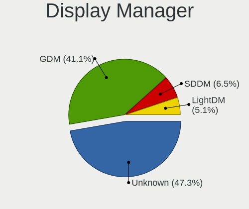
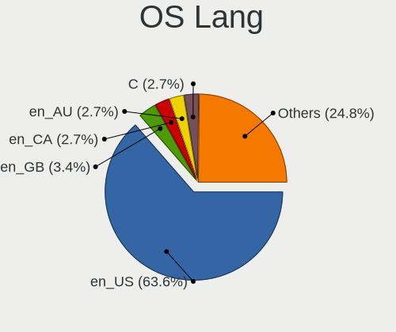
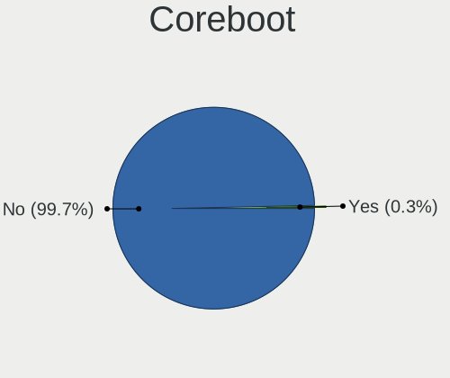
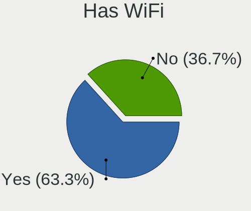
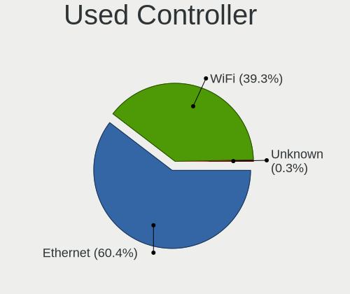
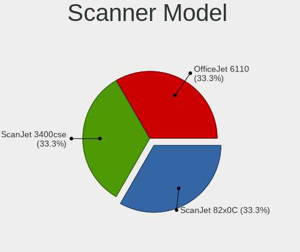
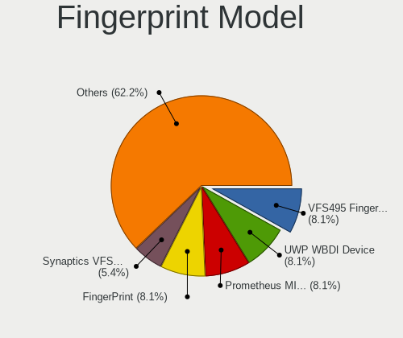
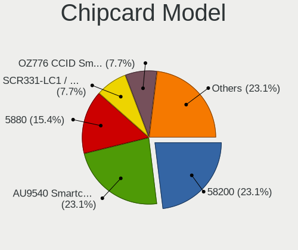

Rocky Linux - Tested Hardware & Statistics
------------------------------------------

A project to collect tested hardware configurations for Rocky Linux.

Anyone can contribute to this report by the [hw-probe](https://github.com/linuxhw/hw-probe) tool:

    sudo -E hw-probe -all -upload

Please contribute! Especially if your hardware is rare.

This is a report for all computer types. See also reports for [desktops](/Dist/Rocky_Linux/Desktop/README.md) and [notebooks](/Dist/Rocky_Linux/Notebook/README.md).

Contents
--------

* [ Test Cases ](#test-cases)

* [ System ](#system)
  - [ OS                       ](#os)
  - [ OS Family                ](#os-family)
  - [ Kernel                   ](#kernel)
  - [ Kernel Family            ](#kernel-family)
  - [ Kernel Major Ver.        ](#kernel-major-ver)
  - [ Arch                     ](#arch)
  - [ DE                       ](#de)
  - [ Display Server           ](#display-server)
  - [ Display Manager          ](#display-manager)
  - [ OS Lang                  ](#os-lang)
  - [ Boot Mode                ](#boot-mode)
  - [ Filesystem               ](#filesystem)
  - [ Part. scheme             ](#part-scheme)
  - [ Dual Boot with Linux/BSD ](#dual-boot-with-linuxbsd)
  - [ Dual Boot (Win)          ](#dual-boot-win)

* [ Board ](#board)
  - [ Vendor                   ](#vendor)
  - [ Model                    ](#model)
  - [ Model Family             ](#model-family)
  - [ MFG Year                 ](#mfg-year)
  - [ Form Factor              ](#form-factor)
  - [ Secure Boot              ](#secure-boot)
  - [ Coreboot                 ](#coreboot)
  - [ RAM Size                 ](#ram-size)
  - [ RAM Used                 ](#ram-used)
  - [ Total Drives             ](#total-drives)
  - [ Has CD-ROM               ](#has-cd-rom)
  - [ Has Ethernet             ](#has-ethernet)
  - [ Has WiFi                 ](#has-wifi)
  - [ Has Bluetooth            ](#has-bluetooth)

* [ Location ](#location)
  - [ Country                  ](#country)
  - [ City                     ](#city)

* [ Drives ](#drives)
  - [ Drive Vendor             ](#drive-vendor)
  - [ Drive Model              ](#drive-model)
  - [ HDD Vendor               ](#hdd-vendor)
  - [ SSD Vendor               ](#ssd-vendor)
  - [ Drive Kind               ](#drive-kind)
  - [ Drive Connector          ](#drive-connector)
  - [ Drive Size               ](#drive-size)
  - [ Space Total              ](#space-total)
  - [ Space Used               ](#space-used)
  - [ Malfunc. Drives          ](#malfunc-drives)
  - [ Malfunc. Drive Vendor    ](#malfunc-drive-vendor)
  - [ Malfunc. HDD Vendor      ](#malfunc-hdd-vendor)
  - [ Malfunc. Drive Kind      ](#malfunc-drive-kind)
  - [ Failed Drives            ](#failed-drives)
  - [ Failed Drive Vendor      ](#failed-drive-vendor)
  - [ Drive Status             ](#drive-status)

* [ Storage controller ](#storage-controller)
  - [ Storage Vendor           ](#storage-vendor)
  - [ Storage Model            ](#storage-model)
  - [ Storage Kind             ](#storage-kind)

* [ Processor ](#processor)
  - [ CPU Vendor               ](#cpu-vendor)
  - [ CPU Model                ](#cpu-model)
  - [ CPU Model Family         ](#cpu-model-family)
  - [ CPU Cores                ](#cpu-cores)
  - [ CPU Sockets              ](#cpu-sockets)
  - [ CPU Threads              ](#cpu-threads)
  - [ CPU Op-Modes             ](#cpu-op-modes)
  - [ CPU Microcode            ](#cpu-microcode)
  - [ CPU Microarch            ](#cpu-microarch)

* [ Graphics ](#graphics)
  - [ GPU Vendor               ](#gpu-vendor)
  - [ GPU Model                ](#gpu-model)
  - [ GPU Combo                ](#gpu-combo)
  - [ GPU Driver               ](#gpu-driver)
  - [ GPU Memory               ](#gpu-memory)

* [ Monitor ](#monitor)
  - [ Monitor Vendor           ](#monitor-vendor)
  - [ Monitor Model            ](#monitor-model)
  - [ Monitor Resolution       ](#monitor-resolution)
  - [ Monitor Diagonal         ](#monitor-diagonal)
  - [ Monitor Width            ](#monitor-width)
  - [ Aspect Ratio             ](#aspect-ratio)
  - [ Monitor Area             ](#monitor-area)
  - [ Pixel Density            ](#pixel-density)
  - [ Multiple Monitors        ](#multiple-monitors)

* [ Network ](#network)
  - [ Net Controller Vendor    ](#net-controller-vendor)
  - [ Net Controller Model     ](#net-controller-model)
  - [ Wireless Vendor          ](#wireless-vendor)
  - [ Wireless Model           ](#wireless-model)
  - [ Ethernet Vendor          ](#ethernet-vendor)
  - [ Ethernet Model           ](#ethernet-model)
  - [ Net Controller Kind      ](#net-controller-kind)
  - [ Used Controller          ](#used-controller)
  - [ NICs                     ](#nics)
  - [ IPv6                     ](#ipv6)

* [ Bluetooth ](#bluetooth)
  - [ Bluetooth Vendor         ](#bluetooth-vendor)
  - [ Bluetooth Model          ](#bluetooth-model)

* [ Sound ](#sound)
  - [ Sound Vendor             ](#sound-vendor)
  - [ Sound Model              ](#sound-model)

* [ Memory ](#memory)
  - [ Memory Vendor            ](#memory-vendor)
  - [ Memory Model             ](#memory-model)
  - [ Memory Kind              ](#memory-kind)
  - [ Memory Form Factor       ](#memory-form-factor)
  - [ Memory Size              ](#memory-size)
  - [ Memory Speed             ](#memory-speed)

* [ Printers & scanners ](#printers--scanners)
  - [ Printer Vendor           ](#printer-vendor)
  - [ Printer Model            ](#printer-model)
  - [ Scanner Vendor           ](#scanner-vendor)
  - [ Scanner Model            ](#scanner-model)

* [ Camera ](#camera)
  - [ Camera Vendor            ](#camera-vendor)
  - [ Camera Model             ](#camera-model)

* [ Security ](#security)
  - [ Fingerprint Vendor       ](#fingerprint-vendor)
  - [ Fingerprint Model        ](#fingerprint-model)
  - [ Chipcard Vendor          ](#chipcard-vendor)
  - [ Chipcard Model           ](#chipcard-model)

* [ Unsupported ](#unsupported)
  - [ Unsupported Devices      ](#unsupported-devices)
  - [ Unsupported Device Types ](#unsupported-device-types)

Test Cases
----------

Total: 232

| Vendor        | Model                       | Form-Factor | Probe                                                      | Date         |
|---------------|-----------------------------|-------------|------------------------------------------------------------|--------------|
| ASUSTek       | Pro WS X570-ACE             | Desktop     | [37aa104ebf](https://linux-hardware.org/?probe=37aa104ebf) | Nov 06, 2023 |
| ASUSTek       | ROG STRIX B650-A GAMING ... | Desktop     | [3734293144](https://linux-hardware.org/?probe=3734293144) | Nov 06, 2023 |
| ASUSTek       | ROG STRIX B650-A GAMING ... | Desktop     | [72bedff7a6](https://linux-hardware.org/?probe=72bedff7a6) | Nov 06, 2023 |
| Lenovo        | G450 2949                   | Notebook    | [3f631dfb6e](https://linux-hardware.org/?probe=3f631dfb6e) | Nov 04, 2023 |
| ASUSTek       | Zenbook UP6502ZD_UP6502Z... | Convertible | [849d24e533](https://linux-hardware.org/?probe=849d24e533) | Nov 02, 2023 |
| Dell          | Latitude 7490               | Notebook    | [4859e397e4](https://linux-hardware.org/?probe=4859e397e4) | Nov 02, 2023 |
| HP            | 829A                        | Mini pc     | [d0735e46db](https://linux-hardware.org/?probe=d0735e46db) | Nov 01, 2023 |
| Gigabyte      | MJ11-EC1-OT 01000100        | Server      | [9a7be2dcbd](https://linux-hardware.org/?probe=9a7be2dcbd) | Oct 31, 2023 |
| ASUSTek       | Pro WS X570-ACE             | Desktop     | [650d69cdce](https://linux-hardware.org/?probe=650d69cdce) | Oct 31, 2023 |
| HP            | 1587h                       | Desktop     | [ecafcd1843](https://linux-hardware.org/?probe=ecafcd1843) | Oct 30, 2023 |
| HP            | EliteBook 645 14 inch G1... | Notebook    | [eb5712ae31](https://linux-hardware.org/?probe=eb5712ae31) | Oct 28, 2023 |
| Dell          | 0TY3YW A03                  | Server      | [8cdd7f67f5](https://linux-hardware.org/?probe=8cdd7f67f5) | Oct 27, 2023 |
| HP            | 8653 A                      | Desktop     | [6d84c59a16](https://linux-hardware.org/?probe=6d84c59a16) | Oct 25, 2023 |
| HP            | 81C7 MVB 0C                 | Server      | [dc0db667dc](https://linux-hardware.org/?probe=dc0db667dc) | Oct 23, 2023 |
| Lenovo        | 31900058 STD                | Desktop     | [b6c589b413](https://linux-hardware.org/?probe=b6c589b413) | Oct 19, 2023 |
| Lenovo        | IdeaPad 1 14IGL7 82V6       | Notebook    | [407b6f9273](https://linux-hardware.org/?probe=407b6f9273) | Oct 15, 2023 |
| HP            | EliteBook 840 G5            | Notebook    | [0baddc9010](https://linux-hardware.org/?probe=0baddc9010) | Oct 11, 2023 |
| Lenovo        | ThinkPad T14s Gen 3 21BR... | Notebook    | [a607943a45](https://linux-hardware.org/?probe=a607943a45) | Oct 03, 2023 |
| HP            | EliteBook 840 G5            | Notebook    | [6615883de3](https://linux-hardware.org/?probe=6615883de3) | Oct 03, 2023 |
| Shenzhen M... | HX90G                       | Desktop     | [a6e9f6c7fc](https://linux-hardware.org/?probe=a6e9f6c7fc) | Oct 01, 2023 |
| Dell          | 0D24M8 A01                  | Desktop     | [214eb681ad](https://linux-hardware.org/?probe=214eb681ad) | Oct 01, 2023 |
| HP            | Laptop 15s-fq1xxx           | Notebook    | [08fb652352](https://linux-hardware.org/?probe=08fb652352) | Sep 29, 2023 |
| Intel         | NUC12WSBi7 M46422-303       | Mini pc     | [28599e161c](https://linux-hardware.org/?probe=28599e161c) | Sep 15, 2023 |
| Clevo         | P170EM                      | Notebook    | [ee87854652](https://linux-hardware.org/?probe=ee87854652) | Sep 14, 2023 |
| ASUSTek       | F1A55-M LX PLUS             | Desktop     | [a2aebc52bd](https://linux-hardware.org/?probe=a2aebc52bd) | Sep 03, 2023 |
| Apple         | MacBookPro11,4              | Notebook    | [ac1293fbf6](https://linux-hardware.org/?probe=ac1293fbf6) | Sep 02, 2023 |
| Apple         | MacBookPro11,4              | Notebook    | [1273e75666](https://linux-hardware.org/?probe=1273e75666) | Sep 02, 2023 |
| Dell          | XPS 15 9500                 | Notebook    | [88b6546b70](https://linux-hardware.org/?probe=88b6546b70) | Sep 01, 2023 |
| Lenovo        | ThinkPad T14 Gen 3 21AH0... | Notebook    | [9faf6d1836](https://linux-hardware.org/?probe=9faf6d1836) | Aug 30, 2023 |
| Lenovo        | Yoga 720-13IKB 80X6         | Convertible | [e38546c509](https://linux-hardware.org/?probe=e38546c509) | Aug 30, 2023 |
| Dell          | XPS 13 9310                 | Notebook    | [40802d54a7](https://linux-hardware.org/?probe=40802d54a7) | Aug 27, 2023 |
| Lenovo        | ThinkPad X1 Carbon 3rd 2... | Notebook    | [62ca959d73](https://linux-hardware.org/?probe=62ca959d73) | Aug 21, 2023 |
| Lenovo        | ThinkPad P15s Gen 1 20T4... | Notebook    | [ceb8407c9a](https://linux-hardware.org/?probe=ceb8407c9a) | Aug 21, 2023 |
| Lenovo        | 1048 SDK0J40697 WIN 3305... | Desktop     | [e584e6c368](https://linux-hardware.org/?probe=e584e6c368) | Aug 16, 2023 |
| HP            | Laptop 15-fc0xxx            | Notebook    | [fb346f4b46](https://linux-hardware.org/?probe=fb346f4b46) | Aug 15, 2023 |
| ASRock        | X670E Pro RS                | Desktop     | [baa9e459cc](https://linux-hardware.org/?probe=baa9e459cc) | Aug 09, 2023 |
| Gigabyte      | H77N-WIFI                   | Desktop     | [32fd45f163](https://linux-hardware.org/?probe=32fd45f163) | Aug 04, 2023 |
| ATOPNUC       | MA90                        | Mini pc     | [47f4b18820](https://linux-hardware.org/?probe=47f4b18820) | Aug 01, 2023 |
| Lenovo        | ThinkPad T430 2347FF9       | Notebook    | [30354c1f38](https://linux-hardware.org/?probe=30354c1f38) | Jul 31, 2023 |
| MSI           | PRO B650-P WIFI             | Desktop     | [92abff2d6e](https://linux-hardware.org/?probe=92abff2d6e) | Jul 31, 2023 |
| MSI           | PRO B650-P WIFI             | Desktop     | [d1c158eebc](https://linux-hardware.org/?probe=d1c158eebc) | Jul 31, 2023 |
| HP            | ZBook 15u G5                | Notebook    | [1b0bb754bc](https://linux-hardware.org/?probe=1b0bb754bc) | Jul 28, 2023 |
| HP            | ZBook 15u G5                | Notebook    | [54684f905d](https://linux-hardware.org/?probe=54684f905d) | Jul 28, 2023 |
| HP            | 0AECh D                     | Desktop     | [58f6dd1695](https://linux-hardware.org/?probe=58f6dd1695) | Jul 14, 2023 |
| Supermicro    | X11DPU                      | Server      | [0b1feb460c](https://linux-hardware.org/?probe=0b1feb460c) | Jul 12, 2023 |
| Supermicro    | X11DPU                      | Server      | [1cbd9c2062](https://linux-hardware.org/?probe=1cbd9c2062) | Jul 12, 2023 |
| ASUSTek       | M5A78L-M LX                 | Desktop     | [b4b1f263a8](https://linux-hardware.org/?probe=b4b1f263a8) | Jul 08, 2023 |
| Lenovo        | ThinkPad X270 20HMS79Q00    | Notebook    | [6a9d34223b](https://linux-hardware.org/?probe=6a9d34223b) | Jul 04, 2023 |
| ASUSTek       | G752VM                      | Notebook    | [b518236bd7](https://linux-hardware.org/?probe=b518236bd7) | Jun 21, 2023 |
| Gigabyte      | H61M-DS2                    | Desktop     | [2310257292](https://linux-hardware.org/?probe=2310257292) | Jun 19, 2023 |
| Gigabyte      | H61M-DS2                    | Desktop     | [ee6f9906b5](https://linux-hardware.org/?probe=ee6f9906b5) | Jun 19, 2023 |
| HP            | EliteBook 1040 14 inch G... | Notebook    | [47b86a7e60](https://linux-hardware.org/?probe=47b86a7e60) | Jun 14, 2023 |
| Techvision    | TVI7309X B0                 | Desktop     | [57b238a5ff](https://linux-hardware.org/?probe=57b238a5ff) | Jun 08, 2023 |
| ASUSTek       | UX430UNR                    | Notebook    | [00ab711e0a](https://linux-hardware.org/?probe=00ab711e0a) | Jun 02, 2023 |
| Lenovo        | 3730 SDK0T76463 WIN 3422... | Desktop     | [da8705e5a7](https://linux-hardware.org/?probe=da8705e5a7) | May 31, 2023 |
| HPE           | ProLiant MicroServer Gen... | Desktop     | [530b841978](https://linux-hardware.org/?probe=530b841978) | May 25, 2023 |
| ASRock        | AM1B-ITX                    | Desktop     | [a2e80bffac](https://linux-hardware.org/?probe=a2e80bffac) | May 19, 2023 |
| ASRock        | AM1B-ITX                    | Desktop     | [d0633ac39d](https://linux-hardware.org/?probe=d0633ac39d) | May 19, 2023 |
| HP            | ProBook 645 G1              | Notebook    | [f82952db4b](https://linux-hardware.org/?probe=f82952db4b) | May 14, 2023 |
| ASUSTek       | ASUS TUF Dash F15 FX517Z... | Notebook    | [30d9e5ca7d](https://linux-hardware.org/?probe=30d9e5ca7d) | May 11, 2023 |
| Beelink       | BT3 PRO                     | Notebook    | [fb99607da3](https://linux-hardware.org/?probe=fb99607da3) | May 08, 2023 |
| AZW           | MINI S                      | Desktop     | [d7ee12a01b](https://linux-hardware.org/?probe=d7ee12a01b) | May 08, 2023 |
| Acer          | Aspire E5-573G              | Notebook    | [5cff94f71e](https://linux-hardware.org/?probe=5cff94f71e) | May 07, 2023 |
| Lenovo        | ThinkPad P1 Gen 4i 20Y30... | Notebook    | [43e6345cb8](https://linux-hardware.org/?probe=43e6345cb8) | May 03, 2023 |
| Dell          | 0D735T A00                  | Desktop     | [3070f4e7da](https://linux-hardware.org/?probe=3070f4e7da) | May 02, 2023 |
| Dell          | 06D7TR A00                  | Desktop     | [6fe7179a50](https://linux-hardware.org/?probe=6fe7179a50) | May 01, 2023 |
| Dell          | 0Y2MRG A00                  | Desktop     | [5f765d4d9c](https://linux-hardware.org/?probe=5f765d4d9c) | Apr 29, 2023 |
| Dell          | 0Y2MRG A00                  | Desktop     | [62a4a8b0b5](https://linux-hardware.org/?probe=62a4a8b0b5) | Apr 29, 2023 |
| Lenovo        | ThinkPad E14 Gen 4 21E30... | Notebook    | [18306b3af6](https://linux-hardware.org/?probe=18306b3af6) | Apr 23, 2023 |
| HUAWEI        | KLVD-WXX9                   | Notebook    | [ae500cf4af](https://linux-hardware.org/?probe=ae500cf4af) | Apr 22, 2023 |
| Gigabyte      | C621-WD12-IPMI M18907       | Server      | [030b77c94d](https://linux-hardware.org/?probe=030b77c94d) | Mar 21, 2023 |
| MSI           | X470 GAMING PRO CARBON      | Desktop     | [7c909a0c5a](https://linux-hardware.org/?probe=7c909a0c5a) | Mar 18, 2023 |
| MSI           | PRO Z690-A DDR4             | Desktop     | [113406acd8](https://linux-hardware.org/?probe=113406acd8) | Mar 18, 2023 |
| MSI           | PRO Z690-A DDR4             | Desktop     | [e967c05c1e](https://linux-hardware.org/?probe=e967c05c1e) | Mar 18, 2023 |
| Dell          | Inspiron 7573               | Convertible | [c89a114562](https://linux-hardware.org/?probe=c89a114562) | Mar 17, 2023 |
| Lenovo        | IdeaPad 3 15ITL6 82H8       | Notebook    | [40f92632ab](https://linux-hardware.org/?probe=40f92632ab) | Mar 16, 2023 |
| Gigabyte      | 970A-DS3P                   | Desktop     | [fd875a6058](https://linux-hardware.org/?probe=fd875a6058) | Mar 16, 2023 |
| MSI           | B450M MORTAR TITANIUM       | Desktop     | [a4c449eef4](https://linux-hardware.org/?probe=a4c449eef4) | Mar 16, 2023 |
| Lenovo        | ThinkBook 14s Yoga ITL 2... | Convertible | [5b55ac3757](https://linux-hardware.org/?probe=5b55ac3757) | Mar 15, 2023 |
| MSI           | B450M MORTAR TITANIUM       | Desktop     | [61af17e1cd](https://linux-hardware.org/?probe=61af17e1cd) | Mar 13, 2023 |
| AZW           | GTR V02                     | Desktop     | [fcd41fbe77](https://linux-hardware.org/?probe=fcd41fbe77) | Mar 10, 2023 |
| HP            | EliteBook 840 G5            | Notebook    | [8e02418ca7](https://linux-hardware.org/?probe=8e02418ca7) | Mar 05, 2023 |
| HP            | EliteBook 840 G5            | Notebook    | [5510fed545](https://linux-hardware.org/?probe=5510fed545) | Mar 04, 2023 |
| Dell          | 0PM2CW A04                  | Server      | [154f8780de](https://linux-hardware.org/?probe=154f8780de) | Feb 28, 2023 |
| MSI           | B450M MORTAR TITANIUM       | Desktop     | [b27fb5e204](https://linux-hardware.org/?probe=b27fb5e204) | Feb 26, 2023 |
| MSI           | B450M MORTAR TITANIUM       | Desktop     | [a2356a66ba](https://linux-hardware.org/?probe=a2356a66ba) | Feb 26, 2023 |
| Sapphire      | PE-AM2RS690V2               | Desktop     | [8aa6cda98e](https://linux-hardware.org/?probe=8aa6cda98e) | Feb 26, 2023 |
| ASUSTek       | ROG Strix G713RW_G713RW     | Notebook    | [5368c6d0a2](https://linux-hardware.org/?probe=5368c6d0a2) | Feb 23, 2023 |
| HP            | ProLiant DL380p Gen8        | Server      | [b82d6321ef](https://linux-hardware.org/?probe=b82d6321ef) | Feb 19, 2023 |
| ASUSTek       | PRIME B550-PLUS             | Desktop     | [feae434e9e](https://linux-hardware.org/?probe=feae434e9e) | Feb 18, 2023 |
| Lenovo        | ThinkPad T480 20L6S8B500    | Notebook    | [b4cbe5bf11](https://linux-hardware.org/?probe=b4cbe5bf11) | Feb 16, 2023 |
| HP            | 1587h                       | Desktop     | [312effb7b7](https://linux-hardware.org/?probe=312effb7b7) | Feb 14, 2023 |
| ASUSTek       | PRIME B550-PLUS             | Desktop     | [9de6fe5d90](https://linux-hardware.org/?probe=9de6fe5d90) | Feb 14, 2023 |
| ASUSTek       | PRIME B550-PLUS             | Desktop     | [68463d6d4b](https://linux-hardware.org/?probe=68463d6d4b) | Feb 13, 2023 |
| Lenovo        | IdeaPad S210 Touch 20257    | Notebook    | [d132553080](https://linux-hardware.org/?probe=d132553080) | Feb 13, 2023 |
| Dell          | Latitude 5420               | Notebook    | [60cc86374d](https://linux-hardware.org/?probe=60cc86374d) | Feb 12, 2023 |
| Dell          | Latitude 5420               | Notebook    | [63a576e744](https://linux-hardware.org/?probe=63a576e744) | Feb 12, 2023 |
| MSI           | B450M MORTAR TITANIUM       | Desktop     | [7fec987264](https://linux-hardware.org/?probe=7fec987264) | Feb 12, 2023 |
| Dell          | 08HPGT A01                  | Desktop     | [bf2c6ebd43](https://linux-hardware.org/?probe=bf2c6ebd43) | Feb 03, 2023 |
| Lenovo        | ThinkPad P1 Gen 3 20TH00... | Notebook    | [e07858d71e](https://linux-hardware.org/?probe=e07858d71e) | Feb 03, 2023 |
| Positivo      | Mobile                      | Notebook    | [966b4e2454](https://linux-hardware.org/?probe=966b4e2454) | Feb 02, 2023 |
| ASUSTek       | PRIME B550-PLUS             | Desktop     | [bea57d418a](https://linux-hardware.org/?probe=bea57d418a) | Feb 01, 2023 |
| ASUSTek       | PRIME B550-PLUS             | Desktop     | [23b27dab7d](https://linux-hardware.org/?probe=23b27dab7d) | Feb 01, 2023 |
| ASUSTek       | PRIME B550-PLUS             | Desktop     | [989e45d84b](https://linux-hardware.org/?probe=989e45d84b) | Jan 31, 2023 |
| Dell          | Inspiron 15-3573            | Notebook    | [b735bbde51](https://linux-hardware.org/?probe=b735bbde51) | Jan 29, 2023 |
| ASRock        | H610M-HDV/M.2               | Desktop     | [2936bb8fec](https://linux-hardware.org/?probe=2936bb8fec) | Jan 26, 2023 |
| Lenovo        | ThinkPad P1 Gen 3 20TH00... | Notebook    | [06f87714b0](https://linux-hardware.org/?probe=06f87714b0) | Jan 26, 2023 |
| Lenovo        | NOK                         | Desktop     | [507b602676](https://linux-hardware.org/?probe=507b602676) | Jan 25, 2023 |
| Dell          | 0Y2MRG A00                  | Desktop     | [784e2db087](https://linux-hardware.org/?probe=784e2db087) | Jan 25, 2023 |
| HP            | 8952                        | Mini pc     | [e49754f551](https://linux-hardware.org/?probe=e49754f551) | Jan 23, 2023 |
| HP            | 8881                        | Mini pc     | [d9864f2860](https://linux-hardware.org/?probe=d9864f2860) | Jan 23, 2023 |
| HP            | 8952                        | Mini pc     | [c025c38b83](https://linux-hardware.org/?probe=c025c38b83) | Jan 23, 2023 |
| MSI           | H510M PRO-E                 | Desktop     | [c81f6adb11](https://linux-hardware.org/?probe=c81f6adb11) | Jan 20, 2023 |
| Dell          | Precision M6800             | Notebook    | [bcd98b78c4](https://linux-hardware.org/?probe=bcd98b78c4) | Jan 19, 2023 |
| Dell          | Latitude 5420               | Notebook    | [cb511c0f82](https://linux-hardware.org/?probe=cb511c0f82) | Jan 18, 2023 |
| HP            | Laptop 15-dy2xxx            | Notebook    | [ff9464407f](https://linux-hardware.org/?probe=ff9464407f) | Jan 15, 2023 |
| Intel         | NUC10i3FNB M38070-307       | Mini pc     | [4ce3e32165](https://linux-hardware.org/?probe=4ce3e32165) | Jan 12, 2023 |
| Intel         | NUC10i3FNB M38070-307       | Mini pc     | [26089f2f9b](https://linux-hardware.org/?probe=26089f2f9b) | Jan 12, 2023 |
| HUAWEI        | KLVD-WXX9                   | Notebook    | [71d684a605](https://linux-hardware.org/?probe=71d684a605) | Jan 11, 2023 |
| Lenovo        | IdeaPad Gaming 3 15ACH6 ... | Notebook    | [d6cac381fd](https://linux-hardware.org/?probe=d6cac381fd) | Jan 09, 2023 |
| HUAWEI        | KLVD-WXX9                   | Notebook    | [e662d0e58a](https://linux-hardware.org/?probe=e662d0e58a) | Jan 07, 2023 |
| Unknown       | Unknown                     | Desktop     | [49d1097b37](https://linux-hardware.org/?probe=49d1097b37) | Jan 07, 2023 |
| Unknown       | Unknown                     | Desktop     | [2fbec34211](https://linux-hardware.org/?probe=2fbec34211) | Jan 07, 2023 |
| Dell          | XPS 17 9720                 | Notebook    | [ae26f02480](https://linux-hardware.org/?probe=ae26f02480) | Jan 03, 2023 |
| HP            | EliteBook 845 14 inch G9... | Notebook    | [65c34944ec](https://linux-hardware.org/?probe=65c34944ec) | Jan 03, 2023 |
| HP            | EliteBook 2560p             | Notebook    | [89c0ffe36d](https://linux-hardware.org/?probe=89c0ffe36d) | Dec 29, 2022 |
| Dell          | Inspiron 14 5425            | Notebook    | [42f45d59d2](https://linux-hardware.org/?probe=42f45d59d2) | Dec 29, 2022 |
| Dell          | 0VRWRC A00                  | Desktop     | [2135b5161f](https://linux-hardware.org/?probe=2135b5161f) | Dec 28, 2022 |
| HP            | 805D                        | Desktop     | [cf88e571df](https://linux-hardware.org/?probe=cf88e571df) | Dec 28, 2022 |
| MSI           | B450M MORTAR TITANIUM       | Desktop     | [2a7ce79df8](https://linux-hardware.org/?probe=2a7ce79df8) | Dec 24, 2022 |
| ASUSTek       | X99-WS/IPMI                 | Desktop     | [41f02987e9](https://linux-hardware.org/?probe=41f02987e9) | Dec 16, 2022 |
| HP            | ProBook 640 G3              | Notebook    | [03eba7b664](https://linux-hardware.org/?probe=03eba7b664) | Dec 15, 2022 |
| Lenovo        | ThinkPad T14s Gen 3 21BR... | Notebook    | [ede2606ad1](https://linux-hardware.org/?probe=ede2606ad1) | Dec 15, 2022 |
| ASUSTek       | ROG STRIX X470-F GAMING     | Desktop     | [b52b8b590b](https://linux-hardware.org/?probe=b52b8b590b) | Nov 30, 2022 |
| MSI           | PRO H610M-B DDR4            | Desktop     | [dc35eb3d09](https://linux-hardware.org/?probe=dc35eb3d09) | Nov 30, 2022 |
| Dell          | Vostro 3500                 | Notebook    | [db276a4d2e](https://linux-hardware.org/?probe=db276a4d2e) | Nov 28, 2022 |
| ASUSTek       | PRIME H510M-E               | Desktop     | [86159f4ef3](https://linux-hardware.org/?probe=86159f4ef3) | Nov 20, 2022 |
| Intel         | D33217GKE G69901-202        | Desktop     | [f10d00e42a](https://linux-hardware.org/?probe=f10d00e42a) | Nov 12, 2022 |
| HP            | 8054                        | Desktop     | [08a9a98d04](https://linux-hardware.org/?probe=08a9a98d04) | Nov 10, 2022 |
| HP            | 8054                        | Desktop     | [4ce3ccc26d](https://linux-hardware.org/?probe=4ce3ccc26d) | Nov 09, 2022 |
| MSI           | X299 RAIDER                 | Desktop     | [b7d117fc31](https://linux-hardware.org/?probe=b7d117fc31) | Nov 09, 2022 |
| Lenovo        | ThinkPad P1 Gen 3 20THCT... | Notebook    | [4c47d0ef97](https://linux-hardware.org/?probe=4c47d0ef97) | Nov 05, 2022 |
| HP            | ProLiant DL380 G7           | Server      | [6d994999c9](https://linux-hardware.org/?probe=6d994999c9) | Nov 01, 2022 |
| ASUSTek       | Crosshair V Formula         | Desktop     | [c07ddbeb76](https://linux-hardware.org/?probe=c07ddbeb76) | Oct 31, 2022 |
| Gigabyte      | H81M-S2PV                   | Desktop     | [23be2713d2](https://linux-hardware.org/?probe=23be2713d2) | Oct 24, 2022 |
| ASUSTek       | VivoBook_ASUSLaptop X512... | Notebook    | [cda3087aaf](https://linux-hardware.org/?probe=cda3087aaf) | Oct 23, 2022 |
| BESSTAR Te... | HM90                        | Desktop     | [fd411132f6](https://linux-hardware.org/?probe=fd411132f6) | Oct 15, 2022 |
| ASUSTek       | M5A97 R2.0                  | Desktop     | [71970edbae](https://linux-hardware.org/?probe=71970edbae) | Oct 11, 2022 |
| HP            | Pavilion g6                 | Notebook    | [11d25577b3](https://linux-hardware.org/?probe=11d25577b3) | Oct 08, 2022 |
| ASUSTek       | PRIME H570-PLUS             | Desktop     | [71da92bd30](https://linux-hardware.org/?probe=71da92bd30) | Oct 04, 2022 |
| AZW           | GTR V01                     | Mini pc     | [40c181376b](https://linux-hardware.org/?probe=40c181376b) | Oct 01, 2022 |
| AZW           | GTR V01                     | Mini pc     | [4638cc7f7b](https://linux-hardware.org/?probe=4638cc7f7b) | Oct 01, 2022 |
| ASUSTek       | PRIME B550M-K               | Desktop     | [ff511df5c2](https://linux-hardware.org/?probe=ff511df5c2) | Sep 27, 2022 |
| BANGHO        | BES G1529                   | Notebook    | [ce0db88361](https://linux-hardware.org/?probe=ce0db88361) | Sep 20, 2022 |
| Dell          | XPS 15 7590                 | Notebook    | [a191bd2a9f](https://linux-hardware.org/?probe=a191bd2a9f) | Sep 18, 2022 |
| Dell          | Latitude 5430               | Notebook    | [617563f7a7](https://linux-hardware.org/?probe=617563f7a7) | Sep 14, 2022 |
| HP            | ZBook 15u G6                | Notebook    | [af658eb920](https://linux-hardware.org/?probe=af658eb920) | Sep 06, 2022 |
| ASUSTek       | P8B WS                      | Desktop     | [bd82f7708c](https://linux-hardware.org/?probe=bd82f7708c) | Sep 02, 2022 |
| Lenovo        | 1046 NO DPK                 | Desktop     | [e21e07827d](https://linux-hardware.org/?probe=e21e07827d) | Aug 26, 2022 |
| Lenovo        | IdeaPadFlex 5 14ALC05 82... | Convertible | [79c81eef28](https://linux-hardware.org/?probe=79c81eef28) | Aug 23, 2022 |
| ASUSTek       | PRIME B460M-A R2.0          | Desktop     | [e29f13e0b6](https://linux-hardware.org/?probe=e29f13e0b6) | Aug 19, 2022 |
| ASUSTek       | PRIME B365-PLUS             | Desktop     | [324410a493](https://linux-hardware.org/?probe=324410a493) | Aug 04, 2022 |
| Lenovo        | IdeaPadFlex 5 14ALC7 82R... | Convertible | [713884d2c8](https://linux-hardware.org/?probe=713884d2c8) | Aug 03, 2022 |
| HP            | ZBook 15 G2                 | Notebook    | [34f32c0d0d](https://linux-hardware.org/?probe=34f32c0d0d) | Jul 27, 2022 |
| Gigabyte      | 970A-UD3P                   | Desktop     | [0d503b2789](https://linux-hardware.org/?probe=0d503b2789) | Jul 27, 2022 |
| ASUSTek       | ASUS TUF Dash F15 FX516P... | Notebook    | [ce5ca74472](https://linux-hardware.org/?probe=ce5ca74472) | Jul 17, 2022 |
| Unknown       | Unknown                     | Tablet      | [bf70ad93f5](https://linux-hardware.org/?probe=bf70ad93f5) | Jul 06, 2022 |
| Unknown       | Unknown                     | Tablet      | [6edba7f033](https://linux-hardware.org/?probe=6edba7f033) | Jul 06, 2022 |
| Lenovo        | ThinkPad X1 Carbon 34483... | Notebook    | [fa20ff88e1](https://linux-hardware.org/?probe=fa20ff88e1) | Jun 19, 2022 |
| Dell          | Latitude 3420               | Notebook    | [b10330b427](https://linux-hardware.org/?probe=b10330b427) | Jun 15, 2022 |
| Unknown       | X31_ICH7                    | Desktop     | [f8ab18b666](https://linux-hardware.org/?probe=f8ab18b666) | Jun 07, 2022 |
| Dell          | 0GWHMW A01                  | Desktop     | [f427859019](https://linux-hardware.org/?probe=f427859019) | May 30, 2022 |
| Dell          | 072T6D A01                  | Server      | [4b88759a98](https://linux-hardware.org/?probe=4b88759a98) | May 06, 2022 |
| HP            | EliteBook 840 G7 Noteboo... | Notebook    | [b586e45245](https://linux-hardware.org/?probe=b586e45245) | Apr 25, 2022 |
| Dell          | 06CV2N A00                  | Desktop     | [f9e949ad9b](https://linux-hardware.org/?probe=f9e949ad9b) | Apr 24, 2022 |
| Gigabyte      | G41MT-USB3                  | Desktop     | [10f3a0eaae](https://linux-hardware.org/?probe=10f3a0eaae) | Apr 21, 2022 |
| Gigabyte      | G41MT-USB3                  | Desktop     | [4618c00b42](https://linux-hardware.org/?probe=4618c00b42) | Apr 17, 2022 |
| NCR           | Pocono BIOS.5.1             | Desktop     | [ca175e1f0c](https://linux-hardware.org/?probe=ca175e1f0c) | Apr 09, 2022 |
| IBM           | 4367 SVT                    | Server      | [3d7400ea9b](https://linux-hardware.org/?probe=3d7400ea9b) | Mar 11, 2022 |
| Dell          | 0NK70N A03                  | Desktop     | [7d4e906833](https://linux-hardware.org/?probe=7d4e906833) | Mar 11, 2022 |
| Supermicro    | X11SSH-CTF                  | Server      | [7a720a4e41](https://linux-hardware.org/?probe=7a720a4e41) | Mar 10, 2022 |
| Dell          | Latitude 5500               | Notebook    | [3d87bc42c6](https://linux-hardware.org/?probe=3d87bc42c6) | Mar 08, 2022 |
| Lenovo        | ThinkPad T14s Gen 2a 20X... | Notebook    | [f78b6db0bd](https://linux-hardware.org/?probe=f78b6db0bd) | Mar 08, 2022 |
| Dell          | Latitude 5500               | Notebook    | [fc0c5280d7](https://linux-hardware.org/?probe=fc0c5280d7) | Mar 08, 2022 |
| Lenovo        | ThinkPad T14s Gen 2a 20X... | Notebook    | [351e05ccc8](https://linux-hardware.org/?probe=351e05ccc8) | Mar 08, 2022 |
| Lenovo        | ThinkPad T14s Gen 2a 20X... | Notebook    | [dc09f11788](https://linux-hardware.org/?probe=dc09f11788) | Mar 08, 2022 |
| Dell          | 0WN7Y6 A01                  | Desktop     | [ef36ccb6ab](https://linux-hardware.org/?probe=ef36ccb6ab) | Feb 22, 2022 |
| Dell          | 0PC5F7 A02                  | Desktop     | [7c6c7dcd5e](https://linux-hardware.org/?probe=7c6c7dcd5e) | Feb 18, 2022 |
| ASUSTek       | PRIME B450-PLUS             | Desktop     | [1d3c449e8a](https://linux-hardware.org/?probe=1d3c449e8a) | Feb 18, 2022 |
| Supermicro    | X11SPW-TF                   | Server      | [a76bb2e30d](https://linux-hardware.org/?probe=a76bb2e30d) | Feb 07, 2022 |
| Dell          | 0XDN97 A02                  | Server      | [02e5c56a80](https://linux-hardware.org/?probe=02e5c56a80) | Feb 03, 2022 |
| Dell          | 0XDN97 A02                  | Server      | [4aa06b4edd](https://linux-hardware.org/?probe=4aa06b4edd) | Feb 03, 2022 |
| Lenovo        | Legion Y7000 2020H 81Y7     | Notebook    | [2ab4cacc1e](https://linux-hardware.org/?probe=2ab4cacc1e) | Jan 26, 2022 |
| Lenovo        | Legion Y7000 2020H 81Y7     | Notebook    | [787aec5f1c](https://linux-hardware.org/?probe=787aec5f1c) | Jan 26, 2022 |
| ASRock        | B450M Pro4                  | Desktop     | [1ab47f8ff0](https://linux-hardware.org/?probe=1ab47f8ff0) | Jan 20, 2022 |
| MSI           | Z97A GAMING 6               | Desktop     | [4b935d705c](https://linux-hardware.org/?probe=4b935d705c) | Jan 20, 2022 |
| Dell          | 0X3D66 A07                  | Server      | [d5c4ef93c4](https://linux-hardware.org/?probe=d5c4ef93c4) | Jan 18, 2022 |
| Lenovo        | IdeaPad Y700-15ISK 80NV     | Notebook    | [7225108b91](https://linux-hardware.org/?probe=7225108b91) | Jan 10, 2022 |
| HP            | ZBook 15 G3                 | Notebook    | [89809f906e](https://linux-hardware.org/?probe=89809f906e) | Jan 10, 2022 |
| Lenovo        | Legion 5 15ARH05H 82B1      | Notebook    | [90821cb3a5](https://linux-hardware.org/?probe=90821cb3a5) | Jan 03, 2022 |
| Lenovo        | IdeaPadFlex 5 14ALC05 82... | Convertible | [c7f9478d55](https://linux-hardware.org/?probe=c7f9478d55) | Jan 03, 2022 |
| AZW           | Gemini M                    | Desktop     | [25e63b737c](https://linux-hardware.org/?probe=25e63b737c) | Dec 31, 2021 |
| AZW           | Gemini M                    | Desktop     | [05ef59842c](https://linux-hardware.org/?probe=05ef59842c) | Dec 31, 2021 |
| Google        | Tricky                      | Desktop     | [92e2626936](https://linux-hardware.org/?probe=92e2626936) | Nov 30, 2021 |
| Lenovo        | IdeaPad 500S-14ISK 80Q3     | Notebook    | [6ea0cdba08](https://linux-hardware.org/?probe=6ea0cdba08) | Nov 27, 2021 |
| Lenovo        | ThinkPad W540 20BGCTO1WW    | Notebook    | [25055cdc26](https://linux-hardware.org/?probe=25055cdc26) | Nov 23, 2021 |
| Gigabyte      | X570 AORUS ULTRA            | Desktop     | [840d920fb2](https://linux-hardware.org/?probe=840d920fb2) | Nov 22, 2021 |
| Gigabyte      | H87-D3H-CF                  | Desktop     | [72fdde33b3](https://linux-hardware.org/?probe=72fdde33b3) | Nov 19, 2021 |
| HP            | Laptop 17-ca1xxx            | Notebook    | [61fe4e654d](https://linux-hardware.org/?probe=61fe4e654d) | Nov 09, 2021 |
| Raspberry ... | Raspberry Pi                | Soc         | [9d7947a5a8](https://linux-hardware.org/?probe=9d7947a5a8) | Nov 06, 2021 |
| Toshiba       | TECRA W50-A                 | Notebook    | [abee9f36ad](https://linux-hardware.org/?probe=abee9f36ad) | Nov 05, 2021 |
| Dell          | 0N4YC8 A00                  | Desktop     | [1a94195ddb](https://linux-hardware.org/?probe=1a94195ddb) | Oct 15, 2021 |
| Intel         | S2600WFT H48104-850         | Server      | [36c4acac2d](https://linux-hardware.org/?probe=36c4acac2d) | Sep 14, 2021 |
| ASUSTek       | PRIME B450M-A II            | Desktop     | [cb9f02b3de](https://linux-hardware.org/?probe=cb9f02b3de) | Sep 07, 2021 |
| ASUSTek       | PRIME B450M-A II            | Desktop     | [f80365b98a](https://linux-hardware.org/?probe=f80365b98a) | Sep 07, 2021 |
| ASUSTek       | P5Q DELUXE                  | Desktop     | [243dba3b27](https://linux-hardware.org/?probe=243dba3b27) | Sep 02, 2021 |
| Lenovo        | ThinkPad T420 42365H1       | Notebook    | [3430adab89](https://linux-hardware.org/?probe=3430adab89) | Aug 25, 2021 |
| Lenovo        | NOK                         | Desktop     | [274005087d](https://linux-hardware.org/?probe=274005087d) | Aug 23, 2021 |
| Lenovo        | ThinkPad T420 42365H1       | Notebook    | [6a306e2253](https://linux-hardware.org/?probe=6a306e2253) | Aug 16, 2021 |
| Dell          | 0M5DCD A00                  | Desktop     | [91acc7eb93](https://linux-hardware.org/?probe=91acc7eb93) | Aug 15, 2021 |
| Lenovo        | ThinkPad W500 406132G       | Notebook    | [e79080e90d](https://linux-hardware.org/?probe=e79080e90d) | Aug 08, 2021 |
| Lenovo        | IdeaPad Slim 1-14AST-05 ... | Notebook    | [860ec3c89d](https://linux-hardware.org/?probe=860ec3c89d) | Aug 08, 2021 |
| Lenovo        | IdeaPad Y410P 20216         | Notebook    | [b2df1c0e6d](https://linux-hardware.org/?probe=b2df1c0e6d) | Aug 08, 2021 |
| Lenovo        | IdeaPad Y410P 20216         | Notebook    | [3fc207c5b9](https://linux-hardware.org/?probe=3fc207c5b9) | Aug 07, 2021 |
| ASUSTek       | PRIME TRX40-PRO S           | Desktop     | [59f7d599dd](https://linux-hardware.org/?probe=59f7d599dd) | Aug 04, 2021 |
| Dell          | 0M5DCD A00                  | Desktop     | [77c3d7076e](https://linux-hardware.org/?probe=77c3d7076e) | Aug 04, 2021 |
| Lenovo        | IdeaPad Slim 1-14AST-05 ... | Notebook    | [09738de946](https://linux-hardware.org/?probe=09738de946) | Jul 04, 2021 |
| Lenovo        | IdeaPad Slim 1-14AST-05 ... | Notebook    | [741cab87e1](https://linux-hardware.org/?probe=741cab87e1) | Jun 29, 2021 |
| ASUSTek       | ASUS TUF Gaming A15 FA50... | Notebook    | [60fe7f2653](https://linux-hardware.org/?probe=60fe7f2653) | Jun 13, 2021 |
| Toshiba       | Satellite E45-B             | Notebook    | [84683df1f0](https://linux-hardware.org/?probe=84683df1f0) | Jun 12, 2021 |
| HP            | 0B54h D                     | Desktop     | [ee9a2da17c](https://linux-hardware.org/?probe=ee9a2da17c) | May 19, 2021 |
| Acer          | Aspire VN7-591G             | Notebook    | [bc9e6c4910](https://linux-hardware.org/?probe=bc9e6c4910) | May 10, 2021 |

System
------

OS
--

Installed operating systems

| Name            | Computers | Percent |
|-----------------|-----------|---------|
| Rocky Linux 9.1 | 44        | 24.18%  |
| Rocky Linux 8.5 | 32        | 17.58%  |
| Rocky Linux 9.2 | 28        | 15.38%  |
| Rocky Linux 9.0 | 19        | 10.44%  |
| Rocky Linux 8.4 | 19        | 10.44%  |
| Rocky Linux 8.8 | 14        | 7.69%   |
| Rocky Linux 8.7 | 13        | 7.14%   |
| Rocky Linux 8.6 | 11        | 6.04%   |
| Rocky Linux 8.3 | 2         | 1.1%    |

OS Family
---------

OS without a version

| Name        | Computers | Percent |
|-------------|-----------|---------|
| Rocky Linux | 179       | 100%    |

Kernel
------

Version of the Linux kernel

| Version                          | Computers | Percent |
|----------------------------------|-----------|---------|
| 5.14.0-162.6.1.el9_1.0.1.x86_64  | 18        | 9.57%   |
| 4.18.0-348.12.2.el8_5.x86_64     | 13        | 6.91%   |
| 5.14.0-284.30.1.el9_2.x86_64     | 9         | 4.79%   |
| 5.14.0-284.25.1.el9_2.x86_64     | 8         | 4.26%   |
| 5.14.0-162.18.1.el9_1.x86_64     | 8         | 4.26%   |
| 4.18.0-348.7.1.el8_5.x86_64      | 8         | 4.26%   |
| 5.14.0-284.18.1.el9_2.x86_64     | 7         | 3.72%   |
| 5.14.0-70.26.1.el9_0.x86_64      | 6         | 3.19%   |
| 4.18.0-477.27.1.el8_8.x86_64     | 6         | 3.19%   |
| 4.18.0-305.10.2.el8_4.x86_64     | 6         | 3.19%   |
| 5.14.0-70.22.1.el9_0.x86_64      | 5         | 2.66%   |
| 5.14.0-284.11.1.el9_2.x86_64     | 5         | 2.66%   |
| 5.14.0-162.23.1.el9_1.x86_64     | 5         | 2.66%   |
| 5.14.0-162.12.1.el9_1.0.2.x86_64 | 5         | 2.66%   |
| 4.18.0-348.20.1.el8_5.x86_64     | 5         | 2.66%   |
| 5.14.0-70.30.1.el9_0.x86_64      | 4         | 2.13%   |
| 5.14.0-70.17.1.el9_0.x86_64      | 4         | 2.13%   |
| 5.14.0-162.6.1.el9_1.x86_64      | 4         | 2.13%   |
| 4.18.0-477.21.1.el8_8.x86_64     | 3         | 1.6%    |
| 4.18.0-425.3.1.el8.x86_64        | 3         | 1.6%    |
| 4.18.0-425.19.2.el8_7.x86_64     | 3         | 1.6%    |
| 4.18.0-425.13.1.el8_7.x86_64     | 3         | 1.6%    |
| 4.18.0-425.10.1.el8_7.x86_64     | 3         | 1.6%    |
| 4.18.0-372.32.1.el8_6.x86_64     | 3         | 1.6%    |
| 4.18.0-305.25.1.el8_4.x86_64     | 3         | 1.6%    |
| 5.14.0-162.12.1.el9_1.0.1.x86_64 | 2         | 1.06%   |
| 4.18.0-477.15.1.el8_8.x86_64     | 2         | 1.06%   |
| 4.18.0-477.13.1.el8_8.x86_64     | 2         | 1.06%   |
| 4.18.0-372.9.1.el8.x86_64        | 2         | 1.06%   |
| 4.18.0-372.26.1.el8_6.x86_64     | 2         | 1.06%   |
| 4.18.0-372.19.1.el8_6.x86_64     | 2         | 1.06%   |
| 4.18.0-372.16.1.el8_6.0.1.x86_64 | 2         | 1.06%   |
| 4.18.0-348.2.1.el8_5.x86_64      | 2         | 1.06%   |
| 4.18.0-305.el8.x86_64            | 2         | 1.06%   |
| 4.18.0-305.3.1.el8_4.x86_64      | 2         | 1.06%   |
| 4.18.0-305.19.1.el8_4.x86_64     | 2         | 1.06%   |
| 4.18.0-305.12.1.el8_4.x86_64     | 2         | 1.06%   |
| 4.18.0-240.22.1.el8.x86_64       | 2         | 1.06%   |
| 6.4.12-1.el8.elrepo.x86_64       | 1         | 0.53%   |
| 6.2.12-1.el9.elrepo.x86_64       | 1         | 0.53%   |

Kernel Family
-------------

Linux kernel without a distro release

| Version | Computers | Percent |
|---------|-----------|---------|
| 5.14.0  | 87        | 48.07%  |
| 4.18.0  | 82        | 45.3%   |
| 6.0.10  | 2         | 1.1%    |
| 6.4.12  | 1         | 0.55%   |
| 6.2.12  | 1         | 0.55%   |
| 6.2.10  | 1         | 0.55%   |
| 6.1.8   | 1         | 0.55%   |
| 6.1.6   | 1         | 0.55%   |
| 5.4.157 | 1         | 0.55%   |
| 5.16.15 | 1         | 0.55%   |
| 5.14.1  | 1         | 0.55%   |
| 5.10.89 | 1         | 0.55%   |
| 5.10.52 | 1         | 0.55%   |

Kernel Major Ver.
-----------------

Linux kernel major version

| Version | Computers | Percent |
|---------|-----------|---------|
| 5.14    | 88        | 48.62%  |
| 4.18    | 82        | 45.3%   |
| 6.2     | 2         | 1.1%    |
| 6.1     | 2         | 1.1%    |
| 6.0     | 2         | 1.1%    |
| 5.10    | 2         | 1.1%    |
| 6.4     | 1         | 0.55%   |
| 5.4     | 1         | 0.55%   |
| 5.16    | 1         | 0.55%   |

Arch
----

OS architecture (x86_64, i586, etc.)

| Name    | Computers | Percent |
|---------|-----------|---------|
| x86_64  | 178       | 99.44%  |
| aarch64 | 1         | 0.56%   |

DE
--

Desktop Environment

| Name          | Computers | Percent |
|---------------|-----------|---------|
| GNOME         | 120       | 67.04%  |
| Unknown       | 24        | 13.41%  |
| KDE5          | 14        | 7.82%   |
| MATE          | 9         | 5.03%   |
| GNOME Classic | 5         | 2.79%   |
| XFCE          | 4         | 2.23%   |
| X-Cinnamon    | 3         | 1.68%   |

Display Server
--------------

X11 or Wayland

| Name    | Computers | Percent |
|---------|-----------|---------|
| Wayland | 95        | 51.91%  |
| X11     | 64        | 34.97%  |
| Unknown | 12        | 6.56%   |
| Tty     | 9         | 4.92%   |
| Web     | 3         | 1.64%   |

Display Manager
---------------

SDDM, LightDM, etc.

| Name    | Computers | Percent |
|---------|-----------|---------|
| GDM     | 80        | 44.69%  |
| Unknown | 80        | 44.69%  |
| SDDM    | 10        | 5.59%   |
| LightDM | 9         | 5.03%   |

OS Lang
-------

Language

| Lang    | Computers | Percent |
|---------|-----------|---------|
| en_US   | 115       | 64.25%  |
| en_CA   | 7         | 3.91%   |
| ru_RU   | 6         | 3.35%   |
| en_AU   | 5         | 2.79%   |
| C       | 4         | 2.23%   |
| Unknown | 4         | 2.23%   |
| es_ES   | 3         | 1.68%   |
| en_ZA   | 3         | 1.68%   |
| en_IL   | 3         | 1.68%   |
| en_GB   | 3         | 1.68%   |
| de_DE   | 3         | 1.68%   |
| pt_BR   | 2         | 1.12%   |
| en_SG   | 2         | 1.12%   |
| en_IE   | 2         | 1.12%   |
| de_AT   | 2         | 1.12%   |
| zh_TW   | 1         | 0.56%   |
| zh_CN   | 1         | 0.56%   |
| pl_PL   | 1         | 0.56%   |
| nl_NL   | 1         | 0.56%   |
| ko_KR   | 1         | 0.56%   |
| ja_JP   | 1         | 0.56%   |
| it_IT   | 1         | 0.56%   |
| hu_HU   | 1         | 0.56%   |
| fr_FR   | 1         | 0.56%   |
| es_CO   | 1         | 0.56%   |
| es_AR   | 1         | 0.56%   |
| en_NZ   | 1         | 0.56%   |
| en_IN   | 1         | 0.56%   |
| ca_ES   | 1         | 0.56%   |
| af_ZA   | 1         | 0.56%   |

Boot Mode
---------

EFI or BIOS

| Mode | Computers | Percent |
|------|-----------|---------|
| EFI  | 125       | 69.44%  |
| BIOS | 55        | 30.56%  |

Filesystem
----------

Type of filesystem

| Type | Computers | Percent |
|------|-----------|---------|
| Xfs  | 151       | 84.36%  |
| Ext4 | 27        | 15.08%  |
| Ext3 | 1         | 0.56%   |

Part. scheme
------------

Scheme of partitioning

| Type    | Computers | Percent |
|---------|-----------|---------|
| GPT     | 99        | 55.31%  |
| Unknown | 56        | 31.28%  |
| MBR     | 24        | 13.41%  |

Dual Boot with Linux/BSD
------------------------

Hosting more than one Linux/BSD

| Dual boot | Computers | Percent |
|-----------|-----------|---------|
| No        | 148       | 82.68%  |
| Yes       | 31        | 17.32%  |

Dual Boot (Win)
---------------

Hosting Linux and Windows

| Dual boot | Computers | Percent |
|-----------|-----------|---------|
| No        | 148       | 82.68%  |
| Yes       | 31        | 17.32%  |

Board
-----

Vendor
------

Motherboard manufacturer

| Name                    | Computers | Percent |
|-------------------------|-----------|---------|
| Lenovo                  | 34        | 18.99%  |
| Dell                    | 33        | 18.44%  |
| Hewlett-Packard         | 30        | 16.76%  |
| ASUSTek Computer        | 27        | 15.08%  |
| Gigabyte Technology     | 10        | 5.59%   |
| MSI                     | 8         | 4.47%   |
| Intel                   | 4         | 2.23%   |
| AZW                     | 4         | 2.23%   |
| ASRock                  | 4         | 2.23%   |
| Supermicro              | 3         | 1.68%   |
| Unknown                 | 3         | 1.68%   |
| Toshiba                 | 2         | 1.12%   |
| Acer                    | 2         | 1.12%   |
| Techvision              | 1         | 0.56%   |
| Sapphire                | 1         | 0.56%   |
| Raspberry Pi Foundation | 1         | 0.56%   |
| Positivo                | 1         | 0.56%   |
| NCR                     | 1         | 0.56%   |
| IBM                     | 1         | 0.56%   |
| HUAWEI                  | 1         | 0.56%   |
| HPE                     | 1         | 0.56%   |
| Google                  | 1         | 0.56%   |
| Clevo                   | 1         | 0.56%   |
| BESSTAR Tech            | 1         | 0.56%   |
| Beelink                 | 1         | 0.56%   |
| BANGHO                  | 1         | 0.56%   |
| ATOPNUC                 | 1         | 0.56%   |
| Apple                   | 1         | 0.56%   |

Model
-----

Motherboard model

| Name                                     | Computers | Percent |
|------------------------------------------|-----------|---------|
| Unknown                                  | 3         | 1.68%   |
| HP Z210 Workstation                      | 2         | 1.12%   |
| HP EliteBook 840 G5                      | 2         | 1.12%   |
| Dell PowerEdge R610                      | 2         | 1.12%   |
| Dell OptiPlex 9020                       | 2         | 1.12%   |
| AZW GTR                                  | 2         | 1.12%   |
| Toshiba TECRA W50-A                      | 1         | 0.56%   |
| Toshiba Satellite E45-B                  | 1         | 0.56%   |
| Techvision TVI7309X                      | 1         | 0.56%   |
| Supermicro SYS-6019U-TN4R4T              | 1         | 0.56%   |
| Supermicro SYS-5029P-WTR                 | 1         | 0.56%   |
| Supermicro Super Server                  | 1         | 0.56%   |
| Sapphire PE-AM2RS690V2                   | 1         | 0.56%   |
| RPi Raspberry Pi                         | 1         | 0.56%   |
| Positivo Mobile                          | 1         | 0.56%   |
| NCR xxxx-xxxx-xxxx                       | 1         | 0.56%   |
| MSI MS-7D78                              | 1         | 0.56%   |
| MSI MS-7D46                              | 1         | 0.56%   |
| MSI MS-7D25                              | 1         | 0.56%   |
| MSI MS-7B89                              | 1         | 0.56%   |
| MSI MS-7B78                              | 1         | 0.56%   |
| MSI MS-7A94                              | 1         | 0.56%   |
| MSI MS-7917                              | 1         | 0.56%   |
| MSI H510M PRO-E                          | 1         | 0.56%   |
| Lenovo Yoga 720-13IKB 80X6               | 1         | 0.56%   |
| Lenovo ThinkStation P620 30E0S0PR00      | 1         | 0.56%   |
| Lenovo ThinkStation P340 30DK000CUS      | 1         | 0.56%   |
| Lenovo ThinkPad X270 20HMS79Q00          | 1         | 0.56%   |
| Lenovo ThinkPad X1 Carbon 3rd 20BTS1V900 | 1         | 0.56%   |
| Lenovo ThinkPad X1 Carbon 344835U        | 1         | 0.56%   |
| Lenovo ThinkPad W540 20BGCTO1WW          | 1         | 0.56%   |
| Lenovo ThinkPad W500 406132G             | 1         | 0.56%   |
| Lenovo ThinkPad T480 20L6S8B500          | 1         | 0.56%   |
| Lenovo ThinkPad T430 2347FF9             | 1         | 0.56%   |
| Lenovo ThinkPad T420 42365H1             | 1         | 0.56%   |
| Lenovo ThinkPad T14s Gen 3 21BR000QUS    | 1         | 0.56%   |
| Lenovo ThinkPad T14s Gen 2a 20XF006XCK   | 1         | 0.56%   |
| Lenovo ThinkPad T14 Gen 3 21AH00HXGE     | 1         | 0.56%   |
| Lenovo ThinkPad P15s Gen 1 20T4CTO1WW    | 1         | 0.56%   |
| Lenovo ThinkPad P1 Gen 4i 20Y3000FHV     | 1         | 0.56%   |

Model Family
------------

Motherboard model prefix

| Name                        | Computers | Percent |
|-----------------------------|-----------|---------|
| Lenovo ThinkPad             | 16        | 8.94%   |
| ASUS PRIME                  | 9         | 5.03%   |
| Lenovo IdeaPad              | 8         | 4.47%   |
| HP EliteBook                | 6         | 3.35%   |
| Dell PowerEdge              | 6         | 3.35%   |
| Dell OptiPlex               | 6         | 3.35%   |
| Dell XPS                    | 5         | 2.79%   |
| Dell Precision              | 5         | 2.79%   |
| Dell Latitude               | 5         | 2.79%   |
| HP ZBook                    | 4         | 2.23%   |
| HP Laptop                   | 4         | 2.23%   |
| HP EliteDesk                | 3         | 1.68%   |
| Dell Vostro                 | 3         | 1.68%   |
| Dell Inspiron               | 3         | 1.68%   |
| ASUS ROG                    | 3         | 1.68%   |
| ASUS ASUS                   | 3         | 1.68%   |
| Unknown                     | 3         | 1.68%   |
| Lenovo ThinkStation         | 2         | 1.12%   |
| Lenovo Legion               | 2         | 1.12%   |
| Lenovo IdeaPadFlex          | 2         | 1.12%   |
| HP Z210                     | 2         | 1.12%   |
| HP ProLiant                 | 2         | 1.12%   |
| HP ProBook                  | 2         | 1.12%   |
| AZW GTR                     | 2         | 1.12%   |
| Acer Aspire                 | 2         | 1.12%   |
| Toshiba TECRA               | 1         | 0.56%   |
| Toshiba Satellite           | 1         | 0.56%   |
| Techvision TVI7309X         | 1         | 0.56%   |
| Supermicro SYS-6019U-TN4R4T | 1         | 0.56%   |
| Supermicro SYS-5029P-WTR    | 1         | 0.56%   |
| Supermicro Super            | 1         | 0.56%   |
| Sapphire PE-AM2RS690V2      | 1         | 0.56%   |
| RPi Raspberry               | 1         | 0.56%   |
| Positivo Mobile             | 1         | 0.56%   |
| NCR xxxx-xxxx-xxxx          | 1         | 0.56%   |
| MSI MS-7D78                 | 1         | 0.56%   |
| MSI MS-7D46                 | 1         | 0.56%   |
| MSI MS-7D25                 | 1         | 0.56%   |
| MSI MS-7B89                 | 1         | 0.56%   |
| MSI MS-7B78                 | 1         | 0.56%   |

MFG Year
--------

Motherboard manufacture year

| Year    | Computers | Percent |
|---------|-----------|---------|
| 2021    | 24        | 13.41%  |
| 2022    | 23        | 12.85%  |
| 2020    | 20        | 11.17%  |
| 2018    | 20        | 11.17%  |
| 2011    | 14        | 7.82%   |
| 2019    | 13        | 7.26%   |
| 2013    | 11        | 6.15%   |
| 2014    | 10        | 5.59%   |
| 2015    | 9         | 5.03%   |
| 2012    | 9         | 5.03%   |
| 2017    | 8         | 4.47%   |
| 2010    | 5         | 2.79%   |
| 2009    | 4         | 2.23%   |
| 2023    | 3         | 1.68%   |
| 2008    | 3         | 1.68%   |
| 2016    | 2         | 1.12%   |
| Unknown | 1         | 0.56%   |

Form Factor
-----------

Physical design of the computer

| Name           | Computers | Percent |
|----------------|-----------|---------|
| Desktop        | 75        | 41.9%   |
| Notebook       | 74        | 41.34%  |
| Server         | 16        | 8.94%   |
| Mini pc        | 7         | 3.91%   |
| Convertible    | 5         | 2.79%   |
| System on chip | 1         | 0.56%   |
| Tablet         | 1         | 0.56%   |

Secure Boot
-----------

Enabled or disabled

| State    | Computers | Percent |
|----------|-----------|---------|
| Disabled | 154       | 86.03%  |
| Enabled  | 25        | 13.97%  |

Coreboot
--------

Have coreboot on board

| Used | Computers | Percent |
|------|-----------|---------|
| No   | 178       | 99.44%  |
| Yes  | 1         | 0.56%   |

RAM Size
--------

Total RAM memory

| Size in GB      | Computers | Percent |
|-----------------|-----------|---------|
| 8.01-16.0       | 44        | 24.44%  |
| 4.01-8.0        | 37        | 20.56%  |
| 32.01-64.0      | 33        | 18.33%  |
| 16.01-24.0      | 20        | 11.11%  |
| 64.01-256.0     | 17        | 9.44%   |
| 3.01-4.0        | 11        | 6.11%   |
| 24.01-32.0      | 6         | 3.33%   |
| More than 256.0 | 5         | 2.78%   |
| 1.01-2.0        | 4         | 2.22%   |
| 2.01-3.0        | 3         | 1.67%   |

RAM Used
--------

Used RAM memory

| Used GB    | Computers | Percent |
|------------|-----------|---------|
| 4.01-8.0   | 49        | 26.06%  |
| 2.01-3.0   | 45        | 23.94%  |
| 3.01-4.0   | 35        | 18.62%  |
| 1.01-2.0   | 25        | 13.3%   |
| 8.01-16.0  | 14        | 7.45%   |
| 0.51-1.0   | 10        | 5.32%   |
| 16.01-24.0 | 4         | 2.13%   |
| 32.01-64.0 | 2         | 1.06%   |
| 24.01-32.0 | 2         | 1.06%   |
| 0.01-0.5   | 2         | 1.06%   |

Total Drives
------------

Number of drives on board

| Drives | Computers | Percent |
|--------|-----------|---------|
| 1      | 105       | 58.33%  |
| 2      | 33        | 18.33%  |
| 4      | 14        | 7.78%   |
| 3      | 14        | 7.78%   |
| 6      | 4         | 2.22%   |
| 5      | 3         | 1.67%   |
| 19     | 1         | 0.56%   |
| 18     | 1         | 0.56%   |
| 17     | 1         | 0.56%   |
| 16     | 1         | 0.56%   |
| 14     | 1         | 0.56%   |
| 9      | 1         | 0.56%   |
| 8      | 1         | 0.56%   |

Has CD-ROM
----------

Has CD-ROM on board

| Presented | Computers | Percent |
|-----------|-----------|---------|
| No        | 131       | 73.18%  |
| Yes       | 48        | 26.82%  |

Has Ethernet
------------

Has Ethernet on board

| Presented | Computers | Percent |
|-----------|-----------|---------|
| Yes       | 161       | 89.44%  |
| No        | 19        | 10.56%  |

Has WiFi
--------

Has WiFi module

| Presented | Computers | Percent |
|-----------|-----------|---------|
| Yes       | 110       | 61.11%  |
| No        | 70        | 38.89%  |

Has Bluetooth
-------------

Has Bluetooth module

| Presented | Computers | Percent |
|-----------|-----------|---------|
| Yes       | 96        | 53.33%  |
| No        | 84        | 46.67%  |

Location
--------

Country
-------

Geographic location (country)

| Country      | Computers | Percent |
|--------------|-----------|---------|
| USA          | 56        | 31.28%  |
| Canada       | 10        | 5.59%   |
| Germany      | 9         | 5.03%   |
| Russia       | 8         | 4.47%   |
| Italy        | 6         | 3.35%   |
| Australia    | 6         | 3.35%   |
| UK           | 5         | 2.79%   |
| Netherlands  | 5         | 2.79%   |
| Spain        | 4         | 2.23%   |
| South Africa | 4         | 2.23%   |
| Poland       | 4         | 2.23%   |
| Czechia      | 4         | 2.23%   |
| Singapore    | 3         | 1.68%   |
| Mexico       | 3         | 1.68%   |
| Israel       | 3         | 1.68%   |
| India        | 3         | 1.68%   |
| Hungary      | 3         | 1.68%   |
| France       | 3         | 1.68%   |
| Brazil       | 3         | 1.68%   |
| Argentina    | 3         | 1.68%   |
| Sweden       | 2         | 1.12%   |
| South Korea  | 2         | 1.12%   |
| Norway       | 2         | 1.12%   |
| Ireland      | 2         | 1.12%   |
| Indonesia    | 2         | 1.12%   |
| Belgium      | 2         | 1.12%   |
| Austria      | 2         | 1.12%   |
| Uzbekistan   | 1         | 0.56%   |
| UAE          | 1         | 0.56%   |
| Turkey       | 1         | 0.56%   |
| Taiwan       | 1         | 0.56%   |
| Switzerland  | 1         | 0.56%   |
| Slovakia     | 1         | 0.56%   |
| Saudi Arabia | 1         | 0.56%   |
| Portugal     | 1         | 0.56%   |
| Pakistan     | 1         | 0.56%   |
| New Zealand  | 1         | 0.56%   |
| Malaysia     | 1         | 0.56%   |
| Kenya        | 1         | 0.56%   |
| Kazakhstan   | 1         | 0.56%   |

City
----

Geographic location (city)

| City          | Computers | Percent |
|---------------|-----------|---------|
| Melbourne     | 4         | 2.22%   |
| Toronto       | 3         | 1.67%   |
| Singapore     | 3         | 1.67%   |
| Budapest      | 3         | 1.67%   |
| Vienna        | 2         | 1.11%   |
| Prague        | 2         | 1.11%   |
| Philadelphia  | 2         | 1.11%   |
| Oslo          | 2         | 1.11%   |
| Moscow        | 2         | 1.11%   |
| Krakow        | 2         | 1.11%   |
| Haifa         | 2         | 1.11%   |
| Enschede      | 2         | 1.11%   |
| Chicago       | 2         | 1.11%   |
| Centurion     | 2         | 1.11%   |
| Buckley       | 2         | 1.11%   |
| Berlin        | 2         | 1.11%   |
| Albuquerque   | 2         | 1.11%   |
| Adelaide      | 2         | 1.11%   |
| ilina       | 1         | 0.56%   |
| Yogyakarta    | 1         | 0.56%   |
| Yekaterinburg | 1         | 0.56%   |
| Xi'an         | 1         | 0.56%   |
| Woking        | 1         | 0.56%   |
| Willowbrook   | 1         | 0.56%   |
| Westerville   | 1         | 0.56%   |
| Wells         | 1         | 0.56%   |
| Washington    | 1         | 0.56%   |
| Waltham       | 1         | 0.56%   |
| Wake Forest   | 1         | 0.56%   |
| Voronezh      | 1         | 0.56%   |
| Vancouver     | 1         | 0.56%   |
| Urbana        | 1         | 0.56%   |
| Turin         | 1         | 0.56%   |
| Troisdorf     | 1         | 0.56%   |
| Tower Hamlets | 1         | 0.56%   |
| Torrington    | 1         | 0.56%   |
| Tlaxcala City | 1         | 0.56%   |
| Thoothukudi   | 1         | 0.56%   |
| Taoyuan City  | 1         | 0.56%   |
| Syracuse      | 1         | 0.56%   |

Drives
------

Drive Vendor
------------

Hard drive vendors

| Vendor                      | Computers | Drives | Percent |
|-----------------------------|-----------|--------|---------|
| Samsung Electronics         | 49        | 68     | 18.35%  |
| Seagate                     | 35        | 97     | 13.11%  |
| WDC                         | 31        | 58     | 11.61%  |
| SanDisk                     | 16        | 18     | 5.99%   |
| Toshiba                     | 15        | 18     | 5.62%   |
| Intel                       | 12        | 17     | 4.49%   |
| Kingston                    | 9         | 9      | 3.37%   |
| Hitachi                     | 9         | 14     | 3.37%   |
| Crucial                     | 9         | 10     | 3.37%   |
| Micron Technology           | 8         | 8      | 3%      |
| Unknown                     | 7         | 9      | 2.62%   |
| SK hynix                    | 7         | 9      | 2.62%   |
| PNY                         | 3         | 3      | 1.12%   |
| Phison                      | 3         | 4      | 1.12%   |
| Micron/Crucial Technology   | 3         | 4      | 1.12%   |
| HGST                        | 3         | 3      | 1.12%   |
| A-DATA Technology           | 3         | 3      | 1.12%   |
| MAXIO Technology (Hangzhou) | 2         | 3      | 0.75%   |
| LITEONIT                    | 2         | 2      | 0.75%   |
| Lexar                       | 2         | 2      | 0.75%   |
| KIOXIA                      | 2         | 2      | 0.75%   |
| Gigabyte Technology         | 2         | 2      | 0.75%   |
| Dogfish                     | 2         | 2      | 0.75%   |
| Corsair                     | 2         | 2      | 0.75%   |
| China                       | 2         | 2      | 0.75%   |
| Union Memory (Shenzhen)     | 1         | 1      | 0.37%   |
| Union Memory                | 1         | 1      | 0.37%   |
| UMIS                        | 1         | 1      | 0.37%   |
| Team                        | 1         | 1      | 0.37%   |
| StoreJet                    | 1         | 1      | 0.37%   |
| SATADOM-SL                  | 1         | 1      | 0.37%   |
| SABRENT                     | 1         | 1      | 0.37%   |
| Phison Electronics          | 1         | 16     | 0.37%   |
| MyDigitalSSD                | 1         | 1      | 0.37%   |
| Mobius                      | 1         | 2      | 0.37%   |
| LITEON                      | 1         | 1      | 0.37%   |
| KIOXIA-EXCERIA              | 1         | 1      | 0.37%   |
| Kingston Technology Company | 1         | 1      | 0.37%   |
| KingFast                    | 1         | 1      | 0.37%   |
| JMicron Technology          | 1         | 1      | 0.37%   |

Drive Model
-----------

Hard drive models

| Model                                               | Computers | Percent |
|-----------------------------------------------------|-----------|---------|
| Samsung NVMe SSD Controller SM981/PM981/PM983 1TB   | 6         | 1.96%   |
| Samsung NVMe SSD Controller PM9A1/PM9A3/980PRO 1TB  | 5         | 1.63%   |
| Seagate ST500DM002-1BD142 500GB                     | 4         | 1.31%   |
| Sandisk WD Black SN750 / PC SN730 NVMe SSD 1024GB   | 4         | 1.31%   |
| Samsung NVMe SSD Controller SM961/PM961/SM963 121GB | 3         | 0.98%   |
| Micron/Crucial P2 NVMe PCIe SSD 500GB               | 3         | 0.98%   |
| WDC WD5000AAKX-75U6AA0 500GB                        | 2         | 0.65%   |
| WDC WD2002FAEX-007BA0 2TB                           | 2         | 0.65%   |
| WDC WD Blue SA510 M.2 2280 1000GB SSD               | 2         | 0.65%   |
| Unknown MMC Card  64GB                              | 2         | 0.65%   |
| Seagate ST9320325AS 320GB                           | 2         | 0.65%   |
| Seagate ST4000DM004-2CV104 4TB                      | 2         | 0.65%   |
| Seagate ST300MP0005 304GB                           | 2         | 0.65%   |
| Seagate ST2000DM008-2FR102 2TB                      | 2         | 0.65%   |
| Seagate ST1000DM010-2EP102 1TB                      | 2         | 0.65%   |
| Samsung SSD 870 EVO 1TB                             | 2         | 0.65%   |
| Samsung SSD 860 EVO 1TB                             | 2         | 0.65%   |
| PNY CS900 240GB SSD                                 | 2         | 0.65%   |
| MAXIO (Hangzhou) NVMe SSD Controller MAP1202 250GB  | 2         | 0.65%   |
| Lexar 512GB SSD                                     | 2         | 0.65%   |
| Intel SSD 660P Series 1024GB                        | 2         | 0.65%   |
| Gigabyte GP-GSTFS31240GNTD 240GB SSD                | 2         | 0.65%   |
| Crucial CT240BX500SSD1 240GB                        | 2         | 0.65%   |
| Crucial CT1000MX500SSD1 1TB                         | 2         | 0.65%   |
| A-DATA SWORDFISH 1TB                                | 2         | 0.65%   |
| WDC WDS500G1R0A-68A4W0 500GB SSD                    | 1         | 0.33%   |
| WDC WDS480G2G0A-00JH30 480GB SSD                    | 1         | 0.33%   |
| WDC WDS250G1B0A-00H9H0 250GB SSD                    | 1         | 0.33%   |
| WDC WDS240G2G0B-00EPW0 240GB SSD                    | 1         | 0.33%   |
| WDC WDS240G2G0A-00JH30 240GB SSD                    | 1         | 0.33%   |
| WDC WDS100T1X0E-00AFY0 1TB                          | 1         | 0.33%   |
| WDC WDS100T1R0A-68A4W0 1TB SSD                      | 1         | 0.33%   |
| WDC WDBNCE0010PNC 1TB SSD                           | 1         | 0.33%   |
| WDC WD80EZZX-11CSGA0 8TB                            | 1         | 0.33%   |
| WDC WD80EMAZ-00WJTA0 8TB                            | 1         | 0.33%   |
| WDC WD80EDAZ-11TA3A0 8TB                            | 1         | 0.33%   |
| WDC WD60EFAX-68JH4N1 6TB                            | 1         | 0.33%   |
| WDC WD5003ABYX-18WERA0 500GB                        | 1         | 0.33%   |
| WDC WD5000LPCX-24VHAT0 500GB                        | 1         | 0.33%   |
| WDC WD5000LPCX-24C6HT0 500GB                        | 1         | 0.33%   |

HDD Vendor
----------

Hard disk drive vendors

| Vendor              | Computers | Drives | Percent |
|---------------------|-----------|--------|---------|
| Seagate             | 35        | 97     | 40.23%  |
| WDC                 | 23        | 44     | 26.44%  |
| Hitachi             | 9         | 14     | 10.34%  |
| Toshiba             | 8         | 10     | 9.2%    |
| Samsung Electronics | 3         | 4      | 3.45%   |
| Unknown             | 2         | 2      | 2.3%    |
| HGST                | 2         | 2      | 2.3%    |
| StoreJet            | 1         | 1      | 1.15%   |
| Mobius              | 1         | 2      | 1.15%   |
| IBM                 | 1         | 1      | 1.15%   |
| Fujitsu             | 1         | 1      | 1.15%   |
| DELLBOSS            | 1         | 1      | 1.15%   |

SSD Vendor
----------

Solid state drive vendors

| Vendor              | Computers | Drives | Percent |
|---------------------|-----------|--------|---------|
| Samsung Electronics | 19        | 24     | 21.35%  |
| SanDisk             | 9         | 10     | 10.11%  |
| WDC                 | 8         | 11     | 8.99%   |
| Crucial             | 8         | 9      | 8.99%   |
| Toshiba             | 5         | 5      | 5.62%   |
| Kingston            | 5         | 5      | 5.62%   |
| PNY                 | 3         | 3      | 3.37%   |
| Micron Technology   | 3         | 3      | 3.37%   |
| Intel               | 3         | 4      | 3.37%   |
| SK hynix            | 2         | 2      | 2.25%   |
| LITEONIT            | 2         | 2      | 2.25%   |
| Gigabyte Technology | 2         | 2      | 2.25%   |
| Dogfish             | 2         | 2      | 2.25%   |
| China               | 2         | 2      | 2.25%   |
| Team                | 1         | 1      | 1.12%   |
| SATADOM-SL          | 1         | 1      | 1.12%   |
| SABRENT             | 1         | 1      | 1.12%   |
| MyDigitalSSD        | 1         | 1      | 1.12%   |
| LITEON              | 1         | 1      | 1.12%   |
| Lexar               | 1         | 1      | 1.12%   |
| KingFast            | 1         | 1      | 1.12%   |
| INDMEM              | 1         | 1      | 1.12%   |
| GOODRAM             | 1         | 1      | 1.12%   |
| DUEX-120GB          | 1         | 1      | 1.12%   |
| Digma               | 1         | 1      | 1.12%   |
| Corsair             | 1         | 1      | 1.12%   |
| ASMT                | 1         | 1      | 1.12%   |
| Apacer              | 1         | 1      | 1.12%   |
| ADATA SU            | 1         | 1      | 1.12%   |
| A-DATA Technology   | 1         | 1      | 1.12%   |

Drive Kind
----------

HDD or SSD

| Kind    | Computers | Drives | Percent |
|---------|-----------|--------|---------|
| NVMe    | 84        | 124    | 35.9%   |
| SSD     | 75        | 100    | 32.05%  |
| HDD     | 66        | 179    | 28.21%  |
| Unknown | 5         | 7      | 2.14%   |
| MMC     | 4         | 4      | 1.71%   |

Drive Connector
---------------

SATA, SAS, NVMe, etc.

| Type | Computers | Drives | Percent |
|------|-----------|--------|---------|
| SATA | 115       | 264    | 52.75%  |
| NVMe | 84        | 124    | 38.53%  |
| SAS  | 15        | 22     | 6.88%   |
| MMC  | 4         | 4      | 1.83%   |

Drive Size
----------

Size of hard drive

| Size in TB | Computers | Drives | Percent |
|------------|-----------|--------|---------|
| 0.01-0.5   | 74        | 111    | 47.74%  |
| 0.51-1.0   | 42        | 82     | 27.1%   |
| 1.01-2.0   | 21        | 35     | 13.55%  |
| 3.01-4.0   | 9         | 28     | 5.81%   |
| 4.01-10.0  | 4         | 16     | 2.58%   |
| 2.01-3.0   | 2         | 2      | 1.29%   |
| 10.01-20.0 | 2         | 3      | 1.29%   |
| 20.01-50.0 | 1         | 2      | 0.65%   |

Space Total
-----------

Amount of disk space available on the file system

| Size in GB     | Computers | Percent |
|----------------|-----------|---------|
| 101-250        | 52        | 28.73%  |
| 251-500        | 39        | 21.55%  |
| 501-1000       | 30        | 16.57%  |
| 1001-2000      | 21        | 11.6%   |
| More than 3000 | 16        | 8.84%   |
| 51-100         | 8         | 4.42%   |
| 2001-3000      | 7         | 3.87%   |
| Unknown        | 5         | 2.76%   |
| 1-20           | 3         | 1.66%   |

Space Used
----------

Amount of used disk space

| Used GB        | Computers | Percent |
|----------------|-----------|---------|
| 1-20           | 62        | 33.51%  |
| 21-50          | 42        | 22.7%   |
| 51-100         | 23        | 12.43%  |
| 101-250        | 18        | 9.73%   |
| 501-1000       | 12        | 6.49%   |
| More than 3000 | 8         | 4.32%   |
| 251-500        | 8         | 4.32%   |
| Unknown        | 5         | 2.7%    |
| 1001-2000      | 4         | 2.16%   |
| 2001-3000      | 3         | 1.62%   |

Malfunc. Drives
---------------

Drive models with a malfunction

| Model                                 | Computers | Drives | Percent |
|---------------------------------------|-----------|--------|---------|
| WDC WD5000AAKX-75U6AA0 500GB          | 1         | 1      | 5.26%   |
| WDC WD40EZRZ-00WN9B0 4TB              | 1         | 1      | 5.26%   |
| WDC WD40 EFRX-68N32N0 4TB             | 1         | 1      | 5.26%   |
| WDC WD1001FALS-00J7B1 1TB             | 1         | 2      | 5.26%   |
| WDC WD1001FALS-00J7B0 1TB             | 1         | 4      | 5.26%   |
| Toshiba MK1059GSM 1TB                 | 1         | 1      | 5.26%   |
| Seagate ST9500325AS 500GB             | 1         | 1      | 5.26%   |
| Seagate ST9320325AS 320GB             | 1         | 1      | 5.26%   |
| Seagate ST8000AS0002-1NA17Z 8TB       | 1         | 1      | 5.26%   |
| Seagate ST4000NM0033-9ZM170 4TB       | 1         | 10     | 5.26%   |
| Seagate ST31000528AS 1TB              | 1         | 2      | 5.26%   |
| Seagate ST2000DM008-2FR102 2TB        | 1         | 2      | 5.26%   |
| Intel SSD 600P Series 256GB           | 1         | 2      | 5.26%   |
| IBM ST3500641NS 39M4517 39M0181 500GB | 1         | 1      | 5.26%   |
| Hitachi HTS727575A9E364 752GB         | 1         | 1      | 5.26%   |
| Hitachi HDS725050KLA360 500GB         | 1         | 1      | 5.26%   |
| Hitachi HDS721010CLA632 1TB           | 1         | 1      | 5.26%   |
| Crucial CT1050MX300SSD1 1050GB        | 1         | 1      | 5.26%   |
| Corsair Neutron SSD 64GB              | 1         | 1      | 5.26%   |

Malfunc. Drive Vendor
---------------------

Vendors of faulty drives

| Vendor  | Computers | Drives | Percent |
|---------|-----------|--------|---------|
| Seagate | 6         | 17     | 31.58%  |
| WDC     | 5         | 9      | 26.32%  |
| Hitachi | 3         | 3      | 15.79%  |
| Toshiba | 1         | 1      | 5.26%   |
| Intel   | 1         | 2      | 5.26%   |
| IBM     | 1         | 1      | 5.26%   |
| Crucial | 1         | 1      | 5.26%   |
| Corsair | 1         | 1      | 5.26%   |

Malfunc. HDD Vendor
-------------------

Vendors of faulty HDD drives

| Vendor  | Computers | Drives | Percent |
|---------|-----------|--------|---------|
| Seagate | 6         | 17     | 37.5%   |
| WDC     | 5         | 9      | 31.25%  |
| Hitachi | 3         | 3      | 18.75%  |
| Toshiba | 1         | 1      | 6.25%   |
| IBM     | 1         | 1      | 6.25%   |

Malfunc. Drive Kind
-------------------

Kinds of faulty drives

| Kind | Computers | Drives | Percent |
|------|-----------|--------|---------|
| HDD  | 14        | 31     | 82.35%  |
| SSD  | 2         | 2      | 11.76%  |
| NVMe | 1         | 2      | 5.88%   |

Failed Drives
-------------

Failed drive models

| Model                     | Computers | Drives | Percent |
|---------------------------|-----------|--------|---------|
| Seagate ST9500420AS 500GB | 1         | 1      | 100%    |

Failed Drive Vendor
-------------------

Failed drive vendors

| Vendor  | Computers | Drives | Percent |
|---------|-----------|--------|---------|
| Seagate | 1         | 1      | 100%    |

Drive Status
------------

Number of failed and malfunc. drives

| Status   | Computers | Drives | Percent |
|----------|-----------|--------|---------|
| Works    | 116       | 269    | 57.43%  |
| Detected | 69        | 109    | 34.16%  |
| Malfunc  | 16        | 35     | 7.92%   |
| Failed   | 1         | 1      | 0.5%    |

Storage controller
------------------

Storage Vendor
--------------

Storage controller vendors

| Vendor                       | Computers | Percent |
|------------------------------|-----------|---------|
| Intel                        | 113       | 45.38%  |
| AMD                          | 37        | 14.86%  |
| Samsung Electronics          | 30        | 12.05%  |
| SanDisk                      | 9         | 3.61%   |
| LSI Logic / Symbios Logic    | 6         | 2.41%   |
| SK hynix                     | 5         | 2.01%   |
| Phison Electronics           | 5         | 2.01%   |
| Micron Technology            | 5         | 2.01%   |
| Kingston Technology Company  | 5         | 2.01%   |
| ASMedia Technology           | 5         | 2.01%   |
| Micron/Crucial Technology    | 4         | 1.61%   |
| Broadcom / LSI               | 4         | 1.61%   |
| KIOXIA                       | 3         | 1.2%    |
| Union Memory (Shenzhen)      | 2         | 0.8%    |
| Toshiba America Info Systems | 2         | 0.8%    |
| Realtek Semiconductor        | 2         | 0.8%    |
| MAXIO Technology (Hangzhou)  | 2         | 0.8%    |
| Marvell Technology Group     | 2         | 0.8%    |
| Hewlett-Packard              | 2         | 0.8%    |
| VIA Technologies             | 1         | 0.4%    |
| Silicon Motion               | 1         | 0.4%    |
| Shenzhen Longsys Electronics | 1         | 0.4%    |
| JMicron Technology           | 1         | 0.4%    |
| ADATA Technology             | 1         | 0.4%    |
| Adaptec                      | 1         | 0.4%    |

Storage Model
-------------

Storage controller models

| Model                                                                                   | Computers | Percent |
|-----------------------------------------------------------------------------------------|-----------|---------|
| AMD FCH SATA Controller [AHCI mode]                                                     | 25        | 8.65%   |
| Samsung NVMe SSD Controller SM981/PM981/PM983                                           | 14        | 4.84%   |
| Samsung NVMe SSD Controller PM9A1/PM9A3/980PRO                                          | 8         | 2.77%   |
| Intel 8 Series/C220 Series Chipset Family 6-port SATA Controller 1 [AHCI mode]          | 8         | 2.77%   |
| Intel SATA Controller [RAID mode]                                                       | 7         | 2.42%   |
| Intel Volume Management Device NVMe RAID Controller                                     | 6         | 2.08%   |
| AMD 400 Series Chipset SATA Controller                                                  | 6         | 2.08%   |
| Intel Sunrise Point-LP SATA Controller [AHCI mode]                                      | 5         | 1.73%   |
| Intel Q170/Q150/B150/H170/H110/Z170/CM236 Chipset SATA Controller [AHCI Mode]           | 5         | 1.73%   |
| Intel 7 Series Chipset Family 6-port SATA Controller [AHCI mode]                        | 5         | 1.73%   |
| Intel 6 Series/C200 Series Chipset Family Desktop SATA Controller (IDE mode, ports 4-5) | 5         | 1.73%   |
| Intel 6 Series/C200 Series Chipset Family Desktop SATA Controller (IDE mode, ports 0-3) | 5         | 1.73%   |
| SanDisk Extreme Pro / WD Black SN750 / PC SN730 / Red SN700 NVMe SSD                    | 4         | 1.38%   |
| Samsung NVMe SSD Controller 980 (DRAM-less)                                             | 4         | 1.38%   |
| Micron/Crucial P2 [Nick P2] / P3 / P3 Plus NVMe PCIe SSD (DRAM-less)                    | 4         | 1.38%   |
| Micron 3400 NVMe SSD [Hendrix]                                                          | 4         | 1.38%   |
| Intel Celeron/Pentium Silver Processor SATA Controller                                  | 4         | 1.38%   |
| Intel C620 Series Chipset Family SSATA Controller [AHCI mode]                           | 4         | 1.38%   |
| Intel C620 Series Chipset Family SATA Controller [AHCI mode]                            | 4         | 1.38%   |
| Intel 200 Series PCH SATA controller [AHCI mode]                                        | 4         | 1.38%   |
| ASMedia ASM1062 Serial ATA Controller                                                   | 4         | 1.38%   |
| AMD SB7x0/SB8x0/SB9x0 SATA Controller [AHCI mode]                                       | 4         | 1.38%   |
| Samsung NVMe SSD Controller SM961/PM961/SM963                                           | 3         | 1.04%   |
| Intel Tiger Lake-LP SATA Controller                                                     | 3         | 1.04%   |
| Intel SSD 670p Series [Keystone Harbor]                                                 | 3         | 1.04%   |
| Intel SSD 660P Series                                                                   | 3         | 1.04%   |
| Intel C610/X99 series chipset sSATA Controller [AHCI mode]                              | 3         | 1.04%   |
| Intel Alder Lake-S PCH SATA Controller [AHCI Mode]                                      | 3         | 1.04%   |
| Intel 82801 Mobile SATA Controller [RAID mode]                                          | 3         | 1.04%   |
| Intel 6 Series/C200 Series Chipset Family 6 port Desktop SATA AHCI Controller           | 3         | 1.04%   |
| Intel 500 Series Chipset Family SATA AHCI Controller                                    | 3         | 1.04%   |
| AMD 500 Series Chipset SATA Controller                                                  | 3         | 1.04%   |
| Toshiba America Info Systems XG6 NVMe SSD Controller                                    | 2         | 0.69%   |
| SK hynix Gold P31/BC711/PC711 NVMe Solid State Drive                                    | 2         | 0.69%   |
| Realtek RTS5763DL NVMe SSD Controller (DRAM-less)                                       | 2         | 0.69%   |
| Phison PS5013-E13 PCIe3 NVMe Controller (DRAM-less)                                     | 2         | 0.69%   |
| MAXIO (Hangzhou) NVMe SSD Controller MAP1202                                            | 2         | 0.69%   |
| LSI Logic / Symbios Logic MegaRAID SAS 1078                                             | 2         | 0.69%   |
| KIOXIA NVMe SSD Controller BG4 (DRAM-less)                                              | 2         | 0.69%   |
| Intel Wildcat Point-LP SATA Controller [AHCI Mode]                                      | 2         | 0.69%   |

Storage Kind
------------

Kind of storage controller (IDE, SATA, NVMe, SAS, ...)

| Kind | Computers | Percent |
|------|-----------|---------|
| SATA | 110       | 43.48%  |
| NVMe | 84        | 33.2%   |
| RAID | 27        | 10.67%  |
| IDE  | 25        | 9.88%   |
| SAS  | 5         | 1.98%   |
| SCSI | 2         | 0.79%   |

Processor
---------

CPU Vendor
----------

Processor vendors

| Vendor | Computers | Percent |
|--------|-----------|---------|
| Intel  | 133       | 74.3%   |
| AMD    | 45        | 25.14%  |
| ARM    | 1         | 0.56%   |

CPU Model
---------

Processor models

| Model                                       | Computers | Percent |
|---------------------------------------------|-----------|---------|
| Intel Core i7-2600 CPU @ 3.40GHz            | 4         | 2.23%   |
| Intel 11th Gen Core i7-1165G7 @ 2.80GHz     | 4         | 2.23%   |
| Intel Core i7-8550U CPU @ 1.80GHz           | 3         | 1.68%   |
| Intel Core i7-6700HQ CPU @ 2.60GHz          | 3         | 1.68%   |
| Intel Core i7-10750H CPU @ 2.60GHz          | 3         | 1.68%   |
| Intel 12th Gen Core i7-1260P                | 3         | 1.68%   |
| Intel Xeon Gold 6130 CPU @ 2.10GHz          | 2         | 1.12%   |
| Intel Xeon CPU L5530 @ 2.40GHz              | 2         | 1.12%   |
| Intel Xeon CPU E5-2665 0 @ 2.40GHz          | 2         | 1.12%   |
| Intel Core i7-4770 CPU @ 3.40GHz            | 2         | 1.12%   |
| Intel Core i7-10610U CPU @ 1.80GHz          | 2         | 1.12%   |
| Intel Core i5-8350U CPU @ 1.70GHz           | 2         | 1.12%   |
| Intel Core i5-7200U CPU @ 2.50GHz           | 2         | 1.12%   |
| Intel Celeron N4020 CPU @ 1.10GHz           | 2         | 1.12%   |
| Intel 12th Gen Core i7-12700H               | 2         | 1.12%   |
| Intel 12th Gen Core i5-12400F               | 2         | 1.12%   |
| Intel 11th Gen Core i7-1185G7 @ 3.00GHz     | 2         | 1.12%   |
| Intel 11th Gen Core i5-11400 @ 2.60GHz      | 2         | 1.12%   |
| AMD FX-8350 Eight-Core Processor            | 2         | 1.12%   |
| Intel Xeon Silver 4216 CPU @ 2.10GHz        | 1         | 0.56%   |
| Intel Xeon Platinum 8124M CPU @ 3.00GHz     | 1         | 0.56%   |
| Intel Xeon Gold 6338 CPU @ 2.00GHz          | 1         | 0.56%   |
| Intel Xeon Gold 6134 CPU @ 3.20GHz          | 1         | 0.56%   |
| Intel Xeon E-2244G CPU @ 3.80GHz            | 1         | 0.56%   |
| Intel Xeon CPU X5680 @ 3.33GHz              | 1         | 0.56%   |
| Intel Xeon CPU X5670 @ 2.93GHz              | 1         | 0.56%   |
| Intel Xeon CPU E5620 @ 2.40GHz              | 1         | 0.56%   |
| Intel Xeon CPU E5-2687W v2 @ 3.40GHz        | 1         | 0.56%   |
| Intel Xeon CPU E5-2680 v4 @ 2.40GHz         | 1         | 0.56%   |
| Intel Xeon CPU E5-2630 v3 @ 2.40GHz         | 1         | 0.56%   |
| Intel Xeon CPU E5-2620 v2 @ 2.10GHz         | 1         | 0.56%   |
| Intel Xeon CPU E5-1620 0 @ 3.60GHz          | 1         | 0.56%   |
| Intel Xeon CPU E31230 @ 3.20GHz             | 1         | 0.56%   |
| Intel Xeon CPU E3110 @ 3.00GHz              | 1         | 0.56%   |
| Intel Xeon CPU E3-1245 v5 @ 3.50GHz         | 1         | 0.56%   |
| Intel Xeon CPU E3-1230 V2 @ 3.30GHz         | 1         | 0.56%   |
| Intel Pentium Silver N5000 CPU @ 1.10GHz    | 1         | 0.56%   |
| Intel Pentium Dual-Core CPU T4500 @ 2.30GHz | 1         | 0.56%   |
| Intel Pentium Dual-Core CPU E5200 @ 2.50GHz | 1         | 0.56%   |
| Intel Pentium Dual CPU E2200 @ 2.20GHz      | 1         | 0.56%   |

CPU Model Family
----------------

Processor model prefix

| Model                   | Computers | Percent |
|-------------------------|-----------|---------|
| Intel Core i7           | 41        | 22.91%  |
| Other                   | 28        | 15.64%  |
| Intel Core i5           | 24        | 13.41%  |
| Intel Xeon              | 17        | 9.5%    |
| AMD Ryzen 7             | 9         | 5.03%   |
| Intel Celeron           | 7         | 3.91%   |
| AMD Ryzen 5             | 7         | 3.91%   |
| Intel Core i3           | 6         | 3.35%   |
| AMD Ryzen 9             | 6         | 3.35%   |
| Intel Xeon Gold         | 4         | 2.23%   |
| AMD Ryzen 5 PRO         | 3         | 1.68%   |
| AMD FX                  | 3         | 1.68%   |
| Intel Pentium Dual-Core | 2         | 1.12%   |
| AMD Ryzen Threadripper  | 2         | 1.12%   |
| AMD Ryzen 3             | 2         | 1.12%   |
| AMD A8                  | 2         | 1.12%   |
| Intel Xeon Silver       | 1         | 0.56%   |
| Intel Xeon Platinum     | 1         | 0.56%   |
| Intel Pentium Silver    | 1         | 0.56%   |
| Intel Pentium Dual      | 1         | 0.56%   |
| Intel Core i9           | 1         | 0.56%   |
| Intel Core 2 Quad       | 1         | 0.56%   |
| Intel Core 2 Duo        | 1         | 0.56%   |
| Intel Atom              | 1         | 0.56%   |
| AMD Sempron             | 1         | 0.56%   |
| AMD Ryzen Embedded      | 1         | 0.56%   |
| AMD Ryzen 7 PRO         | 1         | 0.56%   |
| AMD Phenom II X6        | 1         | 0.56%   |
| AMD EPYC                | 1         | 0.56%   |
| AMD Athlon II X2        | 1         | 0.56%   |
| AMD A4                  | 1         | 0.56%   |
| AMD A10                 | 1         | 0.56%   |

CPU Cores
---------

Number of processor cores

| Number | Computers | Percent |
|--------|-----------|---------|
| 4      | 68        | 37.99%  |
| 2      | 36        | 20.11%  |
| 6      | 24        | 13.41%  |
| 8      | 21        | 11.73%  |
| 12     | 9         | 5.03%   |
| 16     | 6         | 3.35%   |
| 10     | 5         | 2.79%   |
| 32     | 2         | 1.12%   |
| 14     | 2         | 1.12%   |
| 64     | 1         | 0.56%   |
| 36     | 1         | 0.56%   |
| 28     | 1         | 0.56%   |
| 24     | 1         | 0.56%   |
| 3      | 1         | 0.56%   |
| 1      | 1         | 0.56%   |

CPU Sockets
-----------

Number of sockets

| Number | Computers | Percent |
|--------|-----------|---------|
| 1      | 165       | 92.18%  |
| 2      | 14        | 7.82%   |

CPU Threads
-----------

Threads per core (Hyper-Threading)

| Number | Computers | Percent |
|--------|-----------|---------|
| 2      | 137       | 76.11%  |
| 1      | 43        | 23.89%  |

CPU Op-Modes
------------

CPU Operation Modes (32-bit, 64-bit)

| Op mode        | Computers | Percent |
|----------------|-----------|---------|
| 32-bit, 64-bit | 179       | 100%    |

CPU Microcode
-------------

Microcode number

| Number     | Computers | Percent |
|------------|-----------|---------|
| 0x306c3    | 12        | 6.7%    |
| 0x206a7    | 10        | 5.59%   |
| 0x806c1    | 8         | 4.47%   |
| 0x306a9    | 8         | 4.47%   |
| 0x806ea    | 7         | 3.91%   |
| 0x506e3    | 7         | 3.91%   |
| 0x806ec    | 6         | 3.35%   |
| Unknown    | 6         | 3.35%   |
| 0x50654    | 5         | 2.79%   |
| 0xa0652    | 4         | 2.23%   |
| 0x906a3    | 4         | 2.23%   |
| 0x0a50000c | 4         | 2.23%   |
| 0x906ea    | 3         | 1.68%   |
| 0x806e9    | 3         | 1.68%   |
| 0x706a8    | 3         | 1.68%   |
| 0x206c2    | 3         | 1.68%   |
| 0x0a601203 | 3         | 1.68%   |
| 0xa0671    | 2         | 1.12%   |
| 0xa0655    | 2         | 1.12%   |
| 0xa0653    | 2         | 1.12%   |
| 0x906c0    | 2         | 1.12%   |
| 0x906a4    | 2         | 1.12%   |
| 0x90675    | 2         | 1.12%   |
| 0x90672    | 2         | 1.12%   |
| 0x406f1    | 2         | 1.12%   |
| 0x40651    | 2         | 1.12%   |
| 0x306e4    | 2         | 1.12%   |
| 0x306d4    | 2         | 1.12%   |
| 0x206d7    | 2         | 1.12%   |
| 0x106a5    | 2         | 1.12%   |
| 0x1067a    | 2         | 1.12%   |
| 0x10676    | 2         | 1.12%   |
| 0x0a50000d | 2         | 1.12%   |
| 0x08608103 | 2         | 1.12%   |
| 0x08600106 | 2         | 1.12%   |
| 0x08600104 | 2         | 1.12%   |
| 0x0800820d | 2         | 1.12%   |
| 0x06006705 | 2         | 1.12%   |
| 0x06001119 | 2         | 1.12%   |
| 0x06000852 | 2         | 1.12%   |

CPU Microarch
-------------

Microarchitecture

| Name             | Computers | Percent |
|------------------|-----------|---------|
| KabyLake         | 21        | 11.73%  |
| Haswell          | 17        | 9.5%    |
| Skylake          | 14        | 7.82%   |
| SandyBridge      | 13        | 7.26%   |
| Alderlake Hybrid | 13        | 7.26%   |
| IvyBridge        | 10        | 5.59%   |
| Zen 3            | 9         | 5.03%   |
| Unknown          | 9         | 5.03%   |
| Zen 2            | 8         | 4.47%   |
| TigerLake        | 8         | 4.47%   |
| CometLake        | 8         | 4.47%   |
| Piledriver       | 6         | 3.35%   |
| Penryn           | 5         | 2.79%   |
| Icelake          | 5         | 2.79%   |
| Zen+             | 4         | 2.23%   |
| Westmere         | 4         | 2.23%   |
| Goldmont plus    | 4         | 2.23%   |
| Broadwell        | 4         | 2.23%   |
| Zen              | 3         | 1.68%   |
| Nehalem          | 3         | 1.68%   |
| K10              | 3         | 1.68%   |
| Tremont          | 2         | 1.12%   |
| Excavator        | 2         | 1.12%   |
| Silvermont       | 1         | 0.56%   |
| K10 Llano        | 1         | 0.56%   |
| Jaguar           | 1         | 0.56%   |
| Core             | 1         | 0.56%   |

Graphics
--------

GPU Vendor
----------

Vendors of graphics cards

| Vendor                     | Computers | Percent |
|----------------------------|-----------|---------|
| Intel                      | 95        | 43.58%  |
| Nvidia                     | 66        | 30.28%  |
| AMD                        | 43        | 19.72%  |
| Matrox Electronics Systems | 7         | 3.21%   |
| ASPEED Technology          | 7         | 3.21%   |

GPU Model
---------

Graphics card models

| Model                                                                       | Computers | Percent |
|-----------------------------------------------------------------------------|-----------|---------|
| Intel TigerLake-LP GT2 [Iris Xe Graphics]                                   | 8         | 3.6%    |
| Intel UHD Graphics 620                                                      | 7         | 3.15%   |
| Intel 2nd Generation Core Processor Family Integrated Graphics Controller   | 7         | 3.15%   |
| ASPEED Technology ASPEED Graphics Family                                    | 7         | 3.15%   |
| Intel Alder Lake-P GT2 [Iris Xe Graphics]                                   | 5         | 2.25%   |
| Intel 4th Gen Core Processor Integrated Graphics Controller                 | 5         | 2.25%   |
| Intel 3rd Gen Core processor Graphics Controller                            | 5         | 2.25%   |
| Nvidia GK208B [GeForce GT 730]                                              | 4         | 1.8%    |
| Intel HD Graphics 530                                                       | 4         | 1.8%    |
| Intel CometLake-H GT2 [UHD Graphics]                                        | 4         | 1.8%    |
| AMD Cezanne [Radeon Vega Series / Radeon Vega Mobile Series]                | 4         | 1.8%    |
| Nvidia GK106GLM [Quadro K2100M]                                             | 3         | 1.35%   |
| Matrox Electronics Systems MGA G200eW WPCM450                               | 3         | 1.35%   |
| Intel Xeon E3-1200 v3/4th Gen Core Processor Integrated Graphics Controller | 3         | 1.35%   |
| Intel WhiskeyLake-U GT2 [UHD Graphics 620]                                  | 3         | 1.35%   |
| Intel HD Graphics 620                                                       | 3         | 1.35%   |
| Intel GeminiLake [UHD Graphics 600]                                         | 3         | 1.35%   |
| Intel CometLake-U GT2 [UHD Graphics]                                        | 3         | 1.35%   |
| Intel CometLake-S GT2 [UHD Graphics 630]                                    | 3         | 1.35%   |
| Intel Alder Lake-UP3 GT2 [Iris Xe Graphics]                                 | 3         | 1.35%   |
| AMD Renoir [Radeon RX Vega 6 (Ryzen 4000/5000 Mobile Series)]               | 3         | 1.35%   |
| AMD Raphael                                                                 | 3         | 1.35%   |
| Nvidia TU117M [GeForce GTX 1650 Ti Mobile]                                  | 2         | 0.9%    |
| Nvidia TU117GLM [Quadro T1000 Mobile]                                       | 2         | 0.9%    |
| Nvidia TU106M [GeForce RTX 2060 Mobile]                                     | 2         | 0.9%    |
| Nvidia GP107GL [Quadro P400]                                                | 2         | 0.9%    |
| Nvidia GM108M [GeForce 940M]                                                | 2         | 0.9%    |
| Nvidia GA107M [GeForce RTX 3050 Mobile]                                     | 2         | 0.9%    |
| Nvidia GA106 [GeForce RTX 3060 Lite Hash Rate]                              | 2         | 0.9%    |
| Nvidia GA104 [GeForce RTX 3060 Ti Lite Hash Rate]                           | 2         | 0.9%    |
| Matrox Electronics Systems G200eR2                                          | 2         | 0.9%    |
| Intel RocketLake-S GT1 [UHD Graphics 730]                                   | 2         | 0.9%    |
| Intel Mobile 4 Series Chipset Integrated Graphics Controller                | 2         | 0.9%    |
| Intel JasperLake [UHD Graphics]                                             | 2         | 0.9%    |
| Intel HD Graphics 5500                                                      | 2         | 0.9%    |
| Intel Haswell-ULT Integrated Graphics Controller                            | 2         | 0.9%    |
| AMD Stoney [Radeon R2/R3/R4/R5 Graphics]                                    | 2         | 0.9%    |
| AMD RV620 LE [Radeon HD 3450]                                               | 2         | 0.9%    |
| AMD Rembrandt [Radeon 680M]                                                 | 2         | 0.9%    |
| AMD Picasso/Raven 2 [Radeon Vega Series / Radeon Vega Mobile Series]        | 2         | 0.9%    |

GPU Combo
---------

Combinations of graphics cards

| Name            | Computers | Percent |
|-----------------|-----------|---------|
| 1 x Intel       | 65        | 36.31%  |
| 1 x Nvidia      | 33        | 18.44%  |
| 1 x AMD         | 30        | 16.76%  |
| Intel + Nvidia  | 25        | 13.97%  |
| 1 x Matrox      | 6         | 3.35%   |
| AMD + Nvidia    | 5         | 2.79%   |
| 1 x ASPEED      | 4         | 2.23%   |
| 2 x AMD         | 3         | 1.68%   |
| Intel + AMD     | 3         | 1.68%   |
| AMD + ASPEED    | 2         | 1.12%   |
| Other           | 1         | 0.56%   |
| Nvidia + Matrox | 1         | 0.56%   |
| Nvidia + ASPEED | 1         | 0.56%   |

GPU Driver
----------

Free vs proprietary

| Driver      | Computers | Percent |
|-------------|-----------|---------|
| Free        | 145       | 80.56%  |
| Proprietary | 25        | 13.89%  |
| Unknown     | 10        | 5.56%   |

GPU Memory
----------

Total video memory

| Size in GB | Computers | Percent |
|------------|-----------|---------|
| Unknown    | 92        | 51.11%  |
| 0.01-0.5   | 24        | 13.33%  |
| 1.01-2.0   | 23        | 12.78%  |
| 3.01-4.0   | 13        | 7.22%   |
| 0.51-1.0   | 11        | 6.11%   |
| 7.01-8.0   | 5         | 2.78%   |
| 5.01-6.0   | 4         | 2.22%   |
| 8.01-16.0  | 4         | 2.22%   |
| 2.01-3.0   | 2         | 1.11%   |
| 32.01-64.0 | 1         | 0.56%   |
| 16.01-24.0 | 1         | 0.56%   |

Monitor
-------

Monitor Vendor
--------------

Monitor vendors

| Vendor                  | Computers | Percent |
|-------------------------|-----------|---------|
| Dell                    | 24        | 12.44%  |
| Samsung Electronics     | 20        | 10.36%  |
| LG Display              | 17        | 8.81%   |
| AU Optronics            | 16        | 8.29%   |
| Goldstar                | 15        | 7.77%   |
| BOE                     | 13        | 6.74%   |
| Chimei Innolux          | 11        | 5.7%    |
| Hewlett-Packard         | 8         | 4.15%   |
| Acer                    | 8         | 4.15%   |
| Philips                 | 6         | 3.11%   |
| Sharp                   | 5         | 2.59%   |
| Ancor Communications    | 5         | 2.59%   |
| BenQ                    | 4         | 2.07%   |
| AOC                     | 4         | 2.07%   |
| Lenovo                  | 3         | 1.55%   |
| InfoVision              | 3         | 1.55%   |
| Iiyama                  | 3         | 1.55%   |
| ViewSonic               | 2         | 1.04%   |
| SGT                     | 2         | 1.04%   |
| Sceptre Tech            | 2         | 1.04%   |
| PANDA                   | 2         | 1.04%   |
| Eizo                    | 2         | 1.04%   |
| ASUSTek Computer        | 2         | 1.04%   |
| Apple                   | 2         | 1.04%   |
| Xiaomi                  | 1         | 0.52%   |
| Vizio                   | 1         | 0.52%   |
| Sony                    | 1         | 0.52%   |
| Panasonic               | 1         | 0.52%   |
| OEM                     | 1         | 0.52%   |
| NEC Computers           | 1         | 0.52%   |
| IBM                     | 1         | 0.52%   |
| HUAWEI                  | 1         | 0.52%   |
| Hitachi                 | 1         | 0.52%   |
| HCL                     | 1         | 0.52%   |
| Gigabyte Technology     | 1         | 0.52%   |
| CSO                     | 1         | 0.52%   |
| Chi Mei Optoelectronics | 1         | 0.52%   |
| ADR                     | 1         | 0.52%   |

Monitor Model
-------------

Monitor models

| Model                                                                 | Computers | Percent |
|-----------------------------------------------------------------------|-----------|---------|
| PANDA LCD Monitor NCP004D 1920x1080 344x194mm 15.5-inch               | 2         | 1%      |
| Goldstar ULTRAWIDE GSM76FD 2560x1080 531x298mm 24.0-inch              | 2         | 1%      |
| Goldstar ULTRAWIDE GSM76F6 3440x1440 800x335mm 34.1-inch              | 2         | 1%      |
| Dell S3422DWG DELD124 3440x1440 797x334mm 34.0-inch                   | 2         | 1%      |
| Dell P2317H DEL40F4 1920x1080 509x286mm 23.0-inch                     | 2         | 1%      |
| AU Optronics LCD Monitor AUO23ED 1920x1080 344x194mm 15.5-inch        | 2         | 1%      |
| AU Optronics LCD Monitor AUO21ED 1920x1080 344x194mm 15.5-inch        | 2         | 1%      |
| AU Optronics LCD Monitor AUO203D 1920x1080 309x174mm 14.0-inch        | 2         | 1%      |
| Xiaomi Mi TV XMD00E1 1440x900 708x398mm 32.0-inch                     | 1         | 0.5%    |
| Vizio E241i-B1 VIZ1005 1920x1080 521x293mm 23.5-inch                  | 1         | 0.5%    |
| ViewSonic VS2210-FHD VSC1939 1920x1080 476x268mm 21.5-inch            | 1         | 0.5%    |
| ViewSonic VA902b VSC211C 1280x1024 376x301mm 19.0-inch                | 1         | 0.5%    |
| Sony TV *02 SNY045B 1920x1080 1085x610mm 49.0-inch                    | 1         | 0.5%    |
| Sharp LCD Monitor SHP1517 3840x2400 366x229mm 17.0-inch               | 1         | 0.5%    |
| Sharp LCD Monitor SHP14FA 3840x2400 288x180mm 13.4-inch               | 1         | 0.5%    |
| Sharp LCD Monitor SHP14D1 1920x1200 336x210mm 15.6-inch               | 1         | 0.5%    |
| Sharp LCD Monitor SHP14BA 1920x1080 340x190mm 15.3-inch               | 1         | 0.5%    |
| Sharp LCD Monitor SHP1491 3840x2160 346x194mm 15.6-inch               | 1         | 0.5%    |
| SGT LC156LF1L_03 SGT1560 1920x1080 345x194mm 15.6-inch                | 1         | 0.5%    |
| SGT F156P1 SGT1600 1920x1080 345x194mm 15.6-inch                      | 1         | 0.5%    |
| Sceptre Tech X246W-1080p SPT2303 1920x1080 521x293mm 23.5-inch        | 1         | 0.5%    |
| Sceptre Tech X240-CNC SPT0978 1920x1080 880x490mm 39.7-inch           | 1         | 0.5%    |
| Samsung Electronics U32R59x SAM0F96 3840x2160 700x390mm 31.5-inch     | 1         | 0.5%    |
| Samsung Electronics U32J59x SAM0F35 3840x2160 697x392mm 31.5-inch     | 1         | 0.5%    |
| Samsung Electronics SyncMaster SAM062E 1280x1024 376x301mm 19.0-inch  | 1         | 0.5%    |
| Samsung Electronics SyncMaster SAM0564 1360x768 410x230mm 18.5-inch   | 1         | 0.5%    |
| Samsung Electronics SyncMaster SAM0467 1920x1200 518x324mm 24.1-inch  | 1         | 0.5%    |
| Samsung Electronics SyncMaster SAM0215 1280x1024 338x270mm 17.0-inch  | 1         | 0.5%    |
| Samsung Electronics SMS23A350H SAM07D4 1920x1080 509x286mm 23.0-inch  | 1         | 0.5%    |
| Samsung Electronics S27F350 SAM0D22 1920x1080 598x336mm 27.0-inch     | 1         | 0.5%    |
| Samsung Electronics LF27T450F SAM7099 1920x1080 597x336mm 27.0-inch   | 1         | 0.5%    |
| Samsung Electronics LCD Monitor SEC4149 1366x768 292x174mm 13.4-inch  | 1         | 0.5%    |
| Samsung Electronics LCD Monitor SDC5344 1920x1080 344x194mm 15.5-inch | 1         | 0.5%    |
| Samsung Electronics LCD Monitor SDC416E 2880x1620 344x194mm 15.5-inch | 1         | 0.5%    |
| Samsung Electronics LCD Monitor SDC4141 1366x768 344x194mm 15.5-inch  | 1         | 0.5%    |
| Samsung Electronics LCD Monitor SDC3752 1920x1080 344x194mm 15.5-inch | 1         | 0.5%    |
| Samsung Electronics LCD Monitor SAM7016 3840x2160 950x540mm 43.0-inch | 1         | 0.5%    |
| Samsung Electronics LC32G5xT SAM7080 2560x1440 698x393mm 31.5-inch    | 1         | 0.5%    |
| Samsung Electronics F27G3xTF SAM710D 1920x1080 600x330mm 27.0-inch    | 1         | 0.5%    |
| Samsung Electronics C49RG9x SAM0F9C 3840x1080 1193x336mm 48.8-inch    | 1         | 0.5%    |

Monitor Resolution
------------------

Monitor screen resolution

| Resolution         | Computers | Percent |
|--------------------|-----------|---------|
| 1920x1080 (FHD)    | 79        | 42.7%   |
| 1366x768 (WXGA)    | 15        | 8.11%   |
| 3840x2160 (4K)     | 13        | 7.03%   |
| 2560x1440 (QHD)    | 12        | 6.49%   |
| 1920x1200 (WUXGA)  | 11        | 5.95%   |
| 1280x1024 (SXGA)   | 10        | 5.41%   |
| 3440x1440          | 7         | 3.78%   |
| 1600x900 (HD+)     | 7         | 3.78%   |
| 2560x1080          | 5         | 2.7%    |
| 3840x1080          | 4         | 2.16%   |
| 1680x1050 (WSXGA+) | 4         | 2.16%   |
| 3840x2400          | 3         | 1.62%   |
| 1024x768 (XGA)     | 3         | 1.62%   |
| 1920x540           | 2         | 1.08%   |
| 1440x900 (WXGA+)   | 2         | 1.08%   |
| Unknown            | 2         | 1.08%   |
| 2880x1800          | 1         | 0.54%   |
| 2880x1620          | 1         | 0.54%   |
| 2240x1400          | 1         | 0.54%   |
| 2160x1440          | 1         | 0.54%   |
| 1360x768           | 1         | 0.54%   |
| 1280x768           | 1         | 0.54%   |

Monitor Diagonal
----------------

Diagonal size in inches

| Inches  | Computers | Percent |
|---------|-----------|---------|
| 15      | 37        | 19.07%  |
| 14      | 26        | 13.4%   |
| 27      | 19        | 9.79%   |
| 24      | 18        | 9.28%   |
| 17      | 12        | 6.19%   |
| 34      | 11        | 5.67%   |
| 23      | 10        | 5.15%   |
| 13      | 10        | 5.15%   |
| 31      | 8         | 4.12%   |
| 21      | 7         | 3.61%   |
| 19      | 7         | 3.61%   |
| 20      | 4         | 2.06%   |
| 22      | 3         | 1.55%   |
| 18      | 3         | 1.55%   |
| Unknown | 3         | 1.55%   |
| 65      | 2         | 1.03%   |
| 48      | 2         | 1.03%   |
| 40      | 2         | 1.03%   |
| 16      | 2         | 1.03%   |
| 84      | 1         | 0.52%   |
| 49      | 1         | 0.52%   |
| 39      | 1         | 0.52%   |
| 35      | 1         | 0.52%   |
| 32      | 1         | 0.52%   |
| 28      | 1         | 0.52%   |
| 25      | 1         | 0.52%   |
| 12      | 1         | 0.52%   |

Monitor Width
-------------

Physical width

| Width in mm | Computers | Percent |
|-------------|-----------|---------|
| 301-350     | 72        | 37.5%   |
| 501-600     | 44        | 22.92%  |
| 401-500     | 22        | 11.46%  |
| 701-800     | 12        | 6.25%   |
| 351-400     | 12        | 6.25%   |
| 601-700     | 9         | 4.69%   |
| 201-300     | 8         | 4.17%   |
| 1001-1500   | 5         | 2.6%    |
| 801-900     | 4         | 2.08%   |
| Unknown     | 3         | 1.56%   |
| 1501-2000   | 1         | 0.52%   |

Aspect Ratio
------------

Proportional relationship between the width and the height

| Ratio   | Computers | Percent |
|---------|-----------|---------|
| 16/9    | 120       | 69.77%  |
| 16/10   | 20        | 11.63%  |
| 21/9    | 11        | 6.4%    |
| 5/4     | 9         | 5.23%   |
| 4/3     | 3         | 1.74%   |
| 32/9    | 3         | 1.74%   |
| 3/2     | 3         | 1.74%   |
| Unknown | 2         | 1.16%   |
| 6/5     | 1         | 0.58%   |

Monitor Area
------------

Area in inch

| Area in inch | Computers | Percent |
|----------------|-----------|---------|
| 101-110        | 37        | 19.27%  |
| 81-90          | 31        | 16.15%  |
| 201-250        | 31        | 16.15%  |
| 351-500        | 21        | 10.94%  |
| 301-350        | 19        | 9.9%    |
| 151-200        | 12        | 6.25%   |
| 141-150        | 8         | 4.17%   |
| 121-130        | 7         | 3.65%   |
| 501-1000       | 7         | 3.65%   |
| 251-300        | 5         | 2.6%    |
| More than 1000 | 3         | 1.56%   |
| 71-80          | 3         | 1.56%   |
| 111-120        | 3         | 1.56%   |
| Unknown        | 3         | 1.56%   |
| 61-70          | 1         | 0.52%   |
| 91-100         | 1         | 0.52%   |

Pixel Density
-------------

Pixels per inch

| Density       | Computers | Percent |
|---------------|-----------|---------|
| 51-100        | 81        | 42.63%  |
| 121-160       | 52        | 27.37%  |
| 101-120       | 30        | 15.79%  |
| 161-240       | 15        | 7.89%   |
| More than 240 | 7         | 3.68%   |
| Unknown       | 3         | 1.58%   |
| 1-50          | 2         | 1.05%   |

Multiple Monitors
-----------------

Total monitors connected

| Total | Computers | Percent |
|-------|-----------|---------|
| 1     | 117       | 65%     |
| 2     | 33        | 18.33%  |
| 0     | 25        | 13.89%  |
| 3     | 4         | 2.22%   |
| 4     | 1         | 0.56%   |

Network
-------

Net Controller Vendor
---------------------

Controller vendors

| Vendor                    | Computers | Percent |
|---------------------------|-----------|---------|
| Intel                     | 115       | 43.4%   |
| Realtek Semiconductor     | 78        | 29.43%  |
| Broadcom                  | 15        | 5.66%   |
| MediaTek                  | 11        | 4.15%   |
| Qualcomm Atheros          | 10        | 3.77%   |
| ASIX Electronics          | 6         | 2.26%   |
| Mellanox Technologies     | 4         | 1.51%   |
| Lenovo                    | 3         | 1.13%   |
| Broadcom Limited          | 3         | 1.13%   |
| Ralink Technology         | 2         | 0.75%   |
| Marvell Technology Group  | 2         | 0.75%   |
| Linksys                   | 2         | 0.75%   |
| Aquantia                  | 2         | 0.75%   |
| TP-Link                   | 1         | 0.38%   |
| Spreadtrum Communications | 1         | 0.38%   |
| Solarflare Communications | 1         | 0.38%   |
| Ralink                    | 1         | 0.38%   |
| Qualcomm                  | 1         | 0.38%   |
| Microsoft                 | 1         | 0.38%   |
| JMicron Technology        | 1         | 0.38%   |
| Dell                      | 1         | 0.38%   |
| D-Link                    | 1         | 0.38%   |
| BUFFALO                   | 1         | 0.38%   |
| ASUSTek Computer          | 1         | 0.38%   |
| American Megatrends       | 1         | 0.38%   |

Net Controller Model
--------------------

Controller models

| Model                                                                                                                  | Computers | Percent |
|------------------------------------------------------------------------------------------------------------------------|-----------|---------|
| Realtek RTL8111/8168/8411 PCI Express Gigabit Ethernet Controller                                                      | 52        | 16.25%  |
| Realtek RTL8153 Gigabit Ethernet Adapter                                                                               | 12        | 3.75%   |
| Intel 82579LM Gigabit Network Connection (Lewisville)                                                                  | 10        | 3.13%   |
| Intel Wireless 8265 / 8275                                                                                             | 8         | 2.5%    |
| Intel Ethernet Controller I225-V                                                                                       | 8         | 2.5%    |
| Intel Alder Lake-P PCH CNVi WiFi                                                                                       | 8         | 2.5%    |
| Intel Ethernet Connection I217-LM                                                                                      | 7         | 2.19%   |
| Intel Wireless 7260                                                                                                    | 6         | 1.88%   |
| Intel Wi-Fi 6 AX201                                                                                                    | 6         | 1.88%   |
| Intel Wi-Fi 6 AX200                                                                                                    | 6         | 1.88%   |
| ASIX AX88179 Gigabit Ethernet                                                                                          | 6         | 1.88%   |
| Realtek RTL8125 2.5GbE Controller                                                                                      | 5         | 1.56%   |
| Intel I211 Gigabit Network Connection                                                                                  | 5         | 1.56%   |
| MediaTek MT7922 802.11ax PCI Express Wireless Network Adapter                                                          | 4         | 1.25%   |
| Intel Wi-Fi 6 AX210/AX211/AX411 160MHz                                                                                 | 4         | 1.25%   |
| Intel Ethernet Connection (4) I219-LM                                                                                  | 4         | 1.25%   |
| Intel Comet Lake PCH CNVi WiFi                                                                                         | 4         | 1.25%   |
| Intel Centrino Advanced-N 6205 [Taylor Peak]                                                                           | 4         | 1.25%   |
| Realtek RTL8822CE 802.11ac PCIe Wireless Network Adapter                                                               | 3         | 0.94%   |
| Qualcomm Atheros QCA9565 / AR9565 Wireless Network Adapter                                                             | 3         | 0.94%   |
| MediaTek MT7921K (RZ608) Wi-Fi 6E 80MHz                                                                                | 3         | 0.94%   |
| MediaTek MT7921 802.11ax PCI Express Wireless Network Adapter                                                          | 3         | 0.94%   |
| Intel Wireless 8260                                                                                                    | 3         | 0.94%   |
| Intel Wireless 7265                                                                                                    | 3         | 0.94%   |
| Intel Wireless 3165                                                                                                    | 3         | 0.94%   |
| Intel I210 Gigabit Network Connection                                                                                  | 3         | 0.94%   |
| Intel Ethernet Connection (4) I219-V                                                                                   | 3         | 0.94%   |
| Intel Ethernet Connection (2) I219-LM                                                                                  | 3         | 0.94%   |
| Intel Comet Lake PCH-LP CNVi WiFi                                                                                      | 3         | 0.94%   |
| Broadcom NetXtreme II BCM5709 Gigabit Ethernet                                                                         | 3         | 0.94%   |
| Realtek RTL88x2bu [AC1200 Techkey]                                                                                     | 2         | 0.63%   |
| Realtek RTL8852BE PCIe 802.11ax Wireless Network Controller                                                            | 2         | 0.63%   |
| Realtek RTL8821CE 802.11ac PCIe Wireless Network Adapter                                                               | 2         | 0.63%   |
| Realtek RTL810xE PCI Express Fast Ethernet controller                                                                  | 2         | 0.63%   |
| Ralink MT7601U Wireless Adapter                                                                                        | 2         | 0.63%   |
| Qualcomm Atheros QCA9377 802.11ac Wireless Network Adapter                                                             | 2         | 0.63%   |
| Mellanox MT25408A0-FCC-QI ConnectX, Dual Port 40Gb/s InfiniBand / 10GigE Adapter IC with PCIe 2.0 x8 5.0GT/s Interface | 2         | 0.63%   |
| Lenovo ThinkPad TBT 3 Dock                                                                                             | 2         | 0.63%   |
| Intel I350 Gigabit Network Connection                                                                                  | 2         | 0.63%   |
| Intel Ethernet Virtual Function 700 Series                                                                             | 2         | 0.63%   |

Wireless Vendor
---------------

Wireless vendors

| Vendor                | Computers | Percent |
|-----------------------|-----------|---------|
| Intel                 | 67        | 58.26%  |
| Realtek Semiconductor | 14        | 12.17%  |
| MediaTek              | 11        | 9.57%   |
| Qualcomm Atheros      | 9         | 7.83%   |
| Broadcom              | 3         | 2.61%   |
| Ralink Technology     | 2         | 1.74%   |
| Linksys               | 2         | 1.74%   |
| TP-Link               | 1         | 0.87%   |
| Ralink                | 1         | 0.87%   |
| Microsoft             | 1         | 0.87%   |
| Dell                  | 1         | 0.87%   |
| BUFFALO               | 1         | 0.87%   |
| Broadcom Limited      | 1         | 0.87%   |
| ASUSTek Computer      | 1         | 0.87%   |

Wireless Model
--------------

Wireless models

| Model                                                              | Computers | Percent |
|--------------------------------------------------------------------|-----------|---------|
| Intel Wireless 8265 / 8275                                         | 8         | 6.84%   |
| Intel Alder Lake-P PCH CNVi WiFi                                   | 8         | 6.84%   |
| Intel Wireless 7260                                                | 6         | 5.13%   |
| Intel Wi-Fi 6 AX201                                                | 6         | 5.13%   |
| Intel Wi-Fi 6 AX200                                                | 6         | 5.13%   |
| MediaTek MT7922 802.11ax PCI Express Wireless Network Adapter      | 4         | 3.42%   |
| Intel Wi-Fi 6 AX210/AX211/AX411 160MHz                             | 4         | 3.42%   |
| Intel Comet Lake PCH CNVi WiFi                                     | 4         | 3.42%   |
| Intel Centrino Advanced-N 6205 [Taylor Peak]                       | 4         | 3.42%   |
| Realtek RTL8822CE 802.11ac PCIe Wireless Network Adapter           | 3         | 2.56%   |
| Qualcomm Atheros QCA9565 / AR9565 Wireless Network Adapter         | 3         | 2.56%   |
| MediaTek MT7921K (RZ608) Wi-Fi 6E 80MHz                            | 3         | 2.56%   |
| MediaTek MT7921 802.11ax PCI Express Wireless Network Adapter      | 3         | 2.56%   |
| Intel Wireless 8260                                                | 3         | 2.56%   |
| Intel Wireless 7265                                                | 3         | 2.56%   |
| Intel Wireless 3165                                                | 3         | 2.56%   |
| Intel Comet Lake PCH-LP CNVi WiFi                                  | 3         | 2.56%   |
| Realtek RTL88x2bu [AC1200 Techkey]                                 | 2         | 1.71%   |
| Realtek RTL8852BE PCIe 802.11ax Wireless Network Controller        | 2         | 1.71%   |
| Realtek RTL8821CE 802.11ac PCIe Wireless Network Adapter           | 2         | 1.71%   |
| Ralink MT7601U Wireless Adapter                                    | 2         | 1.71%   |
| Qualcomm Atheros QCA9377 802.11ac Wireless Network Adapter         | 2         | 1.71%   |
| Intel Cannon Point-LP CNVi [Wireless-AC]                           | 2         | 1.71%   |
| TP-Link TL-WN821N v5/v6 [RTL8192EU]                                | 1         | 0.85%   |
| Realtek RTL8852BE PCIe 802.11ax Wireless Network Controller [1T1R] | 1         | 0.85%   |
| Realtek RTL8812AU 802.11a/b/g/n/ac 2T2R DB WLAN Adapter            | 1         | 0.85%   |
| Realtek RTL8723DE Wireless Network Adapter                         | 1         | 0.85%   |
| Realtek RTL8191SEvB Wireless LAN Controller                        | 1         | 0.85%   |
| Realtek RTL8188FTV 802.11b/g/n 1T1R 2.4G WLAN Adapter              | 1         | 0.85%   |
| Realtek 802.11ac NIC                                               | 1         | 0.85%   |
| Ralink RT3071 Wireless Adapter                                     | 1         | 0.85%   |
| Ralink RT3290 Wireless 802.11n 1T/1R PCIe                          | 1         | 0.85%   |
| Qualcomm Atheros QCA6174 802.11ac Wireless Network Adapter         | 1         | 0.85%   |
| Qualcomm Atheros AR9485 Wireless Network Adapter                   | 1         | 0.85%   |
| Qualcomm Atheros AR9462 Wireless Network Adapter                   | 1         | 0.85%   |
| Qualcomm Atheros AR93xx Wireless Network Adapter                   | 1         | 0.85%   |
| Microsoft Xbox 360 Wireless Adapter                                | 1         | 0.85%   |
| MediaTek WiFi                                                      | 1         | 0.85%   |
| Linksys WUSB6100M 802.11a/b/g/n/ac Wireless Adapter                | 1         | 0.85%   |
| Linksys AE2500 802.11abgn Wireless Adapter [Broadcom BCM43236]     | 1         | 0.85%   |

Ethernet Vendor
---------------

Ethernet vendors

| Vendor                    | Computers | Percent |
|---------------------------|-----------|---------|
| Intel                     | 81        | 43.09%  |
| Realtek Semiconductor     | 71        | 37.77%  |
| Broadcom                  | 13        | 6.91%   |
| ASIX Electronics          | 6         | 3.19%   |
| Lenovo                    | 3         | 1.6%    |
| Marvell Technology Group  | 2         | 1.06%   |
| Broadcom Limited          | 2         | 1.06%   |
| Aquantia                  | 2         | 1.06%   |
| Spreadtrum Communications | 1         | 0.53%   |
| Solarflare Communications | 1         | 0.53%   |
| Qualcomm Atheros          | 1         | 0.53%   |
| Qualcomm                  | 1         | 0.53%   |
| Mellanox Technologies     | 1         | 0.53%   |
| JMicron Technology        | 1         | 0.53%   |
| D-Link                    | 1         | 0.53%   |
| American Megatrends       | 1         | 0.53%   |

Ethernet Model
--------------

Ethernet models

| Model                                                             | Computers | Percent |
|-------------------------------------------------------------------|-----------|---------|
| Realtek RTL8111/8168/8411 PCI Express Gigabit Ethernet Controller | 52        | 26%     |
| Realtek RTL8153 Gigabit Ethernet Adapter                          | 12        | 6%      |
| Intel 82579LM Gigabit Network Connection (Lewisville)             | 10        | 5%      |
| Intel Ethernet Controller I225-V                                  | 8         | 4%      |
| Intel Ethernet Connection I217-LM                                 | 7         | 3.5%    |
| ASIX AX88179 Gigabit Ethernet                                     | 6         | 3%      |
| Realtek RTL8125 2.5GbE Controller                                 | 5         | 2.5%    |
| Intel I211 Gigabit Network Connection                             | 5         | 2.5%    |
| Intel Ethernet Connection (4) I219-LM                             | 4         | 2%      |
| Intel I210 Gigabit Network Connection                             | 3         | 1.5%    |
| Intel Ethernet Connection (4) I219-V                              | 3         | 1.5%    |
| Intel Ethernet Connection (2) I219-LM                             | 3         | 1.5%    |
| Broadcom NetXtreme II BCM5709 Gigabit Ethernet                    | 3         | 1.5%    |
| Realtek RTL810xE PCI Express Fast Ethernet controller             | 2         | 1%      |
| Lenovo ThinkPad TBT 3 Dock                                        | 2         | 1%      |
| Intel I350 Gigabit Network Connection                             | 2         | 1%      |
| Intel Ethernet Virtual Function 700 Series                        | 2         | 1%      |
| Intel Ethernet Controller 10-Gigabit X540-AT2                     | 2         | 1%      |
| Intel Ethernet Connection X722 for 10GBASE-T                      | 2         | 1%      |
| Intel Ethernet Connection I217-V                                  | 2         | 1%      |
| Intel Ethernet Connection (6) I219-LM                             | 2         | 1%      |
| Intel Ethernet Connection (5) I219-LM                             | 2         | 1%      |
| Intel Ethernet Connection (17) I219-V                             | 2         | 1%      |
| Intel Ethernet Connection (16) I219-V                             | 2         | 1%      |
| Intel Ethernet Connection (16) I219-LM                            | 2         | 1%      |
| Intel Ethernet Connection (14) I219-V                             | 2         | 1%      |
| Intel 82574L Gigabit Network Connection                           | 2         | 1%      |
| Broadcom NetXtreme BCM5764M Gigabit Ethernet PCIe                 | 2         | 1%      |
| Broadcom NetXtreme BCM5722 Gigabit Ethernet PCI Express           | 2         | 1%      |
| Spreadtrum meizu C9                                               | 1         | 0.5%    |
| Solarflare SFC9020 10G Ethernet Controller                        | 1         | 0.5%    |
| Realtek USB 10/100/1G/2.5G LAN                                    | 1         | 0.5%    |
| Realtek RTL8169 PCI Gigabit Ethernet Controller                   | 1         | 0.5%    |
| Realtek RTL8152 Fast Ethernet Adapter                             | 1         | 0.5%    |
| Qualcomm SDM630-MTP _SN:0B9EB96E                                  | 1         | 0.5%    |
| Qualcomm Atheros QCA8171 Gigabit Ethernet                         | 1         | 0.5%    |
| Mellanox MT27700 Family [ConnectX-4]                              | 1         | 0.5%    |
| Marvell Group 88E8056 PCI-E Gigabit Ethernet Controller           | 1         | 0.5%    |
| Marvell Group 88E8042 PCI-E Fast Ethernet Controller              | 1         | 0.5%    |
| Marvell Group 88E8001 Gigabit Ethernet Controller                 | 1         | 0.5%    |

Net Controller Kind
-------------------

Ethernet, WiFi or modem

| Kind     | Computers | Percent |
|----------|-----------|---------|
| Ethernet | 160       | 58.61%  |
| WiFi     | 110       | 40.29%  |
| Unknown  | 3         | 1.1%    |

Used Controller
---------------

Currently used network controller

| Kind     | Computers | Percent |
|----------|-----------|---------|
| Ethernet | 117       | 61.26%  |
| WiFi     | 73        | 38.22%  |
| Unknown  | 1         | 0.52%   |

NICs
----

Total network controllers on board

| Total | Computers | Percent |
|-------|-----------|---------|
| 2     | 81        | 45%     |
| 1     | 74        | 41.11%  |
| 3     | 10        | 5.56%   |
| 5     | 6         | 3.33%   |
| 4     | 4         | 2.22%   |
| 0     | 2         | 1.11%   |
| 132   | 1         | 0.56%   |
| 66    | 1         | 0.56%   |
| 8     | 1         | 0.56%   |

IPv6
----

IPv6 vs IPv4

| Used | Computers | Percent |
|------|-----------|---------|
| No   | 140       | 78.21%  |
| Yes  | 39        | 21.79%  |

Bluetooth
---------

Bluetooth Vendor
----------------

Controller vendors

| Vendor                          | Computers | Percent |
|---------------------------------|-----------|---------|
| Intel                           | 57        | 59.38%  |
| Realtek Semiconductor           | 8         | 8.33%   |
| Qualcomm Atheros Communications | 5         | 5.21%   |
| MediaTek                        | 5         | 5.21%   |
| Foxconn / Hon Hai               | 5         | 5.21%   |
| Cambridge Silicon Radio         | 4         | 4.17%   |
| Broadcom                        | 4         | 4.17%   |
| IMC Networks                    | 3         | 3.13%   |
| Ralink                          | 1         | 1.04%   |
| Integrated System Solution      | 1         | 1.04%   |
| Hewlett-Packard                 | 1         | 1.04%   |
| Dell                            | 1         | 1.04%   |
| Apple                           | 1         | 1.04%   |

Bluetooth Model
---------------

Controller models

| Model                                                 | Computers | Percent |
|-------------------------------------------------------|-----------|---------|
| Intel Bluetooth wireless interface                    | 23        | 23.96%  |
| Intel AX201 Bluetooth                                 | 14        | 14.58%  |
| Realtek Bluetooth Radio                               | 7         | 7.29%   |
| Intel Bluetooth Device                                | 6         | 6.25%   |
| Intel AX200 Bluetooth                                 | 6         | 6.25%   |
| MediaTek Wireless_Device                              | 5         | 5.21%   |
| Foxconn / Hon Hai Wireless_Device                     | 4         | 4.17%   |
| Cambridge Silicon Radio Bluetooth Dongle (HCI mode)   | 4         | 4.17%   |
| Qualcomm Atheros  Bluetooth Device                    | 3         | 3.13%   |
| Intel Centrino Bluetooth Wireless Transceiver         | 3         | 3.13%   |
| Intel AX210 Bluetooth                                 | 3         | 3.13%   |
| Intel Bluetooth 9460/9560 Jefferson Peak (JfP)        | 2         | 2.08%   |
| Realtek  Bluetooth 4.2 Adapter                        | 1         | 1.04%   |
| Ralink RT3290 Bluetooth                               | 1         | 1.04%   |
| Qualcomm Atheros QCA61x4 Bluetooth 4.0                | 1         | 1.04%   |
| Qualcomm Atheros AR3012 Bluetooth 4.0                 | 1         | 1.04%   |
| Integrated System Solution KY-BT100 Bluetooth Adapter | 1         | 1.04%   |
| IMC Networks Wireless_Device                          | 1         | 1.04%   |
| IMC Networks Bluetooth Radio                          | 1         | 1.04%   |
| IMC Networks Bluetooth Device                         | 1         | 1.04%   |
| HP Broadcom 2070 Bluetooth Combo                      | 1         | 1.04%   |
| Foxconn / Hon Hai MediaTek MT7921 Bluetooth           | 1         | 1.04%   |
| Dell Broadcom BCM20702A0 Bluetooth                    | 1         | 1.04%   |
| Broadcom HP Portable Bumble Bee                       | 1         | 1.04%   |
| Broadcom BCM20702A0 Bluetooth 4.0                     | 1         | 1.04%   |
| Broadcom BCM20702 Bluetooth 4.0 [ThinkPad]            | 1         | 1.04%   |
| Broadcom BCM2045B (BDC-2.1) [Bluetooth Controller]    | 1         | 1.04%   |
| Apple Bluetooth Host Controller                       | 1         | 1.04%   |

Sound
-----

Sound Vendor
------------

Sound card vendors

| Vendor                 | Computers | Percent |
|------------------------|-----------|---------|
| Intel                  | 116       | 45.49%  |
| Nvidia                 | 51        | 20%     |
| AMD                    | 49        | 19.22%  |
| Logitech               | 6         | 2.35%   |
| C-Media Electronics    | 5         | 1.96%   |
| ASUSTek Computer       | 3         | 1.18%   |
| Texas Instruments      | 2         | 0.78%   |
| Lenovo                 | 2         | 0.78%   |
| Hewlett-Packard        | 2         | 0.78%   |
| GN Netcom              | 2         | 0.78%   |
| Creative Technology    | 2         | 0.78%   |
| Conexant Systems       | 2         | 0.78%   |
| VIA Technologies       | 1         | 0.39%   |
| Tenx Technology        | 1         | 0.39%   |
| Setek Elektronik       | 1         | 0.39%   |
| Saitek                 | 1         | 0.39%   |
| Realtek Semiconductor  | 1         | 0.39%   |
| Plantronics            | 1         | 0.39%   |
| Nektar                 | 1         | 0.39%   |
| KTMicro                | 1         | 0.39%   |
| JMTek                  | 1         | 0.39%   |
| Huawei Technologies    | 1         | 0.39%   |
| GYROCOM C&C            | 1         | 0.39%   |
| Generalplus Technology | 1         | 0.39%   |
| Creative Labs          | 1         | 0.39%   |

Sound Model
-----------

Sound card models

| Model                                                                      | Computers | Percent |
|----------------------------------------------------------------------------|-----------|---------|
| AMD Family 17h/19h HD Audio Controller                                     | 19        | 6.42%   |
| Intel 8 Series/C220 Series Chipset High Definition Audio Controller        | 13        | 4.39%   |
| Intel Sunrise Point-LP HD Audio                                            | 11        | 3.72%   |
| Intel 6 Series/C200 Series Chipset Family High Definition Audio Controller | 11        | 3.72%   |
| AMD Renoir Radeon High Definition Audio Controller                         | 11        | 3.72%   |
| Intel Xeon E3-1200 v3/4th Gen Core Processor HD Audio Controller           | 9         | 3.04%   |
| Intel Alder Lake PCH-P High Definition Audio Controller                    | 9         | 3.04%   |
| Intel Tiger Lake-LP Smart Sound Technology Audio Controller                | 8         | 2.7%    |
| Intel Comet Lake PCH cAVS                                                  | 6         | 2.03%   |
| AMD Starship/Matisse HD Audio Controller                                   | 6         | 2.03%   |
| Nvidia TU107 GeForce GTX 1650 High Definition Audio Controller             | 5         | 1.69%   |
| Nvidia GK208 HDMI/DP Audio Controller                                      | 5         | 1.69%   |
| Nvidia GK107 HDMI Audio Controller                                         | 5         | 1.69%   |
| Nvidia GA104 High Definition Audio Controller                              | 5         | 1.69%   |
| Intel 7 Series/C216 Chipset Family High Definition Audio Controller        | 5         | 1.69%   |
| Intel 100 Series/C230 Series Chipset Family HD Audio Controller            | 5         | 1.69%   |
| AMD SBx00 Azalia (Intel HDA)                                               | 5         | 1.69%   |
| AMD Rembrandt Radeon High Definition Audio Controller                      | 5         | 1.69%   |
| Nvidia GK106 HDMI Audio Controller                                         | 4         | 1.35%   |
| Intel Celeron/Pentium Silver Processor High Definition Audio               | 4         | 1.35%   |
| Intel 200 Series PCH HD Audio                                              | 4         | 1.35%   |
| AMD FCH Azalia Controller                                                  | 4         | 1.35%   |
| AMD Family 17h (Models 00h-0fh) HD Audio Controller                        | 4         | 1.35%   |
| Nvidia GP107GL High Definition Audio Controller                            | 3         | 1.01%   |
| Nvidia GM107 High Definition Audio Controller [GeForce 940MX]              | 3         | 1.01%   |
| Nvidia GA106 High Definition Audio Controller                              | 3         | 1.01%   |
| Intel Tiger Lake-H HD Audio Controller                                     | 3         | 1.01%   |
| Intel Comet Lake PCH-LP cAVS                                               | 3         | 1.01%   |
| Intel Cannon Point-LP High Definition Audio Controller                     | 3         | 1.01%   |
| Intel C600/X79 series chipset High Definition Audio Controller             | 3         | 1.01%   |
| Intel Alder Lake-S HD Audio Controller                                     | 3         | 1.01%   |
| Intel 82801JI (ICH10 Family) HD Audio Controller                           | 3         | 1.01%   |
| AMD Trinity HDMI Audio Controller                                          | 3         | 1.01%   |
| Texas Instruments PCM2902 Audio Codec                                      | 2         | 0.68%   |
| Nvidia TU106 High Definition Audio Controller                              | 2         | 0.68%   |
| Nvidia GP106 High Definition Audio Controller                              | 2         | 0.68%   |
| Nvidia GK104 HDMI Audio Controller                                         | 2         | 0.68%   |
| Intel Wildcat Point-LP High Definition Audio Controller                    | 2         | 0.68%   |
| Intel NM10/ICH7 Family High Definition Audio Controller                    | 2         | 0.68%   |
| Intel Lewisburg MROM 0                                                     | 2         | 0.68%   |

Memory
------

Memory Vendor
-------------

Memory module vendors

| Vendor              | Computers | Percent |
|---------------------|-----------|---------|
| Samsung Electronics | 32        | 22.86%  |
| SK hynix            | 23        | 16.43%  |
| Micron Technology   | 20        | 14.29%  |
| Kingston            | 10        | 7.14%   |
| Unknown             | 9         | 6.43%   |
| Crucial             | 9         | 6.43%   |
| Corsair             | 9         | 6.43%   |
| G.Skill             | 8         | 5.71%   |
| A-DATA Technology   | 2         | 1.43%   |
| Unknown             | 2         | 1.43%   |
| Wodposit            | 1         | 0.71%   |
| Unknown (ABCD)      | 1         | 0.71%   |
| Team                | 1         | 0.71%   |
| Smart               | 1         | 0.71%   |
| Ramaxel Technology  | 1         | 0.71%   |
| PNY                 | 1         | 0.71%   |
| Patriot             | 1         | 0.71%   |
| Nanya Technology    | 1         | 0.71%   |
| Magnum Tech         | 1         | 0.71%   |
| Lexar Co Limited    | 1         | 0.71%   |
| Lexar               | 1         | 0.71%   |
| HPE                 | 1         | 0.71%   |
| Hewlett-Packard     | 1         | 0.71%   |
| Gold Key            | 1         | 0.71%   |
| Elpida              | 1         | 0.71%   |
| CUSO                | 1         | 0.71%   |

Memory Model
------------

Memory module models

| Model                                                            | Computers | Percent |
|------------------------------------------------------------------|-----------|---------|
| SK hynix RAM HMAA1GS6CJR6N-XN 8GB SODIMM DDR4 3200MT/s           | 2         | 1.39%   |
| Samsung RAM M471A2K43DB1-CTD 16GB SODIMM DDR4 2667MT/s           | 2         | 1.39%   |
| Samsung RAM M471A1G44BB0-CWE 8GB SODIMM DDR4 3200MT/s            | 2         | 1.39%   |
| Unknown                                                          | 2         | 1.39%   |
| Wodposit RAM WPBH26D408SWA-8G 8GB SODIMM DDR4 2667MT/s           | 1         | 0.69%   |
| Unknown RAM Module 8GB DIMM DDR4 3000MT/s                        | 1         | 0.69%   |
| Unknown RAM Module 8GB DIMM DDR3 1333MT/s                        | 1         | 0.69%   |
| Unknown RAM Module 4GB DIMM DDR3 1600MT/s                        | 1         | 0.69%   |
| Unknown RAM Module 4GB DIMM DDR3 1333MT/s                        | 1         | 0.69%   |
| Unknown RAM Module 2GB DIMM 667MT/s                              | 1         | 0.69%   |
| Unknown RAM Module 2048MB SODIMM DDR3 1600MT/s                   | 1         | 0.69%   |
| Unknown RAM Module 1GB DIMM DDR2 667MT/s                         | 1         | 0.69%   |
| Unknown RAM Module 1GB DIMM 667MT/s                              | 1         | 0.69%   |
| Unknown RAM Module 16GB DIMM DDR4 2666MT/s                       | 1         | 0.69%   |
| Unknown RAM DDR4 NB 8G 2666 8GB SODIMM DDR4 2667MT/s             | 1         | 0.69%   |
| Unknown (ABCD) RAM 123456789012345678 2GB SODIMM LPDDR4 2400MT/s | 1         | 0.69%   |
| Team RAM TEAMGROUP-UD4-3600 8GB DIMM DDR4 3733MT/s               | 1         | 0.69%   |
| Smart RAM SH564128FH8NZQNSCG 4GB SODIMM DDR3 1600MT/s            | 1         | 0.69%   |
| SK hynix RAM Module 8GB SODIMM DDR4 3200MT/s                     | 1         | 0.69%   |
| SK hynix RAM Module 8GB SODIMM DDR4 2400MT/s                     | 1         | 0.69%   |
| SK hynix RAM Module 8GB SODIMM DDR3 1600MT/s                     | 1         | 0.69%   |
| SK hynix RAM Module 4GB SODIMM DDR3 1066MT/s                     | 1         | 0.69%   |
| SK hynix RAM Module 4GB Row Of Chips DDR4 2400MT/s               | 1         | 0.69%   |
| SK hynix RAM Module 32GB SODIMM DDR4 3200MT/s                    | 1         | 0.69%   |
| SK hynix RAM Module 2GB DIMM DDR3 1333MT/s                       | 1         | 0.69%   |
| SK hynix RAM HMT351U6EFR8C-PB 4GB DIMM DDR3 1800MT/s             | 1         | 0.69%   |
| SK hynix RAM HMT325U7EFR8A-PB 2GB DIMM DDR3 1600MT/s             | 1         | 0.69%   |
| SK hynix RAM HMT31GR7BFR4C-H9 8GB DIMM DDR3 1333MT/s             | 1         | 0.69%   |
| SK hynix RAM HMCG78MEBSA092N 16GB SODIMM DDR5 4800MT/s           | 1         | 0.69%   |
| SK hynix RAM HMAB2GS6CMR6N-XN 16384MB SODIMM DDR4 3200MT/s       | 1         | 0.69%   |
| SK hynix RAM HMAA8GR7CJR4N-XN 64GB DIMM DDR4 3200MT/s            | 1         | 0.69%   |
| SK hynix RAM HMAA4GS6AJR8N-XN 32GB SODIMM DDR4 3200MT/s          | 1         | 0.69%   |
| SK hynix RAM HMAA2GS6CJR8N-XN 16GB SODIMM DDR4 3200MT/s          | 1         | 0.69%   |
| SK hynix RAM HMA851S6DJR6N-XN 4GB SODIMM DDR4 3200MT/s           | 1         | 0.69%   |
| SK hynix RAM HMA82GS6CJR8N-VK 16GB SODIMM DDR4 2667MT/s          | 1         | 0.69%   |
| SK hynix RAM HMA82GR7AFR8N-VK 16GB DIMM DDR4 2666MT/s            | 1         | 0.69%   |
| SK hynix RAM HMA81GS6DJR8N-XN 8GB SODIMM DDR4 3200MT/s           | 1         | 0.69%   |
| SK hynix RAM HMA81GS6CJR8N-VK 8GB SODIMM DDR4 2667MT/s           | 1         | 0.69%   |
| SK hynix RAM H9HCNNNCPMMLXR-NEE 8GB SODIMM LPDDR4 4266MT/s       | 1         | 0.69%   |
| Samsung RAM Module 8GB SODIMM DDR5 4800MT/s                      | 1         | 0.69%   |

Memory Kind
-----------

Memory module kinds

| Kind    | Computers | Percent |
|---------|-----------|---------|
| DDR4    | 72        | 59.02%  |
| DDR3    | 33        | 27.05%  |
| DDR5    | 7         | 5.74%   |
| LPDDR4  | 3         | 2.46%   |
| DDR2    | 3         | 2.46%   |
| LPDDR5  | 2         | 1.64%   |
| LPDDR3  | 1         | 0.82%   |
| Unknown | 1         | 0.82%   |

Memory Form Factor
------------------

Physical design of the memory module

| Name         | Computers | Percent |
|--------------|-----------|---------|
| DIMM         | 59        | 47.97%  |
| SODIMM       | 55        | 44.72%  |
| Row Of Chips | 7         | 5.69%   |
| RIMM         | 1         | 0.81%   |
| Unknown      | 1         | 0.81%   |

Memory Size
-----------

Memory module size

| Size  | Computers | Percent |
|-------|-----------|---------|
| 8192  | 50        | 38.46%  |
| 16384 | 30        | 23.08%  |
| 4096  | 22        | 16.92%  |
| 32768 | 16        | 12.31%  |
| 1024  | 6         | 4.62%   |
| 2048  | 5         | 3.85%   |
| 65536 | 1         | 0.77%   |

Memory Speed
------------

Memory module speed

| Speed | Computers | Percent |
|-------|-----------|---------|
| 3200  | 29        | 22.14%  |
| 2667  | 23        | 17.56%  |
| 1600  | 16        | 12.21%  |
| 2400  | 13        | 9.92%   |
| 1333  | 8         | 6.11%   |
| 4800  | 6         | 4.58%   |
| 2133  | 6         | 4.58%   |
| 2666  | 5         | 3.82%   |
| 1066  | 3         | 2.29%   |
| 667   | 3         | 2.29%   |
| 3600  | 2         | 1.53%   |
| 3534  | 2         | 1.53%   |
| 6400  | 1         | 0.76%   |
| 5600  | 1         | 0.76%   |
| 5500  | 1         | 0.76%   |
| 4267  | 1         | 0.76%   |
| 4266  | 1         | 0.76%   |
| 3733  | 1         | 0.76%   |
| 3666  | 1         | 0.76%   |
| 3266  | 1         | 0.76%   |
| 3100  | 1         | 0.76%   |
| 3000  | 1         | 0.76%   |
| 2800  | 1         | 0.76%   |
| 2200  | 1         | 0.76%   |
| 2048  | 1         | 0.76%   |
| 1866  | 1         | 0.76%   |
| 1800  | 1         | 0.76%   |

Printers & scanners
-------------------

Printer Vendor
--------------

Printer device vendors

| Vendor             | Computers | Percent |
|--------------------|-----------|---------|
| Seiko Epson        | 2         | 66.67%  |
| Brother Industries | 1         | 33.33%  |

Printer Model
-------------

Printer device models

| Model                         | Computers | Percent |
|-------------------------------|-----------|---------|
| Seiko Epson XP-4100 Series    | 1         | 33.33%  |
| Seiko Epson Printer           | 1         | 33.33%  |
| Brother HL-2030 Laser Printer | 1         | 33.33%  |

Scanner Vendor
--------------

Scanner device vendors

| Vendor          | Computers | Percent |
|-----------------|-----------|---------|
| Hewlett-Packard | 2         | 100%    |

Scanner Model
-------------

Scanner device models

| Model             | Computers | Percent |
|-------------------|-----------|---------|
| HP ScanJet 82x0C  | 1         | 50%     |
| HP OfficeJet 6110 | 1         | 50%     |

Camera
------

Camera Vendor
-------------

Camera device vendors

| Vendor                                 | Computers | Percent |
|----------------------------------------|-----------|---------|
| Chicony Electronics                    | 16        | 19.28%  |
| IMC Networks                           | 14        | 16.87%  |
| Realtek Semiconductor                  | 7         | 8.43%   |
| Sunplus Innovation Technology          | 5         | 6.02%   |
| Microdia                               | 5         | 6.02%   |
| Syntek                                 | 4         | 4.82%   |
| Luxvisions Innotech Limited            | 4         | 4.82%   |
| Logitech                               | 4         | 4.82%   |
| Bison Electronics                      | 4         | 4.82%   |
| Cheng Uei Precision Industry (Foxlink) | 3         | 3.61%   |
| Quanta                                 | 2         | 2.41%   |
| HD 2MP WEBCAM                          | 2         | 2.41%   |
| Generalplus Technology                 | 2         | 2.41%   |
| Suyin                                  | 1         | 1.2%    |
| Sonix Technology                       | 1         | 1.2%    |
| Silicon Motion                         | 1         | 1.2%    |
| MacroSilicon                           | 1         | 1.2%    |
| Lite-On Technology                     | 1         | 1.2%    |
| Lenovo                                 | 1         | 1.2%    |
| KYE Systems (Mouse Systems)            | 1         | 1.2%    |
| Intel                                  | 1         | 1.2%    |
| Huawei Technologies                    | 1         | 1.2%    |
| Elgato Systems                         | 1         | 1.2%    |
| Apple                                  | 1         | 1.2%    |

Camera Model
------------

Camera device models

| Model                                               | Computers | Percent |
|-----------------------------------------------------|-----------|---------|
| Chicony Integrated Camera                           | 8         | 9.52%   |
| IMC Networks Integrated Camera                      | 5         | 5.95%   |
| Realtek Integrated_Webcam_HD                        | 4         | 4.76%   |
| Microdia Integrated_Webcam_HD                       | 4         | 4.76%   |
| IMC Networks USB2.0 HD UVC WebCam                   | 4         | 4.76%   |
| Chicony HP HD Camera                                | 3         | 3.57%   |
| Syntek Lenovo EasyCamera                            | 2         | 2.38%   |
| Syntek Integrated Camera                            | 2         | 2.38%   |
| Logitech HD Pro Webcam C920                         | 2         | 2.38%   |
| HD 2MP WEBCAM HD 2MP WEBCAM                         | 2         | 2.38%   |
| Generalplus GENERAL WEBCAM                          | 2         | 2.38%   |
| Chicony HD WebCam                                   | 2         | 2.38%   |
| Bison Integrated RGB Camera                         | 2         | 2.38%   |
| Suyin HP TrueVision HD Integrated Webcam            | 1         | 1.19%   |
| Sunplus MTD Camera                                  | 1         | 1.19%   |
| Sunplus Laptop_Integrated_Webcam_HD                 | 1         | 1.19%   |
| Sunplus Integrated_Webcam_FHD                       | 1         | 1.19%   |
| Sunplus Full HD webcam                              | 1         | 1.19%   |
| Sunplus AUSDOM FHD Camera                           | 1         | 1.19%   |
| Sonix USB2.0 HD UVC WebCam                          | 1         | 1.19%   |
| Silicon Motion Lenovo EasyCamera                    | 1         | 1.19%   |
| Realtek USB2.0 HD UVC WebCam                        | 1         | 1.19%   |
| Realtek Integrated Webcam_HD                        | 1         | 1.19%   |
| Realtek EasyCamera                                  | 1         | 1.19%   |
| Quanta HP Webcam                                    | 1         | 1.19%   |
| Quanta HP 5MP Camera                                | 1         | 1.19%   |
| Microdia Integrated_Webcam_FHD                      | 1         | 1.19%   |
| MacroSilicon USB Video                              | 1         | 1.19%   |
| Luxvisions Innotech Limited Integrated RGB Camera   | 1         | 1.19%   |
| Luxvisions Innotech Limited Integrated Camera       | 1         | 1.19%   |
| Luxvisions Innotech Limited HP TrueVision HD Camera | 1         | 1.19%   |
| Luxvisions Innotech Limited HP HD Camera            | 1         | 1.19%   |
| Logitech Webcam C270                                | 1         | 1.19%   |
| Logitech BRIO Ultra HD Webcam                       | 1         | 1.19%   |
| Lite-On HP HD Webcam                                | 1         | 1.19%   |
| Lenovo UVC Camera                                   | 1         | 1.19%   |
| KYE Systems (Mouse Systems) PC-LM1E Camera          | 1         | 1.19%   |
| Intel RealSense 3D Camera (Front F200)              | 1         | 1.19%   |
| IMC Networks TOSHIBA Web Camera - HD                | 1         | 1.19%   |
| IMC Networks Lenovo EasyCamera                      | 1         | 1.19%   |

Security
--------

Fingerprint Vendor
------------------

Fingerprint sensor vendors

| Vendor                     | Computers | Percent |
|----------------------------|-----------|---------|
| Synaptics                  | 10        | 34.48%  |
| Validity Sensors           | 8         | 27.59%  |
| Shenzhen Goodix Technology | 5         | 17.24%  |
| LighTuning Technology      | 3         | 10.34%  |
| Upek                       | 1         | 3.45%   |
| Elan Microelectronics      | 1         | 3.45%   |
| AuthenTec                  | 1         | 3.45%   |

Fingerprint Model
-----------------

Fingerprint sensor models

| Model                                                                      | Computers | Percent |
|----------------------------------------------------------------------------|-----------|---------|
| Synaptics Prometheus MIS Touch Fingerprint Reader                          | 3         | 10.34%  |
| Validity Sensors VFS495 Fingerprint Reader                                 | 2         | 6.9%    |
| Validity Sensors Synaptics VFS7552 Touch Fingerprint Sensor with PurePrint | 2         | 6.9%    |
| Synaptics UWP WBDI Device                                                  | 2         | 6.9%    |
| Shenzhen Goodix  Fingerprint Device                                        | 2         | 6.9%    |
| Shenzhen Goodix FingerPrint                                                | 2         | 6.9%    |
| LighTuning Fingerprint Sensor                                              | 2         | 6.9%    |
| Validity Sensors VFS471 Fingerprint Reader                                 | 1         | 3.45%   |
| Validity Sensors VFS Fingerprint sensor                                    | 1         | 3.45%   |
| Validity Sensors VFS 5011 fingerprint sensor                               | 1         | 3.45%   |
| Validity Sensors Synaptics WBDI                                            | 1         | 3.45%   |
| Upek Biometric Touchchip/Touchstrip Fingerprint Sensor                     | 1         | 3.45%   |
| Synaptics WBDI                                                             | 1         | 3.45%   |
| Synaptics  WBDI                                                            | 1         | 3.45%   |
| Synaptics  FS7604 Touch Fingerprint Sensor with PurePrint                  | 1         | 3.45%   |
| Synaptics Metallica MIS Touch Fingerprint Reader                           | 1         | 3.45%   |
| Synaptics Fingerprint reader [HP G6]                                       | 1         | 3.45%   |
| Shenzhen Goodix Fingerprint Reader                                         | 1         | 3.45%   |
| LighTuning ES603 Swipe Fingerprint Sensor                                  | 1         | 3.45%   |
| Elan ELAN:Fingerprint                                                      | 1         | 3.45%   |
| AuthenTec AES2810                                                          | 1         | 3.45%   |

Chipcard Vendor
---------------

Chipcard module vendors

| Vendor      | Computers | Percent |
|-------------|-----------|---------|
| Broadcom    | 3         | 42.86%  |
| Alcor Micro | 3         | 42.86%  |
| O2 Micro    | 1         | 14.29%  |

Chipcard Model
--------------

Chipcard module models

| Model                                                                        | Computers | Percent |
|------------------------------------------------------------------------------|-----------|---------|
| Alcor Micro AU9540 Smartcard Reader                                          | 3         | 42.86%  |
| O2 Micro OZ776 CCID Smartcard Reader                                         | 1         | 14.29%  |
| Broadcom BCM5880 Secure Applications Processor with fingerprint touch sensor | 1         | 14.29%  |
| Broadcom 5880                                                                | 1         | 14.29%  |
| Broadcom 58200                                                               | 1         | 14.29%  |

Unsupported
-----------

Unsupported Devices
-------------------

Total unsupported devices on board

| Total | Computers | Percent |
|-------|-----------|---------|
| 0     | 99        | 55%     |
| 1     | 58        | 32.22%  |
| 2     | 15        | 8.33%   |
| 3     | 4         | 2.22%   |
| 5     | 2         | 1.11%   |
| 4     | 2         | 1.11%   |

Unsupported Device Types
------------------------

Types of unsupported devices

| Type                     | Computers | Percent |
|--------------------------|-----------|---------|
| Fingerprint reader       | 29        | 27.36%  |
| Graphics card            | 19        | 17.92%  |
| Unassigned class         | 12        | 11.32%  |
| Net/wireless             | 12        | 11.32%  |
| Communication controller | 8         | 7.55%   |
| Net/ethernet             | 5         | 4.72%   |
| Multimedia controller    | 4         | 3.77%   |
| Sound                    | 3         | 2.83%   |
| Firewire controller      | 3         | 2.83%   |
| Chipcard                 | 3         | 2.83%   |
| Network                  | 2         | 1.89%   |
| Storage/raid             | 1         | 0.94%   |
| Storage/ide              | 1         | 0.94%   |
| Storage                  | 1         | 0.94%   |
| Dvb card                 | 1         | 0.94%   |
| Card reader              | 1         | 0.94%   |
| Bluetooth                | 1         | 0.94%   |

