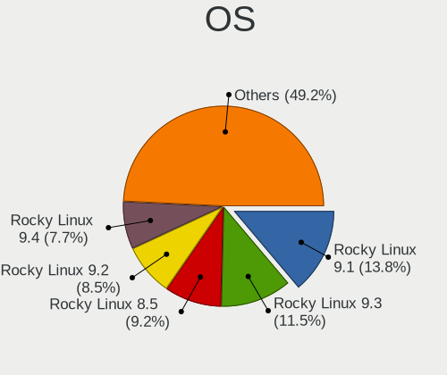
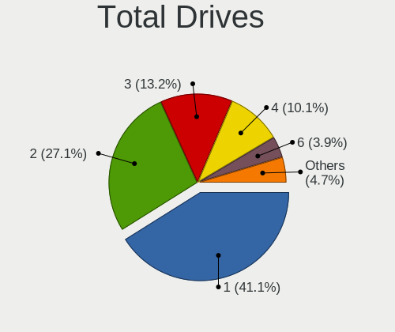
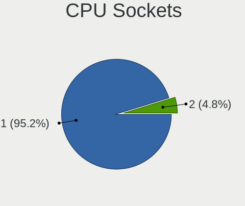
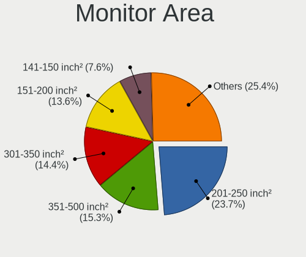

Rocky Linux - Tested Hardware & Statistics (Desktops)
-----------------------------------------------------

A project to collect tested hardware configurations for Rocky Linux.

Anyone can contribute to this report by the [hw-probe](https://github.com/linuxhw/hw-probe) tool:

    sudo -E hw-probe -all -upload

Please contribute! Especially if your hardware is rare.

Contents
--------

* [ Test Cases ](#test-cases)

* [ System ](#system)
  - [ OS                       ](#os)
  - [ OS Family                ](#os-family)
  - [ Kernel                   ](#kernel)
  - [ Kernel Family            ](#kernel-family)
  - [ Kernel Major Ver.        ](#kernel-major-ver)
  - [ Arch                     ](#arch)
  - [ DE                       ](#de)
  - [ Display Server           ](#display-server)
  - [ Display Manager          ](#display-manager)
  - [ OS Lang                  ](#os-lang)
  - [ Boot Mode                ](#boot-mode)
  - [ Filesystem               ](#filesystem)
  - [ Part. scheme             ](#part-scheme)
  - [ Dual Boot with Linux/BSD ](#dual-boot-with-linuxbsd)
  - [ Dual Boot (Win)          ](#dual-boot-win)

* [ Board ](#board)
  - [ Vendor                   ](#vendor)
  - [ Model                    ](#model)
  - [ Model Family             ](#model-family)
  - [ MFG Year                 ](#mfg-year)
  - [ Form Factor              ](#form-factor)
  - [ Secure Boot              ](#secure-boot)
  - [ Coreboot                 ](#coreboot)
  - [ RAM Size                 ](#ram-size)
  - [ RAM Used                 ](#ram-used)
  - [ Total Drives             ](#total-drives)
  - [ Has CD-ROM               ](#has-cd-rom)
  - [ Has Ethernet             ](#has-ethernet)
  - [ Has WiFi                 ](#has-wifi)
  - [ Has Bluetooth            ](#has-bluetooth)

* [ Location ](#location)
  - [ Country                  ](#country)
  - [ City                     ](#city)

* [ Drives ](#drives)
  - [ Drive Vendor             ](#drive-vendor)
  - [ Drive Model              ](#drive-model)
  - [ HDD Vendor               ](#hdd-vendor)
  - [ SSD Vendor               ](#ssd-vendor)
  - [ Drive Kind               ](#drive-kind)
  - [ Drive Connector          ](#drive-connector)
  - [ Drive Size               ](#drive-size)
  - [ Space Total              ](#space-total)
  - [ Space Used               ](#space-used)
  - [ Malfunc. Drives          ](#malfunc-drives)
  - [ Malfunc. Drive Vendor    ](#malfunc-drive-vendor)
  - [ Malfunc. HDD Vendor      ](#malfunc-hdd-vendor)
  - [ Malfunc. Drive Kind      ](#malfunc-drive-kind)
  - [ Failed Drives            ](#failed-drives)
  - [ Failed Drive Vendor      ](#failed-drive-vendor)
  - [ Drive Status             ](#drive-status)

* [ Storage controller ](#storage-controller)
  - [ Storage Vendor           ](#storage-vendor)
  - [ Storage Model            ](#storage-model)
  - [ Storage Kind             ](#storage-kind)

* [ Processor ](#processor)
  - [ CPU Vendor               ](#cpu-vendor)
  - [ CPU Model                ](#cpu-model)
  - [ CPU Model Family         ](#cpu-model-family)
  - [ CPU Cores                ](#cpu-cores)
  - [ CPU Sockets              ](#cpu-sockets)
  - [ CPU Threads              ](#cpu-threads)
  - [ CPU Op-Modes             ](#cpu-op-modes)
  - [ CPU Microcode            ](#cpu-microcode)
  - [ CPU Microarch            ](#cpu-microarch)

* [ Graphics ](#graphics)
  - [ GPU Vendor               ](#gpu-vendor)
  - [ GPU Model                ](#gpu-model)
  - [ GPU Combo                ](#gpu-combo)
  - [ GPU Driver               ](#gpu-driver)
  - [ GPU Memory               ](#gpu-memory)

* [ Monitor ](#monitor)
  - [ Monitor Vendor           ](#monitor-vendor)
  - [ Monitor Model            ](#monitor-model)
  - [ Monitor Resolution       ](#monitor-resolution)
  - [ Monitor Diagonal         ](#monitor-diagonal)
  - [ Monitor Width            ](#monitor-width)
  - [ Aspect Ratio             ](#aspect-ratio)
  - [ Monitor Area             ](#monitor-area)
  - [ Pixel Density            ](#pixel-density)
  - [ Multiple Monitors        ](#multiple-monitors)

* [ Network ](#network)
  - [ Net Controller Vendor    ](#net-controller-vendor)
  - [ Net Controller Model     ](#net-controller-model)
  - [ Wireless Vendor          ](#wireless-vendor)
  - [ Wireless Model           ](#wireless-model)
  - [ Ethernet Vendor          ](#ethernet-vendor)
  - [ Ethernet Model           ](#ethernet-model)
  - [ Net Controller Kind      ](#net-controller-kind)
  - [ Used Controller          ](#used-controller)
  - [ NICs                     ](#nics)
  - [ IPv6                     ](#ipv6)

* [ Bluetooth ](#bluetooth)
  - [ Bluetooth Vendor         ](#bluetooth-vendor)
  - [ Bluetooth Model          ](#bluetooth-model)

* [ Sound ](#sound)
  - [ Sound Vendor             ](#sound-vendor)
  - [ Sound Model              ](#sound-model)

* [ Memory ](#memory)
  - [ Memory Vendor            ](#memory-vendor)
  - [ Memory Model             ](#memory-model)
  - [ Memory Kind              ](#memory-kind)
  - [ Memory Form Factor       ](#memory-form-factor)
  - [ Memory Size              ](#memory-size)
  - [ Memory Speed             ](#memory-speed)

* [ Printers & scanners ](#printers--scanners)
  - [ Printer Vendor           ](#printer-vendor)
  - [ Printer Model            ](#printer-model)
  - [ Scanner Vendor           ](#scanner-vendor)
  - [ Scanner Model            ](#scanner-model)

* [ Camera ](#camera)
  - [ Camera Vendor            ](#camera-vendor)
  - [ Camera Model             ](#camera-model)

* [ Security ](#security)
  - [ Fingerprint Vendor       ](#fingerprint-vendor)
  - [ Fingerprint Model        ](#fingerprint-model)
  - [ Chipcard Vendor          ](#chipcard-vendor)
  - [ Chipcard Model           ](#chipcard-model)

* [ Unsupported ](#unsupported)
  - [ Unsupported Devices      ](#unsupported-devices)
  - [ Unsupported Device Types ](#unsupported-device-types)

Test Cases
----------

Total: 111

| Vendor        | Model                       | Probe                                                      | Date         |
|---------------|-----------------------------|------------------------------------------------------------|--------------|
| ASUSTek       | PRIME Z490-P                | [61724f27e7](https://linux-hardware.org/?probe=61724f27e7) | Dec 23, 2023 |
| ASRock        | Z790 Taichi                 | [3bc8305321](https://linux-hardware.org/?probe=3bc8305321) | Dec 22, 2023 |
| ASRock        | Z790 Taichi                 | [bffb0cadbe](https://linux-hardware.org/?probe=bffb0cadbe) | Dec 17, 2023 |
| Gigabyte      | X670 GAMING X AX            | [18d321d9d6](https://linux-hardware.org/?probe=18d321d9d6) | Dec 06, 2023 |
| HP            | 2AF3                        | [fd3b043741](https://linux-hardware.org/?probe=fd3b043741) | Nov 25, 2023 |
| Pegatron      | IPMIP-GS                    | [fb0f45f5b0](https://linux-hardware.org/?probe=fb0f45f5b0) | Nov 24, 2023 |
| HP            | 158B                        | [bd8928c0a2](https://linux-hardware.org/?probe=bd8928c0a2) | Nov 22, 2023 |
| System76      | Thelio Mira thelio-mira-... | [a6d3f50714](https://linux-hardware.org/?probe=a6d3f50714) | Nov 18, 2023 |
| ASUSTek       | Pro WS X570-ACE             | [bdbde84396](https://linux-hardware.org/?probe=bdbde84396) | Nov 18, 2023 |
| ASUSTek       | Pro WS X570-ACE             | [37aa104ebf](https://linux-hardware.org/?probe=37aa104ebf) | Nov 06, 2023 |
| ASUSTek       | ROG STRIX B650-A GAMING ... | [3734293144](https://linux-hardware.org/?probe=3734293144) | Nov 06, 2023 |
| ASUSTek       | ROG STRIX B650-A GAMING ... | [72bedff7a6](https://linux-hardware.org/?probe=72bedff7a6) | Nov 06, 2023 |
| ASUSTek       | Pro WS X570-ACE             | [650d69cdce](https://linux-hardware.org/?probe=650d69cdce) | Oct 31, 2023 |
| HP            | 1587h                       | [ecafcd1843](https://linux-hardware.org/?probe=ecafcd1843) | Oct 30, 2023 |
| HP            | 8653 A                      | [6d84c59a16](https://linux-hardware.org/?probe=6d84c59a16) | Oct 25, 2023 |
| Lenovo        | 31900058 STD                | [b6c589b413](https://linux-hardware.org/?probe=b6c589b413) | Oct 19, 2023 |
| Shenzhen M... | HX90G                       | [a6e9f6c7fc](https://linux-hardware.org/?probe=a6e9f6c7fc) | Oct 01, 2023 |
| Dell          | 0D24M8 A01                  | [214eb681ad](https://linux-hardware.org/?probe=214eb681ad) | Oct 01, 2023 |
| ASUSTek       | F1A55-M LX PLUS             | [a2aebc52bd](https://linux-hardware.org/?probe=a2aebc52bd) | Sep 03, 2023 |
| Lenovo        | 1048 SDK0J40697 WIN 3305... | [e584e6c368](https://linux-hardware.org/?probe=e584e6c368) | Aug 16, 2023 |
| ASRock        | X670E Pro RS                | [baa9e459cc](https://linux-hardware.org/?probe=baa9e459cc) | Aug 09, 2023 |
| Gigabyte      | H77N-WIFI                   | [32fd45f163](https://linux-hardware.org/?probe=32fd45f163) | Aug 04, 2023 |
| MSI           | PRO B650-P WIFI             | [92abff2d6e](https://linux-hardware.org/?probe=92abff2d6e) | Jul 31, 2023 |
| MSI           | PRO B650-P WIFI             | [d1c158eebc](https://linux-hardware.org/?probe=d1c158eebc) | Jul 31, 2023 |
| HP            | 0AECh D                     | [58f6dd1695](https://linux-hardware.org/?probe=58f6dd1695) | Jul 14, 2023 |
| ASUSTek       | M5A78L-M LX                 | [b4b1f263a8](https://linux-hardware.org/?probe=b4b1f263a8) | Jul 08, 2023 |
| Gigabyte      | H61M-DS2                    | [2310257292](https://linux-hardware.org/?probe=2310257292) | Jun 19, 2023 |
| Gigabyte      | H61M-DS2                    | [ee6f9906b5](https://linux-hardware.org/?probe=ee6f9906b5) | Jun 19, 2023 |
| Techvision    | TVI7309X B0                 | [57b238a5ff](https://linux-hardware.org/?probe=57b238a5ff) | Jun 08, 2023 |
| Lenovo        | 3730 SDK0T76463 WIN 3422... | [da8705e5a7](https://linux-hardware.org/?probe=da8705e5a7) | May 31, 2023 |
| HPE           | ProLiant MicroServer Gen... | [530b841978](https://linux-hardware.org/?probe=530b841978) | May 25, 2023 |
| ASRock        | AM1B-ITX                    | [a2e80bffac](https://linux-hardware.org/?probe=a2e80bffac) | May 19, 2023 |
| ASRock        | AM1B-ITX                    | [d0633ac39d](https://linux-hardware.org/?probe=d0633ac39d) | May 19, 2023 |
| AZW           | MINI S                      | [d7ee12a01b](https://linux-hardware.org/?probe=d7ee12a01b) | May 08, 2023 |
| Dell          | 0D735T A00                  | [3070f4e7da](https://linux-hardware.org/?probe=3070f4e7da) | May 02, 2023 |
| Dell          | 06D7TR A00                  | [6fe7179a50](https://linux-hardware.org/?probe=6fe7179a50) | May 01, 2023 |
| Dell          | 0Y2MRG A00                  | [5f765d4d9c](https://linux-hardware.org/?probe=5f765d4d9c) | Apr 29, 2023 |
| Dell          | 0Y2MRG A00                  | [62a4a8b0b5](https://linux-hardware.org/?probe=62a4a8b0b5) | Apr 29, 2023 |
| MSI           | X470 GAMING PRO CARBON      | [7c909a0c5a](https://linux-hardware.org/?probe=7c909a0c5a) | Mar 18, 2023 |
| MSI           | PRO Z690-A DDR4             | [113406acd8](https://linux-hardware.org/?probe=113406acd8) | Mar 18, 2023 |
| MSI           | PRO Z690-A DDR4             | [e967c05c1e](https://linux-hardware.org/?probe=e967c05c1e) | Mar 18, 2023 |
| Gigabyte      | 970A-DS3P                   | [fd875a6058](https://linux-hardware.org/?probe=fd875a6058) | Mar 16, 2023 |
| MSI           | B450M MORTAR TITANIUM       | [a4c449eef4](https://linux-hardware.org/?probe=a4c449eef4) | Mar 16, 2023 |
| MSI           | B450M MORTAR TITANIUM       | [61af17e1cd](https://linux-hardware.org/?probe=61af17e1cd) | Mar 13, 2023 |
| AZW           | GTR V02                     | [fcd41fbe77](https://linux-hardware.org/?probe=fcd41fbe77) | Mar 10, 2023 |
| MSI           | B450M MORTAR TITANIUM       | [b27fb5e204](https://linux-hardware.org/?probe=b27fb5e204) | Feb 26, 2023 |
| MSI           | B450M MORTAR TITANIUM       | [a2356a66ba](https://linux-hardware.org/?probe=a2356a66ba) | Feb 26, 2023 |
| Sapphire      | PE-AM2RS690V2               | [8aa6cda98e](https://linux-hardware.org/?probe=8aa6cda98e) | Feb 26, 2023 |
| ASUSTek       | PRIME B550-PLUS             | [feae434e9e](https://linux-hardware.org/?probe=feae434e9e) | Feb 18, 2023 |
| HP            | 1587h                       | [312effb7b7](https://linux-hardware.org/?probe=312effb7b7) | Feb 14, 2023 |
| ASUSTek       | PRIME B550-PLUS             | [9de6fe5d90](https://linux-hardware.org/?probe=9de6fe5d90) | Feb 14, 2023 |
| ASUSTek       | PRIME B550-PLUS             | [68463d6d4b](https://linux-hardware.org/?probe=68463d6d4b) | Feb 13, 2023 |
| MSI           | B450M MORTAR TITANIUM       | [7fec987264](https://linux-hardware.org/?probe=7fec987264) | Feb 12, 2023 |
| Dell          | 08HPGT A01                  | [bf2c6ebd43](https://linux-hardware.org/?probe=bf2c6ebd43) | Feb 03, 2023 |
| ASUSTek       | PRIME B550-PLUS             | [bea57d418a](https://linux-hardware.org/?probe=bea57d418a) | Feb 01, 2023 |
| ASUSTek       | PRIME B550-PLUS             | [23b27dab7d](https://linux-hardware.org/?probe=23b27dab7d) | Feb 01, 2023 |
| ASUSTek       | PRIME B550-PLUS             | [989e45d84b](https://linux-hardware.org/?probe=989e45d84b) | Jan 31, 2023 |
| ASRock        | H610M-HDV/M.2               | [2936bb8fec](https://linux-hardware.org/?probe=2936bb8fec) | Jan 26, 2023 |
| Lenovo        | NOK                         | [507b602676](https://linux-hardware.org/?probe=507b602676) | Jan 25, 2023 |
| Dell          | 0Y2MRG A00                  | [784e2db087](https://linux-hardware.org/?probe=784e2db087) | Jan 25, 2023 |
| MSI           | H510M PRO-E                 | [c81f6adb11](https://linux-hardware.org/?probe=c81f6adb11) | Jan 20, 2023 |
| Unknown       | Unknown                     | [49d1097b37](https://linux-hardware.org/?probe=49d1097b37) | Jan 07, 2023 |
| Unknown       | Unknown                     | [2fbec34211](https://linux-hardware.org/?probe=2fbec34211) | Jan 07, 2023 |
| Dell          | 0VRWRC A00                  | [2135b5161f](https://linux-hardware.org/?probe=2135b5161f) | Dec 28, 2022 |
| HP            | 805D                        | [cf88e571df](https://linux-hardware.org/?probe=cf88e571df) | Dec 28, 2022 |
| MSI           | B450M MORTAR TITANIUM       | [2a7ce79df8](https://linux-hardware.org/?probe=2a7ce79df8) | Dec 24, 2022 |
| ASUSTek       | X99-WS/IPMI                 | [41f02987e9](https://linux-hardware.org/?probe=41f02987e9) | Dec 16, 2022 |
| ASUSTek       | ROG STRIX X470-F GAMING     | [b52b8b590b](https://linux-hardware.org/?probe=b52b8b590b) | Nov 30, 2022 |
| MSI           | PRO H610M-B DDR4            | [dc35eb3d09](https://linux-hardware.org/?probe=dc35eb3d09) | Nov 30, 2022 |
| ASUSTek       | PRIME H510M-E               | [86159f4ef3](https://linux-hardware.org/?probe=86159f4ef3) | Nov 20, 2022 |
| Intel         | D33217GKE G69901-202        | [f10d00e42a](https://linux-hardware.org/?probe=f10d00e42a) | Nov 12, 2022 |
| HP            | 8054                        | [08a9a98d04](https://linux-hardware.org/?probe=08a9a98d04) | Nov 10, 2022 |
| HP            | 8054                        | [4ce3ccc26d](https://linux-hardware.org/?probe=4ce3ccc26d) | Nov 09, 2022 |
| MSI           | X299 RAIDER                 | [b7d117fc31](https://linux-hardware.org/?probe=b7d117fc31) | Nov 09, 2022 |
| ASUSTek       | Crosshair V Formula         | [c07ddbeb76](https://linux-hardware.org/?probe=c07ddbeb76) | Oct 31, 2022 |
| Gigabyte      | H81M-S2PV                   | [23be2713d2](https://linux-hardware.org/?probe=23be2713d2) | Oct 24, 2022 |
| BESSTAR Te... | HM90                        | [fd411132f6](https://linux-hardware.org/?probe=fd411132f6) | Oct 15, 2022 |
| ASUSTek       | M5A97 R2.0                  | [71970edbae](https://linux-hardware.org/?probe=71970edbae) | Oct 11, 2022 |
| ASUSTek       | PRIME H570-PLUS             | [71da92bd30](https://linux-hardware.org/?probe=71da92bd30) | Oct 04, 2022 |
| ASUSTek       | PRIME B550M-K               | [ff511df5c2](https://linux-hardware.org/?probe=ff511df5c2) | Sep 27, 2022 |
| ASUSTek       | P8B WS                      | [bd82f7708c](https://linux-hardware.org/?probe=bd82f7708c) | Sep 02, 2022 |
| Lenovo        | 1046 NO DPK                 | [e21e07827d](https://linux-hardware.org/?probe=e21e07827d) | Aug 26, 2022 |
| ASUSTek       | PRIME B460M-A R2.0          | [e29f13e0b6](https://linux-hardware.org/?probe=e29f13e0b6) | Aug 19, 2022 |
| ASUSTek       | PRIME B365-PLUS             | [324410a493](https://linux-hardware.org/?probe=324410a493) | Aug 04, 2022 |
| Gigabyte      | 970A-UD3P                   | [0d503b2789](https://linux-hardware.org/?probe=0d503b2789) | Jul 27, 2022 |
| Unknown       | X31_ICH7                    | [f8ab18b666](https://linux-hardware.org/?probe=f8ab18b666) | Jun 07, 2022 |
| Dell          | 0GWHMW A01                  | [f427859019](https://linux-hardware.org/?probe=f427859019) | May 30, 2022 |
| Dell          | 06CV2N A00                  | [f9e949ad9b](https://linux-hardware.org/?probe=f9e949ad9b) | Apr 24, 2022 |
| Gigabyte      | G41MT-USB3                  | [10f3a0eaae](https://linux-hardware.org/?probe=10f3a0eaae) | Apr 21, 2022 |
| Gigabyte      | G41MT-USB3                  | [4618c00b42](https://linux-hardware.org/?probe=4618c00b42) | Apr 17, 2022 |
| NCR           | Pocono BIOS.5.1             | [ca175e1f0c](https://linux-hardware.org/?probe=ca175e1f0c) | Apr 09, 2022 |
| Dell          | 0NK70N A03                  | [7d4e906833](https://linux-hardware.org/?probe=7d4e906833) | Mar 11, 2022 |
| Dell          | 0WN7Y6 A01                  | [ef36ccb6ab](https://linux-hardware.org/?probe=ef36ccb6ab) | Feb 22, 2022 |
| Dell          | 0PC5F7 A02                  | [7c6c7dcd5e](https://linux-hardware.org/?probe=7c6c7dcd5e) | Feb 18, 2022 |
| ASUSTek       | PRIME B450-PLUS             | [1d3c449e8a](https://linux-hardware.org/?probe=1d3c449e8a) | Feb 18, 2022 |
| ASRock        | B450M Pro4                  | [1ab47f8ff0](https://linux-hardware.org/?probe=1ab47f8ff0) | Jan 20, 2022 |
| MSI           | Z97A GAMING 6               | [4b935d705c](https://linux-hardware.org/?probe=4b935d705c) | Jan 20, 2022 |
| AZW           | Gemini M                    | [25e63b737c](https://linux-hardware.org/?probe=25e63b737c) | Dec 31, 2021 |
| AZW           | Gemini M                    | [05ef59842c](https://linux-hardware.org/?probe=05ef59842c) | Dec 31, 2021 |
| Google        | Tricky                      | [92e2626936](https://linux-hardware.org/?probe=92e2626936) | Nov 30, 2021 |
| Gigabyte      | X570 AORUS ULTRA            | [840d920fb2](https://linux-hardware.org/?probe=840d920fb2) | Nov 22, 2021 |
| Gigabyte      | H87-D3H-CF                  | [72fdde33b3](https://linux-hardware.org/?probe=72fdde33b3) | Nov 19, 2021 |
| Dell          | 0N4YC8 A00                  | [1a94195ddb](https://linux-hardware.org/?probe=1a94195ddb) | Oct 15, 2021 |
| ASUSTek       | PRIME B450M-A II            | [cb9f02b3de](https://linux-hardware.org/?probe=cb9f02b3de) | Sep 07, 2021 |
| ASUSTek       | PRIME B450M-A II            | [f80365b98a](https://linux-hardware.org/?probe=f80365b98a) | Sep 07, 2021 |
| ASUSTek       | P5Q DELUXE                  | [243dba3b27](https://linux-hardware.org/?probe=243dba3b27) | Sep 02, 2021 |
| Lenovo        | NOK                         | [274005087d](https://linux-hardware.org/?probe=274005087d) | Aug 23, 2021 |
| Dell          | 0M5DCD A00                  | [91acc7eb93](https://linux-hardware.org/?probe=91acc7eb93) | Aug 15, 2021 |
| ASUSTek       | PRIME TRX40-PRO S           | [59f7d599dd](https://linux-hardware.org/?probe=59f7d599dd) | Aug 04, 2021 |
| Dell          | 0M5DCD A00                  | [77c3d7076e](https://linux-hardware.org/?probe=77c3d7076e) | Aug 04, 2021 |
| HP            | 0B54h D                     | [ee9a2da17c](https://linux-hardware.org/?probe=ee9a2da17c) | May 19, 2021 |

System
------

OS
--

Installed operating systems

| Name            | Desktops | Percent |
|-----------------|----------|---------|
| Rocky Linux 9.1 | 17       | 20.48%  |
| Rocky Linux 8.5 | 12       | 14.46%  |
| Rocky Linux 8.4 | 9        | 10.84%  |
| Rocky Linux 9.2 | 8        | 9.64%   |
| Rocky Linux 8.8 | 8        | 9.64%   |
| Rocky Linux 8.6 | 8        | 9.64%   |
| Rocky Linux 9.0 | 7        | 8.43%   |
| Rocky Linux 8.7 | 7        | 8.43%   |
| Rocky Linux 9.3 | 6        | 7.23%   |
| Rocky Linux 8.3 | 1        | 1.2%    |

OS Family
---------

OS without a version

| Name        | Desktops | Percent |
|-------------|----------|---------|
| Rocky Linux | 82       | 100%    |

Kernel
------

Version of the Linux kernel

| Version                               | Desktops | Percent |
|---------------------------------------|----------|---------|
| 5.14.0-162.6.1.el9_1.0.1.x86_64       | 6        | 6.9%    |
| 4.18.0-348.12.2.el8_5.x86_64          | 6        | 6.9%    |
| 5.14.0-284.11.1.el9_2.x86_64          | 4        | 4.6%    |
| 5.14.0-162.18.1.el9_1.x86_64          | 4        | 4.6%    |
| 4.18.0-477.27.1.el8_8.x86_64          | 4        | 4.6%    |
| 5.14.0-70.30.1.el9_0.x86_64           | 3        | 3.45%   |
| 5.14.0-70.26.1.el9_0.x86_64           | 3        | 3.45%   |
| 5.14.0-362.8.1.el9_3.x86_64           | 3        | 3.45%   |
| 5.14.0-284.30.1.el9_2.x86_64          | 3        | 3.45%   |
| 4.18.0-425.19.2.el8_7.x86_64          | 3        | 3.45%   |
| 4.18.0-348.7.1.el8_5.x86_64           | 3        | 3.45%   |
| 4.18.0-305.10.2.el8_4.x86_64          | 3        | 3.45%   |
| 5.14.0-362.13.1.el9_3.x86_64          | 2        | 2.3%    |
| 5.14.0-162.6.1.el9_1.x86_64           | 2        | 2.3%    |
| 4.18.0-477.21.1.el8_8.x86_64          | 2        | 2.3%    |
| 4.18.0-477.15.1.el8_8.x86_64          | 2        | 2.3%    |
| 4.18.0-425.13.1.el8_7.x86_64          | 2        | 2.3%    |
| 4.18.0-425.10.1.el8_7.x86_64          | 2        | 2.3%    |
| 4.18.0-372.32.1.el8_6.x86_64          | 2        | 2.3%    |
| 4.18.0-372.26.1.el8_6.x86_64          | 2        | 2.3%    |
| 4.18.0-372.16.1.el8_6.0.1.x86_64      | 2        | 2.3%    |
| 4.18.0-348.20.1.el8_5.x86_64          | 2        | 2.3%    |
| 4.18.0-305.19.1.el8_4.x86_64          | 2        | 2.3%    |
| 4.18.0-305.12.1.el8_4.x86_64          | 2        | 2.3%    |
| 6.1.8-1.el9.elrepo.x86_64             | 1        | 1.15%   |
| 6.1.6-1.el8.elrepo.x86_64             | 1        | 1.15%   |
| 6.0.10_tkg_bmq                        | 1        | 1.15%   |
| 6.0.10-1.el9.elrepo.x86_64            | 1        | 1.15%   |
| 5.14.1-1.el8.elrepo.x86_64            | 1        | 1.15%   |
| 5.14.0-70.22.1.el9_0.x86_64           | 1        | 1.15%   |
| 5.14.0-70.17.1.el9_0.x86_64           | 1        | 1.15%   |
| 5.14.0-284.30.1.rt14.315.el9_2.x86_64 | 1        | 1.15%   |
| 5.14.0-284.25.1.el9_2.x86_64          | 1        | 1.15%   |
| 5.14.0-284.18.1.el9_2.x86_64          | 1        | 1.15%   |
| 5.14.0-162.23.1.el9_1.x86_64          | 1        | 1.15%   |
| 5.14.0-162.12.1.el9_1.0.1.x86_64      | 1        | 1.15%   |
| 4.18.0-425.3.1.el8.x86_64             | 1        | 1.15%   |
| 4.18.0-372.9.1.el8.x86_64             | 1        | 1.15%   |
| 4.18.0-372.19.1.el8_6.x86_64          | 1        | 1.15%   |
| 4.18.0-348.2.1.el8_5.x86_64           | 1        | 1.15%   |

Kernel Family
-------------

Linux kernel without a distro release

| Version | Desktops | Percent |
|---------|----------|---------|
| 4.18.0  | 43       | 51.81%  |
| 5.14.0  | 35       | 42.17%  |
| 6.0.10  | 2        | 2.41%   |
| 6.1.8   | 1        | 1.2%    |
| 6.1.6   | 1        | 1.2%    |
| 5.14.1  | 1        | 1.2%    |

Kernel Major Ver.
-----------------

Linux kernel major version

| Version | Desktops | Percent |
|---------|----------|---------|
| 4.18    | 43       | 51.81%  |
| 5.14    | 36       | 43.37%  |
| 6.1     | 2        | 2.41%   |
| 6.0     | 2        | 2.41%   |

Arch
----

OS architecture (x86_64, i586, etc.)

| Name   | Desktops | Percent |
|--------|----------|---------|
| x86_64 | 82       | 100%    |

DE
--

Desktop Environment

| Name          | Desktops | Percent |
|---------------|----------|---------|
| GNOME         | 52       | 63.41%  |
| Unknown       | 15       | 18.29%  |
| KDE5          | 7        | 8.54%   |
| GNOME Classic | 4        | 4.88%   |
| XFCE          | 2        | 2.44%   |
| MATE          | 2        | 2.44%   |

Display Server
--------------

X11 or Wayland

| Name    | Desktops | Percent |
|---------|----------|---------|
| Wayland | 39       | 45.35%  |
| X11     | 33       | 38.37%  |
| Unknown | 7        | 8.14%   |
| Tty     | 5        | 5.81%   |
| Web     | 2        | 2.33%   |

Display Manager
---------------

SDDM, LightDM, etc.

| Name    | Desktops | Percent |
|---------|----------|---------|
| Unknown | 40       | 48.78%  |
| GDM     | 35       | 42.68%  |
| SDDM    | 5        | 6.1%    |
| LightDM | 2        | 2.44%   |

OS Lang
-------

Language

| Lang    | Desktops | Percent |
|---------|----------|---------|
| en_US   | 50       | 60.98%  |
| ru_RU   | 4        | 4.88%   |
| en_CA   | 4        | 4.88%   |
| en_IL   | 3        | 3.66%   |
| ko_KR   | 2        | 2.44%   |
| en_SG   | 2        | 2.44%   |
| en_GB   | 2        | 2.44%   |
| en_AU   | 2        | 2.44%   |
| C       | 2        | 2.44%   |
| Unknown | 2        | 2.44%   |
| zh_CN   | 1        | 1.22%   |
| pt_BR   | 1        | 1.22%   |
| pl_PL   | 1        | 1.22%   |
| ja_JP   | 1        | 1.22%   |
| es_CO   | 1        | 1.22%   |
| es_AR   | 1        | 1.22%   |
| en_ZA   | 1        | 1.22%   |
| en_IN   | 1        | 1.22%   |
| af_ZA   | 1        | 1.22%   |

Boot Mode
---------

EFI or BIOS

| Mode | Desktops | Percent |
|------|----------|---------|
| EFI  | 47       | 56.63%  |
| BIOS | 36       | 43.37%  |

Filesystem
----------

Type of filesystem

| Type | Desktops | Percent |
|------|----------|---------|
| Xfs  | 68       | 82.93%  |
| Ext4 | 14       | 17.07%  |

Part. scheme
------------

Scheme of partitioning

| Type    | Desktops | Percent |
|---------|----------|---------|
| GPT     | 46       | 56.1%   |
| Unknown | 22       | 26.83%  |
| MBR     | 14       | 17.07%  |

Dual Boot with Linux/BSD
------------------------

Hosting more than one Linux/BSD

| Dual boot | Desktops | Percent |
|-----------|----------|---------|
| No        | 62       | 75.61%  |
| Yes       | 20       | 24.39%  |

Dual Boot (Win)
---------------

Hosting Linux and Windows

| Dual boot | Desktops | Percent |
|-----------|----------|---------|
| No        | 72       | 87.8%   |
| Yes       | 10       | 12.2%   |

Board
-----

Vendor
------

Motherboard manufacturer

| Name                | Desktops | Percent |
|---------------------|----------|---------|
| ASUSTek Computer    | 20       | 24.39%  |
| Dell                | 13       | 15.85%  |
| Hewlett-Packard     | 9        | 10.98%  |
| Gigabyte Technology | 9        | 10.98%  |
| MSI                 | 8        | 9.76%   |
| ASRock              | 5        | 6.1%    |
| Lenovo              | 4        | 4.88%   |
| AZW                 | 3        | 3.66%   |
| Unknown             | 2        | 2.44%   |
| Techvision          | 1        | 1.22%   |
| System76            | 1        | 1.22%   |
| Sapphire            | 1        | 1.22%   |
| Pegatron            | 1        | 1.22%   |
| NCR                 | 1        | 1.22%   |
| Intel               | 1        | 1.22%   |
| HPE                 | 1        | 1.22%   |
| Google              | 1        | 1.22%   |
| BESSTAR Tech        | 1        | 1.22%   |

Model
-----

Motherboard model

| Name                                | Desktops | Percent |
|-------------------------------------|----------|---------|
| HP Z210 Workstation                 | 2        | 2.44%   |
| Dell OptiPlex 9020                  | 2        | 2.44%   |
| Unknown                             | 2        | 2.44%   |
| Techvision TVI7309X                 | 1        | 1.22%   |
| System76 Thelio Mira                | 1        | 1.22%   |
| Sapphire PE-AM2RS690V2              | 1        | 1.22%   |
| Pegatron IPMIP-GS                   | 1        | 1.22%   |
| NCR xxxx-xxxx-xxxx                  | 1        | 1.22%   |
| MSI MS-7D78                         | 1        | 1.22%   |
| MSI MS-7D46                         | 1        | 1.22%   |
| MSI MS-7D25                         | 1        | 1.22%   |
| MSI MS-7B89                         | 1        | 1.22%   |
| MSI MS-7B78                         | 1        | 1.22%   |
| MSI MS-7A94                         | 1        | 1.22%   |
| MSI MS-7917                         | 1        | 1.22%   |
| MSI H510M PRO-E                     | 1        | 1.22%   |
| Lenovo ThinkStation P620 30E0S0PR00 | 1        | 1.22%   |
| Lenovo ThinkStation P340 30DK000CUS | 1        | 1.22%   |
| Lenovo ThinkCentre M72e 36601Y8     | 1        | 1.22%   |
| Lenovo H535 10117                   | 1        | 1.22%   |
| Intel PRO412081                     | 1        | 1.22%   |
| HPE ProLiant MicroServer Gen10 Plus | 1        | 1.22%   |
| HP Z820 Workstation                 | 1        | 1.22%   |
| HP Z800 Workstation                 | 1        | 1.22%   |
| HP Z600 Workstation                 | 1        | 1.22%   |
| HP ProDesk 600 G2 SFF               | 1        | 1.22%   |
| HP ENVY TE01-0xxx                   | 1        | 1.22%   |
| HP EliteDesk 800 G2 SFF             | 1        | 1.22%   |
| HP 700-074                          | 1        | 1.22%   |
| Google Tricky                       | 1        | 1.22%   |
| Gigabyte X670 GAMING X AX           | 1        | 1.22%   |
| Gigabyte X570 AORUS ULTRA           | 1        | 1.22%   |
| Gigabyte H87-D3H                    | 1        | 1.22%   |
| Gigabyte H81M-S2PV                  | 1        | 1.22%   |
| Gigabyte H61M-DS2                   | 1        | 1.22%   |
| Gigabyte G41MT-USB3                 | 1        | 1.22%   |
| Gigabyte EUROLINUX_V1               | 1        | 1.22%   |
| Gigabyte 970A-UD3P                  | 1        | 1.22%   |
| Gigabyte 970A-DS3P                  | 1        | 1.22%   |
| Dell XPS 8300                       | 1        | 1.22%   |

Model Family
------------

Motherboard model prefix

| Name                   | Desktops | Percent |
|------------------------|----------|---------|
| ASUS PRIME             | 10       | 12.2%   |
| Dell OptiPlex          | 6        | 7.32%   |
| Dell Precision         | 4        | 4.88%   |
| Lenovo ThinkStation    | 2        | 2.44%   |
| HP Z210                | 2        | 2.44%   |
| Dell Vostro            | 2        | 2.44%   |
| ASUS ROG               | 2        | 2.44%   |
| Unknown                | 2        | 2.44%   |
| Techvision TVI7309X    | 1        | 1.22%   |
| System76 Thelio        | 1        | 1.22%   |
| Sapphire PE-AM2RS690V2 | 1        | 1.22%   |
| Pegatron IPMIP-GS      | 1        | 1.22%   |
| NCR xxxx-xxxx-xxxx     | 1        | 1.22%   |
| MSI MS-7D78            | 1        | 1.22%   |
| MSI MS-7D46            | 1        | 1.22%   |
| MSI MS-7D25            | 1        | 1.22%   |
| MSI MS-7B89            | 1        | 1.22%   |
| MSI MS-7B78            | 1        | 1.22%   |
| MSI MS-7A94            | 1        | 1.22%   |
| MSI MS-7917            | 1        | 1.22%   |
| MSI H510M              | 1        | 1.22%   |
| Lenovo ThinkCentre     | 1        | 1.22%   |
| Lenovo H535            | 1        | 1.22%   |
| Intel PRO412081        | 1        | 1.22%   |
| HPE ProLiant           | 1        | 1.22%   |
| HP Z820                | 1        | 1.22%   |
| HP Z800                | 1        | 1.22%   |
| HP Z600                | 1        | 1.22%   |
| HP ProDesk             | 1        | 1.22%   |
| HP ENVY                | 1        | 1.22%   |
| HP EliteDesk           | 1        | 1.22%   |
| HP 700-074             | 1        | 1.22%   |
| Google Tricky          | 1        | 1.22%   |
| Gigabyte X670          | 1        | 1.22%   |
| Gigabyte X570          | 1        | 1.22%   |
| Gigabyte H87-D3H       | 1        | 1.22%   |
| Gigabyte H81M-S2PV     | 1        | 1.22%   |
| Gigabyte H61M-DS2      | 1        | 1.22%   |
| Gigabyte G41MT-USB3    | 1        | 1.22%   |
| Gigabyte EUROLINUX     | 1        | 1.22%   |

MFG Year
--------

Motherboard manufacture year

| Year | Desktops | Percent |
|------|----------|---------|
| 2021 | 10       | 12.2%   |
| 2011 | 10       | 12.2%   |
| 2022 | 9        | 10.98%  |
| 2020 | 9        | 10.98%  |
| 2013 | 9        | 10.98%  |
| 2018 | 6        | 7.32%   |
| 2015 | 5        | 6.1%    |
| 2014 | 5        | 6.1%    |
| 2012 | 5        | 6.1%    |
| 2019 | 4        | 4.88%   |
| 2010 | 3        | 3.66%   |
| 2008 | 3        | 3.66%   |
| 2017 | 2        | 2.44%   |
| 2023 | 1        | 1.22%   |
| 2009 | 1        | 1.22%   |

Form Factor
-----------

Physical design of the computer

| Name    | Desktops | Percent |
|---------|----------|---------|
| Desktop | 82       | 100%    |

Secure Boot
-----------

Enabled or disabled

| State    | Desktops | Percent |
|----------|----------|---------|
| Disabled | 77       | 93.9%   |
| Enabled  | 5        | 6.1%    |

Coreboot
--------

Have coreboot on board

| Used | Desktops | Percent |
|------|----------|---------|
| No   | 81       | 98.78%  |
| Yes  | 1        | 1.22%   |

RAM Size
--------

Total RAM memory

| Size in GB  | Desktops | Percent |
|-------------|----------|---------|
| 32.01-64.0  | 17       | 20.48%  |
| 4.01-8.0    | 14       | 16.87%  |
| 64.01-256.0 | 14       | 16.87%  |
| 8.01-16.0   | 13       | 15.66%  |
| 16.01-24.0  | 12       | 14.46%  |
| 3.01-4.0    | 4        | 4.82%   |
| 24.01-32.0  | 4        | 4.82%   |
| 1.01-2.0    | 3        | 3.61%   |
| 2.01-3.0    | 2        | 2.41%   |

RAM Used
--------

Used RAM memory

| Used GB    | Desktops | Percent |
|------------|----------|---------|
| 2.01-3.0   | 25       | 29.07%  |
| 4.01-8.0   | 21       | 24.42%  |
| 3.01-4.0   | 15       | 17.44%  |
| 1.01-2.0   | 10       | 11.63%  |
| 0.51-1.0   | 5        | 5.81%   |
| 8.01-16.0  | 4        | 4.65%   |
| 32.01-64.0 | 2        | 2.33%   |
| 16.01-24.0 | 2        | 2.33%   |
| 0.01-0.5   | 2        | 2.33%   |

Total Drives
------------

Number of drives on board

| Drives | Desktops | Percent |
|--------|----------|---------|
| 1      | 37       | 44.05%  |
| 2      | 18       | 21.43%  |
| 4      | 11       | 13.1%   |
| 3      | 11       | 13.1%   |
| 6      | 3        | 3.57%   |
| 5      | 2        | 2.38%   |
| 9      | 1        | 1.19%   |
| 8      | 1        | 1.19%   |

Has CD-ROM
----------

Has CD-ROM on board

| Presented | Desktops | Percent |
|-----------|----------|---------|
| No        | 50       | 60.98%  |
| Yes       | 32       | 39.02%  |

Has Ethernet
------------

Has Ethernet on board

| Presented | Desktops | Percent |
|-----------|----------|---------|
| Yes       | 81       | 98.78%  |
| No        | 1        | 1.22%   |

Has WiFi
--------

Has WiFi module

| Presented | Desktops | Percent |
|-----------|----------|---------|
| No        | 51       | 61.45%  |
| Yes       | 32       | 38.55%  |

Has Bluetooth
-------------

Has Bluetooth module

| Presented | Desktops | Percent |
|-----------|----------|---------|
| No        | 56       | 67.47%  |
| Yes       | 27       | 32.53%  |

Location
--------

Country
-------

Geographic location (country)

| Country                | Desktops | Percent |
|------------------------|----------|---------|
| USA                    | 27       | 32.93%  |
| Canada                 | 6        | 7.32%   |
| Russia                 | 5        | 6.1%    |
| Singapore              | 4        | 4.88%   |
| South Korea            | 3        | 3.66%   |
| Italy                  | 3        | 3.66%   |
| Israel                 | 3        | 3.66%   |
| Australia              | 3        | 3.66%   |
| UK                     | 2        | 2.44%   |
| South Africa           | 2        | 2.44%   |
| Netherlands            | 2        | 2.44%   |
| Indonesia              | 2        | 2.44%   |
| India                  | 2        | 2.44%   |
| Germany                | 2        | 2.44%   |
| France                 | 2        | 2.44%   |
| Sweden                 | 1        | 1.22%   |
| Portugal               | 1        | 1.22%   |
| Poland                 | 1        | 1.22%   |
| Norway                 | 1        | 1.22%   |
| Mexico                 | 1        | 1.22%   |
| Japan                  | 1        | 1.22%   |
| Hong Kong              | 1        | 1.22%   |
| Finland                | 1        | 1.22%   |
| Czechia                | 1        | 1.22%   |
| Colombia               | 1        | 1.22%   |
| Brazil                 | 1        | 1.22%   |
| Bosnia and Herzegovina | 1        | 1.22%   |
| Austria                | 1        | 1.22%   |
| Argentina              | 1        | 1.22%   |

City
----

Geographic location (city)

| City                   | Desktops | Percent |
|------------------------|----------|---------|
| Singapore              | 4        | 4.82%   |
| Toronto                | 2        | 2.41%   |
| Melbourne              | 2        | 2.41%   |
| Haifa                  | 2        | 2.41%   |
| Buckley                | 2        | 2.41%   |
| Yogyakarta             | 1        | 1.2%    |
| Yekaterinburg          | 1        | 1.2%    |
| Willowbrook            | 1        | 1.2%    |
| Wells                  | 1        | 1.2%    |
| Washington             | 1        | 1.2%    |
| Waltham                | 1        | 1.2%    |
| Voronezh               | 1        | 1.2%    |
| Vienna                 | 1        | 1.2%    |
| Vashon                 | 1        | 1.2%    |
| Vancouver              | 1        | 1.2%    |
| Tlaxcala City          | 1        | 1.2%    |
| Thoothukudi            | 1        | 1.2%    |
| St. John's             | 1        | 1.2%    |
| St Petersburg          | 1        | 1.2%    |
| Springfield            | 1        | 1.2%    |
| Sobral de Monte Agraco | 1        | 1.2%    |
| Siroki Brijeg          | 1        | 1.2%    |
| Simi Valley            | 1        | 1.2%    |
| Semarang               | 1        | 1.2%    |
| Sao Jose do Rio Claro  | 1        | 1.2%    |
| Rotterdam              | 1        | 1.2%    |
| Rome                   | 1        | 1.2%    |
| Rochester              | 1        | 1.2%    |
| Rehovot                | 1        | 1.2%    |
| Prague                 | 1        | 1.2%    |
| Paris                  | 1        | 1.2%    |
| Ōtsu                  | 1        | 1.2%    |
| Oslo                   | 1        | 1.2%    |
| Ormond Beach           | 1        | 1.2%    |
| Newmarket              | 1        | 1.2%    |
| Moscow                 | 1        | 1.2%    |
| Monza                  | 1        | 1.2%    |
| Milan                  | 1        | 1.2%    |
| Mequon                 | 1        | 1.2%    |
| Medfield               | 1        | 1.2%    |

Drives
------

Drive Vendor
------------

Hard drive vendors

| Vendor                      | Desktops | Drives | Percent |
|-----------------------------|----------|--------|---------|
| Seagate                     | 25       | 50     | 18.8%   |
| Samsung Electronics         | 22       | 38     | 16.54%  |
| WDC                         | 21       | 36     | 15.79%  |
| Toshiba                     | 8        | 10     | 6.02%   |
| Hitachi                     | 8        | 13     | 6.02%   |
| SanDisk                     | 6        | 6      | 4.51%   |
| Crucial                     | 6        | 7      | 4.51%   |
| Kingston                    | 4        | 4      | 3.01%   |
| Intel                       | 4        | 7      | 3.01%   |
| HGST                        | 3        | 3      | 2.26%   |
| Unknown                     | 2        | 4      | 1.5%    |
| SK hynix                    | 2        | 2      | 1.5%    |
| MAXIO Technology (Hangzhou) | 2        | 3      | 1.5%    |
| Gigabyte Technology         | 2        | 2      | 1.5%    |
| China                       | 2        | 2      | 1.5%    |
| Team                        | 1        | 1      | 0.75%   |
| PNY                         | 1        | 1      | 0.75%   |
| Phison                      | 1        | 1      | 0.75%   |
| MyDigitalSSD                | 1        | 1      | 0.75%   |
| Mobius                      | 1        | 2      | 0.75%   |
| Micron/Crucial Technology   | 1        | 2      | 0.75%   |
| KIOXIA-EXCERIA              | 1        | 1      | 0.75%   |
| KIOXIA                      | 1        | 1      | 0.75%   |
| Kingston Technology Company | 1        | 1      | 0.75%   |
| GOODRAM                     | 1        | 1      | 0.75%   |
| DUEX-120GB                  | 1        | 1      | 0.75%   |
| Digma                       | 1        | 1      | 0.75%   |
| Corsair                     | 1        | 1      | 0.75%   |
| Apacer                      | 1        | 1      | 0.75%   |
| ADATA SU                    | 1        | 1      | 0.75%   |
| A-DATA Technology           | 1        | 1      | 0.75%   |

Drive Model
-----------

Hard drive models

| Model                                              | Desktops | Percent |
|----------------------------------------------------|----------|---------|
| Samsung NVMe SSD Controller PM9A1/PM9A3/980PRO 2TB | 5        | 3.21%   |
| Seagate ST500DM002-1BD142 500GB                    | 4        | 2.56%   |
| WDC WD2002FAEX-007BA0 2TB                          | 2        | 1.28%   |
| Seagate ST4000DM004-2CV104 4TB                     | 2        | 1.28%   |
| Seagate ST1000DM010-2EP102 1TB                     | 2        | 1.28%   |
| Samsung SSD 980 1TB                                | 2        | 1.28%   |
| Samsung SSD 860 EVO 1TB                            | 2        | 1.28%   |
| Gigabyte GP-GSTFS31240GNTD 240GB                   | 2        | 1.28%   |
| Crucial CT240BX500SSD1 240GB                       | 2        | 1.28%   |
| WDC WDS500G1R0A-68A4W0 500GB SSD                   | 1        | 0.64%   |
| WDC WDS250G1B0A-00H9H0 250GB SSD                   | 1        | 0.64%   |
| WDC WDS240G2G0B-00EPW0 240GB SSD                   | 1        | 0.64%   |
| WDC WDS240G2G0A-00JH30 240GB SSD                   | 1        | 0.64%   |
| WDC WDS100T1X0E-00AFY0 1TB                         | 1        | 0.64%   |
| WDC WDS100T1R0A-68A4W0 1TB SSD                     | 1        | 0.64%   |
| WDC WD5000LPCX-24VHAT0 500GB                       | 1        | 0.64%   |
| WDC WD5000AUDX-63WNHY0 500GB                       | 1        | 0.64%   |
| WDC WD5000AAKX-75U6AA0 500GB                       | 1        | 0.64%   |
| WDC WD5000AAKX-001CA0 500GB                        | 1        | 0.64%   |
| WDC WD40EZRZ-00WN9B0 4TB                           | 1        | 0.64%   |
| WDC WD4003FRYZ-01F0DB0 4TB                         | 1        | 0.64%   |
| WDC WD30EZRX-00D8PB0 3TB                           | 1        | 0.64%   |
| WDC WD2500AAJS-22VTA0 250GB                        | 1        | 0.64%   |
| WDC WD20EZRZ-00Z5HB0 2TB                           | 1        | 0.64%   |
| WDC WD20EZRX-00DC0B0 2TB                           | 1        | 0.64%   |
| WDC WD20EZBX-00AYRA0 2TB                           | 1        | 0.64%   |
| WDC WD20EFZX-68AWUN0 2TB                           | 1        | 0.64%   |
| WDC WD2003FZEX-00SRLA0 2TB                         | 1        | 0.64%   |
| WDC WD10EZEX-75M2NA0 1TB                           | 1        | 0.64%   |
| WDC WD10EZEX-08WN4A0 1TB                           | 1        | 0.64%   |
| WDC WD10EZEX-00BN5A0 1TB                           | 1        | 0.64%   |
| WDC WD10EZEX-00BBHA0 1TB                           | 1        | 0.64%   |
| WDC WD1001FALS-00J7B1 1TB                          | 1        | 0.64%   |
| WDC WD1001FALS-00J7B0 1TB                          | 1        | 0.64%   |
| WDC WD Blue SA510 M.2 2280 1000GB                  | 1        | 0.64%   |
| Unknown SD/MMC/M.S.PRO 32GB                        | 1        | 0.64%   |
| Unknown SD/MMC 2GB                                 | 1        | 0.64%   |
| Unknown M.S./M.S.Pro/HG 16GB                       | 1        | 0.64%   |
| Unknown BFDT50S 500GB                              | 1        | 0.64%   |
| Toshiba THNSNJ128GCSU 128GB SSD                    | 1        | 0.64%   |

HDD Vendor
----------

Hard disk drive vendors

| Vendor              | Desktops | Drives | Percent |
|---------------------|----------|--------|---------|
| Seagate             | 25       | 50     | 39.06%  |
| WDC                 | 17       | 27     | 26.56%  |
| Hitachi             | 8        | 13     | 12.5%   |
| Toshiba             | 7        | 9      | 10.94%  |
| Samsung Electronics | 3        | 4      | 4.69%   |
| HGST                | 2        | 2      | 3.13%   |
| Unknown             | 1        | 1      | 1.56%   |
| Mobius              | 1        | 2      | 1.56%   |

SSD Vendor
----------

Solid state drive vendors

| Vendor              | Desktops | Drives | Percent |
|---------------------|----------|--------|---------|
| Samsung Electronics | 8        | 12     | 19.51%  |
| WDC                 | 5        | 8      | 12.2%   |
| Crucial             | 5        | 6      | 12.2%   |
| SanDisk             | 4        | 4      | 9.76%   |
| Kingston            | 3        | 3      | 7.32%   |
| Gigabyte Technology | 2        | 2      | 4.88%   |
| China               | 2        | 2      | 4.88%   |
| Toshiba             | 1        | 1      | 2.44%   |
| Team                | 1        | 1      | 2.44%   |
| SK hynix            | 1        | 1      | 2.44%   |
| PNY                 | 1        | 1      | 2.44%   |
| MyDigitalSSD        | 1        | 1      | 2.44%   |
| Intel               | 1        | 1      | 2.44%   |
| GOODRAM             | 1        | 1      | 2.44%   |
| DUEX-120GB          | 1        | 1      | 2.44%   |
| Digma               | 1        | 1      | 2.44%   |
| Corsair             | 1        | 1      | 2.44%   |
| Apacer              | 1        | 1      | 2.44%   |
| ADATA SU            | 1        | 1      | 2.44%   |

Drive Kind
----------

HDD or SSD

| Kind    | Desktops | Drives | Percent |
|---------|----------|--------|---------|
| HDD     | 48       | 108    | 41.38%  |
| SSD     | 37       | 49     | 31.9%   |
| NVMe    | 29       | 44     | 25%     |
| Unknown | 2        | 4      | 1.72%   |

Drive Connector
---------------

SATA, SAS, NVMe, etc.

| Type | Desktops | Drives | Percent |
|------|----------|--------|---------|
| SATA | 69       | 151    | 67.65%  |
| NVMe | 29       | 44     | 28.43%  |
| SAS  | 4        | 10     | 3.92%   |

Drive Size
----------

Size of hard drive

| Size in TB | Desktops | Drives | Percent |
|------------|----------|--------|---------|
| 0.01-0.5   | 42       | 66     | 45.16%  |
| 0.51-1.0   | 25       | 44     | 26.88%  |
| 1.01-2.0   | 13       | 24     | 13.98%  |
| 3.01-4.0   | 8        | 17     | 8.6%    |
| 2.01-3.0   | 2        | 2      | 2.15%   |
| 20.01-50.0 | 1        | 2      | 1.08%   |
| 10.01-20.0 | 1        | 1      | 1.08%   |
| 4.01-10.0  | 1        | 1      | 1.08%   |

Space Total
-----------

Amount of disk space available on the file system

| Size in GB     | Desktops | Percent |
|----------------|----------|---------|
| 101-250        | 21       | 25%     |
| 1001-2000      | 16       | 19.05%  |
| 501-1000       | 15       | 17.86%  |
| More than 3000 | 11       | 13.1%   |
| 251-500        | 11       | 13.1%   |
| 2001-3000      | 3        | 3.57%   |
| Unknown        | 3        | 3.57%   |
| 1-20           | 2        | 2.38%   |
| 51-100         | 2        | 2.38%   |

Space Used
----------

Amount of used disk space

| Used GB        | Desktops | Percent |
|----------------|----------|---------|
| 1-20           | 26       | 30.23%  |
| 21-50          | 16       | 18.6%   |
| 51-100         | 14       | 16.28%  |
| 501-1000       | 7        | 8.14%   |
| More than 3000 | 6        | 6.98%   |
| 251-500        | 6        | 6.98%   |
| 101-250        | 4        | 4.65%   |
| 1001-2000      | 3        | 3.49%   |
| Unknown        | 3        | 3.49%   |
| 2001-3000      | 1        | 1.16%   |

Malfunc. Drives
---------------

Drive models with a malfunction

| Model                         | Desktops | Drives | Percent |
|-------------------------------|----------|--------|---------|
| WDC WD40EZRZ-00WN9B0 4TB      | 1        | 1      | 7.69%   |
| WDC WD1001FALS-00J7B1 1TB     | 1        | 2      | 7.69%   |
| WDC WD1001FALS-00J7B0 1TB     | 1        | 4      | 7.69%   |
| Toshiba MK1059GSM 1TB         | 1        | 1      | 7.69%   |
| Seagate ST9500325AS 500GB     | 1        | 1      | 7.69%   |
| Seagate ST9320325AS 320GB     | 1        | 1      | 7.69%   |
| Seagate ST31000528AS 1TB      | 1        | 2      | 7.69%   |
| Intel SSD 600P Series 128GB   | 1        | 2      | 7.69%   |
| Hitachi HTS727575A9E364 752GB | 1        | 1      | 7.69%   |
| Hitachi HDS725050KLA360 500GB | 1        | 1      | 7.69%   |
| Hitachi HDS721010CLA632 1TB   | 1        | 1      | 7.69%   |
| Crucial CT1050MX300SSD1 1TB   | 1        | 1      | 7.69%   |
| Corsair Neutron SSD 64GB      | 1        | 1      | 7.69%   |

Malfunc. Drive Vendor
---------------------

Vendors of faulty drives

| Vendor  | Desktops | Drives | Percent |
|---------|----------|--------|---------|
| WDC     | 3        | 7      | 23.08%  |
| Seagate | 3        | 4      | 23.08%  |
| Hitachi | 3        | 3      | 23.08%  |
| Toshiba | 1        | 1      | 7.69%   |
| Intel   | 1        | 2      | 7.69%   |
| Crucial | 1        | 1      | 7.69%   |
| Corsair | 1        | 1      | 7.69%   |

Malfunc. HDD Vendor
-------------------

Vendors of faulty HDD drives

| Vendor  | Desktops | Drives | Percent |
|---------|----------|--------|---------|
| WDC     | 3        | 7      | 30%     |
| Seagate | 3        | 4      | 30%     |
| Hitachi | 3        | 3      | 30%     |
| Toshiba | 1        | 1      | 10%     |

Malfunc. Drive Kind
-------------------

Kinds of faulty drives

| Kind | Desktops | Drives | Percent |
|------|----------|--------|---------|
| HDD  | 8        | 15     | 72.73%  |
| SSD  | 2        | 2      | 18.18%  |
| NVMe | 1        | 2      | 9.09%   |

Failed Drives
-------------

Failed drive models

| Model                     | Desktops | Drives | Percent |
|---------------------------|----------|--------|---------|
| Seagate ST9500420AS 500GB | 1        | 1      | 100%    |

Failed Drive Vendor
-------------------

Failed drive vendors

| Vendor  | Desktops | Drives | Percent |
|---------|----------|--------|---------|
| Seagate | 1        | 1      | 100%    |

Drive Status
------------

Number of failed and malfunc. drives

| Status   | Desktops | Drives | Percent |
|----------|----------|--------|---------|
| Works    | 57       | 128    | 60%     |
| Detected | 27       | 57     | 28.42%  |
| Malfunc  | 10       | 19     | 10.53%  |
| Failed   | 1        | 1      | 1.05%   |

Storage controller
------------------

Storage Vendor
--------------

Storage controller vendors

| Vendor                      | Desktops | Percent |
|-----------------------------|----------|---------|
| Intel                       | 54       | 43.2%   |
| AMD                         | 29       | 23.2%   |
| Samsung Electronics         | 14       | 11.2%   |
| Broadcom / LSI              | 4        | 3.2%    |
| ASMedia Technology          | 4        | 3.2%    |
| SanDisk                     | 3        | 2.4%    |
| Micron/Crucial Technology   | 2        | 1.6%    |
| MAXIO Technology (Hangzhou) | 2        | 1.6%    |
| LSI Logic / Symbios Logic   | 2        | 1.6%    |
| KIOXIA                      | 2        | 1.6%    |
| Kingston Technology Company | 2        | 1.6%    |
| VIA Technologies            | 1        | 0.8%    |
| SK hynix                    | 1        | 0.8%    |
| Realtek Semiconductor       | 1        | 0.8%    |
| Phison Electronics          | 1        | 0.8%    |
| Marvell Technology Group    | 1        | 0.8%    |
| JMicron Technology          | 1        | 0.8%    |
| Adaptec                     | 1        | 0.8%    |

Storage Model
-------------

Storage controller models

| Model                                                                                   | Desktops | Percent |
|-----------------------------------------------------------------------------------------|----------|---------|
| AMD FCH SATA Controller [AHCI mode]                                                     | 18       | 11.76%  |
| Samsung NVMe SSD Controller PM9A1/PM9A3/980PRO                                          | 7        | 4.58%   |
| Intel SATA Controller [RAID mode]                                                       | 7        | 4.58%   |
| AMD 400 Series Chipset SATA Controller                                                  | 6        | 3.92%   |
| Samsung NVMe SSD Controller SM981/PM981/PM983                                           | 5        | 3.27%   |
| Intel 6 Series/C200 Series Chipset Family Desktop SATA Controller (IDE mode, ports 4-5) | 5        | 3.27%   |
| Intel 6 Series/C200 Series Chipset Family Desktop SATA Controller (IDE mode, ports 0-3) | 5        | 3.27%   |
| Intel 8 Series/C220 Series Chipset Family 6-port SATA Controller 1 [AHCI mode]          | 4        | 2.61%   |
| AMD SB7x0/SB8x0/SB9x0 SATA Controller [AHCI mode]                                       | 4        | 2.61%   |
| Intel 500 Series Chipset Family SATA AHCI Controller                                    | 3        | 1.96%   |
| Intel 200 Series PCH SATA controller [AHCI mode]                                        | 3        | 1.96%   |
| Broadcom / LSI SAS2308 PCI-Express Fusion-MPT SAS-2                                     | 3        | 1.96%   |
| ASMedia ASM1062 Serial ATA Controller                                                   | 3        | 1.96%   |
| Samsung NVMe SSD Controller 980 (DRAM-less)                                             | 2        | 1.31%   |
| Micron/Crucial P2 [Nick P2] / P3 / P3 Plus NVMe PCIe SSD (DRAM-less)                    | 2        | 1.31%   |
| Intel Q170/Q150/B150/H170/H110/Z170/CM236 Chipset SATA Controller [AHCI Mode]           | 2        | 1.31%   |
| Intel NM10/ICH7 Family SATA Controller [IDE mode]                                       | 2        | 1.31%   |
| Intel Jasper Lake SATA AHCI Controller                                                  | 2        | 1.31%   |
| Intel Comet Lake SATA AHCI Controller                                                   | 2        | 1.31%   |
| Intel Cannon Lake PCH SATA AHCI Controller                                              | 2        | 1.31%   |
| Intel C610/X99 series chipset sSATA Controller [AHCI mode]                              | 2        | 1.31%   |
| Intel C602 chipset 4-Port SATA Storage Control Unit                                     | 2        | 1.31%   |
| Intel C600/X79 series chipset SATA RAID Controller                                      | 2        | 1.31%   |
| Intel C600/X79 series chipset IDE-r Controller                                          | 2        | 1.31%   |
| Intel C600/X79 series chipset 6-Port SATA AHCI Controller                               | 2        | 1.31%   |
| Intel Alder Lake-S PCH SATA Controller [AHCI Mode]                                      | 2        | 1.31%   |
| Intel 6 Series/C200 Series Chipset Family IDE-r Controller                              | 2        | 1.31%   |
| Intel 6 Series/C200 Series Chipset Family 6 port Desktop SATA AHCI Controller           | 2        | 1.31%   |
| AMD SB7x0/SB8x0/SB9x0 IDE Controller                                                    | 2        | 1.31%   |
| AMD 500 Series Chipset SATA Controller                                                  | 2        | 1.31%   |
| VIA VT6421 IDE/SATA Controller                                                          | 1        | 0.65%   |
| SK hynix Gold P31/BC711/PC711 NVMe Solid State Drive                                    | 1        | 0.65%   |
| SanDisk WD PC SN810 / Black SN850 NVMe SSD                                              | 1        | 0.65%   |
| Sandisk WD Black SN850X NVMe SSD                                                        | 1        | 0.65%   |
| SanDisk WD Black NVMe SSD                                                               | 1        | 0.65%   |
| Realtek RTS5763DL NVMe SSD Controller (DRAM-less)                                       | 1        | 0.65%   |
| Phison E12 NVMe Controller                                                              | 1        | 0.65%   |
| MAXIO (Hangzhou) NVMe SSD Controller MAP1602                                            | 1        | 0.65%   |
| MAXIO (Hangzhou) NVMe SSD Controller MAP1202                                            | 1        | 0.65%   |
| Marvell Group 88SE6111/6121 SATA II / PATA Controller                                   | 1        | 0.65%   |

Storage Kind
------------

Kind of storage controller (IDE, SATA, NVMe, SAS, ...)

| Kind | Desktops | Percent |
|------|----------|---------|
| SATA | 63       | 49.22%  |
| NVMe | 29       | 22.66%  |
| IDE  | 17       | 13.28%  |
| RAID | 12       | 9.38%   |
| SAS  | 5        | 3.91%   |
| SCSI | 2        | 1.56%   |

Processor
---------

CPU Vendor
----------

Processor vendors

| Vendor | Desktops | Percent |
|--------|----------|---------|
| Intel  | 53       | 64.63%  |
| AMD    | 29       | 35.37%  |

CPU Model
---------

Processor models

| Model                                       | Desktops | Percent |
|---------------------------------------------|----------|---------|
| Intel Core i7-2600 CPU @ 3.40GHz            | 4        | 4.88%   |
| Intel Core i7-4770 CPU @ 3.40GHz            | 2        | 2.44%   |
| Intel 12th Gen Core i5-12400F               | 2        | 2.44%   |
| Intel 11th Gen Core i5-11400 @ 2.60GHz      | 2        | 2.44%   |
| AMD FX-8350 Eight-Core Processor            | 2        | 2.44%   |
| Intel Xeon E-2244G CPU @ 3.80GHz            | 1        | 1.22%   |
| Intel Xeon CPU X5670 @ 2.93GHz              | 1        | 1.22%   |
| Intel Xeon CPU E5620 @ 2.40GHz              | 1        | 1.22%   |
| Intel Xeon CPU E5-2687W v2 @ 3.40GHz        | 1        | 1.22%   |
| Intel Xeon CPU E5-2630 v3 @ 2.40GHz         | 1        | 1.22%   |
| Intel Xeon CPU E5-2620 v2 @ 2.10GHz         | 1        | 1.22%   |
| Intel Xeon CPU E5-2620 0 @ 2.00GHz          | 1        | 1.22%   |
| Intel Xeon CPU E5-1620 0 @ 3.60GHz          | 1        | 1.22%   |
| Intel Xeon CPU E31230 @ 3.20GHz             | 1        | 1.22%   |
| Intel Pentium Dual-Core CPU E5200 @ 2.50GHz | 1        | 1.22%   |
| Intel Pentium Dual CPU E2200 @ 2.20GHz      | 1        | 1.22%   |
| Intel Core i9-7920X CPU @ 2.90GHz           | 1        | 1.22%   |
| Intel Core i9-10900KF CPU @ 3.70GHz         | 1        | 1.22%   |
| Intel Core i7-8700 CPU @ 3.20GHz            | 1        | 1.22%   |
| Intel Core i7-6950X CPU @ 3.00GHz           | 1        | 1.22%   |
| Intel Core i7-6700 CPU @ 3.40GHz            | 1        | 1.22%   |
| Intel Core i7-4790K CPU @ 4.00GHz           | 1        | 1.22%   |
| Intel Core i7-4790 CPU @ 3.60GHz            | 1        | 1.22%   |
| Intel Core i7-3770 CPU @ 3.40GHz            | 1        | 1.22%   |
| Intel Core i7-10700 CPU @ 2.90GHz           | 1        | 1.22%   |
| Intel Core i7 CPU 860 @ 2.80GHz             | 1        | 1.22%   |
| Intel Core i5-9600K CPU @ 3.70GHz           | 1        | 1.22%   |
| Intel Core i5-6600T CPU @ 2.70GHz           | 1        | 1.22%   |
| Intel Core i5-4590T CPU @ 2.00GHz           | 1        | 1.22%   |
| Intel Core i5-4430 CPU @ 3.00GHz            | 1        | 1.22%   |
| Intel Core i5-3470 CPU @ 3.20GHz            | 1        | 1.22%   |
| Intel Core i5-2500K CPU @ 3.30GHz           | 1        | 1.22%   |
| Intel Core i5-2400 CPU @ 3.10GHz            | 1        | 1.22%   |
| Intel Core i5-10600KF CPU @ 4.10GHz         | 1        | 1.22%   |
| Intel Core i5-10500 CPU @ 3.10GHz           | 1        | 1.22%   |
| Intel Core i5-10400 CPU @ 2.90GHz           | 1        | 1.22%   |
| Intel Core i5 CPU 650 @ 3.20GHz             | 1        | 1.22%   |
| Intel Core i3-6100 CPU @ 3.70GHz            | 1        | 1.22%   |
| Intel Core i3-4130 CPU @ 3.40GHz            | 1        | 1.22%   |
| Intel Core i3-3217U CPU @ 1.80GHz           | 1        | 1.22%   |

CPU Model Family
----------------

Processor model prefix

| Model                   | Desktops | Percent |
|-------------------------|----------|---------|
| Intel Core i7           | 14       | 17.07%  |
| Intel Core i5           | 11       | 13.41%  |
| Intel Xeon              | 9        | 10.98%  |
| Other                   | 7        | 8.54%   |
| AMD Ryzen 9             | 6        | 7.32%   |
| AMD Ryzen 7             | 6        | 7.32%   |
| Intel Core i3           | 4        | 4.88%   |
| Intel Celeron           | 4        | 4.88%   |
| AMD Ryzen 5             | 3        | 3.66%   |
| AMD FX                  | 3        | 3.66%   |
| Intel Core i9           | 2        | 2.44%   |
| AMD Ryzen Threadripper  | 2        | 2.44%   |
| Intel Pentium Dual-Core | 1        | 1.22%   |
| Intel Pentium Dual      | 1        | 1.22%   |
| Intel Core 2 Quad       | 1        | 1.22%   |
| AMD Sempron             | 1        | 1.22%   |
| AMD Ryzen Embedded      | 1        | 1.22%   |
| AMD Ryzen 7 PRO         | 1        | 1.22%   |
| AMD Ryzen 3             | 1        | 1.22%   |
| AMD Phenom II X6        | 1        | 1.22%   |
| AMD Athlon II X2        | 1        | 1.22%   |
| AMD A8                  | 1        | 1.22%   |
| AMD A4                  | 1        | 1.22%   |

CPU Cores
---------

Number of processor cores

| Number | Desktops | Percent |
|--------|----------|---------|
| 4      | 28       | 34.15%  |
| 6      | 15       | 18.29%  |
| 8      | 13       | 15.85%  |
| 2      | 13       | 15.85%  |
| 12     | 6        | 7.32%   |
| 24     | 2        | 2.44%   |
| 16     | 2        | 2.44%   |
| 10     | 2        | 2.44%   |
| 3      | 1        | 1.22%   |

CPU Sockets
-----------

Number of sockets

| Number | Desktops | Percent |
|--------|----------|---------|
| 1      | 79       | 96.34%  |
| 2      | 3        | 3.66%   |

CPU Threads
-----------

Threads per core (Hyper-Threading)

| Number | Desktops | Percent |
|--------|----------|---------|
| 2      | 59       | 71.95%  |
| 1      | 23       | 28.05%  |

CPU Op-Modes
------------

CPU Operation Modes (32-bit, 64-bit)

| Op mode        | Desktops | Percent |
|----------------|----------|---------|
| 32-bit, 64-bit | 82       | 100%    |

CPU Microcode
-------------

Microcode number

| Number     | Desktops | Percent |
|------------|----------|---------|
| 0x206a7    | 8        | 9.76%   |
| Unknown    | 6        | 7.32%   |
| 0x306c3    | 5        | 6.1%    |
| 0x506e3    | 3        | 3.66%   |
| 0x306a9    | 3        | 3.66%   |
| 0x0a601203 | 3        | 3.66%   |
| 0xa0671    | 2        | 2.44%   |
| 0xa0655    | 2        | 2.44%   |
| 0xa0653    | 2        | 2.44%   |
| 0x906ea    | 2        | 2.44%   |
| 0x906c0    | 2        | 2.44%   |
| 0x90672    | 2        | 2.44%   |
| 0x306e4    | 2        | 2.44%   |
| 0x206c2    | 2        | 2.44%   |
| 0x08600106 | 2        | 2.44%   |
| 0x0800820d | 2        | 2.44%   |
| 0x06000852 | 2        | 2.44%   |
| 0x906ed    | 1        | 1.22%   |
| 0x90675    | 1        | 1.22%   |
| 0x706a8    | 1        | 1.22%   |
| 0x6fd      | 1        | 1.22%   |
| 0x50654    | 1        | 1.22%   |
| 0x406f1    | 1        | 1.22%   |
| 0x40651    | 1        | 1.22%   |
| 0x306f2    | 1        | 1.22%   |
| 0x206d7    | 1        | 1.22%   |
| 0x106e5    | 1        | 1.22%   |
| 0x10677    | 1        | 1.22%   |
| 0x10676    | 1        | 1.22%   |
| 0x0a601201 | 1        | 1.22%   |
| 0x0a50000c | 1        | 1.22%   |
| 0x0a404102 | 1        | 1.22%   |
| 0x0a20120a | 1        | 1.22%   |
| 0x0a201016 | 1        | 1.22%   |
| 0x0a201009 | 1        | 1.22%   |
| 0x08701021 | 1        | 1.22%   |
| 0x0870100a | 1        | 1.22%   |
| 0x0830104d | 1        | 1.22%   |
| 0x08301039 | 1        | 1.22%   |
| 0x08108109 | 1        | 1.22%   |

CPU Microarch
-------------

Microarchitecture

| Name             | Desktops | Percent |
|------------------|----------|---------|
| SandyBridge      | 10       | 12.2%   |
| Haswell          | 9        | 10.98%  |
| Zen 2            | 6        | 7.32%   |
| IvyBridge        | 5        | 6.1%    |
| CometLake        | 5        | 6.1%    |
| Unknown          | 5        | 6.1%    |
| Zen 3            | 4        | 4.88%   |
| Skylake          | 4        | 4.88%   |
| Piledriver       | 4        | 4.88%   |
| Alderlake Hybrid | 4        | 4.88%   |
| Zen+             | 3        | 3.66%   |
| Westmere         | 3        | 3.66%   |
| KabyLake         | 3        | 3.66%   |
| K10              | 3        | 3.66%   |
| Zen              | 2        | 2.44%   |
| Tremont          | 2        | 2.44%   |
| Penryn           | 2        | 2.44%   |
| Icelake          | 2        | 2.44%   |
| Nehalem          | 1        | 1.22%   |
| K10 Llano        | 1        | 1.22%   |
| Jaguar           | 1        | 1.22%   |
| Goldmont plus    | 1        | 1.22%   |
| Core             | 1        | 1.22%   |
| Broadwell        | 1        | 1.22%   |

Graphics
--------

GPU Vendor
----------

Vendors of graphics cards

| Vendor            | Desktops | Percent |
|-------------------|----------|---------|
| Nvidia            | 37       | 40.66%  |
| Intel             | 29       | 31.87%  |
| AMD               | 24       | 26.37%  |
| ASPEED Technology | 1        | 1.1%    |

GPU Model
---------

Graphics card models

| Model                                                                       | Desktops | Percent |
|-----------------------------------------------------------------------------|----------|---------|
| Intel 2nd Generation Core Processor Family Integrated Graphics Controller   | 5        | 5.38%   |
| Nvidia GK208B [GeForce GT 730]                                              | 4        | 4.3%    |
| Intel Xeon E3-1200 v3/4th Gen Core Processor Integrated Graphics Controller | 4        | 4.3%    |
| AMD Raphael                                                                 | 4        | 4.3%    |
| Intel HD Graphics 530                                                       | 3        | 3.23%   |
| Intel CometLake-S GT2 [UHD Graphics 630]                                    | 3        | 3.23%   |
| Nvidia TU117 [GeForce GTX 1650]                                             | 2        | 2.15%   |
| Nvidia GP107GL [Quadro P400]                                                | 2        | 2.15%   |
| Nvidia GA106 [GeForce RTX 3060 Lite Hash Rate]                              | 2        | 2.15%   |
| Nvidia GA104 [GeForce RTX 3060 Ti Lite Hash Rate]                           | 2        | 2.15%   |
| Intel RocketLake-S GT1 [UHD Graphics 730]                                   | 2        | 2.15%   |
| Intel JasperLake [UHD Graphics]                                             | 2        | 2.15%   |
| AMD RV620 LE [Radeon HD 3450]                                               | 2        | 2.15%   |
| AMD Renoir [Radeon RX Vega 6 (Ryzen 4000/5000 Mobile Series)]               | 2        | 2.15%   |
| AMD Caicos [Radeon HD 6450/7450/8450 / R5 230 OEM]                          | 2        | 2.15%   |
| Nvidia TU117GL [T600]                                                       | 1        | 1.08%   |
| Nvidia TU116 [GeForce GTX 1660 Ti]                                          | 1        | 1.08%   |
| Nvidia GT218 [GeForce 210]                                                  | 1        | 1.08%   |
| Nvidia GP108 [GeForce GT 1030]                                              | 1        | 1.08%   |
| Nvidia GP107 [GeForce GTX 1050]                                             | 1        | 1.08%   |
| Nvidia GP106 [GeForce GTX 1060 3GB]                                         | 1        | 1.08%   |
| Nvidia GP102 [GeForce GTX 1080 Ti]                                          | 1        | 1.08%   |
| Nvidia GM200 [GeForce GTX 980 Ti]                                           | 1        | 1.08%   |
| Nvidia GM107 [GeForce GTX 750 Ti]                                           | 1        | 1.08%   |
| Nvidia GM107 [GeForce GTX 745]                                              | 1        | 1.08%   |
| Nvidia GK208B [GeForce GT 710]                                              | 1        | 1.08%   |
| Nvidia GK107GL [Quadro K600]                                                | 1        | 1.08%   |
| Nvidia GK107GL [Quadro K2000]                                               | 1        | 1.08%   |
| Nvidia GK107 [NVS 510]                                                      | 1        | 1.08%   |
| Nvidia GK107 [GeForce GTX 650]                                              | 1        | 1.08%   |
| Nvidia GK104 [GeForce GTX 670]                                              | 1        | 1.08%   |
| Nvidia GF108GL [Quadro 600]                                                 | 1        | 1.08%   |
| Nvidia GF106GL [Quadro 2000]                                                | 1        | 1.08%   |
| Nvidia GA102GL [RTX A6000]                                                  | 1        | 1.08%   |
| Nvidia GA102GL [RTX A5000]                                                  | 1        | 1.08%   |
| Nvidia GA102 [GeForce RTX 3090]                                             | 1        | 1.08%   |
| Nvidia GA102 [GeForce RTX 3080 Lite Hash Rate]                              | 1        | 1.08%   |
| Nvidia G96C [GeForce 9500 GT]                                               | 1        | 1.08%   |
| Nvidia G94 [GeForce 9600 GT]                                                | 1        | 1.08%   |
| Nvidia AD102 [GeForce RTX 4090]                                             | 1        | 1.08%   |

GPU Combo
---------

Combinations of graphics cards

| Name            | Desktops | Percent |
|-----------------|----------|---------|
| 1 x Nvidia      | 29       | 35.37%  |
| 1 x Intel       | 26       | 31.71%  |
| 1 x AMD         | 18       | 21.95%  |
| AMD + Nvidia    | 4        | 4.88%   |
| 2 x AMD         | 2        | 2.44%   |
| Intel + Nvidia  | 2        | 2.44%   |
| Nvidia + ASPEED | 1        | 1.22%   |

GPU Driver
----------

Free vs proprietary

| Driver      | Desktops | Percent |
|-------------|----------|---------|
| Free        | 61       | 73.49%  |
| Proprietary | 16       | 19.28%  |
| Unknown     | 6        | 7.23%   |

GPU Memory
----------

Total video memory

| Size in GB | Desktops | Percent |
|------------|----------|---------|
| Unknown    | 32       | 39.02%  |
| 1.01-2.0   | 13       | 15.85%  |
| 0.01-0.5   | 11       | 13.41%  |
| 0.51-1.0   | 9        | 10.98%  |
| 8.01-16.0  | 4        | 4.88%   |
| 7.01-8.0   | 3        | 3.66%   |
| 3.01-4.0   | 3        | 3.66%   |
| 16.01-24.0 | 3        | 3.66%   |
| 2.01-3.0   | 2        | 2.44%   |
| 32.01-64.0 | 1        | 1.22%   |
| 5.01-6.0   | 1        | 1.22%   |

Monitor
-------

Monitor Vendor
--------------

Monitor vendors

| Vendor               | Desktops | Percent |
|----------------------|----------|---------|
| Samsung Electronics  | 13       | 16.67%  |
| Dell                 | 10       | 12.82%  |
| Goldstar             | 8        | 10.26%  |
| Acer                 | 7        | 8.97%   |
| Hewlett-Packard      | 6        | 7.69%   |
| Ancor Communications | 5        | 6.41%   |
| Philips              | 4        | 5.13%   |
| Iiyama               | 3        | 3.85%   |
| Eizo                 | 3        | 3.85%   |
| ViewSonic            | 2        | 2.56%   |
| BenQ                 | 2        | 2.56%   |
| Xiaomi               | 1        | 1.28%   |
| Sony                 | 1        | 1.28%   |
| SGT                  | 1        | 1.28%   |
| Sceptre Tech         | 1        | 1.28%   |
| OEM                  | 1        | 1.28%   |
| NEC Computers        | 1        | 1.28%   |
| LG Electronics       | 1        | 1.28%   |
| Lenovo               | 1        | 1.28%   |
| HUAWEI               | 1        | 1.28%   |
| HCL                  | 1        | 1.28%   |
| EDI                  | 1        | 1.28%   |
| ASUSTek Computer     | 1        | 1.28%   |
| Apple                | 1        | 1.28%   |
| AOC                  | 1        | 1.28%   |
| Unknown              | 1        | 1.28%   |

Monitor Model
-------------

Monitor models

| Model                                                                 | Desktops | Percent |
|-----------------------------------------------------------------------|----------|---------|
| Xiaomi Mi TV XMD00E1 3840x2160 708x398mm 32.0-inch                    | 1        | 1.2%    |
| ViewSonic VS2210-FHD VSC1939 1920x1080 476x268mm 21.5-inch            | 1        | 1.2%    |
| ViewSonic VA902b VSC211C 1280x1024 376x301mm 19.0-inch                | 1        | 1.2%    |
| Sony TV *02 SNY045B 1920x1080 1085x610mm 49.0-inch                    | 1        | 1.2%    |
| SGT L156 SGT1560 1366x768 452x254mm 20.4-inch                         | 1        | 1.2%    |
| Sceptre Tech X246W-1080p SPT2303 1920x1080 521x293mm 23.5-inch        | 1        | 1.2%    |
| Samsung Electronics U32R59x SAM0F96 3840x2160 700x390mm 31.5-inch     | 1        | 1.2%    |
| Samsung Electronics U32J59x SAM0F35 3840x2160 697x392mm 31.5-inch     | 1        | 1.2%    |
| Samsung Electronics SyncMaster SAM062E 1280x1024 376x301mm 19.0-inch  | 1        | 1.2%    |
| Samsung Electronics SyncMaster SAM0467 1920x1200 518x324mm 24.1-inch  | 1        | 1.2%    |
| Samsung Electronics SyncMaster SAM0215 1280x1024 338x270mm 17.0-inch  | 1        | 1.2%    |
| Samsung Electronics SMS23A350H SAM07D4 1920x1080 509x286mm 23.0-inch  | 1        | 1.2%    |
| Samsung Electronics S27F350 SAM0D22 1920x1080 598x336mm 27.0-inch     | 1        | 1.2%    |
| Samsung Electronics LF27T450F SAM7099 1920x1080 597x336mm 27.0-inch   | 1        | 1.2%    |
| Samsung Electronics LCD Monitor SAM7016 3840x2160 950x540mm 43.0-inch | 1        | 1.2%    |
| Samsung Electronics LCD Monitor SAM0B30 1920x1080 885x498mm 40.0-inch | 1        | 1.2%    |
| Samsung Electronics LC32G5xT SAM7080 2560x1440 698x393mm 31.5-inch    | 1        | 1.2%    |
| Samsung Electronics C49RG9x SAM0F9C 3840x1080 1193x336mm 48.8-inch    | 1        | 1.2%    |
| Samsung Electronics C24F390 SAM0D2C 1920x1080 521x293mm 23.5-inch     | 1        | 1.2%    |
| Philips PHL 279P1 PHL0948 3840x2160 597x336mm 27.0-inch               | 1        | 1.2%    |
| Philips PHL 275E2F PHLC23A 2560x1440 600x340mm 27.2-inch              | 1        | 1.2%    |
| Philips PHL 273V7 PHLC156 1920x1080 598x336mm 27.0-inch               | 1        | 1.2%    |
| Philips LCD Monitor PHL4650 1280x768 530x398mm 26.1-inch              | 1        | 1.2%    |
| OEM 26W_LCD_TV OEM3700 1920x540                                       | 1        | 1.2%    |
| NEC Computers LCD1760NX NEC6604 1280x1024 338x270mm 17.0-inch         | 1        | 1.2%    |
| LG Electronics LCD Monitor LG HDR 4K 7680x2160                        | 1        | 1.2%    |
| LG Electronics LCD Monitor LG HDR 4K                                  | 1        | 1.2%    |
| Lenovo D27-30 LEN66B8 1920x1080 597x336mm 27.0-inch                   | 1        | 1.2%    |
| Iiyama PL2530H IVM6133 1920x1080 544x303mm 24.5-inch                  | 1        | 1.2%    |
| Iiyama PL2483H IVM6138 1920x1080 531x299mm 24.0-inch                  | 1        | 1.2%    |
| Iiyama PL2377 IVM561D 1920x1080 510x287mm 23.0-inch                   | 1        | 1.2%    |
| HUAWEI SSN-24 HWV6E4E 1920x1080 527x296mm 23.8-inch                   | 1        | 1.2%    |
| Hewlett-Packard S2031 HWP2903 1600x900 443x249mm 20.0-inch            | 1        | 1.2%    |
| Hewlett-Packard P27v G4 HPN36AF 1920x1080 598x336mm 27.0-inch         | 1        | 1.2%    |
| Hewlett-Packard LP2465 HWP2675 1920x1200 519x324mm 24.1-inch          | 1        | 1.2%    |
| Hewlett-Packard L1502 HWP2600 1024x768 304x228mm 15.0-inch            | 1        | 1.2%    |
| Hewlett-Packard E190i HWP3118 1280x1024 374x299mm 18.9-inch           | 1        | 1.2%    |
| Hewlett-Packard 2509 HWP283B 1920x1080 553x311mm 25.0-inch            | 1        | 1.2%    |
| HCL HCMELWBN11 HCME444 1366x768 410x230mm 18.5-inch                   | 1        | 1.2%    |
| Goldstar WFHD GSM7748 2560x1080 798x334mm 34.1-inch                   | 1        | 1.2%    |

Monitor Resolution
------------------

Monitor screen resolution

| Resolution         | Desktops | Percent |
|--------------------|----------|---------|
| 1920x1080 (FHD)    | 28       | 35%     |
| 1280x1024 (SXGA)   | 8        | 10%     |
| 3840x2160 (4K)     | 7        | 8.75%   |
| 2560x1440 (QHD)    | 7        | 8.75%   |
| 1920x1200 (WUXGA)  | 4        | 5%      |
| 1600x900 (HD+)     | 4        | 5%      |
| 3440x1440          | 3        | 3.75%   |
| 1366x768 (WXGA)    | 3        | 3.75%   |
| 3840x1080          | 2        | 2.5%    |
| 2560x1080          | 2        | 2.5%    |
| 1920x540           | 2        | 2.5%    |
| 1680x1050 (WSXGA+) | 2        | 2.5%    |
| 1440x900 (WXGA+)   | 2        | 2.5%    |
| 1024x768 (XGA)     | 2        | 2.5%    |
| Unknown            | 2        | 2.5%    |
| 7680x2160          | 1        | 1.25%   |
| 1280x768           | 1        | 1.25%   |

Monitor Diagonal
----------------

Diagonal size in inches

| Inches  | Desktops | Percent |
|---------|----------|---------|
| 27      | 12       | 15.19%  |
| 24      | 12       | 15.19%  |
| 23      | 8        | 10.13%  |
| 19      | 7        | 8.86%   |
| 34      | 6        | 7.59%   |
| Unknown | 5        | 6.33%   |
| 31      | 4        | 5.06%   |
| 20      | 4        | 5.06%   |
| 17      | 4        | 5.06%   |
| 18      | 3        | 3.8%    |
| 65      | 2        | 2.53%   |
| 22      | 2        | 2.53%   |
| 21      | 2        | 2.53%   |
| 84      | 1        | 1.27%   |
| 54      | 1        | 1.27%   |
| 48      | 1        | 1.27%   |
| 40      | 1        | 1.27%   |
| 28      | 1        | 1.27%   |
| 25      | 1        | 1.27%   |
| 15      | 1        | 1.27%   |
| 14      | 1        | 1.27%   |

Monitor Width
-------------

Physical width

| Width in mm | Desktops | Percent |
|-------------|----------|---------|
| 501-600     | 31       | 39.74%  |
| 401-500     | 15       | 19.23%  |
| 701-800     | 6        | 7.69%   |
| 601-700     | 5        | 6.41%   |
| 301-350     | 5        | 6.41%   |
| Unknown     | 5        | 6.41%   |
| 351-400     | 4        | 5.13%   |
| 1001-1500   | 4        | 5.13%   |
| 801-900     | 1        | 1.28%   |
| 201-300     | 1        | 1.28%   |
| 1501-2000   | 1        | 1.28%   |

Aspect Ratio
------------

Proportional relationship between the width and the height

| Ratio   | Desktops | Percent |
|---------|----------|---------|
| 16/9    | 45       | 60.81%  |
| 5/4     | 8        | 10.81%  |
| 16/10   | 7        | 9.46%   |
| 21/9    | 5        | 6.76%   |
| Unknown | 5        | 6.76%   |
| 4/3     | 2        | 2.7%    |
| 32/9    | 1        | 1.35%   |
| 3/2     | 1        | 1.35%   |

Monitor Area
------------

Area in inch²

| Area in inch² | Desktops | Percent |
|----------------|----------|---------|
| 201-250        | 20       | 25.64%  |
| 301-350        | 12       | 15.38%  |
| 151-200        | 11       | 14.1%   |
| 351-500        | 10       | 12.82%  |
| 141-150        | 7        | 8.97%   |
| Unknown        | 5        | 6.41%   |
| More than 1000 | 4        | 5.13%   |
| 251-300        | 4        | 5.13%   |
| 501-1000       | 3        | 3.85%   |
| 111-120        | 1        | 1.28%   |
| 101-110        | 1        | 1.28%   |

Pixel Density
-------------

Pixels per inch

| Density | Desktops | Percent |
|---------|----------|---------|
| 51-100  | 55       | 72.37%  |
| 101-120 | 8        | 10.53%  |
| Unknown | 5        | 6.58%   |
| 1-50    | 3        | 3.95%   |
| 121-160 | 3        | 3.95%   |
| 161-240 | 2        | 2.63%   |

Multiple Monitors
-----------------

Total monitors connected

| Total | Desktops | Percent |
|-------|----------|---------|
| 1     | 59       | 71.95%  |
| 0     | 12       | 14.63%  |
| 2     | 11       | 13.41%  |

Network
-------

Net Controller Vendor
---------------------

Controller vendors

| Vendor                    | Desktops | Percent |
|---------------------------|----------|---------|
| Intel                     | 50       | 40.65%  |
| Realtek Semiconductor     | 44       | 35.77%  |
| MediaTek                  | 6        | 4.88%   |
| Broadcom                  | 4        | 3.25%   |
| Ralink Technology         | 3        | 2.44%   |
| Aquantia                  | 3        | 2.44%   |
| Qualcomm Atheros          | 2        | 1.63%   |
| Marvell Technology Group  | 2        | 1.63%   |
| Linksys                   | 2        | 1.63%   |
| TP-Link                   | 1        | 0.81%   |
| Spreadtrum Communications | 1        | 0.81%   |
| Solarflare Communications | 1        | 0.81%   |
| Ralink                    | 1        | 0.81%   |
| Microsoft                 | 1        | 0.81%   |
| InterBiometrics           | 1        | 0.81%   |
| BUFFALO                   | 1        | 0.81%   |

Net Controller Model
--------------------

Controller models

| Model                                                             | Desktops | Percent |
|-------------------------------------------------------------------|----------|---------|
| Realtek RTL8111/8168/8411 PCI Express Gigabit Ethernet Controller | 34       | 24.11%  |
| Intel 82579LM Gigabit Network Connection (Lewisville)             | 8        | 5.67%   |
| Intel I211 Gigabit Network Connection                             | 6        | 4.26%   |
| Realtek RTL8125 2.5GbE Controller                                 | 5        | 3.55%   |
| Intel Ethernet Controller I225-V                                  | 5        | 3.55%   |
| Intel Wi-Fi 6 AX200                                               | 4        | 2.84%   |
| MediaTek MT7922 802.11ax PCI Express Wireless Network Adapter     | 3        | 2.13%   |
| Intel Wireless 3165                                               | 3        | 2.13%   |
| Intel Ethernet Connection I217-LM                                 | 3        | 2.13%   |
| Intel Ethernet Connection (17) I219-V                             | 3        | 2.13%   |
| Intel 82574L Gigabit Network Connection                           | 3        | 2.13%   |
| Aquantia AQC107 NBase-T/IEEE 802.3bz Ethernet Controller [AQtion] | 3        | 2.13%   |
| Realtek RTL88x2bu [AC1200 Techkey]                                | 2        | 1.42%   |
| Realtek RTL8153 Gigabit Ethernet Adapter                          | 2        | 1.42%   |
| Ralink MT7601U Wireless Adapter                                   | 2        | 1.42%   |
| MediaTek MT7921K (RZ608) Wi-Fi 6E 80MHz                           | 2        | 1.42%   |
| Intel Wi-Fi 6 AX210/AX211/AX411 160MHz                            | 2        | 1.42%   |
| Intel Ethernet Connection (2) I219-LM                             | 2        | 1.42%   |
| Intel Ethernet Connection (14) I219-V                             | 2        | 1.42%   |
| Broadcom NetXtreme BCM5764M Gigabit Ethernet PCIe                 | 2        | 1.42%   |
| TP-Link TL-WN821N Version 5 RTL8192EU                             | 1        | 0.71%   |
| Spreadtrum Unisoc Phone                                           | 1        | 0.71%   |
| Solarflare SFC9020 10G Ethernet Controller                        | 1        | 0.71%   |
| Realtek RTL8822CE 802.11ac PCIe Wireless Network Adapter          | 1        | 0.71%   |
| Realtek RTL8812AU 802.11a/b/g/n/ac 2T2R DB WLAN Adapter           | 1        | 0.71%   |
| Realtek RTL8188FTV 802.11b/g/n 1T1R 2.4G WLAN Adapter             | 1        | 0.71%   |
| Realtek RTL8169 PCI Gigabit Ethernet Controller                   | 1        | 0.71%   |
| Realtek Killer E3000 2.5GbE Controller                            | 1        | 0.71%   |
| Realtek 802.11ac NIC                                              | 1        | 0.71%   |
| Ralink RT5370 Wireless Adapter                                    | 1        | 0.71%   |
| Ralink RT3071 Wireless Adapter                                    | 1        | 0.71%   |
| Ralink RT3290 Wireless 802.11n 1T/1R PCIe                         | 1        | 0.71%   |
| Qualcomm Atheros AR9462 Wireless Network Adapter                  | 1        | 0.71%   |
| Qualcomm Atheros AR93xx Wireless Network Adapter                  | 1        | 0.71%   |
| Microsoft Xbox 360 Wireless Adapter                               | 1        | 0.71%   |
| MediaTek WiFi                                                     | 1        | 0.71%   |
| Marvell Group 88E8056 PCI-E Gigabit Ethernet Controller           | 1        | 0.71%   |
| Marvell Group 88E8042 PCI-E Fast Ethernet Controller              | 1        | 0.71%   |
| Marvell Group 88E8001 Gigabit Ethernet Controller                 | 1        | 0.71%   |
| Linksys WUSB6100M 802.11a/b/g/n/ac Wireless Adapter               | 1        | 0.71%   |

Wireless Vendor
---------------

Wireless vendors

| Vendor                | Desktops | Percent |
|-----------------------|----------|---------|
| Intel                 | 13       | 36.11%  |
| MediaTek              | 6        | 16.67%  |
| Realtek Semiconductor | 5        | 13.89%  |
| Ralink Technology     | 3        | 8.33%   |
| Qualcomm Atheros      | 2        | 5.56%   |
| Linksys               | 2        | 5.56%   |
| TP-Link               | 1        | 2.78%   |
| Ralink                | 1        | 2.78%   |
| Microsoft             | 1        | 2.78%   |
| BUFFALO               | 1        | 2.78%   |
| Broadcom              | 1        | 2.78%   |

Wireless Model
--------------

Wireless models

| Model                                                          | Desktops | Percent |
|----------------------------------------------------------------|----------|---------|
| Intel Wi-Fi 6 AX200                                            | 4        | 10.53%  |
| MediaTek MT7922 802.11ax PCI Express Wireless Network Adapter  | 3        | 7.89%   |
| Intel Wireless 3165                                            | 3        | 7.89%   |
| Realtek RTL88x2bu [AC1200 Techkey]                             | 2        | 5.26%   |
| Ralink MT7601U Wireless Adapter                                | 2        | 5.26%   |
| MediaTek MT7921K (RZ608) Wi-Fi 6E 80MHz                        | 2        | 5.26%   |
| Intel Wi-Fi 6 AX210/AX211/AX411 160MHz                         | 2        | 5.26%   |
| TP-Link TL-WN821N Version 5 RTL8192EU                          | 1        | 2.63%   |
| Realtek RTL8822CE 802.11ac PCIe Wireless Network Adapter       | 1        | 2.63%   |
| Realtek RTL8812AU 802.11a/b/g/n/ac 2T2R DB WLAN Adapter        | 1        | 2.63%   |
| Realtek RTL8188FTV 802.11b/g/n 1T1R 2.4G WLAN Adapter          | 1        | 2.63%   |
| Realtek 802.11ac NIC                                           | 1        | 2.63%   |
| Ralink RT5370 Wireless Adapter                                 | 1        | 2.63%   |
| Ralink RT3071 Wireless Adapter                                 | 1        | 2.63%   |
| Ralink RT3290 Wireless 802.11n 1T/1R PCIe                      | 1        | 2.63%   |
| Qualcomm Atheros AR9462 Wireless Network Adapter               | 1        | 2.63%   |
| Qualcomm Atheros AR93xx Wireless Network Adapter               | 1        | 2.63%   |
| Microsoft Xbox 360 Wireless Adapter                            | 1        | 2.63%   |
| MediaTek WiFi                                                  | 1        | 2.63%   |
| Linksys WUSB6100M 802.11a/b/g/n/ac Wireless Adapter            | 1        | 2.63%   |
| Linksys AE2500 802.11abgn Wireless Adapter [Broadcom BCM43236] | 1        | 2.63%   |
| Intel Wireless 7260                                            | 1        | 2.63%   |
| Intel Centrino Wireless-N 2230                                 | 1        | 2.63%   |
| Intel Centrino Advanced-N + WiMAX 6250 [Kilmer Peak]           | 1        | 2.63%   |
| Intel 700 Series Chipset Family Wi-Fi                          | 1        | 2.63%   |
| BUFFALO WLI-UC-GNM2 Wireless LAN Adapter [Ralink RT3070]       | 1        | 2.63%   |
| Broadcom BCM4313 802.11bgn Wireless Network Adapter            | 1        | 2.63%   |

Ethernet Vendor
---------------

Ethernet vendors

| Vendor                    | Desktops | Percent |
|---------------------------|----------|---------|
| Intel                     | 44       | 44.9%   |
| Realtek Semiconductor     | 43       | 43.88%  |
| Broadcom                  | 4        | 4.08%   |
| Aquantia                  | 3        | 3.06%   |
| Marvell Technology Group  | 2        | 2.04%   |
| Spreadtrum Communications | 1        | 1.02%   |
| Solarflare Communications | 1        | 1.02%   |

Ethernet Model
--------------

Ethernet models

| Model                                                             | Desktops | Percent |
|-------------------------------------------------------------------|----------|---------|
| Realtek RTL8111/8168/8411 PCI Express Gigabit Ethernet Controller | 34       | 33.33%  |
| Intel 82579LM Gigabit Network Connection (Lewisville)             | 8        | 7.84%   |
| Intel I211 Gigabit Network Connection                             | 6        | 5.88%   |
| Realtek RTL8125 2.5GbE Controller                                 | 5        | 4.9%    |
| Intel Ethernet Controller I225-V                                  | 5        | 4.9%    |
| Intel Ethernet Connection I217-LM                                 | 3        | 2.94%   |
| Intel Ethernet Connection (17) I219-V                             | 3        | 2.94%   |
| Intel 82574L Gigabit Network Connection                           | 3        | 2.94%   |
| Aquantia AQC107 NBase-T/IEEE 802.3bz Ethernet Controller [AQtion] | 3        | 2.94%   |
| Realtek RTL8153 Gigabit Ethernet Adapter                          | 2        | 1.96%   |
| Intel Ethernet Connection (2) I219-LM                             | 2        | 1.96%   |
| Intel Ethernet Connection (14) I219-V                             | 2        | 1.96%   |
| Broadcom NetXtreme BCM5764M Gigabit Ethernet PCIe                 | 2        | 1.96%   |
| Spreadtrum Unisoc Phone                                           | 1        | 0.98%   |
| Solarflare SFC9020 10G Ethernet Controller                        | 1        | 0.98%   |
| Realtek RTL8169 PCI Gigabit Ethernet Controller                   | 1        | 0.98%   |
| Realtek Killer E3000 2.5GbE Controller                            | 1        | 0.98%   |
| Marvell Group 88E8056 PCI-E Gigabit Ethernet Controller           | 1        | 0.98%   |
| Marvell Group 88E8042 PCI-E Fast Ethernet Controller              | 1        | 0.98%   |
| Marvell Group 88E8001 Gigabit Ethernet Controller                 | 1        | 0.98%   |
| Intel WiMAX Connection 2400m                                      | 1        | 0.98%   |
| Intel I350 Gigabit Network Connection                             | 1        | 0.98%   |
| Intel I210 Gigabit Network Connection                             | 1        | 0.98%   |
| Intel Ethernet Controller X550                                    | 1        | 0.98%   |
| Intel Ethernet Controller I226-V                                  | 1        | 0.98%   |
| Intel Ethernet Controller 10-Gigabit X540-AT2                     | 1        | 0.98%   |
| Intel Ethernet Connection I217-V                                  | 1        | 0.98%   |
| Intel Ethernet Connection (5) I219-LM                             | 1        | 0.98%   |
| Intel Ethernet Connection (2) I219-V                              | 1        | 0.98%   |
| Intel Ethernet Connection (11) I219-V                             | 1        | 0.98%   |
| Intel Ethernet Connection (11) I219-LM                            | 1        | 0.98%   |
| Intel 82583V Gigabit Network Connection                           | 1        | 0.98%   |
| Intel 82579V Gigabit Network Connection                           | 1        | 0.98%   |
| Intel 82578DC Gigabit Network Connection                          | 1        | 0.98%   |
| Intel 82571EB/82571GB Gigabit Ethernet Controller (Copper)        | 1        | 0.98%   |
| Broadcom NetLink BCM57788 Gigabit Ethernet PCIe                   | 1        | 0.98%   |
| Broadcom NetLink BCM57780 Gigabit Ethernet PCIe                   | 1        | 0.98%   |

Net Controller Kind
-------------------

Ethernet, WiFi or modem

| Kind     | Desktops | Percent |
|----------|----------|---------|
| Ethernet | 81       | 71.05%  |
| WiFi     | 32       | 28.07%  |
| Modem    | 1        | 0.88%   |

Used Controller
---------------

Currently used network controller

| Kind     | Desktops | Percent |
|----------|----------|---------|
| Ethernet | 68       | 81.93%  |
| WiFi     | 15       | 18.07%  |

NICs
----

Total network controllers on board

| Total | Desktops | Percent |
|-------|----------|---------|
| 1     | 43       | 51.81%  |
| 2     | 27       | 32.53%  |
| 3     | 9        | 10.84%  |
| 5     | 2        | 2.41%   |
| 4     | 2        | 2.41%   |

IPv6
----

IPv6 vs IPv4

| Used | Desktops | Percent |
|------|----------|---------|
| No   | 66       | 80.49%  |
| Yes  | 16       | 19.51%  |

Bluetooth
---------

Bluetooth Vendor
----------------

Controller vendors

| Vendor                     | Desktops | Percent |
|----------------------------|----------|---------|
| Intel                      | 12       | 42.86%  |
| MediaTek                   | 5        | 17.86%  |
| Cambridge Silicon Radio    | 4        | 14.29%  |
| Broadcom                   | 2        | 7.14%   |
| Realtek Semiconductor      | 1        | 3.57%   |
| Ralink                     | 1        | 3.57%   |
| Integrated System Solution | 1        | 3.57%   |
| IMC Networks               | 1        | 3.57%   |
| Foxconn / Hon Hai          | 1        | 3.57%   |

Bluetooth Model
---------------

Controller models

| Model                                                 | Desktops | Percent |
|-------------------------------------------------------|----------|---------|
| MediaTek Wireless_Device                              | 5        | 17.86%  |
| Intel Bluetooth wireless interface                    | 4        | 14.29%  |
| Intel AX200 Bluetooth                                 | 4        | 14.29%  |
| Cambridge Silicon Radio Bluetooth Dongle (HCI mode)   | 4        | 14.29%  |
| Intel AX210 Bluetooth                                 | 2        | 7.14%   |
| Broadcom BCM20702A0 Bluetooth 4.0                     | 2        | 7.14%   |
| Realtek Bluetooth Radio                               | 1        | 3.57%   |
| Ralink RT3290 Bluetooth                               | 1        | 3.57%   |
| Intel Centrino Bluetooth Wireless Transceiver         | 1        | 3.57%   |
| Intel Bluetooth Device                                | 1        | 3.57%   |
| Integrated System Solution KY-BT100 Bluetooth Adapter | 1        | 3.57%   |
| IMC Networks Bluetooth Device                         | 1        | 3.57%   |
| Foxconn / Hon Hai Wireless_Device                     | 1        | 3.57%   |

Sound
-----

Sound Vendor
------------

Sound card vendors

| Vendor              | Desktops | Percent |
|---------------------|----------|---------|
| Intel               | 51       | 38.35%  |
| Nvidia              | 35       | 26.32%  |
| AMD                 | 32       | 24.06%  |
| C-Media Electronics | 3        | 2.26%   |
| Logitech            | 2        | 1.5%    |
| ASUSTek Computer    | 2        | 1.5%    |
| Texas Instruments   | 1        | 0.75%   |
| Setek Elektronik    | 1        | 0.75%   |
| Nektar              | 1        | 0.75%   |
| KTMicro             | 1        | 0.75%   |
| GYROCOM C&C         | 1        | 0.75%   |
| Creative Technology | 1        | 0.75%   |
| Creative Labs       | 1        | 0.75%   |
| ASRock              | 1        | 0.75%   |

Sound Model
-----------

Sound card models

| Model                                                                             | Desktops | Percent |
|-----------------------------------------------------------------------------------|----------|---------|
| Intel 6 Series/C200 Series Chipset Family High Definition Audio Controller        | 9        | 5.88%   |
| AMD Family 17h/19h HD Audio Controller                                            | 9        | 5.88%   |
| Intel 8 Series/C220 Series Chipset High Definition Audio Controller               | 6        | 3.92%   |
| AMD Starship/Matisse HD Audio Controller                                          | 6        | 3.92%   |
| Nvidia GK208 HDMI/DP Audio Controller                                             | 5        | 3.27%   |
| AMD SBx00 Azalia (Intel HDA)                                                      | 5        | 3.27%   |
| AMD Rembrandt Radeon High Definition Audio Controller                             | 5        | 3.27%   |
| Nvidia GK107 HDMI Audio Controller                                                | 4        | 2.61%   |
| Nvidia GA102 High Definition Audio Controller                                     | 4        | 2.61%   |
| Intel Xeon E3-1200 v3/4th Gen Core Processor HD Audio Controller                  | 4        | 2.61%   |
| Intel C600/X79 series chipset High Definition Audio Controller                    | 4        | 2.61%   |
| Nvidia TU107 GeForce GTX 1650 High Definition Audio Controller                    | 3        | 1.96%   |
| Nvidia GP107GL High Definition Audio Controller                                   | 3        | 1.96%   |
| Intel Comet Lake PCH cAVS                                                         | 3        | 1.96%   |
| Intel Alder Lake-S HD Audio Controller                                            | 3        | 1.96%   |
| Intel 82801JI (ICH10 Family) HD Audio Controller                                  | 3        | 1.96%   |
| Intel 200 Series PCH HD Audio                                                     | 3        | 1.96%   |
| AMD Renoir Radeon High Definition Audio Controller                                | 3        | 1.96%   |
| AMD Family 17h (Models 00h-0fh) HD Audio Controller                               | 3        | 1.96%   |
| Nvidia GM107 High Definition Audio Controller [GeForce 940MX]                     | 2        | 1.31%   |
| Nvidia GA106 High Definition Audio Controller                                     | 2        | 1.31%   |
| Nvidia GA104 High Definition Audio Controller                                     | 2        | 1.31%   |
| Intel Tiger Lake-H HD Audio Controller                                            | 2        | 1.31%   |
| Intel NM10/ICH7 Family High Definition Audio Controller                           | 2        | 1.31%   |
| Intel Jasper Lake HD Audio                                                        | 2        | 1.31%   |
| Intel C610/X99 series chipset HD Audio Controller                                 | 2        | 1.31%   |
| Intel 5 Series/3400 Series Chipset High Definition Audio                          | 2        | 1.31%   |
| Intel 100 Series/C230 Series Chipset Family HD Audio Controller                   | 2        | 1.31%   |
| C-Media Electronics TONOR TC-777 Audio Device                                     | 2        | 1.31%   |
| ASUSTek Computer USB Audio                                                        | 2        | 1.31%   |
| AMD RV620 HDMI Audio [Radeon HD 3450/3470/3550/3570]                              | 2        | 1.31%   |
| AMD FCH Azalia Controller                                                         | 2        | 1.31%   |
| AMD Cayman/Antilles HDMI Audio [Radeon HD 6930/6950/6970/6990]                    | 2        | 1.31%   |
| AMD Caicos HDMI Audio [Radeon HD 6450 / 7450/8450/8490 OEM / R5 230/235/235X OEM] | 2        | 1.31%   |
| Texas Instruments PCM2902 Audio Codec                                             | 1        | 0.65%   |
| Setek Elektronik Realtek USB Audio Rear                                           | 1        | 0.65%   |
| Setek Elektronik Realtek USB Audio Front                                          | 1        | 0.65%   |
| Nvidia TU116 High Definition Audio Controller                                     | 1        | 0.65%   |
| Nvidia High Definition Audio Controller                                           | 1        | 0.65%   |
| Nvidia GP108 High Definition Audio Controller                                     | 1        | 0.65%   |

Memory
------

Memory Vendor
-------------

Memory module vendors

| Vendor              | Desktops | Percent |
|---------------------|----------|---------|
| Samsung Electronics | 10       | 14.71%  |
| Corsair             | 10       | 14.71%  |
| Unknown             | 8        | 11.76%  |
| Micron Technology   | 8        | 11.76%  |
| Kingston            | 7        | 10.29%  |
| G.Skill             | 7        | 10.29%  |
| Crucial             | 4        | 5.88%   |
| SK hynix            | 3        | 4.41%   |
| Unknown             | 2        | 2.94%   |
| Team                | 1        | 1.47%   |
| PNY                 | 1        | 1.47%   |
| Patriot             | 1        | 1.47%   |
| Nanya Technology    | 1        | 1.47%   |
| HPE                 | 1        | 1.47%   |
| Gold Key            | 1        | 1.47%   |
| Elpida              | 1        | 1.47%   |
| CUSO                | 1        | 1.47%   |
| A-DATA Technology   | 1        | 1.47%   |

Memory Model
------------

Memory module models

| Model                                                   | Desktops | Percent |
|---------------------------------------------------------|----------|---------|
| Unknown                                                 | 2        | 2.82%   |
| Unknown RAM Module 8GB DIMM DDR4 3000MT/s               | 1        | 1.41%   |
| Unknown RAM Module 4GB DIMM DDR3 1600MT/s               | 1        | 1.41%   |
| Unknown RAM Module 4GB DIMM DDR3 1333MT/s               | 1        | 1.41%   |
| Unknown RAM Module 2GB DIMM 667MT/s                     | 1        | 1.41%   |
| Unknown RAM Module 2048MB SODIMM DDR3 1600MT/s          | 1        | 1.41%   |
| Unknown RAM Module 1GB DIMM DDR2 667MT/s                | 1        | 1.41%   |
| Unknown RAM Module 1GB DIMM 667MT/s                     | 1        | 1.41%   |
| Unknown RAM Module 16GB DIMM DDR4 2666MT/s              | 1        | 1.41%   |
| Unknown RAM DDR4 NB 8G 2666 8GB SODIMM DDR4 2667MT/s    | 1        | 1.41%   |
| Team RAM TEAMGROUP-UD4-3600 8GB DIMM DDR4 3733MT/s      | 1        | 1.41%   |
| SK hynix RAM Module 2GB DIMM DDR3 1333MT/s              | 1        | 1.41%   |
| SK hynix RAM HMT351U6EFR8C-PB 4GB DIMM DDR3 1800MT/s    | 1        | 1.41%   |
| SK hynix RAM HMT31GR7BFR4C-H9 8GB DIMM DDR3 1333MT/s    | 1        | 1.41%   |
| Samsung RAM M471A2K43DB1-CTD 16GB SODIMM DDR4 2667MT/s  | 1        | 1.41%   |
| Samsung RAM M471A2K43CB1-CRC 16GB SODIMM DDR4 2667MT/s  | 1        | 1.41%   |
| Samsung RAM M393A4K40DB3-CWE 32GB DIMM DDR4 3200MT/s    | 1        | 1.41%   |
| Samsung RAM M378B5273DH0-CK0 4GB DIMM DDR3 2200MT/s     | 1        | 1.41%   |
| Samsung RAM M378B5273DH0-CH9 4GB SODIMM DDR3 1333MT/s   | 1        | 1.41%   |
| Samsung RAM M378B5273DH0-CH9 4096MB DIMM DDR2 2133MT/s  | 1        | 1.41%   |
| Samsung RAM M378A4G43AB2-CWE 32GB DIMM DDR4 3200MT/s    | 1        | 1.41%   |
| Samsung RAM M378A2K43EB1-CWE 16GB DIMM DDR4 3200MT/s    | 1        | 1.41%   |
| Samsung RAM M378A2K43BB1-CPB 16GB DIMM DDR4 2400MT/s    | 1        | 1.41%   |
| Samsung RAM M323R4GA3BB0-CQKOD 32GB DIMM DDR5 3600MT/s  | 1        | 1.41%   |
| PNY RAM 16GF2X08QFHH36-135-K 16GB DIMM DDR4 3200MT/s    | 1        | 1.41%   |
| Patriot RAM 1333EL Series 8GB DIMM DDR3 1333MT/s        | 1        | 1.41%   |
| Nanya RAM NT8GC72B4NB1NK-CG 8GB DIMM DDR3 1333MT/s      | 1        | 1.41%   |
| Micron RAM Module 8GB DIMM DDR4 3200MT/s                | 1        | 1.41%   |
| Micron RAM Module 4GB DIMM DDR4 2133MT/s                | 1        | 1.41%   |
| Micron RAM 9JSF51272PZ-1G9E2 4GB DIMM DDR3 1866MT/s     | 1        | 1.41%   |
| Micron RAM 8ATF1G64AZ-3G2J1 8GB DIMM DDR4 3200MT/s      | 1        | 1.41%   |
| Micron RAM 4ATF51264HZ-2G3E1 4GB SODIMM DDR4 2667MT/s   | 1        | 1.41%   |
| Micron RAM 36KSZF1G72PZ-1G4D1 8GB DIMM DDR3 1333MT/s    | 1        | 1.41%   |
| Micron RAM 36KSF2G72PZ-1G6E1 16GB DIMM DDR3 1600MT/s    | 1        | 1.41%   |
| Micron RAM 16ATF4G64AZ-2G6E1 32GB DIMM DDR4 2667MT/s    | 1        | 1.41%   |
| Kingston RAM KHX1866C9D3/4 4GB DIMM DDR3 1600MT/s       | 1        | 1.41%   |
| Kingston RAM KHX1600C9D3/8GX 8192MB DIMM DDR3 2133MT/s  | 1        | 1.41%   |
| Kingston RAM KHX1600C9D3/4GX 4096MB DIMM DDR3 1600MT/s  | 1        | 1.41%   |
| Kingston RAM CBD32D4S2S8MF-16 16GB SODIMM DDR4 3200MT/s | 1        | 1.41%   |
| Kingston RAM 9965745-028.A00G 16GB DIMM DDR4 2667MT/s   | 1        | 1.41%   |

Memory Kind
-----------

Memory module kinds

| Kind    | Desktops | Percent |
|---------|----------|---------|
| DDR4    | 29       | 50.88%  |
| DDR3    | 20       | 35.09%  |
| DDR5    | 5        | 8.77%   |
| DDR2    | 2        | 3.51%   |
| Unknown | 1        | 1.75%   |

Memory Form Factor
------------------

Physical design of the memory module

| Name   | Desktops | Percent |
|--------|----------|---------|
| DIMM   | 48       | 84.21%  |
| SODIMM | 8        | 14.04%  |
| RIMM   | 1        | 1.75%   |

Memory Size
-----------

Memory module size

| Size  | Desktops | Percent |
|-------|----------|---------|
| 8192  | 17       | 27.42%  |
| 16384 | 14       | 22.58%  |
| 4096  | 13       | 20.97%  |
| 32768 | 11       | 17.74%  |
| 2048  | 4        | 6.45%   |
| 1024  | 3        | 4.84%   |

Memory Speed
------------

Memory module speed

| Speed | Desktops | Percent |
|-------|----------|---------|
| 3200  | 11       | 16.92%  |
| 2667  | 9        | 13.85%  |
| 1600  | 7        | 10.77%  |
| 1333  | 7        | 10.77%  |
| 2400  | 4        | 6.15%   |
| 2133  | 4        | 6.15%   |
| 4800  | 3        | 4.62%   |
| 3600  | 3        | 4.62%   |
| 3534  | 2        | 3.08%   |
| 2666  | 2        | 3.08%   |
| 1800  | 2        | 3.08%   |
| 667   | 2        | 3.08%   |
| 5600  | 1        | 1.54%   |
| 3733  | 1        | 1.54%   |
| 3666  | 1        | 1.54%   |
| 3100  | 1        | 1.54%   |
| 3000  | 1        | 1.54%   |
| 2800  | 1        | 1.54%   |
| 2200  | 1        | 1.54%   |
| 2048  | 1        | 1.54%   |
| 1866  | 1        | 1.54%   |

Printers & scanners
-------------------

Printer Vendor
--------------

Printer device vendors

| Vendor             | Desktops | Percent |
|--------------------|----------|---------|
| Seiko Epson        | 2        | 66.67%  |
| Brother Industries | 1        | 33.33%  |

Printer Model
-------------

Printer device models

| Model                         | Desktops | Percent |
|-------------------------------|----------|---------|
| Seiko Epson XP-4100 Series    | 1        | 33.33%  |
| Seiko Epson Printer           | 1        | 33.33%  |
| Brother HL-2030 Laser Printer | 1        | 33.33%  |

Scanner Vendor
--------------

Scanner device vendors

| Vendor          | Desktops | Percent |
|-----------------|----------|---------|
| Hewlett-Packard | 2        | 100%    |

Scanner Model
-------------

Scanner device models

| Model             | Desktops | Percent |
|-------------------|----------|---------|
| HP ScanJet 82x0C  | 1        | 50%     |
| HP OfficeJet 6110 | 1        | 50%     |

Camera
------

Camera Vendor
-------------

Camera device vendors

| Vendor                        | Desktops | Percent |
|-------------------------------|----------|---------|
| Sunplus Innovation Technology | 2        | 18.18%  |
| Logitech                      | 2        | 18.18%  |
| Creality 3D Technology        | 2        | 18.18%  |
| MacroSilicon                  | 1        | 9.09%   |
| KYE Systems (Mouse Systems)   | 1        | 9.09%   |
| Huawei Technologies           | 1        | 9.09%   |
| Generalplus Technology        | 1        | 9.09%   |
| Elgato Systems                | 1        | 9.09%   |

Camera Model
------------

Camera device models

| Model                                     | Desktops | Percent |
|-------------------------------------------|----------|---------|
| Creality 3D CREALITY CAM                  | 2        | 18.18%  |
| Sunplus Full HD webcam                    | 1        | 9.09%   |
| Sunplus FHD Camera                        | 1        | 9.09%   |
| MacroSilicon USB3. 0 capture              | 1        | 9.09%   |
| Logitech Webcam C270                      | 1        | 9.09%   |
| Logitech HD Pro Webcam C920               | 1        | 9.09%   |
| KYE Systems (Mouse Systems) Genius Webcam | 1        | 9.09%   |
| Huawei HiCamera                           | 1        | 9.09%   |
| Generalplus GENERAL WEBCAM                | 1        | 9.09%   |
| Elgato Systems Elgato Facecam             | 1        | 9.09%   |

Security
--------

Fingerprint Vendor
------------------

Fingerprint sensor vendors

| Vendor                | Desktops | Percent |
|-----------------------|----------|---------|
| LighTuning Technology | 1        | 100%    |

Fingerprint Model
-----------------

Fingerprint sensor models

| Model                         | Desktops | Percent |
|-------------------------------|----------|---------|
| LighTuning Fingerprint Sensor | 1        | 100%    |

Chipcard Vendor
---------------

Chipcard module vendors

Zero info for selected period =(

Chipcard Model
--------------

Chipcard module models

Zero info for selected period =(

Unsupported
-----------

Unsupported Devices
-------------------

Total unsupported devices on board

| Total | Desktops | Percent |
|-------|----------|---------|
| 0     | 57       | 68.67%  |
| 1     | 19       | 22.89%  |
| 2     | 6        | 7.23%   |
| 3     | 1        | 1.2%    |

Unsupported Device Types
------------------------

Types of unsupported devices

| Type                     | Desktops | Percent |
|--------------------------|----------|---------|
| Graphics card            | 8        | 25.81%  |
| Net/wireless             | 6        | 19.35%  |
| Unassigned class         | 3        | 9.68%   |
| Firewire controller      | 3        | 9.68%   |
| Sound                    | 2        | 6.45%   |
| Storage/raid             | 1        | 3.23%   |
| Storage/ide              | 1        | 3.23%   |
| Storage                  | 1        | 3.23%   |
| Net/ethernet             | 1        | 3.23%   |
| Modem                    | 1        | 3.23%   |
| Fingerprint reader       | 1        | 3.23%   |
| Dvb card                 | 1        | 3.23%   |
| Communication controller | 1        | 3.23%   |
| Bluetooth                | 1        | 3.23%   |

