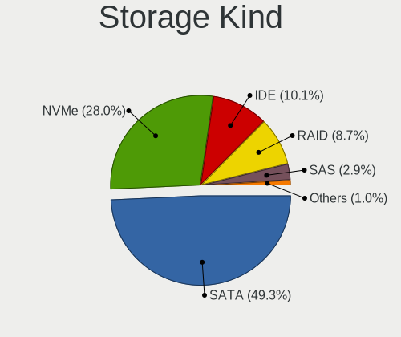
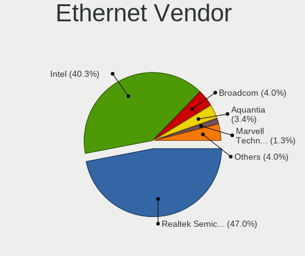
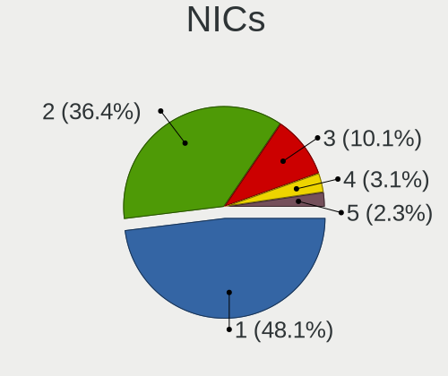
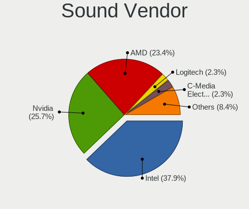
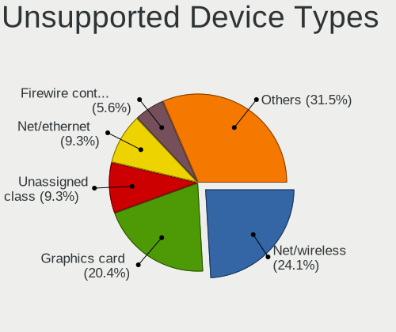

Rocky Linux - Tested Hardware & Statistics (Desktops)
-----------------------------------------------------

A project to collect tested hardware configurations for Rocky Linux.

Anyone can contribute to this report by the [hw-probe](https://github.com/linuxhw/hw-probe) tool:

    sudo -E hw-probe -all -upload

Please contribute! Especially if your hardware is rare.

Contents
--------

* [ Test Cases ](#test-cases)

* [ System ](#system)
  - [ OS                       ](#os)
  - [ OS Family                ](#os-family)
  - [ Kernel                   ](#kernel)
  - [ Kernel Family            ](#kernel-family)
  - [ Kernel Major Ver.        ](#kernel-major-ver)
  - [ Arch                     ](#arch)
  - [ DE                       ](#de)
  - [ Display Server           ](#display-server)
  - [ Display Manager          ](#display-manager)
  - [ OS Lang                  ](#os-lang)
  - [ Boot Mode                ](#boot-mode)
  - [ Filesystem               ](#filesystem)
  - [ Part. scheme             ](#part-scheme)
  - [ Dual Boot with Linux/BSD ](#dual-boot-with-linuxbsd)
  - [ Dual Boot (Win)          ](#dual-boot-win)

* [ Board ](#board)
  - [ Vendor                   ](#vendor)
  - [ Model                    ](#model)
  - [ Model Family             ](#model-family)
  - [ MFG Year                 ](#mfg-year)
  - [ Form Factor              ](#form-factor)
  - [ Secure Boot              ](#secure-boot)
  - [ Coreboot                 ](#coreboot)
  - [ RAM Size                 ](#ram-size)
  - [ RAM Used                 ](#ram-used)
  - [ Total Drives             ](#total-drives)
  - [ Has CD-ROM               ](#has-cd-rom)
  - [ Has Ethernet             ](#has-ethernet)
  - [ Has WiFi                 ](#has-wifi)
  - [ Has Bluetooth            ](#has-bluetooth)

* [ Location ](#location)
  - [ Country                  ](#country)
  - [ City                     ](#city)

* [ Drives ](#drives)
  - [ Drive Vendor             ](#drive-vendor)
  - [ Drive Model              ](#drive-model)
  - [ HDD Vendor               ](#hdd-vendor)
  - [ SSD Vendor               ](#ssd-vendor)
  - [ Drive Kind               ](#drive-kind)
  - [ Drive Connector          ](#drive-connector)
  - [ Drive Size               ](#drive-size)
  - [ Space Total              ](#space-total)
  - [ Space Used               ](#space-used)
  - [ Malfunc. Drives          ](#malfunc-drives)
  - [ Malfunc. Drive Vendor    ](#malfunc-drive-vendor)
  - [ Malfunc. HDD Vendor      ](#malfunc-hdd-vendor)
  - [ Malfunc. Drive Kind      ](#malfunc-drive-kind)
  - [ Failed Drives            ](#failed-drives)
  - [ Failed Drive Vendor      ](#failed-drive-vendor)
  - [ Drive Status             ](#drive-status)

* [ Storage controller ](#storage-controller)
  - [ Storage Vendor           ](#storage-vendor)
  - [ Storage Model            ](#storage-model)
  - [ Storage Kind             ](#storage-kind)

* [ Processor ](#processor)
  - [ CPU Vendor               ](#cpu-vendor)
  - [ CPU Model                ](#cpu-model)
  - [ CPU Model Family         ](#cpu-model-family)
  - [ CPU Cores                ](#cpu-cores)
  - [ CPU Sockets              ](#cpu-sockets)
  - [ CPU Threads              ](#cpu-threads)
  - [ CPU Op-Modes             ](#cpu-op-modes)
  - [ CPU Microcode            ](#cpu-microcode)
  - [ CPU Microarch            ](#cpu-microarch)

* [ Graphics ](#graphics)
  - [ GPU Vendor               ](#gpu-vendor)
  - [ GPU Model                ](#gpu-model)
  - [ GPU Combo                ](#gpu-combo)
  - [ GPU Driver               ](#gpu-driver)
  - [ GPU Memory               ](#gpu-memory)

* [ Monitor ](#monitor)
  - [ Monitor Vendor           ](#monitor-vendor)
  - [ Monitor Model            ](#monitor-model)
  - [ Monitor Resolution       ](#monitor-resolution)
  - [ Monitor Diagonal         ](#monitor-diagonal)
  - [ Monitor Width            ](#monitor-width)
  - [ Aspect Ratio             ](#aspect-ratio)
  - [ Monitor Area             ](#monitor-area)
  - [ Pixel Density            ](#pixel-density)
  - [ Multiple Monitors        ](#multiple-monitors)

* [ Network ](#network)
  - [ Net Controller Vendor    ](#net-controller-vendor)
  - [ Net Controller Model     ](#net-controller-model)
  - [ Wireless Vendor          ](#wireless-vendor)
  - [ Wireless Model           ](#wireless-model)
  - [ Ethernet Vendor          ](#ethernet-vendor)
  - [ Ethernet Model           ](#ethernet-model)
  - [ Net Controller Kind      ](#net-controller-kind)
  - [ Used Controller          ](#used-controller)
  - [ NICs                     ](#nics)
  - [ IPv6                     ](#ipv6)

* [ Bluetooth ](#bluetooth)
  - [ Bluetooth Vendor         ](#bluetooth-vendor)
  - [ Bluetooth Model          ](#bluetooth-model)

* [ Sound ](#sound)
  - [ Sound Vendor             ](#sound-vendor)
  - [ Sound Model              ](#sound-model)

* [ Memory ](#memory)
  - [ Memory Vendor            ](#memory-vendor)
  - [ Memory Model             ](#memory-model)
  - [ Memory Kind              ](#memory-kind)
  - [ Memory Form Factor       ](#memory-form-factor)
  - [ Memory Size              ](#memory-size)
  - [ Memory Speed             ](#memory-speed)

* [ Printers & scanners ](#printers--scanners)
  - [ Printer Vendor           ](#printer-vendor)
  - [ Printer Model            ](#printer-model)
  - [ Scanner Vendor           ](#scanner-vendor)
  - [ Scanner Model            ](#scanner-model)

* [ Camera ](#camera)
  - [ Camera Vendor            ](#camera-vendor)
  - [ Camera Model             ](#camera-model)

* [ Security ](#security)
  - [ Fingerprint Vendor       ](#fingerprint-vendor)
  - [ Fingerprint Model        ](#fingerprint-model)
  - [ Chipcard Vendor          ](#chipcard-vendor)
  - [ Chipcard Model           ](#chipcard-model)

* [ Unsupported ](#unsupported)
  - [ Unsupported Devices      ](#unsupported-devices)
  - [ Unsupported Device Types ](#unsupported-device-types)

Test Cases
----------

Total: 44

| Vendor        | Model                   | Probe                                                      | Date         |
|---------------|-------------------------|------------------------------------------------------------|--------------|
| ASUSTek       | ROG STRIX X470-F GAMING | [b52b8b590b](https://linux-hardware.org/?probe=b52b8b590b) | Nov 30, 2022 |
| MSI           | PRO H610M-B DDR4        | [dc35eb3d09](https://linux-hardware.org/?probe=dc35eb3d09) | Nov 30, 2022 |
| ASUSTek       | PRIME H510M-E           | [86159f4ef3](https://linux-hardware.org/?probe=86159f4ef3) | Nov 20, 2022 |
| Intel         | D33217GKE G69901-202    | [f10d00e42a](https://linux-hardware.org/?probe=f10d00e42a) | Nov 12, 2022 |
| HP            | 8054                    | [08a9a98d04](https://linux-hardware.org/?probe=08a9a98d04) | Nov 10, 2022 |
| HP            | 8054                    | [4ce3ccc26d](https://linux-hardware.org/?probe=4ce3ccc26d) | Nov 09, 2022 |
| MSI           | X299 RAIDER             | [b7d117fc31](https://linux-hardware.org/?probe=b7d117fc31) | Nov 09, 2022 |
| ASUSTek       | Crosshair V Formula     | [c07ddbeb76](https://linux-hardware.org/?probe=c07ddbeb76) | Oct 31, 2022 |
| Gigabyte      | H81M-S2PV               | [23be2713d2](https://linux-hardware.org/?probe=23be2713d2) | Oct 24, 2022 |
| BESSTAR Te... | HM90                    | [fd411132f6](https://linux-hardware.org/?probe=fd411132f6) | Oct 15, 2022 |
| ASUSTek       | M5A97 R2.0              | [71970edbae](https://linux-hardware.org/?probe=71970edbae) | Oct 11, 2022 |
| ASUSTek       | PRIME H570-PLUS         | [71da92bd30](https://linux-hardware.org/?probe=71da92bd30) | Oct 04, 2022 |
| ASUSTek       | PRIME B550M-K           | [ff511df5c2](https://linux-hardware.org/?probe=ff511df5c2) | Sep 27, 2022 |
| ASUSTek       | P8B WS                  | [bd82f7708c](https://linux-hardware.org/?probe=bd82f7708c) | Sep 02, 2022 |
| Lenovo        | 1046 NO DPK             | [e21e07827d](https://linux-hardware.org/?probe=e21e07827d) | Aug 26, 2022 |
| ASUSTek       | PRIME B460M-A R2.0      | [e29f13e0b6](https://linux-hardware.org/?probe=e29f13e0b6) | Aug 19, 2022 |
| ASUSTek       | PRIME B365-PLUS         | [324410a493](https://linux-hardware.org/?probe=324410a493) | Aug 04, 2022 |
| Gigabyte      | 970A-UD3P               | [0d503b2789](https://linux-hardware.org/?probe=0d503b2789) | Jul 27, 2022 |
| Unknown       | X31_ICH7                | [f8ab18b666](https://linux-hardware.org/?probe=f8ab18b666) | Jun 07, 2022 |
| Dell          | 0GWHMW A01              | [f427859019](https://linux-hardware.org/?probe=f427859019) | May 30, 2022 |
| Dell          | 06CV2N A00              | [f9e949ad9b](https://linux-hardware.org/?probe=f9e949ad9b) | Apr 24, 2022 |
| Gigabyte      | G41MT-USB3              | [10f3a0eaae](https://linux-hardware.org/?probe=10f3a0eaae) | Apr 21, 2022 |
| Gigabyte      | G41MT-USB3              | [4618c00b42](https://linux-hardware.org/?probe=4618c00b42) | Apr 17, 2022 |
| NCR           | Pocono BIOS.5.1         | [ca175e1f0c](https://linux-hardware.org/?probe=ca175e1f0c) | Apr 09, 2022 |
| Dell          | 0NK70N A03              | [7d4e906833](https://linux-hardware.org/?probe=7d4e906833) | Mar 11, 2022 |
| Dell          | 0WN7Y6 A01              | [ef36ccb6ab](https://linux-hardware.org/?probe=ef36ccb6ab) | Feb 22, 2022 |
| Dell          | 0PC5F7 A02              | [7c6c7dcd5e](https://linux-hardware.org/?probe=7c6c7dcd5e) | Feb 18, 2022 |
| ASUSTek       | PRIME B450-PLUS         | [1d3c449e8a](https://linux-hardware.org/?probe=1d3c449e8a) | Feb 18, 2022 |
| ASRock        | B450M Pro4              | [1ab47f8ff0](https://linux-hardware.org/?probe=1ab47f8ff0) | Jan 20, 2022 |
| MSI           | Z97A GAMING 6           | [4b935d705c](https://linux-hardware.org/?probe=4b935d705c) | Jan 20, 2022 |
| AZW           | Gemini M                | [25e63b737c](https://linux-hardware.org/?probe=25e63b737c) | Dec 31, 2021 |
| AZW           | Gemini M                | [05ef59842c](https://linux-hardware.org/?probe=05ef59842c) | Dec 31, 2021 |
| Google        | Panther                 | [92e2626936](https://linux-hardware.org/?probe=92e2626936) | Nov 30, 2021 |
| Gigabyte      | X570 AORUS ULTRA        | [840d920fb2](https://linux-hardware.org/?probe=840d920fb2) | Nov 22, 2021 |
| Gigabyte      | H87-D3H-CF              | [72fdde33b3](https://linux-hardware.org/?probe=72fdde33b3) | Nov 19, 2021 |
| Dell          | 0N4YC8 A00              | [1a94195ddb](https://linux-hardware.org/?probe=1a94195ddb) | Oct 15, 2021 |
| ASUSTek       | PRIME B450M-A II        | [cb9f02b3de](https://linux-hardware.org/?probe=cb9f02b3de) | Sep 07, 2021 |
| ASUSTek       | PRIME B450M-A II        | [f80365b98a](https://linux-hardware.org/?probe=f80365b98a) | Sep 07, 2021 |
| ASUSTek       | P5Q DELUXE              | [243dba3b27](https://linux-hardware.org/?probe=243dba3b27) | Sep 02, 2021 |
| Lenovo        | NOK                     | [274005087d](https://linux-hardware.org/?probe=274005087d) | Aug 23, 2021 |
| Dell          | 0M5DCD A00              | [91acc7eb93](https://linux-hardware.org/?probe=91acc7eb93) | Aug 15, 2021 |
| ASUSTek       | PRIME TRX40-PRO S       | [59f7d599dd](https://linux-hardware.org/?probe=59f7d599dd) | Aug 04, 2021 |
| Dell          | 0M5DCD A00              | [77c3d7076e](https://linux-hardware.org/?probe=77c3d7076e) | Aug 04, 2021 |
| HP            | 0B54h D                 | [ee9a2da17c](https://linux-hardware.org/?probe=ee9a2da17c) | May 19, 2021 |

System
------

OS
--

Installed operating systems

| Name            | Desktops | Percent |
|-----------------|----------|---------|
| Rocky Linux 8.5 | 12       | 30.77%  |
| Rocky Linux 8.4 | 9        | 23.08%  |
| Rocky Linux 8.6 | 8        | 20.51%  |
| Rocky Linux 9.0 | 7        | 17.95%  |
| Rocky Linux 9.1 | 2        | 5.13%   |
| Rocky Linux 8.3 | 1        | 2.56%   |

OS Family
---------

OS without a version

| Name        | Desktops | Percent |
|-------------|----------|---------|
| Rocky Linux | 39       | 100%    |

Kernel
------

Version of the Linux kernel

| Version                          | Desktops | Percent |
|----------------------------------|----------|---------|
| 4.18.0-348.12.2.el8_5.x86_64     | 6        | 15.38%  |
| 5.14.0-70.30.1.el9_0.x86_64      | 3        | 7.69%   |
| 4.18.0-348.7.1.el8_5.x86_64      | 3        | 7.69%   |
| 4.18.0-305.10.2.el8_4.x86_64     | 3        | 7.69%   |
| 5.14.0-70.26.1.el9_0.x86_64      | 2        | 5.13%   |
| 4.18.0-372.32.1.el8_6.x86_64     | 2        | 5.13%   |
| 4.18.0-372.26.1.el8_6.x86_64     | 2        | 5.13%   |
| 4.18.0-372.16.1.el8_6.0.1.x86_64 | 2        | 5.13%   |
| 4.18.0-348.20.1.el8_5.x86_64     | 2        | 5.13%   |
| 4.18.0-305.19.1.el8_4.x86_64     | 2        | 5.13%   |
| 4.18.0-305.12.1.el8_4.x86_64     | 2        | 5.13%   |
| 6.0.10_tkg_bmq                   | 1        | 2.56%   |
| 6.0.10-1.el9.elrepo.x86_64       | 1        | 2.56%   |
| 5.14.1-1.el8.elrepo.x86_64       | 1        | 2.56%   |
| 5.14.0-70.22.1.el9_0.x86_64      | 1        | 2.56%   |
| 5.14.0-70.17.1.el9_0.x86_64      | 1        | 2.56%   |
| 4.18.0-372.9.1.el8.x86_64        | 1        | 2.56%   |
| 4.18.0-372.19.1.el8_6.x86_64     | 1        | 2.56%   |
| 4.18.0-348.2.1.el8_5.x86_64      | 1        | 2.56%   |
| 4.18.0-305.25.1.el8_4.x86_64     | 1        | 2.56%   |
| 4.18.0-240.22.1.el8.x86_64       | 1        | 2.56%   |

Kernel Family
-------------

Linux kernel without a distro release

| Version | Desktops | Percent |
|---------|----------|---------|
| 4.18.0  | 29       | 74.36%  |
| 5.14.0  | 7        | 17.95%  |
| 6.0.10  | 2        | 5.13%   |
| 5.14.1  | 1        | 2.56%   |

Kernel Major Ver.
-----------------

Linux kernel major version

| Version | Desktops | Percent |
|---------|----------|---------|
| 4.18    | 29       | 74.36%  |
| 5.14    | 8        | 20.51%  |
| 6.0     | 2        | 5.13%   |

Arch
----

OS architecture (x86_64, i586, etc.)

| Name   | Desktops | Percent |
|--------|----------|---------|
| x86_64 | 39       | 100%    |

DE
--

Desktop Environment

| Name          | Desktops | Percent |
|---------------|----------|---------|
| GNOME         | 25       | 64.1%   |
| Unknown       | 6        | 15.38%  |
| KDE5          | 3        | 7.69%   |
| MATE          | 2        | 5.13%   |
| GNOME Classic | 2        | 5.13%   |
| XFCE          | 1        | 2.56%   |

Display Server
--------------

X11 or Wayland

| Name    | Desktops | Percent |
|---------|----------|---------|
| Wayland | 19       | 48.72%  |
| X11     | 16       | 41.03%  |
| Unknown | 3        | 7.69%   |
| Web     | 1        | 2.56%   |

Display Manager
---------------

SDDM, LightDM, etc.

| Name    | Desktops | Percent |
|---------|----------|---------|
| GDM     | 18       | 46.15%  |
| Unknown | 18       | 46.15%  |
| SDDM    | 2        | 5.13%   |
| LightDM | 1        | 2.56%   |

OS Lang
-------

Language

| Lang  | Desktops | Percent |
|-------|----------|---------|
| en_US | 25       | 64.1%   |
| en_IL | 3        | 7.69%   |
| ru_RU | 2        | 5.13%   |
| en_SG | 2        | 5.13%   |
| pl_PL | 1        | 2.56%   |
| ja_JP | 1        | 2.56%   |
| es_CO | 1        | 2.56%   |
| es_AR | 1        | 2.56%   |
| en_CA | 1        | 2.56%   |
| en_AU | 1        | 2.56%   |
| af_ZA | 1        | 2.56%   |

Boot Mode
---------

EFI or BIOS

| Mode | Desktops | Percent |
|------|----------|---------|
| EFI  | 20       | 51.28%  |
| BIOS | 19       | 48.72%  |

Filesystem
----------

Type of filesystem

| Type | Desktops | Percent |
|------|----------|---------|
| Xfs  | 33       | 84.62%  |
| Ext4 | 6        | 15.38%  |

Part. scheme
------------

Scheme of partitioning

| Type    | Desktops | Percent |
|---------|----------|---------|
| GPT     | 19       | 48.72%  |
| Unknown | 11       | 28.21%  |
| MBR     | 9        | 23.08%  |

Dual Boot with Linux/BSD
------------------------

Hosting more than one Linux/BSD

| Dual boot | Desktops | Percent |
|-----------|----------|---------|
| No        | 31       | 79.49%  |
| Yes       | 8        | 20.51%  |

Dual Boot (Win)
---------------

Hosting Linux and Windows

| Dual boot | Desktops | Percent |
|-----------|----------|---------|
| No        | 36       | 92.31%  |
| Yes       | 3        | 7.69%   |

Board
-----

Vendor
------

Motherboard manufacturer

| Name                | Desktops | Percent |
|---------------------|----------|---------|
| ASUSTek Computer    | 13       | 33.33%  |
| Dell                | 7        | 17.95%  |
| Gigabyte Technology | 5        | 12.82%  |
| MSI                 | 3        | 7.69%   |
| Lenovo              | 2        | 5.13%   |
| Hewlett-Packard     | 2        | 5.13%   |
| NCR                 | 1        | 2.56%   |
| Intel               | 1        | 2.56%   |
| Google              | 1        | 2.56%   |
| BESSTAR Tech        | 1        | 2.56%   |
| AZW                 | 1        | 2.56%   |
| ASRock              | 1        | 2.56%   |
| Unknown             | 1        | 2.56%   |

Model
-----

Motherboard model

| Name                                | Desktops | Percent |
|-------------------------------------|----------|---------|
| Dell OptiPlex 9020                  | 2        | 5.13%   |
| NCR xxxx-xxxx-xxxx                  | 1        | 2.56%   |
| MSI MS-7D46                         | 1        | 2.56%   |
| MSI MS-7A94                         | 1        | 2.56%   |
| MSI MS-7917                         | 1        | 2.56%   |
| Lenovo ThinkStation P620 30E0S0PR00 | 1        | 2.56%   |
| Lenovo ThinkCentre M72e 36601Y8     | 1        | 2.56%   |
| Intel PRO412081                     | 1        | 2.56%   |
| HP Z600 Workstation                 | 1        | 2.56%   |
| HP EliteDesk 800 G2 SFF             | 1        | 2.56%   |
| Google Panther                      | 1        | 2.56%   |
| Gigabyte X570 AORUS ULTRA           | 1        | 2.56%   |
| Gigabyte H87-D3H                    | 1        | 2.56%   |
| Gigabyte H81M-S2PV                  | 1        | 2.56%   |
| Gigabyte G41MT-USB3                 | 1        | 2.56%   |
| Gigabyte 970A-UD3P                  | 1        | 2.56%   |
| Dell Vostro 3681                    | 1        | 2.56%   |
| Dell Precision Tower 7810           | 1        | 2.56%   |
| Dell Precision T7610                | 1        | 2.56%   |
| Dell Precision T5610                | 1        | 2.56%   |
| Dell OptiPlex 390                   | 1        | 2.56%   |
| BESSTAR Tech HM90                   | 1        | 2.56%   |
| AZW Gemini M                        | 1        | 2.56%   |
| ASUS ROG STRIX X470-F GAMING        | 1        | 2.56%   |
| ASUS PRIME TRX40-PRO S              | 1        | 2.56%   |
| ASUS PRIME H570-PLUS                | 1        | 2.56%   |
| ASUS PRIME H510M-E                  | 1        | 2.56%   |
| ASUS PRIME B550M-K                  | 1        | 2.56%   |
| ASUS PRIME B460M-A R2.0             | 1        | 2.56%   |
| ASUS PRIME B450M-A II               | 1        | 2.56%   |
| ASUS PRIME B450-PLUS                | 1        | 2.56%   |
| ASUS PRIME B365-PLUS                | 1        | 2.56%   |
| ASUS P8B WS                         | 1        | 2.56%   |
| ASUS P5Q DELUXE                     | 1        | 2.56%   |
| ASUS M5A97 R2.0                     | 1        | 2.56%   |
| ASUS Crosshair V Formula            | 1        | 2.56%   |
| ASRock B450M Pro4                   | 1        | 2.56%   |
| Unknown                             | 1        | 2.56%   |

Model Family
------------

Motherboard model prefix

| Name                | Desktops | Percent |
|---------------------|----------|---------|
| ASUS PRIME          | 8        | 20.51%  |
| Dell Precision      | 3        | 7.69%   |
| Dell OptiPlex       | 3        | 7.69%   |
| NCR xxxx-xxxx-xxxx  | 1        | 2.56%   |
| MSI MS-7D46         | 1        | 2.56%   |
| MSI MS-7A94         | 1        | 2.56%   |
| MSI MS-7917         | 1        | 2.56%   |
| Lenovo ThinkStation | 1        | 2.56%   |
| Lenovo ThinkCentre  | 1        | 2.56%   |
| Intel PRO412081     | 1        | 2.56%   |
| HP Z600             | 1        | 2.56%   |
| HP EliteDesk        | 1        | 2.56%   |
| Google Panther      | 1        | 2.56%   |
| Gigabyte X570       | 1        | 2.56%   |
| Gigabyte H87-D3H    | 1        | 2.56%   |
| Gigabyte H81M-S2PV  | 1        | 2.56%   |
| Gigabyte G41MT-USB3 | 1        | 2.56%   |
| Gigabyte 970A-UD3P  | 1        | 2.56%   |
| Dell Vostro         | 1        | 2.56%   |
| BESSTAR Tech HM90   | 1        | 2.56%   |
| AZW Gemini          | 1        | 2.56%   |
| ASUS ROG            | 1        | 2.56%   |
| ASUS P8B            | 1        | 2.56%   |
| ASUS P5Q            | 1        | 2.56%   |
| ASUS M5A97          | 1        | 2.56%   |
| ASUS Crosshair      | 1        | 2.56%   |
| ASRock B450M        | 1        | 2.56%   |
| Unknown             | 1        | 2.56%   |

MFG Year
--------

Motherboard manufacture year

| Year | Desktops | Percent |
|------|----------|---------|
| 2021 | 5        | 12.82%  |
| 2020 | 5        | 12.82%  |
| 2013 | 5        | 12.82%  |
| 2018 | 4        | 10.26%  |
| 2015 | 4        | 10.26%  |
| 2011 | 4        | 10.26%  |
| 2014 | 3        | 7.69%   |
| 2019 | 2        | 5.13%   |
| 2012 | 2        | 5.13%   |
| 2008 | 2        | 5.13%   |
| 2022 | 1        | 2.56%   |
| 2017 | 1        | 2.56%   |
| 2010 | 1        | 2.56%   |

Form Factor
-----------

Physical design of the computer

| Name    | Desktops | Percent |
|---------|----------|---------|
| Desktop | 39       | 100%    |

Secure Boot
-----------

Enabled or disabled

| State    | Desktops | Percent |
|----------|----------|---------|
| Disabled | 37       | 94.87%  |
| Enabled  | 2        | 5.13%   |

Coreboot
--------

Have coreboot on board

| Used | Desktops | Percent |
|------|----------|---------|
| No   | 38       | 97.44%  |
| Yes  | 1        | 2.56%   |

RAM Size
--------

Total RAM memory

| Size in GB  | Desktops | Percent |
|-------------|----------|---------|
| 32.01-64.0  | 10       | 25.64%  |
| 16.01-24.0  | 7        | 17.95%  |
| 8.01-16.0   | 7        | 17.95%  |
| 4.01-8.0    | 5        | 12.82%  |
| 3.01-4.0    | 3        | 7.69%   |
| 64.01-256.0 | 3        | 7.69%   |
| 1.01-2.0    | 2        | 5.13%   |
| 24.01-32.0  | 1        | 2.56%   |
| 2.01-3.0    | 1        | 2.56%   |

RAM Used
--------

Used RAM memory

| Used GB   | Desktops | Percent |
|-----------|----------|---------|
| 2.01-3.0  | 11       | 28.21%  |
| 4.01-8.0  | 9        | 23.08%  |
| 3.01-4.0  | 7        | 17.95%  |
| 1.01-2.0  | 6        | 15.38%  |
| 0.51-1.0  | 3        | 7.69%   |
| 8.01-16.0 | 2        | 5.13%   |
| 0.01-0.5  | 1        | 2.56%   |

Total Drives
------------

Number of drives on board

| Drives | Desktops | Percent |
|--------|----------|---------|
| 1      | 17       | 43.59%  |
| 2      | 9        | 23.08%  |
| 3      | 7        | 17.95%  |
| 4      | 3        | 7.69%   |
| 5      | 2        | 5.13%   |
| 8      | 1        | 2.56%   |

Has CD-ROM
----------

Has CD-ROM on board

| Presented | Desktops | Percent |
|-----------|----------|---------|
| No        | 21       | 53.85%  |
| Yes       | 18       | 46.15%  |

Has Ethernet
------------

Has Ethernet on board

| Presented | Desktops | Percent |
|-----------|----------|---------|
| Yes       | 39       | 100%    |

Has WiFi
--------

Has WiFi module

| Presented | Desktops | Percent |
|-----------|----------|---------|
| No        | 26       | 66.67%  |
| Yes       | 13       | 33.33%  |

Has Bluetooth
-------------

Has Bluetooth module

| Presented | Desktops | Percent |
|-----------|----------|---------|
| No        | 29       | 74.36%  |
| Yes       | 10       | 25.64%  |

Location
--------

Country
-------

Geographic location (country)

| Country      | Desktops | Percent |
|--------------|----------|---------|
| USA          | 8        | 20.51%  |
| Singapore    | 3        | 7.69%   |
| Israel       | 3        | 7.69%   |
| Russia       | 2        | 5.13%   |
| Italy        | 2        | 5.13%   |
| Indonesia    | 2        | 5.13%   |
| Germany      | 2        | 5.13%   |
| Australia    | 2        | 5.13%   |
| Sweden       | 1        | 2.56%   |
| South Korea  | 1        | 2.56%   |
| South Africa | 1        | 2.56%   |
| Portugal     | 1        | 2.56%   |
| Poland       | 1        | 2.56%   |
| Norway       | 1        | 2.56%   |
| Mexico       | 1        | 2.56%   |
| Japan        | 1        | 2.56%   |
| India        | 1        | 2.56%   |
| France       | 1        | 2.56%   |
| Finland      | 1        | 2.56%   |
| Czechia      | 1        | 2.56%   |
| Colombia     | 1        | 2.56%   |
| Canada       | 1        | 2.56%   |
| Argentina    | 1        | 2.56%   |

City
----

Geographic location (city)

| City                   | Desktops | Percent |
|------------------------|----------|---------|
| Singapore              | 3        | 7.69%   |
| Haifa                  | 2        | 5.13%   |
| Yogyakarta             | 1        | 2.56%   |
| Waltham                | 1        | 2.56%   |
| Toronto                | 1        | 2.56%   |
| Tlaxcala City          | 1        | 2.56%   |
| St Petersburg          | 1        | 2.56%   |
| Sobral de Monte Agraco | 1        | 2.56%   |
| Semarang               | 1        | 2.56%   |
| Rehovot                | 1        | 2.56%   |
| Prague                 | 1        | 2.56%   |
| Paris                  | 1        | 2.56%   |
| Ōtsu                  | 1        | 2.56%   |
| Oslo                   | 1        | 2.56%   |
| Moscow                 | 1        | 2.56%   |
| Monza                  | 1        | 2.56%   |
| Milan                  | 1        | 2.56%   |
| Mequon                 | 1        | 2.56%   |
| Melbourne              | 1        | 2.56%   |
| Lebanon                | 1        | 2.56%   |
| Krakow                 | 1        | 2.56%   |
| Imphal                 | 1        | 2.56%   |
| Helsinki               | 1        | 2.56%   |
| Giessen                | 1        | 2.56%   |
| Fredericksburg         | 1        | 2.56%   |
| Florence               | 1        | 2.56%   |
| Enebyberg              | 1        | 2.56%   |
| Corvallis              | 1        | 2.56%   |
| Centurion              | 1        | 2.56%   |
| Calchaqui              | 1        | 2.56%   |
| Burlington             | 1        | 2.56%   |
| Bucaramanga            | 1        | 2.56%   |
| Brisbane               | 1        | 2.56%   |
| Boaz                   | 1        | 2.56%   |
| Berlin                 | 1        | 2.56%   |
| Ansan-si               | 1        | 2.56%   |

Drives
------

Drive Vendor
------------

Hard drive vendors

| Vendor              | Desktops | Drives | Percent |
|---------------------|----------|--------|---------|
| WDC                 | 12       | 22     | 19.35%  |
| Seagate             | 11       | 20     | 17.74%  |
| Samsung Electronics | 8        | 11     | 12.9%   |
| Toshiba             | 6        | 6      | 9.68%   |
| Hitachi             | 3        | 4      | 4.84%   |
| Crucial             | 3        | 3      | 4.84%   |
| SanDisk             | 2        | 2      | 3.23%   |
| Kingston            | 2        | 2      | 3.23%   |
| Intel               | 2        | 2      | 3.23%   |
| HGST                | 2        | 2      | 3.23%   |
| Team                | 1        | 1      | 1.61%   |
| SK hynix            | 1        | 1      | 1.61%   |
| PNY                 | 1        | 1      | 1.61%   |
| Phison              | 1        | 1      | 1.61%   |
| MyDigitalSSD        | 1        | 1      | 1.61%   |
| Gigabyte Technology | 1        | 1      | 1.61%   |
| Corsair             | 1        | 1      | 1.61%   |
| China               | 1        | 1      | 1.61%   |
| Apacer              | 1        | 1      | 1.61%   |
| ADATA SU            | 1        | 1      | 1.61%   |
| A-DATA Technology   | 1        | 1      | 1.61%   |

Drive Model
-----------

Hard drive models

| Model                            | Desktops | Percent |
|----------------------------------|----------|---------|
| Seagate ST500DM002-1BD142 500GB  | 3        | 4.17%   |
| Seagate ST1000DM010-2EP102 1TB   | 2        | 2.78%   |
| WDC WDS500G1R0A-68A4W0 500GB SSD | 1        | 1.39%   |
| WDC WDS250G1B0A-00H9H0 250GB SSD | 1        | 1.39%   |
| WDC WDS240G2G0B-00EPW0 240GB SSD | 1        | 1.39%   |
| WDC WDS240G2G0A-00JH30 240GB SSD | 1        | 1.39%   |
| WDC WDS100T1X0E-00AFY0 1TB       | 1        | 1.39%   |
| WDC WDS100T1R0A-68A4W0 1TB SSD   | 1        | 1.39%   |
| WDC WD5000LPCX-24VHAT0 500GB     | 1        | 1.39%   |
| WDC WD5000AUDX-63WNHY0 500GB     | 1        | 1.39%   |
| WDC WD5000AAKX-75U6AA0 500GB     | 1        | 1.39%   |
| WDC WD5000AAKX-001CA0 500GB      | 1        | 1.39%   |
| WDC WD30EZRX-00D8PB0 3TB         | 1        | 1.39%   |
| WDC WD2500AAJS-22VTA0 250GB      | 1        | 1.39%   |
| WDC WD20EZRX-00DC0B0 2TB         | 1        | 1.39%   |
| WDC WD2002FAEX-007BA0 2TB        | 1        | 1.39%   |
| WDC WD10EZEX-75M2NA0 1TB         | 1        | 1.39%   |
| WDC WD10EZEX-08WN4A0 1TB         | 1        | 1.39%   |
| WDC WD1001FALS-00J7B0 1TB        | 1        | 1.39%   |
| Toshiba THNSNJ128GCSU 128GB SSD  | 1        | 1.39%   |
| Toshiba MK1059GSM 1TB            | 1        | 1.39%   |
| Toshiba MG07ACA12TE 12TB         | 1        | 1.39%   |
| Toshiba MG04ACA400E 4TB          | 1        | 1.39%   |
| Toshiba DT01ACA100 1TB           | 1        | 1.39%   |
| Toshiba DT01ACA050 500GB         | 1        | 1.39%   |
| Team L5 LITE SSD 240GB           | 1        | 1.39%   |
| SK hynix SH920 2.5 7MM 256GB SSD | 1        | 1.39%   |
| Seagate ST9500420AS 500GB        | 1        | 1.39%   |
| Seagate ST9500325AS 500GB        | 1        | 1.39%   |
| Seagate ST9320325AS 320GB        | 1        | 1.39%   |
| Seagate ST4000DM004-2CV104 4TB   | 1        | 1.39%   |
| Seagate ST3160318AS 160GB        | 1        | 1.39%   |
| Seagate ST2000DM008-2FR102 2TB   | 1        | 1.39%   |
| Seagate ST2000DM001-1ER164 2TB   | 1        | 1.39%   |
| Seagate ST1000VX005-2EZ102 1TB   | 1        | 1.39%   |
| Seagate Expansion 1TB            | 1        | 1.39%   |
| SanDisk SSD U110 16GB            | 1        | 1.39%   |
| SanDisk SDSSDH3500G 500GB        | 1        | 1.39%   |
| Samsung SSD 980 PRO 1TB          | 1        | 1.39%   |
| Samsung SSD 860 EVO 1TB          | 1        | 1.39%   |

HDD Vendor
----------

Hard disk drive vendors

| Vendor              | Desktops | Drives | Percent |
|---------------------|----------|--------|---------|
| Seagate             | 11       | 20     | 34.38%  |
| WDC                 | 9        | 14     | 28.13%  |
| Toshiba             | 5        | 5      | 15.63%  |
| Hitachi             | 3        | 4      | 9.38%   |
| Samsung Electronics | 2        | 3      | 6.25%   |
| HGST                | 2        | 2      | 6.25%   |

SSD Vendor
----------

Solid state drive vendors

| Vendor              | Desktops | Drives | Percent |
|---------------------|----------|--------|---------|
| WDC                 | 4        | 7      | 18.18%  |
| Samsung Electronics | 3        | 3      | 13.64%  |
| SanDisk             | 2        | 2      | 9.09%   |
| Crucial             | 2        | 2      | 9.09%   |
| Toshiba             | 1        | 1      | 4.55%   |
| Team                | 1        | 1      | 4.55%   |
| SK hynix            | 1        | 1      | 4.55%   |
| PNY                 | 1        | 1      | 4.55%   |
| MyDigitalSSD        | 1        | 1      | 4.55%   |
| Kingston            | 1        | 1      | 4.55%   |
| Gigabyte Technology | 1        | 1      | 4.55%   |
| Corsair             | 1        | 1      | 4.55%   |
| China               | 1        | 1      | 4.55%   |
| Apacer              | 1        | 1      | 4.55%   |
| ADATA SU            | 1        | 1      | 4.55%   |

Drive Kind
----------

HDD or SSD

| Kind | Desktops | Drives | Percent |
|------|----------|--------|---------|
| HDD  | 23       | 48     | 43.4%   |
| SSD  | 20       | 25     | 37.74%  |
| NVMe | 10       | 12     | 18.87%  |

Drive Connector
---------------

SATA, SAS, NVMe, etc.

| Type | Desktops | Drives | Percent |
|------|----------|--------|---------|
| SATA | 34       | 71     | 73.91%  |
| NVMe | 10       | 12     | 21.74%  |
| SAS  | 2        | 2      | 4.35%   |

Drive Size
----------

Size of hard drive

| Size in TB | Desktops | Drives | Percent |
|------------|----------|--------|---------|
| 0.01-0.5   | 24       | 39     | 53.33%  |
| 0.51-1.0   | 12       | 20     | 26.67%  |
| 1.01-2.0   | 5        | 5      | 11.11%  |
| 3.01-4.0   | 2        | 7      | 4.44%   |
| 2.01-3.0   | 1        | 1      | 2.22%   |
| 10.01-20.0 | 1        | 1      | 2.22%   |

Space Total
-----------

Amount of disk space available on the file system

| Size in GB     | Desktops | Percent |
|----------------|----------|---------|
| 101-250        | 9        | 23.08%  |
| 501-1000       | 9        | 23.08%  |
| 1001-2000      | 7        | 17.95%  |
| 251-500        | 5        | 12.82%  |
| More than 3000 | 3        | 7.69%   |
| 2001-3000      | 2        | 5.13%   |
| 51-100         | 2        | 5.13%   |
| 1-20           | 1        | 2.56%   |
| Unknown        | 1        | 2.56%   |

Space Used
----------

Amount of used disk space

| Used GB        | Desktops | Percent |
|----------------|----------|---------|
| 1-20           | 11       | 28.21%  |
| 21-50          | 9        | 23.08%  |
| 51-100         | 6        | 15.38%  |
| 251-500        | 4        | 10.26%  |
| 501-1000       | 3        | 7.69%   |
| More than 3000 | 2        | 5.13%   |
| 101-250        | 2        | 5.13%   |
| 1001-2000      | 1        | 2.56%   |
| Unknown        | 1        | 2.56%   |

Malfunc. Drives
---------------

Drive models with a malfunction

| Model                         | Desktops | Drives | Percent |
|-------------------------------|----------|--------|---------|
| WDC WD1001FALS-00J7B0 1TB     | 1        | 4      | 14.29%  |
| Toshiba MK1059GSM 1TB         | 1        | 1      | 14.29%  |
| Seagate ST9500325AS 500GB     | 1        | 1      | 14.29%  |
| Seagate ST9320325AS 320GB     | 1        | 1      | 14.29%  |
| Hitachi HTS727575A9E364 752GB | 1        | 1      | 14.29%  |
| Hitachi HDS721010CLA632 1TB   | 1        | 1      | 14.29%  |
| Corsair Neutron SSD 64GB      | 1        | 1      | 14.29%  |

Malfunc. Drive Vendor
---------------------

Vendors of faulty drives

| Vendor  | Desktops | Drives | Percent |
|---------|----------|--------|---------|
| Seagate | 2        | 2      | 28.57%  |
| Hitachi | 2        | 2      | 28.57%  |
| WDC     | 1        | 4      | 14.29%  |
| Toshiba | 1        | 1      | 14.29%  |
| Corsair | 1        | 1      | 14.29%  |

Malfunc. HDD Vendor
-------------------

Vendors of faulty HDD drives

| Vendor  | Desktops | Drives | Percent |
|---------|----------|--------|---------|
| Seagate | 2        | 2      | 33.33%  |
| Hitachi | 2        | 2      | 33.33%  |
| WDC     | 1        | 4      | 16.67%  |
| Toshiba | 1        | 1      | 16.67%  |

Malfunc. Drive Kind
-------------------

Kinds of faulty drives

| Kind | Desktops | Drives | Percent |
|------|----------|--------|---------|
| HDD  | 5        | 9      | 83.33%  |
| SSD  | 1        | 1      | 16.67%  |

Failed Drives
-------------

Failed drive models

| Model                     | Desktops | Drives | Percent |
|---------------------------|----------|--------|---------|
| Seagate ST9500420AS 500GB | 1        | 1      | 100%    |

Failed Drive Vendor
-------------------

Failed drive vendors

| Vendor  | Desktops | Drives | Percent |
|---------|----------|--------|---------|
| Seagate | 1        | 1      | 100%    |

Drive Status
------------

Number of failed and malfunc. drives

| Status   | Desktops | Drives | Percent |
|----------|----------|--------|---------|
| Works    | 27       | 51     | 58.7%   |
| Detected | 12       | 23     | 26.09%  |
| Malfunc  | 6        | 10     | 13.04%  |
| Failed   | 1        | 1      | 2.17%   |

Storage controller
------------------

Storage Vendor
--------------

Storage controller vendors

| Vendor                      | Desktops | Percent |
|-----------------------------|----------|---------|
| Intel                       | 28       | 51.85%  |
| AMD                         | 12       | 22.22%  |
| Samsung Electronics         | 2        | 3.7%    |
| Broadcom / LSI              | 2        | 3.7%    |
| ASMedia Technology          | 2        | 3.7%    |
| VIA Technologies            | 1        | 1.85%   |
| SanDisk                     | 1        | 1.85%   |
| Realtek Semiconductor       | 1        | 1.85%   |
| Phison Electronics          | 1        | 1.85%   |
| Micron/Crucial Technology   | 1        | 1.85%   |
| Marvell Technology Group    | 1        | 1.85%   |
| Kingston Technology Company | 1        | 1.85%   |
| Adaptec                     | 1        | 1.85%   |

Storage Model
-------------

Storage controller models

| Model                                                                                   | Desktops | Percent |
|-----------------------------------------------------------------------------------------|----------|---------|
| AMD FCH SATA Controller [AHCI mode]                                                     | 6        | 9.23%   |
| AMD 400 Series Chipset SATA Controller                                                  | 4        | 6.15%   |
| Intel SATA Controller [RAID mode]                                                       | 3        | 4.62%   |
| AMD SB7x0/SB8x0/SB9x0 SATA Controller [AHCI mode]                                       | 3        | 4.62%   |
| Intel NM10/ICH7 Family SATA Controller [IDE mode]                                       | 2        | 3.08%   |
| Intel 8 Series/C220 Series Chipset Family 6-port SATA Controller 1 [AHCI mode]          | 2        | 3.08%   |
| Intel 6 Series/C200 Series Chipset Family Desktop SATA Controller (IDE mode, ports 4-5) | 2        | 3.08%   |
| Intel 6 Series/C200 Series Chipset Family Desktop SATA Controller (IDE mode, ports 0-3) | 2        | 3.08%   |
| Intel 6 Series/C200 Series Chipset Family 6 port Desktop SATA AHCI Controller           | 2        | 3.08%   |
| Intel 500 Series Chipset Family SATA AHCI Controller                                    | 2        | 3.08%   |
| Intel 200 Series PCH SATA controller [AHCI mode]                                        | 2        | 3.08%   |
| Broadcom / LSI SAS2308 PCI-Express Fusion-MPT SAS-2                                     | 2        | 3.08%   |
| ASMedia ASM1062 Serial ATA Controller                                                   | 2        | 3.08%   |
| VIA VT6421 IDE/SATA Controller                                                          | 1        | 1.54%   |
| SanDisk WD PC SN810 / Black SN850 NVMe SSD                                              | 1        | 1.54%   |
| Samsung NVMe SSD Controller SM981/PM981/PM983                                           | 1        | 1.54%   |
| Samsung NVMe SSD Controller PM9A1/PM9A3/980PRO                                          | 1        | 1.54%   |
| Realtek Realtek Non-Volatile memory controller                                          | 1        | 1.54%   |
| Phison E12 NVMe Controller                                                              | 1        | 1.54%   |
| Micron/Crucial P2 NVMe PCIe SSD                                                         | 1        | 1.54%   |
| Marvell Group 88SE6111/6121 SATA II / PATA Controller                                   | 1        | 1.54%   |
| Kingston Company OM3PDP3 NVMe SSD                                                       | 1        | 1.54%   |
| Intel Q170/Q150/B150/H170/H110/Z170/CM236 Chipset SATA Controller [AHCI Mode]           | 1        | 1.54%   |
| Intel PCIe Data Center SSD                                                              | 1        | 1.54%   |
| Intel Non-Volatile memory controller                                                    | 1        | 1.54%   |
| Intel Comet Lake PCH-H RAID                                                             | 1        | 1.54%   |
| Intel Celeron/Pentium Silver Processor SATA Controller                                  | 1        | 1.54%   |
| Intel C610/X99 series chipset sSATA Controller [AHCI mode]                              | 1        | 1.54%   |
| Intel C610/X99 series chipset IDE-r Controller                                          | 1        | 1.54%   |
| Intel C610/X99 series chipset 6-Port SATA Controller [AHCI mode]                        | 1        | 1.54%   |
| Intel C600/X79 series chipset SATA RAID Controller                                      | 1        | 1.54%   |
| Intel C600/X79 series chipset IDE-r Controller                                          | 1        | 1.54%   |
| Intel C600/X79 series chipset 6-Port SATA AHCI Controller                               | 1        | 1.54%   |
| Intel Alder Lake-S PCH SATA Controller [AHCI Mode]                                      | 1        | 1.54%   |
| Intel 9 Series Chipset Family SATA Controller [AHCI Mode]                               | 1        | 1.54%   |
| Intel 82801JI (ICH10 Family) 4 port SATA IDE Controller #1                              | 1        | 1.54%   |
| Intel 82801JI (ICH10 Family) 2 port SATA IDE Controller #2                              | 1        | 1.54%   |
| Intel 82801G (ICH7 Family) IDE Controller                                               | 1        | 1.54%   |
| Intel 8 Series SATA Controller 1 [AHCI mode]                                            | 1        | 1.54%   |
| Intel 7 Series Chipset Family 6-port SATA Controller [AHCI mode]                        | 1        | 1.54%   |

Storage Kind
------------

Kind of storage controller (IDE, SATA, NVMe, SAS, ...)

| Kind | Desktops | Percent |
|------|----------|---------|
| SATA | 29       | 52.73%  |
| NVMe | 10       | 18.18%  |
| IDE  | 7        | 12.73%  |
| RAID | 6        | 10.91%  |
| SAS  | 2        | 3.64%   |
| SCSI | 1        | 1.82%   |

Processor
---------

CPU Vendor
----------

Processor vendors

| Vendor | Desktops | Percent |
|--------|----------|---------|
| Intel  | 27       | 69.23%  |
| AMD    | 12       | 30.77%  |

CPU Model
---------

Processor models

| Model                                          | Desktops | Percent |
|------------------------------------------------|----------|---------|
| Intel Core i7-4770 CPU @ 3.40GHz               | 2        | 5.13%   |
| Intel Xeon CPU E5620 @ 2.40GHz                 | 1        | 2.56%   |
| Intel Xeon CPU E5-2687W v2 @ 3.40GHz           | 1        | 2.56%   |
| Intel Xeon CPU E5-2630 v3 @ 2.40GHz            | 1        | 2.56%   |
| Intel Xeon CPU E5-2620 v2 @ 2.10GHz            | 1        | 2.56%   |
| Intel Pentium Dual-Core CPU E5200 @ 2.50GHz    | 1        | 2.56%   |
| Intel Pentium Dual CPU E2200 @ 2.20GHz         | 1        | 2.56%   |
| Intel Core i9-7920X CPU @ 2.90GHz              | 1        | 2.56%   |
| Intel Core i7-6700 CPU @ 3.40GHz               | 1        | 2.56%   |
| Intel Core i7-4790K CPU @ 4.00GHz              | 1        | 2.56%   |
| Intel Core i7-4790 CPU @ 3.60GHz               | 1        | 2.56%   |
| Intel Core i7-3770 CPU @ 3.40GHz               | 1        | 2.56%   |
| Intel Core i7-10700 CPU @ 2.90GHz              | 1        | 2.56%   |
| Intel Core i5-9600K CPU @ 3.70GHz              | 1        | 2.56%   |
| Intel Core i5-3470 CPU @ 3.20GHz               | 1        | 2.56%   |
| Intel Core i5-2400 CPU @ 3.10GHz               | 1        | 2.56%   |
| Intel Core i5-10600KF CPU @ 4.10GHz            | 1        | 2.56%   |
| Intel Core i5-10400 CPU @ 2.90GHz              | 1        | 2.56%   |
| Intel Core i3-4130 CPU @ 3.40GHz               | 1        | 2.56%   |
| Intel Core i3-3217U CPU @ 1.80GHz              | 1        | 2.56%   |
| Intel Core i3-2120 CPU @ 3.30GHz               | 1        | 2.56%   |
| Intel Core 2 Quad CPU Q8200 @ 2.33GHz          | 1        | 2.56%   |
| Intel Celeron J4125 CPU @ 2.00GHz              | 1        | 2.56%   |
| Intel Celeron 2955U @ 1.40GHz                  | 1        | 2.56%   |
| Intel 12th Gen Core i5-12400                   | 1        | 2.56%   |
| Intel 11th Gen Core i5-11400 @ 2.60GHz         | 1        | 2.56%   |
| AMD Ryzen Threadripper PRO 3955WX 16-Cores     | 1        | 2.56%   |
| AMD Ryzen Threadripper 3960X 24-Core Processor | 1        | 2.56%   |
| AMD Ryzen 9 5900X 12-Core Processor            | 1        | 2.56%   |
| AMD Ryzen 9 4900H with Radeon Graphics         | 1        | 2.56%   |
| AMD Ryzen 7 PRO 4750G with Radeon Graphics     | 1        | 2.56%   |
| AMD Ryzen 7 2700 Eight-Core Processor          | 1        | 2.56%   |
| AMD Ryzen 5 5600X 6-Core Processor             | 1        | 2.56%   |
| AMD Ryzen 5 3600 6-Core Processor              | 1        | 2.56%   |
| AMD Ryzen 3 3200G with Radeon Vega Graphics    | 1        | 2.56%   |
| AMD Phenom II X6 1100T Processor               | 1        | 2.56%   |
| AMD FX-8350 Eight-Core Processor               | 1        | 2.56%   |
| AMD FX-6300 Six-Core Processor                 | 1        | 2.56%   |

CPU Model Family
----------------

Processor model prefix

| Model                   | Desktops | Percent |
|-------------------------|----------|---------|
| Intel Core i7           | 7        | 17.95%  |
| Intel Core i5           | 5        | 12.82%  |
| Intel Xeon              | 4        | 10.26%  |
| Intel Core i3           | 3        | 7.69%   |
| Other                   | 2        | 5.13%   |
| Intel Celeron           | 2        | 5.13%   |
| AMD Ryzen Threadripper  | 2        | 5.13%   |
| AMD Ryzen 9             | 2        | 5.13%   |
| AMD Ryzen 5             | 2        | 5.13%   |
| AMD FX                  | 2        | 5.13%   |
| Intel Pentium Dual-Core | 1        | 2.56%   |
| Intel Pentium Dual      | 1        | 2.56%   |
| Intel Core i9           | 1        | 2.56%   |
| Intel Core 2 Quad       | 1        | 2.56%   |
| AMD Ryzen 7 PRO         | 1        | 2.56%   |
| AMD Ryzen 7             | 1        | 2.56%   |
| AMD Ryzen 3             | 1        | 2.56%   |
| AMD Phenom II X6        | 1        | 2.56%   |

CPU Cores
---------

Number of processor cores

| Number | Desktops | Percent |
|--------|----------|---------|
| 4      | 12       | 30.77%  |
| 6      | 8        | 20.51%  |
| 8      | 7        | 17.95%  |
| 2      | 6        | 15.38%  |
| 12     | 3        | 7.69%   |
| 24     | 1        | 2.56%   |
| 16     | 1        | 2.56%   |
| 3      | 1        | 2.56%   |

CPU Sockets
-----------

Number of sockets

| Number | Desktops | Percent |
|--------|----------|---------|
| 1      | 37       | 94.87%  |
| 2      | 2        | 5.13%   |

CPU Threads
-----------

Threads per core (Hyper-Threading)

| Number | Desktops | Percent |
|--------|----------|---------|
| 2      | 28       | 71.79%  |
| 1      | 11       | 28.21%  |

CPU Op-Modes
------------

CPU Operation Modes (32-bit, 64-bit)

| Op mode        | Desktops | Percent |
|----------------|----------|---------|
| 32-bit, 64-bit | 39       | 100%    |

CPU Microcode
-------------

Microcode number

| Number     | Desktops | Percent |
|------------|----------|---------|
| 0x306c3    | 4        | 10.26%  |
| 0x306a9    | 3        | 7.69%   |
| 0xa0655    | 2        | 5.13%   |
| 0x306e4    | 2        | 5.13%   |
| 0x206a7    | 2        | 5.13%   |
| 0x08600106 | 2        | 5.13%   |
| 0x06000852 | 2        | 5.13%   |
| 0xa0671    | 1        | 2.56%   |
| 0xa0653    | 1        | 2.56%   |
| 0x906ed    | 1        | 2.56%   |
| 0x90675    | 1        | 2.56%   |
| 0x706a8    | 1        | 2.56%   |
| 0x6fd      | 1        | 2.56%   |
| 0x506e3    | 1        | 2.56%   |
| 0x50654    | 1        | 2.56%   |
| 0x40651    | 1        | 2.56%   |
| 0x306f2    | 1        | 2.56%   |
| 0x206c2    | 1        | 2.56%   |
| 0x10677    | 1        | 2.56%   |
| 0x10676    | 1        | 2.56%   |
| 0x0a201016 | 1        | 2.56%   |
| 0x0a201009 | 1        | 2.56%   |
| 0x0870100a | 1        | 2.56%   |
| 0x0830104d | 1        | 2.56%   |
| 0x08301039 | 1        | 2.56%   |
| 0x08108109 | 1        | 2.56%   |
| 0x0800820d | 1        | 2.56%   |
| 0x010000dc | 1        | 2.56%   |
| Unknown    | 1        | 2.56%   |

CPU Microarch
-------------

Microarchitecture

| Name             | Desktops | Percent |
|------------------|----------|---------|
| Haswell          | 7        | 17.95%  |
| Zen 2            | 5        | 12.82%  |
| IvyBridge        | 5        | 12.82%  |
| CometLake        | 3        | 7.69%   |
| Zen+             | 2        | 5.13%   |
| Zen 3            | 2        | 5.13%   |
| Skylake          | 2        | 5.13%   |
| SandyBridge      | 2        | 5.13%   |
| Piledriver       | 2        | 5.13%   |
| Penryn           | 2        | 5.13%   |
| Westmere         | 1        | 2.56%   |
| KabyLake         | 1        | 2.56%   |
| K10              | 1        | 2.56%   |
| Icelake          | 1        | 2.56%   |
| Goldmont plus    | 1        | 2.56%   |
| Core             | 1        | 2.56%   |
| Alderlake Hybrid | 1        | 2.56%   |

Graphics
--------

GPU Vendor
----------

Vendors of graphics cards

| Vendor | Desktops | Percent |
|--------|----------|---------|
| Nvidia | 17       | 41.46%  |
| Intel  | 17       | 41.46%  |
| AMD    | 7        | 17.07%  |

GPU Model
---------

Graphics card models

| Model                                                                       | Desktops | Percent |
|-----------------------------------------------------------------------------|----------|---------|
| Nvidia GK208B [GeForce GT 730]                                              | 2        | 4.88%   |
| Intel Xeon E3-1200 v3/4th Gen Core Processor Integrated Graphics Controller | 2        | 4.88%   |
| Intel CometLake-S GT2 [UHD Graphics 630]                                    | 2        | 4.88%   |
| Intel 2nd Generation Core Processor Family Integrated Graphics Controller   | 2        | 4.88%   |
| AMD RV620 LE [Radeon HD 3450]                                               | 2        | 4.88%   |
| AMD Renoir                                                                  | 2        | 4.88%   |
| Nvidia TU117GL [T600]                                                       | 1        | 2.44%   |
| Nvidia GT218 [GeForce 210]                                                  | 1        | 2.44%   |
| Nvidia GP107GL [Quadro P400]                                                | 1        | 2.44%   |
| Nvidia GP102 [GeForce GTX 1080 Ti]                                          | 1        | 2.44%   |
| Nvidia GM200 [GeForce GTX 980 Ti]                                           | 1        | 2.44%   |
| Nvidia GM107 [GeForce GTX 750 Ti]                                           | 1        | 2.44%   |
| Nvidia GK107GL [Quadro K600]                                                | 1        | 2.44%   |
| Nvidia GK107GL [Quadro K2000]                                               | 1        | 2.44%   |
| Nvidia GK107 [GeForce GTX 650]                                              | 1        | 2.44%   |
| Nvidia GK104 [GeForce GTX 670]                                              | 1        | 2.44%   |
| Nvidia GF106GL [Quadro 2000]                                                | 1        | 2.44%   |
| Nvidia GA106 [GeForce RTX 3060 Lite Hash Rate]                              | 1        | 2.44%   |
| Nvidia GA104 [GeForce RTX 3060 Ti Lite Hash Rate]                           | 1        | 2.44%   |
| Nvidia GA102GL [RTX A6000]                                                  | 1        | 2.44%   |
| Nvidia G94 [GeForce 9600 GT]                                                | 1        | 2.44%   |
| Intel Xeon E3-1200 v2/3rd Gen Core processor Graphics Controller            | 1        | 2.44%   |
| Intel RocketLake-S GT1 [UHD Graphics 730]                                   | 1        | 2.44%   |
| Intel IvyBridge GT2 [HD Graphics 4000]                                      | 1        | 2.44%   |
| Intel HD Graphics 530                                                       | 1        | 2.44%   |
| Intel Haswell-ULT Integrated Graphics Controller                            | 1        | 2.44%   |
| Intel GeminiLake [UHD Graphics 600]                                         | 1        | 2.44%   |
| Intel Alder Lake-S GT1 [UHD Graphics 730]                                   | 1        | 2.44%   |
| Intel 82G33/G31 Express Integrated Graphics Controller                      | 1        | 2.44%   |
| Intel 4th Generation Core Processor Family Integrated Graphics Controller   | 1        | 2.44%   |
| Intel 4 Series Chipset Integrated Graphics Controller                       | 1        | 2.44%   |
| Intel 3rd Gen Core processor Graphics Controller                            | 1        | 2.44%   |
| AMD Picasso/Raven 2 [Radeon Vega Series / Radeon Vega Mobile Series]        | 1        | 2.44%   |
| AMD Navi 14 [Radeon RX 5500/5500M / Pro 5500M]                              | 1        | 2.44%   |
| AMD Caicos [Radeon HD 6450/7450/8450 / R5 230 OEM]                          | 1        | 2.44%   |

GPU Combo
---------

Combinations of graphics cards

| Name           | Desktops | Percent |
|----------------|----------|---------|
| 1 x Nvidia     | 15       | 38.46%  |
| 1 x Intel      | 15       | 38.46%  |
| 1 x AMD        | 7        | 17.95%  |
| Intel + Nvidia | 2        | 5.13%   |

GPU Driver
----------

Free vs proprietary

| Driver      | Desktops | Percent |
|-------------|----------|---------|
| Free        | 29       | 74.36%  |
| Proprietary | 7        | 17.95%  |
| Unknown     | 3        | 7.69%   |

GPU Memory
----------

Total video memory

| Size in GB | Desktops | Percent |
|------------|----------|---------|
| Unknown    | 17       | 43.59%  |
| 1.01-2.0   | 7        | 17.95%  |
| 0.01-0.5   | 5        | 12.82%  |
| 0.51-1.0   | 3        | 7.69%   |
| 7.01-8.0   | 2        | 5.13%   |
| 8.01-16.0  | 2        | 5.13%   |
| 32.01-64.0 | 1        | 2.56%   |
| 5.01-6.0   | 1        | 2.56%   |
| 3.01-4.0   | 1        | 2.56%   |

Monitor
-------

Monitor Vendor
--------------

Monitor vendors

| Vendor               | Desktops | Percent |
|----------------------|----------|---------|
| Dell                 | 7        | 19.44%  |
| Samsung Electronics  | 6        | 16.67%  |
| Acer                 | 4        | 11.11%  |
| Philips              | 3        | 8.33%   |
| Iiyama               | 3        | 8.33%   |
| Goldstar             | 3        | 8.33%   |
| Sony                 | 1        | 2.78%   |
| OEM                  | 1        | 2.78%   |
| NEC Computers        | 1        | 2.78%   |
| Hewlett-Packard      | 1        | 2.78%   |
| HCL                  | 1        | 2.78%   |
| Eizo                 | 1        | 2.78%   |
| BenQ                 | 1        | 2.78%   |
| ASUSTek Computer     | 1        | 2.78%   |
| AOC                  | 1        | 2.78%   |
| Ancor Communications | 1        | 2.78%   |

Monitor Model
-------------

Monitor models

| Model                                                                | Desktops | Percent |
|----------------------------------------------------------------------|----------|---------|
| Sony LG TV SNY045B 1920x540                                          | 1        | 2.63%   |
| Samsung Electronics U32R59x SAM0F96 3840x2160 700x390mm 31.5-inch    | 1        | 2.63%   |
| Samsung Electronics SyncMaster SAM0215 1280x1024 338x270mm 17.0-inch | 1        | 2.63%   |
| Samsung Electronics S27F350 SAM0D22 1920x1080 598x336mm 27.0-inch    | 1        | 2.63%   |
| Samsung Electronics LF27T450F SAM7099 1920x1080 597x336mm 27.0-inch  | 1        | 2.63%   |
| Samsung Electronics LF27T35 SAM7080 1920x1080 598x337mm 27.0-inch    | 1        | 2.63%   |
| Samsung Electronics C49RG9x SAM0F9C 2560x1440 1193x336mm 48.8-inch   | 1        | 2.63%   |
| Philips PHL 275E2F PHLC23A 2560x1440 600x340mm 27.2-inch             | 1        | 2.63%   |
| Philips PHL 273V7 PHLC156 1920x1080 598x336mm 27.0-inch              | 1        | 2.63%   |
| Philips PHL 15"XGATV PHL4650 1024x768 304x228mm 15.0-inch            | 1        | 2.63%   |
| OEM 19W_LCD_TV OEM3700 1920x540                                      | 1        | 2.63%   |
| NEC Computers LCD1760NX NEC6604 1280x1024 338x270mm 17.0-inch        | 1        | 2.63%   |
| Iiyama PL2530H IVM6133 1920x1080 544x303mm 24.5-inch                 | 1        | 2.63%   |
| Iiyama PL2483H IVM6138 1920x1080 531x299mm 24.0-inch                 | 1        | 2.63%   |
| Iiyama PL2377 IVM561D 1920x1080 510x287mm 23.0-inch                  | 1        | 2.63%   |
| Hewlett-Packard LP2465 HWP2675 1920x1200 519x324mm 24.1-inch         | 1        | 2.63%   |
| HCL HCMELWBN11 HCME444 1366x768 410x230mm 18.5-inch                  | 1        | 2.63%   |
| Goldstar WFHD GSM7748 2560x1080 798x334mm 34.1-inch                  | 1        | 2.63%   |
| Goldstar ULTRAWIDE GSM7770 2560x1080 798x334mm 34.1-inch             | 1        | 2.63%   |
| Goldstar ULTRAWIDE GSM76F6 3440x1440 800x335mm 34.1-inch             | 1        | 2.63%   |
| Goldstar Ultra HD GSM5B08 3840x2160 600x340mm 27.2-inch              | 1        | 2.63%   |
| Eizo CG247X ENC2801 1920x1200 520x330mm 24.2-inch                    | 1        | 2.63%   |
| Dell P2416D DELA0C4 2560x1440 530x300mm 24.0-inch                    | 1        | 2.63%   |
| Dell P2014H DEL4096 1600x900 434x236mm 19.4-inch                     | 1        | 2.63%   |
| Dell P1913 DELA088 1440x900 410x260mm 19.1-inch                      | 1        | 2.63%   |
| Dell LCD Monitor U2414H 3840x1080                                    | 1        | 2.63%   |
| Dell LCD Monitor U2414H                                              | 1        | 2.63%   |
| Dell IN2030M DELF03C 1600x900 443x249mm 20.0-inch                    | 1        | 2.63%   |
| Dell E177FP DELA023 1280x1024 338x270mm 17.0-inch                    | 1        | 2.63%   |
| Dell 1703FP DEL3011 1280x1024 338x270mm 17.0-inch                    | 1        | 2.63%   |
| BenQ GW2283 BNQ78E9 1920x1080 480x270mm 21.7-inch                    | 1        | 2.63%   |
| ASUSTek Computer VP247 AUS24DA 1920x1080 521x293mm 23.5-inch         | 1        | 2.63%   |
| AOC 2450W AOC2450 1920x1080 521x293mm 23.5-inch                      | 1        | 2.63%   |
| Ancor Communications VE247 ACI2493 1920x1080 531x299mm 24.0-inch     | 1        | 2.63%   |
| Acer XB271H A ACR0637 1920x1080 608x354mm 27.7-inch                  | 1        | 2.63%   |
| Acer V173 ACR0053 1280x1024 338x270mm 17.0-inch                      | 1        | 2.63%   |
| Acer RG240Y ACR061D 1920x1080 527x296mm 23.8-inch                    | 1        | 2.63%   |
| Acer G277HL ACR03FB 1920x1080 598x336mm 27.0-inch                    | 1        | 2.63%   |

Monitor Resolution
------------------

Monitor screen resolution

| Resolution        | Desktops | Percent |
|-------------------|----------|---------|
| 1920x1080 (FHD)   | 13       | 35.14%  |
| 1280x1024 (SXGA)  | 4        | 10.81%  |
| 2560x1440 (QHD)   | 3        | 8.11%   |
| 3840x2160 (4K)    | 2        | 5.41%   |
| 3840x1080         | 2        | 5.41%   |
| 1920x540          | 2        | 5.41%   |
| 1920x1200 (WUXGA) | 2        | 5.41%   |
| 1600x900 (HD+)    | 2        | 5.41%   |
| 1440x900 (WXGA+)  | 2        | 5.41%   |
| 3440x1440         | 1        | 2.7%    |
| 2560x1080         | 1        | 2.7%    |
| 1366x768 (WXGA)   | 1        | 2.7%    |
| 1280x768          | 1        | 2.7%    |
| Unknown           | 1        | 2.7%    |

Monitor Diagonal
----------------

Diagonal size in inches

| Inches  | Desktops | Percent |
|---------|----------|---------|
| 27      | 7        | 19.44%  |
| 24      | 7        | 19.44%  |
| 17      | 4        | 11.11%  |
| 23      | 3        | 8.33%   |
| 19      | 3        | 8.33%   |
| 34      | 2        | 5.56%   |
| 31      | 2        | 5.56%   |
| 65      | 1        | 2.78%   |
| 48      | 1        | 2.78%   |
| 40      | 1        | 2.78%   |
| 28      | 1        | 2.78%   |
| 21      | 1        | 2.78%   |
| 20      | 1        | 2.78%   |
| 18      | 1        | 2.78%   |
| Unknown | 1        | 2.78%   |

Monitor Width
-------------

Physical width

| Width in mm | Desktops | Percent |
|-------------|----------|---------|
| 501-600     | 16       | 45.71%  |
| 401-500     | 6        | 17.14%  |
| 301-350     | 4        | 11.43%  |
| 601-700     | 3        | 8.57%   |
| 701-800     | 2        | 5.71%   |
| 1001-1500   | 2        | 5.71%   |
| 801-900     | 1        | 2.86%   |
| Unknown     | 1        | 2.86%   |

Aspect Ratio
------------

Proportional relationship between the width and the height

| Ratio   | Desktops | Percent |
|---------|----------|---------|
| 16/9    | 23       | 67.65%  |
| 5/4     | 4        | 11.76%  |
| 16/10   | 3        | 8.82%   |
| 32/9    | 1        | 2.94%   |
| 3/2     | 1        | 2.94%   |
| 21/9    | 1        | 2.94%   |
| Unknown | 1        | 2.94%   |

Monitor Area
------------

Area in inch²

| Area in inch² | Desktops | Percent |
|----------------|----------|---------|
| 201-250        | 9        | 25%     |
| 301-350        | 7        | 19.44%  |
| 141-150        | 5        | 13.89%  |
| 351-500        | 4        | 11.11%  |
| 151-200        | 4        | 11.11%  |
| 501-1000       | 3        | 8.33%   |
| 251-300        | 2        | 5.56%   |
| More than 1000 | 1        | 2.78%   |
| Unknown        | 1        | 2.78%   |

Pixel Density
-------------

Pixels per inch

| Density | Desktops | Percent |
|---------|----------|---------|
| 51-100  | 28       | 80%     |
| 1-50    | 2        | 5.71%   |
| 121-160 | 2        | 5.71%   |
| 161-240 | 1        | 2.86%   |
| 101-120 | 1        | 2.86%   |
| Unknown | 1        | 2.86%   |

Multiple Monitors
-----------------

Total monitors connected

| Total | Desktops | Percent |
|-------|----------|---------|
| 1     | 30       | 76.92%  |
| 0     | 5        | 12.82%  |
| 2     | 4        | 10.26%  |

Network
-------

Net Controller Vendor
---------------------

Controller vendors

| Vendor                    | Desktops | Percent |
|---------------------------|----------|---------|
| Intel                     | 22       | 40%     |
| Realtek Semiconductor     | 19       | 34.55%  |
| Ralink Technology         | 2        | 3.64%   |
| Qualcomm Atheros          | 2        | 3.64%   |
| Marvell Technology Group  | 2        | 3.64%   |
| Linksys                   | 2        | 3.64%   |
| Solarflare Communications | 1        | 1.82%   |
| Microsoft                 | 1        | 1.82%   |
| MediaTek                  | 1        | 1.82%   |
| BUFFALO                   | 1        | 1.82%   |
| Broadcom                  | 1        | 1.82%   |
| Aquantia                  | 1        | 1.82%   |

Net Controller Model
--------------------

Controller models

| Model                                                             | Desktops | Percent |
|-------------------------------------------------------------------|----------|---------|
| Realtek RTL8111/8168/8411 PCI Express Gigabit Ethernet Controller | 17       | 26.98%  |
| Intel I211 Gigabit Network Connection                             | 3        | 4.76%   |
| Intel Ethernet Connection I217-LM                                 | 3        | 4.76%   |
| Intel 82579LM Gigabit Network Connection (Lewisville)             | 3        | 4.76%   |
| Realtek RTL88x2bu [AC1200 Techkey]                                | 2        | 3.17%   |
| Ralink MT7601U Wireless Adapter                                   | 2        | 3.17%   |
| Intel Wireless 3165                                               | 2        | 3.17%   |
| Intel Wi-Fi 6 AX200                                               | 2        | 3.17%   |
| Intel Ethernet Connection (14) I219-V                             | 2        | 3.17%   |
| Solarflare SFC9020 10G Ethernet Controller                        | 1        | 1.59%   |
| Realtek RTL8812AU 802.11a/b/g/n/ac 2T2R DB WLAN Adapter           | 1        | 1.59%   |
| Realtek RTL8169 PCI Gigabit Ethernet Controller                   | 1        | 1.59%   |
| Realtek 802.11ac NIC                                              | 1        | 1.59%   |
| Ralink RT3071 Wireless Adapter                                    | 1        | 1.59%   |
| Qualcomm Atheros AR9462 Wireless Network Adapter                  | 1        | 1.59%   |
| Qualcomm Atheros AR93xx Wireless Network Adapter                  | 1        | 1.59%   |
| Microsoft Xbox 360 Wireless Adapter                               | 1        | 1.59%   |
| MediaTek MT7921K (RZ608) Wi-Fi 6E 80MHz                           | 1        | 1.59%   |
| Marvell Group 88E8056 PCI-E Gigabit Ethernet Controller           | 1        | 1.59%   |
| Marvell Group 88E8042 PCI-E Fast Ethernet Controller              | 1        | 1.59%   |
| Marvell Group 88E8001 Gigabit Ethernet Controller                 | 1        | 1.59%   |
| Linksys WUSB6100M 802.11a/b/g/n/ac Wireless Adapter               | 1        | 1.59%   |
| Linksys AE2500 802.11abgn Wireless Adapter [Broadcom BCM43236]    | 1        | 1.59%   |
| Intel Ethernet Controller I225-V                                  | 1        | 1.59%   |
| Intel Ethernet Controller 10-Gigabit X540-AT2                     | 1        | 1.59%   |
| Intel Ethernet Connection I217-V                                  | 1        | 1.59%   |
| Intel Ethernet Connection (2) I219-V                              | 1        | 1.59%   |
| Intel Ethernet Connection (2) I219-LM                             | 1        | 1.59%   |
| Intel Ethernet Connection (17) I219-V                             | 1        | 1.59%   |
| Intel Ethernet Connection (11) I219-V                             | 1        | 1.59%   |
| Intel 82583V Gigabit Network Connection                           | 1        | 1.59%   |
| Intel 82579V Gigabit Network Connection                           | 1        | 1.59%   |
| Intel 82574L Gigabit Network Connection                           | 1        | 1.59%   |
| BUFFALO WLI-UC-GNM2 Wireless LAN Adapter [Ralink RT3070]          | 1        | 1.59%   |
| Broadcom NetXtreme BCM5764M Gigabit Ethernet PCIe                 | 1        | 1.59%   |
| Aquantia AQC107 NBase-T/IEEE 802.3bz Ethernet Controller [AQtion] | 1        | 1.59%   |

Wireless Vendor
---------------

Wireless vendors

| Vendor                | Desktops | Percent |
|-----------------------|----------|---------|
| Intel                 | 4        | 25%     |
| Realtek Semiconductor | 3        | 18.75%  |
| Ralink Technology     | 2        | 12.5%   |
| Qualcomm Atheros      | 2        | 12.5%   |
| Linksys               | 2        | 12.5%   |
| Microsoft             | 1        | 6.25%   |
| MediaTek              | 1        | 6.25%   |
| BUFFALO               | 1        | 6.25%   |

Wireless Model
--------------

Wireless models

| Model                                                          | Desktops | Percent |
|----------------------------------------------------------------|----------|---------|
| Realtek RTL88x2bu [AC1200 Techkey]                             | 2        | 11.11%  |
| Ralink MT7601U Wireless Adapter                                | 2        | 11.11%  |
| Intel Wireless 3165                                            | 2        | 11.11%  |
| Intel Wi-Fi 6 AX200                                            | 2        | 11.11%  |
| Realtek RTL8812AU 802.11a/b/g/n/ac 2T2R DB WLAN Adapter        | 1        | 5.56%   |
| Realtek 802.11ac NIC                                           | 1        | 5.56%   |
| Ralink RT3071 Wireless Adapter                                 | 1        | 5.56%   |
| Qualcomm Atheros AR9462 Wireless Network Adapter               | 1        | 5.56%   |
| Qualcomm Atheros AR93xx Wireless Network Adapter               | 1        | 5.56%   |
| Microsoft Xbox 360 Wireless Adapter                            | 1        | 5.56%   |
| MediaTek MT7921K (RZ608) Wi-Fi 6E 80MHz                        | 1        | 5.56%   |
| Linksys WUSB6100M 802.11a/b/g/n/ac Wireless Adapter            | 1        | 5.56%   |
| Linksys AE2500 802.11abgn Wireless Adapter [Broadcom BCM43236] | 1        | 5.56%   |
| BUFFALO WLI-UC-GNM2 Wireless LAN Adapter [Ralink RT3070]       | 1        | 5.56%   |

Ethernet Vendor
---------------

Ethernet vendors

| Vendor                    | Desktops | Percent |
|---------------------------|----------|---------|
| Intel                     | 20       | 46.51%  |
| Realtek Semiconductor     | 18       | 41.86%  |
| Marvell Technology Group  | 2        | 4.65%   |
| Solarflare Communications | 1        | 2.33%   |
| Broadcom                  | 1        | 2.33%   |
| Aquantia                  | 1        | 2.33%   |

Ethernet Model
--------------

Ethernet models

| Model                                                             | Desktops | Percent |
|-------------------------------------------------------------------|----------|---------|
| Realtek RTL8111/8168/8411 PCI Express Gigabit Ethernet Controller | 17       | 37.78%  |
| Intel I211 Gigabit Network Connection                             | 3        | 6.67%   |
| Intel Ethernet Connection I217-LM                                 | 3        | 6.67%   |
| Intel 82579LM Gigabit Network Connection (Lewisville)             | 3        | 6.67%   |
| Intel Ethernet Connection (14) I219-V                             | 2        | 4.44%   |
| Solarflare SFC9020 10G Ethernet Controller                        | 1        | 2.22%   |
| Realtek RTL8169 PCI Gigabit Ethernet Controller                   | 1        | 2.22%   |
| Marvell Group 88E8056 PCI-E Gigabit Ethernet Controller           | 1        | 2.22%   |
| Marvell Group 88E8042 PCI-E Fast Ethernet Controller              | 1        | 2.22%   |
| Marvell Group 88E8001 Gigabit Ethernet Controller                 | 1        | 2.22%   |
| Intel Ethernet Controller I225-V                                  | 1        | 2.22%   |
| Intel Ethernet Controller 10-Gigabit X540-AT2                     | 1        | 2.22%   |
| Intel Ethernet Connection I217-V                                  | 1        | 2.22%   |
| Intel Ethernet Connection (2) I219-V                              | 1        | 2.22%   |
| Intel Ethernet Connection (2) I219-LM                             | 1        | 2.22%   |
| Intel Ethernet Connection (17) I219-V                             | 1        | 2.22%   |
| Intel Ethernet Connection (11) I219-V                             | 1        | 2.22%   |
| Intel 82583V Gigabit Network Connection                           | 1        | 2.22%   |
| Intel 82579V Gigabit Network Connection                           | 1        | 2.22%   |
| Intel 82574L Gigabit Network Connection                           | 1        | 2.22%   |
| Broadcom NetXtreme BCM5764M Gigabit Ethernet PCIe                 | 1        | 2.22%   |
| Aquantia AQC107 NBase-T/IEEE 802.3bz Ethernet Controller [AQtion] | 1        | 2.22%   |

Net Controller Kind
-------------------

Ethernet, WiFi or modem

| Kind     | Desktops | Percent |
|----------|----------|---------|
| Ethernet | 39       | 75%     |
| WiFi     | 13       | 25%     |

Used Controller
---------------

Currently used network controller

| Kind     | Desktops | Percent |
|----------|----------|---------|
| Ethernet | 33       | 89.19%  |
| WiFi     | 4        | 10.81%  |

NICs
----

Total network controllers on board

| Total | Desktops | Percent |
|-------|----------|---------|
| 1     | 25       | 64.1%   |
| 2     | 12       | 30.77%  |
| 3     | 2        | 5.13%   |

IPv6
----

IPv6 vs IPv4

| Used | Desktops | Percent |
|------|----------|---------|
| No   | 32       | 82.05%  |
| Yes  | 7        | 17.95%  |

Bluetooth
---------

Bluetooth Vendor
----------------

Controller vendors

| Vendor                     | Desktops | Percent |
|----------------------------|----------|---------|
| Intel                      | 4        | 40%     |
| Cambridge Silicon Radio    | 2        | 20%     |
| MediaTek                   | 1        | 10%     |
| Integrated System Solution | 1        | 10%     |
| IMC Networks               | 1        | 10%     |
| Broadcom                   | 1        | 10%     |

Bluetooth Model
---------------

Controller models

| Model                                                 | Desktops | Percent |
|-------------------------------------------------------|----------|---------|
| Intel Bluetooth wireless interface                    | 2        | 20%     |
| Intel AX200 Bluetooth                                 | 2        | 20%     |
| Cambridge Silicon Radio Bluetooth Dongle (HCI mode)   | 2        | 20%     |
| MediaTek Wireless_Device                              | 1        | 10%     |
| Integrated System Solution KY-BT100 Bluetooth Adapter | 1        | 10%     |
| IMC Networks Bluetooth Device                         | 1        | 10%     |
| Broadcom BCM20702A0 Bluetooth 4.0                     | 1        | 10%     |

Sound
-----

Sound Vendor
------------

Sound card vendors

| Vendor              | Desktops | Percent |
|---------------------|----------|---------|
| Intel               | 27       | 42.86%  |
| Nvidia              | 16       | 25.4%   |
| AMD                 | 13       | 20.63%  |
| C-Media Electronics | 3        | 4.76%   |
| Unknown             | 1        | 1.59%   |
| Nektar              | 1        | 1.59%   |
| Creative Technology | 1        | 1.59%   |
| ASUSTek Computer    | 1        | 1.59%   |

Sound Model
-----------

Sound card models

| Model                                                                      | Desktops | Percent |
|----------------------------------------------------------------------------|----------|---------|
| Intel 8 Series/C220 Series Chipset High Definition Audio Controller        | 4        | 5.48%   |
| Intel 6 Series/C200 Series Chipset Family High Definition Audio Controller | 4        | 5.48%   |
| AMD Starship/Matisse HD Audio Controller                                   | 4        | 5.48%   |
| Nvidia GK107 HDMI Audio Controller                                         | 3        | 4.11%   |
| Intel Xeon E3-1200 v3/4th Gen Core Processor HD Audio Controller           | 3        | 4.11%   |
| AMD SBx00 Azalia (Intel HDA)                                               | 3        | 4.11%   |
| AMD Family 17h/19h HD Audio Controller                                     | 3        | 4.11%   |
| Nvidia GK208 HDMI/DP Audio Controller                                      | 2        | 2.74%   |
| Intel NM10/ICH7 Family High Definition Audio Controller                    | 2        | 2.74%   |
| Intel C600/X79 series chipset High Definition Audio Controller             | 2        | 2.74%   |
| Intel 82801JI (ICH10 Family) HD Audio Controller                           | 2        | 2.74%   |
| Intel 200 Series PCH HD Audio                                              | 2        | 2.74%   |
| C-Media Electronics Auna Mic CM900                                         | 2        | 2.74%   |
| AMD RV620 HDMI Audio [Radeon HD 3450/3470/3550/3570]                       | 2        | 2.74%   |
| AMD Renoir Radeon High Definition Audio Controller                         | 2        | 2.74%   |
| Unknown Realtek USB Audio Rear                                             | 1        | 1.37%   |
| Unknown Realtek USB Audio Front                                            | 1        | 1.37%   |
| Nvidia TU107 GeForce GTX 1650 High Definition Audio Controller             | 1        | 1.37%   |
| Nvidia High Definition Audio Controller                                    | 1        | 1.37%   |
| Nvidia GP107GL High Definition Audio Controller                            | 1        | 1.37%   |
| Nvidia GP102 HDMI Audio Controller                                         | 1        | 1.37%   |
| Nvidia GM200 High Definition Audio                                         | 1        | 1.37%   |
| Nvidia GM107 High Definition Audio Controller [GeForce 940MX]              | 1        | 1.37%   |
| Nvidia GK104 HDMI Audio Controller                                         | 1        | 1.37%   |
| Nvidia GF106 High Definition Audio Controller                              | 1        | 1.37%   |
| Nvidia GA106 High Definition Audio Controller                              | 1        | 1.37%   |
| Nvidia GA104 High Definition Audio Controller                              | 1        | 1.37%   |
| Nvidia GA102 High Definition Audio Controller                              | 1        | 1.37%   |
| Nektar Impact GX61                                                         | 1        | 1.37%   |
| Intel Tiger Lake-H HD Audio Controller                                     | 1        | 1.37%   |
| Intel Haswell-ULT HD Audio Controller                                      | 1        | 1.37%   |
| Intel Comet Lake PCH-V cAVS                                                | 1        | 1.37%   |
| Intel Comet Lake PCH cAVS                                                  | 1        | 1.37%   |
| Intel Celeron/Pentium Silver Processor High Definition Audio               | 1        | 1.37%   |
| Intel C610/X99 series chipset HD Audio Controller                          | 1        | 1.37%   |
| Intel Audio device                                                         | 1        | 1.37%   |
| Intel Alder Lake-S HD Audio Controller                                     | 1        | 1.37%   |
| Intel 9 Series Chipset Family HD Audio Controller                          | 1        | 1.37%   |
| Intel 8 Series HD Audio Controller                                         | 1        | 1.37%   |
| Intel 7 Series/C216 Chipset Family High Definition Audio Controller        | 1        | 1.37%   |

Memory
------

Memory Vendor
-------------

Memory module vendors

| Vendor              | Desktops | Percent |
|---------------------|----------|---------|
| Unknown             | 5        | 16.13%  |
| G.Skill             | 5        | 16.13%  |
| Samsung Electronics | 4        | 12.9%   |
| Kingston            | 4        | 12.9%   |
| Corsair             | 4        | 12.9%   |
| Micron Technology   | 3        | 9.68%   |
| Team                | 1        | 3.23%   |
| SK hynix            | 1        | 3.23%   |
| PNY                 | 1        | 3.23%   |
| Patriot             | 1        | 3.23%   |
| Gold Key            | 1        | 3.23%   |
| A-DATA Technology   | 1        | 3.23%   |

Memory Model
------------

Memory module models

| Model                                                   | Desktops | Percent |
|---------------------------------------------------------|----------|---------|
| Unknown RAM Module 8GB DIMM DDR4 3000MT/s               | 1        | 3.03%   |
| Unknown RAM Module 4GB DIMM DDR3 1600MT/s               | 1        | 3.03%   |
| Unknown RAM Module 2GB DIMM 667MT/s                     | 1        | 3.03%   |
| Unknown RAM Module 2048MB SODIMM DDR3 1600MT/s          | 1        | 3.03%   |
| Unknown RAM Module 1GB DIMM DDR2 667MT/s                | 1        | 3.03%   |
| Unknown RAM Module 1GB DIMM 667MT/s                     | 1        | 3.03%   |
| Team RAM TEAMGROUP-UD4-3600 8GB DIMM DDR4 3733MT/s      | 1        | 3.03%   |
| SK hynix RAM HMT351U6EFR8C-PB 4GB DIMM DDR3 1800MT/s    | 1        | 3.03%   |
| Samsung RAM M393A4K40DB3-CWE 32GB DIMM DDR4 3200MT/s    | 1        | 3.03%   |
| Samsung RAM M378B5273DH0-CK0 4096MB DIMM DDR3 2200MT/s  | 1        | 3.03%   |
| Samsung RAM M378A4G43AB2-CWE 32GB DIMM DDR4 3200MT/s    | 1        | 3.03%   |
| Samsung RAM M378A2K43BB1-CPB 16GB DIMM DDR4 2400MT/s    | 1        | 3.03%   |
| PNY RAM 16GF2X08QFHH36-135-K 16GB DIMM DDR4 3200MT/s    | 1        | 3.03%   |
| Patriot RAM 1333EL Series 8GB DIMM DDR3 1333MT/s        | 1        | 3.03%   |
| Micron RAM Module 8GB DIMM DDR4 3200MT/s                | 1        | 3.03%   |
| Micron RAM 9JSF51272PZ-1G9E2 4GB DIMM DDR3 1866MT/s     | 1        | 3.03%   |
| Micron RAM 8ATF1G64AZ-3G2J1 8GB DIMM DDR4 3200MT/s      | 1        | 3.03%   |
| Kingston RAM KHX1600C9D3/8GX 8192MB DIMM DDR3 2133MT/s  | 1        | 3.03%   |
| Kingston RAM CBD32D4S2S8MF-16 16GB SODIMM DDR4 3200MT/s | 1        | 3.03%   |
| Kingston RAM 9965600-012.A01G 16GB RIMM DDR4 2133MT/s   | 1        | 3.03%   |
| Kingston RAM 9965600-011.A01G 16GB RIMM DDR4 2133MT/s   | 1        | 3.03%   |
| Kingston RAM 9905402-670.A00LF 4GB DIMM DDR3 1333MT/s   | 1        | 3.03%   |
| Gold Key RAM NMUD480E82-2666E 8GB DIMM DDR4 2667MT/s    | 1        | 3.03%   |
| G.Skill RAM F4-3600C19-8GVRB 8GB DIMM DDR4 3600MT/s     | 1        | 3.03%   |
| G.Skill RAM F4-3600C16-8GTZ 8GB DIMM DDR4 3333MT/s      | 1        | 3.03%   |
| G.Skill RAM F4-2666C18-32GVK 32GB DIMM DDR4 2667MT/s    | 1        | 3.03%   |
| G.Skill RAM F3-2400C10-8GTX 8GB DIMM DDR3 2400MT/s      | 1        | 3.03%   |
| G.Skill RAM F3-12800CL10 8GB DIMM DDR3 1600MT/s         | 1        | 3.03%   |
| Corsair RAM CMX4GX3M2A1333C8 2GB DIMM DDR3 1333MT/s     | 1        | 3.03%   |
| Corsair RAM CMW16GX4M2C3200C16 8GB DIMM DDR4 3733MT/s   | 1        | 3.03%   |
| Corsair RAM CMK8GX4M1Z3200C16 8GB DIMM DDR4 3200MT/s    | 1        | 3.03%   |
| Corsair RAM CMK16GX4M2B3200C16 8GB DIMM DDR4 3600MT/s   | 1        | 3.03%   |
| A-DATA RAM DDR4 3200 8GB DIMM DDR4 3400MT/s             | 1        | 3.03%   |

Memory Kind
-----------

Memory module kinds

| Kind    | Desktops | Percent |
|---------|----------|---------|
| DDR4    | 16       | 59.26%  |
| DDR3    | 9        | 33.33%  |
| DDR2    | 1        | 3.7%    |
| Unknown | 1        | 3.7%    |

Memory Form Factor
------------------

Physical design of the memory module

| Name   | Desktops | Percent |
|--------|----------|---------|
| DIMM   | 24       | 88.89%  |
| SODIMM | 2        | 7.41%   |
| RIMM   | 1        | 3.7%    |

Memory Size
-----------

Memory module size

| Size  | Desktops | Percent |
|-------|----------|---------|
| 8192  | 13       | 41.94%  |
| 32768 | 5        | 16.13%  |
| 16384 | 4        | 12.9%   |
| 4096  | 4        | 12.9%   |
| 2048  | 3        | 9.68%   |
| 1024  | 2        | 6.45%   |

Memory Speed
------------

Memory module speed

| Speed | Desktops | Percent |
|-------|----------|---------|
| 3200  | 7        | 24.14%  |
| 1600  | 3        | 10.34%  |
| 3600  | 2        | 6.9%    |
| 2667  | 2        | 6.9%    |
| 2400  | 2        | 6.9%    |
| 2133  | 2        | 6.9%    |
| 1333  | 2        | 6.9%    |
| 667   | 2        | 6.9%    |
| 3733  | 1        | 3.45%   |
| 3400  | 1        | 3.45%   |
| 3333  | 1        | 3.45%   |
| 3000  | 1        | 3.45%   |
| 2200  | 1        | 3.45%   |
| 1866  | 1        | 3.45%   |
| 1800  | 1        | 3.45%   |

Printers & scanners
-------------------

Printer Vendor
--------------

Printer device vendors

| Vendor             | Desktops | Percent |
|--------------------|----------|---------|
| Seiko Epson        | 2        | 66.67%  |
| Brother Industries | 1        | 33.33%  |

Printer Model
-------------

Printer device models

| Model                         | Desktops | Percent |
|-------------------------------|----------|---------|
| Seiko Epson XP-4100 Series    | 1        | 33.33%  |
| Seiko Epson Printer           | 1        | 33.33%  |
| Brother HL-2030 Laser Printer | 1        | 33.33%  |

Scanner Vendor
--------------

Scanner device vendors

| Vendor          | Desktops | Percent |
|-----------------|----------|---------|
| Hewlett-Packard | 1        | 100%    |

Scanner Model
-------------

Scanner device models

| Model             | Desktops | Percent |
|-------------------|----------|---------|
| HP OfficeJet 6110 | 1        | 100%    |

Camera
------

Camera Vendor
-------------

Camera device vendors

| Vendor                      | Desktops | Percent |
|-----------------------------|----------|---------|
| Logitech                    | 2        | 28.57%  |
| KYE Systems (Mouse Systems) | 1        | 14.29%  |
| Huawei Technologies         | 1        | 14.29%  |
| Generalplus Technology      | 1        | 14.29%  |
| Elgato Systems              | 1        | 14.29%  |
| 2M UVC CAMERA               | 1        | 14.29%  |

Camera Model
------------

Camera device models

| Model                                      | Desktops | Percent |
|--------------------------------------------|----------|---------|
| Logitech Webcam C270                       | 1        | 14.29%  |
| Logitech HD Pro Webcam C920                | 1        | 14.29%  |
| KYE Systems (Mouse Systems) PC-LM1E Camera | 1        | 14.29%  |
| Huawei HiCamera                            | 1        | 14.29%  |
| Generalplus GENERAL WEBCAM                 | 1        | 14.29%  |
| Elgato Systems Elgato Facecam              | 1        | 14.29%  |
| 2M UVC CAMERA NexiGo N60 FHD Webcam        | 1        | 14.29%  |

Security
--------

Fingerprint Vendor
------------------

Fingerprint sensor vendors

Zero info for selected period =(

Fingerprint Model
-----------------

Fingerprint sensor models

Zero info for selected period =(

Chipcard Vendor
---------------

Chipcard module vendors

Zero info for selected period =(

Chipcard Model
--------------

Chipcard module models

Zero info for selected period =(

Unsupported
-----------

Unsupported Devices
-------------------

Total unsupported devices on board

| Total | Desktops | Percent |
|-------|----------|---------|
| 0     | 28       | 71.79%  |
| 1     | 7        | 17.95%  |
| 2     | 3        | 7.69%   |
| 3     | 1        | 2.56%   |

Unsupported Device Types
------------------------

Types of unsupported devices

| Type                | Desktops | Percent |
|---------------------|----------|---------|
| Net/wireless        | 5        | 35.71%  |
| Graphics card       | 3        | 21.43%  |
| Unassigned class    | 1        | 7.14%   |
| Storage/raid        | 1        | 7.14%   |
| Storage             | 1        | 7.14%   |
| Sound               | 1        | 7.14%   |
| Net/ethernet        | 1        | 7.14%   |
| Firewire controller | 1        | 7.14%   |

