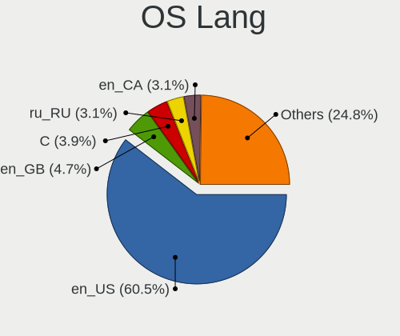
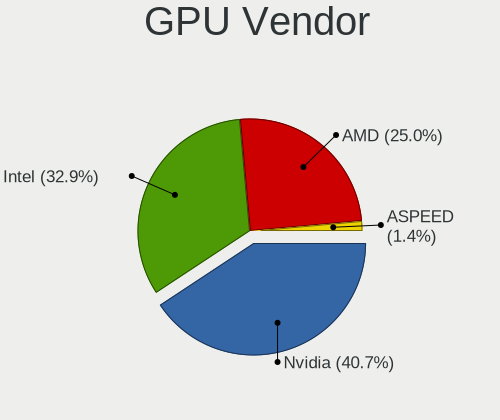

Rocky Linux - Tested Hardware & Statistics (Desktops)
-----------------------------------------------------

A project to collect tested hardware configurations for Rocky Linux.

Anyone can contribute to this report by the [hw-probe](https://github.com/linuxhw/hw-probe) tool:

    sudo -E hw-probe -all -upload

Please contribute! Especially if your hardware is rare.

Contents
--------

* [ Test Cases ](#test-cases)

* [ System ](#system)
  - [ OS                       ](#os)
  - [ OS Family                ](#os-family)
  - [ Kernel                   ](#kernel)
  - [ Kernel Family            ](#kernel-family)
  - [ Kernel Major Ver.        ](#kernel-major-ver)
  - [ Arch                     ](#arch)
  - [ DE                       ](#de)
  - [ Display Server           ](#display-server)
  - [ Display Manager          ](#display-manager)
  - [ OS Lang                  ](#os-lang)
  - [ Boot Mode                ](#boot-mode)
  - [ Filesystem               ](#filesystem)
  - [ Part. scheme             ](#part-scheme)
  - [ Dual Boot with Linux/BSD ](#dual-boot-with-linuxbsd)
  - [ Dual Boot (Win)          ](#dual-boot-win)

* [ Board ](#board)
  - [ Vendor                   ](#vendor)
  - [ Model                    ](#model)
  - [ Model Family             ](#model-family)
  - [ MFG Year                 ](#mfg-year)
  - [ Form Factor              ](#form-factor)
  - [ Secure Boot              ](#secure-boot)
  - [ Coreboot                 ](#coreboot)
  - [ RAM Size                 ](#ram-size)
  - [ RAM Used                 ](#ram-used)
  - [ Total Drives             ](#total-drives)
  - [ Has CD-ROM               ](#has-cd-rom)
  - [ Has Ethernet             ](#has-ethernet)
  - [ Has WiFi                 ](#has-wifi)
  - [ Has Bluetooth            ](#has-bluetooth)

* [ Location ](#location)
  - [ Country                  ](#country)
  - [ City                     ](#city)

* [ Drives ](#drives)
  - [ Drive Vendor             ](#drive-vendor)
  - [ Drive Model              ](#drive-model)
  - [ HDD Vendor               ](#hdd-vendor)
  - [ SSD Vendor               ](#ssd-vendor)
  - [ Drive Kind               ](#drive-kind)
  - [ Drive Connector          ](#drive-connector)
  - [ Drive Size               ](#drive-size)
  - [ Space Total              ](#space-total)
  - [ Space Used               ](#space-used)
  - [ Malfunc. Drives          ](#malfunc-drives)
  - [ Malfunc. Drive Vendor    ](#malfunc-drive-vendor)
  - [ Malfunc. HDD Vendor      ](#malfunc-hdd-vendor)
  - [ Malfunc. Drive Kind      ](#malfunc-drive-kind)
  - [ Failed Drives            ](#failed-drives)
  - [ Failed Drive Vendor      ](#failed-drive-vendor)
  - [ Drive Status             ](#drive-status)

* [ Storage controller ](#storage-controller)
  - [ Storage Vendor           ](#storage-vendor)
  - [ Storage Model            ](#storage-model)
  - [ Storage Kind             ](#storage-kind)

* [ Processor ](#processor)
  - [ CPU Vendor               ](#cpu-vendor)
  - [ CPU Model                ](#cpu-model)
  - [ CPU Model Family         ](#cpu-model-family)
  - [ CPU Cores                ](#cpu-cores)
  - [ CPU Sockets              ](#cpu-sockets)
  - [ CPU Threads              ](#cpu-threads)
  - [ CPU Op-Modes             ](#cpu-op-modes)
  - [ CPU Microcode            ](#cpu-microcode)
  - [ CPU Microarch            ](#cpu-microarch)

* [ Graphics ](#graphics)
  - [ GPU Vendor               ](#gpu-vendor)
  - [ GPU Model                ](#gpu-model)
  - [ GPU Combo                ](#gpu-combo)
  - [ GPU Driver               ](#gpu-driver)
  - [ GPU Memory               ](#gpu-memory)

* [ Monitor ](#monitor)
  - [ Monitor Vendor           ](#monitor-vendor)
  - [ Monitor Model            ](#monitor-model)
  - [ Monitor Resolution       ](#monitor-resolution)
  - [ Monitor Diagonal         ](#monitor-diagonal)
  - [ Monitor Width            ](#monitor-width)
  - [ Aspect Ratio             ](#aspect-ratio)
  - [ Monitor Area             ](#monitor-area)
  - [ Pixel Density            ](#pixel-density)
  - [ Multiple Monitors        ](#multiple-monitors)

* [ Network ](#network)
  - [ Net Controller Vendor    ](#net-controller-vendor)
  - [ Net Controller Model     ](#net-controller-model)
  - [ Wireless Vendor          ](#wireless-vendor)
  - [ Wireless Model           ](#wireless-model)
  - [ Ethernet Vendor          ](#ethernet-vendor)
  - [ Ethernet Model           ](#ethernet-model)
  - [ Net Controller Kind      ](#net-controller-kind)
  - [ Used Controller          ](#used-controller)
  - [ NICs                     ](#nics)
  - [ IPv6                     ](#ipv6)

* [ Bluetooth ](#bluetooth)
  - [ Bluetooth Vendor         ](#bluetooth-vendor)
  - [ Bluetooth Model          ](#bluetooth-model)

* [ Sound ](#sound)
  - [ Sound Vendor             ](#sound-vendor)
  - [ Sound Model              ](#sound-model)

* [ Memory ](#memory)
  - [ Memory Vendor            ](#memory-vendor)
  - [ Memory Model             ](#memory-model)
  - [ Memory Kind              ](#memory-kind)
  - [ Memory Form Factor       ](#memory-form-factor)
  - [ Memory Size              ](#memory-size)
  - [ Memory Speed             ](#memory-speed)

* [ Printers & scanners ](#printers--scanners)
  - [ Printer Vendor           ](#printer-vendor)
  - [ Printer Model            ](#printer-model)
  - [ Scanner Vendor           ](#scanner-vendor)
  - [ Scanner Model            ](#scanner-model)

* [ Camera ](#camera)
  - [ Camera Vendor            ](#camera-vendor)
  - [ Camera Model             ](#camera-model)

* [ Security ](#security)
  - [ Fingerprint Vendor       ](#fingerprint-vendor)
  - [ Fingerprint Model        ](#fingerprint-model)
  - [ Chipcard Vendor          ](#chipcard-vendor)
  - [ Chipcard Model           ](#chipcard-model)

* [ Unsupported ](#unsupported)
  - [ Unsupported Devices      ](#unsupported-devices)
  - [ Unsupported Device Types ](#unsupported-device-types)

Test Cases
----------

Total: 26

| Vendor   | Model             | Probe                                                      | Date         |
|----------|-------------------|------------------------------------------------------------|--------------|
| Dell     | 06CV2N A00        | [f9e949ad9b](https://linux-hardware.org/?probe=f9e949ad9b) | Apr 24, 2022 |
| Gigabyte | G41MT-USB3        | [10f3a0eaae](https://linux-hardware.org/?probe=10f3a0eaae) | Apr 21, 2022 |
| Gigabyte | G41MT-USB3        | [4618c00b42](https://linux-hardware.org/?probe=4618c00b42) | Apr 17, 2022 |
| NCR      | Pocono BIOS.5.1   | [ca175e1f0c](https://linux-hardware.org/?probe=ca175e1f0c) | Apr 09, 2022 |
| Dell     | 0NK70N A03        | [7d4e906833](https://linux-hardware.org/?probe=7d4e906833) | Mar 11, 2022 |
| Dell     | 0WN7Y6 A01        | [ef36ccb6ab](https://linux-hardware.org/?probe=ef36ccb6ab) | Feb 22, 2022 |
| Dell     | 0PC5F7 A02        | [7c6c7dcd5e](https://linux-hardware.org/?probe=7c6c7dcd5e) | Feb 18, 2022 |
| ASUSTek  | PRIME B450-PLUS   | [1d3c449e8a](https://linux-hardware.org/?probe=1d3c449e8a) | Feb 18, 2022 |
| ASRock   | B450M Pro4        | [1ab47f8ff0](https://linux-hardware.org/?probe=1ab47f8ff0) | Jan 20, 2022 |
| MSI      | Z97A GAMING 6     | [4b935d705c](https://linux-hardware.org/?probe=4b935d705c) | Jan 20, 2022 |
| AZW      | Gemini M          | [25e63b737c](https://linux-hardware.org/?probe=25e63b737c) | Dec 31, 2021 |
| AZW      | Gemini M          | [05ef59842c](https://linux-hardware.org/?probe=05ef59842c) | Dec 31, 2021 |
| Google   | Panther           | [92e2626936](https://linux-hardware.org/?probe=92e2626936) | Nov 30, 2021 |
| Gigabyte | X570 AORUS ULTRA  | [840d920fb2](https://linux-hardware.org/?probe=840d920fb2) | Nov 22, 2021 |
| Gigabyte | H87-D3H-CF        | [72fdde33b3](https://linux-hardware.org/?probe=72fdde33b3) | Nov 19, 2021 |
| Dell     | 0N4YC8 A00        | [1a94195ddb](https://linux-hardware.org/?probe=1a94195ddb) | Oct 15, 2021 |
| ASUSTek  | PRIME B450M-A II  | [cb9f02b3de](https://linux-hardware.org/?probe=cb9f02b3de) | Sep 07, 2021 |
| ASUSTek  | PRIME B450M-A II  | [f80365b98a](https://linux-hardware.org/?probe=f80365b98a) | Sep 07, 2021 |
| ASUSTek  | P5Q DELUXE        | [243dba3b27](https://linux-hardware.org/?probe=243dba3b27) | Sep 02, 2021 |
| Lenovo   | NOK               | [274005087d](https://linux-hardware.org/?probe=274005087d) | Aug 23, 2021 |
| Dell     | 0M5DCD A00        | [91acc7eb93](https://linux-hardware.org/?probe=91acc7eb93) | Aug 15, 2021 |
| Dell     | 0M5DCD A00        | [d40f4d3bee](https://linux-hardware.org/?probe=d40f4d3bee) | Aug 06, 2021 |
| ASUSTek  | PRIME TRX40-PRO S | [59f7d599dd](https://linux-hardware.org/?probe=59f7d599dd) | Aug 04, 2021 |
| Dell     | 0M5DCD A00        | [5ee09ac705](https://linux-hardware.org/?probe=5ee09ac705) | Aug 04, 2021 |
| Dell     | 0M5DCD A00        | [77c3d7076e](https://linux-hardware.org/?probe=77c3d7076e) | Aug 04, 2021 |
| HP       | 0B54h D           | [ee9a2da17c](https://linux-hardware.org/?probe=ee9a2da17c) | May 19, 2021 |

System
------

OS
--

Installed operating systems

| Name            | Desktops | Percent |
|-----------------|----------|---------|
| Rocky Linux 8.5 | 11       | 55%     |
| Rocky Linux 8.4 | 8        | 40%     |
| Rocky Linux 8.3 | 1        | 5%      |

OS Family
---------

OS without a version

| Name        | Desktops | Percent |
|-------------|----------|---------|
| Rocky Linux | 20       | 100%    |

Kernel
------

Version of the Linux kernel

| Version                      | Desktops | Percent |
|------------------------------|----------|---------|
| 4.18.0-348.12.2.el8_5.x86_64 | 6        | 30%     |
| 4.18.0-348.7.1.el8_5.x86_64  | 3        | 15%     |
| 4.18.0-305.19.1.el8_4.x86_64 | 2        | 10%     |
| 4.18.0-305.12.1.el8_4.x86_64 | 2        | 10%     |
| 4.18.0-305.10.2.el8_4.x86_64 | 2        | 10%     |
| 5.14.1-1.el8.elrepo.x86_64   | 1        | 5%      |
| 4.18.0-348.20.1.el8_5.x86_64 | 1        | 5%      |
| 4.18.0-348.2.1.el8_5.x86_64  | 1        | 5%      |
| 4.18.0-305.25.1.el8_4.x86_64 | 1        | 5%      |
| 4.18.0-240.22.1.el8.x86_64   | 1        | 5%      |

Kernel Family
-------------

Linux kernel without a distro release

| Version | Desktops | Percent |
|---------|----------|---------|
| 4.18.0  | 19       | 95%     |
| 5.14.1  | 1        | 5%      |

Kernel Major Ver.
-----------------

Linux kernel major version

| Version | Desktops | Percent |
|---------|----------|---------|
| 4.18    | 19       | 95%     |
| 5.14    | 1        | 5%      |

Arch
----

OS architecture (x86_64, i586, etc.)

| Name   | Desktops | Percent |
|--------|----------|---------|
| x86_64 | 20       | 100%    |

DE
--

Desktop Environment

| Name          | Desktops | Percent |
|---------------|----------|---------|
| GNOME         | 10       | 50%     |
| Unknown       | 5        | 25%     |
| KDE5          | 3        | 15%     |
| MATE          | 1        | 5%      |
| GNOME Classic | 1        | 5%      |

Display Server
--------------

X11 or Wayland

| Name    | Desktops | Percent |
|---------|----------|---------|
| X11     | 9        | 45%     |
| Wayland | 8        | 40%     |
| Unknown | 3        | 15%     |

Display Manager
---------------

SDDM, LightDM, etc.

| Name    | Desktops | Percent |
|---------|----------|---------|
| Unknown | 12       | 60%     |
| GDM     | 6        | 30%     |
| SDDM    | 2        | 10%     |

OS Lang
-------

Language

| Lang  | Desktops | Percent |
|-------|----------|---------|
| en_US | 10       | 50%     |
| en_IL | 3        | 15%     |
| ru_RU | 2        | 10%     |
| en_SG | 2        | 10%     |
| ja_JP | 1        | 5%      |
| es_CO | 1        | 5%      |
| af_ZA | 1        | 5%      |

Boot Mode
---------

EFI or BIOS

| Mode | Desktops | Percent |
|------|----------|---------|
| BIOS | 12       | 60%     |
| EFI  | 8        | 40%     |

Filesystem
----------

Type of filesystem

| Type | Desktops | Percent |
|------|----------|---------|
| Xfs  | 18       | 90%     |
| Ext4 | 2        | 10%     |

Part. scheme
------------

Scheme of partitioning

| Type    | Desktops | Percent |
|---------|----------|---------|
| GPT     | 9        | 45%     |
| Unknown | 8        | 40%     |
| MBR     | 3        | 15%     |

Dual Boot with Linux/BSD
------------------------

Hosting more than one Linux/BSD

| Dual boot | Desktops | Percent |
|-----------|----------|---------|
| No        | 18       | 90%     |
| Yes       | 2        | 10%     |

Dual Boot (Win)
---------------

Hosting Linux and Windows

| Dual boot | Desktops | Percent |
|-----------|----------|---------|
| No        | 20       | 100%    |

Board
-----

Vendor
------

Motherboard manufacturer

| Name                | Desktops | Percent |
|---------------------|----------|---------|
| Dell                | 6        | 30%     |
| ASUSTek Computer    | 4        | 20%     |
| Gigabyte Technology | 3        | 15%     |
| NCR                 | 1        | 5%      |
| MSI                 | 1        | 5%      |
| Lenovo              | 1        | 5%      |
| Hewlett-Packard     | 1        | 5%      |
| Google              | 1        | 5%      |
| AZW                 | 1        | 5%      |
| ASRock              | 1        | 5%      |

Model
-----

Motherboard model

| Name                            | Desktops | Percent |
|---------------------------------|----------|---------|
| Dell OptiPlex 9020              | 2        | 10%     |
| NCR xxxx-xxxx-xxxx              | 1        | 5%      |
| MSI MS-7917                     | 1        | 5%      |
| Lenovo ThinkCentre M72e 36601Y8 | 1        | 5%      |
| HP Z600 Workstation             | 1        | 5%      |
| Google Panther                  | 1        | 5%      |
| Gigabyte X570 AORUS ULTRA       | 1        | 5%      |
| Gigabyte H87-D3H                | 1        | 5%      |
| Gigabyte G41MT-USB3             | 1        | 5%      |
| Dell Vostro 3681                | 1        | 5%      |
| Dell Precision T7610            | 1        | 5%      |
| Dell Precision T5610            | 1        | 5%      |
| Dell OptiPlex 390               | 1        | 5%      |
| AZW Gemini M                    | 1        | 5%      |
| ASUS PRIME TRX40-PRO S          | 1        | 5%      |
| ASUS PRIME B450M-A II           | 1        | 5%      |
| ASUS PRIME B450-PLUS            | 1        | 5%      |
| ASUS P5Q DELUXE                 | 1        | 5%      |
| ASRock B450M Pro4               | 1        | 5%      |

Model Family
------------

Motherboard model prefix

| Name                | Desktops | Percent |
|---------------------|----------|---------|
| Dell OptiPlex       | 3        | 15%     |
| ASUS PRIME          | 3        | 15%     |
| Dell Precision      | 2        | 10%     |
| NCR xxxx-xxxx-xxxx  | 1        | 5%      |
| MSI MS-7917         | 1        | 5%      |
| Lenovo ThinkCentre  | 1        | 5%      |
| HP Z600             | 1        | 5%      |
| Google Panther      | 1        | 5%      |
| Gigabyte X570       | 1        | 5%      |
| Gigabyte H87-D3H    | 1        | 5%      |
| Gigabyte G41MT-USB3 | 1        | 5%      |
| Dell Vostro         | 1        | 5%      |
| AZW Gemini          | 1        | 5%      |
| ASUS P5Q            | 1        | 5%      |
| ASRock B450M        | 1        | 5%      |

MFG Year
--------

Motherboard manufacture year

| Year | Desktops | Percent |
|------|----------|---------|
| 2020 | 3        | 15%     |
| 2014 | 3        | 15%     |
| 2013 | 3        | 15%     |
| 2011 | 3        | 15%     |
| 2018 | 2        | 10%     |
| 2015 | 2        | 10%     |
| 2021 | 1        | 5%      |
| 2019 | 1        | 5%      |
| 2010 | 1        | 5%      |
| 2008 | 1        | 5%      |

Form Factor
-----------

Physical design of the computer

| Name    | Desktops | Percent |
|---------|----------|---------|
| Desktop | 20       | 100%    |

Secure Boot
-----------

Enabled or disabled

| State    | Desktops | Percent |
|----------|----------|---------|
| Disabled | 20       | 100%    |

Coreboot
--------

Have coreboot on board

| Used | Desktops | Percent |
|------|----------|---------|
| No   | 19       | 95%     |
| Yes  | 1        | 5%      |

RAM Size
--------

Total RAM memory

| Size in GB  | Desktops | Percent |
|-------------|----------|---------|
| 4.01-8.0    | 5        | 25%     |
| 32.01-64.0  | 4        | 20%     |
| 16.01-24.0  | 4        | 20%     |
| 3.01-4.0    | 2        | 10%     |
| 64.01-256.0 | 2        | 10%     |
| 1.01-2.0    | 2        | 10%     |
| 8.01-16.0   | 1        | 5%      |

RAM Used
--------

Used RAM memory

| Used GB   | Desktops | Percent |
|-----------|----------|---------|
| 2.01-3.0  | 7        | 35%     |
| 3.01-4.0  | 5        | 25%     |
| 1.01-2.0  | 3        | 15%     |
| 4.01-8.0  | 2        | 10%     |
| 8.01-16.0 | 1        | 5%      |
| 0.51-1.0  | 1        | 5%      |
| 0.01-0.5  | 1        | 5%      |

Total Drives
------------

Number of drives on board

| Drives | Desktops | Percent |
|--------|----------|---------|
| 1      | 10       | 50%     |
| 2      | 4        | 20%     |
| 3      | 3        | 15%     |
| 4      | 2        | 10%     |
| 8      | 1        | 5%      |

Has CD-ROM
----------

Has CD-ROM on board

| Presented | Desktops | Percent |
|-----------|----------|---------|
| Yes       | 11       | 55%     |
| No        | 9        | 45%     |

Has Ethernet
------------

Has Ethernet on board

| Presented | Desktops | Percent |
|-----------|----------|---------|
| Yes       | 20       | 100%    |

Has WiFi
--------

Has WiFi module

| Presented | Desktops | Percent |
|-----------|----------|---------|
| No        | 11       | 55%     |
| Yes       | 9        | 45%     |

Has Bluetooth
-------------

Has Bluetooth module

| Presented | Desktops | Percent |
|-----------|----------|---------|
| No        | 14       | 70%     |
| Yes       | 6        | 30%     |

Location
--------

Country
-------

Geographic location (country)

| Country      | Desktops | Percent |
|--------------|----------|---------|
| USA          | 6        | 30%     |
| Singapore    | 3        | 15%     |
| Israel       | 3        | 15%     |
| Russia       | 2        | 10%     |
| South Africa | 1        | 5%      |
| Portugal     | 1        | 5%      |
| Japan        | 1        | 5%      |
| France       | 1        | 5%      |
| Czechia      | 1        | 5%      |
| Colombia     | 1        | 5%      |

City
----

Geographic location (city)

| City           | Desktops | Percent |
|----------------|----------|---------|
| Singapore      | 3        | 15%     |
| Haifa          | 2        | 10%     |
| St Petersburg  | 1        | 5%      |
| Saint Albans   | 1        | 5%      |
| Rehovot        | 1        | 5%      |
| Prague         | 1        | 5%      |
| Paris          | 1        | 5%      |
| Moscow         | 1        | 5%      |
| Mequon         | 1        | 5%      |
| Lisbon         | 1        | 5%      |
| Lebanon        | 1        | 5%      |
| Fredericksburg | 1        | 5%      |
| Corvallis      | 1        | 5%      |
| Centurion      | 1        | 5%      |
| Burlington     | 1        | 5%      |
| Bucaramanga    | 1        | 5%      |
| ÅŒtsu        | 1        | 5%      |

Drives
------

Drive Vendor
------------

Hard drive vendors

| Vendor              | Desktops | Drives | Percent |
|---------------------|----------|--------|---------|
| WDC                 | 7        | 12     | 22.58%  |
| Seagate             | 5        | 11     | 16.13%  |
| Toshiba             | 4        | 4      | 12.9%   |
| Samsung Electronics | 3        | 3      | 9.68%   |
| Hitachi             | 2        | 3      | 6.45%   |
| Crucial             | 2        | 2      | 6.45%   |
| SK Hynix            | 1        | 1      | 3.23%   |
| SanDisk             | 1        | 1      | 3.23%   |
| PNY                 | 1        | 1      | 3.23%   |
| Phison              | 1        | 1      | 3.23%   |
| Intel               | 1        | 1      | 3.23%   |
| HGST                | 1        | 1      | 3.23%   |
| Corsair             | 1        | 1      | 3.23%   |
| China               | 1        | 1      | 3.23%   |

Drive Model
-----------

Hard drive models

| Model                            | Desktops | Percent |
|----------------------------------|----------|---------|
| WDC WDS240G2G0B-00EPW0 240GB SSD | 1        | 2.94%   |
| WDC WDS240G2G0A-00JH30 240GB SSD | 1        | 2.94%   |
| WDC WD5000LPCX-24VHAT0 500GB     | 1        | 2.94%   |
| WDC WD5000AAKX-75U6AA0 500GB     | 1        | 2.94%   |
| WDC WD5000AAKX-001CA0 500GB      | 1        | 2.94%   |
| WDC WD30EZRX-00D8PB0 3TB         | 1        | 2.94%   |
| WDC WD2500AAJS-22VTA0 250GB      | 1        | 2.94%   |
| WDC WD20EZRX-00DC0B0 2TB         | 1        | 2.94%   |
| WDC WD1001FALS-00J7B0 1TB        | 1        | 2.94%   |
| Toshiba MG07ACA12TE 12TB         | 1        | 2.94%   |
| Toshiba MG04ACA400E 4TB          | 1        | 2.94%   |
| Toshiba DT01ACA100 1TB           | 1        | 2.94%   |
| Toshiba DT01ACA050 500GB         | 1        | 2.94%   |
| SK Hynix SH920 2.5 7MM 256GB SSD | 1        | 2.94%   |
| Seagate ST500DM002-1BD142 500GB  | 1        | 2.94%   |
| Seagate ST4000DM004-2CV104 4TB   | 1        | 2.94%   |
| Seagate ST3160318AS 160GB        | 1        | 2.94%   |
| Seagate ST1000VX005-2EZ102 1TB   | 1        | 2.94%   |
| Seagate ST1000DM010-2EP102 1TB   | 1        | 2.94%   |
| SanDisk SSD U110 16GB            | 1        | 2.94%   |
| Samsung SSD 980 PRO 1TB          | 1        | 2.94%   |
| Samsung SSD 860 EVO 1TB          | 1        | 2.94%   |
| Samsung HD103SJ 1TB              | 1        | 2.94%   |
| PNY CS900 120GB SSD              | 1        | 2.94%   |
| Phison Sabrent 512GB             | 1        | 2.94%   |
| Intel SSDPEDMW012T4 1TB          | 1        | 2.94%   |
| Hitachi HTS727575A9E364 752GB    | 1        | 2.94%   |
| Hitachi HDS721010CLA632 1TB      | 1        | 2.94%   |
| Hitachi HDP725050GLA360 500GB    | 1        | 2.94%   |
| HGST HTS721010A9E630 1TB         | 1        | 2.94%   |
| Crucial CT240BX500SSD1 240GB     | 1        | 2.94%   |
| Crucial CT1000P2SSD8 1TB         | 1        | 2.94%   |
| Corsair Neutron SSD 64GB         | 1        | 2.94%   |
| China M.2 SSD 256GB              | 1        | 2.94%   |

HDD Vendor
----------

Hard disk drive vendors

| Vendor              | Desktops | Drives | Percent |
|---------------------|----------|--------|---------|
| WDC                 | 6        | 10     | 31.58%  |
| Seagate             | 5        | 11     | 26.32%  |
| Toshiba             | 4        | 4      | 21.05%  |
| Hitachi             | 2        | 3      | 10.53%  |
| Samsung Electronics | 1        | 1      | 5.26%   |
| HGST                | 1        | 1      | 5.26%   |

SSD Vendor
----------

Solid state drive vendors

| Vendor              | Desktops | Drives | Percent |
|---------------------|----------|--------|---------|
| WDC                 | 2        | 2      | 22.22%  |
| SK Hynix            | 1        | 1      | 11.11%  |
| SanDisk             | 1        | 1      | 11.11%  |
| Samsung Electronics | 1        | 1      | 11.11%  |
| PNY                 | 1        | 1      | 11.11%  |
| Crucial             | 1        | 1      | 11.11%  |
| Corsair             | 1        | 1      | 11.11%  |
| China               | 1        | 1      | 11.11%  |

Drive Kind
----------

HDD or SSD

| Kind | Desktops | Drives | Percent |
|------|----------|--------|---------|
| HDD  | 14       | 30     | 51.85%  |
| SSD  | 9        | 9      | 33.33%  |
| NVMe | 4        | 4      | 14.81%  |

Drive Connector
---------------

SATA, SAS, NVMe, etc.

| Type | Desktops | Drives | Percent |
|------|----------|--------|---------|
| SATA | 18       | 39     | 81.82%  |
| NVMe | 4        | 4      | 18.18%  |

Drive Size
----------

Size of hard drive

| Size in TB | Desktops | Drives | Percent |
|------------|----------|--------|---------|
| 0.01-0.5   | 11       | 17     | 47.83%  |
| 0.51-1.0   | 7        | 12     | 30.43%  |
| 3.01-4.0   | 2        | 7      | 8.7%    |
| 2.01-3.0   | 1        | 1      | 4.35%   |
| 10.01-20.0 | 1        | 1      | 4.35%   |
| 1.01-2.0   | 1        | 1      | 4.35%   |

Space Total
-----------

Amount of disk space available on the file system

| Size in GB     | Desktops | Percent |
|----------------|----------|---------|
| 101-250        | 6        | 30%     |
| 501-1000       | 5        | 25%     |
| More than 3000 | 3        | 15%     |
| 1001-2000      | 3        | 15%     |
| 251-500        | 1        | 5%      |
| 2001-3000      | 1        | 5%      |
| 1-20           | 1        | 5%      |

Space Used
----------

Amount of used disk space

| Used GB        | Desktops | Percent |
|----------------|----------|---------|
| 1-20           | 7        | 35%     |
| 21-50          | 5        | 25%     |
| 51-100         | 3        | 15%     |
| More than 3000 | 2        | 10%     |
| 251-500        | 1        | 5%      |
| 1001-2000      | 1        | 5%      |
| 501-1000       | 1        | 5%      |

Malfunc. Drives
---------------

Drive models with a malfunction

| Model                         | Desktops | Drives | Percent |
|-------------------------------|----------|--------|---------|
| WDC WD1001FALS-00J7B0 1TB     | 1        | 4      | 25%     |
| Hitachi HTS727575A9E364 752GB | 1        | 1      | 25%     |
| Hitachi HDS721010CLA632 1TB   | 1        | 1      | 25%     |
| Corsair Neutron SSD 64GB      | 1        | 1      | 25%     |

Malfunc. Drive Vendor
---------------------

Vendors of faulty drives

| Vendor  | Desktops | Drives | Percent |
|---------|----------|--------|---------|
| Hitachi | 2        | 2      | 50%     |
| WDC     | 1        | 4      | 25%     |
| Corsair | 1        | 1      | 25%     |

Malfunc. HDD Vendor
-------------------

Vendors of faulty HDD drives

| Vendor  | Desktops | Drives | Percent |
|---------|----------|--------|---------|
| Hitachi | 2        | 2      | 66.67%  |
| WDC     | 1        | 4      | 33.33%  |

Malfunc. Drive Kind
-------------------

Kinds of faulty drives

| Kind | Desktops | Drives | Percent |
|------|----------|--------|---------|
| HDD  | 3        | 6      | 75%     |
| SSD  | 1        | 1      | 25%     |

Failed Drives
-------------

Failed drive models

Zero info for selected period =(

Failed Drive Vendor
-------------------

Failed drive vendors

Zero info for selected period =(

Drive Status
------------

Number of failed and malfunc. drives

| Status   | Desktops | Drives | Percent |
|----------|----------|--------|---------|
| Works    | 11       | 22     | 47.83%  |
| Detected | 8        | 14     | 34.78%  |
| Malfunc  | 4        | 7      | 17.39%  |

Storage controller
------------------

Storage Vendor
--------------

Storage controller vendors

| Vendor                    | Desktops | Percent |
|---------------------------|----------|---------|
| Intel                     | 15       | 55.56%  |
| AMD                       | 5        | 18.52%  |
| Samsung Electronics       | 1        | 3.7%    |
| Phison Electronics        | 1        | 3.7%    |
| Micron/Crucial Technology | 1        | 3.7%    |
| Marvell Technology Group  | 1        | 3.7%    |
| Broadcom / LSI            | 1        | 3.7%    |
| ASMedia Technology        | 1        | 3.7%    |
| Adaptec                   | 1        | 3.7%    |

Storage Model
-------------

Storage controller models

| Model                                                                                   | Desktops | Percent |
|-----------------------------------------------------------------------------------------|----------|---------|
| AMD FCH SATA Controller [AHCI mode]                                                     | 4        | 11.76%  |
| Intel SATA Controller [RAID mode]                                                       | 3        | 8.82%   |
| AMD 400 Series Chipset SATA Controller                                                  | 3        | 8.82%   |
| Intel 6 Series/C200 Series Chipset Family Desktop SATA Controller (IDE mode, ports 4-5) | 2        | 5.88%   |
| Intel 6 Series/C200 Series Chipset Family Desktop SATA Controller (IDE mode, ports 0-3) | 2        | 5.88%   |
| Samsung NVMe SSD Controller PM9A1/PM9A3/980PRO                                          | 1        | 2.94%   |
| Phison E12 NVMe Controller                                                              | 1        | 2.94%   |
| Micron/Crucial P2 NVMe PCIe SSD                                                         | 1        | 2.94%   |
| Marvell Group 88SE6111/6121 SATA II / PATA Controller                                   | 1        | 2.94%   |
| Intel PCIe Data Center SSD                                                              | 1        | 2.94%   |
| Intel NM10/ICH7 Family SATA Controller [IDE mode]                                       | 1        | 2.94%   |
| Intel Celeron/Pentium Silver Processor SATA Controller                                  | 1        | 2.94%   |
| Intel C600/X79 series chipset SATA RAID Controller                                      | 1        | 2.94%   |
| Intel C600/X79 series chipset IDE-r Controller                                          | 1        | 2.94%   |
| Intel C600/X79 series chipset 6-Port SATA AHCI Controller                               | 1        | 2.94%   |
| Intel 9 Series Chipset Family SATA Controller [AHCI Mode]                               | 1        | 2.94%   |
| Intel 82801JI (ICH10 Family) 4 port SATA IDE Controller #1                              | 1        | 2.94%   |
| Intel 82801JI (ICH10 Family) 2 port SATA IDE Controller #2                              | 1        | 2.94%   |
| Intel 8 Series/C220 Series Chipset Family 6-port SATA Controller 1 [AHCI mode]          | 1        | 2.94%   |
| Intel 8 Series SATA Controller 1 [AHCI mode]                                            | 1        | 2.94%   |
| Intel 6 Series/C200 Series Chipset Family 6 port Desktop SATA AHCI Controller           | 1        | 2.94%   |
| Intel 400 Series Chipset Family SATA AHCI Controller                                    | 1        | 2.94%   |
| Broadcom / LSI SAS2308 PCI-Express Fusion-MPT SAS-2                                     | 1        | 2.94%   |
| ASMedia ASM1062 Serial ATA Controller                                                   | 1        | 2.94%   |
| Adaptec ASC-39320A U320                                                                 | 1        | 2.94%   |

Storage Kind
------------

Kind of storage controller (IDE, SATA, NVMe, SAS, ...)

| Kind | Desktops | Percent |
|------|----------|---------|
| SATA | 12       | 44.44%  |
| IDE  | 5        | 18.52%  |
| RAID | 4        | 14.81%  |
| NVMe | 4        | 14.81%  |
| SAS  | 1        | 3.7%    |
| SCSI | 1        | 3.7%    |

Processor
---------

CPU Vendor
----------

Processor vendors

| Vendor | Desktops | Percent |
|--------|----------|---------|
| Intel  | 15       | 75%     |
| AMD    | 5        | 25%     |

CPU Model
---------

Processor models

| Model                                          | Desktops | Percent |
|------------------------------------------------|----------|---------|
| Intel Core i7-4770 CPU @ 3.40GHz               | 2        | 10%     |
| Intel Xeon CPU E5620 @ 2.40GHz                 | 1        | 5%      |
| Intel Xeon CPU E5-2687W v2 @ 3.40GHz           | 1        | 5%      |
| Intel Xeon CPU E5-2620 v2 @ 2.10GHz            | 1        | 5%      |
| Intel Pentium Dual-Core CPU E5200 @ 2.50GHz    | 1        | 5%      |
| Intel Core i7-4790K CPU @ 4.00GHz              | 1        | 5%      |
| Intel Core i7-4790 CPU @ 3.60GHz               | 1        | 5%      |
| Intel Core i7-10700 CPU @ 2.90GHz              | 1        | 5%      |
| Intel Core i5-3470 CPU @ 3.20GHz               | 1        | 5%      |
| Intel Core i5-2400 CPU @ 3.10GHz               | 1        | 5%      |
| Intel Core i3-2120 CPU @ 3.30GHz               | 1        | 5%      |
| Intel Core 2 Quad CPU Q8200 @ 2.33GHz          | 1        | 5%      |
| Intel Celeron J4125 CPU @ 2.00GHz              | 1        | 5%      |
| Intel Celeron 2955U @ 1.40GHz                  | 1        | 5%      |
| AMD Ryzen Threadripper 3960X 24-Core Processor | 1        | 5%      |
| AMD Ryzen 9 5900X 12-Core Processor            | 1        | 5%      |
| AMD Ryzen 7 2700 Eight-Core Processor          | 1        | 5%      |
| AMD Ryzen 5 3600 6-Core Processor              | 1        | 5%      |
| AMD Ryzen 3 3200G with Radeon Vega Graphics    | 1        | 5%      |

CPU Model Family
----------------

Processor model prefix

| Model                   | Desktops | Percent |
|-------------------------|----------|---------|
| Intel Core i7           | 5        | 25%     |
| Intel Xeon              | 3        | 15%     |
| Intel Core i5           | 2        | 10%     |
| Intel Celeron           | 2        | 10%     |
| Intel Pentium Dual-Core | 1        | 5%      |
| Intel Core i3           | 1        | 5%      |
| Intel Core 2 Quad       | 1        | 5%      |
| AMD Ryzen Threadripper  | 1        | 5%      |
| AMD Ryzen 9             | 1        | 5%      |
| AMD Ryzen 7             | 1        | 5%      |
| AMD Ryzen 5             | 1        | 5%      |
| AMD Ryzen 3             | 1        | 5%      |

CPU Cores
---------

Number of processor cores

| Number | Desktops | Percent |
|--------|----------|---------|
| 4      | 9        | 45%     |
| 8      | 4        | 20%     |
| 2      | 3        | 15%     |
| 12     | 2        | 10%     |
| 24     | 1        | 5%      |
| 6      | 1        | 5%      |

CPU Sockets
-----------

Number of sockets

| Number | Desktops | Percent |
|--------|----------|---------|
| 1      | 18       | 90%     |
| 2      | 2        | 10%     |

CPU Threads
-----------

Threads per core (Hyper-Threading)

| Number | Desktops | Percent |
|--------|----------|---------|
| 2      | 12       | 60%     |
| 1      | 8        | 40%     |

CPU Op-Modes
------------

CPU Operation Modes (32-bit, 64-bit)

| Op mode        | Desktops | Percent |
|----------------|----------|---------|
| 32-bit, 64-bit | 20       | 100%    |

CPU Microcode
-------------

Microcode number

| Number     | Desktops | Percent |
|------------|----------|---------|
| 0x306c3    | 3        | 15%     |
| 0x306e4    | 2        | 10%     |
| 0x206a7    | 2        | 10%     |
| 0xa0655    | 1        | 5%      |
| 0x706a8    | 1        | 5%      |
| 0x40651    | 1        | 5%      |
| 0x306a9    | 1        | 5%      |
| 0x206c2    | 1        | 5%      |
| 0x10677    | 1        | 5%      |
| 0x10676    | 1        | 5%      |
| 0x0a201009 | 1        | 5%      |
| 0x0870100a | 1        | 5%      |
| 0x08301039 | 1        | 5%      |
| 0x08108109 | 1        | 5%      |
| 0x0800820d | 1        | 5%      |
| Unknown    | 1        | 5%      |

CPU Microarch
-------------

Microarchitecture

| Name          | Desktops | Percent |
|---------------|----------|---------|
| Haswell       | 5        | 25%     |
| IvyBridge     | 3        | 15%     |
| Zen+          | 2        | 10%     |
| Zen 2         | 2        | 10%     |
| SandyBridge   | 2        | 10%     |
| Penryn        | 2        | 10%     |
| Zen 3         | 1        | 5%      |
| Westmere      | 1        | 5%      |
| Goldmont plus | 1        | 5%      |
| CometLake     | 1        | 5%      |

Graphics
--------

GPU Vendor
----------

Vendors of graphics cards

| Vendor | Desktops | Percent |
|--------|----------|---------|
| Nvidia | 9        | 42.86%  |
| Intel  | 9        | 42.86%  |
| AMD    | 3        | 14.29%  |

GPU Model
---------

Graphics card models

| Model                                                                       | Desktops | Percent |
|-----------------------------------------------------------------------------|----------|---------|
| Intel Xeon E3-1200 v3/4th Gen Core Processor Integrated Graphics Controller | 2        | 9.52%   |
| Intel 2nd Generation Core Processor Family Integrated Graphics Controller   | 2        | 9.52%   |
| AMD RV620 LE [Radeon HD 3450]                                               | 2        | 9.52%   |
| Nvidia TU117GL [T600]                                                       | 1        | 4.76%   |
| Nvidia GT218 [GeForce 210]                                                  | 1        | 4.76%   |
| Nvidia GP107GL [Quadro P400]                                                | 1        | 4.76%   |
| Nvidia GP102 [GeForce GTX 1080 Ti]                                          | 1        | 4.76%   |
| Nvidia GM200 [GeForce GTX 980 Ti]                                           | 1        | 4.76%   |
| Nvidia GK208B [GeForce GT 730]                                              | 1        | 4.76%   |
| Nvidia GK107GL [Quadro K600]                                                | 1        | 4.76%   |
| Nvidia GK107GL [Quadro K2000]                                               | 1        | 4.76%   |
| Nvidia GK107 [GeForce GTX 650]                                              | 1        | 4.76%   |
| Intel Xeon E3-1200 v2/3rd Gen Core processor Graphics Controller            | 1        | 4.76%   |
| Intel Haswell-ULT Integrated Graphics Controller                            | 1        | 4.76%   |
| Intel GeminiLake [UHD Graphics 600]                                         | 1        | 4.76%   |
| Intel CometLake-S GT2 [UHD Graphics 630]                                    | 1        | 4.76%   |
| Intel 4 Series Chipset Integrated Graphics Controller                       | 1        | 4.76%   |
| AMD Picasso/Raven 2 [Radeon Vega Series / Radeon Vega Mobile Series]        | 1        | 4.76%   |

GPU Combo
---------

Combinations of graphics cards

| Name           | Desktops | Percent |
|----------------|----------|---------|
| 1 x Nvidia     | 8        | 40%     |
| 1 x Intel      | 8        | 40%     |
| 1 x AMD        | 3        | 15%     |
| Intel + Nvidia | 1        | 5%      |

GPU Driver
----------

Free vs proprietary

| Driver      | Desktops | Percent |
|-------------|----------|---------|
| Free        | 15       | 75%     |
| Proprietary | 4        | 20%     |
| Unknown     | 1        | 5%      |

GPU Memory
----------

Total video memory

| Size in GB | Desktops | Percent |
|------------|----------|---------|
| Unknown    | 9        | 45%     |
| 1.01-2.0   | 4        | 20%     |
| 0.01-0.5   | 3        | 15%     |
| 5.01-6.0   | 1        | 5%      |
| 3.01-4.0   | 1        | 5%      |
| 8.01-16.0  | 1        | 5%      |
| 0.51-1.0   | 1        | 5%      |

Monitor
-------

Monitor Vendor
--------------

Monitor vendors

| Vendor              | Desktops | Percent |
|---------------------|----------|---------|
| Dell                | 6        | 37.5%   |
| Samsung Electronics | 4        | 25%     |
| Iiyama              | 2        | 12.5%   |
| Sony                | 1        | 6.25%   |
| Hewlett-Packard     | 1        | 6.25%   |
| ASUSTek Computer    | 1        | 6.25%   |
| Acer                | 1        | 6.25%   |

Monitor Model
-------------

Monitor models

| Model                                                               | Desktops | Percent |
|---------------------------------------------------------------------|----------|---------|
| Sony LG TV SNY045B 1920x540                                         | 1        | 5.88%   |
| Samsung Electronics U32R59x SAM0F96 3840x2160 697x392mm 31.5-inch   | 1        | 5.88%   |
| Samsung Electronics S27F350 SAM0D22 1920x1080 598x336mm 27.0-inch   | 1        | 5.88%   |
| Samsung Electronics LF27T450F SAM7099 1920x1080 597x336mm 27.0-inch | 1        | 5.88%   |
| Samsung Electronics C49RG9x SAM0F9C 3840x1080 1190x340mm 48.7-inch  | 1        | 5.88%   |
| Iiyama PL2483H IVM6138 1920x1080 531x299mm 24.0-inch                | 1        | 5.88%   |
| Iiyama PL2377 IVM561D 1920x1080 510x287mm 23.0-inch                 | 1        | 5.88%   |
| Hewlett-Packard LP2465 HWP2675 1920x1200 519x324mm 24.1-inch        | 1        | 5.88%   |
| Dell P2014H DEL4096 1600x900 434x236mm 19.4-inch                    | 1        | 5.88%   |
| Dell P1913 DELA088 1440x900 410x260mm 19.1-inch                     | 1        | 5.88%   |
| Dell LCD Monitor U2414H 3840x1080                                   | 1        | 5.88%   |
| Dell LCD Monitor U2414H                                             | 1        | 5.88%   |
| Dell IN2030M DELF03C 1600x900 443x249mm 20.0-inch                   | 1        | 5.88%   |
| Dell E177FP DELA023 1280x1024 338x270mm 17.0-inch                   | 1        | 5.88%   |
| Dell 1703FP DEL3011 1280x1024 338x270mm 17.0-inch                   | 1        | 5.88%   |
| ASUSTek Computer VP247 AUS24DA 1920x1080 521x293mm 23.5-inch        | 1        | 5.88%   |
| Acer V173 ACR0053 1280x1024 338x270mm 17.0-inch                     | 1        | 5.88%   |

Monitor Resolution
------------------

Monitor screen resolution

| Resolution        | Desktops | Percent |
|-------------------|----------|---------|
| 1920x1080 (FHD)   | 5        | 29.41%  |
| 3840x1080         | 2        | 11.76%  |
| 1600x900 (HD+)    | 2        | 11.76%  |
| 1440x900 (WXGA+)  | 2        | 11.76%  |
| 1280x1024 (SXGA)  | 2        | 11.76%  |
| 3840x2160 (4K)    | 1        | 5.88%   |
| 1920x540          | 1        | 5.88%   |
| 1920x1200 (WUXGA) | 1        | 5.88%   |
| Unknown           | 1        | 5.88%   |

Monitor Diagonal
----------------

Diagonal size in inches

| Inches  | Desktops | Percent |
|---------|----------|---------|
| 19      | 3        | 18.75%  |
| 27      | 2        | 12.5%   |
| 23      | 2        | 12.5%   |
| 17      | 2        | 12.5%   |
| 65      | 1        | 6.25%   |
| 48      | 1        | 6.25%   |
| 31      | 1        | 6.25%   |
| 28      | 1        | 6.25%   |
| 24      | 1        | 6.25%   |
| 20      | 1        | 6.25%   |
| Unknown | 1        | 6.25%   |

Monitor Width
-------------

Physical width

| Width in mm | Desktops | Percent |
|-------------|----------|---------|
| 501-600     | 6        | 37.5%   |
| 401-500     | 4        | 25%     |
| 301-350     | 2        | 12.5%   |
| 1001-1500   | 2        | 12.5%   |
| 601-700     | 1        | 6.25%   |
| Unknown     | 1        | 6.25%   |

Aspect Ratio
------------

Proportional relationship between the width and the height

| Ratio   | Desktops | Percent |
|---------|----------|---------|
| 16/9    | 9        | 56.25%  |
| 5/4     | 2        | 12.5%   |
| 16/10   | 2        | 12.5%   |
| 32/9    | 1        | 6.25%   |
| 3/2     | 1        | 6.25%   |
| Unknown | 1        | 6.25%   |

Monitor Area
------------

Area in inch²

| Area in inch² | Desktops | Percent |
|----------------|----------|---------|
| 151-200        | 4        | 25%     |
| 201-250        | 3        | 18.75%  |
| 351-500        | 2        | 12.5%   |
| 301-350        | 2        | 12.5%   |
| 141-150        | 2        | 12.5%   |
| More than 1000 | 1        | 6.25%   |
| 501-1000       | 1        | 6.25%   |
| Unknown        | 1        | 6.25%   |

Pixel Density
-------------

Pixels per inch

| Density | Desktops | Percent |
|---------|----------|---------|
| 51-100  | 13       | 81.25%  |
| 1-50    | 1        | 6.25%   |
| 121-160 | 1        | 6.25%   |
| Unknown | 1        | 6.25%   |

Multiple Monitors
-----------------

Total monitors connected

| Total | Desktops | Percent |
|-------|----------|---------|
| 1     | 15       | 75%     |
| 0     | 4        | 20%     |
| 2     | 1        | 5%      |

Network
-------

Net Controller Vendor
---------------------

Controller vendors

| Vendor                    | Desktops | Percent |
|---------------------------|----------|---------|
| Realtek Semiconductor     | 10       | 35.71%  |
| Intel                     | 10       | 35.71%  |
| Qualcomm Atheros          | 2        | 7.14%   |
| Solarflare Communications | 1        | 3.57%   |
| Microsoft                 | 1        | 3.57%   |
| Marvell Technology Group  | 1        | 3.57%   |
| Linksys                   | 1        | 3.57%   |
| BUFFALO                   | 1        | 3.57%   |
| Broadcom                  | 1        | 3.57%   |

Net Controller Model
--------------------

Controller models

| Model                                                             | Desktops | Percent |
|-------------------------------------------------------------------|----------|---------|
| Realtek RTL8111/8168/8411 PCI Express Gigabit Ethernet Controller | 9        | 28.13%  |
| Intel 82579LM Gigabit Network Connection (Lewisville)             | 3        | 9.38%   |
| Intel Wireless 3165                                               | 2        | 6.25%   |
| Intel I211 Gigabit Network Connection                             | 2        | 6.25%   |
| Intel Ethernet Connection I217-LM                                 | 2        | 6.25%   |
| Solarflare SFC9020 10G Ethernet Controller                        | 1        | 3.13%   |
| Realtek RTL88x2bu [AC1200 Techkey]                                | 1        | 3.13%   |
| Realtek RTL8169 PCI Gigabit Ethernet Controller                   | 1        | 3.13%   |
| Realtek 802.11ac NIC                                              | 1        | 3.13%   |
| Qualcomm Atheros AR9462 Wireless Network Adapter                  | 1        | 3.13%   |
| Qualcomm Atheros AR93xx Wireless Network Adapter                  | 1        | 3.13%   |
| Microsoft Xbox 360 Wireless Adapter                               | 1        | 3.13%   |
| Marvell Group 88E8056 PCI-E Gigabit Ethernet Controller           | 1        | 3.13%   |
| Marvell Group 88E8001 Gigabit Ethernet Controller                 | 1        | 3.13%   |
| Linksys WUSB6100M 802.11a/b/g/n/ac Wireless Adapter               | 1        | 3.13%   |
| Intel Wi-Fi 6 AX200                                               | 1        | 3.13%   |
| Intel Ethernet Connection I217-V                                  | 1        | 3.13%   |
| BUFFALO WLI-UC-GNM2 Wireless LAN Adapter [Ralink RT3070]          | 1        | 3.13%   |
| Broadcom NetXtreme BCM5764M Gigabit Ethernet PCIe                 | 1        | 3.13%   |

Wireless Vendor
---------------

Wireless vendors

| Vendor                | Desktops | Percent |
|-----------------------|----------|---------|
| Intel                 | 3        | 33.33%  |
| Qualcomm Atheros      | 2        | 22.22%  |
| Realtek Semiconductor | 1        | 11.11%  |
| Microsoft             | 1        | 11.11%  |
| Linksys               | 1        | 11.11%  |
| BUFFALO               | 1        | 11.11%  |

Wireless Model
--------------

Wireless models

| Model                                                    | Desktops | Percent |
|----------------------------------------------------------|----------|---------|
| Intel Wireless 3165                                      | 2        | 20%     |
| Realtek RTL88x2bu [AC1200 Techkey]                       | 1        | 10%     |
| Realtek 802.11ac NIC                                     | 1        | 10%     |
| Qualcomm Atheros AR9462 Wireless Network Adapter         | 1        | 10%     |
| Qualcomm Atheros AR93xx Wireless Network Adapter         | 1        | 10%     |
| Microsoft Xbox 360 Wireless Adapter                      | 1        | 10%     |
| Linksys WUSB6100M 802.11a/b/g/n/ac Wireless Adapter      | 1        | 10%     |
| Intel Wi-Fi 6 AX200                                      | 1        | 10%     |
| BUFFALO WLI-UC-GNM2 Wireless LAN Adapter [Ralink RT3070] | 1        | 10%     |

Ethernet Vendor
---------------

Ethernet vendors

| Vendor                    | Desktops | Percent |
|---------------------------|----------|---------|
| Realtek Semiconductor     | 10       | 47.62%  |
| Intel                     | 8        | 38.1%   |
| Solarflare Communications | 1        | 4.76%   |
| Marvell Technology Group  | 1        | 4.76%   |
| Broadcom                  | 1        | 4.76%   |

Ethernet Model
--------------

Ethernet models

| Model                                                             | Desktops | Percent |
|-------------------------------------------------------------------|----------|---------|
| Realtek RTL8111/8168/8411 PCI Express Gigabit Ethernet Controller | 9        | 40.91%  |
| Intel 82579LM Gigabit Network Connection (Lewisville)             | 3        | 13.64%  |
| Intel I211 Gigabit Network Connection                             | 2        | 9.09%   |
| Intel Ethernet Connection I217-LM                                 | 2        | 9.09%   |
| Solarflare SFC9020 10G Ethernet Controller                        | 1        | 4.55%   |
| Realtek RTL8169 PCI Gigabit Ethernet Controller                   | 1        | 4.55%   |
| Marvell Group 88E8056 PCI-E Gigabit Ethernet Controller           | 1        | 4.55%   |
| Marvell Group 88E8001 Gigabit Ethernet Controller                 | 1        | 4.55%   |
| Intel Ethernet Connection I217-V                                  | 1        | 4.55%   |
| Broadcom NetXtreme BCM5764M Gigabit Ethernet PCIe                 | 1        | 4.55%   |

Net Controller Kind
-------------------

Ethernet, WiFi or modem

| Kind     | Desktops | Percent |
|----------|----------|---------|
| Ethernet | 20       | 68.97%  |
| WiFi     | 9        | 31.03%  |

Used Controller
---------------

Currently used network controller

| Kind     | Desktops | Percent |
|----------|----------|---------|
| Ethernet | 18       | 85.71%  |
| WiFi     | 3        | 14.29%  |

NICs
----

Total network controllers on board

| Total | Desktops | Percent |
|-------|----------|---------|
| 1     | 12       | 60%     |
| 2     | 8        | 40%     |

IPv6
----

IPv6 vs IPv4

| Used | Desktops | Percent |
|------|----------|---------|
| No   | 17       | 85%     |
| Yes  | 3        | 15%     |

Bluetooth
---------

Bluetooth Vendor
----------------

Controller vendors

| Vendor                  | Desktops | Percent |
|-------------------------|----------|---------|
| Intel                   | 3        | 50%     |
| IMC Networks            | 1        | 16.67%  |
| Cambridge Silicon Radio | 1        | 16.67%  |
| Broadcom                | 1        | 16.67%  |

Bluetooth Model
---------------

Controller models

| Model                                               | Desktops | Percent |
|-----------------------------------------------------|----------|---------|
| Intel Bluetooth wireless interface                  | 2        | 33.33%  |
| Intel AX200 Bluetooth                               | 1        | 16.67%  |
| IMC Networks Bluetooth Device                       | 1        | 16.67%  |
| Cambridge Silicon Radio Bluetooth Dongle (HCI mode) | 1        | 16.67%  |
| Broadcom BCM20702A0 Bluetooth 4.0                   | 1        | 16.67%  |

Sound
-----

Sound Vendor
------------

Sound card vendors

| Vendor              | Desktops | Percent |
|---------------------|----------|---------|
| Intel               | 15       | 46.88%  |
| Nvidia              | 9        | 28.13%  |
| AMD                 | 6        | 18.75%  |
| C-Media Electronics | 1        | 3.13%   |
| ASUSTek Computer    | 1        | 3.13%   |

Sound Model
-----------

Sound card models

| Model                                                                      | Desktops | Percent |
|----------------------------------------------------------------------------|----------|---------|
| Nvidia GK107 HDMI Audio Controller                                         | 3        | 8.11%   |
| Intel 8 Series/C220 Series Chipset High Definition Audio Controller        | 3        | 8.11%   |
| Intel 6 Series/C200 Series Chipset Family High Definition Audio Controller | 3        | 8.11%   |
| AMD Starship/Matisse HD Audio Controller                                   | 3        | 8.11%   |
| Intel Xeon E3-1200 v3/4th Gen Core Processor HD Audio Controller           | 2        | 5.41%   |
| Intel C600/X79 series chipset High Definition Audio Controller             | 2        | 5.41%   |
| Intel 82801JI (ICH10 Family) HD Audio Controller                           | 2        | 5.41%   |
| AMD RV620 HDMI Audio [Radeon HD 3450/3470/3550/3570]                       | 2        | 5.41%   |
| Nvidia TU107 GeForce GTX 1650 High Definition Audio Controller             | 1        | 2.7%    |
| Nvidia High Definition Audio Controller                                    | 1        | 2.7%    |
| Nvidia GP107GL High Definition Audio Controller                            | 1        | 2.7%    |
| Nvidia GP102 HDMI Audio Controller                                         | 1        | 2.7%    |
| Nvidia GM200 High Definition Audio                                         | 1        | 2.7%    |
| Nvidia GK208 HDMI/DP Audio Controller                                      | 1        | 2.7%    |
| Intel NM10/ICH7 Family High Definition Audio Controller                    | 1        | 2.7%    |
| Intel Haswell-ULT HD Audio Controller                                      | 1        | 2.7%    |
| Intel Comet Lake PCH-V cAVS                                                | 1        | 2.7%    |
| Intel Celeron/Pentium Silver Processor High Definition Audio               | 1        | 2.7%    |
| Intel 9 Series Chipset Family HD Audio Controller                          | 1        | 2.7%    |
| Intel 8 Series HD Audio Controller                                         | 1        | 2.7%    |
| C-Media Electronics Auna Mic CM900                                         | 1        | 2.7%    |
| ASUSTek Computer USB Audio                                                 | 1        | 2.7%    |
| AMD Raven/Raven2/Fenghuang HDMI/DP Audio Controller                        | 1        | 2.7%    |
| AMD Family 17h/19h HD Audio Controller                                     | 1        | 2.7%    |
| AMD Family 17h (Models 00h-0fh) HD Audio Controller                        | 1        | 2.7%    |

Memory
------

Memory Vendor
-------------

Memory module vendors

| Vendor              | Desktops | Percent |
|---------------------|----------|---------|
| Micron Technology   | 3        | 23.08%  |
| G.Skill             | 3        | 23.08%  |
| Unknown             | 2        | 15.38%  |
| Samsung Electronics | 2        | 15.38%  |
| SK Hynix            | 1        | 7.69%   |
| Kingston            | 1        | 7.69%   |
| Corsair             | 1        | 7.69%   |

Memory Model
------------

Memory module models

| Model                                                   | Desktops | Percent |
|---------------------------------------------------------|----------|---------|
| Unknown RAM Module 2048MB SODIMM DDR3 1600MT/s          | 1        | 7.69%   |
| Unknown RAM Module 1GB DIMM DDR2 667MT/s                | 1        | 7.69%   |
| SK Hynix RAM HMT351U6EFR8C-PB 4096MB DIMM DDR3 1800MT/s | 1        | 7.69%   |
| Samsung RAM M378B5273DH0-CK0 4GB DIMM DDR3 2200MT/s     | 1        | 7.69%   |
| Samsung RAM M378A4G43AB2-CWE 32GB DIMM DDR4 3200MT/s    | 1        | 7.69%   |
| Micron RAM Module 8GB DIMM DDR4 3200MT/s                | 1        | 7.69%   |
| Micron RAM 9JSF51272PZ-1G9E2 4GB DIMM DDR3 1866MT/s     | 1        | 7.69%   |
| Micron RAM 8ATF1G64AZ-3G2J1 8GB DIMM DDR4 3200MT/s      | 1        | 7.69%   |
| Kingston RAM KHX1600C9D3/8GX 8192MB DIMM DDR3 1600MT/s  | 1        | 7.69%   |
| G.Skill RAM F4-3600C19-8GVRB 8GB DIMM DDR4 2933MT/s     | 1        | 7.69%   |
| G.Skill RAM F4-2666C18-32GVK 32GB DIMM DDR4 2666MT/s    | 1        | 7.69%   |
| G.Skill RAM F3-2400C10-8GTX 8GB DIMM DDR3 2400MT/s      | 1        | 7.69%   |
| Corsair RAM CMK8GX4M1Z3200C16 8GB DIMM DDR4 3200MT/s    | 1        | 7.69%   |

Memory Kind
-----------

Memory module kinds

| Kind | Desktops | Percent |
|------|----------|---------|
| DDR4 | 6        | 50%     |
| DDR3 | 5        | 41.67%  |
| DDR2 | 1        | 8.33%   |

Memory Form Factor
------------------

Physical design of the memory module

| Name   | Desktops | Percent |
|--------|----------|---------|
| DIMM   | 11       | 91.67%  |
| SODIMM | 1        | 8.33%   |

Memory Size
-----------

Memory module size

| Size  | Desktops | Percent |
|-------|----------|---------|
| 8192  | 6        | 50%     |
| 32768 | 2        | 16.67%  |
| 4096  | 2        | 16.67%  |
| 2048  | 1        | 8.33%   |
| 1024  | 1        | 8.33%   |

Memory Speed
------------

Memory module speed

| Speed | Desktops | Percent |
|-------|----------|---------|
| 3200  | 4        | 30.77%  |
| 1600  | 2        | 15.38%  |
| 2933  | 1        | 7.69%   |
| 2666  | 1        | 7.69%   |
| 2400  | 1        | 7.69%   |
| 2200  | 1        | 7.69%   |
| 1866  | 1        | 7.69%   |
| 1800  | 1        | 7.69%   |
| 667   | 1        | 7.69%   |

Printers & scanners
-------------------

Printer Vendor
--------------

Printer device vendors

| Vendor             | Desktops | Percent |
|--------------------|----------|---------|
| Brother Industries | 1        | 100%    |

Printer Model
-------------

Printer device models

| Model                         | Desktops | Percent |
|-------------------------------|----------|---------|
| Brother HL-2030 Laser Printer | 1        | 100%    |

Scanner Vendor
--------------

Scanner device vendors

| Vendor          | Desktops | Percent |
|-----------------|----------|---------|
| Hewlett-Packard | 1        | 100%    |

Scanner Model
-------------

Scanner device models

| Model             | Desktops | Percent |
|-------------------|----------|---------|
| HP OfficeJet 6110 | 1        | 100%    |

Camera
------

Camera Vendor
-------------

Camera device vendors

| Vendor              | Desktops | Percent |
|---------------------|----------|---------|
| Logitech            | 2        | 66.67%  |
| Huawei Technologies | 1        | 33.33%  |

Camera Model
------------

Camera device models

| Model                       | Desktops | Percent |
|-----------------------------|----------|---------|
| Logitech Webcam C270        | 1        | 33.33%  |
| Logitech HD Pro Webcam C920 | 1        | 33.33%  |
| Huawei UVC Camera           | 1        | 33.33%  |

Security
--------

Fingerprint Vendor
------------------

Fingerprint sensor vendors

Zero info for selected period =(

Fingerprint Model
-----------------

Fingerprint sensor models

Zero info for selected period =(

Chipcard Vendor
---------------

Chipcard module vendors

Zero info for selected period =(

Chipcard Model
--------------

Chipcard module models

Zero info for selected period =(

Unsupported
-----------

Unsupported Devices
-------------------

Total unsupported devices on board

| Total | Desktops | Percent |
|-------|----------|---------|
| 0     | 16       | 80%     |
| 1     | 3        | 15%     |
| 2     | 1        | 5%      |

Unsupported Device Types
------------------------

Types of unsupported devices

| Type          | Desktops | Percent |
|---------------|----------|---------|
| Net/wireless  | 3        | 75%     |
| Graphics card | 1        | 25%     |

