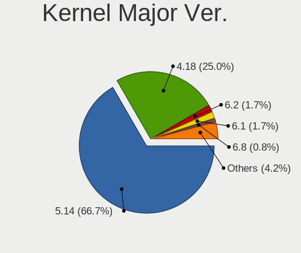
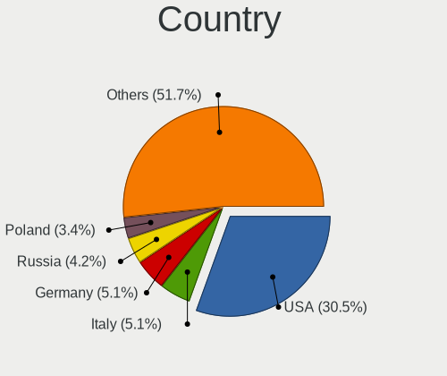
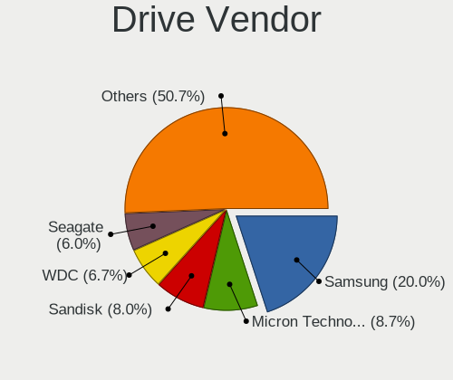
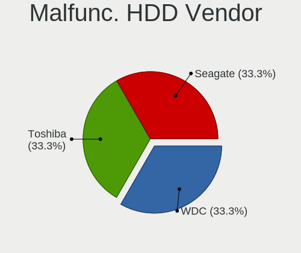
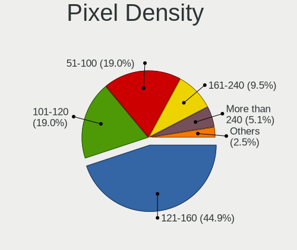
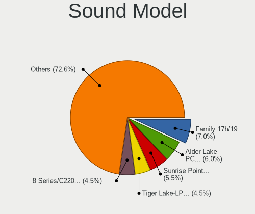

Rocky Linux - Tested Hardware & Statistics (Notebooks)
------------------------------------------------------

A project to collect tested hardware configurations for Rocky Linux.

Anyone can contribute to this report by the [hw-probe](https://github.com/linuxhw/hw-probe) tool:

    sudo -E hw-probe -all -upload

Please contribute! Especially if your hardware is rare.

Contents
--------

* [ Test Cases ](#test-cases)

* [ System ](#system)
  - [ OS                       ](#os)
  - [ OS Family                ](#os-family)
  - [ Kernel                   ](#kernel)
  - [ Kernel Family            ](#kernel-family)
  - [ Kernel Major Ver.        ](#kernel-major-ver)
  - [ Arch                     ](#arch)
  - [ DE                       ](#de)
  - [ Display Server           ](#display-server)
  - [ Display Manager          ](#display-manager)
  - [ OS Lang                  ](#os-lang)
  - [ Boot Mode                ](#boot-mode)
  - [ Filesystem               ](#filesystem)
  - [ Part. scheme             ](#part-scheme)
  - [ Dual Boot with Linux/BSD ](#dual-boot-with-linuxbsd)
  - [ Dual Boot (Win)          ](#dual-boot-win)

* [ Board ](#board)
  - [ Vendor                   ](#vendor)
  - [ Model                    ](#model)
  - [ Model Family             ](#model-family)
  - [ MFG Year                 ](#mfg-year)
  - [ Form Factor              ](#form-factor)
  - [ Secure Boot              ](#secure-boot)
  - [ Coreboot                 ](#coreboot)
  - [ RAM Size                 ](#ram-size)
  - [ RAM Used                 ](#ram-used)
  - [ Total Drives             ](#total-drives)
  - [ Has CD-ROM               ](#has-cd-rom)
  - [ Has Ethernet             ](#has-ethernet)
  - [ Has WiFi                 ](#has-wifi)
  - [ Has Bluetooth            ](#has-bluetooth)

* [ Location ](#location)
  - [ Country                  ](#country)
  - [ City                     ](#city)

* [ Drives ](#drives)
  - [ Drive Vendor             ](#drive-vendor)
  - [ Drive Model              ](#drive-model)
  - [ HDD Vendor               ](#hdd-vendor)
  - [ SSD Vendor               ](#ssd-vendor)
  - [ Drive Kind               ](#drive-kind)
  - [ Drive Connector          ](#drive-connector)
  - [ Drive Size               ](#drive-size)
  - [ Space Total              ](#space-total)
  - [ Space Used               ](#space-used)
  - [ Malfunc. Drives          ](#malfunc-drives)
  - [ Malfunc. Drive Vendor    ](#malfunc-drive-vendor)
  - [ Malfunc. HDD Vendor      ](#malfunc-hdd-vendor)
  - [ Malfunc. Drive Kind      ](#malfunc-drive-kind)
  - [ Failed Drives            ](#failed-drives)
  - [ Failed Drive Vendor      ](#failed-drive-vendor)
  - [ Drive Status             ](#drive-status)

* [ Storage controller ](#storage-controller)
  - [ Storage Vendor           ](#storage-vendor)
  - [ Storage Model            ](#storage-model)
  - [ Storage Kind             ](#storage-kind)

* [ Processor ](#processor)
  - [ CPU Vendor               ](#cpu-vendor)
  - [ CPU Model                ](#cpu-model)
  - [ CPU Model Family         ](#cpu-model-family)
  - [ CPU Cores                ](#cpu-cores)
  - [ CPU Sockets              ](#cpu-sockets)
  - [ CPU Threads              ](#cpu-threads)
  - [ CPU Op-Modes             ](#cpu-op-modes)
  - [ CPU Microcode            ](#cpu-microcode)
  - [ CPU Microarch            ](#cpu-microarch)

* [ Graphics ](#graphics)
  - [ GPU Vendor               ](#gpu-vendor)
  - [ GPU Model                ](#gpu-model)
  - [ GPU Combo                ](#gpu-combo)
  - [ GPU Driver               ](#gpu-driver)
  - [ GPU Memory               ](#gpu-memory)

* [ Monitor ](#monitor)
  - [ Monitor Vendor           ](#monitor-vendor)
  - [ Monitor Model            ](#monitor-model)
  - [ Monitor Resolution       ](#monitor-resolution)
  - [ Monitor Diagonal         ](#monitor-diagonal)
  - [ Monitor Width            ](#monitor-width)
  - [ Aspect Ratio             ](#aspect-ratio)
  - [ Monitor Area             ](#monitor-area)
  - [ Pixel Density            ](#pixel-density)
  - [ Multiple Monitors        ](#multiple-monitors)

* [ Network ](#network)
  - [ Net Controller Vendor    ](#net-controller-vendor)
  - [ Net Controller Model     ](#net-controller-model)
  - [ Wireless Vendor          ](#wireless-vendor)
  - [ Wireless Model           ](#wireless-model)
  - [ Ethernet Vendor          ](#ethernet-vendor)
  - [ Ethernet Model           ](#ethernet-model)
  - [ Net Controller Kind      ](#net-controller-kind)
  - [ Used Controller          ](#used-controller)
  - [ NICs                     ](#nics)
  - [ IPv6                     ](#ipv6)

* [ Bluetooth ](#bluetooth)
  - [ Bluetooth Vendor         ](#bluetooth-vendor)
  - [ Bluetooth Model          ](#bluetooth-model)

* [ Sound ](#sound)
  - [ Sound Vendor             ](#sound-vendor)
  - [ Sound Model              ](#sound-model)

* [ Memory ](#memory)
  - [ Memory Vendor            ](#memory-vendor)
  - [ Memory Model             ](#memory-model)
  - [ Memory Kind              ](#memory-kind)
  - [ Memory Form Factor       ](#memory-form-factor)
  - [ Memory Size              ](#memory-size)
  - [ Memory Speed             ](#memory-speed)

* [ Printers & scanners ](#printers--scanners)
  - [ Printer Vendor           ](#printer-vendor)
  - [ Printer Model            ](#printer-model)
  - [ Scanner Vendor           ](#scanner-vendor)
  - [ Scanner Model            ](#scanner-model)

* [ Camera ](#camera)
  - [ Camera Vendor            ](#camera-vendor)
  - [ Camera Model             ](#camera-model)

* [ Security ](#security)
  - [ Fingerprint Vendor       ](#fingerprint-vendor)
  - [ Fingerprint Model        ](#fingerprint-model)
  - [ Chipcard Vendor          ](#chipcard-vendor)
  - [ Chipcard Model           ](#chipcard-model)

* [ Unsupported ](#unsupported)
  - [ Unsupported Devices      ](#unsupported-devices)
  - [ Unsupported Device Types ](#unsupported-device-types)

Test Cases
----------

Total: 155

| Vendor        | Model                       | Probe                                                      | Date         |
|---------------|-----------------------------|------------------------------------------------------------|--------------|
| PC Special... | PA70Hx                      | [d44a3116ed](https://linux-hardware.org/?probe=d44a3116ed) | Dec 21, 2024 |
| HP            | OMEN by Laptop              | [1990440c77](https://linux-hardware.org/?probe=1990440c77) | Dec 17, 2024 |
| HP            | OMEN by Laptop              | [655aeac73d](https://linux-hardware.org/?probe=655aeac73d) | Dec 16, 2024 |
| ASUSTek       | ProArt Studiobook H7604J... | [a099000019](https://linux-hardware.org/?probe=a099000019) | Dec 15, 2024 |
| PC Special... | PA70Hx                      | [4923c61977](https://linux-hardware.org/?probe=4923c61977) | Dec 07, 2024 |
| Dell          | Vostro 15 3515              | [c220d225cc](https://linux-hardware.org/?probe=c220d225cc) | Dec 03, 2024 |
| Lenovo        | Legion Pro 7 16IRX9H 83D... | [0ee441425f](https://linux-hardware.org/?probe=0ee441425f) | Nov 30, 2024 |
| Lenovo        | Legion Pro 7 16IRX9H 83D... | [e1fffcf363](https://linux-hardware.org/?probe=e1fffcf363) | Nov 29, 2024 |
| HP            | ProBook 440 14 inch G9 N... | [ae8591ed7e](https://linux-hardware.org/?probe=ae8591ed7e) | Nov 29, 2024 |
| Lenovo        | LOQ 15APH8 82XT             | [4a80bcfae8](https://linux-hardware.org/?probe=4a80bcfae8) | Nov 20, 2024 |
| ASUSTek       | GL552VW                     | [77e30dc8de](https://linux-hardware.org/?probe=77e30dc8de) | Nov 19, 2024 |
| Gigabyte      | AORUS 7A K1                 | [9b3907c59e](https://linux-hardware.org/?probe=9b3907c59e) | Nov 19, 2024 |
| Dell          | XPS 14 9440                 | [30755e72e7](https://linux-hardware.org/?probe=30755e72e7) | Nov 19, 2024 |
| Lenovo        | LOQ 15APH8 82XT             | [1f4cfc38ad](https://linux-hardware.org/?probe=1f4cfc38ad) | Nov 18, 2024 |
| Lenovo        | IdeaPad Gaming 3 15IMH05... | [75f0fcdc2f](https://linux-hardware.org/?probe=75f0fcdc2f) | Nov 18, 2024 |
| ASUSTek       | GL552VW                     | [257a158847](https://linux-hardware.org/?probe=257a158847) | Nov 18, 2024 |
| Fujitsu       | LIFEBOOK S710               | [c989615c93](https://linux-hardware.org/?probe=c989615c93) | Nov 02, 2024 |
| Lenovo        | V15 G4 IRU 83A1             | [d40ad835b1](https://linux-hardware.org/?probe=d40ad835b1) | Oct 27, 2024 |
| Lenovo        | ThinkPad E14 20RA007TUE     | [6314a52501](https://linux-hardware.org/?probe=6314a52501) | Oct 24, 2024 |
| ASUSTek       | VivoBook_ASUSLaptop X409... | [e9e3c256d2](https://linux-hardware.org/?probe=e9e3c256d2) | Oct 19, 2024 |
| Acer          | Aspire E5-523               | [a248ae3561](https://linux-hardware.org/?probe=a248ae3561) | Oct 14, 2024 |
| Lenovo        | LOQ 15APH8 82XT             | [d6687a8b24](https://linux-hardware.org/?probe=d6687a8b24) | Oct 01, 2024 |
| HP            | ProBook 450 G4              | [74d843a3ff](https://linux-hardware.org/?probe=74d843a3ff) | Oct 01, 2024 |
| Dell          | Precision 7530              | [9298200755](https://linux-hardware.org/?probe=9298200755) | Sep 30, 2024 |
| HP            | ProBook 450 G4              | [15151ed93a](https://linux-hardware.org/?probe=15151ed93a) | Sep 28, 2024 |
| Dell          | Latitude E6520              | [fb6b6c04d3](https://linux-hardware.org/?probe=fb6b6c04d3) | Sep 19, 2024 |
| Dell          | Latitude E6520              | [b9cef5fd04](https://linux-hardware.org/?probe=b9cef5fd04) | Sep 18, 2024 |
| Dell          | Latitude E6420              | [de841c2a57](https://linux-hardware.org/?probe=de841c2a57) | Sep 18, 2024 |
| Lenovo        | V15 G4 IRU 83A1             | [3efaeaaf18](https://linux-hardware.org/?probe=3efaeaaf18) | Sep 11, 2024 |
| TUXEDO        | InfinityBook S 15/17 Gen... | [ee2af793b2](https://linux-hardware.org/?probe=ee2af793b2) | Aug 26, 2024 |
| Lenovo        | ThinkPad E595 20NF0000GE    | [2dae2b7b29](https://linux-hardware.org/?probe=2dae2b7b29) | Aug 23, 2024 |
| HP            | EliteBook 8540w             | [37bf22daf9](https://linux-hardware.org/?probe=37bf22daf9) | Aug 16, 2024 |
| HP            | EliteBook 8540w             | [e96ce0732d](https://linux-hardware.org/?probe=e96ce0732d) | Aug 16, 2024 |
| Dell          | Latitude E6420              | [368fe1e67b](https://linux-hardware.org/?probe=368fe1e67b) | Aug 14, 2024 |
| Dell          | Precision 7740              | [eb89b3c012](https://linux-hardware.org/?probe=eb89b3c012) | Aug 13, 2024 |
| Dell          | Latitude E6420              | [c941a3c642](https://linux-hardware.org/?probe=c941a3c642) | Jul 28, 2024 |
| Toshiba       | Satellite L50-A-1D6         | [50e343f5c7](https://linux-hardware.org/?probe=50e343f5c7) | Jul 28, 2024 |
| Lenovo        | LOQ 15APH8 82XT             | [38cee88852](https://linux-hardware.org/?probe=38cee88852) | Jul 19, 2024 |
| Lenovo        | ThinkPad P14s Gen 3 21AK... | [562d547bfd](https://linux-hardware.org/?probe=562d547bfd) | Jul 16, 2024 |
| Apple         | MacBookPro12,1              | [196be66fdf](https://linux-hardware.org/?probe=196be66fdf) | Jul 14, 2024 |
| Dell          | Precision 7680              | [21073beb0d](https://linux-hardware.org/?probe=21073beb0d) | Jul 11, 2024 |
| Dell          | Precision 5550              | [812ad94331](https://linux-hardware.org/?probe=812ad94331) | Jul 02, 2024 |
| Lenovo        | V15 G4 IRU 83A1             | [8ca3fda9c6](https://linux-hardware.org/?probe=8ca3fda9c6) | Jun 26, 2024 |
| Lenovo        | V15 G4 IRU 83A1             | [2bea01f435](https://linux-hardware.org/?probe=2bea01f435) | Jun 26, 2024 |
| Lenovo        | ThinkPad P16v Gen 2 21KY... | [ae0c2aed2b](https://linux-hardware.org/?probe=ae0c2aed2b) | Jun 23, 2024 |
| Dell          | Latitude E5430 non-vPro     | [a4b4b5230e](https://linux-hardware.org/?probe=a4b4b5230e) | Jun 20, 2024 |
| Dell          | Precision 5540              | [659a2d12da](https://linux-hardware.org/?probe=659a2d12da) | May 19, 2024 |
| Lenovo        | ThinkPad T480s 20L8S8640... | [ef4790d668](https://linux-hardware.org/?probe=ef4790d668) | May 18, 2024 |
| ASUSTek       | K55A                        | [8cbb519933](https://linux-hardware.org/?probe=8cbb519933) | May 17, 2024 |
| Lenovo        | ThinkPad T480s 20L8S8640... | [6a7aeed3b0](https://linux-hardware.org/?probe=6a7aeed3b0) | May 17, 2024 |
| HP            | Laptop 15-dy2xxx            | [8f9e16592c](https://linux-hardware.org/?probe=8f9e16592c) | Apr 16, 2024 |
| HP            | EliteBook 840 14 inch G9... | [3eb7bba175](https://linux-hardware.org/?probe=3eb7bba175) | Apr 04, 2024 |
| HP            | EliteBook 840 14 inch G9... | [fd37aa8001](https://linux-hardware.org/?probe=fd37aa8001) | Feb 27, 2024 |
| Unknown       | Unknown                     | [2d74d756b3](https://linux-hardware.org/?probe=2d74d756b3) | Jan 10, 2024 |
| Unknown       | DS16                        | [1951d37c43](https://linux-hardware.org/?probe=1951d37c43) | Jan 10, 2024 |
| Dell          | Inspiron 3501               | [7c421031f6](https://linux-hardware.org/?probe=7c421031f6) | Jan 04, 2024 |
| Lenovo        | G450 2949                   | [c8c0737175](https://linux-hardware.org/?probe=c8c0737175) | Dec 20, 2023 |
| Lenovo        | ThinkPad T430u 86147MG      | [0463c0adc2](https://linux-hardware.org/?probe=0463c0adc2) | Dec 17, 2023 |
| Dell          | Precision 5520              | [b3ea29b5a2](https://linux-hardware.org/?probe=b3ea29b5a2) | Dec 14, 2023 |
| Positivo      | Q464C                       | [47071c986c](https://linux-hardware.org/?probe=47071c986c) | Dec 11, 2023 |
| Dell          | Vostro 3420                 | [95a9c16f88](https://linux-hardware.org/?probe=95a9c16f88) | Nov 28, 2023 |
| Lenovo        | Slim 7 ProX 14ARH7 82V2     | [f36053c77c](https://linux-hardware.org/?probe=f36053c77c) | Nov 13, 2023 |
| Lenovo        | G450 2949                   | [3f631dfb6e](https://linux-hardware.org/?probe=3f631dfb6e) | Nov 04, 2023 |
| Dell          | Latitude 7490               | [4859e397e4](https://linux-hardware.org/?probe=4859e397e4) | Nov 02, 2023 |
| HP            | EliteBook 645 14 inch G1... | [eb5712ae31](https://linux-hardware.org/?probe=eb5712ae31) | Oct 28, 2023 |
| Lenovo        | IdeaPad 1 14IGL7 82V6       | [407b6f9273](https://linux-hardware.org/?probe=407b6f9273) | Oct 15, 2023 |
| HP            | EliteBook 840 G5            | [0baddc9010](https://linux-hardware.org/?probe=0baddc9010) | Oct 11, 2023 |
| Lenovo        | ThinkPad T14s Gen 3 21BR... | [a607943a45](https://linux-hardware.org/?probe=a607943a45) | Oct 03, 2023 |
| HP            | EliteBook 840 G5            | [6615883de3](https://linux-hardware.org/?probe=6615883de3) | Oct 03, 2023 |
| HP            | Laptop 15s-fq1xxx           | [08fb652352](https://linux-hardware.org/?probe=08fb652352) | Sep 29, 2023 |
| Clevo         | P170EM                      | [ee87854652](https://linux-hardware.org/?probe=ee87854652) | Sep 14, 2023 |
| Apple         | MacBookPro11,4              | [ac1293fbf6](https://linux-hardware.org/?probe=ac1293fbf6) | Sep 02, 2023 |
| Apple         | MacBookPro11,4              | [1273e75666](https://linux-hardware.org/?probe=1273e75666) | Sep 02, 2023 |
| Dell          | XPS 15 9500                 | [88b6546b70](https://linux-hardware.org/?probe=88b6546b70) | Sep 01, 2023 |
| Lenovo        | ThinkPad T14 Gen 3 21AH0... | [9faf6d1836](https://linux-hardware.org/?probe=9faf6d1836) | Aug 30, 2023 |
| Dell          | XPS 13 9310                 | [40802d54a7](https://linux-hardware.org/?probe=40802d54a7) | Aug 27, 2023 |
| Lenovo        | ThinkPad X1 Carbon 3rd 2... | [62ca959d73](https://linux-hardware.org/?probe=62ca959d73) | Aug 21, 2023 |
| Lenovo        | ThinkPad P15s Gen 1 20T4... | [ceb8407c9a](https://linux-hardware.org/?probe=ceb8407c9a) | Aug 21, 2023 |
| HP            | Laptop 15-fc0xxx            | [fb346f4b46](https://linux-hardware.org/?probe=fb346f4b46) | Aug 15, 2023 |
| Lenovo        | ThinkPad T430 2347FF9       | [30354c1f38](https://linux-hardware.org/?probe=30354c1f38) | Jul 31, 2023 |
| HP            | ZBook 15u G5                | [1b0bb754bc](https://linux-hardware.org/?probe=1b0bb754bc) | Jul 28, 2023 |
| HP            | ZBook 15u G5                | [54684f905d](https://linux-hardware.org/?probe=54684f905d) | Jul 28, 2023 |
| Lenovo        | ThinkPad X270 20HMS79Q00    | [6a9d34223b](https://linux-hardware.org/?probe=6a9d34223b) | Jul 04, 2023 |
| ASUSTek       | G752VM                      | [b518236bd7](https://linux-hardware.org/?probe=b518236bd7) | Jun 21, 2023 |
| HP            | EliteBook 1040 14 inch G... | [47b86a7e60](https://linux-hardware.org/?probe=47b86a7e60) | Jun 14, 2023 |
| ASUSTek       | UX430UNR                    | [00ab711e0a](https://linux-hardware.org/?probe=00ab711e0a) | Jun 02, 2023 |
| HP            | ProBook 645 G1              | [f82952db4b](https://linux-hardware.org/?probe=f82952db4b) | May 14, 2023 |
| ASUSTek       | ASUS TUF Dash F15 FX517Z... | [30d9e5ca7d](https://linux-hardware.org/?probe=30d9e5ca7d) | May 11, 2023 |
| Beelink       | BT3 PRO                     | [fb99607da3](https://linux-hardware.org/?probe=fb99607da3) | May 08, 2023 |
| Acer          | Aspire E5-573G              | [5cff94f71e](https://linux-hardware.org/?probe=5cff94f71e) | May 07, 2023 |
| Lenovo        | ThinkPad P1 Gen 4i 20Y30... | [43e6345cb8](https://linux-hardware.org/?probe=43e6345cb8) | May 03, 2023 |
| Lenovo        | ThinkPad E14 Gen 4 21E30... | [18306b3af6](https://linux-hardware.org/?probe=18306b3af6) | Apr 23, 2023 |
| HUAWEI        | KLVD-WXX9                   | [ae500cf4af](https://linux-hardware.org/?probe=ae500cf4af) | Apr 22, 2023 |
| Lenovo        | IdeaPad 3 15ITL6 82H8       | [40f92632ab](https://linux-hardware.org/?probe=40f92632ab) | Mar 16, 2023 |
| HP            | EliteBook 840 G5            | [8e02418ca7](https://linux-hardware.org/?probe=8e02418ca7) | Mar 05, 2023 |
| HP            | EliteBook 840 G5            | [5510fed545](https://linux-hardware.org/?probe=5510fed545) | Mar 04, 2023 |
| ASUSTek       | ROG Strix G713RW_G713RW     | [5368c6d0a2](https://linux-hardware.org/?probe=5368c6d0a2) | Feb 23, 2023 |
| Lenovo        | ThinkPad T480 20L6S8B500    | [b4cbe5bf11](https://linux-hardware.org/?probe=b4cbe5bf11) | Feb 16, 2023 |
| Lenovo        | IdeaPad S210 Touch 20257    | [d132553080](https://linux-hardware.org/?probe=d132553080) | Feb 13, 2023 |
| Dell          | Latitude 5420               | [60cc86374d](https://linux-hardware.org/?probe=60cc86374d) | Feb 12, 2023 |
| Dell          | Latitude 5420               | [63a576e744](https://linux-hardware.org/?probe=63a576e744) | Feb 12, 2023 |
| Lenovo        | ThinkPad P1 Gen 3 20TH00... | [e07858d71e](https://linux-hardware.org/?probe=e07858d71e) | Feb 03, 2023 |
| Positivo      | Mobile                      | [966b4e2454](https://linux-hardware.org/?probe=966b4e2454) | Feb 02, 2023 |
| Dell          | Inspiron 15-3573            | [b735bbde51](https://linux-hardware.org/?probe=b735bbde51) | Jan 29, 2023 |
| Lenovo        | ThinkPad P1 Gen 3 20TH00... | [06f87714b0](https://linux-hardware.org/?probe=06f87714b0) | Jan 26, 2023 |
| Dell          | Precision M6800             | [bcd98b78c4](https://linux-hardware.org/?probe=bcd98b78c4) | Jan 19, 2023 |
| Dell          | Latitude 5420               | [cb511c0f82](https://linux-hardware.org/?probe=cb511c0f82) | Jan 18, 2023 |
| HP            | Laptop 15-dy2xxx            | [ff9464407f](https://linux-hardware.org/?probe=ff9464407f) | Jan 15, 2023 |
| HUAWEI        | KLVD-WXX9                   | [71d684a605](https://linux-hardware.org/?probe=71d684a605) | Jan 11, 2023 |
| Lenovo        | IdeaPad Gaming 3 15ACH6 ... | [d6cac381fd](https://linux-hardware.org/?probe=d6cac381fd) | Jan 09, 2023 |
| HUAWEI        | KLVD-WXX9                   | [e662d0e58a](https://linux-hardware.org/?probe=e662d0e58a) | Jan 07, 2023 |
| Dell          | XPS 17 9720                 | [ae26f02480](https://linux-hardware.org/?probe=ae26f02480) | Jan 03, 2023 |
| HP            | EliteBook 845 14 inch G9... | [65c34944ec](https://linux-hardware.org/?probe=65c34944ec) | Jan 03, 2023 |
| HP            | EliteBook 2560p             | [89c0ffe36d](https://linux-hardware.org/?probe=89c0ffe36d) | Dec 29, 2022 |
| Dell          | Inspiron 14 5425            | [42f45d59d2](https://linux-hardware.org/?probe=42f45d59d2) | Dec 29, 2022 |
| HP            | ProBook 640 G3              | [03eba7b664](https://linux-hardware.org/?probe=03eba7b664) | Dec 15, 2022 |
| Lenovo        | ThinkPad T14s Gen 3 21BR... | [ede2606ad1](https://linux-hardware.org/?probe=ede2606ad1) | Dec 15, 2022 |
| Dell          | Vostro 3500                 | [db276a4d2e](https://linux-hardware.org/?probe=db276a4d2e) | Nov 28, 2022 |
| Lenovo        | ThinkPad P1 Gen 3 20THCT... | [4c47d0ef97](https://linux-hardware.org/?probe=4c47d0ef97) | Nov 05, 2022 |
| ASUSTek       | VivoBook_ASUSLaptop X512... | [cda3087aaf](https://linux-hardware.org/?probe=cda3087aaf) | Oct 23, 2022 |
| HP            | Pavilion g6                 | [11d25577b3](https://linux-hardware.org/?probe=11d25577b3) | Oct 08, 2022 |
| BANGHO        | BES G1529                   | [ce0db88361](https://linux-hardware.org/?probe=ce0db88361) | Sep 20, 2022 |
| Dell          | XPS 15 7590                 | [a191bd2a9f](https://linux-hardware.org/?probe=a191bd2a9f) | Sep 18, 2022 |
| Dell          | Latitude 5430               | [617563f7a7](https://linux-hardware.org/?probe=617563f7a7) | Sep 14, 2022 |
| HP            | ZBook 15u G6                | [af658eb920](https://linux-hardware.org/?probe=af658eb920) | Sep 06, 2022 |
| HP            | ZBook 15 G2                 | [34f32c0d0d](https://linux-hardware.org/?probe=34f32c0d0d) | Jul 27, 2022 |
| ASUSTek       | ASUS TUF Dash F15 FX516P... | [ce5ca74472](https://linux-hardware.org/?probe=ce5ca74472) | Jul 17, 2022 |
| Lenovo        | ThinkPad X1 Carbon 34483... | [fa20ff88e1](https://linux-hardware.org/?probe=fa20ff88e1) | Jun 19, 2022 |
| Dell          | Latitude 3420               | [b10330b427](https://linux-hardware.org/?probe=b10330b427) | Jun 15, 2022 |
| HP            | EliteBook 840 G7 Noteboo... | [b586e45245](https://linux-hardware.org/?probe=b586e45245) | Apr 25, 2022 |
| Dell          | Latitude 5500               | [3d87bc42c6](https://linux-hardware.org/?probe=3d87bc42c6) | Mar 08, 2022 |
| Lenovo        | ThinkPad T14s Gen 2a 20X... | [f78b6db0bd](https://linux-hardware.org/?probe=f78b6db0bd) | Mar 08, 2022 |
| Dell          | Latitude 5500               | [fc0c5280d7](https://linux-hardware.org/?probe=fc0c5280d7) | Mar 08, 2022 |
| Lenovo        | ThinkPad T14s Gen 2a 20X... | [351e05ccc8](https://linux-hardware.org/?probe=351e05ccc8) | Mar 08, 2022 |
| Lenovo        | ThinkPad T14s Gen 2a 20X... | [dc09f11788](https://linux-hardware.org/?probe=dc09f11788) | Mar 08, 2022 |
| Lenovo        | Legion Y7000 2020H 81Y7     | [2ab4cacc1e](https://linux-hardware.org/?probe=2ab4cacc1e) | Jan 26, 2022 |
| Lenovo        | Legion Y7000 2020H 81Y7     | [787aec5f1c](https://linux-hardware.org/?probe=787aec5f1c) | Jan 26, 2022 |
| Lenovo        | IdeaPad Y700-15ISK 80NV     | [7225108b91](https://linux-hardware.org/?probe=7225108b91) | Jan 10, 2022 |
| HP            | ZBook 15 G3                 | [89809f906e](https://linux-hardware.org/?probe=89809f906e) | Jan 10, 2022 |
| Lenovo        | Legion 5 15ARH05H 82B1      | [90821cb3a5](https://linux-hardware.org/?probe=90821cb3a5) | Jan 03, 2022 |
| Lenovo        | IdeaPad 500S-14ISK 80Q3     | [6ea0cdba08](https://linux-hardware.org/?probe=6ea0cdba08) | Nov 27, 2021 |
| Lenovo        | ThinkPad W540 20BGCTO1WW    | [25055cdc26](https://linux-hardware.org/?probe=25055cdc26) | Nov 23, 2021 |
| HP            | Laptop 17-ca1xxx            | [61fe4e654d](https://linux-hardware.org/?probe=61fe4e654d) | Nov 09, 2021 |
| Toshiba       | TECRA W50-A                 | [abee9f36ad](https://linux-hardware.org/?probe=abee9f36ad) | Nov 05, 2021 |
| Lenovo        | ThinkPad T420 42365H1       | [3430adab89](https://linux-hardware.org/?probe=3430adab89) | Aug 25, 2021 |
| Lenovo        | ThinkPad T420 42365H1       | [6a306e2253](https://linux-hardware.org/?probe=6a306e2253) | Aug 16, 2021 |
| Lenovo        | ThinkPad W500 406132G       | [e79080e90d](https://linux-hardware.org/?probe=e79080e90d) | Aug 08, 2021 |
| Lenovo        | IdeaPad Slim 1-14AST-05 ... | [860ec3c89d](https://linux-hardware.org/?probe=860ec3c89d) | Aug 08, 2021 |
| Lenovo        | IdeaPad Y410P 20216         | [b2df1c0e6d](https://linux-hardware.org/?probe=b2df1c0e6d) | Aug 08, 2021 |
| Lenovo        | IdeaPad Y410P 20216         | [3fc207c5b9](https://linux-hardware.org/?probe=3fc207c5b9) | Aug 07, 2021 |
| Lenovo        | IdeaPad Slim 1-14AST-05 ... | [09738de946](https://linux-hardware.org/?probe=09738de946) | Jul 04, 2021 |
| Lenovo        | IdeaPad Slim 1-14AST-05 ... | [741cab87e1](https://linux-hardware.org/?probe=741cab87e1) | Jun 29, 2021 |
| ASUSTek       | ASUS TUF Gaming A15 FA50... | [60fe7f2653](https://linux-hardware.org/?probe=60fe7f2653) | Jun 13, 2021 |
| Toshiba       | Satellite E45-B             | [84683df1f0](https://linux-hardware.org/?probe=84683df1f0) | Jun 12, 2021 |
| Acer          | Aspire VN7-591G             | [bc9e6c4910](https://linux-hardware.org/?probe=bc9e6c4910) | May 10, 2021 |

System
------

OS
--

Installed operating systems

| Name             | Notebooks | Percent |
|------------------|-----------|---------|
| Rocky Linux 9.4  | 26        | 21.67%  |
| Rocky Linux 9.1  | 22        | 18.33%  |
| Rocky Linux 9.2  | 14        | 11.67%  |
| Rocky Linux 8.5  | 11        | 9.17%   |
| Rocky Linux 9.0  | 9         | 7.5%    |
| Rocky Linux 9.3  | 8         | 6.67%   |
| Rocky Linux 8.4  | 8         | 6.67%   |
| Rocky Linux 8.8  | 7         | 5.83%   |
| Rocky Linux 9.5  | 5         | 4.17%   |
| Rocky Linux 8.7  | 3         | 2.5%    |
| Rocky Linux 8.10 | 3         | 2.5%    |
| Rocky Linux 8.9  | 2         | 1.67%   |
| Rocky Linux 8.6  | 1         | 0.83%   |
| Rocky Linux 8.3  | 1         | 0.83%   |

OS Family
---------

OS without a version

| Name        | Notebooks | Percent |
|-------------|-----------|---------|
| Rocky Linux | 118       | 100%    |

Kernel
------

Version of the Linux kernel

| Version                          | Notebooks | Percent |
|----------------------------------|-----------|---------|
| 5.14.0-162.6.1.el9_1.0.1.x86_64  | 9         | 7.03%   |
| 5.14.0-427.13.1.el9_4.x86_64     | 6         | 4.69%   |
| 5.14.0-284.25.1.el9_2.x86_64     | 5         | 3.91%   |
| 5.14.0-70.22.1.el9_0.x86_64      | 4         | 3.13%   |
| 5.14.0-427.42.1.el9_4.x86_64     | 4         | 3.13%   |
| 5.14.0-362.8.1.el9_3.x86_64      | 4         | 3.13%   |
| 5.14.0-284.30.1.el9_2.x86_64     | 4         | 3.13%   |
| 5.14.0-284.18.1.el9_2.x86_64     | 4         | 3.13%   |
| 5.14.0-162.23.1.el9_1.x86_64     | 4         | 3.13%   |
| 5.14.0-162.12.1.el9_1.0.2.x86_64 | 4         | 3.13%   |
| 5.14.0-427.37.1.el9_4.x86_64     | 3         | 2.34%   |
| 5.14.0-427.31.1.el9_4.x86_64     | 3         | 2.34%   |
| 5.14.0-162.18.1.el9_1.x86_64     | 3         | 2.34%   |
| 4.18.0-477.27.1.el8_8.x86_64     | 3         | 2.34%   |
| 4.18.0-348.7.1.el8_5.x86_64      | 3         | 2.34%   |
| 6.1.64-2.el9.x86_64              | 2         | 1.56%   |
| 5.14.0-70.26.1.el9_0.x86_64      | 2         | 1.56%   |
| 5.14.0-503.16.1.el9_5.x86_64     | 2         | 1.56%   |
| 5.14.0-503.15.1.el9_5.x86_64     | 2         | 1.56%   |
| 5.14.0-427.40.1.el9_4.x86_64     | 2         | 1.56%   |
| 5.14.0-427.35.1.el9_4.x86_64     | 2         | 1.56%   |
| 5.14.0-427.24.1.el9_4.x86_64     | 2         | 1.56%   |
| 5.14.0-427.20.1.el9_4.0.1.x86_64 | 2         | 1.56%   |
| 5.14.0-162.6.1.el9_1.x86_64      | 2         | 1.56%   |
| 4.18.0-553.8.1.el8_10.x86_64     | 2         | 1.56%   |
| 4.18.0-513.9.1.el8_9.x86_64      | 2         | 1.56%   |
| 4.18.0-477.13.1.el8_8.x86_64     | 2         | 1.56%   |
| 4.18.0-425.3.1.el8.x86_64        | 2         | 1.56%   |
| 4.18.0-348.20.1.el8_5.x86_64     | 2         | 1.56%   |
| 4.18.0-348.12.2.el8_5.x86_64     | 2         | 1.56%   |
| 4.18.0-305.el8.x86_64            | 2         | 1.56%   |
| 4.18.0-305.3.1.el8_4.x86_64      | 2         | 1.56%   |
| 4.18.0-305.25.1.el8_4.x86_64     | 2         | 1.56%   |
| 4.18.0-305.10.2.el8_4.x86_64     | 2         | 1.56%   |
| 6.8.3-1.el9.elrepo.x86_64        | 1         | 0.78%   |
| 6.4.12-1.el8.elrepo.x86_64       | 1         | 0.78%   |
| 6.2.12-1.el9.elrepo.x86_64       | 1         | 0.78%   |
| 6.2.10-1.el8.elrepo.x86_64       | 1         | 0.78%   |
| 6.10.4-1.el9.elrepo.x86_64       | 1         | 0.78%   |
| 5.4.157-1.el8.elrepo.x86_64      | 1         | 0.78%   |

Kernel Family
-------------

Linux kernel without a distro release

| Version | Notebooks | Percent |
|---------|-----------|---------|
| 5.14.0  | 80        | 66.67%  |
| 4.18.0  | 30        | 25%     |
| 6.1.64  | 2         | 1.67%   |
| 6.8.3   | 1         | 0.83%   |
| 6.4.12  | 1         | 0.83%   |
| 6.2.12  | 1         | 0.83%   |
| 6.2.10  | 1         | 0.83%   |
| 6.10.4  | 1         | 0.83%   |
| 5.4.157 | 1         | 0.83%   |
| 5.16.15 | 1         | 0.83%   |
| 5.10.89 | 1         | 0.83%   |

Kernel Major Ver.
-----------------

Linux kernel major version

| Version | Notebooks | Percent |
|---------|-----------|---------|
| 5.14    | 80        | 66.67%  |
| 4.18    | 30        | 25%     |
| 6.2     | 2         | 1.67%   |
| 6.1     | 2         | 1.67%   |
| 6.8     | 1         | 0.83%   |
| 6.4     | 1         | 0.83%   |
| 6.10    | 1         | 0.83%   |
| 5.4     | 1         | 0.83%   |
| 5.16    | 1         | 0.83%   |
| 5.10    | 1         | 0.83%   |

Arch
----

OS architecture (x86_64, i586, etc.)

| Name   | Notebooks | Percent |
|--------|-----------|---------|
| x86_64 | 118       | 100%    |

DE
--

Desktop Environment

| Name          | Notebooks | Percent |
|---------------|-----------|---------|
| GNOME         | 77        | 65.25%  |
| KDE5          | 19        | 16.1%   |
| MATE          | 7         | 5.93%   |
| XFCE          | 5         | 4.24%   |
| X-Cinnamon    | 4         | 3.39%   |
| GNOME Classic | 3         | 2.54%   |
| Unknown       | 3         | 2.54%   |

Display Server
--------------

X11 or Wayland

| Name    | Notebooks | Percent |
|---------|-----------|---------|
| Wayland | 77        | 64.17%  |
| X11     | 40        | 33.33%  |
| Tty     | 2         | 1.67%   |
| Unknown | 1         | 0.83%   |

Display Manager
---------------

SDDM, LightDM, etc.

| Name    | Notebooks | Percent |
|---------|-----------|---------|
| Unknown | 52        | 44.07%  |
| GDM     | 45        | 38.14%  |
| SDDM    | 12        | 10.17%  |
| LightDM | 9         | 7.63%   |

OS Lang
-------

Language

| Lang  | Notebooks | Percent |
|-------|-----------|---------|
| en_US | 78        | 66.1%   |
| de_DE | 5         | 4.24%   |
| it_IT | 4         | 3.39%   |
| ru_RU | 3         | 2.54%   |
| en_CA | 3         | 2.54%   |
| C     | 3         | 2.54%   |
| pt_BR | 2         | 1.69%   |
| fr_FR | 2         | 1.69%   |
| es_ES | 2         | 1.69%   |
| en_ZA | 2         | 1.69%   |
| en_IE | 2         | 1.69%   |
| en_GB | 2         | 1.69%   |
| en_AU | 2         | 1.69%   |
| cs_CZ | 2         | 1.69%   |
| zh_TW | 1         | 0.85%   |
| pt_PT | 1         | 0.85%   |
| pl_PL | 1         | 0.85%   |
| fr_CA | 1         | 0.85%   |
| es_CR | 1         | 0.85%   |
| ca_ES | 1         | 0.85%   |

Boot Mode
---------

EFI or BIOS

| Mode | Notebooks | Percent |
|------|-----------|---------|
| EFI  | 98        | 82.35%  |
| BIOS | 21        | 17.65%  |

Filesystem
----------

Type of filesystem

| Type  | Notebooks | Percent |
|-------|-----------|---------|
| Xfs   | 100       | 84.75%  |
| Ext4  | 15        | 12.71%  |
| Tmpfs | 2         | 1.69%   |
| Ext3  | 1         | 0.85%   |

Part. scheme
------------

Scheme of partitioning

| Type    | Notebooks | Percent |
|---------|-----------|---------|
| GPT     | 62        | 52.54%  |
| Unknown | 50        | 42.37%  |
| MBR     | 6         | 5.08%   |

Dual Boot with Linux/BSD
------------------------

Hosting more than one Linux/BSD

| Dual boot | Notebooks | Percent |
|-----------|-----------|---------|
| No        | 105       | 88.98%  |
| Yes       | 13        | 11.02%  |

Dual Boot (Win)
---------------

Hosting Linux and Windows

| Dual boot | Notebooks | Percent |
|-----------|-----------|---------|
| No        | 91        | 77.12%  |
| Yes       | 27        | 22.88%  |

Board
-----

Vendor
------

Motherboard manufacturer

| Name                | Notebooks | Percent |
|---------------------|-----------|---------|
| Lenovo              | 38        | 32.2%   |
| Dell                | 26        | 22.03%  |
| Hewlett-Packard     | 23        | 19.49%  |
| ASUSTek Computer    | 11        | 9.32%   |
| Toshiba             | 3         | 2.54%   |
| Acer                | 3         | 2.54%   |
| Positivo            | 2         | 1.69%   |
| Apple               | 2         | 1.69%   |
| Unknown             | 2         | 1.69%   |
| TUXEDO              | 1         | 0.85%   |
| PC Specialist       | 1         | 0.85%   |
| HUAWEI              | 1         | 0.85%   |
| Gigabyte Technology | 1         | 0.85%   |
| Fujitsu             | 1         | 0.85%   |
| Clevo               | 1         | 0.85%   |
| Beelink             | 1         | 0.85%   |
| BANGHO              | 1         | 0.85%   |

Model
-----

Motherboard model

| Name                                     | Notebooks | Percent |
|------------------------------------------|-----------|---------|
| HP Laptop 15-dy2xxx                      | 2         | 1.69%   |
| HP EliteBook 840 G5                      | 2         | 1.69%   |
| Unknown                                  | 2         | 1.69%   |
| TUXEDO InfinityBook S 15/17 Gen7         | 1         | 0.85%   |
| Toshiba TECRA W50-A                      | 1         | 0.85%   |
| Toshiba Satellite L50-A-1D6              | 1         | 0.85%   |
| Toshiba Satellite E45-B                  | 1         | 0.85%   |
| Positivo Q464C                           | 1         | 0.85%   |
| Positivo Mobile                          | 1         | 0.85%   |
| PC Specialist PA70Hx                     | 1         | 0.85%   |
| Lenovo V15 G4 IRU 83A1                   | 1         | 0.85%   |
| Lenovo ThinkPad X270 20HMS79Q00          | 1         | 0.85%   |
| Lenovo ThinkPad X1 Carbon 3rd 20BTS1V900 | 1         | 0.85%   |
| Lenovo ThinkPad X1 Carbon 344835U        | 1         | 0.85%   |
| Lenovo ThinkPad W540 20BGCTO1WW          | 1         | 0.85%   |
| Lenovo ThinkPad W500 406132G             | 1         | 0.85%   |
| Lenovo ThinkPad T480s 20L8S86400         | 1         | 0.85%   |
| Lenovo ThinkPad T480 20L6S8B500          | 1         | 0.85%   |
| Lenovo ThinkPad T430u 86147MG            | 1         | 0.85%   |
| Lenovo ThinkPad T430 2347FF9             | 1         | 0.85%   |
| Lenovo ThinkPad T420 42365H1             | 1         | 0.85%   |
| Lenovo ThinkPad T14s Gen 3 21BR000QUS    | 1         | 0.85%   |
| Lenovo ThinkPad T14s Gen 2a 20XF006XCK   | 1         | 0.85%   |
| Lenovo ThinkPad T14 Gen 3 21AH00HXGE     | 1         | 0.85%   |
| Lenovo ThinkPad P16v Gen 2 21KYS0LG00    | 1         | 0.85%   |
| Lenovo ThinkPad P15s Gen 1 20T4CTO1WW    | 1         | 0.85%   |
| Lenovo ThinkPad P14s Gen 3 21AK0043US    | 1         | 0.85%   |
| Lenovo ThinkPad P1 Gen 4i 20Y3000FHV     | 1         | 0.85%   |
| Lenovo ThinkPad P1 Gen 3 20THCTO1WW      | 1         | 0.85%   |
| Lenovo ThinkPad P1 Gen 3 20TH004CUK      | 1         | 0.85%   |
| Lenovo ThinkPad E595 20NF0000GE          | 1         | 0.85%   |
| Lenovo ThinkPad E14 Gen 4 21E300ESPB     | 1         | 0.85%   |
| Lenovo ThinkPad E14 20RA007TUE           | 1         | 0.85%   |
| Lenovo Slim 7 ProX 14ARH7 82V2           | 1         | 0.85%   |
| Lenovo LOQ 15APH8 82XT                   | 1         | 0.85%   |
| Lenovo Legion Y7000 2020H 81Y7           | 1         | 0.85%   |
| Lenovo Legion Pro 7 16IRX9H 83DE         | 1         | 0.85%   |
| Lenovo Legion 5 15ARH05H 82B1            | 1         | 0.85%   |
| Lenovo IdeaPad Y700-15ISK 80NV           | 1         | 0.85%   |
| Lenovo IdeaPad Y410P 20216               | 1         | 0.85%   |

Model Family
------------

Motherboard model prefix

| Name                 | Notebooks | Percent |
|----------------------|-----------|---------|
| Lenovo ThinkPad      | 22        | 18.64%  |
| Lenovo IdeaPad       | 9         | 7.63%   |
| HP EliteBook         | 8         | 6.78%   |
| Dell Latitude        | 8         | 6.78%   |
| Dell Precision       | 7         | 5.93%   |
| HP Laptop            | 5         | 4.24%   |
| Dell XPS             | 5         | 4.24%   |
| HP ZBook             | 4         | 3.39%   |
| HP ProBook           | 4         | 3.39%   |
| Lenovo Legion        | 3         | 2.54%   |
| Dell Vostro          | 3         | 2.54%   |
| Dell Inspiron        | 3         | 2.54%   |
| ASUS ASUS            | 3         | 2.54%   |
| Acer Aspire          | 3         | 2.54%   |
| Toshiba Satellite    | 2         | 1.69%   |
| ASUS VivoBook        | 2         | 1.69%   |
| Unknown              | 2         | 1.69%   |
| TUXEDO InfinityBook  | 1         | 0.85%   |
| Toshiba TECRA        | 1         | 0.85%   |
| Positivo Q464C       | 1         | 0.85%   |
| Positivo Mobile      | 1         | 0.85%   |
| PC Specialist PA70Hx | 1         | 0.85%   |
| Lenovo V15           | 1         | 0.85%   |
| Lenovo Slim          | 1         | 0.85%   |
| Lenovo LOQ           | 1         | 0.85%   |
| Lenovo G450          | 1         | 0.85%   |
| HUAWEI KLVD-WXX9     | 1         | 0.85%   |
| HP Pavilion          | 1         | 0.85%   |
| HP OMEN              | 1         | 0.85%   |
| Gigabyte AORUS       | 1         | 0.85%   |
| Fujitsu LIFEBOOK     | 1         | 0.85%   |
| Clevo P170EM         | 1         | 0.85%   |
| Beelink BT3          | 1         | 0.85%   |
| BANGHO BES           | 1         | 0.85%   |
| ASUS UX430UNR        | 1         | 0.85%   |
| ASUS ROG             | 1         | 0.85%   |
| ASUS ProArt          | 1         | 0.85%   |
| ASUS K55A            | 1         | 0.85%   |
| ASUS GL552VW         | 1         | 0.85%   |
| ASUS G752VM          | 1         | 0.85%   |

MFG Year
--------

Motherboard manufacture year

| Year | Notebooks | Percent |
|------|-----------|---------|
| 2022 | 15        | 12.71%  |
| 2020 | 15        | 12.71%  |
| 2019 | 12        | 10.17%  |
| 2021 | 10        | 8.47%   |
| 2018 | 10        | 8.47%   |
| 2017 | 9         | 7.63%   |
| 2023 | 7         | 5.93%   |
| 2012 | 7         | 5.93%   |
| 2014 | 6         | 5.08%   |
| 2015 | 5         | 4.24%   |
| 2011 | 5         | 4.24%   |
| 2016 | 4         | 3.39%   |
| 2013 | 4         | 3.39%   |
| 2010 | 4         | 3.39%   |
| 2024 | 3         | 2.54%   |
| 2009 | 2         | 1.69%   |

Form Factor
-----------

Physical design of the computer

| Name     | Notebooks | Percent |
|----------|-----------|---------|
| Notebook | 118       | 100%    |

Secure Boot
-----------

Enabled or disabled

| State    | Notebooks | Percent |
|----------|-----------|---------|
| Disabled | 95        | 79.83%  |
| Enabled  | 24        | 20.17%  |

Coreboot
--------

Have coreboot on board

| Used | Notebooks | Percent |
|------|-----------|---------|
| No   | 118       | 100%    |

RAM Size
--------

Total RAM memory

| Size in GB  | Notebooks | Percent |
|-------------|-----------|---------|
| 8.01-16.0   | 35        | 29.66%  |
| 4.01-8.0    | 30        | 25.42%  |
| 32.01-64.0  | 24        | 20.34%  |
| 16.01-24.0  | 9         | 7.63%   |
| 3.01-4.0    | 7         | 5.93%   |
| 64.01-256.0 | 7         | 5.93%   |
| 24.01-32.0  | 6         | 5.08%   |

RAM Used
--------

Used RAM memory

| Used GB    | Notebooks | Percent |
|------------|-----------|---------|
| 4.01-8.0   | 40        | 31.25%  |
| 3.01-4.0   | 30        | 23.44%  |
| 2.01-3.0   | 30        | 23.44%  |
| 8.01-16.0  | 13        | 10.16%  |
| 1.01-2.0   | 10        | 7.81%   |
| 0.51-1.0   | 3         | 2.34%   |
| 24.01-32.0 | 1         | 0.78%   |
| 16.01-24.0 | 1         | 0.78%   |

Total Drives
------------

Number of drives on board

| Drives | Notebooks | Percent |
|--------|-----------|---------|
| 1      | 90        | 75.63%  |
| 2      | 18        | 15.13%  |
| 3      | 8         | 6.72%   |
| 4      | 2         | 1.68%   |
| 0      | 1         | 0.84%   |

Has CD-ROM
----------

Has CD-ROM on board

| Presented | Notebooks | Percent |
|-----------|-----------|---------|
| No        | 98        | 83.05%  |
| Yes       | 20        | 16.95%  |

Has Ethernet
------------

Has Ethernet on board

| Presented | Notebooks | Percent |
|-----------|-----------|---------|
| Yes       | 101       | 84.17%  |
| No        | 19        | 15.83%  |

Has WiFi
--------

Has WiFi module

| Presented | Notebooks | Percent |
|-----------|-----------|---------|
| Yes       | 115       | 97.46%  |
| No        | 3         | 2.54%   |

Has Bluetooth
-------------

Has Bluetooth module

| Presented | Notebooks | Percent |
|-----------|-----------|---------|
| Yes       | 102       | 86.44%  |
| No        | 16        | 13.56%  |

Location
--------

Country
-------

Geographic location (country)

| Country      | Notebooks | Percent |
|--------------|-----------|---------|
| USA          | 36        | 30.51%  |
| Italy        | 6         | 5.08%   |
| Germany      | 6         | 5.08%   |
| Russia       | 5         | 4.24%   |
| Poland       | 4         | 3.39%   |
| Czechia      | 4         | 3.39%   |
| Canada       | 4         | 3.39%   |
| Spain        | 3         | 2.54%   |
| South Africa | 3         | 2.54%   |
| Brazil       | 3         | 2.54%   |
| UK           | 2         | 1.69%   |
| Portugal     | 2         | 1.69%   |
| Pakistan     | 2         | 1.69%   |
| Netherlands  | 2         | 1.69%   |
| Ireland      | 2         | 1.69%   |
| Indonesia    | 2         | 1.69%   |
| Hungary      | 2         | 1.69%   |
| France       | 2         | 1.69%   |
| Belgium      | 2         | 1.69%   |
| Australia    | 2         | 1.69%   |
| Argentina    | 2         | 1.69%   |
| Uzbekistan   | 1         | 0.85%   |
| UAE          | 1         | 0.85%   |
| Turkey       | 1         | 0.85%   |
| Taiwan       | 1         | 0.85%   |
| Sweden       | 1         | 0.85%   |
| Slovakia     | 1         | 0.85%   |
| Saudi Arabia | 1         | 0.85%   |
| Romania      | 1         | 0.85%   |
| Norway       | 1         | 0.85%   |
| Namibia      | 1         | 0.85%   |
| Mexico       | 1         | 0.85%   |
| Malaysia     | 1         | 0.85%   |
| Kenya        | 1         | 0.85%   |
| Kazakhstan   | 1         | 0.85%   |
| Israel       | 1         | 0.85%   |
| Egypt        | 1         | 0.85%   |
| Croatia      | 1         | 0.85%   |
| Costa Rica   | 1         | 0.85%   |
| China        | 1         | 0.85%   |

City
----

Geographic location (city)

| City                   | Notebooks | Percent |
|------------------------|-----------|---------|
| Rancho Cordova         | 3         | 2.48%   |
| Prague                 | 3         | 2.48%   |
| Philadelphia           | 2         | 1.65%   |
| Moscow                 | 2         | 1.65%   |
| Melun                  | 2         | 1.65%   |
| Lisbon                 | 2         | 1.65%   |
| Enschede               | 2         | 1.65%   |
| Budapest               | 2         | 1.65%   |
| Bekasi                 | 2         | 1.65%   |
| Albuquerque            | 2         | 1.65%   |
| Žilina                | 1         | 0.83%   |
| Xi'an                  | 1         | 0.83%   |
| Woking                 | 1         | 0.83%   |
| Windhoek               | 1         | 0.83%   |
| Weymouth               | 1         | 0.83%   |
| Westerville            | 1         | 0.83%   |
| Watertown              | 1         | 0.83%   |
| Walnut Creek           | 1         | 0.83%   |
| Viggiù                | 1         | 0.83%   |
| Vienna                 | 1         | 0.83%   |
| Valongo                | 1         | 0.83%   |
| Troisdorf              | 1         | 0.83%   |
| Tricesimo              | 1         | 0.83%   |
| Torrington             | 1         | 0.83%   |
| Toronto                | 1         | 0.83%   |
| Tel Aviv               | 1         | 0.83%   |
| Taoyuan City           | 1         | 0.83%   |
| Syracuse               | 1         | 0.83%   |
| Spokane                | 1         | 0.83%   |
| Split                  | 1         | 0.83%   |
| Sofia                  | 1         | 0.83%   |
| Smolensk               | 1         | 0.83%   |
| Senigallia             | 1         | 0.83%   |
| Scarborough            | 1         | 0.83%   |
| Sao Paulo              | 1         | 0.83%   |
| San Miguel de Tucumán | 1         | 0.83%   |
| San José              | 1         | 0.83%   |
| Rosario                | 1         | 0.83%   |
| Riyadh                 | 1         | 0.83%   |
| Rawalpindi             | 1         | 0.83%   |

Drives
------

Drive Vendor
------------

Hard drive vendors

| Vendor                       | Notebooks | Drives | Percent |
|------------------------------|-----------|--------|---------|
| Samsung Electronics          | 30        | 35     | 20%     |
| Micron Technology            | 13        | 15     | 8.67%   |
| Sandisk                      | 12        | 15     | 8%      |
| WDC                          | 10        | 10     | 6.67%   |
| Seagate                      | 9         | 10     | 6%      |
| Kingston                     | 8         | 10     | 5.33%   |
| Toshiba                      | 7         | 8      | 4.67%   |
| SK hynix                     | 7         | 12     | 4.67%   |
| Intel                        | 5         | 5      | 3.33%   |
| Unknown                      | 4         | 4      | 2.67%   |
| Micron/Crucial Technology    | 4         | 4      | 2.67%   |
| Crucial                      | 4         | 4      | 2.67%   |
| Union Memory (Shenzhen)      | 2         | 4      | 1.33%   |
| Shenzhen Longsys Electronics | 2         | 5      | 1.33%   |
| Lexar                        | 2         | 2      | 1.33%   |
| KIOXIA                       | 2         | 2      | 1.33%   |
| Dogfish                      | 2         | 2      | 1.33%   |
| A-DATA Technology            | 2         | 2      | 1.33%   |
| Union Memory                 | 1         | 1      | 0.67%   |
| UMIS                         | 1         | 1      | 0.67%   |
| StoreJet                     | 1         | 1      | 0.67%   |
| SSK                          | 1         | 1      | 0.67%   |
| Realtek Semiconductor        | 1         | 1      | 0.67%   |
| PNY                          | 1         | 2      | 0.67%   |
| Phison Electronics           | 1         | 1      | 0.67%   |
| Phison                       | 1         | 2      | 0.67%   |
| Patriot                      | 1         | 1      | 0.67%   |
| MKNSSDRW                     | 1         | 1      | 0.67%   |
| LITEONIT                     | 1         | 1      | 0.67%   |
| LITEON                       | 1         | 1      | 0.67%   |
| JMicron Technology           | 1         | 1      | 0.67%   |
| INDMEM                       | 1         | 1      | 0.67%   |
| HS-SSD-C100                  | 1         | 1      | 0.67%   |
| Hitachi                      | 1         | 1      | 0.67%   |
| HGST HTS                     | 1         | 1      | 0.67%   |
| HGST                         | 1         | 1      | 0.67%   |
| Fujitsu                      | 1         | 1      | 0.67%   |
| EAGET                        | 1         | 1      | 0.67%   |
| ASMT                         | 1         | 1      | 0.67%   |
| Apple                        | 1         | 1      | 0.67%   |

Drive Model
-----------

Hard drive models

| Model                                                | Notebooks | Percent |
|------------------------------------------------------|-----------|---------|
| Samsung NVMe SSD Controller SM981/PM981/PM983 512GB  | 5         | 3.18%   |
| Samsung NVMe SSD Controller PM9A1/PM9A3/980PRO 512GB | 4         | 2.55%   |
| Sandisk WD Black SN750 / PC SN730 NVMe SSD 512GB     | 3         | 1.91%   |
| Samsung NVMe SSD Controller SM961/PM961/SM963 256GB  | 3         | 1.91%   |
| Micron/Crucial P2 NVMe PCIe SSD 500GB                | 3         | 1.91%   |
| Unknown MMC Card  64GB                               | 2         | 1.27%   |
| Seagate ST1000LM024 HN-M101MBB 1TB                   | 2         | 1.27%   |
| Samsung SSD 870 EVO 1TB                              | 2         | 1.27%   |
| Lexar 512GB SSD                                      | 2         | 1.27%   |
| Kingston SV300S37A120G 120GB SSD                     | 2         | 1.27%   |
| Kingston SA400S37240G 240GB SSD                      | 2         | 1.27%   |
| Crucial CT1000MX500SSD1 1TB                          | 2         | 1.27%   |
| WDC WDS480G2G0A-00JH30 480GB SSD                     | 1         | 0.64%   |
| WDC WDBNCE0010PNC 1TB SSD                            | 1         | 0.64%   |
| WDC WD5000LPCX-24C6HT0 500GB                         | 1         | 0.64%   |
| WDC WD5000BPVT-00A1YT0 500GB                         | 1         | 0.64%   |
| WDC WD40 EFRX-68N32N0 4TB                            | 1         | 0.64%   |
| WDC WD1600BEVT-08A23T1 160GB                         | 1         | 0.64%   |
| WDC WD10SPCX-24HWST1 1TB                             | 1         | 0.64%   |
| WDC WD10JPVX-60JC3T1 1TB                             | 1         | 0.64%   |
| WDC WD10JPVX-22JC3T0 1TB                             | 1         | 0.64%   |
| WDC WD Blue SA510 M.2 2280 1000GB SSD                | 1         | 0.64%   |
| Unknown SD/MMC/MS PRO 128GB                          | 1         | 0.64%   |
| Unknown S0J38Y  64GB                                 | 1         | 0.64%   |
| Union Memory UMIS RPJTJ128MEE1MWX 128GB              | 1         | 0.64%   |
| Union Memory (Shenzhen) UMIS RPJTJ512MKP1QDY 512GB   | 1         | 0.64%   |
| Union Memory (Shenzhen) NVMe SSD Drive 128GB         | 1         | 0.64%   |
| UMIS RPFTJ128PDD2EWX 128GB                           | 1         | 0.64%   |
| Toshiba XG4 NVMe SSD Controller 512GB                | 1         | 0.64%   |
| Toshiba THNSNJ512GACU 512GB SSD                      | 1         | 0.64%   |
| Toshiba THNSNJ128G8NU 128GB SSD                      | 1         | 0.64%   |
| Toshiba NVMe SSD Drive 512GB                         | 1         | 0.64%   |
| Toshiba MQ01ABF050 500GB                             | 1         | 0.64%   |
| Toshiba KXG6AZNV1T02 1TB                             | 1         | 0.64%   |
| Toshiba KXG6APNV2T04 2TB                             | 1         | 0.64%   |
| Toshiba KXG50ZNV512G NVMe 512GB                      | 1         | 0.64%   |
| StoreJet Disk 2TB                                    | 1         | 0.64%   |
| SSK Storage 2TB                                      | 1         | 0.64%   |
| SK hynix SKHynix_HFS512GDE9X081N 512GB               | 1         | 0.64%   |
| SK hynix SKHynix_HFS512GD9TNI-L2B0B 512GB            | 1         | 0.64%   |

HDD Vendor
----------

Hard disk drive vendors

| Vendor   | Notebooks | Drives | Percent |
|----------|-----------|--------|---------|
| Seagate  | 9         | 10     | 39.13%  |
| WDC      | 7         | 7      | 30.43%  |
| Unknown  | 1         | 1      | 4.35%   |
| Toshiba  | 1         | 1      | 4.35%   |
| StoreJet | 1         | 1      | 4.35%   |
| Hitachi  | 1         | 1      | 4.35%   |
| HGST HTS | 1         | 1      | 4.35%   |
| HGST     | 1         | 1      | 4.35%   |
| Fujitsu  | 1         | 1      | 4.35%   |

SSD Vendor
----------

Solid state drive vendors

| Vendor              | Notebooks | Drives | Percent |
|---------------------|-----------|--------|---------|
| Samsung Electronics | 10        | 11     | 22.22%  |
| Kingston            | 6         | 8      | 13.33%  |
| SanDisk             | 5         | 6      | 11.11%  |
| Crucial             | 4         | 4      | 8.89%   |
| WDC                 | 3         | 3      | 6.67%   |
| Toshiba             | 2         | 2      | 4.44%   |
| Dogfish             | 2         | 2      | 4.44%   |
| PNY                 | 1         | 2      | 2.22%   |
| Patriot             | 1         | 1      | 2.22%   |
| Micron Technology   | 1         | 1      | 2.22%   |
| LITEONIT            | 1         | 1      | 2.22%   |
| LITEON              | 1         | 1      | 2.22%   |
| Lexar               | 1         | 1      | 2.22%   |
| Intel               | 1         | 1      | 2.22%   |
| INDMEM              | 1         | 1      | 2.22%   |
| EAGET               | 1         | 1      | 2.22%   |
| ASMT                | 1         | 1      | 2.22%   |
| Apple               | 1         | 1      | 2.22%   |
| A-DATA Technology   | 1         | 1      | 2.22%   |
| Unknown             | 1         | 1      | 2.22%   |

Drive Kind
----------

HDD or SSD

| Kind    | Notebooks | Drives | Percent |
|---------|-----------|--------|---------|
| NVMe    | 70        | 95     | 51.09%  |
| SSD     | 40        | 50     | 29.2%   |
| HDD     | 20        | 24     | 14.6%   |
| Unknown | 4         | 4      | 2.92%   |
| MMC     | 3         | 3      | 2.19%   |

Drive Connector
---------------

SATA, SAS, NVMe, etc.

| Type | Notebooks | Drives | Percent |
|------|-----------|--------|---------|
| NVMe | 70        | 94     | 51.85%  |
| SATA | 52        | 68     | 38.52%  |
| SAS  | 10        | 11     | 7.41%   |
| MMC  | 3         | 3      | 2.22%   |

Drive Size
----------

Size of hard drive

| Size in TB | Notebooks | Drives | Percent |
|------------|-----------|--------|---------|
| 0.01-0.5   | 32        | 39     | 51.61%  |
| 0.51-1.0   | 21        | 25     | 33.87%  |
| 1.01-2.0   | 6         | 6      | 9.68%   |
| 3.01-4.0   | 3         | 4      | 4.84%   |

Space Total
-----------

Amount of disk space available on the file system

| Size in GB     | Notebooks | Percent |
|----------------|-----------|---------|
| 251-500        | 37        | 31.09%  |
| 101-250        | 32        | 26.89%  |
| 501-1000       | 19        | 15.97%  |
| 1001-2000      | 10        | 8.4%    |
| 1-20           | 6         | 5.04%   |
| 51-100         | 5         | 4.2%    |
| More than 3000 | 4         | 3.36%   |
| 2001-3000      | 4         | 3.36%   |
| 21-50          | 2         | 1.68%   |

Space Used
----------

Amount of used disk space

| Used GB        | Notebooks | Percent |
|----------------|-----------|---------|
| 1-20           | 44        | 36.36%  |
| 21-50          | 29        | 23.97%  |
| 101-250        | 21        | 17.36%  |
| 51-100         | 14        | 11.57%  |
| 251-500        | 6         | 4.96%   |
| 1001-2000      | 4         | 3.31%   |
| 501-1000       | 2         | 1.65%   |
| More than 3000 | 1         | 0.83%   |

Malfunc. Drives
---------------

Drive models with a malfunction

| Model                                                     | Notebooks | Drives | Percent |
|-----------------------------------------------------------|-----------|--------|---------|
| WDC WD40 EFRX-68N32N0 4TB                                 | 1         | 1      | 20%     |
| Toshiba MQ01ABF050 500GB                                  | 1         | 1      | 20%     |
| Seagate ST9250410AS 250GB                                 | 1         | 1      | 20%     |
| Samsung Electronics SSD 850 EVO 1TB                       | 1         | 1      | 20%     |
| Realtek Semiconductor RTS5763DL NVMe SSD Controller 256GB | 1         | 1      | 20%     |

Malfunc. Drive Vendor
---------------------

Vendors of faulty drives

| Vendor                | Notebooks | Drives | Percent |
|-----------------------|-----------|--------|---------|
| WDC                   | 1         | 1      | 20%     |
| Toshiba               | 1         | 1      | 20%     |
| Seagate               | 1         | 1      | 20%     |
| Samsung Electronics   | 1         | 1      | 20%     |
| Realtek Semiconductor | 1         | 1      | 20%     |

Malfunc. HDD Vendor
-------------------

Vendors of faulty HDD drives

| Vendor  | Notebooks | Drives | Percent |
|---------|-----------|--------|---------|
| WDC     | 1         | 1      | 33.33%  |
| Toshiba | 1         | 1      | 33.33%  |
| Seagate | 1         | 1      | 33.33%  |

Malfunc. Drive Kind
-------------------

Kinds of faulty drives

| Kind | Notebooks | Drives | Percent |
|------|-----------|--------|---------|
| HDD  | 3         | 3      | 60%     |
| NVMe | 1         | 1      | 20%     |
| SSD  | 1         | 1      | 20%     |

Failed Drives
-------------

Failed drive models

Zero info for selected period =(

Failed Drive Vendor
-------------------

Failed drive vendors

Zero info for selected period =(

Drive Status
------------

Number of failed and malfunc. drives

| Status   | Notebooks | Drives | Percent |
|----------|-----------|--------|---------|
| Works    | 61        | 85     | 48.8%   |
| Detected | 59        | 86     | 47.2%   |
| Malfunc  | 5         | 5      | 4%      |

Storage controller
------------------

Storage Vendor
--------------

Storage controller vendors

| Vendor                                  | Notebooks | Percent |
|-----------------------------------------|-----------|---------|
| Intel                                   | 67        | 45.58%  |
| Samsung Electronics                     | 22        | 14.97%  |
| Micron Technology                       | 12        | 8.16%   |
| AMD                                     | 9         | 6.12%   |
| SK hynix                                | 7         | 4.76%   |
| SanDisk                                 | 7         | 4.76%   |
| Toshiba America Info Systems            | 4         | 2.72%   |
| Micron/Crucial Technology               | 4         | 2.72%   |
| Shenzhen Longsys Electronics            | 3         | 2.04%   |
| Union Memory (Shenzhen)                 | 2         | 1.36%   |
| Realtek Semiconductor                   | 2         | 1.36%   |
| Phison Electronics                      | 2         | 1.36%   |
| KIOXIA                                  | 2         | 1.36%   |
| Kingston Technology Company             | 2         | 1.36%   |
| Shenzhen Unionmemory Information System | 1         | 0.68%   |
| ADATA Technology                        | 1         | 0.68%   |

Storage Model
-------------

Storage controller models

| Model                                                                          | Notebooks | Percent |
|--------------------------------------------------------------------------------|-----------|---------|
| AMD FCH SATA Controller [AHCI mode]                                            | 9         | 5.81%   |
| Samsung NVMe SSD Controller SM981/PM981/PM983                                  | 8         | 5.16%   |
| Intel 82801 Mobile SATA Controller [RAID mode]                                 | 8         | 5.16%   |
| Intel 8 Series/C220 Series Chipset Family 6-port SATA Controller 1 [AHCI mode] | 6         | 3.87%   |
| Intel 7 Series Chipset Family 6-port SATA Controller [AHCI mode]               | 6         | 3.87%   |
| Samsung NVMe SSD Controller PM9A1/PM9A3/980PRO                                 | 5         | 3.23%   |
| Samsung NVMe SSD Controller 980 (DRAM-less)                                    | 5         | 3.23%   |
| Micron 3400 NVMe SSD [Hendrix]                                                 | 5         | 3.23%   |
| Intel Volume Management Device NVMe RAID Controller                            | 5         | 3.23%   |
| Intel Sunrise Point-LP SATA Controller [AHCI mode]                             | 5         | 3.23%   |
| SK hynix Platinum P41/PC801 NVMe Solid State Drive                             | 3         | 1.94%   |
| SanDisk Extreme Pro / WD Black SN750 / PC SN730 / Red SN700 NVMe SSD           | 3         | 1.94%   |
| Samsung NVMe SSD Controller SM961/PM961/SM963                                  | 3         | 1.94%   |
| Micron/Crucial P2 [Nick P2] / P3 / P3 Plus NVMe PCIe SSD (DRAM-less)           | 3         | 1.94%   |
| Intel Tiger Lake-LP SATA Controller                                            | 3         | 1.94%   |
| Intel Q170/Q150/B150/H170/H110/Z170/CM236 Chipset SATA Controller [AHCI Mode]  | 3         | 1.94%   |
| Intel HM170/QM170 Chipset SATA Controller [AHCI Mode]                          | 3         | 1.94%   |
| Toshiba America Info Systems XG6 NVMe SSD Controller                           | 2         | 1.29%   |
| SK hynix PC611 NVMe Solid State Drive                                          | 2         | 1.29%   |
| Shenzhen Longsys Lexar NM790 NVME SSD (DRAM-less)                              | 2         | 1.29%   |
| SanDisk WD Black SN770 / PC SN740 256GB / PC SN560 (DRAM-less) NVMe SSD        | 2         | 1.29%   |
| Micron 2450 NVMe SSD [HendrixV] (DRAM-less)                                    | 2         | 1.29%   |
| Micron 2400 NVMe SSD (DRAM-less)                                               | 2         | 1.29%   |
| Micron 2210 NVMe SSD [Cobain]                                                  | 2         | 1.29%   |
| Intel Wildcat Point-LP SATA Controller [AHCI Mode]                             | 2         | 1.29%   |
| Intel SSD 670p Series [Keystone Harbor]                                        | 2         | 1.29%   |
| Intel SSD 660P Series                                                          | 2         | 1.29%   |
| Intel Ice Lake-LP SATA Controller [AHCI mode]                                  | 2         | 1.29%   |
| Intel Celeron/Pentium Silver Processor SATA Controller                         | 2         | 1.29%   |
| Intel Cannon Lake Mobile PCH SATA AHCI Controller                              | 2         | 1.29%   |
| Intel Alder Lake-P SATA AHCI Controller                                        | 2         | 1.29%   |
| Intel 82801IBM/IEM (ICH9M/ICH9M-E) 4 port SATA Controller [AHCI mode]          | 2         | 1.29%   |
| Intel 8 Series Chipset Family 4-port SATA Controller 1 [IDE mode] - Mobile     | 2         | 1.29%   |
| Intel 5 Series/3400 Series Chipset 6 port SATA AHCI Controller                 | 2         | 1.29%   |
| Intel 400 Series Chipset Family SATA AHCI Controller                           | 2         | 1.29%   |
| Union Memory (Shenzhen) AM620 PCIe 3.0 NVMe SSD 128GB                          | 1         | 0.65%   |
| Union Memory (Shenzhen) AM610 PCIe 3.0 x2 NVMe SSD 128GB, 256GB                | 1         | 0.65%   |
| Toshiba America Info Systems XG5 NVMe SSD Controller                           | 1         | 0.65%   |
| Toshiba America Info Systems XG4 NVMe SSD Controller                           | 1         | 0.65%   |
| SK hynix Gold P31/BC711/PC711 NVMe Solid State Drive                           | 1         | 0.65%   |

Storage Kind
------------

Kind of storage controller (IDE, SATA, NVMe, SAS, ...)

| Kind | Notebooks | Percent |
|------|-----------|---------|
| NVMe | 70        | 47.62%  |
| SATA | 57        | 38.78%  |
| RAID | 14        | 9.52%   |
| IDE  | 6         | 4.08%   |

Processor
---------

CPU Vendor
----------

Processor vendors

| Vendor | Notebooks | Percent |
|--------|-----------|---------|
| Intel  | 100       | 84.75%  |
| AMD    | 18        | 15.25%  |

CPU Model
---------

Processor models

| Model                                         | Notebooks | Percent |
|-----------------------------------------------|-----------|---------|
| Intel Core i7-6700HQ CPU @ 2.60GHz            | 4         | 3.39%   |
| Intel 11th Gen Core i7-1165G7 @ 2.80GHz       | 4         | 3.39%   |
| Intel Core i7-10750H CPU @ 2.60GHz            | 3         | 2.54%   |
| Intel Core i5-8350U CPU @ 1.70GHz             | 3         | 2.54%   |
| Intel Core i5-1035G1 CPU @ 1.00GHz            | 3         | 2.54%   |
| Intel 12th Gen Core i7-1260P                  | 3         | 2.54%   |
| Intel Core i7-9750H CPU @ 2.60GHz             | 2         | 1.69%   |
| Intel Core i7-8550U CPU @ 1.80GHz             | 2         | 1.69%   |
| Intel Core i7-7700HQ CPU @ 2.80GHz            | 2         | 1.69%   |
| Intel Core i7-4700MQ CPU @ 2.40GHz            | 2         | 1.69%   |
| Intel Core i7-10610U CPU @ 1.80GHz            | 2         | 1.69%   |
| Intel Core i5-7200U CPU @ 2.50GHz             | 2         | 1.69%   |
| Intel Core i5-2540M CPU @ 2.60GHz             | 2         | 1.69%   |
| Intel 12th Gen Core i7-1255U                  | 2         | 1.69%   |
| Intel 11th Gen Core i7-1185G7 @ 3.00GHz       | 2         | 1.69%   |
| AMD Ryzen 7 3700U with Radeon Vega Mobile Gfx | 2         | 1.69%   |
| Intel Pentium Silver N5000 CPU @ 1.10GHz      | 1         | 0.85%   |
| Intel Pentium Gold 8505                       | 1         | 0.85%   |
| Intel Pentium Dual-Core CPU T4500 @ 2.30GHz   | 1         | 0.85%   |
| Intel Core Ultra 9 185H                       | 1         | 0.85%   |
| Intel Core Ultra 7 155H                       | 1         | 0.85%   |
| Intel Core i9-9980HK CPU @ 2.40GHz            | 1         | 0.85%   |
| Intel Core i9-14900HX                         | 1         | 0.85%   |
| Intel Core i7-8850H CPU @ 2.60GHz             | 1         | 0.85%   |
| Intel Core i7-8665U CPU @ 1.90GHz             | 1         | 0.85%   |
| Intel Core i7-8650U CPU @ 1.90GHz             | 1         | 0.85%   |
| Intel Core i7-7600U CPU @ 2.80GHz             | 1         | 0.85%   |
| Intel Core i7-6820HQ CPU @ 2.70GHz            | 1         | 0.85%   |
| Intel Core i7-6500U CPU @ 2.50GHz             | 1         | 0.85%   |
| Intel Core i7-5600U CPU @ 2.60GHz             | 1         | 0.85%   |
| Intel Core i7-5500U CPU @ 2.40GHz             | 1         | 0.85%   |
| Intel Core i7-4910MQ CPU @ 2.90GHz            | 1         | 0.85%   |
| Intel Core i7-4900MQ CPU @ 2.80GHz            | 1         | 0.85%   |
| Intel Core i7-4870HQ CPU @ 2.50GHz            | 1         | 0.85%   |
| Intel Core i7-4810MQ CPU @ 2.80GHz            | 1         | 0.85%   |
| Intel Core i7-4800MQ CPU @ 2.70GHz            | 1         | 0.85%   |
| Intel Core i7-4720HQ CPU @ 2.60GHz            | 1         | 0.85%   |
| Intel Core i7-3630QM CPU @ 2.40GHz            | 1         | 0.85%   |
| Intel Core i7-10875H CPU @ 2.30GHz            | 1         | 0.85%   |
| Intel Core i7-10870H CPU @ 2.20GHz            | 1         | 0.85%   |

CPU Model Family
----------------

Processor model prefix

| Model                   | Notebooks | Percent |
|-------------------------|-----------|---------|
| Intel Core i7           | 37        | 31.36%  |
| Other                   | 26        | 22.03%  |
| Intel Core i5           | 24        | 20.34%  |
| AMD Ryzen 7             | 5         | 4.24%   |
| AMD Ryzen 5             | 4         | 3.39%   |
| Intel Celeron           | 3         | 2.54%   |
| Intel Core i9           | 2         | 1.69%   |
| Intel Core i3           | 2         | 1.69%   |
| Intel Core              | 2         | 1.69%   |
| Intel Atom              | 2         | 1.69%   |
| AMD Ryzen 9             | 2         | 1.69%   |
| AMD Ryzen 5 PRO         | 2         | 1.69%   |
| Intel Pentium Silver    | 1         | 0.85%   |
| Intel Pentium Gold      | 1         | 0.85%   |
| Intel Pentium Dual-Core | 1         | 0.85%   |
| Intel Core 2 Duo        | 1         | 0.85%   |
| AMD Ryzen 3             | 1         | 0.85%   |
| AMD A8                  | 1         | 0.85%   |
| AMD A10                 | 1         | 0.85%   |

CPU Cores
---------

Number of processor cores

| Number | Notebooks | Percent |
|--------|-----------|---------|
| 4      | 49        | 41.53%  |
| 2      | 30        | 25.42%  |
| 6      | 12        | 10.17%  |
| 8      | 9         | 7.63%   |
| 10     | 6         | 5.08%   |
| 12     | 4         | 3.39%   |
| 24     | 2         | 1.69%   |
| 16     | 2         | 1.69%   |
| 20     | 1         | 0.85%   |
| 14     | 1         | 0.85%   |
| 5      | 1         | 0.85%   |
| 1      | 1         | 0.85%   |

CPU Sockets
-----------

Number of sockets

| Number | Notebooks | Percent |
|--------|-----------|---------|
| 1      | 118       | 100%    |

CPU Threads
-----------

Threads per core (Hyper-Threading)

| Number | Notebooks | Percent |
|--------|-----------|---------|
| 2      | 102       | 85.71%  |
| 1      | 17        | 14.29%  |

CPU Op-Modes
------------

CPU Operation Modes (32-bit, 64-bit)

| Op mode        | Notebooks | Percent |
|----------------|-----------|---------|
| 32-bit, 64-bit | 118       | 100%    |

CPU Microcode
-------------

Microcode number

| Number     | Notebooks | Percent |
|------------|-----------|---------|
| Unknown    | 41        | 34.45%  |
| 0x806c1    | 8         | 6.72%   |
| 0x306c3    | 7         | 5.88%   |
| 0x806ea    | 6         | 5.04%   |
| 0xa0652    | 5         | 4.2%    |
| 0x806ec    | 5         | 4.2%    |
| 0x306a9    | 4         | 3.36%   |
| 0x506e3    | 3         | 2.52%   |
| 0x906a4    | 2         | 1.68%   |
| 0x906a3    | 2         | 1.68%   |
| 0x806e9    | 2         | 1.68%   |
| 0x306d4    | 2         | 1.68%   |
| 0x206a7    | 2         | 1.68%   |
| 0x0a50000d | 2         | 1.68%   |
| 0x0a50000c | 2         | 1.68%   |
| 0x08600104 | 2         | 1.68%   |
| 0x08108102 | 2         | 1.68%   |
| 0x906ea    | 1         | 0.84%   |
| 0x906c0    | 1         | 0.84%   |
| 0x806d1    | 1         | 0.84%   |
| 0x706e5    | 1         | 0.84%   |
| 0x706a8    | 1         | 0.84%   |
| 0x706a1    | 1         | 0.84%   |
| 0x406e3    | 1         | 0.84%   |
| 0x406c4    | 1         | 0.84%   |
| 0x40661    | 1         | 0.84%   |
| 0x40651    | 1         | 0.84%   |
| 0x20655    | 1         | 0.84%   |
| 0x1067a    | 1         | 0.84%   |
| 0x10676    | 1         | 0.84%   |
| 0x0a704103 | 1         | 0.84%   |
| 0x0a50000b | 1         | 0.84%   |
| 0x0a404102 | 1         | 0.84%   |
| 0x0a404101 | 1         | 0.84%   |
| 0x08a00006 | 1         | 0.84%   |
| 0x06006705 | 1         | 0.84%   |
| 0x06006704 | 1         | 0.84%   |
| 0x06001119 | 1         | 0.84%   |
| 0x06001116 | 1         | 0.84%   |

CPU Microarch
-------------

Microarchitecture

| Name              | Notebooks | Percent |
|-------------------|-----------|---------|
| KabyLake          | 22        | 18.49%  |
| Alderlake Hybrid  | 16        | 13.45%  |
| Haswell           | 10        | 8.4%    |
| TigerLake         | 9         | 7.56%   |
| IvyBridge         | 7         | 5.88%   |
| CometLake         | 7         | 5.88%   |
| Skylake           | 6         | 5.04%   |
| Zen 3             | 5         | 4.2%    |
| Unknown           | 5         | 4.2%    |
| SandyBridge       | 4         | 3.36%   |
| IceLake           | 4         | 3.36%   |
| Zen+              | 3         | 2.52%   |
| Westmere          | 3         | 2.52%   |
| Broadwell         | 3         | 2.52%   |
| Zen 2             | 2         | 1.68%   |
| Silvermont        | 2         | 1.68%   |
| Piledriver        | 2         | 1.68%   |
| Penryn            | 2         | 1.68%   |
| Meteorlake Hybrid | 2         | 1.68%   |
| Goldmont plus     | 2         | 1.68%   |
| Excavator         | 2         | 1.68%   |
| Tremont           | 1         | 0.84%   |

Graphics
--------

GPU Vendor
----------

Vendors of graphics cards

| Vendor | Notebooks | Percent |
|--------|-----------|---------|
| Intel  | 95        | 56.55%  |
| Nvidia | 52        | 30.95%  |
| AMD    | 21        | 12.5%   |

GPU Model
---------

Graphics card models

| Model                                                                                    | Notebooks | Percent |
|------------------------------------------------------------------------------------------|-----------|---------|
| Intel TigerLake-LP GT2 [Iris Xe Graphics]                                                | 8         | 4.73%   |
| Intel UHD Graphics 620                                                                   | 7         | 4.14%   |
| Intel CometLake-H GT2 [UHD Graphics]                                                     | 7         | 4.14%   |
| Intel 3rd Gen Core processor Graphics Controller                                         | 7         | 4.14%   |
| Intel 4th Gen Core Processor Integrated Graphics Controller                              | 6         | 3.55%   |
| Intel Alder Lake-P GT2 [Iris Xe Graphics]                                                | 5         | 2.96%   |
| Intel CoffeeLake-H GT2 [UHD Graphics 630]                                                | 4         | 2.37%   |
| Intel Alder Lake-UP3 GT2 [Iris Xe Graphics]                                              | 4         | 2.37%   |
| Intel 2nd Generation Core Processor Family Integrated Graphics Controller                | 4         | 2.37%   |
| Nvidia TU117GLM [Quadro T1000 Mobile]                                                    | 3         | 1.78%   |
| Nvidia GK106GLM [Quadro K2100M]                                                          | 3         | 1.78%   |
| Intel WhiskeyLake-U GT2 [UHD Graphics 620]                                               | 3         | 1.78%   |
| Intel Raptor Lake-S UHD Graphics                                                         | 3         | 1.78%   |
| Intel Iris Plus Graphics G1 (Ice Lake)                                                   | 3         | 1.78%   |
| Intel HD Graphics 620                                                                    | 3         | 1.78%   |
| Intel HD Graphics 530                                                                    | 3         | 1.78%   |
| Intel CometLake-U GT2 [UHD Graphics]                                                     | 3         | 1.78%   |
| AMD Picasso/Raven 2 [Radeon Vega Series / Radeon Vega Mobile Series]                     | 3         | 1.78%   |
| AMD Cezanne [Radeon Vega Series / Radeon Vega Mobile Series]                             | 3         | 1.78%   |
| Nvidia TU117M [GeForce GTX 1650 Ti Mobile]                                               | 2         | 1.18%   |
| Nvidia TU117M [GeForce GTX 1650 Mobile / Max-Q]                                          | 2         | 1.18%   |
| Nvidia TU106M [GeForce RTX 2060 Mobile]                                                  | 2         | 1.18%   |
| Nvidia GM108M [GeForce 940M]                                                             | 2         | 1.18%   |
| Nvidia GM107M [GeForce GTX 960M]                                                         | 2         | 1.18%   |
| Nvidia GA107M [GeForce RTX 3050 Mobile]                                                  | 2         | 1.18%   |
| Nvidia GA104M [GeForce RTX 3070 Mobile / Max-Q]                                          | 2         | 1.18%   |
| Intel Mobile 4 Series Chipset Integrated Graphics Controller                             | 2         | 1.18%   |
| Intel Meteor Lake-P [Intel Arc Graphics]                                                 | 2         | 1.18%   |
| Intel HD Graphics 630                                                                    | 2         | 1.18%   |
| Intel HD Graphics 5500                                                                   | 2         | 1.18%   |
| Intel Core Processor Integrated Graphics Controller                                      | 2         | 1.18%   |
| Intel Atom/Celeron/Pentium Processor x5-E8000/J3xxx/N3xxx Integrated Graphics Controller | 2         | 1.18%   |
| AMD Stoney [Radeon R2/R3/R4/R5 Graphics]                                                 | 2         | 1.18%   |
| AMD Rembrandt [Radeon 680M]                                                              | 2         | 1.18%   |
| AMD Barcelo                                                                              | 2         | 1.18%   |
| Nvidia TU117M [GeForce MX450]                                                            | 1         | 0.59%   |
| Nvidia TU117GLM [T550 Laptop GPU]                                                        | 1         | 0.59%   |
| Nvidia TU117GLM [Quadro T2000 Mobile / Max-Q]                                            | 1         | 0.59%   |
| Nvidia TU104GLM [Quadro RTX 4000 Mobile / Max-Q]                                         | 1         | 0.59%   |
| Nvidia GT216GLM [Quadro FX 880M]                                                         | 1         | 0.59%   |

GPU Combo
---------

Combinations of graphics cards

| Name           | Notebooks | Percent |
|----------------|-----------|---------|
| 1 x Intel      | 51        | 42.86%  |
| Intel + Nvidia | 40        | 33.61%  |
| 1 x AMD        | 10        | 8.4%    |
| 1 x Nvidia     | 7         | 5.88%   |
| AMD + Nvidia   | 6         | 5.04%   |
| Intel + AMD    | 4         | 3.36%   |
| 2 x AMD        | 1         | 0.84%   |

GPU Driver
----------

Free vs proprietary

| Driver      | Notebooks | Percent |
|-------------|-----------|---------|
| Free        | 101       | 84.87%  |
| Proprietary | 17        | 14.29%  |
| Unknown     | 1         | 0.84%   |

GPU Memory
----------

Total video memory

| Size in GB | Notebooks | Percent |
|------------|-----------|---------|
| Unknown    | 68        | 56.67%  |
| 3.01-4.0   | 17        | 14.17%  |
| 1.01-2.0   | 13        | 10.83%  |
| 0.01-0.5   | 10        | 8.33%   |
| 0.51-1.0   | 5         | 4.17%   |
| 7.01-8.0   | 4         | 3.33%   |
| 5.01-6.0   | 3         | 2.5%    |

Monitor
-------

Monitor Vendor
--------------

Monitor vendors

| Vendor                  | Notebooks | Percent |
|-------------------------|-----------|---------|
| LG Display              | 26        | 16.15%  |
| BOE                     | 24        | 14.91%  |
| AU Optronics            | 24        | 14.91%  |
| Chimei Innolux          | 14        | 8.7%    |
| Samsung Electronics     | 12        | 7.45%   |
| Goldstar                | 10        | 6.21%   |
| Dell                    | 9         | 5.59%   |
| Sharp                   | 8         | 4.97%   |
| Philips                 | 6         | 3.73%   |
| Lenovo                  | 3         | 1.86%   |
| InfoVision              | 3         | 1.86%   |
| AOC                     | 3         | 1.86%   |
| PANDA                   | 2         | 1.24%   |
| Hewlett-Packard         | 2         | 1.24%   |
| CSO                     | 2         | 1.24%   |
| Chi Mei Optoelectronics | 2         | 1.24%   |
| Apple                   | 2         | 1.24%   |
| Sony                    | 1         | 0.62%   |
| RTK                     | 1         | 0.62%   |
| Panasonic               | 1         | 0.62%   |
| Gigabyte Technology     | 1         | 0.62%   |
| CSW                     | 1         | 0.62%   |
| BOE Technology Group    | 1         | 0.62%   |
| BenQ                    | 1         | 0.62%   |
| ASUSTek Computer        | 1         | 0.62%   |
| Acer                    | 1         | 0.62%   |

Monitor Model
-------------

Monitor models

| Model                                                                 | Notebooks | Percent |
|-----------------------------------------------------------------------|-----------|---------|
| AU Optronics LCD Monitor AUO21ED 1920x1080 344x193mm 15.5-inch        | 3         | 1.81%   |
| AU Optronics LCD Monitor AUO203D 1920x1080 309x174mm 14.0-inch        | 3         | 1.81%   |
| Sharp LCD Monitor SHP14BA 1920x1080 344x194mm 15.5-inch               | 2         | 1.2%    |
| PANDA LCD Monitor NCP004D 1920x1080 344x194mm 15.5-inch               | 2         | 1.2%    |
| LG Display LCD Monitor LGD02DF 1600x900 310x174mm 14.0-inch           | 2         | 1.2%    |
| BOE LCD Monitor BOE08D5 1920x1080 344x194mm 15.5-inch                 | 2         | 1.2%    |
| AU Optronics LCD Monitor AUO38ED 1920x1080 344x193mm 15.5-inch        | 2         | 1.2%    |
| AU Optronics LCD Monitor AUO23ED 1920x1080 344x194mm 15.5-inch        | 2         | 1.2%    |
| Sony LCD Monitor MS_003C 1366x768 309x173mm 13.9-inch                 | 1         | 0.6%    |
| Sharp LCD Monitor SHP158A 1920x1200 312x195mm 14.5-inch               | 1         | 0.6%    |
| Sharp LCD Monitor SHP1517 3840x2400 366x229mm 17.0-inch               | 1         | 0.6%    |
| Sharp LCD Monitor SHP14FA 3840x2400 288x180mm 13.4-inch               | 1         | 0.6%    |
| Sharp LCD Monitor SHP14D1 1920x1200 336x210mm 15.6-inch               | 1         | 0.6%    |
| Sharp LCD Monitor SHP14D0 3840x2400 336x210mm 15.6-inch               | 1         | 0.6%    |
| Sharp LCD Monitor SHP1453 1920x1080 346x194mm 15.6-inch               | 1         | 0.6%    |
| Samsung Electronics SyncMaster SAM0564 1360x768 410x230mm 18.5-inch   | 1         | 0.6%    |
| Samsung Electronics LCD Monitor SEC4149 1366x768 292x174mm 13.4-inch  | 1         | 0.6%    |
| Samsung Electronics LCD Monitor SDC5344 1920x1080 344x194mm 15.5-inch | 1         | 0.6%    |
| Samsung Electronics LCD Monitor SDC4178 3200x2000 344x215mm 16.0-inch | 1         | 0.6%    |
| Samsung Electronics LCD Monitor SDC4141 1366x768 344x194mm 15.5-inch  | 1         | 0.6%    |
| Samsung Electronics LCD Monitor SDC3752 1920x1080 344x194mm 15.5-inch | 1         | 0.6%    |
| Samsung Electronics LCD Monitor SAM723F 3840x2160 700x390mm 31.5-inch | 1         | 0.6%    |
| Samsung Electronics LCD Monitor Odyssey G5                            | 1         | 0.6%    |
| Samsung Electronics F27G3xTF SAM710D 1920x1080 600x330mm 27.0-inch    | 1         | 0.6%    |
| Samsung Electronics C49J89x SAM0F21 3840x1080 1196x336mm 48.9-inch    | 1         | 0.6%    |
| Samsung Electronics C27F398 SAM0D44 1920x1080 598x336mm 27.0-inch     | 1         | 0.6%    |
| Samsung Electronics C27F390 SAM0D32 1920x1080 600x340mm 27.2-inch     | 1         | 0.6%    |
| Samsung Electronics C24F390 SAM0D2C 1920x1080 521x293mm 23.5-inch     | 1         | 0.6%    |
| RTK LCD Monitor RTK1D1A 1920x1080 1020x570mm 46.0-inch                | 1         | 0.6%    |
| Philips PHL 499P9 PHL092A 3840x1080 1190x340mm 48.7-inch              | 1         | 0.6%    |
| Philips PHL 272S4L PHL08E4 2560x1440 597x336mm 27.0-inch              | 1         | 0.6%    |
| Philips PHL 271S7Q PHL090A 1920x1080 598x336mm 27.0-inch              | 1         | 0.6%    |
| Philips PHL 240B7QPJ PHL0903 1920x1200 518x324mm 24.1-inch            | 1         | 0.6%    |
| Philips FTV PHL01EA 1920x1080 1440x810mm 65.0-inch                    | 1         | 0.6%    |
| Philips 226V4 PHLC0B1 1920x1080 477x268mm 21.5-inch                   | 1         | 0.6%    |
| Philips 190S PHL083F 1280x1024 380x300mm 19.1-inch                    | 1         | 0.6%    |
| Panasonic LCD Monitor MEI96A2 2560x1440 309x173mm 13.9-inch           | 1         | 0.6%    |
| LG Display LCD Monitor LGD0701 1920x1200 345x215mm 16.0-inch          | 1         | 0.6%    |
| LG Display LCD Monitor LGD06FA 1920x1200 302x189mm 14.0-inch          | 1         | 0.6%    |
| LG Display LCD Monitor LGD06F9 1920x1200 302x189mm 14.0-inch          | 1         | 0.6%    |

Monitor Resolution
------------------

Monitor screen resolution

| Resolution         | Notebooks | Percent |
|--------------------|-----------|---------|
| 1920x1080 (FHD)    | 67        | 45.89%  |
| 1366x768 (WXGA)    | 21        | 14.38%  |
| 1920x1200 (WUXGA)  | 10        | 6.85%   |
| 2560x1440 (QHD)    | 8         | 5.48%   |
| 1600x900 (HD+)     | 6         | 4.11%   |
| 3840x2400          | 5         | 3.42%   |
| 3840x2160 (4K)     | 5         | 3.42%   |
| 3440x1440          | 4         | 2.74%   |
| 2560x1080          | 4         | 2.74%   |
| 3840x1080          | 2         | 1.37%   |
| 2560x1600          | 2         | 1.37%   |
| 1680x1050 (WSXGA+) | 2         | 1.37%   |
| Unknown            | 2         | 1.37%   |
| 3200x2000          | 1         | 0.68%   |
| 3072x1920          | 1         | 0.68%   |
| 2880x1800          | 1         | 0.68%   |
| 2240x1400          | 1         | 0.68%   |
| 2160x1440          | 1         | 0.68%   |
| 1920x550           | 1         | 0.68%   |
| 1360x768           | 1         | 0.68%   |
| 1280x1024 (SXGA)   | 1         | 0.68%   |

Monitor Diagonal
----------------

Diagonal size in inches

| Inches  | Notebooks | Percent |
|---------|-----------|---------|
| 15      | 53        | 33.13%  |
| 14      | 33        | 20.63%  |
| 13      | 13        | 8.13%   |
| 27      | 9         | 5.63%   |
| 17      | 9         | 5.63%   |
| 24      | 7         | 4.38%   |
| 34      | 6         | 3.75%   |
| 16      | 6         | 3.75%   |
| 31      | 4         | 2.5%    |
| 21      | 4         | 2.5%    |
| 40      | 2         | 1.25%   |
| 23      | 2         | 1.25%   |
| Unknown | 2         | 1.25%   |
| 65      | 1         | 0.63%   |
| 49      | 1         | 0.63%   |
| 48      | 1         | 0.63%   |
| 46      | 1         | 0.63%   |
| 43      | 1         | 0.63%   |
| 35      | 1         | 0.63%   |
| 22      | 1         | 0.63%   |
| 19      | 1         | 0.63%   |
| 18      | 1         | 0.63%   |
| 12      | 1         | 0.63%   |

Monitor Width
-------------

Physical width

| Width in mm | Notebooks | Percent |
|-------------|-----------|---------|
| 301-350     | 100       | 62.89%  |
| 501-600     | 16        | 10.06%  |
| 351-400     | 10        | 6.29%   |
| 401-500     | 7         | 4.4%    |
| 701-800     | 6         | 3.77%   |
| 201-300     | 6         | 3.77%   |
| 601-700     | 4         | 2.52%   |
| 1001-1500   | 4         | 2.52%   |
| 801-900     | 3         | 1.89%   |
| Unknown     | 2         | 1.26%   |
| 901-1000    | 1         | 0.63%   |

Aspect Ratio
------------

Proportional relationship between the width and the height

| Ratio   | Notebooks | Percent |
|---------|-----------|---------|
| 16/9    | 99        | 72.79%  |
| 16/10   | 23        | 16.91%  |
| 21/9    | 7         | 5.15%   |
| 32/9    | 3         | 2.21%   |
| 3/2     | 2         | 1.47%   |
| 5/4     | 1         | 0.74%   |
| Unknown | 1         | 0.74%   |

Monitor Area
------------

Area in inch²

| Area in inch² | Notebooks | Percent |
|----------------|-----------|---------|
| 101-110        | 52        | 32.7%   |
| 81-90          | 42        | 26.42%  |
| 351-500        | 11        | 6.92%   |
| 201-250        | 11        | 6.92%   |
| 301-350        | 9         | 5.66%   |
| 121-130        | 9         | 5.66%   |
| 111-120        | 7         | 4.4%    |
| 501-1000       | 6         | 3.77%   |
| 71-80          | 2         | 1.26%   |
| 151-200        | 2         | 1.26%   |
| 91-100         | 2         | 1.26%   |
| Unknown        | 2         | 1.26%   |
| More than 1000 | 1         | 0.63%   |
| 61-70          | 1         | 0.63%   |
| 251-300        | 1         | 0.63%   |
| 141-150        | 1         | 0.63%   |

Pixel Density
-------------

Pixels per inch

| Density       | Notebooks | Percent |
|---------------|-----------|---------|
| 121-160       | 71        | 44.94%  |
| 101-120       | 30        | 18.99%  |
| 51-100        | 30        | 18.99%  |
| 161-240       | 15        | 9.49%   |
| More than 240 | 8         | 5.06%   |
| 1-50          | 2         | 1.27%   |
| Unknown       | 2         | 1.27%   |

Multiple Monitors
-----------------

Total monitors connected

| Total | Notebooks | Percent |
|-------|-----------|---------|
| 1     | 78        | 64.46%  |
| 2     | 36        | 29.75%  |
| 3     | 4         | 3.31%   |
| 0     | 2         | 1.65%   |
| 4     | 1         | 0.83%   |

Network
-------

Net Controller Vendor
---------------------

Controller vendors

| Vendor                          | Notebooks | Percent |
|---------------------------------|-----------|---------|
| Intel                           | 84        | 44.21%  |
| Realtek Semiconductor           | 63        | 33.16%  |
| Qualcomm Atheros                | 9         | 4.74%   |
| Broadcom                        | 6         | 3.16%   |
| MediaTek                        | 5         | 2.63%   |
| ASIX Electronics                | 5         | 2.63%   |
| Lenovo                          | 4         | 2.11%   |
| TP-Link                         | 2         | 1.05%   |
| Dell                            | 2         | 1.05%   |
| XREAL                           | 1         | 0.53%   |
| Ralink                          | 1         | 0.53%   |
| Qualcomm Atheros Communications | 1         | 0.53%   |
| JMicron Technology              | 1         | 0.53%   |
| DisplayLink                     | 1         | 0.53%   |
| D-Link System                   | 1         | 0.53%   |
| D-Link                          | 1         | 0.53%   |
| Broadcom Limited                | 1         | 0.53%   |
| ASUSTek Computer                | 1         | 0.53%   |
| AboCom Systems                  | 1         | 0.53%   |

Net Controller Model
--------------------

Controller models

| Model                                                                  | Notebooks | Percent |
|------------------------------------------------------------------------|-----------|---------|
| Realtek RTL8111/8168/8211/8411 PCI Express Gigabit Ethernet Controller | 37        | 15.35%  |
| Realtek RTL8153 Gigabit Ethernet Adapter                               | 17        | 7.05%   |
| Intel Wireless 8265 / 8275                                             | 10        | 4.15%   |
| Intel Alder Lake-P PCH CNVi WiFi                                       | 8         | 3.32%   |
| Intel Wi-Fi 6 AX200                                                    | 7         | 2.9%    |
| Intel Wireless 7265                                                    | 6         | 2.49%   |
| Intel Wi-Fi 6 AX201                                                    | 6         | 2.49%   |
| Intel Comet Lake PCH CNVi WiFi                                         | 6         | 2.49%   |
| Realtek RTL8852BE PCIe 802.11ax Wireless Network Controller            | 5         | 2.07%   |
| Intel Wireless 7260                                                    | 5         | 2.07%   |
| Intel Ethernet Connection (4) I219-LM                                  | 5         | 2.07%   |
| Intel Centrino Advanced-N 6205 [Taylor Peak]                           | 5         | 2.07%   |
| Intel 82579LM Gigabit Network Connection (Lewisville)                  | 5         | 2.07%   |
| ASIX AX88179 Gigabit Ethernet                                          | 5         | 2.07%   |
| Intel Ethernet Connection I217-LM                                      | 4         | 1.66%   |
| Realtek RTL8821CE 802.11ac PCIe Wireless Network Adapter               | 3         | 1.24%   |
| Realtek RTL8125 2.5GbE Controller                                      | 3         | 1.24%   |
| Realtek RTL810xE PCI Express Fast Ethernet controller                  | 3         | 1.24%   |
| Qualcomm Atheros QCA9565 / AR9565 Wireless Network Adapter             | 3         | 1.24%   |
| Qualcomm Atheros QCA9377 802.11ac Wireless Network Adapter             | 3         | 1.24%   |
| MediaTek MT7921 802.11ax PCI Express Wireless Network Adapter          | 3         | 1.24%   |
| Intel Wireless 8260                                                    | 3         | 1.24%   |
| Intel Ethernet Connection (4) I219-V                                   | 3         | 1.24%   |
| Intel Ethernet Connection (16) I219-V                                  | 3         | 1.24%   |
| Intel Comet Lake PCH-LP CNVi WiFi                                      | 3         | 1.24%   |
| Realtek RTL8822CE 802.11ac PCIe Wireless Network Adapter               | 2         | 0.83%   |
| Qualcomm Atheros QCA8171 Gigabit Ethernet                              | 2         | 0.83%   |
| MediaTek MT7922 802.11ax PCI Express Wireless Network Adapter          | 2         | 0.83%   |
| Lenovo ThinkPad TBT 3 Dock                                             | 2         | 0.83%   |
| Intel Wi-Fi 5(802.11ac) Wireless-AC 9x6x [Thunder Peak]                | 2         | 0.83%   |
| Intel Raptor Lake-S PCH CNVi WiFi                                      | 2         | 0.83%   |
| Intel Meteor Lake PCH CNVi WiFi                                        | 2         | 0.83%   |
| Intel Ice Lake-LP PCH CNVi WiFi                                        | 2         | 0.83%   |
| Intel Ethernet Controller I219-LM                                      | 2         | 0.83%   |
| Intel Ethernet Connection (7) I219-LM                                  | 2         | 0.83%   |
| Intel Ethernet Connection (6) I219-LM                                  | 2         | 0.83%   |
| Intel Ethernet Connection (16) I219-LM                                 | 2         | 0.83%   |
| Intel Centrino Wireless-N 1030 [Rainbow Peak]                          | 2         | 0.83%   |
| Intel Cannon Point-LP CNVi [Wireless-AC]                               | 2         | 0.83%   |
| Intel 82577LM Gigabit Network Connection                               | 2         | 0.83%   |

Wireless Vendor
---------------

Wireless vendors

| Vendor                          | Notebooks | Percent |
|---------------------------------|-----------|---------|
| Intel                           | 81        | 65.85%  |
| Realtek Semiconductor           | 15        | 12.2%   |
| Qualcomm Atheros                | 8         | 6.5%    |
| MediaTek                        | 5         | 4.07%   |
| Broadcom                        | 4         | 3.25%   |
| TP-Link                         | 2         | 1.63%   |
| Dell                            | 2         | 1.63%   |
| Ralink                          | 1         | 0.81%   |
| Qualcomm Atheros Communications | 1         | 0.81%   |
| D-Link System                   | 1         | 0.81%   |
| Broadcom Limited                | 1         | 0.81%   |
| ASUSTek Computer                | 1         | 0.81%   |
| AboCom Systems                  | 1         | 0.81%   |

Wireless Model
--------------

Wireless models

| Model                                                                         | Notebooks | Percent |
|-------------------------------------------------------------------------------|-----------|---------|
| Intel Wireless 8265 / 8275                                                    | 10        | 8.13%   |
| Intel Alder Lake-P PCH CNVi WiFi                                              | 8         | 6.5%    |
| Intel Wi-Fi 6 AX200                                                           | 7         | 5.69%   |
| Intel Wireless 7265                                                           | 6         | 4.88%   |
| Intel Wi-Fi 6 AX201                                                           | 6         | 4.88%   |
| Intel Comet Lake PCH CNVi WiFi                                                | 6         | 4.88%   |
| Realtek RTL8852BE PCIe 802.11ax Wireless Network Controller                   | 5         | 4.07%   |
| Intel Wireless 7260                                                           | 5         | 4.07%   |
| Intel Centrino Advanced-N 6205 [Taylor Peak]                                  | 5         | 4.07%   |
| Realtek RTL8821CE 802.11ac PCIe Wireless Network Adapter                      | 3         | 2.44%   |
| Qualcomm Atheros QCA9565 / AR9565 Wireless Network Adapter                    | 3         | 2.44%   |
| Qualcomm Atheros QCA9377 802.11ac Wireless Network Adapter                    | 3         | 2.44%   |
| MediaTek MT7921 802.11ax PCI Express Wireless Network Adapter                 | 3         | 2.44%   |
| Intel Wireless 8260                                                           | 3         | 2.44%   |
| Intel Comet Lake PCH-LP CNVi WiFi                                             | 3         | 2.44%   |
| Realtek RTL8822CE 802.11ac PCIe Wireless Network Adapter                      | 2         | 1.63%   |
| MediaTek MT7922 802.11ax PCI Express Wireless Network Adapter                 | 2         | 1.63%   |
| Intel Wi-Fi 5(802.11ac) Wireless-AC 9x6x [Thunder Peak]                       | 2         | 1.63%   |
| Intel Raptor Lake-S PCH CNVi WiFi                                             | 2         | 1.63%   |
| Intel Meteor Lake PCH CNVi WiFi                                               | 2         | 1.63%   |
| Intel Ice Lake-LP PCH CNVi WiFi                                               | 2         | 1.63%   |
| Intel Centrino Wireless-N 1030 [Rainbow Peak]                                 | 2         | 1.63%   |
| Intel Cannon Point-LP CNVi [Wireless-AC]                                      | 2         | 1.63%   |
| Broadcom BCM43602 802.11ac Wireless LAN SoC                                   | 2         | 1.63%   |
| Broadcom BCM43228 802.11a/b/g/n                                               | 2         | 1.63%   |
| TP-Link Archer T9UH v1 [Realtek RTL8814AU]                                    | 1         | 0.81%   |
| TP-Link AC600 wireless Realtek RTL8811AU [Archer T2U Nano]                    | 1         | 0.81%   |
| Realtek RTL8822BE 802.11a/b/g/n/ac WiFi adapter                               | 1         | 0.81%   |
| Realtek RTL8812AU 802.11a/b/g/n/ac 2T2R DB WLAN Adapter                       | 1         | 0.81%   |
| Realtek RTL8723DE Wireless Network Adapter                                    | 1         | 0.81%   |
| Realtek RTL8191SEvB Wireless LAN Controller                                   | 1         | 0.81%   |
| Realtek RTL8188EUS 802.11n Wireless Network Adapter                           | 1         | 0.81%   |
| Ralink RT3290 Wireless 802.11n 1T/1R PCIe                                     | 1         | 0.81%   |
| Qualcomm Atheros QCA6174 802.11ac Wireless Network Adapter                    | 1         | 0.81%   |
| Qualcomm Atheros TP-Link TL-WN322G v3 / TL-WN422G v2 802.11g [Atheros AR9271] | 1         | 0.81%   |
| Qualcomm Atheros AR9485 Wireless Network Adapter                              | 1         | 0.81%   |
| Intel Wireless 3165                                                           | 1         | 0.81%   |
| Intel Wireless 3160                                                           | 1         | 0.81%   |
| Intel Wi-Fi 6E(802.11ax) AX210/AX1675* 2x2 [Typhoon Peak]                     | 1         | 0.81%   |
| Intel Ultimate N WiFi Link 5300                                               | 1         | 0.81%   |

Ethernet Vendor
---------------

Ethernet vendors

| Vendor                | Notebooks | Percent |
|-----------------------|-----------|---------|
| Realtek Semiconductor | 57        | 50.89%  |
| Intel                 | 37        | 33.04%  |
| ASIX Electronics      | 5         | 4.46%   |
| Lenovo                | 4         | 3.57%   |
| Broadcom              | 3         | 2.68%   |
| Qualcomm Atheros      | 2         | 1.79%   |
| XREAL                 | 1         | 0.89%   |
| JMicron Technology    | 1         | 0.89%   |
| DisplayLink           | 1         | 0.89%   |
| D-Link                | 1         | 0.89%   |

Ethernet Model
--------------

Ethernet models

| Model                                                                  | Notebooks | Percent |
|------------------------------------------------------------------------|-----------|---------|
| Realtek RTL8111/8168/8211/8411 PCI Express Gigabit Ethernet Controller | 37        | 31.36%  |
| Realtek RTL8153 Gigabit Ethernet Adapter                               | 17        | 14.41%  |
| Intel Ethernet Connection (4) I219-LM                                  | 5         | 4.24%   |
| Intel 82579LM Gigabit Network Connection (Lewisville)                  | 5         | 4.24%   |
| ASIX AX88179 Gigabit Ethernet                                          | 5         | 4.24%   |
| Intel Ethernet Connection I217-LM                                      | 4         | 3.39%   |
| Realtek RTL8125 2.5GbE Controller                                      | 3         | 2.54%   |
| Realtek RTL810xE PCI Express Fast Ethernet controller                  | 3         | 2.54%   |
| Intel Ethernet Connection (4) I219-V                                   | 3         | 2.54%   |
| Intel Ethernet Connection (16) I219-V                                  | 3         | 2.54%   |
| Qualcomm Atheros QCA8171 Gigabit Ethernet                              | 2         | 1.69%   |
| Lenovo ThinkPad TBT 3 Dock                                             | 2         | 1.69%   |
| Intel Ethernet Controller I219-LM                                      | 2         | 1.69%   |
| Intel Ethernet Connection (7) I219-LM                                  | 2         | 1.69%   |
| Intel Ethernet Connection (6) I219-LM                                  | 2         | 1.69%   |
| Intel Ethernet Connection (16) I219-LM                                 | 2         | 1.69%   |
| Intel 82577LM Gigabit Network Connection                               | 2         | 1.69%   |
| XREAL Beam                                                             | 1         | 0.85%   |
| Realtek USB 10/100/1G/2.5G LAN                                         | 1         | 0.85%   |
| Realtek RTL8852BE PCIe 802.11ax Wireless Network Controller [1T1R]     | 1         | 0.85%   |
| Realtek RTL8152 Fast Ethernet Adapter                                  | 1         | 0.85%   |
| Lenovo ThinkPad Dock Ethernet [Realtek RTL8153B]                       | 1         | 0.85%   |
| Lenovo Lenovo USB-C to LAN                                             | 1         | 0.85%   |
| JMicron JMC250 PCI Express Gigabit Ethernet Controller                 | 1         | 0.85%   |
| Intel Ethernet controller                                              | 1         | 0.85%   |
| Intel Ethernet Connection I217-V                                       | 1         | 0.85%   |
| Intel Ethernet Connection (3) I218-LM                                  | 1         | 0.85%   |
| Intel Ethernet Connection (2) I219-LM                                  | 1         | 0.85%   |
| Intel Ethernet Connection (13) I219-LM                                 | 1         | 0.85%   |
| Intel Ethernet Connection (10) I219-LM                                 | 1         | 0.85%   |
| Intel 82567LM Gigabit Network Connection                               | 1         | 0.85%   |
| DisplayLink Dell Universal Dock D6000                                  | 1         | 0.85%   |
| D-Link DUBE250 2.5GbE Adapter                                          | 1         | 0.85%   |
| Broadcom NetXtreme BCM57762 Gigabit Ethernet PCIe                      | 1         | 0.85%   |
| Broadcom NetXtreme BCM5761 Gigabit Ethernet PCIe                       | 1         | 0.85%   |
| Broadcom NetLink BCM5906M Fast Ethernet PCI Express                    | 1         | 0.85%   |

Net Controller Kind
-------------------

Ethernet, WiFi or modem

| Kind     | Notebooks | Percent |
|----------|-----------|---------|
| WiFi     | 115       | 53.49%  |
| Ethernet | 100       | 46.51%  |

Used Controller
---------------

Currently used network controller

| Kind     | Notebooks | Percent |
|----------|-----------|---------|
| WiFi     | 91        | 66.42%  |
| Ethernet | 46        | 33.58%  |

NICs
----

Total network controllers on board

| Total | Notebooks | Percent |
|-------|-----------|---------|
| 2     | 80        | 67.8%   |
| 1     | 36        | 30.51%  |
| 3     | 1         | 0.85%   |
| 0     | 1         | 0.85%   |

IPv6
----

IPv6 vs IPv4

| Used | Notebooks | Percent |
|------|-----------|---------|
| No   | 83        | 69.75%  |
| Yes  | 36        | 30.25%  |

Bluetooth
---------

Bluetooth Vendor
----------------

Controller vendors

| Vendor                          | Notebooks | Percent |
|---------------------------------|-----------|---------|
| Intel                           | 69        | 66.35%  |
| Realtek Semiconductor           | 13        | 12.5%   |
| Qualcomm Atheros Communications | 5         | 4.81%   |
| Foxconn / Hon Hai               | 3         | 2.88%   |
| Dell                            | 3         | 2.88%   |
| Broadcom                        | 3         | 2.88%   |
| Hewlett-Packard                 | 2         | 1.92%   |
| Apple                           | 2         | 1.92%   |
| Ralink                          | 1         | 0.96%   |
| Lite-On Technology              | 1         | 0.96%   |
| IMC Networks                    | 1         | 0.96%   |
| Askey Computer                  | 1         | 0.96%   |

Bluetooth Model
---------------

Controller models

| Model                                              | Notebooks | Percent |
|----------------------------------------------------|-----------|---------|
| Intel Bluetooth wireless interface                 | 25        | 24.04%  |
| Intel AX201 Bluetooth                              | 15        | 14.42%  |
| Realtek Bluetooth Radio                            | 10        | 9.62%   |
| Intel AX211 Bluetooth                              | 9         | 8.65%   |
| Intel AX200 Bluetooth                              | 7         | 6.73%   |
| Intel Bluetooth 9460/9560 Jefferson Peak (JfP)     | 5         | 4.81%   |
| Qualcomm Atheros  Bluetooth Device                 | 4         | 3.85%   |
| Intel Centrino Bluetooth Wireless Transceiver      | 3         | 2.88%   |
| Intel Wireless-AC 9260 Bluetooth Adapter           | 2         | 1.92%   |
| Intel Centrino Advanced-N 6230 Bluetooth adapter   | 2         | 1.92%   |
| HP Broadcom 2070 Bluetooth Combo                   | 2         | 1.92%   |
| Foxconn / Hon Hai MediaTek Bluetooth Adapter       | 2         | 1.92%   |
| Dell DW375 Bluetooth Module                        | 2         | 1.92%   |
| Apple Bluetooth Host Controller                    | 2         | 1.92%   |
| Realtek RTL8822BE Bluetooth 4.2 Adapter            | 1         | 0.96%   |
| Realtek  Bluetooth 4.2 Adapter                     | 1         | 0.96%   |
| Realtek 802.11ac WLAN Adapter                      | 1         | 0.96%   |
| Ralink RT3290 Bluetooth                            | 1         | 0.96%   |
| Qualcomm Atheros AR3012 Bluetooth 4.0              | 1         | 0.96%   |
| Lite-On Qualcomm Atheros QCA9377 Bluetooth         | 1         | 0.96%   |
| Intel AX210 Bluetooth                              | 1         | 0.96%   |
| IMC Networks Wireless_Device                       | 1         | 0.96%   |
| Foxconn / Hon Hai MediaTek MT7921 Bluetooth        | 1         | 0.96%   |
| Dell Broadcom BCM20702A0 Bluetooth                 | 1         | 0.96%   |
| Broadcom HP Portable Bumble Bee                    | 1         | 0.96%   |
| Broadcom BCM20702 Bluetooth 4.0 [ThinkPad]         | 1         | 0.96%   |
| Broadcom BCM2045B (BDC-2.1) [Bluetooth Controller] | 1         | 0.96%   |
| Askey Bluetooth Device                             | 1         | 0.96%   |

Sound
-----

Sound Vendor
------------

Sound card vendors

| Vendor                | Notebooks | Percent |
|-----------------------|-----------|---------|
| Intel                 | 98        | 56%     |
| Nvidia                | 29        | 16.57%  |
| AMD                   | 18        | 10.29%  |
| Logitech              | 4         | 2.29%   |
| Lenovo                | 3         | 1.71%   |
| Hewlett-Packard       | 3         | 1.71%   |
| GN Netcom             | 3         | 1.71%   |
| C-Media Electronics   | 3         | 1.71%   |
| Texas Instruments     | 2         | 1.14%   |
| Plantronics           | 2         | 1.14%   |
| Conexant Systems      | 2         | 1.14%   |
| VIA Technologies      | 1         | 0.57%   |
| Tenx Technology       | 1         | 0.57%   |
| Saitek                | 1         | 0.57%   |
| Realtek Semiconductor | 1         | 0.57%   |
| JMTek                 | 1         | 0.57%   |
| Huawei Technologies   | 1         | 0.57%   |
| Creative Technology   | 1         | 0.57%   |
| ASUSTek Computer      | 1         | 0.57%   |

Sound Model
-----------

Sound card models

| Model                                                                      | Notebooks | Percent |
|----------------------------------------------------------------------------|-----------|---------|
| AMD Family 17h/19h/1ah HD Audio Controller                                 | 14        | 6.97%   |
| Intel Alder Lake PCH-P High Definition Audio Controller                    | 12        | 5.97%   |
| Intel Sunrise Point-LP HD Audio                                            | 11        | 5.47%   |
| Intel Tiger Lake-LP Smart Sound Technology Audio Controller                | 9         | 4.48%   |
| Intel 8 Series/C220 Series Chipset High Definition Audio Controller        | 9         | 4.48%   |
| Intel 7 Series/C216 Chipset Family High Definition Audio Controller        | 7         | 3.48%   |
| Intel Xeon E3-1200 v3/4th Gen Core Processor HD Audio Controller           | 6         | 2.99%   |
| Intel Comet Lake PCH cAVS                                                  | 6         | 2.99%   |
| AMD Renoir Radeon High Definition Audio Controller                         | 6         | 2.99%   |
| Nvidia TU107 GeForce GTX 1650 High Definition Audio Controller             | 4         | 1.99%   |
| Intel Cannon Lake PCH cAVS                                                 | 4         | 1.99%   |
| Intel 6 Series/C200 Series Chipset Family High Definition Audio Controller | 4         | 1.99%   |
| Intel 100 Series/C230 Series Chipset Family HD Audio Controller            | 4         | 1.99%   |
| Nvidia GK106 HDMI Audio Controller                                         | 3         | 1.49%   |
| Nvidia GA104 High Definition Audio Controller                              | 3         | 1.49%   |
| Intel Wildcat Point-LP High Definition Audio Controller                    | 3         | 1.49%   |
| Intel Raptor Lake High Definition Audio Controller                         | 3         | 1.49%   |
| Intel Ice Lake-LP Smart Sound Technology Audio Controller                  | 3         | 1.49%   |
| Intel Comet Lake PCH-LP cAVS                                               | 3         | 1.49%   |
| Intel CM238 HD Audio Controller                                            | 3         | 1.49%   |
| Intel Cannon Point-LP High Definition Audio Controller                     | 3         | 1.49%   |
| Intel Broadwell-U Audio Controller                                         | 3         | 1.49%   |
| Intel 5 Series/3400 Series Chipset High Definition Audio                   | 3         | 1.49%   |
| Hewlett-Packard USB Audio                                                  | 3         | 1.49%   |
| AMD Raven/Raven2/Fenghuang HDMI/DP Audio Controller                        | 3         | 1.49%   |
| Texas Instruments PCM2902 Audio Codec                                      | 2         | 1%      |
| Plantronics Blackwire C3220 Headset                                        | 2         | 1%      |
| Nvidia TU106 High Definition Audio Controller                              | 2         | 1%      |
| Nvidia GP107GL High Definition Audio Controller                            | 2         | 1%      |
| Nvidia GF119 HDMI Audio Controller                                         | 2         | 1%      |
| Nvidia AD104 High Definition Audio Controller                              | 2         | 1%      |
| Intel Meteor Lake-P HD Audio Controller                                    | 2         | 1%      |
| Intel Celeron/Pentium Silver Processor High Definition Audio               | 2         | 1%      |
| Intel 82801I (ICH9 Family) HD Audio Controller                             | 2         | 1%      |
| AMD Trinity HDMI Audio Controller                                          | 2         | 1%      |
| AMD Rembrandt Radeon High Definition Audio Controller                      | 2         | 1%      |
| AMD High Definition Audio Controller                                       | 2         | 1%      |
| AMD FCH Azalia Controller                                                  | 2         | 1%      |
| AMD Family 15h (Models 60h-6fh) Audio Controller                           | 2         | 1%      |
| VIA Technologies USB Dongle                                                | 1         | 0.5%    |

Memory
------

Memory Vendor
-------------

Memory module vendors

| Vendor              | Notebooks | Percent |
|---------------------|-----------|---------|
| Samsung Electronics | 25        | 33.78%  |
| SK hynix            | 22        | 29.73%  |
| Crucial             | 6         | 8.11%   |
| Micron Technology   | 5         | 6.76%   |
| Kingston            | 5         | 6.76%   |
| Unknown (0x0080)    | 1         | 1.35%   |
| Smart               | 1         | 1.35%   |
| Ramaxel Technology  | 1         | 1.35%   |
| PNY                 | 1         | 1.35%   |
| Magnum Tech         | 1         | 1.35%   |
| Lexar Co Limited    | 1         | 1.35%   |
| Lexar               | 1         | 1.35%   |
| G.Skill             | 1         | 1.35%   |
| A-DATA Technology   | 1         | 1.35%   |
| 8CFD000080AD        | 1         | 1.35%   |
| Unknown             | 1         | 1.35%   |

Memory Model
------------

Memory module models

| Model                                                            | Notebooks | Percent |
|------------------------------------------------------------------|-----------|---------|
| SK hynix RAM HMAA1GS6CJR6N-XN 8GB SODIMM DDR4 3200MT/s           | 3         | 3.95%   |
| Samsung RAM M471A1G44BB0-CWE 8GB SODIMM DDR4 3200MT/s            | 3         | 3.95%   |
| SK hynix RAM Module 4GB SODIMM DDR3 1066MT/s                     | 2         | 2.63%   |
| Samsung RAM M471A2K43DB1-CWE 16GB SODIMM DDR4 3200MT/s           | 2         | 2.63%   |
| Samsung RAM M471A2K43DB1-CTD 16GB SODIMM DDR4 2667MT/s           | 2         | 2.63%   |
| Unknown (0x0080) RAM Module 16GB SODIMM DDR4 2667MT/s            | 1         | 1.32%   |
| Smart RAM SH564128FH8NZQNSCG 4GB SODIMM DDR3 1600MT/s            | 1         | 1.32%   |
| SK hynix RAM Module 8GB SODIMM DDR4 3200MT/s                     | 1         | 1.32%   |
| SK hynix RAM Module 8GB SODIMM DDR3 1600MT/s                     | 1         | 1.32%   |
| SK hynix RAM Module 4GB SODIMM DDR3 1867MT/s                     | 1         | 1.32%   |
| SK hynix RAM Module 4GB Row Of Chips DDR4 2400MT/s               | 1         | 1.32%   |
| SK hynix RAM Module 32GB SODIMM DDR4 3200MT/s                    | 1         | 1.32%   |
| SK hynix RAM HMCG88AGBSA095N 32GB SODIMM DDR5 5600MT/s           | 1         | 1.32%   |
| SK hynix RAM HMCG78MEBSA092N 16GB SODIMM DDR5 4800MT/s           | 1         | 1.32%   |
| SK hynix RAM HMAB2GS6CMR6N-XN 16GB SODIMM DDR4 3200MT/s          | 1         | 1.32%   |
| SK hynix RAM HMAA4GS6MJR8N-VK 32GB SODIMM DDR4 2667MT/s          | 1         | 1.32%   |
| SK hynix RAM HMAA4GS6AJR8N-XN 32GB SODIMM DDR4 3200MT/s          | 1         | 1.32%   |
| SK hynix RAM HMAA2GS6CJR8N-XN 16GB SODIMM DDR4 3200MT/s          | 1         | 1.32%   |
| SK hynix RAM HMA851S6DJR6N-XN 4GB SODIMM DDR4 3200MT/s           | 1         | 1.32%   |
| SK hynix RAM HMA82GS6CJR8N-VK 16GB SODIMM DDR4 2667MT/s          | 1         | 1.32%   |
| SK hynix RAM HMA81GS6DJR8N-XN 8GB SODIMM DDR4 3200MT/s           | 1         | 1.32%   |
| SK hynix RAM HMA81GS6CJR8N-VK 8GB SODIMM DDR4 2667MT/s           | 1         | 1.32%   |
| SK hynix RAM H9JCNNNFA5MLYR-N6E 8GB Row Of Chips LPDDR5 6400MT/s | 1         | 1.32%   |
| SK hynix RAM H9HCNNNCPMMLXR-NEE 8GB SODIMM LPDDR4 4266MT/s       | 1         | 1.32%   |
| Samsung RAM Module 8GB SODIMM DDR4 2133MT/s                      | 1         | 1.32%   |
| Samsung RAM Module 16GB SODIMM DDR5 4800MT/s                     | 1         | 1.32%   |
| Samsung RAM Module 16GB SODIMM DDR4 2667MT/s                     | 1         | 1.32%   |
| Samsung RAM M471B5273CH0-CH9 4GB SODIMM DDR3 1334MT/s            | 1         | 1.32%   |
| Samsung RAM M471B5173DB0-YK0 4GB SODIMM DDR3 1600MT/s            | 1         | 1.32%   |
| Samsung RAM M471B1G73QH0-YK0 8GB SODIMM DDR3 1600MT/s            | 1         | 1.32%   |
| Samsung RAM M471B1G73EB0-YK0 8GB SODIMM DDR3 1600MT/s            | 1         | 1.32%   |
| Samsung RAM M471B1G73DB0-YK0 8GB SODIMM DDR3 1600MT/s            | 1         | 1.32%   |
| Samsung RAM M471A5244CB0-CWE 4096MB Row Of Chips DDR4 3200MT/s   | 1         | 1.32%   |
| Samsung RAM M471A5244CB0-CTD 4GB SODIMM DDR4 3266MT/s            | 1         | 1.32%   |
| Samsung RAM M471A2K43EB1-CWE 16GB SODIMM DDR4 3200MT/s           | 1         | 1.32%   |
| Samsung RAM M471A2G43BB2-CWE 16GB SODIMM DDR4 3200MT/s           | 1         | 1.32%   |
| Samsung RAM M471A1K43BB1-CRC 8GB SODIMM DDR4 2667MT/s            | 1         | 1.32%   |
| Samsung RAM M471A1G44AB0-CWE 8GB SODIMM DDR4 3200MT/s            | 1         | 1.32%   |
| Samsung RAM M471A1G44AB0-CWE 8GB Row Of Chips DDR4 3200MT/s      | 1         | 1.32%   |
| Samsung RAM M425R2GA3PB0-CWMOL 16GB SODIMM DDR5 5600MT/s         | 1         | 1.32%   |

Memory Kind
-----------

Memory module kinds

| Kind   | Notebooks | Percent |
|--------|-----------|---------|
| DDR4   | 40        | 59.7%   |
| DDR3   | 15        | 22.39%  |
| DDR5   | 6         | 8.96%   |
| LPDDR5 | 4         | 5.97%   |
| LPDDR4 | 1         | 1.49%   |
| LPDDR3 | 1         | 1.49%   |

Memory Form Factor
------------------

Physical design of the memory module

| Name            | Notebooks | Percent |
|-----------------|-----------|---------|
| SODIMM          | 59        | 86.76%  |
| Row Of Chips    | 7         | 10.29%  |
| Proprietary Car | 1         | 1.47%   |
| Unknown         | 1         | 1.47%   |

Memory Size
-----------

Memory module size

| Size  | Notebooks | Percent |
|-------|-----------|---------|
| 8192  | 29        | 39.73%  |
| 16384 | 21        | 28.77%  |
| 4096  | 15        | 20.55%  |
| 32768 | 6         | 8.22%   |
| 65536 | 1         | 1.37%   |
| 2048  | 1         | 1.37%   |

Memory Speed
------------

Memory module speed

| Speed | Notebooks | Percent |
|-------|-----------|---------|
| 3200  | 20        | 28.99%  |
| 2667  | 16        | 23.19%  |
| 1600  | 10        | 14.49%  |
| 5600  | 3         | 4.35%   |
| 4800  | 3         | 4.35%   |
| 2400  | 3         | 4.35%   |
| 2133  | 3         | 4.35%   |
| 6400  | 2         | 2.9%    |
| 1334  | 2         | 2.9%    |
| 1066  | 2         | 2.9%    |
| 7467  | 1         | 1.45%   |
| 5500  | 1         | 1.45%   |
| 4266  | 1         | 1.45%   |
| 3266  | 1         | 1.45%   |
| 1867  | 1         | 1.45%   |

Printers & scanners
-------------------

Printer Vendor
--------------

Printer device vendors

| Vendor | Notebooks | Percent |
|--------|-----------|---------|
| Canon  | 1         | 100%    |

Printer Model
-------------

Printer device models

| Model               | Notebooks | Percent |
|---------------------|-----------|---------|
| Canon iP8700 series | 1         | 100%    |

Scanner Vendor
--------------

Scanner device vendors

Zero info for selected period =(

Scanner Model
-------------

Scanner device models

Zero info for selected period =(

Camera
------

Camera Vendor
-------------

Camera device vendors

| Vendor                                 | Notebooks | Percent |
|----------------------------------------|-----------|---------|
| Chicony Electronics                    | 25        | 24.75%  |
| IMC Networks                           | 13        | 12.87%  |
| Microdia                               | 12        | 11.88%  |
| Realtek Semiconductor                  | 10        | 9.9%    |
| Bison Electronics                      | 6         | 5.94%   |
| Luxvisions Innotech Limited            | 5         | 4.95%   |
| Syntek                                 | 4         | 3.96%   |
| Sunplus Innovation Technology          | 4         | 3.96%   |
| Quanta                                 | 3         | 2.97%   |
| Logitech                               | 3         | 2.97%   |
| Cheng Uei Precision Industry (Foxlink) | 3         | 2.97%   |
| Acer                                   | 2         | 1.98%   |
| Suyin                                  | 1         | 0.99%   |
| Sonix Technology                       | 1         | 0.99%   |
| Silicon Motion                         | 1         | 0.99%   |
| Shinetech                              | 1         | 0.99%   |
| Ricoh                                  | 1         | 0.99%   |
| Razer USA                              | 1         | 0.99%   |
| Lite-On Technology                     | 1         | 0.99%   |
| Lenovo                                 | 1         | 0.99%   |
| Intel                                  | 1         | 0.99%   |
| icSpring                               | 1         | 0.99%   |
| Apple                                  | 1         | 0.99%   |

Camera Model
------------

Camera device models

| Model                                               | Notebooks | Percent |
|-----------------------------------------------------|-----------|---------|
| Chicony Integrated Camera                           | 11        | 10.78%  |
| Microdia Integrated_Webcam_HD                       | 9         | 8.82%   |
| IMC Networks Integrated Camera                      | 6         | 5.88%   |
| Realtek Integrated_Webcam_HD                        | 5         | 4.9%    |
| Chicony HP HD Camera                                | 4         | 3.92%   |
| IMC Networks USB2.0 HD UVC WebCam                   | 3         | 2.94%   |
| Bison Integrated Camera                             | 3         | 2.94%   |
| Syntek Lenovo EasyCamera                            | 2         | 1.96%   |
| Syntek Integrated Camera                            | 2         | 1.96%   |
| Realtek Integrated Webcam_HD                        | 2         | 1.96%   |
| Luxvisions Innotech Limited HP HD Camera            | 2         | 1.96%   |
| Chicony HD WebCam                                   | 2         | 1.96%   |
| Bison Integrated RGB Camera                         | 2         | 1.96%   |
| Suyin HP TrueVision HD Integrated Webcam            | 1         | 0.98%   |
| Sunplus Laptop_Integrated_Webcam_HD                 | 1         | 0.98%   |
| Sunplus Integrated_Webcam_FHD                       | 1         | 0.98%   |
| Sunplus DICOTA 4K                                   | 1         | 0.98%   |
| Sunplus Asus Webcam                                 | 1         | 0.98%   |
| Sonix USB2.0 HD UVC WebCam                          | 1         | 0.98%   |
| Silicon Motion Lenovo EasyCamera                    | 1         | 0.98%   |
| Shinetech USB2.0 FHD UVC WebCam                     | 1         | 0.98%   |
| Ricoh Laptop_Integrated_Webcam_FHD                  | 1         | 0.98%   |
| Realtek USB2.0 HD UVC WebCam                        | 1         | 0.98%   |
| Realtek HD WebCam                                   | 1         | 0.98%   |
| Realtek EasyCamera                                  | 1         | 0.98%   |
| Razer USA Gaming Webcam [Kiyo]                      | 1         | 0.98%   |
| Quanta HP Webcam                                    | 1         | 0.98%   |
| Quanta HP TrueVision HD Camera                      | 1         | 0.98%   |
| Quanta HP 5MP Camera                                | 1         | 0.98%   |
| Microdia Webcam Vitade AF                           | 1         | 0.98%   |
| Microdia Laptop_Integrated_Webcam_E4HD              | 1         | 0.98%   |
| Microdia Integrated_Webcam_FHD                      | 1         | 0.98%   |
| Luxvisions Innotech Limited Integrated RGB Camera   | 1         | 0.98%   |
| Luxvisions Innotech Limited Integrated Camera       | 1         | 0.98%   |
| Luxvisions Innotech Limited HP TrueVision HD Camera | 1         | 0.98%   |
| Logitech HD Webcam C615                             | 1         | 0.98%   |
| Logitech HD Pro Webcam C920                         | 1         | 0.98%   |
| Logitech BRIO Ultra HD Webcam                       | 1         | 0.98%   |
| Lite-On HP HD Webcam                                | 1         | 0.98%   |
| Lenovo UVC Camera                                   | 1         | 0.98%   |

Security
--------

Fingerprint Vendor
------------------

Fingerprint sensor vendors

| Vendor                     | Notebooks | Percent |
|----------------------------|-----------|---------|
| Synaptics                  | 11        | 35.48%  |
| Validity Sensors           | 10        | 32.26%  |
| Shenzhen Goodix Technology | 5         | 16.13%  |
| Upek                       | 2         | 6.45%   |
| LighTuning Technology      | 1         | 3.23%   |
| Elan Microelectronics      | 1         | 3.23%   |
| AuthenTec                  | 1         | 3.23%   |

Fingerprint Model
-----------------

Fingerprint sensor models

| Model                                                                      | Notebooks | Percent |
|----------------------------------------------------------------------------|-----------|---------|
| Validity Sensors VFS495 Fingerprint Reader                                 | 3         | 9.68%   |
| Synaptics UWP WBDI Device                                                  | 3         | 9.68%   |
| Synaptics Prometheus MIS Touch Fingerprint Reader                          | 3         | 9.68%   |
| Shenzhen Goodix FingerPrint                                                | 3         | 9.68%   |
| Validity Sensors Synaptics VFS7552 Touch Fingerprint Sensor with PurePrint | 2         | 6.45%   |
| Upek Biometric Touchchip/Touchstrip Fingerprint Sensor                     | 2         | 6.45%   |
| Synaptics Metallica MIS Touch Fingerprint Reader                           | 2         | 6.45%   |
| Shenzhen Goodix  Fingerprint Device                                        | 2         | 6.45%   |
| Validity Sensors VFS471 Fingerprint Reader                                 | 1         | 3.23%   |
| Validity Sensors VFS451 Fingerprint Reader                                 | 1         | 3.23%   |
| Validity Sensors VFS Fingerprint sensor                                    | 1         | 3.23%   |
| Validity Sensors VFS 5011 fingerprint sensor                               | 1         | 3.23%   |
| Validity Sensors Synaptics WBDI                                            | 1         | 3.23%   |
| Synaptics WBDI Device                                                      | 1         | 3.23%   |
| Synaptics  FS7604 Touch Fingerprint Sensor with PurePrint                  | 1         | 3.23%   |
| Synaptics Fingerprint reader [HP G6]                                       | 1         | 3.23%   |
| LighTuning ES603 Swipe Fingerprint Sensor                                  | 1         | 3.23%   |
| Elan ELAN:Fingerprint                                                      | 1         | 3.23%   |
| AuthenTec AES2810                                                          | 1         | 3.23%   |

Chipcard Vendor
---------------

Chipcard module vendors

| Vendor      | Notebooks | Percent |
|-------------|-----------|---------|
| Broadcom    | 8         | 66.67%  |
| Alcor Micro | 3         | 25%     |
| O2 Micro    | 1         | 8.33%   |

Chipcard Model
--------------

Chipcard module models

| Model                                                                        | Notebooks | Percent |
|------------------------------------------------------------------------------|-----------|---------|
| Broadcom 58200                                                               | 3         | 25%     |
| Alcor Micro AU9540 Smartcard Reader                                          | 3         | 25%     |
| Broadcom 5880                                                                | 2         | 16.67%  |
| O2 Micro OZ776 CCID Smartcard Reader                                         | 1         | 8.33%   |
| Broadcom BCM5880 Secure Applications Processor with fingerprint touch sensor | 1         | 8.33%   |
| Broadcom BCM5880 Secure Applications Processor with fingerprint swipe sensor | 1         | 8.33%   |
| Broadcom BCM5880 Secure Applications Processor                               | 1         | 8.33%   |

Unsupported
-----------

Unsupported Devices
-------------------

Total unsupported devices on board

| Total | Notebooks | Percent |
|-------|-----------|---------|
| 0     | 55        | 45.83%  |
| 1     | 47        | 39.17%  |
| 2     | 12        | 10%     |
| 3     | 6         | 5%      |

Unsupported Device Types
------------------------

Types of unsupported devices

| Type                  | Notebooks | Percent |
|-----------------------|-----------|---------|
| Fingerprint reader    | 31        | 36.47%  |
| Graphics card         | 15        | 17.65%  |
| Net/wireless          | 11        | 12.94%  |
| Multimedia controller | 8         | 9.41%   |
| Chipcard              | 6         | 7.06%   |
| Firewire controller   | 4         | 4.71%   |
| Storage               | 3         | 3.53%   |
| Net/ethernet          | 3         | 3.53%   |
| Unassigned class      | 1         | 1.18%   |
| Sound                 | 1         | 1.18%   |
| Card reader           | 1         | 1.18%   |
| Bluetooth             | 1         | 1.18%   |

