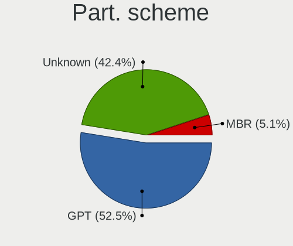
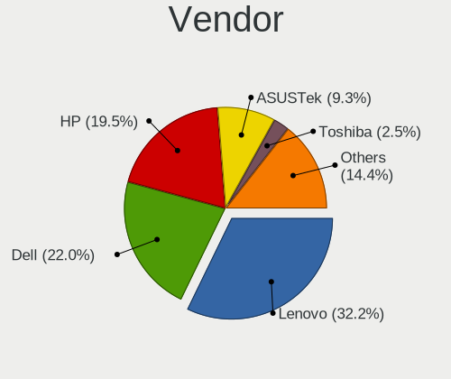
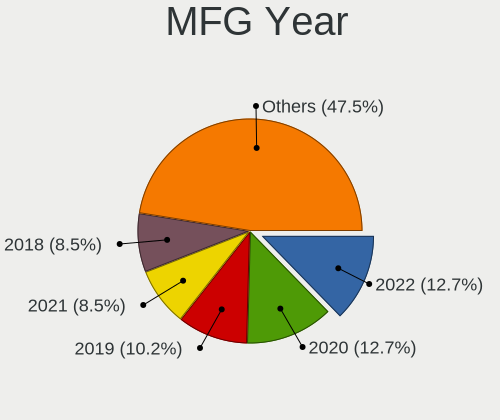
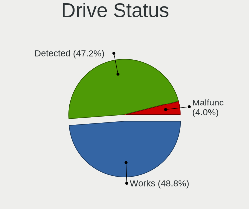
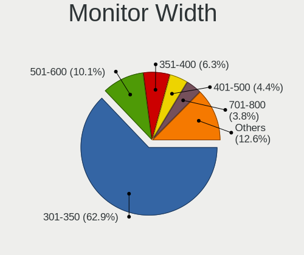
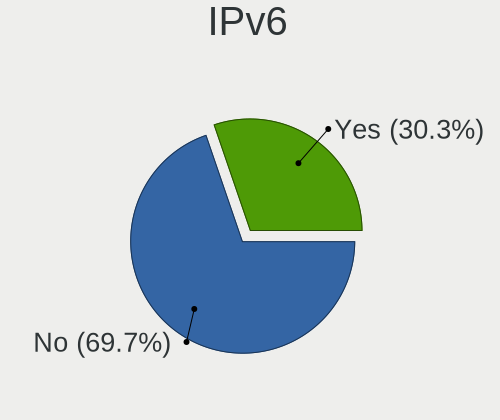
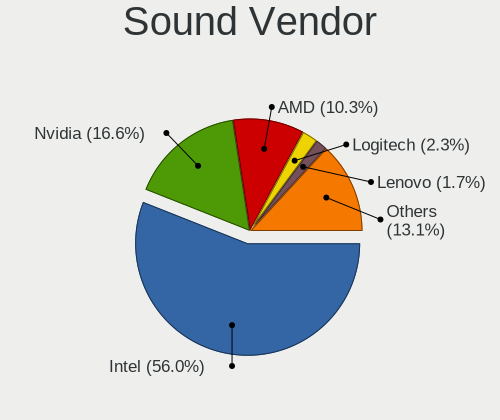

Rocky Linux - Tested Hardware & Statistics (Notebooks)
------------------------------------------------------

A project to collect tested hardware configurations for Rocky Linux.

Anyone can contribute to this report by the [hw-probe](https://github.com/linuxhw/hw-probe) tool:

    sudo -E hw-probe -all -upload

Please contribute! Especially if your hardware is rare.

Contents
--------

* [ Test Cases ](#test-cases)

* [ System ](#system)
  - [ OS                       ](#os)
  - [ OS Family                ](#os-family)
  - [ Kernel                   ](#kernel)
  - [ Kernel Family            ](#kernel-family)
  - [ Kernel Major Ver.        ](#kernel-major-ver)
  - [ Arch                     ](#arch)
  - [ DE                       ](#de)
  - [ Display Server           ](#display-server)
  - [ Display Manager          ](#display-manager)
  - [ OS Lang                  ](#os-lang)
  - [ Boot Mode                ](#boot-mode)
  - [ Filesystem               ](#filesystem)
  - [ Part. scheme             ](#part-scheme)
  - [ Dual Boot with Linux/BSD ](#dual-boot-with-linuxbsd)
  - [ Dual Boot (Win)          ](#dual-boot-win)

* [ Board ](#board)
  - [ Vendor                   ](#vendor)
  - [ Model                    ](#model)
  - [ Model Family             ](#model-family)
  - [ MFG Year                 ](#mfg-year)
  - [ Form Factor              ](#form-factor)
  - [ Secure Boot              ](#secure-boot)
  - [ Coreboot                 ](#coreboot)
  - [ RAM Size                 ](#ram-size)
  - [ RAM Used                 ](#ram-used)
  - [ Total Drives             ](#total-drives)
  - [ Has CD-ROM               ](#has-cd-rom)
  - [ Has Ethernet             ](#has-ethernet)
  - [ Has WiFi                 ](#has-wifi)
  - [ Has Bluetooth            ](#has-bluetooth)

* [ Location ](#location)
  - [ Country                  ](#country)
  - [ City                     ](#city)

* [ Drives ](#drives)
  - [ Drive Vendor             ](#drive-vendor)
  - [ Drive Model              ](#drive-model)
  - [ HDD Vendor               ](#hdd-vendor)
  - [ SSD Vendor               ](#ssd-vendor)
  - [ Drive Kind               ](#drive-kind)
  - [ Drive Connector          ](#drive-connector)
  - [ Drive Size               ](#drive-size)
  - [ Space Total              ](#space-total)
  - [ Space Used               ](#space-used)
  - [ Malfunc. Drives          ](#malfunc-drives)
  - [ Malfunc. Drive Vendor    ](#malfunc-drive-vendor)
  - [ Malfunc. HDD Vendor      ](#malfunc-hdd-vendor)
  - [ Malfunc. Drive Kind      ](#malfunc-drive-kind)
  - [ Failed Drives            ](#failed-drives)
  - [ Failed Drive Vendor      ](#failed-drive-vendor)
  - [ Drive Status             ](#drive-status)

* [ Storage controller ](#storage-controller)
  - [ Storage Vendor           ](#storage-vendor)
  - [ Storage Model            ](#storage-model)
  - [ Storage Kind             ](#storage-kind)

* [ Processor ](#processor)
  - [ CPU Vendor               ](#cpu-vendor)
  - [ CPU Model                ](#cpu-model)
  - [ CPU Model Family         ](#cpu-model-family)
  - [ CPU Cores                ](#cpu-cores)
  - [ CPU Sockets              ](#cpu-sockets)
  - [ CPU Threads              ](#cpu-threads)
  - [ CPU Op-Modes             ](#cpu-op-modes)
  - [ CPU Microcode            ](#cpu-microcode)
  - [ CPU Microarch            ](#cpu-microarch)

* [ Graphics ](#graphics)
  - [ GPU Vendor               ](#gpu-vendor)
  - [ GPU Model                ](#gpu-model)
  - [ GPU Combo                ](#gpu-combo)
  - [ GPU Driver               ](#gpu-driver)
  - [ GPU Memory               ](#gpu-memory)

* [ Monitor ](#monitor)
  - [ Monitor Vendor           ](#monitor-vendor)
  - [ Monitor Model            ](#monitor-model)
  - [ Monitor Resolution       ](#monitor-resolution)
  - [ Monitor Diagonal         ](#monitor-diagonal)
  - [ Monitor Width            ](#monitor-width)
  - [ Aspect Ratio             ](#aspect-ratio)
  - [ Monitor Area             ](#monitor-area)
  - [ Pixel Density            ](#pixel-density)
  - [ Multiple Monitors        ](#multiple-monitors)

* [ Network ](#network)
  - [ Net Controller Vendor    ](#net-controller-vendor)
  - [ Net Controller Model     ](#net-controller-model)
  - [ Wireless Vendor          ](#wireless-vendor)
  - [ Wireless Model           ](#wireless-model)
  - [ Ethernet Vendor          ](#ethernet-vendor)
  - [ Ethernet Model           ](#ethernet-model)
  - [ Net Controller Kind      ](#net-controller-kind)
  - [ Used Controller          ](#used-controller)
  - [ NICs                     ](#nics)
  - [ IPv6                     ](#ipv6)

* [ Bluetooth ](#bluetooth)
  - [ Bluetooth Vendor         ](#bluetooth-vendor)
  - [ Bluetooth Model          ](#bluetooth-model)

* [ Sound ](#sound)
  - [ Sound Vendor             ](#sound-vendor)
  - [ Sound Model              ](#sound-model)

* [ Memory ](#memory)
  - [ Memory Vendor            ](#memory-vendor)
  - [ Memory Model             ](#memory-model)
  - [ Memory Kind              ](#memory-kind)
  - [ Memory Form Factor       ](#memory-form-factor)
  - [ Memory Size              ](#memory-size)
  - [ Memory Speed             ](#memory-speed)

* [ Printers & scanners ](#printers--scanners)
  - [ Printer Vendor           ](#printer-vendor)
  - [ Printer Model            ](#printer-model)
  - [ Scanner Vendor           ](#scanner-vendor)
  - [ Scanner Model            ](#scanner-model)

* [ Camera ](#camera)
  - [ Camera Vendor            ](#camera-vendor)
  - [ Camera Model             ](#camera-model)

* [ Security ](#security)
  - [ Fingerprint Vendor       ](#fingerprint-vendor)
  - [ Fingerprint Model        ](#fingerprint-model)
  - [ Chipcard Vendor          ](#chipcard-vendor)
  - [ Chipcard Model           ](#chipcard-model)

* [ Unsupported ](#unsupported)
  - [ Unsupported Devices      ](#unsupported-devices)
  - [ Unsupported Device Types ](#unsupported-device-types)

Test Cases
----------

Total: 52

| Vendor  | Model                       | Probe                                                      | Date         |
|---------|-----------------------------|------------------------------------------------------------|--------------|
| Dell    | Inspiron 15-3573            | [b735bbde51](https://linux-hardware.org/?probe=b735bbde51) | Jan 29, 2023 |
| Lenovo  | ThinkPad P1 Gen 3 20TH00... | [06f87714b0](https://linux-hardware.org/?probe=06f87714b0) | Jan 26, 2023 |
| Dell    | Precision M6800             | [bcd98b78c4](https://linux-hardware.org/?probe=bcd98b78c4) | Jan 19, 2023 |
| Dell    | Latitude 5420               | [cb511c0f82](https://linux-hardware.org/?probe=cb511c0f82) | Jan 18, 2023 |
| HP      | Laptop 15-dy2xxx            | [ff9464407f](https://linux-hardware.org/?probe=ff9464407f) | Jan 15, 2023 |
| HUAWEI  | KLVD-WXX9                   | [71d684a605](https://linux-hardware.org/?probe=71d684a605) | Jan 11, 2023 |
| Lenovo  | IdeaPad Gaming 3 15ACH6 ... | [d6cac381fd](https://linux-hardware.org/?probe=d6cac381fd) | Jan 09, 2023 |
| HUAWEI  | KLVD-WXX9                   | [e662d0e58a](https://linux-hardware.org/?probe=e662d0e58a) | Jan 07, 2023 |
| Dell    | XPS 17 9720                 | [ae26f02480](https://linux-hardware.org/?probe=ae26f02480) | Jan 03, 2023 |
| HP      | EliteBook 845 14 inch G9... | [65c34944ec](https://linux-hardware.org/?probe=65c34944ec) | Jan 03, 2023 |
| HP      | EliteBook 2560p             | [89c0ffe36d](https://linux-hardware.org/?probe=89c0ffe36d) | Dec 29, 2022 |
| Dell    | Inspiron 14 5425            | [42f45d59d2](https://linux-hardware.org/?probe=42f45d59d2) | Dec 29, 2022 |
| HP      | ProBook 640 G3              | [03eba7b664](https://linux-hardware.org/?probe=03eba7b664) | Dec 15, 2022 |
| Lenovo  | ThinkPad T14s Gen 3 21BR... | [ede2606ad1](https://linux-hardware.org/?probe=ede2606ad1) | Dec 15, 2022 |
| Dell    | Vostro 3500                 | [db276a4d2e](https://linux-hardware.org/?probe=db276a4d2e) | Nov 28, 2022 |
| Lenovo  | ThinkPad P1 Gen 3 20THCT... | [4c47d0ef97](https://linux-hardware.org/?probe=4c47d0ef97) | Nov 05, 2022 |
| ASUSTek | VivoBook_ASUSLaptop X512... | [cda3087aaf](https://linux-hardware.org/?probe=cda3087aaf) | Oct 23, 2022 |
| HP      | Pavilion g6                 | [11d25577b3](https://linux-hardware.org/?probe=11d25577b3) | Oct 08, 2022 |
| BANGHO  | BES G1529                   | [ce0db88361](https://linux-hardware.org/?probe=ce0db88361) | Sep 20, 2022 |
| Dell    | XPS 15 7590                 | [a191bd2a9f](https://linux-hardware.org/?probe=a191bd2a9f) | Sep 18, 2022 |
| Dell    | Latitude 5430               | [617563f7a7](https://linux-hardware.org/?probe=617563f7a7) | Sep 14, 2022 |
| HP      | ZBook 15u G6                | [af658eb920](https://linux-hardware.org/?probe=af658eb920) | Sep 06, 2022 |
| HP      | ZBook 15 G2                 | [34f32c0d0d](https://linux-hardware.org/?probe=34f32c0d0d) | Jul 27, 2022 |
| ASUSTek | ASUS TUF Dash F15 FX516P... | [ce5ca74472](https://linux-hardware.org/?probe=ce5ca74472) | Jul 17, 2022 |
| Lenovo  | ThinkPad X1 Carbon 34483... | [fa20ff88e1](https://linux-hardware.org/?probe=fa20ff88e1) | Jun 19, 2022 |
| Dell    | Latitude 3420               | [b10330b427](https://linux-hardware.org/?probe=b10330b427) | Jun 15, 2022 |
| HP      | EliteBook 840 G7 Noteboo... | [b586e45245](https://linux-hardware.org/?probe=b586e45245) | Apr 25, 2022 |
| Dell    | Latitude 5500               | [3d87bc42c6](https://linux-hardware.org/?probe=3d87bc42c6) | Mar 08, 2022 |
| Lenovo  | ThinkPad T14s Gen 2a 20X... | [f78b6db0bd](https://linux-hardware.org/?probe=f78b6db0bd) | Mar 08, 2022 |
| Dell    | Latitude 5500               | [fc0c5280d7](https://linux-hardware.org/?probe=fc0c5280d7) | Mar 08, 2022 |
| Lenovo  | ThinkPad T14s Gen 2a 20X... | [351e05ccc8](https://linux-hardware.org/?probe=351e05ccc8) | Mar 08, 2022 |
| Lenovo  | ThinkPad T14s Gen 2a 20X... | [dc09f11788](https://linux-hardware.org/?probe=dc09f11788) | Mar 08, 2022 |
| Lenovo  | Legion Y7000 2020H 81Y7     | [2ab4cacc1e](https://linux-hardware.org/?probe=2ab4cacc1e) | Jan 26, 2022 |
| Lenovo  | Legion Y7000 2020H 81Y7     | [787aec5f1c](https://linux-hardware.org/?probe=787aec5f1c) | Jan 26, 2022 |
| Lenovo  | IdeaPad Y700-15ISK 80NV     | [7225108b91](https://linux-hardware.org/?probe=7225108b91) | Jan 10, 2022 |
| HP      | ZBook 15 G3                 | [89809f906e](https://linux-hardware.org/?probe=89809f906e) | Jan 10, 2022 |
| Lenovo  | Legion 5 15ARH05H 82B1      | [90821cb3a5](https://linux-hardware.org/?probe=90821cb3a5) | Jan 03, 2022 |
| Lenovo  | IdeaPad 500S-14ISK 80Q3     | [6ea0cdba08](https://linux-hardware.org/?probe=6ea0cdba08) | Nov 27, 2021 |
| Lenovo  | ThinkPad W540 20BGCTO1WW    | [25055cdc26](https://linux-hardware.org/?probe=25055cdc26) | Nov 23, 2021 |
| HP      | Laptop 17-ca1xxx            | [61fe4e654d](https://linux-hardware.org/?probe=61fe4e654d) | Nov 09, 2021 |
| Toshiba | TECRA W50-A                 | [abee9f36ad](https://linux-hardware.org/?probe=abee9f36ad) | Nov 05, 2021 |
| Lenovo  | ThinkPad T420 42365H1       | [3430adab89](https://linux-hardware.org/?probe=3430adab89) | Aug 25, 2021 |
| Lenovo  | ThinkPad T420 42365H1       | [6a306e2253](https://linux-hardware.org/?probe=6a306e2253) | Aug 16, 2021 |
| Lenovo  | ThinkPad W500 406132G       | [e79080e90d](https://linux-hardware.org/?probe=e79080e90d) | Aug 08, 2021 |
| Lenovo  | IdeaPad Slim 1-14AST-05 ... | [860ec3c89d](https://linux-hardware.org/?probe=860ec3c89d) | Aug 08, 2021 |
| Lenovo  | IdeaPad Y410P 20216         | [b2df1c0e6d](https://linux-hardware.org/?probe=b2df1c0e6d) | Aug 08, 2021 |
| Lenovo  | IdeaPad Y410P 20216         | [3fc207c5b9](https://linux-hardware.org/?probe=3fc207c5b9) | Aug 07, 2021 |
| Lenovo  | IdeaPad Slim 1-14AST-05 ... | [09738de946](https://linux-hardware.org/?probe=09738de946) | Jul 04, 2021 |
| Lenovo  | IdeaPad Slim 1-14AST-05 ... | [741cab87e1](https://linux-hardware.org/?probe=741cab87e1) | Jun 29, 2021 |
| ASUSTek | ASUS TUF Gaming A15 FA50... | [60fe7f2653](https://linux-hardware.org/?probe=60fe7f2653) | Jun 13, 2021 |
| Toshiba | Satellite E45-B             | [84683df1f0](https://linux-hardware.org/?probe=84683df1f0) | Jun 12, 2021 |
| Acer    | Aspire VN7-591G             | [bc9e6c4910](https://linux-hardware.org/?probe=bc9e6c4910) | May 10, 2021 |

System
------

OS
--

Installed operating systems

| Name            | Notebooks | Percent |
|-----------------|-----------|---------|
| Rocky Linux 8.5 | 11        | 26.19%  |
| Rocky Linux 9.1 | 10        | 23.81%  |
| Rocky Linux 9.0 | 9         | 21.43%  |
| Rocky Linux 8.4 | 8         | 19.05%  |
| Rocky Linux 8.7 | 2         | 4.76%   |
| Rocky Linux 8.6 | 1         | 2.38%   |
| Rocky Linux 8.3 | 1         | 2.38%   |

OS Family
---------

OS without a version

| Name        | Notebooks | Percent |
|-------------|-----------|---------|
| Rocky Linux | 42        | 100%    |

Kernel
------

Version of the Linux kernel

| Version                          | Notebooks | Percent |
|----------------------------------|-----------|---------|
| 5.14.0-162.6.1.el9_1.0.1.x86_64  | 9         | 21.43%  |
| 5.14.0-70.22.1.el9_0.x86_64      | 4         | 9.52%   |
| 4.18.0-348.7.1.el8_5.x86_64      | 3         | 7.14%   |
| 5.14.0-70.26.1.el9_0.x86_64      | 2         | 4.76%   |
| 4.18.0-425.3.1.el8.x86_64        | 2         | 4.76%   |
| 4.18.0-348.20.1.el8_5.x86_64     | 2         | 4.76%   |
| 4.18.0-348.12.2.el8_5.x86_64     | 2         | 4.76%   |
| 4.18.0-305.el8.x86_64            | 2         | 4.76%   |
| 4.18.0-305.3.1.el8_4.x86_64      | 2         | 4.76%   |
| 4.18.0-305.25.1.el8_4.x86_64     | 2         | 4.76%   |
| 4.18.0-305.10.2.el8_4.x86_64     | 2         | 4.76%   |
| 5.4.157-1.el8.elrepo.x86_64      | 1         | 2.38%   |
| 5.16.15-1.el8.elrepo.x86_64      | 1         | 2.38%   |
| 5.14.0-70.30.1.el9_0.x86_64      | 1         | 2.38%   |
| 5.14.0-70.17.1.el9_0.x86_64      | 1         | 2.38%   |
| 5.14.0-70.13.1.el9_0.x86_64      | 1         | 2.38%   |
| 5.14.0-162.12.1.el9_1.0.1.x86_64 | 1         | 2.38%   |
| 5.10.89-1.el8.x86_64             | 1         | 2.38%   |
| 4.18.0-348.el8.0.2.x86_64        | 1         | 2.38%   |
| 4.18.0-348.2.1.el8_5.x86_64      | 1         | 2.38%   |
| 4.18.0-240.22.1.el8.x86_64       | 1         | 2.38%   |

Kernel Family
-------------

Linux kernel without a distro release

| Version | Notebooks | Percent |
|---------|-----------|---------|
| 4.18.0  | 20        | 47.62%  |
| 5.14.0  | 19        | 45.24%  |
| 5.4.157 | 1         | 2.38%   |
| 5.16.15 | 1         | 2.38%   |
| 5.10.89 | 1         | 2.38%   |

Kernel Major Ver.
-----------------

Linux kernel major version

| Version | Notebooks | Percent |
|---------|-----------|---------|
| 4.18    | 20        | 47.62%  |
| 5.14    | 19        | 45.24%  |
| 5.4     | 1         | 2.38%   |
| 5.16    | 1         | 2.38%   |
| 5.10    | 1         | 2.38%   |

Arch
----

OS architecture (x86_64, i586, etc.)

| Name   | Notebooks | Percent |
|--------|-----------|---------|
| x86_64 | 42        | 100%    |

DE
--

Desktop Environment

| Name          | Notebooks | Percent |
|---------------|-----------|---------|
| GNOME         | 32        | 76.19%  |
| MATE          | 3         | 7.14%   |
| KDE5          | 3         | 7.14%   |
| XFCE          | 2         | 4.76%   |
| X-Cinnamon    | 1         | 2.38%   |
| GNOME Classic | 1         | 2.38%   |

Display Server
--------------

X11 or Wayland

| Name    | Notebooks | Percent |
|---------|-----------|---------|
| Wayland | 28        | 66.67%  |
| X11     | 14        | 33.33%  |

Display Manager
---------------

SDDM, LightDM, etc.

| Name    | Notebooks | Percent |
|---------|-----------|---------|
| Unknown | 21        | 50%     |
| GDM     | 15        | 35.71%  |
| SDDM    | 4         | 9.52%   |
| LightDM | 2         | 4.76%   |

OS Lang
-------

Language

| Lang  | Notebooks | Percent |
|-------|-----------|---------|
| en_US | 32        | 76.19%  |
| ru_RU | 2         | 4.76%   |
| en_ZA | 2         | 4.76%   |
| de_DE | 2         | 4.76%   |
| pt_BR | 1         | 2.38%   |
| it_IT | 1         | 2.38%   |
| en_IE | 1         | 2.38%   |
| en_CA | 1         | 2.38%   |

Boot Mode
---------

EFI or BIOS

| Mode | Notebooks | Percent |
|------|-----------|---------|
| EFI  | 33        | 78.57%  |
| BIOS | 9         | 21.43%  |

Filesystem
----------

Type of filesystem

| Type | Notebooks | Percent |
|------|-----------|---------|
| Xfs  | 33        | 78.57%  |
| Ext4 | 8         | 19.05%  |
| Ext3 | 1         | 2.38%   |

Part. scheme
------------

Scheme of partitioning

| Type    | Notebooks | Percent |
|---------|-----------|---------|
| Unknown | 22        | 52.38%  |
| GPT     | 18        | 42.86%  |
| MBR     | 2         | 4.76%   |

Dual Boot with Linux/BSD
------------------------

Hosting more than one Linux/BSD

| Dual boot | Notebooks | Percent |
|-----------|-----------|---------|
| No        | 37        | 88.1%   |
| Yes       | 5         | 11.9%   |

Dual Boot (Win)
---------------

Hosting Linux and Windows

| Dual boot | Notebooks | Percent |
|-----------|-----------|---------|
| No        | 33        | 78.57%  |
| Yes       | 9         | 21.43%  |

Board
-----

Vendor
------

Motherboard manufacturer

| Name             | Notebooks | Percent |
|------------------|-----------|---------|
| Lenovo           | 15        | 35.71%  |
| Dell             | 10        | 23.81%  |
| Hewlett-Packard  | 9         | 21.43%  |
| ASUSTek Computer | 3         | 7.14%   |
| Toshiba          | 2         | 4.76%   |
| HUAWEI           | 1         | 2.38%   |
| BANGHO           | 1         | 2.38%   |
| Acer             | 1         | 2.38%   |

Model
-----

Motherboard model

| Name                                     | Notebooks | Percent |
|------------------------------------------|-----------|---------|
| Toshiba TECRA W50-A                      | 1         | 2.38%   |
| Toshiba Satellite E45-B                  | 1         | 2.38%   |
| Lenovo ThinkPad X1 Carbon 344835U        | 1         | 2.38%   |
| Lenovo ThinkPad W540 20BGCTO1WW          | 1         | 2.38%   |
| Lenovo ThinkPad W500 406132G             | 1         | 2.38%   |
| Lenovo ThinkPad T420 42365H1             | 1         | 2.38%   |
| Lenovo ThinkPad T14s Gen 3 21BR000QUS    | 1         | 2.38%   |
| Lenovo ThinkPad T14s Gen 2a 20XF006XCK   | 1         | 2.38%   |
| Lenovo ThinkPad P1 Gen 3 20THCTO1WW      | 1         | 2.38%   |
| Lenovo ThinkPad P1 Gen 3 20TH004CUK      | 1         | 2.38%   |
| Lenovo Legion Y7000 2020H 81Y7           | 1         | 2.38%   |
| Lenovo Legion 5 15ARH05H 82B1            | 1         | 2.38%   |
| Lenovo IdeaPad Y700-15ISK 80NV           | 1         | 2.38%   |
| Lenovo IdeaPad Y410P 20216               | 1         | 2.38%   |
| Lenovo IdeaPad Slim 1-14AST-05 81VS      | 1         | 2.38%   |
| Lenovo IdeaPad Gaming 3 15ACH6 82K2      | 1         | 2.38%   |
| Lenovo IdeaPad 500S-14ISK 80Q3           | 1         | 2.38%   |
| HUAWEI KLVD-WXX9                         | 1         | 2.38%   |
| HP ZBook 15u G6                          | 1         | 2.38%   |
| HP ZBook 15 G3                           | 1         | 2.38%   |
| HP ZBook 15 G2                           | 1         | 2.38%   |
| HP ProBook 640 G3                        | 1         | 2.38%   |
| HP Pavilion g6                           | 1         | 2.38%   |
| HP Laptop 17-ca1xxx                      | 1         | 2.38%   |
| HP Laptop 15-dy2xxx                      | 1         | 2.38%   |
| HP EliteBook 840 G7 Notebook PC          | 1         | 2.38%   |
| HP EliteBook 2560p                       | 1         | 2.38%   |
| Dell XPS 17 9720                         | 1         | 2.38%   |
| Dell XPS 15 7590                         | 1         | 2.38%   |
| Dell Vostro 3500                         | 1         | 2.38%   |
| Dell Precision M6800                     | 1         | 2.38%   |
| Dell Latitude 5500                       | 1         | 2.38%   |
| Dell Latitude 5430                       | 1         | 2.38%   |
| Dell Latitude 5420                       | 1         | 2.38%   |
| Dell Latitude 3420                       | 1         | 2.38%   |
| Dell Inspiron 15-3573                    | 1         | 2.38%   |
| Dell Inspiron 14 5425                    | 1         | 2.38%   |
| BANGHO BES G1529                         | 1         | 2.38%   |
| ASUS VivoBook_ASUSLaptop X512FL_X512FL   | 1         | 2.38%   |
| ASUS ASUS TUF Gaming A15 FA506II_FA506II | 1         | 2.38%   |

Model Family
------------

Motherboard model prefix

| Name              | Notebooks | Percent |
|-------------------|-----------|---------|
| Lenovo ThinkPad   | 8         | 19.05%  |
| Lenovo IdeaPad    | 5         | 11.9%   |
| Dell Latitude     | 4         | 9.52%   |
| HP ZBook          | 3         | 7.14%   |
| Lenovo Legion     | 2         | 4.76%   |
| HP Laptop         | 2         | 4.76%   |
| HP EliteBook      | 2         | 4.76%   |
| Dell XPS          | 2         | 4.76%   |
| Dell Inspiron     | 2         | 4.76%   |
| ASUS ASUS         | 2         | 4.76%   |
| Toshiba TECRA     | 1         | 2.38%   |
| Toshiba Satellite | 1         | 2.38%   |
| HUAWEI KLVD-WXX9  | 1         | 2.38%   |
| HP ProBook        | 1         | 2.38%   |
| HP Pavilion       | 1         | 2.38%   |
| Dell Vostro       | 1         | 2.38%   |
| Dell Precision    | 1         | 2.38%   |
| BANGHO BES        | 1         | 2.38%   |
| ASUS VivoBook     | 1         | 2.38%   |
| Acer Aspire       | 1         | 2.38%   |

MFG Year
--------

Motherboard manufacture year

| Year | Notebooks | Percent |
|------|-----------|---------|
| 2020 | 8         | 19.05%  |
| 2021 | 6         | 14.29%  |
| 2019 | 6         | 14.29%  |
| 2014 | 4         | 9.52%   |
| 2022 | 3         | 7.14%   |
| 2011 | 3         | 7.14%   |
| 2018 | 2         | 4.76%   |
| 2016 | 2         | 4.76%   |
| 2015 | 2         | 4.76%   |
| 2013 | 2         | 4.76%   |
| 2017 | 1         | 2.38%   |
| 2012 | 1         | 2.38%   |
| 2010 | 1         | 2.38%   |
| 2009 | 1         | 2.38%   |

Form Factor
-----------

Physical design of the computer

| Name     | Notebooks | Percent |
|----------|-----------|---------|
| Notebook | 42        | 100%    |

Secure Boot
-----------

Enabled or disabled

| State    | Notebooks | Percent |
|----------|-----------|---------|
| Disabled | 36        | 85.71%  |
| Enabled  | 6         | 14.29%  |

Coreboot
--------

Have coreboot on board

| Used | Notebooks | Percent |
|------|-----------|---------|
| No   | 42        | 100%    |

RAM Size
--------

Total RAM memory

| Size in GB  | Notebooks | Percent |
|-------------|-----------|---------|
| 8.01-16.0   | 16        | 38.1%   |
| 4.01-8.0    | 10        | 23.81%  |
| 32.01-64.0  | 8         | 19.05%  |
| 16.01-24.0  | 6         | 14.29%  |
| 3.01-4.0    | 1         | 2.38%   |
| 64.01-256.0 | 1         | 2.38%   |

RAM Used
--------

Used RAM memory

| Used GB    | Notebooks | Percent |
|------------|-----------|---------|
| 4.01-8.0   | 11        | 26.19%  |
| 3.01-4.0   | 11        | 26.19%  |
| 2.01-3.0   | 11        | 26.19%  |
| 1.01-2.0   | 4         | 9.52%   |
| 8.01-16.0  | 4         | 9.52%   |
| 16.01-24.0 | 1         | 2.38%   |

Total Drives
------------

Number of drives on board

| Drives | Notebooks | Percent |
|--------|-----------|---------|
| 1      | 31        | 73.81%  |
| 2      | 7         | 16.67%  |
| 3      | 3         | 7.14%   |
| 4      | 1         | 2.38%   |

Has CD-ROM
----------

Has CD-ROM on board

| Presented | Notebooks | Percent |
|-----------|-----------|---------|
| No        | 35        | 83.33%  |
| Yes       | 7         | 16.67%  |

Has Ethernet
------------

Has Ethernet on board

| Presented | Notebooks | Percent |
|-----------|-----------|---------|
| Yes       | 34        | 80.95%  |
| No        | 8         | 19.05%  |

Has WiFi
--------

Has WiFi module

| Presented | Notebooks | Percent |
|-----------|-----------|---------|
| Yes       | 42        | 100%    |

Has Bluetooth
-------------

Has Bluetooth module

| Presented | Notebooks | Percent |
|-----------|-----------|---------|
| Yes       | 38        | 90.48%  |
| No        | 4         | 9.52%   |

Location
--------

Country
-------

Geographic location (country)

| Country      | Notebooks | Percent |
|--------------|-----------|---------|
| USA          | 12        | 28.57%  |
| South Africa | 2         | 4.76%   |
| Russia       | 2         | 4.76%   |
| Italy        | 2         | 4.76%   |
| Germany      | 2         | 4.76%   |
| Czechia      | 2         | 4.76%   |
| Belgium      | 2         | 4.76%   |
| Uzbekistan   | 1         | 2.38%   |
| UAE          | 1         | 2.38%   |
| Turkey       | 1         | 2.38%   |
| Sweden       | 1         | 2.38%   |
| Slovakia     | 1         | 2.38%   |
| Saudi Arabia | 1         | 2.38%   |
| Poland       | 1         | 2.38%   |
| Pakistan     | 1         | 2.38%   |
| Netherlands  | 1         | 2.38%   |
| Malaysia     | 1         | 2.38%   |
| Kazakhstan   | 1         | 2.38%   |
| Ireland      | 1         | 2.38%   |
| Hungary      | 1         | 2.38%   |
| China        | 1         | 2.38%   |
| Canada       | 1         | 2.38%   |
| Brazil       | 1         | 2.38%   |
| Austria      | 1         | 2.38%   |
| Argentina    | 1         | 2.38%   |

City
----

Geographic location (city)

| City                   | Notebooks | Percent |
|------------------------|-----------|---------|
| Žilina                | 1         | 2.38%   |
| Xi'an                  | 1         | 2.38%   |
| Vienna                 | 1         | 2.38%   |
| Torrington             | 1         | 2.38%   |
| Syracuse               | 1         | 2.38%   |
| Smolensk               | 1         | 2.38%   |
| Senigallia             | 1         | 2.38%   |
| Scarborough            | 1         | 2.38%   |
| San Miguel de Tucumán | 1         | 2.38%   |
| Riyadh                 | 1         | 2.38%   |
| Rawalpindi             | 1         | 2.38%   |
| Prague                 | 1         | 2.38%   |
| Philadelphia           | 1         | 2.38%   |
| Ottignies              | 1         | 2.38%   |
| Örebro                | 1         | 2.38%   |
| Oakley                 | 1         | 2.38%   |
| Nur-Sultan             | 1         | 2.38%   |
| Mugla                  | 1         | 2.38%   |
| Mossel Bay             | 1         | 2.38%   |
| Moscow                 | 1         | 2.38%   |
| Montreal               | 1         | 2.38%   |
| Kutno                  | 1         | 2.38%   |
| Kansas City            | 1         | 2.38%   |
| Johor Bahru            | 1         | 2.38%   |
| Jaú                   | 1         | 2.38%   |
| Houston                | 1         | 2.38%   |
| Glin                   | 1         | 2.38%   |
| Forest                 | 1         | 2.38%   |
| Fairbanks              | 1         | 2.38%   |
| Enschede               | 1         | 2.38%   |
| Elizabethtown          | 1         | 2.38%   |
| Dreieich               | 1         | 2.38%   |
| Centurion              | 1         | 2.38%   |
| Castelverde            | 1         | 2.38%   |
| Bukhara                | 1         | 2.38%   |
| Budapest               | 1         | 2.38%   |
| Brussels               | 1         | 2.38%   |
| Brno                   | 1         | 2.38%   |
| Berlin                 | 1         | 2.38%   |
| Ashburn                | 1         | 2.38%   |

Drives
------

Drive Vendor
------------

Hard drive vendors

| Vendor                  | Notebooks | Drives | Percent |
|-------------------------|-----------|--------|---------|
| Samsung Electronics     | 15        | 17     | 25.86%  |
| WDC                     | 5         | 5      | 8.62%   |
| Toshiba                 | 4         | 5      | 6.9%    |
| Kingston                | 4         | 4      | 6.9%    |
| SanDisk                 | 3         | 4      | 5.17%   |
| Unknown                 | 2         | 2      | 3.45%   |
| SK hynix                | 2         | 3      | 3.45%   |
| Seagate                 | 2         | 2      | 3.45%   |
| Lexar                   | 2         | 2      | 3.45%   |
| Intel                   | 2         | 2      | 3.45%   |
| Union Memory (Shenzhen) | 1         | 1      | 1.72%   |
| UMIS                    | 1         | 1      | 1.72%   |
| StoreJet                | 1         | 1      | 1.72%   |
| Phison                  | 1         | 1      | 1.72%   |
| Micron Technology       | 1         | 1      | 1.72%   |
| LITEONIT                | 1         | 1      | 1.72%   |
| LITEON                  | 1         | 1      | 1.72%   |
| JMicron Technology      | 1         | 1      | 1.72%   |
| INDMEM                  | 1         | 1      | 1.72%   |
| HS-SSD-C100             | 1         | 1      | 1.72%   |
| Hitachi                 | 1         | 1      | 1.72%   |
| Fujitsu                 | 1         | 1      | 1.72%   |
| Dogfish                 | 1         | 1      | 1.72%   |
| Crucial                 | 1         | 1      | 1.72%   |
| AGI                     | 1         | 1      | 1.72%   |
| ADATA Technology        | 1         | 1      | 1.72%   |
| A-DATA Technology       | 1         | 1      | 1.72%   |

Drive Model
-----------

Hard drive models

| Model                                          | Notebooks | Percent |
|------------------------------------------------|-----------|---------|
| Samsung SSD 870 EVO 1TB                        | 2         | 3.23%   |
| Lexar 512GB SSD                                | 2         | 3.23%   |
| WDC WDS480G2G0A-00JH30 480GB SSD               | 1         | 1.61%   |
| WDC WDBNCE0010PNC 1TB SSD                      | 1         | 1.61%   |
| WDC WD5000BPVT-00A1YT0 500GB                   | 1         | 1.61%   |
| WDC WD10SPCX-24HWST1 1TB                       | 1         | 1.61%   |
| WDC WD10JPVX-22JC3T0 1TB                       | 1         | 1.61%   |
| Unknown SD/MMC/MS PRO 2GB                      | 1         | 1.61%   |
| Unknown MMC Card  64GB                         | 1         | 1.61%   |
| Union Memory (Shenzhen) NVMe SSD Drive 128GB   | 1         | 1.61%   |
| UMIS RPFTJ128PDD2EWX 128GB                     | 1         | 1.61%   |
| Toshiba THNSNJ512GACU 512GB SSD                | 1         | 1.61%   |
| Toshiba THNSNJ128G8NU 128GB SSD                | 1         | 1.61%   |
| Toshiba NVMe SSD Drive 512GB                   | 1         | 1.61%   |
| Toshiba KXG6AZNV1T02 1TB                       | 1         | 1.61%   |
| Toshiba KXG6APNV2T04 2TB                       | 1         | 1.61%   |
| StoreJet Disk 1TB                              | 1         | 1.61%   |
| SK hynix SKHynix_HFS512GD9TNI-L2B0B 512GB      | 1         | 1.61%   |
| SK hynix NVMe SSD Drive 512GB                  | 1         | 1.61%   |
| SK hynix BC511 NVMe 512GB                      | 1         | 1.61%   |
| Seagate ST9320325AS 320GB                      | 1         | 1.61%   |
| Seagate ST1000LM024 HN-M101MBB 1TB             | 1         | 1.61%   |
| Sandisk WD Black SN750 / PC SN730 NVMe SSD 1TB | 1         | 1.61%   |
| SanDisk SSD PLUS 1000GB                        | 1         | 1.61%   |
| SanDisk SD5SG2256G1052E 256GB SSD              | 1         | 1.61%   |
| SanDisk Extreme 55AE 1TB SSD                   | 1         | 1.61%   |
| Samsung SSD 970 EVO 500GB                      | 1         | 1.61%   |
| Samsung SSD 870 QVO 2TB                        | 1         | 1.61%   |
| Samsung SSD 860 QVO 4TB                        | 1         | 1.61%   |
| Samsung SSD 860 EVO 500GB                      | 1         | 1.61%   |
| Samsung SM963 2.5" NVMe PCIe SSD 256GB         | 1         | 1.61%   |
| Samsung PM9A1 NVMe SED 512GB                   | 1         | 1.61%   |
| Samsung PM991a NVMe 512GB                      | 1         | 1.61%   |
| Samsung NVMe SSD Drive 512GB                   | 1         | 1.61%   |
| Samsung NVMe SSD Drive 1024GB                  | 1         | 1.61%   |
| Samsung MZVLB512HBJQ-000L7 512GB               | 1         | 1.61%   |
| Samsung MZVLB512HBJQ-000L2 512GB               | 1         | 1.61%   |
| Samsung MZVL2512HCJQ-00BL7 512GB               | 1         | 1.61%   |
| Samsung MZNLN512HAJQ-000H1 512GB SSD           | 1         | 1.61%   |
| Samsung MZ7PD256HAFV-000H7 256GB SSD           | 1         | 1.61%   |

HDD Vendor
----------

Hard disk drive vendors

| Vendor   | Notebooks | Drives | Percent |
|----------|-----------|--------|---------|
| WDC      | 3         | 3      | 33.33%  |
| Seagate  | 2         | 2      | 22.22%  |
| Unknown  | 1         | 1      | 11.11%  |
| StoreJet | 1         | 1      | 11.11%  |
| Hitachi  | 1         | 1      | 11.11%  |
| Fujitsu  | 1         | 1      | 11.11%  |

SSD Vendor
----------

Solid state drive vendors

| Vendor              | Notebooks | Drives | Percent |
|---------------------|-----------|--------|---------|
| Samsung Electronics | 7         | 8      | 33.33%  |
| WDC                 | 2         | 2      | 9.52%   |
| Toshiba             | 2         | 2      | 9.52%   |
| SanDisk             | 2         | 3      | 9.52%   |
| Kingston            | 2         | 2      | 9.52%   |
| LITEONIT            | 1         | 1      | 4.76%   |
| LITEON              | 1         | 1      | 4.76%   |
| Lexar               | 1         | 1      | 4.76%   |
| INDMEM              | 1         | 1      | 4.76%   |
| Dogfish             | 1         | 1      | 4.76%   |
| Crucial             | 1         | 1      | 4.76%   |

Drive Kind
----------

HDD or SSD

| Kind    | Notebooks | Drives | Percent |
|---------|-----------|--------|---------|
| NVMe    | 23        | 27     | 46%     |
| SSD     | 16        | 23     | 32%     |
| HDD     | 7         | 9      | 14%     |
| Unknown | 3         | 3      | 6%      |
| MMC     | 1         | 1      | 2%      |

Drive Connector
---------------

SATA, SAS, NVMe, etc.

| Type | Notebooks | Drives | Percent |
|------|-----------|--------|---------|
| NVMe | 23        | 27     | 46%     |
| SATA | 21        | 30     | 42%     |
| SAS  | 5         | 5      | 10%     |
| MMC  | 1         | 1      | 2%      |

Drive Size
----------

Size of hard drive

| Size in TB | Notebooks | Drives | Percent |
|------------|-----------|--------|---------|
| 0.01-0.5   | 11        | 14     | 45.83%  |
| 0.51-1.0   | 10        | 14     | 41.67%  |
| 1.01-2.0   | 2         | 2      | 8.33%   |
| 3.01-4.0   | 1         | 2      | 4.17%   |

Space Total
-----------

Amount of disk space available on the file system

| Size in GB     | Notebooks | Percent |
|----------------|-----------|---------|
| 251-500        | 18        | 42.86%  |
| 101-250        | 11        | 26.19%  |
| 501-1000       | 5         | 11.9%   |
| 1001-2000      | 3         | 7.14%   |
| 2001-3000      | 2         | 4.76%   |
| 51-100         | 2         | 4.76%   |
| More than 3000 | 1         | 2.38%   |

Space Used
----------

Amount of used disk space

| Used GB   | Notebooks | Percent |
|-----------|-----------|---------|
| 1-20      | 14        | 33.33%  |
| 21-50     | 10        | 23.81%  |
| 101-250   | 6         | 14.29%  |
| 51-100    | 5         | 11.9%   |
| 251-500   | 3         | 7.14%   |
| 1001-2000 | 2         | 4.76%   |
| 501-1000  | 2         | 4.76%   |

Malfunc. Drives
---------------

Drive models with a malfunction

Zero info for selected period =(

Malfunc. Drive Vendor
---------------------

Vendors of faulty drives

Zero info for selected period =(

Malfunc. HDD Vendor
-------------------

Vendors of faulty HDD drives

Zero info for selected period =(

Malfunc. Drive Kind
-------------------

Kinds of faulty drives

Zero info for selected period =(

Failed Drives
-------------

Failed drive models

Zero info for selected period =(

Failed Drive Vendor
-------------------

Failed drive vendors

Zero info for selected period =(

Drive Status
------------

Number of failed and malfunc. drives

| Status   | Notebooks | Drives | Percent |
|----------|-----------|--------|---------|
| Detected | 23        | 33     | 51.11%  |
| Works    | 22        | 30     | 48.89%  |

Storage controller
------------------

Storage Vendor
--------------

Storage controller vendors

| Vendor                       | Notebooks | Percent |
|------------------------------|-----------|---------|
| Intel                        | 26        | 50%     |
| Samsung Electronics          | 8         | 15.38%  |
| AMD                          | 5         | 9.62%   |
| Toshiba America Info Systems | 2         | 3.85%   |
| SK hynix                     | 2         | 3.85%   |
| Kingston Technology Company  | 2         | 3.85%   |
| Union Memory (Shenzhen)      | 1         | 1.92%   |
| Shenzhen Longsys Electronics | 1         | 1.92%   |
| SanDisk                      | 1         | 1.92%   |
| Realtek Semiconductor        | 1         | 1.92%   |
| Phison Electronics           | 1         | 1.92%   |
| Micron Technology            | 1         | 1.92%   |
| ADATA Technology             | 1         | 1.92%   |

Storage Model
-------------

Storage controller models

| Model                                                                                  | Notebooks | Percent |
|----------------------------------------------------------------------------------------|-----------|---------|
| Intel 8 Series/C220 Series Chipset Family 6-port SATA Controller 1 [AHCI mode]         | 5         | 9.09%   |
| AMD FCH SATA Controller [AHCI mode]                                                    | 5         | 9.09%   |
| Samsung NVMe SSD Controller SM981/PM981/PM983                                          | 3         | 5.45%   |
| Toshiba America Info Systems XG6 NVMe SSD Controller                                   | 2         | 3.64%   |
| Samsung NVMe SSD Controller PM9A1/PM9A3/980PRO                                         | 2         | 3.64%   |
| Samsung NVMe SSD Controller 980                                                        | 2         | 3.64%   |
| Intel Volume Management Device NVMe RAID Controller                                    | 2         | 3.64%   |
| Intel Tiger Lake-LP SATA Controller                                                    | 2         | 3.64%   |
| Intel Sunrise Point-LP SATA Controller [AHCI mode]                                     | 2         | 3.64%   |
| Intel 8 Series Chipset Family 4-port SATA Controller 1 [IDE mode] - Mobile             | 2         | 3.64%   |
| Union Memory (Shenzhen) Non-Volatile memory controller                                 | 1         | 1.82%   |
| SK hynix Non-Volatile memory controller                                                | 1         | 1.82%   |
| SK hynix BC511                                                                         | 1         | 1.82%   |
| Shenzhen Longsys Electronics Non-Volatile memory controller                            | 1         | 1.82%   |
| SanDisk WD Black SN750 / PC SN730 NVMe SSD                                             | 1         | 1.82%   |
| Samsung NVMe SSD Controller SM951/PM951                                                | 1         | 1.82%   |
| Realtek Realtek Non-Volatile memory controller                                         | 1         | 1.82%   |
| Phison PS5013 E13 NVMe Controller                                                      | 1         | 1.82%   |
| Micron Non-Volatile memory controller                                                  | 1         | 1.82%   |
| Kingston Company Company Non-Volatile memory controller                                | 1         | 1.82%   |
| Kingston Company A2000 NVMe SSD                                                        | 1         | 1.82%   |
| Intel SSD 660P Series                                                                  | 1         | 1.82%   |
| Intel Q170/Q150/B150/H170/H110/Z170/CM236 Chipset SATA Controller [AHCI Mode]          | 1         | 1.82%   |
| Intel Non-Volatile memory controller                                                   | 1         | 1.82%   |
| Intel Mobile 4 Series Chipset PT IDER Controller                                       | 1         | 1.82%   |
| Intel HM170/QM170 Chipset SATA Controller [AHCI Mode]                                  | 1         | 1.82%   |
| Intel Celeron/Pentium Silver Processor SATA Controller                                 | 1         | 1.82%   |
| Intel Cannon Lake Mobile PCH SATA AHCI Controller                                      | 1         | 1.82%   |
| Intel 82801IBM/IEM (ICH9M/ICH9M-E) 4 port SATA Controller [AHCI mode]                  | 1         | 1.82%   |
| Intel 82801 Mobile SATA Controller [RAID mode]                                         | 1         | 1.82%   |
| Intel 8 Series/C220 Series Chipset Family 2-port SATA Controller 2 [IDE mode]          | 1         | 1.82%   |
| Intel 8 Series SATA Controller 1 [AHCI mode]                                           | 1         | 1.82%   |
| Intel 7 Series Chipset Family 6-port SATA Controller [AHCI mode]                       | 1         | 1.82%   |
| Intel 6 Series/C200 Series Chipset Family Mobile SATA Controller (IDE mode, ports 4-5) | 1         | 1.82%   |
| Intel 6 Series/C200 Series Chipset Family Mobile SATA Controller (IDE mode, ports 0-3) | 1         | 1.82%   |
| Intel 6 Series/C200 Series Chipset Family 6 port Mobile SATA AHCI Controller           | 1         | 1.82%   |
| Intel 400 Series Chipset Family SATA AHCI Controller                                   | 1         | 1.82%   |
| ADATA Non-Volatile memory controller                                                   | 1         | 1.82%   |

Storage Kind
------------

Kind of storage controller (IDE, SATA, NVMe, SAS, ...)

| Kind | Notebooks | Percent |
|------|-----------|---------|
| NVMe | 23        | 43.4%   |
| SATA | 23        | 43.4%   |
| IDE  | 4         | 7.55%   |
| RAID | 3         | 5.66%   |

Processor
---------

CPU Vendor
----------

Processor vendors

| Vendor | Notebooks | Percent |
|--------|-----------|---------|
| Intel  | 34        | 80.95%  |
| AMD    | 8         | 19.05%  |

CPU Model
---------

Processor models

| Model                                         | Notebooks | Percent |
|-----------------------------------------------|-----------|---------|
| Intel 11th Gen Core i7-1165G7 @ 2.80GHz       | 4         | 9.52%   |
| Intel Core i7-6700HQ CPU @ 2.60GHz            | 2         | 4.76%   |
| Intel Core i7-10750H CPU @ 2.60GHz            | 2         | 4.76%   |
| Intel Pentium Silver N5000 CPU @ 1.10GHz      | 1         | 2.38%   |
| Intel Core i7-9750H CPU @ 2.60GHz             | 1         | 2.38%   |
| Intel Core i7-8665U CPU @ 1.90GHz             | 1         | 2.38%   |
| Intel Core i7-6500U CPU @ 2.50GHz             | 1         | 2.38%   |
| Intel Core i7-4910MQ CPU @ 2.90GHz            | 1         | 2.38%   |
| Intel Core i7-4900MQ CPU @ 2.80GHz            | 1         | 2.38%   |
| Intel Core i7-4810MQ CPU @ 2.80GHz            | 1         | 2.38%   |
| Intel Core i7-4800MQ CPU @ 2.70GHz            | 1         | 2.38%   |
| Intel Core i7-4720HQ CPU @ 2.60GHz            | 1         | 2.38%   |
| Intel Core i7-4700MQ CPU @ 2.40GHz            | 1         | 2.38%   |
| Intel Core i7-10875H CPU @ 2.30GHz            | 1         | 2.38%   |
| Intel Core i7-10610U CPU @ 1.80GHz            | 1         | 2.38%   |
| Intel Core i5-8365U CPU @ 1.60GHz             | 1         | 2.38%   |
| Intel Core i5-8265U CPU @ 1.60GHz             | 1         | 2.38%   |
| Intel Core i5-7200U CPU @ 2.50GHz             | 1         | 2.38%   |
| Intel Core i5-4210U CPU @ 1.70GHz             | 1         | 2.38%   |
| Intel Core i5-4200M CPU @ 2.50GHz             | 1         | 2.38%   |
| Intel Core i5-3427U CPU @ 1.80GHz             | 1         | 2.38%   |
| Intel Core i5-2540M CPU @ 2.60GHz             | 1         | 2.38%   |
| Intel Core i5-2520M CPU @ 2.50GHz             | 1         | 2.38%   |
| Intel Core 2 Duo CPU T9600 @ 2.80GHz          | 1         | 2.38%   |
| Intel 12th Gen Core i7-12700H                 | 1         | 2.38%   |
| Intel 12th Gen Core i7-1260P                  | 1         | 2.38%   |
| Intel 12th Gen Core i5-1245U                  | 1         | 2.38%   |
| Intel 11th Gen Core i7-1185G7 @ 3.00GHz       | 1         | 2.38%   |
| Intel 11th Gen Core i5-11300H @ 3.10GHz       | 1         | 2.38%   |
| AMD Ryzen 7 4800H with Radeon Graphics        | 1         | 2.38%   |
| AMD Ryzen 5 PRO 5650U with Radeon Graphics    | 1         | 2.38%   |
| AMD Ryzen 5 5625U with Radeon Graphics        | 1         | 2.38%   |
| AMD Ryzen 5 5600H with Radeon Graphics        | 1         | 2.38%   |
| AMD Ryzen 5 4600H with Radeon Graphics        | 1         | 2.38%   |
| AMD Ryzen 5 3500U with Radeon Vega Mobile Gfx | 1         | 2.38%   |
| AMD A9-9420e RADEON R5, 5 COMPUTE CORES 2C+3G | 1         | 2.38%   |
| AMD A8-4500M APU with Radeon HD Graphics      | 1         | 2.38%   |

CPU Model Family
----------------

Processor model prefix

| Model                | Notebooks | Percent |
|----------------------|-----------|---------|
| Intel Core i7        | 15        | 35.71%  |
| Other                | 10        | 23.81%  |
| Intel Core i5        | 8         | 19.05%  |
| AMD Ryzen 5          | 4         | 9.52%   |
| Intel Pentium Silver | 1         | 2.38%   |
| Intel Core 2 Duo     | 1         | 2.38%   |
| AMD Ryzen 7          | 1         | 2.38%   |
| AMD Ryzen 5 PRO      | 1         | 2.38%   |
| AMD A8               | 1         | 2.38%   |

CPU Cores
---------

Number of processor cores

| Number | Notebooks | Percent |
|--------|-----------|---------|
| 4      | 20        | 47.62%  |
| 2      | 10        | 23.81%  |
| 6      | 6         | 14.29%  |
| 8      | 2         | 4.76%   |
| 14     | 1         | 2.38%   |
| 12     | 1         | 2.38%   |
| 10     | 1         | 2.38%   |
| 1      | 1         | 2.38%   |

CPU Sockets
-----------

Number of sockets

| Number | Notebooks | Percent |
|--------|-----------|---------|
| 1      | 42        | 100%    |

CPU Threads
-----------

Threads per core (Hyper-Threading)

| Number | Notebooks | Percent |
|--------|-----------|---------|
| 2      | 37        | 88.1%   |
| 1      | 5         | 11.9%   |

CPU Op-Modes
------------

CPU Operation Modes (32-bit, 64-bit)

| Op mode        | Notebooks | Percent |
|----------------|-----------|---------|
| 32-bit, 64-bit | 42        | 100%    |

CPU Microcode
-------------

Microcode number

| Number     | Notebooks | Percent |
|------------|-----------|---------|
| 0x306c3    | 7         | 16.67%  |
| 0x806c1    | 6         | 14.29%  |
| 0x806ec    | 4         | 9.52%   |
| 0xa0652    | 3         | 7.14%   |
| 0x906a3    | 2         | 4.76%   |
| 0x506e3    | 2         | 4.76%   |
| 0x206a7    | 2         | 4.76%   |
| 0x0a50000c | 2         | 4.76%   |
| 0x08600104 | 2         | 4.76%   |
| 0x906ea    | 1         | 2.38%   |
| 0x906a4    | 1         | 2.38%   |
| 0x806e9    | 1         | 2.38%   |
| 0x706a1    | 1         | 2.38%   |
| 0x406e3    | 1         | 2.38%   |
| 0x40651    | 1         | 2.38%   |
| 0x306a9    | 1         | 2.38%   |
| 0x10676    | 1         | 2.38%   |
| 0x0a50000d | 1         | 2.38%   |
| 0x08108102 | 1         | 2.38%   |
| 0x06006705 | 1         | 2.38%   |
| 0x06001116 | 1         | 2.38%   |

CPU Microarch
-------------

Microarchitecture

| Name             | Notebooks | Percent |
|------------------|-----------|---------|
| Haswell          | 8         | 19.05%  |
| TigerLake        | 6         | 14.29%  |
| KabyLake         | 6         | 14.29%  |
| Zen 3            | 3         | 7.14%   |
| Skylake          | 3         | 7.14%   |
| CometLake        | 3         | 7.14%   |
| Alderlake Hybrid | 3         | 7.14%   |
| Zen 2            | 2         | 4.76%   |
| SandyBridge      | 2         | 4.76%   |
| Zen+             | 1         | 2.38%   |
| Piledriver       | 1         | 2.38%   |
| Penryn           | 1         | 2.38%   |
| IvyBridge        | 1         | 2.38%   |
| Goldmont plus    | 1         | 2.38%   |
| Excavator        | 1         | 2.38%   |

Graphics
--------

GPU Vendor
----------

Vendors of graphics cards

| Vendor | Notebooks | Percent |
|--------|-----------|---------|
| Intel  | 31        | 50.82%  |
| Nvidia | 21        | 34.43%  |
| AMD    | 9         | 14.75%  |

GPU Model
---------

Graphics card models

| Model                                                                     | Notebooks | Percent |
|---------------------------------------------------------------------------|-----------|---------|
| Intel TigerLake-LP GT2 [Iris Xe Graphics]                                 | 6         | 9.68%   |
| Intel 4th Gen Core Processor Integrated Graphics Controller               | 5         | 8.06%   |
| Nvidia GK106GLM [Quadro K2100M]                                           | 3         | 4.84%   |
| Intel WhiskeyLake-U GT2 [UHD Graphics 620]                                | 3         | 4.84%   |
| Intel CometLake-H GT2 [UHD Graphics]                                      | 3         | 4.84%   |
| Nvidia TU117GLM [Quadro T1000 Mobile]                                     | 2         | 3.23%   |
| Nvidia TU106M [GeForce RTX 2060 Mobile]                                   | 2         | 3.23%   |
| Nvidia GA107M [GeForce RTX 3050 Mobile]                                   | 2         | 3.23%   |
| Intel Alder Lake-P Integrated Graphics Controller                         | 2         | 3.23%   |
| Intel 2nd Generation Core Processor Family Integrated Graphics Controller | 2         | 3.23%   |
| AMD Cezanne [Radeon Vega Series / Radeon Vega Mobile Series]              | 2         | 3.23%   |
| Nvidia TU117M [GeForce MX450]                                             | 1         | 1.61%   |
| Nvidia TU117M [GeForce GTX 1650 Ti Mobile]                                | 1         | 1.61%   |
| Nvidia TU117M [GeForce GTX 1650 Mobile / Max-Q]                           | 1         | 1.61%   |
| Nvidia GP108M [GeForce MX250]                                             | 1         | 1.61%   |
| Nvidia GM108M [GeForce 940M]                                              | 1         | 1.61%   |
| Nvidia GM107M [GeForce GTX 960M]                                          | 1         | 1.61%   |
| Nvidia GM107M [GeForce GTX 860M]                                          | 1         | 1.61%   |
| Nvidia GM107GLM [Quadro M1000M]                                           | 1         | 1.61%   |
| Nvidia GK107M [GeForce GT 755M]                                           | 1         | 1.61%   |
| Nvidia GK104GLM [Quadro K3100M]                                           | 1         | 1.61%   |
| Nvidia GF119M [Quadro NVS 4200M]                                          | 1         | 1.61%   |
| Nvidia GA106M [GeForce RTX 3060 Mobile / Max-Q]                           | 1         | 1.61%   |
| Intel Skylake GT2 [HD Graphics 520]                                       | 1         | 1.61%   |
| Intel Mobile 4 Series Chipset Integrated Graphics Controller              | 1         | 1.61%   |
| Intel HD Graphics 620                                                     | 1         | 1.61%   |
| Intel HD Graphics 530                                                     | 1         | 1.61%   |
| Intel Haswell-ULT Integrated Graphics Controller                          | 1         | 1.61%   |
| Intel GeminiLake [UHD Graphics 605]                                       | 1         | 1.61%   |
| Intel CometLake-U GT2 [UHD Graphics]                                      | 1         | 1.61%   |
| Intel CoffeeLake-H GT2 [UHD Graphics 630]                                 | 1         | 1.61%   |
| Intel Alder Lake-UP3 GT2 [Iris Xe Graphics]                               | 1         | 1.61%   |
| Intel 3rd Gen Core processor Graphics Controller                          | 1         | 1.61%   |
| AMD Trinity [Radeon HD 7640G]                                             | 1         | 1.61%   |
| AMD Thames [Radeon HD 7500M/7600M Series]                                 | 1         | 1.61%   |
| AMD Stoney [Radeon R2/R3/R4/R5 Graphics]                                  | 1         | 1.61%   |
| AMD RV635/M86 [Mobility Radeon HD 3650]                                   | 1         | 1.61%   |
| AMD Renoir                                                                | 1         | 1.61%   |
| AMD Picasso/Raven 2 [Radeon Vega Series / Radeon Vega Mobile Series]      | 1         | 1.61%   |
| AMD Lexa XT [Radeon PRO WX 3200]                                          | 1         | 1.61%   |

GPU Combo
---------

Combinations of graphics cards

| Name           | Notebooks | Percent |
|----------------|-----------|---------|
| Intel + Nvidia | 15        | 35.71%  |
| 1 x Intel      | 14        | 33.33%  |
| 1 x Nvidia     | 4         | 9.52%   |
| 1 x AMD        | 4         | 9.52%   |
| Intel + AMD    | 2         | 4.76%   |
| AMD + Nvidia   | 2         | 4.76%   |
| 2 x AMD        | 1         | 2.38%   |

GPU Driver
----------

Free vs proprietary

| Driver      | Notebooks | Percent |
|-------------|-----------|---------|
| Free        | 33        | 78.57%  |
| Proprietary | 8         | 19.05%  |
| Unknown     | 1         | 2.38%   |

GPU Memory
----------

Total video memory

| Size in GB | Notebooks | Percent |
|------------|-----------|---------|
| Unknown    | 21        | 50%     |
| 3.01-4.0   | 8         | 19.05%  |
| 1.01-2.0   | 5         | 11.9%   |
| 0.01-0.5   | 5         | 11.9%   |
| 5.01-6.0   | 2         | 4.76%   |
| 0.51-1.0   | 1         | 2.38%   |

Monitor
-------

Monitor Vendor
--------------

Monitor vendors

| Vendor              | Notebooks | Percent |
|---------------------|-----------|---------|
| LG Display          | 10        | 16.95%  |
| AU Optronics        | 10        | 16.95%  |
| BOE                 | 8         | 13.56%  |
| Samsung Electronics | 6         | 10.17%  |
| Dell                | 5         | 8.47%   |
| Chimei Innolux      | 5         | 8.47%   |
| Goldstar            | 4         | 6.78%   |
| Sharp               | 2         | 3.39%   |
| Philips             | 2         | 3.39%   |
| AOC                 | 2         | 3.39%   |
| PANDA               | 1         | 1.69%   |
| Panasonic           | 1         | 1.69%   |
| Lenovo              | 1         | 1.69%   |
| Gigabyte Technology | 1         | 1.69%   |
| BenQ                | 1         | 1.69%   |

Monitor Model
-------------

Monitor models

| Model                                                                 | Notebooks | Percent |
|-----------------------------------------------------------------------|-----------|---------|
| AU Optronics LCD Monitor AUO21ED 1920x1080 344x194mm 15.5-inch        | 2         | 3.28%   |
| Sharp LCD Monitor SHP1517 3840x2400 366x229mm 17.0-inch               | 1         | 1.64%   |
| Sharp LCD Monitor SHP14BA 1920x1080 344x194mm 15.5-inch               | 1         | 1.64%   |
| Samsung Electronics LCD Monitor SEC4149 1366x768 292x174mm 13.4-inch  | 1         | 1.64%   |
| Samsung Electronics LCD Monitor SDC5344 1920x1080 344x194mm 15.5-inch | 1         | 1.64%   |
| Samsung Electronics LCD Monitor SDC4141 1366x768 344x194mm 15.5-inch  | 1         | 1.64%   |
| Samsung Electronics LCD Monitor SDC3752 1920x1080 344x194mm 15.5-inch | 1         | 1.64%   |
| Samsung Electronics C49J89x SAM0F21 3840x1080 1196x336mm 48.9-inch    | 1         | 1.64%   |
| Samsung Electronics C27F398 SAM0D44 1920x1080 598x336mm 27.0-inch     | 1         | 1.64%   |
| Philips PHL 272S4L PHL08E4 2560x1440 597x336mm 27.0-inch              | 1         | 1.64%   |
| Philips PHL 271S7Q PHL090A 1920x1080 598x336mm 27.0-inch              | 1         | 1.64%   |
| Philips 226V4 PHLC0B1 1920x1080 477x268mm 21.5-inch                   | 1         | 1.64%   |
| PANDA LCD Monitor NCP004D 1920x1080 344x194mm 15.5-inch               | 1         | 1.64%   |
| Panasonic VVX14P048M00 MEI96A2 3000x2000 285x190mm 13.5-inch          | 1         | 1.64%   |
| LG Display LCD Monitor LGD06F9 1920x1200 302x189mm 14.0-inch          | 1         | 1.64%   |
| LG Display LCD Monitor LGD068D 1920x1080 309x174mm 14.0-inch          | 1         | 1.64%   |
| LG Display LCD Monitor LGD04D5 1920x1080 344x194mm 15.5-inch          | 1         | 1.64%   |
| LG Display LCD Monitor LGD046F 1920x1080 344x194mm 15.5-inch          | 1         | 1.64%   |
| LG Display LCD Monitor LGD0406 1920x1080 309x175mm 14.0-inch          | 1         | 1.64%   |
| LG Display LCD Monitor LGD0395 1366x768 344x194mm 15.5-inch           | 1         | 1.64%   |
| LG Display LCD Monitor LGD0384 1366x768 344x194mm 15.5-inch           | 1         | 1.64%   |
| LG Display LCD Monitor LGD0382 1600x900 309x174mm 14.0-inch           | 1         | 1.64%   |
| LG Display LCD Monitor LGD02E2 1600x900 310x174mm 14.0-inch           | 1         | 1.64%   |
| LG Display LCD Monitor LGD02DA 1920x1080 382x215mm 17.3-inch          | 1         | 1.64%   |
| Lenovo LCD Monitor LEN4055 1920x1200 331x207mm 15.4-inch              | 1         | 1.64%   |
| Goldstar W2252 GSM567D 1680x1050 474x296mm 22.0-inch                  | 1         | 1.64%   |
| Goldstar LG UltraFine GSM5B11                                         | 1         | 1.64%   |
| Goldstar HDR WFHD GSM7714 2560x1080 798x334mm 34.1-inch               | 1         | 1.64%   |
| Goldstar 32ML600 GSM772D 1920x1080 480x270mm 21.7-inch                | 1         | 1.64%   |
| Gigabyte Technology G27QC A GBT2716 2560x1440 597x336mm 27.0-inch     | 1         | 1.64%   |
| Dell U3415W DELA0AA 3440x1440 798x335mm 34.1-inch                     | 1         | 1.64%   |
| Dell S2740L DELA08E 1920x1080 598x336mm 27.0-inch                     | 1         | 1.64%   |
| Dell S2421HS DEL41F4 1920x1080 527x296mm 23.8-inch                    | 1         | 1.64%   |
| Dell S2415H DELA0B5 1920x1080 527x296mm 23.8-inch                     | 1         | 1.64%   |
| Dell P2715Q DEL40BD 3840x2160 597x336mm 27.0-inch                     | 1         | 1.64%   |
| Dell E2210 DELD036 1680x1050 473x296mm 22.0-inch                      | 1         | 1.64%   |
| Chimei Innolux LCD Monitor CMN15C3 1920x1080 344x193mm 15.5-inch      | 1         | 1.64%   |
| Chimei Innolux LCD Monitor CMN1521 1920x1080 344x193mm 15.5-inch      | 1         | 1.64%   |
| Chimei Innolux LCD Monitor CMN14E6 1366x768 309x173mm 13.9-inch       | 1         | 1.64%   |
| Chimei Innolux LCD Monitor CMN14C0 1920x1080 308x173mm 13.9-inch      | 1         | 1.64%   |

Monitor Resolution
------------------

Monitor screen resolution

| Resolution         | Notebooks | Percent |
|--------------------|-----------|---------|
| 1920x1080 (FHD)    | 27        | 51.92%  |
| 1366x768 (WXGA)    | 6         | 11.54%  |
| 3840x2160 (4K)     | 3         | 5.77%   |
| 1600x900 (HD+)     | 3         | 5.77%   |
| 2560x1440 (QHD)    | 2         | 3.85%   |
| 1920x1200 (WUXGA)  | 2         | 3.85%   |
| 1680x1050 (WSXGA+) | 2         | 3.85%   |
| 3840x2400          | 1         | 1.92%   |
| 3840x1080          | 1         | 1.92%   |
| 3440x1440          | 1         | 1.92%   |
| 2560x1080          | 1         | 1.92%   |
| 2240x1400          | 1         | 1.92%   |
| 2160x1440          | 1         | 1.92%   |
| Unknown            | 1         | 1.92%   |

Monitor Diagonal
----------------

Diagonal size in inches

| Inches | Notebooks | Percent |
|--------|-----------|---------|
| 15     | 22        | 37.93%  |
| 14     | 10        | 17.24%  |
| 27     | 6         | 10.34%  |
| 13     | 5         | 8.62%   |
| 17     | 4         | 6.9%    |
| 24     | 3         | 5.17%   |
| 21     | 3         | 5.17%   |
| 34     | 2         | 3.45%   |
| 49     | 1         | 1.72%   |
| 23     | 1         | 1.72%   |
| 22     | 1         | 1.72%   |

Monitor Width
-------------

Physical width

| Width in mm | Notebooks | Percent |
|-------------|-----------|---------|
| 301-350     | 34        | 58.62%  |
| 501-600     | 9         | 15.52%  |
| 401-500     | 5         | 8.62%   |
| 351-400     | 4         | 6.9%    |
| 201-300     | 3         | 5.17%   |
| 701-800     | 2         | 3.45%   |
| 1001-1500   | 1         | 1.72%   |

Aspect Ratio
------------

Proportional relationship between the width and the height

| Ratio | Notebooks | Percent |
|-------|-----------|---------|
| 16/9  | 38        | 79.17%  |
| 16/10 | 5         | 10.42%  |
| 3/2   | 2         | 4.17%   |
| 21/9  | 2         | 4.17%   |
| 32/9  | 1         | 2.08%   |

Monitor Area
------------

Area in inch²

| Area in inch² | Notebooks | Percent |
|----------------|-----------|---------|
| 101-110        | 22        | 38.6%   |
| 81-90          | 14        | 24.56%  |
| 301-350        | 6         | 10.53%  |
| 201-250        | 6         | 10.53%  |
| 121-130        | 4         | 7.02%   |
| 351-500        | 2         | 3.51%   |
| 71-80          | 1         | 1.75%   |
| 151-200        | 1         | 1.75%   |
| 501-1000       | 1         | 1.75%   |

Pixel Density
-------------

Pixels per inch

| Density       | Notebooks | Percent |
|---------------|-----------|---------|
| 121-160       | 29        | 50%     |
| 101-120       | 12        | 20.69%  |
| 51-100        | 10        | 17.24%  |
| 161-240       | 4         | 6.9%    |
| More than 240 | 3         | 5.17%   |

Multiple Monitors
-----------------

Total monitors connected

| Total | Notebooks | Percent |
|-------|-----------|---------|
| 1     | 26        | 61.9%   |
| 2     | 11        | 26.19%  |
| 3     | 3         | 7.14%   |
| 4     | 1         | 2.38%   |
| 0     | 1         | 2.38%   |

Network
-------

Net Controller Vendor
---------------------

Controller vendors

| Vendor                | Notebooks | Percent |
|-----------------------|-----------|---------|
| Intel                 | 33        | 50.77%  |
| Realtek Semiconductor | 19        | 29.23%  |
| Qualcomm Atheros      | 4         | 6.15%   |
| MediaTek              | 3         | 4.62%   |
| Ralink                | 1         | 1.54%   |
| Lenovo                | 1         | 1.54%   |
| Dell                  | 1         | 1.54%   |
| D-Link                | 1         | 1.54%   |
| Broadcom Limited      | 1         | 1.54%   |
| Broadcom              | 1         | 1.54%   |

Net Controller Model
--------------------

Controller models

| Model                                                                                                              | Notebooks | Percent |
|--------------------------------------------------------------------------------------------------------------------|-----------|---------|
| Realtek RTL8111/8168/8411 PCI Express Gigabit Ethernet Controller                                                  | 13        | 16.25%  |
| Realtek RTL8153 Gigabit Ethernet Adapter                                                                           | 5         | 6.25%   |
| Intel Wireless 7260                                                                                                | 5         | 6.25%   |
| Intel Wi-Fi 6 AX201                                                                                                | 4         | 5%      |
| Intel Ethernet Connection I217-LM                                                                                  | 4         | 5%      |
| MediaTek MT7921 802.11ax PCI Express Wireless Network Adapter                                                      | 3         | 3.75%   |
| Intel Wi-Fi 6 AX200                                                                                                | 3         | 3.75%   |
| Intel Comet Lake PCH CNVi WiFi                                                                                     | 3         | 3.75%   |
| Intel Centrino Advanced-N 6205 [Taylor Peak]                                                                       | 3         | 3.75%   |
| Intel Alder Lake-P PCH CNVi WiFi                                                                                   | 3         | 3.75%   |
| Qualcomm Atheros QCA9377 802.11ac Wireless Network Adapter                                                         | 2         | 2.5%    |
| Intel Wireless 8260                                                                                                | 2         | 2.5%    |
| Intel Ethernet Connection (6) I219-LM                                                                              | 2         | 2.5%    |
| Intel Cannon Point-LP CNVi [Wireless-AC]                                                                           | 2         | 2.5%    |
| Intel 82579LM Gigabit Network Connection (Lewisville)                                                              | 2         | 2.5%    |
| Realtek RTL8821CE 802.11ac PCIe Wireless Network Adapter                                                           | 1         | 1.25%   |
| Realtek RTL8723DE Wireless Network Adapter                                                                         | 1         | 1.25%   |
| Realtek RTL810xE PCI Express Fast Ethernet controller                                                              | 1         | 1.25%   |
| Ralink RT3290 Wireless 802.11n 1T/1R PCIe                                                                          | 1         | 1.25%   |
| Qualcomm Atheros QCA9565 / AR9565 Wireless Network Adapter                                                         | 1         | 1.25%   |
| Qualcomm Atheros QCA8171 Gigabit Ethernet                                                                          | 1         | 1.25%   |
| Lenovo ThinkPad TBT 3 Dock                                                                                         | 1         | 1.25%   |
| Intel Wireless 8265 / 8275                                                                                         | 1         | 1.25%   |
| Intel Wireless 7265                                                                                                | 1         | 1.25%   |
| Intel Wireless 3160                                                                                                | 1         | 1.25%   |
| Intel Ultimate N WiFi Link 5300                                                                                    | 1         | 1.25%   |
| Intel Ethernet Connection I217-V                                                                                   | 1         | 1.25%   |
| Intel Ethernet Connection (4) I219-V                                                                               | 1         | 1.25%   |
| Intel Ethernet Connection (2) I219-LM                                                                              | 1         | 1.25%   |
| Intel Ethernet Connection (16) I219-LM                                                                             | 1         | 1.25%   |
| Intel Ethernet Connection (13) I219-LM                                                                             | 1         | 1.25%   |
| Intel Dual Band Wireless-AC 3165 Plus Bluetooth                                                                    | 1         | 1.25%   |
| Intel Comet Lake PCH-LP CNVi WiFi                                                                                  | 1         | 1.25%   |
| Intel Centrino Wireless-N 135                                                                                      | 1         | 1.25%   |
| Intel 82567LM Gigabit Network Connection                                                                           | 1         | 1.25%   |
| Dell Wireless 5808 Mobile Broadband (Sierra Wireless Mini PCIE, 4G UMTS,HSDPA,HSPA+,LTE,1xRTT,EVDO Rev A,GSM,GPRS) | 1         | 1.25%   |
| D-Link DUBE250 2.5GbE Adapter                                                                                      | 1         | 1.25%   |
| Broadcom NetXtreme BCM57762 Gigabit Ethernet PCIe                                                                  | 1         | 1.25%   |
| Broadcom Limited BCM4352 802.11ac Wireless Network Adapter                                                         | 1         | 1.25%   |

Wireless Vendor
---------------

Wireless vendors

| Vendor                | Notebooks | Percent |
|-----------------------|-----------|---------|
| Intel                 | 32        | 74.42%  |
| Qualcomm Atheros      | 3         | 6.98%   |
| MediaTek              | 3         | 6.98%   |
| Realtek Semiconductor | 2         | 4.65%   |
| Ralink                | 1         | 2.33%   |
| Dell                  | 1         | 2.33%   |
| Broadcom Limited      | 1         | 2.33%   |

Wireless Model
--------------

Wireless models

| Model                                                                                                              | Notebooks | Percent |
|--------------------------------------------------------------------------------------------------------------------|-----------|---------|
| Intel Wireless 7260                                                                                                | 5         | 11.63%  |
| Intel Wi-Fi 6 AX201                                                                                                | 4         | 9.3%    |
| MediaTek MT7921 802.11ax PCI Express Wireless Network Adapter                                                      | 3         | 6.98%   |
| Intel Wi-Fi 6 AX200                                                                                                | 3         | 6.98%   |
| Intel Comet Lake PCH CNVi WiFi                                                                                     | 3         | 6.98%   |
| Intel Centrino Advanced-N 6205 [Taylor Peak]                                                                       | 3         | 6.98%   |
| Intel Alder Lake-P PCH CNVi WiFi                                                                                   | 3         | 6.98%   |
| Qualcomm Atheros QCA9377 802.11ac Wireless Network Adapter                                                         | 2         | 4.65%   |
| Intel Wireless 8260                                                                                                | 2         | 4.65%   |
| Intel Cannon Point-LP CNVi [Wireless-AC]                                                                           | 2         | 4.65%   |
| Realtek RTL8821CE 802.11ac PCIe Wireless Network Adapter                                                           | 1         | 2.33%   |
| Realtek RTL8723DE Wireless Network Adapter                                                                         | 1         | 2.33%   |
| Ralink RT3290 Wireless 802.11n 1T/1R PCIe                                                                          | 1         | 2.33%   |
| Qualcomm Atheros QCA9565 / AR9565 Wireless Network Adapter                                                         | 1         | 2.33%   |
| Intel Wireless 8265 / 8275                                                                                         | 1         | 2.33%   |
| Intel Wireless 7265                                                                                                | 1         | 2.33%   |
| Intel Wireless 3160                                                                                                | 1         | 2.33%   |
| Intel Ultimate N WiFi Link 5300                                                                                    | 1         | 2.33%   |
| Intel Dual Band Wireless-AC 3165 Plus Bluetooth                                                                    | 1         | 2.33%   |
| Intel Comet Lake PCH-LP CNVi WiFi                                                                                  | 1         | 2.33%   |
| Intel Centrino Wireless-N 135                                                                                      | 1         | 2.33%   |
| Dell Wireless 5808 Mobile Broadband (Sierra Wireless Mini PCIE, 4G UMTS,HSDPA,HSPA+,LTE,1xRTT,EVDO Rev A,GSM,GPRS) | 1         | 2.33%   |
| Broadcom Limited BCM4352 802.11ac Wireless Network Adapter                                                         | 1         | 2.33%   |

Ethernet Vendor
---------------

Ethernet vendors

| Vendor                | Notebooks | Percent |
|-----------------------|-----------|---------|
| Realtek Semiconductor | 18        | 50%     |
| Intel                 | 14        | 38.89%  |
| Qualcomm Atheros      | 1         | 2.78%   |
| Lenovo                | 1         | 2.78%   |
| D-Link                | 1         | 2.78%   |
| Broadcom              | 1         | 2.78%   |

Ethernet Model
--------------

Ethernet models

| Model                                                             | Notebooks | Percent |
|-------------------------------------------------------------------|-----------|---------|
| Realtek RTL8111/8168/8411 PCI Express Gigabit Ethernet Controller | 13        | 35.14%  |
| Realtek RTL8153 Gigabit Ethernet Adapter                          | 5         | 13.51%  |
| Intel Ethernet Connection I217-LM                                 | 4         | 10.81%  |
| Intel Ethernet Connection (6) I219-LM                             | 2         | 5.41%   |
| Intel 82579LM Gigabit Network Connection (Lewisville)             | 2         | 5.41%   |
| Realtek RTL810xE PCI Express Fast Ethernet controller             | 1         | 2.7%    |
| Qualcomm Atheros QCA8171 Gigabit Ethernet                         | 1         | 2.7%    |
| Lenovo ThinkPad TBT 3 Dock                                        | 1         | 2.7%    |
| Intel Ethernet Connection I217-V                                  | 1         | 2.7%    |
| Intel Ethernet Connection (4) I219-V                              | 1         | 2.7%    |
| Intel Ethernet Connection (2) I219-LM                             | 1         | 2.7%    |
| Intel Ethernet Connection (16) I219-LM                            | 1         | 2.7%    |
| Intel Ethernet Connection (13) I219-LM                            | 1         | 2.7%    |
| Intel 82567LM Gigabit Network Connection                          | 1         | 2.7%    |
| D-Link DUBE250 2.5GbE Adapter                                     | 1         | 2.7%    |
| Broadcom NetXtreme BCM57762 Gigabit Ethernet PCIe                 | 1         | 2.7%    |

Net Controller Kind
-------------------

Ethernet, WiFi or modem

| Kind     | Notebooks | Percent |
|----------|-----------|---------|
| WiFi     | 42        | 56%     |
| Ethernet | 33        | 44%     |

Used Controller
---------------

Currently used network controller

| Kind     | Notebooks | Percent |
|----------|-----------|---------|
| WiFi     | 33        | 73.33%  |
| Ethernet | 12        | 26.67%  |

NICs
----

Total network controllers on board

| Total | Notebooks | Percent |
|-------|-----------|---------|
| 2     | 28        | 66.67%  |
| 1     | 13        | 30.95%  |
| 3     | 1         | 2.38%   |

IPv6
----

IPv6 vs IPv4

| Used | Notebooks | Percent |
|------|-----------|---------|
| No   | 31        | 73.81%  |
| Yes  | 11        | 26.19%  |

Bluetooth
---------

Bluetooth Vendor
----------------

Controller vendors

| Vendor                          | Notebooks | Percent |
|---------------------------------|-----------|---------|
| Intel                           | 26        | 68.42%  |
| Qualcomm Atheros Communications | 3         | 7.89%   |
| Foxconn / Hon Hai               | 3         | 7.89%   |
| Realtek Semiconductor           | 2         | 5.26%   |
| Ralink                          | 1         | 2.63%   |
| Hewlett-Packard                 | 1         | 2.63%   |
| Dell                            | 1         | 2.63%   |
| Broadcom                        | 1         | 2.63%   |

Bluetooth Model
---------------

Controller models

| Model                                              | Notebooks | Percent |
|----------------------------------------------------|-----------|---------|
| Intel Bluetooth wireless interface                 | 10        | 26.32%  |
| Intel Bluetooth Device                             | 10        | 26.32%  |
| Qualcomm Atheros  Bluetooth Device                 | 3         | 7.89%   |
| Intel AX200 Bluetooth                              | 3         | 7.89%   |
| Foxconn / Hon Hai Wireless_Device                  | 3         | 7.89%   |
| Intel Bluetooth 9460/9560 Jefferson Peak (JfP)     | 2         | 5.26%   |
| Realtek  Bluetooth 4.2 Adapter                     | 1         | 2.63%   |
| Realtek Bluetooth Radio                            | 1         | 2.63%   |
| Ralink RT3290 Bluetooth                            | 1         | 2.63%   |
| Intel Centrino Bluetooth Wireless Transceiver      | 1         | 2.63%   |
| HP Broadcom 2070 Bluetooth Combo                   | 1         | 2.63%   |
| Dell Broadcom BCM20702A0 Bluetooth                 | 1         | 2.63%   |
| Broadcom BCM2045B (BDC-2.1) [Bluetooth Controller] | 1         | 2.63%   |

Sound
-----

Sound Vendor
------------

Sound card vendors

| Vendor              | Notebooks | Percent |
|---------------------|-----------|---------|
| Intel               | 34        | 52.31%  |
| Nvidia              | 13        | 20%     |
| AMD                 | 8         | 12.31%  |
| Logitech            | 2         | 3.08%   |
| GN Netcom           | 2         | 3.08%   |
| Conexant Systems    | 2         | 3.08%   |
| Huawei Technologies | 1         | 1.54%   |
| Hewlett-Packard     | 1         | 1.54%   |
| Creative Technology | 1         | 1.54%   |
| C-Media Electronics | 1         | 1.54%   |

Sound Model
-----------

Sound card models

| Model                                                                      | Notebooks | Percent |
|----------------------------------------------------------------------------|-----------|---------|
| Intel 8 Series/C220 Series Chipset High Definition Audio Controller        | 7         | 8.97%   |
| Intel Tiger Lake-LP Smart Sound Technology Audio Controller                | 6         | 7.69%   |
| AMD Family 17h/19h HD Audio Controller                                     | 6         | 7.69%   |
| Intel Xeon E3-1200 v3/4th Gen Core Processor HD Audio Controller           | 5         | 6.41%   |
| AMD Renoir Radeon High Definition Audio Controller                         | 4         | 5.13%   |
| Nvidia TU107 GeForce GTX 1650 High Definition Audio Controller             | 3         | 3.85%   |
| Nvidia GK106 HDMI Audio Controller                                         | 3         | 3.85%   |
| Intel Comet Lake PCH cAVS                                                  | 3         | 3.85%   |
| Intel Cannon Point-LP High Definition Audio Controller                     | 3         | 3.85%   |
| Intel Alder Lake PCH-P High Definition Audio Controller                    | 3         | 3.85%   |
| Nvidia TU106 High Definition Audio Controller                              | 2         | 2.56%   |
| Intel Sunrise Point-LP HD Audio                                            | 2         | 2.56%   |
| Intel 6 Series/C200 Series Chipset Family High Definition Audio Controller | 2         | 2.56%   |
| Intel 100 Series/C230 Series Chipset Family HD Audio Controller            | 2         | 2.56%   |
| Nvidia GM107 High Definition Audio Controller [GeForce 940MX]              | 1         | 1.28%   |
| Nvidia GK107 HDMI Audio Controller                                         | 1         | 1.28%   |
| Nvidia GK104 HDMI Audio Controller                                         | 1         | 1.28%   |
| Nvidia GF119 HDMI Audio Controller                                         | 1         | 1.28%   |
| Nvidia GA106 High Definition Audio Controller                              | 1         | 1.28%   |
| Logitech [G533 Wireless Headset Dongle]                                    | 1         | 1.28%   |
| Logitech Stereo H650e                                                      | 1         | 1.28%   |
| Intel Haswell-ULT HD Audio Controller                                      | 1         | 1.28%   |
| Intel Comet Lake PCH-LP cAVS                                               | 1         | 1.28%   |
| Intel Celeron/Pentium Silver Processor High Definition Audio               | 1         | 1.28%   |
| Intel Cannon Lake PCH cAVS                                                 | 1         | 1.28%   |
| Intel 82801I (ICH9 Family) HD Audio Controller                             | 1         | 1.28%   |
| Intel 8 Series HD Audio Controller                                         | 1         | 1.28%   |
| Intel 7 Series/C216 Chipset Family High Definition Audio Controller        | 1         | 1.28%   |
| Huawei Technologies MateView GT                                            | 1         | 1.28%   |
| Hewlett-Packard USB Audio                                                  | 1         | 1.28%   |
| GN Netcom Jabra Link 380                                                   | 1         | 1.28%   |
| GN Netcom Jabra EVOLVE 65                                                  | 1         | 1.28%   |
| Creative Technology Sound Blaster Play! 3                                  | 1         | 1.28%   |
| Conexant Systems HP Dock Audio                                             | 1         | 1.28%   |
| Conexant Systems CONEXANT USB AUDIO                                        | 1         | 1.28%   |
| C-Media Electronics JPL-100-USB                                            | 1         | 1.28%   |
| AMD Trinity HDMI Audio Controller                                          | 1         | 1.28%   |
| AMD Raven/Raven2/Fenghuang HDMI/DP Audio Controller                        | 1         | 1.28%   |
| AMD High Definition Audio Controller                                       | 1         | 1.28%   |
| AMD FCH Azalia Controller                                                  | 1         | 1.28%   |

Memory
------

Memory Vendor
-------------

Memory module vendors

| Vendor              | Notebooks | Percent |
|---------------------|-----------|---------|
| Samsung Electronics | 7         | 30.43%  |
| SK hynix            | 5         | 21.74%  |
| Micron Technology   | 3         | 13.04%  |
| Ramaxel Technology  | 1         | 4.35%   |
| Magnum Tech         | 1         | 4.35%   |
| Lexar Co Limited    | 1         | 4.35%   |
| Lexar               | 1         | 4.35%   |
| Kingston            | 1         | 4.35%   |
| G.Skill             | 1         | 4.35%   |
| Crucial             | 1         | 4.35%   |
| A-DATA Technology   | 1         | 4.35%   |

Memory Model
------------

Memory module models

| Model                                                          | Notebooks | Percent |
|----------------------------------------------------------------|-----------|---------|
| SK hynix RAM HMAA4GS6AJR8N-XN 32GB SODIMM DDR4 3200MT/s        | 1         | 4.35%   |
| SK hynix RAM HMAA2GS6CJR8N-XN 16GB SODIMM DDR4 3200MT/s        | 1         | 4.35%   |
| SK hynix RAM HMAA1GS6CJR6N-XN 8GB SODIMM DDR4 3200MT/s         | 1         | 4.35%   |
| SK hynix RAM HMA81GS6DJR8N-XN 8GB SODIMM DDR4 3200MT/s         | 1         | 4.35%   |
| SK hynix RAM H9HCNNNCPMMLXR-NEE 8GB SODIMM LPDDR4 4266MT/s     | 1         | 4.35%   |
| Samsung RAM Module 8GB SODIMM DDR4 2133MT/s                    | 1         | 4.35%   |
| Samsung RAM M471B1G73QH0-YK0 8GB SODIMM DDR3 1867MT/s          | 1         | 4.35%   |
| Samsung RAM M471B1G73DB0-YK0 8GB SODIMM DDR3 1600MT/s          | 1         | 4.35%   |
| Samsung RAM M471A2K43DB1-CTD 16GB SODIMM DDR4 2667MT/s         | 1         | 4.35%   |
| Samsung RAM M471A1G44BB0-CWE 8GB SODIMM DDR4 3200MT/s          | 1         | 4.35%   |
| Samsung RAM M471A1G44AB0-CWE 8GB Row Of Chips DDR4 3200MT/s    | 1         | 4.35%   |
| Samsung RAM K3LKCKC@BM-MGCP 4GB Row Of Chips LPDDR5 6400MT/s   | 1         | 4.35%   |
| Ramaxel RAM RMSA3320MR78HAF-3200 8GB SODIMM DDR4 3200MT/s      | 1         | 4.35%   |
| Micron RAM MTC4C10163S1SC48BA1 8GB SODIMM DDR5 4800MT/s        | 1         | 4.35%   |
| Micron RAM 8ATF1G64HZ-2G6E1 8GB SODIMM DDR4 2667MT/s           | 1         | 4.35%   |
| Micron RAM 16KTF1G64HZ-1G6N1 8GB SODIMM DDR3 1600MT/s          | 1         | 4.35%   |
| Magnum Tech RAM MAGNUMTECH 4GB SODIMM DDR3 1600MT/s            | 1         | 4.35%   |
| Lexar RAM LD4AS008G-H2666GST 8GB SODIMM DDR4 2667MT/s          | 1         | 4.35%   |
| Lexar Co Limited RAM LD4AS008G-2666SC 8GB SODIMM DDR4 2667MT/s | 1         | 4.35%   |
| Kingston RAM 9905417-062.A00G 4GB SODIMM DDR3 1600MT/s         | 1         | 4.35%   |
| G.Skill RAM F3-1600C9-8GRSL 8GB SODIMM DDR3 1600MT/s           | 1         | 4.35%   |
| Crucial RAM CT16G4SFRA266.M16FRS 16GB SODIMM DDR4 2667MT/s     | 1         | 4.35%   |
| A-DATA RAM AO1P32NC8T1-BZ4SHD 8GB SODIMM DDR4 3200MT/s         | 1         | 4.35%   |

Memory Kind
-----------

Memory module kinds

| Kind   | Notebooks | Percent |
|--------|-----------|---------|
| DDR4   | 13        | 61.9%   |
| DDR3   | 5         | 23.81%  |
| LPDDR5 | 1         | 4.76%   |
| LPDDR4 | 1         | 4.76%   |
| DDR5   | 1         | 4.76%   |

Memory Form Factor
------------------

Physical design of the memory module

| Name         | Notebooks | Percent |
|--------------|-----------|---------|
| SODIMM       | 19        | 90.48%  |
| Row Of Chips | 2         | 9.52%   |

Memory Size
-----------

Memory module size

| Size  | Notebooks | Percent |
|-------|-----------|---------|
| 8192  | 16        | 72.73%  |
| 16384 | 3         | 13.64%  |
| 4096  | 2         | 9.09%   |
| 32768 | 1         | 4.55%   |

Memory Speed
------------

Memory module speed

| Speed | Notebooks | Percent |
|-------|-----------|---------|
| 3200  | 8         | 36.36%  |
| 2667  | 6         | 27.27%  |
| 1600  | 4         | 18.18%  |
| 6400  | 1         | 4.55%   |
| 4800  | 1         | 4.55%   |
| 4266  | 1         | 4.55%   |
| 2133  | 1         | 4.55%   |

Printers & scanners
-------------------

Printer Vendor
--------------

Printer device vendors

Zero info for selected period =(

Printer Model
-------------

Printer device models

Zero info for selected period =(

Scanner Vendor
--------------

Scanner device vendors

Zero info for selected period =(

Scanner Model
-------------

Scanner device models

Zero info for selected period =(

Camera
------

Camera Vendor
-------------

Camera device vendors

| Vendor                                 | Notebooks | Percent |
|----------------------------------------|-----------|---------|
| Chicony Electronics                    | 8         | 20%     |
| IMC Networks                           | 6         | 15%     |
| Microdia                               | 5         | 12.5%   |
| Syntek                                 | 3         | 7.5%    |
| Sunplus Innovation Technology          | 3         | 7.5%    |
| Realtek Semiconductor                  | 2         | 5%      |
| Luxvisions Innotech Limited            | 2         | 5%      |
| Logitech                               | 2         | 5%      |
| Acer                                   | 2         | 5%      |
| Suyin                                  | 1         | 2.5%    |
| Quanta                                 | 1         | 2.5%    |
| Lite-On Technology                     | 1         | 2.5%    |
| Lenovo                                 | 1         | 2.5%    |
| Intel                                  | 1         | 2.5%    |
| Cheng Uei Precision Industry (Foxlink) | 1         | 2.5%    |
| Apple                                  | 1         | 2.5%    |

Camera Model
------------

Camera device models

| Model                                                                      | Notebooks | Percent |
|----------------------------------------------------------------------------|-----------|---------|
| Chicony Integrated Camera                                                  | 5         | 12.5%   |
| Microdia Integrated_Webcam_HD                                              | 4         | 10%     |
| Syntek Lenovo EasyCamera                                                   | 2         | 5%      |
| IMC Networks USB2.0 HD UVC WebCam                                          | 2         | 5%      |
| IMC Networks Integrated Camera                                             | 2         | 5%      |
| Syntek Integrated Camera                                                   | 1         | 2.5%    |
| Suyin HP TrueVision HD Integrated Webcam                                   | 1         | 2.5%    |
| Sunplus Laptop_Integrated_Webcam_HD                                        | 1         | 2.5%    |
| Sunplus Integrated_Webcam_FHD                                              | 1         | 2.5%    |
| Sunplus FHD Camera Microphone                                              | 1         | 2.5%    |
| Realtek Integrated_Webcam_HD                                               | 1         | 2.5%    |
| Realtek EasyCamera                                                         | 1         | 2.5%    |
| Quanta HP Webcam                                                           | 1         | 2.5%    |
| Microdia Integrated_Webcam_FHD                                             | 1         | 2.5%    |
| Luxvisions Innotech Limited HP TrueVision HD Camera                        | 1         | 2.5%    |
| Luxvisions Innotech Limited HP HD Camera                                   | 1         | 2.5%    |
| Logitech HD Pro Webcam C920                                                | 1         | 2.5%    |
| Logitech BRIO Ultra HD Webcam                                              | 1         | 2.5%    |
| Lite-On HP HD Webcam                                                       | 1         | 2.5%    |
| Lenovo UVC Camera                                                          | 1         | 2.5%    |
| Intel RealSense 3D Camera (Front F200)                                     | 1         | 2.5%    |
| IMC Networks TOSHIBA Web Camera - HD                                       | 1         | 2.5%    |
| IMC Networks HD Camera                                                     | 1         | 2.5%    |
| Chicony Integrated HP HD Webcam                                            | 1         | 2.5%    |
| Chicony HP HD Camera                                                       | 1         | 2.5%    |
| Chicony HD WebCam                                                          | 1         | 2.5%    |
| Cheng Uei Precision Industry (Foxlink) HP Wide Vision HD Integrated Webcam | 1         | 2.5%    |
| Apple iPhone 5/5C/5S/6/SE                                                  | 1         | 2.5%    |
| Acer Integrated RGB Camera                                                 | 1         | 2.5%    |
| Acer Integrated Camera                                                     | 1         | 2.5%    |

Security
--------

Fingerprint Vendor
------------------

Fingerprint sensor vendors

| Vendor                     | Notebooks | Percent |
|----------------------------|-----------|---------|
| Validity Sensors           | 5         | 41.67%  |
| Synaptics                  | 4         | 33.33%  |
| Shenzhen Goodix Technology | 1         | 8.33%   |
| LighTuning Technology      | 1         | 8.33%   |
| AuthenTec                  | 1         | 8.33%   |

Fingerprint Model
-----------------

Fingerprint sensor models

| Model                                                      | Notebooks | Percent |
|------------------------------------------------------------|-----------|---------|
| Validity Sensors VFS495 Fingerprint Reader                 | 2         | 16.67%  |
| Synaptics Prometheus MIS Touch Fingerprint Reader          | 2         | 16.67%  |
| Validity Sensors VFS471 Fingerprint Reader                 | 1         | 8.33%   |
| Validity Sensors VFS Fingerprint sensor                    | 1         | 8.33%   |
| Validity Sensors VFS 5011 fingerprint sensor               | 1         | 8.33%   |
| Synaptics  VFS7552 Touch Fingerprint Sensor with PurePrint | 1         | 8.33%   |
| Synaptics  FS7604 Touch Fingerprint Sensor with PurePrint  | 1         | 8.33%   |
| Shenzhen Goodix  Fingerprint Device                        | 1         | 8.33%   |
| LighTuning ES603 Swipe Fingerprint Sensor                  | 1         | 8.33%   |
| AuthenTec AES2810                                          | 1         | 8.33%   |

Chipcard Vendor
---------------

Chipcard module vendors

| Vendor      | Notebooks | Percent |
|-------------|-----------|---------|
| Broadcom    | 2         | 40%     |
| Alcor Micro | 2         | 40%     |
| O2 Micro    | 1         | 20%     |

Chipcard Model
--------------

Chipcard module models

| Model                                                                        | Notebooks | Percent |
|------------------------------------------------------------------------------|-----------|---------|
| Alcor Micro AU9540 Smartcard Reader                                          | 2         | 40%     |
| O2 Micro OZ776 CCID Smartcard Reader                                         | 1         | 20%     |
| Broadcom BCM5880 Secure Applications Processor with fingerprint touch sensor | 1         | 20%     |
| Broadcom 58200                                                               | 1         | 20%     |

Unsupported
-----------

Unsupported Devices
-------------------

Total unsupported devices on board

| Total | Notebooks | Percent |
|-------|-----------|---------|
| 0     | 20        | 47.62%  |
| 1     | 17        | 40.48%  |
| 2     | 5         | 11.9%   |

Unsupported Device Types
------------------------

Types of unsupported devices

| Type                  | Notebooks | Percent |
|-----------------------|-----------|---------|
| Fingerprint reader    | 12        | 44.44%  |
| Graphics card         | 6         | 22.22%  |
| Chipcard              | 3         | 11.11%  |
| Net/wireless          | 2         | 7.41%   |
| Net/ethernet          | 1         | 3.7%    |
| Multimedia controller | 1         | 3.7%    |
| Card reader           | 1         | 3.7%    |
| Bluetooth             | 1         | 3.7%    |

