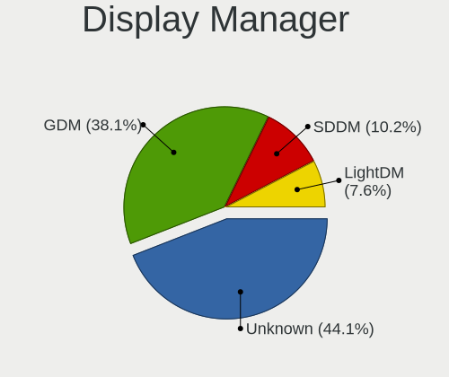
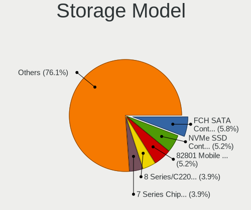
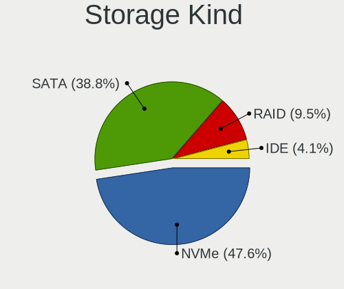

Rocky Linux - Tested Hardware & Statistics (Notebooks)
------------------------------------------------------

A project to collect tested hardware configurations for Rocky Linux.

Anyone can contribute to this report by the [hw-probe](https://github.com/linuxhw/hw-probe) tool:

    sudo -E hw-probe -all -upload

Please contribute! Especially if your hardware is rare.

Contents
--------

* [ Test Cases ](#test-cases)

* [ System ](#system)
  - [ OS                       ](#os)
  - [ OS Family                ](#os-family)
  - [ Kernel                   ](#kernel)
  - [ Kernel Family            ](#kernel-family)
  - [ Kernel Major Ver.        ](#kernel-major-ver)
  - [ Arch                     ](#arch)
  - [ DE                       ](#de)
  - [ Display Server           ](#display-server)
  - [ Display Manager          ](#display-manager)
  - [ OS Lang                  ](#os-lang)
  - [ Boot Mode                ](#boot-mode)
  - [ Filesystem               ](#filesystem)
  - [ Part. scheme             ](#part-scheme)
  - [ Dual Boot with Linux/BSD ](#dual-boot-with-linuxbsd)
  - [ Dual Boot (Win)          ](#dual-boot-win)

* [ Board ](#board)
  - [ Vendor                   ](#vendor)
  - [ Model                    ](#model)
  - [ Model Family             ](#model-family)
  - [ MFG Year                 ](#mfg-year)
  - [ Form Factor              ](#form-factor)
  - [ Secure Boot              ](#secure-boot)
  - [ Coreboot                 ](#coreboot)
  - [ RAM Size                 ](#ram-size)
  - [ RAM Used                 ](#ram-used)
  - [ Total Drives             ](#total-drives)
  - [ Has CD-ROM               ](#has-cd-rom)
  - [ Has Ethernet             ](#has-ethernet)
  - [ Has WiFi                 ](#has-wifi)
  - [ Has Bluetooth            ](#has-bluetooth)

* [ Location ](#location)
  - [ Country                  ](#country)
  - [ City                     ](#city)

* [ Drives ](#drives)
  - [ Drive Vendor             ](#drive-vendor)
  - [ Drive Model              ](#drive-model)
  - [ HDD Vendor               ](#hdd-vendor)
  - [ SSD Vendor               ](#ssd-vendor)
  - [ Drive Kind               ](#drive-kind)
  - [ Drive Connector          ](#drive-connector)
  - [ Drive Size               ](#drive-size)
  - [ Space Total              ](#space-total)
  - [ Space Used               ](#space-used)
  - [ Malfunc. Drives          ](#malfunc-drives)
  - [ Malfunc. Drive Vendor    ](#malfunc-drive-vendor)
  - [ Malfunc. HDD Vendor      ](#malfunc-hdd-vendor)
  - [ Malfunc. Drive Kind      ](#malfunc-drive-kind)
  - [ Failed Drives            ](#failed-drives)
  - [ Failed Drive Vendor      ](#failed-drive-vendor)
  - [ Drive Status             ](#drive-status)

* [ Storage controller ](#storage-controller)
  - [ Storage Vendor           ](#storage-vendor)
  - [ Storage Model            ](#storage-model)
  - [ Storage Kind             ](#storage-kind)

* [ Processor ](#processor)
  - [ CPU Vendor               ](#cpu-vendor)
  - [ CPU Model                ](#cpu-model)
  - [ CPU Model Family         ](#cpu-model-family)
  - [ CPU Cores                ](#cpu-cores)
  - [ CPU Sockets              ](#cpu-sockets)
  - [ CPU Threads              ](#cpu-threads)
  - [ CPU Op-Modes             ](#cpu-op-modes)
  - [ CPU Microcode            ](#cpu-microcode)
  - [ CPU Microarch            ](#cpu-microarch)

* [ Graphics ](#graphics)
  - [ GPU Vendor               ](#gpu-vendor)
  - [ GPU Model                ](#gpu-model)
  - [ GPU Combo                ](#gpu-combo)
  - [ GPU Driver               ](#gpu-driver)
  - [ GPU Memory               ](#gpu-memory)

* [ Monitor ](#monitor)
  - [ Monitor Vendor           ](#monitor-vendor)
  - [ Monitor Model            ](#monitor-model)
  - [ Monitor Resolution       ](#monitor-resolution)
  - [ Monitor Diagonal         ](#monitor-diagonal)
  - [ Monitor Width            ](#monitor-width)
  - [ Aspect Ratio             ](#aspect-ratio)
  - [ Monitor Area             ](#monitor-area)
  - [ Pixel Density            ](#pixel-density)
  - [ Multiple Monitors        ](#multiple-monitors)

* [ Network ](#network)
  - [ Net Controller Vendor    ](#net-controller-vendor)
  - [ Net Controller Model     ](#net-controller-model)
  - [ Wireless Vendor          ](#wireless-vendor)
  - [ Wireless Model           ](#wireless-model)
  - [ Ethernet Vendor          ](#ethernet-vendor)
  - [ Ethernet Model           ](#ethernet-model)
  - [ Net Controller Kind      ](#net-controller-kind)
  - [ Used Controller          ](#used-controller)
  - [ NICs                     ](#nics)
  - [ IPv6                     ](#ipv6)

* [ Bluetooth ](#bluetooth)
  - [ Bluetooth Vendor         ](#bluetooth-vendor)
  - [ Bluetooth Model          ](#bluetooth-model)

* [ Sound ](#sound)
  - [ Sound Vendor             ](#sound-vendor)
  - [ Sound Model              ](#sound-model)

* [ Memory ](#memory)
  - [ Memory Vendor            ](#memory-vendor)
  - [ Memory Model             ](#memory-model)
  - [ Memory Kind              ](#memory-kind)
  - [ Memory Form Factor       ](#memory-form-factor)
  - [ Memory Size              ](#memory-size)
  - [ Memory Speed             ](#memory-speed)

* [ Printers & scanners ](#printers--scanners)
  - [ Printer Vendor           ](#printer-vendor)
  - [ Printer Model            ](#printer-model)
  - [ Scanner Vendor           ](#scanner-vendor)
  - [ Scanner Model            ](#scanner-model)

* [ Camera ](#camera)
  - [ Camera Vendor            ](#camera-vendor)
  - [ Camera Model             ](#camera-model)

* [ Security ](#security)
  - [ Fingerprint Vendor       ](#fingerprint-vendor)
  - [ Fingerprint Model        ](#fingerprint-model)
  - [ Chipcard Vendor          ](#chipcard-vendor)
  - [ Chipcard Model           ](#chipcard-model)

* [ Unsupported ](#unsupported)
  - [ Unsupported Devices      ](#unsupported-devices)
  - [ Unsupported Device Types ](#unsupported-device-types)

Test Cases
----------

Total: 70

| Vendor   | Model                       | Probe                                                      | Date         |
|----------|-----------------------------|------------------------------------------------------------|--------------|
| ASUSTek  | UX430UNR                    | [00ab711e0a](https://linux-hardware.org/?probe=00ab711e0a) | Jun 02, 2023 |
| HP       | ProBook 645 G1              | [f82952db4b](https://linux-hardware.org/?probe=f82952db4b) | May 14, 2023 |
| ASUSTek  | ASUS TUF Dash F15 FX517Z... | [30d9e5ca7d](https://linux-hardware.org/?probe=30d9e5ca7d) | May 11, 2023 |
| Beelink  | BT3 PRO                     | [fb99607da3](https://linux-hardware.org/?probe=fb99607da3) | May 08, 2023 |
| Acer     | Aspire E5-573G              | [5cff94f71e](https://linux-hardware.org/?probe=5cff94f71e) | May 07, 2023 |
| Lenovo   | ThinkPad P1 Gen 4i 20Y30... | [43e6345cb8](https://linux-hardware.org/?probe=43e6345cb8) | May 03, 2023 |
| Lenovo   | ThinkPad E14 Gen 4 21E30... | [18306b3af6](https://linux-hardware.org/?probe=18306b3af6) | Apr 23, 2023 |
| HUAWEI   | KLVD-WXX9                   | [ae500cf4af](https://linux-hardware.org/?probe=ae500cf4af) | Apr 22, 2023 |
| Lenovo   | IdeaPad 3 15ITL6 82H8       | [40f92632ab](https://linux-hardware.org/?probe=40f92632ab) | Mar 16, 2023 |
| HP       | EliteBook 840 G5            | [8e02418ca7](https://linux-hardware.org/?probe=8e02418ca7) | Mar 05, 2023 |
| HP       | EliteBook 840 G5            | [5510fed545](https://linux-hardware.org/?probe=5510fed545) | Mar 04, 2023 |
| ASUSTek  | ROG Strix G713RW_G713RW     | [5368c6d0a2](https://linux-hardware.org/?probe=5368c6d0a2) | Feb 23, 2023 |
| Lenovo   | ThinkPad T480 20L6S8B500    | [b4cbe5bf11](https://linux-hardware.org/?probe=b4cbe5bf11) | Feb 16, 2023 |
| Lenovo   | IdeaPad S210 Touch 20257    | [d132553080](https://linux-hardware.org/?probe=d132553080) | Feb 13, 2023 |
| Dell     | Latitude 5420               | [60cc86374d](https://linux-hardware.org/?probe=60cc86374d) | Feb 12, 2023 |
| Dell     | Latitude 5420               | [63a576e744](https://linux-hardware.org/?probe=63a576e744) | Feb 12, 2023 |
| Lenovo   | ThinkPad P1 Gen 3 20TH00... | [e07858d71e](https://linux-hardware.org/?probe=e07858d71e) | Feb 03, 2023 |
| Positivo | Mobile                      | [966b4e2454](https://linux-hardware.org/?probe=966b4e2454) | Feb 02, 2023 |
| Dell     | Inspiron 15-3573            | [b735bbde51](https://linux-hardware.org/?probe=b735bbde51) | Jan 29, 2023 |
| Lenovo   | ThinkPad P1 Gen 3 20TH00... | [06f87714b0](https://linux-hardware.org/?probe=06f87714b0) | Jan 26, 2023 |
| Dell     | Precision M6800             | [bcd98b78c4](https://linux-hardware.org/?probe=bcd98b78c4) | Jan 19, 2023 |
| Dell     | Latitude 5420               | [cb511c0f82](https://linux-hardware.org/?probe=cb511c0f82) | Jan 18, 2023 |
| HP       | Laptop 15-dy2xxx            | [ff9464407f](https://linux-hardware.org/?probe=ff9464407f) | Jan 15, 2023 |
| HUAWEI   | KLVD-WXX9                   | [71d684a605](https://linux-hardware.org/?probe=71d684a605) | Jan 11, 2023 |
| Lenovo   | IdeaPad Gaming 3 15ACH6 ... | [d6cac381fd](https://linux-hardware.org/?probe=d6cac381fd) | Jan 09, 2023 |
| HUAWEI   | KLVD-WXX9                   | [e662d0e58a](https://linux-hardware.org/?probe=e662d0e58a) | Jan 07, 2023 |
| Dell     | XPS 17 9720                 | [ae26f02480](https://linux-hardware.org/?probe=ae26f02480) | Jan 03, 2023 |
| HP       | EliteBook 845 14 inch G9... | [65c34944ec](https://linux-hardware.org/?probe=65c34944ec) | Jan 03, 2023 |
| HP       | EliteBook 2560p             | [89c0ffe36d](https://linux-hardware.org/?probe=89c0ffe36d) | Dec 29, 2022 |
| Dell     | Inspiron 14 5425            | [42f45d59d2](https://linux-hardware.org/?probe=42f45d59d2) | Dec 29, 2022 |
| HP       | ProBook 640 G3              | [03eba7b664](https://linux-hardware.org/?probe=03eba7b664) | Dec 15, 2022 |
| Lenovo   | ThinkPad T14s Gen 3 21BR... | [ede2606ad1](https://linux-hardware.org/?probe=ede2606ad1) | Dec 15, 2022 |
| Dell     | Vostro 3500                 | [db276a4d2e](https://linux-hardware.org/?probe=db276a4d2e) | Nov 28, 2022 |
| Lenovo   | ThinkPad P1 Gen 3 20THCT... | [4c47d0ef97](https://linux-hardware.org/?probe=4c47d0ef97) | Nov 05, 2022 |
| ASUSTek  | VivoBook_ASUSLaptop X512... | [cda3087aaf](https://linux-hardware.org/?probe=cda3087aaf) | Oct 23, 2022 |
| HP       | Pavilion g6                 | [11d25577b3](https://linux-hardware.org/?probe=11d25577b3) | Oct 08, 2022 |
| BANGHO   | BES G1529                   | [ce0db88361](https://linux-hardware.org/?probe=ce0db88361) | Sep 20, 2022 |
| Dell     | XPS 15 7590                 | [a191bd2a9f](https://linux-hardware.org/?probe=a191bd2a9f) | Sep 18, 2022 |
| Dell     | Latitude 5430               | [617563f7a7](https://linux-hardware.org/?probe=617563f7a7) | Sep 14, 2022 |
| HP       | ZBook 15u G6                | [af658eb920](https://linux-hardware.org/?probe=af658eb920) | Sep 06, 2022 |
| HP       | ZBook 15 G2                 | [34f32c0d0d](https://linux-hardware.org/?probe=34f32c0d0d) | Jul 27, 2022 |
| ASUSTek  | ASUS TUF Dash F15 FX516P... | [ce5ca74472](https://linux-hardware.org/?probe=ce5ca74472) | Jul 17, 2022 |
| Lenovo   | ThinkPad X1 Carbon 34483... | [fa20ff88e1](https://linux-hardware.org/?probe=fa20ff88e1) | Jun 19, 2022 |
| Dell     | Latitude 3420               | [b10330b427](https://linux-hardware.org/?probe=b10330b427) | Jun 15, 2022 |
| HP       | EliteBook 840 G7 Noteboo... | [b586e45245](https://linux-hardware.org/?probe=b586e45245) | Apr 25, 2022 |
| Dell     | Latitude 5500               | [3d87bc42c6](https://linux-hardware.org/?probe=3d87bc42c6) | Mar 08, 2022 |
| Lenovo   | ThinkPad T14s Gen 2a 20X... | [f78b6db0bd](https://linux-hardware.org/?probe=f78b6db0bd) | Mar 08, 2022 |
| Dell     | Latitude 5500               | [fc0c5280d7](https://linux-hardware.org/?probe=fc0c5280d7) | Mar 08, 2022 |
| Lenovo   | ThinkPad T14s Gen 2a 20X... | [351e05ccc8](https://linux-hardware.org/?probe=351e05ccc8) | Mar 08, 2022 |
| Lenovo   | ThinkPad T14s Gen 2a 20X... | [dc09f11788](https://linux-hardware.org/?probe=dc09f11788) | Mar 08, 2022 |
| Lenovo   | Legion Y7000 2020H 81Y7     | [2ab4cacc1e](https://linux-hardware.org/?probe=2ab4cacc1e) | Jan 26, 2022 |
| Lenovo   | Legion Y7000 2020H 81Y7     | [787aec5f1c](https://linux-hardware.org/?probe=787aec5f1c) | Jan 26, 2022 |
| Lenovo   | IdeaPad Y700-15ISK 80NV     | [7225108b91](https://linux-hardware.org/?probe=7225108b91) | Jan 10, 2022 |
| HP       | ZBook 15 G3                 | [89809f906e](https://linux-hardware.org/?probe=89809f906e) | Jan 10, 2022 |
| Lenovo   | Legion 5 15ARH05H 82B1      | [90821cb3a5](https://linux-hardware.org/?probe=90821cb3a5) | Jan 03, 2022 |
| Lenovo   | IdeaPad 500S-14ISK 80Q3     | [6ea0cdba08](https://linux-hardware.org/?probe=6ea0cdba08) | Nov 27, 2021 |
| Lenovo   | ThinkPad W540 20BGCTO1WW    | [25055cdc26](https://linux-hardware.org/?probe=25055cdc26) | Nov 23, 2021 |
| HP       | Laptop 17-ca1xxx            | [61fe4e654d](https://linux-hardware.org/?probe=61fe4e654d) | Nov 09, 2021 |
| Toshiba  | TECRA W50-A                 | [abee9f36ad](https://linux-hardware.org/?probe=abee9f36ad) | Nov 05, 2021 |
| Lenovo   | ThinkPad T420 42365H1       | [3430adab89](https://linux-hardware.org/?probe=3430adab89) | Aug 25, 2021 |
| Lenovo   | ThinkPad T420 42365H1       | [6a306e2253](https://linux-hardware.org/?probe=6a306e2253) | Aug 16, 2021 |
| Lenovo   | ThinkPad W500 406132G       | [e79080e90d](https://linux-hardware.org/?probe=e79080e90d) | Aug 08, 2021 |
| Lenovo   | IdeaPad Slim 1-14AST-05 ... | [860ec3c89d](https://linux-hardware.org/?probe=860ec3c89d) | Aug 08, 2021 |
| Lenovo   | IdeaPad Y410P 20216         | [b2df1c0e6d](https://linux-hardware.org/?probe=b2df1c0e6d) | Aug 08, 2021 |
| Lenovo   | IdeaPad Y410P 20216         | [3fc207c5b9](https://linux-hardware.org/?probe=3fc207c5b9) | Aug 07, 2021 |
| Lenovo   | IdeaPad Slim 1-14AST-05 ... | [09738de946](https://linux-hardware.org/?probe=09738de946) | Jul 04, 2021 |
| Lenovo   | IdeaPad Slim 1-14AST-05 ... | [741cab87e1](https://linux-hardware.org/?probe=741cab87e1) | Jun 29, 2021 |
| ASUSTek  | ASUS TUF Gaming A15 FA50... | [60fe7f2653](https://linux-hardware.org/?probe=60fe7f2653) | Jun 13, 2021 |
| Toshiba  | Satellite E45-B             | [84683df1f0](https://linux-hardware.org/?probe=84683df1f0) | Jun 12, 2021 |
| Acer     | Aspire VN7-591G             | [bc9e6c4910](https://linux-hardware.org/?probe=bc9e6c4910) | May 10, 2021 |

System
------

OS
--

Installed operating systems

| Name            | Notebooks | Percent |
|-----------------|-----------|---------|
| Rocky Linux 9.1 | 21        | 38.18%  |
| Rocky Linux 8.5 | 11        | 20%     |
| Rocky Linux 9.0 | 9         | 16.36%  |
| Rocky Linux 8.4 | 8         | 14.55%  |
| Rocky Linux 8.7 | 3         | 5.45%   |
| Rocky Linux 8.8 | 1         | 1.82%   |
| Rocky Linux 8.6 | 1         | 1.82%   |
| Rocky Linux 8.3 | 1         | 1.82%   |

OS Family
---------

OS without a version

| Name        | Notebooks | Percent |
|-------------|-----------|---------|
| Rocky Linux | 55        | 100%    |

Kernel
------

Version of the Linux kernel

| Version                          | Notebooks | Percent |
|----------------------------------|-----------|---------|
| 5.14.0-162.6.1.el9_1.0.1.x86_64  | 9         | 15.79%  |
| 5.14.0-70.22.1.el9_0.x86_64      | 4         | 7.02%   |
| 5.14.0-162.23.1.el9_1.x86_64     | 4         | 7.02%   |
| 5.14.0-162.12.1.el9_1.0.2.x86_64 | 4         | 7.02%   |
| 4.18.0-348.7.1.el8_5.x86_64      | 3         | 5.26%   |
| 5.14.0-70.26.1.el9_0.x86_64      | 2         | 3.51%   |
| 5.14.0-162.6.1.el9_1.x86_64      | 2         | 3.51%   |
| 5.14.0-162.18.1.el9_1.x86_64     | 2         | 3.51%   |
| 4.18.0-425.3.1.el8.x86_64        | 2         | 3.51%   |
| 4.18.0-348.20.1.el8_5.x86_64     | 2         | 3.51%   |
| 4.18.0-348.12.2.el8_5.x86_64     | 2         | 3.51%   |
| 4.18.0-305.el8.x86_64            | 2         | 3.51%   |
| 4.18.0-305.3.1.el8_4.x86_64      | 2         | 3.51%   |
| 4.18.0-305.25.1.el8_4.x86_64     | 2         | 3.51%   |
| 4.18.0-305.10.2.el8_4.x86_64     | 2         | 3.51%   |
| 6.2.12-1.el9.elrepo.x86_64       | 1         | 1.75%   |
| 6.2.10-1.el8.elrepo.x86_64       | 1         | 1.75%   |
| 5.4.157-1.el8.elrepo.x86_64      | 1         | 1.75%   |
| 5.16.15-1.el8.elrepo.x86_64      | 1         | 1.75%   |
| 5.14.0-70.30.1.el9_0.x86_64      | 1         | 1.75%   |
| 5.14.0-70.17.1.el9_0.x86_64      | 1         | 1.75%   |
| 5.14.0-70.13.1.el9_0.x86_64      | 1         | 1.75%   |
| 5.14.0-162.12.1.el9_1.0.1.x86_64 | 1         | 1.75%   |
| 5.10.89-1.el8.x86_64             | 1         | 1.75%   |
| 4.18.0-477.13.1.el8_8.x86_64     | 1         | 1.75%   |
| 4.18.0-348.el8.0.2.x86_64        | 1         | 1.75%   |
| 4.18.0-348.2.1.el8_5.x86_64      | 1         | 1.75%   |
| 4.18.0-240.22.1.el8.x86_64       | 1         | 1.75%   |

Kernel Family
-------------

Linux kernel without a distro release

| Version | Notebooks | Percent |
|---------|-----------|---------|
| 5.14.0  | 29        | 52.73%  |
| 4.18.0  | 21        | 38.18%  |
| 6.2.12  | 1         | 1.82%   |
| 6.2.10  | 1         | 1.82%   |
| 5.4.157 | 1         | 1.82%   |
| 5.16.15 | 1         | 1.82%   |
| 5.10.89 | 1         | 1.82%   |

Kernel Major Ver.
-----------------

Linux kernel major version

| Version | Notebooks | Percent |
|---------|-----------|---------|
| 5.14    | 29        | 52.73%  |
| 4.18    | 21        | 38.18%  |
| 6.2     | 2         | 3.64%   |
| 5.4     | 1         | 1.82%   |
| 5.16    | 1         | 1.82%   |
| 5.10    | 1         | 1.82%   |

Arch
----

OS architecture (x86_64, i586, etc.)

| Name   | Notebooks | Percent |
|--------|-----------|---------|
| x86_64 | 55        | 100%    |

DE
--

Desktop Environment

| Name          | Notebooks | Percent |
|---------------|-----------|---------|
| GNOME         | 43        | 78.18%  |
| MATE          | 3         | 5.45%   |
| KDE5          | 3         | 5.45%   |
| XFCE          | 2         | 3.64%   |
| Unknown       | 2         | 3.64%   |
| X-Cinnamon    | 1         | 1.82%   |
| GNOME Classic | 1         | 1.82%   |

Display Server
--------------

X11 or Wayland

| Name    | Notebooks | Percent |
|---------|-----------|---------|
| Wayland | 37        | 67.27%  |
| X11     | 16        | 29.09%  |
| Tty     | 1         | 1.82%   |
| Unknown | 1         | 1.82%   |

Display Manager
---------------

SDDM, LightDM, etc.

| Name    | Notebooks | Percent |
|---------|-----------|---------|
| Unknown | 27        | 49.09%  |
| GDM     | 22        | 40%     |
| SDDM    | 4         | 7.27%   |
| LightDM | 2         | 3.64%   |

OS Lang
-------

Language

| Lang  | Notebooks | Percent |
|-------|-----------|---------|
| en_US | 40        | 72.73%  |
| ru_RU | 2         | 3.64%   |
| en_ZA | 2         | 3.64%   |
| en_CA | 2         | 3.64%   |
| de_DE | 2         | 3.64%   |
| C     | 2         | 3.64%   |
| zh_TW | 1         | 1.82%   |
| pt_BR | 1         | 1.82%   |
| it_IT | 1         | 1.82%   |
| fr_FR | 1         | 1.82%   |
| en_IE | 1         | 1.82%   |

Boot Mode
---------

EFI or BIOS

| Mode | Notebooks | Percent |
|------|-----------|---------|
| EFI  | 44        | 80%     |
| BIOS | 11        | 20%     |

Filesystem
----------

Type of filesystem

| Type | Notebooks | Percent |
|------|-----------|---------|
| Xfs  | 46        | 83.64%  |
| Ext4 | 8         | 14.55%  |
| Ext3 | 1         | 1.82%   |

Part. scheme
------------

Scheme of partitioning

| Type    | Notebooks | Percent |
|---------|-----------|---------|
| GPT     | 26        | 47.27%  |
| Unknown | 26        | 47.27%  |
| MBR     | 3         | 5.45%   |

Dual Boot with Linux/BSD
------------------------

Hosting more than one Linux/BSD

| Dual boot | Notebooks | Percent |
|-----------|-----------|---------|
| No        | 49        | 89.09%  |
| Yes       | 6         | 10.91%  |

Dual Boot (Win)
---------------

Hosting Linux and Windows

| Dual boot | Notebooks | Percent |
|-----------|-----------|---------|
| No        | 43        | 78.18%  |
| Yes       | 12        | 21.82%  |

Board
-----

Vendor
------

Motherboard manufacturer

| Name             | Notebooks | Percent |
|------------------|-----------|---------|
| Lenovo           | 20        | 36.36%  |
| Hewlett-Packard  | 11        | 20%     |
| Dell             | 10        | 18.18%  |
| ASUSTek Computer | 6         | 10.91%  |
| Toshiba          | 2         | 3.64%   |
| Acer             | 2         | 3.64%   |
| Positivo         | 1         | 1.82%   |
| HUAWEI           | 1         | 1.82%   |
| Beelink          | 1         | 1.82%   |
| BANGHO           | 1         | 1.82%   |

Model
-----

Motherboard model

| Name                                   | Notebooks | Percent |
|----------------------------------------|-----------|---------|
| Toshiba TECRA W50-A                    | 1         | 1.82%   |
| Toshiba Satellite E45-B                | 1         | 1.82%   |
| Positivo Mobile                        | 1         | 1.82%   |
| Lenovo ThinkPad X1 Carbon 344835U      | 1         | 1.82%   |
| Lenovo ThinkPad W540 20BGCTO1WW        | 1         | 1.82%   |
| Lenovo ThinkPad W500 406132G           | 1         | 1.82%   |
| Lenovo ThinkPad T480 20L6S8B500        | 1         | 1.82%   |
| Lenovo ThinkPad T420 42365H1           | 1         | 1.82%   |
| Lenovo ThinkPad T14s Gen 3 21BR000QUS  | 1         | 1.82%   |
| Lenovo ThinkPad T14s Gen 2a 20XF006XCK | 1         | 1.82%   |
| Lenovo ThinkPad P1 Gen 4i 20Y3000FHV   | 1         | 1.82%   |
| Lenovo ThinkPad P1 Gen 3 20THCTO1WW    | 1         | 1.82%   |
| Lenovo ThinkPad P1 Gen 3 20TH004CUK    | 1         | 1.82%   |
| Lenovo ThinkPad E14 Gen 4 21E300ESPB   | 1         | 1.82%   |
| Lenovo Legion Y7000 2020H 81Y7         | 1         | 1.82%   |
| Lenovo Legion 5 15ARH05H 82B1          | 1         | 1.82%   |
| Lenovo IdeaPad Y700-15ISK 80NV         | 1         | 1.82%   |
| Lenovo IdeaPad Y410P 20216             | 1         | 1.82%   |
| Lenovo IdeaPad Slim 1-14AST-05 81VS    | 1         | 1.82%   |
| Lenovo IdeaPad S210 Touch 20257        | 1         | 1.82%   |
| Lenovo IdeaPad Gaming 3 15ACH6 82K2    | 1         | 1.82%   |
| Lenovo IdeaPad 500S-14ISK 80Q3         | 1         | 1.82%   |
| Lenovo IdeaPad 3 15ITL6 82H8           | 1         | 1.82%   |
| HUAWEI KLVD-WXX9                       | 1         | 1.82%   |
| HP ZBook 15u G6                        | 1         | 1.82%   |
| HP ZBook 15 G3                         | 1         | 1.82%   |
| HP ZBook 15 G2                         | 1         | 1.82%   |
| HP ProBook 645 G1                      | 1         | 1.82%   |
| HP ProBook 640 G3                      | 1         | 1.82%   |
| HP Pavilion g6                         | 1         | 1.82%   |
| HP Laptop 17-ca1xxx                    | 1         | 1.82%   |
| HP Laptop 15-dy2xxx                    | 1         | 1.82%   |
| HP EliteBook 840 G7 Notebook PC        | 1         | 1.82%   |
| HP EliteBook 840 G5                    | 1         | 1.82%   |
| HP EliteBook 2560p                     | 1         | 1.82%   |
| Dell XPS 17 9720                       | 1         | 1.82%   |
| Dell XPS 15 7590                       | 1         | 1.82%   |
| Dell Vostro 3500                       | 1         | 1.82%   |
| Dell Precision M6800                   | 1         | 1.82%   |
| Dell Latitude 5500                     | 1         | 1.82%   |

Model Family
------------

Motherboard model prefix

| Name              | Notebooks | Percent |
|-------------------|-----------|---------|
| Lenovo ThinkPad   | 11        | 20%     |
| Lenovo IdeaPad    | 7         | 12.73%  |
| Dell Latitude     | 4         | 7.27%   |
| HP ZBook          | 3         | 5.45%   |
| HP EliteBook      | 3         | 5.45%   |
| ASUS ASUS         | 3         | 5.45%   |
| Lenovo Legion     | 2         | 3.64%   |
| HP ProBook        | 2         | 3.64%   |
| HP Laptop         | 2         | 3.64%   |
| Dell XPS          | 2         | 3.64%   |
| Dell Inspiron     | 2         | 3.64%   |
| Acer Aspire       | 2         | 3.64%   |
| Toshiba TECRA     | 1         | 1.82%   |
| Toshiba Satellite | 1         | 1.82%   |
| Positivo Mobile   | 1         | 1.82%   |
| HUAWEI KLVD-WXX9  | 1         | 1.82%   |
| HP Pavilion       | 1         | 1.82%   |
| Dell Vostro       | 1         | 1.82%   |
| Dell Precision    | 1         | 1.82%   |
| Beelink BT3       | 1         | 1.82%   |
| BANGHO BES        | 1         | 1.82%   |
| ASUS VivoBook     | 1         | 1.82%   |
| ASUS UX430UNR     | 1         | 1.82%   |
| ASUS ROG          | 1         | 1.82%   |

MFG Year
--------

Motherboard manufacture year

| Year | Notebooks | Percent |
|------|-----------|---------|
| 2021 | 8         | 14.55%  |
| 2020 | 8         | 14.55%  |
| 2022 | 6         | 10.91%  |
| 2019 | 6         | 10.91%  |
| 2018 | 5         | 9.09%   |
| 2014 | 5         | 9.09%   |
| 2015 | 3         | 5.45%   |
| 2013 | 3         | 5.45%   |
| 2011 | 3         | 5.45%   |
| 2017 | 2         | 3.64%   |
| 2016 | 2         | 3.64%   |
| 2010 | 2         | 3.64%   |
| 2012 | 1         | 1.82%   |
| 2009 | 1         | 1.82%   |

Form Factor
-----------

Physical design of the computer

| Name     | Notebooks | Percent |
|----------|-----------|---------|
| Notebook | 55        | 100%    |

Secure Boot
-----------

Enabled or disabled

| State    | Notebooks | Percent |
|----------|-----------|---------|
| Disabled | 44        | 80%     |
| Enabled  | 11        | 20%     |

Coreboot
--------

Have coreboot on board

| Used | Notebooks | Percent |
|------|-----------|---------|
| No   | 55        | 100%    |

RAM Size
--------

Total RAM memory

| Size in GB  | Notebooks | Percent |
|-------------|-----------|---------|
| 8.01-16.0   | 18        | 32.73%  |
| 4.01-8.0    | 15        | 27.27%  |
| 32.01-64.0  | 11        | 20%     |
| 16.01-24.0  | 6         | 10.91%  |
| 3.01-4.0    | 3         | 5.45%   |
| 24.01-32.0  | 1         | 1.82%   |
| 64.01-256.0 | 1         | 1.82%   |

RAM Used
--------

Used RAM memory

| Used GB    | Notebooks | Percent |
|------------|-----------|---------|
| 4.01-8.0   | 19        | 32.76%  |
| 2.01-3.0   | 14        | 24.14%  |
| 3.01-4.0   | 12        | 20.69%  |
| 1.01-2.0   | 5         | 8.62%   |
| 8.01-16.0  | 5         | 8.62%   |
| 0.51-1.0   | 2         | 3.45%   |
| 16.01-24.0 | 1         | 1.72%   |

Total Drives
------------

Number of drives on board

| Drives | Notebooks | Percent |
|--------|-----------|---------|
| 1      | 44        | 80%     |
| 2      | 7         | 12.73%  |
| 3      | 3         | 5.45%   |
| 4      | 1         | 1.82%   |

Has CD-ROM
----------

Has CD-ROM on board

| Presented | Notebooks | Percent |
|-----------|-----------|---------|
| No        | 46        | 83.64%  |
| Yes       | 9         | 16.36%  |

Has Ethernet
------------

Has Ethernet on board

| Presented | Notebooks | Percent |
|-----------|-----------|---------|
| Yes       | 46        | 82.14%  |
| No        | 10        | 17.86%  |

Has WiFi
--------

Has WiFi module

| Presented | Notebooks | Percent |
|-----------|-----------|---------|
| Yes       | 54        | 98.18%  |
| No        | 1         | 1.82%   |

Has Bluetooth
-------------

Has Bluetooth module

| Presented | Notebooks | Percent |
|-----------|-----------|---------|
| Yes       | 47        | 85.45%  |
| No        | 8         | 14.55%  |

Location
--------

Country
-------

Geographic location (country)

| Country      | Notebooks | Percent |
|--------------|-----------|---------|
| USA          | 14        | 25.45%  |
| Russia       | 3         | 5.45%   |
| Poland       | 3         | 5.45%   |
| South Africa | 2         | 3.64%   |
| Italy        | 2         | 3.64%   |
| Hungary      | 2         | 3.64%   |
| Germany      | 2         | 3.64%   |
| Czechia      | 2         | 3.64%   |
| Canada       | 2         | 3.64%   |
| Brazil       | 2         | 3.64%   |
| Belgium      | 2         | 3.64%   |
| Uzbekistan   | 1         | 1.82%   |
| UAE          | 1         | 1.82%   |
| Turkey       | 1         | 1.82%   |
| Taiwan       | 1         | 1.82%   |
| Sweden       | 1         | 1.82%   |
| Spain        | 1         | 1.82%   |
| Slovakia     | 1         | 1.82%   |
| Saudi Arabia | 1         | 1.82%   |
| Pakistan     | 1         | 1.82%   |
| Netherlands  | 1         | 1.82%   |
| Malaysia     | 1         | 1.82%   |
| Kazakhstan   | 1         | 1.82%   |
| Ireland      | 1         | 1.82%   |
| France       | 1         | 1.82%   |
| Croatia      | 1         | 1.82%   |
| China        | 1         | 1.82%   |
| Bulgaria     | 1         | 1.82%   |
| Austria      | 1         | 1.82%   |
| Argentina    | 1         | 1.82%   |

City
----

Geographic location (city)

| City                   | Notebooks | Percent |
|------------------------|-----------|---------|
| Budapest               | 2         | 3.64%   |
| Žilina                | 1         | 1.82%   |
| Xi'an                  | 1         | 1.82%   |
| Vienna                 | 1         | 1.82%   |
| Torrington             | 1         | 1.82%   |
| Taoyuan City           | 1         | 1.82%   |
| Syracuse               | 1         | 1.82%   |
| Split                  | 1         | 1.82%   |
| Sofia                  | 1         | 1.82%   |
| Smolensk               | 1         | 1.82%   |
| Senigallia             | 1         | 1.82%   |
| Scarborough            | 1         | 1.82%   |
| San Miguel de Tucumán | 1         | 1.82%   |
| Riyadh                 | 1         | 1.82%   |
| Rawalpindi             | 1         | 1.82%   |
| Qualicum Beach         | 1         | 1.82%   |
| Prague                 | 1         | 1.82%   |
| Philadelphia           | 1         | 1.82%   |
| Ottignies              | 1         | 1.82%   |
| Örebro                | 1         | 1.82%   |
| Oakley                 | 1         | 1.82%   |
| Nur-Sultan             | 1         | 1.82%   |
| Mugla                  | 1         | 1.82%   |
| Mossel Bay             | 1         | 1.82%   |
| Moscow                 | 1         | 1.82%   |
| Montreal               | 1         | 1.82%   |
| Melun                  | 1         | 1.82%   |
| Madrid                 | 1         | 1.82%   |
| Lodz                   | 1         | 1.82%   |
| Lenexa                 | 1         | 1.82%   |
| Kutno                  | 1         | 1.82%   |
| Krakow                 | 1         | 1.82%   |
| Kansas City            | 1         | 1.82%   |
| Johor Bahru            | 1         | 1.82%   |
| Jaú                   | 1         | 1.82%   |
| Houston                | 1         | 1.82%   |
| Glin                   | 1         | 1.82%   |
| Forest                 | 1         | 1.82%   |
| Fairbanks              | 1         | 1.82%   |
| Enschede               | 1         | 1.82%   |

Drives
------

Drive Vendor
------------

Hard drive vendors

| Vendor                  | Notebooks | Drives | Percent |
|-------------------------|-----------|--------|---------|
| Samsung Electronics     | 19        | 21     | 26.39%  |
| WDC                     | 6         | 6      | 8.33%   |
| Sandisk                 | 5         | 7      | 6.94%   |
| Kingston                | 5         | 5      | 6.94%   |
| Toshiba                 | 4         | 5      | 5.56%   |
| Unknown                 | 3         | 3      | 4.17%   |
| SK hynix                | 3         | 5      | 4.17%   |
| Intel                   | 3         | 3      | 4.17%   |
| Seagate                 | 2         | 2      | 2.78%   |
| Micron Technology       | 2         | 2      | 2.78%   |
| Lexar                   | 2         | 2      | 2.78%   |
| A-DATA Technology       | 2         | 2      | 2.78%   |
| Union Memory (Shenzhen) | 1         | 1      | 1.39%   |
| UMIS                    | 1         | 1      | 1.39%   |
| StoreJet                | 1         | 1      | 1.39%   |
| Phison                  | 1         | 2      | 1.39%   |
| LITEONIT                | 1         | 1      | 1.39%   |
| LITEON                  | 1         | 1      | 1.39%   |
| JMicron Technology      | 1         | 1      | 1.39%   |
| INDMEM                  | 1         | 1      | 1.39%   |
| HS-SSD-C100             | 1         | 1      | 1.39%   |
| Hitachi                 | 1         | 1      | 1.39%   |
| Fujitsu                 | 1         | 1      | 1.39%   |
| Dogfish                 | 1         | 1      | 1.39%   |
| Crucial                 | 1         | 1      | 1.39%   |
| ASMT                    | 1         | 1      | 1.39%   |
| AGI                     | 1         | 1      | 1.39%   |
| ADATA Technology        | 1         | 1      | 1.39%   |

Drive Model
-----------

Hard drive models

| Model                                            | Notebooks | Percent |
|--------------------------------------------------|-----------|---------|
| Samsung SSD 870 EVO 1TB                          | 2         | 2.63%   |
| Lexar 512GB SSD                                  | 2         | 2.63%   |
| WDC WDS480G2G0A-00JH30 480GB SSD                 | 1         | 1.32%   |
| WDC WDBNCE0010PNC 1TB SSD                        | 1         | 1.32%   |
| WDC WD5000LPCX-24C6HT0 500GB                     | 1         | 1.32%   |
| WDC WD5000BPVT-00A1YT0 500GB                     | 1         | 1.32%   |
| WDC WD10SPCX-24HWST1 1TB                         | 1         | 1.32%   |
| WDC WD10JPVX-22JC3T0 1TB                         | 1         | 1.32%   |
| Unknown SD/MMC/MS PRO 64GB                       | 1         | 1.32%   |
| Unknown S0J38Y  64GB                             | 1         | 1.32%   |
| Unknown MMC Card  64GB                           | 1         | 1.32%   |
| Union Memory (Shenzhen) NVMe SSD Drive 128GB     | 1         | 1.32%   |
| UMIS RPFTJ128PDD2EWX 128GB                       | 1         | 1.32%   |
| Toshiba THNSNJ512GACU 512GB SSD                  | 1         | 1.32%   |
| Toshiba THNSNJ128G8NU 128GB SSD                  | 1         | 1.32%   |
| Toshiba NVMe SSD Drive 512GB                     | 1         | 1.32%   |
| Toshiba KXG6AZNV1T02 1TB                         | 1         | 1.32%   |
| Toshiba KXG6APNV2T04 2TB                         | 1         | 1.32%   |
| StoreJet Disk 480GB                              | 1         | 1.32%   |
| SK hynix SKHynix_HFS512GD9TNI-L2B0B 512GB        | 1         | 1.32%   |
| SK hynix SHPP41-2000GM 2TB                       | 1         | 1.32%   |
| SK hynix NVMe SSD Drive 512GB                    | 1         | 1.32%   |
| SK hynix BC511 NVMe 512GB                        | 1         | 1.32%   |
| Seagate ST9320325AS 320GB                        | 1         | 1.32%   |
| Seagate ST1000LM024 HN-M101MBB 1TB               | 1         | 1.32%   |
| Sandisk WD PC SN735 SDBPNHH-1T00-1002 1TB        | 1         | 1.32%   |
| Sandisk WD Black SN750 / PC SN730 NVMe SSD 256GB | 1         | 1.32%   |
| SanDisk SSD PLUS 1000GB                          | 1         | 1.32%   |
| SanDisk SD8SN8U512G1002 512GB SSD                | 1         | 1.32%   |
| SanDisk SD5SG2256G1052E 256GB SSD                | 1         | 1.32%   |
| SanDisk Extreme 55AE 1TB SSD                     | 1         | 1.32%   |
| Samsung SSD 970 EVO 500GB                        | 1         | 1.32%   |
| Samsung SSD 870 QVO 2TB                          | 1         | 1.32%   |
| Samsung SSD 860 QVO 4TB                          | 1         | 1.32%   |
| Samsung SSD 860 EVO 500GB                        | 1         | 1.32%   |
| Samsung PM9A1 NVMe SED 512GB                     | 1         | 1.32%   |
| Samsung PM991a NVMe 512GB                        | 1         | 1.32%   |
| Samsung NVMe SSD Drive 512GB                     | 1         | 1.32%   |
| Samsung NVMe SSD Drive 256GB                     | 1         | 1.32%   |
| Samsung NVMe SSD Drive 1024GB                    | 1         | 1.32%   |

HDD Vendor
----------

Hard disk drive vendors

| Vendor   | Notebooks | Drives | Percent |
|----------|-----------|--------|---------|
| WDC      | 4         | 4      | 40%     |
| Seagate  | 2         | 2      | 20%     |
| Unknown  | 1         | 1      | 10%     |
| StoreJet | 1         | 1      | 10%     |
| Hitachi  | 1         | 1      | 10%     |
| Fujitsu  | 1         | 1      | 10%     |

SSD Vendor
----------

Solid state drive vendors

| Vendor              | Notebooks | Drives | Percent |
|---------------------|-----------|--------|---------|
| Samsung Electronics | 8         | 9      | 30.77%  |
| SanDisk             | 3         | 4      | 11.54%  |
| Kingston            | 3         | 3      | 11.54%  |
| WDC                 | 2         | 2      | 7.69%   |
| Toshiba             | 2         | 2      | 7.69%   |
| LITEONIT            | 1         | 1      | 3.85%   |
| LITEON              | 1         | 1      | 3.85%   |
| Lexar               | 1         | 1      | 3.85%   |
| INDMEM              | 1         | 1      | 3.85%   |
| Dogfish             | 1         | 1      | 3.85%   |
| Crucial             | 1         | 1      | 3.85%   |
| ASMT                | 1         | 1      | 3.85%   |
| A-DATA Technology   | 1         | 1      | 3.85%   |

Drive Kind
----------

HDD or SSD

| Kind    | Notebooks | Drives | Percent |
|---------|-----------|--------|---------|
| NVMe    | 30        | 37     | 46.88%  |
| SSD     | 21        | 28     | 32.81%  |
| HDD     | 8         | 10     | 12.5%   |
| Unknown | 3         | 3      | 4.69%   |
| MMC     | 2         | 2      | 3.13%   |

Drive Connector
---------------

SATA, SAS, NVMe, etc.

| Type | Notebooks | Drives | Percent |
|------|-----------|--------|---------|
| NVMe | 30        | 37     | 47.62%  |
| SATA | 26        | 35     | 41.27%  |
| SAS  | 5         | 6      | 7.94%   |
| MMC  | 2         | 2      | 3.17%   |

Drive Size
----------

Size of hard drive

| Size in TB | Notebooks | Drives | Percent |
|------------|-----------|--------|---------|
| 0.01-0.5   | 17        | 20     | 54.84%  |
| 0.51-1.0   | 11        | 14     | 35.48%  |
| 1.01-2.0   | 2         | 2      | 6.45%   |
| 3.01-4.0   | 1         | 2      | 3.23%   |

Space Total
-----------

Amount of disk space available on the file system

| Size in GB     | Notebooks | Percent |
|----------------|-----------|---------|
| 251-500        | 19        | 34.55%  |
| 101-250        | 15        | 27.27%  |
| 501-1000       | 9         | 16.36%  |
| 1001-2000      | 4         | 7.27%   |
| 51-100         | 4         | 7.27%   |
| 2001-3000      | 3         | 5.45%   |
| More than 3000 | 1         | 1.82%   |

Space Used
----------

Amount of used disk space

| Used GB   | Notebooks | Percent |
|-----------|-----------|---------|
| 1-20      | 19        | 33.93%  |
| 21-50     | 13        | 23.21%  |
| 101-250   | 9         | 16.07%  |
| 51-100    | 8         | 14.29%  |
| 251-500   | 3         | 5.36%   |
| 1001-2000 | 2         | 3.57%   |
| 501-1000  | 2         | 3.57%   |

Malfunc. Drives
---------------

Drive models with a malfunction

Zero info for selected period =(

Malfunc. Drive Vendor
---------------------

Vendors of faulty drives

Zero info for selected period =(

Malfunc. HDD Vendor
-------------------

Vendors of faulty HDD drives

Zero info for selected period =(

Malfunc. Drive Kind
-------------------

Kinds of faulty drives

Zero info for selected period =(

Failed Drives
-------------

Failed drive models

Zero info for selected period =(

Failed Drive Vendor
-------------------

Failed drive vendors

Zero info for selected period =(

Drive Status
------------

Number of failed and malfunc. drives

| Status   | Notebooks | Drives | Percent |
|----------|-----------|--------|---------|
| Works    | 30        | 41     | 51.72%  |
| Detected | 28        | 39     | 48.28%  |

Storage controller
------------------

Storage Vendor
--------------

Storage controller vendors

| Vendor                       | Notebooks | Percent |
|------------------------------|-----------|---------|
| Intel                        | 32        | 49.23%  |
| Samsung Electronics          | 11        | 16.92%  |
| AMD                          | 6         | 9.23%   |
| SK hynix                     | 3         | 4.62%   |
| Toshiba America Info Systems | 2         | 3.08%   |
| SanDisk                      | 2         | 3.08%   |
| Micron Technology            | 2         | 3.08%   |
| Kingston Technology Company  | 2         | 3.08%   |
| Union Memory (Shenzhen)      | 1         | 1.54%   |
| Shenzhen Longsys Electronics | 1         | 1.54%   |
| Realtek Semiconductor        | 1         | 1.54%   |
| Phison Electronics           | 1         | 1.54%   |
| ADATA Technology             | 1         | 1.54%   |

Storage Model
-------------

Storage controller models

| Model                                                                                  | Notebooks | Percent |
|----------------------------------------------------------------------------------------|-----------|---------|
| AMD FCH SATA Controller [AHCI mode]                                                    | 6         | 8.45%   |
| Intel 8 Series/C220 Series Chipset Family 6-port SATA Controller 1 [AHCI mode]         | 5         | 7.04%   |
| Samsung NVMe SSD Controller SM981/PM981/PM983                                          | 4         | 5.63%   |
| Intel Volume Management Device NVMe RAID Controller                                    | 4         | 5.63%   |
| Samsung NVMe SSD Controller PM9A1/PM9A3/980PRO                                         | 3         | 4.23%   |
| Samsung NVMe SSD Controller 980                                                        | 3         | 4.23%   |
| Intel Tiger Lake-LP SATA Controller                                                    | 3         | 4.23%   |
| Intel Sunrise Point-LP SATA Controller [AHCI mode]                                     | 3         | 4.23%   |
| Toshiba America Info Systems XG6 NVMe SSD Controller                                   | 2         | 2.82%   |
| Micron NVMe Storage Controller                                                         | 2         | 2.82%   |
| Intel Non-Volatile memory controller                                                   | 2         | 2.82%   |
| Intel 8 Series Chipset Family 4-port SATA Controller 1 [IDE mode] - Mobile             | 2         | 2.82%   |
| Intel 7 Series Chipset Family 6-port SATA Controller [AHCI mode]                       | 2         | 2.82%   |
| Union Memory (Shenzhen) Non-Volatile memory controller                                 | 1         | 1.41%   |
| SK hynix Platinum P41 NVMe Solid State Drive 2TB                                       | 1         | 1.41%   |
| SK hynix Non-Volatile memory controller                                                | 1         | 1.41%   |
| SK hynix BC511                                                                         | 1         | 1.41%   |
| Shenzhen Longsys Electronics Non-Volatile memory controller                            | 1         | 1.41%   |
| SanDisk WD Black SN750 / PC SN730 NVMe SSD                                             | 1         | 1.41%   |
| SanDisk Non-Volatile memory controller                                                 | 1         | 1.41%   |
| Samsung NVMe SSD Controller SM951/PM951                                                | 1         | 1.41%   |
| Realtek NVMe Controller                                                                | 1         | 1.41%   |
| Phison PS5013 E13 NVMe Controller                                                      | 1         | 1.41%   |
| Kingston Company Company Non-Volatile memory controller                                | 1         | 1.41%   |
| Kingston Company A2000 NVMe SSD                                                        | 1         | 1.41%   |
| Intel Wildcat Point-LP SATA Controller [AHCI Mode]                                     | 1         | 1.41%   |
| Intel SSD 660P Series                                                                  | 1         | 1.41%   |
| Intel Q170/Q150/B150/H170/H110/Z170/CM236 Chipset SATA Controller [AHCI Mode]          | 1         | 1.41%   |
| Intel Mobile 4 Series Chipset PT IDER Controller                                       | 1         | 1.41%   |
| Intel HM170/QM170 Chipset SATA Controller [AHCI Mode]                                  | 1         | 1.41%   |
| Intel Celeron/Pentium Silver Processor SATA Controller                                 | 1         | 1.41%   |
| Intel Cannon Lake Mobile PCH SATA AHCI Controller                                      | 1         | 1.41%   |
| Intel 82801IBM/IEM (ICH9M/ICH9M-E) 4 port SATA Controller [AHCI mode]                  | 1         | 1.41%   |
| Intel 82801 Mobile SATA Controller [RAID mode]                                         | 1         | 1.41%   |
| Intel 8 Series/C220 Series Chipset Family 2-port SATA Controller 2 [IDE mode]          | 1         | 1.41%   |
| Intel 8 Series SATA Controller 1 [AHCI mode]                                           | 1         | 1.41%   |
| Intel 6 Series/C200 Series Chipset Family Mobile SATA Controller (IDE mode, ports 4-5) | 1         | 1.41%   |
| Intel 6 Series/C200 Series Chipset Family Mobile SATA Controller (IDE mode, ports 0-3) | 1         | 1.41%   |
| Intel 6 Series/C200 Series Chipset Family 6 port Mobile SATA AHCI Controller           | 1         | 1.41%   |
| Intel 5 Series/3400 Series Chipset 4 port SATA IDE Controller                          | 1         | 1.41%   |

Storage Kind
------------

Kind of storage controller (IDE, SATA, NVMe, SAS, ...)

| Kind | Notebooks | Percent |
|------|-----------|---------|
| NVMe | 30        | 44.12%  |
| SATA | 28        | 41.18%  |
| RAID | 5         | 7.35%   |
| IDE  | 5         | 7.35%   |

Processor
---------

CPU Vendor
----------

Processor vendors

| Vendor | Notebooks | Percent |
|--------|-----------|---------|
| Intel  | 45        | 81.82%  |
| AMD    | 10        | 18.18%  |

CPU Model
---------

Processor models

| Model                                    | Notebooks | Percent |
|------------------------------------------|-----------|---------|
| Intel 11th Gen Core i7-1165G7 @ 2.80GHz  | 4         | 7.27%   |
| Intel Core i7-6700HQ CPU @ 2.60GHz       | 2         | 3.64%   |
| Intel Core i7-10750H CPU @ 2.60GHz       | 2         | 3.64%   |
| Intel Pentium Silver N5000 CPU @ 1.10GHz | 1         | 1.82%   |
| Intel Core i7-9750H CPU @ 2.60GHz        | 1         | 1.82%   |
| Intel Core i7-8665U CPU @ 1.90GHz        | 1         | 1.82%   |
| Intel Core i7-8550U CPU @ 1.80GHz        | 1         | 1.82%   |
| Intel Core i7-6500U CPU @ 2.50GHz        | 1         | 1.82%   |
| Intel Core i7-5500U CPU @ 2.40GHz        | 1         | 1.82%   |
| Intel Core i7-4910MQ CPU @ 2.90GHz       | 1         | 1.82%   |
| Intel Core i7-4900MQ CPU @ 2.80GHz       | 1         | 1.82%   |
| Intel Core i7-4810MQ CPU @ 2.80GHz       | 1         | 1.82%   |
| Intel Core i7-4800MQ CPU @ 2.70GHz       | 1         | 1.82%   |
| Intel Core i7-4720HQ CPU @ 2.60GHz       | 1         | 1.82%   |
| Intel Core i7-4700MQ CPU @ 2.40GHz       | 1         | 1.82%   |
| Intel Core i7-10875H CPU @ 2.30GHz       | 1         | 1.82%   |
| Intel Core i7-10610U CPU @ 1.80GHz       | 1         | 1.82%   |
| Intel Core i5-8365U CPU @ 1.60GHz        | 1         | 1.82%   |
| Intel Core i5-8350U CPU @ 1.70GHz        | 1         | 1.82%   |
| Intel Core i5-8265U CPU @ 1.60GHz        | 1         | 1.82%   |
| Intel Core i5-8250U CPU @ 1.60GHz        | 1         | 1.82%   |
| Intel Core i5-7200U CPU @ 2.50GHz        | 1         | 1.82%   |
| Intel Core i5-4210U CPU @ 1.70GHz        | 1         | 1.82%   |
| Intel Core i5-4200M CPU @ 2.50GHz        | 1         | 1.82%   |
| Intel Core i5-3427U CPU @ 1.80GHz        | 1         | 1.82%   |
| Intel Core i5-2540M CPU @ 2.60GHz        | 1         | 1.82%   |
| Intel Core i5-2520M CPU @ 2.50GHz        | 1         | 1.82%   |
| Intel Core i3 CPU M 380 @ 2.53GHz        | 1         | 1.82%   |
| Intel Core 2 Duo CPU T9600 @ 2.80GHz     | 1         | 1.82%   |
| Intel Celeron CPU 1037U @ 1.80GHz        | 1         | 1.82%   |
| Intel Atom x5-Z8350 CPU @ 1.44GHz        | 1         | 1.82%   |
| Intel 12th Gen Core i7-12700H            | 1         | 1.82%   |
| Intel 12th Gen Core i7-12650H            | 1         | 1.82%   |
| Intel 12th Gen Core i7-1260P             | 1         | 1.82%   |
| Intel 12th Gen Core i5-1245U             | 1         | 1.82%   |
| Intel 12th Gen Core i5-1235U             | 1         | 1.82%   |
| Intel 11th Gen Core i7-1185G7 @ 3.00GHz  | 1         | 1.82%   |
| Intel 11th Gen Core i7-11850H @ 2.50GHz  | 1         | 1.82%   |
| Intel 11th Gen Core i5-1135G7 @ 2.40GHz  | 1         | 1.82%   |
| Intel 11th Gen Core i5-11300H @ 3.10GHz  | 1         | 1.82%   |

CPU Model Family
----------------

Processor model prefix

| Model                | Notebooks | Percent |
|----------------------|-----------|---------|
| Intel Core i7        | 17        | 30.91%  |
| Other                | 14        | 25.45%  |
| Intel Core i5        | 10        | 18.18%  |
| AMD Ryzen 5          | 4         | 7.27%   |
| AMD Ryzen 7          | 2         | 3.64%   |
| Intel Pentium Silver | 1         | 1.82%   |
| Intel Core i3        | 1         | 1.82%   |
| Intel Core 2 Duo     | 1         | 1.82%   |
| Intel Celeron        | 1         | 1.82%   |
| Intel Atom           | 1         | 1.82%   |
| AMD Ryzen 5 PRO      | 1         | 1.82%   |
| AMD A8               | 1         | 1.82%   |
| AMD A10              | 1         | 1.82%   |

CPU Cores
---------

Number of processor cores

| Number | Notebooks | Percent |
|--------|-----------|---------|
| 4      | 25        | 45.45%  |
| 2      | 14        | 25.45%  |
| 6      | 6         | 10.91%  |
| 8      | 4         | 7.27%   |
| 10     | 3         | 5.45%   |
| 14     | 1         | 1.82%   |
| 12     | 1         | 1.82%   |
| 1      | 1         | 1.82%   |

CPU Sockets
-----------

Number of sockets

| Number | Notebooks | Percent |
|--------|-----------|---------|
| 1      | 55        | 100%    |

CPU Threads
-----------

Threads per core (Hyper-Threading)

| Number | Notebooks | Percent |
|--------|-----------|---------|
| 2      | 47        | 85.45%  |
| 1      | 8         | 14.55%  |

CPU Op-Modes
------------

CPU Operation Modes (32-bit, 64-bit)

| Op mode        | Notebooks | Percent |
|----------------|-----------|---------|
| 32-bit, 64-bit | 55        | 100%    |

CPU Microcode
-------------

Microcode number

| Number     | Notebooks | Percent |
|------------|-----------|---------|
| 0x806c1    | 7         | 12.73%  |
| 0x306c3    | 7         | 12.73%  |
| 0x806ec    | 4         | 7.27%   |
| 0xa0652    | 3         | 5.45%   |
| 0x806ea    | 3         | 5.45%   |
| 0x906a3    | 2         | 3.64%   |
| 0x506e3    | 2         | 3.64%   |
| 0x306a9    | 2         | 3.64%   |
| 0x206a7    | 2         | 3.64%   |
| 0x0a50000c | 2         | 3.64%   |
| 0x08600104 | 2         | 3.64%   |
| Unknown    | 2         | 3.64%   |
| 0x906ea    | 1         | 1.82%   |
| 0x906a4    | 1         | 1.82%   |
| 0x806e9    | 1         | 1.82%   |
| 0x806d1    | 1         | 1.82%   |
| 0x706a1    | 1         | 1.82%   |
| 0x406e3    | 1         | 1.82%   |
| 0x406c4    | 1         | 1.82%   |
| 0x40651    | 1         | 1.82%   |
| 0x306d4    | 1         | 1.82%   |
| 0x20655    | 1         | 1.82%   |
| 0x10676    | 1         | 1.82%   |
| 0x0a50000d | 1         | 1.82%   |
| 0x0a404101 | 1         | 1.82%   |
| 0x08108102 | 1         | 1.82%   |
| 0x06006705 | 1         | 1.82%   |
| 0x06001119 | 1         | 1.82%   |
| 0x06001116 | 1         | 1.82%   |

CPU Microarch
-------------

Microarchitecture

| Name             | Notebooks | Percent |
|------------------|-----------|---------|
| KabyLake         | 9         | 16.36%  |
| Haswell          | 8         | 14.55%  |
| TigerLake        | 7         | 12.73%  |
| Alderlake Hybrid | 5         | 9.09%   |
| Zen 3            | 3         | 5.45%   |
| Skylake          | 3         | 5.45%   |
| CometLake        | 3         | 5.45%   |
| Zen 2            | 2         | 3.64%   |
| SandyBridge      | 2         | 3.64%   |
| Piledriver       | 2         | 3.64%   |
| IvyBridge        | 2         | 3.64%   |
| Zen+             | 1         | 1.82%   |
| Westmere         | 1         | 1.82%   |
| Silvermont       | 1         | 1.82%   |
| Penryn           | 1         | 1.82%   |
| Icelake          | 1         | 1.82%   |
| Goldmont plus    | 1         | 1.82%   |
| Excavator        | 1         | 1.82%   |
| Broadwell        | 1         | 1.82%   |
| Unknown          | 1         | 1.82%   |

Graphics
--------

GPU Vendor
----------

Vendors of graphics cards

| Vendor | Notebooks | Percent |
|--------|-----------|---------|
| Intel  | 42        | 53.16%  |
| Nvidia | 26        | 32.91%  |
| AMD    | 11        | 13.92%  |

GPU Model
---------

Graphics card models

| Model                                                                     | Notebooks | Percent |
|---------------------------------------------------------------------------|-----------|---------|
| Intel TigerLake-LP GT2 [Iris Xe Graphics]                                 | 7         | 8.75%   |
| Intel 4th Gen Core Processor Integrated Graphics Controller               | 5         | 6.25%   |
| Nvidia GK106GLM [Quadro K2100M]                                           | 3         | 3.75%   |
| Intel WhiskeyLake-U GT2 [UHD Graphics 620]                                | 3         | 3.75%   |
| Intel UHD Graphics 620                                                    | 3         | 3.75%   |
| Intel CometLake-H GT2 [UHD Graphics]                                      | 3         | 3.75%   |
| Nvidia TU117GLM [Quadro T1000 Mobile]                                     | 2         | 2.5%    |
| Nvidia TU106M [GeForce RTX 2060 Mobile]                                   | 2         | 2.5%    |
| Nvidia GM108M [GeForce 940M]                                              | 2         | 2.5%    |
| Nvidia GA107M [GeForce RTX 3050 Mobile]                                   | 2         | 2.5%    |
| Intel Alder Lake-UP3 GT2 [Iris Xe Graphics]                               | 2         | 2.5%    |
| Intel Alder Lake-P Integrated Graphics Controller                         | 2         | 2.5%    |
| Intel 3rd Gen Core processor Graphics Controller                          | 2         | 2.5%    |
| Intel 2nd Generation Core Processor Family Integrated Graphics Controller | 2         | 2.5%    |
| AMD Cezanne [Radeon Vega Series / Radeon Vega Mobile Series]              | 2         | 2.5%    |
| Nvidia TU117M [GeForce MX450]                                             | 1         | 1.25%   |
| Nvidia TU117M [GeForce GTX 1650 Ti Mobile]                                | 1         | 1.25%   |
| Nvidia TU117M [GeForce GTX 1650 Mobile / Max-Q]                           | 1         | 1.25%   |
| Nvidia GP108M [GeForce MX250]                                             | 1         | 1.25%   |
| Nvidia GP108M [GeForce MX150]                                             | 1         | 1.25%   |
| Nvidia GM107M [GeForce GTX 960M]                                          | 1         | 1.25%   |
| Nvidia GM107M [GeForce GTX 860M]                                          | 1         | 1.25%   |
| Nvidia GM107GLM [Quadro M1000M]                                           | 1         | 1.25%   |
| Nvidia GK107M [GeForce GT 755M]                                           | 1         | 1.25%   |
| Nvidia GK104GLM [Quadro K3100M]                                           | 1         | 1.25%   |
| Nvidia GF119M [Quadro NVS 4200M]                                          | 1         | 1.25%   |
| Nvidia GA107GLM [RTX A2000 Mobile]                                        | 1         | 1.25%   |
| Nvidia GA106M [GeForce RTX 3060 Mobile / Max-Q]                           | 1         | 1.25%   |
| Nvidia GA104M [GeForce RTX 3070 Mobile / Max-Q]                           | 1         | 1.25%   |
| Nvidia GA104 [Geforce RTX 3070 Ti Laptop GPU]                             | 1         | 1.25%   |
| Intel TigerLake-H GT1 [UHD Graphics]                                      | 1         | 1.25%   |
| Intel Skylake GT2 [HD Graphics 520]                                       | 1         | 1.25%   |
| Intel Mobile 4 Series Chipset Integrated Graphics Controller              | 1         | 1.25%   |
| Intel HD Graphics 620                                                     | 1         | 1.25%   |
| Intel HD Graphics 5500                                                    | 1         | 1.25%   |
| Intel HD Graphics 530                                                     | 1         | 1.25%   |
| Intel Haswell-ULT Integrated Graphics Controller                          | 1         | 1.25%   |
| Intel GeminiLake [UHD Graphics 605]                                       | 1         | 1.25%   |
| Intel Core Processor Integrated Graphics Controller                       | 1         | 1.25%   |
| Intel CometLake-U GT2 [UHD Graphics]                                      | 1         | 1.25%   |

GPU Combo
---------

Combinations of graphics cards

| Name           | Notebooks | Percent |
|----------------|-----------|---------|
| 1 x Intel      | 21        | 38.18%  |
| Intel + Nvidia | 19        | 34.55%  |
| 1 x AMD        | 5         | 9.09%   |
| 1 x Nvidia     | 4         | 7.27%   |
| AMD + Nvidia   | 3         | 5.45%   |
| Intel + AMD    | 2         | 3.64%   |
| 2 x AMD        | 1         | 1.82%   |

GPU Driver
----------

Free vs proprietary

| Driver      | Notebooks | Percent |
|-------------|-----------|---------|
| Free        | 45        | 81.82%  |
| Proprietary | 9         | 16.36%  |
| Unknown     | 1         | 1.82%   |

GPU Memory
----------

Total video memory

| Size in GB | Notebooks | Percent |
|------------|-----------|---------|
| Unknown    | 30        | 53.57%  |
| 3.01-4.0   | 9         | 16.07%  |
| 1.01-2.0   | 6         | 10.71%  |
| 0.01-0.5   | 5         | 8.93%   |
| 7.01-8.0   | 2         | 3.57%   |
| 5.01-6.0   | 2         | 3.57%   |
| 0.51-1.0   | 2         | 3.57%   |

Monitor
-------

Monitor Vendor
--------------

Monitor vendors

| Vendor              | Notebooks | Percent |
|---------------------|-----------|---------|
| LG Display          | 13        | 17.33%  |
| BOE                 | 11        | 14.67%  |
| AU Optronics        | 11        | 14.67%  |
| Samsung Electronics | 7         | 9.33%   |
| Dell                | 7         | 9.33%   |
| Chimei Innolux      | 7         | 9.33%   |
| Goldstar            | 4         | 5.33%   |
| Sharp               | 2         | 2.67%   |
| Philips             | 2         | 2.67%   |
| PANDA               | 2         | 2.67%   |
| InfoVision          | 2         | 2.67%   |
| AOC                 | 2         | 2.67%   |
| Panasonic           | 1         | 1.33%   |
| Lenovo              | 1         | 1.33%   |
| Gigabyte Technology | 1         | 1.33%   |
| BenQ                | 1         | 1.33%   |
| Acer                | 1         | 1.33%   |

Monitor Model
-------------

Monitor models

| Model                                                                 | Notebooks | Percent |
|-----------------------------------------------------------------------|-----------|---------|
| PANDA LCD Monitor NCP004D 1920x1080 344x194mm 15.5-inch               | 2         | 2.6%    |
| AU Optronics LCD Monitor AUO21ED 1920x1080 344x194mm 15.5-inch        | 2         | 2.6%    |
| Sharp LCD Monitor SHP1517 3840x2400 366x229mm 17.0-inch               | 1         | 1.3%    |
| Sharp LCD Monitor SHP14BA 1920x1080 344x194mm 15.5-inch               | 1         | 1.3%    |
| Samsung Electronics LCD Monitor SEC4149 1366x768 292x174mm 13.4-inch  | 1         | 1.3%    |
| Samsung Electronics LCD Monitor SDC5344 1920x1080 340x190mm 15.3-inch | 1         | 1.3%    |
| Samsung Electronics LCD Monitor SDC4141 3840x2160 344x194mm 15.5-inch | 1         | 1.3%    |
| Samsung Electronics LCD Monitor SDC3752 1920x1080 344x194mm 15.5-inch | 1         | 1.3%    |
| Samsung Electronics F27G3xTF SAM710D 1920x1080 600x330mm 27.0-inch    | 1         | 1.3%    |
| Samsung Electronics C49J89x SAM0F21 3840x1080 1196x336mm 48.9-inch    | 1         | 1.3%    |
| Samsung Electronics C27F398 SAM0D44 1920x1080 598x336mm 27.0-inch     | 1         | 1.3%    |
| Philips PHL 272S4L PHL08E4 2560x1440 597x336mm 27.0-inch              | 1         | 1.3%    |
| Philips PHL 271S7Q PHL090A 1920x1080 598x336mm 27.0-inch              | 1         | 1.3%    |
| Philips 226V4 PHLC0B1 1920x1080 477x268mm 21.5-inch                   | 1         | 1.3%    |
| Panasonic VVX14T092N00 MEI96A2 2256x1504 285x190mm 13.5-inch          | 1         | 1.3%    |
| LG Display LCD Monitor LGD06F9 1920x1200 302x189mm 14.0-inch          | 1         | 1.3%    |
| LG Display LCD Monitor LGD06AA 3840x2400 344x215mm 16.0-inch          | 1         | 1.3%    |
| LG Display LCD Monitor LGD068D 1920x1080 309x174mm 14.0-inch          | 1         | 1.3%    |
| LG Display LCD Monitor LGD0521 1920x1080 309x174mm 14.0-inch          | 1         | 1.3%    |
| LG Display LCD Monitor LGD04D5 1920x1080 344x194mm 15.5-inch          | 1         | 1.3%    |
| LG Display LCD Monitor LGD046F 1920x1080 345x194mm 15.6-inch          | 1         | 1.3%    |
| LG Display LCD Monitor LGD0406 1920x1080 309x175mm 14.0-inch          | 1         | 1.3%    |
| LG Display LCD Monitor LGD0395 1366x768 344x194mm 15.5-inch           | 1         | 1.3%    |
| LG Display LCD Monitor LGD0384 1366x768 344x194mm 15.5-inch           | 1         | 1.3%    |
| LG Display LCD Monitor LGD0382 1600x900 309x174mm 14.0-inch           | 1         | 1.3%    |
| LG Display LCD Monitor LGD02E2 1600x900 310x174mm 14.0-inch           | 1         | 1.3%    |
| LG Display LCD Monitor LGD02DA 1920x1080 382x215mm 17.3-inch          | 1         | 1.3%    |
| LG Display LCD Monitor LGD018B 1366x768 310x174mm 14.0-inch           | 1         | 1.3%    |
| Lenovo LCD Monitor LEN4055 1920x1200 331x207mm 15.4-inch              | 1         | 1.3%    |
| InfoVision LCD Monitor IVO057F 1920x1080 309x174mm 14.0-inch          | 1         | 1.3%    |
| InfoVision LCD Monitor IVO0489 1366x768 256x144mm 11.6-inch           | 1         | 1.3%    |
| Goldstar W2252 GSM567D 1680x1050 474x296mm 22.0-inch                  | 1         | 1.3%    |
| Goldstar LG UltraFine GSM5B11                                         | 1         | 1.3%    |
| Goldstar HDR WFHD GSM7714 2560x1080 798x334mm 34.1-inch               | 1         | 1.3%    |
| Goldstar 32ML600 GSM772D 1920x1080 480x270mm 21.7-inch                | 1         | 1.3%    |
| Gigabyte Technology G27QC A GBT2716 2560x1440 600x340mm 27.2-inch     | 1         | 1.3%    |
| Dell U3415W DELA0AA 3440x1440 800x330mm 34.1-inch                     | 1         | 1.3%    |
| Dell S3422DWG DELD124 3440x1440 797x334mm 34.0-inch                   | 1         | 1.3%    |
| Dell S2740L DELA08E 1920x1080 598x336mm 27.0-inch                     | 1         | 1.3%    |
| Dell S2421HS DEL41F4 1920x1080 527x296mm 23.8-inch                    | 1         | 1.3%    |

Monitor Resolution
------------------

Monitor screen resolution

| Resolution         | Notebooks | Percent |
|--------------------|-----------|---------|
| 1920x1080 (FHD)    | 34        | 51.52%  |
| 1366x768 (WXGA)    | 10        | 15.15%  |
| 3840x2160 (4K)     | 3         | 4.55%   |
| 2560x1440 (QHD)    | 3         | 4.55%   |
| 1600x900 (HD+)     | 3         | 4.55%   |
| 3840x2400          | 2         | 3.03%   |
| 3440x1440          | 2         | 3.03%   |
| 1920x1200 (WUXGA)  | 2         | 3.03%   |
| 1680x1050 (WSXGA+) | 2         | 3.03%   |
| 3840x1080          | 1         | 1.52%   |
| 2560x1080          | 1         | 1.52%   |
| 2240x1400          | 1         | 1.52%   |
| 2160x1440          | 1         | 1.52%   |
| Unknown            | 1         | 1.52%   |

Monitor Diagonal
----------------

Diagonal size in inches

| Inches | Notebooks | Percent |
|--------|-----------|---------|
| 15     | 26        | 35.14%  |
| 14     | 15        | 20.27%  |
| 27     | 8         | 10.81%  |
| 13     | 6         | 8.11%   |
| 17     | 5         | 6.76%   |
| 21     | 4         | 5.41%   |
| 34     | 3         | 4.05%   |
| 24     | 3         | 4.05%   |
| 49     | 1         | 1.35%   |
| 23     | 1         | 1.35%   |
| 22     | 1         | 1.35%   |
| 16     | 1         | 1.35%   |

Monitor Width
-------------

Physical width

| Width in mm | Notebooks | Percent |
|-------------|-----------|---------|
| 301-350     | 45        | 60.81%  |
| 501-600     | 11        | 14.86%  |
| 401-500     | 6         | 8.11%   |
| 351-400     | 5         | 6.76%   |
| 701-800     | 3         | 4.05%   |
| 201-300     | 3         | 4.05%   |
| 1001-1500   | 1         | 1.35%   |

Aspect Ratio
------------

Proportional relationship between the width and the height

| Ratio | Notebooks | Percent |
|-------|-----------|---------|
| 16/9  | 49        | 80.33%  |
| 16/10 | 6         | 9.84%   |
| 21/9  | 3         | 4.92%   |
| 3/2   | 2         | 3.28%   |
| 32/9  | 1         | 1.64%   |

Monitor Area
------------

Area in inch²

| Area in inch² | Notebooks | Percent |
|----------------|-----------|---------|
| 101-110        | 26        | 35.62%  |
| 81-90          | 20        | 27.4%   |
| 301-350        | 8         | 10.96%  |
| 201-250        | 7         | 9.59%   |
| 121-130        | 5         | 6.85%   |
| 351-500        | 3         | 4.11%   |
| 71-80          | 1         | 1.37%   |
| 151-200        | 1         | 1.37%   |
| 111-120        | 1         | 1.37%   |
| 501-1000       | 1         | 1.37%   |

Pixel Density
-------------

Pixels per inch

| Density       | Notebooks | Percent |
|---------------|-----------|---------|
| 121-160       | 35        | 47.3%   |
| 101-120       | 18        | 24.32%  |
| 51-100        | 12        | 16.22%  |
| 161-240       | 5         | 6.76%   |
| More than 240 | 4         | 5.41%   |

Multiple Monitors
-----------------

Total monitors connected

| Total | Notebooks | Percent |
|-------|-----------|---------|
| 1     | 34        | 61.82%  |
| 2     | 15        | 27.27%  |
| 3     | 3         | 5.45%   |
| 0     | 2         | 3.64%   |
| 4     | 1         | 1.82%   |

Network
-------

Net Controller Vendor
---------------------

Controller vendors

| Vendor                | Notebooks | Percent |
|-----------------------|-----------|---------|
| Intel                 | 40        | 45.98%  |
| Realtek Semiconductor | 27        | 31.03%  |
| Qualcomm Atheros      | 6         | 6.9%    |
| MediaTek              | 4         | 4.6%    |
| Lenovo                | 2         | 2.3%    |
| Broadcom              | 2         | 2.3%    |
| Ralink                | 1         | 1.15%   |
| JMicron Technology    | 1         | 1.15%   |
| Dell                  | 1         | 1.15%   |
| D-Link                | 1         | 1.15%   |
| Broadcom Limited      | 1         | 1.15%   |
| ASIX Electronics      | 1         | 1.15%   |

Net Controller Model
--------------------

Controller models

| Model                                                             | Notebooks | Percent |
|-------------------------------------------------------------------|-----------|---------|
| Realtek RTL8111/8168/8411 PCI Express Gigabit Ethernet Controller | 16        | 14.95%  |
| Realtek RTL8153 Gigabit Ethernet Adapter                          | 6         | 5.61%   |
| Intel Wireless 7260                                               | 5         | 4.67%   |
| Intel Wi-Fi 6 AX201                                               | 5         | 4.67%   |
| Intel Wireless 8265 / 8275                                        | 4         | 3.74%   |
| Intel Ethernet Connection I217-LM                                 | 4         | 3.74%   |
| Intel Alder Lake-P PCH CNVi WiFi                                  | 4         | 3.74%   |
| MediaTek MT7921 802.11ax PCI Express Wireless Network Adapter     | 3         | 2.8%    |
| Intel Wi-Fi 6 AX200                                               | 3         | 2.8%    |
| Intel Comet Lake PCH CNVi WiFi                                    | 3         | 2.8%    |
| Intel Centrino Advanced-N 6205 [Taylor Peak]                      | 3         | 2.8%    |
| Realtek RTL810xE PCI Express Fast Ethernet controller             | 2         | 1.87%   |
| Qualcomm Atheros QCA9565 / AR9565 Wireless Network Adapter        | 2         | 1.87%   |
| Qualcomm Atheros QCA9377 802.11ac Wireless Network Adapter        | 2         | 1.87%   |
| Intel Wireless 8260                                               | 2         | 1.87%   |
| Intel Ethernet Connection (6) I219-LM                             | 2         | 1.87%   |
| Intel Ethernet Connection (4) I219-V                              | 2         | 1.87%   |
| Intel Ethernet Connection (16) I219-LM                            | 2         | 1.87%   |
| Intel Cannon Point-LP CNVi [Wireless-AC]                          | 2         | 1.87%   |
| Intel 82579LM Gigabit Network Connection (Lewisville)             | 2         | 1.87%   |
| Realtek RTL8852BE PCIe 802.11ax Wireless Network Controller       | 1         | 0.93%   |
| Realtek RTL8821CE 802.11ac PCIe Wireless Network Adapter          | 1         | 0.93%   |
| Realtek RTL8723DE Wireless Network Adapter                        | 1         | 0.93%   |
| Realtek RTL8191SEvB Wireless LAN Controller                       | 1         | 0.93%   |
| Realtek RTL8152 Fast Ethernet Adapter                             | 1         | 0.93%   |
| Realtek RTL8125 2.5GbE Controller                                 | 1         | 0.93%   |
| Ralink RT3290 Wireless 802.11n 1T/1R PCIe                         | 1         | 0.93%   |
| Qualcomm Atheros QCA8171 Gigabit Ethernet                         | 1         | 0.93%   |
| Qualcomm Atheros AR9485 Wireless Network Adapter                  | 1         | 0.93%   |
| MediaTek MT7922 802.11ax PCI Express Wireless Network Adapter     | 1         | 0.93%   |
| Lenovo USB-C to LAN                                               | 1         | 0.93%   |
| Lenovo ThinkPad TBT 3 Dock                                        | 1         | 0.93%   |
| JMicron JMC250 PCI Express Gigabit Ethernet Controller            | 1         | 0.93%   |
| Intel Wireless 7265                                               | 1         | 0.93%   |
| Intel Wireless 3160                                               | 1         | 0.93%   |
| Intel Wi-Fi 6 AX210/AX211/AX411 160MHz                            | 1         | 0.93%   |
| Intel Ultimate N WiFi Link 5300                                   | 1         | 0.93%   |
| Intel Ethernet controller                                         | 1         | 0.93%   |
| Intel Ethernet Connection I217-V                                  | 1         | 0.93%   |
| Intel Ethernet Connection (4) I219-LM                             | 1         | 0.93%   |

Wireless Vendor
---------------

Wireless vendors

| Vendor                | Notebooks | Percent |
|-----------------------|-----------|---------|
| Intel                 | 38        | 69.09%  |
| Qualcomm Atheros      | 5         | 9.09%   |
| Realtek Semiconductor | 4         | 7.27%   |
| MediaTek              | 4         | 7.27%   |
| Ralink                | 1         | 1.82%   |
| Dell                  | 1         | 1.82%   |
| Broadcom Limited      | 1         | 1.82%   |
| Broadcom              | 1         | 1.82%   |

Wireless Model
--------------

Wireless models

| Model                                                                                                              | Notebooks | Percent |
|--------------------------------------------------------------------------------------------------------------------|-----------|---------|
| Intel Wireless 7260                                                                                                | 5         | 9.09%   |
| Intel Wi-Fi 6 AX201                                                                                                | 5         | 9.09%   |
| Intel Wireless 8265 / 8275                                                                                         | 4         | 7.27%   |
| Intel Alder Lake-P PCH CNVi WiFi                                                                                   | 4         | 7.27%   |
| MediaTek MT7921 802.11ax PCI Express Wireless Network Adapter                                                      | 3         | 5.45%   |
| Intel Wi-Fi 6 AX200                                                                                                | 3         | 5.45%   |
| Intel Comet Lake PCH CNVi WiFi                                                                                     | 3         | 5.45%   |
| Intel Centrino Advanced-N 6205 [Taylor Peak]                                                                       | 3         | 5.45%   |
| Qualcomm Atheros QCA9565 / AR9565 Wireless Network Adapter                                                         | 2         | 3.64%   |
| Qualcomm Atheros QCA9377 802.11ac Wireless Network Adapter                                                         | 2         | 3.64%   |
| Intel Wireless 8260                                                                                                | 2         | 3.64%   |
| Intel Cannon Point-LP CNVi [Wireless-AC]                                                                           | 2         | 3.64%   |
| Realtek RTL8852BE PCIe 802.11ax Wireless Network Controller                                                        | 1         | 1.82%   |
| Realtek RTL8821CE 802.11ac PCIe Wireless Network Adapter                                                           | 1         | 1.82%   |
| Realtek RTL8723DE Wireless Network Adapter                                                                         | 1         | 1.82%   |
| Realtek RTL8191SEvB Wireless LAN Controller                                                                        | 1         | 1.82%   |
| Ralink RT3290 Wireless 802.11n 1T/1R PCIe                                                                          | 1         | 1.82%   |
| Qualcomm Atheros AR9485 Wireless Network Adapter                                                                   | 1         | 1.82%   |
| MediaTek MT7922 802.11ax PCI Express Wireless Network Adapter                                                      | 1         | 1.82%   |
| Intel Wireless 7265                                                                                                | 1         | 1.82%   |
| Intel Wireless 3160                                                                                                | 1         | 1.82%   |
| Intel Wi-Fi 6 AX210/AX211/AX411 160MHz                                                                             | 1         | 1.82%   |
| Intel Ultimate N WiFi Link 5300                                                                                    | 1         | 1.82%   |
| Intel Dual Band Wireless-AC 3165 Plus Bluetooth                                                                    | 1         | 1.82%   |
| Intel Comet Lake PCH-LP CNVi WiFi                                                                                  | 1         | 1.82%   |
| Intel Centrino Wireless-N 135                                                                                      | 1         | 1.82%   |
| Dell Wireless 5808 Mobile Broadband (Sierra Wireless Mini PCIE, 4G UMTS,HSDPA,HSPA+,LTE,1xRTT,EVDO Rev A,GSM,GPRS) | 1         | 1.82%   |
| Broadcom Limited BCM4352 802.11ac Wireless Network Adapter                                                         | 1         | 1.82%   |
| Broadcom BCM43228 802.11a/b/g/n                                                                                    | 1         | 1.82%   |

Ethernet Vendor
---------------

Ethernet vendors

| Vendor                | Notebooks | Percent |
|-----------------------|-----------|---------|
| Realtek Semiconductor | 25        | 49.02%  |
| Intel                 | 19        | 37.25%  |
| Lenovo                | 2         | 3.92%   |
| Qualcomm Atheros      | 1         | 1.96%   |
| JMicron Technology    | 1         | 1.96%   |
| D-Link                | 1         | 1.96%   |
| Broadcom              | 1         | 1.96%   |
| ASIX Electronics      | 1         | 1.96%   |

Ethernet Model
--------------

Ethernet models

| Model                                                             | Notebooks | Percent |
|-------------------------------------------------------------------|-----------|---------|
| Realtek RTL8111/8168/8411 PCI Express Gigabit Ethernet Controller | 16        | 30.77%  |
| Realtek RTL8153 Gigabit Ethernet Adapter                          | 6         | 11.54%  |
| Intel Ethernet Connection I217-LM                                 | 4         | 7.69%   |
| Realtek RTL810xE PCI Express Fast Ethernet controller             | 2         | 3.85%   |
| Intel Ethernet Connection (6) I219-LM                             | 2         | 3.85%   |
| Intel Ethernet Connection (4) I219-V                              | 2         | 3.85%   |
| Intel Ethernet Connection (16) I219-LM                            | 2         | 3.85%   |
| Intel 82579LM Gigabit Network Connection (Lewisville)             | 2         | 3.85%   |
| Realtek RTL8152 Fast Ethernet Adapter                             | 1         | 1.92%   |
| Realtek RTL8125 2.5GbE Controller                                 | 1         | 1.92%   |
| Qualcomm Atheros QCA8171 Gigabit Ethernet                         | 1         | 1.92%   |
| Lenovo USB-C to LAN                                               | 1         | 1.92%   |
| Lenovo ThinkPad TBT 3 Dock                                        | 1         | 1.92%   |
| JMicron JMC250 PCI Express Gigabit Ethernet Controller            | 1         | 1.92%   |
| Intel Ethernet controller                                         | 1         | 1.92%   |
| Intel Ethernet Connection I217-V                                  | 1         | 1.92%   |
| Intel Ethernet Connection (4) I219-LM                             | 1         | 1.92%   |
| Intel Ethernet Connection (2) I219-LM                             | 1         | 1.92%   |
| Intel Ethernet Connection (16) I219-V                             | 1         | 1.92%   |
| Intel Ethernet Connection (13) I219-LM                            | 1         | 1.92%   |
| Intel 82567LM Gigabit Network Connection                          | 1         | 1.92%   |
| D-Link DUBE250 2.5GbE Adapter                                     | 1         | 1.92%   |
| Broadcom NetXtreme BCM57762 Gigabit Ethernet PCIe                 | 1         | 1.92%   |
| ASIX AX88179 Gigabit Ethernet                                     | 1         | 1.92%   |

Net Controller Kind
-------------------

Ethernet, WiFi or modem

| Kind     | Notebooks | Percent |
|----------|-----------|---------|
| WiFi     | 54        | 54.55%  |
| Ethernet | 45        | 45.45%  |

Used Controller
---------------

Currently used network controller

| Kind     | Notebooks | Percent |
|----------|-----------|---------|
| WiFi     | 42        | 66.67%  |
| Ethernet | 21        | 33.33%  |

NICs
----

Total network controllers on board

| Total | Notebooks | Percent |
|-------|-----------|---------|
| 2     | 38        | 69.09%  |
| 1     | 16        | 29.09%  |
| 3     | 1         | 1.82%   |

IPv6
----

IPv6 vs IPv4

| Used | Notebooks | Percent |
|------|-----------|---------|
| No   | 42        | 76.36%  |
| Yes  | 13        | 23.64%  |

Bluetooth
---------

Bluetooth Vendor
----------------

Controller vendors

| Vendor                          | Notebooks | Percent |
|---------------------------------|-----------|---------|
| Intel                           | 31        | 65.96%  |
| Qualcomm Atheros Communications | 4         | 8.51%   |
| Realtek Semiconductor           | 3         | 6.38%   |
| Foxconn / Hon Hai               | 3         | 6.38%   |
| Broadcom                        | 2         | 4.26%   |
| Ralink                          | 1         | 2.13%   |
| IMC Networks                    | 1         | 2.13%   |
| Hewlett-Packard                 | 1         | 2.13%   |
| Dell                            | 1         | 2.13%   |

Bluetooth Model
---------------

Controller models

| Model                                              | Notebooks | Percent |
|----------------------------------------------------|-----------|---------|
| Intel Bluetooth wireless interface                 | 12        | 25.53%  |
| Intel AX201 Bluetooth                              | 10        | 21.28%  |
| Qualcomm Atheros  Bluetooth Device                 | 3         | 6.38%   |
| Intel AX200 Bluetooth                              | 3         | 6.38%   |
| Realtek Bluetooth Radio                            | 2         | 4.26%   |
| Intel Bluetooth Device                             | 2         | 4.26%   |
| Intel Bluetooth 9460/9560 Jefferson Peak (JfP)     | 2         | 4.26%   |
| Foxconn / Hon Hai MediaTek Bluetooth Adapter       | 2         | 4.26%   |
| Realtek  Bluetooth 4.2 Adapter                     | 1         | 2.13%   |
| Ralink RT3290 Bluetooth                            | 1         | 2.13%   |
| Qualcomm Atheros AR3012 Bluetooth 4.0              | 1         | 2.13%   |
| Intel Centrino Bluetooth Wireless Transceiver      | 1         | 2.13%   |
| Intel AX210 Bluetooth                              | 1         | 2.13%   |
| IMC Networks Wireless_Device                       | 1         | 2.13%   |
| HP Broadcom 2070 Bluetooth Combo                   | 1         | 2.13%   |
| Foxconn / Hon Hai Wireless_Device                  | 1         | 2.13%   |
| Dell Broadcom BCM20702A0 Bluetooth                 | 1         | 2.13%   |
| Broadcom HP Portable Bumble Bee                    | 1         | 2.13%   |
| Broadcom BCM2045B (BDC-2.1) [Bluetooth Controller] | 1         | 2.13%   |

Sound
-----

Sound Vendor
------------

Sound card vendors

| Vendor              | Notebooks | Percent |
|---------------------|-----------|---------|
| Intel               | 44        | 51.76%  |
| Nvidia              | 16        | 18.82%  |
| AMD                 | 10        | 11.76%  |
| Logitech            | 3         | 3.53%   |
| GN Netcom           | 2         | 2.35%   |
| Conexant Systems    | 2         | 2.35%   |
| Texas Instruments   | 1         | 1.18%   |
| Saitek              | 1         | 1.18%   |
| Lenovo              | 1         | 1.18%   |
| Huawei Technologies | 1         | 1.18%   |
| Hewlett-Packard     | 1         | 1.18%   |
| Creative Technology | 1         | 1.18%   |
| C-Media Electronics | 1         | 1.18%   |
| ASUSTek Computer    | 1         | 1.18%   |

Sound Model
-----------

Sound card models

| Model                                                                      | Notebooks | Percent |
|----------------------------------------------------------------------------|-----------|---------|
| Intel Tiger Lake-LP Smart Sound Technology Audio Controller                | 7         | 7%      |
| Intel 8 Series/C220 Series Chipset High Definition Audio Controller        | 7         | 7%      |
| AMD Family 17h/19h HD Audio Controller                                     | 7         | 7%      |
| Intel Xeon E3-1200 v3/4th Gen Core Processor HD Audio Controller           | 5         | 5%      |
| Intel Sunrise Point-LP HD Audio                                            | 5         | 5%      |
| Intel Alder Lake PCH-P High Definition Audio Controller                    | 5         | 5%      |
| AMD Renoir Radeon High Definition Audio Controller                         | 4         | 4%      |
| Nvidia TU107 GeForce GTX 1650 High Definition Audio Controller             | 3         | 3%      |
| Nvidia GK106 HDMI Audio Controller                                         | 3         | 3%      |
| Intel Comet Lake PCH cAVS                                                  | 3         | 3%      |
| Intel Cannon Point-LP High Definition Audio Controller                     | 3         | 3%      |
| Nvidia TU106 High Definition Audio Controller                              | 2         | 2%      |
| Nvidia GA104 High Definition Audio Controller                              | 2         | 2%      |
| Intel 7 Series/C216 Chipset Family High Definition Audio Controller        | 2         | 2%      |
| Intel 6 Series/C200 Series Chipset Family High Definition Audio Controller | 2         | 2%      |
| Intel 100 Series/C230 Series Chipset Family HD Audio Controller            | 2         | 2%      |
| AMD Trinity HDMI Audio Controller                                          | 2         | 2%      |
| AMD FCH Azalia Controller                                                  | 2         | 2%      |
| Texas Instruments PCM2902 Audio Codec                                      | 1         | 1%      |
| Saitek Cyborg F.R.E.Q.5 Gaming Headset                                     | 1         | 1%      |
| Nvidia GM107 High Definition Audio Controller [GeForce 940MX]              | 1         | 1%      |
| Nvidia GK107 HDMI Audio Controller                                         | 1         | 1%      |
| Nvidia GK104 HDMI Audio Controller                                         | 1         | 1%      |
| Nvidia GF119 HDMI Audio Controller                                         | 1         | 1%      |
| Nvidia GA106 High Definition Audio Controller                              | 1         | 1%      |
| Nvidia Audio device                                                        | 1         | 1%      |
| Logitech [G533 Wireless Headset Dongle]                                    | 1         | 1%      |
| Logitech Stereo H650e                                                      | 1         | 1%      |
| Logitech Headset H390                                                      | 1         | 1%      |
| Lenovo ThinkPad Thunderbolt 4 Dock USB Audio                               | 1         | 1%      |
| Intel Wildcat Point-LP High Definition Audio Controller                    | 1         | 1%      |
| Intel Tiger Lake-H HD Audio Controller                                     | 1         | 1%      |
| Intel Haswell-ULT HD Audio Controller                                      | 1         | 1%      |
| Intel Comet Lake PCH-LP cAVS                                               | 1         | 1%      |
| Intel Celeron/Pentium Silver Processor High Definition Audio               | 1         | 1%      |
| Intel Cannon Lake PCH cAVS                                                 | 1         | 1%      |
| Intel Broadwell-U Audio Controller                                         | 1         | 1%      |
| Intel 82801I (ICH9 Family) HD Audio Controller                             | 1         | 1%      |
| Intel 8 Series HD Audio Controller                                         | 1         | 1%      |
| Intel 5 Series/3400 Series Chipset High Definition Audio                   | 1         | 1%      |

Memory
------

Memory Vendor
-------------

Memory module vendors

| Vendor              | Notebooks | Percent |
|---------------------|-----------|---------|
| SK hynix            | 10        | 29.41%  |
| Samsung Electronics | 10        | 29.41%  |
| Micron Technology   | 3         | 8.82%   |
| Crucial             | 3         | 8.82%   |
| Smart               | 1         | 2.94%   |
| Ramaxel Technology  | 1         | 2.94%   |
| Magnum Tech         | 1         | 2.94%   |
| Lexar Co Limited    | 1         | 2.94%   |
| Lexar               | 1         | 2.94%   |
| Kingston            | 1         | 2.94%   |
| G.Skill             | 1         | 2.94%   |
| A-DATA Technology   | 1         | 2.94%   |

Memory Model
------------

Memory module models

| Model                                                          | Notebooks | Percent |
|----------------------------------------------------------------|-----------|---------|
| SK hynix RAM HMAA1GS6CJR6N-XN 8192MB SODIMM DDR4 3200MT/s      | 2         | 5.88%   |
| Smart RAM SH564128FH8NZQNSCG 4GB SODIMM DDR3 1600MT/s          | 1         | 2.94%   |
| SK hynix RAM Module 4GB SODIMM DDR3 1066MT/s                   | 1         | 2.94%   |
| SK hynix RAM HMCG78MEBSA092N 16GB SODIMM DDR5 4800MT/s         | 1         | 2.94%   |
| SK hynix RAM HMAA4GS6AJR8N-XN 32GB SODIMM DDR4 3200MT/s        | 1         | 2.94%   |
| SK hynix RAM HMAA2GS6CJR8N-XN 16GB SODIMM DDR4 3200MT/s        | 1         | 2.94%   |
| SK hynix RAM HMA851S6DJR6N-XN 4GB SODIMM DDR4 3200MT/s         | 1         | 2.94%   |
| SK hynix RAM HMA81GS6DJR8N-XN 8GB SODIMM DDR4 3200MT/s         | 1         | 2.94%   |
| SK hynix RAM HMA81GS6CJR8N-VK 8GB SODIMM DDR4 2667MT/s         | 1         | 2.94%   |
| SK hynix RAM H9HCNNNCPMMLXR-NEE 8GB SODIMM LPDDR4 4266MT/s     | 1         | 2.94%   |
| Samsung RAM Module 8GB SODIMM DDR4 2133MT/s                    | 1         | 2.94%   |
| Samsung RAM M471B1G73QH0-YK0 8GB SODIMM DDR3 1867MT/s          | 1         | 2.94%   |
| Samsung RAM M471B1G73EB0-YK0 8GB SODIMM DDR3 1600MT/s          | 1         | 2.94%   |
| Samsung RAM M471B1G73DB0-YK0 8GB SODIMM DDR3 1600MT/s          | 1         | 2.94%   |
| Samsung RAM M471A5244CB0-CWE 4GB Row Of Chips DDR4 3200MT/s    | 1         | 2.94%   |
| Samsung RAM M471A2K43DB1-CTD 16GB SODIMM DDR4 2667MT/s         | 1         | 2.94%   |
| Samsung RAM M471A1G44BB0-CWE 8GB SODIMM DDR4 3200MT/s          | 1         | 2.94%   |
| Samsung RAM M471A1G44AB0-CWE 8GB Row Of Chips DDR4 3200MT/s    | 1         | 2.94%   |
| Samsung RAM K4E6E304EB-EGCG 4GB Row Of Chips LPDDR3 2133MT/s   | 1         | 2.94%   |
| Samsung RAM K3LKCKC@BM-MGCP 4GB Row Of Chips LPDDR5 6400MT/s   | 1         | 2.94%   |
| Ramaxel RAM RMSA3320MR78HAF-3200 8GB SODIMM DDR4 3200MT/s      | 1         | 2.94%   |
| Micron RAM MTC4C10163S1SC48BA1 8GB SODIMM DDR5 4800MT/s        | 1         | 2.94%   |
| Micron RAM 8ATF1G64HZ-2G6E1 8GB SODIMM DDR4 2667MT/s           | 1         | 2.94%   |
| Micron RAM 16KTF1G64HZ-1G6N1 8GB SODIMM DDR3 1600MT/s          | 1         | 2.94%   |
| Magnum Tech RAM MAGNUMTECH 4GB SODIMM DDR3 1600MT/s            | 1         | 2.94%   |
| Lexar RAM LD4AS008G-H2666GST 8GB SODIMM DDR4 2667MT/s          | 1         | 2.94%   |
| Lexar Co Limited RAM LD4AS008G-2666SC 8GB SODIMM DDR4 2667MT/s | 1         | 2.94%   |
| Kingston RAM 9905417-062.A00G 4GB SODIMM DDR3 1600MT/s         | 1         | 2.94%   |
| G.Skill RAM F3-1600C9-8GRSL 8GB SODIMM DDR3 1600MT/s           | 1         | 2.94%   |
| Crucial RAM CT32G4SFD832A.M16FF 32GB SODIMM DDR4 3200MT/s      | 1         | 2.94%   |
| Crucial RAM CT16G4SFRA266.M16FRS 16GB SODIMM DDR4 2667MT/s     | 1         | 2.94%   |
| Crucial RAM CT102464BF160B.C16 8GB SODIMM DDR3 1600MT/s        | 1         | 2.94%   |
| A-DATA RAM AO1P32NC8T1-BZ4SHD 8GB SODIMM DDR4 3200MT/s         | 1         | 2.94%   |

Memory Kind
-----------

Memory module kinds

| Kind   | Notebooks | Percent |
|--------|-----------|---------|
| DDR4   | 16        | 53.33%  |
| DDR3   | 9         | 30%     |
| DDR5   | 2         | 6.67%   |
| LPDDR5 | 1         | 3.33%   |
| LPDDR4 | 1         | 3.33%   |
| LPDDR3 | 1         | 3.33%   |

Memory Form Factor
------------------

Physical design of the memory module

| Name         | Notebooks | Percent |
|--------------|-----------|---------|
| SODIMM       | 27        | 87.1%   |
| Row Of Chips | 4         | 12.9%   |

Memory Size
-----------

Memory module size

| Size  | Notebooks | Percent |
|-------|-----------|---------|
| 8192  | 20        | 62.5%   |
| 4096  | 6         | 18.75%  |
| 16384 | 4         | 12.5%   |
| 32768 | 2         | 6.25%   |

Memory Speed
------------

Memory module speed

| Speed | Notebooks | Percent |
|-------|-----------|---------|
| 3200  | 10        | 32.26%  |
| 2667  | 7         | 22.58%  |
| 1600  | 7         | 22.58%  |
| 4800  | 2         | 6.45%   |
| 2133  | 2         | 6.45%   |
| 6400  | 1         | 3.23%   |
| 4266  | 1         | 3.23%   |
| 1066  | 1         | 3.23%   |

Printers & scanners
-------------------

Printer Vendor
--------------

Printer device vendors

Zero info for selected period =(

Printer Model
-------------

Printer device models

Zero info for selected period =(

Scanner Vendor
--------------

Scanner device vendors

Zero info for selected period =(

Scanner Model
-------------

Scanner device models

Zero info for selected period =(

Camera
------

Camera Vendor
-------------

Camera device vendors

| Vendor                                 | Notebooks | Percent |
|----------------------------------------|-----------|---------|
| Chicony Electronics                    | 13        | 26%     |
| IMC Networks                           | 9         | 18%     |
| Microdia                               | 5         | 10%     |
| Syntek                                 | 3         | 6%      |
| Sunplus Innovation Technology          | 3         | 6%      |
| Luxvisions Innotech Limited            | 3         | 6%      |
| Realtek Semiconductor                  | 2         | 4%      |
| Logitech                               | 2         | 4%      |
| Suyin                                  | 1         | 2%      |
| Sonix Technology                       | 1         | 2%      |
| Quanta                                 | 1         | 2%      |
| Lite-On Technology                     | 1         | 2%      |
| Lenovo                                 | 1         | 2%      |
| Intel                                  | 1         | 2%      |
| Cheng Uei Precision Industry (Foxlink) | 1         | 2%      |
| Bison Electronics                      | 1         | 2%      |
| Apple                                  | 1         | 2%      |
| Acer                                   | 1         | 2%      |

Camera Model
------------

Camera device models

| Model                                                                      | Notebooks | Percent |
|----------------------------------------------------------------------------|-----------|---------|
| Chicony Integrated Camera                                                  | 7         | 14%     |
| Microdia Integrated_Webcam_HD                                              | 4         | 8%      |
| IMC Networks USB2.0 HD UVC WebCam                                          | 3         | 6%      |
| IMC Networks Integrated Camera                                             | 3         | 6%      |
| Syntek Lenovo EasyCamera                                                   | 2         | 4%      |
| Chicony HP HD Camera                                                       | 2         | 4%      |
| Chicony HD WebCam                                                          | 2         | 4%      |
| Syntek Integrated Camera                                                   | 1         | 2%      |
| Suyin HP TrueVision HD Integrated Webcam                                   | 1         | 2%      |
| Sunplus Laptop_Integrated_Webcam_HD                                        | 1         | 2%      |
| Sunplus Integrated_Webcam_FHD                                              | 1         | 2%      |
| Sunplus FHD Camera Microphone                                              | 1         | 2%      |
| Sonix USB2.0 HD UVC WebCam                                                 | 1         | 2%      |
| Realtek Integrated_Webcam_HD                                               | 1         | 2%      |
| Realtek EasyCamera                                                         | 1         | 2%      |
| Quanta HP Webcam                                                           | 1         | 2%      |
| Microdia Integrated_Webcam_FHD                                             | 1         | 2%      |
| Luxvisions Innotech Limited Integrated RGB Camera                          | 1         | 2%      |
| Luxvisions Innotech Limited HP TrueVision HD Camera                        | 1         | 2%      |
| Luxvisions Innotech Limited HP HD Camera                                   | 1         | 2%      |
| Logitech HD Pro Webcam C920                                                | 1         | 2%      |
| Logitech BRIO Ultra HD Webcam                                              | 1         | 2%      |
| Lite-On HP HD Webcam                                                       | 1         | 2%      |
| Lenovo UVC Camera                                                          | 1         | 2%      |
| Intel RealSense 3D Camera (Front F200)                                     | 1         | 2%      |
| IMC Networks TOSHIBA Web Camera - HD                                       | 1         | 2%      |
| IMC Networks Lenovo EasyCamera                                             | 1         | 2%      |
| IMC Networks HD Camera                                                     | 1         | 2%      |
| Chicony Integrated HP HD Webcam                                            | 1         | 2%      |
| Chicony HP HD Webcam                                                       | 1         | 2%      |
| Cheng Uei Precision Industry (Foxlink) HP Wide Vision HD Integrated Webcam | 1         | 2%      |
| Bison Integrated Camera                                                    | 1         | 2%      |
| Apple iPhone 5/5C/5S/6/SE/7/8/X                                            | 1         | 2%      |
| Acer Integrated RGB Camera                                                 | 1         | 2%      |

Security
--------

Fingerprint Vendor
------------------

Fingerprint sensor vendors

| Vendor                     | Notebooks | Percent |
|----------------------------|-----------|---------|
| Validity Sensors           | 6         | 35.29%  |
| Synaptics                  | 6         | 35.29%  |
| Shenzhen Goodix Technology | 2         | 11.76%  |
| LighTuning Technology      | 1         | 5.88%   |
| Elan Microelectronics      | 1         | 5.88%   |
| AuthenTec                  | 1         | 5.88%   |

Fingerprint Model
-----------------

Fingerprint sensor models

| Model                                                                      | Notebooks | Percent |
|----------------------------------------------------------------------------|-----------|---------|
| Validity Sensors VFS495 Fingerprint Reader                                 | 2         | 11.76%  |
| Synaptics Prometheus MIS Touch Fingerprint Reader                          | 2         | 11.76%  |
| Shenzhen Goodix  Fingerprint Device                                        | 2         | 11.76%  |
| Validity Sensors VFS471 Fingerprint Reader                                 | 1         | 5.88%   |
| Validity Sensors VFS Fingerprint sensor                                    | 1         | 5.88%   |
| Validity Sensors VFS 5011 fingerprint sensor                               | 1         | 5.88%   |
| Validity Sensors Synaptics VFS7552 Touch Fingerprint Sensor with PurePrint | 1         | 5.88%   |
| Synaptics UWP WBDI Device                                                  | 1         | 5.88%   |
| Synaptics  VFS7552 Touch Fingerprint Sensor with PurePrint                 | 1         | 5.88%   |
| Synaptics  FS7604 Touch Fingerprint Sensor with PurePrint                  | 1         | 5.88%   |
| Synaptics Metallica MIS Touch Fingerprint Reader                           | 1         | 5.88%   |
| LighTuning ES603 Swipe Fingerprint Sensor                                  | 1         | 5.88%   |
| Elan ELAN:Fingerprint                                                      | 1         | 5.88%   |
| AuthenTec AES2810                                                          | 1         | 5.88%   |

Chipcard Vendor
---------------

Chipcard module vendors

| Vendor      | Notebooks | Percent |
|-------------|-----------|---------|
| Broadcom    | 2         | 40%     |
| Alcor Micro | 2         | 40%     |
| O2 Micro    | 1         | 20%     |

Chipcard Model
--------------

Chipcard module models

| Model                                                                        | Notebooks | Percent |
|------------------------------------------------------------------------------|-----------|---------|
| Alcor Micro AU9540 Smartcard Reader                                          | 2         | 40%     |
| O2 Micro OZ776 CCID Smartcard Reader                                         | 1         | 20%     |
| Broadcom BCM5880 Secure Applications Processor with fingerprint touch sensor | 1         | 20%     |
| Broadcom 58200                                                               | 1         | 20%     |

Unsupported
-----------

Unsupported Devices
-------------------

Total unsupported devices on board

| Total | Notebooks | Percent |
|-------|-----------|---------|
| 0     | 26        | 47.27%  |
| 1     | 23        | 41.82%  |
| 2     | 5         | 9.09%   |
| 3     | 1         | 1.82%   |

Unsupported Device Types
------------------------

Types of unsupported devices

| Type                  | Notebooks | Percent |
|-----------------------|-----------|---------|
| Fingerprint reader    | 17        | 47.22%  |
| Graphics card         | 7         | 19.44%  |
| Net/ethernet          | 3         | 8.33%   |
| Chipcard              | 3         | 8.33%   |
| Net/wireless          | 2         | 5.56%   |
| Multimedia controller | 2         | 5.56%   |
| Card reader           | 1         | 2.78%   |
| Bluetooth             | 1         | 2.78%   |

