Rocky Linux - Tested Hardware & Statistics
------------------------------------------

A project to collect tested hardware configurations for Rocky Linux.

Anyone can contribute to this report by the [hw-probe](https://github.com/linuxhw/hw-probe) tool:

    sudo -E hw-probe -all -upload

Please contribute! Especially if your hardware is rare.

This is a report for all computer types. See also reports for [desktops](/Dist/Rocky_Linux/Desktop/README.md) and [notebooks](/Dist/Rocky_Linux/Notebook/README.md).

Contents
--------

* [ Test Cases ](#test-cases)

* [ System ](#system)
  - [ OS                       ](#os)
  - [ OS Family                ](#os-family)
  - [ Kernel                   ](#kernel)
  - [ Kernel Family            ](#kernel-family)
  - [ Kernel Major Ver.        ](#kernel-major-ver)
  - [ Arch                     ](#arch)
  - [ DE                       ](#de)
  - [ Display Server           ](#display-server)
  - [ Display Manager          ](#display-manager)
  - [ OS Lang                  ](#os-lang)
  - [ Boot Mode                ](#boot-mode)
  - [ Filesystem               ](#filesystem)
  - [ Part. scheme             ](#part-scheme)
  - [ Dual Boot with Linux/BSD ](#dual-boot-with-linuxbsd)
  - [ Dual Boot (Win)          ](#dual-boot-win)

* [ Board ](#board)
  - [ Vendor                   ](#vendor)
  - [ Model                    ](#model)
  - [ Model Family             ](#model-family)
  - [ MFG Year                 ](#mfg-year)
  - [ Form Factor              ](#form-factor)
  - [ Secure Boot              ](#secure-boot)
  - [ Coreboot                 ](#coreboot)
  - [ RAM Size                 ](#ram-size)
  - [ RAM Used                 ](#ram-used)
  - [ Total Drives             ](#total-drives)
  - [ Has CD-ROM               ](#has-cd-rom)
  - [ Has Ethernet             ](#has-ethernet)
  - [ Has WiFi                 ](#has-wifi)
  - [ Has Bluetooth            ](#has-bluetooth)

* [ Location ](#location)
  - [ Country                  ](#country)
  - [ City                     ](#city)

* [ Drives ](#drives)
  - [ Drive Vendor             ](#drive-vendor)
  - [ Drive Model              ](#drive-model)
  - [ HDD Vendor               ](#hdd-vendor)
  - [ SSD Vendor               ](#ssd-vendor)
  - [ Drive Kind               ](#drive-kind)
  - [ Drive Connector          ](#drive-connector)
  - [ Drive Size               ](#drive-size)
  - [ Space Total              ](#space-total)
  - [ Space Used               ](#space-used)
  - [ Malfunc. Drives          ](#malfunc-drives)
  - [ Malfunc. Drive Vendor    ](#malfunc-drive-vendor)
  - [ Malfunc. HDD Vendor      ](#malfunc-hdd-vendor)
  - [ Malfunc. Drive Kind      ](#malfunc-drive-kind)
  - [ Failed Drives            ](#failed-drives)
  - [ Failed Drive Vendor      ](#failed-drive-vendor)
  - [ Drive Status             ](#drive-status)

* [ Storage controller ](#storage-controller)
  - [ Storage Vendor           ](#storage-vendor)
  - [ Storage Model            ](#storage-model)
  - [ Storage Kind             ](#storage-kind)

* [ Processor ](#processor)
  - [ CPU Vendor               ](#cpu-vendor)
  - [ CPU Model                ](#cpu-model)
  - [ CPU Model Family         ](#cpu-model-family)
  - [ CPU Cores                ](#cpu-cores)
  - [ CPU Sockets              ](#cpu-sockets)
  - [ CPU Threads              ](#cpu-threads)
  - [ CPU Op-Modes             ](#cpu-op-modes)
  - [ CPU Microcode            ](#cpu-microcode)
  - [ CPU Microarch            ](#cpu-microarch)

* [ Graphics ](#graphics)
  - [ GPU Vendor               ](#gpu-vendor)
  - [ GPU Model                ](#gpu-model)
  - [ GPU Combo                ](#gpu-combo)
  - [ GPU Driver               ](#gpu-driver)
  - [ GPU Memory               ](#gpu-memory)

* [ Monitor ](#monitor)
  - [ Monitor Vendor           ](#monitor-vendor)
  - [ Monitor Model            ](#monitor-model)
  - [ Monitor Resolution       ](#monitor-resolution)
  - [ Monitor Diagonal         ](#monitor-diagonal)
  - [ Monitor Width            ](#monitor-width)
  - [ Aspect Ratio             ](#aspect-ratio)
  - [ Monitor Area             ](#monitor-area)
  - [ Pixel Density            ](#pixel-density)
  - [ Multiple Monitors        ](#multiple-monitors)

* [ Network ](#network)
  - [ Net Controller Vendor    ](#net-controller-vendor)
  - [ Net Controller Model     ](#net-controller-model)
  - [ Wireless Vendor          ](#wireless-vendor)
  - [ Wireless Model           ](#wireless-model)
  - [ Ethernet Vendor          ](#ethernet-vendor)
  - [ Ethernet Model           ](#ethernet-model)
  - [ Net Controller Kind      ](#net-controller-kind)
  - [ Used Controller          ](#used-controller)
  - [ NICs                     ](#nics)
  - [ IPv6                     ](#ipv6)

* [ Bluetooth ](#bluetooth)
  - [ Bluetooth Vendor         ](#bluetooth-vendor)
  - [ Bluetooth Model          ](#bluetooth-model)

* [ Sound ](#sound)
  - [ Sound Vendor             ](#sound-vendor)
  - [ Sound Model              ](#sound-model)

* [ Memory ](#memory)
  - [ Memory Vendor            ](#memory-vendor)
  - [ Memory Model             ](#memory-model)
  - [ Memory Kind              ](#memory-kind)
  - [ Memory Form Factor       ](#memory-form-factor)
  - [ Memory Size              ](#memory-size)
  - [ Memory Speed             ](#memory-speed)

* [ Printers & scanners ](#printers--scanners)
  - [ Printer Vendor           ](#printer-vendor)
  - [ Printer Model            ](#printer-model)
  - [ Scanner Vendor           ](#scanner-vendor)
  - [ Scanner Model            ](#scanner-model)

* [ Camera ](#camera)
  - [ Camera Vendor            ](#camera-vendor)
  - [ Camera Model             ](#camera-model)

* [ Security ](#security)
  - [ Fingerprint Vendor       ](#fingerprint-vendor)
  - [ Fingerprint Model        ](#fingerprint-model)
  - [ Chipcard Vendor          ](#chipcard-vendor)
  - [ Chipcard Model           ](#chipcard-model)

* [ Unsupported ](#unsupported)
  - [ Unsupported Devices      ](#unsupported-devices)
  - [ Unsupported Device Types ](#unsupported-device-types)

Test Cases
----------

Total: 494

| Vendor        | Model                       | Form-Factor | Probe                                                      | Date         |
|---------------|-----------------------------|-------------|------------------------------------------------------------|--------------|
| ASRock        | H670M-ITX/ax                | Desktop     | [0c303027f1](https://linux-hardware.org/?probe=0c303027f1) | Jan 03, 2026 |
| HP            | 829A                        | Mini pc     | [cee26f6a1d](https://linux-hardware.org/?probe=cee26f6a1d) | Jan 02, 2026 |
| Lenovo        | Yoga 3 14 80JH              | Notebook    | [2d09f57ab7](https://linux-hardware.org/?probe=2d09f57ab7) | Dec 28, 2025 |
| Lenovo        | Yoga 3 14 80JH              | Notebook    | [1c16f9f2be](https://linux-hardware.org/?probe=1c16f9f2be) | Dec 27, 2025 |
| Supermicro    | X13DET-B                    | Server      | [a0ac960ad4](https://linux-hardware.org/?probe=a0ac960ad4) | Dec 26, 2025 |
| ASRock        | B450 Gaming-ITX/ac          | Desktop     | [13970206e8](https://linux-hardware.org/?probe=13970206e8) | Dec 23, 2025 |
| ASRock        | B450 Gaming-ITX/ac          | Desktop     | [cfa95b2b63](https://linux-hardware.org/?probe=cfa95b2b63) | Dec 23, 2025 |
| MACHINIST     | X99 PR9                     | Desktop     | [105c41697e](https://linux-hardware.org/?probe=105c41697e) | Dec 18, 2025 |
| MSI           | B550-A PRO                  | Desktop     | [d9fdfba463](https://linux-hardware.org/?probe=d9fdfba463) | Dec 18, 2025 |
| MSI           | B550-A PRO                  | Desktop     | [c085cb5d6a](https://linux-hardware.org/?probe=c085cb5d6a) | Dec 17, 2025 |
| ASUSTek       | TUF Gaming B550-PLUS        | Desktop     | [5e4d800a37](https://linux-hardware.org/?probe=5e4d800a37) | Dec 12, 2025 |
| Dell          | 0D735T A00                  | Desktop     | [9043104b40](https://linux-hardware.org/?probe=9043104b40) | Dec 08, 2025 |
| Gigabyte      | B850 AI TOP                 | Desktop     | [ddb3967a2f](https://linux-hardware.org/?probe=ddb3967a2f) | Dec 05, 2025 |
| Dell          | Latitude E6520              | Notebook    | [59616d69c9](https://linux-hardware.org/?probe=59616d69c9) | Nov 30, 2025 |
| ASUSTek       | ROG Maximus XI HERO         | Desktop     | [14352c2fdc](https://linux-hardware.org/?probe=14352c2fdc) | Nov 30, 2025 |
| Dell          | 0N4YC8 A00                  | Desktop     | [ec99c20334](https://linux-hardware.org/?probe=ec99c20334) | Nov 21, 2025 |
| HP            | 889C                        | Desktop     | [030adc37de](https://linux-hardware.org/?probe=030adc37de) | Nov 21, 2025 |
| Gigabyte      | B450 AORUS ELITE            | Desktop     | [b534111178](https://linux-hardware.org/?probe=b534111178) | Nov 12, 2025 |
| GEEKOM        | A8                          | Desktop     | [1c879653f0](https://linux-hardware.org/?probe=1c879653f0) | Nov 01, 2025 |
| Supermicro    | H11DSU-iN                   | Desktop     | [723c2d40c6](https://linux-hardware.org/?probe=723c2d40c6) | Oct 29, 2025 |
| Lenovo        | MIIX 2 11 20327             | Tablet      | [ad5e3f9131](https://linux-hardware.org/?probe=ad5e3f9131) | Oct 21, 2025 |
| Dell          | Precision 7530              | Notebook    | [62924ae961](https://linux-hardware.org/?probe=62924ae961) | Oct 19, 2025 |
| ASUSTek       | Pro WS TRX50-SAGE WIFI A    | Desktop     | [ef82283ed8](https://linux-hardware.org/?probe=ef82283ed8) | Oct 18, 2025 |
| Gigabyte      | AB350M-Gaming 3-CF          | Desktop     | [6ed5cdbb33](https://linux-hardware.org/?probe=6ed5cdbb33) | Oct 13, 2025 |
| HP            | 240 14 inch G9 Notebook ... | Notebook    | [3067d71c0b](https://linux-hardware.org/?probe=3067d71c0b) | Oct 10, 2025 |
| Alienware     | x17 R2                      | Notebook    | [97e66ac9fb](https://linux-hardware.org/?probe=97e66ac9fb) | Oct 06, 2025 |
| Alienware     | x17 R2                      | Notebook    | [b6643056e0](https://linux-hardware.org/?probe=b6643056e0) | Oct 06, 2025 |
| Supermicro    | X9SCL/X9SCMA                | Desktop     | [90660618c2](https://linux-hardware.org/?probe=90660618c2) | Sep 30, 2025 |
| Dell          | 0N4YC8 A00                  | Desktop     | [1d7d5c2397](https://linux-hardware.org/?probe=1d7d5c2397) | Sep 28, 2025 |
| ASUSTek       | TUF Gaming Z790-PLUS WIF... | Desktop     | [05444bffaa](https://linux-hardware.org/?probe=05444bffaa) | Sep 18, 2025 |
| Dell          | 0JP3NX A01                  | Desktop     | [ecb4c7e8ef](https://linux-hardware.org/?probe=ecb4c7e8ef) | Sep 08, 2025 |
| Alienware     | 15                          | Notebook    | [868250a4a2](https://linux-hardware.org/?probe=868250a4a2) | Sep 06, 2025 |
| ASRock        | B660 Pro RS                 | Desktop     | [c8fb5f1d28](https://linux-hardware.org/?probe=c8fb5f1d28) | Sep 04, 2025 |
| ASUSTek       | PRIME B550-PLUS             | Desktop     | [dc706e409e](https://linux-hardware.org/?probe=dc706e409e) | Aug 17, 2025 |
| Huanan        | X99-F8D PLUS V1.4           | Desktop     | [d5ee25fbe6](https://linux-hardware.org/?probe=d5ee25fbe6) | Aug 14, 2025 |
| Gigabyte      | H310M S2                    | Desktop     | [c3ec54ad8b](https://linux-hardware.org/?probe=c3ec54ad8b) | Aug 07, 2025 |
| Gigabyte      | B850I AORUS PRO             | Desktop     | [eb1b420f5e](https://linux-hardware.org/?probe=eb1b420f5e) | Aug 07, 2025 |
| Lenovo        | Yoga 7 2-in-1 14AHP9 83D... | Convertible | [18592f8067](https://linux-hardware.org/?probe=18592f8067) | Aug 03, 2025 |
| MSI           | MAG B560 TORPEDO            | Desktop     | [f3b227c08a](https://linux-hardware.org/?probe=f3b227c08a) | Aug 02, 2025 |
| HP            | 0AE8h C                     | Desktop     | [2f865cf26c](https://linux-hardware.org/?probe=2f865cf26c) | Aug 01, 2025 |
| Firebat Co... | T7-6R                       | Notebook    | [815887f435](https://linux-hardware.org/?probe=815887f435) | Jul 27, 2025 |
| ASUSTek       | ProArt Z690-CREATOR WIFI    | Desktop     | [7159220a5e](https://linux-hardware.org/?probe=7159220a5e) | Jul 27, 2025 |
| HP            | Laptop 17-by4xxx            | Notebook    | [4da04e13c6](https://linux-hardware.org/?probe=4da04e13c6) | Jul 24, 2025 |
| Gigabyte      | H310M S2                    | Desktop     | [c02c9e1263](https://linux-hardware.org/?probe=c02c9e1263) | Jul 22, 2025 |
| Lenovo        | Legion Y530-15ICH 81FV      | Notebook    | [5fa14744c3](https://linux-hardware.org/?probe=5fa14744c3) | Jul 22, 2025 |
| Lenovo        | Legion Y530-15ICH 81FV      | Notebook    | [474e20f580](https://linux-hardware.org/?probe=474e20f580) | Jul 21, 2025 |
| Gigabyte      | H97-D3H-CF                  | Desktop     | [aa15c0784c](https://linux-hardware.org/?probe=aa15c0784c) | Jul 16, 2025 |
| HP            | 2129                        | Desktop     | [30811f81a0](https://linux-hardware.org/?probe=30811f81a0) | Jul 15, 2025 |
| Supermicro    | X7DWN+                      | Desktop     | [52a0b2ade1](https://linux-hardware.org/?probe=52a0b2ade1) | Jul 15, 2025 |
| Dell          | 08NPPY A00                  | Desktop     | [6898dca4d3](https://linux-hardware.org/?probe=6898dca4d3) | Jul 15, 2025 |
| ASUSTek       | Zenbook UX8402ZE_UX8402Z... | Notebook    | [130c6ff12e](https://linux-hardware.org/?probe=130c6ff12e) | Jul 11, 2025 |
| Lenovo        | ThinkPad P15v Gen 3 21D8... | Notebook    | [c1e9d5c7d8](https://linux-hardware.org/?probe=c1e9d5c7d8) | Jul 07, 2025 |
| Gigabyte      | Z690 UD DDR4                | Desktop     | [a171585a42](https://linux-hardware.org/?probe=a171585a42) | Jul 02, 2025 |
| Dell          | Latitude 3301               | Notebook    | [4541cebc9d](https://linux-hardware.org/?probe=4541cebc9d) | Jul 01, 2025 |
| Gigabyte      | AORUS 15P XD                | Notebook    | [63590fc9c8](https://linux-hardware.org/?probe=63590fc9c8) | Jul 01, 2025 |
| Acer          | Aspire E5-575G              | Notebook    | [81b2140c9d](https://linux-hardware.org/?probe=81b2140c9d) | Jun 30, 2025 |
| HP            | ENVY x360 Convertible 15... | Convertible | [a312469913](https://linux-hardware.org/?probe=a312469913) | Jun 24, 2025 |
| Huanan        | X99-F8D V2.7                | Desktop     | [004881e20f](https://linux-hardware.org/?probe=004881e20f) | Jun 18, 2025 |
| ASUSTek       | M5A97                       | Desktop     | [91a9c29530](https://linux-hardware.org/?probe=91a9c29530) | Jun 15, 2025 |
| Dell          | 0KWVT8 A03                  | Desktop     | [cc6dca3346](https://linux-hardware.org/?probe=cc6dca3346) | Jun 13, 2025 |
| Dell          | 0JP3NX A01                  | Desktop     | [e8810db763](https://linux-hardware.org/?probe=e8810db763) | Jun 13, 2025 |
| Dell          | Studio 1558                 | Notebook    | [66a4a67d6c](https://linux-hardware.org/?probe=66a4a67d6c) | Jun 10, 2025 |
| AZW           | EQ                          | Mini pc     | [192e8b099e](https://linux-hardware.org/?probe=192e8b099e) | Jun 05, 2025 |
| ASUSTek       | M5A97                       | Desktop     | [b4ce36221f](https://linux-hardware.org/?probe=b4ce36221f) | Jun 03, 2025 |
| Dell          | 05YDCW A02                  | Desktop     | [c036333aee](https://linux-hardware.org/?probe=c036333aee) | May 26, 2025 |
| ASUSTek       | Z170-P                      | Desktop     | [6c5d229cc4](https://linux-hardware.org/?probe=6c5d229cc4) | May 22, 2025 |
| Unknown       | Unknown                     | Notebook    | [332c87f466](https://linux-hardware.org/?probe=332c87f466) | May 21, 2025 |
| Gigabyte      | B550M DS3H                  | Desktop     | [a9008eeb06](https://linux-hardware.org/?probe=a9008eeb06) | May 19, 2025 |
| Acer          | Aspire A315-53              | Notebook    | [0ab9fe74f5](https://linux-hardware.org/?probe=0ab9fe74f5) | May 12, 2025 |
| ASRock        | X870E Taichi                | Desktop     | [4fba894389](https://linux-hardware.org/?probe=4fba894389) | May 11, 2025 |
| HP            | OMEN by Laptop 15-dc1xxx    | Notebook    | [c421211645](https://linux-hardware.org/?probe=c421211645) | May 06, 2025 |
| Lenovo        | BRASWELL SDK0J40697 WIN ... | Desktop     | [dd98cba0fe](https://linux-hardware.org/?probe=dd98cba0fe) | May 05, 2025 |
| Phoenix       | 945GM                       | Desktop     | [becf687ce4](https://linux-hardware.org/?probe=becf687ce4) | May 03, 2025 |
| Gigabyte      | B760M D2H DDR4              | Desktop     | [00d3085865](https://linux-hardware.org/?probe=00d3085865) | Apr 29, 2025 |
| HP            | ProLiant DL360 G6           | Server      | [f33361e25c](https://linux-hardware.org/?probe=f33361e25c) | Apr 23, 2025 |
| ASUSTek       | Z170-P                      | Desktop     | [37751fedca](https://linux-hardware.org/?probe=37751fedca) | Apr 19, 2025 |
| ILLEGEAR      | RAVEN SE                    | Notebook    | [bdad2d59e1](https://linux-hardware.org/?probe=bdad2d59e1) | Apr 16, 2025 |
| ILLEGEAR      | RAVEN SE                    | Notebook    | [549e09f72b](https://linux-hardware.org/?probe=549e09f72b) | Apr 16, 2025 |
| ASRock        | 4X4-4000 Series             | Desktop     | [6b8939fec5](https://linux-hardware.org/?probe=6b8939fec5) | Apr 14, 2025 |
| Lenovo        | ThinkPad Yoga 370 20JJS2... | Convertible | [300c1df0de](https://linux-hardware.org/?probe=300c1df0de) | Apr 13, 2025 |
| Toshiba       | STI 005492G                 | Desktop     | [54757e52f8](https://linux-hardware.org/?probe=54757e52f8) | Apr 11, 2025 |
| Google        | izumi PVT                   | Server      | [24b88e69a0](https://linux-hardware.org/?probe=24b88e69a0) | Apr 09, 2025 |
| Google        | izumi PVT                   | Server      | [4ab63f41a7](https://linux-hardware.org/?probe=4ab63f41a7) | Apr 09, 2025 |
| Toshiba       | STI 005492G                 | Desktop     | [ba2e4fec23](https://linux-hardware.org/?probe=ba2e4fec23) | Apr 09, 2025 |
| Dell          | 048DY8 A01                  | Desktop     | [ad5040d2a7](https://linux-hardware.org/?probe=ad5040d2a7) | Mar 30, 2025 |
| Lenovo        | ThinkPad P53 20QNS00X00     | Notebook    | [16cb5658ad](https://linux-hardware.org/?probe=16cb5658ad) | Mar 22, 2025 |
| Gigabyte      | Z690 UD DDR4                | Desktop     | [c0778aac6a](https://linux-hardware.org/?probe=c0778aac6a) | Mar 17, 2025 |
| Raspberry ... | Raspberry Pi 3 Model B R... | Soc         | [37b7a204f8](https://linux-hardware.org/?probe=37b7a204f8) | Mar 08, 2025 |
| Lenovo        | ThinkPad E14 20RBS20600     | Notebook    | [d5bbe466be](https://linux-hardware.org/?probe=d5bbe466be) | Mar 06, 2025 |
| Gigabyte      | Z690 UD DDR4                | Desktop     | [c065933183](https://linux-hardware.org/?probe=c065933183) | Mar 04, 2025 |
| HP            | Elite Dragonfly 13.5 inc... | Notebook    | [2c06deff42](https://linux-hardware.org/?probe=2c06deff42) | Feb 28, 2025 |
| ASUSTek       | ROG Strix G513QY_G513QY     | Notebook    | [71ad0951c4](https://linux-hardware.org/?probe=71ad0951c4) | Feb 26, 2025 |
| Gigabyte      | B450 AORUS ELITE            | Desktop     | [b2dd897e33](https://linux-hardware.org/?probe=b2dd897e33) | Feb 18, 2025 |
| Dell          | 0CRH6C A02                  | Desktop     | [1b193a7da1](https://linux-hardware.org/?probe=1b193a7da1) | Feb 16, 2025 |
| Sony          | VPCF237FJ                   | Notebook    | [31b310e23f](https://linux-hardware.org/?probe=31b310e23f) | Feb 15, 2025 |
| Lenovo        | ThinkPad Yoga 370 20JJS2... | Convertible | [2fed6acc11](https://linux-hardware.org/?probe=2fed6acc11) | Feb 08, 2025 |
| Gigabyte      | Z690 UD DDR4                | Desktop     | [3f1b365d00](https://linux-hardware.org/?probe=3f1b365d00) | Feb 05, 2025 |
| Gigabyte      | B450M DS3H-CF               | Desktop     | [ffc3578228](https://linux-hardware.org/?probe=ffc3578228) | Feb 02, 2025 |
| Dell          | Latitude E5430 non-vPro     | Notebook    | [6f0f74ee85](https://linux-hardware.org/?probe=6f0f74ee85) | Jan 29, 2025 |
| Dell          | Latitude E5430 non-vPro     | Notebook    | [354ea1c6e1](https://linux-hardware.org/?probe=354ea1c6e1) | Jan 29, 2025 |
| PC Special... | PA70Hx                      | Notebook    | [502e06c35e](https://linux-hardware.org/?probe=502e06c35e) | Jan 23, 2025 |
| MSI           | MAG B560 TORPEDO            | Desktop     | [7ebf225c2c](https://linux-hardware.org/?probe=7ebf225c2c) | Jan 21, 2025 |
| Dell          | Inspiron 5559               | Notebook    | [d2264f823c](https://linux-hardware.org/?probe=d2264f823c) | Jan 20, 2025 |
| ASUSTek       | P8Z68-V GEN3                | Desktop     | [d444cc0966](https://linux-hardware.org/?probe=d444cc0966) | Jan 19, 2025 |
| HP            | ProBook 450 G3              | Notebook    | [9225385627](https://linux-hardware.org/?probe=9225385627) | Jan 15, 2025 |
| Lenovo        | ThinkPad T460 20FMS0K624    | Notebook    | [206e2a5d2b](https://linux-hardware.org/?probe=206e2a5d2b) | Jan 14, 2025 |
| Dell          | 0VHWTR A02                  | Desktop     | [63b6580567](https://linux-hardware.org/?probe=63b6580567) | Jan 13, 2025 |
| ASRock        | B550M-ITX/ac                | Desktop     | [a113bb86f5](https://linux-hardware.org/?probe=a113bb86f5) | Jan 09, 2025 |
| MSI           | H110M PRO-VD PLUS           | Desktop     | [6b9f134647](https://linux-hardware.org/?probe=6b9f134647) | Jan 05, 2025 |
| HP            | Elite x360 830 13 inch G... | Convertible | [759b2993d7](https://linux-hardware.org/?probe=759b2993d7) | Dec 24, 2024 |
| HP            | Elite x360 830 13 inch G... | Convertible | [cf06638d11](https://linux-hardware.org/?probe=cf06638d11) | Dec 24, 2024 |
| PC Special... | PA70Hx                      | Notebook    | [d44a3116ed](https://linux-hardware.org/?probe=d44a3116ed) | Dec 21, 2024 |
| HP            | OMEN by Laptop              | Notebook    | [1990440c77](https://linux-hardware.org/?probe=1990440c77) | Dec 17, 2024 |
| HP            | OMEN by Laptop              | Notebook    | [655aeac73d](https://linux-hardware.org/?probe=655aeac73d) | Dec 16, 2024 |
| ASUSTek       | ProArt Studiobook H7604J... | Notebook    | [a099000019](https://linux-hardware.org/?probe=a099000019) | Dec 15, 2024 |
| MSI           | PRO X870-P WIFI             | Desktop     | [c9a82e8bd9](https://linux-hardware.org/?probe=c9a82e8bd9) | Dec 13, 2024 |
| PC Special... | PA70Hx                      | Notebook    | [4923c61977](https://linux-hardware.org/?probe=4923c61977) | Dec 07, 2024 |
| Shenzhen M... | AHWSA                       | Desktop     | [2bc5597511](https://linux-hardware.org/?probe=2bc5597511) | Dec 05, 2024 |
| Dell          | Vostro 15 3515              | Notebook    | [c220d225cc](https://linux-hardware.org/?probe=c220d225cc) | Dec 03, 2024 |
| Lenovo        | Legion Pro 7 16IRX9H 83D... | Notebook    | [0ee441425f](https://linux-hardware.org/?probe=0ee441425f) | Nov 30, 2024 |
| Lenovo        | Legion Pro 7 16IRX9H 83D... | Notebook    | [e1fffcf363](https://linux-hardware.org/?probe=e1fffcf363) | Nov 29, 2024 |
| HP            | ProBook 440 14 inch G9 N... | Notebook    | [ae8591ed7e](https://linux-hardware.org/?probe=ae8591ed7e) | Nov 29, 2024 |
| Gigabyte      | Z690 UD DDR4                | Desktop     | [367385929b](https://linux-hardware.org/?probe=367385929b) | Nov 28, 2024 |
| ASUSTek       | Z170-P                      | Desktop     | [814a4954e8](https://linux-hardware.org/?probe=814a4954e8) | Nov 22, 2024 |
| MSI           | B450-A PRO MAX              | Desktop     | [74b369c302](https://linux-hardware.org/?probe=74b369c302) | Nov 21, 2024 |
| Lenovo        | LOQ 15APH8 82XT             | Notebook    | [4a80bcfae8](https://linux-hardware.org/?probe=4a80bcfae8) | Nov 20, 2024 |
| ASUSTek       | TUF Gaming B450-PLUS II     | Desktop     | [777759441c](https://linux-hardware.org/?probe=777759441c) | Nov 20, 2024 |
| ASUSTek       | GL552VW                     | Notebook    | [77e30dc8de](https://linux-hardware.org/?probe=77e30dc8de) | Nov 19, 2024 |
| Gigabyte      | AORUS 7A K1                 | Notebook    | [9b3907c59e](https://linux-hardware.org/?probe=9b3907c59e) | Nov 19, 2024 |
| Dell          | XPS 14 9440                 | Notebook    | [30755e72e7](https://linux-hardware.org/?probe=30755e72e7) | Nov 19, 2024 |
| Lenovo        | LOQ 15APH8 82XT             | Notebook    | [1f4cfc38ad](https://linux-hardware.org/?probe=1f4cfc38ad) | Nov 18, 2024 |
| Lenovo        | IdeaPad Gaming 3 15IMH05... | Notebook    | [75f0fcdc2f](https://linux-hardware.org/?probe=75f0fcdc2f) | Nov 18, 2024 |
| ASUSTek       | GL552VW                     | Notebook    | [257a158847](https://linux-hardware.org/?probe=257a158847) | Nov 18, 2024 |
| Gigabyte      | H61M-S1                     | Desktop     | [afe93e20da](https://linux-hardware.org/?probe=afe93e20da) | Nov 16, 2024 |
| Apple         | Mac-F22C86C8                | Mini pc     | [20fec0c721](https://linux-hardware.org/?probe=20fec0c721) | Nov 05, 2024 |
| Fujitsu       | LIFEBOOK S710               | Notebook    | [c989615c93](https://linux-hardware.org/?probe=c989615c93) | Nov 02, 2024 |
| Lenovo        | V15 G4 IRU 83A1             | Notebook    | [d40ad835b1](https://linux-hardware.org/?probe=d40ad835b1) | Oct 27, 2024 |
| ASRock        | B650 LiveMixer              | Desktop     | [1cae9e87fc](https://linux-hardware.org/?probe=1cae9e87fc) | Oct 25, 2024 |
| Lenovo        | ThinkPad E14 20RA007TUE     | Notebook    | [6314a52501](https://linux-hardware.org/?probe=6314a52501) | Oct 24, 2024 |
| ASRock        | Z77 Performance             | Desktop     | [01cb85dde8](https://linux-hardware.org/?probe=01cb85dde8) | Oct 22, 2024 |
| ASUSTek       | VivoBook_ASUSLaptop X409... | Notebook    | [e9e3c256d2](https://linux-hardware.org/?probe=e9e3c256d2) | Oct 19, 2024 |
| Dell          | 0NK70N A03                  | Desktop     | [33c83f5d6f](https://linux-hardware.org/?probe=33c83f5d6f) | Oct 14, 2024 |
| Acer          | Aspire E5-523               | Notebook    | [a248ae3561](https://linux-hardware.org/?probe=a248ae3561) | Oct 14, 2024 |
| HP            | 81B4                        | Desktop     | [6b0bb4a74e](https://linux-hardware.org/?probe=6b0bb4a74e) | Oct 10, 2024 |
| Dell          | 0WCJNT A01                  | Server      | [fee48ca172](https://linux-hardware.org/?probe=fee48ca172) | Oct 10, 2024 |
| Dell          | 0WCJNT A01                  | Server      | [80dec91584](https://linux-hardware.org/?probe=80dec91584) | Oct 09, 2024 |
| Unknown       | YL-J1900-V2                 | Desktop     | [c095fc1d28](https://linux-hardware.org/?probe=c095fc1d28) | Oct 08, 2024 |
| Lenovo        | LOQ 15APH8 82XT             | Notebook    | [d6687a8b24](https://linux-hardware.org/?probe=d6687a8b24) | Oct 01, 2024 |
| HP            | ProBook 450 G4              | Notebook    | [74d843a3ff](https://linux-hardware.org/?probe=74d843a3ff) | Oct 01, 2024 |
| Dell          | Precision 7530              | Notebook    | [9298200755](https://linux-hardware.org/?probe=9298200755) | Sep 30, 2024 |
| HP            | ProBook 450 G4              | Notebook    | [15151ed93a](https://linux-hardware.org/?probe=15151ed93a) | Sep 28, 2024 |
| Dell          | 0599V5 A09                  | Server      | [a304240fac](https://linux-hardware.org/?probe=a304240fac) | Sep 24, 2024 |
| Dell          | Latitude E6520              | Notebook    | [fb6b6c04d3](https://linux-hardware.org/?probe=fb6b6c04d3) | Sep 19, 2024 |
| Dell          | Latitude E6520              | Notebook    | [b9cef5fd04](https://linux-hardware.org/?probe=b9cef5fd04) | Sep 18, 2024 |
| ASUSTek       | TUF Gaming B450-PLUS II     | Desktop     | [d167dbf12f](https://linux-hardware.org/?probe=d167dbf12f) | Sep 18, 2024 |
| Dell          | Latitude E6420              | Notebook    | [de841c2a57](https://linux-hardware.org/?probe=de841c2a57) | Sep 18, 2024 |
| Lenovo        | V15 G4 IRU 83A1             | Notebook    | [3efaeaaf18](https://linux-hardware.org/?probe=3efaeaaf18) | Sep 11, 2024 |
| ASRock        | B660M Pro RS                | Desktop     | [15cb87a4a4](https://linux-hardware.org/?probe=15cb87a4a4) | Sep 01, 2024 |
| HP            | 1791                        | Desktop     | [73deeb4fdb](https://linux-hardware.org/?probe=73deeb4fdb) | Sep 01, 2024 |
| ASRock        | Z690 Pro RS                 | Desktop     | [ab1e0d0b70](https://linux-hardware.org/?probe=ab1e0d0b70) | Sep 01, 2024 |
| ASRock        | B660 Pro RS                 | Desktop     | [d51849c1f3](https://linux-hardware.org/?probe=d51849c1f3) | Sep 01, 2024 |
| HP            | 1589                        | Desktop     | [f3d101d67d](https://linux-hardware.org/?probe=f3d101d67d) | Sep 01, 2024 |
| ASRock        | B660 Pro RS                 | Desktop     | [31ffd0c8cd](https://linux-hardware.org/?probe=31ffd0c8cd) | Sep 01, 2024 |
| MSI           | Z370 GAMING M5              | Desktop     | [3a36128c03](https://linux-hardware.org/?probe=3a36128c03) | Aug 27, 2024 |
| TUXEDO        | InfinityBook S 15/17 Gen... | Notebook    | [ee2af793b2](https://linux-hardware.org/?probe=ee2af793b2) | Aug 26, 2024 |
| ASRock        | Z790 PG Lightning/D4        | Desktop     | [7e3b3247ae](https://linux-hardware.org/?probe=7e3b3247ae) | Aug 23, 2024 |
| Lenovo        | ThinkPad E595 20NF0000GE    | Notebook    | [2dae2b7b29](https://linux-hardware.org/?probe=2dae2b7b29) | Aug 23, 2024 |
| HP            | EliteBook 8540w             | Notebook    | [37bf22daf9](https://linux-hardware.org/?probe=37bf22daf9) | Aug 16, 2024 |
| HP            | EliteBook 8540w             | Notebook    | [e96ce0732d](https://linux-hardware.org/?probe=e96ce0732d) | Aug 16, 2024 |
| Dell          | Latitude E6420              | Notebook    | [368fe1e67b](https://linux-hardware.org/?probe=368fe1e67b) | Aug 14, 2024 |
| ASRock        | B650 LiveMixer              | Desktop     | [5570dc6d1f](https://linux-hardware.org/?probe=5570dc6d1f) | Aug 13, 2024 |
| Dell          | Precision 7740              | Notebook    | [eb89b3c012](https://linux-hardware.org/?probe=eb89b3c012) | Aug 13, 2024 |
| Dell          | 06CV2N A01                  | Desktop     | [4c5c7fedbc](https://linux-hardware.org/?probe=4c5c7fedbc) | Aug 04, 2024 |
| Supermicro    | X10DRW-i                    | Server      | [b7ae64ea56](https://linux-hardware.org/?probe=b7ae64ea56) | Jul 29, 2024 |
| Dell          | Latitude E6420              | Notebook    | [c941a3c642](https://linux-hardware.org/?probe=c941a3c642) | Jul 28, 2024 |
| Toshiba       | Satellite L50-A-1D6         | Notebook    | [50e343f5c7](https://linux-hardware.org/?probe=50e343f5c7) | Jul 28, 2024 |
| Dell          | 06XMFM A02                  | Desktop     | [c9ed30c21c](https://linux-hardware.org/?probe=c9ed30c21c) | Jul 26, 2024 |
| ASRock        | Z77 Performance             | Desktop     | [3235e7c866](https://linux-hardware.org/?probe=3235e7c866) | Jul 25, 2024 |
| Pegatron      | 2AB5                        | Desktop     | [c94576fefd](https://linux-hardware.org/?probe=c94576fefd) | Jul 24, 2024 |
| Lenovo        | LOQ 15APH8 82XT             | Notebook    | [38cee88852](https://linux-hardware.org/?probe=38cee88852) | Jul 19, 2024 |
| Lenovo        | ThinkPad P14s Gen 3 21AK... | Notebook    | [562d547bfd](https://linux-hardware.org/?probe=562d547bfd) | Jul 16, 2024 |
| Apple         | MacBookPro12,1              | Notebook    | [196be66fdf](https://linux-hardware.org/?probe=196be66fdf) | Jul 14, 2024 |
| Dell          | Precision 7680              | Notebook    | [21073beb0d](https://linux-hardware.org/?probe=21073beb0d) | Jul 11, 2024 |
| ASRockRack    | X470D4U                     | Desktop     | [b3953ac4ba](https://linux-hardware.org/?probe=b3953ac4ba) | Jul 06, 2024 |
| Dell          | Precision 5550              | Notebook    | [812ad94331](https://linux-hardware.org/?probe=812ad94331) | Jul 02, 2024 |
| Dell          | 0VTKY7 A00                  | Desktop     | [c4e7ae2b86](https://linux-hardware.org/?probe=c4e7ae2b86) | Jul 02, 2024 |
| Dell          | 0C4H12 A00                  | Desktop     | [5c1c566f58](https://linux-hardware.org/?probe=5c1c566f58) | Jun 30, 2024 |
| Lenovo        | V15 G4 IRU 83A1             | Notebook    | [8ca3fda9c6](https://linux-hardware.org/?probe=8ca3fda9c6) | Jun 26, 2024 |
| Lenovo        | V15 G4 IRU 83A1             | Notebook    | [2bea01f435](https://linux-hardware.org/?probe=2bea01f435) | Jun 26, 2024 |
| HP            | 8876 11                     | Desktop     | [bbb34882c8](https://linux-hardware.org/?probe=bbb34882c8) | Jun 26, 2024 |
| Dell          | 0VTKY7 A00                  | Desktop     | [61f6792355](https://linux-hardware.org/?probe=61f6792355) | Jun 25, 2024 |
| Dell          | 0VTKY7 A00                  | Desktop     | [be09b39701](https://linux-hardware.org/?probe=be09b39701) | Jun 25, 2024 |
| HP            | 8876 11                     | Desktop     | [9bc16b89e7](https://linux-hardware.org/?probe=9bc16b89e7) | Jun 24, 2024 |
| Lenovo        | ThinkPad P16v Gen 2 21KY... | Notebook    | [ae0c2aed2b](https://linux-hardware.org/?probe=ae0c2aed2b) | Jun 23, 2024 |
| ASRock        | Z77 Performance             | Desktop     | [772cecb8ab](https://linux-hardware.org/?probe=772cecb8ab) | Jun 22, 2024 |
| ASRock        | G31M-S                      | Desktop     | [6ed3e35541](https://linux-hardware.org/?probe=6ed3e35541) | Jun 21, 2024 |
| Dell          | Latitude E5430 non-vPro     | Notebook    | [a4b4b5230e](https://linux-hardware.org/?probe=a4b4b5230e) | Jun 20, 2024 |
| Gigabyte      | TRX50 AERO D                | Desktop     | [bd0ceaa990](https://linux-hardware.org/?probe=bd0ceaa990) | Jun 13, 2024 |
| Supermicro    | X10DAI                      | Desktop     | [006e94afd4](https://linux-hardware.org/?probe=006e94afd4) | Jun 11, 2024 |
| Supermicro    | X10DRL-i                    | Server      | [33e788cb66](https://linux-hardware.org/?probe=33e788cb66) | Jun 07, 2024 |
| Supermicro    | X10DAI                      | Desktop     | [b308552347](https://linux-hardware.org/?probe=b308552347) | Jun 07, 2024 |
| Shenzhen M... | F7BSH                       | Mini pc     | [a33324da15](https://linux-hardware.org/?probe=a33324da15) | May 30, 2024 |
| Supermicro    | X9DRD-7LN4F                 | Server      | [d791606410](https://linux-hardware.org/?probe=d791606410) | May 28, 2024 |
| Dell          | 02C2CP A06                  | Server      | [220aa7ff89](https://linux-hardware.org/?probe=220aa7ff89) | May 25, 2024 |
| Dell          | 02C2CP A06                  | Server      | [7985722a0c](https://linux-hardware.org/?probe=7985722a0c) | May 25, 2024 |
| Dell          | Precision 5540              | Notebook    | [659a2d12da](https://linux-hardware.org/?probe=659a2d12da) | May 19, 2024 |
| Lenovo        | ThinkPad T480s 20L8S8640... | Notebook    | [ef4790d668](https://linux-hardware.org/?probe=ef4790d668) | May 18, 2024 |
| ASRock        | G31M-S                      | Desktop     | [53b9eebd24](https://linux-hardware.org/?probe=53b9eebd24) | May 18, 2024 |
| ASUSTek       | K55A                        | Notebook    | [8cbb519933](https://linux-hardware.org/?probe=8cbb519933) | May 17, 2024 |
| Lenovo        | ThinkPad T480s 20L8S8640... | Notebook    | [6a7aeed3b0](https://linux-hardware.org/?probe=6a7aeed3b0) | May 17, 2024 |
| Lenovo        | MIIX 720-12IKB 80VV         | Tablet      | [40771f27ec](https://linux-hardware.org/?probe=40771f27ec) | May 17, 2024 |
| ASRock        | Z77 Performance             | Desktop     | [7bef6fd4d3](https://linux-hardware.org/?probe=7bef6fd4d3) | May 16, 2024 |
| ASRockRack    | B650D4U-2L2T/BCM            | Server      | [45b7010258](https://linux-hardware.org/?probe=45b7010258) | May 15, 2024 |
| Dell          | 08DM12 A01                  | Server      | [b06ab09ee7](https://linux-hardware.org/?probe=b06ab09ee7) | May 13, 2024 |
| HP            | Laptop 15-dy2xxx            | Notebook    | [8f9e16592c](https://linux-hardware.org/?probe=8f9e16592c) | Apr 16, 2024 |
| Gigabyte      | 970A-DS3P                   | Desktop     | [e9c41c2a25](https://linux-hardware.org/?probe=e9c41c2a25) | Apr 07, 2024 |
| HP            | EliteBook 840 14 inch G9... | Notebook    | [3eb7bba175](https://linux-hardware.org/?probe=3eb7bba175) | Apr 04, 2024 |
| Gigabyte      | H310 D3 x.x                 | Desktop     | [d524f96da0](https://linux-hardware.org/?probe=d524f96da0) | Apr 04, 2024 |
| Gigabyte      | Z97P-D3                     | Desktop     | [4b656f9e6d](https://linux-hardware.org/?probe=4b656f9e6d) | Mar 25, 2024 |
| HP            | 889C                        | Desktop     | [395bdd06d9](https://linux-hardware.org/?probe=395bdd06d9) | Mar 19, 2024 |
| Fujitsu       | D3161-A1 S26361-D3161-A1    | Desktop     | [7c2336be5e](https://linux-hardware.org/?probe=7c2336be5e) | Mar 18, 2024 |
| Gigabyte      | 970A-DS3P                   | Desktop     | [f1a78a6388](https://linux-hardware.org/?probe=f1a78a6388) | Mar 15, 2024 |
| Gigabyte      | X399 AORUS PRO-CF           | Desktop     | [c60aa1b735](https://linux-hardware.org/?probe=c60aa1b735) | Mar 06, 2024 |
| ASUSTek       | PRIME Z790-P D4             | Desktop     | [eb0b332d22](https://linux-hardware.org/?probe=eb0b332d22) | Mar 06, 2024 |
| ASUSTek       | Pro WS WRX80E-SAGE SE WI... | Desktop     | [a4836fd9a9](https://linux-hardware.org/?probe=a4836fd9a9) | Mar 06, 2024 |
| HP            | EliteBook 840 14 inch G9... | Notebook    | [fd37aa8001](https://linux-hardware.org/?probe=fd37aa8001) | Feb 27, 2024 |
| ASUSTek       | PRIME B250-PLUS             | Desktop     | [41dbc538ba](https://linux-hardware.org/?probe=41dbc538ba) | Feb 26, 2024 |
| BESSTAR Te... | UM700                       | Desktop     | [521bf7584c](https://linux-hardware.org/?probe=521bf7584c) | Feb 21, 2024 |
| Dell          | 096JG8 A01                  | Desktop     | [d775aa1202](https://linux-hardware.org/?probe=d775aa1202) | Feb 19, 2024 |
| ASUSTek       | ROG STRIX X399-E GAMING     | Desktop     | [7837a817bf](https://linux-hardware.org/?probe=7837a817bf) | Feb 13, 2024 |
| Unknown       | T3 MRD                      | Desktop     | [e3b3bc071f](https://linux-hardware.org/?probe=e3b3bc071f) | Jan 31, 2024 |
| HP            | 8653 A                      | Desktop     | [64cfa9a25f](https://linux-hardware.org/?probe=64cfa9a25f) | Jan 30, 2024 |
| Gigabyte      | MG51-G21-00 01010101        | Server      | [29dc4440ff](https://linux-hardware.org/?probe=29dc4440ff) | Jan 30, 2024 |
| Gigabyte      | MG51-G21-00 01010101        | Server      | [56087b1d70](https://linux-hardware.org/?probe=56087b1d70) | Jan 30, 2024 |
| Machenike     | ARB19                       | Desktop     | [3002916884](https://linux-hardware.org/?probe=3002916884) | Jan 28, 2024 |
| Machenike     | ARB19                       | Desktop     | [4f289b9a02](https://linux-hardware.org/?probe=4f289b9a02) | Jan 28, 2024 |
| Unknown       | Unknown                     | Notebook    | [2d74d756b3](https://linux-hardware.org/?probe=2d74d756b3) | Jan 10, 2024 |
| Unknown       | DS16                        | Notebook    | [1951d37c43](https://linux-hardware.org/?probe=1951d37c43) | Jan 10, 2024 |
| Dell          | 0D735T A00                  | Desktop     | [4f4fe7da0b](https://linux-hardware.org/?probe=4f4fe7da0b) | Jan 06, 2024 |
| Dell          | 0FJM8V A01                  | Server      | [b86b3ead94](https://linux-hardware.org/?probe=b86b3ead94) | Jan 05, 2024 |
| Intel         | X99                         | Desktop     | [ed34568c2b](https://linux-hardware.org/?probe=ed34568c2b) | Jan 05, 2024 |
| Unknown       | Unknown                     | Desktop     | [3faf86bf2b](https://linux-hardware.org/?probe=3faf86bf2b) | Jan 04, 2024 |
| Dell          | Inspiron 3501               | Notebook    | [7c421031f6](https://linux-hardware.org/?probe=7c421031f6) | Jan 04, 2024 |
| Dell          | 0FJM8V A01                  | Server      | [a48bee749e](https://linux-hardware.org/?probe=a48bee749e) | Jan 03, 2024 |
| ASUSTek       | PRIME Z490-P                | Desktop     | [61724f27e7](https://linux-hardware.org/?probe=61724f27e7) | Dec 23, 2023 |
| ASRock        | Z790 Taichi                 | Desktop     | [3bc8305321](https://linux-hardware.org/?probe=3bc8305321) | Dec 22, 2023 |
| Lenovo        | G450 2949                   | Notebook    | [c8c0737175](https://linux-hardware.org/?probe=c8c0737175) | Dec 20, 2023 |
| ASRock        | Z790 Taichi                 | Desktop     | [bffb0cadbe](https://linux-hardware.org/?probe=bffb0cadbe) | Dec 17, 2023 |
| Lenovo        | ThinkPad T430u 86147MG      | Notebook    | [0463c0adc2](https://linux-hardware.org/?probe=0463c0adc2) | Dec 17, 2023 |
| Dell          | Precision 5520              | Notebook    | [b3ea29b5a2](https://linux-hardware.org/?probe=b3ea29b5a2) | Dec 14, 2023 |
| Lenovo        | 3130 SDK0J40697 WIN 3305... | Mini pc     | [e290fd161e](https://linux-hardware.org/?probe=e290fd161e) | Dec 12, 2023 |
| Positivo      | Q464C                       | Notebook    | [47071c986c](https://linux-hardware.org/?probe=47071c986c) | Dec 11, 2023 |
| Gigabyte      | X670 GAMING X AX            | Desktop     | [18d321d9d6](https://linux-hardware.org/?probe=18d321d9d6) | Dec 06, 2023 |
| Dell          | Vostro 3420                 | Notebook    | [95a9c16f88](https://linux-hardware.org/?probe=95a9c16f88) | Nov 28, 2023 |
| HP            | 2AF3                        | Desktop     | [fd3b043741](https://linux-hardware.org/?probe=fd3b043741) | Nov 25, 2023 |
| Dell          | 0XDN97 A02                  | Server      | [0f4391e6bf](https://linux-hardware.org/?probe=0f4391e6bf) | Nov 25, 2023 |
| Pegatron      | IPMIP-GS                    | Desktop     | [fb0f45f5b0](https://linux-hardware.org/?probe=fb0f45f5b0) | Nov 24, 2023 |
| HP            | 158B                        | Desktop     | [bd8928c0a2](https://linux-hardware.org/?probe=bd8928c0a2) | Nov 22, 2023 |
| HP            | ENVY x360 2-in-1 Laptop ... | Convertible | [3f8f235cae](https://linux-hardware.org/?probe=3f8f235cae) | Nov 19, 2023 |
| System76      | Thelio Mira thelio-mira-... | Desktop     | [a6d3f50714](https://linux-hardware.org/?probe=a6d3f50714) | Nov 18, 2023 |
| ASUSTek       | Pro WS X570-ACE             | Desktop     | [bdbde84396](https://linux-hardware.org/?probe=bdbde84396) | Nov 18, 2023 |
| Lenovo        | Slim 7 ProX 14ARH7 82V2     | Notebook    | [f36053c77c](https://linux-hardware.org/?probe=f36053c77c) | Nov 13, 2023 |
| ASUSTek       | Pro WS X570-ACE             | Desktop     | [37aa104ebf](https://linux-hardware.org/?probe=37aa104ebf) | Nov 06, 2023 |
| ASUSTek       | ROG STRIX B650-A GAMING ... | Desktop     | [3734293144](https://linux-hardware.org/?probe=3734293144) | Nov 06, 2023 |
| ASUSTek       | ROG STRIX B650-A GAMING ... | Desktop     | [72bedff7a6](https://linux-hardware.org/?probe=72bedff7a6) | Nov 06, 2023 |
| Lenovo        | G450 2949                   | Notebook    | [3f631dfb6e](https://linux-hardware.org/?probe=3f631dfb6e) | Nov 04, 2023 |
| ASUSTek       | Zenbook UP6502ZD_UP6502Z... | Convertible | [849d24e533](https://linux-hardware.org/?probe=849d24e533) | Nov 02, 2023 |
| Dell          | Latitude 7490               | Notebook    | [4859e397e4](https://linux-hardware.org/?probe=4859e397e4) | Nov 02, 2023 |
| HP            | 829A                        | Mini pc     | [d0735e46db](https://linux-hardware.org/?probe=d0735e46db) | Nov 01, 2023 |
| Gigabyte      | MJ11-EC1-OT 01000100        | Server      | [9a7be2dcbd](https://linux-hardware.org/?probe=9a7be2dcbd) | Oct 31, 2023 |
| ASUSTek       | Pro WS X570-ACE             | Desktop     | [650d69cdce](https://linux-hardware.org/?probe=650d69cdce) | Oct 31, 2023 |
| HP            | 1587h                       | Desktop     | [ecafcd1843](https://linux-hardware.org/?probe=ecafcd1843) | Oct 30, 2023 |
| HP            | EliteBook 645 14 inch G1... | Notebook    | [eb5712ae31](https://linux-hardware.org/?probe=eb5712ae31) | Oct 28, 2023 |
| Dell          | 0TY3YW A03                  | Server      | [8cdd7f67f5](https://linux-hardware.org/?probe=8cdd7f67f5) | Oct 27, 2023 |
| HP            | 8653 A                      | Desktop     | [6d84c59a16](https://linux-hardware.org/?probe=6d84c59a16) | Oct 25, 2023 |
| HP            | 81C7 MVB 0C                 | Server      | [dc0db667dc](https://linux-hardware.org/?probe=dc0db667dc) | Oct 23, 2023 |
| Lenovo        | 31900058 STD                | Desktop     | [b6c589b413](https://linux-hardware.org/?probe=b6c589b413) | Oct 19, 2023 |
| Lenovo        | IdeaPad 1 14IGL7 82V6       | Notebook    | [407b6f9273](https://linux-hardware.org/?probe=407b6f9273) | Oct 15, 2023 |
| HP            | EliteBook 840 G5            | Notebook    | [0baddc9010](https://linux-hardware.org/?probe=0baddc9010) | Oct 11, 2023 |
| Lenovo        | ThinkPad T14s Gen 3 21BR... | Notebook    | [a607943a45](https://linux-hardware.org/?probe=a607943a45) | Oct 03, 2023 |
| HP            | EliteBook 840 G5            | Notebook    | [6615883de3](https://linux-hardware.org/?probe=6615883de3) | Oct 03, 2023 |
| Shenzhen M... | HX90G                       | Desktop     | [a6e9f6c7fc](https://linux-hardware.org/?probe=a6e9f6c7fc) | Oct 01, 2023 |
| Dell          | 0D24M8 A01                  | Desktop     | [214eb681ad](https://linux-hardware.org/?probe=214eb681ad) | Oct 01, 2023 |
| HP            | Laptop 15s-fq1xxx           | Notebook    | [08fb652352](https://linux-hardware.org/?probe=08fb652352) | Sep 29, 2023 |
| Intel         | NUC12WSBi7 M46422-303       | Mini pc     | [28599e161c](https://linux-hardware.org/?probe=28599e161c) | Sep 15, 2023 |
| Clevo         | P170EM                      | Notebook    | [ee87854652](https://linux-hardware.org/?probe=ee87854652) | Sep 14, 2023 |
| ASUSTek       | F1A55-M LX PLUS             | Desktop     | [a2aebc52bd](https://linux-hardware.org/?probe=a2aebc52bd) | Sep 03, 2023 |
| Apple         | MacBookPro11,4              | Notebook    | [ac1293fbf6](https://linux-hardware.org/?probe=ac1293fbf6) | Sep 02, 2023 |
| Apple         | MacBookPro11,4              | Notebook    | [1273e75666](https://linux-hardware.org/?probe=1273e75666) | Sep 02, 2023 |
| Dell          | XPS 15 9500                 | Notebook    | [88b6546b70](https://linux-hardware.org/?probe=88b6546b70) | Sep 01, 2023 |
| Lenovo        | ThinkPad T14 Gen 3 21AH0... | Notebook    | [9faf6d1836](https://linux-hardware.org/?probe=9faf6d1836) | Aug 30, 2023 |
| Lenovo        | Yoga 720-13IKB 80X6         | Convertible | [e38546c509](https://linux-hardware.org/?probe=e38546c509) | Aug 30, 2023 |
| Dell          | XPS 13 9310                 | Notebook    | [40802d54a7](https://linux-hardware.org/?probe=40802d54a7) | Aug 27, 2023 |
| Lenovo        | ThinkPad X1 Carbon 3rd 2... | Notebook    | [62ca959d73](https://linux-hardware.org/?probe=62ca959d73) | Aug 21, 2023 |
| Lenovo        | ThinkPad P15s Gen 1 20T4... | Notebook    | [ceb8407c9a](https://linux-hardware.org/?probe=ceb8407c9a) | Aug 21, 2023 |
| Lenovo        | 1048 SDK0J40697 WIN 3305... | Desktop     | [e584e6c368](https://linux-hardware.org/?probe=e584e6c368) | Aug 16, 2023 |
| HP            | Laptop 15-fc0xxx            | Notebook    | [fb346f4b46](https://linux-hardware.org/?probe=fb346f4b46) | Aug 15, 2023 |
| ASRock        | X670E Pro RS                | Desktop     | [baa9e459cc](https://linux-hardware.org/?probe=baa9e459cc) | Aug 09, 2023 |
| Gigabyte      | H77N-WIFI                   | Desktop     | [32fd45f163](https://linux-hardware.org/?probe=32fd45f163) | Aug 04, 2023 |
| ATOPNUC       | MA90                        | Mini pc     | [47f4b18820](https://linux-hardware.org/?probe=47f4b18820) | Aug 01, 2023 |
| Lenovo        | ThinkPad T430 2347FF9       | Notebook    | [30354c1f38](https://linux-hardware.org/?probe=30354c1f38) | Jul 31, 2023 |
| MSI           | PRO B650-P WIFI             | Desktop     | [92abff2d6e](https://linux-hardware.org/?probe=92abff2d6e) | Jul 31, 2023 |
| MSI           | PRO B650-P WIFI             | Desktop     | [d1c158eebc](https://linux-hardware.org/?probe=d1c158eebc) | Jul 31, 2023 |
| HP            | ZBook 15u G5                | Notebook    | [1b0bb754bc](https://linux-hardware.org/?probe=1b0bb754bc) | Jul 28, 2023 |
| HP            | ZBook 15u G5                | Notebook    | [54684f905d](https://linux-hardware.org/?probe=54684f905d) | Jul 28, 2023 |
| HP            | 0AECh D                     | Desktop     | [58f6dd1695](https://linux-hardware.org/?probe=58f6dd1695) | Jul 14, 2023 |
| Supermicro    | X11DPU                      | Server      | [0b1feb460c](https://linux-hardware.org/?probe=0b1feb460c) | Jul 12, 2023 |
| Supermicro    | X11DPU                      | Server      | [1cbd9c2062](https://linux-hardware.org/?probe=1cbd9c2062) | Jul 12, 2023 |
| ASUSTek       | M5A78L-M LX                 | Desktop     | [b4b1f263a8](https://linux-hardware.org/?probe=b4b1f263a8) | Jul 08, 2023 |
| Lenovo        | ThinkPad X270 20HMS79Q00    | Notebook    | [6a9d34223b](https://linux-hardware.org/?probe=6a9d34223b) | Jul 04, 2023 |
| ASUSTek       | G752VM                      | Notebook    | [b518236bd7](https://linux-hardware.org/?probe=b518236bd7) | Jun 21, 2023 |
| Gigabyte      | H61M-DS2                    | Desktop     | [2310257292](https://linux-hardware.org/?probe=2310257292) | Jun 19, 2023 |
| Gigabyte      | H61M-DS2                    | Desktop     | [ee6f9906b5](https://linux-hardware.org/?probe=ee6f9906b5) | Jun 19, 2023 |
| HP            | EliteBook 1040 14 inch G... | Notebook    | [47b86a7e60](https://linux-hardware.org/?probe=47b86a7e60) | Jun 14, 2023 |
| Techvision    | TVI7309X B0                 | Desktop     | [57b238a5ff](https://linux-hardware.org/?probe=57b238a5ff) | Jun 08, 2023 |
| ASUSTek       | UX430UNR                    | Notebook    | [00ab711e0a](https://linux-hardware.org/?probe=00ab711e0a) | Jun 02, 2023 |
| Lenovo        | 3730 SDK0T76463 WIN 3422... | Desktop     | [da8705e5a7](https://linux-hardware.org/?probe=da8705e5a7) | May 31, 2023 |
| HPE           | ProLiant MicroServer Gen... | Desktop     | [530b841978](https://linux-hardware.org/?probe=530b841978) | May 25, 2023 |
| ASRock        | AM1B-ITX                    | Desktop     | [a2e80bffac](https://linux-hardware.org/?probe=a2e80bffac) | May 19, 2023 |
| ASRock        | AM1B-ITX                    | Desktop     | [d0633ac39d](https://linux-hardware.org/?probe=d0633ac39d) | May 19, 2023 |
| HP            | ProBook 645 G1              | Notebook    | [f82952db4b](https://linux-hardware.org/?probe=f82952db4b) | May 14, 2023 |
| ASUSTek       | ASUS TUF Dash F15 FX517Z... | Notebook    | [30d9e5ca7d](https://linux-hardware.org/?probe=30d9e5ca7d) | May 11, 2023 |
| Beelink       | BT3 PRO                     | Notebook    | [fb99607da3](https://linux-hardware.org/?probe=fb99607da3) | May 08, 2023 |
| AZW           | MINI S                      | Desktop     | [d7ee12a01b](https://linux-hardware.org/?probe=d7ee12a01b) | May 08, 2023 |
| Acer          | Aspire E5-573G              | Notebook    | [5cff94f71e](https://linux-hardware.org/?probe=5cff94f71e) | May 07, 2023 |
| Lenovo        | ThinkPad P1 Gen 4i 20Y30... | Notebook    | [43e6345cb8](https://linux-hardware.org/?probe=43e6345cb8) | May 03, 2023 |
| Dell          | 0D735T A00                  | Desktop     | [3070f4e7da](https://linux-hardware.org/?probe=3070f4e7da) | May 02, 2023 |
| Dell          | 06D7TR A00                  | Desktop     | [6fe7179a50](https://linux-hardware.org/?probe=6fe7179a50) | May 01, 2023 |
| Dell          | 0Y2MRG A00                  | Desktop     | [5f765d4d9c](https://linux-hardware.org/?probe=5f765d4d9c) | Apr 29, 2023 |
| Dell          | 0Y2MRG A00                  | Desktop     | [62a4a8b0b5](https://linux-hardware.org/?probe=62a4a8b0b5) | Apr 29, 2023 |
| Lenovo        | ThinkPad E14 Gen 4 21E30... | Notebook    | [18306b3af6](https://linux-hardware.org/?probe=18306b3af6) | Apr 23, 2023 |
| HUAWEI        | KLVD-WXX9                   | Notebook    | [ae500cf4af](https://linux-hardware.org/?probe=ae500cf4af) | Apr 22, 2023 |
| Gigabyte      | C621-WD12-IPMI M18907       | Server      | [030b77c94d](https://linux-hardware.org/?probe=030b77c94d) | Mar 21, 2023 |
| MSI           | X470 GAMING PRO CARBON      | Desktop     | [7c909a0c5a](https://linux-hardware.org/?probe=7c909a0c5a) | Mar 18, 2023 |
| MSI           | PRO Z690-A DDR4             | Desktop     | [113406acd8](https://linux-hardware.org/?probe=113406acd8) | Mar 18, 2023 |
| MSI           | PRO Z690-A DDR4             | Desktop     | [e967c05c1e](https://linux-hardware.org/?probe=e967c05c1e) | Mar 18, 2023 |
| Dell          | Inspiron 7573               | Convertible | [c89a114562](https://linux-hardware.org/?probe=c89a114562) | Mar 17, 2023 |
| Lenovo        | IdeaPad 3 15ITL6 82H8       | Notebook    | [40f92632ab](https://linux-hardware.org/?probe=40f92632ab) | Mar 16, 2023 |
| Gigabyte      | 970A-DS3P                   | Desktop     | [fd875a6058](https://linux-hardware.org/?probe=fd875a6058) | Mar 16, 2023 |
| MSI           | B450M MORTAR TITANIUM       | Desktop     | [a4c449eef4](https://linux-hardware.org/?probe=a4c449eef4) | Mar 16, 2023 |
| Lenovo        | ThinkBook 14s Yoga ITL 2... | Convertible | [5b55ac3757](https://linux-hardware.org/?probe=5b55ac3757) | Mar 15, 2023 |
| MSI           | B450M MORTAR TITANIUM       | Desktop     | [61af17e1cd](https://linux-hardware.org/?probe=61af17e1cd) | Mar 13, 2023 |
| AZW           | GTR V02                     | Desktop     | [fcd41fbe77](https://linux-hardware.org/?probe=fcd41fbe77) | Mar 10, 2023 |
| HP            | EliteBook 840 G5            | Notebook    | [8e02418ca7](https://linux-hardware.org/?probe=8e02418ca7) | Mar 05, 2023 |
| HP            | EliteBook 840 G5            | Notebook    | [5510fed545](https://linux-hardware.org/?probe=5510fed545) | Mar 04, 2023 |
| Dell          | 0PM2CW A04                  | Server      | [154f8780de](https://linux-hardware.org/?probe=154f8780de) | Feb 28, 2023 |
| MSI           | B450M MORTAR TITANIUM       | Desktop     | [b27fb5e204](https://linux-hardware.org/?probe=b27fb5e204) | Feb 26, 2023 |
| MSI           | B450M MORTAR TITANIUM       | Desktop     | [a2356a66ba](https://linux-hardware.org/?probe=a2356a66ba) | Feb 26, 2023 |
| Sapphire      | PE-AM2RS690V2               | Desktop     | [8aa6cda98e](https://linux-hardware.org/?probe=8aa6cda98e) | Feb 26, 2023 |
| ASUSTek       | ROG Strix G713RW_G713RW     | Notebook    | [5368c6d0a2](https://linux-hardware.org/?probe=5368c6d0a2) | Feb 23, 2023 |
| HP            | ProLiant DL380p Gen8        | Server      | [b82d6321ef](https://linux-hardware.org/?probe=b82d6321ef) | Feb 19, 2023 |
| ASUSTek       | PRIME B550-PLUS             | Desktop     | [feae434e9e](https://linux-hardware.org/?probe=feae434e9e) | Feb 18, 2023 |
| Lenovo        | ThinkPad T480 20L6S8B500    | Notebook    | [b4cbe5bf11](https://linux-hardware.org/?probe=b4cbe5bf11) | Feb 16, 2023 |
| HP            | 1587h                       | Desktop     | [312effb7b7](https://linux-hardware.org/?probe=312effb7b7) | Feb 14, 2023 |
| ASUSTek       | PRIME B550-PLUS             | Desktop     | [9de6fe5d90](https://linux-hardware.org/?probe=9de6fe5d90) | Feb 14, 2023 |
| ASUSTek       | PRIME B550-PLUS             | Desktop     | [68463d6d4b](https://linux-hardware.org/?probe=68463d6d4b) | Feb 13, 2023 |
| Lenovo        | IdeaPad S210 Touch 20257    | Notebook    | [d132553080](https://linux-hardware.org/?probe=d132553080) | Feb 13, 2023 |
| Dell          | Latitude 5420               | Notebook    | [60cc86374d](https://linux-hardware.org/?probe=60cc86374d) | Feb 12, 2023 |
| Dell          | Latitude 5420               | Notebook    | [63a576e744](https://linux-hardware.org/?probe=63a576e744) | Feb 12, 2023 |
| MSI           | B450M MORTAR TITANIUM       | Desktop     | [7fec987264](https://linux-hardware.org/?probe=7fec987264) | Feb 12, 2023 |
| Dell          | 08HPGT A01                  | Desktop     | [bf2c6ebd43](https://linux-hardware.org/?probe=bf2c6ebd43) | Feb 03, 2023 |
| Lenovo        | ThinkPad P1 Gen 3 20TH00... | Notebook    | [e07858d71e](https://linux-hardware.org/?probe=e07858d71e) | Feb 03, 2023 |
| Positivo      | Mobile                      | Notebook    | [966b4e2454](https://linux-hardware.org/?probe=966b4e2454) | Feb 02, 2023 |
| ASUSTek       | PRIME B550-PLUS             | Desktop     | [bea57d418a](https://linux-hardware.org/?probe=bea57d418a) | Feb 01, 2023 |
| ASUSTek       | PRIME B550-PLUS             | Desktop     | [23b27dab7d](https://linux-hardware.org/?probe=23b27dab7d) | Feb 01, 2023 |
| ASUSTek       | PRIME B550-PLUS             | Desktop     | [989e45d84b](https://linux-hardware.org/?probe=989e45d84b) | Jan 31, 2023 |
| Dell          | Inspiron 15-3573            | Notebook    | [b735bbde51](https://linux-hardware.org/?probe=b735bbde51) | Jan 29, 2023 |
| ASRock        | H610M-HDV/M.2               | Desktop     | [2936bb8fec](https://linux-hardware.org/?probe=2936bb8fec) | Jan 26, 2023 |
| Lenovo        | ThinkPad P1 Gen 3 20TH00... | Notebook    | [06f87714b0](https://linux-hardware.org/?probe=06f87714b0) | Jan 26, 2023 |
| Lenovo        | NOK                         | Desktop     | [507b602676](https://linux-hardware.org/?probe=507b602676) | Jan 25, 2023 |
| Dell          | 0Y2MRG A00                  | Desktop     | [784e2db087](https://linux-hardware.org/?probe=784e2db087) | Jan 25, 2023 |
| HP            | 8952                        | Mini pc     | [e49754f551](https://linux-hardware.org/?probe=e49754f551) | Jan 23, 2023 |
| HP            | 8881                        | Mini pc     | [d9864f2860](https://linux-hardware.org/?probe=d9864f2860) | Jan 23, 2023 |
| HP            | 8952                        | Mini pc     | [c025c38b83](https://linux-hardware.org/?probe=c025c38b83) | Jan 23, 2023 |
| MSI           | H510M PRO-E                 | Desktop     | [c81f6adb11](https://linux-hardware.org/?probe=c81f6adb11) | Jan 20, 2023 |
| Dell          | Precision M6800             | Notebook    | [bcd98b78c4](https://linux-hardware.org/?probe=bcd98b78c4) | Jan 19, 2023 |
| Dell          | Latitude 5420               | Notebook    | [cb511c0f82](https://linux-hardware.org/?probe=cb511c0f82) | Jan 18, 2023 |
| HP            | Laptop 15-dy2xxx            | Notebook    | [ff9464407f](https://linux-hardware.org/?probe=ff9464407f) | Jan 15, 2023 |
| Intel         | NUC10i3FNB M38070-307       | Mini pc     | [4ce3e32165](https://linux-hardware.org/?probe=4ce3e32165) | Jan 12, 2023 |
| Intel         | NUC10i3FNB M38070-307       | Mini pc     | [26089f2f9b](https://linux-hardware.org/?probe=26089f2f9b) | Jan 12, 2023 |
| HUAWEI        | KLVD-WXX9                   | Notebook    | [71d684a605](https://linux-hardware.org/?probe=71d684a605) | Jan 11, 2023 |
| Lenovo        | IdeaPad Gaming 3 15ACH6 ... | Notebook    | [d6cac381fd](https://linux-hardware.org/?probe=d6cac381fd) | Jan 09, 2023 |
| HUAWEI        | KLVD-WXX9                   | Notebook    | [e662d0e58a](https://linux-hardware.org/?probe=e662d0e58a) | Jan 07, 2023 |
| Unknown       | Unknown                     | Desktop     | [49d1097b37](https://linux-hardware.org/?probe=49d1097b37) | Jan 07, 2023 |
| Unknown       | Unknown                     | Desktop     | [2fbec34211](https://linux-hardware.org/?probe=2fbec34211) | Jan 07, 2023 |
| Dell          | XPS 17 9720                 | Notebook    | [ae26f02480](https://linux-hardware.org/?probe=ae26f02480) | Jan 03, 2023 |
| HP            | EliteBook 845 14 inch G9... | Notebook    | [65c34944ec](https://linux-hardware.org/?probe=65c34944ec) | Jan 03, 2023 |
| HP            | EliteBook 2560p             | Notebook    | [89c0ffe36d](https://linux-hardware.org/?probe=89c0ffe36d) | Dec 29, 2022 |
| Dell          | Inspiron 14 5425            | Notebook    | [42f45d59d2](https://linux-hardware.org/?probe=42f45d59d2) | Dec 29, 2022 |
| Dell          | 0VRWRC A00                  | Desktop     | [2135b5161f](https://linux-hardware.org/?probe=2135b5161f) | Dec 28, 2022 |
| HP            | 805D                        | Desktop     | [cf88e571df](https://linux-hardware.org/?probe=cf88e571df) | Dec 28, 2022 |
| MSI           | B450M MORTAR TITANIUM       | Desktop     | [2a7ce79df8](https://linux-hardware.org/?probe=2a7ce79df8) | Dec 24, 2022 |
| ASUSTek       | X99-WS/IPMI                 | Desktop     | [41f02987e9](https://linux-hardware.org/?probe=41f02987e9) | Dec 16, 2022 |
| HP            | ProBook 640 G3              | Notebook    | [03eba7b664](https://linux-hardware.org/?probe=03eba7b664) | Dec 15, 2022 |
| Lenovo        | ThinkPad T14s Gen 3 21BR... | Notebook    | [ede2606ad1](https://linux-hardware.org/?probe=ede2606ad1) | Dec 15, 2022 |
| ASUSTek       | ROG STRIX X470-F GAMING     | Desktop     | [b52b8b590b](https://linux-hardware.org/?probe=b52b8b590b) | Nov 30, 2022 |
| MSI           | PRO H610M-B DDR4            | Desktop     | [dc35eb3d09](https://linux-hardware.org/?probe=dc35eb3d09) | Nov 30, 2022 |
| Dell          | Vostro 3500                 | Notebook    | [db276a4d2e](https://linux-hardware.org/?probe=db276a4d2e) | Nov 28, 2022 |
| ASUSTek       | PRIME H510M-E               | Desktop     | [86159f4ef3](https://linux-hardware.org/?probe=86159f4ef3) | Nov 20, 2022 |
| Intel         | D33217GKE G69901-202        | Desktop     | [f10d00e42a](https://linux-hardware.org/?probe=f10d00e42a) | Nov 12, 2022 |
| HP            | 8054                        | Desktop     | [08a9a98d04](https://linux-hardware.org/?probe=08a9a98d04) | Nov 10, 2022 |
| HP            | 8054                        | Desktop     | [4ce3ccc26d](https://linux-hardware.org/?probe=4ce3ccc26d) | Nov 09, 2022 |
| MSI           | X299 RAIDER                 | Desktop     | [b7d117fc31](https://linux-hardware.org/?probe=b7d117fc31) | Nov 09, 2022 |
| Lenovo        | ThinkPad P1 Gen 3 20THCT... | Notebook    | [4c47d0ef97](https://linux-hardware.org/?probe=4c47d0ef97) | Nov 05, 2022 |
| HP            | ProLiant DL380 G7           | Server      | [6d994999c9](https://linux-hardware.org/?probe=6d994999c9) | Nov 01, 2022 |
| ASUSTek       | Crosshair V Formula         | Desktop     | [c07ddbeb76](https://linux-hardware.org/?probe=c07ddbeb76) | Oct 31, 2022 |
| Gigabyte      | H81M-S2PV                   | Desktop     | [23be2713d2](https://linux-hardware.org/?probe=23be2713d2) | Oct 24, 2022 |
| ASUSTek       | VivoBook_ASUSLaptop X512... | Notebook    | [cda3087aaf](https://linux-hardware.org/?probe=cda3087aaf) | Oct 23, 2022 |
| BESSTAR Te... | HM90                        | Desktop     | [fd411132f6](https://linux-hardware.org/?probe=fd411132f6) | Oct 15, 2022 |
| ASUSTek       | M5A97 R2.0                  | Desktop     | [71970edbae](https://linux-hardware.org/?probe=71970edbae) | Oct 11, 2022 |
| HP            | Pavilion g6                 | Notebook    | [11d25577b3](https://linux-hardware.org/?probe=11d25577b3) | Oct 08, 2022 |
| ASUSTek       | PRIME H570-PLUS             | Desktop     | [71da92bd30](https://linux-hardware.org/?probe=71da92bd30) | Oct 04, 2022 |
| AZW           | GTR V01                     | Mini pc     | [40c181376b](https://linux-hardware.org/?probe=40c181376b) | Oct 01, 2022 |
| AZW           | GTR V01                     | Mini pc     | [4638cc7f7b](https://linux-hardware.org/?probe=4638cc7f7b) | Oct 01, 2022 |
| ASUSTek       | PRIME B550M-K               | Desktop     | [ff511df5c2](https://linux-hardware.org/?probe=ff511df5c2) | Sep 27, 2022 |
| BANGHO        | BES G1529                   | Notebook    | [ce0db88361](https://linux-hardware.org/?probe=ce0db88361) | Sep 20, 2022 |
| Dell          | XPS 15 7590                 | Notebook    | [a191bd2a9f](https://linux-hardware.org/?probe=a191bd2a9f) | Sep 18, 2022 |
| Dell          | Latitude 5430               | Notebook    | [617563f7a7](https://linux-hardware.org/?probe=617563f7a7) | Sep 14, 2022 |
| HP            | ZBook 15u G6                | Notebook    | [af658eb920](https://linux-hardware.org/?probe=af658eb920) | Sep 06, 2022 |
| ASUSTek       | P8B WS                      | Desktop     | [bd82f7708c](https://linux-hardware.org/?probe=bd82f7708c) | Sep 02, 2022 |
| Lenovo        | 1046 NO DPK                 | Desktop     | [e21e07827d](https://linux-hardware.org/?probe=e21e07827d) | Aug 26, 2022 |
| Lenovo        | IdeaPadFlex 5 14ALC05 82... | Convertible | [79c81eef28](https://linux-hardware.org/?probe=79c81eef28) | Aug 23, 2022 |
| ASUSTek       | PRIME B460M-A R2.0          | Desktop     | [e29f13e0b6](https://linux-hardware.org/?probe=e29f13e0b6) | Aug 19, 2022 |
| ASUSTek       | PRIME B365-PLUS             | Desktop     | [324410a493](https://linux-hardware.org/?probe=324410a493) | Aug 04, 2022 |
| Lenovo        | IdeaPadFlex 5 14ALC7 82R... | Convertible | [713884d2c8](https://linux-hardware.org/?probe=713884d2c8) | Aug 03, 2022 |
| HP            | ZBook 15 G2                 | Notebook    | [34f32c0d0d](https://linux-hardware.org/?probe=34f32c0d0d) | Jul 27, 2022 |
| Gigabyte      | 970A-UD3P                   | Desktop     | [0d503b2789](https://linux-hardware.org/?probe=0d503b2789) | Jul 27, 2022 |
| ASUSTek       | ASUS TUF Dash F15 FX516P... | Notebook    | [ce5ca74472](https://linux-hardware.org/?probe=ce5ca74472) | Jul 17, 2022 |
| Unknown       | Unknown                     | Tablet      | [bf70ad93f5](https://linux-hardware.org/?probe=bf70ad93f5) | Jul 06, 2022 |
| Unknown       | Unknown                     | Tablet      | [6edba7f033](https://linux-hardware.org/?probe=6edba7f033) | Jul 06, 2022 |
| Lenovo        | ThinkPad X1 Carbon 34483... | Notebook    | [fa20ff88e1](https://linux-hardware.org/?probe=fa20ff88e1) | Jun 19, 2022 |
| Dell          | Latitude 3420               | Notebook    | [b10330b427](https://linux-hardware.org/?probe=b10330b427) | Jun 15, 2022 |
| Unknown       | X31_ICH7                    | Desktop     | [f8ab18b666](https://linux-hardware.org/?probe=f8ab18b666) | Jun 07, 2022 |
| Dell          | 0GWHMW A01                  | Desktop     | [f427859019](https://linux-hardware.org/?probe=f427859019) | May 30, 2022 |
| Dell          | 072T6D A01                  | Server      | [4b88759a98](https://linux-hardware.org/?probe=4b88759a98) | May 06, 2022 |
| HP            | EliteBook 840 G7 Noteboo... | Notebook    | [b586e45245](https://linux-hardware.org/?probe=b586e45245) | Apr 25, 2022 |
| Dell          | 06CV2N A00                  | Desktop     | [f9e949ad9b](https://linux-hardware.org/?probe=f9e949ad9b) | Apr 24, 2022 |
| Gigabyte      | G41MT-USB3                  | Desktop     | [10f3a0eaae](https://linux-hardware.org/?probe=10f3a0eaae) | Apr 21, 2022 |
| Gigabyte      | G41MT-USB3                  | Desktop     | [4618c00b42](https://linux-hardware.org/?probe=4618c00b42) | Apr 17, 2022 |
| NCR           | Pocono BIOS.5.1             | Desktop     | [ca175e1f0c](https://linux-hardware.org/?probe=ca175e1f0c) | Apr 09, 2022 |
| IBM           | 4367 SVT                    | Server      | [3d7400ea9b](https://linux-hardware.org/?probe=3d7400ea9b) | Mar 11, 2022 |
| Dell          | 0NK70N A03                  | Desktop     | [7d4e906833](https://linux-hardware.org/?probe=7d4e906833) | Mar 11, 2022 |
| Supermicro    | X11SSH-CTF                  | Server      | [7a720a4e41](https://linux-hardware.org/?probe=7a720a4e41) | Mar 10, 2022 |
| Dell          | Latitude 5500               | Notebook    | [3d87bc42c6](https://linux-hardware.org/?probe=3d87bc42c6) | Mar 08, 2022 |
| Lenovo        | ThinkPad T14s Gen 2a 20X... | Notebook    | [f78b6db0bd](https://linux-hardware.org/?probe=f78b6db0bd) | Mar 08, 2022 |
| Dell          | Latitude 5500               | Notebook    | [fc0c5280d7](https://linux-hardware.org/?probe=fc0c5280d7) | Mar 08, 2022 |
| Lenovo        | ThinkPad T14s Gen 2a 20X... | Notebook    | [351e05ccc8](https://linux-hardware.org/?probe=351e05ccc8) | Mar 08, 2022 |
| Lenovo        | ThinkPad T14s Gen 2a 20X... | Notebook    | [dc09f11788](https://linux-hardware.org/?probe=dc09f11788) | Mar 08, 2022 |
| Dell          | 0WN7Y6 A01                  | Desktop     | [ef36ccb6ab](https://linux-hardware.org/?probe=ef36ccb6ab) | Feb 22, 2022 |
| Dell          | 0PC5F7 A02                  | Desktop     | [7c6c7dcd5e](https://linux-hardware.org/?probe=7c6c7dcd5e) | Feb 18, 2022 |
| ASUSTek       | PRIME B450-PLUS             | Desktop     | [1d3c449e8a](https://linux-hardware.org/?probe=1d3c449e8a) | Feb 18, 2022 |
| Supermicro    | X11SPW-TF                   | Server      | [a76bb2e30d](https://linux-hardware.org/?probe=a76bb2e30d) | Feb 07, 2022 |
| Dell          | 0XDN97 A02                  | Server      | [02e5c56a80](https://linux-hardware.org/?probe=02e5c56a80) | Feb 03, 2022 |
| Dell          | 0XDN97 A02                  | Server      | [4aa06b4edd](https://linux-hardware.org/?probe=4aa06b4edd) | Feb 03, 2022 |
| Lenovo        | Legion Y7000 2020H 81Y7     | Notebook    | [2ab4cacc1e](https://linux-hardware.org/?probe=2ab4cacc1e) | Jan 26, 2022 |
| Lenovo        | Legion Y7000 2020H 81Y7     | Notebook    | [787aec5f1c](https://linux-hardware.org/?probe=787aec5f1c) | Jan 26, 2022 |
| ASRock        | B450M Pro4                  | Desktop     | [1ab47f8ff0](https://linux-hardware.org/?probe=1ab47f8ff0) | Jan 20, 2022 |
| MSI           | Z97A GAMING 6               | Desktop     | [4b935d705c](https://linux-hardware.org/?probe=4b935d705c) | Jan 20, 2022 |
| Dell          | 0X3D66 A07                  | Server      | [d5c4ef93c4](https://linux-hardware.org/?probe=d5c4ef93c4) | Jan 18, 2022 |
| Lenovo        | IdeaPad Y700-15ISK 80NV     | Notebook    | [7225108b91](https://linux-hardware.org/?probe=7225108b91) | Jan 10, 2022 |
| HP            | ZBook 15 G3                 | Notebook    | [89809f906e](https://linux-hardware.org/?probe=89809f906e) | Jan 10, 2022 |
| Lenovo        | Legion 5 15ARH05H 82B1      | Notebook    | [90821cb3a5](https://linux-hardware.org/?probe=90821cb3a5) | Jan 03, 2022 |
| Lenovo        | IdeaPadFlex 5 14ALC05 82... | Convertible | [c7f9478d55](https://linux-hardware.org/?probe=c7f9478d55) | Jan 03, 2022 |
| AZW           | Gemini M                    | Desktop     | [25e63b737c](https://linux-hardware.org/?probe=25e63b737c) | Dec 31, 2021 |
| AZW           | Gemini M                    | Desktop     | [05ef59842c](https://linux-hardware.org/?probe=05ef59842c) | Dec 31, 2021 |
| Google        | Panther                     | Desktop     | [92e2626936](https://linux-hardware.org/?probe=92e2626936) | Nov 30, 2021 |
| Lenovo        | IdeaPad 500S-14ISK 80Q3     | Notebook    | [6ea0cdba08](https://linux-hardware.org/?probe=6ea0cdba08) | Nov 27, 2021 |
| Lenovo        | ThinkPad W540 20BGCTO1WW    | Notebook    | [25055cdc26](https://linux-hardware.org/?probe=25055cdc26) | Nov 23, 2021 |
| Gigabyte      | X570 AORUS ULTRA            | Desktop     | [840d920fb2](https://linux-hardware.org/?probe=840d920fb2) | Nov 22, 2021 |
| Gigabyte      | H87-D3H-CF                  | Desktop     | [72fdde33b3](https://linux-hardware.org/?probe=72fdde33b3) | Nov 19, 2021 |
| HP            | Laptop 17-ca1xxx            | Notebook    | [61fe4e654d](https://linux-hardware.org/?probe=61fe4e654d) | Nov 09, 2021 |
| Raspberry ... | Raspberry Pi                | Soc         | [9d7947a5a8](https://linux-hardware.org/?probe=9d7947a5a8) | Nov 06, 2021 |
| Toshiba       | TECRA W50-A                 | Notebook    | [abee9f36ad](https://linux-hardware.org/?probe=abee9f36ad) | Nov 05, 2021 |
| Dell          | 0N4YC8 A00                  | Desktop     | [1a94195ddb](https://linux-hardware.org/?probe=1a94195ddb) | Oct 15, 2021 |
| Intel         | S2600WFT H48104-850         | Server      | [36c4acac2d](https://linux-hardware.org/?probe=36c4acac2d) | Sep 14, 2021 |
| ASUSTek       | PRIME B450M-A II            | Desktop     | [cb9f02b3de](https://linux-hardware.org/?probe=cb9f02b3de) | Sep 07, 2021 |
| ASUSTek       | PRIME B450M-A II            | Desktop     | [f80365b98a](https://linux-hardware.org/?probe=f80365b98a) | Sep 07, 2021 |
| ASUSTek       | P5Q DELUXE                  | Desktop     | [243dba3b27](https://linux-hardware.org/?probe=243dba3b27) | Sep 02, 2021 |
| Lenovo        | ThinkPad T420 42365H1       | Notebook    | [3430adab89](https://linux-hardware.org/?probe=3430adab89) | Aug 25, 2021 |
| Lenovo        | NOK                         | Desktop     | [274005087d](https://linux-hardware.org/?probe=274005087d) | Aug 23, 2021 |
| Lenovo        | ThinkPad T420 42365H1       | Notebook    | [6a306e2253](https://linux-hardware.org/?probe=6a306e2253) | Aug 16, 2021 |
| Dell          | 0M5DCD A00                  | Desktop     | [91acc7eb93](https://linux-hardware.org/?probe=91acc7eb93) | Aug 15, 2021 |
| Lenovo        | ThinkPad W500 406132G       | Notebook    | [e79080e90d](https://linux-hardware.org/?probe=e79080e90d) | Aug 08, 2021 |
| Lenovo        | IdeaPad Slim 1-14AST-05 ... | Notebook    | [860ec3c89d](https://linux-hardware.org/?probe=860ec3c89d) | Aug 08, 2021 |
| Lenovo        | IdeaPad Y410P 20216         | Notebook    | [b2df1c0e6d](https://linux-hardware.org/?probe=b2df1c0e6d) | Aug 08, 2021 |
| Lenovo        | IdeaPad Y410P 20216         | Notebook    | [3fc207c5b9](https://linux-hardware.org/?probe=3fc207c5b9) | Aug 07, 2021 |
| ASUSTek       | PRIME TRX40-PRO S           | Desktop     | [59f7d599dd](https://linux-hardware.org/?probe=59f7d599dd) | Aug 04, 2021 |
| Dell          | 0M5DCD A00                  | Desktop     | [77c3d7076e](https://linux-hardware.org/?probe=77c3d7076e) | Aug 04, 2021 |
| Lenovo        | IdeaPad Slim 1-14AST-05 ... | Notebook    | [09738de946](https://linux-hardware.org/?probe=09738de946) | Jul 04, 2021 |
| Lenovo        | IdeaPad Slim 1-14AST-05 ... | Notebook    | [741cab87e1](https://linux-hardware.org/?probe=741cab87e1) | Jun 29, 2021 |
| ASUSTek       | ASUS TUF Gaming A15 FA50... | Notebook    | [60fe7f2653](https://linux-hardware.org/?probe=60fe7f2653) | Jun 13, 2021 |
| Toshiba       | Satellite E45-B             | Notebook    | [84683df1f0](https://linux-hardware.org/?probe=84683df1f0) | Jun 12, 2021 |
| HP            | 0B54h D                     | Desktop     | [ee9a2da17c](https://linux-hardware.org/?probe=ee9a2da17c) | May 19, 2021 |
| Acer          | Aspire VN7-591G             | Notebook    | [bc9e6c4910](https://linux-hardware.org/?probe=bc9e6c4910) | May 10, 2021 |

System
------

OS
--

Installed operating systems

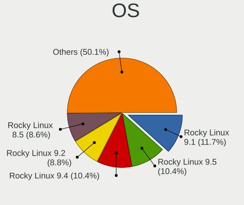

| Name             | Computers | Percent |
|------------------|-----------|---------|
| Rocky Linux 9.1  | 45        | 11.69%  |
| Rocky Linux 9.5  | 40        | 10.39%  |
| Rocky Linux 9.4  | 40        | 10.39%  |
| Rocky Linux 9.2  | 34        | 8.83%   |
| Rocky Linux 8.5  | 33        | 8.57%   |
| Rocky Linux 8.10 | 30        | 7.79%   |
| Rocky Linux 9.3  | 27        | 7.01%   |
| Rocky Linux 9.0  | 19        | 4.94%   |
| Rocky Linux 8.4  | 19        | 4.94%   |
| Rocky Linux 10.0 | 19        | 4.94%   |
| Rocky Linux 9.6  | 17        | 4.42%   |
| Rocky Linux 8.8  | 17        | 4.42%   |
| Rocky Linux 8.7  | 15        | 3.9%    |
| Rocky Linux 8.6  | 11        | 2.86%   |
| Rocky Linux 8.9  | 10        | 2.6%    |
| Rocky Linux 10.1 | 6         | 1.56%   |
| Rocky Linux 8.3  | 2         | 0.52%   |
| Rocky Linux 9.7  | 1         | 0.26%   |

OS Family
---------

OS without a version

| Name        | Computers | Percent |
|-------------|-----------|---------|
| Rocky Linux | 372       | 100%    |

Kernel
------

Version of the Linux kernel

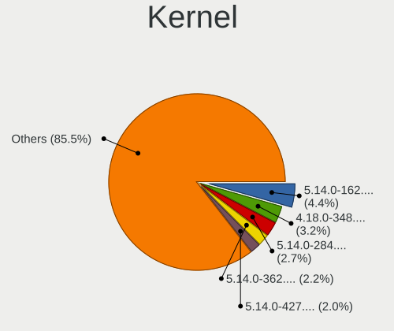

| Version                          | Computers | Percent |
|----------------------------------|-----------|---------|
| 5.14.0-162.6.1.el9_1.0.1.x86_64  | 18        | 4.41%   |
| 4.18.0-348.12.2.el8_5.x86_64     | 13        | 3.19%   |
| 5.14.0-284.30.1.el9_2.x86_64     | 11        | 2.7%    |
| 5.14.0-362.8.1.el9_3.x86_64      | 9         | 2.21%   |
| 5.14.0-427.13.1.el9_4.x86_64     | 8         | 1.96%   |
| 5.14.0-284.25.1.el9_2.x86_64     | 8         | 1.96%   |
| 5.14.0-284.18.1.el9_2.x86_64     | 8         | 1.96%   |
| 5.14.0-162.18.1.el9_1.x86_64     | 8         | 1.96%   |
| 4.18.0-477.27.1.el8_8.x86_64     | 8         | 1.96%   |
| 4.18.0-348.7.1.el8_5.x86_64      | 8         | 1.96%   |
| 5.14.0-162.23.1.el9_1.x86_64     | 7         | 1.72%   |
| 5.14.0-70.26.1.el9_0.x86_64      | 6         | 1.47%   |
| 5.14.0-503.19.1.el9_5.x86_64     | 6         | 1.47%   |
| 5.14.0-427.42.1.el9_4.x86_64     | 6         | 1.47%   |
| 5.14.0-284.11.1.el9_2.x86_64     | 6         | 1.47%   |
| 4.18.0-348.20.1.el8_5.x86_64     | 6         | 1.47%   |
| 4.18.0-305.10.2.el8_4.x86_64     | 6         | 1.47%   |
| 5.14.0-70.22.1.el9_0.x86_64      | 5         | 1.23%   |
| 5.14.0-503.40.1.el9_5.x86_64     | 5         | 1.23%   |
| 5.14.0-503.21.1.el9_5.x86_64     | 5         | 1.23%   |
| 5.14.0-503.15.1.el9_5.x86_64     | 5         | 1.23%   |
| 5.14.0-503.14.1.el9_5.x86_64     | 5         | 1.23%   |
| 5.14.0-427.35.1.el9_4.x86_64     | 5         | 1.23%   |
| 5.14.0-362.18.1.el9_3.0.1.x86_64 | 5         | 1.23%   |
| 5.14.0-162.12.1.el9_1.0.2.x86_64 | 5         | 1.23%   |
| 5.14.0-70.30.1.el9_0.x86_64      | 4         | 0.98%   |
| 5.14.0-70.17.1.el9_0.x86_64      | 4         | 0.98%   |
| 5.14.0-570.39.1.el9_6.x86_64     | 4         | 0.98%   |
| 5.14.0-503.38.1.el9_5.x86_64     | 4         | 0.98%   |
| 5.14.0-427.31.1.el9_4.x86_64     | 4         | 0.98%   |
| 5.14.0-427.24.1.el9_4.x86_64     | 4         | 0.98%   |
| 5.14.0-362.13.1.el9_3.x86_64     | 4         | 0.98%   |
| 5.14.0-162.6.1.el9_1.x86_64      | 4         | 0.98%   |
| 4.18.0-553.5.1.el8_10.x86_64     | 4         | 0.98%   |
| 4.18.0-553.22.1.el8_10.x86_64    | 4         | 0.98%   |
| 4.18.0-553.16.1.el8_10.x86_64    | 4         | 0.98%   |
| 4.18.0-425.3.1.el8.x86_64        | 4         | 0.98%   |
| 4.18.0-425.19.2.el8_7.x86_64     | 4         | 0.98%   |
| 6.12.0-55.22.1.el10_0.x86_64     | 3         | 0.74%   |
| 6.12.0-55.21.1.el10_0.x86_64     | 3         | 0.74%   |

Kernel Family
-------------

Linux kernel without a distro release

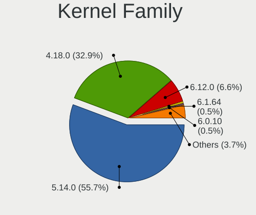

| Version | Computers | Percent |
|---------|-----------|---------|
| 5.14.0  | 210       | 55.7%   |
| 4.18.0  | 124       | 32.89%  |
| 6.12.0  | 25        | 6.63%   |
| 6.1.64  | 2         | 0.53%   |
| 6.0.10  | 2         | 0.53%   |
| 6.8.3   | 1         | 0.27%   |
| 6.6.11  | 1         | 0.27%   |
| 6.4.12  | 1         | 0.27%   |
| 6.2.12  | 1         | 0.27%   |
| 6.2.10  | 1         | 0.27%   |
| 6.10.4  | 1         | 0.27%   |
| 6.1.8   | 1         | 0.27%   |
| 6.1.6   | 1         | 0.27%   |
| 6.1.23  | 1         | 0.27%   |
| 5.4.157 | 1         | 0.27%   |
| 5.16.15 | 1         | 0.27%   |
| 5.14.1  | 1         | 0.27%   |
| 5.10.89 | 1         | 0.27%   |
| 5.10.52 | 1         | 0.27%   |

Kernel Major Ver.
-----------------

Linux kernel major version

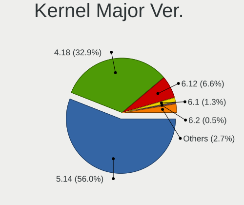

| Version | Computers | Percent |
|---------|-----------|---------|
| 5.14    | 211       | 55.97%  |
| 4.18    | 124       | 32.89%  |
| 6.12    | 25        | 6.63%   |
| 6.1     | 5         | 1.33%   |
| 6.2     | 2         | 0.53%   |
| 6.0     | 2         | 0.53%   |
| 5.10    | 2         | 0.53%   |
| 6.8     | 1         | 0.27%   |
| 6.6     | 1         | 0.27%   |
| 6.4     | 1         | 0.27%   |
| 6.10    | 1         | 0.27%   |
| 5.4     | 1         | 0.27%   |
| 5.16    | 1         | 0.27%   |

Arch
----

OS architecture (x86_64, i586, etc.)

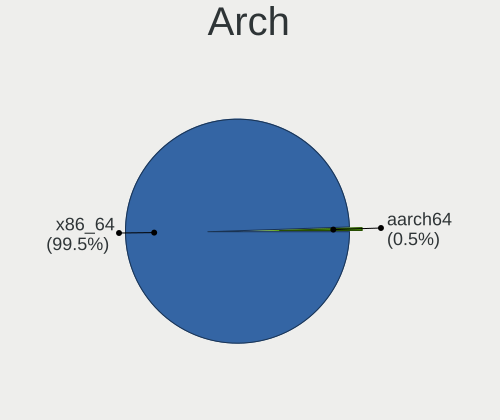

| Name    | Computers | Percent |
|---------|-----------|---------|
| x86_64  | 370       | 99.46%  |
| aarch64 | 2         | 0.54%   |

DE
--

Desktop Environment

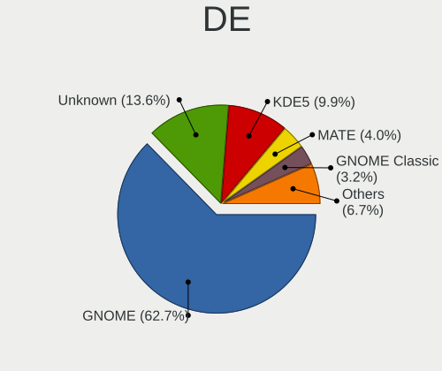

| Name          | Computers | Percent |
|---------------|-----------|---------|
| GNOME         | 235       | 62.67%  |
| Unknown       | 51        | 13.6%   |
| KDE5          | 37        | 9.87%   |
| MATE          | 15        | 4%      |
| GNOME Classic | 12        | 3.2%    |
| XFCE          | 10        | 2.67%   |
| KDE6          | 7         | 1.87%   |
| X-Cinnamon    | 6         | 1.6%    |
| Cinnamon      | 2         | 0.53%   |

Display Server
--------------

X11 or Wayland

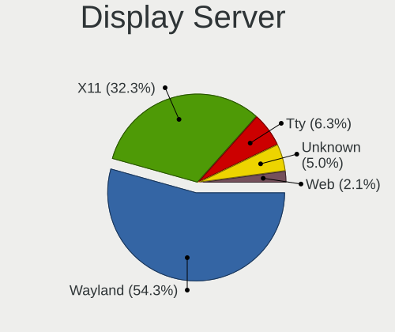

| Name    | Computers | Percent |
|---------|-----------|---------|
| Wayland | 207       | 54.33%  |
| X11     | 123       | 32.28%  |
| Tty     | 24        | 6.3%    |
| Unknown | 19        | 4.99%   |
| Web     | 8         | 2.1%    |

Display Manager
---------------

SDDM, LightDM, etc.

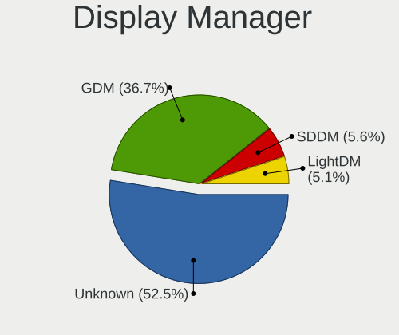

| Name    | Computers | Percent |
|---------|-----------|---------|
| Unknown | 196       | 52.55%  |
| GDM     | 137       | 36.73%  |
| SDDM    | 21        | 5.63%   |
| LightDM | 19        | 5.09%   |

OS Lang
-------

Language

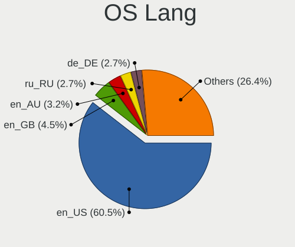

| Lang    | Computers | Percent |
|---------|-----------|---------|
| en_US   | 227       | 60.53%  |
| en_GB   | 17        | 4.53%   |
| en_AU   | 12        | 3.2%    |
| ru_RU   | 10        | 2.67%   |
| de_DE   | 10        | 2.67%   |
| C       | 10        | 2.67%   |
| it_IT   | 9         | 2.4%    |
| en_CA   | 9         | 2.4%    |
| pt_BR   | 7         | 1.87%   |
| ko_KR   | 6         | 1.6%    |
| Unknown | 6         | 1.6%    |
| zh_CN   | 4         | 1.07%   |
| fr_CA   | 4         | 1.07%   |
| ja_JP   | 3         | 0.8%    |
| fr_FR   | 3         | 0.8%    |
| es_ES   | 3         | 0.8%    |
| en_ZA   | 3         | 0.8%    |
| en_NZ   | 3         | 0.8%    |
| en_IL   | 3         | 0.8%    |
| pl_PL   | 2         | 0.53%   |
| hu_HU   | 2         | 0.53%   |
| en_SG   | 2         | 0.53%   |
| en_IN   | 2         | 0.53%   |
| en_IE   | 2         | 0.53%   |
| de_AT   | 2         | 0.53%   |
| cs_CZ   | 2         | 0.53%   |
| ca_ES   | 2         | 0.53%   |
| zh_TW   | 1         | 0.27%   |
| ro_RO   | 1         | 0.27%   |
| pt_PT   | 1         | 0.27%   |
| nl_NL   | 1         | 0.27%   |
| es_CR   | 1         | 0.27%   |
| es_CO   | 1         | 0.27%   |
| es_AR   | 1         | 0.27%   |
| de_CH   | 1         | 0.27%   |
| Default | 1         | 0.27%   |
| af_ZA   | 1         | 0.27%   |

Boot Mode
---------

EFI or BIOS

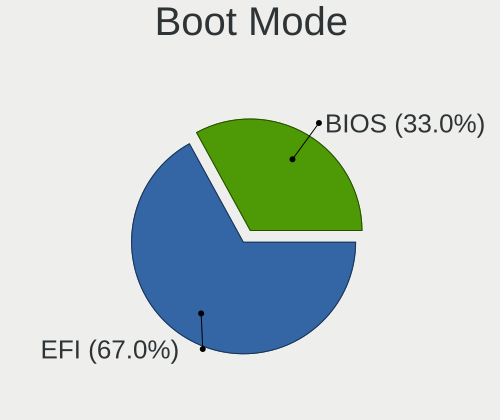

| Mode | Computers | Percent |
|------|-----------|---------|
| EFI  | 252       | 67.02%  |
| BIOS | 124       | 32.98%  |

Filesystem
----------

Type of filesystem

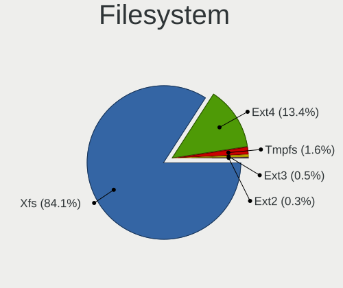

| Type  | Computers | Percent |
|-------|-----------|---------|
| Xfs   | 313       | 84.14%  |
| Ext4  | 50        | 13.44%  |
| Tmpfs | 6         | 1.61%   |
| Ext3  | 2         | 0.54%   |
| Ext2  | 1         | 0.27%   |

Part. scheme
------------

Scheme of partitioning

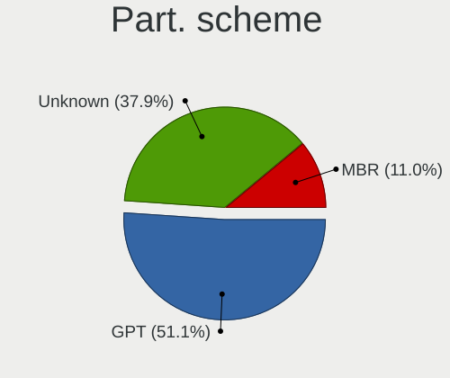

| Type    | Computers | Percent |
|---------|-----------|---------|
| GPT     | 190       | 51.08%  |
| Unknown | 141       | 37.9%   |
| MBR     | 41        | 11.02%  |

Dual Boot with Linux/BSD
------------------------

Hosting more than one Linux/BSD

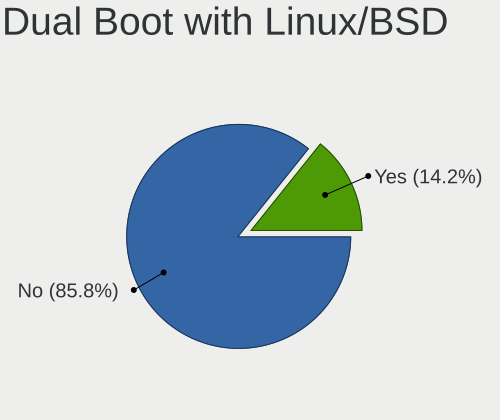

| Dual boot | Computers | Percent |
|-----------|-----------|---------|
| No        | 319       | 85.75%  |
| Yes       | 53        | 14.25%  |

Dual Boot (Win)
---------------

Hosting Linux and Windows

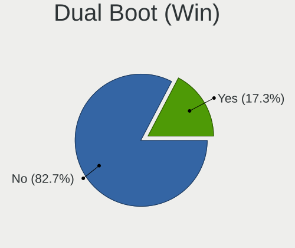

| Dual boot | Computers | Percent |
|-----------|-----------|---------|
| No        | 320       | 86.02%  |
| Yes       | 52        | 13.98%  |

Board
-----

Vendor
------

Motherboard manufacturer

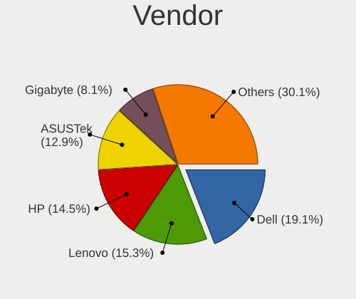

| Name                                 | Computers | Percent |
|--------------------------------------|-----------|---------|
| Dell                                 | 71        | 19.09%  |
| Lenovo                               | 57        | 15.32%  |
| Hewlett-Packard                      | 54        | 14.52%  |
| ASUSTek Computer                     | 48        | 12.9%   |
| Gigabyte Technology                  | 30        | 8.06%   |
| ASRock                               | 16        | 4.3%    |
| MSI                                  | 15        | 4.03%   |
| Supermicro                           | 11        | 2.96%   |
| Unknown                              | 8         | 2.15%   |
| Intel                                | 5         | 1.34%   |
| AZW                                  | 5         | 1.34%   |
| Acer                                 | 5         | 1.34%   |
| Toshiba                              | 3         | 0.81%   |
| Google                               | 3         | 0.81%   |
| Apple                                | 3         | 0.81%   |
| Shenzhen Meigao Electronic Equipment | 2         | 0.54%   |
| Raspberry Pi Foundation              | 2         | 0.54%   |
| Positivo                             | 2         | 0.54%   |
| Pegatron                             | 2         | 0.54%   |
| Huanan                               | 2         | 0.54%   |
| BESSTAR Tech                         | 2         | 0.54%   |
| ASRockRack                           | 2         | 0.54%   |
| Alienware                            | 2         | 0.54%   |
| TUXEDO                               | 1         | 0.27%   |
| Techvision                           | 1         | 0.27%   |
| System76                             | 1         | 0.27%   |
| Sony                                 | 1         | 0.27%   |
| Semp Toshiba                         | 1         | 0.27%   |
| Sapphire                             | 1         | 0.27%   |
| Phoenix                              | 1         | 0.27%   |
| PC Specialist                        | 1         | 0.27%   |
| NCR                                  | 1         | 0.27%   |
| MACHINIST                            | 1         | 0.27%   |
| Machenike                            | 1         | 0.27%   |
| ILLEGEAR                             | 1         | 0.27%   |
| IBM                                  | 1         | 0.27%   |
| HUAWEI                               | 1         | 0.27%   |
| HPE                                  | 1         | 0.27%   |
| GEEKOM                               | 1         | 0.27%   |
| Fujitsu                              | 1         | 0.27%   |

Model
-----

Motherboard model

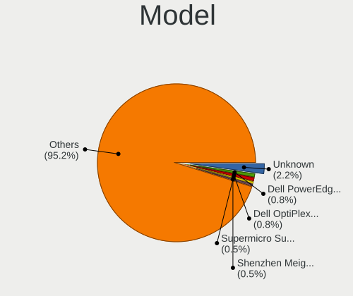

| Name                                              | Computers | Percent |
|---------------------------------------------------|-----------|---------|
| Unknown                                           | 8         | 2.15%   |
| Dell PowerEdge R610                               | 3         | 0.81%   |
| Dell OptiPlex 9020                                | 3         | 0.81%   |
| Supermicro Super Server                           | 2         | 0.54%   |
| Shenzhen Meigao Electronic Equipment Venus series | 2         | 0.54%   |
| MSI MS-7D15                                       | 2         | 0.54%   |
| HP Z600 Workstation                               | 2         | 0.54%   |
| HP Z210 Workstation                               | 2         | 0.54%   |
| HP Laptop 15-dy2xxx                               | 2         | 0.54%   |
| HP EliteDesk 800 G3 DM 35W                        | 2         | 0.54%   |
| HP EliteBook 840 G5                               | 2         | 0.54%   |
| Google Compute Engine                             | 2         | 0.54%   |
| Gigabyte 970A-DS3P                                | 2         | 0.54%   |
| Dell Vostro 3681                                  | 2         | 0.54%   |
| Dell Precision T7610                              | 2         | 0.54%   |
| Dell Precision 7530                               | 2         | 0.54%   |
| Dell Precision 3680                               | 2         | 0.54%   |
| Dell PowerEdge R730xd                             | 2         | 0.54%   |
| Dell Latitude E6520                               | 2         | 0.54%   |
| AZW GTR                                           | 2         | 0.54%   |
| ASUS PRIME B550-PLUS                              | 2         | 0.54%   |
| TUXEDO InfinityBook S 15/17 Gen7                  | 1         | 0.27%   |
| Toshiba TECRA W50-A                               | 1         | 0.27%   |
| Toshiba Satellite L50-A-1D6                       | 1         | 0.27%   |
| Toshiba Satellite E45-B                           | 1         | 0.27%   |
| Techvision TVI7309X                               | 1         | 0.27%   |
| System76 Thelio Mira                              | 1         | 0.27%   |
| Supermicro X9SCL/X9SCM                            | 1         | 0.27%   |
| Supermicro X9DRD-7LN4F(-JBOD)/X9DRD-EF            | 1         | 0.27%   |
| Supermicro X7DW3                                  | 1         | 0.27%   |
| Supermicro X10DAi                                 | 1         | 0.27%   |
| Supermicro SYS-6028R-WTR                          | 1         | 0.27%   |
| Supermicro SYS-6019U-TN4R4T                       | 1         | 0.27%   |
| Supermicro SYS-5029P-WTR                          | 1         | 0.27%   |
| Supermicro SYS-221BT-DNTR                         | 1         | 0.27%   |
| Supermicro AS -2023US-TR4                         | 1         | 0.27%   |
| Sony VPCF237FJ                                    | 1         | 0.27%   |
| Semp Toshiba STI                                  | 1         | 0.27%   |
| Sapphire PE-AM2RS690V2                            | 1         | 0.27%   |
| RPi Raspberry Pi 3 Model B Rev 1.2                | 1         | 0.27%   |

Model Family
------------

Motherboard model prefix

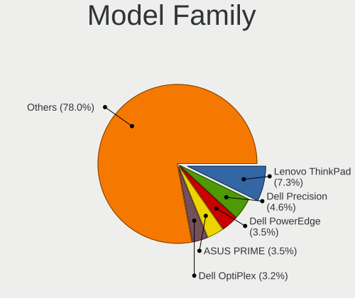

| Name                                       | Computers | Percent |
|--------------------------------------------|-----------|---------|
| Lenovo ThinkPad                            | 27        | 7.26%   |
| Dell Precision                             | 17        | 4.57%   |
| Dell PowerEdge                             | 13        | 3.49%   |
| ASUS PRIME                                 | 13        | 3.49%   |
| Dell OptiPlex                              | 12        | 3.23%   |
| Dell Latitude                              | 10        | 2.69%   |
| Lenovo IdeaPad                             | 9         | 2.42%   |
| HP EliteBook                               | 8         | 2.15%   |
| Unknown                                    | 8         | 2.15%   |
| Dell XPS                                   | 7         | 1.88%   |
| HP Laptop                                  | 6         | 1.61%   |
| Dell Vostro                                | 6         | 1.61%   |
| ASUS ROG                                   | 6         | 1.61%   |
| HP ProBook                                 | 5         | 1.34%   |
| Dell Inspiron                              | 5         | 1.34%   |
| Acer Aspire                                | 5         | 1.34%   |
| Lenovo Legion                              | 4         | 1.08%   |
| HP ZBook                                   | 4         | 1.08%   |
| HP EliteDesk                               | 4         | 1.08%   |
| Lenovo Yoga                                | 3         | 0.81%   |
| Lenovo ThinkCentre                         | 3         | 0.81%   |
| HP ProLiant                                | 3         | 0.81%   |
| HP OMEN                                    | 3         | 0.81%   |
| HP ENVY                                    | 3         | 0.81%   |
| HP Elite                                   | 3         | 0.81%   |
| ASUS TUF                                   | 3         | 0.81%   |
| ASUS Pro                                   | 3         | 0.81%   |
| ASUS ASUS                                  | 3         | 0.81%   |
| Toshiba Satellite                          | 2         | 0.54%   |
| Supermicro Super                           | 2         | 0.54%   |
| Shenzhen Meigao Electronic Equipment Venus | 2         | 0.54%   |
| RPi Raspberry                              | 2         | 0.54%   |
| MSI MS-7D15                                | 2         | 0.54%   |
| Lenovo ThinkStation                        | 2         | 0.54%   |
| Lenovo MIIX                                | 2         | 0.54%   |
| Lenovo IdeaPadFlex                         | 2         | 0.54%   |
| Huanan X99-F8D                             | 2         | 0.54%   |
| HP Z600                                    | 2         | 0.54%   |
| HP Z210                                    | 2         | 0.54%   |
| HP Pavilion                                | 2         | 0.54%   |

MFG Year
--------

Motherboard manufacture year

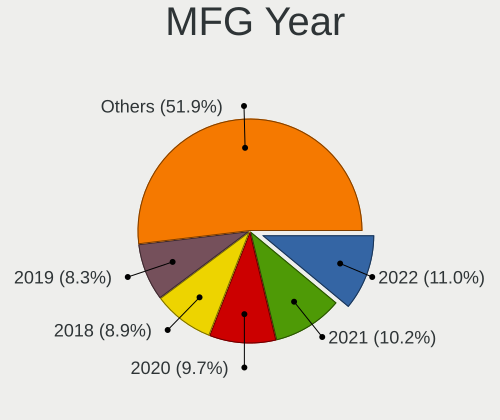

| Year    | Computers | Percent |
|---------|-----------|---------|
| 2022    | 41        | 11.02%  |
| 2021    | 38        | 10.22%  |
| 2020    | 36        | 9.68%   |
| 2018    | 33        | 8.87%   |
| 2019    | 31        | 8.33%   |
| 2011    | 22        | 5.91%   |
| 2015    | 21        | 5.65%   |
| 2023    | 20        | 5.38%   |
| 2017    | 20        | 5.38%   |
| 2024    | 18        | 4.84%   |
| 2014    | 18        | 4.84%   |
| 2013    | 18        | 4.84%   |
| 2012    | 15        | 4.03%   |
| 2016    | 10        | 2.69%   |
| 2010    | 9         | 2.42%   |
| 2009    | 9         | 2.42%   |
| 2008    | 6         | 1.61%   |
| 2025    | 4         | 1.08%   |
| Unknown | 2         | 0.54%   |
| 2007    | 1         | 0.27%   |

Form Factor
-----------

Physical design of the computer

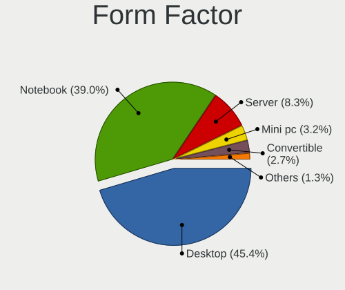

| Name           | Computers | Percent |
|----------------|-----------|---------|
| Desktop        | 169       | 45.43%  |
| Notebook       | 145       | 38.98%  |
| Server         | 31        | 8.33%   |
| Mini pc        | 12        | 3.23%   |
| Convertible    | 10        | 2.69%   |
| Tablet         | 3         | 0.81%   |
| System on chip | 2         | 0.54%   |

Secure Boot
-----------

Enabled or disabled

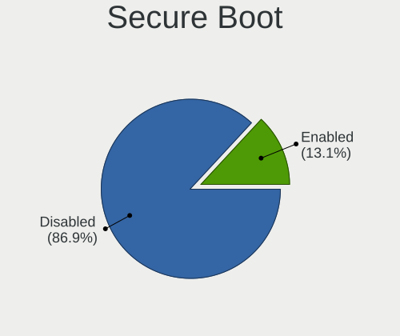

| State    | Computers | Percent |
|----------|-----------|---------|
| Disabled | 325       | 86.9%   |
| Enabled  | 49        | 13.1%   |

Coreboot
--------

Have coreboot on board

| Used | Computers | Percent |
|------|-----------|---------|
| No   | 371       | 99.73%  |
| Yes  | 1         | 0.27%   |

RAM Size
--------

Total RAM memory

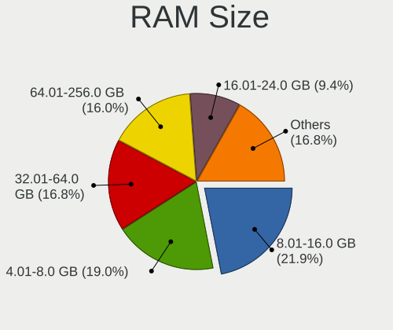

| Size in GB      | Computers | Percent |
|-----------------|-----------|---------|
| 8.01-16.0       | 82        | 21.93%  |
| 4.01-8.0        | 71        | 18.98%  |
| 32.01-64.0      | 63        | 16.84%  |
| 64.01-256.0     | 60        | 16.04%  |
| 16.01-24.0      | 35        | 9.36%   |
| 3.01-4.0        | 20        | 5.35%   |
| 24.01-32.0      | 18        | 4.81%   |
| More than 256.0 | 15        | 4.01%   |
| 1.01-2.0        | 5         | 1.34%   |
| 2.01-3.0        | 4         | 1.07%   |
| 0.51-1.0        | 1         | 0.27%   |

RAM Used
--------

Used RAM memory

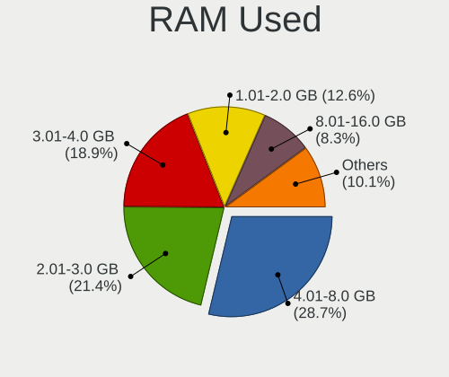

| Used GB     | Computers | Percent |
|-------------|-----------|---------|
| 4.01-8.0    | 114       | 28.72%  |
| 2.01-3.0    | 85        | 21.41%  |
| 3.01-4.0    | 75        | 18.89%  |
| 1.01-2.0    | 50        | 12.59%  |
| 8.01-16.0   | 33        | 8.31%   |
| 0.51-1.0    | 16        | 4.03%   |
| 16.01-24.0  | 8         | 2.02%   |
| 32.01-64.0  | 5         | 1.26%   |
| 24.01-32.0  | 4         | 1.01%   |
| 0.01-0.5    | 4         | 1.01%   |
| 64.01-256.0 | 3         | 0.76%   |

Total Drives
------------

Number of drives on board

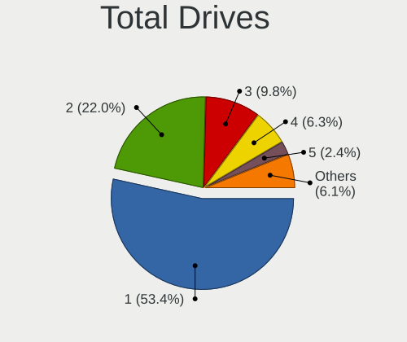

| Drives | Computers | Percent |
|--------|-----------|---------|
| 1      | 202       | 53.44%  |
| 2      | 83        | 21.96%  |
| 3      | 37        | 9.79%   |
| 4      | 24        | 6.35%   |
| 5      | 9         | 2.38%   |
| 6      | 6         | 1.59%   |
| 7      | 3         | 0.79%   |
| 17     | 2         | 0.53%   |
| 9      | 2         | 0.53%   |
| 0      | 2         | 0.53%   |
| 19     | 1         | 0.26%   |
| 18     | 1         | 0.26%   |
| 16     | 1         | 0.26%   |
| 14     | 1         | 0.26%   |
| 13     | 1         | 0.26%   |
| 12     | 1         | 0.26%   |
| 10     | 1         | 0.26%   |
| 8      | 1         | 0.26%   |

Has CD-ROM
----------

Has CD-ROM on board

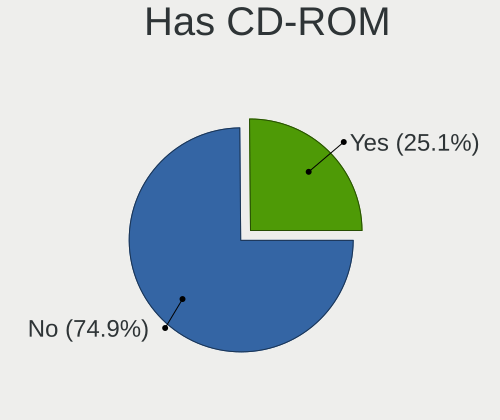

| Presented | Computers | Percent |
|-----------|-----------|---------|
| No        | 280       | 74.87%  |
| Yes       | 94        | 25.13%  |

Has Ethernet
------------

Has Ethernet on board

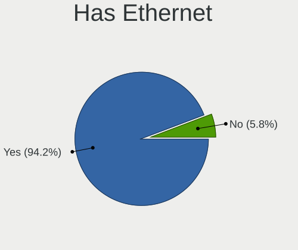

| Presented | Computers | Percent |
|-----------|-----------|---------|
| Yes       | 341       | 91.18%  |
| No        | 33        | 8.82%   |

Has WiFi
--------

Has WiFi module

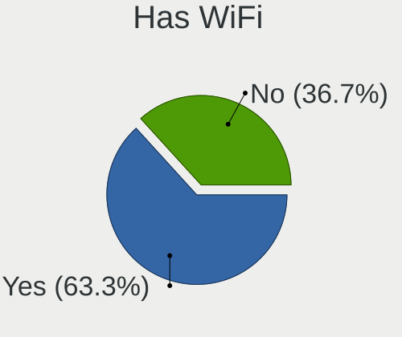

| Presented | Computers | Percent |
|-----------|-----------|---------|
| Yes       | 225       | 60%     |
| No        | 150       | 40%     |

Has Bluetooth
-------------

Has Bluetooth module

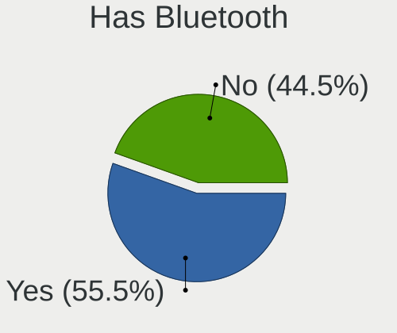

| Presented | Computers | Percent |
|-----------|-----------|---------|
| Yes       | 208       | 55.47%  |
| No        | 167       | 44.53%  |

Location
--------

Country
-------

Geographic location (country)

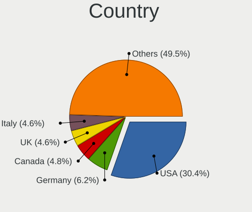

| Country      | Computers | Percent |
|--------------|-----------|---------|
| USA          | 113       | 30.38%  |
| Germany      | 23        | 6.18%   |
| Canada       | 18        | 4.84%   |
| UK           | 17        | 4.57%   |
| Italy        | 17        | 4.57%   |
| Russia       | 15        | 4.03%   |
| Australia    | 14        | 3.76%   |
| Brazil       | 11        | 2.96%   |
| Netherlands  | 10        | 2.69%   |
| France       | 9         | 2.42%   |
| South Korea  | 7         | 1.88%   |
| Spain        | 6         | 1.61%   |
| South Africa | 6         | 1.61%   |
| Czechia      | 6         | 1.61%   |
| Poland       | 5         | 1.34%   |
| Hungary      | 5         | 1.34%   |
| Sweden       | 4         | 1.08%   |
| Singapore    | 4         | 1.08%   |
| Mexico       | 4         | 1.08%   |
| Israel       | 4         | 1.08%   |
| Indonesia    | 4         | 1.08%   |
| India        | 4         | 1.08%   |
| China        | 4         | 1.08%   |
| Austria      | 4         | 1.08%   |
| Switzerland  | 3         | 0.81%   |
| Romania      | 3         | 0.81%   |
| Portugal     | 3         | 0.81%   |
| New Zealand  | 3         | 0.81%   |
| Malaysia     | 3         | 0.81%   |
| Japan        | 3         | 0.81%   |
| Argentina    | 3         | 0.81%   |
| Turkey       | 2         | 0.54%   |
| Pakistan     | 2         | 0.54%   |
| Norway       | 2         | 0.54%   |
| Kazakhstan   | 2         | 0.54%   |
| Ireland      | 2         | 0.54%   |
| Hong Kong    | 2         | 0.54%   |
| Finland      | 2         | 0.54%   |
| Egypt        | 2         | 0.54%   |
| Croatia      | 2         | 0.54%   |

City
----

Geographic location (city)

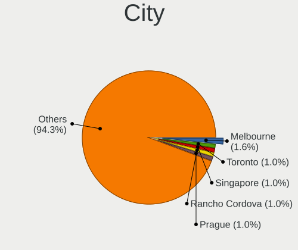

| City              | Computers | Percent |
|-------------------|-----------|---------|
| Melbourne         | 6         | 1.55%   |
| Toronto           | 4         | 1.04%   |
| Singapore         | 4         | 1.04%   |
| Rancho Cordova    | 4         | 1.04%   |
| Prague            | 4         | 1.04%   |
| Moscow            | 4         | 1.04%   |
| Frankfurt am Main | 4         | 1.04%   |
| Budapest          | 4         | 1.04%   |
| Berlin            | 4         | 1.04%   |
| Washington        | 3         | 0.78%   |
| Voronezh          | 3         | 0.78%   |
| Vienna            | 3         | 0.78%   |
| Turin             | 3         | 0.78%   |
| Sorel-Tracy       | 3         | 0.78%   |
| Montreal          | 3         | 0.78%   |
| Milan             | 3         | 0.78%   |
| London            | 3         | 0.78%   |
| Düsseldorf       | 3         | 0.78%   |
| Chicago           | 3         | 0.78%   |
| Barzanò          | 3         | 0.78%   |
| St Petersburg     | 2         | 0.52%   |
| Springfield       | 2         | 0.52%   |
| Sofia             | 2         | 0.52%   |
| Sao Paulo         | 2         | 0.52%   |
| Rennes            | 2         | 0.52%   |
| Pittsburgh        | 2         | 0.52%   |
| Philadelphia      | 2         | 0.52%   |
| Perth             | 2         | 0.52%   |
| Oslo              | 2         | 0.52%   |
| New York          | 2         | 0.52%   |
| Mexico City       | 2         | 0.52%   |
| Melun             | 2         | 0.52%   |
| Los Angeles       | 2         | 0.52%   |
| Lisbon            | 2         | 0.52%   |
| Kuala Lumpur      | 2         | 0.52%   |
| Krakow            | 2         | 0.52%   |
| Itaperuna         | 2         | 0.52%   |
| Houston           | 2         | 0.52%   |
| Haifa             | 2         | 0.52%   |
| Giessen           | 2         | 0.52%   |

Drives
------

Drive Vendor
------------

Hard drive vendors

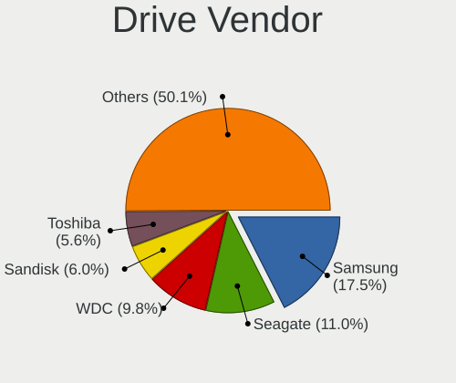

| Vendor                       | Computers | Drives | Percent |
|------------------------------|-----------|--------|---------|
| Samsung Electronics          | 100       | 152    | 17.51%  |
| Seagate                      | 63        | 165    | 11.03%  |
| WDC                          | 56        | 104    | 9.81%   |
| Sandisk                      | 34        | 39     | 5.95%   |
| Toshiba                      | 32        | 39     | 5.6%    |
| Micron Technology            | 26        | 30     | 4.55%   |
| Kingston                     | 26        | 35     | 4.55%   |
| Crucial                      | 25        | 31     | 4.38%   |
| Intel                        | 20        | 27     | 3.5%    |
| SK hynix                     | 17        | 23     | 2.98%   |
| Unknown                      | 16        | 21     | 2.8%    |
| Micron/Crucial Technology    | 14        | 17     | 2.45%   |
| Hitachi                      | 10        | 15     | 1.75%   |
| HGST                         | 8         | 10     | 1.4%    |
| Phison Electronics           | 7         | 27     | 1.23%   |
| PNY                          | 5         | 7      | 0.88%   |
| MAXIO Technology (Hangzhou)  | 5         | 8      | 0.88%   |
| KIOXIA                       | 5         | 5      | 0.88%   |
| Hewlett-Packard              | 5         | 9      | 0.88%   |
| Shenzhen Longsys Electronics | 4         | 7      | 0.7%    |
| A-DATA Technology            | 4         | 4      | 0.7%    |
| SABRENT                      | 3         | 4      | 0.53%   |
| Phison                       | 3         | 4      | 0.53%   |
| LITEON                       | 3         | 5      | 0.53%   |
| China                        | 3         | 3      | 0.53%   |
| Unknown                      | 3         | 3      | 0.53%   |
| Union Memory (Shenzhen)      | 2         | 4      | 0.35%   |
| Transcend                    | 2         | 2      | 0.35%   |
| Silicon Motion               | 2         | 4      | 0.35%   |
| Realtek Semiconductor        | 2         | 2      | 0.35%   |
| LITEONIT                     | 2         | 2      | 0.35%   |
| Lexar                        | 2         | 2      | 0.35%   |
| Kingston Technology Company  | 2         | 2      | 0.35%   |
| KingSpec                     | 2         | 3      | 0.35%   |
| Gigabyte Technology          | 2         | 2      | 0.35%   |
| Dogfish                      | 2         | 2      | 0.35%   |
| Corsair                      | 2         | 2      | 0.35%   |
| AMD                          | 2         | 8      | 0.35%   |
| ADATA Technology             | 2         | 3      | 0.35%   |
| Yangtze Memory Technologies  | 1         | 1      | 0.18%   |

Drive Model
-----------

Hard drive models

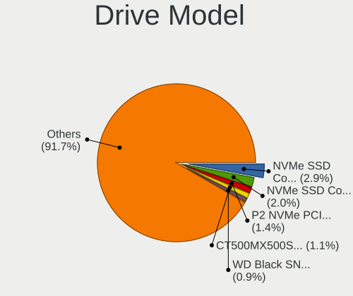

| Model                                                | Computers | Percent |
|------------------------------------------------------|-----------|---------|
| Samsung NVMe SSD Controller PM9A1/PM9A3/980PRO 1TB   | 19        | 2.93%   |
| Samsung NVMe SSD Controller SM981/PM981/PM983 1TB    | 13        | 2.01%   |
| Micron/Crucial P2 NVMe PCIe SSD 2TB                  | 9         | 1.39%   |
| Crucial CT500MX500SSD1 500GB                         | 7         | 1.08%   |
| Sandisk WD Black SN750 / PC SN730 NVMe SSD 500GB     | 6         | 0.93%   |
| Samsung NVMe SSD Controller SM961/PM961/SM963 1024GB | 5         | 0.77%   |
| Phison E12 NVMe Controller 1TB                       | 5         | 0.77%   |
| Unknown MMC Card  64GB                               | 4         | 0.62%   |
| Seagate ST500DM002-1BD142 500GB                      | 4         | 0.62%   |
| Samsung SSD 870 EVO 1TB                              | 4         | 0.62%   |
| Kingston SA400S37960G 960GB SSD                      | 4         | 0.62%   |
| Kingston SA400S37240G 240GB SSD                      | 4         | 0.62%   |
| Crucial CT1000MX500SSD1 1TB                          | 4         | 0.62%   |
| Toshiba MQ01ABD100 1TB                               | 3         | 0.46%   |
| Seagate ST4000DM004-2CV104 4TB                       | 3         | 0.46%   |
| Seagate ST300MP0005 304GB                            | 3         | 0.46%   |
| Seagate ST2000DM008-2UB102 2TB                       | 3         | 0.46%   |
| Seagate ST2000DM008-2FR102 2TB                       | 3         | 0.46%   |
| Seagate ST1000LM024 HN-M101MBB 1TB                   | 3         | 0.46%   |
| Seagate ST1000DM010-2EP102 1TB                       | 3         | 0.46%   |
| Samsung SSD 990 PRO 2TB                              | 3         | 0.46%   |
| Samsung SSD 980 500GB                                | 3         | 0.46%   |
| Samsung SSD 980 1TB                                  | 3         | 0.46%   |
| SABRENT Disk 4TB                                     | 3         | 0.46%   |
| Micron CT1000P3SSD8 1TB                              | 3         | 0.46%   |
| MAXIO (Hangzhou) NVMe SSD Controller MAP1202 2TB     | 3         | 0.46%   |
| Kingston SV300S37A240G 240GB SSD                     | 3         | 0.46%   |
| Intel SSD 660P Series 512GB                          | 3         | 0.46%   |
| Crucial CT240BX500SSD1 240GB                         | 3         | 0.46%   |
| Unknown                                              | 3         | 0.46%   |
| WDC WD5000AAKX-75U6AA0 500GB                         | 2         | 0.31%   |
| WDC WD20EZBX-00AYRA0 2TB                             | 2         | 0.31%   |
| WDC WD2002FAEX-007BA0 2TB                            | 2         | 0.31%   |
| WDC WD10EZEX-00BN5A0 1TB                             | 2         | 0.31%   |
| WDC WD10EZEX-00BBHA0 1TB                             | 2         | 0.31%   |
| WDC WD1001FALS-00J7B0 1TB                            | 2         | 0.31%   |
| WDC WD Blue SA510 M.2 2280 1000GB                    | 2         | 0.31%   |
| Unknown SD/MMC/MS PRO 2GB                            | 2         | 0.31%   |
| Unknown SD/MMC 16GB                                  | 2         | 0.31%   |
| Unknown MMC Card  128GB                              | 2         | 0.31%   |

HDD Vendor
----------

Hard disk drive vendors

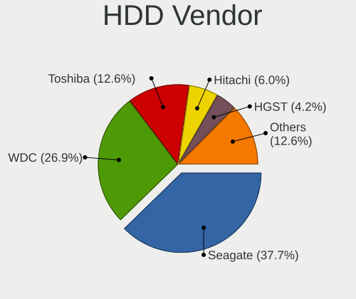

| Vendor              | Computers | Drives | Percent |
|---------------------|-----------|--------|---------|
| Seagate             | 63        | 164    | 37.72%  |
| WDC                 | 45        | 86     | 26.95%  |
| Toshiba             | 21        | 27     | 12.57%  |
| Hitachi             | 10        | 15     | 5.99%   |
| HGST                | 7         | 9      | 4.19%   |
| Samsung Electronics | 4         | 7      | 2.4%    |
| Unknown             | 3         | 3      | 1.8%    |
| Hewlett-Packard     | 3         | 7      | 1.8%    |
| USB3.0              | 1         | 1      | 0.6%    |
| TO Exter            | 1         | 1      | 0.6%    |
| StoreJet            | 1         | 1      | 0.6%    |
| QUANTUM             | 1         | 4      | 0.6%    |
| Mobius              | 1         | 2      | 0.6%    |
| IET                 | 1         | 4      | 0.6%    |
| IBM                 | 1         | 1      | 0.6%    |
| HGST HTS            | 1         | 1      | 0.6%    |
| Fujitsu             | 1         | 1      | 0.6%    |
| DELLBOSS            | 1         | 1      | 0.6%    |
| ASMT                | 1         | 1      | 0.6%    |

SSD Vendor
----------

Solid state drive vendors

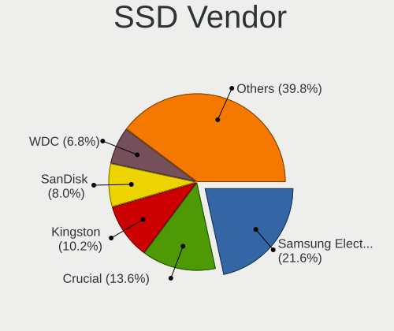

| Vendor              | Computers | Drives | Percent |
|---------------------|-----------|--------|---------|
| Samsung Electronics | 38        | 58     | 21.59%  |
| Crucial             | 24        | 30     | 13.64%  |
| Kingston            | 18        | 25     | 10.23%  |
| SanDisk             | 14        | 15     | 7.95%   |
| WDC                 | 12        | 15     | 6.82%   |
| Micron Technology   | 7         | 8      | 3.98%   |
| Toshiba             | 6         | 6      | 3.41%   |
| PNY                 | 5         | 7      | 2.84%   |
| Intel               | 4         | 6      | 2.27%   |
| SK hynix            | 3         | 3      | 1.7%    |
| SABRENT             | 3         | 4      | 1.7%    |
| LITEON              | 3         | 5      | 1.7%    |
| China               | 3         | 3      | 1.7%    |
| Unknown             | 3         | 3      | 1.7%    |
| LITEONIT            | 2         | 2      | 1.14%   |
| KingSpec            | 2         | 3      | 1.14%   |
| Gigabyte Technology | 2         | 2      | 1.14%   |
| Dogfish             | 2         | 2      | 1.14%   |
| A-DATA Technology   | 2         | 2      | 1.14%   |
| Transcend           | 1         | 1      | 0.57%   |
| Teclast             | 1         | 1      | 0.57%   |
| Team                | 1         | 1      | 0.57%   |
| SPCC                | 1         | 1      | 0.57%   |
| SATADOM-SL          | 1         | 1      | 0.57%   |
| Rogueware           | 1         | 1      | 0.57%   |
| Patriot             | 1         | 1      | 0.57%   |
| Netac               | 1         | 1      | 0.57%   |
| MyDigitalSSD        | 1         | 1      | 0.57%   |
| Lexar               | 1         | 1      | 0.57%   |
| KingFast            | 1         | 1      | 0.57%   |
| Intenso             | 1         | 2      | 0.57%   |
| INDMEM              | 1         | 1      | 0.57%   |
| GOODRAM             | 1         | 1      | 0.57%   |
| G-DRIVE             | 1         | 1      | 0.57%   |
| EAGET               | 1         | 1      | 0.57%   |
| DUEX-120GB          | 1         | 1      | 0.57%   |
| Digma               | 1         | 1      | 0.57%   |
| Corsair             | 1         | 1      | 0.57%   |
| BR                  | 1         | 1      | 0.57%   |
| Apple               | 1         | 1      | 0.57%   |

Drive Kind
----------

HDD or SSD

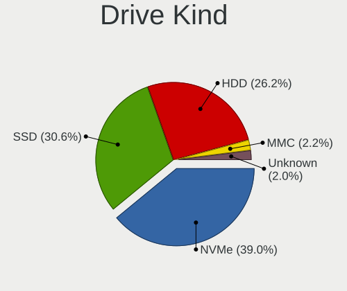

| Kind    | Computers | Drives | Percent |
|---------|-----------|--------|---------|
| NVMe    | 194       | 302    | 39.03%  |
| SSD     | 152       | 223    | 30.58%  |
| HDD     | 130       | 336    | 26.16%  |
| MMC     | 11        | 11     | 2.21%   |
| Unknown | 10        | 16     | 2.01%   |

Drive Connector
---------------

SATA, SAS, NVMe, etc.

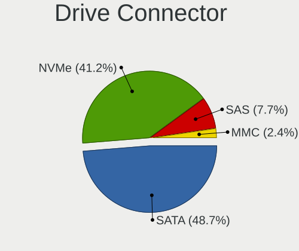

| Type | Computers | Drives | Percent |
|------|-----------|--------|---------|
| SATA | 228       | 523    | 48.72%  |
| NVMe | 193       | 299    | 41.24%  |
| SAS  | 36        | 55     | 7.69%   |
| MMC  | 11        | 11     | 2.35%   |

Drive Size
----------

Size of hard drive

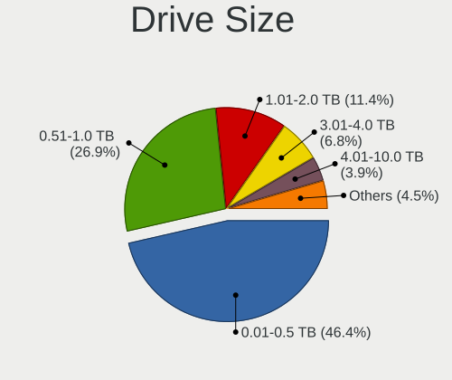

| Size in TB | Computers | Drives | Percent |
|------------|-----------|--------|---------|
| 0.01-0.5   | 143       | 219    | 46.43%  |
| 0.51-1.0   | 83        | 151    | 26.95%  |
| 1.01-2.0   | 35        | 72     | 11.36%  |
| 3.01-4.0   | 21        | 55     | 6.82%   |
| 4.01-10.0  | 12        | 39     | 3.9%    |
| 2.01-3.0   | 7         | 11     | 2.27%   |
| 10.01-20.0 | 5         | 8      | 1.62%   |
| 20.01-50.0 | 2         | 4      | 0.65%   |

Space Total
-----------

Amount of disk space available on the file system

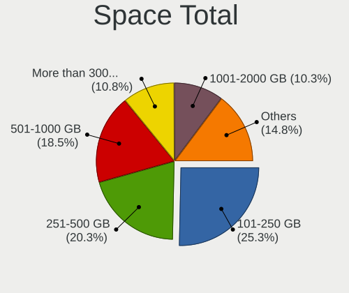

| Size in GB     | Computers | Percent |
|----------------|-----------|---------|
| 101-250        | 96        | 25.33%  |
| 251-500        | 77        | 20.32%  |
| 501-1000       | 70        | 18.47%  |
| More than 3000 | 41        | 10.82%  |
| 1001-2000      | 39        | 10.29%  |
| 2001-3000      | 16        | 4.22%   |
| 51-100         | 11        | 2.9%    |
| Unknown        | 11        | 2.9%    |
| 1-20           | 10        | 2.64%   |
| 21-50          | 8         | 2.11%   |

Space Used
----------

Amount of used disk space

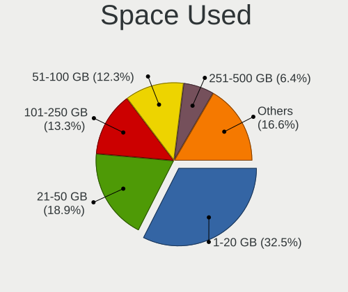

| Used GB        | Computers | Percent |
|----------------|-----------|---------|
| 1-20           | 127       | 32.48%  |
| 21-50          | 74        | 18.93%  |
| 101-250        | 52        | 13.3%   |
| 51-100         | 48        | 12.28%  |
| 251-500        | 25        | 6.39%   |
| More than 3000 | 19        | 4.86%   |
| 501-1000       | 19        | 4.86%   |
| 1001-2000      | 13        | 3.32%   |
| Unknown        | 11        | 2.81%   |
| 2001-3000      | 3         | 0.77%   |

Malfunc. Drives
---------------

Drive models with a malfunction

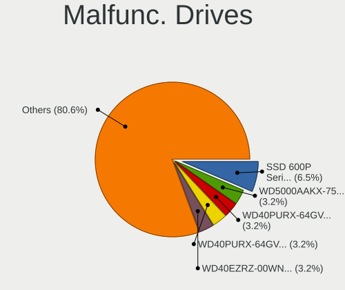

| Model                                                     | Computers | Drives | Percent |
|-----------------------------------------------------------|-----------|--------|---------|
| Intel SSD 600P Series 1024GB                              | 2         | 3      | 6.45%   |
| WDC WD5000AAKX-75U6AA0 500GB                              | 1         | 1      | 3.23%   |
| WDC WD40PURX-64GVNY0 4TB                                  | 1         | 1      | 3.23%   |
| WDC WD40PURX-64GVNY0 1 4TB                                | 1         | 1      | 3.23%   |
| WDC WD40EZRZ-00WN9B0 4TB                                  | 1         | 1      | 3.23%   |
| WDC WD40EFAX-68JH4N1 4TB                                  | 1         | 6      | 3.23%   |
| WDC WD40 EFRX-68N32N0 4TB                                 | 1         | 1      | 3.23%   |
| WDC WD1001FALS-00J7B1 1TB                                 | 1         | 2      | 3.23%   |
| WDC WD1001FALS-00J7B0 1TB                                 | 1         | 4      | 3.23%   |
| Toshiba MQ01ABF050 500GB                                  | 1         | 1      | 3.23%   |
| Toshiba MK1059GSM 1TB                                     | 1         | 1      | 3.23%   |
| Seagate ST9500325AS 500GB                                 | 1         | 1      | 3.23%   |
| Seagate ST9320325AS 320GB                                 | 1         | 1      | 3.23%   |
| Seagate ST9250410AS 250GB                                 | 1         | 1      | 3.23%   |
| Seagate ST8000AS0002-1NA17Z 8TB                           | 1         | 1      | 3.23%   |
| Seagate ST500LM021-1KJ152 500GB                           | 1         | 1      | 3.23%   |
| Seagate ST4000NM0033-9ZM170 4TB                           | 1         | 10     | 3.23%   |
| Seagate ST31000528AS 1TB                                  | 1         | 2      | 3.23%   |
| Seagate ST2000DM008-2FR102 2TB                            | 1         | 2      | 3.23%   |
| Samsung Electronics SSD 850 EVO 1TB                       | 1         | 1      | 3.23%   |
| SABRENT SSD 1TB                                           | 1         | 1      | 3.23%   |
| Realtek Semiconductor RTS5763DL NVMe SSD Controller 512GB | 1         | 1      | 3.23%   |
| Kingston SE50S3100G 100GB SSD                             | 1         | 1      | 3.23%   |
| Intel SSDSC2KB960G8 960GB                                 | 1         | 2      | 3.23%   |
| IBM ST3500641NS 39M4517 39M0181 500GB                     | 1         | 1      | 3.23%   |
| Hitachi HTS727575A9E364 752GB                             | 1         | 1      | 3.23%   |
| Hitachi HDS725050KLA360 500GB                             | 1         | 1      | 3.23%   |
| Hitachi HDS721010CLA632 1TB                               | 1         | 1      | 3.23%   |
| Crucial CT1050MX300SSD1 1050GB                            | 1         | 1      | 3.23%   |
| Corsair Neutron SSD 64GB                                  | 1         | 1      | 3.23%   |

Malfunc. Drive Vendor
---------------------

Vendors of faulty drives

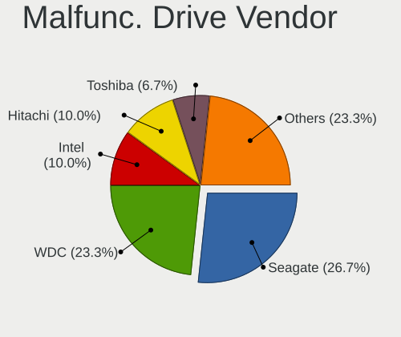

| Vendor                | Computers | Drives | Percent |
|-----------------------|-----------|--------|---------|
| Seagate               | 8         | 19     | 26.67%  |
| WDC                   | 7         | 17     | 23.33%  |
| Intel                 | 3         | 5      | 10%     |
| Hitachi               | 3         | 3      | 10%     |
| Toshiba               | 2         | 2      | 6.67%   |
| Samsung Electronics   | 1         | 1      | 3.33%   |
| SABRENT               | 1         | 1      | 3.33%   |
| Realtek Semiconductor | 1         | 1      | 3.33%   |
| Kingston              | 1         | 1      | 3.33%   |
| IBM                   | 1         | 1      | 3.33%   |
| Crucial               | 1         | 1      | 3.33%   |
| Corsair               | 1         | 1      | 3.33%   |

Malfunc. HDD Vendor
-------------------

Vendors of faulty HDD drives

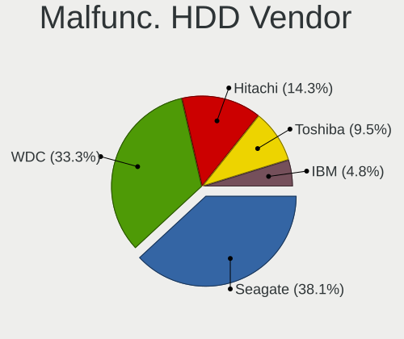

| Vendor  | Computers | Drives | Percent |
|---------|-----------|--------|---------|
| Seagate | 8         | 19     | 38.1%   |
| WDC     | 7         | 17     | 33.33%  |
| Hitachi | 3         | 3      | 14.29%  |
| Toshiba | 2         | 2      | 9.52%   |
| IBM     | 1         | 1      | 4.76%   |

Malfunc. Drive Kind
-------------------

Kinds of faulty drives

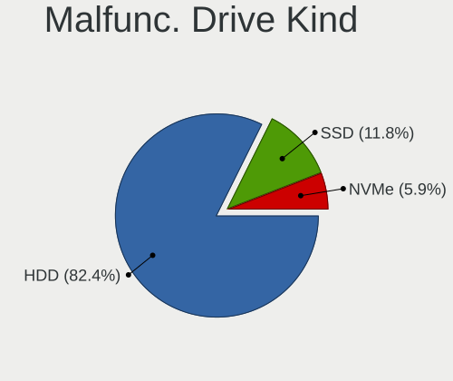

| Kind | Computers | Drives | Percent |
|------|-----------|--------|---------|
| HDD  | 19        | 42     | 67.86%  |
| SSD  | 6         | 7      | 21.43%  |
| NVMe | 3         | 4      | 10.71%  |

Failed Drives
-------------

Failed drive models

| Model                     | Computers | Drives | Percent |
|---------------------------|-----------|--------|---------|
| Seagate ST9500420AS 500GB | 1         | 1      | 100%    |

Failed Drive Vendor
-------------------

Failed drive vendors

| Vendor  | Computers | Drives | Percent |
|---------|-----------|--------|---------|
| Seagate | 1         | 1      | 100%    |

Drive Status
------------

Number of failed and malfunc. drives

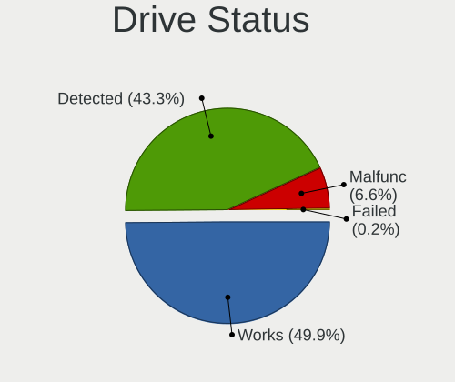

| Status   | Computers | Drives | Percent |
|----------|-----------|--------|---------|
| Works    | 204       | 446    | 49.88%  |
| Detected | 177       | 388    | 43.28%  |
| Malfunc  | 27        | 53     | 6.6%    |
| Failed   | 1         | 1      | 0.24%   |

Storage controller
------------------

Storage Vendor
--------------

Storage controller vendors

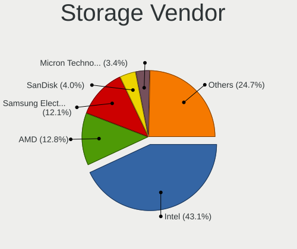

| Vendor                                  | Computers | Percent |
|-----------------------------------------|-----------|---------|
| Intel                                   | 239       | 43.06%  |
| AMD                                     | 71        | 12.79%  |
| Samsung Electronics                     | 67        | 12.07%  |
| SanDisk                                 | 22        | 3.96%   |
| Micron Technology                       | 19        | 3.42%   |
| Micron/Crucial Technology               | 15        | 2.7%    |
| LSI Logic / Symbios Logic               | 15        | 2.7%    |
| SK hynix                                | 14        | 2.52%   |
| Phison Electronics                      | 11        | 1.98%   |
| Kingston Technology Company             | 10        | 1.8%    |
| Broadcom / LSI                          | 10        | 1.8%    |
| ASMedia Technology                      | 9         | 1.62%   |
| KIOXIA                                  | 6         | 1.08%   |
| Toshiba America Info Systems            | 5         | 0.9%    |
| Shenzhen Longsys Electronics            | 5         | 0.9%    |
| MAXIO Technology (Hangzhou)             | 5         | 0.9%    |
| Realtek Semiconductor                   | 4         | 0.72%   |
| Silicon Motion                          | 3         | 0.54%   |
| Hewlett-Packard                         | 3         | 0.54%   |
| Union Memory (Shenzhen)                 | 2         | 0.36%   |
| Silicon Image                           | 2         | 0.36%   |
| Marvell Technology Group                | 2         | 0.36%   |
| JMicron Technology                      | 2         | 0.36%   |
| ADATA Technology                        | 2         | 0.36%   |
| Adaptec                                 | 2         | 0.36%   |
| Yangtze Memory Technologies             | 1         | 0.18%   |
| VIA Technologies                        | 1         | 0.18%   |
| Transcend                               | 1         | 0.18%   |
| Solidigm                                | 1         | 0.18%   |
| Shenzhen Unionmemory Information System | 1         | 0.18%   |
| Seagate Technology                      | 1         | 0.18%   |
| Nvidia                                  | 1         | 0.18%   |
| Nextorage                               | 1         | 0.18%   |
| INNOGRIT                                | 1         | 0.18%   |
| Biwin Storage Technology                | 1         | 0.18%   |

Storage Model
-------------

Storage controller models

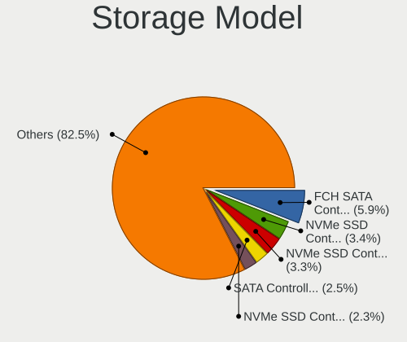

| Model                                                                                   | Computers | Percent |
|-----------------------------------------------------------------------------------------|-----------|---------|
| AMD FCH SATA Controller [AHCI mode]                                                     | 38        | 5.94%   |
| Samsung NVMe SSD Controller PM9A1/PM9A3/980PRO                                          | 22        | 3.44%   |
| Samsung NVMe SSD Controller SM981/PM981/PM983                                           | 21        | 3.28%   |
| Intel SATA Controller [RAID mode]                                                       | 16        | 2.5%    |
| Samsung NVMe SSD Controller 980 (DRAM-less)                                             | 15        | 2.34%   |
| Intel 8 Series/C220 Series Chipset Family 6-port SATA Controller 1 [AHCI mode]          | 13        | 2.03%   |
| Intel Sunrise Point-LP SATA Controller [AHCI mode]                                      | 12        | 1.88%   |
| AMD 600 Series Chipset SATA Controller                                                  | 12        | 1.88%   |
| Intel Volume Management Device NVMe RAID Controller                                     | 11        | 1.72%   |
| Intel Alder Lake-S PCH SATA Controller [AHCI Mode]                                      | 11        | 1.72%   |
| Intel 82801 Mobile SATA Controller [RAID mode]                                          | 11        | 1.72%   |
| AMD 400 Series Chipset SATA Controller                                                  | 11        | 1.72%   |
| Micron/Crucial P2 [Nick P2] / P3 / P3 Plus NVMe PCIe SSD (DRAM-less)                    | 10        | 1.56%   |
| Intel Q170/Q150/B150/H170/H110/Z170/CM236 Chipset SATA Controller [AHCI Mode]           | 10        | 1.56%   |
| Intel 200 Series PCH SATA controller [AHCI mode]                                        | 10        | 1.56%   |
| Intel C610/X99 series chipset sSATA Controller [AHCI mode]                              | 9         | 1.41%   |
| Intel C610/X99 series chipset 6-Port SATA Controller [AHCI mode]                        | 9         | 1.41%   |
| Micron 3400 NVMe SSD [Hendrix]                                                          | 8         | 1.25%   |
| AMD 500 Series Chipset SATA Controller                                                  | 8         | 1.25%   |
| Intel 7 Series Chipset Family 6-port SATA Controller [AHCI mode]                        | 7         | 1.09%   |
| ASMedia ASM1061/ASM1062 Serial ATA Controller                                           | 7         | 1.09%   |
| SanDisk Extreme Pro / WD Black SN750 / PC SN730 / Red SN700 NVMe SSD                    | 6         | 0.94%   |
| Phison E12 NVMe Controller                                                              | 6         | 0.94%   |
| Intel RST Volume Management Device Controller                                           | 6         | 0.94%   |
| Intel Cannon Lake PCH SATA AHCI Controller                                              | 6         | 0.94%   |
| Intel 6 Series/C200 Series Chipset Family Desktop SATA Controller (IDE mode, ports 4-5) | 6         | 0.94%   |
| Intel 6 Series/C200 Series Chipset Family Desktop SATA Controller (IDE mode, ports 0-3) | 6         | 0.94%   |
| Intel 500 Series Chipset Family SATA AHCI Controller                                    | 6         | 0.94%   |
| Broadcom / LSI SAS2308 PCI-Express Fusion-MPT SAS-2                                     | 6         | 0.94%   |
| AMD SB7x0/SB8x0/SB9x0 SATA Controller [AHCI mode]                                       | 6         | 0.94%   |
| Samsung NVMe SSD Controller SM961/PM961/SM963                                           | 5         | 0.78%   |
| LSI Logic / Symbios Logic MegaRAID SAS-3 3108 [Invader]                                 | 5         | 0.78%   |
| Intel Raptor Lake SATA AHCI Controller                                                  | 5         | 0.78%   |
| Intel Comet Lake SATA AHCI Controller                                                   | 5         | 0.78%   |
| Intel Celeron/Pentium Silver Processor SATA Controller                                  | 5         | 0.78%   |
| Intel Cannon Lake Mobile PCH SATA AHCI Controller                                       | 5         | 0.78%   |
| Intel C620 Series Chipset Family SSATA Controller [AHCI mode]                           | 5         | 0.78%   |
| Intel C620 Series Chipset Family SATA Controller [AHCI mode]                            | 5         | 0.78%   |
| Intel C600/X79 series chipset 6-Port SATA AHCI Controller                               | 5         | 0.78%   |
| Intel 6 Series/C200 Series Chipset Family 6 port Desktop SATA AHCI Controller           | 5         | 0.78%   |

Storage Kind
------------

Kind of storage controller (IDE, SATA, NVMe, SAS, ...)

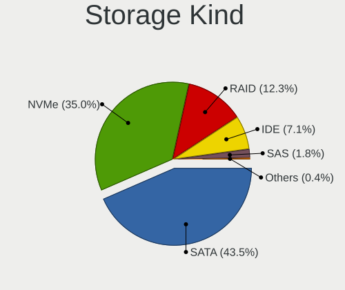

| Kind | Computers | Percent |
|------|-----------|---------|
| SATA | 240       | 43.48%  |
| NVMe | 193       | 34.96%  |
| RAID | 68        | 12.32%  |
| IDE  | 39        | 7.07%   |
| SAS  | 10        | 1.81%   |
| SCSI | 2         | 0.36%   |

Processor
---------

CPU Vendor
----------

Processor vendors

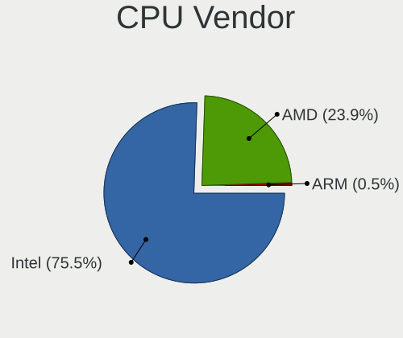

| Vendor | Computers | Percent |
|--------|-----------|---------|
| Intel  | 281       | 75.54%  |
| AMD    | 89        | 23.92%  |
| ARM    | 2         | 0.54%   |

CPU Model
---------

Processor models

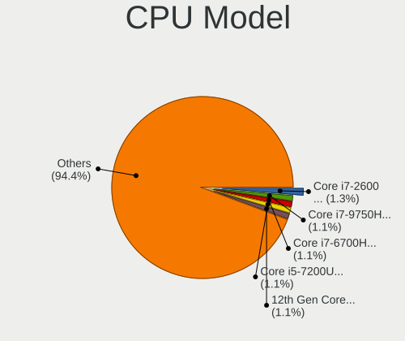

| Model                                   | Computers | Percent |
|-----------------------------------------|-----------|---------|
| Intel Core i7-2600 CPU @ 3.40GHz        | 5         | 1.34%   |
| Intel Core i7-9750H CPU @ 2.60GHz       | 4         | 1.08%   |
| Intel Core i7-6700HQ CPU @ 2.60GHz      | 4         | 1.08%   |
| Intel Core i5-7200U CPU @ 2.50GHz       | 4         | 1.08%   |
| Intel 12th Gen Core i7-1260P            | 4         | 1.08%   |
| Intel 12th Gen Core i5-12400F           | 4         | 1.08%   |
| Intel 11th Gen Core i7-1165G7 @ 2.80GHz | 4         | 1.08%   |
| AMD Ryzen 7 5800X 8-Core Processor      | 4         | 1.08%   |
| Intel Xeon CPU L5530 @ 2.40GHz          | 3         | 0.81%   |
| Intel Core i7-8750H CPU @ 2.20GHz       | 3         | 0.81%   |
| Intel Core i7-8550U CPU @ 1.80GHz       | 3         | 0.81%   |
| Intel Core i7-4770 CPU @ 3.40GHz        | 3         | 0.81%   |
| Intel Core i7-10750H CPU @ 2.60GHz      | 3         | 0.81%   |
| Intel Core i5-8350U CPU @ 1.70GHz       | 3         | 0.81%   |
| Intel Core i5-1035G1 CPU @ 1.00GHz      | 3         | 0.81%   |
| Intel 12th Gen Core i7-12700            | 3         | 0.81%   |
| AMD Ryzen 9 6900HX with Radeon Graphics | 3         | 0.81%   |
| AMD Ryzen 9 5900HX with Radeon Graphics | 3         | 0.81%   |
| Intel Xeon Platinum 8481C               | 2         | 0.54%   |
| Intel Xeon Gold 6130 CPU @ 2.10GHz      | 2         | 0.54%   |
| Intel Xeon CPU E5-2680 v4 @ 2.40GHz     | 2         | 0.54%   |
| Intel Xeon CPU E5-2665 0 @ 2.40GHz      | 2         | 0.54%   |
| Intel Xeon CPU E5-2630 v3 @ 2.40GHz     | 2         | 0.54%   |
| Intel Xeon CPU E5-2620 v3 @ 2.40GHz     | 2         | 0.54%   |
| Intel Xeon CPU E5-2620 0 @ 2.00GHz      | 2         | 0.54%   |
| Intel Xeon CPU E3110 @ 3.00GHz          | 2         | 0.54%   |
| Intel Core i9-14900                     | 2         | 0.54%   |
| Intel Core i7-7700HQ CPU @ 2.80GHz      | 2         | 0.54%   |
| Intel Core i7-6700T CPU @ 2.80GHz       | 2         | 0.54%   |
| Intel Core i7-6500U CPU @ 2.50GHz       | 2         | 0.54%   |
| Intel Core i7-5500U CPU @ 2.40GHz       | 2         | 0.54%   |
| Intel Core i7-4790K CPU @ 4.00GHz       | 2         | 0.54%   |
| Intel Core i7-4790 CPU @ 3.60GHz        | 2         | 0.54%   |
| Intel Core i7-4700MQ CPU @ 2.40GHz      | 2         | 0.54%   |
| Intel Core i7-3770 CPU @ 3.40GHz        | 2         | 0.54%   |
| Intel Core i7-10610U CPU @ 1.80GHz      | 2         | 0.54%   |
| Intel Core i5-9500T CPU @ 2.20GHz       | 2         | 0.54%   |
| Intel Core i5-8250U CPU @ 1.60GHz       | 2         | 0.54%   |
| Intel Core i5-7500 CPU @ 3.40GHz        | 2         | 0.54%   |
| Intel Core i5-2540M CPU @ 2.60GHz       | 2         | 0.54%   |

CPU Model Family
----------------

Processor model prefix

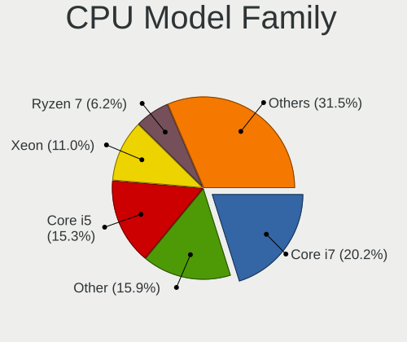

| Model                   | Computers | Percent |
|-------------------------|-----------|---------|
| Intel Core i7           | 75        | 20.16%  |
| Other                   | 59        | 15.86%  |
| Intel Core i5           | 57        | 15.32%  |
| Intel Xeon              | 41        | 11.02%  |
| AMD Ryzen 7             | 23        | 6.18%   |
| AMD Ryzen 9             | 19        | 5.11%   |
| AMD Ryzen 5             | 14        | 3.76%   |
| Intel Celeron           | 10        | 2.69%   |
| Intel Core i3           | 8         | 2.15%   |
| Intel Core i9           | 7         | 1.88%   |
| AMD Ryzen Threadripper  | 7         | 1.88%   |
| Intel Xeon Gold         | 5         | 1.34%   |
| AMD FX                  | 5         | 1.34%   |
| Intel Core 2 Duo        | 4         | 1.08%   |
| AMD Ryzen 5 PRO         | 4         | 1.08%   |
| Intel Xeon Platinum     | 3         | 0.81%   |
| Intel Pentium Gold      | 3         | 0.81%   |
| Intel Core              | 3         | 0.81%   |
| Intel Xeon Silver       | 2         | 0.54%   |
| Intel Pentium Dual-Core | 2         | 0.54%   |
| Intel Pentium           | 2         | 0.54%   |
| Intel Core 2 Quad       | 2         | 0.54%   |
| Intel Atom              | 2         | 0.54%   |
| AMD Ryzen 3             | 2         | 0.54%   |
| AMD EPYC                | 2         | 0.54%   |
| AMD A8                  | 2         | 0.54%   |
| Intel Pentium Silver    | 1         | 0.27%   |
| Intel Pentium Dual      | 1         | 0.27%   |
| AMD Sempron             | 1         | 0.27%   |
| AMD Ryzen Embedded      | 1         | 0.27%   |
| AMD Ryzen 7 PRO         | 1         | 0.27%   |
| AMD Phenom II X6        | 1         | 0.27%   |
| AMD Athlon II X2        | 1         | 0.27%   |
| AMD A4                  | 1         | 0.27%   |
| AMD A10                 | 1         | 0.27%   |

CPU Cores
---------

Number of processor cores

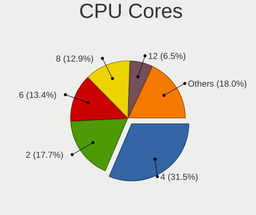

| Number  | Computers | Percent |
|---------|-----------|---------|
| 4       | 117       | 31.45%  |
| 2       | 66        | 17.74%  |
| 6       | 50        | 13.44%  |
| 8       | 48        | 12.9%   |
| 12      | 24        | 6.45%   |
| 16      | 18        | 4.84%   |
| 24      | 11        | 2.96%   |
| 10      | 11        | 2.96%   |
| 14      | 6         | 1.61%   |
| 32      | 5         | 1.34%   |
| 28      | 3         | 0.81%   |
| 96      | 2         | 0.54%   |
| 64      | 2         | 0.54%   |
| 40      | 2         | 0.54%   |
| 20      | 2         | 0.54%   |
| 36      | 1         | 0.27%   |
| 5       | 1         | 0.27%   |
| 3       | 1         | 0.27%   |
| 1       | 1         | 0.27%   |
| Unknown | 1         | 0.27%   |

CPU Sockets
-----------

Number of sockets

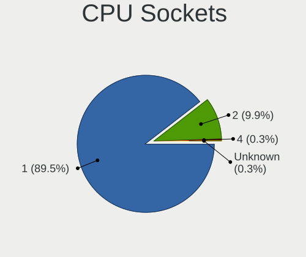

| Number  | Computers | Percent |
|---------|-----------|---------|
| 1       | 333       | 89.52%  |
| 2       | 37        | 9.95%   |
| 4       | 1         | 0.27%   |
| Unknown | 1         | 0.27%   |

CPU Threads
-----------

Threads per core (Hyper-Threading)

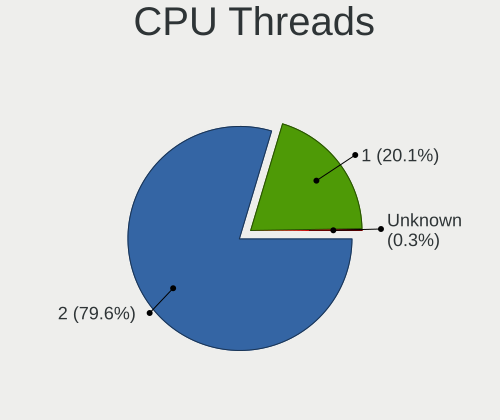

| Number  | Computers | Percent |
|---------|-----------|---------|
| 2       | 297       | 79.62%  |
| 1       | 75        | 20.11%  |
| Unknown | 1         | 0.27%   |

CPU Op-Modes
------------

CPU Operation Modes (32-bit, 64-bit)

| Op mode        | Computers | Percent |
|----------------|-----------|---------|
| 32-bit, 64-bit | 372       | 100%    |

CPU Microcode
-------------

Microcode number

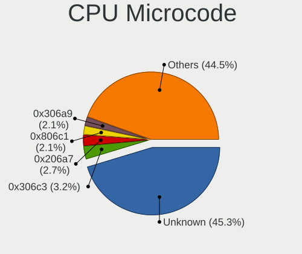

| Number     | Computers | Percent |
|------------|-----------|---------|
| Unknown    | 170       | 45.33%  |
| 0x306c3    | 12        | 3.2%    |
| 0x206a7    | 10        | 2.67%   |
| 0x806c1    | 8         | 2.13%   |
| 0x306a9    | 8         | 2.13%   |
| 0x806ea    | 7         | 1.87%   |
| 0x506e3    | 7         | 1.87%   |
| 0x806ec    | 6         | 1.6%    |
| 0xa0652    | 5         | 1.33%   |
| 0x50654    | 5         | 1.33%   |
| 0x0a50000c | 5         | 1.33%   |
| 0x906a3    | 4         | 1.07%   |
| 0x0a601203 | 4         | 1.07%   |
| 0x0a404102 | 4         | 1.07%   |
| 0x906ea    | 3         | 0.8%    |
| 0x906c0    | 3         | 0.8%    |
| 0x806e9    | 3         | 0.8%    |
| 0x706a8    | 3         | 0.8%    |
| 0x306f2    | 3         | 0.8%    |
| 0x206d7    | 3         | 0.8%    |
| 0x206c2    | 3         | 0.8%    |
| 0x0800820d | 3         | 0.8%    |
| 0x06000852 | 3         | 0.8%    |
| 0xb0671    | 2         | 0.53%   |
| 0xa0671    | 2         | 0.53%   |
| 0xa0655    | 2         | 0.53%   |
| 0xa0653    | 2         | 0.53%   |
| 0x906a4    | 2         | 0.53%   |
| 0x90675    | 2         | 0.53%   |
| 0x90672    | 2         | 0.53%   |
| 0x406f1    | 2         | 0.53%   |
| 0x40651    | 2         | 0.53%   |
| 0x306e4    | 2         | 0.53%   |
| 0x306d4    | 2         | 0.53%   |
| 0x106a5    | 2         | 0.53%   |
| 0x1067a    | 2         | 0.53%   |
| 0x10676    | 2         | 0.53%   |
| 0x0b404023 | 2         | 0.53%   |
| 0x0a50000d | 2         | 0.53%   |
| 0x0a50000b | 2         | 0.53%   |

CPU Microarch
-------------

Microarchitecture

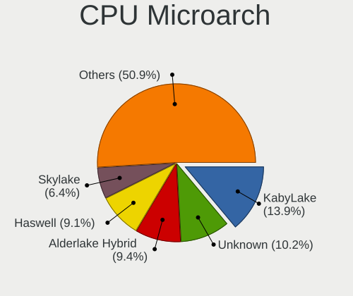

| Name              | Computers | Percent |
|-------------------|-----------|---------|
| KabyLake          | 52        | 13.94%  |
| Unknown           | 38        | 10.19%  |
| Alderlake Hybrid  | 35        | 9.38%   |
| Haswell           | 34        | 9.12%   |
| Skylake           | 24        | 6.43%   |
| SandyBridge       | 22        | 5.9%    |
| Zen 3             | 21        | 5.63%   |
| IvyBridge         | 17        | 4.56%   |
| CometLake         | 14        | 3.75%   |
| Zen 2             | 13        | 3.49%   |
| TigerLake         | 10        | 2.68%   |
| Broadwell         | 10        | 2.68%   |
| Westmere          | 9         | 2.41%   |
| Penryn            | 9         | 2.41%   |
| Zen+              | 8         | 2.14%   |
| Icelake           | 8         | 2.14%   |
| Piledriver        | 7         | 1.88%   |
| Nehalem           | 7         | 1.88%   |
| Zen               | 6         | 1.61%   |
| Goldmont plus     | 5         | 1.34%   |
| Silvermont        | 4         | 1.07%   |
| Tremont           | 3         | 0.8%    |
| Meteorlake Hybrid | 3         | 0.8%    |
| K10               | 3         | 0.8%    |
| Excavator         | 3         | 0.8%    |
| Core              | 3         | 0.8%    |
| Sapphire Rapids   | 2         | 0.54%   |
| K10 Llano         | 1         | 0.27%   |
| Jaguar            | 1         | 0.27%   |
| Bulldozer         | 1         | 0.27%   |

Graphics
--------

GPU Vendor
----------

Vendors of graphics cards

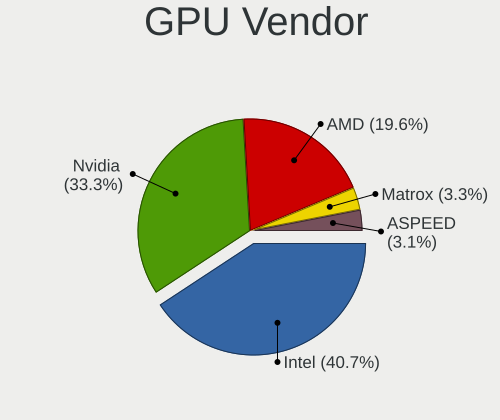

| Vendor                     | Computers | Percent |
|----------------------------|-----------|---------|
| Intel                      | 187       | 40.74%  |
| Nvidia                     | 153       | 33.33%  |
| AMD                        | 90        | 19.61%  |
| Matrox Electronics Systems | 15        | 3.27%   |
| ASPEED Technology          | 14        | 3.05%   |

GPU Model
---------

Graphics card models

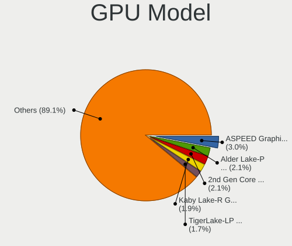

| Model                                                                       | Computers | Percent |
|-----------------------------------------------------------------------------|-----------|---------|
| ASPEED Technology ASPEED Graphics Family                                    | 14        | 3%      |
| Intel Alder Lake-P GT2 [Iris Xe Graphics]                                   | 10        | 2.15%   |
| Intel 2nd Generation Core Processor Family Integrated Graphics Controller   | 10        | 2.15%   |
| Intel Kaby Lake-R GT2 [UHD Graphics 620]                                    | 9         | 1.93%   |
| Intel TigerLake-LP GT2 [Iris Xe Graphics]                                   | 8         | 1.72%   |
| Intel 3rd Gen Core processor Graphics Controller                            | 8         | 1.72%   |
| AMD Cezanne [Radeon Vega Series / Radeon Vega Mobile Series]                | 8         | 1.72%   |
| Matrox Electronics Systems MGA G200eW WPCM450                               | 7         | 1.5%    |
| Intel Kaby Lake-U GT2 [HD Graphics 620]                                     | 7         | 1.5%    |
| Intel CometLake-H GT2 [UHD Graphics]                                        | 7         | 1.5%    |
| Intel CoffeeLake-H GT2 [UHD Graphics 630]                                   | 7         | 1.5%    |
| Intel 4th Gen Core Processor Integrated Graphics Controller                 | 7         | 1.5%    |
| Matrox Electronics Systems G200eR2                                          | 6         | 1.29%   |
| Intel Xeon E3-1200 v3/4th Gen Core Processor Integrated Graphics Controller | 6         | 1.29%   |
| Intel Skylake-S GT2 [HD Graphics 530]                                       | 6         | 1.29%   |
| Intel CoffeeLake-S GT2 [UHD Graphics 630]                                   | 6         | 1.29%   |
| AMD Rembrandt [Radeon 680M]                                                 | 6         | 1.29%   |
| Nvidia GK208B [GeForce GT 730]                                              | 5         | 1.07%   |
| Nvidia AD102 [GeForce RTX 4090]                                             | 5         | 1.07%   |
| Intel CometLake-U GT2 [UHD Graphics]                                        | 5         | 1.07%   |
| Intel Alder Lake-UP3 GT2 [Iris Xe Graphics]                                 | 5         | 1.07%   |
| AMD Renoir [Radeon Vega Series / Radeon Vega Mobile Series]                 | 5         | 1.07%   |
| AMD Raphael                                                                 | 5         | 1.07%   |
| AMD Picasso/Raven 2 [Radeon Vega Series / Radeon Vega Mobile Series]        | 5         | 1.07%   |
| AMD Ellesmere [Radeon RX 470/480/570/570X/580/580X/590]                     | 5         | 1.07%   |
| Intel WhiskeyLake-U GT2 [UHD Graphics 620]                                  | 4         | 0.86%   |
| Intel Skylake-U GT2 [HD Graphics 520]                                       | 4         | 0.86%   |
| Intel Kaby Lake-S GT2 [HD Graphics 630]                                     | 4         | 0.86%   |
| Intel GeminiLake [UHD Graphics 600]                                         | 4         | 0.86%   |
| Intel CometLake-S GT2 [UHD Graphics 630]                                    | 4         | 0.86%   |
| AMD ES1000                                                                  | 4         | 0.86%   |
| Nvidia TU117M [GeForce GTX 1650 Mobile / Max-Q]                             | 3         | 0.64%   |
| Nvidia TU117GLM [Quadro T1000 Mobile]                                       | 3         | 0.64%   |
| Nvidia TU106M [GeForce RTX 2060 Mobile]                                     | 3         | 0.64%   |
| Nvidia GK106GLM [Quadro K2100M]                                             | 3         | 0.64%   |
| Nvidia GA104M [GeForce RTX 3070 Mobile / Max-Q]                             | 3         | 0.64%   |
| Intel Skylake-H GT2 [HD Graphics 530]                                       | 3         | 0.64%   |
| Intel Raptor Lake-S UHD Graphics                                            | 3         | 0.64%   |
| Intel JasperLake [UHD Graphics]                                             | 3         | 0.64%   |
| Intel Iris Plus Graphics G1 (Ice Lake)                                      | 3         | 0.64%   |

GPU Combo
---------

Combinations of graphics cards

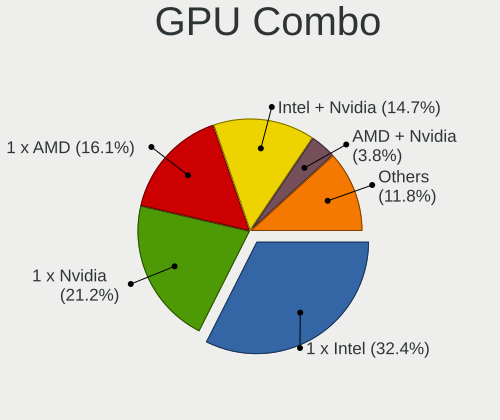

| Name            | Computers | Percent |
|-----------------|-----------|---------|
| 1 x Intel       | 121       | 32.44%  |
| 1 x Nvidia      | 79        | 21.18%  |
| 1 x AMD         | 60        | 16.09%  |
| Intel + Nvidia  | 55        | 14.75%  |
| AMD + Nvidia    | 14        | 3.75%   |
| 1 x Matrox      | 12        | 3.22%   |
| 1 x ASPEED      | 7         | 1.88%   |
| Intel + AMD     | 6         | 1.61%   |
| 2 x AMD         | 5         | 1.34%   |
| Other           | 4         | 1.07%   |
| AMD + ASPEED    | 4         | 1.07%   |
| Nvidia + ASPEED | 3         | 0.8%    |
| Nvidia + Matrox | 2         | 0.54%   |
| AMD + Matrox    | 1         | 0.27%   |

GPU Driver
----------

Free vs proprietary

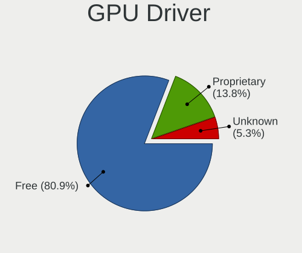

| Driver      | Computers | Percent |
|-------------|-----------|---------|
| Free        | 304       | 80.85%  |
| Proprietary | 52        | 13.83%  |
| Unknown     | 20        | 5.32%   |

GPU Memory
----------

Total video memory

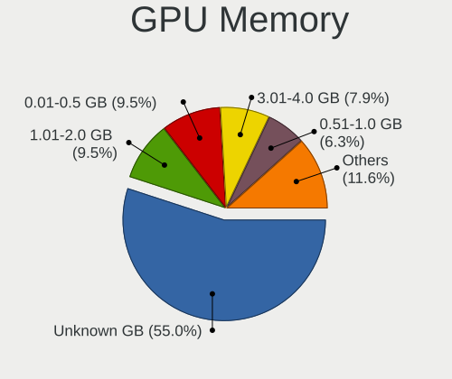

| Size in GB | Computers | Percent |
|------------|-----------|---------|
| Unknown    | 208       | 55.03%  |
| 1.01-2.0   | 36        | 9.52%   |
| 0.01-0.5   | 36        | 9.52%   |
| 3.01-4.0   | 30        | 7.94%   |
| 0.51-1.0   | 24        | 6.35%   |
| 7.01-8.0   | 14        | 3.7%    |
| 5.01-6.0   | 9         | 2.38%   |
| 16.01-24.0 | 8         | 2.12%   |
| 8.01-16.0  | 8         | 2.12%   |
| 2.01-3.0   | 4         | 1.06%   |
| 32.01-64.0 | 1         | 0.26%   |

Monitor
-------

Monitor Vendor
--------------

Monitor vendors

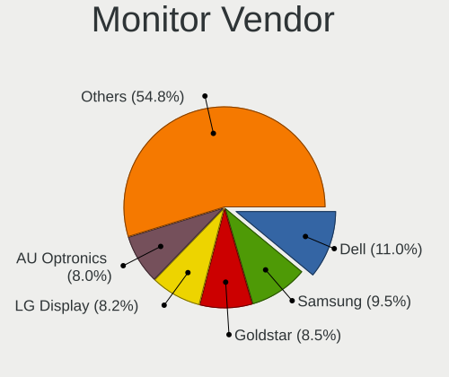

| Vendor                  | Computers | Percent |
|-------------------------|-----------|---------|
| Dell                    | 44        | 11%     |
| Samsung Electronics     | 38        | 9.5%    |
| Goldstar                | 34        | 8.5%    |
| LG Display              | 33        | 8.25%   |
| AU Optronics            | 32        | 8%      |
| BOE                     | 31        | 7.75%   |
| Chimei Innolux          | 23        | 5.75%   |
| Acer                    | 17        | 4.25%   |
| Philips                 | 14        | 3.5%    |
| Hewlett-Packard         | 13        | 3.25%   |
| BenQ                    | 12        | 3%      |
| AOC                     | 11        | 2.75%   |
| Sharp                   | 10        | 2.5%    |
| Eizo                    | 7         | 1.75%   |
| Ancor Communications    | 7         | 1.75%   |
| Lenovo                  | 5         | 1.25%   |
| InfoVision              | 4         | 1%      |
| Iiyama                  | 4         | 1%      |
| ViewSonic               | 3         | 0.75%   |
| ASUSTek Computer        | 3         | 0.75%   |
| Apple                   | 3         | 0.75%   |
| Vizio                   | 2         | 0.5%    |
| Sony                    | 2         | 0.5%    |
| SGT                     | 2         | 0.5%    |
| Sceptre Tech            | 2         | 0.5%    |
| PANDA                   | 2         | 0.5%    |
| Panasonic               | 2         | 0.5%    |
| MSI                     | 2         | 0.5%    |
| LG Electronics          | 2         | 0.5%    |
| Gigabyte Technology     | 2         | 0.5%    |
| Fujitsu Siemens         | 2         | 0.5%    |
| CSO                     | 2         | 0.5%    |
| Chi Mei Optoelectronics | 2         | 0.5%    |
| ADR                     | 2         | 0.5%    |
| Unknown                 | 2         | 0.5%    |
| ZTL                     | 1         | 0.25%   |
| YSN                     | 1         | 0.25%   |
| Xiaomi                  | 1         | 0.25%   |
| Unknown (XXX)           | 1         | 0.25%   |
| Toshiba                 | 1         | 0.25%   |

Monitor Model
-------------

Monitor models

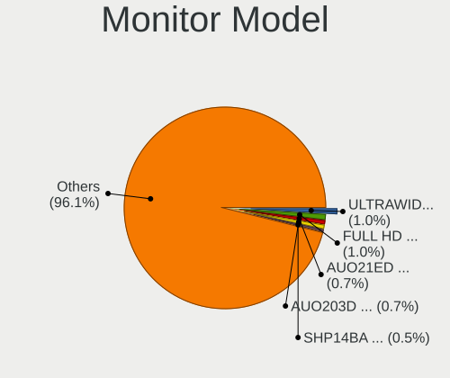

| Model                                                             | Computers | Percent |
|-------------------------------------------------------------------|-----------|---------|
| Goldstar ULTRAWIDE GSM76F6 3440x1440 800x335mm 34.1-inch          | 4         | 0.97%   |
| Goldstar FULL HD GSM5B55 1920x1080 480x270mm 21.7-inch            | 4         | 0.97%   |
| AU Optronics LCD Monitor AUO21ED 1920x1080 344x193mm 15.5-inch    | 3         | 0.73%   |
| AU Optronics LCD Monitor AUO203D 1920x1080 309x174mm 14.0-inch    | 3         | 0.73%   |
| Sharp LCD Monitor SHP14BA 1920x1080 344x194mm 15.5-inch           | 2         | 0.48%   |
| Samsung Electronics C24F390 SAM0D2C 1920x1080 521x293mm 23.5-inch | 2         | 0.48%   |
| Philips PHL 273V7 PHLC156 1920x1080 598x336mm 27.0-inch           | 2         | 0.48%   |
| PANDA LCD Monitor NCP004D 1920x1080 344x194mm 15.5-inch           | 2         | 0.48%   |
| LG Display LCD Monitor LGD02DF 1600x900 310x174mm 14.0-inch       | 2         | 0.48%   |
| Goldstar ULTRAWIDE GSM76FD 2560x1080 531x298mm 24.0-inch          | 2         | 0.48%   |
| Goldstar LG ULTRAWIDE GSM59F1 2560x1080 670x280mm 28.6-inch       | 2         | 0.48%   |
| Dell U2412M DELA07B 1920x1200 518x324mm 24.1-inch                 | 2         | 0.48%   |
| Dell U2412M DELA07A 1920x1200 518x324mm 24.1-inch                 | 2         | 0.48%   |
| Dell S3422DWG DELD124 3440x1440 797x334mm 34.0-inch               | 2         | 0.48%   |
| Dell P2419H DELD0DA 1920x1080 527x296mm 23.8-inch                 | 2         | 0.48%   |
| Dell P2317H DEL40F4 1920x1080 509x286mm 23.0-inch                 | 2         | 0.48%   |
| Chimei Innolux LCD Monitor CMN143F 1920x1200 301x188mm 14.0-inch  | 2         | 0.48%   |
| BOE LCD Monitor BOE08D5 1920x1080 344x194mm 15.5-inch             | 2         | 0.48%   |
| BenQ GW2283 BNQ78E9 1920x1080 476x268mm 21.5-inch                 | 2         | 0.48%   |
| AU Optronics LCD Monitor AUO38ED 1920x1080 344x193mm 15.5-inch    | 2         | 0.48%   |
| AU Optronics LCD Monitor AUO23ED 1920x1080 344x193mm 15.5-inch    | 2         | 0.48%   |
| AOC 27G2G4 AOC2702 1920x1080 598x336mm 27.0-inch                  | 2         | 0.48%   |
| ADR KVM-via-IP ADR0219 1280x1024                                  | 2         | 0.48%   |
| Acer X223W ACR0009 1680x1050 473x296mm 22.0-inch                  | 2         | 0.48%   |
| Acer V173 ACR0053 1280x1024 338x270mm 17.0-inch                   | 2         | 0.48%   |
| Unknown                                                           | 2         | 0.48%   |
| ZTL ZM29W1 ZTL1506 2560x1080 1600x1000mm 74.3-inch                | 1         | 0.24%   |
| YSN YSNO YSN2290 2560x1080 670x308mm 29.0-inch                    | 1         | 0.24%   |
| Xiaomi Mi TV XMD00E1 1440x900 708x398mm 32.0-inch                 | 1         | 0.24%   |
| Vizio D24h-C1 VIZ0095 1360x768 521x293mm 23.5-inch                | 1         | 0.24%   |
| Vizio D24-D1 VIZ1005 1920x1080 521x293mm 23.5-inch                | 1         | 0.24%   |
| ViewSonic XG2401 SERIES VSCBB31 1920x1080 531x299mm 24.0-inch     | 1         | 0.24%   |
| ViewSonic VS2210-FHD VSC1939 1920x1080 476x268mm 21.5-inch        | 1         | 0.24%   |
| ViewSonic VA902b VSC211C 1280x1024 376x301mm 19.0-inch            | 1         | 0.24%   |
| Unknown (XXX) HDMI XXX0029 1920x1080 1152x648mm 52.0-inch         | 1         | 0.24%   |
| Toshiba TV TSB0206 1920x1080                                      | 1         | 0.24%   |
| Sony TV SNY045B 1920x1080 1107x623mm 50.0-inch                    | 1         | 0.24%   |
| Sony LCD Monitor MS_003C 1366x768 309x173mm 13.9-inch             | 1         | 0.24%   |
| Skyworth 238DA23F-B SKY0238 1920x1080 527x296mm 23.8-inch         | 1         | 0.24%   |
| SKG H24T27 SKG2410 2560x1440 530x300mm 24.0-inch                  | 1         | 0.24%   |

Monitor Resolution
------------------

Monitor screen resolution

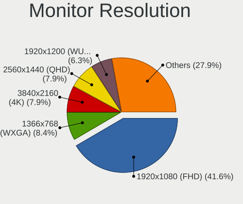

| Resolution         | Computers | Percent |
|--------------------|-----------|---------|
| 1920x1080 (FHD)    | 158       | 41.58%  |
| 1366x768 (WXGA)    | 32        | 8.42%   |
| 3840x2160 (4K)     | 30        | 7.89%   |
| 2560x1440 (QHD)    | 30        | 7.89%   |
| 1920x1200 (WUXGA)  | 24        | 6.32%   |
| 1280x1024 (SXGA)   | 18        | 4.74%   |
| 1600x900 (HD+)     | 13        | 3.42%   |
| 3440x1440          | 11        | 2.89%   |
| 2560x1080          | 10        | 2.63%   |
| 1680x1050 (WSXGA+) | 9         | 2.37%   |
| 3840x1080          | 6         | 1.58%   |
| 3840x2400          | 5         | 1.32%   |
| 1440x900 (WXGA+)   | 5         | 1.32%   |
| Unknown            | 5         | 1.32%   |
| 1920x540           | 3         | 0.79%   |
| 1024x768 (XGA)     | 3         | 0.79%   |
| 2880x1800          | 2         | 0.53%   |
| 2560x1600          | 2         | 0.53%   |
| 7680x2160          | 1         | 0.26%   |
| 3200x2000          | 1         | 0.26%   |
| 3072x1920          | 1         | 0.26%   |
| 2880x864           | 1         | 0.26%   |
| 2880x1920          | 1         | 0.26%   |
| 2880x1620          | 1         | 0.26%   |
| 2240x1400          | 1         | 0.26%   |
| 2160x1440          | 1         | 0.26%   |
| 1920x550           | 1         | 0.26%   |
| 1920x1280          | 1         | 0.26%   |
| 1400x1050          | 1         | 0.26%   |
| 1360x768           | 1         | 0.26%   |
| 1280x800 (WXGA)    | 1         | 0.26%   |
| 1280x768           | 1         | 0.26%   |

Monitor Diagonal
----------------

Diagonal size in inches

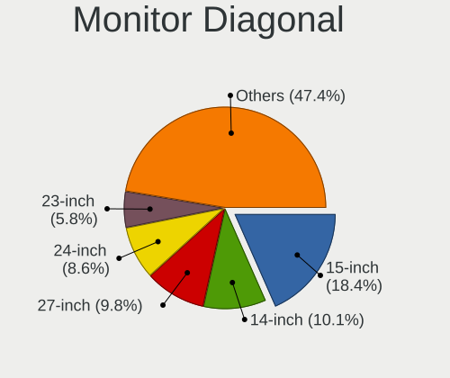

| Inches  | Computers | Percent |
|---------|-----------|---------|
| 15      | 73        | 18.39%  |
| 14      | 40        | 10.08%  |
| 27      | 39        | 9.82%   |
| 24      | 34        | 8.56%   |
| 23      | 23        | 5.79%   |
| 31      | 21        | 5.29%   |
| 13      | 21        | 5.29%   |
| 17      | 19        | 4.79%   |
| 21      | 16        | 4.03%   |
| 34      | 15        | 3.78%   |
| Unknown | 14        | 3.53%   |
| 19      | 13        | 3.27%   |
| 18      | 8         | 2.02%   |
| 16      | 8         | 2.02%   |
| 22      | 7         | 1.76%   |
| 20      | 6         | 1.51%   |
| 40      | 5         | 1.26%   |
| 32      | 5         | 1.26%   |
| 48      | 4         | 1.01%   |
| 74      | 3         | 0.76%   |
| 65      | 3         | 0.76%   |
| 54      | 3         | 0.76%   |
| 84      | 2         | 0.5%    |
| 49      | 2         | 0.5%    |
| 12      | 2         | 0.5%    |
| 63      | 1         | 0.25%   |
| 52      | 1         | 0.25%   |
| 46      | 1         | 0.25%   |
| 43      | 1         | 0.25%   |
| 39      | 1         | 0.25%   |
| 36      | 1         | 0.25%   |
| 35      | 1         | 0.25%   |
| 29      | 1         | 0.25%   |
| 28      | 1         | 0.25%   |
| 25      | 1         | 0.25%   |
| 11      | 1         | 0.25%   |

Monitor Width
-------------

Physical width

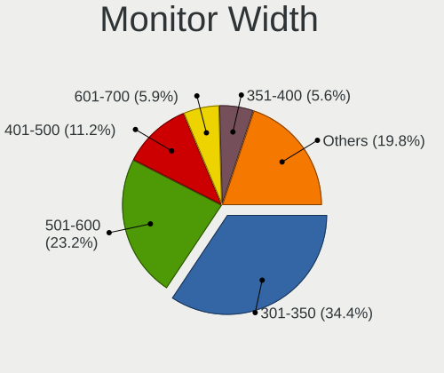

| Width in mm | Computers | Percent |
|-------------|-----------|---------|
| 301-350     | 135       | 34.35%  |
| 501-600     | 91        | 23.16%  |
| 401-500     | 44        | 11.2%   |
| 601-700     | 23        | 5.85%   |
| 351-400     | 22        | 5.6%    |
| 701-800     | 21        | 5.34%   |
| 201-300     | 15        | 3.82%   |
| 1001-1500   | 15        | 3.82%   |
| Unknown     | 14        | 3.56%   |
| 801-900     | 7         | 1.78%   |
| 1501-2000   | 5         | 1.27%   |
| 901-1000    | 1         | 0.25%   |

Aspect Ratio
------------

Proportional relationship between the width and the height

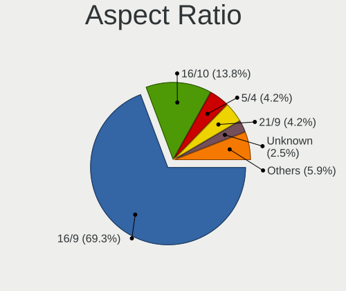

| Ratio   | Computers | Percent |
|---------|-----------|---------|
| 16/9    | 246       | 69.3%   |
| 16/10   | 49        | 13.8%   |
| 5/4     | 15        | 4.23%   |
| 21/9    | 15        | 4.23%   |
| Unknown | 9         | 2.54%   |
| 32/9    | 7         | 1.97%   |
| 3/2     | 6         | 1.69%   |
| 4/3     | 4         | 1.13%   |
| 6/5     | 2         | 0.56%   |
| 3.33    | 1         | 0.28%   |
| 2.18    | 1         | 0.28%   |

Monitor Area
------------

Area in inch²

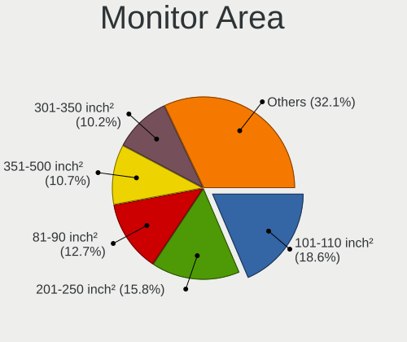

| Area in inch² | Computers | Percent |
|----------------|-----------|---------|
| 101-110        | 73        | 18.58%  |
| 201-250        | 62        | 15.78%  |
| 81-90          | 50        | 12.72%  |
| 351-500        | 42        | 10.69%  |
| 301-350        | 40        | 10.18%  |
| 151-200        | 26        | 6.62%   |
| 501-1000       | 15        | 3.82%   |
| 141-150        | 14        | 3.56%   |
| Unknown        | 14        | 3.56%   |
| More than 1000 | 13        | 3.31%   |
| 121-130        | 12        | 3.05%   |
| 251-300        | 10        | 2.54%   |
| 111-120        | 9         | 2.29%   |
| 71-80          | 6         | 1.53%   |
| 91-100         | 4         | 1.02%   |
| 61-70          | 2         | 0.51%   |
| 51-60          | 1         | 0.25%   |

Pixel Density
-------------

Pixels per inch

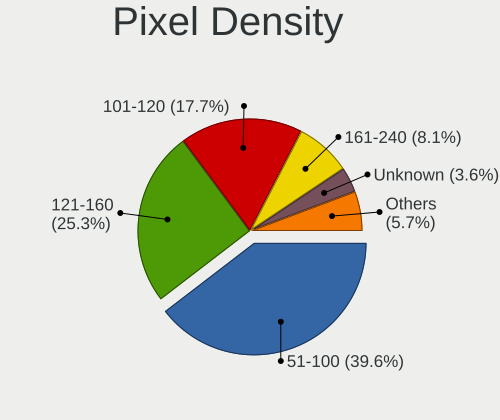

| Density       | Computers | Percent |
|---------------|-----------|---------|
| 51-100        | 152       | 39.58%  |
| 121-160       | 97        | 25.26%  |
| 101-120       | 68        | 17.71%  |
| 161-240       | 31        | 8.07%   |
| Unknown       | 14        | 3.65%   |
| 1-50          | 12        | 3.13%   |
| More than 240 | 10        | 2.6%    |

Multiple Monitors
-----------------

Total monitors connected

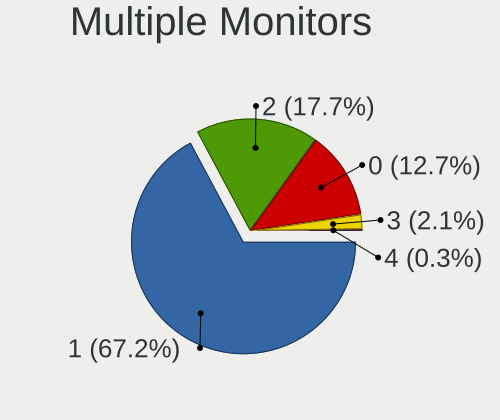

| Total | Computers | Percent |
|-------|-----------|---------|
| 1     | 254       | 67.2%   |
| 2     | 67        | 17.72%  |
| 0     | 48        | 12.7%   |
| 3     | 8         | 2.12%   |
| 4     | 1         | 0.26%   |

Network
-------

Net Controller Vendor
---------------------

Controller vendors

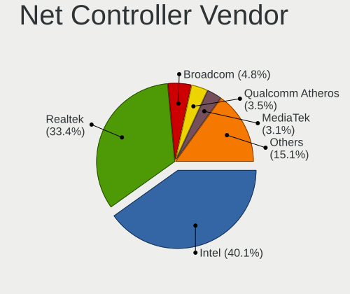

| Vendor                          | Computers | Percent |
|---------------------------------|-----------|---------|
| Intel                           | 232       | 40.14%  |
| Realtek Semiconductor           | 193       | 33.39%  |
| Broadcom                        | 28        | 4.84%   |
| Qualcomm Atheros                | 20        | 3.46%   |
| MediaTek                        | 18        | 3.11%   |
| Aquantia                        | 10        | 1.73%   |
| Mellanox Technologies           | 8         | 1.38%   |
| TP-Link                         | 7         | 1.21%   |
| ASIX Electronics                | 7         | 1.21%   |
| Lenovo                          | 6         | 1.04%   |
| Ralink Technology               | 4         | 0.69%   |
| Broadcom Limited                | 4         | 0.69%   |
| American Megatrends             | 4         | 0.69%   |
| Ralink                          | 3         | 0.52%   |
| Linksys                         | 3         | 0.52%   |
| Marvell Technology Group        | 2         | 0.35%   |
| Dell                            | 2         | 0.35%   |
| D-Link System                   | 2         | 0.35%   |
| XREAL                           | 1         | 0.17%   |
| Tehuti Networks                 | 1         | 0.17%   |
| Spreadtrum Communications       | 1         | 0.17%   |
| Solarflare Communications       | 1         | 0.17%   |
| Shenzhen Goodix Technology      | 1         | 0.17%   |
| Qualcomm Technologies           | 1         | 0.17%   |
| Qualcomm Atheros Communications | 1         | 0.17%   |
| Qualcomm                        | 1         | 0.17%   |
| QNAP System                     | 1         | 0.17%   |
| Nvidia                          | 1         | 0.17%   |
| NetGear                         | 1         | 0.17%   |
| Microsoft                       | 1         | 0.17%   |
| Microchip Technology            | 1         | 0.17%   |
| JMicron Technology              | 1         | 0.17%   |
| InterBiometrics                 | 1         | 0.17%   |
| Insyde Software                 | 1         | 0.17%   |
| Google                          | 1         | 0.17%   |
| Edimax Technology               | 1         | 0.17%   |
| DisplayLink                     | 1         | 0.17%   |
| Davicom Semiconductor           | 1         | 0.17%   |
| D-Link                          | 1         | 0.17%   |
| BUFFALO                         | 1         | 0.17%   |

Net Controller Model
--------------------

Controller models

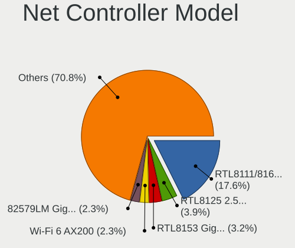

| Model                                                                  | Computers | Percent |
|------------------------------------------------------------------------|-----------|---------|
| Realtek RTL8111/8168/8211/8411 PCI Express Gigabit Ethernet Controller | 123       | 17.62%  |
| Realtek RTL8125 2.5GbE Controller                                      | 27        | 3.87%   |
| Realtek RTL8153 Gigabit Ethernet Adapter                               | 22        | 3.15%   |
| Intel Wi-Fi 6 AX200                                                    | 16        | 2.29%   |
| Intel 82579LM Gigabit Network Connection (Lewisville)                  | 16        | 2.29%   |
| Intel Alder Lake-P PCH CNVi WiFi                                       | 14        | 2.01%   |
| Intel Wireless 8265 / 8275                                             | 13        | 1.86%   |
| Intel Wi-Fi 6E(802.11ax) AX210/AX1675* 2x2 [Typhoon Peak]              | 11        | 1.58%   |
| Intel Wireless 7265                                                    | 10        | 1.43%   |
| Intel Ethernet Controller I225-V                                       | 10        | 1.43%   |
| Intel I210 Gigabit Network Connection                                  | 9         | 1.29%   |
| Intel Ethernet Connection I217-LM                                      | 9         | 1.29%   |
| MediaTek MT7922 802.11ax PCI Express Wireless Network Adapter          | 8         | 1.15%   |
| Intel I211 Gigabit Network Connection                                  | 8         | 1.15%   |
| Intel Wireless 7260                                                    | 7         | 1%      |
| Intel Wi-Fi 6 AX201                                                    | 7         | 1%      |
| ASIX AX88179 Gigabit Ethernet                                          | 7         | 1%      |
| Realtek RTL8852BE PCIe 802.11ax Wireless Network Controller            | 6         | 0.86%   |
| Intel Wireless 8260                                                    | 6         | 0.86%   |
| Intel I350 Gigabit Network Connection                                  | 6         | 0.86%   |
| Intel Ethernet Controller X550                                         | 6         | 0.86%   |
| Intel Ethernet Connection (4) I219-LM                                  | 6         | 0.86%   |
| Intel Ethernet Connection (17) I219-V                                  | 6         | 0.86%   |
| Intel Comet Lake PCH CNVi WiFi                                         | 6         | 0.86%   |
| Intel Centrino Advanced-N 6205 [Taylor Peak]                           | 6         | 0.86%   |
| Intel 82574L Gigabit Network Connection                                | 6         | 0.86%   |
| Broadcom NetXtreme II BCM5709 Gigabit Ethernet                         | 6         | 0.86%   |
| Realtek RTL8822CE 802.11ac PCIe Wireless Network Adapter               | 5         | 0.72%   |
| Realtek RTL8821CE 802.11ac PCIe Wireless Network Adapter               | 5         | 0.72%   |
| Realtek RTL810xE PCI Express Fast Ethernet controller                  | 5         | 0.72%   |
| Qualcomm Atheros QCA9377 802.11ac Wireless Network Adapter             | 5         | 0.72%   |
| Intel Wireless 3165                                                    | 5         | 0.72%   |
| Intel Ethernet Controller 10-Gigabit X540-AT2                          | 5         | 0.72%   |
| Intel Comet Lake PCH-LP CNVi WiFi                                      | 5         | 0.72%   |
| TP-Link AC600 wireless Realtek RTL8811AU [Archer T2U Nano]             | 4         | 0.57%   |
| Qualcomm Atheros QCA9565 / AR9565 Wireless Network Adapter             | 4         | 0.57%   |
| MediaTek MT7921 802.11ax PCIe Wireless Network Adapter [Filogic 330]   | 4         | 0.57%   |
| Intel Wi-Fi 5(802.11ac) Wireless-AC 9x6x [Thunder Peak]                | 4         | 0.57%   |
| Intel Ethernet Connection (7) I219-LM                                  | 4         | 0.57%   |
| Intel Ethernet Connection (2) I219-LM                                  | 4         | 0.57%   |

Wireless Vendor
---------------

Wireless vendors

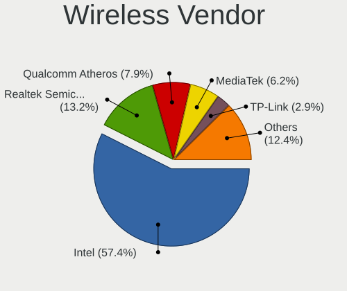

| Vendor                          | Computers | Percent |
|---------------------------------|-----------|---------|
| Intel                           | 139       | 57.44%  |
| Realtek Semiconductor           | 32        | 13.22%  |
| Qualcomm Atheros                | 19        | 7.85%   |
| MediaTek                        | 15        | 6.2%    |
| TP-Link                         | 7         | 2.89%   |
| Broadcom                        | 5         | 2.07%   |
| Ralink Technology               | 4         | 1.65%   |
| Ralink                          | 3         | 1.24%   |
| Linksys                         | 3         | 1.24%   |
| Dell                            | 2         | 0.83%   |
| D-Link System                   | 2         | 0.83%   |
| Broadcom Limited                | 2         | 0.83%   |
| Qualcomm Technologies           | 1         | 0.41%   |
| Qualcomm Atheros Communications | 1         | 0.41%   |
| NetGear                         | 1         | 0.41%   |
| Microsoft                       | 1         | 0.41%   |
| Edimax Technology               | 1         | 0.41%   |
| BUFFALO                         | 1         | 0.41%   |
| Belkin Components               | 1         | 0.41%   |
| ASUSTek Computer                | 1         | 0.41%   |
| AboCom Systems                  | 1         | 0.41%   |

Wireless Model
--------------

Wireless models

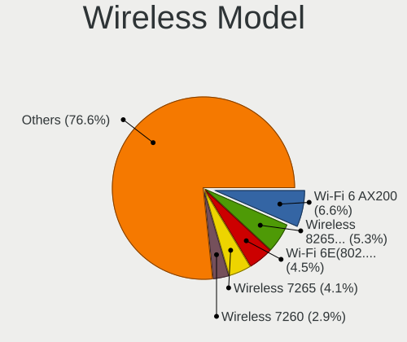

| Model                                                                | Computers | Percent |
|----------------------------------------------------------------------|-----------|---------|
| Intel Wi-Fi 6 AX200                                                  | 16        | 6.56%   |
| Intel Wireless 8265 / 8275                                           | 13        | 5.33%   |
| Intel Wi-Fi 6E(802.11ax) AX210/AX1675* 2x2 [Typhoon Peak]            | 11        | 4.51%   |
| Intel Wireless 7265                                                  | 10        | 4.1%    |
| Intel Wireless 7260                                                  | 7         | 2.87%   |
| Intel Wi-Fi 6 AX201                                                  | 7         | 2.87%   |
| Intel Alder Lake-P PCH CNVi WiFi                                     | 7         | 2.87%   |
| Realtek RTL8852BE PCIe 802.11ax Wireless Network Controller          | 6         | 2.46%   |
| Intel Wireless 8260                                                  | 6         | 2.46%   |
| Intel Comet Lake PCH CNVi WiFi                                       | 6         | 2.46%   |
| Intel Centrino Advanced-N 6205 [Taylor Peak]                         | 6         | 2.46%   |
| Realtek RTL8822CE 802.11ac PCIe Wireless Network Adapter             | 5         | 2.05%   |
| Realtek RTL8821CE 802.11ac PCIe Wireless Network Adapter             | 5         | 2.05%   |
| Qualcomm Atheros QCA9377 802.11ac Wireless Network Adapter           | 5         | 2.05%   |
| MediaTek MT7922 802.11ax PCI Express Wireless Network Adapter        | 5         | 2.05%   |
| Intel Wireless 3165                                                  | 5         | 2.05%   |
| Intel Comet Lake PCH-LP CNVi WiFi                                    | 5         | 2.05%   |
| TP-Link AC600 wireless Realtek RTL8811AU [Archer T2U Nano]           | 4         | 1.64%   |
| Qualcomm Atheros QCA9565 / AR9565 Wireless Network Adapter           | 4         | 1.64%   |
| MediaTek MT7921 802.11ax PCIe Wireless Network Adapter [Filogic 330] | 4         | 1.64%   |
| Intel Wi-Fi 5(802.11ac) Wireless-AC 9x6x [Thunder Peak]              | 4         | 1.64%   |
| Intel Cannon Lake PCH CNVi WiFi                                      | 4         | 1.64%   |
| Intel 700 Series Chipset CNVi WiFi                                   | 4         | 1.64%   |
| Realtek RTL88x2bu [AC1200 Techkey]                                   | 3         | 1.23%   |
| Realtek RTL8822BE 802.11a/b/g/n/ac WiFi adapter                      | 3         | 1.23%   |
| Qualcomm Atheros QCA6174 802.11ac Wireless Network Adapter           | 3         | 1.23%   |
| Qualcomm Atheros AR9462 Wireless Network Adapter                     | 3         | 1.23%   |
| MediaTek MT7921K (RZ608) Wi-Fi 6E 80MHz                              | 3         | 1.23%   |
| Intel Wireless 3160                                                  | 3         | 1.23%   |
| Intel Meteor Lake PCH CNVi WiFi                                      | 3         | 1.23%   |
| Intel Dual Band Wireless-AC 3168NGW [Stone Peak]                     | 3         | 1.23%   |
| Intel Cannon Point-LP CNVi [Wireless-AC]                             | 3         | 1.23%   |
| TP-Link Archer T9UH v1 [Realtek RTL8814AU]                           | 2         | 0.82%   |
| Realtek RTL8812AU 802.11a/b/g/n/ac 2T2R DB WLAN Adapter              | 2         | 0.82%   |
| Realtek RTL8188EUS 802.11n Wireless Network Adapter                  | 2         | 0.82%   |
| Ralink MT7601U Wireless Adapter                                      | 2         | 0.82%   |
| Ralink RT3290 Wireless 802.11n 1T/1R PCIe                            | 2         | 0.82%   |
| Qualcomm Atheros AR9485 Wireless Network Adapter                     | 2         | 0.82%   |
| Intel Ice Lake-LP PCH CNVi WiFi                                      | 2         | 0.82%   |
| Intel Centrino Wireless-N 2230                                       | 2         | 0.82%   |

Ethernet Vendor
---------------

Ethernet vendors

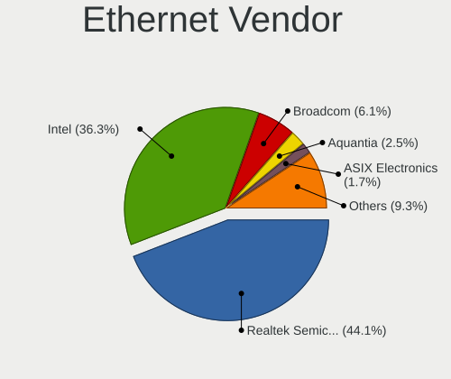

| Vendor                    | Computers | Percent |
|---------------------------|-----------|---------|
| Realtek Semiconductor     | 180       | 44.12%  |
| Intel                     | 148       | 36.27%  |
| Broadcom                  | 25        | 6.13%   |
| Aquantia                  | 10        | 2.45%   |
| ASIX Electronics          | 7         | 1.72%   |
| Lenovo                    | 6         | 1.47%   |
| Mellanox Technologies     | 4         | 0.98%   |
| American Megatrends       | 4         | 0.98%   |
| Qualcomm Atheros          | 3         | 0.74%   |
| MediaTek                  | 3         | 0.74%   |
| Marvell Technology Group  | 2         | 0.49%   |
| Broadcom Limited          | 2         | 0.49%   |
| XREAL                     | 1         | 0.25%   |
| Tehuti Networks           | 1         | 0.25%   |
| Spreadtrum Communications | 1         | 0.25%   |
| Solarflare Communications | 1         | 0.25%   |
| Qualcomm                  | 1         | 0.25%   |
| QNAP System               | 1         | 0.25%   |
| Nvidia                    | 1         | 0.25%   |
| Microchip Technology      | 1         | 0.25%   |
| JMicron Technology        | 1         | 0.25%   |
| Insyde Software           | 1         | 0.25%   |
| Google                    | 1         | 0.25%   |
| DisplayLink               | 1         | 0.25%   |
| Davicom Semiconductor     | 1         | 0.25%   |
| D-Link                    | 1         | 0.25%   |

Ethernet Model
--------------

Ethernet models

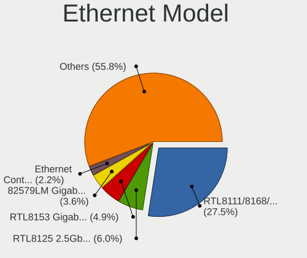

| Model                                                                          | Computers | Percent |
|--------------------------------------------------------------------------------|-----------|---------|
| Realtek RTL8111/8168/8211/8411 PCI Express Gigabit Ethernet Controller         | 123       | 27.46%  |
| Realtek RTL8125 2.5GbE Controller                                              | 27        | 6.03%   |
| Realtek RTL8153 Gigabit Ethernet Adapter                                       | 22        | 4.91%   |
| Intel 82579LM Gigabit Network Connection (Lewisville)                          | 16        | 3.57%   |
| Intel Ethernet Controller I225-V                                               | 10        | 2.23%   |
| Intel I210 Gigabit Network Connection                                          | 9         | 2.01%   |
| Intel Ethernet Connection I217-LM                                              | 9         | 2.01%   |
| Intel I211 Gigabit Network Connection                                          | 8         | 1.79%   |
| Intel Alder Lake-P PCH CNVi WiFi                                               | 7         | 1.56%   |
| ASIX AX88179 Gigabit Ethernet                                                  | 7         | 1.56%   |
| Intel I350 Gigabit Network Connection                                          | 6         | 1.34%   |
| Intel Ethernet Controller X550                                                 | 6         | 1.34%   |
| Intel Ethernet Connection (4) I219-LM                                          | 6         | 1.34%   |
| Intel Ethernet Connection (17) I219-V                                          | 6         | 1.34%   |
| Intel 82574L Gigabit Network Connection                                        | 6         | 1.34%   |
| Broadcom NetXtreme II BCM5709 Gigabit Ethernet                                 | 6         | 1.34%   |
| Realtek RTL810xE PCI Express Fast Ethernet controller                          | 5         | 1.12%   |
| Intel Ethernet Controller 10-Gigabit X540-AT2                                  | 5         | 1.12%   |
| Intel Ethernet Connection (7) I219-LM                                          | 4         | 0.89%   |
| Intel Ethernet Connection (2) I219-LM                                          | 4         | 0.89%   |
| Intel 82599ES 10-Gigabit SFI/SFP+ Network Connection                           | 4         | 0.89%   |
| Broadcom NetXtreme BCM5720 Gigabit Ethernet PCIe                               | 4         | 0.89%   |
| Aquantia AQtion AQC107 NBase-T/IEEE 802.3an Ethernet Controller [Atlantic 10G] | 4         | 0.89%   |
| American Megatrends Virtual Ethernet.                                          | 4         | 0.89%   |
| Realtek RTL8169 PCI Gigabit Ethernet Controller                                | 3         | 0.67%   |
| Realtek RTL8111/8168/8411 PCI Express Gigabit Ethernet Controller              | 3         | 0.67%   |
| MediaTek MT7922 802.11ax PCI Express Wireless Network Adapter                  | 3         | 0.67%   |
| Lenovo ThinkPad TBT 3 Dock                                                     | 3         | 0.67%   |
| Intel Ethernet Controller I226-V                                               | 3         | 0.67%   |
| Intel Ethernet Controller I226-LM                                              | 3         | 0.67%   |
| Intel Ethernet Connection I217-V                                               | 3         | 0.67%   |
| Intel Ethernet Connection (5) I219-LM                                          | 3         | 0.67%   |
| Intel Ethernet Connection (4) I219-V                                           | 3         | 0.67%   |
| Intel Ethernet Connection (17) I219-LM                                         | 3         | 0.67%   |
| Intel Ethernet Connection (16) I219-V                                          | 3         | 0.67%   |
| Intel Ethernet Connection (10) I219-V                                          | 3         | 0.67%   |
| Broadcom NetXtreme BCM5764M Gigabit Ethernet PCIe                              | 3         | 0.67%   |
| Broadcom NetXtreme BCM5722 Gigabit Ethernet PCI Express                        | 3         | 0.67%   |
| Realtek USB 10/100/1G/2.5 LAN                                                  | 2         | 0.45%   |
| Realtek RTL8922AE 802.11be PCIe Wireless Network Adapter                       | 2         | 0.45%   |

Net Controller Kind
-------------------

Ethernet, WiFi or modem

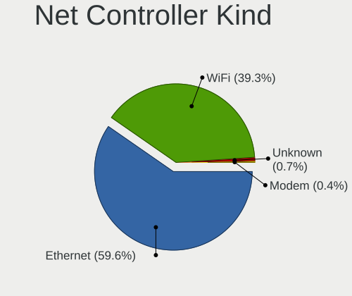

| Kind     | Computers | Percent |
|----------|-----------|---------|
| Ethernet | 340       | 59.65%  |
| WiFi     | 224       | 39.3%   |
| Unknown  | 4         | 0.7%    |
| Modem    | 2         | 0.35%   |

Used Controller
---------------

Currently used network controller

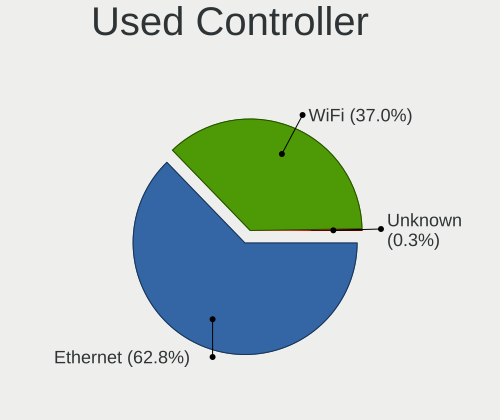

| Kind     | Computers | Percent |
|----------|-----------|---------|
| Ethernet | 241       | 62.76%  |
| WiFi     | 142       | 36.98%  |
| Unknown  | 1         | 0.26%   |

NICs
----

Total network controllers on board

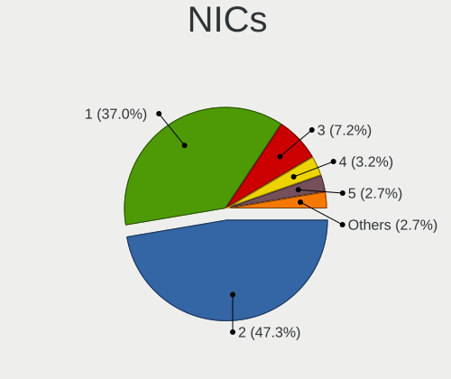

| Total | Computers | Percent |
|-------|-----------|---------|
| 2     | 178       | 47.34%  |
| 1     | 139       | 36.97%  |
| 3     | 27        | 7.18%   |
| 4     | 12        | 3.19%   |
| 5     | 10        | 2.66%   |
| 0     | 4         | 1.06%   |
| 6     | 3         | 0.8%    |
| 132   | 1         | 0.27%   |
| 66    | 1         | 0.27%   |
| 8     | 1         | 0.27%   |

IPv6
----

IPv6 vs IPv4

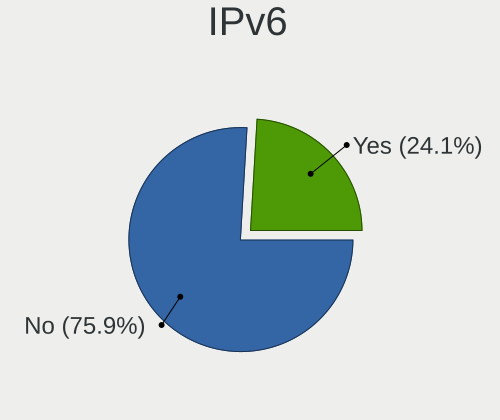

| Used | Computers | Percent |
|------|-----------|---------|
| No   | 284       | 75.94%  |
| Yes  | 90        | 24.06%  |

Bluetooth
---------

Bluetooth Vendor
----------------

Controller vendors

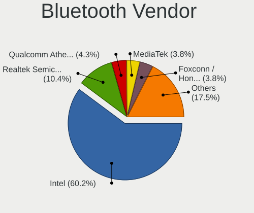

| Vendor                          | Computers | Percent |
|---------------------------------|-----------|---------|
| Intel                           | 127       | 60.19%  |
| Realtek Semiconductor           | 22        | 10.43%  |
| Qualcomm Atheros Communications | 9         | 4.27%   |
| MediaTek                        | 8         | 3.79%   |
| Foxconn / Hon Hai               | 8         | 3.79%   |
| IMC Networks                    | 7         | 3.32%   |
| Cambridge Silicon Radio         | 7         | 3.32%   |
| Broadcom                        | 5         | 2.37%   |
| Lite-On Technology              | 3         | 1.42%   |
| Dell                            | 3         | 1.42%   |
| Apple                           | 3         | 1.42%   |
| Ralink                          | 2         | 0.95%   |
| Hewlett-Packard                 | 2         | 0.95%   |
| ASUSTek Computer                | 2         | 0.95%   |
| Realtek                         | 1         | 0.47%   |
| Integrated System Solution      | 1         | 0.47%   |
| Askey Computer                  | 1         | 0.47%   |

Bluetooth Model
---------------

Controller models

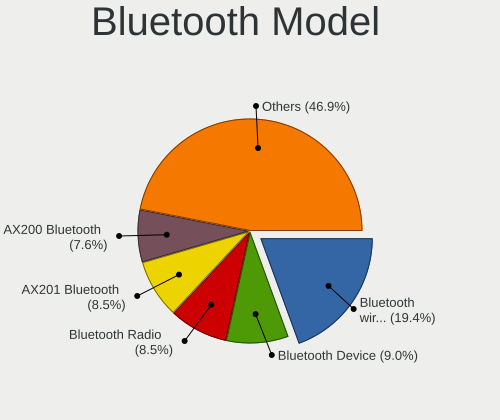

| Model                                                                               | Computers | Percent |
|-------------------------------------------------------------------------------------|-----------|---------|
| Intel Bluetooth wireless interface                                                  | 41        | 19.43%  |
| Intel Bluetooth Device                                                              | 19        | 9%      |
| Realtek Bluetooth Radio                                                             | 18        | 8.53%   |
| Intel AX201 Bluetooth                                                               | 18        | 8.53%   |
| Intel AX200 Bluetooth                                                               | 16        | 7.58%   |
| Intel Bluetooth 9460/9560 Jefferson Peak (JfP)                                      | 11        | 5.21%   |
| Intel AX210 Bluetooth                                                               | 9         | 4.27%   |
| MediaTek Wireless_Device                                                            | 8         | 3.79%   |
| Cambridge Silicon Radio Bluetooth Dongle (HCI mode)                                 | 7         | 3.32%   |
| Qualcomm Atheros  Bluetooth Device                                                  | 4         | 1.9%    |
| Intel Wireless-AC 9260 Bluetooth Adapter                                            | 4         | 1.9%    |
| Intel Centrino Bluetooth Wireless Transceiver                                       | 4         | 1.9%    |
| IMC Networks Wireless_Device                                                        | 4         | 1.9%    |
| Qualcomm Atheros AR3012 Bluetooth 4.0                                               | 3         | 1.42%   |
| Lite-On Qualcomm Atheros QCA9377 Bluetooth                                          | 3         | 1.42%   |
| Intel Wireless-AC 3168 Bluetooth                                                    | 3         | 1.42%   |
| Foxconn / Hon Hai MediaTek Bluetooth Adapter                                        | 3         | 1.42%   |
| Realtek RTL8822BE Bluetooth 4.2 Adapter                                             | 2         | 0.95%   |
| Realtek  Bluetooth 4.2 Adapter                                                      | 2         | 0.95%   |
| Ralink RT3290 Bluetooth                                                             | 2         | 0.95%   |
| Intel Centrino Advanced-N 6230 Bluetooth adapter                                    | 2         | 0.95%   |
| IMC Networks Bluetooth Radio                                                        | 2         | 0.95%   |
| HP Broadcom 2070 Bluetooth Combo                                                    | 2         | 0.95%   |
| Foxconn / Hon Hai Bluetooth Device                                                  | 2         | 0.95%   |
| Dell DW375 Bluetooth Module                                                         | 2         | 0.95%   |
| Broadcom BCM20702A0 Bluetooth 4.0                                                   | 2         | 0.95%   |
| Apple Bluetooth Host Controller                                                     | 2         | 0.95%   |
| Realtek Bluetooth Radio                                                             | 1         | 0.47%   |
| Qualcomm Atheros QCA61x4 Bluetooth 4.0                                              | 1         | 0.47%   |
| Qualcomm Atheros Bluetooth USB Host Controller                                      | 1         | 0.47%   |
| Integrated System Solution KY-BT100 Bluetooth Adapter                               | 1         | 0.47%   |
| IMC Networks Bluetooth Device                                                       | 1         | 0.47%   |
| Foxconn / Hon Hai Wireless_Device                                                   | 1         | 0.47%   |
| Foxconn / Hon Hai MediaTek MT7921 Bluetooth                                         | 1         | 0.47%   |
| Foxconn / Hon Hai Foxconn T77H114 BCM2070 [Single-Chip Bluetooth 2.1 + EDR Adapter] | 1         | 0.47%   |
| Dell Broadcom BCM20702A0 Bluetooth                                                  | 1         | 0.47%   |
| Broadcom HP Portable Bumble Bee                                                     | 1         | 0.47%   |
| Broadcom BCM20702 Bluetooth 4.0 [ThinkPad]                                          | 1         | 0.47%   |
| Broadcom BCM2045B (BDC-2.1) [Bluetooth Controller]                                  | 1         | 0.47%   |
| ASUS Bluetooth Radio                                                                | 1         | 0.47%   |

Sound
-----

Sound Vendor
------------

Sound card vendors

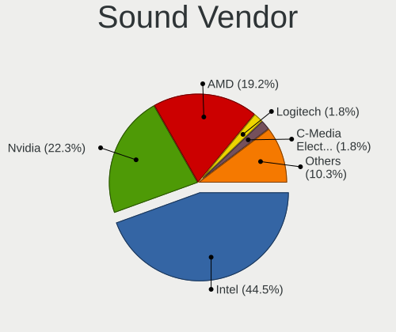

| Vendor                               | Computers | Percent |
|--------------------------------------|-----------|---------|
| Intel                                | 245       | 44.46%  |
| Nvidia                               | 123       | 22.32%  |
| AMD                                  | 106       | 19.24%  |
| Logitech                             | 10        | 1.81%   |
| C-Media Electronics                  | 10        | 1.81%   |
| Texas Instruments                    | 4         | 0.73%   |
| GN Netcom                            | 4         | 0.73%   |
| ASUSTek Computer                     | 4         | 0.73%   |
| Realtek Semiconductor                | 3         | 0.54%   |
| Plantronics                          | 3         | 0.54%   |
| Lenovo                               | 3         | 0.54%   |
| Hewlett-Packard                      | 3         | 0.54%   |
| Creative Technology                  | 3         | 0.54%   |
| VIA Technologies                     | 2         | 0.36%   |
| Tenx Technology                      | 2         | 0.36%   |
| Giga-Byte Technology                 | 2         | 0.36%   |
| Generalplus Technology               | 2         | 0.36%   |
| Focusrite-Novation                   | 2         | 0.36%   |
| Creative Labs                        | 2         | 0.36%   |
| Conexant Systems                     | 2         | 0.36%   |
| ASRock                               | 2         | 0.36%   |
| Thesycon Systemsoftware & Consulting | 1         | 0.18%   |
| TEAC                                 | 1         | 0.18%   |
| SteelSeries ApS                      | 1         | 0.18%   |
| Setek Elektronik                     | 1         | 0.18%   |
| Schiit Audio                         | 1         | 0.18%   |
| Saitek                               | 1         | 0.18%   |
| Razer USA                            | 1         | 0.18%   |
| Nektar                               | 1         | 0.18%   |
| KTMicro                              | 1         | 0.18%   |
| JMTek                                | 1         | 0.18%   |
| Huawei Technologies                  | 1         | 0.18%   |
| GYROCOM C&C                          | 1         | 0.18%   |
| FDUCE PRO AUDIO MADE                 | 1         | 0.18%   |
| BEHRINGER International              | 1         | 0.18%   |

Sound Model
-----------

Sound card models

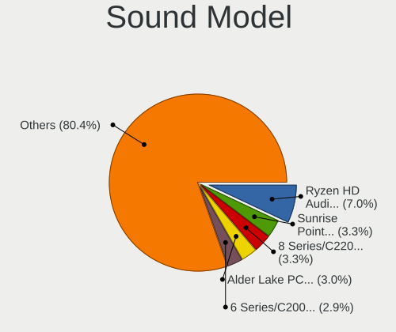

| Model                                                                      | Computers | Percent |
|----------------------------------------------------------------------------|-----------|---------|
| AMD Ryzen HD Audio Controller                                              | 44        | 7.01%   |
| Intel Sunrise Point-LP HD Audio                                            | 21        | 3.34%   |
| Intel 8 Series/C220 Series Chipset High Definition Audio Controller        | 21        | 3.34%   |
| Intel Alder Lake PCH-P High Definition Audio Controller                    | 19        | 3.03%   |
| Intel 6 Series/C200 Series Chipset Family High Definition Audio Controller | 18        | 2.87%   |
| AMD Renoir/Cezanne HDMI/DP Audio Controller                                | 17        | 2.71%   |
| AMD Starship/Matisse HD Audio Controller                                   | 16        | 2.55%   |
| AMD Radeon High Definition Audio Controller                                | 16        | 2.55%   |
| Intel Cannon Lake PCH cAVS                                                 | 15        | 2.39%   |
| Intel Xeon E3-1200 v3/4th Gen Core Processor HD Audio Controller           | 13        | 2.07%   |
| Nvidia GA104 High Definition Audio Controller                              | 11        | 1.75%   |
| Intel Alder Lake-S HD Audio Controller                                     | 11        | 1.75%   |
| Intel Tiger Lake-LP Smart Sound Technology Audio Controller                | 10        | 1.59%   |
| Intel 200 Series PCH HD Audio                                              | 10        | 1.59%   |
| Intel 100 Series/C230 Series Chipset Family HD Audio Controller            | 10        | 1.59%   |
| Nvidia TU107 GeForce GTX 1650 High Definition Audio Controller             | 9         | 1.43%   |
| Intel Comet Lake PCH cAVS                                                  | 9         | 1.43%   |
| Intel 7 Series/C216 Chipset Family High Definition Audio Controller        | 9         | 1.43%   |
| Nvidia GP107GL High Definition Audio Controller                            | 8         | 1.27%   |
| Intel Raptor Lake High Definition Audio Controller                         | 8         | 1.27%   |
| Nvidia GM107 High Definition Audio Controller [GeForce 940MX]              | 7         | 1.11%   |
| Nvidia GK208 HDMI/DP Audio Controller                                      | 7         | 1.11%   |
| Intel C610/X99 series chipset HD Audio Controller                          | 7         | 1.11%   |
| AMD SBx00 Azalia (Intel HDA)                                               | 7         | 1.11%   |
| AMD Family 17h (Models 00h-0fh) HD Audio Controller                        | 7         | 1.11%   |
| Nvidia GK107 HDMI Audio Controller                                         | 6         | 0.96%   |
| Nvidia GF119 HDMI Audio Controller                                         | 6         | 0.96%   |
| Nvidia GA102 High Definition Audio Controller                              | 6         | 0.96%   |
| Intel Tiger Lake-H HD Audio Controller                                     | 6         | 0.96%   |
| Intel 5 Series/3400 Series Chipset High Definition Audio                   | 6         | 0.96%   |
| AMD Raven/Raven2/Fenghuang HDMI/DP Audio Controller                        | 6         | 0.96%   |
| AMD Ellesmere HDMI Audio [Radeon RX 470/480 / 570/580/590]                 | 6         | 0.96%   |
| Nvidia TU116 High Definition Audio Controller                              | 5         | 0.8%    |
| Nvidia GK106 HDMI Audio Controller                                         | 5         | 0.8%    |
| Nvidia AD102 High Definition Audio Controller                              | 5         | 0.8%    |
| Intel Comet Lake PCH-LP cAVS                                               | 5         | 0.8%    |
| Intel Celeron/Pentium Silver Processor High Definition Audio               | 5         | 0.8%    |
| Intel Cannon Point-LP High Definition Audio Controller                     | 5         | 0.8%    |
| Intel C600/X79 series chipset High Definition Audio Controller             | 5         | 0.8%    |
| Intel 82801JI (ICH10 Family) HD Audio Controller                           | 5         | 0.8%    |

Memory
------

Memory Vendor
-------------

Memory module vendors

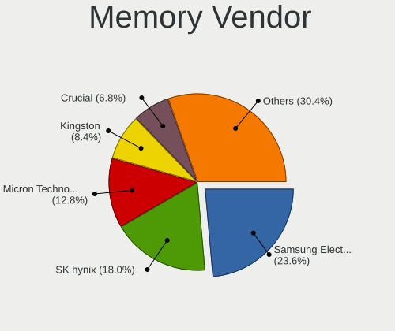

| Vendor              | Computers | Percent |
|---------------------|-----------|---------|
| Samsung Electronics | 59        | 23.6%   |
| SK hynix            | 45        | 18%     |
| Micron Technology   | 32        | 12.8%   |
| Kingston            | 21        | 8.4%    |
| Crucial             | 17        | 6.8%    |
| Unknown             | 14        | 5.6%    |
| Corsair             | 14        | 5.6%    |
| G.Skill             | 9         | 3.6%    |
| Unknown             | 9         | 3.6%    |
| Unknown (ABCD)      | 2         | 0.8%    |
| Ramaxel Technology  | 2         | 0.8%    |
| PNY                 | 2         | 0.8%    |
| Patriot             | 2         | 0.8%    |
| Nanya Technology    | 2         | 0.8%    |
| Lexar               | 2         | 0.8%    |
| Elpida              | 2         | 0.8%    |
| A-DATA Technology   | 2         | 0.8%    |
| Wodposit            | 1         | 0.4%    |
| Unknown (0x0B92)    | 1         | 0.4%    |
| Unknown (0x0080)    | 1         | 0.4%    |
| Team                | 1         | 0.4%    |
| Smart               | 1         | 0.4%    |
| Silicon Power       | 1         | 0.4%    |
| Magnum Tech         | 1         | 0.4%    |
| Lexar Co Limited    | 1         | 0.4%    |
| HPE                 | 1         | 0.4%    |
| Hewlett-Packard     | 1         | 0.4%    |
| Gold Key            | 1         | 0.4%    |
| CUSO                | 1         | 0.4%    |
| Apacer              | 1         | 0.4%    |
| 8CFD000080AD        | 1         | 0.4%    |

Memory Model
------------

Memory module models

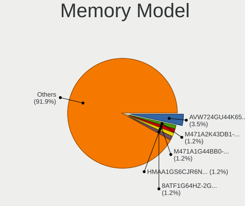

| Model                                                            | Computers | Percent |
|------------------------------------------------------------------|-----------|---------|
| Unknown                                                          | 9         | 3.46%   |
| SK hynix RAM HMAA1GS6CJR6N-XN 8GB SODIMM DDR4 3200MT/s           | 3         | 1.15%   |
| Samsung RAM M471A2K43DB1-CTD 16GB SODIMM DDR4 2667MT/s           | 3         | 1.15%   |
| Samsung RAM M471A1G44BB0-CWE 8GB SODIMM DDR4 3200MT/s            | 3         | 1.15%   |
| Micron RAM 8ATF1G64HZ-2G6E1 8GB SODIMM DDR4 2667MT/s             | 3         | 1.15%   |
| Unknown RAM Module 8GB DIMM DDR3 1333MT/s                        | 2         | 0.77%   |
| Unknown (ABCD) RAM 123456789012345678 2GB SODIMM LPDDR4 2400MT/s | 2         | 0.77%   |
| SK hynix RAM Module 8GB SODIMM DDR4 3200MT/s                     | 2         | 0.77%   |
| SK hynix RAM Module 4GB SODIMM DDR3 1066MT/s                     | 2         | 0.77%   |
| SK hynix RAM HMCG88AGBUA084N 32GB DIMM DDR5 5600MT/s             | 2         | 0.77%   |
| SK hynix RAM HMA81GS6CJR8N-VK 8GB SODIMM DDR4 2667MT/s           | 2         | 0.77%   |
| Samsung RAM M471B5273CH0-CH9 4GB SODIMM DDR3 1334MT/s            | 2         | 0.77%   |
| Samsung RAM M471A5244CB0-CTD 4GB SODIMM DDR4 3266MT/s            | 2         | 0.77%   |
| Samsung RAM M471A5244CB0-CRC 4GB SODIMM DDR4 2667MT/s            | 2         | 0.77%   |
| Samsung RAM M471A2K43EB1-CWE 16GB SODIMM DDR4 3200MT/s           | 2         | 0.77%   |
| Samsung RAM M471A2K43DB1-CWE 16GB SODIMM DDR4 3200MT/s           | 2         | 0.77%   |
| Samsung RAM M393B2G70BH0-YK0 16GB DIMM DDR3 1600MT/s             | 2         | 0.77%   |
| Samsung RAM M393B2873EH1-CF8 1GB DIMM DDR3 1066MT/s              | 2         | 0.77%   |
| Samsung RAM M386A4G40DM0-CPB 32GB DIMM DDR4 2400MT/s             | 2         | 0.77%   |
| Samsung RAM M378B5273DH0-CH9 4GB DIMM DDR3 2133MT/s              | 2         | 0.77%   |
| Kingston RAM KF3200C16D4/32GX 32GB DIMM DDR4 3933MT/s            | 2         | 0.77%   |
| Elpida RAM EBJ41UF8BDW0-GN-F 4GB DIMM DDR3 1600MT/s              | 2         | 0.77%   |
| Crucial RAM CT32G4SFD832A.C16FF 32GB SODIMM DDR4 3200MT/s        | 2         | 0.77%   |
| Crucial RAM CT32G48C40U5.M16A1 32GB DIMM DDR5 4800MT/s           | 2         | 0.77%   |
| Corsair RAM CMK16GX4M2B3200C16 8GB DIMM DDR4 3600MT/s            | 2         | 0.77%   |
| Wodposit RAM WPBH26D408SWA-8G 8GB SODIMM DDR4 2667MT/s           | 1         | 0.38%   |
| Unknown RAM Module 8GB DIMM DDR4 3000MT/s                        | 1         | 0.38%   |
| Unknown RAM Module 8GB DIMM DDR3 1066MT/s                        | 1         | 0.38%   |
| Unknown RAM Module 4GB SODIMM DDR3                               | 1         | 0.38%   |
| Unknown RAM Module 4GB DIMM DDR3 1600MT/s                        | 1         | 0.38%   |
| Unknown RAM Module 4GB DIMM DDR3 1333MT/s                        | 1         | 0.38%   |
| Unknown RAM Module 2GB DIMM 667MT/s                              | 1         | 0.38%   |
| Unknown RAM Module 2048MB SODIMM DDR3 1600MT/s                   | 1         | 0.38%   |
| Unknown RAM Module 1GB DIMM DDR2 667MT/s                         | 1         | 0.38%   |
| Unknown RAM Module 1GB DIMM DDR2                                 | 1         | 0.38%   |
| Unknown RAM Module 1GB DIMM 667MT/s                              | 1         | 0.38%   |
| Unknown RAM Module 16GB DIMM DDR4 3200MT/s                       | 1         | 0.38%   |
| Unknown RAM Module 16GB DIMM DDR4 2666MT/s                       | 1         | 0.38%   |
| Unknown RAM DDR4 NB 8G 2666 8GB SODIMM DDR4 2667MT/s             | 1         | 0.38%   |
| Unknown (0x0B92) RAM Module 32GB DIMM DDR4 2600MT/s              | 1         | 0.38%   |

Memory Kind
-----------

Memory module kinds

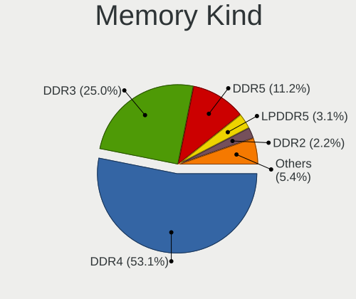

| Kind         | Computers | Percent |
|--------------|-----------|---------|
| DDR4         | 119       | 53.13%  |
| DDR3         | 56        | 25%     |
| DDR5         | 25        | 11.16%  |
| LPDDR5       | 7         | 3.13%   |
| DDR2         | 5         | 2.23%   |
| LPDDR4       | 4         | 1.79%   |
| SDRAM        | 3         | 1.34%   |
| DRAM         | 2         | 0.89%   |
| LPDDR3       | 1         | 0.45%   |
| DDR2 FB-DIMM | 1         | 0.45%   |
| Unknown      | 1         | 0.45%   |

Memory Form Factor
------------------

Physical design of the memory module

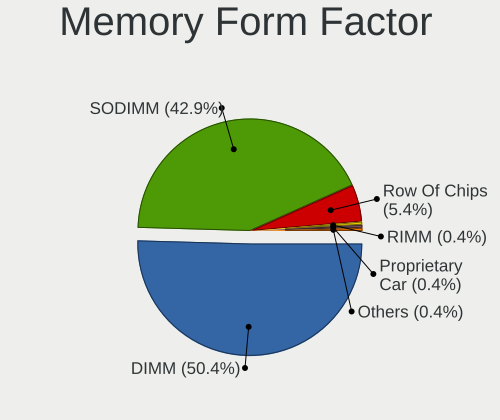

| Name            | Computers | Percent |
|-----------------|-----------|---------|
| DIMM            | 113       | 50.45%  |
| SODIMM          | 96        | 42.86%  |
| Row Of Chips    | 12        | 5.36%   |
| RIMM            | 1         | 0.45%   |
| Proprietary Car | 1         | 0.45%   |
| Unknown         | 1         | 0.45%   |

Memory Size
-----------

Memory module size

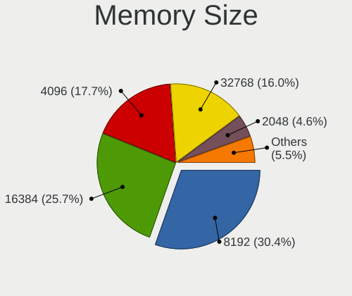

| Size  | Computers | Percent |
|-------|-----------|---------|
| 8192  | 72        | 30.38%  |
| 16384 | 61        | 25.74%  |
| 4096  | 42        | 17.72%  |
| 32768 | 38        | 16.03%  |
| 2048  | 11        | 4.64%   |
| 1024  | 8         | 3.38%   |
| 65536 | 3         | 1.27%   |
| 49152 | 1         | 0.42%   |
| 12288 | 1         | 0.42%   |

Memory Speed
------------

Memory module speed

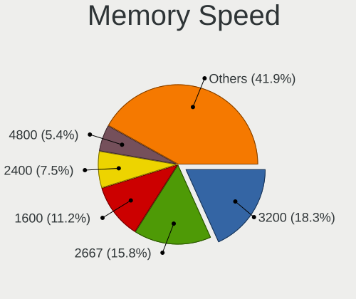

| Speed   | Computers | Percent |
|---------|-----------|---------|
| 3200    | 44        | 18.26%  |
| 2667    | 38        | 15.77%  |
| 1600    | 27        | 11.2%   |
| 2400    | 18        | 7.47%   |
| 4800    | 13        | 5.39%   |
| 2133    | 12        | 4.98%   |
| 1333    | 12        | 4.98%   |
| 5600    | 11        | 4.56%   |
| 3600    | 6         | 2.49%   |
| 2666    | 6         | 2.49%   |
| 1066    | 6         | 2.49%   |
| 6400    | 4         | 1.66%   |
| 1334    | 4         | 1.66%   |
| 667     | 4         | 1.66%   |
| 3933    | 3         | 1.24%   |
| 7467    | 2         | 0.83%   |
| 3733    | 2         | 0.83%   |
| 3266    | 2         | 0.83%   |
| 3000    | 2         | 0.83%   |
| 2800    | 2         | 0.83%   |
| 1800    | 2         | 0.83%   |
| Unknown | 2         | 0.83%   |
| 6000    | 1         | 0.41%   |
| 5500    | 1         | 0.41%   |
| 4267    | 1         | 0.41%   |
| 4266    | 1         | 0.41%   |
| 4000    | 1         | 0.41%   |
| 3666    | 1         | 0.41%   |
| 3334    | 1         | 0.41%   |
| 3333    | 1         | 0.41%   |
| 3100    | 1         | 0.41%   |
| 2934    | 1         | 0.41%   |
| 2933    | 1         | 0.41%   |
| 2733    | 1         | 0.41%   |
| 2600    | 1         | 0.41%   |
| 2200    | 1         | 0.41%   |
| 2048    | 1         | 0.41%   |
| 1867    | 1         | 0.41%   |
| 1866    | 1         | 0.41%   |
| 1067    | 1         | 0.41%   |

Printers & scanners
-------------------

Printer Vendor
--------------

Printer device vendors

| Vendor              | Computers | Percent |
|---------------------|-----------|---------|
| Seiko Epson         | 2         | 33.33%  |
| Brother Industries  | 2         | 33.33%  |
| Samsung Electronics | 1         | 16.67%  |
| Canon               | 1         | 16.67%  |

Printer Model
-------------

Printer device models

| Model                                | Computers | Percent |
|--------------------------------------|-----------|---------|
| Seiko Epson XP-4100 Series           | 1         | 16.67%  |
| Seiko Epson Printer                  | 1         | 16.67%  |
| Samsung ML-1640 Series Laser Printer | 1         | 16.67%  |
| Canon iP8700 series                  | 1         | 16.67%  |
| Brother MFC-J435W                    | 1         | 16.67%  |
| Brother HL-2030 Laser Printer        | 1         | 16.67%  |

Scanner Vendor
--------------

Scanner device vendors

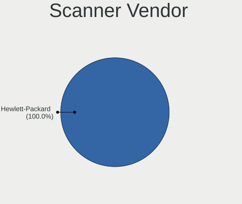

| Vendor          | Computers | Percent |
|-----------------|-----------|---------|
| Hewlett-Packard | 3         | 100%    |

Scanner Model
-------------

Scanner device models

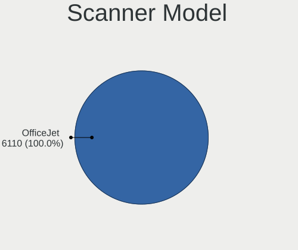

| Model              | Computers | Percent |
|--------------------|-----------|---------|
| HP ScanJet 82x0C   | 1         | 33.33%  |
| HP ScanJet 3400cse | 1         | 33.33%  |
| HP OfficeJet 6110  | 1         | 33.33%  |

Camera
------

Camera Vendor
-------------

Camera device vendors

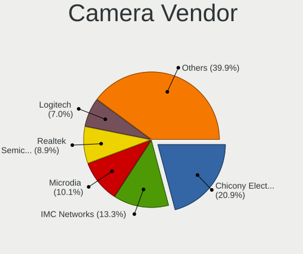

| Vendor                                 | Computers | Percent |
|----------------------------------------|-----------|---------|
| Chicony Electronics                    | 33        | 20.89%  |
| IMC Networks                           | 21        | 13.29%  |
| Microdia                               | 16        | 10.13%  |
| Realtek Semiconductor                  | 14        | 8.86%   |
| Logitech                               | 11        | 6.96%   |
| Bison Electronics                      | 10        | 6.33%   |
| Sunplus Innovation Technology          | 8         | 5.06%   |
| Luxvisions Innotech Limited            | 7         | 4.43%   |
| Quanta                                 | 6         | 3.8%    |
| Syntek                                 | 5         | 3.16%   |
| Cheng Uei Precision Industry (Foxlink) | 4         | 2.53%   |
| webcam                                 | 2         | 1.27%   |
| Ricoh                                  | 2         | 1.27%   |
| Razer USA                              | 2         | 1.27%   |
| Generalplus Technology                 | 2         | 1.27%   |
| Suyin                                  | 1         | 0.63%   |
| Sonix Technology                       | 1         | 0.63%   |
| Silicon Motion                         | 1         | 0.63%   |
| Shinetech                              | 1         | 0.63%   |
| MacroSilicon                           | 1         | 0.63%   |
| Lite-On Technology                     | 1         | 0.63%   |
| Lenovo                                 | 1         | 0.63%   |
| KYE Systems (Mouse Systems)            | 1         | 0.63%   |
| Intel                                  | 1         | 0.63%   |
| icSpring                               | 1         | 0.63%   |
| Huawei Technologies                    | 1         | 0.63%   |
| Hewlett-Packard                        | 1         | 0.63%   |
| Elgato Systems                         | 1         | 0.63%   |
| Aveo Technology                        | 1         | 0.63%   |
| Apple                                  | 1         | 0.63%   |

Camera Model
------------

Camera device models

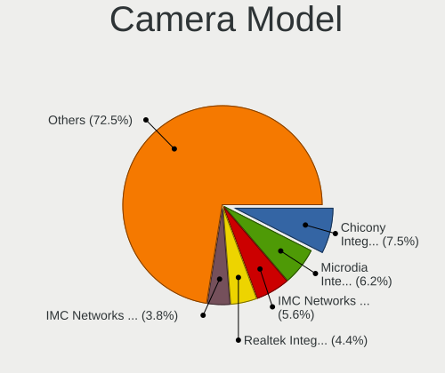

| Model                                                                      | Computers | Percent |
|----------------------------------------------------------------------------|-----------|---------|
| Chicony Integrated Camera                                                  | 12        | 7.5%    |
| Microdia Integrated_Webcam_HD                                              | 10        | 6.25%   |
| IMC Networks Integrated Camera                                             | 9         | 5.63%   |
| Realtek Integrated_Webcam_HD                                               | 7         | 4.38%   |
| IMC Networks USB2.0 HD UVC WebCam                                          | 6         | 3.75%   |
| Chicony HP HD Camera                                                       | 5         | 3.13%   |
| Chicony HD Webcam                                                          | 5         | 3.13%   |
| Bison Integrated Camera                                                    | 4         | 2.5%    |
| Syntek Integrated Camera                                                   | 3         | 1.88%   |
| Realtek Integrated Webcam_HD                                               | 3         | 1.88%   |
| Logitech Webcam C270                                                       | 3         | 1.88%   |
| Bison Integrated RGB Camera                                                | 3         | 1.88%   |
| webcam webcam                                                              | 2         | 1.25%   |
| Syntek Lenovo EasyCamera                                                   | 2         | 1.25%   |
| Luxvisions Innotech Limited Integrated Camera                              | 2         | 1.25%   |
| Luxvisions Innotech Limited HP TrueVision HD Camera                        | 2         | 1.25%   |
| Luxvisions Innotech Limited HP HD Camera                                   | 2         | 1.25%   |
| Logitech HD Pro Webcam C920                                                | 2         | 1.25%   |
| Generalplus GENERAL WEBCAM                                                 | 2         | 1.25%   |
| Chicony HP 5MP Camera                                                      | 2         | 1.25%   |
| Cheng Uei Precision Industry (Foxlink) HP Wide Vision HD Integrated Webcam | 2         | 1.25%   |
| Suyin HP TrueVision HD Integrated Webcam                                   | 1         | 0.63%   |
| Sunplus Lenovo EasyCamera                                                  | 1         | 0.63%   |
| Sunplus Laptop_Integrated_Webcam_HD                                        | 1         | 0.63%   |
| Sunplus Integrated_Webcam_HD                                               | 1         | 0.63%   |
| Sunplus Integrated_Webcam_FHD                                              | 1         | 0.63%   |
| Sunplus Integrated Camera                                                  | 1         | 0.63%   |
| Sunplus FULL HD webcam                                                     | 1         | 0.63%   |
| Sunplus AUSDOM FHD Camera                                                  | 1         | 0.63%   |
| Sunplus Asus Webcam                                                        | 1         | 0.63%   |
| Sonix USB2.0 HD UVC WebCam                                                 | 1         | 0.63%   |
| Silicon Motion Lenovo EasyCamera                                           | 1         | 0.63%   |
| Shinetech USB2.0 FHD UVC WebCam                                            | 1         | 0.63%   |
| Ricoh USB2.0 Camera                                                        | 1         | 0.63%   |
| Ricoh Laptop_Integrated_Webcam_FHD                                         | 1         | 0.63%   |
| Realtek USB2.0 HD UVC WebCam                                               | 1         | 0.63%   |
| Realtek HD WebCam                                                          | 1         | 0.63%   |
| Realtek EasyCamera                                                         | 1         | 0.63%   |
| Realtek Bluetooth Radio                                                    | 1         | 0.63%   |
| Razer USA Razer Kiyo Pro                                                   | 1         | 0.63%   |

Security
--------

Fingerprint Vendor
------------------

Fingerprint sensor vendors

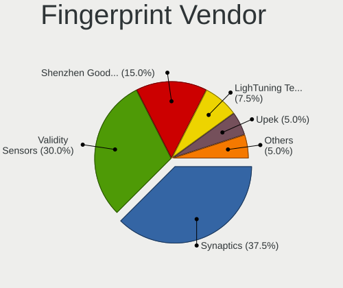

| Vendor                     | Computers | Percent |
|----------------------------|-----------|---------|
| Synaptics                  | 15        | 37.5%   |
| Validity Sensors           | 12        | 30%     |
| Shenzhen Goodix Technology | 6         | 15%     |
| LighTuning Technology      | 3         | 7.5%    |
| Upek                       | 2         | 5%      |
| Elan Microelectronics      | 1         | 2.5%    |
| AuthenTec                  | 1         | 2.5%    |

Fingerprint Model
-----------------

Fingerprint sensor models

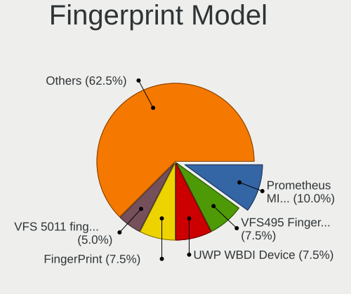

| Model                                                                      | Computers | Percent |
|----------------------------------------------------------------------------|-----------|---------|
| Synaptics Prometheus MIS Touch Fingerprint Reader                          | 4         | 10%     |
| Validity Sensors VFS495 Fingerprint Reader                                 | 3         | 7.5%    |
| Synaptics UWP WBDI Device                                                  | 3         | 7.5%    |
| Shenzhen Goodix FingerPrint                                                | 3         | 7.5%    |
| Validity Sensors VFS 5011 fingerprint sensor                               | 2         | 5%      |
| Validity Sensors Synaptics WBDI                                            | 2         | 5%      |
| Validity Sensors Synaptics VFS7552 Touch Fingerprint Sensor with PurePrint | 2         | 5%      |
| Upek Biometric Touchchip/Touchstrip Fingerprint Sensor                     | 2         | 5%      |
| Synaptics Metallica MIS Touch Fingerprint Reader                           | 2         | 5%      |
| Shenzhen Goodix  Fingerprint Device                                        | 2         | 5%      |
| LighTuning Fingerprint Sensor                                              | 2         | 5%      |
| Validity Sensors VFS471 Fingerprint Reader                                 | 1         | 2.5%    |
| Validity Sensors VFS451 Fingerprint Reader                                 | 1         | 2.5%    |
| Validity Sensors VFS Fingerprint sensor                                    | 1         | 2.5%    |
| Synaptics WBDI Device                                                      | 1         | 2.5%    |
| Synaptics WBDI                                                             | 1         | 2.5%    |
| Synaptics  WBDI                                                            | 1         | 2.5%    |
| Synaptics  FS7604 Touch Fingerprint Sensor with PurePrint                  | 1         | 2.5%    |
| Synaptics FS7604 Touch Fingerprint Sensor with PurePrint                   | 1         | 2.5%    |
| Synaptics Fingerprint reader [HP G6]                                       | 1         | 2.5%    |
| Shenzhen Goodix Fingerprint Reader                                         | 1         | 2.5%    |
| LighTuning ES603 Swipe Fingerprint Sensor                                  | 1         | 2.5%    |
| Elan ELAN:Fingerprint                                                      | 1         | 2.5%    |
| AuthenTec AES2810                                                          | 1         | 2.5%    |

Chipcard Vendor
---------------

Chipcard module vendors

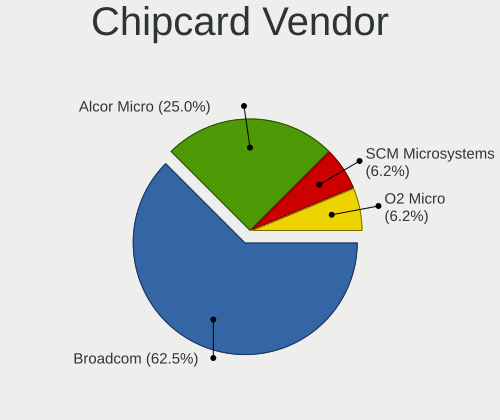

| Vendor           | Computers | Percent |
|------------------|-----------|---------|
| Broadcom         | 10        | 62.5%   |
| Alcor Micro      | 4         | 25%     |
| SCM Microsystems | 1         | 6.25%   |
| O2 Micro         | 1         | 6.25%   |

Chipcard Model
--------------

Chipcard module models

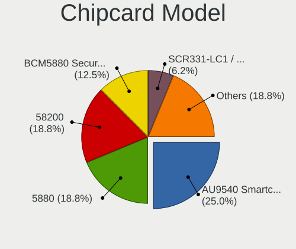

| Model                                                                        | Computers | Percent |
|------------------------------------------------------------------------------|-----------|---------|
| Alcor Micro AU9540 Smartcard Reader                                          | 4         | 25%     |
| Broadcom 5880                                                                | 3         | 18.75%  |
| Broadcom 58200                                                               | 3         | 18.75%  |
| Broadcom BCM5880 Secure Applications Processor                               | 2         | 12.5%   |
| SCM Microsystems SCR331-LC1 / SCR3310 SmartCard Reader                       | 1         | 6.25%   |
| O2 Micro OZ776 CCID Smartcard Reader                                         | 1         | 6.25%   |
| Broadcom BCM5880 Secure Applications Processor with fingerprint touch sensor | 1         | 6.25%   |
| Broadcom BCM5880 Secure Applications Processor with fingerprint swipe sensor | 1         | 6.25%   |

Unsupported
-----------

Unsupported Devices
-------------------

Total unsupported devices on board

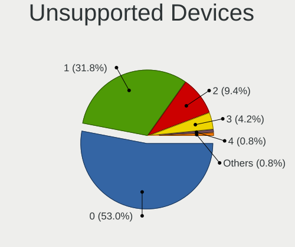

| Total | Computers | Percent |
|-------|-----------|---------|
| 0     | 202       | 53.02%  |
| 1     | 121       | 31.76%  |
| 2     | 36        | 9.45%   |
| 3     | 16        | 4.2%    |
| 4     | 3         | 0.79%   |
| 5     | 2         | 0.52%   |
| 10    | 1         | 0.26%   |

Unsupported Device Types
------------------------

Types of unsupported devices

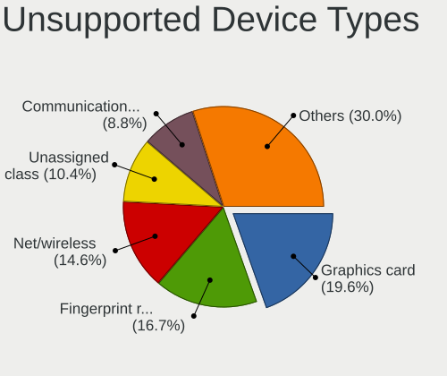

| Type                     | Computers | Percent |
|--------------------------|-----------|---------|
| Graphics card            | 47        | 19.58%  |
| Fingerprint reader       | 40        | 16.67%  |
| Net/wireless             | 35        | 14.58%  |
| Unassigned class         | 25        | 10.42%  |
| Communication controller | 21        | 8.75%   |
| Multimedia controller    | 16        | 6.67%   |
| Firewire controller      | 11        | 4.58%   |
| Net/ethernet             | 10        | 4.17%   |
| Chipcard                 | 9         | 3.75%   |
| Storage                  | 5         | 2.08%   |
| Sound                    | 4         | 1.67%   |
| Network                  | 4         | 1.67%   |
| Storage/raid             | 3         | 1.25%   |
| Storage/ide              | 2         | 0.83%   |
| Storage/ata              | 2         | 0.83%   |
| Dvb card                 | 2         | 0.83%   |
| Bluetooth                | 2         | 0.83%   |
| Modem                    | 1         | 0.42%   |
| Card reader              | 1         | 0.42%   |

