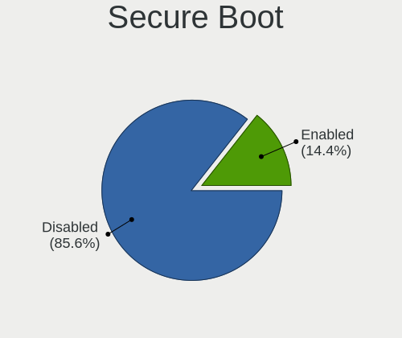
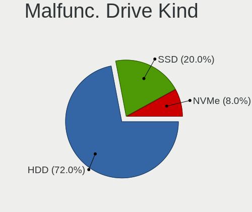
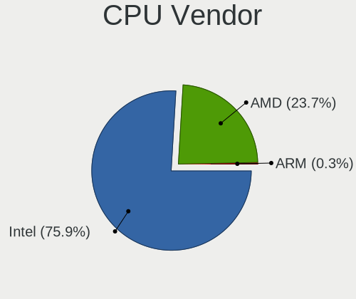
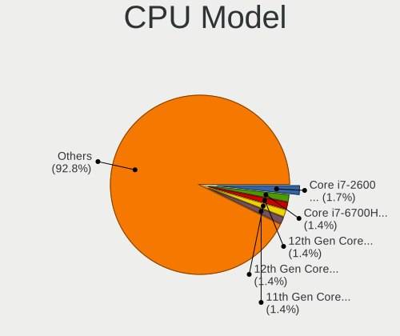
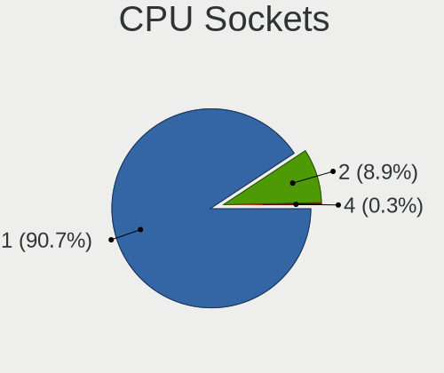
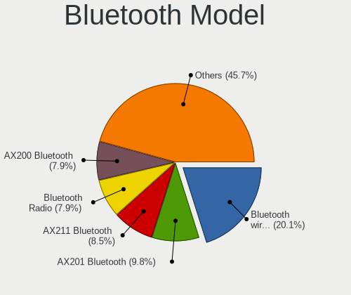
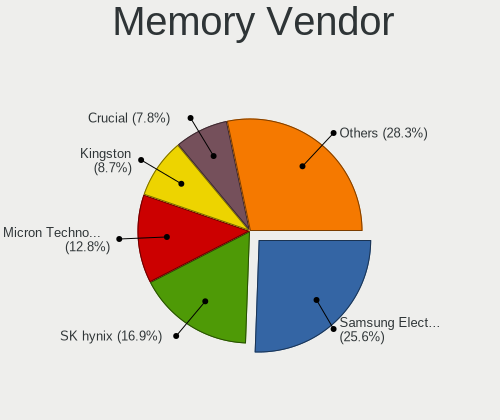
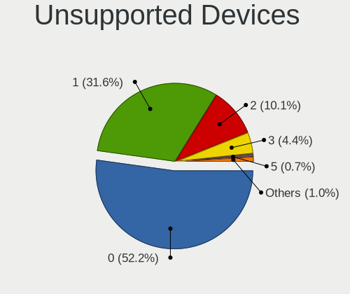

Rocky Linux - Tested Hardware & Statistics
------------------------------------------

A project to collect tested hardware configurations for Rocky Linux.

Anyone can contribute to this report by the [hw-probe](https://github.com/linuxhw/hw-probe) tool:

    sudo -E hw-probe -all -upload

Please contribute! Especially if your hardware is rare.

This is a report for all computer types. See also reports for [desktops](/Dist/Rocky_Linux/Desktop/README.md) and [notebooks](/Dist/Rocky_Linux/Notebook/README.md).

Contents
--------

* [ Test Cases ](#test-cases)

* [ System ](#system)
  - [ OS                       ](#os)
  - [ OS Family                ](#os-family)
  - [ Kernel                   ](#kernel)
  - [ Kernel Family            ](#kernel-family)
  - [ Kernel Major Ver.        ](#kernel-major-ver)
  - [ Arch                     ](#arch)
  - [ DE                       ](#de)
  - [ Display Server           ](#display-server)
  - [ Display Manager          ](#display-manager)
  - [ OS Lang                  ](#os-lang)
  - [ Boot Mode                ](#boot-mode)
  - [ Filesystem               ](#filesystem)
  - [ Part. scheme             ](#part-scheme)
  - [ Dual Boot with Linux/BSD ](#dual-boot-with-linuxbsd)
  - [ Dual Boot (Win)          ](#dual-boot-win)

* [ Board ](#board)
  - [ Vendor                   ](#vendor)
  - [ Model                    ](#model)
  - [ Model Family             ](#model-family)
  - [ MFG Year                 ](#mfg-year)
  - [ Form Factor              ](#form-factor)
  - [ Secure Boot              ](#secure-boot)
  - [ Coreboot                 ](#coreboot)
  - [ RAM Size                 ](#ram-size)
  - [ RAM Used                 ](#ram-used)
  - [ Total Drives             ](#total-drives)
  - [ Has CD-ROM               ](#has-cd-rom)
  - [ Has Ethernet             ](#has-ethernet)
  - [ Has WiFi                 ](#has-wifi)
  - [ Has Bluetooth            ](#has-bluetooth)

* [ Location ](#location)
  - [ Country                  ](#country)
  - [ City                     ](#city)

* [ Drives ](#drives)
  - [ Drive Vendor             ](#drive-vendor)
  - [ Drive Model              ](#drive-model)
  - [ HDD Vendor               ](#hdd-vendor)
  - [ SSD Vendor               ](#ssd-vendor)
  - [ Drive Kind               ](#drive-kind)
  - [ Drive Connector          ](#drive-connector)
  - [ Drive Size               ](#drive-size)
  - [ Space Total              ](#space-total)
  - [ Space Used               ](#space-used)
  - [ Malfunc. Drives          ](#malfunc-drives)
  - [ Malfunc. Drive Vendor    ](#malfunc-drive-vendor)
  - [ Malfunc. HDD Vendor      ](#malfunc-hdd-vendor)
  - [ Malfunc. Drive Kind      ](#malfunc-drive-kind)
  - [ Failed Drives            ](#failed-drives)
  - [ Failed Drive Vendor      ](#failed-drive-vendor)
  - [ Drive Status             ](#drive-status)

* [ Storage controller ](#storage-controller)
  - [ Storage Vendor           ](#storage-vendor)
  - [ Storage Model            ](#storage-model)
  - [ Storage Kind             ](#storage-kind)

* [ Processor ](#processor)
  - [ CPU Vendor               ](#cpu-vendor)
  - [ CPU Model                ](#cpu-model)
  - [ CPU Model Family         ](#cpu-model-family)
  - [ CPU Cores                ](#cpu-cores)
  - [ CPU Sockets              ](#cpu-sockets)
  - [ CPU Threads              ](#cpu-threads)
  - [ CPU Op-Modes             ](#cpu-op-modes)
  - [ CPU Microcode            ](#cpu-microcode)
  - [ CPU Microarch            ](#cpu-microarch)

* [ Graphics ](#graphics)
  - [ GPU Vendor               ](#gpu-vendor)
  - [ GPU Model                ](#gpu-model)
  - [ GPU Combo                ](#gpu-combo)
  - [ GPU Driver               ](#gpu-driver)
  - [ GPU Memory               ](#gpu-memory)

* [ Monitor ](#monitor)
  - [ Monitor Vendor           ](#monitor-vendor)
  - [ Monitor Model            ](#monitor-model)
  - [ Monitor Resolution       ](#monitor-resolution)
  - [ Monitor Diagonal         ](#monitor-diagonal)
  - [ Monitor Width            ](#monitor-width)
  - [ Aspect Ratio             ](#aspect-ratio)
  - [ Monitor Area             ](#monitor-area)
  - [ Pixel Density            ](#pixel-density)
  - [ Multiple Monitors        ](#multiple-monitors)

* [ Network ](#network)
  - [ Net Controller Vendor    ](#net-controller-vendor)
  - [ Net Controller Model     ](#net-controller-model)
  - [ Wireless Vendor          ](#wireless-vendor)
  - [ Wireless Model           ](#wireless-model)
  - [ Ethernet Vendor          ](#ethernet-vendor)
  - [ Ethernet Model           ](#ethernet-model)
  - [ Net Controller Kind      ](#net-controller-kind)
  - [ Used Controller          ](#used-controller)
  - [ NICs                     ](#nics)
  - [ IPv6                     ](#ipv6)

* [ Bluetooth ](#bluetooth)
  - [ Bluetooth Vendor         ](#bluetooth-vendor)
  - [ Bluetooth Model          ](#bluetooth-model)

* [ Sound ](#sound)
  - [ Sound Vendor             ](#sound-vendor)
  - [ Sound Model              ](#sound-model)

* [ Memory ](#memory)
  - [ Memory Vendor            ](#memory-vendor)
  - [ Memory Model             ](#memory-model)
  - [ Memory Kind              ](#memory-kind)
  - [ Memory Form Factor       ](#memory-form-factor)
  - [ Memory Size              ](#memory-size)
  - [ Memory Speed             ](#memory-speed)

* [ Printers & scanners ](#printers--scanners)
  - [ Printer Vendor           ](#printer-vendor)
  - [ Printer Model            ](#printer-model)
  - [ Scanner Vendor           ](#scanner-vendor)
  - [ Scanner Model            ](#scanner-model)

* [ Camera ](#camera)
  - [ Camera Vendor            ](#camera-vendor)
  - [ Camera Model             ](#camera-model)

* [ Security ](#security)
  - [ Fingerprint Vendor       ](#fingerprint-vendor)
  - [ Fingerprint Model        ](#fingerprint-model)
  - [ Chipcard Vendor          ](#chipcard-vendor)
  - [ Chipcard Model           ](#chipcard-model)

* [ Unsupported ](#unsupported)
  - [ Unsupported Devices      ](#unsupported-devices)
  - [ Unsupported Device Types ](#unsupported-device-types)

Test Cases
----------

Total: 386

| Vendor        | Model                       | Form-Factor | Probe                                                      | Date         |
|---------------|-----------------------------|-------------|------------------------------------------------------------|--------------|
| MSI           | H110M PRO-VD PLUS           | Desktop     | [6b9f134647](https://linux-hardware.org/?probe=6b9f134647) | Jan 05, 2025 |
| HP            | Elite x360 830 13 inch G... | Convertible | [759b2993d7](https://linux-hardware.org/?probe=759b2993d7) | Dec 24, 2024 |
| HP            | Elite x360 830 13 inch G... | Convertible | [cf06638d11](https://linux-hardware.org/?probe=cf06638d11) | Dec 24, 2024 |
| PC Special... | PA70Hx                      | Notebook    | [d44a3116ed](https://linux-hardware.org/?probe=d44a3116ed) | Dec 21, 2024 |
| HP            | OMEN by Laptop              | Notebook    | [1990440c77](https://linux-hardware.org/?probe=1990440c77) | Dec 17, 2024 |
| HP            | OMEN by Laptop              | Notebook    | [655aeac73d](https://linux-hardware.org/?probe=655aeac73d) | Dec 16, 2024 |
| ASUSTek       | ProArt Studiobook H7604J... | Notebook    | [a099000019](https://linux-hardware.org/?probe=a099000019) | Dec 15, 2024 |
| MSI           | PRO X870-P WIFI             | Desktop     | [c9a82e8bd9](https://linux-hardware.org/?probe=c9a82e8bd9) | Dec 13, 2024 |
| PC Special... | PA70Hx                      | Notebook    | [4923c61977](https://linux-hardware.org/?probe=4923c61977) | Dec 07, 2024 |
| Shenzhen M... | AHWSA                       | Desktop     | [2bc5597511](https://linux-hardware.org/?probe=2bc5597511) | Dec 05, 2024 |
| Dell          | Vostro 15 3515              | Notebook    | [c220d225cc](https://linux-hardware.org/?probe=c220d225cc) | Dec 03, 2024 |
| Lenovo        | Legion Pro 7 16IRX9H 83D... | Notebook    | [0ee441425f](https://linux-hardware.org/?probe=0ee441425f) | Nov 30, 2024 |
| Lenovo        | Legion Pro 7 16IRX9H 83D... | Notebook    | [e1fffcf363](https://linux-hardware.org/?probe=e1fffcf363) | Nov 29, 2024 |
| HP            | ProBook 440 14 inch G9 N... | Notebook    | [ae8591ed7e](https://linux-hardware.org/?probe=ae8591ed7e) | Nov 29, 2024 |
| Gigabyte      | Z690 UD DDR4                | Desktop     | [367385929b](https://linux-hardware.org/?probe=367385929b) | Nov 28, 2024 |
| ASUSTek       | Z170-P                      | Desktop     | [814a4954e8](https://linux-hardware.org/?probe=814a4954e8) | Nov 22, 2024 |
| MSI           | B450-A PRO MAX              | Desktop     | [74b369c302](https://linux-hardware.org/?probe=74b369c302) | Nov 21, 2024 |
| Lenovo        | LOQ 15APH8 82XT             | Notebook    | [4a80bcfae8](https://linux-hardware.org/?probe=4a80bcfae8) | Nov 20, 2024 |
| ASUSTek       | TUF Gaming B450-PLUS II     | Desktop     | [777759441c](https://linux-hardware.org/?probe=777759441c) | Nov 20, 2024 |
| ASUSTek       | GL552VW                     | Notebook    | [77e30dc8de](https://linux-hardware.org/?probe=77e30dc8de) | Nov 19, 2024 |
| Gigabyte      | AORUS 7A K1                 | Notebook    | [9b3907c59e](https://linux-hardware.org/?probe=9b3907c59e) | Nov 19, 2024 |
| Dell          | XPS 14 9440                 | Notebook    | [30755e72e7](https://linux-hardware.org/?probe=30755e72e7) | Nov 19, 2024 |
| Lenovo        | LOQ 15APH8 82XT             | Notebook    | [1f4cfc38ad](https://linux-hardware.org/?probe=1f4cfc38ad) | Nov 18, 2024 |
| Lenovo        | IdeaPad Gaming 3 15IMH05... | Notebook    | [75f0fcdc2f](https://linux-hardware.org/?probe=75f0fcdc2f) | Nov 18, 2024 |
| ASUSTek       | GL552VW                     | Notebook    | [257a158847](https://linux-hardware.org/?probe=257a158847) | Nov 18, 2024 |
| Gigabyte      | H61M-S1                     | Desktop     | [afe93e20da](https://linux-hardware.org/?probe=afe93e20da) | Nov 16, 2024 |
| Apple         | Mac-F22C86C8                | Mini pc     | [20fec0c721](https://linux-hardware.org/?probe=20fec0c721) | Nov 05, 2024 |
| Fujitsu       | LIFEBOOK S710               | Notebook    | [c989615c93](https://linux-hardware.org/?probe=c989615c93) | Nov 02, 2024 |
| Lenovo        | V15 G4 IRU 83A1             | Notebook    | [d40ad835b1](https://linux-hardware.org/?probe=d40ad835b1) | Oct 27, 2024 |
| ASRock        | B650 LiveMixer              | Desktop     | [1cae9e87fc](https://linux-hardware.org/?probe=1cae9e87fc) | Oct 25, 2024 |
| Lenovo        | ThinkPad E14 20RA007TUE     | Notebook    | [6314a52501](https://linux-hardware.org/?probe=6314a52501) | Oct 24, 2024 |
| ASRock        | Z77 Performance             | Desktop     | [01cb85dde8](https://linux-hardware.org/?probe=01cb85dde8) | Oct 22, 2024 |
| ASUSTek       | VivoBook_ASUSLaptop X409... | Notebook    | [e9e3c256d2](https://linux-hardware.org/?probe=e9e3c256d2) | Oct 19, 2024 |
| Dell          | 0NK70N A03                  | Desktop     | [33c83f5d6f](https://linux-hardware.org/?probe=33c83f5d6f) | Oct 14, 2024 |
| Acer          | Aspire E5-523               | Notebook    | [a248ae3561](https://linux-hardware.org/?probe=a248ae3561) | Oct 14, 2024 |
| HP            | 81B4                        | Desktop     | [6b0bb4a74e](https://linux-hardware.org/?probe=6b0bb4a74e) | Oct 10, 2024 |
| Dell          | 0WCJNT A01                  | Server      | [fee48ca172](https://linux-hardware.org/?probe=fee48ca172) | Oct 10, 2024 |
| Dell          | 0WCJNT A01                  | Server      | [80dec91584](https://linux-hardware.org/?probe=80dec91584) | Oct 09, 2024 |
| Unknown       | YL-J1900-V2                 | Desktop     | [c095fc1d28](https://linux-hardware.org/?probe=c095fc1d28) | Oct 08, 2024 |
| Lenovo        | LOQ 15APH8 82XT             | Notebook    | [d6687a8b24](https://linux-hardware.org/?probe=d6687a8b24) | Oct 01, 2024 |
| HP            | ProBook 450 G4              | Notebook    | [74d843a3ff](https://linux-hardware.org/?probe=74d843a3ff) | Oct 01, 2024 |
| Dell          | Precision 7530              | Notebook    | [9298200755](https://linux-hardware.org/?probe=9298200755) | Sep 30, 2024 |
| HP            | ProBook 450 G4              | Notebook    | [15151ed93a](https://linux-hardware.org/?probe=15151ed93a) | Sep 28, 2024 |
| Dell          | 0599V5 A09                  | Server      | [a304240fac](https://linux-hardware.org/?probe=a304240fac) | Sep 24, 2024 |
| Dell          | Latitude E6520              | Notebook    | [fb6b6c04d3](https://linux-hardware.org/?probe=fb6b6c04d3) | Sep 19, 2024 |
| Dell          | Latitude E6520              | Notebook    | [b9cef5fd04](https://linux-hardware.org/?probe=b9cef5fd04) | Sep 18, 2024 |
| ASUSTek       | TUF Gaming B450-PLUS II     | Desktop     | [d167dbf12f](https://linux-hardware.org/?probe=d167dbf12f) | Sep 18, 2024 |
| Dell          | Latitude E6420              | Notebook    | [de841c2a57](https://linux-hardware.org/?probe=de841c2a57) | Sep 18, 2024 |
| Lenovo        | V15 G4 IRU 83A1             | Notebook    | [3efaeaaf18](https://linux-hardware.org/?probe=3efaeaaf18) | Sep 11, 2024 |
| ASRock        | B660M Pro RS                | Desktop     | [15cb87a4a4](https://linux-hardware.org/?probe=15cb87a4a4) | Sep 01, 2024 |
| HP            | 1791                        | Desktop     | [73deeb4fdb](https://linux-hardware.org/?probe=73deeb4fdb) | Sep 01, 2024 |
| ASRock        | Z690 Pro RS                 | Desktop     | [ab1e0d0b70](https://linux-hardware.org/?probe=ab1e0d0b70) | Sep 01, 2024 |
| ASRock        | B660 Pro RS                 | Desktop     | [d51849c1f3](https://linux-hardware.org/?probe=d51849c1f3) | Sep 01, 2024 |
| HP            | 1589                        | Desktop     | [f3d101d67d](https://linux-hardware.org/?probe=f3d101d67d) | Sep 01, 2024 |
| ASRock        | B660 Pro RS                 | Desktop     | [31ffd0c8cd](https://linux-hardware.org/?probe=31ffd0c8cd) | Sep 01, 2024 |
| MSI           | Z370 GAMING M5              | Desktop     | [3a36128c03](https://linux-hardware.org/?probe=3a36128c03) | Aug 27, 2024 |
| TUXEDO        | InfinityBook S 15/17 Gen... | Notebook    | [ee2af793b2](https://linux-hardware.org/?probe=ee2af793b2) | Aug 26, 2024 |
| ASRock        | Z790 PG Lightning/D4        | Desktop     | [7e3b3247ae](https://linux-hardware.org/?probe=7e3b3247ae) | Aug 23, 2024 |
| Lenovo        | ThinkPad E595 20NF0000GE    | Notebook    | [2dae2b7b29](https://linux-hardware.org/?probe=2dae2b7b29) | Aug 23, 2024 |
| HP            | EliteBook 8540w             | Notebook    | [37bf22daf9](https://linux-hardware.org/?probe=37bf22daf9) | Aug 16, 2024 |
| HP            | EliteBook 8540w             | Notebook    | [e96ce0732d](https://linux-hardware.org/?probe=e96ce0732d) | Aug 16, 2024 |
| Dell          | Latitude E6420              | Notebook    | [368fe1e67b](https://linux-hardware.org/?probe=368fe1e67b) | Aug 14, 2024 |
| ASRock        | B650 LiveMixer              | Desktop     | [5570dc6d1f](https://linux-hardware.org/?probe=5570dc6d1f) | Aug 13, 2024 |
| Dell          | Precision 7740              | Notebook    | [eb89b3c012](https://linux-hardware.org/?probe=eb89b3c012) | Aug 13, 2024 |
| Dell          | 06CV2N A01                  | Desktop     | [4c5c7fedbc](https://linux-hardware.org/?probe=4c5c7fedbc) | Aug 04, 2024 |
| Supermicro    | X10DRW-i                    | Server      | [b7ae64ea56](https://linux-hardware.org/?probe=b7ae64ea56) | Jul 29, 2024 |
| Dell          | Latitude E6420              | Notebook    | [c941a3c642](https://linux-hardware.org/?probe=c941a3c642) | Jul 28, 2024 |
| Toshiba       | Satellite L50-A-1D6         | Notebook    | [50e343f5c7](https://linux-hardware.org/?probe=50e343f5c7) | Jul 28, 2024 |
| Dell          | 06XMFM A02                  | Desktop     | [c9ed30c21c](https://linux-hardware.org/?probe=c9ed30c21c) | Jul 26, 2024 |
| ASRock        | Z77 Performance             | Desktop     | [3235e7c866](https://linux-hardware.org/?probe=3235e7c866) | Jul 25, 2024 |
| Pegatron      | 2AB5                        | Desktop     | [c94576fefd](https://linux-hardware.org/?probe=c94576fefd) | Jul 24, 2024 |
| Lenovo        | LOQ 15APH8 82XT             | Notebook    | [38cee88852](https://linux-hardware.org/?probe=38cee88852) | Jul 19, 2024 |
| Lenovo        | ThinkPad P14s Gen 3 21AK... | Notebook    | [562d547bfd](https://linux-hardware.org/?probe=562d547bfd) | Jul 16, 2024 |
| Apple         | MacBookPro12,1              | Notebook    | [196be66fdf](https://linux-hardware.org/?probe=196be66fdf) | Jul 14, 2024 |
| Dell          | Precision 7680              | Notebook    | [21073beb0d](https://linux-hardware.org/?probe=21073beb0d) | Jul 11, 2024 |
| ASRockRack    | X470D4U                     | Desktop     | [b3953ac4ba](https://linux-hardware.org/?probe=b3953ac4ba) | Jul 06, 2024 |
| Dell          | Precision 5550              | Notebook    | [812ad94331](https://linux-hardware.org/?probe=812ad94331) | Jul 02, 2024 |
| Dell          | 0VTKY7 A00                  | Desktop     | [c4e7ae2b86](https://linux-hardware.org/?probe=c4e7ae2b86) | Jul 02, 2024 |
| Dell          | 0C4H12 A00                  | Desktop     | [5c1c566f58](https://linux-hardware.org/?probe=5c1c566f58) | Jun 30, 2024 |
| Lenovo        | V15 G4 IRU 83A1             | Notebook    | [8ca3fda9c6](https://linux-hardware.org/?probe=8ca3fda9c6) | Jun 26, 2024 |
| Lenovo        | V15 G4 IRU 83A1             | Notebook    | [2bea01f435](https://linux-hardware.org/?probe=2bea01f435) | Jun 26, 2024 |
| HP            | 8876 11                     | Desktop     | [bbb34882c8](https://linux-hardware.org/?probe=bbb34882c8) | Jun 26, 2024 |
| Dell          | 0VTKY7 A00                  | Desktop     | [61f6792355](https://linux-hardware.org/?probe=61f6792355) | Jun 25, 2024 |
| Dell          | 0VTKY7 A00                  | Desktop     | [be09b39701](https://linux-hardware.org/?probe=be09b39701) | Jun 25, 2024 |
| HP            | 8876 11                     | Desktop     | [9bc16b89e7](https://linux-hardware.org/?probe=9bc16b89e7) | Jun 24, 2024 |
| Lenovo        | ThinkPad P16v Gen 2 21KY... | Notebook    | [ae0c2aed2b](https://linux-hardware.org/?probe=ae0c2aed2b) | Jun 23, 2024 |
| ASRock        | Z77 Performance             | Desktop     | [772cecb8ab](https://linux-hardware.org/?probe=772cecb8ab) | Jun 22, 2024 |
| ASRock        | G31M-S                      | Desktop     | [6ed3e35541](https://linux-hardware.org/?probe=6ed3e35541) | Jun 21, 2024 |
| Dell          | Latitude E5430 non-vPro     | Notebook    | [a4b4b5230e](https://linux-hardware.org/?probe=a4b4b5230e) | Jun 20, 2024 |
| Gigabyte      | TRX50 AERO D                | Desktop     | [bd0ceaa990](https://linux-hardware.org/?probe=bd0ceaa990) | Jun 13, 2024 |
| Supermicro    | X10DAI                      | Desktop     | [006e94afd4](https://linux-hardware.org/?probe=006e94afd4) | Jun 11, 2024 |
| Supermicro    | X10DRL-i                    | Server      | [33e788cb66](https://linux-hardware.org/?probe=33e788cb66) | Jun 07, 2024 |
| Supermicro    | X10DAI                      | Desktop     | [b308552347](https://linux-hardware.org/?probe=b308552347) | Jun 07, 2024 |
| Shenzhen M... | F7BSH                       | Mini pc     | [a33324da15](https://linux-hardware.org/?probe=a33324da15) | May 30, 2024 |
| Supermicro    | X9DRD-7LN4F                 | Server      | [d791606410](https://linux-hardware.org/?probe=d791606410) | May 28, 2024 |
| Dell          | 02C2CP A06                  | Server      | [220aa7ff89](https://linux-hardware.org/?probe=220aa7ff89) | May 25, 2024 |
| Dell          | 02C2CP A06                  | Server      | [7985722a0c](https://linux-hardware.org/?probe=7985722a0c) | May 25, 2024 |
| Dell          | Precision 5540              | Notebook    | [659a2d12da](https://linux-hardware.org/?probe=659a2d12da) | May 19, 2024 |
| Lenovo        | ThinkPad T480s 20L8S8640... | Notebook    | [ef4790d668](https://linux-hardware.org/?probe=ef4790d668) | May 18, 2024 |
| ASRock        | G31M-S                      | Desktop     | [53b9eebd24](https://linux-hardware.org/?probe=53b9eebd24) | May 18, 2024 |
| ASUSTek       | K55A                        | Notebook    | [8cbb519933](https://linux-hardware.org/?probe=8cbb519933) | May 17, 2024 |
| Lenovo        | ThinkPad T480s 20L8S8640... | Notebook    | [6a7aeed3b0](https://linux-hardware.org/?probe=6a7aeed3b0) | May 17, 2024 |
| Lenovo        | MIIX 720-12IKB 80VV         | Tablet      | [40771f27ec](https://linux-hardware.org/?probe=40771f27ec) | May 17, 2024 |
| ASRock        | Z77 Performance             | Desktop     | [7bef6fd4d3](https://linux-hardware.org/?probe=7bef6fd4d3) | May 16, 2024 |
| ASRockRack    | B650D4U-2L2T/BCM            | Server      | [45b7010258](https://linux-hardware.org/?probe=45b7010258) | May 15, 2024 |
| Dell          | 08DM12 A01                  | Server      | [b06ab09ee7](https://linux-hardware.org/?probe=b06ab09ee7) | May 13, 2024 |
| HP            | Laptop 15-dy2xxx            | Notebook    | [8f9e16592c](https://linux-hardware.org/?probe=8f9e16592c) | Apr 16, 2024 |
| Gigabyte      | 970A-DS3P                   | Desktop     | [e9c41c2a25](https://linux-hardware.org/?probe=e9c41c2a25) | Apr 07, 2024 |
| HP            | EliteBook 840 14 inch G9... | Notebook    | [3eb7bba175](https://linux-hardware.org/?probe=3eb7bba175) | Apr 04, 2024 |
| Gigabyte      | H310 D3 x.x                 | Desktop     | [d524f96da0](https://linux-hardware.org/?probe=d524f96da0) | Apr 04, 2024 |
| Gigabyte      | Z97P-D3                     | Desktop     | [4b656f9e6d](https://linux-hardware.org/?probe=4b656f9e6d) | Mar 25, 2024 |
| HP            | 889C                        | Desktop     | [395bdd06d9](https://linux-hardware.org/?probe=395bdd06d9) | Mar 19, 2024 |
| Fujitsu       | D3161-A1 S26361-D3161-A1    | Desktop     | [7c2336be5e](https://linux-hardware.org/?probe=7c2336be5e) | Mar 18, 2024 |
| Gigabyte      | 970A-DS3P                   | Desktop     | [f1a78a6388](https://linux-hardware.org/?probe=f1a78a6388) | Mar 15, 2024 |
| Gigabyte      | X399 AORUS PRO-CF           | Desktop     | [c60aa1b735](https://linux-hardware.org/?probe=c60aa1b735) | Mar 06, 2024 |
| ASUSTek       | PRIME Z790-P D4             | Desktop     | [eb0b332d22](https://linux-hardware.org/?probe=eb0b332d22) | Mar 06, 2024 |
| ASUSTek       | Pro WS WRX80E-SAGE SE WI... | Desktop     | [a4836fd9a9](https://linux-hardware.org/?probe=a4836fd9a9) | Mar 06, 2024 |
| HP            | EliteBook 840 14 inch G9... | Notebook    | [fd37aa8001](https://linux-hardware.org/?probe=fd37aa8001) | Feb 27, 2024 |
| ASUSTek       | PRIME B250-PLUS             | Desktop     | [41dbc538ba](https://linux-hardware.org/?probe=41dbc538ba) | Feb 26, 2024 |
| BESSTAR Te... | UM700                       | Desktop     | [521bf7584c](https://linux-hardware.org/?probe=521bf7584c) | Feb 21, 2024 |
| Dell          | 096JG8 A01                  | Desktop     | [d775aa1202](https://linux-hardware.org/?probe=d775aa1202) | Feb 19, 2024 |
| ASUSTek       | ROG STRIX X399-E GAMING     | Desktop     | [7837a817bf](https://linux-hardware.org/?probe=7837a817bf) | Feb 13, 2024 |
| Unknown       | T3 MRD                      | Desktop     | [e3b3bc071f](https://linux-hardware.org/?probe=e3b3bc071f) | Jan 31, 2024 |
| HP            | 8653 A                      | Desktop     | [64cfa9a25f](https://linux-hardware.org/?probe=64cfa9a25f) | Jan 30, 2024 |
| Gigabyte      | MG51-G21-00 01010101        | Server      | [29dc4440ff](https://linux-hardware.org/?probe=29dc4440ff) | Jan 30, 2024 |
| Gigabyte      | MG51-G21-00 01010101        | Server      | [56087b1d70](https://linux-hardware.org/?probe=56087b1d70) | Jan 30, 2024 |
| Machenike     | ARB19                       | Desktop     | [3002916884](https://linux-hardware.org/?probe=3002916884) | Jan 28, 2024 |
| Machenike     | ARB19                       | Desktop     | [4f289b9a02](https://linux-hardware.org/?probe=4f289b9a02) | Jan 28, 2024 |
| Unknown       | Unknown                     | Notebook    | [2d74d756b3](https://linux-hardware.org/?probe=2d74d756b3) | Jan 10, 2024 |
| Unknown       | DS16                        | Notebook    | [1951d37c43](https://linux-hardware.org/?probe=1951d37c43) | Jan 10, 2024 |
| Dell          | 0D735T A00                  | Desktop     | [4f4fe7da0b](https://linux-hardware.org/?probe=4f4fe7da0b) | Jan 06, 2024 |
| Dell          | 0FJM8V A01                  | Server      | [b86b3ead94](https://linux-hardware.org/?probe=b86b3ead94) | Jan 05, 2024 |
| Intel         | X99                         | Desktop     | [ed34568c2b](https://linux-hardware.org/?probe=ed34568c2b) | Jan 05, 2024 |
| Unknown       | Unknown                     | Desktop     | [3faf86bf2b](https://linux-hardware.org/?probe=3faf86bf2b) | Jan 04, 2024 |
| Dell          | Inspiron 3501               | Notebook    | [7c421031f6](https://linux-hardware.org/?probe=7c421031f6) | Jan 04, 2024 |
| Dell          | 0FJM8V A01                  | Server      | [a48bee749e](https://linux-hardware.org/?probe=a48bee749e) | Jan 03, 2024 |
| ASUSTek       | PRIME Z490-P                | Desktop     | [61724f27e7](https://linux-hardware.org/?probe=61724f27e7) | Dec 23, 2023 |
| ASRock        | Z790 Taichi                 | Desktop     | [3bc8305321](https://linux-hardware.org/?probe=3bc8305321) | Dec 22, 2023 |
| Lenovo        | G450 2949                   | Notebook    | [c8c0737175](https://linux-hardware.org/?probe=c8c0737175) | Dec 20, 2023 |
| ASRock        | Z790 Taichi                 | Desktop     | [bffb0cadbe](https://linux-hardware.org/?probe=bffb0cadbe) | Dec 17, 2023 |
| Lenovo        | ThinkPad T430u 86147MG      | Notebook    | [0463c0adc2](https://linux-hardware.org/?probe=0463c0adc2) | Dec 17, 2023 |
| Dell          | Precision 5520              | Notebook    | [b3ea29b5a2](https://linux-hardware.org/?probe=b3ea29b5a2) | Dec 14, 2023 |
| Lenovo        | 3130 SDK0J40697 WIN 3305... | Mini pc     | [e290fd161e](https://linux-hardware.org/?probe=e290fd161e) | Dec 12, 2023 |
| Positivo      | Q464C                       | Notebook    | [47071c986c](https://linux-hardware.org/?probe=47071c986c) | Dec 11, 2023 |
| Gigabyte      | X670 GAMING X AX            | Desktop     | [18d321d9d6](https://linux-hardware.org/?probe=18d321d9d6) | Dec 06, 2023 |
| Dell          | Vostro 3420                 | Notebook    | [95a9c16f88](https://linux-hardware.org/?probe=95a9c16f88) | Nov 28, 2023 |
| HP            | 2AF3                        | Desktop     | [fd3b043741](https://linux-hardware.org/?probe=fd3b043741) | Nov 25, 2023 |
| Dell          | 0XDN97 A02                  | Server      | [0f4391e6bf](https://linux-hardware.org/?probe=0f4391e6bf) | Nov 25, 2023 |
| Pegatron      | IPMIP-GS                    | Desktop     | [fb0f45f5b0](https://linux-hardware.org/?probe=fb0f45f5b0) | Nov 24, 2023 |
| HP            | 158B                        | Desktop     | [bd8928c0a2](https://linux-hardware.org/?probe=bd8928c0a2) | Nov 22, 2023 |
| HP            | ENVY x360 2-in-1 Laptop ... | Convertible | [3f8f235cae](https://linux-hardware.org/?probe=3f8f235cae) | Nov 19, 2023 |
| System76      | Thelio Mira thelio-mira-... | Desktop     | [a6d3f50714](https://linux-hardware.org/?probe=a6d3f50714) | Nov 18, 2023 |
| ASUSTek       | Pro WS X570-ACE             | Desktop     | [bdbde84396](https://linux-hardware.org/?probe=bdbde84396) | Nov 18, 2023 |
| Lenovo        | Slim 7 ProX 14ARH7 82V2     | Notebook    | [f36053c77c](https://linux-hardware.org/?probe=f36053c77c) | Nov 13, 2023 |
| ASUSTek       | Pro WS X570-ACE             | Desktop     | [37aa104ebf](https://linux-hardware.org/?probe=37aa104ebf) | Nov 06, 2023 |
| ASUSTek       | ROG STRIX B650-A GAMING ... | Desktop     | [3734293144](https://linux-hardware.org/?probe=3734293144) | Nov 06, 2023 |
| ASUSTek       | ROG STRIX B650-A GAMING ... | Desktop     | [72bedff7a6](https://linux-hardware.org/?probe=72bedff7a6) | Nov 06, 2023 |
| Lenovo        | G450 2949                   | Notebook    | [3f631dfb6e](https://linux-hardware.org/?probe=3f631dfb6e) | Nov 04, 2023 |
| ASUSTek       | Zenbook UP6502ZD_UP6502Z... | Convertible | [849d24e533](https://linux-hardware.org/?probe=849d24e533) | Nov 02, 2023 |
| Dell          | Latitude 7490               | Notebook    | [4859e397e4](https://linux-hardware.org/?probe=4859e397e4) | Nov 02, 2023 |
| HP            | 829A                        | Mini pc     | [d0735e46db](https://linux-hardware.org/?probe=d0735e46db) | Nov 01, 2023 |
| Gigabyte      | MJ11-EC1-OT 01000100        | Server      | [9a7be2dcbd](https://linux-hardware.org/?probe=9a7be2dcbd) | Oct 31, 2023 |
| ASUSTek       | Pro WS X570-ACE             | Desktop     | [650d69cdce](https://linux-hardware.org/?probe=650d69cdce) | Oct 31, 2023 |
| HP            | 1587h                       | Desktop     | [ecafcd1843](https://linux-hardware.org/?probe=ecafcd1843) | Oct 30, 2023 |
| HP            | EliteBook 645 14 inch G1... | Notebook    | [eb5712ae31](https://linux-hardware.org/?probe=eb5712ae31) | Oct 28, 2023 |
| Dell          | 0TY3YW A03                  | Server      | [8cdd7f67f5](https://linux-hardware.org/?probe=8cdd7f67f5) | Oct 27, 2023 |
| HP            | 8653 A                      | Desktop     | [6d84c59a16](https://linux-hardware.org/?probe=6d84c59a16) | Oct 25, 2023 |
| HP            | 81C7 MVB 0C                 | Server      | [dc0db667dc](https://linux-hardware.org/?probe=dc0db667dc) | Oct 23, 2023 |
| Lenovo        | 31900058 STD                | Desktop     | [b6c589b413](https://linux-hardware.org/?probe=b6c589b413) | Oct 19, 2023 |
| Lenovo        | IdeaPad 1 14IGL7 82V6       | Notebook    | [407b6f9273](https://linux-hardware.org/?probe=407b6f9273) | Oct 15, 2023 |
| HP            | EliteBook 840 G5            | Notebook    | [0baddc9010](https://linux-hardware.org/?probe=0baddc9010) | Oct 11, 2023 |
| Lenovo        | ThinkPad T14s Gen 3 21BR... | Notebook    | [a607943a45](https://linux-hardware.org/?probe=a607943a45) | Oct 03, 2023 |
| HP            | EliteBook 840 G5            | Notebook    | [6615883de3](https://linux-hardware.org/?probe=6615883de3) | Oct 03, 2023 |
| Shenzhen M... | HX90G                       | Desktop     | [a6e9f6c7fc](https://linux-hardware.org/?probe=a6e9f6c7fc) | Oct 01, 2023 |
| Dell          | 0D24M8 A01                  | Desktop     | [214eb681ad](https://linux-hardware.org/?probe=214eb681ad) | Oct 01, 2023 |
| HP            | Laptop 15s-fq1xxx           | Notebook    | [08fb652352](https://linux-hardware.org/?probe=08fb652352) | Sep 29, 2023 |
| Intel         | NUC12WSBi7 M46422-303       | Mini pc     | [28599e161c](https://linux-hardware.org/?probe=28599e161c) | Sep 15, 2023 |
| Clevo         | P170EM                      | Notebook    | [ee87854652](https://linux-hardware.org/?probe=ee87854652) | Sep 14, 2023 |
| ASUSTek       | F1A55-M LX PLUS             | Desktop     | [a2aebc52bd](https://linux-hardware.org/?probe=a2aebc52bd) | Sep 03, 2023 |
| Apple         | MacBookPro11,4              | Notebook    | [ac1293fbf6](https://linux-hardware.org/?probe=ac1293fbf6) | Sep 02, 2023 |
| Apple         | MacBookPro11,4              | Notebook    | [1273e75666](https://linux-hardware.org/?probe=1273e75666) | Sep 02, 2023 |
| Dell          | XPS 15 9500                 | Notebook    | [88b6546b70](https://linux-hardware.org/?probe=88b6546b70) | Sep 01, 2023 |
| Lenovo        | ThinkPad T14 Gen 3 21AH0... | Notebook    | [9faf6d1836](https://linux-hardware.org/?probe=9faf6d1836) | Aug 30, 2023 |
| Lenovo        | Yoga 720-13IKB 80X6         | Convertible | [e38546c509](https://linux-hardware.org/?probe=e38546c509) | Aug 30, 2023 |
| Dell          | XPS 13 9310                 | Notebook    | [40802d54a7](https://linux-hardware.org/?probe=40802d54a7) | Aug 27, 2023 |
| Lenovo        | ThinkPad X1 Carbon 3rd 2... | Notebook    | [62ca959d73](https://linux-hardware.org/?probe=62ca959d73) | Aug 21, 2023 |
| Lenovo        | ThinkPad P15s Gen 1 20T4... | Notebook    | [ceb8407c9a](https://linux-hardware.org/?probe=ceb8407c9a) | Aug 21, 2023 |
| Lenovo        | 1048 SDK0J40697 WIN 3305... | Desktop     | [e584e6c368](https://linux-hardware.org/?probe=e584e6c368) | Aug 16, 2023 |
| HP            | Laptop 15-fc0xxx            | Notebook    | [fb346f4b46](https://linux-hardware.org/?probe=fb346f4b46) | Aug 15, 2023 |
| ASRock        | X670E Pro RS                | Desktop     | [baa9e459cc](https://linux-hardware.org/?probe=baa9e459cc) | Aug 09, 2023 |
| Gigabyte      | H77N-WIFI                   | Desktop     | [32fd45f163](https://linux-hardware.org/?probe=32fd45f163) | Aug 04, 2023 |
| ATOPNUC       | MA90                        | Mini pc     | [47f4b18820](https://linux-hardware.org/?probe=47f4b18820) | Aug 01, 2023 |
| Lenovo        | ThinkPad T430 2347FF9       | Notebook    | [30354c1f38](https://linux-hardware.org/?probe=30354c1f38) | Jul 31, 2023 |
| MSI           | PRO B650-P WIFI             | Desktop     | [92abff2d6e](https://linux-hardware.org/?probe=92abff2d6e) | Jul 31, 2023 |
| MSI           | PRO B650-P WIFI             | Desktop     | [d1c158eebc](https://linux-hardware.org/?probe=d1c158eebc) | Jul 31, 2023 |
| HP            | ZBook 15u G5                | Notebook    | [1b0bb754bc](https://linux-hardware.org/?probe=1b0bb754bc) | Jul 28, 2023 |
| HP            | ZBook 15u G5                | Notebook    | [54684f905d](https://linux-hardware.org/?probe=54684f905d) | Jul 28, 2023 |
| HP            | 0AECh D                     | Desktop     | [58f6dd1695](https://linux-hardware.org/?probe=58f6dd1695) | Jul 14, 2023 |
| Supermicro    | X11DPU                      | Server      | [0b1feb460c](https://linux-hardware.org/?probe=0b1feb460c) | Jul 12, 2023 |
| Supermicro    | X11DPU                      | Server      | [1cbd9c2062](https://linux-hardware.org/?probe=1cbd9c2062) | Jul 12, 2023 |
| ASUSTek       | M5A78L-M LX                 | Desktop     | [b4b1f263a8](https://linux-hardware.org/?probe=b4b1f263a8) | Jul 08, 2023 |
| Lenovo        | ThinkPad X270 20HMS79Q00    | Notebook    | [6a9d34223b](https://linux-hardware.org/?probe=6a9d34223b) | Jul 04, 2023 |
| ASUSTek       | G752VM                      | Notebook    | [b518236bd7](https://linux-hardware.org/?probe=b518236bd7) | Jun 21, 2023 |
| Gigabyte      | H61M-DS2                    | Desktop     | [2310257292](https://linux-hardware.org/?probe=2310257292) | Jun 19, 2023 |
| Gigabyte      | H61M-DS2                    | Desktop     | [ee6f9906b5](https://linux-hardware.org/?probe=ee6f9906b5) | Jun 19, 2023 |
| HP            | EliteBook 1040 14 inch G... | Notebook    | [47b86a7e60](https://linux-hardware.org/?probe=47b86a7e60) | Jun 14, 2023 |
| Techvision    | TVI7309X B0                 | Desktop     | [57b238a5ff](https://linux-hardware.org/?probe=57b238a5ff) | Jun 08, 2023 |
| ASUSTek       | UX430UNR                    | Notebook    | [00ab711e0a](https://linux-hardware.org/?probe=00ab711e0a) | Jun 02, 2023 |
| Lenovo        | 3730 SDK0T76463 WIN 3422... | Desktop     | [da8705e5a7](https://linux-hardware.org/?probe=da8705e5a7) | May 31, 2023 |
| HPE           | ProLiant MicroServer Gen... | Desktop     | [530b841978](https://linux-hardware.org/?probe=530b841978) | May 25, 2023 |
| ASRock        | AM1B-ITX                    | Desktop     | [a2e80bffac](https://linux-hardware.org/?probe=a2e80bffac) | May 19, 2023 |
| ASRock        | AM1B-ITX                    | Desktop     | [d0633ac39d](https://linux-hardware.org/?probe=d0633ac39d) | May 19, 2023 |
| HP            | ProBook 645 G1              | Notebook    | [f82952db4b](https://linux-hardware.org/?probe=f82952db4b) | May 14, 2023 |
| ASUSTek       | ASUS TUF Dash F15 FX517Z... | Notebook    | [30d9e5ca7d](https://linux-hardware.org/?probe=30d9e5ca7d) | May 11, 2023 |
| Beelink       | BT3 PRO                     | Notebook    | [fb99607da3](https://linux-hardware.org/?probe=fb99607da3) | May 08, 2023 |
| AZW           | MINI S                      | Desktop     | [d7ee12a01b](https://linux-hardware.org/?probe=d7ee12a01b) | May 08, 2023 |
| Acer          | Aspire E5-573G              | Notebook    | [5cff94f71e](https://linux-hardware.org/?probe=5cff94f71e) | May 07, 2023 |
| Lenovo        | ThinkPad P1 Gen 4i 20Y30... | Notebook    | [43e6345cb8](https://linux-hardware.org/?probe=43e6345cb8) | May 03, 2023 |
| Dell          | 0D735T A00                  | Desktop     | [3070f4e7da](https://linux-hardware.org/?probe=3070f4e7da) | May 02, 2023 |
| Dell          | 06D7TR A00                  | Desktop     | [6fe7179a50](https://linux-hardware.org/?probe=6fe7179a50) | May 01, 2023 |
| Dell          | 0Y2MRG A00                  | Desktop     | [5f765d4d9c](https://linux-hardware.org/?probe=5f765d4d9c) | Apr 29, 2023 |
| Dell          | 0Y2MRG A00                  | Desktop     | [62a4a8b0b5](https://linux-hardware.org/?probe=62a4a8b0b5) | Apr 29, 2023 |
| Lenovo        | ThinkPad E14 Gen 4 21E30... | Notebook    | [18306b3af6](https://linux-hardware.org/?probe=18306b3af6) | Apr 23, 2023 |
| HUAWEI        | KLVD-WXX9                   | Notebook    | [ae500cf4af](https://linux-hardware.org/?probe=ae500cf4af) | Apr 22, 2023 |
| Gigabyte      | C621-WD12-IPMI M18907       | Server      | [030b77c94d](https://linux-hardware.org/?probe=030b77c94d) | Mar 21, 2023 |
| MSI           | X470 GAMING PRO CARBON      | Desktop     | [7c909a0c5a](https://linux-hardware.org/?probe=7c909a0c5a) | Mar 18, 2023 |
| MSI           | PRO Z690-A DDR4             | Desktop     | [113406acd8](https://linux-hardware.org/?probe=113406acd8) | Mar 18, 2023 |
| MSI           | PRO Z690-A DDR4             | Desktop     | [e967c05c1e](https://linux-hardware.org/?probe=e967c05c1e) | Mar 18, 2023 |
| Dell          | Inspiron 7573               | Convertible | [c89a114562](https://linux-hardware.org/?probe=c89a114562) | Mar 17, 2023 |
| Lenovo        | IdeaPad 3 15ITL6 82H8       | Notebook    | [40f92632ab](https://linux-hardware.org/?probe=40f92632ab) | Mar 16, 2023 |
| Gigabyte      | 970A-DS3P                   | Desktop     | [fd875a6058](https://linux-hardware.org/?probe=fd875a6058) | Mar 16, 2023 |
| MSI           | B450M MORTAR TITANIUM       | Desktop     | [a4c449eef4](https://linux-hardware.org/?probe=a4c449eef4) | Mar 16, 2023 |
| Lenovo        | ThinkBook 14s Yoga ITL 2... | Convertible | [5b55ac3757](https://linux-hardware.org/?probe=5b55ac3757) | Mar 15, 2023 |
| MSI           | B450M MORTAR TITANIUM       | Desktop     | [61af17e1cd](https://linux-hardware.org/?probe=61af17e1cd) | Mar 13, 2023 |
| AZW           | GTR V02                     | Desktop     | [fcd41fbe77](https://linux-hardware.org/?probe=fcd41fbe77) | Mar 10, 2023 |
| HP            | EliteBook 840 G5            | Notebook    | [8e02418ca7](https://linux-hardware.org/?probe=8e02418ca7) | Mar 05, 2023 |
| HP            | EliteBook 840 G5            | Notebook    | [5510fed545](https://linux-hardware.org/?probe=5510fed545) | Mar 04, 2023 |
| Dell          | 0PM2CW A04                  | Server      | [154f8780de](https://linux-hardware.org/?probe=154f8780de) | Feb 28, 2023 |
| MSI           | B450M MORTAR TITANIUM       | Desktop     | [b27fb5e204](https://linux-hardware.org/?probe=b27fb5e204) | Feb 26, 2023 |
| MSI           | B450M MORTAR TITANIUM       | Desktop     | [a2356a66ba](https://linux-hardware.org/?probe=a2356a66ba) | Feb 26, 2023 |
| Sapphire      | PE-AM2RS690V2               | Desktop     | [8aa6cda98e](https://linux-hardware.org/?probe=8aa6cda98e) | Feb 26, 2023 |
| ASUSTek       | ROG Strix G713RW_G713RW     | Notebook    | [5368c6d0a2](https://linux-hardware.org/?probe=5368c6d0a2) | Feb 23, 2023 |
| HP            | ProLiant DL380p Gen8        | Server      | [b82d6321ef](https://linux-hardware.org/?probe=b82d6321ef) | Feb 19, 2023 |
| ASUSTek       | PRIME B550-PLUS             | Desktop     | [feae434e9e](https://linux-hardware.org/?probe=feae434e9e) | Feb 18, 2023 |
| Lenovo        | ThinkPad T480 20L6S8B500    | Notebook    | [b4cbe5bf11](https://linux-hardware.org/?probe=b4cbe5bf11) | Feb 16, 2023 |
| HP            | 1587h                       | Desktop     | [312effb7b7](https://linux-hardware.org/?probe=312effb7b7) | Feb 14, 2023 |
| ASUSTek       | PRIME B550-PLUS             | Desktop     | [9de6fe5d90](https://linux-hardware.org/?probe=9de6fe5d90) | Feb 14, 2023 |
| ASUSTek       | PRIME B550-PLUS             | Desktop     | [68463d6d4b](https://linux-hardware.org/?probe=68463d6d4b) | Feb 13, 2023 |
| Lenovo        | IdeaPad S210 Touch 20257    | Notebook    | [d132553080](https://linux-hardware.org/?probe=d132553080) | Feb 13, 2023 |
| Dell          | Latitude 5420               | Notebook    | [60cc86374d](https://linux-hardware.org/?probe=60cc86374d) | Feb 12, 2023 |
| Dell          | Latitude 5420               | Notebook    | [63a576e744](https://linux-hardware.org/?probe=63a576e744) | Feb 12, 2023 |
| MSI           | B450M MORTAR TITANIUM       | Desktop     | [7fec987264](https://linux-hardware.org/?probe=7fec987264) | Feb 12, 2023 |
| Dell          | 08HPGT A01                  | Desktop     | [bf2c6ebd43](https://linux-hardware.org/?probe=bf2c6ebd43) | Feb 03, 2023 |
| Lenovo        | ThinkPad P1 Gen 3 20TH00... | Notebook    | [e07858d71e](https://linux-hardware.org/?probe=e07858d71e) | Feb 03, 2023 |
| Positivo      | Mobile                      | Notebook    | [966b4e2454](https://linux-hardware.org/?probe=966b4e2454) | Feb 02, 2023 |
| ASUSTek       | PRIME B550-PLUS             | Desktop     | [bea57d418a](https://linux-hardware.org/?probe=bea57d418a) | Feb 01, 2023 |
| ASUSTek       | PRIME B550-PLUS             | Desktop     | [23b27dab7d](https://linux-hardware.org/?probe=23b27dab7d) | Feb 01, 2023 |
| ASUSTek       | PRIME B550-PLUS             | Desktop     | [989e45d84b](https://linux-hardware.org/?probe=989e45d84b) | Jan 31, 2023 |
| Dell          | Inspiron 15-3573            | Notebook    | [b735bbde51](https://linux-hardware.org/?probe=b735bbde51) | Jan 29, 2023 |
| ASRock        | H610M-HDV/M.2               | Desktop     | [2936bb8fec](https://linux-hardware.org/?probe=2936bb8fec) | Jan 26, 2023 |
| Lenovo        | ThinkPad P1 Gen 3 20TH00... | Notebook    | [06f87714b0](https://linux-hardware.org/?probe=06f87714b0) | Jan 26, 2023 |
| Lenovo        | NOK                         | Desktop     | [507b602676](https://linux-hardware.org/?probe=507b602676) | Jan 25, 2023 |
| Dell          | 0Y2MRG A00                  | Desktop     | [784e2db087](https://linux-hardware.org/?probe=784e2db087) | Jan 25, 2023 |
| HP            | 8952                        | Mini pc     | [e49754f551](https://linux-hardware.org/?probe=e49754f551) | Jan 23, 2023 |
| HP            | 8881                        | Mini pc     | [d9864f2860](https://linux-hardware.org/?probe=d9864f2860) | Jan 23, 2023 |
| HP            | 8952                        | Mini pc     | [c025c38b83](https://linux-hardware.org/?probe=c025c38b83) | Jan 23, 2023 |
| MSI           | H510M PRO-E                 | Desktop     | [c81f6adb11](https://linux-hardware.org/?probe=c81f6adb11) | Jan 20, 2023 |
| Dell          | Precision M6800             | Notebook    | [bcd98b78c4](https://linux-hardware.org/?probe=bcd98b78c4) | Jan 19, 2023 |
| Dell          | Latitude 5420               | Notebook    | [cb511c0f82](https://linux-hardware.org/?probe=cb511c0f82) | Jan 18, 2023 |
| HP            | Laptop 15-dy2xxx            | Notebook    | [ff9464407f](https://linux-hardware.org/?probe=ff9464407f) | Jan 15, 2023 |
| Intel         | NUC10i3FNB M38070-307       | Mini pc     | [4ce3e32165](https://linux-hardware.org/?probe=4ce3e32165) | Jan 12, 2023 |
| Intel         | NUC10i3FNB M38070-307       | Mini pc     | [26089f2f9b](https://linux-hardware.org/?probe=26089f2f9b) | Jan 12, 2023 |
| HUAWEI        | KLVD-WXX9                   | Notebook    | [71d684a605](https://linux-hardware.org/?probe=71d684a605) | Jan 11, 2023 |
| Lenovo        | IdeaPad Gaming 3 15ACH6 ... | Notebook    | [d6cac381fd](https://linux-hardware.org/?probe=d6cac381fd) | Jan 09, 2023 |
| HUAWEI        | KLVD-WXX9                   | Notebook    | [e662d0e58a](https://linux-hardware.org/?probe=e662d0e58a) | Jan 07, 2023 |
| Unknown       | Unknown                     | Desktop     | [49d1097b37](https://linux-hardware.org/?probe=49d1097b37) | Jan 07, 2023 |
| Unknown       | Unknown                     | Desktop     | [2fbec34211](https://linux-hardware.org/?probe=2fbec34211) | Jan 07, 2023 |
| Dell          | XPS 17 9720                 | Notebook    | [ae26f02480](https://linux-hardware.org/?probe=ae26f02480) | Jan 03, 2023 |
| HP            | EliteBook 845 14 inch G9... | Notebook    | [65c34944ec](https://linux-hardware.org/?probe=65c34944ec) | Jan 03, 2023 |
| HP            | EliteBook 2560p             | Notebook    | [89c0ffe36d](https://linux-hardware.org/?probe=89c0ffe36d) | Dec 29, 2022 |
| Dell          | Inspiron 14 5425            | Notebook    | [42f45d59d2](https://linux-hardware.org/?probe=42f45d59d2) | Dec 29, 2022 |
| Dell          | 0VRWRC A00                  | Desktop     | [2135b5161f](https://linux-hardware.org/?probe=2135b5161f) | Dec 28, 2022 |
| HP            | 805D                        | Desktop     | [cf88e571df](https://linux-hardware.org/?probe=cf88e571df) | Dec 28, 2022 |
| MSI           | B450M MORTAR TITANIUM       | Desktop     | [2a7ce79df8](https://linux-hardware.org/?probe=2a7ce79df8) | Dec 24, 2022 |
| ASUSTek       | X99-WS/IPMI                 | Desktop     | [41f02987e9](https://linux-hardware.org/?probe=41f02987e9) | Dec 16, 2022 |
| HP            | ProBook 640 G3              | Notebook    | [03eba7b664](https://linux-hardware.org/?probe=03eba7b664) | Dec 15, 2022 |
| Lenovo        | ThinkPad T14s Gen 3 21BR... | Notebook    | [ede2606ad1](https://linux-hardware.org/?probe=ede2606ad1) | Dec 15, 2022 |
| ASUSTek       | ROG STRIX X470-F GAMING     | Desktop     | [b52b8b590b](https://linux-hardware.org/?probe=b52b8b590b) | Nov 30, 2022 |
| MSI           | PRO H610M-B DDR4            | Desktop     | [dc35eb3d09](https://linux-hardware.org/?probe=dc35eb3d09) | Nov 30, 2022 |
| Dell          | Vostro 3500                 | Notebook    | [db276a4d2e](https://linux-hardware.org/?probe=db276a4d2e) | Nov 28, 2022 |
| ASUSTek       | PRIME H510M-E               | Desktop     | [86159f4ef3](https://linux-hardware.org/?probe=86159f4ef3) | Nov 20, 2022 |
| Intel         | D33217GKE G69901-202        | Desktop     | [f10d00e42a](https://linux-hardware.org/?probe=f10d00e42a) | Nov 12, 2022 |
| HP            | 8054                        | Desktop     | [08a9a98d04](https://linux-hardware.org/?probe=08a9a98d04) | Nov 10, 2022 |
| HP            | 8054                        | Desktop     | [4ce3ccc26d](https://linux-hardware.org/?probe=4ce3ccc26d) | Nov 09, 2022 |
| MSI           | X299 RAIDER                 | Desktop     | [b7d117fc31](https://linux-hardware.org/?probe=b7d117fc31) | Nov 09, 2022 |
| Lenovo        | ThinkPad P1 Gen 3 20THCT... | Notebook    | [4c47d0ef97](https://linux-hardware.org/?probe=4c47d0ef97) | Nov 05, 2022 |
| HP            | ProLiant DL380 G7           | Server      | [6d994999c9](https://linux-hardware.org/?probe=6d994999c9) | Nov 01, 2022 |
| ASUSTek       | Crosshair V Formula         | Desktop     | [c07ddbeb76](https://linux-hardware.org/?probe=c07ddbeb76) | Oct 31, 2022 |
| Gigabyte      | H81M-S2PV                   | Desktop     | [23be2713d2](https://linux-hardware.org/?probe=23be2713d2) | Oct 24, 2022 |
| ASUSTek       | VivoBook_ASUSLaptop X512... | Notebook    | [cda3087aaf](https://linux-hardware.org/?probe=cda3087aaf) | Oct 23, 2022 |
| BESSTAR Te... | HM90                        | Desktop     | [fd411132f6](https://linux-hardware.org/?probe=fd411132f6) | Oct 15, 2022 |
| ASUSTek       | M5A97 R2.0                  | Desktop     | [71970edbae](https://linux-hardware.org/?probe=71970edbae) | Oct 11, 2022 |
| HP            | Pavilion g6                 | Notebook    | [11d25577b3](https://linux-hardware.org/?probe=11d25577b3) | Oct 08, 2022 |
| ASUSTek       | PRIME H570-PLUS             | Desktop     | [71da92bd30](https://linux-hardware.org/?probe=71da92bd30) | Oct 04, 2022 |
| AZW           | GTR V01                     | Mini pc     | [40c181376b](https://linux-hardware.org/?probe=40c181376b) | Oct 01, 2022 |
| AZW           | GTR V01                     | Mini pc     | [4638cc7f7b](https://linux-hardware.org/?probe=4638cc7f7b) | Oct 01, 2022 |
| ASUSTek       | PRIME B550M-K               | Desktop     | [ff511df5c2](https://linux-hardware.org/?probe=ff511df5c2) | Sep 27, 2022 |
| BANGHO        | BES G1529                   | Notebook    | [ce0db88361](https://linux-hardware.org/?probe=ce0db88361) | Sep 20, 2022 |
| Dell          | XPS 15 7590                 | Notebook    | [a191bd2a9f](https://linux-hardware.org/?probe=a191bd2a9f) | Sep 18, 2022 |
| Dell          | Latitude 5430               | Notebook    | [617563f7a7](https://linux-hardware.org/?probe=617563f7a7) | Sep 14, 2022 |
| HP            | ZBook 15u G6                | Notebook    | [af658eb920](https://linux-hardware.org/?probe=af658eb920) | Sep 06, 2022 |
| ASUSTek       | P8B WS                      | Desktop     | [bd82f7708c](https://linux-hardware.org/?probe=bd82f7708c) | Sep 02, 2022 |
| Lenovo        | 1046 NO DPK                 | Desktop     | [e21e07827d](https://linux-hardware.org/?probe=e21e07827d) | Aug 26, 2022 |
| Lenovo        | IdeaPadFlex 5 14ALC05 82... | Convertible | [79c81eef28](https://linux-hardware.org/?probe=79c81eef28) | Aug 23, 2022 |
| ASUSTek       | PRIME B460M-A R2.0          | Desktop     | [e29f13e0b6](https://linux-hardware.org/?probe=e29f13e0b6) | Aug 19, 2022 |
| ASUSTek       | PRIME B365-PLUS             | Desktop     | [324410a493](https://linux-hardware.org/?probe=324410a493) | Aug 04, 2022 |
| Lenovo        | IdeaPadFlex 5 14ALC7 82R... | Convertible | [713884d2c8](https://linux-hardware.org/?probe=713884d2c8) | Aug 03, 2022 |
| HP            | ZBook 15 G2                 | Notebook    | [34f32c0d0d](https://linux-hardware.org/?probe=34f32c0d0d) | Jul 27, 2022 |
| Gigabyte      | 970A-UD3P                   | Desktop     | [0d503b2789](https://linux-hardware.org/?probe=0d503b2789) | Jul 27, 2022 |
| ASUSTek       | ASUS TUF Dash F15 FX516P... | Notebook    | [ce5ca74472](https://linux-hardware.org/?probe=ce5ca74472) | Jul 17, 2022 |
| Unknown       | Unknown                     | Tablet      | [bf70ad93f5](https://linux-hardware.org/?probe=bf70ad93f5) | Jul 06, 2022 |
| Unknown       | Unknown                     | Tablet      | [6edba7f033](https://linux-hardware.org/?probe=6edba7f033) | Jul 06, 2022 |
| Lenovo        | ThinkPad X1 Carbon 34483... | Notebook    | [fa20ff88e1](https://linux-hardware.org/?probe=fa20ff88e1) | Jun 19, 2022 |
| Dell          | Latitude 3420               | Notebook    | [b10330b427](https://linux-hardware.org/?probe=b10330b427) | Jun 15, 2022 |
| Unknown       | X31_ICH7                    | Desktop     | [f8ab18b666](https://linux-hardware.org/?probe=f8ab18b666) | Jun 07, 2022 |
| Dell          | 0GWHMW A01                  | Desktop     | [f427859019](https://linux-hardware.org/?probe=f427859019) | May 30, 2022 |
| Dell          | 072T6D A01                  | Server      | [4b88759a98](https://linux-hardware.org/?probe=4b88759a98) | May 06, 2022 |
| HP            | EliteBook 840 G7 Noteboo... | Notebook    | [b586e45245](https://linux-hardware.org/?probe=b586e45245) | Apr 25, 2022 |
| Dell          | 06CV2N A00                  | Desktop     | [f9e949ad9b](https://linux-hardware.org/?probe=f9e949ad9b) | Apr 24, 2022 |
| Gigabyte      | G41MT-USB3                  | Desktop     | [10f3a0eaae](https://linux-hardware.org/?probe=10f3a0eaae) | Apr 21, 2022 |
| Gigabyte      | G41MT-USB3                  | Desktop     | [4618c00b42](https://linux-hardware.org/?probe=4618c00b42) | Apr 17, 2022 |
| NCR           | Pocono BIOS.5.1             | Desktop     | [ca175e1f0c](https://linux-hardware.org/?probe=ca175e1f0c) | Apr 09, 2022 |
| IBM           | 4367 SVT                    | Server      | [3d7400ea9b](https://linux-hardware.org/?probe=3d7400ea9b) | Mar 11, 2022 |
| Dell          | 0NK70N A03                  | Desktop     | [7d4e906833](https://linux-hardware.org/?probe=7d4e906833) | Mar 11, 2022 |
| Supermicro    | X11SSH-CTF                  | Server      | [7a720a4e41](https://linux-hardware.org/?probe=7a720a4e41) | Mar 10, 2022 |
| Dell          | Latitude 5500               | Notebook    | [3d87bc42c6](https://linux-hardware.org/?probe=3d87bc42c6) | Mar 08, 2022 |
| Lenovo        | ThinkPad T14s Gen 2a 20X... | Notebook    | [f78b6db0bd](https://linux-hardware.org/?probe=f78b6db0bd) | Mar 08, 2022 |
| Dell          | Latitude 5500               | Notebook    | [fc0c5280d7](https://linux-hardware.org/?probe=fc0c5280d7) | Mar 08, 2022 |
| Lenovo        | ThinkPad T14s Gen 2a 20X... | Notebook    | [351e05ccc8](https://linux-hardware.org/?probe=351e05ccc8) | Mar 08, 2022 |
| Lenovo        | ThinkPad T14s Gen 2a 20X... | Notebook    | [dc09f11788](https://linux-hardware.org/?probe=dc09f11788) | Mar 08, 2022 |
| Dell          | 0WN7Y6 A01                  | Desktop     | [ef36ccb6ab](https://linux-hardware.org/?probe=ef36ccb6ab) | Feb 22, 2022 |
| Dell          | 0PC5F7 A02                  | Desktop     | [7c6c7dcd5e](https://linux-hardware.org/?probe=7c6c7dcd5e) | Feb 18, 2022 |
| ASUSTek       | PRIME B450-PLUS             | Desktop     | [1d3c449e8a](https://linux-hardware.org/?probe=1d3c449e8a) | Feb 18, 2022 |
| Supermicro    | X11SPW-TF                   | Server      | [a76bb2e30d](https://linux-hardware.org/?probe=a76bb2e30d) | Feb 07, 2022 |
| Dell          | 0XDN97 A02                  | Server      | [02e5c56a80](https://linux-hardware.org/?probe=02e5c56a80) | Feb 03, 2022 |
| Dell          | 0XDN97 A02                  | Server      | [4aa06b4edd](https://linux-hardware.org/?probe=4aa06b4edd) | Feb 03, 2022 |
| Lenovo        | Legion Y7000 2020H 81Y7     | Notebook    | [2ab4cacc1e](https://linux-hardware.org/?probe=2ab4cacc1e) | Jan 26, 2022 |
| Lenovo        | Legion Y7000 2020H 81Y7     | Notebook    | [787aec5f1c](https://linux-hardware.org/?probe=787aec5f1c) | Jan 26, 2022 |
| ASRock        | B450M Pro4                  | Desktop     | [1ab47f8ff0](https://linux-hardware.org/?probe=1ab47f8ff0) | Jan 20, 2022 |
| MSI           | Z97A GAMING 6               | Desktop     | [4b935d705c](https://linux-hardware.org/?probe=4b935d705c) | Jan 20, 2022 |
| Dell          | 0X3D66 A07                  | Server      | [d5c4ef93c4](https://linux-hardware.org/?probe=d5c4ef93c4) | Jan 18, 2022 |
| Lenovo        | IdeaPad Y700-15ISK 80NV     | Notebook    | [7225108b91](https://linux-hardware.org/?probe=7225108b91) | Jan 10, 2022 |
| HP            | ZBook 15 G3                 | Notebook    | [89809f906e](https://linux-hardware.org/?probe=89809f906e) | Jan 10, 2022 |
| Lenovo        | Legion 5 15ARH05H 82B1      | Notebook    | [90821cb3a5](https://linux-hardware.org/?probe=90821cb3a5) | Jan 03, 2022 |
| Lenovo        | IdeaPadFlex 5 14ALC05 82... | Convertible | [c7f9478d55](https://linux-hardware.org/?probe=c7f9478d55) | Jan 03, 2022 |
| AZW           | Gemini M                    | Desktop     | [25e63b737c](https://linux-hardware.org/?probe=25e63b737c) | Dec 31, 2021 |
| AZW           | Gemini M                    | Desktop     | [05ef59842c](https://linux-hardware.org/?probe=05ef59842c) | Dec 31, 2021 |
| Google        | Panther                     | Desktop     | [92e2626936](https://linux-hardware.org/?probe=92e2626936) | Nov 30, 2021 |
| Lenovo        | IdeaPad 500S-14ISK 80Q3     | Notebook    | [6ea0cdba08](https://linux-hardware.org/?probe=6ea0cdba08) | Nov 27, 2021 |
| Lenovo        | ThinkPad W540 20BGCTO1WW    | Notebook    | [25055cdc26](https://linux-hardware.org/?probe=25055cdc26) | Nov 23, 2021 |
| Gigabyte      | X570 AORUS ULTRA            | Desktop     | [840d920fb2](https://linux-hardware.org/?probe=840d920fb2) | Nov 22, 2021 |
| Gigabyte      | H87-D3H-CF                  | Desktop     | [72fdde33b3](https://linux-hardware.org/?probe=72fdde33b3) | Nov 19, 2021 |
| HP            | Laptop 17-ca1xxx            | Notebook    | [61fe4e654d](https://linux-hardware.org/?probe=61fe4e654d) | Nov 09, 2021 |
| Raspberry ... | Raspberry Pi                | Soc         | [9d7947a5a8](https://linux-hardware.org/?probe=9d7947a5a8) | Nov 06, 2021 |
| Toshiba       | TECRA W50-A                 | Notebook    | [abee9f36ad](https://linux-hardware.org/?probe=abee9f36ad) | Nov 05, 2021 |
| Dell          | 0N4YC8 A00                  | Desktop     | [1a94195ddb](https://linux-hardware.org/?probe=1a94195ddb) | Oct 15, 2021 |
| Intel         | S2600WFT H48104-850         | Server      | [36c4acac2d](https://linux-hardware.org/?probe=36c4acac2d) | Sep 14, 2021 |
| ASUSTek       | PRIME B450M-A II            | Desktop     | [cb9f02b3de](https://linux-hardware.org/?probe=cb9f02b3de) | Sep 07, 2021 |
| ASUSTek       | PRIME B450M-A II            | Desktop     | [f80365b98a](https://linux-hardware.org/?probe=f80365b98a) | Sep 07, 2021 |
| ASUSTek       | P5Q DELUXE                  | Desktop     | [243dba3b27](https://linux-hardware.org/?probe=243dba3b27) | Sep 02, 2021 |
| Lenovo        | ThinkPad T420 42365H1       | Notebook    | [3430adab89](https://linux-hardware.org/?probe=3430adab89) | Aug 25, 2021 |
| Lenovo        | NOK                         | Desktop     | [274005087d](https://linux-hardware.org/?probe=274005087d) | Aug 23, 2021 |
| Lenovo        | ThinkPad T420 42365H1       | Notebook    | [6a306e2253](https://linux-hardware.org/?probe=6a306e2253) | Aug 16, 2021 |
| Dell          | 0M5DCD A00                  | Desktop     | [91acc7eb93](https://linux-hardware.org/?probe=91acc7eb93) | Aug 15, 2021 |
| Lenovo        | ThinkPad W500 406132G       | Notebook    | [e79080e90d](https://linux-hardware.org/?probe=e79080e90d) | Aug 08, 2021 |
| Lenovo        | IdeaPad Slim 1-14AST-05 ... | Notebook    | [860ec3c89d](https://linux-hardware.org/?probe=860ec3c89d) | Aug 08, 2021 |
| Lenovo        | IdeaPad Y410P 20216         | Notebook    | [b2df1c0e6d](https://linux-hardware.org/?probe=b2df1c0e6d) | Aug 08, 2021 |
| Lenovo        | IdeaPad Y410P 20216         | Notebook    | [3fc207c5b9](https://linux-hardware.org/?probe=3fc207c5b9) | Aug 07, 2021 |
| ASUSTek       | PRIME TRX40-PRO S           | Desktop     | [59f7d599dd](https://linux-hardware.org/?probe=59f7d599dd) | Aug 04, 2021 |
| Dell          | 0M5DCD A00                  | Desktop     | [77c3d7076e](https://linux-hardware.org/?probe=77c3d7076e) | Aug 04, 2021 |
| Lenovo        | IdeaPad Slim 1-14AST-05 ... | Notebook    | [09738de946](https://linux-hardware.org/?probe=09738de946) | Jul 04, 2021 |
| Lenovo        | IdeaPad Slim 1-14AST-05 ... | Notebook    | [741cab87e1](https://linux-hardware.org/?probe=741cab87e1) | Jun 29, 2021 |
| ASUSTek       | ASUS TUF Gaming A15 FA50... | Notebook    | [60fe7f2653](https://linux-hardware.org/?probe=60fe7f2653) | Jun 13, 2021 |
| Toshiba       | Satellite E45-B             | Notebook    | [84683df1f0](https://linux-hardware.org/?probe=84683df1f0) | Jun 12, 2021 |
| HP            | 0B54h D                     | Desktop     | [ee9a2da17c](https://linux-hardware.org/?probe=ee9a2da17c) | May 19, 2021 |
| Acer          | Aspire VN7-591G             | Notebook    | [bc9e6c4910](https://linux-hardware.org/?probe=bc9e6c4910) | May 10, 2021 |

System
------

OS
--

Installed operating systems

| Name             | Computers | Percent |
|------------------|-----------|---------|
| Rocky Linux 9.1  | 45        | 15.1%   |
| Rocky Linux 9.4  | 40        | 13.42%  |
| Rocky Linux 9.2  | 33        | 11.07%  |
| Rocky Linux 8.5  | 32        | 10.74%  |
| Rocky Linux 9.3  | 27        | 9.06%   |
| Rocky Linux 9.0  | 19        | 6.38%   |
| Rocky Linux 8.4  | 19        | 6.38%   |
| Rocky Linux 8.8  | 17        | 5.7%    |
| Rocky Linux 8.7  | 15        | 5.03%   |
| Rocky Linux 8.10 | 15        | 5.03%   |
| Rocky Linux 9.5  | 13        | 4.36%   |
| Rocky Linux 8.6  | 11        | 3.69%   |
| Rocky Linux 8.9  | 10        | 3.36%   |
| Rocky Linux 8.3  | 2         | 0.67%   |

OS Family
---------

OS without a version

| Name        | Computers | Percent |
|-------------|-----------|---------|
| Rocky Linux | 291       | 100%    |

Kernel
------

Version of the Linux kernel

| Version                          | Computers | Percent |
|----------------------------------|-----------|---------|
| 5.14.0-162.6.1.el9_1.0.1.x86_64  | 18        | 5.71%   |
| 4.18.0-348.12.2.el8_5.x86_64     | 13        | 4.13%   |
| 5.14.0-284.30.1.el9_2.x86_64     | 11        | 3.49%   |
| 5.14.0-362.8.1.el9_3.x86_64      | 9         | 2.86%   |
| 5.14.0-427.13.1.el9_4.x86_64     | 8         | 2.54%   |
| 5.14.0-284.25.1.el9_2.x86_64     | 8         | 2.54%   |
| 5.14.0-284.18.1.el9_2.x86_64     | 8         | 2.54%   |
| 5.14.0-162.18.1.el9_1.x86_64     | 8         | 2.54%   |
| 4.18.0-477.27.1.el8_8.x86_64     | 8         | 2.54%   |
| 4.18.0-348.7.1.el8_5.x86_64      | 8         | 2.54%   |
| 5.14.0-162.23.1.el9_1.x86_64     | 7         | 2.22%   |
| 5.14.0-70.26.1.el9_0.x86_64      | 6         | 1.9%    |
| 5.14.0-427.42.1.el9_4.x86_64     | 6         | 1.9%    |
| 5.14.0-284.11.1.el9_2.x86_64     | 6         | 1.9%    |
| 4.18.0-305.10.2.el8_4.x86_64     | 6         | 1.9%    |
| 5.14.0-70.22.1.el9_0.x86_64      | 5         | 1.59%   |
| 5.14.0-503.15.1.el9_5.x86_64     | 5         | 1.59%   |
| 5.14.0-427.35.1.el9_4.x86_64     | 5         | 1.59%   |
| 5.14.0-362.18.1.el9_3.0.1.x86_64 | 5         | 1.59%   |
| 5.14.0-162.12.1.el9_1.0.2.x86_64 | 5         | 1.59%   |
| 4.18.0-348.20.1.el8_5.x86_64     | 5         | 1.59%   |
| 5.14.0-70.30.1.el9_0.x86_64      | 4         | 1.27%   |
| 5.14.0-70.17.1.el9_0.x86_64      | 4         | 1.27%   |
| 5.14.0-503.14.1.el9_5.x86_64     | 4         | 1.27%   |
| 5.14.0-427.31.1.el9_4.x86_64     | 4         | 1.27%   |
| 5.14.0-427.24.1.el9_4.x86_64     | 4         | 1.27%   |
| 5.14.0-362.13.1.el9_3.x86_64     | 4         | 1.27%   |
| 5.14.0-162.6.1.el9_1.x86_64      | 4         | 1.27%   |
| 4.18.0-553.5.1.el8_10.x86_64     | 4         | 1.27%   |
| 4.18.0-553.22.1.el8_10.x86_64    | 4         | 1.27%   |
| 4.18.0-553.16.1.el8_10.x86_64    | 4         | 1.27%   |
| 4.18.0-425.3.1.el8.x86_64        | 4         | 1.27%   |
| 4.18.0-425.19.2.el8_7.x86_64     | 4         | 1.27%   |
| 5.14.0-427.40.1.el9_4.x86_64     | 3         | 0.95%   |
| 5.14.0-427.37.1.el9_4.x86_64     | 3         | 0.95%   |
| 5.14.0-427.16.1.el9_4.x86_64     | 3         | 0.95%   |
| 5.14.0-362.24.1.el9_3.x86_64     | 3         | 0.95%   |
| 4.18.0-553.8.1.el8_10.x86_64     | 3         | 0.95%   |
| 4.18.0-513.5.1.el8_9.x86_64      | 3         | 0.95%   |
| 4.18.0-477.21.1.el8_8.x86_64     | 3         | 0.95%   |

Kernel Family
-------------

Linux kernel without a distro release

| Version | Computers | Percent |
|---------|-----------|---------|
| 5.14.0  | 168       | 57.14%  |
| 4.18.0  | 109       | 37.07%  |
| 6.1.64  | 2         | 0.68%   |
| 6.0.10  | 2         | 0.68%   |
| 6.8.3   | 1         | 0.34%   |
| 6.6.11  | 1         | 0.34%   |
| 6.4.12  | 1         | 0.34%   |
| 6.2.12  | 1         | 0.34%   |
| 6.2.10  | 1         | 0.34%   |
| 6.10.4  | 1         | 0.34%   |
| 6.1.8   | 1         | 0.34%   |
| 6.1.6   | 1         | 0.34%   |
| 5.4.157 | 1         | 0.34%   |
| 5.16.15 | 1         | 0.34%   |
| 5.14.1  | 1         | 0.34%   |
| 5.10.89 | 1         | 0.34%   |
| 5.10.52 | 1         | 0.34%   |

Kernel Major Ver.
-----------------

Linux kernel major version

| Version | Computers | Percent |
|---------|-----------|---------|
| 5.14    | 169       | 57.48%  |
| 4.18    | 109       | 37.07%  |
| 6.1     | 4         | 1.36%   |
| 6.2     | 2         | 0.68%   |
| 6.0     | 2         | 0.68%   |
| 5.10    | 2         | 0.68%   |
| 6.8     | 1         | 0.34%   |
| 6.6     | 1         | 0.34%   |
| 6.4     | 1         | 0.34%   |
| 6.10    | 1         | 0.34%   |
| 5.4     | 1         | 0.34%   |
| 5.16    | 1         | 0.34%   |

Arch
----

OS architecture (x86_64, i586, etc.)

| Name    | Computers | Percent |
|---------|-----------|---------|
| x86_64  | 290       | 99.66%  |
| aarch64 | 1         | 0.34%   |

DE
--

Desktop Environment

| Name          | Computers | Percent |
|---------------|-----------|---------|
| GNOME         | 184       | 62.8%   |
| Unknown       | 42        | 14.33%  |
| KDE5          | 30        | 10.24%  |
| MATE          | 13        | 4.44%   |
| XFCE          | 10        | 3.41%   |
| GNOME Classic | 9         | 3.07%   |
| X-Cinnamon    | 4         | 1.37%   |
| Cinnamon      | 1         | 0.34%   |

Display Server
--------------

X11 or Wayland

| Name    | Computers | Percent |
|---------|-----------|---------|
| Wayland | 154       | 51.51%  |
| X11     | 104       | 34.78%  |
| Tty     | 18        | 6.02%   |
| Unknown | 16        | 5.35%   |
| Web     | 7         | 2.34%   |

Display Manager
---------------

SDDM, LightDM, etc.

| Name    | Computers | Percent |
|---------|-----------|---------|
| Unknown | 138       | 47.26%  |
| GDM     | 120       | 41.1%   |
| SDDM    | 19        | 6.51%   |
| LightDM | 15        | 5.14%   |

OS Lang
-------

Language

| Lang    | Computers | Percent |
|---------|-----------|---------|
| en_US   | 187       | 63.61%  |
| en_GB   | 10        | 3.4%    |
| en_CA   | 8         | 2.72%   |
| en_AU   | 8         | 2.72%   |
| C       | 8         | 2.72%   |
| ru_RU   | 7         | 2.38%   |
| it_IT   | 6         | 2.04%   |
| de_DE   | 6         | 2.04%   |
| Unknown | 6         | 2.04%   |
| fr_CA   | 4         | 1.36%   |
| pt_BR   | 3         | 1.02%   |
| ko_KR   | 3         | 1.02%   |
| es_ES   | 3         | 1.02%   |
| en_ZA   | 3         | 1.02%   |
| en_IL   | 3         | 1.02%   |
| pl_PL   | 2         | 0.68%   |
| ja_JP   | 2         | 0.68%   |
| fr_FR   | 2         | 0.68%   |
| en_SG   | 2         | 0.68%   |
| en_NZ   | 2         | 0.68%   |
| en_IE   | 2         | 0.68%   |
| de_AT   | 2         | 0.68%   |
| cs_CZ   | 2         | 0.68%   |
| zh_TW   | 1         | 0.34%   |
| zh_CN   | 1         | 0.34%   |
| ro_RO   | 1         | 0.34%   |
| pt_PT   | 1         | 0.34%   |
| nl_NL   | 1         | 0.34%   |
| hu_HU   | 1         | 0.34%   |
| es_CR   | 1         | 0.34%   |
| es_CO   | 1         | 0.34%   |
| es_AR   | 1         | 0.34%   |
| en_IN   | 1         | 0.34%   |
| Default | 1         | 0.34%   |
| ca_ES   | 1         | 0.34%   |
| af_ZA   | 1         | 0.34%   |

Boot Mode
---------

EFI or BIOS

| Mode | Computers | Percent |
|------|-----------|---------|
| EFI  | 212       | 72.11%  |
| BIOS | 82        | 27.89%  |

Filesystem
----------

Type of filesystem

| Type  | Computers | Percent |
|-------|-----------|---------|
| Xfs   | 243       | 83.51%  |
| Ext4  | 44        | 15.12%  |
| Tmpfs | 2         | 0.69%   |
| Ext3  | 1         | 0.34%   |
| Ext2  | 1         | 0.34%   |

Part. scheme
------------

Scheme of partitioning

| Type    | Computers | Percent |
|---------|-----------|---------|
| GPT     | 164       | 56.36%  |
| Unknown | 93        | 31.96%  |
| MBR     | 34        | 11.68%  |

Dual Boot with Linux/BSD
------------------------

Hosting more than one Linux/BSD

| Dual boot | Computers | Percent |
|-----------|-----------|---------|
| No        | 244       | 83.85%  |
| Yes       | 47        | 16.15%  |

Dual Boot (Win)
---------------

Hosting Linux and Windows

| Dual boot | Computers | Percent |
|-----------|-----------|---------|
| No        | 242       | 83.16%  |
| Yes       | 49        | 16.84%  |

Board
-----

Vendor
------

Motherboard manufacturer

| Name                                 | Computers | Percent |
|--------------------------------------|-----------|---------|
| Dell                                 | 59        | 20.27%  |
| Lenovo                               | 47        | 16.15%  |
| Hewlett-Packard                      | 44        | 15.12%  |
| ASUSTek Computer                     | 38        | 13.06%  |
| Gigabyte Technology                  | 20        | 6.87%   |
| MSI                                  | 12        | 4.12%   |
| ASRock                               | 12        | 4.12%   |
| Supermicro                           | 7         | 2.41%   |
| Unknown                              | 7         | 2.41%   |
| Intel                                | 5         | 1.72%   |
| AZW                                  | 4         | 1.37%   |
| Toshiba                              | 3         | 1.03%   |
| Apple                                | 3         | 1.03%   |
| Acer                                 | 3         | 1.03%   |
| Shenzhen Meigao Electronic Equipment | 2         | 0.69%   |
| Positivo                             | 2         | 0.69%   |
| Pegatron                             | 2         | 0.69%   |
| BESSTAR Tech                         | 2         | 0.69%   |
| ASRockRack                           | 2         | 0.69%   |
| TUXEDO                               | 1         | 0.34%   |
| Techvision                           | 1         | 0.34%   |
| System76                             | 1         | 0.34%   |
| Sapphire                             | 1         | 0.34%   |
| Raspberry Pi Foundation              | 1         | 0.34%   |
| PC Specialist                        | 1         | 0.34%   |
| NCR                                  | 1         | 0.34%   |
| Machenike                            | 1         | 0.34%   |
| IBM                                  | 1         | 0.34%   |
| HUAWEI                               | 1         | 0.34%   |
| HPE                                  | 1         | 0.34%   |
| Google                               | 1         | 0.34%   |
| Fujitsu                              | 1         | 0.34%   |
| Clevo                                | 1         | 0.34%   |
| Beelink                              | 1         | 0.34%   |
| BANGHO                               | 1         | 0.34%   |
| ATOPNUC                              | 1         | 0.34%   |

Model
-----

Motherboard model

| Name                                              | Computers | Percent |
|---------------------------------------------------|-----------|---------|
| Unknown                                           | 7         | 2.41%   |
| Dell PowerEdge R610                               | 3         | 1.03%   |
| Supermicro Super Server                           | 2         | 0.69%   |
| Shenzhen Meigao Electronic Equipment Venus Series | 2         | 0.69%   |
| HP Z210 Workstation                               | 2         | 0.69%   |
| HP Laptop 15-dy2xxx                               | 2         | 0.69%   |
| HP EliteBook 840 G5                               | 2         | 0.69%   |
| Gigabyte 970A-DS3P                                | 2         | 0.69%   |
| Dell Vostro 3681                                  | 2         | 0.69%   |
| Dell Precision T7610                              | 2         | 0.69%   |
| Dell Precision 3680                               | 2         | 0.69%   |
| Dell PowerEdge R730xd                             | 2         | 0.69%   |
| Dell OptiPlex 9020                                | 2         | 0.69%   |
| AZW GTR                                           | 2         | 0.69%   |
| TUXEDO InfinityBook S 15/17 Gen7                  | 1         | 0.34%   |
| Toshiba TECRA W50-A                               | 1         | 0.34%   |
| Toshiba Satellite L50-A-1D6                       | 1         | 0.34%   |
| Toshiba Satellite E45-B                           | 1         | 0.34%   |
| Techvision TVI7309X                               | 1         | 0.34%   |
| System76 Thelio Mira                              | 1         | 0.34%   |
| Supermicro X9DRD-7LN4F(-JBOD)/X9DRD-EF            | 1         | 0.34%   |
| Supermicro X10DAi                                 | 1         | 0.34%   |
| Supermicro SYS-6028R-WTR                          | 1         | 0.34%   |
| Supermicro SYS-6019U-TN4R4T                       | 1         | 0.34%   |
| Supermicro SYS-5029P-WTR                          | 1         | 0.34%   |
| Sapphire PE-AM2RS690V2                            | 1         | 0.34%   |
| RPi Raspberry Pi                                  | 1         | 0.34%   |
| Positivo Q464C                                    | 1         | 0.34%   |
| Positivo Mobile                                   | 1         | 0.34%   |
| Pegatron IPMIP-GS                                 | 1         | 0.34%   |
| Pegatron h8-1130a                                 | 1         | 0.34%   |
| PC Specialist PA70Hx                              | 1         | 0.34%   |
| NCR xxxx-xxxx-xxxx                                | 1         | 0.34%   |
| MSI MS-7E47                                       | 1         | 0.34%   |
| MSI MS-7D78                                       | 1         | 0.34%   |
| MSI MS-7D46                                       | 1         | 0.34%   |
| MSI MS-7D25                                       | 1         | 0.34%   |
| MSI MS-7B89                                       | 1         | 0.34%   |
| MSI MS-7B86                                       | 1         | 0.34%   |
| MSI MS-7B78                                       | 1         | 0.34%   |

Model Family
------------

Motherboard model prefix

| Name                                       | Computers | Percent |
|--------------------------------------------|-----------|---------|
| Lenovo ThinkPad                            | 22        | 7.56%   |
| Dell Precision                             | 14        | 4.81%   |
| Dell PowerEdge                             | 13        | 4.47%   |
| ASUS PRIME                                 | 12        | 4.12%   |
| Lenovo IdeaPad                             | 9         | 3.09%   |
| HP EliteBook                               | 8         | 2.75%   |
| Dell OptiPlex                              | 8         | 2.75%   |
| Dell Latitude                              | 8         | 2.75%   |
| Unknown                                    | 7         | 2.41%   |
| Dell XPS                                   | 6         | 2.06%   |
| Dell Vostro                                | 6         | 2.06%   |
| HP Laptop                                  | 5         | 1.72%   |
| HP ZBook                                   | 4         | 1.37%   |
| HP ProBook                                 | 4         | 1.37%   |
| Dell Inspiron                              | 4         | 1.37%   |
| ASUS ROG                                   | 4         | 1.37%   |
| Lenovo Legion                              | 3         | 1.03%   |
| HP EliteDesk                               | 3         | 1.03%   |
| ASUS ASUS                                  | 3         | 1.03%   |
| Acer Aspire                                | 3         | 1.03%   |
| Toshiba Satellite                          | 2         | 0.69%   |
| Supermicro Super                           | 2         | 0.69%   |
| Shenzhen Meigao Electronic Equipment Venus | 2         | 0.69%   |
| Lenovo ThinkStation                        | 2         | 0.69%   |
| Lenovo ThinkCentre                         | 2         | 0.69%   |
| Lenovo IdeaPadFlex                         | 2         | 0.69%   |
| HP Z210                                    | 2         | 0.69%   |
| HP ProLiant                                | 2         | 0.69%   |
| HP Pavilion                                | 2         | 0.69%   |
| HP OMEN                                    | 2         | 0.69%   |
| HP ENVY                                    | 2         | 0.69%   |
| HP Elite                                   | 2         | 0.69%   |
| Gigabyte 970A-DS3P                         | 2         | 0.69%   |
| AZW GTR                                    | 2         | 0.69%   |
| ASUS VivoBook                              | 2         | 0.69%   |
| ASUS Pro                                   | 2         | 0.69%   |
| TUXEDO InfinityBook                        | 1         | 0.34%   |
| Toshiba TECRA                              | 1         | 0.34%   |
| Techvision TVI7309X                        | 1         | 0.34%   |
| System76 Thelio                            | 1         | 0.34%   |

MFG Year
--------

Motherboard manufacture year

| Year    | Computers | Percent |
|---------|-----------|---------|
| 2022    | 34        | 11.68%  |
| 2021    | 31        | 10.65%  |
| 2020    | 29        | 9.97%   |
| 2018    | 28        | 9.62%   |
| 2019    | 25        | 8.59%   |
| 2023    | 17        | 5.84%   |
| 2011    | 17        | 5.84%   |
| 2017    | 16        | 5.5%    |
| 2013    | 16        | 5.5%    |
| 2014    | 14        | 4.81%   |
| 2012    | 14        | 4.81%   |
| 2015    | 13        | 4.47%   |
| 2024    | 10        | 3.44%   |
| 2016    | 8         | 2.75%   |
| 2010    | 8         | 2.75%   |
| 2009    | 5         | 1.72%   |
| 2008    | 5         | 1.72%   |
| Unknown | 1         | 0.34%   |

Form Factor
-----------

Physical design of the computer

| Name           | Computers | Percent |
|----------------|-----------|---------|
| Desktop        | 126       | 43.3%   |
| Notebook       | 118       | 40.55%  |
| Server         | 27        | 9.28%   |
| Mini pc        | 10        | 3.44%   |
| Convertible    | 7         | 2.41%   |
| Tablet         | 2         | 0.69%   |
| System on chip | 1         | 0.34%   |

Secure Boot
-----------

Enabled or disabled

| State    | Computers | Percent |
|----------|-----------|---------|
| Disabled | 250       | 85.62%  |
| Enabled  | 42        | 14.38%  |

Coreboot
--------

Have coreboot on board

| Used | Computers | Percent |
|------|-----------|---------|
| No   | 290       | 99.66%  |
| Yes  | 1         | 0.34%   |

RAM Size
--------

Total RAM memory

| Size in GB      | Computers | Percent |
|-----------------|-----------|---------|
| 8.01-16.0       | 64        | 21.92%  |
| 4.01-8.0        | 58        | 19.86%  |
| 32.01-64.0      | 49        | 16.78%  |
| 64.01-256.0     | 47        | 16.1%   |
| 16.01-24.0      | 27        | 9.25%   |
| 3.01-4.0        | 16        | 5.48%   |
| 24.01-32.0      | 13        | 4.45%   |
| More than 256.0 | 11        | 3.77%   |
| 1.01-2.0        | 4         | 1.37%   |
| 2.01-3.0        | 3         | 1.03%   |

RAM Used
--------

Used RAM memory

| Used GB     | Computers | Percent |
|-------------|-----------|---------|
| 4.01-8.0    | 82        | 26.54%  |
| 2.01-3.0    | 73        | 23.62%  |
| 3.01-4.0    | 62        | 20.06%  |
| 1.01-2.0    | 38        | 12.3%   |
| 8.01-16.0   | 21        | 6.8%    |
| 0.51-1.0    | 15        | 4.85%   |
| 16.01-24.0  | 5         | 1.62%   |
| 32.01-64.0  | 4         | 1.29%   |
| 24.01-32.0  | 4         | 1.29%   |
| 64.01-256.0 | 3         | 0.97%   |
| 0.01-0.5    | 2         | 0.65%   |

Total Drives
------------

Number of drives on board

| Drives | Computers | Percent |
|--------|-----------|---------|
| 1      | 162       | 54.92%  |
| 2      | 63        | 21.36%  |
| 3      | 29        | 9.83%   |
| 4      | 18        | 6.1%    |
| 6      | 6         | 2.03%   |
| 5      | 5         | 1.69%   |
| 17     | 2         | 0.68%   |
| 9      | 2         | 0.68%   |
| 0      | 2         | 0.68%   |
| 19     | 1         | 0.34%   |
| 18     | 1         | 0.34%   |
| 16     | 1         | 0.34%   |
| 14     | 1         | 0.34%   |
| 13     | 1         | 0.34%   |
| 8      | 1         | 0.34%   |

Has CD-ROM
----------

Has CD-ROM on board

| Presented | Computers | Percent |
|-----------|-----------|---------|
| No        | 217       | 74.32%  |
| Yes       | 75        | 25.68%  |

Has Ethernet
------------

Has Ethernet on board

| Presented | Computers | Percent |
|-----------|-----------|---------|
| Yes       | 266       | 90.78%  |
| No        | 27        | 9.22%   |

Has WiFi
--------

Has WiFi module

| Presented | Computers | Percent |
|-----------|-----------|---------|
| Yes       | 186       | 63.27%  |
| No        | 108       | 36.73%  |

Has Bluetooth
-------------

Has Bluetooth module

| Presented | Computers | Percent |
|-----------|-----------|---------|
| Yes       | 161       | 54.95%  |
| No        | 132       | 45.05%  |

Location
--------

Country
-------

Geographic location (country)

| Country      | Computers | Percent |
|--------------|-----------|---------|
| USA          | 91        | 31.27%  |
| Germany      | 18        | 6.19%   |
| Canada       | 16        | 5.5%    |
| Italy        | 14        | 4.81%   |
| Russia       | 13        | 4.47%   |
| UK           | 9         | 3.09%   |
| Netherlands  | 9         | 3.09%   |
| Australia    | 9         | 3.09%   |
| Brazil       | 7         | 2.41%   |
| France       | 6         | 2.06%   |
| Czechia      | 6         | 2.06%   |
| Spain        | 5         | 1.72%   |
| South Africa | 5         | 1.72%   |
| Poland       | 5         | 1.72%   |
| South Korea  | 4         | 1.37%   |
| Singapore    | 4         | 1.37%   |
| Mexico       | 4         | 1.37%   |
| Israel       | 4         | 1.37%   |
| Indonesia    | 4         | 1.37%   |
| India        | 4         | 1.37%   |
| Portugal     | 3         | 1.03%   |
| Hungary      | 3         | 1.03%   |
| Austria      | 3         | 1.03%   |
| Argentina    | 3         | 1.03%   |
| Switzerland  | 2         | 0.69%   |
| Sweden       | 2         | 0.69%   |
| Romania      | 2         | 0.69%   |
| Pakistan     | 2         | 0.69%   |
| Norway       | 2         | 0.69%   |
| New Zealand  | 2         | 0.69%   |
| Malaysia     | 2         | 0.69%   |
| Japan        | 2         | 0.69%   |
| Ireland      | 2         | 0.69%   |
| China        | 2         | 0.69%   |
| Bulgaria     | 2         | 0.69%   |
| Belgium      | 2         | 0.69%   |
| Uzbekistan   | 1         | 0.34%   |
| UAE          | 1         | 0.34%   |
| Turkey       | 1         | 0.34%   |
| Taiwan       | 1         | 0.34%   |

City
----

Geographic location (city)

| City           | Computers | Percent |
|----------------|-----------|---------|
| Melbourne      | 5         | 1.66%   |
| Toronto        | 4         | 1.33%   |
| Singapore      | 4         | 1.33%   |
| Rancho Cordova | 4         | 1.33%   |
| Prague         | 4         | 1.33%   |
| Berlin         | 4         | 1.33%   |
| Turin          | 3         | 1%      |
| Sorel-Tracy    | 3         | 1%      |
| Moscow         | 3         | 1%      |
| Dsseldorf    | 3         | 1%      |
| Chicago        | 3         | 1%      |
| Budapest       | 3         | 1%      |
| Barzan       | 3         | 1%      |
| Voronezh       | 2         | 0.66%   |
| Vienna         | 2         | 0.66%   |
| St Petersburg  | 2         | 0.66%   |
| Sofia          | 2         | 0.66%   |
| Sao Paulo      | 2         | 0.66%   |
| Rennes         | 2         | 0.66%   |
| Pittsburgh     | 2         | 0.66%   |
| Philadelphia   | 2         | 0.66%   |
| Oslo           | 2         | 0.66%   |
| Montreal       | 2         | 0.66%   |
| Mexico City    | 2         | 0.66%   |
| Melun          | 2         | 0.66%   |
| Lisbon         | 2         | 0.66%   |
| Krakow         | 2         | 0.66%   |
| Itaperuna      | 2         | 0.66%   |
| Haifa          | 2         | 0.66%   |
| Giessen        | 2         | 0.66%   |
| Enschede       | 2         | 0.66%   |
| Centurion      | 2         | 0.66%   |
| Burlington     | 2         | 0.66%   |
| Buckley        | 2         | 0.66%   |
| Brisbane       | 2         | 0.66%   |
| Bekasi         | 2         | 0.66%   |
| Albuquerque    | 2         | 0.66%   |
| Adelaide       | 2         | 0.66%   |
| ilina        | 1         | 0.33%   |
| Yuba City      | 1         | 0.33%   |

Drives
------

Drive Vendor
------------

Hard drive vendors

| Vendor                       | Computers | Drives | Percent |
|------------------------------|-----------|--------|---------|
| Samsung Electronics          | 75        | 108    | 17.52%  |
| Seagate                      | 52        | 143    | 12.15%  |
| WDC                          | 45        | 81     | 10.51%  |
| Toshiba                      | 22        | 28     | 5.14%   |
| Sandisk                      | 22        | 25     | 5.14%   |
| Kingston                     | 20        | 24     | 4.67%   |
| Micron Technology            | 19        | 21     | 4.44%   |
| SK hynix                     | 15        | 21     | 3.5%    |
| Crucial                      | 15        | 20     | 3.5%    |
| Intel                        | 14        | 20     | 3.27%   |
| Unknown                      | 10        | 13     | 2.34%   |
| Hitachi                      | 10        | 15     | 2.34%   |
| Micron/Crucial Technology    | 9         | 11     | 2.1%    |
| HGST                         | 6         | 6      | 1.4%    |
| PNY                          | 5         | 7      | 1.17%   |
| Phison Electronics           | 5         | 22     | 1.17%   |
| MAXIO Technology (Hangzhou)  | 5         | 8      | 1.17%   |
| KIOXIA                       | 4         | 4      | 0.93%   |
| Hewlett-Packard              | 4         | 8      | 0.93%   |
| Phison                       | 3         | 4      | 0.7%    |
| China                        | 3         | 3      | 0.7%    |
| A-DATA Technology            | 3         | 3      | 0.7%    |
| Union Memory (Shenzhen)      | 2         | 4      | 0.47%   |
| Shenzhen Longsys Electronics | 2         | 5      | 0.47%   |
| SABRENT                      | 2         | 2      | 0.47%   |
| Realtek Semiconductor        | 2         | 2      | 0.47%   |
| LITEONIT                     | 2         | 2      | 0.47%   |
| LITEON                       | 2         | 2      | 0.47%   |
| Lexar                        | 2         | 2      | 0.47%   |
| Kingston Technology Company  | 2         | 2      | 0.47%   |
| Gigabyte Technology          | 2         | 2      | 0.47%   |
| Dogfish                      | 2         | 2      | 0.47%   |
| Corsair                      | 2         | 2      | 0.47%   |
| Union Memory                 | 1         | 1      | 0.23%   |
| UMIS                         | 1         | 1      | 0.23%   |
| Transcend                    | 1         | 1      | 0.23%   |
| Teclast                      | 1         | 1      | 0.23%   |
| Team                         | 1         | 1      | 0.23%   |
| StoreJet                     | 1         | 1      | 0.23%   |
| SSK                          | 1         | 1      | 0.23%   |

Drive Model
-----------

Hard drive models

| Model                                                | Computers | Percent |
|------------------------------------------------------|-----------|---------|
| Samsung NVMe SSD Controller PM9A1/PM9A3/980PRO 512GB | 13        | 2.7%    |
| Samsung NVMe SSD Controller SM981/PM981/PM983 512GB  | 9         | 1.87%   |
| Micron/Crucial P2 NVMe PCIe SSD 500GB                | 7         | 1.46%   |
| Seagate ST500DM002-1BD142 500GB                      | 4         | 0.83%   |
| Sandisk WD Black SN750 / PC SN730 NVMe SSD 512GB     | 4         | 0.83%   |
| Samsung NVMe SSD Controller SM961/PM961/SM963 256GB  | 4         | 0.83%   |
| Phison E12 NVMe Controller 480GB                     | 4         | 0.83%   |
| Unknown MMC Card  64GB                               | 3         | 0.62%   |
| Seagate ST300MP0005 304GB                            | 3         | 0.62%   |
| Seagate ST2000DM008-2FR102 2TB                       | 3         | 0.62%   |
| Micron CT1000P3SSD8 1TB                              | 3         | 0.62%   |
| MAXIO (Hangzhou) NVMe SSD Controller MAP1202 512GB   | 3         | 0.62%   |
| Kingston SA400S37240G 240GB SSD                      | 3         | 0.62%   |
| Intel SSD 660P Series 1024GB                         | 3         | 0.62%   |
| Crucial CT1000MX500SSD1 1TB                          | 3         | 0.62%   |
| WDC WD5000AAKX-75U6AA0 500GB                         | 2         | 0.42%   |
| WDC WD20EZBX-00AYRA0 2TB                             | 2         | 0.42%   |
| WDC WD2002FAEX-007BA0 2TB                            | 2         | 0.42%   |
| WDC WD10EZEX-00BN5A0 1TB                             | 2         | 0.42%   |
| WDC WD10EZEX-00BBHA0 1TB                             | 2         | 0.42%   |
| WDC WD1001FALS-00J7B0 1TB                            | 2         | 0.42%   |
| WDC WD Blue SA510 M.2 2280 1000GB SSD                | 2         | 0.42%   |
| Unknown SD/MMC/MS PRO 128GB                          | 2         | 0.42%   |
| Toshiba MQ01ABF050 500GB                             | 2         | 0.42%   |
| Seagate ST9320325AS 320GB                            | 2         | 0.42%   |
| Seagate ST4000DM004-2CV104 4TB                       | 2         | 0.42%   |
| Seagate ST2000DM008-2UB102 2TB                       | 2         | 0.42%   |
| Seagate ST1000LM024 HN-M101MBB 1TB                   | 2         | 0.42%   |
| Seagate ST1000DM010-2EP102 1TB                       | 2         | 0.42%   |
| Seagate One Touch HDD 4TB                            | 2         | 0.42%   |
| Samsung SSD 980 500GB                                | 2         | 0.42%   |
| Samsung SSD 980 1TB                                  | 2         | 0.42%   |
| Samsung SSD 870 EVO 1TB                              | 2         | 0.42%   |
| Samsung SSD 860 EVO 1TB                              | 2         | 0.42%   |
| Samsung SSD 850 EVO 500GB                            | 2         | 0.42%   |
| SABRENT Disk 2TB                                     | 2         | 0.42%   |
| Realtek RTS5763DL NVMe SSD Controller 256GB          | 2         | 0.42%   |
| PNY CS900 240GB SSD                                  | 2         | 0.42%   |
| PNY CS900 120GB SSD                                  | 2         | 0.42%   |
| Micron/Crucial CT1000T500SSD8 1TB                    | 2         | 0.42%   |

HDD Vendor
----------

Hard disk drive vendors

| Vendor              | Computers | Drives | Percent |
|---------------------|-----------|--------|---------|
| Seagate             | 52        | 143    | 39.1%   |
| WDC                 | 36        | 66     | 27.07%  |
| Toshiba             | 13        | 18     | 9.77%   |
| Hitachi             | 10        | 15     | 7.52%   |
| HGST                | 5         | 5      | 3.76%   |
| Unknown             | 3         | 3      | 2.26%   |
| Samsung Electronics | 3         | 5      | 2.26%   |
| SABRENT             | 2         | 2      | 1.5%    |
| Hewlett-Packard     | 2         | 6      | 1.5%    |
| StoreJet            | 1         | 1      | 0.75%   |
| Mobius              | 1         | 2      | 0.75%   |
| IET                 | 1         | 4      | 0.75%   |
| IBM                 | 1         | 1      | 0.75%   |
| HGST HTS            | 1         | 1      | 0.75%   |
| Fujitsu             | 1         | 1      | 0.75%   |
| DELLBOSS            | 1         | 1      | 0.75%   |

SSD Vendor
----------

Solid state drive vendors

| Vendor              | Computers | Drives | Percent |
|---------------------|-----------|--------|---------|
| Samsung Electronics | 29        | 40     | 22.66%  |
| Kingston            | 14        | 16     | 10.94%  |
| Crucial             | 14        | 19     | 10.94%  |
| SanDisk             | 10        | 11     | 7.81%   |
| WDC                 | 9         | 12     | 7.03%   |
| Toshiba             | 5         | 5      | 3.91%   |
| PNY                 | 5         | 7      | 3.91%   |
| Intel               | 4         | 6      | 3.13%   |
| Micron Technology   | 3         | 3      | 2.34%   |
| China               | 3         | 3      | 2.34%   |
| SK hynix            | 2         | 2      | 1.56%   |
| LITEONIT            | 2         | 2      | 1.56%   |
| LITEON              | 2         | 2      | 1.56%   |
| Gigabyte Technology | 2         | 2      | 1.56%   |
| Dogfish             | 2         | 2      | 1.56%   |
| Teclast             | 1         | 1      | 0.78%   |
| Team                | 1         | 1      | 0.78%   |
| SPCC                | 1         | 1      | 0.78%   |
| SATADOM-SL          | 1         | 1      | 0.78%   |
| Patriot             | 1         | 1      | 0.78%   |
| MyDigitalSSD        | 1         | 1      | 0.78%   |
| Lexar               | 1         | 1      | 0.78%   |
| KingFast            | 1         | 1      | 0.78%   |
| INDMEM              | 1         | 1      | 0.78%   |
| GOODRAM             | 1         | 1      | 0.78%   |
| G-DRIVE             | 1         | 1      | 0.78%   |
| EAGET               | 1         | 1      | 0.78%   |
| DUEX-120GB          | 1         | 1      | 0.78%   |
| Digma               | 1         | 1      | 0.78%   |
| Corsair             | 1         | 1      | 0.78%   |
| BR                  | 1         | 1      | 0.78%   |
| ASMT                | 1         | 1      | 0.78%   |
| Apple               | 1         | 1      | 0.78%   |
| Apacer              | 1         | 1      | 0.78%   |
| ADATA SU            | 1         | 1      | 0.78%   |
| A-DATA Technology   | 1         | 1      | 0.78%   |
| Unknown             | 1         | 1      | 0.78%   |

Drive Kind
----------

HDD or SSD

| Kind    | Computers | Drives | Percent |
|---------|-----------|--------|---------|
| NVMe    | 148       | 225    | 39.26%  |
| SSD     | 113       | 154    | 29.97%  |
| HDD     | 102       | 274    | 27.06%  |
| Unknown | 8         | 12     | 2.12%   |
| MMC     | 6         | 6      | 1.59%   |

Drive Connector
---------------

SATA, SAS, NVMe, etc.

| Type | Computers | Drives | Percent |
|------|-----------|--------|---------|
| SATA | 179       | 405    | 50.14%  |
| NVMe | 148       | 224    | 41.46%  |
| SAS  | 24        | 36     | 6.72%   |
| MMC  | 6         | 6      | 1.68%   |

Drive Size
----------

Size of hard drive

| Size in TB | Computers | Drives | Percent |
|------------|-----------|--------|---------|
| 0.01-0.5   | 112       | 169    | 47.26%  |
| 0.51-1.0   | 66        | 116    | 27.85%  |
| 1.01-2.0   | 32        | 59     | 13.5%   |
| 3.01-4.0   | 15        | 46     | 6.33%   |
| 4.01-10.0  | 6         | 29     | 2.53%   |
| 10.01-20.0 | 3         | 5      | 1.27%   |
| 2.01-3.0   | 2         | 2      | 0.84%   |
| 20.01-50.0 | 1         | 2      | 0.42%   |

Space Total
-----------

Amount of disk space available on the file system

| Size in GB     | Computers | Percent |
|----------------|-----------|---------|
| 101-250        | 75        | 25.42%  |
| 251-500        | 62        | 21.02%  |
| 501-1000       | 55        | 18.64%  |
| 1001-2000      | 33        | 11.19%  |
| More than 3000 | 30        | 10.17%  |
| 2001-3000      | 10        | 3.39%   |
| 1-20           | 10        | 3.39%   |
| 51-100         | 10        | 3.39%   |
| Unknown        | 7         | 2.37%   |
| 21-50          | 3         | 1.02%   |

Space Used
----------

Amount of used disk space

| Used GB        | Computers | Percent |
|----------------|-----------|---------|
| 1-20           | 107       | 35.2%   |
| 21-50          | 59        | 19.41%  |
| 101-250        | 36        | 11.84%  |
| 51-100         | 36        | 11.84%  |
| 251-500        | 20        | 6.58%   |
| 501-1000       | 15        | 4.93%   |
| More than 3000 | 14        | 4.61%   |
| 1001-2000      | 7         | 2.3%    |
| Unknown        | 7         | 2.3%    |
| 2001-3000      | 3         | 0.99%   |

Malfunc. Drives
---------------

Drive models with a malfunction

| Model                                                     | Computers | Drives | Percent |
|-----------------------------------------------------------|-----------|--------|---------|
| WDC WD5000AAKX-75U6AA0 500GB                              | 1         | 1      | 3.7%    |
| WDC WD40EZRZ-00WN9B0 4TB                                  | 1         | 1      | 3.7%    |
| WDC WD40EFAX-68JH4N1 4TB                                  | 1         | 6      | 3.7%    |
| WDC WD40 EFRX-68N32N0 4TB                                 | 1         | 1      | 3.7%    |
| WDC WD1001FALS-00J7B1 1TB                                 | 1         | 2      | 3.7%    |
| WDC WD1001FALS-00J7B0 1TB                                 | 1         | 4      | 3.7%    |
| Toshiba MQ01ABF050 500GB                                  | 1         | 1      | 3.7%    |
| Toshiba MK1059GSM 1TB                                     | 1         | 1      | 3.7%    |
| Seagate ST9500325AS 500GB                                 | 1         | 1      | 3.7%    |
| Seagate ST9320325AS 320GB                                 | 1         | 1      | 3.7%    |
| Seagate ST9250410AS 250GB                                 | 1         | 1      | 3.7%    |
| Seagate ST8000AS0002-1NA17Z 8TB                           | 1         | 1      | 3.7%    |
| Seagate ST500LM021-1KJ152 500GB                           | 1         | 1      | 3.7%    |
| Seagate ST4000NM0033-9ZM170 4TB                           | 1         | 10     | 3.7%    |
| Seagate ST31000528AS 1TB                                  | 1         | 2      | 3.7%    |
| Seagate ST2000DM008-2FR102 2TB                            | 1         | 2      | 3.7%    |
| Samsung Electronics SSD 850 EVO 1TB                       | 1         | 1      | 3.7%    |
| Realtek Semiconductor RTS5763DL NVMe SSD Controller 256GB | 1         | 1      | 3.7%    |
| Kingston SE50S3100G 100GB SSD                             | 1         | 1      | 3.7%    |
| Intel SSDSC2KB960G8 960GB                                 | 1         | 2      | 3.7%    |
| Intel SSD 600P Series 256GB                               | 1         | 2      | 3.7%    |
| IBM ST3500641NS 39M4517 39M0181 500GB                     | 1         | 1      | 3.7%    |
| Hitachi HTS727575A9E364 752GB                             | 1         | 1      | 3.7%    |
| Hitachi HDS725050KLA360 500GB                             | 1         | 1      | 3.7%    |
| Hitachi HDS721010CLA632 1TB                               | 1         | 1      | 3.7%    |
| Crucial CT1050MX300SSD1 1050GB                            | 1         | 1      | 3.7%    |
| Corsair Neutron SSD 64GB                                  | 1         | 1      | 3.7%    |

Malfunc. Drive Vendor
---------------------

Vendors of faulty drives

| Vendor                | Computers | Drives | Percent |
|-----------------------|-----------|--------|---------|
| Seagate               | 8         | 19     | 29.63%  |
| WDC                   | 6         | 15     | 22.22%  |
| Hitachi               | 3         | 3      | 11.11%  |
| Toshiba               | 2         | 2      | 7.41%   |
| Intel                 | 2         | 4      | 7.41%   |
| Samsung Electronics   | 1         | 1      | 3.7%    |
| Realtek Semiconductor | 1         | 1      | 3.7%    |
| Kingston              | 1         | 1      | 3.7%    |
| IBM                   | 1         | 1      | 3.7%    |
| Crucial               | 1         | 1      | 3.7%    |
| Corsair               | 1         | 1      | 3.7%    |

Malfunc. HDD Vendor
-------------------

Vendors of faulty HDD drives

| Vendor  | Computers | Drives | Percent |
|---------|-----------|--------|---------|
| Seagate | 8         | 19     | 40%     |
| WDC     | 6         | 15     | 30%     |
| Hitachi | 3         | 3      | 15%     |
| Toshiba | 2         | 2      | 10%     |
| IBM     | 1         | 1      | 5%      |

Malfunc. Drive Kind
-------------------

Kinds of faulty drives

| Kind | Computers | Drives | Percent |
|------|-----------|--------|---------|
| HDD  | 18        | 40     | 72%     |
| SSD  | 5         | 6      | 20%     |
| NVMe | 2         | 3      | 8%      |

Failed Drives
-------------

Failed drive models

| Model                     | Computers | Drives | Percent |
|---------------------------|-----------|--------|---------|
| Seagate ST9500420AS 500GB | 1         | 1      | 100%    |

Failed Drive Vendor
-------------------

Failed drive vendors

| Vendor  | Computers | Drives | Percent |
|---------|-----------|--------|---------|
| Seagate | 1         | 1      | 100%    |

Drive Status
------------

Number of failed and malfunc. drives

| Status   | Computers | Drives | Percent |
|----------|-----------|--------|---------|
| Works    | 180       | 403    | 56.07%  |
| Detected | 116       | 218    | 36.14%  |
| Malfunc  | 24        | 49     | 7.48%   |
| Failed   | 1         | 1      | 0.31%   |

Storage controller
------------------

Storage Vendor
--------------

Storage controller vendors

| Vendor                                  | Computers | Percent |
|-----------------------------------------|-----------|---------|
| Intel                                   | 184       | 42.99%  |
| AMD                                     | 56        | 13.08%  |
| Samsung Electronics                     | 50        | 11.68%  |
| Micron Technology                       | 16        | 3.74%   |
| SanDisk                                 | 14        | 3.27%   |
| SK hynix                                | 13        | 3.04%   |
| LSI Logic / Symbios Logic               | 13        | 3.04%   |
| Micron/Crucial Technology               | 10        | 2.34%   |
| Phison Electronics                      | 9         | 2.1%    |
| Broadcom / LSI                          | 9         | 2.1%    |
| Kingston Technology Company             | 8         | 1.87%   |
| ASMedia Technology                      | 8         | 1.87%   |
| MAXIO Technology (Hangzhou)             | 5         | 1.17%   |
| KIOXIA                                  | 5         | 1.17%   |
| Toshiba America Info Systems            | 4         | 0.93%   |
| Realtek Semiconductor                   | 4         | 0.93%   |
| Shenzhen Longsys Electronics            | 3         | 0.7%    |
| Union Memory (Shenzhen)                 | 2         | 0.47%   |
| Silicon Motion                          | 2         | 0.47%   |
| Marvell Technology Group                | 2         | 0.47%   |
| Hewlett-Packard                         | 2         | 0.47%   |
| Adaptec                                 | 2         | 0.47%   |
| VIA Technologies                        | 1         | 0.23%   |
| Transcend                               | 1         | 0.23%   |
| Silicon Image                           | 1         | 0.23%   |
| Shenzhen Unionmemory Information System | 1         | 0.23%   |
| Nvidia                                  | 1         | 0.23%   |
| JMicron Technology                      | 1         | 0.23%   |
| ADATA Technology                        | 1         | 0.23%   |

Storage Model
-------------

Storage controller models

| Model                                                                                   | Computers | Percent |
|-----------------------------------------------------------------------------------------|-----------|---------|
| AMD FCH SATA Controller [AHCI mode]                                                     | 34        | 6.87%   |
| Samsung NVMe SSD Controller SM981/PM981/PM983                                           | 17        | 3.43%   |
| Samsung NVMe SSD Controller PM9A1/PM9A3/980PRO                                          | 16        | 3.23%   |
| Samsung NVMe SSD Controller 980 (DRAM-less)                                             | 10        | 2.02%   |
| Intel SATA Controller [RAID Mode]                                                       | 10        | 2.02%   |
| Intel Q170/Q150/B150/H170/H110/Z170/CM236 Chipset SATA Controller [AHCI Mode]           | 10        | 2.02%   |
| Intel 8 Series/C220 Series Chipset Family 6-port SATA Controller 1 [AHCI mode]          | 10        | 2.02%   |
| Intel Alder Lake-S PCH SATA Controller [AHCI Mode]                                      | 9         | 1.82%   |
| Intel 82801 Mobile SATA Controller [RAID mode]                                          | 9         | 1.82%   |
| AMD 400 Series Chipset SATA Controller                                                  | 9         | 1.82%   |
| Micron/Crucial P2 [Nick P2] / P3 / P3 Plus NVMe PCIe SSD (DRAM-less)                    | 8         | 1.62%   |
| Intel C610/X99 series chipset sSATA Controller [AHCI mode]                              | 8         | 1.62%   |
| Intel 200 Series PCH SATA controller [AHCI mode]                                        | 8         | 1.62%   |
| AMD 600 Series Chipset SATA Controller                                                  | 8         | 1.62%   |
| Intel Volume Management Device NVMe RAID Controller                                     | 7         | 1.41%   |
| Intel 7 Series Chipset Family 6-port SATA Controller [AHCI mode]                        | 7         | 1.41%   |
| Micron 3400 NVMe SSD [Hendrix]                                                          | 6         | 1.21%   |
| Intel Sunrise Point-LP SATA Controller [AHCI mode]                                      | 6         | 1.21%   |
| Intel C610/X99 series chipset 6-Port SATA Controller [AHCI mode]                        | 6         | 1.21%   |
| Intel 6 Series/C200 Series Chipset Family Desktop SATA Controller (IDE mode, ports 4-5) | 6         | 1.21%   |
| Intel 6 Series/C200 Series Chipset Family Desktop SATA Controller (IDE mode, ports 0-3) | 6         | 1.21%   |
| ASMedia ASM1061/ASM1062 Serial ATA Controller                                           | 6         | 1.21%   |
| Phison E12 NVMe Controller                                                              | 5         | 1.01%   |
| LSI Logic / Symbios Logic MegaRAID SAS-3 3108 [Invader]                                 | 5         | 1.01%   |
| Intel Volume Management Device NVMe RAID Controller Intel Corporation                   | 5         | 1.01%   |
| Intel C620 Series Chipset Family SSATA Controller [AHCI mode]                           | 5         | 1.01%   |
| Intel C620 Series Chipset Family SATA Controller [AHCI mode]                            | 5         | 1.01%   |
| Intel C600/X79 series chipset 6-Port SATA AHCI Controller                               | 5         | 1.01%   |
| Broadcom / LSI SAS2308 PCI-Express Fusion-MPT SAS-2                                     | 5         | 1.01%   |
| AMD SB7x0/SB8x0/SB9x0 SATA Controller [AHCI mode]                                       | 5         | 1.01%   |
| SK hynix Platinum P41/PC801 NVMe Solid State Drive                                      | 4         | 0.81%   |
| SanDisk Extreme Pro / WD Black SN750 / PC SN730 / Red SN700 NVMe SSD                    | 4         | 0.81%   |
| Samsung NVMe SSD Controller SM961/PM961/SM963                                           | 4         | 0.81%   |
| Intel SSD 660P Series                                                                   | 4         | 0.81%   |
| Intel Comet Lake SATA AHCI Controller                                                   | 4         | 0.81%   |
| Intel Celeron/Pentium Silver Processor SATA Controller                                  | 4         | 0.81%   |
| Intel Cannon Lake PCH SATA AHCI Controller                                              | 4         | 0.81%   |
| Intel 6 Series/C200 Series Chipset Family 6 port Desktop SATA AHCI Controller           | 4         | 0.81%   |
| Intel 500 Series Chipset Family SATA AHCI Controller                                    | 4         | 0.81%   |
| Intel 400 Series Chipset Family SATA AHCI Controller                                    | 4         | 0.81%   |

Storage Kind
------------

Kind of storage controller (IDE, SATA, NVMe, SAS, ...)

| Kind | Computers | Percent |
|------|-----------|---------|
| SATA | 184       | 42.89%  |
| NVMe | 148       | 34.5%   |
| RAID | 51        | 11.89%  |
| IDE  | 36        | 8.39%   |
| SAS  | 8         | 1.86%   |
| SCSI | 2         | 0.47%   |

Processor
---------

CPU Vendor
----------

Processor vendors

| Vendor | Computers | Percent |
|--------|-----------|---------|
| Intel  | 221       | 75.95%  |
| AMD    | 69        | 23.71%  |
| ARM    | 1         | 0.34%   |

CPU Model
---------

Processor models

| Model                                         | Computers | Percent |
|-----------------------------------------------|-----------|---------|
| Intel Core i7-2600 CPU @ 3.40GHz              | 5         | 1.72%   |
| Intel Core i7-6700HQ CPU @ 2.60GHz            | 4         | 1.37%   |
| Intel 12th Gen Core i7-1260P                  | 4         | 1.37%   |
| Intel 12th Gen Core i5-12400F                 | 4         | 1.37%   |
| Intel 11th Gen Core i7-1165G7 @ 2.80GHz       | 4         | 1.37%   |
| Intel Xeon CPU L5530 @ 2.40GHz                | 3         | 1.03%   |
| Intel Core i7-8550U CPU @ 1.80GHz             | 3         | 1.03%   |
| Intel Core i7-10750H CPU @ 2.60GHz            | 3         | 1.03%   |
| Intel Core i5-8350U CPU @ 1.70GHz             | 3         | 1.03%   |
| Intel Core i5-7200U CPU @ 2.50GHz             | 3         | 1.03%   |
| Intel Core i5-1035G1 CPU @ 1.00GHz            | 3         | 1.03%   |
| Intel Xeon Gold 6130 CPU @ 2.10GHz            | 2         | 0.69%   |
| Intel Xeon CPU E5-2665 0 @ 2.40GHz            | 2         | 0.69%   |
| Intel Xeon CPU E5-2630 v3 @ 2.40GHz           | 2         | 0.69%   |
| Intel Xeon CPU E5-2620 v3 @ 2.40GHz           | 2         | 0.69%   |
| Intel Xeon CPU E5-2620 0 @ 2.00GHz            | 2         | 0.69%   |
| Intel Xeon CPU E3110 @ 3.00GHz                | 2         | 0.69%   |
| Intel Core i9-14900                           | 2         | 0.69%   |
| Intel Core i7-9750H CPU @ 2.60GHz             | 2         | 0.69%   |
| Intel Core i7-7700HQ CPU @ 2.80GHz            | 2         | 0.69%   |
| Intel Core i7-4790K CPU @ 4.00GHz             | 2         | 0.69%   |
| Intel Core i7-4770 CPU @ 3.40GHz              | 2         | 0.69%   |
| Intel Core i7-4700MQ CPU @ 2.40GHz            | 2         | 0.69%   |
| Intel Core i7-3770 CPU @ 3.40GHz              | 2         | 0.69%   |
| Intel Core i7-10610U CPU @ 1.80GHz            | 2         | 0.69%   |
| Intel Core i5-2540M CPU @ 2.60GHz             | 2         | 0.69%   |
| Intel Celeron N5105 @ 2.00GHz                 | 2         | 0.69%   |
| Intel Celeron N4020 CPU @ 1.10GHz             | 2         | 0.69%   |
| Intel 13th Gen Core i9-13900K                 | 2         | 0.69%   |
| Intel 12th Gen Core i7-12700H                 | 2         | 0.69%   |
| Intel 12th Gen Core i7-1255U                  | 2         | 0.69%   |
| Intel 11th Gen Core i7-1185G7 @ 3.00GHz       | 2         | 0.69%   |
| Intel 11th Gen Core i5-11400 @ 2.60GHz        | 2         | 0.69%   |
| AMD Ryzen 9 7950X 16-Core Processor           | 2         | 0.69%   |
| AMD Ryzen 9 6900HX with Radeon Graphics       | 2         | 0.69%   |
| AMD Ryzen 9 5900HX with Radeon Graphics       | 2         | 0.69%   |
| AMD Ryzen 7 5800X 8-Core Processor            | 2         | 0.69%   |
| AMD Ryzen 7 3700U with Radeon Vega Mobile Gfx | 2         | 0.69%   |
| AMD Ryzen 5 5600X 6-Core Processor            | 2         | 0.69%   |
| AMD FX-8350 Eight-Core Processor              | 2         | 0.69%   |

CPU Model Family
----------------

Processor model prefix

| Model                   | Computers | Percent |
|-------------------------|-----------|---------|
| Intel Core i7           | 60        | 20.62%  |
| Other                   | 46        | 15.81%  |
| Intel Core i5           | 43        | 14.78%  |
| Intel Xeon              | 31        | 10.65%  |
| AMD Ryzen 7             | 16        | 5.5%    |
| AMD Ryzen 9             | 12        | 4.12%   |
| AMD Ryzen 5             | 11        | 3.78%   |
| Intel Celeron           | 9         | 3.09%   |
| Intel Core i3           | 8         | 2.75%   |
| Intel Core i9           | 6         | 2.06%   |
| AMD Ryzen Threadripper  | 6         | 2.06%   |
| Intel Xeon Gold         | 5         | 1.72%   |
| AMD Ryzen 5 PRO         | 4         | 1.37%   |
| AMD FX                  | 4         | 1.37%   |
| Intel Pentium Gold      | 3         | 1.03%   |
| Intel Core              | 3         | 1.03%   |
| Intel Pentium Dual-Core | 2         | 0.69%   |
| Intel Core 2 Quad       | 2         | 0.69%   |
| Intel Core 2 Duo        | 2         | 0.69%   |
| Intel Atom              | 2         | 0.69%   |
| AMD Ryzen 3             | 2         | 0.69%   |
| AMD A8                  | 2         | 0.69%   |
| Intel Xeon Silver       | 1         | 0.34%   |
| Intel Xeon Platinum     | 1         | 0.34%   |
| Intel Pentium Silver    | 1         | 0.34%   |
| Intel Pentium Dual      | 1         | 0.34%   |
| AMD Sempron             | 1         | 0.34%   |
| AMD Ryzen Embedded      | 1         | 0.34%   |
| AMD Ryzen 7 PRO         | 1         | 0.34%   |
| AMD Phenom II X6        | 1         | 0.34%   |
| AMD EPYC                | 1         | 0.34%   |
| AMD Athlon II X2        | 1         | 0.34%   |
| AMD A4                  | 1         | 0.34%   |
| AMD A10                 | 1         | 0.34%   |

CPU Cores
---------

Number of processor cores

| Number | Computers | Percent |
|--------|-----------|---------|
| 4      | 98        | 33.68%  |
| 2      | 54        | 18.56%  |
| 6      | 38        | 13.06%  |
| 8      | 32        | 11%     |
| 12     | 20        | 6.87%   |
| 16     | 14        | 4.81%   |
| 24     | 9         | 3.09%   |
| 10     | 9         | 3.09%   |
| 32     | 3         | 1.03%   |
| 14     | 3         | 1.03%   |
| 64     | 2         | 0.69%   |
| 28     | 2         | 0.69%   |
| 20     | 2         | 0.69%   |
| 40     | 1         | 0.34%   |
| 36     | 1         | 0.34%   |
| 5      | 1         | 0.34%   |
| 3      | 1         | 0.34%   |
| 1      | 1         | 0.34%   |

CPU Sockets
-----------

Number of sockets

| Number | Computers | Percent |
|--------|-----------|---------|
| 1      | 264       | 90.72%  |
| 2      | 26        | 8.93%   |
| 4      | 1         | 0.34%   |

CPU Threads
-----------

Threads per core (Hyper-Threading)

| Number | Computers | Percent |
|--------|-----------|---------|
| 2      | 231       | 79.11%  |
| 1      | 61        | 20.89%  |

CPU Op-Modes
------------

CPU Operation Modes (32-bit, 64-bit)

| Op mode        | Computers | Percent |
|----------------|-----------|---------|
| 32-bit, 64-bit | 291       | 100%    |

CPU Microcode
-------------

Microcode number

| Number     | Computers | Percent |
|------------|-----------|---------|
| Unknown    | 92        | 31.29%  |
| 0x306c3    | 12        | 4.08%   |
| 0x206a7    | 10        | 3.4%    |
| 0x806c1    | 8         | 2.72%   |
| 0x306a9    | 8         | 2.72%   |
| 0x806ea    | 7         | 2.38%   |
| 0x506e3    | 7         | 2.38%   |
| 0x806ec    | 6         | 2.04%   |
| 0xa0652    | 5         | 1.7%    |
| 0x50654    | 5         | 1.7%    |
| 0x0a50000c | 5         | 1.7%    |
| 0x906a3    | 4         | 1.36%   |
| 0x0a601203 | 4         | 1.36%   |
| 0x0a404102 | 4         | 1.36%   |
| 0x906ea    | 3         | 1.02%   |
| 0x906c0    | 3         | 1.02%   |
| 0x806e9    | 3         | 1.02%   |
| 0x706a8    | 3         | 1.02%   |
| 0x306f2    | 3         | 1.02%   |
| 0x206d7    | 3         | 1.02%   |
| 0x206c2    | 3         | 1.02%   |
| 0x0800820d | 3         | 1.02%   |
| 0x06000852 | 3         | 1.02%   |
| 0xb0671    | 2         | 0.68%   |
| 0xa0671    | 2         | 0.68%   |
| 0xa0655    | 2         | 0.68%   |
| 0xa0653    | 2         | 0.68%   |
| 0x906a4    | 2         | 0.68%   |
| 0x90675    | 2         | 0.68%   |
| 0x90672    | 2         | 0.68%   |
| 0x406f1    | 2         | 0.68%   |
| 0x40651    | 2         | 0.68%   |
| 0x306e4    | 2         | 0.68%   |
| 0x306d4    | 2         | 0.68%   |
| 0x106a5    | 2         | 0.68%   |
| 0x1067a    | 2         | 0.68%   |
| 0x10676    | 2         | 0.68%   |
| 0x0a50000d | 2         | 0.68%   |
| 0x0a50000b | 2         | 0.68%   |
| 0x08608103 | 2         | 0.68%   |

CPU Microarch
-------------

Microarchitecture

| Name              | Computers | Percent |
|-------------------|-----------|---------|
| KabyLake          | 37        | 12.67%  |
| Alderlake Hybrid  | 32        | 10.96%  |
| Haswell           | 26        | 8.9%    |
| Unknown           | 21        | 7.19%   |
| Skylake           | 20        | 6.85%   |
| SandyBridge       | 19        | 6.51%   |
| IvyBridge         | 16        | 5.48%   |
| Zen 3             | 14        | 4.79%   |
| CometLake         | 13        | 4.45%   |
| TigerLake         | 9         | 3.08%   |
| Zen+              | 8         | 2.74%   |
| Zen 2             | 8         | 2.74%   |
| Icelake           | 8         | 2.74%   |
| Westmere          | 7         | 2.4%    |
| Piledriver        | 7         | 2.4%    |
| Penryn            | 7         | 2.4%    |
| Zen               | 6         | 2.05%   |
| Broadwell         | 6         | 2.05%   |
| Nehalem           | 5         | 1.71%   |
| Goldmont plus     | 4         | 1.37%   |
| Tremont           | 3         | 1.03%   |
| Silvermont        | 3         | 1.03%   |
| Meteorlake Hybrid | 3         | 1.03%   |
| K10               | 3         | 1.03%   |
| Excavator         | 3         | 1.03%   |
| Core              | 2         | 0.68%   |
| K10 Llano         | 1         | 0.34%   |
| Jaguar            | 1         | 0.34%   |

Graphics
--------

GPU Vendor
----------

Vendors of graphics cards

| Vendor                     | Computers | Percent |
|----------------------------|-----------|---------|
| Intel                      | 153       | 42.03%  |
| Nvidia                     | 117       | 32.14%  |
| AMD                        | 68        | 18.68%  |
| Matrox Electronics Systems | 14        | 3.85%   |
| ASPEED Technology          | 12        | 3.3%    |

GPU Model
---------

Graphics card models

| Model                                                                       | Computers | Percent |
|-----------------------------------------------------------------------------|-----------|---------|
| ASPEED Technology ASPEED Graphics Family                                    | 12        | 3.25%   |
| Intel 2nd Generation Core Processor Family Integrated Graphics Controller   | 9         | 2.44%   |
| Intel UHD Graphics 620                                                      | 8         | 2.17%   |
| Intel TigerLake-LP GT2 [Iris Xe Graphics]                                   | 8         | 2.17%   |
| Intel HD Graphics 530                                                       | 8         | 2.17%   |
| Intel 3rd Gen Core processor Graphics Controller                            | 8         | 2.17%   |
| Intel CometLake-H GT2 [UHD Graphics]                                        | 7         | 1.9%    |
| Intel Alder Lake-P GT2 [Iris Xe Graphics]                                   | 7         | 1.9%    |
| AMD Cezanne [Radeon Vega Series / Radeon Vega Mobile Series]                | 7         | 1.9%    |
| Matrox Electronics Systems MGA G200eW WPCM450                               | 6         | 1.63%   |
| Matrox Electronics Systems G200eR2                                          | 6         | 1.63%   |
| Intel 4th Gen Core Processor Integrated Graphics Controller                 | 6         | 1.63%   |
| Nvidia GK208B [GeForce GT 730]                                              | 5         | 1.36%   |
| Intel Xeon E3-1200 v3/4th Gen Core Processor Integrated Graphics Controller | 5         | 1.36%   |
| Intel HD Graphics 630                                                       | 5         | 1.36%   |
| Intel HD Graphics 620                                                       | 5         | 1.36%   |
| AMD Rembrandt [Radeon 680M]                                                 | 5         | 1.36%   |
| AMD Raphael                                                                 | 5         | 1.36%   |
| AMD Picasso/Raven 2 [Radeon Vega Series / Radeon Vega Mobile Series]        | 5         | 1.36%   |
| Nvidia AD102 [GeForce RTX 4090]                                             | 4         | 1.08%   |
| Intel CometLake-U GT2 [UHD Graphics]                                        | 4         | 1.08%   |
| Intel CometLake-S GT2 [UHD Graphics 630]                                    | 4         | 1.08%   |
| Intel CoffeeLake-S GT2 [UHD Graphics 630]                                   | 4         | 1.08%   |
| Intel CoffeeLake-H GT2 [UHD Graphics 630]                                   | 4         | 1.08%   |
| Intel Alder Lake-UP3 GT2 [Iris Xe Graphics]                                 | 4         | 1.08%   |
| Nvidia TU117GLM [Quadro T1000 Mobile]                                       | 3         | 0.81%   |
| Nvidia GK106GLM [Quadro K2100M]                                             | 3         | 0.81%   |
| Intel WhiskeyLake-U GT2 [UHD Graphics 620]                                  | 3         | 0.81%   |
| Intel Raptor Lake-S UHD Graphics                                            | 3         | 0.81%   |
| Intel JasperLake [UHD Graphics]                                             | 3         | 0.81%   |
| Intel Iris Plus Graphics G1 (Ice Lake)                                      | 3         | 0.81%   |
| Intel GeminiLake [UHD Graphics 600]                                         | 3         | 0.81%   |
| AMD Stoney [Radeon R2/R3/R4/R5 Graphics]                                    | 3         | 0.81%   |
| AMD Renoir [Radeon Vega Series / Radeon Vega Mobile Series]                 | 3         | 0.81%   |
| Nvidia TU117M [GeForce GTX 1650 Ti Mobile]                                  | 2         | 0.54%   |
| Nvidia TU117M [GeForce GTX 1650 Mobile / Max-Q]                             | 2         | 0.54%   |
| Nvidia TU117 [GeForce GTX 1650]                                             | 2         | 0.54%   |
| Nvidia TU106M [GeForce RTX 2060 Mobile]                                     | 2         | 0.54%   |
| Nvidia GP107GL [Quadro P400]                                                | 2         | 0.54%   |
| Nvidia GM108M [GeForce 940M]                                                | 2         | 0.54%   |

GPU Combo
---------

Combinations of graphics cards

| Name            | Computers | Percent |
|-----------------|-----------|---------|
| 1 x Intel       | 99        | 33.9%   |
| 1 x Nvidia      | 58        | 19.86%  |
| Intel + Nvidia  | 45        | 15.41%  |
| 1 x AMD         | 45        | 15.41%  |
| 1 x Matrox      | 11        | 3.77%   |
| AMD + Nvidia    | 10        | 3.42%   |
| 1 x ASPEED      | 6         | 2.05%   |
| 2 x AMD         | 4         | 1.37%   |
| Intel + AMD     | 4         | 1.37%   |
| AMD + ASPEED    | 4         | 1.37%   |
| Nvidia + Matrox | 2         | 0.68%   |
| Nvidia + ASPEED | 2         | 0.68%   |
| Other           | 1         | 0.34%   |
| AMD + Matrox    | 1         | 0.34%   |

GPU Driver
----------

Free vs proprietary

| Driver      | Computers | Percent |
|-------------|-----------|---------|
| Free        | 235       | 80.2%   |
| Proprietary | 48        | 16.38%  |
| Unknown     | 10        | 3.41%   |

GPU Memory
----------

Total video memory

| Size in GB | Computers | Percent |
|------------|-----------|---------|
| Unknown    | 151       | 51.36%  |
| 1.01-2.0   | 35        | 11.9%   |
| 0.01-0.5   | 32        | 10.88%  |
| 3.01-4.0   | 23        | 7.82%   |
| 0.51-1.0   | 19        | 6.46%   |
| 7.01-8.0   | 10        | 3.4%    |
| 8.01-16.0  | 7         | 2.38%   |
| 5.01-6.0   | 6         | 2.04%   |
| 16.01-24.0 | 6         | 2.04%   |
| 2.01-3.0   | 4         | 1.36%   |
| 32.01-64.0 | 1         | 0.34%   |

Monitor
-------

Monitor Vendor
--------------

Monitor vendors

| Vendor                  | Computers | Percent |
|-------------------------|-----------|---------|
| Dell                    | 37        | 11.78%  |
| Goldstar                | 28        | 8.92%   |
| Samsung Electronics     | 27        | 8.6%    |
| LG Display              | 27        | 8.6%    |
| AU Optronics            | 26        | 8.28%   |
| BOE                     | 24        | 7.64%   |
| Chimei Innolux          | 17        | 5.41%   |
| Philips                 | 12        | 3.82%   |
| Acer                    | 12        | 3.82%   |
| Hewlett-Packard         | 10        | 3.18%   |
| Sharp                   | 9         | 2.87%   |
| BenQ                    | 8         | 2.55%   |
| AOC                     | 8         | 2.55%   |
| Ancor Communications    | 6         | 1.91%   |
| Lenovo                  | 5         | 1.59%   |
| Eizo                    | 5         | 1.59%   |
| InfoVision              | 3         | 0.96%   |
| Iiyama                  | 3         | 0.96%   |
| ASUSTek Computer        | 3         | 0.96%   |
| Apple                   | 3         | 0.96%   |
| ViewSonic               | 2         | 0.64%   |
| Sony                    | 2         | 0.64%   |
| SGT                     | 2         | 0.64%   |
| Sceptre Tech            | 2         | 0.64%   |
| PANDA                   | 2         | 0.64%   |
| Panasonic               | 2         | 0.64%   |
| LG Electronics          | 2         | 0.64%   |
| CSO                     | 2         | 0.64%   |
| Chi Mei Optoelectronics | 2         | 0.64%   |
| ADR                     | 2         | 0.64%   |
| Unknown                 | 2         | 0.64%   |
| ZTL                     | 1         | 0.32%   |
| Xiaomi                  | 1         | 0.32%   |
| Vizio                   | 1         | 0.32%   |
| SKG                     | 1         | 0.32%   |
| SANYO                   | 1         | 0.32%   |
| RTK                     | 1         | 0.32%   |
| Plain Tree Systems      | 1         | 0.32%   |
| OEM                     | 1         | 0.32%   |
| NEC Computers           | 1         | 0.32%   |

Monitor Model
-------------

Monitor models

| Model                                                             | Computers | Percent |
|-------------------------------------------------------------------|-----------|---------|
| Goldstar ULTRAWIDE GSM76F6 3440x1440 800x335mm 34.1-inch          | 4         | 1.23%   |
| Goldstar FULL HD GSM5B55 1920x1080 480x270mm 21.7-inch            | 4         | 1.23%   |
| AU Optronics LCD Monitor AUO21ED 1920x1080 344x193mm 15.5-inch    | 3         | 0.93%   |
| AU Optronics LCD Monitor AUO203D 1920x1080 309x174mm 14.0-inch    | 3         | 0.93%   |
| Sharp LCD Monitor SHP14BA 1920x1080 344x194mm 15.5-inch           | 2         | 0.62%   |
| Samsung Electronics C24F390 SAM0D2C 1920x1080 521x293mm 23.5-inch | 2         | 0.62%   |
| Philips PHL 273V7 PHLC156 1920x1080 598x336mm 27.0-inch           | 2         | 0.62%   |
| PANDA LCD Monitor NCP004D 1920x1080 344x194mm 15.5-inch           | 2         | 0.62%   |
| LG Display LCD Monitor LGD02DF 1600x900 310x174mm 14.0-inch       | 2         | 0.62%   |
| Goldstar ULTRAWIDE GSM76FD 2560x1080 531x298mm 24.0-inch          | 2         | 0.62%   |
| Dell S3422DWG DELD124 3440x1440 797x334mm 34.0-inch               | 2         | 0.62%   |
| Dell P2317H DEL40F4 1920x1080 509x286mm 23.0-inch                 | 2         | 0.62%   |
| Chimei Innolux LCD Monitor CMN143F 1920x1200 301x188mm 14.0-inch  | 2         | 0.62%   |
| BOE LCD Monitor BOE08D5 1920x1080 344x194mm 15.5-inch             | 2         | 0.62%   |
| BenQ GW2283 BNQ78E9 1920x1080 476x268mm 21.5-inch                 | 2         | 0.62%   |
| AU Optronics LCD Monitor AUO38ED 1920x1080 344x193mm 15.5-inch    | 2         | 0.62%   |
| AU Optronics LCD Monitor AUO23ED 1920x1080 344x194mm 15.5-inch    | 2         | 0.62%   |
| AOC Q27G2WG4 AOC2702 2560x1440 597x336mm 27.0-inch                | 2         | 0.62%   |
| ADR KVM-via-IP ADR0219 1280x1024                                  | 2         | 0.62%   |
| Acer V193W ACR0053 1440x900 408x255mm 18.9-inch                   | 2         | 0.62%   |
| Unknown                                                           | 2         | 0.62%   |
| ZTL ZM29W1 ZTL1506 2560x1080 1600x1000mm 74.3-inch                | 1         | 0.31%   |
| Xiaomi Mi TV XMD00E1 3840x2160 708x398mm 32.0-inch                | 1         | 0.31%   |
| Vizio D32x-D1 VIZ1005 1920x1080 698x392mm 31.5-inch               | 1         | 0.31%   |
| ViewSonic VS2210-FHD VSC1939 1920x1080 476x268mm 21.5-inch        | 1         | 0.31%   |
| ViewSonic VA902b VSC211C 1280x1024 376x301mm 19.0-inch            | 1         | 0.31%   |
| Sony TV *02 SNY045B 1920x1080 1085x610mm 49.0-inch                | 1         | 0.31%   |
| Sony LCD Monitor MS_003C 1366x768 309x173mm 13.9-inch             | 1         | 0.31%   |
| SKG H24T27 SKG2410 2560x1440 530x300mm 24.0-inch                  | 1         | 0.31%   |
| Sharp LCD Monitor SHP158A 1920x1200 312x195mm 14.5-inch           | 1         | 0.31%   |
| Sharp LCD Monitor SHP1517 3840x2400 366x229mm 17.0-inch           | 1         | 0.31%   |
| Sharp LCD Monitor SHP14FA 3840x2400 288x180mm 13.4-inch           | 1         | 0.31%   |
| Sharp LCD Monitor SHP14D1 1920x1200 336x210mm 15.6-inch           | 1         | 0.31%   |
| Sharp LCD Monitor SHP14D0 3840x2400 336x210mm 15.6-inch           | 1         | 0.31%   |
| Sharp LCD Monitor SHP1491 3840x2160 346x194mm 15.6-inch           | 1         | 0.31%   |
| Sharp LCD Monitor SHP1453 1920x1080 346x194mm 15.6-inch           | 1         | 0.31%   |
| SGT M156F01 SGT1600 1920x1080 345x194mm 15.6-inch                 | 1         | 0.31%   |
| SGT F156P1 SGT1560 1920x1080 345x194mm 15.6-inch                  | 1         | 0.31%   |
| Sceptre Tech X246W-1080p SPT2303 1920x1080 521x293mm 23.5-inch    | 1         | 0.31%   |
| Sceptre Tech X240-CNC SPT0978 1920x1080 880x490mm 39.7-inch       | 1         | 0.31%   |

Monitor Resolution
------------------

Monitor screen resolution

| Resolution         | Computers | Percent |
|--------------------|-----------|---------|
| 1920x1080 (FHD)    | 120       | 40.27%  |
| 3840x2160 (4K)     | 27        | 9.06%   |
| 1366x768 (WXGA)    | 25        | 8.39%   |
| 1920x1200 (WUXGA)  | 19        | 6.38%   |
| 2560x1440 (QHD)    | 18        | 6.04%   |
| 1280x1024 (SXGA)   | 15        | 5.03%   |
| 3440x1440          | 10        | 3.36%   |
| 1600x900 (HD+)     | 10        | 3.36%   |
| 2560x1080          | 7         | 2.35%   |
| 1680x1050 (WSXGA+) | 7         | 2.35%   |
| 3840x2400          | 5         | 1.68%   |
| 3840x1080          | 5         | 1.68%   |
| 1440x900 (WXGA+)   | 5         | 1.68%   |
| Unknown            | 5         | 1.68%   |
| 1920x540           | 3         | 1.01%   |
| 1024x768 (XGA)     | 3         | 1.01%   |
| 2560x1600          | 2         | 0.67%   |
| 7680x2160          | 1         | 0.34%   |
| 3200x2000          | 1         | 0.34%   |
| 3072x1920          | 1         | 0.34%   |
| 2880x1920          | 1         | 0.34%   |
| 2880x1800          | 1         | 0.34%   |
| 2880x1620          | 1         | 0.34%   |
| 2240x1400          | 1         | 0.34%   |
| 2160x1440          | 1         | 0.34%   |
| 1920x550           | 1         | 0.34%   |
| 1360x768           | 1         | 0.34%   |
| 1280x800 (WXGA)    | 1         | 0.34%   |
| 1280x768           | 1         | 0.34%   |

Monitor Diagonal
----------------

Diagonal size in inches

| Inches  | Computers | Percent |
|---------|-----------|---------|
| 15      | 60        | 19.11%  |
| 14      | 36        | 11.46%  |
| 27      | 28        | 8.92%   |
| 24      | 26        | 8.28%   |
| 23      | 18        | 5.73%   |
| 31      | 17        | 5.41%   |
| 17      | 16        | 5.1%    |
| 13      | 16        | 5.1%    |
| 34      | 13        | 4.14%   |
| Unknown | 13        | 4.14%   |
| 21      | 11        | 3.5%    |
| 19      | 11        | 3.5%    |
| 16      | 7         | 2.23%   |
| 40      | 5         | 1.59%   |
| 22      | 5         | 1.59%   |
| 20      | 5         | 1.59%   |
| 18      | 5         | 1.59%   |
| 65      | 3         | 0.96%   |
| 32      | 3         | 0.96%   |
| 49      | 2         | 0.64%   |
| 48      | 2         | 0.64%   |
| 12      | 2         | 0.64%   |
| 84      | 1         | 0.32%   |
| 74      | 1         | 0.32%   |
| 54      | 1         | 0.32%   |
| 46      | 1         | 0.32%   |
| 43      | 1         | 0.32%   |
| 39      | 1         | 0.32%   |
| 36      | 1         | 0.32%   |
| 35      | 1         | 0.32%   |
| 28      | 1         | 0.32%   |
| 25      | 1         | 0.32%   |

Monitor Width
-------------

Physical width

| Width in mm | Computers | Percent |
|-------------|-----------|---------|
| 301-350     | 116       | 37.18%  |
| 501-600     | 68        | 21.79%  |
| 401-500     | 34        | 10.9%   |
| 601-700     | 18        | 5.77%   |
| 701-800     | 17        | 5.45%   |
| 351-400     | 16        | 5.13%   |
| Unknown     | 13        | 4.17%   |
| 201-300     | 11        | 3.53%   |
| 1001-1500   | 9         | 2.88%   |
| 801-900     | 7         | 2.24%   |
| 1501-2000   | 2         | 0.64%   |
| 901-1000    | 1         | 0.32%   |

Aspect Ratio
------------

Proportional relationship between the width and the height

| Ratio   | Computers | Percent |
|---------|-----------|---------|
| 16/9    | 189       | 67.26%  |
| 16/10   | 41        | 14.59%  |
| 5/4     | 13        | 4.63%   |
| 21/9    | 13        | 4.63%   |
| Unknown | 9         | 3.2%    |
| 32/9    | 6         | 2.14%   |
| 3/2     | 5         | 1.78%   |
| 4/3     | 3         | 1.07%   |
| 6/5     | 2         | 0.71%   |

Monitor Area
------------

Area in inch

| Area in inch | Computers | Percent |
|----------------|-----------|---------|
| 101-110        | 60        | 19.35%  |
| 201-250        | 47        | 15.16%  |
| 81-90          | 44        | 14.19%  |
| 351-500        | 34        | 10.97%  |
| 301-350        | 28        | 9.03%   |
| 151-200        | 20        | 6.45%   |
| 501-1000       | 14        | 4.52%   |
| Unknown        | 13        | 4.19%   |
| 141-150        | 11        | 3.55%   |
| 121-130        | 9         | 2.9%    |
| 111-120        | 8         | 2.58%   |
| 251-300        | 7         | 2.26%   |
| More than 1000 | 6         | 1.94%   |
| 71-80          | 4         | 1.29%   |
| 91-100         | 3         | 0.97%   |
| 61-70          | 2         | 0.65%   |

Pixel Density
-------------

Pixels per inch

| Density       | Computers | Percent |
|---------------|-----------|---------|
| 51-100        | 125       | 40.85%  |
| 121-160       | 82        | 26.8%   |
| 101-120       | 46        | 15.03%  |
| 161-240       | 24        | 7.84%   |
| Unknown       | 13        | 4.25%   |
| More than 240 | 10        | 3.27%   |
| 1-50          | 6         | 1.96%   |

Multiple Monitors
-----------------

Total monitors connected

| Total | Computers | Percent |
|-------|-----------|---------|
| 1     | 199       | 67.69%  |
| 2     | 55        | 18.71%  |
| 0     | 35        | 11.9%   |
| 3     | 4         | 1.36%   |
| 4     | 1         | 0.34%   |

Network
-------

Net Controller Vendor
---------------------

Controller vendors

| Vendor                          | Computers | Percent |
|---------------------------------|-----------|---------|
| Intel                           | 186       | 41.15%  |
| Realtek Semiconductor           | 143       | 31.64%  |
| Broadcom                        | 25        | 5.53%   |
| Qualcomm Atheros                | 14        | 3.1%    |
| MediaTek                        | 14        | 3.1%    |
| Mellanox Technologies           | 7         | 1.55%   |
| TP-Link                         | 6         | 1.33%   |
| ASIX Electronics                | 6         | 1.33%   |
| Aquantia                        | 6         | 1.33%   |
| Ralink Technology               | 4         | 0.88%   |
| Lenovo                          | 4         | 0.88%   |
| Broadcom Limited                | 4         | 0.88%   |
| American Megatrends             | 4         | 0.88%   |
| Ralink                          | 3         | 0.66%   |
| Linksys                         | 3         | 0.66%   |
| Marvell Technology Group        | 2         | 0.44%   |
| Dell                            | 2         | 0.44%   |
| XREAL                           | 1         | 0.22%   |
| Tehuti Networks                 | 1         | 0.22%   |
| Spreadtrum Communications       | 1         | 0.22%   |
| Solarflare Communications       | 1         | 0.22%   |
| Qualcomm Technologies           | 1         | 0.22%   |
| Qualcomm Atheros Communications | 1         | 0.22%   |
| Qualcomm                        | 1         | 0.22%   |
| Nvidia                          | 1         | 0.22%   |
| Microsoft                       | 1         | 0.22%   |
| JMicron Technology              | 1         | 0.22%   |
| InterBiometrics                 | 1         | 0.22%   |
| DisplayLink                     | 1         | 0.22%   |
| Davicom Semiconductor           | 1         | 0.22%   |
| D-Link System                   | 1         | 0.22%   |
| D-Link                          | 1         | 0.22%   |
| BUFFALO                         | 1         | 0.22%   |
| Belkin Components               | 1         | 0.22%   |
| ASUSTek Computer                | 1         | 0.22%   |
| AboCom Systems                  | 1         | 0.22%   |

Net Controller Model
--------------------

Controller models

| Model                                                                                                                  | Computers | Percent |
|------------------------------------------------------------------------------------------------------------------------|-----------|---------|
| Realtek RTL8111/8168/8211/8411 PCI Express Gigabit Ethernet Controller                                                 | 90        | 16.39%  |
| Realtek RTL8153 Gigabit Ethernet Adapter                                                                               | 21        | 3.83%   |
| Realtek RTL8125 2.5GbE Controller                                                                                      | 17        | 3.1%    |
| Intel 82579LM Gigabit Network Connection (Lewisville)                                                                  | 14        | 2.55%   |
| Intel Wi-Fi 6 AX200                                                                                                    | 13        | 2.37%   |
| Intel Wireless 8265 / 8275                                                                                             | 11        | 2%      |
| Intel Alder Lake-P PCH CNVi WiFi                                                                                       | 10        | 1.82%   |
| Intel Wireless 7265                                                                                                    | 9         | 1.64%   |
| Intel Ethernet Controller I225-V                                                                                       | 9         | 1.64%   |
| Intel Wi-Fi 6E(802.11ax) AX210/AX1675* 2x2 [Typhoon Peak]                                                              | 8         | 1.46%   |
| Intel I211 Gigabit Network Connection                                                                                  | 8         | 1.46%   |
| Intel I210 Gigabit Network Connection                                                                                  | 8         | 1.46%   |
| Intel Ethernet Connection I217-LM                                                                                      | 7         | 1.28%   |
| MediaTek MT7922 802.11ax PCI Express Wireless Network Adapter                                                          | 6         | 1.09%   |
| Intel Wireless 7260                                                                                                    | 6         | 1.09%   |
| Intel Wi-Fi 6 AX201                                                                                                    | 6         | 1.09%   |
| Intel Comet Lake PCH CNVi WiFi                                                                                         | 6         | 1.09%   |
| Intel Centrino Advanced-N 6205 [Taylor Peak]                                                                           | 6         | 1.09%   |
| ASIX AX88179 Gigabit Ethernet                                                                                          | 6         | 1.09%   |
| Realtek RTL8852BE PCIe 802.11ax Wireless Network Controller                                                            | 5         | 0.91%   |
| Realtek RTL8822CE 802.11ac PCIe Wireless Network Adapter                                                               | 5         | 0.91%   |
| Realtek RTL8821CE 802.11ac PCIe Wireless Network Adapter                                                               | 5         | 0.91%   |
| Intel Wireless 3165                                                                                                    | 5         | 0.91%   |
| Intel I350 Gigabit Network Connection                                                                                  | 5         | 0.91%   |
| Intel Ethernet Controller 10-Gigabit X540-AT2                                                                          | 5         | 0.91%   |
| Intel Ethernet Connection (4) I219-LM                                                                                  | 5         | 0.91%   |
| Intel Ethernet Connection (17) I219-V                                                                                  | 5         | 0.91%   |
| Broadcom NetXtreme II BCM5709 Gigabit Ethernet                                                                         | 5         | 0.91%   |
| Realtek RTL810xE PCI Express Fast Ethernet controller                                                                  | 4         | 0.73%   |
| Qualcomm Atheros QCA9565 / AR9565 Wireless Network Adapter                                                             | 4         | 0.73%   |
| Intel Ethernet Controller X550                                                                                         | 4         | 0.73%   |
| Intel Ethernet Connection (2) I219-LM                                                                                  | 4         | 0.73%   |
| Intel Comet Lake PCH-LP CNVi WiFi                                                                                      | 4         | 0.73%   |
| Intel 82599ES 10-Gigabit SFI/SFP+ Network Connection                                                                   | 4         | 0.73%   |
| Broadcom NetXtreme BCM5720 Gigabit Ethernet PCIe                                                                       | 4         | 0.73%   |
| American Megatrends Virtual Ethernet.                                                                                  | 4         | 0.73%   |
| TP-Link AC600 wireless Realtek RTL8811AU [Archer T2U Nano]                                                             | 3         | 0.55%   |
| Realtek RTL88x2bu [AC1200 Techkey]                                                                                     | 3         | 0.55%   |
| Qualcomm Atheros QCA9377 802.11ac Wireless Network Adapter                                                             | 3         | 0.55%   |
| Mellanox MT25408A0-FCC-QI ConnectX, Dual Port 40Gb/s InfiniBand / 10GigE Adapter IC with PCIe 2.0 x8 5.0GT/s Interface | 3         | 0.55%   |

Wireless Vendor
---------------

Wireless vendors

| Vendor                          | Computers | Percent |
|---------------------------------|-----------|---------|
| Intel                           | 115       | 56.93%  |
| Realtek Semiconductor           | 27        | 13.37%  |
| MediaTek                        | 14        | 6.93%   |
| Qualcomm Atheros                | 13        | 6.44%   |
| TP-Link                         | 6         | 2.97%   |
| Broadcom                        | 5         | 2.48%   |
| Ralink Technology               | 4         | 1.98%   |
| Ralink                          | 3         | 1.49%   |
| Linksys                         | 3         | 1.49%   |
| Dell                            | 2         | 0.99%   |
| Broadcom Limited                | 2         | 0.99%   |
| Qualcomm Technologies           | 1         | 0.5%    |
| Qualcomm Atheros Communications | 1         | 0.5%    |
| Microsoft                       | 1         | 0.5%    |
| D-Link System                   | 1         | 0.5%    |
| BUFFALO                         | 1         | 0.5%    |
| Belkin Components               | 1         | 0.5%    |
| ASUSTek Computer                | 1         | 0.5%    |
| AboCom Systems                  | 1         | 0.5%    |

Wireless Model
--------------

Wireless models

| Model                                                         | Computers | Percent |
|---------------------------------------------------------------|-----------|---------|
| Intel Wi-Fi 6 AX200                                           | 13        | 6.37%   |
| Intel Wireless 8265 / 8275                                    | 11        | 5.39%   |
| Intel Alder Lake-P PCH CNVi WiFi                              | 10        | 4.9%    |
| Intel Wireless 7265                                           | 9         | 4.41%   |
| Intel Wi-Fi 6E(802.11ax) AX210/AX1675* 2x2 [Typhoon Peak]     | 8         | 3.92%   |
| MediaTek MT7922 802.11ax PCI Express Wireless Network Adapter | 6         | 2.94%   |
| Intel Wireless 7260                                           | 6         | 2.94%   |
| Intel Wi-Fi 6 AX201                                           | 6         | 2.94%   |
| Intel Comet Lake PCH CNVi WiFi                                | 6         | 2.94%   |
| Intel Centrino Advanced-N 6205 [Taylor Peak]                  | 6         | 2.94%   |
| Realtek RTL8852BE PCIe 802.11ax Wireless Network Controller   | 5         | 2.45%   |
| Realtek RTL8822CE 802.11ac PCIe Wireless Network Adapter      | 5         | 2.45%   |
| Realtek RTL8821CE 802.11ac PCIe Wireless Network Adapter      | 5         | 2.45%   |
| Intel Wireless 3165                                           | 5         | 2.45%   |
| Qualcomm Atheros QCA9565 / AR9565 Wireless Network Adapter    | 4         | 1.96%   |
| Intel Comet Lake PCH-LP CNVi WiFi                             | 4         | 1.96%   |
| TP-Link AC600 wireless Realtek RTL8811AU [Archer T2U Nano]    | 3         | 1.47%   |
| Realtek RTL88x2bu [AC1200 Techkey]                            | 3         | 1.47%   |
| Qualcomm Atheros QCA9377 802.11ac Wireless Network Adapter    | 3         | 1.47%   |
| MediaTek MT7921K (RZ608) Wi-Fi 6E 80MHz                       | 3         | 1.47%   |
| MediaTek MT7921 802.11ax PCI Express Wireless Network Adapter | 3         | 1.47%   |
| Intel Wireless 8260                                           | 3         | 1.47%   |
| Intel Wi-Fi 5(802.11ac) Wireless-AC 9x6x [Thunder Peak]       | 3         | 1.47%   |
| Intel Raptor Lake-S PCH CNVi WiFi                             | 3         | 1.47%   |
| Intel Meteor Lake PCH CNVi WiFi                               | 3         | 1.47%   |
| TP-Link Archer T9UH v1 [Realtek RTL8814AU]                    | 2         | 0.98%   |
| Realtek RTL8822BE 802.11a/b/g/n/ac WiFi adapter               | 2         | 0.98%   |
| Realtek RTL8812AU 802.11a/b/g/n/ac 2T2R DB WLAN Adapter       | 2         | 0.98%   |
| Ralink MT7601U Wireless Adapter                               | 2         | 0.98%   |
| Ralink RT3290 Wireless 802.11n 1T/1R PCIe                     | 2         | 0.98%   |
| Qualcomm Atheros QCA6174 802.11ac Wireless Network Adapter    | 2         | 0.98%   |
| Qualcomm Atheros AR9462 Wireless Network Adapter              | 2         | 0.98%   |
| Intel Ice Lake-LP PCH CNVi WiFi                               | 2         | 0.98%   |
| Intel Centrino Wireless-N 2230                                | 2         | 0.98%   |
| Intel Centrino Wireless-N 1030 [Rainbow Peak]                 | 2         | 0.98%   |
| Intel Cannon Point-LP CNVi [Wireless-AC]                      | 2         | 0.98%   |
| Broadcom BCM43602 802.11ac Wireless LAN SoC                   | 2         | 0.98%   |
| Broadcom BCM43228 802.11a/b/g/n                               | 2         | 0.98%   |
| TP-Link TL-WN821N v5/v6 [RTL8192EU]                           | 1         | 0.49%   |
| Realtek RTL8723DE Wireless Network Adapter                    | 1         | 0.49%   |

Ethernet Vendor
---------------

Ethernet vendors

| Vendor                    | Computers | Percent |
|---------------------------|-----------|---------|
| Realtek Semiconductor     | 132       | 42.44%  |
| Intel                     | 118       | 37.94%  |
| Broadcom                  | 22        | 7.07%   |
| ASIX Electronics          | 6         | 1.93%   |
| Aquantia                  | 6         | 1.93%   |
| Lenovo                    | 4         | 1.29%   |
| American Megatrends       | 4         | 1.29%   |
| Mellanox Technologies     | 3         | 0.96%   |
| Qualcomm Atheros          | 2         | 0.64%   |
| Marvell Technology Group  | 2         | 0.64%   |
| Broadcom Limited          | 2         | 0.64%   |
| XREAL                     | 1         | 0.32%   |
| Tehuti Networks           | 1         | 0.32%   |
| Spreadtrum Communications | 1         | 0.32%   |
| Solarflare Communications | 1         | 0.32%   |
| Qualcomm                  | 1         | 0.32%   |
| Nvidia                    | 1         | 0.32%   |
| JMicron Technology        | 1         | 0.32%   |
| DisplayLink               | 1         | 0.32%   |
| Davicom Semiconductor     | 1         | 0.32%   |
| D-Link                    | 1         | 0.32%   |

Ethernet Model
--------------

Ethernet models

| Model                                                                          | Computers | Percent |
|--------------------------------------------------------------------------------|-----------|---------|
| Realtek RTL8111/8168/8211/8411 PCI Express Gigabit Ethernet Controller         | 90        | 26.47%  |
| Realtek RTL8153 Gigabit Ethernet Adapter                                       | 21        | 6.18%   |
| Realtek RTL8125 2.5GbE Controller                                              | 17        | 5%      |
| Intel 82579LM Gigabit Network Connection (Lewisville)                          | 14        | 4.12%   |
| Intel Ethernet Controller I225-V                                               | 9         | 2.65%   |
| Intel I211 Gigabit Network Connection                                          | 8         | 2.35%   |
| Intel I210 Gigabit Network Connection                                          | 8         | 2.35%   |
| Intel Ethernet Connection I217-LM                                              | 7         | 2.06%   |
| ASIX AX88179 Gigabit Ethernet                                                  | 6         | 1.76%   |
| Intel I350 Gigabit Network Connection                                          | 5         | 1.47%   |
| Intel Ethernet Controller 10-Gigabit X540-AT2                                  | 5         | 1.47%   |
| Intel Ethernet Connection (4) I219-LM                                          | 5         | 1.47%   |
| Intel Ethernet Connection (17) I219-V                                          | 5         | 1.47%   |
| Broadcom NetXtreme II BCM5709 Gigabit Ethernet                                 | 5         | 1.47%   |
| Realtek RTL810xE PCI Express Fast Ethernet controller                          | 4         | 1.18%   |
| Intel Ethernet Controller X550                                                 | 4         | 1.18%   |
| Intel Ethernet Connection (2) I219-LM                                          | 4         | 1.18%   |
| Intel 82599ES 10-Gigabit SFI/SFP+ Network Connection                           | 4         | 1.18%   |
| Broadcom NetXtreme BCM5720 Gigabit Ethernet PCIe                               | 4         | 1.18%   |
| American Megatrends Virtual Ethernet.                                          | 4         | 1.18%   |
| Intel Ethernet Connection (7) I219-LM                                          | 3         | 0.88%   |
| Intel Ethernet Connection (4) I219-V                                           | 3         | 0.88%   |
| Intel Ethernet Connection (17) I219-LM                                         | 3         | 0.88%   |
| Intel Ethernet Connection (16) I219-V                                          | 3         | 0.88%   |
| Intel 82574L Gigabit Network Connection                                        | 3         | 0.88%   |
| Broadcom NetXtreme BCM5722 Gigabit Ethernet PCI Express                        | 3         | 0.88%   |
| Aquantia AQtion AQC107 NBase-T/IEEE 802.3an Ethernet Controller [Atlantic 10G] | 3         | 0.88%   |
| Realtek RTL8169 PCI Gigabit Ethernet Controller                                | 2         | 0.59%   |
| Realtek RTL8111/8168/8411 PCI Express Gigabit Ethernet Controller              | 2         | 0.59%   |
| Qualcomm Atheros QCA8171 Gigabit Ethernet                                      | 2         | 0.59%   |
| Lenovo ThinkPad TBT 3 Dock                                                     | 2         | 0.59%   |
| Intel Ethernet Virtual Function 700 Series                                     | 2         | 0.59%   |
| Intel Ethernet Controller I226-V                                               | 2         | 0.59%   |
| Intel Ethernet Controller I226-LM                                              | 2         | 0.59%   |
| Intel Ethernet Controller I219-LM                                              | 2         | 0.59%   |
| Intel Ethernet Connection X722 for 10GBASE-T                                   | 2         | 0.59%   |
| Intel Ethernet Connection I217-V                                               | 2         | 0.59%   |
| Intel Ethernet Connection (6) I219-LM                                          | 2         | 0.59%   |
| Intel Ethernet Connection (5) I219-LM                                          | 2         | 0.59%   |
| Intel Ethernet Connection (16) I219-LM                                         | 2         | 0.59%   |

Net Controller Kind
-------------------

Ethernet, WiFi or modem

| Kind     | Computers | Percent |
|----------|-----------|---------|
| Ethernet | 265       | 58.11%  |
| WiFi     | 186       | 40.79%  |
| Unknown  | 4         | 0.88%   |
| Modem    | 1         | 0.22%   |

Used Controller
---------------

Currently used network controller

| Kind     | Computers | Percent |
|----------|-----------|---------|
| Ethernet | 186       | 60.39%  |
| WiFi     | 121       | 39.29%  |
| Unknown  | 1         | 0.32%   |

NICs
----

Total network controllers on board

| Total | Computers | Percent |
|-------|-----------|---------|
| 2     | 138       | 46.94%  |
| 1     | 109       | 37.07%  |
| 3     | 18        | 6.12%   |
| 4     | 11        | 3.74%   |
| 5     | 10        | 3.4%    |
| 0     | 3         | 1.02%   |
| 6     | 2         | 0.68%   |
| 132   | 1         | 0.34%   |
| 66    | 1         | 0.34%   |
| 8     | 1         | 0.34%   |

IPv6
----

IPv6 vs IPv4

| Used | Computers | Percent |
|------|-----------|---------|
| No   | 221       | 75.43%  |
| Yes  | 72        | 24.57%  |

Bluetooth
---------

Bluetooth Vendor
----------------

Controller vendors

| Vendor                          | Computers | Percent |
|---------------------------------|-----------|---------|
| Intel                           | 99        | 60.37%  |
| Realtek Semiconductor           | 17        | 10.37%  |
| MediaTek                        | 7         | 4.27%   |
| Foxconn / Hon Hai               | 7         | 4.27%   |
| Qualcomm Atheros Communications | 6         | 3.66%   |
| Cambridge Silicon Radio         | 6         | 3.66%   |
| Broadcom                        | 5         | 3.05%   |
| IMC Networks                    | 3         | 1.83%   |
| Dell                            | 3         | 1.83%   |
| Apple                           | 3         | 1.83%   |
| Ralink                          | 2         | 1.22%   |
| Hewlett-Packard                 | 2         | 1.22%   |
| Lite-On Technology              | 1         | 0.61%   |
| Integrated System Solution      | 1         | 0.61%   |
| ASUSTek Computer                | 1         | 0.61%   |
| Askey Computer                  | 1         | 0.61%   |

Bluetooth Model
---------------

Controller models

| Model                                                 | Computers | Percent |
|-------------------------------------------------------|-----------|---------|
| Intel Bluetooth wireless interface                    | 33        | 20.12%  |
| Intel AX201 Bluetooth                                 | 16        | 9.76%   |
| Intel AX211 Bluetooth                                 | 14        | 8.54%   |
| Realtek Bluetooth Radio                               | 13        | 7.93%   |
| Intel AX200 Bluetooth                                 | 13        | 7.93%   |
| MediaTek Wireless_Device                              | 7         | 4.27%   |
| Intel AX210 Bluetooth                                 | 7         | 4.27%   |
| Intel Bluetooth 9460/9560 Jefferson Peak (JfP)        | 6         | 3.66%   |
| Cambridge Silicon Radio Bluetooth Dongle (HCI mode)   | 6         | 3.66%   |
| Qualcomm Atheros  Bluetooth Device                    | 4         | 2.44%   |
| Intel Centrino Bluetooth Wireless Transceiver         | 4         | 2.44%   |
| Intel Wireless-AC 9260 Bluetooth Adapter              | 3         | 1.83%   |
| Foxconn / Hon Hai MediaTek Bluetooth Adapter          | 3         | 1.83%   |
| Realtek  Bluetooth 4.2 Adapter                        | 2         | 1.22%   |
| Ralink RT3290 Bluetooth                               | 2         | 1.22%   |
| Intel Centrino Advanced-N 6230 Bluetooth adapter      | 2         | 1.22%   |
| HP Broadcom 2070 Bluetooth Combo                      | 2         | 1.22%   |
| Foxconn / Hon Hai Bluetooth Device                    | 2         | 1.22%   |
| Dell DW375 Bluetooth Module                           | 2         | 1.22%   |
| Broadcom BCM20702A0 Bluetooth 4.0                     | 2         | 1.22%   |
| Apple Bluetooth Host Controller                       | 2         | 1.22%   |
| Realtek RTL8822BE Bluetooth 4.2 Adapter               | 1         | 0.61%   |
| Realtek 802.11ac WLAN Adapter                         | 1         | 0.61%   |
| Qualcomm Atheros QCA61x4 Bluetooth 4.0                | 1         | 0.61%   |
| Qualcomm Atheros AR3012 Bluetooth 4.0                 | 1         | 0.61%   |
| Lite-On Qualcomm Atheros QCA9377 Bluetooth            | 1         | 0.61%   |
| Intel Wireless-AC 3168 Bluetooth                      | 1         | 0.61%   |
| Integrated System Solution KY-BT100 Bluetooth Adapter | 1         | 0.61%   |
| IMC Networks Wireless_Device                          | 1         | 0.61%   |
| IMC Networks Bluetooth Radio                          | 1         | 0.61%   |
| IMC Networks Bluetooth Device                         | 1         | 0.61%   |
| Foxconn / Hon Hai Wireless_Device                     | 1         | 0.61%   |
| Foxconn / Hon Hai MediaTek MT7921 Bluetooth           | 1         | 0.61%   |
| Dell Broadcom BCM20702A0 Bluetooth                    | 1         | 0.61%   |
| Broadcom HP Portable Bumble Bee                       | 1         | 0.61%   |
| Broadcom BCM20702 Bluetooth 4.0 [ThinkPad]            | 1         | 0.61%   |
| Broadcom BCM2045B (BDC-2.1) [Bluetooth Controller]    | 1         | 0.61%   |
| ASUS Bluetooth Radio                                  | 1         | 0.61%   |
| Askey Bluetooth Device                                | 1         | 0.61%   |
| Apple Bluetooth USB Host Controller                   | 1         | 0.61%   |

Sound
-----

Sound Vendor
------------

Sound card vendors

| Vendor                  | Computers | Percent |
|-------------------------|-----------|---------|
| Intel                   | 191       | 45.48%  |
| Nvidia                  | 90        | 21.43%  |
| AMD                     | 80        | 19.05%  |
| Logitech                | 9         | 2.14%   |
| C-Media Electronics     | 8         | 1.9%    |
| ASUSTek Computer        | 4         | 0.95%   |
| Texas Instruments       | 3         | 0.71%   |
| Realtek Semiconductor   | 3         | 0.71%   |
| Lenovo                  | 3         | 0.71%   |
| Hewlett-Packard         | 3         | 0.71%   |
| GN Netcom               | 3         | 0.71%   |
| Tenx Technology         | 2         | 0.48%   |
| Plantronics             | 2         | 0.48%   |
| Creative Technology     | 2         | 0.48%   |
| Conexant Systems        | 2         | 0.48%   |
| VIA Technologies        | 1         | 0.24%   |
| TEAC                    | 1         | 0.24%   |
| Setek Elektronik        | 1         | 0.24%   |
| Saitek                  | 1         | 0.24%   |
| Nektar                  | 1         | 0.24%   |
| KTMicro                 | 1         | 0.24%   |
| JMTek                   | 1         | 0.24%   |
| Huawei Technologies     | 1         | 0.24%   |
| GYROCOM C&C             | 1         | 0.24%   |
| GS3                     | 1         | 0.24%   |
| Giga-Byte Technology    | 1         | 0.24%   |
| Generalplus Technology  | 1         | 0.24%   |
| Creative Labs           | 1         | 0.24%   |
| BEHRINGER International | 1         | 0.24%   |
| ASRock                  | 1         | 0.24%   |

Sound Model
-----------

Sound card models

| Model                                                                      | Computers | Percent |
|----------------------------------------------------------------------------|-----------|---------|
| AMD Family 17h/19h/1ah HD Audio Controller                                 | 34        | 7.08%   |
| Intel 8 Series/C220 Series Chipset High Definition Audio Controller        | 15        | 3.13%   |
| Intel 6 Series/C200 Series Chipset Family High Definition Audio Controller | 15        | 3.13%   |
| Intel Sunrise Point-LP HD Audio                                            | 14        | 2.92%   |
| Intel Alder Lake PCH-P High Definition Audio Controller                    | 14        | 2.92%   |
| AMD Renoir Radeon High Definition Audio Controller                         | 14        | 2.92%   |
| Intel Xeon E3-1200 v3/4th Gen Core Processor HD Audio Controller           | 11        | 2.29%   |
| AMD Rembrandt Radeon High Definition Audio Controller                      | 11        | 2.29%   |
| Intel 100 Series/C230 Series Chipset Family HD Audio Controller            | 10        | 2.08%   |
| Intel Tiger Lake-LP Smart Sound Technology Audio Controller                | 9         | 1.88%   |
| Intel Comet Lake PCH cAVS                                                  | 9         | 1.88%   |
| Intel Alder Lake-S HD Audio Controller                                     | 9         | 1.88%   |
| Intel 7 Series/C216 Chipset Family High Definition Audio Controller        | 9         | 1.88%   |
| AMD Starship/Matisse HD Audio Controller                                   | 9         | 1.88%   |
| Nvidia GA104 High Definition Audio Controller                              | 8         | 1.67%   |
| Intel 200 Series PCH HD Audio                                              | 8         | 1.67%   |
| Nvidia TU107 GeForce GTX 1650 High Definition Audio Controller             | 7         | 1.46%   |
| Nvidia GK208 HDMI/DP Audio Controller                                      | 7         | 1.46%   |
| Intel Cannon Lake PCH cAVS                                                 | 7         | 1.46%   |
| AMD Family 17h (Models 00h-0fh) HD Audio Controller                        | 7         | 1.46%   |
| Nvidia GP107GL High Definition Audio Controller                            | 6         | 1.25%   |
| Intel Raptor Lake High Definition Audio Controller                         | 6         | 1.25%   |
| AMD SBx00 Azalia (Intel HDA)                                               | 6         | 1.25%   |
| AMD Raven/Raven2/Fenghuang HDMI/DP Audio Controller                        | 6         | 1.25%   |
| Nvidia GK107 HDMI Audio Controller                                         | 5         | 1.04%   |
| Nvidia GK106 HDMI Audio Controller                                         | 5         | 1.04%   |
| Intel C600/X79 series chipset High Definition Audio Controller             | 5         | 1.04%   |
| Intel 5 Series/3400 Series Chipset High Definition Audio                   | 5         | 1.04%   |
| Nvidia GM107 High Definition Audio Controller [GeForce 940MX]              | 4         | 0.83%   |
| Nvidia GF119 HDMI Audio Controller                                         | 4         | 0.83%   |
| Nvidia GA102 High Definition Audio Controller                              | 4         | 0.83%   |
| Nvidia AD102 High Definition Audio Controller                              | 4         | 0.83%   |
| Intel Tiger Lake-H HD Audio Controller                                     | 4         | 0.83%   |
| Intel Comet Lake PCH-LP cAVS                                               | 4         | 0.83%   |
| Intel Celeron/Pentium Silver Processor High Definition Audio               | 4         | 0.83%   |
| Intel Cannon Point-LP High Definition Audio Controller                     | 4         | 0.83%   |
| Intel C610/X99 series chipset HD Audio Controller                          | 4         | 0.83%   |
| AMD FCH Azalia Controller                                                  | 4         | 0.83%   |
| Texas Instruments PCM2902 Audio Codec                                      | 3         | 0.63%   |
| Nvidia GA106 High Definition Audio Controller                              | 3         | 0.63%   |

Memory
------

Memory Vendor
-------------

Memory module vendors

| Vendor              | Computers | Percent |
|---------------------|-----------|---------|
| Samsung Electronics | 56        | 25.57%  |
| SK hynix            | 37        | 16.89%  |
| Micron Technology   | 28        | 12.79%  |
| Kingston            | 19        | 8.68%   |
| Crucial             | 17        | 7.76%   |
| Corsair             | 13        | 5.94%   |
| Unknown             | 10        | 4.57%   |
| G.Skill             | 9         | 4.11%   |
| Unknown             | 5         | 2.28%   |
| PNY                 | 2         | 0.91%   |
| Nanya Technology    | 2         | 0.91%   |
| Lexar               | 2         | 0.91%   |
| A-DATA Technology   | 2         | 0.91%   |
| Wodposit            | 1         | 0.46%   |
| Unknown (ABCD)      | 1         | 0.46%   |
| Unknown (0x0080)    | 1         | 0.46%   |
| Team                | 1         | 0.46%   |
| Smart               | 1         | 0.46%   |
| Silicon Power       | 1         | 0.46%   |
| Ramaxel Technology  | 1         | 0.46%   |
| Patriot             | 1         | 0.46%   |
| Magnum Tech         | 1         | 0.46%   |
| Lexar Co Limited    | 1         | 0.46%   |
| HPE                 | 1         | 0.46%   |
| Hewlett-Packard     | 1         | 0.46%   |
| Gold Key            | 1         | 0.46%   |
| Elpida              | 1         | 0.46%   |
| CUSO                | 1         | 0.46%   |
| Apacer              | 1         | 0.46%   |
| 8CFD000080AD        | 1         | 0.46%   |

Memory Model
------------

Memory module models

| Model                                                            | Computers | Percent |
|------------------------------------------------------------------|-----------|---------|
| Unknown                                                          | 5         | 2.2%    |
| SK hynix RAM HMAA1GS6CJR6N-XN 8GB SODIMM DDR4 3200MT/s           | 3         | 1.32%   |
| Samsung RAM M471A2K43DB1-CTD 16GB SODIMM DDR4 2667MT/s           | 3         | 1.32%   |
| Samsung RAM M471A1G44BB0-CWE 8GB SODIMM DDR4 3200MT/s            | 3         | 1.32%   |
| Micron RAM 8ATF1G64HZ-2G6E1 8GB SODIMM DDR4 2667MT/s             | 3         | 1.32%   |
| SK hynix RAM Module 8GB SODIMM DDR4 3200MT/s                     | 2         | 0.88%   |
| SK hynix RAM Module 4GB SODIMM DDR3 1066MT/s                     | 2         | 0.88%   |
| SK hynix RAM HMCG88AGBUA084N 32GB DIMM DDR5 5600MT/s             | 2         | 0.88%   |
| Samsung RAM M471A5244CB0-CTD 4GB SODIMM DDR4 3266MT/s            | 2         | 0.88%   |
| Samsung RAM M471A5244CB0-CRC 4GB SODIMM DDR4 2667MT/s            | 2         | 0.88%   |
| Samsung RAM M471A2K43EB1-CWE 16GB SODIMM DDR4 3200MT/s           | 2         | 0.88%   |
| Samsung RAM M471A2K43DB1-CWE 16GB SODIMM DDR4 3200MT/s           | 2         | 0.88%   |
| Samsung RAM M393B2G70BH0-YK0 16GB DIMM DDR3 1600MT/s             | 2         | 0.88%   |
| Samsung RAM M393B2873EH1-CF8 1GB DIMM DDR3 1066MT/s              | 2         | 0.88%   |
| Samsung RAM M386A4G40DM0-CPB 32GB DIMM DDR4 2400MT/s             | 2         | 0.88%   |
| Samsung RAM M378B5273DH0-CH9 4GB DIMM DDR3 2133MT/s              | 2         | 0.88%   |
| Kingston RAM KF3200C16D4/32GX 32GB DIMM DDR4 3933MT/s            | 2         | 0.88%   |
| Crucial RAM CT32G4SFD832A.C16FF 32GB SODIMM DDR4 3200MT/s        | 2         | 0.88%   |
| Crucial RAM CT32G48C40U5.M16A1 32GB DIMM DDR5 4800MT/s           | 2         | 0.88%   |
| Corsair RAM CMK16GX4M2B3200C16 8GB DIMM DDR4 3600MT/s            | 2         | 0.88%   |
| Wodposit RAM WPBH26D408SWA-8G 8GB SODIMM DDR4 2667MT/s           | 1         | 0.44%   |
| Unknown RAM Module 8GB DIMM DDR4 3000MT/s                        | 1         | 0.44%   |
| Unknown RAM Module 8GB DIMM DDR3 1333MT/s                        | 1         | 0.44%   |
| Unknown RAM Module 4GB DIMM DDR3 1600MT/s                        | 1         | 0.44%   |
| Unknown RAM Module 4GB DIMM DDR3 1333MT/s                        | 1         | 0.44%   |
| Unknown RAM Module 2GB DIMM 667MT/s                              | 1         | 0.44%   |
| Unknown RAM Module 2048MB SODIMM DDR3 1600MT/s                   | 1         | 0.44%   |
| Unknown RAM Module 1GB DIMM DDR2 667MT/s                         | 1         | 0.44%   |
| Unknown RAM Module 1GB DIMM 667MT/s                              | 1         | 0.44%   |
| Unknown RAM Module 16GB DIMM DDR4 3200MT/s                       | 1         | 0.44%   |
| Unknown RAM Module 16GB DIMM DDR4 2666MT/s                       | 1         | 0.44%   |
| Unknown RAM DDR4 NB 8G 2666 8GB SODIMM DDR4 2667MT/s             | 1         | 0.44%   |
| Unknown (ABCD) RAM 123456789012345678 2GB SODIMM LPDDR3 2400MT/s | 1         | 0.44%   |
| Unknown (0x0080) RAM Module 16GB SODIMM DDR4 2667MT/s            | 1         | 0.44%   |
| Team RAM TEAMGROUP-UD4-3600 8GB DIMM DDR4 3733MT/s               | 1         | 0.44%   |
| Smart RAM SH564128FH8NZQNSCG 4GB SODIMM DDR3 1600MT/s            | 1         | 0.44%   |
| SK hynix RAM Module 8GB SODIMM DDR4 2400MT/s                     | 1         | 0.44%   |
| SK hynix RAM Module 8GB SODIMM DDR3 1600MT/s                     | 1         | 0.44%   |
| SK hynix RAM Module 4GB SODIMM DDR3 1867MT/s                     | 1         | 0.44%   |
| SK hynix RAM Module 4GB Row Of Chips DDR4 2400MT/s               | 1         | 0.44%   |

Memory Kind
-----------

Memory module kinds

| Kind    | Computers | Percent |
|---------|-----------|---------|
| DDR4    | 109       | 56.19%  |
| DDR3    | 49        | 25.26%  |
| DDR5    | 20        | 10.31%  |
| LPDDR5  | 5         | 2.58%   |
| DDR2    | 4         | 2.06%   |
| LPDDR4  | 3         | 1.55%   |
| DRAM    | 2         | 1.03%   |
| LPDDR3  | 1         | 0.52%   |
| Unknown | 1         | 0.52%   |

Memory Form Factor
------------------

Physical design of the memory module

| Name            | Computers | Percent |
|-----------------|-----------|---------|
| DIMM            | 96        | 49.23%  |
| SODIMM          | 86        | 44.1%   |
| Row Of Chips    | 10        | 5.13%   |
| RIMM            | 1         | 0.51%   |
| Proprietary Car | 1         | 0.51%   |
| Unknown         | 1         | 0.51%   |

Memory Size
-----------

Memory module size

| Size  | Computers | Percent |
|-------|-----------|---------|
| 8192  | 63        | 30.58%  |
| 16384 | 56        | 27.18%  |
| 4096  | 35        | 16.99%  |
| 32768 | 32        | 15.53%  |
| 2048  | 9         | 4.37%   |
| 1024  | 7         | 3.4%    |
| 65536 | 3         | 1.46%   |
| 49152 | 1         | 0.49%   |

Memory Speed
------------

Memory module speed

| Speed | Computers | Percent |
|-------|-----------|---------|
| 3200  | 40        | 19.14%  |
| 2667  | 36        | 17.22%  |
| 1600  | 23        | 11%     |
| 2400  | 16        | 7.66%   |
| 2133  | 12        | 5.74%   |
| 4800  | 11        | 5.26%   |
| 1333  | 11        | 5.26%   |
| 5600  | 8         | 3.83%   |
| 2666  | 5         | 2.39%   |
| 1066  | 5         | 2.39%   |
| 3600  | 4         | 1.91%   |
| 3933  | 3         | 1.44%   |
| 667   | 3         | 1.44%   |
| 7467  | 2         | 0.96%   |
| 6400  | 2         | 0.96%   |
| 3534  | 2         | 0.96%   |
| 3266  | 2         | 0.96%   |
| 3000  | 2         | 0.96%   |
| 2800  | 2         | 0.96%   |
| 1800  | 2         | 0.96%   |
| 1334  | 2         | 0.96%   |
| 6000  | 1         | 0.48%   |
| 5500  | 1         | 0.48%   |
| 4267  | 1         | 0.48%   |
| 4266  | 1         | 0.48%   |
| 3733  | 1         | 0.48%   |
| 3666  | 1         | 0.48%   |
| 3333  | 1         | 0.48%   |
| 3100  | 1         | 0.48%   |
| 2933  | 1         | 0.48%   |
| 2733  | 1         | 0.48%   |
| 2200  | 1         | 0.48%   |
| 2048  | 1         | 0.48%   |
| 1867  | 1         | 0.48%   |
| 1866  | 1         | 0.48%   |
| 1067  | 1         | 0.48%   |
| 800   | 1         | 0.48%   |

Printers & scanners
-------------------

Printer Vendor
--------------

Printer device vendors

| Vendor              | Computers | Percent |
|---------------------|-----------|---------|
| Seiko Epson         | 2         | 33.33%  |
| Brother Industries  | 2         | 33.33%  |
| Samsung Electronics | 1         | 16.67%  |
| Canon               | 1         | 16.67%  |

Printer Model
-------------

Printer device models

| Model                                | Computers | Percent |
|--------------------------------------|-----------|---------|
| Seiko Epson XP-4100 Series           | 1         | 16.67%  |
| Seiko Epson Printer                  | 1         | 16.67%  |
| Samsung ML-1640 Series Laser Printer | 1         | 16.67%  |
| Canon iP8700 series                  | 1         | 16.67%  |
| Brother MFC-J435W                    | 1         | 16.67%  |
| Brother HL-2030 Laser Printer        | 1         | 16.67%  |

Scanner Vendor
--------------

Scanner device vendors

| Vendor          | Computers | Percent |
|-----------------|-----------|---------|
| Hewlett-Packard | 3         | 100%    |

Scanner Model
-------------

Scanner device models

| Model              | Computers | Percent |
|--------------------|-----------|---------|
| HP ScanJet 82x0C   | 1         | 33.33%  |
| HP ScanJet 3400cse | 1         | 33.33%  |
| HP OfficeJet 6110  | 1         | 33.33%  |

Camera
------

Camera Vendor
-------------

Camera device vendors

| Vendor                                 | Computers | Percent |
|----------------------------------------|-----------|---------|
| Chicony Electronics                    | 27        | 21.43%  |
| IMC Networks                           | 15        | 11.9%   |
| Microdia                               | 13        | 10.32%  |
| Realtek Semiconductor                  | 11        | 8.73%   |
| Logitech                               | 8         | 6.35%   |
| Sunplus Innovation Technology          | 6         | 4.76%   |
| Luxvisions Innotech Limited            | 6         | 4.76%   |
| Bison Electronics                      | 6         | 4.76%   |
| Syntek                                 | 5         | 3.97%   |
| Quanta                                 | 4         | 3.17%   |
| Cheng Uei Precision Industry (Foxlink) | 3         | 2.38%   |
| Generalplus Technology                 | 2         | 1.59%   |
| Acer                                   | 2         | 1.59%   |
| 2M UVC CAMERA                          | 2         | 1.59%   |
| Suyin                                  | 1         | 0.79%   |
| Sonix Technology                       | 1         | 0.79%   |
| Silicon Motion                         | 1         | 0.79%   |
| Shinetech                              | 1         | 0.79%   |
| Ricoh                                  | 1         | 0.79%   |
| Razer USA                              | 1         | 0.79%   |
| MacroSilicon                           | 1         | 0.79%   |
| Lite-On Technology                     | 1         | 0.79%   |
| Lenovo                                 | 1         | 0.79%   |
| KYE Systems (Mouse Systems)            | 1         | 0.79%   |
| Intel                                  | 1         | 0.79%   |
| icSpring                               | 1         | 0.79%   |
| Huawei Technologies                    | 1         | 0.79%   |
| Hewlett-Packard                        | 1         | 0.79%   |
| Elgato Systems                         | 1         | 0.79%   |
| Apple                                  | 1         | 0.79%   |

Camera Model
------------

Camera device models

| Model                                         | Computers | Percent |
|-----------------------------------------------|-----------|---------|
| Chicony Integrated Camera                     | 11        | 8.66%   |
| Microdia Integrated_Webcam_HD                 | 9         | 7.09%   |
| Realtek Integrated_Webcam_HD                  | 6         | 4.72%   |
| IMC Networks Integrated Camera                | 6         | 4.72%   |
| IMC Networks USB2.0 HD UVC WebCam             | 4         | 3.15%   |
| Chicony HP HD Camera                          | 4         | 3.15%   |
| Syntek Integrated Camera                      | 3         | 2.36%   |
| Bison Integrated Camera                       | 3         | 2.36%   |
| Syntek Lenovo EasyCamera                      | 2         | 1.57%   |
| Realtek Integrated Webcam_HD                  | 2         | 1.57%   |
| Luxvisions Innotech Limited Integrated Camera | 2         | 1.57%   |
| Luxvisions Innotech Limited HP HD Camera      | 2         | 1.57%   |
| Logitech Webcam C270                          | 2         | 1.57%   |
| Logitech HD Pro Webcam C920                   | 2         | 1.57%   |
| Generalplus GENERAL WEBCAM                    | 2         | 1.57%   |
| Chicony HP 5MP Camera                         | 2         | 1.57%   |
| Chicony HD WebCam                             | 2         | 1.57%   |
| Bison Integrated RGB Camera                   | 2         | 1.57%   |
| 2M UVC CAMERA NexiGo N60 FHD Webcam           | 2         | 1.57%   |
| Suyin HP TrueVision HD Integrated Webcam      | 1         | 0.79%   |
| Sunplus Laptop_Integrated_Webcam_HD           | 1         | 0.79%   |
| Sunplus Integrated_Webcam_FHD                 | 1         | 0.79%   |
| Sunplus FULL HD webcam                        | 1         | 0.79%   |
| Sunplus FHD Camera                            | 1         | 0.79%   |
| Sunplus DICOTA 4K                             | 1         | 0.79%   |
| Sunplus Asus Webcam                           | 1         | 0.79%   |
| Sonix USB2.0 HD UVC WebCam                    | 1         | 0.79%   |
| Silicon Motion Lenovo EasyCamera              | 1         | 0.79%   |
| Shinetech USB2.0 FHD UVC WebCam               | 1         | 0.79%   |
| Ricoh Laptop_Integrated_Webcam_FHD            | 1         | 0.79%   |
| Realtek USB2.0 HD UVC WebCam                  | 1         | 0.79%   |
| Realtek HD WebCam                             | 1         | 0.79%   |
| Realtek EasyCamera                            | 1         | 0.79%   |
| Razer USA Gaming Webcam [Kiyo]                | 1         | 0.79%   |
| Quanta HP Webcam                              | 1         | 0.79%   |
| Quanta HP TrueVision HD Camera                | 1         | 0.79%   |
| Quanta HP True Vision 5MP Camera              | 1         | 0.79%   |
| Quanta HP 5MP Camera                          | 1         | 0.79%   |
| Microdia Webcam Vitade AF                     | 1         | 0.79%   |
| Microdia Sonix USB 2.0 Camera                 | 1         | 0.79%   |

Security
--------

Fingerprint Vendor
------------------

Fingerprint sensor vendors

| Vendor                     | Computers | Percent |
|----------------------------|-----------|---------|
| Synaptics                  | 14        | 37.84%  |
| Validity Sensors           | 10        | 27.03%  |
| Shenzhen Goodix Technology | 6         | 16.22%  |
| LighTuning Technology      | 3         | 8.11%   |
| Upek                       | 2         | 5.41%   |
| Elan Microelectronics      | 1         | 2.7%    |
| AuthenTec                  | 1         | 2.7%    |

Fingerprint Model
-----------------

Fingerprint sensor models

| Model                                                                      | Computers | Percent |
|----------------------------------------------------------------------------|-----------|---------|
| Validity Sensors VFS495 Fingerprint Reader                                 | 3         | 8.11%   |
| Synaptics UWP WBDI Device                                                  | 3         | 8.11%   |
| Synaptics Prometheus MIS Touch Fingerprint Reader                          | 3         | 8.11%   |
| Shenzhen Goodix FingerPrint                                                | 3         | 8.11%   |
| Validity Sensors Synaptics VFS7552 Touch Fingerprint Sensor with PurePrint | 2         | 5.41%   |
| Upek Biometric Touchchip/Touchstrip Fingerprint Sensor                     | 2         | 5.41%   |
| Synaptics Metallica MIS Touch Fingerprint Reader                           | 2         | 5.41%   |
| Shenzhen Goodix  Fingerprint Device                                        | 2         | 5.41%   |
| LighTuning Fingerprint Sensor                                              | 2         | 5.41%   |
| Validity Sensors VFS471 Fingerprint Reader                                 | 1         | 2.7%    |
| Validity Sensors VFS451 Fingerprint Reader                                 | 1         | 2.7%    |
| Validity Sensors VFS Fingerprint sensor                                    | 1         | 2.7%    |
| Validity Sensors VFS 5011 fingerprint sensor                               | 1         | 2.7%    |
| Validity Sensors Synaptics WBDI                                            | 1         | 2.7%    |
| Synaptics WBDI Device                                                      | 1         | 2.7%    |
| Synaptics WBDI                                                             | 1         | 2.7%    |
| Synaptics  WBDI                                                            | 1         | 2.7%    |
| Synaptics  FS7604 Touch Fingerprint Sensor with PurePrint                  | 1         | 2.7%    |
| Synaptics FS7604 Touch Fingerprint Sensor with PurePrint                   | 1         | 2.7%    |
| Synaptics Fingerprint reader [HP G6]                                       | 1         | 2.7%    |
| Shenzhen Goodix Fingerprint Reader                                         | 1         | 2.7%    |
| LighTuning ES603 Swipe Fingerprint Sensor                                  | 1         | 2.7%    |
| Elan ELAN:Fingerprint                                                      | 1         | 2.7%    |
| AuthenTec AES2810                                                          | 1         | 2.7%    |

Chipcard Vendor
---------------

Chipcard module vendors

| Vendor           | Computers | Percent |
|------------------|-----------|---------|
| Broadcom         | 8         | 61.54%  |
| Alcor Micro      | 3         | 23.08%  |
| SCM Microsystems | 1         | 7.69%   |
| O2 Micro         | 1         | 7.69%   |

Chipcard Model
--------------

Chipcard module models

| Model                                                                        | Computers | Percent |
|------------------------------------------------------------------------------|-----------|---------|
| Broadcom 58200                                                               | 3         | 23.08%  |
| Alcor Micro AU9540 Smartcard Reader                                          | 3         | 23.08%  |
| Broadcom 5880                                                                | 2         | 15.38%  |
| SCM Microsystems SCR331-LC1 / SCR3310 SmartCard Reader                       | 1         | 7.69%   |
| O2 Micro OZ776 CCID Smartcard Reader                                         | 1         | 7.69%   |
| Broadcom BCM5880 Secure Applications Processor with fingerprint touch sensor | 1         | 7.69%   |
| Broadcom BCM5880 Secure Applications Processor with fingerprint swipe sensor | 1         | 7.69%   |
| Broadcom BCM5880 Secure Applications Processor                               | 1         | 7.69%   |

Unsupported
-----------

Unsupported Devices
-------------------

Total unsupported devices on board

| Total | Computers | Percent |
|-------|-----------|---------|
| 0     | 155       | 52.19%  |
| 1     | 94        | 31.65%  |
| 2     | 30        | 10.1%   |
| 3     | 13        | 4.38%   |
| 5     | 2         | 0.67%   |
| 4     | 2         | 0.67%   |
| 10    | 1         | 0.34%   |

Unsupported Device Types
------------------------

Types of unsupported devices

| Type                     | Computers | Percent |
|--------------------------|-----------|---------|
| Fingerprint reader       | 37        | 19.17%  |
| Graphics card            | 34        | 17.62%  |
| Net/wireless             | 28        | 14.51%  |
| Unassigned class         | 20        | 10.36%  |
| Communication controller | 19        | 9.84%   |
| Multimedia controller    | 12        | 6.22%   |
| Net/ethernet             | 9         | 4.66%   |
| Firewire controller      | 7         | 3.63%   |
| Chipcard                 | 6         | 3.11%   |
| Storage                  | 4         | 2.07%   |
| Network                  | 4         | 2.07%   |
| Sound                    | 3         | 1.55%   |
| Storage/raid             | 2         | 1.04%   |
| Storage/ide              | 2         | 1.04%   |
| Bluetooth                | 2         | 1.04%   |
| Storage/ata              | 1         | 0.52%   |
| Modem                    | 1         | 0.52%   |
| Dvb card                 | 1         | 0.52%   |
| Card reader              | 1         | 0.52%   |

