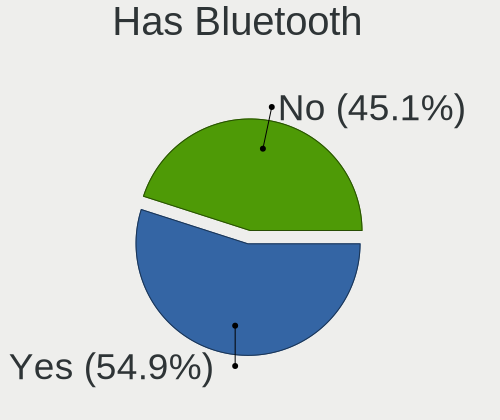
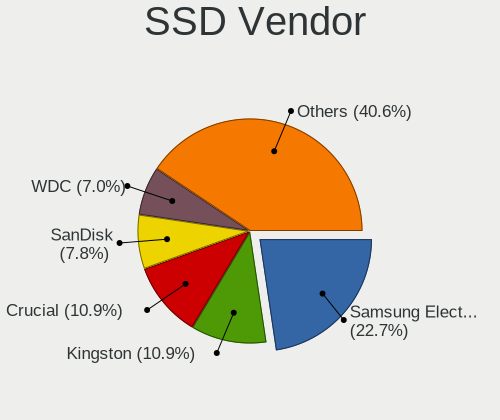
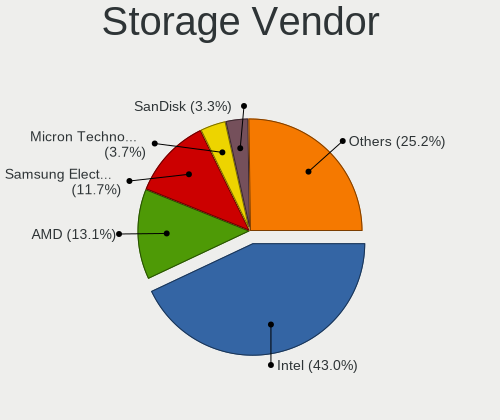
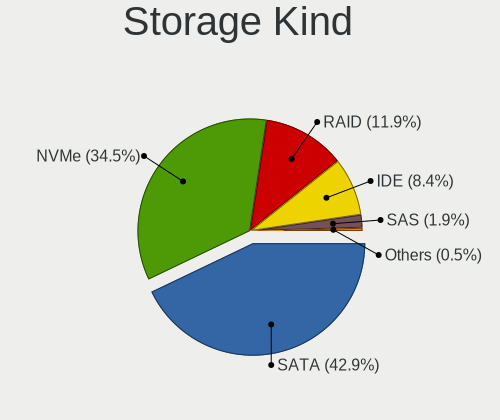
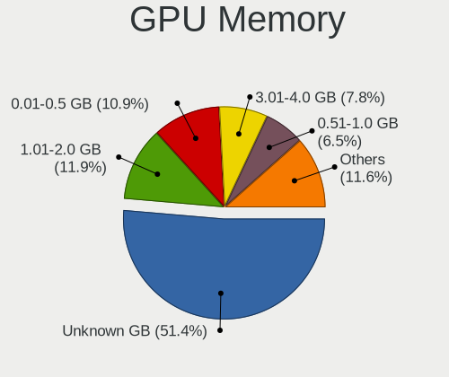
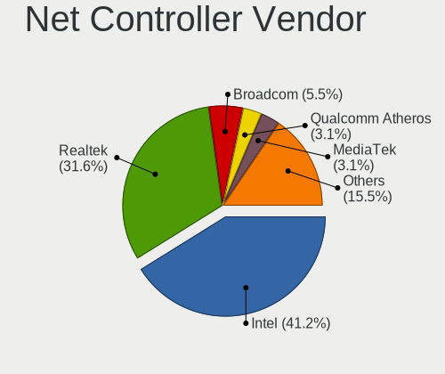
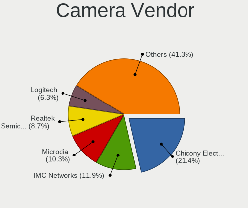
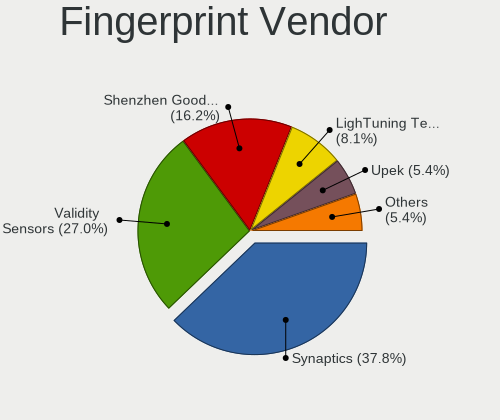

Rocky Linux - Tested Hardware & Statistics
------------------------------------------

A project to collect tested hardware configurations for Rocky Linux.

Anyone can contribute to this report by the [hw-probe](https://github.com/linuxhw/hw-probe) tool:

    sudo -E hw-probe -all -upload

Please submit a probe of your configuration if it's not presented on the page or is rare.

This is a report for all computer types. See also reports for [desktops](/Dist/Rocky_Linux/Desktop/README.md) and [notebooks](/Dist/Rocky_Linux/Notebook/README.md).

Full-feature report is available here: https://linux-hardware.org/?view=trends

Contents
--------

* [ Test Cases ](#test-cases)

* [ System ](#system)
  - [ OS                       ](#os)
  - [ OS Family                ](#os-family)
  - [ Kernel                   ](#kernel)
  - [ Kernel Family            ](#kernel-family)
  - [ Kernel Major Ver.        ](#kernel-major-ver)
  - [ Arch                     ](#arch)
  - [ DE                       ](#de)
  - [ Display Server           ](#display-server)
  - [ Display Manager          ](#display-manager)
  - [ OS Lang                  ](#os-lang)
  - [ Boot Mode                ](#boot-mode)
  - [ Filesystem               ](#filesystem)
  - [ Part. scheme             ](#part-scheme)
  - [ Dual Boot with Linux/BSD ](#dual-boot-with-linuxbsd)
  - [ Dual Boot (Win)          ](#dual-boot-win)

* [ Board ](#board)
  - [ Vendor                   ](#vendor)
  - [ Model                    ](#model)
  - [ Model Family             ](#model-family)
  - [ MFG Year                 ](#mfg-year)
  - [ Form Factor              ](#form-factor)
  - [ Secure Boot              ](#secure-boot)
  - [ Coreboot                 ](#coreboot)
  - [ RAM Size                 ](#ram-size)
  - [ RAM Used                 ](#ram-used)
  - [ Total Drives             ](#total-drives)
  - [ Has CD-ROM               ](#has-cd-rom)
  - [ Has Ethernet             ](#has-ethernet)
  - [ Has WiFi                 ](#has-wifi)
  - [ Has Bluetooth            ](#has-bluetooth)

* [ Location ](#location)
  - [ Country                  ](#country)
  - [ City                     ](#city)

* [ Drives ](#drives)
  - [ Drive Vendor             ](#drive-vendor)
  - [ Drive Model              ](#drive-model)
  - [ HDD Vendor               ](#hdd-vendor)
  - [ SSD Vendor               ](#ssd-vendor)
  - [ Drive Kind               ](#drive-kind)
  - [ Drive Connector          ](#drive-connector)
  - [ Drive Size               ](#drive-size)
  - [ Space Total              ](#space-total)
  - [ Space Used               ](#space-used)
  - [ Malfunc. Drives          ](#malfunc-drives)
  - [ Malfunc. Drive Vendor    ](#malfunc-drive-vendor)
  - [ Malfunc. HDD Vendor      ](#malfunc-hdd-vendor)
  - [ Malfunc. Drive Kind      ](#malfunc-drive-kind)
  - [ Failed Drives            ](#failed-drives)
  - [ Failed Drive Vendor      ](#failed-drive-vendor)
  - [ Drive Status             ](#drive-status)

* [ Storage controller ](#storage-controller)
  - [ Storage Vendor           ](#storage-vendor)
  - [ Storage Model            ](#storage-model)
  - [ Storage Kind             ](#storage-kind)

* [ Processor ](#processor)
  - [ CPU Vendor               ](#cpu-vendor)
  - [ CPU Model                ](#cpu-model)
  - [ CPU Model Family         ](#cpu-model-family)
  - [ CPU Cores                ](#cpu-cores)
  - [ CPU Sockets              ](#cpu-sockets)
  - [ CPU Threads              ](#cpu-threads)
  - [ CPU Op-Modes             ](#cpu-op-modes)
  - [ CPU Microcode            ](#cpu-microcode)
  - [ CPU Microarch            ](#cpu-microarch)

* [ Graphics ](#graphics)
  - [ GPU Vendor               ](#gpu-vendor)
  - [ GPU Model                ](#gpu-model)
  - [ GPU Combo                ](#gpu-combo)
  - [ GPU Driver               ](#gpu-driver)
  - [ GPU Memory               ](#gpu-memory)

* [ Monitor ](#monitor)
  - [ Monitor Vendor           ](#monitor-vendor)
  - [ Monitor Model            ](#monitor-model)
  - [ Monitor Resolution       ](#monitor-resolution)
  - [ Monitor Diagonal         ](#monitor-diagonal)
  - [ Monitor Width            ](#monitor-width)
  - [ Aspect Ratio             ](#aspect-ratio)
  - [ Monitor Area             ](#monitor-area)
  - [ Pixel Density            ](#pixel-density)
  - [ Multiple Monitors        ](#multiple-monitors)

* [ Network ](#network)
  - [ Net Controller Vendor    ](#net-controller-vendor)
  - [ Net Controller Model     ](#net-controller-model)
  - [ Wireless Vendor          ](#wireless-vendor)
  - [ Wireless Model           ](#wireless-model)
  - [ Ethernet Vendor          ](#ethernet-vendor)
  - [ Ethernet Model           ](#ethernet-model)
  - [ Net Controller Kind      ](#net-controller-kind)
  - [ Used Controller          ](#used-controller)
  - [ NICs                     ](#nics)
  - [ IPv6                     ](#ipv6)

* [ Bluetooth ](#bluetooth)
  - [ Bluetooth Vendor         ](#bluetooth-vendor)
  - [ Bluetooth Model          ](#bluetooth-model)

* [ Sound ](#sound)
  - [ Sound Vendor             ](#sound-vendor)
  - [ Sound Model              ](#sound-model)

* [ Memory ](#memory)
  - [ Memory Vendor            ](#memory-vendor)
  - [ Memory Model             ](#memory-model)
  - [ Memory Kind              ](#memory-kind)
  - [ Memory Form Factor       ](#memory-form-factor)
  - [ Memory Size              ](#memory-size)
  - [ Memory Speed             ](#memory-speed)

* [ Printers & scanners ](#printers--scanners)
  - [ Printer Vendor           ](#printer-vendor)
  - [ Printer Model            ](#printer-model)
  - [ Scanner Vendor           ](#scanner-vendor)
  - [ Scanner Model            ](#scanner-model)

* [ Camera ](#camera)
  - [ Camera Vendor            ](#camera-vendor)
  - [ Camera Model             ](#camera-model)

* [ Security ](#security)
  - [ Fingerprint Vendor       ](#fingerprint-vendor)
  - [ Fingerprint Model        ](#fingerprint-model)
  - [ Chipcard Vendor          ](#chipcard-vendor)
  - [ Chipcard Model           ](#chipcard-model)

* [ Unsupported ](#unsupported)
  - [ Unsupported Devices      ](#unsupported-devices)
  - [ Unsupported Device Types ](#unsupported-device-types)

Test Cases
----------

Total: 57

| Vendor        | Model                       | Form-Factor | Probe                                                      | Date         |
|---------------|-----------------------------|-------------|------------------------------------------------------------|--------------|
| IBM           | 4367 SVT                    | Server      | [3d7400ea9b](https://linux-hardware.org/?probe=3d7400ea9b) | Mar 11, 2022 |
| Dell          | 0NK70N A03                  | Desktop     | [7d4e906833](https://linux-hardware.org/?probe=7d4e906833) | Mar 11, 2022 |
| Supermicro    | X11SSH-CTF                  | Server      | [7a720a4e41](https://linux-hardware.org/?probe=7a720a4e41) | Mar 10, 2022 |
| Dell          | Latitude 5500               | Notebook    | [3d87bc42c6](https://linux-hardware.org/?probe=3d87bc42c6) | Mar 08, 2022 |
| Lenovo        | ThinkPad T14s Gen 2a 20X... | Notebook    | [f78b6db0bd](https://linux-hardware.org/?probe=f78b6db0bd) | Mar 08, 2022 |
| Dell          | Latitude 5500               | Notebook    | [fc0c5280d7](https://linux-hardware.org/?probe=fc0c5280d7) | Mar 08, 2022 |
| Lenovo        | ThinkPad T14s Gen 2a 20X... | Notebook    | [351e05ccc8](https://linux-hardware.org/?probe=351e05ccc8) | Mar 08, 2022 |
| Lenovo        | ThinkPad T14s Gen 2a 20X... | Notebook    | [dc09f11788](https://linux-hardware.org/?probe=dc09f11788) | Mar 08, 2022 |
| Dell          | 0WN7Y6 A01                  | Desktop     | [ef36ccb6ab](https://linux-hardware.org/?probe=ef36ccb6ab) | Feb 22, 2022 |
| Dell          | 0PC5F7 A02                  | Desktop     | [7c6c7dcd5e](https://linux-hardware.org/?probe=7c6c7dcd5e) | Feb 18, 2022 |
| ASUSTek       | PRIME B450-PLUS             | Desktop     | [1d3c449e8a](https://linux-hardware.org/?probe=1d3c449e8a) | Feb 18, 2022 |
| Supermicro    | X11SPW-TF                   | Server      | [a76bb2e30d](https://linux-hardware.org/?probe=a76bb2e30d) | Feb 07, 2022 |
| Dell          | 0XDN97 A02                  | Server      | [02e5c56a80](https://linux-hardware.org/?probe=02e5c56a80) | Feb 03, 2022 |
| Dell          | 0XDN97 A02                  | Server      | [4aa06b4edd](https://linux-hardware.org/?probe=4aa06b4edd) | Feb 03, 2022 |
| Lenovo        | Legion Y7000 2020H 81Y7     | Notebook    | [2ab4cacc1e](https://linux-hardware.org/?probe=2ab4cacc1e) | Jan 26, 2022 |
| Lenovo        | Legion Y7000 2020H 81Y7     | Notebook    | [787aec5f1c](https://linux-hardware.org/?probe=787aec5f1c) | Jan 26, 2022 |
| ASRock        | B450M Pro4                  | Desktop     | [1ab47f8ff0](https://linux-hardware.org/?probe=1ab47f8ff0) | Jan 20, 2022 |
| MSI           | Z97A GAMING 6               | Desktop     | [4b935d705c](https://linux-hardware.org/?probe=4b935d705c) | Jan 20, 2022 |
| Dell          | 0X3D66 A07                  | Server      | [d5c4ef93c4](https://linux-hardware.org/?probe=d5c4ef93c4) | Jan 18, 2022 |
| Lenovo        | IdeaPad Y700-15ISK 80NV     | Notebook    | [7225108b91](https://linux-hardware.org/?probe=7225108b91) | Jan 10, 2022 |
| HP            | ZBook 15 G3                 | Notebook    | [89809f906e](https://linux-hardware.org/?probe=89809f906e) | Jan 10, 2022 |
| Lenovo        | Legion 5 15ARH05H 82B1      | Notebook    | [90821cb3a5](https://linux-hardware.org/?probe=90821cb3a5) | Jan 03, 2022 |
| Lenovo        | IdeaPadFlex 5 14ALC05 82... | Convertible | [c7f9478d55](https://linux-hardware.org/?probe=c7f9478d55) | Jan 03, 2022 |
| AZW           | Gemini M                    | Desktop     | [25e63b737c](https://linux-hardware.org/?probe=25e63b737c) | Dec 31, 2021 |
| AZW           | Gemini M                    | Desktop     | [05ef59842c](https://linux-hardware.org/?probe=05ef59842c) | Dec 31, 2021 |
| Google        | Panther                     | Desktop     | [92e2626936](https://linux-hardware.org/?probe=92e2626936) | Nov 30, 2021 |
| Lenovo        | IdeaPad 500S-14ISK 80Q3     | Notebook    | [6ea0cdba08](https://linux-hardware.org/?probe=6ea0cdba08) | Nov 27, 2021 |
| Lenovo        | ThinkPad W540 20BGCTO1WW    | Notebook    | [25055cdc26](https://linux-hardware.org/?probe=25055cdc26) | Nov 23, 2021 |
| Gigabyte      | X570 AORUS ULTRA            | Desktop     | [840d920fb2](https://linux-hardware.org/?probe=840d920fb2) | Nov 22, 2021 |
| Gigabyte      | H87-D3H-CF                  | Desktop     | [72fdde33b3](https://linux-hardware.org/?probe=72fdde33b3) | Nov 19, 2021 |
| HP            | Laptop 17-ca1xxx            | Notebook    | [61fe4e654d](https://linux-hardware.org/?probe=61fe4e654d) | Nov 09, 2021 |
| Raspberry ... | Raspberry Pi                | Soc         | [9d7947a5a8](https://linux-hardware.org/?probe=9d7947a5a8) | Nov 06, 2021 |
| Toshiba       | TECRA W50-A                 | Notebook    | [abee9f36ad](https://linux-hardware.org/?probe=abee9f36ad) | Nov 05, 2021 |
| Dell          | 0N4YC8 A00                  | Desktop     | [1a94195ddb](https://linux-hardware.org/?probe=1a94195ddb) | Oct 15, 2021 |
| Intel         | S2600WFT H48104-850         | Server      | [36c4acac2d](https://linux-hardware.org/?probe=36c4acac2d) | Sep 14, 2021 |
| ASUSTek       | PRIME B450M-A II            | Desktop     | [cb9f02b3de](https://linux-hardware.org/?probe=cb9f02b3de) | Sep 07, 2021 |
| ASUSTek       | PRIME B450M-A II            | Desktop     | [f80365b98a](https://linux-hardware.org/?probe=f80365b98a) | Sep 07, 2021 |
| ASUSTek       | P5Q DELUXE                  | Desktop     | [243dba3b27](https://linux-hardware.org/?probe=243dba3b27) | Sep 02, 2021 |
| Lenovo        | ThinkPad T420 42365H1       | Notebook    | [3430adab89](https://linux-hardware.org/?probe=3430adab89) | Aug 25, 2021 |
| Lenovo        | NOK                         | Desktop     | [274005087d](https://linux-hardware.org/?probe=274005087d) | Aug 23, 2021 |
| Lenovo        | ThinkPad T420 42365H1       | Notebook    | [6a306e2253](https://linux-hardware.org/?probe=6a306e2253) | Aug 16, 2021 |
| Dell          | 0M5DCD A00                  | Desktop     | [91acc7eb93](https://linux-hardware.org/?probe=91acc7eb93) | Aug 15, 2021 |
| Lenovo        | ThinkPad W500 406132G       | Notebook    | [e79080e90d](https://linux-hardware.org/?probe=e79080e90d) | Aug 08, 2021 |
| Lenovo        | IdeaPad Slim 1-14AST-05 ... | Notebook    | [860ec3c89d](https://linux-hardware.org/?probe=860ec3c89d) | Aug 08, 2021 |
| Lenovo        | IdeaPad Y410P 20216         | Notebook    | [b2df1c0e6d](https://linux-hardware.org/?probe=b2df1c0e6d) | Aug 08, 2021 |
| Lenovo        | IdeaPad Y410P 20216         | Notebook    | [3fc207c5b9](https://linux-hardware.org/?probe=3fc207c5b9) | Aug 07, 2021 |
| Dell          | 0M5DCD A00                  | Desktop     | [d40f4d3bee](https://linux-hardware.org/?probe=d40f4d3bee) | Aug 06, 2021 |
| ASUSTek       | PRIME TRX40-PRO S           | Desktop     | [59f7d599dd](https://linux-hardware.org/?probe=59f7d599dd) | Aug 04, 2021 |
| Dell          | 0M5DCD A00                  | Desktop     | [5ee09ac705](https://linux-hardware.org/?probe=5ee09ac705) | Aug 04, 2021 |
| Dell          | 0M5DCD A00                  | Desktop     | [77c3d7076e](https://linux-hardware.org/?probe=77c3d7076e) | Aug 04, 2021 |
| Lenovo        | IdeaPad Slim 1-14AST-05 ... | Notebook    | [2a4bd5cb12](https://linux-hardware.org/?probe=2a4bd5cb12) | Jul 11, 2021 |
| Lenovo        | IdeaPad Slim 1-14AST-05 ... | Notebook    | [09738de946](https://linux-hardware.org/?probe=09738de946) | Jul 04, 2021 |
| Lenovo        | IdeaPad Slim 1-14AST-05 ... | Notebook    | [741cab87e1](https://linux-hardware.org/?probe=741cab87e1) | Jun 29, 2021 |
| ASUSTek       | ASUS TUF Gaming A15 FA50... | Notebook    | [60fe7f2653](https://linux-hardware.org/?probe=60fe7f2653) | Jun 13, 2021 |
| Toshiba       | Satellite E45-B             | Notebook    | [84683df1f0](https://linux-hardware.org/?probe=84683df1f0) | Jun 12, 2021 |
| HP            | 0B54h D                     | Desktop     | [ee9a2da17c](https://linux-hardware.org/?probe=ee9a2da17c) | May 19, 2021 |
| Acer          | Aspire VN7-591G             | Notebook    | [bc9e6c4910](https://linux-hardware.org/?probe=bc9e6c4910) | May 10, 2021 |

System
------

OS
--

Installed operating systems

| Name            | Computers | Percent |
|-----------------|-----------|---------|
| Rocky Linux 8.5 | 23        | 53.49%  |
| Rocky Linux 8.4 | 18        | 41.86%  |
| Rocky Linux 8.3 | 2         | 4.65%   |

OS Family
---------

OS without a version

| Name        | Computers | Percent |
|-------------|-----------|---------|
| Rocky Linux | 43        | 100%    |

Kernel
------

Version of the Linux kernel

| Version                      | Computers | Percent |
|------------------------------|-----------|---------|
| 4.18.0-348.12.2.el8_5.x86_64 | 11        | 25.58%  |
| 4.18.0-348.7.1.el8_5.x86_64  | 8         | 18.6%   |
| 4.18.0-305.10.2.el8_4.x86_64 | 5         | 11.63%  |
| 4.18.0-305.25.1.el8_4.x86_64 | 3         | 6.98%   |
| 4.18.0-348.2.1.el8_5.x86_64  | 2         | 4.65%   |
| 4.18.0-305.el8.x86_64        | 2         | 4.65%   |
| 4.18.0-305.3.1.el8_4.x86_64  | 2         | 4.65%   |
| 4.18.0-305.19.1.el8_4.x86_64 | 2         | 4.65%   |
| 4.18.0-305.12.1.el8_4.x86_64 | 2         | 4.65%   |
| 4.18.0-240.22.1.el8.x86_64   | 2         | 4.65%   |
| 5.4.157-1.el8.elrepo.x86_64  | 1         | 2.33%   |
| 5.14.1-1.el8.elrepo.x86_64   | 1         | 2.33%   |
| 5.10.52-v8.1.el8             | 1         | 2.33%   |
| 4.18.0-348.el8.0.2.x86_64    | 1         | 2.33%   |

Kernel Family
-------------

Linux kernel without a distro release

| Version | Computers | Percent |
|---------|-----------|---------|
| 4.18.0  | 40        | 93.02%  |
| 5.4.157 | 1         | 2.33%   |
| 5.14.1  | 1         | 2.33%   |
| 5.10.52 | 1         | 2.33%   |

Kernel Major Ver.
-----------------

Linux kernel major version

| Version | Computers | Percent |
|---------|-----------|---------|
| 4.18    | 40        | 93.02%  |
| 5.4     | 1         | 2.33%   |
| 5.14    | 1         | 2.33%   |
| 5.10    | 1         | 2.33%   |

Arch
----

OS architecture (x86_64, i586, etc.)

| Name    | Computers | Percent |
|---------|-----------|---------|
| x86_64  | 42        | 97.67%  |
| aarch64 | 1         | 2.33%   |

DE
--

Desktop Environment

| Name          | Computers | Percent |
|---------------|-----------|---------|
| GNOME         | 27        | 62.79%  |
| Unknown       | 7         | 16.28%  |
| KDE5          | 4         | 9.3%    |
| MATE          | 2         | 4.65%   |
| XFCE          | 1         | 2.33%   |
| X-Cinnamon    | 1         | 2.33%   |
| GNOME Classic | 1         | 2.33%   |

Display Server
--------------

X11 or Wayland

| Name    | Computers | Percent |
|---------|-----------|---------|
| Wayland | 21        | 48.84%  |
| X11     | 17        | 39.53%  |
| Unknown | 5         | 11.63%  |

Display Manager
---------------

SDDM, LightDM, etc.

| Name    | Computers | Percent |
|---------|-----------|---------|
| Unknown | 22        | 51.16%  |
| GDM     | 16        | 37.21%  |
| SDDM    | 3         | 6.98%   |
| LightDM | 2         | 4.65%   |

OS Lang
-------

Language

| Lang    | Computers | Percent |
|---------|-----------|---------|
| en_US   | 27        | 62.79%  |
| en_IL   | 3         | 6.98%   |
| en_SG   | 2         | 4.65%   |
| en_AU   | 2         | 4.65%   |
| de_DE   | 2         | 4.65%   |
| ru_RU   | 1         | 2.33%   |
| ja_JP   | 1         | 2.33%   |
| it_IT   | 1         | 2.33%   |
| es_CO   | 1         | 2.33%   |
| en_ZA   | 1         | 2.33%   |
| en_CA   | 1         | 2.33%   |
| Unknown | 1         | 2.33%   |

Boot Mode
---------

EFI or BIOS

| Mode | Computers | Percent |
|------|-----------|---------|
| EFI  | 23        | 53.49%  |
| BIOS | 20        | 46.51%  |

Filesystem
----------

Type of filesystem

| Type | Computers | Percent |
|------|-----------|---------|
| Xfs  | 34        | 79.07%  |
| Ext4 | 9         | 20.93%  |

Part. scheme
------------

Scheme of partitioning

| Type    | Computers | Percent |
|---------|-----------|---------|
| Unknown | 18        | 41.86%  |
| GPT     | 17        | 39.53%  |
| MBR     | 8         | 18.6%   |

Dual Boot with Linux/BSD
------------------------

Hosting more than one Linux/BSD

| Dual boot | Computers | Percent |
|-----------|-----------|---------|
| No        | 40        | 93.02%  |
| Yes       | 3         | 6.98%   |

Dual Boot (Win)
---------------

Hosting Linux and Windows

| Dual boot | Computers | Percent |
|-----------|-----------|---------|
| No        | 39        | 90.7%   |
| Yes       | 4         | 9.3%    |

Board
-----

Vendor
------

Motherboard manufacturer

| Name                    | Computers | Percent |
|-------------------------|-----------|---------|
| Lenovo                  | 12        | 27.91%  |
| Dell                    | 9         | 20.93%  |
| ASUSTek Computer        | 5         | 11.63%  |
| Hewlett-Packard         | 3         | 6.98%   |
| Toshiba                 | 2         | 4.65%   |
| Supermicro              | 2         | 4.65%   |
| Gigabyte Technology     | 2         | 4.65%   |
| Raspberry Pi Foundation | 1         | 2.33%   |
| MSI                     | 1         | 2.33%   |
| Intel                   | 1         | 2.33%   |
| IBM                     | 1         | 2.33%   |
| Google                  | 1         | 2.33%   |
| AZW                     | 1         | 2.33%   |
| ASRock                  | 1         | 2.33%   |
| Acer                    | 1         | 2.33%   |

Model
-----

Motherboard model

| Name                                     | Computers | Percent |
|------------------------------------------|-----------|---------|
| Dell PowerEdge R610                      | 2         | 4.65%   |
| Dell OptiPlex 9020                       | 2         | 4.65%   |
| Toshiba TECRA W50-A                      | 1         | 2.33%   |
| Toshiba Satellite E45-B                  | 1         | 2.33%   |
| Supermicro SYS-5029P-WTR                 | 1         | 2.33%   |
| Supermicro Super Server                  | 1         | 2.33%   |
| RPi Raspberry Pi                         | 1         | 2.33%   |
| MSI MS-7917                              | 1         | 2.33%   |
| Lenovo ThinkPad W540 20BGCTO1WW          | 1         | 2.33%   |
| Lenovo ThinkPad W500 406132G             | 1         | 2.33%   |
| Lenovo ThinkPad T420 42365H1             | 1         | 2.33%   |
| Lenovo ThinkPad T14s Gen 2a 20XF006XCK   | 1         | 2.33%   |
| Lenovo ThinkCentre M72e 36601Y8          | 1         | 2.33%   |
| Lenovo Legion Y7000 2020H 81Y7           | 1         | 2.33%   |
| Lenovo Legion 5 15ARH05H 82B1            | 1         | 2.33%   |
| Lenovo IdeaPadFlex 5 14ALC05 82HU        | 1         | 2.33%   |
| Lenovo IdeaPad Y700-15ISK 80NV           | 1         | 2.33%   |
| Lenovo IdeaPad Y410P 20216               | 1         | 2.33%   |
| Lenovo IdeaPad Slim 1-14AST-05 81VS      | 1         | 2.33%   |
| Lenovo IdeaPad 500S-14ISK 80Q3           | 1         | 2.33%   |
| Intel S2600WFT                           | 1         | 2.33%   |
| IBM System x3200 M2 -[4368IGS]-          | 1         | 2.33%   |
| HP ZBook 15 G3                           | 1         | 2.33%   |
| HP Z600 Workstation                      | 1         | 2.33%   |
| HP Laptop 17-ca1xxx                      | 1         | 2.33%   |
| Google Panther                           | 1         | 2.33%   |
| Gigabyte X570 AORUS ULTRA                | 1         | 2.33%   |
| Gigabyte H87-D3H                         | 1         | 2.33%   |
| Dell Precision T7610                     | 1         | 2.33%   |
| Dell Precision T5610                     | 1         | 2.33%   |
| Dell PowerEdge R720xd                    | 1         | 2.33%   |
| Dell OptiPlex 390                        | 1         | 2.33%   |
| Dell Latitude 5500                       | 1         | 2.33%   |
| AZW Gemini M                             | 1         | 2.33%   |
| ASUS PRIME TRX40-PRO S                   | 1         | 2.33%   |
| ASUS PRIME B450M-A II                    | 1         | 2.33%   |
| ASUS PRIME B450-PLUS                     | 1         | 2.33%   |
| ASUS P5Q DELUXE                          | 1         | 2.33%   |
| ASUS ASUS TUF Gaming A15 FA506II_FA506II | 1         | 2.33%   |
| ASRock B450M Pro4                        | 1         | 2.33%   |
| Acer Aspire VN7-591G                     | 1         | 2.33%   |

Model Family
------------

Motherboard model prefix

| Name                     | Computers | Percent |
|--------------------------|-----------|---------|
| Lenovo ThinkPad          | 4         | 9.3%    |
| Lenovo IdeaPad           | 4         | 9.3%    |
| Dell PowerEdge           | 3         | 6.98%   |
| Dell OptiPlex            | 3         | 6.98%   |
| ASUS PRIME               | 3         | 6.98%   |
| Lenovo Legion            | 2         | 4.65%   |
| Dell Precision           | 2         | 4.65%   |
| Toshiba TECRA            | 1         | 2.33%   |
| Toshiba Satellite        | 1         | 2.33%   |
| Supermicro SYS-5029P-WTR | 1         | 2.33%   |
| Supermicro Super         | 1         | 2.33%   |
| RPi Raspberry            | 1         | 2.33%   |
| MSI MS-7917              | 1         | 2.33%   |
| Lenovo ThinkCentre       | 1         | 2.33%   |
| Lenovo IdeaPadFlex       | 1         | 2.33%   |
| Intel S2600WFT           | 1         | 2.33%   |
| IBM System               | 1         | 2.33%   |
| HP ZBook                 | 1         | 2.33%   |
| HP Z600                  | 1         | 2.33%   |
| HP Laptop                | 1         | 2.33%   |
| Google Panther           | 1         | 2.33%   |
| Gigabyte X570            | 1         | 2.33%   |
| Gigabyte H87-D3H         | 1         | 2.33%   |
| Dell Latitude            | 1         | 2.33%   |
| AZW Gemini               | 1         | 2.33%   |
| ASUS P5Q                 | 1         | 2.33%   |
| ASUS ASUS                | 1         | 2.33%   |
| ASRock B450M             | 1         | 2.33%   |
| Acer Aspire              | 1         | 2.33%   |

MFG Year
--------

Motherboard manufacture year

| Year    | Computers | Percent |
|---------|-----------|---------|
| 2020    | 6         | 13.95%  |
| 2014    | 6         | 13.95%  |
| 2019    | 5         | 11.63%  |
| 2018    | 5         | 11.63%  |
| 2021    | 4         | 9.3%    |
| 2013    | 4         | 9.3%    |
| 2015    | 3         | 6.98%   |
| 2016    | 2         | 4.65%   |
| 2011    | 2         | 4.65%   |
| 2009    | 2         | 4.65%   |
| 2022    | 1         | 2.33%   |
| 2010    | 1         | 2.33%   |
| 2008    | 1         | 2.33%   |
| Unknown | 1         | 2.33%   |

Form Factor
-----------

Physical design of the computer

| Name           | Computers | Percent |
|----------------|-----------|---------|
| Desktop        | 17        | 39.53%  |
| Notebook       | 17        | 39.53%  |
| Server         | 7         | 16.28%  |
| System on chip | 1         | 2.33%   |
| Convertible    | 1         | 2.33%   |

Secure Boot
-----------

Enabled or disabled

| State    | Computers | Percent |
|----------|-----------|---------|
| Disabled | 43        | 100%    |

Coreboot
--------

Have coreboot on board

| Used | Computers | Percent |
|------|-----------|---------|
| No   | 42        | 97.67%  |
| Yes  | 1         | 2.33%   |

RAM Size
--------

Total RAM memory

| Size in GB      | Computers | Percent |
|-----------------|-----------|---------|
| 4.01-8.0        | 10        | 23.26%  |
| 32.01-64.0      | 8         | 18.6%   |
| 16.01-24.0      | 8         | 18.6%   |
| 8.01-16.0       | 7         | 16.28%  |
| 3.01-4.0        | 4         | 9.3%    |
| More than 256.0 | 2         | 4.65%   |
| 64.01-256.0     | 2         | 4.65%   |
| 1.01-2.0        | 2         | 4.65%   |

RAM Used
--------

Used RAM memory

| Used GB   | Computers | Percent |
|-----------|-----------|---------|
| 2.01-3.0  | 13        | 30.23%  |
| 3.01-4.0  | 11        | 25.58%  |
| 1.01-2.0  | 9         | 20.93%  |
| 4.01-8.0  | 6         | 13.95%  |
| 8.01-16.0 | 2         | 4.65%   |
| 0.51-1.0  | 1         | 2.33%   |
| 0.01-0.5  | 1         | 2.33%   |

Total Drives
------------

Number of drives on board

| Drives | Computers | Percent |
|--------|-----------|---------|
| 1      | 21        | 48.84%  |
| 2      | 10        | 23.26%  |
| 3      | 5         | 11.63%  |
| 4      | 4         | 9.3%    |
| 16     | 1         | 2.33%   |
| 14     | 1         | 2.33%   |
| 8      | 1         | 2.33%   |

Has CD-ROM
----------

Has CD-ROM on board

| Presented | Computers | Percent |
|-----------|-----------|---------|
| No        | 28        | 65.12%  |
| Yes       | 15        | 34.88%  |

Has Ethernet
------------

Has Ethernet on board

| Presented | Computers | Percent |
|-----------|-----------|---------|
| Yes       | 40        | 93.02%  |
| No        | 3         | 6.98%   |

Has WiFi
--------

Has WiFi module

| Presented | Computers | Percent |
|-----------|-----------|---------|
| Yes       | 26        | 60.47%  |
| No        | 17        | 39.53%  |

Has Bluetooth
-------------

Has Bluetooth module

| Presented | Computers | Percent |
|-----------|-----------|---------|
| Yes       | 22        | 51.16%  |
| No        | 21        | 48.84%  |

Location
--------

Country
-------

Geographic location (country)

| Country      | Computers | Percent |
|--------------|-----------|---------|
| USA          | 13        | 30.23%  |
| Israel       | 3         | 6.98%   |
| Czechia      | 3         | 6.98%   |
| Singapore    | 2         | 4.65%   |
| Germany      | 2         | 4.65%   |
| Canada       | 2         | 4.65%   |
| Belgium      | 2         | 4.65%   |
| Australia    | 2         | 4.65%   |
| UK           | 1         | 2.33%   |
| South Africa | 1         | 2.33%   |
| Slovakia     | 1         | 2.33%   |
| Russia       | 1         | 2.33%   |
| Portugal     | 1         | 2.33%   |
| Poland       | 1         | 2.33%   |
| Malaysia     | 1         | 2.33%   |
| Kazakhstan   | 1         | 2.33%   |
| Japan        | 1         | 2.33%   |
| Italy        | 1         | 2.33%   |
| India        | 1         | 2.33%   |
| France       | 1         | 2.33%   |
| Colombia     | 1         | 2.33%   |
| China        | 1         | 2.33%   |

City
----

Geographic location (city)

| City             | Computers | Percent |
|------------------|-----------|---------|
| Singapore        | 2         | 4.65%   |
| Prague           | 2         | 4.65%   |
| Melbourne        | 2         | 4.65%   |
| Haifa            | 2         | 4.65%   |
| Žilina          | 1         | 2.33%   |
| Xi'an            | 1         | 2.33%   |
| Weinheim         | 1         | 2.33%   |
| Toronto          | 1         | 2.33%   |
| St Petersburg    | 1         | 2.33%   |
| Scarborough      | 1         | 2.33%   |
| San Ramon        | 1         | 2.33%   |
| Saint Albans     | 1         | 2.33%   |
| Rehovot          | 1         | 2.33%   |
| Pretoria         | 1         | 2.33%   |
| Paris            | 1         | 2.33%   |
| Ottignies        | 1         | 2.33%   |
| Nur-Sultan       | 1         | 2.33%   |
| Nowy Wisnicz     | 1         | 2.33%   |
| New York         | 1         | 2.33%   |
| Mequon           | 1         | 2.33%   |
| Manassas         | 1         | 2.33%   |
| Lisbon           | 1         | 2.33%   |
| Lebanon          | 1         | 2.33%   |
| Kuala Terengganu | 1         | 2.33%   |
| Jette            | 1         | 2.33%   |
| Houston          | 1         | 2.33%   |
| Glasgow          | 1         | 2.33%   |
| Fredericton      | 1         | 2.33%   |
| Fredericksburg   | 1         | 2.33%   |
| Forest           | 1         | 2.33%   |
| Corvallis        | 1         | 2.33%   |
| Contrada Tenna   | 1         | 2.33%   |
| Burlington       | 1         | 2.33%   |
| Bucaramanga      | 1         | 2.33%   |
| Boskovice        | 1         | 2.33%   |
| Berlin           | 1         | 2.33%   |
| Bengaluru        | 1         | 2.33%   |
| ÅŒtsu          | 1         | 2.33%   |
| Ashburn          | 1         | 2.33%   |

Drives
------

Drive Vendor
------------

Hard drive vendors

| Vendor                  | Computers | Drives | Percent |
|-------------------------|-----------|--------|---------|
| Seagate                 | 11        | 38     | 15.94%  |
| Samsung Electronics     | 10        | 12     | 14.49%  |
| WDC                     | 9         | 21     | 13.04%  |
| Toshiba                 | 6         | 6      | 8.7%    |
| Unknown                 | 3         | 3      | 4.35%   |
| SK Hynix                | 3         | 4      | 4.35%   |
| Intel                   | 3         | 3      | 4.35%   |
| Hitachi                 | 3         | 4      | 4.35%   |
| Phison                  | 2         | 2      | 2.9%    |
| Kingston                | 2         | 2      | 2.9%    |
| Crucial                 | 2         | 2      | 2.9%    |
| Union Memory (Shenzhen) | 1         | 1      | 1.45%   |
| UMIS                    | 1         | 2      | 1.45%   |
| StoreJet                | 1         | 1      | 1.45%   |
| SanDisk                 | 1         | 1      | 1.45%   |
| PNY                     | 1         | 1      | 1.45%   |
| LITEONIT                | 1         | 1      | 1.45%   |
| LITEON                  | 1         | 1      | 1.45%   |
| IBM                     | 1         | 1      | 1.45%   |
| HGST                    | 1         | 1      | 1.45%   |
| Fujitsu                 | 1         | 1      | 1.45%   |
| Dogfish                 | 1         | 1      | 1.45%   |
| Corsair                 | 1         | 1      | 1.45%   |
| China                   | 1         | 1      | 1.45%   |
| AGI                     | 1         | 1      | 1.45%   |
| A-DATA Technology       | 1         | 1      | 1.45%   |

Drive Model
-----------

Hard drive models

| Model                                        | Computers | Percent |
|----------------------------------------------|-----------|---------|
| Unknown MMC Card  64GB                       | 2         | 2.5%    |
| Seagate ST300MP0005 304GB                    | 2         | 2.5%    |
| WDC WDS240G2G0B-00EPW0 240GB SSD             | 1         | 1.25%   |
| WDC WDS240G2G0A-00JH30 240GB SSD             | 1         | 1.25%   |
| WDC WD80EZZX-11CSGA0 8TB                     | 1         | 1.25%   |
| WDC WD80EMAZ-00WJTA0 8TB                     | 1         | 1.25%   |
| WDC WD80EDAZ-11TA3A0 8TB                     | 1         | 1.25%   |
| WDC WD5000LPCX-24VHAT0 500GB                 | 1         | 1.25%   |
| WDC WD5000AAKX-75U6AA0 500GB                 | 1         | 1.25%   |
| WDC WD5000AAKX-001CA0 500GB                  | 1         | 1.25%   |
| WDC WD20EZRX-00DC0B0 2TB                     | 1         | 1.25%   |
| WDC WD120EDAZ-11F3RA0 12TB                   | 1         | 1.25%   |
| WDC WD10SPCX-24HWST1 1TB                     | 1         | 1.25%   |
| WDC WD10JPVX-22JC3T0 1TB                     | 1         | 1.25%   |
| WDC WD100EMAZ-00WJTA0 10TB                   | 1         | 1.25%   |
| WDC WD1001FALS-00J7B0 1TB                    | 1         | 1.25%   |
| WDC PC SN530 SDBPMPZ-512G-1101 512GB         | 1         | 1.25%   |
| Unknown SD/MMC/MS PRO 32GB                   | 1         | 1.25%   |
| Union Memory (Shenzhen) NVMe SSD Drive 128GB | 1         | 1.25%   |
| UMIS RPFTJ128PDD2EWX 128GB                   | 1         | 1.25%   |
| Toshiba THNSNJ512GACU 512GB SSD              | 1         | 1.25%   |
| Toshiba THNSNJ128G8NU 128GB SSD              | 1         | 1.25%   |
| Toshiba MG04ACA400E 4TB                      | 1         | 1.25%   |
| Toshiba MG03ACA400 4TB                       | 1         | 1.25%   |
| Toshiba DT01ACA100 1TB                       | 1         | 1.25%   |
| Toshiba DT01ACA050 500GB                     | 1         | 1.25%   |
| StoreJet Disk 2TB                            | 1         | 1.25%   |
| SK Hynix SHGS31-1000GS-2 1TB SSD             | 1         | 1.25%   |
| SK Hynix SH920 2.5 7MM 256GB SSD             | 1         | 1.25%   |
| SK Hynix NVMe SSD Drive 512GB                | 1         | 1.25%   |
| SK Hynix BC511 NVMe 512GB                    | 1         | 1.25%   |
| Seagate ST91000640SS 1TB                     | 1         | 1.25%   |
| Seagate ST8000DM004-2CX188 8TB               | 1         | 1.25%   |
| Seagate ST8000AS0002-1NA17Z 8TB              | 1         | 1.25%   |
| Seagate ST500DM002-1BD142 500GB              | 1         | 1.25%   |
| Seagate ST4000NM0033-9ZM170 4TB              | 1         | 1.25%   |
| Seagate ST4000DM004-2CV104 4TB               | 1         | 1.25%   |
| Seagate ST3160318AS 160GB                    | 1         | 1.25%   |
| Seagate ST2000DM008-2FR102 2TB               | 1         | 1.25%   |
| Seagate ST1000VX005-2EZ102 1TB               | 1         | 1.25%   |
| Seagate ST1000LM024 HN-M101MBB 1TB           | 1         | 1.25%   |
| Seagate BUP Slim BL 1TB                      | 1         | 1.25%   |
| SanDisk SSD U110 16GB                        | 1         | 1.25%   |
| Samsung SSD 980 PRO 1TB                      | 1         | 1.25%   |
| Samsung SSD 970 EVO 500GB                    | 1         | 1.25%   |
| Samsung SSD 870 QVO 2TB                      | 1         | 1.25%   |
| Samsung SSD 870 EVO 1TB                      | 1         | 1.25%   |
| Samsung SSD 860 QVO 4TB                      | 1         | 1.25%   |
| Samsung SSD 860 EVO 500GB                    | 1         | 1.25%   |
| Samsung SSD 860 EVO 1TB                      | 1         | 1.25%   |
| Samsung NVMe SSD Drive 256GB                 | 1         | 1.25%   |
| Samsung MZVLB512HBJQ-000L7 512GB             | 1         | 1.25%   |
| Samsung MZVLB512HBJQ-000L2 512GB             | 1         | 1.25%   |
| Samsung MZNLN512HAJQ-000H1 512GB SSD         | 1         | 1.25%   |
| PNY CS900 120GB SSD                          | 1         | 1.25%   |
| Phison Sabrent Rocket 4.0 Plus 4TB           | 1         | 1.25%   |
| Phison Sabrent 1TB                           | 1         | 1.25%   |
| LITEONIT LSS-24L6G 24GB SSD                  | 1         | 1.25%   |
| LITEON CV1-DB256 256GB SSD                   | 1         | 1.25%   |
| Kingston SA400S37120G 120GB SSD              | 1         | 1.25%   |

HDD Vendor
----------

Hard disk drive vendors

| Vendor   | Computers | Drives | Percent |
|----------|-----------|--------|---------|
| Seagate  | 11        | 38     | 36.67%  |
| WDC      | 7         | 18     | 23.33%  |
| Toshiba  | 4         | 4      | 13.33%  |
| Hitachi  | 3         | 4      | 10%     |
| Unknown  | 1         | 1      | 3.33%   |
| StoreJet | 1         | 1      | 3.33%   |
| IBM      | 1         | 1      | 3.33%   |
| HGST     | 1         | 1      | 3.33%   |
| Fujitsu  | 1         | 1      | 3.33%   |

SSD Vendor
----------

Solid state drive vendors

| Vendor              | Computers | Drives | Percent |
|---------------------|-----------|--------|---------|
| Samsung Electronics | 6         | 7      | 28.57%  |
| WDC                 | 2         | 2      | 9.52%   |
| Toshiba             | 2         | 2      | 9.52%   |
| SK Hynix            | 2         | 2      | 9.52%   |
| SanDisk             | 1         | 1      | 4.76%   |
| PNY                 | 1         | 1      | 4.76%   |
| LITEONIT            | 1         | 1      | 4.76%   |
| LITEON              | 1         | 1      | 4.76%   |
| Kingston            | 1         | 1      | 4.76%   |
| Dogfish             | 1         | 1      | 4.76%   |
| Crucial             | 1         | 1      | 4.76%   |
| Corsair             | 1         | 1      | 4.76%   |
| China               | 1         | 1      | 4.76%   |

Drive Kind
----------

HDD or SSD

| Kind    | Computers | Drives | Percent |
|---------|-----------|--------|---------|
| HDD     | 22        | 69     | 37.93%  |
| SSD     | 18        | 22     | 31.03%  |
| NVMe    | 15        | 19     | 25.86%  |
| MMC     | 2         | 2      | 3.45%   |
| Unknown | 1         | 1      | 1.72%   |

Drive Connector
---------------

SATA, SAS, NVMe, etc.

| Type | Computers | Drives | Percent |
|------|-----------|--------|---------|
| SATA | 32        | 88     | 60.38%  |
| NVMe | 15        | 19     | 28.3%   |
| SAS  | 4         | 4      | 7.55%   |
| MMC  | 2         | 2      | 3.77%   |

Drive Size
----------

Size of hard drive

| Size in TB | Computers | Drives | Percent |
|------------|-----------|--------|---------|
| 0.01-0.5   | 19        | 31     | 43.18%  |
| 0.51-1.0   | 14        | 20     | 31.82%  |
| 1.01-2.0   | 5         | 6      | 11.36%  |
| 3.01-4.0   | 4         | 20     | 9.09%   |
| 10.01-20.0 | 1         | 2      | 2.27%   |
| 4.01-10.0  | 1         | 12     | 2.27%   |

Space Total
-----------

Amount of disk space available on the file system

| Size in GB     | Computers | Percent |
|----------------|-----------|---------|
| 101-250        | 11        | 25.58%  |
| 251-500        | 8         | 18.6%   |
| 501-1000       | 8         | 18.6%   |
| More than 3000 | 5         | 11.63%  |
| 1001-2000      | 4         | 9.3%    |
| 2001-3000      | 3         | 6.98%   |
| 51-100         | 2         | 4.65%   |
| 1-20           | 1         | 2.33%   |
| Unknown        | 1         | 2.33%   |

Space Used
----------

Amount of used disk space

| Used GB        | Computers | Percent |
|----------------|-----------|---------|
| 1-20           | 15        | 34.88%  |
| 21-50          | 10        | 23.26%  |
| 101-250        | 4         | 9.3%    |
| 51-100         | 4         | 9.3%    |
| More than 3000 | 2         | 4.65%   |
| 251-500        | 2         | 4.65%   |
| 1001-2000      | 2         | 4.65%   |
| 501-1000       | 2         | 4.65%   |
| 2001-3000      | 1         | 2.33%   |
| Unknown        | 1         | 2.33%   |

Malfunc. Drives
---------------

Drive models with a malfunction

| Model                                 | Computers | Drives | Percent |
|---------------------------------------|-----------|--------|---------|
| WDC WD1001FALS-00J7B0 1TB             | 1         | 4      | 12.5%   |
| Seagate ST8000AS0002-1NA17Z 8TB       | 1         | 1      | 12.5%   |
| Seagate ST4000NM0033-9ZM170 4TB       | 1         | 10     | 12.5%   |
| Seagate ST2000DM008-2FR102 2TB        | 1         | 2      | 12.5%   |
| IBM ST3500641NS 39M4517 39M0181 500GB | 1         | 1      | 12.5%   |
| Hitachi HTS727575A9E364 752GB         | 1         | 1      | 12.5%   |
| Hitachi HDS721010CLA632 1TB           | 1         | 1      | 12.5%   |
| Corsair Neutron SSD 64GB              | 1         | 1      | 12.5%   |

Malfunc. Drive Vendor
---------------------

Vendors of faulty drives

| Vendor  | Computers | Drives | Percent |
|---------|-----------|--------|---------|
| Seagate | 3         | 13     | 37.5%   |
| Hitachi | 2         | 2      | 25%     |
| WDC     | 1         | 4      | 12.5%   |
| IBM     | 1         | 1      | 12.5%   |
| Corsair | 1         | 1      | 12.5%   |

Malfunc. HDD Vendor
-------------------

Vendors of faulty HDD drives

| Vendor  | Computers | Drives | Percent |
|---------|-----------|--------|---------|
| Seagate | 3         | 13     | 42.86%  |
| Hitachi | 2         | 2      | 28.57%  |
| WDC     | 1         | 4      | 14.29%  |
| IBM     | 1         | 1      | 14.29%  |

Malfunc. Drive Kind
-------------------

Kinds of faulty drives

| Kind | Computers | Drives | Percent |
|------|-----------|--------|---------|
| HDD  | 7         | 20     | 87.5%   |
| SSD  | 1         | 1      | 12.5%   |

Failed Drives
-------------

Failed drive models

Zero info for selected period =(

Failed Drive Vendor
-------------------

Failed drive vendors

Zero info for selected period =(

Drive Status
------------

Number of failed and malfunc. drives

| Status   | Computers | Drives | Percent |
|----------|-----------|--------|---------|
| Works    | 23        | 59     | 45.1%   |
| Detected | 20        | 33     | 39.22%  |
| Malfunc  | 8         | 21     | 15.69%  |

Storage controller
------------------

Storage Vendor
--------------

Storage controller vendors

| Vendor                      | Computers | Percent |
|-----------------------------|-----------|---------|
| Intel                       | 30        | 51.72%  |
| AMD                         | 8         | 13.79%  |
| Samsung Electronics         | 4         | 6.9%    |
| LSI Logic / Symbios Logic   | 3         | 5.17%   |
| Phison Electronics          | 2         | 3.45%   |
| Broadcom / LSI              | 2         | 3.45%   |
| Union Memory (Shenzhen)     | 1         | 1.72%   |
| SK Hynix                    | 1         | 1.72%   |
| Sandisk                     | 1         | 1.72%   |
| Realtek Semiconductor       | 1         | 1.72%   |
| Micron/Crucial Technology   | 1         | 1.72%   |
| Marvell Technology Group    | 1         | 1.72%   |
| Kingston Technology Company | 1         | 1.72%   |
| ASMedia Technology          | 1         | 1.72%   |
| Adaptec                     | 1         | 1.72%   |

Storage Model
-------------

Storage controller models

| Model                                                                                   | Computers | Percent |
|-----------------------------------------------------------------------------------------|-----------|---------|
| AMD FCH SATA Controller [AHCI mode]                                                     | 7         | 9.86%   |
| Intel 8 Series/C220 Series Chipset Family 6-port SATA Controller 1 [AHCI mode]          | 4         | 5.63%   |
| Intel SATA Controller [RAID mode]                                                       | 3         | 4.23%   |
| AMD 400 Series Chipset SATA Controller                                                  | 3         | 4.23%   |
| Samsung NVMe SSD Controller SM981/PM981/PM983                                           | 2         | 2.82%   |
| LSI Logic / Symbios Logic MegaRAID SAS 1078                                             | 2         | 2.82%   |
| Intel Q170/Q150/B150/H170/H110/Z170/CM236 Chipset SATA Controller [AHCI Mode]           | 2         | 2.82%   |
| Intel C620 Series Chipset Family SSATA Controller [AHCI mode]                           | 2         | 2.82%   |
| Intel C620 Series Chipset Family SATA Controller [AHCI mode]                            | 2         | 2.82%   |
| Intel 82801IB (ICH9) 2 port SATA Controller [IDE mode]                                  | 2         | 2.82%   |
| Intel 8 Series SATA Controller 1 [AHCI mode]                                            | 2         | 2.82%   |
| Union Memory (Shenzhen) Non-Volatile memory controller                                  | 1         | 1.41%   |
| SK Hynix BC511                                                                          | 1         | 1.41%   |
| Sandisk Non-Volatile memory controller                                                  | 1         | 1.41%   |
| Samsung NVMe SSD Controller SM951/PM951                                                 | 1         | 1.41%   |
| Samsung NVMe SSD Controller PM9A1/PM9A3/980PRO                                          | 1         | 1.41%   |
| Realtek Realtek Non-Volatile memory controller                                          | 1         | 1.41%   |
| Phison E18 PCIe4 NVMe Controller                                                        | 1         | 1.41%   |
| Phison E12 NVMe Controller                                                              | 1         | 1.41%   |
| Micron/Crucial P2 NVMe PCIe SSD                                                         | 1         | 1.41%   |
| Marvell Group 88SE6111/6121 SATA II / PATA Controller                                   | 1         | 1.41%   |
| LSI Logic / Symbios Logic MegaRAID SAS 2208 [Thunderbolt]                               | 1         | 1.41%   |
| Kingston Company Company Non-Volatile memory controller                                 | 1         | 1.41%   |
| Intel Sunrise Point-LP SATA Controller [AHCI mode]                                      | 1         | 1.41%   |
| Intel SSD 660P Series                                                                   | 1         | 1.41%   |
| Intel PCIe Data Center SSD                                                              | 1         | 1.41%   |
| Intel NVMe Datacenter SSD [3DNAND, Beta Rock Controller]                                | 1         | 1.41%   |
| Intel Mobile 4 Series Chipset PT IDER Controller                                        | 1         | 1.41%   |
| Intel HM170/QM170 Chipset SATA Controller [AHCI Mode]                                   | 1         | 1.41%   |
| Intel Celeron/Pentium Silver Processor SATA Controller                                  | 1         | 1.41%   |
| Intel C600/X79 series chipset SATA RAID Controller                                      | 1         | 1.41%   |
| Intel C600/X79 series chipset IDE-r Controller                                          | 1         | 1.41%   |
| Intel C600/X79 series chipset 6-Port SATA AHCI Controller                               | 1         | 1.41%   |
| Intel 9 Series Chipset Family SATA Controller [AHCI Mode]                               | 1         | 1.41%   |
| Intel 82801JI (ICH10 Family) 4 port SATA IDE Controller #1                              | 1         | 1.41%   |
| Intel 82801JI (ICH10 Family) 2 port SATA IDE Controller #2                              | 1         | 1.41%   |
| Intel 82801IR/IO/IH (ICH9R/DO/DH) 4 port SATA Controller [IDE mode]                     | 1         | 1.41%   |
| Intel 82801IBM/IEM (ICH9M/ICH9M-E) 4 port SATA Controller [AHCI mode]                   | 1         | 1.41%   |
| Intel 82801I (ICH9 Family) 2 port SATA Controller [IDE mode]                            | 1         | 1.41%   |
| Intel 8 Series/C220 Series Chipset Family 2-port SATA Controller 2 [IDE mode]           | 1         | 1.41%   |
| Intel 8 Series Chipset Family 4-port SATA Controller 1 [IDE mode] - Mobile              | 1         | 1.41%   |
| Intel 6 Series/C200 Series Chipset Family Mobile SATA Controller (IDE mode, ports 4-5)  | 1         | 1.41%   |
| Intel 6 Series/C200 Series Chipset Family Mobile SATA Controller (IDE mode, ports 0-3)  | 1         | 1.41%   |
| Intel 6 Series/C200 Series Chipset Family Desktop SATA Controller (IDE mode, ports 4-5) | 1         | 1.41%   |
| Intel 6 Series/C200 Series Chipset Family Desktop SATA Controller (IDE mode, ports 0-3) | 1         | 1.41%   |
| Intel 6 Series/C200 Series Chipset Family 6 port Desktop SATA AHCI Controller           | 1         | 1.41%   |
| Intel 400 Series Chipset Family SATA AHCI Controller                                    | 1         | 1.41%   |
| Broadcom / LSI SAS2308 PCI-Express Fusion-MPT SAS-2                                     | 1         | 1.41%   |
| Broadcom / LSI SAS2008 PCI-Express Fusion-MPT SAS-2 [Falcon]                            | 1         | 1.41%   |
| ASMedia ASM1062 Serial ATA Controller                                                   | 1         | 1.41%   |
| Adaptec ASC-39320A U320                                                                 | 1         | 1.41%   |

Storage Kind
------------

Kind of storage controller (IDE, SATA, NVMe, SAS, ...)

| Kind | Computers | Percent |
|------|-----------|---------|
| SATA | 26        | 43.33%  |
| NVMe | 15        | 25%     |
| IDE  | 9         | 15%     |
| RAID | 7         | 11.67%  |
| SAS  | 2         | 3.33%   |
| SCSI | 1         | 1.67%   |

Processor
---------

CPU Vendor
----------

Processor vendors

| Vendor | Computers | Percent |
|--------|-----------|---------|
| Intel  | 31        | 72.09%  |
| AMD    | 11        | 25.58%  |
| ARM    | 1         | 2.33%   |

CPU Model
---------

Processor models

| Model                                          | Computers | Percent |
|------------------------------------------------|-----------|---------|
| Intel Xeon CPU L5530 @ 2.40GHz                 | 2         | 4.65%   |
| Intel Core i7-6700HQ CPU @ 2.60GHz             | 2         | 4.65%   |
| Intel Core i7-4770 CPU @ 3.40GHz               | 2         | 4.65%   |
| Intel Xeon Silver 4216 CPU @ 2.10GHz           | 1         | 2.33%   |
| Intel Xeon Gold 6130 CPU @ 2.10GHz             | 1         | 2.33%   |
| Intel Xeon CPU E5620 @ 2.40GHz                 | 1         | 2.33%   |
| Intel Xeon CPU E5-2687W v2 @ 3.40GHz           | 1         | 2.33%   |
| Intel Xeon CPU E5-2665 0 @ 2.40GHz             | 1         | 2.33%   |
| Intel Xeon CPU E5-2620 v2 @ 2.10GHz            | 1         | 2.33%   |
| Intel Xeon CPU E3110 @ 3.00GHz                 | 1         | 2.33%   |
| Intel Xeon CPU E3-1245 v5 @ 3.50GHz            | 1         | 2.33%   |
| Intel Core i7-6500U CPU @ 2.50GHz              | 1         | 2.33%   |
| Intel Core i7-4900MQ CPU @ 2.80GHz             | 1         | 2.33%   |
| Intel Core i7-4810MQ CPU @ 2.80GHz             | 1         | 2.33%   |
| Intel Core i7-4790K CPU @ 4.00GHz              | 1         | 2.33%   |
| Intel Core i7-4790 CPU @ 3.60GHz               | 1         | 2.33%   |
| Intel Core i7-4720HQ CPU @ 2.60GHz             | 1         | 2.33%   |
| Intel Core i7-4700MQ CPU @ 2.40GHz             | 1         | 2.33%   |
| Intel Core i7-10750H CPU @ 2.60GHz             | 1         | 2.33%   |
| Intel Core i5-8365U CPU @ 1.60GHz              | 1         | 2.33%   |
| Intel Core i5-4210U CPU @ 1.70GHz              | 1         | 2.33%   |
| Intel Core i5-3470 CPU @ 3.20GHz               | 1         | 2.33%   |
| Intel Core i5-2520M CPU @ 2.50GHz              | 1         | 2.33%   |
| Intel Core i3-2120 CPU @ 3.30GHz               | 1         | 2.33%   |
| Intel Core 2 Quad CPU Q8200 @ 2.33GHz          | 1         | 2.33%   |
| Intel Core 2 Duo CPU T9600 @ 2.80GHz           | 1         | 2.33%   |
| Intel Celeron J4125 CPU @ 2.00GHz              | 1         | 2.33%   |
| Intel Celeron 2955U @ 1.40GHz                  | 1         | 2.33%   |
| ARM Processor                                  | 1         | 2.33%   |
| AMD Ryzen Threadripper 3960X 24-Core Processor | 1         | 2.33%   |
| AMD Ryzen 9 5900X 12-Core Processor            | 1         | 2.33%   |
| AMD Ryzen 7 5700U with Radeon Graphics         | 1         | 2.33%   |
| AMD Ryzen 7 4800H with Radeon Graphics         | 1         | 2.33%   |
| AMD Ryzen 7 2700 Eight-Core Processor          | 1         | 2.33%   |
| AMD Ryzen 5 PRO 5650U with Radeon Graphics     | 1         | 2.33%   |
| AMD Ryzen 5 4600H with Radeon Graphics         | 1         | 2.33%   |
| AMD Ryzen 5 3600 6-Core Processor              | 1         | 2.33%   |
| AMD Ryzen 5 3500U with Radeon Vega Mobile Gfx  | 1         | 2.33%   |
| AMD Ryzen 3 3200G with Radeon Vega Graphics    | 1         | 2.33%   |
| AMD A9-9420e RADEON R5, 5 COMPUTE CORES 2C+3G  | 1         | 2.33%   |

CPU Model Family
----------------

Processor model prefix

| Model                  | Computers | Percent |
|------------------------|-----------|---------|
| Intel Core i7          | 12        | 27.91%  |
| Intel Xeon             | 8         | 18.6%   |
| Intel Core i5          | 4         | 9.3%    |
| AMD Ryzen 7            | 3         | 6.98%   |
| AMD Ryzen 5            | 3         | 6.98%   |
| Other                  | 2         | 4.65%   |
| Intel Celeron          | 2         | 4.65%   |
| Intel Xeon Silver      | 1         | 2.33%   |
| Intel Xeon Gold        | 1         | 2.33%   |
| Intel Core i3          | 1         | 2.33%   |
| Intel Core 2 Quad      | 1         | 2.33%   |
| Intel Core 2 Duo       | 1         | 2.33%   |
| AMD Ryzen Threadripper | 1         | 2.33%   |
| AMD Ryzen 9            | 1         | 2.33%   |
| AMD Ryzen 5 PRO        | 1         | 2.33%   |
| AMD Ryzen 3            | 1         | 2.33%   |

CPU Cores
---------

Number of processor cores

| Number | Computers | Percent |
|--------|-----------|---------|
| 4      | 18        | 41.86%  |
| 2      | 8         | 18.6%   |
| 8      | 7         | 16.28%  |
| 6      | 4         | 9.3%    |
| 16     | 2         | 4.65%   |
| 12     | 2         | 4.65%   |
| 32     | 1         | 2.33%   |
| 24     | 1         | 2.33%   |

CPU Sockets
-----------

Number of sockets

| Number | Computers | Percent |
|--------|-----------|---------|
| 1      | 37        | 86.05%  |
| 2      | 6         | 13.95%  |

CPU Threads
-----------

Threads per core (Hyper-Threading)

| Number | Computers | Percent |
|--------|-----------|---------|
| 2      | 30        | 69.77%  |
| 1      | 13        | 30.23%  |

CPU Op-Modes
------------

CPU Operation Modes (32-bit, 64-bit)

| Op mode        | Computers | Percent |
|----------------|-----------|---------|
| 32-bit, 64-bit | 43        | 100%    |

CPU Microcode
-------------

Microcode number

| Number     | Computers | Percent |
|------------|-----------|---------|
| 0x306c3    | 7         | 16.28%  |
| 0x506e3    | 3         | 6.98%   |
| 0x40651    | 2         | 4.65%   |
| 0x306e4    | 2         | 4.65%   |
| 0x206a7    | 2         | 4.65%   |
| 0x106a5    | 2         | 4.65%   |
| 0x08600104 | 2         | 4.65%   |
| Unknown    | 2         | 4.65%   |
| 0xa0652    | 1         | 2.33%   |
| 0x806ec    | 1         | 2.33%   |
| 0x706a8    | 1         | 2.33%   |
| 0x50657    | 1         | 2.33%   |
| 0x50654    | 1         | 2.33%   |
| 0x406e3    | 1         | 2.33%   |
| 0x306a9    | 1         | 2.33%   |
| 0x206d7    | 1         | 2.33%   |
| 0x206c2    | 1         | 2.33%   |
| 0x1067a    | 1         | 2.33%   |
| 0x10677    | 1         | 2.33%   |
| 0x10676    | 1         | 2.33%   |
| 0x0a50000c | 1         | 2.33%   |
| 0x0a201009 | 1         | 2.33%   |
| 0x0870100a | 1         | 2.33%   |
| 0x08608103 | 1         | 2.33%   |
| 0x08301039 | 1         | 2.33%   |
| 0x08108109 | 1         | 2.33%   |
| 0x08108102 | 1         | 2.33%   |
| 0x0800820d | 1         | 2.33%   |
| 0x06006705 | 1         | 2.33%   |

CPU Microarch
-------------

Microarchitecture

| Name          | Computers | Percent |
|---------------|-----------|---------|
| Haswell       | 10        | 23.26%  |
| Skylake       | 6         | 13.95%  |
| Zen 2         | 4         | 9.3%    |
| Zen+          | 3         | 6.98%   |
| SandyBridge   | 3         | 6.98%   |
| Penryn        | 3         | 6.98%   |
| IvyBridge     | 3         | 6.98%   |
| Zen 3         | 2         | 4.65%   |
| Nehalem       | 2         | 4.65%   |
| Unknown       | 2         | 4.65%   |
| Westmere      | 1         | 2.33%   |
| KabyLake      | 1         | 2.33%   |
| Goldmont plus | 1         | 2.33%   |
| Excavator     | 1         | 2.33%   |
| CometLake     | 1         | 2.33%   |

Graphics
--------

GPU Vendor
----------

Vendors of graphics cards

| Vendor                     | Computers | Percent |
|----------------------------|-----------|---------|
| Nvidia                     | 21        | 38.89%  |
| Intel                      | 17        | 31.48%  |
| AMD                        | 10        | 18.52%  |
| Matrox Electronics Systems | 3         | 5.56%   |
| ASPEED Technology          | 3         | 5.56%   |

GPU Model
---------

Graphics card models

| Model                                                                       | Computers | Percent |
|-----------------------------------------------------------------------------|-----------|---------|
| Intel 4th Gen Core Processor Integrated Graphics Controller                 | 3         | 5.56%   |
| ASPEED Technology ASPEED Graphics Family                                    | 3         | 5.56%   |
| Nvidia TU106M [GeForce RTX 2060 Mobile]                                     | 2         | 3.7%    |
| Nvidia GK106GLM [Quadro K2100M]                                             | 2         | 3.7%    |
| Matrox Electronics Systems MGA G200eW WPCM450                               | 2         | 3.7%    |
| Intel Xeon E3-1200 v3/4th Gen Core Processor Integrated Graphics Controller | 2         | 3.7%    |
| Intel Haswell-ULT Integrated Graphics Controller                            | 2         | 3.7%    |
| Intel 2nd Generation Core Processor Family Integrated Graphics Controller   | 2         | 3.7%    |
| AMD RV620 LE [Radeon HD 3450]                                               | 2         | 3.7%    |
| AMD Picasso/Raven 2 [Radeon Vega Series / Radeon Vega Mobile Series]        | 2         | 3.7%    |
| Nvidia TU117M [GeForce GTX 1650 Ti Mobile]                                  | 1         | 1.85%   |
| Nvidia TU117GL [T600]                                                       | 1         | 1.85%   |
| Nvidia GT218 [GeForce 210]                                                  | 1         | 1.85%   |
| Nvidia GP107GL [Quadro P400]                                                | 1         | 1.85%   |
| Nvidia GP102 [GeForce GTX 1080 Ti]                                          | 1         | 1.85%   |
| Nvidia GM200 [GeForce GTX 980 Ti]                                           | 1         | 1.85%   |
| Nvidia GM108M [GeForce 940M]                                                | 1         | 1.85%   |
| Nvidia GM107M [GeForce GTX 960M]                                            | 1         | 1.85%   |
| Nvidia GM107M [GeForce GTX 860M]                                            | 1         | 1.85%   |
| Nvidia GM107GLM [Quadro M1000M]                                             | 1         | 1.85%   |
| Nvidia GK208B [GeForce GT 730]                                              | 1         | 1.85%   |
| Nvidia GK107M [GeForce GT 755M]                                             | 1         | 1.85%   |
| Nvidia GK107GL [Quadro K600]                                                | 1         | 1.85%   |
| Nvidia GK107GL [Quadro K2000]                                               | 1         | 1.85%   |
| Nvidia GK107 [GeForce GTX 650]                                              | 1         | 1.85%   |
| Nvidia GK104GL [GRID K2]                                                    | 1         | 1.85%   |
| Nvidia GF119M [Quadro NVS 4200M]                                            | 1         | 1.85%   |
| Matrox Electronics Systems G200eR2                                          | 1         | 1.85%   |
| Intel Xeon E3-1200 v2/3rd Gen Core processor Graphics Controller            | 1         | 1.85%   |
| Intel WhiskeyLake-U GT2 [UHD Graphics 620]                                  | 1         | 1.85%   |
| Intel Skylake GT2 [HD Graphics 520]                                         | 1         | 1.85%   |
| Intel Mobile 4 Series Chipset Integrated Graphics Controller                | 1         | 1.85%   |
| Intel HD Graphics P530                                                      | 1         | 1.85%   |
| Intel HD Graphics 530                                                       | 1         | 1.85%   |
| Intel GeminiLake [UHD Graphics 600]                                         | 1         | 1.85%   |
| Intel CometLake-H GT2 [UHD Graphics]                                        | 1         | 1.85%   |
| AMD Stoney [Radeon R2/R3/R4/R5 Graphics]                                    | 1         | 1.85%   |
| AMD RV635/M86 [Mobility Radeon HD 3650]                                     | 1         | 1.85%   |
| AMD Renoir                                                                  | 1         | 1.85%   |
| AMD Lucienne                                                                | 1         | 1.85%   |
| AMD ES1000                                                                  | 1         | 1.85%   |
| AMD Cezanne                                                                 | 1         | 1.85%   |

GPU Combo
---------

Combinations of graphics cards

| Name            | Computers | Percent |
|-----------------|-----------|---------|
| 1 x Nvidia      | 11        | 25.58%  |
| Intel + Nvidia  | 8         | 18.6%   |
| 1 x AMD         | 8         | 18.6%   |
| 1 x Intel       | 7         | 16.28%  |
| 1 x ASPEED      | 3         | 6.98%   |
| 1 x Matrox      | 2         | 4.65%   |
| Other           | 1         | 2.33%   |
| Nvidia + Matrox | 1         | 2.33%   |
| Intel + AMD     | 1         | 2.33%   |
| AMD + Nvidia    | 1         | 2.33%   |

GPU Driver
----------

Free vs proprietary

| Driver      | Computers | Percent |
|-------------|-----------|---------|
| Free        | 30        | 69.77%  |
| Proprietary | 10        | 23.26%  |
| Unknown     | 3         | 6.98%   |

GPU Memory
----------

Total video memory

| Size in GB | Computers | Percent |
|------------|-----------|---------|
| Unknown    | 18        | 41.86%  |
| 0.01-0.5   | 8         | 18.6%   |
| 1.01-2.0   | 7         | 16.28%  |
| 3.01-4.0   | 4         | 9.3%    |
| 5.01-6.0   | 3         | 6.98%   |
| 0.51-1.0   | 2         | 4.65%   |
| 8.01-16.0  | 1         | 2.33%   |

Monitor
-------

Monitor Vendor
--------------

Monitor vendors

| Vendor              | Computers | Percent |
|---------------------|-----------|---------|
| Dell                | 10        | 22.22%  |
| AU Optronics        | 5         | 11.11%  |
| Samsung Electronics | 4         | 8.89%   |
| LG Display          | 4         | 8.89%   |
| Goldstar            | 3         | 6.67%   |
| Chimei Innolux      | 3         | 6.67%   |
| BOE                 | 3         | 6.67%   |
| Philips             | 2         | 4.44%   |
| Iiyama              | 2         | 4.44%   |
| AOC                 | 2         | 4.44%   |
| Sony                | 1         | 2.22%   |
| PANDA               | 1         | 2.22%   |
| Panasonic           | 1         | 2.22%   |
| Lenovo              | 1         | 2.22%   |
| IBM                 | 1         | 2.22%   |
| ASUSTek Computer    | 1         | 2.22%   |
| ADR                 | 1         | 2.22%   |

Monitor Model
-------------

Monitor models

| Model                                                                 | Computers | Percent |
|-----------------------------------------------------------------------|-----------|---------|
| Sony LG TV SNY045B 1920x540                                           | 1         | 2.08%   |
| Samsung Electronics U32R59x SAM0F96 3840x2160 700x390mm 31.5-inch     | 1         | 2.08%   |
| Samsung Electronics LF27T450F SAM7099 1920x1080 597x336mm 27.0-inch   | 1         | 2.08%   |
| Samsung Electronics LCD Monitor SDC3752 1920x1080 344x194mm 15.5-inch | 1         | 2.08%   |
| Samsung Electronics C49RG9x SAM0F9C 3840x1080 1193x336mm 48.8-inch    | 1         | 2.08%   |
| Philips PHL 272S4L PHL08E4 1920x1080 600x340mm 27.2-inch              | 1         | 2.08%   |
| Philips PHL 271S7Q PHL090A 1920x1080 600x340mm 27.2-inch              | 1         | 2.08%   |
| Philips 226V4 PHLC0B1 1920x1080 477x268mm 21.5-inch                   | 1         | 2.08%   |
| PANDA LCD Monitor NCP004D 1920x1080 344x194mm 15.5-inch               | 1         | 2.08%   |
| Panasonic VVX13F009G00 MEI96A2 1920x1080 344x193mm 15.5-inch          | 1         | 2.08%   |
| LG Display LCD Monitor LGD04D5 1920x1080 344x194mm 15.5-inch          | 1         | 2.08%   |
| LG Display LCD Monitor LGD046F 1920x1080 345x194mm 15.6-inch          | 1         | 2.08%   |
| LG Display LCD Monitor LGD0406 1920x1080 309x175mm 14.0-inch          | 1         | 2.08%   |
| LG Display LCD Monitor LGD02E2 1600x900 310x174mm 14.0-inch           | 1         | 2.08%   |
| Lenovo LCD Monitor LEN4055 1920x1200 331x207mm 15.4-inch              | 1         | 2.08%   |
| Iiyama PL2483H IVM6138 1920x1080 531x299mm 24.0-inch                  | 1         | 2.08%   |
| Iiyama PL2377 IVM561D 1920x1080 510x287mm 23.0-inch                   | 1         | 2.08%   |
| IBM RSA2 IBM029A 1024x768 300x225mm 14.8-inch                         | 1         | 2.08%   |
| Goldstar LG UltraFine GSM5B11                                         | 1         | 2.08%   |
| Goldstar LG HDR WFHD GSM7714 2560x1080 800x340mm 34.2-inch            | 1         | 2.08%   |
| Goldstar 32ML600 GSM772D 1920x1080 480x270mm 21.7-inch                | 1         | 2.08%   |
| Dell U3415W DELA0AA 3440x1440 798x335mm 34.1-inch                     | 1         | 2.08%   |
| Dell S2740L DELA08E 1920x1080 598x336mm 27.0-inch                     | 1         | 2.08%   |
| Dell S2421HS DEL41F4 1920x1080 530x300mm 24.0-inch                    | 1         | 2.08%   |
| Dell P2715Q DEL40BD 3840x2160 597x336mm 27.0-inch                     | 1         | 2.08%   |
| Dell P2014H DEL4096 1600x900 434x236mm 19.4-inch                      | 1         | 2.08%   |
| Dell P1913 DELA088 1440x900 410x260mm 19.1-inch                       | 1         | 2.08%   |
| Dell LCD Monitor U2414H 3840x1080                                     | 1         | 2.08%   |
| Dell LCD Monitor U2414H                                               | 1         | 2.08%   |
| Dell IN2030M DELF03C 1600x900 443x249mm 20.0-inch                     | 1         | 2.08%   |
| Dell E2210 DELD036 1680x1050 473x296mm 22.0-inch                      | 1         | 2.08%   |
| Dell E177FP DELA023 1280x1024 338x270mm 17.0-inch                     | 1         | 2.08%   |
| Dell 1703FP DEL3011 1280x1024 338x270mm 17.0-inch                     | 1         | 2.08%   |
| Chimei Innolux LCD Monitor CMN15C3 1920x1080 344x193mm 15.5-inch      | 1         | 2.08%   |
| Chimei Innolux LCD Monitor CMN14A7 1920x1080 308x173mm 13.9-inch      | 1         | 2.08%   |
| Chimei Innolux LCD Monitor CMN1406 1920x1080 309x173mm 13.9-inch      | 1         | 2.08%   |
| BOE LCD Monitor BOE0932 1920x1080 309x174mm 14.0-inch                 | 1         | 2.08%   |
| BOE LCD Monitor BOE0900 1920x1080 344x194mm 15.5-inch                 | 1         | 2.08%   |
| BOE LCD Monitor BOE0869 1920x1080 344x194mm 15.5-inch                 | 1         | 2.08%   |
| AU Optronics LCD Monitor AUOB78D 1920x1080 344x193mm 15.5-inch        | 1         | 2.08%   |
| AU Optronics LCD Monitor AUO25ED 1920x1080 344x194mm 15.5-inch        | 1         | 2.08%   |
| AU Optronics LCD Monitor AUO203E 1600x900 309x174mm 14.0-inch         | 1         | 2.08%   |
| AU Optronics LCD Monitor AUO203D 1920x1080 309x174mm 14.0-inch        | 1         | 2.08%   |
| AU Optronics LCD Monitor AUO109D 1920x1080 381x214mm 17.2-inch        | 1         | 2.08%   |
| ASUSTek Computer VP247 AUS24DA 1920x1080 521x293mm 23.5-inch          | 1         | 2.08%   |
| AOC 2279WH AOC2279 1920x1080 477x268mm 21.5-inch                      | 1         | 2.08%   |
| AOC 1620 AOC1620 1366x768 340x190mm 15.3-inch                         | 1         | 2.08%   |
| ADR KVM-via-IP ADR0219 1280x1024                                      | 1         | 2.08%   |

Monitor Resolution
------------------

Monitor screen resolution

| Resolution         | Computers | Percent |
|--------------------|-----------|---------|
| 1920x1080 (FHD)    | 18        | 45%     |
| 1600x900 (HD+)     | 4         | 10%     |
| 1280x1024 (SXGA)   | 3         | 7.5%    |
| 3840x2160 (4K)     | 2         | 5%      |
| 3840x1080          | 2         | 5%      |
| Unknown            | 2         | 5%      |
| 3440x1440          | 1         | 2.5%    |
| 2560x1440 (QHD)    | 1         | 2.5%    |
| 2560x1080          | 1         | 2.5%    |
| 1920x540           | 1         | 2.5%    |
| 1920x1200 (WUXGA)  | 1         | 2.5%    |
| 1680x1050 (WSXGA+) | 1         | 2.5%    |
| 1440x900 (WXGA+)   | 1         | 2.5%    |
| 1366x768 (WXGA)    | 1         | 2.5%    |
| 1024x768 (XGA)     | 1         | 2.5%    |

Monitor Diagonal
----------------

Diagonal size in inches

| Inches  | Computers | Percent |
|---------|-----------|---------|
| 15      | 10        | 22.22%  |
| 14      | 6         | 13.33%  |
| 27      | 5         | 11.11%  |
| 17      | 4         | 8.89%   |
| 21      | 3         | 6.67%   |
| 34      | 2         | 4.44%   |
| 24      | 2         | 4.44%   |
| 23      | 2         | 4.44%   |
| 19      | 2         | 4.44%   |
| 13      | 2         | 4.44%   |
| Unknown | 2         | 4.44%   |
| 65      | 1         | 2.22%   |
| 48      | 1         | 2.22%   |
| 31      | 1         | 2.22%   |
| 22      | 1         | 2.22%   |
| 20      | 1         | 2.22%   |

Monitor Width
-------------

Physical width

| Width in mm | Computers | Percent |
|-------------|-----------|---------|
| 301-350     | 19        | 42.22%  |
| 501-600     | 9         | 20%     |
| 401-500     | 7         | 15.56%  |
| 701-800     | 2         | 4.44%   |
| 351-400     | 2         | 4.44%   |
| 1001-1500   | 2         | 4.44%   |
| Unknown     | 2         | 4.44%   |
| 601-700     | 1         | 2.22%   |
| 201-300     | 1         | 2.22%   |

Aspect Ratio
------------

Proportional relationship between the width and the height

| Ratio   | Computers | Percent |
|---------|-----------|---------|
| 16/9    | 26        | 70.27%  |
| 5/4     | 3         | 8.11%   |
| 16/10   | 3         | 8.11%   |
| 21/9    | 2         | 5.41%   |
| 4/3     | 1         | 2.7%    |
| 32/9    | 1         | 2.7%    |
| Unknown | 1         | 2.7%    |

Monitor Area
------------

Area in inch²

| Area in inch² | Computers | Percent |
|----------------|-----------|---------|
| 101-110        | 10        | 22.73%  |
| 81-90          | 7         | 15.91%  |
| 201-250        | 6         | 13.64%  |
| 301-350        | 5         | 11.36%  |
| 151-200        | 4         | 9.09%   |
| 351-500        | 3         | 6.82%   |
| 141-150        | 2         | 4.55%   |
| 121-130        | 2         | 4.55%   |
| Unknown        | 2         | 4.55%   |
| More than 1000 | 1         | 2.27%   |
| 501-1000       | 1         | 2.27%   |
| 91-100         | 1         | 2.27%   |

Pixel Density
-------------

Pixels per inch

| Density       | Computers | Percent |
|---------------|-----------|---------|
| 121-160       | 18        | 40.91%  |
| 51-100        | 15        | 34.09%  |
| 101-120       | 6         | 13.64%  |
| Unknown       | 2         | 4.55%   |
| More than 240 | 1         | 2.27%   |
| 1-50          | 1         | 2.27%   |
| 161-240       | 1         | 2.27%   |

Multiple Monitors
-----------------

Total monitors connected

| Total | Computers | Percent |
|-------|-----------|---------|
| 1     | 22        | 51.16%  |
| 0     | 10        | 23.26%  |
| 2     | 8         | 18.6%   |
| 3     | 2         | 4.65%   |
| 4     | 1         | 2.33%   |

Network
-------

Net Controller Vendor
---------------------

Controller vendors

| Vendor                    | Computers | Percent |
|---------------------------|-----------|---------|
| Intel                     | 26        | 42.62%  |
| Realtek Semiconductor     | 16        | 26.23%  |
| Broadcom                  | 5         | 8.2%    |
| Qualcomm Atheros          | 4         | 6.56%   |
| Mellanox Technologies     | 3         | 4.92%   |
| Solarflare Communications | 1         | 1.64%   |
| Microsoft                 | 1         | 1.64%   |
| MEDIATEK                  | 1         | 1.64%   |
| Marvell Technology Group  | 1         | 1.64%   |
| Linksys                   | 1         | 1.64%   |
| BUFFALO                   | 1         | 1.64%   |
| Broadcom Limited          | 1         | 1.64%   |

Net Controller Model
--------------------

Controller models

| Model                                                                                                                  | Computers | Percent |
|------------------------------------------------------------------------------------------------------------------------|-----------|---------|
| Realtek RTL8111/8168/8411 PCI Express Gigabit Ethernet Controller                                                      | 16        | 21.62%  |
| Intel Wireless 7260                                                                                                    | 4         | 5.41%   |
| Intel Ethernet Connection I217-LM                                                                                      | 4         | 5.41%   |
| Intel Wi-Fi 6 AX200                                                                                                    | 3         | 4.05%   |
| Intel 82579LM Gigabit Network Connection (Lewisville)                                                                  | 3         | 4.05%   |
| Mellanox MT25408A0-FCC-QI ConnectX, Dual Port 40Gb/s InfiniBand / 10GigE Adapter IC with PCIe 2.0 x8 5.0GT/s Interface | 2         | 2.7%    |
| Intel Wireless 8260                                                                                                    | 2         | 2.7%    |
| Intel I211 Gigabit Network Connection                                                                                  | 2         | 2.7%    |
| Intel Ethernet Connection X722 for 10GBASE-T                                                                           | 2         | 2.7%    |
| Broadcom NetXtreme II BCM5709 Gigabit Ethernet                                                                         | 2         | 2.7%    |
| Solarflare SFC9020 10G Ethernet Controller                                                                             | 1         | 1.35%   |
| Realtek RTL88x2bu [AC1200 Techkey]                                                                                     | 1         | 1.35%   |
| Realtek RTL8723DE Wireless Network Adapter                                                                             | 1         | 1.35%   |
| Realtek RTL8153 Gigabit Ethernet Adapter                                                                               | 1         | 1.35%   |
| Realtek 802.11ac NIC                                                                                                   | 1         | 1.35%   |
| Qualcomm Atheros QCA9377 802.11ac Wireless Network Adapter                                                             | 1         | 1.35%   |
| Qualcomm Atheros QCA8171 Gigabit Ethernet                                                                              | 1         | 1.35%   |
| Qualcomm Atheros AR9462 Wireless Network Adapter                                                                       | 1         | 1.35%   |
| Qualcomm Atheros AR93xx Wireless Network Adapter                                                                       | 1         | 1.35%   |
| Microsoft Xbox 360 Wireless Adapter                                                                                    | 1         | 1.35%   |
| Mellanox MT27700 Family [ConnectX-4]                                                                                   | 1         | 1.35%   |
| MEDIATEK MT7921 802.11ax PCI Express Wireless Network Adapter                                                          | 1         | 1.35%   |
| Marvell Group 88E8056 PCI-E Gigabit Ethernet Controller                                                                | 1         | 1.35%   |
| Marvell Group 88E8001 Gigabit Ethernet Controller                                                                      | 1         | 1.35%   |
| Linksys WUSB6100M 802.11a/b/g/n/ac Wireless Adapter                                                                    | 1         | 1.35%   |
| Intel Wireless 7265                                                                                                    | 1         | 1.35%   |
| Intel Wireless 3165                                                                                                    | 1         | 1.35%   |
| Intel Wireless 3160                                                                                                    | 1         | 1.35%   |
| Intel Ultimate N WiFi Link 5300                                                                                        | 1         | 1.35%   |
| Intel Ethernet Virtual Function 700 Series                                                                             | 1         | 1.35%   |
| Intel Ethernet Controller 10G X550T                                                                                    | 1         | 1.35%   |
| Intel Ethernet Connection I217-V                                                                                       | 1         | 1.35%   |
| Intel Ethernet Connection (6) I219-LM                                                                                  | 1         | 1.35%   |
| Intel Ethernet Connection (2) I219-LM                                                                                  | 1         | 1.35%   |
| Intel Dual Band Wireless-AC 3165 Plus Bluetooth                                                                        | 1         | 1.35%   |
| Intel Comet Lake PCH CNVi WiFi                                                                                         | 1         | 1.35%   |
| Intel Centrino Advanced-N 6205 [Taylor Peak]                                                                           | 1         | 1.35%   |
| Intel Cannon Point-LP CNVi [Wireless-AC]                                                                               | 1         | 1.35%   |
| Intel 82567LM Gigabit Network Connection                                                                               | 1         | 1.35%   |
| BUFFALO WLI-UC-GNM2 Wireless LAN Adapter [Ralink RT3070]                                                               | 1         | 1.35%   |
| Broadcom NetXtreme BCM57762 Gigabit Ethernet PCIe                                                                      | 1         | 1.35%   |
| Broadcom NetXtreme BCM5764M Gigabit Ethernet PCIe                                                                      | 1         | 1.35%   |
| Broadcom NetXtreme BCM5722 Gigabit Ethernet PCI Express                                                                | 1         | 1.35%   |
| Broadcom Limited NetXtreme II BCM57800 1/10 Gigabit Ethernet                                                           | 1         | 1.35%   |

Wireless Vendor
---------------

Wireless vendors

| Vendor                | Computers | Percent |
|-----------------------|-----------|---------|
| Intel                 | 17        | 65.38%  |
| Qualcomm Atheros      | 3         | 11.54%  |
| Realtek Semiconductor | 2         | 7.69%   |
| Microsoft             | 1         | 3.85%   |
| MEDIATEK              | 1         | 3.85%   |
| Linksys               | 1         | 3.85%   |
| BUFFALO               | 1         | 3.85%   |

Wireless Model
--------------

Wireless models

| Model                                                         | Computers | Percent |
|---------------------------------------------------------------|-----------|---------|
| Intel Wireless 7260                                           | 4         | 14.81%  |
| Intel Wi-Fi 6 AX200                                           | 3         | 11.11%  |
| Intel Wireless 8260                                           | 2         | 7.41%   |
| Realtek RTL88x2bu [AC1200 Techkey]                            | 1         | 3.7%    |
| Realtek RTL8723DE Wireless Network Adapter                    | 1         | 3.7%    |
| Realtek 802.11ac NIC                                          | 1         | 3.7%    |
| Qualcomm Atheros QCA9377 802.11ac Wireless Network Adapter    | 1         | 3.7%    |
| Qualcomm Atheros AR9462 Wireless Network Adapter              | 1         | 3.7%    |
| Qualcomm Atheros AR93xx Wireless Network Adapter              | 1         | 3.7%    |
| Microsoft Xbox 360 Wireless Adapter                           | 1         | 3.7%    |
| MEDIATEK MT7921 802.11ax PCI Express Wireless Network Adapter | 1         | 3.7%    |
| Linksys WUSB6100M 802.11a/b/g/n/ac Wireless Adapter           | 1         | 3.7%    |
| Intel Wireless 7265                                           | 1         | 3.7%    |
| Intel Wireless 3165                                           | 1         | 3.7%    |
| Intel Wireless 3160                                           | 1         | 3.7%    |
| Intel Ultimate N WiFi Link 5300                               | 1         | 3.7%    |
| Intel Dual Band Wireless-AC 3165 Plus Bluetooth               | 1         | 3.7%    |
| Intel Comet Lake PCH CNVi WiFi                                | 1         | 3.7%    |
| Intel Centrino Advanced-N 6205 [Taylor Peak]                  | 1         | 3.7%    |
| Intel Cannon Point-LP CNVi [Wireless-AC]                      | 1         | 3.7%    |
| BUFFALO WLI-UC-GNM2 Wireless LAN Adapter [Ralink RT3070]      | 1         | 3.7%    |

Ethernet Vendor
---------------

Ethernet vendors

| Vendor                    | Computers | Percent |
|---------------------------|-----------|---------|
| Realtek Semiconductor     | 16        | 39.02%  |
| Intel                     | 16        | 39.02%  |
| Broadcom                  | 5         | 12.2%   |
| Solarflare Communications | 1         | 2.44%   |
| Qualcomm Atheros          | 1         | 2.44%   |
| Marvell Technology Group  | 1         | 2.44%   |
| Broadcom Limited          | 1         | 2.44%   |

Ethernet Model
--------------

Ethernet models

| Model                                                             | Computers | Percent |
|-------------------------------------------------------------------|-----------|---------|
| Realtek RTL8111/8168/8411 PCI Express Gigabit Ethernet Controller | 16        | 36.36%  |
| Intel Ethernet Connection I217-LM                                 | 4         | 9.09%   |
| Intel 82579LM Gigabit Network Connection (Lewisville)             | 3         | 6.82%   |
| Intel I211 Gigabit Network Connection                             | 2         | 4.55%   |
| Intel Ethernet Connection X722 for 10GBASE-T                      | 2         | 4.55%   |
| Broadcom NetXtreme II BCM5709 Gigabit Ethernet                    | 2         | 4.55%   |
| Solarflare SFC9020 10G Ethernet Controller                        | 1         | 2.27%   |
| Realtek RTL8153 Gigabit Ethernet Adapter                          | 1         | 2.27%   |
| Qualcomm Atheros QCA8171 Gigabit Ethernet                         | 1         | 2.27%   |
| Marvell Group 88E8056 PCI-E Gigabit Ethernet Controller           | 1         | 2.27%   |
| Marvell Group 88E8001 Gigabit Ethernet Controller                 | 1         | 2.27%   |
| Intel Ethernet Virtual Function 700 Series                        | 1         | 2.27%   |
| Intel Ethernet Controller 10G X550T                               | 1         | 2.27%   |
| Intel Ethernet Connection I217-V                                  | 1         | 2.27%   |
| Intel Ethernet Connection (6) I219-LM                             | 1         | 2.27%   |
| Intel Ethernet Connection (2) I219-LM                             | 1         | 2.27%   |
| Intel 82567LM Gigabit Network Connection                          | 1         | 2.27%   |
| Broadcom NetXtreme BCM57762 Gigabit Ethernet PCIe                 | 1         | 2.27%   |
| Broadcom NetXtreme BCM5764M Gigabit Ethernet PCIe                 | 1         | 2.27%   |
| Broadcom NetXtreme BCM5722 Gigabit Ethernet PCI Express           | 1         | 2.27%   |
| Broadcom Limited NetXtreme II BCM57800 1/10 Gigabit Ethernet      | 1         | 2.27%   |

Net Controller Kind
-------------------

Ethernet, WiFi or modem

| Kind     | Computers | Percent |
|----------|-----------|---------|
| Ethernet | 40        | 57.97%  |
| WiFi     | 26        | 37.68%  |
| Unknown  | 3         | 4.35%   |

Used Controller
---------------

Currently used network controller

| Kind     | Computers | Percent |
|----------|-----------|---------|
| Ethernet | 34        | 65.38%  |
| WiFi     | 17        | 32.69%  |
| Unknown  | 1         | 1.92%   |

NICs
----

Total network controllers on board

| Total | Computers | Percent |
|-------|-----------|---------|
| 2     | 22        | 51.16%  |
| 1     | 14        | 32.56%  |
| 5     | 2         | 4.65%   |
| 3     | 2         | 4.65%   |
| 66    | 1         | 2.33%   |
| 4     | 1         | 2.33%   |
| 0     | 1         | 2.33%   |

IPv6
----

IPv6 vs IPv4

| Used | Computers | Percent |
|------|-----------|---------|
| No   | 34        | 79.07%  |
| Yes  | 9         | 20.93%  |

Bluetooth
---------

Bluetooth Vendor
----------------

Controller vendors

| Vendor                          | Computers | Percent |
|---------------------------------|-----------|---------|
| Intel                           | 15        | 68.18%  |
| Broadcom                        | 2         | 9.09%   |
| Realtek Semiconductor           | 1         | 4.55%   |
| Qualcomm Atheros Communications | 1         | 4.55%   |
| IMC Networks                    | 1         | 4.55%   |
| Foxconn / Hon Hai               | 1         | 4.55%   |
| Cambridge Silicon Radio         | 1         | 4.55%   |

Bluetooth Model
---------------

Controller models

| Model                                               | Computers | Percent |
|-----------------------------------------------------|-----------|---------|
| Intel Bluetooth wireless interface                  | 10        | 45.45%  |
| Intel AX200 Bluetooth                               | 3         | 13.64%  |
| Realtek  Bluetooth 4.2 Adapter                      | 1         | 4.55%   |
| Qualcomm Atheros  Bluetooth Device                  | 1         | 4.55%   |
| Intel Bluetooth 9460/9560 Jefferson Peak (JfP)      | 1         | 4.55%   |
| Intel AX201 Bluetooth                               | 1         | 4.55%   |
| IMC Networks Bluetooth Device                       | 1         | 4.55%   |
| Foxconn / Hon Hai Wireless_Device                   | 1         | 4.55%   |
| Cambridge Silicon Radio Bluetooth Dongle (HCI mode) | 1         | 4.55%   |
| Broadcom BCM20702A0 Bluetooth 4.0                   | 1         | 4.55%   |
| Broadcom BCM2045B (BDC-2.1) [Bluetooth Controller]  | 1         | 4.55%   |

Sound
-----

Sound Vendor
------------

Sound card vendors

| Vendor              | Computers | Percent |
|---------------------|-----------|---------|
| Intel               | 24        | 40.68%  |
| Nvidia              | 17        | 28.81%  |
| AMD                 | 12        | 20.34%  |
| Logitech            | 2         | 3.39%   |
| C-Media Electronics | 2         | 3.39%   |
| Conexant Systems    | 1         | 1.69%   |
| ASUSTek Computer    | 1         | 1.69%   |

Sound Model
-----------

Sound card models

| Model                                                                      | Computers | Percent |
|----------------------------------------------------------------------------|-----------|---------|
| Intel 8 Series/C220 Series Chipset High Definition Audio Controller        | 7         | 9.59%   |
| AMD Family 17h/19h HD Audio Controller                                     | 6         | 8.22%   |
| Intel Xeon E3-1200 v3/4th Gen Core Processor HD Audio Controller           | 5         | 6.85%   |
| Nvidia GK107 HDMI Audio Controller                                         | 4         | 5.48%   |
| Intel 6 Series/C200 Series Chipset Family High Definition Audio Controller | 3         | 4.11%   |
| AMD Starship/Matisse HD Audio Controller                                   | 3         | 4.11%   |
| AMD Renoir Radeon High Definition Audio Controller                         | 3         | 4.11%   |
| Nvidia TU107 GeForce GTX 1650 High Definition Audio Controller             | 2         | 2.74%   |
| Nvidia TU106 High Definition Audio Controller                              | 2         | 2.74%   |
| Nvidia GK106 HDMI Audio Controller                                         | 2         | 2.74%   |
| Intel Haswell-ULT HD Audio Controller                                      | 2         | 2.74%   |
| Intel C600/X79 series chipset High Definition Audio Controller             | 2         | 2.74%   |
| Intel 82801JI (ICH10 Family) HD Audio Controller                           | 2         | 2.74%   |
| Intel 8 Series HD Audio Controller                                         | 2         | 2.74%   |
| Intel 100 Series/C230 Series Chipset Family HD Audio Controller            | 2         | 2.74%   |
| AMD RV620 HDMI Audio [Radeon HD 3450/3470/3550/3570]                       | 2         | 2.74%   |
| AMD Raven/Raven2/Fenghuang HDMI/DP Audio Controller                        | 2         | 2.74%   |
| Nvidia High Definition Audio Controller                                    | 1         | 1.37%   |
| Nvidia GP107GL High Definition Audio Controller                            | 1         | 1.37%   |
| Nvidia GP102 HDMI Audio Controller                                         | 1         | 1.37%   |
| Nvidia GM200 High Definition Audio                                         | 1         | 1.37%   |
| Nvidia GM107 High Definition Audio Controller [GeForce 940MX]              | 1         | 1.37%   |
| Nvidia GK208 HDMI/DP Audio Controller                                      | 1         | 1.37%   |
| Nvidia GF119 HDMI Audio Controller                                         | 1         | 1.37%   |
| Logitech [G533 Wireless Headset Dongle]                                    | 1         | 1.37%   |
| Logitech Stereo H650e                                                      | 1         | 1.37%   |
| Intel Sunrise Point-LP HD Audio                                            | 1         | 1.37%   |
| Intel Comet Lake PCH cAVS                                                  | 1         | 1.37%   |
| Intel Celeron/Pentium Silver Processor High Definition Audio               | 1         | 1.37%   |
| Intel Cannon Point-LP High Definition Audio Controller                     | 1         | 1.37%   |
| Intel 9 Series Chipset Family HD Audio Controller                          | 1         | 1.37%   |
| Intel 82801I (ICH9 Family) HD Audio Controller                             | 1         | 1.37%   |
| Conexant Systems HP Dock Audio                                             | 1         | 1.37%   |
| C-Media Electronics USB Advanced Audio Device                              | 1         | 1.37%   |
| C-Media Electronics Anua Mic CM 900                                        | 1         | 1.37%   |
| ASUSTek Computer USB Audio                                                 | 1         | 1.37%   |
| AMD High Definition Audio Controller                                       | 1         | 1.37%   |
| AMD Family 17h (Models 00h-0fh) HD Audio Controller                        | 1         | 1.37%   |
| AMD Family 15h (Models 60h-6fh) Audio Controller                           | 1         | 1.37%   |

Memory
------

Memory Vendor
-------------

Memory module vendors

| Vendor              | Computers | Percent |
|---------------------|-----------|---------|
| Samsung Electronics | 8         | 30.77%  |
| Micron Technology   | 7         | 26.92%  |
| SK Hynix            | 3         | 11.54%  |
| G.Skill             | 3         | 11.54%  |
| Unknown             | 2         | 7.69%   |
| Kingston            | 1         | 3.85%   |
| Crucial             | 1         | 3.85%   |
| Corsair             | 1         | 3.85%   |

Memory Model
------------

Memory module models

| Model                                                                 | Computers | Percent |
|-----------------------------------------------------------------------|-----------|---------|
| Unknown RAM Module 2048MB SODIMM DDR3 1600MT/s                        | 1         | 3.85%   |
| Unknown RAM Module 1GB DIMM DDR2 667MT/s                              | 1         | 3.85%   |
| SK Hynix RAM HMT351U6EFR8C-PB 4GB DIMM DDR3 1800MT/s                  | 1         | 3.85%   |
| SK Hynix RAM HMA81GS6DJR8N-XN 8GB SODIMM DDR4 3200MT/s                | 1         | 3.85%   |
| SK Hynix RAM H9HCNNNCPMMLXR-NEE 8GB SODIMM LPDDR4 4266MT/s            | 1         | 3.85%   |
| Samsung RAM M471B1G73QH0-YK0 8GB SODIMM DDR3 1600MT/s                 | 1         | 3.85%   |
| Samsung RAM M471B1G73DB0-YK0 8GB SODIMM DDR3 1600MT/s                 | 1         | 3.85%   |
| Samsung RAM M471A2K43DB1-CTD 16384MB SODIMM DDR4 2667MT/s             | 1         | 3.85%   |
| Samsung RAM M393B2G70BH0-YK0 16GB DIMM DDR3 1600MT/s                  | 1         | 3.85%   |
| Samsung RAM M393B2873EH1-CF8 1GB DIMM DDR3 1066MT/s                   | 1         | 3.85%   |
| Samsung RAM M393B2873DZ1-CF8 1GB DIMM DDR3 1066MT/s                   | 1         | 3.85%   |
| Samsung RAM M378B5273DH0-CK0 4GB DIMM DDR3 2200MT/s                   | 1         | 3.85%   |
| Samsung RAM M378A4G43AB2-CWE 32GB DIMM DDR4 3200MT/s                  | 1         | 3.85%   |
| Micron RAM Module 8GB DIMM DDR4 3200MT/s                              | 1         | 3.85%   |
| Micron RAM 9JSF51272PZ-1G9E2 4GB DIMM DDR3 1866MT/s                   | 1         | 3.85%   |
| Micron RAM 4ATF1G64HZ-3G2E1 8GB Row Of Chips DDR4 3200MT/s            | 1         | 3.85%   |
| Micron RAM 36ASF4G72PZ-2G6D1 32GB DIMM DDR4 2667MT/s                  | 1         | 3.85%   |
| Micron RAM 3138485446313238373241592D3636374631 1GB DIMM DDR2 667MT/s | 1         | 3.85%   |
| Micron RAM 18ASF2G72AZ-2G3A1 16GB DIMM DDR4 2400MT/s                  | 1         | 3.85%   |
| Micron RAM 18ASF1G72PDZ-2G6F1 8GB DIMM DDR4 2666MT/s                  | 1         | 3.85%   |
| Kingston RAM KHX1600C9D3/8GX 8GB DIMM DDR3 1600MT/s                   | 1         | 3.85%   |
| G.Skill RAM F4-3600C19-8GVRB 8GB DIMM DDR4 2933MT/s                   | 1         | 3.85%   |
| G.Skill RAM F4-2666C18-32GVK 32GB DIMM DDR4 2666MT/s                  | 1         | 3.85%   |
| G.Skill RAM F3-2400C10-8GTX 8GB DIMM DDR3 2400MT/s                    | 1         | 3.85%   |
| Crucial RAM CT16G4SFRA266.M16FRS 16GB SODIMM DDR4 2667MT/s            | 1         | 3.85%   |
| Corsair RAM CMK8GX4M1Z3200C16 8GB DIMM DDR4 3200MT/s                  | 1         | 3.85%   |

Memory Kind
-----------

Memory module kinds

| Kind   | Computers | Percent |
|--------|-----------|---------|
| DDR4   | 12        | 48%     |
| DDR3   | 10        | 40%     |
| DDR2   | 2         | 8%      |
| LPDDR4 | 1         | 4%      |

Memory Form Factor
------------------

Physical design of the memory module

| Name         | Computers | Percent |
|--------------|-----------|---------|
| DIMM         | 17        | 68%     |
| SODIMM       | 7         | 28%     |
| Row Of Chips | 1         | 4%      |

Memory Size
-----------

Memory module size

| Size  | Computers | Percent |
|-------|-----------|---------|
| 8192  | 11        | 44%     |
| 16384 | 4         | 16%     |
| 1024  | 4         | 16%     |
| 32768 | 3         | 12%     |
| 4096  | 2         | 8%      |
| 2048  | 1         | 4%      |

Memory Speed
------------

Memory module speed

| Speed | Computers | Percent |
|-------|-----------|---------|
| 3200  | 5         | 19.23%  |
| 2667  | 4         | 15.38%  |
| 1600  | 4         | 15.38%  |
| 2666  | 2         | 7.69%   |
| 2400  | 2         | 7.69%   |
| 1066  | 2         | 7.69%   |
| 667   | 2         | 7.69%   |
| 4266  | 1         | 3.85%   |
| 2933  | 1         | 3.85%   |
| 2200  | 1         | 3.85%   |
| 1866  | 1         | 3.85%   |
| 1800  | 1         | 3.85%   |

Printers & scanners
-------------------

Printer Vendor
--------------

Printer device vendors

| Vendor             | Computers | Percent |
|--------------------|-----------|---------|
| Brother Industries | 1         | 100%    |

Printer Model
-------------

Printer device models

| Model                         | Computers | Percent |
|-------------------------------|-----------|---------|
| Brother HL-2030 Laser Printer | 1         | 100%    |

Scanner Vendor
--------------

Scanner device vendors

Zero info for selected period =(

Scanner Model
-------------

Scanner device models

Zero info for selected period =(

Camera
------

Camera Vendor
-------------

Camera device vendors

| Vendor                | Computers | Percent |
|-----------------------|-----------|---------|
| Chicony Electronics   | 6         | 28.57%  |
| Syntek                | 4         | 19.05%  |
| Logitech              | 3         | 14.29%  |
| Realtek Semiconductor | 2         | 9.52%   |
| IMC Networks          | 2         | 9.52%   |
| Quanta                | 1         | 4.76%   |
| Lenovo                | 1         | 4.76%   |
| Intel                 | 1         | 4.76%   |
| Huawei Technologies   | 1         | 4.76%   |

Camera Model
------------

Camera device models

| Model                                  | Computers | Percent |
|----------------------------------------|-----------|---------|
| Chicony Integrated Camera              | 4         | 19.05%  |
| Syntek Lenovo EasyCamera               | 2         | 9.52%   |
| Syntek Integrated Camera               | 2         | 9.52%   |
| Realtek Integrated_Webcam_HD           | 1         | 4.76%   |
| Realtek EasyCamera                     | 1         | 4.76%   |
| Quanta HP Webcam                       | 1         | 4.76%   |
| Logitech Webcam C270                   | 1         | 4.76%   |
| Logitech HD Pro Webcam C920            | 1         | 4.76%   |
| Logitech BRIO                          | 1         | 4.76%   |
| Lenovo UVC Camera                      | 1         | 4.76%   |
| Intel RealSense 3D Camera (Front F200) | 1         | 4.76%   |
| IMC Networks USB2.0 HD UVC WebCam      | 1         | 4.76%   |
| IMC Networks TOSHIBA Web Camera - HD   | 1         | 4.76%   |
| Huawei UVC Camera                      | 1         | 4.76%   |
| Chicony HP HD Camera                   | 1         | 4.76%   |
| Chicony HD WebCam                      | 1         | 4.76%   |

Security
--------

Fingerprint Vendor
------------------

Fingerprint sensor vendors

| Vendor           | Computers | Percent |
|------------------|-----------|---------|
| Validity Sensors | 3         | 60%     |
| Synaptics        | 1         | 20%     |
| AuthenTec        | 1         | 20%     |

Fingerprint Model
-----------------

Fingerprint sensor models

| Model                                        | Computers | Percent |
|----------------------------------------------|-----------|---------|
| Validity Sensors VFS495 Fingerprint Reader   | 1         | 20%     |
| Validity Sensors VFS Fingerprint sensor      | 1         | 20%     |
| Validity Sensors VFS 5011 fingerprint sensor | 1         | 20%     |
| AuthenTec AES2810                            | 1         | 20%     |
| Unknown                                      | 1         | 20%     |

Chipcard Vendor
---------------

Chipcard module vendors

| Vendor      | Computers | Percent |
|-------------|-----------|---------|
| O2 Micro    | 1         | 33.33%  |
| Broadcom    | 1         | 33.33%  |
| Alcor Micro | 1         | 33.33%  |

Chipcard Model
--------------

Chipcard module models

| Model                                | Computers | Percent |
|--------------------------------------|-----------|---------|
| O2 Micro OZ776 CCID Smartcard Reader | 1         | 33.33%  |
| Broadcom 58200                       | 1         | 33.33%  |
| Alcor Micro AU9540 Smartcard Reader  | 1         | 33.33%  |

Unsupported
-----------

Unsupported Devices
-------------------

Total unsupported devices on board

| Total | Computers | Percent |
|-------|-----------|---------|
| 0     | 24        | 55.81%  |
| 1     | 14        | 32.56%  |
| 2     | 3         | 6.98%   |
| 5     | 1         | 2.33%   |
| 4     | 1         | 2.33%   |

Unsupported Device Types
------------------------

Types of unsupported devices

| Type                     | Computers | Percent |
|--------------------------|-----------|---------|
| Fingerprint reader       | 5         | 20.83%  |
| Net/wireless             | 4         | 16.67%  |
| Graphics card            | 3         | 12.5%   |
| Communication controller | 3         | 12.5%   |
| Unassigned class         | 2         | 8.33%   |
| Network                  | 2         | 8.33%   |
| Chipcard                 | 2         | 8.33%   |
| Net/ethernet             | 1         | 4.17%   |
| Multimedia controller    | 1         | 4.17%   |
| Card reader              | 1         | 4.17%   |

