Siduction - Tested Hardware & Statistics (Desktops)
---------------------------------------------------

A project to collect tested hardware configurations for Siduction.

Anyone can contribute to this report by the [hw-probe](https://github.com/linuxhw/hw-probe) tool:

    sudo -E hw-probe -all -upload

Please contribute! Especially if your hardware is rare.

Contents
--------

* [ Test Cases ](#test-cases)

* [ System ](#system)
  - [ OS                       ](#os)
  - [ OS Family                ](#os-family)
  - [ Kernel                   ](#kernel)
  - [ Kernel Family            ](#kernel-family)
  - [ Kernel Major Ver.        ](#kernel-major-ver)
  - [ Arch                     ](#arch)
  - [ DE                       ](#de)
  - [ Display Server           ](#display-server)
  - [ Display Manager          ](#display-manager)
  - [ OS Lang                  ](#os-lang)
  - [ Boot Mode                ](#boot-mode)
  - [ Filesystem               ](#filesystem)
  - [ Part. scheme             ](#part-scheme)
  - [ Dual Boot with Linux/BSD ](#dual-boot-with-linuxbsd)
  - [ Dual Boot (Win)          ](#dual-boot-win)

* [ Board ](#board)
  - [ Vendor                   ](#vendor)
  - [ Model                    ](#model)
  - [ Model Family             ](#model-family)
  - [ MFG Year                 ](#mfg-year)
  - [ Form Factor              ](#form-factor)
  - [ Secure Boot              ](#secure-boot)
  - [ Coreboot                 ](#coreboot)
  - [ RAM Size                 ](#ram-size)
  - [ RAM Used                 ](#ram-used)
  - [ Total Drives             ](#total-drives)
  - [ Has CD-ROM               ](#has-cd-rom)
  - [ Has Ethernet             ](#has-ethernet)
  - [ Has WiFi                 ](#has-wifi)
  - [ Has Bluetooth            ](#has-bluetooth)

* [ Location ](#location)
  - [ Country                  ](#country)
  - [ City                     ](#city)

* [ Drives ](#drives)
  - [ Drive Vendor             ](#drive-vendor)
  - [ Drive Model              ](#drive-model)
  - [ HDD Vendor               ](#hdd-vendor)
  - [ SSD Vendor               ](#ssd-vendor)
  - [ Drive Kind               ](#drive-kind)
  - [ Drive Connector          ](#drive-connector)
  - [ Drive Size               ](#drive-size)
  - [ Space Total              ](#space-total)
  - [ Space Used               ](#space-used)
  - [ Malfunc. Drives          ](#malfunc-drives)
  - [ Malfunc. Drive Vendor    ](#malfunc-drive-vendor)
  - [ Malfunc. HDD Vendor      ](#malfunc-hdd-vendor)
  - [ Malfunc. Drive Kind      ](#malfunc-drive-kind)
  - [ Failed Drives            ](#failed-drives)
  - [ Failed Drive Vendor      ](#failed-drive-vendor)
  - [ Drive Status             ](#drive-status)

* [ Storage controller ](#storage-controller)
  - [ Storage Vendor           ](#storage-vendor)
  - [ Storage Model            ](#storage-model)
  - [ Storage Kind             ](#storage-kind)

* [ Processor ](#processor)
  - [ CPU Vendor               ](#cpu-vendor)
  - [ CPU Model                ](#cpu-model)
  - [ CPU Model Family         ](#cpu-model-family)
  - [ CPU Cores                ](#cpu-cores)
  - [ CPU Sockets              ](#cpu-sockets)
  - [ CPU Threads              ](#cpu-threads)
  - [ CPU Op-Modes             ](#cpu-op-modes)
  - [ CPU Microcode            ](#cpu-microcode)
  - [ CPU Microarch            ](#cpu-microarch)

* [ Graphics ](#graphics)
  - [ GPU Vendor               ](#gpu-vendor)
  - [ GPU Model                ](#gpu-model)
  - [ GPU Combo                ](#gpu-combo)
  - [ GPU Driver               ](#gpu-driver)
  - [ GPU Memory               ](#gpu-memory)

* [ Monitor ](#monitor)
  - [ Monitor Vendor           ](#monitor-vendor)
  - [ Monitor Model            ](#monitor-model)
  - [ Monitor Resolution       ](#monitor-resolution)
  - [ Monitor Diagonal         ](#monitor-diagonal)
  - [ Monitor Width            ](#monitor-width)
  - [ Aspect Ratio             ](#aspect-ratio)
  - [ Monitor Area             ](#monitor-area)
  - [ Pixel Density            ](#pixel-density)
  - [ Multiple Monitors        ](#multiple-monitors)

* [ Network ](#network)
  - [ Net Controller Vendor    ](#net-controller-vendor)
  - [ Net Controller Model     ](#net-controller-model)
  - [ Wireless Vendor          ](#wireless-vendor)
  - [ Wireless Model           ](#wireless-model)
  - [ Ethernet Vendor          ](#ethernet-vendor)
  - [ Ethernet Model           ](#ethernet-model)
  - [ Net Controller Kind      ](#net-controller-kind)
  - [ Used Controller          ](#used-controller)
  - [ NICs                     ](#nics)
  - [ IPv6                     ](#ipv6)

* [ Bluetooth ](#bluetooth)
  - [ Bluetooth Vendor         ](#bluetooth-vendor)
  - [ Bluetooth Model          ](#bluetooth-model)

* [ Sound ](#sound)
  - [ Sound Vendor             ](#sound-vendor)
  - [ Sound Model              ](#sound-model)

* [ Memory ](#memory)
  - [ Memory Vendor            ](#memory-vendor)
  - [ Memory Model             ](#memory-model)
  - [ Memory Kind              ](#memory-kind)
  - [ Memory Form Factor       ](#memory-form-factor)
  - [ Memory Size              ](#memory-size)
  - [ Memory Speed             ](#memory-speed)

* [ Printers & scanners ](#printers--scanners)
  - [ Printer Vendor           ](#printer-vendor)
  - [ Printer Model            ](#printer-model)
  - [ Scanner Vendor           ](#scanner-vendor)
  - [ Scanner Model            ](#scanner-model)

* [ Camera ](#camera)
  - [ Camera Vendor            ](#camera-vendor)
  - [ Camera Model             ](#camera-model)

* [ Security ](#security)
  - [ Fingerprint Vendor       ](#fingerprint-vendor)
  - [ Fingerprint Model        ](#fingerprint-model)
  - [ Chipcard Vendor          ](#chipcard-vendor)
  - [ Chipcard Model           ](#chipcard-model)

* [ Unsupported ](#unsupported)
  - [ Unsupported Devices      ](#unsupported-devices)
  - [ Unsupported Device Types ](#unsupported-device-types)

Test Cases
----------

Total: 47

| Vendor  | Model                       | Probe                                                      | Date         |
|---------|-----------------------------|------------------------------------------------------------|--------------|
| MSI     | MPG B550 GAMING PLUS        | [cef3238f6a](https://linux-hardware.org/?probe=cef3238f6a) | Jun 16, 2025 |
| Dell    | 0VHXCD A01                  | [1081e3b3bf](https://linux-hardware.org/?probe=1081e3b3bf) | Mar 29, 2025 |
| ASUSTek | ROG STRIX Z370-F GAMING     | [f817a23756](https://linux-hardware.org/?probe=f817a23756) | Feb 20, 2025 |
| MSI     | MPG B550 GAMING PLUS        | [aa6abc01e8](https://linux-hardware.org/?probe=aa6abc01e8) | Feb 18, 2025 |
| MSI     | X99A GODLIKE GAMING CARB... | [9eb4e174e0](https://linux-hardware.org/?probe=9eb4e174e0) | Feb 03, 2025 |
| Dell    | 0KC9NP A01                  | [15e1733eb4](https://linux-hardware.org/?probe=15e1733eb4) | Sep 20, 2023 |
| Dell    | 0T7D40 A01                  | [19c877cd88](https://linux-hardware.org/?probe=19c877cd88) | Jul 31, 2023 |
| Dell    | 0T7D40 A01                  | [c1b5a5f99b](https://linux-hardware.org/?probe=c1b5a5f99b) | Jul 08, 2023 |
| Dell    | 0T7D40 A01                  | [0c0dc06847](https://linux-hardware.org/?probe=0c0dc06847) | May 31, 2023 |
| Dell    | 0JP3NX A00                  | [974cb924d5](https://linux-hardware.org/?probe=974cb924d5) | May 08, 2023 |
| Dell    | 0T7D40 A01                  | [7ce0658b0f](https://linux-hardware.org/?probe=7ce0658b0f) | Apr 29, 2023 |
| Lenovo  | 36F7 SDK0J40700 WIN 3258... | [ea50bc5d28](https://linux-hardware.org/?probe=ea50bc5d28) | Apr 13, 2023 |
| Dell    | 0T7D40 A01                  | [11aee4ed7b](https://linux-hardware.org/?probe=11aee4ed7b) | Apr 08, 2023 |
| Dell    | 0T7D40 A01                  | [9320ecf2b2](https://linux-hardware.org/?probe=9320ecf2b2) | Mar 25, 2023 |
| NEWSMAY | Unknown                     | [c4cab7022b](https://linux-hardware.org/?probe=c4cab7022b) | Mar 15, 2023 |
| ASUSTek | ROG STRIX B550-A GAMING     | [c215f0cf02](https://linux-hardware.org/?probe=c215f0cf02) | Mar 14, 2023 |
| ASRock  | B550 Steel Legend           | [d533a64cb9](https://linux-hardware.org/?probe=d533a64cb9) | Mar 04, 2023 |
| ASUSTek | ROG STRIX B550-A GAMING     | [eeafe897ae](https://linux-hardware.org/?probe=eeafe897ae) | Feb 09, 2023 |
| Dell    | 0T7D40 A01                  | [74207a9fec](https://linux-hardware.org/?probe=74207a9fec) | Dec 19, 2022 |
| HP      | 212B                        | [55f34c27ec](https://linux-hardware.org/?probe=55f34c27ec) | Oct 08, 2022 |
| ASUSTek | ROG STRIX B550-A GAMING     | [b1514ab047](https://linux-hardware.org/?probe=b1514ab047) | Oct 02, 2022 |
| Dell    | 0T7D40 A01                  | [9eba047248](https://linux-hardware.org/?probe=9eba047248) | Sep 18, 2022 |
| Dell    | 0T7D40 A01                  | [0968e0629e](https://linux-hardware.org/?probe=0968e0629e) | Aug 31, 2022 |
| Dell    | 0T7D40 A01                  | [42b1694c97](https://linux-hardware.org/?probe=42b1694c97) | Jul 01, 2022 |
| ASUSTek | ROG STRIX B450-F GAMING     | [3766ac4bad](https://linux-hardware.org/?probe=3766ac4bad) | May 27, 2022 |
| MSI     | MPG B550 GAMING PLUS        | [5600c7649a](https://linux-hardware.org/?probe=5600c7649a) | Apr 05, 2022 |
| ASUSTek | B150M-A/M.2                 | [3098c1fdf3](https://linux-hardware.org/?probe=3098c1fdf3) | Feb 09, 2022 |
| HP      | 8703                        | [11bdfccc66](https://linux-hardware.org/?probe=11bdfccc66) | Feb 04, 2022 |
| ASUSTek | ROG STRIX B550-A GAMING     | [80bb463c02](https://linux-hardware.org/?probe=80bb463c02) | Dec 30, 2021 |
| Dell    | 0T7D40 A01                  | [065636c444](https://linux-hardware.org/?probe=065636c444) | Nov 25, 2021 |
| MSI     | MPG B550 GAMING PLUS        | [e3b8f92aa4](https://linux-hardware.org/?probe=e3b8f92aa4) | Sep 27, 2021 |
| ASUSTek | B150M-A/M.2                 | [8c936491c0](https://linux-hardware.org/?probe=8c936491c0) | Sep 23, 2021 |
| ASUSTek | B150M-A/M.2                 | [1c6a203e2f](https://linux-hardware.org/?probe=1c6a203e2f) | Sep 16, 2021 |
| ASUSTek | ROG STRIX Z370-F GAMING     | [cdf90072fd](https://linux-hardware.org/?probe=cdf90072fd) | Aug 21, 2021 |
| Dell    | 0T7D40 A01                  | [0728097100](https://linux-hardware.org/?probe=0728097100) | Aug 06, 2021 |
| ASUSTek | B150M-A/M.2                 | [8b033c463e](https://linux-hardware.org/?probe=8b033c463e) | Aug 06, 2021 |
| ASRock  | B450 Pro4                   | [68f4f90fd0](https://linux-hardware.org/?probe=68f4f90fd0) | Aug 05, 2021 |
| MSI     | MPG B550 GAMING PLUS        | [0ce1757e83](https://linux-hardware.org/?probe=0ce1757e83) | Aug 05, 2021 |
| ASUSTek | ROG STRIX B450-F GAMING     | [78924b9791](https://linux-hardware.org/?probe=78924b9791) | Aug 05, 2021 |
| ASUSTek | ROG STRIX B450-F GAMING     | [cc17fc0f36](https://linux-hardware.org/?probe=cc17fc0f36) | Aug 05, 2021 |
| MSI     | MPG B550 GAMING PLUS        | [fcd7305b92](https://linux-hardware.org/?probe=fcd7305b92) | Jun 25, 2021 |
| Dell    | 0T7D40 A01                  | [5ee785eb32](https://linux-hardware.org/?probe=5ee785eb32) | Jun 24, 2021 |
| MSI     | MPG B550 GAMING PLUS        | [681bafbc6a](https://linux-hardware.org/?probe=681bafbc6a) | May 13, 2021 |
| ASUSTek | ROG STRIX Z370-F GAMING     | [9fa9842ec9](https://linux-hardware.org/?probe=9fa9842ec9) | May 01, 2021 |
| ASUSTek | PRIME Z270-A                | [894f4ade05](https://linux-hardware.org/?probe=894f4ade05) | Oct 02, 2020 |
| ASUSTek | ROG STRIX Z370-F GAMING     | [7db0b1474d](https://linux-hardware.org/?probe=7db0b1474d) | Jun 18, 2020 |
| ASUSTek | ROG STRIX B450-F GAMING     | [70ab783420](https://linux-hardware.org/?probe=70ab783420) | Apr 07, 2020 |

System
------

OS
--

Installed operating systems

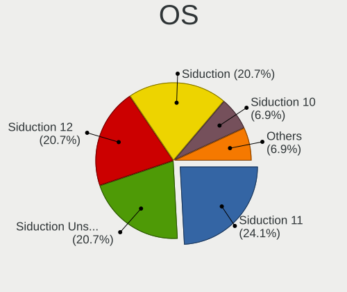

| Name               | Desktops | Percent |
|--------------------|----------|---------|
| Siduction 11       | 7        | 24.14%  |
| Siduction Unstable | 6        | 20.69%  |
| Siduction 12       | 6        | 20.69%  |
| Siduction          | 6        | 20.69%  |
| Siduction 10       | 2        | 6.9%    |
| Siduction 21       | 1        | 3.45%   |
| Siduction 13       | 1        | 3.45%   |

OS Family
---------

OS without a version

| Name      | Desktops | Percent |
|-----------|----------|---------|
| Siduction | 17       | 100%    |

Kernel
------

Version of the Linux kernel

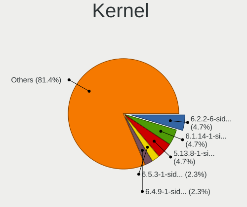

| Version                       | Desktops | Percent |
|-------------------------------|----------|---------|
| 6.2.2-6-siduction-amd64       | 2        | 4.65%   |
| 6.1.14-1-siduction-amd64      | 2        | 4.65%   |
| 5.13.8-1-siduction-amd64      | 2        | 4.65%   |
| 6.5.3-1-siduction-amd64       | 1        | 2.33%   |
| 6.4.9-1-siduction-amd64       | 1        | 2.33%   |
| 6.3.10-1-siduction-amd64      | 1        | 2.33%   |
| 6.2.6-1-siduction-amd64       | 1        | 2.33%   |
| 6.2.15-1-siduction-amd64      | 1        | 2.33%   |
| 6.2.13-1-siduction-amd64      | 1        | 2.33%   |
| 6.2.10-1-siduction-amd64      | 1        | 2.33%   |
| 6.14.10-1-siduction-amd64     | 1        | 2.33%   |
| 6.13.8-1-siduction-amd64      | 1        | 2.33%   |
| 6.13.2-1-siduction-amd64      | 1        | 2.33%   |
| 6.12.13-1-siduction-amd64     | 1        | 2.33%   |
| 6.1.10-2-siduction-amd64      | 1        | 2.33%   |
| 6.0.9-1-siduction-amd64       | 1        | 2.33%   |
| 5.8.12-towo.1-siduction-amd64 | 1        | 2.33%   |
| 5.7.2-towo.1-siduction-amd64  | 1        | 2.33%   |
| 5.6.2-towo.1-siduction-amd64  | 1        | 2.33%   |
| 5.19.5-2-siduction-amd64      | 1        | 2.33%   |
| 5.19.14-1-siduction-amd64     | 1        | 2.33%   |
| 5.19.12-1-siduction-amd64     | 1        | 2.33%   |
| 5.18.8-1-siduction-amd64      | 1        | 2.33%   |
| 5.18.15-1-siduction-amd64     | 1        | 2.33%   |
| 5.18.0-1-siduction-amd64      | 1        | 2.33%   |
| 5.16.7-1-siduction-amd64      | 1        | 2.33%   |
| 5.16.5-1-siduction-amd64      | 1        | 2.33%   |
| 5.16.18-1-siduction-amd64     | 1        | 2.33%   |
| 5.15.2-1-siduction-amd64      | 1        | 2.33%   |
| 5.15.12-1-siduction-amd64     | 1        | 2.33%   |
| 5.14.8-1-siduction-amd64      | 1        | 2.33%   |
| 5.14.0-rc5-siduction-amd64    | 1        | 2.33%   |
| 5.14.0-rc4-siduction-amd64    | 1        | 2.33%   |
| 5.13.7-1-siduction-amd64      | 1        | 2.33%   |
| 5.13.6-1-siduction-amd64      | 1        | 2.33%   |
| 5.13.15-1-siduction-amd64     | 1        | 2.33%   |
| 5.12.2-2-siduction-amd64      | 1        | 2.33%   |
| 5.12.13-2-siduction-amd64     | 1        | 2.33%   |
| 5.12.12-1-siduction-amd64     | 1        | 2.33%   |
| 5.12.0-rc8-siduction-amd64    | 1        | 2.33%   |

Kernel Family
-------------

Linux kernel without a distro release

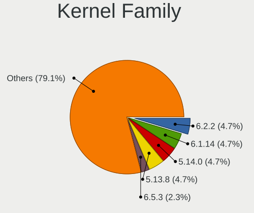

| Version | Desktops | Percent |
|---------|----------|---------|
| 6.2.2   | 2        | 4.65%   |
| 6.1.14  | 2        | 4.65%   |
| 5.14.0  | 2        | 4.65%   |
| 5.13.8  | 2        | 4.65%   |
| 6.5.3   | 1        | 2.33%   |
| 6.4.9   | 1        | 2.33%   |
| 6.3.10  | 1        | 2.33%   |
| 6.2.6   | 1        | 2.33%   |
| 6.2.15  | 1        | 2.33%   |
| 6.2.13  | 1        | 2.33%   |
| 6.2.10  | 1        | 2.33%   |
| 6.14.10 | 1        | 2.33%   |
| 6.13.8  | 1        | 2.33%   |
| 6.13.2  | 1        | 2.33%   |
| 6.12.13 | 1        | 2.33%   |
| 6.1.10  | 1        | 2.33%   |
| 6.0.9   | 1        | 2.33%   |
| 5.8.12  | 1        | 2.33%   |
| 5.7.2   | 1        | 2.33%   |
| 5.6.2   | 1        | 2.33%   |
| 5.19.5  | 1        | 2.33%   |
| 5.19.14 | 1        | 2.33%   |
| 5.19.12 | 1        | 2.33%   |
| 5.18.8  | 1        | 2.33%   |
| 5.18.15 | 1        | 2.33%   |
| 5.18.0  | 1        | 2.33%   |
| 5.16.7  | 1        | 2.33%   |
| 5.16.5  | 1        | 2.33%   |
| 5.16.18 | 1        | 2.33%   |
| 5.15.2  | 1        | 2.33%   |
| 5.15.12 | 1        | 2.33%   |
| 5.14.8  | 1        | 2.33%   |
| 5.13.7  | 1        | 2.33%   |
| 5.13.6  | 1        | 2.33%   |
| 5.13.15 | 1        | 2.33%   |
| 5.12.2  | 1        | 2.33%   |
| 5.12.13 | 1        | 2.33%   |
| 5.12.12 | 1        | 2.33%   |
| 5.12.0  | 1        | 2.33%   |

Kernel Major Ver.
-----------------

Linux kernel major version

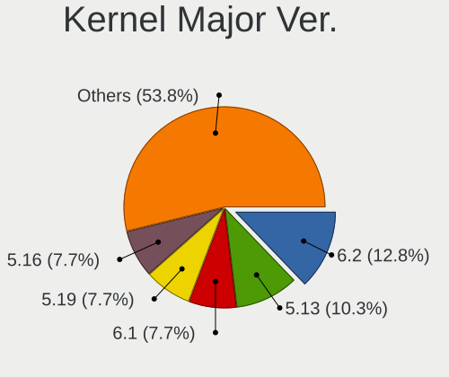

| Version | Desktops | Percent |
|---------|----------|---------|
| 6.2     | 5        | 12.82%  |
| 5.13    | 4        | 10.26%  |
| 6.1     | 3        | 7.69%   |
| 5.19    | 3        | 7.69%   |
| 5.16    | 3        | 7.69%   |
| 5.14    | 3        | 7.69%   |
| 5.12    | 3        | 7.69%   |
| 6.13    | 2        | 5.13%   |
| 5.18    | 2        | 5.13%   |
| 5.15    | 2        | 5.13%   |
| 6.5     | 1        | 2.56%   |
| 6.4     | 1        | 2.56%   |
| 6.3     | 1        | 2.56%   |
| 6.14    | 1        | 2.56%   |
| 6.12    | 1        | 2.56%   |
| 6.0     | 1        | 2.56%   |
| 5.8     | 1        | 2.56%   |
| 5.7     | 1        | 2.56%   |
| 5.6     | 1        | 2.56%   |

Arch
----

OS architecture (x86_64, i586, etc.)

| Name   | Desktops | Percent |
|--------|----------|---------|
| x86_64 | 17       | 100%    |

DE
--

Desktop Environment

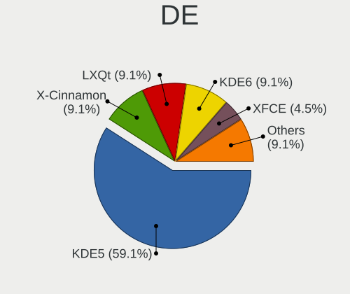

| Name       | Desktops | Percent |
|------------|----------|---------|
| KDE5       | 13       | 59.09%  |
| X-Cinnamon | 2        | 9.09%   |
| LXQt       | 2        | 9.09%   |
| KDE6       | 2        | 9.09%   |
| XFCE       | 1        | 4.55%   |
| Budgie     | 1        | 4.55%   |
| Unknown    | 1        | 4.55%   |

Display Server
--------------

X11 or Wayland

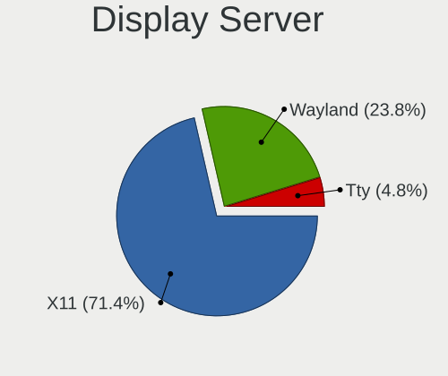

| Name    | Desktops | Percent |
|---------|----------|---------|
| X11     | 15       | 71.43%  |
| Wayland | 5        | 23.81%  |
| Tty     | 1        | 4.76%   |

Display Manager
---------------

SDDM, LightDM, etc.

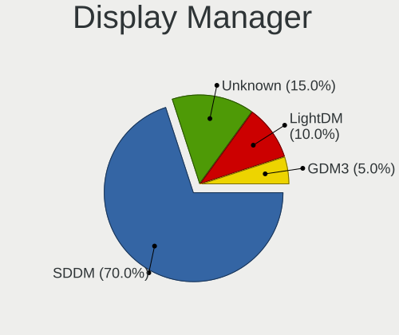

| Name    | Desktops | Percent |
|---------|----------|---------|
| SDDM    | 14       | 70%     |
| Unknown | 3        | 15%     |
| LightDM | 2        | 10%     |
| GDM3    | 1        | 5%      |

OS Lang
-------

Language

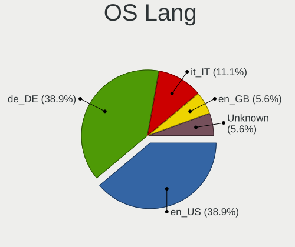

| Lang    | Desktops | Percent |
|---------|----------|---------|
| en_US   | 7        | 38.89%  |
| de_DE   | 7        | 38.89%  |
| it_IT   | 2        | 11.11%  |
| en_GB   | 1        | 5.56%   |
| Unknown | 1        | 5.56%   |

Boot Mode
---------

EFI or BIOS

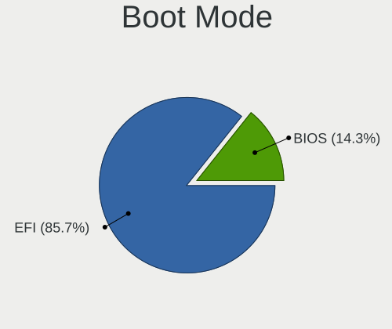

| Mode | Desktops | Percent |
|------|----------|---------|
| EFI  | 15       | 83.33%  |
| BIOS | 3        | 16.67%  |

Filesystem
----------

Type of filesystem

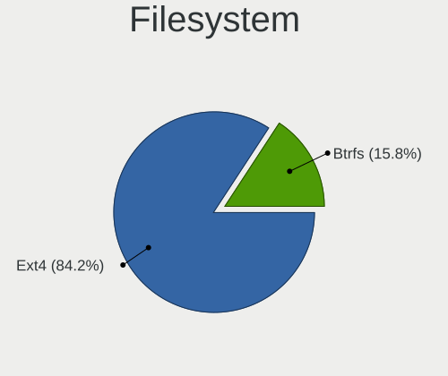

| Type  | Desktops | Percent |
|-------|----------|---------|
| Ext4  | 16       | 84.21%  |
| Btrfs | 3        | 15.79%  |

Part. scheme
------------

Scheme of partitioning

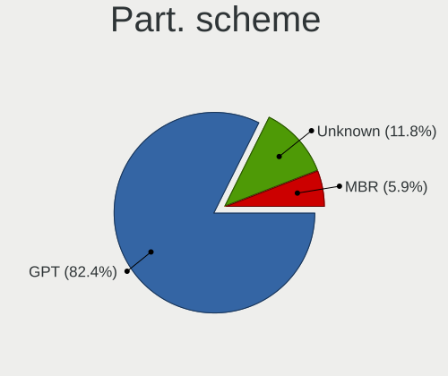

| Type    | Desktops | Percent |
|---------|----------|---------|
| GPT     | 14       | 82.35%  |
| Unknown | 2        | 11.76%  |
| MBR     | 1        | 5.88%   |

Dual Boot with Linux/BSD
------------------------

Hosting more than one Linux/BSD

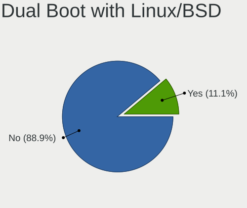

| Dual boot | Desktops | Percent |
|-----------|----------|---------|
| No        | 16       | 88.89%  |
| Yes       | 2        | 11.11%  |

Dual Boot (Win)
---------------

Hosting Linux and Windows

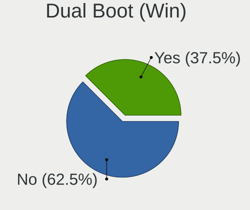

| Dual boot | Desktops | Percent |
|-----------|----------|---------|
| No        | 12       | 66.67%  |
| Yes       | 6        | 33.33%  |

Board
-----

Vendor
------

Motherboard manufacturer

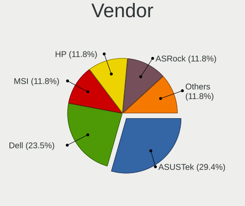

| Name             | Desktops | Percent |
|------------------|----------|---------|
| ASUSTek Computer | 5        | 29.41%  |
| Dell             | 4        | 23.53%  |
| MSI              | 2        | 11.76%  |
| Hewlett-Packard  | 2        | 11.76%  |
| ASRock           | 2        | 11.76%  |
| NEWSMAY          | 1        | 5.88%   |
| Lenovo           | 1        | 5.88%   |

Model
-----

Motherboard model

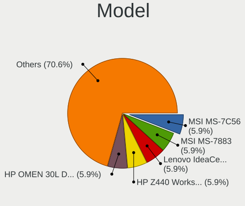

| Name                                    | Desktops | Percent |
|-----------------------------------------|----------|---------|
| MSI MS-7C56                             | 1        | 5.88%   |
| MSI MS-7883                             | 1        | 5.88%   |
| Lenovo IdeaCentre 310S-08ASR 90G9006DIX | 1        | 5.88%   |
| HP Z440 Workstation                     | 1        | 5.88%   |
| HP OMEN 30L Desktop GT13-0xxx           | 1        | 5.88%   |
| Dell XPS 8920                           | 1        | 5.88%   |
| Dell OptiPlex 9020                      | 1        | 5.88%   |
| Dell OptiPlex 5040                      | 1        | 5.88%   |
| Dell OptiPlex 3050                      | 1        | 5.88%   |
| ASUS ROG STRIX Z370-F GAMING            | 1        | 5.88%   |
| ASUS ROG STRIX B550-A GAMING            | 1        | 5.88%   |
| ASUS PRIME Z270-A                       | 1        | 5.88%   |
| ASUS B150M-A/M.2                        | 1        | 5.88%   |
| ASUS A0000001                           | 1        | 5.88%   |
| ASRock B550 Steel Legend                | 1        | 5.88%   |
| ASRock B450 Pro4                        | 1        | 5.88%   |
| Unknown                                 | 1        | 5.88%   |

Model Family
------------

Motherboard model prefix

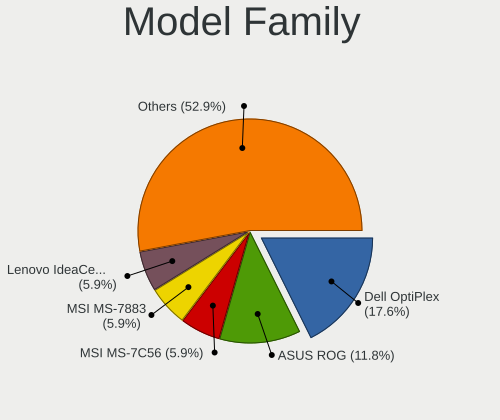

| Name              | Desktops | Percent |
|-------------------|----------|---------|
| Dell OptiPlex     | 3        | 17.65%  |
| ASUS ROG          | 2        | 11.76%  |
| MSI MS-7C56       | 1        | 5.88%   |
| MSI MS-7883       | 1        | 5.88%   |
| Lenovo IdeaCentre | 1        | 5.88%   |
| HP Z440           | 1        | 5.88%   |
| HP OMEN           | 1        | 5.88%   |
| Dell XPS          | 1        | 5.88%   |
| ASUS PRIME        | 1        | 5.88%   |
| ASUS B150M-A      | 1        | 5.88%   |
| ASUS A0000001     | 1        | 5.88%   |
| ASRock B550       | 1        | 5.88%   |
| ASRock B450       | 1        | 5.88%   |
| Unknown           | 1        | 5.88%   |

MFG Year
--------

Motherboard manufacture year

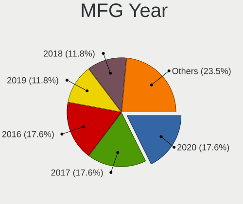

| Year | Desktops | Percent |
|------|----------|---------|
| 2020 | 3        | 17.65%  |
| 2017 | 3        | 17.65%  |
| 2016 | 3        | 17.65%  |
| 2019 | 2        | 11.76%  |
| 2018 | 2        | 11.76%  |
| 2014 | 2        | 11.76%  |
| 2022 | 1        | 5.88%   |
| 2015 | 1        | 5.88%   |

Form Factor
-----------

Physical design of the computer

| Name    | Desktops | Percent |
|---------|----------|---------|
| Desktop | 17       | 100%    |

Secure Boot
-----------

Enabled or disabled

| State    | Desktops | Percent |
|----------|----------|---------|
| Disabled | 17       | 100%    |

Coreboot
--------

Have coreboot on board

| Used | Desktops | Percent |
|------|----------|---------|
| No   | 17       | 100%    |

RAM Size
--------

Total RAM memory

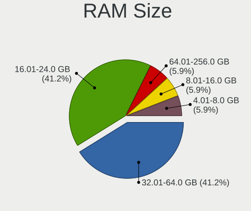

| Size in GB  | Desktops | Percent |
|-------------|----------|---------|
| 32.01-64.0  | 7        | 41.18%  |
| 16.01-24.0  | 7        | 41.18%  |
| 4.01-8.0    | 1        | 5.88%   |
| 64.01-256.0 | 1        | 5.88%   |
| 8.01-16.0   | 1        | 5.88%   |

RAM Used
--------

Used RAM memory

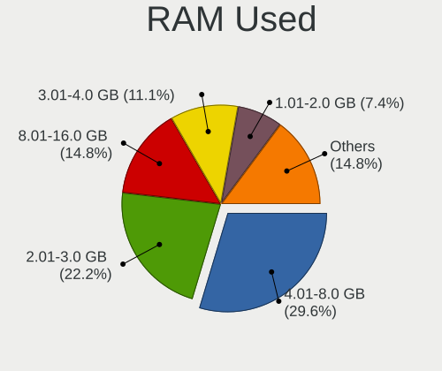

| Used GB    | Desktops | Percent |
|------------|----------|---------|
| 4.01-8.0   | 8        | 29.63%  |
| 2.01-3.0   | 6        | 22.22%  |
| 8.01-16.0  | 4        | 14.81%  |
| 3.01-4.0   | 3        | 11.11%  |
| 1.01-2.0   | 2        | 7.41%   |
| 32.01-64.0 | 1        | 3.7%    |
| 16.01-24.0 | 1        | 3.7%    |
| 0.51-1.0   | 1        | 3.7%    |
| 0.01-0.5   | 1        | 3.7%    |

Total Drives
------------

Number of drives on board

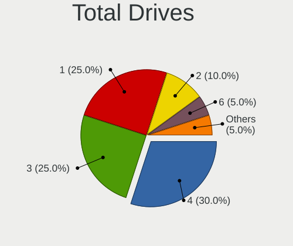

| Drives | Desktops | Percent |
|--------|----------|---------|
| 4      | 6        | 30%     |
| 3      | 5        | 25%     |
| 1      | 5        | 25%     |
| 2      | 2        | 10%     |
| 6      | 1        | 5%      |
| 5      | 1        | 5%      |

Has CD-ROM
----------

Has CD-ROM on board

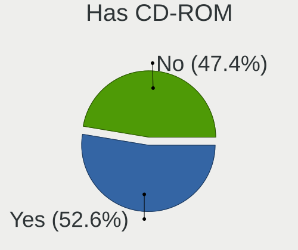

| Presented | Desktops | Percent |
|-----------|----------|---------|
| Yes       | 10       | 52.63%  |
| No        | 9        | 47.37%  |

Has Ethernet
------------

Has Ethernet on board

| Presented | Desktops | Percent |
|-----------|----------|---------|
| Yes       | 17       | 100%    |

Has WiFi
--------

Has WiFi module

| Presented | Desktops | Percent |
|-----------|----------|---------|
| No        | 10       | 58.82%  |
| Yes       | 7        | 41.18%  |

Has Bluetooth
-------------

Has Bluetooth module

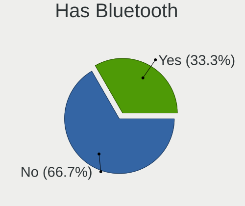

| Presented | Desktops | Percent |
|-----------|----------|---------|
| No        | 12       | 66.67%  |
| Yes       | 6        | 33.33%  |

Location
--------

Country
-------

Geographic location (country)

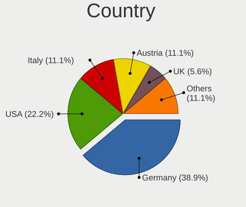

| Country     | Desktops | Percent |
|-------------|----------|---------|
| Germany     | 7        | 38.89%  |
| USA         | 4        | 22.22%  |
| Italy       | 2        | 11.11%  |
| Austria     | 2        | 11.11%  |
| UK          | 1        | 5.56%   |
| Sweden      | 1        | 5.56%   |
| Netherlands | 1        | 5.56%   |

City
----

Geographic location (city)

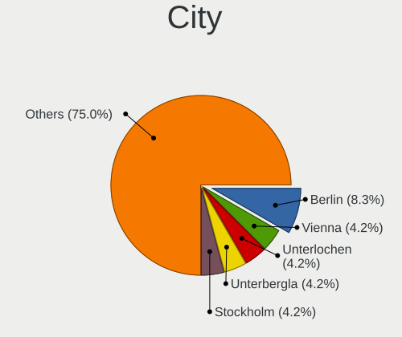

| City           | Desktops | Percent |
|----------------|----------|---------|
| Berlin         | 2        | 8.33%   |
| Vienna         | 1        | 4.17%   |
| Unterlochen    | 1        | 4.17%   |
| Unterbergla    | 1        | 4.17%   |
| Stockholm      | 1        | 4.17%   |
| Schrobenhausen | 1        | 4.17%   |
| Savannah       | 1        | 4.17%   |
| Sanford        | 1        | 4.17%   |
| Salzburg       | 1        | 4.17%   |
| Portland       | 1        | 4.17%   |
| Piea           | 1        | 4.17%   |
| Papenburg      | 1        | 4.17%   |
| Oranienburg    | 1        | 4.17%   |
| Munich         | 1        | 4.17%   |
| Merseburg      | 1        | 4.17%   |
| Leipzig        | 1        | 4.17%   |
| Kensington     | 1        | 4.17%   |
| Innsbruck      | 1        | 4.17%   |
| Graz           | 1        | 4.17%   |
| Grafenau       | 1        | 4.17%   |
| Fort Collins   | 1        | 4.17%   |
| Ceppagna       | 1        | 4.17%   |
| Amsterdam      | 1        | 4.17%   |

Drives
------

Drive Vendor
------------

Hard drive vendors

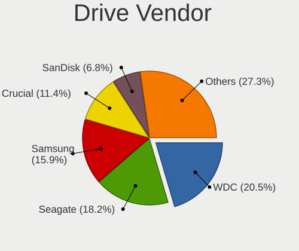

| Vendor              | Desktops | Drives | Percent |
|---------------------|----------|--------|---------|
| WDC                 | 9        | 29     | 20.45%  |
| Seagate             | 8        | 17     | 18.18%  |
| Samsung Electronics | 7        | 15     | 15.91%  |
| Crucial             | 5        | 16     | 11.36%  |
| SanDisk             | 3        | 5      | 6.82%   |
| Toshiba             | 2        | 2      | 4.55%   |
| Kingston            | 2        | 2      | 4.55%   |
| SK hynix            | 1        | 9      | 2.27%   |
| Silicon Motion      | 1        | 1      | 2.27%   |
| OCZ                 | 1        | 3      | 2.27%   |
| Mushkin             | 1        | 3      | 2.27%   |
| Intel               | 1        | 4      | 2.27%   |
| HGST                | 1        | 11     | 2.27%   |
| GRITRONIX           | 1        | 1      | 2.27%   |
| Corsair             | 1        | 4      | 2.27%   |

Drive Model
-----------

Hard drive models

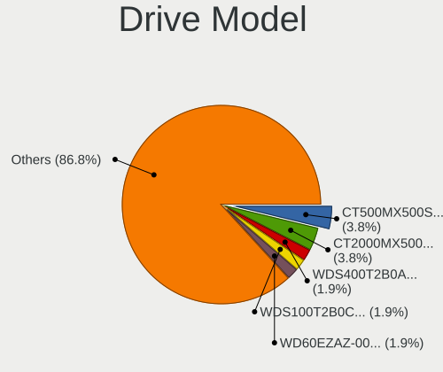

| Model                                               | Desktops | Percent |
|-----------------------------------------------------|----------|---------|
| Crucial CT500MX500SSD1 500GB                        | 2        | 3.77%   |
| Crucial CT2000MX500SSD1 2TB                         | 2        | 3.77%   |
| WDC WDS400T2B0A-00SM50 4TB SSD                      | 1        | 1.89%   |
| WDC WDS100T2B0C-00PXH0 1TB                          | 1        | 1.89%   |
| WDC WD60EZAZ-00SF3B0 6TB                            | 1        | 1.89%   |
| WDC WD40EZAZ-00SF3B0 4TB                            | 1        | 1.89%   |
| WDC WD40EFRX-68WT0N0 4TB                            | 1        | 1.89%   |
| WDC WD20EZRZ-00Z5HB0 2TB                            | 1        | 1.89%   |
| WDC WD20EFRX-68EUZN0 2TB                            | 1        | 1.89%   |
| WDC WD10SPZX-60Z10T0 1TB                            | 1        | 1.89%   |
| WDC WD10JPVX-60JC3T1 1TB                            | 1        | 1.89%   |
| WDC WD10JPVX-22JC3T0 1TB                            | 1        | 1.89%   |
| WDC WD10EADX-00TDHB0 1TB                            | 1        | 1.89%   |
| WDC WD BLACK SDBPNTY-512G-1106 512GB                | 1        | 1.89%   |
| Toshiba XG4 NVMe SSD Controller 256GB               | 1        | 1.89%   |
| Toshiba RD400 256GB                                 | 1        | 1.89%   |
| SK hynix SC308 SATA 128GB SSD                       | 1        | 1.89%   |
| Silicon Motion SM2262/SM2262EN SSD Controller 960GB | 1        | 1.89%   |
| Seagate ST9640320AS 640GB                           | 1        | 1.89%   |
| Seagate ST8000VN0022-2EL112 8TB                     | 1        | 1.89%   |
| Seagate ST6000DM003-2CY186 6TB                      | 1        | 1.89%   |
| Seagate ST500LT012-1DG142 500GB                     | 1        | 1.89%   |
| Seagate ST4000LM016-1N2170 4TB                      | 1        | 1.89%   |
| Seagate ST32000542AS 2TB                            | 1        | 1.89%   |
| Seagate ST31000524AS 1TB                            | 1        | 1.89%   |
| Seagate ST3000VN000-1HJ166 3TB                      | 1        | 1.89%   |
| Seagate ST2000DM008-2FR102 2TB                      | 1        | 1.89%   |
| Seagate ST2000DM001-1ER164 2TB                      | 1        | 1.89%   |
| Seagate ST2000DL003-9VT166 2TB                      | 1        | 1.89%   |
| SanDisk Ultra 3D NVMe 1TB                           | 1        | 1.89%   |
| SanDisk SD8TB8U256G1001 256GB SSD                   | 1        | 1.89%   |
| SanDisk NVMe SSD Drive 1TB                          | 1        | 1.89%   |
| Samsung SSD 970 EVO 1TB                             | 1        | 1.89%   |
| Samsung SSD 870 EVO 4TB                             | 1        | 1.89%   |
| Samsung SSD 860 EVO 4TB                             | 1        | 1.89%   |
| Samsung SSD 850 EVO 500GB                           | 1        | 1.89%   |
| Samsung SSD 850 EVO 250GB                           | 1        | 1.89%   |
| Samsung SSD 840 Series 120GB                        | 1        | 1.89%   |
| Samsung SSD 840 EVO 250GB                           | 1        | 1.89%   |
| Samsung MZVLB512HAJQ-000H7 512GB                    | 1        | 1.89%   |

HDD Vendor
----------

Hard disk drive vendors

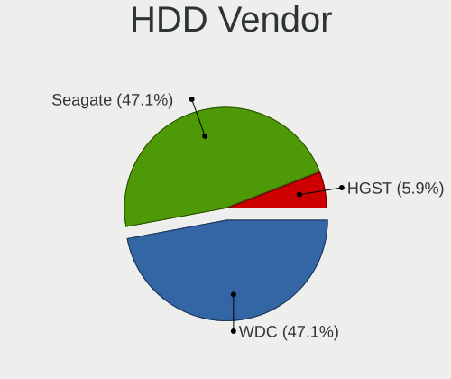

| Vendor  | Desktops | Drives | Percent |
|---------|----------|--------|---------|
| WDC     | 8        | 20     | 47.06%  |
| Seagate | 8        | 17     | 47.06%  |
| HGST    | 1        | 11     | 5.88%   |

SSD Vendor
----------

Solid state drive vendors

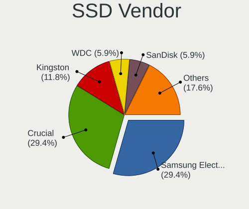

| Vendor              | Desktops | Drives | Percent |
|---------------------|----------|--------|---------|
| Samsung Electronics | 5        | 13     | 29.41%  |
| Crucial             | 5        | 15     | 29.41%  |
| Kingston            | 2        | 2      | 11.76%  |
| WDC                 | 1        | 1      | 5.88%   |
| SK hynix            | 1        | 9      | 5.88%   |
| SanDisk             | 1        | 3      | 5.88%   |
| OCZ                 | 1        | 3      | 5.88%   |
| GRITRONIX           | 1        | 1      | 5.88%   |

Drive Kind
----------

HDD or SSD

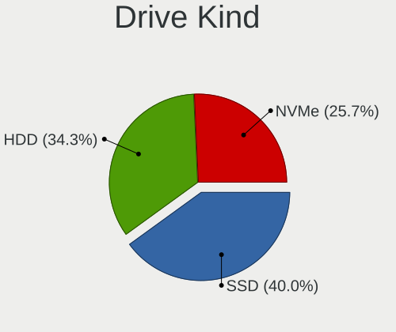

| Kind | Desktops | Drives | Percent |
|------|----------|--------|---------|
| SSD  | 14       | 47     | 40%     |
| HDD  | 12       | 48     | 34.29%  |
| NVMe | 9        | 27     | 25.71%  |

Drive Connector
---------------

SATA, SAS, NVMe, etc.

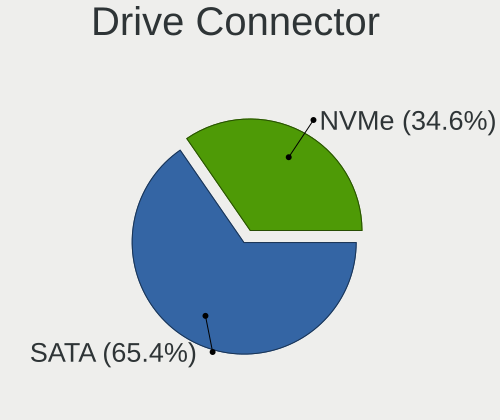

| Type | Desktops | Drives | Percent |
|------|----------|--------|---------|
| SATA | 17       | 95     | 65.38%  |
| NVMe | 9        | 27     | 34.62%  |

Drive Size
----------

Size of hard drive

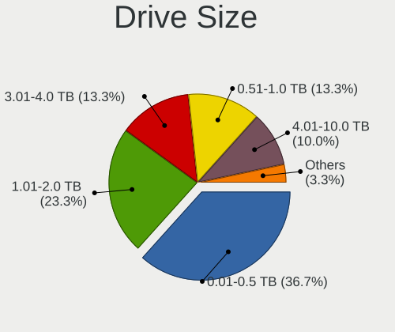

| Size in TB | Desktops | Drives | Percent |
|------------|----------|--------|---------|
| 0.01-0.5   | 11       | 37     | 36.67%  |
| 1.01-2.0   | 7        | 20     | 23.33%  |
| 3.01-4.0   | 4        | 17     | 13.33%  |
| 0.51-1.0   | 4        | 15     | 13.33%  |
| 4.01-10.0  | 3        | 3      | 10%     |
| 2.01-3.0   | 1        | 3      | 3.33%   |

Space Total
-----------

Amount of disk space available on the file system

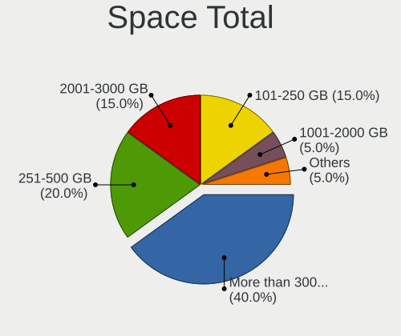

| Size in GB     | Desktops | Percent |
|----------------|----------|---------|
| More than 3000 | 8        | 40%     |
| 251-500        | 4        | 20%     |
| 2001-3000      | 3        | 15%     |
| 101-250        | 3        | 15%     |
| 1001-2000      | 1        | 5%      |
| 51-100         | 1        | 5%      |

Space Used
----------

Amount of used disk space

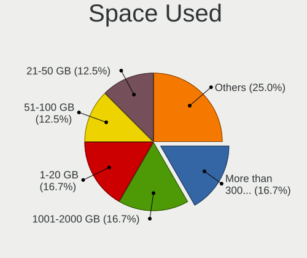

| Used GB        | Desktops | Percent |
|----------------|----------|---------|
| More than 3000 | 4        | 16.67%  |
| 1001-2000      | 4        | 16.67%  |
| 1-20           | 4        | 16.67%  |
| 21-50          | 3        | 12.5%   |
| 51-100         | 3        | 12.5%   |
| 2001-3000      | 2        | 8.33%   |
| 501-1000       | 2        | 8.33%   |
| 251-500        | 1        | 4.17%   |
| 101-250        | 1        | 4.17%   |

Malfunc. Drives
---------------

Drive models with a malfunction

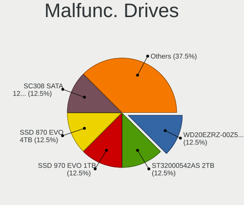

| Model                               | Desktops | Drives | Percent |
|-------------------------------------|----------|--------|---------|
| WDC WD20EZRZ-00Z5HB0 2TB            | 1        | 6      | 12.5%   |
| SK hynix SC308 SATA 128GB SSD       | 1        | 9      | 12.5%   |
| Seagate ST32000542AS 2TB            | 1        | 3      | 12.5%   |
| Samsung Electronics SSD 970 EVO 1TB | 1        | 1      | 12.5%   |
| Samsung Electronics SSD 870 EVO 4TB | 1        | 1      | 12.5%   |
| OCZ VERTEX3 120GB SSD               | 1        | 3      | 12.5%   |
| HGST HTS725050A7E630 500GB          | 1        | 11     | 12.5%   |
| Crucial CT500MX500SSD1 500GB        | 1        | 1      | 12.5%   |

Malfunc. Drive Vendor
---------------------

Vendors of faulty drives

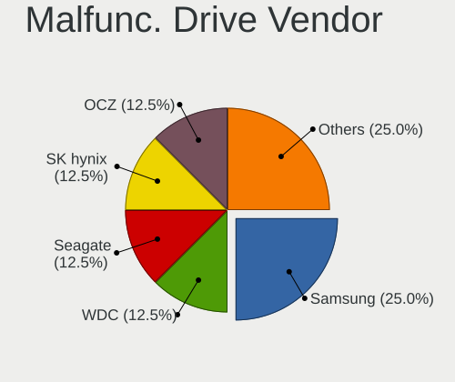

| Vendor              | Desktops | Drives | Percent |
|---------------------|----------|--------|---------|
| Samsung Electronics | 2        | 2      | 25%     |
| WDC                 | 1        | 6      | 12.5%   |
| SK hynix            | 1        | 9      | 12.5%   |
| Seagate             | 1        | 3      | 12.5%   |
| OCZ                 | 1        | 3      | 12.5%   |
| HGST                | 1        | 11     | 12.5%   |
| Crucial             | 1        | 1      | 12.5%   |

Malfunc. HDD Vendor
-------------------

Vendors of faulty HDD drives

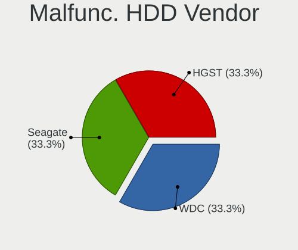

| Vendor  | Desktops | Drives | Percent |
|---------|----------|--------|---------|
| WDC     | 1        | 6      | 33.33%  |
| Seagate | 1        | 3      | 33.33%  |
| HGST    | 1        | 11     | 33.33%  |

Malfunc. Drive Kind
-------------------

Kinds of faulty drives

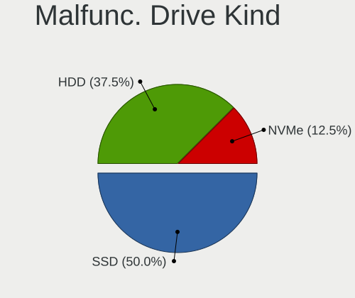

| Kind | Desktops | Drives | Percent |
|------|----------|--------|---------|
| SSD  | 4        | 14     | 50%     |
| HDD  | 3        | 20     | 37.5%   |
| NVMe | 1        | 1      | 12.5%   |

Failed Drives
-------------

Failed drive models

Zero info for selected period =(

Failed Drive Vendor
-------------------

Failed drive vendors

Zero info for selected period =(

Drive Status
------------

Number of failed and malfunc. drives

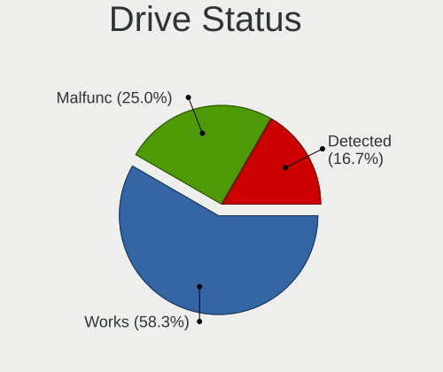

| Status   | Desktops | Drives | Percent |
|----------|----------|--------|---------|
| Works    | 14       | 75     | 58.33%  |
| Malfunc  | 6        | 35     | 25%     |
| Detected | 4        | 12     | 16.67%  |

Storage controller
------------------

Storage Vendor
--------------

Storage controller vendors

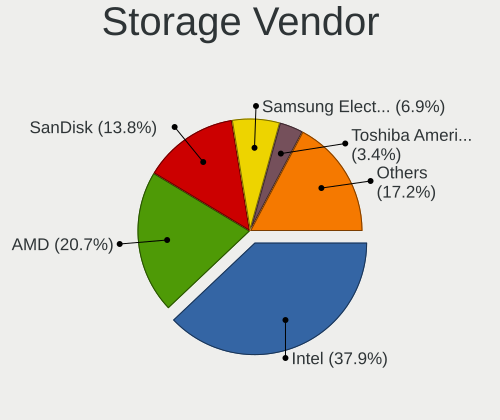

| Vendor                       | Desktops | Percent |
|------------------------------|----------|---------|
| Intel                        | 11       | 37.93%  |
| AMD                          | 6        | 20.69%  |
| SanDisk                      | 4        | 13.79%  |
| Samsung Electronics          | 2        | 6.9%    |
| Toshiba America Info Systems | 1        | 3.45%   |
| Silicon Motion               | 1        | 3.45%   |
| Phison Electronics           | 1        | 3.45%   |
| OCZ Technology Group         | 1        | 3.45%   |
| Micron/Crucial Technology    | 1        | 3.45%   |
| ASMedia Technology           | 1        | 3.45%   |

Storage Model
-------------

Storage controller models

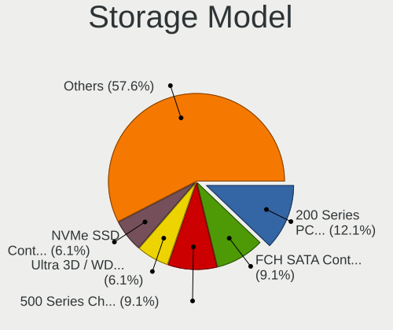

| Model                                                                          | Desktops | Percent |
|--------------------------------------------------------------------------------|----------|---------|
| Intel 200 Series PCH SATA controller [AHCI mode]                               | 4        | 12.12%  |
| AMD FCH SATA Controller [AHCI mode]                                            | 3        | 9.09%   |
| AMD 500 Series Chipset SATA Controller                                         | 3        | 9.09%   |
| SanDisk Ultra 3D / WD PC SN530, IX SN530, Blue SN550 NVMe SSD (DRAM-less)      | 2        | 6.06%   |
| Samsung NVMe SSD Controller SM981/PM981/PM983                                  | 2        | 6.06%   |
| Intel Q170/Q150/B150/H170/H110/Z170/CM236 Chipset SATA Controller [AHCI Mode]  | 2        | 6.06%   |
| Intel C610/X99 series chipset 6-Port SATA Controller [AHCI mode]               | 2        | 6.06%   |
| AMD 400 Series Chipset SATA Controller                                         | 2        | 6.06%   |
| Toshiba America Info Systems XG4 NVMe SSD Controller                           | 1        | 3.03%   |
| Silicon Motion SM2262/SM2262EN SSD Controller                                  | 1        | 3.03%   |
| SanDisk PC SN735 / WD_BLACK SN750 SE NVMe SSD (DRAM-less)                      | 1        | 3.03%   |
| SanDisk Extreme Pro / WD Black SN750 / PC SN730 / Red SN700 NVMe SSD           | 1        | 3.03%   |
| Phison E7 NVMe Controller                                                      | 1        | 3.03%   |
| OCZ Group RD400/400A SSD                                                       | 1        | 3.03%   |
| Micron/Crucial P1 NVMe PCIe SSD[Frampton]                                      | 1        | 3.03%   |
| Intel SSD 660P Series                                                          | 1        | 3.03%   |
| Intel SATA Controller [RAID mode]                                              | 1        | 3.03%   |
| Intel Jasper Lake SATA AHCI Controller                                         | 1        | 3.03%   |
| Intel C610/X99 series chipset sSATA Controller [AHCI mode]                     | 1        | 3.03%   |
| Intel 8 Series/C220 Series Chipset Family 6-port SATA Controller 1 [AHCI mode] | 1        | 3.03%   |
| ASMedia ASM1061/ASM1062 Serial ATA Controller                                  | 1        | 3.03%   |

Storage Kind
------------

Kind of storage controller (IDE, SATA, NVMe, SAS, ...)

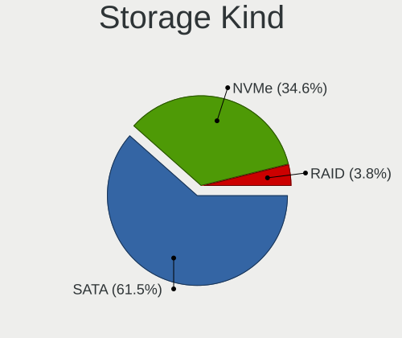

| Kind | Desktops | Percent |
|------|----------|---------|
| SATA | 16       | 61.54%  |
| NVMe | 9        | 34.62%  |
| RAID | 1        | 3.85%   |

Processor
---------

CPU Vendor
----------

Processor vendors

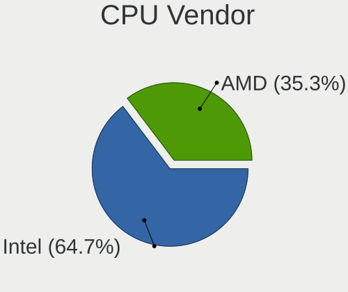

| Vendor | Desktops | Percent |
|--------|----------|---------|
| Intel  | 11       | 64.71%  |
| AMD    | 6        | 35.29%  |

CPU Model
---------

Processor models

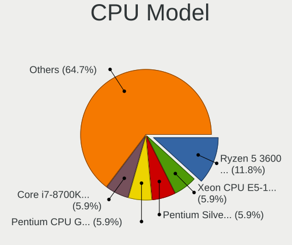

| Model                                        | Desktops | Percent |
|----------------------------------------------|----------|---------|
| AMD Ryzen 5 3600 6-Core Processor            | 2        | 11.76%  |
| Intel Xeon CPU E5-1620 v3 @ 3.50GHz          | 1        | 5.88%   |
| Intel Pentium Silver N6005 @ 2.00GHz         | 1        | 5.88%   |
| Intel Pentium CPU G4400T @ 2.90GHz           | 1        | 5.88%   |
| Intel Core i7-8700K CPU @ 3.70GHz            | 1        | 5.88%   |
| Intel Core i7-7700K CPU @ 4.20GHz            | 1        | 5.88%   |
| Intel Core i7-6850K CPU @ 3.60GHz            | 1        | 5.88%   |
| Intel Core i7-10700K CPU @ 3.80GHz           | 1        | 5.88%   |
| Intel Core i5-7600K CPU @ 3.80GHz            | 1        | 5.88%   |
| Intel Core i5-6600K CPU @ 3.50GHz            | 1        | 5.88%   |
| Intel Core i5-6500 CPU @ 3.20GHz             | 1        | 5.88%   |
| Intel Core i5-4590S CPU @ 3.00GHz            | 1        | 5.88%   |
| AMD Ryzen 9 3900X 12-Core Processor          | 1        | 5.88%   |
| AMD Ryzen 7 2700X Eight-Core Processor       | 1        | 5.88%   |
| AMD Ryzen 5 2600 Six-Core Processor          | 1        | 5.88%   |
| AMD A9-9425 RADEON R5, 5 COMPUTE CORES 2C+3G | 1        | 5.88%   |

CPU Model Family
----------------

Processor model prefix

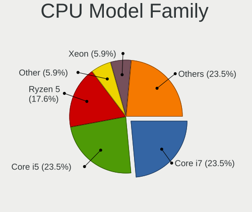

| Model                | Desktops | Percent |
|----------------------|----------|---------|
| Intel Core i7        | 4        | 23.53%  |
| Intel Core i5        | 4        | 23.53%  |
| AMD Ryzen 5          | 3        | 17.65%  |
| Other                | 1        | 5.88%   |
| Intel Xeon           | 1        | 5.88%   |
| Intel Pentium Silver | 1        | 5.88%   |
| Intel Pentium        | 1        | 5.88%   |
| AMD Ryzen 9          | 1        | 5.88%   |
| AMD Ryzen 7          | 1        | 5.88%   |

CPU Cores
---------

Number of processor cores

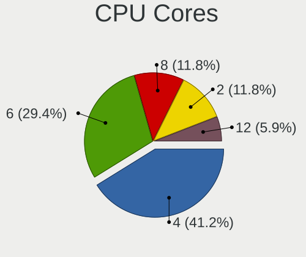

| Number | Desktops | Percent |
|--------|----------|---------|
| 4      | 7        | 41.18%  |
| 6      | 5        | 29.41%  |
| 8      | 2        | 11.76%  |
| 2      | 2        | 11.76%  |
| 12     | 1        | 5.88%   |

CPU Sockets
-----------

Number of sockets

| Number | Desktops | Percent |
|--------|----------|---------|
| 1      | 17       | 100%    |

CPU Threads
-----------

Threads per core (Hyper-Threading)

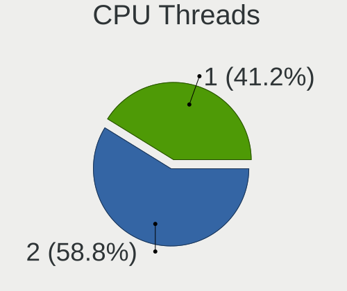

| Number | Desktops | Percent |
|--------|----------|---------|
| 2      | 10       | 58.82%  |
| 1      | 7        | 41.18%  |

CPU Op-Modes
------------

CPU Operation Modes (32-bit, 64-bit)

| Op mode        | Desktops | Percent |
|----------------|----------|---------|
| 32-bit, 64-bit | 17       | 100%    |

CPU Microcode
-------------

Microcode number

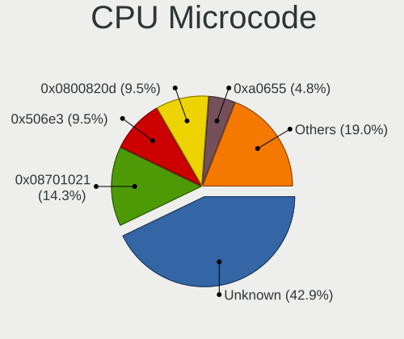

| Number     | Desktops | Percent |
|------------|----------|---------|
| Unknown    | 9        | 42.86%  |
| 0x08701021 | 3        | 14.29%  |
| 0x506e3    | 2        | 9.52%   |
| 0x0800820d | 2        | 9.52%   |
| 0xa0655    | 1        | 4.76%   |
| 0x906ea    | 1        | 4.76%   |
| 0x906e9    | 1        | 4.76%   |
| 0x306f2    | 1        | 4.76%   |
| 0x06006705 | 1        | 4.76%   |

CPU Microarch
-------------

Microarchitecture

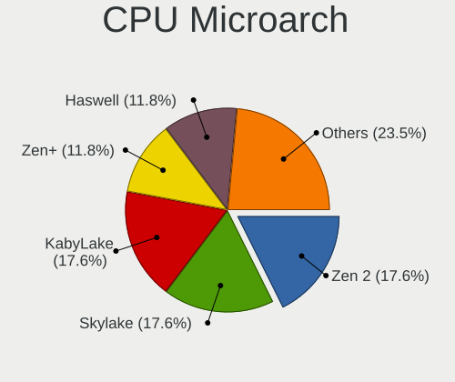

| Name      | Desktops | Percent |
|-----------|----------|---------|
| Zen 2     | 3        | 17.65%  |
| Skylake   | 3        | 17.65%  |
| KabyLake  | 3        | 17.65%  |
| Zen+      | 2        | 11.76%  |
| Haswell   | 2        | 11.76%  |
| Tremont   | 1        | 5.88%   |
| Excavator | 1        | 5.88%   |
| CometLake | 1        | 5.88%   |
| Broadwell | 1        | 5.88%   |

Graphics
--------

GPU Vendor
----------

Vendors of graphics cards

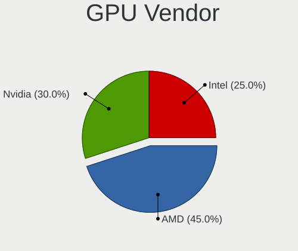

| Vendor | Desktops | Percent |
|--------|----------|---------|
| AMD    | 9        | 45%     |
| Nvidia | 6        | 30%     |
| Intel  | 5        | 25%     |

GPU Model
---------

Graphics card models

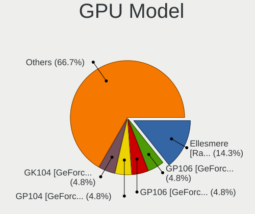

| Model                                                                       | Desktops | Percent |
|-----------------------------------------------------------------------------|----------|---------|
| AMD Ellesmere [Radeon RX 470/480/570/570X/580/580X/590]                     | 3        | 14.29%  |
| Nvidia GP106 [GeForce GTX 1060 6GB]                                         | 1        | 4.76%   |
| Nvidia GP106 [GeForce GTX 1060 3GB]                                         | 1        | 4.76%   |
| Nvidia GP104 [GeForce GTX 1070]                                             | 1        | 4.76%   |
| Nvidia GK104 [GeForce GTX 770]                                              | 1        | 4.76%   |
| Nvidia GF119 [NVS 310]                                                      | 1        | 4.76%   |
| Nvidia GA106 [Geforce RTX 3050]                                             | 1        | 4.76%   |
| Intel Xeon E3-1200 v3/4th Gen Core Processor Integrated Graphics Controller | 1        | 4.76%   |
| Intel Skylake-S GT2 [HD Graphics 530]                                       | 1        | 4.76%   |
| Intel Skylake-S GT1 [HD Graphics 510]                                       | 1        | 4.76%   |
| Intel Kaby Lake-S GT2 [HD Graphics 630]                                     | 1        | 4.76%   |
| Intel JasperLake [UHD Graphics]                                             | 1        | 4.76%   |
| AMD Vega 20 [Radeon VII]                                                    | 1        | 4.76%   |
| AMD Stoney [Radeon R2/R3/R4/R5 Graphics]                                    | 1        | 4.76%   |
| AMD Navi 33 [Radeon RX 7600/7600 XT/7600M XT/7600S/7700S / PRO W7600]       | 1        | 4.76%   |
| AMD Navi 23 [Radeon RX 6600/6600 XT/6600M]                                  | 1        | 4.76%   |
| AMD Navi 22 [Radeon RX 6700/6700 XT/6750 XT / 6800M/6850M XT]               | 1        | 4.76%   |
| AMD Navi 21 [Radeon RX 6800/6800 XT / 6900 XT]                              | 1        | 4.76%   |
| AMD Baffin [Radeon RX 460/560D / Pro 450/455/460/555/555X/560/560X]         | 1        | 4.76%   |

GPU Combo
---------

Combinations of graphics cards

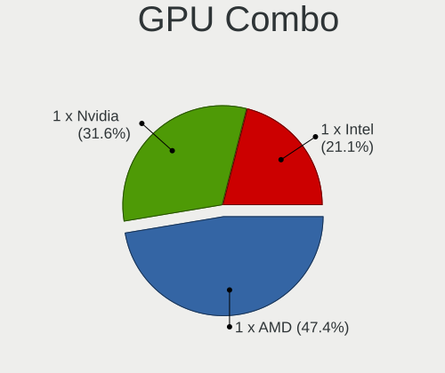

| Name       | Desktops | Percent |
|------------|----------|---------|
| 1 x AMD    | 9        | 47.37%  |
| 1 x Nvidia | 6        | 31.58%  |
| 1 x Intel  | 4        | 21.05%  |

GPU Driver
----------

Free vs proprietary

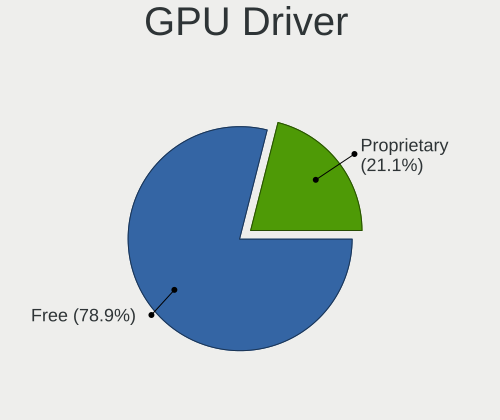

| Driver      | Desktops | Percent |
|-------------|----------|---------|
| Free        | 15       | 78.95%  |
| Proprietary | 4        | 21.05%  |

GPU Memory
----------

Total video memory

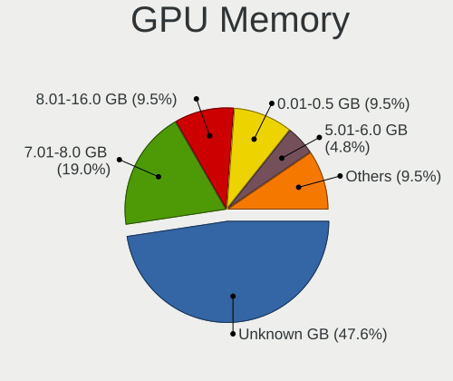

| Size in GB | Desktops | Percent |
|------------|----------|---------|
| Unknown    | 10       | 47.62%  |
| 7.01-8.0   | 4        | 19.05%  |
| 8.01-16.0  | 2        | 9.52%   |
| 0.01-0.5   | 2        | 9.52%   |
| 5.01-6.0   | 1        | 4.76%   |
| 2.01-3.0   | 1        | 4.76%   |
| 1.01-2.0   | 1        | 4.76%   |

Monitor
-------

Monitor Vendor
--------------

Monitor vendors

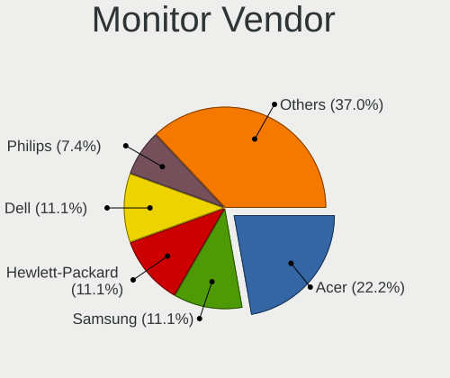

| Vendor              | Desktops | Percent |
|---------------------|----------|---------|
| Acer                | 6        | 22.22%  |
| Samsung Electronics | 3        | 11.11%  |
| Hewlett-Packard     | 3        | 11.11%  |
| Dell                | 3        | 11.11%  |
| Philips             | 2        | 7.41%   |
| Goldstar            | 2        | 7.41%   |
| ViewSonic           | 1        | 3.7%    |
| STD                 | 1        | 3.7%    |
| Sony                | 1        | 3.7%    |
| MSI                 | 1        | 3.7%    |
| Eizo                | 1        | 3.7%    |
| BenQ                | 1        | 3.7%    |
| ASUSTek Computer    | 1        | 3.7%    |
| AOC                 | 1        | 3.7%    |

Monitor Model
-------------

Monitor models

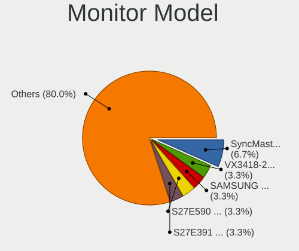

| Model                                                                | Desktops | Percent |
|----------------------------------------------------------------------|----------|---------|
| Samsung Electronics SyncMaster SAM021E 1680x1050 433x271mm 20.1-inch | 2        | 6.67%   |
| ViewSonic VX3418-2KPC VSC613B 3440x1440 797x334mm 34.0-inch          | 1        | 3.33%   |
| STD HDMI TV STD00C7 1920x1080 698x392mm 31.5-inch                    | 1        | 3.33%   |
| Sony SAMSUNG SNY5203 1920x540                                        | 1        | 3.33%   |
| Samsung Electronics S27E590 SAM0C5D 1920x1080 598x336mm 27.0-inch    | 1        | 3.33%   |
| Samsung Electronics S27E391 SAM0C15 1920x1080 598x336mm 27.0-inch    | 1        | 3.33%   |
| Philips PHL 241P6E PHL08F7 1920x1080 527x296mm 23.8-inch             | 1        | 3.33%   |
| Philips 200V4 PHLC0BF 1600x900 432x240mm 19.5-inch                   | 1        | 3.33%   |
| MSI G241 MSI3BA4 1920x1080 527x296mm 23.8-inch                       | 1        | 3.33%   |
| Hewlett-Packard X27i HPN3678 2560x1440 597x336mm 27.0-inch           | 1        | 3.33%   |
| Hewlett-Packard 27fh HPN354A 1920x1080 598x336mm 27.0-inch           | 1        | 3.33%   |
| Hewlett-Packard 27f HPN354B 1920x1080 598x336mm 27.0-inch            | 1        | 3.33%   |
| Hewlett-Packard 23xw HWP318C 1920x1080 509x286mm 23.0-inch           | 1        | 3.33%   |
| Hewlett-Packard 23cw HWP3187 1920x1080 509x286mm 23.0-inch           | 1        | 3.33%   |
| Goldstar W1946 GSM4BCD 1360x768 406x229mm 18.4-inch                  | 1        | 3.33%   |
| Goldstar ULTRAGEAR GSM5BB4 2560x1440 597x336mm 27.0-inch             | 1        | 3.33%   |
| Eizo EV3285 ENC2979 3840x2160 698x393mm 31.5-inch                    | 1        | 3.33%   |
| Dell UP3216Q DEL40C2 3840x2160 698x393mm 31.5-inch                   | 1        | 3.33%   |
| Dell U2414H DELA0B2 1920x1080 527x296mm 23.8-inch                    | 1        | 3.33%   |
| Dell AW3423DWF DELA212 3440x1440 800x337mm 34.2-inch                 | 1        | 3.33%   |
| BenQ LCD BNQ801E 3840x2160 596x335mm 26.9-inch                       | 1        | 3.33%   |
| ASUSTek Computer XG49V AUS49A1 3840x1080 1196x336mm 48.9-inch        | 1        | 3.33%   |
| AOC 2757 AOC2757 1920x1080 598x336mm 27.0-inch                       | 1        | 3.33%   |
| Acer X34 P ACR054F 3440x1440 798x335mm 34.1-inch                     | 1        | 3.33%   |
| Acer KA220HQ ACR0497 1920x1080 477x268mm 21.5-inch                   | 1        | 3.33%   |
| Acer K272HUL ACR0524 2560x1440 598x336mm 27.0-inch                   | 1        | 3.33%   |
| Acer K272HL ACR0523 1920x1080 598x336mm 27.0-inch                    | 1        | 3.33%   |
| Acer G236HL ACR02EB 1920x1080 509x286mm 23.0-inch                    | 1        | 3.33%   |
| Acer B326HUL ACR03F0 2560x1440 708x399mm 32.0-inch                   | 1        | 3.33%   |

Monitor Resolution
------------------

Monitor screen resolution

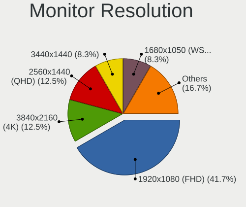

| Resolution         | Desktops | Percent |
|--------------------|----------|---------|
| 1920x1080 (FHD)    | 10       | 41.67%  |
| 3840x2160 (4K)     | 3        | 12.5%   |
| 2560x1440 (QHD)    | 3        | 12.5%   |
| 3440x1440          | 2        | 8.33%   |
| 1680x1050 (WSXGA+) | 2        | 8.33%   |
| 3840x1080          | 1        | 4.17%   |
| 1920x540           | 1        | 4.17%   |
| 1600x900 (HD+)     | 1        | 4.17%   |
| 1360x768           | 1        | 4.17%   |

Monitor Diagonal
----------------

Diagonal size in inches

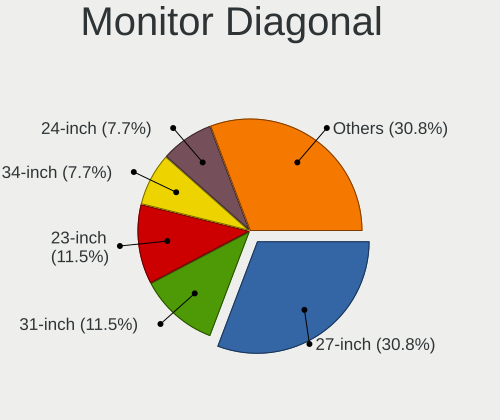

| Inches  | Desktops | Percent |
|---------|----------|---------|
| 27      | 8        | 30.77%  |
| 31      | 3        | 11.54%  |
| 23      | 3        | 11.54%  |
| 34      | 2        | 7.69%   |
| 24      | 2        | 7.69%   |
| 20      | 2        | 7.69%   |
| 49      | 1        | 3.85%   |
| 32      | 1        | 3.85%   |
| 21      | 1        | 3.85%   |
| 19      | 1        | 3.85%   |
| 18      | 1        | 3.85%   |
| Unknown | 1        | 3.85%   |

Monitor Width
-------------

Physical width

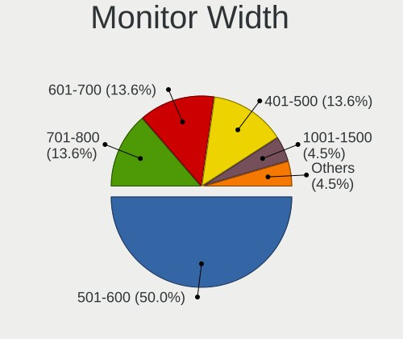

| Width in mm | Desktops | Percent |
|-------------|----------|---------|
| 501-600     | 11       | 50%     |
| 701-800     | 3        | 13.64%  |
| 601-700     | 3        | 13.64%  |
| 401-500     | 3        | 13.64%  |
| 1001-1500   | 1        | 4.55%   |
| Unknown     | 1        | 4.55%   |

Aspect Ratio
------------

Proportional relationship between the width and the height

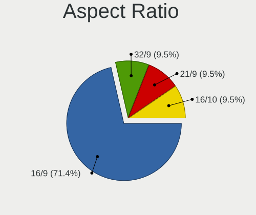

| Ratio | Desktops | Percent |
|-------|----------|---------|
| 16/9  | 15       | 71.43%  |
| 32/9  | 2        | 9.52%   |
| 21/9  | 2        | 9.52%   |
| 16/10 | 2        | 9.52%   |

Monitor Area
------------

Area in inch²

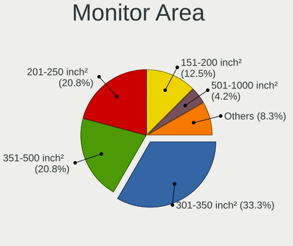

| Area in inch² | Desktops | Percent |
|----------------|----------|---------|
| 301-350        | 8        | 33.33%  |
| 351-500        | 5        | 20.83%  |
| 201-250        | 5        | 20.83%  |
| 151-200        | 3        | 12.5%   |
| 141-150        | 1        | 4.17%   |
| 501-1000       | 1        | 4.17%   |
| Unknown        | 1        | 4.17%   |

Pixel Density
-------------

Pixels per inch

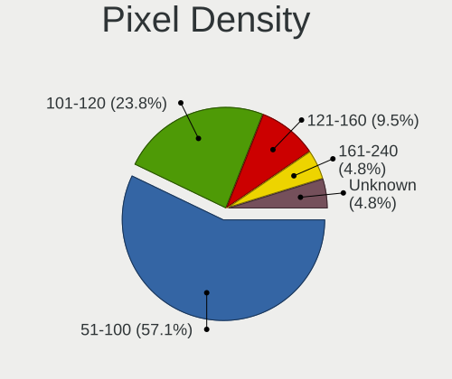

| Density | Desktops | Percent |
|---------|----------|---------|
| 51-100  | 12       | 57.14%  |
| 101-120 | 5        | 23.81%  |
| 121-160 | 2        | 9.52%   |
| 161-240 | 1        | 4.76%   |
| Unknown | 1        | 4.76%   |

Multiple Monitors
-----------------

Total monitors connected

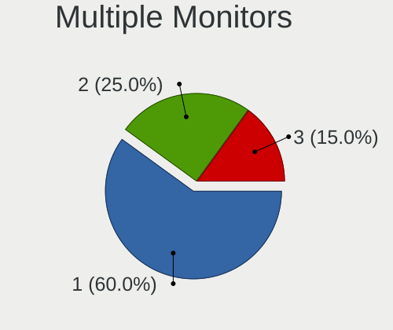

| Total | Desktops | Percent |
|-------|----------|---------|
| 1     | 12       | 60%     |
| 2     | 5        | 25%     |
| 3     | 3        | 15%     |

Network
-------

Net Controller Vendor
---------------------

Controller vendors

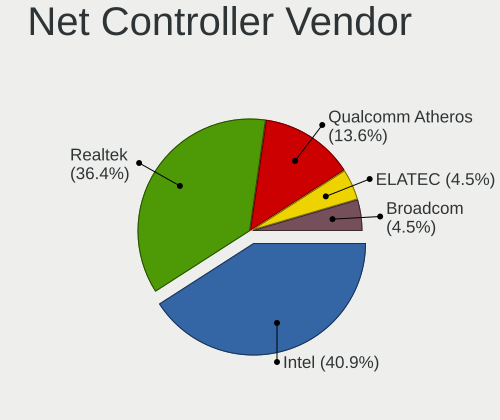

| Vendor                | Desktops | Percent |
|-----------------------|----------|---------|
| Intel                 | 9        | 40.91%  |
| Realtek Semiconductor | 8        | 36.36%  |
| Qualcomm Atheros      | 3        | 13.64%  |
| ELATEC                | 1        | 4.55%   |
| Broadcom              | 1        | 4.55%   |

Net Controller Model
--------------------

Controller models

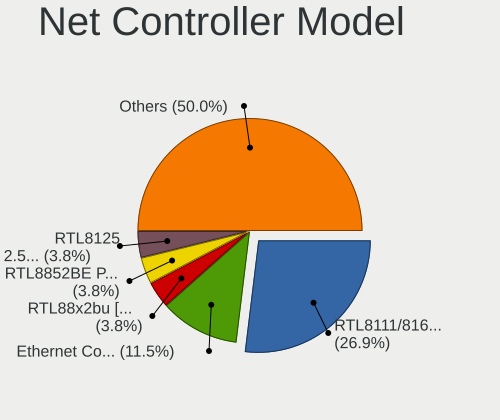

| Model                                                                  | Desktops | Percent |
|------------------------------------------------------------------------|----------|---------|
| Realtek RTL8111/8168/8211/8411 PCI Express Gigabit Ethernet Controller | 7        | 26.92%  |
| Intel Ethernet Connection (2) I219-V                                   | 3        | 11.54%  |
| Realtek RTL88x2bu [AC1200 Techkey]                                     | 1        | 3.85%   |
| Realtek RTL8852BE PCIe 802.11ax Wireless Network Controller            | 1        | 3.85%   |
| Realtek RTL8125 2.5GbE Controller                                      | 1        | 3.85%   |
| Qualcomm Atheros QCA8171 Gigabit Ethernet                              | 1        | 3.85%   |
| Qualcomm Atheros QCA6174 802.11ac Wireless Network Adapter             | 1        | 3.85%   |
| Qualcomm Atheros Killer E2400 Gigabit Ethernet Controller              | 1        | 3.85%   |
| Qualcomm Atheros AR928X Wireless Network Adapter (PCI-Express)         | 1        | 3.85%   |
| Intel Wireless 3165                                                    | 1        | 3.85%   |
| Intel I211 Gigabit Network Connection                                  | 1        | 3.85%   |
| Intel Ethernet Controller I225-V                                       | 1        | 3.85%   |
| Intel Ethernet Connection I217-LM                                      | 1        | 3.85%   |
| Intel Ethernet Connection (2) I218-LM                                  | 1        | 3.85%   |
| Intel Comet Lake PCH CNVi WiFi                                         | 1        | 3.85%   |
| Intel Centrino Ultimate-N 6300                                         | 1        | 3.85%   |
| ELATEC TWN4 CDC                                                        | 1        | 3.85%   |
| Broadcom BCM4360 802.11ac Dual Band Wireless Network Adapter           | 1        | 3.85%   |

Wireless Vendor
---------------

Wireless vendors

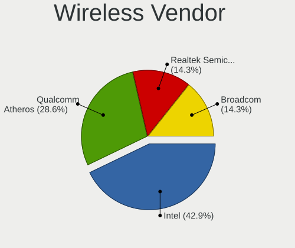

| Vendor                | Desktops | Percent |
|-----------------------|----------|---------|
| Intel                 | 3        | 42.86%  |
| Qualcomm Atheros      | 2        | 28.57%  |
| Realtek Semiconductor | 1        | 14.29%  |
| Broadcom              | 1        | 14.29%  |

Wireless Model
--------------

Wireless models

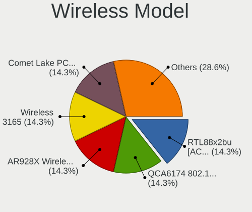

| Model                                                          | Desktops | Percent |
|----------------------------------------------------------------|----------|---------|
| Realtek RTL88x2bu [AC1200 Techkey]                             | 1        | 14.29%  |
| Qualcomm Atheros QCA6174 802.11ac Wireless Network Adapter     | 1        | 14.29%  |
| Qualcomm Atheros AR928X Wireless Network Adapter (PCI-Express) | 1        | 14.29%  |
| Intel Wireless 3165                                            | 1        | 14.29%  |
| Intel Comet Lake PCH CNVi WiFi                                 | 1        | 14.29%  |
| Intel Centrino Ultimate-N 6300                                 | 1        | 14.29%  |
| Broadcom BCM4360 802.11ac Dual Band Wireless Network Adapter   | 1        | 14.29%  |

Ethernet Vendor
---------------

Ethernet vendors

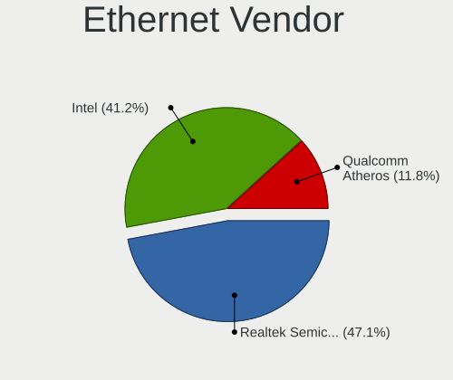

| Vendor                | Desktops | Percent |
|-----------------------|----------|---------|
| Realtek Semiconductor | 8        | 47.06%  |
| Intel                 | 7        | 41.18%  |
| Qualcomm Atheros      | 2        | 11.76%  |

Ethernet Model
--------------

Ethernet models

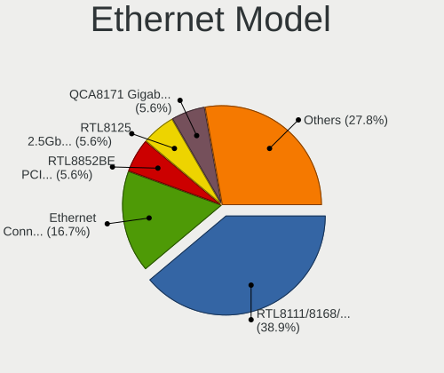

| Model                                                                  | Desktops | Percent |
|------------------------------------------------------------------------|----------|---------|
| Realtek RTL8111/8168/8211/8411 PCI Express Gigabit Ethernet Controller | 7        | 38.89%  |
| Intel Ethernet Connection (2) I219-V                                   | 3        | 16.67%  |
| Realtek RTL8852BE PCIe 802.11ax Wireless Network Controller            | 1        | 5.56%   |
| Realtek RTL8125 2.5GbE Controller                                      | 1        | 5.56%   |
| Qualcomm Atheros QCA8171 Gigabit Ethernet                              | 1        | 5.56%   |
| Qualcomm Atheros Killer E2400 Gigabit Ethernet Controller              | 1        | 5.56%   |
| Intel I211 Gigabit Network Connection                                  | 1        | 5.56%   |
| Intel Ethernet Controller I225-V                                       | 1        | 5.56%   |
| Intel Ethernet Connection I217-LM                                      | 1        | 5.56%   |
| Intel Ethernet Connection (2) I218-LM                                  | 1        | 5.56%   |

Net Controller Kind
-------------------

Ethernet, WiFi or modem

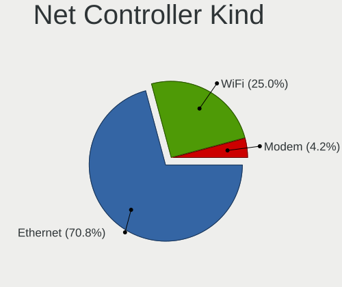

| Kind     | Desktops | Percent |
|----------|----------|---------|
| Ethernet | 17       | 70.83%  |
| WiFi     | 6        | 25%     |
| Modem    | 1        | 4.17%   |

Used Controller
---------------

Currently used network controller

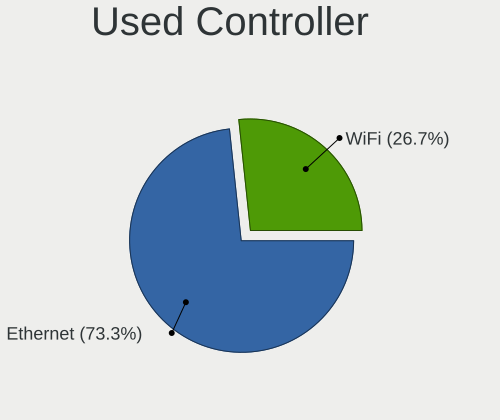

| Kind     | Desktops | Percent |
|----------|----------|---------|
| Ethernet | 11       | 73.33%  |
| WiFi     | 4        | 26.67%  |

NICs
----

Total network controllers on board

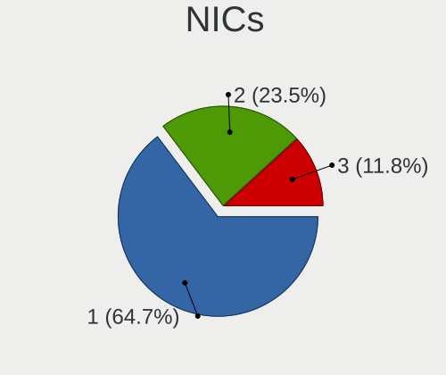

| Total | Desktops | Percent |
|-------|----------|---------|
| 1     | 11       | 64.71%  |
| 2     | 4        | 23.53%  |
| 3     | 2        | 11.76%  |

IPv6
----

IPv6 vs IPv4

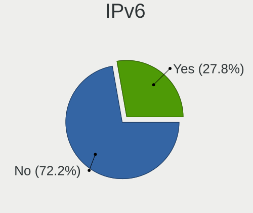

| Used | Desktops | Percent |
|------|----------|---------|
| No   | 13       | 72.22%  |
| Yes  | 5        | 27.78%  |

Bluetooth
---------

Bluetooth Vendor
----------------

Controller vendors

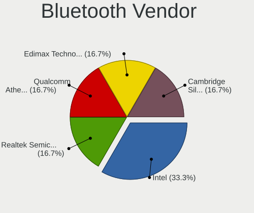

| Vendor                          | Desktops | Percent |
|---------------------------------|----------|---------|
| Intel                           | 2        | 33.33%  |
| Realtek Semiconductor           | 1        | 16.67%  |
| Qualcomm Atheros Communications | 1        | 16.67%  |
| Edimax Technology               | 1        | 16.67%  |
| Cambridge Silicon Radio         | 1        | 16.67%  |

Bluetooth Model
---------------

Controller models

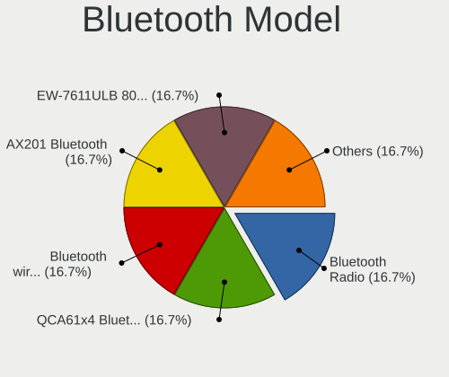

| Model                                                   | Desktops | Percent |
|---------------------------------------------------------|----------|---------|
| Realtek Bluetooth Radio                                 | 1        | 16.67%  |
| Qualcomm Atheros QCA61x4 Bluetooth 4.0                  | 1        | 16.67%  |
| Intel Bluetooth wireless interface                      | 1        | 16.67%  |
| Intel AX201 Bluetooth                                   | 1        | 16.67%  |
| Edimax EW-7611ULB 802.11b/g/n and Bluetooth 4.0 Adapter | 1        | 16.67%  |
| Cambridge Silicon Radio Bluetooth Dongle (HCI mode)     | 1        | 16.67%  |

Sound
-----

Sound Vendor
------------

Sound card vendors

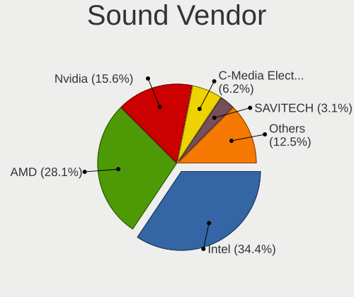

| Vendor                  | Desktops | Percent |
|-------------------------|----------|---------|
| Intel                   | 11       | 34.38%  |
| AMD                     | 9        | 28.13%  |
| Nvidia                  | 5        | 15.63%  |
| C-Media Electronics     | 2        | 6.25%   |
| SAVITECH                | 1        | 3.13%   |
| Logitech                | 1        | 3.13%   |
| Kingston Technology     | 1        | 3.13%   |
| GN Netcom               | 1        | 3.13%   |
| Cambridge Silicon Radio | 1        | 3.13%   |

Sound Model
-----------

Sound card models

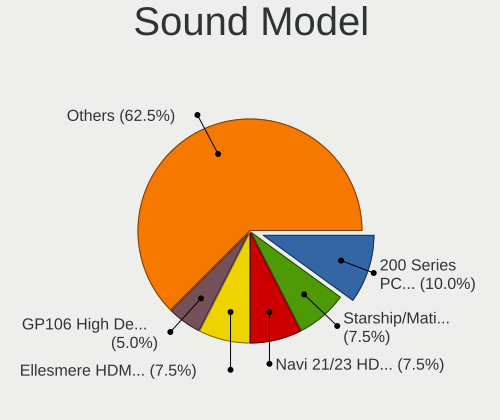

| Model                                                               | Desktops | Percent |
|---------------------------------------------------------------------|----------|---------|
| Intel 200 Series PCH HD Audio                                       | 4        | 10%     |
| AMD Starship/Matisse HD Audio Controller                            | 3        | 7.5%    |
| AMD Navi 21/23 HDMI/DP Audio Controller                             | 3        | 7.5%    |
| AMD Ellesmere HDMI Audio [Radeon RX 470/480 / 570/580/590]          | 3        | 7.5%    |
| Nvidia GP106 High Definition Audio Controller                       | 2        | 5%      |
| Intel C610/X99 series chipset HD Audio Controller                   | 2        | 5%      |
| Intel 100 Series/C230 Series Chipset Family HD Audio Controller     | 2        | 5%      |
| AMD Family 17h (Models 00h-0fh) HD Audio Controller                 | 2        | 5%      |
| SAVITECH MX3                                                        | 1        | 2.5%    |
| Nvidia GP104 High Definition Audio Controller                       | 1        | 2.5%    |
| Nvidia GK104 HDMI Audio Controller                                  | 1        | 2.5%    |
| Nvidia GF119 HDMI Audio Controller                                  | 1        | 2.5%    |
| Logitech Blue Microphones                                           | 1        | 2.5%    |
| Kingston Technology HyperX 7.1 Audio                                | 1        | 2.5%    |
| Intel Xeon E3-1200 v3/4th Gen Core Processor HD Audio Controller    | 1        | 2.5%    |
| Intel Jasper Lake HD Audio                                          | 1        | 2.5%    |
| Intel Comet Lake PCH cAVS                                           | 1        | 2.5%    |
| Intel 8 Series/C220 Series Chipset High Definition Audio Controller | 1        | 2.5%    |
| GN Netcom Jabra Link 380                                            | 1        | 2.5%    |
| Cambridge Silicon Radio B10                                         | 1        | 2.5%    |
| C-Media Electronics CMI8738/CMI8768 PCI Audio                       | 1        | 2.5%    |
| C-Media Electronics Audio Adapter (Unitek Y-247A)                   | 1        | 2.5%    |
| AMD Vega 20 HDMI Audio [Radeon VII]                                 | 1        | 2.5%    |
| AMD Navi 31 HDMI/DP Audio                                           | 1        | 2.5%    |
| AMD High Definition Audio Controller                                | 1        | 2.5%    |
| AMD Family 15h (Models 60h-6fh) Audio Controller                    | 1        | 2.5%    |
| AMD Baffin HDMI/DP Audio [Radeon RX 550 640SP / RX 560/560X]        | 1        | 2.5%    |

Memory
------

Memory Vendor
-------------

Memory module vendors

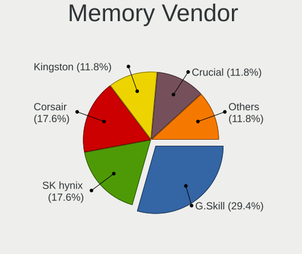

| Vendor   | Desktops | Percent |
|----------|----------|---------|
| G.Skill  | 5        | 29.41%  |
| SK hynix | 3        | 17.65%  |
| Corsair  | 3        | 17.65%  |
| Kingston | 2        | 11.76%  |
| Crucial  | 2        | 11.76%  |
| Unknown  | 1        | 5.88%   |
| Ramsta   | 1        | 5.88%   |

Memory Model
------------

Memory module models

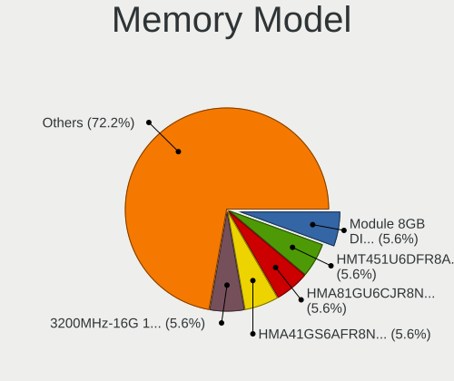

| Model                                                   | Desktops | Percent |
|---------------------------------------------------------|----------|---------|
| Unknown RAM Module 8GB DIMM DDR3 1600MT/s               | 1        | 5.56%   |
| SK hynix RAM HMT451U6DFR8A-PB 4GB DIMM DDR3 1600MT/s    | 1        | 5.56%   |
| SK hynix RAM HMA81GU6CJR8N-VK 8GB DIMM DDR4 2400MT/s    | 1        | 5.56%   |
| SK hynix RAM HMA41GS6AFR8N-TF 8GB SODIMM DDR4 2667MT/s  | 1        | 5.56%   |
| Ramsta RAM 3200MHz-16G 16GB SODIMM DDR4 3200MT/s        | 1        | 5.56%   |
| Kingston RAM Module 8GB DIMM DDR4 3200MT/s              | 1        | 5.56%   |
| Kingston RAM KHX3000C15D4/8GX 8GB DIMM DDR4 3400MT/s    | 1        | 5.56%   |
| G.Skill RAM F4-3600C16-8GTZR 8GB DIMM DDR4 3600MT/s     | 1        | 5.56%   |
| G.Skill RAM F4-3200C16-16GTZN 16GB DIMM DDR4 3200MT/s   | 1        | 5.56%   |
| G.Skill RAM F4-3000C16-8GISB 8GB DIMM DDR4 3200MT/s     | 1        | 5.56%   |
| G.Skill RAM F4-3000C15-8GRBB 8GB DIMM DDR4 3000MT/s     | 1        | 5.56%   |
| G.Skill RAM F4-2400C15-8GNT 8GB DIMM DDR4 2666MT/s      | 1        | 5.56%   |
| Crucial RAM BLS8G4D26BFSEK.8FD 8GB DIMM DDR4 3266MT/s   | 1        | 5.56%   |
| Crucial RAM BLS8G4D26BFSBK.8FBD 8GB DIMM DDR4 2667MT/s  | 1        | 5.56%   |
| Crucial RAM BL16G36C16U4R.M8FB1 16GB DIMM DDR4 3600MT/s | 1        | 5.56%   |
| Corsair RAM CMU32GX4M4C3000C15 8GB DIMM DDR4 3000MT/s   | 1        | 5.56%   |
| Corsair RAM CMK32GX4M2A2400C16 16GB DIMM DDR4 2400MT/s  | 1        | 5.56%   |
| Corsair RAM CMK32GX4M2A2400C14 16GB DIMM DDR4 2667MT/s  | 1        | 5.56%   |

Memory Kind
-----------

Memory module kinds

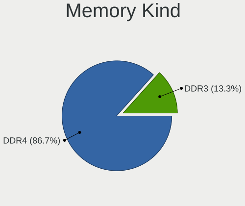

| Kind | Desktops | Percent |
|------|----------|---------|
| DDR4 | 13       | 86.67%  |
| DDR3 | 2        | 13.33%  |

Memory Form Factor
------------------

Physical design of the memory module

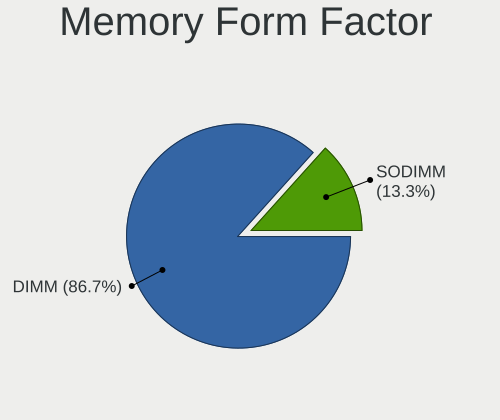

| Name   | Desktops | Percent |
|--------|----------|---------|
| DIMM   | 13       | 86.67%  |
| SODIMM | 2        | 13.33%  |

Memory Size
-----------

Memory module size

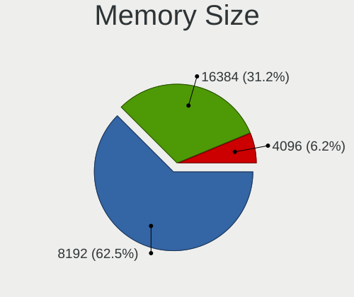

| Size  | Desktops | Percent |
|-------|----------|---------|
| 8192  | 10       | 62.5%   |
| 16384 | 5        | 31.25%  |
| 4096  | 1        | 6.25%   |

Memory Speed
------------

Memory module speed

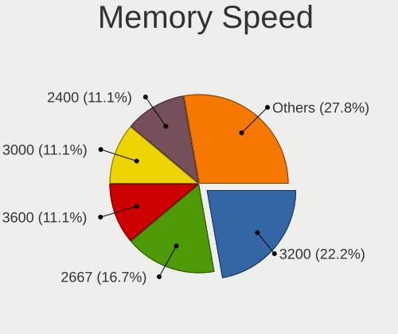

| Speed | Desktops | Percent |
|-------|----------|---------|
| 3200  | 4        | 22.22%  |
| 2667  | 3        | 16.67%  |
| 3600  | 2        | 11.11%  |
| 3000  | 2        | 11.11%  |
| 2400  | 2        | 11.11%  |
| 1600  | 2        | 11.11%  |
| 3400  | 1        | 5.56%   |
| 3266  | 1        | 5.56%   |
| 2666  | 1        | 5.56%   |

Printers & scanners
-------------------

Printer Vendor
--------------

Printer device vendors

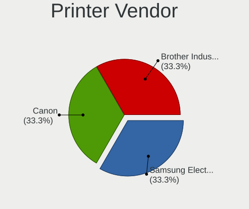

| Vendor              | Desktops | Percent |
|---------------------|----------|---------|
| Samsung Electronics | 1        | 33.33%  |
| Canon               | 1        | 33.33%  |
| Brother Industries  | 1        | 33.33%  |

Printer Model
-------------

Printer device models

| Model                | Desktops | Percent |
|----------------------|----------|---------|
| Samsung M2070 Series | 1        | 33.33%  |
| Canon TS8000 series  | 1        | 33.33%  |
| Brother MFC-J1010DW  | 1        | 33.33%  |

Scanner Vendor
--------------

Scanner device vendors

Zero info for selected period =(

Scanner Model
-------------

Scanner device models

Zero info for selected period =(

Camera
------

Camera Vendor
-------------

Camera device vendors

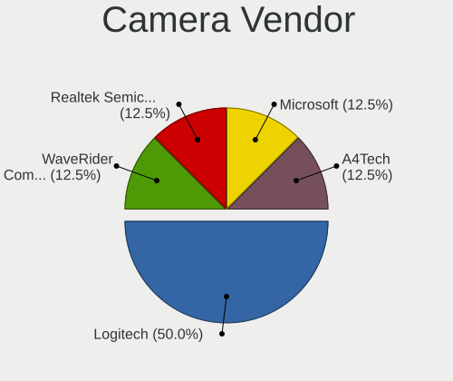

| Vendor                   | Desktops | Percent |
|--------------------------|----------|---------|
| Logitech                 | 4        | 50%     |
| WaveRider Communications | 1        | 12.5%   |
| Realtek Semiconductor    | 1        | 12.5%   |
| Microsoft                | 1        | 12.5%   |
| A4Tech                   | 1        | 12.5%   |

Camera Model
------------

Camera device models

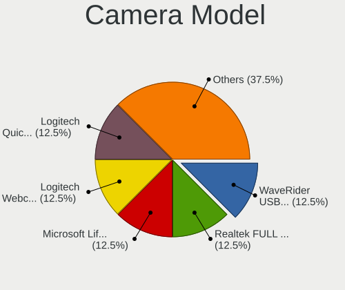

| Model                        | Desktops | Percent |
|------------------------------|----------|---------|
| WaveRider USB Live camera    | 1        | 12.5%   |
| Realtek FULL HD 1080P Webcam | 1        | 12.5%   |
| Microsoft LifeCam Cinema     | 1        | 12.5%   |
| Logitech Webcam C270         | 1        | 12.5%   |
| Logitech QuickCam Pro 9000   | 1        | 12.5%   |
| Logitech HD Webcam C615      | 1        | 12.5%   |
| Logitech HD Pro Webcam C920  | 1        | 12.5%   |
| A4Tech PK-635G               | 1        | 12.5%   |

Security
--------

Fingerprint Vendor
------------------

Fingerprint sensor vendors

Zero info for selected period =(

Fingerprint Model
-----------------

Fingerprint sensor models

Zero info for selected period =(

Chipcard Vendor
---------------

Chipcard module vendors

Zero info for selected period =(

Chipcard Model
--------------

Chipcard module models

Zero info for selected period =(

Unsupported
-----------

Unsupported Devices
-------------------

Total unsupported devices on board

| Total | Desktops | Percent |
|-------|----------|---------|
| 0     | 14       | 77.78%  |
| 1     | 4        | 22.22%  |

Unsupported Device Types
------------------------

Types of unsupported devices

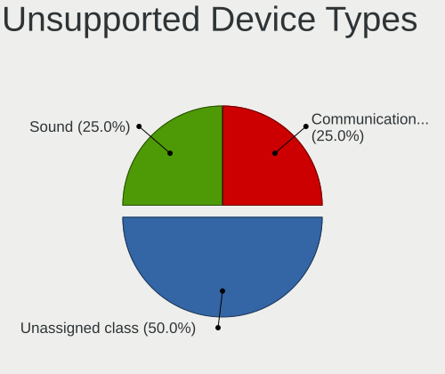

| Type                     | Desktops | Percent |
|--------------------------|----------|---------|
| Unassigned class         | 2        | 50%     |
| Sound                    | 1        | 25%     |
| Communication controller | 1        | 25%     |

