Siduction - Tested Hardware & Statistics (Notebooks)
----------------------------------------------------

A project to collect tested hardware configurations for Siduction.

Anyone can contribute to this report by the [hw-probe](https://github.com/linuxhw/hw-probe) tool:

    sudo -E hw-probe -all -upload

Please contribute! Especially if your hardware is rare.

Contents
--------

* [ Test Cases ](#test-cases)

* [ System ](#system)
  - [ OS                       ](#os)
  - [ OS Family                ](#os-family)
  - [ Kernel                   ](#kernel)
  - [ Kernel Family            ](#kernel-family)
  - [ Kernel Major Ver.        ](#kernel-major-ver)
  - [ Arch                     ](#arch)
  - [ DE                       ](#de)
  - [ Display Server           ](#display-server)
  - [ Display Manager          ](#display-manager)
  - [ OS Lang                  ](#os-lang)
  - [ Boot Mode                ](#boot-mode)
  - [ Filesystem               ](#filesystem)
  - [ Part. scheme             ](#part-scheme)
  - [ Dual Boot with Linux/BSD ](#dual-boot-with-linuxbsd)
  - [ Dual Boot (Win)          ](#dual-boot-win)

* [ Board ](#board)
  - [ Vendor                   ](#vendor)
  - [ Model                    ](#model)
  - [ Model Family             ](#model-family)
  - [ MFG Year                 ](#mfg-year)
  - [ Form Factor              ](#form-factor)
  - [ Secure Boot              ](#secure-boot)
  - [ Coreboot                 ](#coreboot)
  - [ RAM Size                 ](#ram-size)
  - [ RAM Used                 ](#ram-used)
  - [ Total Drives             ](#total-drives)
  - [ Has CD-ROM               ](#has-cd-rom)
  - [ Has Ethernet             ](#has-ethernet)
  - [ Has WiFi                 ](#has-wifi)
  - [ Has Bluetooth            ](#has-bluetooth)

* [ Location ](#location)
  - [ Country                  ](#country)
  - [ City                     ](#city)

* [ Drives ](#drives)
  - [ Drive Vendor             ](#drive-vendor)
  - [ Drive Model              ](#drive-model)
  - [ HDD Vendor               ](#hdd-vendor)
  - [ SSD Vendor               ](#ssd-vendor)
  - [ Drive Kind               ](#drive-kind)
  - [ Drive Connector          ](#drive-connector)
  - [ Drive Size               ](#drive-size)
  - [ Space Total              ](#space-total)
  - [ Space Used               ](#space-used)
  - [ Malfunc. Drives          ](#malfunc-drives)
  - [ Malfunc. Drive Vendor    ](#malfunc-drive-vendor)
  - [ Malfunc. HDD Vendor      ](#malfunc-hdd-vendor)
  - [ Malfunc. Drive Kind      ](#malfunc-drive-kind)
  - [ Failed Drives            ](#failed-drives)
  - [ Failed Drive Vendor      ](#failed-drive-vendor)
  - [ Drive Status             ](#drive-status)

* [ Storage controller ](#storage-controller)
  - [ Storage Vendor           ](#storage-vendor)
  - [ Storage Model            ](#storage-model)
  - [ Storage Kind             ](#storage-kind)

* [ Processor ](#processor)
  - [ CPU Vendor               ](#cpu-vendor)
  - [ CPU Model                ](#cpu-model)
  - [ CPU Model Family         ](#cpu-model-family)
  - [ CPU Cores                ](#cpu-cores)
  - [ CPU Sockets              ](#cpu-sockets)
  - [ CPU Threads              ](#cpu-threads)
  - [ CPU Op-Modes             ](#cpu-op-modes)
  - [ CPU Microcode            ](#cpu-microcode)
  - [ CPU Microarch            ](#cpu-microarch)

* [ Graphics ](#graphics)
  - [ GPU Vendor               ](#gpu-vendor)
  - [ GPU Model                ](#gpu-model)
  - [ GPU Combo                ](#gpu-combo)
  - [ GPU Driver               ](#gpu-driver)
  - [ GPU Memory               ](#gpu-memory)

* [ Monitor ](#monitor)
  - [ Monitor Vendor           ](#monitor-vendor)
  - [ Monitor Model            ](#monitor-model)
  - [ Monitor Resolution       ](#monitor-resolution)
  - [ Monitor Diagonal         ](#monitor-diagonal)
  - [ Monitor Width            ](#monitor-width)
  - [ Aspect Ratio             ](#aspect-ratio)
  - [ Monitor Area             ](#monitor-area)
  - [ Pixel Density            ](#pixel-density)
  - [ Multiple Monitors        ](#multiple-monitors)

* [ Network ](#network)
  - [ Net Controller Vendor    ](#net-controller-vendor)
  - [ Net Controller Model     ](#net-controller-model)
  - [ Wireless Vendor          ](#wireless-vendor)
  - [ Wireless Model           ](#wireless-model)
  - [ Ethernet Vendor          ](#ethernet-vendor)
  - [ Ethernet Model           ](#ethernet-model)
  - [ Net Controller Kind      ](#net-controller-kind)
  - [ Used Controller          ](#used-controller)
  - [ NICs                     ](#nics)
  - [ IPv6                     ](#ipv6)

* [ Bluetooth ](#bluetooth)
  - [ Bluetooth Vendor         ](#bluetooth-vendor)
  - [ Bluetooth Model          ](#bluetooth-model)

* [ Sound ](#sound)
  - [ Sound Vendor             ](#sound-vendor)
  - [ Sound Model              ](#sound-model)

* [ Memory ](#memory)
  - [ Memory Vendor            ](#memory-vendor)
  - [ Memory Model             ](#memory-model)
  - [ Memory Kind              ](#memory-kind)
  - [ Memory Form Factor       ](#memory-form-factor)
  - [ Memory Size              ](#memory-size)
  - [ Memory Speed             ](#memory-speed)

* [ Printers & scanners ](#printers--scanners)
  - [ Printer Vendor           ](#printer-vendor)
  - [ Printer Model            ](#printer-model)
  - [ Scanner Vendor           ](#scanner-vendor)
  - [ Scanner Model            ](#scanner-model)

* [ Camera ](#camera)
  - [ Camera Vendor            ](#camera-vendor)
  - [ Camera Model             ](#camera-model)

* [ Security ](#security)
  - [ Fingerprint Vendor       ](#fingerprint-vendor)
  - [ Fingerprint Model        ](#fingerprint-model)
  - [ Chipcard Vendor          ](#chipcard-vendor)
  - [ Chipcard Model           ](#chipcard-model)

* [ Unsupported ](#unsupported)
  - [ Unsupported Devices      ](#unsupported-devices)
  - [ Unsupported Device Types ](#unsupported-device-types)

Test Cases
----------

Total: 68

| Vendor    | Model                       | Probe                                                      | Date         |
|-----------|-----------------------------|------------------------------------------------------------|--------------|
| Dell      | XPS 15 9530                 | [229fa2334e](https://linux-hardware.org/?probe=229fa2334e) | Dec 26, 2025 |
| TUXEDO    | Sirius 16 Gen1              | [d223301e3d](https://linux-hardware.org/?probe=d223301e3d) | Nov 14, 2025 |
| Framework | Laptop 13 (AMD Ryzen AI ... | [110a3ac514](https://linux-hardware.org/?probe=110a3ac514) | Nov 05, 2025 |
| Framework | Laptop 13 (AMD Ryzen AI ... | [6fc9ef0f2f](https://linux-hardware.org/?probe=6fc9ef0f2f) | Nov 05, 2025 |
| AWOW      | AK41                        | [3a5d47f28b](https://linux-hardware.org/?probe=3a5d47f28b) | Aug 21, 2025 |
| Acer      | Aspire A315-42              | [09f9cb0e93](https://linux-hardware.org/?probe=09f9cb0e93) | Aug 15, 2025 |
| AWOW      | AK41                        | [a21d56b682](https://linux-hardware.org/?probe=a21d56b682) | Aug 09, 2025 |
| Lenovo    | ThinkPad E14 Gen 4 21ECS... | [5003876656](https://linux-hardware.org/?probe=5003876656) | Jul 02, 2025 |
| HP        | ProBook 4540s               | [0646f227a6](https://linux-hardware.org/?probe=0646f227a6) | Jan 02, 2025 |
| ASUSTek   | VivoBook_ASUSLaptop X150... | [2c4e1abbf9](https://linux-hardware.org/?probe=2c4e1abbf9) | Nov 09, 2024 |
| Lenovo    | ThinkPad L590 20Q7001HGE    | [ec2225a1f3](https://linux-hardware.org/?probe=ec2225a1f3) | Oct 12, 2024 |
| Lenovo    | G50-30 80G0                 | [53798578b1](https://linux-hardware.org/?probe=53798578b1) | Jun 19, 2024 |
| HP        | 250 G7 Notebook PC          | [637ffca44b](https://linux-hardware.org/?probe=637ffca44b) | Jun 16, 2024 |
| Lenovo    | ThinkPad T14s Gen 1 20T1... | [3936c99d1e](https://linux-hardware.org/?probe=3936c99d1e) | Mar 25, 2024 |
| Lenovo    | ThinkPad T470 W10DG 20JN... | [df52747427](https://linux-hardware.org/?probe=df52747427) | Jan 22, 2024 |
| HP        | 250 G7 Notebook PC          | [3b58774e8d](https://linux-hardware.org/?probe=3b58774e8d) | Jan 15, 2024 |
| Lenovo    | ThinkPad T470 W10DG 20JN... | [d17724d57c](https://linux-hardware.org/?probe=d17724d57c) | Jan 11, 2024 |
| ASUSTek   | BU201LA                     | [2985f7a222](https://linux-hardware.org/?probe=2985f7a222) | Dec 22, 2023 |
| Lenovo    | ThinkPad T580 20LAS1GG00    | [c592d82494](https://linux-hardware.org/?probe=c592d82494) | Dec 05, 2023 |
| Lenovo    | ThinkPad L540 20AUS01H00    | [6bdb162853](https://linux-hardware.org/?probe=6bdb162853) | Nov 29, 2023 |
| Lenovo    | ThinkPad T490 20N3SFKX00    | [9d5bc38102](https://linux-hardware.org/?probe=9d5bc38102) | Nov 29, 2023 |
| HP        | 250 G7 Notebook PC          | [64d7d103a5](https://linux-hardware.org/?probe=64d7d103a5) | Oct 24, 2023 |
| HP        | 250 G7 Notebook PC          | [91d0aa5397](https://linux-hardware.org/?probe=91d0aa5397) | Oct 10, 2023 |
| HP        | 250 G7 Notebook PC          | [c2123c4f21](https://linux-hardware.org/?probe=c2123c4f21) | Oct 10, 2023 |
| HP        | 250 G7 Notebook PC          | [428177914f](https://linux-hardware.org/?probe=428177914f) | Sep 17, 2023 |
| HP        | 250 G7 Notebook PC          | [f2b0e180d4](https://linux-hardware.org/?probe=f2b0e180d4) | Aug 27, 2023 |
| HP        | ZBook 15 G6                 | [eb23ebb0b8](https://linux-hardware.org/?probe=eb23ebb0b8) | Jun 10, 2023 |
| Apple     | MacBookPro9,2               | [baf92c8b36](https://linux-hardware.org/?probe=baf92c8b36) | Jun 08, 2023 |
| HP        | 250 G7 Notebook PC          | [2f0f83bda2](https://linux-hardware.org/?probe=2f0f83bda2) | May 25, 2023 |
| HP        | ProBook 640 G1              | [5dceebaf6c](https://linux-hardware.org/?probe=5dceebaf6c) | May 13, 2023 |
| Dell      | Vostro 15 3510              | [fc82fe9907](https://linux-hardware.org/?probe=fc82fe9907) | May 11, 2023 |
| Dell      | Latitude 5491               | [ef97e6890a](https://linux-hardware.org/?probe=ef97e6890a) | Apr 13, 2023 |
| ASUSTek   | X751LAB                     | [03465bed03](https://linux-hardware.org/?probe=03465bed03) | Apr 06, 2023 |
| HP        | ProBook 640 G1              | [5aa6a42aa2](https://linux-hardware.org/?probe=5aa6a42aa2) | Mar 29, 2023 |
| Acer      | Swift SF314-51              | [5a73818024](https://linux-hardware.org/?probe=5a73818024) | Mar 27, 2023 |
| Lenovo    | ThinkPad X1 Carbon 5th 2... | [0c7e919608](https://linux-hardware.org/?probe=0c7e919608) | Mar 20, 2023 |
| Acer      | Aspire E5-551G              | [58703e3260](https://linux-hardware.org/?probe=58703e3260) | Mar 15, 2023 |
| Lenovo    | ThinkPad X1 Carbon 5th 2... | [5c39a363d8](https://linux-hardware.org/?probe=5c39a363d8) | Feb 28, 2023 |
| HP        | EliteBook 865 16 inch G9... | [49a4e66cd0](https://linux-hardware.org/?probe=49a4e66cd0) | Feb 05, 2023 |
| Acer      | Aspire V5-471               | [fe551b92a5](https://linux-hardware.org/?probe=fe551b92a5) | Oct 02, 2022 |
| Acer      | Aspire A515-55              | [bed4db4cf3](https://linux-hardware.org/?probe=bed4db4cf3) | Jul 16, 2022 |
| Acer      | Aspire E5-771G              | [a765f92826](https://linux-hardware.org/?probe=a765f92826) | Mar 28, 2022 |
| Lenovo    | ThinkPad T410 253725G       | [3e1c463980](https://linux-hardware.org/?probe=3e1c463980) | Jan 16, 2022 |
| Lenovo    | IdeaPad 3 15IIL05 81WE      | [7fa0610547](https://linux-hardware.org/?probe=7fa0610547) | Jan 02, 2022 |
| Lenovo    | ThinkPad E590 20NB001AIX    | [436614e885](https://linux-hardware.org/?probe=436614e885) | Sep 26, 2021 |
| Lenovo    | ThinkPad T410 253725G       | [65b842202c](https://linux-hardware.org/?probe=65b842202c) | Aug 06, 2021 |
| ASUSTek   | ZenBook UX325JA_UX325JA     | [70ddebc8cc](https://linux-hardware.org/?probe=70ddebc8cc) | Jul 25, 2021 |
| ASUSTek   | ZenBook UX325JA_UX325JA     | [455c830431](https://linux-hardware.org/?probe=455c830431) | Jul 25, 2021 |
| TUXEDO    | Book BA1510                 | [80b8c9719c](https://linux-hardware.org/?probe=80b8c9719c) | Jul 11, 2021 |
| HP        | ProBook 4520s               | [50b007f51d](https://linux-hardware.org/?probe=50b007f51d) | Jun 26, 2021 |
| HP        | ProBook 4520s               | [261b02ab53](https://linux-hardware.org/?probe=261b02ab53) | Jun 20, 2021 |
| HP        | Laptop 17-ca1xxx            | [99f175055d](https://linux-hardware.org/?probe=99f175055d) | May 05, 2021 |
| HP        | Laptop 17-ca1xxx            | [e21ac181a5](https://linux-hardware.org/?probe=e21ac181a5) | Apr 03, 2021 |
| HP        | Laptop 17-ca1xxx            | [a8a82ba1b9](https://linux-hardware.org/?probe=a8a82ba1b9) | Mar 01, 2021 |
| HP        | Laptop 17-ca1xxx            | [a3ea535d80](https://linux-hardware.org/?probe=a3ea535d80) | Feb 04, 2021 |
| HP        | Laptop 17-ca1xxx            | [d88b363f5e](https://linux-hardware.org/?probe=d88b363f5e) | Jan 19, 2021 |
| HP        | Laptop 17-ca1xxx            | [5e6eb88969](https://linux-hardware.org/?probe=5e6eb88969) | Jan 02, 2021 |
| HP        | Laptop 17-ca1xxx            | [09675fa9a5](https://linux-hardware.org/?probe=09675fa9a5) | Dec 09, 2020 |
| HP        | Laptop 17-ca1xxx            | [0779e6ce28](https://linux-hardware.org/?probe=0779e6ce28) | Nov 18, 2020 |
| HP        | Laptop 17-ca1xxx            | [386583ebea](https://linux-hardware.org/?probe=386583ebea) | Sep 02, 2020 |
| HP        | 250 G7 Notebook PC          | [52a48bdcb8](https://linux-hardware.org/?probe=52a48bdcb8) | Aug 02, 2020 |
| Lenovo    | ThinkPad E590 20NB001AIX    | [bc066bdf30](https://linux-hardware.org/?probe=bc066bdf30) | Feb 11, 2020 |
| HP        | Laptop 15-db0xxx            | [f6d4378d90](https://linux-hardware.org/?probe=f6d4378d90) | Jan 03, 2020 |
| Compal    | NBLBX                       | [865da8f6a9](https://linux-hardware.org/?probe=865da8f6a9) | Dec 05, 2019 |
| Lenovo    | ThinkPad Edge E540 20C60... | [552827c68a](https://linux-hardware.org/?probe=552827c68a) | Nov 20, 2019 |
| Lenovo    | ThinkPad Edge E540 20C60... | [d942b46e5b](https://linux-hardware.org/?probe=d942b46e5b) | Nov 20, 2019 |
| Lenovo    | ThinkPad Edge E540 20C60... | [17f6c8b364](https://linux-hardware.org/?probe=17f6c8b364) | Nov 20, 2019 |
| Acer      | Aspire 5750                 | [62afcd020e](https://linux-hardware.org/?probe=62afcd020e) | Feb 26, 2019 |

System
------

OS
--

Installed operating systems

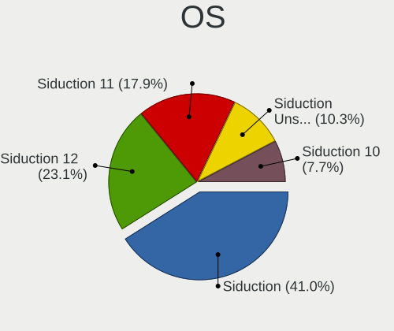

| Name               | Notebooks | Percent |
|--------------------|-----------|---------|
| Siduction          | 16        | 41.03%  |
| Siduction 12       | 9         | 23.08%  |
| Siduction 11       | 7         | 17.95%  |
| Siduction Unstable | 4         | 10.26%  |
| Siduction 10       | 3         | 7.69%   |

OS Family
---------

OS without a version

| Name      | Notebooks | Percent |
|-----------|-----------|---------|
| Siduction | 36        | 100%    |

Kernel
------

Version of the Linux kernel

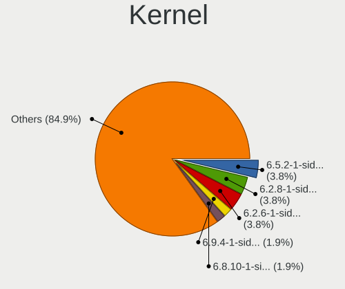

| Version                       | Notebooks | Percent |
|-------------------------------|-----------|---------|
| 6.5.2-1-siduction-amd64       | 2         | 3.77%   |
| 6.2.8-1-siduction-amd64       | 2         | 3.77%   |
| 6.2.6-1-siduction-amd64       | 2         | 3.77%   |
| 6.9.4-1-siduction-amd64       | 1         | 1.89%   |
| 6.8.10-1-siduction-amd64      | 1         | 1.89%   |
| 6.7.10-1-siduction-amd64      | 1         | 1.89%   |
| 6.6.8-1-siduction-amd64       | 1         | 1.89%   |
| 6.6.4-1-siduction-amd64       | 1         | 1.89%   |
| 6.6.2-1-siduction-amd64       | 1         | 1.89%   |
| 6.6.10-1-siduction-amd64      | 1         | 1.89%   |
| 6.5.6-1-siduction-amd64       | 1         | 1.89%   |
| 6.5.3-1-siduction-amd64       | 1         | 1.89%   |
| 6.4.12-1-siduction-amd64      | 1         | 1.89%   |
| 6.3.7-1-siduction-amd64       | 1         | 1.89%   |
| 6.3.3-1-siduction-amd64       | 1         | 1.89%   |
| 6.2.15-1-siduction-amd64      | 1         | 1.89%   |
| 6.2.13-1-siduction-amd64      | 1         | 1.89%   |
| 6.2.11-1-siduction-amd64      | 1         | 1.89%   |
| 6.2.0-rc6-siduction-amd64     | 1         | 1.89%   |
| 6.18.2-1-siduction-amd64      | 1         | 1.89%   |
| 6.17.8-1-siduction-amd64      | 1         | 1.89%   |
| 6.17.5-1-siduction-amd64      | 1         | 1.89%   |
| 6.15.9-1-siduction-amd64      | 1         | 1.89%   |
| 6.15.10-1-siduction-amd64     | 1         | 1.89%   |
| 6.12.7-1-siduction-amd64      | 1         | 1.89%   |
| 6.12.6-1-siduction-amd64      | 1         | 1.89%   |
| 6.10.12-1-siduction-amd64     | 1         | 1.89%   |
| 6.1.1-4-siduction-amd64       | 1         | 1.89%   |
| 5.9.8-towo.3-siduction-amd64  | 1         | 1.89%   |
| 5.9.13-towo.1-siduction-amd64 | 1         | 1.89%   |
| 5.8.5-towo.1-siduction-amd64  | 1         | 1.89%   |
| 5.7.11-towo.2-siduction-amd64 | 1         | 1.89%   |
| 5.4.5-towo.2-siduction-amd64  | 1         | 1.89%   |
| 5.4.18-towo.1-siduction-amd64 | 1         | 1.89%   |
| 5.3.12-towo.2-siduction-amd64 | 1         | 1.89%   |
| 5.3.1-towo.2-siduction-amd64  | 1         | 1.89%   |
| 5.16.17-1-siduction-amd64     | 1         | 1.89%   |
| 5.15.15-1-siduction-amd64     | 1         | 1.89%   |
| 5.13.8-1-siduction-amd64      | 1         | 1.89%   |
| 5.13.6-1-siduction-amd64      | 1         | 1.89%   |

Kernel Family
-------------

Linux kernel without a distro release

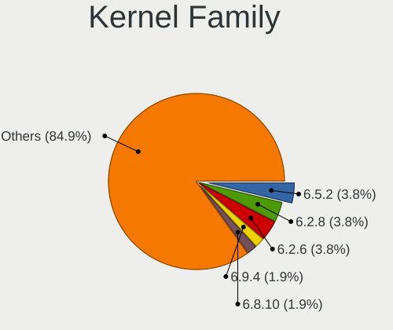

| Version | Notebooks | Percent |
|---------|-----------|---------|
| 6.5.2   | 2         | 3.77%   |
| 6.2.8   | 2         | 3.77%   |
| 6.2.6   | 2         | 3.77%   |
| 6.9.4   | 1         | 1.89%   |
| 6.8.10  | 1         | 1.89%   |
| 6.7.10  | 1         | 1.89%   |
| 6.6.8   | 1         | 1.89%   |
| 6.6.4   | 1         | 1.89%   |
| 6.6.2   | 1         | 1.89%   |
| 6.6.10  | 1         | 1.89%   |
| 6.5.6   | 1         | 1.89%   |
| 6.5.3   | 1         | 1.89%   |
| 6.4.12  | 1         | 1.89%   |
| 6.3.7   | 1         | 1.89%   |
| 6.3.3   | 1         | 1.89%   |
| 6.2.15  | 1         | 1.89%   |
| 6.2.13  | 1         | 1.89%   |
| 6.2.11  | 1         | 1.89%   |
| 6.2.0   | 1         | 1.89%   |
| 6.18.2  | 1         | 1.89%   |
| 6.17.8  | 1         | 1.89%   |
| 6.17.5  | 1         | 1.89%   |
| 6.15.9  | 1         | 1.89%   |
| 6.15.10 | 1         | 1.89%   |
| 6.12.7  | 1         | 1.89%   |
| 6.12.6  | 1         | 1.89%   |
| 6.10.12 | 1         | 1.89%   |
| 6.1.1   | 1         | 1.89%   |
| 5.9.8   | 1         | 1.89%   |
| 5.9.13  | 1         | 1.89%   |
| 5.8.5   | 1         | 1.89%   |
| 5.7.11  | 1         | 1.89%   |
| 5.4.5   | 1         | 1.89%   |
| 5.4.18  | 1         | 1.89%   |
| 5.3.12  | 1         | 1.89%   |
| 5.3.1   | 1         | 1.89%   |
| 5.16.17 | 1         | 1.89%   |
| 5.15.15 | 1         | 1.89%   |
| 5.13.8  | 1         | 1.89%   |
| 5.13.6  | 1         | 1.89%   |

Kernel Major Ver.
-----------------

Linux kernel major version

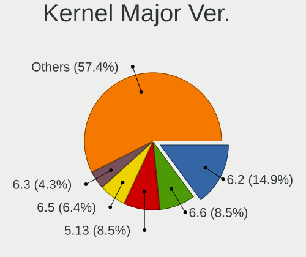

| Version | Notebooks | Percent |
|---------|-----------|---------|
| 6.2     | 7         | 14.89%  |
| 6.6     | 4         | 8.51%   |
| 5.13    | 4         | 8.51%   |
| 6.5     | 3         | 6.38%   |
| 6.3     | 2         | 4.26%   |
| 6.17    | 2         | 4.26%   |
| 6.15    | 2         | 4.26%   |
| 6.12    | 2         | 4.26%   |
| 5.4     | 2         | 4.26%   |
| 5.3     | 2         | 4.26%   |
| 5.10    | 2         | 4.26%   |
| 6.9     | 1         | 2.13%   |
| 6.8     | 1         | 2.13%   |
| 6.7     | 1         | 2.13%   |
| 6.4     | 1         | 2.13%   |
| 6.18    | 1         | 2.13%   |
| 6.10    | 1         | 2.13%   |
| 6.1     | 1         | 2.13%   |
| 5.9     | 1         | 2.13%   |
| 5.8     | 1         | 2.13%   |
| 5.7     | 1         | 2.13%   |
| 5.16    | 1         | 2.13%   |
| 5.15    | 1         | 2.13%   |
| 5.12    | 1         | 2.13%   |
| 5.11    | 1         | 2.13%   |
| 4.20    | 1         | 2.13%   |

Arch
----

OS architecture (x86_64, i586, etc.)

| Name   | Notebooks | Percent |
|--------|-----------|---------|
| x86_64 | 36        | 100%    |

DE
--

Desktop Environment

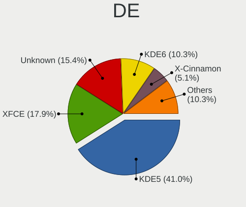

| Name            | Notebooks | Percent |
|-----------------|-----------|---------|
| KDE5            | 16        | 41.03%  |
| XFCE            | 7         | 17.95%  |
| Unknown         | 6         | 15.38%  |
| KDE6            | 4         | 10.26%  |
| X-Cinnamon      | 2         | 5.13%   |
| LXQt            | 1         | 2.56%   |
| GNOME Flashback | 1         | 2.56%   |
| Cinnamon        | 1         | 2.56%   |
| Budgie          | 1         | 2.56%   |

Display Server
--------------

X11 or Wayland

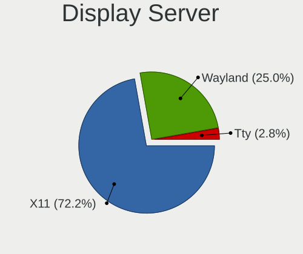

| Name    | Notebooks | Percent |
|---------|-----------|---------|
| X11     | 26        | 72.22%  |
| Wayland | 9         | 25%     |
| Tty     | 1         | 2.78%   |

Display Manager
---------------

SDDM, LightDM, etc.

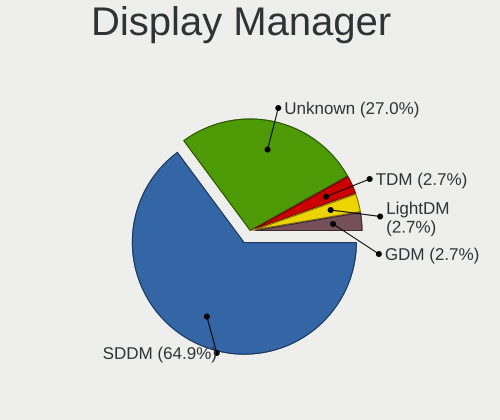

| Name    | Notebooks | Percent |
|---------|-----------|---------|
| SDDM    | 24        | 64.86%  |
| Unknown | 10        | 27.03%  |
| TDM     | 1         | 2.7%    |
| LightDM | 1         | 2.7%    |
| GDM     | 1         | 2.7%    |

OS Lang
-------

Language

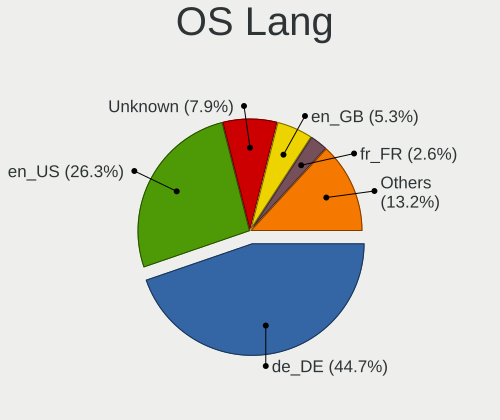

| Lang    | Notebooks | Percent |
|---------|-----------|---------|
| de_DE   | 17        | 44.74%  |
| en_US   | 10        | 26.32%  |
| Unknown | 3         | 7.89%   |
| en_GB   | 2         | 5.26%   |
| fr_FR   | 1         | 2.63%   |
| en_ZA   | 1         | 2.63%   |
| en_CA   | 1         | 2.63%   |
| de_CH   | 1         | 2.63%   |
| de_AT   | 1         | 2.63%   |
| C       | 1         | 2.63%   |

Boot Mode
---------

EFI or BIOS

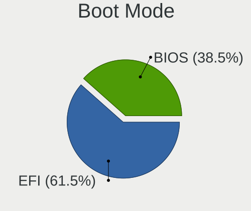

| Mode | Notebooks | Percent |
|------|-----------|---------|
| EFI  | 23        | 62.16%  |
| BIOS | 14        | 37.84%  |

Filesystem
----------

Type of filesystem

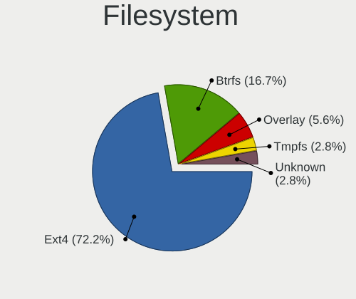

| Type    | Notebooks | Percent |
|---------|-----------|---------|
| Ext4    | 26        | 72.22%  |
| Btrfs   | 6         | 16.67%  |
| Overlay | 2         | 5.56%   |
| Tmpfs   | 1         | 2.78%   |
| Unknown | 1         | 2.78%   |

Part. scheme
------------

Scheme of partitioning

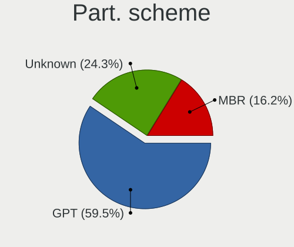

| Type    | Notebooks | Percent |
|---------|-----------|---------|
| GPT     | 22        | 59.46%  |
| Unknown | 9         | 24.32%  |
| MBR     | 6         | 16.22%  |

Dual Boot with Linux/BSD
------------------------

Hosting more than one Linux/BSD

| Dual boot | Notebooks | Percent |
|-----------|-----------|---------|
| No        | 32        | 88.89%  |
| Yes       | 4         | 11.11%  |

Dual Boot (Win)
---------------

Hosting Linux and Windows

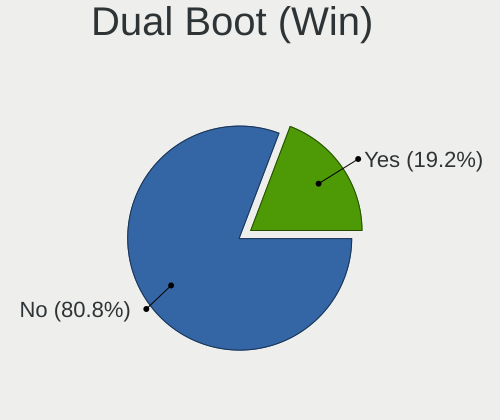

| Dual boot | Notebooks | Percent |
|-----------|-----------|---------|
| No        | 28        | 77.78%  |
| Yes       | 8         | 22.22%  |

Board
-----

Vendor
------

Motherboard manufacturer

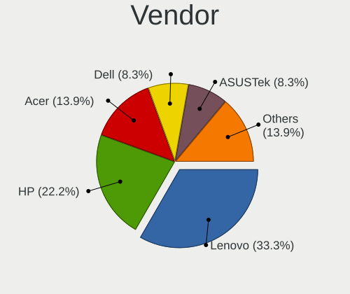

| Name             | Notebooks | Percent |
|------------------|-----------|---------|
| Lenovo           | 12        | 33.33%  |
| Hewlett-Packard  | 8         | 22.22%  |
| Acer             | 5         | 13.89%  |
| Dell             | 3         | 8.33%   |
| ASUSTek Computer | 3         | 8.33%   |
| TUXEDO           | 2         | 5.56%   |
| Framework        | 1         | 2.78%   |
| Compal           | 1         | 2.78%   |
| AWOW             | 1         | 2.78%   |

Model
-----

Motherboard model

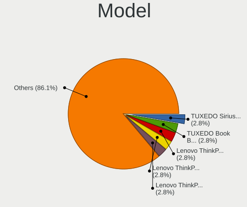

| Name                                          | Notebooks | Percent |
|-----------------------------------------------|-----------|---------|
| TUXEDO Sirius 16 Gen1                         | 1         | 2.78%   |
| TUXEDO Book BA1510                            | 1         | 2.78%   |
| Lenovo ThinkPad X1 Carbon 5th 20HRCTO1WW      | 1         | 2.78%   |
| Lenovo ThinkPad T580 20LAS1GG00               | 1         | 2.78%   |
| Lenovo ThinkPad T490 20N3SFKX00               | 1         | 2.78%   |
| Lenovo ThinkPad T410 253725G                  | 1         | 2.78%   |
| Lenovo ThinkPad T14s Gen 1 20T1S15N00         | 1         | 2.78%   |
| Lenovo ThinkPad L590 20Q7001HGE               | 1         | 2.78%   |
| Lenovo ThinkPad L540 20AUS01H00               | 1         | 2.78%   |
| Lenovo ThinkPad Edge E540 20C6003AGE          | 1         | 2.78%   |
| Lenovo ThinkPad E590 20NB001AIX               | 1         | 2.78%   |
| Lenovo ThinkPad E14 Gen 4 21ECS0WD00          | 1         | 2.78%   |
| Lenovo IdeaPad 3 15IIL05 81WE                 | 1         | 2.78%   |
| Lenovo G50-30 80G0                            | 1         | 2.78%   |
| HP ZBook 15 G6                                | 1         | 2.78%   |
| HP ProBook 640 G1                             | 1         | 2.78%   |
| HP ProBook 4540s                              | 1         | 2.78%   |
| HP ProBook 4520s                              | 1         | 2.78%   |
| HP Laptop 17-ca1xxx                           | 1         | 2.78%   |
| HP Laptop 15-db0xxx                           | 1         | 2.78%   |
| HP EliteBook 865 16 inch G9 Notebook PC       | 1         | 2.78%   |
| HP 250 G7 Notebook PC                         | 1         | 2.78%   |
| Framework Laptop 13 (AMD Ryzen AI 300 Series) | 1         | 2.78%   |
| Dell XPS 15 9530                              | 1         | 2.78%   |
| Dell Vostro 15 3510                           | 1         | 2.78%   |
| Dell Latitude 5491                            | 1         | 2.78%   |
| Compal NBLBX                                  | 1         | 2.78%   |
| AWOW AK41                                     | 1         | 2.78%   |
| ASUS ZenBook UX325JA_UX325JA                  | 1         | 2.78%   |
| ASUS VivoBook_ASUSLaptop X1504ZA_X1504ZA      | 1         | 2.78%   |
| ASUS BU201LA                                  | 1         | 2.78%   |
| Acer Swift SF314-51                           | 1         | 2.78%   |
| Acer Aspire E5-771G                           | 1         | 2.78%   |
| Acer Aspire E5-551G                           | 1         | 2.78%   |
| Acer Aspire A315-42                           | 1         | 2.78%   |
| Acer Aspire 5750                              | 1         | 2.78%   |

Model Family
------------

Motherboard model prefix

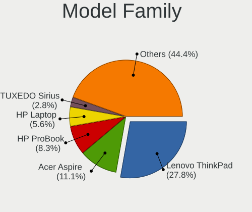

| Name             | Notebooks | Percent |
|------------------|-----------|---------|
| Lenovo ThinkPad  | 10        | 27.78%  |
| Acer Aspire      | 4         | 11.11%  |
| HP ProBook       | 3         | 8.33%   |
| HP Laptop        | 2         | 5.56%   |
| TUXEDO Sirius    | 1         | 2.78%   |
| TUXEDO Book      | 1         | 2.78%   |
| Lenovo IdeaPad   | 1         | 2.78%   |
| Lenovo G50-30    | 1         | 2.78%   |
| HP ZBook         | 1         | 2.78%   |
| HP EliteBook     | 1         | 2.78%   |
| HP 250           | 1         | 2.78%   |
| Framework Laptop | 1         | 2.78%   |
| Dell XPS         | 1         | 2.78%   |
| Dell Vostro      | 1         | 2.78%   |
| Dell Latitude    | 1         | 2.78%   |
| Compal NBLBX     | 1         | 2.78%   |
| AWOW AK41        | 1         | 2.78%   |
| ASUS ZenBook     | 1         | 2.78%   |
| ASUS VivoBook    | 1         | 2.78%   |
| ASUS BU201LA     | 1         | 2.78%   |
| Acer Swift       | 1         | 2.78%   |

MFG Year
--------

Motherboard manufacture year

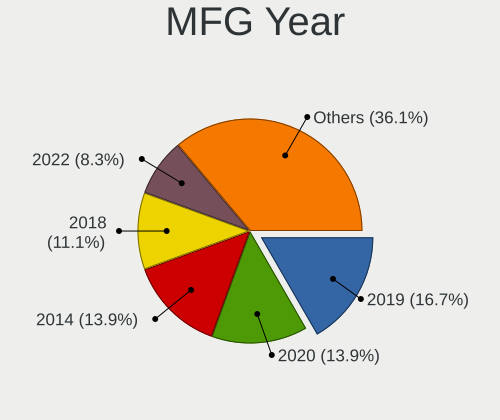

| Year | Notebooks | Percent |
|------|-----------|---------|
| 2019 | 6         | 16.67%  |
| 2020 | 5         | 13.89%  |
| 2014 | 5         | 13.89%  |
| 2018 | 4         | 11.11%  |
| 2022 | 3         | 8.33%   |
| 2013 | 3         | 8.33%   |
| 2010 | 2         | 5.56%   |
| 2024 | 1         | 2.78%   |
| 2023 | 1         | 2.78%   |
| 2021 | 1         | 2.78%   |
| 2017 | 1         | 2.78%   |
| 2016 | 1         | 2.78%   |
| 2012 | 1         | 2.78%   |
| 2011 | 1         | 2.78%   |
| 2009 | 1         | 2.78%   |

Form Factor
-----------

Physical design of the computer

| Name     | Notebooks | Percent |
|----------|-----------|---------|
| Notebook | 36        | 100%    |

Secure Boot
-----------

Enabled or disabled

| State    | Notebooks | Percent |
|----------|-----------|---------|
| Disabled | 36        | 100%    |

Coreboot
--------

Have coreboot on board

| Used | Notebooks | Percent |
|------|-----------|---------|
| No   | 36        | 100%    |

RAM Size
--------

Total RAM memory

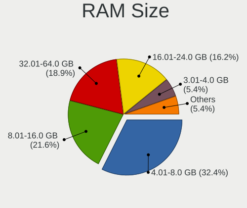

| Size in GB  | Notebooks | Percent |
|-------------|-----------|---------|
| 4.01-8.0    | 12        | 32.43%  |
| 8.01-16.0   | 8         | 21.62%  |
| 32.01-64.0  | 7         | 18.92%  |
| 16.01-24.0  | 6         | 16.22%  |
| 3.01-4.0    | 2         | 5.41%   |
| 64.01-256.0 | 1         | 2.7%    |
| Unknown     | 1         | 2.7%    |

RAM Used
--------

Used RAM memory

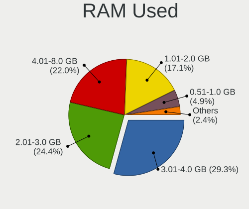

| Used GB  | Notebooks | Percent |
|----------|-----------|---------|
| 3.01-4.0 | 12        | 29.27%  |
| 2.01-3.0 | 10        | 24.39%  |
| 4.01-8.0 | 9         | 21.95%  |
| 1.01-2.0 | 7         | 17.07%  |
| 0.51-1.0 | 2         | 4.88%   |
| Unknown  | 1         | 2.44%   |

Total Drives
------------

Number of drives on board

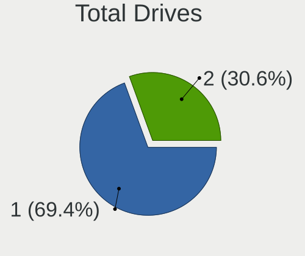

| Drives | Notebooks | Percent |
|--------|-----------|---------|
| 1      | 25        | 69.44%  |
| 2      | 11        | 30.56%  |

Has CD-ROM
----------

Has CD-ROM on board

| Presented | Notebooks | Percent |
|-----------|-----------|---------|
| No        | 27        | 75%     |
| Yes       | 9         | 25%     |

Has Ethernet
------------

Has Ethernet on board

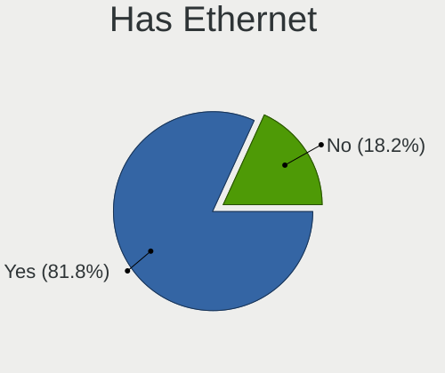

| Presented | Notebooks | Percent |
|-----------|-----------|---------|
| Yes       | 29        | 80.56%  |
| No        | 7         | 19.44%  |

Has WiFi
--------

Has WiFi module

| Presented | Notebooks | Percent |
|-----------|-----------|---------|
| Yes       | 36        | 100%    |

Has Bluetooth
-------------

Has Bluetooth module

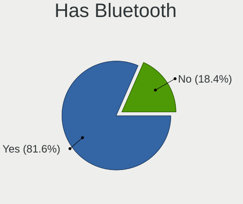

| Presented | Notebooks | Percent |
|-----------|-----------|---------|
| Yes       | 31        | 81.58%  |
| No        | 7         | 18.42%  |

Location
--------

Country
-------

Geographic location (country)

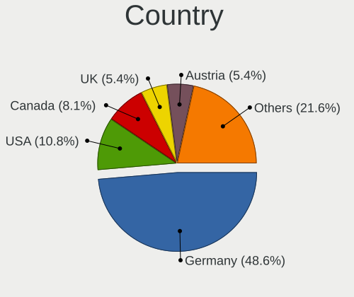

| Country      | Notebooks | Percent |
|--------------|-----------|---------|
| Germany      | 18        | 48.65%  |
| USA          | 4         | 10.81%  |
| Canada       | 3         | 8.11%   |
| UK           | 2         | 5.41%   |
| Austria      | 2         | 5.41%   |
| Switzerland  | 1         | 2.7%    |
| Sweden       | 1         | 2.7%    |
| South Africa | 1         | 2.7%    |
| Poland       | 1         | 2.7%    |
| Nigeria      | 1         | 2.7%    |
| Italy        | 1         | 2.7%    |
| Israel       | 1         | 2.7%    |
| France       | 1         | 2.7%    |

City
----

Geographic location (city)

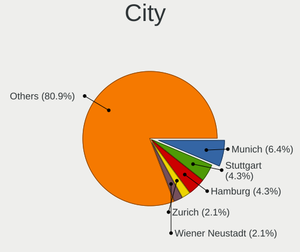

| City                 | Notebooks | Percent |
|----------------------|-----------|---------|
| Munich               | 3         | 6.38%   |
| Stuttgart            | 2         | 4.26%   |
| Hamburg              | 2         | 4.26%   |
| Zurich               | 1         | 2.13%   |
| Wiener Neustadt      | 1         | 2.13%   |
| Vienna               | 1         | 2.13%   |
| Tuttlingen           | 1         | 2.13%   |
| Turin                | 1         | 2.13%   |
| Trier                | 1         | 2.13%   |
| Toronto              | 1         | 2.13%   |
| Suisun               | 1         | 2.13%   |
| Stockholm            | 1         | 2.13%   |
| Sidney               | 1         | 2.13%   |
| Schrobenhausen       | 1         | 2.13%   |
| San Francisco        | 1         | 2.13%   |
| Rostock              | 1         | 2.13%   |
| Regensburg           | 1         | 2.13%   |
| Reading              | 1         | 2.13%   |
| Paris                | 1         | 2.13%   |
| Oberboihingen        | 1         | 2.13%   |
| Mittenwald           | 1         | 2.13%   |
| Milan                | 1         | 2.13%   |
| Marion               | 1         | 2.13%   |
| Mannheim             | 1         | 2.13%   |
| Malmo                | 1         | 2.13%   |
| Leimen               | 1         | 2.13%   |
| Langewiesen          | 1         | 2.13%   |
| Landau               | 1         | 2.13%   |
| Lagos                | 1         | 2.13%   |
| Johannesburg         | 1         | 2.13%   |
| Jerusalem            | 1         | 2.13%   |
| Iserlohn             | 1         | 2.13%   |
| Guglingen            | 1         | 2.13%   |
| Georgsmarienhuette   | 1         | 2.13%   |
| Friedrichsthal       | 1         | 2.13%   |
| Freiburg im Breisgau | 1         | 2.13%   |
| Frankfurt am Main    | 1         | 2.13%   |
| Edmonton             | 1         | 2.13%   |
| Düsseldorf          | 1         | 2.13%   |
| Craigsville          | 1         | 2.13%   |

Drives
------

Drive Vendor
------------

Hard drive vendors

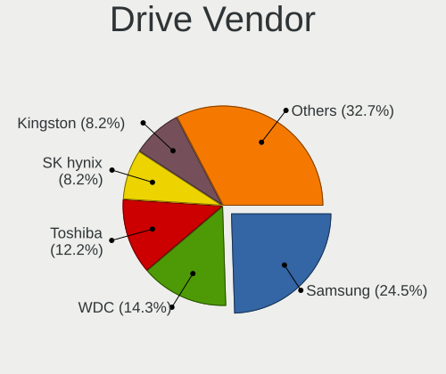

| Vendor                      | Notebooks | Drives | Percent |
|-----------------------------|-----------|--------|---------|
| Samsung Electronics         | 12        | 13     | 24.49%  |
| WDC                         | 7         | 8      | 14.29%  |
| Toshiba                     | 6         | 15     | 12.24%  |
| SK hynix                    | 4         | 4      | 8.16%   |
| Kingston                    | 4         | 4      | 8.16%   |
| Sandisk                     | 3         | 8      | 6.12%   |
| Intel                       | 3         | 5      | 6.12%   |
| Seagate                     | 2         | 2      | 4.08%   |
| Crucial                     | 2         | 3      | 4.08%   |
| SSSTC                       | 1         | 1      | 2.04%   |
| Silicon Motion              | 1         | 1      | 2.04%   |
| MAXIO Technology (Hangzhou) | 1         | 1      | 2.04%   |
| Lexar                       | 1         | 1      | 2.04%   |
| Hitachi                     | 1         | 1      | 2.04%   |
| Corsair                     | 1         | 1      | 2.04%   |

Drive Model
-----------

Hard drive models

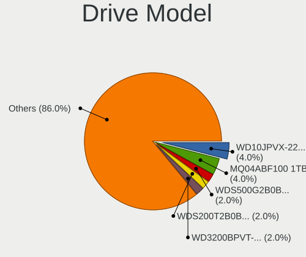

| Model                                                 | Notebooks | Percent |
|-------------------------------------------------------|-----------|---------|
| WDC WD10JPVX-22JC3T0 1TB                              | 2         | 4%      |
| Toshiba MQ04ABF100 1TB                                | 2         | 4%      |
| WDC WDS500G2B0B-00YS70 500GB SSD                      | 1         | 2%      |
| WDC WDS200T2B0B-00YS70 2TB SSD                        | 1         | 2%      |
| WDC WD3200BPVT-22JJ5T0 320GB                          | 1         | 2%      |
| WDC PC SN810 NVMe 1024GB                              | 1         | 2%      |
| WDC PC SN530 SDBPMPZ-512G-1101 512GB                  | 1         | 2%      |
| Toshiba THNSNK256GVN8 256GB SSD                       | 1         | 2%      |
| Toshiba THNSF5512GPUK 512GB                           | 1         | 2%      |
| Toshiba MQ01ACF032 320GB                              | 1         | 2%      |
| Toshiba KBG30ZMT256G 256GB                            | 1         | 2%      |
| SSSTC CL4-3D256-Q11 NVMe 256GB                        | 1         | 2%      |
| SK hynix SKHynix_HFS256GD9TNG-L5B0B 256GB             | 1         | 2%      |
| SK hynix NVMe SSD Drive 512GB                         | 1         | 2%      |
| SK hynix BC711 NVMe 1TB                               | 1         | 2%      |
| SK hynix BC501 HFM256GDJTNG-8310A 256GB               | 1         | 2%      |
| Silicon Motion SM2263EN/SM2263XT SSD Controller 512GB | 1         | 2%      |
| Seagate ST9500420AS 500GB                             | 1         | 2%      |
| Seagate ST1000LM014-1EJ164 1TB                        | 1         | 2%      |
| Sandisk WD Blue SN570 1TB                             | 1         | 2%      |
| SanDisk SSD U110 16GB                                 | 1         | 2%      |
| SanDisk NVMe SSD Drive 1TB                            | 1         | 2%      |
| Samsung SSD 990 PRO 2TB                               | 1         | 2%      |
| Samsung SSD 990 EVO 1TB                               | 1         | 2%      |
| Samsung SSD 980 PRO 1TB                               | 1         | 2%      |
| Samsung SSD 870 QVO 1TB                               | 1         | 2%      |
| Samsung SSD 860 EVO M.2 1TB                           | 1         | 2%      |
| Samsung SSD 850 EVO 500GB                             | 1         | 2%      |
| Samsung SSD 850 EVO 250GB                             | 1         | 2%      |
| Samsung SSD 840 Series 250GB                          | 1         | 2%      |
| Samsung MZVLQ128HBHQ-00000 128GB                      | 1         | 2%      |
| Samsung MZVLB512HAJQ-000L7 512GB                      | 1         | 2%      |
| Samsung MZVL4512HBLU-00BTW 512GB                      | 1         | 2%      |
| Samsung HM321HI 320GB                                 | 1         | 2%      |
| MAXIO (Hangzhou) NVMe SSD Controller MAP1202 2TB      | 1         | 2%      |
| Lexar SSD NM790 2TB                                   | 1         | 2%      |
| Kingston SA400S37240G 240GB SSD                       | 1         | 2%      |
| Kingston SA400S37120G 120GB SSD                       | 1         | 2%      |
| Kingston SA2000M8500G 500GB                           | 1         | 2%      |
| Kingston OM8PCP3512F-AA 512GB                         | 1         | 2%      |

HDD Vendor
----------

Hard disk drive vendors

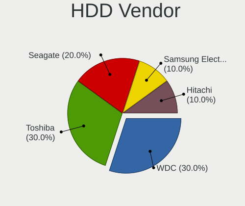

| Vendor              | Notebooks | Drives | Percent |
|---------------------|-----------|--------|---------|
| WDC                 | 3         | 4      | 30%     |
| Toshiba             | 3         | 11     | 30%     |
| Seagate             | 2         | 2      | 20%     |
| Samsung Electronics | 1         | 1      | 10%     |
| Hitachi             | 1         | 1      | 10%     |

SSD Vendor
----------

Solid state drive vendors

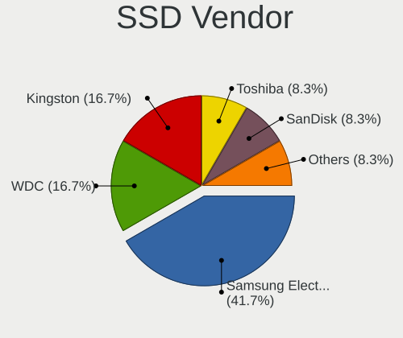

| Vendor              | Notebooks | Drives | Percent |
|---------------------|-----------|--------|---------|
| Samsung Electronics | 5         | 6      | 41.67%  |
| WDC                 | 2         | 2      | 16.67%  |
| Kingston            | 2         | 2      | 16.67%  |
| Toshiba             | 1         | 1      | 8.33%   |
| SanDisk             | 1         | 1      | 8.33%   |
| Crucial             | 1         | 2      | 8.33%   |

Drive Kind
----------

HDD or SSD

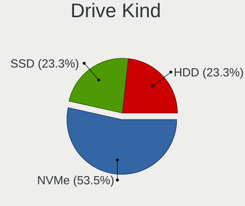

| Kind | Notebooks | Drives | Percent |
|------|-----------|--------|---------|
| NVMe | 23        | 35     | 53.49%  |
| SSD  | 10        | 14     | 23.26%  |
| HDD  | 10        | 19     | 23.26%  |

Drive Connector
---------------

SATA, SAS, NVMe, etc.

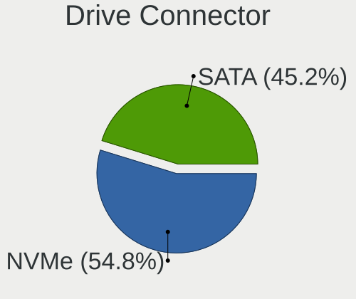

| Type | Notebooks | Drives | Percent |
|------|-----------|--------|---------|
| NVMe | 23        | 35     | 54.76%  |
| SATA | 19        | 33     | 45.24%  |

Drive Size
----------

Size of hard drive

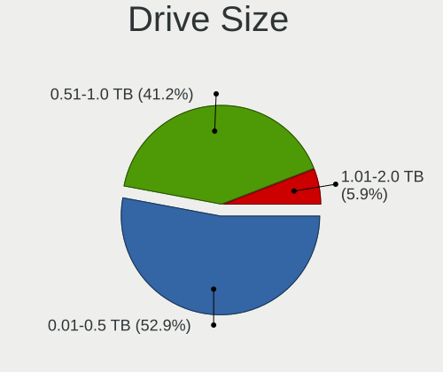

| Size in TB | Notebooks | Drives | Percent |
|------------|-----------|--------|---------|
| 0.01-0.5   | 12        | 15     | 60%     |
| 0.51-1.0   | 7         | 17     | 35%     |
| 1.01-2.0   | 1         | 1      | 5%      |

Space Total
-----------

Amount of disk space available on the file system

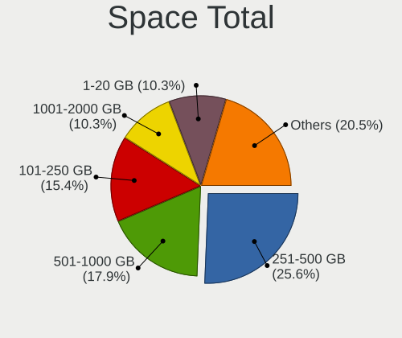

| Size in GB     | Notebooks | Percent |
|----------------|-----------|---------|
| 251-500        | 10        | 25.64%  |
| 501-1000       | 7         | 17.95%  |
| 101-250        | 6         | 15.38%  |
| 1001-2000      | 4         | 10.26%  |
| 1-20           | 4         | 10.26%  |
| Unknown        | 4         | 10.26%  |
| 21-50          | 2         | 5.13%   |
| More than 3000 | 1         | 2.56%   |
| 2001-3000      | 1         | 2.56%   |

Space Used
----------

Amount of used disk space

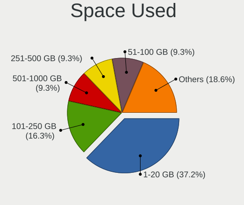

| Used GB   | Notebooks | Percent |
|-----------|-----------|---------|
| 1-20      | 16        | 37.21%  |
| 101-250   | 7         | 16.28%  |
| 251-500   | 4         | 9.3%    |
| 501-1000  | 4         | 9.3%    |
| 51-100    | 4         | 9.3%    |
| Unknown   | 4         | 9.3%    |
| 21-50     | 2         | 4.65%   |
| 1001-2000 | 2         | 4.65%   |

Malfunc. Drives
---------------

Drive models with a malfunction

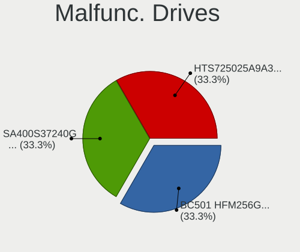

| Model                                   | Notebooks | Drives | Percent |
|-----------------------------------------|-----------|--------|---------|
| SK hynix BC501 HFM256GDJTNG-8310A 256GB | 1         | 1      | 33.33%  |
| Kingston SA400S37240G 240GB SSD         | 1         | 1      | 33.33%  |
| Hitachi HTS725025A9A364 250GB           | 1         | 1      | 33.33%  |

Malfunc. Drive Vendor
---------------------

Vendors of faulty drives

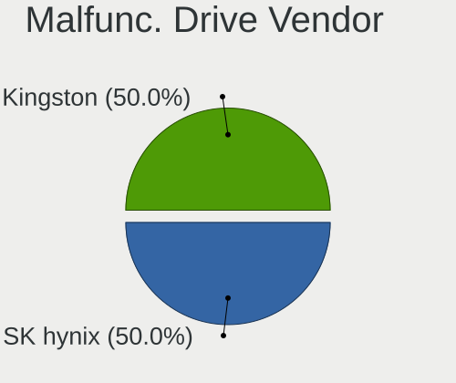

| Vendor   | Notebooks | Drives | Percent |
|----------|-----------|--------|---------|
| SK hynix | 1         | 1      | 33.33%  |
| Kingston | 1         | 1      | 33.33%  |
| Hitachi  | 1         | 1      | 33.33%  |

Malfunc. HDD Vendor
-------------------

Vendors of faulty HDD drives

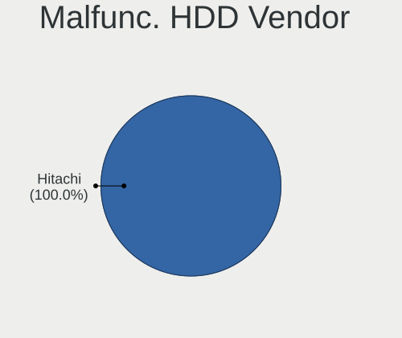

| Vendor  | Notebooks | Drives | Percent |
|---------|-----------|--------|---------|
| Hitachi | 1         | 1      | 100%    |

Malfunc. Drive Kind
-------------------

Kinds of faulty drives

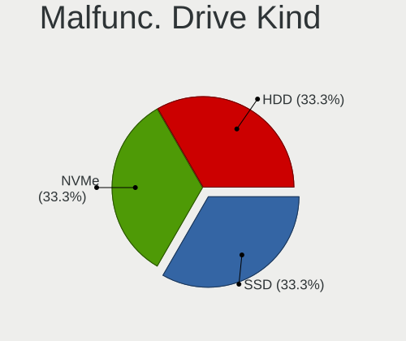

| Kind | Notebooks | Drives | Percent |
|------|-----------|--------|---------|
| NVMe | 1         | 1      | 33.33%  |
| SSD  | 1         | 1      | 33.33%  |
| HDD  | 1         | 1      | 33.33%  |

Failed Drives
-------------

Failed drive models

Zero info for selected period =(

Failed Drive Vendor
-------------------

Failed drive vendors

Zero info for selected period =(

Drive Status
------------

Number of failed and malfunc. drives

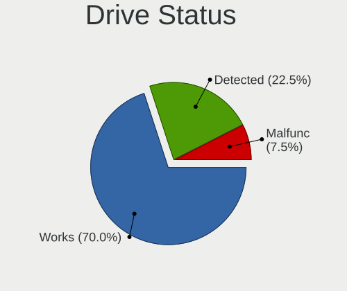

| Status   | Notebooks | Drives | Percent |
|----------|-----------|--------|---------|
| Works    | 28        | 47     | 70%     |
| Detected | 9         | 18     | 22.5%   |
| Malfunc  | 3         | 3      | 7.5%    |

Storage controller
------------------

Storage Vendor
--------------

Storage controller vendors

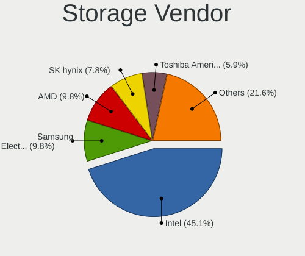

| Vendor                         | Notebooks | Percent |
|--------------------------------|-----------|---------|
| Intel                          | 23        | 45.1%   |
| Samsung Electronics            | 5         | 9.8%    |
| AMD                            | 5         | 9.8%    |
| SK hynix                       | 4         | 7.84%   |
| Toshiba America Info Systems   | 3         | 5.88%   |
| SanDisk                        | 3         | 5.88%   |
| Kingston Technology Company    | 2         | 3.92%   |
| Solid State Storage Technology | 1         | 1.96%   |
| Silicon Motion                 | 1         | 1.96%   |
| Shenzhen Longsys Electronics   | 1         | 1.96%   |
| Phison Electronics             | 1         | 1.96%   |
| Micron/Crucial Technology      | 1         | 1.96%   |
| MAXIO Technology (Hangzhou)    | 1         | 1.96%   |

Storage Model
-------------

Storage controller models

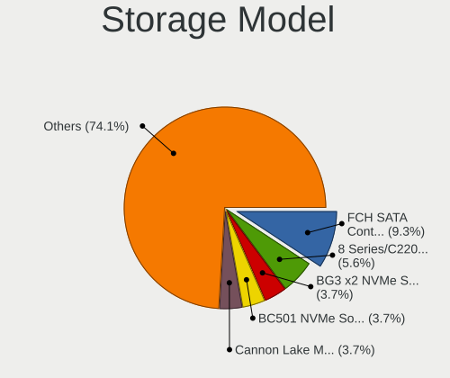

| Model                                                                          | Notebooks | Percent |
|--------------------------------------------------------------------------------|-----------|---------|
| AMD FCH SATA Controller [AHCI mode]                                            | 5         | 9.26%   |
| Intel 8 Series/C220 Series Chipset Family 6-port SATA Controller 1 [AHCI mode] | 3         | 5.56%   |
| Toshiba America Info Systems BG3 x2 NVMe SSD Controller (DRAM-less)            | 2         | 3.7%    |
| SK hynix BC501 NVMe Solid State Drive                                          | 2         | 3.7%    |
| Intel Cannon Lake Mobile PCH SATA AHCI Controller                              | 2         | 3.7%    |
| Intel 82801 Mobile SATA Controller [RAID mode]                                 | 2         | 3.7%    |
| Toshiba America Info Systems XG4 NVMe SSD Controller                           | 1         | 1.85%   |
| Solid State Storage CL4-8D512 NVMe SSD M.2 (DRAM-less)                         | 1         | 1.85%   |
| SK hynix PC601 NVMe Solid State Drive                                          | 1         | 1.85%   |
| SK hynix Gold P31/BC711/PC711 NVMe Solid State Drive                           | 1         | 1.85%   |
| Silicon Motion SM2263EN/SM2263XT (DRAM-less) NVMe SSD Controllers              | 1         | 1.85%   |
| Shenzhen Longsys Lexar NM790 / Patriot Viper VP4300 Lite NVMe SSD (DRAM-less)  | 1         | 1.85%   |
| SanDisk WD PC SN810 / Black SN850 NVMe SSD                                     | 1         | 1.85%   |
| SanDisk Ultra 3D / WD Blue SN570 NVMe SSD (DRAM-less)                          | 1         | 1.85%   |
| SanDisk PC SN530 NVMe SSD (DRAM-less)                                          | 1         | 1.85%   |
| Samsung NVMe SSD Controller SM981/PM981/PM983                                  | 1         | 1.85%   |
| Samsung NVMe SSD Controller S4LV008[Pascal]                                    | 1         | 1.85%   |
| Samsung NVMe SSD Controller PM9C1a (DRAM-less)                                 | 1         | 1.85%   |
| Samsung NVMe SSD Controller PM9B1 (DRAM-less)                                  | 1         | 1.85%   |
| Samsung NVMe SSD Controller PM9A1/PM9A3/980PRO                                 | 1         | 1.85%   |
| Phison PS5021-E21 PCIe4 NVMe Controller (DRAM-less)                            | 1         | 1.85%   |
| Micron/Crucial P5 Plus NVMe PCIe SSD                                           | 1         | 1.85%   |
| MAXIO (Hangzhou) NVMe SSD Controller MAP1202 (DRAM-less)                       | 1         | 1.85%   |
| Kingston Company OM8PCP Design-In PCIe 3 NVMe SSD (DRAM-less)                  | 1         | 1.85%   |
| Kingston Company A2000 NVMe SSD [SM2263EN]                                     | 1         | 1.85%   |
| Intel Wildcat Point-LP SATA Controller [AHCI Mode]                             | 1         | 1.85%   |
| Intel Volume Management Device NVMe RAID Controller                            | 1         | 1.85%   |
| Intel Tiger Lake-LP SATA Controller                                            | 1         | 1.85%   |
| Intel Sunrise Point-LP SATA Controller [AHCI mode]                             | 1         | 1.85%   |
| Intel SSD DC P4101/Pro 7600p/760p/E 6100p Series                               | 1         | 1.85%   |
| Intel SSD 665p Series [Neptune Harbor Refresh]                                 | 1         | 1.85%   |
| Intel Optane NVME SSD H10 with Solid State Storage [Teton Glacier]             | 1         | 1.85%   |
| Intel Ice Lake-LP SATA Controller [AHCI mode]                                  | 1         | 1.85%   |
| Intel Celeron/Pentium Silver Processor SATA Controller                         | 1         | 1.85%   |
| Intel Cannon Point-LP SATA Controller [AHCI Mode]                              | 1         | 1.85%   |
| Intel Atom Processor E3800 Series SATA AHCI Controller                         | 1         | 1.85%   |
| Intel 8 Series SATA Controller 1 [AHCI mode]                                   | 1         | 1.85%   |
| Intel 7 Series Chipset Family 4-port SATA Controller [IDE mode]                | 1         | 1.85%   |
| Intel 7 Series Chipset Family 2-port SATA Controller [IDE mode]                | 1         | 1.85%   |
| Intel 6 Series/C200 Series Chipset Family 6 port Mobile SATA AHCI Controller   | 1         | 1.85%   |

Storage Kind
------------

Kind of storage controller (IDE, SATA, NVMe, SAS, ...)

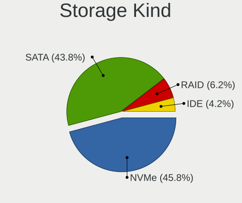

| Kind | Notebooks | Percent |
|------|-----------|---------|
| NVMe | 22        | 45.83%  |
| SATA | 21        | 43.75%  |
| RAID | 3         | 6.25%   |
| IDE  | 2         | 4.17%   |

Processor
---------

CPU Vendor
----------

Processor vendors

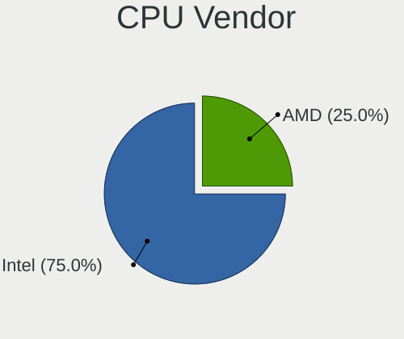

| Vendor | Notebooks | Percent |
|--------|-----------|---------|
| Intel  | 27        | 75%     |
| AMD    | 9         | 25%     |

CPU Model
---------

Processor models

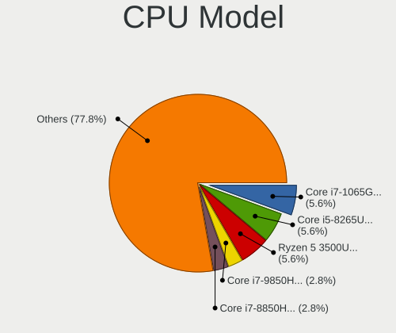

| Model                                         | Notebooks | Percent |
|-----------------------------------------------|-----------|---------|
| Intel Core i7-1065G7 CPU @ 1.30GHz            | 2         | 5.56%   |
| Intel Core i5-8265U CPU @ 1.60GHz             | 2         | 5.56%   |
| AMD Ryzen 5 3500U with Radeon Vega Mobile Gfx | 2         | 5.56%   |
| Intel Core i7-9850H CPU @ 2.60GHz             | 1         | 2.78%   |
| Intel Core i7-8850H CPU @ 2.60GHz             | 1         | 2.78%   |
| Intel Core i7-8565U CPU @ 1.80GHz             | 1         | 2.78%   |
| Intel Core i7-7600U CPU @ 2.80GHz             | 1         | 2.78%   |
| Intel Core i7-4702MQ CPU @ 2.20GHz            | 1         | 2.78%   |
| Intel Core i7-10610U CPU @ 1.80GHz            | 1         | 2.78%   |
| Intel Core i5-8365U CPU @ 1.60GHz             | 1         | 2.78%   |
| Intel Core i5-8350U CPU @ 1.70GHz             | 1         | 2.78%   |
| Intel Core i5-6200U CPU @ 2.30GHz             | 1         | 2.78%   |
| Intel Core i5-5200U CPU @ 2.20GHz             | 1         | 2.78%   |
| Intel Core i5-4210U CPU @ 1.70GHz             | 1         | 2.78%   |
| Intel Core i5-4200M CPU @ 2.50GHz             | 1         | 2.78%   |
| Intel Core i5 CPU M 560 @ 2.67GHz             | 1         | 2.78%   |
| Intel Core i5 CPU M 540 @ 2.53GHz             | 1         | 2.78%   |
| Intel Core i5 CPU M 430 @ 2.27GHz             | 1         | 2.78%   |
| Intel Core i3-4000M CPU @ 2.40GHz             | 1         | 2.78%   |
| Intel Core i3-3110M CPU @ 2.40GHz             | 1         | 2.78%   |
| Intel Core i3-2310M CPU @ 2.10GHz             | 1         | 2.78%   |
| Intel Celeron J4125 CPU @ 2.00GHz             | 1         | 2.78%   |
| Intel Celeron CPU N2840 @ 2.16GHz             | 1         | 2.78%   |
| Intel 13th Gen Core i7-13700H                 | 1         | 2.78%   |
| Intel 12th Gen Core i3-1215U                  | 1         | 2.78%   |
| Intel 11th Gen Core i5-1135G7 @ 2.40GHz       | 1         | 2.78%   |
| AMD Ryzen AI 7 350 w/ Radeon 860M             | 1         | 2.78%   |
| AMD Ryzen 9 PRO 6950HS with Radeon Graphics   | 1         | 2.78%   |
| AMD Ryzen 7 7840HS w/ Radeon 780M Graphics    | 1         | 2.78%   |
| AMD Ryzen 7 3700U with Radeon Vega Mobile Gfx | 1         | 2.78%   |
| AMD Ryzen 5 5625U with Radeon Graphics        | 1         | 2.78%   |
| AMD Ryzen 5 2500U with Radeon Vega Mobile Gfx | 1         | 2.78%   |
| AMD FX-7500 Radeon R7, 10 Compute Cores 4C+6G | 1         | 2.78%   |

CPU Model Family
----------------

Processor model prefix

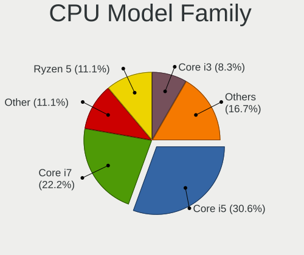

| Model         | Notebooks | Percent |
|---------------|-----------|---------|
| Intel Core i5 | 11        | 30.56%  |
| Intel Core i7 | 8         | 22.22%  |
| Other         | 4         | 11.11%  |
| AMD Ryzen 5   | 4         | 11.11%  |
| Intel Core i3 | 3         | 8.33%   |
| Intel Celeron | 2         | 5.56%   |
| AMD Ryzen 7   | 2         | 5.56%   |
| AMD Ryzen 9   | 1         | 2.78%   |
| AMD FX        | 1         | 2.78%   |

CPU Cores
---------

Number of processor cores

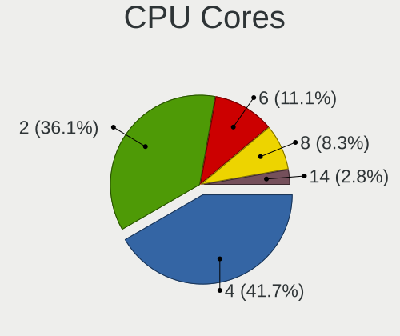

| Number | Notebooks | Percent |
|--------|-----------|---------|
| 4      | 15        | 41.67%  |
| 2      | 13        | 36.11%  |
| 6      | 4         | 11.11%  |
| 8      | 3         | 8.33%   |
| 14     | 1         | 2.78%   |

CPU Sockets
-----------

Number of sockets

| Number | Notebooks | Percent |
|--------|-----------|---------|
| 1      | 36        | 100%    |

CPU Threads
-----------

Threads per core (Hyper-Threading)

| Number | Notebooks | Percent |
|--------|-----------|---------|
| 2      | 34        | 94.44%  |
| 1      | 2         | 5.56%   |

CPU Op-Modes
------------

CPU Operation Modes (32-bit, 64-bit)

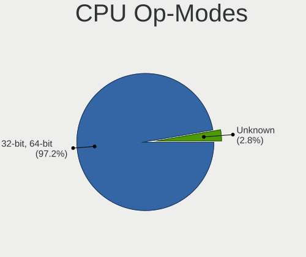

| Op mode        | Notebooks | Percent |
|----------------|-----------|---------|
| 32-bit, 64-bit | 35        | 97.22%  |
| Unknown        | 1         | 2.78%   |

CPU Microcode
-------------

Microcode number

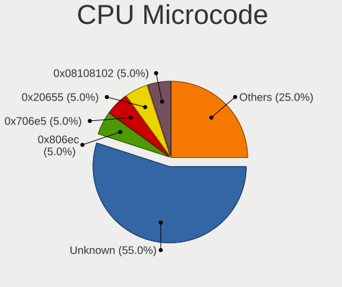

| Number     | Notebooks | Percent |
|------------|-----------|---------|
| Unknown    | 22        | 55%     |
| 0x806ec    | 2         | 5%      |
| 0x706e5    | 2         | 5%      |
| 0x20655    | 2         | 5%      |
| 0x08108102 | 2         | 5%      |
| 0x806eb    | 1         | 2.5%    |
| 0x806e9    | 1         | 2.5%    |
| 0x306d4    | 1         | 2.5%    |
| 0x306c3    | 1         | 2.5%    |
| 0x206a7    | 1         | 2.5%    |
| 0x20652    | 1         | 2.5%    |
| 0x0a404102 | 1         | 2.5%    |
| 0x08108109 | 1         | 2.5%    |
| 0x0810100b | 1         | 2.5%    |
| 0x06003106 | 1         | 2.5%    |

CPU Microarch
-------------

Microarchitecture

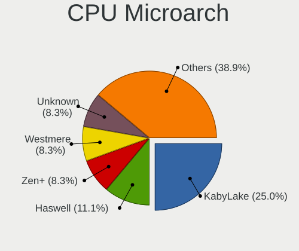

| Name             | Notebooks | Percent |
|------------------|-----------|---------|
| KabyLake         | 9         | 25%     |
| Haswell          | 4         | 11.11%  |
| Zen+             | 3         | 8.33%   |
| Westmere         | 3         | 8.33%   |
| Unknown          | 3         | 8.33%   |
| IceLake          | 2         | 5.56%   |
| Alderlake Hybrid | 2         | 5.56%   |
| Zen 3            | 1         | 2.78%   |
| Zen              | 1         | 2.78%   |
| TigerLake        | 1         | 2.78%   |
| Steamroller      | 1         | 2.78%   |
| Skylake          | 1         | 2.78%   |
| Silvermont       | 1         | 2.78%   |
| SandyBridge      | 1         | 2.78%   |
| IvyBridge        | 1         | 2.78%   |
| Goldmont plus    | 1         | 2.78%   |
| Broadwell        | 1         | 2.78%   |

Graphics
--------

GPU Vendor
----------

Vendors of graphics cards

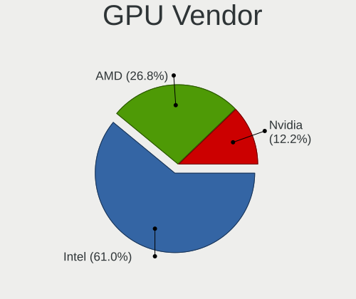

| Vendor | Notebooks | Percent |
|--------|-----------|---------|
| Intel  | 25        | 60.98%  |
| AMD    | 11        | 26.83%  |
| Nvidia | 5         | 12.2%   |

GPU Model
---------

Graphics card models

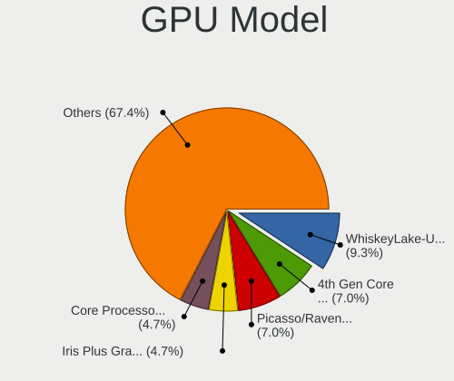

| Model                                                                       | Notebooks | Percent |
|-----------------------------------------------------------------------------|-----------|---------|
| Intel WhiskeyLake-U GT2 [UHD Graphics 620]                                  | 4         | 9.3%    |
| Intel 4th Gen Core Processor Integrated Graphics Controller                 | 3         | 6.98%   |
| AMD Picasso/Raven 2 [Radeon Vega Series / Radeon Vega Mobile Series]        | 3         | 6.98%   |
| Intel Iris Plus Graphics G7                                                 | 2         | 4.65%   |
| Intel Core Processor Integrated Graphics Controller                         | 2         | 4.65%   |
| Nvidia TU117GLM [Quadro T2000 Mobile / Max-Q]                               | 1         | 2.33%   |
| Nvidia GM108M [GeForce MX130]                                               | 1         | 2.33%   |
| Nvidia GK208M [GeForce GT 740M]                                             | 1         | 2.33%   |
| Nvidia GF117M [GeForce 610M/710M/810M/820M / GT 620M/625M/630M/720M]        | 1         | 2.33%   |
| Nvidia AD107M [GeForce RTX 4050 Max-Q / Mobile]                             | 1         | 2.33%   |
| Intel TigerLake-LP GT2 [Iris Xe Graphics]                                   | 1         | 2.33%   |
| Intel Skylake-U GT2 [HD Graphics 520]                                       | 1         | 2.33%   |
| Intel Raptor Lake-P [Iris Xe Graphics]                                      | 1         | 2.33%   |
| Intel Kaby Lake-U GT2 [HD Graphics 620]                                     | 1         | 2.33%   |
| Intel Kaby Lake-R GT2 [UHD Graphics 620]                                    | 1         | 2.33%   |
| Intel Haswell-ULT Integrated Graphics Controller                            | 1         | 2.33%   |
| Intel GeminiLake [UHD Graphics 600]                                         | 1         | 2.33%   |
| Intel CometLake-U GT2 [UHD Graphics]                                        | 1         | 2.33%   |
| Intel CoffeeLake-H GT2 [UHD Graphics 630]                                   | 1         | 2.33%   |
| Intel Broadwell-U GT2 [HD Graphics 5500]                                    | 1         | 2.33%   |
| Intel Atom Processor Z36xxx/Z37xxx Series Graphics & Display                | 1         | 2.33%   |
| Intel Alder Lake-UP3 GT1 [UHD Graphics]                                     | 1         | 2.33%   |
| Intel 3rd Gen Core processor Graphics Controller                            | 1         | 2.33%   |
| Intel 2nd Generation Core Processor Family Integrated Graphics Controller   | 1         | 2.33%   |
| AMD RV711/M93 [Mobility Radeon HD 4350/4550/530v/540v/545v / FirePro RG220] | 1         | 2.33%   |
| AMD Rembrandt [Radeon 680M]                                                 | 1         | 2.33%   |
| AMD Raven Ridge [Radeon Vega Series / Radeon Vega Mobile Series]            | 1         | 2.33%   |
| AMD Phoenix1                                                                | 1         | 2.33%   |
| AMD Opal XT [Radeon R7 M265/M365X/M465]                                     | 1         | 2.33%   |
| AMD Navi 33 [Radeon RX 7600/7600 XT/7600M XT/7600S/7700S / PRO W7600]       | 1         | 2.33%   |
| AMD Madison [Mobility Radeon HD 5650/5750 / 6530M/6550M]                    | 1         | 2.33%   |
| AMD Krackan [Radeon 840M / 860M Graphics]                                   | 1         | 2.33%   |
| AMD Kaveri [Radeon R6/R7 Graphics]                                          | 1         | 2.33%   |
| AMD Barcelo                                                                 | 1         | 2.33%   |

GPU Combo
---------

Combinations of graphics cards

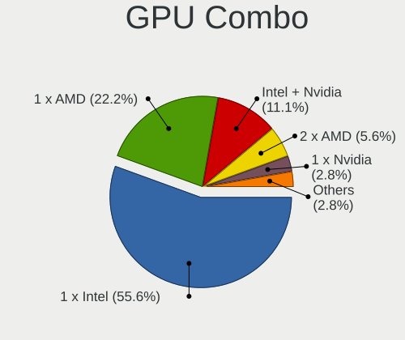

| Name           | Notebooks | Percent |
|----------------|-----------|---------|
| 1 x Intel      | 20        | 55.56%  |
| 1 x AMD        | 8         | 22.22%  |
| Intel + Nvidia | 4         | 11.11%  |
| 2 x AMD        | 2         | 5.56%   |
| 1 x Nvidia     | 1         | 2.78%   |
| Intel + AMD    | 1         | 2.78%   |

GPU Driver
----------

Free vs proprietary

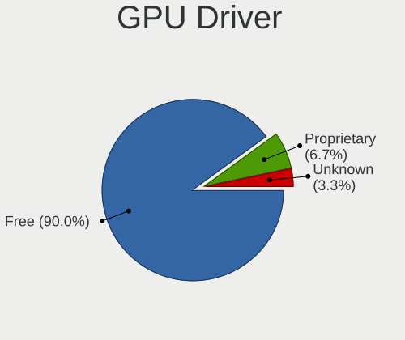

| Driver      | Notebooks | Percent |
|-------------|-----------|---------|
| Free        | 33        | 91.67%  |
| Proprietary | 2         | 5.56%   |
| Unknown     | 1         | 2.78%   |

GPU Memory
----------

Total video memory

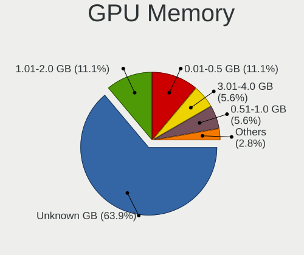

| Size in GB | Notebooks | Percent |
|------------|-----------|---------|
| Unknown    | 23        | 63.89%  |
| 1.01-2.0   | 4         | 11.11%  |
| 0.01-0.5   | 4         | 11.11%  |
| 3.01-4.0   | 2         | 5.56%   |
| 0.51-1.0   | 2         | 5.56%   |
| 7.01-8.0   | 1         | 2.78%   |

Monitor
-------

Monitor Vendor
--------------

Monitor vendors

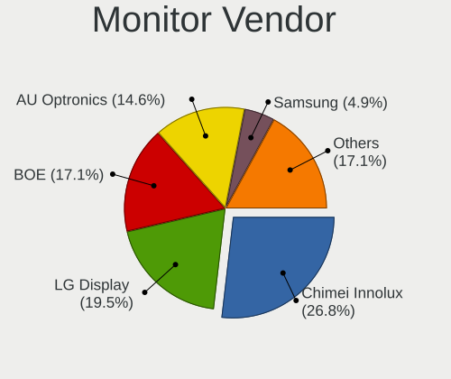

| Vendor              | Notebooks | Percent |
|---------------------|-----------|---------|
| Chimei Innolux      | 11        | 26.83%  |
| LG Display          | 8         | 19.51%  |
| BOE                 | 7         | 17.07%  |
| AU Optronics        | 6         | 14.63%  |
| Samsung Electronics | 2         | 4.88%   |
| Lenovo              | 2         | 4.88%   |
| Hewlett-Packard     | 1         | 2.44%   |
| Goldstar            | 1         | 2.44%   |
| Dell                | 1         | 2.44%   |
| AOC                 | 1         | 2.44%   |
| Acer                | 1         | 2.44%   |

Monitor Model
-------------

Monitor models

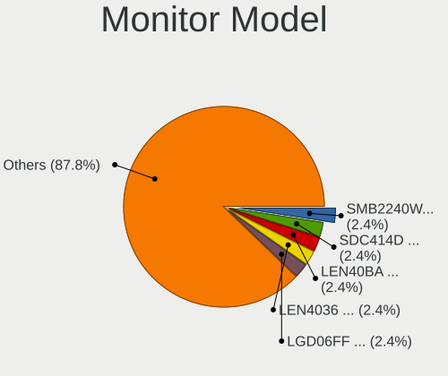

| Model                                                                 | Notebooks | Percent |
|-----------------------------------------------------------------------|-----------|---------|
| Samsung Electronics SMB2240W SAM0699 1680x1050 459x296mm 21.5-inch    | 1         | 2.44%   |
| Samsung Electronics LCD Monitor SDC414D 3456x2160 336x210mm 15.6-inch | 1         | 2.44%   |
| LG Display LCD Monitor LGD06FF 1920x1080 344x194mm 15.5-inch          | 1         | 2.44%   |
| LG Display LCD Monitor LGD059D 1920x1080 309x174mm 14.0-inch          | 1         | 2.44%   |
| LG Display LCD Monitor LGD051D 1920x1080 309x174mm 14.0-inch          | 1         | 2.44%   |
| LG Display LCD Monitor LGD045E 1366x768 310x174mm 14.0-inch           | 1         | 2.44%   |
| LG Display LCD Monitor LGD0437 1920x1080 276x156mm 12.5-inch          | 1         | 2.44%   |
| LG Display LCD Monitor LGD03DE 1600x900 382x215mm 17.3-inch           | 1         | 2.44%   |
| LG Display LCD Monitor LGD0395 1366x768 344x194mm 15.5-inch           | 1         | 2.44%   |
| LG Display LCD Monitor LGD038E 1366x768 344x194mm 15.5-inch           | 1         | 2.44%   |
| Lenovo LCD Monitor LEN40BA 1920x1080 344x194mm 15.5-inch              | 1         | 2.44%   |
| Lenovo LCD Monitor LEN4036 1440x900 303x190mm 14.1-inch               | 1         | 2.44%   |
| Hewlett-Packard E243i HPN3463 1920x1200 518x324mm 24.1-inch           | 1         | 2.44%   |
| Goldstar Ultra HD GSM5B08 3840x2160 600x340mm 27.2-inch               | 1         | 2.44%   |
| Dell U2415 DELA0BC 1920x1200 518x324mm 24.1-inch                      | 1         | 2.44%   |
| Chimei Innolux LCD Monitor CMN175A 1920x1080 381x214mm 17.2-inch      | 1         | 2.44%   |
| Chimei Innolux LCD Monitor CMN1610 1920x1200 344x215mm 16.0-inch      | 1         | 2.44%   |
| Chimei Innolux LCD Monitor CMN15F6 1920x1080 344x193mm 15.5-inch      | 1         | 2.44%   |
| Chimei Innolux LCD Monitor CMN15F5 1920x1080 344x193mm 15.5-inch      | 1         | 2.44%   |
| Chimei Innolux LCD Monitor CMN15E8 1920x1080 344x193mm 15.5-inch      | 1         | 2.44%   |
| Chimei Innolux LCD Monitor CMN15DB 1366x768 344x193mm 15.5-inch       | 1         | 2.44%   |
| Chimei Innolux LCD Monitor CMN15D3 1920x1080 344x193mm 15.5-inch      | 1         | 2.44%   |
| Chimei Innolux LCD Monitor CMN15C3 1920x1080 344x193mm 15.5-inch      | 1         | 2.44%   |
| Chimei Innolux LCD Monitor CMN15C0 1920x1080 344x194mm 15.5-inch      | 1         | 2.44%   |
| Chimei Innolux LCD Monitor CMN14D4 1920x1080 309x173mm 13.9-inch      | 1         | 2.44%   |
| Chimei Innolux LCD Monitor CMN1388 1920x1080 293x165mm 13.2-inch      | 1         | 2.44%   |
| BOE LCD Monitor BOE0BCA 2256x1504 285x190mm 13.5-inch                 | 1         | 2.44%   |
| BOE LCD Monitor BOE09E5 2560x1440 355x200mm 16.0-inch                 | 1         | 2.44%   |
| BOE LCD Monitor BOE095E 1366x768 344x194mm 15.5-inch                  | 1         | 2.44%   |
| BOE LCD Monitor BOE0812 1920x1080 344x194mm 15.5-inch                 | 1         | 2.44%   |
| BOE LCD Monitor BOE07CB 1920x1080 344x193mm 15.5-inch                 | 1         | 2.44%   |
| BOE LCD Monitor BOE06DD 1920x1080 344x194mm 15.5-inch                 | 1         | 2.44%   |
| BOE LCD Monitor BOE0687 1920x1080 344x193mm 15.5-inch                 | 1         | 2.44%   |
| AU Optronics LCD Monitor AUO408D 1920x1080 309x174mm 14.0-inch        | 1         | 2.44%   |
| AU Optronics LCD Monitor AUO323D 1920x1080 309x174mm 14.0-inch        | 1         | 2.44%   |
| AU Optronics LCD Monitor AUO313D 1920x1080 309x174mm 14.0-inch        | 1         | 2.44%   |
| AU Optronics LCD Monitor AUO26EC 1366x768 344x193mm 15.5-inch         | 1         | 2.44%   |
| AU Optronics LCD Monitor AUO23EC 1366x768 344x193mm 15.5-inch         | 1         | 2.44%   |
| AU Optronics LCD Monitor AUO10ED 1920x1080 344x193mm 15.5-inch        | 1         | 2.44%   |
| AOC 2436 AOC2436 1920x1080 521x293mm 23.5-inch                        | 1         | 2.44%   |

Monitor Resolution
------------------

Monitor screen resolution

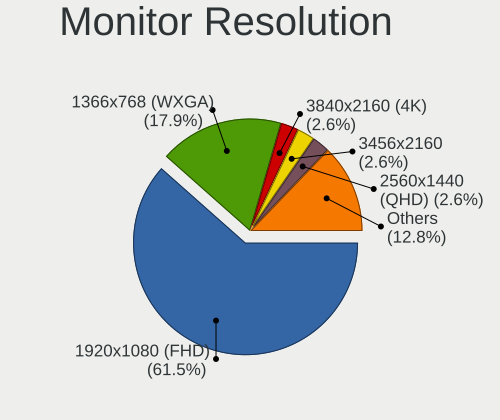

| Resolution         | Notebooks | Percent |
|--------------------|-----------|---------|
| 1920x1080 (FHD)    | 24        | 61.54%  |
| 1366x768 (WXGA)    | 7         | 17.95%  |
| 3840x2160 (4K)     | 1         | 2.56%   |
| 3456x2160          | 1         | 2.56%   |
| 2560x1440 (QHD)    | 1         | 2.56%   |
| 2256x1504          | 1         | 2.56%   |
| 1920x1200 (WUXGA)  | 1         | 2.56%   |
| 1680x1050 (WSXGA+) | 1         | 2.56%   |
| 1600x900 (HD+)     | 1         | 2.56%   |
| 1440x900 (WXGA+)   | 1         | 2.56%   |

Monitor Diagonal
----------------

Diagonal size in inches

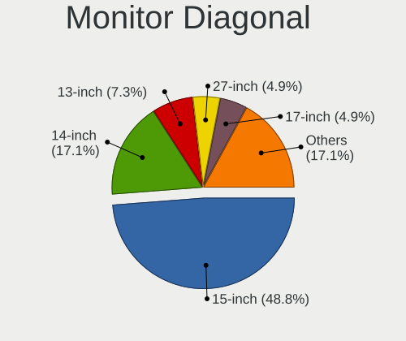

| Inches | Notebooks | Percent |
|--------|-----------|---------|
| 15     | 20        | 48.78%  |
| 14     | 7         | 17.07%  |
| 13     | 3         | 7.32%   |
| 27     | 2         | 4.88%   |
| 17     | 2         | 4.88%   |
| 16     | 2         | 4.88%   |
| 40     | 1         | 2.44%   |
| 24     | 1         | 2.44%   |
| 23     | 1         | 2.44%   |
| 22     | 1         | 2.44%   |
| 12     | 1         | 2.44%   |

Monitor Width
-------------

Physical width

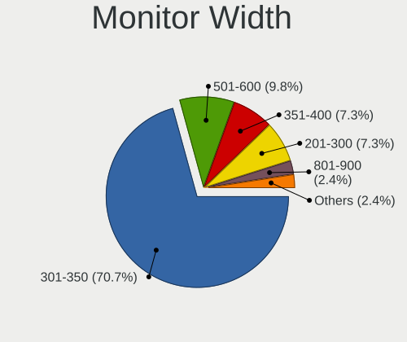

| Width in mm | Notebooks | Percent |
|-------------|-----------|---------|
| 301-350     | 29        | 70.73%  |
| 501-600     | 4         | 9.76%   |
| 351-400     | 3         | 7.32%   |
| 201-300     | 3         | 7.32%   |
| 801-900     | 1         | 2.44%   |
| 401-500     | 1         | 2.44%   |

Aspect Ratio
------------

Proportional relationship between the width and the height

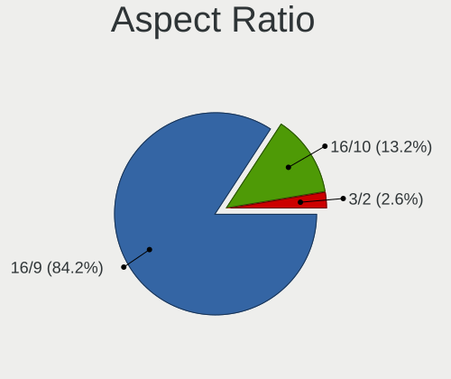

| Ratio | Notebooks | Percent |
|-------|-----------|---------|
| 16/9  | 32        | 84.21%  |
| 16/10 | 5         | 13.16%  |
| 3/2   | 1         | 2.63%   |

Monitor Area
------------

Area in inch²

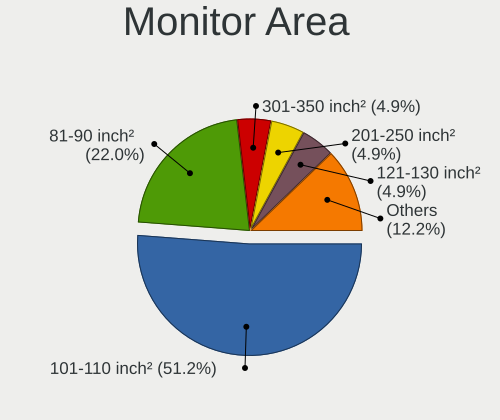

| Area in inch² | Notebooks | Percent |
|----------------|-----------|---------|
| 101-110        | 21        | 51.22%  |
| 81-90          | 9         | 21.95%  |
| 301-350        | 2         | 4.88%   |
| 201-250        | 2         | 4.88%   |
| 121-130        | 2         | 4.88%   |
| 71-80          | 1         | 2.44%   |
| 61-70          | 1         | 2.44%   |
| 251-300        | 1         | 2.44%   |
| 111-120        | 1         | 2.44%   |
| 501-1000       | 1         | 2.44%   |

Pixel Density
-------------

Pixels per inch

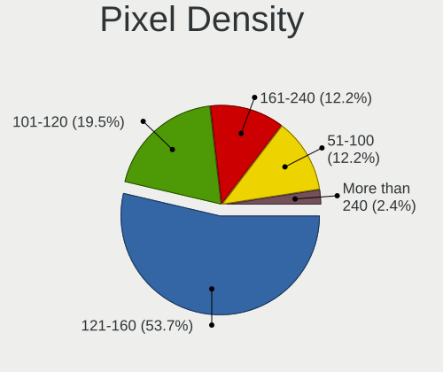

| Density       | Notebooks | Percent |
|---------------|-----------|---------|
| 121-160       | 22        | 53.66%  |
| 101-120       | 8         | 19.51%  |
| 161-240       | 5         | 12.2%   |
| 51-100        | 5         | 12.2%   |
| More than 240 | 1         | 2.44%   |

Multiple Monitors
-----------------

Total monitors connected

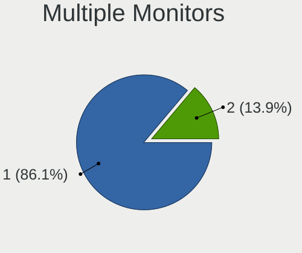

| Total | Notebooks | Percent |
|-------|-----------|---------|
| 1     | 31        | 86.11%  |
| 2     | 5         | 13.89%  |

Network
-------

Net Controller Vendor
---------------------

Controller vendors

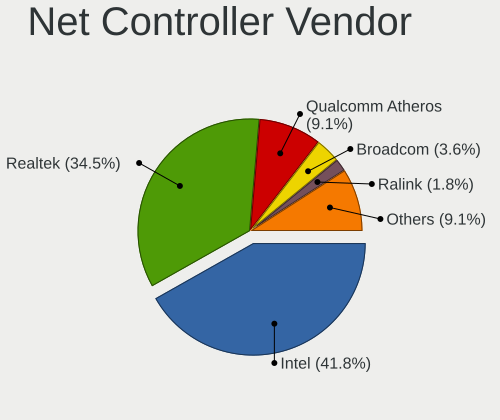

| Vendor                | Notebooks | Percent |
|-----------------------|-----------|---------|
| Intel                 | 23        | 41.82%  |
| Realtek Semiconductor | 19        | 34.55%  |
| Qualcomm Atheros      | 5         | 9.09%   |
| Broadcom              | 2         | 3.64%   |
| Ralink                | 1         | 1.82%   |
| Qualcomm              | 1         | 1.82%   |
| NetGear               | 1         | 1.82%   |
| MediaTek              | 1         | 1.82%   |
| HMD Global            | 1         | 1.82%   |
| Fibocom               | 1         | 1.82%   |

Net Controller Model
--------------------

Controller models

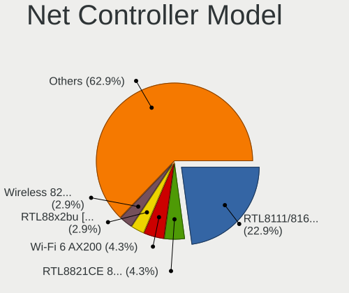

| Model                                                                  | Notebooks | Percent |
|------------------------------------------------------------------------|-----------|---------|
| Realtek RTL8111/8168/8211/8411 PCI Express Gigabit Ethernet Controller | 16        | 22.86%  |
| Realtek RTL8821CE 802.11ac PCIe Wireless Network Adapter               | 3         | 4.29%   |
| Intel Wi-Fi 6 AX200                                                    | 3         | 4.29%   |
| Realtek RTL88x2bu [AC1200 Techkey]                                     | 2         | 2.86%   |
| Intel Wireless 8265 / 8275                                             | 2         | 2.86%   |
| Intel Wireless 7260                                                    | 2         | 2.86%   |
| Intel Wi-Fi 6E(802.11ax) AX210/AX1675* 2x2 [Typhoon Peak]              | 2         | 2.86%   |
| Intel Wi-Fi 5(802.11ac) Wireless-AC 9x6x [Thunder Peak]                | 2         | 2.86%   |
| Intel Ice Lake-LP PCH CNVi WiFi                                        | 2         | 2.86%   |
| Intel Ethernet Connection I217-V                                       | 2         | 2.86%   |
| Intel Ethernet Connection (4) I219-LM                                  | 2         | 2.86%   |
| Realtek RTL8723DE Wireless Network Adapter                             | 1         | 1.43%   |
| Realtek RTL8188EUS 802.11n Wireless Network Adapter                    | 1         | 1.43%   |
| Realtek RTL8153 Gigabit Ethernet Adapter                               | 1         | 1.43%   |
| Realtek 802.11ac WLAN Adapter                                          | 1         | 1.43%   |
| Ralink RT5390R PCIe 802.11b/g/n Wireless Network Adapter               | 1         | 1.43%   |
| Qualcomm QCNFA765 Wireless Network Adapter                             | 1         | 1.43%   |
| Qualcomm Atheros QCA9565 / AR9565 Wireless Network Adapter             | 1         | 1.43%   |
| Qualcomm Atheros QCA9377 802.11ac Wireless Network Adapter             | 1         | 1.43%   |
| Qualcomm Atheros QCA6174 802.11ac Wireless Network Adapter             | 1         | 1.43%   |
| Qualcomm Atheros AR9287 Wireless Network Adapter (PCI-Express)         | 1         | 1.43%   |
| Qualcomm Atheros AR9285 Wireless Network Adapter (PCI-Express)         | 1         | 1.43%   |
| NetGear A6100 AC600 DB Wireless Adapter [Realtek RTL8811AU]            | 1         | 1.43%   |
| MediaTek MT7925 (RZ717) Wi-Fi 7 160MHz                                 | 1         | 1.43%   |
| Intel Wireless 3160                                                    | 1         | 1.43%   |
| Intel Wi-Fi 6 AX201                                                    | 1         | 1.43%   |
| Intel Raptor Lake PCH CNVi WiFi                                        | 1         | 1.43%   |
| Intel Ethernet Connection I218-V                                       | 1         | 1.43%   |
| Intel Ethernet Connection (7) I219-LM                                  | 1         | 1.43%   |
| Intel Ethernet Connection (6) I219-V                                   | 1         | 1.43%   |
| Intel Ethernet Connection (6) I219-LM                                  | 1         | 1.43%   |
| Intel Ethernet Connection (10) I219-LM                                 | 1         | 1.43%   |
| Intel Comet Lake PCH-LP CNVi WiFi                                      | 1         | 1.43%   |
| Intel Centrino Wireless-N 1000 [Condor Peak]                           | 1         | 1.43%   |
| Intel Centrino Advanced-N 6235                                         | 1         | 1.43%   |
| Intel Centrino Advanced-N 6200                                         | 1         | 1.43%   |
| Intel Cannon Point-LP CNVi [Wireless-AC]                               | 1         | 1.43%   |
| Intel Cannon Lake PCH CNVi WiFi                                        | 1         | 1.43%   |
| Intel 82577LM Gigabit Network Connection                               | 1         | 1.43%   |
| HMD Global Nokia7.2                                                    | 1         | 1.43%   |

Wireless Vendor
---------------

Wireless vendors

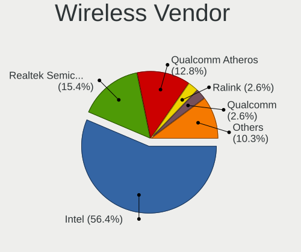

| Vendor                | Notebooks | Percent |
|-----------------------|-----------|---------|
| Intel                 | 22        | 56.41%  |
| Realtek Semiconductor | 6         | 15.38%  |
| Qualcomm Atheros      | 5         | 12.82%  |
| Ralink                | 1         | 2.56%   |
| Qualcomm              | 1         | 2.56%   |
| NetGear               | 1         | 2.56%   |
| MediaTek              | 1         | 2.56%   |
| Fibocom               | 1         | 2.56%   |
| Broadcom              | 1         | 2.56%   |

Wireless Model
--------------

Wireless models

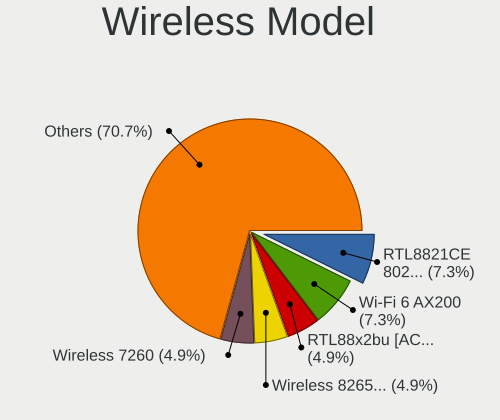

| Model                                                          | Notebooks | Percent |
|----------------------------------------------------------------|-----------|---------|
| Realtek RTL8821CE 802.11ac PCIe Wireless Network Adapter       | 3         | 7.32%   |
| Intel Wi-Fi 6 AX200                                            | 3         | 7.32%   |
| Realtek RTL88x2bu [AC1200 Techkey]                             | 2         | 4.88%   |
| Intel Wireless 8265 / 8275                                     | 2         | 4.88%   |
| Intel Wireless 7260                                            | 2         | 4.88%   |
| Intel Wi-Fi 6E(802.11ax) AX210/AX1675* 2x2 [Typhoon Peak]      | 2         | 4.88%   |
| Intel Wi-Fi 5(802.11ac) Wireless-AC 9x6x [Thunder Peak]        | 2         | 4.88%   |
| Intel Ice Lake-LP PCH CNVi WiFi                                | 2         | 4.88%   |
| Realtek RTL8723DE Wireless Network Adapter                     | 1         | 2.44%   |
| Realtek RTL8188EUS 802.11n Wireless Network Adapter            | 1         | 2.44%   |
| Realtek 802.11ac WLAN Adapter                                  | 1         | 2.44%   |
| Ralink RT5390R PCIe 802.11b/g/n Wireless Network Adapter       | 1         | 2.44%   |
| Qualcomm QCNFA765 Wireless Network Adapter                     | 1         | 2.44%   |
| Qualcomm Atheros QCA9565 / AR9565 Wireless Network Adapter     | 1         | 2.44%   |
| Qualcomm Atheros QCA9377 802.11ac Wireless Network Adapter     | 1         | 2.44%   |
| Qualcomm Atheros QCA6174 802.11ac Wireless Network Adapter     | 1         | 2.44%   |
| Qualcomm Atheros AR9287 Wireless Network Adapter (PCI-Express) | 1         | 2.44%   |
| Qualcomm Atheros AR9285 Wireless Network Adapter (PCI-Express) | 1         | 2.44%   |
| NetGear A6100 AC600 DB Wireless Adapter [Realtek RTL8811AU]    | 1         | 2.44%   |
| MediaTek MT7925 (RZ717) Wi-Fi 7 160MHz                         | 1         | 2.44%   |
| Intel Wireless 3160                                            | 1         | 2.44%   |
| Intel Wi-Fi 6 AX201                                            | 1         | 2.44%   |
| Intel Raptor Lake PCH CNVi WiFi                                | 1         | 2.44%   |
| Intel Comet Lake PCH-LP CNVi WiFi                              | 1         | 2.44%   |
| Intel Centrino Wireless-N 1000 [Condor Peak]                   | 1         | 2.44%   |
| Intel Centrino Advanced-N 6235                                 | 1         | 2.44%   |
| Intel Centrino Advanced-N 6200                                 | 1         | 2.44%   |
| Intel Cannon Point-LP CNVi [Wireless-AC]                       | 1         | 2.44%   |
| Intel Cannon Lake PCH CNVi WiFi                                | 1         | 2.44%   |
| Fibocom L830-EB-00 LTE WWAN Modem                              | 1         | 2.44%   |
| Broadcom BCM43228 802.11a/b/g/n                                | 1         | 2.44%   |

Ethernet Vendor
---------------

Ethernet vendors

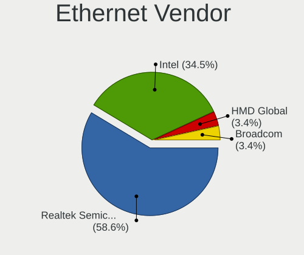

| Vendor                | Notebooks | Percent |
|-----------------------|-----------|---------|
| Realtek Semiconductor | 17        | 58.62%  |
| Intel                 | 10        | 34.48%  |
| HMD Global            | 1         | 3.45%   |
| Broadcom              | 1         | 3.45%   |

Ethernet Model
--------------

Ethernet models

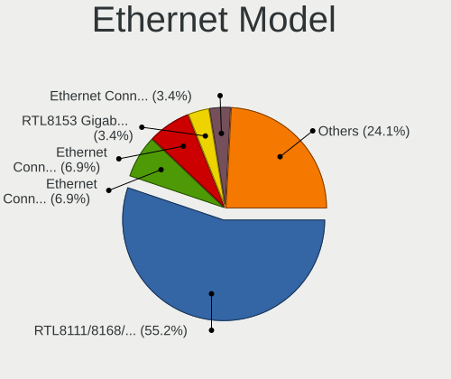

| Model                                                                  | Notebooks | Percent |
|------------------------------------------------------------------------|-----------|---------|
| Realtek RTL8111/8168/8211/8411 PCI Express Gigabit Ethernet Controller | 16        | 55.17%  |
| Intel Ethernet Connection I217-V                                       | 2         | 6.9%    |
| Intel Ethernet Connection (4) I219-LM                                  | 2         | 6.9%    |
| Realtek RTL8153 Gigabit Ethernet Adapter                               | 1         | 3.45%   |
| Intel Ethernet Connection I218-V                                       | 1         | 3.45%   |
| Intel Ethernet Connection (7) I219-LM                                  | 1         | 3.45%   |
| Intel Ethernet Connection (6) I219-V                                   | 1         | 3.45%   |
| Intel Ethernet Connection (6) I219-LM                                  | 1         | 3.45%   |
| Intel Ethernet Connection (10) I219-LM                                 | 1         | 3.45%   |
| Intel 82577LM Gigabit Network Connection                               | 1         | 3.45%   |
| HMD Global Nokia7.2                                                    | 1         | 3.45%   |
| Broadcom NetLink BCM57785 Gigabit Ethernet PCIe                        | 1         | 3.45%   |

Net Controller Kind
-------------------

Ethernet, WiFi or modem

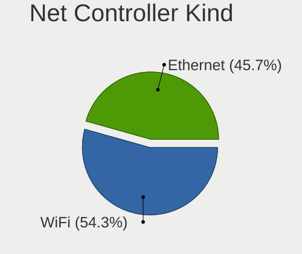

| Kind     | Notebooks | Percent |
|----------|-----------|---------|
| WiFi     | 36        | 55.38%  |
| Ethernet | 29        | 44.62%  |

Used Controller
---------------

Currently used network controller

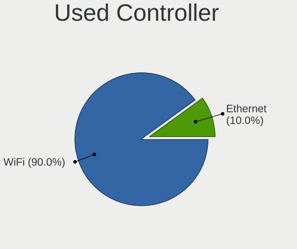

| Kind     | Notebooks | Percent |
|----------|-----------|---------|
| WiFi     | 32        | 88.89%  |
| Ethernet | 4         | 11.11%  |

NICs
----

Total network controllers on board

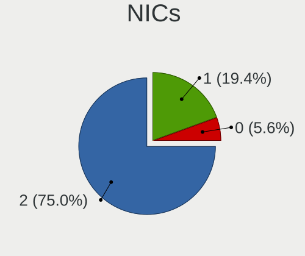

| Total | Notebooks | Percent |
|-------|-----------|---------|
| 2     | 27        | 75%     |
| 1     | 7         | 19.44%  |
| 0     | 2         | 5.56%   |

IPv6
----

IPv6 vs IPv4

| Used | Notebooks | Percent |
|------|-----------|---------|
| No   | 25        | 67.57%  |
| Yes  | 12        | 32.43%  |

Bluetooth
---------

Bluetooth Vendor
----------------

Controller vendors

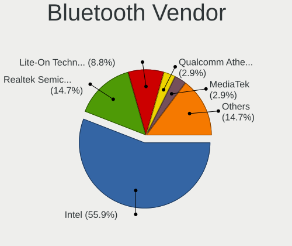

| Vendor                          | Notebooks | Percent |
|---------------------------------|-----------|---------|
| Intel                           | 19        | 55.88%  |
| Realtek Semiconductor           | 5         | 14.71%  |
| Lite-On Technology              | 3         | 8.82%   |
| Qualcomm Atheros Communications | 1         | 2.94%   |
| MediaTek                        | 1         | 2.94%   |
| IMC Networks                    | 1         | 2.94%   |
| Foxconn / Hon Hai               | 1         | 2.94%   |
| Edimax Technology               | 1         | 2.94%   |
| Cambridge Silicon Radio         | 1         | 2.94%   |
| Broadcom                        | 1         | 2.94%   |

Bluetooth Model
---------------

Controller models

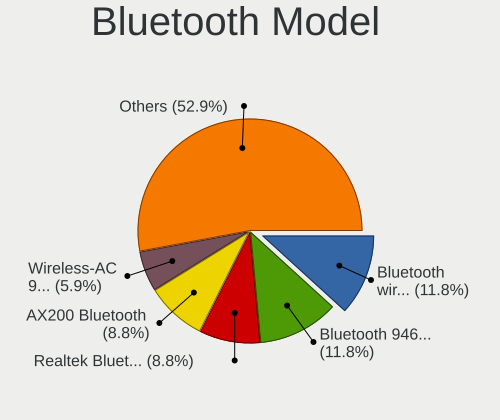

| Model                                               | Notebooks | Percent |
|-----------------------------------------------------|-----------|---------|
| Intel Bluetooth wireless interface                  | 4         | 11.76%  |
| Intel Bluetooth 9460/9560 Jefferson Peak (JfP)      | 4         | 11.76%  |
| Realtek  Bluetooth 4.2 Adapter                      | 3         | 8.82%   |
| Intel AX200 Bluetooth                               | 3         | 8.82%   |
| Intel Wireless-AC 9260 Bluetooth Adapter            | 2         | 5.88%   |
| Intel AX210 Bluetooth                               | 2         | 5.88%   |
| Intel AX201 Bluetooth                               | 2         | 5.88%   |
| Realtek RTL8723B Bluetooth                          | 1         | 2.94%   |
| Realtek Bluetooth Radio                             | 1         | 2.94%   |
| Qualcomm Atheros AR3011 Bluetooth                   | 1         | 2.94%   |
| MediaTek Wireless_Device                            | 1         | 2.94%   |
| Lite-On Qualcomm Atheros QCA9377 Bluetooth          | 1         | 2.94%   |
| Lite-On Bluetooth Device                            | 1         | 2.94%   |
| Lite-On Atheros AR3012 Bluetooth                    | 1         | 2.94%   |
| Intel Centrino Bluetooth Wireless Transceiver       | 1         | 2.94%   |
| Intel Bluetooth Device                              | 1         | 2.94%   |
| IMC Networks Wireless_Device                        | 1         | 2.94%   |
| Foxconn / Hon Hai Bluetooth Device                  | 1         | 2.94%   |
| Edimax Bluetooth Device                             | 1         | 2.94%   |
| Cambridge Silicon Radio Bluetooth Dongle (HCI mode) | 1         | 2.94%   |
| Broadcom HP Portable Bumble Bee                     | 1         | 2.94%   |

Sound
-----

Sound Vendor
------------

Sound card vendors

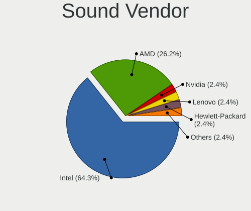

| Vendor          | Notebooks | Percent |
|-----------------|-----------|---------|
| Intel           | 27        | 64.29%  |
| AMD             | 11        | 26.19%  |
| Nvidia          | 1         | 2.38%   |
| Lenovo          | 1         | 2.38%   |
| Hewlett-Packard | 1         | 2.38%   |
| Astro Gaming    | 1         | 2.38%   |

Sound Model
-----------

Sound card models

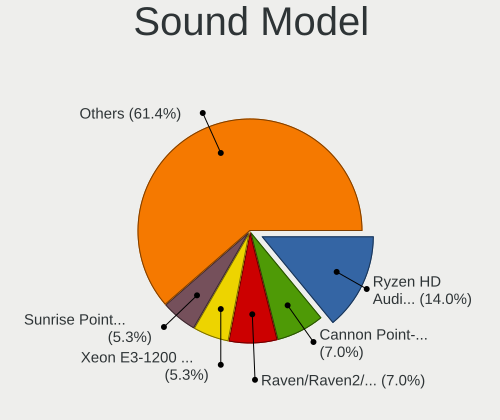

| Model                                                                      | Notebooks | Percent |
|----------------------------------------------------------------------------|-----------|---------|
| AMD Ryzen HD Audio Controller                                              | 8         | 14.04%  |
| Intel Cannon Point-LP High Definition Audio Controller                     | 4         | 7.02%   |
| AMD Raven/Raven2/Fenghuang HDMI/DP Audio Controller                        | 4         | 7.02%   |
| Intel Xeon E3-1200 v3/4th Gen Core Processor HD Audio Controller           | 3         | 5.26%   |
| Intel Sunrise Point-LP HD Audio                                            | 3         | 5.26%   |
| Intel 8 Series/C220 Series Chipset High Definition Audio Controller        | 3         | 5.26%   |
| Intel 5 Series/3400 Series Chipset High Definition Audio                   | 3         | 5.26%   |
| AMD Radeon High Definition Audio Controller                                | 3         | 5.26%   |
| Intel Ice Lake-LP Smart Sound Technology Audio Controller                  | 2         | 3.51%   |
| Intel Cannon Lake PCH cAVS                                                 | 2         | 3.51%   |
| Nvidia TU107 GeForce GTX 1650 High Definition Audio Controller             | 1         | 1.75%   |
| Lenovo ThinkPad Dock USB Audio                                             | 1         | 1.75%   |
| Intel Wildcat Point-LP High Definition Audio Controller                    | 1         | 1.75%   |
| Intel Tiger Lake-LP Smart Sound Technology Audio Controller                | 1         | 1.75%   |
| Intel Raptor Lake-P/U/H cAVS                                               | 1         | 1.75%   |
| Intel Haswell-ULT HD Audio Controller                                      | 1         | 1.75%   |
| Intel Comet Lake PCH-LP cAVS                                               | 1         | 1.75%   |
| Intel Celeron/Pentium Silver Processor High Definition Audio               | 1         | 1.75%   |
| Intel Broadwell-U Audio Controller                                         | 1         | 1.75%   |
| Intel Atom Processor Z36xxx/Z37xxx Series High Definition Audio Controller | 1         | 1.75%   |
| Intel Alder Lake PCH-P High Definition Audio Controller                    | 1         | 1.75%   |
| Intel 8 Series HD Audio Controller                                         | 1         | 1.75%   |
| Intel 7 Series/C216 Chipset Family High Definition Audio Controller        | 1         | 1.75%   |
| Intel 6 Series/C200 Series Chipset Family High Definition Audio Controller | 1         | 1.75%   |
| Hewlett-Packard USB Audio                                                  | 1         | 1.75%   |
| Astro Gaming Astro A50                                                     | 1         | 1.75%   |
| AMD RV710/730 HDMI Audio [Radeon HD 4000 series]                           | 1         | 1.75%   |
| AMD Renoir/Cezanne HDMI/DP Audio Controller                                | 1         | 1.75%   |
| AMD Redwood HDMI Audio [Radeon HD 5000 Series]                             | 1         | 1.75%   |
| AMD Navi 31 HDMI/DP Audio                                                  | 1         | 1.75%   |
| AMD Kaveri HDMI/DP Audio Controller                                        | 1         | 1.75%   |
| AMD FCH Azalia Controller                                                  | 1         | 1.75%   |

Memory
------

Memory Vendor
-------------

Memory module vendors

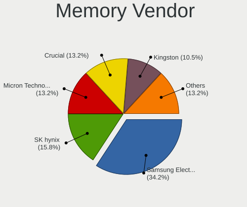

| Vendor              | Notebooks | Percent |
|---------------------|-----------|---------|
| Samsung Electronics | 13        | 34.21%  |
| SK hynix            | 6         | 15.79%  |
| Micron Technology   | 5         | 13.16%  |
| Crucial             | 5         | 13.16%  |
| Kingston            | 4         | 10.53%  |
| Nanya Technology    | 2         | 5.26%   |
| G.Skill             | 1         | 2.63%   |
| Elpida              | 1         | 2.63%   |
| A-DATA Technology   | 1         | 2.63%   |

Memory Model
------------

Memory module models

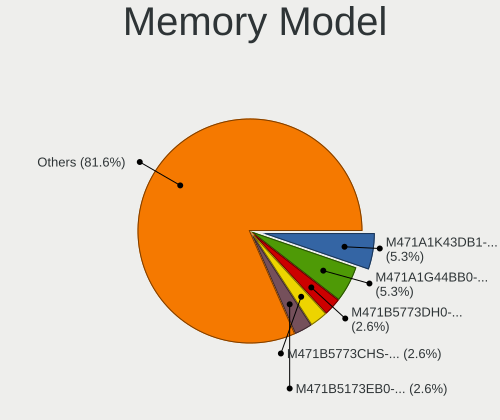

| Model                                                            | Notebooks | Percent |
|------------------------------------------------------------------|-----------|---------|
| Samsung RAM M471A1K43DB1-CTD 8GB SODIMM DDR4 2667MT/s            | 2         | 5.26%   |
| Samsung RAM M471A1G44BB0-CWE 8GB SODIMM DDR4 3200MT/s            | 2         | 5.26%   |
| SK hynix RAM HMT451S6BFR8A-PB 4GB SODIMM DDR3 1600MT/s           | 1         | 2.63%   |
| SK hynix RAM HMT351S6CFR8C-PB 4GB SODIMM DDR3 1600MT/s           | 1         | 2.63%   |
| SK hynix RAM HMA82GS6AFR8N-UH 16GB SODIMM DDR4 2667MT/s          | 1         | 2.63%   |
| SK hynix RAM HMA81GS6JJR8N-VK 8GB SODIMM DDR4 2667MT/s           | 1         | 2.63%   |
| SK hynix RAM HMA41GS6AFR8N-TF 8GB SODIMM DDR4 2667MT/s           | 1         | 2.63%   |
| SK hynix RAM H9CCNNNCLGALAR-NUD 8GB Row Of Chips LPDDR3 1867MT/s | 1         | 2.63%   |
| Samsung RAM M471B5773DH0-CH9 2GB SODIMM DDR3 1600MT/s            | 1         | 2.63%   |
| Samsung RAM M471B5773CHS-CH9 2GB SODIMM DDR3 4199MT/s            | 1         | 2.63%   |
| Samsung RAM M471B5173EB0-YK0 4GB SODIMM DDR3 1600MT/s            | 1         | 2.63%   |
| Samsung RAM M471A5244CB0-CTD 4GB Row Of Chips DDR4 2667MT/s      | 1         | 2.63%   |
| Samsung RAM M471A2K43BB1-CRC 16GB SODIMM DDR4 2400MT/s           | 1         | 2.63%   |
| Samsung RAM M471A1K43BB1-CTD 8GB SODIMM DDR4 2667MT/s            | 1         | 2.63%   |
| Samsung RAM M471A1G44AB0-CWE 8GiB SODIMM DDR4 3200MT/s           | 1         | 2.63%   |
| Samsung RAM M425R2GA3BB0-CQKOL 16GB SODIMM DDR5 4800MT/s         | 1         | 2.63%   |
| Samsung RAM K4UBE3D4AA-MGCL 8GB Row Of Chips LPDDR4 4267MT/s     | 1         | 2.63%   |
| Nanya RAM NT4GC64B8HG0NS-DI 4GB SODIMM DDR3 1600MT/s             | 1         | 2.63%   |
| Nanya RAM NT4GC64B8HB0NS-CG 4GB SODIMM DDR3 1334MT/s             | 1         | 2.63%   |
| Micron RAM Module 16GB SODIMM DDR4 3200MT/s                      | 1         | 2.63%   |
| Micron RAM 4ATF51264HZ-2G6E1 4GB SODIMM DDR4 2667MT/s            | 1         | 2.63%   |
| Micron RAM 4ATF25664HZ-2G3B1 2GB SODIMM DDR4 2400MT/s            | 1         | 2.63%   |
| Micron RAM 4ATF1G64HZ-3G2F1 8GB SODIMM DDR4 3200MT/s             | 1         | 2.63%   |
| Micron RAM ...d 4096MB SODIMM DDR3 1067MT/s                      | 1         | 2.63%   |
| Kingston RAM LV32D4S2S8HD-8 8GB SODIMM DDR4 3200MT/s             | 1         | 2.63%   |
| Kingston RAM KHX1600C9S3L/8G 8GB SODIMM DDR3 1600MT/s            | 1         | 2.63%   |
| Kingston RAM ACR16D3LS1KFG/4G 4GB SODIMM DDR3 1600MT/s           | 1         | 2.63%   |
| Kingston RAM 99U5663-007.A00G 16GB SODIMM DDR4 2667MT/s          | 1         | 2.63%   |
| G.Skill RAM F4-2400C16-16GRS 16GB SODIMM DDR4 2667MT/s           | 1         | 2.63%   |
| Elpida RAM Module 4GB SODIMM DDR3 1600MT/s                       | 1         | 2.63%   |
| Crucial RAM CT8G4SFS824A.M8FE 8GB SODIMM DDR4 2667MT/s           | 1         | 2.63%   |
| Crucial RAM CT4G3S1067M.C16FKD 4GB SODIMM DDR3 1067MT/s          | 1         | 2.63%   |
| Crucial RAM CT32G4SFD832A.C16FF 32GB SODIMM DDR4 3200MT/s        | 1         | 2.63%   |
| Crucial RAM CT32G48C40S5.M16A1 32GB SODIMM DDR5 4800MT/s         | 1         | 2.63%   |
| Crucial RAM CT16G4SFD824A.C16FDD 16GB SODIMM DDR4 2400MT/s       | 1         | 2.63%   |
| A-DATA RAM AD5S560016G-SFW 16GiB SODIMM DDR5 5600MT/s            | 1         | 2.63%   |

Memory Kind
-----------

Memory module kinds

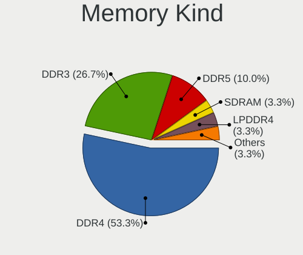

| Kind   | Notebooks | Percent |
|--------|-----------|---------|
| DDR4   | 16        | 53.33%  |
| DDR3   | 8         | 26.67%  |
| DDR5   | 3         | 10%     |
| SDRAM  | 1         | 3.33%   |
| LPDDR4 | 1         | 3.33%   |
| LPDDR3 | 1         | 3.33%   |

Memory Form Factor
------------------

Physical design of the memory module

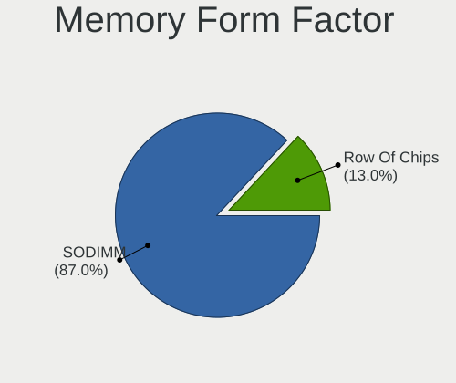

| Name         | Notebooks | Percent |
|--------------|-----------|---------|
| SODIMM       | 27        | 90%     |
| Row Of Chips | 3         | 10%     |

Memory Size
-----------

Memory module size

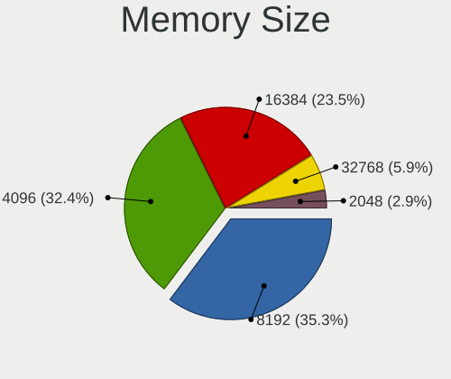

| Size  | Notebooks | Percent |
|-------|-----------|---------|
| 8192  | 12        | 35.29%  |
| 4096  | 11        | 32.35%  |
| 16384 | 8         | 23.53%  |
| 32768 | 2         | 5.88%   |
| 2048  | 1         | 2.94%   |

Memory Speed
------------

Memory module speed

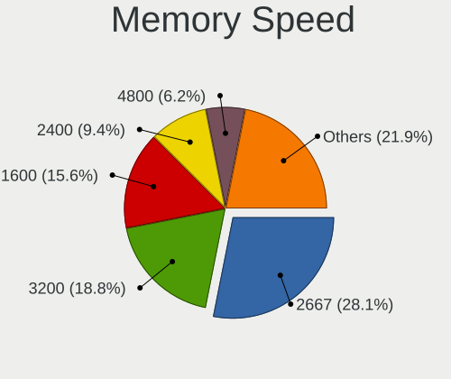

| Speed | Notebooks | Percent |
|-------|-----------|---------|
| 2667  | 9         | 28.13%  |
| 3200  | 6         | 18.75%  |
| 1600  | 5         | 15.63%  |
| 2400  | 3         | 9.38%   |
| 4800  | 2         | 6.25%   |
| 1067  | 2         | 6.25%   |
| 5600  | 1         | 3.13%   |
| 4267  | 1         | 3.13%   |
| 4199  | 1         | 3.13%   |
| 1867  | 1         | 3.13%   |
| 1334  | 1         | 3.13%   |

Printers & scanners
-------------------

Printer Vendor
--------------

Printer device vendors

| Vendor          | Notebooks | Percent |
|-----------------|-----------|---------|
| Hewlett-Packard | 1         | 100%    |

Printer Model
-------------

Printer device models

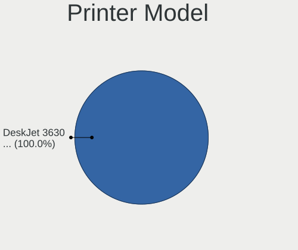

| Model                  | Notebooks | Percent |
|------------------------|-----------|---------|
| HP DeskJet 3630 series | 1         | 100%    |

Scanner Vendor
--------------

Scanner device vendors

| Vendor         | Notebooks | Percent |
|----------------|-----------|---------|
| Mustek Systems | 1         | 100%    |

Scanner Model
-------------

Scanner device models

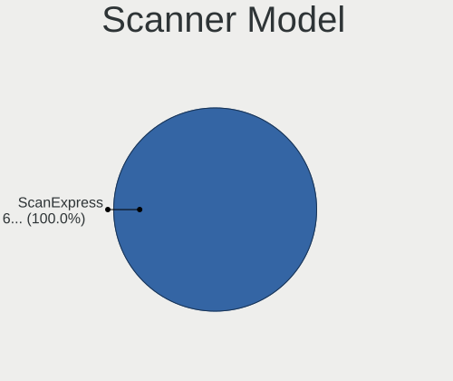

| Model                             | Notebooks | Percent |
|-----------------------------------|-----------|---------|
| Mustek Systems ScanExpress 600 CU | 1         | 100%    |

Camera
------

Camera Vendor
-------------

Camera device vendors

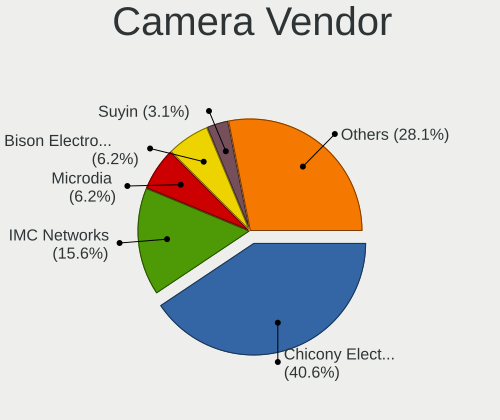

| Vendor                                 | Notebooks | Percent |
|----------------------------------------|-----------|---------|
| Chicony Electronics                    | 13        | 40.63%  |
| IMC Networks                           | 5         | 15.63%  |
| Microdia                               | 2         | 6.25%   |
| Bison Electronics                      | 2         | 6.25%   |
| Suyin                                  | 1         | 3.13%   |
| Silicon Motion                         | 1         | 3.13%   |
| Realtek Semiconductor                  | 1         | 3.13%   |
| Quanta                                 | 1         | 3.13%   |
| Primax Electronics                     | 1         | 3.13%   |
| Luxvisions Innotech Limited            | 1         | 3.13%   |
| Logitech                               | 1         | 3.13%   |
| Lite-On Technology                     | 1         | 3.13%   |
| Framework                              | 1         | 3.13%   |
| Cheng Uei Precision Industry (Foxlink) | 1         | 3.13%   |

Camera Model
------------

Camera device models

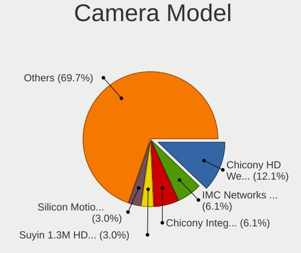

| Model                                                          | Notebooks | Percent |
|----------------------------------------------------------------|-----------|---------|
| Chicony HD WebCam                                              | 4         | 12.12%  |
| IMC Networks USB2.0 HD UVC WebCam                              | 2         | 6.06%   |
| Chicony Integrated Camera                                      | 2         | 6.06%   |
| Suyin 1.3M HD WebCam                                           | 1         | 3.03%   |
| Silicon Motion USB 2.0 PC Cam                                  | 1         | 3.03%   |
| Realtek Integrated_Webcam_HD                                   | 1         | 3.03%   |
| Quanta HP Webcam                                               | 1         | 3.03%   |
| Primax Villem                                                  | 1         | 3.03%   |
| Microdia Integrated_Webcam_HD                                  | 1         | 3.03%   |
| Microdia HDE Webcam USB                                        | 1         | 3.03%   |
| Luxvisions Innotech Limited Integrated Camera                  | 1         | 3.03%   |
| Logitech Webcam C270                                           | 1         | 3.03%   |
| Lite-On Integrated Camera                                      | 1         | 3.03%   |
| IMC Networks SunplusIT Integrated Camera                       | 1         | 3.03%   |
| IMC Networks Lenovo EasyCamera                                 | 1         | 3.03%   |
| IMC Networks Integrated Camera                                 | 1         | 3.03%   |
| Framework Laptop Webcam Module (2nd Gen)                       | 1         | 3.03%   |
| Chicony VGA WebCam                                             | 1         | 3.03%   |
| Chicony USB2.0 HD UVC WebCam                                   | 1         | 3.03%   |
| Chicony ThinkPad T490 Webcam                                   | 1         | 3.03%   |
| Chicony HP Webcam                                              | 1         | 3.03%   |
| Chicony HP HD Webcam [Fixed]                                   | 1         | 3.03%   |
| Chicony HP HD Camera                                           | 1         | 3.03%   |
| Chicony HP 5MP Camera                                          | 1         | 3.03%   |
| Cheng Uei Precision Industry (Foxlink) HP TrueVision HD Camera | 1         | 3.03%   |
| Bison SunplusIT Integrated Camera                              | 1         | 3.03%   |
| Bison Integrated IR Camera                                     | 1         | 3.03%   |
| Bison Integrated Camera                                        | 1         | 3.03%   |

Security
--------

Fingerprint Vendor
------------------

Fingerprint sensor vendors

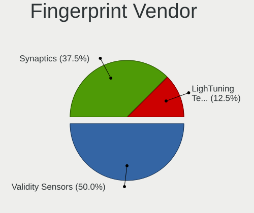

| Vendor                     | Notebooks | Percent |
|----------------------------|-----------|---------|
| Validity Sensors           | 4         | 40%     |
| Synaptics                  | 4         | 40%     |
| Shenzhen Goodix Technology | 1         | 10%     |
| LighTuning Technology      | 1         | 10%     |

Fingerprint Model
-----------------

Fingerprint sensor models

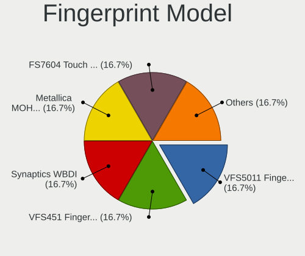

| Model                                                    | Notebooks | Percent |
|----------------------------------------------------------|-----------|---------|
| Validity Sensors VFS5011 Fingerprint Reader              | 1         | 10%     |
| Validity Sensors VFS451 Fingerprint Reader               | 1         | 10%     |
| Validity Sensors VFS Fingerprint sensor                  | 1         | 10%     |
| Validity Sensors Synaptics WBDI                          | 1         | 10%     |
| Synaptics Prometheus MIS Touch Fingerprint Reader        | 1         | 10%     |
| Synaptics Metallica MOH Touch Fingerprint Reader         | 1         | 10%     |
| Synaptics Metallica MIS Touch Fingerprint Reader         | 1         | 10%     |
| Synaptics FS7604 Touch Fingerprint Sensor with PurePrint | 1         | 10%     |
| Shenzhen Goodix Fingerprint Reader                       | 1         | 10%     |
| LighTuning EgisTec Touch Fingerprint Sensor              | 1         | 10%     |

Chipcard Vendor
---------------

Chipcard module vendors

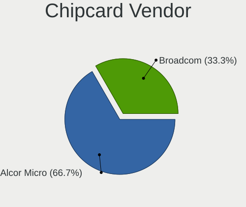

| Vendor      | Notebooks | Percent |
|-------------|-----------|---------|
| Alcor Micro | 2         | 66.67%  |
| Broadcom    | 1         | 33.33%  |

Chipcard Model
--------------

Chipcard module models

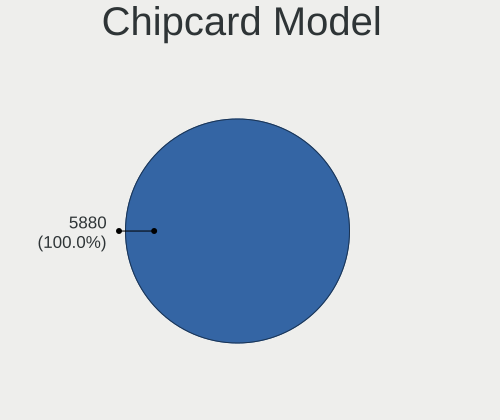

| Model                               | Notebooks | Percent |
|-------------------------------------|-----------|---------|
| Alcor Micro AU9540 Smartcard Reader | 2         | 66.67%  |
| Broadcom 5880                       | 1         | 33.33%  |

Unsupported
-----------

Unsupported Devices
-------------------

Total unsupported devices on board

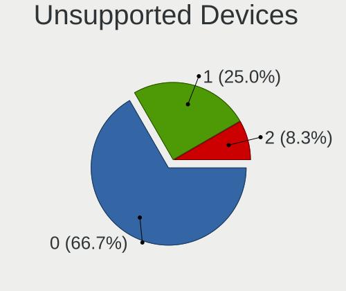

| Total | Notebooks | Percent |
|-------|-----------|---------|
| 0     | 24        | 66.67%  |
| 1     | 9         | 25%     |
| 2     | 3         | 8.33%   |

Unsupported Device Types
------------------------

Types of unsupported devices

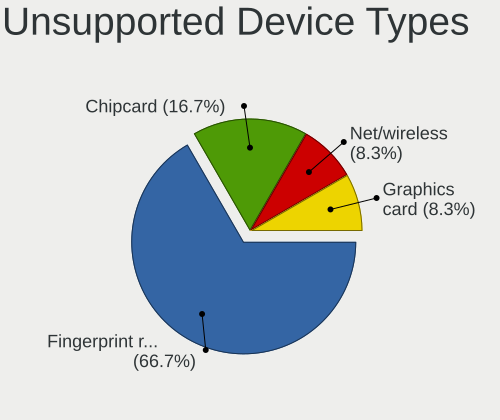

| Type               | Notebooks | Percent |
|--------------------|-----------|---------|
| Fingerprint reader | 10        | 66.67%  |
| Chipcard           | 2         | 13.33%  |
| Net/wireless       | 1         | 6.67%   |
| Graphics card      | 1         | 6.67%   |
| Card reader        | 1         | 6.67%   |

