Siduction - Tested Hardware & Statistics (Notebooks)
----------------------------------------------------

A project to collect tested hardware configurations for Siduction.

Anyone can contribute to this report by the [hw-probe](https://github.com/linuxhw/hw-probe) tool:

    sudo -E hw-probe -all -upload

Please contribute! Especially if your hardware is rare.

Contents
--------

* [ Test Cases ](#test-cases)

* [ System ](#system)
  - [ OS                       ](#os)
  - [ OS Family                ](#os-family)
  - [ Kernel                   ](#kernel)
  - [ Kernel Family            ](#kernel-family)
  - [ Kernel Major Ver.        ](#kernel-major-ver)
  - [ Arch                     ](#arch)
  - [ DE                       ](#de)
  - [ Display Server           ](#display-server)
  - [ Display Manager          ](#display-manager)
  - [ OS Lang                  ](#os-lang)
  - [ Boot Mode                ](#boot-mode)
  - [ Filesystem               ](#filesystem)
  - [ Part. scheme             ](#part-scheme)
  - [ Dual Boot with Linux/BSD ](#dual-boot-with-linuxbsd)
  - [ Dual Boot (Win)          ](#dual-boot-win)

* [ Board ](#board)
  - [ Vendor                   ](#vendor)
  - [ Model                    ](#model)
  - [ Model Family             ](#model-family)
  - [ MFG Year                 ](#mfg-year)
  - [ Form Factor              ](#form-factor)
  - [ Secure Boot              ](#secure-boot)
  - [ Coreboot                 ](#coreboot)
  - [ RAM Size                 ](#ram-size)
  - [ RAM Used                 ](#ram-used)
  - [ Total Drives             ](#total-drives)
  - [ Has CD-ROM               ](#has-cd-rom)
  - [ Has Ethernet             ](#has-ethernet)
  - [ Has WiFi                 ](#has-wifi)
  - [ Has Bluetooth            ](#has-bluetooth)

* [ Location ](#location)
  - [ Country                  ](#country)
  - [ City                     ](#city)

* [ Drives ](#drives)
  - [ Drive Vendor             ](#drive-vendor)
  - [ Drive Model              ](#drive-model)
  - [ HDD Vendor               ](#hdd-vendor)
  - [ SSD Vendor               ](#ssd-vendor)
  - [ Drive Kind               ](#drive-kind)
  - [ Drive Connector          ](#drive-connector)
  - [ Drive Size               ](#drive-size)
  - [ Space Total              ](#space-total)
  - [ Space Used               ](#space-used)
  - [ Malfunc. Drives          ](#malfunc-drives)
  - [ Malfunc. Drive Vendor    ](#malfunc-drive-vendor)
  - [ Malfunc. HDD Vendor      ](#malfunc-hdd-vendor)
  - [ Malfunc. Drive Kind      ](#malfunc-drive-kind)
  - [ Failed Drives            ](#failed-drives)
  - [ Failed Drive Vendor      ](#failed-drive-vendor)
  - [ Drive Status             ](#drive-status)

* [ Storage controller ](#storage-controller)
  - [ Storage Vendor           ](#storage-vendor)
  - [ Storage Model            ](#storage-model)
  - [ Storage Kind             ](#storage-kind)

* [ Processor ](#processor)
  - [ CPU Vendor               ](#cpu-vendor)
  - [ CPU Model                ](#cpu-model)
  - [ CPU Model Family         ](#cpu-model-family)
  - [ CPU Cores                ](#cpu-cores)
  - [ CPU Sockets              ](#cpu-sockets)
  - [ CPU Threads              ](#cpu-threads)
  - [ CPU Op-Modes             ](#cpu-op-modes)
  - [ CPU Microcode            ](#cpu-microcode)
  - [ CPU Microarch            ](#cpu-microarch)

* [ Graphics ](#graphics)
  - [ GPU Vendor               ](#gpu-vendor)
  - [ GPU Model                ](#gpu-model)
  - [ GPU Combo                ](#gpu-combo)
  - [ GPU Driver               ](#gpu-driver)
  - [ GPU Memory               ](#gpu-memory)

* [ Monitor ](#monitor)
  - [ Monitor Vendor           ](#monitor-vendor)
  - [ Monitor Model            ](#monitor-model)
  - [ Monitor Resolution       ](#monitor-resolution)
  - [ Monitor Diagonal         ](#monitor-diagonal)
  - [ Monitor Width            ](#monitor-width)
  - [ Aspect Ratio             ](#aspect-ratio)
  - [ Monitor Area             ](#monitor-area)
  - [ Pixel Density            ](#pixel-density)
  - [ Multiple Monitors        ](#multiple-monitors)

* [ Network ](#network)
  - [ Net Controller Vendor    ](#net-controller-vendor)
  - [ Net Controller Model     ](#net-controller-model)
  - [ Wireless Vendor          ](#wireless-vendor)
  - [ Wireless Model           ](#wireless-model)
  - [ Ethernet Vendor          ](#ethernet-vendor)
  - [ Ethernet Model           ](#ethernet-model)
  - [ Net Controller Kind      ](#net-controller-kind)
  - [ Used Controller          ](#used-controller)
  - [ NICs                     ](#nics)
  - [ IPv6                     ](#ipv6)

* [ Bluetooth ](#bluetooth)
  - [ Bluetooth Vendor         ](#bluetooth-vendor)
  - [ Bluetooth Model          ](#bluetooth-model)

* [ Sound ](#sound)
  - [ Sound Vendor             ](#sound-vendor)
  - [ Sound Model              ](#sound-model)

* [ Memory ](#memory)
  - [ Memory Vendor            ](#memory-vendor)
  - [ Memory Model             ](#memory-model)
  - [ Memory Kind              ](#memory-kind)
  - [ Memory Form Factor       ](#memory-form-factor)
  - [ Memory Size              ](#memory-size)
  - [ Memory Speed             ](#memory-speed)

* [ Printers & scanners ](#printers--scanners)
  - [ Printer Vendor           ](#printer-vendor)
  - [ Printer Model            ](#printer-model)
  - [ Scanner Vendor           ](#scanner-vendor)
  - [ Scanner Model            ](#scanner-model)

* [ Camera ](#camera)
  - [ Camera Vendor            ](#camera-vendor)
  - [ Camera Model             ](#camera-model)

* [ Security ](#security)
  - [ Fingerprint Vendor       ](#fingerprint-vendor)
  - [ Fingerprint Model        ](#fingerprint-model)
  - [ Chipcard Vendor          ](#chipcard-vendor)
  - [ Chipcard Model           ](#chipcard-model)

* [ Unsupported ](#unsupported)
  - [ Unsupported Devices      ](#unsupported-devices)
  - [ Unsupported Device Types ](#unsupported-device-types)

Test Cases
----------

Total: 42

| Vendor  | Model                       | Probe                                                      | Date         |
|---------|-----------------------------|------------------------------------------------------------|--------------|
| HP      | ZBook 15 G6                 | [eb23ebb0b8](https://linux-hardware.org/?probe=eb23ebb0b8) | Jun 10, 2023 |
| Apple   | MacBookPro9,2               | [baf92c8b36](https://linux-hardware.org/?probe=baf92c8b36) | Jun 08, 2023 |
| HP      | 250 G7 Notebook PC          | [2f0f83bda2](https://linux-hardware.org/?probe=2f0f83bda2) | May 25, 2023 |
| HP      | ProBook 640 G1              | [5dceebaf6c](https://linux-hardware.org/?probe=5dceebaf6c) | May 13, 2023 |
| Dell    | Vostro 15 3510              | [fc82fe9907](https://linux-hardware.org/?probe=fc82fe9907) | May 11, 2023 |
| Dell    | Latitude 5491               | [ef97e6890a](https://linux-hardware.org/?probe=ef97e6890a) | Apr 13, 2023 |
| ASUSTek | X751LAB                     | [03465bed03](https://linux-hardware.org/?probe=03465bed03) | Apr 06, 2023 |
| HP      | ProBook 640 G1              | [5aa6a42aa2](https://linux-hardware.org/?probe=5aa6a42aa2) | Mar 29, 2023 |
| Acer    | Swift SF314-51              | [5a73818024](https://linux-hardware.org/?probe=5a73818024) | Mar 27, 2023 |
| Lenovo  | ThinkPad X1 Carbon 5th 2... | [0c7e919608](https://linux-hardware.org/?probe=0c7e919608) | Mar 20, 2023 |
| Acer    | Aspire E5-551G              | [58703e3260](https://linux-hardware.org/?probe=58703e3260) | Mar 15, 2023 |
| Lenovo  | ThinkPad X1 Carbon 5th 2... | [5c39a363d8](https://linux-hardware.org/?probe=5c39a363d8) | Feb 28, 2023 |
| HP      | EliteBook 865 16 inch G9... | [49a4e66cd0](https://linux-hardware.org/?probe=49a4e66cd0) | Feb 05, 2023 |
| Acer    | Aspire V5-471               | [fe551b92a5](https://linux-hardware.org/?probe=fe551b92a5) | Oct 02, 2022 |
| Acer    | Aspire A515-55              | [bed4db4cf3](https://linux-hardware.org/?probe=bed4db4cf3) | Jul 16, 2022 |
| Acer    | Aspire E5-771G              | [a765f92826](https://linux-hardware.org/?probe=a765f92826) | Mar 28, 2022 |
| Lenovo  | ThinkPad T410 253725G       | [3e1c463980](https://linux-hardware.org/?probe=3e1c463980) | Jan 16, 2022 |
| Lenovo  | IdeaPad 3 15IIL05 81WE      | [7fa0610547](https://linux-hardware.org/?probe=7fa0610547) | Jan 02, 2022 |
| Lenovo  | ThinkPad E590 20NB001AIX    | [436614e885](https://linux-hardware.org/?probe=436614e885) | Sep 26, 2021 |
| Lenovo  | ThinkPad T410 253725G       | [65b842202c](https://linux-hardware.org/?probe=65b842202c) | Aug 06, 2021 |
| ASUSTek | ZenBook UX325JA_UX325JA     | [70ddebc8cc](https://linux-hardware.org/?probe=70ddebc8cc) | Jul 25, 2021 |
| ASUSTek | ZenBook UX325JA_UX325JA     | [455c830431](https://linux-hardware.org/?probe=455c830431) | Jul 25, 2021 |
| TUXEDO  | Book BA1510                 | [80b8c9719c](https://linux-hardware.org/?probe=80b8c9719c) | Jul 11, 2021 |
| HP      | ProBook 4520s               | [50b007f51d](https://linux-hardware.org/?probe=50b007f51d) | Jun 26, 2021 |
| HP      | ProBook 4520s               | [261b02ab53](https://linux-hardware.org/?probe=261b02ab53) | Jun 20, 2021 |
| HP      | Laptop 17-ca1xxx            | [99f175055d](https://linux-hardware.org/?probe=99f175055d) | May 05, 2021 |
| HP      | Laptop 17-ca1xxx            | [e21ac181a5](https://linux-hardware.org/?probe=e21ac181a5) | Apr 03, 2021 |
| HP      | Laptop 17-ca1xxx            | [a8a82ba1b9](https://linux-hardware.org/?probe=a8a82ba1b9) | Mar 01, 2021 |
| HP      | Laptop 17-ca1xxx            | [a3ea535d80](https://linux-hardware.org/?probe=a3ea535d80) | Feb 04, 2021 |
| HP      | Laptop 17-ca1xxx            | [d88b363f5e](https://linux-hardware.org/?probe=d88b363f5e) | Jan 19, 2021 |
| HP      | Laptop 17-ca1xxx            | [5e6eb88969](https://linux-hardware.org/?probe=5e6eb88969) | Jan 02, 2021 |
| HP      | Laptop 17-ca1xxx            | [09675fa9a5](https://linux-hardware.org/?probe=09675fa9a5) | Dec 09, 2020 |
| HP      | Laptop 17-ca1xxx            | [0779e6ce28](https://linux-hardware.org/?probe=0779e6ce28) | Nov 18, 2020 |
| HP      | Laptop 17-ca1xxx            | [386583ebea](https://linux-hardware.org/?probe=386583ebea) | Sep 02, 2020 |
| HP      | 250 G7 Notebook PC          | [52a48bdcb8](https://linux-hardware.org/?probe=52a48bdcb8) | Aug 02, 2020 |
| Lenovo  | ThinkPad E590 20NB001AIX    | [bc066bdf30](https://linux-hardware.org/?probe=bc066bdf30) | Feb 11, 2020 |
| HP      | Laptop 15-db0xxx            | [f6d4378d90](https://linux-hardware.org/?probe=f6d4378d90) | Jan 03, 2020 |
| Compal  | NBLBX                       | [865da8f6a9](https://linux-hardware.org/?probe=865da8f6a9) | Dec 05, 2019 |
| Lenovo  | ThinkPad Edge E540 20C60... | [552827c68a](https://linux-hardware.org/?probe=552827c68a) | Nov 20, 2019 |
| Lenovo  | ThinkPad Edge E540 20C60... | [d942b46e5b](https://linux-hardware.org/?probe=d942b46e5b) | Nov 20, 2019 |
| Lenovo  | ThinkPad Edge E540 20C60... | [17f6c8b364](https://linux-hardware.org/?probe=17f6c8b364) | Nov 20, 2019 |
| Acer    | Aspire 5750                 | [62afcd020e](https://linux-hardware.org/?probe=62afcd020e) | Feb 26, 2019 |

System
------

OS
--

Installed operating systems

| Name               | Notebooks | Percent |
|--------------------|-----------|---------|
| Siduction 12       | 10        | 41.67%  |
| Siduction 11       | 7         | 29.17%  |
| Siduction Unstable | 4         | 16.67%  |
| Siduction 10       | 3         | 12.5%   |

OS Family
---------

OS without a version

| Name      | Notebooks | Percent |
|-----------|-----------|---------|
| Siduction | 22        | 100%    |

Kernel
------

Version of the Linux kernel

| Version                        | Notebooks | Percent |
|--------------------------------|-----------|---------|
| 6.2.8-1-siduction-amd64        | 2         | 5.88%   |
| 6.2.6-1-siduction-amd64        | 2         | 5.88%   |
| 6.3.7-1-siduction-amd64        | 1         | 2.94%   |
| 6.3.5-1-siduction-amd64        | 1         | 2.94%   |
| 6.3.3-1-siduction-amd64        | 1         | 2.94%   |
| 6.2.15-1-siduction-amd64       | 1         | 2.94%   |
| 6.2.13-1-siduction-amd64       | 1         | 2.94%   |
| 6.2.11-1-siduction-amd64       | 1         | 2.94%   |
| 6.2.0-rc6-siduction-amd64      | 1         | 2.94%   |
| 6.1.1-4-siduction-amd64        | 1         | 2.94%   |
| 5.9.8-towo.3-siduction-amd64   | 1         | 2.94%   |
| 5.9.13-towo.1-siduction-amd64  | 1         | 2.94%   |
| 5.8.5-towo.1-siduction-amd64   | 1         | 2.94%   |
| 5.7.11-towo.2-siduction-amd64  | 1         | 2.94%   |
| 5.4.5-towo.2-siduction-amd64   | 1         | 2.94%   |
| 5.4.18-towo.1-siduction-amd64  | 1         | 2.94%   |
| 5.3.12-towo.2-siduction-amd64  | 1         | 2.94%   |
| 5.3.1-towo.2-siduction-amd64   | 1         | 2.94%   |
| 5.16.17-1-siduction-amd64      | 1         | 2.94%   |
| 5.15.15-1-siduction-amd64      | 1         | 2.94%   |
| 5.13.8-1-siduction-amd64       | 1         | 2.94%   |
| 5.13.6-1-siduction-amd64       | 1         | 2.94%   |
| 5.13.4-3-siduction-amd64       | 1         | 2.94%   |
| 5.13.1-1-siduction-amd64       | 1         | 2.94%   |
| 5.12.12-1-siduction-amd64      | 1         | 2.94%   |
| 5.11.18-1-siduction-amd64      | 1         | 2.94%   |
| 5.11.11-1-siduction-amd64      | 1         | 2.94%   |
| 5.10.4-towo.1-siduction-amd64  | 1         | 2.94%   |
| 5.10.19-towo.1-siduction-amd64 | 1         | 2.94%   |
| 5.10.17-towo.1-siduction-amd64 | 1         | 2.94%   |
| 5.10.12-towo.1-siduction-amd64 | 1         | 2.94%   |
| 4.20.11-towo.2-siduction-amd64 | 1         | 2.94%   |

Kernel Family
-------------

Linux kernel without a distro release

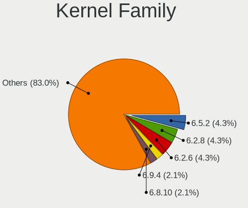

| Version | Notebooks | Percent |
|---------|-----------|---------|
| 6.2.8   | 2         | 5.88%   |
| 6.2.6   | 2         | 5.88%   |
| 6.3.7   | 1         | 2.94%   |
| 6.3.5   | 1         | 2.94%   |
| 6.3.3   | 1         | 2.94%   |
| 6.2.15  | 1         | 2.94%   |
| 6.2.13  | 1         | 2.94%   |
| 6.2.11  | 1         | 2.94%   |
| 6.2.0   | 1         | 2.94%   |
| 6.1.1   | 1         | 2.94%   |
| 5.9.8   | 1         | 2.94%   |
| 5.9.13  | 1         | 2.94%   |
| 5.8.5   | 1         | 2.94%   |
| 5.7.11  | 1         | 2.94%   |
| 5.4.5   | 1         | 2.94%   |
| 5.4.18  | 1         | 2.94%   |
| 5.3.12  | 1         | 2.94%   |
| 5.3.1   | 1         | 2.94%   |
| 5.16.17 | 1         | 2.94%   |
| 5.15.15 | 1         | 2.94%   |
| 5.13.8  | 1         | 2.94%   |
| 5.13.6  | 1         | 2.94%   |
| 5.13.4  | 1         | 2.94%   |
| 5.13.1  | 1         | 2.94%   |
| 5.12.12 | 1         | 2.94%   |
| 5.11.18 | 1         | 2.94%   |
| 5.11.11 | 1         | 2.94%   |
| 5.10.4  | 1         | 2.94%   |
| 5.10.19 | 1         | 2.94%   |
| 5.10.17 | 1         | 2.94%   |
| 5.10.12 | 1         | 2.94%   |
| 4.20.11 | 1         | 2.94%   |

Kernel Major Ver.
-----------------

Linux kernel major version

| Version | Notebooks | Percent |
|---------|-----------|---------|
| 6.2     | 7         | 24.14%  |
| 5.13    | 4         | 13.79%  |
| 6.3     | 3         | 10.34%  |
| 5.4     | 2         | 6.9%    |
| 5.3     | 2         | 6.9%    |
| 5.10    | 2         | 6.9%    |
| 6.1     | 1         | 3.45%   |
| 5.9     | 1         | 3.45%   |
| 5.8     | 1         | 3.45%   |
| 5.7     | 1         | 3.45%   |
| 5.16    | 1         | 3.45%   |
| 5.15    | 1         | 3.45%   |
| 5.12    | 1         | 3.45%   |
| 5.11    | 1         | 3.45%   |
| 4.20    | 1         | 3.45%   |

Arch
----

OS architecture (x86_64, i586, etc.)

| Name   | Notebooks | Percent |
|--------|-----------|---------|
| x86_64 | 22        | 100%    |

DE
--

Desktop Environment

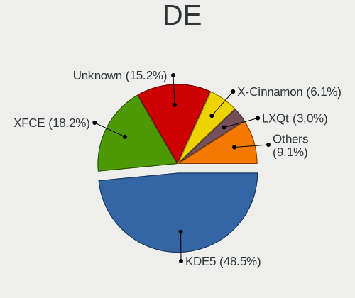

| Name            | Notebooks | Percent |
|-----------------|-----------|---------|
| KDE5            | 11        | 47.83%  |
| XFCE            | 4         | 17.39%  |
| Unknown         | 3         | 13.04%  |
| X-Cinnamon      | 2         | 8.7%    |
| LXQt            | 1         | 4.35%   |
| GNOME Flashback | 1         | 4.35%   |
| Cinnamon        | 1         | 4.35%   |

Display Server
--------------

X11 or Wayland

| Name    | Notebooks | Percent |
|---------|-----------|---------|
| X11     | 20        | 90.91%  |
| Wayland | 1         | 4.55%   |
| Tty     | 1         | 4.55%   |

Display Manager
---------------

SDDM, LightDM, etc.

| Name    | Notebooks | Percent |
|---------|-----------|---------|
| SDDM    | 13        | 59.09%  |
| Unknown | 7         | 31.82%  |
| TDM     | 1         | 4.55%   |
| GDM     | 1         | 4.55%   |

OS Lang
-------

Language

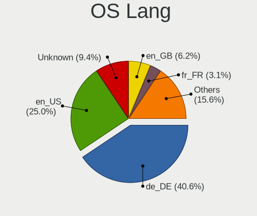

| Lang    | Notebooks | Percent |
|---------|-----------|---------|
| de_DE   | 9         | 37.5%   |
| en_US   | 5         | 20.83%  |
| Unknown | 3         | 12.5%   |
| en_GB   | 2         | 8.33%   |
| fr_FR   | 1         | 4.17%   |
| es_CO   | 1         | 4.17%   |
| en_CA   | 1         | 4.17%   |
| de_CH   | 1         | 4.17%   |
| C       | 1         | 4.17%   |

Boot Mode
---------

EFI or BIOS

| Mode | Notebooks | Percent |
|------|-----------|---------|
| EFI  | 12        | 54.55%  |
| BIOS | 10        | 45.45%  |

Filesystem
----------

Type of filesystem

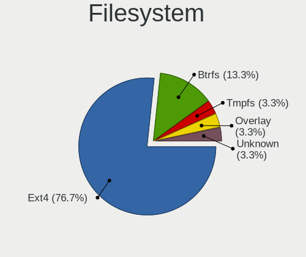

| Type    | Notebooks | Percent |
|---------|-----------|---------|
| Ext4    | 19        | 86.36%  |
| Btrfs   | 2         | 9.09%   |
| Unknown | 1         | 4.55%   |

Part. scheme
------------

Scheme of partitioning

| Type    | Notebooks | Percent |
|---------|-----------|---------|
| GPT     | 12        | 52.17%  |
| Unknown | 8         | 34.78%  |
| MBR     | 3         | 13.04%  |

Dual Boot with Linux/BSD
------------------------

Hosting more than one Linux/BSD

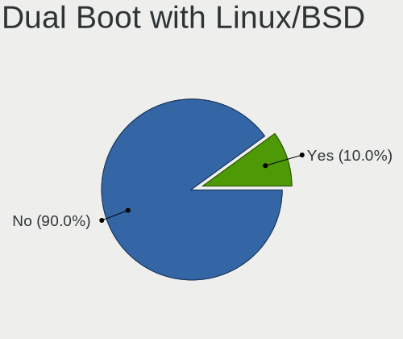

| Dual boot | Notebooks | Percent |
|-----------|-----------|---------|
| No        | 19        | 86.36%  |
| Yes       | 3         | 13.64%  |

Dual Boot (Win)
---------------

Hosting Linux and Windows

| Dual boot | Notebooks | Percent |
|-----------|-----------|---------|
| No        | 18        | 81.82%  |
| Yes       | 4         | 18.18%  |

Board
-----

Vendor
------

Motherboard manufacturer

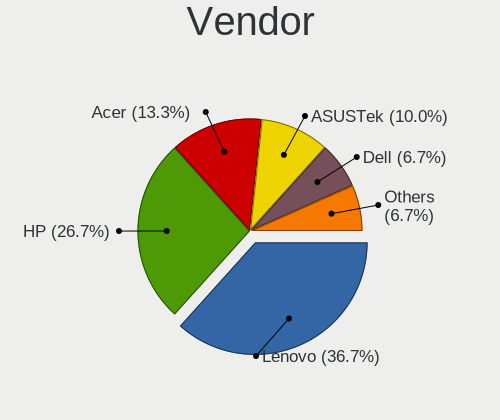

| Name             | Notebooks | Percent |
|------------------|-----------|---------|
| Hewlett-Packard  | 7         | 31.82%  |
| Lenovo           | 5         | 22.73%  |
| Acer             | 4         | 18.18%  |
| Dell             | 2         | 9.09%   |
| TUXEDO           | 1         | 4.55%   |
| Compal           | 1         | 4.55%   |
| ASUSTek Computer | 1         | 4.55%   |
| Apple            | 1         | 4.55%   |

Model
-----

Motherboard model

| Name                                     | Notebooks | Percent |
|------------------------------------------|-----------|---------|
| TUXEDO Book BA1510                       | 1         | 4.55%   |
| Lenovo ThinkPad X1 Carbon 5th 20HRCTO1WW | 1         | 4.55%   |
| Lenovo ThinkPad T410 253725G             | 1         | 4.55%   |
| Lenovo ThinkPad Edge E540 20C6003AGE     | 1         | 4.55%   |
| Lenovo ThinkPad E590 20NB001AIX          | 1         | 4.55%   |
| Lenovo IdeaPad 3 15IIL05 81WE            | 1         | 4.55%   |
| HP ZBook 15 G6                           | 1         | 4.55%   |
| HP ProBook 640 G1                        | 1         | 4.55%   |
| HP ProBook 4520s                         | 1         | 4.55%   |
| HP Laptop 17-ca1xxx                      | 1         | 4.55%   |
| HP Laptop 15-db0xxx                      | 1         | 4.55%   |
| HP EliteBook 865 16 inch G9 Notebook PC  | 1         | 4.55%   |
| HP 250 G7 Notebook PC                    | 1         | 4.55%   |
| Dell Vostro 15 3510                      | 1         | 4.55%   |
| Dell Latitude 5491                       | 1         | 4.55%   |
| Compal NBLBX                             | 1         | 4.55%   |
| ASUS ZenBook UX325JA_UX325JA             | 1         | 4.55%   |
| Apple MacBookPro9,2                      | 1         | 4.55%   |
| Acer Swift SF314-51                      | 1         | 4.55%   |
| Acer Aspire E5-771G                      | 1         | 4.55%   |
| Acer Aspire E5-551G                      | 1         | 4.55%   |
| Acer Aspire 5750                         | 1         | 4.55%   |

Model Family
------------

Motherboard model prefix

| Name              | Notebooks | Percent |
|-------------------|-----------|---------|
| Lenovo ThinkPad   | 4         | 18.18%  |
| Acer Aspire       | 3         | 13.64%  |
| HP ProBook        | 2         | 9.09%   |
| HP Laptop         | 2         | 9.09%   |
| TUXEDO Book       | 1         | 4.55%   |
| Lenovo IdeaPad    | 1         | 4.55%   |
| HP ZBook          | 1         | 4.55%   |
| HP EliteBook      | 1         | 4.55%   |
| HP 250            | 1         | 4.55%   |
| Dell Vostro       | 1         | 4.55%   |
| Dell Latitude     | 1         | 4.55%   |
| Compal NBLBX      | 1         | 4.55%   |
| ASUS ZenBook      | 1         | 4.55%   |
| Apple MacBookPro9 | 1         | 4.55%   |
| Acer Swift        | 1         | 4.55%   |

MFG Year
--------

Motherboard manufacture year

| Year | Notebooks | Percent |
|------|-----------|---------|
| 2020 | 3         | 13.64%  |
| 2019 | 3         | 13.64%  |
| 2018 | 3         | 13.64%  |
| 2014 | 2         | 9.09%   |
| 2013 | 2         | 9.09%   |
| 2010 | 2         | 9.09%   |
| 2022 | 1         | 4.55%   |
| 2021 | 1         | 4.55%   |
| 2017 | 1         | 4.55%   |
| 2016 | 1         | 4.55%   |
| 2012 | 1         | 4.55%   |
| 2011 | 1         | 4.55%   |
| 2009 | 1         | 4.55%   |

Form Factor
-----------

Physical design of the computer

| Name     | Notebooks | Percent |
|----------|-----------|---------|
| Notebook | 22        | 100%    |

Secure Boot
-----------

Enabled or disabled

| State    | Notebooks | Percent |
|----------|-----------|---------|
| Disabled | 22        | 100%    |

Coreboot
--------

Have coreboot on board

| Used | Notebooks | Percent |
|------|-----------|---------|
| No   | 22        | 100%    |

RAM Size
--------

Total RAM memory

| Size in GB  | Notebooks | Percent |
|-------------|-----------|---------|
| 4.01-8.0    | 8         | 34.78%  |
| 16.01-24.0  | 5         | 21.74%  |
| 8.01-16.0   | 5         | 21.74%  |
| 32.01-64.0  | 2         | 8.7%    |
| 3.01-4.0    | 1         | 4.35%   |
| 64.01-256.0 | 1         | 4.35%   |
| Unknown     | 1         | 4.35%   |

RAM Used
--------

Used RAM memory

| Used GB  | Notebooks | Percent |
|----------|-----------|---------|
| 2.01-3.0 | 8         | 29.63%  |
| 4.01-8.0 | 6         | 22.22%  |
| 3.01-4.0 | 6         | 22.22%  |
| 1.01-2.0 | 4         | 14.81%  |
| 0.51-1.0 | 2         | 7.41%   |
| Unknown  | 1         | 3.7%    |

Total Drives
------------

Number of drives on board

| Drives | Notebooks | Percent |
|--------|-----------|---------|
| 1      | 15        | 68.18%  |
| 2      | 7         | 31.82%  |

Has CD-ROM
----------

Has CD-ROM on board

| Presented | Notebooks | Percent |
|-----------|-----------|---------|
| No        | 14        | 63.64%  |
| Yes       | 8         | 36.36%  |

Has Ethernet
------------

Has Ethernet on board

| Presented | Notebooks | Percent |
|-----------|-----------|---------|
| Yes       | 18        | 81.82%  |
| No        | 4         | 18.18%  |

Has WiFi
--------

Has WiFi module

| Presented | Notebooks | Percent |
|-----------|-----------|---------|
| Yes       | 22        | 100%    |

Has Bluetooth
-------------

Has Bluetooth module

| Presented | Notebooks | Percent |
|-----------|-----------|---------|
| Yes       | 18        | 75%     |
| No        | 6         | 25%     |

Location
--------

Country
-------

Geographic location (country)

| Country     | Notebooks | Percent |
|-------------|-----------|---------|
| Germany     | 9         | 39.13%  |
| Canada      | 3         | 13.04%  |
| USA         | 2         | 8.7%    |
| UK          | 2         | 8.7%    |
| Switzerland | 1         | 4.35%   |
| Sweden      | 1         | 4.35%   |
| Italy       | 1         | 4.35%   |
| Israel      | 1         | 4.35%   |
| France      | 1         | 4.35%   |
| Colombia    | 1         | 4.35%   |
| Austria     | 1         | 4.35%   |

City
----

Geographic location (city)

| City                 | Notebooks | Percent |
|----------------------|-----------|---------|
| Munich               | 2         | 6.9%    |
| Zurich               | 1         | 3.45%   |
| Vienna               | 1         | 3.45%   |
| Turin                | 1         | 3.45%   |
| Toronto              | 1         | 3.45%   |
| Suisun               | 1         | 3.45%   |
| Stuttgart            | 1         | 3.45%   |
| Stockholm            | 1         | 3.45%   |
| Sidney               | 1         | 3.45%   |
| Schrobenhausen       | 1         | 3.45%   |
| San Francisco        | 1         | 3.45%   |
| Reading              | 1         | 3.45%   |
| Paris                | 1         | 3.45%   |
| Mittenwald           | 1         | 3.45%   |
| Milan                | 1         | 3.45%   |
| Mannheim             | 1         | 3.45%   |
| Malmo                | 1         | 3.45%   |
| Langewiesen          | 1         | 3.45%   |
| Jerusalem            | 1         | 3.45%   |
| Iserlohn             | 1         | 3.45%   |
| Hamburg              | 1         | 3.45%   |
| Friedrichsthal       | 1         | 3.45%   |
| Freiburg im Breisgau | 1         | 3.45%   |
| Edmonton             | 1         | 3.45%   |
| Düsseldorf          | 1         | 3.45%   |
| Bogotá              | 1         | 3.45%   |
| Blackwood            | 1         | 3.45%   |
| Berlin               | 1         | 3.45%   |

Drives
------

Drive Vendor
------------

Hard drive vendors

| Vendor              | Notebooks | Drives | Percent |
|---------------------|-----------|--------|---------|
| Samsung Electronics | 9         | 10     | 30%     |
| Toshiba             | 5         | 14     | 16.67%  |
| WDC                 | 4         | 5      | 13.33%  |
| SK hynix            | 2         | 2      | 6.67%   |
| Seagate             | 2         | 2      | 6.67%   |
| SanDisk             | 2         | 2      | 6.67%   |
| Intel               | 2         | 4      | 6.67%   |
| SSSTC               | 1         | 1      | 3.33%   |
| SPCC                | 1         | 1      | 3.33%   |
| Kingston            | 1         | 1      | 3.33%   |
| Crucial             | 1         | 2      | 3.33%   |

Drive Model
-----------

Hard drive models

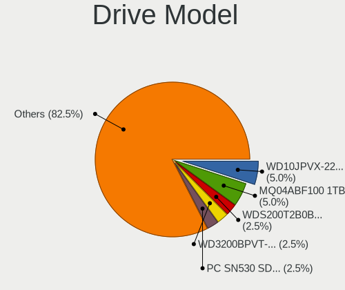

| Model                                   | Notebooks | Percent |
|-----------------------------------------|-----------|---------|
| WDC WD10JPVX-22JC3T0 1TB                | 2         | 6.45%   |
| Toshiba MQ04ABF100 1TB                  | 2         | 6.45%   |
| WDC WDS200T2B0B-00YS70 2TB SSD          | 1         | 3.23%   |
| WDC PC SN530 SDBPMPZ-512G-1101 512GB    | 1         | 3.23%   |
| Toshiba THNSNK256GVN8 256GB SSD         | 1         | 3.23%   |
| Toshiba MQ01ACF032 320GB                | 1         | 3.23%   |
| Toshiba KBG30ZMT256G 256GB              | 1         | 3.23%   |
| SSSTC CL4-3D256-Q11 NVMe 256GB          | 1         | 3.23%   |
| SPCC Solid State Disk 512GB             | 1         | 3.23%   |
| SK hynix NVMe SSD Drive 512GB           | 1         | 3.23%   |
| SK hynix BC501 HFM256GDJTNG-8310A 256GB | 1         | 3.23%   |
| Seagate ST9500420AS 500GB               | 1         | 3.23%   |
| Seagate ST1000LM014-1EJ164 1TB          | 1         | 3.23%   |
| Sandisk WD Blue SN570 1TB               | 1         | 3.23%   |
| SanDisk SSD U110 16GB                   | 1         | 3.23%   |
| Samsung SSD 990 PRO 2TB                 | 1         | 3.23%   |
| Samsung SSD 980 PRO 1TB                 | 1         | 3.23%   |
| Samsung SSD 870 QVO 1TB                 | 1         | 3.23%   |
| Samsung SSD 860 EVO M.2 1TB             | 1         | 3.23%   |
| Samsung SSD 850 EVO 500GB               | 1         | 3.23%   |
| Samsung SSD 850 EVO 250GB               | 1         | 3.23%   |
| Samsung SSD 840 Series 250GB            | 1         | 3.23%   |
| Samsung MZVLQ128HBHQ-00000 128GB        | 1         | 3.23%   |
| Samsung HM321HI 320GB                   | 1         | 3.23%   |
| Kingston SA2000M8500G 500GB             | 1         | 3.23%   |
| Intel SSDPEKNW010T9 1024GB              | 1         | 3.23%   |
| Intel HBRPEKNX0203AO 32GB               | 1         | 3.23%   |
| Intel HBRPEKNX0203A 1TB                 | 1         | 3.23%   |
| Crucial CT1000MX500SSD1 1TB             | 1         | 3.23%   |

HDD Vendor
----------

Hard disk drive vendors

| Vendor              | Notebooks | Drives | Percent |
|---------------------|-----------|--------|---------|
| Toshiba             | 3         | 11     | 37.5%   |
| WDC                 | 2         | 3      | 25%     |
| Seagate             | 2         | 2      | 25%     |
| Samsung Electronics | 1         | 1      | 12.5%   |

SSD Vendor
----------

Solid state drive vendors

| Vendor              | Notebooks | Drives | Percent |
|---------------------|-----------|--------|---------|
| Samsung Electronics | 5         | 6      | 50%     |
| WDC                 | 1         | 1      | 10%     |
| Toshiba             | 1         | 1      | 10%     |
| SPCC                | 1         | 1      | 10%     |
| SanDisk             | 1         | 1      | 10%     |
| Crucial             | 1         | 2      | 10%     |

Drive Kind
----------

HDD or SSD

| Kind | Notebooks | Drives | Percent |
|------|-----------|--------|---------|
| NVMe | 11        | 15     | 40.74%  |
| SSD  | 8         | 12     | 29.63%  |
| HDD  | 8         | 17     | 29.63%  |

Drive Connector
---------------

SATA, SAS, NVMe, etc.

| Type | Notebooks | Drives | Percent |
|------|-----------|--------|---------|
| SATA | 15        | 29     | 57.69%  |
| NVMe | 11        | 15     | 42.31%  |

Drive Size
----------

Size of hard drive

| Size in TB | Notebooks | Drives | Percent |
|------------|-----------|--------|---------|
| 0.51-1.0   | 8         | 18     | 50%     |
| 0.01-0.5   | 7         | 10     | 43.75%  |
| 1.01-2.0   | 1         | 1      | 6.25%   |

Space Total
-----------

Amount of disk space available on the file system

| Size in GB | Notebooks | Percent |
|------------|-----------|---------|
| 251-500    | 7         | 28%     |
| 101-250    | 4         | 16%     |
| 1001-2000  | 4         | 16%     |
| Unknown    | 4         | 16%     |
| 501-1000   | 3         | 12%     |
| 1-20       | 2         | 8%      |
| 21-50      | 1         | 4%      |

Space Used
----------

Amount of used disk space

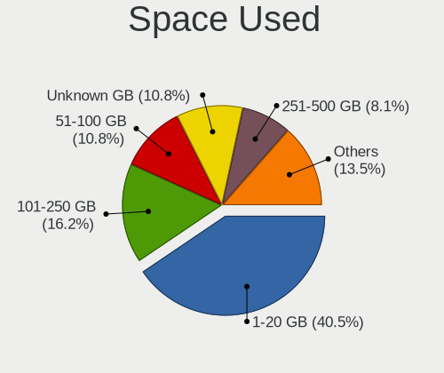

| Used GB   | Notebooks | Percent |
|-----------|-----------|---------|
| 1-20      | 11        | 40.74%  |
| 101-250   | 4         | 14.81%  |
| Unknown   | 4         | 14.81%  |
| 251-500   | 2         | 7.41%   |
| 501-1000  | 2         | 7.41%   |
| 51-100    | 2         | 7.41%   |
| 21-50     | 1         | 3.7%    |
| 1001-2000 | 1         | 3.7%    |

Malfunc. Drives
---------------

Drive models with a malfunction

| Model                                   | Notebooks | Drives | Percent |
|-----------------------------------------|-----------|--------|---------|
| SK hynix BC501 HFM256GDJTNG-8310A 256GB | 1         | 1      | 100%    |

Malfunc. Drive Vendor
---------------------

Vendors of faulty drives

| Vendor   | Notebooks | Drives | Percent |
|----------|-----------|--------|---------|
| SK hynix | 1         | 1      | 100%    |

Malfunc. HDD Vendor
-------------------

Vendors of faulty HDD drives

Zero info for selected period =(

Malfunc. Drive Kind
-------------------

Kinds of faulty drives

| Kind | Notebooks | Drives | Percent |
|------|-----------|--------|---------|
| NVMe | 1         | 1      | 100%    |

Failed Drives
-------------

Failed drive models

Zero info for selected period =(

Failed Drive Vendor
-------------------

Failed drive vendors

Zero info for selected period =(

Drive Status
------------

Number of failed and malfunc. drives

| Status   | Notebooks | Drives | Percent |
|----------|-----------|--------|---------|
| Works    | 17        | 34     | 68%     |
| Detected | 7         | 9      | 28%     |
| Malfunc  | 1         | 1      | 4%      |

Storage controller
------------------

Storage Vendor
--------------

Storage controller vendors

| Vendor                         | Notebooks | Percent |
|--------------------------------|-----------|---------|
| Intel                          | 17        | 54.84%  |
| AMD                            | 4         | 12.9%   |
| Toshiba America Info Systems   | 2         | 6.45%   |
| SK hynix                       | 2         | 6.45%   |
| SanDisk                        | 2         | 6.45%   |
| Samsung Electronics            | 2         | 6.45%   |
| Solid State Storage Technology | 1         | 3.23%   |
| Kingston Technology Company    | 1         | 3.23%   |

Storage Model
-------------

Storage controller models

| Model                                                                          | Notebooks | Percent |
|--------------------------------------------------------------------------------|-----------|---------|
| AMD FCH SATA Controller [AHCI mode]                                            | 4         | 12.12%  |
| Toshiba America Info Systems BG3 NVMe SSD Controller                           | 2         | 6.06%   |
| SK hynix BC501 NVMe Solid State Drive                                          | 2         | 6.06%   |
| Intel Cannon Lake Mobile PCH SATA AHCI Controller                              | 2         | 6.06%   |
| Intel 82801 Mobile SATA Controller [RAID mode]                                 | 2         | 6.06%   |
| Intel 8 Series/C220 Series Chipset Family 6-port SATA Controller 1 [AHCI mode] | 2         | 6.06%   |
| Solid State Storage Non-Volatile memory controller                             | 1         | 3.03%   |
| SanDisk WD Blue SN570 NVMe SSD 1TB                                             | 1         | 3.03%   |
| SanDisk NVMe Controller                                                        | 1         | 3.03%   |
| Samsung NVMe SSD Controller PM9A1/PM9A3/980PRO                                 | 1         | 3.03%   |
| Samsung Electronics Non-Volatile memory controller                             | 1         | 3.03%   |
| Kingston Company A2000 NVMe SSD                                                | 1         | 3.03%   |
| Intel Wildcat Point-LP SATA Controller [AHCI Mode]                             | 1         | 3.03%   |
| Intel Tiger Lake-LP SATA Controller                                            | 1         | 3.03%   |
| Intel Sunrise Point-LP SATA Controller [AHCI mode]                             | 1         | 3.03%   |
| Intel SSD 665p Series                                                          | 1         | 3.03%   |
| Intel NVMe Controller                                                          | 1         | 3.03%   |
| Intel Ice Lake-LP SATA Controller [AHCI mode]                                  | 1         | 3.03%   |
| Intel Cannon Point-LP SATA Controller [AHCI Mode]                              | 1         | 3.03%   |
| Intel 7 Series Chipset Family 6-port SATA Controller [AHCI mode]               | 1         | 3.03%   |
| Intel 6 Series/C200 Series Chipset Family 6 port Mobile SATA AHCI Controller   | 1         | 3.03%   |
| Intel 5 Series/3400 Series Chipset 6 port SATA AHCI Controller                 | 1         | 3.03%   |
| Intel 5 Series/3400 Series Chipset 4 port SATA IDE Controller                  | 1         | 3.03%   |
| Intel 5 Series/3400 Series Chipset 4 port SATA AHCI Controller                 | 1         | 3.03%   |
| Intel 5 Series/3400 Series Chipset 2 port SATA IDE Controller                  | 1         | 3.03%   |

Storage Kind
------------

Kind of storage controller (IDE, SATA, NVMe, SAS, ...)

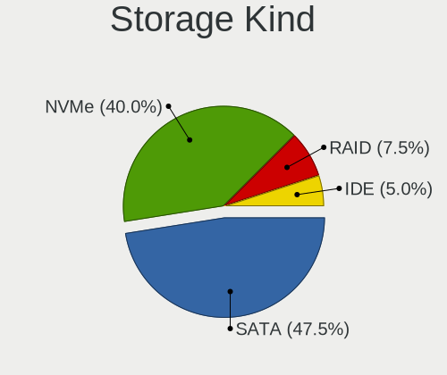

| Kind | Notebooks | Percent |
|------|-----------|---------|
| SATA | 17        | 54.84%  |
| NVMe | 11        | 35.48%  |
| RAID | 2         | 6.45%   |
| IDE  | 1         | 3.23%   |

Processor
---------

CPU Vendor
----------

Processor vendors

| Vendor | Notebooks | Percent |
|--------|-----------|---------|
| Intel  | 17        | 77.27%  |
| AMD    | 5         | 22.73%  |

CPU Model
---------

Processor models

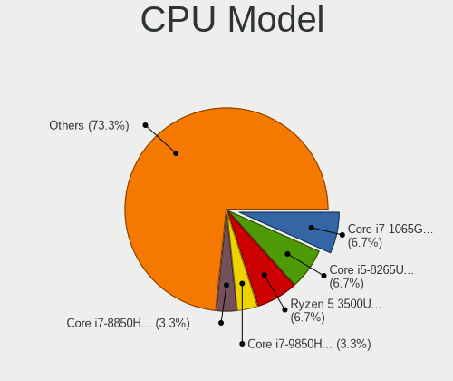

| Model                                         | Notebooks | Percent |
|-----------------------------------------------|-----------|---------|
| Intel Core i7-1065G7 CPU @ 1.30GHz            | 2         | 9.09%   |
| Intel Core i5-8265U CPU @ 1.60GHz             | 2         | 9.09%   |
| AMD Ryzen 5 3500U with Radeon Vega Mobile Gfx | 2         | 9.09%   |
| Intel Core i7-9850H CPU @ 2.60GHz             | 1         | 4.55%   |
| Intel Core i7-8850H CPU @ 2.60GHz             | 1         | 4.55%   |
| Intel Core i7-7600U CPU @ 2.80GHz             | 1         | 4.55%   |
| Intel Core i7-4702MQ CPU @ 2.20GHz            | 1         | 4.55%   |
| Intel Core i5-6200U CPU @ 2.30GHz             | 1         | 4.55%   |
| Intel Core i5-5200U CPU @ 2.20GHz             | 1         | 4.55%   |
| Intel Core i5-3210M CPU @ 2.50GHz             | 1         | 4.55%   |
| Intel Core i5 CPU M 560 @ 2.67GHz             | 1         | 4.55%   |
| Intel Core i5 CPU M 540 @ 2.53GHz             | 1         | 4.55%   |
| Intel Core i5 CPU M 430 @ 2.27GHz             | 1         | 4.55%   |
| Intel Core i3-4000M CPU @ 2.40GHz             | 1         | 4.55%   |
| Intel Core i3-2310M CPU @ 2.10GHz             | 1         | 4.55%   |
| Intel 11th Gen Core i5-1135G7 @ 2.40GHz       | 1         | 4.55%   |
| AMD Ryzen 9 PRO 6950HS with Radeon Graphics   | 1         | 4.55%   |
| AMD Ryzen 5 2500U with Radeon Vega Mobile Gfx | 1         | 4.55%   |
| AMD FX-7500 Radeon R7, 10 Compute Cores 4C+6G | 1         | 4.55%   |

CPU Model Family
----------------

Processor model prefix

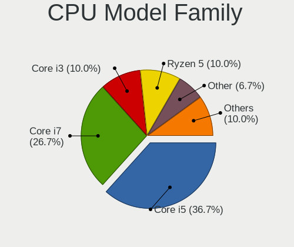

| Model         | Notebooks | Percent |
|---------------|-----------|---------|
| Intel Core i5 | 8         | 36.36%  |
| Intel Core i7 | 6         | 27.27%  |
| AMD Ryzen 5   | 3         | 13.64%  |
| Intel Core i3 | 2         | 9.09%   |
| Other         | 1         | 4.55%   |
| AMD Ryzen 9   | 1         | 4.55%   |
| AMD FX        | 1         | 4.55%   |

CPU Cores
---------

Number of processor cores

| Number | Notebooks | Percent |
|--------|-----------|---------|
| 2      | 10        | 45.45%  |
| 4      | 9         | 40.91%  |
| 6      | 2         | 9.09%   |
| 8      | 1         | 4.55%   |

CPU Sockets
-----------

Number of sockets

| Number | Notebooks | Percent |
|--------|-----------|---------|
| 1      | 22        | 100%    |

CPU Threads
-----------

Threads per core (Hyper-Threading)

| Number | Notebooks | Percent |
|--------|-----------|---------|
| 2      | 22        | 100%    |

CPU Op-Modes
------------

CPU Operation Modes (32-bit, 64-bit)

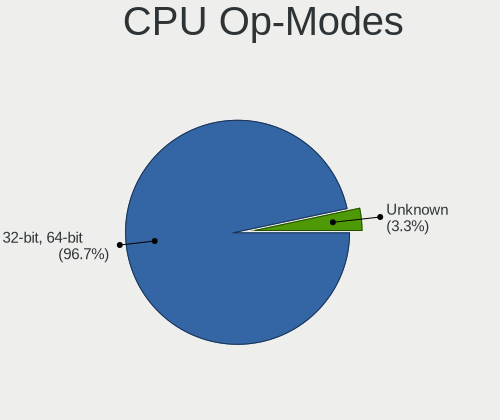

| Op mode        | Notebooks | Percent |
|----------------|-----------|---------|
| 32-bit, 64-bit | 21        | 95.45%  |
| Unknown        | 1         | 4.55%   |

CPU Microcode
-------------

Microcode number

| Number     | Notebooks | Percent |
|------------|-----------|---------|
| Unknown    | 8         | 30.77%  |
| 0x806ec    | 2         | 7.69%   |
| 0x706e5    | 2         | 7.69%   |
| 0x20655    | 2         | 7.69%   |
| 0x08108102 | 2         | 7.69%   |
| 0x806eb    | 1         | 3.85%   |
| 0x806e9    | 1         | 3.85%   |
| 0x306d4    | 1         | 3.85%   |
| 0x306c3    | 1         | 3.85%   |
| 0x206a7    | 1         | 3.85%   |
| 0x20652    | 1         | 3.85%   |
| 0x0a404102 | 1         | 3.85%   |
| 0x08108109 | 1         | 3.85%   |
| 0x0810100b | 1         | 3.85%   |
| 0x06003106 | 1         | 3.85%   |

CPU Microarch
-------------

Microarchitecture

| Name        | Notebooks | Percent |
|-------------|-----------|---------|
| KabyLake    | 5         | 22.73%  |
| Westmere    | 3         | 13.64%  |
| Zen+        | 2         | 9.09%   |
| IceLake     | 2         | 9.09%   |
| Haswell     | 2         | 9.09%   |
| Zen         | 1         | 4.55%   |
| TigerLake   | 1         | 4.55%   |
| Steamroller | 1         | 4.55%   |
| Skylake     | 1         | 4.55%   |
| SandyBridge | 1         | 4.55%   |
| IvyBridge   | 1         | 4.55%   |
| Broadwell   | 1         | 4.55%   |
| Unknown     | 1         | 4.55%   |

Graphics
--------

GPU Vendor
----------

Vendors of graphics cards

| Vendor | Notebooks | Percent |
|--------|-----------|---------|
| Intel  | 15        | 57.69%  |
| AMD    | 7         | 26.92%  |
| Nvidia | 4         | 15.38%  |

GPU Model
---------

Graphics card models

| Model                                                                       | Notebooks | Percent |
|-----------------------------------------------------------------------------|-----------|---------|
| Intel WhiskeyLake-U GT2 [UHD Graphics 620]                                  | 2         | 7.41%   |
| Intel Iris Plus Graphics G7                                                 | 2         | 7.41%   |
| Intel Core Processor Integrated Graphics Controller                         | 2         | 7.41%   |
| Intel 4th Gen Core Processor Integrated Graphics Controller                 | 2         | 7.41%   |
| AMD Picasso/Raven 2 [Radeon Vega Series / Radeon Vega Mobile Series]        | 2         | 7.41%   |
| Nvidia TU117GLM [Quadro T2000 Mobile / Max-Q]                               | 1         | 3.7%    |
| Nvidia GM108M [GeForce MX130]                                               | 1         | 3.7%    |
| Nvidia GK208M [GeForce GT 740M]                                             | 1         | 3.7%    |
| Nvidia GF117M [GeForce 610M/710M/810M/820M / GT 620M/625M/630M/720M]        | 1         | 3.7%    |
| Intel TigerLake-LP GT2 [Iris Xe Graphics]                                   | 1         | 3.7%    |
| Intel Skylake GT2 [HD Graphics 520]                                         | 1         | 3.7%    |
| Intel HD Graphics 620                                                       | 1         | 3.7%    |
| Intel HD Graphics 5500                                                      | 1         | 3.7%    |
| Intel CoffeeLake-H GT2 [UHD Graphics 630]                                   | 1         | 3.7%    |
| Intel 3rd Gen Core processor Graphics Controller                            | 1         | 3.7%    |
| Intel 2nd Generation Core Processor Family Integrated Graphics Controller   | 1         | 3.7%    |
| AMD RV711/M93 [Mobility Radeon HD 4350/4550/530v/540v/545v / FirePro RG220] | 1         | 3.7%    |
| AMD Rembrandt [Radeon 680M]                                                 | 1         | 3.7%    |
| AMD Raven Ridge [Radeon Vega Series / Radeon Vega Mobile Series]            | 1         | 3.7%    |
| AMD Opal XT [Radeon R7 M265/M365X/M465]                                     | 1         | 3.7%    |
| AMD Madison [Mobility Radeon HD 5650/5750 / 6530M/6550M]                    | 1         | 3.7%    |
| AMD Kaveri [Radeon R6/R7 Graphics]                                          | 1         | 3.7%    |

GPU Combo
---------

Combinations of graphics cards

| Name           | Notebooks | Percent |
|----------------|-----------|---------|
| 1 x Intel      | 11        | 50%     |
| 1 x AMD        | 5         | 22.73%  |
| Intel + Nvidia | 3         | 13.64%  |
| 2 x AMD        | 1         | 4.55%   |
| 1 x Nvidia     | 1         | 4.55%   |
| Intel + AMD    | 1         | 4.55%   |

GPU Driver
----------

Free vs proprietary

| Driver      | Notebooks | Percent |
|-------------|-----------|---------|
| Free        | 20        | 90.91%  |
| Proprietary | 2         | 9.09%   |

GPU Memory
----------

Total video memory

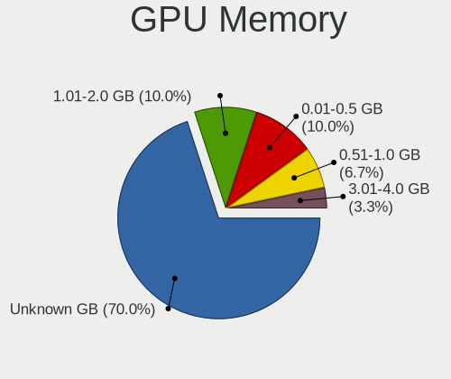

| Size in GB | Notebooks | Percent |
|------------|-----------|---------|
| Unknown    | 13        | 59.09%  |
| 1.01-2.0   | 3         | 13.64%  |
| 0.01-0.5   | 3         | 13.64%  |
| 0.51-1.0   | 2         | 9.09%   |
| 3.01-4.0   | 1         | 4.55%   |

Monitor
-------

Monitor Vendor
--------------

Monitor vendors

| Vendor          | Notebooks | Percent |
|-----------------|-----------|---------|
| Chimei Innolux  | 8         | 30.77%  |
| LG Display      | 5         | 19.23%  |
| AU Optronics    | 4         | 15.38%  |
| Lenovo          | 2         | 7.69%   |
| BOE             | 2         | 7.69%   |
| Hewlett-Packard | 1         | 3.85%   |
| Goldstar        | 1         | 3.85%   |
| Dell            | 1         | 3.85%   |
| Apple           | 1         | 3.85%   |
| AOC             | 1         | 3.85%   |

Monitor Model
-------------

Monitor models

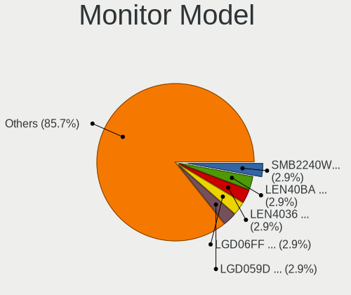

| Model                                                            | Notebooks | Percent |
|------------------------------------------------------------------|-----------|---------|
| LG Display LCD Monitor LGD06FF 1920x1080 344x194mm 15.5-inch     | 1         | 3.85%   |
| LG Display LCD Monitor LGD059D 1920x1080 309x174mm 14.0-inch     | 1         | 3.85%   |
| LG Display LCD Monitor LGD051D 1920x1080 309x174mm 14.0-inch     | 1         | 3.85%   |
| LG Display LCD Monitor LGD045E 1366x768 310x174mm 14.0-inch      | 1         | 3.85%   |
| LG Display LCD Monitor LGD03DE 1600x900 382x215mm 17.3-inch      | 1         | 3.85%   |
| Lenovo LCD Monitor LEN40BA 1920x1080 344x194mm 15.5-inch         | 1         | 3.85%   |
| Lenovo LCD Monitor LEN4036 1440x900 303x190mm 14.1-inch          | 1         | 3.85%   |
| Hewlett-Packard E243i HPN3463 1920x1200 520x320mm 24.0-inch      | 1         | 3.85%   |
| Goldstar LG Ultra HD GSM5B08 3840x2160 600x340mm 27.2-inch       | 1         | 3.85%   |
| Dell U2415 DELA0BC 1920x1200 518x324mm 24.1-inch                 | 1         | 3.85%   |
| Chimei Innolux LCD Monitor CMN175A 1920x1080 381x214mm 17.2-inch | 1         | 3.85%   |
| Chimei Innolux LCD Monitor CMN1610 1920x1200 344x215mm 16.0-inch | 1         | 3.85%   |
| Chimei Innolux LCD Monitor CMN15F6 1920x1080 340x190mm 15.3-inch | 1         | 3.85%   |
| Chimei Innolux LCD Monitor CMN15E8 1920x1080 344x193mm 15.5-inch | 1         | 3.85%   |
| Chimei Innolux LCD Monitor CMN15DB 1366x768 344x193mm 15.5-inch  | 1         | 3.85%   |
| Chimei Innolux LCD Monitor CMN15C3 1920x1080 344x193mm 15.5-inch | 1         | 3.85%   |
| Chimei Innolux LCD Monitor CMN15C0 1920x1080 344x194mm 15.5-inch | 1         | 3.85%   |
| Chimei Innolux LCD Monitor CMN1388 1920x1080 293x165mm 13.2-inch | 1         | 3.85%   |
| BOE LCD Monitor BOE0812 1920x1080 344x194mm 15.5-inch            | 1         | 3.85%   |
| BOE LCD Monitor BOE0687 1920x1080 344x193mm 15.5-inch            | 1         | 3.85%   |
| AU Optronics LCD Monitor AUO313D 1920x1080 309x174mm 14.0-inch   | 1         | 3.85%   |
| AU Optronics LCD Monitor AUO26EC 1366x768 344x193mm 15.5-inch    | 1         | 3.85%   |
| AU Optronics LCD Monitor AUO23EC 1366x768 344x193mm 15.5-inch    | 1         | 3.85%   |
| AU Optronics LCD Monitor AUO10ED 1920x1080 344x193mm 15.5-inch   | 1         | 3.85%   |
| Apple LCD Monitor APP9CC3 1280x800 286x179mm 13.3-inch           | 1         | 3.85%   |
| AOC 2436 AOC2436 1920x1080 521x293mm 23.5-inch                   | 1         | 3.85%   |

Monitor Resolution
------------------

Monitor screen resolution

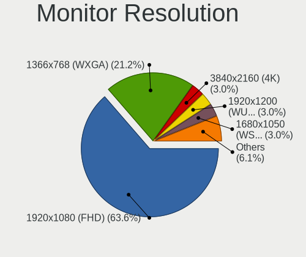

| Resolution        | Notebooks | Percent |
|-------------------|-----------|---------|
| 1920x1080 (FHD)   | 15        | 62.5%   |
| 1366x768 (WXGA)   | 4         | 16.67%  |
| 3840x2160 (4K)    | 1         | 4.17%   |
| 1920x1200 (WUXGA) | 1         | 4.17%   |
| 1600x900 (HD+)    | 1         | 4.17%   |
| 1440x900 (WXGA+)  | 1         | 4.17%   |
| 1280x800 (WXGA)   | 1         | 4.17%   |

Monitor Diagonal
----------------

Diagonal size in inches

| Inches | Notebooks | Percent |
|--------|-----------|---------|
| 15     | 12        | 46.15%  |
| 14     | 5         | 19.23%  |
| 17     | 2         | 7.69%   |
| 13     | 2         | 7.69%   |
| 40     | 1         | 3.85%   |
| 27     | 1         | 3.85%   |
| 24     | 1         | 3.85%   |
| 23     | 1         | 3.85%   |
| 16     | 1         | 3.85%   |

Monitor Width
-------------

Physical width

| Width in mm | Notebooks | Percent |
|-------------|-----------|---------|
| 301-350     | 18        | 69.23%  |
| 501-600     | 3         | 11.54%  |
| 351-400     | 2         | 7.69%   |
| 201-300     | 2         | 7.69%   |
| 801-900     | 1         | 3.85%   |

Aspect Ratio
------------

Proportional relationship between the width and the height

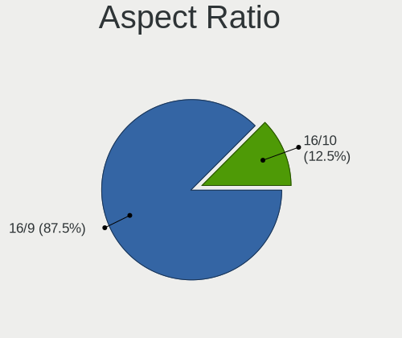

| Ratio | Notebooks | Percent |
|-------|-----------|---------|
| 16/9  | 19        | 82.61%  |
| 16/10 | 4         | 17.39%  |

Monitor Area
------------

Area in inch²

| Area in inch² | Notebooks | Percent |
|----------------|-----------|---------|
| 101-110        | 12        | 46.15%  |
| 81-90          | 6         | 23.08%  |
| 121-130        | 2         | 7.69%   |
| 71-80          | 1         | 3.85%   |
| 301-350        | 1         | 3.85%   |
| 251-300        | 1         | 3.85%   |
| 201-250        | 1         | 3.85%   |
| 111-120        | 1         | 3.85%   |
| 501-1000       | 1         | 3.85%   |

Pixel Density
-------------

Pixels per inch

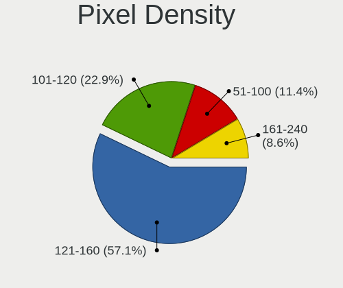

| Density | Notebooks | Percent |
|---------|-----------|---------|
| 121-160 | 15        | 57.69%  |
| 101-120 | 6         | 23.08%  |
| 51-100  | 3         | 11.54%  |
| 161-240 | 2         | 7.69%   |

Multiple Monitors
-----------------

Total monitors connected

| Total | Notebooks | Percent |
|-------|-----------|---------|
| 1     | 18        | 81.82%  |
| 2     | 4         | 18.18%  |

Network
-------

Net Controller Vendor
---------------------

Controller vendors

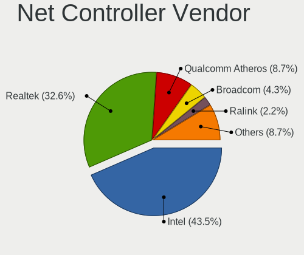

| Vendor                | Notebooks | Percent |
|-----------------------|-----------|---------|
| Intel                 | 13        | 38.24%  |
| Realtek Semiconductor | 12        | 35.29%  |
| Qualcomm Atheros      | 4         | 11.76%  |
| Broadcom              | 3         | 8.82%   |
| Qualcomm              | 1         | 2.94%   |
| NetGear               | 1         | 2.94%   |

Net Controller Model
--------------------

Controller models

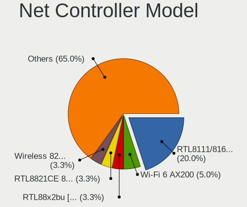

| Model                                                             | Notebooks | Percent |
|-------------------------------------------------------------------|-----------|---------|
| Realtek RTL8111/8168/8411 PCI Express Gigabit Ethernet Controller | 11        | 26.19%  |
| Realtek RTL8821CE 802.11ac PCIe Wireless Network Adapter          | 2         | 4.76%   |
| Intel Wi-Fi 6 AX200                                               | 2         | 4.76%   |
| Intel Ice Lake-LP PCH CNVi WiFi                                   | 2         | 4.76%   |
| Realtek RTL88x2bu [AC1200 Techkey]                                | 1         | 2.38%   |
| Realtek RTL8723DE Wireless Network Adapter                        | 1         | 2.38%   |
| Realtek RTL8153 Gigabit Ethernet Adapter                          | 1         | 2.38%   |
| Qualcomm QCNFA765 Wireless Network Adapter                        | 1         | 2.38%   |
| Qualcomm Atheros QCA9565 / AR9565 Wireless Network Adapter        | 1         | 2.38%   |
| Qualcomm Atheros QCA6174 802.11ac Wireless Network Adapter        | 1         | 2.38%   |
| Qualcomm Atheros AR9287 Wireless Network Adapter (PCI-Express)    | 1         | 2.38%   |
| Qualcomm Atheros AR9285 Wireless Network Adapter (PCI-Express)    | 1         | 2.38%   |
| NetGear A6100 AC600 DB Wireless Adapter [Realtek RTL8811AU]       | 1         | 2.38%   |
| Intel Wireless-AC 9260                                            | 1         | 2.38%   |
| Intel Wireless 8265 / 8275                                        | 1         | 2.38%   |
| Intel Wireless 7260                                               | 1         | 2.38%   |
| Intel Wireless 3160                                               | 1         | 2.38%   |
| Intel Wi-Fi 6 AX201                                               | 1         | 2.38%   |
| Intel Ethernet Connection I217-V                                  | 1         | 2.38%   |
| Intel Ethernet Connection (7) I219-LM                             | 1         | 2.38%   |
| Intel Ethernet Connection (4) I219-LM                             | 1         | 2.38%   |
| Intel Centrino Wireless-N 1000 [Condor Peak]                      | 1         | 2.38%   |
| Intel Centrino Advanced-N 6200                                    | 1         | 2.38%   |
| Intel Cannon Lake PCH CNVi WiFi                                   | 1         | 2.38%   |
| Intel 82577LM Gigabit Network Connection                          | 1         | 2.38%   |
| Broadcom NetXtreme BCM57765 Gigabit Ethernet PCIe                 | 1         | 2.38%   |
| Broadcom NetLink BCM57785 Gigabit Ethernet PCIe                   | 1         | 2.38%   |
| Broadcom BCM4331 802.11a/b/g/n                                    | 1         | 2.38%   |
| Broadcom BCM43228 802.11a/b/g/n                                   | 1         | 2.38%   |

Wireless Vendor
---------------

Wireless vendors

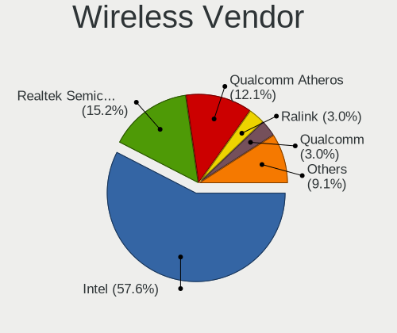

| Vendor                | Notebooks | Percent |
|-----------------------|-----------|---------|
| Intel                 | 12        | 52.17%  |
| Qualcomm Atheros      | 4         | 17.39%  |
| Realtek Semiconductor | 3         | 13.04%  |
| Broadcom              | 2         | 8.7%    |
| Qualcomm              | 1         | 4.35%   |
| NetGear               | 1         | 4.35%   |

Wireless Model
--------------

Wireless models

| Model                                                          | Notebooks | Percent |
|----------------------------------------------------------------|-----------|---------|
| Realtek RTL8821CE 802.11ac PCIe Wireless Network Adapter       | 2         | 8.33%   |
| Intel Wi-Fi 6 AX200                                            | 2         | 8.33%   |
| Intel Ice Lake-LP PCH CNVi WiFi                                | 2         | 8.33%   |
| Realtek RTL88x2bu [AC1200 Techkey]                             | 1         | 4.17%   |
| Realtek RTL8723DE Wireless Network Adapter                     | 1         | 4.17%   |
| Qualcomm QCNFA765 Wireless Network Adapter                     | 1         | 4.17%   |
| Qualcomm Atheros QCA9565 / AR9565 Wireless Network Adapter     | 1         | 4.17%   |
| Qualcomm Atheros QCA6174 802.11ac Wireless Network Adapter     | 1         | 4.17%   |
| Qualcomm Atheros AR9287 Wireless Network Adapter (PCI-Express) | 1         | 4.17%   |
| Qualcomm Atheros AR9285 Wireless Network Adapter (PCI-Express) | 1         | 4.17%   |
| NetGear A6100 AC600 DB Wireless Adapter [Realtek RTL8811AU]    | 1         | 4.17%   |
| Intel Wireless-AC 9260                                         | 1         | 4.17%   |
| Intel Wireless 8265 / 8275                                     | 1         | 4.17%   |
| Intel Wireless 7260                                            | 1         | 4.17%   |
| Intel Wireless 3160                                            | 1         | 4.17%   |
| Intel Wi-Fi 6 AX201                                            | 1         | 4.17%   |
| Intel Centrino Wireless-N 1000 [Condor Peak]                   | 1         | 4.17%   |
| Intel Centrino Advanced-N 6200                                 | 1         | 4.17%   |
| Intel Cannon Lake PCH CNVi WiFi                                | 1         | 4.17%   |
| Broadcom BCM4331 802.11a/b/g/n                                 | 1         | 4.17%   |
| Broadcom BCM43228 802.11a/b/g/n                                | 1         | 4.17%   |

Ethernet Vendor
---------------

Ethernet vendors

| Vendor                | Notebooks | Percent |
|-----------------------|-----------|---------|
| Realtek Semiconductor | 12        | 66.67%  |
| Intel                 | 4         | 22.22%  |
| Broadcom              | 2         | 11.11%  |

Ethernet Model
--------------

Ethernet models

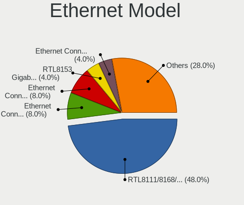

| Model                                                             | Notebooks | Percent |
|-------------------------------------------------------------------|-----------|---------|
| Realtek RTL8111/8168/8411 PCI Express Gigabit Ethernet Controller | 11        | 61.11%  |
| Realtek RTL8153 Gigabit Ethernet Adapter                          | 1         | 5.56%   |
| Intel Ethernet Connection I217-V                                  | 1         | 5.56%   |
| Intel Ethernet Connection (7) I219-LM                             | 1         | 5.56%   |
| Intel Ethernet Connection (4) I219-LM                             | 1         | 5.56%   |
| Intel 82577LM Gigabit Network Connection                          | 1         | 5.56%   |
| Broadcom NetXtreme BCM57765 Gigabit Ethernet PCIe                 | 1         | 5.56%   |
| Broadcom NetLink BCM57785 Gigabit Ethernet PCIe                   | 1         | 5.56%   |

Net Controller Kind
-------------------

Ethernet, WiFi or modem

| Kind     | Notebooks | Percent |
|----------|-----------|---------|
| WiFi     | 22        | 55%     |
| Ethernet | 18        | 45%     |

Used Controller
---------------

Currently used network controller

| Kind     | Notebooks | Percent |
|----------|-----------|---------|
| WiFi     | 20        | 90.91%  |
| Ethernet | 2         | 9.09%   |

NICs
----

Total network controllers on board

| Total | Notebooks | Percent |
|-------|-----------|---------|
| 2     | 17        | 77.27%  |
| 1     | 5         | 22.73%  |

IPv6
----

IPv6 vs IPv4

| Used | Notebooks | Percent |
|------|-----------|---------|
| No   | 18        | 78.26%  |
| Yes  | 5         | 21.74%  |

Bluetooth
---------

Bluetooth Vendor
----------------

Controller vendors

| Vendor                          | Notebooks | Percent |
|---------------------------------|-----------|---------|
| Intel                           | 9         | 47.37%  |
| Realtek Semiconductor           | 3         | 15.79%  |
| Lite-On Technology              | 2         | 10.53%  |
| Qualcomm Atheros Communications | 1         | 5.26%   |
| Foxconn / Hon Hai               | 1         | 5.26%   |
| Cambridge Silicon Radio         | 1         | 5.26%   |
| Broadcom                        | 1         | 5.26%   |
| Apple                           | 1         | 5.26%   |

Bluetooth Model
---------------

Controller models

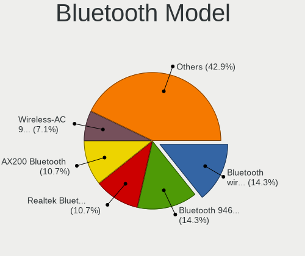

| Model                                               | Notebooks | Percent |
|-----------------------------------------------------|-----------|---------|
| Realtek  Bluetooth 4.2 Adapter                      | 3         | 15.79%  |
| Intel Bluetooth 9460/9560 Jefferson Peak (JfP)      | 3         | 15.79%  |
| Intel Bluetooth wireless interface                  | 2         | 10.53%  |
| Intel AX200 Bluetooth                               | 2         | 10.53%  |
| Qualcomm Atheros AR3011 Bluetooth                   | 1         | 5.26%   |
| Lite-On Bluetooth Device                            | 1         | 5.26%   |
| Lite-On Atheros AR3012 Bluetooth                    | 1         | 5.26%   |
| Intel Wireless-AC 9260 Bluetooth Adapter            | 1         | 5.26%   |
| Intel AX201 Bluetooth                               | 1         | 5.26%   |
| Foxconn / Hon Hai Bluetooth Device                  | 1         | 5.26%   |
| Cambridge Silicon Radio Bluetooth Dongle (HCI mode) | 1         | 5.26%   |
| Broadcom HP Portable Bumble Bee                     | 1         | 5.26%   |
| Apple Bluetooth USB Host Controller                 | 1         | 5.26%   |

Sound
-----

Sound Vendor
------------

Sound card vendors

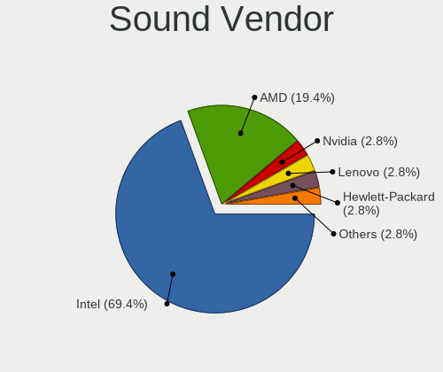

| Vendor          | Notebooks | Percent |
|-----------------|-----------|---------|
| Intel           | 17        | 62.96%  |
| AMD             | 7         | 25.93%  |
| Nvidia          | 1         | 3.7%    |
| Hewlett-Packard | 1         | 3.7%    |
| Astro Gaming    | 1         | 3.7%    |

Sound Model
-----------

Sound card models

| Model                                                                      | Notebooks | Percent |
|----------------------------------------------------------------------------|-----------|---------|
| AMD Family 17h/19h HD Audio Controller                                     | 4         | 11.43%  |
| Intel 5 Series/3400 Series Chipset High Definition Audio                   | 3         | 8.57%   |
| AMD Raven/Raven2/Fenghuang HDMI/DP Audio Controller                        | 3         | 8.57%   |
| Intel Xeon E3-1200 v3/4th Gen Core Processor HD Audio Controller           | 2         | 5.71%   |
| Intel Sunrise Point-LP HD Audio                                            | 2         | 5.71%   |
| Intel Ice Lake-LP Smart Sound Technology Audio Controller                  | 2         | 5.71%   |
| Intel Cannon Point-LP High Definition Audio Controller                     | 2         | 5.71%   |
| Intel Cannon Lake PCH cAVS                                                 | 2         | 5.71%   |
| Intel 8 Series/C220 Series Chipset High Definition Audio Controller        | 2         | 5.71%   |
| Nvidia TU107 GeForce GTX 1650 High Definition Audio Controller             | 1         | 2.86%   |
| Intel Wildcat Point-LP High Definition Audio Controller                    | 1         | 2.86%   |
| Intel Tiger Lake-LP Smart Sound Technology Audio Controller                | 1         | 2.86%   |
| Intel Broadwell-U Audio Controller                                         | 1         | 2.86%   |
| Intel 7 Series/C216 Chipset Family High Definition Audio Controller        | 1         | 2.86%   |
| Intel 6 Series/C200 Series Chipset Family High Definition Audio Controller | 1         | 2.86%   |
| Hewlett-Packard USB Audio                                                  | 1         | 2.86%   |
| Astro Gaming Astro A50                                                     | 1         | 2.86%   |
| AMD RV710/730 HDMI Audio [Radeon HD 4000 series]                           | 1         | 2.86%   |
| AMD Rembrandt Radeon High Definition Audio Controller                      | 1         | 2.86%   |
| AMD Redwood HDMI Audio [Radeon HD 5000 Series]                             | 1         | 2.86%   |
| AMD Kaveri HDMI/DP Audio Controller                                        | 1         | 2.86%   |
| AMD FCH Azalia Controller                                                  | 1         | 2.86%   |

Memory
------

Memory Vendor
-------------

Memory module vendors

| Vendor              | Notebooks | Percent |
|---------------------|-----------|---------|
| Samsung Electronics | 8         | 36.36%  |
| Micron Technology   | 4         | 18.18%  |
| Crucial             | 4         | 18.18%  |
| Kingston            | 3         | 13.64%  |
| SK hynix            | 2         | 9.09%   |
| Nanya Technology    | 1         | 4.55%   |

Memory Model
------------

Memory module models

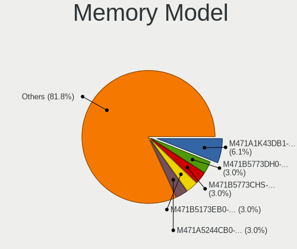

| Model                                                            | Notebooks | Percent |
|------------------------------------------------------------------|-----------|---------|
| Samsung RAM M471A1K43DB1-CTD 8GB SODIMM DDR4 2667MT/s            | 2         | 9.09%   |
| SK hynix RAM HMT451S6BFR8A-PB 4GB SODIMM DDR3 1600MT/s           | 1         | 4.55%   |
| SK hynix RAM H9CCNNNCLGALAR-NUD 8GB Row Of Chips LPDDR3 1867MT/s | 1         | 4.55%   |
| Samsung RAM M471B5773DH0-CH9 2GB SODIMM DDR3 1600MT/s            | 1         | 4.55%   |
| Samsung RAM M471B5773CHS-CH9 2GB SODIMM DDR3 4199MT/s            | 1         | 4.55%   |
| Samsung RAM M471A5244CB0-CTD 4GB Row Of Chips DDR4 2667MT/s      | 1         | 4.55%   |
| Samsung RAM M471A2K43BB1-CRC 16GB SODIMM DDR4 2400MT/s           | 1         | 4.55%   |
| Samsung RAM M471A1G44BB0-CWE 8GB SODIMM DDR4 3200MT/s            | 1         | 4.55%   |
| Samsung RAM K4UBE3D4AA-MGCL 8GB Row Of Chips LPDDR4 4267MT/s     | 1         | 4.55%   |
| Nanya RAM NT4GC64B8HB0NS-CG 4GB SODIMM DDR3 1334MT/s             | 1         | 4.55%   |
| Micron RAM Module 16GB SODIMM DDR4 3200MT/s                      | 1         | 4.55%   |
| Micron RAM 4ATF51264HZ-2G6E1 4GB SODIMM DDR4 2667MT/s            | 1         | 4.55%   |
| Micron RAM 4ATF25664HZ-2G3B1 4GB SODIMM DDR4 2400MT/s            | 1         | 4.55%   |
| Micron RAM ...d 4096MB SODIMM DDR3 1067MT/s                      | 1         | 4.55%   |
| Kingston RAM LV32D4S2S8HD-8 8GB SODIMM DDR4 3200MT/s             | 1         | 4.55%   |
| Kingston RAM ACR16D3LS1KFG/4G 4GB SODIMM DDR3 1600MT/s           | 1         | 4.55%   |
| Kingston RAM 99U5663-007.A00G 16GB SODIMM DDR4 2667MT/s          | 1         | 4.55%   |
| Crucial RAM CT8G4SFS824A.M8FE 8GB SODIMM DDR4 2667MT/s           | 1         | 4.55%   |
| Crucial RAM CT4G3S1067M.C16FKD 4GB SODIMM DDR3 1066MT/s          | 1         | 4.55%   |
| Crucial RAM CT32G48C40S5.M16A1 32GB SODIMM DDR5 4800MT/s         | 1         | 4.55%   |
| Crucial RAM CT16G4SFD824A.C16FDD 16GB SODIMM DDR4 2400MT/s       | 1         | 4.55%   |

Memory Kind
-----------

Memory module kinds

| Kind   | Notebooks | Percent |
|--------|-----------|---------|
| DDR4   | 9         | 50%     |
| DDR3   | 5         | 27.78%  |
| SDRAM  | 1         | 5.56%   |
| LPDDR4 | 1         | 5.56%   |
| LPDDR3 | 1         | 5.56%   |
| DDR5   | 1         | 5.56%   |

Memory Form Factor
------------------

Physical design of the memory module

| Name         | Notebooks | Percent |
|--------------|-----------|---------|
| SODIMM       | 15        | 83.33%  |
| Row Of Chips | 3         | 16.67%  |

Memory Size
-----------

Memory module size

| Size  | Notebooks | Percent |
|-------|-----------|---------|
| 4096  | 8         | 42.11%  |
| 8192  | 6         | 31.58%  |
| 16384 | 3         | 15.79%  |
| 32768 | 1         | 5.26%   |
| 2048  | 1         | 5.26%   |

Memory Speed
------------

Memory module speed

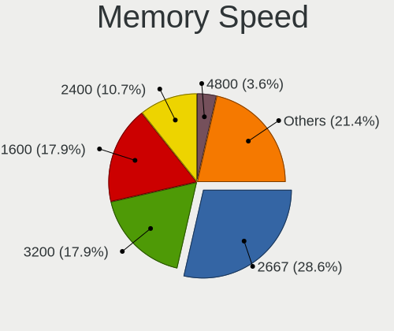

| Speed | Notebooks | Percent |
|-------|-----------|---------|
| 2667  | 5         | 25%     |
| 3200  | 3         | 15%     |
| 2400  | 3         | 15%     |
| 1600  | 2         | 10%     |
| 4800  | 1         | 5%      |
| 4267  | 1         | 5%      |
| 4199  | 1         | 5%      |
| 1867  | 1         | 5%      |
| 1334  | 1         | 5%      |
| 1067  | 1         | 5%      |
| 1066  | 1         | 5%      |

Printers & scanners
-------------------

Printer Vendor
--------------

Printer device vendors

| Vendor          | Notebooks | Percent |
|-----------------|-----------|---------|
| Hewlett-Packard | 1         | 100%    |

Printer Model
-------------

Printer device models

| Model                  | Notebooks | Percent |
|------------------------|-----------|---------|
| HP DeskJet 3630 series | 1         | 100%    |

Scanner Vendor
--------------

Scanner device vendors

Zero info for selected period =(

Scanner Model
-------------

Scanner device models

Zero info for selected period =(

Camera
------

Camera Vendor
-------------

Camera device vendors

| Vendor                                 | Notebooks | Percent |
|----------------------------------------|-----------|---------|
| Chicony Electronics                    | 8         | 40%     |
| IMC Networks                           | 3         | 15%     |
| Suyin                                  | 1         | 5%      |
| Silicon Motion                         | 1         | 5%      |
| Realtek Semiconductor                  | 1         | 5%      |
| Quanta                                 | 1         | 5%      |
| Primax Electronics                     | 1         | 5%      |
| Microdia                               | 1         | 5%      |
| Cheng Uei Precision Industry (Foxlink) | 1         | 5%      |
| Bison Electronics                      | 1         | 5%      |
| Apple                                  | 1         | 5%      |

Camera Model
------------

Camera device models

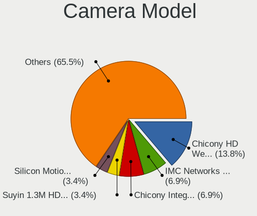

| Model                                                          | Notebooks | Percent |
|----------------------------------------------------------------|-----------|---------|
| Chicony HD WebCam                                              | 4         | 20%     |
| Suyin 1.3M HD WebCam                                           | 1         | 5%      |
| Silicon Motion USB 2.0 PC Cam                                  | 1         | 5%      |
| Realtek Integrated_Webcam_HD                                   | 1         | 5%      |
| Quanta HP Webcam                                               | 1         | 5%      |
| Primax Villem                                                  | 1         | 5%      |
| Microdia Integrated_Webcam_HD                                  | 1         | 5%      |
| IMC Networks USB2.0 HD UVC WebCam                              | 1         | 5%      |
| IMC Networks SunplusIT Integrated Camera                       | 1         | 5%      |
| IMC Networks Integrated Camera                                 | 1         | 5%      |
| Chicony Integrated Camera                                      | 1         | 5%      |
| Chicony HP Webcam                                              | 1         | 5%      |
| Chicony HP HD Camera                                           | 1         | 5%      |
| Chicony HP 5MP Camera                                          | 1         | 5%      |
| Cheng Uei Precision Industry (Foxlink) HP TrueVision HD Camera | 1         | 5%      |
| Bison Integrated Camera                                        | 1         | 5%      |
| Apple FaceTime HD Camera                                       | 1         | 5%      |

Security
--------

Fingerprint Vendor
------------------

Fingerprint sensor vendors

| Vendor                | Notebooks | Percent |
|-----------------------|-----------|---------|
| Validity Sensors      | 3         | 50%     |
| Synaptics             | 2         | 33.33%  |
| LighTuning Technology | 1         | 16.67%  |

Fingerprint Model
-----------------

Fingerprint sensor models

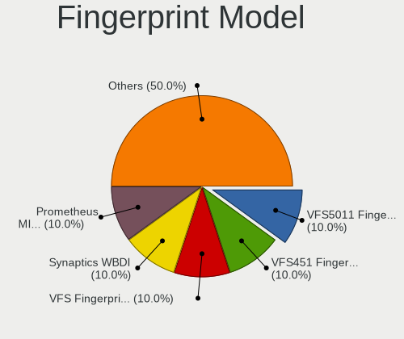

| Model                                                    | Notebooks | Percent |
|----------------------------------------------------------|-----------|---------|
| Validity Sensors VFS5011 Fingerprint Reader              | 1         | 16.67%  |
| Validity Sensors VFS451 Fingerprint Reader               | 1         | 16.67%  |
| Validity Sensors Synaptics WBDI                          | 1         | 16.67%  |
| Synaptics Metallica MOH Touch Fingerprint Reader         | 1         | 16.67%  |
| Synaptics FS7604 Touch Fingerprint Sensor with PurePrint | 1         | 16.67%  |
| LighTuning EgisTec Touch Fingerprint Sensor              | 1         | 16.67%  |

Chipcard Vendor
---------------

Chipcard module vendors

| Vendor   | Notebooks | Percent |
|----------|-----------|---------|
| Broadcom | 1         | 100%    |

Chipcard Model
--------------

Chipcard module models

| Model         | Notebooks | Percent |
|---------------|-----------|---------|
| Broadcom 5880 | 1         | 100%    |

Unsupported
-----------

Unsupported Devices
-------------------

Total unsupported devices on board

| Total | Notebooks | Percent |
|-------|-----------|---------|
| 0     | 14        | 63.64%  |
| 1     | 7         | 31.82%  |
| 2     | 1         | 4.55%   |

Unsupported Device Types
------------------------

Types of unsupported devices

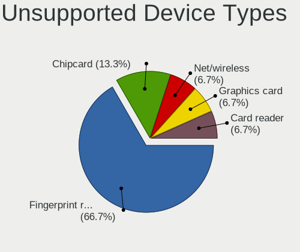

| Type               | Notebooks | Percent |
|--------------------|-----------|---------|
| Fingerprint reader | 6         | 66.67%  |
| Net/wireless       | 1         | 11.11%  |
| Graphics card      | 1         | 11.11%  |
| Chipcard           | 1         | 11.11%  |

