Siduction - Tested Hardware & Statistics
----------------------------------------

A project to collect tested hardware configurations for Siduction.

Anyone can contribute to this report by the [hw-probe](https://github.com/linuxhw/hw-probe) tool:

    sudo -E hw-probe -all -upload

Please contribute! Especially if your hardware is rare.

This is a report for all computer types. See also reports for [desktops](/Dist/Siduction/Desktop/README.md) and [notebooks](/Dist/Siduction/Notebook/README.md).

Contents
--------

* [ Test Cases ](#test-cases)

* [ System ](#system)
  - [ OS                       ](#os)
  - [ OS Family                ](#os-family)
  - [ Kernel                   ](#kernel)
  - [ Kernel Family            ](#kernel-family)
  - [ Kernel Major Ver.        ](#kernel-major-ver)
  - [ Arch                     ](#arch)
  - [ DE                       ](#de)
  - [ Display Server           ](#display-server)
  - [ Display Manager          ](#display-manager)
  - [ OS Lang                  ](#os-lang)
  - [ Boot Mode                ](#boot-mode)
  - [ Filesystem               ](#filesystem)
  - [ Part. scheme             ](#part-scheme)
  - [ Dual Boot with Linux/BSD ](#dual-boot-with-linuxbsd)
  - [ Dual Boot (Win)          ](#dual-boot-win)

* [ Board ](#board)
  - [ Vendor                   ](#vendor)
  - [ Model                    ](#model)
  - [ Model Family             ](#model-family)
  - [ MFG Year                 ](#mfg-year)
  - [ Form Factor              ](#form-factor)
  - [ Secure Boot              ](#secure-boot)
  - [ Coreboot                 ](#coreboot)
  - [ RAM Size                 ](#ram-size)
  - [ RAM Used                 ](#ram-used)
  - [ Total Drives             ](#total-drives)
  - [ Has CD-ROM               ](#has-cd-rom)
  - [ Has Ethernet             ](#has-ethernet)
  - [ Has WiFi                 ](#has-wifi)
  - [ Has Bluetooth            ](#has-bluetooth)

* [ Location ](#location)
  - [ Country                  ](#country)
  - [ City                     ](#city)

* [ Drives ](#drives)
  - [ Drive Vendor             ](#drive-vendor)
  - [ Drive Model              ](#drive-model)
  - [ HDD Vendor               ](#hdd-vendor)
  - [ SSD Vendor               ](#ssd-vendor)
  - [ Drive Kind               ](#drive-kind)
  - [ Drive Connector          ](#drive-connector)
  - [ Drive Size               ](#drive-size)
  - [ Space Total              ](#space-total)
  - [ Space Used               ](#space-used)
  - [ Malfunc. Drives          ](#malfunc-drives)
  - [ Malfunc. Drive Vendor    ](#malfunc-drive-vendor)
  - [ Malfunc. HDD Vendor      ](#malfunc-hdd-vendor)
  - [ Malfunc. Drive Kind      ](#malfunc-drive-kind)
  - [ Failed Drives            ](#failed-drives)
  - [ Failed Drive Vendor      ](#failed-drive-vendor)
  - [ Drive Status             ](#drive-status)

* [ Storage controller ](#storage-controller)
  - [ Storage Vendor           ](#storage-vendor)
  - [ Storage Model            ](#storage-model)
  - [ Storage Kind             ](#storage-kind)

* [ Processor ](#processor)
  - [ CPU Vendor               ](#cpu-vendor)
  - [ CPU Model                ](#cpu-model)
  - [ CPU Model Family         ](#cpu-model-family)
  - [ CPU Cores                ](#cpu-cores)
  - [ CPU Sockets              ](#cpu-sockets)
  - [ CPU Threads              ](#cpu-threads)
  - [ CPU Op-Modes             ](#cpu-op-modes)
  - [ CPU Microcode            ](#cpu-microcode)
  - [ CPU Microarch            ](#cpu-microarch)

* [ Graphics ](#graphics)
  - [ GPU Vendor               ](#gpu-vendor)
  - [ GPU Model                ](#gpu-model)
  - [ GPU Combo                ](#gpu-combo)
  - [ GPU Driver               ](#gpu-driver)
  - [ GPU Memory               ](#gpu-memory)

* [ Monitor ](#monitor)
  - [ Monitor Vendor           ](#monitor-vendor)
  - [ Monitor Model            ](#monitor-model)
  - [ Monitor Resolution       ](#monitor-resolution)
  - [ Monitor Diagonal         ](#monitor-diagonal)
  - [ Monitor Width            ](#monitor-width)
  - [ Aspect Ratio             ](#aspect-ratio)
  - [ Monitor Area             ](#monitor-area)
  - [ Pixel Density            ](#pixel-density)
  - [ Multiple Monitors        ](#multiple-monitors)

* [ Network ](#network)
  - [ Net Controller Vendor    ](#net-controller-vendor)
  - [ Net Controller Model     ](#net-controller-model)
  - [ Wireless Vendor          ](#wireless-vendor)
  - [ Wireless Model           ](#wireless-model)
  - [ Ethernet Vendor          ](#ethernet-vendor)
  - [ Ethernet Model           ](#ethernet-model)
  - [ Net Controller Kind      ](#net-controller-kind)
  - [ Used Controller          ](#used-controller)
  - [ NICs                     ](#nics)
  - [ IPv6                     ](#ipv6)

* [ Bluetooth ](#bluetooth)
  - [ Bluetooth Vendor         ](#bluetooth-vendor)
  - [ Bluetooth Model          ](#bluetooth-model)

* [ Sound ](#sound)
  - [ Sound Vendor             ](#sound-vendor)
  - [ Sound Model              ](#sound-model)

* [ Memory ](#memory)
  - [ Memory Vendor            ](#memory-vendor)
  - [ Memory Model             ](#memory-model)
  - [ Memory Kind              ](#memory-kind)
  - [ Memory Form Factor       ](#memory-form-factor)
  - [ Memory Size              ](#memory-size)
  - [ Memory Speed             ](#memory-speed)

* [ Printers & scanners ](#printers--scanners)
  - [ Printer Vendor           ](#printer-vendor)
  - [ Printer Model            ](#printer-model)
  - [ Scanner Vendor           ](#scanner-vendor)
  - [ Scanner Model            ](#scanner-model)

* [ Camera ](#camera)
  - [ Camera Vendor            ](#camera-vendor)
  - [ Camera Model             ](#camera-model)

* [ Security ](#security)
  - [ Fingerprint Vendor       ](#fingerprint-vendor)
  - [ Fingerprint Model        ](#fingerprint-model)
  - [ Chipcard Vendor          ](#chipcard-vendor)
  - [ Chipcard Model           ](#chipcard-model)

* [ Unsupported ](#unsupported)
  - [ Unsupported Devices      ](#unsupported-devices)
  - [ Unsupported Device Types ](#unsupported-device-types)

Test Cases
----------

Total: 101

| Vendor  | Model                       | Form-Factor | Probe                                                      | Date         |
|---------|-----------------------------|-------------|------------------------------------------------------------|--------------|
| ASUSTek | BU201LA                     | Notebook    | [2985f7a222](https://linux-hardware.org/?probe=2985f7a222) | Dec 22, 2023 |
| Lenovo  | ThinkPad T580 20LAS1GG00    | Notebook    | [c592d82494](https://linux-hardware.org/?probe=c592d82494) | Dec 05, 2023 |
| Lenovo  | ThinkPad L540 20AUS01H00    | Notebook    | [6bdb162853](https://linux-hardware.org/?probe=6bdb162853) | Nov 29, 2023 |
| Lenovo  | ThinkPad T490 20N3SFKX00    | Notebook    | [9d5bc38102](https://linux-hardware.org/?probe=9d5bc38102) | Nov 29, 2023 |
| HP      | 250 G7 Notebook PC          | Notebook    | [64d7d103a5](https://linux-hardware.org/?probe=64d7d103a5) | Oct 24, 2023 |
| HP      | 250 G7 Notebook PC          | Notebook    | [91d0aa5397](https://linux-hardware.org/?probe=91d0aa5397) | Oct 10, 2023 |
| HP      | 250 G7 Notebook PC          | Notebook    | [c2123c4f21](https://linux-hardware.org/?probe=c2123c4f21) | Oct 10, 2023 |
| Dell    | 0KC9NP A01                  | Desktop     | [15e1733eb4](https://linux-hardware.org/?probe=15e1733eb4) | Sep 20, 2023 |
| HP      | 250 G7 Notebook PC          | Notebook    | [428177914f](https://linux-hardware.org/?probe=428177914f) | Sep 17, 2023 |
| HP      | 250 G7 Notebook PC          | Notebook    | [f2b0e180d4](https://linux-hardware.org/?probe=f2b0e180d4) | Aug 27, 2023 |
| Dell    | 0T7D40 A01                  | Desktop     | [19c877cd88](https://linux-hardware.org/?probe=19c877cd88) | Jul 31, 2023 |
| Intel   | NUC7i5DNB J57626-509        | Mini pc     | [fdc2de43bb](https://linux-hardware.org/?probe=fdc2de43bb) | Jul 31, 2023 |
| Dell    | 0T7D40 A01                  | Desktop     | [c1b5a5f99b](https://linux-hardware.org/?probe=c1b5a5f99b) | Jul 08, 2023 |
| Intel   | NUC7i5DNB J57626-509        | Mini pc     | [a8ee980594](https://linux-hardware.org/?probe=a8ee980594) | Jun 28, 2023 |
| HP      | ZBook 15 G6                 | Notebook    | [eb23ebb0b8](https://linux-hardware.org/?probe=eb23ebb0b8) | Jun 10, 2023 |
| Apple   | MacBookPro9,2               | Notebook    | [baf92c8b36](https://linux-hardware.org/?probe=baf92c8b36) | Jun 08, 2023 |
| Dell    | 0T7D40 A01                  | Desktop     | [0c0dc06847](https://linux-hardware.org/?probe=0c0dc06847) | May 31, 2023 |
| HP      | 250 G7 Notebook PC          | Notebook    | [2f0f83bda2](https://linux-hardware.org/?probe=2f0f83bda2) | May 25, 2023 |
| HP      | ProBook 640 G1              | Notebook    | [5dceebaf6c](https://linux-hardware.org/?probe=5dceebaf6c) | May 13, 2023 |
| Dell    | Vostro 15 3510              | Notebook    | [fc82fe9907](https://linux-hardware.org/?probe=fc82fe9907) | May 11, 2023 |
| Dell    | 0JP3NX A00                  | Desktop     | [974cb924d5](https://linux-hardware.org/?probe=974cb924d5) | May 08, 2023 |
| Dell    | 0T7D40 A01                  | Desktop     | [7ce0658b0f](https://linux-hardware.org/?probe=7ce0658b0f) | Apr 29, 2023 |
| Dell    | Latitude 5491               | Notebook    | [ef97e6890a](https://linux-hardware.org/?probe=ef97e6890a) | Apr 13, 2023 |
| Lenovo  | 36F7 SDK0J40700 WIN 3258... | Desktop     | [ea50bc5d28](https://linux-hardware.org/?probe=ea50bc5d28) | Apr 13, 2023 |
| Dell    | Inspiron 7415 2-in-1        | Convertible | [b65f6a101f](https://linux-hardware.org/?probe=b65f6a101f) | Apr 12, 2023 |
| Dell    | 0T7D40 A01                  | Desktop     | [11aee4ed7b](https://linux-hardware.org/?probe=11aee4ed7b) | Apr 08, 2023 |
| ASUSTek | X751LAB                     | Notebook    | [03465bed03](https://linux-hardware.org/?probe=03465bed03) | Apr 06, 2023 |
| HP      | ProBook 640 G1              | Notebook    | [5aa6a42aa2](https://linux-hardware.org/?probe=5aa6a42aa2) | Mar 29, 2023 |
| Acer    | Swift SF314-51              | Notebook    | [5a73818024](https://linux-hardware.org/?probe=5a73818024) | Mar 27, 2023 |
| Dell    | 0T7D40 A01                  | Desktop     | [9320ecf2b2](https://linux-hardware.org/?probe=9320ecf2b2) | Mar 25, 2023 |
| Lenovo  | 3746 WIN SDK0T76463 3422... | All in one  | [ec07bb84cf](https://linux-hardware.org/?probe=ec07bb84cf) | Mar 25, 2023 |
| Lenovo  | ThinkPad X1 Carbon 5th 2... | Notebook    | [0c7e919608](https://linux-hardware.org/?probe=0c7e919608) | Mar 20, 2023 |
| NEWSMAY | Unknown                     | Desktop     | [c4cab7022b](https://linux-hardware.org/?probe=c4cab7022b) | Mar 15, 2023 |
| Acer    | Aspire E5-551G              | Notebook    | [58703e3260](https://linux-hardware.org/?probe=58703e3260) | Mar 15, 2023 |
| ASUSTek | ROG STRIX B550-A GAMING     | Desktop     | [c215f0cf02](https://linux-hardware.org/?probe=c215f0cf02) | Mar 14, 2023 |
| Lenovo  | ThinkPad X1 Tablet Gen 2... | Tablet      | [149c782883](https://linux-hardware.org/?probe=149c782883) | Mar 08, 2023 |
| Intel   | NUC7i5DNB J57626-509        | Mini pc     | [f38b8db522](https://linux-hardware.org/?probe=f38b8db522) | Mar 06, 2023 |
| ASRock  | B550 Steel Legend           | Desktop     | [d533a64cb9](https://linux-hardware.org/?probe=d533a64cb9) | Mar 04, 2023 |
| Lenovo  | ThinkPad X1 Carbon 5th 2... | Notebook    | [5c39a363d8](https://linux-hardware.org/?probe=5c39a363d8) | Feb 28, 2023 |
| ASUSTek | ROG STRIX B550-A GAMING     | Desktop     | [eeafe897ae](https://linux-hardware.org/?probe=eeafe897ae) | Feb 09, 2023 |
| HP      | EliteBook 865 16 inch G9... | Notebook    | [49a4e66cd0](https://linux-hardware.org/?probe=49a4e66cd0) | Feb 05, 2023 |
| Dell    | 0T7D40 A01                  | Desktop     | [74207a9fec](https://linux-hardware.org/?probe=74207a9fec) | Dec 19, 2022 |
| HP      | 212B                        | Desktop     | [55f34c27ec](https://linux-hardware.org/?probe=55f34c27ec) | Oct 08, 2022 |
| ASUSTek | ROG STRIX B550-A GAMING     | Desktop     | [b1514ab047](https://linux-hardware.org/?probe=b1514ab047) | Oct 02, 2022 |
| Acer    | Aspire V5-471               | Notebook    | [fe551b92a5](https://linux-hardware.org/?probe=fe551b92a5) | Oct 02, 2022 |
| ASUSTek | ET2411_W8                   | All in one  | [e0ef691738](https://linux-hardware.org/?probe=e0ef691738) | Oct 02, 2022 |
| Dell    | 0T7D40 A01                  | Desktop     | [9eba047248](https://linux-hardware.org/?probe=9eba047248) | Sep 18, 2022 |
| Dell    | 0T7D40 A01                  | Desktop     | [0968e0629e](https://linux-hardware.org/?probe=0968e0629e) | Aug 31, 2022 |
| Acer    | Aspire A515-55              | Notebook    | [bed4db4cf3](https://linux-hardware.org/?probe=bed4db4cf3) | Jul 16, 2022 |
| Dell    | 0T7D40 A01                  | Desktop     | [42b1694c97](https://linux-hardware.org/?probe=42b1694c97) | Jul 01, 2022 |
| Dell    | Inspiron 7415 2-in-1        | Convertible | [2521a61389](https://linux-hardware.org/?probe=2521a61389) | Jun 11, 2022 |
| ASUSTek | ROG STRIX B450-F GAMING     | Desktop     | [3766ac4bad](https://linux-hardware.org/?probe=3766ac4bad) | May 27, 2022 |
| MSI     | MPG B550 GAMING PLUS        | Desktop     | [5600c7649a](https://linux-hardware.org/?probe=5600c7649a) | Apr 05, 2022 |
| Acer    | Aspire E5-771G              | Notebook    | [a765f92826](https://linux-hardware.org/?probe=a765f92826) | Mar 28, 2022 |
| ASUSTek | B150M-A/M.2                 | Desktop     | [3098c1fdf3](https://linux-hardware.org/?probe=3098c1fdf3) | Feb 09, 2022 |
| HP      | 8703                        | Desktop     | [11bdfccc66](https://linux-hardware.org/?probe=11bdfccc66) | Feb 04, 2022 |
| Lenovo  | ThinkPad T410 253725G       | Notebook    | [3e1c463980](https://linux-hardware.org/?probe=3e1c463980) | Jan 16, 2022 |
| Lenovo  | IdeaPad 3 15IIL05 81WE      | Notebook    | [7fa0610547](https://linux-hardware.org/?probe=7fa0610547) | Jan 02, 2022 |
| ASUSTek | ROG STRIX B550-A GAMING     | Desktop     | [80bb463c02](https://linux-hardware.org/?probe=80bb463c02) | Dec 30, 2021 |
| Dell    | 0T7D40 A01                  | Desktop     | [065636c444](https://linux-hardware.org/?probe=065636c444) | Nov 25, 2021 |
| MSI     | MPG B550 GAMING PLUS        | Desktop     | [e3b8f92aa4](https://linux-hardware.org/?probe=e3b8f92aa4) | Sep 27, 2021 |
| Lenovo  | ThinkPad E590 20NB001AIX    | Notebook    | [436614e885](https://linux-hardware.org/?probe=436614e885) | Sep 26, 2021 |
| ASUSTek | B150M-A/M.2                 | Desktop     | [8c936491c0](https://linux-hardware.org/?probe=8c936491c0) | Sep 23, 2021 |
| ASUSTek | B150M-A/M.2                 | Desktop     | [1c6a203e2f](https://linux-hardware.org/?probe=1c6a203e2f) | Sep 16, 2021 |
| ASUSTek | ROG STRIX Z370-F GAMING     | Desktop     | [cdf90072fd](https://linux-hardware.org/?probe=cdf90072fd) | Aug 21, 2021 |
| Dell    | 0T7D40 A01                  | Desktop     | [0728097100](https://linux-hardware.org/?probe=0728097100) | Aug 06, 2021 |
| Lenovo  | ThinkPad T410 253725G       | Notebook    | [65b842202c](https://linux-hardware.org/?probe=65b842202c) | Aug 06, 2021 |
| ASUSTek | B150M-A/M.2                 | Desktop     | [8b033c463e](https://linux-hardware.org/?probe=8b033c463e) | Aug 06, 2021 |
| ASRock  | B450 Pro4                   | Desktop     | [68f4f90fd0](https://linux-hardware.org/?probe=68f4f90fd0) | Aug 05, 2021 |
| MSI     | MPG B550 GAMING PLUS        | Desktop     | [0ce1757e83](https://linux-hardware.org/?probe=0ce1757e83) | Aug 05, 2021 |
| ASUSTek | ROG STRIX B450-F GAMING     | Desktop     | [78924b9791](https://linux-hardware.org/?probe=78924b9791) | Aug 05, 2021 |
| ASUSTek | ROG STRIX B450-F GAMING     | Desktop     | [cc17fc0f36](https://linux-hardware.org/?probe=cc17fc0f36) | Aug 05, 2021 |
| ASUSTek | ZenBook UX325JA_UX325JA     | Notebook    | [70ddebc8cc](https://linux-hardware.org/?probe=70ddebc8cc) | Jul 25, 2021 |
| ASUSTek | ZenBook UX325JA_UX325JA     | Notebook    | [455c830431](https://linux-hardware.org/?probe=455c830431) | Jul 25, 2021 |
| TUXEDO  | Book BA1510                 | Notebook    | [80b8c9719c](https://linux-hardware.org/?probe=80b8c9719c) | Jul 11, 2021 |
| HP      | ProBook 4520s               | Notebook    | [50b007f51d](https://linux-hardware.org/?probe=50b007f51d) | Jun 26, 2021 |
| MSI     | MPG B550 GAMING PLUS        | Desktop     | [fcd7305b92](https://linux-hardware.org/?probe=fcd7305b92) | Jun 25, 2021 |
| Dell    | 0T7D40 A01                  | Desktop     | [5ee785eb32](https://linux-hardware.org/?probe=5ee785eb32) | Jun 24, 2021 |
| HP      | ProBook 4520s               | Notebook    | [261b02ab53](https://linux-hardware.org/?probe=261b02ab53) | Jun 20, 2021 |
| MSI     | MPG B550 GAMING PLUS        | Desktop     | [681bafbc6a](https://linux-hardware.org/?probe=681bafbc6a) | May 13, 2021 |
| HP      | Laptop 17-ca1xxx            | Notebook    | [99f175055d](https://linux-hardware.org/?probe=99f175055d) | May 05, 2021 |
| ASUSTek | ROG STRIX Z370-F GAMING     | Desktop     | [9fa9842ec9](https://linux-hardware.org/?probe=9fa9842ec9) | May 01, 2021 |
| HP      | Laptop 17-ca1xxx            | Notebook    | [e21ac181a5](https://linux-hardware.org/?probe=e21ac181a5) | Apr 03, 2021 |
| HP      | Laptop 17-ca1xxx            | Notebook    | [a8a82ba1b9](https://linux-hardware.org/?probe=a8a82ba1b9) | Mar 01, 2021 |
| HP      | Laptop 17-ca1xxx            | Notebook    | [a3ea535d80](https://linux-hardware.org/?probe=a3ea535d80) | Feb 04, 2021 |
| HP      | Laptop 17-ca1xxx            | Notebook    | [d88b363f5e](https://linux-hardware.org/?probe=d88b363f5e) | Jan 19, 2021 |
| HP      | Laptop 17-ca1xxx            | Notebook    | [5e6eb88969](https://linux-hardware.org/?probe=5e6eb88969) | Jan 02, 2021 |
| HP      | Laptop 17-ca1xxx            | Notebook    | [09675fa9a5](https://linux-hardware.org/?probe=09675fa9a5) | Dec 09, 2020 |
| HP      | Laptop 17-ca1xxx            | Notebook    | [0779e6ce28](https://linux-hardware.org/?probe=0779e6ce28) | Nov 18, 2020 |
| ASUSTek | PRIME Z270-A                | Desktop     | [894f4ade05](https://linux-hardware.org/?probe=894f4ade05) | Oct 02, 2020 |
| HP      | Laptop 17-ca1xxx            | Notebook    | [386583ebea](https://linux-hardware.org/?probe=386583ebea) | Sep 02, 2020 |
| HP      | 250 G7 Notebook PC          | Notebook    | [52a48bdcb8](https://linux-hardware.org/?probe=52a48bdcb8) | Aug 02, 2020 |
| ASUSTek | ROG STRIX Z370-F GAMING     | Desktop     | [7db0b1474d](https://linux-hardware.org/?probe=7db0b1474d) | Jun 18, 2020 |
| ASUSTek | ROG STRIX B450-F GAMING     | Desktop     | [70ab783420](https://linux-hardware.org/?probe=70ab783420) | Apr 07, 2020 |
| Lenovo  | ThinkPad E590 20NB001AIX    | Notebook    | [bc066bdf30](https://linux-hardware.org/?probe=bc066bdf30) | Feb 11, 2020 |
| HP      | Laptop 15-db0xxx            | Notebook    | [f6d4378d90](https://linux-hardware.org/?probe=f6d4378d90) | Jan 03, 2020 |
| Compal  | NBLBX                       | Notebook    | [865da8f6a9](https://linux-hardware.org/?probe=865da8f6a9) | Dec 05, 2019 |
| Lenovo  | ThinkPad Edge E540 20C60... | Notebook    | [552827c68a](https://linux-hardware.org/?probe=552827c68a) | Nov 20, 2019 |
| Lenovo  | ThinkPad Edge E540 20C60... | Notebook    | [d942b46e5b](https://linux-hardware.org/?probe=d942b46e5b) | Nov 20, 2019 |
| Lenovo  | ThinkPad Edge E540 20C60... | Notebook    | [17f6c8b364](https://linux-hardware.org/?probe=17f6c8b364) | Nov 20, 2019 |
| Acer    | Aspire 5750                 | Notebook    | [62afcd020e](https://linux-hardware.org/?probe=62afcd020e) | Feb 26, 2019 |

System
------

OS
--

Installed operating systems

| Name               | Computers | Percent |
|--------------------|-----------|---------|
| Siduction 12       | 19        | 33.33%  |
| Siduction 11       | 14        | 24.56%  |
| Siduction Unstable | 11        | 19.3%   |
| Siduction          | 7         | 12.28%  |
| Siduction 10       | 5         | 8.77%   |
| Siduction 21       | 1         | 1.75%   |

OS Family
---------

OS without a version

| Name      | Computers | Percent |
|-----------|-----------|---------|
| Siduction | 44        | 100%    |

Kernel
------

Version of the Linux kernel

| Version                       | Computers | Percent |
|-------------------------------|-----------|---------|
| 6.2.6-1-siduction-amd64       | 4         | 4.82%   |
| 6.2.8-1-siduction-amd64       | 3         | 3.61%   |
| 5.13.8-1-siduction-amd64      | 3         | 3.61%   |
| 6.5.3-1-siduction-amd64       | 2         | 2.41%   |
| 6.2.2-6-siduction-amd64       | 2         | 2.41%   |
| 6.2.15-1-siduction-amd64      | 2         | 2.41%   |
| 6.2.13-1-siduction-amd64      | 2         | 2.41%   |
| 6.2.10-1-siduction-amd64      | 2         | 2.41%   |
| 6.1.14-1-siduction-amd64      | 2         | 2.41%   |
| 5.13.6-1-siduction-amd64      | 2         | 2.41%   |
| 5.12.12-1-siduction-amd64     | 2         | 2.41%   |
| 6.6.8-1-siduction-amd64       | 1         | 1.2%    |
| 6.6.4-1-siduction-amd64       | 1         | 1.2%    |
| 6.6.2-1-siduction-amd64       | 1         | 1.2%    |
| 6.5.6-1-siduction-amd64       | 1         | 1.2%    |
| 6.5.2-1-siduction-amd64       | 1         | 1.2%    |
| 6.4.12-1-siduction-amd64      | 1         | 1.2%    |
| 6.3.7-1-siduction-amd64       | 1         | 1.2%    |
| 6.3.3-1-siduction-amd64       | 1         | 1.2%    |
| 6.3.10-1-siduction-amd64      | 1         | 1.2%    |
| 6.2.2-3-siduction-amd64       | 1         | 1.2%    |
| 6.2.11-1-siduction-amd64      | 1         | 1.2%    |
| 6.2.0-rc6-siduction-amd64     | 1         | 1.2%    |
| 6.1.10-2-siduction-amd64      | 1         | 1.2%    |
| 6.1.1-4-siduction-amd64       | 1         | 1.2%    |
| 6.0.9-1-siduction-amd64       | 1         | 1.2%    |
| 5.9.8-towo.3-siduction-amd64  | 1         | 1.2%    |
| 5.9.13-towo.1-siduction-amd64 | 1         | 1.2%    |
| 5.8.5-towo.1-siduction-amd64  | 1         | 1.2%    |
| 5.8.12-towo.1-siduction-amd64 | 1         | 1.2%    |
| 5.7.2-towo.1-siduction-amd64  | 1         | 1.2%    |
| 5.7.11-towo.2-siduction-amd64 | 1         | 1.2%    |
| 5.6.2-towo.1-siduction-amd64  | 1         | 1.2%    |
| 5.4.5-towo.2-siduction-amd64  | 1         | 1.2%    |
| 5.4.18-towo.1-siduction-amd64 | 1         | 1.2%    |
| 5.3.12-towo.2-siduction-amd64 | 1         | 1.2%    |
| 5.3.1-towo.2-siduction-amd64  | 1         | 1.2%    |
| 5.19.5-2-siduction-amd64      | 1         | 1.2%    |
| 5.19.14-1-siduction-amd64     | 1         | 1.2%    |
| 5.19.12-1-siduction-amd64     | 1         | 1.2%    |

Kernel Family
-------------

Linux kernel without a distro release

| Version | Computers | Percent |
|---------|-----------|---------|
| 6.2.6   | 4         | 4.82%   |
| 6.2.8   | 3         | 3.61%   |
| 6.2.2   | 3         | 3.61%   |
| 5.13.8  | 3         | 3.61%   |
| 6.5.3   | 2         | 2.41%   |
| 6.2.15  | 2         | 2.41%   |
| 6.2.13  | 2         | 2.41%   |
| 6.2.10  | 2         | 2.41%   |
| 6.1.14  | 2         | 2.41%   |
| 5.14.0  | 2         | 2.41%   |
| 5.13.6  | 2         | 2.41%   |
| 5.12.12 | 2         | 2.41%   |
| 6.6.8   | 1         | 1.2%    |
| 6.6.4   | 1         | 1.2%    |
| 6.6.2   | 1         | 1.2%    |
| 6.5.6   | 1         | 1.2%    |
| 6.5.2   | 1         | 1.2%    |
| 6.4.12  | 1         | 1.2%    |
| 6.3.7   | 1         | 1.2%    |
| 6.3.3   | 1         | 1.2%    |
| 6.3.10  | 1         | 1.2%    |
| 6.2.11  | 1         | 1.2%    |
| 6.2.0   | 1         | 1.2%    |
| 6.1.10  | 1         | 1.2%    |
| 6.1.1   | 1         | 1.2%    |
| 6.0.9   | 1         | 1.2%    |
| 5.9.8   | 1         | 1.2%    |
| 5.9.13  | 1         | 1.2%    |
| 5.8.5   | 1         | 1.2%    |
| 5.8.12  | 1         | 1.2%    |
| 5.7.2   | 1         | 1.2%    |
| 5.7.11  | 1         | 1.2%    |
| 5.6.2   | 1         | 1.2%    |
| 5.4.5   | 1         | 1.2%    |
| 5.4.18  | 1         | 1.2%    |
| 5.3.12  | 1         | 1.2%    |
| 5.3.1   | 1         | 1.2%    |
| 5.19.5  | 1         | 1.2%    |
| 5.19.14 | 1         | 1.2%    |
| 5.19.12 | 1         | 1.2%    |

Kernel Major Ver.
-----------------

Linux kernel major version

| Version | Computers | Percent |
|---------|-----------|---------|
| 6.2     | 16        | 21.92%  |
| 5.13    | 8         | 10.96%  |
| 6.1     | 4         | 5.48%   |
| 5.16    | 4         | 5.48%   |
| 5.12    | 4         | 5.48%   |
| 6.6     | 3         | 4.11%   |
| 6.5     | 3         | 4.11%   |
| 6.3     | 3         | 4.11%   |
| 5.19    | 3         | 4.11%   |
| 5.18    | 3         | 4.11%   |
| 5.15    | 3         | 4.11%   |
| 5.14    | 3         | 4.11%   |
| 5.8     | 2         | 2.74%   |
| 5.7     | 2         | 2.74%   |
| 5.4     | 2         | 2.74%   |
| 5.3     | 2         | 2.74%   |
| 5.10    | 2         | 2.74%   |
| 6.4     | 1         | 1.37%   |
| 6.0     | 1         | 1.37%   |
| 5.9     | 1         | 1.37%   |
| 5.6     | 1         | 1.37%   |
| 5.11    | 1         | 1.37%   |
| 4.20    | 1         | 1.37%   |

Arch
----

OS architecture (x86_64, i586, etc.)

| Name   | Computers | Percent |
|--------|-----------|---------|
| x86_64 | 44        | 100%    |

DE
--

Desktop Environment

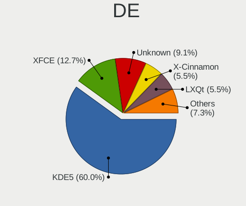

| Name            | Computers | Percent |
|-----------------|-----------|---------|
| KDE5            | 32        | 64%     |
| XFCE            | 5         | 10%     |
| Unknown         | 4         | 8%      |
| X-Cinnamon      | 3         | 6%      |
| LXQt            | 3         | 6%      |
| GNOME Flashback | 1         | 2%      |
| Cinnamon        | 1         | 2%      |
| Budgie          | 1         | 2%      |

Display Server
--------------

X11 or Wayland

| Name    | Computers | Percent |
|---------|-----------|---------|
| X11     | 36        | 76.6%   |
| Wayland | 9         | 19.15%  |
| Tty     | 2         | 4.26%   |

Display Manager
---------------

SDDM, LightDM, etc.

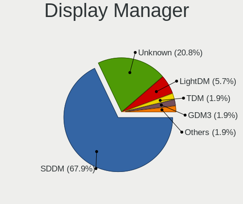

| Name    | Computers | Percent |
|---------|-----------|---------|
| SDDM    | 33        | 68.75%  |
| Unknown | 10        | 20.83%  |
| LightDM | 2         | 4.17%   |
| TDM     | 1         | 2.08%   |
| GDM3    | 1         | 2.08%   |
| GDM     | 1         | 2.08%   |

OS Lang
-------

Language

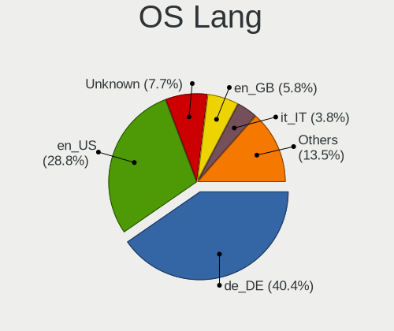

| Lang    | Computers | Percent |
|---------|-----------|---------|
| de_DE   | 19        | 40.43%  |
| en_US   | 13        | 27.66%  |
| Unknown | 4         | 8.51%   |
| en_GB   | 3         | 6.38%   |
| it_IT   | 2         | 4.26%   |
| de_AT   | 2         | 4.26%   |
| fr_FR   | 1         | 2.13%   |
| en_CA   | 1         | 2.13%   |
| de_CH   | 1         | 2.13%   |
| C       | 1         | 2.13%   |

Boot Mode
---------

EFI or BIOS

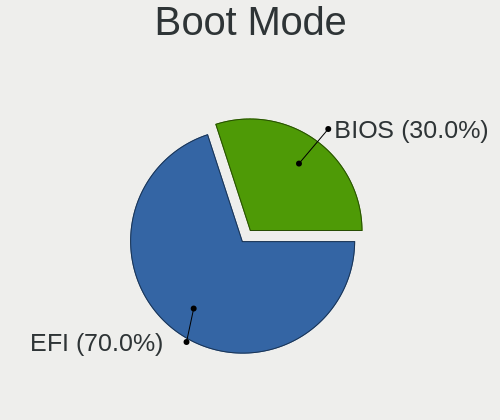

| Mode | Computers | Percent |
|------|-----------|---------|
| EFI  | 33        | 73.33%  |
| BIOS | 12        | 26.67%  |

Filesystem
----------

Type of filesystem

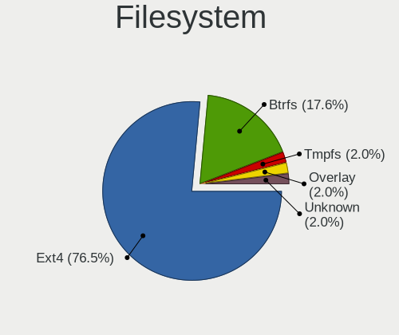

| Type    | Computers | Percent |
|---------|-----------|---------|
| Ext4    | 36        | 78.26%  |
| Btrfs   | 9         | 19.57%  |
| Unknown | 1         | 2.17%   |

Part. scheme
------------

Scheme of partitioning

| Type    | Computers | Percent |
|---------|-----------|---------|
| GPT     | 31        | 68.89%  |
| Unknown | 9         | 20%     |
| MBR     | 5         | 11.11%  |

Dual Boot with Linux/BSD
------------------------

Hosting more than one Linux/BSD

| Dual boot | Computers | Percent |
|-----------|-----------|---------|
| No        | 41        | 91.11%  |
| Yes       | 4         | 8.89%   |

Dual Boot (Win)
---------------

Hosting Linux and Windows

| Dual boot | Computers | Percent |
|-----------|-----------|---------|
| No        | 35        | 77.78%  |
| Yes       | 10        | 22.22%  |

Board
-----

Vendor
------

Motherboard manufacturer

| Name             | Computers | Percent |
|------------------|-----------|---------|
| Lenovo           | 11        | 25%     |
| Hewlett-Packard  | 9         | 20.45%  |
| ASUSTek Computer | 7         | 15.91%  |
| Dell             | 6         | 13.64%  |
| Acer             | 4         | 9.09%   |
| ASRock           | 2         | 4.55%   |
| TUXEDO           | 1         | 2.27%   |
| NEWSMAY          | 1         | 2.27%   |
| MSI              | 1         | 2.27%   |
| Intel            | 1         | 2.27%   |
| Compal           | 1         | 2.27%   |

Model
-----

Motherboard model

| Name                                       | Computers | Percent |
|--------------------------------------------|-----------|---------|
| TUXEDO Book BA1510                         | 1         | 2.27%   |
| MSI MS-7C56                                | 1         | 2.27%   |
| Lenovo ThinkPad X1 Tablet Gen 2 20JCA016JP | 1         | 2.27%   |
| Lenovo ThinkPad X1 Carbon 5th 20HRCTO1WW   | 1         | 2.27%   |
| Lenovo ThinkPad T580 20LAS1GG00            | 1         | 2.27%   |
| Lenovo ThinkPad T490 20N3SFKX00            | 1         | 2.27%   |
| Lenovo ThinkPad T410 253725G               | 1         | 2.27%   |
| Lenovo ThinkPad L540 20AUS01H00            | 1         | 2.27%   |
| Lenovo ThinkPad Edge E540 20C6003AGE       | 1         | 2.27%   |
| Lenovo ThinkPad E590 20NB001AIX            | 1         | 2.27%   |
| Lenovo IdeaPad 3 15IIL05 81WE              | 1         | 2.27%   |
| Lenovo IdeaCentre AIO 3 27ALC6 F0FY0055GE  | 1         | 2.27%   |
| Lenovo IdeaCentre 310S-08ASR 90G9006DIX    | 1         | 2.27%   |
| Intel NUC7i5DNKE                           | 1         | 2.27%   |
| HP ZBook 15 G6                             | 1         | 2.27%   |
| HP Z440 Workstation                        | 1         | 2.27%   |
| HP ProBook 640 G1                          | 1         | 2.27%   |
| HP ProBook 4520s                           | 1         | 2.27%   |
| HP OMEN 30L Desktop GT13-0xxx              | 1         | 2.27%   |
| HP Laptop 17-ca1xxx                        | 1         | 2.27%   |
| HP Laptop 15-db0xxx                        | 1         | 2.27%   |
| HP EliteBook 865 16 inch G9 Notebook PC    | 1         | 2.27%   |
| HP 250 G7 Notebook PC                      | 1         | 2.27%   |
| Dell Vostro 15 3510                        | 1         | 2.27%   |
| Dell OptiPlex 9020                         | 1         | 2.27%   |
| Dell OptiPlex 5040                         | 1         | 2.27%   |
| Dell OptiPlex 3050                         | 1         | 2.27%   |
| Dell Latitude 5491                         | 1         | 2.27%   |
| Dell Inspiron 7415 2-in-1                  | 1         | 2.27%   |
| Compal NBLBX                               | 1         | 2.27%   |
| ASUS ZenBook UX325JA_UX325JA               | 1         | 2.27%   |
| ASUS ROG STRIX Z370-F GAMING               | 1         | 2.27%   |
| ASUS ROG STRIX B550-A GAMING               | 1         | 2.27%   |
| ASUS PRIME Z270-A                          | 1         | 2.27%   |
| ASUS BU201LA                               | 1         | 2.27%   |
| ASUS B150M-A/M.2                           | 1         | 2.27%   |
| ASUS A0000001                              | 1         | 2.27%   |
| ASRock B550 Steel Legend                   | 1         | 2.27%   |
| ASRock B450 Pro4                           | 1         | 2.27%   |
| Acer Swift SF314-51                        | 1         | 2.27%   |

Model Family
------------

Motherboard model prefix

| Name              | Computers | Percent |
|-------------------|-----------|---------|
| Lenovo ThinkPad   | 8         | 18.18%  |
| Dell OptiPlex     | 3         | 6.82%   |
| Acer Aspire       | 3         | 6.82%   |
| Lenovo IdeaCentre | 2         | 4.55%   |
| HP ProBook        | 2         | 4.55%   |
| HP Laptop         | 2         | 4.55%   |
| ASUS ROG          | 2         | 4.55%   |
| TUXEDO Book       | 1         | 2.27%   |
| MSI MS-7C56       | 1         | 2.27%   |
| Lenovo IdeaPad    | 1         | 2.27%   |
| Intel NUC7i5DNKE  | 1         | 2.27%   |
| HP ZBook          | 1         | 2.27%   |
| HP Z440           | 1         | 2.27%   |
| HP OMEN           | 1         | 2.27%   |
| HP EliteBook      | 1         | 2.27%   |
| HP 250            | 1         | 2.27%   |
| Dell Vostro       | 1         | 2.27%   |
| Dell Latitude     | 1         | 2.27%   |
| Dell Inspiron     | 1         | 2.27%   |
| Compal NBLBX      | 1         | 2.27%   |
| ASUS ZenBook      | 1         | 2.27%   |
| ASUS PRIME        | 1         | 2.27%   |
| ASUS BU201LA      | 1         | 2.27%   |
| ASUS B150M-A      | 1         | 2.27%   |
| ASUS A0000001     | 1         | 2.27%   |
| ASRock B550       | 1         | 2.27%   |
| ASRock B450       | 1         | 2.27%   |
| Acer Swift        | 1         | 2.27%   |
| Unknown           | 1         | 2.27%   |

MFG Year
--------

Motherboard manufacture year

| Year | Computers | Percent |
|------|-----------|---------|
| 2020 | 7         | 15.91%  |
| 2019 | 6         | 13.64%  |
| 2018 | 5         | 11.36%  |
| 2021 | 4         | 9.09%   |
| 2017 | 4         | 9.09%   |
| 2014 | 4         | 9.09%   |
| 2016 | 3         | 6.82%   |
| 2013 | 3         | 6.82%   |
| 2022 | 2         | 4.55%   |
| 2015 | 2         | 4.55%   |
| 2010 | 2         | 4.55%   |
| 2011 | 1         | 2.27%   |
| 2009 | 1         | 2.27%   |

Form Factor
-----------

Physical design of the computer

| Name        | Computers | Percent |
|-------------|-----------|---------|
| Notebook    | 25        | 56.82%  |
| Desktop     | 15        | 34.09%  |
| Tablet      | 1         | 2.27%   |
| Convertible | 1         | 2.27%   |
| Mini pc     | 1         | 2.27%   |
| All in one  | 1         | 2.27%   |

Secure Boot
-----------

Enabled or disabled

| State    | Computers | Percent |
|----------|-----------|---------|
| Disabled | 44        | 100%    |

Coreboot
--------

Have coreboot on board

| Used | Computers | Percent |
|------|-----------|---------|
| No   | 44        | 100%    |

RAM Size
--------

Total RAM memory

| Size in GB  | Computers | Percent |
|-------------|-----------|---------|
| 16.01-24.0  | 12        | 26.67%  |
| 4.01-8.0    | 11        | 24.44%  |
| 8.01-16.0   | 10        | 22.22%  |
| 32.01-64.0  | 9         | 20%     |
| 3.01-4.0    | 1         | 2.22%   |
| 64.01-256.0 | 1         | 2.22%   |
| Unknown     | 1         | 2.22%   |

RAM Used
--------

Used RAM memory

| Used GB    | Computers | Percent |
|------------|-----------|---------|
| 4.01-8.0   | 16        | 26.67%  |
| 2.01-3.0   | 14        | 23.33%  |
| 3.01-4.0   | 13        | 21.67%  |
| 1.01-2.0   | 7         | 11.67%  |
| 8.01-16.0  | 4         | 6.67%   |
| 0.51-1.0   | 3         | 5%      |
| 16.01-24.0 | 1         | 1.67%   |
| 0.01-0.5   | 1         | 1.67%   |
| Unknown    | 1         | 1.67%   |

Total Drives
------------

Number of drives on board

| Drives | Computers | Percent |
|--------|-----------|---------|
| 1      | 26        | 56.52%  |
| 2      | 10        | 21.74%  |
| 4      | 5         | 10.87%  |
| 3      | 3         | 6.52%   |
| 6      | 1         | 2.17%   |
| 5      | 1         | 2.17%   |

Has CD-ROM
----------

Has CD-ROM on board

| Presented | Computers | Percent |
|-----------|-----------|---------|
| No        | 28        | 60.87%  |
| Yes       | 18        | 39.13%  |

Has Ethernet
------------

Has Ethernet on board

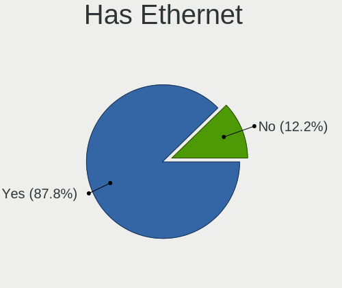

| Presented | Computers | Percent |
|-----------|-----------|---------|
| Yes       | 39        | 88.64%  |
| No        | 5         | 11.36%  |

Has WiFi
--------

Has WiFi module

| Presented | Computers | Percent |
|-----------|-----------|---------|
| Yes       | 35        | 79.55%  |
| No        | 9         | 20.45%  |

Has Bluetooth
-------------

Has Bluetooth module

| Presented | Computers | Percent |
|-----------|-----------|---------|
| Yes       | 29        | 61.7%   |
| No        | 18        | 38.3%   |

Location
--------

Country
-------

Geographic location (country)

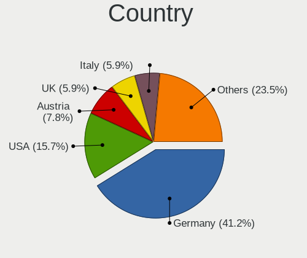

| Country     | Computers | Percent |
|-------------|-----------|---------|
| Germany     | 19        | 41.3%   |
| USA         | 7         | 15.22%  |
| Austria     | 4         | 8.7%    |
| UK          | 3         | 6.52%   |
| Italy       | 3         | 6.52%   |
| Canada      | 3         | 6.52%   |
| Sweden      | 2         | 4.35%   |
| Switzerland | 1         | 2.17%   |
| Netherlands | 1         | 2.17%   |
| Japan       | 1         | 2.17%   |
| Israel      | 1         | 2.17%   |
| France      | 1         | 2.17%   |

City
----

Geographic location (city)

| City            | Computers | Percent |
|-----------------|-----------|---------|
| Munich          | 5         | 8.06%   |
| Vienna          | 3         | 4.84%   |
| Berlin          | 3         | 4.84%   |
| Suisun          | 2         | 3.23%   |
| Stockholm       | 2         | 3.23%   |
| Schrobenhausen  | 2         | 3.23%   |
| Zurich          | 1         | 1.61%   |
| Wiener Neustadt | 1         | 1.61%   |
| Unterbergla     | 1         | 1.61%   |
| Turin           | 1         | 1.61%   |
| Trier           | 1         | 1.61%   |
| Toronto         | 1         | 1.61%   |
| Tokyo           | 1         | 1.61%   |
| Stuttgart       | 1         | 1.61%   |
| Sidney          | 1         | 1.61%   |
| Savannah        | 1         | 1.61%   |
| Sanford         | 1         | 1.61%   |
| San Francisco   | 1         | 1.61%   |
| Salzburg        | 1         | 1.61%   |
| Reading         | 1         | 1.61%   |
| Portland        | 1         | 1.61%   |
| Piea            | 1         | 1.61%   |
| Paris           | 1         | 1.61%   |
| Papenburg       | 1         | 1.61%   |
| Oranienburg     | 1         | 1.61%   |
| Mittenwald      | 1         | 1.61%   |
| Milan           | 1         | 1.61%   |
| Merseburg       | 1         | 1.61%   |
| Mannheim        | 1         | 1.61%   |
| Malmo           | 1         | 1.61%   |
| Leipzig         | 1         | 1.61%   |
| Langewiesen     | 1         | 1.61%   |
| Landau          | 1         | 1.61%   |
| Kensington      | 1         | 1.61%   |
| Jerusalem       | 1         | 1.61%   |
| Iserlohn        | 1         | 1.61%   |
| Innsbruck       | 1         | 1.61%   |
| Hamburg         | 1         | 1.61%   |
| Guglingen       | 1         | 1.61%   |
| Graz            | 1         | 1.61%   |

Drives
------

Drive Vendor
------------

Hard drive vendors

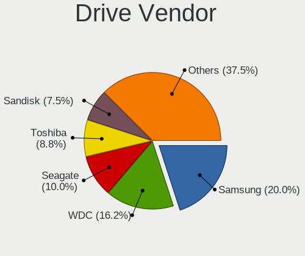

| Vendor              | Computers | Drives | Percent |
|---------------------|-----------|--------|---------|
| Samsung Electronics | 15        | 25     | 20.27%  |
| WDC                 | 12        | 29     | 16.22%  |
| Seagate             | 8         | 17     | 10.81%  |
| Toshiba             | 6         | 15     | 8.11%   |
| SK hynix            | 5         | 14     | 6.76%   |
| SanDisk             | 5         | 10     | 6.76%   |
| Kingston            | 5         | 5      | 6.76%   |
| Crucial             | 5         | 17     | 6.76%   |
| Intel               | 3         | 7      | 4.05%   |
| Unknown             | 1         | 1      | 1.35%   |
| SSSTC               | 1         | 1      | 1.35%   |
| Silicon Motion      | 1         | 1      | 1.35%   |
| OCZ                 | 1         | 3      | 1.35%   |
| Mushkin             | 1         | 3      | 1.35%   |
| Micron Technology   | 1         | 1      | 1.35%   |
| Lenovo              | 1         | 1      | 1.35%   |
| HGST                | 1         | 11     | 1.35%   |
| GRITRONIX           | 1         | 1      | 1.35%   |
| Corsair             | 1         | 3      | 1.35%   |

Drive Model
-----------

Hard drive models

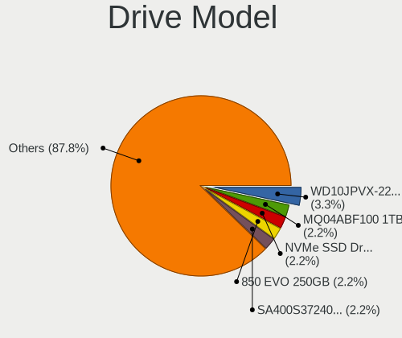

| Model                                             | Computers | Percent |
|---------------------------------------------------|-----------|---------|
| WDC WD10JPVX-22JC3T0 1TB                          | 3         | 3.57%   |
| Toshiba MQ04ABF100 1TB                            | 2         | 2.38%   |
| Samsung SSD 850 EVO 250GB                         | 2         | 2.38%   |
| Kingston SA400S37240G 240GB SSD                   | 2         | 2.38%   |
| Crucial CT500MX500SSD1 500GB                      | 2         | 2.38%   |
| Crucial CT1000MX500SSD1 1TB                       | 2         | 2.38%   |
| WDC WDS400T2B0A-00SM50 4TB SSD                    | 1         | 1.19%   |
| WDC WDS200T2B0B-00YS70 2TB SSD                    | 1         | 1.19%   |
| WDC WDS100T2B0C-00PXH0 1TB                        | 1         | 1.19%   |
| WDC WD60EZAZ-00SF3B0 6TB                          | 1         | 1.19%   |
| WDC WD40EZAZ-00SF3B0 4TB                          | 1         | 1.19%   |
| WDC WD20EZRZ-00Z5HB0 2TB                          | 1         | 1.19%   |
| WDC WD20EFRX-68EUZN0 2TB                          | 1         | 1.19%   |
| WDC WD10SPZX-60Z10T0 1TB                          | 1         | 1.19%   |
| WDC WD10JPVX-60JC3T1 1TB                          | 1         | 1.19%   |
| WDC WD10EADX-00TDHB0 1TB                          | 1         | 1.19%   |
| WDC WD BLACK SDBPNTY-512G-1106 512GB              | 1         | 1.19%   |
| WDC PC SN530 SDBPMPZ-512G-1101 512GB              | 1         | 1.19%   |
| Unknown MMC Card  64GB                            | 1         | 1.19%   |
| Toshiba THNSNK256GVN8 256GB SSD                   | 1         | 1.19%   |
| Toshiba RD400 256GB                               | 1         | 1.19%   |
| Toshiba MQ01ACF032 320GB                          | 1         | 1.19%   |
| Toshiba KBG30ZMT256G 256GB                        | 1         | 1.19%   |
| SSSTC CL4-3D256-Q11 NVMe 256GB                    | 1         | 1.19%   |
| SK hynix SKHynix_HFS256GD9TNG-L5B0B 256GB         | 1         | 1.19%   |
| SK hynix SC308 SATA 128GB SSD                     | 1         | 1.19%   |
| SK hynix NVMe SSD Drive 512GB                     | 1         | 1.19%   |
| SK hynix BC711 NVMe 1TB                           | 1         | 1.19%   |
| SK hynix BC501 HFM256GDJTNG-8310A 256GB           | 1         | 1.19%   |
| Silicon Motion SM2262/SM2262EN SSD Controller 1TB | 1         | 1.19%   |
| Seagate ST9640320AS 640GB                         | 1         | 1.19%   |
| Seagate ST9500420AS 500GB                         | 1         | 1.19%   |
| Seagate ST6000DM003-2CY186 6TB                    | 1         | 1.19%   |
| Seagate ST500LT012-1DG142 500GB                   | 1         | 1.19%   |
| Seagate ST4000LM016-1N2170 4TB                    | 1         | 1.19%   |
| Seagate ST32000542AS 2TB                          | 1         | 1.19%   |
| Seagate ST31000524AS 1TB                          | 1         | 1.19%   |
| Seagate ST3000VN000-1HJ166 3TB                    | 1         | 1.19%   |
| Seagate ST2000DM008-2FR102 2TB                    | 1         | 1.19%   |
| Seagate ST2000DL003-9VT166 2TB                    | 1         | 1.19%   |

HDD Vendor
----------

Hard disk drive vendors

| Vendor              | Computers | Drives | Percent |
|---------------------|-----------|--------|---------|
| WDC                 | 9         | 20     | 40.91%  |
| Seagate             | 8         | 17     | 36.36%  |
| Toshiba             | 3         | 11     | 13.64%  |
| Samsung Electronics | 1         | 1      | 4.55%   |
| HGST                | 1         | 11     | 4.55%   |

SSD Vendor
----------

Solid state drive vendors

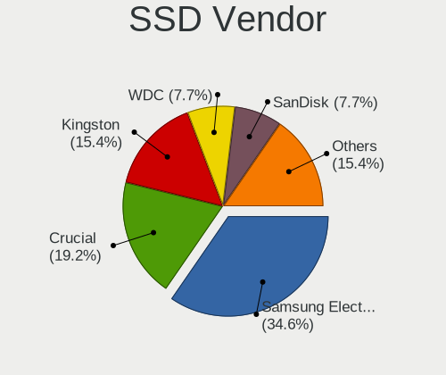

| Vendor              | Computers | Drives | Percent |
|---------------------|-----------|--------|---------|
| Samsung Electronics | 9         | 18     | 34.62%  |
| Crucial             | 5         | 16     | 19.23%  |
| Kingston            | 4         | 4      | 15.38%  |
| WDC                 | 2         | 2      | 7.69%   |
| SanDisk             | 2         | 4      | 7.69%   |
| Toshiba             | 1         | 1      | 3.85%   |
| SK hynix            | 1         | 9      | 3.85%   |
| OCZ                 | 1         | 3      | 3.85%   |
| GRITRONIX           | 1         | 1      | 3.85%   |

Drive Kind
----------

HDD or SSD

| Kind | Computers | Drives | Percent |
|------|-----------|--------|---------|
| NVMe | 24        | 46     | 37.5%   |
| SSD  | 21        | 58     | 32.81%  |
| HDD  | 18        | 60     | 28.13%  |
| MMC  | 1         | 1      | 1.56%   |

Drive Connector
---------------

SATA, SAS, NVMe, etc.

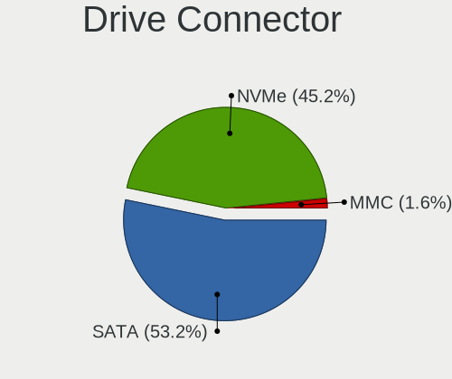

| Type | Computers | Drives | Percent |
|------|-----------|--------|---------|
| SATA | 31        | 118    | 55.36%  |
| NVMe | 24        | 46     | 42.86%  |
| MMC  | 1         | 1      | 1.79%   |

Drive Size
----------

Size of hard drive

| Size in TB | Computers | Drives | Percent |
|------------|-----------|--------|---------|
| 0.01-0.5   | 19        | 48     | 45.24%  |
| 0.51-1.0   | 11        | 32     | 26.19%  |
| 1.01-2.0   | 6         | 19     | 14.29%  |
| 3.01-4.0   | 3         | 14     | 7.14%   |
| 4.01-10.0  | 2         | 2      | 4.76%   |
| 2.01-3.0   | 1         | 3      | 2.38%   |

Space Total
-----------

Amount of disk space available on the file system

| Size in GB     | Computers | Percent |
|----------------|-----------|---------|
| 251-500        | 12        | 24.49%  |
| 101-250        | 7         | 14.29%  |
| 1001-2000      | 7         | 14.29%  |
| More than 3000 | 6         | 12.24%  |
| 501-1000       | 6         | 12.24%  |
| Unknown        | 5         | 10.2%   |
| 2001-3000      | 2         | 4.08%   |
| 1-20           | 2         | 4.08%   |
| 21-50          | 1         | 2.04%   |
| 51-100         | 1         | 2.04%   |

Space Used
----------

Amount of used disk space

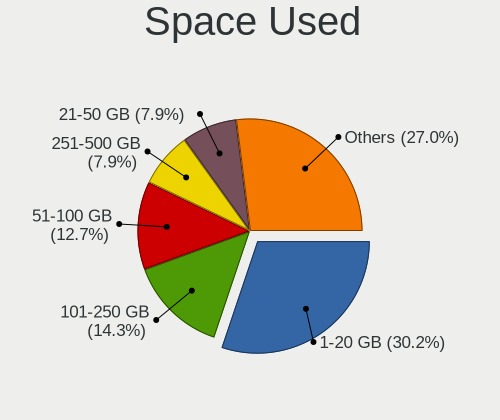

| Used GB        | Computers | Percent |
|----------------|-----------|---------|
| 1-20           | 16        | 28.07%  |
| 51-100         | 8         | 14.04%  |
| 101-250        | 7         | 12.28%  |
| 21-50          | 5         | 8.77%   |
| Unknown        | 5         | 8.77%   |
| 251-500        | 4         | 7.02%   |
| 1001-2000      | 4         | 7.02%   |
| 501-1000       | 4         | 7.02%   |
| More than 3000 | 3         | 5.26%   |
| 2001-3000      | 1         | 1.75%   |

Malfunc. Drives
---------------

Drive models with a malfunction

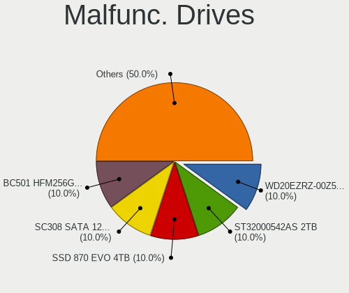

| Model                                   | Computers | Drives | Percent |
|-----------------------------------------|-----------|--------|---------|
| WDC WD20EZRZ-00Z5HB0 2TB                | 1         | 6      | 11.11%  |
| SK hynix SC308 SATA 128GB SSD           | 1         | 9      | 11.11%  |
| SK hynix BC501 HFM256GDJTNG-8310A 256GB | 1         | 1      | 11.11%  |
| Seagate ST32000542AS 2TB                | 1         | 3      | 11.11%  |
| Samsung Electronics SSD 870 EVO 4TB     | 1         | 1      | 11.11%  |
| OCZ VERTEX3 120GB SSD                   | 1         | 3      | 11.11%  |
| Kingston SA400S37240G 240GB SSD         | 1         | 1      | 11.11%  |
| HGST HTS725050A7E630 500GB              | 1         | 11     | 11.11%  |
| Crucial CT500MX500SSD1 500GB            | 1         | 1      | 11.11%  |

Malfunc. Drive Vendor
---------------------

Vendors of faulty drives

| Vendor              | Computers | Drives | Percent |
|---------------------|-----------|--------|---------|
| SK hynix            | 2         | 10     | 22.22%  |
| WDC                 | 1         | 6      | 11.11%  |
| Seagate             | 1         | 3      | 11.11%  |
| Samsung Electronics | 1         | 1      | 11.11%  |
| OCZ                 | 1         | 3      | 11.11%  |
| Kingston            | 1         | 1      | 11.11%  |
| HGST                | 1         | 11     | 11.11%  |
| Crucial             | 1         | 1      | 11.11%  |

Malfunc. HDD Vendor
-------------------

Vendors of faulty HDD drives

| Vendor  | Computers | Drives | Percent |
|---------|-----------|--------|---------|
| WDC     | 1         | 6      | 33.33%  |
| Seagate | 1         | 3      | 33.33%  |
| HGST    | 1         | 11     | 33.33%  |

Malfunc. Drive Kind
-------------------

Kinds of faulty drives

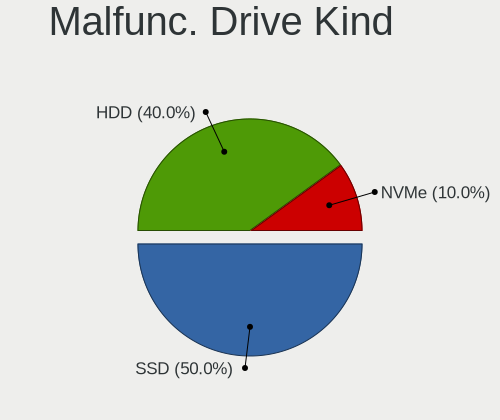

| Kind | Computers | Drives | Percent |
|------|-----------|--------|---------|
| SSD  | 5         | 15     | 55.56%  |
| HDD  | 3         | 20     | 33.33%  |
| NVMe | 1         | 1      | 11.11%  |

Failed Drives
-------------

Failed drive models

Zero info for selected period =(

Failed Drive Vendor
-------------------

Failed drive vendors

Zero info for selected period =(

Drive Status
------------

Number of failed and malfunc. drives

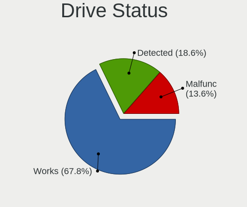

| Status   | Computers | Drives | Percent |
|----------|-----------|--------|---------|
| Works    | 36        | 107    | 67.92%  |
| Detected | 10        | 22     | 18.87%  |
| Malfunc  | 7         | 36     | 13.21%  |

Storage controller
------------------

Storage Vendor
--------------

Storage controller vendors

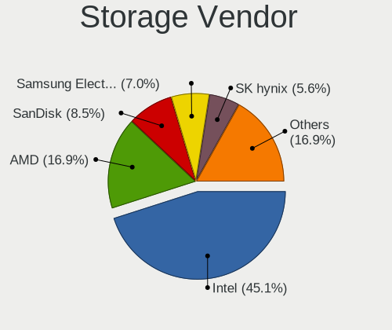

| Vendor                         | Computers | Percent |
|--------------------------------|-----------|---------|
| Intel                          | 28        | 43.08%  |
| AMD                            | 12        | 18.46%  |
| SanDisk                        | 6         | 9.23%   |
| SK hynix                       | 4         | 6.15%   |
| Samsung Electronics            | 4         | 6.15%   |
| Toshiba America Info Systems   | 2         | 3.08%   |
| Solid State Storage Technology | 1         | 1.54%   |
| Silicon Motion                 | 1         | 1.54%   |
| Phison Electronics             | 1         | 1.54%   |
| OCZ Technology Group           | 1         | 1.54%   |
| Micron/Crucial Technology      | 1         | 1.54%   |
| Micron Technology              | 1         | 1.54%   |
| Lenovo                         | 1         | 1.54%   |
| Kingston Technology Company    | 1         | 1.54%   |
| ASMedia Technology             | 1         | 1.54%   |

Storage Model
-------------

Storage controller models

| Model                                                                          | Computers | Percent |
|--------------------------------------------------------------------------------|-----------|---------|
| AMD FCH SATA Controller [AHCI mode]                                            | 9         | 12.68%  |
| Intel 8 Series/C220 Series Chipset Family 6-port SATA Controller 1 [AHCI mode] | 4         | 5.63%   |
| Intel 200 Series PCH SATA controller [AHCI mode]                               | 3         | 4.23%   |
| AMD 500 Series Chipset SATA Controller                                         | 3         | 4.23%   |
| Toshiba America Info Systems BG3 x2 NVMe SSD Controller (DRAM-less)            | 2         | 2.82%   |
| SK hynix BC501 NVMe Solid State Drive                                          | 2         | 2.82%   |
| SanDisk Ultra 3D / WD Blue SN550 NVMe SSD                                      | 2         | 2.82%   |
| Intel Sunrise Point-LP SATA Controller [AHCI mode]                             | 2         | 2.82%   |
| Intel Q170/Q150/B150/H170/H110/Z170/CM236 Chipset SATA Controller [AHCI Mode]  | 2         | 2.82%   |
| Intel Cannon Lake Mobile PCH SATA AHCI Controller                              | 2         | 2.82%   |
| Intel 82801 Mobile SATA Controller [RAID mode]                                 | 2         | 2.82%   |
| AMD 400 Series Chipset SATA Controller                                         | 2         | 2.82%   |
| Solid State Storage CL4-8D512 NVMe SSD M.2 (DRAM-less)                         | 1         | 1.41%   |
| SK hynix PC601 NVMe Solid State Drive                                          | 1         | 1.41%   |
| SK hynix Gold P31/BC711/PC711 NVMe Solid State Drive                           | 1         | 1.41%   |
| Silicon Motion SM2262/SM2262EN SSD Controller                                  | 1         | 1.41%   |
| SanDisk Ultra 3D / WD Blue SN570 NVMe SSD (DRAM-less)                          | 1         | 1.41%   |
| SanDisk PC SN735 NVMe SSD (DRAM-less)                                          | 1         | 1.41%   |
| SanDisk PC SN530 NVMe SSD (DRAM-less)                                          | 1         | 1.41%   |
| SanDisk Extreme Pro / WD Black SN750 / PC SN730 / Red SN700 NVMe SSD           | 1         | 1.41%   |
| Samsung NVMe SSD Controller SM981/PM981/PM983                                  | 1         | 1.41%   |
| Samsung NVMe SSD Controller SM951/PM951                                        | 1         | 1.41%   |
| Samsung NVMe SSD Controller S4LV008[Pascal]                                    | 1         | 1.41%   |
| Samsung NVMe SSD Controller PM9A1/PM9A3/980PRO                                 | 1         | 1.41%   |
| Phison E7 NVMe Controller                                                      | 1         | 1.41%   |
| OCZ Group RD400/400A SSD                                                       | 1         | 1.41%   |
| Micron/Crucial P1 NVMe PCIe SSD[Frampton]                                      | 1         | 1.41%   |
| Micron 2210 NVMe SSD [Cobain]                                                  | 1         | 1.41%   |
| Lenovo LENSE20256GMSP34MEAT2TA                                                 | 1         | 1.41%   |
| Kingston Company A2000 NVMe SSD SM2263EN                                       | 1         | 1.41%   |
| Intel Wildcat Point-LP SATA Controller [AHCI Mode]                             | 1         | 1.41%   |
| Intel Tiger Lake-LP SATA Controller                                            | 1         | 1.41%   |
| Intel SSD 665p Series [Neptune Harbor Refresh]                                 | 1         | 1.41%   |
| Intel SSD 660P Series                                                          | 1         | 1.41%   |
| Intel SATA Controller [RAID mode]                                              | 1         | 1.41%   |
| Intel Optane NVME SSD H10 with Solid State Storage [Teton Glacier]             | 1         | 1.41%   |
| Intel Jasper Lake SATA AHCI Controller                                         | 1         | 1.41%   |
| Intel Ice Lake-LP SATA Controller [AHCI mode]                                  | 1         | 1.41%   |
| Intel Cannon Point-LP SATA Controller [AHCI Mode]                              | 1         | 1.41%   |
| Intel C610/X99 series chipset sSATA Controller [AHCI mode]                     | 1         | 1.41%   |

Storage Kind
------------

Kind of storage controller (IDE, SATA, NVMe, SAS, ...)

| Kind | Computers | Percent |
|------|-----------|---------|
| SATA | 35        | 55.56%  |
| NVMe | 24        | 38.1%   |
| RAID | 3         | 4.76%   |
| IDE  | 1         | 1.59%   |

Processor
---------

CPU Vendor
----------

Processor vendors

| Vendor | Computers | Percent |
|--------|-----------|---------|
| Intel  | 31        | 70.45%  |
| AMD    | 13        | 29.55%  |

CPU Model
---------

Processor models

| Model                                         | Computers | Percent |
|-----------------------------------------------|-----------|---------|
| Intel Core i7-1065G7 CPU @ 1.30GHz            | 2         | 4.55%   |
| Intel Core i5-8265U CPU @ 1.60GHz             | 2         | 4.55%   |
| AMD Ryzen 5 3600 6-Core Processor             | 2         | 4.55%   |
| AMD Ryzen 5 3500U with Radeon Vega Mobile Gfx | 2         | 4.55%   |
| Intel Xeon CPU E5-1620 v3 @ 3.50GHz           | 1         | 2.27%   |
| Intel Pentium Silver N6005 @ 2.00GHz          | 1         | 2.27%   |
| Intel Pentium CPU G4400T @ 2.90GHz            | 1         | 2.27%   |
| Intel Core i7-9850H CPU @ 2.60GHz             | 1         | 2.27%   |
| Intel Core i7-8850H CPU @ 2.60GHz             | 1         | 2.27%   |
| Intel Core i7-8700K CPU @ 3.70GHz             | 1         | 2.27%   |
| Intel Core i7-7600U CPU @ 2.80GHz             | 1         | 2.27%   |
| Intel Core i7-4702MQ CPU @ 2.20GHz            | 1         | 2.27%   |
| Intel Core i7-10700K CPU @ 3.80GHz            | 1         | 2.27%   |
| Intel Core i5-8365U CPU @ 1.60GHz             | 1         | 2.27%   |
| Intel Core i5-8350U CPU @ 1.70GHz             | 1         | 2.27%   |
| Intel Core i5-7Y54 CPU @ 1.20GHz              | 1         | 2.27%   |
| Intel Core i5-7600K CPU @ 3.80GHz             | 1         | 2.27%   |
| Intel Core i5-7300U CPU @ 2.60GHz             | 1         | 2.27%   |
| Intel Core i5-6600K CPU @ 3.50GHz             | 1         | 2.27%   |
| Intel Core i5-6500 CPU @ 3.20GHz              | 1         | 2.27%   |
| Intel Core i5-6200U CPU @ 2.30GHz             | 1         | 2.27%   |
| Intel Core i5-5200U CPU @ 2.20GHz             | 1         | 2.27%   |
| Intel Core i5-4590S CPU @ 3.00GHz             | 1         | 2.27%   |
| Intel Core i5-4210U CPU @ 1.70GHz             | 1         | 2.27%   |
| Intel Core i5-4200M CPU @ 2.50GHz             | 1         | 2.27%   |
| Intel Core i5 CPU M 560 @ 2.67GHz             | 1         | 2.27%   |
| Intel Core i5 CPU M 540 @ 2.53GHz             | 1         | 2.27%   |
| Intel Core i5 CPU M 430 @ 2.27GHz             | 1         | 2.27%   |
| Intel Core i3-4000M CPU @ 2.40GHz             | 1         | 2.27%   |
| Intel Core i3-2310M CPU @ 2.10GHz             | 1         | 2.27%   |
| Intel 11th Gen Core i5-1135G7 @ 2.40GHz       | 1         | 2.27%   |
| AMD Ryzen 9 PRO 6950HS with Radeon Graphics   | 1         | 2.27%   |
| AMD Ryzen 9 3900X 12-Core Processor           | 1         | 2.27%   |
| AMD Ryzen 7 5700U with Radeon Graphics        | 1         | 2.27%   |
| AMD Ryzen 7 2700X Eight-Core Processor        | 1         | 2.27%   |
| AMD Ryzen 5 5500U with Radeon Graphics        | 1         | 2.27%   |
| AMD Ryzen 5 2600 Six-Core Processor           | 1         | 2.27%   |
| AMD Ryzen 5 2500U with Radeon Vega Mobile Gfx | 1         | 2.27%   |
| AMD FX-7500 Radeon R7, 10 Compute Cores 4C+6G | 1         | 2.27%   |
| AMD A9-9425 RADEON R5, 5 COMPUTE CORES 2C+3G  | 1         | 2.27%   |

CPU Model Family
----------------

Processor model prefix

| Model                | Computers | Percent |
|----------------------|-----------|---------|
| Intel Core i5        | 17        | 38.64%  |
| Intel Core i7        | 8         | 18.18%  |
| AMD Ryzen 5          | 7         | 15.91%  |
| Other                | 2         | 4.55%   |
| Intel Core i3        | 2         | 4.55%   |
| AMD Ryzen 9          | 2         | 4.55%   |
| AMD Ryzen 7          | 2         | 4.55%   |
| Intel Xeon           | 1         | 2.27%   |
| Intel Pentium Silver | 1         | 2.27%   |
| Intel Pentium        | 1         | 2.27%   |
| AMD FX               | 1         | 2.27%   |

CPU Cores
---------

Number of processor cores

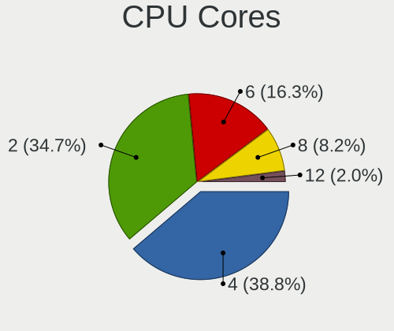

| Number | Computers | Percent |
|--------|-----------|---------|
| 4      | 17        | 38.64%  |
| 2      | 15        | 34.09%  |
| 6      | 7         | 15.91%  |
| 8      | 4         | 9.09%   |
| 12     | 1         | 2.27%   |

CPU Sockets
-----------

Number of sockets

| Number | Computers | Percent |
|--------|-----------|---------|
| 1      | 44        | 100%    |

CPU Threads
-----------

Threads per core (Hyper-Threading)

| Number | Computers | Percent |
|--------|-----------|---------|
| 2      | 37        | 84.09%  |
| 1      | 7         | 15.91%  |

CPU Op-Modes
------------

CPU Operation Modes (32-bit, 64-bit)

| Op mode        | Computers | Percent |
|----------------|-----------|---------|
| 32-bit, 64-bit | 43        | 97.73%  |
| Unknown        | 1         | 2.27%   |

CPU Microcode
-------------

Microcode number

| Number     | Computers | Percent |
|------------|-----------|---------|
| Unknown    | 20        | 39.22%  |
| 0x08701021 | 3         | 5.88%   |
| 0x806ec    | 2         | 3.92%   |
| 0x706e5    | 2         | 3.92%   |
| 0x506e3    | 2         | 3.92%   |
| 0x20655    | 2         | 3.92%   |
| 0x08108102 | 2         | 3.92%   |
| 0x0800820d | 2         | 3.92%   |
| 0xa0655    | 1         | 1.96%   |
| 0x906ea    | 1         | 1.96%   |
| 0x906e9    | 1         | 1.96%   |
| 0x806eb    | 1         | 1.96%   |
| 0x806e9    | 1         | 1.96%   |
| 0x306f2    | 1         | 1.96%   |
| 0x306d4    | 1         | 1.96%   |
| 0x306c3    | 1         | 1.96%   |
| 0x206a7    | 1         | 1.96%   |
| 0x20652    | 1         | 1.96%   |
| 0x0a404102 | 1         | 1.96%   |
| 0x08608103 | 1         | 1.96%   |
| 0x08108109 | 1         | 1.96%   |
| 0x0810100b | 1         | 1.96%   |
| 0x06006705 | 1         | 1.96%   |
| 0x06003106 | 1         | 1.96%   |

CPU Microarch
-------------

Microarchitecture

| Name        | Computers | Percent |
|-------------|-----------|---------|
| KabyLake    | 11        | 25%     |
| Haswell     | 6         | 13.64%  |
| Zen+        | 4         | 9.09%   |
| Skylake     | 4         | 9.09%   |
| Zen 2       | 3         | 6.82%   |
| Westmere    | 3         | 6.82%   |
| Unknown     | 3         | 6.82%   |
| IceLake     | 2         | 4.55%   |
| Zen         | 1         | 2.27%   |
| Tremont     | 1         | 2.27%   |
| TigerLake   | 1         | 2.27%   |
| Steamroller | 1         | 2.27%   |
| SandyBridge | 1         | 2.27%   |
| Excavator   | 1         | 2.27%   |
| CometLake   | 1         | 2.27%   |
| Broadwell   | 1         | 2.27%   |

Graphics
--------

GPU Vendor
----------

Vendors of graphics cards

| Vendor | Computers | Percent |
|--------|-----------|---------|
| Intel  | 24        | 48%     |
| AMD    | 17        | 34%     |
| Nvidia | 9         | 18%     |

GPU Model
---------

Graphics card models

| Model                                                                       | Computers | Percent |
|-----------------------------------------------------------------------------|-----------|---------|
| Intel WhiskeyLake-U GT2 [UHD Graphics 620]                                  | 3         | 5.77%   |
| Intel 4th Gen Core Processor Integrated Graphics Controller                 | 3         | 5.77%   |
| AMD Ellesmere [Radeon RX 470/480/570/570X/580/580X/590]                     | 3         | 5.77%   |
| Intel Iris Plus Graphics G7                                                 | 2         | 3.85%   |
| Intel HD Graphics 620                                                       | 2         | 3.85%   |
| Intel Core Processor Integrated Graphics Controller                         | 2         | 3.85%   |
| AMD Picasso/Raven 2 [Radeon Vega Series / Radeon Vega Mobile Series]        | 2         | 3.85%   |
| AMD Lucienne                                                                | 2         | 3.85%   |
| Nvidia TU117GLM [Quadro T2000 Mobile / Max-Q]                               | 1         | 1.92%   |
| Nvidia GP106 [GeForce GTX 1060 6GB]                                         | 1         | 1.92%   |
| Nvidia GP106 [GeForce GTX 1060 3GB]                                         | 1         | 1.92%   |
| Nvidia GM108M [GeForce MX130]                                               | 1         | 1.92%   |
| Nvidia GK208M [GeForce GT 740M]                                             | 1         | 1.92%   |
| Nvidia GK104 [GeForce GTX 770]                                              | 1         | 1.92%   |
| Nvidia GF119 [NVS 310]                                                      | 1         | 1.92%   |
| Nvidia GF117M [GeForce 610M/710M/810M/820M / GT 620M/625M/630M/720M]        | 1         | 1.92%   |
| Nvidia GA106 [Geforce RTX 3050]                                             | 1         | 1.92%   |
| Intel Xeon E3-1200 v3/4th Gen Core Processor Integrated Graphics Controller | 1         | 1.92%   |
| Intel UHD Graphics 620                                                      | 1         | 1.92%   |
| Intel TigerLake-LP GT2 [Iris Xe Graphics]                                   | 1         | 1.92%   |
| Intel Skylake GT2 [HD Graphics 520]                                         | 1         | 1.92%   |
| Intel JasperLake [UHD Graphics]                                             | 1         | 1.92%   |
| Intel HD Graphics 615                                                       | 1         | 1.92%   |
| Intel HD Graphics 5500                                                      | 1         | 1.92%   |
| Intel HD Graphics 530                                                       | 1         | 1.92%   |
| Intel HD Graphics 510                                                       | 1         | 1.92%   |
| Intel Haswell-ULT Integrated Graphics Controller                            | 1         | 1.92%   |
| Intel CoffeeLake-H GT2 [UHD Graphics 630]                                   | 1         | 1.92%   |
| Intel 2nd Generation Core Processor Family Integrated Graphics Controller   | 1         | 1.92%   |
| AMD Vega 20 [Radeon VII]                                                    | 1         | 1.92%   |
| AMD Stoney [Radeon R2/R3/R4/R5 Graphics]                                    | 1         | 1.92%   |
| AMD RV711/M93 [Mobility Radeon HD 4350/4550/530v/540v/545v / FirePro RG220] | 1         | 1.92%   |
| AMD Rembrandt [Radeon 680M]                                                 | 1         | 1.92%   |
| AMD Raven Ridge [Radeon Vega Series / Radeon Vega Mobile Series]            | 1         | 1.92%   |
| AMD Opal XT [Radeon R7 M265/M365X/M465]                                     | 1         | 1.92%   |
| AMD Navi 23 [Radeon RX 6600/6600 XT/6600M]                                  | 1         | 1.92%   |
| AMD Navi 22 [Radeon RX 6700/6700 XT/6750 XT / 6800M/6850M XT]               | 1         | 1.92%   |
| AMD Navi 21 [Radeon RX 6800/6800 XT / 6900 XT]                              | 1         | 1.92%   |
| AMD Madison [Mobility Radeon HD 5650/5750 / 6530M/6550M]                    | 1         | 1.92%   |
| AMD Kaveri [Radeon R6/R7 Graphics]                                          | 1         | 1.92%   |

GPU Combo
---------

Combinations of graphics cards

| Name           | Computers | Percent |
|----------------|-----------|---------|
| 1 x Intel      | 20        | 43.48%  |
| 1 x AMD        | 15        | 32.61%  |
| 1 x Nvidia     | 6         | 13.04%  |
| Intel + Nvidia | 3         | 6.52%   |
| 2 x AMD        | 1         | 2.17%   |
| Intel + AMD    | 1         | 2.17%   |

GPU Driver
----------

Free vs proprietary

| Driver      | Computers | Percent |
|-------------|-----------|---------|
| Free        | 40        | 86.96%  |
| Proprietary | 6         | 13.04%  |

GPU Memory
----------

Total video memory

| Size in GB | Computers | Percent |
|------------|-----------|---------|
| Unknown    | 26        | 54.17%  |
| 0.01-0.5   | 7         | 14.58%  |
| 7.01-8.0   | 4         | 8.33%   |
| 1.01-2.0   | 4         | 8.33%   |
| 8.01-16.0  | 2         | 4.17%   |
| 0.51-1.0   | 2         | 4.17%   |
| 5.01-6.0   | 1         | 2.08%   |
| 3.01-4.0   | 1         | 2.08%   |
| 2.01-3.0   | 1         | 2.08%   |

Monitor
-------

Monitor Vendor
--------------

Monitor vendors

| Vendor              | Computers | Percent |
|---------------------|-----------|---------|
| Chimei Innolux      | 9         | 15.79%  |
| LG Display          | 7         | 12.28%  |
| Acer                | 6         | 10.53%  |
| AU Optronics        | 5         | 8.77%   |
| Samsung Electronics | 4         | 7.02%   |
| Hewlett-Packard     | 4         | 7.02%   |
| BOE                 | 4         | 7.02%   |
| Lenovo              | 3         | 5.26%   |
| Dell                | 3         | 5.26%   |
| Philips             | 2         | 3.51%   |
| Goldstar            | 2         | 3.51%   |
| AOC                 | 2         | 3.51%   |
| STD                 | 1         | 1.75%   |
| Sony                | 1         | 1.75%   |
| MSI                 | 1         | 1.75%   |
| Eizo                | 1         | 1.75%   |
| BenQ                | 1         | 1.75%   |
| ASUSTek Computer    | 1         | 1.75%   |

Monitor Model
-------------

Monitor models

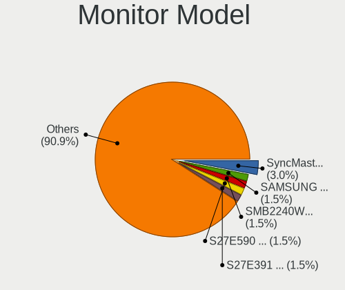

| Model                                                                 | Computers | Percent |
|-----------------------------------------------------------------------|-----------|---------|
| Samsung Electronics SyncMaster SAM021E 1680x1050 433x271mm 20.1-inch  | 2         | 3.33%   |
| STD HDMI TV STD00C7 1920x1080 698x392mm 31.5-inch                     | 1         | 1.67%   |
| Sony SAMSUNG SNY5203 1920x540                                         | 1         | 1.67%   |
| Samsung Electronics S27E590 SAM0C5D 1920x1080 598x336mm 27.0-inch     | 1         | 1.67%   |
| Samsung Electronics S27E391 SAM0C15 1920x1080 598x336mm 27.0-inch     | 1         | 1.67%   |
| Samsung Electronics LCD Monitor SDC4244 2160x1440 254x169mm 12.0-inch | 1         | 1.67%   |
| Philips PHL 241P6E PHL08F7 1920x1080 530x300mm 24.0-inch              | 1         | 1.67%   |
| Philips 200V4 PHLC0BF 1600x900 432x240mm 19.5-inch                    | 1         | 1.67%   |
| MSI G241 MSI3BA4 1920x1080 527x296mm 23.8-inch                        | 1         | 1.67%   |
| LG Display LCD Monitor LGD06FF 1920x1080 344x194mm 15.5-inch          | 1         | 1.67%   |
| LG Display LCD Monitor LGD059D 1920x1080 309x174mm 14.0-inch          | 1         | 1.67%   |
| LG Display LCD Monitor LGD051D 1920x1080 309x174mm 14.0-inch          | 1         | 1.67%   |
| LG Display LCD Monitor LGD045E 1366x768 310x174mm 14.0-inch           | 1         | 1.67%   |
| LG Display LCD Monitor LGD0437 1920x1080 276x156mm 12.5-inch          | 1         | 1.67%   |
| LG Display LCD Monitor LGD03DE 1600x900 382x215mm 17.3-inch           | 1         | 1.67%   |
| LG Display LCD Monitor LGD038E 1366x768 344x194mm 15.5-inch           | 1         | 1.67%   |
| Lenovo LEN-A-A LENF918 1920x1080 596x335mm 26.9-inch                  | 1         | 1.67%   |
| Lenovo LCD Monitor LEN40BA 1920x1080 344x194mm 15.5-inch              | 1         | 1.67%   |
| Lenovo LCD Monitor LEN4036 1440x900 303x189mm 14.1-inch               | 1         | 1.67%   |
| Hewlett-Packard X27i HPN3678 2560x1440 597x336mm 27.0-inch            | 1         | 1.67%   |
| Hewlett-Packard E243i HPN3463 1920x1200 518x324mm 24.1-inch           | 1         | 1.67%   |
| Hewlett-Packard 27fh HPN354A 1920x1080 598x336mm 27.0-inch            | 1         | 1.67%   |
| Hewlett-Packard 27f HPN354B 1920x1080 598x336mm 27.0-inch             | 1         | 1.67%   |
| Hewlett-Packard 23xw HWP318C 1920x1080 509x286mm 23.0-inch            | 1         | 1.67%   |
| Hewlett-Packard 23cw HWP3187 1920x1080 509x286mm 23.0-inch            | 1         | 1.67%   |
| Goldstar W1946 GSM4BCD 1360x768 406x229mm 18.4-inch                   | 1         | 1.67%   |
| Goldstar Ultra HD GSM5B08 3840x2160 600x340mm 27.2-inch               | 1         | 1.67%   |
| Eizo EV3285 ENC2979 3840x2160 698x393mm 31.5-inch                     | 1         | 1.67%   |
| Dell UP3216Q DEL40C2 3840x2160 700x400mm 31.7-inch                    | 1         | 1.67%   |
| Dell U2415 DELA0BC 1920x1200 518x324mm 24.1-inch                      | 1         | 1.67%   |
| Dell U2414H DELA0B2 1920x1080 527x296mm 23.8-inch                     | 1         | 1.67%   |
| Chimei Innolux LCD Monitor CMN175A 1920x1080 381x214mm 17.2-inch      | 1         | 1.67%   |
| Chimei Innolux LCD Monitor CMN1610 1920x1200 344x215mm 16.0-inch      | 1         | 1.67%   |
| Chimei Innolux LCD Monitor CMN15F6 1920x1080 344x193mm 15.5-inch      | 1         | 1.67%   |
| Chimei Innolux LCD Monitor CMN15E8 1920x1080 344x193mm 15.5-inch      | 1         | 1.67%   |
| Chimei Innolux LCD Monitor CMN15DB 1366x768 344x193mm 15.5-inch       | 1         | 1.67%   |
| Chimei Innolux LCD Monitor CMN15C3 1920x1080 344x193mm 15.5-inch      | 1         | 1.67%   |
| Chimei Innolux LCD Monitor CMN15C0 1920x1080 344x194mm 15.5-inch      | 1         | 1.67%   |
| Chimei Innolux LCD Monitor CMN14D4 1920x1080 309x173mm 13.9-inch      | 1         | 1.67%   |
| Chimei Innolux LCD Monitor CMN1388 1920x1080 293x165mm 13.2-inch      | 1         | 1.67%   |

Monitor Resolution
------------------

Monitor screen resolution

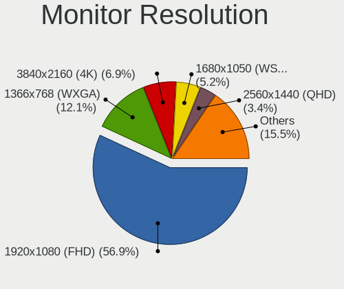

| Resolution         | Computers | Percent |
|--------------------|-----------|---------|
| 1920x1080 (FHD)    | 30        | 57.69%  |
| 1366x768 (WXGA)    | 5         | 9.62%   |
| 3840x2160 (4K)     | 4         | 7.69%   |
| 2560x1440 (QHD)    | 2         | 3.85%   |
| 1680x1050 (WSXGA+) | 2         | 3.85%   |
| 1600x900 (HD+)     | 2         | 3.85%   |
| 3840x1080          | 1         | 1.92%   |
| 3440x1440          | 1         | 1.92%   |
| 2160x1440          | 1         | 1.92%   |
| 1920x540           | 1         | 1.92%   |
| 1920x1200 (WUXGA)  | 1         | 1.92%   |
| 1440x900 (WXGA+)   | 1         | 1.92%   |
| 1360x768           | 1         | 1.92%   |

Monitor Diagonal
----------------

Diagonal size in inches

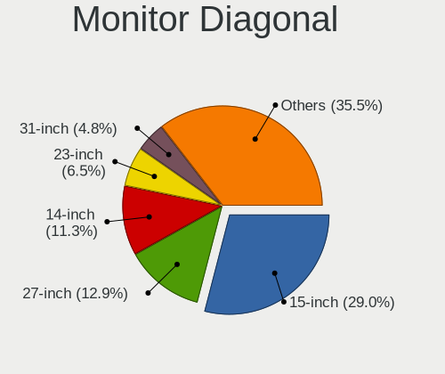

| Inches  | Computers | Percent |
|---------|-----------|---------|
| 15      | 14        | 25%     |
| 27      | 8         | 14.29%  |
| 14      | 6         | 10.71%  |
| 23      | 4         | 7.14%   |
| 31      | 3         | 5.36%   |
| 24      | 3         | 5.36%   |
| 20      | 2         | 3.57%   |
| 17      | 2         | 3.57%   |
| 13      | 2         | 3.57%   |
| 12      | 2         | 3.57%   |
| 49      | 1         | 1.79%   |
| 40      | 1         | 1.79%   |
| 34      | 1         | 1.79%   |
| 32      | 1         | 1.79%   |
| 26      | 1         | 1.79%   |
| 21      | 1         | 1.79%   |
| 19      | 1         | 1.79%   |
| 18      | 1         | 1.79%   |
| 16      | 1         | 1.79%   |
| Unknown | 1         | 1.79%   |

Monitor Width
-------------

Physical width

| Width in mm | Computers | Percent |
|-------------|-----------|---------|
| 301-350     | 22        | 42.31%  |
| 501-600     | 14        | 26.92%  |
| 601-700     | 3         | 5.77%   |
| 401-500     | 3         | 5.77%   |
| 201-300     | 3         | 5.77%   |
| 701-800     | 2         | 3.85%   |
| 351-400     | 2         | 3.85%   |
| 801-900     | 1         | 1.92%   |
| 1001-1500   | 1         | 1.92%   |
| Unknown     | 1         | 1.92%   |

Aspect Ratio
------------

Proportional relationship between the width and the height

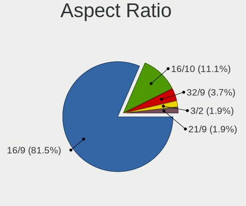

| Ratio | Computers | Percent |
|-------|-----------|---------|
| 16/9  | 39        | 81.25%  |
| 16/10 | 5         | 10.42%  |
| 32/9  | 2         | 4.17%   |
| 3/2   | 1         | 2.08%   |
| 21/9  | 1         | 2.08%   |

Monitor Area
------------

Area in inch

| Area in inch | Computers | Percent |
|----------------|-----------|---------|
| 101-110        | 14        | 25.93%  |
| 301-350        | 9         | 16.67%  |
| 81-90          | 7         | 12.96%  |
| 201-250        | 6         | 11.11%  |
| 351-500        | 4         | 7.41%   |
| 151-200        | 3         | 5.56%   |
| 61-70          | 2         | 3.7%    |
| 121-130        | 2         | 3.7%    |
| 501-1000       | 2         | 3.7%    |
| 71-80          | 1         | 1.85%   |
| 251-300        | 1         | 1.85%   |
| 141-150        | 1         | 1.85%   |
| 111-120        | 1         | 1.85%   |
| Unknown        | 1         | 1.85%   |

Pixel Density
-------------

Pixels per inch

| Density | Computers | Percent |
|---------|-----------|---------|
| 121-160 | 20        | 39.22%  |
| 51-100  | 16        | 31.37%  |
| 101-120 | 9         | 17.65%  |
| 161-240 | 5         | 9.8%    |
| Unknown | 1         | 1.96%   |

Multiple Monitors
-----------------

Total monitors connected

| Total | Computers | Percent |
|-------|-----------|---------|
| 1     | 35        | 74.47%  |
| 2     | 9         | 19.15%  |
| 3     | 3         | 6.38%   |

Network
-------

Net Controller Vendor
---------------------

Controller vendors

| Vendor                | Computers | Percent |
|-----------------------|-----------|---------|
| Intel                 | 29        | 46.77%  |
| Realtek Semiconductor | 22        | 35.48%  |
| Qualcomm Atheros      | 5         | 8.06%   |
| Broadcom              | 3         | 4.84%   |
| Sierra Wireless       | 1         | 1.61%   |
| Qualcomm              | 1         | 1.61%   |
| NetGear               | 1         | 1.61%   |

Net Controller Model
--------------------

Controller models

| Model                                                             | Computers | Percent |
|-------------------------------------------------------------------|-----------|---------|
| Realtek RTL8111/8168/8411 PCI Express Gigabit Ethernet Controller | 19        | 24.05%  |
| Intel Wi-Fi 6 AX200                                               | 4         | 5.06%   |
| Intel Wireless 8265 / 8275                                        | 3         | 3.8%    |
| Intel Ethernet Connection (2) I219-V                              | 3         | 3.8%    |
| Realtek RTL88x2bu [AC1200 Techkey]                                | 2         | 2.53%   |
| Realtek RTL8821CE 802.11ac PCIe Wireless Network Adapter          | 2         | 2.53%   |
| Realtek RTL8153 Gigabit Ethernet Adapter                          | 2         | 2.53%   |
| Intel Wireless 7260                                               | 2         | 2.53%   |
| Intel Ice Lake-LP PCH CNVi WiFi                                   | 2         | 2.53%   |
| Intel Ethernet Connection I217-V                                  | 2         | 2.53%   |
| Intel Ethernet Connection (4) I219-LM                             | 2         | 2.53%   |
| Sierra Wireless EM7430 Qualcomm Snapdragon X7 LTE-A               | 1         | 1.27%   |
| Realtek RTL8852BE PCIe 802.11ax Wireless Network Controller       | 1         | 1.27%   |
| Realtek RTL8852AE 802.11ax PCIe Wireless Network Adapter          | 1         | 1.27%   |
| Realtek RTL8723DE Wireless Network Adapter                        | 1         | 1.27%   |
| Realtek RTL8125 2.5GbE Controller                                 | 1         | 1.27%   |
| Realtek 802.11ac WLAN Adapter                                     | 1         | 1.27%   |
| Qualcomm QCNFA765 Wireless Network Adapter                        | 1         | 1.27%   |
| Qualcomm Atheros QCA9565 / AR9565 Wireless Network Adapter        | 1         | 1.27%   |
| Qualcomm Atheros QCA6174 802.11ac Wireless Network Adapter        | 1         | 1.27%   |
| Qualcomm Atheros AR928X Wireless Network Adapter (PCI-Express)    | 1         | 1.27%   |
| Qualcomm Atheros AR9287 Wireless Network Adapter (PCI-Express)    | 1         | 1.27%   |
| Qualcomm Atheros AR9285 Wireless Network Adapter (PCI-Express)    | 1         | 1.27%   |
| NetGear A6100 AC600 DB Wireless Adapter [Realtek RTL8811AU]       | 1         | 1.27%   |
| Intel Wireless-AC 9260                                            | 1         | 1.27%   |
| Intel Wireless 7265                                               | 1         | 1.27%   |
| Intel Wireless 3160                                               | 1         | 1.27%   |
| Intel Wi-Fi 6 AX201                                               | 1         | 1.27%   |
| Intel I211 Gigabit Network Connection                             | 1         | 1.27%   |
| Intel Ethernet Controller I225-V                                  | 1         | 1.27%   |
| Intel Ethernet Connection I219-LM                                 | 1         | 1.27%   |
| Intel Ethernet Connection I218-V                                  | 1         | 1.27%   |
| Intel Ethernet Connection I217-LM                                 | 1         | 1.27%   |
| Intel Ethernet Connection (7) I219-LM                             | 1         | 1.27%   |
| Intel Ethernet Connection (6) I219-LM                             | 1         | 1.27%   |
| Intel Ethernet Connection (2) I218-LM                             | 1         | 1.27%   |
| Intel Comet Lake PCH CNVi WiFi                                    | 1         | 1.27%   |
| Intel Centrino Wireless-N 1000 [Condor Peak]                      | 1         | 1.27%   |
| Intel Centrino Ultimate-N 6300                                    | 1         | 1.27%   |
| Intel Centrino Advanced-N 6235                                    | 1         | 1.27%   |

Wireless Vendor
---------------

Wireless vendors

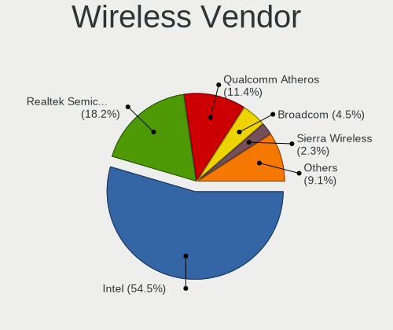

| Vendor                | Computers | Percent |
|-----------------------|-----------|---------|
| Intel                 | 22        | 57.89%  |
| Realtek Semiconductor | 6         | 15.79%  |
| Qualcomm Atheros      | 5         | 13.16%  |
| Broadcom              | 2         | 5.26%   |
| Sierra Wireless       | 1         | 2.63%   |
| Qualcomm              | 1         | 2.63%   |
| NetGear               | 1         | 2.63%   |

Wireless Model
--------------

Wireless models

| Model                                                          | Computers | Percent |
|----------------------------------------------------------------|-----------|---------|
| Intel Wi-Fi 6 AX200                                            | 4         | 10%     |
| Intel Wireless 8265 / 8275                                     | 3         | 7.5%    |
| Realtek RTL88x2bu [AC1200 Techkey]                             | 2         | 5%      |
| Realtek RTL8821CE 802.11ac PCIe Wireless Network Adapter       | 2         | 5%      |
| Intel Wireless 7260                                            | 2         | 5%      |
| Intel Ice Lake-LP PCH CNVi WiFi                                | 2         | 5%      |
| Sierra Wireless EM7430 Qualcomm Snapdragon X7 LTE-A            | 1         | 2.5%    |
| Realtek RTL8852BE PCIe 802.11ax Wireless Network Controller    | 1         | 2.5%    |
| Realtek RTL8852AE 802.11ax PCIe Wireless Network Adapter       | 1         | 2.5%    |
| Realtek RTL8723DE Wireless Network Adapter                     | 1         | 2.5%    |
| Realtek 802.11ac WLAN Adapter                                  | 1         | 2.5%    |
| Qualcomm QCNFA765 Wireless Network Adapter                     | 1         | 2.5%    |
| Qualcomm Atheros QCA9565 / AR9565 Wireless Network Adapter     | 1         | 2.5%    |
| Qualcomm Atheros QCA6174 802.11ac Wireless Network Adapter     | 1         | 2.5%    |
| Qualcomm Atheros AR928X Wireless Network Adapter (PCI-Express) | 1         | 2.5%    |
| Qualcomm Atheros AR9287 Wireless Network Adapter (PCI-Express) | 1         | 2.5%    |
| Qualcomm Atheros AR9285 Wireless Network Adapter (PCI-Express) | 1         | 2.5%    |
| NetGear A6100 AC600 DB Wireless Adapter [Realtek RTL8811AU]    | 1         | 2.5%    |
| Intel Wireless-AC 9260                                         | 1         | 2.5%    |
| Intel Wireless 7265                                            | 1         | 2.5%    |
| Intel Wireless 3160                                            | 1         | 2.5%    |
| Intel Wi-Fi 6 AX201                                            | 1         | 2.5%    |
| Intel Comet Lake PCH CNVi WiFi                                 | 1         | 2.5%    |
| Intel Centrino Wireless-N 1000 [Condor Peak]                   | 1         | 2.5%    |
| Intel Centrino Ultimate-N 6300                                 | 1         | 2.5%    |
| Intel Centrino Advanced-N 6235                                 | 1         | 2.5%    |
| Intel Centrino Advanced-N 6200                                 | 1         | 2.5%    |
| Intel Cannon Point-LP CNVi [Wireless-AC]                       | 1         | 2.5%    |
| Intel Cannon Lake PCH CNVi WiFi                                | 1         | 2.5%    |
| Broadcom BCM4360 802.11ac Dual Band Wireless Network Adapter   | 1         | 2.5%    |
| Broadcom BCM43228 802.11a/b/g/n                                | 1         | 2.5%    |

Ethernet Vendor
---------------

Ethernet vendors

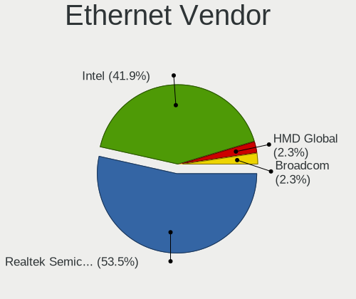

| Vendor                | Computers | Percent |
|-----------------------|-----------|---------|
| Realtek Semiconductor | 22        | 56.41%  |
| Intel                 | 16        | 41.03%  |
| Broadcom              | 1         | 2.56%   |

Ethernet Model
--------------

Ethernet models

| Model                                                             | Computers | Percent |
|-------------------------------------------------------------------|-----------|---------|
| Realtek RTL8111/8168/8411 PCI Express Gigabit Ethernet Controller | 19        | 48.72%  |
| Intel Ethernet Connection (2) I219-V                              | 3         | 7.69%   |
| Realtek RTL8153 Gigabit Ethernet Adapter                          | 2         | 5.13%   |
| Intel Ethernet Connection I217-V                                  | 2         | 5.13%   |
| Intel Ethernet Connection (4) I219-LM                             | 2         | 5.13%   |
| Realtek RTL8125 2.5GbE Controller                                 | 1         | 2.56%   |
| Intel I211 Gigabit Network Connection                             | 1         | 2.56%   |
| Intel Ethernet Controller I225-V                                  | 1         | 2.56%   |
| Intel Ethernet Connection I219-LM                                 | 1         | 2.56%   |
| Intel Ethernet Connection I218-V                                  | 1         | 2.56%   |
| Intel Ethernet Connection I217-LM                                 | 1         | 2.56%   |
| Intel Ethernet Connection (7) I219-LM                             | 1         | 2.56%   |
| Intel Ethernet Connection (6) I219-LM                             | 1         | 2.56%   |
| Intel Ethernet Connection (2) I218-LM                             | 1         | 2.56%   |
| Intel 82577LM Gigabit Network Connection                          | 1         | 2.56%   |
| Broadcom NetLink BCM57785 Gigabit Ethernet PCIe                   | 1         | 2.56%   |

Net Controller Kind
-------------------

Ethernet, WiFi or modem

| Kind     | Computers | Percent |
|----------|-----------|---------|
| Ethernet | 39        | 53.42%  |
| WiFi     | 34        | 46.58%  |

Used Controller
---------------

Currently used network controller

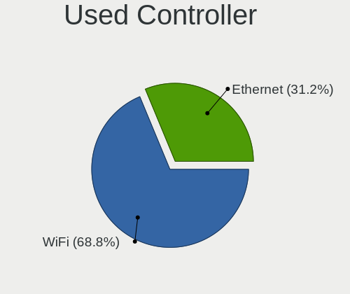

| Kind     | Computers | Percent |
|----------|-----------|---------|
| WiFi     | 29        | 67.44%  |
| Ethernet | 14        | 32.56%  |

NICs
----

Total network controllers on board

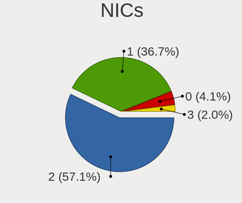

| Total | Computers | Percent |
|-------|-----------|---------|
| 2     | 25        | 56.82%  |
| 1     | 18        | 40.91%  |
| 3     | 1         | 2.27%   |

IPv6
----

IPv6 vs IPv4

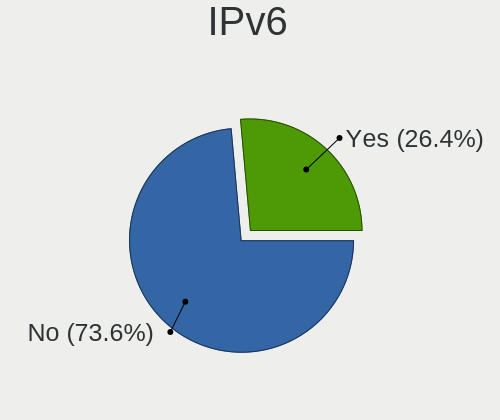

| Used | Computers | Percent |
|------|-----------|---------|
| No   | 35        | 72.92%  |
| Yes  | 13        | 27.08%  |

Bluetooth
---------

Bluetooth Vendor
----------------

Controller vendors

| Vendor                          | Computers | Percent |
|---------------------------------|-----------|---------|
| Intel                           | 18        | 56.25%  |
| Realtek Semiconductor           | 5         | 15.63%  |
| Lite-On Technology              | 2         | 6.25%   |
| Edimax Technology               | 2         | 6.25%   |
| Cambridge Silicon Radio         | 2         | 6.25%   |
| Qualcomm Atheros Communications | 1         | 3.13%   |
| Foxconn / Hon Hai               | 1         | 3.13%   |
| Broadcom                        | 1         | 3.13%   |

Bluetooth Model
---------------

Controller models

| Model                                                   | Computers | Percent |
|---------------------------------------------------------|-----------|---------|
| Intel Bluetooth wireless interface                      | 6         | 18.75%  |
| Intel Bluetooth 9460/9560 Jefferson Peak (JfP)          | 4         | 12.5%   |
| Intel AX200 Bluetooth                                   | 4         | 12.5%   |
| Realtek  Bluetooth 4.2 Adapter                          | 3         | 9.38%   |
| Realtek Bluetooth Radio                                 | 2         | 6.25%   |
| Intel AX201 Bluetooth                                   | 2         | 6.25%   |
| Cambridge Silicon Radio Bluetooth Dongle (HCI mode)     | 2         | 6.25%   |
| Qualcomm Atheros AR3011 Bluetooth                       | 1         | 3.13%   |
| Lite-On Bluetooth Device                                | 1         | 3.13%   |
| Lite-On Atheros AR3012 Bluetooth                        | 1         | 3.13%   |
| Intel Wireless-AC 9260 Bluetooth Adapter                | 1         | 3.13%   |
| Intel Centrino Bluetooth Wireless Transceiver           | 1         | 3.13%   |
| Foxconn / Hon Hai Bluetooth Device                      | 1         | 3.13%   |
| Edimax EW-7611ULB 802.11b/g/n and Bluetooth 4.0 Adapter | 1         | 3.13%   |
| Edimax Bluetooth Adapter                                | 1         | 3.13%   |
| Broadcom HP Portable Bumble Bee                         | 1         | 3.13%   |

Sound
-----

Sound Vendor
------------

Sound card vendors

| Vendor                  | Computers | Percent |
|-------------------------|-----------|---------|
| Intel                   | 31        | 50%     |
| AMD                     | 17        | 27.42%  |
| Nvidia                  | 5         | 8.06%   |
| C-Media Electronics     | 2         | 3.23%   |
| Astro Gaming            | 2         | 3.23%   |
| SAVITECH                | 1         | 1.61%   |
| Realtek Semiconductor   | 1         | 1.61%   |
| Hewlett-Packard         | 1         | 1.61%   |
| GN Netcom               | 1         | 1.61%   |
| Cambridge Silicon Radio | 1         | 1.61%   |

Sound Model
-----------

Sound card models

| Model                                                                      | Computers | Percent |
|----------------------------------------------------------------------------|-----------|---------|
| AMD Family 17h/19h HD Audio Controller                                     | 6         | 7.32%   |
| Intel Sunrise Point-LP HD Audio                                            | 5         | 6.1%    |
| Intel Xeon E3-1200 v3/4th Gen Core Processor HD Audio Controller           | 4         | 4.88%   |
| Intel 8 Series/C220 Series Chipset High Definition Audio Controller        | 4         | 4.88%   |
| Intel Cannon Point-LP High Definition Audio Controller                     | 3         | 3.66%   |
| Intel 5 Series/3400 Series Chipset High Definition Audio                   | 3         | 3.66%   |
| Intel 200 Series PCH HD Audio                                              | 3         | 3.66%   |
| AMD Starship/Matisse HD Audio Controller                                   | 3         | 3.66%   |
| AMD Raven/Raven2/Fenghuang HDMI/DP Audio Controller                        | 3         | 3.66%   |
| AMD Navi 21/23 HDMI/DP Audio Controller                                    | 3         | 3.66%   |
| AMD Ellesmere HDMI Audio [Radeon RX 470/480 / 570/580/590]                 | 3         | 3.66%   |
| Nvidia GP106 High Definition Audio Controller                              | 2         | 2.44%   |
| Intel Ice Lake-LP Smart Sound Technology Audio Controller                  | 2         | 2.44%   |
| Intel Cannon Lake PCH cAVS                                                 | 2         | 2.44%   |
| Intel 100 Series/C230 Series Chipset Family HD Audio Controller            | 2         | 2.44%   |
| Astro Gaming Astro A50                                                     | 2         | 2.44%   |
| AMD Renoir Radeon High Definition Audio Controller                         | 2         | 2.44%   |
| AMD Family 17h (Models 00h-0fh) HD Audio Controller                        | 2         | 2.44%   |
| SAVITECH MX3                                                               | 1         | 1.22%   |
| Realtek Semiconductor USB Audio                                            | 1         | 1.22%   |
| Nvidia TU107 GeForce GTX 1650 High Definition Audio Controller             | 1         | 1.22%   |
| Nvidia GK104 HDMI Audio Controller                                         | 1         | 1.22%   |
| Nvidia GF119 HDMI Audio Controller                                         | 1         | 1.22%   |
| Intel Wildcat Point-LP High Definition Audio Controller                    | 1         | 1.22%   |
| Intel Tiger Lake-LP Smart Sound Technology Audio Controller                | 1         | 1.22%   |
| Intel Jasper Lake HD Audio                                                 | 1         | 1.22%   |
| Intel Haswell-ULT HD Audio Controller                                      | 1         | 1.22%   |
| Intel Comet Lake PCH cAVS                                                  | 1         | 1.22%   |
| Intel C610/X99 series chipset HD Audio Controller                          | 1         | 1.22%   |
| Intel Broadwell-U Audio Controller                                         | 1         | 1.22%   |
| Intel 8 Series HD Audio Controller                                         | 1         | 1.22%   |
| Intel 6 Series/C200 Series Chipset Family High Definition Audio Controller | 1         | 1.22%   |
| Hewlett-Packard USB Audio                                                  | 1         | 1.22%   |
| GN Netcom Jabra Link 380                                                   | 1         | 1.22%   |
| Cambridge Silicon Radio AfterShokz Loop 100                                | 1         | 1.22%   |
| C-Media Electronics CMI8738/CMI8768 PCI Audio                              | 1         | 1.22%   |
| C-Media Electronics Audio Adapter (Unitek Y-247A)                          | 1         | 1.22%   |
| AMD Vega 20 HDMI Audio [Radeon VII]                                        | 1         | 1.22%   |
| AMD RV710/730 HDMI Audio [Radeon HD 4000 series]                           | 1         | 1.22%   |
| AMD Rembrandt Radeon High Definition Audio Controller                      | 1         | 1.22%   |

Memory
------

Memory Vendor
-------------

Memory module vendors

| Vendor              | Computers | Percent |
|---------------------|-----------|---------|
| SK hynix            | 11        | 23.4%   |
| Samsung Electronics | 9         | 19.15%  |
| Crucial             | 6         | 12.77%  |
| Kingston            | 5         | 10.64%  |
| G.Skill             | 5         | 10.64%  |
| Micron Technology   | 4         | 8.51%   |
| Nanya Technology    | 2         | 4.26%   |
| Corsair             | 2         | 4.26%   |
| Unknown             | 1         | 2.13%   |
| Ramsta              | 1         | 2.13%   |
| Elpida              | 1         | 2.13%   |

Memory Model
------------

Memory module models

| Model                                                            | Computers | Percent |
|------------------------------------------------------------------|-----------|---------|
| SK hynix RAM HMA41GS6AFR8N-TF 8GB SODIMM DDR4 2667MT/s           | 2         | 4.17%   |
| Samsung RAM M471A1K43DB1-CTD 8GB SODIMM DDR4 2667MT/s            | 2         | 4.17%   |
| Unknown RAM Module 8GB DIMM DDR3 1600MT/s                        | 1         | 2.08%   |
| SK hynix RAM HMT451U6DFR8A-PB 4GB DIMM DDR3 1600MT/s             | 1         | 2.08%   |
| SK hynix RAM HMT451S6BFR8A-PB 4GB SODIMM DDR3 1600MT/s           | 1         | 2.08%   |
| SK hynix RAM HMT351S6CFR8C-PB 4GB SODIMM DDR3 1600MT/s           | 1         | 2.08%   |
| SK hynix RAM HMAA1GS6CJR6N-XN 8GB SODIMM DDR4 3200MT/s           | 1         | 2.08%   |
| SK hynix RAM HMA82GS6AFR8N-UH 16GB SODIMM DDR4 2667MT/s          | 1         | 2.08%   |
| SK hynix RAM HMA81GU6CJR8N-VK 8GB DIMM DDR4 2400MT/s             | 1         | 2.08%   |
| SK hynix RAM HMA81GS6DJR8N-XN 8GB SODIMM DDR4 3200MT/s           | 1         | 2.08%   |
| SK hynix RAM HMA81GS6AFR8N-UH 8GB SODIMM DDR4 2667MT/s           | 1         | 2.08%   |
| SK hynix RAM H9CCNNNCLGALAR-NUD 8GB Row Of Chips LPDDR3 1867MT/s | 1         | 2.08%   |
| Samsung RAM M471B5773DH0-CH9 2GB SODIMM DDR3 1600MT/s            | 1         | 2.08%   |
| Samsung RAM M471B5773CHS-CH9 2GB SODIMM DDR3 4199MT/s            | 1         | 2.08%   |
| Samsung RAM M471A5244CB0-CTD 4GB Row Of Chips DDR4 2667MT/s      | 1         | 2.08%   |
| Samsung RAM M471A2K43BB1-CRC 16GB SODIMM DDR4 2400MT/s           | 1         | 2.08%   |
| Samsung RAM M471A1K43BB1-CTD 8GB SODIMM DDR4 2667MT/s            | 1         | 2.08%   |
| Samsung RAM M471A1G44BB0-CWE 8GB SODIMM DDR4 3200MT/s            | 1         | 2.08%   |
| Samsung RAM K4UBE3D4AA-MGCL 8GB Row Of Chips LPDDR4 4267MT/s     | 1         | 2.08%   |
| Ramsta RAM 3200MHz-16G 16GB SODIMM DDR4 3200MT/s                 | 1         | 2.08%   |
| Nanya RAM NT4GC64B8HG0NS-DI 4096MB SODIMM DDR3 1600MT/s          | 1         | 2.08%   |
| Nanya RAM NT4GC64B8HB0NS-CG 4GB SODIMM DDR3 1334MT/s             | 1         | 2.08%   |
| Micron RAM Module 16GB SODIMM DDR4 3200MT/s                      | 1         | 2.08%   |
| Micron RAM 4ATF51264HZ-2G6E1 4GB SODIMM DDR4 2667MT/s            | 1         | 2.08%   |
| Micron RAM 4ATF25664HZ-2G3B1 4GB SODIMM DDR4 2400MT/s            | 1         | 2.08%   |
| Micron RAM ...d 4096MB SODIMM DDR3 1067MT/s                      | 1         | 2.08%   |
| Kingston RAM Module 8GB DIMM DDR4 3200MT/s                       | 1         | 2.08%   |
| Kingston RAM LV32D4S2S8HD-8 8GB SODIMM DDR4 3200MT/s             | 1         | 2.08%   |
| Kingston RAM KHX1600C9S3L/8G 8GB SODIMM DDR3 1600MT/s            | 1         | 2.08%   |
| Kingston RAM ACR16D3LS1KFG/4G 4GB SODIMM DDR3 1600MT/s           | 1         | 2.08%   |
| Kingston RAM 99U5663-007.A00G 16GB SODIMM DDR4 2667MT/s          | 1         | 2.08%   |
| G.Skill RAM F4-3600C16-8GTZR 8192MB DIMM DDR4 3600MT/s           | 1         | 2.08%   |
| G.Skill RAM F4-3200C16-16GTZN 16GB DIMM DDR4 3200MT/s            | 1         | 2.08%   |
| G.Skill RAM F4-3000C16-8GISB 8192MB DIMM DDR4 3200MT/s           | 1         | 2.08%   |
| G.Skill RAM F4-3000C15-8GRBB 8GB DIMM DDR4 3000MT/s              | 1         | 2.08%   |
| G.Skill RAM F4-2400C15-8GNT 8GB DIMM DDR4 2666MT/s               | 1         | 2.08%   |
| Elpida RAM Module 4GB SODIMM DDR3 1600MT/s                       | 1         | 2.08%   |
| Crucial RAM CT8G4SFS824A.M8FE 8GB SODIMM DDR4 2667MT/s           | 1         | 2.08%   |
| Crucial RAM CT4G3S1067M.C16FKD 4GB SODIMM DDR3 1066MT/s          | 1         | 2.08%   |
| Crucial RAM CT32G48C40S5.M16A1 32GB SODIMM DDR5 4800MT/s         | 1         | 2.08%   |

Memory Kind
-----------

Memory module kinds

| Kind   | Computers | Percent |
|--------|-----------|---------|
| DDR4   | 26        | 66.67%  |
| DDR3   | 9         | 23.08%  |
| SDRAM  | 1         | 2.56%   |
| LPDDR4 | 1         | 2.56%   |
| LPDDR3 | 1         | 2.56%   |
| DDR5   | 1         | 2.56%   |

Memory Form Factor
------------------

Physical design of the memory module

| Name         | Computers | Percent |
|--------------|-----------|---------|
| SODIMM       | 24        | 61.54%  |
| DIMM         | 12        | 30.77%  |
| Row Of Chips | 3         | 7.69%   |

Memory Size
-----------

Memory module size

| Size  | Computers | Percent |
|-------|-----------|---------|
| 8192  | 20        | 47.62%  |
| 4096  | 11        | 26.19%  |
| 16384 | 9         | 21.43%  |
| 32768 | 1         | 2.38%   |
| 2048  | 1         | 2.38%   |

Memory Speed
------------

Memory module speed

| Speed | Computers | Percent |
|-------|-----------|---------|
| 2667  | 10        | 23.26%  |
| 3200  | 9         | 20.93%  |
| 2400  | 6         | 13.95%  |
| 1600  | 6         | 13.95%  |
| 3600  | 2         | 4.65%   |
| 3000  | 2         | 4.65%   |
| 4800  | 1         | 2.33%   |
| 4267  | 1         | 2.33%   |
| 4199  | 1         | 2.33%   |
| 2666  | 1         | 2.33%   |
| 1867  | 1         | 2.33%   |
| 1334  | 1         | 2.33%   |
| 1067  | 1         | 2.33%   |
| 1066  | 1         | 2.33%   |

Printers & scanners
-------------------

Printer Vendor
--------------

Printer device vendors

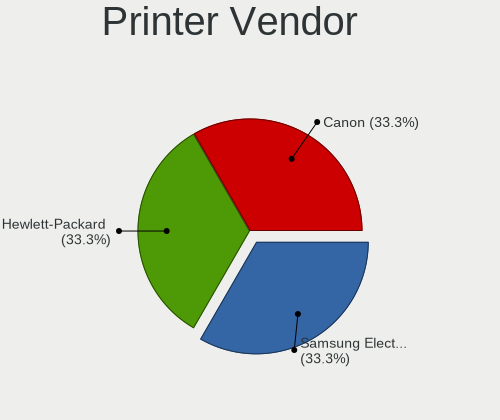

| Vendor              | Computers | Percent |
|---------------------|-----------|---------|
| Samsung Electronics | 1         | 33.33%  |
| Hewlett-Packard     | 1         | 33.33%  |
| Canon               | 1         | 33.33%  |

Printer Model
-------------

Printer device models

| Model                  | Computers | Percent |
|------------------------|-----------|---------|
| Samsung M2070 Series   | 1         | 33.33%  |
| HP DeskJet 3630 series | 1         | 33.33%  |
| Canon TS8000 series    | 1         | 33.33%  |

Scanner Vendor
--------------

Scanner device vendors

Zero info for selected period =(

Scanner Model
-------------

Scanner device models

Zero info for selected period =(

Camera
------

Camera Vendor
-------------

Camera device vendors

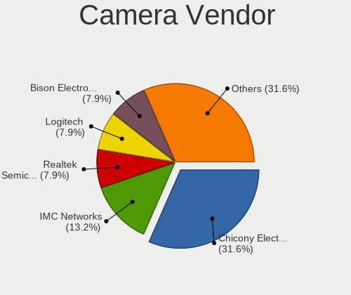

| Vendor                                 | Computers | Percent |
|----------------------------------------|-----------|---------|
| Chicony Electronics                    | 10        | 32.26%  |
| Realtek Semiconductor                  | 3         | 9.68%   |
| IMC Networks                           | 3         | 9.68%   |
| Microdia                               | 2         | 6.45%   |
| Logitech                               | 2         | 6.45%   |
| Bison Electronics                      | 2         | 6.45%   |
| WaveRider Communications               | 1         | 3.23%   |
| Suyin                                  | 1         | 3.23%   |
| Silicon Motion                         | 1         | 3.23%   |
| Quanta                                 | 1         | 3.23%   |
| Primax Electronics                     | 1         | 3.23%   |
| Microsoft                              | 1         | 3.23%   |
| Cheng Uei Precision Industry (Foxlink) | 1         | 3.23%   |
| Acer                                   | 1         | 3.23%   |
| A4Tech                                 | 1         | 3.23%   |

Camera Model
------------

Camera device models

| Model                                                          | Computers | Percent |
|----------------------------------------------------------------|-----------|---------|
| Chicony HD WebCam                                              | 4         | 12.5%   |
| Realtek Integrated_Webcam_HD                                   | 2         | 6.25%   |
| Microdia Integrated_Webcam_HD                                  | 2         | 6.25%   |
| Chicony Integrated Camera                                      | 2         | 6.25%   |
| WaveRider USB Live camera                                      | 1         | 3.13%   |
| Suyin 1.3M HD WebCam                                           | 1         | 3.13%   |
| Silicon Motion USB 2.0 PC Cam                                  | 1         | 3.13%   |
| Realtek FULL HD 1080P Webcam                                   | 1         | 3.13%   |
| Quanta HP Webcam                                               | 1         | 3.13%   |
| Primax Villem                                                  | 1         | 3.13%   |
| Microsoft LifeCam Cinema                                       | 1         | 3.13%   |
| Logitech Webcam C270                                           | 1         | 3.13%   |
| Logitech QuickCam Pro 9000                                     | 1         | 3.13%   |
| IMC Networks USB2.0 HD UVC WebCam                              | 1         | 3.13%   |
| IMC Networks SunplusIT Integrated Camera                       | 1         | 3.13%   |
| IMC Networks Integrated Camera                                 | 1         | 3.13%   |
| Chicony USB2.0 HD UVC WebCam                                   | 1         | 3.13%   |
| Chicony HP Webcam                                              | 1         | 3.13%   |
| Chicony HP HD Camera                                           | 1         | 3.13%   |
| Chicony HP 5MP Camera                                          | 1         | 3.13%   |
| Cheng Uei Precision Industry (Foxlink) HP TrueVision HD Camera | 1         | 3.13%   |
| Bison SunplusIT Integrated Camera                              | 1         | 3.13%   |
| Bison Integrated IR Camera                                     | 1         | 3.13%   |
| Bison Integrated Camera                                        | 1         | 3.13%   |
| Acer Integrated Camera                                         | 1         | 3.13%   |
| A4Tech REDRAGON Live Camera                                    | 1         | 3.13%   |

Security
--------

Fingerprint Vendor
------------------

Fingerprint sensor vendors

| Vendor                | Computers | Percent |
|-----------------------|-----------|---------|
| Validity Sensors      | 4         | 50%     |
| Synaptics             | 3         | 37.5%   |
| LighTuning Technology | 1         | 12.5%   |

Fingerprint Model
-----------------

Fingerprint sensor models

| Model                                                    | Computers | Percent |
|----------------------------------------------------------|-----------|---------|
| Validity Sensors VFS5011 Fingerprint Reader              | 1         | 12.5%   |
| Validity Sensors VFS451 Fingerprint Reader               | 1         | 12.5%   |
| Validity Sensors VFS Fingerprint sensor                  | 1         | 12.5%   |
| Validity Sensors Synaptics WBDI                          | 1         | 12.5%   |
| Synaptics Metallica MOH Touch Fingerprint Reader         | 1         | 12.5%   |
| Synaptics Metallica MIS Touch Fingerprint Reader         | 1         | 12.5%   |
| Synaptics FS7604 Touch Fingerprint Sensor with PurePrint | 1         | 12.5%   |
| LighTuning EgisTec Touch Fingerprint Sensor              | 1         | 12.5%   |

Chipcard Vendor
---------------

Chipcard module vendors

| Vendor      | Computers | Percent |
|-------------|-----------|---------|
| Broadcom    | 1         | 50%     |
| Alcor Micro | 1         | 50%     |

Chipcard Model
--------------

Chipcard module models

| Model                               | Computers | Percent |
|-------------------------------------|-----------|---------|
| Broadcom 5880                       | 1         | 50%     |
| Alcor Micro AU9540 Smartcard Reader | 1         | 50%     |

Unsupported
-----------

Unsupported Devices
-------------------

Total unsupported devices on board

| Total | Computers | Percent |
|-------|-----------|---------|
| 0     | 32        | 71.11%  |
| 1     | 11        | 24.44%  |
| 2     | 2         | 4.44%   |

Unsupported Device Types
------------------------

Types of unsupported devices

| Type                     | Computers | Percent |
|--------------------------|-----------|---------|
| Fingerprint reader       | 8         | 53.33%  |
| Chipcard                 | 2         | 13.33%  |
| Unassigned class         | 1         | 6.67%   |
| Sound                    | 1         | 6.67%   |
| Net/wireless             | 1         | 6.67%   |
| Graphics card            | 1         | 6.67%   |
| Communication controller | 1         | 6.67%   |

