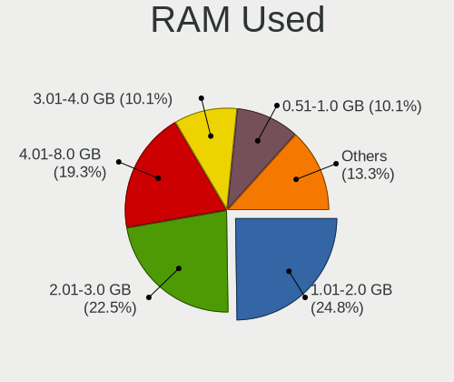
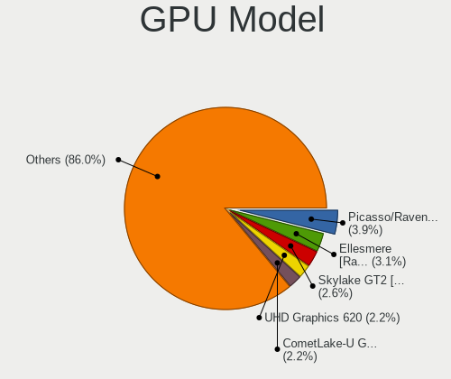
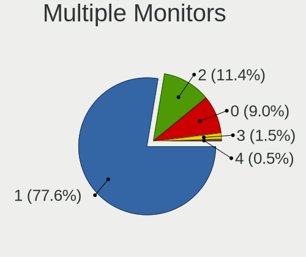

Slackware - Tested Hardware & Statistics
----------------------------------------

A project to collect tested hardware configurations for Slackware.

Anyone can contribute to this report by the [hw-probe](https://github.com/linuxhw/hw-probe) tool:

    sudo -E hw-probe -all -upload

Please contribute! Especially if your hardware is rare.

This is a report for all computer types. See also reports for [desktops](/Dist/Slackware/Desktop/README.md) and [notebooks](/Dist/Slackware/Notebook/README.md).

Contents
--------

* [ Test Cases ](#test-cases)

* [ System ](#system)
  - [ OS                       ](#os)
  - [ OS Family                ](#os-family)
  - [ Kernel                   ](#kernel)
  - [ Kernel Family            ](#kernel-family)
  - [ Kernel Major Ver.        ](#kernel-major-ver)
  - [ Arch                     ](#arch)
  - [ DE                       ](#de)
  - [ Display Server           ](#display-server)
  - [ Display Manager          ](#display-manager)
  - [ OS Lang                  ](#os-lang)
  - [ Boot Mode                ](#boot-mode)
  - [ Filesystem               ](#filesystem)
  - [ Part. scheme             ](#part-scheme)
  - [ Dual Boot with Linux/BSD ](#dual-boot-with-linuxbsd)
  - [ Dual Boot (Win)          ](#dual-boot-win)

* [ Board ](#board)
  - [ Vendor                   ](#vendor)
  - [ Model                    ](#model)
  - [ Model Family             ](#model-family)
  - [ MFG Year                 ](#mfg-year)
  - [ Form Factor              ](#form-factor)
  - [ Secure Boot              ](#secure-boot)
  - [ Coreboot                 ](#coreboot)
  - [ RAM Size                 ](#ram-size)
  - [ RAM Used                 ](#ram-used)
  - [ Total Drives             ](#total-drives)
  - [ Has CD-ROM               ](#has-cd-rom)
  - [ Has Ethernet             ](#has-ethernet)
  - [ Has WiFi                 ](#has-wifi)
  - [ Has Bluetooth            ](#has-bluetooth)

* [ Location ](#location)
  - [ Country                  ](#country)
  - [ City                     ](#city)

* [ Drives ](#drives)
  - [ Drive Vendor             ](#drive-vendor)
  - [ Drive Model              ](#drive-model)
  - [ HDD Vendor               ](#hdd-vendor)
  - [ SSD Vendor               ](#ssd-vendor)
  - [ Drive Kind               ](#drive-kind)
  - [ Drive Connector          ](#drive-connector)
  - [ Drive Size               ](#drive-size)
  - [ Space Total              ](#space-total)
  - [ Space Used               ](#space-used)
  - [ Malfunc. Drives          ](#malfunc-drives)
  - [ Malfunc. Drive Vendor    ](#malfunc-drive-vendor)
  - [ Malfunc. HDD Vendor      ](#malfunc-hdd-vendor)
  - [ Malfunc. Drive Kind      ](#malfunc-drive-kind)
  - [ Failed Drives            ](#failed-drives)
  - [ Failed Drive Vendor      ](#failed-drive-vendor)
  - [ Drive Status             ](#drive-status)

* [ Storage controller ](#storage-controller)
  - [ Storage Vendor           ](#storage-vendor)
  - [ Storage Model            ](#storage-model)
  - [ Storage Kind             ](#storage-kind)

* [ Processor ](#processor)
  - [ CPU Vendor               ](#cpu-vendor)
  - [ CPU Model                ](#cpu-model)
  - [ CPU Model Family         ](#cpu-model-family)
  - [ CPU Cores                ](#cpu-cores)
  - [ CPU Sockets              ](#cpu-sockets)
  - [ CPU Threads              ](#cpu-threads)
  - [ CPU Op-Modes             ](#cpu-op-modes)
  - [ CPU Microcode            ](#cpu-microcode)
  - [ CPU Microarch            ](#cpu-microarch)

* [ Graphics ](#graphics)
  - [ GPU Vendor               ](#gpu-vendor)
  - [ GPU Model                ](#gpu-model)
  - [ GPU Combo                ](#gpu-combo)
  - [ GPU Driver               ](#gpu-driver)
  - [ GPU Memory               ](#gpu-memory)

* [ Monitor ](#monitor)
  - [ Monitor Vendor           ](#monitor-vendor)
  - [ Monitor Model            ](#monitor-model)
  - [ Monitor Resolution       ](#monitor-resolution)
  - [ Monitor Diagonal         ](#monitor-diagonal)
  - [ Monitor Width            ](#monitor-width)
  - [ Aspect Ratio             ](#aspect-ratio)
  - [ Monitor Area             ](#monitor-area)
  - [ Pixel Density            ](#pixel-density)
  - [ Multiple Monitors        ](#multiple-monitors)

* [ Network ](#network)
  - [ Net Controller Vendor    ](#net-controller-vendor)
  - [ Net Controller Model     ](#net-controller-model)
  - [ Wireless Vendor          ](#wireless-vendor)
  - [ Wireless Model           ](#wireless-model)
  - [ Ethernet Vendor          ](#ethernet-vendor)
  - [ Ethernet Model           ](#ethernet-model)
  - [ Net Controller Kind      ](#net-controller-kind)
  - [ Used Controller          ](#used-controller)
  - [ NICs                     ](#nics)
  - [ IPv6                     ](#ipv6)

* [ Bluetooth ](#bluetooth)
  - [ Bluetooth Vendor         ](#bluetooth-vendor)
  - [ Bluetooth Model          ](#bluetooth-model)

* [ Sound ](#sound)
  - [ Sound Vendor             ](#sound-vendor)
  - [ Sound Model              ](#sound-model)

* [ Memory ](#memory)
  - [ Memory Vendor            ](#memory-vendor)
  - [ Memory Model             ](#memory-model)
  - [ Memory Kind              ](#memory-kind)
  - [ Memory Form Factor       ](#memory-form-factor)
  - [ Memory Size              ](#memory-size)
  - [ Memory Speed             ](#memory-speed)

* [ Printers & scanners ](#printers--scanners)
  - [ Printer Vendor           ](#printer-vendor)
  - [ Printer Model            ](#printer-model)
  - [ Scanner Vendor           ](#scanner-vendor)
  - [ Scanner Model            ](#scanner-model)

* [ Camera ](#camera)
  - [ Camera Vendor            ](#camera-vendor)
  - [ Camera Model             ](#camera-model)

* [ Security ](#security)
  - [ Fingerprint Vendor       ](#fingerprint-vendor)
  - [ Fingerprint Model        ](#fingerprint-model)
  - [ Chipcard Vendor          ](#chipcard-vendor)
  - [ Chipcard Model           ](#chipcard-model)

* [ Unsupported ](#unsupported)
  - [ Unsupported Devices      ](#unsupported-devices)
  - [ Unsupported Device Types ](#unsupported-device-types)

Test Cases
----------

Total: 207

| Vendor        | Model                       | Form-Factor | Probe                                                      | Date         |
|---------------|-----------------------------|-------------|------------------------------------------------------------|--------------|
| MSI           | MAG B650M MORTAR WIFI       | Desktop     | [7e506254e0](https://linux-hardware.org/?probe=7e506254e0) | Dec 22, 2023 |
| Gigabyte      | Z97M-DS3H                   | Desktop     | [4fd5ba2289](https://linux-hardware.org/?probe=4fd5ba2289) | Dec 04, 2023 |
| MSI           | X470 GAMING PLUS MAX        | Desktop     | [24ebfe35c8](https://linux-hardware.org/?probe=24ebfe35c8) | Nov 22, 2023 |
| ASUSTek       | P7P55D-E                    | Desktop     | [f16aeca403](https://linux-hardware.org/?probe=f16aeca403) | Nov 03, 2023 |
| Lenovo        | V330-14ARR 81B1             | Notebook    | [b80592c227](https://linux-hardware.org/?probe=b80592c227) | Oct 21, 2023 |
| Toshiba       | Satellite C660              | Notebook    | [483998d7de](https://linux-hardware.org/?probe=483998d7de) | Oct 20, 2023 |
| HP            | OMEN by Laptop 16-b1xxx     | Notebook    | [aafdab7043](https://linux-hardware.org/?probe=aafdab7043) | Oct 13, 2023 |
| HP            | OMEN by Laptop 16-b1xxx     | Notebook    | [a1a64b6621](https://linux-hardware.org/?probe=a1a64b6621) | Oct 05, 2023 |
| Notebook      | P7xxTM                      | Notebook    | [e14cfa2f1f](https://linux-hardware.org/?probe=e14cfa2f1f) | Sep 22, 2023 |
| Notebook      | P7xxTM                      | Notebook    | [41b1348520](https://linux-hardware.org/?probe=41b1348520) | Sep 22, 2023 |
| Lenovo        | ThinkPad E16 Gen 1 21JT0... | Notebook    | [586c1fab43](https://linux-hardware.org/?probe=586c1fab43) | Sep 06, 2023 |
| ASUSTek       | ASUS TUF Dash F15 FX517Z... | Notebook    | [10db09006a](https://linux-hardware.org/?probe=10db09006a) | Aug 31, 2023 |
| Dell          | Vostro 3405                 | Notebook    | [2ba4151315](https://linux-hardware.org/?probe=2ba4151315) | Aug 19, 2023 |
| Lenovo        | ThinkPad X1 Carbon 4th 2... | Notebook    | [b8ceea98b8](https://linux-hardware.org/?probe=b8ceea98b8) | Aug 18, 2023 |
| Valve         | Jupiter                     | Notebook    | [eee501d93c](https://linux-hardware.org/?probe=eee501d93c) | Aug 09, 2023 |
| Lenovo        | IdeaPad 5 15ALC05 82LN      | Notebook    | [eec04bec1d](https://linux-hardware.org/?probe=eec04bec1d) | Aug 08, 2023 |
| HP            | Laptop 14s-fq0xxx           | Notebook    | [0a7b2a3fcc](https://linux-hardware.org/?probe=0a7b2a3fcc) | Aug 03, 2023 |
| ASUSTek       | PRIME A320M-K               | Desktop     | [3f7bed61a8](https://linux-hardware.org/?probe=3f7bed61a8) | Jul 26, 2023 |
| Gigabyte      | B550 AORUS ELITE AX V2      | Desktop     | [6087b16809](https://linux-hardware.org/?probe=6087b16809) | Jul 15, 2023 |
| Gigabyte      | B550 AORUS ELITE AX V2      | Desktop     | [dd63c138ad](https://linux-hardware.org/?probe=dd63c138ad) | Jul 15, 2023 |
| Fujitsu       | FujitsuTP7000 -1            | Desktop     | [231d7f8182](https://linux-hardware.org/?probe=231d7f8182) | Jun 18, 2023 |
| Acer          | Swift SF114-34              | Notebook    | [ec48f7a207](https://linux-hardware.org/?probe=ec48f7a207) | May 28, 2023 |
| MSI           | X99A GAMING 7               | Desktop     | [ec94d173a7](https://linux-hardware.org/?probe=ec94d173a7) | May 23, 2023 |
| Microsoft     | Surface Go 3                | Tablet      | [90b4889055](https://linux-hardware.org/?probe=90b4889055) | May 21, 2023 |
| ASRock        | N68-S3 FX                   | Desktop     | [0ed94fe810](https://linux-hardware.org/?probe=0ed94fe810) | May 10, 2023 |
| HEDYCOMPUT... | IH81MF-Q3                   | Desktop     | [3444236ed4](https://linux-hardware.org/?probe=3444236ed4) | Apr 30, 2023 |
| Apple         | MacBookAir7,2               | Notebook    | [941aa94750](https://linux-hardware.org/?probe=941aa94750) | Apr 13, 2023 |
| Gigabyte      | AB350-Gaming 3-CF           | Desktop     | [7f052050d9](https://linux-hardware.org/?probe=7f052050d9) | Apr 10, 2023 |
| ASUSTek       | TUF Gaming B450-PLUS II     | Desktop     | [70314c0c37](https://linux-hardware.org/?probe=70314c0c37) | Mar 23, 2023 |
| Dell          | 0MY171 A00                  | Desktop     | [47fd974afd](https://linux-hardware.org/?probe=47fd974afd) | Mar 20, 2023 |
| Valve         | Jupiter                     | Notebook    | [e9844f7162](https://linux-hardware.org/?probe=e9844f7162) | Mar 13, 2023 |
| ASUSTek       | PRIME B450M-A               | Desktop     | [053498458e](https://linux-hardware.org/?probe=053498458e) | Mar 03, 2023 |
| Dell          | 0MY171 A00                  | Desktop     | [795f707b1a](https://linux-hardware.org/?probe=795f707b1a) | Feb 25, 2023 |
| Dell          | 04YP6J A03                  | Desktop     | [696cc9b57a](https://linux-hardware.org/?probe=696cc9b57a) | Feb 19, 2023 |
| HP            | ENVY Laptop 17-cr0xxx       | Notebook    | [fde666c0ea](https://linux-hardware.org/?probe=fde666c0ea) | Feb 17, 2023 |
| HP            | ENVY Laptop 17-cr0xxx       | Notebook    | [5ce5272a93](https://linux-hardware.org/?probe=5ce5272a93) | Feb 17, 2023 |
| ASRock        | 990FX Extreme4              | Desktop     | [7ce91f2b1e](https://linux-hardware.org/?probe=7ce91f2b1e) | Feb 16, 2023 |
| Lenovo        | ThinkPad X140e 20BMS03E0... | Notebook    | [fb4c4aebf9](https://linux-hardware.org/?probe=fb4c4aebf9) | Jan 31, 2023 |
| Lenovo        | ThinkPad T470p 20J60018M... | Notebook    | [9324b897c3](https://linux-hardware.org/?probe=9324b897c3) | Jan 19, 2023 |
| ASRock        | N68-S UCC                   | Desktop     | [cb4c89a390](https://linux-hardware.org/?probe=cb4c89a390) | Jan 18, 2023 |
| ASUSTek       | VivoBook_ASUSLaptop K650... | Notebook    | [1b50127412](https://linux-hardware.org/?probe=1b50127412) | Jan 14, 2023 |
| HP            | EliteBook 8440p             | Notebook    | [9edc837033](https://linux-hardware.org/?probe=9edc837033) | Jan 13, 2023 |
| ASUSTek       | ROG STRIX B550-I GAMING     | Desktop     | [1c9dc6792e](https://linux-hardware.org/?probe=1c9dc6792e) | Jan 13, 2023 |
| HP            | OMEN by Laptop 17-ck0xxx    | Notebook    | [9655429e71](https://linux-hardware.org/?probe=9655429e71) | Jan 06, 2023 |
| ASUSTek       | VivoBook_ASUSLaptop K650... | Notebook    | [4900ec9966](https://linux-hardware.org/?probe=4900ec9966) | Jan 05, 2023 |
| ASRock        | B550 Taichi                 | Desktop     | [469f9d71e2](https://linux-hardware.org/?probe=469f9d71e2) | Dec 29, 2022 |
| Acer          | Nitro AN515-54              | Notebook    | [5205b7c248](https://linux-hardware.org/?probe=5205b7c248) | Dec 27, 2022 |
| ASUSTek       | VivoBook_ASUSLaptop K650... | Notebook    | [1cf2ac2b8b](https://linux-hardware.org/?probe=1cf2ac2b8b) | Dec 27, 2022 |
| Dell          | 0MY171 A00                  | Desktop     | [055bc4ea78](https://linux-hardware.org/?probe=055bc4ea78) | Dec 13, 2022 |
| ASUSTek       | SABERTOOTH X99              | Desktop     | [c0bf1336d5](https://linux-hardware.org/?probe=c0bf1336d5) | Dec 12, 2022 |
| Acer          | Extensa 5220                | Notebook    | [30ca0c3efa](https://linux-hardware.org/?probe=30ca0c3efa) | Dec 06, 2022 |
| HP            | OMEN by Laptop 16-b1xxx     | Notebook    | [799470f1aa](https://linux-hardware.org/?probe=799470f1aa) | Dec 05, 2022 |
| HP            | 8906 SMVB                   | Desktop     | [d000e4e926](https://linux-hardware.org/?probe=d000e4e926) | Dec 02, 2022 |
| HP            | OMEN by Laptop 16-b1xxx     | Notebook    | [0cd3005f69](https://linux-hardware.org/?probe=0cd3005f69) | Dec 01, 2022 |
| HP            | OMEN by Laptop 16-b1xxx     | Notebook    | [32b68762df](https://linux-hardware.org/?probe=32b68762df) | Nov 30, 2022 |
| Lenovo        | 31900058 STD                | Desktop     | [1408b2dc5f](https://linux-hardware.org/?probe=1408b2dc5f) | Nov 18, 2022 |
| Lenovo        | ThinkPad T470 20JNS01R01    | Notebook    | [abb8194196](https://linux-hardware.org/?probe=abb8194196) | Oct 21, 2022 |
| Lenovo        | ThinkPad T61 765912G        | Notebook    | [e7f2dc737e](https://linux-hardware.org/?probe=e7f2dc737e) | Oct 09, 2022 |
| Lenovo        | ThinkPad T410 2518C3U       | Notebook    | [4d250adf3b](https://linux-hardware.org/?probe=4d250adf3b) | Oct 04, 2022 |
| HP            | 3031h                       | Desktop     | [b6849a29a2](https://linux-hardware.org/?probe=b6849a29a2) | Sep 24, 2022 |
| Lenovo        | ThinkPad T61 765912G        | Notebook    | [bd04e564a0](https://linux-hardware.org/?probe=bd04e564a0) | Sep 24, 2022 |
| HP            | 3031h                       | Desktop     | [40160588bb](https://linux-hardware.org/?probe=40160588bb) | Sep 20, 2022 |
| MSI           | H110M PRO-VD                | Desktop     | [2299dc1786](https://linux-hardware.org/?probe=2299dc1786) | Sep 17, 2022 |
| ASUSTek       | ROG CROSSHAIR VIII HERO     | Desktop     | [a954ba4e86](https://linux-hardware.org/?probe=a954ba4e86) | Aug 26, 2022 |
| Gigabyte      | X570 AORUS MASTER           | Desktop     | [9bfc03d98e](https://linux-hardware.org/?probe=9bfc03d98e) | Aug 20, 2022 |
| Dell          | 0200DY A03                  | Desktop     | [e0e14cd1f2](https://linux-hardware.org/?probe=e0e14cd1f2) | Aug 19, 2022 |
| Fujitsu       | LIFEBOOK A544               | Notebook    | [e5785106f1](https://linux-hardware.org/?probe=e5785106f1) | Aug 09, 2022 |
| MSI           | Modern 14 B10MW             | Notebook    | [b9cde08864](https://linux-hardware.org/?probe=b9cde08864) | Jul 25, 2022 |
| Dell          | 072XWF A03                  | Server      | [d083ad669a](https://linux-hardware.org/?probe=d083ad669a) | Jun 29, 2022 |
| Gigabyte      | N3160TN                     | Desktop     | [e2f44a8274](https://linux-hardware.org/?probe=e2f44a8274) | May 31, 2022 |
| Sony          | SVE1713A1EW                 | Notebook    | [c3a65d695d](https://linux-hardware.org/?probe=c3a65d695d) | May 10, 2022 |
| Lenovo        | ThinkPad X1 Carbon 5th 2... | Notebook    | [f837aaeb12](https://linux-hardware.org/?probe=f837aaeb12) | May 08, 2022 |
| HP            | Pavilion Gaming Laptop 1... | Notebook    | [bd2dda1d8a](https://linux-hardware.org/?probe=bd2dda1d8a) | Apr 29, 2022 |
| HP            | Pavilion Gaming Laptop 1... | Notebook    | [cfc9c5dbf7](https://linux-hardware.org/?probe=cfc9c5dbf7) | Apr 29, 2022 |
| ASUSTek       | TUF B450-PLUS GAMING        | Desktop     | [533b8a9f83](https://linux-hardware.org/?probe=533b8a9f83) | Apr 13, 2022 |
| MSI           | 970 GAMING                  | Desktop     | [25d8968f19](https://linux-hardware.org/?probe=25d8968f19) | Apr 13, 2022 |
| MSI           | GP76 Leopard 11UG           | Notebook    | [aebd373a66](https://linux-hardware.org/?probe=aebd373a66) | Apr 12, 2022 |
| MSI           | GE76 Raider 11UE            | Notebook    | [3072e065a3](https://linux-hardware.org/?probe=3072e065a3) | Apr 12, 2022 |
| Notebook      | X170KM-G                    | Notebook    | [4ecba03d19](https://linux-hardware.org/?probe=4ecba03d19) | Apr 11, 2022 |
| ASRock        | N68-S3 FX                   | Desktop     | [ca818bd06d](https://linux-hardware.org/?probe=ca818bd06d) | Apr 08, 2022 |
| MSI           | MS-7365                     | Desktop     | [8948dea4de](https://linux-hardware.org/?probe=8948dea4de) | Apr 07, 2022 |
| Unknown       | X79-P3                      | Desktop     | [40e38e9a8d](https://linux-hardware.org/?probe=40e38e9a8d) | Apr 07, 2022 |
| Dell          | Latitude 3520               | Notebook    | [4398aa2a03](https://linux-hardware.org/?probe=4398aa2a03) | Apr 06, 2022 |
| HP            | ProBook 6570b               | Notebook    | [cf1305eacc](https://linux-hardware.org/?probe=cf1305eacc) | Apr 06, 2022 |
| HP            | 0A08h                       | Desktop     | [4df5b0832f](https://linux-hardware.org/?probe=4df5b0832f) | Apr 06, 2022 |
| Lenovo        | IdeaPad 310-15ISK 80SM      | Notebook    | [d406cb4819](https://linux-hardware.org/?probe=d406cb4819) | Apr 05, 2022 |
| Dell          | Precision M4700             | Notebook    | [ab99532bd5](https://linux-hardware.org/?probe=ab99532bd5) | Apr 04, 2022 |
| ASRock        | H410M-ITX/ac                | Desktop     | [ae936790c9](https://linux-hardware.org/?probe=ae936790c9) | Apr 03, 2022 |
| ASUSTek       | PRIME Z390-A                | Desktop     | [5307aba2c3](https://linux-hardware.org/?probe=5307aba2c3) | Mar 30, 2022 |
| Apple         | Mac-F4238CC8 PVT            | All in one  | [c8289cd264](https://linux-hardware.org/?probe=c8289cd264) | Mar 26, 2022 |
| Apple         | Mac-F4238CC8 PVT            | All in one  | [5c6b1616fa](https://linux-hardware.org/?probe=5c6b1616fa) | Mar 21, 2022 |
| Acer          | FMCP7A-ION-LE               | Desktop     | [bbce73c6d6](https://linux-hardware.org/?probe=bbce73c6d6) | Mar 14, 2022 |
| Apple         | Mac-F65AE981FFA204ED Mac... | Mini pc     | [5f36bc3969](https://linux-hardware.org/?probe=5f36bc3969) | Mar 12, 2022 |
| ASRock        | H270 Pro4                   | Desktop     | [ae79ca8557](https://linux-hardware.org/?probe=ae79ca8557) | Mar 12, 2022 |
| HP            | 86F3 00100                  | All in one  | [7de0381db8](https://linux-hardware.org/?probe=7de0381db8) | Mar 11, 2022 |
| Lenovo        | ThinkPad X230 2325P38       | Notebook    | [1a0cab737b](https://linux-hardware.org/?probe=1a0cab737b) | Mar 10, 2022 |
| ASUSTek       | ROG Zephyrus G14 GA401IV... | Notebook    | [0b0c1aca1b](https://linux-hardware.org/?probe=0b0c1aca1b) | Mar 10, 2022 |
| HP            | Pavilion Gaming Laptop 1... | Notebook    | [c7825c54fc](https://linux-hardware.org/?probe=c7825c54fc) | Mar 10, 2022 |
| Framework     | Laptop                      | Notebook    | [ae37705198](https://linux-hardware.org/?probe=ae37705198) | Mar 10, 2022 |
| Dell          | 068NXX A00                  | Server      | [85004f427a](https://linux-hardware.org/?probe=85004f427a) | Mar 09, 2022 |
| Lenovo        | 31900058 STD                | Desktop     | [bc59b862f4](https://linux-hardware.org/?probe=bc59b862f4) | Mar 02, 2022 |
| TYAN Compu... | S7012                       | Server      | [fec98b51da](https://linux-hardware.org/?probe=fec98b51da) | Feb 27, 2022 |
| TYAN Compu... | S7012                       | Server      | [81a490184b](https://linux-hardware.org/?probe=81a490184b) | Feb 26, 2022 |
| Biostar       | X470GTA                     | Desktop     | [8d400b49f8](https://linux-hardware.org/?probe=8d400b49f8) | Feb 13, 2022 |
| Lenovo        | ThinkPad Edge E530c 3366... | Notebook    | [8ce0419468](https://linux-hardware.org/?probe=8ce0419468) | Feb 13, 2022 |
| MSI           | G31TM-P21                   | Desktop     | [dda6a57223](https://linux-hardware.org/?probe=dda6a57223) | Feb 07, 2022 |
| HP            | 212B                        | Desktop     | [353b0dde99](https://linux-hardware.org/?probe=353b0dde99) | Jan 29, 2022 |
| MSI           | B450 TOMAHAWK MAX           | Desktop     | [85543358d3](https://linux-hardware.org/?probe=85543358d3) | Jan 14, 2022 |
| Dynabook      | P1-C7MP-BL                  | Notebook    | [268f94787e](https://linux-hardware.org/?probe=268f94787e) | Jan 14, 2022 |
| MSI           | G31TM-P21                   | Desktop     | [25d668ee95](https://linux-hardware.org/?probe=25d668ee95) | Jan 10, 2022 |
| HP            | Laptop 15-bs2xx             | Notebook    | [bf53c3c878](https://linux-hardware.org/?probe=bf53c3c878) | Jan 02, 2022 |
| MSI           | H61M-P31                    | Desktop     | [58651bba67](https://linux-hardware.org/?probe=58651bba67) | Dec 07, 2021 |
| HP            | Laptop 15-bs1xx             | Notebook    | [b6c9f34c4c](https://linux-hardware.org/?probe=b6c9f34c4c) | Dec 07, 2021 |
| HP            | 21B4 A01                    | Desktop     | [871b196cc2](https://linux-hardware.org/?probe=871b196cc2) | Nov 21, 2021 |
| HP            | 21B4 A01                    | Desktop     | [259232d98b](https://linux-hardware.org/?probe=259232d98b) | Nov 21, 2021 |
| Supermicro    | X9DA7/E                     | Desktop     | [3fc1ef2b58](https://linux-hardware.org/?probe=3fc1ef2b58) | Nov 09, 2021 |
| HP            | Laptop 15-da0xxx            | Notebook    | [2e3e23fb54](https://linux-hardware.org/?probe=2e3e23fb54) | Nov 01, 2021 |
| System76      | Oryx Pro                    | Notebook    | [3cd05d02a8](https://linux-hardware.org/?probe=3cd05d02a8) | Oct 27, 2021 |
| MSI           | B450M-A PRO MAX             | Desktop     | [b7df25ba5d](https://linux-hardware.org/?probe=b7df25ba5d) | Oct 25, 2021 |
| ASUSTek       | SABERTOOTH X99              | Desktop     | [64e5ee1691](https://linux-hardware.org/?probe=64e5ee1691) | Oct 13, 2021 |
| MSI           | B450M-A PRO MAX             | Desktop     | [17d37c5316](https://linux-hardware.org/?probe=17d37c5316) | Oct 12, 2021 |
| MSI           | Modern 14 B11MO             | Notebook    | [e8f13facfd](https://linux-hardware.org/?probe=e8f13facfd) | Oct 03, 2021 |
| MSI           | Modern 14 B11MO             | Notebook    | [9f5c2e0fde](https://linux-hardware.org/?probe=9f5c2e0fde) | Sep 27, 2021 |
| Intel         | DZ77RE-75K AAG39010-302     | Desktop     | [069c508e80](https://linux-hardware.org/?probe=069c508e80) | Sep 25, 2021 |
| Shuttle       | NC03U                       | Desktop     | [c5f76c4400](https://linux-hardware.org/?probe=c5f76c4400) | Sep 22, 2021 |
| Toshiba       | PORTEGE Z30-A               | Notebook    | [13b9ce0773](https://linux-hardware.org/?probe=13b9ce0773) | Sep 22, 2021 |
| Dynabook      | PORTEGE X50-G               | Notebook    | [da8279a7a9](https://linux-hardware.org/?probe=da8279a7a9) | Sep 22, 2021 |
| Dell          | Inspiron 15-3552            | Notebook    | [f76339b0af](https://linux-hardware.org/?probe=f76339b0af) | Aug 31, 2021 |
| HP            | 245 G7 Notebook PC          | Notebook    | [c0806e4955](https://linux-hardware.org/?probe=c0806e4955) | Aug 23, 2021 |
| HP            | 245 G7 Notebook PC          | Notebook    | [c409287d23](https://linux-hardware.org/?probe=c409287d23) | Aug 23, 2021 |
| HP            | EliteBook 840 G5            | Notebook    | [4c196e1abd](https://linux-hardware.org/?probe=4c196e1abd) | Aug 18, 2021 |
| Dell          | Vostro 3500                 | Notebook    | [53a1179121](https://linux-hardware.org/?probe=53a1179121) | Aug 12, 2021 |
| HP            | EliteBook Folio 1020 G1 ... | Notebook    | [32e6ec699f](https://linux-hardware.org/?probe=32e6ec699f) | Aug 09, 2021 |
| HP            | EliteBook Folio 1020 G1 ... | Notebook    | [7facd0568b](https://linux-hardware.org/?probe=7facd0568b) | Aug 09, 2021 |
| ASUSTek       | SABERTOOTH X79              | Desktop     | [5d6732e14c](https://linux-hardware.org/?probe=5d6732e14c) | Aug 09, 2021 |
| HPE           | ProLiant MicroServer Gen... | Desktop     | [9ac798b737](https://linux-hardware.org/?probe=9ac798b737) | Aug 05, 2021 |
| HPE           | ProLiant MicroServer Gen... | Desktop     | [095745e5fb](https://linux-hardware.org/?probe=095745e5fb) | Jul 06, 2021 |
| HP            | 158A                        | Desktop     | [d612124939](https://linux-hardware.org/?probe=d612124939) | Jun 21, 2021 |
| ASRock        | H310CM-HDV                  | Desktop     | [3291e5d2de](https://linux-hardware.org/?probe=3291e5d2de) | Jun 19, 2021 |
| ASRock        | H87M Pro4                   | Desktop     | [8d4b7f121d](https://linux-hardware.org/?probe=8d4b7f121d) | Jun 02, 2021 |
| ASUSTek       | Pro WS X570-ACE             | Desktop     | [6e60025ac5](https://linux-hardware.org/?probe=6e60025ac5) | May 25, 2021 |
| ASUSTek       | PRIME X370-PRO              | Desktop     | [3e5f76719a](https://linux-hardware.org/?probe=3e5f76719a) | May 24, 2021 |
| ASUSTek       | PRIME X370-PRO              | Desktop     | [c75f9d5c0d](https://linux-hardware.org/?probe=c75f9d5c0d) | May 23, 2021 |
| Dell          | 0PTTT9 A00                  | Desktop     | [e5b81a0da1](https://linux-hardware.org/?probe=e5b81a0da1) | May 20, 2021 |
| AMI           | Aptio CRB                   | Mini pc     | [cabba2c402](https://linux-hardware.org/?probe=cabba2c402) | May 19, 2021 |
| Gigabyte      | N3160TN                     | Desktop     | [2fd537312f](https://linux-hardware.org/?probe=2fd537312f) | May 14, 2021 |
| MSI           | G31TM-P21                   | Desktop     | [91c11ae82e](https://linux-hardware.org/?probe=91c11ae82e) | May 07, 2021 |
| HP            | 15 Notebook PC              | Notebook    | [bec2fe2e78](https://linux-hardware.org/?probe=bec2fe2e78) | Mar 21, 2021 |
| Toshiba       | Satellite C660              | Notebook    | [5189fbc4c9](https://linux-hardware.org/?probe=5189fbc4c9) | Mar 10, 2021 |
| Foxconn       | 2ADA                        | Desktop     | [425d15a5ce](https://linux-hardware.org/?probe=425d15a5ce) | Mar 09, 2021 |
| Samsung       | 300E5M/300E5L               | Notebook    | [bda4ee984f](https://linux-hardware.org/?probe=bda4ee984f) | Mar 05, 2021 |
| Dell          | Latitude E5500              | Notebook    | [a8e17b79ce](https://linux-hardware.org/?probe=a8e17b79ce) | Feb 26, 2021 |
| HP            | Pavilion Notebook           | Notebook    | [45dfe3c2b1](https://linux-hardware.org/?probe=45dfe3c2b1) | Feb 24, 2021 |
| Lenovo        | ThinkPad L440 20ASS05K00    | Notebook    | [aecef5c789](https://linux-hardware.org/?probe=aecef5c789) | Jan 22, 2021 |
| Dell          | 0TP412                      | Desktop     | [f0e56aacff](https://linux-hardware.org/?probe=f0e56aacff) | Jan 05, 2021 |
| Lenovo        | ThinkPad L440 20ASS05K00    | Notebook    | [7a6a06bb55](https://linux-hardware.org/?probe=7a6a06bb55) | Jan 04, 2021 |
| ASRock        | B450M Steel Legend          | Desktop     | [e1424f6de3](https://linux-hardware.org/?probe=e1424f6de3) | Dec 31, 2020 |
| Dell          | Precision M4600             | Notebook    | [71bb8e2e9a](https://linux-hardware.org/?probe=71bb8e2e9a) | Dec 28, 2020 |
| Lenovo        | ThinkPad L440 20ASS05K00    | Notebook    | [b330b2d38a](https://linux-hardware.org/?probe=b330b2d38a) | Nov 19, 2020 |
| NetGear       | ReadyDATA 5200              | Desktop     | [96607f4270](https://linux-hardware.org/?probe=96607f4270) | Nov 12, 2020 |
| MSI           | GL73 8RC                    | Notebook    | [44f82bfc01](https://linux-hardware.org/?probe=44f82bfc01) | Nov 09, 2020 |
| Lenovo        | ThinkPad L440 20ASS05K00    | Notebook    | [a4cb1ecf16](https://linux-hardware.org/?probe=a4cb1ecf16) | Nov 08, 2020 |
| HP            | 8523 A01                    | Mini pc     | [bab721d52e](https://linux-hardware.org/?probe=bab721d52e) | Oct 30, 2020 |
| ASRock        | Z390M-ITX/ac                | Desktop     | [06eb8afdbc](https://linux-hardware.org/?probe=06eb8afdbc) | Oct 19, 2020 |
| Samsung       | 300E5M/300E5L               | Notebook    | [270b65ced8](https://linux-hardware.org/?probe=270b65ced8) | Jul 24, 2020 |
| ASUSTek       | PRIME B450-PLUS             | Desktop     | [d42d44dd82](https://linux-hardware.org/?probe=d42d44dd82) | Jul 23, 2020 |
| ASUSTek       | PRIME B450-PLUS             | Desktop     | [888f105221](https://linux-hardware.org/?probe=888f105221) | Jul 23, 2020 |
| ASUSTek       | M5A97 R2.0                  | Desktop     | [2eb600bb96](https://linux-hardware.org/?probe=2eb600bb96) | Jul 10, 2020 |
| ASUSTek       | M5A97 R2.0                  | Desktop     | [232221bf45](https://linux-hardware.org/?probe=232221bf45) | Jul 10, 2020 |
| Notebook      | NL40_50CU                   | Notebook    | [941073da73](https://linux-hardware.org/?probe=941073da73) | Jun 27, 2020 |
| Lenovo        | V330-14ARR 81B1             | Notebook    | [5089cbcf84](https://linux-hardware.org/?probe=5089cbcf84) | Jun 24, 2020 |
| Lenovo        | V330-14ARR 81B1             | Notebook    | [cb63994f94](https://linux-hardware.org/?probe=cb63994f94) | Jun 22, 2020 |
| Notebook      | NL40_50CU                   | Notebook    | [9a1c09c6e1](https://linux-hardware.org/?probe=9a1c09c6e1) | Mar 28, 2020 |
| Notebook      | NL40_50CU                   | Notebook    | [bc5ed8dea4](https://linux-hardware.org/?probe=bc5ed8dea4) | Mar 24, 2020 |
| Notebook      | NL40_50CU                   | Notebook    | [ae7070b067](https://linux-hardware.org/?probe=ae7070b067) | Mar 21, 2020 |
| Notebook      | NL40_50CU                   | Notebook    | [320dada481](https://linux-hardware.org/?probe=320dada481) | Mar 20, 2020 |
| Toshiba       | Satellite P50-A-12Z         | Notebook    | [96927db16b](https://linux-hardware.org/?probe=96927db16b) | Mar 17, 2020 |
| Radxa         | ROCK Pi 4                   | Soc         | [abf599e14a](https://linux-hardware.org/?probe=abf599e14a) | Jan 27, 2020 |
| Huanan        | X79-8D VAA31                | Desktop     | [bbfc99d048](https://linux-hardware.org/?probe=bbfc99d048) | Jan 22, 2020 |
| Unknown       | Unknown                     | Soc         | [62347dfd8d](https://linux-hardware.org/?probe=62347dfd8d) | Jan 01, 2020 |
| Lenovo        | ThinkPad X1 Carbon 7th 2... | Notebook    | [afe3135216](https://linux-hardware.org/?probe=afe3135216) | Dec 10, 2019 |
| ASUSTek       | P53E                        | Notebook    | [e9dcced0f7](https://linux-hardware.org/?probe=e9dcced0f7) | Oct 28, 2019 |
| Lenovo        | ThinkPad T400 6474BV7       | Notebook    | [825bdb9fd0](https://linux-hardware.org/?probe=825bdb9fd0) | Oct 28, 2019 |
| ASUSTek       | 1000H                       | Notebook    | [50da35c0d0](https://linux-hardware.org/?probe=50da35c0d0) | Oct 28, 2019 |
| ASUSTek       | A68HM-PLUS                  | Desktop     | [505df04abc](https://linux-hardware.org/?probe=505df04abc) | Oct 27, 2019 |
| ASUSTek       | PRIME B350M-A               | Desktop     | [0b246f9623](https://linux-hardware.org/?probe=0b246f9623) | Oct 27, 2019 |
| Acer          | Aspire E1-572               | Notebook    | [0fe80f5758](https://linux-hardware.org/?probe=0fe80f5758) | Oct 23, 2019 |
| ASUSTek       | ROG STRIX X470-F GAMING     | Desktop     | [21d76cde28](https://linux-hardware.org/?probe=21d76cde28) | Oct 22, 2019 |
| ASUSTek       | VivoBook_ASUSLaptop X570... | Notebook    | [ecca7bced0](https://linux-hardware.org/?probe=ecca7bced0) | Oct 22, 2019 |
| Lenovo        | IdeaPad P500 20210          | Notebook    | [3d09c5e38d](https://linux-hardware.org/?probe=3d09c5e38d) | Oct 22, 2019 |
| ASUSTek       | Z97-A                       | Desktop     | [482c60ec21](https://linux-hardware.org/?probe=482c60ec21) | Oct 21, 2019 |
| Acer          | Swift SF314-52              | Notebook    | [05f880ecec](https://linux-hardware.org/?probe=05f880ecec) | Oct 21, 2019 |
| Lenovo        | ThinkPad P70 20ERCTO1WW     | Notebook    | [0ceeb50e5e](https://linux-hardware.org/?probe=0ceeb50e5e) | Oct 21, 2019 |
| Gigabyte      | M61SME-S2                   | Desktop     | [10469f1659](https://linux-hardware.org/?probe=10469f1659) | Oct 21, 2019 |
| Lenovo        | ThinkPad T450s 20BW000EU... | Notebook    | [41ca8d1a20](https://linux-hardware.org/?probe=41ca8d1a20) | Oct 21, 2019 |
| HP            | 2B35                        | Desktop     | [45c5e4afbe](https://linux-hardware.org/?probe=45c5e4afbe) | Oct 21, 2019 |
| ASUSTek       | VivoBook_ASUSLaptop X570... | Notebook    | [c2fd6acb71](https://linux-hardware.org/?probe=c2fd6acb71) | Oct 21, 2019 |
| Gigabyte      | 970A-DS3P                   | Desktop     | [70ea4f97bf](https://linux-hardware.org/?probe=70ea4f97bf) | Oct 21, 2019 |
| Dell          | Latitude E7270              | Notebook    | [859e021e2f](https://linux-hardware.org/?probe=859e021e2f) | Oct 20, 2019 |
| ASUSTek       | Maximus VII HERO            | Desktop     | [4751f76aa2](https://linux-hardware.org/?probe=4751f76aa2) | Oct 20, 2019 |
| ASUSTek       | Maximus VII RANGER          | Desktop     | [71121ccd6f](https://linux-hardware.org/?probe=71121ccd6f) | Oct 20, 2019 |
| Fujitsu       | LIFEBOOK A555               | Notebook    | [e0c6729d5b](https://linux-hardware.org/?probe=e0c6729d5b) | Oct 20, 2019 |
| ASUSTek       | P5QLD PRO                   | Desktop     | [dabc1ee203](https://linux-hardware.org/?probe=dabc1ee203) | Oct 20, 2019 |
| Lenovo        | ThinkPad T470 20HDCTO1WW    | Notebook    | [0f9287651d](https://linux-hardware.org/?probe=0f9287651d) | Jul 24, 2019 |
| Lenovo        | ThinkPad T470 20HDCTO1WW    | Notebook    | [67672ef038](https://linux-hardware.org/?probe=67672ef038) | Jul 23, 2019 |
| Gigabyte      | X150M-PRO ECC-CF            | Desktop     | [39987c5d8e](https://linux-hardware.org/?probe=39987c5d8e) | Oct 10, 2018 |
| Fujitsu       | LIFEBOOK A555               | Notebook    | [63c120aa28](https://linux-hardware.org/?probe=63c120aa28) | Aug 19, 2018 |

System
------

OS
--

Installed operating systems

| Name            | Computers | Percent |
|-----------------|-----------|---------|
| Slackware 15.0  | 97        | 58.43%  |
| Slackware 14.2  | 63        | 37.95%  |
| Slackware 14.2+ | 6         | 3.61%   |

OS Family
---------

OS without a version

| Name      | Computers | Percent |
|-----------|-----------|---------|
| Slackware | 164       | 100%    |

Kernel
------

Version of the Linux kernel

| Version        | Computers | Percent |
|----------------|-----------|---------|
| 5.15.19        | 20        | 11.3%   |
| 4.19.80        | 8         | 4.52%   |
| 5.19.17        | 7         | 3.95%   |
| 5.15.63        | 6         | 3.39%   |
| 5.10.28-Unraid | 6         | 3.39%   |
| 5.15.117       | 5         | 2.82%   |
| 5.19.17-Unraid | 4         | 2.26%   |
| 5.15.27        | 4         | 2.26%   |
| 4.4.190        | 4         | 2.26%   |
| 5.15.94        | 3         | 1.69%   |
| 5.15.38        | 3         | 1.69%   |
| 4.4.240        | 3         | 1.69%   |
| 6.1.44         | 2         | 1.13%   |
| 5.3.7          | 2         | 1.13%   |
| 5.17.2         | 2         | 1.13%   |
| 5.17.1         | 2         | 1.13%   |
| 5.16.13        | 2         | 1.13%   |
| 5.15.80        | 2         | 1.13%   |
| 5.15.30-Unraid | 2         | 1.13%   |
| 5.15.118       | 2         | 1.13%   |
| 5.13.8         | 2         | 1.13%   |
| 5.10.3         | 2         | 1.13%   |
| 4.4.276        | 2         | 1.13%   |
| 6.6.7          | 1         | 0.56%   |
| 6.5.5          | 1         | 0.56%   |
| 6.1.51         | 1         | 0.56%   |
| 6.1.27         | 1         | 0.56%   |
| 6.1.20         | 1         | 0.56%   |
| 6.1.13         | 1         | 0.56%   |
| 6.1.12         | 1         | 0.56%   |
| 6.1.1          | 1         | 0.56%   |
| 5.7.0          | 1         | 0.56%   |
| 5.5.10         | 1         | 0.56%   |
| 5.4.77         | 1         | 0.56%   |
| 5.4.75         | 1         | 0.56%   |
| 5.4.62         | 1         | 0.56%   |
| 5.4.53-APRL    | 1         | 0.56%   |
| 5.4.50         | 1         | 0.56%   |
| 5.4.47         | 1         | 0.56%   |
| 5.4.43         | 1         | 0.56%   |

Kernel Family
-------------

Linux kernel without a distro release

| Version  | Computers | Percent |
|----------|-----------|---------|
| 5.15.19  | 20        | 11.3%   |
| 5.19.17  | 11        | 6.21%   |
| 4.19.80  | 8         | 4.52%   |
| 5.15.63  | 6         | 3.39%   |
| 5.10.28  | 6         | 3.39%   |
| 5.15.117 | 5         | 2.82%   |
| 4.4.190  | 5         | 2.82%   |
| 5.15.27  | 4         | 2.26%   |
| 5.15.94  | 3         | 1.69%   |
| 5.15.38  | 3         | 1.69%   |
| 4.4.240  | 3         | 1.69%   |
| 6.1.44   | 2         | 1.13%   |
| 5.3.7    | 2         | 1.13%   |
| 5.17.2   | 2         | 1.13%   |
| 5.17.1   | 2         | 1.13%   |
| 5.16.13  | 2         | 1.13%   |
| 5.15.80  | 2         | 1.13%   |
| 5.15.30  | 2         | 1.13%   |
| 5.15.118 | 2         | 1.13%   |
| 5.14.15  | 2         | 1.13%   |
| 5.13.8   | 2         | 1.13%   |
| 5.10.3   | 2         | 1.13%   |
| 4.4.276  | 2         | 1.13%   |
| 6.6.7    | 1         | 0.56%   |
| 6.5.5    | 1         | 0.56%   |
| 6.1.51   | 1         | 0.56%   |
| 6.1.27   | 1         | 0.56%   |
| 6.1.20   | 1         | 0.56%   |
| 6.1.13   | 1         | 0.56%   |
| 6.1.12   | 1         | 0.56%   |
| 6.1.1    | 1         | 0.56%   |
| 5.7.0    | 1         | 0.56%   |
| 5.5.10   | 1         | 0.56%   |
| 5.4.77   | 1         | 0.56%   |
| 5.4.75   | 1         | 0.56%   |
| 5.4.62   | 1         | 0.56%   |
| 5.4.53   | 1         | 0.56%   |
| 5.4.50   | 1         | 0.56%   |
| 5.4.47   | 1         | 0.56%   |
| 5.4.43   | 1         | 0.56%   |

Kernel Major Ver.
-----------------

Linux kernel major version

| Version | Computers | Percent |
|---------|-----------|---------|
| 5.15    | 58        | 33.14%  |
| 4.4     | 17        | 9.71%   |
| 5.10    | 15        | 8.57%   |
| 4.19    | 15        | 8.57%   |
| 5.4     | 13        | 7.43%   |
| 5.19    | 12        | 6.86%   |
| 6.1     | 7         | 4%      |
| 5.14    | 7         | 4%      |
| 5.13    | 7         | 4%      |
| 5.17    | 6         | 3.43%   |
| 5.16    | 6         | 3.43%   |
| 5.3     | 2         | 1.14%   |
| 4.9     | 2         | 1.14%   |
| 6.6     | 1         | 0.57%   |
| 6.5     | 1         | 0.57%   |
| 5.7     | 1         | 0.57%   |
| 5.5     | 1         | 0.57%   |
| 5.2     | 1         | 0.57%   |
| 5.12    | 1         | 0.57%   |
| 4.20    | 1         | 0.57%   |
| 4.16    | 1         | 0.57%   |

Arch
----

OS architecture (x86_64, i586, etc.)

| Name    | Computers | Percent |
|---------|-----------|---------|
| x86_64  | 161       | 98.17%  |
| aarch64 | 2         | 1.22%   |
| i686    | 1         | 0.61%   |

DE
--

Desktop Environment

| Name          | Computers | Percent |
|---------------|-----------|---------|
| Unknown       | 51        | 30.54%  |
| XFCE          | 50        | 29.94%  |
| KDE5          | 45        | 26.95%  |
| KDE           | 5         | 2.99%   |
| GNOME         | 3         | 1.8%    |
| xwmconfig     | 2         | 1.2%    |
| MATE          | 2         | 1.2%    |
| FVWM          | 2         | 1.2%    |
| X-Generic     | 1         | 0.6%    |
| X-Cinnamon    | 1         | 0.6%    |
| LXQt          | 1         | 0.6%    |
| Enlightenment | 1         | 0.6%    |
| DWM           | 1         | 0.6%    |
| awesome       | 1         | 0.6%    |
| 2bwm          | 1         | 0.6%    |

Display Server
--------------

X11 or Wayland

| Name    | Computers | Percent |
|---------|-----------|---------|
| X11     | 107       | 63.31%  |
| Tty     | 41        | 24.26%  |
| Unknown | 13        | 7.69%   |
| Wayland | 8         | 4.73%   |

Display Manager
---------------

SDDM, LightDM, etc.

| Name    | Computers | Percent |
|---------|-----------|---------|
| Unknown | 67        | 39.41%  |
| SDDM    | 54        | 31.76%  |
| XDM     | 40        | 23.53%  |
| LightDM | 5         | 2.94%   |
| SLiM    | 3         | 1.76%   |
| GDM     | 1         | 0.59%   |

OS Lang
-------

Language

| Lang        | Computers | Percent |
|-------------|-----------|---------|
| en_US       | 90        | 54.88%  |
| Unknown     | 43        | 26.22%  |
| it_IT       | 5         | 3.05%   |
| ru_RU       | 4         | 2.44%   |
| pt_BR       | 4         | 2.44%   |
| fr_FR       | 3         | 1.83%   |
| en_GB       | 3         | 1.83%   |
| de_DE       | 3         | 1.83%   |
| us          | 1         | 0.61%   |
| sr_RS@latin | 1         | 0.61%   |
| pt_PT       | 1         | 0.61%   |
| pl_PL       | 1         | 0.61%   |
| es_ES.UTF8  | 1         | 0.61%   |
| es_ES       | 1         | 0.61%   |
| en_US.ASCII | 1         | 0.61%   |
| en_AU       | 1         | 0.61%   |
| C           | 1         | 0.61%   |

Boot Mode
---------

EFI or BIOS

| Mode | Computers | Percent |
|------|-----------|---------|
| BIOS | 86        | 51.81%  |
| EFI  | 80        | 48.19%  |

Filesystem
----------

Type of filesystem

| Type     | Computers | Percent |
|----------|-----------|---------|
| Ext4     | 122       | 73.49%  |
| Btrfs    | 18        | 10.84%  |
| Xfs      | 7         | 4.22%   |
| Overlay  | 7         | 4.22%   |
| Rootfs   | 5         | 3.01%   |
| Zfs      | 1         | 0.6%    |
| Tmpfs    | 1         | 0.6%    |
| Reiserfs | 1         | 0.6%    |
| Jfs      | 1         | 0.6%    |
| F2fs     | 1         | 0.6%    |
| Ext3     | 1         | 0.6%    |
| Ext2     | 1         | 0.6%    |

Part. scheme
------------

Scheme of partitioning

| Type    | Computers | Percent |
|---------|-----------|---------|
| GPT     | 111       | 66.07%  |
| MBR     | 38        | 22.62%  |
| Unknown | 19        | 11.31%  |

Dual Boot with Linux/BSD
------------------------

Hosting more than one Linux/BSD

| Dual boot | Computers | Percent |
|-----------|-----------|---------|
| No        | 113       | 67.66%  |
| Yes       | 54        | 32.34%  |

Dual Boot (Win)
---------------

Hosting Linux and Windows

| Dual boot | Computers | Percent |
|-----------|-----------|---------|
| No        | 113       | 68.48%  |
| Yes       | 52        | 31.52%  |

Board
-----

Vendor
------

Motherboard manufacturer

| Name                | Computers | Percent |
|---------------------|-----------|---------|
| ASUSTek Computer    | 28        | 17.07%  |
| Hewlett-Packard     | 25        | 15.24%  |
| Lenovo              | 22        | 13.41%  |
| MSI                 | 15        | 9.15%   |
| Dell                | 15        | 9.15%   |
| ASRock              | 11        | 6.71%   |
| Gigabyte Technology | 8         | 4.88%   |
| Acer                | 6         | 3.66%   |
| Toshiba             | 4         | 2.44%   |
| Notebook            | 3         | 1.83%   |
| Fujitsu             | 3         | 1.83%   |
| Dynabook            | 2         | 1.22%   |
| Apple               | 2         | 1.22%   |
| Unknown             | 2         | 1.22%   |
| Valve               | 1         | 0.61%   |
| TYAN Computer       | 1         | 0.61%   |
| System76            | 1         | 0.61%   |
| Supermicro          | 1         | 0.61%   |
| Sony                | 1         | 0.61%   |
| Shuttle             | 1         | 0.61%   |
| Samsung Electronics | 1         | 0.61%   |
| Radxa               | 1         | 0.61%   |
| NetGear             | 1         | 0.61%   |
| Microsoft           | 1         | 0.61%   |
| Intel               | 1         | 0.61%   |
| Huanan              | 1         | 0.61%   |
| HPE                 | 1         | 0.61%   |
| HEDYCOMPUTER        | 1         | 0.61%   |
| Framework           | 1         | 0.61%   |
| Foxconn             | 1         | 0.61%   |
| Biostar             | 1         | 0.61%   |
| AMI                 | 1         | 0.61%   |

Model
-----

Motherboard model

| Name                                     | Computers | Percent |
|------------------------------------------|-----------|---------|
| ASUS All Series                          | 4         | 2.44%   |
| Toshiba Satellite C660                   | 2         | 1.22%   |
| Lenovo V330-14ARR 81B1                   | 2         | 1.22%   |
| ASUS VivoBook_ASUSLaptop K6500ZE_K6500ZE | 2         | 1.22%   |
| ASRock N68-S3 FX                         | 2         | 1.22%   |
| Unknown                                  | 2         | 1.22%   |
| Valve Jupiter                            | 1         | 0.61%   |
| TYAN S7012                               | 1         | 0.61%   |
| Toshiba Satellite P50-A-12Z              | 1         | 0.61%   |
| Toshiba PORTEGE Z30-A                    | 1         | 0.61%   |
| System76 Oryx Pro                        | 1         | 0.61%   |
| Supermicro X9DA7/E                       | 1         | 0.61%   |
| Sony SVE1713A1EW                         | 1         | 0.61%   |
| Shuttle NC03U                            | 1         | 0.61%   |
| Samsung 300E5M/300E5L                    | 1         | 0.61%   |
| Radxa ROCK Pi 4                          | 1         | 0.61%   |
| Notebook X170KM-G                        | 1         | 0.61%   |
| Notebook P7xxTM                          | 1         | 0.61%   |
| Notebook NL40_50CU                       | 1         | 0.61%   |
| NetGear ReadyDATA 5200                   | 1         | 0.61%   |
| MSI MS-7D76                              | 1         | 0.61%   |
| MSI MS-7C52                              | 1         | 0.61%   |
| MSI MS-7C02                              | 1         | 0.61%   |
| MSI MS-7B79                              | 1         | 0.61%   |
| MSI MS-7996                              | 1         | 0.61%   |
| MSI MS-7885                              | 1         | 0.61%   |
| MSI MS-7788                              | 1         | 0.61%   |
| MSI MS-7693                              | 1         | 0.61%   |
| MSI MS-7529                              | 1         | 0.61%   |
| MSI MS-7365                              | 1         | 0.61%   |
| MSI Modern 14 B11MO                      | 1         | 0.61%   |
| MSI Modern 14 B10MW                      | 1         | 0.61%   |
| MSI GP76 Leopard 11UG                    | 1         | 0.61%   |
| MSI GL73 8RC                             | 1         | 0.61%   |
| MSI GE76 Raider 11UE                     | 1         | 0.61%   |
| Microsoft Surface Go 3                   | 1         | 0.61%   |
| Lenovo ThinkPad X230 2325P38             | 1         | 0.61%   |
| Lenovo ThinkPad X140e 20BMS03E00         | 1         | 0.61%   |
| Lenovo ThinkPad X1 Carbon 7th 20R10015US | 1         | 0.61%   |
| Lenovo ThinkPad X1 Carbon 5th 20HQS04300 | 1         | 0.61%   |

Model Family
------------

Motherboard model prefix

| Name              | Computers | Percent |
|-------------------|-----------|---------|
| Lenovo ThinkPad   | 16        | 9.76%   |
| ASUS PRIME        | 6         | 3.66%   |
| Dell Precision    | 5         | 3.05%   |
| HP Pavilion       | 4         | 2.44%   |
| HP Laptop         | 4         | 2.44%   |
| ASUS ROG          | 4         | 2.44%   |
| ASUS All          | 4         | 2.44%   |
| Toshiba Satellite | 3         | 1.83%   |
| Lenovo IdeaPad    | 3         | 1.83%   |
| HP EliteBook      | 3         | 1.83%   |
| Dell Latitude     | 3         | 1.83%   |
| ASUS VivoBook     | 3         | 1.83%   |
| MSI Modern        | 2         | 1.22%   |
| Lenovo V330-14ARR | 2         | 1.22%   |
| HP OMEN           | 2         | 1.22%   |
| Fujitsu LIFEBOOK  | 2         | 1.22%   |
| Dell Vostro       | 2         | 1.22%   |
| Dell PowerEdge    | 2         | 1.22%   |
| Dell OptiPlex     | 2         | 1.22%   |
| ASUS TUF          | 2         | 1.22%   |
| ASRock N68-S3     | 2         | 1.22%   |
| Acer Swift        | 2         | 1.22%   |
| Acer Aspire       | 2         | 1.22%   |
| Unknown           | 2         | 1.22%   |
| Valve Jupiter     | 1         | 0.61%   |
| TYAN S7012        | 1         | 0.61%   |
| Toshiba PORTEGE   | 1         | 0.61%   |
| System76 Oryx     | 1         | 0.61%   |
| Supermicro X9DA7  | 1         | 0.61%   |
| Sony SVE1713A1EW  | 1         | 0.61%   |
| Shuttle NC03U     | 1         | 0.61%   |
| Samsung 300E5M    | 1         | 0.61%   |
| Radxa ROCK        | 1         | 0.61%   |
| Notebook X170KM-G | 1         | 0.61%   |
| Notebook P7xxTM   | 1         | 0.61%   |
| Notebook NL40     | 1         | 0.61%   |
| NetGear ReadyDATA | 1         | 0.61%   |
| MSI MS-7D76       | 1         | 0.61%   |
| MSI MS-7C52       | 1         | 0.61%   |
| MSI MS-7C02       | 1         | 0.61%   |

MFG Year
--------

Motherboard manufacture year

| Year    | Computers | Percent |
|---------|-----------|---------|
| 2019    | 18        | 10.98%  |
| 2020    | 17        | 10.37%  |
| 2017    | 14        | 8.54%   |
| 2012    | 13        | 7.93%   |
| 2021    | 12        | 7.32%   |
| 2018    | 12        | 7.32%   |
| 2015    | 12        | 7.32%   |
| 2014    | 11        | 6.71%   |
| 2022    | 9         | 5.49%   |
| 2011    | 9         | 5.49%   |
| 2016    | 8         | 4.88%   |
| 2008    | 7         | 4.27%   |
| 2010    | 6         | 3.66%   |
| 2007    | 5         | 3.05%   |
| 2013    | 4         | 2.44%   |
| 2009    | 4         | 2.44%   |
| Unknown | 2         | 1.22%   |
| 2023    | 1         | 0.61%   |

Form Factor
-----------

Physical design of the computer

| Name           | Computers | Percent |
|----------------|-----------|---------|
| Notebook       | 78        | 47.56%  |
| Desktop        | 75        | 45.73%  |
| Mini pc        | 3         | 1.83%   |
| Server         | 3         | 1.83%   |
| System on chip | 2         | 1.22%   |
| All in one     | 2         | 1.22%   |
| Tablet         | 1         | 0.61%   |

Secure Boot
-----------

Enabled or disabled

| State    | Computers | Percent |
|----------|-----------|---------|
| Disabled | 164       | 100%    |

Coreboot
--------

Have coreboot on board

| Used | Computers | Percent |
|------|-----------|---------|
| No   | 161       | 98.17%  |
| Yes  | 3         | 1.83%   |

RAM Size
--------

Total RAM memory

| Size in GB  | Computers | Percent |
|-------------|-----------|---------|
| 8.01-16.0   | 35        | 21.08%  |
| 16.01-24.0  | 34        | 20.48%  |
| 4.01-8.0    | 29        | 17.47%  |
| 3.01-4.0    | 24        | 14.46%  |
| 32.01-64.0  | 18        | 10.84%  |
| 64.01-256.0 | 12        | 7.23%   |
| 24.01-32.0  | 8         | 4.82%   |
| 1.01-2.0    | 5         | 3.01%   |
| 0.51-1.0    | 1         | 0.6%    |

RAM Used
--------

Used RAM memory

| Used GB     | Computers | Percent |
|-------------|-----------|---------|
| 1.01-2.0    | 48        | 27.91%  |
| 2.01-3.0    | 40        | 23.26%  |
| 4.01-8.0    | 32        | 18.6%   |
| 3.01-4.0    | 18        | 10.47%  |
| 0.51-1.0    | 13        | 7.56%   |
| 8.01-16.0   | 6         | 3.49%   |
| 0.01-0.5    | 6         | 3.49%   |
| 16.01-24.0  | 5         | 2.91%   |
| 24.01-32.0  | 2         | 1.16%   |
| 32.01-64.0  | 1         | 0.58%   |
| 64.01-256.0 | 1         | 0.58%   |

Total Drives
------------

Number of drives on board

| Drives | Computers | Percent |
|--------|-----------|---------|
| 1      | 80        | 47.34%  |
| 2      | 39        | 23.08%  |
| 3      | 18        | 10.65%  |
| 4      | 11        | 6.51%   |
| 6      | 6         | 3.55%   |
| 5      | 5         | 2.96%   |
| 0      | 3         | 1.78%   |
| 14     | 1         | 0.59%   |
| 13     | 1         | 0.59%   |
| 11     | 1         | 0.59%   |
| 10     | 1         | 0.59%   |
| 9      | 1         | 0.59%   |
| 8      | 1         | 0.59%   |
| 7      | 1         | 0.59%   |

Has CD-ROM
----------

Has CD-ROM on board

| Presented | Computers | Percent |
|-----------|-----------|---------|
| No        | 104       | 62.65%  |
| Yes       | 62        | 37.35%  |

Has Ethernet
------------

Has Ethernet on board

| Presented | Computers | Percent |
|-----------|-----------|---------|
| Yes       | 151       | 92.07%  |
| No        | 13        | 7.93%   |

Has WiFi
--------

Has WiFi module

| Presented | Computers | Percent |
|-----------|-----------|---------|
| Yes       | 112       | 68.29%  |
| No        | 52        | 31.71%  |

Has Bluetooth
-------------

Has Bluetooth module

| Presented | Computers | Percent |
|-----------|-----------|---------|
| Yes       | 100       | 60.98%  |
| No        | 64        | 39.02%  |

Location
--------

Country
-------

Geographic location (country)

| Country      | Computers | Percent |
|--------------|-----------|---------|
| USA          | 34        | 20.73%  |
| UK           | 15        | 9.15%   |
| Italy        | 10        | 6.1%    |
| Germany      | 10        | 6.1%    |
| Brazil       | 10        | 6.1%    |
| Portugal     | 8         | 4.88%   |
| Japan        | 8         | 4.88%   |
| Russia       | 7         | 4.27%   |
| Kazakhstan   | 6         | 3.66%   |
| India        | 6         | 3.66%   |
| France       | 6         | 3.66%   |
| Canada       | 6         | 3.66%   |
| Sweden       | 4         | 2.44%   |
| Spain        | 4         | 2.44%   |
| South Africa | 3         | 1.83%   |
| Poland       | 3         | 1.83%   |
| Hong Kong    | 3         | 1.83%   |
| Greece       | 3         | 1.83%   |
| Serbia       | 2         | 1.22%   |
| China        | 2         | 1.22%   |
| Chile        | 2         | 1.22%   |
| Australia    | 2         | 1.22%   |
| Argentina    | 2         | 1.22%   |
| Switzerland  | 1         | 0.61%   |
| Romania      | 1         | 0.61%   |
| Philippines  | 1         | 0.61%   |
| Netherlands  | 1         | 0.61%   |
| Mexico       | 1         | 0.61%   |
| Iran         | 1         | 0.61%   |
| Finland      | 1         | 0.61%   |
| Bulgaria     | 1         | 0.61%   |

City
----

Geographic location (city)

| City                   | Computers | Percent |
|------------------------|-----------|---------|
| Lisbon                 | 6         | 3.55%   |
| Ust-Kamenogorsk        | 4         | 2.37%   |
| Tsukuba                | 4         | 2.37%   |
| Yekaterinburg          | 3         | 1.78%   |
| Warsaw                 | 3         | 1.78%   |
| Paris                  | 3         | 1.78%   |
| Milan                  | 3         | 1.78%   |
| Chania                 | 3         | 1.78%   |
| Tendo                  | 2         | 1.18%   |
| Sun Prairie            | 2         | 1.18%   |
| Springfield            | 2         | 1.18%   |
| Rome                   | 2         | 1.18%   |
| New Delhi              | 2         | 1.18%   |
| Moscow                 | 2         | 1.18%   |
| McKinney               | 2         | 1.18%   |
| Karaganda              | 2         | 1.18%   |
| Greater Noida          | 2         | 1.18%   |
| Frignano               | 2         | 1.18%   |
| Fayetteville           | 2         | 1.18%   |
| Carrollton             | 2         | 1.18%   |
| Cape Town              | 2         | 1.18%   |
| Belgrade               | 2         | 1.18%   |
| Barry                  | 2         | 1.18%   |
| Barrie                 | 2         | 1.18%   |
| Worpswede              | 1         | 0.59%   |
| Wokingham              | 1         | 0.59%   |
| Winter Springs         | 1         | 0.59%   |
| Winnipeg               | 1         | 0.59%   |
| Weilheim               | 1         | 0.59%   |
| Voskresensk            | 1         | 0.59%   |
| Visconde do Rio Branco | 1         | 0.59%   |
| Villa Carlos Paz       | 1         | 0.59%   |
| Toronto                | 1         | 0.59%   |
| Tokyo                  | 1         | 0.59%   |
| Tiffin                 | 1         | 0.59%   |
| Tehran                 | 1         | 0.59%   |
| Tatu                 | 1         | 0.59%   |
| Stockholm              | 1         | 0.59%   |
| St Petersburg          | 1         | 0.59%   |
| St Louis               | 1         | 0.59%   |

Drives
------

Drive Vendor
------------

Hard drive vendors

| Vendor                      | Computers | Drives | Percent |
|-----------------------------|-----------|--------|---------|
| WDC                         | 49        | 104    | 18.28%  |
| Samsung Electronics         | 46        | 66     | 17.16%  |
| Seagate                     | 41        | 75     | 15.3%   |
| Toshiba                     | 19        | 36     | 7.09%   |
| Kingston                    | 16        | 19     | 5.97%   |
| Crucial                     | 10        | 12     | 3.73%   |
| Intel                       | 9         | 10     | 3.36%   |
| Hitachi                     | 8         | 11     | 2.99%   |
| Sandisk                     | 6         | 8      | 2.24%   |
| HGST                        | 6         | 6      | 2.24%   |
| Unknown                     | 5         | 6      | 1.87%   |
| SK hynix                    | 5         | 5      | 1.87%   |
| A-DATA Technology           | 4         | 4      | 1.49%   |
| Transcend                   | 3         | 3      | 1.12%   |
| Micron Technology           | 3         | 3      | 1.12%   |
| KIOXIA                      | 3         | 3      | 1.12%   |
| Hewlett-Packard             | 3         | 4      | 1.12%   |
| Gigabyte Technology         | 3         | 3      | 1.12%   |
| Silicon Motion              | 2         | 3      | 0.75%   |
| Patriot                     | 2         | 3      | 0.75%   |
| Maxtor                      | 2         | 2      | 0.75%   |
| External                    | 2         | 2      | 0.75%   |
| China                       | 2         | 3      | 0.75%   |
| Apple                       | 2         | 3      | 0.75%   |
| ZHITAI                      | 1         | 2      | 0.37%   |
| TO Exter                    | 1         | 1      | 0.37%   |
| Team                        | 1         | 1      | 0.37%   |
| Realtek Semiconductor       | 1         | 1      | 0.37%   |
| PNY                         | 1         | 1      | 0.37%   |
| Plextor                     | 1         | 1      | 0.37%   |
| Phison Electronics          | 1         | 1      | 0.37%   |
| Netac                       | 1         | 1      | 0.37%   |
| Micron/Crucial Technology   | 1         | 1      | 0.37%   |
| Lexar                       | 1         | 1      | 0.37%   |
| Kingston Technology Company | 1         | 1      | 0.37%   |
| JMicron Technology          | 1         | 1      | 0.37%   |
| Intenso                     | 1         | 1      | 0.37%   |
| GOODRAM                     | 1         | 1      | 0.37%   |
| Fujitsu                     | 1         | 1      | 0.37%   |
| DUEX                        | 1         | 1      | 0.37%   |

Drive Model
-----------

Hard drive models

| Model                                                 | Computers | Percent |
|-------------------------------------------------------|-----------|---------|
| Kingston SA400S37240G 240GB SSD                       | 7         | 2.11%   |
| WDC WD20EFRX-68EUZN0 2TB                              | 3         | 0.91%   |
| WDC WD1003FZEX-00MK2A0 1TB                            | 3         | 0.91%   |
| Seagate ST4000DM004-2CV104 4TB                        | 3         | 0.91%   |
| Seagate ST2000DM008-2FR102 2TB                        | 3         | 0.91%   |
| Samsung SSD 970 EVO 250GB                             | 3         | 0.91%   |
| Samsung NVMe SSD Controller SM981/PM981/PM983 250GB   | 3         | 0.91%   |
| WDC WDS100T2B0A-00SM50 1TB SSD                        | 2         | 0.6%    |
| WDC WD40EZRX-00SPEB0 4TB                              | 2         | 0.6%    |
| WDC WD30EZRX-00SPEB0 3TB                              | 2         | 0.6%    |
| WDC WD10SPZX-60Z10T0 1TB                              | 2         | 0.6%    |
| WDC WD10EZEX-08WN4A0 1TB                              | 2         | 0.6%    |
| WDC WD10EZEX-00RKKA0 1TB                              | 2         | 0.6%    |
| Toshiba MQ04ABF100 1TB                                | 2         | 0.6%    |
| Toshiba MQ01ABD100 1TB                                | 2         | 0.6%    |
| Toshiba HDWD110 1TB                                   | 2         | 0.6%    |
| Silicon Motion SM2263EN/SM2263XT SSD Controller 256GB | 2         | 0.6%    |
| Seagate ST500DM002-1BD142 500GB                       | 2         | 0.6%    |
| Seagate ST4000VN008-2DR166 4TB                        | 2         | 0.6%    |
| Seagate ST4000VN006-3CW104 4TB                        | 2         | 0.6%    |
| Seagate ST31000524AS 1TB                              | 2         | 0.6%    |
| Seagate ST2000DX001-1NS164 2TB                        | 2         | 0.6%    |
| Seagate ST2000DM001-1CH164 2TB                        | 2         | 0.6%    |
| Seagate ST2000DL003-9VT166 2TB                        | 2         | 0.6%    |
| Seagate ST1000LM048-2E7172 1TB                        | 2         | 0.6%    |
| Seagate ST1000DM010-2EP102 1TB                        | 2         | 0.6%    |
| Seagate ST1000DM003-1SB102 1TB                        | 2         | 0.6%    |
| Seagate ST1000DM003-1ER162 1TB                        | 2         | 0.6%    |
| Seagate Expansion Desk 6TB                            | 2         | 0.6%    |
| Samsung SSD 970 EVO Plus 500GB                        | 2         | 0.6%    |
| Samsung SSD 970 EVO Plus 1TB                          | 2         | 0.6%    |
| Samsung SSD 860 QVO 2TB                               | 2         | 0.6%    |
| Samsung SSD 850 PRO 256GB                             | 2         | 0.6%    |
| Kingston SA400S37120G 120GB SSD                       | 2         | 0.6%    |
| Intel SSD 660P Series 512GB                           | 2         | 0.6%    |
| HGST HTS725050A7E630 500GB                            | 2         | 0.6%    |
| External USB3.0 1TB                                   | 2         | 0.6%    |
| Crucial CT500MX500SSD1 500GB                          | 2         | 0.6%    |
| ZHITAI SC001 Active 1TB SSD                           | 1         | 0.3%    |
| ZHITAI PC005 Active 512GB                             | 1         | 0.3%    |

HDD Vendor
----------

Hard disk drive vendors

| Vendor              | Computers | Drives | Percent |
|---------------------|-----------|--------|---------|
| WDC                 | 42        | 93     | 33.33%  |
| Seagate             | 41        | 71     | 32.54%  |
| Toshiba             | 18        | 31     | 14.29%  |
| Hitachi             | 8         | 11     | 6.35%   |
| HGST                | 6         | 6      | 4.76%   |
| Samsung Electronics | 4         | 4      | 3.17%   |
| Maxtor              | 2         | 2      | 1.59%   |
| External            | 2         | 2      | 1.59%   |
| TO Exter            | 1         | 1      | 0.79%   |
| Hewlett-Packard     | 1         | 1      | 0.79%   |
| Fujitsu             | 1         | 1      | 0.79%   |

SSD Vendor
----------

Solid state drive vendors

| Vendor              | Computers | Drives | Percent |
|---------------------|-----------|--------|---------|
| Samsung Electronics | 21        | 31     | 26.25%  |
| Kingston            | 14        | 17     | 17.5%   |
| Crucial             | 8         | 10     | 10%     |
| WDC                 | 5         | 7      | 6.25%   |
| SanDisk             | 4         | 4      | 5%      |
| Transcend           | 2         | 2      | 2.5%    |
| Patriot             | 2         | 3      | 2.5%    |
| Intel               | 2         | 3      | 2.5%    |
| China               | 2         | 3      | 2.5%    |
| Apple               | 2         | 3      | 2.5%    |
| A-DATA Technology   | 2         | 2      | 2.5%    |
| ZHITAI              | 1         | 1      | 1.25%   |
| Toshiba             | 1         | 3      | 1.25%   |
| Team                | 1         | 1      | 1.25%   |
| SK hynix            | 1         | 1      | 1.25%   |
| PNY                 | 1         | 1      | 1.25%   |
| Plextor             | 1         | 1      | 1.25%   |
| Netac               | 1         | 1      | 1.25%   |
| Micron Technology   | 1         | 1      | 1.25%   |
| Lexar               | 1         | 1      | 1.25%   |
| JMicron Technology  | 1         | 1      | 1.25%   |
| Intenso             | 1         | 1      | 1.25%   |
| Hewlett-Packard     | 1         | 1      | 1.25%   |
| GOODRAM             | 1         | 1      | 1.25%   |
| Gigabyte Technology | 1         | 1      | 1.25%   |
| DUEX                | 1         | 1      | 1.25%   |
| Dogfish             | 1         | 1      | 1.25%   |

Drive Kind
----------

HDD or SSD

| Kind    | Computers | Drives | Percent |
|---------|-----------|--------|---------|
| HDD     | 91        | 223    | 39.57%  |
| SSD     | 73        | 103    | 31.74%  |
| NVMe    | 60        | 76     | 26.09%  |
| MMC     | 5         | 6      | 2.17%   |
| Unknown | 1         | 4      | 0.43%   |

Drive Connector
---------------

SATA, SAS, NVMe, etc.

| Type | Computers | Drives | Percent |
|------|-----------|--------|---------|
| SATA | 122       | 314    | 62.24%  |
| NVMe | 60        | 76     | 30.61%  |
| SAS  | 9         | 16     | 4.59%   |
| MMC  | 5         | 6      | 2.55%   |

Drive Size
----------

Size of hard drive

| Size in TB | Computers | Drives | Percent |
|------------|-----------|--------|---------|
| 0.01-0.5   | 89        | 129    | 46.11%  |
| 0.51-1.0   | 50        | 92     | 25.91%  |
| 1.01-2.0   | 21        | 28     | 10.88%  |
| 3.01-4.0   | 14        | 30     | 7.25%   |
| 2.01-3.0   | 9         | 21     | 4.66%   |
| 4.01-10.0  | 8         | 21     | 4.15%   |
| 10.01-20.0 | 2         | 5      | 1.04%   |

Space Total
-----------

Amount of disk space available on the file system

| Size in GB     | Computers | Percent |
|----------------|-----------|---------|
| 101-250        | 39        | 23.08%  |
| 501-1000       | 37        | 21.89%  |
| 251-500        | 25        | 14.79%  |
| 1001-2000      | 18        | 10.65%  |
| Unknown        | 18        | 10.65%  |
| 2001-3000      | 10        | 5.92%   |
| 1-20           | 9         | 5.33%   |
| More than 3000 | 6         | 3.55%   |
| 51-100         | 4         | 2.37%   |
| 21-50          | 3         | 1.78%   |

Space Used
----------

Amount of used disk space

| Used GB        | Computers | Percent |
|----------------|-----------|---------|
| 101-250        | 32        | 18.6%   |
| 1-20           | 27        | 15.7%   |
| 21-50          | 23        | 13.37%  |
| 501-1000       | 21        | 12.21%  |
| 251-500        | 20        | 11.63%  |
| 51-100         | 18        | 10.47%  |
| Unknown        | 18        | 10.47%  |
| 1001-2000      | 9         | 5.23%   |
| More than 3000 | 4         | 2.33%   |

Malfunc. Drives
---------------

Drive models with a malfunction

| Model                                 | Computers | Drives | Percent |
|---------------------------------------|-----------|--------|---------|
| WDC WDS480G2G0A-00JH30 480GB SSD      | 1         | 1      | 2.33%   |
| WDC WD5003ABYX-18WERA0 500GB          | 1         | 2      | 2.33%   |
| WDC WD5000LPCX-60VHAT1 500GB          | 1         | 1      | 2.33%   |
| WDC WD5000BPKX-60HPJT0 500GB          | 1         | 1      | 2.33%   |
| WDC WD5000AAKX-22ERMA0 500GB          | 1         | 1      | 2.33%   |
| WDC WD5000AAKX-00ERMA0 500GB          | 1         | 1      | 2.33%   |
| WDC WD5000AAKS-00A7B2 500GB           | 1         | 1      | 2.33%   |
| WDC WD40EFRX-68WT0N0 4TB              | 1         | 2      | 2.33%   |
| WDC WD3200AAJS-65B4A0 320GB           | 1         | 1      | 2.33%   |
| WDC WD30EZRX-00MMMB0 3TB              | 1         | 1      | 2.33%   |
| WDC WD30EZRX-00M                      | 1         | 1      | 2.33%   |
| WDC WD30EZRX-00D8PB0 3TB              | 1         | 1      | 2.33%   |
| WDC WD30EFRX-68AX9N0 3TB              | 1         | 4      | 2.33%   |
| WDC WD20EFRX-68EUZN0 2TB              | 1         | 2      | 2.33%   |
| WDC WD20EARX-00PASB0 2TB              | 1         | 1      | 2.33%   |
| WDC WD10JPLX-00MBPT0 1TB              | 1         | 1      | 2.33%   |
| WDC WD10EZEX-00RKKA0 1TB              | 1         | 1      | 2.33%   |
| WDC WD10EALS-00Z8A0 1TB               | 1         | 2      | 2.33%   |
| WDC WD1003FZEX-00MK2A0 1TB            | 1         | 2      | 2.33%   |
| Toshiba MK2565GSXN 250GB              | 1         | 1      | 2.33%   |
| Seagate ST380011A 80GB                | 1         | 2      | 2.33%   |
| Seagate ST3500630AS 500GB             | 1         | 1      | 2.33%   |
| Seagate ST3500418AS 500GB             | 1         | 1      | 2.33%   |
| Seagate ST3500410AS 500GB             | 1         | 1      | 2.33%   |
| Seagate ST31000524AS 1TB              | 1         | 1      | 2.33%   |
| Seagate ST3000VX006-1HH166 3TB        | 1         | 1      | 2.33%   |
| Seagate ST2000DL003-9VT166 2TB        | 1         | 1      | 2.33%   |
| Seagate ST1000VM002-1SD102 1TB        | 1         | 1      | 2.33%   |
| Seagate ST1000NM0011 1TB              | 1         | 2      | 2.33%   |
| Seagate ST1000DM003-1ER162 1TB        | 1         | 2      | 2.33%   |
| SanDisk SDSA6MM-016G-1006 16GB SSD    | 1         | 1      | 2.33%   |
| Samsung Electronics SSD 970 EVO 500GB | 1         | 1      | 2.33%   |
| Samsung Electronics SSD 870 EVO 1TB   | 1         | 1      | 2.33%   |
| Plextor PX-128M6S 128GB SSD           | 1         | 1      | 2.33%   |
| Maxtor 4G120J6 128GB                  | 1         | 1      | 2.33%   |
| Intel SSDSA2M080G2GC 80GB             | 1         | 1      | 2.33%   |
| Hitachi HUA723030ALA640 3TB           | 1         | 1      | 2.33%   |
| Hitachi HDS721050CLA660 500GB         | 1         | 1      | 2.33%   |
| Hitachi HDS721016CLA382 160GB         | 1         | 1      | 2.33%   |
| HGST HTS725050A7E630 500GB            | 1         | 1      | 2.33%   |

Malfunc. Drive Vendor
---------------------

Vendors of faulty drives

| Vendor              | Computers | Drives | Percent |
|---------------------|-----------|--------|---------|
| WDC                 | 16        | 27     | 41.03%  |
| Seagate             | 9         | 13     | 23.08%  |
| Hitachi             | 3         | 3      | 7.69%   |
| HGST                | 3         | 3      | 7.69%   |
| Samsung Electronics | 2         | 2      | 5.13%   |
| Toshiba             | 1         | 1      | 2.56%   |
| SanDisk             | 1         | 1      | 2.56%   |
| Plextor             | 1         | 1      | 2.56%   |
| Maxtor              | 1         | 1      | 2.56%   |
| Intel               | 1         | 1      | 2.56%   |
| DUEX                | 1         | 1      | 2.56%   |

Malfunc. HDD Vendor
-------------------

Vendors of faulty HDD drives

| Vendor  | Computers | Drives | Percent |
|---------|-----------|--------|---------|
| WDC     | 15        | 26     | 46.88%  |
| Seagate | 9         | 13     | 28.13%  |
| Hitachi | 3         | 3      | 9.38%   |
| HGST    | 3         | 3      | 9.38%   |
| Toshiba | 1         | 1      | 3.13%   |
| Maxtor  | 1         | 1      | 3.13%   |

Malfunc. Drive Kind
-------------------

Kinds of faulty drives

| Kind | Computers | Drives | Percent |
|------|-----------|--------|---------|
| HDD  | 29        | 47     | 80.56%  |
| SSD  | 6         | 6      | 16.67%  |
| NVMe | 1         | 1      | 2.78%   |

Failed Drives
-------------

Failed drive models

Zero info for selected period =(

Failed Drive Vendor
-------------------

Failed drive vendors

Zero info for selected period =(

Drive Status
------------

Number of failed and malfunc. drives

| Status   | Computers | Drives | Percent |
|----------|-----------|--------|---------|
| Works    | 130       | 289    | 65.66%  |
| Malfunc  | 36        | 54     | 18.18%  |
| Detected | 32        | 69     | 16.16%  |

Storage controller
------------------

Storage Vendor
--------------

Storage controller vendors

| Vendor                       | Computers | Percent |
|------------------------------|-----------|---------|
| Intel                        | 98        | 42.98%  |
| AMD                          | 41        | 17.98%  |
| Samsung Electronics          | 26        | 11.4%   |
| ASMedia Technology           | 8         | 3.51%   |
| Marvell Technology Group     | 7         | 3.07%   |
| SanDisk                      | 6         | 2.63%   |
| Nvidia                       | 5         | 2.19%   |
| SK hynix                     | 4         | 1.75%   |
| JMicron Technology           | 4         | 1.75%   |
| Realtek Semiconductor        | 3         | 1.32%   |
| Micron/Crucial Technology    | 3         | 1.32%   |
| KIOXIA                       | 3         | 1.32%   |
| Kingston Technology Company  | 3         | 1.32%   |
| Broadcom / LSI               | 3         | 1.32%   |
| Silicon Motion               | 2         | 0.88%   |
| Phison Electronics           | 2         | 0.88%   |
| Micron Technology            | 2         | 0.88%   |
| LSI Logic / Symbios Logic    | 2         | 0.88%   |
| Yangtze Memory Technologies  | 1         | 0.44%   |
| Toshiba America Info Systems | 1         | 0.44%   |
| Silicon Image                | 1         | 0.44%   |
| Biwin Storage Technology     | 1         | 0.44%   |
| Adaptec                      | 1         | 0.44%   |
| 3ware                        | 1         | 0.44%   |

Storage Model
-------------

Storage controller models

| Model                                                                            | Computers | Percent |
|----------------------------------------------------------------------------------|-----------|---------|
| AMD FCH SATA Controller [AHCI mode]                                              | 30        | 10.87%  |
| Samsung NVMe SSD Controller SM981/PM981/PM983                                    | 15        | 5.43%   |
| AMD 400 Series Chipset SATA Controller                                           | 11        | 3.99%   |
| Intel C600/X79 series chipset 6-Port SATA AHCI Controller                        | 7         | 2.54%   |
| Intel Sunrise Point-LP SATA Controller [AHCI mode]                               | 6         | 2.17%   |
| Intel 82801 Mobile SATA Controller [RAID mode]                                   | 6         | 2.17%   |
| Intel 7 Series Chipset Family 6-port SATA Controller [AHCI mode]                 | 6         | 2.17%   |
| ASMedia ASM1062 Serial ATA Controller                                            | 6         | 2.17%   |
| Samsung NVMe SSD Controller PM9A1/PM9A3/980PRO                                   | 5         | 1.81%   |
| Nvidia MCP61 SATA Controller                                                     | 4         | 1.45%   |
| Nvidia MCP61 IDE                                                                 | 4         | 1.45%   |
| Intel Wildcat Point-LP SATA Controller [AHCI Mode]                               | 4         | 1.45%   |
| Intel Atom/Celeron/Pentium Processor x5-E8000/J3xxx/N3xxx Series SATA Controller | 4         | 1.45%   |
| Intel 9 Series Chipset Family SATA Controller [AHCI Mode]                        | 4         | 1.45%   |
| Intel 8 Series/C220 Series Chipset Family 6-port SATA Controller 1 [AHCI mode]   | 4         | 1.45%   |
| AMD SB7x0/SB8x0/SB9x0 SATA Controller [AHCI mode]                                | 4         | 1.45%   |
| Samsung NVMe SSD Controller SM961/PM961/SM963                                    | 3         | 1.09%   |
| Samsung NVMe SSD Controller 980 (DRAM-less)                                      | 3         | 1.09%   |
| Micron/Crucial P2 [Nick P2] / P3 / P3 Plus NVMe PCIe SSD (DRAM-less)             | 3         | 1.09%   |
| KIOXIA NVMe SSD Controller BG4 (DRAM-less)                                       | 3         | 1.09%   |
| Intel Volume Management Device NVMe RAID Controller                              | 3         | 1.09%   |
| Intel SSD 660P Series                                                            | 3         | 1.09%   |
| Intel Q170/Q150/B150/H170/H110/Z170/CM236 Chipset SATA Controller [AHCI Mode]    | 3         | 1.09%   |
| Intel C610/X99 series chipset sSATA Controller [AHCI mode]                       | 3         | 1.09%   |
| Intel C610/X99 series chipset 6-Port SATA Controller [AHCI mode]                 | 3         | 1.09%   |
| Intel 82801HM/HEM (ICH8M/ICH8M-E) SATA Controller [AHCI mode]                    | 3         | 1.09%   |
| Intel 82801HM/HEM (ICH8M/ICH8M-E) IDE Controller                                 | 3         | 1.09%   |
| Intel 5 Series/3400 Series Chipset 6 port SATA AHCI Controller                   | 3         | 1.09%   |
| Intel 200 Series PCH SATA controller [AHCI mode]                                 | 3         | 1.09%   |
| SK hynix Gold P31/BC711/PC711 NVMe Solid State Drive                             | 2         | 0.72%   |
| SK hynix BC511 NVMe SSD                                                          | 2         | 0.72%   |
| Silicon Motion SM2263EN/SM2263XT (DRAM-less) NVMe SSD Controllers                | 2         | 0.72%   |
| SanDisk Ultra 3D / WD Blue SN550 NVMe SSD                                        | 2         | 0.72%   |
| Realtek RTS5763DL NVMe SSD Controller (DRAM-less)                                | 2         | 0.72%   |
| Marvell Group 88SE9215 PCIe 2.0 x1 4-port SATA 6 Gb/s Controller                 | 2         | 0.72%   |
| JMicron JMB58x AHCI SATA controller                                              | 2         | 0.72%   |
| Intel SSD 600P Series                                                            | 2         | 0.72%   |
| Intel SATA Controller [RAID mode]                                                | 2         | 0.72%   |
| Intel Cannon Lake PCH SATA AHCI Controller                                       | 2         | 0.72%   |
| Intel C602 chipset 4-Port SATA Storage Control Unit                              | 2         | 0.72%   |

Storage Kind
------------

Kind of storage controller (IDE, SATA, NVMe, SAS, ...)

| Kind | Computers | Percent |
|------|-----------|---------|
| SATA | 116       | 51.56%  |
| NVMe | 60        | 26.67%  |
| IDE  | 25        | 11.11%  |
| RAID | 17        | 7.56%   |
| SAS  | 4         | 1.78%   |
| SCSI | 3         | 1.33%   |

Processor
---------

CPU Vendor
----------

Processor vendors

| Vendor | Computers | Percent |
|--------|-----------|---------|
| Intel  | 113       | 68.9%   |
| AMD    | 49        | 29.88%  |
| ARM    | 2         | 1.22%   |

CPU Model
---------

Processor models

| Model                                         | Computers | Percent |
|-----------------------------------------------|-----------|---------|
| Intel 11th Gen Core i7-11800H @ 2.30GHz       | 4         | 2.42%   |
| AMD Ryzen 5 3600 6-Core Processor             | 4         | 2.42%   |
| Intel Core i5-6300U CPU @ 2.40GHz             | 3         | 1.82%   |
| Intel 12th Gen Core i7-12700H                 | 3         | 1.82%   |
| AMD Ryzen 5 2500U with Radeon Vega Mobile Gfx | 3         | 1.82%   |
| Intel Xeon CPU E5-2670 0 @ 2.60GHz            | 2         | 1.21%   |
| Intel Core i7-5820K CPU @ 3.30GHz             | 2         | 1.21%   |
| Intel Core i7-4790K CPU @ 4.00GHz             | 2         | 1.21%   |
| Intel Core i7-10510U CPU @ 1.80GHz            | 2         | 1.21%   |
| Intel Core i5-10210U CPU @ 1.60GHz            | 2         | 1.21%   |
| Intel Core i3-5005U CPU @ 2.00GHz             | 2         | 1.21%   |
| Intel Core 2 Duo CPU T7300 @ 2.00GHz          | 2         | 1.21%   |
| Intel Core 2 Duo CPU E8400 @ 3.00GHz          | 2         | 1.21%   |
| Intel Celeron CPU N3060 @ 1.60GHz             | 2         | 1.21%   |
| Intel 11th Gen Core i5-1135G7 @ 2.40GHz       | 2         | 1.21%   |
| ARM Processor                                 | 2         | 1.21%   |
| AMD Ryzen 9 5950X 16-Core Processor           | 2         | 1.21%   |
| AMD Ryzen 7 3800X 8-Core Processor            | 2         | 1.21%   |
| AMD Ryzen 5 3400G with Radeon Vega Graphics   | 2         | 1.21%   |
| AMD FX-8350 Eight-Core Processor              | 2         | 1.21%   |
| AMD Athlon II X2 250 Processor                | 2         | 1.21%   |
| Intel Xeon CPU X5680 @ 3.33GHz                | 1         | 0.61%   |
| Intel Xeon CPU X5355 @ 2.66GHz                | 1         | 0.61%   |
| Intel Xeon CPU X3450 @ 2.67GHz                | 1         | 0.61%   |
| Intel Xeon CPU E5-2697 v3 @ 2.60GHz           | 1         | 0.61%   |
| Intel Xeon CPU E5-2667 v2 @ 3.30GHz           | 1         | 0.61%   |
| Intel Xeon CPU E5-2660 v3 @ 2.60GHz           | 1         | 0.61%   |
| Intel Xeon CPU E5-2620 0 @ 2.00GHz            | 1         | 0.61%   |
| Intel Xeon CPU E5-2407 0 @ 2.20GHz            | 1         | 0.61%   |
| Intel Xeon CPU E5-1650 0 @ 3.20GHz            | 1         | 0.61%   |
| Intel Xeon CPU E3-1246 v3 @ 3.50GHz           | 1         | 0.61%   |
| Intel Xeon CPU 5160 @ 3.00GHz                 | 1         | 0.61%   |
| Intel Pentium Silver N6000 @ 1.10GHz          | 1         | 0.61%   |
| Intel Pentium Gold G5420 CPU @ 3.80GHz        | 1         | 0.61%   |
| Intel Pentium Dual CPU E2140 @ 1.60GHz        | 1         | 0.61%   |
| Intel Pentium CPU P6100 @ 2.00GHz             | 1         | 0.61%   |
| Intel Pentium CPU N3710 @ 1.60GHz             | 1         | 0.61%   |
| Intel Pentium CPU GOLD 6500Y @ 1.10GHz        | 1         | 0.61%   |
| Intel Pentium CPU G640 @ 2.80GHz              | 1         | 0.61%   |
| Intel Pentium CPU G4560 @ 3.50GHz             | 1         | 0.61%   |

CPU Model Family
----------------

Processor model prefix

| Model                | Computers | Percent |
|----------------------|-----------|---------|
| Intel Core i5        | 28        | 16.97%  |
| Intel Core i7        | 25        | 15.15%  |
| Other                | 17        | 10.3%   |
| AMD Ryzen 5          | 15        | 9.09%   |
| Intel Xeon           | 13        | 7.88%   |
| Intel Core i3        | 8         | 4.85%   |
| AMD Ryzen 7          | 8         | 4.85%   |
| Intel Pentium        | 7         | 4.24%   |
| AMD Ryzen 9          | 7         | 4.24%   |
| Intel Core 2 Duo     | 6         | 3.64%   |
| AMD FX               | 5         | 3.03%   |
| Intel Celeron        | 4         | 2.42%   |
| Intel Core 2 Quad    | 2         | 1.21%   |
| Intel Atom           | 2         | 1.21%   |
| AMD Athlon II X2     | 2         | 1.21%   |
| Intel Pentium Silver | 1         | 0.61%   |
| Intel Pentium Gold   | 1         | 0.61%   |
| Intel Pentium Dual   | 1         | 0.61%   |
| Intel Core M         | 1         | 0.61%   |
| Intel Core 2         | 1         | 0.61%   |
| AMD Ryzen Embedded   | 1         | 0.61%   |
| AMD Ryzen 7 PRO      | 1         | 0.61%   |
| AMD Ryzen 3          | 1         | 0.61%   |
| AMD GX               | 1         | 0.61%   |
| AMD EPYC             | 1         | 0.61%   |
| AMD E1               | 1         | 0.61%   |
| AMD Athlon 64 X2     | 1         | 0.61%   |
| AMD Athlon           | 1         | 0.61%   |
| AMD A8               | 1         | 0.61%   |
| AMD A4               | 1         | 0.61%   |
| AMD A10              | 1         | 0.61%   |

CPU Cores
---------

Number of processor cores

| Number | Computers | Percent |
|--------|-----------|---------|
| 2      | 54        | 32.73%  |
| 4      | 53        | 32.12%  |
| 8      | 20        | 12.12%  |
| 6      | 17        | 10.3%   |
| 16     | 5         | 3.03%   |
| 12     | 5         | 3.03%   |
| 14     | 4         | 2.42%   |
| 10     | 3         | 1.82%   |
| 1      | 3         | 1.82%   |
| 3      | 1         | 0.61%   |

CPU Sockets
-----------

Number of sockets

| Number | Computers | Percent |
|--------|-----------|---------|
| 1      | 156       | 95.12%  |
| 2      | 8         | 4.88%   |

CPU Threads
-----------

Threads per core (Hyper-Threading)

| Number | Computers | Percent |
|--------|-----------|---------|
| 2      | 121       | 73.78%  |
| 1      | 43        | 26.22%  |

CPU Op-Modes
------------

CPU Operation Modes (32-bit, 64-bit)

| Op mode        | Computers | Percent |
|----------------|-----------|---------|
| 32-bit, 64-bit | 161       | 98.17%  |
| Unknown        | 2         | 1.22%   |
| 32-bit         | 1         | 0.61%   |

CPU Microcode
-------------

Microcode number

| Number     | Computers | Percent |
|------------|-----------|---------|
| Unknown    | 38        | 23.03%  |
| 0x306a9    | 9         | 5.45%   |
| 0x306c3    | 7         | 4.24%   |
| 0x206d7    | 5         | 3.03%   |
| 0x08108109 | 5         | 3.03%   |
| 0x906a3    | 4         | 2.42%   |
| 0x806d1    | 4         | 2.42%   |
| 0x406e3    | 4         | 2.42%   |
| 0x306d4    | 4         | 2.42%   |
| 0x20655    | 4         | 2.42%   |
| 0x1067a    | 4         | 2.42%   |
| 0x08701021 | 4         | 2.42%   |
| 0x906ea    | 3         | 1.82%   |
| 0x806ec    | 3         | 1.82%   |
| 0x806ea    | 3         | 1.82%   |
| 0x806c1    | 3         | 1.82%   |
| 0x406c4    | 3         | 1.82%   |
| 0x306f2    | 3         | 1.82%   |
| 0x206a7    | 3         | 1.82%   |
| 0x08701013 | 3         | 1.82%   |
| 0x906ed    | 2         | 1.21%   |
| 0x6fd      | 2         | 1.21%   |
| 0x506e3    | 2         | 1.21%   |
| 0x106c2    | 2         | 1.21%   |
| 0x0a50000c | 2         | 1.21%   |
| 0x0a201016 | 2         | 1.21%   |
| 0x08600106 | 2         | 1.21%   |
| 0x0810100b | 2         | 1.21%   |
| 0x06001119 | 2         | 1.21%   |
| 0x06000822 | 2         | 1.21%   |
| 0xa0671    | 1         | 0.61%   |
| 0xa0660    | 1         | 0.61%   |
| 0xa0653    | 1         | 0.61%   |
| 0xa0652    | 1         | 0.61%   |
| 0x906e9    | 1         | 0.61%   |
| 0x906c0    | 1         | 0.61%   |
| 0x906a4    | 1         | 0.61%   |
| 0x806e9    | 1         | 0.61%   |
| 0x706a1    | 1         | 0.61%   |
| 0x6fb      | 1         | 0.61%   |

CPU Microarch
-------------

Microarchitecture

| Name             | Computers | Percent |
|------------------|-----------|---------|
| KabyLake         | 21        | 12.73%  |
| Haswell          | 15        | 9.09%   |
| Zen 2            | 13        | 7.88%   |
| SandyBridge      | 10        | 6.06%   |
| IvyBridge        | 10        | 6.06%   |
| Zen+             | 8         | 4.85%   |
| Skylake          | 8         | 4.85%   |
| Core             | 8         | 4.85%   |
| Westmere         | 7         | 4.24%   |
| Zen 3            | 6         | 3.64%   |
| Zen              | 6         | 3.64%   |
| Piledriver       | 6         | 3.64%   |
| Unknown          | 6         | 3.64%   |
| Penryn           | 5         | 3.03%   |
| Icelake          | 5         | 3.03%   |
| Alderlake Hybrid | 5         | 3.03%   |
| Silvermont       | 4         | 2.42%   |
| Broadwell        | 4         | 2.42%   |
| TigerLake        | 3         | 1.82%   |
| CometLake        | 3         | 1.82%   |
| K10              | 2         | 1.21%   |
| Jaguar           | 2         | 1.21%   |
| Bonnell          | 2         | 1.21%   |
| Tremont          | 1         | 0.61%   |
| Puma             | 1         | 0.61%   |
| Nehalem          | 1         | 0.61%   |
| K8 Hammer        | 1         | 0.61%   |
| Goldmont plus    | 1         | 0.61%   |
| Bulldozer        | 1         | 0.61%   |

Graphics
--------

GPU Vendor
----------

Vendors of graphics cards

| Vendor                     | Computers | Percent |
|----------------------------|-----------|---------|
| Intel                      | 75        | 41.67%  |
| Nvidia                     | 53        | 29.44%  |
| AMD                        | 48        | 26.67%  |
| Matrox Electronics Systems | 4         | 2.22%   |

GPU Model
---------

Graphics card models

| Model                                                                                    | Computers | Percent |
|------------------------------------------------------------------------------------------|-----------|---------|
| AMD Picasso/Raven 2 [Radeon Vega Series / Radeon Vega Mobile Series]                     | 7         | 3.74%   |
| Intel Skylake GT2 [HD Graphics 520]                                                      | 6         | 3.21%   |
| AMD Ellesmere [Radeon RX 470/480/570/570X/580/580X/590]                                  | 6         | 3.21%   |
| Nvidia GA104M [GeForce RTX 3070 Mobile / Max-Q]                                          | 4         | 2.14%   |
| Intel Xeon E3-1200 v3/4th Gen Core Processor Integrated Graphics Controller              | 4         | 2.14%   |
| Intel CometLake-U GT2 [UHD Graphics]                                                     | 4         | 2.14%   |
| Intel Atom/Celeron/Pentium Processor x5-E8000/J3xxx/N3xxx Integrated Graphics Controller | 4         | 2.14%   |
| Intel 3rd Gen Core processor Graphics Controller                                         | 4         | 2.14%   |
| AMD Raven Ridge [Radeon Vega Series / Radeon Vega Mobile Series]                         | 4         | 2.14%   |
| Nvidia GP106 [GeForce GTX 1060 6GB]                                                      | 3         | 1.6%    |
| Nvidia GA107M [GeForce RTX 3050 Ti Mobile]                                               | 3         | 1.6%    |
| Intel UHD Graphics 620                                                                   | 3         | 1.6%    |
| Intel TigerLake-LP GT2 [Iris Xe Graphics]                                                | 3         | 1.6%    |
| Intel TigerLake-H GT1 [UHD Graphics]                                                     | 3         | 1.6%    |
| Intel HD Graphics 620                                                                    | 3         | 1.6%    |
| Intel HD Graphics 5500                                                                   | 3         | 1.6%    |
| Intel Core Processor Integrated Graphics Controller                                      | 3         | 1.6%    |
| Intel Alder Lake-P GT2 [Iris Xe Graphics]                                                | 3         | 1.6%    |
| Intel 4th Gen Core Processor Integrated Graphics Controller                              | 3         | 1.6%    |
| Intel 2nd Generation Core Processor Family Integrated Graphics Controller                | 3         | 1.6%    |
| AMD Renoir [Radeon RX Vega 6 (Ryzen 4000/5000 Mobile Series)]                            | 3         | 1.6%    |
| AMD Navi 21 [Radeon RX 6800/6800 XT / 6900 XT]                                           | 3         | 1.6%    |
| Nvidia TU117M [GeForce GTX 1650 Ti Mobile]                                               | 2         | 1.07%   |
| Nvidia GP107M [GeForce GTX 1050 Mobile]                                                  | 2         | 1.07%   |
| Nvidia GP107 [GeForce GTX 1050 Ti]                                                       | 2         | 1.07%   |
| Nvidia GP106 [GeForce GTX 1060 3GB]                                                      | 2         | 1.07%   |
| Nvidia GM107 [GeForce GTX 750 Ti]                                                        | 2         | 1.07%   |
| Nvidia GF108 [GeForce GT 630]                                                            | 2         | 1.07%   |
| Nvidia GA106M [GeForce RTX 3060 Mobile / Max-Q]                                          | 2         | 1.07%   |
| Nvidia C61 [GeForce 7025 / nForce 630a]                                                  | 2         | 1.07%   |
| Intel Mobile GM965/GL960 Integrated Graphics Controller (secondary)                      | 2         | 1.07%   |
| Intel Mobile GM965/GL960 Integrated Graphics Controller (primary)                        | 2         | 1.07%   |
| Intel Mobile 4 Series Chipset Integrated Graphics Controller                             | 2         | 1.07%   |
| Intel Haswell-ULT Integrated Graphics Controller                                         | 2         | 1.07%   |
| Intel CoffeeLake-S GT2 [UHD Graphics 630]                                                | 2         | 1.07%   |
| Intel CoffeeLake-H GT2 [UHD Graphics 630]                                                | 2         | 1.07%   |
| AMD Thames [Radeon HD 7550M/7570M/7650M]                                                 | 2         | 1.07%   |
| AMD Oland [Radeon HD 8570 / R5 430 OEM / R7 240/340 / Radeon 520 OEM]                    | 2         | 1.07%   |
| AMD Navi 14 [Radeon RX 5500/5500M / Pro 5500M]                                           | 2         | 1.07%   |
| AMD Cezanne [Radeon Vega Series / Radeon Vega Mobile Series]                             | 2         | 1.07%   |

GPU Combo
---------

Combinations of graphics cards

| Name           | Computers | Percent |
|----------------|-----------|---------|
| 1 x Intel      | 59        | 35.98%  |
| 1 x AMD        | 44        | 26.83%  |
| 1 x Nvidia     | 34        | 20.73%  |
| Intel + Nvidia | 15        | 9.15%   |
| 1 x Matrox     | 4         | 2.44%   |
| Other          | 3         | 1.83%   |
| 2 x AMD        | 2         | 1.22%   |
| AMD + Nvidia   | 2         | 1.22%   |
| 2 x Nvidia     | 1         | 0.61%   |

GPU Driver
----------

Free vs proprietary

| Driver      | Computers | Percent |
|-------------|-----------|---------|
| Free        | 126       | 76.36%  |
| Proprietary | 27        | 16.36%  |
| Unknown     | 12        | 7.27%   |

GPU Memory
----------

Total video memory

| Size in GB | Computers | Percent |
|------------|-----------|---------|
| Unknown    | 88        | 53.01%  |
| 0.51-1.0   | 17        | 10.24%  |
| 1.01-2.0   | 16        | 9.64%   |
| 0.01-0.5   | 13        | 7.83%   |
| 3.01-4.0   | 11        | 6.63%   |
| 7.01-8.0   | 10        | 6.02%   |
| 5.01-6.0   | 5         | 3.01%   |
| 8.01-16.0  | 4         | 2.41%   |
| 2.01-3.0   | 1         | 0.6%    |
| 16.01-24.0 | 1         | 0.6%    |

Monitor
-------

Monitor Vendor
--------------

Monitor vendors

| Vendor                  | Computers | Percent |
|-------------------------|-----------|---------|
| Samsung Electronics     | 19        | 11.18%  |
| BOE                     | 17        | 10%     |
| Chimei Innolux          | 15        | 8.82%   |
| AU Optronics            | 14        | 8.24%   |
| LG Display              | 13        | 7.65%   |
| Dell                    | 12        | 7.06%   |
| Hewlett-Packard         | 11        | 6.47%   |
| Goldstar                | 10        | 5.88%   |
| BenQ                    | 9         | 5.29%   |
| Lenovo                  | 5         | 2.94%   |
| Sharp                   | 4         | 2.35%   |
| Ancor Communications    | 4         | 2.35%   |
| Acer                    | 4         | 2.35%   |
| ASUSTek Computer        | 3         | 1.76%   |
| AOC                     | 3         | 1.76%   |
| ViewSonic               | 2         | 1.18%   |
| Iiyama                  | 2         | 1.18%   |
| Xiaomi                  | 1         | 0.59%   |
| Wacom                   | 1         | 0.59%   |
| Valve                   | 1         | 0.59%   |
| Unknown                 | 1         | 0.59%   |
| UGD                     | 1         | 0.59%   |
| Toshiba                 | 1         | 0.59%   |
| Sony                    | 1         | 0.59%   |
| PANDA                   | 1         | 0.59%   |
| Panasonic               | 1         | 0.59%   |
| ONN                     | 1         | 0.59%   |
| NEC Computers           | 1         | 0.59%   |
| JVC                     | 1         | 0.59%   |
| IOD                     | 1         | 0.59%   |
| Hyundai ImageQuest      | 1         | 0.59%   |
| HKC                     | 1         | 0.59%   |
| Gigabyte Technology     | 1         | 0.59%   |
| GDH                     | 1         | 0.59%   |
| Eizo                    | 1         | 0.59%   |
| DPC                     | 1         | 0.59%   |
| CTC                     | 1         | 0.59%   |
| Chi Mei Optoelectronics | 1         | 0.59%   |
| Apple                   | 1         | 0.59%   |
| Unknown                 | 1         | 0.59%   |

Monitor Model
-------------

Monitor models

| Model                                                                 | Computers | Percent |
|-----------------------------------------------------------------------|-----------|---------|
| Chimei Innolux LCD Monitor CMN14D4 1920x1080 309x173mm 13.9-inch      | 3         | 1.72%   |
| Samsung Electronics LCD Monitor SDC416E 2880x1620 344x194mm 15.5-inch | 2         | 1.15%   |
| LG Display LCD Monitor LGD0521 1920x1080 309x174mm 14.0-inch          | 2         | 1.15%   |
| LG Display LCD Monitor LGD0353 1366x768 345x194mm 15.6-inch           | 2         | 1.15%   |
| Lenovo LCD Monitor LEN4035 1280x800 303x189mm 14.1-inch               | 2         | 1.15%   |
| Hewlett-Packard 27w HPN3494 1920x1080 598x336mm 27.0-inch             | 2         | 1.15%   |
| Goldstar ULTRAGEAR GSM7765 2560x1440 697x392mm 31.5-inch              | 2         | 1.15%   |
| Chimei Innolux LCD Monitor CMN14FF 1920x1080 309x173mm 13.9-inch      | 2         | 1.15%   |
| AU Optronics LCD Monitor AUO106C 1366x768 276x155mm 12.5-inch         | 2         | 1.15%   |
| Xiaomi Woieyeks-4K XMD009A 2880x1800 480x270mm 21.7-inch              | 1         | 0.57%   |
| Wacom Cintiq 22HDT WAC1037 1920x1080 476x268mm 21.5-inch              | 1         | 0.57%   |
| ViewSonic LCD Monitor VX2276 Series 1920x1080                         | 1         | 0.57%   |
| ViewSonic LCD Monitor VA2448 SERIES 1920x1080                         | 1         | 0.57%   |
| Valve ANX7530 U VLV3001 800x1280 100x150mm 7.1-inch                   | 1         | 0.57%   |
| Unknown LCD Monitor FFFF 2288x1287 2550x2550mm 142.0-inch             | 1         | 0.57%   |
| UGD LCD Monitor UGD1302 1920x1080 290x160mm 13.0-inch                 | 1         | 0.57%   |
| Toshiba TV TSB0206 1920x1080 890x500mm 40.2-inch                      | 1         | 0.57%   |
| Sony TV SNY8102 1360x768                                              | 1         | 0.57%   |
| Sharp LQ173M1JW05 SHP14EC 1920x1080 382x215mm 17.3-inch               | 1         | 0.57%   |
| Sharp LQ156M1JW01 SHP14C3 1920x1080 344x194mm 15.5-inch               | 1         | 0.57%   |
| Sharp LQ125T1JW02 SHP142F 2560x1440 277x155mm 12.5-inch               | 1         | 0.57%   |
| Sharp LCD Monitor SHP14C4 1920x1080 344x194mm 15.5-inch               | 1         | 0.57%   |
| Samsung Electronics U32J59x SAM0F35 3840x2160 697x392mm 31.5-inch     | 1         | 0.57%   |
| Samsung Electronics SyncMaster SAM0578 1920x1080 476x268mm 21.5-inch  | 1         | 0.57%   |
| Samsung Electronics SyncMaster SAM04DF 1360x768 410x230mm 18.5-inch   | 1         | 0.57%   |
| Samsung Electronics SyncMaster SAM0428 1680x1050 459x296mm 21.5-inch  | 1         | 0.57%   |
| Samsung Electronics SyncMaster SAM03F2 1680x1050                      | 1         | 0.57%   |
| Samsung Electronics SyncMaster SAM03F0 1680x1050 433x271mm 20.1-inch  | 1         | 0.57%   |
| Samsung Electronics SyncMaster SAM0248 1280x1024 376x301mm 19.0-inch  | 1         | 0.57%   |
| Samsung Electronics SyncMaster SAM01AD 1600x1200 408x306mm 20.1-inch  | 1         | 0.57%   |
| Samsung Electronics SMS27A650 SAM082D 1920x1080 598x336mm 27.0-inch   | 1         | 0.57%   |
| Samsung Electronics SMS19A100 SAM0867 1366x768 410x230mm 18.5-inch    | 1         | 0.57%   |
| Samsung Electronics SM2333T SAM0736 1920x1080 477x268mm 21.5-inch     | 1         | 0.57%   |
| Samsung Electronics S24D390 SAM0B65 1920x1080 521x293mm 23.5-inch     | 1         | 0.57%   |
| Samsung Electronics S22D300 SAM0B3E 1920x1080 477x268mm 21.5-inch     | 1         | 0.57%   |
| Samsung Electronics LCD Monitor U28D590 3840x2160                     | 1         | 0.57%   |
| Samsung Electronics LCD Monitor SEC5541 1366x768 344x193mm 15.5-inch  | 1         | 0.57%   |
| Samsung Electronics LCD Monitor SEC5441 1366x768 309x174mm 14.0-inch  | 1         | 0.57%   |
| Samsung Electronics LCD Monitor SEC3152 1366x768 344x194mm 15.5-inch  | 1         | 0.57%   |
| Samsung Electronics LCD Monitor SAM0FF0 3840x2160 950x540mm 43.0-inch | 1         | 0.57%   |

Monitor Resolution
------------------

Monitor screen resolution

| Resolution         | Computers | Percent |
|--------------------|-----------|---------|
| 1920x1080 (FHD)    | 76        | 45.51%  |
| 1366x768 (WXGA)    | 27        | 16.17%  |
| 3840x2160 (4K)     | 10        | 5.99%   |
| 2560x1440 (QHD)    | 8         | 4.79%   |
| 1280x1024 (SXGA)   | 8         | 4.79%   |
| 1680x1050 (WSXGA+) | 7         | 4.19%   |
| 1920x1200 (WUXGA)  | 5         | 2.99%   |
| 1600x900 (HD+)     | 4         | 2.4%    |
| 1280x800 (WXGA)    | 4         | 2.4%    |
| 3440x1440          | 3         | 1.8%    |
| 2880x1620          | 2         | 1.2%    |
| 1440x900 (WXGA+)   | 2         | 1.2%    |
| 1360x768           | 2         | 1.2%    |
| 800x1280           | 1         | 0.6%    |
| 3200x1080          | 1         | 0.6%    |
| 2288x1287          | 1         | 0.6%    |
| 2256x1504          | 1         | 0.6%    |
| 1920x540           | 1         | 0.6%    |
| 1920x1280          | 1         | 0.6%    |
| 1600x1200          | 1         | 0.6%    |
| 1024x768 (XGA)     | 1         | 0.6%    |
| Unknown            | 1         | 0.6%    |

Monitor Diagonal
----------------

Diagonal size in inches

| Inches  | Computers | Percent |
|---------|-----------|---------|
| 15      | 37        | 21.64%  |
| 27      | 15        | 8.77%   |
| 24      | 14        | 8.19%   |
| 21      | 14        | 8.19%   |
| 14      | 14        | 8.19%   |
| 13      | 13        | 7.6%    |
| 17      | 12        | 7.02%   |
| 23      | 9         | 5.26%   |
| Unknown | 7         | 4.09%   |
| 22      | 4         | 2.34%   |
| 20      | 4         | 2.34%   |
| 19      | 4         | 2.34%   |
| 18      | 4         | 2.34%   |
| 31      | 3         | 1.75%   |
| 16      | 3         | 1.75%   |
| 12      | 3         | 1.75%   |
| 142     | 1         | 0.58%   |
| 84      | 1         | 0.58%   |
| 74      | 1         | 0.58%   |
| 72      | 1         | 0.58%   |
| 52      | 1         | 0.58%   |
| 35      | 1         | 0.58%   |
| 34      | 1         | 0.58%   |
| 32      | 1         | 0.58%   |
| 11      | 1         | 0.58%   |
| 10      | 1         | 0.58%   |
| 7       | 1         | 0.58%   |

Monitor Width
-------------

Physical width

| Width in mm    | Computers | Percent |
|----------------|-----------|---------|
| 301-350        | 66        | 38.82%  |
| 501-600        | 35        | 20.59%  |
| 401-500        | 28        | 16.47%  |
| 351-400        | 13        | 7.65%   |
| 201-300        | 8         | 4.71%   |
| Unknown        | 7         | 4.12%   |
| 601-700        | 4         | 2.35%   |
| 1501-2000      | 3         | 1.76%   |
| 701-800        | 2         | 1.18%   |
| More than 2000 | 1         | 0.59%   |
| 801-900        | 1         | 0.59%   |
| 1001-1500      | 1         | 0.59%   |
| 1-100          | 1         | 0.59%   |

Aspect Ratio
------------

Proportional relationship between the width and the height

| Ratio   | Computers | Percent |
|---------|-----------|---------|
| 16/9    | 112       | 72.26%  |
| 16/10   | 19        | 12.26%  |
| 5/4     | 6         | 3.87%   |
| Unknown | 5         | 3.23%   |
| 3/2     | 4         | 2.58%   |
| 6/5     | 2         | 1.29%   |
| 4/3     | 2         | 1.29%   |
| 21/9    | 2         | 1.29%   |
| 32/9    | 1         | 0.65%   |
| 1.00    | 1         | 0.65%   |
| 0.67    | 1         | 0.65%   |

Monitor Area
------------

Area in inch

| Area in inch | Computers | Percent |
|----------------|-----------|---------|
| 101-110        | 39        | 23.08%  |
| 201-250        | 31        | 18.34%  |
| 81-90          | 25        | 14.79%  |
| 301-350        | 15        | 8.88%   |
| 151-200        | 11        | 6.51%   |
| 141-150        | 8         | 4.73%   |
| 121-130        | 7         | 4.14%   |
| Unknown        | 7         | 4.14%   |
| 351-500        | 6         | 3.55%   |
| 251-300        | 6         | 3.55%   |
| More than 1000 | 5         | 2.96%   |
| 61-70          | 3         | 1.78%   |
| 71-80          | 2         | 1.18%   |
| 51-60          | 2         | 1.18%   |
| 1-40           | 1         | 0.59%   |
| 111-120        | 1         | 0.59%   |

Pixel Density
-------------

Pixels per inch

| Density       | Computers | Percent |
|---------------|-----------|---------|
| 51-100        | 60        | 35.71%  |
| 121-160       | 44        | 26.19%  |
| 101-120       | 43        | 25.6%   |
| 161-240       | 7         | 4.17%   |
| Unknown       | 7         | 4.17%   |
| 1-50          | 4         | 2.38%   |
| More than 240 | 3         | 1.79%   |

Multiple Monitors
-----------------

Total monitors connected

| Total | Computers | Percent |
|-------|-----------|---------|
| 1     | 128       | 78.05%  |
| 2     | 19        | 11.59%  |
| 0     | 13        | 7.93%   |
| 3     | 3         | 1.83%   |
| 4     | 1         | 0.61%   |

Network
-------

Net Controller Vendor
---------------------

Controller vendors

| Vendor                   | Computers | Percent |
|--------------------------|-----------|---------|
| Intel                    | 90        | 37.19%  |
| Realtek Semiconductor    | 85        | 35.12%  |
| Qualcomm Atheros         | 16        | 6.61%   |
| Broadcom                 | 11        | 4.55%   |
| Ralink Technology        | 5         | 2.07%   |
| MediaTek                 | 5         | 2.07%   |
| Broadcom Limited         | 5         | 2.07%   |
| ASIX Electronics         | 5         | 2.07%   |
| Nvidia                   | 4         | 1.65%   |
| TP-Link                  | 3         | 1.24%   |
| Dell                     | 2         | 0.83%   |
| VIA Technologies         | 1         | 0.41%   |
| Sitecom Europe           | 1         | 0.41%   |
| Sierra Wireless          | 1         | 0.41%   |
| Ralink                   | 1         | 0.41%   |
| Qualcomm                 | 1         | 0.41%   |
| Micro Star International | 1         | 0.41%   |
| Mellanox Technologies    | 1         | 0.41%   |
| Marvell Technology Group | 1         | 0.41%   |
| Huawei Technologies      | 1         | 0.41%   |
| Hewlett-Packard          | 1         | 0.41%   |
| Chelsio Communications   | 1         | 0.41%   |

Net Controller Model
--------------------

Controller models

| Model                                                             | Computers | Percent |
|-------------------------------------------------------------------|-----------|---------|
| Realtek RTL8111/8168/8411 PCI Express Gigabit Ethernet Controller | 57        | 19.52%  |
| Realtek RTL810xE PCI Express Fast Ethernet controller             | 11        | 3.77%   |
| Intel Wi-Fi 6 AX200                                               | 7         | 2.4%    |
| Intel I211 Gigabit Network Connection                             | 7         | 2.4%    |
| Intel 82579LM Gigabit Network Connection (Lewisville)             | 7         | 2.4%    |
| Realtek RTL8821CE 802.11ac PCIe Wireless Network Adapter          | 6         | 2.05%   |
| Intel Wireless 8265 / 8275                                        | 6         | 2.05%   |
| Realtek RTL8125 2.5GbE Controller                                 | 5         | 1.71%   |
| Ralink MT7601U Wireless Adapter                                   | 5         | 1.71%   |
| Intel Wi-Fi 6 AX210/AX211/AX411 160MHz                            | 5         | 1.71%   |
| Intel 82574L Gigabit Network Connection                           | 5         | 1.71%   |
| Intel Wireless-AC 9260                                            | 4         | 1.37%   |
| Intel Wireless 8260                                               | 4         | 1.37%   |
| Intel Wireless 7260                                               | 4         | 1.37%   |
| Intel Ethernet Connection (2) I218-V                              | 4         | 1.37%   |
| Realtek RTL8822CE 802.11ac PCIe Wireless Network Adapter          | 3         | 1.03%   |
| Realtek RTL8188EE Wireless Network Adapter                        | 3         | 1.03%   |
| Qualcomm Atheros QCA9377 802.11ac Wireless Network Adapter        | 3         | 1.03%   |
| Nvidia MCP61 Ethernet                                             | 3         | 1.03%   |
| MediaTek MT7922 802.11ax PCI Express Wireless Network Adapter     | 3         | 1.03%   |
| Intel Wireless 7265                                               | 3         | 1.03%   |
| Intel I350 Gigabit Network Connection                             | 3         | 1.03%   |
| Intel Ethernet Connection I219-LM                                 | 3         | 1.03%   |
| Intel Comet Lake PCH-LP CNVi WiFi                                 | 3         | 1.03%   |
| Intel Centrino Advanced-N 6205 [Taylor Peak]                      | 3         | 1.03%   |
| ASIX AX88179 Gigabit Ethernet                                     | 3         | 1.03%   |
| Realtek RTL8188CUS 802.11n WLAN Adapter                           | 2         | 0.68%   |
| Realtek RTL8153 Gigabit Ethernet Adapter                          | 2         | 0.68%   |
| Realtek Killer E3000 2.5GbE Controller                            | 2         | 0.68%   |
| Qualcomm Atheros QCA8171 Gigabit Ethernet                         | 2         | 0.68%   |
| Qualcomm Atheros Killer E220x Gigabit Ethernet Controller         | 2         | 0.68%   |
| Qualcomm Atheros AR93xx Wireless Network Adapter                  | 2         | 0.68%   |
| Qualcomm Atheros AR8121/AR8113/AR8114 Gigabit or Fast Ethernet    | 2         | 0.68%   |
| Intel Wireless 3160                                               | 2         | 0.68%   |
| Intel Wi-Fi 6 AX201                                               | 2         | 0.68%   |
| Intel Tiger Lake PCH CNVi WiFi                                    | 2         | 0.68%   |
| Intel Ethernet Controller I225-V                                  | 2         | 0.68%   |
| Intel Ethernet Connection I217-V                                  | 2         | 0.68%   |
| Intel Ethernet Connection (7) I219-V                              | 2         | 0.68%   |
| Intel Ethernet Connection (4) I219-LM                             | 2         | 0.68%   |

Wireless Vendor
---------------

Wireless vendors

| Vendor                   | Computers | Percent |
|--------------------------|-----------|---------|
| Intel                    | 60        | 51.72%  |
| Realtek Semiconductor    | 20        | 17.24%  |
| Qualcomm Atheros         | 11        | 9.48%   |
| Ralink Technology        | 5         | 4.31%   |
| MediaTek                 | 5         | 4.31%   |
| TP-Link                  | 3         | 2.59%   |
| Broadcom Limited         | 3         | 2.59%   |
| Broadcom                 | 3         | 2.59%   |
| Dell                     | 2         | 1.72%   |
| Sitecom Europe           | 1         | 0.86%   |
| Sierra Wireless          | 1         | 0.86%   |
| Ralink                   | 1         | 0.86%   |
| Micro Star International | 1         | 0.86%   |

Wireless Model
--------------

Wireless models

| Model                                                          | Computers | Percent |
|----------------------------------------------------------------|-----------|---------|
| Intel Wi-Fi 6 AX200                                            | 7         | 5.98%   |
| Realtek RTL8821CE 802.11ac PCIe Wireless Network Adapter       | 6         | 5.13%   |
| Intel Wireless 8265 / 8275                                     | 6         | 5.13%   |
| Ralink MT7601U Wireless Adapter                                | 5         | 4.27%   |
| Intel Wi-Fi 6 AX210/AX211/AX411 160MHz                         | 5         | 4.27%   |
| Intel Wireless-AC 9260                                         | 4         | 3.42%   |
| Intel Wireless 8260                                            | 4         | 3.42%   |
| Intel Wireless 7260                                            | 4         | 3.42%   |
| Realtek RTL8822CE 802.11ac PCIe Wireless Network Adapter       | 3         | 2.56%   |
| Realtek RTL8188EE Wireless Network Adapter                     | 3         | 2.56%   |
| Qualcomm Atheros QCA9377 802.11ac Wireless Network Adapter     | 3         | 2.56%   |
| MediaTek MT7922 802.11ax PCI Express Wireless Network Adapter  | 3         | 2.56%   |
| Intel Wireless 7265                                            | 3         | 2.56%   |
| Intel Comet Lake PCH-LP CNVi WiFi                              | 3         | 2.56%   |
| Intel Centrino Advanced-N 6205 [Taylor Peak]                   | 3         | 2.56%   |
| Realtek RTL8188CUS 802.11n WLAN Adapter                        | 2         | 1.71%   |
| Qualcomm Atheros AR93xx Wireless Network Adapter               | 2         | 1.71%   |
| Intel Wireless 3160                                            | 2         | 1.71%   |
| Intel Wi-Fi 6 AX201                                            | 2         | 1.71%   |
| Intel Tiger Lake PCH CNVi WiFi                                 | 2         | 1.71%   |
| Intel Dual Band Wireless-AC 3168NGW [Stone Peak]               | 2         | 1.71%   |
| Intel Centrino Ultimate-N 6300                                 | 2         | 1.71%   |
| Intel Alder Lake-P PCH CNVi WiFi                               | 2         | 1.71%   |
| Broadcom Limited BCM43228 802.11a/b/g/n                        | 2         | 1.71%   |
| TP-Link TL-WN823N v2/v3 [Realtek RTL8192EU]                    | 1         | 0.85%   |
| TP-Link RTL8812AU Archer T4U 802.11ac                          | 1         | 0.85%   |
| TP-Link AC600 wireless Realtek RTL8811AU [Archer T2U Nano]     | 1         | 0.85%   |
| Sitecom Europe WL-113 rev 2 Wireless Network USB Adapter       | 1         | 0.85%   |
| Sierra Wireless EM7305                                         | 1         | 0.85%   |
| Realtek RTL88x2bu [AC1200 Techkey]                             | 1         | 0.85%   |
| Realtek RTL8723DE Wireless Network Adapter                     | 1         | 0.85%   |
| Realtek RTL8192EE PCIe Wireless Network Adapter                | 1         | 0.85%   |
| Realtek RTL8191SEvB Wireless LAN Controller                    | 1         | 0.85%   |
| Realtek RTL8188EUS 802.11n Wireless Network Adapter            | 1         | 0.85%   |
| Realtek RTL8188CE 802.11b/g/n WiFi Adapter                     | 1         | 0.85%   |
| Realtek Realtek WLAN controller                                | 1         | 0.85%   |
| Ralink RT2790 Wireless 802.11n 1T/2R PCIe                      | 1         | 0.85%   |
| Qualcomm Atheros AR9485 Wireless Network Adapter               | 1         | 0.85%   |
| Qualcomm Atheros AR9287 Wireless Network Adapter (PCI-Express) | 1         | 0.85%   |
| Qualcomm Atheros AR9285 Wireless Network Adapter (PCI-Express) | 1         | 0.85%   |

Ethernet Vendor
---------------

Ethernet vendors

| Vendor                   | Computers | Percent |
|--------------------------|-----------|---------|
| Realtek Semiconductor    | 77        | 46.67%  |
| Intel                    | 54        | 32.73%  |
| Broadcom                 | 9         | 5.45%   |
| Qualcomm Atheros         | 8         | 4.85%   |
| ASIX Electronics         | 5         | 3.03%   |
| Nvidia                   | 4         | 2.42%   |
| Broadcom Limited         | 2         | 1.21%   |
| VIA Technologies         | 1         | 0.61%   |
| Qualcomm                 | 1         | 0.61%   |
| Mellanox Technologies    | 1         | 0.61%   |
| Marvell Technology Group | 1         | 0.61%   |
| Huawei Technologies      | 1         | 0.61%   |
| Chelsio Communications   | 1         | 0.61%   |

Ethernet Model
--------------

Ethernet models

| Model                                                             | Computers | Percent |
|-------------------------------------------------------------------|-----------|---------|
| Realtek RTL8111/8168/8411 PCI Express Gigabit Ethernet Controller | 57        | 32.76%  |
| Realtek RTL810xE PCI Express Fast Ethernet controller             | 11        | 6.32%   |
| Intel I211 Gigabit Network Connection                             | 7         | 4.02%   |
| Intel 82579LM Gigabit Network Connection (Lewisville)             | 7         | 4.02%   |
| Realtek RTL8125 2.5GbE Controller                                 | 5         | 2.87%   |
| Intel 82574L Gigabit Network Connection                           | 5         | 2.87%   |
| Intel Ethernet Connection (2) I218-V                              | 4         | 2.3%    |
| Nvidia MCP61 Ethernet                                             | 3         | 1.72%   |
| Intel I350 Gigabit Network Connection                             | 3         | 1.72%   |
| Intel Ethernet Connection I219-LM                                 | 3         | 1.72%   |
| ASIX AX88179 Gigabit Ethernet                                     | 3         | 1.72%   |
| Realtek RTL8153 Gigabit Ethernet Adapter                          | 2         | 1.15%   |
| Realtek Killer E3000 2.5GbE Controller                            | 2         | 1.15%   |
| Qualcomm Atheros QCA8171 Gigabit Ethernet                         | 2         | 1.15%   |
| Qualcomm Atheros Killer E220x Gigabit Ethernet Controller         | 2         | 1.15%   |
| Qualcomm Atheros AR8121/AR8113/AR8114 Gigabit or Fast Ethernet    | 2         | 1.15%   |
| Intel Ethernet Controller I225-V                                  | 2         | 1.15%   |
| Intel Ethernet Connection I217-V                                  | 2         | 1.15%   |
| Intel Ethernet Connection (7) I219-V                              | 2         | 1.15%   |
| Intel Ethernet Connection (4) I219-LM                             | 2         | 1.15%   |
| Intel Ethernet Connection (3) I218-LM                             | 2         | 1.15%   |
| Intel Ethernet Connection (2) I219-LM                             | 2         | 1.15%   |
| Intel 82579V Gigabit Network Connection                           | 2         | 1.15%   |
| Intel 82577LM Gigabit Network Connection                          | 2         | 1.15%   |
| Intel 82567LM-3 Gigabit Network Connection                        | 2         | 1.15%   |
| Broadcom NetXtreme BCM5752 Gigabit Ethernet PCI Express           | 2         | 1.15%   |
| Broadcom NetXtreme BCM5720 Gigabit Ethernet PCIe                  | 2         | 1.15%   |
| VIA VT6105/VT6106S [Rhine-III]                                    | 1         | 0.57%   |
| Realtek USB 10/100/1G/2.5G LAN                                    | 1         | 0.57%   |
| Realtek RTL-8100/8101L/8139 PCI Fast Ethernet Adapter             | 1         | 0.57%   |
| Qualcomm Redmi 9T                                                 | 1         | 0.57%   |
| Qualcomm Atheros Killer E2500 Gigabit Ethernet Controller         | 1         | 0.57%   |
| Qualcomm Atheros AR8151 v2.0 Gigabit Ethernet                     | 1         | 0.57%   |
| Nvidia MCP79 Ethernet                                             | 1         | 0.57%   |
| Mellanox MT26448 [ConnectX EN 10GigE, PCIe 2.0 5GT/s]             | 1         | 0.57%   |
| Marvell Group 88E8058 PCI-E Gigabit Ethernet Controller           | 1         | 0.57%   |
| Intel Ethernet Connection I218-V                                  | 1         | 0.57%   |
| Intel Ethernet Connection (5) I219-V                              | 1         | 0.57%   |
| Intel Ethernet Connection (4) I219-V                              | 1         | 0.57%   |
| Intel Ethernet Connection (2) I219-V                              | 1         | 0.57%   |

Net Controller Kind
-------------------

Ethernet, WiFi or modem

| Kind     | Computers | Percent |
|----------|-----------|---------|
| Ethernet | 151       | 57.2%   |
| WiFi     | 112       | 42.42%  |
| Modem    | 1         | 0.38%   |

Used Controller
---------------

Currently used network controller

| Kind     | Computers | Percent |
|----------|-----------|---------|
| Ethernet | 89        | 53.94%  |
| WiFi     | 76        | 46.06%  |

NICs
----

Total network controllers on board

| Total | Computers | Percent |
|-------|-----------|---------|
| 2     | 87        | 52.41%  |
| 1     | 61        | 36.75%  |
| 3     | 6         | 3.61%   |
| 4     | 5         | 3.01%   |
| 0     | 5         | 3.01%   |
| 5     | 2         | 1.2%    |

IPv6
----

IPv6 vs IPv4

| Used | Computers | Percent |
|------|-----------|---------|
| No   | 144       | 86.75%  |
| Yes  | 22        | 13.25%  |

Bluetooth
---------

Bluetooth Vendor
----------------

Controller vendors

| Vendor                          | Computers | Percent |
|---------------------------------|-----------|---------|
| Intel                           | 53        | 52.48%  |
| Cambridge Silicon Radio         | 14        | 13.86%  |
| Realtek Semiconductor           | 10        | 9.9%    |
| Broadcom                        | 6         | 5.94%   |
| Qualcomm Atheros Communications | 4         | 3.96%   |
| IMC Networks                    | 4         | 3.96%   |
| MediaTek                        | 3         | 2.97%   |
| Micro Star International        | 2         | 1.98%   |
| Apple                           | 2         | 1.98%   |
| TP-Link                         | 1         | 0.99%   |
| Toshiba                         | 1         | 0.99%   |
| Foxconn / Hon Hai               | 1         | 0.99%   |

Bluetooth Model
---------------

Controller models

| Model                                               | Computers | Percent |
|-----------------------------------------------------|-----------|---------|
| Intel Bluetooth wireless interface                  | 21        | 20.79%  |
| Cambridge Silicon Radio Bluetooth Dongle (HCI mode) | 14        | 13.86%  |
| Intel AX201 Bluetooth                               | 8         | 7.92%   |
| Intel AX200 Bluetooth                               | 7         | 6.93%   |
| Realtek  Bluetooth 4.2 Adapter                      | 5         | 4.95%   |
| Intel AX210 Bluetooth                               | 5         | 4.95%   |
| Realtek Bluetooth Radio                             | 4         | 3.96%   |
| Intel Wireless-AC 9260 Bluetooth Adapter            | 4         | 3.96%   |
| Intel Bluetooth 9460/9560 Jefferson Peak (JfP)      | 4         | 3.96%   |
| Qualcomm Atheros  Bluetooth Device                  | 3         | 2.97%   |
| MediaTek Wireless_Device                            | 3         | 2.97%   |
| IMC Networks Wireless_Device                        | 3         | 2.97%   |
| Intel Wireless-AC 3168 Bluetooth                    | 2         | 1.98%   |
| Broadcom BCM20702A0 Bluetooth 4.0                   | 2         | 1.98%   |
| TP-Link TP-Cdj+ UB5A Adapter                        | 1         | 0.99%   |
| Toshiba Askey Bluetooth Module                      | 1         | 0.99%   |
| Realtek 802.11ac WLAN Adapter                       | 1         | 0.99%   |
| Qualcomm Atheros AR3011 Bluetooth                   | 1         | 0.99%   |
| Micro Star International Bluetooth Dongle           | 1         | 0.99%   |
| Micro Star International Bluetooth Device           | 1         | 0.99%   |
| Intel Centrino Bluetooth Wireless Transceiver       | 1         | 0.99%   |
| Intel Bluetooth Device                              | 1         | 0.99%   |
| IMC Networks Bluetooth Radio                        | 1         | 0.99%   |
| Foxconn / Hon Hai Bluetooth USB Host Controller     | 1         | 0.99%   |
| Broadcom HP Portable SoftSailing                    | 1         | 0.99%   |
| Broadcom BCM20702A0                                 | 1         | 0.99%   |
| Broadcom BCM20702 Bluetooth 4.0 [ThinkPad]          | 1         | 0.99%   |
| Broadcom BCM2045B (BDC-2) [Bluetooth Controller]    | 1         | 0.99%   |
| Apple Bluetooth USB Host Controller                 | 1         | 0.99%   |
| Apple Bluetooth HCI MacBookPro (HID mode)           | 1         | 0.99%   |

Sound
-----

Sound Vendor
------------

Sound card vendors

| Vendor                   | Computers | Percent |
|--------------------------|-----------|---------|
| Intel                    | 104       | 46.64%  |
| AMD                      | 53        | 23.77%  |
| Nvidia                   | 43        | 19.28%  |
| Creative Labs            | 7         | 3.14%   |
| C-Media Electronics      | 4         | 1.79%   |
| Texas Instruments        | 2         | 0.9%    |
| ASUSTek Computer         | 2         | 0.9%    |
| VIA Technologies         | 1         | 0.45%   |
| RME                      | 1         | 0.45%   |
| Micro Star International | 1         | 0.45%   |
| M-Audio                  | 1         | 0.45%   |
| Kingston Technology      | 1         | 0.45%   |
| Holtek Semiconductor     | 1         | 0.45%   |
| Generalplus Technology   | 1         | 0.45%   |
| EGO SYStems              | 1         | 0.45%   |

Sound Model
-----------

Sound card models

| Model                                                                                             | Computers | Percent |
|---------------------------------------------------------------------------------------------------|-----------|---------|
| AMD Family 17h/19h HD Audio Controller                                                            | 18        | 6.55%   |
| Intel Sunrise Point-LP HD Audio                                                                   | 13        | 4.73%   |
| AMD Starship/Matisse HD Audio Controller                                                          | 12        | 4.36%   |
| AMD Raven/Raven2/Fenghuang HDMI/DP Audio Controller                                               | 11        | 4%      |
| Intel Xeon E3-1200 v3/4th Gen Core Processor HD Audio Controller                                  | 8         | 2.91%   |
| Intel 7 Series/C216 Chipset Family High Definition Audio Controller                               | 8         | 2.91%   |
| Intel C600/X79 series chipset High Definition Audio Controller                                    | 6         | 2.18%   |
| Intel 5 Series/3400 Series Chipset High Definition Audio                                          | 6         | 2.18%   |
| AMD Renoir Radeon High Definition Audio Controller                                                | 6         | 2.18%   |
| AMD Ellesmere HDMI Audio [Radeon RX 470/480 / 570/580/590]                                        | 6         | 2.18%   |
| Nvidia GP106 High Definition Audio Controller                                                     | 5         | 1.82%   |
| Intel Tiger Lake-H HD Audio Controller                                                            | 5         | 1.82%   |
| Intel Comet Lake PCH-LP cAVS                                                                      | 5         | 1.82%   |
| Intel Alder Lake PCH-P High Definition Audio Controller                                           | 5         | 1.82%   |
| Intel 8 Series/C220 Series Chipset High Definition Audio Controller                               | 5         | 1.82%   |
| Intel 6 Series/C200 Series Chipset Family High Definition Audio Controller                        | 5         | 1.82%   |
| AMD Oland/Hainan/Cape Verde/Pitcairn HDMI Audio [Radeon HD 7000 Series]                           | 5         | 1.82%   |
| AMD FCH Azalia Controller                                                                         | 5         | 1.82%   |
| Nvidia MCP61 High Definition Audio                                                                | 4         | 1.45%   |
| Nvidia GA104 High Definition Audio Controller                                                     | 4         | 1.45%   |
| Intel Wildcat Point-LP High Definition Audio Controller                                           | 4         | 1.45%   |
| Intel Cannon Lake PCH cAVS                                                                        | 4         | 1.45%   |
| Intel Broadwell-U Audio Controller                                                                | 4         | 1.45%   |
| Intel Atom/Celeron/Pentium Processor x5-E8000/J3xxx/N3xxx Series High Definition Audio Controller | 4         | 1.45%   |
| Intel 9 Series Chipset Family HD Audio Controller                                                 | 4         | 1.45%   |
| Intel 82801I (ICH9 Family) HD Audio Controller                                                    | 4         | 1.45%   |
| Nvidia TU107 GeForce GTX 1650 High Definition Audio Controller                                    | 3         | 1.09%   |
| Nvidia GP107GL High Definition Audio Controller                                                   | 3         | 1.09%   |
| Nvidia GF108 High Definition Audio Controller                                                     | 3         | 1.09%   |
| Nvidia Audio device                                                                               | 3         | 1.09%   |
| Intel Tiger Lake-LP Smart Sound Technology Audio Controller                                       | 3         | 1.09%   |
| Intel 82801H (ICH8 Family) HD Audio Controller                                                    | 3         | 1.09%   |
| Intel 100 Series/C230 Series Chipset Family HD Audio Controller                                   | 3         | 1.09%   |
| Creative Labs CA0132 Sound Core3D [Sound Blaster Recon3D / Z-Series / Sound BlasterX AE-5 Plus]   | 3         | 1.09%   |
| AMD SBx00 Azalia (Intel HDA)                                                                      | 3         | 1.09%   |
| AMD Navi 21/23 HDMI/DP Audio Controller                                                           | 3         | 1.09%   |
| AMD Navi 10 HDMI Audio                                                                            | 3         | 1.09%   |
| AMD Family 17h (Models 00h-0fh) HD Audio Controller                                               | 3         | 1.09%   |
| AMD Baffin HDMI/DP Audio [Radeon RX 550 640SP / RX 560/560X]                                      | 3         | 1.09%   |
| Texas Instruments PCM2902 Audio Codec                                                             | 2         | 0.73%   |

Memory
------

Memory Vendor
-------------

Memory module vendors

| Vendor              | Computers | Percent |
|---------------------|-----------|---------|
| SK hynix            | 31        | 18.67%  |
| Samsung Electronics | 28        | 16.87%  |
| Kingston            | 26        | 15.66%  |
| Corsair             | 17        | 10.24%  |
| Crucial             | 12        | 7.23%   |
| Unknown             | 10        | 6.02%   |
| Micron Technology   | 9         | 5.42%   |
| Team                | 4         | 2.41%   |
| G.Skill             | 3         | 1.81%   |
| Transcend           | 2         | 1.2%    |
| Smart               | 2         | 1.2%    |
| Ramaxel Technology  | 2         | 1.2%    |
| Goodram             | 2         | 1.2%    |
| AMD                 | 2         | 1.2%    |
| A-DATA Technology   | 2         | 1.2%    |
| Unknown             | 2         | 1.2%    |
| Strontium           | 1         | 0.6%    |
| Silicon Power       | 1         | 0.6%    |
| Patriot             | 1         | 0.6%    |
| Neo Forza           | 1         | 0.6%    |
| Nanya Technology    | 1         | 0.6%    |
| Innodisk            | 1         | 0.6%    |
| HPE                 | 1         | 0.6%    |
| GLOWAY              | 1         | 0.6%    |
| Essencore Limited   | 1         | 0.6%    |
| Elpida              | 1         | 0.6%    |
| Avant               | 1         | 0.6%    |
| A Force             | 1         | 0.6%    |

Memory Model
------------

Memory module models

| Model                                                            | Computers | Percent |
|------------------------------------------------------------------|-----------|---------|
| Samsung RAM M471B5273DH0-CH9 4GB SODIMM DDR3 1334MT/s            | 3         | 1.63%   |
| Unknown RAM Module 2048MB DIMM SDRAM                             | 2         | 1.09%   |
| Team RAM TEAMGROUP-UD4-3200 16GB DIMM DDR4 3800MT/s              | 2         | 1.09%   |
| SK hynix RAM HMT451S6AFR8A-PB 4GB SODIMM DDR3 1600MT/s           | 2         | 1.09%   |
| SK hynix RAM HMA851S6AFR6N-UH 4GB SODIMM DDR4 2667MT/s           | 2         | 1.09%   |
| SK hynix RAM HMA81GS6AFR8N-UH 8GB SODIMM DDR4 2667MT/s           | 2         | 1.09%   |
| SK hynix RAM H9JCNNNCP3MLYR-N6E 2GB Row Of Chips LPDDR5 6400MT/s | 2         | 1.09%   |
| Samsung RAM M471A1K43EB1-CWE 8GB SODIMM DDR4 3200MT/s            | 2         | 1.09%   |
| Samsung RAM M471A1G44AB0-CWE 8GB SODIMM DDR4 3200MT/s            | 2         | 1.09%   |
| Samsung RAM M425R1GB4BB0-CQKOL 8GB SODIMM 4800MT/s               | 2         | 1.09%   |
| Kingston RAM KHX1600C10D3/8G 4GB DIMM DDR3 1648MT/s              | 2         | 1.09%   |
| Corsair RAM CMZ32GX3M4X1600C10 8GB DIMM DDR3 1600MT/s            | 2         | 1.09%   |
| Corsair RAM CMSX32GX4M2A2666C18 16GB SODIMM DDR4 2667MT/s        | 2         | 1.09%   |
| Corsair RAM CMK16GX4M2B3200C16 8GB DIMM DDR4 3600MT/s            | 2         | 1.09%   |
| Unknown                                                          | 2         | 1.09%   |
| Unknown RAM Module 4GB DIMM DDR3 1066MT/s                        | 1         | 0.54%   |
| Unknown RAM Module 4GB DIMM DDR 1333MT/s                         | 1         | 0.54%   |
| Unknown RAM Module 4096MB DIMM DDR3 65535MT/s                    | 1         | 0.54%   |
| Unknown RAM Module 2GB DIMM DDR2 533MT/s                         | 1         | 0.54%   |
| Unknown RAM Module 2GB DIMM DDR 1333MT/s                         | 1         | 0.54%   |
| Unknown RAM Module 2048MB DIMM DDR 800MT/s                       | 1         | 0.54%   |
| Unknown RAM Module 2048MB DIMM 667MT/s                           | 1         | 0.54%   |
| Unknown RAM Module 1024MB SODIMM SDRAM                           | 1         | 0.54%   |
| Unknown RAM Module 1024MB SODIMM DDR2 533MT/s                    | 1         | 0.54%   |
| Unknown RAM Module 1024MB DIMM DDR 800MT/s                       | 1         | 0.54%   |
| Unknown RAM Module 1024MB DIMM 667MT/s                           | 1         | 0.54%   |
| Transcend RAM TS256MLQ72V6U 2GB DIMM DDR2 667MT/s                | 1         | 0.54%   |
| Transcend RAM JM1600KLN-8GK 4096MB DIMM DDR3 1600MT/s            | 1         | 0.54%   |
| Team RAM TEAMGROUP-UD4-3600 8GB DIMM DDR4 3733MT/s               | 1         | 0.54%   |
| Team RAM TEAMGROUP-UD4-3600 8GB DIMM DDR4 3600MT/s               | 1         | 0.54%   |
| Strontium RAM SRT4G86U1-P9H 4096MB DIMM DDR3 1333MT/s            | 1         | 0.54%   |
| Smart RAM SH5641G8FJ8NWRNSQG 8GB SODIMM DDR3 1600MT/s            | 1         | 0.54%   |
| Smart RAM SH564128FH8N6TNSQG 4GB DIMM DDR3 1600MT/s              | 1         | 0.54%   |
| SK hynix RAM Module 8192MB Row Of Chips LPDDR3 2133MT/s          | 1         | 0.54%   |
| SK hynix RAM Module 4096MB SODIMM DDR3 1600MT/s                  | 1         | 0.54%   |
| SK hynix RAM HYMP512F72CP8N3-Y5 1024MB FB-DIMM DDR2 667MT/s      | 1         | 0.54%   |
| SK hynix RAM HYMP125S64CP8-S6 2GB SODIMM DDR2 975MT/s            | 1         | 0.54%   |
| SK hynix RAM HMT41GV7BMR4A-H9 16GB DIMM 1333MT/s                 | 1         | 0.54%   |
| SK hynix RAM HMT41GU6BFR8A-PB 8GB DIMM DDR3 2000MT/s             | 1         | 0.54%   |
| SK hynix RAM HMT41GS6MFR8C-PB 8GB SODIMM DDR3 1600MT/s           | 1         | 0.54%   |

Memory Kind
-----------

Memory module kinds

| Kind    | Computers | Percent |
|---------|-----------|---------|
| DDR4    | 66        | 45.83%  |
| DDR3    | 51        | 35.42%  |
| DDR2    | 7         | 4.86%   |
| SDRAM   | 4         | 2.78%   |
| LPDDR3  | 4         | 2.78%   |
| LPDDR5  | 3         | 2.08%   |
| LPDDR4  | 3         | 2.08%   |
| DDR5    | 2         | 1.39%   |
| DDR     | 2         | 1.39%   |
| Unknown | 2         | 1.39%   |

Memory Form Factor
------------------

Physical design of the memory module

| Name         | Computers | Percent |
|--------------|-----------|---------|
| DIMM         | 69        | 47.59%  |
| SODIMM       | 67        | 46.21%  |
| Row Of Chips | 6         | 4.14%   |
| RIMM         | 1         | 0.69%   |
| FB-DIMM      | 1         | 0.69%   |
| Chip         | 1         | 0.69%   |

Memory Size
-----------

Memory module size

| Size  | Computers | Percent |
|-------|-----------|---------|
| 8192  | 66        | 40.99%  |
| 4096  | 46        | 28.57%  |
| 16384 | 22        | 13.66%  |
| 2048  | 13        | 8.07%   |
| 32768 | 8         | 4.97%   |
| 1024  | 6         | 3.73%   |

Memory Speed
------------

Memory module speed

| Speed   | Computers | Percent |
|---------|-----------|---------|
| 1600    | 37        | 23.27%  |
| 3200    | 23        | 14.47%  |
| 2667    | 17        | 10.69%  |
| 2400    | 12        | 7.55%   |
| 1333    | 9         | 5.66%   |
| 3600    | 8         | 5.03%   |
| 2133    | 5         | 3.14%   |
| 1867    | 5         | 3.14%   |
| 667     | 5         | 3.14%   |
| 3800    | 4         | 2.52%   |
| 1334    | 3         | 1.89%   |
| Unknown | 3         | 1.89%   |
| 6400    | 2         | 1.26%   |
| 4800    | 2         | 1.26%   |
| 3733    | 2         | 1.26%   |
| 2800    | 2         | 1.26%   |
| 2666    | 2         | 1.26%   |
| 1866    | 2         | 1.26%   |
| 975     | 2         | 1.26%   |
| 533     | 2         | 1.26%   |
| 65535   | 1         | 0.63%   |
| 4267    | 1         | 0.63%   |
| 4266    | 1         | 0.63%   |
| 4199    | 1         | 0.63%   |
| 3400    | 1         | 0.63%   |
| 2933    | 1         | 0.63%   |
| 2472    | 1         | 0.63%   |
| 2187    | 1         | 0.63%   |
| 2000    | 1         | 0.63%   |
| 1066    | 1         | 0.63%   |
| 800     | 1         | 0.63%   |
| 701     | 1         | 0.63%   |

Printers & scanners
-------------------

Printer Vendor
--------------

Printer device vendors

| Vendor              | Computers | Percent |
|---------------------|-----------|---------|
| Hewlett-Packard     | 3         | 33.33%  |
| Brother Industries  | 3         | 33.33%  |
| QinHeng Electronics | 1         | 11.11%  |
| Dell                | 1         | 11.11%  |
| Canon               | 1         | 11.11%  |

Printer Model
-------------

Printer device models

| Model                        | Computers | Percent |
|------------------------------|-----------|---------|
| QinHeng CH340S               | 1         | 11.11%  |
| HP OfficeJet Pro 9010 series | 1         | 11.11%  |
| HP ENVY 4520 series          | 1         | 11.11%  |
| HP ENVY 4500 series          | 1         | 11.11%  |
| Dell 2330d Laser Printer     | 1         | 11.11%  |
| Canon CanoScan LiDE 300      | 1         | 11.11%  |
| Brother Printer              | 1         | 11.11%  |
| Brother HL-L5102DW           | 1         | 11.11%  |
| Brother HL-L2320D series     | 1         | 11.11%  |

Scanner Vendor
--------------

Scanner device vendors

| Vendor          | Computers | Percent |
|-----------------|-----------|---------|
| Seiko Epson     | 1         | 33.33%  |
| Hewlett-Packard | 1         | 33.33%  |
| Canon           | 1         | 33.33%  |

Scanner Model
-------------

Scanner device models

| Model                                         | Computers | Percent |
|-----------------------------------------------|-----------|---------|
| Seiko Epson GT-8300UF [Perfection 1660 PHOTO] | 1         | 33.33%  |
| HP ScanJet 5590                               | 1         | 33.33%  |
| Canon CanoScan LIDE 25                        | 1         | 33.33%  |

Camera
------

Camera Vendor
-------------

Camera device vendors

| Vendor                                 | Computers | Percent |
|----------------------------------------|-----------|---------|
| Chicony Electronics                    | 23        | 25.84%  |
| Logitech                               | 13        | 14.61%  |
| Realtek Semiconductor                  | 6         | 6.74%   |
| Microdia                               | 5         | 5.62%   |
| Bison Electronics                      | 5         | 5.62%   |
| IMC Networks                           | 4         | 4.49%   |
| Cheng Uei Precision Industry (Foxlink) | 4         | 4.49%   |
| Syntek                                 | 3         | 3.37%   |
| Sunplus Innovation Technology          | 3         | 3.37%   |
| Sonix Technology                       | 3         | 3.37%   |
| Quanta                                 | 3         | 3.37%   |
| Luxvisions Innotech Limited            | 3         | 3.37%   |
| Lite-On Technology                     | 3         | 3.37%   |
| Acer                                   | 3         | 3.37%   |
| Samsung Electronics                    | 2         | 2.25%   |
| Z-Star Microelectronics                | 1         | 1.12%   |
| Silicon Motion                         | 1         | 1.12%   |
| Motorola PCS                           | 1         | 1.12%   |
| Microsoft                              | 1         | 1.12%   |
| Lenovo                                 | 1         | 1.12%   |
| Apple                                  | 1         | 1.12%   |

Camera Model
------------

Camera device models

| Model                                                | Computers | Percent |
|------------------------------------------------------|-----------|---------|
| Chicony Integrated Camera                            | 5         | 5.62%   |
| Logitech Webcam C270                                 | 3         | 3.37%   |
| Bison HD Webcam                                      | 3         | 3.37%   |
| Acer BisonCam,NB Pro                                 | 3         | 3.37%   |
| Syntek Integrated Camera                             | 2         | 2.25%   |
| Sunplus Integrated_Webcam_HD                         | 2         | 2.25%   |
| Sonix USB2.0 FHD UVC WebCam                          | 2         | 2.25%   |
| Samsung Galaxy series, misc. (MTP mode)              | 2         | 2.25%   |
| Realtek USB Camera                                   | 2         | 2.25%   |
| Quanta HP Webcam                                     | 2         | 2.25%   |
| Luxvisions Innotech Limited HP TrueVision HD Camera  | 2         | 2.25%   |
| Chicony Integrated Camera (1280x720@30)              | 2         | 2.25%   |
| Chicony HD User Facing                               | 2         | 2.25%   |
| Chicony FJ Camera                                    | 2         | 2.25%   |
| Z-Star Vimicro USB2.0 Camera                         | 1         | 1.12%   |
| Syntek USB2.0 Camera                                 | 1         | 1.12%   |
| Sunplus Laptop_Integrated_Webcam_FHD                 | 1         | 1.12%   |
| Sonix USB2.0 HD UVC WebCam                           | 1         | 1.12%   |
| Silicon Motion Web Camera                            | 1         | 1.12%   |
| Realtek Laptop Camera                                | 1         | 1.12%   |
| Realtek Integrated Camera                            | 1         | 1.12%   |
| Realtek EasyCamera                                   | 1         | 1.12%   |
| Realtek Bluetooth Radio                              | 1         | 1.12%   |
| Quanta HP Wide Vision HD Camera                      | 1         | 1.12%   |
| Motorola PCS XT1033 [Moto G], PTP mode               | 1         | 1.12%   |
| Microsoft LifeCam HD-3000                            | 1         | 1.12%   |
| Microdia Laptop_Integrated_Webcam_2M                 | 1         | 1.12%   |
| Microdia Integrated_Webcam_HD                        | 1         | 1.12%   |
| Microdia Integrated Webcam                           | 1         | 1.12%   |
| Microdia Dell Integrated HD Webcam                   | 1         | 1.12%   |
| Microdia Camera                                      | 1         | 1.12%   |
| Luxvisions Innotech Limited HP Wide Vision HD Camera | 1         | 1.12%   |
| Logitech Webcam C310                                 | 1         | 1.12%   |
| Logitech Webcam C300                                 | 1         | 1.12%   |
| Logitech Webcam C170                                 | 1         | 1.12%   |
| Logitech QuickCam Pro 9000                           | 1         | 1.12%   |
| Logitech Logitech Webcam C160                        | 1         | 1.12%   |
| Logitech HD Webcam C910                              | 1         | 1.12%   |
| Logitech HD Webcam C525                              | 1         | 1.12%   |
| Logitech HD Pro Webcam C920                          | 1         | 1.12%   |

Security
--------

Fingerprint Vendor
------------------

Fingerprint sensor vendors

| Vendor                             | Computers | Percent |
|------------------------------------|-----------|---------|
| Validity Sensors                   | 10        | 45.45%  |
| Synaptics                          | 4         | 18.18%  |
| STMicroelectronics                 | 2         | 9.09%   |
| Realtek USB2.0 Finger Print Bridge | 2         | 9.09%   |
| Elan Microelectronics              | 2         | 9.09%   |
| Shenzhen Goodix Technology         | 1         | 4.55%   |
| LighTuning Technology              | 1         | 4.55%   |

Fingerprint Model
-----------------

Fingerprint sensor models

| Model                                                           | Computers | Percent |
|-----------------------------------------------------------------|-----------|---------|
| Validity Sensors Synaptics WBDI                                 | 3         | 13.64%  |
| Validity Sensors VFS7500 Touch Fingerprint Sensor               | 2         | 9.09%   |
| STMicroelectronics Fingerprint Reader                           | 2         | 9.09%   |
| Realtek USB2.0 Finger Print Bridge FocalTech Fingerprint Device | 2         | 9.09%   |
| Validity Sensors VFS495 Fingerprint Reader                      | 1         | 4.55%   |
| Validity Sensors VFS451 Fingerprint Reader                      | 1         | 4.55%   |
| Validity Sensors VFS300 Fingerprint Reader                      | 1         | 4.55%   |
| Validity Sensors VFS Fingerprint sensor                         | 1         | 4.55%   |
| Validity Sensors VFS 5011 fingerprint sensor                    | 1         | 4.55%   |
| Synaptics WBDI Device                                           | 1         | 4.55%   |
| Synaptics TouchPad                                              | 1         | 4.55%   |
| Synaptics Prometheus MIS Touch Fingerprint Reader               | 1         | 4.55%   |
| Shenzhen Goodix  FingerPrint Device                             | 1         | 4.55%   |
| LighTuning EgisTec Touch Fingerprint Sensor                     | 1         | 4.55%   |
| Elan ELAN:Fingerprint                                           | 1         | 4.55%   |
| Elan ELAN:ARM-M4                                                | 1         | 4.55%   |
| Unknown                                                         | 1         | 4.55%   |

Chipcard Vendor
---------------

Chipcard module vendors

| Vendor                | Computers | Percent |
|-----------------------|-----------|---------|
| Alcor Micro           | 4         | 44.44%  |
| Broadcom              | 2         | 22.22%  |
| O2 Micro              | 1         | 11.11%  |
| Lenovo                | 1         | 11.11%  |
| Gemalto (was Gemplus) | 1         | 11.11%  |

Chipcard Model
--------------

Chipcard module models

| Model                                                  | Computers | Percent |
|--------------------------------------------------------|-----------|---------|
| Alcor Micro AU9540 Smartcard Reader                    | 4         | 44.44%  |
| O2 Micro OZ776 CCID Smartcard Reader                   | 1         | 11.11%  |
| Lenovo Integrated Smart Card Reader                    | 1         | 11.11%  |
| Gemalto (was Gemplus) Compact Smart Card Reader Writer | 1         | 11.11%  |
| Broadcom BCM5880 Secure Applications Processor         | 1         | 11.11%  |
| Broadcom 5880                                          | 1         | 11.11%  |

Unsupported
-----------

Unsupported Devices
-------------------

Total unsupported devices on board

| Total | Computers | Percent |
|-------|-----------|---------|
| 0     | 96        | 57.49%  |
| 1     | 41        | 24.55%  |
| 2     | 18        | 10.78%  |
| 3     | 6         | 3.59%   |
| 4     | 5         | 2.99%   |
| 5     | 1         | 0.6%    |

Unsupported Device Types
------------------------

Types of unsupported devices

| Type                     | Computers | Percent |
|--------------------------|-----------|---------|
| Graphics card            | 21        | 18.75%  |
| Fingerprint reader       | 21        | 18.75%  |
| Sound                    | 16        | 14.29%  |
| Net/wireless             | 10        | 8.93%   |
| Communication controller | 9         | 8.04%   |
| Chipcard                 | 9         | 8.04%   |
| Unassigned class         | 4         | 3.57%   |
| Multimedia controller    | 4         | 3.57%   |
| Card reader              | 4         | 3.57%   |
| Camera                   | 4         | 3.57%   |
| Bluetooth                | 3         | 2.68%   |
| Net/ethernet             | 2         | 1.79%   |
| Storage/raid             | 1         | 0.89%   |
| Storage/ide              | 1         | 0.89%   |
| Storage/ata              | 1         | 0.89%   |
| Storage                  | 1         | 0.89%   |
| Firewire controller      | 1         | 0.89%   |

