Slackware - Tested Hardware & Statistics (Desktops)
---------------------------------------------------

A project to collect tested hardware configurations for Slackware.

Anyone can contribute to this report by the [hw-probe](https://github.com/linuxhw/hw-probe) tool:

    sudo -E hw-probe -all -upload

Please contribute! Especially if your hardware is rare.

Contents
--------

* [ Test Cases ](#test-cases)

* [ System ](#system)
  - [ OS                       ](#os)
  - [ OS Family                ](#os-family)
  - [ Kernel                   ](#kernel)
  - [ Kernel Family            ](#kernel-family)
  - [ Kernel Major Ver.        ](#kernel-major-ver)
  - [ Arch                     ](#arch)
  - [ DE                       ](#de)
  - [ Display Server           ](#display-server)
  - [ Display Manager          ](#display-manager)
  - [ OS Lang                  ](#os-lang)
  - [ Boot Mode                ](#boot-mode)
  - [ Filesystem               ](#filesystem)
  - [ Part. scheme             ](#part-scheme)
  - [ Dual Boot with Linux/BSD ](#dual-boot-with-linuxbsd)
  - [ Dual Boot (Win)          ](#dual-boot-win)

* [ Board ](#board)
  - [ Vendor                   ](#vendor)
  - [ Model                    ](#model)
  - [ Model Family             ](#model-family)
  - [ MFG Year                 ](#mfg-year)
  - [ Form Factor              ](#form-factor)
  - [ Secure Boot              ](#secure-boot)
  - [ Coreboot                 ](#coreboot)
  - [ RAM Size                 ](#ram-size)
  - [ RAM Used                 ](#ram-used)
  - [ Total Drives             ](#total-drives)
  - [ Has CD-ROM               ](#has-cd-rom)
  - [ Has Ethernet             ](#has-ethernet)
  - [ Has WiFi                 ](#has-wifi)
  - [ Has Bluetooth            ](#has-bluetooth)

* [ Location ](#location)
  - [ Country                  ](#country)
  - [ City                     ](#city)

* [ Drives ](#drives)
  - [ Drive Vendor             ](#drive-vendor)
  - [ Drive Model              ](#drive-model)
  - [ HDD Vendor               ](#hdd-vendor)
  - [ SSD Vendor               ](#ssd-vendor)
  - [ Drive Kind               ](#drive-kind)
  - [ Drive Connector          ](#drive-connector)
  - [ Drive Size               ](#drive-size)
  - [ Space Total              ](#space-total)
  - [ Space Used               ](#space-used)
  - [ Malfunc. Drives          ](#malfunc-drives)
  - [ Malfunc. Drive Vendor    ](#malfunc-drive-vendor)
  - [ Malfunc. HDD Vendor      ](#malfunc-hdd-vendor)
  - [ Malfunc. Drive Kind      ](#malfunc-drive-kind)
  - [ Failed Drives            ](#failed-drives)
  - [ Failed Drive Vendor      ](#failed-drive-vendor)
  - [ Drive Status             ](#drive-status)

* [ Storage controller ](#storage-controller)
  - [ Storage Vendor           ](#storage-vendor)
  - [ Storage Model            ](#storage-model)
  - [ Storage Kind             ](#storage-kind)

* [ Processor ](#processor)
  - [ CPU Vendor               ](#cpu-vendor)
  - [ CPU Model                ](#cpu-model)
  - [ CPU Model Family         ](#cpu-model-family)
  - [ CPU Cores                ](#cpu-cores)
  - [ CPU Sockets              ](#cpu-sockets)
  - [ CPU Threads              ](#cpu-threads)
  - [ CPU Op-Modes             ](#cpu-op-modes)
  - [ CPU Microcode            ](#cpu-microcode)
  - [ CPU Microarch            ](#cpu-microarch)

* [ Graphics ](#graphics)
  - [ GPU Vendor               ](#gpu-vendor)
  - [ GPU Model                ](#gpu-model)
  - [ GPU Combo                ](#gpu-combo)
  - [ GPU Driver               ](#gpu-driver)
  - [ GPU Memory               ](#gpu-memory)

* [ Monitor ](#monitor)
  - [ Monitor Vendor           ](#monitor-vendor)
  - [ Monitor Model            ](#monitor-model)
  - [ Monitor Resolution       ](#monitor-resolution)
  - [ Monitor Diagonal         ](#monitor-diagonal)
  - [ Monitor Width            ](#monitor-width)
  - [ Aspect Ratio             ](#aspect-ratio)
  - [ Monitor Area             ](#monitor-area)
  - [ Pixel Density            ](#pixel-density)
  - [ Multiple Monitors        ](#multiple-monitors)

* [ Network ](#network)
  - [ Net Controller Vendor    ](#net-controller-vendor)
  - [ Net Controller Model     ](#net-controller-model)
  - [ Wireless Vendor          ](#wireless-vendor)
  - [ Wireless Model           ](#wireless-model)
  - [ Ethernet Vendor          ](#ethernet-vendor)
  - [ Ethernet Model           ](#ethernet-model)
  - [ Net Controller Kind      ](#net-controller-kind)
  - [ Used Controller          ](#used-controller)
  - [ NICs                     ](#nics)
  - [ IPv6                     ](#ipv6)

* [ Bluetooth ](#bluetooth)
  - [ Bluetooth Vendor         ](#bluetooth-vendor)
  - [ Bluetooth Model          ](#bluetooth-model)

* [ Sound ](#sound)
  - [ Sound Vendor             ](#sound-vendor)
  - [ Sound Model              ](#sound-model)

* [ Memory ](#memory)
  - [ Memory Vendor            ](#memory-vendor)
  - [ Memory Model             ](#memory-model)
  - [ Memory Kind              ](#memory-kind)
  - [ Memory Form Factor       ](#memory-form-factor)
  - [ Memory Size              ](#memory-size)
  - [ Memory Speed             ](#memory-speed)

* [ Printers & scanners ](#printers--scanners)
  - [ Printer Vendor           ](#printer-vendor)
  - [ Printer Model            ](#printer-model)
  - [ Scanner Vendor           ](#scanner-vendor)
  - [ Scanner Model            ](#scanner-model)

* [ Camera ](#camera)
  - [ Camera Vendor            ](#camera-vendor)
  - [ Camera Model             ](#camera-model)

* [ Security ](#security)
  - [ Fingerprint Vendor       ](#fingerprint-vendor)
  - [ Fingerprint Model        ](#fingerprint-model)
  - [ Chipcard Vendor          ](#chipcard-vendor)
  - [ Chipcard Model           ](#chipcard-model)

* [ Unsupported ](#unsupported)
  - [ Unsupported Devices      ](#unsupported-devices)
  - [ Unsupported Device Types ](#unsupported-device-types)

Test Cases
----------

Total: 100

| Vendor        | Model                       | Probe                                                      | Date         |
|---------------|-----------------------------|------------------------------------------------------------|--------------|
| ASUSTek       | ProArt B550-CREATOR         | [37bd870888](https://linux-hardware.org/?probe=37bd870888) | Apr 19, 2024 |
| Gigabyte      | X570 AORUS ELITE            | [7204492392](https://linux-hardware.org/?probe=7204492392) | Mar 05, 2024 |
| MSI           | PRO X670-P WIFI             | [0ef39f433d](https://linux-hardware.org/?probe=0ef39f433d) | Feb 27, 2024 |
| MSI           | MAG B650M MORTAR WIFI       | [2ed279c40d](https://linux-hardware.org/?probe=2ed279c40d) | Feb 16, 2024 |
| ASRock        | B550M-ITX/ac                | [27015117d0](https://linux-hardware.org/?probe=27015117d0) | Feb 13, 2024 |
| MSI           | MAG B650M MORTAR WIFI       | [f536b283c6](https://linux-hardware.org/?probe=f536b283c6) | Jan 27, 2024 |
| HP            | ProLiant ML110 Gen9         | [ec93a55951](https://linux-hardware.org/?probe=ec93a55951) | Jan 19, 2024 |
| MSI           | MAG B650M MORTAR WIFI       | [5dcf737641](https://linux-hardware.org/?probe=5dcf737641) | Jan 15, 2024 |
| Gigabyte      | B550 AORUS ELITE AX V2      | [a2ec3f504c](https://linux-hardware.org/?probe=a2ec3f504c) | Jan 14, 2024 |
| Gigabyte      | B550 AORUS ELITE AX V2      | [167fddc449](https://linux-hardware.org/?probe=167fddc449) | Jan 14, 2024 |
| MSI           | MAG B650M MORTAR WIFI       | [7e506254e0](https://linux-hardware.org/?probe=7e506254e0) | Dec 22, 2023 |
| Gigabyte      | Z97M-DS3H                   | [4fd5ba2289](https://linux-hardware.org/?probe=4fd5ba2289) | Dec 04, 2023 |
| MSI           | X470 GAMING PLUS MAX        | [24ebfe35c8](https://linux-hardware.org/?probe=24ebfe35c8) | Nov 22, 2023 |
| ASUSTek       | P7P55D-E                    | [f16aeca403](https://linux-hardware.org/?probe=f16aeca403) | Nov 03, 2023 |
| ASUSTek       | PRIME A320M-K               | [3f7bed61a8](https://linux-hardware.org/?probe=3f7bed61a8) | Jul 26, 2023 |
| Gigabyte      | B550 AORUS ELITE AX V2      | [6087b16809](https://linux-hardware.org/?probe=6087b16809) | Jul 15, 2023 |
| Gigabyte      | B550 AORUS ELITE AX V2      | [dd63c138ad](https://linux-hardware.org/?probe=dd63c138ad) | Jul 15, 2023 |
| Fujitsu       | FujitsuTP7000 -1            | [231d7f8182](https://linux-hardware.org/?probe=231d7f8182) | Jun 18, 2023 |
| MSI           | X99A GAMING 7               | [ec94d173a7](https://linux-hardware.org/?probe=ec94d173a7) | May 23, 2023 |
| ASRock        | N68-S3 FX                   | [0ed94fe810](https://linux-hardware.org/?probe=0ed94fe810) | May 10, 2023 |
| HEDYCOMPUT... | IH81MF-Q3                   | [3444236ed4](https://linux-hardware.org/?probe=3444236ed4) | Apr 30, 2023 |
| Gigabyte      | AB350-Gaming 3-CF           | [7f052050d9](https://linux-hardware.org/?probe=7f052050d9) | Apr 10, 2023 |
| ASUSTek       | TUF Gaming B450-PLUS II     | [70314c0c37](https://linux-hardware.org/?probe=70314c0c37) | Mar 23, 2023 |
| Dell          | 0MY171 A00                  | [47fd974afd](https://linux-hardware.org/?probe=47fd974afd) | Mar 20, 2023 |
| ASUSTek       | PRIME B450M-A               | [053498458e](https://linux-hardware.org/?probe=053498458e) | Mar 03, 2023 |
| Dell          | 0MY171 A00                  | [795f707b1a](https://linux-hardware.org/?probe=795f707b1a) | Feb 25, 2023 |
| Dell          | 04YP6J A03                  | [696cc9b57a](https://linux-hardware.org/?probe=696cc9b57a) | Feb 19, 2023 |
| ASRock        | 990FX Extreme4              | [7ce91f2b1e](https://linux-hardware.org/?probe=7ce91f2b1e) | Feb 16, 2023 |
| ASRock        | N68-S UCC                   | [cb4c89a390](https://linux-hardware.org/?probe=cb4c89a390) | Jan 18, 2023 |
| ASUSTek       | ROG STRIX B550-I GAMING     | [1c9dc6792e](https://linux-hardware.org/?probe=1c9dc6792e) | Jan 13, 2023 |
| ASRock        | B550 Taichi                 | [469f9d71e2](https://linux-hardware.org/?probe=469f9d71e2) | Dec 29, 2022 |
| Dell          | 0MY171 A00                  | [055bc4ea78](https://linux-hardware.org/?probe=055bc4ea78) | Dec 13, 2022 |
| ASUSTek       | SABERTOOTH X99              | [c0bf1336d5](https://linux-hardware.org/?probe=c0bf1336d5) | Dec 12, 2022 |
| HP            | 8906 SMVB                   | [d000e4e926](https://linux-hardware.org/?probe=d000e4e926) | Dec 02, 2022 |
| Lenovo        | 31900058 STD                | [1408b2dc5f](https://linux-hardware.org/?probe=1408b2dc5f) | Nov 18, 2022 |
| HP            | 3031h                       | [b6849a29a2](https://linux-hardware.org/?probe=b6849a29a2) | Sep 24, 2022 |
| HP            | 3031h                       | [40160588bb](https://linux-hardware.org/?probe=40160588bb) | Sep 20, 2022 |
| MSI           | H110M PRO-VD                | [2299dc1786](https://linux-hardware.org/?probe=2299dc1786) | Sep 17, 2022 |
| ASUSTek       | ROG CROSSHAIR VIII HERO     | [a954ba4e86](https://linux-hardware.org/?probe=a954ba4e86) | Aug 26, 2022 |
| Gigabyte      | X570 AORUS MASTER           | [9bfc03d98e](https://linux-hardware.org/?probe=9bfc03d98e) | Aug 20, 2022 |
| Dell          | 0200DY A03                  | [e0e14cd1f2](https://linux-hardware.org/?probe=e0e14cd1f2) | Aug 19, 2022 |
| Gigabyte      | N3160TN                     | [e2f44a8274](https://linux-hardware.org/?probe=e2f44a8274) | May 31, 2022 |
| ASUSTek       | TUF B450-PLUS GAMING        | [533b8a9f83](https://linux-hardware.org/?probe=533b8a9f83) | Apr 13, 2022 |
| MSI           | 970 GAMING                  | [25d8968f19](https://linux-hardware.org/?probe=25d8968f19) | Apr 13, 2022 |
| ASRock        | N68-S3 FX                   | [ca818bd06d](https://linux-hardware.org/?probe=ca818bd06d) | Apr 08, 2022 |
| MSI           | MS-7365                     | [8948dea4de](https://linux-hardware.org/?probe=8948dea4de) | Apr 07, 2022 |
| Unknown       | X79-P3                      | [40e38e9a8d](https://linux-hardware.org/?probe=40e38e9a8d) | Apr 07, 2022 |
| HP            | 0A08h                       | [4df5b0832f](https://linux-hardware.org/?probe=4df5b0832f) | Apr 06, 2022 |
| ASRock        | H410M-ITX/ac                | [ae936790c9](https://linux-hardware.org/?probe=ae936790c9) | Apr 03, 2022 |
| ASUSTek       | PRIME Z390-A                | [5307aba2c3](https://linux-hardware.org/?probe=5307aba2c3) | Mar 30, 2022 |
| Acer          | FMCP7A-ION-LE               | [bbce73c6d6](https://linux-hardware.org/?probe=bbce73c6d6) | Mar 14, 2022 |
| ASRock        | H270 Pro4                   | [ae79ca8557](https://linux-hardware.org/?probe=ae79ca8557) | Mar 12, 2022 |
| Lenovo        | 31900058 STD                | [bc59b862f4](https://linux-hardware.org/?probe=bc59b862f4) | Mar 02, 2022 |
| Biostar       | X470GTA                     | [8d400b49f8](https://linux-hardware.org/?probe=8d400b49f8) | Feb 13, 2022 |
| MSI           | G31TM-P21                   | [dda6a57223](https://linux-hardware.org/?probe=dda6a57223) | Feb 07, 2022 |
| HP            | 212B                        | [353b0dde99](https://linux-hardware.org/?probe=353b0dde99) | Jan 29, 2022 |
| MSI           | B450 TOMAHAWK MAX           | [85543358d3](https://linux-hardware.org/?probe=85543358d3) | Jan 14, 2022 |
| MSI           | G31TM-P21                   | [25d668ee95](https://linux-hardware.org/?probe=25d668ee95) | Jan 10, 2022 |
| MSI           | H61M-P31                    | [58651bba67](https://linux-hardware.org/?probe=58651bba67) | Dec 07, 2021 |
| HP            | 21B4 A01                    | [871b196cc2](https://linux-hardware.org/?probe=871b196cc2) | Nov 21, 2021 |
| HP            | 21B4 A01                    | [259232d98b](https://linux-hardware.org/?probe=259232d98b) | Nov 21, 2021 |
| Supermicro    | X9DA7/E                     | [3fc1ef2b58](https://linux-hardware.org/?probe=3fc1ef2b58) | Nov 09, 2021 |
| MSI           | B450M-A PRO MAX             | [b7df25ba5d](https://linux-hardware.org/?probe=b7df25ba5d) | Oct 25, 2021 |
| ASUSTek       | SABERTOOTH X99              | [64e5ee1691](https://linux-hardware.org/?probe=64e5ee1691) | Oct 13, 2021 |
| MSI           | B450M-A PRO MAX             | [17d37c5316](https://linux-hardware.org/?probe=17d37c5316) | Oct 12, 2021 |
| Intel         | DZ77RE-75K AAG39010-302     | [069c508e80](https://linux-hardware.org/?probe=069c508e80) | Sep 25, 2021 |
| Shuttle       | NC03U                       | [c5f76c4400](https://linux-hardware.org/?probe=c5f76c4400) | Sep 22, 2021 |
| ASUSTek       | SABERTOOTH X79              | [5d6732e14c](https://linux-hardware.org/?probe=5d6732e14c) | Aug 09, 2021 |
| HPE           | ProLiant MicroServer Gen... | [9ac798b737](https://linux-hardware.org/?probe=9ac798b737) | Aug 05, 2021 |
| HPE           | ProLiant MicroServer Gen... | [095745e5fb](https://linux-hardware.org/?probe=095745e5fb) | Jul 06, 2021 |
| HP            | 158A                        | [d612124939](https://linux-hardware.org/?probe=d612124939) | Jun 21, 2021 |
| ASRock        | H310CM-HDV                  | [3291e5d2de](https://linux-hardware.org/?probe=3291e5d2de) | Jun 19, 2021 |
| ASRock        | H87M Pro4                   | [8d4b7f121d](https://linux-hardware.org/?probe=8d4b7f121d) | Jun 02, 2021 |
| ASUSTek       | Pro WS X570-ACE             | [6e60025ac5](https://linux-hardware.org/?probe=6e60025ac5) | May 25, 2021 |
| ASUSTek       | PRIME X370-PRO              | [3e5f76719a](https://linux-hardware.org/?probe=3e5f76719a) | May 24, 2021 |
| ASUSTek       | PRIME X370-PRO              | [c75f9d5c0d](https://linux-hardware.org/?probe=c75f9d5c0d) | May 23, 2021 |
| Dell          | 0PTTT9 A00                  | [e5b81a0da1](https://linux-hardware.org/?probe=e5b81a0da1) | May 20, 2021 |
| Gigabyte      | N3160TN                     | [2fd537312f](https://linux-hardware.org/?probe=2fd537312f) | May 14, 2021 |
| MSI           | G31TM-P21                   | [91c11ae82e](https://linux-hardware.org/?probe=91c11ae82e) | May 07, 2021 |
| Foxconn       | 2ADA                        | [425d15a5ce](https://linux-hardware.org/?probe=425d15a5ce) | Mar 09, 2021 |
| Dell          | 0TP412                      | [f0e56aacff](https://linux-hardware.org/?probe=f0e56aacff) | Jan 05, 2021 |
| ASRock        | B450M Steel Legend          | [e1424f6de3](https://linux-hardware.org/?probe=e1424f6de3) | Dec 31, 2020 |
| NetGear       | ReadyDATA 5200              | [96607f4270](https://linux-hardware.org/?probe=96607f4270) | Nov 12, 2020 |
| ASRock        | Z390M-ITX/ac                | [06eb8afdbc](https://linux-hardware.org/?probe=06eb8afdbc) | Oct 19, 2020 |
| ASUSTek       | PRIME B450-PLUS             | [d42d44dd82](https://linux-hardware.org/?probe=d42d44dd82) | Jul 23, 2020 |
| ASUSTek       | PRIME B450-PLUS             | [888f105221](https://linux-hardware.org/?probe=888f105221) | Jul 23, 2020 |
| ASUSTek       | M5A97 R2.0                  | [2eb600bb96](https://linux-hardware.org/?probe=2eb600bb96) | Jul 10, 2020 |
| ASUSTek       | M5A97 R2.0                  | [232221bf45](https://linux-hardware.org/?probe=232221bf45) | Jul 10, 2020 |
| Huanan        | X79-8D VAA31                | [bbfc99d048](https://linux-hardware.org/?probe=bbfc99d048) | Jan 22, 2020 |
| ASUSTek       | A68HM-PLUS                  | [505df04abc](https://linux-hardware.org/?probe=505df04abc) | Oct 27, 2019 |
| ASUSTek       | PRIME B350M-A               | [0b246f9623](https://linux-hardware.org/?probe=0b246f9623) | Oct 27, 2019 |
| ASUSTek       | ROG STRIX X470-F GAMING     | [21d76cde28](https://linux-hardware.org/?probe=21d76cde28) | Oct 22, 2019 |
| ASUSTek       | Z97-A                       | [482c60ec21](https://linux-hardware.org/?probe=482c60ec21) | Oct 21, 2019 |
| Gigabyte      | M61SME-S2                   | [10469f1659](https://linux-hardware.org/?probe=10469f1659) | Oct 21, 2019 |
| HP            | 2B35                        | [45c5e4afbe](https://linux-hardware.org/?probe=45c5e4afbe) | Oct 21, 2019 |
| Gigabyte      | 970A-DS3P                   | [70ea4f97bf](https://linux-hardware.org/?probe=70ea4f97bf) | Oct 21, 2019 |
| ASUSTek       | Maximus VII HERO            | [4751f76aa2](https://linux-hardware.org/?probe=4751f76aa2) | Oct 20, 2019 |
| ASUSTek       | Maximus VII RANGER          | [71121ccd6f](https://linux-hardware.org/?probe=71121ccd6f) | Oct 20, 2019 |
| ASUSTek       | P5QLD PRO                   | [dabc1ee203](https://linux-hardware.org/?probe=dabc1ee203) | Oct 20, 2019 |
| Gigabyte      | X150M-PRO ECC-CF            | [39987c5d8e](https://linux-hardware.org/?probe=39987c5d8e) | Oct 10, 2018 |

System
------

OS
--

Installed operating systems

| Name            | Desktops | Percent |
|-----------------|----------|---------|
| Slackware 15.0  | 48       | 57.83%  |
| Slackware 14.2  | 32       | 38.55%  |
| Slackware 14.2+ | 2        | 2.41%   |
| Slackware 14.1  | 1        | 1.2%    |

OS Family
---------

OS without a version

| Name      | Desktops | Percent |
|-----------|----------|---------|
| Slackware | 81       | 100%    |

Kernel
------

Version of the Linux kernel

| Version         | Desktops | Percent |
|-----------------|----------|---------|
| 5.15.63         | 6        | 6.74%   |
| 5.15.19         | 6        | 6.74%   |
| 5.10.28-Unraid  | 5        | 5.62%   |
| 5.19.17-Unraid  | 4        | 4.49%   |
| 5.19.17         | 4        | 4.49%   |
| 4.19.80         | 4        | 4.49%   |
| 5.15.94         | 3        | 3.37%   |
| 4.4.190         | 3        | 3.37%   |
| 5.15.30-Unraid  | 2        | 2.25%   |
| 5.15.27         | 2        | 2.25%   |
| 4.4.240         | 2        | 2.25%   |
| 6.7.4-cometdust | 1        | 1.12%   |
| 6.6.7           | 1        | 1.12%   |
| 6.6.18          | 1        | 1.12%   |
| 6.6.11          | 1        | 1.12%   |
| 6.1.79-Unraid   | 1        | 1.12%   |
| 6.1.64-Unraid   | 1        | 1.12%   |
| 6.1.61          | 1        | 1.12%   |
| 6.1.38          | 1        | 1.12%   |
| 6.1.20          | 1        | 1.12%   |
| 6.1.13          | 1        | 1.12%   |
| 5.4.77          | 1        | 1.12%   |
| 5.4.53-APRL     | 1        | 1.12%   |
| 5.4.43          | 1        | 1.12%   |
| 5.4.0-rc2-vto   | 1        | 1.12%   |
| 5.19.16         | 1        | 1.12%   |
| 5.17.2          | 1        | 1.12%   |
| 5.17.0-custom   | 1        | 1.12%   |
| 5.16.18         | 1        | 1.12%   |
| 5.16.13         | 1        | 1.12%   |
| 5.16.11         | 1        | 1.12%   |
| 5.15.6          | 1        | 1.12%   |
| 5.15.50-cwl     | 1        | 1.12%   |
| 5.15.38         | 1        | 1.12%   |
| 5.15.14         | 1        | 1.12%   |
| 5.15.13         | 1        | 1.12%   |
| 5.15.118        | 1        | 1.12%   |
| 5.15.103        | 1        | 1.12%   |
| 5.14.15-Unraid  | 1        | 1.12%   |
| 5.14.15         | 1        | 1.12%   |

Kernel Family
-------------

Linux kernel without a distro release

| Version  | Desktops | Percent |
|----------|----------|---------|
| 5.19.17  | 8        | 8.99%   |
| 5.15.63  | 6        | 6.74%   |
| 5.15.19  | 6        | 6.74%   |
| 5.10.28  | 5        | 5.62%   |
| 4.19.80  | 4        | 4.49%   |
| 5.15.94  | 3        | 3.37%   |
| 4.4.190  | 3        | 3.37%   |
| 5.15.30  | 2        | 2.25%   |
| 5.15.27  | 2        | 2.25%   |
| 5.14.15  | 2        | 2.25%   |
| 4.4.240  | 2        | 2.25%   |
| 6.7.4    | 1        | 1.12%   |
| 6.6.7    | 1        | 1.12%   |
| 6.6.18   | 1        | 1.12%   |
| 6.6.11   | 1        | 1.12%   |
| 6.1.79   | 1        | 1.12%   |
| 6.1.64   | 1        | 1.12%   |
| 6.1.61   | 1        | 1.12%   |
| 6.1.38   | 1        | 1.12%   |
| 6.1.20   | 1        | 1.12%   |
| 6.1.13   | 1        | 1.12%   |
| 5.4.77   | 1        | 1.12%   |
| 5.4.53   | 1        | 1.12%   |
| 5.4.43   | 1        | 1.12%   |
| 5.4.0    | 1        | 1.12%   |
| 5.19.16  | 1        | 1.12%   |
| 5.17.2   | 1        | 1.12%   |
| 5.17.0   | 1        | 1.12%   |
| 5.16.18  | 1        | 1.12%   |
| 5.16.13  | 1        | 1.12%   |
| 5.16.11  | 1        | 1.12%   |
| 5.15.6   | 1        | 1.12%   |
| 5.15.50  | 1        | 1.12%   |
| 5.15.38  | 1        | 1.12%   |
| 5.15.14  | 1        | 1.12%   |
| 5.15.13  | 1        | 1.12%   |
| 5.15.118 | 1        | 1.12%   |
| 5.15.103 | 1        | 1.12%   |
| 5.14.12  | 1        | 1.12%   |
| 5.14.11  | 1        | 1.12%   |

Kernel Major Ver.
-----------------

Linux kernel major version

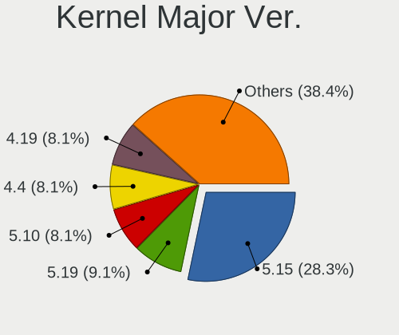

| Version | Desktops | Percent |
|---------|----------|---------|
| 5.15    | 26       | 29.89%  |
| 5.19    | 9        | 10.34%  |
| 5.10    | 8        | 9.2%    |
| 4.4     | 8        | 9.2%    |
| 4.19    | 8        | 9.2%    |
| 6.1     | 4        | 4.6%    |
| 5.4     | 4        | 4.6%    |
| 5.14    | 4        | 4.6%    |
| 6.6     | 3        | 3.45%   |
| 5.16    | 3        | 3.45%   |
| 5.17    | 2        | 2.3%    |
| 5.13    | 2        | 2.3%    |
| 4.9     | 2        | 2.3%    |
| 6.7     | 1        | 1.15%   |
| 5.12    | 1        | 1.15%   |
| 4.20    | 1        | 1.15%   |
| 3.10    | 1        | 1.15%   |

Arch
----

OS architecture (x86_64, i586, etc.)

| Name   | Desktops | Percent |
|--------|----------|---------|
| x86_64 | 81       | 100%    |

DE
--

Desktop Environment

| Name       | Desktops | Percent |
|------------|----------|---------|
| Unknown    | 33       | 40.24%  |
| XFCE       | 22       | 26.83%  |
| KDE5       | 20       | 24.39%  |
| FVWM       | 2        | 2.44%   |
| X-Generic  | 1        | 1.22%   |
| X-Cinnamon | 1        | 1.22%   |
| MATE       | 1        | 1.22%   |
| KDE        | 1        | 1.22%   |
| DWM        | 1        | 1.22%   |

Display Server
--------------

X11 or Wayland

| Name    | Desktops | Percent |
|---------|----------|---------|
| X11     | 49       | 58.33%  |
| Tty     | 15       | 17.86%  |
| Unknown | 15       | 17.86%  |
| Wayland | 5        | 5.95%   |

Display Manager
---------------

SDDM, LightDM, etc.

| Name    | Desktops | Percent |
|---------|----------|---------|
| Unknown | 36       | 43.37%  |
| SDDM    | 21       | 25.3%   |
| XDM     | 18       | 21.69%  |
| LightDM | 5        | 6.02%   |
| SLiM    | 3        | 3.61%   |

OS Lang
-------

Language

| Lang        | Desktops | Percent |
|-------------|----------|---------|
| en_US       | 37       | 45.12%  |
| Unknown     | 27       | 32.93%  |
| it_IT       | 3        | 3.66%   |
| en_GB       | 3        | 3.66%   |
| ru_RU       | 2        | 2.44%   |
| us          | 1        | 1.22%   |
| sr_RS@latin | 1        | 1.22%   |
| pt_PT       | 1        | 1.22%   |
| pt_BR       | 1        | 1.22%   |
| ja_JP       | 1        | 1.22%   |
| es_ES.UTF8  | 1        | 1.22%   |
| es_ES       | 1        | 1.22%   |
| en_US.ASCII | 1        | 1.22%   |
| en_AU       | 1        | 1.22%   |
| C           | 1        | 1.22%   |

Boot Mode
---------

EFI or BIOS

| Mode | Desktops | Percent |
|------|----------|---------|
| BIOS | 45       | 55.56%  |
| EFI  | 36       | 44.44%  |

Filesystem
----------

Type of filesystem

| Type     | Desktops | Percent |
|----------|----------|---------|
| Ext4     | 50       | 61.73%  |
| Btrfs    | 12       | 14.81%  |
| Xfs      | 6        | 7.41%   |
| Rootfs   | 5        | 6.17%   |
| Tmpfs    | 2        | 2.47%   |
| Overlay  | 2        | 2.47%   |
| Reiserfs | 1        | 1.23%   |
| F2fs     | 1        | 1.23%   |
| Ext3     | 1        | 1.23%   |
| Ext2     | 1        | 1.23%   |

Part. scheme
------------

Scheme of partitioning

| Type    | Desktops | Percent |
|---------|----------|---------|
| GPT     | 54       | 65.06%  |
| MBR     | 21       | 25.3%   |
| Unknown | 8        | 9.64%   |

Dual Boot with Linux/BSD
------------------------

Hosting more than one Linux/BSD

| Dual boot | Desktops | Percent |
|-----------|----------|---------|
| No        | 43       | 52.44%  |
| Yes       | 39       | 47.56%  |

Dual Boot (Win)
---------------

Hosting Linux and Windows

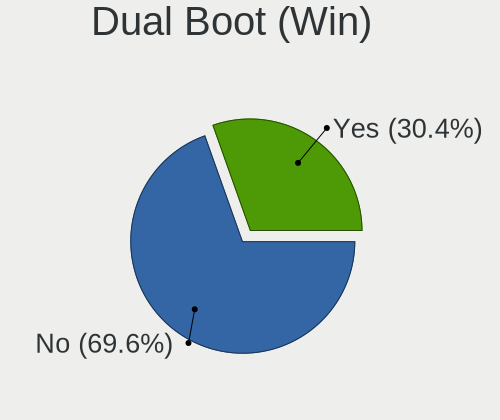

| Dual boot | Desktops | Percent |
|-----------|----------|---------|
| No        | 57       | 70.37%  |
| Yes       | 24       | 29.63%  |

Board
-----

Vendor
------

Motherboard manufacturer

| Name                | Desktops | Percent |
|---------------------|----------|---------|
| ASUSTek Computer    | 22       | 27.16%  |
| MSI                 | 12       | 14.81%  |
| ASRock              | 12       | 14.81%  |
| Gigabyte Technology | 9        | 11.11%  |
| Hewlett-Packard     | 8        | 9.88%   |
| Dell                | 5        | 6.17%   |
| Supermicro          | 1        | 1.23%   |
| Shuttle             | 1        | 1.23%   |
| NetGear             | 1        | 1.23%   |
| Lenovo              | 1        | 1.23%   |
| Intel               | 1        | 1.23%   |
| Huanan              | 1        | 1.23%   |
| HPE                 | 1        | 1.23%   |
| HEDYCOMPUTER        | 1        | 1.23%   |
| Fujitsu             | 1        | 1.23%   |
| Foxconn             | 1        | 1.23%   |
| Biostar             | 1        | 1.23%   |
| Acer                | 1        | 1.23%   |
| Unknown             | 1        | 1.23%   |

Model
-----

Motherboard model

| Name                                 | Desktops | Percent |
|--------------------------------------|----------|---------|
| ASUS All Series                      | 4        | 4.94%   |
| MSI MS-7D76                          | 2        | 2.47%   |
| ASRock N68-S3 FX                     | 2        | 2.47%   |
| Supermicro X9DA7/E                   | 1        | 1.23%   |
| Shuttle NC03U                        | 1        | 1.23%   |
| NetGear ReadyDATA 5200               | 1        | 1.23%   |
| MSI MS-7D67                          | 1        | 1.23%   |
| MSI MS-7C52                          | 1        | 1.23%   |
| MSI MS-7C02                          | 1        | 1.23%   |
| MSI MS-7B79                          | 1        | 1.23%   |
| MSI MS-7996                          | 1        | 1.23%   |
| MSI MS-7885                          | 1        | 1.23%   |
| MSI MS-7788                          | 1        | 1.23%   |
| MSI MS-7693                          | 1        | 1.23%   |
| MSI MS-7529                          | 1        | 1.23%   |
| MSI MS-7365                          | 1        | 1.23%   |
| Lenovo H50-05 90BH001WIX             | 1        | 1.23%   |
| Intel DZ77RE-75K AAG39010-302        | 1        | 1.23%   |
| Huanan X79-8D VAA31                  | 1        | 1.23%   |
| HPE ProLiant MicroServer Gen10 Plus  | 1        | 1.23%   |
| HP Z620 Workstation                  | 1        | 1.23%   |
| HP Z440 Workstation                  | 1        | 1.23%   |
| HP xw8400 Workstation                | 1        | 1.23%   |
| HP t620 Quad Core TC                 | 1        | 1.23%   |
| HP ProLiant ML110 Gen9               | 1        | 1.23%   |
| HP Pavilion Gaming Desktop TG01-2xxx | 1        | 1.23%   |
| HP Compaq dc7900 Small Form Factor   | 1        | 1.23%   |
| HP 500-515na                         | 1        | 1.23%   |
| HEDYCOMPUTER IH81MF-Q3               | 1        | 1.23%   |
| Gigabyte Z97M-DS3H                   | 1        | 1.23%   |
| Gigabyte X570 AORUS MASTER           | 1        | 1.23%   |
| Gigabyte X570 AORUS ELITE            | 1        | 1.23%   |
| Gigabyte X150M-PRO ECC               | 1        | 1.23%   |
| Gigabyte N3160TN                     | 1        | 1.23%   |
| Gigabyte M61SME-S2                   | 1        | 1.23%   |
| Gigabyte B550 AORUS ELITE AX V2      | 1        | 1.23%   |
| Gigabyte AB350-Gaming 3              | 1        | 1.23%   |
| Gigabyte 970A-DS3P                   | 1        | 1.23%   |
| Fujitsu FujitsuTP7000                | 1        | 1.23%   |
| Foxconn p6-2390                      | 1        | 1.23%   |

Model Family
------------

Motherboard model prefix

| Name                   | Desktops | Percent |
|------------------------|----------|---------|
| ASUS PRIME             | 6        | 7.41%   |
| ASUS All               | 4        | 4.94%   |
| Dell Precision         | 3        | 3.7%    |
| ASUS ROG               | 3        | 3.7%    |
| MSI MS-7D76            | 2        | 2.47%   |
| Gigabyte X570          | 2        | 2.47%   |
| Dell OptiPlex          | 2        | 2.47%   |
| ASUS TUF               | 2        | 2.47%   |
| ASRock N68-S3          | 2        | 2.47%   |
| Supermicro X9DA7       | 1        | 1.23%   |
| Shuttle NC03U          | 1        | 1.23%   |
| NetGear ReadyDATA      | 1        | 1.23%   |
| MSI MS-7D67            | 1        | 1.23%   |
| MSI MS-7C52            | 1        | 1.23%   |
| MSI MS-7C02            | 1        | 1.23%   |
| MSI MS-7B79            | 1        | 1.23%   |
| MSI MS-7996            | 1        | 1.23%   |
| MSI MS-7885            | 1        | 1.23%   |
| MSI MS-7788            | 1        | 1.23%   |
| MSI MS-7693            | 1        | 1.23%   |
| MSI MS-7529            | 1        | 1.23%   |
| MSI MS-7365            | 1        | 1.23%   |
| Lenovo H50-05          | 1        | 1.23%   |
| Intel DZ77RE-75K       | 1        | 1.23%   |
| Huanan X79-8D          | 1        | 1.23%   |
| HPE ProLiant           | 1        | 1.23%   |
| HP Z620                | 1        | 1.23%   |
| HP Z440                | 1        | 1.23%   |
| HP xw8400              | 1        | 1.23%   |
| HP t620                | 1        | 1.23%   |
| HP ProLiant            | 1        | 1.23%   |
| HP Pavilion            | 1        | 1.23%   |
| HP Compaq              | 1        | 1.23%   |
| HP 500-515na           | 1        | 1.23%   |
| HEDYCOMPUTER IH81MF-Q3 | 1        | 1.23%   |
| Gigabyte Z97M-DS3H     | 1        | 1.23%   |
| Gigabyte X150M-PRO     | 1        | 1.23%   |
| Gigabyte N3160TN       | 1        | 1.23%   |
| Gigabyte M61SME-S2     | 1        | 1.23%   |
| Gigabyte B550          | 1        | 1.23%   |

MFG Year
--------

Motherboard manufacture year

| Year | Desktops | Percent |
|------|----------|---------|
| 2019 | 12       | 14.81%  |
| 2015 | 8        | 9.88%   |
| 2018 | 7        | 8.64%   |
| 2017 | 7        | 8.64%   |
| 2020 | 6        | 7.41%   |
| 2014 | 6        | 7.41%   |
| 2012 | 6        | 7.41%   |
| 2011 | 6        | 7.41%   |
| 2022 | 5        | 6.17%   |
| 2008 | 4        | 4.94%   |
| 2016 | 3        | 3.7%    |
| 2009 | 3        | 3.7%    |
| 2021 | 2        | 2.47%   |
| 2013 | 2        | 2.47%   |
| 2010 | 2        | 2.47%   |
| 2007 | 2        | 2.47%   |

Form Factor
-----------

Physical design of the computer

| Name    | Desktops | Percent |
|---------|----------|---------|
| Desktop | 81       | 100%    |

Secure Boot
-----------

Enabled or disabled

| State    | Desktops | Percent |
|----------|----------|---------|
| Disabled | 81       | 100%    |

Coreboot
--------

Have coreboot on board

| Used | Desktops | Percent |
|------|----------|---------|
| No   | 81       | 100%    |

RAM Size
--------

Total RAM memory

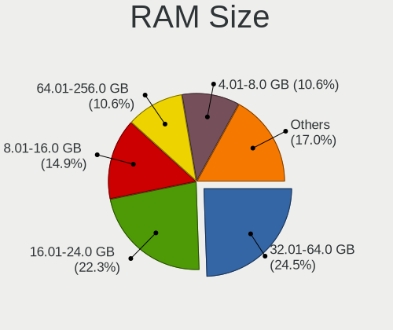

| Size in GB  | Desktops | Percent |
|-------------|----------|---------|
| 16.01-24.0  | 20       | 24.39%  |
| 32.01-64.0  | 16       | 19.51%  |
| 8.01-16.0   | 12       | 14.63%  |
| 64.01-256.0 | 10       | 12.2%   |
| 4.01-8.0    | 8        | 9.76%   |
| 3.01-4.0    | 7        | 8.54%   |
| 24.01-32.0  | 6        | 7.32%   |
| 1.01-2.0    | 3        | 3.66%   |

RAM Used
--------

Used RAM memory

| Used GB     | Desktops | Percent |
|-------------|----------|---------|
| 4.01-8.0    | 20       | 23.26%  |
| 1.01-2.0    | 20       | 23.26%  |
| 2.01-3.0    | 17       | 19.77%  |
| 3.01-4.0    | 8        | 9.3%    |
| 8.01-16.0   | 7        | 8.14%   |
| 0.51-1.0    | 4        | 4.65%   |
| 16.01-24.0  | 3        | 3.49%   |
| 24.01-32.0  | 2        | 2.33%   |
| 0.01-0.5    | 2        | 2.33%   |
| 32.01-64.0  | 1        | 1.16%   |
| 64.01-256.0 | 1        | 1.16%   |
| Unknown     | 1        | 1.16%   |

Total Drives
------------

Number of drives on board

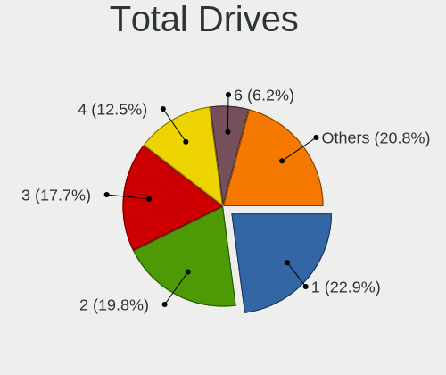

| Drives | Desktops | Percent |
|--------|----------|---------|
| 1      | 21       | 25%     |
| 2      | 17       | 20.24%  |
| 3      | 15       | 17.86%  |
| 4      | 7        | 8.33%   |
| 6      | 6        | 7.14%   |
| 5      | 6        | 7.14%   |
| 0      | 3        | 3.57%   |
| 10     | 2        | 2.38%   |
| 9      | 2        | 2.38%   |
| 14     | 1        | 1.19%   |
| 13     | 1        | 1.19%   |
| 11     | 1        | 1.19%   |
| 8      | 1        | 1.19%   |
| 7      | 1        | 1.19%   |

Has CD-ROM
----------

Has CD-ROM on board

| Presented | Desktops | Percent |
|-----------|----------|---------|
| No        | 43       | 52.44%  |
| Yes       | 39       | 47.56%  |

Has Ethernet
------------

Has Ethernet on board

| Presented | Desktops | Percent |
|-----------|----------|---------|
| Yes       | 80       | 98.77%  |
| No        | 1        | 1.23%   |

Has WiFi
--------

Has WiFi module

| Presented | Desktops | Percent |
|-----------|----------|---------|
| No        | 49       | 60.49%  |
| Yes       | 32       | 39.51%  |

Has Bluetooth
-------------

Has Bluetooth module

| Presented | Desktops | Percent |
|-----------|----------|---------|
| No        | 51       | 62.2%   |
| Yes       | 31       | 37.8%   |

Location
--------

Country
-------

Geographic location (country)

| Country      | Desktops | Percent |
|--------------|----------|---------|
| USA          | 19       | 23.46%  |
| UK           | 11       | 13.58%  |
| Italy        | 6        | 7.41%   |
| Germany      | 5        | 6.17%   |
| Brazil       | 5        | 6.17%   |
| Russia       | 4        | 4.94%   |
| Japan        | 4        | 4.94%   |
| Canada       | 4        | 4.94%   |
| Spain        | 3        | 3.7%    |
| Kazakhstan   | 3        | 3.7%    |
| Hong Kong    | 3        | 3.7%    |
| Sweden       | 2        | 2.47%   |
| Portugal     | 2        | 2.47%   |
| France       | 2        | 2.47%   |
| Australia    | 2        | 2.47%   |
| South Africa | 1        | 1.23%   |
| Serbia       | 1        | 1.23%   |
| Poland       | 1        | 1.23%   |
| China        | 1        | 1.23%   |
| Bulgaria     | 1        | 1.23%   |
| Argentina    | 1        | 1.23%   |

City
----

Geographic location (city)

| City              | Desktops | Percent |
|-------------------|----------|---------|
| Yekaterinburg     | 3        | 3.61%   |
| Ust-Kamenogorsk   | 2        | 2.41%   |
| Tokyo             | 2        | 2.41%   |
| Springfield       | 2        | 2.41%   |
| Rome              | 2        | 2.41%   |
| Paris             | 2        | 2.41%   |
| Milan             | 2        | 2.41%   |
| Lisbon            | 2        | 2.41%   |
| Dallas            | 2        | 2.41%   |
| Winter Springs    | 1        | 1.2%    |
| Weilheim          | 1        | 1.2%    |
| Warsaw            | 1        | 1.2%    |
| Tsukuba           | 1        | 1.2%    |
| Toronto           | 1        | 1.2%    |
| Tiffin            | 1        | 1.2%    |
| Tendo             | 1        | 1.2%    |
| Tatuí            | 1        | 1.2%    |
| Stockholm         | 1        | 1.2%    |
| St Petersburg     | 1        | 1.2%    |
| Southend-on-Sea   | 1        | 1.2%    |
| Shrewsbury        | 1        | 1.2%    |
| Sham Shui Po      | 1        | 1.2%    |
| Seville           | 1        | 1.2%    |
| Senhora da Hora   | 1        | 1.2%    |
| Seattle           | 1        | 1.2%    |
| Santa Cruz do Sul | 1        | 1.2%    |
| Saint Paul        | 1        | 1.2%    |
| Rock              | 1        | 1.2%    |
| Rio do Sul        | 1        | 1.2%    |
| Porto Alegre      | 1        | 1.2%    |
| Plovdiv           | 1        | 1.2%    |
| Penrith           | 1        | 1.2%    |
| Palma             | 1        | 1.2%    |
| Ottawa            | 1        | 1.2%    |
| Oldham            | 1        | 1.2%    |
| Naples            | 1        | 1.2%    |
| Nanping           | 1        | 1.2%    |
| Moscow            | 1        | 1.2%    |
| Milwaukee         | 1        | 1.2%    |
| Mead              | 1        | 1.2%    |

Drives
------

Drive Vendor
------------

Hard drive vendors

| Vendor                | Desktops | Drives | Percent |
|-----------------------|----------|--------|---------|
| WDC                   | 36       | 95     | 21.56%  |
| Seagate               | 33       | 67     | 19.76%  |
| Samsung Electronics   | 26       | 41     | 15.57%  |
| Toshiba               | 13       | 30     | 7.78%   |
| Kingston              | 8        | 11     | 4.79%   |
| Hitachi               | 8        | 11     | 4.79%   |
| Crucial               | 6        | 7      | 3.59%   |
| A-DATA Technology     | 4        | 4      | 2.4%    |
| Intel                 | 3        | 4      | 1.8%    |
| Hewlett-Packard       | 3        | 3      | 1.8%    |
| Transcend             | 2        | 2      | 1.2%    |
| SK hynix              | 2        | 2      | 1.2%    |
| Patriot               | 2        | 2      | 1.2%    |
| Maxtor                | 2        | 2      | 1.2%    |
| HGST                  | 2        | 2      | 1.2%    |
| China                 | 2        | 3      | 1.2%    |
| ZHITAI                | 1        | 2      | 0.6%    |
| Unknown               | 1        | 2      | 0.6%    |
| Team                  | 1        | 1      | 0.6%    |
| Silicon Motion        | 1        | 2      | 0.6%    |
| SanDisk               | 1        | 1      | 0.6%    |
| Realtek Semiconductor | 1        | 1      | 0.6%    |
| PNY                   | 1        | 1      | 0.6%    |
| Phison Electronics    | 1        | 1      | 0.6%    |
| Lexar                 | 1        | 1      | 0.6%    |
| KIOXIA                | 1        | 1      | 0.6%    |
| Intenso               | 1        | 1      | 0.6%    |
| Gigabyte Technology   | 1        | 1      | 0.6%    |
| Fujitsu               | 1        | 1      | 0.6%    |
| DUEX                  | 1        | 1      | 0.6%    |
| Apple                 | 1        | 2      | 0.6%    |

Drive Model
-----------

Hard drive models

| Model                                             | Desktops | Percent |
|---------------------------------------------------|----------|---------|
| Samsung NVMe SSD Controller SM981/PM981/PM983 1TB | 4        | 1.78%   |
| WDC WD20EFRX-68EUZN0 2TB                          | 3        | 1.33%   |
| WDC WD1003FZEX-00MK2A0 1TB                        | 3        | 1.33%   |
| Seagate ST4000DM004-2CV104 4TB                    | 3        | 1.33%   |
| Seagate ST2000DM008-2FR102 2TB                    | 3        | 1.33%   |
| Samsung SSD 970 EVO 250GB                         | 3        | 1.33%   |
| WDC WD40EZRX-00SPEB0 4TB                          | 2        | 0.89%   |
| WDC WD30EZRX-00SPEB0 3TB                          | 2        | 0.89%   |
| WDC WD10EZEX-08WN4A0 1TB                          | 2        | 0.89%   |
| WDC WD10EZEX-00RKKA0 1TB                          | 2        | 0.89%   |
| Toshiba MQ01ABD100 1TB                            | 2        | 0.89%   |
| Toshiba HDWD110 1TB                               | 2        | 0.89%   |
| Seagate ST500DM002-1BD142 500GB                   | 2        | 0.89%   |
| Seagate ST4000VN008-2DR166 4TB                    | 2        | 0.89%   |
| Seagate ST4000VN006-3CW104 4TB                    | 2        | 0.89%   |
| Seagate ST31000524AS 1TB                          | 2        | 0.89%   |
| Seagate ST2000DX001-1NS164 2TB                    | 2        | 0.89%   |
| Seagate ST2000DM001-1CH164 2TB                    | 2        | 0.89%   |
| Seagate ST2000DL003-9VT166 2TB                    | 2        | 0.89%   |
| Seagate ST1000DM010-2EP102 1TB                    | 2        | 0.89%   |
| Seagate ST1000DM003-1SB102 1TB                    | 2        | 0.89%   |
| Seagate ST1000DM003-1ER162 1TB                    | 2        | 0.89%   |
| Seagate Expansion+ Desk 4TB                       | 2        | 0.89%   |
| Samsung SSD 970 EVO Plus 1TB                      | 2        | 0.89%   |
| Samsung SSD 850 PRO 256GB                         | 2        | 0.89%   |
| Kingston SA400S37240G 240GB SSD                   | 2        | 0.89%   |
| Kingston SA400S37120G 120GB SSD                   | 2        | 0.89%   |
| Crucial CT500MX500SSD1 500GB                      | 2        | 0.89%   |
| ZHITAI SC001 Active 1TB SSD                       | 1        | 0.44%   |
| ZHITAI PC005 Active 512GB                         | 1        | 0.44%   |
| WDC WDS500G2B0A-00SM50 500GB SSD                  | 1        | 0.44%   |
| WDC WDS480G2G0A-00JH30 480GB SSD                  | 1        | 0.44%   |
| WDC WDS100T2B0C-00PXH0 1TB                        | 1        | 0.44%   |
| WDC WDS100T2B0A-00SM50 1TB SSD                    | 1        | 0.44%   |
| WDC WDS100T1X0E-00AFY0 1TB                        | 1        | 0.44%   |
| WDC WD80EFZZ-68BTXN0 8TB                          | 1        | 0.44%   |
| WDC WD80EFZX-68UW8N0 8TB                          | 1        | 0.44%   |
| WDC WD80EFBX-68AZZN0 8TB                          | 1        | 0.44%   |
| WDC WD80EFAX-68LHPN0 8TB                          | 1        | 0.44%   |
| WDC WD80EFAX-68KNBN0 8TB                          | 1        | 0.44%   |

HDD Vendor
----------

Hard disk drive vendors

| Vendor              | Desktops | Drives | Percent |
|---------------------|----------|--------|---------|
| WDC                 | 35       | 90     | 35.35%  |
| Seagate             | 33       | 63     | 33.33%  |
| Toshiba             | 12       | 25     | 12.12%  |
| Hitachi             | 8        | 11     | 8.08%   |
| Samsung Electronics | 4        | 4      | 4.04%   |
| Maxtor              | 2        | 2      | 2.02%   |
| HGST                | 2        | 2      | 2.02%   |
| Hewlett-Packard     | 2        | 2      | 2.02%   |
| Fujitsu             | 1        | 1      | 1.01%   |

SSD Vendor
----------

Solid state drive vendors

| Vendor              | Desktops | Drives | Percent |
|---------------------|----------|--------|---------|
| Samsung Electronics | 12       | 20     | 27.27%  |
| Kingston            | 7        | 10     | 15.91%  |
| Crucial             | 4        | 5      | 9.09%   |
| WDC                 | 2        | 3      | 4.55%   |
| Transcend           | 2        | 2      | 4.55%   |
| Intel               | 2        | 3      | 4.55%   |
| China               | 2        | 3      | 4.55%   |
| ZHITAI              | 1        | 1      | 2.27%   |
| Toshiba             | 1        | 3      | 2.27%   |
| Team                | 1        | 1      | 2.27%   |
| SK hynix            | 1        | 1      | 2.27%   |
| SanDisk             | 1        | 1      | 2.27%   |
| PNY                 | 1        | 1      | 2.27%   |
| Patriot             | 1        | 1      | 2.27%   |
| Lexar               | 1        | 1      | 2.27%   |
| Intenso             | 1        | 1      | 2.27%   |
| Hewlett-Packard     | 1        | 1      | 2.27%   |
| DUEX                | 1        | 1      | 2.27%   |
| Apple               | 1        | 2      | 2.27%   |
| A-DATA Technology   | 1        | 1      | 2.27%   |

Drive Kind
----------

HDD or SSD

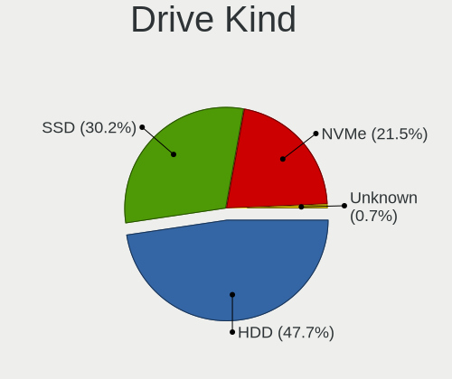

| Kind    | Desktops | Drives | Percent |
|---------|----------|--------|---------|
| HDD     | 63       | 200    | 48.46%  |
| SSD     | 39       | 62     | 30%     |
| NVMe    | 27       | 39     | 20.77%  |
| Unknown | 1        | 4      | 0.77%   |

Drive Connector
---------------

SATA, SAS, NVMe, etc.

| Type | Desktops | Drives | Percent |
|------|----------|--------|---------|
| SATA | 71       | 256    | 70.3%   |
| NVMe | 27       | 39     | 26.73%  |
| SAS  | 3        | 10     | 2.97%   |

Drive Size
----------

Size of hard drive

| Size in TB | Desktops | Drives | Percent |
|------------|----------|--------|---------|
| 0.01-0.5   | 50       | 82     | 38.17%  |
| 0.51-1.0   | 29       | 68     | 22.14%  |
| 1.01-2.0   | 18       | 25     | 13.74%  |
| 3.01-4.0   | 16       | 34     | 12.21%  |
| 2.01-3.0   | 9        | 21     | 6.87%   |
| 4.01-10.0  | 7        | 27     | 5.34%   |
| 10.01-20.0 | 2        | 5      | 1.53%   |

Space Total
-----------

Amount of disk space available on the file system

| Size in GB     | Desktops | Percent |
|----------------|----------|---------|
| Unknown        | 16       | 19.05%  |
| 501-1000       | 15       | 17.86%  |
| 101-250        | 13       | 15.48%  |
| 1001-2000      | 11       | 13.1%   |
| 2001-3000      | 9        | 10.71%  |
| 251-500        | 7        | 8.33%   |
| More than 3000 | 5        | 5.95%   |
| 1-20           | 5        | 5.95%   |
| 51-100         | 2        | 2.38%   |
| 21-50          | 1        | 1.19%   |

Space Used
----------

Amount of used disk space

| Used GB        | Desktops | Percent |
|----------------|----------|---------|
| 101-250        | 18       | 21.69%  |
| Unknown        | 16       | 19.28%  |
| 501-1000       | 12       | 14.46%  |
| 1-20           | 11       | 13.25%  |
| 251-500        | 8        | 9.64%   |
| 1001-2000      | 6        | 7.23%   |
| 51-100         | 5        | 6.02%   |
| More than 3000 | 4        | 4.82%   |
| 21-50          | 3        | 3.61%   |

Malfunc. Drives
---------------

Drive models with a malfunction

| Model                                 | Desktops | Drives | Percent |
|---------------------------------------|----------|--------|---------|
| WDC WDS480G2G0A-00JH30 480GB SSD      | 1        | 1      | 2.86%   |
| WDC WD5000BPKX-60HPJT0 500GB          | 1        | 1      | 2.86%   |
| WDC WD5000AAKX-22ERMA0 500GB          | 1        | 1      | 2.86%   |
| WDC WD5000AAKX-00ERMA0 500GB          | 1        | 1      | 2.86%   |
| WDC WD5000AAKS-00A7B2 500GB           | 1        | 1      | 2.86%   |
| WDC WD40EFRX-68WT0N0 4TB              | 1        | 2      | 2.86%   |
| WDC WD40EFAX-68JH4N1 4TB              | 1        | 4      | 2.86%   |
| WDC WD3200AAJS-65B4A0 320GB           | 1        | 1      | 2.86%   |
| WDC WD30EZRX-00MMMB0 3TB              | 1        | 1      | 2.86%   |
| WDC WD30EZRX-00M                      | 1        | 1      | 2.86%   |
| WDC WD30EZRX-00D8PB0 3TB              | 1        | 1      | 2.86%   |
| WDC WD30EFRX-68AX9N0 3TB              | 1        | 4      | 2.86%   |
| WDC WD20EFRX-68EUZN0 2TB              | 1        | 2      | 2.86%   |
| WDC WD20EARX-00PASB0 2TB              | 1        | 1      | 2.86%   |
| WDC WD10EZEX-00RKKA0 1TB              | 1        | 1      | 2.86%   |
| WDC WD10EALS-00Z8A0 1TB               | 1        | 2      | 2.86%   |
| WDC WD1003FZEX-00MK2A0 1TB            | 1        | 2      | 2.86%   |
| Seagate ST380011A 80GB                | 1        | 2      | 2.86%   |
| Seagate ST3500418AS 500GB             | 1        | 1      | 2.86%   |
| Seagate ST3500410AS 500GB             | 1        | 1      | 2.86%   |
| Seagate ST31000524AS 1TB              | 1        | 1      | 2.86%   |
| Seagate ST3000VX006-1HH166 3TB        | 1        | 1      | 2.86%   |
| Seagate ST2000DL003-9VT166 2TB        | 1        | 1      | 2.86%   |
| Seagate ST1000VM002-1SD102 1TB        | 1        | 1      | 2.86%   |
| Seagate ST1000NM0011 1TB              | 1        | 2      | 2.86%   |
| Seagate ST1000DM003-1ER162 1TB        | 1        | 2      | 2.86%   |
| SanDisk SDSA6MM-016G-1006 16GB SSD    | 1        | 1      | 2.86%   |
| Samsung Electronics SSD 970 EVO 500GB | 1        | 1      | 2.86%   |
| Maxtor 4G120J6 128GB                  | 1        | 1      | 2.86%   |
| Intel SSDSA2M080G2GC 80GB             | 1        | 1      | 2.86%   |
| Hitachi HUA723030ALA640 3TB           | 1        | 1      | 2.86%   |
| Hitachi HDS721050CLA660 500GB         | 1        | 1      | 2.86%   |
| Hitachi HDS721016CLA382 160GB         | 1        | 1      | 2.86%   |
| HGST HDN726040ALE614 4TB              | 1        | 1      | 2.86%   |
| DUEX DX300256A5xnEMLC 256GB SSD       | 1        | 1      | 2.86%   |

Malfunc. Drive Vendor
---------------------

Vendors of faulty drives

| Vendor              | Desktops | Drives | Percent |
|---------------------|----------|--------|---------|
| WDC                 | 14       | 27     | 45.16%  |
| Seagate             | 8        | 12     | 25.81%  |
| Hitachi             | 3        | 3      | 9.68%   |
| SanDisk             | 1        | 1      | 3.23%   |
| Samsung Electronics | 1        | 1      | 3.23%   |
| Maxtor              | 1        | 1      | 3.23%   |
| Intel               | 1        | 1      | 3.23%   |
| HGST                | 1        | 1      | 3.23%   |
| DUEX                | 1        | 1      | 3.23%   |

Malfunc. HDD Vendor
-------------------

Vendors of faulty HDD drives

| Vendor  | Desktops | Drives | Percent |
|---------|----------|--------|---------|
| WDC     | 13       | 26     | 50%     |
| Seagate | 8        | 12     | 30.77%  |
| Hitachi | 3        | 3      | 11.54%  |
| Maxtor  | 1        | 1      | 3.85%   |
| HGST    | 1        | 1      | 3.85%   |

Malfunc. Drive Kind
-------------------

Kinds of faulty drives

| Kind | Desktops | Drives | Percent |
|------|----------|--------|---------|
| HDD  | 23       | 43     | 82.14%  |
| SSD  | 4        | 4      | 14.29%  |
| NVMe | 1        | 1      | 3.57%   |

Failed Drives
-------------

Failed drive models

Zero info for selected period =(

Failed Drive Vendor
-------------------

Failed drive vendors

Zero info for selected period =(

Drive Status
------------

Number of failed and malfunc. drives

| Status   | Desktops | Drives | Percent |
|----------|----------|--------|---------|
| Works    | 65       | 214    | 61.32%  |
| Malfunc  | 28       | 48     | 26.42%  |
| Detected | 13       | 43     | 12.26%  |

Storage controller
------------------

Storage Vendor
--------------

Storage controller vendors

| Vendor                       | Desktops | Percent |
|------------------------------|----------|---------|
| Intel                        | 40       | 28.37%  |
| AMD                          | 35       | 24.82%  |
| Samsung Electronics          | 15       | 10.64%  |
| ASMedia Technology           | 11       | 7.8%    |
| Marvell Technology Group     | 8        | 5.67%   |
| Nvidia                       | 5        | 3.55%   |
| Realtek Semiconductor        | 4        | 2.84%   |
| JMicron Technology           | 4        | 2.84%   |
| SanDisk                      | 2        | 1.42%   |
| Micron/Crucial Technology    | 2        | 1.42%   |
| Broadcom / LSI               | 2        | 1.42%   |
| Yangtze Memory Technologies  | 1        | 0.71%   |
| Toshiba America Info Systems | 1        | 0.71%   |
| SK hynix                     | 1        | 0.71%   |
| Silicon Motion               | 1        | 0.71%   |
| Silicon Image                | 1        | 0.71%   |
| Phison Electronics           | 1        | 0.71%   |
| Nextorage                    | 1        | 0.71%   |
| MAXIO Technology (Hangzhou)  | 1        | 0.71%   |
| LSI Logic / Symbios Logic    | 1        | 0.71%   |
| KIOXIA                       | 1        | 0.71%   |
| Kingston Technology Company  | 1        | 0.71%   |
| Adaptec                      | 1        | 0.71%   |
| 3ware                        | 1        | 0.71%   |

Storage Model
-------------

Storage controller models

| Model                                                                         | Desktops | Percent |
|-------------------------------------------------------------------------------|----------|---------|
| AMD FCH SATA Controller [AHCI mode]                                           | 20       | 11.11%  |
| Samsung NVMe SSD Controller SM981/PM981/PM983                                 | 11       | 6.11%   |
| AMD 400 Series Chipset SATA Controller                                        | 11       | 6.11%   |
| ASMedia ASM1061/ASM1062 Serial ATA Controller                                 | 8        | 4.44%   |
| Intel C600/X79 series chipset 6-Port SATA AHCI Controller                     | 6        | 3.33%   |
| Nvidia MCP61 SATA Controller                                                  | 4        | 2.22%   |
| Nvidia MCP61 IDE                                                              | 4        | 2.22%   |
| Intel C610/X99 series chipset 6-Port SATA Controller [AHCI mode]              | 4        | 2.22%   |
| Intel 9 Series Chipset Family SATA Controller [AHCI Mode]                     | 4        | 2.22%   |
| AMD SB7x0/SB8x0/SB9x0 SATA Controller [AHCI mode]                             | 4        | 2.22%   |
| AMD 500 Series Chipset SATA Controller                                        | 4        | 2.22%   |
| Marvell Group 88SE9215 PCIe 2.0 x1 4-port SATA 6 Gb/s Controller              | 3        | 1.67%   |
| Intel C610/X99 series chipset sSATA Controller [AHCI mode]                    | 3        | 1.67%   |
| AMD 600 Series Chipset SATA Controller                                        | 3        | 1.67%   |
| Realtek RTS5763DL NVMe SSD Controller (DRAM-less)                             | 2        | 1.11%   |
| Micron/Crucial P2 [Nick P2] / P3 / P3 Plus NVMe PCIe SSD (DRAM-less)          | 2        | 1.11%   |
| JMicron JMB58x AHCI SATA controller                                           | 2        | 1.11%   |
| Intel SATA Controller [RAID mode]                                             | 2        | 1.11%   |
| Intel Q170/Q150/B150/H170/H110/Z170/CM236 Chipset SATA Controller [AHCI Mode] | 2        | 1.11%   |
| Intel Cannon Lake PCH SATA AHCI Controller                                    | 2        | 1.11%   |
| Intel C602 chipset 4-Port SATA Storage Control Unit                           | 2        | 1.11%   |
| Intel 82801JD/DO (ICH10 Family) SATA AHCI Controller                          | 2        | 1.11%   |
| Intel 8 Series/C220 Series Chipset Family 4-port SATA Controller 1 [IDE mode] | 2        | 1.11%   |
| Intel 8 Series/C220 Series Chipset Family 2-port SATA Controller 2 [IDE mode] | 2        | 1.11%   |
| Intel 631xESB/632xESB IDE Controller                                          | 2        | 1.11%   |
| Intel 4 Series Chipset PT IDER Controller                                     | 2        | 1.11%   |
| Intel 200 Series PCH SATA controller [AHCI mode]                              | 2        | 1.11%   |
| AMD 300 Series Chipset SATA Controller                                        | 2        | 1.11%   |
| Yangtze Memory ZHITAI PC005 NVMe SSD                                          | 1        | 0.56%   |
| Toshiba America Info Systems XG4 NVMe SSD Controller                          | 1        | 0.56%   |
| SK hynix Gold P31/BC711/PC711 NVMe Solid State Drive                          | 1        | 0.56%   |
| Silicon Motion SM2263EN/SM2263XT (DRAM-less) NVMe SSD Controllers             | 1        | 0.56%   |
| Silicon Image SiI 3114 [SATALink/SATARaid] Serial ATA Controller              | 1        | 0.56%   |
| SanDisk WD PC SN810 / Black SN850 NVMe SSD                                    | 1        | 0.56%   |
| SanDisk Ultra 3D / WD Blue SN550 NVMe SSD                                     | 1        | 0.56%   |
| Samsung S4LN058A01[SSUBX] AHCI SSD Controller (Apple slot)                    | 1        | 0.56%   |
| Samsung S4LN053X01 AHCI SSD Controller(Apple slot)                            | 1        | 0.56%   |
| Samsung NVMe SSD Controller SM961/PM961/SM963                                 | 1        | 0.56%   |
| Samsung NVMe SSD Controller PM9A1/PM9A3/980PRO                                | 1        | 0.56%   |
| Realtek RTS5765DL NVMe SSD Controller (DRAM-less)                             | 1        | 0.56%   |

Storage Kind
------------

Kind of storage controller (IDE, SATA, NVMe, SAS, ...)

| Kind | Desktops | Percent |
|------|----------|---------|
| SATA | 66       | 52.8%   |
| NVMe | 27       | 21.6%   |
| IDE  | 19       | 15.2%   |
| RAID | 7        | 5.6%    |
| SAS  | 4        | 3.2%    |
| SCSI | 2        | 1.6%    |

Processor
---------

CPU Vendor
----------

Processor vendors

| Vendor | Desktops | Percent |
|--------|----------|---------|
| Intel  | 42       | 51.85%  |
| AMD    | 39       | 48.15%  |

CPU Model
---------

Processor models

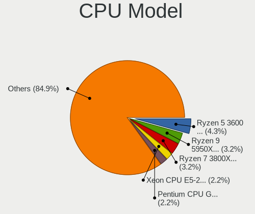

| Model                                       | Desktops | Percent |
|---------------------------------------------|----------|---------|
| AMD Ryzen 5 3600 6-Core Processor           | 4        | 4.88%   |
| AMD Ryzen 9 5950X 16-Core Processor         | 3        | 3.66%   |
| AMD Ryzen 7 3800X 8-Core Processor          | 3        | 3.66%   |
| Intel Xeon CPU E5-2670 0 @ 2.60GHz          | 2        | 2.44%   |
| Intel Core i7-5820K CPU @ 3.30GHz           | 2        | 2.44%   |
| Intel Core i7-4790K CPU @ 4.00GHz           | 2        | 2.44%   |
| Intel Core 2 Duo CPU E8400 @ 3.00GHz        | 2        | 2.44%   |
| AMD Ryzen 9 7900 12-Core Processor          | 2        | 2.44%   |
| AMD Ryzen 7 3700X 8-Core Processor          | 2        | 2.44%   |
| AMD Ryzen 5 3400G with Radeon Vega Graphics | 2        | 2.44%   |
| AMD FX-8350 Eight-Core Processor            | 2        | 2.44%   |
| AMD Athlon II X2 250 Processor              | 2        | 2.44%   |
| Intel Xeon CPU X5355 @ 2.66GHz              | 1        | 1.22%   |
| Intel Xeon CPU X3450 @ 2.67GHz              | 1        | 1.22%   |
| Intel Xeon CPU E5-2697 v3 @ 2.60GHz         | 1        | 1.22%   |
| Intel Xeon CPU E5-2667 v2 @ 3.30GHz         | 1        | 1.22%   |
| Intel Xeon CPU E5-2660 v3 @ 2.60GHz         | 1        | 1.22%   |
| Intel Xeon CPU E5-2620 0 @ 2.00GHz          | 1        | 1.22%   |
| Intel Xeon CPU E5-1650 0 @ 3.20GHz          | 1        | 1.22%   |
| Intel Xeon CPU E5-1603 v3 @ 2.80GHz         | 1        | 1.22%   |
| Intel Xeon CPU E3-1246 v3 @ 3.50GHz         | 1        | 1.22%   |
| Intel Xeon CPU 5160 @ 3.00GHz               | 1        | 1.22%   |
| Intel Pentium Gold G5420 CPU @ 3.80GHz      | 1        | 1.22%   |
| Intel Pentium Dual CPU E2140 @ 1.60GHz      | 1        | 1.22%   |
| Intel Pentium CPU G640 @ 2.80GHz            | 1        | 1.22%   |
| Intel Pentium CPU G4560 @ 3.50GHz           | 1        | 1.22%   |
| Intel Pentium CPU G3250 @ 3.20GHz           | 1        | 1.22%   |
| Intel Core i7-9700 CPU @ 3.00GHz            | 1        | 1.22%   |
| Intel Core i7-7700 CPU @ 3.60GHz            | 1        | 1.22%   |
| Intel Core i7-6700 CPU @ 3.40GHz            | 1        | 1.22%   |
| Intel Core i7-4790 CPU @ 3.60GHz            | 1        | 1.22%   |
| Intel Core i7-3930K CPU @ 3.20GHz           | 1        | 1.22%   |
| Intel Core i5-9400 CPU @ 2.90GHz            | 1        | 1.22%   |
| Intel Core i5-8600K CPU @ 3.60GHz           | 1        | 1.22%   |
| Intel Core i5-7200U CPU @ 2.50GHz           | 1        | 1.22%   |
| Intel Core i5-4690 CPU @ 3.50GHz            | 1        | 1.22%   |
| Intel Core i5-4590 CPU @ 3.30GHz            | 1        | 1.22%   |
| Intel Core i5-3470 CPU @ 3.20GHz            | 1        | 1.22%   |
| Intel Core i5-3330 CPU @ 3.00GHz            | 1        | 1.22%   |
| Intel Core i5-2400 CPU @ 3.10GHz            | 1        | 1.22%   |

CPU Model Family
----------------

Processor model prefix

| Model              | Desktops | Percent |
|--------------------|----------|---------|
| Intel Xeon         | 12       | 14.63%  |
| Intel Core i7      | 9        | 10.98%  |
| Intel Core i5      | 9        | 10.98%  |
| AMD Ryzen 9        | 9        | 10.98%  |
| AMD Ryzen 5        | 9        | 10.98%  |
| AMD Ryzen 7        | 7        | 8.54%   |
| AMD FX             | 5        | 6.1%    |
| Intel Pentium      | 3        | 3.66%   |
| Intel Core 2 Duo   | 3        | 3.66%   |
| Intel Core 2 Quad  | 2        | 2.44%   |
| AMD Athlon II X2   | 2        | 2.44%   |
| Intel Pentium Gold | 1        | 1.22%   |
| Intel Pentium Dual | 1        | 1.22%   |
| Intel Core i3      | 1        | 1.22%   |
| Intel Celeron      | 1        | 1.22%   |
| Intel Atom         | 1        | 1.22%   |
| AMD Ryzen 7 PRO    | 1        | 1.22%   |
| AMD Ryzen 3        | 1        | 1.22%   |
| AMD GX             | 1        | 1.22%   |
| AMD Athlon 64 X2   | 1        | 1.22%   |
| AMD A8             | 1        | 1.22%   |
| AMD A4             | 1        | 1.22%   |
| AMD A10            | 1        | 1.22%   |

CPU Cores
---------

Number of processor cores

| Number | Desktops | Percent |
|--------|----------|---------|
| 4      | 29       | 35.37%  |
| 2      | 15       | 18.29%  |
| 8      | 11       | 13.41%  |
| 6      | 11       | 13.41%  |
| 16     | 7        | 8.54%   |
| 12     | 5        | 6.1%    |
| 14     | 1        | 1.22%   |
| 10     | 1        | 1.22%   |
| 3      | 1        | 1.22%   |
| 1      | 1        | 1.22%   |

CPU Sockets
-----------

Number of sockets

| Number | Desktops | Percent |
|--------|----------|---------|
| 1      | 76       | 93.83%  |
| 2      | 5        | 6.17%   |

CPU Threads
-----------

Threads per core (Hyper-Threading)

| Number | Desktops | Percent |
|--------|----------|---------|
| 2      | 55       | 67.9%   |
| 1      | 26       | 32.1%   |

CPU Op-Modes
------------

CPU Operation Modes (32-bit, 64-bit)

| Op mode        | Desktops | Percent |
|----------------|----------|---------|
| 32-bit, 64-bit | 81       | 100%    |

CPU Microcode
-------------

Microcode number

| Number     | Desktops | Percent |
|------------|----------|---------|
| Unknown    | 19       | 23.46%  |
| 0x08701021 | 6        | 7.41%   |
| 0x306c3    | 5        | 6.17%   |
| 0x206d7    | 4        | 4.94%   |
| 0x306f2    | 3        | 3.7%    |
| 0x1067a    | 3        | 3.7%    |
| 0x08701013 | 3        | 3.7%    |
| 0x906ed    | 2        | 2.47%   |
| 0x906ea    | 2        | 2.47%   |
| 0x306a9    | 2        | 2.47%   |
| 0x0a50000c | 2        | 2.47%   |
| 0x0a201016 | 2        | 2.47%   |
| 0x08108109 | 2        | 2.47%   |
| 0x06001119 | 2        | 2.47%   |
| 0x06000822 | 2        | 2.47%   |
| 0xa0653    | 1        | 1.23%   |
| 0x906e9    | 1        | 1.23%   |
| 0x6fd      | 1        | 1.23%   |
| 0x6fb      | 1        | 1.23%   |
| 0x506e3    | 1        | 1.23%   |
| 0x406c4    | 1        | 1.23%   |
| 0x306e4    | 1        | 1.23%   |
| 0x206a7    | 1        | 1.23%   |
| 0x20655    | 1        | 1.23%   |
| 0x106e5    | 1        | 1.23%   |
| 0x106c2    | 1        | 1.23%   |
| 0x0a20120a | 1        | 1.23%   |
| 0x0a20102b | 1        | 1.23%   |
| 0x0810100b | 1        | 1.23%   |
| 0x0800820d | 1        | 1.23%   |
| 0x08001138 | 1        | 1.23%   |
| 0x08001126 | 1        | 1.23%   |
| 0x07030105 | 1        | 1.23%   |
| 0x07000110 | 1        | 1.23%   |
| 0x06000852 | 1        | 1.23%   |
| 0x010000b6 | 1        | 1.23%   |
| 0x00000000 | 1        | 1.23%   |

CPU Microarch
-------------

Microarchitecture

| Name        | Desktops | Percent |
|-------------|----------|---------|
| Zen 2       | 11       | 13.58%  |
| Haswell     | 11       | 13.58%  |
| SandyBridge | 7        | 8.64%   |
| KabyLake    | 7        | 8.64%   |
| Zen 3       | 6        | 7.41%   |
| Piledriver  | 6        | 7.41%   |
| Zen+        | 4        | 4.94%   |
| Penryn      | 4        | 4.94%   |
| Core        | 4        | 4.94%   |
| Zen         | 3        | 3.7%    |
| IvyBridge   | 3        | 3.7%    |
| Unknown     | 3        | 3.7%    |
| K10         | 2        | 2.47%   |
| Westmere    | 1        | 1.23%   |
| Skylake     | 1        | 1.23%   |
| Silvermont  | 1        | 1.23%   |
| Puma        | 1        | 1.23%   |
| Nehalem     | 1        | 1.23%   |
| K8 Hammer   | 1        | 1.23%   |
| Jaguar      | 1        | 1.23%   |
| CometLake   | 1        | 1.23%   |
| Bulldozer   | 1        | 1.23%   |
| Bonnell     | 1        | 1.23%   |

Graphics
--------

GPU Vendor
----------

Vendors of graphics cards

| Vendor                     | Desktops | Percent |
|----------------------------|----------|---------|
| AMD                        | 33       | 41.25%  |
| Nvidia                     | 29       | 36.25%  |
| Intel                      | 15       | 18.75%  |
| Matrox Electronics Systems | 3        | 3.75%   |

GPU Model
---------

Graphics card models

| Model                                                                       | Desktops | Percent |
|-----------------------------------------------------------------------------|----------|---------|
| AMD Ellesmere [Radeon RX 470/480/570/570X/580/580X/590]                     | 7        | 8.14%   |
| Intel Xeon E3-1200 v3/4th Gen Core Processor Integrated Graphics Controller | 4        | 4.65%   |
| AMD Raphael                                                                 | 3        | 3.49%   |
| AMD Picasso/Raven 2 [Radeon Vega Series / Radeon Vega Mobile Series]        | 3        | 3.49%   |
| AMD Navi 21 [Radeon RX 6800/6800 XT / 6900 XT]                              | 3        | 3.49%   |
| Nvidia GP107 [GeForce GTX 1050 Ti]                                          | 2        | 2.33%   |
| Nvidia GP106 [GeForce GTX 1060 6GB]                                         | 2        | 2.33%   |
| Nvidia GP106 [GeForce GTX 1060 3GB]                                         | 2        | 2.33%   |
| Nvidia GM107 [GeForce GTX 750 Ti]                                           | 2        | 2.33%   |
| Nvidia GF108 [GeForce GT 630]                                               | 2        | 2.33%   |
| Nvidia C61 [GeForce 7025 / nForce 630a]                                     | 2        | 2.33%   |
| Intel CoffeeLake-S GT2 [UHD Graphics 630]                                   | 2        | 2.33%   |
| Intel 2nd Generation Core Processor Family Integrated Graphics Controller   | 2        | 2.33%   |
| AMD Oland [Radeon HD 8570 / R5 430 OEM / R7 240/340 / Radeon 520 OEM]       | 2        | 2.33%   |
| AMD Navi 32 [Radeon RX 7700 XT / 7800 XT]                                   | 2        | 2.33%   |
| AMD Navi 14 [Radeon RX 5500/5500M / Pro 5500M]                              | 2        | 2.33%   |
| AMD Cezanne [Radeon Vega Series / Radeon Vega Mobile Series]                | 2        | 2.33%   |
| Nvidia TU116 [GeForce GTX 1660 SUPER]                                       | 1        | 1.16%   |
| Nvidia GP107GL [Quadro P1000]                                               | 1        | 1.16%   |
| Nvidia GP104 [GeForce GTX 1070]                                             | 1        | 1.16%   |
| Nvidia GM206 [GeForce GTX 960]                                              | 1        | 1.16%   |
| Nvidia GM204 [GeForce GTX 970]                                              | 1        | 1.16%   |
| Nvidia GK208B [GeForce GT 710]                                              | 1        | 1.16%   |
| Nvidia GK110GL [Quadro K5200]                                               | 1        | 1.16%   |
| Nvidia GK107 [GeForce GT 640]                                               | 1        | 1.16%   |
| Nvidia GK104GL [Quadro K5000]                                               | 1        | 1.16%   |
| Nvidia GF108GL [Quadro 600]                                                 | 1        | 1.16%   |
| Nvidia GA102 [GeForce RTX 3090]                                             | 1        | 1.16%   |
| Nvidia GA102 [GeForce RTX 3080 Ti]                                          | 1        | 1.16%   |
| Nvidia G98 [GeForce 8400 GS Rev. 2]                                         | 1        | 1.16%   |
| Nvidia G96C [GeForce 9400 GT]                                               | 1        | 1.16%   |
| Nvidia G84 [GeForce 8600 GT]                                                | 1        | 1.16%   |
| Nvidia G80GL [Quadro FX 4600]                                               | 1        | 1.16%   |
| Nvidia G71GL [Quadro FX 1500]                                               | 1        | 1.16%   |
| Nvidia C79 [ION]                                                            | 1        | 1.16%   |
| Matrox Electronics Systems MGA G200eW WPCM450                               | 1        | 1.16%   |
| Matrox Electronics Systems MGA G200eH3                                      | 1        | 1.16%   |
| Matrox Electronics Systems MGA G200EH                                       | 1        | 1.16%   |
| Intel Xeon E3-1200 v3 Processor Integrated Graphics Controller              | 1        | 1.16%   |
| Intel Xeon E3-1200 v2/3rd Gen Core processor Graphics Controller            | 1        | 1.16%   |

GPU Combo
---------

Combinations of graphics cards

| Name           | Desktops | Percent |
|----------------|----------|---------|
| 1 x AMD        | 29       | 35.8%   |
| 1 x Nvidia     | 27       | 33.33%  |
| 1 x Intel      | 14       | 17.28%  |
| 2 x AMD        | 4        | 4.94%   |
| 1 x Matrox     | 3        | 3.7%    |
| Other          | 2        | 2.47%   |
| 2 x Nvidia     | 1        | 1.23%   |
| Intel + Nvidia | 1        | 1.23%   |

GPU Driver
----------

Free vs proprietary

| Driver      | Desktops | Percent |
|-------------|----------|---------|
| Free        | 53       | 65.43%  |
| Proprietary | 18       | 22.22%  |
| Unknown     | 10       | 12.35%  |

GPU Memory
----------

Total video memory

| Size in GB | Desktops | Percent |
|------------|----------|---------|
| Unknown    | 34       | 41.98%  |
| 0.51-1.0   | 11       | 13.58%  |
| 3.01-4.0   | 8        | 9.88%   |
| 1.01-2.0   | 8        | 9.88%   |
| 7.01-8.0   | 7        | 8.64%   |
| 0.01-0.5   | 5        | 6.17%   |
| 8.01-16.0  | 4        | 4.94%   |
| 5.01-6.0   | 2        | 2.47%   |
| 2.01-3.0   | 1        | 1.23%   |
| 16.01-24.0 | 1        | 1.23%   |

Monitor
-------

Monitor Vendor
--------------

Monitor vendors

| Vendor                  | Desktops | Percent |
|-------------------------|----------|---------|
| Samsung Electronics     | 11       | 14.1%   |
| Dell                    | 11       | 14.1%   |
| Hewlett-Packard         | 8        | 10.26%  |
| Goldstar                | 8        | 10.26%  |
| BenQ                    | 8        | 10.26%  |
| Ancor Communications    | 4        | 5.13%   |
| Acer                    | 4        | 5.13%   |
| ViewSonic               | 2        | 2.56%   |
| Lenovo                  | 2        | 2.56%   |
| ASUSTek Computer        | 2        | 2.56%   |
| AOC                     | 2        | 2.56%   |
| Xiaomi                  | 1        | 1.28%   |
| Wacom                   | 1        | 1.28%   |
| Unknown                 | 1        | 1.28%   |
| Toshiba                 | 1        | 1.28%   |
| ONN                     | 1        | 1.28%   |
| NEC Computers           | 1        | 1.28%   |
| MSI                     | 1        | 1.28%   |
| JVC                     | 1        | 1.28%   |
| IOD                     | 1        | 1.28%   |
| Iiyama                  | 1        | 1.28%   |
| Gigabyte Technology     | 1        | 1.28%   |
| GDH                     | 1        | 1.28%   |
| Eizo                    | 1        | 1.28%   |
| CTC                     | 1        | 1.28%   |
| Chi Mei Optoelectronics | 1        | 1.28%   |
| Unknown                 | 1        | 1.28%   |

Monitor Model
-------------

Monitor models

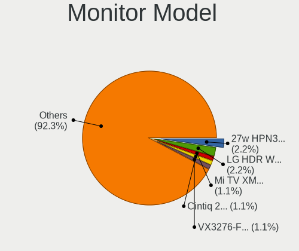

| Model                                                                   | Desktops | Percent |
|-------------------------------------------------------------------------|----------|---------|
| Hewlett-Packard 27w HPN3494 1920x1080 598x336mm 27.0-inch               | 2        | 2.47%   |
| Goldstar HDR WQHD GSM7756 3440x1440 820x346mm 35.0-inch                 | 2        | 2.47%   |
| Xiaomi Mi TV XMD009A 2880x1800 480x270mm 21.7-inch                      | 1        | 1.23%   |
| Wacom Cintiq 22HDT WAC1037 1920x1080 476x268mm 21.5-inch                | 1        | 1.23%   |
| ViewSonic LCD Monitor VX2276 Series 1920x1080                           | 1        | 1.23%   |
| ViewSonic LCD Monitor VA2448 SERIES 1920x1080                           | 1        | 1.23%   |
| Unknown LCD Monitor FFFF 2288x1287 2550x2550mm 142.0-inch               | 1        | 1.23%   |
| Toshiba TV TSB0206 1920x1080                                            | 1        | 1.23%   |
| Samsung Electronics SyncMaster SAM0578 1920x1080 476x268mm 21.5-inch    | 1        | 1.23%   |
| Samsung Electronics SyncMaster SAM03F2 1680x1050                        | 1        | 1.23%   |
| Samsung Electronics SyncMaster SAM03F0 1680x1050 433x271mm 20.1-inch    | 1        | 1.23%   |
| Samsung Electronics SyncMaster SAM0248 1280x1024 376x301mm 19.0-inch    | 1        | 1.23%   |
| Samsung Electronics SyncMaster SAM01AD 1600x1200 408x306mm 20.1-inch    | 1        | 1.23%   |
| Samsung Electronics SMS19A100 SAM0867 1366x768 410x230mm 18.5-inch      | 1        | 1.23%   |
| Samsung Electronics SM2333T SAM0736 1920x1080 477x268mm 21.5-inch       | 1        | 1.23%   |
| Samsung Electronics S24D390 SAM0B65 1920x1080 520x290mm 23.4-inch       | 1        | 1.23%   |
| Samsung Electronics S22D300 SAM0B3E 1920x1080 477x268mm 21.5-inch       | 1        | 1.23%   |
| Samsung Electronics LCD Monitor U28D590 3840x2160                       | 1        | 1.23%   |
| Samsung Electronics LCD Monitor SAM0FF0 3840x2160 1872x1053mm 84.6-inch | 1        | 1.23%   |
| Samsung Electronics B2430L SAM0644 1920x1080 521x293mm 23.5-inch        | 1        | 1.23%   |
| ONN ONA24HB19T01 ONN0101 1920x1080 520x320mm 24.0-inch                  | 1        | 1.23%   |
| NEC Computers LCD2490WUXi NEC66CE 1920x1200 518x324mm 24.1-inch         | 1        | 1.23%   |
| MSI MAG342CQPV MSI4DB6 3440x1440 797x333mm 34.0-inch                    | 1        | 1.23%   |
| Lenovo LEN L171 LEN24C9 1280x1024 337x270mm 17.0-inch                   | 1        | 1.23%   |
| Lenovo LCD Monitor LEN40B2 1920x1080 344x193mm 15.5-inch                | 1        | 1.23%   |
| JVC FPDEUFT3 JVC21BE 1920x540                                           | 1        | 1.23%   |
| IOD LCD-GL211X IOD151D 1920x1080 458x258mm 20.7-inch                    | 1        | 1.23%   |
| Iiyama PLE2207WS IVM5609 1680x1050 474x296mm 22.0-inch                  | 1        | 1.23%   |
| Hewlett-Packard ZR2740w HWP2957 2560x1440 597x336mm 27.0-inch           | 1        | 1.23%   |
| Hewlett-Packard Z24i HWP309E 1920x1200 518x324mm 24.1-inch              | 1        | 1.23%   |
| Hewlett-Packard x23LED HWP2912 1920x1080 509x286mm 23.0-inch            | 1        | 1.23%   |
| Hewlett-Packard V194bz HWP3136 1366x768 410x230mm 18.5-inch             | 1        | 1.23%   |
| Hewlett-Packard LE1851w HWP2840 1366x768 410x230mm 18.5-inch            | 1        | 1.23%   |
| Hewlett-Packard 2309 HWP2823 1920x1080 510x287mm 23.0-inch              | 1        | 1.23%   |
| Goldstar W2242 GSM5678 1680x1050 474x296mm 22.0-inch                    | 1        | 1.23%   |
| Goldstar W2242 GSM5677 1680x1050 474x296mm 22.0-inch                    | 1        | 1.23%   |
| Goldstar W1952 GSM4B77 1440x900 410x260mm 19.1-inch                     | 1        | 1.23%   |
| Goldstar FULL HD GSM5ABA 1920x1080 480x270mm 21.7-inch                  | 1        | 1.23%   |
| Goldstar E2260 GSM57DF 1920x1080 480x270mm 21.7-inch                    | 1        | 1.23%   |
| Goldstar E1641 GSM8B3E 1366x768 344x194mm 15.5-inch                     | 1        | 1.23%   |

Monitor Resolution
------------------

Monitor screen resolution

| Resolution         | Desktops | Percent |
|--------------------|----------|---------|
| 1920x1080 (FHD)    | 34       | 44.16%  |
| 1280x1024 (SXGA)   | 7        | 9.09%   |
| 3840x2160 (4K)     | 5        | 6.49%   |
| 3440x1440          | 5        | 6.49%   |
| 1680x1050 (WSXGA+) | 5        | 6.49%   |
| 1366x768 (WXGA)    | 5        | 6.49%   |
| 2560x1440 (QHD)    | 4        | 5.19%   |
| 1920x1200 (WUXGA)  | 4        | 5.19%   |
| 1440x900 (WXGA+)   | 2        | 2.6%    |
| 3200x1080          | 1        | 1.3%    |
| 2288x1287          | 1        | 1.3%    |
| 1920x540           | 1        | 1.3%    |
| 1600x1200          | 1        | 1.3%    |
| 1024x768 (XGA)     | 1        | 1.3%    |
| Unknown            | 1        | 1.3%    |

Monitor Diagonal
----------------

Diagonal size in inches

| Inches  | Desktops | Percent |
|---------|----------|---------|
| 27      | 13       | 16.46%  |
| 24      | 13       | 16.46%  |
| 21      | 9        | 11.39%  |
| 23      | 7        | 8.86%   |
| Unknown | 7        | 8.86%   |
| 22      | 4        | 5.06%   |
| 19      | 4        | 5.06%   |
| 18      | 4        | 5.06%   |
| 17      | 4        | 5.06%   |
| 15      | 4        | 5.06%   |
| 35      | 2        | 2.53%   |
| 34      | 2        | 2.53%   |
| 20      | 2        | 2.53%   |
| 142     | 1        | 1.27%   |
| 84      | 1        | 1.27%   |
| 74      | 1        | 1.27%   |
| 52      | 1        | 1.27%   |

Monitor Width
-------------

Physical width

| Width in mm    | Desktops | Percent |
|----------------|----------|---------|
| 501-600        | 31       | 39.74%  |
| 401-500        | 20       | 25.64%  |
| 301-350        | 8        | 10.26%  |
| Unknown        | 7        | 8.97%   |
| 351-400        | 3        | 3.85%   |
| 801-900        | 2        | 2.56%   |
| 701-800        | 2        | 2.56%   |
| 1501-2000      | 2        | 2.56%   |
| More than 2000 | 1        | 1.28%   |
| 601-700        | 1        | 1.28%   |
| 1001-1500      | 1        | 1.28%   |

Aspect Ratio
------------

Proportional relationship between the width and the height

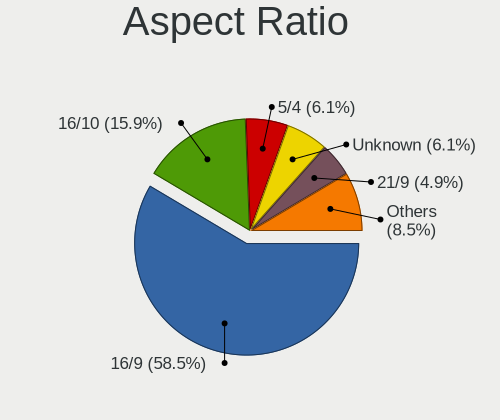

| Ratio   | Desktops | Percent |
|---------|----------|---------|
| 16/9    | 40       | 54.79%  |
| 16/10   | 12       | 16.44%  |
| 5/4     | 5        | 6.85%   |
| Unknown | 5        | 6.85%   |
| 21/9    | 4        | 5.48%   |
| 6/5     | 2        | 2.74%   |
| 4/3     | 2        | 2.74%   |
| 32/9    | 1        | 1.37%   |
| 3/2     | 1        | 1.37%   |
| 1.00    | 1        | 1.37%   |

Monitor Area
------------

Area in inch²

| Area in inch² | Desktops | Percent |
|----------------|----------|---------|
| 201-250        | 26       | 33.77%  |
| 301-350        | 13       | 16.88%  |
| 151-200        | 7        | 9.09%   |
| 141-150        | 7        | 9.09%   |
| Unknown        | 7        | 9.09%   |
| 251-300        | 5        | 6.49%   |
| More than 1000 | 4        | 5.19%   |
| 351-500        | 4        | 5.19%   |
| 101-110        | 4        | 5.19%   |

Pixel Density
-------------

Pixels per inch

| Density | Desktops | Percent |
|---------|----------|---------|
| 51-100  | 46       | 58.23%  |
| 101-120 | 19       | 24.05%  |
| Unknown | 7        | 8.86%   |
| 121-160 | 4        | 5.06%   |
| 1-50    | 3        | 3.8%    |

Multiple Monitors
-----------------

Total monitors connected

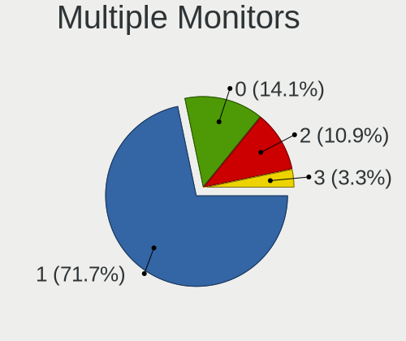

| Total | Desktops | Percent |
|-------|----------|---------|
| 1     | 57       | 70.37%  |
| 0     | 12       | 14.81%  |
| 2     | 9        | 11.11%  |
| 3     | 3        | 3.7%    |

Network
-------

Net Controller Vendor
---------------------

Controller vendors

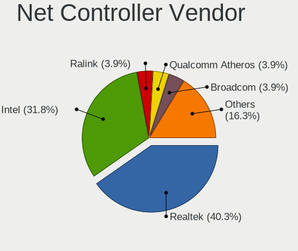

| Vendor                   | Desktops | Percent |
|--------------------------|----------|---------|
| Realtek Semiconductor    | 45       | 39.82%  |
| Intel                    | 36       | 31.86%  |
| Qualcomm Atheros         | 5        | 4.42%   |
| Broadcom                 | 5        | 4.42%   |
| Nvidia                   | 4        | 3.54%   |
| MediaTek                 | 4        | 3.54%   |
| TP-Link                  | 3        | 2.65%   |
| Ralink Technology        | 3        | 2.65%   |
| VIA Technologies         | 1        | 0.88%   |
| Ralink                   | 1        | 0.88%   |
| Qualcomm                 | 1        | 0.88%   |
| Micro Star International | 1        | 0.88%   |
| Mellanox Technologies    | 1        | 0.88%   |
| Dell                     | 1        | 0.88%   |
| Chelsio Communications   | 1        | 0.88%   |
| Broadcom Limited         | 1        | 0.88%   |

Net Controller Model
--------------------

Controller models

| Model                                                                      | Desktops | Percent |
|----------------------------------------------------------------------------|----------|---------|
| Realtek RTL8111/8168/8211/8411 PCI Express Gigabit Ethernet Controller     | 32       | 24.62%  |
| Intel I211 Gigabit Network Connection                                      | 8        | 6.15%   |
| Realtek RTL8125 2.5GbE Controller                                          | 5        | 3.85%   |
| Realtek RTL810xE PCI Express Fast Ethernet controller                      | 4        | 3.08%   |
| Intel Wi-Fi 6 AX200                                                        | 4        | 3.08%   |
| Intel Ethernet Connection (2) I218-V                                       | 4        | 3.08%   |
| Intel 82574L Gigabit Network Connection                                    | 4        | 3.08%   |
| Ralink MT7601U Wireless Adapter                                            | 3        | 2.31%   |
| Nvidia MCP61 Ethernet                                                      | 3        | 2.31%   |
| MediaTek MT7922 802.11ax PCI Express Wireless Network Adapter              | 3        | 2.31%   |
| Intel Ethernet Controller I225-V                                           | 3        | 2.31%   |
| Intel Dual Band Wireless-AC 3168NGW [Stone Peak]                           | 3        | 2.31%   |
| Intel 82579LM Gigabit Network Connection (Lewisville)                      | 3        | 2.31%   |
| Realtek RTL8188EE Wireless Network Adapter                                 | 2        | 1.54%   |
| Qualcomm Atheros Killer E220x Gigabit Ethernet Controller                  | 2        | 1.54%   |
| Intel I350 Gigabit Network Connection                                      | 2        | 1.54%   |
| Intel Ethernet Connection (7) I219-V                                       | 2        | 1.54%   |
| Intel 82579V Gigabit Network Connection                                    | 2        | 1.54%   |
| Intel 82567LM-3 Gigabit Network Connection                                 | 2        | 1.54%   |
| Broadcom NetXtreme BCM5752 Gigabit Ethernet PCI Express                    | 2        | 1.54%   |
| VIA VT6105/VT6106S [Rhine-III]                                             | 1        | 0.77%   |
| TP-Link TL-WN823N v2/v3 [Realtek RTL8192EU]                                | 1        | 0.77%   |
| TP-Link RTL8812AU Archer T4U 802.11ac                                      | 1        | 0.77%   |
| TP-Link AC600 wireless Realtek RTL8811AU [Archer T2U Nano]                 | 1        | 0.77%   |
| Realtek USB 10/100/1G/2.5G LAN                                             | 1        | 0.77%   |
| Realtek RTL88x2bu [AC1200 Techkey]                                         | 1        | 0.77%   |
| Realtek RTL8821CE 802.11ac PCIe Wireless Network Adapter                   | 1        | 0.77%   |
| Realtek RTL8188CUS 802.11n WLAN Adapter                                    | 1        | 0.77%   |
| Realtek RTL-8100/8101L/8139 PCI Fast Ethernet Adapter                      | 1        | 0.77%   |
| Ralink RT2790 Wireless 802.11n 1T/2R PCIe                                  | 1        | 0.77%   |
| Qualcomm Nokia G42 5G                                                      | 1        | 0.77%   |
| Qualcomm Atheros AR93xx Wireless Network Adapter                           | 1        | 0.77%   |
| Qualcomm Atheros AR9287 Wireless Network Adapter (PCI-Express)             | 1        | 0.77%   |
| Qualcomm Atheros AR9227 Wireless Network Adapter                           | 1        | 0.77%   |
| Qualcomm Atheros AR8121/AR8113/AR8114 Gigabit or Fast Ethernet             | 1        | 0.77%   |
| Nvidia MCP79 Ethernet                                                      | 1        | 0.77%   |
| Micro Star International MS-3871 802.11bgn Wireless Module [Ralink RT8070] | 1        | 0.77%   |
| Mellanox MT26448 [ConnectX EN 10GigE, PCIe 2.0 5GT/s]                      | 1        | 0.77%   |
| MediaTek MT7921K (RZ608) Wi-Fi 6E 80MHz                                    | 1        | 0.77%   |
| Intel Wireless 7260                                                        | 1        | 0.77%   |

Wireless Vendor
---------------

Wireless vendors

| Vendor                   | Desktops | Percent |
|--------------------------|----------|---------|
| Intel                    | 11       | 34.38%  |
| Realtek Semiconductor    | 5        | 15.63%  |
| MediaTek                 | 4        | 12.5%   |
| TP-Link                  | 3        | 9.38%   |
| Ralink Technology        | 3        | 9.38%   |
| Qualcomm Atheros         | 3        | 9.38%   |
| Ralink                   | 1        | 3.13%   |
| Micro Star International | 1        | 3.13%   |
| Dell                     | 1        | 3.13%   |

Wireless Model
--------------

Wireless models

| Model                                                                      | Desktops | Percent |
|----------------------------------------------------------------------------|----------|---------|
| Intel Wi-Fi 6 AX200                                                        | 4        | 12.5%   |
| Ralink MT7601U Wireless Adapter                                            | 3        | 9.38%   |
| MediaTek MT7922 802.11ax PCI Express Wireless Network Adapter              | 3        | 9.38%   |
| Intel Dual Band Wireless-AC 3168NGW [Stone Peak]                           | 3        | 9.38%   |
| Realtek RTL8188EE Wireless Network Adapter                                 | 2        | 6.25%   |
| TP-Link TL-WN823N v2/v3 [Realtek RTL8192EU]                                | 1        | 3.13%   |
| TP-Link RTL8812AU Archer T4U 802.11ac                                      | 1        | 3.13%   |
| TP-Link AC600 wireless Realtek RTL8811AU [Archer T2U Nano]                 | 1        | 3.13%   |
| Realtek RTL88x2bu [AC1200 Techkey]                                         | 1        | 3.13%   |
| Realtek RTL8821CE 802.11ac PCIe Wireless Network Adapter                   | 1        | 3.13%   |
| Realtek RTL8188CUS 802.11n WLAN Adapter                                    | 1        | 3.13%   |
| Ralink RT2790 Wireless 802.11n 1T/2R PCIe                                  | 1        | 3.13%   |
| Qualcomm Atheros AR93xx Wireless Network Adapter                           | 1        | 3.13%   |
| Qualcomm Atheros AR9287 Wireless Network Adapter (PCI-Express)             | 1        | 3.13%   |
| Qualcomm Atheros AR9227 Wireless Network Adapter                           | 1        | 3.13%   |
| Micro Star International MS-3871 802.11bgn Wireless Module [Ralink RT8070] | 1        | 3.13%   |
| MediaTek MT7921K (RZ608) Wi-Fi 6E 80MHz                                    | 1        | 3.13%   |
| Intel Wireless 7260                                                        | 1        | 3.13%   |
| Intel Wi-Fi 6E(802.11ax) AX210/AX1675* 2x2 [Typhoon Peak]                  | 1        | 3.13%   |
| Intel Wi-Fi 5(802.11ac) Wireless-AC 9x6x [Thunder Peak]                    | 1        | 3.13%   |
| Intel Centrino Advanced-N 6205 [Taylor Peak]                               | 1        | 3.13%   |
| Dell Wireless 1450 Dual-band (802.11a/b/g) Adapter [Intersil ISL3887]      | 1        | 3.13%   |

Ethernet Vendor
---------------

Ethernet vendors

| Vendor                 | Desktops | Percent |
|------------------------|----------|---------|
| Realtek Semiconductor  | 43       | 46.74%  |
| Intel                  | 32       | 34.78%  |
| Broadcom               | 5        | 5.43%   |
| Nvidia                 | 4        | 4.35%   |
| Qualcomm Atheros       | 3        | 3.26%   |
| VIA Technologies       | 1        | 1.09%   |
| Qualcomm               | 1        | 1.09%   |
| Mellanox Technologies  | 1        | 1.09%   |
| Chelsio Communications | 1        | 1.09%   |
| Broadcom Limited       | 1        | 1.09%   |

Ethernet Model
--------------

Ethernet models

| Model                                                                         | Desktops | Percent |
|-------------------------------------------------------------------------------|----------|---------|
| Realtek RTL8111/8168/8211/8411 PCI Express Gigabit Ethernet Controller        | 32       | 32.65%  |
| Intel I211 Gigabit Network Connection                                         | 8        | 8.16%   |
| Realtek RTL8125 2.5GbE Controller                                             | 5        | 5.1%    |
| Realtek RTL810xE PCI Express Fast Ethernet controller                         | 4        | 4.08%   |
| Intel Ethernet Connection (2) I218-V                                          | 4        | 4.08%   |
| Intel 82574L Gigabit Network Connection                                       | 4        | 4.08%   |
| Nvidia MCP61 Ethernet                                                         | 3        | 3.06%   |
| Intel Ethernet Controller I225-V                                              | 3        | 3.06%   |
| Intel 82579LM Gigabit Network Connection (Lewisville)                         | 3        | 3.06%   |
| Qualcomm Atheros Killer E220x Gigabit Ethernet Controller                     | 2        | 2.04%   |
| Intel I350 Gigabit Network Connection                                         | 2        | 2.04%   |
| Intel Ethernet Connection (7) I219-V                                          | 2        | 2.04%   |
| Intel 82579V Gigabit Network Connection                                       | 2        | 2.04%   |
| Intel 82567LM-3 Gigabit Network Connection                                    | 2        | 2.04%   |
| Broadcom NetXtreme BCM5752 Gigabit Ethernet PCI Express                       | 2        | 2.04%   |
| VIA VT6105/VT6106S [Rhine-III]                                                | 1        | 1.02%   |
| Realtek USB 10/100/1G/2.5G LAN                                                | 1        | 1.02%   |
| Realtek RTL-8100/8101L/8139 PCI Fast Ethernet Adapter                         | 1        | 1.02%   |
| Qualcomm Nokia G42 5G                                                         | 1        | 1.02%   |
| Qualcomm Atheros AR8121/AR8113/AR8114 Gigabit or Fast Ethernet                | 1        | 1.02%   |
| Nvidia MCP79 Ethernet                                                         | 1        | 1.02%   |
| Mellanox MT26448 [ConnectX EN 10GigE, PCIe 2.0 5GT/s]                         | 1        | 1.02%   |
| Intel Ethernet Connection I217-V                                              | 1        | 1.02%   |
| Intel Ethernet Connection (2) I219-V                                          | 1        | 1.02%   |
| Intel Ethernet Connection (2) I219-LM                                         | 1        | 1.02%   |
| Intel Ethernet Connection (2) I218-LM                                         | 1        | 1.02%   |
| Intel Ethernet Connection (12) I219-V                                         | 1        | 1.02%   |
| Intel 82599ES 10-Gigabit SFI/SFP+ Network Connection                          | 1        | 1.02%   |
| Intel 82571EB/82571GB Gigabit Ethernet Controller D0/D1 (copper applications) | 1        | 1.02%   |
| Intel 82557/8/9/0/1 Ethernet Pro 100                                          | 1        | 1.02%   |
| Chelsio T320 10GbE Dual Port Adapter                                          | 1        | 1.02%   |
| Broadcom NetXtreme BCM5754 Gigabit Ethernet PCI Express                       | 1        | 1.02%   |
| Broadcom NetXtreme BCM5717 Gigabit Ethernet PCIe                              | 1        | 1.02%   |
| Broadcom NetLink BCM57781 Gigabit Ethernet PCIe                               | 1        | 1.02%   |
| Broadcom Limited NetXtreme BCM5751 Gigabit Ethernet PCI Express               | 1        | 1.02%   |

Net Controller Kind
-------------------

Ethernet, WiFi or modem

| Kind     | Desktops | Percent |
|----------|----------|---------|
| Ethernet | 80       | 71.43%  |
| WiFi     | 32       | 28.57%  |

Used Controller
---------------

Currently used network controller

| Kind     | Desktops | Percent |
|----------|----------|---------|
| Ethernet | 66       | 82.5%   |
| WiFi     | 14       | 17.5%   |

NICs
----

Total network controllers on board

| Total | Desktops | Percent |
|-------|----------|---------|
| 1     | 46       | 55.42%  |
| 2     | 25       | 30.12%  |
| 3     | 6        | 7.23%   |
| 4     | 3        | 3.61%   |
| 5     | 2        | 2.41%   |
| 0     | 1        | 1.2%    |

IPv6
----

IPv6 vs IPv4

| Used | Desktops | Percent |
|------|----------|---------|
| No   | 72       | 86.75%  |
| Yes  | 11       | 13.25%  |

Bluetooth
---------

Bluetooth Vendor
----------------

Controller vendors

| Vendor                   | Desktops | Percent |
|--------------------------|----------|---------|
| Cambridge Silicon Radio  | 13       | 40.63%  |
| Intel                    | 9        | 28.13%  |
| MediaTek                 | 5        | 15.63%  |
| Micro Star International | 2        | 6.25%   |
| TP-Link                  | 1        | 3.13%   |
| Realtek Semiconductor    | 1        | 3.13%   |
| Broadcom                 | 1        | 3.13%   |

Bluetooth Model
---------------

Controller models

| Model                                               | Desktops | Percent |
|-----------------------------------------------------|----------|---------|
| Cambridge Silicon Radio Bluetooth Dongle (HCI mode) | 13       | 40.63%  |
| MediaTek Wireless_Device                            | 5        | 15.63%  |
| Intel Wireless-AC 3168 Bluetooth                    | 3        | 9.38%   |
| Intel AX200 Bluetooth                               | 3        | 9.38%   |
| TP-Link UB500 Adapter                               | 1        | 3.13%   |
| Realtek Bluetooth Radio                             | 1        | 3.13%   |
| Micro Star International Bluetooth Dongle           | 1        | 3.13%   |
| Micro Star International Bluetooth Device           | 1        | 3.13%   |
| Intel Wireless-AC 9260 Bluetooth Adapter            | 1        | 3.13%   |
| Intel Bluetooth wireless interface                  | 1        | 3.13%   |
| Intel AX210 Bluetooth                               | 1        | 3.13%   |
| Broadcom BCM20702A0 Bluetooth 4.0                   | 1        | 3.13%   |

Sound
-----

Sound Vendor
------------

Sound card vendors

| Vendor                   | Desktops | Percent |
|--------------------------|----------|---------|
| AMD                      | 41       | 34.17%  |
| Intel                    | 34       | 28.33%  |
| Nvidia                   | 24       | 20%     |
| Creative Labs            | 8        | 6.67%   |
| Micro Star International | 3        | 2.5%    |
| C-Media Electronics      | 2        | 1.67%   |
| VIA Technologies         | 1        | 0.83%   |
| Texas Instruments        | 1        | 0.83%   |
| RME                      | 1        | 0.83%   |
| M-Audio                  | 1        | 0.83%   |
| Kingston Technology      | 1        | 0.83%   |
| Holtek Semiconductor     | 1        | 0.83%   |
| EGO SYStems              | 1        | 0.83%   |
| ASUSTek Computer         | 1        | 0.83%   |

Sound Model
-----------

Sound card models

| Model                                                                                           | Desktops | Percent |
|-------------------------------------------------------------------------------------------------|----------|---------|
| AMD Starship/Matisse HD Audio Controller                                                        | 15       | 9.55%   |
| AMD Family 17h/19h HD Audio Controller                                                          | 8        | 5.1%    |
| AMD Ellesmere HDMI Audio [Radeon RX 470/480 / 570/580/590]                                      | 7        | 4.46%   |
| Intel C600/X79 series chipset High Definition Audio Controller                                  | 6        | 3.82%   |
| Intel Xeon E3-1200 v3/4th Gen Core Processor HD Audio Controller                                | 5        | 3.18%   |
| Nvidia MCP61 High Definition Audio                                                              | 4        | 2.55%   |
| Nvidia GP106 High Definition Audio Controller                                                   | 4        | 2.55%   |
| Intel 9 Series Chipset Family HD Audio Controller                                               | 4        | 2.55%   |
| Creative Labs CA0132 Sound Core3D [Sound Blaster Recon3D / Z-Series / Sound BlasterX AE-5 Plus] | 4        | 2.55%   |
| AMD Raven/Raven2/Fenghuang HDMI/DP Audio Controller                                             | 4        | 2.55%   |
| AMD Oland/Hainan/Cape Verde/Pitcairn HDMI Audio [Radeon HD 7000 Series]                         | 4        | 2.55%   |
| AMD Navi 31 HDMI/DP Audio                                                                       | 4        | 2.55%   |
| AMD FCH Azalia Controller                                                                       | 4        | 2.55%   |
| Nvidia GP107GL High Definition Audio Controller                                                 | 3        | 1.91%   |
| Nvidia GF108 High Definition Audio Controller                                                   | 3        | 1.91%   |
| Micro Star International USB Audio                                                              | 3        | 1.91%   |
| Intel 6 Series/C200 Series Chipset Family High Definition Audio Controller                      | 3        | 1.91%   |
| AMD SBx00 Azalia (Intel HDA)                                                                    | 3        | 1.91%   |
| AMD Rembrandt Radeon High Definition Audio Controller                                           | 3        | 1.91%   |
| AMD Navi 21/23 HDMI/DP Audio Controller                                                         | 3        | 1.91%   |
| AMD Navi 10 HDMI Audio                                                                          | 3        | 1.91%   |
| AMD Family 17h (Models 00h-0fh) HD Audio Controller                                             | 3        | 1.91%   |
| AMD Baffin HDMI/DP Audio [Radeon RX 550 640SP / RX 560/560X]                                    | 3        | 1.91%   |
| Nvidia GM107 High Definition Audio Controller [GeForce 940MX]                                   | 2        | 1.27%   |
| Nvidia GA102 High Definition Audio Controller                                                   | 2        | 1.27%   |
| Intel Cannon Lake PCH cAVS                                                                      | 2        | 1.27%   |
| Intel 82801JD/DO (ICH10 Family) HD Audio Controller                                             | 2        | 1.27%   |
| Intel 82801I (ICH9 Family) HD Audio Controller                                                  | 2        | 1.27%   |
| Intel 8 Series/C220 Series Chipset High Definition Audio Controller                             | 2        | 1.27%   |
| Intel 100 Series/C230 Series Chipset Family HD Audio Controller                                 | 2        | 1.27%   |
| AMD Renoir Radeon High Definition Audio Controller                                              | 2        | 1.27%   |
| VIA Technologies VT1720/24 [Envy24PT/HT] PCI Multi-Channel Audio Controller                     | 1        | 0.64%   |
| Texas Instruments PCM2902 Audio Codec                                                           | 1        | 0.64%   |
| RME ADI-2 DAC (56760369)                                                                        | 1        | 0.64%   |
| Nvidia TU116 High Definition Audio Controller                                                   | 1        | 0.64%   |
| Nvidia MCP79 High Definition Audio                                                              | 1        | 0.64%   |
| Nvidia GP104 High Definition Audio Controller                                                   | 1        | 0.64%   |
| Nvidia GM206 High Definition Audio Controller                                                   | 1        | 0.64%   |
| Nvidia GM204 High Definition Audio Controller                                                   | 1        | 0.64%   |
| Nvidia GK208 HDMI/DP Audio Controller                                                           | 1        | 0.64%   |

Memory
------

Memory Vendor
-------------

Memory module vendors

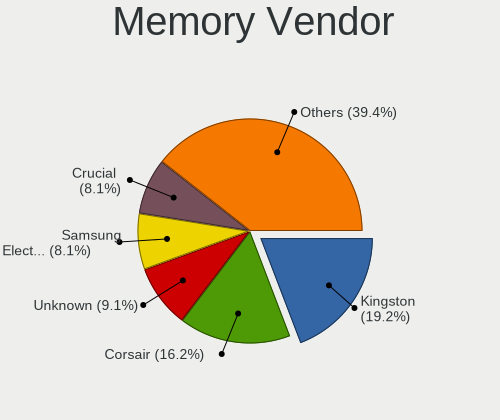

| Vendor              | Desktops | Percent |
|---------------------|----------|---------|
| Kingston            | 16       | 18.6%   |
| Corsair             | 15       | 17.44%  |
| Unknown             | 8        | 9.3%    |
| SK hynix            | 7        | 8.14%   |
| Crucial             | 7        | 8.14%   |
| Samsung Electronics | 6        | 6.98%   |
| G.Skill             | 5        | 5.81%   |
| Team                | 4        | 4.65%   |
| Transcend           | 2        | 2.33%   |
| Micron Technology   | 2        | 2.33%   |
| AMD                 | 2        | 2.33%   |
| Unknown             | 2        | 2.33%   |
| Strontium           | 1        | 1.16%   |
| Smart               | 1        | 1.16%   |
| Silicon Power       | 1        | 1.16%   |
| Patriot             | 1        | 1.16%   |
| HPE                 | 1        | 1.16%   |
| Hewlett-Packard     | 1        | 1.16%   |
| GOODRAM             | 1        | 1.16%   |
| GLOWAY              | 1        | 1.16%   |
| A-DATA Technology   | 1        | 1.16%   |
| A Force             | 1        | 1.16%   |

Memory Model
------------

Memory module models

| Model                                                       | Desktops | Percent |
|-------------------------------------------------------------|----------|---------|
| Unknown RAM Module 2048MB DIMM SDRAM                        | 2        | 2.04%   |
| Team RAM TEAMGROUP-UD4-3200 8GB DIMM DDR4 3800MT/s          | 2        | 2.04%   |
| Kingston RAM KHX1600C10D3/8G 8GB DIMM DDR3 1648MT/s         | 2        | 2.04%   |
| Corsair RAM CMZ32GX3M4X1600C10 8GB DIMM DDR3 1600MT/s       | 2        | 2.04%   |
| Corsair RAM CMK16GX4M2B3200C16 8GB DIMM DDR4 3600MT/s       | 2        | 2.04%   |
| Unknown                                                     | 2        | 2.04%   |
| Unknown RAM Module 4GB DIMM DDR3 1066MT/s                   | 1        | 1.02%   |
| Unknown RAM Module 4GB DIMM DDR 1333MT/s                    | 1        | 1.02%   |
| Unknown RAM Module 4096MB DIMM DDR3 65535MT/s               | 1        | 1.02%   |
| Unknown RAM Module 2GB DIMM DDR2 533MT/s                    | 1        | 1.02%   |
| Unknown RAM Module 2GB DIMM DDR 1333MT/s                    | 1        | 1.02%   |
| Unknown RAM Module 2048MB DIMM DDR 800MT/s                  | 1        | 1.02%   |
| Unknown RAM Module 2048MB DIMM 667MT/s                      | 1        | 1.02%   |
| Unknown RAM Module 1024MB DIMM DDR 800MT/s                  | 1        | 1.02%   |
| Unknown RAM Module 1024MB DIMM 667MT/s                      | 1        | 1.02%   |
| Transcend RAM TS256MLQ72V6U 2GB DIMM DDR2 667MT/s           | 1        | 1.02%   |
| Transcend RAM JM1600KLN-8GK 4096MB DIMM DDR3 1600MT/s       | 1        | 1.02%   |
| Team RAM TEAMGROUP-UD4-3600 16GB DIMM DDR4 3733MT/s         | 1        | 1.02%   |
| Team RAM TEAMGROUP-UD4-3600 16GB DIMM DDR4 3600MT/s         | 1        | 1.02%   |
| Strontium RAM SRT4G86U1-P9H 4096MB DIMM DDR3 1333MT/s       | 1        | 1.02%   |
| Smart RAM SH564128FH8N6TNSQG 4GB DIMM DDR3 1600MT/s         | 1        | 1.02%   |
| SK hynix RAM HYMP512F72CP8N3-Y5 1024MB FB-DIMM DDR2 667MT/s | 1        | 1.02%   |
| SK hynix RAM HMT451S6AFR8A-PB 4096MB SODIMM DDR3 1600MT/s   | 1        | 1.02%   |
| SK hynix RAM HMT41GU6BFR8A-PB 8GB DIMM DDR3 2000MT/s        | 1        | 1.02%   |
| SK hynix RAM HMT351U6BFR8C-H9 4GB DIMM DDR3 1333MT/s        | 1        | 1.02%   |
| SK hynix RAM HMT351S6CFR8C-PB 4GB DIMM DDR3 1600MT/s        | 1        | 1.02%   |
| SK hynix RAM HMT351R7CFR8A-H9 4GB DIMM DDR3 1333MT/s        | 1        | 1.02%   |
| SK hynix RAM HMT31GR7EFR4A 8192MB DIMM DDR3 1600MT/s        | 1        | 1.02%   |
| Silicon Power RAM DCLT4GN568S V 4096MB DIMM DDR3 1600MT/s   | 1        | 1.02%   |
| Samsung RAM M471B5173EB0-YK0 4GB SODIMM DDR3 1600MT/s       | 1        | 1.02%   |
| Samsung RAM M395T5663QZ4-CE66 2048MB FB-DIMM DDR2 667MT/s   | 1        | 1.02%   |
| Samsung RAM M393B5273DH0-CK0 4GB DIMM DDR3 1600MT/s         | 1        | 1.02%   |
| Samsung RAM M393A2G40DB0-CPB 16GB RIMM DDR4 2133MT/s        | 1        | 1.02%   |
| Samsung RAM M393A1K43BB0-CRC 8GB DIMM DDR4 2400MT/s         | 1        | 1.02%   |
| Samsung RAM M393A1G43EB1-CRC 8GB DIMM DDR4 2400MT/s         | 1        | 1.02%   |
| Samsung RAM M378B5173EB0-CK0 4GB DIMM DDR3 1600MT/s         | 1        | 1.02%   |
| Patriot RAM PSD48G240081 8GB DIMM DDR4 2800MT/s             | 1        | 1.02%   |
| Micron RAM 36KSF1G72PZ-1G4K1 8GB DIMM DDR3 1333MT/s         | 1        | 1.02%   |
| Micron RAM 18JSF1G72PZ-1G9E1 8GB DIMM DDR3 1866MT/s         | 1        | 1.02%   |
| Micron RAM 16JTF51264AZ-1G6M1 4GB DIMM DDR3 1600MT/s        | 1        | 1.02%   |

Memory Kind
-----------

Memory module kinds

| Kind    | Desktops | Percent |
|---------|----------|---------|
| DDR4    | 36       | 48.65%  |
| DDR3    | 28       | 37.84%  |
| DDR2    | 4        | 5.41%   |
| SDRAM   | 2        | 2.7%    |
| DDR     | 2        | 2.7%    |
| DDR5    | 1        | 1.35%   |
| Unknown | 1        | 1.35%   |

Memory Form Factor
------------------

Physical design of the memory module

| Name    | Desktops | Percent |
|---------|----------|---------|
| DIMM    | 70       | 93.33%  |
| SODIMM  | 3        | 4%      |
| RIMM    | 1        | 1.33%   |
| FB-DIMM | 1        | 1.33%   |

Memory Size
-----------

Memory module size

| Size  | Desktops | Percent |
|-------|----------|---------|
| 8192  | 32       | 38.55%  |
| 4096  | 17       | 20.48%  |
| 16384 | 15       | 18.07%  |
| 2048  | 8        | 9.64%   |
| 32768 | 7        | 8.43%   |
| 1024  | 4        | 4.82%   |

Memory Speed
------------

Memory module speed

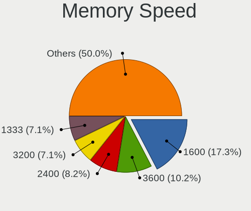

| Speed   | Desktops | Percent |
|---------|----------|---------|
| 1600    | 17       | 20.24%  |
| 3600    | 10       | 11.9%   |
| 2400    | 7        | 8.33%   |
| 1333    | 6        | 7.14%   |
| 3800    | 4        | 4.76%   |
| 3200    | 4        | 4.76%   |
| 667     | 4        | 4.76%   |
| 2667    | 3        | 3.57%   |
| 2133    | 3        | 3.57%   |
| 1867    | 3        | 3.57%   |
| 3733    | 2        | 2.38%   |
| 2800    | 2        | 2.38%   |
| 2666    | 2        | 2.38%   |
| 1866    | 2        | 2.38%   |
| Unknown | 2        | 2.38%   |
| 65535   | 1        | 1.19%   |
| 4800    | 1        | 1.19%   |
| 3666    | 1        | 1.19%   |
| 3400    | 1        | 1.19%   |
| 3000    | 1        | 1.19%   |
| 2933    | 1        | 1.19%   |
| 2472    | 1        | 1.19%   |
| 2187    | 1        | 1.19%   |
| 2000    | 1        | 1.19%   |
| 1066    | 1        | 1.19%   |
| 975     | 1        | 1.19%   |
| 800     | 1        | 1.19%   |
| 533     | 1        | 1.19%   |

Printers & scanners
-------------------

Printer Vendor
--------------

Printer device vendors

| Vendor              | Desktops | Percent |
|---------------------|----------|---------|
| Hewlett-Packard     | 3        | 33.33%  |
| Brother Industries  | 3        | 33.33%  |
| QinHeng Electronics | 1        | 11.11%  |
| Dell                | 1        | 11.11%  |
| Canon               | 1        | 11.11%  |

Printer Model
-------------

Printer device models

| Model                        | Desktops | Percent |
|------------------------------|----------|---------|
| QinHeng CH340S               | 1        | 11.11%  |
| HP OfficeJet Pro 9010 series | 1        | 11.11%  |
| HP ENVY 4520 series          | 1        | 11.11%  |
| HP ENVY 4500 series          | 1        | 11.11%  |
| Dell 2330d Laser Printer     | 1        | 11.11%  |
| Canon LiDE 300               | 1        | 11.11%  |
| Brother Printer              | 1        | 11.11%  |
| Brother HL-L5102DW           | 1        | 11.11%  |
| Brother HL-L2320D series     | 1        | 11.11%  |

Scanner Vendor
--------------

Scanner device vendors

| Vendor          | Desktops | Percent |
|-----------------|----------|---------|
| Canon           | 2        | 50%     |
| Seiko Epson     | 1        | 25%     |
| Hewlett-Packard | 1        | 25%     |

Scanner Model
-------------

Scanner device models

| Model                                         | Desktops | Percent |
|-----------------------------------------------|----------|---------|
| Seiko Epson GT-8300UF [Perfection 1660 PHOTO] | 1        | 25%     |
| HP ScanJet 5590                               | 1        | 25%     |
| Canon CanoScan N670U/N676U/LiDE 20            | 1        | 25%     |
| Canon CanoScan LIDE 25                        | 1        | 25%     |

Camera
------

Camera Vendor
-------------

Camera device vendors

| Vendor                        | Desktops | Percent |
|-------------------------------|----------|---------|
| Logitech                      | 12       | 70.59%  |
| Z-Star Microelectronics       | 1        | 5.88%   |
| Sunplus Innovation Technology | 1        | 5.88%   |
| Samsung Electronics           | 1        | 5.88%   |
| Microsoft                     | 1        | 5.88%   |
| Microdia                      | 1        | 5.88%   |

Camera Model
------------

Camera device models

| Model                                   | Desktops | Percent |
|-----------------------------------------|----------|---------|
| Logitech Webcam C270                    | 3        | 17.65%  |
| Z-Star Vimicro USB2.0 Camera            | 1        | 5.88%   |
| Sunplus PC Camera                       | 1        | 5.88%   |
| Samsung Galaxy series, misc. (MTP mode) | 1        | 5.88%   |
| Microsoft LifeCam HD-3000               | 1        | 5.88%   |
| Microdia Camera                         | 1        | 5.88%   |
| Logitech Webcam C310                    | 1        | 5.88%   |
| Logitech Webcam C300                    | 1        | 5.88%   |
| Logitech Webcam C170                    | 1        | 5.88%   |
| Logitech QuickCam Pro 9000              | 1        | 5.88%   |
| Logitech Logitech Webcam C160           | 1        | 5.88%   |
| Logitech HD Webcam C910                 | 1        | 5.88%   |
| Logitech HD Webcam C525                 | 1        | 5.88%   |
| Logitech HD Pro Webcam C920             | 1        | 5.88%   |
| Logitech C922 Pro Stream Webcam         | 1        | 5.88%   |

Security
--------

Fingerprint Vendor
------------------

Fingerprint sensor vendors

| Vendor             | Desktops | Percent |
|--------------------|----------|---------|
| STMicroelectronics | 1        | 100%    |

Fingerprint Model
-----------------

Fingerprint sensor models

| Model                                 | Desktops | Percent |
|---------------------------------------|----------|---------|
| STMicroelectronics Fingerprint Reader | 1        | 100%    |

Chipcard Vendor
---------------

Chipcard module vendors

| Vendor      | Desktops | Percent |
|-------------|----------|---------|
| Alcor Micro | 1        | 100%    |

Chipcard Model
--------------

Chipcard module models

| Model                               | Desktops | Percent |
|-------------------------------------|----------|---------|
| Alcor Micro AU9540 Smartcard Reader | 1        | 100%    |

Unsupported
-----------

Unsupported Devices
-------------------

Total unsupported devices on board

| Total | Desktops | Percent |
|-------|----------|---------|
| 0     | 50       | 60.24%  |
| 1     | 15       | 18.07%  |
| 2     | 9        | 10.84%  |
| 4     | 4        | 4.82%   |
| 3     | 4        | 4.82%   |
| 5     | 1        | 1.2%    |

Unsupported Device Types
------------------------

Types of unsupported devices

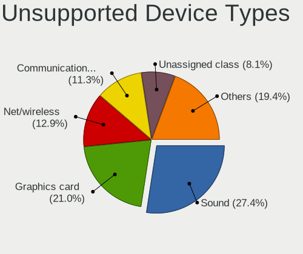

| Type                     | Desktops | Percent |
|--------------------------|----------|---------|
| Sound                    | 16       | 28.07%  |
| Graphics card            | 10       | 17.54%  |
| Net/wireless             | 7        | 12.28%  |
| Communication controller | 7        | 12.28%  |
| Unassigned class         | 5        | 8.77%   |
| Bluetooth                | 3        | 5.26%   |
| Camera                   | 2        | 3.51%   |
| Storage/raid             | 1        | 1.75%   |
| Storage/ide              | 1        | 1.75%   |
| Storage/ata              | 1        | 1.75%   |
| Net/ethernet             | 1        | 1.75%   |
| Fingerprint reader       | 1        | 1.75%   |
| Chipcard                 | 1        | 1.75%   |
| Card reader              | 1        | 1.75%   |

