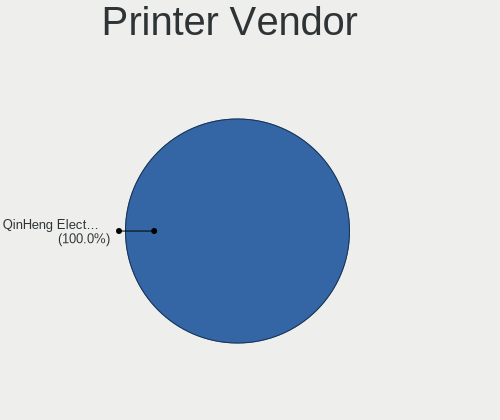
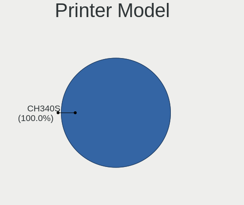

Slackware - Tested Hardware & Statistics (Notebooks)
----------------------------------------------------

A project to collect tested hardware configurations for Slackware.

Anyone can contribute to this report by the [hw-probe](https://github.com/linuxhw/hw-probe) tool:

    sudo -E hw-probe -all -upload

Please contribute! Especially if your hardware is rare.

Contents
--------

* [ Test Cases ](#test-cases)

* [ System ](#system)
  - [ OS                       ](#os)
  - [ OS Family                ](#os-family)
  - [ Kernel                   ](#kernel)
  - [ Kernel Family            ](#kernel-family)
  - [ Kernel Major Ver.        ](#kernel-major-ver)
  - [ Arch                     ](#arch)
  - [ DE                       ](#de)
  - [ Display Server           ](#display-server)
  - [ Display Manager          ](#display-manager)
  - [ OS Lang                  ](#os-lang)
  - [ Boot Mode                ](#boot-mode)
  - [ Filesystem               ](#filesystem)
  - [ Part. scheme             ](#part-scheme)
  - [ Dual Boot with Linux/BSD ](#dual-boot-with-linuxbsd)
  - [ Dual Boot (Win)          ](#dual-boot-win)

* [ Board ](#board)
  - [ Vendor                   ](#vendor)
  - [ Model                    ](#model)
  - [ Model Family             ](#model-family)
  - [ MFG Year                 ](#mfg-year)
  - [ Form Factor              ](#form-factor)
  - [ Secure Boot              ](#secure-boot)
  - [ Coreboot                 ](#coreboot)
  - [ RAM Size                 ](#ram-size)
  - [ RAM Used                 ](#ram-used)
  - [ Total Drives             ](#total-drives)
  - [ Has CD-ROM               ](#has-cd-rom)
  - [ Has Ethernet             ](#has-ethernet)
  - [ Has WiFi                 ](#has-wifi)
  - [ Has Bluetooth            ](#has-bluetooth)

* [ Location ](#location)
  - [ Country                  ](#country)
  - [ City                     ](#city)

* [ Drives ](#drives)
  - [ Drive Vendor             ](#drive-vendor)
  - [ Drive Model              ](#drive-model)
  - [ HDD Vendor               ](#hdd-vendor)
  - [ SSD Vendor               ](#ssd-vendor)
  - [ Drive Kind               ](#drive-kind)
  - [ Drive Connector          ](#drive-connector)
  - [ Drive Size               ](#drive-size)
  - [ Space Total              ](#space-total)
  - [ Space Used               ](#space-used)
  - [ Malfunc. Drives          ](#malfunc-drives)
  - [ Malfunc. Drive Vendor    ](#malfunc-drive-vendor)
  - [ Malfunc. HDD Vendor      ](#malfunc-hdd-vendor)
  - [ Malfunc. Drive Kind      ](#malfunc-drive-kind)
  - [ Failed Drives            ](#failed-drives)
  - [ Failed Drive Vendor      ](#failed-drive-vendor)
  - [ Drive Status             ](#drive-status)

* [ Storage controller ](#storage-controller)
  - [ Storage Vendor           ](#storage-vendor)
  - [ Storage Model            ](#storage-model)
  - [ Storage Kind             ](#storage-kind)

* [ Processor ](#processor)
  - [ CPU Vendor               ](#cpu-vendor)
  - [ CPU Model                ](#cpu-model)
  - [ CPU Model Family         ](#cpu-model-family)
  - [ CPU Cores                ](#cpu-cores)
  - [ CPU Sockets              ](#cpu-sockets)
  - [ CPU Threads              ](#cpu-threads)
  - [ CPU Op-Modes             ](#cpu-op-modes)
  - [ CPU Microcode            ](#cpu-microcode)
  - [ CPU Microarch            ](#cpu-microarch)

* [ Graphics ](#graphics)
  - [ GPU Vendor               ](#gpu-vendor)
  - [ GPU Model                ](#gpu-model)
  - [ GPU Combo                ](#gpu-combo)
  - [ GPU Driver               ](#gpu-driver)
  - [ GPU Memory               ](#gpu-memory)

* [ Monitor ](#monitor)
  - [ Monitor Vendor           ](#monitor-vendor)
  - [ Monitor Model            ](#monitor-model)
  - [ Monitor Resolution       ](#monitor-resolution)
  - [ Monitor Diagonal         ](#monitor-diagonal)
  - [ Monitor Width            ](#monitor-width)
  - [ Aspect Ratio             ](#aspect-ratio)
  - [ Monitor Area             ](#monitor-area)
  - [ Pixel Density            ](#pixel-density)
  - [ Multiple Monitors        ](#multiple-monitors)

* [ Network ](#network)
  - [ Net Controller Vendor    ](#net-controller-vendor)
  - [ Net Controller Model     ](#net-controller-model)
  - [ Wireless Vendor          ](#wireless-vendor)
  - [ Wireless Model           ](#wireless-model)
  - [ Ethernet Vendor          ](#ethernet-vendor)
  - [ Ethernet Model           ](#ethernet-model)
  - [ Net Controller Kind      ](#net-controller-kind)
  - [ Used Controller          ](#used-controller)
  - [ NICs                     ](#nics)
  - [ IPv6                     ](#ipv6)

* [ Bluetooth ](#bluetooth)
  - [ Bluetooth Vendor         ](#bluetooth-vendor)
  - [ Bluetooth Model          ](#bluetooth-model)

* [ Sound ](#sound)
  - [ Sound Vendor             ](#sound-vendor)
  - [ Sound Model              ](#sound-model)

* [ Memory ](#memory)
  - [ Memory Vendor            ](#memory-vendor)
  - [ Memory Model             ](#memory-model)
  - [ Memory Kind              ](#memory-kind)
  - [ Memory Form Factor       ](#memory-form-factor)
  - [ Memory Size              ](#memory-size)
  - [ Memory Speed             ](#memory-speed)

* [ Printers & scanners ](#printers--scanners)
  - [ Printer Vendor           ](#printer-vendor)
  - [ Printer Model            ](#printer-model)
  - [ Scanner Vendor           ](#scanner-vendor)
  - [ Scanner Model            ](#scanner-model)

* [ Camera ](#camera)
  - [ Camera Vendor            ](#camera-vendor)
  - [ Camera Model             ](#camera-model)

* [ Security ](#security)
  - [ Fingerprint Vendor       ](#fingerprint-vendor)
  - [ Fingerprint Model        ](#fingerprint-model)
  - [ Chipcard Vendor          ](#chipcard-vendor)
  - [ Chipcard Model           ](#chipcard-model)

* [ Unsupported ](#unsupported)
  - [ Unsupported Devices      ](#unsupported-devices)
  - [ Unsupported Device Types ](#unsupported-device-types)

Test Cases
----------

Total: 125

| Vendor    | Model                       | Probe                                                      | Date         |
|-----------|-----------------------------|------------------------------------------------------------|--------------|
| HP        | Laptop 14-fq0xxx            | [2e065da895](https://linux-hardware.org/?probe=2e065da895) | Dec 26, 2024 |
| HP        | Victus by Gaming Laptop ... | [ba32f5b55e](https://linux-hardware.org/?probe=ba32f5b55e) | Aug 26, 2024 |
| HP        | Pavilion g6                 | [8d4cd1cce3](https://linux-hardware.org/?probe=8d4cd1cce3) | Jul 25, 2024 |
| Lenovo    | IdeaPad 5 15ALC05 82LN      | [f7b2ff4d05](https://linux-hardware.org/?probe=f7b2ff4d05) | Jul 17, 2024 |
| HP        | OMEN by Laptop 16-b1xxx     | [63bafff3a1](https://linux-hardware.org/?probe=63bafff3a1) | May 25, 2024 |
| Dynabook  | PORTEGE X50-G               | [995067b4e8](https://linux-hardware.org/?probe=995067b4e8) | May 22, 2024 |
| Lenovo    | ThinkPad X201 3626F7U       | [40e1a8f2e0](https://linux-hardware.org/?probe=40e1a8f2e0) | May 10, 2024 |
| Lenovo    | ThinkPad X201 3626F7U       | [44b7fec8f8](https://linux-hardware.org/?probe=44b7fec8f8) | May 10, 2024 |
| Lenovo    | ThinkPad T430s 2355CL4      | [b90ab4a6e2](https://linux-hardware.org/?probe=b90ab4a6e2) | May 07, 2024 |
| Lenovo    | ThinkPad T16 Gen 2 21K7C... | [29f2579a02](https://linux-hardware.org/?probe=29f2579a02) | Apr 27, 2024 |
| Dell      | Precision 7510              | [23916f1909](https://linux-hardware.org/?probe=23916f1909) | Apr 22, 2024 |
| Lenovo    | ThinkPad T430s 2355CL4      | [e680816d8a](https://linux-hardware.org/?probe=e680816d8a) | Mar 13, 2024 |
| Dell      | XPS 15 9520                 | [2b4c310e2d](https://linux-hardware.org/?probe=2b4c310e2d) | Mar 08, 2024 |
| MSI       | Modern 14 B5M               | [585c473256](https://linux-hardware.org/?probe=585c473256) | Mar 08, 2024 |
| Dell      | Inspiron 5570               | [a16622f44c](https://linux-hardware.org/?probe=a16622f44c) | Feb 25, 2024 |
| Dell      | XPS 13 9370                 | [e94228e06b](https://linux-hardware.org/?probe=e94228e06b) | Feb 22, 2024 |
| Notebook  | NL5xNU                      | [e83f0b4085](https://linux-hardware.org/?probe=e83f0b4085) | Feb 18, 2024 |
| Dell      | XPS 15 9520                 | [d29869043d](https://linux-hardware.org/?probe=d29869043d) | Feb 17, 2024 |
| Dell      | XPS 13 9370                 | [11b5a42b88](https://linux-hardware.org/?probe=11b5a42b88) | Feb 11, 2024 |
| HP        | Laptop 14s-fq0xxx           | [6ae9e4d70e](https://linux-hardware.org/?probe=6ae9e4d70e) | Feb 06, 2024 |
| Acer      | Aspire SW5-012              | [efc348dbe0](https://linux-hardware.org/?probe=efc348dbe0) | Dec 31, 2023 |
| Lenovo    | V330-14ARR 81B1             | [b80592c227](https://linux-hardware.org/?probe=b80592c227) | Oct 21, 2023 |
| Toshiba   | Satellite C660              | [483998d7de](https://linux-hardware.org/?probe=483998d7de) | Oct 20, 2023 |
| HP        | OMEN by Laptop 16-b1xxx     | [aafdab7043](https://linux-hardware.org/?probe=aafdab7043) | Oct 13, 2023 |
| HP        | OMEN by Laptop 16-b1xxx     | [a1a64b6621](https://linux-hardware.org/?probe=a1a64b6621) | Oct 05, 2023 |
| Notebook  | P7xxTM                      | [e14cfa2f1f](https://linux-hardware.org/?probe=e14cfa2f1f) | Sep 22, 2023 |
| Notebook  | P7xxTM                      | [41b1348520](https://linux-hardware.org/?probe=41b1348520) | Sep 22, 2023 |
| Lenovo    | ThinkPad E16 Gen 1 21JT0... | [586c1fab43](https://linux-hardware.org/?probe=586c1fab43) | Sep 06, 2023 |
| ASUSTek   | ASUS TUF Dash F15 FX517Z... | [10db09006a](https://linux-hardware.org/?probe=10db09006a) | Aug 31, 2023 |
| Dell      | Vostro 3405                 | [2ba4151315](https://linux-hardware.org/?probe=2ba4151315) | Aug 19, 2023 |
| Lenovo    | ThinkPad X1 Carbon 4th 2... | [b8ceea98b8](https://linux-hardware.org/?probe=b8ceea98b8) | Aug 18, 2023 |
| Valve     | Jupiter                     | [eee501d93c](https://linux-hardware.org/?probe=eee501d93c) | Aug 09, 2023 |
| Lenovo    | IdeaPad 5 15ALC05 82LN      | [eec04bec1d](https://linux-hardware.org/?probe=eec04bec1d) | Aug 08, 2023 |
| HP        | Laptop 14s-fq0xxx           | [0a7b2a3fcc](https://linux-hardware.org/?probe=0a7b2a3fcc) | Aug 03, 2023 |
| Acer      | Swift SF114-34              | [ec48f7a207](https://linux-hardware.org/?probe=ec48f7a207) | May 28, 2023 |
| Apple     | MacBookAir7,2               | [941aa94750](https://linux-hardware.org/?probe=941aa94750) | Apr 13, 2023 |
| Valve     | Jupiter                     | [e9844f7162](https://linux-hardware.org/?probe=e9844f7162) | Mar 13, 2023 |
| HP        | ENVY Laptop 17-cr0xxx       | [fde666c0ea](https://linux-hardware.org/?probe=fde666c0ea) | Feb 17, 2023 |
| HP        | ENVY Laptop 17-cr0xxx       | [5ce5272a93](https://linux-hardware.org/?probe=5ce5272a93) | Feb 17, 2023 |
| Lenovo    | ThinkPad X140e 20BMS03E0... | [fb4c4aebf9](https://linux-hardware.org/?probe=fb4c4aebf9) | Jan 31, 2023 |
| Lenovo    | ThinkPad T470p 20J60018M... | [9324b897c3](https://linux-hardware.org/?probe=9324b897c3) | Jan 19, 2023 |
| ASUSTek   | VivoBook_ASUSLaptop K650... | [1b50127412](https://linux-hardware.org/?probe=1b50127412) | Jan 14, 2023 |
| HP        | EliteBook 8440p             | [9edc837033](https://linux-hardware.org/?probe=9edc837033) | Jan 13, 2023 |
| HP        | OMEN by Laptop 17-ck0xxx    | [9655429e71](https://linux-hardware.org/?probe=9655429e71) | Jan 06, 2023 |
| ASUSTek   | VivoBook_ASUSLaptop K650... | [4900ec9966](https://linux-hardware.org/?probe=4900ec9966) | Jan 05, 2023 |
| Acer      | Nitro AN515-54              | [5205b7c248](https://linux-hardware.org/?probe=5205b7c248) | Dec 27, 2022 |
| ASUSTek   | VivoBook_ASUSLaptop K650... | [1cf2ac2b8b](https://linux-hardware.org/?probe=1cf2ac2b8b) | Dec 27, 2022 |
| Acer      | Extensa 5220                | [30ca0c3efa](https://linux-hardware.org/?probe=30ca0c3efa) | Dec 06, 2022 |
| HP        | OMEN by Laptop 16-b1xxx     | [799470f1aa](https://linux-hardware.org/?probe=799470f1aa) | Dec 05, 2022 |
| HP        | OMEN by Laptop 16-b1xxx     | [0cd3005f69](https://linux-hardware.org/?probe=0cd3005f69) | Dec 01, 2022 |
| HP        | OMEN by Laptop 16-b1xxx     | [32b68762df](https://linux-hardware.org/?probe=32b68762df) | Nov 30, 2022 |
| Lenovo    | ThinkPad T470 20JNS01R01    | [abb8194196](https://linux-hardware.org/?probe=abb8194196) | Oct 21, 2022 |
| Lenovo    | ThinkPad T61 765912G        | [e7f2dc737e](https://linux-hardware.org/?probe=e7f2dc737e) | Oct 09, 2022 |
| Lenovo    | ThinkPad T410 2518C3U       | [4d250adf3b](https://linux-hardware.org/?probe=4d250adf3b) | Oct 04, 2022 |
| Lenovo    | ThinkPad T61 765912G        | [bd04e564a0](https://linux-hardware.org/?probe=bd04e564a0) | Sep 24, 2022 |
| Fujitsu   | LIFEBOOK A544               | [e5785106f1](https://linux-hardware.org/?probe=e5785106f1) | Aug 09, 2022 |
| MSI       | Modern 14 B10MW             | [b9cde08864](https://linux-hardware.org/?probe=b9cde08864) | Jul 25, 2022 |
| Sony      | SVE1713A1EW                 | [c3a65d695d](https://linux-hardware.org/?probe=c3a65d695d) | May 10, 2022 |
| Lenovo    | ThinkPad X1 Carbon 5th 2... | [f837aaeb12](https://linux-hardware.org/?probe=f837aaeb12) | May 08, 2022 |
| HP        | Pavilion Gaming Laptop 1... | [bd2dda1d8a](https://linux-hardware.org/?probe=bd2dda1d8a) | Apr 29, 2022 |
| HP        | Pavilion Gaming Laptop 1... | [cfc9c5dbf7](https://linux-hardware.org/?probe=cfc9c5dbf7) | Apr 29, 2022 |
| MSI       | GP76 Leopard 11UG           | [aebd373a66](https://linux-hardware.org/?probe=aebd373a66) | Apr 12, 2022 |
| MSI       | GE76 Raider 11UE            | [3072e065a3](https://linux-hardware.org/?probe=3072e065a3) | Apr 12, 2022 |
| Notebook  | X170KM-G                    | [4ecba03d19](https://linux-hardware.org/?probe=4ecba03d19) | Apr 11, 2022 |
| Dell      | Latitude 3520               | [4398aa2a03](https://linux-hardware.org/?probe=4398aa2a03) | Apr 06, 2022 |
| HP        | ProBook 6570b               | [cf1305eacc](https://linux-hardware.org/?probe=cf1305eacc) | Apr 06, 2022 |
| Lenovo    | IdeaPad 310-15ISK 80SM      | [d406cb4819](https://linux-hardware.org/?probe=d406cb4819) | Apr 05, 2022 |
| Dell      | Precision M4700             | [ab99532bd5](https://linux-hardware.org/?probe=ab99532bd5) | Apr 04, 2022 |
| Lenovo    | ThinkPad X230 2325P38       | [1a0cab737b](https://linux-hardware.org/?probe=1a0cab737b) | Mar 10, 2022 |
| ASUSTek   | ROG Zephyrus G14 GA401IV... | [0b0c1aca1b](https://linux-hardware.org/?probe=0b0c1aca1b) | Mar 10, 2022 |
| HP        | Pavilion Gaming Laptop 1... | [c7825c54fc](https://linux-hardware.org/?probe=c7825c54fc) | Mar 10, 2022 |
| Framework | Laptop                      | [ae37705198](https://linux-hardware.org/?probe=ae37705198) | Mar 10, 2022 |
| Lenovo    | ThinkPad Edge E530c 3366... | [8ce0419468](https://linux-hardware.org/?probe=8ce0419468) | Feb 13, 2022 |
| Dynabook  | P1-C7MP-BL                  | [268f94787e](https://linux-hardware.org/?probe=268f94787e) | Jan 14, 2022 |
| HP        | Laptop 15-bs2xx             | [bf53c3c878](https://linux-hardware.org/?probe=bf53c3c878) | Jan 02, 2022 |
| HP        | Laptop 15-bs1xx             | [b6c9f34c4c](https://linux-hardware.org/?probe=b6c9f34c4c) | Dec 07, 2021 |
| HP        | Laptop 15-da0xxx            | [2e3e23fb54](https://linux-hardware.org/?probe=2e3e23fb54) | Nov 01, 2021 |
| System76  | Oryx Pro                    | [3cd05d02a8](https://linux-hardware.org/?probe=3cd05d02a8) | Oct 27, 2021 |
| MSI       | Modern 14 B11MO             | [e8f13facfd](https://linux-hardware.org/?probe=e8f13facfd) | Oct 03, 2021 |
| MSI       | Modern 14 B11MO             | [9f5c2e0fde](https://linux-hardware.org/?probe=9f5c2e0fde) | Sep 27, 2021 |
| Toshiba   | PORTEGE Z30-A               | [13b9ce0773](https://linux-hardware.org/?probe=13b9ce0773) | Sep 22, 2021 |
| Dynabook  | PORTEGE X50-G               | [da8279a7a9](https://linux-hardware.org/?probe=da8279a7a9) | Sep 22, 2021 |
| Dell      | Inspiron 15-3552            | [f76339b0af](https://linux-hardware.org/?probe=f76339b0af) | Aug 31, 2021 |
| HP        | 245 G7 Notebook PC          | [c0806e4955](https://linux-hardware.org/?probe=c0806e4955) | Aug 23, 2021 |
| HP        | 245 G7 Notebook PC          | [c409287d23](https://linux-hardware.org/?probe=c409287d23) | Aug 23, 2021 |
| HP        | EliteBook 840 G5            | [4c196e1abd](https://linux-hardware.org/?probe=4c196e1abd) | Aug 18, 2021 |
| Dell      | Vostro 3500                 | [53a1179121](https://linux-hardware.org/?probe=53a1179121) | Aug 12, 2021 |
| HP        | EliteBook Folio 1020 G1 ... | [32e6ec699f](https://linux-hardware.org/?probe=32e6ec699f) | Aug 09, 2021 |
| HP        | EliteBook Folio 1020 G1 ... | [7facd0568b](https://linux-hardware.org/?probe=7facd0568b) | Aug 09, 2021 |
| HP        | 15 Notebook PC              | [bec2fe2e78](https://linux-hardware.org/?probe=bec2fe2e78) | Mar 21, 2021 |
| Toshiba   | Satellite C660              | [5189fbc4c9](https://linux-hardware.org/?probe=5189fbc4c9) | Mar 10, 2021 |
| Samsung   | 300E5M/300E5L               | [bda4ee984f](https://linux-hardware.org/?probe=bda4ee984f) | Mar 05, 2021 |
| Dell      | Latitude E5500              | [a8e17b79ce](https://linux-hardware.org/?probe=a8e17b79ce) | Feb 26, 2021 |
| HP        | Pavilion Notebook           | [45dfe3c2b1](https://linux-hardware.org/?probe=45dfe3c2b1) | Feb 24, 2021 |
| Lenovo    | ThinkPad L440 20ASS05K00    | [aecef5c789](https://linux-hardware.org/?probe=aecef5c789) | Jan 22, 2021 |
| Lenovo    | ThinkPad L440 20ASS05K00    | [7a6a06bb55](https://linux-hardware.org/?probe=7a6a06bb55) | Jan 04, 2021 |
| Dell      | Precision M4600             | [71bb8e2e9a](https://linux-hardware.org/?probe=71bb8e2e9a) | Dec 28, 2020 |
| Lenovo    | ThinkPad L440 20ASS05K00    | [b330b2d38a](https://linux-hardware.org/?probe=b330b2d38a) | Nov 19, 2020 |
| MSI       | GL73 8RC                    | [44f82bfc01](https://linux-hardware.org/?probe=44f82bfc01) | Nov 09, 2020 |
| Lenovo    | ThinkPad L440 20ASS05K00    | [a4cb1ecf16](https://linux-hardware.org/?probe=a4cb1ecf16) | Nov 08, 2020 |
| Samsung   | 300E5M/300E5L               | [270b65ced8](https://linux-hardware.org/?probe=270b65ced8) | Jul 24, 2020 |
| Notebook  | NL40_50CU                   | [941073da73](https://linux-hardware.org/?probe=941073da73) | Jun 27, 2020 |
| Lenovo    | V330-14ARR 81B1             | [5089cbcf84](https://linux-hardware.org/?probe=5089cbcf84) | Jun 24, 2020 |
| Lenovo    | V330-14ARR 81B1             | [cb63994f94](https://linux-hardware.org/?probe=cb63994f94) | Jun 22, 2020 |
| Notebook  | NL40_50CU                   | [9a1c09c6e1](https://linux-hardware.org/?probe=9a1c09c6e1) | Mar 28, 2020 |
| Notebook  | NL40_50CU                   | [bc5ed8dea4](https://linux-hardware.org/?probe=bc5ed8dea4) | Mar 24, 2020 |
| Notebook  | NL40_50CU                   | [ae7070b067](https://linux-hardware.org/?probe=ae7070b067) | Mar 21, 2020 |
| Notebook  | NL40_50CU                   | [320dada481](https://linux-hardware.org/?probe=320dada481) | Mar 20, 2020 |
| Toshiba   | Satellite P50-A-12Z         | [96927db16b](https://linux-hardware.org/?probe=96927db16b) | Mar 17, 2020 |
| Lenovo    | ThinkPad X1 Carbon 7th 2... | [afe3135216](https://linux-hardware.org/?probe=afe3135216) | Dec 10, 2019 |
| ASUSTek   | P53E                        | [e9dcced0f7](https://linux-hardware.org/?probe=e9dcced0f7) | Oct 28, 2019 |
| Lenovo    | ThinkPad T400 6474BV7       | [825bdb9fd0](https://linux-hardware.org/?probe=825bdb9fd0) | Oct 28, 2019 |
| ASUSTek   | 1000H                       | [50da35c0d0](https://linux-hardware.org/?probe=50da35c0d0) | Oct 28, 2019 |
| Acer      | Aspire E1-572               | [0fe80f5758](https://linux-hardware.org/?probe=0fe80f5758) | Oct 23, 2019 |
| ASUSTek   | VivoBook_ASUSLaptop X570... | [ecca7bced0](https://linux-hardware.org/?probe=ecca7bced0) | Oct 22, 2019 |
| Lenovo    | IdeaPad P500 20210          | [3d09c5e38d](https://linux-hardware.org/?probe=3d09c5e38d) | Oct 22, 2019 |
| Acer      | Swift SF314-52              | [05f880ecec](https://linux-hardware.org/?probe=05f880ecec) | Oct 21, 2019 |
| Lenovo    | ThinkPad P70 20ERCTO1WW     | [0ceeb50e5e](https://linux-hardware.org/?probe=0ceeb50e5e) | Oct 21, 2019 |
| Lenovo    | ThinkPad T450s 20BW000EU... | [41ca8d1a20](https://linux-hardware.org/?probe=41ca8d1a20) | Oct 21, 2019 |
| ASUSTek   | VivoBook_ASUSLaptop X570... | [c2fd6acb71](https://linux-hardware.org/?probe=c2fd6acb71) | Oct 21, 2019 |
| Dell      | Latitude E7270              | [859e021e2f](https://linux-hardware.org/?probe=859e021e2f) | Oct 20, 2019 |
| Fujitsu   | LIFEBOOK A555               | [e0c6729d5b](https://linux-hardware.org/?probe=e0c6729d5b) | Oct 20, 2019 |
| Lenovo    | ThinkPad T470 20HDCTO1WW    | [0f9287651d](https://linux-hardware.org/?probe=0f9287651d) | Jul 24, 2019 |
| Lenovo    | ThinkPad T470 20HDCTO1WW    | [67672ef038](https://linux-hardware.org/?probe=67672ef038) | Jul 23, 2019 |
| Fujitsu   | LIFEBOOK A555               | [63c120aa28](https://linux-hardware.org/?probe=63c120aa28) | Aug 19, 2018 |

System
------

OS
--

Installed operating systems

| Name            | Notebooks | Percent |
|-----------------|-----------|---------|
| Slackware 15.0  | 60        | 65.22%  |
| Slackware 14.2  | 27        | 29.35%  |
| Slackware 14.2+ | 3         | 3.26%   |
| Slackware 15.0+ | 2         | 2.17%   |

OS Family
---------

OS without a version

| Name      | Notebooks | Percent |
|-----------|-----------|---------|
| Slackware | 91        | 100%    |

Kernel
------

Version of the Linux kernel

| Version                     | Notebooks | Percent |
|-----------------------------|-----------|---------|
| 5.15.19                     | 13        | 12.75%  |
| 5.15.145                    | 4         | 3.92%   |
| 5.15.117                    | 4         | 3.92%   |
| 4.19.80                     | 4         | 3.92%   |
| 5.19.17                     | 3         | 2.94%   |
| 6.1.44                      | 2         | 1.96%   |
| 5.3.7                       | 2         | 1.96%   |
| 5.17.1                      | 2         | 1.96%   |
| 5.15.80                     | 2         | 1.96%   |
| 5.15.38                     | 2         | 1.96%   |
| 5.13.8                      | 2         | 1.96%   |
| 4.4.276                     | 2         | 1.96%   |
| 6.8.8                       | 1         | 0.98%   |
| 6.7.5-gsh-clevo-NL51NU-SW15 | 1         | 0.98%   |
| 6.6.8                       | 1         | 0.98%   |
| 6.6.28                      | 1         | 0.98%   |
| 6.6.26                      | 1         | 0.98%   |
| 6.6.21                      | 1         | 0.98%   |
| 6.6.18                      | 1         | 0.98%   |
| 6.6.17                      | 1         | 0.98%   |
| 6.5.5                       | 1         | 0.98%   |
| 6.12.6                      | 1         | 0.98%   |
| 6.10.3                      | 1         | 0.98%   |
| 6.1.51                      | 1         | 0.98%   |
| 6.1.12                      | 1         | 0.98%   |
| 6.1.1                       | 1         | 0.98%   |
| 5.7.0                       | 1         | 0.98%   |
| 5.5.10                      | 1         | 0.98%   |
| 5.4.75                      | 1         | 0.98%   |
| 5.4.50                      | 1         | 0.98%   |
| 5.4.47                      | 1         | 0.98%   |
| 5.4.24toshiba-new           | 1         | 0.98%   |
| 5.4.2                       | 1         | 0.98%   |
| 5.4.139-jw                  | 1         | 0.98%   |
| 5.4.13                      | 1         | 0.98%   |
| 5.2.2                       | 1         | 0.98%   |
| 5.17.5                      | 1         | 0.98%   |
| 5.17.2                      | 1         | 0.98%   |
| 5.16.9-joe1                 | 1         | 0.98%   |
| 5.16.12                     | 1         | 0.98%   |

Kernel Family
-------------

Linux kernel without a distro release

| Version  | Notebooks | Percent |
|----------|-----------|---------|
| 5.15.19  | 13        | 12.75%  |
| 5.15.145 | 4         | 3.92%   |
| 5.15.117 | 4         | 3.92%   |
| 4.19.80  | 4         | 3.92%   |
| 5.19.17  | 3         | 2.94%   |
| 6.1.44   | 2         | 1.96%   |
| 5.3.7    | 2         | 1.96%   |
| 5.17.1   | 2         | 1.96%   |
| 5.15.80  | 2         | 1.96%   |
| 5.15.38  | 2         | 1.96%   |
| 5.13.8   | 2         | 1.96%   |
| 4.4.276  | 2         | 1.96%   |
| 4.4.190  | 2         | 1.96%   |
| 6.8.8    | 1         | 0.98%   |
| 6.7.5    | 1         | 0.98%   |
| 6.6.8    | 1         | 0.98%   |
| 6.6.28   | 1         | 0.98%   |
| 6.6.26   | 1         | 0.98%   |
| 6.6.21   | 1         | 0.98%   |
| 6.6.18   | 1         | 0.98%   |
| 6.6.17   | 1         | 0.98%   |
| 6.5.5    | 1         | 0.98%   |
| 6.12.6   | 1         | 0.98%   |
| 6.10.3   | 1         | 0.98%   |
| 6.1.51   | 1         | 0.98%   |
| 6.1.12   | 1         | 0.98%   |
| 6.1.1    | 1         | 0.98%   |
| 5.7.0    | 1         | 0.98%   |
| 5.5.10   | 1         | 0.98%   |
| 5.4.75   | 1         | 0.98%   |
| 5.4.50   | 1         | 0.98%   |
| 5.4.47   | 1         | 0.98%   |
| 5.4.24   | 1         | 0.98%   |
| 5.4.2    | 1         | 0.98%   |
| 5.4.139  | 1         | 0.98%   |
| 5.4.13   | 1         | 0.98%   |
| 5.2.2    | 1         | 0.98%   |
| 5.17.5   | 1         | 0.98%   |
| 5.17.2   | 1         | 0.98%   |
| 5.16.9   | 1         | 0.98%   |

Kernel Major Ver.
-----------------

Linux kernel major version

| Version | Notebooks | Percent |
|---------|-----------|---------|
| 5.15    | 34        | 34%     |
| 4.4     | 8         | 8%      |
| 5.4     | 7         | 7%      |
| 4.19    | 7         | 7%      |
| 5.10    | 6         | 6%      |
| 6.6     | 5         | 5%      |
| 6.1     | 5         | 5%      |
| 5.13    | 5         | 5%      |
| 5.17    | 4         | 4%      |
| 5.19    | 3         | 3%      |
| 5.14    | 3         | 3%      |
| 5.3     | 2         | 2%      |
| 5.16    | 2         | 2%      |
| 6.8     | 1         | 1%      |
| 6.7     | 1         | 1%      |
| 6.5     | 1         | 1%      |
| 6.12    | 1         | 1%      |
| 6.10    | 1         | 1%      |
| 5.7     | 1         | 1%      |
| 5.5     | 1         | 1%      |
| 5.2     | 1         | 1%      |
| 4.16    | 1         | 1%      |

Arch
----

OS architecture (x86_64, i586, etc.)

| Name   | Notebooks | Percent |
|--------|-----------|---------|
| x86_64 | 90        | 98.9%   |
| i686   | 1         | 1.1%    |

DE
--

Desktop Environment

| Name          | Notebooks | Percent |
|---------------|-----------|---------|
| KDE5          | 32        | 34.41%  |
| XFCE          | 31        | 33.33%  |
| Unknown       | 19        | 20.43%  |
| KDE           | 3         | 3.23%   |
| MATE          | 2         | 2.15%   |
| xwmconfig     | 1         | 1.08%   |
| LXQt          | 1         | 1.08%   |
| GNOME         | 1         | 1.08%   |
| Enlightenment | 1         | 1.08%   |
| awesome       | 1         | 1.08%   |
| 2bwm          | 1         | 1.08%   |

Display Server
--------------

X11 or Wayland

| Name    | Notebooks | Percent |
|---------|-----------|---------|
| X11     | 63        | 66.32%  |
| Tty     | 28        | 29.47%  |
| Wayland | 4         | 4.21%   |

Display Manager
---------------

SDDM, LightDM, etc.

| Name    | Notebooks | Percent |
|---------|-----------|---------|
| SDDM    | 40        | 42.11%  |
| Unknown | 31        | 32.63%  |
| XDM     | 22        | 23.16%  |
| LightDM | 1         | 1.05%   |
| GDM     | 1         | 1.05%   |

OS Lang
-------

Language

| Lang    | Notebooks | Percent |
|---------|-----------|---------|
| en_US   | 58        | 63.74%  |
| Unknown | 14        | 15.38%  |
| pt_BR   | 3         | 3.3%    |
| it_IT   | 3         | 3.3%    |
| fr_FR   | 3         | 3.3%    |
| de_DE   | 3         | 3.3%    |
| ru_RU   | 2         | 2.2%    |
| cs_CZ   | 2         | 2.2%    |
| zh_TW   | 1         | 1.1%    |
| pl_PL   | 1         | 1.1%    |
| en_SE   | 1         | 1.1%    |

Boot Mode
---------

EFI or BIOS

| Mode | Notebooks | Percent |
|------|-----------|---------|
| EFI  | 50        | 53.76%  |
| BIOS | 43        | 46.24%  |

Filesystem
----------

Type of filesystem

| Type    | Notebooks | Percent |
|---------|-----------|---------|
| Ext4    | 81        | 87.1%   |
| Btrfs   | 6         | 6.45%   |
| Overlay | 4         | 4.3%    |
| Xfs     | 1         | 1.08%   |
| Jfs     | 1         | 1.08%   |

Part. scheme
------------

Scheme of partitioning

| Type    | Notebooks | Percent |
|---------|-----------|---------|
| GPT     | 58        | 62.37%  |
| MBR     | 22        | 23.66%  |
| Unknown | 13        | 13.98%  |

Dual Boot with Linux/BSD
------------------------

Hosting more than one Linux/BSD

| Dual boot | Notebooks | Percent |
|-----------|-----------|---------|
| No        | 78        | 82.98%  |
| Yes       | 16        | 17.02%  |

Dual Boot (Win)
---------------

Hosting Linux and Windows

| Dual boot | Notebooks | Percent |
|-----------|-----------|---------|
| No        | 61        | 66.3%   |
| Yes       | 31        | 33.7%   |

Board
-----

Vendor
------

Motherboard manufacturer

| Name                | Notebooks | Percent |
|---------------------|-----------|---------|
| Lenovo              | 24        | 26.37%  |
| Hewlett-Packard     | 19        | 20.88%  |
| Dell                | 12        | 13.19%  |
| ASUSTek Computer    | 7         | 7.69%   |
| MSI                 | 6         | 6.59%   |
| Acer                | 6         | 6.59%   |
| Toshiba             | 4         | 4.4%    |
| Notebook            | 4         | 4.4%    |
| Fujitsu             | 2         | 2.2%    |
| Dynabook            | 2         | 2.2%    |
| Valve               | 1         | 1.1%    |
| System76            | 1         | 1.1%    |
| Sony                | 1         | 1.1%    |
| Samsung Electronics | 1         | 1.1%    |
| Framework           | 1         | 1.1%    |

Model
-----

Motherboard model

| Name                                     | Notebooks | Percent |
|------------------------------------------|-----------|---------|
| Toshiba Satellite C660                   | 2         | 2.2%    |
| Lenovo V330-14ARR 81B1                   | 2         | 2.2%    |
| ASUS VivoBook_ASUSLaptop K6500ZE_K6500ZE | 2         | 2.2%    |
| Valve Jupiter                            | 1         | 1.1%    |
| Toshiba Satellite P50-A-12Z              | 1         | 1.1%    |
| Toshiba PORTEGE Z30-A                    | 1         | 1.1%    |
| System76 Oryx Pro                        | 1         | 1.1%    |
| Sony SVE1713A1EW                         | 1         | 1.1%    |
| Samsung 300E5M/300E5L                    | 1         | 1.1%    |
| Notebook X170KM-G                        | 1         | 1.1%    |
| Notebook P7xxTM                          | 1         | 1.1%    |
| Notebook NL5xNU                          | 1         | 1.1%    |
| Notebook NL40_50CU                       | 1         | 1.1%    |
| MSI Modern 14 B5M                        | 1         | 1.1%    |
| MSI Modern 14 B11MO                      | 1         | 1.1%    |
| MSI Modern 14 B10MW                      | 1         | 1.1%    |
| MSI GP76 Leopard 11UG                    | 1         | 1.1%    |
| MSI GL73 8RC                             | 1         | 1.1%    |
| MSI GE76 Raider 11UE                     | 1         | 1.1%    |
| Lenovo ThinkPad X230 2325P38             | 1         | 1.1%    |
| Lenovo ThinkPad X201 3626F7U             | 1         | 1.1%    |
| Lenovo ThinkPad X140e 20BMS03E00         | 1         | 1.1%    |
| Lenovo ThinkPad X1 Carbon 7th 20R10015US | 1         | 1.1%    |
| Lenovo ThinkPad X1 Carbon 5th 20HQS04300 | 1         | 1.1%    |
| Lenovo ThinkPad X1 Carbon 4th 20FCS2FT00 | 1         | 1.1%    |
| Lenovo ThinkPad T61 765912G              | 1         | 1.1%    |
| Lenovo ThinkPad T470p 20J60018MS         | 1         | 1.1%    |
| Lenovo ThinkPad T470 20JNS01R01          | 1         | 1.1%    |
| Lenovo ThinkPad T470 20HDCTO1WW          | 1         | 1.1%    |
| Lenovo ThinkPad T450s 20BW000EUS         | 1         | 1.1%    |
| Lenovo ThinkPad T430s 2355CL4            | 1         | 1.1%    |
| Lenovo ThinkPad T410 2518C3U             | 1         | 1.1%    |
| Lenovo ThinkPad T400 6474BV7             | 1         | 1.1%    |
| Lenovo ThinkPad T16 Gen 2 21K7CTO1WW     | 1         | 1.1%    |
| Lenovo ThinkPad P70 20ERCTO1WW           | 1         | 1.1%    |
| Lenovo ThinkPad L440 20ASS05K00          | 1         | 1.1%    |
| Lenovo ThinkPad Edge E530c 336669G       | 1         | 1.1%    |
| Lenovo ThinkPad E16 Gen 1 21JT000PJP     | 1         | 1.1%    |
| Lenovo IdeaPad P500 20210                | 1         | 1.1%    |
| Lenovo IdeaPad 5 15ALC05 82LN            | 1         | 1.1%    |

Model Family
------------

Motherboard model prefix

| Name                | Notebooks | Percent |
|---------------------|-----------|---------|
| Lenovo ThinkPad     | 19        | 20.88%  |
| HP Laptop           | 5         | 5.49%   |
| HP Pavilion         | 4         | 4.4%    |
| Toshiba Satellite   | 3         | 3.3%    |
| MSI Modern          | 3         | 3.3%    |
| Lenovo IdeaPad      | 3         | 3.3%    |
| HP EliteBook        | 3         | 3.3%    |
| Dell Precision      | 3         | 3.3%    |
| Dell Latitude       | 3         | 3.3%    |
| ASUS VivoBook       | 3         | 3.3%    |
| Lenovo V330-14ARR   | 2         | 2.2%    |
| HP OMEN             | 2         | 2.2%    |
| Fujitsu LIFEBOOK    | 2         | 2.2%    |
| Dell XPS            | 2         | 2.2%    |
| Dell Vostro         | 2         | 2.2%    |
| Dell Inspiron       | 2         | 2.2%    |
| Acer Swift          | 2         | 2.2%    |
| Acer Aspire         | 2         | 2.2%    |
| Valve Jupiter       | 1         | 1.1%    |
| Toshiba PORTEGE     | 1         | 1.1%    |
| System76 Oryx       | 1         | 1.1%    |
| Sony SVE1713A1EW    | 1         | 1.1%    |
| Samsung 300E5M      | 1         | 1.1%    |
| Notebook X170KM-G   | 1         | 1.1%    |
| Notebook P7xxTM     | 1         | 1.1%    |
| Notebook NL5xNU     | 1         | 1.1%    |
| Notebook NL40       | 1         | 1.1%    |
| MSI GP76            | 1         | 1.1%    |
| MSI GL73            | 1         | 1.1%    |
| MSI GE76            | 1         | 1.1%    |
| HP Victus           | 1         | 1.1%    |
| HP ProBook          | 1         | 1.1%    |
| HP ENVY             | 1         | 1.1%    |
| HP 245              | 1         | 1.1%    |
| HP 15               | 1         | 1.1%    |
| Framework Laptop    | 1         | 1.1%    |
| Dynabook PORTEGE    | 1         | 1.1%    |
| Dynabook P1-C7MP-BL | 1         | 1.1%    |
| ASUS ROG            | 1         | 1.1%    |
| ASUS P53E           | 1         | 1.1%    |

MFG Year
--------

Motherboard manufacture year

| Year | Notebooks | Percent |
|------|-----------|---------|
| 2020 | 13        | 14.29%  |
| 2021 | 9         | 9.89%   |
| 2022 | 8         | 8.79%   |
| 2018 | 8         | 8.79%   |
| 2017 | 8         | 8.79%   |
| 2014 | 6         | 6.59%   |
| 2012 | 6         | 6.59%   |
| 2019 | 5         | 5.49%   |
| 2015 | 5         | 5.49%   |
| 2010 | 5         | 5.49%   |
| 2016 | 4         | 4.4%    |
| 2008 | 4         | 4.4%    |
| 2011 | 3         | 3.3%    |
| 2023 | 2         | 2.2%    |
| 2013 | 2         | 2.2%    |
| 2007 | 2         | 2.2%    |
| 2009 | 1         | 1.1%    |

Form Factor
-----------

Physical design of the computer

| Name     | Notebooks | Percent |
|----------|-----------|---------|
| Notebook | 91        | 100%    |

Secure Boot
-----------

Enabled or disabled

| State    | Notebooks | Percent |
|----------|-----------|---------|
| Disabled | 91        | 100%    |

Coreboot
--------

Have coreboot on board

| Used | Notebooks | Percent |
|------|-----------|---------|
| No   | 88        | 96.7%   |
| Yes  | 3         | 3.3%    |

RAM Size
--------

Total RAM memory

| Size in GB  | Notebooks | Percent |
|-------------|-----------|---------|
| 4.01-8.0    | 25        | 26.88%  |
| 8.01-16.0   | 21        | 22.58%  |
| 16.01-24.0  | 15        | 16.13%  |
| 3.01-4.0    | 14        | 15.05%  |
| 32.01-64.0  | 7         | 7.53%   |
| 64.01-256.0 | 4         | 4.3%    |
| 24.01-32.0  | 3         | 3.23%   |
| 1.01-2.0    | 3         | 3.23%   |
| 0.51-1.0    | 1         | 1.08%   |

RAM Used
--------

Used RAM memory

| Used GB    | Notebooks | Percent |
|------------|-----------|---------|
| 2.01-3.0   | 29        | 28.71%  |
| 1.01-2.0   | 29        | 28.71%  |
| 4.01-8.0   | 17        | 16.83%  |
| 0.51-1.0   | 11        | 10.89%  |
| 3.01-4.0   | 9         | 8.91%   |
| 0.01-0.5   | 3         | 2.97%   |
| 16.01-24.0 | 2         | 1.98%   |
| 8.01-16.0  | 1         | 0.99%   |

Total Drives
------------

Number of drives on board

| Drives | Notebooks | Percent |
|--------|-----------|---------|
| 1      | 64        | 68.82%  |
| 2      | 24        | 25.81%  |
| 4      | 2         | 2.15%   |
| 3      | 2         | 2.15%   |
| 0      | 1         | 1.08%   |

Has CD-ROM
----------

Has CD-ROM on board

| Presented | Notebooks | Percent |
|-----------|-----------|---------|
| No        | 69        | 75.82%  |
| Yes       | 22        | 24.18%  |

Has Ethernet
------------

Has Ethernet on board

| Presented | Notebooks | Percent |
|-----------|-----------|---------|
| Yes       | 80        | 86.02%  |
| No        | 13        | 13.98%  |

Has WiFi
--------

Has WiFi module

| Presented | Notebooks | Percent |
|-----------|-----------|---------|
| Yes       | 88        | 96.7%   |
| No        | 3         | 3.3%    |

Has Bluetooth
-------------

Has Bluetooth module

| Presented | Notebooks | Percent |
|-----------|-----------|---------|
| Yes       | 78        | 85.71%  |
| No        | 13        | 14.29%  |

Location
--------

Country
-------

Geographic location (country)

| Country      | Notebooks | Percent |
|--------------|-----------|---------|
| USA          | 19        | 20.88%  |
| Portugal     | 6         | 6.59%   |
| UK           | 5         | 5.49%   |
| Japan        | 5         | 5.49%   |
| Italy        | 5         | 5.49%   |
| Brazil       | 5         | 5.49%   |
| India        | 4         | 4.4%    |
| Germany      | 4         | 4.4%    |
| France       | 4         | 4.4%    |
| Russia       | 3         | 3.3%    |
| Kazakhstan   | 3         | 3.3%    |
| Canada       | 3         | 3.3%    |
| Sweden       | 2         | 2.2%    |
| Spain        | 2         | 2.2%    |
| South Africa | 2         | 2.2%    |
| Romania      | 2         | 2.2%    |
| Poland       | 2         | 2.2%    |
| Czechia      | 2         | 2.2%    |
| Chile        | 2         | 2.2%    |
| Taiwan       | 1         | 1.1%    |
| Serbia       | 1         | 1.1%    |
| Philippines  | 1         | 1.1%    |
| Paraguay     | 1         | 1.1%    |
| Mexico       | 1         | 1.1%    |
| Lithuania    | 1         | 1.1%    |
| Iran         | 1         | 1.1%    |
| Greece       | 1         | 1.1%    |
| Finland      | 1         | 1.1%    |
| China        | 1         | 1.1%    |
| Argentina    | 1         | 1.1%    |

City
----

Geographic location (city)

| City                   | Notebooks | Percent |
|------------------------|-----------|---------|
| Lisbon                 | 4         | 4.21%   |
| Tsukuba                | 3         | 3.16%   |
| Warsaw                 | 2         | 2.11%   |
| Ust-Kamenogorsk        | 2         | 2.11%   |
| Sun Prairie            | 2         | 2.11%   |
| Greater Noida          | 2         | 2.11%   |
| Frignano               | 2         | 2.11%   |
| Bucharest              | 2         | 2.11%   |
| Worpswede              | 1         | 1.05%   |
| Wokingham              | 1         | 1.05%   |
| Winnipeg               | 1         | 1.05%   |
| Voskresensk            | 1         | 1.05%   |
| Visconde do Rio Branco | 1         | 1.05%   |
| Vilnius                | 1         | 1.05%   |
| Villaputzu             | 1         | 1.05%   |
| Villa Carlos Paz       | 1         | 1.05%   |
| Tendo                  | 1         | 1.05%   |
| Tehran                 | 1         | 1.05%   |
| Taichung               | 1         | 1.05%   |
| Sutton in Ashfield     | 1         | 1.05%   |
| Skövde                | 1         | 1.05%   |
| Seattle                | 1         | 1.05%   |
| Sao Paulo              | 1         | 1.05%   |
| Santiago               | 1         | 1.05%   |
| Santander              | 1         | 1.05%   |
| San Antonio            | 1         | 1.05%   |
| Round Rock             | 1         | 1.05%   |
| Roudnice nad Labem     | 1         | 1.05%   |
| Roknaes                | 1         | 1.05%   |
| Reno                   | 1         | 1.05%   |
| Renazzo                | 1         | 1.05%   |
| Redding                | 1         | 1.05%   |
| Punxsutawney           | 1         | 1.05%   |
| Puente Alto            | 1         | 1.05%   |
| Plainwell              | 1         | 1.05%   |
| Pinhal Novo            | 1         | 1.05%   |
| Pesaro                 | 1         | 1.05%   |
| Pasay                  | 1         | 1.05%   |
| Paris                  | 1         | 1.05%   |
| Ōtsu                  | 1         | 1.05%   |

Drives
------

Drive Vendor
------------

Hard drive vendors

| Vendor                      | Notebooks | Drives | Percent |
|-----------------------------|-----------|--------|---------|
| Samsung Electronics         | 23        | 32     | 20%     |
| WDC                         | 15        | 19     | 13.04%  |
| Seagate                     | 10        | 10     | 8.7%    |
| Kingston                    | 9         | 10     | 7.83%   |
| Intel                       | 7         | 8      | 6.09%   |
| Toshiba                     | 6         | 6      | 5.22%   |
| SanDisk                     | 6         | 9      | 5.22%   |
| Crucial                     | 5         | 6      | 4.35%   |
| Unknown                     | 4         | 6      | 3.48%   |
| Micron Technology           | 4         | 4      | 3.48%   |
| HGST                        | 4         | 4      | 3.48%   |
| SK hynix                    | 3         | 3      | 2.61%   |
| Micron/Crucial Technology   | 2         | 2      | 1.74%   |
| Gigabyte Technology         | 2         | 2      | 1.74%   |
| Verbatim                    | 1         | 2      | 0.87%   |
| Transcend                   | 1         | 1      | 0.87%   |
| SSSTC                       | 1         | 1      | 0.87%   |
| Silicon Motion              | 1         | 1      | 0.87%   |
| Plextor                     | 1         | 1      | 0.87%   |
| Patriot                     | 1         | 2      | 0.87%   |
| Netac                       | 1         | 1      | 0.87%   |
| MAXIO Technology (Hangzhou) | 1         | 1      | 0.87%   |
| LITEON                      | 1         | 1      | 0.87%   |
| KIOXIA                      | 1         | 1      | 0.87%   |
| Kingston Technology Company | 1         | 1      | 0.87%   |
| JMicron Technology          | 1         | 1      | 0.87%   |
| Hewlett-Packard             | 1         | 2      | 0.87%   |
| External                    | 1         | 1      | 0.87%   |
| Dogfish                     | 1         | 1      | 0.87%   |

Drive Model
-----------

Hard drive models

| Model                                                 | Notebooks | Percent |
|-------------------------------------------------------|-----------|---------|
| Kingston SA400S37240G 240GB SSD                       | 5         | 4%      |
| Seagate ST1000LM048-2E7172 1TB                        | 4         | 3.2%    |
| Intel SSD 660P Series 1024GB                          | 3         | 2.4%    |
| WDC WD10SPZX-60Z10T0 1TB                              | 2         | 1.6%    |
| Toshiba MQ04ABF100 1TB                                | 2         | 1.6%    |
| HGST HTS725050A7E630 500GB                            | 2         | 1.6%    |
| WDC WDS500G2B0B-00YS70 500GB SSD                      | 1         | 0.8%    |
| WDC WDS100T2B0B-00YS70 1TB SSD                        | 1         | 0.8%    |
| WDC WDS100T2B0A-00SM50 1TB SSD                        | 1         | 0.8%    |
| WDC WD7500BPVT-24HXZT3 752GB                          | 1         | 0.8%    |
| WDC WD5000LPCX-60VHAT1 500GB                          | 1         | 0.8%    |
| WDC WD5000BEKT-60KA9T0 500GB                          | 1         | 0.8%    |
| WDC WD10JPVX-35JC3T0 1TB                              | 1         | 0.8%    |
| WDC WD10JPVX-16JC3T3 1TB                              | 1         | 0.8%    |
| WDC WD10JPVT-08A1YT2 1TB                              | 1         | 0.8%    |
| WDC WD10JPLX-00MBPT0 1TB                              | 1         | 0.8%    |
| WDC WD Green 2.5 240GB SSD                            | 1         | 0.8%    |
| WDC PC SN530 SDBPNPZ-1T00-1002 1TB                    | 1         | 0.8%    |
| WDC PC SN530 SDBPMPZ-512G-1101 512GB                  | 1         | 0.8%    |
| WDC PC SN520 SDAPNUW-256G-1102 256GB                  | 1         | 0.8%    |
| Verbatim Vi550 S3 SSD 512GB                           | 1         | 0.8%    |
| Unknown SD32G  32GB                                   | 1         | 0.8%    |
| Unknown SC32G  32GB                                   | 1         | 0.8%    |
| Unknown MMC Card  64GB                                | 1         | 0.8%    |
| Unknown MMC Card  512GB                               | 1         | 0.8%    |
| Unknown MMC Card  32GB                                | 1         | 0.8%    |
| Transcend TS256GMTE352T-VLV 256GB                     | 1         | 0.8%    |
| Toshiba MQ01ACF032 320GB                              | 1         | 0.8%    |
| Toshiba MQ01ABF050 500GB                              | 1         | 0.8%    |
| Toshiba MK2565GSXN 250GB                              | 1         | 0.8%    |
| Toshiba MK1646GSX 160GB                               | 1         | 0.8%    |
| SSSTC CVB-8D128-HP 128GB SSD                          | 1         | 0.8%    |
| SK hynix HFM001TD3JX013N 1024GB                       | 1         | 0.8%    |
| SK hynix BC511 HFM512GDJTNI-82A0A 512GB               | 1         | 0.8%    |
| SK hynix BC511 512GB                                  | 1         | 0.8%    |
| Silicon Motion SM2263EN/SM2263XT SSD Controller 256GB | 1         | 0.8%    |
| Seagate ST9160827AS 160GB                             | 1         | 0.8%    |
| Seagate ST9160412AS 160GB                             | 1         | 0.8%    |
| Seagate ST500VT000-1DK142 500GB                       | 1         | 0.8%    |
| Seagate ST2000LX001-1RG174 2TB                        | 1         | 0.8%    |

HDD Vendor
----------

Hard disk drive vendors

| Vendor             | Notebooks | Drives | Percent |
|--------------------|-----------|--------|---------|
| Seagate            | 10        | 10     | 32.26%  |
| WDC                | 9         | 11     | 29.03%  |
| Toshiba            | 6         | 6      | 19.35%  |
| HGST               | 4         | 4      | 12.9%   |
| JMicron Technology | 1         | 1      | 3.23%   |
| External           | 1         | 1      | 3.23%   |

SSD Vendor
----------

Solid state drive vendors

| Vendor              | Notebooks | Drives | Percent |
|---------------------|-----------|--------|---------|
| Samsung Electronics | 8         | 10     | 22.22%  |
| Kingston            | 8         | 9      | 22.22%  |
| Crucial             | 4         | 5      | 11.11%  |
| WDC                 | 3         | 4      | 8.33%   |
| SanDisk             | 3         | 3      | 8.33%   |
| Micron Technology   | 2         | 2      | 5.56%   |
| Verbatim            | 1         | 2      | 2.78%   |
| SSSTC               | 1         | 1      | 2.78%   |
| Plextor             | 1         | 1      | 2.78%   |
| Patriot             | 1         | 2      | 2.78%   |
| Netac               | 1         | 1      | 2.78%   |
| LITEON              | 1         | 1      | 2.78%   |
| Gigabyte Technology | 1         | 1      | 2.78%   |
| Dogfish             | 1         | 1      | 2.78%   |

Drive Kind
----------

HDD or SSD

| Kind | Notebooks | Drives | Percent |
|------|-----------|--------|---------|
| NVMe | 43        | 57     | 38.39%  |
| SSD  | 35        | 43     | 31.25%  |
| HDD  | 30        | 33     | 26.79%  |
| MMC  | 4         | 6      | 3.57%   |

Drive Connector
---------------

SATA, SAS, NVMe, etc.

| Type | Notebooks | Drives | Percent |
|------|-----------|--------|---------|
| SATA | 54        | 71     | 51.43%  |
| NVMe | 43        | 57     | 40.95%  |
| SAS  | 4         | 5      | 3.81%   |
| MMC  | 4         | 6      | 3.81%   |

Drive Size
----------

Size of hard drive

| Size in TB | Notebooks | Drives | Percent |
|------------|-----------|--------|---------|
| 0.01-0.5   | 39        | 46     | 60%     |
| 0.51-1.0   | 24        | 28     | 36.92%  |
| 1.01-2.0   | 2         | 2      | 3.08%   |

Space Total
-----------

Amount of disk space available on the file system

| Size in GB     | Notebooks | Percent |
|----------------|-----------|---------|
| 501-1000       | 30        | 31.91%  |
| 101-250        | 26        | 27.66%  |
| 251-500        | 17        | 18.09%  |
| 1001-2000      | 10        | 10.64%  |
| 1-20           | 3         | 3.19%   |
| 51-100         | 3         | 3.19%   |
| 21-50          | 2         | 2.13%   |
| More than 3000 | 1         | 1.06%   |
| 2001-3000      | 1         | 1.06%   |
| Unknown        | 1         | 1.06%   |

Space Used
----------

Amount of used disk space

| Used GB   | Notebooks | Percent |
|-----------|-----------|---------|
| 101-250   | 20        | 20.2%   |
| 251-500   | 18        | 18.18%  |
| 21-50     | 17        | 17.17%  |
| 1-20      | 17        | 17.17%  |
| 51-100    | 13        | 13.13%  |
| 501-1000  | 9         | 9.09%   |
| 1001-2000 | 4         | 4.04%   |
| Unknown   | 1         | 1.01%   |

Malfunc. Drives
---------------

Drive models with a malfunction

| Model                               | Notebooks | Drives | Percent |
|-------------------------------------|-----------|--------|---------|
| WDC WD5000LPCX-60VHAT1 500GB        | 1         | 1      | 11.11%  |
| WDC WD10JPLX-00MBPT0 1TB            | 1         | 1      | 11.11%  |
| Toshiba MK2565GSXN 250GB            | 1         | 1      | 11.11%  |
| SSSTC CVB-8D128-HP 128GB SSD        | 1         | 1      | 11.11%  |
| Seagate ST1000LM035-1RK172 1TB      | 1         | 1      | 11.11%  |
| Samsung Electronics SSD 870 EVO 1TB | 1         | 1      | 11.11%  |
| Plextor PX-128M6S 128GB SSD         | 1         | 1      | 11.11%  |
| HGST HTS725050A7E630 500GB          | 1         | 1      | 11.11%  |
| HGST HTS545050A7E380 500GB          | 1         | 1      | 11.11%  |

Malfunc. Drive Vendor
---------------------

Vendors of faulty drives

| Vendor              | Notebooks | Drives | Percent |
|---------------------|-----------|--------|---------|
| WDC                 | 2         | 2      | 22.22%  |
| HGST                | 2         | 2      | 22.22%  |
| Toshiba             | 1         | 1      | 11.11%  |
| SSSTC               | 1         | 1      | 11.11%  |
| Seagate             | 1         | 1      | 11.11%  |
| Samsung Electronics | 1         | 1      | 11.11%  |
| Plextor             | 1         | 1      | 11.11%  |

Malfunc. HDD Vendor
-------------------

Vendors of faulty HDD drives

| Vendor  | Notebooks | Drives | Percent |
|---------|-----------|--------|---------|
| WDC     | 2         | 2      | 33.33%  |
| HGST    | 2         | 2      | 33.33%  |
| Toshiba | 1         | 1      | 16.67%  |
| Seagate | 1         | 1      | 16.67%  |

Malfunc. Drive Kind
-------------------

Kinds of faulty drives

| Kind | Notebooks | Drives | Percent |
|------|-----------|--------|---------|
| HDD  | 6         | 6      | 66.67%  |
| SSD  | 3         | 3      | 33.33%  |

Failed Drives
-------------

Failed drive models

Zero info for selected period =(

Failed Drive Vendor
-------------------

Failed drive vendors

Zero info for selected period =(

Drive Status
------------

Number of failed and malfunc. drives

| Status   | Notebooks | Drives | Percent |
|----------|-----------|--------|---------|
| Works    | 72        | 100    | 71.29%  |
| Detected | 20        | 30     | 19.8%   |
| Malfunc  | 9         | 9      | 8.91%   |

Storage controller
------------------

Storage Vendor
--------------

Storage controller vendors

| Vendor                      | Notebooks | Percent |
|-----------------------------|-----------|---------|
| Intel                       | 60        | 56.6%   |
| Samsung Electronics         | 15        | 14.15%  |
| AMD                         | 10        | 9.43%   |
| SanDisk                     | 6         | 5.66%   |
| SK hynix                    | 3         | 2.83%   |
| Micron/Crucial Technology   | 3         | 2.83%   |
| Micron Technology           | 2         | 1.89%   |
| Kingston Technology Company | 2         | 1.89%   |
| Silicon Motion              | 1         | 0.94%   |
| Phison Electronics          | 1         | 0.94%   |
| MAXIO Technology (Hangzhou) | 1         | 0.94%   |
| KIOXIA                      | 1         | 0.94%   |
| Biwin Storage Technology    | 1         | 0.94%   |

Storage Model
-------------

Storage controller models

| Model                                                                            | Notebooks | Percent |
|----------------------------------------------------------------------------------|-----------|---------|
| AMD FCH SATA Controller [AHCI mode]                                              | 9         | 7.89%   |
| Intel 82801 Mobile SATA Controller [RAID mode]                                   | 7         | 6.14%   |
| Samsung NVMe SSD Controller PM9A1/PM9A3/980PRO                                   | 6         | 5.26%   |
| Intel Sunrise Point-LP SATA Controller [AHCI mode]                               | 6         | 5.26%   |
| Intel 7 Series Chipset Family 6-port SATA Controller [AHCI mode]                 | 6         | 5.26%   |
| Samsung NVMe SSD Controller SM981/PM981/PM983                                    | 5         | 4.39%   |
| Intel Wildcat Point-LP SATA Controller [AHCI Mode]                               | 4         | 3.51%   |
| Intel 5 Series/3400 Series Chipset 6 port SATA AHCI Controller                   | 4         | 3.51%   |
| Samsung NVMe SSD Controller 980 (DRAM-less)                                      | 3         | 2.63%   |
| Intel Volume Management Device NVMe RAID Controller                              | 3         | 2.63%   |
| Intel SSD 660P Series                                                            | 3         | 2.63%   |
| Intel 8 Series/C220 Series Chipset Family 6-port SATA Controller 1 [AHCI mode]   | 3         | 2.63%   |
| Intel 6 Series/C200 Series Chipset Family 6 port Mobile SATA AHCI Controller     | 3         | 2.63%   |
| SK hynix BC511 NVMe SSD                                                          | 2         | 1.75%   |
| Samsung NVMe SSD Controller SM961/PM961/SM963                                    | 2         | 1.75%   |
| Micron/Crucial P2 [Nick P2] / P3 / P3 Plus NVMe PCIe SSD (DRAM-less)             | 2         | 1.75%   |
| Intel SSD DC P4101/Pro 7600p/760p/E 6100p Series                                 | 2         | 1.75%   |
| Intel Q170/Q150/B150/H170/H110/Z170/CM236 Chipset SATA Controller [AHCI Mode]    | 2         | 1.75%   |
| Intel Atom/Celeron/Pentium Processor x5-E8000/J3xxx/N3xxx Series SATA Controller | 2         | 1.75%   |
| Intel 82801IBM/IEM (ICH9M/ICH9M-E) 4 port SATA Controller [AHCI mode]            | 2         | 1.75%   |
| Intel 82801HM/HEM (ICH8M/ICH8M-E) SATA Controller [AHCI mode]                    | 2         | 1.75%   |
| Intel 82801HM/HEM (ICH8M/ICH8M-E) IDE Controller                                 | 2         | 1.75%   |
| Intel 8 Series SATA Controller 1 [AHCI mode]                                     | 2         | 1.75%   |
| Intel 5 Series/3400 Series Chipset 4 port SATA AHCI Controller                   | 2         | 1.75%   |
| SK hynix Gold P31/BC711/PC711 NVMe Solid State Drive                             | 1         | 0.88%   |
| Silicon Motion SM2263EN/SM2263XT (DRAM-less) NVMe SSD Controllers                | 1         | 0.88%   |
| SanDisk WD PC SN810 / Black SN850 NVMe SSD                                       | 1         | 0.88%   |
| SanDisk WD PC SN540 / Green SN350 NVMe SSD 1 TB (DRAM-less)                      | 1         | 0.88%   |
| SanDisk WD Blue SN500 / PC SN520 x2 M.2 2280 NVMe SSD                            | 1         | 0.88%   |
| SanDisk WD Black SN770 / PC SN740 256GB / PC SN560 (DRAM-less) NVMe SSD          | 1         | 0.88%   |
| SanDisk Ultra 3D / WD PC SN530, IX SN530, Blue SN550 NVMe SSD (DRAM-less)        | 1         | 0.88%   |
| SanDisk PC SN530 NVMe SSD (DRAM-less)                                            | 1         | 0.88%   |
| Samsung NVMe SSD Controller PM9B1 (DRAM-less)                                    | 1         | 0.88%   |
| Phison E8 PCIe3 x2 NVMe Controller                                               | 1         | 0.88%   |
| Micron/Crucial P5 Plus NVMe PCIe SSD                                             | 1         | 0.88%   |
| Micron 3400 NVMe SSD [Hendrix]                                                   | 1         | 0.88%   |
| Micron 2210 NVMe SSD [Cobain]                                                    | 1         | 0.88%   |
| MAXIO (Hangzhou) NVMe SSD Controller MAP1602 (DRAM-less)                         | 1         | 0.88%   |
| KIOXIA NVMe SSD Controller BG4 (DRAM-less)                                       | 1         | 0.88%   |
| Kingston Company OM3PDP3 NVMe SSD                                                | 1         | 0.88%   |

Storage Kind
------------

Kind of storage controller (IDE, SATA, NVMe, SAS, ...)

| Kind | Notebooks | Percent |
|------|-----------|---------|
| SATA | 55        | 49.11%  |
| NVMe | 43        | 38.39%  |
| RAID | 10        | 8.93%   |
| IDE  | 4         | 3.57%   |

Processor
---------

CPU Vendor
----------

Processor vendors

| Vendor | Notebooks | Percent |
|--------|-----------|---------|
| Intel  | 74        | 81.32%  |
| AMD    | 17        | 18.68%  |

CPU Model
---------

Processor models

| Model                                         | Notebooks | Percent |
|-----------------------------------------------|-----------|---------|
| Intel 11th Gen Core i7-11800H @ 2.30GHz       | 4         | 4.4%    |
| Intel Core i7-8550U CPU @ 1.80GHz             | 3         | 3.3%    |
| Intel Core i5-6300U CPU @ 2.40GHz             | 3         | 3.3%    |
| Intel 12th Gen Core i7-12700H                 | 3         | 3.3%    |
| AMD Ryzen 5 2500U with Radeon Vega Mobile Gfx | 3         | 3.3%    |
| Intel Core i7-6820HQ CPU @ 2.70GHz            | 2         | 2.2%    |
| Intel Core i7-10510U CPU @ 1.80GHz            | 2         | 2.2%    |
| Intel Core i5-3320M CPU @ 2.60GHz             | 2         | 2.2%    |
| Intel Core i5-2430M CPU @ 2.40GHz             | 2         | 2.2%    |
| Intel Core i5-10210U CPU @ 1.60GHz            | 2         | 2.2%    |
| Intel Core i5 CPU M 540 @ 2.53GHz             | 2         | 2.2%    |
| Intel Core i3-5005U CPU @ 2.00GHz             | 2         | 2.2%    |
| Intel 11th Gen Core i5-1135G7 @ 2.40GHz       | 2         | 2.2%    |
| Intel Pentium Silver N6000 @ 1.10GHz          | 1         | 1.1%    |
| Intel Pentium CPU P6100 @ 2.00GHz             | 1         | 1.1%    |
| Intel Pentium CPU N3710 @ 1.60GHz             | 1         | 1.1%    |
| Intel Pentium CPU 2020M @ 2.40GHz             | 1         | 1.1%    |
| Intel CPU Version                             | 1         | 1.1%    |
| Intel Core M-5Y51 CPU @ 1.10GHz               | 1         | 1.1%    |
| Intel Core i7-9750H CPU @ 2.60GHz             | 1         | 1.1%    |
| Intel Core i7-8700K CPU @ 3.70GHz             | 1         | 1.1%    |
| Intel Core i7-7700HQ CPU @ 2.80GHz            | 1         | 1.1%    |
| Intel Core i7-7600U CPU @ 2.80GHz             | 1         | 1.1%    |
| Intel Core i7-7500U CPU @ 2.70GHz             | 1         | 1.1%    |
| Intel Core i7-6500U CPU @ 2.50GHz             | 1         | 1.1%    |
| Intel Core i7-4700MQ CPU @ 2.40GHz            | 1         | 1.1%    |
| Intel Core i7-3840QM CPU @ 2.80GHz            | 1         | 1.1%    |
| Intel Core i7-2860QM CPU @ 2.50GHz            | 1         | 1.1%    |
| Intel Core i7-10870H CPU @ 2.20GHz            | 1         | 1.1%    |
| Intel Core i7-10710U CPU @ 1.10GHz            | 1         | 1.1%    |
| Intel Core i5-8300H CPU @ 2.30GHz             | 1         | 1.1%    |
| Intel Core i5-8250U CPU @ 1.60GHz             | 1         | 1.1%    |
| Intel Core i5-5300U CPU @ 2.30GHz             | 1         | 1.1%    |
| Intel Core i5-4310M CPU @ 2.70GHz             | 1         | 1.1%    |
| Intel Core i5-4210U CPU @ 1.70GHz             | 1         | 1.1%    |
| Intel Core i5-4200U CPU @ 1.60GHz             | 1         | 1.1%    |
| Intel Core i5-3360M CPU @ 2.80GHz             | 1         | 1.1%    |
| Intel Core i5-3230M CPU @ 2.60GHz             | 1         | 1.1%    |
| Intel Core i5-3210M CPU @ 2.50GHz             | 1         | 1.1%    |
| Intel Core i5 CPU M 560 @ 2.67GHz             | 1         | 1.1%    |

CPU Model Family
----------------

Processor model prefix

| Model                | Notebooks | Percent |
|----------------------|-----------|---------|
| Intel Core i5        | 22        | 24.18%  |
| Intel Core i7        | 18        | 19.78%  |
| Other                | 16        | 17.58%  |
| AMD Ryzen 5          | 8         | 8.79%   |
| Intel Core i3        | 7         | 7.69%   |
| AMD Ryzen 7          | 4         | 4.4%    |
| Intel Pentium        | 3         | 3.3%    |
| Intel Core 2 Duo     | 2         | 2.2%    |
| Intel Celeron        | 2         | 2.2%    |
| Intel Atom           | 2         | 2.2%    |
| Intel Pentium Silver | 1         | 1.1%    |
| Intel Core M         | 1         | 1.1%    |
| Intel Core 2         | 1         | 1.1%    |
| AMD Ryzen 9          | 1         | 1.1%    |
| AMD Ryzen 7 PRO      | 1         | 1.1%    |
| AMD Ryzen 3          | 1         | 1.1%    |
| AMD E1               | 1         | 1.1%    |

CPU Cores
---------

Number of processor cores

| Number | Notebooks | Percent |
|--------|-----------|---------|
| 2      | 38        | 41.76%  |
| 4      | 27        | 29.67%  |
| 8      | 12        | 13.19%  |
| 6      | 6         | 6.59%   |
| 14     | 3         | 3.3%    |
| 10     | 2         | 2.2%    |
| 1      | 2         | 2.2%    |
| 12     | 1         | 1.1%    |

CPU Sockets
-----------

Number of sockets

| Number | Notebooks | Percent |
|--------|-----------|---------|
| 1      | 91        | 100%    |

CPU Threads
-----------

Threads per core (Hyper-Threading)

| Number | Notebooks | Percent |
|--------|-----------|---------|
| 2      | 78        | 85.71%  |
| 1      | 13        | 14.29%  |

CPU Op-Modes
------------

CPU Operation Modes (32-bit, 64-bit)

| Op mode        | Notebooks | Percent |
|----------------|-----------|---------|
| 32-bit, 64-bit | 88        | 96.7%   |
| Unknown        | 2         | 2.2%    |
| 32-bit         | 1         | 1.1%    |

CPU Microcode
-------------

Microcode number

| Number     | Notebooks | Percent |
|------------|-----------|---------|
| Unknown    | 28        | 29.79%  |
| 0x306a9    | 6         | 6.38%   |
| 0x906a3    | 4         | 4.26%   |
| 0x806ea    | 4         | 4.26%   |
| 0x806d1    | 4         | 4.26%   |
| 0x406e3    | 4         | 4.26%   |
| 0x306d4    | 4         | 4.26%   |
| 0x20655    | 4         | 4.26%   |
| 0x806ec    | 3         | 3.19%   |
| 0x806c1    | 3         | 3.19%   |
| 0x206a7    | 3         | 3.19%   |
| 0x306c3    | 2         | 2.13%   |
| 0x08600106 | 2         | 2.13%   |
| 0x08108109 | 2         | 2.13%   |
| 0xa0671    | 1         | 1.06%   |
| 0xa0660    | 1         | 1.06%   |
| 0xa0652    | 1         | 1.06%   |
| 0x906ea    | 1         | 1.06%   |
| 0x906c0    | 1         | 1.06%   |
| 0x906a4    | 1         | 1.06%   |
| 0x806e9    | 1         | 1.06%   |
| 0x706a1    | 1         | 1.06%   |
| 0x6fd      | 1         | 1.06%   |
| 0x506e3    | 1         | 1.06%   |
| 0x406c4    | 1         | 1.06%   |
| 0x40651    | 1         | 1.06%   |
| 0x30678    | 1         | 1.06%   |
| 0x106c2    | 1         | 1.06%   |
| 0x1067a    | 1         | 1.06%   |
| 0x10661    | 1         | 1.06%   |
| 0x08900201 | 1         | 1.06%   |
| 0x08608103 | 1         | 1.06%   |
| 0x08608102 | 1         | 1.06%   |
| 0x0810100b | 1         | 1.06%   |
| 0x07000106 | 1         | 1.06%   |

CPU Microarch
-------------

Microarchitecture

| Name             | Notebooks | Percent |
|------------------|-----------|---------|
| KabyLake         | 15        | 16.3%   |
| Skylake          | 8         | 8.7%    |
| IvyBridge        | 7         | 7.61%   |
| Westmere         | 6         | 6.52%   |
| Alderlake Hybrid | 6         | 6.52%   |
| Icelake          | 5         | 5.43%   |
| Haswell          | 5         | 5.43%   |
| Unknown          | 5         | 5.43%   |
| Broadwell        | 4         | 4.35%   |
| Zen+             | 3         | 3.26%   |
| Zen 3            | 3         | 3.26%   |
| Zen 2            | 3         | 3.26%   |
| Zen              | 3         | 3.26%   |
| TigerLake        | 3         | 3.26%   |
| Silvermont       | 3         | 3.26%   |
| SandyBridge      | 3         | 3.26%   |
| Core             | 3         | 3.26%   |
| CometLake        | 2         | 2.17%   |
| Tremont          | 1         | 1.09%   |
| Penryn           | 1         | 1.09%   |
| Jaguar           | 1         | 1.09%   |
| Goldmont plus    | 1         | 1.09%   |
| Bonnell          | 1         | 1.09%   |

Graphics
--------

GPU Vendor
----------

Vendors of graphics cards

| Vendor | Notebooks | Percent |
|--------|-----------|---------|
| Intel  | 64        | 57.66%  |
| Nvidia | 25        | 22.52%  |
| AMD    | 22        | 19.82%  |

GPU Model
---------

Graphics card models

| Model                                                                                    | Notebooks | Percent |
|------------------------------------------------------------------------------------------|-----------|---------|
| Intel Skylake GT2 [HD Graphics 520]                                                      | 6         | 5.26%   |
| Intel UHD Graphics 620                                                                   | 5         | 4.39%   |
| Nvidia GA104M [GeForce RTX 3070 Mobile / Max-Q]                                          | 4         | 3.51%   |
| Intel Core Processor Integrated Graphics Controller                                      | 4         | 3.51%   |
| Intel CometLake-U GT2 [UHD Graphics]                                                     | 4         | 3.51%   |
| Intel Alder Lake-P GT2 [Iris Xe Graphics]                                                | 4         | 3.51%   |
| Intel 3rd Gen Core processor Graphics Controller                                         | 4         | 3.51%   |
| Nvidia GA107M [GeForce RTX 3050 Ti Mobile]                                               | 3         | 2.63%   |
| Intel TigerLake-LP GT2 [Iris Xe Graphics]                                                | 3         | 2.63%   |
| Intel TigerLake-H GT1 [UHD Graphics]                                                     | 3         | 2.63%   |
| Intel HD Graphics 5500                                                                   | 3         | 2.63%   |
| Intel 4th Gen Core Processor Integrated Graphics Controller                              | 3         | 2.63%   |
| AMD Renoir [Radeon Vega Series / Radeon Vega Mobile Series]                              | 3         | 2.63%   |
| AMD Raven Ridge [Radeon Vega Series / Radeon Vega Mobile Series]                         | 3         | 2.63%   |
| AMD Picasso/Raven 2 [Radeon Vega Series / Radeon Vega Mobile Series]                     | 3         | 2.63%   |
| Nvidia TU117M [GeForce GTX 1650 Ti Mobile]                                               | 2         | 1.75%   |
| Nvidia GP107M [GeForce GTX 1050 Mobile]                                                  | 2         | 1.75%   |
| Nvidia GA106M [GeForce RTX 3060 Mobile / Max-Q]                                          | 2         | 1.75%   |
| Intel Mobile GM965/GL960 Integrated Graphics Controller (secondary)                      | 2         | 1.75%   |
| Intel Mobile GM965/GL960 Integrated Graphics Controller (primary)                        | 2         | 1.75%   |
| Intel Mobile 4 Series Chipset Integrated Graphics Controller                             | 2         | 1.75%   |
| Intel HD Graphics 620                                                                    | 2         | 1.75%   |
| Intel Haswell-ULT Integrated Graphics Controller                                         | 2         | 1.75%   |
| Intel CoffeeLake-H GT2 [UHD Graphics 630]                                                | 2         | 1.75%   |
| Intel Atom/Celeron/Pentium Processor x5-E8000/J3xxx/N3xxx Integrated Graphics Controller | 2         | 1.75%   |
| Intel 2nd Generation Core Processor Family Integrated Graphics Controller                | 2         | 1.75%   |
| AMD Thames [Radeon HD 7550M/7570M/7650M]                                                 | 2         | 1.75%   |
| AMD Lucienne                                                                             | 2         | 1.75%   |
| AMD Barcelo                                                                              | 2         | 1.75%   |
| Nvidia TU117M [GeForce GTX 1650 Mobile / Max-Q]                                          | 1         | 0.88%   |
| Nvidia TU106M [GeForce RTX 2060 Max-Q]                                                   | 1         | 0.88%   |
| Nvidia TU106BM [GeForce RTX 2070 Mobile / Max-Q]                                         | 1         | 0.88%   |
| Nvidia GT218M [NVS 3100M]                                                                | 1         | 0.88%   |
| Nvidia GT218M [GeForce 310M]                                                             | 1         | 0.88%   |
| Nvidia GM204GLM [Quadro M3000M]                                                          | 1         | 0.88%   |
| Nvidia GM108M [GeForce 940MX]                                                            | 1         | 0.88%   |
| Nvidia GM107GLM [Quadro M2000M]                                                          | 1         | 0.88%   |
| Nvidia GK107M [GeForce GT 745M]                                                          | 1         | 0.88%   |
| Nvidia GF106GLM [Quadro 2000M]                                                           | 1         | 0.88%   |
| Nvidia GA107M [GeForce RTX 3050 Mobile]                                                  | 1         | 0.88%   |

GPU Combo
---------

Combinations of graphics cards

| Name           | Notebooks | Percent |
|----------------|-----------|---------|
| 1 x Intel      | 48        | 52.75%  |
| 1 x AMD        | 18        | 19.78%  |
| Intel + Nvidia | 14        | 15.38%  |
| 1 x Nvidia     | 7         | 7.69%   |
| AMD + Nvidia   | 3         | 3.3%    |
| Intel + AMD    | 1         | 1.1%    |

GPU Driver
----------

Free vs proprietary

| Driver      | Notebooks | Percent |
|-------------|-----------|---------|
| Free        | 81        | 88.04%  |
| Proprietary | 10        | 10.87%  |
| Unknown     | 1         | 1.09%   |

GPU Memory
----------

Total video memory

| Size in GB | Notebooks | Percent |
|------------|-----------|---------|
| Unknown    | 59        | 62.77%  |
| 0.01-0.5   | 9         | 9.57%   |
| 1.01-2.0   | 8         | 8.51%   |
| 0.51-1.0   | 7         | 7.45%   |
| 3.01-4.0   | 5         | 5.32%   |
| 7.01-8.0   | 4         | 4.26%   |
| 5.01-6.0   | 2         | 2.13%   |

Monitor
-------

Monitor Vendor
--------------

Monitor vendors

| Vendor              | Notebooks | Percent |
|---------------------|-----------|---------|
| BOE                 | 18        | 17.65%  |
| AU Optronics        | 17        | 16.67%  |
| Chimei Innolux      | 16        | 15.69%  |
| LG Display          | 15        | 14.71%  |
| Samsung Electronics | 9         | 8.82%   |
| Sharp               | 5         | 4.9%    |
| Lenovo              | 4         | 3.92%   |
| Hewlett-Packard     | 4         | 3.92%   |
| Goldstar            | 3         | 2.94%   |
| Dell                | 2         | 1.96%   |
| BenQ                | 2         | 1.96%   |
| Valve               | 1         | 0.98%   |
| Sony                | 1         | 0.98%   |
| PANDA               | 1         | 0.98%   |
| Panasonic           | 1         | 0.98%   |
| Hyundai ImageQuest  | 1         | 0.98%   |
| HKC                 | 1         | 0.98%   |
| AOC                 | 1         | 0.98%   |

Monitor Model
-------------

Monitor models

| Model                                                                 | Notebooks | Percent |
|-----------------------------------------------------------------------|-----------|---------|
| Chimei Innolux LCD Monitor CMN14D4 1920x1080 309x173mm 13.9-inch      | 3         | 2.94%   |
| Samsung Electronics LCD Monitor SDC416E 2880x1620 344x194mm 15.5-inch | 2         | 1.96%   |
| LG Display LCD Monitor LGD0521 1920x1080 309x174mm 14.0-inch          | 2         | 1.96%   |
| LG Display LCD Monitor LGD0353 1366x768 345x194mm 15.6-inch           | 2         | 1.96%   |
| Lenovo LCD Monitor LEN4035 1280x800 304x190mm 14.1-inch               | 2         | 1.96%   |
| Goldstar ULTRAGEAR GSM7765 2560x1440 697x392mm 31.5-inch              | 2         | 1.96%   |
| Chimei Innolux LCD Monitor CMN14FF 1920x1080 309x173mm 13.9-inch      | 2         | 1.96%   |
| AU Optronics LCD Monitor AUO106C 1366x768 277x156mm 12.5-inch         | 2         | 1.96%   |
| Valve ANX7530 U VLV3001 800x1280 100x150mm 7.1-inch                   | 1         | 0.98%   |
| Sony TV SNY8102 1360x768                                              | 1         | 0.98%   |
| Sharp LQ173M1JW05 SHP14EC 1920x1080 382x215mm 17.3-inch               | 1         | 0.98%   |
| Sharp LQ156M1JW01 SHP14C3 1920x1080 344x194mm 15.5-inch               | 1         | 0.98%   |
| Sharp LQ125T1JW02 SHP142F 2560x1440 277x155mm 12.5-inch               | 1         | 0.98%   |
| Sharp LCD Monitor SHP14C4 1920x1080 344x194mm 15.5-inch               | 1         | 0.98%   |
| Sharp LCD Monitor SHP1484 1920x1080 294x165mm 13.3-inch               | 1         | 0.98%   |
| Samsung Electronics U32J59x SAM0F35 3840x2160 697x392mm 31.5-inch     | 1         | 0.98%   |
| Samsung Electronics SyncMaster SAM0428 1680x1050 459x296mm 21.5-inch  | 1         | 0.98%   |
| Samsung Electronics LCD Monitor SEC5541 1366x768 344x193mm 15.5-inch  | 1         | 0.98%   |
| Samsung Electronics LCD Monitor SEC5441 1280x800 286x179mm 13.3-inch  | 1         | 0.98%   |
| Samsung Electronics LCD Monitor SEC4251 1366x768 344x194mm 15.5-inch  | 1         | 0.98%   |
| Samsung Electronics LCD Monitor SEC324C 1600x900 310x174mm 14.0-inch  | 1         | 0.98%   |
| Samsung Electronics LCD Monitor SEC3152 1366x768 344x194mm 15.5-inch  | 1         | 0.98%   |
| PANDA LCD Monitor NCP0050 1920x1080 309x174mm 14.0-inch               | 1         | 0.98%   |
| Panasonic LCD Monitor MEI96A2 2560x1440 309x173mm 13.9-inch           | 1         | 0.98%   |
| LG Display LCD Monitor LGD06B3 1920x1200 336x210mm 15.6-inch          | 1         | 0.98%   |
| LG Display LCD Monitor LGD0625 1920x1080 344x194mm 15.5-inch          | 1         | 0.98%   |
| LG Display LCD Monitor LGD0599 1920x1080 309x174mm 14.0-inch          | 1         | 0.98%   |
| LG Display LCD Monitor LGD0508 1366x768 309x174mm 14.0-inch           | 1         | 0.98%   |
| LG Display LCD Monitor LGD04B9 1920x1080 344x194mm 15.5-inch          | 1         | 0.98%   |
| LG Display LCD Monitor LGD03D7 1366x768 309x174mm 14.0-inch           | 1         | 0.98%   |
| LG Display LCD Monitor LGD032C 1920x1080 344x194mm 15.5-inch          | 1         | 0.98%   |
| LG Display LCD Monitor LGD02E3 1366x768 344x194mm 15.5-inch           | 1         | 0.98%   |
| LG Display LCD Monitor LGD02D9 1920x1080 344x194mm 15.5-inch          | 1         | 0.98%   |
| LG Display LCD Monitor LGD028A 1366x768 344x194mm 15.5-inch           | 1         | 0.98%   |
| LG Display LCD Monitor LGD0258 1600x900 345x194mm 15.6-inch           | 1         | 0.98%   |
| Lenovo LCD Monitor LEN4031 1280x800 304x190mm 14.1-inch               | 1         | 0.98%   |
| Lenovo LCD Monitor LEN4011 1280x800 261x163mm 12.1-inch               | 1         | 0.98%   |
| Hyundai ImageQuest B70A HIQ5004 1280x1024 330x270mm 16.8-inch         | 1         | 0.98%   |
| HKC LCD Monitor HKC36B1 1366x768 309x174mm 14.0-inch                  | 1         | 0.98%   |
| Hewlett-Packard P223 HPN3392 1920x1080 477x268mm 21.5-inch            | 1         | 0.98%   |

Monitor Resolution
------------------

Monitor screen resolution

| Resolution         | Notebooks | Percent |
|--------------------|-----------|---------|
| 1920x1080 (FHD)    | 44        | 45.36%  |
| 1366x768 (WXGA)    | 24        | 24.74%  |
| 3840x2160 (4K)     | 5         | 5.15%   |
| 1600x900 (HD+)     | 5         | 5.15%   |
| 1280x800 (WXGA)    | 5         | 5.15%   |
| 2560x1440 (QHD)    | 3         | 3.09%   |
| 1920x1200 (WUXGA)  | 3         | 3.09%   |
| 2880x1620          | 2         | 2.06%   |
| 1680x1050 (WSXGA+) | 2         | 2.06%   |
| 800x1280           | 1         | 1.03%   |
| 2256x1504          | 1         | 1.03%   |
| 1360x768           | 1         | 1.03%   |
| 1280x1024 (SXGA)   | 1         | 1.03%   |

Monitor Diagonal
----------------

Diagonal size in inches

| Inches | Notebooks | Percent |
|--------|-----------|---------|
| 15     | 39        | 38.61%  |
| 14     | 16        | 15.84%  |
| 13     | 13        | 12.87%  |
| 17     | 7         | 6.93%   |
| 31     | 4         | 3.96%   |
| 21     | 4         | 3.96%   |
| 16     | 4         | 3.96%   |
| 12     | 4         | 3.96%   |
| 27     | 3         | 2.97%   |
| 72     | 1         | 0.99%   |
| 24     | 1         | 0.99%   |
| 23     | 1         | 0.99%   |
| 22     | 1         | 0.99%   |
| 20     | 1         | 0.99%   |
| 11     | 1         | 0.99%   |
| 7      | 1         | 0.99%   |

Monitor Width
-------------

Physical width

| Width in mm | Notebooks | Percent |
|-------------|-----------|---------|
| 301-350     | 66        | 65.35%  |
| 351-400     | 10        | 9.9%    |
| 201-300     | 8         | 7.92%   |
| 401-500     | 7         | 6.93%   |
| 601-700     | 4         | 3.96%   |
| 501-600     | 4         | 3.96%   |
| 1501-2000   | 1         | 0.99%   |
| 1-100       | 1         | 0.99%   |

Aspect Ratio
------------

Proportional relationship between the width and the height

| Ratio | Notebooks | Percent |
|-------|-----------|---------|
| 16/9  | 77        | 84.62%  |
| 16/10 | 9         | 9.89%   |
| 3/2   | 3         | 3.3%    |
| 5/4   | 1         | 1.1%    |
| 0.67  | 1         | 1.1%    |

Monitor Area
------------

Area in inch²

| Area in inch² | Notebooks | Percent |
|----------------|-----------|---------|
| 101-110        | 41        | 40.59%  |
| 81-90          | 27        | 26.73%  |
| 121-130        | 6         | 5.94%   |
| 201-250        | 5         | 4.95%   |
| 61-70          | 4         | 3.96%   |
| 351-500        | 4         | 3.96%   |
| 301-350        | 3         | 2.97%   |
| 71-80          | 2         | 1.98%   |
| 151-200        | 2         | 1.98%   |
| 111-120        | 2         | 1.98%   |
| More than 1000 | 1         | 0.99%   |
| 51-60          | 1         | 0.99%   |
| 1-40           | 1         | 0.99%   |
| 251-300        | 1         | 0.99%   |
| 141-150        | 1         | 0.99%   |

Pixel Density
-------------

Pixels per inch

| Density       | Notebooks | Percent |
|---------------|-----------|---------|
| 121-160       | 48        | 49.48%  |
| 101-120       | 25        | 25.77%  |
| 51-100        | 15        | 15.46%  |
| 161-240       | 6         | 6.19%   |
| More than 240 | 2         | 2.06%   |
| 1-50          | 1         | 1.03%   |

Multiple Monitors
-----------------

Total monitors connected

| Total | Notebooks | Percent |
|-------|-----------|---------|
| 1     | 78        | 85.71%  |
| 2     | 13        | 14.29%  |

Network
-------

Net Controller Vendor
---------------------

Controller vendors

| Vendor                | Notebooks | Percent |
|-----------------------|-----------|---------|
| Intel                 | 59        | 40.97%  |
| Realtek Semiconductor | 46        | 31.94%  |
| Qualcomm Atheros      | 12        | 8.33%   |
| ASIX Electronics      | 6         | 4.17%   |
| MediaTek              | 5         | 3.47%   |
| Broadcom Limited      | 4         | 2.78%   |
| Broadcom              | 4         | 2.78%   |
| Ralink Technology     | 2         | 1.39%   |
| Sitecom Europe        | 1         | 0.69%   |
| Sierra Wireless       | 1         | 0.69%   |
| Qualcomm              | 1         | 0.69%   |
| Huawei Technologies   | 1         | 0.69%   |
| Hewlett-Packard       | 1         | 0.69%   |
| Dell                  | 1         | 0.69%   |

Net Controller Model
--------------------

Controller models

| Model                                                                  | Notebooks | Percent |
|------------------------------------------------------------------------|-----------|---------|
| Realtek RTL8111/8168/8211/8411 PCI Express Gigabit Ethernet Controller | 27        | 15.17%  |
| Realtek RTL810xE PCI Express Fast Ethernet controller                  | 9         | 5.06%   |
| Intel Wireless 8265 / 8275                                             | 6         | 3.37%   |
| Intel Wireless 8260                                                    | 5         | 2.81%   |
| Intel 82579LM Gigabit Network Connection (Lewisville)                  | 5         | 2.81%   |
| Realtek RTL8821CE 802.11ac PCIe Wireless Network Adapter               | 4         | 2.25%   |
| Realtek RTL8153 Gigabit Ethernet Adapter                               | 4         | 2.25%   |
| Intel Wi-Fi 6E(802.11ax) AX210/AX1675* 2x2 [Typhoon Peak]              | 4         | 2.25%   |
| Intel Wi-Fi 6 AX200                                                    | 4         | 2.25%   |
| ASIX AX88179 Gigabit Ethernet                                          | 4         | 2.25%   |
| Realtek RTL8822CE 802.11ac PCIe Wireless Network Adapter               | 3         | 1.69%   |
| Qualcomm Atheros QCA9377 802.11ac Wireless Network Adapter             | 3         | 1.69%   |
| Intel Wireless 7265                                                    | 3         | 1.69%   |
| Intel Wireless 7260                                                    | 3         | 1.69%   |
| Intel Ethernet Connection I219-LM                                      | 3         | 1.69%   |
| Intel Comet Lake PCH-LP CNVi WiFi                                      | 3         | 1.69%   |
| Intel Centrino Ultimate-N 6300                                         | 3         | 1.69%   |
| Intel Centrino Advanced-N 6205 [Taylor Peak]                           | 3         | 1.69%   |
| Intel Alder Lake-P PCH CNVi WiFi                                       | 3         | 1.69%   |
| Intel 82577LM Gigabit Network Connection                               | 3         | 1.69%   |
| Realtek Killer E3000 2.5GbE Controller                                 | 2         | 1.12%   |
| Ralink MT7601U Wireless Adapter                                        | 2         | 1.12%   |
| Qualcomm Atheros QCA8171 Gigabit Ethernet                              | 2         | 1.12%   |
| MediaTek MT7922 802.11ax PCI Express Wireless Network Adapter          | 2         | 1.12%   |
| MediaTek MT7921 802.11ax PCI Express Wireless Network Adapter          | 2         | 1.12%   |
| Intel Wireless 3165                                                    | 2         | 1.12%   |
| Intel Wireless 3160                                                    | 2         | 1.12%   |
| Intel Wi-Fi 6 AX201                                                    | 2         | 1.12%   |
| Intel Wi-Fi 5(802.11ac) Wireless-AC 9x6x [Thunder Peak]                | 2         | 1.12%   |
| Intel Tiger Lake PCH CNVi WiFi                                         | 2         | 1.12%   |
| Intel Ethernet Connection (4) I219-LM                                  | 2         | 1.12%   |
| Intel Ethernet Connection (3) I218-LM                                  | 2         | 1.12%   |
| Intel Ethernet Connection (2) I219-LM                                  | 2         | 1.12%   |
| Broadcom Limited BCM43228 802.11a/b/g/n                                | 2         | 1.12%   |
| Broadcom BCM4313 802.11bgn Wireless Network Adapter                    | 2         | 1.12%   |
| Sitecom Europe WL-113 rev 2 Wireless Network USB Adapter               | 1         | 0.56%   |
| Sierra Wireless EM7305                                                 | 1         | 0.56%   |
| Realtek RTL8852CE PCIe 802.11ax Wireless Network Controller            | 1         | 0.56%   |
| Realtek RTL8723DE Wireless Network Adapter                             | 1         | 0.56%   |
| Realtek RTL8192EE PCIe Wireless Network Adapter                        | 1         | 0.56%   |

Wireless Vendor
---------------

Wireless vendors

| Vendor                | Notebooks | Percent |
|-----------------------|-----------|---------|
| Intel                 | 55        | 59.78%  |
| Realtek Semiconductor | 12        | 13.04%  |
| Qualcomm Atheros      | 9         | 9.78%   |
| MediaTek              | 5         | 5.43%   |
| Broadcom Limited      | 3         | 3.26%   |
| Ralink Technology     | 2         | 2.17%   |
| Broadcom              | 2         | 2.17%   |
| Sitecom Europe        | 1         | 1.09%   |
| Sierra Wireless       | 1         | 1.09%   |
| Qualcomm              | 1         | 1.09%   |
| Dell                  | 1         | 1.09%   |

Wireless Model
--------------

Wireless models

| Model                                                                                 | Notebooks | Percent |
|---------------------------------------------------------------------------------------|-----------|---------|
| Intel Wireless 8265 / 8275                                                            | 6         | 6.45%   |
| Intel Wireless 8260                                                                   | 5         | 5.38%   |
| Realtek RTL8821CE 802.11ac PCIe Wireless Network Adapter                              | 4         | 4.3%    |
| Intel Wi-Fi 6E(802.11ax) AX210/AX1675* 2x2 [Typhoon Peak]                             | 4         | 4.3%    |
| Intel Wi-Fi 6 AX200                                                                   | 4         | 4.3%    |
| Realtek RTL8822CE 802.11ac PCIe Wireless Network Adapter                              | 3         | 3.23%   |
| Qualcomm Atheros QCA9377 802.11ac Wireless Network Adapter                            | 3         | 3.23%   |
| Intel Wireless 7265                                                                   | 3         | 3.23%   |
| Intel Wireless 7260                                                                   | 3         | 3.23%   |
| Intel Comet Lake PCH-LP CNVi WiFi                                                     | 3         | 3.23%   |
| Intel Centrino Ultimate-N 6300                                                        | 3         | 3.23%   |
| Intel Centrino Advanced-N 6205 [Taylor Peak]                                          | 3         | 3.23%   |
| Intel Alder Lake-P PCH CNVi WiFi                                                      | 3         | 3.23%   |
| Ralink MT7601U Wireless Adapter                                                       | 2         | 2.15%   |
| MediaTek MT7922 802.11ax PCI Express Wireless Network Adapter                         | 2         | 2.15%   |
| MediaTek MT7921 802.11ax PCI Express Wireless Network Adapter                         | 2         | 2.15%   |
| Intel Wireless 3165                                                                   | 2         | 2.15%   |
| Intel Wireless 3160                                                                   | 2         | 2.15%   |
| Intel Wi-Fi 6 AX201                                                                   | 2         | 2.15%   |
| Intel Wi-Fi 5(802.11ac) Wireless-AC 9x6x [Thunder Peak]                               | 2         | 2.15%   |
| Intel Tiger Lake PCH CNVi WiFi                                                        | 2         | 2.15%   |
| Broadcom Limited BCM43228 802.11a/b/g/n                                               | 2         | 2.15%   |
| Broadcom BCM4313 802.11bgn Wireless Network Adapter                                   | 2         | 2.15%   |
| Sitecom Europe WL-113 rev 2 Wireless Network USB Adapter                              | 1         | 1.08%   |
| Sierra Wireless EM7305                                                                | 1         | 1.08%   |
| Realtek RTL8723DE Wireless Network Adapter                                            | 1         | 1.08%   |
| Realtek RTL8192EE PCIe Wireless Network Adapter                                       | 1         | 1.08%   |
| Realtek RTL8191SEvB Wireless LAN Controller                                           | 1         | 1.08%   |
| Realtek RTL8188EE Wireless Network Adapter                                            | 1         | 1.08%   |
| Realtek RTL8188CUS 802.11n WLAN Adapter                                               | 1         | 1.08%   |
| Realtek RTL8188CE 802.11b/g/n WiFi Adapter                                            | 1         | 1.08%   |
| Qualcomm QCNFA765 Wireless Network Adapter                                            | 1         | 1.08%   |
| Qualcomm Atheros QCA6174 802.11ac Wireless Network Adapter                            | 1         | 1.08%   |
| Qualcomm Atheros AR9485 Wireless Network Adapter                                      | 1         | 1.08%   |
| Qualcomm Atheros AR93xx Wireless Network Adapter                                      | 1         | 1.08%   |
| Qualcomm Atheros AR9285 Wireless Network Adapter (PCI-Express)                        | 1         | 1.08%   |
| Qualcomm Atheros AR5418 Wireless Network Adapter [AR5008E 802.11(a)bgn] (PCI-Express) | 1         | 1.08%   |
| Qualcomm Atheros AR242x / AR542x Wireless Network Adapter (PCI-Express)               | 1         | 1.08%   |
| MediaTek MT7921K (RZ608) Wi-Fi 6E 80MHz                                               | 1         | 1.08%   |
| Intel WiFi Link 5100                                                                  | 1         | 1.08%   |

Ethernet Vendor
---------------

Ethernet vendors

| Vendor                | Notebooks | Percent |
|-----------------------|-----------|---------|
| Realtek Semiconductor | 42        | 51.22%  |
| Intel                 | 25        | 30.49%  |
| ASIX Electronics      | 6         | 7.32%   |
| Qualcomm Atheros      | 5         | 6.1%    |
| Broadcom              | 2         | 2.44%   |
| Huawei Technologies   | 1         | 1.22%   |
| Broadcom Limited      | 1         | 1.22%   |

Ethernet Model
--------------

Ethernet models

| Model                                                                  | Notebooks | Percent |
|------------------------------------------------------------------------|-----------|---------|
| Realtek RTL8111/8168/8211/8411 PCI Express Gigabit Ethernet Controller | 27        | 32.14%  |
| Realtek RTL810xE PCI Express Fast Ethernet controller                  | 9         | 10.71%  |
| Intel 82579LM Gigabit Network Connection (Lewisville)                  | 5         | 5.95%   |
| Realtek RTL8153 Gigabit Ethernet Adapter                               | 4         | 4.76%   |
| ASIX AX88179 Gigabit Ethernet                                          | 4         | 4.76%   |
| Intel Ethernet Connection I219-LM                                      | 3         | 3.57%   |
| Intel 82577LM Gigabit Network Connection                               | 3         | 3.57%   |
| Realtek Killer E3000 2.5GbE Controller                                 | 2         | 2.38%   |
| Qualcomm Atheros QCA8171 Gigabit Ethernet                              | 2         | 2.38%   |
| Intel Ethernet Connection (4) I219-LM                                  | 2         | 2.38%   |
| Intel Ethernet Connection (3) I218-LM                                  | 2         | 2.38%   |
| Intel Ethernet Connection (2) I219-LM                                  | 2         | 2.38%   |
| Realtek RTL8852CE PCIe 802.11ax Wireless Network Controller            | 1         | 1.19%   |
| Realtek RTL8125 2.5GbE Controller                                      | 1         | 1.19%   |
| Qualcomm Atheros Killer E2500 Gigabit Ethernet Controller              | 1         | 1.19%   |
| Qualcomm Atheros AR8151 v2.0 Gigabit Ethernet                          | 1         | 1.19%   |
| Qualcomm Atheros AR8121/AR8113/AR8114 Gigabit or Fast Ethernet         | 1         | 1.19%   |
| Intel Ethernet Connection I218-V                                       | 1         | 1.19%   |
| Intel Ethernet Connection I217-V                                       | 1         | 1.19%   |
| Intel Ethernet Connection (5) I219-V                                   | 1         | 1.19%   |
| Intel Ethernet Connection (4) I219-V                                   | 1         | 1.19%   |
| Intel Ethernet Connection (16) I219-LM                                 | 1         | 1.19%   |
| Intel Ethernet Connection (10) I219-V                                  | 1         | 1.19%   |
| Intel 82567LM Gigabit Network Connection                               | 1         | 1.19%   |
| Intel 82566MM Gigabit Network Connection                               | 1         | 1.19%   |
| Huawei E353/E3131                                                      | 1         | 1.19%   |
| Broadcom NetXtreme BCM57786 Gigabit Ethernet PCIe                      | 1         | 1.19%   |
| Broadcom NetLink BCM5787M Gigabit Ethernet PCI Express                 | 1         | 1.19%   |
| Broadcom Limited NetXtreme BCM5756ME Gigabit Ethernet PCI Express      | 1         | 1.19%   |
| ASIX AX88772B                                                          | 1         | 1.19%   |
| ASIX AX88772A Fast Ethernet                                            | 1         | 1.19%   |

Net Controller Kind
-------------------

Ethernet, WiFi or modem

| Kind     | Notebooks | Percent |
|----------|-----------|---------|
| WiFi     | 88        | 52.07%  |
| Ethernet | 80        | 47.34%  |
| Modem    | 1         | 0.59%   |

Used Controller
---------------

Currently used network controller

| Kind     | Notebooks | Percent |
|----------|-----------|---------|
| WiFi     | 68        | 72.34%  |
| Ethernet | 26        | 27.66%  |

NICs
----

Total network controllers on board

| Total | Notebooks | Percent |
|-------|-----------|---------|
| 2     | 69        | 75.82%  |
| 1     | 18        | 19.78%  |
| 0     | 4         | 4.4%    |

IPv6
----

IPv6 vs IPv4

| Used | Notebooks | Percent |
|------|-----------|---------|
| No   | 79        | 85.87%  |
| Yes  | 13        | 14.13%  |

Bluetooth
---------

Bluetooth Vendor
----------------

Controller vendors

| Vendor                          | Notebooks | Percent |
|---------------------------------|-----------|---------|
| Intel                           | 47        | 60.26%  |
| Realtek Semiconductor           | 8         | 10.26%  |
| Broadcom                        | 8         | 10.26%  |
| IMC Networks                    | 5         | 6.41%   |
| Qualcomm Atheros Communications | 4         | 5.13%   |
| Foxconn / Hon Hai               | 2         | 2.56%   |
| USI                             | 1         | 1.28%   |
| Toshiba                         | 1         | 1.28%   |
| MediaTek                        | 1         | 1.28%   |
| Cambridge Silicon Radio         | 1         | 1.28%   |

Bluetooth Model
---------------

Controller models

| Model                                               | Notebooks | Percent |
|-----------------------------------------------------|-----------|---------|
| Intel Bluetooth wireless interface                  | 22        | 28.21%  |
| Intel AX201 Bluetooth                               | 8         | 10.26%  |
| Realtek  Bluetooth 4.2 Adapter                      | 4         | 5.13%   |
| Intel Bluetooth 9460/9560 Jefferson Peak (JfP)      | 4         | 5.13%   |
| Intel AX210 Bluetooth                               | 4         | 5.13%   |
| Intel AX200 Bluetooth                               | 4         | 5.13%   |
| IMC Networks Wireless_Device                        | 4         | 5.13%   |
| Realtek Bluetooth Radio                             | 3         | 3.85%   |
| Qualcomm Atheros  Bluetooth Device                  | 3         | 3.85%   |
| Intel Wireless-AC 9260 Bluetooth Adapter            | 2         | 2.56%   |
| Intel AX211 Bluetooth                               | 2         | 2.56%   |
| Broadcom BCM20702 Bluetooth 4.0 [ThinkPad]          | 2         | 2.56%   |
| USI Bluetooth Device                                | 1         | 1.28%   |
| Toshiba Askey Bluetooth Module                      | 1         | 1.28%   |
| Realtek 802.11ac WLAN Adapter                       | 1         | 1.28%   |
| Qualcomm Atheros AR3011 Bluetooth                   | 1         | 1.28%   |
| MediaTek Wireless_Device                            | 1         | 1.28%   |
| Intel Centrino Bluetooth Wireless Transceiver       | 1         | 1.28%   |
| IMC Networks Bluetooth Radio                        | 1         | 1.28%   |
| Foxconn / Hon Hai Bluetooth USB Host Controller     | 1         | 1.28%   |
| Foxconn / Hon Hai Bluetooth Device                  | 1         | 1.28%   |
| Cambridge Silicon Radio Bluetooth Dongle (HCI mode) | 1         | 1.28%   |
| Broadcom HP Portable Valentine                      | 1         | 1.28%   |
| Broadcom HP Portable SoftSailing                    | 1         | 1.28%   |
| Broadcom BCM20702A0 Bluetooth 4.0                   | 1         | 1.28%   |
| Broadcom BCM20702A0                                 | 1         | 1.28%   |
| Broadcom BCM2045B (BDC-2.1)                         | 1         | 1.28%   |
| Broadcom BCM2045B (BDC-2) [Bluetooth Controller]    | 1         | 1.28%   |

Sound
-----

Sound Vendor
------------

Sound card vendors

| Vendor                 | Notebooks | Percent |
|------------------------|-----------|---------|
| Intel                  | 73        | 61.86%  |
| Nvidia                 | 20        | 16.95%  |
| AMD                    | 20        | 16.95%  |
| Texas Instruments      | 1         | 0.85%   |
| Creative Technology    | 1         | 0.85%   |
| C-Media Electronics    | 1         | 0.85%   |
| ASUSTek Computer       | 1         | 0.85%   |
| AlfaPlus Semiconductor | 1         | 0.85%   |

Sound Model
-----------

Sound card models

| Model                                                                                             | Notebooks | Percent |
|---------------------------------------------------------------------------------------------------|-----------|---------|
| AMD Family 17h/19h/1ah HD Audio Controller                                                        | 15        | 10.56%  |
| Intel Sunrise Point-LP HD Audio                                                                   | 13        | 9.15%   |
| Intel 7 Series/C216 Chipset Family High Definition Audio Controller                               | 7         | 4.93%   |
| AMD Renoir Radeon High Definition Audio Controller                                                | 7         | 4.93%   |
| Intel Alder Lake PCH-P High Definition Audio Controller                                           | 6         | 4.23%   |
| Intel 5 Series/3400 Series Chipset High Definition Audio                                          | 6         | 4.23%   |
| AMD Raven/Raven2/Fenghuang HDMI/DP Audio Controller                                               | 6         | 4.23%   |
| Intel Tiger Lake-H HD Audio Controller                                                            | 5         | 3.52%   |
| Intel Comet Lake PCH-LP cAVS                                                                      | 5         | 3.52%   |
| Nvidia GA107 High Definition Audio Controller                                                     | 4         | 2.82%   |
| Nvidia GA104 High Definition Audio Controller                                                     | 4         | 2.82%   |
| Intel Wildcat Point-LP High Definition Audio Controller                                           | 4         | 2.82%   |
| Intel Broadwell-U Audio Controller                                                                | 4         | 2.82%   |
| Nvidia TU107 GeForce GTX 1650 High Definition Audio Controller                                    | 3         | 2.11%   |
| Intel Xeon E3-1200 v3/4th Gen Core Processor HD Audio Controller                                  | 3         | 2.11%   |
| Intel Tiger Lake-LP Smart Sound Technology Audio Controller                                       | 3         | 2.11%   |
| Intel 8 Series/C220 Series Chipset High Definition Audio Controller                               | 3         | 2.11%   |
| Intel 6 Series/C200 Series Chipset Family High Definition Audio Controller                        | 3         | 2.11%   |
| Nvidia TU106 High Definition Audio Controller                                                     | 2         | 1.41%   |
| Nvidia High Definition Audio Controller                                                           | 2         | 1.41%   |
| Nvidia GA106 High Definition Audio Controller                                                     | 2         | 1.41%   |
| Intel Haswell-ULT HD Audio Controller                                                             | 2         | 1.41%   |
| Intel Cannon Lake PCH cAVS                                                                        | 2         | 1.41%   |
| Intel Atom/Celeron/Pentium Processor x5-E8000/J3xxx/N3xxx Series High Definition Audio Controller | 2         | 1.41%   |
| Intel 82801I (ICH9 Family) HD Audio Controller                                                    | 2         | 1.41%   |
| Intel 82801H (ICH8 Family) HD Audio Controller                                                    | 2         | 1.41%   |
| Intel 8 Series HD Audio Controller                                                                | 2         | 1.41%   |
| Intel 100 Series/C230 Series Chipset Family HD Audio Controller                                   | 2         | 1.41%   |
| AMD Turks HDMI Audio [Radeon HD 6500/6600 / 6700M Series]                                         | 2         | 1.41%   |
| AMD Rembrandt Radeon High Definition Audio Controller                                             | 2         | 1.41%   |
| Texas Instruments PCM2902 Audio Codec                                                             | 1         | 0.7%    |
| Nvidia GM204 High Definition Audio Controller                                                     | 1         | 0.7%    |
| Nvidia GM107 High Definition Audio Controller [GeForce 940MX]                                     | 1         | 0.7%    |
| Nvidia GF106 High Definition Audio Controller                                                     | 1         | 0.7%    |
| Intel NM10/ICH7 Family High Definition Audio Controller                                           | 1         | 0.7%    |
| Intel Jasper Lake HD Audio                                                                        | 1         | 0.7%    |
| Intel Comet Lake PCH cAVS                                                                         | 1         | 0.7%    |
| Intel CM238 HD Audio Controller                                                                   | 1         | 0.7%    |
| Intel Celeron/Pentium Silver Processor High Definition Audio                                      | 1         | 0.7%    |
| Intel 200 Series PCH HD Audio                                                                     | 1         | 0.7%    |

Memory
------

Memory Vendor
-------------

Memory module vendors

| Vendor              | Notebooks | Percent |
|---------------------|-----------|---------|
| Samsung Electronics | 25        | 27.78%  |
| SK hynix            | 24        | 26.67%  |
| Micron Technology   | 10        | 11.11%  |
| Kingston            | 10        | 11.11%  |
| Crucial             | 5         | 5.56%   |
| Unknown             | 3         | 3.33%   |
| Corsair             | 3         | 3.33%   |
| Ramaxel Technology  | 2         | 2.22%   |
| Elpida              | 2         | 2.22%   |
| Smart               | 1         | 1.11%   |
| Neo Forza           | 1         | 1.11%   |
| Nanya Technology    | 1         | 1.11%   |
| Innodisk            | 1         | 1.11%   |
| Essencore Limited   | 1         | 1.11%   |
| A-DATA Technology   | 1         | 1.11%   |

Memory Model
------------

Memory module models

| Model                                                            | Notebooks | Percent |
|------------------------------------------------------------------|-----------|---------|
| Samsung RAM M471B5273DH0-CH9 4GB SODIMM DDR3 1334MT/s            | 4         | 4.21%   |
| Samsung RAM M471A1K43EB1-CWE 8GB SODIMM DDR4 3200MT/s            | 3         | 3.16%   |
| SK hynix RAM HMA851S6AFR6N-UH 4GB SODIMM DDR4 2667MT/s           | 2         | 2.11%   |
| SK hynix RAM HMA81GS6AFR8N-UH 8GB SODIMM DDR4 2667MT/s           | 2         | 2.11%   |
| SK hynix RAM H9JCNNNCP3MLYR-N6E 2GB Row Of Chips LPDDR5 6400MT/s | 2         | 2.11%   |
| Samsung RAM M471A5244CB0-CWE 4096MB SODIMM DDR4 3200MT/s         | 2         | 2.11%   |
| Samsung RAM M471A1G44AB0-CWE 8GB SODIMM DDR4 3200MT/s            | 2         | 2.11%   |
| Samsung RAM M425R1GB4BB0-CQKOL 8GB SODIMM DDR5 4800MT/s          | 2         | 2.11%   |
| Kingston RAM KF2666C15S4/16G 16GB SODIMM DDR4 2667MT/s           | 2         | 2.11%   |
| Corsair RAM CMSX32GX4M2A2666C18 16GB SODIMM DDR4 2667MT/s        | 2         | 2.11%   |
| Unknown RAM Module 2GB SODIMM DDR3 1333MT/s                      | 1         | 1.05%   |
| Unknown RAM Module 1024MB SODIMM SDRAM                           | 1         | 1.05%   |
| Unknown RAM Module 1024MB SODIMM DDR2 533MT/s                    | 1         | 1.05%   |
| Smart RAM SH5641G8FJ8NWRNSQG 8GB SODIMM DDR3 1600MT/s            | 1         | 1.05%   |
| SK hynix RAM Module 8192MB Row Of Chips LPDDR3 2133MT/s          | 1         | 1.05%   |
| SK hynix RAM Module 4096MB SODIMM DDR3 1600MT/s                  | 1         | 1.05%   |
| SK hynix RAM Module 16GB SODIMM DDR4 2400MT/s                    | 1         | 1.05%   |
| SK hynix RAM HYMP125S64CP8-S6 2048MB SODIMM DDR2 975MT/s         | 1         | 1.05%   |
| SK hynix RAM HMT451S6AFR8A-PB 4GB SODIMM DDR3 1600MT/s           | 1         | 1.05%   |
| SK hynix RAM HMT41GS6MFR8C-PB 8GB SODIMM DDR3 1600MT/s           | 1         | 1.05%   |
| SK hynix RAM HMT41GS6BFR8A-PB 8GB SODIMM DDR3 1600MT/s           | 1         | 1.05%   |
| SK hynix RAM HMT351S6CFR8C-PB 4GB SODIMM DDR3 1600MT/s           | 1         | 1.05%   |
| SK hynix RAM HMT351S6CFR8C-H9 4GB SODIMM DDR3 1333MT/s           | 1         | 1.05%   |
| SK hynix RAM HMCG78MEBSA095N 16GB SODIMM DDR5 4800MT/s           | 1         | 1.05%   |
| SK hynix RAM HMAG68EXNSA051N 8GB SODIMM DDR4 3200MT/s            | 1         | 1.05%   |
| SK hynix RAM HMA851S6JJR6N-VK 4GB SODIMM DDR4 2667MT/s           | 1         | 1.05%   |
| SK hynix RAM HMA81GS6DJR8N-XN 8GB SODIMM DDR4 3200MT/s           | 1         | 1.05%   |
| SK hynix RAM HMA81GS6CJR8N-XN 8GB SODIMM DDR4 3200MT/s           | 1         | 1.05%   |
| SK hynix RAM HMA81GS6AFR8N-UH 8GB SODIMM DDR4 2400MT/s           | 1         | 1.05%   |
| SK hynix RAM HMA451S6AFR8N-TF 4GB SODIMM DDR4 2133MT/s           | 1         | 1.05%   |
| SK hynix RAM H9CCNNNCLGALAR-NUD 8GB Row Of Chips LPDDR3 1867MT/s | 1         | 1.05%   |
| SK hynix RAM H9CCNNNBJTMLAR 4GB SODIMM LPDDR3 1867MT/s           | 1         | 1.05%   |
| SK hynix RAM H9CCNNNBJTMLAR 4GB Chip LPDDR3 1867MT/s             | 1         | 1.05%   |
| SK hynix RAM 746448-381 4GB SODIMM LPDDR3 1600MT/s               | 1         | 1.05%   |
| Samsung RAM M471B5773DH0-CK0 2GB SODIMM DDR3 1600MT/s            | 1         | 1.05%   |
| Samsung RAM M471B5773DH0-CH9 2GB SODIMM DDR3 1600MT/s            | 1         | 1.05%   |
| Samsung RAM M471B5773CHS-CH9 2GB SODIMM DDR3 4199MT/s            | 1         | 1.05%   |
| Samsung RAM M471B5273DH0-YK0 4096MB SODIMM DDR3 1600MT/s         | 1         | 1.05%   |
| Samsung RAM M471B5273CH0-CK0 4GB SODIMM DDR3 1600MT/s            | 1         | 1.05%   |
| Samsung RAM M471B5273CH0-CH9 4GB SODIMM DDR3 1334MT/s            | 1         | 1.05%   |

Memory Kind
-----------

Memory module kinds

| Kind   | Notebooks | Percent |
|--------|-----------|---------|
| DDR4   | 37        | 47.44%  |
| DDR3   | 23        | 29.49%  |
| LPDDR3 | 5         | 6.41%   |
| LPDDR5 | 3         | 3.85%   |
| LPDDR4 | 3         | 3.85%   |
| DDR5   | 3         | 3.85%   |
| SDRAM  | 2         | 2.56%   |
| DDR2   | 2         | 2.56%   |

Memory Form Factor
------------------

Physical design of the memory module

| Name         | Notebooks | Percent |
|--------------|-----------|---------|
| SODIMM       | 71        | 89.87%  |
| Row Of Chips | 7         | 8.86%   |
| Chip         | 1         | 1.27%   |

Memory Size
-----------

Memory module size

| Size  | Notebooks | Percent |
|-------|-----------|---------|
| 8192  | 39        | 44.83%  |
| 4096  | 25        | 28.74%  |
| 16384 | 12        | 13.79%  |
| 2048  | 6         | 6.9%    |
| 32768 | 3         | 3.45%   |
| 1024  | 2         | 2.3%    |

Memory Speed
------------

Memory module speed

| Speed   | Notebooks | Percent |
|---------|-----------|---------|
| 3200    | 19        | 22.89%  |
| 1600    | 18        | 21.69%  |
| 2667    | 14        | 16.87%  |
| 1334    | 6         | 7.23%   |
| 2400    | 5         | 6.02%   |
| 2133    | 5         | 6.02%   |
| 4800    | 3         | 3.61%   |
| 6400    | 2         | 2.41%   |
| 1867    | 2         | 2.41%   |
| 1333    | 2         | 2.41%   |
| 4267    | 1         | 1.2%    |
| 4266    | 1         | 1.2%    |
| 4199    | 1         | 1.2%    |
| 975     | 1         | 1.2%    |
| 701     | 1         | 1.2%    |
| 533     | 1         | 1.2%    |
| Unknown | 1         | 1.2%    |

Printers & scanners
-------------------

Printer Vendor
--------------

Printer device vendors

| Vendor              | Notebooks | Percent |
|---------------------|-----------|---------|
| QinHeng Electronics | 1         | 100%    |

Printer Model
-------------

Printer device models

| Model          | Notebooks | Percent |
|----------------|-----------|---------|
| QinHeng CH340S | 1         | 100%    |

Scanner Vendor
--------------

Scanner device vendors

Zero info for selected period =(

Scanner Model
-------------

Scanner device models

Zero info for selected period =(

Camera
------

Camera Vendor
-------------

Camera device vendors

| Vendor                                 | Notebooks | Percent |
|----------------------------------------|-----------|---------|
| Chicony Electronics                    | 24        | 29.63%  |
| Realtek Semiconductor                  | 8         | 9.88%   |
| Bison Electronics                      | 7         | 8.64%   |
| Microdia                               | 5         | 6.17%   |
| Acer                                   | 5         | 6.17%   |
| Luxvisions Innotech Limited            | 4         | 4.94%   |
| IMC Networks                           | 4         | 4.94%   |
| Cheng Uei Precision Industry (Foxlink) | 4         | 4.94%   |
| Syntek                                 | 3         | 3.7%    |
| Sunplus Innovation Technology          | 3         | 3.7%    |
| Sonix Technology                       | 3         | 3.7%    |
| Quanta                                 | 3         | 3.7%    |
| Lite-On Technology                     | 3         | 3.7%    |
| Silicon Motion                         | 1         | 1.23%   |
| Samsung Electronics                    | 1         | 1.23%   |
| Motorola PCS                           | 1         | 1.23%   |
| Logitech                               | 1         | 1.23%   |
| Lenovo                                 | 1         | 1.23%   |

Camera Model
------------

Camera device models

| Model                                                | Notebooks | Percent |
|------------------------------------------------------|-----------|---------|
| Chicony Integrated Camera                            | 5         | 6.17%   |
| Bison HD Webcam                                      | 4         | 4.94%   |
| Acer BisonCam,NB Pro                                 | 4         | 4.94%   |
| Syntek Integrated Camera                             | 2         | 2.47%   |
| Sunplus Integrated_Webcam_HD                         | 2         | 2.47%   |
| Sonix USB2.0 FHD UVC WebCam                          | 2         | 2.47%   |
| Quanta HP Webcam                                     | 2         | 2.47%   |
| Microdia Integrated_Webcam_HD                        | 2         | 2.47%   |
| Luxvisions Innotech Limited HP Wide Vision HD Camera | 2         | 2.47%   |
| Luxvisions Innotech Limited HP TrueVision HD Camera  | 2         | 2.47%   |
| Chicony Integrated Camera (1280x720@30)              | 2         | 2.47%   |
| Chicony HP TrueVision HD Camera                      | 2         | 2.47%   |
| Chicony HD User Facing                               | 2         | 2.47%   |
| Chicony FJ Camera                                    | 2         | 2.47%   |
| Bison Integrated Camera                              | 2         | 2.47%   |
| Syntek USB2.0 Camera                                 | 1         | 1.23%   |
| Sunplus Laptop_Integrated_Webcam_FHD                 | 1         | 1.23%   |
| Sonix USB2.0 HD UVC WebCam                           | 1         | 1.23%   |
| Silicon Motion Web Camera                            | 1         | 1.23%   |
| Samsung Galaxy series, misc. (MTP mode)              | 1         | 1.23%   |
| Realtek USB Camera                                   | 1         | 1.23%   |
| Realtek Laptop Camera                                | 1         | 1.23%   |
| Realtek Integrated_Webcam_HD                         | 1         | 1.23%   |
| Realtek Integrated Webcam                            | 1         | 1.23%   |
| Realtek Integrated Camera                            | 1         | 1.23%   |
| Realtek EasyCamera                                   | 1         | 1.23%   |
| Realtek Bluetooth Radio                              | 1         | 1.23%   |
| Realtek 2SF022                                       | 1         | 1.23%   |
| Quanta HP Wide Vision HD Camera                      | 1         | 1.23%   |
| Motorola PCS XT1033 [Moto G], PTP mode               | 1         | 1.23%   |
| Microdia Laptop_Integrated_Webcam_2M                 | 1         | 1.23%   |
| Microdia Integrated Webcam                           | 1         | 1.23%   |
| Microdia Dell Integrated HD Webcam                   | 1         | 1.23%   |
| Logitech HD Pro Webcam C920                          | 1         | 1.23%   |
| Lite-On TOSHIBA Web Camera - FHD                     | 1         | 1.23%   |
| Lite-On Integrated Camera                            | 1         | 1.23%   |
| Lite-On HP TrueVision HD Camera                      | 1         | 1.23%   |
| Lenovo Integrated Webcam [R5U877]                    | 1         | 1.23%   |
| IMC Networks UVC VGA Webcam                          | 1         | 1.23%   |
| IMC Networks USB2.0 VGA UVC WebCam                   | 1         | 1.23%   |

Security
--------

Fingerprint Vendor
------------------

Fingerprint sensor vendors

| Vendor                             | Notebooks | Percent |
|------------------------------------|-----------|---------|
| Validity Sensors                   | 10        | 45.45%  |
| Synaptics                          | 4         | 18.18%  |
| Realtek USB2.0 Finger Print Bridge | 2         | 9.09%   |
| Elan Microelectronics              | 2         | 9.09%   |
| Upek                               | 1         | 4.55%   |
| STMicroelectronics                 | 1         | 4.55%   |
| Shenzhen Goodix Technology         | 1         | 4.55%   |
| LighTuning Technology              | 1         | 4.55%   |

Fingerprint Model
-----------------

Fingerprint sensor models

| Model                                                           | Notebooks | Percent |
|-----------------------------------------------------------------|-----------|---------|
| Validity Sensors Synaptics WBDI                                 | 3         | 13.64%  |
| Validity Sensors VFS7500 Touch Fingerprint Sensor               | 2         | 9.09%   |
| Realtek USB2.0 Finger Print Bridge FocalTech Fingerprint Device | 2         | 9.09%   |
| Validity Sensors VFS495 Fingerprint Reader                      | 1         | 4.55%   |
| Validity Sensors VFS451 Fingerprint Reader                      | 1         | 4.55%   |
| Validity Sensors VFS300 Fingerprint Reader                      | 1         | 4.55%   |
| Validity Sensors VFS Fingerprint sensor                         | 1         | 4.55%   |
| Validity Sensors VFS 5011 fingerprint sensor                    | 1         | 4.55%   |
| Upek Biometric Touchchip/Touchstrip Fingerprint Sensor          | 1         | 4.55%   |
| Synaptics WBDI Device                                           | 1         | 4.55%   |
| Synaptics TouchPad                                              | 1         | 4.55%   |
| Synaptics Prometheus MIS Touch Fingerprint Reader               | 1         | 4.55%   |
| STMicroelectronics Fingerprint Reader                           | 1         | 4.55%   |
| Shenzhen Goodix  FingerPrint Device                             | 1         | 4.55%   |
| LighTuning EgisTec Touch Fingerprint Sensor                     | 1         | 4.55%   |
| Elan ELAN:Fingerprint                                           | 1         | 4.55%   |
| Elan ELAN:ARM-M4                                                | 1         | 4.55%   |
| Unknown                                                         | 1         | 4.55%   |

Chipcard Vendor
---------------

Chipcard module vendors

| Vendor                | Notebooks | Percent |
|-----------------------|-----------|---------|
| Broadcom              | 3         | 30%     |
| Alcor Micro           | 3         | 30%     |
| Upek                  | 1         | 10%     |
| O2 Micro              | 1         | 10%     |
| Lenovo                | 1         | 10%     |
| Gemalto (was Gemplus) | 1         | 10%     |

Chipcard Model
--------------

Chipcard module models

| Model                                                      | Notebooks | Percent |
|------------------------------------------------------------|-----------|---------|
| Alcor Micro AU9540 Smartcard Reader                        | 3         | 30%     |
| Broadcom 5880                                              | 2         | 20%     |
| Upek TouchChip Fingerprint Coprocessor (WBF advanced mode) | 1         | 10%     |
| O2 Micro OZ776 CCID Smartcard Reader                       | 1         | 10%     |
| Lenovo Integrated Smart Card Reader                        | 1         | 10%     |
| Gemalto (was Gemplus) Compact Smart Card Reader Writer     | 1         | 10%     |
| Broadcom BCM5880 Secure Applications Processor             | 1         | 10%     |

Unsupported
-----------

Unsupported Devices
-------------------

Total unsupported devices on board

| Total | Notebooks | Percent |
|-------|-----------|---------|
| 0     | 52        | 54.74%  |
| 1     | 28        | 29.47%  |
| 2     | 11        | 11.58%  |
| 3     | 4         | 4.21%   |

Unsupported Device Types
------------------------

Types of unsupported devices

| Type                     | Notebooks | Percent |
|--------------------------|-----------|---------|
| Fingerprint reader       | 21        | 34.43%  |
| Graphics card            | 12        | 19.67%  |
| Chipcard                 | 9         | 14.75%  |
| Net/wireless             | 6         | 9.84%   |
| Multimedia controller    | 3         | 4.92%   |
| Card reader              | 3         | 4.92%   |
| Camera                   | 2         | 3.28%   |
| Storage                  | 1         | 1.64%   |
| Net/ethernet             | 1         | 1.64%   |
| Firewire controller      | 1         | 1.64%   |
| Communication controller | 1         | 1.64%   |
| Bluetooth                | 1         | 1.64%   |

