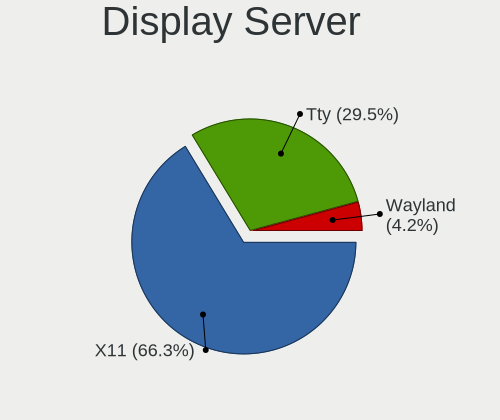
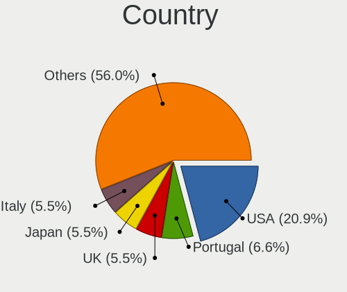
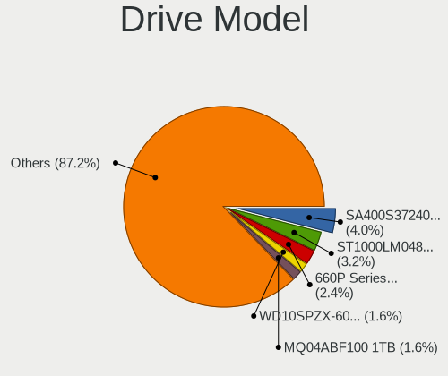
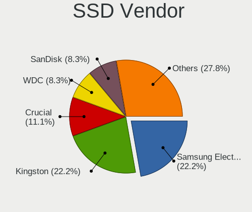
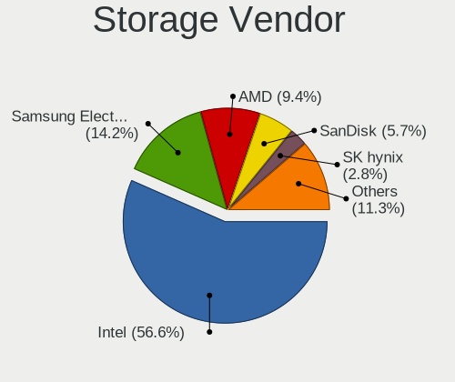
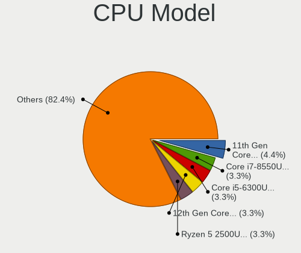
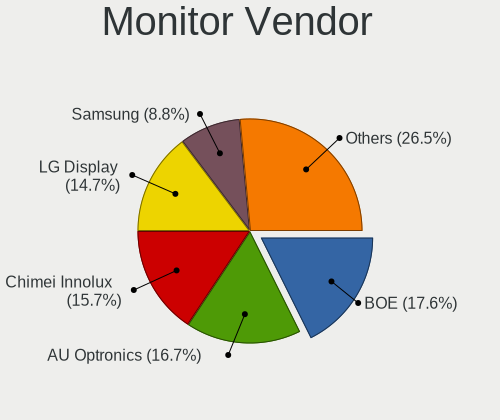
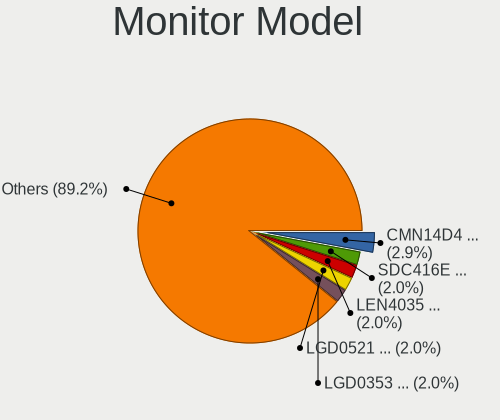
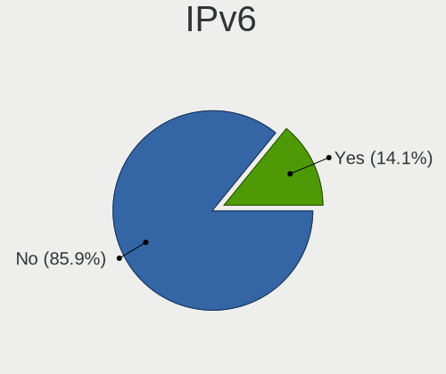
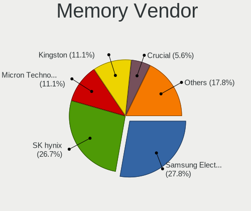

Slackware - Tested Hardware & Statistics (Notebooks)
----------------------------------------------------

A project to collect tested hardware configurations for Slackware.

Anyone can contribute to this report by the [hw-probe](https://github.com/linuxhw/hw-probe) tool:

    sudo -E hw-probe -all -upload

Please contribute! Especially if your hardware is rare.

Contents
--------

* [ Test Cases ](#test-cases)

* [ System ](#system)
  - [ OS                       ](#os)
  - [ OS Family                ](#os-family)
  - [ Kernel                   ](#kernel)
  - [ Kernel Family            ](#kernel-family)
  - [ Kernel Major Ver.        ](#kernel-major-ver)
  - [ Arch                     ](#arch)
  - [ DE                       ](#de)
  - [ Display Server           ](#display-server)
  - [ Display Manager          ](#display-manager)
  - [ OS Lang                  ](#os-lang)
  - [ Boot Mode                ](#boot-mode)
  - [ Filesystem               ](#filesystem)
  - [ Part. scheme             ](#part-scheme)
  - [ Dual Boot with Linux/BSD ](#dual-boot-with-linuxbsd)
  - [ Dual Boot (Win)          ](#dual-boot-win)

* [ Board ](#board)
  - [ Vendor                   ](#vendor)
  - [ Model                    ](#model)
  - [ Model Family             ](#model-family)
  - [ MFG Year                 ](#mfg-year)
  - [ Form Factor              ](#form-factor)
  - [ Secure Boot              ](#secure-boot)
  - [ Coreboot                 ](#coreboot)
  - [ RAM Size                 ](#ram-size)
  - [ RAM Used                 ](#ram-used)
  - [ Total Drives             ](#total-drives)
  - [ Has CD-ROM               ](#has-cd-rom)
  - [ Has Ethernet             ](#has-ethernet)
  - [ Has WiFi                 ](#has-wifi)
  - [ Has Bluetooth            ](#has-bluetooth)

* [ Location ](#location)
  - [ Country                  ](#country)
  - [ City                     ](#city)

* [ Drives ](#drives)
  - [ Drive Vendor             ](#drive-vendor)
  - [ Drive Model              ](#drive-model)
  - [ HDD Vendor               ](#hdd-vendor)
  - [ SSD Vendor               ](#ssd-vendor)
  - [ Drive Kind               ](#drive-kind)
  - [ Drive Connector          ](#drive-connector)
  - [ Drive Size               ](#drive-size)
  - [ Space Total              ](#space-total)
  - [ Space Used               ](#space-used)
  - [ Malfunc. Drives          ](#malfunc-drives)
  - [ Malfunc. Drive Vendor    ](#malfunc-drive-vendor)
  - [ Malfunc. HDD Vendor      ](#malfunc-hdd-vendor)
  - [ Malfunc. Drive Kind      ](#malfunc-drive-kind)
  - [ Failed Drives            ](#failed-drives)
  - [ Failed Drive Vendor      ](#failed-drive-vendor)
  - [ Drive Status             ](#drive-status)

* [ Storage controller ](#storage-controller)
  - [ Storage Vendor           ](#storage-vendor)
  - [ Storage Model            ](#storage-model)
  - [ Storage Kind             ](#storage-kind)

* [ Processor ](#processor)
  - [ CPU Vendor               ](#cpu-vendor)
  - [ CPU Model                ](#cpu-model)
  - [ CPU Model Family         ](#cpu-model-family)
  - [ CPU Cores                ](#cpu-cores)
  - [ CPU Sockets              ](#cpu-sockets)
  - [ CPU Threads              ](#cpu-threads)
  - [ CPU Op-Modes             ](#cpu-op-modes)
  - [ CPU Microcode            ](#cpu-microcode)
  - [ CPU Microarch            ](#cpu-microarch)

* [ Graphics ](#graphics)
  - [ GPU Vendor               ](#gpu-vendor)
  - [ GPU Model                ](#gpu-model)
  - [ GPU Combo                ](#gpu-combo)
  - [ GPU Driver               ](#gpu-driver)
  - [ GPU Memory               ](#gpu-memory)

* [ Monitor ](#monitor)
  - [ Monitor Vendor           ](#monitor-vendor)
  - [ Monitor Model            ](#monitor-model)
  - [ Monitor Resolution       ](#monitor-resolution)
  - [ Monitor Diagonal         ](#monitor-diagonal)
  - [ Monitor Width            ](#monitor-width)
  - [ Aspect Ratio             ](#aspect-ratio)
  - [ Monitor Area             ](#monitor-area)
  - [ Pixel Density            ](#pixel-density)
  - [ Multiple Monitors        ](#multiple-monitors)

* [ Network ](#network)
  - [ Net Controller Vendor    ](#net-controller-vendor)
  - [ Net Controller Model     ](#net-controller-model)
  - [ Wireless Vendor          ](#wireless-vendor)
  - [ Wireless Model           ](#wireless-model)
  - [ Ethernet Vendor          ](#ethernet-vendor)
  - [ Ethernet Model           ](#ethernet-model)
  - [ Net Controller Kind      ](#net-controller-kind)
  - [ Used Controller          ](#used-controller)
  - [ NICs                     ](#nics)
  - [ IPv6                     ](#ipv6)

* [ Bluetooth ](#bluetooth)
  - [ Bluetooth Vendor         ](#bluetooth-vendor)
  - [ Bluetooth Model          ](#bluetooth-model)

* [ Sound ](#sound)
  - [ Sound Vendor             ](#sound-vendor)
  - [ Sound Model              ](#sound-model)

* [ Memory ](#memory)
  - [ Memory Vendor            ](#memory-vendor)
  - [ Memory Model             ](#memory-model)
  - [ Memory Kind              ](#memory-kind)
  - [ Memory Form Factor       ](#memory-form-factor)
  - [ Memory Size              ](#memory-size)
  - [ Memory Speed             ](#memory-speed)

* [ Printers & scanners ](#printers--scanners)
  - [ Printer Vendor           ](#printer-vendor)
  - [ Printer Model            ](#printer-model)
  - [ Scanner Vendor           ](#scanner-vendor)
  - [ Scanner Model            ](#scanner-model)

* [ Camera ](#camera)
  - [ Camera Vendor            ](#camera-vendor)
  - [ Camera Model             ](#camera-model)

* [ Security ](#security)
  - [ Fingerprint Vendor       ](#fingerprint-vendor)
  - [ Fingerprint Model        ](#fingerprint-model)
  - [ Chipcard Vendor          ](#chipcard-vendor)
  - [ Chipcard Model           ](#chipcard-model)

* [ Unsupported ](#unsupported)
  - [ Unsupported Devices      ](#unsupported-devices)
  - [ Unsupported Device Types ](#unsupported-device-types)

Test Cases
----------

Total: 71

| Vendor    | Model                       | Probe                                                      | Date         |
|-----------|-----------------------------|------------------------------------------------------------|--------------|
| Lenovo    | ThinkPad T61 765912G        | [bd04e564a0](https://linux-hardware.org/?probe=bd04e564a0) | Sep 24, 2022 |
| Fujitsu   | LIFEBOOK A544               | [e5785106f1](https://linux-hardware.org/?probe=e5785106f1) | Aug 09, 2022 |
| MSI       | Modern 14 B10MW             | [b9cde08864](https://linux-hardware.org/?probe=b9cde08864) | Jul 25, 2022 |
| Sony      | SVE1713A1EW                 | [c3a65d695d](https://linux-hardware.org/?probe=c3a65d695d) | May 10, 2022 |
| Lenovo    | ThinkPad X1 Carbon 5th 2... | [f837aaeb12](https://linux-hardware.org/?probe=f837aaeb12) | May 08, 2022 |
| HP        | Pavilion Gaming Laptop 1... | [bd2dda1d8a](https://linux-hardware.org/?probe=bd2dda1d8a) | Apr 29, 2022 |
| HP        | Pavilion Gaming Laptop 1... | [cfc9c5dbf7](https://linux-hardware.org/?probe=cfc9c5dbf7) | Apr 29, 2022 |
| MSI       | GP76 Leopard 11UG           | [aebd373a66](https://linux-hardware.org/?probe=aebd373a66) | Apr 12, 2022 |
| MSI       | GE76 Raider 11UE            | [3072e065a3](https://linux-hardware.org/?probe=3072e065a3) | Apr 12, 2022 |
| Notebook  | X170KM-G                    | [4ecba03d19](https://linux-hardware.org/?probe=4ecba03d19) | Apr 11, 2022 |
| Dell      | Latitude 3520               | [4398aa2a03](https://linux-hardware.org/?probe=4398aa2a03) | Apr 06, 2022 |
| HP        | ProBook 6570b               | [cf1305eacc](https://linux-hardware.org/?probe=cf1305eacc) | Apr 06, 2022 |
| Lenovo    | IdeaPad 310-15ISK 80SM      | [d406cb4819](https://linux-hardware.org/?probe=d406cb4819) | Apr 05, 2022 |
| Dell      | Precision M4700             | [ab99532bd5](https://linux-hardware.org/?probe=ab99532bd5) | Apr 04, 2022 |
| Lenovo    | ThinkPad X230 2325P38       | [1a0cab737b](https://linux-hardware.org/?probe=1a0cab737b) | Mar 10, 2022 |
| ASUSTek   | ROG Zephyrus G14 GA401IV... | [0b0c1aca1b](https://linux-hardware.org/?probe=0b0c1aca1b) | Mar 10, 2022 |
| HP        | Pavilion Gaming Laptop 1... | [c7825c54fc](https://linux-hardware.org/?probe=c7825c54fc) | Mar 10, 2022 |
| Framework | Laptop                      | [ae37705198](https://linux-hardware.org/?probe=ae37705198) | Mar 10, 2022 |
| Lenovo    | ThinkPad Edge E530c 3366... | [8ce0419468](https://linux-hardware.org/?probe=8ce0419468) | Feb 13, 2022 |
| Dynabook  | P1-C7MP-BL                  | [268f94787e](https://linux-hardware.org/?probe=268f94787e) | Jan 14, 2022 |
| HP        | Laptop 15-bs2xx             | [bf53c3c878](https://linux-hardware.org/?probe=bf53c3c878) | Jan 02, 2022 |
| HP        | Laptop 15-bs1xx             | [b6c9f34c4c](https://linux-hardware.org/?probe=b6c9f34c4c) | Dec 07, 2021 |
| HP        | Laptop 15-da0xxx            | [2e3e23fb54](https://linux-hardware.org/?probe=2e3e23fb54) | Nov 01, 2021 |
| System76  | Oryx Pro                    | [3cd05d02a8](https://linux-hardware.org/?probe=3cd05d02a8) | Oct 27, 2021 |
| MSI       | Modern 14 B11MO             | [e8f13facfd](https://linux-hardware.org/?probe=e8f13facfd) | Oct 03, 2021 |
| MSI       | Modern 14 B11MO             | [9f5c2e0fde](https://linux-hardware.org/?probe=9f5c2e0fde) | Sep 27, 2021 |
| Toshiba   | PORTEGE Z30-A               | [13b9ce0773](https://linux-hardware.org/?probe=13b9ce0773) | Sep 22, 2021 |
| Dynabook  | PORTEGE X50-G               | [da8279a7a9](https://linux-hardware.org/?probe=da8279a7a9) | Sep 22, 2021 |
| Dell      | Inspiron 15-3552            | [f76339b0af](https://linux-hardware.org/?probe=f76339b0af) | Aug 31, 2021 |
| HP        | 245 G7 Notebook PC          | [c0806e4955](https://linux-hardware.org/?probe=c0806e4955) | Aug 23, 2021 |
| HP        | 245 G7 Notebook PC          | [c409287d23](https://linux-hardware.org/?probe=c409287d23) | Aug 23, 2021 |
| HP        | EliteBook 840 G5            | [4c196e1abd](https://linux-hardware.org/?probe=4c196e1abd) | Aug 18, 2021 |
| Dell      | Vostro 3500                 | [53a1179121](https://linux-hardware.org/?probe=53a1179121) | Aug 12, 2021 |
| HP        | EliteBook Folio 1020 G1 ... | [32e6ec699f](https://linux-hardware.org/?probe=32e6ec699f) | Aug 09, 2021 |
| HP        | EliteBook Folio 1020 G1 ... | [7facd0568b](https://linux-hardware.org/?probe=7facd0568b) | Aug 09, 2021 |
| HP        | 15 Notebook PC              | [bec2fe2e78](https://linux-hardware.org/?probe=bec2fe2e78) | Mar 21, 2021 |
| Toshiba   | Satellite C660              | [5189fbc4c9](https://linux-hardware.org/?probe=5189fbc4c9) | Mar 10, 2021 |
| Samsung   | 300E5M/300E5L               | [bda4ee984f](https://linux-hardware.org/?probe=bda4ee984f) | Mar 05, 2021 |
| Dell      | Latitude E5500              | [a8e17b79ce](https://linux-hardware.org/?probe=a8e17b79ce) | Feb 26, 2021 |
| HP        | Pavilion Notebook           | [45dfe3c2b1](https://linux-hardware.org/?probe=45dfe3c2b1) | Feb 24, 2021 |
| Lenovo    | ThinkPad L440 20ASS05K00    | [aecef5c789](https://linux-hardware.org/?probe=aecef5c789) | Jan 22, 2021 |
| Lenovo    | ThinkPad L440 20ASS05K00    | [7a6a06bb55](https://linux-hardware.org/?probe=7a6a06bb55) | Jan 04, 2021 |
| Dell      | Precision M4600             | [71bb8e2e9a](https://linux-hardware.org/?probe=71bb8e2e9a) | Dec 28, 2020 |
| Lenovo    | ThinkPad L440 20ASS05K00    | [b330b2d38a](https://linux-hardware.org/?probe=b330b2d38a) | Nov 19, 2020 |
| MSI       | GL73 8RC                    | [44f82bfc01](https://linux-hardware.org/?probe=44f82bfc01) | Nov 09, 2020 |
| Lenovo    | ThinkPad L440 20ASS05K00    | [a4cb1ecf16](https://linux-hardware.org/?probe=a4cb1ecf16) | Nov 08, 2020 |
| Samsung   | 300E5M/300E5L               | [270b65ced8](https://linux-hardware.org/?probe=270b65ced8) | Jul 24, 2020 |
| Notebook  | NL40_50CU                   | [941073da73](https://linux-hardware.org/?probe=941073da73) | Jun 27, 2020 |
| Lenovo    | V330-14ARR 81B1             | [5089cbcf84](https://linux-hardware.org/?probe=5089cbcf84) | Jun 24, 2020 |
| Lenovo    | V330-14ARR 81B1             | [cb63994f94](https://linux-hardware.org/?probe=cb63994f94) | Jun 22, 2020 |
| Notebook  | NL40_50CU                   | [9a1c09c6e1](https://linux-hardware.org/?probe=9a1c09c6e1) | Mar 28, 2020 |
| Notebook  | NL40_50CU                   | [bc5ed8dea4](https://linux-hardware.org/?probe=bc5ed8dea4) | Mar 24, 2020 |
| Notebook  | NL40_50CU                   | [ae7070b067](https://linux-hardware.org/?probe=ae7070b067) | Mar 21, 2020 |
| Notebook  | NL40_50CU                   | [320dada481](https://linux-hardware.org/?probe=320dada481) | Mar 20, 2020 |
| Toshiba   | Satellite P50-A-12Z         | [96927db16b](https://linux-hardware.org/?probe=96927db16b) | Mar 17, 2020 |
| Lenovo    | ThinkPad X1 Carbon 7th 2... | [afe3135216](https://linux-hardware.org/?probe=afe3135216) | Dec 10, 2019 |
| ASUSTek   | P53E                        | [e9dcced0f7](https://linux-hardware.org/?probe=e9dcced0f7) | Oct 28, 2019 |
| Lenovo    | ThinkPad T400 6474BV7       | [825bdb9fd0](https://linux-hardware.org/?probe=825bdb9fd0) | Oct 28, 2019 |
| ASUSTek   | 1000H                       | [50da35c0d0](https://linux-hardware.org/?probe=50da35c0d0) | Oct 28, 2019 |
| Acer      | Aspire E1-572               | [0fe80f5758](https://linux-hardware.org/?probe=0fe80f5758) | Oct 23, 2019 |
| ASUSTek   | VivoBook_ASUSLaptop X570... | [ecca7bced0](https://linux-hardware.org/?probe=ecca7bced0) | Oct 22, 2019 |
| Lenovo    | IdeaPad P500 20210          | [3d09c5e38d](https://linux-hardware.org/?probe=3d09c5e38d) | Oct 22, 2019 |
| Acer      | Swift SF314-52              | [05f880ecec](https://linux-hardware.org/?probe=05f880ecec) | Oct 21, 2019 |
| Lenovo    | ThinkPad P70 20ERCTO1WW     | [0ceeb50e5e](https://linux-hardware.org/?probe=0ceeb50e5e) | Oct 21, 2019 |
| Lenovo    | ThinkPad T450s 20BW000EU... | [41ca8d1a20](https://linux-hardware.org/?probe=41ca8d1a20) | Oct 21, 2019 |
| ASUSTek   | VivoBook_ASUSLaptop X570... | [c2fd6acb71](https://linux-hardware.org/?probe=c2fd6acb71) | Oct 21, 2019 |
| Dell      | Latitude E7270              | [859e021e2f](https://linux-hardware.org/?probe=859e021e2f) | Oct 20, 2019 |
| Fujitsu   | LIFEBOOK A555               | [e0c6729d5b](https://linux-hardware.org/?probe=e0c6729d5b) | Oct 20, 2019 |
| Lenovo    | ThinkPad T470 20HDCTO1WW    | [0f9287651d](https://linux-hardware.org/?probe=0f9287651d) | Jul 24, 2019 |
| Lenovo    | ThinkPad T470 20HDCTO1WW    | [67672ef038](https://linux-hardware.org/?probe=67672ef038) | Jul 23, 2019 |
| Fujitsu   | LIFEBOOK A555               | [63c120aa28](https://linux-hardware.org/?probe=63c120aa28) | Aug 19, 2018 |

System
------

OS
--

Installed operating systems

| Name            | Notebooks | Percent |
|-----------------|-----------|---------|
| Slackware 15.0  | 26        | 47.27%  |
| Slackware 14.2  | 26        | 47.27%  |
| Slackware 14.2+ | 3         | 5.45%   |

OS Family
---------

OS without a version

| Name      | Notebooks | Percent |
|-----------|-----------|---------|
| Slackware | 55        | 100%    |

Kernel
------

Version of the Linux kernel

| Version           | Notebooks | Percent |
|-------------------|-----------|---------|
| 5.15.19           | 6         | 10%     |
| 4.19.80           | 4         | 6.67%   |
| 5.3.7             | 2         | 3.33%   |
| 5.17.1            | 2         | 3.33%   |
| 5.13.8            | 2         | 3.33%   |
| 5.7.0             | 1         | 1.67%   |
| 5.5.10            | 1         | 1.67%   |
| 5.4.75            | 1         | 1.67%   |
| 5.4.50            | 1         | 1.67%   |
| 5.4.47            | 1         | 1.67%   |
| 5.4.24toshiba-new | 1         | 1.67%   |
| 5.4.2             | 1         | 1.67%   |
| 5.4.139-jw        | 1         | 1.67%   |
| 5.4.13            | 1         | 1.67%   |
| 5.2.2             | 1         | 1.67%   |
| 5.17.5            | 1         | 1.67%   |
| 5.17.2            | 1         | 1.67%   |
| 5.16.9-joe1       | 1         | 1.67%   |
| 5.16.12           | 1         | 1.67%   |
| 5.15.63           | 1         | 1.67%   |
| 5.15.38           | 1         | 1.67%   |
| 5.15.37.a         | 1         | 1.67%   |
| 5.15.33.kjh       | 1         | 1.67%   |
| 5.15.27           | 1         | 1.67%   |
| 5.15.1            | 1         | 1.67%   |
| 5.14.9            | 1         | 1.67%   |
| 5.14.8            | 1         | 1.67%   |
| 5.14.10           | 1         | 1.67%   |
| 5.14.0            | 1         | 1.67%   |
| 5.13.5            | 1         | 1.67%   |
| 5.13.11           | 1         | 1.67%   |
| 5.13.0.a          | 1         | 1.67%   |
| 5.10.91           | 1         | 1.67%   |
| 5.10.4            | 1         | 1.67%   |
| 5.10.3            | 1         | 1.67%   |
| 5.10.21           | 1         | 1.67%   |
| 5.10.19           | 1         | 1.67%   |
| 5.10.1-pmagic     | 1         | 1.67%   |
| 4.4.88            | 1         | 1.67%   |
| 4.4.276           | 1         | 1.67%   |

Kernel Family
-------------

Linux kernel without a distro release

| Version | Notebooks | Percent |
|---------|-----------|---------|
| 5.15.19 | 6         | 10%     |
| 4.19.80 | 4         | 6.67%   |
| 5.3.7   | 2         | 3.33%   |
| 5.17.1  | 2         | 3.33%   |
| 5.13.8  | 2         | 3.33%   |
| 4.4.190 | 2         | 3.33%   |
| 5.7.0   | 1         | 1.67%   |
| 5.5.10  | 1         | 1.67%   |
| 5.4.75  | 1         | 1.67%   |
| 5.4.50  | 1         | 1.67%   |
| 5.4.47  | 1         | 1.67%   |
| 5.4.24  | 1         | 1.67%   |
| 5.4.2   | 1         | 1.67%   |
| 5.4.139 | 1         | 1.67%   |
| 5.4.13  | 1         | 1.67%   |
| 5.2.2   | 1         | 1.67%   |
| 5.17.5  | 1         | 1.67%   |
| 5.17.2  | 1         | 1.67%   |
| 5.16.9  | 1         | 1.67%   |
| 5.16.12 | 1         | 1.67%   |
| 5.15.63 | 1         | 1.67%   |
| 5.15.38 | 1         | 1.67%   |
| 5.15.37 | 1         | 1.67%   |
| 5.15.33 | 1         | 1.67%   |
| 5.15.27 | 1         | 1.67%   |
| 5.15.1  | 1         | 1.67%   |
| 5.14.9  | 1         | 1.67%   |
| 5.14.8  | 1         | 1.67%   |
| 5.14.10 | 1         | 1.67%   |
| 5.14.0  | 1         | 1.67%   |
| 5.13.5  | 1         | 1.67%   |
| 5.13.11 | 1         | 1.67%   |
| 5.13.0  | 1         | 1.67%   |
| 5.10.91 | 1         | 1.67%   |
| 5.10.4  | 1         | 1.67%   |
| 5.10.3  | 1         | 1.67%   |
| 5.10.21 | 1         | 1.67%   |
| 5.10.19 | 1         | 1.67%   |
| 5.10.1  | 1         | 1.67%   |
| 4.4.88  | 1         | 1.67%   |

Kernel Major Ver.
-----------------

Linux kernel major version

| Version | Notebooks | Percent |
|---------|-----------|---------|
| 5.15    | 12        | 20.34%  |
| 5.4     | 7         | 11.86%  |
| 4.4     | 7         | 11.86%  |
| 4.19    | 7         | 11.86%  |
| 5.10    | 6         | 10.17%  |
| 5.13    | 5         | 8.47%   |
| 5.17    | 4         | 6.78%   |
| 5.14    | 3         | 5.08%   |
| 5.3     | 2         | 3.39%   |
| 5.16    | 2         | 3.39%   |
| 5.7     | 1         | 1.69%   |
| 5.5     | 1         | 1.69%   |
| 5.2     | 1         | 1.69%   |
| 4.16    | 1         | 1.69%   |

Arch
----

OS architecture (x86_64, i586, etc.)

| Name   | Notebooks | Percent |
|--------|-----------|---------|
| x86_64 | 54        | 98.18%  |
| i686   | 1         | 1.82%   |

DE
--

Desktop Environment

| Name          | Notebooks | Percent |
|---------------|-----------|---------|
| XFCE          | 17        | 30.36%  |
| KDE5          | 16        | 28.57%  |
| Unknown       | 16        | 28.57%  |
| KDE           | 3         | 5.36%   |
| xwmconfig     | 1         | 1.79%   |
| MATE          | 1         | 1.79%   |
| LXQt          | 1         | 1.79%   |
| Enlightenment | 1         | 1.79%   |

Display Server
--------------

X11 or Wayland

| Name    | Notebooks | Percent |
|---------|-----------|---------|
| X11     | 44        | 78.57%  |
| Tty     | 10        | 17.86%  |
| Wayland | 2         | 3.57%   |

Display Manager
---------------

SDDM, LightDM, etc.

| Name    | Notebooks | Percent |
|---------|-----------|---------|
| Unknown | 24        | 42.86%  |
| SDDM    | 21        | 37.5%   |
| XDM     | 11        | 19.64%  |

OS Lang
-------

Language

| Lang    | Notebooks | Percent |
|---------|-----------|---------|
| en_US   | 31        | 56.36%  |
| Unknown | 14        | 25.45%  |
| fr_FR   | 3         | 5.45%   |
| pt_BR   | 2         | 3.64%   |
| de_DE   | 2         | 3.64%   |
| ru_RU   | 1         | 1.82%   |
| pl_PL   | 1         | 1.82%   |
| it_IT   | 1         | 1.82%   |

Boot Mode
---------

EFI or BIOS

| Mode | Notebooks | Percent |
|------|-----------|---------|
| BIOS | 29        | 51.79%  |
| EFI  | 27        | 48.21%  |

Filesystem
----------

Type of filesystem

| Type    | Notebooks | Percent |
|---------|-----------|---------|
| Ext4    | 47        | 85.45%  |
| Btrfs   | 5         | 9.09%   |
| Overlay | 3         | 5.45%   |

Part. scheme
------------

Scheme of partitioning

| Type    | Notebooks | Percent |
|---------|-----------|---------|
| GPT     | 36        | 64.29%  |
| MBR     | 14        | 25%     |
| Unknown | 6         | 10.71%  |

Dual Boot with Linux/BSD
------------------------

Hosting more than one Linux/BSD

| Dual boot | Notebooks | Percent |
|-----------|-----------|---------|
| No        | 48        | 84.21%  |
| Yes       | 9         | 15.79%  |

Dual Boot (Win)
---------------

Hosting Linux and Windows

| Dual boot | Notebooks | Percent |
|-----------|-----------|---------|
| No        | 33        | 60%     |
| Yes       | 22        | 40%     |

Board
-----

Vendor
------

Motherboard manufacturer

| Name                | Notebooks | Percent |
|---------------------|-----------|---------|
| Lenovo              | 13        | 23.64%  |
| Hewlett-Packard     | 11        | 20%     |
| Dell                | 7         | 12.73%  |
| MSI                 | 5         | 9.09%   |
| ASUSTek Computer    | 4         | 7.27%   |
| Toshiba             | 3         | 5.45%   |
| Notebook            | 2         | 3.64%   |
| Fujitsu             | 2         | 3.64%   |
| Dynabook            | 2         | 3.64%   |
| Acer                | 2         | 3.64%   |
| System76            | 1         | 1.82%   |
| Sony                | 1         | 1.82%   |
| Samsung Electronics | 1         | 1.82%   |
| Framework           | 1         | 1.82%   |

Model
-----

Motherboard model

| Name                                     | Notebooks | Percent |
|------------------------------------------|-----------|---------|
| Toshiba Satellite P50-A-12Z              | 1         | 1.82%   |
| Toshiba Satellite C660                   | 1         | 1.82%   |
| Toshiba PORTEGE Z30-A                    | 1         | 1.82%   |
| System76 Oryx Pro                        | 1         | 1.82%   |
| Sony SVE1713A1EW                         | 1         | 1.82%   |
| Samsung 300E5M/300E5L                    | 1         | 1.82%   |
| Notebook X170KM-G                        | 1         | 1.82%   |
| Notebook NL40_50CU                       | 1         | 1.82%   |
| MSI Modern 14 B11MO                      | 1         | 1.82%   |
| MSI Modern 14 B10MW                      | 1         | 1.82%   |
| MSI GP76 Leopard 11UG                    | 1         | 1.82%   |
| MSI GL73 8RC                             | 1         | 1.82%   |
| MSI GE76 Raider 11UE                     | 1         | 1.82%   |
| Lenovo V330-14ARR 81B1                   | 1         | 1.82%   |
| Lenovo ThinkPad X230 2325P38             | 1         | 1.82%   |
| Lenovo ThinkPad X1 Carbon 7th 20R10015US | 1         | 1.82%   |
| Lenovo ThinkPad X1 Carbon 5th 20HQS04300 | 1         | 1.82%   |
| Lenovo ThinkPad T61 765912G              | 1         | 1.82%   |
| Lenovo ThinkPad T470 20HDCTO1WW          | 1         | 1.82%   |
| Lenovo ThinkPad T450s 20BW000EUS         | 1         | 1.82%   |
| Lenovo ThinkPad T400 6474BV7             | 1         | 1.82%   |
| Lenovo ThinkPad P70 20ERCTO1WW           | 1         | 1.82%   |
| Lenovo ThinkPad L440 20ASS05K00          | 1         | 1.82%   |
| Lenovo ThinkPad Edge E530c 336669G       | 1         | 1.82%   |
| Lenovo IdeaPad P500 20210                | 1         | 1.82%   |
| Lenovo IdeaPad 310-15ISK 80SM            | 1         | 1.82%   |
| HP ProBook 6570b                         | 1         | 1.82%   |
| HP Pavilion Notebook                     | 1         | 1.82%   |
| HP Pavilion Gaming Laptop 16-a0xxx       | 1         | 1.82%   |
| HP Pavilion Gaming Laptop 15-ec1xxx      | 1         | 1.82%   |
| HP Laptop 15-da0xxx                      | 1         | 1.82%   |
| HP Laptop 15-bs2xx                       | 1         | 1.82%   |
| HP Laptop 15-bs1xx                       | 1         | 1.82%   |
| HP EliteBook Folio 1020 G1 SE            | 1         | 1.82%   |
| HP EliteBook 840 G5                      | 1         | 1.82%   |
| HP 245 G7 Notebook PC                    | 1         | 1.82%   |
| HP 15 Notebook PC                        | 1         | 1.82%   |
| Fujitsu LIFEBOOK A555                    | 1         | 1.82%   |
| Fujitsu LIFEBOOK A544                    | 1         | 1.82%   |
| Framework Laptop                         | 1         | 1.82%   |

Model Family
------------

Motherboard model prefix

| Name                | Notebooks | Percent |
|---------------------|-----------|---------|
| Lenovo ThinkPad     | 10        | 18.18%  |
| HP Pavilion         | 3         | 5.45%   |
| HP Laptop           | 3         | 5.45%   |
| Dell Latitude       | 3         | 5.45%   |
| Toshiba Satellite   | 2         | 3.64%   |
| MSI Modern          | 2         | 3.64%   |
| Lenovo IdeaPad      | 2         | 3.64%   |
| HP EliteBook        | 2         | 3.64%   |
| Fujitsu LIFEBOOK    | 2         | 3.64%   |
| Dell Precision      | 2         | 3.64%   |
| Toshiba PORTEGE     | 1         | 1.82%   |
| System76 Oryx       | 1         | 1.82%   |
| Sony SVE1713A1EW    | 1         | 1.82%   |
| Samsung 300E5M      | 1         | 1.82%   |
| Notebook X170KM-G   | 1         | 1.82%   |
| Notebook NL40       | 1         | 1.82%   |
| MSI GP76            | 1         | 1.82%   |
| MSI GL73            | 1         | 1.82%   |
| MSI GE76            | 1         | 1.82%   |
| Lenovo V330-14ARR   | 1         | 1.82%   |
| HP ProBook          | 1         | 1.82%   |
| HP 245              | 1         | 1.82%   |
| HP 15               | 1         | 1.82%   |
| Framework Laptop    | 1         | 1.82%   |
| Dynabook PORTEGE    | 1         | 1.82%   |
| Dynabook P1-C7MP-BL | 1         | 1.82%   |
| Dell Vostro         | 1         | 1.82%   |
| Dell Inspiron       | 1         | 1.82%   |
| ASUS VivoBook       | 1         | 1.82%   |
| ASUS ROG            | 1         | 1.82%   |
| ASUS P53E           | 1         | 1.82%   |
| ASUS 1000H          | 1         | 1.82%   |
| Acer Swift          | 1         | 1.82%   |
| Acer Aspire         | 1         | 1.82%   |

MFG Year
--------

Motherboard manufacture year

| Year | Notebooks | Percent |
|------|-----------|---------|
| 2020 | 8         | 14.55%  |
| 2021 | 6         | 10.91%  |
| 2012 | 6         | 10.91%  |
| 2019 | 5         | 9.09%   |
| 2017 | 5         | 9.09%   |
| 2015 | 5         | 9.09%   |
| 2018 | 4         | 7.27%   |
| 2016 | 3         | 5.45%   |
| 2014 | 3         | 5.45%   |
| 2008 | 3         | 5.45%   |
| 2013 | 2         | 3.64%   |
| 2011 | 2         | 3.64%   |
| 2010 | 2         | 3.64%   |
| 2007 | 1         | 1.82%   |

Form Factor
-----------

Physical design of the computer

| Name     | Notebooks | Percent |
|----------|-----------|---------|
| Notebook | 55        | 100%    |

Secure Boot
-----------

Enabled or disabled

| State    | Notebooks | Percent |
|----------|-----------|---------|
| Disabled | 55        | 100%    |

Coreboot
--------

Have coreboot on board

| Used | Notebooks | Percent |
|------|-----------|---------|
| No   | 52        | 94.55%  |
| Yes  | 3         | 5.45%   |

RAM Size
--------

Total RAM memory

| Size in GB  | Notebooks | Percent |
|-------------|-----------|---------|
| 4.01-8.0    | 16        | 29.09%  |
| 3.01-4.0    | 12        | 21.82%  |
| 8.01-16.0   | 11        | 20%     |
| 16.01-24.0  | 9         | 16.36%  |
| 32.01-64.0  | 3         | 5.45%   |
| 24.01-32.0  | 1         | 1.82%   |
| 64.01-256.0 | 1         | 1.82%   |
| 1.01-2.0    | 1         | 1.82%   |
| 0.51-1.0    | 1         | 1.82%   |

RAM Used
--------

Used RAM memory

| Used GB    | Notebooks | Percent |
|------------|-----------|---------|
| 1.01-2.0   | 21        | 36.84%  |
| 2.01-3.0   | 17        | 29.82%  |
| 4.01-8.0   | 8         | 14.04%  |
| 3.01-4.0   | 4         | 7.02%   |
| 0.51-1.0   | 3         | 5.26%   |
| 0.01-0.5   | 2         | 3.51%   |
| 16.01-24.0 | 1         | 1.75%   |
| 8.01-16.0  | 1         | 1.75%   |

Total Drives
------------

Number of drives on board

| Drives | Notebooks | Percent |
|--------|-----------|---------|
| 1      | 41        | 73.21%  |
| 2      | 13        | 23.21%  |
| 4      | 1         | 1.79%   |
| 3      | 1         | 1.79%   |

Has CD-ROM
----------

Has CD-ROM on board

| Presented | Notebooks | Percent |
|-----------|-----------|---------|
| No        | 38        | 69.09%  |
| Yes       | 17        | 30.91%  |

Has Ethernet
------------

Has Ethernet on board

| Presented | Notebooks | Percent |
|-----------|-----------|---------|
| Yes       | 48        | 87.27%  |
| No        | 7         | 12.73%  |

Has WiFi
--------

Has WiFi module

| Presented | Notebooks | Percent |
|-----------|-----------|---------|
| Yes       | 55        | 100%    |

Has Bluetooth
-------------

Has Bluetooth module

| Presented | Notebooks | Percent |
|-----------|-----------|---------|
| Yes       | 50        | 90.91%  |
| No        | 5         | 9.09%   |

Location
--------

Country
-------

Geographic location (country)

| Country      | Notebooks | Percent |
|--------------|-----------|---------|
| USA          | 12        | 21.82%  |
| Portugal     | 4         | 7.27%   |
| Brazil       | 4         | 7.27%   |
| UK           | 3         | 5.45%   |
| Kazakhstan   | 3         | 5.45%   |
| Japan        | 3         | 5.45%   |
| Germany      | 3         | 5.45%   |
| France       | 3         | 5.45%   |
| Canada       | 3         | 5.45%   |
| Sweden       | 2         | 3.64%   |
| South Africa | 2         | 3.64%   |
| Poland       | 2         | 3.64%   |
| Italy        | 2         | 3.64%   |
| India        | 2         | 3.64%   |
| Spain        | 1         | 1.82%   |
| Serbia       | 1         | 1.82%   |
| Russia       | 1         | 1.82%   |
| Philippines  | 1         | 1.82%   |
| Mexico       | 1         | 1.82%   |
| Finland      | 1         | 1.82%   |
| Chile        | 1         | 1.82%   |

City
----

Geographic location (city)

| City                   | Notebooks | Percent |
|------------------------|-----------|---------|
| Lisbon                 | 3         | 5.26%   |
| Warsaw                 | 2         | 3.51%   |
| Ust-Kamenogorsk        | 2         | 3.51%   |
| Wokingham              | 1         | 1.75%   |
| Winnipeg               | 1         | 1.75%   |
| Visconde do Rio Branco | 1         | 1.75%   |
| Tsukuba                | 1         | 1.75%   |
| Tendo                  | 1         | 1.75%   |
| Skövde                | 1         | 1.75%   |
| San Antonio            | 1         | 1.75%   |
| Round Rock             | 1         | 1.75%   |
| Roknaes                | 1         | 1.75%   |
| Reno                   | 1         | 1.75%   |
| Renazzo                | 1         | 1.75%   |
| Redding                | 1         | 1.75%   |
| Puente Alto            | 1         | 1.75%   |
| Plainwell              | 1         | 1.75%   |
| Pinhal Novo            | 1         | 1.75%   |
| Pesaro                 | 1         | 1.75%   |
| Pasay                  | 1         | 1.75%   |
| Paris                  | 1         | 1.75%   |
| Ōtsu                  | 1         | 1.75%   |
| Oberstreit             | 1         | 1.75%   |
| Northport              | 1         | 1.75%   |
| Montreal               | 1         | 1.75%   |
| Milan                  | 1         | 1.75%   |
| Mexico City            | 1         | 1.75%   |
| McKinney               | 1         | 1.75%   |
| Luxeuil-les-Bains      | 1         | 1.75%   |
| Lins                   | 1         | 1.75%   |
| League City            | 1         | 1.75%   |
| Kstovo                 | 1         | 1.75%   |
| Karaganda              | 1         | 1.75%   |
| Johannesburg           | 1         | 1.75%   |
| Jaipur                 | 1         | 1.75%   |
| Hornsey                | 1         | 1.75%   |
| Helsinki               | 1         | 1.75%   |
| Hayward                | 1         | 1.75%   |
| Fortaleza              | 1         | 1.75%   |
| Faridabad              | 1         | 1.75%   |

Drives
------

Drive Vendor
------------

Hard drive vendors

| Vendor              | Notebooks | Drives | Percent |
|---------------------|-----------|--------|---------|
| Samsung Electronics | 16        | 21     | 23.88%  |
| WDC                 | 11        | 13     | 16.42%  |
| Toshiba             | 5         | 5      | 7.46%   |
| Seagate             | 5         | 5      | 7.46%   |
| Kingston            | 4         | 4      | 5.97%   |
| Crucial             | 4         | 5      | 5.97%   |
| SanDisk             | 3         | 3      | 4.48%   |
| HGST                | 3         | 3      | 4.48%   |
| Unknown             | 2         | 2      | 2.99%   |
| SK hynix            | 2         | 2      | 2.99%   |
| Micron Technology   | 2         | 2      | 2.99%   |
| Intel               | 2         | 2      | 2.99%   |
| Gigabyte Technology | 2         | 2      | 2.99%   |
| Plextor             | 1         | 1      | 1.49%   |
| Patriot             | 1         | 2      | 1.49%   |
| Netac               | 1         | 1      | 1.49%   |
| KIOXIA              | 1         | 1      | 1.49%   |
| Hewlett-Packard     | 1         | 2      | 1.49%   |
| Dogfish             | 1         | 1      | 1.49%   |

Drive Model
-----------

Hard drive models

| Model                                   | Notebooks | Percent |
|-----------------------------------------|-----------|---------|
| WDC WD10SPZX-60Z10T0 1TB                | 2         | 2.82%   |
| Toshiba MQ04ABF100 1TB                  | 2         | 2.82%   |
| WDC WDS500G2B0B-00YS70 500GB SSD        | 1         | 1.41%   |
| WDC WD7500BPVT-24HXZT3 752GB            | 1         | 1.41%   |
| WDC WD5000LPCX-60VHAT1 500GB            | 1         | 1.41%   |
| WDC WD10JPVX-35JC3T0 1TB                | 1         | 1.41%   |
| WDC WD10JPVX-16JC3T3 1TB                | 1         | 1.41%   |
| WDC WD10JPVT-08A1YT2 1TB                | 1         | 1.41%   |
| WDC WD10JPLX-00MBPT0 1TB                | 1         | 1.41%   |
| WDC PC SN530 SDBPNPZ-1T00-1002 1TB      | 1         | 1.41%   |
| WDC PC SN520 SDAPNUW-256G-1102 256GB    | 1         | 1.41%   |
| Unknown SD32G  32GB                     | 1         | 1.41%   |
| Unknown SC32G  32GB                     | 1         | 1.41%   |
| Toshiba MQ01ABF050 500GB                | 1         | 1.41%   |
| Toshiba MK2565GSXN 250GB                | 1         | 1.41%   |
| Toshiba MK1646GSX 160GB                 | 1         | 1.41%   |
| SK hynix HFM001TD3JX013N 1024GB         | 1         | 1.41%   |
| SK hynix BC511 HFM512GDJTNI-82A0A 512GB | 1         | 1.41%   |
| Seagate ST9160827AS 160GB               | 1         | 1.41%   |
| Seagate ST9160412AS 160GB               | 1         | 1.41%   |
| Seagate ST500VT000-1DK142 500GB         | 1         | 1.41%   |
| Seagate ST1000LM048-2E7172 1TB          | 1         | 1.41%   |
| Seagate ST1000LM024 HN-M101MBB 1TB      | 1         | 1.41%   |
| SanDisk Ultra II 960GB SSD              | 1         | 1.41%   |
| SanDisk SDSSDA240G 240GB                | 1         | 1.41%   |
| SanDisk SD8TN8U256G1001 256GB SSD       | 1         | 1.41%   |
| Samsung SSD PM830 2.5 7mm 128GB         | 1         | 1.41%   |
| Samsung SSD 980 PRO 500GB               | 1         | 1.41%   |
| Samsung SSD 980 PRO 2TB                 | 1         | 1.41%   |
| Samsung SSD 970 EVO Plus 2TB            | 1         | 1.41%   |
| Samsung SSD 970 EVO Plus 250GB          | 1         | 1.41%   |
| Samsung SSD 970 EVO 2TB                 | 1         | 1.41%   |
| Samsung SSD 870 EVO 1TB                 | 1         | 1.41%   |
| Samsung SSD 860 QVO 2TB                 | 1         | 1.41%   |
| Samsung SSD 860 EVO mSATA 500GB         | 1         | 1.41%   |
| Samsung SSD 840 EVO 250GB               | 1         | 1.41%   |
| Samsung NVMe SSD Drive 256GB            | 1         | 1.41%   |
| Samsung MZVLQ512HALU-000H1 512GB        | 1         | 1.41%   |
| Samsung MZVLB512HAJQ-000L7 512GB        | 1         | 1.41%   |
| Samsung MZVLB1T0HBLR-00007 1TB          | 1         | 1.41%   |

HDD Vendor
----------

Hard disk drive vendors

| Vendor  | Notebooks | Drives | Percent |
|---------|-----------|--------|---------|
| WDC     | 8         | 10     | 38.1%   |
| Toshiba | 5         | 5      | 23.81%  |
| Seagate | 5         | 5      | 23.81%  |
| HGST    | 3         | 3      | 14.29%  |

SSD Vendor
----------

Solid state drive vendors

| Vendor              | Notebooks | Drives | Percent |
|---------------------|-----------|--------|---------|
| Samsung Electronics | 7         | 8      | 30.43%  |
| SanDisk             | 3         | 3      | 13.04%  |
| Kingston            | 3         | 3      | 13.04%  |
| Crucial             | 3         | 4      | 13.04%  |
| WDC                 | 1         | 1      | 4.35%   |
| Plextor             | 1         | 1      | 4.35%   |
| Patriot             | 1         | 2      | 4.35%   |
| Netac               | 1         | 1      | 4.35%   |
| Micron Technology   | 1         | 1      | 4.35%   |
| Gigabyte Technology | 1         | 1      | 4.35%   |
| Dogfish             | 1         | 1      | 4.35%   |

Drive Kind
----------

HDD or SSD

| Kind | Notebooks | Drives | Percent |
|------|-----------|--------|---------|
| SSD  | 22        | 26     | 33.33%  |
| NVMe | 21        | 26     | 31.82%  |
| HDD  | 21        | 23     | 31.82%  |
| MMC  | 2         | 2      | 3.03%   |

Drive Connector
---------------

SATA, SAS, NVMe, etc.

| Type | Notebooks | Drives | Percent |
|------|-----------|--------|---------|
| SATA | 38        | 49     | 62.3%   |
| NVMe | 21        | 26     | 34.43%  |
| MMC  | 2         | 2      | 3.28%   |

Drive Size
----------

Size of hard drive

| Size in TB | Notebooks | Drives | Percent |
|------------|-----------|--------|---------|
| 0.01-0.5   | 26        | 30     | 60.47%  |
| 0.51-1.0   | 16        | 18     | 37.21%  |
| 1.01-2.0   | 1         | 1      | 2.33%   |

Space Total
-----------

Amount of disk space available on the file system

| Size in GB     | Notebooks | Percent |
|----------------|-----------|---------|
| 101-250        | 16        | 29.09%  |
| 501-1000       | 16        | 29.09%  |
| 251-500        | 12        | 21.82%  |
| 1001-2000      | 5         | 9.09%   |
| 1-20           | 3         | 5.45%   |
| More than 3000 | 1         | 1.82%   |
| 51-100         | 1         | 1.82%   |
| Unknown        | 1         | 1.82%   |

Space Used
----------

Amount of used disk space

| Used GB   | Notebooks | Percent |
|-----------|-----------|---------|
| 1-20      | 12        | 20.69%  |
| 21-50     | 11        | 18.97%  |
| 101-250   | 11        | 18.97%  |
| 51-100    | 8         | 13.79%  |
| 251-500   | 7         | 12.07%  |
| 501-1000  | 7         | 12.07%  |
| 1001-2000 | 1         | 1.72%   |
| Unknown   | 1         | 1.72%   |

Malfunc. Drives
---------------

Drive models with a malfunction

| Model                               | Notebooks | Drives | Percent |
|-------------------------------------|-----------|--------|---------|
| WDC WD5000LPCX-60VHAT1 500GB        | 1         | 1      | 14.29%  |
| WDC WD10JPLX-00MBPT0 1TB            | 1         | 1      | 14.29%  |
| Toshiba MK2565GSXN 250GB            | 1         | 1      | 14.29%  |
| Samsung Electronics SSD 870 EVO 1TB | 1         | 1      | 14.29%  |
| Plextor PX-128M6S 128GB SSD         | 1         | 1      | 14.29%  |
| HGST HTS725050A7E630 500GB          | 1         | 1      | 14.29%  |
| HGST HTS545050A7E380 500GB          | 1         | 1      | 14.29%  |

Malfunc. Drive Vendor
---------------------

Vendors of faulty drives

| Vendor              | Notebooks | Drives | Percent |
|---------------------|-----------|--------|---------|
| WDC                 | 2         | 2      | 28.57%  |
| HGST                | 2         | 2      | 28.57%  |
| Toshiba             | 1         | 1      | 14.29%  |
| Samsung Electronics | 1         | 1      | 14.29%  |
| Plextor             | 1         | 1      | 14.29%  |

Malfunc. HDD Vendor
-------------------

Vendors of faulty HDD drives

| Vendor  | Notebooks | Drives | Percent |
|---------|-----------|--------|---------|
| WDC     | 2         | 2      | 40%     |
| HGST    | 2         | 2      | 40%     |
| Toshiba | 1         | 1      | 20%     |

Malfunc. Drive Kind
-------------------

Kinds of faulty drives

| Kind | Notebooks | Drives | Percent |
|------|-----------|--------|---------|
| HDD  | 5         | 5      | 71.43%  |
| SSD  | 2         | 2      | 28.57%  |

Failed Drives
-------------

Failed drive models

Zero info for selected period =(

Failed Drive Vendor
-------------------

Failed drive vendors

Zero info for selected period =(

Drive Status
------------

Number of failed and malfunc. drives

| Status   | Notebooks | Drives | Percent |
|----------|-----------|--------|---------|
| Works    | 45        | 60     | 73.77%  |
| Detected | 9         | 10     | 14.75%  |
| Malfunc  | 7         | 7      | 11.48%  |

Storage controller
------------------

Storage Vendor
--------------

Storage controller vendors

| Vendor                      | Notebooks | Percent |
|-----------------------------|-----------|---------|
| Intel                       | 41        | 63.08%  |
| Samsung Electronics         | 9         | 13.85%  |
| AMD                         | 5         | 7.69%   |
| SK hynix                    | 2         | 3.08%   |
| SanDisk                     | 2         | 3.08%   |
| Phison Electronics          | 1         | 1.54%   |
| Micron/Crucial Technology   | 1         | 1.54%   |
| Micron Technology           | 1         | 1.54%   |
| KIOXIA                      | 1         | 1.54%   |
| Kingston Technology Company | 1         | 1.54%   |
| Biwin Storage Technology    | 1         | 1.54%   |

Storage Model
-------------

Storage controller models

| Model                                                                            | Notebooks | Percent |
|----------------------------------------------------------------------------------|-----------|---------|
| Intel 82801 Mobile SATA Controller [RAID mode]                                   | 5         | 7.35%   |
| Intel 7 Series Chipset Family 6-port SATA Controller [AHCI mode]                 | 5         | 7.35%   |
| AMD FCH SATA Controller [AHCI mode]                                              | 5         | 7.35%   |
| Samsung NVMe SSD Controller SM981/PM981/PM983                                    | 4         | 5.88%   |
| Intel Wildcat Point-LP SATA Controller [AHCI Mode]                               | 4         | 5.88%   |
| Intel Sunrise Point-LP SATA Controller [AHCI mode]                               | 4         | 5.88%   |
| Samsung NVMe SSD Controller PM9A1/PM9A3/980PRO                                   | 3         | 4.41%   |
| Intel 8 Series/C220 Series Chipset Family 6-port SATA Controller 1 [AHCI mode]   | 3         | 4.41%   |
| Samsung NVMe SSD Controller 980                                                  | 2         | 2.94%   |
| Intel Atom/Celeron/Pentium Processor x5-E8000/J3xxx/N3xxx Series SATA Controller | 2         | 2.94%   |
| Intel 82801IBM/IEM (ICH9M/ICH9M-E) 4 port SATA Controller [AHCI mode]            | 2         | 2.94%   |
| Intel 8 Series SATA Controller 1 [AHCI mode]                                     | 2         | 2.94%   |
| Intel 6 Series/C200 Series Chipset Family 6 port Mobile SATA AHCI Controller     | 2         | 2.94%   |
| SK hynix Gold P31 SSD                                                            | 1         | 1.47%   |
| SK hynix BC511                                                                   | 1         | 1.47%   |
| SanDisk WD Blue SN550 NVMe SSD                                                   | 1         | 1.47%   |
| SanDisk WD Blue SN500 / PC SN520 NVMe SSD                                        | 1         | 1.47%   |
| Samsung NVMe SSD Controller SM961/PM961/SM963                                    | 1         | 1.47%   |
| Phison NVMe Storage Controller                                                   | 1         | 1.47%   |
| Micron/Crucial P2 NVMe PCIe SSD                                                  | 1         | 1.47%   |
| Micron Non-Volatile memory controller                                            | 1         | 1.47%   |
| KIOXIA NVMe SSD Controller BG4                                                   | 1         | 1.47%   |
| Kingston Company U-SNS8154P3 NVMe SSD                                            | 1         | 1.47%   |
| Intel Tiger Lake-LP SATA Controller                                              | 1         | 1.47%   |
| Intel SSD Pro 7600p/760p/E 6100p Series                                          | 1         | 1.47%   |
| Intel SSD 600P Series                                                            | 1         | 1.47%   |
| Intel Q170/Q150/B150/H170/H110/Z170/CM236 Chipset SATA Controller [AHCI Mode]    | 1         | 1.47%   |
| Intel Comet Lake SATA AHCI Controller                                            | 1         | 1.47%   |
| Intel Celeron/Pentium Silver Processor SATA Controller                           | 1         | 1.47%   |
| Intel Cannon Lake Mobile PCH SATA AHCI Controller                                | 1         | 1.47%   |
| Intel 82801HM/HEM (ICH8M/ICH8M-E) SATA Controller [AHCI mode]                    | 1         | 1.47%   |
| Intel 82801HM/HEM (ICH8M/ICH8M-E) IDE Controller                                 | 1         | 1.47%   |
| Intel 82801GBM/GHM (ICH7-M Family) SATA Controller [IDE mode]                    | 1         | 1.47%   |
| Intel 6 Series/C200 Series Chipset Family IDE-r Controller                       | 1         | 1.47%   |
| Intel 500 Series Chipset Family SATA AHCI Controller                             | 1         | 1.47%   |
| Intel 5 Series/3400 Series Chipset 6 port SATA AHCI Controller                   | 1         | 1.47%   |
| Intel 5 Series/3400 Series Chipset 4 port SATA AHCI Controller                   | 1         | 1.47%   |
| Biwin Storage Non-Volatile memory controller                                     | 1         | 1.47%   |

Storage Kind
------------

Kind of storage controller (IDE, SATA, NVMe, SAS, ...)

| Kind | Notebooks | Percent |
|------|-----------|---------|
| SATA | 38        | 56.72%  |
| NVMe | 21        | 31.34%  |
| RAID | 5         | 7.46%   |
| IDE  | 3         | 4.48%   |

Processor
---------

CPU Vendor
----------

Processor vendors

| Vendor | Notebooks | Percent |
|--------|-----------|---------|
| Intel  | 50        | 90.91%  |
| AMD    | 5         | 9.09%   |

CPU Model
---------

Processor models

| Model                                         | Notebooks | Percent |
|-----------------------------------------------|-----------|---------|
| Intel 11th Gen Core i7-11800H @ 2.30GHz       | 3         | 5.45%   |
| Intel Core i7-10510U CPU @ 1.80GHz            | 2         | 3.64%   |
| Intel Core i5-10210U CPU @ 1.60GHz            | 2         | 3.64%   |
| Intel Core i3-5005U CPU @ 2.00GHz             | 2         | 3.64%   |
| Intel 11th Gen Core i5-1135G7 @ 2.40GHz       | 2         | 3.64%   |
| AMD Ryzen 5 2500U with Radeon Vega Mobile Gfx | 2         | 3.64%   |
| Intel Pentium CPU P6100 @ 2.00GHz             | 1         | 1.82%   |
| Intel Pentium CPU N3710 @ 1.60GHz             | 1         | 1.82%   |
| Intel Pentium CPU 2020M @ 2.40GHz             | 1         | 1.82%   |
| Intel Core M-5Y51 CPU @ 1.10GHz               | 1         | 1.82%   |
| Intel Core i7-8550U CPU @ 1.80GHz             | 1         | 1.82%   |
| Intel Core i7-7600U CPU @ 2.80GHz             | 1         | 1.82%   |
| Intel Core i7-7500U CPU @ 2.70GHz             | 1         | 1.82%   |
| Intel Core i7-6820HQ CPU @ 2.70GHz            | 1         | 1.82%   |
| Intel Core i7-6500U CPU @ 2.50GHz             | 1         | 1.82%   |
| Intel Core i7-4700MQ CPU @ 2.40GHz            | 1         | 1.82%   |
| Intel Core i7-3840QM CPU @ 2.80GHz            | 1         | 1.82%   |
| Intel Core i7-2860QM CPU @ 2.50GHz            | 1         | 1.82%   |
| Intel Core i7-10870H CPU @ 2.20GHz            | 1         | 1.82%   |
| Intel Core i7-10710U CPU @ 1.10GHz            | 1         | 1.82%   |
| Intel Core i5-8300H CPU @ 2.30GHz             | 1         | 1.82%   |
| Intel Core i5-8250U CPU @ 1.60GHz             | 1         | 1.82%   |
| Intel Core i5-6300U CPU @ 2.40GHz             | 1         | 1.82%   |
| Intel Core i5-5300U CPU @ 2.30GHz             | 1         | 1.82%   |
| Intel Core i5-4310M CPU @ 2.70GHz             | 1         | 1.82%   |
| Intel Core i5-4210U CPU @ 1.70GHz             | 1         | 1.82%   |
| Intel Core i5-4200U CPU @ 1.60GHz             | 1         | 1.82%   |
| Intel Core i5-3360M CPU @ 2.80GHz             | 1         | 1.82%   |
| Intel Core i5-3320M CPU @ 2.60GHz             | 1         | 1.82%   |
| Intel Core i5-3230M CPU @ 2.60GHz             | 1         | 1.82%   |
| Intel Core i5-3210M CPU @ 2.50GHz             | 1         | 1.82%   |
| Intel Core i5-2430M CPU @ 2.40GHz             | 1         | 1.82%   |
| Intel Core i5 CPU M 460 @ 2.53GHz             | 1         | 1.82%   |
| Intel Core i3-8130U CPU @ 2.20GHz             | 1         | 1.82%   |
| Intel Core i3-6100U CPU @ 2.30GHz             | 1         | 1.82%   |
| Intel Core i3-6006U CPU @ 2.00GHz             | 1         | 1.82%   |
| Intel Core i3-4000M CPU @ 2.40GHz             | 1         | 1.82%   |
| Intel Core 2 Duo CPU T7300 @ 2.00GHz          | 1         | 1.82%   |
| Intel Core 2 Duo CPU T7250 @ 2.00GHz          | 1         | 1.82%   |
| Intel Core 2 CPU P8400 @ 2.26GHz              | 1         | 1.82%   |

CPU Model Family
----------------

Processor model prefix

| Model            | Notebooks | Percent |
|------------------|-----------|---------|
| Intel Core i5    | 15        | 27.27%  |
| Intel Core i7    | 12        | 21.82%  |
| Other            | 7         | 12.73%  |
| Intel Core i3    | 6         | 10.91%  |
| AMD Ryzen 5      | 4         | 7.27%   |
| Intel Pentium    | 3         | 5.45%   |
| Intel Core 2 Duo | 2         | 3.64%   |
| Intel Celeron    | 2         | 3.64%   |
| Intel Core M     | 1         | 1.82%   |
| Intel Core 2     | 1         | 1.82%   |
| Intel Atom       | 1         | 1.82%   |
| AMD Ryzen 9      | 1         | 1.82%   |

CPU Cores
---------

Number of processor cores

| Number | Notebooks | Percent |
|--------|-----------|---------|
| 2      | 28        | 50.91%  |
| 4      | 18        | 32.73%  |
| 8      | 6         | 10.91%  |
| 6      | 2         | 3.64%   |
| 1      | 1         | 1.82%   |

CPU Sockets
-----------

Number of sockets

| Number | Notebooks | Percent |
|--------|-----------|---------|
| 1      | 55        | 100%    |

CPU Threads
-----------

Threads per core (Hyper-Threading)

| Number | Notebooks | Percent |
|--------|-----------|---------|
| 2      | 47        | 85.45%  |
| 1      | 8         | 14.55%  |

CPU Op-Modes
------------

CPU Operation Modes (32-bit, 64-bit)

| Op mode        | Notebooks | Percent |
|----------------|-----------|---------|
| 32-bit, 64-bit | 52        | 94.55%  |
| Unknown        | 2         | 3.64%   |
| 32-bit         | 1         | 1.82%   |

CPU Microcode
-------------

Microcode number

| Number     | Notebooks | Percent |
|------------|-----------|---------|
| Unknown    | 11        | 20%     |
| 0x306a9    | 6         | 10.91%  |
| 0x306d4    | 4         | 7.27%   |
| 0x806ec    | 3         | 5.45%   |
| 0x806ea    | 3         | 5.45%   |
| 0x806d1    | 3         | 5.45%   |
| 0x806c1    | 3         | 5.45%   |
| 0x406e3    | 3         | 5.45%   |
| 0x306c3    | 2         | 3.64%   |
| 0x206a7    | 2         | 3.64%   |
| 0xa0671    | 1         | 1.82%   |
| 0xa0660    | 1         | 1.82%   |
| 0xa0652    | 1         | 1.82%   |
| 0x806e9    | 1         | 1.82%   |
| 0x706a1    | 1         | 1.82%   |
| 0x6fd      | 1         | 1.82%   |
| 0x506e3    | 1         | 1.82%   |
| 0x406c4    | 1         | 1.82%   |
| 0x40651    | 1         | 1.82%   |
| 0x20655    | 1         | 1.82%   |
| 0x106c2    | 1         | 1.82%   |
| 0x1067a    | 1         | 1.82%   |
| 0x08600106 | 1         | 1.82%   |
| 0x08108109 | 1         | 1.82%   |
| 0x0810100b | 1         | 1.82%   |

CPU Microarch
-------------

Microarchitecture

| Name          | Notebooks | Percent |
|---------------|-----------|---------|
| KabyLake      | 10        | 18.18%  |
| IvyBridge     | 6         | 10.91%  |
| Skylake       | 5         | 9.09%   |
| Haswell       | 5         | 9.09%   |
| Icelake       | 4         | 7.27%   |
| Broadwell     | 4         | 7.27%   |
| TigerLake     | 3         | 5.45%   |
| Zen 2         | 2         | 3.64%   |
| Zen           | 2         | 3.64%   |
| Westmere      | 2         | 3.64%   |
| Silvermont    | 2         | 3.64%   |
| SandyBridge   | 2         | 3.64%   |
| Core          | 2         | 3.64%   |
| CometLake     | 2         | 3.64%   |
| Zen+          | 1         | 1.82%   |
| Penryn        | 1         | 1.82%   |
| Goldmont plus | 1         | 1.82%   |
| Bonnell       | 1         | 1.82%   |

Graphics
--------

GPU Vendor
----------

Vendors of graphics cards

| Vendor | Notebooks | Percent |
|--------|-----------|---------|
| Intel  | 44        | 67.69%  |
| Nvidia | 13        | 20%     |
| AMD    | 8         | 12.31%  |

GPU Model
---------

Graphics card models

| Model                                                                                    | Notebooks | Percent |
|------------------------------------------------------------------------------------------|-----------|---------|
| Intel Skylake GT2 [HD Graphics 520]                                                      | 4         | 5.97%   |
| Intel CometLake-U GT2 [UHD Graphics]                                                     | 4         | 5.97%   |
| Nvidia GA104M [GeForce RTX 3070 Mobile / Max-Q]                                          | 3         | 4.48%   |
| Intel UHD Graphics 620                                                                   | 3         | 4.48%   |
| Intel TigerLake-LP GT2 [Iris Xe Graphics]                                                | 3         | 4.48%   |
| Intel HD Graphics 5500                                                                   | 3         | 4.48%   |
| Intel 4th Gen Core Processor Integrated Graphics Controller                              | 3         | 4.48%   |
| Intel 3rd Gen Core processor Graphics Controller                                         | 3         | 4.48%   |
| Nvidia TU117M [GeForce GTX 1650 Ti Mobile]                                               | 2         | 2.99%   |
| Nvidia GP107M [GeForce GTX 1050 Mobile]                                                  | 2         | 2.99%   |
| Intel TigerLake-H GT1 [UHD Graphics]                                                     | 2         | 2.99%   |
| Intel Mobile 4 Series Chipset Integrated Graphics Controller                             | 2         | 2.99%   |
| Intel HD Graphics 620                                                                    | 2         | 2.99%   |
| Intel Haswell-ULT Integrated Graphics Controller                                         | 2         | 2.99%   |
| Intel Core Processor Integrated Graphics Controller                                      | 2         | 2.99%   |
| Intel Atom/Celeron/Pentium Processor x5-E8000/J3xxx/N3xxx Integrated Graphics Controller | 2         | 2.99%   |
| AMD Thames [Radeon HD 7550M/7570M/7650M]                                                 | 2         | 2.99%   |
| AMD Renoir                                                                               | 2         | 2.99%   |
| AMD Raven Ridge [Radeon Vega Series / Radeon Vega Mobile Series]                         | 2         | 2.99%   |
| Nvidia TU106M [GeForce RTX 2060 Max-Q]                                                   | 1         | 1.49%   |
| Nvidia GT218M [GeForce 310M]                                                             | 1         | 1.49%   |
| Nvidia GM204GLM [Quadro M3000M]                                                          | 1         | 1.49%   |
| Nvidia GK107M [GeForce GT 745M]                                                          | 1         | 1.49%   |
| Nvidia GF106GLM [Quadro 2000M]                                                           | 1         | 1.49%   |
| Nvidia GA106M [GeForce RTX 3060 Mobile / Max-Q]                                          | 1         | 1.49%   |
| Intel Mobile GM965/GL960 Integrated Graphics Controller (secondary)                      | 1         | 1.49%   |
| Intel Mobile GM965/GL960 Integrated Graphics Controller (primary)                        | 1         | 1.49%   |
| Intel Mobile 945GSE Express Integrated Graphics Controller                               | 1         | 1.49%   |
| Intel Mobile 945GM/GMS/GME, 943/940GML Express Integrated Graphics Controller            | 1         | 1.49%   |
| Intel HD Graphics 5300                                                                   | 1         | 1.49%   |
| Intel HD Graphics 530                                                                    | 1         | 1.49%   |
| Intel GeminiLake [UHD Graphics 600]                                                      | 1         | 1.49%   |
| Intel CometLake-H GT2 [UHD Graphics]                                                     | 1         | 1.49%   |
| Intel Comet Lake UHD Graphics                                                            | 1         | 1.49%   |
| Intel CoffeeLake-H GT2 [UHD Graphics 630]                                                | 1         | 1.49%   |
| Intel 2nd Generation Core Processor Family Integrated Graphics Controller                | 1         | 1.49%   |
| AMD Picasso/Raven 2 [Radeon Vega Series / Radeon Vega Mobile Series]                     | 1         | 1.49%   |
| AMD Chelsea XT GL [FirePro M4000]                                                        | 1         | 1.49%   |

GPU Combo
---------

Combinations of graphics cards

| Name           | Notebooks | Percent |
|----------------|-----------|---------|
| 1 x Intel      | 37        | 67.27%  |
| Intel + Nvidia | 7         | 12.73%  |
| 1 x AMD        | 6         | 10.91%  |
| 1 x Nvidia     | 3         | 5.45%   |
| AMD + Nvidia   | 2         | 3.64%   |

GPU Driver
----------

Free vs proprietary

| Driver      | Notebooks | Percent |
|-------------|-----------|---------|
| Free        | 51        | 92.73%  |
| Proprietary | 3         | 5.45%   |
| Unknown     | 1         | 1.82%   |

GPU Memory
----------

Total video memory

| Size in GB | Notebooks | Percent |
|------------|-----------|---------|
| Unknown    | 39        | 69.64%  |
| 1.01-2.0   | 5         | 8.93%   |
| 0.51-1.0   | 4         | 7.14%   |
| 0.01-0.5   | 3         | 5.36%   |
| 7.01-8.0   | 2         | 3.57%   |
| 3.01-4.0   | 2         | 3.57%   |
| 5.01-6.0   | 1         | 1.79%   |

Monitor
-------

Monitor Vendor
--------------

Monitor vendors

| Vendor              | Notebooks | Percent |
|---------------------|-----------|---------|
| LG Display          | 12        | 20.34%  |
| BOE                 | 12        | 20.34%  |
| Chimei Innolux      | 10        | 16.95%  |
| AU Optronics        | 8         | 13.56%  |
| Sharp               | 4         | 6.78%   |
| Samsung Electronics | 4         | 6.78%   |
| Lenovo              | 2         | 3.39%   |
| Hewlett-Packard     | 2         | 3.39%   |
| Sony                | 1         | 1.69%   |
| PANDA               | 1         | 1.69%   |
| Panasonic           | 1         | 1.69%   |
| Goldstar            | 1         | 1.69%   |
| Dell                | 1         | 1.69%   |

Monitor Model
-------------

Monitor models

| Model                                                                | Notebooks | Percent |
|----------------------------------------------------------------------|-----------|---------|
| LG Display LCD Monitor LGD0353 1366x768 345x194mm 15.6-inch          | 2         | 3.39%   |
| Chimei Innolux LCD Monitor CMN14D4 1920x1080 309x173mm 13.9-inch     | 2         | 3.39%   |
| AU Optronics LCD Monitor AUO106C 1366x768 277x156mm 12.5-inch        | 2         | 3.39%   |
| Sony TV SNY8102 1360x768 1600x900mm 72.3-inch                        | 1         | 1.69%   |
| Sharp LQ173M1JW05 SHP14EC 1920x1080 380x210mm 17.1-inch              | 1         | 1.69%   |
| Sharp LQ156M1JW01 SHP14C3 1920x1080 344x194mm 15.5-inch              | 1         | 1.69%   |
| Sharp LQ125T1JW02 SHP142F 2560x1440 277x155mm 12.5-inch              | 1         | 1.69%   |
| Sharp LCD Monitor SHP14C4 1920x1080 344x194mm 15.5-inch              | 1         | 1.69%   |
| Samsung Electronics SyncMaster SAM0428 1680x1050 459x296mm 21.5-inch | 1         | 1.69%   |
| Samsung Electronics LCD Monitor SEC5541 1366x768 340x190mm 15.3-inch | 1         | 1.69%   |
| Samsung Electronics LCD Monitor SEC5441 1366x768 353x198mm 15.9-inch | 1         | 1.69%   |
| Samsung Electronics LCD Monitor SEC3152 1366x768 344x194mm 15.5-inch | 1         | 1.69%   |
| PANDA LCD Monitor NCP0050 1920x1080 309x174mm 14.0-inch              | 1         | 1.69%   |
| Panasonic TDM13O56 MEI96A2 3000x2000 285x190mm 13.5-inch             | 1         | 1.69%   |
| LG Display LCD Monitor LGD0625 1920x1080 344x194mm 15.5-inch         | 1         | 1.69%   |
| LG Display LCD Monitor LGD0599 1920x1080 309x174mm 14.0-inch         | 1         | 1.69%   |
| LG Display LCD Monitor LGD0521 1920x1080 309x174mm 14.0-inch         | 1         | 1.69%   |
| LG Display LCD Monitor LGD0508 1366x768 309x174mm 14.0-inch          | 1         | 1.69%   |
| LG Display LCD Monitor LGD03D7 1366x768 310x174mm 14.0-inch          | 1         | 1.69%   |
| LG Display LCD Monitor LGD032C 1920x1080 344x194mm 15.5-inch         | 1         | 1.69%   |
| LG Display LCD Monitor LGD02E3 1366x768 344x194mm 15.5-inch          | 1         | 1.69%   |
| LG Display LCD Monitor LGD02D9 1920x1080 344x194mm 15.5-inch         | 1         | 1.69%   |
| LG Display LCD Monitor LGD028A 1366x768 344x194mm 15.5-inch          | 1         | 1.69%   |
| LG Display LCD Monitor LGD0258 1600x900 345x194mm 15.6-inch          | 1         | 1.69%   |
| Lenovo LCD Monitor LEN4035 1280x800 303x189mm 14.1-inch              | 1         | 1.69%   |
| Lenovo LCD Monitor LEN4031 1280x800 304x190mm 14.1-inch              | 1         | 1.69%   |
| Hewlett-Packard P223 HPN3392 1920x1080 477x268mm 21.5-inch           | 1         | 1.69%   |
| Hewlett-Packard 27m HPN3579 1920x1080 598x336mm 27.0-inch            | 1         | 1.69%   |
| Goldstar W2043 GSM4E9D 1600x900 443x249mm 20.0-inch                  | 1         | 1.69%   |
| Dell U2415 DELA0BA 1920x1200 518x324mm 24.1-inch                     | 1         | 1.69%   |
| Chimei Innolux LCD Monitor CMN1735 1920x1080 382x215mm 17.3-inch     | 1         | 1.69%   |
| Chimei Innolux LCD Monitor CMN15CC 1366x768 344x193mm 15.5-inch      | 1         | 1.69%   |
| Chimei Innolux LCD Monitor CMN15B6 1366x768 344x194mm 15.5-inch      | 1         | 1.69%   |
| Chimei Innolux LCD Monitor CMN14FF 1920x1080 309x173mm 13.9-inch     | 1         | 1.69%   |
| Chimei Innolux LCD Monitor CMN14C9 1920x1080 309x173mm 13.9-inch     | 1         | 1.69%   |
| Chimei Innolux LCD Monitor CMN14C3 1366x768 309x173mm 13.9-inch      | 1         | 1.69%   |
| Chimei Innolux LCD Monitor CMN1482 1600x900 309x174mm 14.0-inch      | 1         | 1.69%   |
| Chimei Innolux LCD Monitor CMN1355 1366x768 293x165mm 13.2-inch      | 1         | 1.69%   |
| BOE LCD Monitor BOE0A85 1920x1080 344x194mm 15.5-inch                | 1         | 1.69%   |
| BOE LCD Monitor BOE095F 2256x1504 285x190mm 13.5-inch                | 1         | 1.69%   |

Monitor Resolution
------------------

Monitor screen resolution

| Resolution         | Notebooks | Percent |
|--------------------|-----------|---------|
| 1920x1080 (FHD)    | 24        | 42.11%  |
| 1366x768 (WXGA)    | 21        | 36.84%  |
| 3840x2160 (4K)     | 3         | 5.26%   |
| 1600x900 (HD+)     | 3         | 5.26%   |
| 1280x800 (WXGA)    | 2         | 3.51%   |
| 2560x1440 (QHD)    | 1         | 1.75%   |
| 2256x1504          | 1         | 1.75%   |
| 1680x1050 (WSXGA+) | 1         | 1.75%   |
| 1360x768           | 1         | 1.75%   |

Monitor Diagonal
----------------

Diagonal size in inches

| Inches | Notebooks | Percent |
|--------|-----------|---------|
| 15     | 26        | 44.07%  |
| 14     | 10        | 16.95%  |
| 13     | 8         | 13.56%  |
| 17     | 5         | 8.47%   |
| 12     | 3         | 5.08%   |
| 21     | 2         | 3.39%   |
| 72     | 1         | 1.69%   |
| 27     | 1         | 1.69%   |
| 24     | 1         | 1.69%   |
| 20     | 1         | 1.69%   |
| 16     | 1         | 1.69%   |

Monitor Width
-------------

Physical width

| Width in mm | Notebooks | Percent |
|-------------|-----------|---------|
| 301-350     | 41        | 69.49%  |
| 351-400     | 7         | 11.86%  |
| 201-300     | 5         | 8.47%   |
| 401-500     | 3         | 5.08%   |
| 501-600     | 2         | 3.39%   |
| 1501-2000   | 1         | 1.69%   |

Aspect Ratio
------------

Proportional relationship between the width and the height

| Ratio | Notebooks | Percent |
|-------|-----------|---------|
| 16/9  | 50        | 90.91%  |
| 16/10 | 3         | 5.45%   |
| 3/2   | 2         | 3.64%   |

Monitor Area
------------

Area in inch²

| Area in inch² | Notebooks | Percent |
|----------------|-----------|---------|
| 101-110        | 27        | 45.76%  |
| 81-90          | 17        | 28.81%  |
| 121-130        | 5         | 8.47%   |
| 61-70          | 3         | 5.08%   |
| 151-200        | 2         | 3.39%   |
| More than 1000 | 1         | 1.69%   |
| 71-80          | 1         | 1.69%   |
| 301-350        | 1         | 1.69%   |
| 251-300        | 1         | 1.69%   |
| 201-250        | 1         | 1.69%   |

Pixel Density
-------------

Pixels per inch

| Density       | Notebooks | Percent |
|---------------|-----------|---------|
| 121-160       | 26        | 44.83%  |
| 101-120       | 19        | 32.76%  |
| 51-100        | 7         | 12.07%  |
| More than 240 | 3         | 5.17%   |
| 161-240       | 2         | 3.45%   |
| 1-50          | 1         | 1.72%   |

Multiple Monitors
-----------------

Total monitors connected

| Total | Notebooks | Percent |
|-------|-----------|---------|
| 1     | 49        | 89.09%  |
| 2     | 6         | 10.91%  |

Network
-------

Net Controller Vendor
---------------------

Controller vendors

| Vendor                | Notebooks | Percent |
|-----------------------|-----------|---------|
| Intel                 | 42        | 47.73%  |
| Realtek Semiconductor | 27        | 30.68%  |
| Qualcomm Atheros      | 8         | 9.09%   |
| Ralink Technology     | 2         | 2.27%   |
| Broadcom Limited      | 2         | 2.27%   |
| Broadcom              | 2         | 2.27%   |
| ASIX Electronics      | 2         | 2.27%   |
| Sierra Wireless       | 1         | 1.14%   |
| Hewlett-Packard       | 1         | 1.14%   |
| Dell                  | 1         | 1.14%   |

Net Controller Model
--------------------

Controller models

| Model                                                                                 | Notebooks | Percent |
|---------------------------------------------------------------------------------------|-----------|---------|
| Realtek RTL8111/8168/8411 PCI Express Gigabit Ethernet Controller                     | 18        | 16.36%  |
| Realtek RTL810xE PCI Express Fast Ethernet controller                                 | 5         | 4.55%   |
| Intel Wireless 8265 / 8275                                                            | 4         | 3.64%   |
| Intel 82579LM Gigabit Network Connection (Lewisville)                                 | 4         | 3.64%   |
| Intel Wireless 7265                                                                   | 3         | 2.73%   |
| Intel Wireless 7260                                                                   | 3         | 2.73%   |
| Intel Wi-Fi 6 AX210/AX211/AX411 160MHz                                                | 3         | 2.73%   |
| Intel Comet Lake PCH-LP CNVi WiFi                                                     | 3         | 2.73%   |
| Realtek RTL8821CE 802.11ac PCIe Wireless Network Adapter                              | 2         | 1.82%   |
| Realtek Killer E3000 2.5GbE Controller                                                | 2         | 1.82%   |
| Ralink MT7601U Wireless Adapter                                                       | 2         | 1.82%   |
| Qualcomm Atheros QCA9377 802.11ac Wireless Network Adapter                            | 2         | 1.82%   |
| Qualcomm Atheros QCA8171 Gigabit Ethernet                                             | 2         | 1.82%   |
| Intel Wireless-AC 9260                                                                | 2         | 1.82%   |
| Intel Wireless 8260                                                                   | 2         | 1.82%   |
| Intel Wireless 3160                                                                   | 2         | 1.82%   |
| Intel Wi-Fi 6 AX201                                                                   | 2         | 1.82%   |
| Intel Wi-Fi 6 AX200                                                                   | 2         | 1.82%   |
| Intel Tiger Lake PCH CNVi WiFi                                                        | 2         | 1.82%   |
| Intel Ethernet Connection (4) I219-LM                                                 | 2         | 1.82%   |
| Intel Ethernet Connection (3) I218-LM                                                 | 2         | 1.82%   |
| Intel Centrino Ultimate-N 6300                                                        | 2         | 1.82%   |
| Intel Centrino Advanced-N 6205 [Taylor Peak]                                          | 2         | 1.82%   |
| Sierra Wireless EM7305                                                                | 1         | 0.91%   |
| Realtek RTL8822CE 802.11ac PCIe Wireless Network Adapter                              | 1         | 0.91%   |
| Realtek RTL8723DE Wireless Network Adapter                                            | 1         | 0.91%   |
| Realtek RTL8192EE PCIe Wireless Network Adapter                                       | 1         | 0.91%   |
| Realtek RTL8188EE Wireless Network Adapter                                            | 1         | 0.91%   |
| Realtek RTL8153 Gigabit Ethernet Adapter                                              | 1         | 0.91%   |
| Realtek RTL8125 2.5GbE Controller                                                     | 1         | 0.91%   |
| Qualcomm Atheros AR9485 Wireless Network Adapter                                      | 1         | 0.91%   |
| Qualcomm Atheros AR93xx Wireless Network Adapter                                      | 1         | 0.91%   |
| Qualcomm Atheros AR9285 Wireless Network Adapter (PCI-Express)                        | 1         | 0.91%   |
| Qualcomm Atheros AR8151 v2.0 Gigabit Ethernet                                         | 1         | 0.91%   |
| Qualcomm Atheros AR8121/AR8113/AR8114 Gigabit or Fast Ethernet                        | 1         | 0.91%   |
| Qualcomm Atheros AR5418 Wireless Network Adapter [AR5008E 802.11(a)bgn] (PCI-Express) | 1         | 0.91%   |
| Intel Wireless 3165                                                                   | 1         | 0.91%   |
| Intel WiFi Link 5100                                                                  | 1         | 0.91%   |
| Intel PRO/Wireless 4965 AG or AGN [Kedron] Network Connection                         | 1         | 0.91%   |
| Intel Gemini Lake PCH CNVi WiFi                                                       | 1         | 0.91%   |

Wireless Vendor
---------------

Wireless vendors

| Vendor                | Notebooks | Percent |
|-----------------------|-----------|---------|
| Intel                 | 40        | 68.97%  |
| Realtek Semiconductor | 6         | 10.34%  |
| Qualcomm Atheros      | 6         | 10.34%  |
| Ralink Technology     | 2         | 3.45%   |
| Sierra Wireless       | 1         | 1.72%   |
| Dell                  | 1         | 1.72%   |
| Broadcom Limited      | 1         | 1.72%   |
| Broadcom              | 1         | 1.72%   |

Wireless Model
--------------

Wireless models

| Model                                                                                 | Notebooks | Percent |
|---------------------------------------------------------------------------------------|-----------|---------|
| Intel Wireless 8265 / 8275                                                            | 4         | 6.9%    |
| Intel Wireless 7265                                                                   | 3         | 5.17%   |
| Intel Wireless 7260                                                                   | 3         | 5.17%   |
| Intel Wi-Fi 6 AX210/AX211/AX411 160MHz                                                | 3         | 5.17%   |
| Intel Comet Lake PCH-LP CNVi WiFi                                                     | 3         | 5.17%   |
| Realtek RTL8821CE 802.11ac PCIe Wireless Network Adapter                              | 2         | 3.45%   |
| Ralink MT7601U Wireless Adapter                                                       | 2         | 3.45%   |
| Qualcomm Atheros QCA9377 802.11ac Wireless Network Adapter                            | 2         | 3.45%   |
| Intel Wireless-AC 9260                                                                | 2         | 3.45%   |
| Intel Wireless 8260                                                                   | 2         | 3.45%   |
| Intel Wireless 3160                                                                   | 2         | 3.45%   |
| Intel Wi-Fi 6 AX201                                                                   | 2         | 3.45%   |
| Intel Wi-Fi 6 AX200                                                                   | 2         | 3.45%   |
| Intel Tiger Lake PCH CNVi WiFi                                                        | 2         | 3.45%   |
| Intel Centrino Ultimate-N 6300                                                        | 2         | 3.45%   |
| Intel Centrino Advanced-N 6205 [Taylor Peak]                                          | 2         | 3.45%   |
| Sierra Wireless EM7305                                                                | 1         | 1.72%   |
| Realtek RTL8822CE 802.11ac PCIe Wireless Network Adapter                              | 1         | 1.72%   |
| Realtek RTL8723DE Wireless Network Adapter                                            | 1         | 1.72%   |
| Realtek RTL8192EE PCIe Wireless Network Adapter                                       | 1         | 1.72%   |
| Realtek RTL8188EE Wireless Network Adapter                                            | 1         | 1.72%   |
| Qualcomm Atheros AR9485 Wireless Network Adapter                                      | 1         | 1.72%   |
| Qualcomm Atheros AR93xx Wireless Network Adapter                                      | 1         | 1.72%   |
| Qualcomm Atheros AR9285 Wireless Network Adapter (PCI-Express)                        | 1         | 1.72%   |
| Qualcomm Atheros AR5418 Wireless Network Adapter [AR5008E 802.11(a)bgn] (PCI-Express) | 1         | 1.72%   |
| Intel Wireless 3165                                                                   | 1         | 1.72%   |
| Intel WiFi Link 5100                                                                  | 1         | 1.72%   |
| Intel PRO/Wireless 4965 AG or AGN [Kedron] Network Connection                         | 1         | 1.72%   |
| Intel Gemini Lake PCH CNVi WiFi                                                       | 1         | 1.72%   |
| Intel Dual Band Wireless-AC 3165 Plus Bluetooth                                       | 1         | 1.72%   |
| Intel Comet Lake PCH CNVi WiFi                                                        | 1         | 1.72%   |
| Intel Centrino Wireless-N 2230                                                        | 1         | 1.72%   |
| Intel Cannon Lake PCH CNVi WiFi                                                       | 1         | 1.72%   |
| Dell DW5811e Snapdragon™ X7 LTE                                                  | 1         | 1.72%   |
| Broadcom Limited BCM43228 802.11a/b/g/n                                               | 1         | 1.72%   |
| Broadcom BCM4313 802.11bgn Wireless Network Adapter                                   | 1         | 1.72%   |

Ethernet Vendor
---------------

Ethernet vendors

| Vendor                | Notebooks | Percent |
|-----------------------|-----------|---------|
| Realtek Semiconductor | 26        | 52%     |
| Intel                 | 16        | 32%     |
| Qualcomm Atheros      | 4         | 8%      |
| ASIX Electronics      | 2         | 4%      |
| Broadcom Limited      | 1         | 2%      |
| Broadcom              | 1         | 2%      |

Ethernet Model
--------------

Ethernet models

| Model                                                             | Notebooks | Percent |
|-------------------------------------------------------------------|-----------|---------|
| Realtek RTL8111/8168/8411 PCI Express Gigabit Ethernet Controller | 18        | 35.29%  |
| Realtek RTL810xE PCI Express Fast Ethernet controller             | 5         | 9.8%    |
| Intel 82579LM Gigabit Network Connection (Lewisville)             | 4         | 7.84%   |
| Realtek Killer E3000 2.5GbE Controller                            | 2         | 3.92%   |
| Qualcomm Atheros QCA8171 Gigabit Ethernet                         | 2         | 3.92%   |
| Intel Ethernet Connection (4) I219-LM                             | 2         | 3.92%   |
| Intel Ethernet Connection (3) I218-LM                             | 2         | 3.92%   |
| Realtek RTL8153 Gigabit Ethernet Adapter                          | 1         | 1.96%   |
| Realtek RTL8125 2.5GbE Controller                                 | 1         | 1.96%   |
| Qualcomm Atheros AR8151 v2.0 Gigabit Ethernet                     | 1         | 1.96%   |
| Qualcomm Atheros AR8121/AR8113/AR8114 Gigabit or Fast Ethernet    | 1         | 1.96%   |
| Intel Ethernet Connection I219-LM                                 | 1         | 1.96%   |
| Intel Ethernet Connection I218-V                                  | 1         | 1.96%   |
| Intel Ethernet Connection I217-V                                  | 1         | 1.96%   |
| Intel Ethernet Connection (4) I219-V                              | 1         | 1.96%   |
| Intel Ethernet Connection (2) I219-LM                             | 1         | 1.96%   |
| Intel Ethernet Connection (10) I219-V                             | 1         | 1.96%   |
| Intel 82567LM Gigabit Network Connection                          | 1         | 1.96%   |
| Intel 82566MM Gigabit Network Connection                          | 1         | 1.96%   |
| Broadcom NetXtreme BCM57786 Gigabit Ethernet PCIe                 | 1         | 1.96%   |
| Broadcom Limited NetXtreme BCM5756ME Gigabit Ethernet PCI Express | 1         | 1.96%   |
| ASIX AX88772B                                                     | 1         | 1.96%   |
| ASIX AX88179 Gigabit Ethernet                                     | 1         | 1.96%   |

Net Controller Kind
-------------------

Ethernet, WiFi or modem

| Kind     | Notebooks | Percent |
|----------|-----------|---------|
| WiFi     | 55        | 52.88%  |
| Ethernet | 48        | 46.15%  |
| Modem    | 1         | 0.96%   |

Used Controller
---------------

Currently used network controller

| Kind     | Notebooks | Percent |
|----------|-----------|---------|
| WiFi     | 42        | 73.68%  |
| Ethernet | 15        | 26.32%  |

NICs
----

Total network controllers on board

| Total | Notebooks | Percent |
|-------|-----------|---------|
| 2     | 46        | 83.64%  |
| 1     | 8         | 14.55%  |
| 0     | 1         | 1.82%   |

IPv6
----

IPv6 vs IPv4

| Used | Notebooks | Percent |
|------|-----------|---------|
| No   | 51        | 92.73%  |
| Yes  | 4         | 7.27%   |

Bluetooth
---------

Bluetooth Vendor
----------------

Controller vendors

| Vendor                          | Notebooks | Percent |
|---------------------------------|-----------|---------|
| Intel                           | 34        | 68%     |
| Realtek Semiconductor           | 5         | 10%     |
| Broadcom                        | 5         | 10%     |
| Qualcomm Atheros Communications | 3         | 6%      |
| Toshiba                         | 1         | 2%      |
| Foxconn / Hon Hai               | 1         | 2%      |
| Cambridge Silicon Radio         | 1         | 2%      |

Bluetooth Model
---------------

Controller models

| Model                                               | Notebooks | Percent |
|-----------------------------------------------------|-----------|---------|
| Intel Bluetooth wireless interface                  | 16        | 32%     |
| Intel AX201 Bluetooth                               | 6         | 12%     |
| Intel Bluetooth 9460/9560 Jefferson Peak (JfP)      | 4         | 8%      |
| Realtek  Bluetooth 4.2 Adapter                      | 3         | 6%      |
| Intel AX210 Bluetooth                               | 3         | 6%      |
| Realtek Bluetooth Radio                             | 2         | 4%      |
| Qualcomm Atheros  Bluetooth Device                  | 2         | 4%      |
| Intel Wireless-AC 9260 Bluetooth Adapter            | 2         | 4%      |
| Intel AX200 Bluetooth                               | 2         | 4%      |
| Toshiba Askey Bluetooth Module                      | 1         | 2%      |
| Qualcomm Atheros AR3011 Bluetooth                   | 1         | 2%      |
| Intel Centrino Bluetooth Wireless Transceiver       | 1         | 2%      |
| Foxconn / Hon Hai Bluetooth USB Host Controller     | 1         | 2%      |
| Cambridge Silicon Radio Bluetooth Dongle (HCI mode) | 1         | 2%      |
| Broadcom HP Portable SoftSailing                    | 1         | 2%      |
| Broadcom BCM20702A0 Bluetooth 4.0                   | 1         | 2%      |
| Broadcom BCM20702A0                                 | 1         | 2%      |
| Broadcom BCM20702 Bluetooth 4.0 [ThinkPad]          | 1         | 2%      |
| Broadcom BCM2045B (BDC-2) [Bluetooth Controller]    | 1         | 2%      |

Sound
-----

Sound Vendor
------------

Sound card vendors

| Vendor              | Notebooks | Percent |
|---------------------|-----------|---------|
| Intel               | 50        | 71.43%  |
| Nvidia              | 10        | 14.29%  |
| AMD                 | 8         | 11.43%  |
| Texas Instruments   | 1         | 1.43%   |
| C-Media Electronics | 1         | 1.43%   |

Sound Model
-----------

Sound card models

| Model                                                                                             | Notebooks | Percent |
|---------------------------------------------------------------------------------------------------|-----------|---------|
| Intel Sunrise Point-LP HD Audio                                                                   | 9         | 10.84%  |
| Intel 7 Series/C216 Chipset Family High Definition Audio Controller                               | 6         | 7.23%   |
| Intel Comet Lake PCH-LP cAVS                                                                      | 5         | 6.02%   |
| AMD Family 17h/19h HD Audio Controller                                                            | 5         | 6.02%   |
| Intel Wildcat Point-LP High Definition Audio Controller                                           | 4         | 4.82%   |
| Intel Tiger Lake-H HD Audio Controller                                                            | 4         | 4.82%   |
| Intel Broadwell-U Audio Controller                                                                | 4         | 4.82%   |
| Nvidia GA104 High Definition Audio Controller                                                     | 3         | 3.61%   |
| Intel Xeon E3-1200 v3/4th Gen Core Processor HD Audio Controller                                  | 3         | 3.61%   |
| Intel Tiger Lake-LP Smart Sound Technology Audio Controller                                       | 3         | 3.61%   |
| Intel 8 Series/C220 Series Chipset High Definition Audio Controller                               | 3         | 3.61%   |
| AMD Raven/Raven2/Fenghuang HDMI/DP Audio Controller                                               | 3         | 3.61%   |
| Nvidia TU107 GeForce GTX 1650 High Definition Audio Controller                                    | 2         | 2.41%   |
| Intel Haswell-ULT HD Audio Controller                                                             | 2         | 2.41%   |
| Intel Atom/Celeron/Pentium Processor x5-E8000/J3xxx/N3xxx Series High Definition Audio Controller | 2         | 2.41%   |
| Intel 82801I (ICH9 Family) HD Audio Controller                                                    | 2         | 2.41%   |
| Intel 8 Series HD Audio Controller                                                                | 2         | 2.41%   |
| Intel 6 Series/C200 Series Chipset Family High Definition Audio Controller                        | 2         | 2.41%   |
| Intel 5 Series/3400 Series Chipset High Definition Audio                                          | 2         | 2.41%   |
| AMD Turks HDMI Audio [Radeon HD 6500/6600 / 6700M Series]                                         | 2         | 2.41%   |
| Texas Instruments PCM2902 Audio Codec                                                             | 1         | 1.2%    |
| Nvidia TU106 High Definition Audio Controller                                                     | 1         | 1.2%    |
| Nvidia High Definition Audio Controller                                                           | 1         | 1.2%    |
| Nvidia GM204 High Definition Audio Controller                                                     | 1         | 1.2%    |
| Nvidia GF106 High Definition Audio Controller                                                     | 1         | 1.2%    |
| Nvidia GA106 High Definition Audio Controller                                                     | 1         | 1.2%    |
| Intel NM10/ICH7 Family High Definition Audio Controller                                           | 1         | 1.2%    |
| Intel Comet Lake PCH cAVS                                                                         | 1         | 1.2%    |
| Intel Celeron/Pentium Silver Processor High Definition Audio                                      | 1         | 1.2%    |
| Intel Cannon Lake PCH cAVS                                                                        | 1         | 1.2%    |
| Intel 82801H (ICH8 Family) HD Audio Controller                                                    | 1         | 1.2%    |
| Intel 100 Series/C230 Series Chipset Family HD Audio Controller                                   | 1         | 1.2%    |
| C-Media Electronics CM6631A Audio Processor                                                       | 1         | 1.2%    |
| AMD Renoir Radeon High Definition Audio Controller                                                | 1         | 1.2%    |
| AMD Oland/Hainan/Cape Verde/Pitcairn HDMI Audio [Radeon HD 7000 Series]                           | 1         | 1.2%    |

Memory
------

Memory Vendor
-------------

Memory module vendors

| Vendor              | Notebooks | Percent |
|---------------------|-----------|---------|
| SK hynix            | 17        | 30.36%  |
| Samsung Electronics | 11        | 19.64%  |
| Kingston            | 8         | 14.29%  |
| Micron Technology   | 5         | 8.93%   |
| Crucial             | 4         | 7.14%   |
| Ramaxel Technology  | 2         | 3.57%   |
| Corsair             | 2         | 3.57%   |
| Unknown             | 1         | 1.79%   |
| Smart               | 1         | 1.79%   |
| Neo Forza           | 1         | 1.79%   |
| Nanya Technology    | 1         | 1.79%   |
| Essencore Limited   | 1         | 1.79%   |
| Elpida              | 1         | 1.79%   |
| A-DATA Technology   | 1         | 1.79%   |

Memory Model
------------

Memory module models

| Model                                                               | Notebooks | Percent |
|---------------------------------------------------------------------|-----------|---------|
| SK hynix RAM HMA851S6AFR6N-UH 4GB SODIMM DDR4 2667MT/s              | 2         | 3.39%   |
| Unknown RAM Module 1024MB SODIMM SDRAM                              | 1         | 1.69%   |
| Smart RAM SH5641G8FJ8NWRNSQG 8GB SODIMM DDR3 1600MT/s               | 1         | 1.69%   |
| SK hynix RAM Module 8192MB Row Of Chips LPDDR3 2133MT/s             | 1         | 1.69%   |
| SK hynix RAM Module 4096MB SODIMM DDR3 1600MT/s                     | 1         | 1.69%   |
| SK hynix RAM HYMP125S64CP8-S6 2GB SODIMM DDR2 800MT/s               | 1         | 1.69%   |
| SK hynix RAM HMT451S6AFR8A-PB 4GB SODIMM DDR3 1600MT/s              | 1         | 1.69%   |
| SK hynix RAM HMT41GS6MFR8C-PB 8GB SODIMM DDR3 1600MT/s              | 1         | 1.69%   |
| SK hynix RAM HMT41GS6BFR8A-PB 8GB SODIMM DDR3 1600MT/s              | 1         | 1.69%   |
| SK hynix RAM HMT351S6CFR8C-PB 4GB SODIMM DDR3 1600MT/s              | 1         | 1.69%   |
| SK hynix RAM HMT351S6CFR8C-H9 4096MB SODIMM DDR3 1333MT/s           | 1         | 1.69%   |
| SK hynix RAM HMA851S6JJR6N-VK 4GB SODIMM DDR4 2667MT/s              | 1         | 1.69%   |
| SK hynix RAM HMA81GS6DJR8N-XN 8GB SODIMM DDR4 3200MT/s              | 1         | 1.69%   |
| SK hynix RAM HMA81GS6CJR8N-XN 8GB SODIMM DDR4 3200MT/s              | 1         | 1.69%   |
| SK hynix RAM HMA81GS6AFR8N-UH 8GB SODIMM DDR4 2400MT/s              | 1         | 1.69%   |
| SK hynix RAM HMA81GS6AFR8N-UH 8192MB SODIMM DDR4 2667MT/s           | 1         | 1.69%   |
| SK hynix RAM HMA451S6AFR8N-TF 4096MB SODIMM DDR4 2133MT/s           | 1         | 1.69%   |
| SK hynix RAM H9CCNNNCLGALAR-NUD 8192MB Row Of Chips LPDDR3 1867MT/s | 1         | 1.69%   |
| SK hynix RAM 746448-381 4096MB SODIMM LPDDR3 1600MT/s               | 1         | 1.69%   |
| Samsung RAM M471B5773CHS-CH9 2GB SODIMM DDR3 4199MT/s               | 1         | 1.69%   |
| Samsung RAM M471B5273DH0-YK0 4096MB SODIMM DDR3 1600MT/s            | 1         | 1.69%   |
| Samsung RAM M471B5273DH0-CH9 4GB SODIMM DDR3 1334MT/s               | 1         | 1.69%   |
| Samsung RAM M471B5273CH0-CK0 4GB SODIMM DDR3 1600MT/s               | 1         | 1.69%   |
| Samsung RAM M471B5173DB0-YK0 4GB SODIMM DDR3 1600MT/s               | 1         | 1.69%   |
| Samsung RAM M471B5173BH0-CK0 4GB SODIMM DDR3 1600MT/s               | 1         | 1.69%   |
| Samsung RAM M471B1G73DB0-YK0 8GB SODIMM DDR3 1600MT/s               | 1         | 1.69%   |
| Samsung RAM M471A5244CB0-CWE 4GB SODIMM DDR4 3200MT/s               | 1         | 1.69%   |
| Samsung RAM M471A5244CB0-CRC 4GB SODIMM DDR4 2667MT/s               | 1         | 1.69%   |
| Samsung RAM M471A5244BB0-CPB 4GB SODIMM DDR4 2400MT/s               | 1         | 1.69%   |
| Samsung RAM M471A2K43DB1-CTD 16GB SODIMM DDR4 2667MT/s              | 1         | 1.69%   |
| Ramaxel RAM RMT3160ED58E9W1600 4GB SODIMM DDR3 1600MT/s             | 1         | 1.69%   |
| Ramaxel RAM RMT3150ED58E8W1600 2GB SODIMM DDR3 1600MT/s             | 1         | 1.69%   |
| Ramaxel RAM RMSA3260MH78HAF-2666 8192MB SODIMM DDR4 2667MT/s        | 1         | 1.69%   |
| Neo Forza RAM NMSO480E82-3200E 8GB SODIMM DDR4 3200MT/s             | 1         | 1.69%   |
| Nanya RAM NT4GC64C88B1NS-DI 4096MB SODIMM DDR3 1600MT/s             | 1         | 1.69%   |
| Micron RAM 8ATF1G64HZ-3G2R1 8GB SODIMM DDR4 3200MT/s                | 1         | 1.69%   |
| Micron RAM 8ATF1G64HZ-3G2J1 8GB SODIMM DDR4 3200MT/s                | 1         | 1.69%   |
| Micron RAM 4ATF51264HZ-2G6E1 4GB SODIMM DDR4 2667MT/s               | 1         | 1.69%   |
| Micron RAM 4ATF51264HZ-2G3B1 4GB SODIMM DDR4 2400MT/s               | 1         | 1.69%   |
| Micron RAM 16KTF51264HZ-1G4 4096MB SODIMM DDR3 701MT/s              | 1         | 1.69%   |

Memory Kind
-----------

Memory module kinds

| Kind   | Notebooks | Percent |
|--------|-----------|---------|
| DDR4   | 24        | 50%     |
| DDR3   | 16        | 33.33%  |
| LPDDR3 | 3         | 6.25%   |
| SDRAM  | 2         | 4.17%   |
| LPDDR4 | 2         | 4.17%   |
| DDR2   | 1         | 2.08%   |

Memory Form Factor
------------------

Physical design of the memory module

| Name         | Notebooks | Percent |
|--------------|-----------|---------|
| SODIMM       | 46        | 95.83%  |
| Row Of Chips | 2         | 4.17%   |

Memory Size
-----------

Memory module size

| Size  | Notebooks | Percent |
|-------|-----------|---------|
| 8192  | 23        | 42.59%  |
| 4096  | 21        | 38.89%  |
| 16384 | 5         | 9.26%   |
| 2048  | 3         | 5.56%   |
| 32768 | 1         | 1.85%   |
| 1024  | 1         | 1.85%   |

Memory Speed
------------

Memory module speed

| Speed   | Notebooks | Percent |
|---------|-----------|---------|
| 1600    | 16        | 30.77%  |
| 2667    | 12        | 23.08%  |
| 3200    | 9         | 17.31%  |
| 2400    | 5         | 9.62%   |
| 2133    | 3         | 5.77%   |
| 4199    | 1         | 1.92%   |
| 1867    | 1         | 1.92%   |
| 1334    | 1         | 1.92%   |
| 1333    | 1         | 1.92%   |
| 975     | 1         | 1.92%   |
| 701     | 1         | 1.92%   |
| Unknown | 1         | 1.92%   |

Printers & scanners
-------------------

Printer Vendor
--------------

Printer device vendors

Zero info for selected period =(

Printer Model
-------------

Printer device models

Zero info for selected period =(

Scanner Vendor
--------------

Scanner device vendors

Zero info for selected period =(

Scanner Model
-------------

Scanner device models

Zero info for selected period =(

Camera
------

Camera Vendor
-------------

Camera device vendors

| Vendor                                 | Notebooks | Percent |
|----------------------------------------|-----------|---------|
| Chicony Electronics                    | 16        | 30.77%  |
| Acer                                   | 8         | 15.38%  |
| Realtek Semiconductor                  | 4         | 7.69%   |
| Microdia                               | 4         | 7.69%   |
| IMC Networks                           | 4         | 7.69%   |
| Lite-On Technology                     | 3         | 5.77%   |
| Cheng Uei Precision Industry (Foxlink) | 3         | 5.77%   |
| Sunplus Innovation Technology          | 2         | 3.85%   |
| Quanta                                 | 2         | 3.85%   |
| Syntek                                 | 1         | 1.92%   |
| Silicon Motion                         | 1         | 1.92%   |
| Samsung Electronics                    | 1         | 1.92%   |
| Motorola PCS                           | 1         | 1.92%   |
| Luxvisions Innotech Limited            | 1         | 1.92%   |
| Logitech                               | 1         | 1.92%   |

Camera Model
------------

Camera device models

| Model                                                                      | Notebooks | Percent |
|----------------------------------------------------------------------------|-----------|---------|
| Chicony Integrated Camera                                                  | 3         | 5.77%   |
| Acer HD Webcam                                                             | 3         | 5.77%   |
| Acer BisonCam,NB Pro                                                       | 3         | 5.77%   |
| Realtek USB Camera                                                         | 2         | 3.85%   |
| Quanta HP Webcam                                                           | 2         | 3.85%   |
| Chicony FJ Camera                                                          | 2         | 3.85%   |
| Syntek USB2.0 Camera                                                       | 1         | 1.92%   |
| Sunplus Laptop_Integrated_Webcam_FHD                                       | 1         | 1.92%   |
| Sunplus Integrated_Webcam_HD                                               | 1         | 1.92%   |
| Silicon Motion Web Camera                                                  | 1         | 1.92%   |
| Samsung Galaxy A5 (MTP)                                                    | 1         | 1.92%   |
| Realtek Laptop Camera                                                      | 1         | 1.92%   |
| Realtek EasyCamera                                                         | 1         | 1.92%   |
| Motorola PCS XT1033 [Moto G], PTP mode                                     | 1         | 1.92%   |
| Microdia Laptop_Integrated_Webcam_2M                                       | 1         | 1.92%   |
| Microdia Integrated_Webcam_HD                                              | 1         | 1.92%   |
| Microdia Integrated Webcam                                                 | 1         | 1.92%   |
| Microdia Dell Integrated HD Webcam                                         | 1         | 1.92%   |
| Luxvisions Innotech Limited HP TrueVision HD Camera                        | 1         | 1.92%   |
| Logitech C920 PRO HD Webcam                                                | 1         | 1.92%   |
| Lite-On TOSHIBA Web Camera - FHD                                           | 1         | 1.92%   |
| Lite-On Integrated Camera                                                  | 1         | 1.92%   |
| Lite-On HP TrueVision HD Camera                                            | 1         | 1.92%   |
| IMC Networks UVC VGA Webcam                                                | 1         | 1.92%   |
| IMC Networks USB2.0 VGA UVC WebCam                                         | 1         | 1.92%   |
| IMC Networks Lenovo EasyCamera                                             | 1         | 1.92%   |
| IMC Networks Integrated Camera                                             | 1         | 1.92%   |
| Chicony Web Camera - FHD                                                   | 1         | 1.92%   |
| Chicony TOSHIBA Web Camera - HD                                            | 1         | 1.92%   |
| Chicony TOSHIBA Web Camera - FHD                                           | 1         | 1.92%   |
| Chicony Integrated Camera [ThinkPad]                                       | 1         | 1.92%   |
| Chicony Integrated Camera (1280x720@30)                                    | 1         | 1.92%   |
| Chicony HP TrueVision HD Camera                                            | 1         | 1.92%   |
| Chicony HP HD Webcam [Fixed]                                               | 1         | 1.92%   |
| Chicony HP HD Camera                                                       | 1         | 1.92%   |
| Chicony HD WebCam (Acer)                                                   | 1         | 1.92%   |
| Chicony HD WebCam                                                          | 1         | 1.92%   |
| Chicony 2.0M UVC Webcam / CNF7129                                          | 1         | 1.92%   |
| Cheng Uei Precision Industry (Foxlink) HP Wide Vision HD integrated webcam | 1         | 1.92%   |
| Cheng Uei Precision Industry (Foxlink) HP TrueVision HD Camera             | 1         | 1.92%   |

Security
--------

Fingerprint Vendor
------------------

Fingerprint sensor vendors

| Vendor                | Notebooks | Percent |
|-----------------------|-----------|---------|
| Validity Sensors      | 6         | 50%     |
| Synaptics             | 3         | 25%     |
| STMicroelectronics    | 1         | 8.33%   |
| LighTuning Technology | 1         | 8.33%   |
| Elan Microelectronics | 1         | 8.33%   |

Fingerprint Model
-----------------

Fingerprint sensor models

| Model                                             | Notebooks | Percent |
|---------------------------------------------------|-----------|---------|
| Unknown                                           | 2         | 16.67%  |
| Validity Sensors VFS7500 Touch Fingerprint Sensor | 1         | 8.33%   |
| Validity Sensors VFS495 Fingerprint Reader        | 1         | 8.33%   |
| Validity Sensors VFS300 Fingerprint Reader        | 1         | 8.33%   |
| Validity Sensors VFS Fingerprint sensor           | 1         | 8.33%   |
| Validity Sensors VFS 5011 fingerprint sensor      | 1         | 8.33%   |
| Validity Sensors Synaptics WBDI                   | 1         | 8.33%   |
| Synaptics Prometheus MIS Touch Fingerprint Reader | 1         | 8.33%   |
| STMicroelectronics Fingerprint Reader             | 1         | 8.33%   |
| LighTuning EgisTec Touch Fingerprint Sensor       | 1         | 8.33%   |
| Elan ELAN:Fingerprint                             | 1         | 8.33%   |

Chipcard Vendor
---------------

Chipcard module vendors

| Vendor                | Notebooks | Percent |
|-----------------------|-----------|---------|
| Broadcom              | 2         | 28.57%  |
| Alcor Micro           | 2         | 28.57%  |
| O2 Micro              | 1         | 14.29%  |
| Lenovo                | 1         | 14.29%  |
| Gemalto (was Gemplus) | 1         | 14.29%  |

Chipcard Model
--------------

Chipcard module models

| Model                                                  | Notebooks | Percent |
|--------------------------------------------------------|-----------|---------|
| Alcor Micro AU9540 Smartcard Reader                    | 2         | 28.57%  |
| O2 Micro OZ776 CCID Smartcard Reader                   | 1         | 14.29%  |
| Lenovo Integrated Smart Card Reader                    | 1         | 14.29%  |
| Gemalto (was Gemplus) Compact Smart Card Reader Writer | 1         | 14.29%  |
| Broadcom BCM5880 Secure Applications Processor         | 1         | 14.29%  |
| Broadcom 5880                                          | 1         | 14.29%  |

Unsupported
-----------

Unsupported Devices
-------------------

Total unsupported devices on board

| Total | Notebooks | Percent |
|-------|-----------|---------|
| 0     | 31        | 54.39%  |
| 1     | 16        | 28.07%  |
| 2     | 7         | 12.28%  |
| 3     | 3         | 5.26%   |

Unsupported Device Types
------------------------

Types of unsupported devices

| Type                     | Notebooks | Percent |
|--------------------------|-----------|---------|
| Fingerprint reader       | 11        | 28.95%  |
| Chipcard                 | 7         | 18.42%  |
| Graphics card            | 6         | 15.79%  |
| Net/wireless             | 3         | 7.89%   |
| Card reader              | 3         | 7.89%   |
| Multimedia controller    | 2         | 5.26%   |
| Storage                  | 1         | 2.63%   |
| Net/ethernet             | 1         | 2.63%   |
| Firewire controller      | 1         | 2.63%   |
| Communication controller | 1         | 2.63%   |
| Camera                   | 1         | 2.63%   |
| Bluetooth                | 1         | 2.63%   |

