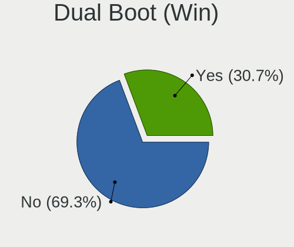
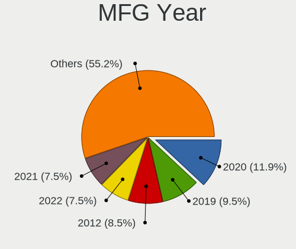
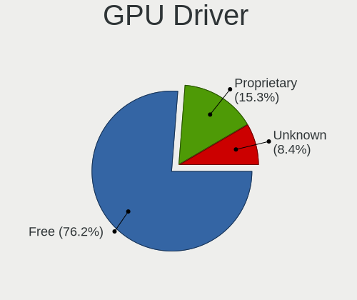
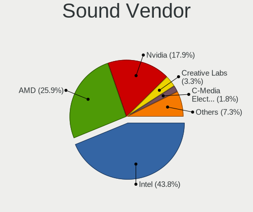

Slackware - Tested Hardware & Statistics
----------------------------------------

A project to collect tested hardware configurations for Slackware.

Anyone can contribute to this report by the [hw-probe](https://github.com/linuxhw/hw-probe) tool:

    sudo -E hw-probe -all -upload

Please contribute! Especially if your hardware is rare.

This is a report for all computer types. See also reports for [desktops](/Dist/Slackware/Desktop/README.md) and [notebooks](/Dist/Slackware/Notebook/README.md).

Full-feature report is available here: https://linux-hardware.org/?view=trends

Contents
--------

* [ Test Cases ](#test-cases)

* [ System ](#system)
  - [ OS                       ](#os)
  - [ OS Family                ](#os-family)
  - [ Kernel                   ](#kernel)
  - [ Kernel Family            ](#kernel-family)
  - [ Kernel Major Ver.        ](#kernel-major-ver)
  - [ Arch                     ](#arch)
  - [ DE                       ](#de)
  - [ Display Server           ](#display-server)
  - [ Display Manager          ](#display-manager)
  - [ OS Lang                  ](#os-lang)
  - [ Boot Mode                ](#boot-mode)
  - [ Filesystem               ](#filesystem)
  - [ Part. scheme             ](#part-scheme)
  - [ Dual Boot with Linux/BSD ](#dual-boot-with-linuxbsd)
  - [ Dual Boot (Win)          ](#dual-boot-win)

* [ Board ](#board)
  - [ Vendor                   ](#vendor)
  - [ Model                    ](#model)
  - [ Model Family             ](#model-family)
  - [ MFG Year                 ](#mfg-year)
  - [ Form Factor              ](#form-factor)
  - [ Secure Boot              ](#secure-boot)
  - [ Coreboot                 ](#coreboot)
  - [ RAM Size                 ](#ram-size)
  - [ RAM Used                 ](#ram-used)
  - [ Total Drives             ](#total-drives)
  - [ Has CD-ROM               ](#has-cd-rom)
  - [ Has Ethernet             ](#has-ethernet)
  - [ Has WiFi                 ](#has-wifi)
  - [ Has Bluetooth            ](#has-bluetooth)

* [ Location ](#location)
  - [ Country                  ](#country)
  - [ City                     ](#city)

* [ Drives ](#drives)
  - [ Drive Vendor             ](#drive-vendor)
  - [ Drive Model              ](#drive-model)
  - [ HDD Vendor               ](#hdd-vendor)
  - [ SSD Vendor               ](#ssd-vendor)
  - [ Drive Kind               ](#drive-kind)
  - [ Drive Connector          ](#drive-connector)
  - [ Drive Size               ](#drive-size)
  - [ Space Total              ](#space-total)
  - [ Space Used               ](#space-used)
  - [ Malfunc. Drives          ](#malfunc-drives)
  - [ Malfunc. Drive Vendor    ](#malfunc-drive-vendor)
  - [ Malfunc. HDD Vendor      ](#malfunc-hdd-vendor)
  - [ Malfunc. Drive Kind      ](#malfunc-drive-kind)
  - [ Failed Drives            ](#failed-drives)
  - [ Failed Drive Vendor      ](#failed-drive-vendor)
  - [ Drive Status             ](#drive-status)

* [ Storage controller ](#storage-controller)
  - [ Storage Vendor           ](#storage-vendor)
  - [ Storage Model            ](#storage-model)
  - [ Storage Kind             ](#storage-kind)

* [ Processor ](#processor)
  - [ CPU Vendor               ](#cpu-vendor)
  - [ CPU Model                ](#cpu-model)
  - [ CPU Model Family         ](#cpu-model-family)
  - [ CPU Cores                ](#cpu-cores)
  - [ CPU Sockets              ](#cpu-sockets)
  - [ CPU Threads              ](#cpu-threads)
  - [ CPU Op-Modes             ](#cpu-op-modes)
  - [ CPU Microcode            ](#cpu-microcode)
  - [ CPU Microarch            ](#cpu-microarch)

* [ Graphics ](#graphics)
  - [ GPU Vendor               ](#gpu-vendor)
  - [ GPU Model                ](#gpu-model)
  - [ GPU Combo                ](#gpu-combo)
  - [ GPU Driver               ](#gpu-driver)
  - [ GPU Memory               ](#gpu-memory)

* [ Monitor ](#monitor)
  - [ Monitor Vendor           ](#monitor-vendor)
  - [ Monitor Model            ](#monitor-model)
  - [ Monitor Resolution       ](#monitor-resolution)
  - [ Monitor Diagonal         ](#monitor-diagonal)
  - [ Monitor Width            ](#monitor-width)
  - [ Aspect Ratio             ](#aspect-ratio)
  - [ Monitor Area             ](#monitor-area)
  - [ Pixel Density            ](#pixel-density)
  - [ Multiple Monitors        ](#multiple-monitors)

* [ Network ](#network)
  - [ Net Controller Vendor    ](#net-controller-vendor)
  - [ Net Controller Model     ](#net-controller-model)
  - [ Wireless Vendor          ](#wireless-vendor)
  - [ Wireless Model           ](#wireless-model)
  - [ Ethernet Vendor          ](#ethernet-vendor)
  - [ Ethernet Model           ](#ethernet-model)
  - [ Net Controller Kind      ](#net-controller-kind)
  - [ Used Controller          ](#used-controller)
  - [ NICs                     ](#nics)
  - [ IPv6                     ](#ipv6)

* [ Bluetooth ](#bluetooth)
  - [ Bluetooth Vendor         ](#bluetooth-vendor)
  - [ Bluetooth Model          ](#bluetooth-model)

* [ Sound ](#sound)
  - [ Sound Vendor             ](#sound-vendor)
  - [ Sound Model              ](#sound-model)

* [ Memory ](#memory)
  - [ Memory Vendor            ](#memory-vendor)
  - [ Memory Model             ](#memory-model)
  - [ Memory Kind              ](#memory-kind)
  - [ Memory Form Factor       ](#memory-form-factor)
  - [ Memory Size              ](#memory-size)
  - [ Memory Speed             ](#memory-speed)

* [ Printers & scanners ](#printers--scanners)
  - [ Printer Vendor           ](#printer-vendor)
  - [ Printer Model            ](#printer-model)
  - [ Scanner Vendor           ](#scanner-vendor)
  - [ Scanner Model            ](#scanner-model)

* [ Camera ](#camera)
  - [ Camera Vendor            ](#camera-vendor)
  - [ Camera Model             ](#camera-model)

* [ Security ](#security)
  - [ Fingerprint Vendor       ](#fingerprint-vendor)
  - [ Fingerprint Model        ](#fingerprint-model)
  - [ Chipcard Vendor          ](#chipcard-vendor)
  - [ Chipcard Model           ](#chipcard-model)

* [ Unsupported ](#unsupported)
  - [ Unsupported Devices      ](#unsupported-devices)
  - [ Unsupported Device Types ](#unsupported-device-types)

Test Cases
----------

Total: 138

| Vendor        | Model                       | Form-Factor | Probe                                                      | Date         |
|---------------|-----------------------------|-------------|------------------------------------------------------------|--------------|
| ASUSTek       | TUF B450-PLUS GAMING        | Desktop     | [533b8a9f83](https://linux-hardware.org/?probe=533b8a9f83) | Apr 13, 2022 |
| MSI           | 970 GAMING                  | Desktop     | [25d8968f19](https://linux-hardware.org/?probe=25d8968f19) | Apr 13, 2022 |
| MSI           | GP76 Leopard 11UG           | Notebook    | [aebd373a66](https://linux-hardware.org/?probe=aebd373a66) | Apr 12, 2022 |
| MSI           | GE76 Raider 11UE            | Notebook    | [3072e065a3](https://linux-hardware.org/?probe=3072e065a3) | Apr 12, 2022 |
| Notebook      | X170KM-G                    | Notebook    | [4ecba03d19](https://linux-hardware.org/?probe=4ecba03d19) | Apr 11, 2022 |
| ASRock        | N68-S3 FX                   | Desktop     | [ca818bd06d](https://linux-hardware.org/?probe=ca818bd06d) | Apr 08, 2022 |
| MSI           | MS-7365                     | Desktop     | [8948dea4de](https://linux-hardware.org/?probe=8948dea4de) | Apr 07, 2022 |
| Unknown       | X79-P3                      | Desktop     | [40e38e9a8d](https://linux-hardware.org/?probe=40e38e9a8d) | Apr 07, 2022 |
| Dell          | Latitude 3520               | Notebook    | [4398aa2a03](https://linux-hardware.org/?probe=4398aa2a03) | Apr 06, 2022 |
| HP            | ProBook 6570b               | Notebook    | [cf1305eacc](https://linux-hardware.org/?probe=cf1305eacc) | Apr 06, 2022 |
| HP            | 0A08h                       | Desktop     | [4df5b0832f](https://linux-hardware.org/?probe=4df5b0832f) | Apr 06, 2022 |
| Lenovo        | IdeaPad 310-15ISK 80SM      | Notebook    | [d406cb4819](https://linux-hardware.org/?probe=d406cb4819) | Apr 05, 2022 |
| Dell          | Precision M4700             | Notebook    | [ab99532bd5](https://linux-hardware.org/?probe=ab99532bd5) | Apr 04, 2022 |
| ASRock        | H410M-ITX/ac                | Desktop     | [ae936790c9](https://linux-hardware.org/?probe=ae936790c9) | Apr 03, 2022 |
| ASUSTek       | PRIME Z390-A                | Desktop     | [5307aba2c3](https://linux-hardware.org/?probe=5307aba2c3) | Mar 30, 2022 |
| Apple         | Mac-F4238CC8 PVT            | All in one  | [c8289cd264](https://linux-hardware.org/?probe=c8289cd264) | Mar 26, 2022 |
| Apple         | Mac-F4238CC8 PVT            | All in one  | [5c6b1616fa](https://linux-hardware.org/?probe=5c6b1616fa) | Mar 21, 2022 |
| Acer          | FMCP7A-ION-LE               | Desktop     | [bbce73c6d6](https://linux-hardware.org/?probe=bbce73c6d6) | Mar 14, 2022 |
| Apple         | Mac-F65AE981FFA204ED Mac... | Mini pc     | [5f36bc3969](https://linux-hardware.org/?probe=5f36bc3969) | Mar 12, 2022 |
| ASRock        | H270 Pro4                   | Desktop     | [ae79ca8557](https://linux-hardware.org/?probe=ae79ca8557) | Mar 12, 2022 |
| HP            | 86F3 00100                  | All in one  | [7de0381db8](https://linux-hardware.org/?probe=7de0381db8) | Mar 11, 2022 |
| Lenovo        | ThinkPad X230 2325P38       | Notebook    | [1a0cab737b](https://linux-hardware.org/?probe=1a0cab737b) | Mar 10, 2022 |
| ASUSTek       | ROG Zephyrus G14 GA401IV... | Notebook    | [0b0c1aca1b](https://linux-hardware.org/?probe=0b0c1aca1b) | Mar 10, 2022 |
| HP            | Pavilion Gaming Laptop 1... | Notebook    | [c7825c54fc](https://linux-hardware.org/?probe=c7825c54fc) | Mar 10, 2022 |
| Framework     | Laptop                      | Notebook    | [ae37705198](https://linux-hardware.org/?probe=ae37705198) | Mar 10, 2022 |
| Dell          | 068NXX A00                  | Server      | [85004f427a](https://linux-hardware.org/?probe=85004f427a) | Mar 09, 2022 |
| Lenovo        | 31900058 STD                | Desktop     | [bc59b862f4](https://linux-hardware.org/?probe=bc59b862f4) | Mar 02, 2022 |
| TYAN Compu... | S7012                       | Server      | [fec98b51da](https://linux-hardware.org/?probe=fec98b51da) | Feb 27, 2022 |
| TYAN Compu... | S7012                       | Server      | [81a490184b](https://linux-hardware.org/?probe=81a490184b) | Feb 26, 2022 |
| Biostar       | X470GTA                     | Desktop     | [8d400b49f8](https://linux-hardware.org/?probe=8d400b49f8) | Feb 13, 2022 |
| Lenovo        | ThinkPad Edge E530c 3366... | Notebook    | [8ce0419468](https://linux-hardware.org/?probe=8ce0419468) | Feb 13, 2022 |
| MSI           | G31TM-P21                   | Desktop     | [dda6a57223](https://linux-hardware.org/?probe=dda6a57223) | Feb 07, 2022 |
| HP            | 212B                        | Desktop     | [353b0dde99](https://linux-hardware.org/?probe=353b0dde99) | Jan 29, 2022 |
| MSI           | B450 TOMAHAWK MAX           | Desktop     | [85543358d3](https://linux-hardware.org/?probe=85543358d3) | Jan 14, 2022 |
| Dynabook      | P1-C7MP-BL                  | Notebook    | [268f94787e](https://linux-hardware.org/?probe=268f94787e) | Jan 14, 2022 |
| MSI           | G31TM-P21                   | Desktop     | [25d668ee95](https://linux-hardware.org/?probe=25d668ee95) | Jan 10, 2022 |
| HP            | Laptop 15-bs2xx             | Notebook    | [bf53c3c878](https://linux-hardware.org/?probe=bf53c3c878) | Jan 02, 2022 |
| MSI           | H61M-P31                    | Desktop     | [58651bba67](https://linux-hardware.org/?probe=58651bba67) | Dec 07, 2021 |
| HP            | Laptop 15-bs1xx             | Notebook    | [b6c9f34c4c](https://linux-hardware.org/?probe=b6c9f34c4c) | Dec 07, 2021 |
| HP            | 21B4 A01                    | Desktop     | [871b196cc2](https://linux-hardware.org/?probe=871b196cc2) | Nov 21, 2021 |
| HP            | 21B4 A01                    | Desktop     | [259232d98b](https://linux-hardware.org/?probe=259232d98b) | Nov 21, 2021 |
| Supermicro    | X9DA7/E                     | Desktop     | [3fc1ef2b58](https://linux-hardware.org/?probe=3fc1ef2b58) | Nov 09, 2021 |
| HP            | Laptop 15-da0xxx            | Notebook    | [2e3e23fb54](https://linux-hardware.org/?probe=2e3e23fb54) | Nov 01, 2021 |
| System76      | Oryx Pro                    | Notebook    | [3cd05d02a8](https://linux-hardware.org/?probe=3cd05d02a8) | Oct 27, 2021 |
| MSI           | B450M-A PRO MAX             | Desktop     | [b7df25ba5d](https://linux-hardware.org/?probe=b7df25ba5d) | Oct 25, 2021 |
| ASUSTek       | SABERTOOTH X99              | Desktop     | [64e5ee1691](https://linux-hardware.org/?probe=64e5ee1691) | Oct 13, 2021 |
| MSI           | B450M-A PRO MAX             | Desktop     | [17d37c5316](https://linux-hardware.org/?probe=17d37c5316) | Oct 12, 2021 |
| MSI           | Modern 14 B11MO             | Notebook    | [e8f13facfd](https://linux-hardware.org/?probe=e8f13facfd) | Oct 03, 2021 |
| MSI           | Modern 14 B11MO             | Notebook    | [9f5c2e0fde](https://linux-hardware.org/?probe=9f5c2e0fde) | Sep 27, 2021 |
| Intel         | DZ77RE-75K AAG39010-302     | Desktop     | [069c508e80](https://linux-hardware.org/?probe=069c508e80) | Sep 25, 2021 |
| Shuttle       | NC03U                       | Desktop     | [c5f76c4400](https://linux-hardware.org/?probe=c5f76c4400) | Sep 22, 2021 |
| Toshiba       | PORTEGE Z30-A               | Notebook    | [13b9ce0773](https://linux-hardware.org/?probe=13b9ce0773) | Sep 22, 2021 |
| Dynabook      | dynabook PORTEGE X50-G      | Notebook    | [da8279a7a9](https://linux-hardware.org/?probe=da8279a7a9) | Sep 22, 2021 |
| Dell          | Inspiron 15-3552            | Notebook    | [f76339b0af](https://linux-hardware.org/?probe=f76339b0af) | Aug 31, 2021 |
| HP            | 245 G7 Notebook PC          | Notebook    | [c0806e4955](https://linux-hardware.org/?probe=c0806e4955) | Aug 23, 2021 |
| HP            | 245 G7 Notebook PC          | Notebook    | [c409287d23](https://linux-hardware.org/?probe=c409287d23) | Aug 23, 2021 |
| HP            | EliteBook 840 G5            | Notebook    | [4c196e1abd](https://linux-hardware.org/?probe=4c196e1abd) | Aug 18, 2021 |
| Dell          | Vostro 3500                 | Notebook    | [53a1179121](https://linux-hardware.org/?probe=53a1179121) | Aug 12, 2021 |
| HP            | EliteBook Folio 1020 G1 ... | Notebook    | [32e6ec699f](https://linux-hardware.org/?probe=32e6ec699f) | Aug 09, 2021 |
| HP            | EliteBook Folio 1020 G1 ... | Notebook    | [7facd0568b](https://linux-hardware.org/?probe=7facd0568b) | Aug 09, 2021 |
| ASUSTek       | SABERTOOTH X79              | Desktop     | [5d6732e14c](https://linux-hardware.org/?probe=5d6732e14c) | Aug 09, 2021 |
| HPE           | ProLiant MicroServer Gen... | Desktop     | [9ac798b737](https://linux-hardware.org/?probe=9ac798b737) | Aug 05, 2021 |
| HPE           | ProLiant MicroServer Gen... | Desktop     | [095745e5fb](https://linux-hardware.org/?probe=095745e5fb) | Jul 06, 2021 |
| HP            | 158A                        | Desktop     | [d612124939](https://linux-hardware.org/?probe=d612124939) | Jun 21, 2021 |
| ASRock        | H310CM-HDV                  | Desktop     | [3291e5d2de](https://linux-hardware.org/?probe=3291e5d2de) | Jun 19, 2021 |
| ASRock        | H87M Pro4                   | Desktop     | [8d4b7f121d](https://linux-hardware.org/?probe=8d4b7f121d) | Jun 02, 2021 |
| ASUSTek       | Pro WS X570-ACE             | Desktop     | [6e60025ac5](https://linux-hardware.org/?probe=6e60025ac5) | May 25, 2021 |
| ASUSTek       | PRIME X370-PRO              | Desktop     | [3e5f76719a](https://linux-hardware.org/?probe=3e5f76719a) | May 24, 2021 |
| ASUSTek       | PRIME X370-PRO              | Desktop     | [c75f9d5c0d](https://linux-hardware.org/?probe=c75f9d5c0d) | May 23, 2021 |
| Dell          | 0PTTT9 A00                  | Desktop     | [e5b81a0da1](https://linux-hardware.org/?probe=e5b81a0da1) | May 20, 2021 |
| AMI           | Aptio CRB                   | Mini pc     | [cabba2c402](https://linux-hardware.org/?probe=cabba2c402) | May 19, 2021 |
| Gigabyte      | N3160TN                     | Desktop     | [2fd537312f](https://linux-hardware.org/?probe=2fd537312f) | May 14, 2021 |
| MSI           | G31TM-P21                   | Desktop     | [91c11ae82e](https://linux-hardware.org/?probe=91c11ae82e) | May 07, 2021 |
| HP            | 15 Notebook PC              | Notebook    | [bec2fe2e78](https://linux-hardware.org/?probe=bec2fe2e78) | Mar 21, 2021 |
| Toshiba       | Satellite C660              | Notebook    | [5189fbc4c9](https://linux-hardware.org/?probe=5189fbc4c9) | Mar 10, 2021 |
| Foxconn       | 2ADA                        | Desktop     | [425d15a5ce](https://linux-hardware.org/?probe=425d15a5ce) | Mar 09, 2021 |
| Samsung       | 300E5M/300E5L               | Notebook    | [bda4ee984f](https://linux-hardware.org/?probe=bda4ee984f) | Mar 05, 2021 |
| Dell          | Latitude E5500              | Notebook    | [a8e17b79ce](https://linux-hardware.org/?probe=a8e17b79ce) | Feb 26, 2021 |
| HP            | Pavilion Notebook           | Notebook    | [45dfe3c2b1](https://linux-hardware.org/?probe=45dfe3c2b1) | Feb 24, 2021 |
| Lenovo        | ThinkPad L440 20ASS05K00    | Notebook    | [aecef5c789](https://linux-hardware.org/?probe=aecef5c789) | Jan 22, 2021 |
| Dell          | 0TP412                      | Desktop     | [f0e56aacff](https://linux-hardware.org/?probe=f0e56aacff) | Jan 05, 2021 |
| Lenovo        | ThinkPad L440 20ASS05K00    | Notebook    | [7a6a06bb55](https://linux-hardware.org/?probe=7a6a06bb55) | Jan 04, 2021 |
| ASRock        | B450M Steel Legend          | Desktop     | [e1424f6de3](https://linux-hardware.org/?probe=e1424f6de3) | Dec 31, 2020 |
| Dell          | Precision M4600             | Notebook    | [71bb8e2e9a](https://linux-hardware.org/?probe=71bb8e2e9a) | Dec 28, 2020 |
| Lenovo        | ThinkPad L440 20ASS05K00    | Notebook    | [b330b2d38a](https://linux-hardware.org/?probe=b330b2d38a) | Nov 19, 2020 |
| Lenovo        | ThinkPad L440 20ASS05K00    | Notebook    | [416d54b307](https://linux-hardware.org/?probe=416d54b307) | Nov 17, 2020 |
| Supermicro    | X8SIE 0001                  | Desktop     | [96607f4270](https://linux-hardware.org/?probe=96607f4270) | Nov 12, 2020 |
| MSI           | GL73 8RC                    | Notebook    | [44f82bfc01](https://linux-hardware.org/?probe=44f82bfc01) | Nov 09, 2020 |
| Lenovo        | ThinkPad L440 20ASS05K00    | Notebook    | [9c79f4e7b9](https://linux-hardware.org/?probe=9c79f4e7b9) | Nov 08, 2020 |
| Lenovo        | ThinkPad L440 20ASS05K00    | Notebook    | [a4cb1ecf16](https://linux-hardware.org/?probe=a4cb1ecf16) | Nov 08, 2020 |
| HP            | 8523 A01                    | Mini pc     | [bab721d52e](https://linux-hardware.org/?probe=bab721d52e) | Oct 30, 2020 |
| ASRock        | Z390M-ITX/ac                | Desktop     | [06eb8afdbc](https://linux-hardware.org/?probe=06eb8afdbc) | Oct 19, 2020 |
| Samsung       | 300E5M/300E5L               | Notebook    | [270b65ced8](https://linux-hardware.org/?probe=270b65ced8) | Jul 24, 2020 |
| ASUSTek       | PRIME B450-PLUS             | Desktop     | [d42d44dd82](https://linux-hardware.org/?probe=d42d44dd82) | Jul 23, 2020 |
| ASUSTek       | PRIME B450-PLUS             | Desktop     | [888f105221](https://linux-hardware.org/?probe=888f105221) | Jul 23, 2020 |
| ASUSTek       | M5A97 R2.0                  | Desktop     | [2eb600bb96](https://linux-hardware.org/?probe=2eb600bb96) | Jul 10, 2020 |
| ASUSTek       | M5A97 R2.0                  | Desktop     | [232221bf45](https://linux-hardware.org/?probe=232221bf45) | Jul 10, 2020 |
| Notebook      | NL40_50CU                   | Notebook    | [941073da73](https://linux-hardware.org/?probe=941073da73) | Jun 27, 2020 |
| Lenovo        | V330-14ARR 81B1             | Notebook    | [5089cbcf84](https://linux-hardware.org/?probe=5089cbcf84) | Jun 24, 2020 |
| Lenovo        | V330-14ARR 81B1             | Notebook    | [cb63994f94](https://linux-hardware.org/?probe=cb63994f94) | Jun 22, 2020 |
| Notebook      | NL40_50CU                   | Notebook    | [9a1c09c6e1](https://linux-hardware.org/?probe=9a1c09c6e1) | Mar 28, 2020 |
| Notebook      | NL40_50CU                   | Notebook    | [bc5ed8dea4](https://linux-hardware.org/?probe=bc5ed8dea4) | Mar 24, 2020 |
| Notebook      | NL40_50CU                   | Notebook    | [ae7070b067](https://linux-hardware.org/?probe=ae7070b067) | Mar 21, 2020 |
| Notebook      | NL40_50CU                   | Notebook    | [320dada481](https://linux-hardware.org/?probe=320dada481) | Mar 20, 2020 |
| Toshiba       | Satellite P50-A-12Z         | Notebook    | [96927db16b](https://linux-hardware.org/?probe=96927db16b) | Mar 17, 2020 |
| Radxa         | ROCK Pi 4                   | Soc         | [abf599e14a](https://linux-hardware.org/?probe=abf599e14a) | Jan 27, 2020 |
| Huanan        | X79-8D VAA31                | Desktop     | [bbfc99d048](https://linux-hardware.org/?probe=bbfc99d048) | Jan 22, 2020 |
| Unknown       | Unknown                     | Soc         | [62347dfd8d](https://linux-hardware.org/?probe=62347dfd8d) | Jan 01, 2020 |
| Lenovo        | ThinkPad X1 Carbon 7th 2... | Notebook    | [afe3135216](https://linux-hardware.org/?probe=afe3135216) | Dec 10, 2019 |
| ASUSTek       | P53E                        | Notebook    | [e9dcced0f7](https://linux-hardware.org/?probe=e9dcced0f7) | Oct 28, 2019 |
| Lenovo        | ThinkPad T400 6474BV7       | Notebook    | [825bdb9fd0](https://linux-hardware.org/?probe=825bdb9fd0) | Oct 28, 2019 |
| ASUSTek       | 1000H                       | Notebook    | [50da35c0d0](https://linux-hardware.org/?probe=50da35c0d0) | Oct 28, 2019 |
| ASUSTek       | A68HM-PLUS                  | Desktop     | [505df04abc](https://linux-hardware.org/?probe=505df04abc) | Oct 27, 2019 |
| ASUSTek       | PRIME B350M-A               | Desktop     | [0b246f9623](https://linux-hardware.org/?probe=0b246f9623) | Oct 27, 2019 |
| Acer          | Aspire E1-572               | Notebook    | [0fe80f5758](https://linux-hardware.org/?probe=0fe80f5758) | Oct 23, 2019 |
| ASUSTek       | ROG STRIX X470-F GAMING     | Desktop     | [21d76cde28](https://linux-hardware.org/?probe=21d76cde28) | Oct 22, 2019 |
| ASUSTek       | VivoBook_ASUSLaptop X570... | Notebook    | [ecca7bced0](https://linux-hardware.org/?probe=ecca7bced0) | Oct 22, 2019 |
| ASUSTek       | VivoBook_ASUSLaptop X570... | Notebook    | [e1cfaedc22](https://linux-hardware.org/?probe=e1cfaedc22) | Oct 22, 2019 |
| ASUSTek       | VivoBook_ASUSLaptop X570... | Notebook    | [c7637c27a6](https://linux-hardware.org/?probe=c7637c27a6) | Oct 22, 2019 |
| Lenovo        | IdeaPad P500 20210          | Notebook    | [3d09c5e38d](https://linux-hardware.org/?probe=3d09c5e38d) | Oct 22, 2019 |
| ASUSTek       | Z97-A                       | Desktop     | [482c60ec21](https://linux-hardware.org/?probe=482c60ec21) | Oct 21, 2019 |
| Acer          | Swift SF314-52              | Notebook    | [05f880ecec](https://linux-hardware.org/?probe=05f880ecec) | Oct 21, 2019 |
| Lenovo        | ThinkPad P70 20ERCTO1WW     | Notebook    | [0ceeb50e5e](https://linux-hardware.org/?probe=0ceeb50e5e) | Oct 21, 2019 |
| Gigabyte      | M61SME-S2                   | Desktop     | [10469f1659](https://linux-hardware.org/?probe=10469f1659) | Oct 21, 2019 |
| Lenovo        | ThinkPad T450s 20BW000EU... | Notebook    | [41ca8d1a20](https://linux-hardware.org/?probe=41ca8d1a20) | Oct 21, 2019 |
| HP            | 2B35                        | Desktop     | [45c5e4afbe](https://linux-hardware.org/?probe=45c5e4afbe) | Oct 21, 2019 |
| ASUSTek       | VivoBook_ASUSLaptop X570... | Notebook    | [c2fd6acb71](https://linux-hardware.org/?probe=c2fd6acb71) | Oct 21, 2019 |
| Gigabyte      | 970A-DS3P                   | Desktop     | [70ea4f97bf](https://linux-hardware.org/?probe=70ea4f97bf) | Oct 21, 2019 |
| Dell          | Latitude E7270              | Notebook    | [859e021e2f](https://linux-hardware.org/?probe=859e021e2f) | Oct 20, 2019 |
| ASUSTek       | Maximus VII HERO            | Desktop     | [4751f76aa2](https://linux-hardware.org/?probe=4751f76aa2) | Oct 20, 2019 |
| ASUSTek       | Maximus VII RANGER          | Desktop     | [71121ccd6f](https://linux-hardware.org/?probe=71121ccd6f) | Oct 20, 2019 |
| Fujitsu       | LIFEBOOK A555               | Notebook    | [e0c6729d5b](https://linux-hardware.org/?probe=e0c6729d5b) | Oct 20, 2019 |
| ASUSTek       | P5QLD PRO                   | Desktop     | [dabc1ee203](https://linux-hardware.org/?probe=dabc1ee203) | Oct 20, 2019 |
| Lenovo        | ThinkPad T470 20HDCTO1WW    | Notebook    | [0f9287651d](https://linux-hardware.org/?probe=0f9287651d) | Jul 24, 2019 |
| Lenovo        | ThinkPad T470 20HDCTO1WW    | Notebook    | [6986d35989](https://linux-hardware.org/?probe=6986d35989) | Jul 23, 2019 |
| Lenovo        | ThinkPad T470 20HDCTO1WW    | Notebook    | [67672ef038](https://linux-hardware.org/?probe=67672ef038) | Jul 23, 2019 |
| Gigabyte      | X150M-PRO ECC-CF            | Desktop     | [39987c5d8e](https://linux-hardware.org/?probe=39987c5d8e) | Oct 10, 2018 |
| Fujitsu       | LIFEBOOK A555               | Notebook    | [63c120aa28](https://linux-hardware.org/?probe=63c120aa28) | Aug 19, 2018 |

System
------

OS
--

Installed operating systems

| Name            | Computers | Percent |
|-----------------|-----------|---------|
| Slackware 14.2  | 61        | 55.96%  |
| Slackware 15.0  | 43        | 39.45%  |
| Slackware 14.2+ | 5         | 4.59%   |

OS Family
---------

OS without a version

| Name      | Computers | Percent |
|-----------|-----------|---------|
| Slackware | 108       | 100%    |

Kernel
------

Version of the Linux kernel

| Version              | Computers | Percent |
|----------------------|-----------|---------|
| 5.15.19              | 10        | 8.77%   |
| 4.19.80              | 8         | 7.02%   |
| 5.10.28-Unraid       | 6         | 5.26%   |
| 5.15.27              | 4         | 3.51%   |
| 4.4.190              | 4         | 3.51%   |
| 4.4.240              | 3         | 2.63%   |
| 5.3.7                | 2         | 1.75%   |
| 5.17.2               | 2         | 1.75%   |
| 5.16.13              | 2         | 1.75%   |
| 5.13.8               | 2         | 1.75%   |
| 5.10.3               | 2         | 1.75%   |
| 5.7.0                | 1         | 0.88%   |
| 5.5.10               | 1         | 0.88%   |
| 5.4.77               | 1         | 0.88%   |
| 5.4.75               | 1         | 0.88%   |
| 5.4.62               | 1         | 0.88%   |
| 5.4.53-APRL          | 1         | 0.88%   |
| 5.4.50               | 1         | 0.88%   |
| 5.4.47               | 1         | 0.88%   |
| 5.4.43               | 1         | 0.88%   |
| 5.4.24toshiba-new    | 1         | 0.88%   |
| 5.4.2                | 1         | 0.88%   |
| 5.4.139-jw           | 1         | 0.88%   |
| 5.4.13               | 1         | 0.88%   |
| 5.4.12+              | 1         | 0.88%   |
| 5.4.0-rc2-vto        | 1         | 0.88%   |
| 5.2.2                | 1         | 0.88%   |
| 5.17.1               | 1         | 0.88%   |
| 5.17.0-custom        | 1         | 0.88%   |
| 5.16.9-joe1          | 1         | 0.88%   |
| 5.16.18              | 1         | 0.88%   |
| 5.16.12              | 1         | 0.88%   |
| 5.16.11              | 1         | 0.88%   |
| 5.15.6               | 1         | 0.88%   |
| 5.15.33.kjh          | 1         | 0.88%   |
| 5.15.30-Unraid       | 1         | 0.88%   |
| 5.15.21-hardened1    | 1         | 0.88%   |
| 5.15.14              | 1         | 0.88%   |
| 5.15.13              | 1         | 0.88%   |
| 5.15.1               | 1         | 0.88%   |
| 5.14.9               | 1         | 0.88%   |
| 5.14.8               | 1         | 0.88%   |
| 5.14.15-Unraid       | 1         | 0.88%   |
| 5.14.15              | 1         | 0.88%   |
| 5.14.11              | 1         | 0.88%   |
| 5.14.10              | 1         | 0.88%   |
| 5.14.0               | 1         | 0.88%   |
| 5.13.9-jw            | 1         | 0.88%   |
| 5.13.5               | 1         | 0.88%   |
| 5.13.12              | 1         | 0.88%   |
| 5.13.11              | 1         | 0.88%   |
| 5.13.0.a             | 1         | 0.88%   |
| 5.12.12              | 1         | 0.88%   |
| 5.10.91              | 1         | 0.88%   |
| 5.10.44-slack64-host | 1         | 0.88%   |
| 5.10.40              | 1         | 0.88%   |
| 5.10.4               | 1         | 0.88%   |
| 5.10.21              | 1         | 0.88%   |
| 5.10.19              | 1         | 0.88%   |
| 5.10.1-pmagic        | 1         | 0.88%   |

Kernel Family
-------------

Linux kernel without a distro release

| Version | Computers | Percent |
|---------|-----------|---------|
| 5.15.19 | 10        | 8.77%   |
| 4.19.80 | 8         | 7.02%   |
| 5.10.28 | 6         | 5.26%   |
| 4.4.190 | 5         | 4.39%   |
| 5.15.27 | 4         | 3.51%   |
| 4.4.240 | 3         | 2.63%   |
| 5.3.7   | 2         | 1.75%   |
| 5.17.2  | 2         | 1.75%   |
| 5.16.13 | 2         | 1.75%   |
| 5.14.15 | 2         | 1.75%   |
| 5.13.8  | 2         | 1.75%   |
| 5.10.3  | 2         | 1.75%   |
| 5.7.0   | 1         | 0.88%   |
| 5.5.10  | 1         | 0.88%   |
| 5.4.77  | 1         | 0.88%   |
| 5.4.75  | 1         | 0.88%   |
| 5.4.62  | 1         | 0.88%   |
| 5.4.53  | 1         | 0.88%   |
| 5.4.50  | 1         | 0.88%   |
| 5.4.47  | 1         | 0.88%   |
| 5.4.43  | 1         | 0.88%   |
| 5.4.24  | 1         | 0.88%   |
| 5.4.2   | 1         | 0.88%   |
| 5.4.139 | 1         | 0.88%   |
| 5.4.13  | 1         | 0.88%   |
| 5.4.12  | 1         | 0.88%   |
| 5.4.0   | 1         | 0.88%   |
| 5.2.2   | 1         | 0.88%   |
| 5.17.1  | 1         | 0.88%   |
| 5.17.0  | 1         | 0.88%   |
| 5.16.9  | 1         | 0.88%   |
| 5.16.18 | 1         | 0.88%   |
| 5.16.12 | 1         | 0.88%   |
| 5.16.11 | 1         | 0.88%   |
| 5.15.6  | 1         | 0.88%   |
| 5.15.33 | 1         | 0.88%   |
| 5.15.30 | 1         | 0.88%   |
| 5.15.21 | 1         | 0.88%   |
| 5.15.14 | 1         | 0.88%   |
| 5.15.13 | 1         | 0.88%   |
| 5.15.1  | 1         | 0.88%   |
| 5.14.9  | 1         | 0.88%   |
| 5.14.8  | 1         | 0.88%   |
| 5.14.11 | 1         | 0.88%   |
| 5.14.10 | 1         | 0.88%   |
| 5.14.0  | 1         | 0.88%   |
| 5.13.9  | 1         | 0.88%   |
| 5.13.5  | 1         | 0.88%   |
| 5.13.12 | 1         | 0.88%   |
| 5.13.11 | 1         | 0.88%   |
| 5.13.0  | 1         | 0.88%   |
| 5.12.12 | 1         | 0.88%   |
| 5.10.91 | 1         | 0.88%   |
| 5.10.44 | 1         | 0.88%   |
| 5.10.40 | 1         | 0.88%   |
| 5.10.4  | 1         | 0.88%   |
| 5.10.21 | 1         | 0.88%   |
| 5.10.19 | 1         | 0.88%   |
| 5.10.1  | 1         | 0.88%   |
| 4.9.248 | 1         | 0.88%   |

Kernel Major Ver.
-----------------

Linux kernel major version

| Version | Computers | Percent |
|---------|-----------|---------|
| 5.15    | 21        | 18.58%  |
| 4.4     | 16        | 14.16%  |
| 5.10    | 15        | 13.27%  |
| 4.19    | 15        | 13.27%  |
| 5.4     | 13        | 11.5%   |
| 5.13    | 7         | 6.19%   |
| 5.16    | 6         | 5.31%   |
| 5.14    | 6         | 5.31%   |
| 5.17    | 4         | 3.54%   |
| 5.3     | 2         | 1.77%   |
| 4.9     | 2         | 1.77%   |
| 5.7     | 1         | 0.88%   |
| 5.5     | 1         | 0.88%   |
| 5.2     | 1         | 0.88%   |
| 5.12    | 1         | 0.88%   |
| 4.20    | 1         | 0.88%   |
| 4.16    | 1         | 0.88%   |

Arch
----

OS architecture (x86_64, i586, etc.)

| Name    | Computers | Percent |
|---------|-----------|---------|
| x86_64  | 105       | 97.22%  |
| aarch64 | 2         | 1.85%   |
| i686    | 1         | 0.93%   |

DE
--

Desktop Environment

| Name          | Computers | Percent |
|---------------|-----------|---------|
| Unknown       | 41        | 37.27%  |
| XFCE          | 30        | 27.27%  |
| KDE5          | 26        | 23.64%  |
| KDE           | 5         | 4.55%   |
| GNOME         | 2         | 1.82%   |
| fvwm          | 2         | 1.82%   |
| xwmconfig     | 1         | 0.91%   |
| MATE          | 1         | 0.91%   |
| LXQt          | 1         | 0.91%   |
| Enlightenment | 1         | 0.91%   |

Display Server
--------------

X11 or Wayland

| Name    | Computers | Percent |
|---------|-----------|---------|
| X11     | 76        | 69.09%  |
| Tty     | 21        | 19.09%  |
| Unknown | 10        | 9.09%   |
| Wayland | 3         | 2.73%   |

Display Manager
---------------

SDDM, LightDM, etc.

| Name    | Computers | Percent |
|---------|-----------|---------|
| Unknown | 46        | 41.82%  |
| SDDM    | 34        | 30.91%  |
| XDM     | 26        | 23.64%  |
| SLiM    | 2         | 1.82%   |
| LightDM | 2         | 1.82%   |

OS Lang
-------

Language

| Lang        | Computers | Percent |
|-------------|-----------|---------|
| en_US       | 58        | 53.7%   |
| Unknown     | 37        | 34.26%  |
| ru_RU       | 2         | 1.85%   |
| pt_BR       | 2         | 1.85%   |
| it_IT       | 2         | 1.85%   |
| sr_RS@latin | 1         | 0.93%   |
| pl_PL       | 1         | 0.93%   |
| fr_FR       | 1         | 0.93%   |
| es_ES.UTF8  | 1         | 0.93%   |
| en_US.ASCII | 1         | 0.93%   |
| en_GB       | 1         | 0.93%   |
| C           | 1         | 0.93%   |

Boot Mode
---------

EFI or BIOS

| Mode | Computers | Percent |
|------|-----------|---------|
| BIOS | 60        | 55.05%  |
| EFI  | 49        | 44.95%  |

Filesystem
----------

Type of filesystem

| Type     | Computers | Percent |
|----------|-----------|---------|
| Ext4     | 77        | 71.3%   |
| Btrfs    | 14        | 12.96%  |
| Overlay  | 5         | 4.63%   |
| Xfs      | 4         | 3.7%    |
| Rootfs   | 3         | 2.78%   |
| Zfs      | 1         | 0.93%   |
| Reiserfs | 1         | 0.93%   |
| Jfs      | 1         | 0.93%   |
| F2fs     | 1         | 0.93%   |
| Ext3     | 1         | 0.93%   |

Part. scheme
------------

Scheme of partitioning

| Type    | Computers | Percent |
|---------|-----------|---------|
| GPT     | 74        | 67.27%  |
| MBR     | 30        | 27.27%  |
| Unknown | 6         | 5.45%   |

Dual Boot with Linux/BSD
------------------------

Hosting more than one Linux/BSD

| Dual boot | Computers | Percent |
|-----------|-----------|---------|
| No        | 81        | 73.64%  |
| Yes       | 29        | 26.36%  |

Dual Boot (Win)
---------------

Hosting Linux and Windows

| Dual boot | Computers | Percent |
|-----------|-----------|---------|
| No        | 73        | 67.59%  |
| Yes       | 35        | 32.41%  |

Board
-----

Vendor
------

Motherboard manufacturer

| Name                | Computers | Percent |
|---------------------|-----------|---------|
| ASUSTek Computer    | 19        | 17.59%  |
| Hewlett-Packard     | 17        | 15.74%  |
| Lenovo              | 12        | 11.11%  |
| MSI                 | 10        | 9.26%   |
| Dell                | 10        | 9.26%   |
| ASRock              | 7         | 6.48%   |
| Gigabyte Technology | 4         | 3.7%    |
| Toshiba             | 3         | 2.78%   |
| Acer                | 3         | 2.78%   |
| Supermicro          | 2         | 1.85%   |
| Notebook            | 2         | 1.85%   |
| Dynabook            | 2         | 1.85%   |
| Apple               | 2         | 1.85%   |
| Unknown             | 2         | 1.85%   |
| TYAN Computer       | 1         | 0.93%   |
| System76            | 1         | 0.93%   |
| Shuttle             | 1         | 0.93%   |
| Samsung Electronics | 1         | 0.93%   |
| Radxa               | 1         | 0.93%   |
| Intel               | 1         | 0.93%   |
| Huanan              | 1         | 0.93%   |
| HPE                 | 1         | 0.93%   |
| Fujitsu             | 1         | 0.93%   |
| Framework           | 1         | 0.93%   |
| Foxconn             | 1         | 0.93%   |
| Biostar             | 1         | 0.93%   |
| AMI                 | 1         | 0.93%   |

Model
-----

Motherboard model

| Name                                     | Computers | Percent |
|------------------------------------------|-----------|---------|
| ASUS All Series                          | 4         | 3.7%    |
| Unknown                                  | 2         | 1.85%   |
| TYAN S7012                               | 1         | 0.93%   |
| Toshiba Satellite P50-A-12Z              | 1         | 0.93%   |
| Toshiba Satellite C660                   | 1         | 0.93%   |
| Toshiba PORTEGE Z30-A                    | 1         | 0.93%   |
| System76 Oryx Pro                        | 1         | 0.93%   |
| Supermicro X9DA7/E                       | 1         | 0.93%   |
| Supermicro ReadyDATA 5200                | 1         | 0.93%   |
| Shuttle NC03U                            | 1         | 0.93%   |
| Samsung 300E5M/300E5L                    | 1         | 0.93%   |
| Radxa ROCK Pi 4                          | 1         | 0.93%   |
| Notebook X170KM-G                        | 1         | 0.93%   |
| Notebook NL40_50CU                       | 1         | 0.93%   |
| MSI MS-7C52                              | 1         | 0.93%   |
| MSI MS-7C02                              | 1         | 0.93%   |
| MSI MS-7788                              | 1         | 0.93%   |
| MSI MS-7693                              | 1         | 0.93%   |
| MSI MS-7529                              | 1         | 0.93%   |
| MSI MS-7365                              | 1         | 0.93%   |
| MSI Modern 14 B11MO                      | 1         | 0.93%   |
| MSI GP76 Leopard 11UG                    | 1         | 0.93%   |
| MSI GL73 8RC                             | 1         | 0.93%   |
| MSI GE76 Raider 11UE                     | 1         | 0.93%   |
| Lenovo V330-14ARR 81B1                   | 1         | 0.93%   |
| Lenovo ThinkPad X230 2325P38             | 1         | 0.93%   |
| Lenovo ThinkPad X1 Carbon 7th 20R10015US | 1         | 0.93%   |
| Lenovo ThinkPad T470 20HDCTO1WW          | 1         | 0.93%   |
| Lenovo ThinkPad T450s 20BW000EUS         | 1         | 0.93%   |
| Lenovo ThinkPad T400 6474BV7             | 1         | 0.93%   |
| Lenovo ThinkPad P70 20ERCTO1WW           | 1         | 0.93%   |
| Lenovo ThinkPad L440 20ASS05K00          | 1         | 0.93%   |
| Lenovo ThinkPad Edge E530c 336669G       | 1         | 0.93%   |
| Lenovo IdeaPad P500 20210                | 1         | 0.93%   |
| Lenovo IdeaPad 310-15ISK 80SM            | 1         | 0.93%   |
| Lenovo H50-05 90BH001WIX                 | 1         | 0.93%   |
| Intel DZ77RE-75K AAG39010-302            | 1         | 0.93%   |
| Huanan X79-8D VAA31                      | 1         | 0.93%   |
| HPE ProLiant MicroServer Gen10 Plus      | 1         | 0.93%   |
| HP Z620 Workstation                      | 1         | 0.93%   |
| HP Z440 Workstation                      | 1         | 0.93%   |
| HP xw8400 Workstation                    | 1         | 0.93%   |
| HP t640 Thin Client                      | 1         | 0.93%   |
| HP t620 Quad Core TC                     | 1         | 0.93%   |
| HP ProBook 6570b                         | 1         | 0.93%   |
| HP Pavilion Notebook                     | 1         | 0.93%   |
| HP Pavilion Gaming Laptop 16-a0xxx       | 1         | 0.93%   |
| HP Laptop 15-da0xxx                      | 1         | 0.93%   |
| HP Laptop 15-bs2xx                       | 1         | 0.93%   |
| HP Laptop 15-bs1xx                       | 1         | 0.93%   |
| HP EliteBook Folio 1020 G1 SE            | 1         | 0.93%   |
| HP EliteBook 840 G5                      | 1         | 0.93%   |
| HP 500-515na                             | 1         | 0.93%   |
| HP 245 G7 Notebook PC                    | 1         | 0.93%   |
| HP 205 G4 22 All-in-One PC               | 1         | 0.93%   |
| HP 15 Notebook PC                        | 1         | 0.93%   |
| Gigabyte X150M-PRO ECC                   | 1         | 0.93%   |
| Gigabyte N3160TN                         | 1         | 0.93%   |
| Gigabyte M61SME-S2                       | 1         | 0.93%   |
| Gigabyte 970A-DS3P                       | 1         | 0.93%   |

Model Family
------------

Motherboard model prefix

| Name                 | Computers | Percent |
|----------------------|-----------|---------|
| Lenovo ThinkPad      | 8         | 7.41%   |
| Dell Precision       | 4         | 3.7%    |
| ASUS PRIME           | 4         | 3.7%    |
| ASUS All             | 4         | 3.7%    |
| HP Laptop            | 3         | 2.78%   |
| Dell Latitude        | 3         | 2.78%   |
| Toshiba Satellite    | 2         | 1.85%   |
| Lenovo IdeaPad       | 2         | 1.85%   |
| HP Pavilion          | 2         | 1.85%   |
| HP EliteBook         | 2         | 1.85%   |
| ASUS ROG             | 2         | 1.85%   |
| Acer Aspire          | 2         | 1.85%   |
| Unknown              | 2         | 1.85%   |
| TYAN S7012           | 1         | 0.93%   |
| Toshiba PORTEGE      | 1         | 0.93%   |
| System76 Oryx        | 1         | 0.93%   |
| Supermicro X9DA7     | 1         | 0.93%   |
| Supermicro ReadyDATA | 1         | 0.93%   |
| Shuttle NC03U        | 1         | 0.93%   |
| Samsung 300E5M       | 1         | 0.93%   |
| Radxa ROCK           | 1         | 0.93%   |
| Notebook X170KM-G    | 1         | 0.93%   |
| Notebook NL40        | 1         | 0.93%   |
| MSI MS-7C52          | 1         | 0.93%   |
| MSI MS-7C02          | 1         | 0.93%   |
| MSI MS-7788          | 1         | 0.93%   |
| MSI MS-7693          | 1         | 0.93%   |
| MSI MS-7529          | 1         | 0.93%   |
| MSI MS-7365          | 1         | 0.93%   |
| MSI Modern           | 1         | 0.93%   |
| MSI GP76             | 1         | 0.93%   |
| MSI GL73             | 1         | 0.93%   |
| MSI GE76             | 1         | 0.93%   |
| Lenovo V330-14ARR    | 1         | 0.93%   |
| Lenovo H50-05        | 1         | 0.93%   |
| Intel DZ77RE-75K     | 1         | 0.93%   |
| Huanan X79-8D        | 1         | 0.93%   |
| HPE ProLiant         | 1         | 0.93%   |
| HP Z620              | 1         | 0.93%   |
| HP Z440              | 1         | 0.93%   |
| HP xw8400            | 1         | 0.93%   |
| HP t640              | 1         | 0.93%   |
| HP t620              | 1         | 0.93%   |
| HP ProBook           | 1         | 0.93%   |
| HP 500-515na         | 1         | 0.93%   |
| HP 245               | 1         | 0.93%   |
| HP 205               | 1         | 0.93%   |
| HP 15                | 1         | 0.93%   |
| Gigabyte X150M-PRO   | 1         | 0.93%   |
| Gigabyte N3160TN     | 1         | 0.93%   |
| Gigabyte M61SME-S2   | 1         | 0.93%   |
| Gigabyte 970A-DS3P   | 1         | 0.93%   |
| Fujitsu LIFEBOOK     | 1         | 0.93%   |
| Framework Laptop     | 1         | 0.93%   |
| Foxconn p6-2390      | 1         | 0.93%   |
| Dynabook P1-C7MP-BL  | 1         | 0.93%   |
| Dynabook dynabook    | 1         | 0.93%   |
| Dell Vostro          | 1         | 0.93%   |
| Dell PowerEdge       | 1         | 0.93%   |
| Dell Inspiron        | 1         | 0.93%   |

MFG Year
--------

Motherboard manufacture year

| Year    | Computers | Percent |
|---------|-----------|---------|
| 2019    | 14        | 12.96%  |
| 2018    | 10        | 9.26%   |
| 2012    | 10        | 9.26%   |
| 2020    | 9         | 8.33%   |
| 2017    | 9         | 8.33%   |
| 2015    | 9         | 8.33%   |
| 2021    | 8         | 7.41%   |
| 2014    | 8         | 7.41%   |
| 2016    | 7         | 6.48%   |
| 2011    | 6         | 5.56%   |
| 2008    | 5         | 4.63%   |
| 2013    | 3         | 2.78%   |
| 2009    | 3         | 2.78%   |
| 2007    | 3         | 2.78%   |
| 2010    | 2         | 1.85%   |
| Unknown | 2         | 1.85%   |

Form Factor
-----------

Physical design of the computer

| Name           | Computers | Percent |
|----------------|-----------|---------|
| Desktop        | 50        | 46.3%   |
| Notebook       | 49        | 45.37%  |
| Mini pc        | 3         | 2.78%   |
| System on chip | 2         | 1.85%   |
| All in one     | 2         | 1.85%   |
| Server         | 2         | 1.85%   |

Secure Boot
-----------

Enabled or disabled

| State    | Computers | Percent |
|----------|-----------|---------|
| Disabled | 108       | 100%    |

Coreboot
--------

Have coreboot on board

| Used | Computers | Percent |
|------|-----------|---------|
| No   | 105       | 97.22%  |
| Yes  | 3         | 2.78%   |

RAM Size
--------

Total RAM memory

| Size in GB  | Computers | Percent |
|-------------|-----------|---------|
| 16.01-24.0  | 23        | 21.3%   |
| 4.01-8.0    | 22        | 20.37%  |
| 3.01-4.0    | 18        | 16.67%  |
| 8.01-16.0   | 18        | 16.67%  |
| 32.01-64.0  | 10        | 9.26%   |
| 64.01-256.0 | 8         | 7.41%   |
| 24.01-32.0  | 5         | 4.63%   |
| 1.01-2.0    | 3         | 2.78%   |
| 0.51-1.0    | 1         | 0.93%   |

RAM Used
--------

Used RAM memory

| Used GB     | Computers | Percent |
|-------------|-----------|---------|
| 1.01-2.0    | 33        | 29.46%  |
| 2.01-3.0    | 23        | 20.54%  |
| 4.01-8.0    | 20        | 17.86%  |
| 3.01-4.0    | 12        | 10.71%  |
| 0.51-1.0    | 8         | 7.14%   |
| 0.01-0.5    | 5         | 4.46%   |
| 8.01-16.0   | 4         | 3.57%   |
| 16.01-24.0  | 3         | 2.68%   |
| 24.01-32.0  | 2         | 1.79%   |
| 32.01-64.0  | 1         | 0.89%   |
| 64.01-256.0 | 1         | 0.89%   |

Total Drives
------------

Number of drives on board

| Drives | Computers | Percent |
|--------|-----------|---------|
| 1      | 51        | 46.79%  |
| 2      | 22        | 20.18%  |
| 3      | 11        | 10.09%  |
| 4      | 10        | 9.17%   |
| 5      | 5         | 4.59%   |
| 6      | 4         | 3.67%   |
| 0      | 2         | 1.83%   |
| 13     | 1         | 0.92%   |
| 9      | 1         | 0.92%   |
| 8      | 1         | 0.92%   |
| 7      | 1         | 0.92%   |

Has CD-ROM
----------

Has CD-ROM on board

| Presented | Computers | Percent |
|-----------|-----------|---------|
| No        | 65        | 60.19%  |
| Yes       | 43        | 39.81%  |

Has Ethernet
------------

Has Ethernet on board

| Presented | Computers | Percent |
|-----------|-----------|---------|
| Yes       | 100       | 92.59%  |
| No        | 8         | 7.41%   |

Has WiFi
--------

Has WiFi module

| Presented | Computers | Percent |
|-----------|-----------|---------|
| Yes       | 71        | 65.74%  |
| No        | 37        | 34.26%  |

Has Bluetooth
-------------

Has Bluetooth module

| Presented | Computers | Percent |
|-----------|-----------|---------|
| Yes       | 65        | 60.19%  |
| No        | 43        | 39.81%  |

Location
--------

Country
-------

Geographic location (country)

| Country      | Computers | Percent |
|--------------|-----------|---------|
| USA          | 25        | 23.15%  |
| UK           | 10        | 9.26%   |
| Kazakhstan   | 6         | 5.56%   |
| Canada       | 6         | 5.56%   |
| Brazil       | 6         | 5.56%   |
| Japan        | 5         | 4.63%   |
| Italy        | 5         | 4.63%   |
| Germany      | 5         | 4.63%   |
| Sweden       | 4         | 3.7%    |
| Russia       | 4         | 3.7%    |
| Portugal     | 4         | 3.7%    |
| India        | 4         | 3.7%    |
| Spain        | 3         | 2.78%   |
| South Africa | 3         | 2.78%   |
| France       | 3         | 2.78%   |
| Serbia       | 2         | 1.85%   |
| Poland       | 2         | 1.85%   |
| Hong Kong    | 2         | 1.85%   |
| Greece       | 2         | 1.85%   |
| Switzerland  | 1         | 0.93%   |
| Philippines  | 1         | 0.93%   |
| Netherlands  | 1         | 0.93%   |
| Mexico       | 1         | 0.93%   |
| Finland      | 1         | 0.93%   |
| Chile        | 1         | 0.93%   |
| Bulgaria     | 1         | 0.93%   |

City
----

Geographic location (city)

| City                   | Computers | Percent |
|------------------------|-----------|---------|
| Ust-Kamenogorsk        | 4         | 3.64%   |
| Yekaterinburg          | 3         | 2.73%   |
| Lisbon                 | 3         | 2.73%   |
| Delhi                  | 3         | 2.73%   |
| Warsaw                 | 2         | 1.82%   |
| Tsuruoka               | 2         | 1.82%   |
| Toronto                | 2         | 1.82%   |
| Springfield            | 2         | 1.82%   |
| Ottawa                 | 2         | 1.82%   |
| Musashino              | 2         | 1.82%   |
| London                 | 2         | 1.82%   |
| Karaganda              | 2         | 1.82%   |
| Chania                 | 2         | 1.82%   |
| Carrollton             | 2         | 1.82%   |
| Cape Town              | 2         | 1.82%   |
| Caen                   | 2         | 1.82%   |
| Belgrade               | 2         | 1.82%   |
| Barry                  | 2         | 1.82%   |
| Winnipeg               | 1         | 0.91%   |
| Weilheim               | 1         | 0.91%   |
| Visconde do Rio Branco | 1         | 0.91%   |
| Verona                 | 1         | 0.91%   |
| Tiffin                 | 1         | 0.91%   |
| Stockholm              | 1         | 0.91%   |
| St Louis               | 1         | 0.91%   |
| Skvde              | 1         | 0.91%   |
| Sidcup                 | 1         | 0.91%   |
| Sham Shui Po           | 1         | 0.91%   |
| Setbal             | 1         | 0.91%   |
| Savonlinna             | 1         | 0.91%   |
| Santiago               | 1         | 0.91%   |
| Santa Cruz do Sul      | 1         | 0.91%   |
| San Antonio            | 1         | 0.91%   |
| Saint Paul             | 1         | 0.91%   |
| Saedinenie             | 1         | 0.91%   |
| Round Rock             | 1         | 0.91%   |
| Rome                   | 1         | 0.91%   |
| Reno                   | 1         | 0.91%   |
| Redding                | 1         | 0.91%   |
| Reading                | 1         | 0.91%   |
| Prato                  | 1         | 0.91%   |
| Porto Alegre           | 1         | 0.91%   |
| Plainwell              | 1         | 0.91%   |
| Pite               | 1         | 0.91%   |
| Paterson               | 1         | 0.91%   |
| Pasig                  | 1         | 0.91%   |
| Paris                  | 1         | 0.91%   |
| Palma                  | 1         | 0.91%   |
| tsu                  | 1         | 0.91%   |
| Oldham                 | 1         | 0.91%   |
| Northport              | 1         | 0.91%   |
| Nizhniy Novgorod       | 1         | 0.91%   |
| Naples                 | 1         | 0.91%   |
| Naaldwijk              | 1         | 0.91%   |
| Montreal               | 1         | 0.91%   |
| Milwaukee              | 1         | 0.91%   |
| Milan                  | 1         | 0.91%   |
| Mexico City            | 1         | 0.91%   |
| Mead                   | 1         | 0.91%   |
| McKinney               | 1         | 0.91%   |

Drives
------

Drive Vendor
------------

Hard drive vendors

| Vendor              | Computers | Drives | Percent |
|---------------------|-----------|--------|---------|
| WDC                 | 33        | 59     | 19.08%  |
| Samsung Electronics | 31        | 46     | 17.92%  |
| Seagate             | 28        | 57     | 16.18%  |
| Toshiba             | 13        | 21     | 7.51%   |
| Kingston            | 8         | 9      | 4.62%   |
| Hitachi             | 7         | 10     | 4.05%   |
| Crucial             | 7         | 8      | 4.05%   |
| Unknown             | 4         | 4      | 2.31%   |
| HGST                | 4         | 4      | 2.31%   |
| A-DATA Technology   | 4         | 4      | 2.31%   |
| SanDisk             | 3         | 3      | 1.73%   |
| Intel               | 3         | 3      | 1.73%   |
| Hewlett-Packard     | 3         | 4      | 1.73%   |
| Gigabyte Technology | 3         | 3      | 1.73%   |
| SK Hynix            | 2         | 2      | 1.16%   |
| Patriot             | 2         | 3      | 1.16%   |
| China               | 2         | 3      | 1.16%   |
| Apple               | 2         | 3      | 1.16%   |
| ZHITAI              | 1         | 2      | 0.58%   |
| TO Exter            | 1         | 1      | 0.58%   |
| Team                | 1         | 1      | 0.58%   |
| PLEXTOR             | 1         | 1      | 0.58%   |
| Netac               | 1         | 1      | 0.58%   |
| Micron Technology   | 1         | 1      | 0.58%   |
| MAXTOR              | 1         | 1      | 0.58%   |
| KIOXIA              | 1         | 1      | 0.58%   |
| JMicron             | 1         | 1      | 0.58%   |
| Intenso             | 1         | 1      | 0.58%   |
| GOODRAM             | 1         | 1      | 0.58%   |
| Fujitsu             | 1         | 1      | 0.58%   |
| External            | 1         | 1      | 0.58%   |
| DOGFISH             | 1         | 1      | 0.58%   |

Drive Model
-----------

Hard drive models

| Model                                | Computers | Percent |
|--------------------------------------|-----------|---------|
| WDC WD20EFRX-68EUZN0 2TB             | 3         | 1.41%   |
| WDC WD1003FZEX-00MK2A0 1TB           | 3         | 1.41%   |
| Samsung SSD 970 EVO 250GB            | 3         | 1.41%   |
| WDC WD10SPZX-60Z10T0 1TB             | 2         | 0.94%   |
| Toshiba MQ04ABF100 1TB               | 2         | 0.94%   |
| Toshiba MQ01ABD100 1TB               | 2         | 0.94%   |
| Seagate ST500DM002-1BD142 500GB      | 2         | 0.94%   |
| Seagate ST4000VN008-2DR166 4TB       | 2         | 0.94%   |
| Seagate ST31000524AS 1TB             | 2         | 0.94%   |
| Seagate ST2000DM008-2FR102 2TB       | 2         | 0.94%   |
| Seagate ST2000DM001-1CH164 2TB       | 2         | 0.94%   |
| Seagate ST1000DM010-2EP102 1TB       | 2         | 0.94%   |
| Seagate ST1000DM003-1ER162 1TB       | 2         | 0.94%   |
| Samsung SSD 970 EVO Plus 1TB         | 2         | 0.94%   |
| Samsung SSD 860 QVO 2TB              | 2         | 0.94%   |
| Kingston SA400S37240G 240GB SSD      | 2         | 0.94%   |
| Crucial CT500MX500SSD1 500GB         | 2         | 0.94%   |
| ZHITAI SC001 Active 1TB SSD          | 1         | 0.47%   |
| ZHITAI PC005 Active 512GB            | 1         | 0.47%   |
| WDC WDS500G2B0B-00YS70 500GB SSD     | 1         | 0.47%   |
| WDC WDS100T2B0C-00PXH0 1TB           | 1         | 0.47%   |
| WDC WD7500BPVT-24HXZT3 752GB         | 1         | 0.47%   |
| WDC WD5000LPCX-60VHAT1 500GB         | 1         | 0.47%   |
| WDC WD5000BPVT-2 500GB               | 1         | 0.47%   |
| WDC WD5000BPKX-60HPJT0 500GB         | 1         | 0.47%   |
| WDC WD5000AAKX-22ERMA0 500GB         | 1         | 0.47%   |
| WDC WD5000AAKX-00ERMA0 500GB         | 1         | 0.47%   |
| WDC WD5000AAKS-00V0A0 500GB          | 1         | 0.47%   |
| WDC WD5000AAKS-00A7B2 500GB          | 1         | 0.47%   |
| WDC WD40EJRX-89T1XY0 4TB             | 1         | 0.47%   |
| WDC WD40EFRX-68WT0N0 4TB             | 1         | 0.47%   |
| WDC WD40EFRX-68N32N0 4TB             | 1         | 0.47%   |
| WDC WD400BD-60LTA0 40GB              | 1         | 0.47%   |
| WDC WD3200AAJS-65B4A0 320GB          | 1         | 0.47%   |
| WDC WD30EZRX-00SPEB0 3TB             | 1         | 0.47%   |
| WDC WD30EZRX-00M                     | 1         | 0.47%   |
| WDC WD30EFRX-68EUZN0 3TB             | 1         | 0.47%   |
| WDC WD30EFRX-68AX9N0 3TB             | 1         | 0.47%   |
| WDC WD20EZRZ-00Z5HB0 2TB             | 1         | 0.47%   |
| WDC WD20EZRX-00D8PB0 2TB             | 1         | 0.47%   |
| WDC WD2003FZEX-0 2TB                 | 1         | 0.47%   |
| WDC WD1600AAJS-00PSA0 160GB          | 1         | 0.47%   |
| WDC WD120EDAZ-11F3RA0 12TB           | 1         | 0.47%   |
| WDC WD10JPVX-35JC3T0 1TB             | 1         | 0.47%   |
| WDC WD10JPVX-16JC3T3 1TB             | 1         | 0.47%   |
| WDC WD10JPVT-08A1YT2 1TB             | 1         | 0.47%   |
| WDC WD10JPLX-00MBPT0 1TB             | 1         | 0.47%   |
| WDC WD10EZRZ-00HTKB0 1TB             | 1         | 0.47%   |
| WDC WD10EZEX-22BN5A0 1TB             | 1         | 0.47%   |
| WDC WD10EZEX-00RKKA0 1TB             | 1         | 0.47%   |
| WDC WD10EZEX-00BN5A0 1TB             | 1         | 0.47%   |
| WDC WD10EURX-61C57Y0 1TB             | 1         | 0.47%   |
| WDC WD10EALS-00Z8A0 1TB              | 1         | 0.47%   |
| WDC WD100EMAZ-00WJTA0 10TB           | 1         | 0.47%   |
| WDC WD1003FZEX-00K3CA0 1TB           | 1         | 0.47%   |
| WDC PC SN530 SDBPNPZ-1T00-1002 1TB   | 1         | 0.47%   |
| WDC PC SN520 SDAPNUW-256G-1102 256GB | 1         | 0.47%   |
| Unknown SLD32G  32GB                 | 1         | 0.47%   |
| Unknown SD32G  32GB                  | 1         | 0.47%   |
| Unknown SC32G  32GB                  | 1         | 0.47%   |

HDD Vendor
----------

Hard disk drive vendors

| Vendor              | Computers | Drives | Percent |
|---------------------|-----------|--------|---------|
| WDC                 | 30        | 55     | 34.48%  |
| Seagate             | 28        | 53     | 32.18%  |
| Toshiba             | 13        | 21     | 14.94%  |
| Hitachi             | 7         | 10     | 8.05%   |
| HGST                | 4         | 4      | 4.6%    |
| Samsung Electronics | 2         | 2      | 2.3%    |
| MAXTOR              | 1         | 1      | 1.15%   |
| Hewlett-Packard     | 1         | 1      | 1.15%   |
| Fujitsu             | 1         | 1      | 1.15%   |

SSD Vendor
----------

Solid state drive vendors

| Vendor              | Computers | Drives | Percent |
|---------------------|-----------|--------|---------|
| Samsung Electronics | 15        | 23     | 27.78%  |
| Kingston            | 7         | 8      | 12.96%  |
| Crucial             | 6         | 7      | 11.11%  |
| SanDisk             | 3         | 3      | 5.56%   |
| Patriot             | 2         | 3      | 3.7%    |
| China               | 2         | 3      | 3.7%    |
| Apple               | 2         | 3      | 3.7%    |
| A-DATA Technology   | 2         | 2      | 3.7%    |
| ZHITAI              | 1         | 1      | 1.85%   |
| WDC                 | 1         | 1      | 1.85%   |
| TO Exter            | 1         | 1      | 1.85%   |
| Team                | 1         | 1      | 1.85%   |
| PLEXTOR             | 1         | 1      | 1.85%   |
| Netac               | 1         | 1      | 1.85%   |
| Micron Technology   | 1         | 1      | 1.85%   |
| JMicron             | 1         | 1      | 1.85%   |
| Intenso             | 1         | 1      | 1.85%   |
| Intel               | 1         | 1      | 1.85%   |
| Hewlett-Packard     | 1         | 1      | 1.85%   |
| GOODRAM             | 1         | 1      | 1.85%   |
| Gigabyte Technology | 1         | 1      | 1.85%   |
| External            | 1         | 1      | 1.85%   |
| DOGFISH             | 1         | 1      | 1.85%   |

Drive Kind
----------

HDD or SSD

| Kind    | Computers | Drives | Percent |
|---------|-----------|--------|---------|
| HDD     | 62        | 148    | 42.47%  |
| SSD     | 48        | 67     | 32.88%  |
| NVMe    | 31        | 38     | 21.23%  |
| MMC     | 4         | 4      | 2.74%   |
| Unknown | 1         | 4      | 0.68%   |

Drive Connector
---------------

SATA, SAS, NVMe, etc.

| Type | Computers | Drives | Percent |
|------|-----------|--------|---------|
| SATA | 85        | 207    | 68%     |
| NVMe | 31        | 38     | 24.8%   |
| SAS  | 5         | 12     | 4%      |
| MMC  | 4         | 4      | 3.2%    |

Drive Size
----------

Size of hard drive

| Size in TB | Computers | Drives | Percent |
|------------|-----------|--------|---------|
| 0.01-0.5   | 61        | 92     | 46.92%  |
| 0.51-1.0   | 35        | 62     | 26.92%  |
| 1.01-2.0   | 14        | 18     | 10.77%  |
| 3.01-4.0   | 8         | 20     | 6.15%   |
| 2.01-3.0   | 7         | 15     | 5.38%   |
| 4.01-10.0  | 3         | 3      | 2.31%   |
| 10.01-20.0 | 2         | 5      | 1.54%   |

Space Total
-----------

Amount of disk space available on the file system

| Size in GB     | Computers | Percent |
|----------------|-----------|---------|
| 501-1000       | 24        | 22.02%  |
| 101-250        | 23        | 21.1%   |
| 251-500        | 18        | 16.51%  |
| Unknown        | 13        | 11.93%  |
| 1001-2000      | 12        | 11.01%  |
| 1-20           | 7         | 6.42%   |
| 2001-3000      | 5         | 4.59%   |
| More than 3000 | 3         | 2.75%   |
| 51-100         | 3         | 2.75%   |
| 21-50          | 1         | 0.92%   |

Space Used
----------

Amount of used disk space

| Used GB        | Computers | Percent |
|----------------|-----------|---------|
| 101-250        | 20        | 18.02%  |
| 1-20           | 19        | 17.12%  |
| 21-50          | 15        | 13.51%  |
| 501-1000       | 15        | 13.51%  |
| Unknown        | 13        | 11.71%  |
| 251-500        | 12        | 10.81%  |
| 51-100         | 12        | 10.81%  |
| 1001-2000      | 3         | 2.7%    |
| More than 3000 | 2         | 1.8%    |

Malfunc. Drives
---------------

Drive models with a malfunction

| Model                               | Computers | Drives | Percent |
|-------------------------------------|-----------|--------|---------|
| WDC WD5000LPCX-60VHAT1 500GB        | 1         | 1      | 2.86%   |
| WDC WD5000BPKX-60HPJT0 500GB        | 1         | 1      | 2.86%   |
| WDC WD5000AAKX-22ERMA0 500GB        | 1         | 1      | 2.86%   |
| WDC WD5000AAKX-00ERMA0 500GB        | 1         | 1      | 2.86%   |
| WDC WD5000AAKS-00A7B2 500GB         | 1         | 1      | 2.86%   |
| WDC WD40EFRX-68WT0N0 4TB            | 1         | 2      | 2.86%   |
| WDC WD3200AAJS-65B4A0 320GB         | 1         | 1      | 2.86%   |
| WDC WD30EZRX-00M                    | 1         | 1      | 2.86%   |
| WDC WD30EFRX-68AX9N0 3TB            | 1         | 4      | 2.86%   |
| WDC WD20EFRX-68EUZN0 2TB            | 1         | 2      | 2.86%   |
| WDC WD10JPLX-00MBPT0 1TB            | 1         | 1      | 2.86%   |
| WDC WD10EZEX-00RKKA0 1TB            | 1         | 1      | 2.86%   |
| WDC WD10EALS-00Z8A0 1TB             | 1         | 2      | 2.86%   |
| WDC WD1003FZEX-00MK2A0 1TB          | 1         | 2      | 2.86%   |
| Toshiba MK2565GSXN 250GB            | 1         | 1      | 2.86%   |
| Seagate ST380011A 80GB              | 1         | 2      | 2.86%   |
| Seagate ST3500630AS 500GB           | 1         | 1      | 2.86%   |
| Seagate ST3500418AS 500GB           | 1         | 1      | 2.86%   |
| Seagate ST3500410AS 500GB           | 1         | 1      | 2.86%   |
| Seagate ST31000524AS 1TB            | 1         | 1      | 2.86%   |
| Seagate ST3000VX006-1HH166 3TB      | 1         | 1      | 2.86%   |
| Seagate ST2000DL003-9VT166 2TB      | 1         | 1      | 2.86%   |
| Seagate ST1000VM002-1SD102 1TB      | 1         | 1      | 2.86%   |
| Seagate ST1000NM0011 1TB            | 1         | 2      | 2.86%   |
| Seagate ST1000DM003-1ER162 1TB      | 1         | 2      | 2.86%   |
| SanDisk SDSA6MM-016G-1006 16GB SSD  | 1         | 1      | 2.86%   |
| Samsung Electronics SSD 870 EVO 1TB | 1         | 1      | 2.86%   |
| PLEXTOR PX-128M6S 128GB SSD         | 1         | 1      | 2.86%   |
| MAXTOR 4G120J6 128GB                | 1         | 1      | 2.86%   |
| Intel SSDSA2M080G2GC 80GB           | 1         | 1      | 2.86%   |
| Hitachi HUA723030ALA640 3TB         | 1         | 1      | 2.86%   |
| Hitachi HDS721050CLA660 500GB       | 1         | 1      | 2.86%   |
| Hitachi HDS721016CLA382 160GB       | 1         | 1      | 2.86%   |
| HGST HTS725050A7E630 500GB          | 1         | 1      | 2.86%   |
| HGST HDN726040ALE614 4TB            | 1         | 1      | 2.86%   |

Malfunc. Drive Vendor
---------------------

Vendors of faulty drives

| Vendor              | Computers | Drives | Percent |
|---------------------|-----------|--------|---------|
| WDC                 | 12        | 21     | 37.5%   |
| Seagate             | 9         | 13     | 28.13%  |
| Hitachi             | 3         | 3      | 9.38%   |
| HGST                | 2         | 2      | 6.25%   |
| Toshiba             | 1         | 1      | 3.13%   |
| SanDisk             | 1         | 1      | 3.13%   |
| Samsung Electronics | 1         | 1      | 3.13%   |
| PLEXTOR             | 1         | 1      | 3.13%   |
| MAXTOR              | 1         | 1      | 3.13%   |
| Intel               | 1         | 1      | 3.13%   |

Malfunc. HDD Vendor
-------------------

Vendors of faulty HDD drives

| Vendor  | Computers | Drives | Percent |
|---------|-----------|--------|---------|
| WDC     | 12        | 21     | 42.86%  |
| Seagate | 9         | 13     | 32.14%  |
| Hitachi | 3         | 3      | 10.71%  |
| HGST    | 2         | 2      | 7.14%   |
| Toshiba | 1         | 1      | 3.57%   |
| MAXTOR  | 1         | 1      | 3.57%   |

Malfunc. Drive Kind
-------------------

Kinds of faulty drives

| Kind | Computers | Drives | Percent |
|------|-----------|--------|---------|
| HDD  | 25        | 41     | 86.21%  |
| SSD  | 4         | 4      | 13.79%  |

Failed Drives
-------------

Failed drive models

Zero info for selected period =(

Failed Drive Vendor
-------------------

Failed drive vendors

Zero info for selected period =(

Drive Status
------------

Number of failed and malfunc. drives

| Status   | Computers | Drives | Percent |
|----------|-----------|--------|---------|
| Works    | 90        | 188    | 67.16%  |
| Malfunc  | 29        | 45     | 21.64%  |
| Detected | 15        | 28     | 11.19%  |

Storage controller
------------------

Storage Vendor
--------------

Storage controller vendors

| Vendor                      | Computers | Percent |
|-----------------------------|-----------|---------|
| Intel                       | 70        | 48.28%  |
| AMD                         | 24        | 16.55%  |
| Samsung Electronics         | 17        | 11.72%  |
| ASMedia Technology          | 5         | 3.45%   |
| Marvell Technology Group    | 4         | 2.76%   |
| Sandisk                     | 3         | 2.07%   |
| Nvidia                      | 3         | 2.07%   |
| Broadcom / LSI              | 3         | 2.07%   |
| SK Hynix                    | 2         | 1.38%   |
| Realtek Semiconductor       | 2         | 1.38%   |
| Phison Electronics          | 2         | 1.38%   |
| JMicron Technology          | 2         | 1.38%   |
| Yangtze Memory Technologies | 1         | 0.69%   |
| Silicon Image               | 1         | 0.69%   |
| Micron/Crucial Technology   | 1         | 0.69%   |
| KIOXIA                      | 1         | 0.69%   |
| Kingston Technology Company | 1         | 0.69%   |
| Biwin Storage Technology    | 1         | 0.69%   |
| Adaptec                     | 1         | 0.69%   |
| 3ware                       | 1         | 0.69%   |

Storage Model
-------------

Storage controller models

| Model                                                                            | Computers | Percent |
|----------------------------------------------------------------------------------|-----------|---------|
| AMD FCH SATA Controller [AHCI mode]                                              | 20        | 11.56%  |
| Samsung NVMe SSD Controller SM981/PM981/PM983                                    | 10        | 5.78%   |
| AMD 400 Series Chipset SATA Controller                                           | 7         | 4.05%   |
| Intel C600/X79 series chipset 6-Port SATA AHCI Controller                        | 6         | 3.47%   |
| Intel Sunrise Point-LP SATA Controller [AHCI mode]                               | 5         | 2.89%   |
| Intel 82801 Mobile SATA Controller [RAID mode]                                   | 5         | 2.89%   |
| Intel 7 Series Chipset Family 6-port SATA Controller [AHCI mode]                 | 5         | 2.89%   |
| Intel Wildcat Point-LP SATA Controller [AHCI Mode]                               | 4         | 2.31%   |
| Intel Atom/Celeron/Pentium Processor x5-E8000/J3xxx/N3xxx Series SATA Controller | 4         | 2.31%   |
| ASMedia ASM1062 Serial ATA Controller                                            | 4         | 2.31%   |
| Samsung NVMe SSD Controller PM9A1/PM9A3/980PRO                                   | 3         | 1.73%   |
| Intel 9 Series Chipset Family SATA Controller [AHCI Mode]                        | 3         | 1.73%   |
| AMD SB7x0/SB8x0/SB9x0 SATA Controller [AHCI mode]                                | 3         | 1.73%   |
| SK Hynix Gold P31 SSD                                                            | 2         | 1.16%   |
| Sandisk WD Blue SN550 NVMe SSD                                                   | 2         | 1.16%   |
| Samsung NVMe SSD Controller 980                                                  | 2         | 1.16%   |
| Realtek Realtek Non-Volatile memory controller                                   | 2         | 1.16%   |
| Nvidia MCP61 SATA Controller                                                     | 2         | 1.16%   |
| Nvidia MCP61 IDE                                                                 | 2         | 1.16%   |
| Intel Q170/Q150/B150/H170/H110/Z170/CM236 Chipset SATA Controller [AHCI Mode]    | 2         | 1.16%   |
| Intel Cannon Lake PCH SATA AHCI Controller                                       | 2         | 1.16%   |
| Intel C610/X99 series chipset sSATA Controller [AHCI mode]                       | 2         | 1.16%   |
| Intel C610/X99 series chipset 6-Port SATA Controller [AHCI mode]                 | 2         | 1.16%   |
| Intel C602 chipset 4-Port SATA Storage Control Unit                              | 2         | 1.16%   |
| Intel 82801JI (ICH10 Family) 4 port SATA IDE Controller #1                       | 2         | 1.16%   |
| Intel 82801JI (ICH10 Family) 2 port SATA IDE Controller #2                       | 2         | 1.16%   |
| Intel 82801IBM/IEM (ICH9M/ICH9M-E) 4 port SATA Controller [AHCI mode]            | 2         | 1.16%   |
| Intel 8 Series/C220 Series Chipset Family 6-port SATA Controller 1 [AHCI mode]   | 2         | 1.16%   |
| Intel 8 Series SATA Controller 1 [AHCI mode]                                     | 2         | 1.16%   |
| Intel 6 Series/C200 Series Chipset Family 6 port Mobile SATA AHCI Controller     | 2         | 1.16%   |
| Intel 200 Series PCH SATA controller [AHCI mode]                                 | 2         | 1.16%   |
| Yangtze Memory Non-Volatile memory controller                                    | 1         | 0.58%   |
| Silicon Image SiI 3114 [SATALink/SATARaid] Serial ATA Controller                 | 1         | 0.58%   |
| Sandisk WD Blue SN500 / PC SN520 NVMe SSD                                        | 1         | 0.58%   |
| Samsung NVMe SSD Controller SM961/PM961/SM963                                    | 1         | 0.58%   |
| Samsung Electronics SATA controller                                              | 1         | 0.58%   |
| Samsung Apple PCIe SSD                                                           | 1         | 0.58%   |
| Phison NVMe Storage Controller                                                   | 1         | 0.58%   |
| Phison E16 PCIe4 NVMe Controller                                                 | 1         | 0.58%   |
| Nvidia MCP79 AHCI Controller                                                     | 1         | 0.58%   |
| Micron/Crucial P2 NVMe PCIe SSD                                                  | 1         | 0.58%   |
| Marvell Group 88SE9172 SATA 6Gb/s Controller                                     | 1         | 0.58%   |
| Marvell Group 88SE9128 PCIe SATA 6 Gb/s RAID controller with HyperDuo            | 1         | 0.58%   |
| Marvell Group 88SE9128 PCIe SATA 6 Gb/s RAID controller                          | 1         | 0.58%   |
| Marvell Group 88SE6111/6121 SATA II / PATA Controller                            | 1         | 0.58%   |
| KIOXIA Non-Volatile memory controller                                            | 1         | 0.58%   |
| Kingston Company U-SNS8154P3 NVMe SSD                                            | 1         | 0.58%   |
| JMicron JMB58x AHCI SATA controller                                              | 1         | 0.58%   |
| JMicron JMB368 IDE controller                                                    | 1         | 0.58%   |
| Intel Tiger Lake-LP SATA Controller [AHCI mode]                                  | 1         | 0.58%   |
| Intel SSD Pro 7600p/760p/E 6100p Series                                          | 1         | 0.58%   |
| Intel SSD 600P Series                                                            | 1         | 0.58%   |
| Intel SATA Controller [RAID mode]                                                | 1         | 0.58%   |
| Intel NM10/ICH7 Family SATA Controller [IDE mode]                                | 1         | 0.58%   |
| Intel Comet Lake SATA AHCI Controller                                            | 1         | 0.58%   |
| Intel Celeron/Pentium Silver Processor SATA Controller                           | 1         | 0.58%   |
| Intel Cannon Lake Mobile PCH SATA AHCI Controller                                | 1         | 0.58%   |
| Intel C608 chipset Dual 4-Port SATA/SAS Storage Control Unit                     | 1         | 0.58%   |
| Intel C600/X79 series chipset IDE-r Controller                                   | 1         | 0.58%   |
| Intel 82801IR/IO/IH (ICH9R/DO/DH) 6 port SATA Controller [AHCI mode]             | 1         | 0.58%   |

Storage Kind
------------

Kind of storage controller (IDE, SATA, NVMe, SAS, ...)

| Kind | Computers | Percent |
|------|-----------|---------|
| SATA | 82        | 58.16%  |
| NVMe | 31        | 21.99%  |
| IDE  | 13        | 9.22%   |
| RAID | 9         | 6.38%   |
| SAS  | 4         | 2.84%   |
| SCSI | 2         | 1.42%   |

Processor
---------

CPU Vendor
----------

Processor vendors

| Vendor | Computers | Percent |
|--------|-----------|---------|
| Intel  | 80        | 74.07%  |
| AMD    | 26        | 24.07%  |
| ARM    | 2         | 1.85%   |

CPU Model
---------

Processor models

| Model                                         | Computers | Percent |
|-----------------------------------------------|-----------|---------|
| Intel 11th Gen Core i7-11800H @ 2.30GHz       | 3         | 2.78%   |
| Intel Xeon CPU E5-2670 0 @ 2.60GHz            | 2         | 1.85%   |
| Intel Core i7-4790K CPU @ 4.00GHz             | 2         | 1.85%   |
| Intel Core i7-10510U CPU @ 1.80GHz            | 2         | 1.85%   |
| Intel Core i3-5005U CPU @ 2.00GHz             | 2         | 1.85%   |
| Intel Celeron CPU N3060 @ 1.60GHz             | 2         | 1.85%   |
| Intel 11th Gen Core i5-1135G7 @ 2.40GHz       | 2         | 1.85%   |
| ARM Processor                                 | 2         | 1.85%   |
| AMD Ryzen 7 3800X 8-Core Processor            | 2         | 1.85%   |
| AMD Ryzen 5 3600 6-Core Processor             | 2         | 1.85%   |
| AMD Ryzen 5 2500U with Radeon Vega Mobile Gfx | 2         | 1.85%   |
| AMD FX-8350 Eight-Core Processor              | 2         | 1.85%   |
| Intel Xeon CPU X5680 @ 3.33GHz                | 1         | 0.93%   |
| Intel Xeon CPU X3450 @ 2.67GHz                | 1         | 0.93%   |
| Intel Xeon CPU E5-2697 v3 @ 2.60GHz           | 1         | 0.93%   |
| Intel Xeon CPU E5-2667 v2 @ 3.30GHz           | 1         | 0.93%   |
| Intel Xeon CPU E5-2660 v3 @ 2.60GHz           | 1         | 0.93%   |
| Intel Xeon CPU E5-2620 0 @ 2.00GHz            | 1         | 0.93%   |
| Intel Xeon CPU E5-1650 0 @ 3.20GHz            | 1         | 0.93%   |
| Intel Xeon CPU E3-1246 v3 @ 3.50GHz           | 1         | 0.93%   |
| Intel Xeon CPU 5160 @ 3.00GHz                 | 1         | 0.93%   |
| Intel Pentium Gold G5420 CPU @ 3.80GHz        | 1         | 0.93%   |
| Intel Pentium Dual CPU E2140 @ 1.60GHz        | 1         | 0.93%   |
| Intel Pentium CPU P6100 @ 2.00GHz             | 1         | 0.93%   |
| Intel Pentium CPU N3710 @ 1.60GHz             | 1         | 0.93%   |
| Intel Pentium CPU G640 @ 2.80GHz              | 1         | 0.93%   |
| Intel Pentium CPU G4560 @ 3.50GHz             | 1         | 0.93%   |
| Intel Core M-5Y51 CPU @ 1.10GHz               | 1         | 0.93%   |
| Intel Core i7-9700 CPU @ 3.00GHz              | 1         | 0.93%   |
| Intel Core i7-8550U CPU @ 1.80GHz             | 1         | 0.93%   |
| Intel Core i7-7700 CPU @ 3.60GHz              | 1         | 0.93%   |
| Intel Core i7-7500U CPU @ 2.70GHz             | 1         | 0.93%   |
| Intel Core i7-6820HQ CPU @ 2.70GHz            | 1         | 0.93%   |
| Intel Core i7-6500U CPU @ 2.50GHz             | 1         | 0.93%   |
| Intel Core i7-4700MQ CPU @ 2.40GHz            | 1         | 0.93%   |
| Intel Core i7-3930K CPU @ 3.20GHz             | 1         | 0.93%   |
| Intel Core i7-3840QM CPU @ 2.80GHz            | 1         | 0.93%   |
| Intel Core i7-3720QM CPU @ 2.60GHz            | 1         | 0.93%   |
| Intel Core i7-2860QM CPU @ 2.50GHz            | 1         | 0.93%   |
| Intel Core i7-10870H CPU @ 2.20GHz            | 1         | 0.93%   |
| Intel Core i7-10710U CPU @ 1.10GHz            | 1         | 0.93%   |
| Intel Core i5-9400 CPU @ 2.90GHz              | 1         | 0.93%   |
| Intel Core i5-8600K CPU @ 3.60GHz             | 1         | 0.93%   |
| Intel Core i5-8300H CPU @ 2.30GHz             | 1         | 0.93%   |
| Intel Core i5-8250U CPU @ 1.60GHz             | 1         | 0.93%   |
| Intel Core i5-7200U CPU @ 2.50GHz             | 1         | 0.93%   |
| Intel Core i5-6300U CPU @ 2.40GHz             | 1         | 0.93%   |
| Intel Core i5-5300U CPU @ 2.30GHz             | 1         | 0.93%   |
| Intel Core i5-4690 CPU @ 3.50GHz              | 1         | 0.93%   |
| Intel Core i5-4210U CPU @ 1.70GHz             | 1         | 0.93%   |
| Intel Core i5-4200U CPU @ 1.60GHz             | 1         | 0.93%   |
| Intel Core i5-3470 CPU @ 3.20GHz              | 1         | 0.93%   |
| Intel Core i5-3360M CPU @ 2.80GHz             | 1         | 0.93%   |
| Intel Core i5-3330 CPU @ 3.00GHz              | 1         | 0.93%   |
| Intel Core i5-3320M CPU @ 2.60GHz             | 1         | 0.93%   |
| Intel Core i5-3230M CPU @ 2.60GHz             | 1         | 0.93%   |
| Intel Core i5-3210M CPU @ 2.50GHz             | 1         | 0.93%   |
| Intel Core i5-2430M CPU @ 2.40GHz             | 1         | 0.93%   |
| Intel Core i5-10210U CPU @ 1.60GHz            | 1         | 0.93%   |
| Intel Core i5 CPU M 460 @ 2.53GHz             | 1         | 0.93%   |

CPU Model Family
----------------

Processor model prefix

| Model              | Computers | Percent |
|--------------------|-----------|---------|
| Intel Core i5      | 19        | 17.59%  |
| Intel Core i7      | 17        | 15.74%  |
| Intel Xeon         | 11        | 10.19%  |
| Other              | 9         | 8.33%   |
| Intel Core i3      | 7         | 6.48%   |
| AMD Ryzen 5        | 7         | 6.48%   |
| Intel Pentium      | 4         | 3.7%    |
| Intel Celeron      | 4         | 3.7%    |
| AMD Ryzen 7        | 4         | 3.7%    |
| AMD FX             | 4         | 3.7%    |
| Intel Core 2 Duo   | 3         | 2.78%   |
| AMD Ryzen 9        | 3         | 2.78%   |
| Intel Core 2 Quad  | 2         | 1.85%   |
| Intel Atom         | 2         | 1.85%   |
| Intel Pentium Gold | 1         | 0.93%   |
| Intel Pentium Dual | 1         | 0.93%   |
| Intel Core M       | 1         | 0.93%   |
| Intel Core 2       | 1         | 0.93%   |
| AMD Ryzen Embedded | 1         | 0.93%   |
| AMD GX             | 1         | 0.93%   |
| AMD EPYC           | 1         | 0.93%   |
| AMD Athlon 64 X2   | 1         | 0.93%   |
| AMD Athlon         | 1         | 0.93%   |
| AMD A8             | 1         | 0.93%   |
| AMD A4             | 1         | 0.93%   |
| AMD A10            | 1         | 0.93%   |

CPU Cores
---------

Number of processor cores

| Number | Computers | Percent |
|--------|-----------|---------|
| 4      | 38        | 35.19%  |
| 2      | 37        | 34.26%  |
| 8      | 13        | 12.04%  |
| 6      | 9         | 8.33%   |
| 16     | 4         | 3.7%    |
| 12     | 2         | 1.85%   |
| 1      | 2         | 1.85%   |
| 14     | 1         | 0.93%   |
| 10     | 1         | 0.93%   |
| 3      | 1         | 0.93%   |

CPU Sockets
-----------

Number of sockets

| Number | Computers | Percent |
|--------|-----------|---------|
| 1      | 101       | 93.52%  |
| 2      | 7         | 6.48%   |

CPU Threads
-----------

Threads per core (Hyper-Threading)

| Number | Computers | Percent |
|--------|-----------|---------|
| 2      | 81        | 75%     |
| 1      | 27        | 25%     |

CPU Op-Modes
------------

CPU Operation Modes (32-bit, 64-bit)

| Op mode        | Computers | Percent |
|----------------|-----------|---------|
| 32-bit, 64-bit | 105       | 97.22%  |
| Unknown        | 2         | 1.85%   |
| 32-bit         | 1         | 0.93%   |

CPU Microcode
-------------

Microcode number

| Number     | Computers | Percent |
|------------|-----------|---------|
| Unknown    | 21        | 19.44%  |
| 0x306a9    | 8         | 7.41%   |
| 0x306d4    | 4         | 3.7%    |
| 0x306c3    | 4         | 3.7%    |
| 0x206d7    | 4         | 3.7%    |
| 0x806ea    | 3         | 2.78%   |
| 0x806d1    | 3         | 2.78%   |
| 0x806c1    | 3         | 2.78%   |
| 0x406e3    | 3         | 2.78%   |
| 0x406c4    | 3         | 2.78%   |
| 0x206a7    | 3         | 2.78%   |
| 0x1067a    | 3         | 2.78%   |
| 0x08108109 | 3         | 2.78%   |
| 0x906ed    | 2         | 1.85%   |
| 0x906ea    | 2         | 1.85%   |
| 0x806ec    | 2         | 1.85%   |
| 0x6fd      | 2         | 1.85%   |
| 0x306f2    | 2         | 1.85%   |
| 0x106c2    | 2         | 1.85%   |
| 0x08701021 | 2         | 1.85%   |
| 0x08701013 | 2         | 1.85%   |
| 0x0810100b | 2         | 1.85%   |
| 0x06001119 | 2         | 1.85%   |
| 0x06000822 | 2         | 1.85%   |
| 0xa0671    | 1         | 0.93%   |
| 0xa0660    | 1         | 0.93%   |
| 0xa0653    | 1         | 0.93%   |
| 0xa0652    | 1         | 0.93%   |
| 0x906e9    | 1         | 0.93%   |
| 0x806e9    | 1         | 0.93%   |
| 0x706a1    | 1         | 0.93%   |
| 0x6fa      | 1         | 0.93%   |
| 0x506e3    | 1         | 0.93%   |
| 0x40651    | 1         | 0.93%   |
| 0x306e4    | 1         | 0.93%   |
| 0x206c2    | 1         | 0.93%   |
| 0x20655    | 1         | 0.93%   |
| 0x106e5    | 1         | 0.93%   |
| 0x0a201016 | 1         | 0.93%   |
| 0x0830104d | 1         | 0.93%   |
| 0x08001138 | 1         | 0.93%   |
| 0x07030105 | 1         | 0.93%   |
| 0x07000110 | 1         | 0.93%   |
| 0x06000852 | 1         | 0.93%   |
| 0x00000000 | 1         | 0.93%   |

CPU Microarch
-------------

Microarchitecture

| Name          | Computers | Percent |
|---------------|-----------|---------|
| KabyLake      | 15        | 13.89%  |
| Haswell       | 10        | 9.26%   |
| IvyBridge     | 9         | 8.33%   |
| Zen 2         | 8         | 7.41%   |
| SandyBridge   | 8         | 7.41%   |
| Piledriver    | 6         | 5.56%   |
| Skylake       | 5         | 4.63%   |
| Core          | 5         | 4.63%   |
| Zen+          | 4         | 3.7%    |
| Zen           | 4         | 3.7%    |
| Silvermont    | 4         | 3.7%    |
| Icelake       | 4         | 3.7%    |
| Broadwell     | 4         | 3.7%    |
| Westmere      | 3         | 2.78%   |
| TigerLake     | 3         | 2.78%   |
| Penryn        | 3         | 2.78%   |
| CometLake     | 3         | 2.78%   |
| Bonnell       | 2         | 1.85%   |
| Unknown       | 2         | 1.85%   |
| Zen 3         | 1         | 0.93%   |
| Puma          | 1         | 0.93%   |
| Nehalem       | 1         | 0.93%   |
| K8 Hammer     | 1         | 0.93%   |
| Jaguar        | 1         | 0.93%   |
| Goldmont plus | 1         | 0.93%   |

Graphics
--------

GPU Vendor
----------

Vendors of graphics cards

| Vendor                     | Computers | Percent |
|----------------------------|-----------|---------|
| Intel                      | 52        | 45.22%  |
| Nvidia                     | 31        | 26.96%  |
| AMD                        | 29        | 25.22%  |
| Matrox Electronics Systems | 3         | 2.61%   |

GPU Model
---------

Graphics card models

| Model                                                                                    | Computers | Percent |
|------------------------------------------------------------------------------------------|-----------|---------|
| AMD Ellesmere [Radeon RX 470/480/570/570X/580/580X/590]                                  | 5         | 4.24%   |
| Intel Skylake GT2 [HD Graphics 520]                                                      | 4         | 3.39%   |
| Intel Atom/Celeron/Pentium Processor x5-E8000/J3xxx/N3xxx Integrated Graphics Controller | 4         | 3.39%   |
| Intel 3rd Gen Core processor Graphics Controller                                         | 4         | 3.39%   |
| AMD Picasso/Raven 2 [Radeon Vega Series / Radeon Vega Mobile Series]                     | 4         | 3.39%   |
| Nvidia GP106 [GeForce GTX 1060 6GB]                                                      | 3         | 2.54%   |
| Nvidia GA104M [GeForce RTX 3070 Mobile / Max-Q]                                          | 3         | 2.54%   |
| Intel UHD Graphics 620                                                                   | 3         | 2.54%   |
| Intel TigerLake-LP GT2 [Iris Xe Graphics]                                                | 3         | 2.54%   |
| Intel HD Graphics 5500                                                                   | 3         | 2.54%   |
| Intel CometLake-U GT2 [UHD Graphics]                                                     | 3         | 2.54%   |
| AMD Raven Ridge [Radeon Vega Series / Radeon Vega Mobile Series]                         | 3         | 2.54%   |
| Nvidia GP107M [GeForce GTX 1050 Mobile]                                                  | 2         | 1.69%   |
| Nvidia GF108 [GeForce GT 630]                                                            | 2         | 1.69%   |
| Intel TigerLake-H GT1 [UHD Graphics]                                                     | 2         | 1.69%   |
| Intel Mobile 4 Series Chipset Integrated Graphics Controller                             | 2         | 1.69%   |
| Intel HD Graphics 620                                                                    | 2         | 1.69%   |
| Intel Haswell-ULT Integrated Graphics Controller                                         | 2         | 1.69%   |
| Intel Core Processor Integrated Graphics Controller                                      | 2         | 1.69%   |
| Intel CoffeeLake-S GT2 [UHD Graphics 630]                                                | 2         | 1.69%   |
| Intel 4th Gen Core Processor Integrated Graphics Controller                              | 2         | 1.69%   |
| Intel 2nd Generation Core Processor Family Integrated Graphics Controller                | 2         | 1.69%   |
| AMD Navi 21 [Radeon RX 6800/6800 XT / 6900 XT]                                           | 2         | 1.69%   |
| Nvidia TU117M [GeForce GTX 1650 Ti Mobile]                                               | 1         | 0.85%   |
| Nvidia TU116 [GeForce GTX 1660 SUPER]                                                    | 1         | 0.85%   |
| Nvidia TU106M [GeForce RTX 2060 Max-Q]                                                   | 1         | 0.85%   |
| Nvidia GT218M [GeForce 310M]                                                             | 1         | 0.85%   |
| Nvidia GP107GL [Quadro P1000]                                                            | 1         | 0.85%   |
| Nvidia GP107 [GeForce GTX 1050 Ti]                                                       | 1         | 0.85%   |
| Nvidia GP106 [GeForce GTX 1060 3GB]                                                      | 1         | 0.85%   |
| Nvidia GP104 [GeForce GTX 1070]                                                          | 1         | 0.85%   |
| Nvidia GM206 [GeForce GTX 960]                                                           | 1         | 0.85%   |
| Nvidia GM204GLM [Quadro M3000M]                                                          | 1         | 0.85%   |
| Nvidia GM204 [GeForce GTX 970]                                                           | 1         | 0.85%   |
| Nvidia GK208B [GeForce GT 710]                                                           | 1         | 0.85%   |
| Nvidia GK110GL [Quadro K5200]                                                            | 1         | 0.85%   |
| Nvidia GK107M [GeForce GT 745M]                                                          | 1         | 0.85%   |
| Nvidia GK107 [GeForce GT 640]                                                            | 1         | 0.85%   |
| Nvidia GK104GL [Quadro K5000]                                                            | 1         | 0.85%   |
| Nvidia GF106GLM [Quadro 2000M]                                                           | 1         | 0.85%   |
| Nvidia GA106M [GeForce RTX 3060 Mobile / Max-Q]                                          | 1         | 0.85%   |
| Nvidia G84 [GeForce 8600 GT]                                                             | 1         | 0.85%   |
| Nvidia G80GL [Quadro FX 4600]                                                            | 1         | 0.85%   |
| Nvidia G71GL [Quadro FX 1500]                                                            | 1         | 0.85%   |
| Nvidia C79 [ION]                                                                         | 1         | 0.85%   |
| Matrox Electronics Systems MGA G200eW WPCM450                                            | 1         | 0.85%   |
| Matrox Electronics Systems MGA G200eH3                                                   | 1         | 0.85%   |
| Matrox Electronics Systems Integrated Matrox G200eW3 Graphics Controller                 | 1         | 0.85%   |
| Intel Xeon E3-1200 v3/4th Gen Core Processor Integrated Graphics Controller              | 1         | 0.85%   |
| Intel Xeon E3-1200 v3 Processor Integrated Graphics Controller                           | 1         | 0.85%   |
| Intel Xeon E3-1200 v2/3rd Gen Core processor Graphics Controller                         | 1         | 0.85%   |
| Intel Mobile 945GSE Express Integrated Graphics Controller                               | 1         | 0.85%   |
| Intel Mobile 945GM/GMS/GME, 943/940GML Express Integrated Graphics Controller            | 1         | 0.85%   |
| Intel HD Graphics 5300                                                                   | 1         | 0.85%   |
| Intel HD Graphics 530                                                                    | 1         | 0.85%   |
| Intel GeminiLake [UHD Graphics 600]                                                      | 1         | 0.85%   |
| Intel CometLake-S GT2 [UHD Graphics 630]                                                 | 1         | 0.85%   |
| Intel CometLake-H GT2 [UHD Graphics]                                                     | 1         | 0.85%   |
| Intel Comet Lake UHD Graphics                                                            | 1         | 0.85%   |
| Intel CoffeeLake-H GT2 [UHD Graphics 630]                                                | 1         | 0.85%   |

GPU Combo
---------

Combinations of graphics cards

| Name           | Computers | Percent |
|----------------|-----------|---------|
| 1 x Intel      | 44        | 40.74%  |
| 1 x AMD        | 27        | 25%     |
| 1 x Nvidia     | 20        | 18.52%  |
| Intel + Nvidia | 8         | 7.41%   |
| Other          | 3         | 2.78%   |
| 1 x Matrox     | 3         | 2.78%   |
| AMD + Nvidia   | 2         | 1.85%   |
| 2 x Nvidia     | 1         | 0.93%   |

GPU Driver
----------

Free vs proprietary

| Driver      | Computers | Percent |
|-------------|-----------|---------|
| Free        | 82        | 75.93%  |
| Proprietary | 16        | 14.81%  |
| Unknown     | 10        | 9.26%   |

GPU Memory
----------

Total video memory

| Size in GB | Computers | Percent |
|------------|-----------|---------|
| Unknown    | 60        | 55.05%  |
| 0.51-1.0   | 12        | 11.01%  |
| 1.01-2.0   | 11        | 10.09%  |
| 7.01-8.0   | 7         | 6.42%   |
| 3.01-4.0   | 7         | 6.42%   |
| 0.01-0.5   | 5         | 4.59%   |
| 5.01-6.0   | 4         | 3.67%   |
| 8.01-16.0  | 2         | 1.83%   |
| 2.01-3.0   | 1         | 0.92%   |

Monitor
-------

Monitor Vendor
--------------

Monitor vendors

| Vendor               | Computers | Percent |
|----------------------|-----------|---------|
| Samsung Electronics  | 13        | 11.5%   |
| LG Display           | 11        | 9.73%   |
| BOE                  | 11        | 9.73%   |
| Chimei Innolux       | 9         | 7.96%   |
| Hewlett-Packard      | 7         | 6.19%   |
| AU Optronics         | 7         | 6.19%   |
| Dell                 | 6         | 5.31%   |
| Goldstar             | 5         | 4.42%   |
| BenQ                 | 5         | 4.42%   |
| Sharp                | 4         | 3.54%   |
| Ancor Communications | 4         | 3.54%   |
| Acer                 | 4         | 3.54%   |
| Lenovo               | 3         | 2.65%   |
| ViewSonic            | 2         | 1.77%   |
| Iiyama               | 2         | 1.77%   |
| ASUSTek Computer     | 2         | 1.77%   |
| Xiaomi               | 1         | 0.88%   |
| Wacom                | 1         | 0.88%   |
| Unknown              | 1         | 0.88%   |
| UGD                  | 1         | 0.88%   |
| Toshiba              | 1         | 0.88%   |
| Sony                 | 1         | 0.88%   |
| PANDA                | 1         | 0.88%   |
| Panasonic            | 1         | 0.88%   |
| ONN                  | 1         | 0.88%   |
| NEC Computers        | 1         | 0.88%   |
| JVC                  | 1         | 0.88%   |
| IOD                  | 1         | 0.88%   |
| Gigabyte Technology  | 1         | 0.88%   |
| GDH                  | 1         | 0.88%   |
| Eizo                 | 1         | 0.88%   |
| DPC                  | 1         | 0.88%   |
| Apple                | 1         | 0.88%   |
| AOC                  | 1         | 0.88%   |

Monitor Model
-------------

Monitor models

| Model                                                                | Computers | Percent |
|----------------------------------------------------------------------|-----------|---------|
| Chimei Innolux LCD Monitor CMN14D4 1920x1080 309x173mm 13.9-inch     | 2         | 1.72%   |
| AU Optronics LCD Monitor AUO106C 1366x768 277x156mm 12.5-inch        | 2         | 1.72%   |
| Xiaomi Mi TV XMD009A 2880x1800 480x270mm 21.7-inch                   | 1         | 0.86%   |
| Wacom Cintiq 22HDT WAC1037 1920x1080 476x268mm 21.5-inch             | 1         | 0.86%   |
| ViewSonic LCD Monitor VX2276 Series 1920x1080                        | 1         | 0.86%   |
| ViewSonic LCD Monitor VA2448 SERIES 1920x1080                        | 1         | 0.86%   |
| Unknown LCD Monitor FFFF 2288x1287 2550x2550mm 142.0-inch            | 1         | 0.86%   |
| UGD LCD Monitor UGD1302 1920x1080 290x160mm 13.0-inch                | 1         | 0.86%   |
| Toshiba TV TSB0206 1920x1080 700x390mm 31.5-inch                     | 1         | 0.86%   |
| Sony TV SNY8102 1360x768 1600x900mm 72.3-inch                        | 1         | 0.86%   |
| Sharp LQ173M1JW05 SHP14EC 1920x1080 382x215mm 17.3-inch              | 1         | 0.86%   |
| Sharp LQ156M1JW01 SHP14C3 1920x1080 344x194mm 15.5-inch              | 1         | 0.86%   |
| Sharp LQ125T1JW02 SHP142F 2560x1440 277x155mm 12.5-inch              | 1         | 0.86%   |
| Sharp LCD Monitor SHP14C4 1920x1080 344x194mm 15.5-inch              | 1         | 0.86%   |
| Samsung Electronics SyncMaster SAM0578 1920x1080 476x268mm 21.5-inch | 1         | 0.86%   |
| Samsung Electronics SyncMaster SAM04DF 1360x768 410x230mm 18.5-inch  | 1         | 0.86%   |
| Samsung Electronics SyncMaster SAM0428 1680x1050 459x296mm 21.5-inch | 1         | 0.86%   |
| Samsung Electronics SyncMaster SAM0248 1280x1024 376x301mm 19.0-inch | 1         | 0.86%   |
| Samsung Electronics SyncMaster SAM01AD 1600x1200 408x306mm 20.1-inch | 1         | 0.86%   |
| Samsung Electronics SMS27A650 SAM082D 1920x1080 600x340mm 27.2-inch  | 1         | 0.86%   |
| Samsung Electronics SMS19A100 SAM0867 1366x768 410x230mm 18.5-inch   | 1         | 0.86%   |
| Samsung Electronics SMB2430L SAM0644 1920x1080 521x293mm 23.5-inch   | 1         | 0.86%   |
| Samsung Electronics SM2333T SAM0736 1920x1080 477x268mm 21.5-inch    | 1         | 0.86%   |
| Samsung Electronics S24D390 SAM0B65 1920x1080 521x293mm 23.5-inch    | 1         | 0.86%   |
| Samsung Electronics S22D300 SAM0B3E 1920x1080 480x270mm 21.7-inch    | 1         | 0.86%   |
| Samsung Electronics LCD Monitor SEC5541 1366x768 344x193mm 15.5-inch | 1         | 0.86%   |
| Samsung Electronics LCD Monitor SEC5441 1366x768 293x165mm 13.2-inch | 1         | 0.86%   |
| Samsung Electronics LCD Monitor SEC3152 1366x768 344x194mm 15.5-inch | 1         | 0.86%   |
| PANDA LCD Monitor NCP0050 1920x1080 309x174mm 14.0-inch              | 1         | 0.86%   |
| Panasonic LCD Monitor MEI96A2 2880x1620 344x193mm 15.5-inch          | 1         | 0.86%   |
| ONN 100002480 ONN0101 1920x1080 470x290mm 21.7-inch                  | 1         | 0.86%   |
| NEC Computers LCD2490WUXi NEC66CE 1920x1200 518x324mm 24.1-inch      | 1         | 0.86%   |
| LG Display LCD Monitor LGD0625 1920x1080 344x194mm 15.5-inch         | 1         | 0.86%   |
| LG Display LCD Monitor LGD0599 1920x1080 309x174mm 14.0-inch         | 1         | 0.86%   |
| LG Display LCD Monitor LGD0521 1920x1080 309x174mm 14.0-inch         | 1         | 0.86%   |
| LG Display LCD Monitor LGD0508 1366x768 309x174mm 14.0-inch          | 1         | 0.86%   |
| LG Display LCD Monitor LGD03D7 1366x768 310x174mm 14.0-inch          | 1         | 0.86%   |
| LG Display LCD Monitor LGD0353 1366x768 345x194mm 15.6-inch          | 1         | 0.86%   |
| LG Display LCD Monitor LGD032C 1920x1080 344x194mm 15.5-inch         | 1         | 0.86%   |
| LG Display LCD Monitor LGD02E3 1366x768 344x194mm 15.5-inch          | 1         | 0.86%   |
| LG Display LCD Monitor LGD02D9 1920x1080 344x194mm 15.5-inch         | 1         | 0.86%   |
| LG Display LCD Monitor LGD028A 1366x768 344x194mm 15.5-inch          | 1         | 0.86%   |
| LG Display LCD Monitor LGD0258 1600x900 345x194mm 15.6-inch          | 1         | 0.86%   |
| Lenovo LEN L171 LEN24C9 1280x1024 337x270mm 17.0-inch                | 1         | 0.86%   |
| Lenovo LCD Monitor LEN40B2 1920x1080 344x193mm 15.5-inch             | 1         | 0.86%   |
| Lenovo LCD Monitor LEN4035 1280x800 304x190mm 14.1-inch              | 1         | 0.86%   |
| JVC FPDEUFT3 JVC21BE 1920x540                                        | 1         | 0.86%   |
| IOD LCD-GL211X IOD151D 1920x1080 458x258mm 20.7-inch                 | 1         | 0.86%   |
| Iiyama PLE2207WS IVM5609 1680x1050 474x296mm 22.0-inch               | 1         | 0.86%   |
| Iiyama PL2783Q IVM661F 2560x1440 600x340mm 27.2-inch                 | 1         | 0.86%   |
| Hewlett-Packard ZR2740w HWP2957 2560x1440 597x336mm 27.0-inch        | 1         | 0.86%   |
| Hewlett-Packard P223 HPN3392 1920x1080 477x268mm 21.5-inch           | 1         | 0.86%   |
| Hewlett-Packard LE1851w HWP2840 1366x768 413x234mm 18.7-inch         | 1         | 0.86%   |
| Hewlett-Packard ALL-in-One HPN4021 1920x1080 476x268mm 21.5-inch     | 1         | 0.86%   |
| Hewlett-Packard 27w HPN3494 1920x1080 598x336mm 27.0-inch            | 1         | 0.86%   |
| Hewlett-Packard 27m HPN3579 1920x1080 598x336mm 27.0-inch            | 1         | 0.86%   |
| Hewlett-Packard 2309 HWP2823 1920x1080 510x287mm 23.0-inch           | 1         | 0.86%   |
| Goldstar W2242 GSM5678 1680x1050 474x296mm 22.0-inch                 | 1         | 0.86%   |
| Goldstar W2242 GSM5677 1680x1050 474x296mm 22.0-inch                 | 1         | 0.86%   |
| Goldstar W2043 GSM4E9D 1600x900 443x249mm 20.0-inch                  | 1         | 0.86%   |

Monitor Resolution
------------------

Monitor screen resolution

| Resolution         | Computers | Percent |
|--------------------|-----------|---------|
| 1920x1080 (FHD)    | 52        | 47.27%  |
| 1366x768 (WXGA)    | 23        | 20.91%  |
| 1280x1024 (SXGA)   | 6         | 5.45%   |
| 3840x2160 (4K)     | 5         | 4.55%   |
| 2560x1440 (QHD)    | 5         | 4.55%   |
| 1680x1050 (WSXGA+) | 4         | 3.64%   |
| 1920x1200 (WUXGA)  | 3         | 2.73%   |
| 1600x900 (HD+)     | 3         | 2.73%   |
| 1360x768           | 2         | 1.82%   |
| 3440x1440          | 1         | 0.91%   |
| 2880x1800          | 1         | 0.91%   |
| 2288x1287          | 1         | 0.91%   |
| 2256x1504          | 1         | 0.91%   |
| 1920x540           | 1         | 0.91%   |
| 1600x1200          | 1         | 0.91%   |
| 1280x800 (WXGA)    | 1         | 0.91%   |

Monitor Diagonal
----------------

Diagonal size in inches

| Inches  | Computers | Percent |
|---------|-----------|---------|
| 15      | 26        | 22.81%  |
| 21      | 13        | 11.4%   |
| 27      | 10        | 8.77%   |
| 24      | 10        | 8.77%   |
| 17      | 9         | 7.89%   |
| 14      | 9         | 7.89%   |
| 13      | 7         | 6.14%   |
| 23      | 6         | 5.26%   |
| 20      | 4         | 3.51%   |
| Unknown | 4         | 3.51%   |
| 18      | 3         | 2.63%   |
| 12      | 3         | 2.63%   |
| 19      | 2         | 1.75%   |
| 142     | 1         | 0.88%   |
| 74      | 1         | 0.88%   |
| 72      | 1         | 0.88%   |
| 52      | 1         | 0.88%   |
| 34      | 1         | 0.88%   |
| 32      | 1         | 0.88%   |
| 22      | 1         | 0.88%   |
| 16      | 1         | 0.88%   |

Monitor Width
-------------

Physical width

| Width in mm    | Computers | Percent |
|----------------|-----------|---------|
| 301-350        | 42        | 37.17%  |
| 501-600        | 24        | 21.24%  |
| 401-500        | 21        | 18.58%  |
| 351-400        | 9         | 7.96%   |
| 201-300        | 6         | 5.31%   |
| Unknown        | 4         | 3.54%   |
| 701-800        | 2         | 1.77%   |
| 1501-2000      | 2         | 1.77%   |
| More than 2000 | 1         | 0.88%   |
| 601-700        | 1         | 0.88%   |
| 1001-1500      | 1         | 0.88%   |

Aspect Ratio
------------

Proportional relationship between the width and the height

| Ratio   | Computers | Percent |
|---------|-----------|---------|
| 16/9    | 78        | 75.73%  |
| 16/10   | 9         | 8.74%   |
| 5/4     | 4         | 3.88%   |
| 3/2     | 3         | 2.91%   |
| Unknown | 3         | 2.91%   |
| 6/5     | 2         | 1.94%   |
| 4/3     | 1         | 0.97%   |
| 32/9    | 1         | 0.97%   |
| 21/9    | 1         | 0.97%   |
| 1.00    | 1         | 0.97%   |

Monitor Area
------------

Area in inch

| Area in inch | Computers | Percent |
|----------------|-----------|---------|
| 101-110        | 27        | 24.11%  |
| 201-250        | 21        | 18.75%  |
| 81-90          | 14        | 12.5%   |
| 301-350        | 10        | 8.93%   |
| 151-200        | 8         | 7.14%   |
| 141-150        | 7         | 6.25%   |
| 251-300        | 5         | 4.46%   |
| 121-130        | 5         | 4.46%   |
| More than 1000 | 4         | 3.57%   |
| Unknown        | 4         | 3.57%   |
| 61-70          | 3         | 2.68%   |
| 71-80          | 2         | 1.79%   |
| 351-500        | 2         | 1.79%   |

Pixel Density
-------------

Pixels per inch

| Density       | Computers | Percent |
|---------------|-----------|---------|
| 51-100        | 38        | 33.63%  |
| 101-120       | 34        | 30.09%  |
| 121-160       | 27        | 23.89%  |
| 1-50          | 4         | 3.54%   |
| Unknown       | 4         | 3.54%   |
| More than 240 | 3         | 2.65%   |
| 161-240       | 3         | 2.65%   |

Multiple Monitors
-----------------

Total monitors connected

| Total | Computers | Percent |
|-------|-----------|---------|
| 1     | 80        | 74.07%  |
| 2     | 13        | 12.04%  |
| 0     | 11        | 10.19%  |
| 3     | 3         | 2.78%   |
| 4     | 1         | 0.93%   |

Network
-------

Net Controller Vendor
---------------------

Controller vendors

| Vendor                   | Computers | Percent |
|--------------------------|-----------|---------|
| Intel                    | 64        | 40.76%  |
| Realtek Semiconductor    | 53        | 33.76%  |
| Qualcomm Atheros         | 11        | 7.01%   |
| Broadcom                 | 7         | 4.46%   |
| Ralink Technology        | 4         | 2.55%   |
| Broadcom Limited         | 3         | 1.91%   |
| TP-Link                  | 2         | 1.27%   |
| Nvidia                   | 2         | 1.27%   |
| ASIX Electronics         | 2         | 1.27%   |
| VIA Technologies         | 1         | 0.64%   |
| Sierra Wireless          | 1         | 0.64%   |
| Ralink                   | 1         | 0.64%   |
| Micro Star International | 1         | 0.64%   |
| Mellanox Technologies    | 1         | 0.64%   |
| Marvell Technology Group | 1         | 0.64%   |
| Hewlett-Packard          | 1         | 0.64%   |
| Dell                     | 1         | 0.64%   |
| Chelsio Communications   | 1         | 0.64%   |

Net Controller Model
--------------------

Controller models

| Model                                                                                 | Computers | Percent |
|---------------------------------------------------------------------------------------|-----------|---------|
| Realtek RTL8111/8168/8411 PCI Express Gigabit Ethernet Controller                     | 37        | 19.27%  |
| Realtek RTL810xE PCI Express Fast Ethernet controller                                 | 8         | 4.17%   |
| Intel 82579LM Gigabit Network Connection (Lewisville)                                 | 6         | 3.13%   |
| Intel I211 Gigabit Network Connection                                                 | 5         | 2.6%    |
| Intel 82574L Gigabit Network Connection                                               | 5         | 2.6%    |
| Ralink MT7601U Wireless Adapter                                                       | 4         | 2.08%   |
| Intel Wireless-AC 9260                                                                | 4         | 2.08%   |
| Intel Ethernet Connection (2) I218-V                                                  | 4         | 2.08%   |
| Realtek RTL8821CE 802.11ac PCIe Wireless Network Adapter                              | 3         | 1.56%   |
| Realtek RTL8188EE Wireless Network Adapter                                            | 3         | 1.56%   |
| Intel Wireless 8265 / 8275                                                            | 3         | 1.56%   |
| Intel Wireless 7265                                                                   | 3         | 1.56%   |
| Intel Wireless 7260                                                                   | 3         | 1.56%   |
| Intel Wi-Fi 6 AX210/AX211/AX411 160MHz                                                | 3         | 1.56%   |
| Intel Centrino Advanced-N 6205 [Taylor Peak]                                          | 3         | 1.56%   |
| Realtek RTL8153 Gigabit Ethernet Adapter                                              | 2         | 1.04%   |
| Realtek Killer E3000 2.5GbE Controller                                                | 2         | 1.04%   |
| Qualcomm Atheros QCA9377 802.11ac Wireless Network Adapter                            | 2         | 1.04%   |
| Qualcomm Atheros QCA8171 Gigabit Ethernet                                             | 2         | 1.04%   |
| Qualcomm Atheros AR93xx Wireless Network Adapter                                      | 2         | 1.04%   |
| Qualcomm Atheros AR8121/AR8113/AR8114 Gigabit or Fast Ethernet                        | 2         | 1.04%   |
| Intel Wireless 8260                                                                   | 2         | 1.04%   |
| Intel Wireless 3160                                                                   | 2         | 1.04%   |
| Intel Wi-Fi 6 AX201                                                                   | 2         | 1.04%   |
| Intel Wi-Fi 6 AX200                                                                   | 2         | 1.04%   |
| Intel Tiger Lake PCH CNVi WiFi                                                        | 2         | 1.04%   |
| Intel Ethernet Connection I217-V                                                      | 2         | 1.04%   |
| Intel Ethernet Connection (7) I219-V                                                  | 2         | 1.04%   |
| Intel Ethernet Connection (3) I218-LM                                                 | 2         | 1.04%   |
| Intel Ethernet Connection (2) I219-LM                                                 | 2         | 1.04%   |
| Intel Dual Band Wireless-AC 3168NGW [Stone Peak]                                      | 2         | 1.04%   |
| Intel Comet Lake PCH-LP CNVi WiFi                                                     | 2         | 1.04%   |
| Intel Centrino Ultimate-N 6300                                                        | 2         | 1.04%   |
| Intel 82579V Gigabit Network Connection                                               | 2         | 1.04%   |
| VIA VT6105/VT6106S [Rhine-III]                                                        | 1         | 0.52%   |
| TP-Link RTL8812AU Archer T4U 802.11ac                                                 | 1         | 0.52%   |
| TP-Link AC600 wireless Realtek RTL8811AU [Archer T2U Nano]                            | 1         | 0.52%   |
| Sierra Wireless EM7305                                                                | 1         | 0.52%   |
| Realtek USB 10/100/1G/2.5G LAN                                                        | 1         | 0.52%   |
| Realtek RTL8723DE Wireless Network Adapter                                            | 1         | 0.52%   |
| Realtek RTL8192EE PCIe Wireless Network Adapter                                       | 1         | 0.52%   |
| Realtek RTL8188EUS 802.11n Wireless Network Adapter                                   | 1         | 0.52%   |
| Realtek RTL8188CUS 802.11n WLAN Adapter                                               | 1         | 0.52%   |
| Realtek RTL8125 2.5GbE Controller                                                     | 1         | 0.52%   |
| Realtek RTL-8100/8101L/8139 PCI Fast Ethernet Adapter                                 | 1         | 0.52%   |
| Ralink RT2790 Wireless 802.11n 1T/2R PCIe                                             | 1         | 0.52%   |
| Qualcomm Atheros Killer E220x Gigabit Ethernet Controller                             | 1         | 0.52%   |
| Qualcomm Atheros AR9287 Wireless Network Adapter (PCI-Express)                        | 1         | 0.52%   |
| Qualcomm Atheros AR9285 Wireless Network Adapter (PCI-Express)                        | 1         | 0.52%   |
| Qualcomm Atheros AR9227 Wireless Network Adapter                                      | 1         | 0.52%   |
| Qualcomm Atheros AR8151 v2.0 Gigabit Ethernet                                         | 1         | 0.52%   |
| Qualcomm Atheros AR5418 Wireless Network Adapter [AR5008E 802.11(a)bgn] (PCI-Express) | 1         | 0.52%   |
| Nvidia MCP79 Ethernet                                                                 | 1         | 0.52%   |
| Nvidia MCP61 Ethernet                                                                 | 1         | 0.52%   |
| Micro Star International MS-3871 802.11bgn Wireless Module [Ralink RT8070]            | 1         | 0.52%   |
| Mellanox MT26448 [ConnectX EN 10GigE, PCIe 2.0 5GT/s]                                 | 1         | 0.52%   |
| Marvell Group 88E8058 PCI-E Gigabit Ethernet Controller                               | 1         | 0.52%   |
| Intel Wireless 3165                                                                   | 1         | 0.52%   |
| Intel WiFi Link 5100                                                                  | 1         | 0.52%   |
| Intel I350 Gigabit Network Connection                                                 | 1         | 0.52%   |

Wireless Vendor
---------------

Wireless vendors

| Vendor                   | Computers | Percent |
|--------------------------|-----------|---------|
| Intel                    | 42        | 56.76%  |
| Realtek Semiconductor    | 10        | 13.51%  |
| Qualcomm Atheros         | 8         | 10.81%  |
| Ralink Technology        | 4         | 5.41%   |
| Broadcom                 | 3         | 4.05%   |
| TP-Link                  | 2         | 2.7%    |
| Sierra Wireless          | 1         | 1.35%   |
| Ralink                   | 1         | 1.35%   |
| Micro Star International | 1         | 1.35%   |
| Dell                     | 1         | 1.35%   |
| Broadcom Limited         | 1         | 1.35%   |

Wireless Model
--------------

Wireless models

| Model                                                                                 | Computers | Percent |
|---------------------------------------------------------------------------------------|-----------|---------|
| Ralink MT7601U Wireless Adapter                                                       | 4         | 5.41%   |
| Intel Wireless-AC 9260                                                                | 4         | 5.41%   |
| Realtek RTL8821CE 802.11ac PCIe Wireless Network Adapter                              | 3         | 4.05%   |
| Realtek RTL8188EE Wireless Network Adapter                                            | 3         | 4.05%   |
| Intel Wireless 8265 / 8275                                                            | 3         | 4.05%   |
| Intel Wireless 7265                                                                   | 3         | 4.05%   |
| Intel Wireless 7260                                                                   | 3         | 4.05%   |
| Intel Wi-Fi 6 AX210/AX211/AX411 160MHz                                                | 3         | 4.05%   |
| Intel Centrino Advanced-N 6205 [Taylor Peak]                                          | 3         | 4.05%   |
| Qualcomm Atheros QCA9377 802.11ac Wireless Network Adapter                            | 2         | 2.7%    |
| Qualcomm Atheros AR93xx Wireless Network Adapter                                      | 2         | 2.7%    |
| Intel Wireless 8260                                                                   | 2         | 2.7%    |
| Intel Wireless 3160                                                                   | 2         | 2.7%    |
| Intel Wi-Fi 6 AX201                                                                   | 2         | 2.7%    |
| Intel Wi-Fi 6 AX200                                                                   | 2         | 2.7%    |
| Intel Tiger Lake PCH CNVi WiFi                                                        | 2         | 2.7%    |
| Intel Dual Band Wireless-AC 3168NGW [Stone Peak]                                      | 2         | 2.7%    |
| Intel Comet Lake PCH-LP CNVi WiFi                                                     | 2         | 2.7%    |
| Intel Centrino Ultimate-N 6300                                                        | 2         | 2.7%    |
| TP-Link RTL8812AU Archer T4U 802.11ac                                                 | 1         | 1.35%   |
| TP-Link AC600 wireless Realtek RTL8811AU [Archer T2U Nano]                            | 1         | 1.35%   |
| Sierra Wireless EM7305                                                                | 1         | 1.35%   |
| Realtek RTL8723DE Wireless Network Adapter                                            | 1         | 1.35%   |
| Realtek RTL8192EE PCIe Wireless Network Adapter                                       | 1         | 1.35%   |
| Realtek RTL8188EUS 802.11n Wireless Network Adapter                                   | 1         | 1.35%   |
| Realtek RTL8188CUS 802.11n WLAN Adapter                                               | 1         | 1.35%   |
| Ralink RT2790 Wireless 802.11n 1T/2R PCIe                                             | 1         | 1.35%   |
| Qualcomm Atheros AR9287 Wireless Network Adapter (PCI-Express)                        | 1         | 1.35%   |
| Qualcomm Atheros AR9285 Wireless Network Adapter (PCI-Express)                        | 1         | 1.35%   |
| Qualcomm Atheros AR9227 Wireless Network Adapter                                      | 1         | 1.35%   |
| Qualcomm Atheros AR5418 Wireless Network Adapter [AR5008E 802.11(a)bgn] (PCI-Express) | 1         | 1.35%   |
| Micro Star International MS-3871 802.11bgn Wireless Module [Ralink RT8070]            | 1         | 1.35%   |
| Intel Wireless 3165                                                                   | 1         | 1.35%   |
| Intel WiFi Link 5100                                                                  | 1         | 1.35%   |
| Intel Gemini Lake PCH CNVi WiFi                                                       | 1         | 1.35%   |
| Intel Dual Band Wireless-AC 3165 Plus Bluetooth                                       | 1         | 1.35%   |
| Intel Comet Lake PCH CNVi WiFi                                                        | 1         | 1.35%   |
| Intel Centrino Wireless-N 2230                                                        | 1         | 1.35%   |
| Intel Cannon Lake PCH CNVi WiFi                                                       | 1         | 1.35%   |
| Dell DW5811e Snapdragon X7 LTE                                                  | 1         | 1.35%   |
| Broadcom Limited BCM43228 802.11a/b/g/n                                               | 1         | 1.35%   |
| Broadcom BCM4331 802.11a/b/g/n                                                        | 1         | 1.35%   |
| Broadcom BCM4321 802.11a/b/g/n                                                        | 1         | 1.35%   |
| Broadcom BCM4313 802.11bgn Wireless Network Adapter                                   | 1         | 1.35%   |

Ethernet Vendor
---------------

Ethernet vendors

| Vendor                   | Computers | Percent |
|--------------------------|-----------|---------|
| Realtek Semiconductor    | 50        | 46.3%   |
| Intel                    | 37        | 34.26%  |
| Qualcomm Atheros         | 6         | 5.56%   |
| Broadcom                 | 5         | 4.63%   |
| Nvidia                   | 2         | 1.85%   |
| Broadcom Limited         | 2         | 1.85%   |
| ASIX Electronics         | 2         | 1.85%   |
| VIA Technologies         | 1         | 0.93%   |
| Mellanox Technologies    | 1         | 0.93%   |
| Marvell Technology Group | 1         | 0.93%   |
| Chelsio Communications   | 1         | 0.93%   |

Ethernet Model
--------------

Ethernet models

| Model                                                                         | Computers | Percent |
|-------------------------------------------------------------------------------|-----------|---------|
| Realtek RTL8111/8168/8411 PCI Express Gigabit Ethernet Controller             | 37        | 31.62%  |
| Realtek RTL810xE PCI Express Fast Ethernet controller                         | 8         | 6.84%   |
| Intel 82579LM Gigabit Network Connection (Lewisville)                         | 6         | 5.13%   |
| Intel I211 Gigabit Network Connection                                         | 5         | 4.27%   |
| Intel 82574L Gigabit Network Connection                                       | 5         | 4.27%   |
| Intel Ethernet Connection (2) I218-V                                          | 4         | 3.42%   |
| Realtek RTL8153 Gigabit Ethernet Adapter                                      | 2         | 1.71%   |
| Realtek Killer E3000 2.5GbE Controller                                        | 2         | 1.71%   |
| Qualcomm Atheros QCA8171 Gigabit Ethernet                                     | 2         | 1.71%   |
| Qualcomm Atheros AR8121/AR8113/AR8114 Gigabit or Fast Ethernet                | 2         | 1.71%   |
| Intel Ethernet Connection I217-V                                              | 2         | 1.71%   |
| Intel Ethernet Connection (7) I219-V                                          | 2         | 1.71%   |
| Intel Ethernet Connection (3) I218-LM                                         | 2         | 1.71%   |
| Intel Ethernet Connection (2) I219-LM                                         | 2         | 1.71%   |
| Intel 82579V Gigabit Network Connection                                       | 2         | 1.71%   |
| VIA VT6105/VT6106S [Rhine-III]                                                | 1         | 0.85%   |
| Realtek USB 10/100/1G/2.5G LAN                                                | 1         | 0.85%   |
| Realtek RTL8125 2.5GbE Controller                                             | 1         | 0.85%   |
| Realtek RTL-8100/8101L/8139 PCI Fast Ethernet Adapter                         | 1         | 0.85%   |
| Qualcomm Atheros Killer E220x Gigabit Ethernet Controller                     | 1         | 0.85%   |
| Qualcomm Atheros AR8151 v2.0 Gigabit Ethernet                                 | 1         | 0.85%   |
| Nvidia MCP79 Ethernet                                                         | 1         | 0.85%   |
| Nvidia MCP61 Ethernet                                                         | 1         | 0.85%   |
| Mellanox MT26448 [ConnectX EN 10GigE, PCIe 2.0 5GT/s]                         | 1         | 0.85%   |
| Marvell Group 88E8058 PCI-E Gigabit Ethernet Controller                       | 1         | 0.85%   |
| Intel I350 Gigabit Network Connection                                         | 1         | 0.85%   |
| Intel Ethernet Connection I219-LM                                             | 1         | 0.85%   |
| Intel Ethernet Connection I218-V                                              | 1         | 0.85%   |
| Intel Ethernet Connection (4) I219-V                                          | 1         | 0.85%   |
| Intel Ethernet Connection (4) I219-LM                                         | 1         | 0.85%   |
| Intel Ethernet Connection (2) I219-V                                          | 1         | 0.85%   |
| Intel Ethernet Connection (2) I218-LM                                         | 1         | 0.85%   |
| Intel Ethernet Connection (12) I219-V                                         | 1         | 0.85%   |
| Intel Ethernet Connection (10) I219-V                                         | 1         | 0.85%   |
| Intel 82599ES 10-Gigabit SFI/SFP+ Network Connection                          | 1         | 0.85%   |
| Intel 82576 Gigabit Network Connection                                        | 1         | 0.85%   |
| Intel 82571EB/82571GB Gigabit Ethernet Controller D0/D1 (copper applications) | 1         | 0.85%   |
| Intel 82567LM Gigabit Network Connection                                      | 1         | 0.85%   |
| Intel 82557/8/9/0/1 Ethernet Pro 100                                          | 1         | 0.85%   |
| Chelsio T320 10GbE Dual Port Adapter                                          | 1         | 0.85%   |
| Broadcom NetXtreme BCM57786 Gigabit Ethernet PCIe                             | 1         | 0.85%   |
| Broadcom NetXtreme BCM57766 Gigabit Ethernet PCIe                             | 1         | 0.85%   |
| Broadcom NetXtreme BCM5754 Gigabit Ethernet PCI Express                       | 1         | 0.85%   |
| Broadcom NetXtreme BCM5752 Gigabit Ethernet PCI Express                       | 1         | 0.85%   |
| Broadcom NetXtreme BCM5720 Gigabit Ethernet PCIe                              | 1         | 0.85%   |
| Broadcom Limited NetXtreme BCM5756ME Gigabit Ethernet PCI Express             | 1         | 0.85%   |
| Broadcom Limited NetXtreme BCM5751 Gigabit Ethernet PCI Express               | 1         | 0.85%   |
| ASIX AX88772B                                                                 | 1         | 0.85%   |
| ASIX AX88179 Gigabit Ethernet                                                 | 1         | 0.85%   |

Net Controller Kind
-------------------

Ethernet, WiFi or modem

| Kind     | Computers | Percent |
|----------|-----------|---------|
| Ethernet | 100       | 58.14%  |
| WiFi     | 71        | 41.28%  |
| Modem    | 1         | 0.58%   |

Used Controller
---------------

Currently used network controller

| Kind     | Computers | Percent |
|----------|-----------|---------|
| Ethernet | 66        | 57.89%  |
| WiFi     | 48        | 42.11%  |

NICs
----

Total network controllers on board

| Total | Computers | Percent |
|-------|-----------|---------|
| 2     | 61        | 56.48%  |
| 1     | 34        | 31.48%  |
| 4     | 4         | 3.7%    |
| 3     | 4         | 3.7%    |
| 0     | 4         | 3.7%    |
| 5     | 1         | 0.93%   |

IPv6
----

IPv6 vs IPv4

| Used | Computers | Percent |
|------|-----------|---------|
| No   | 99        | 91.67%  |
| Yes  | 9         | 8.33%   |

Bluetooth
---------

Bluetooth Vendor
----------------

Controller vendors

| Vendor                          | Computers | Percent |
|---------------------------------|-----------|---------|
| Intel                           | 36        | 55.38%  |
| Cambridge Silicon Radio         | 12        | 18.46%  |
| Realtek Semiconductor           | 5         | 7.69%   |
| Broadcom                        | 5         | 7.69%   |
| Qualcomm Atheros Communications | 3         | 4.62%   |
| Apple                           | 2         | 3.08%   |
| Toshiba                         | 1         | 1.54%   |
| Micro Star International        | 1         | 1.54%   |

Bluetooth Model
---------------

Controller models

| Model                                               | Computers | Percent |
|-----------------------------------------------------|-----------|---------|
| Intel Bluetooth wireless interface                  | 15        | 23.08%  |
| Cambridge Silicon Radio Bluetooth Dongle (HCI mode) | 12        | 18.46%  |
| Intel Bluetooth Device                              | 6         | 9.23%   |
| Realtek  Bluetooth 4.2 Adapter                      | 4         | 6.15%   |
| Intel Wireless-AC 9260 Bluetooth Adapter            | 4         | 6.15%   |
| Intel Bluetooth 9460/9560 Jefferson Peak (JfP)      | 3         | 4.62%   |
| Intel AX210 Bluetooth                               | 3         | 4.62%   |
| Qualcomm Atheros  Bluetooth Device                  | 2         | 3.08%   |
| Intel Wireless-AC 3168 Bluetooth                    | 2         | 3.08%   |
| Intel AX200 Bluetooth                               | 2         | 3.08%   |
| Broadcom BCM20702A0 Bluetooth 4.0                   | 2         | 3.08%   |
| Toshiba Askey Bluetooth Module                      | 1         | 1.54%   |
| Realtek Bluetooth Radio                             | 1         | 1.54%   |
| Qualcomm Atheros AR3011 Bluetooth                   | 1         | 1.54%   |
| Micro Star International Bluetooth Device           | 1         | 1.54%   |
| Intel Centrino Bluetooth Wireless Transceiver       | 1         | 1.54%   |
| Broadcom HP Portable SoftSailing                    | 1         | 1.54%   |
| Broadcom BCM20702A0                                 | 1         | 1.54%   |
| Broadcom BCM20702 Bluetooth 4.0 [ThinkPad]          | 1         | 1.54%   |
| Apple Bluetooth USB Host Controller                 | 1         | 1.54%   |
| Apple Bluetooth HCI MacBookPro (HID mode)           | 1         | 1.54%   |

Sound
-----

Sound Vendor
------------

Sound card vendors

| Vendor                 | Computers | Percent |
|------------------------|-----------|---------|
| Intel                  | 72        | 49.66%  |
| AMD                    | 31        | 21.38%  |
| Nvidia                 | 25        | 17.24%  |
| Creative Labs          | 7         | 4.83%   |
| C-Media Electronics    | 4         | 2.76%   |
| VIA Technologies       | 1         | 0.69%   |
| Texas Instruments      | 1         | 0.69%   |
| M-Audio                | 1         | 0.69%   |
| Generalplus Technology | 1         | 0.69%   |
| EGO SYStems            | 1         | 0.69%   |
| ASUSTek Computer       | 1         | 0.69%   |

Sound Model
-----------

Sound card models

| Model                                                                                             | Computers | Percent |
|---------------------------------------------------------------------------------------------------|-----------|---------|
| Intel Sunrise Point-LP HD Audio                                                                   | 9         | 5.08%   |
| AMD Family 17h/19h HD Audio Controller                                                            | 8         | 4.52%   |
| Intel 7 Series/C216 Chipset Family High Definition Audio Controller                               | 7         | 3.95%   |
| AMD Starship/Matisse HD Audio Controller                                                          | 7         | 3.95%   |
| AMD Raven/Raven2/Fenghuang HDMI/DP Audio Controller                                               | 7         | 3.95%   |
| Intel C600/X79 series chipset High Definition Audio Controller                                    | 6         | 3.39%   |
| AMD Ellesmere HDMI Audio [Radeon RX 470/480 / 570/580/590]                                        | 5         | 2.82%   |
| Nvidia GP106 High Definition Audio Controller                                                     | 4         | 2.26%   |
| Intel Xeon E3-1200 v3/4th Gen Core Processor HD Audio Controller                                  | 4         | 2.26%   |
| Intel Wildcat Point-LP High Definition Audio Controller                                           | 4         | 2.26%   |
| Intel Tiger Lake-H HD Audio Controller                                                            | 4         | 2.26%   |
| Intel Comet Lake PCH-LP cAVS                                                                      | 4         | 2.26%   |
| Intel Broadwell-U Audio Controller                                                                | 4         | 2.26%   |
| Intel Atom/Celeron/Pentium Processor x5-E8000/J3xxx/N3xxx Series High Definition Audio Controller | 4         | 2.26%   |
| Intel 82801I (ICH9 Family) HD Audio Controller                                                    | 4         | 2.26%   |
| Intel 6 Series/C200 Series Chipset Family High Definition Audio Controller                        | 4         | 2.26%   |
| AMD Oland/Hainan/Cape Verde/Pitcairn HDMI Audio [Radeon HD 7000 Series]                           | 4         | 2.26%   |
| AMD FCH Azalia Controller                                                                         | 4         | 2.26%   |
| Nvidia GA104 High Definition Audio Controller                                                     | 3         | 1.69%   |
| Intel Tiger Lake-LP Smart Sound Technology Audio Controller                                       | 3         | 1.69%   |
| Intel Cannon Lake PCH cAVS                                                                        | 3         | 1.69%   |
| Intel 9 Series Chipset Family HD Audio Controller                                                 | 3         | 1.69%   |
| Creative Labs Sound Core3D [Sound Blaster Recon3D / Z-Series]                                     | 3         | 1.69%   |
| Nvidia MCP61 High Definition Audio                                                                | 2         | 1.13%   |
| Nvidia GP107GL High Definition Audio Controller                                                   | 2         | 1.13%   |
| Nvidia GM204 High Definition Audio Controller                                                     | 2         | 1.13%   |
| Nvidia GF108 High Definition Audio Controller                                                     | 2         | 1.13%   |
| Intel NM10/ICH7 Family High Definition Audio Controller                                           | 2         | 1.13%   |
| Intel Haswell-ULT HD Audio Controller                                                             | 2         | 1.13%   |
| Intel 8 Series/C220 Series Chipset High Definition Audio Controller                               | 2         | 1.13%   |
| Intel 8 Series HD Audio Controller                                                                | 2         | 1.13%   |
| Intel 5 Series/3400 Series Chipset High Definition Audio                                          | 2         | 1.13%   |
| Intel 100 Series/C230 Series Chipset Family HD Audio Controller                                   | 2         | 1.13%   |
| AMD SBx00 Azalia (Intel HDA)                                                                      | 2         | 1.13%   |
| AMD Navi 21/23 HDMI/DP Audio Controller                                                           | 2         | 1.13%   |
| AMD Navi 10 HDMI Audio                                                                            | 2         | 1.13%   |
| AMD Baffin HDMI/DP Audio [Radeon RX 550 640SP / RX 560/560X]                                      | 2         | 1.13%   |
| VIA Technologies VT1720/24 [Envy24PT/HT] PCI Multi-Channel Audio Controller                       | 1         | 0.56%   |
| Texas Instruments PCM2902 Audio Codec                                                             | 1         | 0.56%   |
| Nvidia TU116 High Definition Audio Controller                                                     | 1         | 0.56%   |
| Nvidia TU107 GeForce GTX 1650 High Definition Audio Controller                                    | 1         | 0.56%   |
| Nvidia TU106 High Definition Audio Controller                                                     | 1         | 0.56%   |
| Nvidia MCP79 High Definition Audio                                                                | 1         | 0.56%   |
| Nvidia High Definition Audio Controller                                                           | 1         | 0.56%   |
| Nvidia GP104 High Definition Audio Controller                                                     | 1         | 0.56%   |
| Nvidia GM206 High Definition Audio Controller                                                     | 1         | 0.56%   |
| Nvidia GK208 HDMI/DP Audio Controller                                                             | 1         | 0.56%   |
| Nvidia GK110 High Definition Audio Controller                                                     | 1         | 0.56%   |
| Nvidia GK107 HDMI Audio Controller                                                                | 1         | 0.56%   |
| Nvidia GK104 HDMI Audio Controller                                                                | 1         | 0.56%   |
| Nvidia GF106 High Definition Audio Controller                                                     | 1         | 0.56%   |
| Nvidia Audio device                                                                               | 1         | 0.56%   |
| M-Audio M-Audio MobilePre                                                                         | 1         | 0.56%   |
| Intel Comet Lake PCH-V cAVS                                                                       | 1         | 0.56%   |
| Intel Comet Lake PCH cAVS                                                                         | 1         | 0.56%   |
| Intel Celeron/Pentium Silver Processor High Definition Audio                                      | 1         | 0.56%   |
| Intel 82801JI (ICH10 Family) HD Audio Controller                                                  | 1         | 0.56%   |
| Intel 82801H (ICH8 Family) HD Audio Controller                                                    | 1         | 0.56%   |
| Intel 200 Series PCH HD Audio                                                                     | 1         | 0.56%   |
| Generalplus Technology USB Audio Device                                                           | 1         | 0.56%   |

Memory
------

Memory Vendor
-------------

Memory module vendors

| Vendor              | Computers | Percent |
|---------------------|-----------|---------|
| SK Hynix            | 22        | 19.47%  |
| Kingston            | 20        | 17.7%   |
| Samsung Electronics | 16        | 14.16%  |
| Crucial             | 11        | 9.73%   |
| Corsair             | 9         | 7.96%   |
| Unknown             | 7         | 6.19%   |
| Micron Technology   | 7         | 6.19%   |
| Transcend           | 2         | 1.77%   |
| Team                | 2         | 1.77%   |
| Ramaxel Technology  | 2         | 1.77%   |
| A-DATA Technology   | 2         | 1.77%   |
| Strontium           | 1         | 0.88%   |
| Smart               | 1         | 0.88%   |
| Silicon Power       | 1         | 0.88%   |
| Neo Forza           | 1         | 0.88%   |
| Nanya Technology    | 1         | 0.88%   |
| HPE                 | 1         | 0.88%   |
| GOODRAM             | 1         | 0.88%   |
| Gloway              | 1         | 0.88%   |
| G.Skill             | 1         | 0.88%   |
| Essencore Limited   | 1         | 0.88%   |
| Elpida              | 1         | 0.88%   |
| Avant               | 1         | 0.88%   |
| AMD                 | 1         | 0.88%   |

Memory Model
------------

Memory module models

| Model                                                       | Computers | Percent |
|-------------------------------------------------------------|-----------|---------|
| Unknown RAM Module 2048MB DIMM SDRAM                        | 2         | 1.6%    |
| Team RAM TEAMGROUP-UD4-3200 16GB DIMM DDR4 3200MT/s         | 2         | 1.6%    |
| SK Hynix RAM HMT451S6AFR8A-PB 4GB SODIMM DDR3 1600MT/s      | 2         | 1.6%    |
| SK Hynix RAM HMA851S6AFR6N-UH 4GB SODIMM DDR4 2667MT/s      | 2         | 1.6%    |
| Unknown RAM Module 4GB DIMM DDR3 1066MT/s                   | 1         | 0.8%    |
| Unknown RAM Module 4096MB DIMM DDR3 65535MT/s               | 1         | 0.8%    |
| Unknown RAM Module 2048MB DIMM DDR 800MT/s                  | 1         | 0.8%    |
| Unknown RAM Module 2048MB DIMM 667MT/s                      | 1         | 0.8%    |
| Unknown RAM Module 1024MB SODIMM SDRAM                      | 1         | 0.8%    |
| Unknown RAM Module 1024MB DIMM DDR 800MT/s                  | 1         | 0.8%    |
| Unknown RAM Module 1024MB DIMM 667MT/s                      | 1         | 0.8%    |
| Transcend RAM TS256MLQ72V6U 2048MB DIMM DDR2 667MT/s        | 1         | 0.8%    |
| Transcend RAM JM1600KLN-8GK 4096MB DIMM DDR3 1600MT/s       | 1         | 0.8%    |
| Strontium RAM SRT4G86U1-P9H 4096MB DIMM DDR3 1333MT/s       | 1         | 0.8%    |
| Smart RAM SH5641G8FJ8NWRNSQG 8GB SODIMM DDR3 1600MT/s       | 1         | 0.8%    |
| SK Hynix RAM Module 8192MB Row Of Chips LPDDR3 2133MT/s     | 1         | 0.8%    |
| SK Hynix RAM Module 4096MB SODIMM DDR3 1600MT/s             | 1         | 0.8%    |
| SK Hynix RAM HYMP512F72CP8N3-Y5 1024MB FB-DIMM DDR2 667MT/s | 1         | 0.8%    |
| SK Hynix RAM HYMP125S64CP8-S6 2GB SODIMM DDR 975MT/s        | 1         | 0.8%    |
| SK Hynix RAM HMT41GV7BMR4A-H9 16GB DIMM 1333MT/s            | 1         | 0.8%    |
| SK Hynix RAM HMT41GU6BFR8A-PB 8GB DIMM DDR3 2000MT/s        | 1         | 0.8%    |
| SK Hynix RAM HMT41GS6MFR8C-PB 8192MB SODIMM DDR3 1600MT/s   | 1         | 0.8%    |
| SK Hynix RAM HMT41GS6BFR8A-PB 8GB SODIMM DDR3 1600MT/s      | 1         | 0.8%    |
| SK Hynix RAM HMT351S6CFR8C-PB 4GB SODIMM DDR3 1600MT/s      | 1         | 0.8%    |
| SK Hynix RAM HMT351S6CFR8C-H9 4GB SODIMM DDR3 1333MT/s      | 1         | 0.8%    |
| SK Hynix RAM HMT351R7CFR8A-H9 4096MB DIMM DDR3 1333MT/s     | 1         | 0.8%    |
| SK Hynix RAM HMT31GR7EFR4A 8192MB DIMM DDR3 1600MT/s        | 1         | 0.8%    |
| SK Hynix RAM HMT31GR7BFR4A-H9 16GB DIMM 1333MT/s            | 1         | 0.8%    |
| SK Hynix RAM HMT125R7BFR8C-H9 4GB DIMM 1333MT/s             | 1         | 0.8%    |
| SK Hynix RAM HMA851S6JJR6N-VK 4GB SODIMM DDR4 2667MT/s      | 1         | 0.8%    |
| SK Hynix RAM HMA851S6CJR6N-XN 4GB SODIMM DDR4 3200MT/s      | 1         | 0.8%    |
| SK Hynix RAM HMA81GS6AFR8N-UH 8GB SODIMM DDR4 2667MT/s      | 1         | 0.8%    |
| SK Hynix RAM HMA81GS6AFR8N-UH 8GB SODIMM DDR4 2400MT/s      | 1         | 0.8%    |
| SK Hynix RAM HMA81GR7CJR8N-XN 8192MB DIMM DDR4 3200MT/s     | 1         | 0.8%    |
| SK Hynix RAM HMA451S6AFR8N-TF 4GB SODIMM DDR4 2133MT/s      | 1         | 0.8%    |
| SK Hynix RAM 746448-381 4096MB SODIMM LPDDR3 1600MT/s       | 1         | 0.8%    |
| Silicon Power RAM DCLT4GN568S V 4096MB DIMM DDR3 1600MT/s   | 1         | 0.8%    |
| Samsung RAM M471B5773CHS-CH9 2GB SODIMM DDR3 4199MT/s       | 1         | 0.8%    |
| Samsung RAM M471B5273DH0-CH9 4GB SODIMM DDR3 1334MT/s       | 1         | 0.8%    |
| Samsung RAM M471B5273CH0-CK0 4GB SODIMM DDR3 1600MT/s       | 1         | 0.8%    |
| Samsung RAM M471B5173EB0-YK0 4GB SODIMM DDR3 1600MT/s       | 1         | 0.8%    |
| Samsung RAM M471B5173DB0-YK0 4GB SODIMM DDR3 1600MT/s       | 1         | 0.8%    |
| Samsung RAM M471B5173BH0-CK0 4GB SODIMM DDR3 1600MT/s       | 1         | 0.8%    |
| Samsung RAM M471B1G73DB0-YK0 8GB SODIMM DDR3 1600MT/s       | 1         | 0.8%    |
| Samsung RAM M471A5244CB0-CWE 4096MB SODIMM DDR4 3200MT/s    | 1         | 0.8%    |
| Samsung RAM M471A5244CB0-CRC 4GB SODIMM DDR4 2667MT/s       | 1         | 0.8%    |
| Samsung RAM M471A5244BB0-CPB 4096MB SODIMM DDR4 2400MT/s    | 1         | 0.8%    |
| Samsung RAM M471A2K43DB1-CTD 16384MB SODIMM DDR4 2667MT/s   | 1         | 0.8%    |
| Samsung RAM M395T5663QZ4-CE66 2048MB FB-DIMM DDR2 667MT/s   | 1         | 0.8%    |
| Samsung RAM M393B5273DH0-CK0 4GB DIMM DDR3 1600MT/s         | 1         | 0.8%    |
| Samsung RAM M393A2G40DB0-CPB 16GB RIMM DDR4 2133MT/s        | 1         | 0.8%    |
| Samsung RAM M393A1K43BB0-CRC 8GB DIMM DDR4 2400MT/s         | 1         | 0.8%    |
| Samsung RAM M393A1G43EB1-CRC 8GB DIMM DDR4 2400MT/s         | 1         | 0.8%    |
| Samsung RAM M378B5173EB0-CK0 4GB DIMM 1600MT/s              | 1         | 0.8%    |
| Ramaxel RAM RMT3160ED58E9W1600 4GB SODIMM DDR3 1600MT/s     | 1         | 0.8%    |
| Ramaxel RAM RMT3150ED58E8W1600 2GB SODIMM DDR3 1600MT/s     | 1         | 0.8%    |
| Ramaxel RAM RMSA3260MH78HAF-2666 8GB SODIMM DDR4 2667MT/s   | 1         | 0.8%    |
| Neo Forza RAM NMSO480E82-3200E 8GB SODIMM DDR4 3200MT/s     | 1         | 0.8%    |
| Nanya RAM NT4GC64C88B1NS-DI 4096MB SODIMM DDR3 1600MT/s     | 1         | 0.8%    |
| Micron RAM 8ATF1G64HZ-3G2R1 8GB SODIMM DDR4 3200MT/s        | 1         | 0.8%    |

Memory Kind
-----------

Memory module kinds

| Kind    | Computers | Percent |
|---------|-----------|---------|
| DDR4    | 44        | 44.44%  |
| DDR3    | 39        | 39.39%  |
| DDR2    | 5         | 5.05%   |
| SDRAM   | 4         | 4.04%   |
| LPDDR4  | 2         | 2.02%   |
| LPDDR3  | 2         | 2.02%   |
| Unknown | 2         | 2.02%   |
| DDR     | 1         | 1.01%   |

Memory Form Factor
------------------

Physical design of the memory module

| Name         | Computers | Percent |
|--------------|-----------|---------|
| SODIMM       | 49        | 50%     |
| DIMM         | 46        | 46.94%  |
| Row Of Chips | 1         | 1.02%   |
| RIMM         | 1         | 1.02%   |
| FB-DIMM      | 1         | 1.02%   |

Memory Size
-----------

Memory module size

| Size  | Computers | Percent |
|-------|-----------|---------|
| 4096  | 39        | 35.78%  |
| 8192  | 37        | 33.94%  |
| 16384 | 14        | 12.84%  |
| 2048  | 10        | 9.17%   |
| 1024  | 5         | 4.59%   |
| 32768 | 4         | 3.67%   |

Memory Speed
------------

Memory module speed

| Speed   | Computers | Percent |
|---------|-----------|---------|
| 1600    | 29        | 27.36%  |
| 2667    | 15        | 14.15%  |
| 3200    | 13        | 12.26%  |
| 2400    | 11        | 10.38%  |
| 2133    | 5         | 4.72%   |
| 1333    | 5         | 4.72%   |
| 667     | 5         | 4.72%   |
| 3600    | 3         | 2.83%   |
| Unknown | 3         | 2.83%   |
| 2666    | 2         | 1.89%   |
| 1867    | 2         | 1.89%   |
| 1866    | 2         | 1.89%   |
| 800     | 2         | 1.89%   |
| 65535   | 1         | 0.94%   |
| 4199    | 1         | 0.94%   |
| 3800    | 1         | 0.94%   |
| 3533    | 1         | 0.94%   |
| 2000    | 1         | 0.94%   |
| 1334    | 1         | 0.94%   |
| 1066    | 1         | 0.94%   |
| 975     | 1         | 0.94%   |
| 701     | 1         | 0.94%   |

Printers & scanners
-------------------

Printer Vendor
--------------

Printer device vendors

| Vendor              | Computers | Percent |
|---------------------|-----------|---------|
| Hewlett-Packard     | 3         | 37.5%   |
| Brother Industries  | 2         | 25%     |
| QinHeng Electronics | 1         | 12.5%   |
| Dell                | 1         | 12.5%   |
| Canon               | 1         | 12.5%   |

Printer Model
-------------

Printer device models

| Model                        | Computers | Percent |
|------------------------------|-----------|---------|
| QinHeng CH340S               | 1         | 12.5%   |
| HP OfficeJet Pro 9010 series | 1         | 12.5%   |
| HP ENVY 4520 series          | 1         | 12.5%   |
| HP ENVY 4500 series          | 1         | 12.5%   |
| Dell 2330d Laser Printer     | 1         | 12.5%   |
| Canon CanoScan LiDE 300      | 1         | 12.5%   |
| Brother Printer              | 1         | 12.5%   |
| Brother HL-L2320D series     | 1         | 12.5%   |

Scanner Vendor
--------------

Scanner device vendors

| Vendor          | Computers | Percent |
|-----------------|-----------|---------|
| Seiko Epson     | 1         | 50%     |
| Hewlett-Packard | 1         | 50%     |

Scanner Model
-------------

Scanner device models

| Model                                         | Computers | Percent |
|-----------------------------------------------|-----------|---------|
| Seiko Epson GT-8300UF [Perfection 1660 PHOTO] | 1         | 50%     |
| HP ScanJet 5590                               | 1         | 50%     |

Camera
------

Camera Vendor
-------------

Camera device vendors

| Vendor                                 | Computers | Percent |
|----------------------------------------|-----------|---------|
| Chicony Electronics                    | 14        | 24.56%  |
| Logitech                               | 9         | 15.79%  |
| Acer                                   | 7         | 12.28%  |
| Realtek Semiconductor                  | 4         | 7.02%   |
| Microdia                               | 4         | 7.02%   |
| IMC Networks                           | 4         | 7.02%   |
| Cheng Uei Precision Industry (Foxlink) | 4         | 7.02%   |
| Lite-On Technology                     | 3         | 5.26%   |
| Sunplus Innovation Technology          | 2         | 3.51%   |
| Quanta                                 | 2         | 3.51%   |
| Silicon Motion                         | 1         | 1.75%   |
| Samsung Electronics                    | 1         | 1.75%   |
| Motorola PCS                           | 1         | 1.75%   |
| Apple                                  | 1         | 1.75%   |

Camera Model
------------

Camera device models

| Model                                                                      | Computers | Percent |
|----------------------------------------------------------------------------|-----------|---------|
| Acer BisonCam,NB Pro                                                       | 3         | 5.26%   |
| Realtek USB Camera                                                         | 2         | 3.51%   |
| Quanta HP Webcam                                                           | 2         | 3.51%   |
| Chicony Integrated Camera                                                  | 2         | 3.51%   |
| Acer HD Webcam                                                             | 2         | 3.51%   |
| Sunplus Laptop_Integrated_Webcam_FHD                                       | 1         | 1.75%   |
| Sunplus Integrated_Webcam_HD                                               | 1         | 1.75%   |
| Silicon Motion Web Camera                                                  | 1         | 1.75%   |
| Samsung Galaxy A5 (MTP)                                                    | 1         | 1.75%   |
| Realtek Laptop Camera                                                      | 1         | 1.75%   |
| Realtek EasyCamera                                                         | 1         | 1.75%   |
| Motorola PCS XT1033 [Moto G], PTP mode                                     | 1         | 1.75%   |
| Microdia Laptop_Integrated_Webcam_2M                                       | 1         | 1.75%   |
| Microdia Integrated_Webcam_HD                                              | 1         | 1.75%   |
| Microdia Integrated Webcam                                                 | 1         | 1.75%   |
| Microdia Dell Integrated HD Webcam                                         | 1         | 1.75%   |
| Logitech Webcam C310                                                       | 1         | 1.75%   |
| Logitech Webcam C300                                                       | 1         | 1.75%   |
| Logitech Webcam C270                                                       | 1         | 1.75%   |
| Logitech Webcam C170                                                       | 1         | 1.75%   |
| Logitech QuickCam Pro 9000                                                 | 1         | 1.75%   |
| Logitech HD Webcam C525                                                    | 1         | 1.75%   |
| Logitech HD Pro Webcam C920                                                | 1         | 1.75%   |
| Logitech C922 Pro Stream Webcam                                            | 1         | 1.75%   |
| Logitech C920 PRO HD Webcam                                                | 1         | 1.75%   |
| Lite-On TOSHIBA Web Camera - FHD                                           | 1         | 1.75%   |
| Lite-On Integrated Camera                                                  | 1         | 1.75%   |
| Lite-On HP TrueVision HD Camera                                            | 1         | 1.75%   |
| IMC Networks UVC VGA Webcam                                                | 1         | 1.75%   |
| IMC Networks USB2.0 VGA UVC WebCam                                         | 1         | 1.75%   |
| IMC Networks Lenovo EasyCamera                                             | 1         | 1.75%   |
| IMC Networks Integrated Camera                                             | 1         | 1.75%   |
| Chicony Web Camera - FHD                                                   | 1         | 1.75%   |
| Chicony TOSHIBA Web Camera - HD                                            | 1         | 1.75%   |
| Chicony TOSHIBA Web Camera - FHD                                           | 1         | 1.75%   |
| Chicony Integrated Camera [ThinkPad]                                       | 1         | 1.75%   |
| Chicony Integrated Camera (1280x720@30)                                    | 1         | 1.75%   |
| Chicony HP TrueVision HD Camera                                            | 1         | 1.75%   |
| Chicony HP HD Webcam [Fixed]                                               | 1         | 1.75%   |
| Chicony HP HD Camera                                                       | 1         | 1.75%   |
| Chicony HD WebCam (Acer)                                                   | 1         | 1.75%   |
| Chicony HD WebCam                                                          | 1         | 1.75%   |
| Chicony FJ Camera                                                          | 1         | 1.75%   |
| Chicony 2.0M UVC Webcam / CNF7129                                          | 1         | 1.75%   |
| Cheng Uei Precision Industry (Foxlink) HP Wide Vision HD integrated webcam | 1         | 1.75%   |
| Cheng Uei Precision Industry (Foxlink) HP TrueVision HD Camera             | 1         | 1.75%   |
| Cheng Uei Precision Industry (Foxlink) HP HD Webcam                        | 1         | 1.75%   |
| Cheng Uei Precision Industry (Foxlink) HP 5M Camera                        | 1         | 1.75%   |
| Apple Built-in iSight                                                      | 1         | 1.75%   |
| Acer ThinkPad Integrated Camera                                            | 1         | 1.75%   |
| Acer Integrated Camera                                                     | 1         | 1.75%   |

Security
--------

Fingerprint Vendor
------------------

Fingerprint sensor vendors

| Vendor                | Computers | Percent |
|-----------------------|-----------|---------|
| Validity Sensors      | 5         | 45.45%  |
| Synaptics             | 3         | 27.27%  |
| STMicroelectronics    | 1         | 9.09%   |
| LighTuning Technology | 1         | 9.09%   |
| Elan Microelectronics | 1         | 9.09%   |

Fingerprint Model
-----------------

Fingerprint sensor models

| Model                                             | Computers | Percent |
|---------------------------------------------------|-----------|---------|
| Unknown                                           | 2         | 18.18%  |
| Validity Sensors VFS7500 Touch Fingerprint Sensor | 1         | 9.09%   |
| Validity Sensors VFS495 Fingerprint Reader        | 1         | 9.09%   |
| Validity Sensors VFS300 Fingerprint Reader        | 1         | 9.09%   |
| Validity Sensors VFS Fingerprint sensor           | 1         | 9.09%   |
| Validity Sensors VFS 5011 fingerprint sensor      | 1         | 9.09%   |
| Synaptics Prometheus MIS Touch Fingerprint Reader | 1         | 9.09%   |
| STMicroelectronics Fingerprint Reader             | 1         | 9.09%   |
| LighTuning EgisTec Touch Fingerprint Sensor       | 1         | 9.09%   |
| Elan ELAN:Fingerprint                             | 1         | 9.09%   |

Chipcard Vendor
---------------

Chipcard module vendors

| Vendor                | Computers | Percent |
|-----------------------|-----------|---------|
| Alcor Micro           | 3         | 42.86%  |
| Broadcom              | 2         | 28.57%  |
| O2 Micro              | 1         | 14.29%  |
| Gemalto (was Gemplus) | 1         | 14.29%  |

Chipcard Model
--------------

Chipcard module models

| Model                                                  | Computers | Percent |
|--------------------------------------------------------|-----------|---------|
| Alcor Micro AU9540 Smartcard Reader                    | 3         | 42.86%  |
| O2 Micro OZ776 CCID Smartcard Reader                   | 1         | 14.29%  |
| Gemalto (was Gemplus) Compact Smart Card Reader Writer | 1         | 14.29%  |
| Broadcom BCM5880 Secure Applications Processor         | 1         | 14.29%  |
| Broadcom 5880                                          | 1         | 14.29%  |

Unsupported
-----------

Unsupported Devices
-------------------

Total unsupported devices on board

| Total | Computers | Percent |
|-------|-----------|---------|
| 0     | 69        | 62.73%  |
| 1     | 21        | 19.09%  |
| 2     | 10        | 9.09%   |
| 3     | 6         | 5.45%   |
| 4     | 4         | 3.64%   |

Unsupported Device Types
------------------------

Types of unsupported devices

| Type                     | Computers | Percent |
|--------------------------|-----------|---------|
| Graphics card            | 12        | 17.39%  |
| Sound                    | 10        | 14.49%  |
| Fingerprint reader       | 10        | 14.49%  |
| Net/wireless             | 7         | 10.14%  |
| Communication controller | 7         | 10.14%  |
| Chipcard                 | 7         | 10.14%  |
| Card reader              | 4         | 5.8%    |
| Unassigned class         | 3         | 4.35%   |
| Net/ethernet             | 2         | 2.9%    |
| Bluetooth                | 2         | 2.9%    |
| Storage/ata              | 1         | 1.45%   |
| Storage                  | 1         | 1.45%   |
| Multimedia controller    | 1         | 1.45%   |
| Firewire controller      | 1         | 1.45%   |
| Camera                   | 1         | 1.45%   |

