Slackware 14.2 - Tested Hardware & Statistics (Desktops)
--------------------------------------------------------

A project to collect tested hardware configurations for Slackware 14.2.

Anyone can contribute to this report by the [hw-probe](https://github.com/linuxhw/hw-probe) tool:

    sudo -E hw-probe -all -upload

Please contribute! Especially if your hardware is rare.

Contents
--------

* [ Test Cases ](#test-cases)

* [ System ](#system)
  - [ Kernel                   ](#kernel)
  - [ Kernel Family            ](#kernel-family)
  - [ Kernel Major Ver.        ](#kernel-major-ver)
  - [ Arch                     ](#arch)
  - [ DE                       ](#de)
  - [ Display Server           ](#display-server)
  - [ Display Manager          ](#display-manager)
  - [ OS Lang                  ](#os-lang)
  - [ Boot Mode                ](#boot-mode)
  - [ Filesystem               ](#filesystem)
  - [ Part. scheme             ](#part-scheme)
  - [ Dual Boot with Linux/BSD ](#dual-boot-with-linuxbsd)
  - [ Dual Boot (Win)          ](#dual-boot-win)

* [ Board ](#board)
  - [ Vendor                   ](#vendor)
  - [ Model                    ](#model)
  - [ Model Family             ](#model-family)
  - [ MFG Year                 ](#mfg-year)
  - [ Form Factor              ](#form-factor)
  - [ Secure Boot              ](#secure-boot)
  - [ Coreboot                 ](#coreboot)
  - [ RAM Size                 ](#ram-size)
  - [ RAM Used                 ](#ram-used)
  - [ Total Drives             ](#total-drives)
  - [ Has CD-ROM               ](#has-cd-rom)
  - [ Has Ethernet             ](#has-ethernet)
  - [ Has WiFi                 ](#has-wifi)
  - [ Has Bluetooth            ](#has-bluetooth)

* [ Location ](#location)
  - [ Country                  ](#country)
  - [ City                     ](#city)

* [ Drives ](#drives)
  - [ Drive Vendor             ](#drive-vendor)
  - [ Drive Model              ](#drive-model)
  - [ HDD Vendor               ](#hdd-vendor)
  - [ SSD Vendor               ](#ssd-vendor)
  - [ Drive Kind               ](#drive-kind)
  - [ Drive Connector          ](#drive-connector)
  - [ Drive Size               ](#drive-size)
  - [ Space Total              ](#space-total)
  - [ Space Used               ](#space-used)
  - [ Malfunc. Drives          ](#malfunc-drives)
  - [ Malfunc. Drive Vendor    ](#malfunc-drive-vendor)
  - [ Malfunc. HDD Vendor      ](#malfunc-hdd-vendor)
  - [ Malfunc. Drive Kind      ](#malfunc-drive-kind)
  - [ Failed Drives            ](#failed-drives)
  - [ Failed Drive Vendor      ](#failed-drive-vendor)
  - [ Drive Status             ](#drive-status)

* [ Storage controller ](#storage-controller)
  - [ Storage Vendor           ](#storage-vendor)
  - [ Storage Model            ](#storage-model)
  - [ Storage Kind             ](#storage-kind)

* [ Processor ](#processor)
  - [ CPU Vendor               ](#cpu-vendor)
  - [ CPU Model                ](#cpu-model)
  - [ CPU Model Family         ](#cpu-model-family)
  - [ CPU Cores                ](#cpu-cores)
  - [ CPU Sockets              ](#cpu-sockets)
  - [ CPU Threads              ](#cpu-threads)
  - [ CPU Op-Modes             ](#cpu-op-modes)
  - [ CPU Microcode            ](#cpu-microcode)
  - [ CPU Microarch            ](#cpu-microarch)

* [ Graphics ](#graphics)
  - [ GPU Vendor               ](#gpu-vendor)
  - [ GPU Model                ](#gpu-model)
  - [ GPU Combo                ](#gpu-combo)
  - [ GPU Driver               ](#gpu-driver)
  - [ GPU Memory               ](#gpu-memory)

* [ Monitor ](#monitor)
  - [ Monitor Vendor           ](#monitor-vendor)
  - [ Monitor Model            ](#monitor-model)
  - [ Monitor Resolution       ](#monitor-resolution)
  - [ Monitor Diagonal         ](#monitor-diagonal)
  - [ Monitor Width            ](#monitor-width)
  - [ Aspect Ratio             ](#aspect-ratio)
  - [ Monitor Area             ](#monitor-area)
  - [ Pixel Density            ](#pixel-density)
  - [ Multiple Monitors        ](#multiple-monitors)

* [ Network ](#network)
  - [ Net Controller Vendor    ](#net-controller-vendor)
  - [ Net Controller Model     ](#net-controller-model)
  - [ Wireless Vendor          ](#wireless-vendor)
  - [ Wireless Model           ](#wireless-model)
  - [ Ethernet Vendor          ](#ethernet-vendor)
  - [ Ethernet Model           ](#ethernet-model)
  - [ Net Controller Kind      ](#net-controller-kind)
  - [ Used Controller          ](#used-controller)
  - [ NICs                     ](#nics)
  - [ IPv6                     ](#ipv6)

* [ Bluetooth ](#bluetooth)
  - [ Bluetooth Vendor         ](#bluetooth-vendor)
  - [ Bluetooth Model          ](#bluetooth-model)

* [ Sound ](#sound)
  - [ Sound Vendor             ](#sound-vendor)
  - [ Sound Model              ](#sound-model)

* [ Memory ](#memory)
  - [ Memory Vendor            ](#memory-vendor)
  - [ Memory Model             ](#memory-model)
  - [ Memory Kind              ](#memory-kind)
  - [ Memory Form Factor       ](#memory-form-factor)
  - [ Memory Size              ](#memory-size)
  - [ Memory Speed             ](#memory-speed)

* [ Printers & scanners ](#printers--scanners)
  - [ Printer Vendor           ](#printer-vendor)
  - [ Printer Model            ](#printer-model)
  - [ Scanner Vendor           ](#scanner-vendor)
  - [ Scanner Model            ](#scanner-model)

* [ Camera ](#camera)
  - [ Camera Vendor            ](#camera-vendor)
  - [ Camera Model             ](#camera-model)

* [ Security ](#security)
  - [ Fingerprint Vendor       ](#fingerprint-vendor)
  - [ Fingerprint Model        ](#fingerprint-model)
  - [ Chipcard Vendor          ](#chipcard-vendor)
  - [ Chipcard Model           ](#chipcard-model)

* [ Unsupported ](#unsupported)
  - [ Unsupported Devices      ](#unsupported-devices)
  - [ Unsupported Device Types ](#unsupported-device-types)

Test Cases
----------

Total: 37

| Vendor     | Model                       | Probe                                                      | Date         |
|------------|-----------------------------|------------------------------------------------------------|--------------|
| Gigabyte   | X570 AORUS MASTER           | [9bfc03d98e](https://linux-hardware.org/?probe=9bfc03d98e) | Aug 20, 2022 |
| HP         | 21B4 A01                    | [871b196cc2](https://linux-hardware.org/?probe=871b196cc2) | Nov 21, 2021 |
| HP         | 21B4 A01                    | [259232d98b](https://linux-hardware.org/?probe=259232d98b) | Nov 21, 2021 |
| Supermicro | X9DA7/E                     | [3fc1ef2b58](https://linux-hardware.org/?probe=3fc1ef2b58) | Nov 09, 2021 |
| Intel      | DZ77RE-75K AAG39010-302     | [069c508e80](https://linux-hardware.org/?probe=069c508e80) | Sep 25, 2021 |
| Shuttle    | NC03U                       | [c5f76c4400](https://linux-hardware.org/?probe=c5f76c4400) | Sep 22, 2021 |
| HPE        | ProLiant MicroServer Gen... | [9ac798b737](https://linux-hardware.org/?probe=9ac798b737) | Aug 05, 2021 |
| HPE        | ProLiant MicroServer Gen... | [095745e5fb](https://linux-hardware.org/?probe=095745e5fb) | Jul 06, 2021 |
| HP         | 158A                        | [d612124939](https://linux-hardware.org/?probe=d612124939) | Jun 21, 2021 |
| ASRock     | H310CM-HDV                  | [3291e5d2de](https://linux-hardware.org/?probe=3291e5d2de) | Jun 19, 2021 |
| ASRock     | H87M Pro4                   | [8d4b7f121d](https://linux-hardware.org/?probe=8d4b7f121d) | Jun 02, 2021 |
| ASUSTek    | Pro WS X570-ACE             | [6e60025ac5](https://linux-hardware.org/?probe=6e60025ac5) | May 25, 2021 |
| ASUSTek    | PRIME X370-PRO              | [3e5f76719a](https://linux-hardware.org/?probe=3e5f76719a) | May 24, 2021 |
| ASUSTek    | PRIME X370-PRO              | [c75f9d5c0d](https://linux-hardware.org/?probe=c75f9d5c0d) | May 23, 2021 |
| Dell       | 0PTTT9 A00                  | [e5b81a0da1](https://linux-hardware.org/?probe=e5b81a0da1) | May 20, 2021 |
| Gigabyte   | N3160TN                     | [2fd537312f](https://linux-hardware.org/?probe=2fd537312f) | May 14, 2021 |
| MSI        | G31TM-P21                   | [91c11ae82e](https://linux-hardware.org/?probe=91c11ae82e) | May 07, 2021 |
| Foxconn    | 2ADA                        | [425d15a5ce](https://linux-hardware.org/?probe=425d15a5ce) | Mar 09, 2021 |
| Dell       | 0TP412                      | [f0e56aacff](https://linux-hardware.org/?probe=f0e56aacff) | Jan 05, 2021 |
| NetGear    | ReadyDATA 5200              | [96607f4270](https://linux-hardware.org/?probe=96607f4270) | Nov 12, 2020 |
| ASRock     | Z390M-ITX/ac                | [06eb8afdbc](https://linux-hardware.org/?probe=06eb8afdbc) | Oct 19, 2020 |
| ASUSTek    | PRIME B450-PLUS             | [d42d44dd82](https://linux-hardware.org/?probe=d42d44dd82) | Jul 23, 2020 |
| ASUSTek    | PRIME B450-PLUS             | [888f105221](https://linux-hardware.org/?probe=888f105221) | Jul 23, 2020 |
| ASUSTek    | M5A97 R2.0                  | [2eb600bb96](https://linux-hardware.org/?probe=2eb600bb96) | Jul 10, 2020 |
| ASUSTek    | M5A97 R2.0                  | [232221bf45](https://linux-hardware.org/?probe=232221bf45) | Jul 10, 2020 |
| Huanan     | X79-8D VAA31                | [bbfc99d048](https://linux-hardware.org/?probe=bbfc99d048) | Jan 22, 2020 |
| ASUSTek    | A68HM-PLUS                  | [505df04abc](https://linux-hardware.org/?probe=505df04abc) | Oct 27, 2019 |
| ASUSTek    | PRIME B350M-A               | [0b246f9623](https://linux-hardware.org/?probe=0b246f9623) | Oct 27, 2019 |
| ASUSTek    | ROG STRIX X470-F GAMING     | [21d76cde28](https://linux-hardware.org/?probe=21d76cde28) | Oct 22, 2019 |
| ASUSTek    | Z97-A                       | [482c60ec21](https://linux-hardware.org/?probe=482c60ec21) | Oct 21, 2019 |
| Gigabyte   | M61SME-S2                   | [10469f1659](https://linux-hardware.org/?probe=10469f1659) | Oct 21, 2019 |
| HP         | 2B35                        | [45c5e4afbe](https://linux-hardware.org/?probe=45c5e4afbe) | Oct 21, 2019 |
| Gigabyte   | 970A-DS3P                   | [70ea4f97bf](https://linux-hardware.org/?probe=70ea4f97bf) | Oct 21, 2019 |
| ASUSTek    | Maximus VII HERO            | [4751f76aa2](https://linux-hardware.org/?probe=4751f76aa2) | Oct 20, 2019 |
| ASUSTek    | Maximus VII RANGER          | [71121ccd6f](https://linux-hardware.org/?probe=71121ccd6f) | Oct 20, 2019 |
| ASUSTek    | P5QLD PRO                   | [dabc1ee203](https://linux-hardware.org/?probe=dabc1ee203) | Oct 20, 2019 |
| Gigabyte   | X150M-PRO ECC-CF            | [39987c5d8e](https://linux-hardware.org/?probe=39987c5d8e) | Oct 10, 2018 |

System
------

Kernel
------

Version of the Linux kernel

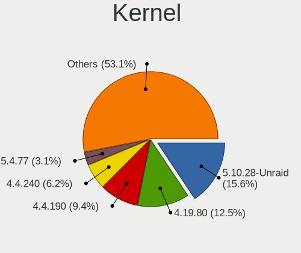

| Version              | Desktops | Percent |
|----------------------|----------|---------|
| 5.10.28-Unraid       | 5        | 15.63%  |
| 4.19.80              | 4        | 12.5%   |
| 4.4.190              | 3        | 9.38%   |
| 4.4.240              | 2        | 6.25%   |
| 5.4.77               | 1        | 3.13%   |
| 5.4.53-APRL          | 1        | 3.13%   |
| 5.4.43               | 1        | 3.13%   |
| 5.4.0-rc2-vto        | 1        | 3.13%   |
| 5.15.50-cwl          | 1        | 3.13%   |
| 5.12.12              | 1        | 3.13%   |
| 5.10.44-slack64-host | 1        | 3.13%   |
| 5.10.40              | 1        | 3.13%   |
| 4.9.248.a            | 1        | 3.13%   |
| 4.9.118              | 1        | 3.13%   |
| 4.4.261              | 1        | 3.13%   |
| 4.4.189              | 1        | 3.13%   |
| 4.4.14               | 1        | 3.13%   |
| 4.20.11              | 1        | 3.13%   |
| 4.19.98-Unraid       | 1        | 3.13%   |
| 4.19.88-Unraid       | 1        | 3.13%   |
| 4.19.107-Unraid      | 1        | 3.13%   |
| 4.19.10              | 1        | 3.13%   |

Kernel Family
-------------

Linux kernel without a distro release

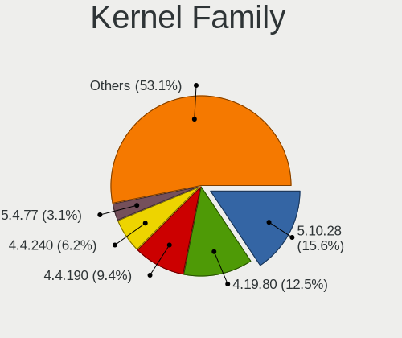

| Version  | Desktops | Percent |
|----------|----------|---------|
| 5.10.28  | 5        | 15.63%  |
| 4.19.80  | 4        | 12.5%   |
| 4.4.190  | 3        | 9.38%   |
| 4.4.240  | 2        | 6.25%   |
| 5.4.77   | 1        | 3.13%   |
| 5.4.53   | 1        | 3.13%   |
| 5.4.43   | 1        | 3.13%   |
| 5.4.0    | 1        | 3.13%   |
| 5.15.50  | 1        | 3.13%   |
| 5.12.12  | 1        | 3.13%   |
| 5.10.44  | 1        | 3.13%   |
| 5.10.40  | 1        | 3.13%   |
| 4.9.248  | 1        | 3.13%   |
| 4.9.118  | 1        | 3.13%   |
| 4.4.261  | 1        | 3.13%   |
| 4.4.189  | 1        | 3.13%   |
| 4.4.14   | 1        | 3.13%   |
| 4.20.11  | 1        | 3.13%   |
| 4.19.98  | 1        | 3.13%   |
| 4.19.88  | 1        | 3.13%   |
| 4.19.107 | 1        | 3.13%   |
| 4.19.10  | 1        | 3.13%   |

Kernel Major Ver.
-----------------

Linux kernel major version

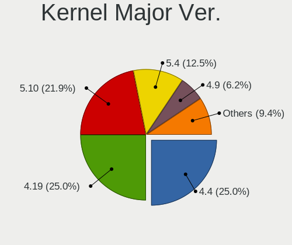

| Version | Desktops | Percent |
|---------|----------|---------|
| 4.4     | 8        | 25%     |
| 4.19    | 8        | 25%     |
| 5.10    | 7        | 21.88%  |
| 5.4     | 4        | 12.5%   |
| 4.9     | 2        | 6.25%   |
| 5.15    | 1        | 3.13%   |
| 5.12    | 1        | 3.13%   |
| 4.20    | 1        | 3.13%   |

Arch
----

OS architecture (x86_64, i586, etc.)

| Name   | Desktops | Percent |
|--------|----------|---------|
| x86_64 | 32       | 100%    |

DE
--

Desktop Environment

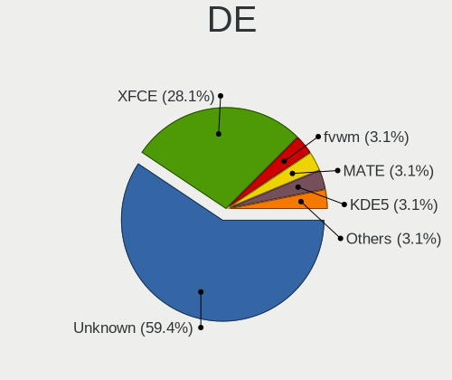

| Name    | Desktops | Percent |
|---------|----------|---------|
| Unknown | 19       | 59.38%  |
| XFCE    | 9        | 28.13%  |
| MATE    | 1        | 3.13%   |
| KDE5    | 1        | 3.13%   |
| KDE     | 1        | 3.13%   |
| fvwm    | 1        | 3.13%   |

Display Server
--------------

X11 or Wayland

| Name    | Desktops | Percent |
|---------|----------|---------|
| X11     | 21       | 65.63%  |
| Unknown | 7        | 21.88%  |
| Tty     | 3        | 9.38%   |
| Wayland | 1        | 3.13%   |

Display Manager
---------------

SDDM, LightDM, etc.

| Name    | Desktops | Percent |
|---------|----------|---------|
| Unknown | 17       | 53.13%  |
| XDM     | 11       | 34.38%  |
| SLiM    | 2        | 6.25%   |
| SDDM    | 2        | 6.25%   |

OS Lang
-------

Language

| Lang    | Desktops | Percent |
|---------|----------|---------|
| Unknown | 16       | 50%     |
| en_US   | 11       | 34.38%  |
| ru_RU   | 1        | 3.13%   |
| it_IT   | 1        | 3.13%   |
| en_GB   | 1        | 3.13%   |
| en_AU   | 1        | 3.13%   |
| C       | 1        | 3.13%   |

Boot Mode
---------

EFI or BIOS

| Mode | Desktops | Percent |
|------|----------|---------|
| BIOS | 20       | 62.5%   |
| EFI  | 12       | 37.5%   |

Filesystem
----------

Type of filesystem

| Type     | Desktops | Percent |
|----------|----------|---------|
| Ext4     | 21       | 65.63%  |
| Btrfs    | 5        | 15.63%  |
| Rootfs   | 3        | 9.38%   |
| Xfs      | 2        | 6.25%   |
| Reiserfs | 1        | 3.13%   |

Part. scheme
------------

Scheme of partitioning

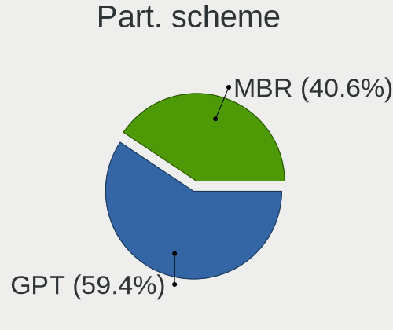

| Type | Desktops | Percent |
|------|----------|---------|
| GPT  | 19       | 59.38%  |
| MBR  | 13       | 40.63%  |

Dual Boot with Linux/BSD
------------------------

Hosting more than one Linux/BSD

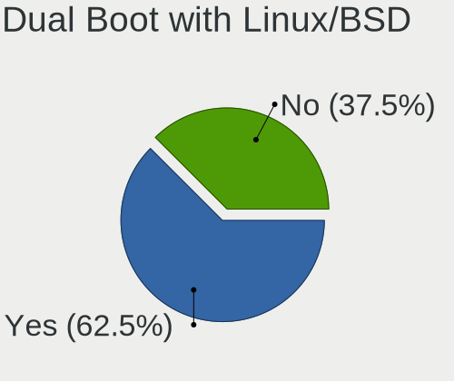

| Dual boot | Desktops | Percent |
|-----------|----------|---------|
| Yes       | 20       | 62.5%   |
| No        | 12       | 37.5%   |

Dual Boot (Win)
---------------

Hosting Linux and Windows

| Dual boot | Desktops | Percent |
|-----------|----------|---------|
| No        | 21       | 65.63%  |
| Yes       | 11       | 34.38%  |

Board
-----

Vendor
------

Motherboard manufacturer

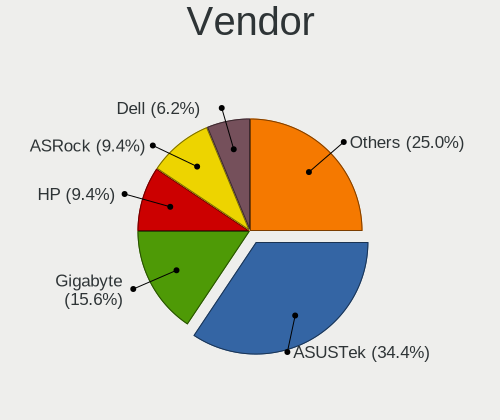

| Name                | Desktops | Percent |
|---------------------|----------|---------|
| ASUSTek Computer    | 11       | 34.38%  |
| Gigabyte Technology | 5        | 15.63%  |
| Hewlett-Packard     | 3        | 9.38%   |
| ASRock              | 3        | 9.38%   |
| Dell                | 2        | 6.25%   |
| Supermicro          | 1        | 3.13%   |
| Shuttle             | 1        | 3.13%   |
| NetGear             | 1        | 3.13%   |
| MSI                 | 1        | 3.13%   |
| Intel               | 1        | 3.13%   |
| Huanan              | 1        | 3.13%   |
| HPE                 | 1        | 3.13%   |
| Foxconn             | 1        | 3.13%   |

Model
-----

Motherboard model

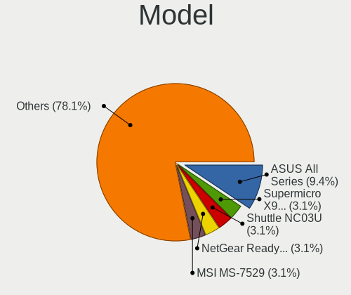

| Name                                | Desktops | Percent |
|-------------------------------------|----------|---------|
| ASUS All Series                     | 3        | 9.38%   |
| Supermicro X9DA7/E                  | 1        | 3.13%   |
| Shuttle NC03U                       | 1        | 3.13%   |
| NetGear ReadyDATA 5200              | 1        | 3.13%   |
| MSI MS-7529                         | 1        | 3.13%   |
| Intel DZ77RE-75K AAG39010-302       | 1        | 3.13%   |
| Huanan X79-8D VAA31                 | 1        | 3.13%   |
| HPE ProLiant MicroServer Gen10 Plus | 1        | 3.13%   |
| HP Z620 Workstation                 | 1        | 3.13%   |
| HP t620 Quad Core TC                | 1        | 3.13%   |
| HP 500-515na                        | 1        | 3.13%   |
| Gigabyte X570 AORUS MASTER          | 1        | 3.13%   |
| Gigabyte X150M-PRO ECC              | 1        | 3.13%   |
| Gigabyte N3160TN                    | 1        | 3.13%   |
| Gigabyte M61SME-S2                  | 1        | 3.13%   |
| Gigabyte 970A-DS3P                  | 1        | 3.13%   |
| Foxconn p6-2390                     | 1        | 3.13%   |
| Dell Precision WorkStation T3400    | 1        | 3.13%   |
| Dell Precision T3600                | 1        | 3.13%   |
| ASUS ROG STRIX X470-F GAMING        | 1        | 3.13%   |
| ASUS Pro WS X570-ACE                | 1        | 3.13%   |
| ASUS PRIME X370-PRO                 | 1        | 3.13%   |
| ASUS PRIME B450-PLUS                | 1        | 3.13%   |
| ASUS PRIME B350M-A                  | 1        | 3.13%   |
| ASUS P5QLD PRO                      | 1        | 3.13%   |
| ASUS M5A97 R2.0                     | 1        | 3.13%   |
| ASUS A68HM-PLUS                     | 1        | 3.13%   |
| ASRock Z390M-ITX/ac                 | 1        | 3.13%   |
| ASRock H87M Pro4                    | 1        | 3.13%   |
| ASRock H310CM-HDV                   | 1        | 3.13%   |

Model Family
------------

Motherboard model prefix

| Name               | Desktops | Percent |
|--------------------|----------|---------|
| ASUS PRIME         | 3        | 9.38%   |
| ASUS All           | 3        | 9.38%   |
| Dell Precision     | 2        | 6.25%   |
| Supermicro X9DA7   | 1        | 3.13%   |
| Shuttle NC03U      | 1        | 3.13%   |
| NetGear ReadyDATA  | 1        | 3.13%   |
| MSI MS-7529        | 1        | 3.13%   |
| Intel DZ77RE-75K   | 1        | 3.13%   |
| Huanan X79-8D      | 1        | 3.13%   |
| HPE ProLiant       | 1        | 3.13%   |
| HP Z620            | 1        | 3.13%   |
| HP t620            | 1        | 3.13%   |
| HP 500-515na       | 1        | 3.13%   |
| Gigabyte X570      | 1        | 3.13%   |
| Gigabyte X150M-PRO | 1        | 3.13%   |
| Gigabyte N3160TN   | 1        | 3.13%   |
| Gigabyte M61SME-S2 | 1        | 3.13%   |
| Gigabyte 970A-DS3P | 1        | 3.13%   |
| Foxconn p6-2390    | 1        | 3.13%   |
| ASUS ROG           | 1        | 3.13%   |
| ASUS Pro           | 1        | 3.13%   |
| ASUS P5QLD         | 1        | 3.13%   |
| ASUS M5A97         | 1        | 3.13%   |
| ASUS A68HM-PLUS    | 1        | 3.13%   |
| ASRock Z390M-ITX   | 1        | 3.13%   |
| ASRock H87M        | 1        | 3.13%   |
| ASRock H310CM-HDV  | 1        | 3.13%   |

MFG Year
--------

Motherboard manufacture year

| Year | Desktops | Percent |
|------|----------|---------|
| 2019 | 5        | 15.63%  |
| 2018 | 4        | 12.5%   |
| 2017 | 4        | 12.5%   |
| 2012 | 4        | 12.5%   |
| 2014 | 3        | 9.38%   |
| 2016 | 2        | 6.25%   |
| 2015 | 2        | 6.25%   |
| 2013 | 2        | 6.25%   |
| 2009 | 2        | 6.25%   |
| 2020 | 1        | 3.13%   |
| 2011 | 1        | 3.13%   |
| 2008 | 1        | 3.13%   |
| 2007 | 1        | 3.13%   |

Form Factor
-----------

Physical design of the computer

| Name    | Desktops | Percent |
|---------|----------|---------|
| Desktop | 32       | 100%    |

Secure Boot
-----------

Enabled or disabled

| State    | Desktops | Percent |
|----------|----------|---------|
| Disabled | 32       | 100%    |

Coreboot
--------

Have coreboot on board

| Used | Desktops | Percent |
|------|----------|---------|
| No   | 32       | 100%    |

RAM Size
--------

Total RAM memory

| Size in GB  | Desktops | Percent |
|-------------|----------|---------|
| 16.01-24.0  | 8        | 25%     |
| 8.01-16.0   | 7        | 21.88%  |
| 32.01-64.0  | 5        | 15.63%  |
| 4.01-8.0    | 4        | 12.5%   |
| 64.01-256.0 | 4        | 12.5%   |
| 3.01-4.0    | 3        | 9.38%   |
| 24.01-32.0  | 1        | 3.13%   |

RAM Used
--------

Used RAM memory

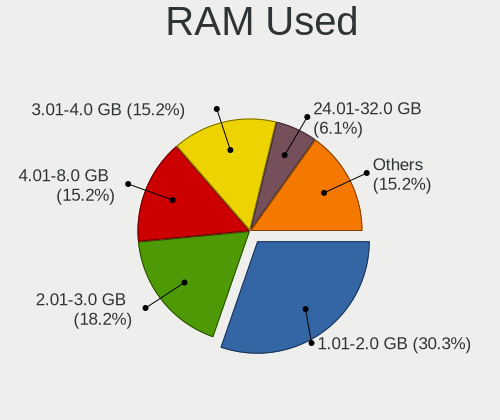

| Used GB     | Desktops | Percent |
|-------------|----------|---------|
| 1.01-2.0    | 10       | 30.3%   |
| 2.01-3.0    | 6        | 18.18%  |
| 4.01-8.0    | 5        | 15.15%  |
| 3.01-4.0    | 5        | 15.15%  |
| 24.01-32.0  | 2        | 6.06%   |
| 8.01-16.0   | 2        | 6.06%   |
| 64.01-256.0 | 1        | 3.03%   |
| 16.01-24.0  | 1        | 3.03%   |
| 0.01-0.5    | 1        | 3.03%   |

Total Drives
------------

Number of drives on board

| Drives | Desktops | Percent |
|--------|----------|---------|
| 1      | 9        | 28.13%  |
| 3      | 6        | 18.75%  |
| 4      | 5        | 15.63%  |
| 5      | 4        | 12.5%   |
| 6      | 2        | 6.25%   |
| 2      | 2        | 6.25%   |
| 13     | 1        | 3.13%   |
| 8      | 1        | 3.13%   |
| 7      | 1        | 3.13%   |
| 0      | 1        | 3.13%   |

Has CD-ROM
----------

Has CD-ROM on board

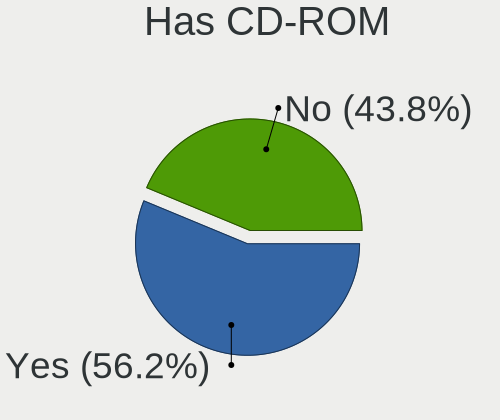

| Presented | Desktops | Percent |
|-----------|----------|---------|
| Yes       | 18       | 56.25%  |
| No        | 14       | 43.75%  |

Has Ethernet
------------

Has Ethernet on board

| Presented | Desktops | Percent |
|-----------|----------|---------|
| Yes       | 32       | 100%    |

Has WiFi
--------

Has WiFi module

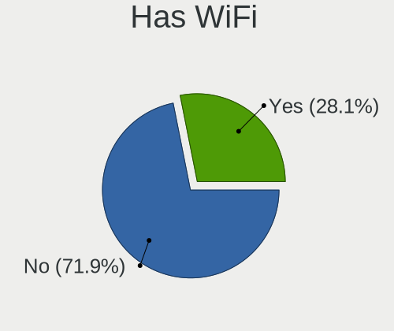

| Presented | Desktops | Percent |
|-----------|----------|---------|
| No        | 23       | 71.88%  |
| Yes       | 9        | 28.13%  |

Has Bluetooth
-------------

Has Bluetooth module

| Presented | Desktops | Percent |
|-----------|----------|---------|
| No        | 21       | 65.63%  |
| Yes       | 11       | 34.38%  |

Location
--------

Country
-------

Geographic location (country)

| Country   | Desktops | Percent |
|-----------|----------|---------|
| USA       | 9        | 28.13%  |
| UK        | 5        | 15.63%  |
| Russia    | 3        | 9.38%   |
| Germany   | 3        | 9.38%   |
| Sweden    | 2        | 6.25%   |
| France    | 2        | 6.25%   |
| Canada    | 2        | 6.25%   |
| Spain     | 1        | 3.13%   |
| Portugal  | 1        | 3.13%   |
| Italy     | 1        | 3.13%   |
| Hong Kong | 1        | 3.13%   |
| Bulgaria  | 1        | 3.13%   |
| Australia | 1        | 3.13%   |

City
----

Geographic location (city)

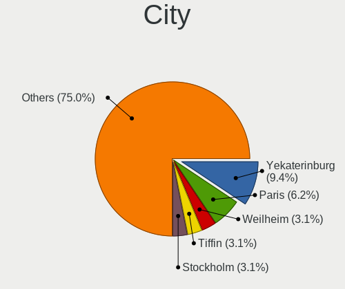

| City            | Desktops | Percent |
|-----------------|----------|---------|
| Yekaterinburg   | 3        | 9.38%   |
| Paris           | 2        | 6.25%   |
| Weilheim        | 1        | 3.13%   |
| Tiffin          | 1        | 3.13%   |
| Stockholm       | 1        | 3.13%   |
| Springfield     | 1        | 3.13%   |
| Southend-on-Sea | 1        | 3.13%   |
| Shrewsbury      | 1        | 3.13%   |
| Plovdiv         | 1        | 3.13%   |
| Palma           | 1        | 3.13%   |
| Ottawa          | 1        | 3.13%   |
| Oldham          | 1        | 3.13%   |
| Naples          | 1        | 3.13%   |
| Milwaukee       | 1        | 3.13%   |
| Mason           | 1        | 3.13%   |
| Lisbon          | 1        | 3.13%   |
| Lexington       | 1        | 3.13%   |
| Kowloon         | 1        | 3.13%   |
| Koblenz         | 1        | 3.13%   |
| Hampstead       | 1        | 3.13%   |
| Gothenburg      | 1        | 3.13%   |
| Garfield        | 1        | 3.13%   |
| Düsseldorf     | 1        | 3.13%   |
| Dallas          | 1        | 3.13%   |
| Carrollton      | 1        | 3.13%   |
| Camp Hill       | 1        | 3.13%   |
| Brisbane        | 1        | 3.13%   |
| Barry           | 1        | 3.13%   |
| Barrie          | 1        | 3.13%   |

Drives
------

Drive Vendor
------------

Hard drive vendors

| Vendor              | Desktops | Drives | Percent |
|---------------------|----------|--------|---------|
| WDC                 | 15       | 37     | 25.42%  |
| Seagate             | 11       | 28     | 18.64%  |
| Samsung Electronics | 9        | 18     | 15.25%  |
| Toshiba             | 5        | 11     | 8.47%   |
| Kingston            | 3        | 3      | 5.08%   |
| Hitachi             | 3        | 3      | 5.08%   |
| Intel               | 2        | 2      | 3.39%   |
| A-DATA Technology   | 2        | 2      | 3.39%   |
| Team                | 1        | 1      | 1.69%   |
| SK hynix            | 1        | 1      | 1.69%   |
| SanDisk             | 1        | 1      | 1.69%   |
| Maxtor              | 1        | 1      | 1.69%   |
| HGST                | 1        | 1      | 1.69%   |
| Fujitsu             | 1        | 1      | 1.69%   |
| Crucial             | 1        | 1      | 1.69%   |
| China               | 1        | 2      | 1.69%   |
| Apple               | 1        | 2      | 1.69%   |

Drive Model
-----------

Hard drive models

| Model                           | Desktops | Percent |
|---------------------------------|----------|---------|
| WDC WD1003FZEX-00MK2A0 1TB      | 2        | 2.35%   |
| Toshiba MQ01ABD100 1TB          | 2        | 2.35%   |
| Seagate ST500DM002-1BD142 500GB | 2        | 2.35%   |
| Seagate ST4000VN008-2DR166 4TB  | 2        | 2.35%   |
| Seagate ST31000524AS 1TB        | 2        | 2.35%   |
| WDC WDS100T2B0C-00PXH0 1TB      | 1        | 1.18%   |
| WDC WD5000BPVT-2 500GB          | 1        | 1.18%   |
| WDC WD5000BPKX-60HPJT0 500GB    | 1        | 1.18%   |
| WDC WD5000AAKX-00ERMA0 500GB    | 1        | 1.18%   |
| WDC WD5000AAKS-00V0A0 500GB     | 1        | 1.18%   |
| WDC WD5000AAKS-00A7B2 500GB     | 1        | 1.18%   |
| WDC WD40EFRX-68WT0N0 4TB        | 1        | 1.18%   |
| WDC WD40EFRX-68N32N0 4TB        | 1        | 1.18%   |
| WDC WD30EZRX-00SPEB0 3TB        | 1        | 1.18%   |
| WDC WD30EZRX-00M                | 1        | 1.18%   |
| WDC WD30EFRX-68EUZN0 3TB        | 1        | 1.18%   |
| WDC WD30EFRX-68AX9N0 3TB        | 1        | 1.18%   |
| WDC WD2003FZEX-00Z4SA0 2TB      | 1        | 1.18%   |
| WDC WD2003FZEX-0 2TB            | 1        | 1.18%   |
| WDC WD1600AAJS-00PSA0 160GB     | 1        | 1.18%   |
| WDC WD120EDAZ-11F3RA0 12TB      | 1        | 1.18%   |
| WDC WD10EZRZ-00HTKB0 1TB        | 1        | 1.18%   |
| WDC WD10EZEX-22BN5A0 1TB        | 1        | 1.18%   |
| WDC WD10EZEX-00RKKA0 1TB        | 1        | 1.18%   |
| WDC WD10EZEX-00BN5A0 1TB        | 1        | 1.18%   |
| WDC WD10EURX-61C57Y0 1TB        | 1        | 1.18%   |
| WDC WD10EALS-00Z8A0 1TB         | 1        | 1.18%   |
| WDC WD100EMAZ-00WJTA0 10TB      | 1        | 1.18%   |
| WDC WD1003FZEX-00K3CA0 1TB      | 1        | 1.18%   |
| Toshiba MG07ACA12TE 12TB        | 1        | 1.18%   |
| Toshiba HDWD110 1TB             | 1        | 1.18%   |
| Toshiba DT01ACA200 2TB          | 1        | 1.18%   |
| Toshiba DT01ACA100 1TB          | 1        | 1.18%   |
| Team T253X1480G 480GB SSD       | 1        | 1.18%   |
| SK hynix SHGP31-1000GM-2 1TB    | 1        | 1.18%   |
| Seagate ST980310AS 80GB         | 1        | 1.18%   |
| Seagate ST4000DM004-2CV104 4TB  | 1        | 1.18%   |
| Seagate ST380819AS 80GB         | 1        | 1.18%   |
| Seagate ST380011A 80GB          | 1        | 1.18%   |
| Seagate ST3500418AS 500GB       | 1        | 1.18%   |

HDD Vendor
----------

Hard disk drive vendors

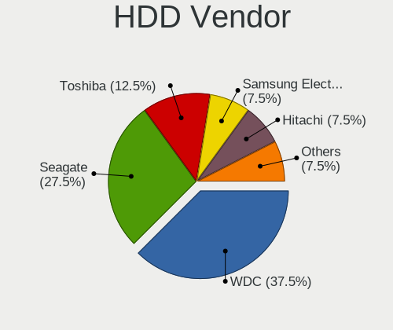

| Vendor              | Desktops | Drives | Percent |
|---------------------|----------|--------|---------|
| WDC                 | 15       | 36     | 37.5%   |
| Seagate             | 11       | 24     | 27.5%   |
| Toshiba             | 5        | 11     | 12.5%   |
| Samsung Electronics | 3        | 3      | 7.5%    |
| Hitachi             | 3        | 3      | 7.5%    |
| Maxtor              | 1        | 1      | 2.5%    |
| HGST                | 1        | 1      | 2.5%    |
| Fujitsu             | 1        | 1      | 2.5%    |

SSD Vendor
----------

Solid state drive vendors

| Vendor              | Desktops | Drives | Percent |
|---------------------|----------|--------|---------|
| Samsung Electronics | 5        | 10     | 33.33%  |
| Kingston            | 3        | 3      | 20%     |
| Team                | 1        | 1      | 6.67%   |
| SanDisk             | 1        | 1      | 6.67%   |
| Intel               | 1        | 1      | 6.67%   |
| Crucial             | 1        | 1      | 6.67%   |
| China               | 1        | 2      | 6.67%   |
| Apple               | 1        | 2      | 6.67%   |
| A-DATA Technology   | 1        | 1      | 6.67%   |

Drive Kind
----------

HDD or SSD

| Kind    | Desktops | Drives | Percent |
|---------|----------|--------|---------|
| HDD     | 26       | 80     | 53.06%  |
| SSD     | 14       | 22     | 28.57%  |
| NVMe    | 8        | 9      | 16.33%  |
| Unknown | 1        | 4      | 2.04%   |

Drive Connector
---------------

SATA, SAS, NVMe, etc.

| Type | Desktops | Drives | Percent |
|------|----------|--------|---------|
| SATA | 29       | 98     | 76.32%  |
| NVMe | 8        | 9      | 21.05%  |
| SAS  | 1        | 8      | 2.63%   |

Drive Size
----------

Size of hard drive

| Size in TB | Desktops | Drives | Percent |
|------------|----------|--------|---------|
| 0.01-0.5   | 21       | 38     | 43.75%  |
| 0.51-1.0   | 12       | 33     | 25%     |
| 1.01-2.0   | 5        | 8      | 10.42%  |
| 2.01-3.0   | 4        | 8      | 8.33%   |
| 3.01-4.0   | 3        | 9      | 6.25%   |
| 10.01-20.0 | 2        | 5      | 4.17%   |
| 4.01-10.0  | 1        | 1      | 2.08%   |

Space Total
-----------

Amount of disk space available on the file system

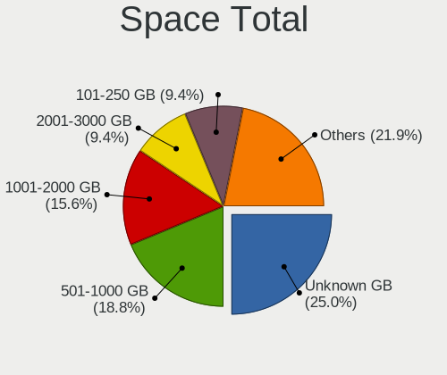

| Size in GB     | Desktops | Percent |
|----------------|----------|---------|
| Unknown        | 8        | 25%     |
| 501-1000       | 6        | 18.75%  |
| 1001-2000      | 5        | 15.63%  |
| 2001-3000      | 3        | 9.38%   |
| 101-250        | 3        | 9.38%   |
| 251-500        | 2        | 6.25%   |
| 51-100         | 2        | 6.25%   |
| More than 3000 | 1        | 3.13%   |
| 21-50          | 1        | 3.13%   |
| 1-20           | 1        | 3.13%   |

Space Used
----------

Amount of used disk space

| Used GB        | Desktops | Percent |
|----------------|----------|---------|
| Unknown        | 8        | 25%     |
| 101-250        | 5        | 15.63%  |
| 501-1000       | 5        | 15.63%  |
| 51-100         | 4        | 12.5%   |
| 251-500        | 3        | 9.38%   |
| 1-20           | 3        | 9.38%   |
| 1001-2000      | 2        | 6.25%   |
| More than 3000 | 1        | 3.13%   |
| 21-50          | 1        | 3.13%   |

Malfunc. Drives
---------------

Drive models with a malfunction

| Model                              | Desktops | Drives | Percent |
|------------------------------------|----------|--------|---------|
| WDC WD5000BPKX-60HPJT0 500GB       | 1        | 1      | 5%      |
| WDC WD5000AAKX-00ERMA0 500GB       | 1        | 1      | 5%      |
| WDC WD5000AAKS-00A7B2 500GB        | 1        | 1      | 5%      |
| WDC WD40EFRX-68WT0N0 4TB           | 1        | 2      | 5%      |
| WDC WD30EZRX-00M                   | 1        | 1      | 5%      |
| WDC WD30EFRX-68AX9N0 3TB           | 1        | 4      | 5%      |
| WDC WD10EZEX-00RKKA0 1TB           | 1        | 1      | 5%      |
| WDC WD10EALS-00Z8A0 1TB            | 1        | 2      | 5%      |
| WDC WD1003FZEX-00MK2A0 1TB         | 1        | 2      | 5%      |
| Seagate ST380011A 80GB             | 1        | 1      | 5%      |
| Seagate ST3500418AS 500GB          | 1        | 1      | 5%      |
| Seagate ST3500410AS 500GB          | 1        | 1      | 5%      |
| Seagate ST31000524AS 1TB           | 1        | 1      | 5%      |
| Seagate ST1000VM002-1SD102 1TB     | 1        | 1      | 5%      |
| Seagate ST1000NM0011 1TB           | 1        | 2      | 5%      |
| SanDisk SDSA6MM-016G-1006 16GB SSD | 1        | 1      | 5%      |
| Maxtor 4G120J6 128GB               | 1        | 1      | 5%      |
| Intel SSDSA2M080G2GC 80GB          | 1        | 1      | 5%      |
| Hitachi HDS721050CLA660 500GB      | 1        | 1      | 5%      |
| HGST HDN726040ALE614 4TB           | 1        | 1      | 5%      |

Malfunc. Drive Vendor
---------------------

Vendors of faulty drives

| Vendor  | Desktops | Drives | Percent |
|---------|----------|--------|---------|
| WDC     | 7        | 15     | 38.89%  |
| Seagate | 6        | 7      | 33.33%  |
| SanDisk | 1        | 1      | 5.56%   |
| Maxtor  | 1        | 1      | 5.56%   |
| Intel   | 1        | 1      | 5.56%   |
| Hitachi | 1        | 1      | 5.56%   |
| HGST    | 1        | 1      | 5.56%   |

Malfunc. HDD Vendor
-------------------

Vendors of faulty HDD drives

| Vendor  | Desktops | Drives | Percent |
|---------|----------|--------|---------|
| WDC     | 7        | 15     | 43.75%  |
| Seagate | 6        | 7      | 37.5%   |
| Maxtor  | 1        | 1      | 6.25%   |
| Hitachi | 1        | 1      | 6.25%   |
| HGST    | 1        | 1      | 6.25%   |

Malfunc. Drive Kind
-------------------

Kinds of faulty drives

| Kind | Desktops | Drives | Percent |
|------|----------|--------|---------|
| HDD  | 15       | 25     | 88.24%  |
| SSD  | 2        | 2      | 11.76%  |

Failed Drives
-------------

Failed drive models

Zero info for selected period =(

Failed Drive Vendor
-------------------

Failed drive vendors

Zero info for selected period =(

Drive Status
------------

Number of failed and malfunc. drives

| Status   | Desktops | Drives | Percent |
|----------|----------|--------|---------|
| Works    | 27       | 80     | 60%     |
| Malfunc  | 17       | 27     | 37.78%  |
| Detected | 1        | 8      | 2.22%   |

Storage controller
------------------

Storage Vendor
--------------

Storage controller vendors

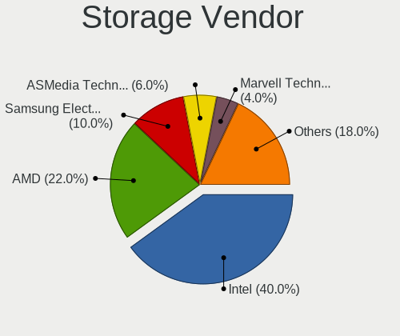

| Vendor                   | Desktops | Percent |
|--------------------------|----------|---------|
| Intel                    | 20       | 40%     |
| AMD                      | 11       | 22%     |
| Samsung Electronics      | 5        | 10%     |
| ASMedia Technology       | 3        | 6%      |
| Marvell Technology Group | 2        | 4%      |
| Broadcom / LSI           | 2        | 4%      |
| SK hynix                 | 1        | 2%      |
| Silicon Image            | 1        | 2%      |
| SanDisk                  | 1        | 2%      |
| Realtek Semiconductor    | 1        | 2%      |
| Nvidia                   | 1        | 2%      |
| JMicron Technology       | 1        | 2%      |
| 3ware                    | 1        | 2%      |

Storage Model
-------------

Storage controller models

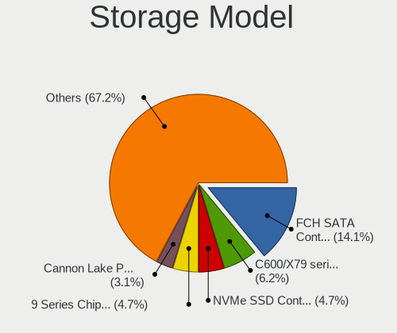

| Model                                                                            | Desktops | Percent |
|----------------------------------------------------------------------------------|----------|---------|
| AMD FCH SATA Controller [AHCI mode]                                              | 9        | 14.06%  |
| Intel C600/X79 series chipset 6-Port SATA AHCI Controller                        | 4        | 6.25%   |
| Samsung NVMe SSD Controller SM981/PM981/PM983                                    | 3        | 4.69%   |
| Intel 9 Series Chipset Family SATA Controller [AHCI Mode]                        | 3        | 4.69%   |
| Intel Cannon Lake PCH SATA AHCI Controller                                       | 2        | 3.13%   |
| Intel C602 chipset 4-Port SATA Storage Control Unit                              | 2        | 3.13%   |
| ASMedia ASM1062 Serial ATA Controller                                            | 2        | 3.13%   |
| AMD SB7x0/SB8x0/SB9x0 SATA Controller [AHCI mode]                                | 2        | 3.13%   |
| AMD 400 Series Chipset SATA Controller                                           | 2        | 3.13%   |
| SK hynix Gold P31/PC711 NVMe Solid State Drive                                   | 1        | 1.56%   |
| Silicon Image SiI 3114 [SATALink/SATARaid] Serial ATA Controller                 | 1        | 1.56%   |
| SanDisk WD Blue SN550 NVMe SSD                                                   | 1        | 1.56%   |
| Samsung NVMe SSD Controller SM961/PM961/SM963                                    | 1        | 1.56%   |
| Samsung Apple PCIe SSD                                                           | 1        | 1.56%   |
| Realtek Realtek Non-Volatile memory controller                                   | 1        | 1.56%   |
| Nvidia MCP61 SATA Controller                                                     | 1        | 1.56%   |
| Nvidia MCP61 IDE                                                                 | 1        | 1.56%   |
| Marvell Group 88SE9172 SATA 6Gb/s Controller                                     | 1        | 1.56%   |
| Marvell Group 88SE9128 PCIe SATA 6 Gb/s RAID controller                          | 1        | 1.56%   |
| JMicron JMB368 IDE controller                                                    | 1        | 1.56%   |
| Intel Sunrise Point-LP SATA Controller [AHCI mode]                               | 1        | 1.56%   |
| Intel SSD 600P Series                                                            | 1        | 1.56%   |
| Intel SATA Controller [RAID mode]                                                | 1        | 1.56%   |
| Intel Q170/Q150/B150/H170/H110/Z170/CM236 Chipset SATA Controller [AHCI Mode]    | 1        | 1.56%   |
| Intel NM10/ICH7 Family SATA Controller [IDE mode]                                | 1        | 1.56%   |
| Intel C608 chipset Dual 4-Port SATA/SAS Storage Control Unit                     | 1        | 1.56%   |
| Intel C600/X79 series chipset IDE-r Controller                                   | 1        | 1.56%   |
| Intel Atom/Celeron/Pentium Processor x5-E8000/J3xxx/N3xxx Series SATA Controller | 1        | 1.56%   |
| Intel 82801JI (ICH10 Family) 4 port SATA IDE Controller #1                       | 1        | 1.56%   |
| Intel 82801JI (ICH10 Family) 2 port SATA IDE Controller #2                       | 1        | 1.56%   |
| Intel 82801IR/IO/IH (ICH9R/DO/DH) 6 port SATA Controller [AHCI mode]             | 1        | 1.56%   |
| Intel 82801G (ICH7 Family) IDE Controller                                        | 1        | 1.56%   |
| Intel 8 Series/C220 Series Chipset Family 4-port SATA Controller 1 [IDE mode]    | 1        | 1.56%   |
| Intel 8 Series/C220 Series Chipset Family 2-port SATA Controller 2 [IDE mode]    | 1        | 1.56%   |
| Intel 7 Series/C210 Series Chipset Family 6-port SATA Controller [AHCI mode]     | 1        | 1.56%   |
| Intel 6 Series/C200 Series Chipset Family 6 port Desktop SATA AHCI Controller    | 1        | 1.56%   |
| Intel 200 Series PCH SATA controller [AHCI mode]                                 | 1        | 1.56%   |
| Broadcom / LSI SAS2308 PCI-Express Fusion-MPT SAS-2                              | 1        | 1.56%   |
| Broadcom / LSI SAS2116 PCI-Express Fusion-MPT SAS-2 [Meteor]                     | 1        | 1.56%   |
| Broadcom / LSI SAS2008 PCI-Express Fusion-MPT SAS-2 [Falcon]                     | 1        | 1.56%   |

Storage Kind
------------

Kind of storage controller (IDE, SATA, NVMe, SAS, ...)

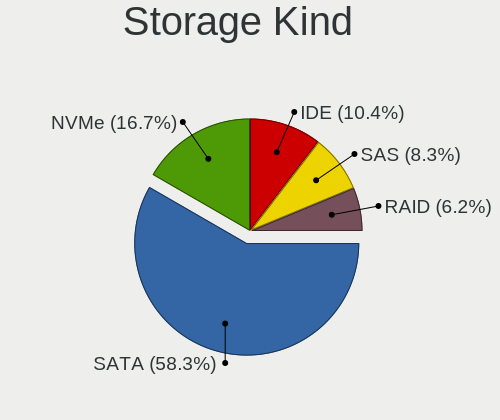

| Kind | Desktops | Percent |
|------|----------|---------|
| SATA | 28       | 58.33%  |
| NVMe | 8        | 16.67%  |
| IDE  | 5        | 10.42%  |
| SAS  | 4        | 8.33%   |
| RAID | 3        | 6.25%   |

Processor
---------

CPU Vendor
----------

Processor vendors

| Vendor | Desktops | Percent |
|--------|----------|---------|
| Intel  | 20       | 62.5%   |
| AMD    | 12       | 37.5%   |

CPU Model
---------

Processor models

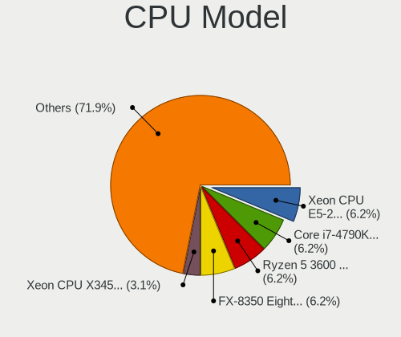

| Model                                      | Desktops | Percent |
|--------------------------------------------|----------|---------|
| Intel Xeon CPU E5-2670 0 @ 2.60GHz         | 2        | 6.25%   |
| Intel Core i7-4790K CPU @ 4.00GHz          | 2        | 6.25%   |
| AMD Ryzen 5 3600 6-Core Processor          | 2        | 6.25%   |
| AMD FX-8350 Eight-Core Processor           | 2        | 6.25%   |
| Intel Xeon CPU X3450 @ 2.67GHz             | 1        | 3.13%   |
| Intel Xeon CPU E5-2620 0 @ 2.00GHz         | 1        | 3.13%   |
| Intel Xeon CPU E5-1650 0 @ 3.20GHz         | 1        | 3.13%   |
| Intel Xeon CPU E3-1246 v3 @ 3.50GHz        | 1        | 3.13%   |
| Intel Pentium Gold G5420 CPU @ 3.80GHz     | 1        | 3.13%   |
| Intel Pentium CPU G640 @ 2.80GHz           | 1        | 3.13%   |
| Intel Pentium CPU G4560 @ 3.50GHz          | 1        | 3.13%   |
| Intel Core i7-9700 CPU @ 3.00GHz           | 1        | 3.13%   |
| Intel Core i5-9400 CPU @ 2.90GHz           | 1        | 3.13%   |
| Intel Core i5-7200U CPU @ 2.50GHz          | 1        | 3.13%   |
| Intel Core i5-4690 CPU @ 3.50GHz           | 1        | 3.13%   |
| Intel Core i5-3470 CPU @ 3.20GHz           | 1        | 3.13%   |
| Intel Core 2 Quad CPU Q8400 @ 2.66GHz      | 1        | 3.13%   |
| Intel Core 2 Quad CPU Q6700 @ 2.66GHz      | 1        | 3.13%   |
| Intel Core 2 Duo CPU E8400 @ 3.00GHz       | 1        | 3.13%   |
| Intel Celeron CPU N3160 @ 1.60GHz          | 1        | 3.13%   |
| AMD Ryzen 9 3950X 16-Core Processor        | 1        | 3.13%   |
| AMD Ryzen 9 3900X 12-Core Processor        | 1        | 3.13%   |
| AMD Ryzen 7 3800X 8-Core Processor         | 1        | 3.13%   |
| AMD Ryzen 7 1700X Eight-Core Processor     | 1        | 3.13%   |
| AMD GX-415GA SOC with Radeon HD Graphics   | 1        | 3.13%   |
| AMD Athlon 64 X2 Dual Core Processor 5200+ | 1        | 3.13%   |
| AMD A4-7300 APU with Radeon HD Graphics    | 1        | 3.13%   |
| AMD A10-5700 APU with Radeon HD Graphics   | 1        | 3.13%   |

CPU Model Family
----------------

Processor model prefix

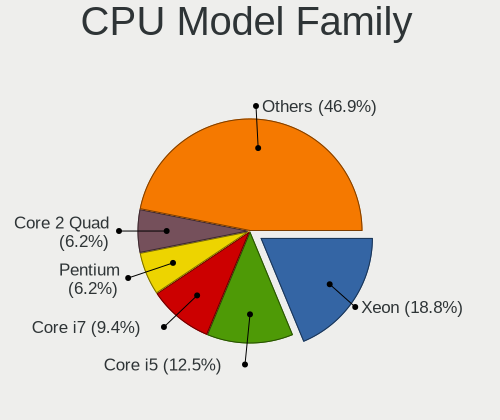

| Model              | Desktops | Percent |
|--------------------|----------|---------|
| Intel Xeon         | 6        | 18.75%  |
| Intel Core i5      | 4        | 12.5%   |
| Intel Core i7      | 3        | 9.38%   |
| Intel Pentium      | 2        | 6.25%   |
| Intel Core 2 Quad  | 2        | 6.25%   |
| AMD Ryzen 9        | 2        | 6.25%   |
| AMD Ryzen 7        | 2        | 6.25%   |
| AMD Ryzen 5        | 2        | 6.25%   |
| AMD FX             | 2        | 6.25%   |
| Intel Pentium Gold | 1        | 3.13%   |
| Intel Core 2 Duo   | 1        | 3.13%   |
| Intel Celeron      | 1        | 3.13%   |
| AMD GX             | 1        | 3.13%   |
| AMD Athlon 64 X2   | 1        | 3.13%   |
| AMD A4             | 1        | 3.13%   |
| AMD A10            | 1        | 3.13%   |

CPU Cores
---------

Number of processor cores

| Number | Desktops | Percent |
|--------|----------|---------|
| 4      | 12       | 37.5%   |
| 2      | 7        | 21.88%  |
| 6      | 4        | 12.5%   |
| 16     | 3        | 9.38%   |
| 8      | 3        | 9.38%   |
| 12     | 2        | 6.25%   |
| 1      | 1        | 3.13%   |

CPU Sockets
-----------

Number of sockets

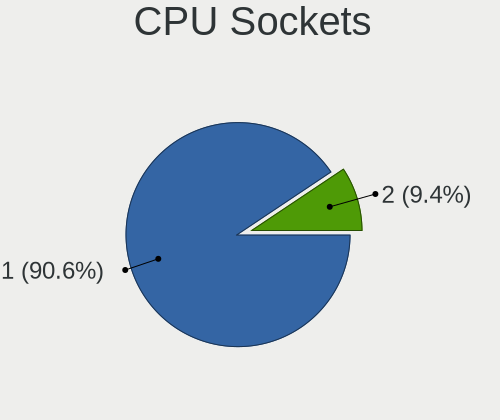

| Number | Desktops | Percent |
|--------|----------|---------|
| 1      | 29       | 90.63%  |
| 2      | 3        | 9.38%   |

CPU Threads
-----------

Threads per core (Hyper-Threading)

| Number | Desktops | Percent |
|--------|----------|---------|
| 2      | 21       | 65.63%  |
| 1      | 11       | 34.38%  |

CPU Op-Modes
------------

CPU Operation Modes (32-bit, 64-bit)

| Op mode        | Desktops | Percent |
|----------------|----------|---------|
| 32-bit, 64-bit | 32       | 100%    |

CPU Microcode
-------------

Microcode number

| Number     | Desktops | Percent |
|------------|----------|---------|
| Unknown    | 7        | 21.88%  |
| 0x306c3    | 3        | 9.38%   |
| 0x206d7    | 3        | 9.38%   |
| 0x08701013 | 3        | 9.38%   |
| 0x906ed    | 2        | 6.25%   |
| 0x1067a    | 2        | 6.25%   |
| 0x06001119 | 2        | 6.25%   |
| 0x906ea    | 1        | 3.13%   |
| 0x406c4    | 1        | 3.13%   |
| 0x306a9    | 1        | 3.13%   |
| 0x206a7    | 1        | 3.13%   |
| 0x106e5    | 1        | 3.13%   |
| 0x08701021 | 1        | 3.13%   |
| 0x08001138 | 1        | 3.13%   |
| 0x07000110 | 1        | 3.13%   |
| 0x06000852 | 1        | 3.13%   |
| 0x06000822 | 1        | 3.13%   |

CPU Microarch
-------------

Microarchitecture

| Name        | Desktops | Percent |
|-------------|----------|---------|
| Zen 2       | 5        | 15.63%  |
| SandyBridge | 5        | 15.63%  |
| KabyLake    | 5        | 15.63%  |
| Piledriver  | 4        | 12.5%   |
| Haswell     | 4        | 12.5%   |
| Penryn      | 2        | 6.25%   |
| Zen         | 1        | 3.13%   |
| Silvermont  | 1        | 3.13%   |
| Nehalem     | 1        | 3.13%   |
| K8 Hammer   | 1        | 3.13%   |
| Jaguar      | 1        | 3.13%   |
| IvyBridge   | 1        | 3.13%   |
| Core        | 1        | 3.13%   |

Graphics
--------

GPU Vendor
----------

Vendors of graphics cards

| Vendor                     | Desktops | Percent |
|----------------------------|----------|---------|
| AMD                        | 12       | 38.71%  |
| Nvidia                     | 9        | 29.03%  |
| Intel                      | 8        | 25.81%  |
| Matrox Electronics Systems | 2        | 6.45%   |

GPU Model
---------

Graphics card models

| Model                                                                                    | Desktops | Percent |
|------------------------------------------------------------------------------------------|----------|---------|
| AMD Ellesmere [Radeon RX 470/480/570/570X/580/580X/590]                                  | 3        | 9.09%   |
| Intel CoffeeLake-S GT2 [UHD Graphics 630]                                                | 2        | 6.06%   |
| Nvidia TU116 [GeForce GTX 1660 SUPER]                                                    | 1        | 3.03%   |
| Nvidia GP107GL [Quadro P1000]                                                            | 1        | 3.03%   |
| Nvidia GP107 [GeForce GTX 1050 Ti]                                                       | 1        | 3.03%   |
| Nvidia GM206 [GeForce GTX 960]                                                           | 1        | 3.03%   |
| Nvidia GM204 [GeForce GTX 970]                                                           | 1        | 3.03%   |
| Nvidia GK208B [GeForce GT 710]                                                           | 1        | 3.03%   |
| Nvidia GK110GL [Quadro K5200]                                                            | 1        | 3.03%   |
| Nvidia GK107 [GeForce GT 640]                                                            | 1        | 3.03%   |
| Nvidia GK104GL [Quadro K5000]                                                            | 1        | 3.03%   |
| Nvidia G80GL [Quadro FX 4600]                                                            | 1        | 3.03%   |
| Matrox Electronics Systems MGA G200eW WPCM450                                            | 1        | 3.03%   |
| Matrox Electronics Systems MGA G200eH3                                                   | 1        | 3.03%   |
| Intel Xeon E3-1200 v3/4th Gen Core Processor Integrated Graphics Controller              | 1        | 3.03%   |
| Intel Xeon E3-1200 v3 Processor Integrated Graphics Controller                           | 1        | 3.03%   |
| Intel HD Graphics 620                                                                    | 1        | 3.03%   |
| Intel Atom/Celeron/Pentium Processor x5-E8000/J3xxx/N3xxx Integrated Graphics Controller | 1        | 3.03%   |
| Intel 82G33/G31 Express Integrated Graphics Controller                                   | 1        | 3.03%   |
| Intel 2nd Generation Core Processor Family Integrated Graphics Controller                | 1        | 3.03%   |
| AMD Richland [Radeon HD 8470D]                                                           | 1        | 3.03%   |
| AMD Oland [Radeon HD 8570 / R5 430 OEM / R7 240/340 / Radeon 520 OEM]                    | 1        | 3.03%   |
| AMD Oland PRO [Radeon R7 240/340 / Radeon 520]                                           | 1        | 3.03%   |
| AMD Navi 10 [Radeon RX 5600 OEM/5600 XT / 5700/5700 XT]                                  | 1        | 3.03%   |
| AMD Lexa PRO [Radeon 540/540X/550/550X / RX 540X/550/550X]                               | 1        | 3.03%   |
| AMD Kabini [Radeon HD 8330E]                                                             | 1        | 3.03%   |
| AMD Cypress XT [Radeon HD 5870]                                                          | 1        | 3.03%   |
| AMD Cape Verde PRO [Radeon HD 7750/8740 / R7 250E]                                       | 1        | 3.03%   |
| AMD Baffin [Radeon RX 550 640SP / RX 560/560X]                                           | 1        | 3.03%   |
| AMD Baffin [Radeon RX 460/560D / Pro 450/455/460/555/555X/560/560X]                      | 1        | 3.03%   |

GPU Combo
---------

Combinations of graphics cards

| Name       | Desktops | Percent |
|------------|----------|---------|
| 1 x AMD    | 12       | 37.5%   |
| 1 x Nvidia | 8        | 25%     |
| 1 x Intel  | 8        | 25%     |
| 1 x Matrox | 2        | 6.25%   |
| Other      | 1        | 3.13%   |
| 2 x Nvidia | 1        | 3.13%   |

GPU Driver
----------

Free vs proprietary

| Driver      | Desktops | Percent |
|-------------|----------|---------|
| Free        | 17       | 53.13%  |
| Proprietary | 9        | 28.13%  |
| Unknown     | 6        | 18.75%  |

GPU Memory
----------

Total video memory

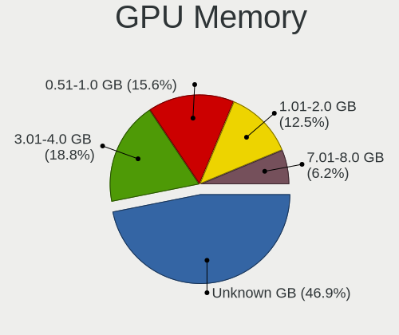

| Size in GB | Desktops | Percent |
|------------|----------|---------|
| Unknown    | 15       | 46.88%  |
| 3.01-4.0   | 6        | 18.75%  |
| 0.51-1.0   | 5        | 15.63%  |
| 1.01-2.0   | 4        | 12.5%   |
| 7.01-8.0   | 2        | 6.25%   |

Monitor
-------

Monitor Vendor
--------------

Monitor vendors

| Vendor               | Desktops | Percent |
|----------------------|----------|---------|
| Dell                 | 4        | 12.9%   |
| Hewlett-Packard      | 3        | 9.68%   |
| Goldstar             | 3        | 9.68%   |
| BenQ                 | 3        | 9.68%   |
| ViewSonic            | 2        | 6.45%   |
| Samsung Electronics  | 2        | 6.45%   |
| Acer                 | 2        | 6.45%   |
| Xiaomi               | 1        | 3.23%   |
| Unknown              | 1        | 3.23%   |
| Toshiba              | 1        | 3.23%   |
| ONN                  | 1        | 3.23%   |
| NEC Computers        | 1        | 3.23%   |
| Lenovo               | 1        | 3.23%   |
| JVC                  | 1        | 3.23%   |
| Iiyama               | 1        | 3.23%   |
| Gigabyte Technology  | 1        | 3.23%   |
| Eizo                 | 1        | 3.23%   |
| ASUSTek Computer     | 1        | 3.23%   |
| Ancor Communications | 1        | 3.23%   |

Monitor Model
-------------

Monitor models

| Model                                                                | Desktops | Percent |
|----------------------------------------------------------------------|----------|---------|
| Xiaomi Mi TV XMD009A 2880x1800 480x270mm 21.7-inch                   | 1        | 3.03%   |
| ViewSonic LCD Monitor VX2276 Series 1920x1080                        | 1        | 3.03%   |
| ViewSonic LCD Monitor VA2448 SERIES 1920x1080                        | 1        | 3.03%   |
| Unknown LCD Monitor FFFF 2288x1287 2550x2550mm 142.0-inch            | 1        | 3.03%   |
| Toshiba TV TSB0206 1920x1080 886x498mm 40.0-inch                     | 1        | 3.03%   |
| Samsung Electronics SyncMaster SAM0578 1920x1080 476x268mm 21.5-inch | 1        | 3.03%   |
| Samsung Electronics SMB2430L SAM0644 1920x1080 521x293mm 23.5-inch   | 1        | 3.03%   |
| ONN ONA18HO015 ONN0101 1920x1080 470x290mm 21.7-inch                 | 1        | 3.03%   |
| NEC Computers LCD2490WUXi NEC66CE 1920x1200 518x324mm 24.1-inch      | 1        | 3.03%   |
| Lenovo LCD Monitor LEN40B2 1920x1080 344x193mm 15.5-inch             | 1        | 3.03%   |
| JVC FPDEUFT3 JVC21BE 1920x540                                        | 1        | 3.03%   |
| Iiyama PLE2207WS IVM5609 1680x1050 474x296mm 22.0-inch               | 1        | 3.03%   |
| Hewlett-Packard ZR2740w HWP2957 2560x1440 597x336mm 27.0-inch        | 1        | 3.03%   |
| Hewlett-Packard LE1851w HWP2840 1366x768 413x234mm 18.7-inch         | 1        | 3.03%   |
| Hewlett-Packard 2309 HWP2823 1920x1080 510x287mm 23.0-inch           | 1        | 3.03%   |
| Goldstar W2242 GSM5678 1680x1050 474x296mm 22.0-inch                 | 1        | 3.03%   |
| Goldstar W2242 GSM5677 1680x1050 474x296mm 22.0-inch                 | 1        | 3.03%   |
| Goldstar FULL HD GSM5ABA 1920x1080 480x270mm 21.7-inch               | 1        | 3.03%   |
| Goldstar BK750Y GSM5B3E 1920x1080 600x340mm 27.2-inch                | 1        | 3.03%   |
| Goldstar BK750Y GSM5B3D 1920x1080 480x270mm 21.7-inch                | 1        | 3.03%   |
| Gigabyte Technology G27Q GBT2709 2560x1440 598x336mm 27.0-inch       | 1        | 3.03%   |
| Eizo M1700 ENC1788 1280x1024 338x271mm 17.1-inch                     | 1        | 3.03%   |
| Dell U2412M DELA07A 1920x1200 518x324mm 24.1-inch                    | 1        | 3.03%   |
| Dell LCD Monitor U2312HM 1920x1080                                   | 1        | 3.03%   |
| Dell E176FP DELA014 1280x1024 338x270mm 17.0-inch                    | 1        | 3.03%   |
| Dell 1905FP DEL400D 1280x1024 376x301mm 19.0-inch                    | 1        | 3.03%   |
| BenQ ZOWIE RL LCD BNQ7F4F 1920x1080 530x300mm 24.0-inch              | 1        | 3.03%   |
| BenQ EW2420 BNQ7923 1920x1080 531x299mm 24.0-inch                    | 1        | 3.03%   |
| BenQ BenQG2222HDL BNQ785A 1920x1080 478x269mm 21.6-inch              | 1        | 3.03%   |
| ASUSTek Computer VA24DQLB AUS2482 1920x1080 527x296mm 23.8-inch      | 1        | 3.03%   |
| Ancor Communications VG248 ACI24E1 1920x1080 531x299mm 24.0-inch     | 1        | 3.03%   |
| Acer K222HQL ACR040D 1920x1080 477x268mm 21.5-inch                   | 1        | 3.03%   |
| Acer AL1714 ACRAD18 1280x1024 338x270mm 17.0-inch                    | 1        | 3.03%   |

Monitor Resolution
------------------

Monitor screen resolution

| Resolution         | Desktops | Percent |
|--------------------|----------|---------|
| 1920x1080 (FHD)    | 16       | 53.33%  |
| 1280x1024 (SXGA)   | 4        | 13.33%  |
| 2560x1440 (QHD)    | 2        | 6.67%   |
| 1920x1200 (WUXGA)  | 2        | 6.67%   |
| 1680x1050 (WSXGA+) | 2        | 6.67%   |
| 3440x1440          | 1        | 3.33%   |
| 2288x1287          | 1        | 3.33%   |
| 1920x540           | 1        | 3.33%   |
| 1366x768 (WXGA)    | 1        | 3.33%   |

Monitor Diagonal
----------------

Diagonal size in inches

| Inches  | Desktops | Percent |
|---------|----------|---------|
| 24      | 6        | 18.75%  |
| 21      | 5        | 15.63%  |
| 27      | 4        | 12.5%   |
| 23      | 4        | 12.5%   |
| Unknown | 4        | 12.5%   |
| 17      | 3        | 9.38%   |
| 142     | 1        | 3.13%   |
| 74      | 1        | 3.13%   |
| 22      | 1        | 3.13%   |
| 19      | 1        | 3.13%   |
| 18      | 1        | 3.13%   |
| 15      | 1        | 3.13%   |

Monitor Width
-------------

Physical width

| Width in mm    | Desktops | Percent |
|----------------|----------|---------|
| 501-600        | 13       | 40.63%  |
| 401-500        | 8        | 25%     |
| 301-350        | 4        | 12.5%   |
| Unknown        | 4        | 12.5%   |
| More than 2000 | 1        | 3.13%   |
| 351-400        | 1        | 3.13%   |
| 1501-2000      | 1        | 3.13%   |

Aspect Ratio
------------

Proportional relationship between the width and the height

| Ratio   | Desktops | Percent |
|---------|----------|---------|
| 16/9    | 14       | 48.28%  |
| 16/10   | 5        | 17.24%  |
| Unknown | 3        | 10.34%  |
| 6/5     | 2        | 6.9%    |
| 5/4     | 2        | 6.9%    |
| 32/9    | 1        | 3.45%   |
| 3/2     | 1        | 3.45%   |
| 1.00    | 1        | 3.45%   |

Monitor Area
------------

Area in inch²

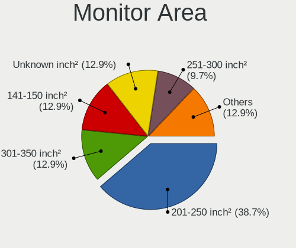

| Area in inch² | Desktops | Percent |
|----------------|----------|---------|
| 201-250        | 12       | 38.71%  |
| 301-350        | 4        | 12.9%   |
| 141-150        | 4        | 12.9%   |
| Unknown        | 4        | 12.9%   |
| 251-300        | 3        | 9.68%   |
| More than 1000 | 2        | 6.45%   |
| 151-200        | 1        | 3.23%   |
| 101-110        | 1        | 3.23%   |

Pixel Density
-------------

Pixels per inch

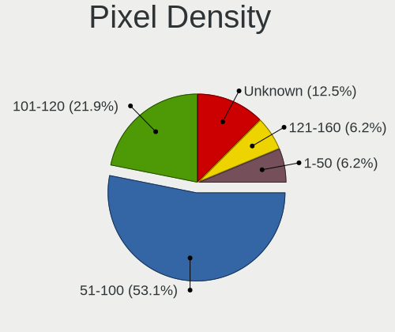

| Density | Desktops | Percent |
|---------|----------|---------|
| 51-100  | 17       | 53.13%  |
| 101-120 | 7        | 21.88%  |
| Unknown | 4        | 12.5%   |
| 1-50    | 2        | 6.25%   |
| 121-160 | 2        | 6.25%   |

Multiple Monitors
-----------------

Total monitors connected

| Total | Desktops | Percent |
|-------|----------|---------|
| 1     | 17       | 53.13%  |
| 0     | 7        | 21.88%  |
| 2     | 6        | 18.75%  |
| 3     | 2        | 6.25%   |

Network
-------

Net Controller Vendor
---------------------

Controller vendors

| Vendor                   | Desktops | Percent |
|--------------------------|----------|---------|
| Intel                    | 17       | 40.48%  |
| Realtek Semiconductor    | 15       | 35.71%  |
| VIA Technologies         | 1        | 2.38%   |
| TP-Link                  | 1        | 2.38%   |
| Ralink Technology        | 1        | 2.38%   |
| Ralink                   | 1        | 2.38%   |
| Qualcomm Atheros         | 1        | 2.38%   |
| Nvidia                   | 1        | 2.38%   |
| Micro Star International | 1        | 2.38%   |
| Mellanox Technologies    | 1        | 2.38%   |
| Chelsio Communications   | 1        | 2.38%   |
| Broadcom                 | 1        | 2.38%   |

Net Controller Model
--------------------

Controller models

| Model                                                                         | Desktops | Percent |
|-------------------------------------------------------------------------------|----------|---------|
| Realtek RTL8111/8168/8411 PCI Express Gigabit Ethernet Controller             | 12       | 23.53%  |
| Intel I211 Gigabit Network Connection                                         | 6        | 11.76%  |
| Intel 82574L Gigabit Network Connection                                       | 4        | 7.84%   |
| Intel Ethernet Connection (2) I218-V                                          | 3        | 5.88%   |
| Realtek RTL8188EE Wireless Network Adapter                                    | 2        | 3.92%   |
| Intel 82579LM Gigabit Network Connection (Lewisville)                         | 2        | 3.92%   |
| VIA VT6105/VT6106S [Rhine-III]                                                | 1        | 1.96%   |
| TP-Link RTL8812AU Archer T4U 802.11ac                                         | 1        | 1.96%   |
| Realtek RTL8125 2.5GbE Controller                                             | 1        | 1.96%   |
| Realtek RTL810xE PCI Express Fast Ethernet controller                         | 1        | 1.96%   |
| Ralink MT7601U Wireless Adapter                                               | 1        | 1.96%   |
| Ralink RT2790 Wireless 802.11n 1T/2R PCIe                                     | 1        | 1.96%   |
| Qualcomm Atheros AR8121/AR8113/AR8114 Gigabit or Fast Ethernet                | 1        | 1.96%   |
| Nvidia MCP61 Ethernet                                                         | 1        | 1.96%   |
| Micro Star International MS-3871 802.11bgn Wireless Module [Ralink RT8070]    | 1        | 1.96%   |
| Mellanox MT26448 [ConnectX EN 10GigE, PCIe 2.0 5GT/s]                         | 1        | 1.96%   |
| Intel Wireless 7260                                                           | 1        | 1.96%   |
| Intel Wi-Fi 6 AX200                                                           | 1        | 1.96%   |
| Intel I350 Gigabit Network Connection                                         | 1        | 1.96%   |
| Intel Ethernet Connection I217-V                                              | 1        | 1.96%   |
| Intel Ethernet Connection (7) I219-V                                          | 1        | 1.96%   |
| Intel Ethernet Connection (2) I219-LM                                         | 1        | 1.96%   |
| Intel Dual Band Wireless-AC 3168NGW [Stone Peak]                              | 1        | 1.96%   |
| Intel 82599ES 10-Gigabit SFI/SFP+ Network Connection                          | 1        | 1.96%   |
| Intel 82579V Gigabit Network Connection                                       | 1        | 1.96%   |
| Intel 82571EB/82571GB Gigabit Ethernet Controller D0/D1 (copper applications) | 1        | 1.96%   |
| Chelsio T320 10GbE Dual Port Adapter                                          | 1        | 1.96%   |
| Broadcom NetXtreme BCM5754 Gigabit Ethernet PCI Express                       | 1        | 1.96%   |

Wireless Vendor
---------------

Wireless vendors

| Vendor                   | Desktops | Percent |
|--------------------------|----------|---------|
| Intel                    | 3        | 33.33%  |
| Realtek Semiconductor    | 2        | 22.22%  |
| TP-Link                  | 1        | 11.11%  |
| Ralink Technology        | 1        | 11.11%  |
| Ralink                   | 1        | 11.11%  |
| Micro Star International | 1        | 11.11%  |

Wireless Model
--------------

Wireless models

| Model                                                                      | Desktops | Percent |
|----------------------------------------------------------------------------|----------|---------|
| Realtek RTL8188EE Wireless Network Adapter                                 | 2        | 22.22%  |
| TP-Link RTL8812AU Archer T4U 802.11ac                                      | 1        | 11.11%  |
| Ralink MT7601U Wireless Adapter                                            | 1        | 11.11%  |
| Ralink RT2790 Wireless 802.11n 1T/2R PCIe                                  | 1        | 11.11%  |
| Micro Star International MS-3871 802.11bgn Wireless Module [Ralink RT8070] | 1        | 11.11%  |
| Intel Wireless 7260                                                        | 1        | 11.11%  |
| Intel Wi-Fi 6 AX200                                                        | 1        | 11.11%  |
| Intel Dual Band Wireless-AC 3168NGW [Stone Peak]                           | 1        | 11.11%  |

Ethernet Vendor
---------------

Ethernet vendors

| Vendor                 | Desktops | Percent |
|------------------------|----------|---------|
| Intel                  | 16       | 44.44%  |
| Realtek Semiconductor  | 14       | 38.89%  |
| VIA Technologies       | 1        | 2.78%   |
| Qualcomm Atheros       | 1        | 2.78%   |
| Nvidia                 | 1        | 2.78%   |
| Mellanox Technologies  | 1        | 2.78%   |
| Chelsio Communications | 1        | 2.78%   |
| Broadcom               | 1        | 2.78%   |

Ethernet Model
--------------

Ethernet models

| Model                                                                         | Desktops | Percent |
|-------------------------------------------------------------------------------|----------|---------|
| Realtek RTL8111/8168/8411 PCI Express Gigabit Ethernet Controller             | 12       | 28.57%  |
| Intel I211 Gigabit Network Connection                                         | 6        | 14.29%  |
| Intel 82574L Gigabit Network Connection                                       | 4        | 9.52%   |
| Intel Ethernet Connection (2) I218-V                                          | 3        | 7.14%   |
| Intel 82579LM Gigabit Network Connection (Lewisville)                         | 2        | 4.76%   |
| VIA VT6105/VT6106S [Rhine-III]                                                | 1        | 2.38%   |
| Realtek RTL8125 2.5GbE Controller                                             | 1        | 2.38%   |
| Realtek RTL810xE PCI Express Fast Ethernet controller                         | 1        | 2.38%   |
| Qualcomm Atheros AR8121/AR8113/AR8114 Gigabit or Fast Ethernet                | 1        | 2.38%   |
| Nvidia MCP61 Ethernet                                                         | 1        | 2.38%   |
| Mellanox MT26448 [ConnectX EN 10GigE, PCIe 2.0 5GT/s]                         | 1        | 2.38%   |
| Intel I350 Gigabit Network Connection                                         | 1        | 2.38%   |
| Intel Ethernet Connection I217-V                                              | 1        | 2.38%   |
| Intel Ethernet Connection (7) I219-V                                          | 1        | 2.38%   |
| Intel Ethernet Connection (2) I219-LM                                         | 1        | 2.38%   |
| Intel 82599ES 10-Gigabit SFI/SFP+ Network Connection                          | 1        | 2.38%   |
| Intel 82579V Gigabit Network Connection                                       | 1        | 2.38%   |
| Intel 82571EB/82571GB Gigabit Ethernet Controller D0/D1 (copper applications) | 1        | 2.38%   |
| Chelsio T320 10GbE Dual Port Adapter                                          | 1        | 2.38%   |
| Broadcom NetXtreme BCM5754 Gigabit Ethernet PCI Express                       | 1        | 2.38%   |

Net Controller Kind
-------------------

Ethernet, WiFi or modem

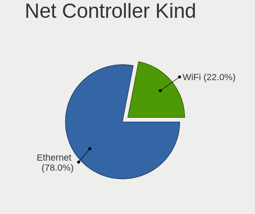

| Kind     | Desktops | Percent |
|----------|----------|---------|
| Ethernet | 32       | 78.05%  |
| WiFi     | 9        | 21.95%  |

Used Controller
---------------

Currently used network controller

| Kind     | Desktops | Percent |
|----------|----------|---------|
| Ethernet | 27       | 96.43%  |
| WiFi     | 1        | 3.57%   |

NICs
----

Total network controllers on board

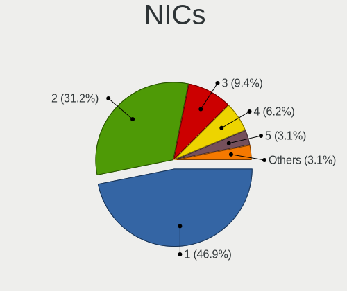

| Total | Desktops | Percent |
|-------|----------|---------|
| 1     | 15       | 46.88%  |
| 2     | 10       | 31.25%  |
| 3     | 3        | 9.38%   |
| 4     | 2        | 6.25%   |
| 5     | 1        | 3.13%   |
| 0     | 1        | 3.13%   |

IPv6
----

IPv6 vs IPv4

| Used | Desktops | Percent |
|------|----------|---------|
| No   | 28       | 87.5%   |
| Yes  | 4        | 12.5%   |

Bluetooth
---------

Bluetooth Vendor
----------------

Controller vendors

| Vendor                   | Desktops | Percent |
|--------------------------|----------|---------|
| Cambridge Silicon Radio  | 6        | 54.55%  |
| Intel                    | 3        | 27.27%  |
| Micro Star International | 1        | 9.09%   |
| Broadcom                 | 1        | 9.09%   |

Bluetooth Model
---------------

Controller models

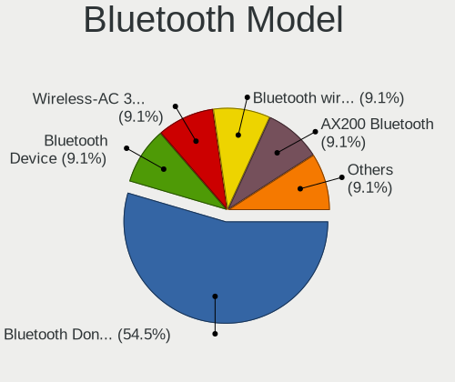

| Model                                               | Desktops | Percent |
|-----------------------------------------------------|----------|---------|
| Cambridge Silicon Radio Bluetooth Dongle (HCI mode) | 6        | 54.55%  |
| Micro Star International Bluetooth Device           | 1        | 9.09%   |
| Intel Wireless-AC 3168 Bluetooth                    | 1        | 9.09%   |
| Intel Bluetooth wireless interface                  | 1        | 9.09%   |
| Intel AX200 Bluetooth                               | 1        | 9.09%   |
| Broadcom BCM20702A0 Bluetooth 4.0                   | 1        | 9.09%   |

Sound
-----

Sound Vendor
------------

Sound card vendors

| Vendor              | Desktops | Percent |
|---------------------|----------|---------|
| Intel               | 18       | 40%     |
| AMD                 | 14       | 31.11%  |
| Nvidia              | 8        | 17.78%  |
| Creative Labs       | 3        | 6.67%   |
| EGO SYStems         | 1        | 2.22%   |
| C-Media Electronics | 1        | 2.22%   |

Sound Model
-----------

Sound card models

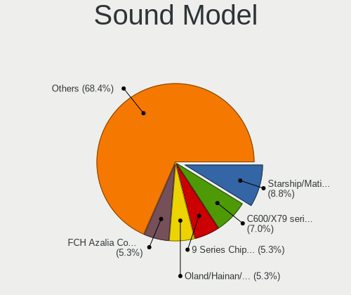

| Model                                                                                             | Desktops | Percent |
|---------------------------------------------------------------------------------------------------|----------|---------|
| AMD Starship/Matisse HD Audio Controller                                                          | 5        | 8.77%   |
| Intel C600/X79 series chipset High Definition Audio Controller                                    | 4        | 7.02%   |
| Intel 9 Series Chipset Family HD Audio Controller                                                 | 3        | 5.26%   |
| AMD Oland/Hainan/Cape Verde/Pitcairn HDMI Audio [Radeon HD 7000 Series]                           | 3        | 5.26%   |
| AMD FCH Azalia Controller                                                                         | 3        | 5.26%   |
| AMD Ellesmere HDMI Audio [Radeon RX 470/480 / 570/580/590]                                        | 3        | 5.26%   |
| AMD Baffin HDMI/DP Audio [Radeon RX 550 640SP / RX 560/560X]                                      | 3        | 5.26%   |
| Nvidia GP107GL High Definition Audio Controller                                                   | 2        | 3.51%   |
| Intel Xeon E3-1200 v3/4th Gen Core Processor HD Audio Controller                                  | 2        | 3.51%   |
| Nvidia TU116 High Definition Audio Controller                                                     | 1        | 1.75%   |
| Nvidia MCP61 High Definition Audio                                                                | 1        | 1.75%   |
| Nvidia GM206 High Definition Audio Controller                                                     | 1        | 1.75%   |
| Nvidia GM204 High Definition Audio Controller                                                     | 1        | 1.75%   |
| Nvidia GK208 HDMI/DP Audio Controller                                                             | 1        | 1.75%   |
| Nvidia GK110 High Definition Audio Controller                                                     | 1        | 1.75%   |
| Nvidia GK107 HDMI Audio Controller                                                                | 1        | 1.75%   |
| Nvidia GK104 HDMI Audio Controller                                                                | 1        | 1.75%   |
| Intel Sunrise Point-LP HD Audio                                                                   | 1        | 1.75%   |
| Intel NM10/ICH7 Family High Definition Audio Controller                                           | 1        | 1.75%   |
| Intel Cannon Lake PCH cAVS                                                                        | 1        | 1.75%   |
| Intel Atom/Celeron/Pentium Processor x5-E8000/J3xxx/N3xxx Series High Definition Audio Controller | 1        | 1.75%   |
| Intel 82801JI (ICH10 Family) HD Audio Controller                                                  | 1        | 1.75%   |
| Intel 82801I (ICH9 Family) HD Audio Controller                                                    | 1        | 1.75%   |
| Intel 7 Series/C216 Chipset Family High Definition Audio Controller                               | 1        | 1.75%   |
| Intel 6 Series/C200 Series Chipset Family High Definition Audio Controller                        | 1        | 1.75%   |
| Intel 200 Series PCH HD Audio                                                                     | 1        | 1.75%   |
| Intel 100 Series/C230 Series Chipset Family HD Audio Controller                                   | 1        | 1.75%   |
| EGO SYStems U24XL                                                                                 | 1        | 1.75%   |
| Creative Labs EMU20k1 [Sound Blaster X-Fi Series]                                                 | 1        | 1.75%   |
| Creative Labs EMU10k1 [Sound Blaster Live! Series]                                                | 1        | 1.75%   |
| Creative Labs CA0132 Sound Core3D [Sound Blaster Recon3D / Z-Series / Sound BlasterX AE-5 Plus]   | 1        | 1.75%   |
| C-Media Electronics USB Audio Device                                                              | 1        | 1.75%   |
| AMD Trinity HDMI Audio Controller                                                                 | 1        | 1.75%   |
| AMD SBx00 Azalia (Intel HDA)                                                                      | 1        | 1.75%   |
| AMD Navi 10 HDMI Audio                                                                            | 1        | 1.75%   |
| AMD Kabini HDMI/DP Audio                                                                          | 1        | 1.75%   |
| AMD Family 17h (Models 00h-0fh) HD Audio Controller                                               | 1        | 1.75%   |
| AMD Cypress HDMI Audio [Radeon HD 5830/5850/5870 / 6850/6870 Rebrand]                             | 1        | 1.75%   |

Memory
------

Memory Vendor
-------------

Memory module vendors

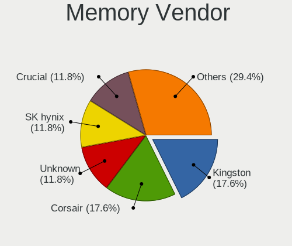

| Vendor              | Desktops | Percent |
|---------------------|----------|---------|
| Kingston            | 6        | 17.65%  |
| Corsair             | 6        | 17.65%  |
| Unknown             | 4        | 11.76%  |
| SK hynix            | 4        | 11.76%  |
| Crucial             | 4        | 11.76%  |
| Team                | 2        | 5.88%   |
| Samsung Electronics | 2        | 5.88%   |
| Micron Technology   | 2        | 5.88%   |
| Transcend           | 1        | 2.94%   |
| HPE                 | 1        | 2.94%   |
| AMD                 | 1        | 2.94%   |
| A Force             | 1        | 2.94%   |

Memory Model
------------

Memory module models

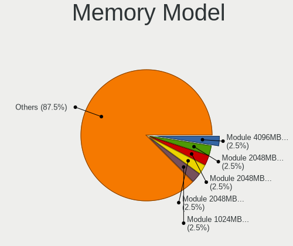

| Model                                                      | Desktops | Percent |
|------------------------------------------------------------|----------|---------|
| Unknown RAM Module 4096MB DIMM DDR3 65535MT/s              | 1        | 2.5%    |
| Unknown RAM Module 2048MB DIMM SDRAM                       | 1        | 2.5%    |
| Unknown RAM Module 2048MB DIMM DDR 800MT/s                 | 1        | 2.5%    |
| Unknown RAM Module 2048MB DIMM 667MT/s                     | 1        | 2.5%    |
| Unknown RAM Module 1024MB DIMM DDR 800MT/s                 | 1        | 2.5%    |
| Unknown RAM Module 1024MB DIMM 667MT/s                     | 1        | 2.5%    |
| Transcend RAM TS256MLQ72V6U 2GB DIMM DDR2 667MT/s          | 1        | 2.5%    |
| Team RAM TEAMGROUP-UD4-3600 16GB DIMM DDR4 3600MT/s        | 1        | 2.5%    |
| Team RAM TEAMGROUP-UD4-3200 16GB DIMM DDR4 3800MT/s        | 1        | 2.5%    |
| SK hynix RAM HMT451S6AFR8A-PB 4GB SODIMM DDR3 1600MT/s     | 1        | 2.5%    |
| SK hynix RAM HMT41GU6BFR8A-PB 8GB DIMM DDR3 2000MT/s       | 1        | 2.5%    |
| SK hynix RAM HMT351R7CFR8A-H9 4GB DIMM DDR3 1333MT/s       | 1        | 2.5%    |
| SK hynix RAM HMT31GR7EFR4A 8192MB DIMM DDR3 1600MT/s       | 1        | 2.5%    |
| Samsung RAM M471B5173EB0-YK0 4GB SODIMM DDR3 1600MT/s      | 1        | 2.5%    |
| Samsung RAM M393B5273DH0-CK0 4GB DIMM DDR3 1600MT/s        | 1        | 2.5%    |
| Micron RAM 36KSF1G72PZ-1G4K1 8192MB DIMM DDR3 1333MT/s     | 1        | 2.5%    |
| Micron RAM 18JSF1G72PZ-1G9E1 8GB DIMM DDR3 1866MT/s        | 1        | 2.5%    |
| Micron RAM 16JTF51264AZ-1G6M1 4GB DIMM DDR3 1600MT/s       | 1        | 2.5%    |
| Kingston RAM KHX3600C17D4/8GX 8GB DIMM DDR4 3600MT/s       | 1        | 2.5%    |
| Kingston RAM KHX1600C10D3/8G 8192MB DIMM DDR3 1600MT/s     | 1        | 2.5%    |
| Kingston RAM 99U5584-005.A00LF 4GB DIMM DDR3 1600MT/s      | 1        | 2.5%    |
| Kingston RAM 99U5471-037.A00LF 8GB DIMM DDR3 1600MT/s      | 1        | 2.5%    |
| Kingston RAM 99U5471-012.A00LF 4GB DIMM DDR3 1600MT/s      | 1        | 2.5%    |
| Kingston RAM 9965669-009.A00G 8GB DIMM DDR4 2133MT/s       | 1        | 2.5%    |
| Kingston RAM 9905663-031.A00G 16GB SODIMM DDR4 2400MT/s    | 1        | 2.5%    |
| HPE RAM 879526-091 8192MB DIMM DDR4 2666MT/s               | 1        | 2.5%    |
| Crucial RAM BLT4G3D1869DT1TX0. 4GB DIMM DDR3 1867MT/s      | 1        | 2.5%    |
| Crucial RAM BLT4G3D1608DT1TX0. 4GB DIMM DDR3 1600MT/s      | 1        | 2.5%    |
| Crucial RAM BLS8G4D32AESBK.M8FE1 8GB DIMM DDR4 3600MT/s    | 1        | 2.5%    |
| Crucial RAM BLS8G4D240FSB.16FBD2 8GB DIMM DDR4 2400MT/s    | 1        | 2.5%    |
| Crucial RAM BLS16G4D26BFSC.16FD 16384MB DIMM DDR4 2666MT/s | 1        | 2.5%    |
| Corsair RAM CMZ32GX3M4X1600C10 8192MB DIMM DDR3 1600MT/s   | 1        | 2.5%    |
| Corsair RAM CMY32GX3M4A16 8192MB DIMM DDR3 667MT/s         | 1        | 2.5%    |
| Corsair RAM CMY16GX3M2A2400C11 8GB DIMM DDR3 2400MT/s      | 1        | 2.5%    |
| Corsair RAM CML16GX3M2A1600C10 8GB DIMM DDR3 1600MT/s      | 1        | 2.5%    |
| Corsair RAM CMK64GX4M2E3200C16 32GB DIMM DDR4 3200MT/s     | 1        | 2.5%    |
| Corsair RAM CMK16GX4M1A2666C16 16GB DIMM DDR4 2800MT/s     | 1        | 2.5%    |
| AMD RAM R534G1601S1SL 4GB DIMM DDR3 1600MT/s               | 1        | 2.5%    |
| A Force RAM 1GX72V160K 8192MB DIMM DDR3 1333MT/s           | 1        | 2.5%    |
| A Force RAM 1GX72B160K 8192MB DIMM DDR3 1333MT/s           | 1        | 2.5%    |

Memory Kind
-----------

Memory module kinds

| Kind    | Desktops | Percent |
|---------|----------|---------|
| DDR3    | 17       | 53.13%  |
| DDR4    | 11       | 34.38%  |
| SDRAM   | 1        | 3.13%   |
| DDR2    | 1        | 3.13%   |
| DDR     | 1        | 3.13%   |
| Unknown | 1        | 3.13%   |

Memory Form Factor
------------------

Physical design of the memory module

| Name   | Desktops | Percent |
|--------|----------|---------|
| DIMM   | 30       | 93.75%  |
| SODIMM | 2        | 6.25%   |

Memory Size
-----------

Memory module size

| Size  | Desktops | Percent |
|-------|----------|---------|
| 8192  | 15       | 42.86%  |
| 4096  | 8        | 22.86%  |
| 2048  | 4        | 11.43%  |
| 32768 | 3        | 8.57%   |
| 16384 | 3        | 8.57%   |
| 1024  | 2        | 5.71%   |

Memory Speed
------------

Memory module speed

| Speed   | Desktops | Percent |
|---------|----------|---------|
| 1600    | 10       | 28.57%  |
| 3600    | 3        | 8.57%   |
| 2400    | 3        | 8.57%   |
| 1333    | 3        | 8.57%   |
| 667     | 3        | 8.57%   |
| 2666    | 2        | 5.71%   |
| 1867    | 2        | 5.71%   |
| 65535   | 1        | 2.86%   |
| 3800    | 1        | 2.86%   |
| 3200    | 1        | 2.86%   |
| 2800    | 1        | 2.86%   |
| 2133    | 1        | 2.86%   |
| 2000    | 1        | 2.86%   |
| 1866    | 1        | 2.86%   |
| 800     | 1        | 2.86%   |
| Unknown | 1        | 2.86%   |

Printers & scanners
-------------------

Printer Vendor
--------------

Printer device vendors

| Vendor             | Desktops | Percent |
|--------------------|----------|---------|
| Hewlett-Packard    | 2        | 40%     |
| Brother Industries | 2        | 40%     |
| Dell               | 1        | 20%     |

Printer Model
-------------

Printer device models

| Model                    | Desktops | Percent |
|--------------------------|----------|---------|
| HP ENVY 4520 series      | 1        | 20%     |
| HP ENVY 4500 series      | 1        | 20%     |
| Dell 2330d Laser Printer | 1        | 20%     |
| Brother Printer          | 1        | 20%     |
| Brother HL-L2320D series | 1        | 20%     |

Scanner Vendor
--------------

Scanner device vendors

| Vendor          | Desktops | Percent |
|-----------------|----------|---------|
| Hewlett-Packard | 1        | 100%    |

Scanner Model
-------------

Scanner device models

| Model           | Desktops | Percent |
|-----------------|----------|---------|
| HP ScanJet 5590 | 1        | 100%    |

Camera
------

Camera Vendor
-------------

Camera device vendors

| Vendor   | Desktops | Percent |
|----------|----------|---------|
| Logitech | 4        | 100%    |

Camera Model
------------

Camera device models

| Model                       | Desktops | Percent |
|-----------------------------|----------|---------|
| Logitech Webcam C300        | 1        | 25%     |
| Logitech Webcam C170        | 1        | 25%     |
| Logitech HD Webcam C525     | 1        | 25%     |
| Logitech HD Pro Webcam C920 | 1        | 25%     |

Security
--------

Fingerprint Vendor
------------------

Fingerprint sensor vendors

Zero info for selected period =(

Fingerprint Model
-----------------

Fingerprint sensor models

Zero info for selected period =(

Chipcard Vendor
---------------

Chipcard module vendors

Zero info for selected period =(

Chipcard Model
--------------

Chipcard module models

Zero info for selected period =(

Unsupported
-----------

Unsupported Devices
-------------------

Total unsupported devices on board

| Total | Desktops | Percent |
|-------|----------|---------|
| 0     | 19       | 59.38%  |
| 1     | 5        | 15.63%  |
| 4     | 3        | 9.38%   |
| 2     | 3        | 9.38%   |
| 3     | 2        | 6.25%   |

Unsupported Device Types
------------------------

Types of unsupported devices

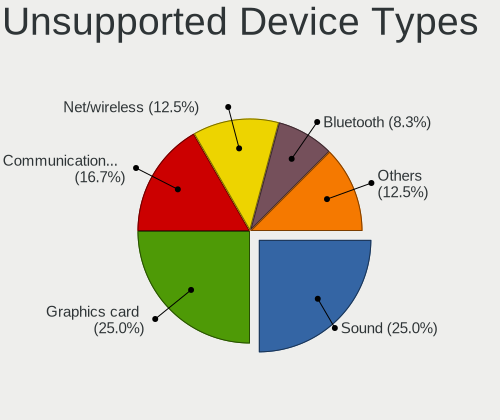

| Type                     | Desktops | Percent |
|--------------------------|----------|---------|
| Sound                    | 6        | 25%     |
| Graphics card            | 6        | 25%     |
| Communication controller | 4        | 16.67%  |
| Net/wireless             | 3        | 12.5%   |
| Bluetooth                | 2        | 8.33%   |
| Unassigned class         | 1        | 4.17%   |
| Storage/ata              | 1        | 4.17%   |
| Card reader              | 1        | 4.17%   |

