Slackware 14.2 - Tested Hardware & Statistics
---------------------------------------------

A project to collect tested hardware configurations for Slackware 14.2.

Anyone can contribute to this report by the [hw-probe](https://github.com/linuxhw/hw-probe) tool:

    sudo -E hw-probe -all -upload

Please submit a probe of your configuration if it's not presented on the page or is rare.

This is a report for all computer types. See also reports for [desktops](/Dist/Slackware_14.2/Desktop/README.md) and [notebooks](/Dist/Slackware_14.2/Notebook/README.md).

Full-feature report is available here: https://linux-hardware.org/?view=trends&rel=slackware-14.2

Contents
--------

* [ Test Cases ](#test-cases)

* [ System ](#system)
  - [ Kernel                   ](#kernel)
  - [ Kernel Family            ](#kernel-family)
  - [ Kernel Major Ver.        ](#kernel-major-ver)
  - [ Arch                     ](#arch)
  - [ DE                       ](#de)
  - [ Display Server           ](#display-server)
  - [ Display Manager          ](#display-manager)
  - [ OS Lang                  ](#os-lang)
  - [ Boot Mode                ](#boot-mode)
  - [ Filesystem               ](#filesystem)
  - [ Part. scheme             ](#part-scheme)
  - [ Dual Boot with Linux/BSD ](#dual-boot-with-linuxbsd)
  - [ Dual Boot (Win)          ](#dual-boot-win)

* [ Board ](#board)
  - [ Vendor                   ](#vendor)
  - [ Model                    ](#model)
  - [ Model Family             ](#model-family)
  - [ MFG Year                 ](#mfg-year)
  - [ Form Factor              ](#form-factor)
  - [ Secure Boot              ](#secure-boot)
  - [ Coreboot                 ](#coreboot)
  - [ RAM Size                 ](#ram-size)
  - [ RAM Used                 ](#ram-used)
  - [ Total Drives             ](#total-drives)
  - [ Has CD-ROM               ](#has-cd-rom)
  - [ Has Ethernet             ](#has-ethernet)
  - [ Has WiFi                 ](#has-wifi)
  - [ Has Bluetooth            ](#has-bluetooth)

* [ Location ](#location)
  - [ Country                  ](#country)
  - [ City                     ](#city)

* [ Drives ](#drives)
  - [ Drive Vendor             ](#drive-vendor)
  - [ Drive Model              ](#drive-model)
  - [ HDD Vendor               ](#hdd-vendor)
  - [ SSD Vendor               ](#ssd-vendor)
  - [ Drive Kind               ](#drive-kind)
  - [ Drive Connector          ](#drive-connector)
  - [ Drive Size               ](#drive-size)
  - [ Space Total              ](#space-total)
  - [ Space Used               ](#space-used)
  - [ Malfunc. Drives          ](#malfunc-drives)
  - [ Malfunc. Drive Vendor    ](#malfunc-drive-vendor)
  - [ Malfunc. HDD Vendor      ](#malfunc-hdd-vendor)
  - [ Malfunc. Drive Kind      ](#malfunc-drive-kind)
  - [ Failed Drives            ](#failed-drives)
  - [ Failed Drive Vendor      ](#failed-drive-vendor)
  - [ Drive Status             ](#drive-status)

* [ Storage controller ](#storage-controller)
  - [ Storage Vendor           ](#storage-vendor)
  - [ Storage Model            ](#storage-model)
  - [ Storage Kind             ](#storage-kind)

* [ Processor ](#processor)
  - [ CPU Vendor               ](#cpu-vendor)
  - [ CPU Model                ](#cpu-model)
  - [ CPU Model Family         ](#cpu-model-family)
  - [ CPU Cores                ](#cpu-cores)
  - [ CPU Sockets              ](#cpu-sockets)
  - [ CPU Threads              ](#cpu-threads)
  - [ CPU Op-Modes             ](#cpu-op-modes)
  - [ CPU Microcode            ](#cpu-microcode)
  - [ CPU Microarch            ](#cpu-microarch)

* [ Graphics ](#graphics)
  - [ GPU Vendor               ](#gpu-vendor)
  - [ GPU Model                ](#gpu-model)
  - [ GPU Combo                ](#gpu-combo)
  - [ GPU Driver               ](#gpu-driver)
  - [ GPU Memory               ](#gpu-memory)

* [ Monitor ](#monitor)
  - [ Monitor Vendor           ](#monitor-vendor)
  - [ Monitor Model            ](#monitor-model)
  - [ Monitor Resolution       ](#monitor-resolution)
  - [ Monitor Diagonal         ](#monitor-diagonal)
  - [ Monitor Width            ](#monitor-width)
  - [ Aspect Ratio             ](#aspect-ratio)
  - [ Monitor Area             ](#monitor-area)
  - [ Pixel Density            ](#pixel-density)
  - [ Multiple Monitors        ](#multiple-monitors)

* [ Network ](#network)
  - [ Net Controller Vendor    ](#net-controller-vendor)
  - [ Net Controller Model     ](#net-controller-model)
  - [ Wireless Vendor          ](#wireless-vendor)
  - [ Wireless Model           ](#wireless-model)
  - [ Ethernet Vendor          ](#ethernet-vendor)
  - [ Ethernet Model           ](#ethernet-model)
  - [ Net Controller Kind      ](#net-controller-kind)
  - [ Used Controller          ](#used-controller)
  - [ NICs                     ](#nics)
  - [ IPv6                     ](#ipv6)

* [ Bluetooth ](#bluetooth)
  - [ Bluetooth Vendor         ](#bluetooth-vendor)
  - [ Bluetooth Model          ](#bluetooth-model)

* [ Sound ](#sound)
  - [ Sound Vendor             ](#sound-vendor)
  - [ Sound Model              ](#sound-model)

* [ Memory ](#memory)
  - [ Memory Vendor            ](#memory-vendor)
  - [ Memory Model             ](#memory-model)
  - [ Memory Kind              ](#memory-kind)
  - [ Memory Form Factor       ](#memory-form-factor)
  - [ Memory Size              ](#memory-size)
  - [ Memory Speed             ](#memory-speed)

* [ Printers & scanners ](#printers--scanners)
  - [ Printer Vendor           ](#printer-vendor)
  - [ Printer Model            ](#printer-model)
  - [ Scanner Vendor           ](#scanner-vendor)
  - [ Scanner Model            ](#scanner-model)

* [ Camera ](#camera)
  - [ Camera Vendor            ](#camera-vendor)
  - [ Camera Model             ](#camera-model)

* [ Security ](#security)
  - [ Fingerprint Vendor       ](#fingerprint-vendor)
  - [ Fingerprint Model        ](#fingerprint-model)
  - [ Chipcard Vendor          ](#chipcard-vendor)
  - [ Chipcard Model           ](#chipcard-model)

* [ Unsupported ](#unsupported)
  - [ Unsupported Devices      ](#unsupported-devices)
  - [ Unsupported Device Types ](#unsupported-device-types)

Test Cases
----------

| Vendor     | Model                       | Form-Factor | Probe                                                      | Date         |
|------------|-----------------------------|-------------|------------------------------------------------------------|--------------|
| Intel      | DZ77RE-75K AAG39010-302     | Desktop     | [069c508e80](https://linux-hardware.org/?probe=069c508e80) | Sep 25, 2021 |
| Shuttle    | NC03U                       | Desktop     | [c5f76c4400](https://linux-hardware.org/?probe=c5f76c4400) | Sep 22, 2021 |
| Toshiba    | PORTEGE Z30-A               | Notebook    | [13b9ce0773](https://linux-hardware.org/?probe=13b9ce0773) | Sep 22, 2021 |
| Dynabook   | dynabook PORTEGE X50-G      | Notebook    | [da8279a7a9](https://linux-hardware.org/?probe=da8279a7a9) | Sep 22, 2021 |
| HPE        | ProLiant MicroServer Gen... | Desktop     | [9ac798b737](https://linux-hardware.org/?probe=9ac798b737) | Aug 05, 2021 |
| HPE        | ProLiant MicroServer Gen... | Desktop     | [095745e5fb](https://linux-hardware.org/?probe=095745e5fb) | Jul 06, 2021 |
| HP         | 158A                        | Desktop     | [d612124939](https://linux-hardware.org/?probe=d612124939) | Jun 21, 2021 |
| ASRock     | H310CM-HDV                  | Desktop     | [3291e5d2de](https://linux-hardware.org/?probe=3291e5d2de) | Jun 19, 2021 |
| ASRock     | H87M Pro4                   | Desktop     | [8d4b7f121d](https://linux-hardware.org/?probe=8d4b7f121d) | Jun 02, 2021 |
| ASUSTek    | Pro WS X570-ACE             | Desktop     | [6e60025ac5](https://linux-hardware.org/?probe=6e60025ac5) | May 25, 2021 |
| ASUSTek    | PRIME X370-PRO              | Desktop     | [3e5f76719a](https://linux-hardware.org/?probe=3e5f76719a) | May 24, 2021 |
| ASUSTek    | PRIME X370-PRO              | Desktop     | [c75f9d5c0d](https://linux-hardware.org/?probe=c75f9d5c0d) | May 23, 2021 |
| Dell       | 0PTTT9 A00                  | Desktop     | [e5b81a0da1](https://linux-hardware.org/?probe=e5b81a0da1) | May 20, 2021 |
| AMI        | Aptio CRB                   | Mini pc     | [cabba2c402](https://linux-hardware.org/?probe=cabba2c402) | May 19, 2021 |
| Gigabyte   | N3160TN                     | Desktop     | [2fd537312f](https://linux-hardware.org/?probe=2fd537312f) | May 14, 2021 |
| MSI        | G31TM-P21                   | Desktop     | [91c11ae82e](https://linux-hardware.org/?probe=91c11ae82e) | May 07, 2021 |
| HP         | 15 Notebook PC              | Notebook    | [bec2fe2e78](https://linux-hardware.org/?probe=bec2fe2e78) | Mar 21, 2021 |
| Toshiba    | Satellite C660              | Notebook    | [5189fbc4c9](https://linux-hardware.org/?probe=5189fbc4c9) | Mar 10, 2021 |
| Foxconn    | 2ADA                        | Desktop     | [425d15a5ce](https://linux-hardware.org/?probe=425d15a5ce) | Mar 09, 2021 |
| Samsung    | 300E5M/300E5L               | Notebook    | [bda4ee984f](https://linux-hardware.org/?probe=bda4ee984f) | Mar 05, 2021 |
| Dell       | Latitude E5500              | Notebook    | [a8e17b79ce](https://linux-hardware.org/?probe=a8e17b79ce) | Feb 26, 2021 |
| HP         | Pavilion Notebook           | Notebook    | [45dfe3c2b1](https://linux-hardware.org/?probe=45dfe3c2b1) | Feb 24, 2021 |
| Lenovo     | ThinkPad L440 20ASS05K00    | Notebook    | [aecef5c789](https://linux-hardware.org/?probe=aecef5c789) | Jan 22, 2021 |
| Dell       | 0TP412                      | Desktop     | [f0e56aacff](https://linux-hardware.org/?probe=f0e56aacff) | Jan 05, 2021 |
| Lenovo     | ThinkPad L440 20ASS05K00    | Notebook    | [7a6a06bb55](https://linux-hardware.org/?probe=7a6a06bb55) | Jan 04, 2021 |
| Dell       | Precision M4600             | Notebook    | [71bb8e2e9a](https://linux-hardware.org/?probe=71bb8e2e9a) | Dec 28, 2020 |
| Lenovo     | ThinkPad L440 20ASS05K00    | Notebook    | [b330b2d38a](https://linux-hardware.org/?probe=b330b2d38a) | Nov 19, 2020 |
| Lenovo     | ThinkPad L440 20ASS05K00    | Notebook    | [416d54b307](https://linux-hardware.org/?probe=416d54b307) | Nov 17, 2020 |
| Supermicro | X8SIE 0001                  | Desktop     | [96607f4270](https://linux-hardware.org/?probe=96607f4270) | Nov 12, 2020 |
| MSI        | GL73 8RC                    | Notebook    | [44f82bfc01](https://linux-hardware.org/?probe=44f82bfc01) | Nov 09, 2020 |
| Lenovo     | ThinkPad L440 20ASS05K00    | Notebook    | [9c79f4e7b9](https://linux-hardware.org/?probe=9c79f4e7b9) | Nov 08, 2020 |
| Lenovo     | ThinkPad L440 20ASS05K00    | Notebook    | [a4cb1ecf16](https://linux-hardware.org/?probe=a4cb1ecf16) | Nov 08, 2020 |
| HP         | 8523 A01                    | Mini pc     | [bab721d52e](https://linux-hardware.org/?probe=bab721d52e) | Oct 30, 2020 |
| ASRock     | Z390M-ITX/ac                | Desktop     | [06eb8afdbc](https://linux-hardware.org/?probe=06eb8afdbc) | Oct 19, 2020 |
| Samsung    | 300E5M/300E5L               | Notebook    | [270b65ced8](https://linux-hardware.org/?probe=270b65ced8) | Jul 24, 2020 |
| ASUSTek    | PRIME B450-PLUS             | Desktop     | [d42d44dd82](https://linux-hardware.org/?probe=d42d44dd82) | Jul 23, 2020 |
| ASUSTek    | PRIME B450-PLUS             | Desktop     | [888f105221](https://linux-hardware.org/?probe=888f105221) | Jul 23, 2020 |
| ASUSTek    | M5A97 R2.0                  | Desktop     | [2eb600bb96](https://linux-hardware.org/?probe=2eb600bb96) | Jul 10, 2020 |
| ASUSTek    | M5A97 R2.0                  | Desktop     | [232221bf45](https://linux-hardware.org/?probe=232221bf45) | Jul 10, 2020 |
| Notebook   | NL40_50CU                   | Notebook    | [941073da73](https://linux-hardware.org/?probe=941073da73) | Jun 27, 2020 |
| Lenovo     | V330-14ARR 81B1             | Notebook    | [5089cbcf84](https://linux-hardware.org/?probe=5089cbcf84) | Jun 24, 2020 |
| Lenovo     | V330-14ARR 81B1             | Notebook    | [cb63994f94](https://linux-hardware.org/?probe=cb63994f94) | Jun 22, 2020 |
| Notebook   | NL40_50CU                   | Notebook    | [9a1c09c6e1](https://linux-hardware.org/?probe=9a1c09c6e1) | Mar 28, 2020 |
| Notebook   | NL40_50CU                   | Notebook    | [bc5ed8dea4](https://linux-hardware.org/?probe=bc5ed8dea4) | Mar 24, 2020 |
| Notebook   | NL40_50CU                   | Notebook    | [ae7070b067](https://linux-hardware.org/?probe=ae7070b067) | Mar 21, 2020 |
| Notebook   | NL40_50CU                   | Notebook    | [320dada481](https://linux-hardware.org/?probe=320dada481) | Mar 20, 2020 |
| Toshiba    | Satellite P50-A-12Z         | Notebook    | [96927db16b](https://linux-hardware.org/?probe=96927db16b) | Mar 17, 2020 |
| Rockchip   | Unknown                     | Soc         | [abf599e14a](https://linux-hardware.org/?probe=abf599e14a) | Jan 27, 2020 |
| Huanan     | X79-8D VAA31                | Desktop     | [bbfc99d048](https://linux-hardware.org/?probe=bbfc99d048) | Jan 22, 2020 |
| Rockchip   | Unknown                     | Soc         | [62347dfd8d](https://linux-hardware.org/?probe=62347dfd8d) | Jan 01, 2020 |
| Lenovo     | ThinkPad X1 Carbon 7th 2... | Notebook    | [afe3135216](https://linux-hardware.org/?probe=afe3135216) | Dec 10, 2019 |
| ASUSTek    | P53E                        | Notebook    | [e9dcced0f7](https://linux-hardware.org/?probe=e9dcced0f7) | Oct 28, 2019 |
| Lenovo     | ThinkPad T400 6474BV7       | Notebook    | [825bdb9fd0](https://linux-hardware.org/?probe=825bdb9fd0) | Oct 28, 2019 |
| ASUSTek    | 1000H                       | Notebook    | [50da35c0d0](https://linux-hardware.org/?probe=50da35c0d0) | Oct 28, 2019 |
| ASUSTek    | A68HM-PLUS                  | Desktop     | [505df04abc](https://linux-hardware.org/?probe=505df04abc) | Oct 27, 2019 |
| ASUSTek    | PRIME B350M-A               | Desktop     | [0b246f9623](https://linux-hardware.org/?probe=0b246f9623) | Oct 27, 2019 |
| Acer       | Aspire E1-572               | Notebook    | [0fe80f5758](https://linux-hardware.org/?probe=0fe80f5758) | Oct 23, 2019 |
| ASUSTek    | ROG STRIX X470-F GAMING     | Desktop     | [21d76cde28](https://linux-hardware.org/?probe=21d76cde28) | Oct 22, 2019 |
| ASUSTek    | VivoBook_ASUSLaptop X570... | Notebook    | [ecca7bced0](https://linux-hardware.org/?probe=ecca7bced0) | Oct 22, 2019 |
| ASUSTek    | VivoBook_ASUSLaptop X570... | Notebook    | [e1cfaedc22](https://linux-hardware.org/?probe=e1cfaedc22) | Oct 22, 2019 |
| ASUSTek    | VivoBook_ASUSLaptop X570... | Notebook    | [c7637c27a6](https://linux-hardware.org/?probe=c7637c27a6) | Oct 22, 2019 |
| ASUSTek    | Z97-A                       | Desktop     | [482c60ec21](https://linux-hardware.org/?probe=482c60ec21) | Oct 21, 2019 |
| Acer       | Swift SF314-52              | Notebook    | [05f880ecec](https://linux-hardware.org/?probe=05f880ecec) | Oct 21, 2019 |
| Lenovo     | ThinkPad P70 20ERCTO1WW     | Notebook    | [0ceeb50e5e](https://linux-hardware.org/?probe=0ceeb50e5e) | Oct 21, 2019 |
| Gigabyte   | M61SME-S2                   | Desktop     | [10469f1659](https://linux-hardware.org/?probe=10469f1659) | Oct 21, 2019 |
| Lenovo     | ThinkPad T450s 20BW000EU... | Notebook    | [41ca8d1a20](https://linux-hardware.org/?probe=41ca8d1a20) | Oct 21, 2019 |
| HP         | 2B35                        | Desktop     | [45c5e4afbe](https://linux-hardware.org/?probe=45c5e4afbe) | Oct 21, 2019 |
| ASUSTek    | VivoBook_ASUSLaptop X570... | Notebook    | [c2fd6acb71](https://linux-hardware.org/?probe=c2fd6acb71) | Oct 21, 2019 |
| Gigabyte   | 970A-DS3P                   | Desktop     | [70ea4f97bf](https://linux-hardware.org/?probe=70ea4f97bf) | Oct 21, 2019 |
| Dell       | Latitude E7270              | Notebook    | [859e021e2f](https://linux-hardware.org/?probe=859e021e2f) | Oct 20, 2019 |
| ASUSTek    | Maximus VII HERO            | Desktop     | [4751f76aa2](https://linux-hardware.org/?probe=4751f76aa2) | Oct 20, 2019 |
| ASUSTek    | Maximus VII RANGER          | Desktop     | [71121ccd6f](https://linux-hardware.org/?probe=71121ccd6f) | Oct 20, 2019 |
| Fujitsu    | LIFEBOOK A555               | Notebook    | [e0c6729d5b](https://linux-hardware.org/?probe=e0c6729d5b) | Oct 20, 2019 |
| ASUSTek    | P5QLD PRO                   | Desktop     | [dabc1ee203](https://linux-hardware.org/?probe=dabc1ee203) | Oct 20, 2019 |
| Lenovo     | ThinkPad T470 20HDCTO1WW    | Notebook    | [0f9287651d](https://linux-hardware.org/?probe=0f9287651d) | Jul 24, 2019 |
| Lenovo     | ThinkPad T470 20HDCTO1WW    | Notebook    | [6986d35989](https://linux-hardware.org/?probe=6986d35989) | Jul 23, 2019 |
| Lenovo     | ThinkPad T470 20HDCTO1WW    | Notebook    | [67672ef038](https://linux-hardware.org/?probe=67672ef038) | Jul 23, 2019 |
| Gigabyte   | X150M-PRO ECC-CF            | Desktop     | [39987c5d8e](https://linux-hardware.org/?probe=39987c5d8e) | Oct 10, 2018 |
| Fujitsu    | LIFEBOOK A555               | Notebook    | [63c120aa28](https://linux-hardware.org/?probe=63c120aa28) | Aug 19, 2018 |

System
------

Kernel
------

Version of the Linux kernel

| Version              | Computers | Percent |
|----------------------|-----------|---------|
| 4.19.80              | 7         | 11.67%  |
| 5.10.28-Unraid       | 4         | 6.67%   |
| 4.4.190              | 4         | 6.67%   |
| 4.4.240              | 3         | 5%      |
| 5.3.7                | 2         | 3.33%   |
| 5.7.0                | 1         | 1.67%   |
| 5.5.10               | 1         | 1.67%   |
| 5.4.77               | 1         | 1.67%   |
| 5.4.75               | 1         | 1.67%   |
| 5.4.62               | 1         | 1.67%   |
| 5.4.53-APRL          | 1         | 1.67%   |
| 5.4.50               | 1         | 1.67%   |
| 5.4.47               | 1         | 1.67%   |
| 5.4.43               | 1         | 1.67%   |
| 5.4.24toshiba-new    | 1         | 1.67%   |
| 5.4.2                | 1         | 1.67%   |
| 5.4.13               | 1         | 1.67%   |
| 5.4.0-rc2-vto        | 1         | 1.67%   |
| 5.2.2                | 1         | 1.67%   |
| 5.13.0.a             | 1         | 1.67%   |
| 5.12.12              | 1         | 1.67%   |
| 5.10.44-slack64-host | 1         | 1.67%   |
| 5.10.40              | 1         | 1.67%   |
| 5.10.4               | 1         | 1.67%   |
| 5.10.3               | 1         | 1.67%   |
| 5.10.21              | 1         | 1.67%   |
| 5.10.19              | 1         | 1.67%   |
| 4.9.248.a            | 1         | 1.67%   |
| 4.9.118              | 1         | 1.67%   |
| 4.4.88               | 1         | 1.67%   |
| 4.4.261              | 1         | 1.67%   |
| 4.4.227              | 1         | 1.67%   |
| 4.4.202              | 1         | 1.67%   |
| 4.4.190-smp          | 1         | 1.67%   |
| 4.4.189              | 1         | 1.67%   |
| 4.4.14               | 1         | 1.67%   |
| 4.20.11              | 1         | 1.67%   |
| 4.19.98-Unraid       | 1         | 1.67%   |
| 4.19.88-Unraid       | 1         | 1.67%   |
| 4.19.79              | 1         | 1.67%   |
| 4.19.76              | 1         | 1.67%   |
| 4.19.206.a           | 1         | 1.67%   |
| 4.19.107-Unraid      | 1         | 1.67%   |
| 4.19.10              | 1         | 1.67%   |
| 4.16.18              | 1         | 1.67%   |

Kernel Family
-------------

Linux kernel without a distro release

| Version  | Computers | Percent |
|----------|-----------|---------|
| 4.19.80  | 7         | 11.67%  |
| 4.4.190  | 5         | 8.33%   |
| 5.10.28  | 4         | 6.67%   |
| 4.4.240  | 3         | 5%      |
| 5.3.7    | 2         | 3.33%   |
| 5.7.0    | 1         | 1.67%   |
| 5.5.10   | 1         | 1.67%   |
| 5.4.77   | 1         | 1.67%   |
| 5.4.75   | 1         | 1.67%   |
| 5.4.62   | 1         | 1.67%   |
| 5.4.53   | 1         | 1.67%   |
| 5.4.50   | 1         | 1.67%   |
| 5.4.47   | 1         | 1.67%   |
| 5.4.43   | 1         | 1.67%   |
| 5.4.24   | 1         | 1.67%   |
| 5.4.2    | 1         | 1.67%   |
| 5.4.13   | 1         | 1.67%   |
| 5.4.0    | 1         | 1.67%   |
| 5.2.2    | 1         | 1.67%   |
| 5.13.0   | 1         | 1.67%   |
| 5.12.12  | 1         | 1.67%   |
| 5.10.44  | 1         | 1.67%   |
| 5.10.40  | 1         | 1.67%   |
| 5.10.4   | 1         | 1.67%   |
| 5.10.3   | 1         | 1.67%   |
| 5.10.21  | 1         | 1.67%   |
| 5.10.19  | 1         | 1.67%   |
| 4.9.248  | 1         | 1.67%   |
| 4.9.118  | 1         | 1.67%   |
| 4.4.88   | 1         | 1.67%   |
| 4.4.261  | 1         | 1.67%   |
| 4.4.227  | 1         | 1.67%   |
| 4.4.202  | 1         | 1.67%   |
| 4.4.189  | 1         | 1.67%   |
| 4.4.14   | 1         | 1.67%   |
| 4.20.11  | 1         | 1.67%   |
| 4.19.98  | 1         | 1.67%   |
| 4.19.88  | 1         | 1.67%   |
| 4.19.79  | 1         | 1.67%   |
| 4.19.76  | 1         | 1.67%   |
| 4.19.206 | 1         | 1.67%   |
| 4.19.107 | 1         | 1.67%   |
| 4.19.10  | 1         | 1.67%   |
| 4.16.18  | 1         | 1.67%   |

Kernel Major Ver.
-----------------

Linux kernel major version

| Version | Computers | Percent |
|---------|-----------|---------|
| 4.4     | 14        | 23.33%  |
| 4.19    | 14        | 23.33%  |
| 5.4     | 11        | 18.33%  |
| 5.10    | 10        | 16.67%  |
| 5.3     | 2         | 3.33%   |
| 4.9     | 2         | 3.33%   |
| 5.7     | 1         | 1.67%   |
| 5.5     | 1         | 1.67%   |
| 5.2     | 1         | 1.67%   |
| 5.13    | 1         | 1.67%   |
| 5.12    | 1         | 1.67%   |
| 4.20    | 1         | 1.67%   |
| 4.16    | 1         | 1.67%   |

Arch
----

OS architecture (x86_64, i586, etc.)

| Name   | Computers | Percent |
|--------|-----------|---------|
| x86_64 | 55        | 98.21%  |
| i686   | 1         | 1.79%   |

DE
--

Desktop Environment

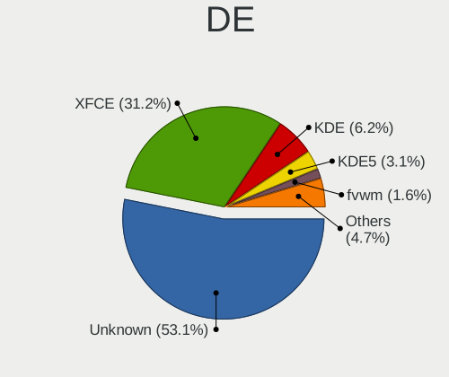

| Name          | Computers | Percent |
|---------------|-----------|---------|
| Unknown       | 30        | 52.63%  |
| XFCE          | 19        | 33.33%  |
| KDE           | 3         | 5.26%   |
| KDE5          | 2         | 3.51%   |
| LXQt          | 1         | 1.75%   |
| fvwm          | 1         | 1.75%   |
| Enlightenment | 1         | 1.75%   |

Display Server
--------------

X11 or Wayland

| Name    | Computers | Percent |
|---------|-----------|---------|
| X11     | 45        | 80.36%  |
| Unknown | 7         | 12.5%   |
| Tty     | 3         | 5.36%   |
| Wayland | 1         | 1.79%   |

Display Manager
---------------

SDDM, LightDM, etc.

| Name    | Computers | Percent |
|---------|-----------|---------|
| Unknown | 33        | 57.89%  |
| XDM     | 18        | 31.58%  |
| SDDM    | 5         | 8.77%   |
| SLiM    | 1         | 1.75%   |

OS Lang
-------

Language

| Lang    | Computers | Percent |
|---------|-----------|---------|
| Unknown | 29        | 51.79%  |
| en_US   | 20        | 35.71%  |
| ru_RU   | 1         | 1.79%   |
| pt_BR   | 1         | 1.79%   |
| pl_PL   | 1         | 1.79%   |
| it_IT   | 1         | 1.79%   |
| fr_FR   | 1         | 1.79%   |
| en_GB   | 1         | 1.79%   |
| C       | 1         | 1.79%   |

Boot Mode
---------

EFI or BIOS

| Mode | Computers | Percent |
|------|-----------|---------|
| BIOS | 37        | 64.91%  |
| EFI  | 20        | 35.09%  |

Filesystem
----------

Type of filesystem

| Type     | Computers | Percent |
|----------|-----------|---------|
| Ext4     | 43        | 76.79%  |
| Btrfs    | 8         | 14.29%  |
| Xfs      | 2         | 3.57%   |
| Rootfs   | 1         | 1.79%   |
| Reiserfs | 1         | 1.79%   |
| Jfs      | 1         | 1.79%   |

Part. scheme
------------

Scheme of partitioning

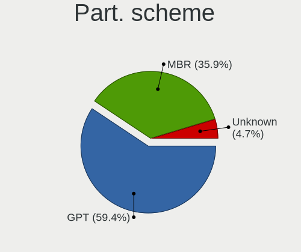

| Type    | Computers | Percent |
|---------|-----------|---------|
| GPT     | 33        | 57.89%  |
| MBR     | 21        | 36.84%  |
| Unknown | 3         | 5.26%   |

Dual Boot with Linux/BSD
------------------------

Hosting more than one Linux/BSD

| Dual boot | Computers | Percent |
|-----------|-----------|---------|
| No        | 42        | 73.68%  |
| Yes       | 15        | 26.32%  |

Dual Boot (Win)
---------------

Hosting Linux and Windows

| Dual boot | Computers | Percent |
|-----------|-----------|---------|
| No        | 39        | 69.64%  |
| Yes       | 17        | 30.36%  |

Board
-----

Vendor
------

Motherboard manufacturer

| Name                | Computers | Percent |
|---------------------|-----------|---------|
| ASUSTek Computer    | 14        | 25%     |
| Lenovo              | 7         | 12.5%   |
| Hewlett-Packard     | 5         | 8.93%   |
| Dell                | 5         | 8.93%   |
| Gigabyte Technology | 4         | 7.14%   |
| Toshiba             | 3         | 5.36%   |
| ASRock              | 3         | 5.36%   |
| MSI                 | 2         | 3.57%   |
| Acer                | 2         | 3.57%   |
| Supermicro          | 1         | 1.79%   |
| Shuttle             | 1         | 1.79%   |
| Samsung Electronics | 1         | 1.79%   |
| Notebook            | 1         | 1.79%   |
| Intel               | 1         | 1.79%   |
| Huanan              | 1         | 1.79%   |
| HPE                 | 1         | 1.79%   |
| Fujitsu             | 1         | 1.79%   |
| Foxconn             | 1         | 1.79%   |
| Dynabook            | 1         | 1.79%   |
| AMI                 | 1         | 1.79%   |

Model
-----

Motherboard model

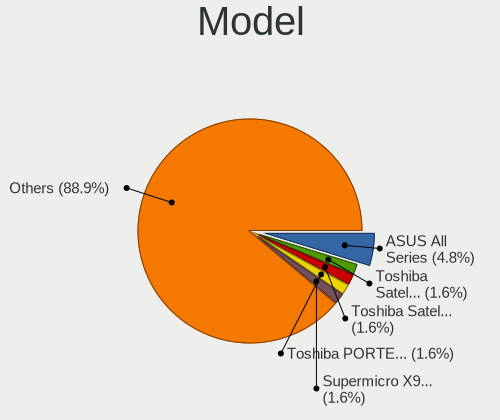

| Name                                     | Computers | Percent |
|------------------------------------------|-----------|---------|
| ASUS All Series                          | 3         | 5.36%   |
| Toshiba Satellite P50-A-12Z              | 1         | 1.79%   |
| Toshiba Satellite C660                   | 1         | 1.79%   |
| Toshiba PORTEGE Z30-A                    | 1         | 1.79%   |
| Supermicro ReadyDATA 5200                | 1         | 1.79%   |
| Shuttle NC03U                            | 1         | 1.79%   |
| Samsung 300E5M/300E5L                    | 1         | 1.79%   |
| Notebook NL40_50CU                       | 1         | 1.79%   |
| MSI MS-7529                              | 1         | 1.79%   |
| MSI GL73 8RC                             | 1         | 1.79%   |
| Lenovo V330-14ARR 81B1                   | 1         | 1.79%   |
| Lenovo ThinkPad X1 Carbon 7th 20R10015US | 1         | 1.79%   |
| Lenovo ThinkPad T470 20HDCTO1WW          | 1         | 1.79%   |
| Lenovo ThinkPad T450s 20BW000EUS         | 1         | 1.79%   |
| Lenovo ThinkPad T400 6474BV7             | 1         | 1.79%   |
| Lenovo ThinkPad P70 20ERCTO1WW           | 1         | 1.79%   |
| Lenovo ThinkPad L440 20ASS05K00          | 1         | 1.79%   |
| Intel DZ77RE-75K AAG39010-302            | 1         | 1.79%   |
| Huanan X79-8D VAA31                      | 1         | 1.79%   |
| HPE ProLiant MicroServer Gen10 Plus      | 1         | 1.79%   |
| HP Z620 Workstation                      | 1         | 1.79%   |
| HP t640 Thin Client                      | 1         | 1.79%   |
| HP Pavilion Notebook                     | 1         | 1.79%   |
| HP 500-515na                             | 1         | 1.79%   |
| HP 15 Notebook PC                        | 1         | 1.79%   |
| Gigabyte X150M-PRO ECC                   | 1         | 1.79%   |
| Gigabyte N3160TN                         | 1         | 1.79%   |
| Gigabyte M61SME-S2                       | 1         | 1.79%   |
| Gigabyte 970A-DS3P                       | 1         | 1.79%   |
| Fujitsu LIFEBOOK A555                    | 1         | 1.79%   |
| Foxconn p6-2390                          | 1         | 1.79%   |
| Dynabook dynabook PORTEGE X50-G          | 1         | 1.79%   |
| Dell Precision WorkStation T3400         | 1         | 1.79%   |
| Dell Precision T3600                     | 1         | 1.79%   |
| Dell Precision M4600                     | 1         | 1.79%   |
| Dell Latitude E7270                      | 1         | 1.79%   |
| Dell Latitude E5500                      | 1         | 1.79%   |
| ASUS VivoBook_ASUSLaptop X570ZD_K570ZD   | 1         | 1.79%   |
| ASUS ROG STRIX X470-F GAMING             | 1         | 1.79%   |
| ASUS Pro WS X570-ACE                     | 1         | 1.79%   |
| ASUS PRIME X370-PRO                      | 1         | 1.79%   |
| ASUS PRIME B450-PLUS                     | 1         | 1.79%   |
| ASUS PRIME B350M-A                       | 1         | 1.79%   |
| ASUS P5QLD PRO                           | 1         | 1.79%   |
| ASUS P53E                                | 1         | 1.79%   |
| ASUS M5A97 R2.0                          | 1         | 1.79%   |
| ASUS A68HM-PLUS                          | 1         | 1.79%   |
| ASUS 1000H                               | 1         | 1.79%   |
| ASRock Z390M-ITX/ac                      | 1         | 1.79%   |
| ASRock H87M Pro4                         | 1         | 1.79%   |
| ASRock H310CM-HDV                        | 1         | 1.79%   |
| AMI Aptio CRB                            | 1         | 1.79%   |
| Acer Swift SF314-52                      | 1         | 1.79%   |
| Acer Aspire E1-572                       | 1         | 1.79%   |

Model Family
------------

Motherboard model prefix

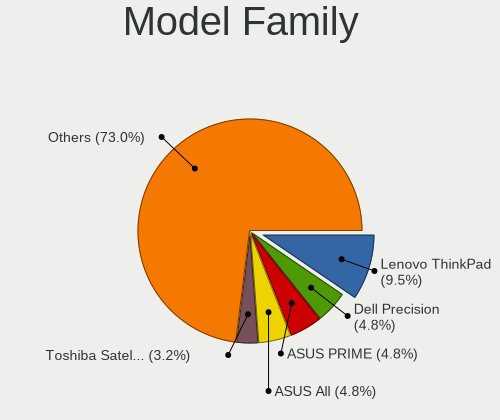

| Name                 | Computers | Percent |
|----------------------|-----------|---------|
| Lenovo ThinkPad      | 6         | 10.71%  |
| Dell Precision       | 3         | 5.36%   |
| ASUS PRIME           | 3         | 5.36%   |
| ASUS All             | 3         | 5.36%   |
| Toshiba Satellite    | 2         | 3.57%   |
| Dell Latitude        | 2         | 3.57%   |
| Toshiba PORTEGE      | 1         | 1.79%   |
| Supermicro ReadyDATA | 1         | 1.79%   |
| Shuttle NC03U        | 1         | 1.79%   |
| Samsung 300E5M       | 1         | 1.79%   |
| Notebook NL40        | 1         | 1.79%   |
| MSI MS-7529          | 1         | 1.79%   |
| MSI GL73             | 1         | 1.79%   |
| Lenovo V330-14ARR    | 1         | 1.79%   |
| Intel DZ77RE-75K     | 1         | 1.79%   |
| Huanan X79-8D        | 1         | 1.79%   |
| HPE ProLiant         | 1         | 1.79%   |
| HP Z620              | 1         | 1.79%   |
| HP t640              | 1         | 1.79%   |
| HP Pavilion          | 1         | 1.79%   |
| HP 500-515na         | 1         | 1.79%   |
| HP 15                | 1         | 1.79%   |
| Gigabyte X150M-PRO   | 1         | 1.79%   |
| Gigabyte N3160TN     | 1         | 1.79%   |
| Gigabyte M61SME-S2   | 1         | 1.79%   |
| Gigabyte 970A-DS3P   | 1         | 1.79%   |
| Fujitsu LIFEBOOK     | 1         | 1.79%   |
| Foxconn p6-2390      | 1         | 1.79%   |
| Dynabook dynabook    | 1         | 1.79%   |
| ASUS VivoBook        | 1         | 1.79%   |
| ASUS ROG             | 1         | 1.79%   |
| ASUS Pro             | 1         | 1.79%   |
| ASUS P5QLD           | 1         | 1.79%   |
| ASUS P53E            | 1         | 1.79%   |
| ASUS M5A97           | 1         | 1.79%   |
| ASUS A68HM-PLUS      | 1         | 1.79%   |
| ASUS 1000H           | 1         | 1.79%   |
| ASRock Z390M-ITX     | 1         | 1.79%   |
| ASRock H87M          | 1         | 1.79%   |
| ASRock H310CM-HDV    | 1         | 1.79%   |
| AMI Aptio            | 1         | 1.79%   |
| Acer Swift           | 1         | 1.79%   |
| Acer Aspire          | 1         | 1.79%   |

MFG Year
--------

Motherboard manufacture year

| Year | Computers | Percent |
|------|-----------|---------|
| 2019 | 14        | 25%     |
| 2018 | 9         | 16.07%  |
| 2016 | 7         | 12.5%   |
| 2020 | 5         | 8.93%   |
| 2017 | 4         | 7.14%   |
| 2015 | 3         | 5.36%   |
| 2014 | 3         | 5.36%   |
| 2010 | 3         | 5.36%   |
| 2012 | 2         | 3.57%   |
| 2011 | 2         | 3.57%   |
| 2009 | 2         | 3.57%   |
| 2008 | 2         | 3.57%   |

Form Factor
-----------

Physical design of the computer

| Name     | Computers | Percent |
|----------|-----------|---------|
| Desktop  | 29        | 51.79%  |
| Notebook | 25        | 44.64%  |
| Mini pc  | 2         | 3.57%   |

Secure Boot
-----------

Enabled or disabled

| State    | Computers | Percent |
|----------|-----------|---------|
| Disabled | 56        | 100%    |

Coreboot
--------

Have coreboot on board

| Used | Computers | Percent |
|------|-----------|---------|
| No   | 55        | 98.21%  |
| Yes  | 1         | 1.79%   |

RAM Size
--------

Total RAM memory

| Size in GB  | Computers | Percent |
|-------------|-----------|---------|
| 8.01-16.0   | 13        | 23.21%  |
| 16.01-24.0  | 12        | 21.43%  |
| 4.01-8.0    | 11        | 19.64%  |
| 3.01-4.0    | 8         | 14.29%  |
| 32.01-64.0  | 5         | 8.93%   |
| 64.01-256.0 | 3         | 5.36%   |
| 24.01-32.0  | 2         | 3.57%   |
| 1.01-2.0    | 1         | 1.79%   |
| 0.51-1.0    | 1         | 1.79%   |

RAM Used
--------

Used RAM memory

| Used GB    | Computers | Percent |
|------------|-----------|---------|
| 1.01-2.0   | 21        | 36.21%  |
| 2.01-3.0   | 12        | 20.69%  |
| 3.01-4.0   | 9         | 15.52%  |
| 4.01-8.0   | 6         | 10.34%  |
| 8.01-16.0  | 4         | 6.9%    |
| 24.01-32.0 | 2         | 3.45%   |
| 0.01-0.5   | 2         | 3.45%   |
| 16.01-24.0 | 1         | 1.72%   |
| 0.51-1.0   | 1         | 1.72%   |

Total Drives
------------

Number of drives on board

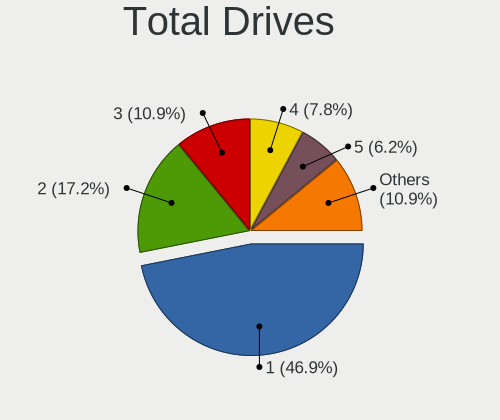

| Drives | Computers | Percent |
|--------|-----------|---------|
| 1      | 27        | 47.37%  |
| 2      | 10        | 17.54%  |
| 3      | 7         | 12.28%  |
| 4      | 5         | 8.77%   |
| 5      | 3         | 5.26%   |
| 6      | 2         | 3.51%   |
| 13     | 1         | 1.75%   |
| 7      | 1         | 1.75%   |
| 0      | 1         | 1.75%   |

Has CD-ROM
----------

Has CD-ROM on board

| Presented | Computers | Percent |
|-----------|-----------|---------|
| No        | 33        | 58.93%  |
| Yes       | 23        | 41.07%  |

Has Ethernet
------------

Has Ethernet on board

| Presented | Computers | Percent |
|-----------|-----------|---------|
| Yes       | 54        | 96.43%  |
| No        | 2         | 3.57%   |

Has WiFi
--------

Has WiFi module

| Presented | Computers | Percent |
|-----------|-----------|---------|
| Yes       | 33        | 58.93%  |
| No        | 23        | 41.07%  |

Has Bluetooth
-------------

Has Bluetooth module

| Presented | Computers | Percent |
|-----------|-----------|---------|
| Yes       | 31        | 55.36%  |
| No        | 25        | 44.64%  |

Location
--------

Country
-------

Geographic location (country)

| Country     | Computers | Percent |
|-------------|-----------|---------|
| USA         | 12        | 21.43%  |
| UK          | 8         | 14.29%  |
| Russia      | 4         | 7.14%   |
| Portugal    | 4         | 7.14%   |
| Germany     | 4         | 7.14%   |
| Canada      | 4         | 7.14%   |
| Sweden      | 3         | 5.36%   |
| France      | 3         | 5.36%   |
| Poland      | 2         | 3.57%   |
| Italy       | 2         | 3.57%   |
| India       | 2         | 3.57%   |
| Brazil      | 2         | 3.57%   |
| Spain       | 1         | 1.79%   |
| Philippines | 1         | 1.79%   |
| Hong Kong   | 1         | 1.79%   |
| Finland     | 1         | 1.79%   |
| Chile       | 1         | 1.79%   |
| Bulgaria    | 1         | 1.79%   |

City
----

Geographic location (city)

| City                   | Computers | Percent |
|------------------------|-----------|---------|
| Yekaterinburg          | 3         | 5.17%   |
| Lisbon                 | 3         | 5.17%   |
| Warsaw                 | 2         | 3.45%   |
| Ottawa                 | 2         | 3.45%   |
| Carrollton             | 2         | 3.45%   |
| Caen                   | 2         | 3.45%   |
| Barry                  | 2         | 3.45%   |
| Winnipeg               | 1         | 1.72%   |
| Visconde do Rio Branco | 1         | 1.72%   |
| Toronto                | 1         | 1.72%   |
| Tiffin                 | 1         | 1.72%   |
| Stockholm              | 1         | 1.72%   |
| St Louis               | 1         | 1.72%   |
| Springfield            | 1         | 1.72%   |
| Sidcup                 | 1         | 1.72%   |
| Setúbal               | 1         | 1.72%   |
| Savonlinna             | 1         | 1.72%   |
| Santiago               | 1         | 1.72%   |
| Saedinenie             | 1         | 1.72%   |
| Reading                | 1         | 1.72%   |
| Prato                  | 1         | 1.72%   |
| Piteå                 | 1         | 1.72%   |
| Paterson               | 1         | 1.72%   |
| Pasig                  | 1         | 1.72%   |
| Paris                  | 1         | 1.72%   |
| Palma                  | 1         | 1.72%   |
| Oldham                 | 1         | 1.72%   |
| Northport              | 1         | 1.72%   |
| Nizhniy Novgorod       | 1         | 1.72%   |
| Naples                 | 1         | 1.72%   |
| Milwaukee              | 1         | 1.72%   |
| Milan                  | 1         | 1.72%   |
| London                 | 1         | 1.72%   |
| Lins                   | 1         | 1.72%   |
| Lexington              | 1         | 1.72%   |
| Kowloon                | 1         | 1.72%   |
| Koblenz                | 1         | 1.72%   |
| Hornsey                | 1         | 1.72%   |
| Heinsberg              | 1         | 1.72%   |
| Haar                   | 1         | 1.72%   |
| Guntur                 | 1         | 1.72%   |
| Enskede-Arsta-Vantoer  | 1         | 1.72%   |
| Delhi                  | 1         | 1.72%   |
| Dallas                 | 1         | 1.72%   |
| Chelmsford             | 1         | 1.72%   |
| Canandaigua            | 1         | 1.72%   |
| Camp Hill              | 1         | 1.72%   |
| Bengaluru              | 1         | 1.72%   |
| Augsburg               | 1         | 1.72%   |

Drives
------

Drive Vendor
------------

Hard drive vendors

| Vendor              | Computers | Drives | Percent |
|---------------------|-----------|--------|---------|
| WDC                 | 17        | 39     | 19.32%  |
| Samsung Electronics | 15        | 21     | 17.05%  |
| Seagate             | 14        | 31     | 15.91%  |
| Toshiba             | 7         | 13     | 7.95%   |
| Kingston            | 5         | 5      | 5.68%   |
| Crucial             | 4         | 5      | 4.55%   |
| Unknown             | 3         | 4      | 3.41%   |
| Intel               | 3         | 3      | 3.41%   |
| Hitachi             | 3         | 3      | 3.41%   |
| A-DATA Technology   | 3         | 3      | 3.41%   |
| TO Exter            | 1         | 1      | 1.14%   |
| Team                | 1         | 1      | 1.14%   |
| SK Hynix            | 1         | 1      | 1.14%   |
| SanDisk             | 1         | 1      | 1.14%   |
| Patriot             | 1         | 2      | 1.14%   |
| Netac               | 1         | 1      | 1.14%   |
| Micron Technology   | 1         | 1      | 1.14%   |
| MAXTOR              | 1         | 1      | 1.14%   |
| HGST                | 1         | 1      | 1.14%   |
| Gigabyte Technology | 1         | 1      | 1.14%   |
| Fujitsu             | 1         | 1      | 1.14%   |
| DOGFISH             | 1         | 1      | 1.14%   |
| China               | 1         | 2      | 1.14%   |
| Apple               | 1         | 2      | 1.14%   |

Drive Model
-----------

Hard drive models

| Model                                | Computers | Percent |
|--------------------------------------|-----------|---------|
| WDC WD1003FZEX-00MK2A0 1TB           | 2         | 1.75%   |
| Toshiba MQ01ABD100 1TB               | 2         | 1.75%   |
| Seagate ST500DM002-1BD142 500GB      | 2         | 1.75%   |
| Seagate ST31000524AS 1TB             | 2         | 1.75%   |
| Kingston SA400S37240G 240GB SSD      | 2         | 1.75%   |
| WDC WDS100T2B0C-00PXH0 1TB           | 1         | 0.88%   |
| WDC WD5000BPVT-2 500GB               | 1         | 0.88%   |
| WDC WD5000BPKX-60HPJT0 500GB         | 1         | 0.88%   |
| WDC WD5000AAKX-00ERMA0 500GB         | 1         | 0.88%   |
| WDC WD5000AAKS-00V0A0 500GB          | 1         | 0.88%   |
| WDC WD5000AAKS-00A7B2 500GB          | 1         | 0.88%   |
| WDC WD40EFRX-68WT0N0 4TB             | 1         | 0.88%   |
| WDC WD30EZRX-00SPEB0 3TB             | 1         | 0.88%   |
| WDC WD30EZRX-00M                     | 1         | 0.88%   |
| WDC WD30EFRX-68EUZN0 3TB             | 1         | 0.88%   |
| WDC WD30EFRX-68AX9N0 3TB             | 1         | 0.88%   |
| WDC WD2003FZEX-0 2TB                 | 1         | 0.88%   |
| WDC WD1600AAJS-00PSA0 160GB          | 1         | 0.88%   |
| WDC WD120EDAZ-11F3RA0 12TB           | 1         | 0.88%   |
| WDC WD10JPVX-35JC3T0 1TB             | 1         | 0.88%   |
| WDC WD10JPVX-16JC3T3 1TB             | 1         | 0.88%   |
| WDC WD10JPLX-00MBPT0 1TB             | 1         | 0.88%   |
| WDC WD10EZRZ-00HTKB0 1TB             | 1         | 0.88%   |
| WDC WD10EZEX-22BN5A0 1TB             | 1         | 0.88%   |
| WDC WD10EZEX-00RKKA0 1TB             | 1         | 0.88%   |
| WDC WD10EZEX-00BN5A0 1TB             | 1         | 0.88%   |
| WDC WD10EURX-61C57Y0 1TB             | 1         | 0.88%   |
| WDC WD10EALS-00Z8A0 1TB              | 1         | 0.88%   |
| WDC WD100EMAZ-00WJTA0 10TB           | 1         | 0.88%   |
| WDC WD1003FZEX-00K3CA0 1TB           | 1         | 0.88%   |
| WDC PC SN520 SDAPNUW-256G-1102 256GB | 1         | 0.88%   |
| Unknown SLD32G  32GB                 | 1         | 0.88%   |
| Unknown SD32G  32GB                  | 1         | 0.88%   |
| Unknown SC32G  32GB                  | 1         | 0.88%   |
| Unknown 00000  32GB                  | 1         | 0.88%   |
| Toshiba MK2565GSXN 250GB             | 1         | 0.88%   |
| Toshiba MK1646GSX 160GB              | 1         | 0.88%   |
| Toshiba MG07ACA12TE 12TB             | 1         | 0.88%   |
| Toshiba HDWD110 1TB                  | 1         | 0.88%   |
| Toshiba DT01ACA200 2TB               | 1         | 0.88%   |
| Toshiba DT01ACA100 1TB               | 1         | 0.88%   |
| TO Exter nal USB 3.0 4TB             | 1         | 0.88%   |
| Team T253X1480G 480GB SSD            | 1         | 0.88%   |
| SK Hynix SHGP31-1000GM-2 1TB         | 1         | 0.88%   |
| Seagate ST980310AS 80GB              | 1         | 0.88%   |
| Seagate ST9160827AS 160GB            | 1         | 0.88%   |
| Seagate ST9160412AS 160GB            | 1         | 0.88%   |
| Seagate ST500VT000-1DK142 500GB      | 1         | 0.88%   |
| Seagate ST4000VN008-2DR166 4TB       | 1         | 0.88%   |
| Seagate ST4000DM004-2CV104 4TB       | 1         | 0.88%   |
| Seagate ST380819AS 80GB              | 1         | 0.88%   |
| Seagate ST380011A 80GB               | 1         | 0.88%   |
| Seagate ST3500418AS 500GB            | 1         | 0.88%   |
| Seagate ST3500410AS 500GB            | 1         | 0.88%   |
| Seagate ST2000DM008-2FR102 2TB       | 1         | 0.88%   |
| Seagate ST2000DM001-1CH164 2TB       | 1         | 0.88%   |
| Seagate ST1000VM002-1SD102 1TB       | 1         | 0.88%   |
| Seagate ST1000NM0011 1TB             | 1         | 0.88%   |
| Seagate ST1000NM0001 1TB             | 1         | 0.88%   |
| Seagate ST1000LM048-2E7172 1TB       | 1         | 0.88%   |

HDD Vendor
----------

Hard disk drive vendors

| Vendor              | Computers | Drives | Percent |
|---------------------|-----------|--------|---------|
| WDC                 | 16        | 37     | 34.78%  |
| Seagate             | 14        | 27     | 30.43%  |
| Toshiba             | 7         | 13     | 15.22%  |
| Hitachi             | 3         | 3      | 6.52%   |
| Samsung Electronics | 2         | 2      | 4.35%   |
| TO Exter            | 1         | 1      | 2.17%   |
| MAXTOR              | 1         | 1      | 2.17%   |
| HGST                | 1         | 1      | 2.17%   |
| Fujitsu             | 1         | 1      | 2.17%   |

SSD Vendor
----------

Solid state drive vendors

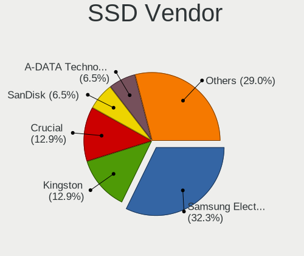

| Vendor              | Computers | Drives | Percent |
|---------------------|-----------|--------|---------|
| Samsung Electronics | 8         | 11     | 29.63%  |
| Kingston            | 4         | 4      | 14.81%  |
| Crucial             | 4         | 5      | 14.81%  |
| A-DATA Technology   | 2         | 2      | 7.41%   |
| Team                | 1         | 1      | 3.7%    |
| SanDisk             | 1         | 1      | 3.7%    |
| Patriot             | 1         | 2      | 3.7%    |
| Netac               | 1         | 1      | 3.7%    |
| Micron Technology   | 1         | 1      | 3.7%    |
| Intel               | 1         | 1      | 3.7%    |
| DOGFISH             | 1         | 1      | 3.7%    |
| China               | 1         | 2      | 3.7%    |
| Apple               | 1         | 2      | 3.7%    |

Drive Kind
----------

HDD or SSD

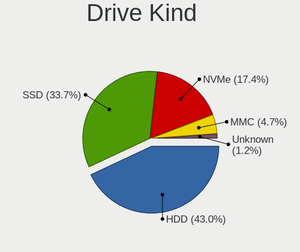

| Kind    | Computers | Drives | Percent |
|---------|-----------|--------|---------|
| HDD     | 35        | 86     | 44.87%  |
| SSD     | 25        | 34     | 32.05%  |
| NVMe    | 14        | 16     | 17.95%  |
| MMC     | 3         | 4      | 3.85%   |
| Unknown | 1         | 4      | 1.28%   |

Drive Connector
---------------

SATA, SAS, NVMe, etc.

| Type | Computers | Drives | Percent |
|------|-----------|--------|---------|
| SATA | 47        | 115    | 71.21%  |
| NVMe | 14        | 16     | 21.21%  |
| MMC  | 3         | 4      | 4.55%   |
| SAS  | 2         | 9      | 3.03%   |

Drive Size
----------

Size of hard drive

| Size in TB | Computers | Drives | Percent |
|------------|-----------|--------|---------|
| 0.01-0.5   | 33        | 50     | 48.53%  |
| 0.51-1.0   | 19        | 42     | 27.94%  |
| 1.01-2.0   | 5         | 6      | 7.35%   |
| 3.01-4.0   | 4         | 8      | 5.88%   |
| 2.01-3.0   | 4         | 8      | 5.88%   |
| 10.01-20.0 | 2         | 5      | 2.94%   |
| 4.01-10.0  | 1         | 1      | 1.47%   |

Space Total
-----------

Amount of disk space available on the file system

| Size in GB | Computers | Percent |
|------------|-----------|---------|
| 101-250    | 12        | 21.43%  |
| 501-1000   | 12        | 21.43%  |
| Unknown    | 9         | 16.07%  |
| 1001-2000  | 8         | 14.29%  |
| 251-500    | 7         | 12.5%   |
| 2001-3000  | 3         | 5.36%   |
| 51-100     | 3         | 5.36%   |
| 21-50      | 1         | 1.79%   |
| 1-20       | 1         | 1.79%   |

Space Used
----------

Amount of used disk space

| Used GB   | Computers | Percent |
|-----------|-----------|---------|
| 501-1000  | 11        | 18.64%  |
| 51-100    | 10        | 16.95%  |
| Unknown   | 9         | 15.25%  |
| 21-50     | 8         | 13.56%  |
| 1-20      | 8         | 13.56%  |
| 101-250   | 6         | 10.17%  |
| 251-500   | 5         | 8.47%   |
| 1001-2000 | 2         | 3.39%   |

Malfunc. Drives
---------------

Drive models with a malfunction

| Model                          | Computers | Drives | Percent |
|--------------------------------|-----------|--------|---------|
| WDC WD5000BPKX-60HPJT0 500GB   | 1         | 1      | 5%      |
| WDC WD5000AAKX-00ERMA0 500GB   | 1         | 1      | 5%      |
| WDC WD5000AAKS-00A7B2 500GB    | 1         | 1      | 5%      |
| WDC WD40EFRX-68WT0N0 4TB       | 1         | 2      | 5%      |
| WDC WD30EZRX-00M               | 1         | 1      | 5%      |
| WDC WD30EFRX-68AX9N0 3TB       | 1         | 4      | 5%      |
| WDC WD10JPLX-00MBPT0 1TB       | 1         | 1      | 5%      |
| WDC WD10EZEX-00RKKA0 1TB       | 1         | 1      | 5%      |
| WDC WD10EALS-00Z8A0 1TB        | 1         | 2      | 5%      |
| WDC WD1003FZEX-00MK2A0 1TB     | 1         | 2      | 5%      |
| Toshiba MK2565GSXN 250GB       | 1         | 1      | 5%      |
| Seagate ST380011A 80GB         | 1         | 1      | 5%      |
| Seagate ST3500418AS 500GB      | 1         | 1      | 5%      |
| Seagate ST3500410AS 500GB      | 1         | 1      | 5%      |
| Seagate ST31000524AS 1TB       | 1         | 1      | 5%      |
| Seagate ST1000VM002-1SD102 1TB | 1         | 1      | 5%      |
| Seagate ST1000NM0011 1TB       | 1         | 2      | 5%      |
| MAXTOR 4G120J6 128GB           | 1         | 1      | 5%      |
| Intel SSDSA2M080G2GC 80GB      | 1         | 1      | 5%      |
| Hitachi HDS721050CLA660 500GB  | 1         | 1      | 5%      |

Malfunc. Drive Vendor
---------------------

Vendors of faulty drives

| Vendor  | Computers | Drives | Percent |
|---------|-----------|--------|---------|
| WDC     | 8         | 16     | 44.44%  |
| Seagate | 6         | 7      | 33.33%  |
| Toshiba | 1         | 1      | 5.56%   |
| MAXTOR  | 1         | 1      | 5.56%   |
| Intel   | 1         | 1      | 5.56%   |
| Hitachi | 1         | 1      | 5.56%   |

Malfunc. HDD Vendor
-------------------

Vendors of faulty HDD drives

| Vendor  | Computers | Drives | Percent |
|---------|-----------|--------|---------|
| WDC     | 8         | 16     | 47.06%  |
| Seagate | 6         | 7      | 35.29%  |
| Toshiba | 1         | 1      | 5.88%   |
| MAXTOR  | 1         | 1      | 5.88%   |
| Hitachi | 1         | 1      | 5.88%   |

Malfunc. Drive Kind
-------------------

Kinds of faulty drives

| Kind | Computers | Drives | Percent |
|------|-----------|--------|---------|
| HDD  | 16        | 26     | 94.12%  |
| SSD  | 1         | 1      | 5.88%   |

Failed Drives
-------------

Failed drive models

Zero info for selected period =(

Failed Drive Vendor
-------------------

Failed drive vendors

Zero info for selected period =(

Drive Status
------------

Number of failed and malfunc. drives

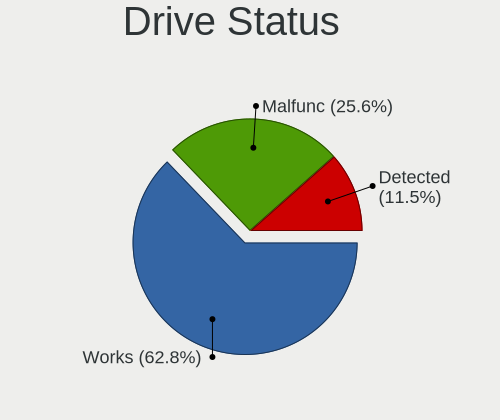

| Status   | Computers | Drives | Percent |
|----------|-----------|--------|---------|
| Works    | 47        | 100    | 65.28%  |
| Malfunc  | 17        | 27     | 23.61%  |
| Detected | 8         | 17     | 11.11%  |

Storage controller
------------------

Storage Vendor
--------------

Storage controller vendors

| Vendor                      | Computers | Percent |
|-----------------------------|-----------|---------|
| Intel                       | 41        | 53.95%  |
| AMD                         | 12        | 15.79%  |
| Samsung Electronics         | 7         | 9.21%   |
| ASMedia Technology          | 3         | 3.95%   |
| Sandisk                     | 2         | 2.63%   |
| Marvell Technology Group    | 2         | 2.63%   |
| SK Hynix                    | 1         | 1.32%   |
| Silicon Image               | 1         | 1.32%   |
| Realtek Semiconductor       | 1         | 1.32%   |
| Phison Electronics          | 1         | 1.32%   |
| Nvidia                      | 1         | 1.32%   |
| Kingston Technology Company | 1         | 1.32%   |
| JMicron Technology          | 1         | 1.32%   |
| Broadcom / LSI              | 1         | 1.32%   |
| 3ware                       | 1         | 1.32%   |

Storage Model
-------------

Storage controller models

| Model                                                                            | Computers | Percent |
|----------------------------------------------------------------------------------|-----------|---------|
| AMD FCH SATA Controller [AHCI mode]                                              | 10        | 11.24%  |
| Samsung NVMe SSD Controller SM981/PM981/PM983                                    | 6         | 6.74%   |
| Intel Sunrise Point-LP SATA Controller [AHCI mode]                               | 4         | 4.49%   |
| Intel C600/X79 series chipset 6-Port SATA AHCI Controller                        | 3         | 3.37%   |
| Intel Atom/Celeron/Pentium Processor x5-E8000/J3xxx/N3xxx Series SATA Controller | 3         | 3.37%   |
| Intel 9 Series Chipset Family SATA Controller [AHCI Mode]                        | 3         | 3.37%   |
| Intel Wildcat Point-LP SATA Controller [AHCI Mode]                               | 2         | 2.25%   |
| Intel Q170/Q150/B150/H170/H110/Z170/CM236 Chipset SATA Controller [AHCI Mode]    | 2         | 2.25%   |
| Intel Cannon Lake PCH SATA AHCI Controller                                       | 2         | 2.25%   |
| Intel 82801IBM/IEM (ICH9M/ICH9M-E) 4 port SATA Controller [AHCI mode]            | 2         | 2.25%   |
| Intel 8 Series/C220 Series Chipset Family 6-port SATA Controller 1 [AHCI mode]   | 2         | 2.25%   |
| Intel 8 Series SATA Controller 1 [AHCI mode]                                     | 2         | 2.25%   |
| Intel 6 Series/C200 Series Chipset Family 6 port Mobile SATA AHCI Controller     | 2         | 2.25%   |
| ASMedia ASM1062 Serial ATA Controller                                            | 2         | 2.25%   |
| AMD SB7x0/SB8x0/SB9x0 SATA Controller [AHCI mode]                                | 2         | 2.25%   |
| AMD 400 Series Chipset SATA Controller                                           | 2         | 2.25%   |
| SK Hynix Gold P31 SSD                                                            | 1         | 1.12%   |
| Silicon Image SiI 3114 [SATALink/SATARaid] Serial ATA Controller                 | 1         | 1.12%   |
| Sandisk WD Blue SN550 NVMe SSD                                                   | 1         | 1.12%   |
| Sandisk WD Blue SN500 / PC SN520 NVMe SSD                                        | 1         | 1.12%   |
| Samsung Apple PCIe SSD                                                           | 1         | 1.12%   |
| Realtek Realtek Non-Volatile memory controller                                   | 1         | 1.12%   |
| Phison NVMe Storage Controller                                                   | 1         | 1.12%   |
| Nvidia MCP61 SATA Controller                                                     | 1         | 1.12%   |
| Nvidia MCP61 IDE                                                                 | 1         | 1.12%   |
| Marvell Group 88SE9172 SATA 6Gb/s Controller                                     | 1         | 1.12%   |
| Marvell Group 88SE9128 PCIe SATA 6 Gb/s RAID controller                          | 1         | 1.12%   |
| Kingston Company U-SNS8154P3 NVMe SSD                                            | 1         | 1.12%   |
| JMicron JMB368 IDE controller                                                    | 1         | 1.12%   |
| Intel SSD Pro 7600p/760p/E 6100p Series                                          | 1         | 1.12%   |
| Intel SSD 600P Series                                                            | 1         | 1.12%   |
| Intel SATA Controller [RAID mode]                                                | 1         | 1.12%   |
| Intel NM10/ICH7 Family SATA Controller [IDE mode]                                | 1         | 1.12%   |
| Intel Comet Lake SATA AHCI Controller                                            | 1         | 1.12%   |
| Intel Cannon Lake Mobile PCH SATA AHCI Controller                                | 1         | 1.12%   |
| Intel C608 chipset Dual 4-Port SATA/SAS Storage Control Unit                     | 1         | 1.12%   |
| Intel C602 chipset 4-Port SATA Storage Control Unit                              | 1         | 1.12%   |
| Intel C600/X79 series chipset IDE-r Controller                                   | 1         | 1.12%   |
| Intel 82801JI (ICH10 Family) 4 port SATA IDE Controller #1                       | 1         | 1.12%   |
| Intel 82801JI (ICH10 Family) 2 port SATA IDE Controller #2                       | 1         | 1.12%   |
| Intel 82801IR/IO/IH (ICH9R/DO/DH) 6 port SATA Controller [AHCI mode]             | 1         | 1.12%   |
| Intel 82801GBM/GHM (ICH7-M Family) SATA Controller [IDE mode]                    | 1         | 1.12%   |
| Intel 82801G (ICH7 Family) IDE Controller                                        | 1         | 1.12%   |
| Intel 82801 Mobile SATA Controller [RAID mode]                                   | 1         | 1.12%   |
| Intel 8 Series/C220 Series Chipset Family 4-port SATA Controller 1 [IDE mode]    | 1         | 1.12%   |
| Intel 8 Series/C220 Series Chipset Family 2-port SATA Controller 2 [IDE mode]    | 1         | 1.12%   |
| Intel 7 Series/C210 Series Chipset Family 6-port SATA Controller [AHCI mode]     | 1         | 1.12%   |
| Intel 6 Series/C200 Series Chipset Family IDE-r Controller                       | 1         | 1.12%   |
| Intel 6 Series/C200 Series Chipset Family 6 port Desktop SATA AHCI Controller    | 1         | 1.12%   |
| Intel 5 Series/3400 Series Chipset 4 port SATA AHCI Controller                   | 1         | 1.12%   |
| Intel 200 Series PCH SATA controller [AHCI mode]                                 | 1         | 1.12%   |
| Broadcom / LSI SAS2008 PCI-Express Fusion-MPT SAS-2 [Falcon]                     | 1         | 1.12%   |
| ASMedia 106x SATA/RAID Controller                                                | 1         | 1.12%   |
| AMD X370 Series Chipset SATA Controller                                          | 1         | 1.12%   |
| AMD 300 Series Chipset SATA Controller                                           | 1         | 1.12%   |
| 3ware 9650SE SATA-II RAID PCIe                                                   | 1         | 1.12%   |

Storage Kind
------------

Kind of storage controller (IDE, SATA, NVMe, SAS, ...)

| Kind | Computers | Percent |
|------|-----------|---------|
| SATA | 47        | 62.67%  |
| NVMe | 14        | 18.67%  |
| IDE  | 7         | 9.33%   |
| RAID | 4         | 5.33%   |
| SAS  | 3         | 4%      |

Processor
---------

CPU Vendor
----------

Processor vendors

| Vendor | Computers | Percent |
|--------|-----------|---------|
| Intel  | 43        | 76.79%  |
| AMD    | 13        | 23.21%  |

CPU Model
---------

Processor models

| Model                                          | Computers | Percent |
|------------------------------------------------|-----------|---------|
| Intel Core i7-4790K CPU @ 4.00GHz              | 2         | 3.57%   |
| AMD Ryzen 5 3600 6-Core Processor              | 2         | 3.57%   |
| AMD Ryzen 5 2500U with Radeon Vega Mobile Gfx  | 2         | 3.57%   |
| AMD FX-8350 Eight-Core Processor               | 2         | 3.57%   |
| Intel Xeon CPU X3450 @ 2.67GHz                 | 1         | 1.79%   |
| Intel Xeon CPU E5-2670 0 @ 2.60GHz             | 1         | 1.79%   |
| Intel Xeon CPU E5-2620 0 @ 2.00GHz             | 1         | 1.79%   |
| Intel Xeon CPU E5-1650 0 @ 3.20GHz             | 1         | 1.79%   |
| Intel Xeon CPU E3-1246 v3 @ 3.50GHz            | 1         | 1.79%   |
| Intel Pentium Gold G5420 CPU @ 3.80GHz         | 1         | 1.79%   |
| Intel Pentium CPU P6100 @ 2.00GHz              | 1         | 1.79%   |
| Intel Pentium CPU N3710 @ 1.60GHz              | 1         | 1.79%   |
| Intel Pentium CPU G640 @ 2.80GHz               | 1         | 1.79%   |
| Intel Pentium CPU G4560 @ 3.50GHz              | 1         | 1.79%   |
| Intel Core i7-9700 CPU @ 3.00GHz               | 1         | 1.79%   |
| Intel Core i7-7500U CPU @ 2.70GHz              | 1         | 1.79%   |
| Intel Core i7-6820HQ CPU @ 2.70GHz             | 1         | 1.79%   |
| Intel Core i7-4700MQ CPU @ 2.40GHz             | 1         | 1.79%   |
| Intel Core i7-2860QM CPU @ 2.50GHz             | 1         | 1.79%   |
| Intel Core i7-10710U CPU @ 1.10GHz             | 1         | 1.79%   |
| Intel Core i7-10510U CPU @ 1.80GHz             | 1         | 1.79%   |
| Intel Core i5-9400 CPU @ 2.90GHz               | 1         | 1.79%   |
| Intel Core i5-8300H CPU @ 2.30GHz              | 1         | 1.79%   |
| Intel Core i5-8250U CPU @ 1.60GHz              | 1         | 1.79%   |
| Intel Core i5-7200U CPU @ 2.50GHz              | 1         | 1.79%   |
| Intel Core i5-6300U CPU @ 2.40GHz              | 1         | 1.79%   |
| Intel Core i5-5300U CPU @ 2.30GHz              | 1         | 1.79%   |
| Intel Core i5-4690 CPU @ 3.50GHz               | 1         | 1.79%   |
| Intel Core i5-4210U CPU @ 1.70GHz              | 1         | 1.79%   |
| Intel Core i5-4200U CPU @ 1.60GHz              | 1         | 1.79%   |
| Intel Core i5-3470 CPU @ 3.20GHz               | 1         | 1.79%   |
| Intel Core i5-2430M CPU @ 2.40GHz              | 1         | 1.79%   |
| Intel Core i5-10210U CPU @ 1.60GHz             | 1         | 1.79%   |
| Intel Core i3-6100U CPU @ 2.30GHz              | 1         | 1.79%   |
| Intel Core i3-6006U CPU @ 2.00GHz              | 1         | 1.79%   |
| Intel Core i3-5005U CPU @ 2.00GHz              | 1         | 1.79%   |
| Intel Core i3-4000M CPU @ 2.40GHz              | 1         | 1.79%   |
| Intel Core 2 Quad CPU Q8400 @ 2.66GHz          | 1         | 1.79%   |
| Intel Core 2 Quad CPU Q6700 @ 2.66GHz          | 1         | 1.79%   |
| Intel Core 2 Duo CPU T7250 @ 2.00GHz           | 1         | 1.79%   |
| Intel Core 2 Duo CPU E8400 @ 3.00GHz           | 1         | 1.79%   |
| Intel Core 2 CPU P8400 @ 2.26GHz               | 1         | 1.79%   |
| Intel Celeron CPU N3160 @ 1.60GHz              | 1         | 1.79%   |
| Intel Celeron CPU N3060 @ 1.60GHz              | 1         | 1.79%   |
| Intel Atom CPU N270 @ 1.60GHz                  | 1         | 1.79%   |
| AMD Ryzen Embedded R1505G with Radeon Vega Gfx | 1         | 1.79%   |
| AMD Ryzen 9 3950X 16-Core Processor            | 1         | 1.79%   |
| AMD Ryzen 7 3800X 8-Core Processor             | 1         | 1.79%   |
| AMD Ryzen 7 1700X Eight-Core Processor         | 1         | 1.79%   |
| AMD Athlon 64 X2 Dual Core Processor 5200+     | 1         | 1.79%   |
| AMD A4-7300 APU with Radeon HD Graphics        | 1         | 1.79%   |
| AMD A10-5700 APU with Radeon HD Graphics       | 1         | 1.79%   |

CPU Model Family
----------------

Processor model prefix

| Model              | Computers | Percent |
|--------------------|-----------|---------|
| Intel Core i5      | 12        | 21.43%  |
| Intel Core i7      | 9         | 16.07%  |
| Intel Xeon         | 5         | 8.93%   |
| Intel Pentium      | 4         | 7.14%   |
| Intel Core i3      | 4         | 7.14%   |
| AMD Ryzen 5        | 4         | 7.14%   |
| Intel Core 2 Quad  | 2         | 3.57%   |
| Intel Core 2 Duo   | 2         | 3.57%   |
| Intel Celeron      | 2         | 3.57%   |
| AMD Ryzen 7        | 2         | 3.57%   |
| AMD FX             | 2         | 3.57%   |
| Intel Pentium Gold | 1         | 1.79%   |
| Intel Core 2       | 1         | 1.79%   |
| Intel Atom         | 1         | 1.79%   |
| AMD Ryzen Embedded | 1         | 1.79%   |
| AMD Ryzen 9        | 1         | 1.79%   |
| AMD Athlon 64 X2   | 1         | 1.79%   |
| AMD A4             | 1         | 1.79%   |
| AMD A10            | 1         | 1.79%   |

CPU Cores
---------

Number of processor cores

| Number | Computers | Percent |
|--------|-----------|---------|
| 2      | 22        | 39.29%  |
| 4      | 21        | 37.5%   |
| 6      | 5         | 8.93%   |
| 8      | 3         | 5.36%   |
| 16     | 2         | 3.57%   |
| 1      | 2         | 3.57%   |
| 12     | 1         | 1.79%   |

CPU Sockets
-----------

Number of sockets

| Number | Computers | Percent |
|--------|-----------|---------|
| 1      | 54        | 96.43%  |
| 2      | 2         | 3.57%   |

CPU Threads
-----------

Threads per core (Hyper-Threading)

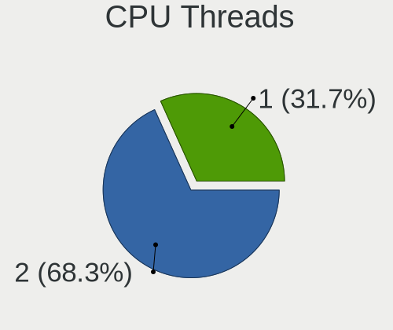

| Number | Computers | Percent |
|--------|-----------|---------|
| 2      | 41        | 73.21%  |
| 1      | 15        | 26.79%  |

CPU Op-Modes
------------

CPU Operation Modes (32-bit, 64-bit)

| Op mode        | Computers | Percent |
|----------------|-----------|---------|
| 32-bit, 64-bit | 53        | 94.64%  |
| Unknown        | 2         | 3.57%   |
| 32-bit         | 1         | 1.79%   |

CPU Microcode
-------------

Microcode number

| Number     | Computers | Percent |
|------------|-----------|---------|
| Unknown    | 13        | 23.21%  |
| 0x306c3    | 4         | 7.14%   |
| 0x206d7    | 3         | 5.36%   |
| 0x206a7    | 3         | 5.36%   |
| 0x1067a    | 3         | 5.36%   |
| 0x906ed    | 2         | 3.57%   |
| 0x806ec    | 2         | 3.57%   |
| 0x406e3    | 2         | 3.57%   |
| 0x406c4    | 2         | 3.57%   |
| 0x306d4    | 2         | 3.57%   |
| 0x08701013 | 2         | 3.57%   |
| 0x06001119 | 2         | 3.57%   |
| 0xa0660    | 1         | 1.79%   |
| 0x906ea    | 1         | 1.79%   |
| 0x806ea    | 1         | 1.79%   |
| 0x806e9    | 1         | 1.79%   |
| 0x6fd      | 1         | 1.79%   |
| 0x506e3    | 1         | 1.79%   |
| 0x40651    | 1         | 1.79%   |
| 0x306a9    | 1         | 1.79%   |
| 0x20655    | 1         | 1.79%   |
| 0x106e5    | 1         | 1.79%   |
| 0x106c2    | 1         | 1.79%   |
| 0x08701021 | 1         | 1.79%   |
| 0x0810100b | 1         | 1.79%   |
| 0x08001138 | 1         | 1.79%   |
| 0x06000852 | 1         | 1.79%   |
| 0x06000822 | 1         | 1.79%   |

CPU Microarch
-------------

Microarchitecture

| Name        | Computers | Percent |
|-------------|-----------|---------|
| KabyLake    | 10        | 17.86%  |
| Haswell     | 8         | 14.29%  |
| SandyBridge | 6         | 10.71%  |
| Zen 2       | 4         | 7.14%   |
| Skylake     | 4         | 7.14%   |
| Piledriver  | 4         | 7.14%   |
| Zen         | 3         | 5.36%   |
| Silvermont  | 3         | 5.36%   |
| Penryn      | 3         | 5.36%   |
| Core        | 2         | 3.57%   |
| Broadwell   | 2         | 3.57%   |
| Zen+        | 1         | 1.79%   |
| Westmere    | 1         | 1.79%   |
| Nehalem     | 1         | 1.79%   |
| K8 Hammer   | 1         | 1.79%   |
| IvyBridge   | 1         | 1.79%   |
| CometLake   | 1         | 1.79%   |
| Bonnell     | 1         | 1.79%   |

Graphics
--------

GPU Vendor
----------

Vendors of graphics cards

| Vendor                     | Computers | Percent |
|----------------------------|-----------|---------|
| Intel                      | 31        | 52.54%  |
| Nvidia                     | 13        | 22.03%  |
| AMD                        | 13        | 22.03%  |
| Matrox Electronics Systems | 2         | 3.39%   |

GPU Model
---------

Graphics card models

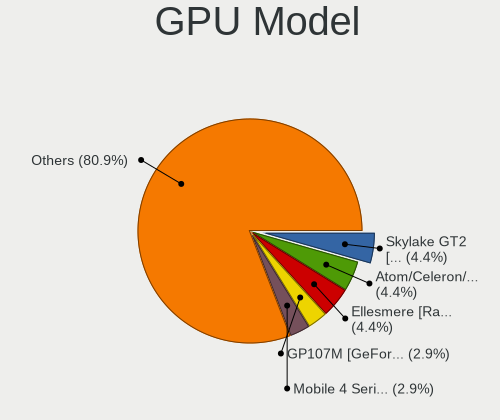

| Model                                                                                    | Computers | Percent |
|------------------------------------------------------------------------------------------|-----------|---------|
| Intel Skylake GT2 [HD Graphics 520]                                                      | 3         | 4.92%   |
| Intel Atom/Celeron/Pentium Processor x5-E8000/J3xxx/N3xxx Integrated Graphics Controller | 3         | 4.92%   |
| AMD Ellesmere [Radeon RX 470/480/570/570X/580/580X/590]                                  | 3         | 4.92%   |
| Nvidia GP107M [GeForce GTX 1050 Mobile]                                                  | 2         | 3.28%   |
| Intel Mobile 4 Series Chipset Integrated Graphics Controller                             | 2         | 3.28%   |
| Intel HD Graphics 620                                                                    | 2         | 3.28%   |
| Intel HD Graphics 5500                                                                   | 2         | 3.28%   |
| Intel Haswell-ULT Integrated Graphics Controller                                         | 2         | 3.28%   |
| Intel CometLake-U GT2 [UHD Graphics]                                                     | 2         | 3.28%   |
| Intel CoffeeLake-S GT2 [UHD Graphics 630]                                                | 2         | 3.28%   |
| Intel 4th Gen Core Processor Integrated Graphics Controller                              | 2         | 3.28%   |
| Intel 2nd Generation Core Processor Family Integrated Graphics Controller                | 2         | 3.28%   |
| AMD Raven Ridge [Radeon Vega Series / Radeon Vega Mobile Series]                         | 2         | 3.28%   |
| Nvidia TU116 [GeForce GTX 1660 SUPER]                                                    | 1         | 1.64%   |
| Nvidia GP107 [GeForce GTX 1050 Ti]                                                       | 1         | 1.64%   |
| Nvidia GM206 [GeForce GTX 960]                                                           | 1         | 1.64%   |
| Nvidia GM204GLM [Quadro M3000M]                                                          | 1         | 1.64%   |
| Nvidia GM204 [GeForce GTX 970]                                                           | 1         | 1.64%   |
| Nvidia GK208B [GeForce GT 710]                                                           | 1         | 1.64%   |
| Nvidia GK107M [GeForce GT 745M]                                                          | 1         | 1.64%   |
| Nvidia GK107 [GeForce GT 640]                                                            | 1         | 1.64%   |
| Nvidia GK104GL [Quadro K5000]                                                            | 1         | 1.64%   |
| Nvidia GF106GLM [Quadro 2000M]                                                           | 1         | 1.64%   |
| Nvidia G80GL [Quadro FX 4600]                                                            | 1         | 1.64%   |
| Matrox Electronics Systems MGA G200eW WPCM450                                            | 1         | 1.64%   |
| Matrox Electronics Systems MGA G200eH3                                                   | 1         | 1.64%   |
| Intel Xeon E3-1200 v3/4th Gen Core Processor Integrated Graphics Controller              | 1         | 1.64%   |
| Intel Xeon E3-1200 v3 Processor Integrated Graphics Controller                           | 1         | 1.64%   |
| Intel UHD Graphics 620                                                                   | 1         | 1.64%   |
| Intel Mobile 945GSE Express Integrated Graphics Controller                               | 1         | 1.64%   |
| Intel Mobile 945GM/GMS/GME, 943/940GML Express Integrated Graphics Controller            | 1         | 1.64%   |
| Intel HD Graphics 530                                                                    | 1         | 1.64%   |
| Intel Core Processor Integrated Graphics Controller                                      | 1         | 1.64%   |
| Intel Comet Lake UHD Graphics                                                            | 1         | 1.64%   |
| Intel CoffeeLake-H GT2 [UHD Graphics 630]                                                | 1         | 1.64%   |
| Intel 82G33/G31 Express Integrated Graphics Controller                                   | 1         | 1.64%   |
| AMD Richland [Radeon HD 8470D]                                                           | 1         | 1.64%   |
| AMD Picasso                                                                              | 1         | 1.64%   |
| AMD Oland [Radeon HD 8570 / R5 430 OEM / R7 240/340 / Radeon 520 OEM]                    | 1         | 1.64%   |
| AMD Oland PRO [Radeon R7 240/340]                                                        | 1         | 1.64%   |
| AMD Navi 10 [Radeon RX 5600 OEM/5600 XT / 5700/5700 XT]                                  | 1         | 1.64%   |
| AMD Cypress XT [Radeon HD 5870]                                                          | 1         | 1.64%   |
| AMD Cape Verde PRO [Radeon HD 7750/8740 / R7 250E]                                       | 1         | 1.64%   |
| AMD Baffin [Radeon RX 550 640SP / RX 560/560X]                                           | 1         | 1.64%   |
| AMD Baffin [Radeon RX 460/560D / Pro 450/455/460/555/555X/560/560X]                      | 1         | 1.64%   |

GPU Combo
---------

Combinations of graphics cards

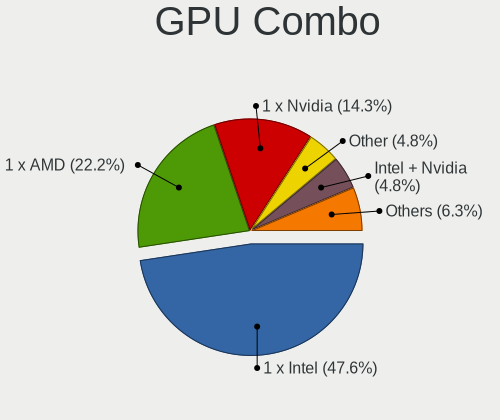

| Name           | Computers | Percent |
|----------------|-----------|---------|
| 1 x Intel      | 28        | 50%     |
| 1 x AMD        | 12        | 21.43%  |
| 1 x Nvidia     | 9         | 16.07%  |
| Intel + Nvidia | 3         | 5.36%   |
| 1 x Matrox     | 2         | 3.57%   |
| Other          | 1         | 1.79%   |
| AMD + Nvidia   | 1         | 1.79%   |

GPU Driver
----------

Free vs proprietary

| Driver      | Computers | Percent |
|-------------|-----------|---------|
| Free        | 42        | 75%     |
| Proprietary | 8         | 14.29%  |
| Unknown     | 6         | 10.71%  |

GPU Memory
----------

Total video memory

| Size in GB | Computers | Percent |
|------------|-----------|---------|
| Unknown    | 33        | 57.89%  |
| 1.01-2.0   | 8         | 14.04%  |
| 3.01-4.0   | 7         | 12.28%  |
| 0.51-1.0   | 6         | 10.53%  |
| 7.01-8.0   | 2         | 3.51%   |
| 0.01-0.5   | 1         | 1.75%   |

Monitor
-------

Monitor Vendor
--------------

Monitor vendors

| Vendor               | Computers | Percent |
|----------------------|-----------|---------|
| Chimei Innolux       | 7         | 12.28%  |
| LG Display           | 6         | 10.53%  |
| Samsung Electronics  | 5         | 8.77%   |
| Goldstar             | 4         | 7.02%   |
| Dell                 | 4         | 7.02%   |
| Hewlett-Packard      | 3         | 5.26%   |
| BOE                  | 3         | 5.26%   |
| BenQ                 | 3         | 5.26%   |
| AU Optronics         | 3         | 5.26%   |
| ViewSonic            | 2         | 3.51%   |
| Lenovo               | 2         | 3.51%   |
| ASUSTek Computer     | 2         | 3.51%   |
| Acer                 | 2         | 3.51%   |
| Xiaomi               | 1         | 1.75%   |
| Toshiba              | 1         | 1.75%   |
| Sharp                | 1         | 1.75%   |
| Panasonic            | 1         | 1.75%   |
| NEC Computers        | 1         | 1.75%   |
| JVC                  | 1         | 1.75%   |
| Iiyama               | 1         | 1.75%   |
| Gigabyte Technology  | 1         | 1.75%   |
| Eizo                 | 1         | 1.75%   |
| DPC                  | 1         | 1.75%   |
| Ancor Communications | 1         | 1.75%   |

Monitor Model
-------------

Monitor models

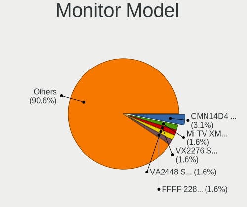

| Model                                                                | Computers | Percent |
|----------------------------------------------------------------------|-----------|---------|
| Chimei Innolux LCD Monitor CMN14D4 1920x1080 309x173mm 13.9-inch     | 2         | 3.39%   |
| Xiaomi Mi TV XMD009A 2880x1800 480x270mm 21.7-inch                   | 1         | 1.69%   |
| ViewSonic LCD Monitor VX2276 Series 1920x1080                        | 1         | 1.69%   |
| ViewSonic LCD Monitor VA2448 SERIES 1920x1080                        | 1         | 1.69%   |
| Toshiba TV TSB0206 1920x1080 886x498mm 40.0-inch                     | 1         | 1.69%   |
| Sharp LCD Monitor SHP14C4 1920x1080 344x194mm 15.5-inch              | 1         | 1.69%   |
| Samsung Electronics SyncMaster SAM0578 1920x1080 476x268mm 21.5-inch | 1         | 1.69%   |
| Samsung Electronics SyncMaster SAM0428 1680x1050 459x296mm 21.5-inch | 1         | 1.69%   |
| Samsung Electronics SMB2430L SAM0644 1920x1080 521x293mm 23.5-inch   | 1         | 1.69%   |
| Samsung Electronics LCD Monitor SEC5541 1366x768 344x193mm 15.5-inch | 1         | 1.69%   |
| Samsung Electronics LCD Monitor SEC5441 1366x768 344x194mm 15.5-inch | 1         | 1.69%   |
| Panasonic VVX13F009G00 MEI96A2 1920x1080 290x170mm 13.2-inch         | 1         | 1.69%   |
| NEC Computers LCD2490WUXi NEC66CE 1920x1200 518x324mm 24.1-inch      | 1         | 1.69%   |
| LG Display LCD Monitor LGD0521 1920x1080 309x174mm 14.0-inch         | 1         | 1.69%   |
| LG Display LCD Monitor LGD0508 1366x768 309x174mm 14.0-inch          | 1         | 1.69%   |
| LG Display LCD Monitor LGD03D7 1366x768 309x174mm 14.0-inch          | 1         | 1.69%   |
| LG Display LCD Monitor LGD0353 1366x768 345x194mm 15.6-inch          | 1         | 1.69%   |
| LG Display LCD Monitor LGD02E3 1366x768 344x194mm 15.5-inch          | 1         | 1.69%   |
| LG Display LCD Monitor LGD02D9 1920x1080 350x190mm 15.7-inch         | 1         | 1.69%   |
| Lenovo LCD Monitor LEN40B2 1920x1080 344x193mm 15.5-inch             | 1         | 1.69%   |
| Lenovo LCD Monitor LEN4035 1280x800 304x190mm 14.1-inch              | 1         | 1.69%   |
| JVC FPDEUFT3 JVC21BE 1920x540                                        | 1         | 1.69%   |
| Iiyama PLE2207WS IVM5609 1680x1050 474x296mm 22.0-inch               | 1         | 1.69%   |
| Hewlett-Packard ZR2740w HWP2957 2560x1440 597x336mm 27.0-inch        | 1         | 1.69%   |
| Hewlett-Packard LE1851w HWP2840 1366x768 413x234mm 18.7-inch         | 1         | 1.69%   |
| Hewlett-Packard 2309 HWP2823 1920x1080 510x287mm 23.0-inch           | 1         | 1.69%   |
| Goldstar W2242 GSM5678 1680x1050 474x296mm 22.0-inch                 | 1         | 1.69%   |
| Goldstar W2242 GSM5677 1680x1050 474x296mm 22.0-inch                 | 1         | 1.69%   |
| Goldstar W2043 GSM4E9D 1600x900 443x249mm 20.0-inch                  | 1         | 1.69%   |
| Goldstar FULL HD GSM5ABA 1920x1080 480x270mm 21.7-inch               | 1         | 1.69%   |
| Goldstar BK750Y GSM5B3E 1920x1080 600x340mm 27.2-inch                | 1         | 1.69%   |
| Goldstar BK750Y GSM5B3D 1920x1080 480x270mm 21.7-inch                | 1         | 1.69%   |
| Gigabyte Technology G27Q GBT2709 2560x1440 598x336mm 27.0-inch       | 1         | 1.69%   |
| Eizo M1700 ENC1788 1280x1024 338x271mm 17.1-inch                     | 1         | 1.69%   |
| DPC Qumi Q38 DPC81F2 1920x1200 708x398mm 32.0-inch                   | 1         | 1.69%   |
| Dell U2412M DELA07A 1920x1200 518x324mm 24.1-inch                    | 1         | 1.69%   |
| Dell LCD Monitor U2312HM 1920x1080                                   | 1         | 1.69%   |
| Dell E176FP DELA014 1280x1024 340x270mm 17.1-inch                    | 1         | 1.69%   |
| Dell 1905FP DEL400D 1280x1024 376x301mm 19.0-inch                    | 1         | 1.69%   |
| Chimei Innolux LCD Monitor CMN1735 1920x1080 382x215mm 17.3-inch     | 1         | 1.69%   |
| Chimei Innolux LCD Monitor CMN15CC 1366x768 344x193mm 15.5-inch      | 1         | 1.69%   |
| Chimei Innolux LCD Monitor CMN14C9 1920x1080 309x173mm 13.9-inch     | 1         | 1.69%   |
| Chimei Innolux LCD Monitor CMN1482 1600x900 309x174mm 14.0-inch      | 1         | 1.69%   |
| Chimei Innolux LCD Monitor CMN1355 1366x768 293x165mm 13.2-inch      | 1         | 1.69%   |
| BOE LCD Monitor BOE07C8 3840x2160 309x174mm 14.0-inch                | 1         | 1.69%   |
| BOE LCD Monitor BOE0703 1920x1080 344x194mm 15.5-inch                | 1         | 1.69%   |
| BOE LCD Monitor BOE0690 1920x1080 344x193mm 15.5-inch                | 1         | 1.69%   |
| BenQ GW2283 BNQ78E9 1920x1080 480x270mm 21.7-inch                    | 1         | 1.69%   |
| BenQ EW2420 BNQ7923 1920x1080 530x300mm 24.0-inch                    | 1         | 1.69%   |
| BenQ BenQG2222HDL BNQ785A 1920x1080 478x269mm 21.6-inch              | 1         | 1.69%   |
| AU Optronics LCD Monitor AUO48EC 1366x768 344x193mm 15.5-inch        | 1         | 1.69%   |
| AU Optronics LCD Monitor AUO30ED 1920x1080 344x193mm 15.5-inch       | 1         | 1.69%   |
| AU Optronics LCD Monitor AUO106C 1366x768 277x156mm 12.5-inch        | 1         | 1.69%   |
| ASUSTek Computer VZ229 AUS22CC 1920x1080 476x268mm 21.5-inch         | 1         | 1.69%   |
| ASUSTek Computer VA24DQLB AUS2482 1920x1080 527x296mm 23.8-inch      | 1         | 1.69%   |
| Ancor Communications VG248 ACI24E1 1680x1050 530x300mm 24.0-inch     | 1         | 1.69%   |
| Acer K222HQL ACR040D 1920x1080 480x270mm 21.7-inch                   | 1         | 1.69%   |
| Acer AL171 ACRAD18 1280x1024 338x270mm 17.0-inch                     | 1         | 1.69%   |

Monitor Resolution
------------------

Monitor screen resolution

| Resolution         | Computers | Percent |
|--------------------|-----------|---------|
| 1920x1080 (FHD)    | 26        | 47.27%  |
| 1366x768 (WXGA)    | 11        | 20%     |
| 1280x1024 (SXGA)   | 4         | 7.27%   |
| 1680x1050 (WSXGA+) | 3         | 5.45%   |
| 3840x2160 (4K)     | 2         | 3.64%   |
| 2560x1440 (QHD)    | 2         | 3.64%   |
| 1920x1200 (WUXGA)  | 2         | 3.64%   |
| 1600x900 (HD+)     | 2         | 3.64%   |
| 2880x1800          | 1         | 1.82%   |
| 1920x540           | 1         | 1.82%   |
| 1280x800 (WXGA)    | 1         | 1.82%   |

Monitor Diagonal
----------------

Diagonal size in inches

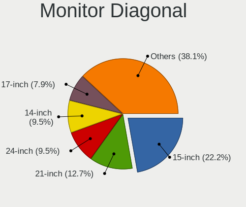

| Inches  | Computers | Percent |
|---------|-----------|---------|
| 15      | 12        | 21.05%  |
| 21      | 7         | 12.28%  |
| 14      | 6         | 10.53%  |
| 17      | 5         | 8.77%   |
| 27      | 4         | 7.02%   |
| 24      | 4         | 7.02%   |
| 23      | 4         | 7.02%   |
| 13      | 4         | 7.02%   |
| Unknown | 4         | 7.02%   |
| 74      | 1         | 1.75%   |
| 32      | 1         | 1.75%   |
| 22      | 1         | 1.75%   |
| 20      | 1         | 1.75%   |
| 19      | 1         | 1.75%   |
| 18      | 1         | 1.75%   |
| 12      | 1         | 1.75%   |

Monitor Width
-------------

Physical width

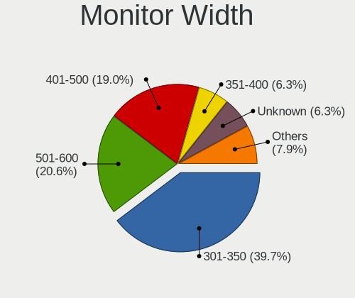

| Width in mm | Computers | Percent |
|-------------|-----------|---------|
| 301-350     | 23        | 40.35%  |
| 501-600     | 11        | 19.3%   |
| 401-500     | 11        | 19.3%   |
| 351-400     | 4         | 7.02%   |
| Unknown     | 4         | 7.02%   |
| 201-300     | 2         | 3.51%   |
| 701-800     | 1         | 1.75%   |
| 1501-2000   | 1         | 1.75%   |

Aspect Ratio
------------

Proportional relationship between the width and the height

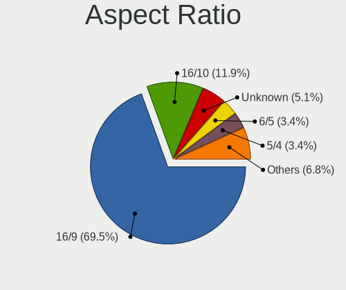

| Ratio   | Computers | Percent |
|---------|-----------|---------|
| 16/9    | 38        | 71.7%   |
| 16/10   | 5         | 9.43%   |
| Unknown | 3         | 5.66%   |
| 6/5     | 2         | 3.77%   |
| 5/4     | 2         | 3.77%   |
| 3/2     | 2         | 3.77%   |
| 32/9    | 1         | 1.89%   |

Monitor Area
------------

Area in inch²

| Area in inch² | Computers | Percent |
|----------------|-----------|---------|
| 201-250        | 13        | 23.21%  |
| 101-110        | 12        | 21.43%  |
| 81-90          | 9         | 16.07%  |
| 301-350        | 4         | 7.14%   |
| 141-150        | 4         | 7.14%   |
| Unknown        | 4         | 7.14%   |
| 251-300        | 2         | 3.57%   |
| 151-200        | 2         | 3.57%   |
| 121-130        | 2         | 3.57%   |
| More than 1000 | 1         | 1.79%   |
| 71-80          | 1         | 1.79%   |
| 61-70          | 1         | 1.79%   |
| 351-500        | 1         | 1.79%   |

Pixel Density
-------------

Pixels per inch

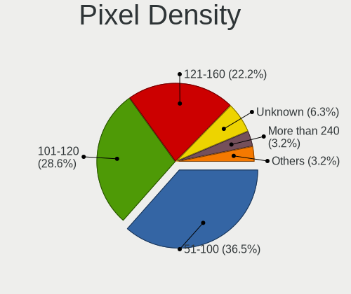

| Density       | Computers | Percent |
|---------------|-----------|---------|
| 51-100        | 20        | 35.09%  |
| 101-120       | 16        | 28.07%  |
| 121-160       | 14        | 24.56%  |
| Unknown       | 4         | 7.02%   |
| More than 240 | 2         | 3.51%   |
| 1-50          | 1         | 1.75%   |

Multiple Monitors
-----------------

Total monitors connected

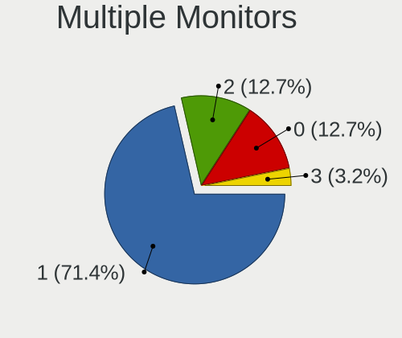

| Total | Computers | Percent |
|-------|-----------|---------|
| 1     | 40        | 71.43%  |
| 2     | 7         | 12.5%   |
| 0     | 7         | 12.5%   |
| 3     | 2         | 3.57%   |

Network
-------

Net Controller Vendor
---------------------

Controller vendors

| Vendor                   | Computers | Percent |
|--------------------------|-----------|---------|
| Intel                    | 35        | 42.68%  |
| Realtek Semiconductor    | 25        | 30.49%  |
| Qualcomm Atheros         | 8         | 9.76%   |
| Broadcom                 | 3         | 3.66%   |
| VIA Technologies         | 1         | 1.22%   |
| TP-Link                  | 1         | 1.22%   |
| Sierra Wireless          | 1         | 1.22%   |
| Ralink Technology        | 1         | 1.22%   |
| Ralink                   | 1         | 1.22%   |
| Nvidia                   | 1         | 1.22%   |
| Micro Star International | 1         | 1.22%   |
| Dell                     | 1         | 1.22%   |
| Chelsio Communications   | 1         | 1.22%   |
| Broadcom Limited         | 1         | 1.22%   |
| ASIX Electronics         | 1         | 1.22%   |

Net Controller Model
--------------------

Controller models

| Model                                                                                 | Computers | Percent |
|---------------------------------------------------------------------------------------|-----------|---------|
| Realtek RTL8111/8168/8411 PCI Express Gigabit Ethernet Controller                     | 17        | 16.83%  |
| Realtek RTL810xE PCI Express Fast Ethernet controller                                 | 5         | 4.95%   |
| Intel I211 Gigabit Network Connection                                                 | 5         | 4.95%   |
| Intel 82574L Gigabit Network Connection                                               | 4         | 3.96%   |
| Realtek RTL8188EE Wireless Network Adapter                                            | 3         | 2.97%   |
| Intel Wireless-AC 9260                                                                | 3         | 2.97%   |
| Intel Ethernet Connection (2) I218-V                                                  | 3         | 2.97%   |
| Intel 82579LM Gigabit Network Connection (Lewisville)                                 | 3         | 2.97%   |
| Qualcomm Atheros QCA9377 802.11ac Wireless Network Adapter                            | 2         | 1.98%   |
| Qualcomm Atheros QCA8171 Gigabit Ethernet                                             | 2         | 1.98%   |
| Qualcomm Atheros AR8121/AR8113/AR8114 Gigabit or Fast Ethernet                        | 2         | 1.98%   |
| Intel Wireless 8265 / 8275                                                            | 2         | 1.98%   |
| Intel Wireless 8260                                                                   | 2         | 1.98%   |
| Intel Wireless 7265                                                                   | 2         | 1.98%   |
| Intel Wireless 7260                                                                   | 2         | 1.98%   |
| Intel Wireless 3160                                                                   | 2         | 1.98%   |
| Intel Ethernet Connection I217-V                                                      | 2         | 1.98%   |
| Intel Ethernet Connection (2) I219-LM                                                 | 2         | 1.98%   |
| Intel Comet Lake PCH-LP CNVi WiFi                                                     | 2         | 1.98%   |
| VIA VT6105/VT6106S [Rhine-III]                                                        | 1         | 0.99%   |
| TP-Link RTL8812AU Archer T4U 802.11ac                                                 | 1         | 0.99%   |
| Sierra Wireless EM7305                                                                | 1         | 0.99%   |
| Realtek RTL8192EE PCIe Wireless Network Adapter                                       | 1         | 0.99%   |
| Realtek RTL8188EUS 802.11n Wireless Network Adapter                                   | 1         | 0.99%   |
| Realtek RTL8153 Gigabit Ethernet Adapter                                              | 1         | 0.99%   |
| Ralink MT7601U Wireless Adapter                                                       | 1         | 0.99%   |
| Ralink RT2790 Wireless 802.11n 1T/2R PCIe                                             | 1         | 0.99%   |
| Qualcomm Atheros AR93xx Wireless Network Adapter                                      | 1         | 0.99%   |
| Qualcomm Atheros AR9285 Wireless Network Adapter (PCI-Express)                        | 1         | 0.99%   |
| Qualcomm Atheros AR8151 v2.0 Gigabit Ethernet                                         | 1         | 0.99%   |
| Qualcomm Atheros AR5418 Wireless Network Adapter [AR5008E 802.11(a)bgn] (PCI-Express) | 1         | 0.99%   |
| Nvidia MCP61 Ethernet                                                                 | 1         | 0.99%   |
| Micro Star International MS-3871 802.11bgn Wireless Module [Ralink RT8070]            | 1         | 0.99%   |
| Intel WiFi Link 5100                                                                  | 1         | 0.99%   |
| Intel I350 Gigabit Network Connection                                                 | 1         | 0.99%   |
| Intel Ethernet Connection I219-LM                                                     | 1         | 0.99%   |
| Intel Ethernet Connection I218-V                                                      | 1         | 0.99%   |
| Intel Ethernet Connection (7) I219-V                                                  | 1         | 0.99%   |
| Intel Ethernet Connection (4) I219-V                                                  | 1         | 0.99%   |
| Intel Ethernet Connection (3) I218-LM                                                 | 1         | 0.99%   |
| Intel Ethernet Connection (10) I219-V                                                 | 1         | 0.99%   |
| Intel Dual Band Wireless-AC 3168NGW [Stone Peak]                                      | 1         | 0.99%   |
| Intel Centrino Ultimate-N 6300                                                        | 1         | 0.99%   |
| Intel Cannon Lake PCH CNVi WiFi                                                       | 1         | 0.99%   |
| Intel 82599ES 10-Gigabit SFI/SFP+ Network Connection                                  | 1         | 0.99%   |
| Intel 82579V Gigabit Network Connection                                               | 1         | 0.99%   |
| Intel 82571EB/82571GB Gigabit Ethernet Controller D0/D1 (copper applications)         | 1         | 0.99%   |
| Intel 82567LM Gigabit Network Connection                                              | 1         | 0.99%   |
| Dell DW5811e Snapdragon????? X7 LTE                                                  | 1         | 0.99%   |
| Chelsio T320 10GbE Dual Port Adapter                                                  | 1         | 0.99%   |
| Broadcom NetXtreme BCM57786 Gigabit Ethernet PCIe                                     | 1         | 0.99%   |
| Broadcom NetXtreme BCM5754 Gigabit Ethernet PCI Express                               | 1         | 0.99%   |
| Broadcom Limited NetXtreme BCM5756ME Gigabit Ethernet PCI Express                     | 1         | 0.99%   |
| Broadcom BCM4313 802.11bgn Wireless Network Adapter                                   | 1         | 0.99%   |
| ASIX AX88772B                                                                         | 1         | 0.99%   |

Wireless Vendor
---------------

Wireless vendors

| Vendor                   | Computers | Percent |
|--------------------------|-----------|---------|
| Intel                    | 19        | 52.78%  |
| Realtek Semiconductor    | 5         | 13.89%  |
| Qualcomm Atheros         | 5         | 13.89%  |
| TP-Link                  | 1         | 2.78%   |
| Sierra Wireless          | 1         | 2.78%   |
| Ralink Technology        | 1         | 2.78%   |
| Ralink                   | 1         | 2.78%   |
| Micro Star International | 1         | 2.78%   |
| Dell                     | 1         | 2.78%   |
| Broadcom                 | 1         | 2.78%   |

Wireless Model
--------------

Wireless models

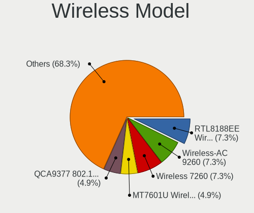

| Model                                                                                 | Computers | Percent |
|---------------------------------------------------------------------------------------|-----------|---------|
| Realtek RTL8188EE Wireless Network Adapter                                            | 3         | 8.33%   |
| Intel Wireless-AC 9260                                                                | 3         | 8.33%   |
| Qualcomm Atheros QCA9377 802.11ac Wireless Network Adapter                            | 2         | 5.56%   |
| Intel Wireless 8265 / 8275                                                            | 2         | 5.56%   |
| Intel Wireless 8260                                                                   | 2         | 5.56%   |
| Intel Wireless 7265                                                                   | 2         | 5.56%   |
| Intel Wireless 7260                                                                   | 2         | 5.56%   |
| Intel Wireless 3160                                                                   | 2         | 5.56%   |
| Intel Comet Lake PCH-LP CNVi WiFi                                                     | 2         | 5.56%   |
| TP-Link RTL8812AU Archer T4U 802.11ac                                                 | 1         | 2.78%   |
| Sierra Wireless EM7305                                                                | 1         | 2.78%   |
| Realtek RTL8192EE PCIe Wireless Network Adapter                                       | 1         | 2.78%   |
| Realtek RTL8188EUS 802.11n Wireless Network Adapter                                   | 1         | 2.78%   |
| Ralink MT7601U Wireless Adapter                                                       | 1         | 2.78%   |
| Ralink RT2790 Wireless 802.11n 1T/2R PCIe                                             | 1         | 2.78%   |
| Qualcomm Atheros AR93xx Wireless Network Adapter                                      | 1         | 2.78%   |
| Qualcomm Atheros AR9285 Wireless Network Adapter (PCI-Express)                        | 1         | 2.78%   |
| Qualcomm Atheros AR5418 Wireless Network Adapter [AR5008E 802.11(a)bgn] (PCI-Express) | 1         | 2.78%   |
| Micro Star International MS-3871 802.11bgn Wireless Module [Ralink RT8070]            | 1         | 2.78%   |
| Intel WiFi Link 5100                                                                  | 1         | 2.78%   |
| Intel Dual Band Wireless-AC 3168NGW [Stone Peak]                                      | 1         | 2.78%   |
| Intel Centrino Ultimate-N 6300                                                        | 1         | 2.78%   |
| Intel Cannon Lake PCH CNVi WiFi                                                       | 1         | 2.78%   |
| Dell DW5811e Snapdragon????? X7 LTE                                                  | 1         | 2.78%   |
| Broadcom BCM4313 802.11bgn Wireless Network Adapter                                   | 1         | 2.78%   |

Ethernet Vendor
---------------

Ethernet vendors

| Vendor                 | Computers | Percent |
|------------------------|-----------|---------|
| Intel                  | 24        | 41.38%  |
| Realtek Semiconductor  | 22        | 37.93%  |
| Qualcomm Atheros       | 5         | 8.62%   |
| Broadcom               | 2         | 3.45%   |
| VIA Technologies       | 1         | 1.72%   |
| Nvidia                 | 1         | 1.72%   |
| Chelsio Communications | 1         | 1.72%   |
| Broadcom Limited       | 1         | 1.72%   |
| ASIX Electronics       | 1         | 1.72%   |

Ethernet Model
--------------

Ethernet models

| Model                                                                         | Computers | Percent |
|-------------------------------------------------------------------------------|-----------|---------|
| Realtek RTL8111/8168/8411 PCI Express Gigabit Ethernet Controller             | 17        | 26.15%  |
| Realtek RTL810xE PCI Express Fast Ethernet controller                         | 5         | 7.69%   |
| Intel I211 Gigabit Network Connection                                         | 5         | 7.69%   |
| Intel 82574L Gigabit Network Connection                                       | 4         | 6.15%   |
| Intel Ethernet Connection (2) I218-V                                          | 3         | 4.62%   |
| Intel 82579LM Gigabit Network Connection (Lewisville)                         | 3         | 4.62%   |
| Qualcomm Atheros QCA8171 Gigabit Ethernet                                     | 2         | 3.08%   |
| Qualcomm Atheros AR8121/AR8113/AR8114 Gigabit or Fast Ethernet                | 2         | 3.08%   |
| Intel Ethernet Connection I217-V                                              | 2         | 3.08%   |
| Intel Ethernet Connection (2) I219-LM                                         | 2         | 3.08%   |
| VIA VT6105/VT6106S [Rhine-III]                                                | 1         | 1.54%   |
| Realtek RTL8153 Gigabit Ethernet Adapter                                      | 1         | 1.54%   |
| Qualcomm Atheros AR8151 v2.0 Gigabit Ethernet                                 | 1         | 1.54%   |
| Nvidia MCP61 Ethernet                                                         | 1         | 1.54%   |
| Intel I350 Gigabit Network Connection                                         | 1         | 1.54%   |
| Intel Ethernet Connection I219-LM                                             | 1         | 1.54%   |
| Intel Ethernet Connection I218-V                                              | 1         | 1.54%   |
| Intel Ethernet Connection (7) I219-V                                          | 1         | 1.54%   |
| Intel Ethernet Connection (4) I219-V                                          | 1         | 1.54%   |
| Intel Ethernet Connection (3) I218-LM                                         | 1         | 1.54%   |
| Intel Ethernet Connection (10) I219-V                                         | 1         | 1.54%   |
| Intel 82599ES 10-Gigabit SFI/SFP+ Network Connection                          | 1         | 1.54%   |
| Intel 82579V Gigabit Network Connection                                       | 1         | 1.54%   |
| Intel 82571EB/82571GB Gigabit Ethernet Controller D0/D1 (copper applications) | 1         | 1.54%   |
| Intel 82567LM Gigabit Network Connection                                      | 1         | 1.54%   |
| Chelsio T320 10GbE Dual Port Adapter                                          | 1         | 1.54%   |
| Broadcom NetXtreme BCM57786 Gigabit Ethernet PCIe                             | 1         | 1.54%   |
| Broadcom NetXtreme BCM5754 Gigabit Ethernet PCI Express                       | 1         | 1.54%   |
| Broadcom Limited NetXtreme BCM5756ME Gigabit Ethernet PCI Express             | 1         | 1.54%   |
| ASIX AX88772B                                                                 | 1         | 1.54%   |

Net Controller Kind
-------------------

Ethernet, WiFi or modem

| Kind     | Computers | Percent |
|----------|-----------|---------|
| Ethernet | 54        | 61.36%  |
| WiFi     | 34        | 38.64%  |

Used Controller
---------------

Currently used network controller

| Kind     | Computers | Percent |
|----------|-----------|---------|
| Ethernet | 37        | 64.91%  |
| WiFi     | 20        | 35.09%  |

NICs
----

Total network controllers on board

| Total | Computers | Percent |
|-------|-----------|---------|
| 2     | 31        | 55.36%  |
| 1     | 17        | 30.36%  |
| 3     | 3         | 5.36%   |
| 4     | 2         | 3.57%   |
| 0     | 2         | 3.57%   |
| 5     | 1         | 1.79%   |

IPv6
----

IPv6 vs IPv4

| Used | Computers | Percent |
|------|-----------|---------|
| No   | 53        | 94.64%  |
| Yes  | 3         | 5.36%   |

Bluetooth
---------

Bluetooth Vendor
----------------

Controller vendors

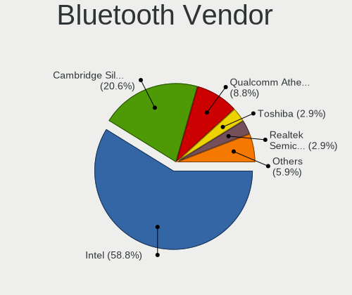

| Vendor                          | Computers | Percent |
|---------------------------------|-----------|---------|
| Intel                           | 17        | 54.84%  |
| Cambridge Silicon Radio         | 7         | 22.58%  |
| Qualcomm Atheros Communications | 3         | 9.68%   |
| Toshiba                         | 1         | 3.23%   |
| Realtek Semiconductor           | 1         | 3.23%   |
| Micro Star International        | 1         | 3.23%   |
| Broadcom                        | 1         | 3.23%   |

Bluetooth Model
---------------

Controller models

| Model                                               | Computers | Percent |
|-----------------------------------------------------|-----------|---------|
| Intel Bluetooth wireless interface                  | 8         | 25.81%  |
| Cambridge Silicon Radio Bluetooth Dongle (HCI mode) | 7         | 22.58%  |
| Intel Bluetooth Device                              | 6         | 19.35%  |
| Intel Wireless-AC 9260 Bluetooth Adapter            | 3         | 9.68%   |
| Qualcomm Atheros  Bluetooth Device                  | 2         | 6.45%   |
| Toshiba Askey Bluetooth Module                      | 1         | 3.23%   |
| Realtek Bluetooth Radio                             | 1         | 3.23%   |
| Qualcomm Atheros AR3011 Bluetooth                   | 1         | 3.23%   |
| Micro Star International Bluetooth Device           | 1         | 3.23%   |
| Broadcom BCM20702A0 Bluetooth 4.0                   | 1         | 3.23%   |

Sound
-----

Sound Vendor
------------

Sound card vendors

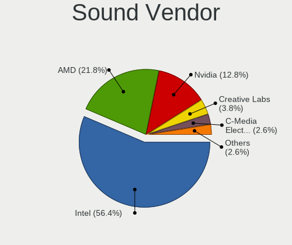

| Vendor              | Computers | Percent |
|---------------------|-----------|---------|
| Intel               | 41        | 56.94%  |
| AMD                 | 15        | 20.83%  |
| Nvidia              | 9         | 12.5%   |
| Creative Labs       | 3         | 4.17%   |
| C-Media Electronics | 2         | 2.78%   |
| Texas Instruments   | 1         | 1.39%   |
| EGO SYStems         | 1         | 1.39%   |

Sound Model
-----------

Sound card models

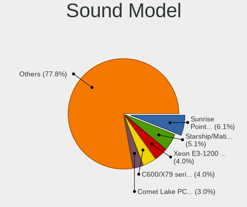

| Model                                                                                             | Computers | Percent |
|---------------------------------------------------------------------------------------------------|-----------|---------|
| Intel Sunrise Point-LP HD Audio                                                                   | 6         | 6.67%   |
| Intel Xeon E3-1200 v3/4th Gen Core Processor HD Audio Controller                                  | 4         | 4.44%   |
| AMD Starship/Matisse HD Audio Controller                                                          | 4         | 4.44%   |
| Intel Comet Lake PCH-LP cAVS                                                                      | 3         | 3.33%   |
| Intel C600/X79 series chipset High Definition Audio Controller                                    | 3         | 3.33%   |
| Intel Atom/Celeron/Pentium Processor x5-E8000/J3xxx/N3xxx Series High Definition Audio Controller | 3         | 3.33%   |
| Intel 9 Series Chipset Family HD Audio Controller                                                 | 3         | 3.33%   |
| Intel 82801I (ICH9 Family) HD Audio Controller                                                    | 3         | 3.33%   |
| Intel 6 Series/C200 Series Chipset Family High Definition Audio Controller                        | 3         | 3.33%   |
| AMD Raven/Raven2/Fenghuang HDMI/DP Audio Controller                                               | 3         | 3.33%   |
| AMD Oland/Hainan/Cape Verde/Pitcairn HDMI Audio [Radeon HD 7000 Series]                           | 3         | 3.33%   |
| AMD Family 17h (Models 10h-1fh) HD Audio Controller                                               | 3         | 3.33%   |
| AMD Ellesmere HDMI Audio [Radeon RX 470/480 / 570/580/590]                                        | 3         | 3.33%   |
| Nvidia GM204 High Definition Audio Controller                                                     | 2         | 2.22%   |
| Intel Wildcat Point-LP High Definition Audio Controller                                           | 2         | 2.22%   |
| Intel NM10/ICH7 Family High Definition Audio Controller                                           | 2         | 2.22%   |
| Intel Haswell-ULT HD Audio Controller                                                             | 2         | 2.22%   |
| Intel Cannon Lake PCH cAVS                                                                        | 2         | 2.22%   |
| Intel Broadwell-U Audio Controller                                                                | 2         | 2.22%   |
| Intel 8 Series/C220 Series Chipset High Definition Audio Controller                               | 2         | 2.22%   |
| Intel 8 Series HD Audio Controller                                                                | 2         | 2.22%   |
| Intel 100 Series/C230 Series Chipset Family HD Audio Controller                                   | 2         | 2.22%   |
| AMD FCH Azalia Controller                                                                         | 2         | 2.22%   |
| AMD Baffin HDMI/DP Audio [Radeon RX 550 640SP / RX 560/560X]                                      | 2         | 2.22%   |
| Texas Instruments PCM2902 Audio Codec                                                             | 1         | 1.11%   |
| Nvidia TU116 High Definition Audio Controller                                                     | 1         | 1.11%   |
| Nvidia MCP61 High Definition Audio                                                                | 1         | 1.11%   |
| Nvidia GP107GL High Definition Audio Controller                                                   | 1         | 1.11%   |
| Nvidia GM206 High Definition Audio Controller                                                     | 1         | 1.11%   |
| Nvidia GK208 HDMI/DP Audio Controller                                                             | 1         | 1.11%   |
| Nvidia GK107 HDMI Audio Controller                                                                | 1         | 1.11%   |
| Nvidia GK104 HDMI Audio Controller                                                                | 1         | 1.11%   |
| Nvidia GF106 High Definition Audio Controller                                                     | 1         | 1.11%   |
| Intel 82801JI (ICH10 Family) HD Audio Controller                                                  | 1         | 1.11%   |
| Intel 7 Series/C216 Chipset Family High Definition Audio Controller                               | 1         | 1.11%   |
| Intel 5 Series/3400 Series Chipset High Definition Audio                                          | 1         | 1.11%   |
| Intel 200 Series PCH HD Audio                                                                     | 1         | 1.11%   |
| EGO SYStems U24XL                                                                                 | 1         | 1.11%   |
| Creative Labs Sound Core3D [Sound Blaster Recon3D / Z-Series]                                     | 1         | 1.11%   |
| Creative Labs EMU20k1 [Sound Blaster X-Fi Series]                                                 | 1         | 1.11%   |
| Creative Labs EMU10k1 [Sound Blaster Live! Series]                                                | 1         | 1.11%   |
| C-Media Electronics USB Audio Device                                                              | 1         | 1.11%   |
| C-Media Electronics Audio Adapter (Unitek Y-247A)                                                 | 1         | 1.11%   |
| AMD Trinity HDMI Audio Controller                                                                 | 1         | 1.11%   |
| AMD SBx00 Azalia (Intel HDA)                                                                      | 1         | 1.11%   |
| AMD Navi 10 HDMI Audio                                                                            | 1         | 1.11%   |
| AMD Family 17h (Models 00h-0fh) HD Audio Controller                                               | 1         | 1.11%   |
| AMD Cypress HDMI Audio [Radeon HD 5830/5850/5870 / 6850/6870 Rebrand]                             | 1         | 1.11%   |

Memory
------

Memory Vendor
-------------

Memory module vendors

| Vendor              | Computers | Percent |
|---------------------|-----------|---------|
| SK Hynix            | 12        | 21.05%  |
| Samsung Electronics | 8         | 14.04%  |
| Kingston            | 8         | 14.04%  |
| Corsair             | 7         | 12.28%  |
| Crucial             | 6         | 10.53%  |
| Unknown             | 5         | 8.77%   |
| Micron Technology   | 3         | 5.26%   |
| Transcend           | 1         | 1.75%   |
| Team                | 1         | 1.75%   |
| Smart               | 1         | 1.75%   |
| Ramaxel Technology  | 1         | 1.75%   |
| HPE                 | 1         | 1.75%   |
| Elpida              | 1         | 1.75%   |
| Avant               | 1         | 1.75%   |
| AMD                 | 1         | 1.75%   |

Memory Model
------------

Memory module models

| Model                                                        | Computers | Percent |
|--------------------------------------------------------------|-----------|---------|
| SK Hynix RAM HMA851S6AFR6N-UH 4GB SODIMM DDR4 2667MT/s       | 2         | 3.23%   |
| Unknown RAM Module 4096MB DIMM DDR3 65535MT/s                | 1         | 1.61%   |
| Unknown RAM Module 2048MB DIMM SDRAM                         | 1         | 1.61%   |
| Unknown RAM Module 2048MB DIMM DDR 800MT/s                   | 1         | 1.61%   |
| Unknown RAM Module 2048MB DIMM 667MT/s                       | 1         | 1.61%   |
| Unknown RAM Module 1024MB SODIMM SDRAM                       | 1         | 1.61%   |
| Unknown RAM Module 1024MB DIMM DDR 800MT/s                   | 1         | 1.61%   |
| Unknown RAM Module 1024MB DIMM 667MT/s                       | 1         | 1.61%   |
| Transcend RAM TS256MLQ72V6U 2048MB DIMM DDR2 667MT/s         | 1         | 1.61%   |
| Team RAM TEAMGROUP-UD4-3200 16384MB DIMM DDR4 3200MT/s       | 1         | 1.61%   |
| Smart RAM SH5641G8FJ8NWRNSQG 8GB SODIMM DDR3 1600MT/s        | 1         | 1.61%   |
| SK Hynix RAM Module 8192MB Row Of Chips LPDDR3 2133MT/s      | 1         | 1.61%   |
| SK Hynix RAM Module 4096MB SODIMM DDR3 1600MT/s              | 1         | 1.61%   |
| SK Hynix RAM HYMP125S64CP8-S6 2048MB SODIMM DDR2 975MT/s     | 1         | 1.61%   |
| SK Hynix RAM HMT451S6AFR8A-PB 4096MB SODIMM DDR3 1600MT/s    | 1         | 1.61%   |
| SK Hynix RAM HMT41GU6BFR8A-PB 8192MB DIMM DDR3 2000MT/s      | 1         | 1.61%   |
| SK Hynix RAM HMT41GS6MFR8C-PB 8192MB SODIMM DDR3 1600MT/s    | 1         | 1.61%   |
| SK Hynix RAM HMT351R7CFR8A-H9 4096MB DIMM DDR3 1333MT/s      | 1         | 1.61%   |
| SK Hynix RAM HMT31GR7EFR4A 8192MB DIMM DDR3 1600MT/s         | 1         | 1.61%   |
| SK Hynix RAM HMA81GS6AFR8N-UH 8GB SODIMM DDR4 2400MT/s       | 1         | 1.61%   |
| SK Hynix RAM HMA81GS6AFR8N-UH 8192MB SODIMM DDR4 2667MT/s    | 1         | 1.61%   |
| Samsung RAM M471B5773CHS-CH9 2048MB SODIMM DDR3 4199MT/s     | 1         | 1.61%   |
| Samsung RAM M471B5273DH0-CH9 4096MB SODIMM DDR3 1334MT/s     | 1         | 1.61%   |
| Samsung RAM M471B5273CH0-CK0 4096MB SODIMM DDR3 1600MT/s     | 1         | 1.61%   |
| Samsung RAM M471B5173DB0-YK0 4GB SODIMM DDR3 1600MT/s        | 1         | 1.61%   |
| Samsung RAM M471B1G73DB0-YK0 8192MB SODIMM DDR3 1600MT/s     | 1         | 1.61%   |
| Samsung RAM M471A5244CB0-CRC 4096MB SODIMM DDR4 2667MT/s     | 1         | 1.61%   |
| Samsung RAM M471A2K43DB1-CTD 16384MB SODIMM DDR4 2667MT/s    | 1         | 1.61%   |
| Samsung RAM M393B5273DH0-CK0 4GB DIMM DDR3 1600MT/s          | 1         | 1.61%   |
| Ramaxel RAM RMSA3260MH78HAF-2666 8192MB SODIMM DDR4 2667MT/s | 1         | 1.61%   |
| Micron RAM 4ATF51264HZ-2G3B1 4GB SODIMM DDR4 2400MT/s        | 1         | 1.61%   |
| Micron RAM 36KSF1G72PZ-1G4K1 8192MB DIMM DDR3 1333MT/s       | 1         | 1.61%   |
| Micron RAM 18JSF1G72PZ-1G9E1 8192MB DIMM DDR3 1866MT/s       | 1         | 1.61%   |
| Micron RAM 16JTF51264AZ-1G6M1 4096MB DIMM DDR3 1600MT/s      | 1         | 1.61%   |
| Kingston RAM KHX3600C17D4/8GX 8GB DIMM DDR4 3600MT/s         | 1         | 1.61%   |
| Kingston RAM KHX2666C15S4/8G 8192MB SODIMM DDR4 2667MT/s     | 1         | 1.61%   |
| Kingston RAM KHX2666C15S4/16G 16384MB SODIMM DDR4 2667MT/s   | 1         | 1.61%   |
| Kingston RAM KHX1600C10D3/8G 8GB DIMM DDR3 1867MT/s          | 1         | 1.61%   |
| Kingston RAM 99U5584-005.A00LF 4096MB DIMM DDR3 1600MT/s     | 1         | 1.61%   |
| Kingston RAM 99U5471-037.A00LF 8192MB DIMM DDR3 1600MT/s     | 1         | 1.61%   |
| Kingston RAM 99U5471-012.A00LF 4096MB DIMM DDR3 1600MT/s     | 1         | 1.61%   |
| Kingston RAM 9965669-009.A00G 8192MB DIMM DDR4 2133MT/s      | 1         | 1.61%   |
| Kingston RAM 9905663-031.A00G 16384MB SODIMM DDR4 2400MT/s   | 1         | 1.61%   |
| HPE RAM 879526-091 8192MB DIMM DDR4 2666MT/s                 | 1         | 1.61%   |
| Elpida RAM EBJ81UG8BBU0-GN-F 8GB SODIMM DDR3 1600MT/s        | 1         | 1.61%   |
| Crucial RAM CT51264BF160B.M16F 4096MB DIMM DDR3 1600MT/s     | 1         | 1.61%   |
| Crucial RAM CT4G4SFS824A.C8FE 4096MB SODIMM DDR4 2400MT/s    | 1         | 1.61%   |
| Crucial RAM BLT4G3D1869DT1TX0. 4GB DIMM DDR3 1867MT/s        | 1         | 1.61%   |
| Crucial RAM BLT4G3D1608DT1TX0. 4GB DIMM DDR3 1600MT/s        | 1         | 1.61%   |
| Crucial RAM BLS8G4D32AESBK.M8FE1 8GB DIMM DDR4 3600MT/s      | 1         | 1.61%   |
| Crucial RAM BLS8G4D240FSB.16FBD2 8GB DIMM DDR4 2400MT/s      | 1         | 1.61%   |
| Crucial RAM BLS16G4D26BFSC.16FD 16384MB DIMM DDR4 2666MT/s   | 1         | 1.61%   |
| Corsair RAM CMZ32GX3M4X1600C10 8192MB DIMM DDR3 1600MT/s     | 1         | 1.61%   |
| Corsair RAM CMY32GX3M4A16 8192MB DIMM DDR3 667MT/s           | 1         | 1.61%   |
| Corsair RAM CMY16GX3M2A2400C11 8192MB DIMM DDR3 2400MT/s     | 1         | 1.61%   |
| Corsair RAM CMSO4GX3M1C1600C11 4GB SODIMM DDR3 1600MT/s      | 1         | 1.61%   |
| Corsair RAM CML16GX3M2A1600C10 8192MB DIMM DDR3 1600MT/s     | 1         | 1.61%   |
| Corsair RAM CMK64GX4M2E3200C16 32GB DIMM DDR4 3200MT/s       | 1         | 1.61%   |
| Corsair RAM CMK16GX4M1A2666C16 16384MB DIMM DDR4 2667MT/s    | 1         | 1.61%   |
| Avant RAM J642GU44J2320ND 16GB SODIMM DDR4 3200MT/s          | 1         | 1.61%   |

Memory Kind
-----------

Memory module kinds

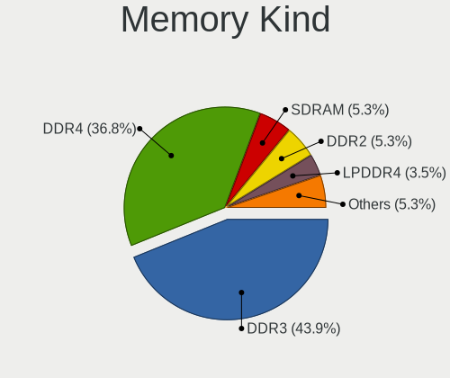

| Kind    | Computers | Percent |
|---------|-----------|---------|
| DDR3    | 23        | 44.23%  |
| DDR4    | 19        | 36.54%  |
| SDRAM   | 3         | 5.77%   |
| LPDDR4  | 2         | 3.85%   |
| DDR2    | 2         | 3.85%   |
| LPDDR3  | 1         | 1.92%   |
| DDR     | 1         | 1.92%   |
| Unknown | 1         | 1.92%   |

Memory Form Factor
------------------

Physical design of the memory module

| Name         | Computers | Percent |
|--------------|-----------|---------|
| DIMM         | 29        | 55.77%  |
| SODIMM       | 22        | 42.31%  |
| Row Of Chips | 1         | 1.92%   |

Memory Size
-----------

Memory module size

| Size  | Computers | Percent |
|-------|-----------|---------|
| 8192  | 22        | 39.29%  |
| 4096  | 17        | 30.36%  |
| 16384 | 6         | 10.71%  |
| 2048  | 6         | 10.71%  |
| 1024  | 3         | 5.36%   |
| 32768 | 2         | 3.57%   |

Memory Speed
------------

Memory module speed

| Speed   | Computers | Percent |
|---------|-----------|---------|
| 1600    | 16        | 28.57%  |
| 2667    | 9         | 16.07%  |
| 2400    | 6         | 10.71%  |
| 3200    | 3         | 5.36%   |
| 667     | 3         | 5.36%   |
| 3600    | 2         | 3.57%   |
| 2666    | 2         | 3.57%   |
| 2133    | 2         | 3.57%   |
| 1867    | 2         | 3.57%   |
| 1333    | 2         | 3.57%   |
| Unknown | 2         | 3.57%   |
| 65535   | 1         | 1.79%   |
| 4199    | 1         | 1.79%   |
| 2000    | 1         | 1.79%   |
| 1866    | 1         | 1.79%   |
| 1334    | 1         | 1.79%   |
| 975     | 1         | 1.79%   |
| 800     | 1         | 1.79%   |

Printers & scanners
-------------------

Printer Vendor
--------------

Printer device vendors

| Vendor             | Computers | Percent |
|--------------------|-----------|---------|
| Hewlett-Packard    | 2         | 40%     |
| Brother Industries | 2         | 40%     |
| Dell               | 1         | 20%     |

Printer Model
-------------

Printer device models

| Model                    | Computers | Percent |
|--------------------------|-----------|---------|
| HP ENVY 4520 series      | 1         | 20%     |
| HP ENVY 4500 series      | 1         | 20%     |
| Dell 2330d Laser Printer | 1         | 20%     |
| Brother Printer          | 1         | 20%     |
| Brother HL-L2320D series | 1         | 20%     |

Scanner Vendor
--------------

Scanner device vendors

| Vendor          | Computers | Percent |
|-----------------|-----------|---------|
| Hewlett-Packard | 1         | 100%    |

Scanner Model
-------------

Scanner device models

| Model           | Computers | Percent |
|-----------------|-----------|---------|
| HP ScanJet 5590 | 1         | 100%    |

Camera
------

Camera Vendor
-------------

Camera device vendors

| Vendor                                 | Computers | Percent |
|----------------------------------------|-----------|---------|
| Chicony Electronics                    | 9         | 34.62%  |
| Logitech                               | 4         | 15.38%  |
| IMC Networks                           | 3         | 11.54%  |
| Sunplus Innovation Technology          | 2         | 7.69%   |
| Lite-On Technology                     | 2         | 7.69%   |
| Silicon Motion                         | 1         | 3.85%   |
| Realtek Semiconductor                  | 1         | 3.85%   |
| Quanta                                 | 1         | 3.85%   |
| Motorola PCS                           | 1         | 3.85%   |
| Cheng Uei Precision Industry (Foxlink) | 1         | 3.85%   |
| Acer                                   | 1         | 3.85%   |

Camera Model
------------

Camera device models

| Model                                                                      | Computers | Percent |
|----------------------------------------------------------------------------|-----------|---------|
| Chicony Integrated Camera                                                  | 2         | 7.69%   |
| Sunplus Laptop_Integrated_Webcam_FHD                                       | 1         | 3.85%   |
| Sunplus Integrated_Webcam_HD                                               | 1         | 3.85%   |
| Silicon Motion Web Camera                                                  | 1         | 3.85%   |
| Realtek USB Camera                                                         | 1         | 3.85%   |
| Quanta HP Webcam                                                           | 1         | 3.85%   |
| Motorola PCS Moto E (4) Plus                                               | 1         | 3.85%   |
| Logitech Webcam C300                                                       | 1         | 3.85%   |
| Logitech Webcam C170                                                       | 1         | 3.85%   |
| Logitech HD Webcam C525                                                    | 1         | 3.85%   |
| Logitech HD Pro Webcam C920                                                | 1         | 3.85%   |
| Lite-On TOSHIBA Web Camera - FHD                                           | 1         | 3.85%   |
| Lite-On Integrated Camera                                                  | 1         | 3.85%   |
| IMC Networks UVC VGA Webcam                                                | 1         | 3.85%   |
| IMC Networks USB2.0 VGA UVC WebCam                                         | 1         | 3.85%   |
| IMC Networks Integrated Camera                                             | 1         | 3.85%   |
| Chicony TOSHIBA Web Camera - HD                                            | 1         | 3.85%   |
| Chicony TOSHIBA Web Camera - FHD                                           | 1         | 3.85%   |
| Chicony Integrated Camera (1280x720@30)                                    | 1         | 3.85%   |
| Chicony HD WebCam (Acer)                                                   | 1         | 3.85%   |
| Chicony HD WebCam                                                          | 1         | 3.85%   |
| Chicony FJ Camera                                                          | 1         | 3.85%   |
| Chicony 2.0M UVC Webcam / CNF7129                                          | 1         | 3.85%   |
| Cheng Uei Precision Industry (Foxlink) HP Wide Vision HD integrated webcam | 1         | 3.85%   |
| Acer BisonCam,NB Pro                                                       | 1         | 3.85%   |

Security
--------

Fingerprint Vendor
------------------

Fingerprint sensor vendors

| Vendor                | Computers | Percent |
|-----------------------|-----------|---------|
| Validity Sensors      | 3         | 50%     |
| Synaptics             | 1         | 16.67%  |
| LighTuning Technology | 1         | 16.67%  |
| Elan Microelectronics | 1         | 16.67%  |

Fingerprint Model
-----------------

Fingerprint sensor models

| Model                                             | Computers | Percent |
|---------------------------------------------------|-----------|---------|
| Validity Sensors VFS7500 Touch Fingerprint Sensor | 1         | 16.67%  |
| Validity Sensors VFS Fingerprint sensor           | 1         | 16.67%  |
| Validity Sensors VFS 5011 fingerprint sensor      | 1         | 16.67%  |
| Synaptics Prometheus MIS Touch Fingerprint Reader | 1         | 16.67%  |
| LighTuning EgisTec Touch Fingerprint Sensor       | 1         | 16.67%  |
| Elan ELAN:Fingerprint                             | 1         | 16.67%  |

Chipcard Vendor
---------------

Chipcard module vendors

| Vendor                | Computers | Percent |
|-----------------------|-----------|---------|
| Broadcom              | 2         | 33.33%  |
| Alcor Micro           | 2         | 33.33%  |
| O2 Micro              | 1         | 16.67%  |
| Gemalto (was Gemplus) | 1         | 16.67%  |

Chipcard Model
--------------

Chipcard module models

| Model                                                  | Computers | Percent |
|--------------------------------------------------------|-----------|---------|
| Alcor Micro AU9540 Smartcard Reader                    | 2         | 33.33%  |
| O2 Micro OZ776 CCID Smartcard Reader                   | 1         | 16.67%  |
| Gemalto (was Gemplus) Compact Smart Card Reader Writer | 1         | 16.67%  |
| Broadcom BCM5880 Secure Applications Processor         | 1         | 16.67%  |
| Broadcom 5880                                          | 1         | 16.67%  |

Unsupported
-----------

Unsupported Devices
-------------------

Total unsupported devices on board

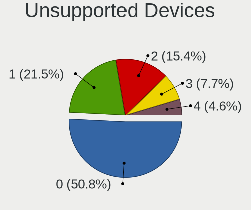

| Total | Computers | Percent |
|-------|-----------|---------|
| 0     | 34        | 58.62%  |
| 1     | 10        | 17.24%  |
| 2     | 9         | 15.52%  |
| 3     | 4         | 6.9%    |
| 4     | 1         | 1.72%   |

Unsupported Device Types
------------------------

Types of unsupported devices

| Type                     | Computers | Percent |
|--------------------------|-----------|---------|
| Graphics card            | 9         | 21.95%  |
| Fingerprint reader       | 6         | 14.63%  |
| Chipcard                 | 6         | 14.63%  |
| Sound                    | 5         | 12.2%   |
| Communication controller | 3         | 7.32%   |
| Card reader              | 3         | 7.32%   |
| Net/wireless             | 2         | 4.88%   |
| Unassigned class         | 1         | 2.44%   |
| Storage/ata              | 1         | 2.44%   |
| Storage                  | 1         | 2.44%   |
| Net/ethernet             | 1         | 2.44%   |
| Firewire controller      | 1         | 2.44%   |
| Camera                   | 1         | 2.44%   |
| Bluetooth                | 1         | 2.44%   |

