Slackware 15.0 - Tested Hardware & Statistics
---------------------------------------------

A project to collect tested hardware configurations for Slackware 15.0.

Anyone can contribute to this report by the [hw-probe](https://github.com/linuxhw/hw-probe) tool:

    sudo -E hw-probe -all -upload

Please contribute! Especially if your hardware is rare.

This is a report for all computer types. See also reports for [desktops](/Dist/Slackware_15.0/Desktop/README.md) and [notebooks](/Dist/Slackware_15.0/Notebook/README.md).

Contents
--------

* [ Test Cases ](#test-cases)

* [ System ](#system)
  - [ Kernel                   ](#kernel)
  - [ Kernel Family            ](#kernel-family)
  - [ Kernel Major Ver.        ](#kernel-major-ver)
  - [ Arch                     ](#arch)
  - [ DE                       ](#de)
  - [ Display Server           ](#display-server)
  - [ Display Manager          ](#display-manager)
  - [ OS Lang                  ](#os-lang)
  - [ Boot Mode                ](#boot-mode)
  - [ Filesystem               ](#filesystem)
  - [ Part. scheme             ](#part-scheme)
  - [ Dual Boot with Linux/BSD ](#dual-boot-with-linuxbsd)
  - [ Dual Boot (Win)          ](#dual-boot-win)

* [ Board ](#board)
  - [ Vendor                   ](#vendor)
  - [ Model                    ](#model)
  - [ Model Family             ](#model-family)
  - [ MFG Year                 ](#mfg-year)
  - [ Form Factor              ](#form-factor)
  - [ Secure Boot              ](#secure-boot)
  - [ Coreboot                 ](#coreboot)
  - [ RAM Size                 ](#ram-size)
  - [ RAM Used                 ](#ram-used)
  - [ Total Drives             ](#total-drives)
  - [ Has CD-ROM               ](#has-cd-rom)
  - [ Has Ethernet             ](#has-ethernet)
  - [ Has WiFi                 ](#has-wifi)
  - [ Has Bluetooth            ](#has-bluetooth)

* [ Location ](#location)
  - [ Country                  ](#country)
  - [ City                     ](#city)

* [ Drives ](#drives)
  - [ Drive Vendor             ](#drive-vendor)
  - [ Drive Model              ](#drive-model)
  - [ HDD Vendor               ](#hdd-vendor)
  - [ SSD Vendor               ](#ssd-vendor)
  - [ Drive Kind               ](#drive-kind)
  - [ Drive Connector          ](#drive-connector)
  - [ Drive Size               ](#drive-size)
  - [ Space Total              ](#space-total)
  - [ Space Used               ](#space-used)
  - [ Malfunc. Drives          ](#malfunc-drives)
  - [ Malfunc. Drive Vendor    ](#malfunc-drive-vendor)
  - [ Malfunc. HDD Vendor      ](#malfunc-hdd-vendor)
  - [ Malfunc. Drive Kind      ](#malfunc-drive-kind)
  - [ Failed Drives            ](#failed-drives)
  - [ Failed Drive Vendor      ](#failed-drive-vendor)
  - [ Drive Status             ](#drive-status)

* [ Storage controller ](#storage-controller)
  - [ Storage Vendor           ](#storage-vendor)
  - [ Storage Model            ](#storage-model)
  - [ Storage Kind             ](#storage-kind)

* [ Processor ](#processor)
  - [ CPU Vendor               ](#cpu-vendor)
  - [ CPU Model                ](#cpu-model)
  - [ CPU Model Family         ](#cpu-model-family)
  - [ CPU Cores                ](#cpu-cores)
  - [ CPU Sockets              ](#cpu-sockets)
  - [ CPU Threads              ](#cpu-threads)
  - [ CPU Op-Modes             ](#cpu-op-modes)
  - [ CPU Microcode            ](#cpu-microcode)
  - [ CPU Microarch            ](#cpu-microarch)

* [ Graphics ](#graphics)
  - [ GPU Vendor               ](#gpu-vendor)
  - [ GPU Model                ](#gpu-model)
  - [ GPU Combo                ](#gpu-combo)
  - [ GPU Driver               ](#gpu-driver)
  - [ GPU Memory               ](#gpu-memory)

* [ Monitor ](#monitor)
  - [ Monitor Vendor           ](#monitor-vendor)
  - [ Monitor Model            ](#monitor-model)
  - [ Monitor Resolution       ](#monitor-resolution)
  - [ Monitor Diagonal         ](#monitor-diagonal)
  - [ Monitor Width            ](#monitor-width)
  - [ Aspect Ratio             ](#aspect-ratio)
  - [ Monitor Area             ](#monitor-area)
  - [ Pixel Density            ](#pixel-density)
  - [ Multiple Monitors        ](#multiple-monitors)

* [ Network ](#network)
  - [ Net Controller Vendor    ](#net-controller-vendor)
  - [ Net Controller Model     ](#net-controller-model)
  - [ Wireless Vendor          ](#wireless-vendor)
  - [ Wireless Model           ](#wireless-model)
  - [ Ethernet Vendor          ](#ethernet-vendor)
  - [ Ethernet Model           ](#ethernet-model)
  - [ Net Controller Kind      ](#net-controller-kind)
  - [ Used Controller          ](#used-controller)
  - [ NICs                     ](#nics)
  - [ IPv6                     ](#ipv6)

* [ Bluetooth ](#bluetooth)
  - [ Bluetooth Vendor         ](#bluetooth-vendor)
  - [ Bluetooth Model          ](#bluetooth-model)

* [ Sound ](#sound)
  - [ Sound Vendor             ](#sound-vendor)
  - [ Sound Model              ](#sound-model)

* [ Memory ](#memory)
  - [ Memory Vendor            ](#memory-vendor)
  - [ Memory Model             ](#memory-model)
  - [ Memory Kind              ](#memory-kind)
  - [ Memory Form Factor       ](#memory-form-factor)
  - [ Memory Size              ](#memory-size)
  - [ Memory Speed             ](#memory-speed)

* [ Printers & scanners ](#printers--scanners)
  - [ Printer Vendor           ](#printer-vendor)
  - [ Printer Model            ](#printer-model)
  - [ Scanner Vendor           ](#scanner-vendor)
  - [ Scanner Model            ](#scanner-model)

* [ Camera ](#camera)
  - [ Camera Vendor            ](#camera-vendor)
  - [ Camera Model             ](#camera-model)

* [ Security ](#security)
  - [ Fingerprint Vendor       ](#fingerprint-vendor)
  - [ Fingerprint Model        ](#fingerprint-model)
  - [ Chipcard Vendor          ](#chipcard-vendor)
  - [ Chipcard Model           ](#chipcard-model)

* [ Unsupported ](#unsupported)
  - [ Unsupported Devices      ](#unsupported-devices)
  - [ Unsupported Device Types ](#unsupported-device-types)

Test Cases
----------

Total: 174

| Vendor        | Model                       | Form-Factor | Probe                                                      | Date         |
|---------------|-----------------------------|-------------|------------------------------------------------------------|--------------|
| MSI           | B450M PRO-M2 MAX            | Desktop     | [9028b6c4b3](https://linux-hardware.org/?probe=9028b6c4b3) | Dec 03, 2025 |
| Loongson      | LS3A6000-7A2000-1w-V0.1-... | Desktop     | [8d642f41ea](https://linux-hardware.org/?probe=8d642f41ea) | Oct 15, 2025 |
| Lenovo        | ThinkPad T60 8744HDG        | Notebook    | [397feea269](https://linux-hardware.org/?probe=397feea269) | Aug 03, 2025 |
| ASUSTek       | ROG Maximus XI HERO         | Desktop     | [467e71b4b5](https://linux-hardware.org/?probe=467e71b4b5) | Jun 11, 2025 |
| Lenovo        | IdeaPad L340-15IRH Gamin... | Notebook    | [6d7c7e541d](https://linux-hardware.org/?probe=6d7c7e541d) | May 07, 2025 |
| Apple         | Mac-031B6874CF7F642A iMa... | All in one  | [7c949afa7d](https://linux-hardware.org/?probe=7c949afa7d) | Mar 31, 2025 |
| ASUSTek       | P8H61-M PRO                 | Desktop     | [17eb905e70](https://linux-hardware.org/?probe=17eb905e70) | Feb 11, 2025 |
| Acer          | Nitro ANV15-41              | Notebook    | [103ad43d8e](https://linux-hardware.org/?probe=103ad43d8e) | Jan 13, 2025 |
| ASUSTek       | PRIME B550-PLUS             | Desktop     | [7ab225644f](https://linux-hardware.org/?probe=7ab225644f) | Dec 29, 2024 |
| HP            | 8643 SMVB                   | Desktop     | [3e1d8b1c0f](https://linux-hardware.org/?probe=3e1d8b1c0f) | Dec 29, 2024 |
| HP            | 8906 SMVB                   | Desktop     | [f52f996dd7](https://linux-hardware.org/?probe=f52f996dd7) | Dec 29, 2024 |
| HP            | 1495                        | Desktop     | [0accce2a1a](https://linux-hardware.org/?probe=0accce2a1a) | Dec 29, 2024 |
| Dell          | 0X4N41 A01                  | Desktop     | [3aca8429ec](https://linux-hardware.org/?probe=3aca8429ec) | Dec 28, 2024 |
| HP            | 1495                        | Desktop     | [309b63cf7b](https://linux-hardware.org/?probe=309b63cf7b) | Dec 28, 2024 |
| HP            | Laptop 14-fq0xxx            | Notebook    | [2e065da895](https://linux-hardware.org/?probe=2e065da895) | Dec 26, 2024 |
| HP            | ENVY x360 2-in-1 Laptop ... | Convertible | [22428153ea](https://linux-hardware.org/?probe=22428153ea) | Dec 19, 2024 |
| BESSTAR Te... | CB9                         | Mini pc     | [0bee319571](https://linux-hardware.org/?probe=0bee319571) | Dec 02, 2024 |
| Supermicro    | X9DRD-7LN4F                 | Server      | [18e84eac28](https://linux-hardware.org/?probe=18e84eac28) | Oct 11, 2024 |
| ASUSTek       | H170M-PLUS                  | Desktop     | [302ff2daa0](https://linux-hardware.org/?probe=302ff2daa0) | Sep 11, 2024 |
| HP            | Victus by Gaming Laptop ... | Notebook    | [ba32f5b55e](https://linux-hardware.org/?probe=ba32f5b55e) | Aug 26, 2024 |
| HP            | Pavilion g6                 | Notebook    | [8d4cd1cce3](https://linux-hardware.org/?probe=8d4cd1cce3) | Jul 25, 2024 |
| Lenovo        | IdeaPad 5 15ALC05 82LN      | Notebook    | [f7b2ff4d05](https://linux-hardware.org/?probe=f7b2ff4d05) | Jul 17, 2024 |
| ASUSTek       | PRIME B760M-A D4            | Desktop     | [23f34741b6](https://linux-hardware.org/?probe=23f34741b6) | Jun 17, 2024 |
| ASUSTek       | SABERTOOTH 990FX R2.0       | Desktop     | [66de5464ad](https://linux-hardware.org/?probe=66de5464ad) | Jun 07, 2024 |
| Lenovo        | Yoga 6 13ABR8 83B2          | Convertible | [db24ee42b0](https://linux-hardware.org/?probe=db24ee42b0) | May 25, 2024 |
| HP            | OMEN by Laptop 16-b1xxx     | Notebook    | [63bafff3a1](https://linux-hardware.org/?probe=63bafff3a1) | May 25, 2024 |
| Dynabook      | PORTEGE X50-G               | Notebook    | [995067b4e8](https://linux-hardware.org/?probe=995067b4e8) | May 22, 2024 |
| ASRock        | B550M-HDV                   | Desktop     | [eb41f5c32d](https://linux-hardware.org/?probe=eb41f5c32d) | May 15, 2024 |
| Dell          | 0X9M3X A04                  | Desktop     | [4b6904a00b](https://linux-hardware.org/?probe=4b6904a00b) | May 13, 2024 |
| Lenovo        | ThinkPad X201 3626F7U       | Notebook    | [40e1a8f2e0](https://linux-hardware.org/?probe=40e1a8f2e0) | May 10, 2024 |
| Lenovo        | ThinkPad X201 3626F7U       | Notebook    | [44b7fec8f8](https://linux-hardware.org/?probe=44b7fec8f8) | May 10, 2024 |
| Lenovo        | ThinkPad T430s 2355CL4      | Notebook    | [b90ab4a6e2](https://linux-hardware.org/?probe=b90ab4a6e2) | May 07, 2024 |
| Lenovo        | ThinkPad T16 Gen 2 21K7C... | Notebook    | [29f2579a02](https://linux-hardware.org/?probe=29f2579a02) | Apr 27, 2024 |
| Dell          | Precision 7510              | Notebook    | [23916f1909](https://linux-hardware.org/?probe=23916f1909) | Apr 22, 2024 |
| BESSTAR Te... | CB9                         | Mini pc     | [ddd433c51c](https://linux-hardware.org/?probe=ddd433c51c) | Apr 21, 2024 |
| Chuwi         | UBook X                     | Convertible | [1b5a7adcb3](https://linux-hardware.org/?probe=1b5a7adcb3) | Apr 20, 2024 |
| ASUSTek       | ProArt B550-CREATOR         | Desktop     | [37bd870888](https://linux-hardware.org/?probe=37bd870888) | Apr 19, 2024 |
| Lenovo        | 3130 SDK0J40700 WIN 3258... | Mini pc     | [5256952fc5](https://linux-hardware.org/?probe=5256952fc5) | Apr 17, 2024 |
| Lenovo        | ThinkPad T430s 2355CL4      | Notebook    | [e680816d8a](https://linux-hardware.org/?probe=e680816d8a) | Mar 13, 2024 |
| MSI           | Modern 14 B5M               | Notebook    | [585c473256](https://linux-hardware.org/?probe=585c473256) | Mar 08, 2024 |
| Gigabyte      | X570 AORUS ELITE            | Desktop     | [7204492392](https://linux-hardware.org/?probe=7204492392) | Mar 05, 2024 |
| MSI           | PRO X670-P WIFI             | Desktop     | [0ef39f433d](https://linux-hardware.org/?probe=0ef39f433d) | Feb 27, 2024 |
| Dell          | XPS 13 9370                 | Notebook    | [e94228e06b](https://linux-hardware.org/?probe=e94228e06b) | Feb 22, 2024 |
| Notebook      | NL5xNU                      | Notebook    | [e83f0b4085](https://linux-hardware.org/?probe=e83f0b4085) | Feb 18, 2024 |
| MSI           | MAG B650M MORTAR WIFI       | Desktop     | [2ed279c40d](https://linux-hardware.org/?probe=2ed279c40d) | Feb 16, 2024 |
| ASRock        | B550M-ITX/ac                | Desktop     | [27015117d0](https://linux-hardware.org/?probe=27015117d0) | Feb 13, 2024 |
| Dell          | XPS 13 9370                 | Notebook    | [11b5a42b88](https://linux-hardware.org/?probe=11b5a42b88) | Feb 11, 2024 |
| HP            | Laptop 14s-fq0xxx           | Notebook    | [6ae9e4d70e](https://linux-hardware.org/?probe=6ae9e4d70e) | Feb 06, 2024 |
| MSI           | MAG B650M MORTAR WIFI       | Desktop     | [f536b283c6](https://linux-hardware.org/?probe=f536b283c6) | Jan 27, 2024 |
| HP            | 17E2                        | Mini pc     | [d382ed2027](https://linux-hardware.org/?probe=d382ed2027) | Jan 22, 2024 |
| MSI           | MAG B650M MORTAR WIFI       | Desktop     | [5dcf737641](https://linux-hardware.org/?probe=5dcf737641) | Jan 15, 2024 |
| Gigabyte      | B550 AORUS ELITE AX V2      | Desktop     | [a2ec3f504c](https://linux-hardware.org/?probe=a2ec3f504c) | Jan 14, 2024 |
| Gigabyte      | B550 AORUS ELITE AX V2      | Desktop     | [167fddc449](https://linux-hardware.org/?probe=167fddc449) | Jan 14, 2024 |
| Acer          | Aspire SW5-012              | Notebook    | [efc348dbe0](https://linux-hardware.org/?probe=efc348dbe0) | Dec 31, 2023 |
| MSI           | MAG B650M MORTAR WIFI       | Desktop     | [7e506254e0](https://linux-hardware.org/?probe=7e506254e0) | Dec 22, 2023 |
| Gigabyte      | Z97M-DS3H                   | Desktop     | [4fd5ba2289](https://linux-hardware.org/?probe=4fd5ba2289) | Dec 04, 2023 |
| MSI           | X470 GAMING PLUS MAX        | Desktop     | [24ebfe35c8](https://linux-hardware.org/?probe=24ebfe35c8) | Nov 22, 2023 |
| ASUSTek       | P7P55D-E                    | Desktop     | [f16aeca403](https://linux-hardware.org/?probe=f16aeca403) | Nov 03, 2023 |
| Lenovo        | V330-14ARR 81B1             | Notebook    | [b80592c227](https://linux-hardware.org/?probe=b80592c227) | Oct 21, 2023 |
| Toshiba       | Satellite C660              | Notebook    | [483998d7de](https://linux-hardware.org/?probe=483998d7de) | Oct 20, 2023 |
| HP            | OMEN by Laptop 16-b1xxx     | Notebook    | [aafdab7043](https://linux-hardware.org/?probe=aafdab7043) | Oct 13, 2023 |
| HP            | OMEN by Laptop 16-b1xxx     | Notebook    | [a1a64b6621](https://linux-hardware.org/?probe=a1a64b6621) | Oct 05, 2023 |
| Notebook      | P7xxTM                      | Notebook    | [e14cfa2f1f](https://linux-hardware.org/?probe=e14cfa2f1f) | Sep 22, 2023 |
| Notebook      | P7xxTM                      | Notebook    | [41b1348520](https://linux-hardware.org/?probe=41b1348520) | Sep 22, 2023 |
| Lenovo        | ThinkPad E16 Gen 1 21JT0... | Notebook    | [586c1fab43](https://linux-hardware.org/?probe=586c1fab43) | Sep 06, 2023 |
| ASUSTek       | ASUS TUF Dash F15 FX517Z... | Notebook    | [10db09006a](https://linux-hardware.org/?probe=10db09006a) | Aug 31, 2023 |
| Dell          | Vostro 3405                 | Notebook    | [2ba4151315](https://linux-hardware.org/?probe=2ba4151315) | Aug 19, 2023 |
| Lenovo        | ThinkPad X1 Carbon 4th 2... | Notebook    | [b8ceea98b8](https://linux-hardware.org/?probe=b8ceea98b8) | Aug 18, 2023 |
| Valve         | Jupiter                     | Notebook    | [eee501d93c](https://linux-hardware.org/?probe=eee501d93c) | Aug 09, 2023 |
| Lenovo        | IdeaPad 5 15ALC05 82LN      | Notebook    | [eec04bec1d](https://linux-hardware.org/?probe=eec04bec1d) | Aug 08, 2023 |
| HP            | Laptop 14s-fq0xxx           | Notebook    | [0a7b2a3fcc](https://linux-hardware.org/?probe=0a7b2a3fcc) | Aug 03, 2023 |
| ASUSTek       | PRIME A320M-K               | Desktop     | [3f7bed61a8](https://linux-hardware.org/?probe=3f7bed61a8) | Jul 26, 2023 |
| Gigabyte      | B550 AORUS ELITE AX V2      | Desktop     | [6087b16809](https://linux-hardware.org/?probe=6087b16809) | Jul 15, 2023 |
| Gigabyte      | B550 AORUS ELITE AX V2      | Desktop     | [dd63c138ad](https://linux-hardware.org/?probe=dd63c138ad) | Jul 15, 2023 |
| Fujitsu       | FujitsuTP7000 -1            | Desktop     | [231d7f8182](https://linux-hardware.org/?probe=231d7f8182) | Jun 18, 2023 |
| Acer          | Swift SF114-34              | Notebook    | [ec48f7a207](https://linux-hardware.org/?probe=ec48f7a207) | May 28, 2023 |
| MSI           | X99A GAMING 7               | Desktop     | [ec94d173a7](https://linux-hardware.org/?probe=ec94d173a7) | May 23, 2023 |
| Microsoft     | Surface Go 3                | Tablet      | [90b4889055](https://linux-hardware.org/?probe=90b4889055) | May 21, 2023 |
| ASRock        | N68-S3 FX                   | Desktop     | [0ed94fe810](https://linux-hardware.org/?probe=0ed94fe810) | May 10, 2023 |
| HEDYCOMPUT... | IH81MF-Q3                   | Desktop     | [3444236ed4](https://linux-hardware.org/?probe=3444236ed4) | Apr 30, 2023 |
| Apple         | MacBookAir7,2               | Notebook    | [941aa94750](https://linux-hardware.org/?probe=941aa94750) | Apr 13, 2023 |
| Gigabyte      | AB350-Gaming 3-CF           | Desktop     | [7f052050d9](https://linux-hardware.org/?probe=7f052050d9) | Apr 10, 2023 |
| ASUSTek       | TUF Gaming B450-PLUS II     | Desktop     | [70314c0c37](https://linux-hardware.org/?probe=70314c0c37) | Mar 23, 2023 |
| Dell          | 0MY171 A00                  | Desktop     | [47fd974afd](https://linux-hardware.org/?probe=47fd974afd) | Mar 20, 2023 |
| Valve         | Jupiter                     | Notebook    | [e9844f7162](https://linux-hardware.org/?probe=e9844f7162) | Mar 13, 2023 |
| ASUSTek       | PRIME B450M-A               | Desktop     | [053498458e](https://linux-hardware.org/?probe=053498458e) | Mar 03, 2023 |
| Dell          | 0MY171 A00                  | Desktop     | [795f707b1a](https://linux-hardware.org/?probe=795f707b1a) | Feb 25, 2023 |
| Dell          | 04YP6J A03                  | Desktop     | [696cc9b57a](https://linux-hardware.org/?probe=696cc9b57a) | Feb 19, 2023 |
| HP            | ENVY Laptop 17-cr0xxx       | Notebook    | [fde666c0ea](https://linux-hardware.org/?probe=fde666c0ea) | Feb 17, 2023 |
| HP            | ENVY Laptop 17-cr0xxx       | Notebook    | [5ce5272a93](https://linux-hardware.org/?probe=5ce5272a93) | Feb 17, 2023 |
| ASRock        | 990FX Extreme4              | Desktop     | [7ce91f2b1e](https://linux-hardware.org/?probe=7ce91f2b1e) | Feb 16, 2023 |
| Lenovo        | ThinkPad X140e 20BMS03E0... | Notebook    | [fb4c4aebf9](https://linux-hardware.org/?probe=fb4c4aebf9) | Jan 31, 2023 |
| Lenovo        | ThinkPad T470p 20J60018M... | Notebook    | [9324b897c3](https://linux-hardware.org/?probe=9324b897c3) | Jan 19, 2023 |
| ASRock        | N68-S UCC                   | Desktop     | [cb4c89a390](https://linux-hardware.org/?probe=cb4c89a390) | Jan 18, 2023 |
| ASUSTek       | VivoBook_ASUSLaptop K650... | Notebook    | [1b50127412](https://linux-hardware.org/?probe=1b50127412) | Jan 14, 2023 |
| HP            | EliteBook 8440p             | Notebook    | [9edc837033](https://linux-hardware.org/?probe=9edc837033) | Jan 13, 2023 |
| ASUSTek       | ROG STRIX B550-I GAMING     | Desktop     | [1c9dc6792e](https://linux-hardware.org/?probe=1c9dc6792e) | Jan 13, 2023 |
| HP            | OMEN by Laptop 17-ck0xxx    | Notebook    | [9655429e71](https://linux-hardware.org/?probe=9655429e71) | Jan 06, 2023 |
| ASUSTek       | VivoBook_ASUSLaptop K650... | Notebook    | [4900ec9966](https://linux-hardware.org/?probe=4900ec9966) | Jan 05, 2023 |
| ASRock        | B550 Taichi                 | Desktop     | [469f9d71e2](https://linux-hardware.org/?probe=469f9d71e2) | Dec 29, 2022 |
| Acer          | Nitro AN515-54              | Notebook    | [5205b7c248](https://linux-hardware.org/?probe=5205b7c248) | Dec 27, 2022 |
| ASUSTek       | VivoBook_ASUSLaptop K650... | Notebook    | [1cf2ac2b8b](https://linux-hardware.org/?probe=1cf2ac2b8b) | Dec 27, 2022 |
| Dell          | 0MY171 A00                  | Desktop     | [055bc4ea78](https://linux-hardware.org/?probe=055bc4ea78) | Dec 13, 2022 |
| ASUSTek       | SABERTOOTH X99              | Desktop     | [c0bf1336d5](https://linux-hardware.org/?probe=c0bf1336d5) | Dec 12, 2022 |
| HP            | OMEN by Laptop 16-b1xxx     | Notebook    | [799470f1aa](https://linux-hardware.org/?probe=799470f1aa) | Dec 05, 2022 |
| HP            | 8906 SMVB                   | Desktop     | [d000e4e926](https://linux-hardware.org/?probe=d000e4e926) | Dec 02, 2022 |
| HP            | OMEN by Laptop 16-b1xxx     | Notebook    | [0cd3005f69](https://linux-hardware.org/?probe=0cd3005f69) | Dec 01, 2022 |
| HP            | OMEN by Laptop 16-b1xxx     | Notebook    | [32b68762df](https://linux-hardware.org/?probe=32b68762df) | Nov 30, 2022 |
| Lenovo        | 31900058 STD                | Desktop     | [1408b2dc5f](https://linux-hardware.org/?probe=1408b2dc5f) | Nov 18, 2022 |
| Lenovo        | ThinkPad T470 20JNS01R01    | Notebook    | [abb8194196](https://linux-hardware.org/?probe=abb8194196) | Oct 21, 2022 |
| Lenovo        | ThinkPad T61 765912G        | Notebook    | [e7f2dc737e](https://linux-hardware.org/?probe=e7f2dc737e) | Oct 09, 2022 |
| Lenovo        | ThinkPad T410 2518C3U       | Notebook    | [4d250adf3b](https://linux-hardware.org/?probe=4d250adf3b) | Oct 04, 2022 |
| HP            | 3031h                       | Desktop     | [b6849a29a2](https://linux-hardware.org/?probe=b6849a29a2) | Sep 24, 2022 |
| Lenovo        | ThinkPad T61 765912G        | Notebook    | [bd04e564a0](https://linux-hardware.org/?probe=bd04e564a0) | Sep 24, 2022 |
| HP            | 3031h                       | Desktop     | [40160588bb](https://linux-hardware.org/?probe=40160588bb) | Sep 20, 2022 |
| MSI           | H110M PRO-VD                | Desktop     | [2299dc1786](https://linux-hardware.org/?probe=2299dc1786) | Sep 17, 2022 |
| ASUSTek       | ROG CROSSHAIR VIII HERO     | Desktop     | [a954ba4e86](https://linux-hardware.org/?probe=a954ba4e86) | Aug 26, 2022 |
| Dell          | 0200DY A03                  | Desktop     | [e0e14cd1f2](https://linux-hardware.org/?probe=e0e14cd1f2) | Aug 19, 2022 |
| Fujitsu       | LIFEBOOK A544               | Notebook    | [e5785106f1](https://linux-hardware.org/?probe=e5785106f1) | Aug 09, 2022 |
| MSI           | Modern 14 B10MW             | Notebook    | [b9cde08864](https://linux-hardware.org/?probe=b9cde08864) | Jul 25, 2022 |
| Gigabyte      | N3160TN                     | Desktop     | [e2f44a8274](https://linux-hardware.org/?probe=e2f44a8274) | May 31, 2022 |
| Sony          | SVE1713A1EW                 | Notebook    | [c3a65d695d](https://linux-hardware.org/?probe=c3a65d695d) | May 10, 2022 |
| Lenovo        | ThinkPad X1 Carbon 5th 2... | Notebook    | [f837aaeb12](https://linux-hardware.org/?probe=f837aaeb12) | May 08, 2022 |
| HP            | Pavilion Gaming Laptop 1... | Notebook    | [bd2dda1d8a](https://linux-hardware.org/?probe=bd2dda1d8a) | Apr 29, 2022 |
| HP            | Pavilion Gaming Laptop 1... | Notebook    | [cfc9c5dbf7](https://linux-hardware.org/?probe=cfc9c5dbf7) | Apr 29, 2022 |
| ASUSTek       | TUF B450-PLUS GAMING        | Desktop     | [533b8a9f83](https://linux-hardware.org/?probe=533b8a9f83) | Apr 13, 2022 |
| MSI           | 970 GAMING                  | Desktop     | [25d8968f19](https://linux-hardware.org/?probe=25d8968f19) | Apr 13, 2022 |
| MSI           | GP76 Leopard 11UG           | Notebook    | [aebd373a66](https://linux-hardware.org/?probe=aebd373a66) | Apr 12, 2022 |
| MSI           | GE76 Raider 11UE            | Notebook    | [3072e065a3](https://linux-hardware.org/?probe=3072e065a3) | Apr 12, 2022 |
| Notebook      | X170KM-G                    | Notebook    | [4ecba03d19](https://linux-hardware.org/?probe=4ecba03d19) | Apr 11, 2022 |
| ASRock        | N68-S3 FX                   | Desktop     | [ca818bd06d](https://linux-hardware.org/?probe=ca818bd06d) | Apr 08, 2022 |
| MSI           | MS-7365                     | Desktop     | [8948dea4de](https://linux-hardware.org/?probe=8948dea4de) | Apr 07, 2022 |
| Unknown       | X79-P3                      | Desktop     | [40e38e9a8d](https://linux-hardware.org/?probe=40e38e9a8d) | Apr 07, 2022 |
| Dell          | Latitude 3520               | Notebook    | [4398aa2a03](https://linux-hardware.org/?probe=4398aa2a03) | Apr 06, 2022 |
| HP            | ProBook 6570b               | Notebook    | [cf1305eacc](https://linux-hardware.org/?probe=cf1305eacc) | Apr 06, 2022 |
| HP            | 0A08h                       | Desktop     | [4df5b0832f](https://linux-hardware.org/?probe=4df5b0832f) | Apr 06, 2022 |
| Lenovo        | IdeaPad 310-15ISK 80SM      | Notebook    | [d406cb4819](https://linux-hardware.org/?probe=d406cb4819) | Apr 05, 2022 |
| Dell          | Precision M4700             | Notebook    | [ab99532bd5](https://linux-hardware.org/?probe=ab99532bd5) | Apr 04, 2022 |
| ASRock        | H410M-ITX/ac                | Desktop     | [ae936790c9](https://linux-hardware.org/?probe=ae936790c9) | Apr 03, 2022 |
| ASUSTek       | PRIME Z390-A                | Desktop     | [5307aba2c3](https://linux-hardware.org/?probe=5307aba2c3) | Mar 30, 2022 |
| Apple         | Mac-F4238CC8 PVT            | All in one  | [c8289cd264](https://linux-hardware.org/?probe=c8289cd264) | Mar 26, 2022 |
| Apple         | Mac-F4238CC8 PVT            | All in one  | [5c6b1616fa](https://linux-hardware.org/?probe=5c6b1616fa) | Mar 21, 2022 |
| Acer          | FMCP7A-ION-LE               | Desktop     | [bbce73c6d6](https://linux-hardware.org/?probe=bbce73c6d6) | Mar 14, 2022 |
| Apple         | Mac-F65AE981FFA204ED Mac... | Mini pc     | [5f36bc3969](https://linux-hardware.org/?probe=5f36bc3969) | Mar 12, 2022 |
| ASRock        | H270 Pro4                   | Desktop     | [ae79ca8557](https://linux-hardware.org/?probe=ae79ca8557) | Mar 12, 2022 |
| HP            | 86F3 00100                  | All in one  | [7de0381db8](https://linux-hardware.org/?probe=7de0381db8) | Mar 11, 2022 |
| Lenovo        | ThinkPad X230 2325P38       | Notebook    | [1a0cab737b](https://linux-hardware.org/?probe=1a0cab737b) | Mar 10, 2022 |
| ASUSTek       | ROG Zephyrus G14 GA401IV... | Notebook    | [0b0c1aca1b](https://linux-hardware.org/?probe=0b0c1aca1b) | Mar 10, 2022 |
| HP            | Pavilion Gaming Laptop 1... | Notebook    | [c7825c54fc](https://linux-hardware.org/?probe=c7825c54fc) | Mar 10, 2022 |
| Framework     | Laptop                      | Notebook    | [ae37705198](https://linux-hardware.org/?probe=ae37705198) | Mar 10, 2022 |
| Dell          | 068NXX A00                  | Server      | [85004f427a](https://linux-hardware.org/?probe=85004f427a) | Mar 09, 2022 |
| Lenovo        | 31900058 STD                | Desktop     | [bc59b862f4](https://linux-hardware.org/?probe=bc59b862f4) | Mar 02, 2022 |
| TYAN Compu... | S7012                       | Server      | [fec98b51da](https://linux-hardware.org/?probe=fec98b51da) | Feb 27, 2022 |
| TYAN Compu... | S7012                       | Server      | [81a490184b](https://linux-hardware.org/?probe=81a490184b) | Feb 26, 2022 |
| Biostar       | X470GTA                     | Desktop     | [8d400b49f8](https://linux-hardware.org/?probe=8d400b49f8) | Feb 13, 2022 |
| Lenovo        | ThinkPad Edge E530c 3366... | Notebook    | [8ce0419468](https://linux-hardware.org/?probe=8ce0419468) | Feb 13, 2022 |
| MSI           | G31TM-P21                   | Desktop     | [dda6a57223](https://linux-hardware.org/?probe=dda6a57223) | Feb 07, 2022 |
| HP            | 212B                        | Desktop     | [353b0dde99](https://linux-hardware.org/?probe=353b0dde99) | Jan 29, 2022 |
| MSI           | B450 TOMAHAWK MAX           | Desktop     | [85543358d3](https://linux-hardware.org/?probe=85543358d3) | Jan 14, 2022 |
| Dynabook      | P1-C7MP-BL                  | Notebook    | [268f94787e](https://linux-hardware.org/?probe=268f94787e) | Jan 14, 2022 |
| MSI           | G31TM-P21                   | Desktop     | [25d668ee95](https://linux-hardware.org/?probe=25d668ee95) | Jan 10, 2022 |
| MSI           | H61M-P31                    | Desktop     | [58651bba67](https://linux-hardware.org/?probe=58651bba67) | Dec 07, 2021 |
| HP            | Laptop 15-bs1xx             | Notebook    | [b6c9f34c4c](https://linux-hardware.org/?probe=b6c9f34c4c) | Dec 07, 2021 |
| System76      | Oryx Pro                    | Notebook    | [3cd05d02a8](https://linux-hardware.org/?probe=3cd05d02a8) | Oct 27, 2021 |
| MSI           | B450M-A PRO MAX             | Desktop     | [b7df25ba5d](https://linux-hardware.org/?probe=b7df25ba5d) | Oct 25, 2021 |
| ASUSTek       | SABERTOOTH X99              | Desktop     | [64e5ee1691](https://linux-hardware.org/?probe=64e5ee1691) | Oct 13, 2021 |
| MSI           | B450M-A PRO MAX             | Desktop     | [17d37c5316](https://linux-hardware.org/?probe=17d37c5316) | Oct 12, 2021 |
| MSI           | Modern 14 B11MO             | Notebook    | [e8f13facfd](https://linux-hardware.org/?probe=e8f13facfd) | Oct 03, 2021 |
| MSI           | Modern 14 B11MO             | Notebook    | [9f5c2e0fde](https://linux-hardware.org/?probe=9f5c2e0fde) | Sep 27, 2021 |
| Dell          | Inspiron 15-3552            | Notebook    | [f76339b0af](https://linux-hardware.org/?probe=f76339b0af) | Aug 31, 2021 |
| HP            | 245 G7 Notebook PC          | Notebook    | [c0806e4955](https://linux-hardware.org/?probe=c0806e4955) | Aug 23, 2021 |
| HP            | 245 G7 Notebook PC          | Notebook    | [c409287d23](https://linux-hardware.org/?probe=c409287d23) | Aug 23, 2021 |
| HP            | EliteBook 840 G5            | Notebook    | [4c196e1abd](https://linux-hardware.org/?probe=4c196e1abd) | Aug 18, 2021 |
| Dell          | Vostro 3500                 | Notebook    | [53a1179121](https://linux-hardware.org/?probe=53a1179121) | Aug 12, 2021 |

System
------

Kernel
------

Version of the Linux kernel

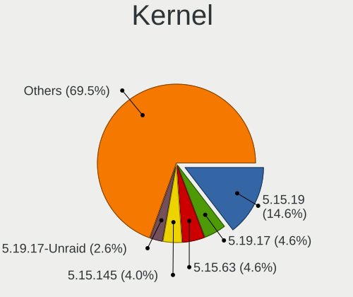

| Version                     | Computers | Percent |
|-----------------------------|-----------|---------|
| 5.15.19                     | 22        | 14.57%  |
| 5.19.17                     | 7         | 4.64%   |
| 5.15.63                     | 7         | 4.64%   |
| 5.15.145                    | 6         | 3.97%   |
| 5.19.17-Unraid              | 4         | 2.65%   |
| 5.15.27                     | 4         | 2.65%   |
| 5.15.161                    | 4         | 2.65%   |
| 5.15.117                    | 4         | 2.65%   |
| 5.15.94                     | 3         | 1.99%   |
| 5.15.38                     | 3         | 1.99%   |
| 6.6.22                      | 2         | 1.32%   |
| 6.12.7                      | 2         | 1.32%   |
| 6.12.1                      | 2         | 1.32%   |
| 6.1.79-Unraid               | 2         | 1.32%   |
| 6.1.64-Unraid               | 2         | 1.32%   |
| 6.1.44                      | 2         | 1.32%   |
| 5.17.2                      | 2         | 1.32%   |
| 5.17.1                      | 2         | 1.32%   |
| 5.16.13                     | 2         | 1.32%   |
| 5.15.80                     | 2         | 1.32%   |
| 5.15.30-Unraid              | 2         | 1.32%   |
| 5.15.118                    | 2         | 1.32%   |
| 5.13.8                      | 2         | 1.32%   |
| 6.9.1                       | 1         | 0.66%   |
| 6.8.8                       | 1         | 0.66%   |
| 6.7.5-gsh-clevo-NL51NU-SW15 | 1         | 0.66%   |
| 6.7.4-cometdust             | 1         | 0.66%   |
| 6.6.8                       | 1         | 0.66%   |
| 6.6.7                       | 1         | 0.66%   |
| 6.6.28                      | 1         | 0.66%   |
| 6.6.26                      | 1         | 0.66%   |
| 6.6.18                      | 1         | 0.66%   |
| 6.6.11                      | 1         | 0.66%   |
| 6.5.5                       | 1         | 0.66%   |
| 6.4.8-zen1                  | 1         | 0.66%   |
| 6.12.9                      | 1         | 0.66%   |
| 6.12.6                      | 1         | 0.66%   |
| 6.12.18                     | 1         | 0.66%   |
| 6.12.17                     | 1         | 0.66%   |
| 6.11.6                      | 1         | 0.66%   |

Kernel Family
-------------

Linux kernel without a distro release

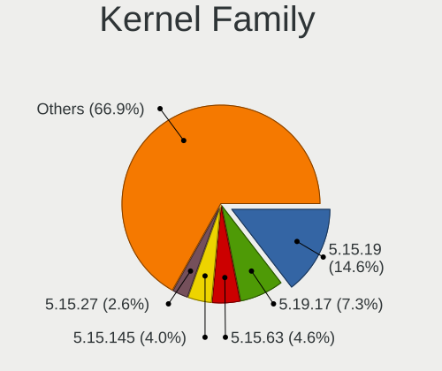

| Version  | Computers | Percent |
|----------|-----------|---------|
| 5.15.19  | 22        | 14.57%  |
| 5.19.17  | 11        | 7.28%   |
| 5.15.63  | 7         | 4.64%   |
| 5.15.145 | 6         | 3.97%   |
| 5.15.27  | 4         | 2.65%   |
| 5.15.161 | 4         | 2.65%   |
| 5.15.117 | 4         | 2.65%   |
| 5.15.94  | 3         | 1.99%   |
| 5.15.38  | 3         | 1.99%   |
| 6.6.22   | 2         | 1.32%   |
| 6.12.7   | 2         | 1.32%   |
| 6.12.1   | 2         | 1.32%   |
| 6.1.79   | 2         | 1.32%   |
| 6.1.64   | 2         | 1.32%   |
| 6.1.44   | 2         | 1.32%   |
| 5.17.2   | 2         | 1.32%   |
| 5.17.1   | 2         | 1.32%   |
| 5.16.13  | 2         | 1.32%   |
| 5.15.80  | 2         | 1.32%   |
| 5.15.30  | 2         | 1.32%   |
| 5.15.118 | 2         | 1.32%   |
| 5.14.15  | 2         | 1.32%   |
| 5.13.8   | 2         | 1.32%   |
| 6.9.1    | 1         | 0.66%   |
| 6.8.8    | 1         | 0.66%   |
| 6.7.5    | 1         | 0.66%   |
| 6.7.4    | 1         | 0.66%   |
| 6.6.8    | 1         | 0.66%   |
| 6.6.7    | 1         | 0.66%   |
| 6.6.28   | 1         | 0.66%   |
| 6.6.26   | 1         | 0.66%   |
| 6.6.18   | 1         | 0.66%   |
| 6.6.11   | 1         | 0.66%   |
| 6.5.5    | 1         | 0.66%   |
| 6.4.8    | 1         | 0.66%   |
| 6.12.9   | 1         | 0.66%   |
| 6.12.6   | 1         | 0.66%   |
| 6.12.18  | 1         | 0.66%   |
| 6.12.17  | 1         | 0.66%   |
| 6.11.6   | 1         | 0.66%   |

Kernel Major Ver.
-----------------

Linux kernel major version

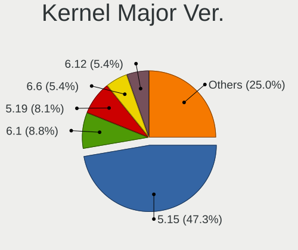

| Version | Computers | Percent |
|---------|-----------|---------|
| 5.15    | 70        | 47.3%   |
| 6.1     | 13        | 8.78%   |
| 5.19    | 12        | 8.11%   |
| 6.6     | 8         | 5.41%   |
| 6.12    | 8         | 5.41%   |
| 5.14    | 7         | 4.73%   |
| 5.17    | 6         | 4.05%   |
| 5.16    | 6         | 4.05%   |
| 6.10    | 5         | 3.38%   |
| 5.13    | 5         | 3.38%   |
| 6.7     | 2         | 1.35%   |
| 6.9     | 1         | 0.68%   |
| 6.8     | 1         | 0.68%   |
| 6.5     | 1         | 0.68%   |
| 6.4     | 1         | 0.68%   |
| 6.11    | 1         | 0.68%   |
| 5.10    | 1         | 0.68%   |

Arch
----

OS architecture (x86_64, i586, etc.)

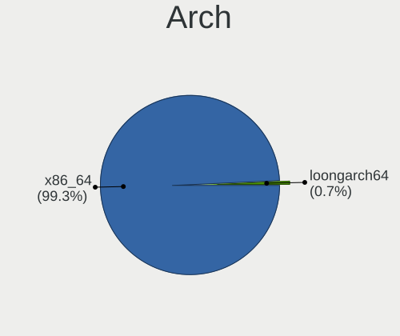

| Name        | Computers | Percent |
|-------------|-----------|---------|
| x86_64      | 137       | 99.28%  |
| loongarch64 | 1         | 0.72%   |

DE
--

Desktop Environment

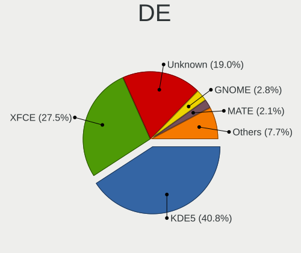

| Name       | Computers | Percent |
|------------|-----------|---------|
| KDE5       | 58        | 40.85%  |
| XFCE       | 39        | 27.46%  |
| Unknown    | 27        | 19.01%  |
| GNOME      | 4         | 2.82%   |
| MATE       | 3         | 2.11%   |
| xwmconfig  | 2         | 1.41%   |
| X-Generic  | 1         | 0.7%    |
| X-Cinnamon | 1         | 0.7%    |
| weston     | 1         | 0.7%    |
| KDE        | 1         | 0.7%    |
| FVWM       | 1         | 0.7%    |
| DWM        | 1         | 0.7%    |
| Cinnamon   | 1         | 0.7%    |
| awesome    | 1         | 0.7%    |
| 2bwm       | 1         | 0.7%    |

Display Server
--------------

X11 or Wayland

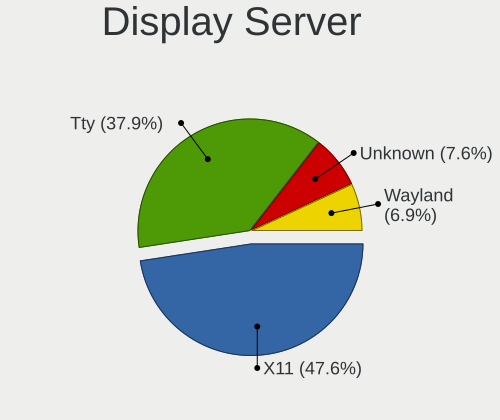

| Name    | Computers | Percent |
|---------|-----------|---------|
| X11     | 69        | 47.59%  |
| Tty     | 55        | 37.93%  |
| Unknown | 11        | 7.59%   |
| Wayland | 10        | 6.9%    |

Display Manager
---------------

SDDM, LightDM, etc.

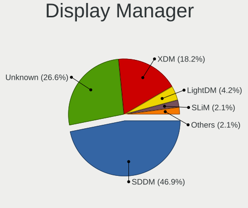

| Name    | Computers | Percent |
|---------|-----------|---------|
| SDDM    | 67        | 46.85%  |
| Unknown | 38        | 26.57%  |
| XDM     | 26        | 18.18%  |
| LightDM | 6         | 4.2%    |
| SLiM    | 3         | 2.1%    |
| GDM     | 2         | 1.4%    |
| TDM     | 1         | 0.7%    |

OS Lang
-------

Language

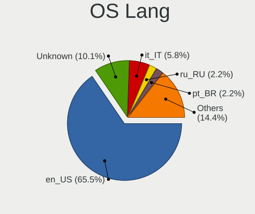

| Lang        | Computers | Percent |
|-------------|-----------|---------|
| en_US       | 91        | 65.47%  |
| Unknown     | 14        | 10.07%  |
| it_IT       | 8         | 5.76%   |
| ru_RU       | 3         | 2.16%   |
| pt_BR       | 3         | 2.16%   |
| en_GB       | 3         | 2.16%   |
| de_DE       | 3         | 2.16%   |
| fr_FR       | 2         | 1.44%   |
| cs_CZ       | 2         | 1.44%   |
| zh_TW       | 1         | 0.72%   |
| zh_CN       | 1         | 0.72%   |
| us          | 1         | 0.72%   |
| pt_PT       | 1         | 0.72%   |
| ja_JP       | 1         | 0.72%   |
| es_ES.UTF8  | 1         | 0.72%   |
| es_ES       | 1         | 0.72%   |
| es_AR       | 1         | 0.72%   |
| en_US.ASCII | 1         | 0.72%   |
| en_SE       | 1         | 0.72%   |

Boot Mode
---------

EFI or BIOS

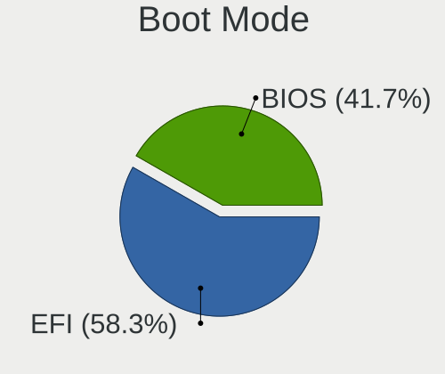

| Mode | Computers | Percent |
|------|-----------|---------|
| EFI  | 81        | 58.27%  |
| BIOS | 58        | 41.73%  |

Filesystem
----------

Type of filesystem

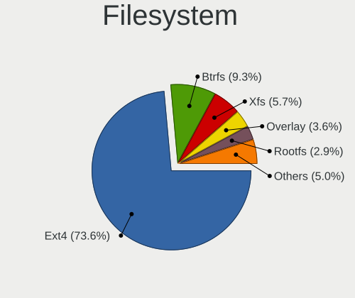

| Type     | Computers | Percent |
|----------|-----------|---------|
| Ext4     | 103       | 73.57%  |
| Btrfs    | 13        | 9.29%   |
| Xfs      | 8         | 5.71%   |
| Overlay  | 5         | 3.57%   |
| Rootfs   | 4         | 2.86%   |
| Tmpfs    | 2         | 1.43%   |
| Zfs      | 1         | 0.71%   |
| Reiserfs | 1         | 0.71%   |
| Jfs      | 1         | 0.71%   |
| F2fs     | 1         | 0.71%   |
| Ext2     | 1         | 0.71%   |

Part. scheme
------------

Scheme of partitioning

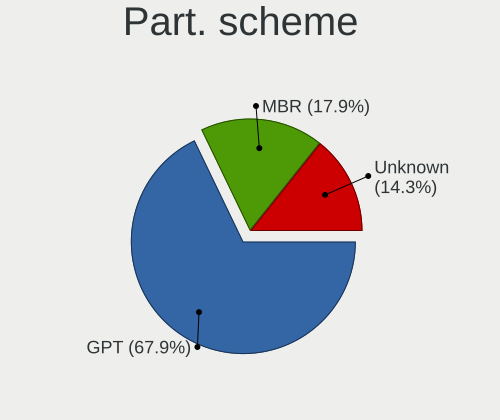

| Type    | Computers | Percent |
|---------|-----------|---------|
| GPT     | 95        | 67.86%  |
| MBR     | 25        | 17.86%  |
| Unknown | 20        | 14.29%  |

Dual Boot with Linux/BSD
------------------------

Hosting more than one Linux/BSD

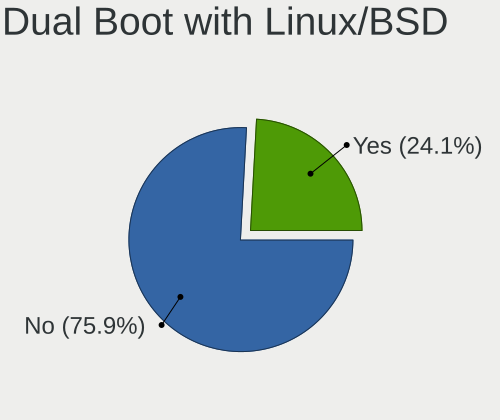

| Dual boot | Computers | Percent |
|-----------|-----------|---------|
| No        | 100       | 71.43%  |
| Yes       | 40        | 28.57%  |

Dual Boot (Win)
---------------

Hosting Linux and Windows

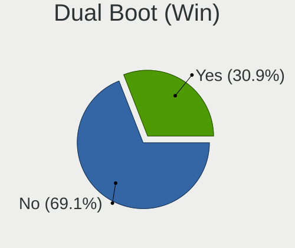

| Dual boot | Computers | Percent |
|-----------|-----------|---------|
| No        | 96        | 69.06%  |
| Yes       | 43        | 30.94%  |

Board
-----

Vendor
------

Motherboard manufacturer

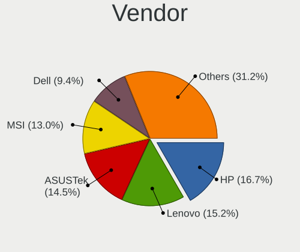

| Name                | Computers | Percent |
|---------------------|-----------|---------|
| Hewlett-Packard     | 23        | 16.67%  |
| Lenovo              | 21        | 15.22%  |
| ASUSTek Computer    | 20        | 14.49%  |
| MSI                 | 18        | 13.04%  |
| Dell                | 13        | 9.42%   |
| ASRock              | 9         | 6.52%   |
| Gigabyte Technology | 5         | 3.62%   |
| Acer                | 5         | 3.62%   |
| Notebook            | 3         | 2.17%   |
| Apple               | 3         | 2.17%   |
| Fujitsu             | 2         | 1.45%   |
| Dynabook            | 2         | 1.45%   |
| Valve               | 1         | 0.72%   |
| TYAN Computer       | 1         | 0.72%   |
| Toshiba             | 1         | 0.72%   |
| System76            | 1         | 0.72%   |
| Supermicro          | 1         | 0.72%   |
| Sony                | 1         | 0.72%   |
| Microsoft           | 1         | 0.72%   |
| Loongson            | 1         | 0.72%   |
| HEDYCOMPUTER        | 1         | 0.72%   |
| Framework           | 1         | 0.72%   |
| Chuwi               | 1         | 0.72%   |
| Biostar             | 1         | 0.72%   |
| BESSTAR Tech        | 1         | 0.72%   |
| Unknown             | 1         | 0.72%   |

Model
-----

Motherboard model

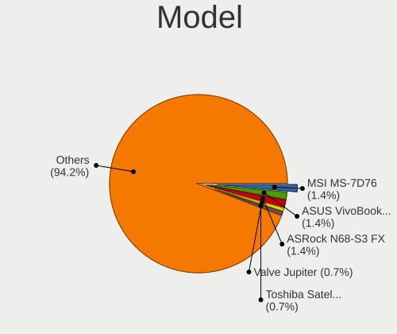

| Name                                     | Computers | Percent |
|------------------------------------------|-----------|---------|
| MSI MS-7D76                              | 2         | 1.45%   |
| ASUS VivoBook_ASUSLaptop K6500ZE_K6500ZE | 2         | 1.45%   |
| ASRock N68-S3 FX                         | 2         | 1.45%   |
| Valve Jupiter                            | 1         | 0.72%   |
| TYAN S7012                               | 1         | 0.72%   |
| Toshiba Satellite C660                   | 1         | 0.72%   |
| System76 Oryx Pro                        | 1         | 0.72%   |
| Supermicro X9DRD-7LN4F(-JBOD)/X9DRD-EF   | 1         | 0.72%   |
| Sony SVE1713A1EW                         | 1         | 0.72%   |
| Notebook X170KM-G                        | 1         | 0.72%   |
| Notebook P7xxTM                          | 1         | 0.72%   |
| Notebook NL5xNU                          | 1         | 0.72%   |
| MSI MS-7D67                              | 1         | 0.72%   |
| MSI MS-7C52                              | 1         | 0.72%   |
| MSI MS-7C02                              | 1         | 0.72%   |
| MSI MS-7B84                              | 1         | 0.72%   |
| MSI MS-7B79                              | 1         | 0.72%   |
| MSI MS-7996                              | 1         | 0.72%   |
| MSI MS-7885                              | 1         | 0.72%   |
| MSI MS-7788                              | 1         | 0.72%   |
| MSI MS-7693                              | 1         | 0.72%   |
| MSI MS-7529                              | 1         | 0.72%   |
| MSI MS-7365                              | 1         | 0.72%   |
| MSI Modern 14 B5M                        | 1         | 0.72%   |
| MSI Modern 14 B11MO                      | 1         | 0.72%   |
| MSI Modern 14 B10MW                      | 1         | 0.72%   |
| MSI GP76 Leopard 11UG                    | 1         | 0.72%   |
| MSI GE76 Raider 11UE                     | 1         | 0.72%   |
| Microsoft Surface Go 3                   | 1         | 0.72%   |
| Loongson TR11B0-T020150U                 | 1         | 0.72%   |
| Lenovo Yoga 6 13ABR8 83B2                | 1         | 0.72%   |
| Lenovo V330-14ARR 81B1                   | 1         | 0.72%   |
| Lenovo ThinkPad X230 2325P38             | 1         | 0.72%   |
| Lenovo ThinkPad X201 3626F7U             | 1         | 0.72%   |
| Lenovo ThinkPad X140e 20BMS03E00         | 1         | 0.72%   |
| Lenovo ThinkPad X1 Carbon 5th 20HQS04300 | 1         | 0.72%   |
| Lenovo ThinkPad X1 Carbon 4th 20FCS2FT00 | 1         | 0.72%   |
| Lenovo ThinkPad T61 765912G              | 1         | 0.72%   |
| Lenovo ThinkPad T60 8744HDG              | 1         | 0.72%   |
| Lenovo ThinkPad T470p 20J60018MS         | 1         | 0.72%   |

Model Family
------------

Motherboard model prefix

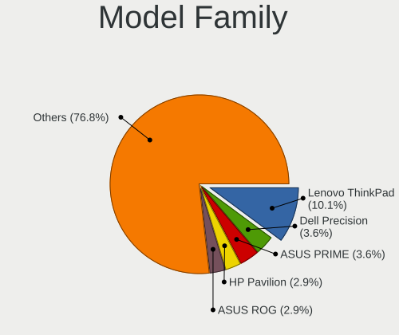

| Name                          | Computers | Percent |
|-------------------------------|-----------|---------|
| Lenovo ThinkPad               | 14        | 10.14%  |
| Dell Precision                | 5         | 3.62%   |
| ASUS PRIME                    | 5         | 3.62%   |
| HP Pavilion                   | 4         | 2.9%    |
| ASUS ROG                      | 4         | 2.9%    |
| MSI Modern                    | 3         | 2.17%   |
| Lenovo IdeaPad                | 3         | 2.17%   |
| HP Laptop                     | 3         | 2.17%   |
| MSI MS-7D76                   | 2         | 1.45%   |
| HP OMEN                       | 2         | 1.45%   |
| HP ENVY                       | 2         | 1.45%   |
| HP EliteBook                  | 2         | 1.45%   |
| HP Compaq                     | 2         | 1.45%   |
| Dell Vostro                   | 2         | 1.45%   |
| Dell OptiPlex                 | 2         | 1.45%   |
| ASUS VivoBook                 | 2         | 1.45%   |
| ASUS TUF                      | 2         | 1.45%   |
| ASRock N68-S3                 | 2         | 1.45%   |
| Acer Nitro                    | 2         | 1.45%   |
| Acer Aspire                   | 2         | 1.45%   |
| Valve Jupiter                 | 1         | 0.72%   |
| TYAN S7012                    | 1         | 0.72%   |
| Toshiba Satellite             | 1         | 0.72%   |
| System76 Oryx                 | 1         | 0.72%   |
| Supermicro X9DRD-7LN4F(-JBOD) | 1         | 0.72%   |
| Sony SVE1713A1EW              | 1         | 0.72%   |
| Notebook X170KM-G             | 1         | 0.72%   |
| Notebook P7xxTM               | 1         | 0.72%   |
| Notebook NL5xNU               | 1         | 0.72%   |
| MSI MS-7D67                   | 1         | 0.72%   |
| MSI MS-7C52                   | 1         | 0.72%   |
| MSI MS-7C02                   | 1         | 0.72%   |
| MSI MS-7B84                   | 1         | 0.72%   |
| MSI MS-7B79                   | 1         | 0.72%   |
| MSI MS-7996                   | 1         | 0.72%   |
| MSI MS-7885                   | 1         | 0.72%   |
| MSI MS-7788                   | 1         | 0.72%   |
| MSI MS-7693                   | 1         | 0.72%   |
| MSI MS-7529                   | 1         | 0.72%   |
| MSI MS-7365                   | 1         | 0.72%   |

MFG Year
--------

Motherboard manufacture year

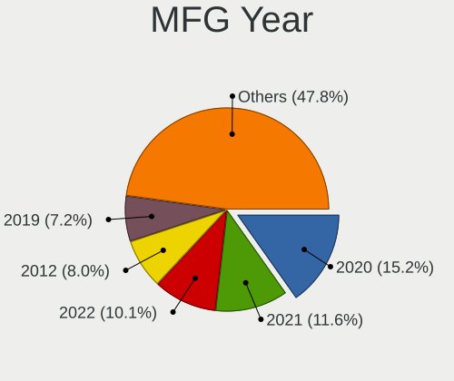

| Year | Computers | Percent |
|------|-----------|---------|
| 2020 | 21        | 15.22%  |
| 2021 | 16        | 11.59%  |
| 2022 | 14        | 10.14%  |
| 2012 | 11        | 7.97%   |
| 2019 | 10        | 7.25%   |
| 2015 | 9         | 6.52%   |
| 2011 | 8         | 5.8%    |
| 2018 | 7         | 5.07%   |
| 2017 | 7         | 5.07%   |
| 2010 | 6         | 4.35%   |
| 2014 | 5         | 3.62%   |
| 2024 | 4         | 2.9%    |
| 2016 | 4         | 2.9%    |
| 2009 | 4         | 2.9%    |
| 2008 | 4         | 2.9%    |
| 2007 | 3         | 2.17%   |
| 2023 | 2         | 1.45%   |
| 2013 | 2         | 1.45%   |
| 2006 | 1         | 0.72%   |

Form Factor
-----------

Physical design of the computer

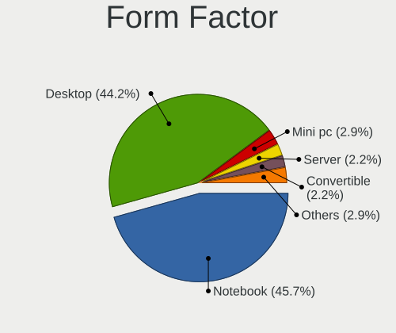

| Name        | Computers | Percent |
|-------------|-----------|---------|
| Notebook    | 63        | 45.65%  |
| Desktop     | 61        | 44.2%   |
| Mini pc     | 4         | 2.9%    |
| Convertible | 3         | 2.17%   |
| All in one  | 3         | 2.17%   |
| Server      | 3         | 2.17%   |
| Tablet      | 1         | 0.72%   |

Secure Boot
-----------

Enabled or disabled

| State    | Computers | Percent |
|----------|-----------|---------|
| Disabled | 138       | 100%    |

Coreboot
--------

Have coreboot on board

| Used | Computers | Percent |
|------|-----------|---------|
| No   | 136       | 98.55%  |
| Yes  | 2         | 1.45%   |

RAM Size
--------

Total RAM memory

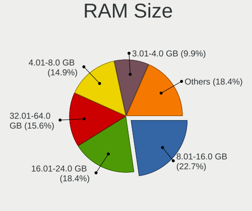

| Size in GB      | Computers | Percent |
|-----------------|-----------|---------|
| 8.01-16.0       | 32        | 22.7%   |
| 16.01-24.0      | 26        | 18.44%  |
| 32.01-64.0      | 22        | 15.6%   |
| 4.01-8.0        | 21        | 14.89%  |
| 3.01-4.0        | 14        | 9.93%   |
| 64.01-256.0     | 12        | 8.51%   |
| 24.01-32.0      | 7         | 4.96%   |
| 1.01-2.0        | 4         | 2.84%   |
| 2.01-3.0        | 2         | 1.42%   |
| More than 256.0 | 1         | 0.71%   |

RAM Used
--------

Used RAM memory

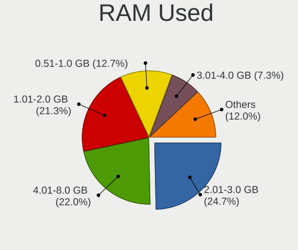

| Used GB    | Computers | Percent |
|------------|-----------|---------|
| 2.01-3.0   | 37        | 24.67%  |
| 4.01-8.0   | 33        | 22%     |
| 1.01-2.0   | 32        | 21.33%  |
| 0.51-1.0   | 19        | 12.67%  |
| 3.01-4.0   | 11        | 7.33%   |
| 8.01-16.0  | 7         | 4.67%   |
| 16.01-24.0 | 4         | 2.67%   |
| 24.01-32.0 | 3         | 2%      |
| 0.01-0.5   | 3         | 2%      |
| 32.01-64.0 | 1         | 0.67%   |

Total Drives
------------

Number of drives on board

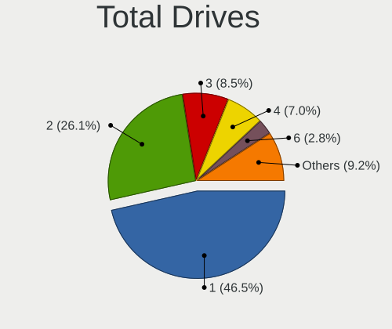

| Drives | Computers | Percent |
|--------|-----------|---------|
| 1      | 66        | 46.48%  |
| 2      | 37        | 26.06%  |
| 3      | 12        | 8.45%   |
| 4      | 10        | 7.04%   |
| 6      | 4         | 2.82%   |
| 0      | 4         | 2.82%   |
| 10     | 2         | 1.41%   |
| 9      | 2         | 1.41%   |
| 5      | 2         | 1.41%   |
| 29     | 1         | 0.7%    |
| 14     | 1         | 0.7%    |
| 11     | 1         | 0.7%    |

Has CD-ROM
----------

Has CD-ROM on board

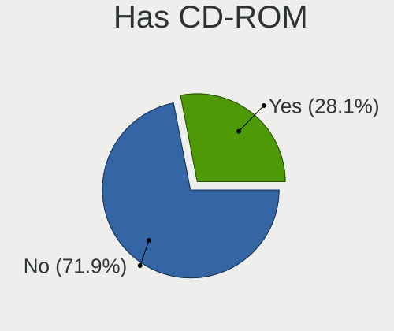

| Presented | Computers | Percent |
|-----------|-----------|---------|
| No        | 100       | 71.94%  |
| Yes       | 39        | 28.06%  |

Has Ethernet
------------

Has Ethernet on board

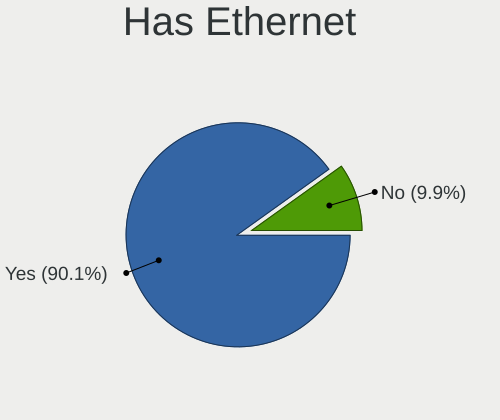

| Presented | Computers | Percent |
|-----------|-----------|---------|
| Yes       | 126       | 90%     |
| No        | 14        | 10%     |

Has WiFi
--------

Has WiFi module

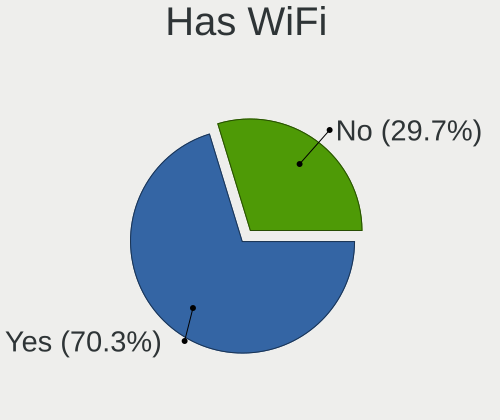

| Presented | Computers | Percent |
|-----------|-----------|---------|
| Yes       | 97        | 70.29%  |
| No        | 41        | 29.71%  |

Has Bluetooth
-------------

Has Bluetooth module

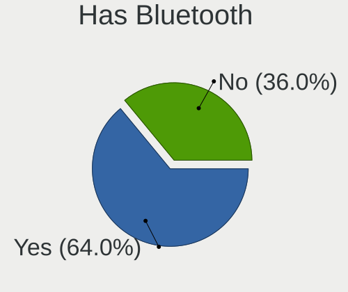

| Presented | Computers | Percent |
|-----------|-----------|---------|
| Yes       | 89        | 64.03%  |
| No        | 50        | 35.97%  |

Location
--------

Country
-------

Geographic location (country)

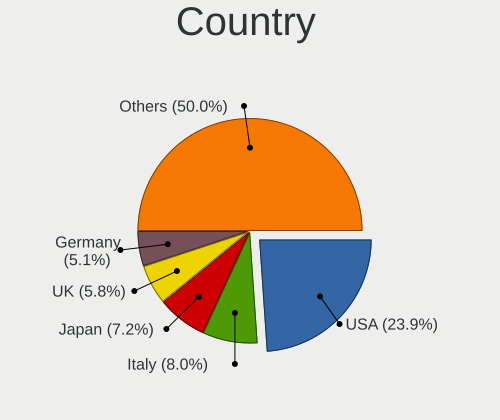

| Country      | Computers | Percent |
|--------------|-----------|---------|
| USA          | 33        | 23.91%  |
| Italy        | 11        | 7.97%   |
| Japan        | 10        | 7.25%   |
| UK           | 8         | 5.8%    |
| Germany      | 7         | 5.07%   |
| Kazakhstan   | 6         | 4.35%   |
| Brazil       | 6         | 4.35%   |
| Portugal     | 5         | 3.62%   |
| Argentina    | 5         | 3.62%   |
| Spain        | 4         | 2.9%    |
| Russia       | 4         | 2.9%    |
| France       | 4         | 2.9%    |
| Canada       | 4         | 2.9%    |
| South Africa | 3         | 2.17%   |
| Greece       | 3         | 2.17%   |
| China        | 3         | 2.17%   |
| Romania      | 2         | 1.45%   |
| Netherlands  | 2         | 1.45%   |
| India        | 2         | 1.45%   |
| Hong Kong    | 2         | 1.45%   |
| Czechia      | 2         | 1.45%   |
| Taiwan       | 1         | 0.72%   |
| Switzerland  | 1         | 0.72%   |
| Sweden       | 1         | 0.72%   |
| Serbia       | 1         | 0.72%   |
| Poland       | 1         | 0.72%   |
| Mexico       | 1         | 0.72%   |
| Malaysia     | 1         | 0.72%   |
| Lithuania    | 1         | 0.72%   |
| Iran         | 1         | 0.72%   |
| Chile        | 1         | 0.72%   |
| Belgium      | 1         | 0.72%   |
| Australia    | 1         | 0.72%   |

City
----

Geographic location (city)

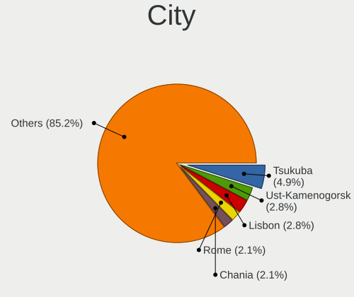

| City             | Computers | Percent |
|------------------|-----------|---------|
| Tsukuba          | 7         | 4.93%   |
| Ust-Kamenogorsk  | 4         | 2.82%   |
| Lisbon           | 4         | 2.82%   |
| Rome             | 3         | 2.11%   |
| Chania           | 3         | 2.11%   |
| Tokyo            | 2         | 1.41%   |
| Sun Prairie      | 2         | 1.41%   |
| Seattle          | 2         | 1.41%   |
| San Elizario     | 2         | 1.41%   |
| Moscow           | 2         | 1.41%   |
| Milan            | 2         | 1.41%   |
| McKinney         | 2         | 1.41%   |
| Karaganda        | 2         | 1.41%   |
| Greater Noida    | 2         | 1.41%   |
| Gainesville      | 2         | 1.41%   |
| Frignano         | 2         | 1.41%   |
| Fayetteville     | 2         | 1.41%   |
| Cape Town        | 2         | 1.41%   |
| Buenos Aires     | 2         | 1.41%   |
| Bucharest        | 2         | 1.41%   |
| Amsterdam        | 2         | 1.41%   |
| Worpswede        | 1         | 0.7%    |
| Winter Springs   | 1         | 0.7%    |
| Warsaw           | 1         | 0.7%    |
| Vilnius          | 1         | 0.7%    |
| Villaputzu       | 1         | 0.7%    |
| Villa Carlos Paz | 1         | 0.7%    |
| Toronto          | 1         | 0.7%    |
| Tehran           | 1         | 0.7%    |
| Tatuí           | 1         | 0.7%    |
| Taichung         | 1         | 0.7%    |
| St Petersburg    | 1         | 0.7%    |
| Springfield      | 1         | 0.7%    |
| Skövde          | 1         | 0.7%    |
| Sham Shui Po     | 1         | 0.7%    |
| Seville          | 1         | 0.7%    |
| Senhora da Hora  | 1         | 0.7%    |
| Sao Paulo        | 1         | 0.7%    |
| Santiago         | 1         | 0.7%    |
| Santander        | 1         | 0.7%    |

Drives
------

Drive Vendor
------------

Hard drive vendors

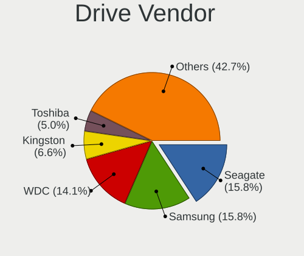

| Vendor                      | Computers | Drives | Percent |
|-----------------------------|-----------|--------|---------|
| Seagate                     | 38        | 69     | 15.77%  |
| Samsung Electronics         | 38        | 50     | 15.77%  |
| WDC                         | 34        | 80     | 14.11%  |
| Kingston                    | 16        | 20     | 6.64%   |
| Toshiba                     | 12        | 23     | 4.98%   |
| SanDisk                     | 10        | 16     | 4.15%   |
| Crucial                     | 9         | 10     | 3.73%   |
| SK hynix                    | 6         | 6      | 2.49%   |
| Intel                       | 6         | 8      | 2.49%   |
| Hitachi                     | 5         | 8      | 2.07%   |
| HGST                        | 5         | 5      | 2.07%   |
| Transcend                   | 4         | 4      | 1.66%   |
| Unknown                     | 3         | 6      | 1.24%   |
| Micron/Crucial Technology   | 3         | 3      | 1.24%   |
| Micron Technology           | 3         | 3      | 1.24%   |
| KIOXIA                      | 3         | 4      | 1.24%   |
| Hewlett-Packard             | 3         | 4      | 1.24%   |
| Team                        | 2         | 2      | 0.83%   |
| Silicon Motion              | 2         | 3      | 0.83%   |
| Realtek Semiconductor       | 2         | 2      | 0.83%   |
| Patriot                     | 2         | 2      | 0.83%   |
| LITEON                      | 2         | 2      | 0.83%   |
| Kingston Technology Company | 2         | 3      | 0.83%   |
| JMicron Technology          | 2         | 2      | 0.83%   |
| Gigabyte Technology         | 2         | 2      | 0.83%   |
| External                    | 2         | 2      | 0.83%   |
| Apple                       | 2         | 2      | 0.83%   |
| A-DATA Technology           | 2         | 2      | 0.83%   |
| Unknown                     | 2         | 3      | 0.83%   |
| ZHITAI                      | 1         | 2      | 0.41%   |
| Verbatim                    | 1         | 2      | 0.41%   |
| SSSTC                       | 1         | 1      | 0.41%   |
| PNY                         | 1         | 2      | 0.41%   |
| Plextor                     | 1         | 1      | 0.41%   |
| Pioneer                     | 1         | 1      | 0.41%   |
| Phison Electronics          | 1         | 1      | 0.41%   |
| Maxtor                      | 1         | 1      | 0.41%   |
| MAXIO Technology (Hangzhou) | 1         | 1      | 0.41%   |
| Lexar                       | 1         | 1      | 0.41%   |
| KingSpec                    | 1         | 1      | 0.41%   |

Drive Model
-----------

Hard drive models

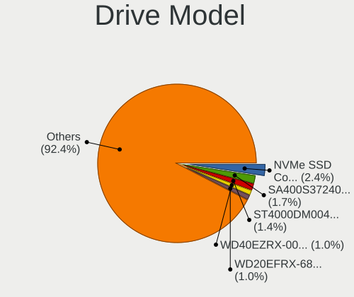

| Model                                                 | Computers | Percent |
|-------------------------------------------------------|-----------|---------|
| Samsung NVMe SSD Controller SM981/PM981/PM983 1TB     | 7         | 2.41%   |
| Kingston SA400S37240G 240GB SSD                       | 5         | 1.72%   |
| Seagate ST4000DM004-2CV104 4TB                        | 4         | 1.38%   |
| WDC WD40EZRX-00SPEB0 4TB                              | 3         | 1.03%   |
| WDC WD20EFRX-68EUZN0 2TB                              | 3         | 1.03%   |
| WDC WD10EZEX-08WN4A0 1TB                              | 3         | 1.03%   |
| Seagate ST4000VN006-3CW104 4TB                        | 3         | 1.03%   |
| Seagate ST1000LM048-2E7172 1TB                        | 3         | 1.03%   |
| Intel SSD 660P Series 512GB                           | 3         | 1.03%   |
| Crucial CT500MX500SSD1 500GB                          | 3         | 1.03%   |
| WDC WDS100T2B0A-00SM50 1TB SSD                        | 2         | 0.69%   |
| WDC WD10SPZX-60Z10T0 1TB                              | 2         | 0.69%   |
| Silicon Motion SM2263EN/SM2263XT SSD Controller 512GB | 2         | 0.69%   |
| Seagate ST8000VN0022-2EL112 8TB                       | 2         | 0.69%   |
| Seagate ST2000DX001-1NS164 2TB                        | 2         | 0.69%   |
| Seagate ST2000DM008-2FR102 2TB                        | 2         | 0.69%   |
| Seagate ST2000DL003-9VT166 2TB                        | 2         | 0.69%   |
| Seagate ST1000DM010-2EP102 1TB                        | 2         | 0.69%   |
| Seagate ST1000DM003-1SB102 1TB                        | 2         | 0.69%   |
| Seagate Expansion Desk 4TB                            | 2         | 0.69%   |
| Samsung SSD 970 EVO Plus 500GB                        | 2         | 0.69%   |
| Samsung SSD 970 EVO 250GB                             | 2         | 0.69%   |
| Samsung NVMe SSD Controller PM9A1/PM9A3/980PRO 1TB    | 2         | 0.69%   |
| Realtek SPCC M.2 PCIe SSD 1024GB                      | 2         | 0.69%   |
| Micron/Crucial P2 NVMe PCIe SSD 2TB                   | 2         | 0.69%   |
| Kingston Company OM3PDP3 NVMe SSD 256GB               | 2         | 0.69%   |
| Kingston SA400S37120G 120GB SSD                       | 2         | 0.69%   |
| JMicron Generic 320GB                                 | 2         | 0.69%   |
| HGST HTS725050A7E630 500GB                            | 2         | 0.69%   |
| External USB3.0 250GB                                 | 2         | 0.69%   |
| Unknown                                               | 2         | 0.69%   |
| ZHITAI SC001 Active 1TB SSD                           | 1         | 0.34%   |
| ZHITAI PC005 Active 512GB                             | 1         | 0.34%   |
| WDC WDS500G2B0A-00SM50 500GB                          | 1         | 0.34%   |
| WDC WDS480G2G0A-00JH30 480GB SSD                      | 1         | 0.34%   |
| WDC WDS100T2B0B-00YS70 1TB SSD                        | 1         | 0.34%   |
| WDC WDS100T1X0E-00AFY0 1TB                            | 1         | 0.34%   |
| WDC WD80EFZZ-68BTXN0 8TB                              | 1         | 0.34%   |
| WDC WD80EFZX-68UW8N0 8TB                              | 1         | 0.34%   |
| WDC WD80EFBX-68AZZN0 8TB                              | 1         | 0.34%   |

HDD Vendor
----------

Hard disk drive vendors

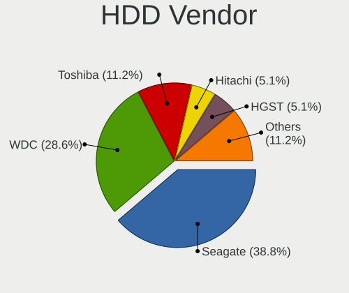

| Vendor              | Computers | Drives | Percent |
|---------------------|-----------|--------|---------|
| Seagate             | 38        | 69     | 38.78%  |
| WDC                 | 28        | 69     | 28.57%  |
| Toshiba             | 11        | 18     | 11.22%  |
| Hitachi             | 5         | 8      | 5.1%    |
| HGST                | 5         | 5      | 5.1%    |
| Samsung Electronics | 2         | 2      | 2.04%   |
| JMicron Technology  | 2         | 2      | 2.04%   |
| External            | 2         | 2      | 2.04%   |
| Unknown             | 2         | 3      | 2.04%   |
| Maxtor              | 1         | 1      | 1.02%   |
| Fujitsu             | 1         | 1      | 1.02%   |
| Apple               | 1         | 1      | 1.02%   |

SSD Vendor
----------

Solid state drive vendors

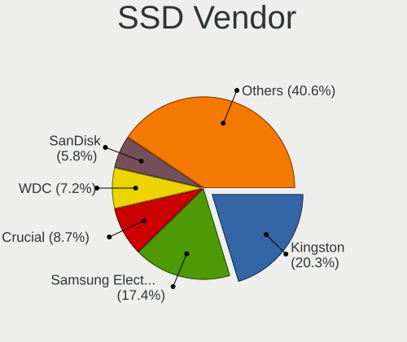

| Vendor              | Computers | Drives | Percent |
|---------------------|-----------|--------|---------|
| Kingston            | 14        | 17     | 20.29%  |
| Samsung Electronics | 12        | 17     | 17.39%  |
| Crucial             | 6         | 7      | 8.7%    |
| WDC                 | 5         | 7      | 7.25%   |
| SanDisk             | 4         | 5      | 5.8%    |
| Transcend           | 3         | 3      | 4.35%   |
| Hewlett-Packard     | 2         | 2      | 2.9%    |
| ZHITAI              | 1         | 1      | 1.45%   |
| Verbatim            | 1         | 2      | 1.45%   |
| Toshiba             | 1         | 3      | 1.45%   |
| Team                | 1         | 1      | 1.45%   |
| SSSTC               | 1         | 1      | 1.45%   |
| SK hynix            | 1         | 1      | 1.45%   |
| PNY                 | 1         | 2      | 1.45%   |
| Plextor             | 1         | 1      | 1.45%   |
| Pioneer             | 1         | 1      | 1.45%   |
| Patriot             | 1         | 1      | 1.45%   |
| Micron Technology   | 1         | 1      | 1.45%   |
| LITEON              | 1         | 1      | 1.45%   |
| Lexar               | 1         | 1      | 1.45%   |
| KingSpec            | 1         | 1      | 1.45%   |
| Intenso             | 1         | 1      | 1.45%   |
| Intel               | 1         | 2      | 1.45%   |
| HS-SSD-C100         | 1         | 1      | 1.45%   |
| GOODRAM             | 1         | 1      | 1.45%   |
| Gigabyte Technology | 1         | 1      | 1.45%   |
| DUEX                | 1         | 1      | 1.45%   |
| China               | 1         | 1      | 1.45%   |
| Apple               | 1         | 1      | 1.45%   |
| AirDisk             | 1         | 1      | 1.45%   |

Drive Kind
----------

HDD or SSD

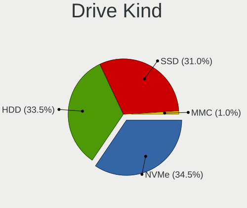

| Kind | Computers | Drives | Percent |
|------|-----------|--------|---------|
| NVMe | 69        | 97     | 34.5%   |
| HDD  | 67        | 181    | 33.5%   |
| SSD  | 62        | 86     | 31%     |
| MMC  | 2         | 4      | 1%      |

Drive Connector
---------------

SATA, SAS, NVMe, etc.

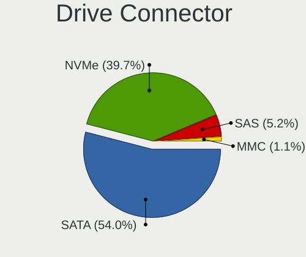

| Type | Computers | Drives | Percent |
|------|-----------|--------|---------|
| SATA | 94        | 257    | 54.02%  |
| NVMe | 69        | 97     | 39.66%  |
| SAS  | 9         | 10     | 5.17%   |
| MMC  | 2         | 4      | 1.15%   |

Drive Size
----------

Size of hard drive

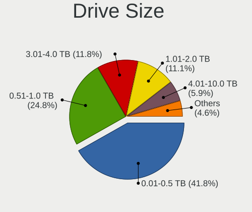

| Size in TB | Computers | Drives | Percent |
|------------|-----------|--------|---------|
| 0.01-0.5   | 64        | 86     | 41.83%  |
| 0.51-1.0   | 38        | 65     | 24.84%  |
| 3.01-4.0   | 18        | 35     | 11.76%  |
| 1.01-2.0   | 17        | 20     | 11.11%  |
| 4.01-10.0  | 9         | 41     | 5.88%   |
| 2.01-3.0   | 5         | 13     | 3.27%   |
| 10.01-20.0 | 2         | 7      | 1.31%   |

Space Total
-----------

Amount of disk space available on the file system

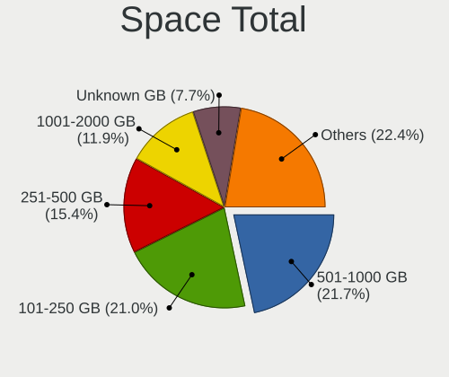

| Size in GB     | Computers | Percent |
|----------------|-----------|---------|
| 501-1000       | 31        | 21.68%  |
| 101-250        | 30        | 20.98%  |
| 251-500        | 22        | 15.38%  |
| 1001-2000      | 17        | 11.89%  |
| Unknown        | 11        | 7.69%   |
| More than 3000 | 9         | 6.29%   |
| 2001-3000      | 8         | 5.59%   |
| 1-20           | 8         | 5.59%   |
| 51-100         | 5         | 3.5%    |
| 21-50          | 2         | 1.4%    |

Space Used
----------

Amount of used disk space

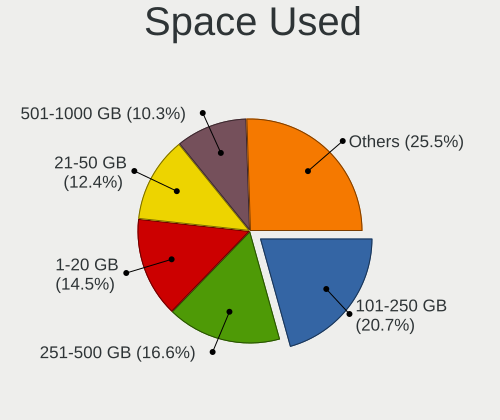

| Used GB        | Computers | Percent |
|----------------|-----------|---------|
| 101-250        | 30        | 20.69%  |
| 251-500        | 24        | 16.55%  |
| 1-20           | 21        | 14.48%  |
| 21-50          | 18        | 12.41%  |
| 501-1000       | 15        | 10.34%  |
| 51-100         | 11        | 7.59%   |
| Unknown        | 11        | 7.59%   |
| 1001-2000      | 9         | 6.21%   |
| 2001-3000      | 4         | 2.76%   |
| More than 3000 | 2         | 1.38%   |

Malfunc. Drives
---------------

Drive models with a malfunction

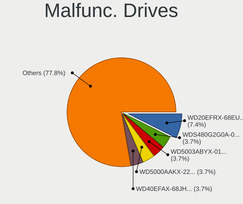

| Model                                 | Computers | Drives | Percent |
|---------------------------------------|-----------|--------|---------|
| WDC WD20EFRX-68EUZN0 2TB              | 2         | 3      | 7.41%   |
| WDC WDS480G2G0A-00JH30 480GB SSD      | 1         | 1      | 3.7%    |
| WDC WD5003ABYX-01WERA0 500GB          | 1         | 1      | 3.7%    |
| WDC WD5000AAKX-22ERMA0 500GB          | 1         | 1      | 3.7%    |
| WDC WD40EFAX-68JH4N1 4TB              | 1         | 4      | 3.7%    |
| WDC WD3200AAJS-65B4A0 320GB           | 1         | 1      | 3.7%    |
| WDC WD30EZRX-00MMMB0 3TB              | 1         | 1      | 3.7%    |
| WDC WD30EZRX-00D8PB0 3TB              | 1         | 1      | 3.7%    |
| WDC WD20PURZ-85GU6Y0 2TB              | 1         | 1      | 3.7%    |
| WDC WD20EARX-00PASB0 2TB              | 1         | 1      | 3.7%    |
| SSSTC CVB-8D128-HP 128GB              | 1         | 1      | 3.7%    |
| Seagate ST380011A 80GB                | 1         | 1      | 3.7%    |
| Seagate ST3500630AS 500GB             | 1         | 1      | 3.7%    |
| Seagate ST3000VX006-1HH166 3TB        | 1         | 1      | 3.7%    |
| Seagate ST2000DL003-9VT166 2TB        | 1         | 1      | 3.7%    |
| Seagate ST1000LM014-1EJ164 1TB        | 1         | 1      | 3.7%    |
| Seagate ST1000DM003-1ER162 1TB        | 1         | 2      | 3.7%    |
| Samsung Electronics SSD 970 EVO 500GB | 1         | 1      | 3.7%    |
| Samsung Electronics SSD 870 EVO 1TB   | 1         | 1      | 3.7%    |
| Plextor PX-128M6S 128GB SSD           | 1         | 1      | 3.7%    |
| Hitachi HUA723030ALA640 3TB           | 1         | 1      | 3.7%    |
| Hitachi HDS721016CLA382 160GB         | 1         | 1      | 3.7%    |
| HGST HTS725050A7E630 500GB            | 1         | 1      | 3.7%    |
| HGST HTS545050A7E380 500GB            | 1         | 1      | 3.7%    |
| DUEX DX300256A5xnEMLC 256GB SSD       | 1         | 1      | 3.7%    |
| Unknown                               | 1         | 1      | 3.7%    |

Malfunc. Drive Vendor
---------------------

Vendors of faulty drives

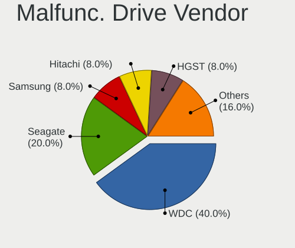

| Vendor              | Computers | Drives | Percent |
|---------------------|-----------|--------|---------|
| WDC                 | 10        | 15     | 40%     |
| Seagate             | 5         | 7      | 20%     |
| Samsung Electronics | 2         | 2      | 8%      |
| Hitachi             | 2         | 2      | 8%      |
| HGST                | 2         | 2      | 8%      |
| SSSTC               | 1         | 1      | 4%      |
| Plextor             | 1         | 1      | 4%      |
| DUEX                | 1         | 1      | 4%      |
| Unknown             | 1         | 1      | 4%      |

Malfunc. HDD Vendor
-------------------

Vendors of faulty HDD drives

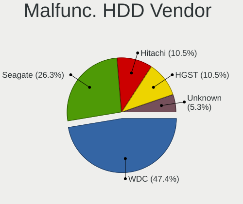

| Vendor  | Computers | Drives | Percent |
|---------|-----------|--------|---------|
| WDC     | 9         | 14     | 47.37%  |
| Seagate | 5         | 7      | 26.32%  |
| Hitachi | 2         | 2      | 10.53%  |
| HGST    | 2         | 2      | 10.53%  |
| Unknown | 1         | 1      | 5.26%   |

Malfunc. Drive Kind
-------------------

Kinds of faulty drives

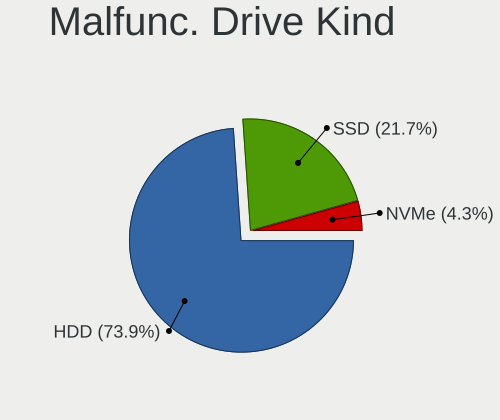

| Kind | Computers | Drives | Percent |
|------|-----------|--------|---------|
| HDD  | 17        | 26     | 73.91%  |
| SSD  | 5         | 5      | 21.74%  |
| NVMe | 1         | 1      | 4.35%   |

Failed Drives
-------------

Failed drive models

Zero info for selected period =(

Failed Drive Vendor
-------------------

Failed drive vendors

Zero info for selected period =(

Drive Status
------------

Number of failed and malfunc. drives

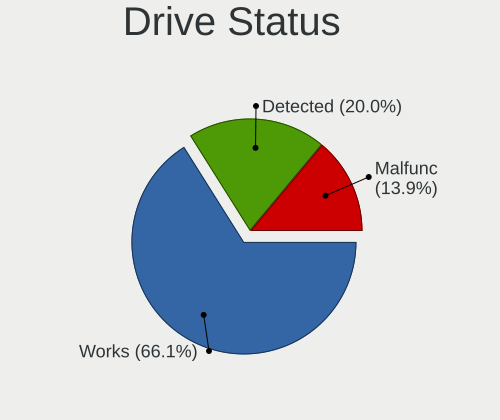

| Status   | Computers | Drives | Percent |
|----------|-----------|--------|---------|
| Works    | 109       | 267    | 66.06%  |
| Detected | 33        | 69     | 20%     |
| Malfunc  | 23        | 32     | 13.94%  |

Storage controller
------------------

Storage Vendor
--------------

Storage controller vendors

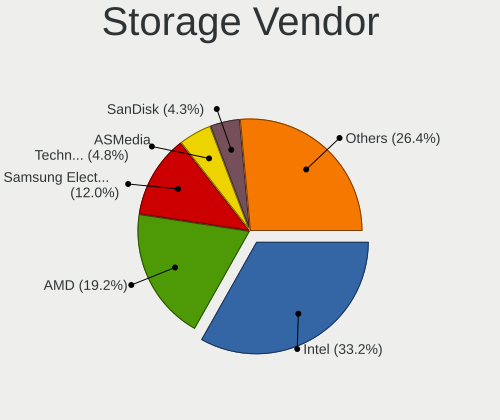

| Vendor                          | Computers | Percent |
|---------------------------------|-----------|---------|
| Intel                           | 69        | 33.17%  |
| AMD                             | 40        | 19.23%  |
| Samsung Electronics             | 25        | 12.02%  |
| ASMedia Technology              | 10        | 4.81%   |
| SanDisk                         | 9         | 4.33%   |
| Micron/Crucial Technology       | 6         | 2.88%   |
| SK hynix                        | 5         | 2.4%    |
| Marvell Technology Group        | 5         | 2.4%    |
| Kingston Technology Company     | 5         | 2.4%    |
| Realtek Semiconductor           | 4         | 1.92%   |
| Nvidia                          | 4         | 1.92%   |
| KIOXIA                          | 3         | 1.44%   |
| JMicron Technology              | 3         | 1.44%   |
| Silicon Motion                  | 2         | 0.96%   |
| Phison Electronics              | 2         | 0.96%   |
| Micron Technology               | 2         | 0.96%   |
| MAXIO Technology (Hangzhou)     | 2         | 0.96%   |
| Lite-On Technology              | 2         | 0.96%   |
| Broadcom / LSI                  | 2         | 0.96%   |
| Yangtze Memory Technologies     | 1         | 0.48%   |
| Toshiba America Info Systems    | 1         | 0.48%   |
| Nextorage                       | 1         | 0.48%   |
| LSI Logic / Symbios Logic       | 1         | 0.48%   |
| Loongson Technology             | 1         | 0.48%   |
| Hefei DATANG Storage Technology | 1         | 0.48%   |
| Biwin Storage Technology        | 1         | 0.48%   |
| Adaptec                         | 1         | 0.48%   |

Storage Model
-------------

Storage controller models

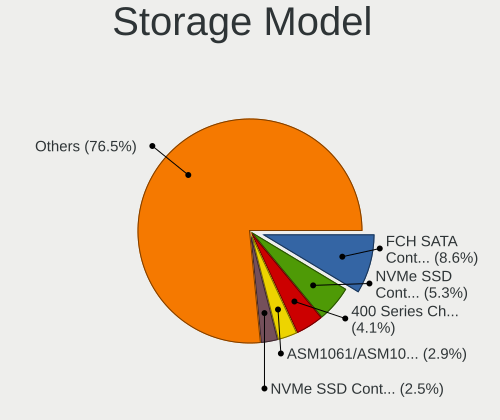

| Model                                                                            | Computers | Percent |
|----------------------------------------------------------------------------------|-----------|---------|
| AMD FCH SATA Controller [AHCI mode]                                              | 21        | 8.64%   |
| Samsung NVMe SSD Controller SM981/PM981/PM983                                    | 13        | 5.35%   |
| AMD 400 Series Chipset SATA Controller                                           | 10        | 4.12%   |
| ASMedia ASM1061/ASM1062 Serial ATA Controller                                    | 7         | 2.88%   |
| Samsung NVMe SSD Controller PM9A1/PM9A3/980PRO                                   | 6         | 2.47%   |
| Intel 7 Series Chipset Family 6-port SATA Controller [AHCI mode]                 | 6         | 2.47%   |
| AMD 500 Series Chipset SATA Controller                                           | 6         | 2.47%   |
| Micron/Crucial P2 [Nick P2] / P3 / P3 Plus NVMe PCIe SSD (DRAM-less)             | 5         | 2.06%   |
| Intel 82801 Mobile SATA Controller [RAID mode]                                   | 5         | 2.06%   |
| Samsung NVMe SSD Controller 980 (DRAM-less)                                      | 4         | 1.65%   |
| Intel Volume Management Device NVMe RAID Controller                              | 4         | 1.65%   |
| Intel 5 Series/3400 Series Chipset 6 port SATA AHCI Controller                   | 4         | 1.65%   |
| AMD SB7x0/SB8x0/SB9x0 SATA Controller [AHCI mode]                                | 4         | 1.65%   |
| Nvidia MCP61 SATA Controller                                                     | 3         | 1.23%   |
| Nvidia MCP61 IDE                                                                 | 3         | 1.23%   |
| Marvell Group 88SE9215 PCIe 2.0 x1 4-port SATA 6 Gb/s Controller                 | 3         | 1.23%   |
| KIOXIA NVMe SSD Controller BG4 (DRAM-less)                                       | 3         | 1.23%   |
| Intel Sunrise Point-LP SATA Controller [AHCI mode]                               | 3         | 1.23%   |
| Intel SSD 660P Series                                                            | 3         | 1.23%   |
| Intel SATA Controller [RAID mode]                                                | 3         | 1.23%   |
| Intel C610/X99 series chipset sSATA Controller [AHCI mode]                       | 3         | 1.23%   |
| Intel C610/X99 series chipset 6-Port SATA Controller [AHCI mode]                 | 3         | 1.23%   |
| Intel 8 Series/C220 Series Chipset Family 6-port SATA Controller 1 [AHCI mode]   | 3         | 1.23%   |
| AMD 600 Series Chipset SATA Controller                                           | 3         | 1.23%   |
| SK hynix Gold P31/BC711/PC711 NVMe Solid State Drive                             | 2         | 0.82%   |
| SK hynix BC511 NVMe SSD                                                          | 2         | 0.82%   |
| Silicon Motion SM2263EN/SM2263XT (DRAM-less) NVMe SSD Controllers                | 2         | 0.82%   |
| SanDisk WD SN560/SN740/SN770/SN5000 NVMe SSD                                     | 2         | 0.82%   |
| SanDisk WD PC SN810 / Black SN850 NVMe SSD                                       | 2         | 0.82%   |
| Samsung NVMe SSD Controller SM961/PM961/SM963                                    | 2         | 0.82%   |
| Realtek RTS5765DL NVMe SSD Controller (DRAM-less)                                | 2         | 0.82%   |
| Kingston Company OM3PDP3 NVMe SSD                                                | 2         | 0.82%   |
| JMicron JMB58x AHCI SATA controller                                              | 2         | 0.82%   |
| Intel Q170/Q150/B150/H170/H110/Z170/CM236 Chipset SATA Controller [AHCI Mode]    | 2         | 0.82%   |
| Intel Comet Lake SATA AHCI Controller                                            | 2         | 0.82%   |
| Intel C600/X79 series chipset 6-Port SATA AHCI Controller                        | 2         | 0.82%   |
| Intel Atom/Celeron/Pentium Processor x5-E8000/J3xxx/N3xxx Series SATA Controller | 2         | 0.82%   |
| Intel 82801JD/DO (ICH10 Family) SATA AHCI Controller                             | 2         | 0.82%   |
| Intel 82801HM/HEM (ICH8M/ICH8M-E) SATA Controller [AHCI mode]                    | 2         | 0.82%   |
| Intel 82801HM/HEM (ICH8M/ICH8M-E) IDE Controller                                 | 2         | 0.82%   |

Storage Kind
------------

Kind of storage controller (IDE, SATA, NVMe, SAS, ...)

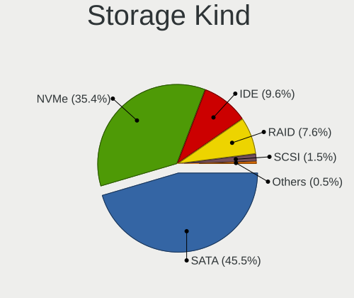

| Kind | Computers | Percent |
|------|-----------|---------|
| SATA | 90        | 45.45%  |
| NVMe | 70        | 35.35%  |
| IDE  | 19        | 9.6%    |
| RAID | 15        | 7.58%   |
| SCSI | 3         | 1.52%   |
| SAS  | 1         | 0.51%   |

Processor
---------

CPU Vendor
----------

Processor vendors

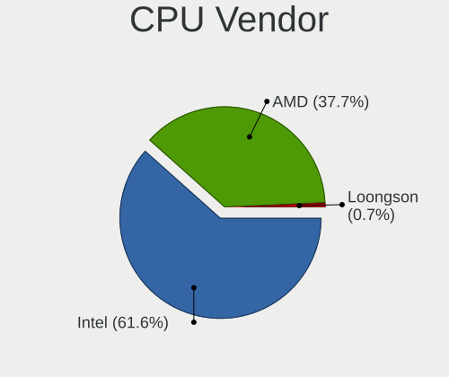

| Vendor   | Computers | Percent |
|----------|-----------|---------|
| Intel    | 85        | 61.59%  |
| AMD      | 52        | 37.68%  |
| Loongson | 1         | 0.72%   |

CPU Model
---------

Processor models

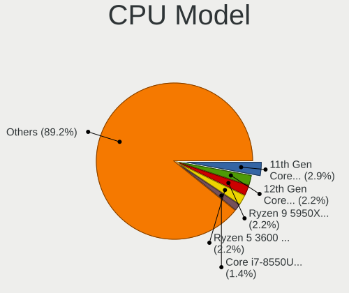

| Model                                       | Computers | Percent |
|---------------------------------------------|-----------|---------|
| Intel 11th Gen Core i7-11800H @ 2.30GHz     | 4         | 2.88%   |
| Intel 12th Gen Core i7-12700H               | 3         | 2.16%   |
| AMD Ryzen 9 5950X 16-Core Processor         | 3         | 2.16%   |
| AMD Ryzen 5 3600 6-Core Processor           | 3         | 2.16%   |
| Intel Core i7-8550U CPU @ 1.80GHz           | 2         | 1.44%   |
| Intel Core i7-5820K CPU @ 3.30GHz           | 2         | 1.44%   |
| Intel Core i7-10510U CPU @ 1.80GHz          | 2         | 1.44%   |
| Intel Core i5-6300U CPU @ 2.40GHz           | 2         | 1.44%   |
| Intel Core i5-3320M CPU @ 2.60GHz           | 2         | 1.44%   |
| Intel Core i5-2400 CPU @ 3.10GHz            | 2         | 1.44%   |
| Intel Core i5-10210U CPU @ 1.60GHz          | 2         | 1.44%   |
| Intel Core i5 CPU M 540 @ 2.53GHz           | 2         | 1.44%   |
| Intel Core 2 Duo CPU T7300 @ 2.00GHz        | 2         | 1.44%   |
| Intel Core 2 Duo CPU E8400 @ 3.00GHz        | 2         | 1.44%   |
| Intel 11th Gen Core i5-1135G7 @ 2.40GHz     | 2         | 1.44%   |
| AMD Ryzen 9 7900 12-Core Processor          | 2         | 1.44%   |
| AMD Ryzen 7 7730U with Radeon Graphics      | 2         | 1.44%   |
| AMD Ryzen 7 3800X 8-Core Processor          | 2         | 1.44%   |
| AMD Ryzen 7 3700X 8-Core Processor          | 2         | 1.44%   |
| AMD Ryzen 3 3200G with Radeon Vega Graphics | 2         | 1.44%   |
| AMD Athlon II X2 250 Processor              | 2         | 1.44%   |
| Loongson Loongson 3A                        | 1         | 0.72%   |
| Intel Xeon CPU X5680 @ 3.33GHz              | 1         | 0.72%   |
| Intel Xeon CPU X5355 @ 2.66GHz              | 1         | 0.72%   |
| Intel Xeon CPU E5-2697 v3 @ 2.60GHz         | 1         | 0.72%   |
| Intel Xeon CPU E5-2695 v2 @ 2.40GHz         | 1         | 0.72%   |
| Intel Xeon CPU E5-2667 v2 @ 3.30GHz         | 1         | 0.72%   |
| Intel Xeon CPU E5-2660 v3 @ 2.60GHz         | 1         | 0.72%   |
| Intel Xeon CPU 5160 @ 3.00GHz               | 1         | 0.72%   |
| Intel Pentium Silver N6000 @ 1.10GHz        | 1         | 0.72%   |
| Intel Pentium Dual CPU E2140 @ 1.60GHz      | 1         | 0.72%   |
| Intel Pentium CPU GOLD 6500Y @ 1.10GHz      | 1         | 0.72%   |
| Intel Pentium CPU G4560 @ 3.50GHz           | 1         | 0.72%   |
| Intel Pentium CPU G3250 @ 3.20GHz           | 1         | 0.72%   |
| Intel Pentium CPU 2020M @ 2.40GHz           | 1         | 0.72%   |
| Intel Core Ultra 7 155U                     | 1         | 0.72%   |
| Intel Core i9-9900K CPU @ 3.60GHz           | 1         | 0.72%   |
| Intel Core i9-10900 CPU @ 2.80GHz           | 1         | 0.72%   |
| Intel Core i7-9750H CPU @ 2.60GHz           | 1         | 0.72%   |
| Intel Core i7-8700K CPU @ 3.70GHz           | 1         | 0.72%   |

CPU Model Family
----------------

Processor model prefix

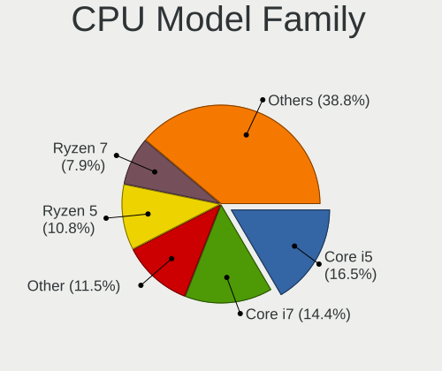

| Model                | Computers | Percent |
|----------------------|-----------|---------|
| Intel Core i5        | 23        | 16.55%  |
| Intel Core i7        | 20        | 14.39%  |
| Other                | 16        | 11.51%  |
| AMD Ryzen 5          | 15        | 10.79%  |
| AMD Ryzen 7          | 11        | 7.91%   |
| AMD Ryzen 9          | 8         | 5.76%   |
| Intel Xeon           | 7         | 5.04%   |
| Intel Core 2 Duo     | 5         | 3.6%    |
| Intel Pentium        | 4         | 2.88%   |
| AMD FX               | 4         | 2.88%   |
| Intel Core i3        | 3         | 2.16%   |
| AMD Ryzen 3          | 3         | 2.16%   |
| Intel Core i9        | 2         | 1.44%   |
| Intel Celeron        | 2         | 1.44%   |
| Intel Atom           | 2         | 1.44%   |
| AMD Ryzen 7 PRO      | 2         | 1.44%   |
| AMD Athlon II X2     | 2         | 1.44%   |
| Intel Pentium Silver | 1         | 0.72%   |
| Intel Pentium Dual   | 1         | 0.72%   |
| Intel Core 2         | 1         | 0.72%   |
| Intel Core           | 1         | 0.72%   |
| AMD Ryzen 3 PRO      | 1         | 0.72%   |
| AMD G                | 1         | 0.72%   |
| AMD EPYC             | 1         | 0.72%   |
| AMD E1               | 1         | 0.72%   |
| AMD Athlon           | 1         | 0.72%   |
| AMD A8               | 1         | 0.72%   |

CPU Cores
---------

Number of processor cores

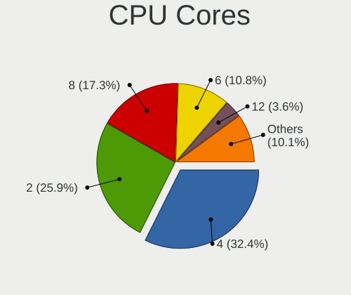

| Number | Computers | Percent |
|--------|-----------|---------|
| 4      | 45        | 32.37%  |
| 2      | 36        | 25.9%   |
| 8      | 24        | 17.27%  |
| 6      | 15        | 10.79%  |
| 12     | 5         | 3.6%    |
| 16     | 4         | 2.88%   |
| 14     | 4         | 2.88%   |
| 10     | 4         | 2.88%   |
| 24     | 1         | 0.72%   |
| 3      | 1         | 0.72%   |

CPU Sockets
-----------

Number of sockets

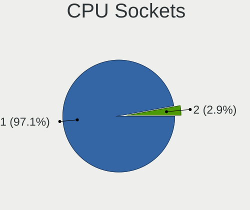

| Number | Computers | Percent |
|--------|-----------|---------|
| 1      | 134       | 97.1%   |
| 2      | 4         | 2.9%    |

CPU Threads
-----------

Threads per core (Hyper-Threading)

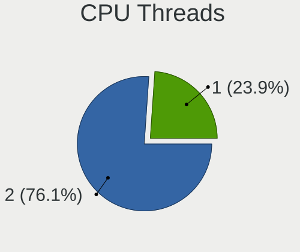

| Number | Computers | Percent |
|--------|-----------|---------|
| 2      | 105       | 76.09%  |
| 1      | 33        | 23.91%  |

CPU Op-Modes
------------

CPU Operation Modes (32-bit, 64-bit)

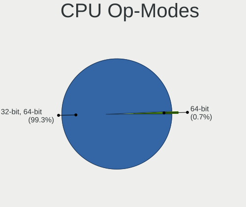

| Op mode        | Computers | Percent |
|----------------|-----------|---------|
| 32-bit, 64-bit | 137       | 99.28%  |
| 64-bit         | 1         | 0.72%   |

CPU Microcode
-------------

Microcode number

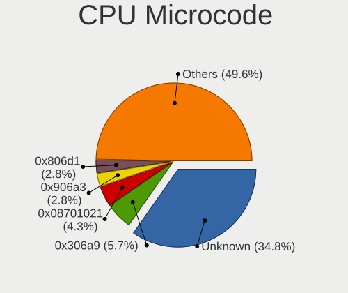

| Number     | Computers | Percent |
|------------|-----------|---------|
| Unknown    | 49        | 34.75%  |
| 0x306a9    | 8         | 5.67%   |
| 0x08701021 | 6         | 4.26%   |
| 0x906a3    | 4         | 2.84%   |
| 0x806d1    | 4         | 2.84%   |
| 0x20655    | 4         | 2.84%   |
| 0x08108109 | 4         | 2.84%   |
| 0x806c1    | 3         | 2.13%   |
| 0x306f2    | 3         | 2.13%   |
| 0x306c3    | 3         | 2.13%   |
| 0x906ea    | 2         | 1.42%   |
| 0x806ea    | 2         | 1.42%   |
| 0x406e3    | 2         | 1.42%   |
| 0x406c4    | 2         | 1.42%   |
| 0x206a7    | 2         | 1.42%   |
| 0x1067a    | 2         | 1.42%   |
| 0x0a50000c | 2         | 1.42%   |
| 0x0a201016 | 2         | 1.42%   |
| 0x08600106 | 2         | 1.42%   |
| 0x0810100b | 2         | 1.42%   |
| 0xa0671    | 1         | 0.71%   |
| 0xa0653    | 1         | 0.71%   |
| 0xa0652    | 1         | 0.71%   |
| 0x906ed    | 1         | 0.71%   |
| 0x906e9    | 1         | 0.71%   |
| 0x906c0    | 1         | 0.71%   |
| 0x906a4    | 1         | 0.71%   |
| 0x806ec    | 1         | 0.71%   |
| 0x6fd      | 1         | 0.71%   |
| 0x6fb      | 1         | 0.71%   |
| 0x6fa      | 1         | 0.71%   |
| 0x6f6      | 1         | 0.71%   |
| 0x506e3    | 1         | 0.71%   |
| 0x40661    | 1         | 0.71%   |
| 0x306e4    | 1         | 0.71%   |
| 0x306d4    | 1         | 0.71%   |
| 0x30678    | 1         | 0.71%   |
| 0x206c2    | 1         | 0.71%   |
| 0x106c2    | 1         | 0.71%   |
| 0x0a20120a | 1         | 0.71%   |

CPU Microarch
-------------

Microarchitecture

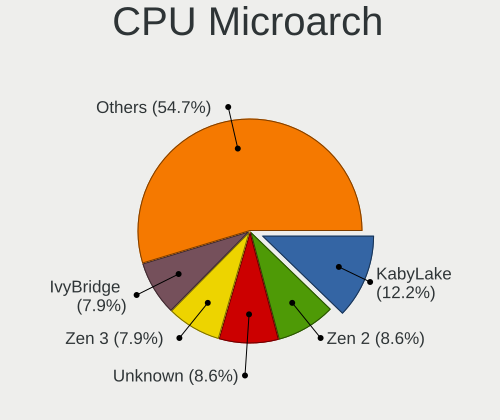

| Name             | Computers | Percent |
|------------------|-----------|---------|
| KabyLake         | 17        | 12.23%  |
| Zen 2            | 12        | 8.63%   |
| Unknown          | 12        | 8.63%   |
| Zen 3            | 11        | 7.91%   |
| IvyBridge        | 11        | 7.91%   |
| Zen+             | 8         | 5.76%   |
| Haswell          | 8         | 5.76%   |
| Westmere         | 7         | 5.04%   |
| Core             | 6         | 4.32%   |
| Skylake          | 5         | 3.6%    |
| Icelake          | 5         | 3.6%    |
| Alderlake Hybrid | 5         | 3.6%    |
| Zen              | 4         | 2.88%   |
| SandyBridge      | 4         | 2.88%   |
| TigerLake        | 3         | 2.16%   |
| Silvermont       | 3         | 2.16%   |
| Penryn           | 3         | 2.16%   |
| CometLake        | 3         | 2.16%   |
| Piledriver       | 2         | 1.44%   |
| K10              | 2         | 1.44%   |
| Bulldozer        | 2         | 1.44%   |
| Tremont          | 1         | 0.72%   |
| Puma             | 1         | 0.72%   |
| Jaguar           | 1         | 0.72%   |
| Broadwell        | 1         | 0.72%   |
| Bonnell          | 1         | 0.72%   |
| Bobcat           | 1         | 0.72%   |

Graphics
--------

GPU Vendor
----------

Vendors of graphics cards

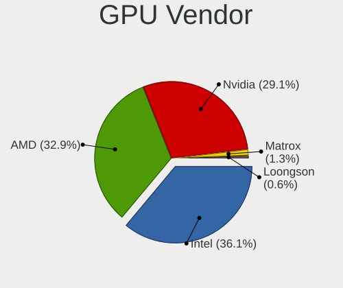

| Vendor                     | Computers | Percent |
|----------------------------|-----------|---------|
| Intel                      | 57        | 36.08%  |
| AMD                        | 52        | 32.91%  |
| Nvidia                     | 46        | 29.11%  |
| Matrox Electronics Systems | 2         | 1.27%   |
| Loongson Technology        | 1         | 0.63%   |

GPU Model
---------

Graphics card models

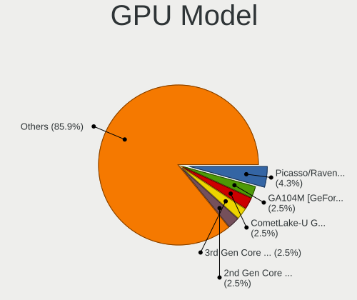

| Model                                                                                    | Computers | Percent |
|------------------------------------------------------------------------------------------|-----------|---------|
| AMD Picasso/Raven 2 [Radeon Vega Series / Radeon Vega Mobile Series]                     | 7         | 4.29%   |
| Nvidia GA104M [GeForce RTX 3070 Mobile / Max-Q]                                          | 4         | 2.45%   |
| Intel CometLake-U GT2 [UHD Graphics]                                                     | 4         | 2.45%   |
| Intel 3rd Gen Core processor Graphics Controller                                         | 4         | 2.45%   |
| Intel 2nd Generation Core Processor Family Integrated Graphics Controller                | 4         | 2.45%   |
| AMD Ellesmere [Radeon RX 470/480/570/570X/580/580X/590]                                  | 4         | 2.45%   |
| Nvidia GA107M [GeForce RTX 3050 Ti Mobile]                                               | 3         | 1.84%   |
| Intel Xeon E3-1200 v3/4th Gen Core Processor Integrated Graphics Controller              | 3         | 1.84%   |
| Intel TigerLake-LP GT2 [Iris Xe Graphics]                                                | 3         | 1.84%   |
| Intel TigerLake-H GT1 [UHD Graphics]                                                     | 3         | 1.84%   |
| Intel Skylake-U GT2 [HD Graphics 520]                                                    | 3         | 1.84%   |
| Intel Core Processor Integrated Graphics Controller                                      | 3         | 1.84%   |
| Intel Alder Lake-P GT2 [Iris Xe Graphics]                                                | 3         | 1.84%   |
| AMD Renoir [Radeon Vega Series / Radeon Vega Mobile Series]                              | 3         | 1.84%   |
| AMD Raven Ridge [Radeon Vega Series / Radeon Vega Mobile Series]                         | 3         | 1.84%   |
| AMD Raphael                                                                              | 3         | 1.84%   |
| AMD Navi 21 [Radeon RX 6800/6800 XT / 6900 XT]                                           | 3         | 1.84%   |
| AMD Cezanne [Radeon Vega Series / Radeon Vega Mobile Series]                             | 3         | 1.84%   |
| AMD Barcelo                                                                              | 3         | 1.84%   |
| Nvidia TU117M [GeForce GTX 1650 Ti Mobile]                                               | 2         | 1.23%   |
| Nvidia TU117M [GeForce GTX 1650 Mobile / Max-Q]                                          | 2         | 1.23%   |
| Nvidia GP106 [GeForce GTX 1060 6GB]                                                      | 2         | 1.23%   |
| Nvidia GP106 [GeForce GTX 1060 3GB]                                                      | 2         | 1.23%   |
| Nvidia GM107 [GeForce GTX 750 Ti]                                                        | 2         | 1.23%   |
| Nvidia GF108 [GeForce GT 630]                                                            | 2         | 1.23%   |
| Nvidia GA106M [GeForce RTX 3060 Mobile / Max-Q]                                          | 2         | 1.23%   |
| Nvidia C61 [GeForce 7025 / nForce 630a]                                                  | 2         | 1.23%   |
| Intel Kaby Lake-R GT2 [UHD Graphics 620]                                                 | 2         | 1.23%   |
| Intel CometLake-S GT2 [UHD Graphics 630]                                                 | 2         | 1.23%   |
| Intel Atom/Celeron/Pentium Processor x5-E8000/J3xxx/N3xxx Integrated Graphics Controller | 2         | 1.23%   |
| AMD Thames [Radeon HD 7550M/7570M/7650M]                                                 | 2         | 1.23%   |
| AMD Navi 32 [Radeon RX 7700 XT / 7800 XT]                                                | 2         | 1.23%   |
| AMD Navi 14 [Radeon RX 5500/5500M / Pro 5500M]                                           | 2         | 1.23%   |
| AMD Lucienne                                                                             | 2         | 1.23%   |
| Nvidia TU106M [GeForce RTX 2060 Max-Q]                                                   | 1         | 0.61%   |
| Nvidia TU106BM [GeForce RTX 2070 Mobile / Max-Q]                                         | 1         | 0.61%   |
| Nvidia GT218M [NVS 3100M]                                                                | 1         | 0.61%   |
| Nvidia GT218M [GeForce 310M]                                                             | 1         | 0.61%   |
| Nvidia GP107 [GeForce GTX 1050 Ti]                                                       | 1         | 0.61%   |
| Nvidia GP104 [GeForce GTX 1080]                                                          | 1         | 0.61%   |

GPU Combo
---------

Combinations of graphics cards

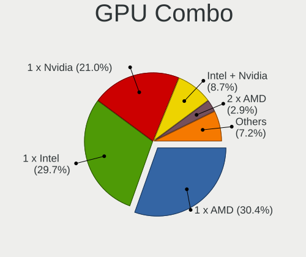

| Name                    | Computers | Percent |
|-------------------------|-----------|---------|
| 1 x AMD                 | 42        | 30.43%  |
| 1 x Intel               | 41        | 29.71%  |
| 1 x Nvidia              | 29        | 21.01%  |
| Intel + Nvidia          | 12        | 8.7%    |
| 2 x AMD                 | 4         | 2.9%    |
| AMD + Nvidia            | 4         | 2.9%    |
| 1 x Matrox              | 2         | 1.45%   |
| Intel + AMD             | 2         | 1.45%   |
| Other                   | 1         | 0.72%   |
| 1 x Loongson Technology | 1         | 0.72%   |

GPU Driver
----------

Free vs proprietary

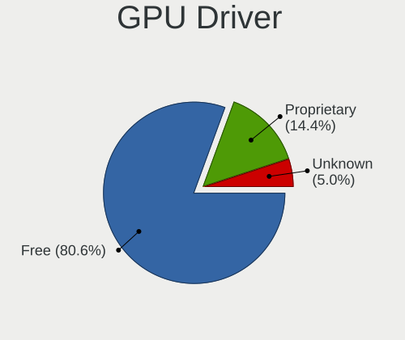

| Driver      | Computers | Percent |
|-------------|-----------|---------|
| Free        | 112       | 80.58%  |
| Proprietary | 20        | 14.39%  |
| Unknown     | 7         | 5.04%   |

GPU Memory
----------

Total video memory

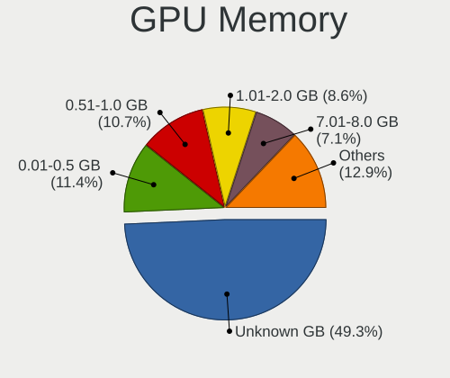

| Size in GB | Computers | Percent |
|------------|-----------|---------|
| Unknown    | 69        | 49.29%  |
| 0.01-0.5   | 16        | 11.43%  |
| 0.51-1.0   | 15        | 10.71%  |
| 1.01-2.0   | 12        | 8.57%   |
| 7.01-8.0   | 10        | 7.14%   |
| 3.01-4.0   | 7         | 5%      |
| 8.01-16.0  | 5         | 3.57%   |
| 5.01-6.0   | 4         | 2.86%   |
| 2.01-3.0   | 1         | 0.71%   |
| 16.01-24.0 | 1         | 0.71%   |

Monitor
-------

Monitor Vendor
--------------

Monitor vendors

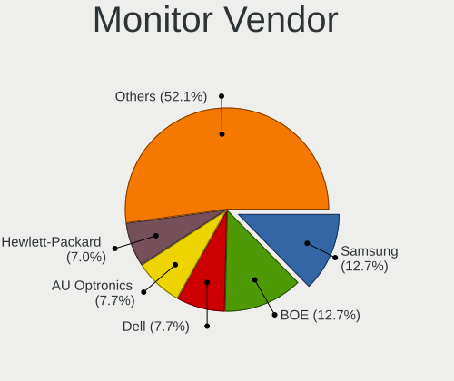

| Vendor                  | Computers | Percent |
|-------------------------|-----------|---------|
| Samsung Electronics     | 18        | 12.68%  |
| BOE                     | 18        | 12.68%  |
| Dell                    | 11        | 7.75%   |
| AU Optronics            | 11        | 7.75%   |
| Hewlett-Packard         | 10        | 7.04%   |
| Chimei Innolux          | 9         | 6.34%   |
| LG Display              | 8         | 5.63%   |
| Goldstar                | 7         | 4.93%   |
| BenQ                    | 7         | 4.93%   |
| Sharp                   | 4         | 2.82%   |
| Lenovo                  | 4         | 2.82%   |
| AOC                     | 3         | 2.11%   |
| Ancor Communications    | 3         | 2.11%   |
| Acer                    | 3         | 2.11%   |
| Apple                   | 2         | 1.41%   |
| Wacom                   | 1         | 0.7%    |
| ViewSonic               | 1         | 0.7%    |
| Valve                   | 1         | 0.7%    |
| UGD                     | 1         | 0.7%    |
| Toshiba                 | 1         | 0.7%    |
| TopView                 | 1         | 0.7%    |
| SZS                     | 1         | 0.7%    |
| Sony                    | 1         | 0.7%    |
| RTK                     | 1         | 0.7%    |
| Philips                 | 1         | 0.7%    |
| PANDA                   | 1         | 0.7%    |
| MSI                     | 1         | 0.7%    |
| IOD                     | 1         | 0.7%    |
| InnoLux Display         | 1         | 0.7%    |
| Iiyama                  | 1         | 0.7%    |
| IBM                     | 1         | 0.7%    |
| Hyundai ImageQuest      | 1         | 0.7%    |
| HKC                     | 1         | 0.7%    |
| Hitachi                 | 1         | 0.7%    |
| GDH                     | 1         | 0.7%    |
| CTC                     | 1         | 0.7%    |
| Chi Mei Optoelectronics | 1         | 0.7%    |
| ASUSTek Computer        | 1         | 0.7%    |
| Unknown                 | 1         | 0.7%    |

Monitor Model
-------------

Monitor models

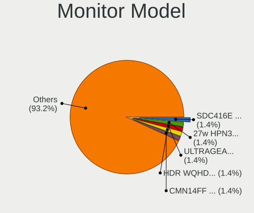

| Model                                                                 | Computers | Percent |
|-----------------------------------------------------------------------|-----------|---------|
| Samsung Electronics LCD Monitor SDC416E 2880x1620 344x194mm 15.5-inch | 2         | 1.37%   |
| Hewlett-Packard 27w HPN3494 1920x1080 598x336mm 27.0-inch             | 2         | 1.37%   |
| Goldstar ULTRAGEAR GSM7765 2560x1440 697x392mm 31.5-inch              | 2         | 1.37%   |
| Goldstar HDR WQHD GSM7756 3440x1440 820x346mm 35.0-inch               | 2         | 1.37%   |
| Chimei Innolux LCD Monitor CMN14FF 1920x1080 309x173mm 13.9-inch      | 2         | 1.37%   |
| Wacom Cintiq 22HDT WAC1037 1920x1080 476x268mm 21.5-inch              | 1         | 0.68%   |
| ViewSonic VX3276-FHD VSCE735 1920x1080 698x393mm 31.5-inch            | 1         | 0.68%   |
| Valve ANX7530 U VLV3001 800x1280 100x150mm 7.1-inch                   | 1         | 0.68%   |
| UGD Artist13.3pro UGD1302 1920x1080 290x160mm 13.0-inch               | 1         | 0.68%   |
| Toshiba TV TSB0108 1920x1080 698x393mm 31.5-inch                      | 1         | 0.68%   |
| TopView HDMI TOP0814 1600x900 430x270mm 20.0-inch                     | 1         | 0.68%   |
| SZS MR124A SZS1240 1920x1080 527x296mm 23.8-inch                      | 1         | 0.68%   |
| Sony TV SNY8102 1360x768                                              | 1         | 0.68%   |
| Sharp LQ173M1JW05 SHP14EC 1920x1080 382x215mm 17.3-inch               | 1         | 0.68%   |
| Sharp LQ156M1JW01 SHP14C3 1920x1080 344x194mm 15.5-inch               | 1         | 0.68%   |
| Sharp LCD Monitor SHP14C4 1920x1080 344x194mm 15.5-inch               | 1         | 0.68%   |
| Sharp LCD Monitor SHP1484 1920x1080 294x165mm 13.3-inch               | 1         | 0.68%   |
| Samsung Electronics U32J59x SAM0F35 3840x2160 697x392mm 31.5-inch     | 1         | 0.68%   |
| Samsung Electronics SyncMaster SAM04DF 1360x768 410x230mm 18.5-inch   | 1         | 0.68%   |
| Samsung Electronics SyncMaster SAM03F2 1680x1050                      | 1         | 0.68%   |
| Samsung Electronics SyncMaster SAM03F0 1680x1050 433x271mm 20.1-inch  | 1         | 0.68%   |
| Samsung Electronics SyncMaster SAM0248 1280x1024 376x301mm 19.0-inch  | 1         | 0.68%   |
| Samsung Electronics SyncMaster SAM01AD 1600x1200 408x306mm 20.1-inch  | 1         | 0.68%   |
| Samsung Electronics SMS27A650 SAM082D 1920x1080 598x336mm 27.0-inch   | 1         | 0.68%   |
| Samsung Electronics SMS19A100 SAM0867 1366x768 410x230mm 18.5-inch    | 1         | 0.68%   |
| Samsung Electronics SMEX2220 SAM0686 1920x1080 477x268mm 21.5-inch    | 1         | 0.68%   |
| Samsung Electronics SM2333T SAM0736 1920x1080 477x268mm 21.5-inch     | 1         | 0.68%   |
| Samsung Electronics S23B350 SAM08D6 1920x1080 510x287mm 23.0-inch     | 1         | 0.68%   |
| Samsung Electronics S22D300 SAM0B3E 1920x1080 477x268mm 21.5-inch     | 1         | 0.68%   |
| Samsung Electronics LF24T35 SAM707D 1920x1080 528x297mm 23.9-inch     | 1         | 0.68%   |
| Samsung Electronics LCD Monitor U28D590 3840x2160                     | 1         | 0.68%   |
| Samsung Electronics LCD Monitor SEC4251 1366x768 344x194mm 15.5-inch  | 1         | 0.68%   |
| Samsung Electronics LCD Monitor SEC324C 1600x900 310x174mm 14.0-inch  | 1         | 0.68%   |
| Samsung Electronics LCD Monitor SEC3152 1366x768 344x194mm 15.5-inch  | 1         | 0.68%   |
| Samsung Electronics LCD Monitor SAM0FF0 3840x2160 950x540mm 43.0-inch | 1         | 0.68%   |
| Samsung Electronics LC27RG50 SAM100A 1920x1080 532x304mm 24.1-inch    | 1         | 0.68%   |
| Samsung Electronics LC27G5xT SAM707A 2560x1440 597x336mm 27.0-inch    | 1         | 0.68%   |
| RTK LCD Monitor RTK1D1A 1920x1080 1020x570mm 46.0-inch                | 1         | 0.68%   |
| Philips PHL 273V5 PHLC0D2 1920x1080 598x336mm 27.0-inch               | 1         | 0.68%   |
| PANDA LCD Monitor NCP0050 1920x1080 309x174mm 14.0-inch               | 1         | 0.68%   |

Monitor Resolution
------------------

Monitor screen resolution

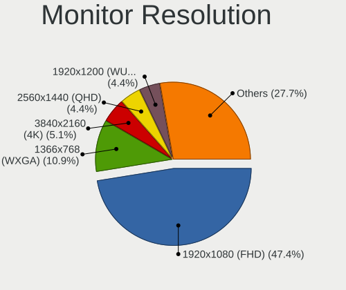

| Resolution         | Computers | Percent |
|--------------------|-----------|---------|
| 1920x1080 (FHD)    | 65        | 47.45%  |
| 1366x768 (WXGA)    | 15        | 10.95%  |
| 3840x2160 (4K)     | 7         | 5.11%   |
| 2560x1440 (QHD)    | 6         | 4.38%   |
| 1920x1200 (WUXGA)  | 6         | 4.38%   |
| 1680x1050 (WSXGA+) | 6         | 4.38%   |
| 1280x1024 (SXGA)   | 6         | 4.38%   |
| 3440x1440          | 4         | 2.92%   |
| 1600x900 (HD+)     | 3         | 2.19%   |
| 1280x800 (WXGA)    | 3         | 2.19%   |
| 2880x1620          | 2         | 1.46%   |
| 1920x540           | 2         | 1.46%   |
| 1440x900 (WXGA+)   | 2         | 1.46%   |
| 1360x768           | 2         | 1.46%   |
| 800x1280           | 1         | 0.73%   |
| 3200x1080          | 1         | 0.73%   |
| 2256x1504          | 1         | 0.73%   |
| 2160x1440          | 1         | 0.73%   |
| 1920x1280          | 1         | 0.73%   |
| 1600x1200          | 1         | 0.73%   |
| 1024x768 (XGA)     | 1         | 0.73%   |
| Unknown            | 1         | 0.73%   |

Monitor Diagonal
----------------

Diagonal size in inches

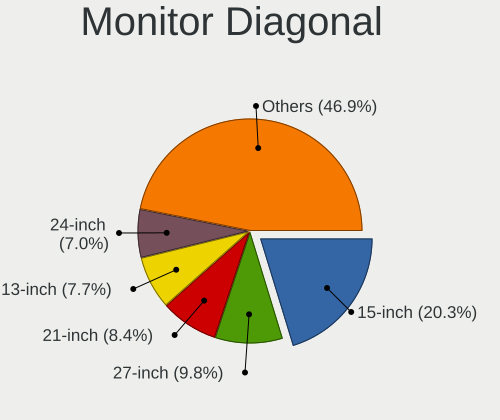

| Inches  | Computers | Percent |
|---------|-----------|---------|
| 15      | 29        | 20.28%  |
| 27      | 14        | 9.79%   |
| 21      | 12        | 8.39%   |
| 13      | 11        | 7.69%   |
| 24      | 10        | 6.99%   |
| 14      | 10        | 6.99%   |
| 17      | 8         | 5.59%   |
| 31      | 5         | 3.5%    |
| 23      | 5         | 3.5%    |
| 16      | 5         | 3.5%    |
| 22      | 4         | 2.8%    |
| 20      | 4         | 2.8%    |
| 12      | 4         | 2.8%    |
| 19      | 3         | 2.1%    |
| 18      | 3         | 2.1%    |
| Unknown | 3         | 2.1%    |
| 72      | 2         | 1.4%    |
| 35      | 2         | 1.4%    |
| 34      | 2         | 1.4%    |
| 84      | 1         | 0.7%    |
| 52      | 1         | 0.7%    |
| 48      | 1         | 0.7%    |
| 46      | 1         | 0.7%    |
| 11      | 1         | 0.7%    |
| 10      | 1         | 0.7%    |
| 7       | 1         | 0.7%    |

Monitor Width
-------------

Physical width

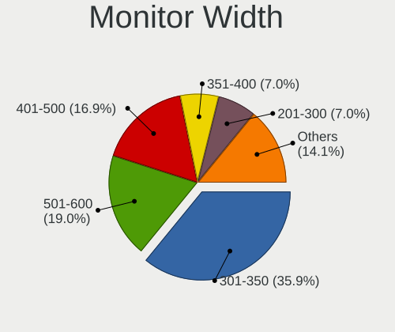

| Width in mm | Computers | Percent |
|-------------|-----------|---------|
| 301-350     | 51        | 35.92%  |
| 501-600     | 27        | 19.01%  |
| 401-500     | 24        | 16.9%   |
| 351-400     | 10        | 7.04%   |
| 201-300     | 10        | 7.04%   |
| 601-700     | 6         | 4.23%   |
| 1501-2000   | 3         | 2.11%   |
| 1001-1500   | 3         | 2.11%   |
| Unknown     | 3         | 2.11%   |
| 801-900     | 2         | 1.41%   |
| 701-800     | 2         | 1.41%   |
| 1-100       | 1         | 0.7%    |

Aspect Ratio
------------

Proportional relationship between the width and the height

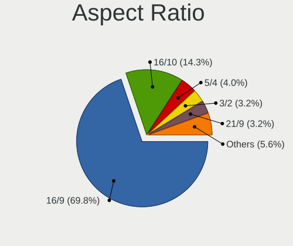

| Ratio   | Computers | Percent |
|---------|-----------|---------|
| 16/9    | 88        | 69.84%  |
| 16/10   | 18        | 14.29%  |
| 5/4     | 5         | 3.97%   |
| 3/2     | 4         | 3.17%   |
| 21/9    | 4         | 3.17%   |
| 4/3     | 3         | 2.38%   |
| Unknown | 2         | 1.59%   |
| 1.96    | 1         | 0.79%   |
| 0.67    | 1         | 0.79%   |

Monitor Area
------------

Area in inch²

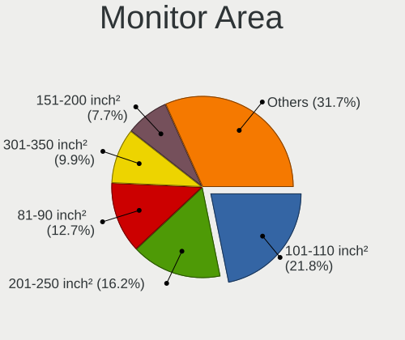

| Area in inch² | Computers | Percent |
|----------------|-----------|---------|
| 101-110        | 31        | 21.83%  |
| 201-250        | 23        | 16.2%   |
| 81-90          | 18        | 12.68%  |
| 301-350        | 14        | 9.86%   |
| 151-200        | 11        | 7.75%   |
| 351-500        | 9         | 6.34%   |
| 141-150        | 5         | 3.52%   |
| 121-130        | 5         | 3.52%   |
| More than 1000 | 4         | 2.82%   |
| 71-80          | 4         | 2.82%   |
| 251-300        | 4         | 2.82%   |
| 61-70          | 3         | 2.11%   |
| 111-120        | 3         | 2.11%   |
| Unknown        | 3         | 2.11%   |
| 51-60          | 2         | 1.41%   |
| 501-1000       | 2         | 1.41%   |
| 1-40           | 1         | 0.7%    |

Pixel Density
-------------

Pixels per inch

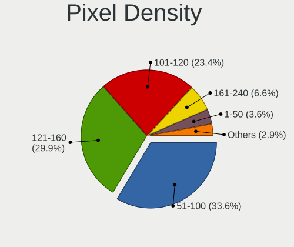

| Density       | Computers | Percent |
|---------------|-----------|---------|
| 51-100        | 46        | 33.58%  |
| 121-160       | 41        | 29.93%  |
| 101-120       | 32        | 23.36%  |
| 161-240       | 9         | 6.57%   |
| 1-50          | 5         | 3.65%   |
| Unknown       | 3         | 2.19%   |
| More than 240 | 1         | 0.73%   |

Multiple Monitors
-----------------

Total monitors connected

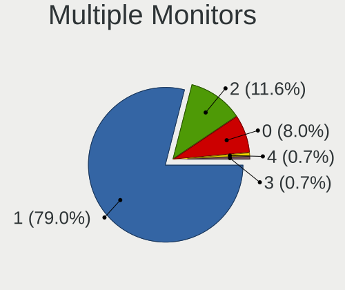

| Total | Computers | Percent |
|-------|-----------|---------|
| 1     | 109       | 78.99%  |
| 2     | 16        | 11.59%  |
| 0     | 11        | 7.97%   |
| 4     | 1         | 0.72%   |
| 3     | 1         | 0.72%   |

Network
-------

Net Controller Vendor
---------------------

Controller vendors

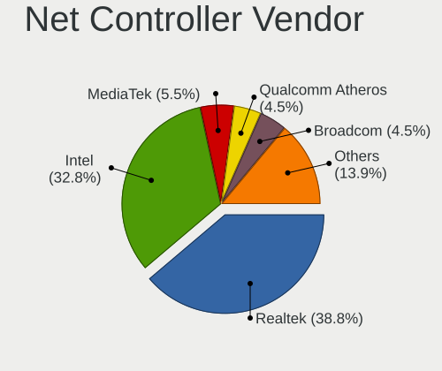

| Vendor                          | Computers | Percent |
|---------------------------------|-----------|---------|
| Realtek Semiconductor           | 78        | 38.81%  |
| Intel                           | 66        | 32.84%  |
| MediaTek                        | 11        | 5.47%   |
| Qualcomm Atheros                | 9         | 4.48%   |
| Broadcom                        | 9         | 4.48%   |
| Ralink Technology               | 5         | 2.49%   |
| Broadcom Limited                | 4         | 1.99%   |
| ASIX Electronics                | 4         | 1.99%   |
| Nvidia                          | 3         | 1.49%   |
| TP-Link                         | 2         | 1%      |
| Qualcomm                        | 2         | 1%      |
| Sitecom Europe                  | 1         | 0.5%    |
| Shenzhen Goodix Technology      | 1         | 0.5%    |
| Ralink                          | 1         | 0.5%    |
| Qualcomm Atheros Communications | 1         | 0.5%    |
| Marvell Technology Group        | 1         | 0.5%    |
| Huawei Technologies             | 1         | 0.5%    |
| Hewlett-Packard                 | 1         | 0.5%    |
| Dell                            | 1         | 0.5%    |

Net Controller Model
--------------------

Controller models

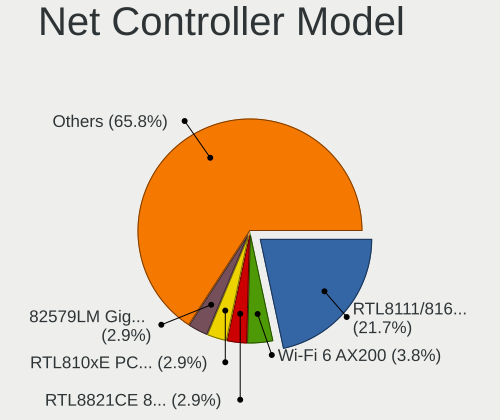

| Model                                                                  | Computers | Percent |
|------------------------------------------------------------------------|-----------|---------|
| Realtek RTL8111/8168/8211/8411 PCI Express Gigabit Ethernet Controller | 52        | 21.67%  |
| Intel Wi-Fi 6 AX200                                                    | 9         | 3.75%   |
| Realtek RTL8821CE 802.11ac PCIe Wireless Network Adapter               | 7         | 2.92%   |
| Realtek RTL810xE PCI Express Fast Ethernet controller                  | 7         | 2.92%   |
| Intel 82579LM Gigabit Network Connection (Lewisville)                  | 7         | 2.92%   |
| Realtek RTL8125 2.5GbE Controller                                      | 6         | 2.5%    |
| MediaTek MT7922 802.11ax PCI Express Wireless Network Adapter          | 5         | 2.08%   |
| Intel Wi-Fi 6E(802.11ax) AX210/AX1675* 2x2 [Typhoon Peak]              | 5         | 2.08%   |
| Realtek RTL8153 Gigabit Ethernet Adapter                               | 4         | 1.67%   |
| MediaTek MT7921 802.11ax PCIe Wireless Network Adapter [Filogic 330]   | 4         | 1.67%   |
| Intel Wireless 8265 / 8275                                             | 4         | 1.67%   |
| Intel Ethernet Controller I225-V                                       | 4         | 1.67%   |
| Intel Centrino Advanced-N 6205 [Taylor Peak]                           | 4         | 1.67%   |
| Realtek RTL8822CE 802.11ac PCIe Wireless Network Adapter               | 3         | 1.25%   |
| Ralink MT7601U Wireless Adapter                                        | 3         | 1.25%   |
| Intel Wireless 8260                                                    | 3         | 1.25%   |
| Intel 82577LM Gigabit Network Connection                               | 3         | 1.25%   |
| ASIX AX88179 Gigabit Ethernet                                          | 3         | 1.25%   |
| Realtek RTL8188CUS 802.11n WLAN Adapter                                | 2         | 0.83%   |
| Realtek Killer E3000 2.5GbE Controller                                 | 2         | 0.83%   |
| Qualcomm Atheros Killer E220x Gigabit Ethernet Controller              | 2         | 0.83%   |
| Nvidia MCP61 Ethernet                                                  | 2         | 0.83%   |
| MediaTek MT7921K (RZ608) Wi-Fi 6E 80MHz                                | 2         | 0.83%   |
| Intel Wi-Fi 6 AX201                                                    | 2         | 0.83%   |
| Intel Tiger Lake PCH CNVi WiFi                                         | 2         | 0.83%   |
| Intel I350 Gigabit Network Connection                                  | 2         | 0.83%   |
| Intel I211 Gigabit Network Connection                                  | 2         | 0.83%   |
| Intel Ethernet Connection I219-LM                                      | 2         | 0.83%   |
| Intel Ethernet Connection (7) I219-V                                   | 2         | 0.83%   |
| Intel Ethernet Connection (4) I219-LM                                  | 2         | 0.83%   |
| Intel Ethernet Connection (2) I219-V                                   | 2         | 0.83%   |
| Intel Dual Band Wireless-AC 3168NGW [Stone Peak]                       | 2         | 0.83%   |
| Intel Comet Lake PCH-LP CNVi WiFi                                      | 2         | 0.83%   |
| Intel Centrino Ultimate-N 6300                                         | 2         | 0.83%   |
| Intel Cannon Lake PCH CNVi WiFi                                        | 2         | 0.83%   |
| Intel Alder Lake-P PCH CNVi WiFi                                       | 2         | 0.83%   |
| Intel 82567LM-3 Gigabit Network Connection                             | 2         | 0.83%   |
| Broadcom NetXtreme BCM57766 Gigabit Ethernet PCIe                      | 2         | 0.83%   |
| Broadcom NetXtreme BCM5752 Gigabit Ethernet PCI Express                | 2         | 0.83%   |
| Broadcom NetLink BCM57781 Gigabit Ethernet PCIe                        | 2         | 0.83%   |

Wireless Vendor
---------------

Wireless vendors

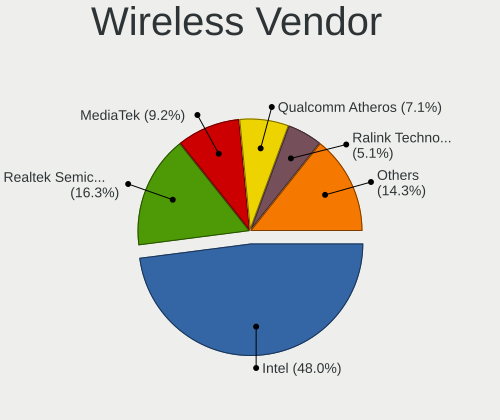

| Vendor                          | Computers | Percent |
|---------------------------------|-----------|---------|
| Intel                           | 47        | 47.96%  |
| Realtek Semiconductor           | 16        | 16.33%  |
| MediaTek                        | 9         | 9.18%   |
| Qualcomm Atheros                | 7         | 7.14%   |
| Ralink Technology               | 5         | 5.1%    |
| Broadcom                        | 4         | 4.08%   |
| Broadcom Limited                | 3         | 3.06%   |
| TP-Link                         | 2         | 2.04%   |
| Sitecom Europe                  | 1         | 1.02%   |
| Ralink                          | 1         | 1.02%   |
| Qualcomm Atheros Communications | 1         | 1.02%   |
| Qualcomm                        | 1         | 1.02%   |
| Dell                            | 1         | 1.02%   |

Wireless Model
--------------

Wireless models

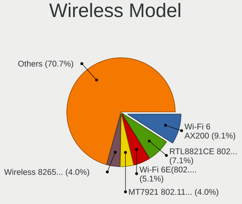

| Model                                                                         | Computers | Percent |
|-------------------------------------------------------------------------------|-----------|---------|
| Intel Wi-Fi 6 AX200                                                           | 9         | 9.09%   |
| Realtek RTL8821CE 802.11ac PCIe Wireless Network Adapter                      | 7         | 7.07%   |
| Intel Wi-Fi 6E(802.11ax) AX210/AX1675* 2x2 [Typhoon Peak]                     | 5         | 5.05%   |
| MediaTek MT7921 802.11ax PCIe Wireless Network Adapter [Filogic 330]          | 4         | 4.04%   |
| Intel Wireless 8265 / 8275                                                    | 4         | 4.04%   |
| Intel Centrino Advanced-N 6205 [Taylor Peak]                                  | 4         | 4.04%   |
| Realtek RTL8822CE 802.11ac PCIe Wireless Network Adapter                      | 3         | 3.03%   |
| Ralink MT7601U Wireless Adapter                                               | 3         | 3.03%   |
| MediaTek MT7922 802.11ax PCI Express Wireless Network Adapter                 | 3         | 3.03%   |
| Intel Wireless 8260                                                           | 3         | 3.03%   |
| Realtek RTL8188CUS 802.11n WLAN Adapter                                       | 2         | 2.02%   |
| MediaTek MT7921K (RZ608) Wi-Fi 6E 80MHz                                       | 2         | 2.02%   |
| Intel Wi-Fi 6 AX201                                                           | 2         | 2.02%   |
| Intel Tiger Lake PCH CNVi WiFi                                                | 2         | 2.02%   |
| Intel Dual Band Wireless-AC 3168NGW [Stone Peak]                              | 2         | 2.02%   |
| Intel Comet Lake PCH-LP CNVi WiFi                                             | 2         | 2.02%   |
| Intel Centrino Ultimate-N 6300                                                | 2         | 2.02%   |
| Intel Cannon Lake PCH CNVi WiFi                                               | 2         | 2.02%   |
| Broadcom Limited BCM43228 802.11a/b/g/n                                       | 2         | 2.02%   |
| TP-Link TL-WN823N v2/v3 [Realtek RTL8192EU]                                   | 1         | 1.01%   |
| TP-Link 802.11ac NIC                                                          | 1         | 1.01%   |
| Sitecom Europe WL-113 rev 2 Wireless Network USB Adapter                      | 1         | 1.01%   |
| Realtek RTL88x2bu [AC1200 Techkey]                                            | 1         | 1.01%   |
| Realtek RTL8723DE Wireless Network Adapter                                    | 1         | 1.01%   |
| Realtek RTL8723BE PCIe Wireless Network Adapter                               | 1         | 1.01%   |
| Realtek RTL8191SEvB Wireless LAN Controller                                   | 1         | 1.01%   |
| Realtek RTL8188CE 802.11b/g/n WiFi Adapter                                    | 1         | 1.01%   |
| Ralink RT5372 Wireless Adapter                                                | 1         | 1.01%   |
| Ralink RT2870/RT3070 Wireless Adapter                                         | 1         | 1.01%   |
| Ralink RT2790 Wireless 802.11n 1T/2R PCIe                                     | 1         | 1.01%   |
| Qualcomm QCNFA765 Wireless Network Adapter                                    | 1         | 1.01%   |
| Qualcomm Atheros QCA9377 802.11ac Wireless Network Adapter                    | 1         | 1.01%   |
| Qualcomm Atheros QCA6174 802.11ac Wireless Network Adapter                    | 1         | 1.01%   |
| Qualcomm Atheros TP-Link TL-WN821N v2 / TL-WN822N v1 802.11n [Atheros AR9170] | 1         | 1.01%   |
| Qualcomm Atheros AR9485 Wireless Network Adapter                              | 1         | 1.01%   |
| Qualcomm Atheros AR9462 Wireless Network Adapter                              | 1         | 1.01%   |
| Qualcomm Atheros AR93xx Wireless Network Adapter                              | 1         | 1.01%   |
| Qualcomm Atheros AR9287 Wireless Network Adapter (PCI-Express)                | 1         | 1.01%   |
| Qualcomm Atheros AR9227 Wireless Network Adapter                              | 1         | 1.01%   |
| Intel Wireless 7260                                                           | 1         | 1.01%   |

Ethernet Vendor
---------------

Ethernet vendors

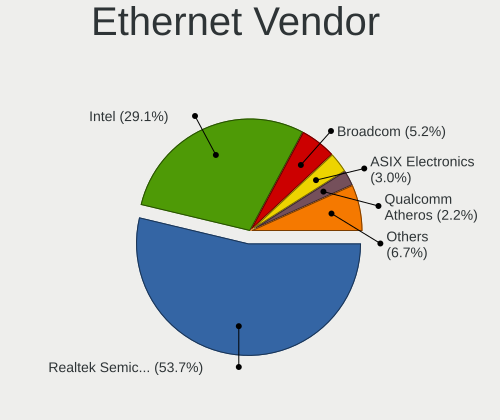

| Vendor                   | Computers | Percent |
|--------------------------|-----------|---------|
| Realtek Semiconductor    | 72        | 53.73%  |
| Intel                    | 39        | 29.1%   |
| Broadcom                 | 7         | 5.22%   |
| ASIX Electronics         | 4         | 2.99%   |
| Qualcomm Atheros         | 3         | 2.24%   |
| Nvidia                   | 3         | 2.24%   |
| MediaTek                 | 2         | 1.49%   |
| Qualcomm                 | 1         | 0.75%   |
| Marvell Technology Group | 1         | 0.75%   |
| Huawei Technologies      | 1         | 0.75%   |
| Broadcom Limited         | 1         | 0.75%   |

Ethernet Model
--------------

Ethernet models

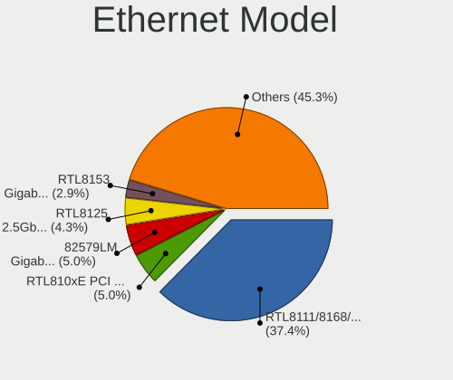

| Model                                                                  | Computers | Percent |
|------------------------------------------------------------------------|-----------|---------|
| Realtek RTL8111/8168/8211/8411 PCI Express Gigabit Ethernet Controller | 52        | 37.41%  |
| Realtek RTL810xE PCI Express Fast Ethernet controller                  | 7         | 5.04%   |
| Intel 82579LM Gigabit Network Connection (Lewisville)                  | 7         | 5.04%   |
| Realtek RTL8125 2.5GbE Controller                                      | 6         | 4.32%   |
| Realtek RTL8153 Gigabit Ethernet Adapter                               | 4         | 2.88%   |
| Intel Ethernet Controller I225-V                                       | 4         | 2.88%   |
| Intel 82577LM Gigabit Network Connection                               | 3         | 2.16%   |
| ASIX AX88179 Gigabit Ethernet                                          | 3         | 2.16%   |
| Realtek Killer E3000 2.5GbE Controller                                 | 2         | 1.44%   |
| Qualcomm Atheros Killer E220x Gigabit Ethernet Controller              | 2         | 1.44%   |
| Nvidia MCP61 Ethernet                                                  | 2         | 1.44%   |
| MediaTek MT7922 802.11ax PCI Express Wireless Network Adapter          | 2         | 1.44%   |
| Intel I350 Gigabit Network Connection                                  | 2         | 1.44%   |
| Intel I211 Gigabit Network Connection                                  | 2         | 1.44%   |
| Intel Ethernet Connection I219-LM                                      | 2         | 1.44%   |
| Intel Ethernet Connection (7) I219-V                                   | 2         | 1.44%   |
| Intel Ethernet Connection (4) I219-LM                                  | 2         | 1.44%   |
| Intel Ethernet Connection (2) I219-V                                   | 2         | 1.44%   |
| Intel 82567LM-3 Gigabit Network Connection                             | 2         | 1.44%   |
| Broadcom NetXtreme BCM57766 Gigabit Ethernet PCIe                      | 2         | 1.44%   |
| Broadcom NetXtreme BCM5752 Gigabit Ethernet PCI Express                | 2         | 1.44%   |
| Broadcom NetLink BCM57781 Gigabit Ethernet PCIe                        | 2         | 1.44%   |
| Realtek USB 10/100/1G/2.5 LAN                                          | 1         | 0.72%   |
| Realtek RTL8852CE PCIe 802.11ax Wireless Network Controller            | 1         | 0.72%   |
| Realtek RTL-8100/8101L/8139 PCI Fast Ethernet Adapter                  | 1         | 0.72%   |
| Qualcomm Nokia X30 5G                                                  | 1         | 0.72%   |
| Qualcomm Atheros Killer E2500 Gigabit Ethernet Controller              | 1         | 0.72%   |
| Nvidia MCP79 Ethernet                                                  | 1         | 0.72%   |
| Marvell Group 88E8058 PCI-E Gigabit Ethernet Controller                | 1         | 0.72%   |
| Intel Ethernet Controller 10-Gigabit X540-AT2                          | 1         | 0.72%   |
| Intel Ethernet Connection (5) I219-V                                   | 1         | 0.72%   |
| Intel Ethernet Connection (2) I219-LM                                  | 1         | 0.72%   |
| Intel Ethernet Connection (2) I218-V                                   | 1         | 0.72%   |
| Intel Ethernet Connection (2) I218-LM                                  | 1         | 0.72%   |
| Intel Ethernet Connection (16) I219-LM                                 | 1         | 0.72%   |
| Intel Ethernet Connection (12) I219-V                                  | 1         | 0.72%   |
| Intel Ethernet Connection (11) I219-LM                                 | 1         | 0.72%   |
| Intel Alder Lake-P PCH CNVi WiFi                                       | 1         | 0.72%   |
| Intel 82576 Gigabit Network Connection                                 | 1         | 0.72%   |
| Intel 82574L Gigabit Network Connection                                | 1         | 0.72%   |

Net Controller Kind
-------------------

Ethernet, WiFi or modem

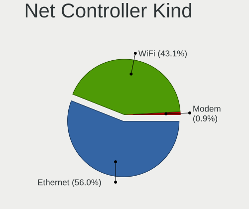

| Kind     | Computers | Percent |
|----------|-----------|---------|
| Ethernet | 126       | 56%     |
| WiFi     | 97        | 43.11%  |
| Modem    | 2         | 0.89%   |

Used Controller
---------------

Currently used network controller

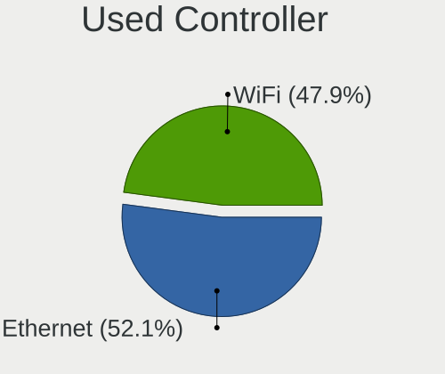

| Kind     | Computers | Percent |
|----------|-----------|---------|
| Ethernet | 75        | 52.08%  |
| WiFi     | 69        | 47.92%  |

NICs
----

Total network controllers on board

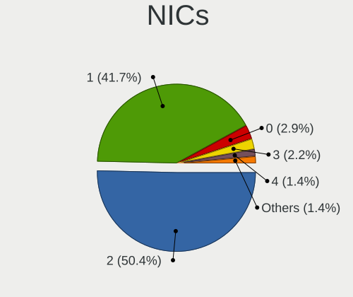

| Total | Computers | Percent |
|-------|-----------|---------|
| 2     | 70        | 50.36%  |
| 1     | 58        | 41.73%  |
| 0     | 4         | 2.88%   |
| 3     | 3         | 2.16%   |
| 4     | 2         | 1.44%   |
| 6     | 1         | 0.72%   |
| 5     | 1         | 0.72%   |

IPv6
----

IPv6 vs IPv4

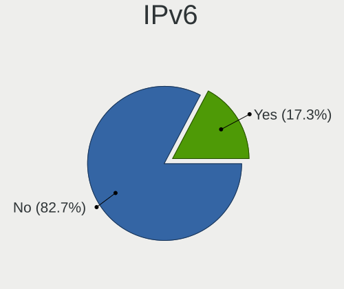

| Used | Computers | Percent |
|------|-----------|---------|
| No   | 115       | 82.73%  |
| Yes  | 24        | 17.27%  |

Bluetooth
---------

Bluetooth Vendor
----------------

Controller vendors

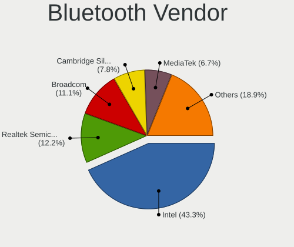

| Vendor                          | Computers | Percent |
|---------------------------------|-----------|---------|
| Intel                           | 39        | 43.33%  |
| Realtek Semiconductor           | 11        | 12.22%  |
| Broadcom                        | 10        | 11.11%  |
| Cambridge Silicon Radio         | 7         | 7.78%   |
| MediaTek                        | 6         | 6.67%   |
| IMC Networks                    | 6         | 6.67%   |
| Foxconn / Hon Hai               | 3         | 3.33%   |
| Apple                           | 3         | 3.33%   |
| Qualcomm Atheros Communications | 2         | 2.22%   |
| USI                             | 1         | 1.11%   |
| TP-Link                         | 1         | 1.11%   |
| Micro Star International        | 1         | 1.11%   |

Bluetooth Model
---------------

Controller models

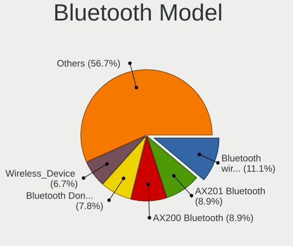

| Model                                                | Computers | Percent |
|------------------------------------------------------|-----------|---------|
| Intel Bluetooth wireless interface                   | 10        | 11.11%  |
| Intel AX201 Bluetooth                                | 8         | 8.89%   |
| Intel AX200 Bluetooth                                | 8         | 8.89%   |
| Cambridge Silicon Radio Bluetooth Dongle (HCI mode)  | 7         | 7.78%   |
| MediaTek Wireless_Device                             | 6         | 6.67%   |
| Realtek  Bluetooth 4.2 Adapter                       | 5         | 5.56%   |
| Realtek Bluetooth Radio                              | 5         | 5.56%   |
| Intel AX210 Bluetooth                                | 5         | 5.56%   |
| IMC Networks Wireless_Device                         | 5         | 5.56%   |
| Intel Bluetooth 9460/9560 Jefferson Peak (JfP)       | 3         | 3.33%   |
| Intel Wireless-AC 3168 Bluetooth                     | 2         | 2.22%   |
| Intel Bluetooth Device                               | 2         | 2.22%   |
| Broadcom BCM20702A0 Bluetooth 4.0                    | 2         | 2.22%   |
| Broadcom BCM20702 Bluetooth 4.0 [ThinkPad]           | 2         | 2.22%   |
| Broadcom BCM2045B (BDC-2) [Bluetooth Controller]     | 2         | 2.22%   |
| USI Bluetooth Device                                 | 1         | 1.11%   |
| TP-Link TP-T@- UB500 Adapter                         | 1         | 1.11%   |
| Realtek RTL8723B Bluetooth                           | 1         | 1.11%   |
| Qualcomm Atheros  Bluetooth Device                   | 1         | 1.11%   |
| Qualcomm Atheros Dell Wireless 1802 Bluetooth 4.0 LE | 1         | 1.11%   |
| Micro Star International Bluetooth Dongle            | 1         | 1.11%   |
| Intel Wireless-AC 9260 Bluetooth Adapter             | 1         | 1.11%   |
| IMC Networks Bluetooth Radio                         | 1         | 1.11%   |
| Foxconn / Hon Hai MediaTek Bluetooth Adapter         | 1         | 1.11%   |
| Foxconn / Hon Hai Bluetooth USB Host Controller      | 1         | 1.11%   |
| Foxconn / Hon Hai Bluetooth Device                   | 1         | 1.11%   |
| Broadcom HP Portable Valentine                       | 1         | 1.11%   |
| Broadcom HP Portable SoftSailing                     | 1         | 1.11%   |
| Broadcom BCM20702A0                                  | 1         | 1.11%   |
| Broadcom BCM2045B (BDC-2.1)                          | 1         | 1.11%   |
| Apple Bluetooth USB Host Controller                  | 1         | 1.11%   |
| Apple Bluetooth Host Controller                      | 1         | 1.11%   |
| Apple Bluetooth HCI MacBookPro (HID mode)            | 1         | 1.11%   |

Sound
-----

Sound Vendor
------------

Sound card vendors

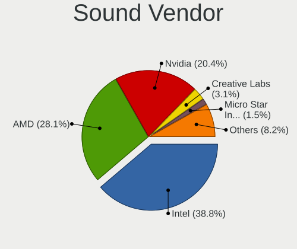

| Vendor                   | Computers | Percent |
|--------------------------|-----------|---------|
| Intel                    | 76        | 38.78%  |
| AMD                      | 55        | 28.06%  |
| Nvidia                   | 40        | 20.41%  |
| Creative Labs            | 6         | 3.06%   |
| Micro Star International | 3         | 1.53%   |
| C-Media Electronics      | 3         | 1.53%   |
| Texas Instruments        | 2         | 1.02%   |
| Kingston Technology      | 2         | 1.02%   |
| ASUSTek Computer         | 2         | 1.02%   |
| RME                      | 1         | 0.51%   |
| Loongson Technology      | 1         | 0.51%   |
| Jieli Technology         | 1         | 0.51%   |
| Holtek Semiconductor     | 1         | 0.51%   |
| Generalplus Technology   | 1         | 0.51%   |
| DSEA A/S                 | 1         | 0.51%   |
| AlfaPlus Semiconductor   | 1         | 0.51%   |

Sound Model
-----------

Sound card models

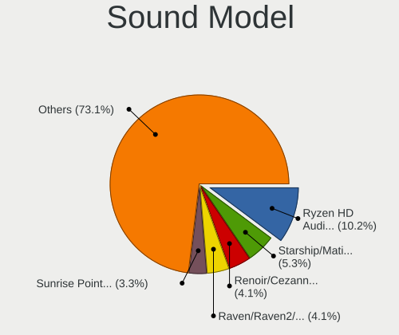

| Model                                                                                             | Computers | Percent |
|---------------------------------------------------------------------------------------------------|-----------|---------|
| AMD Ryzen HD Audio Controller                                                                     | 25        | 10.2%   |
| AMD Starship/Matisse HD Audio Controller                                                          | 13        | 5.31%   |
| AMD Renoir/Cezanne HDMI/DP Audio Controller                                                       | 10        | 4.08%   |
| AMD Raven/Raven2/Fenghuang HDMI/DP Audio Controller                                               | 10        | 4.08%   |
| Intel Sunrise Point-LP HD Audio                                                                   | 8         | 3.27%   |
| Intel 7 Series/C216 Chipset Family High Definition Audio Controller                               | 8         | 3.27%   |
| Intel 5 Series/3400 Series Chipset High Definition Audio                                          | 6         | 2.45%   |
| AMD Radeon High Definition Audio Controller                                                       | 6         | 2.45%   |
| Nvidia GA107 High Definition Audio Controller                                                     | 5         | 2.04%   |
| Intel Tiger Lake-H HD Audio Controller                                                            | 5         | 2.04%   |
| Intel Alder Lake PCH-P High Definition Audio Controller                                           | 5         | 2.04%   |
| Intel 6 Series/C200 Series Chipset Family High Definition Audio Controller                        | 5         | 2.04%   |
| Nvidia TU107 GeForce GTX 1650 High Definition Audio Controller                                    | 4         | 1.63%   |
| Nvidia GP106 High Definition Audio Controller                                                     | 4         | 1.63%   |
| Nvidia GA104 High Definition Audio Controller                                                     | 4         | 1.63%   |
| Intel Xeon E3-1200 v3/4th Gen Core Processor HD Audio Controller                                  | 4         | 1.63%   |
| Intel Comet Lake PCH-LP cAVS                                                                      | 4         | 1.63%   |
| Intel Cannon Lake PCH cAVS                                                                        | 4         | 1.63%   |
| Intel 8 Series/C220 Series Chipset High Definition Audio Controller                               | 4         | 1.63%   |
| AMD Navi 31 HDMI/DP Audio                                                                         | 4         | 1.63%   |
| AMD Navi 21/23 HDMI/DP Audio Controller                                                           | 4         | 1.63%   |
| AMD Ellesmere HDMI Audio [Radeon RX 470/480 / 570/580/590]                                        | 4         | 1.63%   |
| Nvidia MCP61 High Definition Audio                                                                | 3         | 1.22%   |
| Nvidia GM107 High Definition Audio Controller [GeForce 940MX]                                     | 3         | 1.22%   |
| Nvidia GF108 High Definition Audio Controller                                                     | 3         | 1.22%   |
| Micro Star International USB Audio                                                                | 3         | 1.22%   |
| Intel Tiger Lake-LP Smart Sound Technology Audio Controller                                       | 3         | 1.22%   |
| Intel 100 Series/C230 Series Chipset Family HD Audio Controller                                   | 3         | 1.22%   |
| Creative Labs CA0132 Sound Core3D [Sound Blaster Recon3D / Z-Series / Sound BlasterX AE-5 Plus]   | 3         | 1.22%   |
| AMD SBx00 Azalia (Intel HDA)                                                                      | 3         | 1.22%   |
| Nvidia TU106 High Definition Audio Controller                                                     | 2         | 0.82%   |
| Nvidia High Definition Audio Controller                                                           | 2         | 0.82%   |
| Nvidia GP104 High Definition Audio Controller                                                     | 2         | 0.82%   |
| Nvidia GA106 High Definition Audio Controller                                                     | 2         | 0.82%   |
| Nvidia GA102 High Definition Audio Controller                                                     | 2         | 0.82%   |
| Intel NM10/ICH7 Family High Definition Audio Controller                                           | 2         | 0.82%   |
| Intel Comet Lake PCH cAVS                                                                         | 2         | 0.82%   |
| Intel Atom/Celeron/Pentium Processor x5-E8000/J3xxx/N3xxx Series High Definition Audio Controller | 2         | 0.82%   |
| Intel 82801JD/DO (ICH10 Family) HD Audio Controller                                               | 2         | 0.82%   |
| Intel 82801H (ICH8 Family) HD Audio Controller                                                    | 2         | 0.82%   |

Memory
------

Memory Vendor
-------------

Memory module vendors

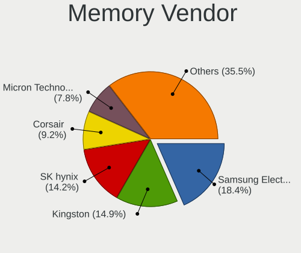

| Vendor              | Computers | Percent |
|---------------------|-----------|---------|
| Samsung Electronics | 26        | 18.44%  |
| Kingston            | 21        | 14.89%  |
| SK hynix            | 20        | 14.18%  |
| Corsair             | 13        | 9.22%   |
| Micron Technology   | 11        | 7.8%    |
| Crucial             | 10        | 7.09%   |
| Unknown             | 8         | 5.67%   |
| G.Skill             | 6         | 4.26%   |
| A-DATA Technology   | 4         | 2.84%   |
| Unknown             | 3         | 2.13%   |
| Team                | 2         | 1.42%   |
| Silicon Power       | 2         | 1.42%   |
| GOODRAM             | 2         | 1.42%   |
| AMD                 | 2         | 1.42%   |
| Transcend           | 1         | 0.71%   |
| Strontium           | 1         | 0.71%   |
| Smart               | 1         | 0.71%   |
| Patriot             | 1         | 0.71%   |
| Neo Forza           | 1         | 0.71%   |
| Nanya Technology    | 1         | 0.71%   |
| Innodisk            | 1         | 0.71%   |
| GLOWAY              | 1         | 0.71%   |
| Essencore Limited   | 1         | 0.71%   |
| Elpida              | 1         | 0.71%   |
| CXMT                | 1         | 0.71%   |

Memory Model
------------

Memory module models

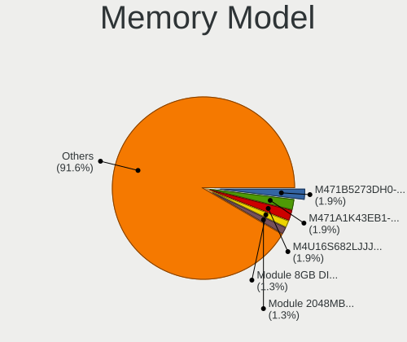

| Model                                                            | Computers | Percent |
|------------------------------------------------------------------|-----------|---------|
| Samsung RAM M471B5273DH0-CH9 4GB SODIMM DDR3 1600MT/s            | 3         | 1.94%   |
| Samsung RAM M471A1K43EB1-CWE 8GB SODIMM DDR4 3200MT/s            | 3         | 1.94%   |
| Unknown                                                          | 3         | 1.94%   |
| Unknown RAM Module 8GB DIMM DDR3 1333MT/s                        | 2         | 1.29%   |
| Unknown RAM Module 2048MB DIMM SDRAM                             | 2         | 1.29%   |
| SK hynix RAM H9JCNNNCP3MLYR-N6E 2GB Row Of Chips LPDDR5 6400MT/s | 2         | 1.29%   |
| Samsung RAM M471A5244CB0-CWE 4GB SODIMM DDR4 3200MT/s            | 2         | 1.29%   |
| Samsung RAM M471A1G44AB0-CWE 8GiB SODIMM DDR4 3200MT/s           | 2         | 1.29%   |
| Samsung RAM M425R1GB4BB0-CQKOL 8GB SODIMM DDR5 4800MT/s          | 2         | 1.29%   |
| Kingston RAM KF2666C15S4/16G 16GB SODIMM DDR4 2667MT/s           | 2         | 1.29%   |
| Corsair RAM CMSX32GX4M2A2666C18 16GB SODIMM DDR4 2667MT/s        | 2         | 1.29%   |
| Corsair RAM CMK32GX4M2D3600C18 16GB DIMM DDR4 3800MT/s           | 2         | 1.29%   |
| Corsair RAM CMK16GX4M2B3200C16 8GB DIMM DDR4 3600MT/s            | 2         | 1.29%   |
| Unknown RAM Module 4GB DIMM DDR 1333MT/s                         | 1         | 0.65%   |
| Unknown RAM Module 2GB SODIMM DDR3 1333MT/s                      | 1         | 0.65%   |
| Unknown RAM Module 2GB SODIMM DDR2                               | 1         | 0.65%   |
| Unknown RAM Module 2GB DIMM DDR2 533MT/s                         | 1         | 0.65%   |
| Unknown RAM Module 2GB DIMM DDR 1333MT/s                         | 1         | 0.65%   |
| Transcend RAM JM1600KLN-8GK 4096MB DIMM DDR3 1600MT/s            | 1         | 0.65%   |
| Team RAM TEAMGROUP-UD4-3600 16GB DIMM DDR4 4000MT/s              | 1         | 0.65%   |
| Team RAM TEAMGROUP-UD4-3200 8GB DIMM DDR4 3800MT/s               | 1         | 0.65%   |
| Strontium RAM SRT4G86U1-P9H 4GB DIMM DDR3 1333MT/s               | 1         | 0.65%   |
| Smart RAM SH564128FH8N6TNSQG 4GB DIMM DDR3 1600MT/s              | 1         | 0.65%   |
| SK hynix RAM Module 4GB SODIMM DDR3 1600MT/s                     | 1         | 0.65%   |
| SK hynix RAM HYMP512F72CP8N3-Y5 1GB FB-DIMM DDR2 667MT/s         | 1         | 0.65%   |
| SK hynix RAM HMT42GR7AFR4C-RD 16GB DIMM DDR3 1866MT/s            | 1         | 0.65%   |
| SK hynix RAM HMT41GV7BMR4A-H9 8GB DIMM 1333MT/s                  | 1         | 0.65%   |
| SK hynix RAM HMT41GS6BFR8A-PB 8GB SODIMM DDR3 2667MT/s           | 1         | 0.65%   |
| SK hynix RAM HMT351U6BFR8C-H9 4GB DIMM DDR3 1333MT/s             | 1         | 0.65%   |
| SK hynix RAM HMT351S6CFR8C-PB 4GB SODIMM DDR3 1600MT/s           | 1         | 0.65%   |
| SK hynix RAM HMT351S6CFR8C-PB 4GB DIMM DDR3 1600MT/s             | 1         | 0.65%   |
| SK hynix RAM HMT351S6CFR8C-H9 4GB SODIMM DDR3 1333MT/s           | 1         | 0.65%   |
| SK hynix RAM HMT31GR7BFR4A-H9 8192MB DIMM 1333MT/s               | 1         | 0.65%   |
| SK hynix RAM HMT125R7BFR8C-H9 2GB DIMM 1333MT/s                  | 1         | 0.65%   |
| SK hynix RAM HMAG68EXNSA051N 8GB SODIMM DDR4 3200MT/s            | 1         | 0.65%   |
| SK hynix RAM HMA851S6JJR6N-VK 4GB SODIMM DDR4 2667MT/s           | 1         | 0.65%   |
| SK hynix RAM HMA851S6CJR6N-XN 4GB SODIMM DDR4 3200MT/s           | 1         | 0.65%   |
| SK hynix RAM HMA81GS6DJR8N-XN 8GB SODIMM DDR4 3200MT/s           | 1         | 0.65%   |
| SK hynix RAM HMA81GS6CJR8N-XN 8GB SODIMM DDR4 3200MT/s           | 1         | 0.65%   |
| SK hynix RAM HMA81GS6AFR8N-UH 8GB SODIMM DDR4 2667MT/s           | 1         | 0.65%   |

Memory Kind
-----------

Memory module kinds

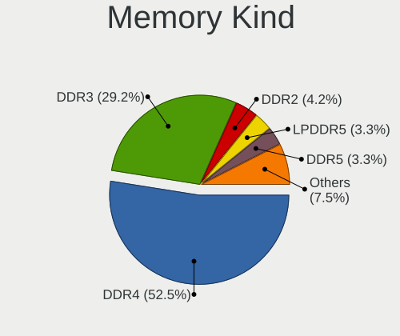

| Kind    | Computers | Percent |
|---------|-----------|---------|
| DDR4    | 63        | 52.5%   |
| DDR3    | 35        | 29.17%  |
| DDR2    | 5         | 4.17%   |
| LPDDR5  | 4         | 3.33%   |
| DDR5    | 4         | 3.33%   |
| LPDDR3  | 3         | 2.5%    |
| SDRAM   | 2         | 1.67%   |
| LPDDR4  | 2         | 1.67%   |
| DDR     | 1         | 0.83%   |
| Unknown | 1         | 0.83%   |

Memory Form Factor
------------------

Physical design of the memory module

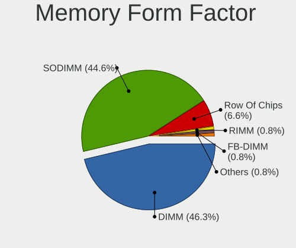

| Name         | Computers | Percent |
|--------------|-----------|---------|
| DIMM         | 56        | 46.28%  |
| SODIMM       | 54        | 44.63%  |
| Row Of Chips | 8         | 6.61%   |
| RIMM         | 1         | 0.83%   |
| FB-DIMM      | 1         | 0.83%   |
| Chip         | 1         | 0.83%   |

Memory Size
-----------

Memory module size

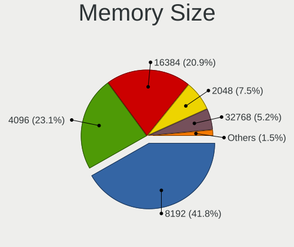

| Size  | Computers | Percent |
|-------|-----------|---------|
| 8192  | 56        | 41.79%  |
| 4096  | 31        | 23.13%  |
| 16384 | 28        | 20.9%   |
| 2048  | 10        | 7.46%   |
| 32768 | 7         | 5.22%   |
| 1024  | 2         | 1.49%   |

Memory Speed
------------

Memory module speed

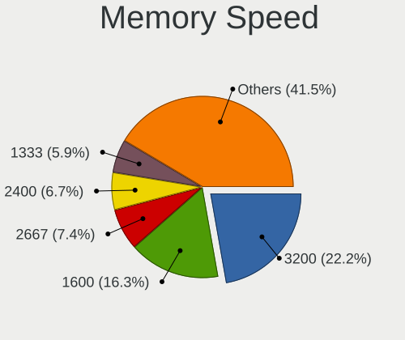

| Speed   | Computers | Percent |
|---------|-----------|---------|
| 3200    | 30        | 22.22%  |
| 1600    | 22        | 16.3%   |
| 2667    | 10        | 7.41%   |
| 2400    | 9         | 6.67%   |
| 1333    | 8         | 5.93%   |
| 2133    | 7         | 5.19%   |
| 3600    | 6         | 4.44%   |
| 3800    | 4         | 2.96%   |
| 4800    | 3         | 2.22%   |
| Unknown | 3         | 2.22%   |
| 6400    | 2         | 1.48%   |
| 4267    | 2         | 1.48%   |
| 4000    | 2         | 1.48%   |
| 1867    | 2         | 1.48%   |
| 1866    | 2         | 1.48%   |
| 1334    | 2         | 1.48%   |
| 667     | 2         | 1.48%   |
| 533     | 2         | 1.48%   |
| 65535   | 1         | 0.74%   |
| 8600    | 1         | 0.74%   |
| 5600    | 1         | 0.74%   |
| 4266    | 1         | 0.74%   |
| 3733    | 1         | 0.74%   |
| 3666    | 1         | 0.74%   |
| 3400    | 1         | 0.74%   |
| 3000    | 1         | 0.74%   |
| 2933    | 1         | 0.74%   |
| 2800    | 1         | 0.74%   |
| 2733    | 1         | 0.74%   |
| 2666    | 1         | 0.74%   |
| 2200    | 1         | 0.74%   |
| 2000    | 1         | 0.74%   |
| 975     | 1         | 0.74%   |
| 800     | 1         | 0.74%   |
| 701     | 1         | 0.74%   |

Printers & scanners
-------------------

Printer Vendor
--------------

Printer device vendors

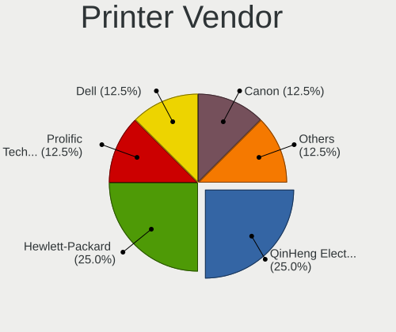

| Vendor              | Computers | Percent |
|---------------------|-----------|---------|
| QinHeng Electronics | 2         | 25%     |
| Hewlett-Packard     | 2         | 25%     |
| Prolific Technology | 1         | 12.5%   |
| Dell                | 1         | 12.5%   |
| Canon               | 1         | 12.5%   |
| Brother Industries  | 1         | 12.5%   |

Printer Model
-------------

Printer device models

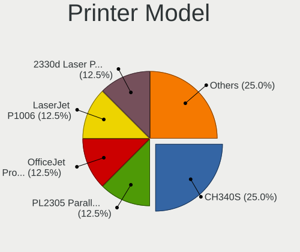

| Model                         | Computers | Percent |
|-------------------------------|-----------|---------|
| QinHeng CH340S                | 2         | 25%     |
| Prolific PL2305 Parallel Port | 1         | 12.5%   |
| HP OfficeJet Pro 9010 series  | 1         | 12.5%   |
| HP LaserJet P1006             | 1         | 12.5%   |
| Dell 2330d Laser Printer      | 1         | 12.5%   |
| Canon LiDE 300                | 1         | 12.5%   |
| Brother HL-L5102DW            | 1         | 12.5%   |

Scanner Vendor
--------------

Scanner device vendors

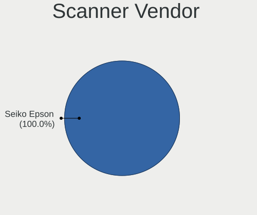

| Vendor      | Computers | Percent |
|-------------|-----------|---------|
| Canon       | 2         | 66.67%  |
| Seiko Epson | 1         | 33.33%  |

Scanner Model
-------------

Scanner device models

| Model                                         | Computers | Percent |
|-----------------------------------------------|-----------|---------|
| Seiko Epson GT-8300UF [Perfection 1660 PHOTO] | 1         | 33.33%  |
| Canon CanoScan N670U/N676U/LiDE 20            | 1         | 33.33%  |
| Canon CanoScan LIDE 25                        | 1         | 33.33%  |

Camera
------

Camera Vendor
-------------

Camera device vendors

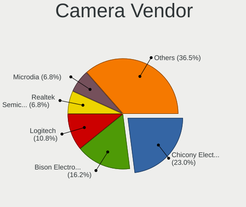

| Vendor                                 | Computers | Percent |
|----------------------------------------|-----------|---------|
| Chicony Electronics                    | 17        | 22.97%  |
| Bison Electronics                      | 12        | 16.22%  |
| Logitech                               | 8         | 10.81%  |
| Realtek Semiconductor                  | 5         | 6.76%   |
| Microdia                               | 5         | 6.76%   |
| Luxvisions Innotech Limited            | 4         | 5.41%   |
| Syntek                                 | 3         | 4.05%   |
| Sunplus Innovation Technology          | 3         | 4.05%   |
| Sonix Technology                       | 3         | 4.05%   |
| Quanta                                 | 3         | 4.05%   |
| Cheng Uei Precision Industry (Foxlink) | 3         | 4.05%   |
| Samsung Electronics                    | 2         | 2.7%    |
| Apple                                  | 2         | 2.7%    |
| Z-Star Microelectronics                | 1         | 1.35%   |
| Microsoft                              | 1         | 1.35%   |
| Lite-On Technology                     | 1         | 1.35%   |
| Lenovo                                 | 1         | 1.35%   |

Camera Model
------------

Camera device models

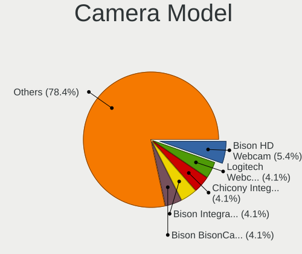

| Model                                                | Computers | Percent |
|------------------------------------------------------|-----------|---------|
| Bison HD Webcam                                      | 4         | 5.41%   |
| Logitech Webcam C270                                 | 3         | 4.05%   |
| Chicony Integrated Camera                            | 3         | 4.05%   |
| Bison Integrated Camera                              | 3         | 4.05%   |
| Bison BisonCam,NB Pro                                | 3         | 4.05%   |
| Syntek Integrated Camera                             | 2         | 2.7%    |
| Sonix USB2.0 FHD UVC WebCam                          | 2         | 2.7%    |
| Samsung Galaxy series, misc. (MTP mode)              | 2         | 2.7%    |
| Luxvisions Innotech Limited HP Wide Vision HD Camera | 2         | 2.7%    |
| Luxvisions Innotech Limited HP TrueVision HD Camera  | 2         | 2.7%    |
| Chicony HP TrueVision HD Camera                      | 2         | 2.7%    |
| Chicony HD User Facing                               | 2         | 2.7%    |
| Z-Star Vimicro USB2.0 Camera                         | 1         | 1.35%   |
| Syntek USB2.0 Camera                                 | 1         | 1.35%   |
| Sunplus Integrated_Webcam_HD                         | 1         | 1.35%   |
| Sunplus Integrated Camera                            | 1         | 1.35%   |
| Sunplus Full HD webcam                               | 1         | 1.35%   |
| Sonix USB2.0 HD UVC WebCam                           | 1         | 1.35%   |
| Realtek Laptop Camera                                | 1         | 1.35%   |
| Realtek Integrated_Webcam_HD                         | 1         | 1.35%   |
| Realtek Integrated Camera                            | 1         | 1.35%   |
| Realtek EasyCamera                                   | 1         | 1.35%   |
| Realtek Bluetooth Radio                              | 1         | 1.35%   |
| Quanta HP Wide Vision HD Camera                      | 1         | 1.35%   |
| Quanta HP Webcam                                     | 1         | 1.35%   |
| Quanta ACER HD User Facing                           | 1         | 1.35%   |
| Microsoft LifeCam HD-3000                            | 1         | 1.35%   |
| Microdia Laptop_Integrated_Webcam_2M                 | 1         | 1.35%   |
| Microdia Integrated_Webcam_HD                        | 1         | 1.35%   |
| Microdia Integrated Webcam                           | 1         | 1.35%   |
| Microdia Dell Integrated HD Webcam                   | 1         | 1.35%   |
| Microdia Camera                                      | 1         | 1.35%   |
| Logitech QuickCam Pro 9000                           | 1         | 1.35%   |
| Logitech Logitech Webcam C160                        | 1         | 1.35%   |
| Logitech HD Webcam C910                              | 1         | 1.35%   |
| Logitech C922 Pro Stream Webcam                      | 1         | 1.35%   |
| Logitech C920 PRO HD Webcam                          | 1         | 1.35%   |
| Lite-On Integrated Camera                            | 1         | 1.35%   |
| Lenovo Integrated Webcam [R5U877]                    | 1         | 1.35%   |
| Chicony Web Camera - FHD                             | 1         | 1.35%   |

Security
--------

Fingerprint Vendor
------------------

Fingerprint sensor vendors

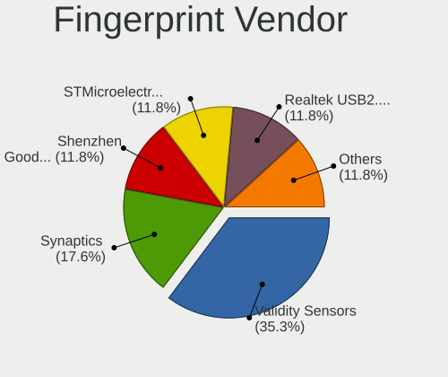

| Vendor                             | Computers | Percent |
|------------------------------------|-----------|---------|
| Validity Sensors                   | 6         | 35.29%  |
| Synaptics                          | 3         | 17.65%  |
| STMicroelectronics                 | 2         | 11.76%  |
| Shenzhen Goodix Technology         | 2         | 11.76%  |
| Realtek USB2.0 Finger Print Bridge | 2         | 11.76%  |
| Upek                               | 1         | 5.88%   |
| Elan Microelectronics              | 1         | 5.88%   |

Fingerprint Model
-----------------

Fingerprint sensor models

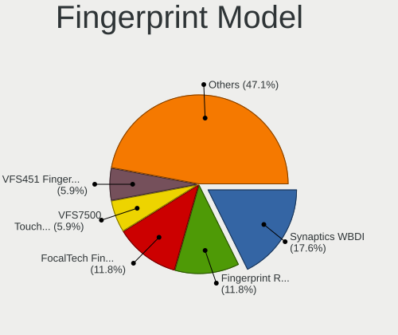

| Model                                                           | Computers | Percent |
|-----------------------------------------------------------------|-----------|---------|
| Validity Sensors Synaptics WBDI                                 | 3         | 17.65%  |
| STMicroelectronics Fingerprint Reader                           | 2         | 11.76%  |
| Realtek USB2.0 Finger Print Bridge FocalTech Fingerprint Device | 2         | 11.76%  |
| Validity Sensors VFS7500 Touch Fingerprint Sensor               | 1         | 5.88%   |
| Validity Sensors VFS451 Fingerprint Reader                      | 1         | 5.88%   |
| Validity Sensors VFS300 Fingerprint Reader                      | 1         | 5.88%   |
| Upek Biometric Touchchip/Touchstrip Fingerprint Sensor          | 1         | 5.88%   |
| Synaptics WBDI Device                                           | 1         | 5.88%   |
| Synaptics TouchPad                                              | 1         | 5.88%   |
| Shenzhen Goodix  FingerPrint Device                             | 1         | 5.88%   |
| Shenzhen Goodix Fingerprint Reader                              | 1         | 5.88%   |
| Elan ELAN:ARM-M4                                                | 1         | 5.88%   |
| Unknown                                                         | 1         | 5.88%   |

Chipcard Vendor
---------------

Chipcard module vendors

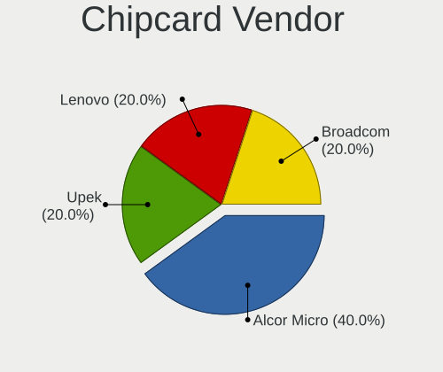

| Vendor      | Computers | Percent |
|-------------|-----------|---------|
| Alcor Micro | 2         | 40%     |
| Upek        | 1         | 20%     |
| Lenovo      | 1         | 20%     |
| Broadcom    | 1         | 20%     |

Chipcard Model
--------------

Chipcard module models

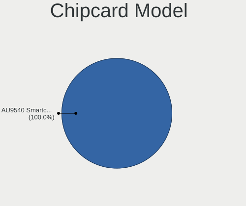

| Model                                                      | Computers | Percent |
|------------------------------------------------------------|-----------|---------|
| Alcor Micro AU9540 Smartcard Reader                        | 2         | 40%     |
| Upek TouchChip Fingerprint Coprocessor (WBF advanced mode) | 1         | 20%     |
| Lenovo Integrated Smart Card Reader                        | 1         | 20%     |
| Broadcom 5880                                              | 1         | 20%     |

Unsupported
-----------

Unsupported Devices
-------------------

Total unsupported devices on board

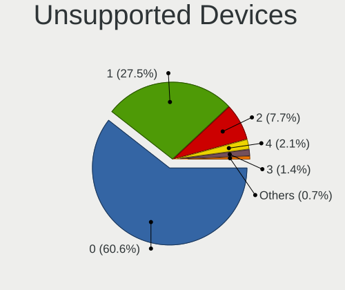

| Total | Computers | Percent |
|-------|-----------|---------|
| 0     | 86        | 60.56%  |
| 1     | 39        | 27.46%  |
| 2     | 11        | 7.75%   |
| 4     | 3         | 2.11%   |
| 3     | 2         | 1.41%   |
| 5     | 1         | 0.7%    |

Unsupported Device Types
------------------------

Types of unsupported devices

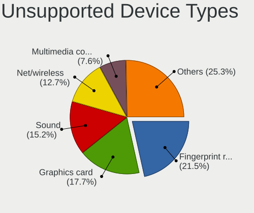

| Type                     | Computers | Percent |
|--------------------------|-----------|---------|
| Fingerprint reader       | 17        | 21.52%  |
| Graphics card            | 14        | 17.72%  |
| Sound                    | 12        | 15.19%  |
| Net/wireless             | 10        | 12.66%  |
| Multimedia controller    | 6         | 7.59%   |
| Communication controller | 4         | 5.06%   |
| Chipcard                 | 4         | 5.06%   |
| Unassigned class         | 3         | 3.8%    |
| Camera                   | 3         | 3.8%    |
| Bluetooth                | 2         | 2.53%   |
| Storage/raid             | 1         | 1.27%   |
| Storage/ide              | 1         | 1.27%   |
| Net/ethernet             | 1         | 1.27%   |
| Card reader              | 1         | 1.27%   |

