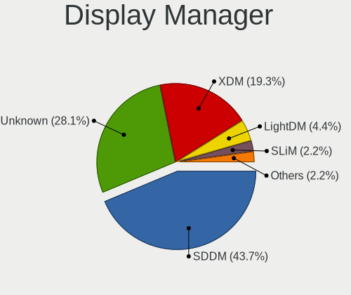
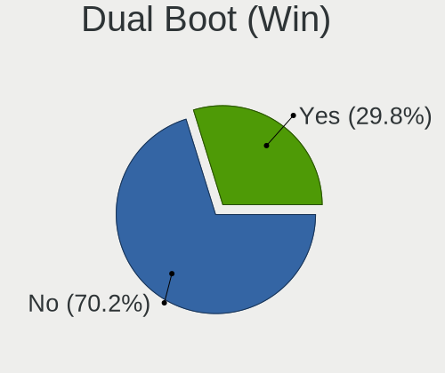
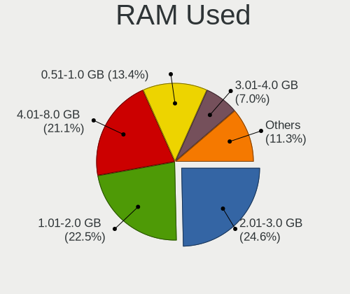
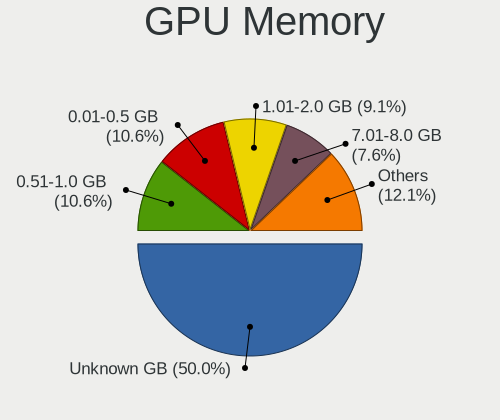
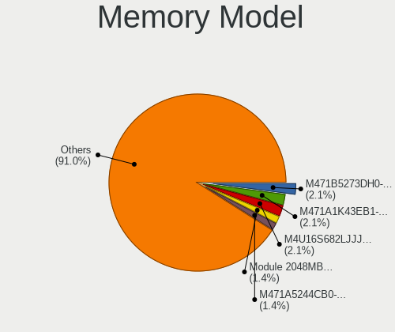
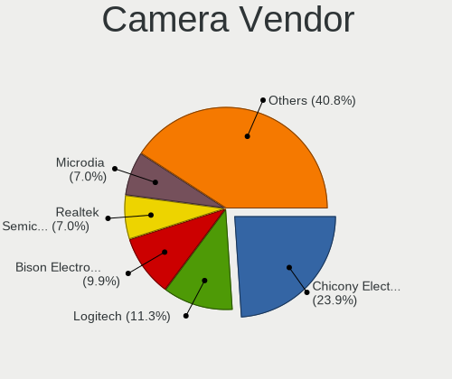
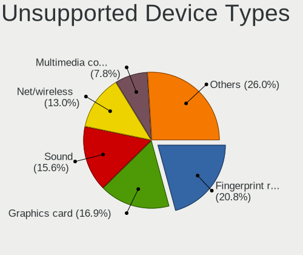

Slackware 15.0 - Tested Hardware & Statistics
---------------------------------------------

A project to collect tested hardware configurations for Slackware 15.0.

Anyone can contribute to this report by the [hw-probe](https://github.com/linuxhw/hw-probe) tool:

    sudo -E hw-probe -all -upload

Please submit a probe of your configuration if it's not presented on the page or is rare.

This is a report for all computer types. See also reports for [desktops](/Dist/Slackware_15.0/Desktop/README.md) and [notebooks](/Dist/Slackware_15.0/Notebook/README.md).

Full-feature report is available here: https://linux-hardware.org/?view=trends

Contents
--------

* [ Test Cases ](#test-cases)

* [ System ](#system)
  - [ Kernel                   ](#kernel)
  - [ Kernel Family            ](#kernel-family)
  - [ Kernel Major Ver.        ](#kernel-major-ver)
  - [ Arch                     ](#arch)
  - [ DE                       ](#de)
  - [ Display Server           ](#display-server)
  - [ Display Manager          ](#display-manager)
  - [ OS Lang                  ](#os-lang)
  - [ Boot Mode                ](#boot-mode)
  - [ Filesystem               ](#filesystem)
  - [ Part. scheme             ](#part-scheme)
  - [ Dual Boot with Linux/BSD ](#dual-boot-with-linuxbsd)
  - [ Dual Boot (Win)          ](#dual-boot-win)

* [ Board ](#board)
  - [ Vendor                   ](#vendor)
  - [ Model                    ](#model)
  - [ Model Family             ](#model-family)
  - [ MFG Year                 ](#mfg-year)
  - [ Form Factor              ](#form-factor)
  - [ Secure Boot              ](#secure-boot)
  - [ Coreboot                 ](#coreboot)
  - [ RAM Size                 ](#ram-size)
  - [ RAM Used                 ](#ram-used)
  - [ Total Drives             ](#total-drives)
  - [ Has CD-ROM               ](#has-cd-rom)
  - [ Has Ethernet             ](#has-ethernet)
  - [ Has WiFi                 ](#has-wifi)
  - [ Has Bluetooth            ](#has-bluetooth)

* [ Location ](#location)
  - [ Country                  ](#country)
  - [ City                     ](#city)

* [ Drives ](#drives)
  - [ Drive Vendor             ](#drive-vendor)
  - [ Drive Model              ](#drive-model)
  - [ HDD Vendor               ](#hdd-vendor)
  - [ SSD Vendor               ](#ssd-vendor)
  - [ Drive Kind               ](#drive-kind)
  - [ Drive Connector          ](#drive-connector)
  - [ Drive Size               ](#drive-size)
  - [ Space Total              ](#space-total)
  - [ Space Used               ](#space-used)
  - [ Malfunc. Drives          ](#malfunc-drives)
  - [ Malfunc. Drive Vendor    ](#malfunc-drive-vendor)
  - [ Malfunc. HDD Vendor      ](#malfunc-hdd-vendor)
  - [ Malfunc. Drive Kind      ](#malfunc-drive-kind)
  - [ Failed Drives            ](#failed-drives)
  - [ Failed Drive Vendor      ](#failed-drive-vendor)
  - [ Drive Status             ](#drive-status)

* [ Storage controller ](#storage-controller)
  - [ Storage Vendor           ](#storage-vendor)
  - [ Storage Model            ](#storage-model)
  - [ Storage Kind             ](#storage-kind)

* [ Processor ](#processor)
  - [ CPU Vendor               ](#cpu-vendor)
  - [ CPU Model                ](#cpu-model)
  - [ CPU Model Family         ](#cpu-model-family)
  - [ CPU Cores                ](#cpu-cores)
  - [ CPU Sockets              ](#cpu-sockets)
  - [ CPU Threads              ](#cpu-threads)
  - [ CPU Op-Modes             ](#cpu-op-modes)
  - [ CPU Microcode            ](#cpu-microcode)
  - [ CPU Microarch            ](#cpu-microarch)

* [ Graphics ](#graphics)
  - [ GPU Vendor               ](#gpu-vendor)
  - [ GPU Model                ](#gpu-model)
  - [ GPU Combo                ](#gpu-combo)
  - [ GPU Driver               ](#gpu-driver)
  - [ GPU Memory               ](#gpu-memory)

* [ Monitor ](#monitor)
  - [ Monitor Vendor           ](#monitor-vendor)
  - [ Monitor Model            ](#monitor-model)
  - [ Monitor Resolution       ](#monitor-resolution)
  - [ Monitor Diagonal         ](#monitor-diagonal)
  - [ Monitor Width            ](#monitor-width)
  - [ Aspect Ratio             ](#aspect-ratio)
  - [ Monitor Area             ](#monitor-area)
  - [ Pixel Density            ](#pixel-density)
  - [ Multiple Monitors        ](#multiple-monitors)

* [ Network ](#network)
  - [ Net Controller Vendor    ](#net-controller-vendor)
  - [ Net Controller Model     ](#net-controller-model)
  - [ Wireless Vendor          ](#wireless-vendor)
  - [ Wireless Model           ](#wireless-model)
  - [ Ethernet Vendor          ](#ethernet-vendor)
  - [ Ethernet Model           ](#ethernet-model)
  - [ Net Controller Kind      ](#net-controller-kind)
  - [ Used Controller          ](#used-controller)
  - [ NICs                     ](#nics)
  - [ IPv6                     ](#ipv6)

* [ Bluetooth ](#bluetooth)
  - [ Bluetooth Vendor         ](#bluetooth-vendor)
  - [ Bluetooth Model          ](#bluetooth-model)

* [ Sound ](#sound)
  - [ Sound Vendor             ](#sound-vendor)
  - [ Sound Model              ](#sound-model)

* [ Memory ](#memory)
  - [ Memory Vendor            ](#memory-vendor)
  - [ Memory Model             ](#memory-model)
  - [ Memory Kind              ](#memory-kind)
  - [ Memory Form Factor       ](#memory-form-factor)
  - [ Memory Size              ](#memory-size)
  - [ Memory Speed             ](#memory-speed)

* [ Printers & scanners ](#printers--scanners)
  - [ Printer Vendor           ](#printer-vendor)
  - [ Printer Model            ](#printer-model)
  - [ Scanner Vendor           ](#scanner-vendor)
  - [ Scanner Model            ](#scanner-model)

* [ Camera ](#camera)
  - [ Camera Vendor            ](#camera-vendor)
  - [ Camera Model             ](#camera-model)

* [ Security ](#security)
  - [ Fingerprint Vendor       ](#fingerprint-vendor)
  - [ Fingerprint Model        ](#fingerprint-model)
  - [ Chipcard Vendor          ](#chipcard-vendor)
  - [ Chipcard Model           ](#chipcard-model)

* [ Unsupported ](#unsupported)
  - [ Unsupported Devices      ](#unsupported-devices)
  - [ Unsupported Device Types ](#unsupported-device-types)

Test Cases
----------

| Vendor        | Model                       | Form-Factor | Probe                                                      | Date         |
|---------------|-----------------------------|-------------|------------------------------------------------------------|--------------|
| TYAN Compu... | S7012                       | Server      | [fec98b51da](https://linux-hardware.org/?probe=fec98b51da) | Feb 27, 2022 |
| TYAN Compu... | S7012                       | Server      | [81a490184b](https://linux-hardware.org/?probe=81a490184b) | Feb 26, 2022 |
| Biostar       | X470GTA                     | Desktop     | [8d400b49f8](https://linux-hardware.org/?probe=8d400b49f8) | Feb 13, 2022 |
| Lenovo        | ThinkPad Edge E530c 3366... | Notebook    | [8ce0419468](https://linux-hardware.org/?probe=8ce0419468) | Feb 13, 2022 |
| MSI           | G31TM-P21                   | Desktop     | [dda6a57223](https://linux-hardware.org/?probe=dda6a57223) | Feb 07, 2022 |
| HP            | 212B                        | Desktop     | [353b0dde99](https://linux-hardware.org/?probe=353b0dde99) | Jan 29, 2022 |
| MSI           | B450 TOMAHAWK MAX           | Desktop     | [85543358d3](https://linux-hardware.org/?probe=85543358d3) | Jan 14, 2022 |
| Dynabook      | P1-C7MP-BL                  | Notebook    | [268f94787e](https://linux-hardware.org/?probe=268f94787e) | Jan 14, 2022 |
| MSI           | G31TM-P21                   | Desktop     | [25d668ee95](https://linux-hardware.org/?probe=25d668ee95) | Jan 10, 2022 |
| MSI           | H61M-P31                    | Desktop     | [58651bba67](https://linux-hardware.org/?probe=58651bba67) | Dec 07, 2021 |
| HP            | Laptop 15-bs1xx             | Notebook    | [b6c9f34c4c](https://linux-hardware.org/?probe=b6c9f34c4c) | Dec 07, 2021 |
| System76      | Oryx Pro                    | Notebook    | [3cd05d02a8](https://linux-hardware.org/?probe=3cd05d02a8) | Oct 27, 2021 |
| MSI           | B450M-A PRO MAX             | Desktop     | [b7df25ba5d](https://linux-hardware.org/?probe=b7df25ba5d) | Oct 25, 2021 |
| ASUSTek       | SABERTOOTH X99              | Desktop     | [64e5ee1691](https://linux-hardware.org/?probe=64e5ee1691) | Oct 13, 2021 |
| MSI           | B450M-A PRO MAX             | Desktop     | [17d37c5316](https://linux-hardware.org/?probe=17d37c5316) | Oct 12, 2021 |
| MSI           | Modern 14 B11MO             | Notebook    | [e8f13facfd](https://linux-hardware.org/?probe=e8f13facfd) | Oct 03, 2021 |
| MSI           | Modern 14 B11MO             | Notebook    | [9f5c2e0fde](https://linux-hardware.org/?probe=9f5c2e0fde) | Sep 27, 2021 |
| Dell          | Inspiron 15-3552            | Notebook    | [f76339b0af](https://linux-hardware.org/?probe=f76339b0af) | Aug 31, 2021 |
| HP            | 245 G7 Notebook PC          | Notebook    | [c0806e4955](https://linux-hardware.org/?probe=c0806e4955) | Aug 23, 2021 |
| HP            | 245 G7 Notebook PC          | Notebook    | [c409287d23](https://linux-hardware.org/?probe=c409287d23) | Aug 23, 2021 |
| HP            | EliteBook 840 G5            | Notebook    | [4c196e1abd](https://linux-hardware.org/?probe=4c196e1abd) | Aug 18, 2021 |
| Dell          | Vostro 3500                 | Notebook    | [53a1179121](https://linux-hardware.org/?probe=53a1179121) | Aug 12, 2021 |

System
------

Kernel
------

Version of the Linux kernel

| Version           | Computers | Percent |
|-------------------|-----------|---------|
| 5.15.19           | 2         | 11.11%  |
| 5.15.6            | 1         | 5.56%   |
| 5.15.21-hardened1 | 1         | 5.56%   |
| 5.15.14           | 1         | 5.56%   |
| 5.15.1            | 1         | 5.56%   |
| 5.14.9            | 1         | 5.56%   |
| 5.14.8            | 1         | 5.56%   |
| 5.14.15-Unraid    | 1         | 5.56%   |
| 5.14.15           | 1         | 5.56%   |
| 5.14.11           | 1         | 5.56%   |
| 5.14.10           | 1         | 5.56%   |
| 5.14.0            | 1         | 5.56%   |
| 5.13.8            | 1         | 5.56%   |
| 5.13.5            | 1         | 5.56%   |
| 5.13.12           | 1         | 5.56%   |
| 5.13.11           | 1         | 5.56%   |
| 5.10.91           | 1         | 5.56%   |

Kernel Family
-------------

Linux kernel without a distro release

| Version | Computers | Percent |
|---------|-----------|---------|
| 5.15.19 | 2         | 11.11%  |
| 5.14.15 | 2         | 11.11%  |
| 5.15.6  | 1         | 5.56%   |
| 5.15.21 | 1         | 5.56%   |
| 5.15.14 | 1         | 5.56%   |
| 5.15.1  | 1         | 5.56%   |
| 5.14.9  | 1         | 5.56%   |
| 5.14.8  | 1         | 5.56%   |
| 5.14.11 | 1         | 5.56%   |
| 5.14.10 | 1         | 5.56%   |
| 5.14.0  | 1         | 5.56%   |
| 5.13.8  | 1         | 5.56%   |
| 5.13.5  | 1         | 5.56%   |
| 5.13.12 | 1         | 5.56%   |
| 5.13.11 | 1         | 5.56%   |
| 5.10.91 | 1         | 5.56%   |

Kernel Major Ver.
-----------------

Linux kernel major version

| Version | Computers | Percent |
|---------|-----------|---------|
| 5.15    | 6         | 35.29%  |
| 5.14    | 6         | 35.29%  |
| 5.13    | 4         | 23.53%  |
| 5.10    | 1         | 5.88%   |

Arch
----

OS architecture (x86_64, i586, etc.)

| Name   | Computers | Percent |
|--------|-----------|---------|
| x86_64 | 17        | 100%    |

DE
--

Desktop Environment

| Name    | Computers | Percent |
|---------|-----------|---------|
| KDE5    | 9         | 50%     |
| XFCE    | 4         | 22.22%  |
| Unknown | 3         | 16.67%  |
| KDE     | 1         | 5.56%   |
| GNOME   | 1         | 5.56%   |

Display Server
--------------

X11 or Wayland

| Name    | Computers | Percent |
|---------|-----------|---------|
| X11     | 11        | 57.89%  |
| Tty     | 7         | 36.84%  |
| Unknown | 1         | 5.26%   |

Display Manager
---------------

SDDM, LightDM, etc.

| Name    | Computers | Percent |
|---------|-----------|---------|
| SDDM    | 9         | 52.94%  |
| Unknown | 6         | 35.29%  |
| XDM     | 2         | 11.76%  |

OS Lang
-------

Language

| Lang        | Computers | Percent |
|-------------|-----------|---------|
| en_US       | 13        | 76.47%  |
| Unknown     | 2         | 11.76%  |
| pt_BR       | 1         | 5.88%   |
| en_US.ASCII | 1         | 5.88%   |

Boot Mode
---------

EFI or BIOS

| Mode | Computers | Percent |
|------|-----------|---------|
| EFI  | 9         | 52.94%  |
| BIOS | 8         | 47.06%  |

Filesystem
----------

Type of filesystem

| Type  | Computers | Percent |
|-------|-----------|---------|
| Ext4  | 14        | 82.35%  |
| Zfs   | 1         | 5.88%   |
| F2fs  | 1         | 5.88%   |
| Btrfs | 1         | 5.88%   |

Part. scheme
------------

Scheme of partitioning

| Type    | Computers | Percent |
|---------|-----------|---------|
| GPT     | 12        | 66.67%  |
| MBR     | 3         | 16.67%  |
| Unknown | 3         | 16.67%  |

Dual Boot with Linux/BSD
------------------------

Hosting more than one Linux/BSD

| Dual boot | Computers | Percent |
|-----------|-----------|---------|
| No        | 11        | 61.11%  |
| Yes       | 7         | 38.89%  |

Dual Boot (Win)
---------------

Hosting Linux and Windows

| Dual boot | Computers | Percent |
|-----------|-----------|---------|
| No        | 12        | 70.59%  |
| Yes       | 5         | 29.41%  |

Board
-----

Vendor
------

Motherboard manufacturer

| Name             | Computers | Percent |
|------------------|-----------|---------|
| MSI              | 5         | 29.41%  |
| Hewlett-Packard  | 4         | 23.53%  |
| Dell             | 2         | 11.76%  |
| TYAN Computer    | 1         | 5.88%   |
| System76         | 1         | 5.88%   |
| Lenovo           | 1         | 5.88%   |
| Dynabook         | 1         | 5.88%   |
| Biostar          | 1         | 5.88%   |
| ASUSTek Computer | 1         | 5.88%   |

Model
-----

Motherboard model

| Name                               | Computers | Percent |
|------------------------------------|-----------|---------|
| TYAN S7012                         | 1         | 5.88%   |
| System76 Oryx Pro                  | 1         | 5.88%   |
| MSI MS-7C52                        | 1         | 5.88%   |
| MSI MS-7C02                        | 1         | 5.88%   |
| MSI MS-7788                        | 1         | 5.88%   |
| MSI MS-7529                        | 1         | 5.88%   |
| MSI Modern 14 B11MO                | 1         | 5.88%   |
| Lenovo ThinkPad Edge E530c 336669G | 1         | 5.88%   |
| HP Z440 Workstation                | 1         | 5.88%   |
| HP Laptop 15-bs1xx                 | 1         | 5.88%   |
| HP EliteBook 840 G5                | 1         | 5.88%   |
| HP 245 G7 Notebook PC              | 1         | 5.88%   |
| Dynabook P1-C7MP-BL                | 1         | 5.88%   |
| Dell Vostro 3500                   | 1         | 5.88%   |
| Dell Inspiron 15-3552              | 1         | 5.88%   |
| Biostar X470GTA                    | 1         | 5.88%   |
| ASUS All Series                    | 1         | 5.88%   |

Model Family
------------

Motherboard model prefix

| Name                | Computers | Percent |
|---------------------|-----------|---------|
| TYAN S7012          | 1         | 5.88%   |
| System76 Oryx       | 1         | 5.88%   |
| MSI MS-7C52         | 1         | 5.88%   |
| MSI MS-7C02         | 1         | 5.88%   |
| MSI MS-7788         | 1         | 5.88%   |
| MSI MS-7529         | 1         | 5.88%   |
| MSI Modern          | 1         | 5.88%   |
| Lenovo ThinkPad     | 1         | 5.88%   |
| HP Z440             | 1         | 5.88%   |
| HP Laptop           | 1         | 5.88%   |
| HP EliteBook        | 1         | 5.88%   |
| HP 245              | 1         | 5.88%   |
| Dynabook P1-C7MP-BL | 1         | 5.88%   |
| Dell Vostro         | 1         | 5.88%   |
| Dell Inspiron       | 1         | 5.88%   |
| Biostar X470GTA     | 1         | 5.88%   |
| ASUS All            | 1         | 5.88%   |

MFG Year
--------

Motherboard manufacture year

| Year | Computers | Percent |
|------|-----------|---------|
| 2019 | 3         | 17.65%  |
| 2021 | 2         | 11.76%  |
| 2020 | 2         | 11.76%  |
| 2015 | 2         | 11.76%  |
| 2011 | 2         | 11.76%  |
| 2018 | 1         | 5.88%   |
| 2017 | 1         | 5.88%   |
| 2016 | 1         | 5.88%   |
| 2012 | 1         | 5.88%   |
| 2010 | 1         | 5.88%   |
| 2009 | 1         | 5.88%   |

Form Factor
-----------

Physical design of the computer

| Name     | Computers | Percent |
|----------|-----------|---------|
| Notebook | 9         | 52.94%  |
| Desktop  | 7         | 41.18%  |
| Server   | 1         | 5.88%   |

Secure Boot
-----------

Enabled or disabled

| State    | Computers | Percent |
|----------|-----------|---------|
| Disabled | 17        | 100%    |

Coreboot
--------

Have coreboot on board

| Used | Computers | Percent |
|------|-----------|---------|
| No   | 16        | 94.12%  |
| Yes  | 1         | 5.88%   |

RAM Size
--------

Total RAM memory

| Size in GB  | Computers | Percent |
|-------------|-----------|---------|
| 3.01-4.0    | 5         | 29.41%  |
| 32.01-64.0  | 3         | 17.65%  |
| 64.01-256.0 | 3         | 17.65%  |
| 16.01-24.0  | 3         | 17.65%  |
| 4.01-8.0    | 2         | 11.76%  |
| 8.01-16.0   | 1         | 5.88%   |

RAM Used
--------

Used RAM memory

| Used GB    | Computers | Percent |
|------------|-----------|---------|
| 4.01-8.0   | 5         | 26.32%  |
| 1.01-2.0   | 5         | 26.32%  |
| 2.01-3.0   | 3         | 15.79%  |
| 0.51-1.0   | 3         | 15.79%  |
| 32.01-64.0 | 1         | 5.26%   |
| 16.01-24.0 | 1         | 5.26%   |
| 0.01-0.5   | 1         | 5.26%   |

Total Drives
------------

Number of drives on board

| Drives | Computers | Percent |
|--------|-----------|---------|
| 1      | 9         | 52.94%  |
| 4      | 3         | 17.65%  |
| 3      | 3         | 17.65%  |
| 6      | 1         | 5.88%   |
| 2      | 1         | 5.88%   |

Has CD-ROM
----------

Has CD-ROM on board

| Presented | Computers | Percent |
|-----------|-----------|---------|
| Yes       | 9         | 52.94%  |
| No        | 8         | 47.06%  |

Has Ethernet
------------

Has Ethernet on board

| Presented | Computers | Percent |
|-----------|-----------|---------|
| Yes       | 15        | 88.24%  |
| No        | 2         | 11.76%  |

Has WiFi
--------

Has WiFi module

| Presented | Computers | Percent |
|-----------|-----------|---------|
| Yes       | 12        | 70.59%  |
| No        | 5         | 29.41%  |

Has Bluetooth
-------------

Has Bluetooth module

| Presented | Computers | Percent |
|-----------|-----------|---------|
| Yes       | 10        | 58.82%  |
| No        | 7         | 41.18%  |

Location
--------

Country
-------

Geographic location (country)

| Country      | Computers | Percent |
|--------------|-----------|---------|
| USA          | 4         | 23.53%  |
| South Africa | 3         | 17.65%  |
| Japan        | 2         | 11.76%  |
| Brazil       | 2         | 11.76%  |
| UK           | 1         | 5.88%   |
| Sweden       | 1         | 5.88%   |
| Serbia       | 1         | 5.88%   |
| Netherlands  | 1         | 5.88%   |
| Mexico       | 1         | 5.88%   |
| Italy        | 1         | 5.88%   |

City
----

Geographic location (city)

| City         | Computers | Percent |
|--------------|-----------|---------|
| Musashino    | 2         | 11.76%  |
| Cape Town    | 2         | 11.76%  |
| Verona       | 1         | 5.88%   |
| Skövde    | 1         | 5.88%   |
| Porto Alegre | 1         | 5.88%   |
| Naaldwijk    | 1         | 5.88%   |
| Milwaukee    | 1         | 5.88%   |
| Mexico City  | 1         | 5.88%   |
| Mead         | 1         | 5.88%   |
| McKinney     | 1         | 5.88%   |
| League City  | 1         | 5.88%   |
| Johannesburg | 1         | 5.88%   |
| Fortaleza    | 1         | 5.88%   |
| Belgrade     | 1         | 5.88%   |
| Belfast      | 1         | 5.88%   |

Drives
------

Drive Vendor
------------

Hard drive vendors

| Vendor              | Computers | Drives | Percent |
|---------------------|-----------|--------|---------|
| Samsung Electronics | 8         | 9      | 25%     |
| WDC                 | 5         | 7      | 15.63%  |
| Seagate             | 5         | 7      | 15.63%  |
| Toshiba             | 4         | 6      | 12.5%   |
| Hitachi             | 2         | 2      | 6.25%   |
| SanDisk             | 1         | 1      | 3.13%   |
| Patriot             | 1         | 1      | 3.13%   |
| JMicron             | 1         | 1      | 3.13%   |
| Intenso             | 1         | 1      | 3.13%   |
| HGST                | 1         | 1      | 3.13%   |
| Hewlett-Packard     | 1         | 2      | 3.13%   |
| Gigabyte Technology | 1         | 1      | 3.13%   |
| Crucial             | 1         | 1      | 3.13%   |

Drive Model
-----------

Hard drive models

| Model                                  | Computers | Percent |
|----------------------------------------|-----------|---------|
| WDC WD10SPZX-60Z10T0 1TB               | 2         | 5.56%   |
| WDC WD5000AAKX-22ERMA0 500GB           | 1         | 2.78%   |
| WDC WD20EZRZ-00Z5HB0 2TB               | 1         | 2.78%   |
| WDC WD20EFRX-68EUZN0 2TB               | 1         | 2.78%   |
| WDC WD10JPVT-08A1YT2 1TB               | 1         | 2.78%   |
| Toshiba MQ04ABF100 1TB                 | 1         | 2.78%   |
| Toshiba MQ01ABF050 500GB               | 1         | 2.78%   |
| Toshiba HDWD240 4TB                    | 1         | 2.78%   |
| Toshiba DT01ACA300 3TB                 | 1         | 2.78%   |
| Seagate ST4000DM000-1F2168 4TB         | 1         | 2.78%   |
| Seagate ST380011A 80GB                 | 1         | 2.78%   |
| Seagate ST3500630AS 500GB              | 1         | 2.78%   |
| Seagate ST3000VX006-1HH166 3TB         | 1         | 2.78%   |
| Seagate ST2000DM008-2FR102 2TB         | 1         | 2.78%   |
| Seagate ST1000DM003-1SB102 1TB         | 1         | 2.78%   |
| Seagate Expansion Desk 8TB             | 1         | 2.78%   |
| SanDisk SDSSDA240G 240GB               | 1         | 2.78%   |
| Samsung SSD 980 PRO 500GB              | 1         | 2.78%   |
| Samsung SSD 970 EVO Plus 1TB           | 1         | 2.78%   |
| Samsung SSD 860 QVO 2TB                | 1         | 2.78%   |
| Samsung SSD 860 EVO 500GB              | 1         | 2.78%   |
| Samsung SSD 860 500GB                  | 1         | 2.78%   |
| Samsung SSD 840 Series 250GB           | 1         | 2.78%   |
| Samsung SM963 2.5" NVMe PCIe SSD 256GB | 1         | 2.78%   |
| Samsung MZVKW512HMJP-000H1 512GB       | 1         | 2.78%   |
| Samsung MZHPV512HDGL-00000 512GB SSD   | 1         | 2.78%   |
| Patriot Burst Elite 120GB SSD          | 1         | 2.78%   |
| JMicron Generic 2TB                    | 1         | 2.78%   |
| Intenso SSD SATAIII 480GB              | 1         | 2.78%   |
| Hitachi HUA723030ALA640 3TB            | 1         | 2.78%   |
| Hitachi HDS721016CLA382 160GB          | 1         | 2.78%   |
| HGST HUH728080ALE600 8TB               | 1         | 2.78%   |
| HP SSD EX950 2TB                       | 1         | 2.78%   |
| Gigabyte GP-ASM2NE6100TTTD 1TB         | 1         | 2.78%   |
| Crucial CT500MX500SSD1 500GB           | 1         | 2.78%   |

HDD Vendor
----------

Hard disk drive vendors

| Vendor  | Computers | Drives | Percent |
|---------|-----------|--------|---------|
| WDC     | 5         | 7      | 29.41%  |
| Seagate | 5         | 7      | 29.41%  |
| Toshiba | 4         | 6      | 23.53%  |
| Hitachi | 2         | 2      | 11.76%  |
| HGST    | 1         | 1      | 5.88%   |

SSD Vendor
----------

Solid state drive vendors

| Vendor              | Computers | Drives | Percent |
|---------------------|-----------|--------|---------|
| Samsung Electronics | 4         | 5      | 50%     |
| SanDisk             | 1         | 1      | 12.5%   |
| Patriot             | 1         | 1      | 12.5%   |
| Intenso             | 1         | 1      | 12.5%   |
| Crucial             | 1         | 1      | 12.5%   |

Drive Kind
----------

HDD or SSD

| Kind | Computers | Drives | Percent |
|------|-----------|--------|---------|
| HDD  | 12        | 23     | 46.15%  |
| NVMe | 7         | 8      | 26.92%  |
| SSD  | 7         | 9      | 26.92%  |

Drive Connector
---------------

SATA, SAS, NVMe, etc.

| Type | Computers | Drives | Percent |
|------|-----------|--------|---------|
| SATA | 14        | 31     | 63.64%  |
| NVMe | 6         | 7      | 27.27%  |
| SAS  | 2         | 2      | 9.09%   |

Drive Size
----------

Size of hard drive

| Size in TB | Computers | Drives | Percent |
|------------|-----------|--------|---------|
| 0.01-0.5   | 10        | 12     | 40%     |
| 0.51-1.0   | 6         | 6      | 24%     |
| 1.01-2.0   | 4         | 5      | 16%     |
| 3.01-4.0   | 2         | 2      | 8%      |
| 4.01-10.0  | 2         | 2      | 8%      |
| 2.01-3.0   | 1         | 5      | 4%      |

Space Total
-----------

Amount of disk space available on the file system

| Size in GB     | Computers | Percent |
|----------------|-----------|---------|
| 251-500        | 6         | 33.33%  |
| 501-1000       | 3         | 16.67%  |
| 101-250        | 2         | 11.11%  |
| 1001-2000      | 2         | 11.11%  |
| More than 3000 | 1         | 5.56%   |
| 2001-3000      | 1         | 5.56%   |
| 1-20           | 1         | 5.56%   |
| 51-100         | 1         | 5.56%   |
| Unknown        | 1         | 5.56%   |

Space Used
----------

Amount of used disk space

| Used GB        | Computers | Percent |
|----------------|-----------|---------|
| 101-250        | 5         | 29.41%  |
| 251-500        | 4         | 23.53%  |
| 1-20           | 3         | 17.65%  |
| 21-50          | 2         | 11.76%  |
| More than 3000 | 1         | 5.88%   |
| 501-1000       | 1         | 5.88%   |
| Unknown        | 1         | 5.88%   |

Malfunc. Drives
---------------

Drive models with a malfunction

| Model                          | Computers | Drives | Percent |
|--------------------------------|-----------|--------|---------|
| WDC WD5000AAKX-22ERMA0 500GB   | 1         | 1      | 14.29%  |
| WDC WD20EFRX-68EUZN0 2TB       | 1         | 2      | 14.29%  |
| Seagate ST380011A 80GB         | 1         | 1      | 14.29%  |
| Seagate ST3500630AS 500GB      | 1         | 1      | 14.29%  |
| Seagate ST3000VX006-1HH166 3TB | 1         | 1      | 14.29%  |
| Hitachi HUA723030ALA640 3TB    | 1         | 1      | 14.29%  |
| Hitachi HDS721016CLA382 160GB  | 1         | 1      | 14.29%  |

Malfunc. Drive Vendor
---------------------

Vendors of faulty drives

| Vendor  | Computers | Drives | Percent |
|---------|-----------|--------|---------|
| Seagate | 3         | 3      | 42.86%  |
| WDC     | 2         | 3      | 28.57%  |
| Hitachi | 2         | 2      | 28.57%  |

Malfunc. HDD Vendor
-------------------

Vendors of faulty HDD drives

| Vendor  | Computers | Drives | Percent |
|---------|-----------|--------|---------|
| Seagate | 3         | 3      | 42.86%  |
| WDC     | 2         | 3      | 28.57%  |
| Hitachi | 2         | 2      | 28.57%  |

Malfunc. Drive Kind
-------------------

Kinds of faulty drives

| Kind | Computers | Drives | Percent |
|------|-----------|--------|---------|
| HDD  | 5         | 8      | 100%    |

Failed Drives
-------------

Failed drive models

Zero info for selected period =(

Failed Drive Vendor
-------------------

Failed drive vendors

Zero info for selected period =(

Drive Status
------------

Number of failed and malfunc. drives

| Status   | Computers | Drives | Percent |
|----------|-----------|--------|---------|
| Works    | 13        | 25     | 59.09%  |
| Malfunc  | 5         | 8      | 22.73%  |
| Detected | 4         | 7      | 18.18%  |

Storage controller
------------------

Storage Vendor
--------------

Storage controller vendors

| Vendor                   | Computers | Percent |
|--------------------------|-----------|---------|
| Intel                    | 10        | 41.67%  |
| Samsung Electronics      | 5         | 20.83%  |
| AMD                      | 4         | 16.67%  |
| Phison Electronics       | 1         | 4.17%   |
| Broadcom / LSI           | 1         | 4.17%   |
| Biwin Storage Technology | 1         | 4.17%   |
| ASMedia Technology       | 1         | 4.17%   |
| Adaptec                  | 1         | 4.17%   |

Storage Model
-------------

Storage controller models

| Model                                                                                   | Computers | Percent |
|-----------------------------------------------------------------------------------------|-----------|---------|
| AMD FCH SATA Controller [AHCI mode]                                                     | 3         | 9.68%   |
| AMD 400 Series Chipset SATA Controller                                                  | 3         | 9.68%   |
| Intel C610/X99 series chipset sSATA Controller [AHCI mode]                              | 2         | 6.45%   |
| Intel C610/X99 series chipset 6-Port SATA Controller [AHCI mode]                        | 2         | 6.45%   |
| Samsung NVMe SSD Controller SM981/PM981/PM983                                           | 1         | 3.23%   |
| Samsung NVMe SSD Controller SM961/PM961/SM963                                           | 1         | 3.23%   |
| Samsung NVMe SSD Controller PM9A1/PM9A3/980PRO                                          | 1         | 3.23%   |
| Samsung NVMe SSD Controller 980                                                         | 1         | 3.23%   |
| Samsung Electronics SATA controller                                                     | 1         | 3.23%   |
| Phison E16 PCIe4 NVMe Controller                                                        | 1         | 3.23%   |
| Intel Wildcat Point-LP SATA Controller [AHCI Mode]                                      | 1         | 3.23%   |
| Intel NM10/ICH7 Family SATA Controller [IDE mode]                                       | 1         | 3.23%   |
| Intel Atom/Celeron/Pentium Processor x5-E8000/J3xxx/N3xxx Series SATA Controller        | 1         | 3.23%   |
| Intel 82801JI (ICH10 Family) 4 port SATA IDE Controller #1                              | 1         | 3.23%   |
| Intel 82801JI (ICH10 Family) 2 port SATA IDE Controller #2                              | 1         | 3.23%   |
| Intel 82801G (ICH7 Family) IDE Controller                                               | 1         | 3.23%   |
| Intel 82801 Mobile SATA Controller [RAID mode]                                          | 1         | 3.23%   |
| Intel 7 Series Chipset Family 6-port SATA Controller [AHCI mode]                        | 1         | 3.23%   |
| Intel 6 Series/C200 Series Chipset Family Desktop SATA Controller (IDE mode, ports 4-5) | 1         | 3.23%   |
| Intel 6 Series/C200 Series Chipset Family Desktop SATA Controller (IDE mode, ports 0-3) | 1         | 3.23%   |
| Intel 5 Series/3400 Series Chipset 6 port SATA AHCI Controller                          | 1         | 3.23%   |
| Broadcom / LSI SAS1068E PCI-Express Fusion-MPT SAS                                      | 1         | 3.23%   |
| Biwin Storage Non-Volatile memory controller                                            | 1         | 3.23%   |
| ASMedia ASM1062 Serial ATA Controller                                                   | 1         | 3.23%   |
| Adaptec SCSI storage controller                                                         | 1         | 3.23%   |

Storage Kind
------------

Kind of storage controller (IDE, SATA, NVMe, SAS, ...)

| Kind | Computers | Percent |
|------|-----------|---------|
| SATA | 11        | 47.83%  |
| NVMe | 6         | 26.09%  |
| IDE  | 3         | 13.04%  |
| SCSI | 2         | 8.7%    |
| RAID | 1         | 4.35%   |

Processor
---------

CPU Vendor
----------

Processor vendors

| Vendor | Computers | Percent |
|--------|-----------|---------|
| Intel  | 13        | 76.47%  |
| AMD    | 4         | 23.53%  |

CPU Model
---------

Processor models

| Model                                         | Computers | Percent |
|-----------------------------------------------|-----------|---------|
| Intel Xeon CPU X5680 @ 3.33GHz                | 1         | 5.88%   |
| Intel Xeon CPU E5-2697 v3 @ 2.60GHz           | 1         | 5.88%   |
| Intel Xeon CPU E5-2660 v3 @ 2.60GHz           | 1         | 5.88%   |
| Intel Core i7-8550U CPU @ 1.80GHz             | 1         | 5.88%   |
| Intel Core i7-10510U CPU @ 1.80GHz            | 1         | 5.88%   |
| Intel Core i5-3330 CPU @ 3.00GHz              | 1         | 5.88%   |
| Intel Core i5-3230M CPU @ 2.60GHz             | 1         | 5.88%   |
| Intel Core i5 CPU M 460 @ 2.53GHz             | 1         | 5.88%   |
| Intel Core i3-5005U CPU @ 2.00GHz             | 1         | 5.88%   |
| Intel Core 2 Duo CPU E8400 @ 3.00GHz          | 1         | 5.88%   |
| Intel Celeron CPU N3060 @ 1.60GHz             | 1         | 5.88%   |
| Intel 11th Gen Core i7-11800H @ 2.30GHz       | 1         | 5.88%   |
| Intel 11th Gen Core i5-1135G7 @ 2.40GHz       | 1         | 5.88%   |
| AMD Ryzen 9 5950X 16-Core Processor           | 1         | 5.88%   |
| AMD Ryzen 7 3800X 8-Core Processor            | 1         | 5.88%   |
| AMD Ryzen 7 3700X 8-Core Processor            | 1         | 5.88%   |
| AMD Ryzen 5 3500U with Radeon Vega Mobile Gfx | 1         | 5.88%   |

CPU Model Family
----------------

Processor model prefix

| Model            | Computers | Percent |
|------------------|-----------|---------|
| Intel Xeon       | 3         | 17.65%  |
| Intel Core i5    | 3         | 17.65%  |
| Other            | 2         | 11.76%  |
| Intel Core i7    | 2         | 11.76%  |
| AMD Ryzen 7      | 2         | 11.76%  |
| Intel Core i3    | 1         | 5.88%   |
| Intel Core 2 Duo | 1         | 5.88%   |
| Intel Celeron    | 1         | 5.88%   |
| AMD Ryzen 9      | 1         | 5.88%   |
| AMD Ryzen 5      | 1         | 5.88%   |

CPU Cores
---------

Number of processor cores

| Number | Computers | Percent |
|--------|-----------|---------|
| 4      | 5         | 29.41%  |
| 2      | 5         | 29.41%  |
| 8      | 3         | 17.65%  |
| 16     | 1         | 5.88%   |
| 14     | 1         | 5.88%   |
| 12     | 1         | 5.88%   |
| 10     | 1         | 5.88%   |

CPU Sockets
-----------

Number of sockets

| Number | Computers | Percent |
|--------|-----------|---------|
| 1      | 16        | 94.12%  |
| 2      | 1         | 5.88%   |

CPU Threads
-----------

Threads per core (Hyper-Threading)

| Number | Computers | Percent |
|--------|-----------|---------|
| 2      | 14        | 82.35%  |
| 1      | 3         | 17.65%  |

CPU Op-Modes
------------

CPU Operation Modes (32-bit, 64-bit)

| Op mode        | Computers | Percent |
|----------------|-----------|---------|
| 32-bit, 64-bit | 17        | 100%    |

CPU Microcode
-------------

Microcode number

| Number     | Computers | Percent |
|------------|-----------|---------|
| Unknown    | 3         | 17.65%  |
| 0x306f2    | 2         | 11.76%  |
| 0x306a9    | 2         | 11.76%  |
| 0x806ea    | 1         | 5.88%   |
| 0x806d1    | 1         | 5.88%   |
| 0x806c1    | 1         | 5.88%   |
| 0x406c4    | 1         | 5.88%   |
| 0x306d4    | 1         | 5.88%   |
| 0x206c2    | 1         | 5.88%   |
| 0x1067a    | 1         | 5.88%   |
| 0x0a201016 | 1         | 5.88%   |
| 0x08701021 | 1         | 5.88%   |
| 0x08108109 | 1         | 5.88%   |

CPU Microarch
-------------

Microarchitecture

| Name       | Computers | Percent |
|------------|-----------|---------|
| Zen 2      | 2         | 11.76%  |
| Westmere   | 2         | 11.76%  |
| KabyLake   | 2         | 11.76%  |
| IvyBridge  | 2         | 11.76%  |
| Haswell    | 2         | 11.76%  |
| Zen+       | 1         | 5.88%   |
| Zen 3      | 1         | 5.88%   |
| TigerLake  | 1         | 5.88%   |
| Silvermont | 1         | 5.88%   |
| Penryn     | 1         | 5.88%   |
| Icelake    | 1         | 5.88%   |
| Broadwell  | 1         | 5.88%   |

Graphics
--------

GPU Vendor
----------

Vendors of graphics cards

| Vendor | Computers | Percent |
|--------|-----------|---------|
| Intel  | 10        | 50%     |
| AMD    | 6         | 30%     |
| Nvidia | 4         | 20%     |

GPU Model
---------

Graphics card models

| Model                                                                                    | Computers | Percent |
|------------------------------------------------------------------------------------------|-----------|---------|
| AMD Navi 21 [Radeon RX 6800/6800 XT / 6900 XT]                                           | 2         | 10%     |
| Nvidia GT218M [GeForce 310M]                                                             | 1         | 5%      |
| Nvidia GP106 [GeForce GTX 1060 6GB]                                                      | 1         | 5%      |
| Nvidia GF108 [GeForce GT 630]                                                            | 1         | 5%      |
| Nvidia GA104M [GeForce RTX 3070 Mobile / Max-Q]                                          | 1         | 5%      |
| Intel Xeon E3-1200 v2/3rd Gen Core processor Graphics Controller                         | 1         | 5%      |
| Intel UHD Graphics 620                                                                   | 1         | 5%      |
| Intel TigerLake-LP GT2 [Iris Xe Graphics]                                                | 1         | 5%      |
| Intel TigerLake-H GT1 [UHD Graphics]                                                     | 1         | 5%      |
| Intel HD Graphics 5500                                                                   | 1         | 5%      |
| Intel Core Processor Integrated Graphics Controller                                      | 1         | 5%      |
| Intel CometLake-U GT2 [UHD Graphics]                                                     | 1         | 5%      |
| Intel Atom/Celeron/Pentium Processor x5-E8000/J3xxx/N3xxx Integrated Graphics Controller | 1         | 5%      |
| Intel 82G33/G31 Express Integrated Graphics Controller                                   | 1         | 5%      |
| Intel 3rd Gen Core processor Graphics Controller                                         | 1         | 5%      |
| AMD Picasso/Raven 2 [Radeon Vega Series / Radeon Vega Mobile Series]                     | 1         | 5%      |
| AMD Navi 14 [Radeon RX 5500/5500M / Pro 5500M]                                           | 1         | 5%      |
| AMD Ellesmere [Radeon RX 470/480/570/570X/580/580X/590]                                  | 1         | 5%      |
| AMD Cedar [Radeon HD 5000/6000/7350/8350 Series]                                         | 1         | 5%      |

GPU Combo
---------

Combinations of graphics cards

| Name           | Computers | Percent |
|----------------|-----------|---------|
| 1 x Intel      | 7         | 41.18%  |
| 1 x AMD        | 6         | 35.29%  |
| Intel + Nvidia | 3         | 17.65%  |
| 1 x Nvidia     | 1         | 5.88%   |

GPU Driver
----------

Free vs proprietary

| Driver      | Computers | Percent |
|-------------|-----------|---------|
| Free        | 16        | 94.12%  |
| Proprietary | 1         | 5.88%   |

GPU Memory
----------

Total video memory

| Size in GB | Computers | Percent |
|------------|-----------|---------|
| Unknown    | 10        | 58.82%  |
| 7.01-8.0   | 2         | 11.76%  |
| 8.01-16.0  | 2         | 11.76%  |
| 5.01-6.0   | 1         | 5.88%   |
| 1.01-2.0   | 1         | 5.88%   |
| 0.51-1.0   | 1         | 5.88%   |

Monitor
-------

Monitor Vendor
--------------

Monitor vendors

| Vendor               | Computers | Percent |
|----------------------|-----------|---------|
| Samsung Electronics  | 4         | 17.39%  |
| LG Display           | 3         | 13.04%  |
| BOE                  | 3         | 13.04%  |
| Ancor Communications | 3         | 13.04%  |
| Wacom                | 1         | 4.35%   |
| UGD                  | 1         | 4.35%   |
| Sony                 | 1         | 4.35%   |
| Sharp                | 1         | 4.35%   |
| Lenovo               | 1         | 4.35%   |
| IOD                  | 1         | 4.35%   |
| Iiyama               | 1         | 4.35%   |
| Hewlett-Packard      | 1         | 4.35%   |
| Chimei Innolux       | 1         | 4.35%   |
| Acer                 | 1         | 4.35%   |

Monitor Model
-------------

Monitor models

| Model                                                                 | Computers | Percent |
|-----------------------------------------------------------------------|-----------|---------|
| Wacom Cintiq 22HDT WAC1037 1920x1080 476x268mm 21.5-inch              | 1         | 4.17%   |
| UGD LCD Monitor UGD1302 1920x1080 290x160mm 13.0-inch                 | 1         | 4.17%   |
| Sony TV SNY8102 1360x768 1600x900mm 72.3-inch                         | 1         | 4.17%   |
| Sharp LQ156M1JW01 SHP14C3 1920x1080 344x194mm 15.5-inch               | 1         | 4.17%   |
| Samsung Electronics SyncMaster SAM04DF 1360x768 410x230mm 18.5-inch   | 1         | 4.17%   |
| Samsung Electronics SyncMaster SAM01AD 1600x1200 408x306mm 20.1-inch  | 1         | 4.17%   |
| Samsung Electronics SMS27A650 SAM082D 1920x1080 600x340mm 27.2-inch   | 1         | 4.17%   |
| Samsung Electronics S22D300 SAM0B3E 1920x1080 477x268mm 21.5-inch     | 1         | 4.17%   |
| Samsung Electronics LCD Monitor SEC3152 1366x768 344x194mm 15.5-inch  | 1         | 4.17%   |
| LG Display LCD Monitor LGD0625 1920x1080 344x194mm 15.5-inch          | 1         | 4.17%   |
| LG Display LCD Monitor LGD0599 1920x1080 309x174mm 14.0-inch          | 1         | 4.17%   |
| LG Display LCD Monitor LGD028A 1366x768 344x194mm 15.5-inch           | 1         | 4.17%   |
| Lenovo LEN L1700pC LEN24C9 1280x1024 338x270mm 17.0-inch              | 1         | 4.17%   |
| IOD LCD-GL211X IOD151D 1920x1080 458x258mm 20.7-inch                  | 1         | 4.17%   |
| Iiyama PL2783Q IVM661F 2560x1440 600x340mm 27.2-inch                  | 1         | 4.17%   |
| Hewlett-Packard 27m HPN3579 1920x1080 598x336mm 27.0-inch             | 1         | 4.17%   |
| Chimei Innolux LCD Monitor CMN14C3 1366x768 309x173mm 13.9-inch       | 1         | 4.17%   |
| BOE LCD Monitor BOE08D7 1920x1080 309x174mm 14.0-inch                 | 1         | 4.17%   |
| BOE LCD Monitor BOE06A5 1366x768 344x194mm 15.5-inch                  | 1         | 4.17%   |
| BOE LCD Monitor BOE0671 1366x768 344x194mm 15.5-inch                  | 1         | 4.17%   |
| Ancor Communications ROG PG348Q ACI3433 3440x1440 797x333mm 34.0-inch | 1         | 4.17%   |
| Ancor Communications ASUS VS228 ACI22FD 1920x1080 476x268mm 21.5-inch | 1         | 4.17%   |
| Ancor Communications ASUS MG28U ACI28A7 3840x2160 621x341mm 27.9-inch | 1         | 4.17%   |
| Acer AL1714 ACRAD18 1280x1024 338x270mm 17.0-inch                     | 1         | 4.17%   |

Monitor Resolution
------------------

Monitor screen resolution

| Resolution       | Computers | Percent |
|------------------|-----------|---------|
| 1920x1080 (FHD)  | 9         | 40.91%  |
| 1366x768 (WXGA)  | 5         | 22.73%  |
| 1360x768         | 2         | 9.09%   |
| 1280x1024 (SXGA) | 2         | 9.09%   |
| 3840x2160 (4K)   | 1         | 4.55%   |
| 3440x1440        | 1         | 4.55%   |
| 2560x1440 (QHD)  | 1         | 4.55%   |
| 1600x1200        | 1         | 4.55%   |

Monitor Diagonal
----------------

Diagonal size in inches

| Inches | Computers | Percent |
|--------|-----------|---------|
| 15     | 6         | 26.09%  |
| 27     | 3         | 13.04%  |
| 21     | 3         | 13.04%  |
| 20     | 2         | 8.7%    |
| 17     | 2         | 8.7%    |
| 14     | 2         | 8.7%    |
| 13     | 2         | 8.7%    |
| 72     | 1         | 4.35%   |
| 34     | 1         | 4.35%   |
| 18     | 1         | 4.35%   |

Monitor Width
-------------

Physical width

| Width in mm | Computers | Percent |
|-------------|-----------|---------|
| 301-350     | 11        | 50%     |
| 401-500     | 5         | 22.73%  |
| 501-600     | 2         | 9.09%   |
| 701-800     | 1         | 4.55%   |
| 601-700     | 1         | 4.55%   |
| 201-300     | 1         | 4.55%   |
| 1501-2000   | 1         | 4.55%   |

Aspect Ratio
------------

Proportional relationship between the width and the height

| Ratio | Computers | Percent |
|-------|-----------|---------|
| 16/9  | 14        | 77.78%  |
| 5/4   | 2         | 11.11%  |
| 4/3   | 1         | 5.56%   |
| 21/9  | 1         | 5.56%   |

Monitor Area
------------

Area in inch²

| Area in inch² | Computers | Percent |
|----------------|-----------|---------|
| 101-110        | 6         | 27.27%  |
| 81-90          | 3         | 13.64%  |
| 301-350        | 3         | 13.64%  |
| 141-150        | 3         | 13.64%  |
| 201-250        | 2         | 9.09%   |
| 151-200        | 2         | 9.09%   |
| More than 1000 | 1         | 4.55%   |
| 71-80          | 1         | 4.55%   |
| 351-500        | 1         | 4.55%   |

Pixel Density
-------------

Pixels per inch

| Density | Computers | Percent |
|---------|-----------|---------|
| 101-120 | 11        | 47.83%  |
| 121-160 | 5         | 21.74%  |
| 51-100  | 5         | 21.74%  |
| 1-50    | 1         | 4.35%   |
| 161-240 | 1         | 4.35%   |

Multiple Monitors
-----------------

Total monitors connected

| Total | Computers | Percent |
|-------|-----------|---------|
| 1     | 13        | 76.47%  |
| 2     | 2         | 11.76%  |
| 4     | 1         | 5.88%   |
| 3     | 1         | 5.88%   |

Network
-------

Net Controller Vendor
---------------------

Controller vendors

| Vendor                | Computers | Percent |
|-----------------------|-----------|---------|
| Realtek Semiconductor | 11        | 47.83%  |
| Intel                 | 8         | 34.78%  |
| Ralink Technology     | 1         | 4.35%   |
| Ralink                | 1         | 4.35%   |
| Qualcomm Atheros      | 1         | 4.35%   |
| Broadcom Limited      | 1         | 4.35%   |

Net Controller Model
--------------------

Controller models

| Model                                                             | Computers | Percent |
|-------------------------------------------------------------------|-----------|---------|
| Realtek RTL8111/8168/8411 PCI Express Gigabit Ethernet Controller | 9         | 32.14%  |
| Realtek RTL810xE PCI Express Fast Ethernet controller             | 2         | 7.14%   |
| Realtek RTL8821CE 802.11ac PCIe Wireless Network Adapter          | 1         | 3.57%   |
| Realtek RTL8723DE Wireless Network Adapter                        | 1         | 3.57%   |
| Realtek RTL8188CUS 802.11n WLAN Adapter                           | 1         | 3.57%   |
| Ralink MT7601U Wireless Adapter                                   | 1         | 3.57%   |
| Ralink RT2790 Wireless 802.11n 1T/2R PCIe                         | 1         | 3.57%   |
| Qualcomm Atheros AR9287 Wireless Network Adapter (PCI-Express)    | 1         | 3.57%   |
| Intel Wireless 8265 / 8275                                        | 1         | 3.57%   |
| Intel Wireless 3165                                               | 1         | 3.57%   |
| Intel Wi-Fi 6 AX201                                               | 1         | 3.57%   |
| Intel Wi-Fi 6 AX200                                               | 1         | 3.57%   |
| Intel Tiger Lake PCH CNVi WiFi                                    | 1         | 3.57%   |
| Intel Ethernet Connection (4) I219-LM                             | 1         | 3.57%   |
| Intel Ethernet Connection (2) I218-V                              | 1         | 3.57%   |
| Intel Ethernet Connection (2) I218-LM                             | 1         | 3.57%   |
| Intel 82576 Gigabit Network Connection                            | 1         | 3.57%   |
| Intel 82574L Gigabit Network Connection                           | 1         | 3.57%   |
| Broadcom Limited BCM43228 802.11a/b/g/n                           | 1         | 3.57%   |

Wireless Vendor
---------------

Wireless vendors

| Vendor                | Computers | Percent |
|-----------------------|-----------|---------|
| Intel                 | 5         | 41.67%  |
| Realtek Semiconductor | 3         | 25%     |
| Ralink Technology     | 1         | 8.33%   |
| Ralink                | 1         | 8.33%   |
| Qualcomm Atheros      | 1         | 8.33%   |
| Broadcom Limited      | 1         | 8.33%   |

Wireless Model
--------------

Wireless models

| Model                                                          | Computers | Percent |
|----------------------------------------------------------------|-----------|---------|
| Realtek RTL8821CE 802.11ac PCIe Wireless Network Adapter       | 1         | 8.33%   |
| Realtek RTL8723DE Wireless Network Adapter                     | 1         | 8.33%   |
| Realtek RTL8188CUS 802.11n WLAN Adapter                        | 1         | 8.33%   |
| Ralink MT7601U Wireless Adapter                                | 1         | 8.33%   |
| Ralink RT2790 Wireless 802.11n 1T/2R PCIe                      | 1         | 8.33%   |
| Qualcomm Atheros AR9287 Wireless Network Adapter (PCI-Express) | 1         | 8.33%   |
| Intel Wireless 8265 / 8275                                     | 1         | 8.33%   |
| Intel Wireless 3165                                            | 1         | 8.33%   |
| Intel Wi-Fi 6 AX201                                            | 1         | 8.33%   |
| Intel Wi-Fi 6 AX200                                            | 1         | 8.33%   |
| Intel Tiger Lake PCH CNVi WiFi                                 | 1         | 8.33%   |
| Broadcom Limited BCM43228 802.11a/b/g/n                        | 1         | 8.33%   |

Ethernet Vendor
---------------

Ethernet vendors

| Vendor                | Computers | Percent |
|-----------------------|-----------|---------|
| Realtek Semiconductor | 11        | 73.33%  |
| Intel                 | 4         | 26.67%  |

Ethernet Model
--------------

Ethernet models

| Model                                                             | Computers | Percent |
|-------------------------------------------------------------------|-----------|---------|
| Realtek RTL8111/8168/8411 PCI Express Gigabit Ethernet Controller | 9         | 56.25%  |
| Realtek RTL810xE PCI Express Fast Ethernet controller             | 2         | 12.5%   |
| Intel Ethernet Connection (4) I219-LM                             | 1         | 6.25%   |
| Intel Ethernet Connection (2) I218-V                              | 1         | 6.25%   |
| Intel Ethernet Connection (2) I218-LM                             | 1         | 6.25%   |
| Intel 82576 Gigabit Network Connection                            | 1         | 6.25%   |
| Intel 82574L Gigabit Network Connection                           | 1         | 6.25%   |

Net Controller Kind
-------------------

Ethernet, WiFi or modem

| Kind     | Computers | Percent |
|----------|-----------|---------|
| Ethernet | 15        | 55.56%  |
| WiFi     | 12        | 44.44%  |

Used Controller
---------------

Currently used network controller

| Kind     | Computers | Percent |
|----------|-----------|---------|
| Ethernet | 12        | 60%     |
| WiFi     | 8         | 40%     |

NICs
----

Total network controllers on board

| Total | Computers | Percent |
|-------|-----------|---------|
| 2     | 9         | 52.94%  |
| 1     | 7         | 41.18%  |
| 4     | 1         | 5.88%   |

IPv6
----

IPv6 vs IPv4

| Used | Computers | Percent |
|------|-----------|---------|
| No   | 16        | 94.12%  |
| Yes  | 1         | 5.88%   |

Bluetooth
---------

Bluetooth Vendor
----------------

Controller vendors

| Vendor                  | Computers | Percent |
|-------------------------|-----------|---------|
| Intel                   | 5         | 50%     |
| Realtek Semiconductor   | 2         | 20%     |
| Cambridge Silicon Radio | 2         | 20%     |
| Broadcom                | 1         | 10%     |

Bluetooth Model
---------------

Controller models

| Model                                               | Computers | Percent |
|-----------------------------------------------------|-----------|---------|
| Realtek  Bluetooth 4.2 Adapter                      | 2         | 20%     |
| Intel AX201 Bluetooth                               | 2         | 20%     |
| Cambridge Silicon Radio Bluetooth Dongle (HCI mode) | 2         | 20%     |
| Intel Bluetooth wireless interface                  | 1         | 10%     |
| Intel Bluetooth Device                              | 1         | 10%     |
| Intel AX200 Bluetooth                               | 1         | 10%     |
| Broadcom BCM20702A0                                 | 1         | 10%     |

Sound
-----

Sound Vendor
------------

Sound card vendors

| Vendor                 | Computers | Percent |
|------------------------|-----------|---------|
| Intel                  | 10        | 40%     |
| AMD                    | 6         | 24%     |
| Nvidia                 | 4         | 16%     |
| Creative Labs          | 2         | 8%      |
| Generalplus Technology | 1         | 4%      |
| C-Media Electronics    | 1         | 4%      |
| ASUSTek Computer       | 1         | 4%      |

Sound Model
-----------

Sound card models

| Model                                                                                             | Computers | Percent |
|---------------------------------------------------------------------------------------------------|-----------|---------|
| AMD Starship/Matisse HD Audio Controller                                                          | 3         | 10%     |
| AMD Navi 21 HDMI Audio [Radeon RX 6800/6800 XT / 6900 XT]                                         | 2         | 6.67%   |
| Nvidia High Definition Audio Controller                                                           | 1         | 3.33%   |
| Nvidia GP106 High Definition Audio Controller                                                     | 1         | 3.33%   |
| Nvidia GF108 High Definition Audio Controller                                                     | 1         | 3.33%   |
| Nvidia GA104 High Definition Audio Controller                                                     | 1         | 3.33%   |
| Intel Wildcat Point-LP High Definition Audio Controller                                           | 1         | 3.33%   |
| Intel Tiger Lake-LP Smart Sound Technology Audio Controller                                       | 1         | 3.33%   |
| Intel Tiger Lake-H HD Audio Controller                                                            | 1         | 3.33%   |
| Intel Sunrise Point-LP HD Audio                                                                   | 1         | 3.33%   |
| Intel NM10/ICH7 Family High Definition Audio Controller                                           | 1         | 3.33%   |
| Intel Comet Lake PCH-LP cAVS                                                                      | 1         | 3.33%   |
| Intel Broadwell-U Audio Controller                                                                | 1         | 3.33%   |
| Intel Atom/Celeron/Pentium Processor x5-E8000/J3xxx/N3xxx Series High Definition Audio Controller | 1         | 3.33%   |
| Intel 7 Series/C216 Chipset Family High Definition Audio Controller                               | 1         | 3.33%   |
| Intel 6 Series/C200 Series Chipset Family High Definition Audio Controller                        | 1         | 3.33%   |
| Intel 5 Series/3400 Series Chipset High Definition Audio                                          | 1         | 3.33%   |
| Generalplus Technology USB Audio Device                                                           | 1         | 3.33%   |
| Creative Labs Sound Core3D [Sound Blaster Recon3D / Z-Series]                                     | 1         | 3.33%   |
| Creative Labs EMU10k2/CA0100/CA0102/CA10200 [Sound Blaster Audigy Series]                         | 1         | 3.33%   |
| C-Media Electronics CMI8738/CMI8768 PCI Audio                                                     | 1         | 3.33%   |
| ASUSTek Computer XONAR SOUND CARD                                                                 | 1         | 3.33%   |
| AMD Raven/Raven2/Fenghuang HDMI/DP Audio Controller                                               | 1         | 3.33%   |
| AMD Navi 10 HDMI Audio                                                                            | 1         | 3.33%   |
| AMD Family 17h/19h HD Audio Controller                                                            | 1         | 3.33%   |
| AMD Ellesmere HDMI Audio [Radeon RX 470/480 / 570/580/590]                                        | 1         | 3.33%   |
| AMD Cedar HDMI Audio [Radeon HD 5400/6300/7300 Series]                                            | 1         | 3.33%   |

Memory
------

Memory Vendor
-------------

Memory module vendors

| Vendor              | Computers | Percent |
|---------------------|-----------|---------|
| Samsung Electronics | 3         | 18.75%  |
| Kingston            | 3         | 18.75%  |
| SK Hynix            | 2         | 12.5%   |
| A-DATA Technology   | 2         | 12.5%   |
| Unknown             | 1         | 6.25%   |
| Team                | 1         | 6.25%   |
| Strontium           | 1         | 6.25%   |
| Neo Forza           | 1         | 6.25%   |
| G.Skill             | 1         | 6.25%   |
| Essencore Limited   | 1         | 6.25%   |

Memory Model
------------

Memory module models

| Model                                                                | Computers | Percent |
|----------------------------------------------------------------------|-----------|---------|
| Unknown RAM Module 2048MB DIMM SDRAM                                 | 1         | 5%      |
| Team RAM TEAMGROUP-UD4-3200 16GB DIMM DDR4 3200MT/s                  | 1         | 5%      |
| Strontium RAM SRT4G86U1-P9H 4096MB DIMM DDR3 1333MT/s                | 1         | 5%      |
| SK Hynix RAM HMT41GV7BMR4A-H9 16GB DIMM 1333MT/s                     | 1         | 5%      |
| SK Hynix RAM HMT31GR7BFR4A-H9 16GB DIMM 1333MT/s                     | 1         | 5%      |
| SK Hynix RAM HMT125R7BFR8C-H9 4GB DIMM 1333MT/s                      | 1         | 5%      |
| SK Hynix RAM HMA851S6JJR6N-VK 4GB SODIMM DDR4 2667MT/s               | 1         | 5%      |
| Samsung RAM M471B5173BH0-CK0 4GB SODIMM DDR3 1600MT/s                | 1         | 5%      |
| Samsung RAM M393A2G40DB0-CPB 16GB RIMM DDR4 2133MT/s                 | 1         | 5%      |
| Samsung RAM M393A1K43BB0-CRC 8GB DIMM DDR4 2400MT/s                  | 1         | 5%      |
| Samsung RAM M393A1G43EB1-CRC 8GB DIMM DDR4 2400MT/s                  | 1         | 5%      |
| Neo Forza RAM NMSO480E82-3200E 8GB SODIMM DDR4 3200MT/s              | 1         | 5%      |
| Kingston RAM KNWMX1-ETB 4GB SODIMM DDR3 1600MT/s                     | 1         | 5%      |
| Kingston RAM 9905712-007.A00G 16384MB SODIMM DDR4 2400MT/s           | 1         | 5%      |
| Kingston RAM 9905711-032.A00G 8GB SODIMM DDR4 2667MT/s               | 1         | 5%      |
| Kingston RAM 9905703-011.A00G 16GB SODIMM DDR4 2400MT/s              | 1         | 5%      |
| G.Skill RAM F4-3200C16-16GTZSW 16384MB DIMM DDR4 3200MT/s            | 1         | 5%      |
| Essencore Limited RAM KD4AGSA8M-26N1900 16384MB SODIMM DDR4 2667MT/s | 1         | 5%      |
| A-DATA RAM Module 4096MB DIMM DDR3 1333MT/s                          | 1         | 5%      |
| A-DATA RAM AO1L16BC4R1-BX7S 4096MB SODIMM DDR3 1600MT/s              | 1         | 5%      |

Memory Kind
-----------

Memory module kinds

| Kind    | Computers | Percent |
|---------|-----------|---------|
| DDR4    | 8         | 53.33%  |
| DDR3    | 5         | 33.33%  |
| SDRAM   | 1         | 6.67%   |
| Unknown | 1         | 6.67%   |

Memory Form Factor
------------------

Physical design of the memory module

| Name   | Computers | Percent |
|--------|-----------|---------|
| SODIMM | 7         | 50%     |
| DIMM   | 6         | 42.86%  |
| RIMM   | 1         | 7.14%   |

Memory Size
-----------

Memory module size

| Size  | Computers | Percent |
|-------|-----------|---------|
| 4096  | 6         | 37.5%   |
| 16384 | 5         | 31.25%  |
| 8192  | 3         | 18.75%  |
| 32768 | 1         | 6.25%   |
| 2048  | 1         | 6.25%   |

Memory Speed
------------

Memory module speed

| Speed   | Computers | Percent |
|---------|-----------|---------|
| 3200    | 3         | 21.43%  |
| 1600    | 3         | 21.43%  |
| 2667    | 2         | 14.29%  |
| 2400    | 2         | 14.29%  |
| 1333    | 2         | 14.29%  |
| 2133    | 1         | 7.14%   |
| Unknown | 1         | 7.14%   |

Printers & scanners
-------------------

Printer Vendor
--------------

Printer device vendors

| Vendor              | Computers | Percent |
|---------------------|-----------|---------|
| QinHeng Electronics | 1         | 33.33%  |
| Hewlett-Packard     | 1         | 33.33%  |
| Dell                | 1         | 33.33%  |

Printer Model
-------------

Printer device models

| Model                        | Computers | Percent |
|------------------------------|-----------|---------|
| QinHeng CH340S               | 1         | 33.33%  |
| HP OfficeJet Pro 9010 series | 1         | 33.33%  |
| Dell 2330d Laser Printer     | 1         | 33.33%  |

Scanner Vendor
--------------

Scanner device vendors

Zero info for selected period =(

Scanner Model
-------------

Scanner device models

Zero info for selected period =(

Camera
------

Camera Vendor
-------------

Camera device vendors

| Vendor                                 | Computers | Percent |
|----------------------------------------|-----------|---------|
| Chicony Electronics                    | 3         | 25%     |
| Microdia                               | 2         | 16.67%  |
| Logitech                               | 2         | 16.67%  |
| Acer                                   | 2         | 16.67%  |
| Samsung Electronics                    | 1         | 8.33%   |
| Quanta                                 | 1         | 8.33%   |
| Cheng Uei Precision Industry (Foxlink) | 1         | 8.33%   |

Camera Model
------------

Camera device models

| Model                                                          | Computers | Percent |
|----------------------------------------------------------------|-----------|---------|
| Samsung Galaxy A5 (MTP)                                        | 1         | 8.33%   |
| Quanta HP Webcam                                               | 1         | 8.33%   |
| Microdia Laptop_Integrated_Webcam_2M                           | 1         | 8.33%   |
| Microdia Integrated Webcam                                     | 1         | 8.33%   |
| Logitech QuickCam Pro 9000                                     | 1         | 8.33%   |
| Logitech C922 Pro Stream Webcam                                | 1         | 8.33%   |
| Chicony Web Camera - FHD                                       | 1         | 8.33%   |
| Chicony Integrated Camera [ThinkPad]                           | 1         | 8.33%   |
| Chicony HP HD Camera                                           | 1         | 8.33%   |
| Cheng Uei Precision Industry (Foxlink) HP TrueVision HD Camera | 1         | 8.33%   |
| Acer HD Webcam                                                 | 1         | 8.33%   |
| Acer BisonCam,NB Pro                                           | 1         | 8.33%   |

Security
--------

Fingerprint Vendor
------------------

Fingerprint sensor vendors

| Vendor           | Computers | Percent |
|------------------|-----------|---------|
| Validity Sensors | 1         | 50%     |
| Synaptics        | 1         | 50%     |

Fingerprint Model
-----------------

Fingerprint sensor models

| Model                                      | Computers | Percent |
|--------------------------------------------|-----------|---------|
| Validity Sensors VFS300 Fingerprint Reader | 1         | 50%     |
| Unknown                                    | 1         | 50%     |

Chipcard Vendor
---------------

Chipcard module vendors

| Vendor      | Computers | Percent |
|-------------|-----------|---------|
| Alcor Micro | 1         | 100%    |

Chipcard Model
--------------

Chipcard module models

| Model                               | Computers | Percent |
|-------------------------------------|-----------|---------|
| Alcor Micro AU9540 Smartcard Reader | 1         | 100%    |

Unsupported
-----------

Unsupported Devices
-------------------

Total unsupported devices on board

| Total | Computers | Percent |
|-------|-----------|---------|
| 0     | 10        | 58.82%  |
| 1     | 6         | 35.29%  |
| 3     | 1         | 5.88%   |

Unsupported Device Types
------------------------

Types of unsupported devices

| Type                     | Computers | Percent |
|--------------------------|-----------|---------|
| Unassigned class         | 2         | 22.22%  |
| Fingerprint reader       | 2         | 22.22%  |
| Sound                    | 1         | 11.11%  |
| Graphics card            | 1         | 11.11%  |
| Communication controller | 1         | 11.11%  |
| Chipcard                 | 1         | 11.11%  |
| Bluetooth                | 1         | 11.11%  |

