Slackware 15.0 - Tested Hardware & Statistics (Desktops)
--------------------------------------------------------

A project to collect tested hardware configurations for Slackware 15.0.

Anyone can contribute to this report by the [hw-probe](https://github.com/linuxhw/hw-probe) tool:

    sudo -E hw-probe -all -upload

Please contribute! Especially if your hardware is rare.

Contents
--------

* [ Test Cases ](#test-cases)

* [ System ](#system)
  - [ Kernel                   ](#kernel)
  - [ Kernel Family            ](#kernel-family)
  - [ Kernel Major Ver.        ](#kernel-major-ver)
  - [ Arch                     ](#arch)
  - [ DE                       ](#de)
  - [ Display Server           ](#display-server)
  - [ Display Manager          ](#display-manager)
  - [ OS Lang                  ](#os-lang)
  - [ Boot Mode                ](#boot-mode)
  - [ Filesystem               ](#filesystem)
  - [ Part. scheme             ](#part-scheme)
  - [ Dual Boot with Linux/BSD ](#dual-boot-with-linuxbsd)
  - [ Dual Boot (Win)          ](#dual-boot-win)

* [ Board ](#board)
  - [ Vendor                   ](#vendor)
  - [ Model                    ](#model)
  - [ Model Family             ](#model-family)
  - [ MFG Year                 ](#mfg-year)
  - [ Form Factor              ](#form-factor)
  - [ Secure Boot              ](#secure-boot)
  - [ Coreboot                 ](#coreboot)
  - [ RAM Size                 ](#ram-size)
  - [ RAM Used                 ](#ram-used)
  - [ Total Drives             ](#total-drives)
  - [ Has CD-ROM               ](#has-cd-rom)
  - [ Has Ethernet             ](#has-ethernet)
  - [ Has WiFi                 ](#has-wifi)
  - [ Has Bluetooth            ](#has-bluetooth)

* [ Location ](#location)
  - [ Country                  ](#country)
  - [ City                     ](#city)

* [ Drives ](#drives)
  - [ Drive Vendor             ](#drive-vendor)
  - [ Drive Model              ](#drive-model)
  - [ HDD Vendor               ](#hdd-vendor)
  - [ SSD Vendor               ](#ssd-vendor)
  - [ Drive Kind               ](#drive-kind)
  - [ Drive Connector          ](#drive-connector)
  - [ Drive Size               ](#drive-size)
  - [ Space Total              ](#space-total)
  - [ Space Used               ](#space-used)
  - [ Malfunc. Drives          ](#malfunc-drives)
  - [ Malfunc. Drive Vendor    ](#malfunc-drive-vendor)
  - [ Malfunc. HDD Vendor      ](#malfunc-hdd-vendor)
  - [ Malfunc. Drive Kind      ](#malfunc-drive-kind)
  - [ Failed Drives            ](#failed-drives)
  - [ Failed Drive Vendor      ](#failed-drive-vendor)
  - [ Drive Status             ](#drive-status)

* [ Storage controller ](#storage-controller)
  - [ Storage Vendor           ](#storage-vendor)
  - [ Storage Model            ](#storage-model)
  - [ Storage Kind             ](#storage-kind)

* [ Processor ](#processor)
  - [ CPU Vendor               ](#cpu-vendor)
  - [ CPU Model                ](#cpu-model)
  - [ CPU Model Family         ](#cpu-model-family)
  - [ CPU Cores                ](#cpu-cores)
  - [ CPU Sockets              ](#cpu-sockets)
  - [ CPU Threads              ](#cpu-threads)
  - [ CPU Op-Modes             ](#cpu-op-modes)
  - [ CPU Microcode            ](#cpu-microcode)
  - [ CPU Microarch            ](#cpu-microarch)

* [ Graphics ](#graphics)
  - [ GPU Vendor               ](#gpu-vendor)
  - [ GPU Model                ](#gpu-model)
  - [ GPU Combo                ](#gpu-combo)
  - [ GPU Driver               ](#gpu-driver)
  - [ GPU Memory               ](#gpu-memory)

* [ Monitor ](#monitor)
  - [ Monitor Vendor           ](#monitor-vendor)
  - [ Monitor Model            ](#monitor-model)
  - [ Monitor Resolution       ](#monitor-resolution)
  - [ Monitor Diagonal         ](#monitor-diagonal)
  - [ Monitor Width            ](#monitor-width)
  - [ Aspect Ratio             ](#aspect-ratio)
  - [ Monitor Area             ](#monitor-area)
  - [ Pixel Density            ](#pixel-density)
  - [ Multiple Monitors        ](#multiple-monitors)

* [ Network ](#network)
  - [ Net Controller Vendor    ](#net-controller-vendor)
  - [ Net Controller Model     ](#net-controller-model)
  - [ Wireless Vendor          ](#wireless-vendor)
  - [ Wireless Model           ](#wireless-model)
  - [ Ethernet Vendor          ](#ethernet-vendor)
  - [ Ethernet Model           ](#ethernet-model)
  - [ Net Controller Kind      ](#net-controller-kind)
  - [ Used Controller          ](#used-controller)
  - [ NICs                     ](#nics)
  - [ IPv6                     ](#ipv6)

* [ Bluetooth ](#bluetooth)
  - [ Bluetooth Vendor         ](#bluetooth-vendor)
  - [ Bluetooth Model          ](#bluetooth-model)

* [ Sound ](#sound)
  - [ Sound Vendor             ](#sound-vendor)
  - [ Sound Model              ](#sound-model)

* [ Memory ](#memory)
  - [ Memory Vendor            ](#memory-vendor)
  - [ Memory Model             ](#memory-model)
  - [ Memory Kind              ](#memory-kind)
  - [ Memory Form Factor       ](#memory-form-factor)
  - [ Memory Size              ](#memory-size)
  - [ Memory Speed             ](#memory-speed)

* [ Printers & scanners ](#printers--scanners)
  - [ Printer Vendor           ](#printer-vendor)
  - [ Printer Model            ](#printer-model)
  - [ Scanner Vendor           ](#scanner-vendor)
  - [ Scanner Model            ](#scanner-model)

* [ Camera ](#camera)
  - [ Camera Vendor            ](#camera-vendor)
  - [ Camera Model             ](#camera-model)

* [ Security ](#security)
  - [ Fingerprint Vendor       ](#fingerprint-vendor)
  - [ Fingerprint Model        ](#fingerprint-model)
  - [ Chipcard Vendor          ](#chipcard-vendor)
  - [ Chipcard Model           ](#chipcard-model)

* [ Unsupported ](#unsupported)
  - [ Unsupported Devices      ](#unsupported-devices)
  - [ Unsupported Device Types ](#unsupported-device-types)

Test Cases
----------

Total: 21

| Vendor   | Model                | Probe                                                      | Date         |
|----------|----------------------|------------------------------------------------------------|--------------|
| Gigabyte | N3160TN              | [e2f44a8274](https://linux-hardware.org/?probe=e2f44a8274) | May 31, 2022 |
| ASUSTek  | TUF B450-PLUS GAMING | [533b8a9f83](https://linux-hardware.org/?probe=533b8a9f83) | Apr 13, 2022 |
| MSI      | 970 GAMING           | [25d8968f19](https://linux-hardware.org/?probe=25d8968f19) | Apr 13, 2022 |
| ASRock   | N68-S3 FX            | [ca818bd06d](https://linux-hardware.org/?probe=ca818bd06d) | Apr 08, 2022 |
| MSI      | MS-7365              | [8948dea4de](https://linux-hardware.org/?probe=8948dea4de) | Apr 07, 2022 |
| Unknown  | X79-P3               | [40e38e9a8d](https://linux-hardware.org/?probe=40e38e9a8d) | Apr 07, 2022 |
| HP       | 0A08h                | [4df5b0832f](https://linux-hardware.org/?probe=4df5b0832f) | Apr 06, 2022 |
| ASRock   | H410M-ITX/ac         | [ae936790c9](https://linux-hardware.org/?probe=ae936790c9) | Apr 03, 2022 |
| ASUSTek  | PRIME Z390-A         | [5307aba2c3](https://linux-hardware.org/?probe=5307aba2c3) | Mar 30, 2022 |
| Acer     | FMCP7A-ION-LE        | [bbce73c6d6](https://linux-hardware.org/?probe=bbce73c6d6) | Mar 14, 2022 |
| ASRock   | H270 Pro4            | [ae79ca8557](https://linux-hardware.org/?probe=ae79ca8557) | Mar 12, 2022 |
| Lenovo   | 31900058 STD         | [bc59b862f4](https://linux-hardware.org/?probe=bc59b862f4) | Mar 02, 2022 |
| Biostar  | X470GTA              | [8d400b49f8](https://linux-hardware.org/?probe=8d400b49f8) | Feb 13, 2022 |
| MSI      | G31TM-P21            | [dda6a57223](https://linux-hardware.org/?probe=dda6a57223) | Feb 07, 2022 |
| HP       | 212B                 | [353b0dde99](https://linux-hardware.org/?probe=353b0dde99) | Jan 29, 2022 |
| MSI      | B450 TOMAHAWK MAX    | [85543358d3](https://linux-hardware.org/?probe=85543358d3) | Jan 14, 2022 |
| MSI      | G31TM-P21            | [25d668ee95](https://linux-hardware.org/?probe=25d668ee95) | Jan 10, 2022 |
| MSI      | H61M-P31             | [58651bba67](https://linux-hardware.org/?probe=58651bba67) | Dec 07, 2021 |
| MSI      | B450M-A PRO MAX      | [b7df25ba5d](https://linux-hardware.org/?probe=b7df25ba5d) | Oct 25, 2021 |
| ASUSTek  | SABERTOOTH X99       | [64e5ee1691](https://linux-hardware.org/?probe=64e5ee1691) | Oct 13, 2021 |
| MSI      | B450M-A PRO MAX      | [17d37c5316](https://linux-hardware.org/?probe=17d37c5316) | Oct 12, 2021 |

System
------

Kernel
------

Version of the Linux kernel

| Version        | Desktops | Percent |
|----------------|----------|---------|
| 5.15.19        | 3        | 15.79%  |
| 5.15.30-Unraid | 2        | 10.53%  |
| 5.15.27        | 2        | 10.53%  |
| 5.17.2         | 1        | 5.26%   |
| 5.17.0-custom  | 1        | 5.26%   |
| 5.16.18        | 1        | 5.26%   |
| 5.16.13        | 1        | 5.26%   |
| 5.16.11        | 1        | 5.26%   |
| 5.15.6         | 1        | 5.26%   |
| 5.15.14        | 1        | 5.26%   |
| 5.15.13        | 1        | 5.26%   |
| 5.14.15-Unraid | 1        | 5.26%   |
| 5.14.15        | 1        | 5.26%   |
| 5.14.11        | 1        | 5.26%   |
| 5.13.12        | 1        | 5.26%   |

Kernel Family
-------------

Linux kernel without a distro release

| Version | Desktops | Percent |
|---------|----------|---------|
| 5.15.19 | 3        | 15.79%  |
| 5.15.30 | 2        | 10.53%  |
| 5.15.27 | 2        | 10.53%  |
| 5.14.15 | 2        | 10.53%  |
| 5.17.2  | 1        | 5.26%   |
| 5.17.0  | 1        | 5.26%   |
| 5.16.18 | 1        | 5.26%   |
| 5.16.13 | 1        | 5.26%   |
| 5.16.11 | 1        | 5.26%   |
| 5.15.6  | 1        | 5.26%   |
| 5.15.14 | 1        | 5.26%   |
| 5.15.13 | 1        | 5.26%   |
| 5.14.11 | 1        | 5.26%   |
| 5.13.12 | 1        | 5.26%   |

Kernel Major Ver.
-----------------

Linux kernel major version

| Version | Desktops | Percent |
|---------|----------|---------|
| 5.15    | 10       | 52.63%  |
| 5.16    | 3        | 15.79%  |
| 5.14    | 3        | 15.79%  |
| 5.17    | 2        | 10.53%  |
| 5.13    | 1        | 5.26%   |

Arch
----

OS architecture (x86_64, i586, etc.)

| Name   | Desktops | Percent |
|--------|----------|---------|
| x86_64 | 19       | 100%    |

DE
--

Desktop Environment

| Name    | Desktops | Percent |
|---------|----------|---------|
| KDE5    | 11       | 55%     |
| XFCE    | 4        | 20%     |
| Unknown | 4        | 20%     |
| FVWM    | 1        | 5%      |

Display Server
--------------

X11 or Wayland

| Name    | Desktops | Percent |
|---------|----------|---------|
| X11     | 11       | 55%     |
| Tty     | 6        | 30%     |
| Unknown | 3        | 15%     |

Display Manager
---------------

SDDM, LightDM, etc.

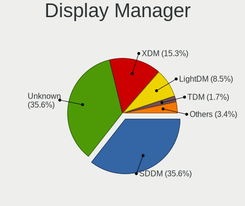

| Name    | Desktops | Percent |
|---------|----------|---------|
| SDDM    | 12       | 63.16%  |
| Unknown | 4        | 21.05%  |
| LightDM | 2        | 10.53%  |
| XDM     | 1        | 5.26%   |

OS Lang
-------

Language

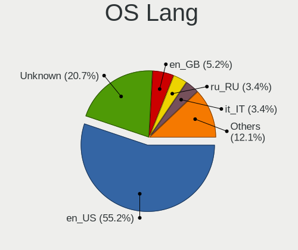

| Lang        | Desktops | Percent |
|-------------|----------|---------|
| en_US       | 13       | 68.42%  |
| Unknown     | 3        | 15.79%  |
| it_IT       | 1        | 5.26%   |
| es_ES.UTF8  | 1        | 5.26%   |
| en_US.ASCII | 1        | 5.26%   |

Boot Mode
---------

EFI or BIOS

| Mode | Desktops | Percent |
|------|----------|---------|
| BIOS | 10       | 52.63%  |
| EFI  | 9        | 47.37%  |

Filesystem
----------

Type of filesystem

| Type    | Desktops | Percent |
|---------|----------|---------|
| Ext4    | 11       | 57.89%  |
| Btrfs   | 4        | 21.05%  |
| Overlay | 2        | 10.53%  |
| Xfs     | 1        | 5.26%   |
| F2fs    | 1        | 5.26%   |

Part. scheme
------------

Scheme of partitioning

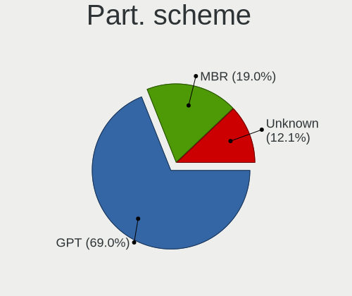

| Type    | Desktops | Percent |
|---------|----------|---------|
| GPT     | 15       | 75%     |
| MBR     | 4        | 20%     |
| Unknown | 1        | 5%      |

Dual Boot with Linux/BSD
------------------------

Hosting more than one Linux/BSD

| Dual boot | Desktops | Percent |
|-----------|----------|---------|
| No        | 12       | 63.16%  |
| Yes       | 7        | 36.84%  |

Dual Boot (Win)
---------------

Hosting Linux and Windows

| Dual boot | Desktops | Percent |
|-----------|----------|---------|
| No        | 14       | 73.68%  |
| Yes       | 5        | 26.32%  |

Board
-----

Vendor
------

Motherboard manufacturer

| Name                | Desktops | Percent |
|---------------------|----------|---------|
| MSI                 | 6        | 31.58%  |
| ASUSTek Computer    | 3        | 15.79%  |
| ASRock              | 3        | 15.79%  |
| Hewlett-Packard     | 2        | 10.53%  |
| Lenovo              | 1        | 5.26%   |
| Gigabyte Technology | 1        | 5.26%   |
| Biostar             | 1        | 5.26%   |
| Acer                | 1        | 5.26%   |
| Unknown             | 1        | 5.26%   |

Model
-----

Motherboard model

| Name                      | Desktops | Percent |
|---------------------------|----------|---------|
| MSI MS-7C52               | 1        | 5.26%   |
| MSI MS-7C02               | 1        | 5.26%   |
| MSI MS-7788               | 1        | 5.26%   |
| MSI MS-7693               | 1        | 5.26%   |
| MSI MS-7529               | 1        | 5.26%   |
| MSI MS-7365               | 1        | 5.26%   |
| Lenovo H50-05 90BH001WIX  | 1        | 5.26%   |
| HP Z440 Workstation       | 1        | 5.26%   |
| HP xw8400 Workstation     | 1        | 5.26%   |
| Gigabyte N3160TN          | 1        | 5.26%   |
| Biostar X470GTA           | 1        | 5.26%   |
| ASUS TUF B450-PLUS GAMING | 1        | 5.26%   |
| ASUS PRIME Z390-A         | 1        | 5.26%   |
| ASUS All Series           | 1        | 5.26%   |
| ASRock N68-S3 FX          | 1        | 5.26%   |
| ASRock H410M-ITX/ac       | 1        | 5.26%   |
| ASRock H270 Pro4          | 1        | 5.26%   |
| Acer Aspire R3610         | 1        | 5.26%   |
| Unknown                   | 1        | 5.26%   |

Model Family
------------

Motherboard model prefix

| Name             | Desktops | Percent |
|------------------|----------|---------|
| MSI MS-7C52      | 1        | 5.26%   |
| MSI MS-7C02      | 1        | 5.26%   |
| MSI MS-7788      | 1        | 5.26%   |
| MSI MS-7693      | 1        | 5.26%   |
| MSI MS-7529      | 1        | 5.26%   |
| MSI MS-7365      | 1        | 5.26%   |
| Lenovo H50-05    | 1        | 5.26%   |
| HP Z440          | 1        | 5.26%   |
| HP xw8400        | 1        | 5.26%   |
| Gigabyte N3160TN | 1        | 5.26%   |
| Biostar X470GTA  | 1        | 5.26%   |
| ASUS TUF         | 1        | 5.26%   |
| ASUS PRIME       | 1        | 5.26%   |
| ASUS All         | 1        | 5.26%   |
| ASRock N68-S3    | 1        | 5.26%   |
| ASRock H410M-ITX | 1        | 5.26%   |
| ASRock H270      | 1        | 5.26%   |
| Acer Aspire      | 1        | 5.26%   |
| Unknown          | 1        | 5.26%   |

MFG Year
--------

Motherboard manufacture year

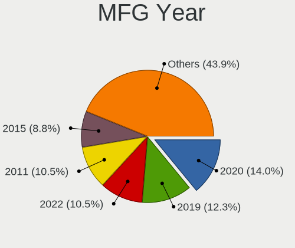

| Year | Desktops | Percent |
|------|----------|---------|
| 2019 | 3        | 15.79%  |
| 2020 | 2        | 10.53%  |
| 2018 | 2        | 10.53%  |
| 2017 | 2        | 10.53%  |
| 2014 | 2        | 10.53%  |
| 2011 | 2        | 10.53%  |
| 2009 | 2        | 10.53%  |
| 2016 | 1        | 5.26%   |
| 2015 | 1        | 5.26%   |
| 2008 | 1        | 5.26%   |
| 2007 | 1        | 5.26%   |

Form Factor
-----------

Physical design of the computer

| Name    | Desktops | Percent |
|---------|----------|---------|
| Desktop | 19       | 100%    |

Secure Boot
-----------

Enabled or disabled

| State    | Desktops | Percent |
|----------|----------|---------|
| Disabled | 19       | 100%    |

Coreboot
--------

Have coreboot on board

| Used | Desktops | Percent |
|------|----------|---------|
| No   | 19       | 100%    |

RAM Size
--------

Total RAM memory

| Size in GB  | Desktops | Percent |
|-------------|----------|---------|
| 16.01-24.0  | 5        | 26.32%  |
| 32.01-64.0  | 3        | 15.79%  |
| 3.01-4.0    | 3        | 15.79%  |
| 64.01-256.0 | 2        | 10.53%  |
| 1.01-2.0    | 2        | 10.53%  |
| 8.01-16.0   | 2        | 10.53%  |
| 4.01-8.0    | 1        | 5.26%   |
| 24.01-32.0  | 1        | 5.26%   |

RAM Used
--------

Used RAM memory

| Used GB    | Desktops | Percent |
|------------|----------|---------|
| 4.01-8.0   | 6        | 30%     |
| 2.01-3.0   | 4        | 20%     |
| 1.01-2.0   | 4        | 20%     |
| 0.51-1.0   | 3        | 15%     |
| 32.01-64.0 | 1        | 5%      |
| 3.01-4.0   | 1        | 5%      |
| 0.01-0.5   | 1        | 5%      |

Total Drives
------------

Number of drives on board

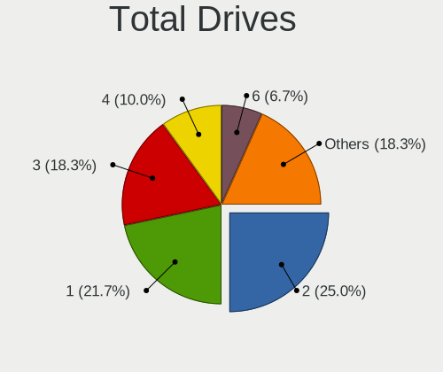

| Drives | Desktops | Percent |
|--------|----------|---------|
| 3      | 5        | 26.32%  |
| 2      | 5        | 26.32%  |
| 1      | 3        | 15.79%  |
| 6      | 2        | 10.53%  |
| 4      | 2        | 10.53%  |
| 9      | 1        | 5.26%   |
| 0      | 1        | 5.26%   |

Has CD-ROM
----------

Has CD-ROM on board

| Presented | Desktops | Percent |
|-----------|----------|---------|
| No        | 11       | 57.89%  |
| Yes       | 8        | 42.11%  |

Has Ethernet
------------

Has Ethernet on board

| Presented | Desktops | Percent |
|-----------|----------|---------|
| Yes       | 19       | 100%    |

Has WiFi
--------

Has WiFi module

| Presented | Desktops | Percent |
|-----------|----------|---------|
| No        | 10       | 52.63%  |
| Yes       | 9        | 47.37%  |

Has Bluetooth
-------------

Has Bluetooth module

| Presented | Desktops | Percent |
|-----------|----------|---------|
| No        | 13       | 68.42%  |
| Yes       | 6        | 31.58%  |

Location
--------

Country
-------

Geographic location (country)

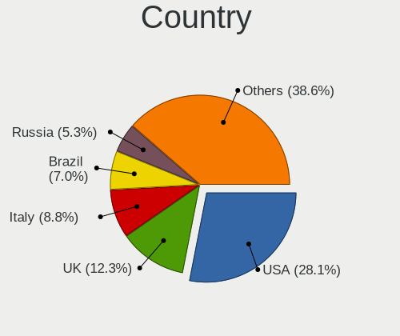

| Country      | Desktops | Percent |
|--------------|----------|---------|
| USA          | 3        | 15.79%  |
| Kazakhstan   | 3        | 15.79%  |
| Italy        | 3        | 15.79%  |
| UK           | 2        | 10.53%  |
| Brazil       | 2        | 10.53%  |
| Spain        | 1        | 5.26%   |
| South Africa | 1        | 5.26%   |
| Russia       | 1        | 5.26%   |
| Japan        | 1        | 5.26%   |
| Hong Kong    | 1        | 5.26%   |
| Canada       | 1        | 5.26%   |

City
----

Geographic location (city)

| City              | Desktops | Percent |
|-------------------|----------|---------|
| Ust-Kamenogorsk   | 2        | 10.53%  |
| Tsukuba           | 1        | 5.26%   |
| Toronto           | 1        | 5.26%   |
| St Petersburg     | 1        | 5.26%   |
| Sham Shui Po      | 1        | 5.26%   |
| Santa Cruz do Sul | 1        | 5.26%   |
| Saint Paul        | 1        | 5.26%   |
| Rome              | 1        | 5.26%   |
| Porto Alegre      | 1        | 5.26%   |
| Milwaukee         | 1        | 5.26%   |
| Milan             | 1        | 5.26%   |
| Mead              | 1        | 5.26%   |
| London            | 1        | 5.26%   |
| Karaganda         | 1        | 5.26%   |
| Granada           | 1        | 5.26%   |
| Frosinone         | 1        | 5.26%   |
| Cape Town         | 1        | 5.26%   |
| Belfast           | 1        | 5.26%   |

Drives
------

Drive Vendor
------------

Hard drive vendors

| Vendor              | Desktops | Drives | Percent |
|---------------------|----------|--------|---------|
| Seagate             | 10       | 14     | 23.26%  |
| WDC                 | 7        | 9      | 16.28%  |
| Samsung Electronics | 6        | 8      | 13.95%  |
| Hitachi             | 4        | 7      | 9.3%    |
| Toshiba             | 3        | 5      | 6.98%   |
| Kingston            | 3        | 4      | 6.98%   |
| Crucial             | 2        | 2      | 4.65%   |
| ZHITAI              | 1        | 2      | 2.33%   |
| Patriot             | 1        | 1      | 2.33%   |
| Intenso             | 1        | 1      | 2.33%   |
| HGST                | 1        | 1      | 2.33%   |
| Hewlett-Packard     | 1        | 1      | 2.33%   |
| Gigabyte Technology | 1        | 1      | 2.33%   |
| China               | 1        | 1      | 2.33%   |
| A-DATA Technology   | 1        | 1      | 2.33%   |

Drive Model
-----------

Hard drive models

| Model                                | Desktops | Percent |
|--------------------------------------|----------|---------|
| WDC WD20EFRX-68EUZN0 2TB             | 2        | 4%      |
| Samsung SSD 970 EVO 250GB            | 2        | 4%      |
| Crucial CT500MX500SSD1 500GB         | 2        | 4%      |
| ZHITAI SC001 Active 1TB SSD          | 1        | 2%      |
| ZHITAI PC005 Active 512GB            | 1        | 2%      |
| WDC WD5000AAKX-22ERMA0 500GB         | 1        | 2%      |
| WDC WD40EJRX-89T1XY0 4TB             | 1        | 2%      |
| WDC WD400BD-60LTA0 40GB              | 1        | 2%      |
| WDC WD3200AAJS-65B4A0 320GB          | 1        | 2%      |
| WDC WD20EZRZ-00Z5HB0 2TB             | 1        | 2%      |
| WDC WD20EZRX-00D8PB0 2TB             | 1        | 2%      |
| Toshiba MD04ABA400V 4TB              | 1        | 2%      |
| Toshiba HDWD240 4TB                  | 1        | 2%      |
| Toshiba DT01ACA300 3TB               | 1        | 2%      |
| Seagate ST4000VX000-2AG166 4TB       | 1        | 2%      |
| Seagate ST380011A 80GB               | 1        | 2%      |
| Seagate ST3160211AS 160GB            | 1        | 2%      |
| Seagate ST3000VX006-1HH166 3TB       | 1        | 2%      |
| Seagate ST3000NM0033-9ZM178 3TB      | 1        | 2%      |
| Seagate ST3000DM001-1ER166 3TB       | 1        | 2%      |
| Seagate ST2000DM008-2FR102 2TB       | 1        | 2%      |
| Seagate ST2000DL003-9VT166 2TB       | 1        | 2%      |
| Seagate ST1000DM010-2EP102 1TB       | 1        | 2%      |
| Seagate ST1000DM003-1SB102 1TB       | 1        | 2%      |
| Seagate ST1000DM003-1ER162 1TB       | 1        | 2%      |
| Seagate ST10000DM005-3AW101 10TB     | 1        | 2%      |
| Seagate Expansion Desk 10TB          | 1        | 2%      |
| Samsung SSD 970 EVO Plus 500GB       | 1        | 2%      |
| Samsung SSD 970 EVO Plus 1TB         | 1        | 2%      |
| Samsung SSD 860 EVO 500GB            | 1        | 2%      |
| Samsung SSD 860 500GB                | 1        | 2%      |
| Samsung SSD 840 Series 250GB         | 1        | 2%      |
| Samsung MZHPV512HDGL-00000 512GB SSD | 1        | 2%      |
| Patriot Burst Elite 120GB SSD        | 1        | 2%      |
| Kingston SUV500MS120G 120GB SSD      | 1        | 2%      |
| Kingston SM2280S3G2120G 120GB SSD    | 1        | 2%      |
| Kingston SA400S37120G 120GB SSD      | 1        | 2%      |
| Intenso SSD SATAIII 120GB            | 1        | 2%      |
| Hitachi HUS724040ALE641 4TB          | 1        | 2%      |
| Hitachi HUA723030ALA640 3TB          | 1        | 2%      |
| Hitachi HTS545025B9A300 250GB        | 1        | 2%      |
| Hitachi HDS721016CLA382 160GB        | 1        | 2%      |
| HGST HUH728080ALE600 8TB             | 1        | 2%      |
| HP SSD S700 500GB                    | 1        | 2%      |
| Gigabyte GP-ASM2NE6100TTTD 1TB       | 1        | 2%      |
| China SATA3 480GB SSD                | 1        | 2%      |
| A-DATA SX6000PNP 256GB               | 1        | 2%      |

HDD Vendor
----------

Hard disk drive vendors

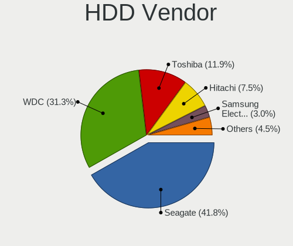

| Vendor  | Desktops | Drives | Percent |
|---------|----------|--------|---------|
| Seagate | 10       | 14     | 40%     |
| WDC     | 7        | 9      | 28%     |
| Hitachi | 4        | 7      | 16%     |
| Toshiba | 3        | 5      | 12%     |
| HGST    | 1        | 1      | 4%      |

SSD Vendor
----------

Solid state drive vendors

| Vendor              | Desktops | Drives | Percent |
|---------------------|----------|--------|---------|
| Samsung Electronics | 3        | 4      | 23.08%  |
| Kingston            | 3        | 4      | 23.08%  |
| Crucial             | 2        | 2      | 15.38%  |
| ZHITAI              | 1        | 1      | 7.69%   |
| Patriot             | 1        | 1      | 7.69%   |
| Intenso             | 1        | 1      | 7.69%   |
| Hewlett-Packard     | 1        | 1      | 7.69%   |
| China               | 1        | 1      | 7.69%   |

Drive Kind
----------

HDD or SSD

| Kind | Desktops | Drives | Percent |
|------|----------|--------|---------|
| HDD  | 14       | 36     | 45.16%  |
| SSD  | 11       | 15     | 35.48%  |
| NVMe | 6        | 7      | 19.35%  |

Drive Connector
---------------

SATA, SAS, NVMe, etc.

| Type | Desktops | Drives | Percent |
|------|----------|--------|---------|
| SATA | 16       | 50     | 69.57%  |
| NVMe | 6        | 7      | 26.09%  |
| SAS  | 1        | 1      | 4.35%   |

Drive Size
----------

Size of hard drive

| Size in TB | Desktops | Drives | Percent |
|------------|----------|--------|---------|
| 0.01-0.5   | 14       | 20     | 42.42%  |
| 1.01-2.0   | 5        | 7      | 15.15%  |
| 0.51-1.0   | 5        | 6      | 15.15%  |
| 3.01-4.0   | 3        | 8      | 9.09%   |
| 2.01-3.0   | 3        | 7      | 9.09%   |
| 4.01-10.0  | 3        | 3      | 9.09%   |

Space Total
-----------

Amount of disk space available on the file system

| Size in GB     | Desktops | Percent |
|----------------|----------|---------|
| 101-250        | 4        | 20%     |
| 251-500        | 3        | 15%     |
| 501-1000       | 3        | 15%     |
| Unknown        | 3        | 15%     |
| 2001-3000      | 2        | 10%     |
| 1-20           | 2        | 10%     |
| More than 3000 | 1        | 5%      |
| 1001-2000      | 1        | 5%      |
| 51-100         | 1        | 5%      |

Space Used
----------

Amount of used disk space

| Used GB        | Desktops | Percent |
|----------------|----------|---------|
| 101-250        | 6        | 31.58%  |
| 1-20           | 3        | 15.79%  |
| 501-1000       | 3        | 15.79%  |
| Unknown        | 3        | 15.79%  |
| 251-500        | 2        | 10.53%  |
| More than 3000 | 1        | 5.26%   |
| 21-50          | 1        | 5.26%   |

Malfunc. Drives
---------------

Drive models with a malfunction

| Model                          | Desktops | Drives | Percent |
|--------------------------------|----------|--------|---------|
| WDC WD5000AAKX-22ERMA0 500GB   | 1        | 1      | 11.11%  |
| WDC WD3200AAJS-65B4A0 320GB    | 1        | 1      | 11.11%  |
| WDC WD20EFRX-68EUZN0 2TB       | 1        | 2      | 11.11%  |
| Seagate ST380011A 80GB         | 1        | 1      | 11.11%  |
| Seagate ST3000VX006-1HH166 3TB | 1        | 1      | 11.11%  |
| Seagate ST2000DL003-9VT166 2TB | 1        | 1      | 11.11%  |
| Seagate ST1000DM003-1ER162 1TB | 1        | 2      | 11.11%  |
| Hitachi HUA723030ALA640 3TB    | 1        | 1      | 11.11%  |
| Hitachi HDS721016CLA382 160GB  | 1        | 1      | 11.11%  |

Malfunc. Drive Vendor
---------------------

Vendors of faulty drives

| Vendor  | Desktops | Drives | Percent |
|---------|----------|--------|---------|
| WDC     | 3        | 4      | 37.5%   |
| Seagate | 3        | 5      | 37.5%   |
| Hitachi | 2        | 2      | 25%     |

Malfunc. HDD Vendor
-------------------

Vendors of faulty HDD drives

| Vendor  | Desktops | Drives | Percent |
|---------|----------|--------|---------|
| WDC     | 3        | 4      | 37.5%   |
| Seagate | 3        | 5      | 37.5%   |
| Hitachi | 2        | 2      | 25%     |

Malfunc. Drive Kind
-------------------

Kinds of faulty drives

| Kind | Desktops | Drives | Percent |
|------|----------|--------|---------|
| HDD  | 6        | 11     | 100%    |

Failed Drives
-------------

Failed drive models

Zero info for selected period =(

Failed Drive Vendor
-------------------

Failed drive vendors

Zero info for selected period =(

Drive Status
------------

Number of failed and malfunc. drives

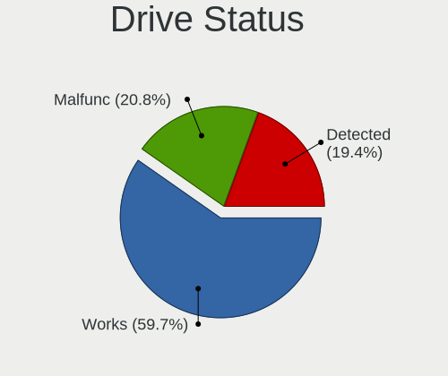

| Status   | Desktops | Drives | Percent |
|----------|----------|--------|---------|
| Works    | 15       | 40     | 62.5%   |
| Malfunc  | 6        | 11     | 25%     |
| Detected | 3        | 7      | 12.5%   |

Storage controller
------------------

Storage Vendor
--------------

Storage controller vendors

| Vendor                      | Desktops | Percent |
|-----------------------------|----------|---------|
| Intel                       | 10       | 35.71%  |
| AMD                         | 6        | 21.43%  |
| Samsung Electronics         | 4        | 14.29%  |
| Nvidia                      | 2        | 7.14%   |
| Yangtze Memory Technologies | 1        | 3.57%   |
| Realtek Semiconductor       | 1        | 3.57%   |
| Phison Electronics          | 1        | 3.57%   |
| Marvell Technology Group    | 1        | 3.57%   |
| JMicron Technology          | 1        | 3.57%   |
| Adaptec                     | 1        | 3.57%   |

Storage Model
-------------

Storage controller models

| Model                                                                                   | Desktops | Percent |
|-----------------------------------------------------------------------------------------|----------|---------|
| AMD FCH SATA Controller [AHCI mode]                                                     | 4        | 10.53%  |
| AMD 400 Series Chipset SATA Controller                                                  | 4        | 10.53%  |
| Samsung NVMe SSD Controller SM981/PM981/PM983                                           | 3        | 7.89%   |
| Intel C610/X99 series chipset sSATA Controller [AHCI mode]                              | 2        | 5.26%   |
| Intel C610/X99 series chipset 6-Port SATA Controller [AHCI mode]                        | 2        | 5.26%   |
| Yangtze Memory Non-Volatile memory controller                                           | 1        | 2.63%   |
| Samsung Electronics SATA controller                                                     | 1        | 2.63%   |
| Realtek Realtek Non-Volatile memory controller                                          | 1        | 2.63%   |
| Phison E16 PCIe4 NVMe Controller                                                        | 1        | 2.63%   |
| Nvidia MCP79 AHCI Controller                                                            | 1        | 2.63%   |
| Nvidia MCP61 SATA Controller                                                            | 1        | 2.63%   |
| Nvidia MCP61 IDE                                                                        | 1        | 2.63%   |
| Marvell Group 88SE6111/6121 SATA II / PATA Controller                                   | 1        | 2.63%   |
| JMicron JMB58x AHCI SATA controller                                                     | 1        | 2.63%   |
| Intel NM10/ICH7 Family SATA Controller [IDE mode]                                       | 1        | 2.63%   |
| Intel C600/X79 series chipset 6-Port SATA AHCI Controller                               | 1        | 2.63%   |
| Intel Atom/Celeron/Pentium Processor x5-E8000/J3xxx/N3xxx Series SATA Controller        | 1        | 2.63%   |
| Intel 82801IB (ICH9) 2 port SATA Controller [IDE mode]                                  | 1        | 2.63%   |
| Intel 82801I (ICH9 Family) 2 port SATA Controller [IDE mode]                            | 1        | 2.63%   |
| Intel 82801G (ICH7 Family) IDE Controller                                               | 1        | 2.63%   |
| Intel 631xESB/632xESB SATA RAID Controller                                              | 1        | 2.63%   |
| Intel 631xESB/632xESB IDE Controller                                                    | 1        | 2.63%   |
| Intel 6 Series/C200 Series Chipset Family Desktop SATA Controller (IDE mode, ports 4-5) | 1        | 2.63%   |
| Intel 6 Series/C200 Series Chipset Family Desktop SATA Controller (IDE mode, ports 0-3) | 1        | 2.63%   |
| Intel 400 Series Chipset Family SATA AHCI Controller                                    | 1        | 2.63%   |
| Intel 200 Series PCH SATA controller [AHCI mode]                                        | 1        | 2.63%   |
| AMD SB7x0/SB8x0/SB9x0 SATA Controller [AHCI mode]                                       | 1        | 2.63%   |
| Adaptec SCSI storage controller                                                         | 1        | 2.63%   |

Storage Kind
------------

Kind of storage controller (IDE, SATA, NVMe, SAS, ...)

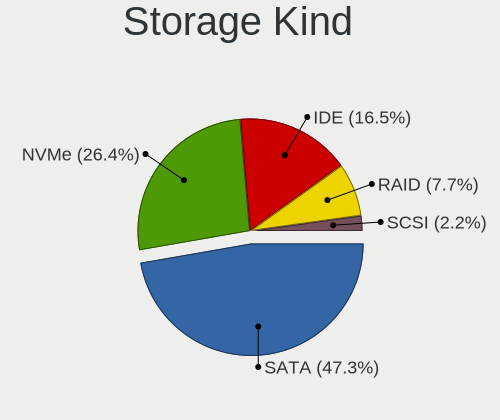

| Kind | Desktops | Percent |
|------|----------|---------|
| SATA | 13       | 50%     |
| NVMe | 6        | 23.08%  |
| IDE  | 5        | 19.23%  |
| RAID | 1        | 3.85%   |
| SCSI | 1        | 3.85%   |

Processor
---------

CPU Vendor
----------

Processor vendors

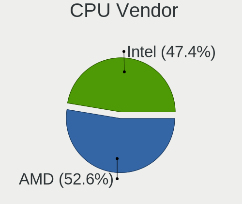

| Vendor | Desktops | Percent |
|--------|----------|---------|
| Intel  | 12       | 63.16%  |
| AMD    | 7        | 36.84%  |

CPU Model
---------

Processor models

| Model                                       | Desktops | Percent |
|---------------------------------------------|----------|---------|
| Intel Xeon CPU E5-2697 v3 @ 2.60GHz         | 1        | 5.26%   |
| Intel Xeon CPU E5-2667 v2 @ 3.30GHz         | 1        | 5.26%   |
| Intel Xeon CPU E5-2660 v3 @ 2.60GHz         | 1        | 5.26%   |
| Intel Xeon CPU 5160 @ 3.00GHz               | 1        | 5.26%   |
| Intel Pentium Dual CPU E2140 @ 1.60GHz      | 1        | 5.26%   |
| Intel Core i7-7700 CPU @ 3.60GHz            | 1        | 5.26%   |
| Intel Core i5-8600K CPU @ 3.60GHz           | 1        | 5.26%   |
| Intel Core i5-3330 CPU @ 3.00GHz            | 1        | 5.26%   |
| Intel Core i3-10105 CPU @ 3.70GHz           | 1        | 5.26%   |
| Intel Core 2 Duo CPU E8400 @ 3.00GHz        | 1        | 5.26%   |
| Intel Celeron CPU N3160 @ 1.60GHz           | 1        | 5.26%   |
| Intel Atom CPU 330 @ 1.60GHz                | 1        | 5.26%   |
| AMD Ryzen 9 5950X 16-Core Processor         | 1        | 5.26%   |
| AMD Ryzen 7 3800X 8-Core Processor          | 1        | 5.26%   |
| AMD Ryzen 7 3700X 8-Core Processor          | 1        | 5.26%   |
| AMD Ryzen 5 2400G with Radeon Vega Graphics | 1        | 5.26%   |
| AMD FX-8320 Eight-Core Processor            | 1        | 5.26%   |
| AMD FX-6300 Six-Core Processor              | 1        | 5.26%   |
| AMD A8-6410 APU with AMD Radeon R5 Graphics | 1        | 5.26%   |

CPU Model Family
----------------

Processor model prefix

| Model              | Desktops | Percent |
|--------------------|----------|---------|
| Intel Xeon         | 4        | 21.05%  |
| Intel Core i5      | 2        | 10.53%  |
| AMD Ryzen 7        | 2        | 10.53%  |
| AMD FX             | 2        | 10.53%  |
| Intel Pentium Dual | 1        | 5.26%   |
| Intel Core i7      | 1        | 5.26%   |
| Intel Core i3      | 1        | 5.26%   |
| Intel Core 2 Duo   | 1        | 5.26%   |
| Intel Celeron      | 1        | 5.26%   |
| Intel Atom         | 1        | 5.26%   |
| AMD Ryzen 9        | 1        | 5.26%   |
| AMD Ryzen 5        | 1        | 5.26%   |
| AMD A8             | 1        | 5.26%   |

CPU Cores
---------

Number of processor cores

| Number | Desktops | Percent |
|--------|----------|---------|
| 4      | 8        | 42.11%  |
| 8      | 3        | 15.79%  |
| 2      | 3        | 15.79%  |
| 16     | 1        | 5.26%   |
| 14     | 1        | 5.26%   |
| 10     | 1        | 5.26%   |
| 6      | 1        | 5.26%   |
| 3      | 1        | 5.26%   |

CPU Sockets
-----------

Number of sockets

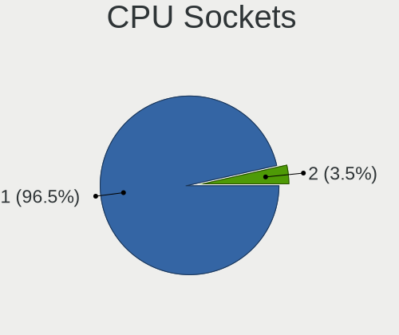

| Number | Desktops | Percent |
|--------|----------|---------|
| 1      | 18       | 94.74%  |
| 2      | 1        | 5.26%   |

CPU Threads
-----------

Threads per core (Hyper-Threading)

| Number | Desktops | Percent |
|--------|----------|---------|
| 2      | 12       | 63.16%  |
| 1      | 7        | 36.84%  |

CPU Op-Modes
------------

CPU Operation Modes (32-bit, 64-bit)

| Op mode        | Desktops | Percent |
|----------------|----------|---------|
| 32-bit, 64-bit | 19       | 100%    |

CPU Microcode
-------------

Microcode number

| Number     | Desktops | Percent |
|------------|----------|---------|
| 0x306f2    | 2        | 10.53%  |
| Unknown    | 2        | 10.53%  |
| 0xa0653    | 1        | 5.26%   |
| 0x906ea    | 1        | 5.26%   |
| 0x906e9    | 1        | 5.26%   |
| 0x6fd      | 1        | 5.26%   |
| 0x406c4    | 1        | 5.26%   |
| 0x306e4    | 1        | 5.26%   |
| 0x306a9    | 1        | 5.26%   |
| 0x106c2    | 1        | 5.26%   |
| 0x1067a    | 1        | 5.26%   |
| 0x0a201016 | 1        | 5.26%   |
| 0x08701021 | 1        | 5.26%   |
| 0x0810100b | 1        | 5.26%   |
| 0x07030105 | 1        | 5.26%   |
| 0x06000822 | 1        | 5.26%   |
| 0x00000000 | 1        | 5.26%   |

CPU Microarch
-------------

Microarchitecture

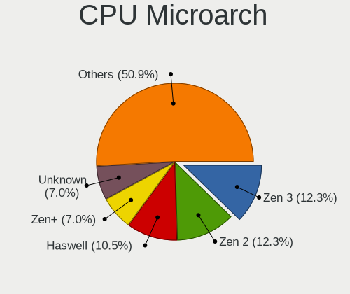

| Name       | Desktops | Percent |
|------------|----------|---------|
| Zen 2      | 2        | 10.53%  |
| Piledriver | 2        | 10.53%  |
| KabyLake   | 2        | 10.53%  |
| IvyBridge  | 2        | 10.53%  |
| Haswell    | 2        | 10.53%  |
| Core       | 2        | 10.53%  |
| Zen 3      | 1        | 5.26%   |
| Zen        | 1        | 5.26%   |
| Silvermont | 1        | 5.26%   |
| Puma       | 1        | 5.26%   |
| Penryn     | 1        | 5.26%   |
| CometLake  | 1        | 5.26%   |
| Bonnell    | 1        | 5.26%   |

Graphics
--------

GPU Vendor
----------

Vendors of graphics cards

| Vendor | Desktops | Percent |
|--------|----------|---------|
| Nvidia | 8        | 40%     |
| AMD    | 8        | 40%     |
| Intel  | 4        | 20%     |

GPU Model
---------

Graphics card models

| Model                                                                                    | Desktops | Percent |
|------------------------------------------------------------------------------------------|----------|---------|
| Nvidia GF108 [GeForce GT 630]                                                            | 2        | 10%     |
| AMD Navi 21 [Radeon RX 6800/6800 XT / 6900 XT]                                           | 2        | 10%     |
| AMD Ellesmere [Radeon RX 470/480/570/570X/580/580X/590]                                  | 2        | 10%     |
| Nvidia GP106 [GeForce GTX 1060 6GB]                                                      | 1        | 5%      |
| Nvidia GP106 [GeForce GTX 1060 3GB]                                                      | 1        | 5%      |
| Nvidia GP104 [GeForce GTX 1070]                                                          | 1        | 5%      |
| Nvidia G84 [GeForce 8600 GT]                                                             | 1        | 5%      |
| Nvidia G71GL [Quadro FX 1500]                                                            | 1        | 5%      |
| Nvidia C79 [ION]                                                                         | 1        | 5%      |
| Intel Xeon E3-1200 v2/3rd Gen Core processor Graphics Controller                         | 1        | 5%      |
| Intel CometLake-S GT2 [UHD Graphics 630]                                                 | 1        | 5%      |
| Intel Atom/Celeron/Pentium Processor x5-E8000/J3xxx/N3xxx Integrated Graphics Controller | 1        | 5%      |
| Intel 82G33/G31 Express Integrated Graphics Controller                                   | 1        | 5%      |
| AMD Raven Ridge [Radeon Vega Series / Radeon Vega Mobile Series]                         | 1        | 5%      |
| AMD Navi 14 [Radeon RX 5500/5500M / Pro 5500M]                                           | 1        | 5%      |
| AMD Cedar [Radeon HD 5000/6000/7350/8350 Series]                                         | 1        | 5%      |
| AMD Caicos XT [Radeon HD 7470/8470 / R5 235/310 OEM]                                     | 1        | 5%      |

GPU Combo
---------

Combinations of graphics cards

| Name           | Desktops | Percent |
|----------------|----------|---------|
| 1 x AMD        | 8        | 42.11%  |
| 1 x Nvidia     | 7        | 36.84%  |
| 1 x Intel      | 3        | 15.79%  |
| Intel + Nvidia | 1        | 5.26%   |

GPU Driver
----------

Free vs proprietary

| Driver      | Desktops | Percent |
|-------------|----------|---------|
| Free        | 16       | 84.21%  |
| Proprietary | 2        | 10.53%  |
| Unknown     | 1        | 5.26%   |

GPU Memory
----------

Total video memory

| Size in GB | Desktops | Percent |
|------------|----------|---------|
| Unknown    | 6        | 31.58%  |
| 0.51-1.0   | 4        | 21.05%  |
| 7.01-8.0   | 3        | 15.79%  |
| 8.01-16.0  | 2        | 10.53%  |
| 0.01-0.5   | 2        | 10.53%  |
| 5.01-6.0   | 1        | 5.26%   |
| 2.01-3.0   | 1        | 5.26%   |

Monitor
-------

Monitor Vendor
--------------

Monitor vendors

| Vendor               | Desktops | Percent |
|----------------------|----------|---------|
| Samsung Electronics  | 5        | 25%     |
| Ancor Communications | 3        | 15%     |
| BenQ                 | 2        | 10%     |
| Acer                 | 2        | 10%     |
| Wacom                | 1        | 5%      |
| Lenovo               | 1        | 5%      |
| IOD                  | 1        | 5%      |
| Hewlett-Packard      | 1        | 5%      |
| Goldstar             | 1        | 5%      |
| GDH                  | 1        | 5%      |
| Dell                 | 1        | 5%      |
| AOC                  | 1        | 5%      |

Monitor Model
-------------

Monitor models

| Model                                                                 | Desktops | Percent |
|-----------------------------------------------------------------------|----------|---------|
| Wacom Cintiq 22HDT WAC1037 1920x1080 476x268mm 21.5-inch              | 1        | 5%      |
| Samsung Electronics SyncMaster SAM0248 1280x1024 376x301mm 19.0-inch  | 1        | 5%      |
| Samsung Electronics SyncMaster SAM01AD 1600x1200 408x306mm 20.1-inch  | 1        | 5%      |
| Samsung Electronics SMS19A100 SAM0867 1366x768 410x230mm 18.5-inch    | 1        | 5%      |
| Samsung Electronics SM2333T SAM0736 1920x1080 477x268mm 21.5-inch     | 1        | 5%      |
| Samsung Electronics S22D300 SAM0B3E 1920x1080 477x268mm 21.5-inch     | 1        | 5%      |
| Lenovo LEN L171 LEN24C9 1280x1024 337x270mm 17.0-inch                 | 1        | 5%      |
| IOD LCD-GL211X IOD151D 1920x1080 458x258mm 20.7-inch                  | 1        | 5%      |
| Hewlett-Packard 27w HPN3494 1920x1080 598x336mm 27.0-inch             | 1        | 5%      |
| Goldstar E1641 GSM8B3E 1366x768 350x200mm 15.9-inch                   | 1        | 5%      |
| GDH CHHWJT GDH0030 1440x900 1150x650mm 52.0-inch                      | 1        | 5%      |
| Dell DELL2407WFPHC DELA026 1920x1200 519x324mm 24.1-inch              | 1        | 5%      |
| BenQ VZ2770H BNQ7B3C 1920x1080 598x336mm 27.0-inch                    | 1        | 5%      |
| BenQ GL2460 BNQ78CE 1920x1080 531x299mm 24.0-inch                     | 1        | 5%      |
| AOC 27G2G4 AOC2702 1920x1080 598x336mm 27.0-inch                      | 1        | 5%      |
| Ancor Communications ROG PG348Q ACI3433 3440x1440 800x340mm 34.2-inch | 1        | 5%      |
| Ancor Communications ASUS VS228 ACI22FD 1920x1080 476x268mm 21.5-inch | 1        | 5%      |
| Ancor Communications ASUS MG28U ACI28A7 3840x2160 621x341mm 27.9-inch | 1        | 5%      |
| Acer GN246HL ACR02F9 1920x1080 530x300mm 24.0-inch                    | 1        | 5%      |
| Acer AL1714 ACRAD18 1280x1024 338x270mm 17.0-inch                     | 1        | 5%      |

Monitor Resolution
------------------

Monitor screen resolution

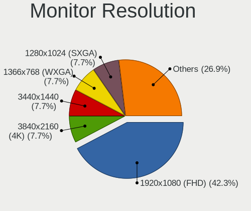

| Resolution        | Desktops | Percent |
|-------------------|----------|---------|
| 1920x1080 (FHD)   | 10       | 50%     |
| 1280x1024 (SXGA)  | 3        | 15%     |
| 3840x2160 (4K)    | 2        | 10%     |
| 1366x768 (WXGA)   | 2        | 10%     |
| 3440x1440         | 1        | 5%      |
| 1920x1200 (WUXGA) | 1        | 5%      |
| 1600x1200         | 1        | 5%      |

Monitor Diagonal
----------------

Diagonal size in inches

| Inches | Desktops | Percent |
|--------|----------|---------|
| 27     | 4        | 20%     |
| 24     | 3        | 15%     |
| 21     | 3        | 15%     |
| 20     | 2        | 10%     |
| 17     | 2        | 10%     |
| 52     | 1        | 5%      |
| 34     | 1        | 5%      |
| 23     | 1        | 5%      |
| 19     | 1        | 5%      |
| 18     | 1        | 5%      |
| 15     | 1        | 5%      |

Monitor Width
-------------

Physical width

| Width in mm | Desktops | Percent |
|-------------|----------|---------|
| 501-600     | 7        | 36.84%  |
| 401-500     | 5        | 26.32%  |
| 301-350     | 3        | 15.79%  |
| 701-800     | 1        | 5.26%   |
| 601-700     | 1        | 5.26%   |
| 351-400     | 1        | 5.26%   |
| 1001-1500   | 1        | 5.26%   |

Aspect Ratio
------------

Proportional relationship between the width and the height

| Ratio | Desktops | Percent |
|-------|----------|---------|
| 16/9  | 12       | 66.67%  |
| 5/4   | 3        | 16.67%  |
| 4/3   | 1        | 5.56%   |
| 21/9  | 1        | 5.56%   |
| 16/10 | 1        | 5.56%   |

Monitor Area
------------

Area in inch²

| Area in inch² | Desktops | Percent |
|----------------|----------|---------|
| 201-250        | 5        | 26.32%  |
| 301-350        | 4        | 21.05%  |
| 151-200        | 3        | 15.79%  |
| 141-150        | 3        | 15.79%  |
| More than 1000 | 1        | 5.26%   |
| 351-500        | 1        | 5.26%   |
| 251-300        | 1        | 5.26%   |
| 101-110        | 1        | 5.26%   |

Pixel Density
-------------

Pixels per inch

| Density | Desktops | Percent |
|---------|----------|---------|
| 51-100  | 13       | 65%     |
| 101-120 | 5        | 25%     |
| 1-50    | 1        | 5%      |
| 121-160 | 1        | 5%      |

Multiple Monitors
-----------------

Total monitors connected

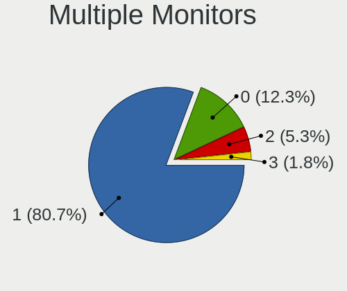

| Total | Desktops | Percent |
|-------|----------|---------|
| 1     | 15       | 78.95%  |
| 0     | 2        | 10.53%  |
| 3     | 1        | 5.26%   |
| 2     | 1        | 5.26%   |

Network
-------

Net Controller Vendor
---------------------

Controller vendors

| Vendor                | Desktops | Percent |
|-----------------------|----------|---------|
| Realtek Semiconductor | 12       | 44.44%  |
| Intel                 | 7        | 25.93%  |
| Qualcomm Atheros      | 3        | 11.11%  |
| Ralink Technology     | 1        | 3.7%    |
| Ralink                | 1        | 3.7%    |
| Nvidia                | 1        | 3.7%    |
| Broadcom Limited      | 1        | 3.7%    |
| Broadcom              | 1        | 3.7%    |

Net Controller Model
--------------------

Controller models

| Model                                                             | Desktops | Percent |
|-------------------------------------------------------------------|----------|---------|
| Realtek RTL8111/8168/8411 PCI Express Gigabit Ethernet Controller | 7        | 22.58%  |
| Realtek RTL810xE PCI Express Fast Ethernet controller             | 3        | 9.68%   |
| Realtek USB 10/100/1G/2.5G LAN                                    | 1        | 3.23%   |
| Realtek RTL8188CUS 802.11n WLAN Adapter                           | 1        | 3.23%   |
| Realtek RTL-8100/8101L/8139 PCI Fast Ethernet Adapter             | 1        | 3.23%   |
| Ralink MT7601U Wireless Adapter                                   | 1        | 3.23%   |
| Ralink RT2790 Wireless 802.11n 1T/2R PCIe                         | 1        | 3.23%   |
| Qualcomm Atheros Killer E220x Gigabit Ethernet Controller         | 1        | 3.23%   |
| Qualcomm Atheros AR93xx Wireless Network Adapter                  | 1        | 3.23%   |
| Qualcomm Atheros AR9287 Wireless Network Adapter (PCI-Express)    | 1        | 3.23%   |
| Qualcomm Atheros AR9227 Wireless Network Adapter                  | 1        | 3.23%   |
| Nvidia MCP79 Ethernet                                             | 1        | 3.23%   |
| Intel Wireless-AC 9260                                            | 1        | 3.23%   |
| Intel Ethernet Connection (7) I219-V                              | 1        | 3.23%   |
| Intel Ethernet Connection (2) I219-V                              | 1        | 3.23%   |
| Intel Ethernet Connection (2) I218-V                              | 1        | 3.23%   |
| Intel Ethernet Connection (2) I218-LM                             | 1        | 3.23%   |
| Intel Ethernet Connection (12) I219-V                             | 1        | 3.23%   |
| Intel Dual Band Wireless-AC 3168NGW [Stone Peak]                  | 1        | 3.23%   |
| Intel Centrino Advanced-N 6205 [Taylor Peak]                      | 1        | 3.23%   |
| Intel 82557/8/9/0/1 Ethernet Pro 100                              | 1        | 3.23%   |
| Broadcom NetXtreme BCM5752 Gigabit Ethernet PCI Express           | 1        | 3.23%   |
| Broadcom Limited NetXtreme BCM5751 Gigabit Ethernet PCI Express   | 1        | 3.23%   |

Wireless Vendor
---------------

Wireless vendors

| Vendor                | Desktops | Percent |
|-----------------------|----------|---------|
| Qualcomm Atheros      | 3        | 33.33%  |
| Intel                 | 3        | 33.33%  |
| Realtek Semiconductor | 1        | 11.11%  |
| Ralink Technology     | 1        | 11.11%  |
| Ralink                | 1        | 11.11%  |

Wireless Model
--------------

Wireless models

| Model                                                          | Desktops | Percent |
|----------------------------------------------------------------|----------|---------|
| Realtek RTL8188CUS 802.11n WLAN Adapter                        | 1        | 11.11%  |
| Ralink MT7601U Wireless Adapter                                | 1        | 11.11%  |
| Ralink RT2790 Wireless 802.11n 1T/2R PCIe                      | 1        | 11.11%  |
| Qualcomm Atheros AR93xx Wireless Network Adapter               | 1        | 11.11%  |
| Qualcomm Atheros AR9287 Wireless Network Adapter (PCI-Express) | 1        | 11.11%  |
| Qualcomm Atheros AR9227 Wireless Network Adapter               | 1        | 11.11%  |
| Intel Wireless-AC 9260                                         | 1        | 11.11%  |
| Intel Dual Band Wireless-AC 3168NGW [Stone Peak]               | 1        | 11.11%  |
| Intel Centrino Advanced-N 6205 [Taylor Peak]                   | 1        | 11.11%  |

Ethernet Vendor
---------------

Ethernet vendors

| Vendor                | Desktops | Percent |
|-----------------------|----------|---------|
| Realtek Semiconductor | 12       | 54.55%  |
| Intel                 | 6        | 27.27%  |
| Qualcomm Atheros      | 1        | 4.55%   |
| Nvidia                | 1        | 4.55%   |
| Broadcom Limited      | 1        | 4.55%   |
| Broadcom              | 1        | 4.55%   |

Ethernet Model
--------------

Ethernet models

| Model                                                             | Desktops | Percent |
|-------------------------------------------------------------------|----------|---------|
| Realtek RTL8111/8168/8411 PCI Express Gigabit Ethernet Controller | 7        | 31.82%  |
| Realtek RTL810xE PCI Express Fast Ethernet controller             | 3        | 13.64%  |
| Realtek USB 10/100/1G/2.5G LAN                                    | 1        | 4.55%   |
| Realtek RTL-8100/8101L/8139 PCI Fast Ethernet Adapter             | 1        | 4.55%   |
| Qualcomm Atheros Killer E220x Gigabit Ethernet Controller         | 1        | 4.55%   |
| Nvidia MCP79 Ethernet                                             | 1        | 4.55%   |
| Intel Ethernet Connection (7) I219-V                              | 1        | 4.55%   |
| Intel Ethernet Connection (2) I219-V                              | 1        | 4.55%   |
| Intel Ethernet Connection (2) I218-V                              | 1        | 4.55%   |
| Intel Ethernet Connection (2) I218-LM                             | 1        | 4.55%   |
| Intel Ethernet Connection (12) I219-V                             | 1        | 4.55%   |
| Intel 82557/8/9/0/1 Ethernet Pro 100                              | 1        | 4.55%   |
| Broadcom NetXtreme BCM5752 Gigabit Ethernet PCI Express           | 1        | 4.55%   |
| Broadcom Limited NetXtreme BCM5751 Gigabit Ethernet PCI Express   | 1        | 4.55%   |

Net Controller Kind
-------------------

Ethernet, WiFi or modem

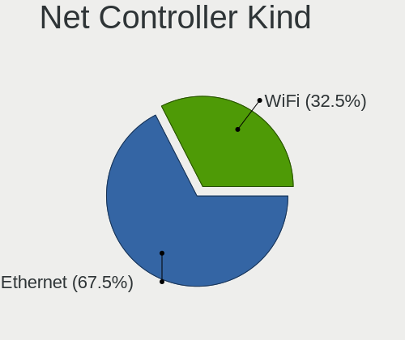

| Kind     | Desktops | Percent |
|----------|----------|---------|
| Ethernet | 19       | 67.86%  |
| WiFi     | 9        | 32.14%  |

Used Controller
---------------

Currently used network controller

| Kind     | Desktops | Percent |
|----------|----------|---------|
| Ethernet | 16       | 80%     |
| WiFi     | 4        | 20%     |

NICs
----

Total network controllers on board

| Total | Desktops | Percent |
|-------|----------|---------|
| 1     | 11       | 57.89%  |
| 2     | 6        | 31.58%  |
| 4     | 1        | 5.26%   |
| 3     | 1        | 5.26%   |

IPv6
----

IPv6 vs IPv4

| Used | Desktops | Percent |
|------|----------|---------|
| No   | 19       | 100%    |

Bluetooth
---------

Bluetooth Vendor
----------------

Controller vendors

| Vendor                  | Desktops | Percent |
|-------------------------|----------|---------|
| Cambridge Silicon Radio | 4        | 66.67%  |
| Intel                   | 2        | 33.33%  |

Bluetooth Model
---------------

Controller models

| Model                                               | Desktops | Percent |
|-----------------------------------------------------|----------|---------|
| Cambridge Silicon Radio Bluetooth Dongle (HCI mode) | 4        | 66.67%  |
| Intel Wireless-AC 9260 Bluetooth Adapter            | 1        | 16.67%  |
| Intel Wireless-AC 3168 Bluetooth                    | 1        | 16.67%  |

Sound
-----

Sound Vendor
------------

Sound card vendors

| Vendor           | Desktops | Percent |
|------------------|----------|---------|
| AMD              | 9        | 33.33%  |
| Intel            | 7        | 25.93%  |
| Nvidia           | 6        | 22.22%  |
| Creative Labs    | 4        | 14.81%  |
| ASUSTek Computer | 1        | 3.7%    |

Sound Model
-----------

Sound card models

| Model                                                                                             | Desktops | Percent |
|---------------------------------------------------------------------------------------------------|----------|---------|
| AMD Starship/Matisse HD Audio Controller                                                          | 3        | 9.09%   |
| Nvidia GP106 High Definition Audio Controller                                                     | 2        | 6.06%   |
| Nvidia GF108 High Definition Audio Controller                                                     | 2        | 6.06%   |
| Creative Labs Sound Core3D [Sound Blaster Recon3D / Z-Series]                                     | 2        | 6.06%   |
| AMD Navi 21/23 HDMI/DP Audio Controller                                                           | 2        | 6.06%   |
| AMD Ellesmere HDMI Audio [Radeon RX 470/480 / 570/580/590]                                        | 2        | 6.06%   |
| Nvidia MCP79 High Definition Audio                                                                | 1        | 3.03%   |
| Nvidia MCP61 High Definition Audio                                                                | 1        | 3.03%   |
| Nvidia GP104 High Definition Audio Controller                                                     | 1        | 3.03%   |
| Intel NM10/ICH7 Family High Definition Audio Controller                                           | 1        | 3.03%   |
| Intel Comet Lake PCH-V cAVS                                                                       | 1        | 3.03%   |
| Intel Cannon Lake PCH cAVS                                                                        | 1        | 3.03%   |
| Intel C600/X79 series chipset High Definition Audio Controller                                    | 1        | 3.03%   |
| Intel Atom/Celeron/Pentium Processor x5-E8000/J3xxx/N3xxx Series High Definition Audio Controller | 1        | 3.03%   |
| Intel 82801I (ICH9 Family) HD Audio Controller                                                    | 1        | 3.03%   |
| Intel 6 Series/C200 Series Chipset Family High Definition Audio Controller                        | 1        | 3.03%   |
| Creative Labs EMU10k2/CA0100/CA0102/CA10200 [Sound Blaster Audigy Series]                         | 1        | 3.03%   |
| Creative Labs CA0108/CA10300 [Sound Blaster Audigy Series]                                        | 1        | 3.03%   |
| ASUSTek Computer XONAR SOUND CARD                                                                 | 1        | 3.03%   |
| AMD SBx00 Azalia (Intel HDA)                                                                      | 1        | 3.03%   |
| AMD Raven/Raven2/Fenghuang HDMI/DP Audio Controller                                               | 1        | 3.03%   |
| AMD Navi 10 HDMI Audio                                                                            | 1        | 3.03%   |
| AMD FCH Azalia Controller                                                                         | 1        | 3.03%   |
| AMD Family 17h/19h HD Audio Controller                                                            | 1        | 3.03%   |
| AMD Cedar HDMI Audio [Radeon HD 5400/6300/7300 Series]                                            | 1        | 3.03%   |
| AMD Caicos HDMI Audio [Radeon HD 6450 / 7450/8450/8490 OEM / R5 230/235/235X OEM]                 | 1        | 3.03%   |

Memory
------

Memory Vendor
-------------

Memory module vendors

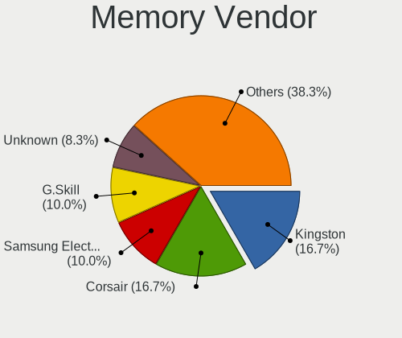

| Vendor              | Desktops | Percent |
|---------------------|----------|---------|
| Kingston            | 5        | 21.74%  |
| Samsung Electronics | 4        | 17.39%  |
| Unknown             | 2        | 8.7%    |
| Transcend           | 1        | 4.35%   |
| Team                | 1        | 4.35%   |
| Strontium           | 1        | 4.35%   |
| SK Hynix            | 1        | 4.35%   |
| Silicon Power       | 1        | 4.35%   |
| Gloway              | 1        | 4.35%   |
| G.Skill             | 1        | 4.35%   |
| Crucial             | 1        | 4.35%   |
| Corsair             | 1        | 4.35%   |
| AMD                 | 1        | 4.35%   |
| A-DATA Technology   | 1        | 4.35%   |
| Unknown             | 1        | 4.35%   |

Memory Model
------------

Memory module models

| Model                                                       | Desktops | Percent |
|-------------------------------------------------------------|----------|---------|
| Unknown RAM Module 2048MB DIMM SDRAM                        | 2        | 8%      |
| Transcend RAM JM1600KLN-8GK 4096MB DIMM DDR3 1600MT/s       | 1        | 4%      |
| Team RAM TEAMGROUP-UD4-3200 8GB DIMM DDR4 3200MT/s          | 1        | 4%      |
| Strontium RAM SRT4G86U1-P9H 4096MB DIMM DDR3 1333MT/s       | 1        | 4%      |
| SK Hynix RAM HYMP512F72CP8N3-Y5 1024MB FB-DIMM DDR2 667MT/s | 1        | 4%      |
| Silicon Power RAM DCLT4GN568S V 4096MB DIMM DDR3 1600MT/s   | 1        | 4%      |
| Samsung RAM M395T5663QZ4-CE66 2048MB FB-DIMM DDR2 667MT/s   | 1        | 4%      |
| Samsung RAM M393A2G40DB0-CPB 16GB RIMM DDR4 2133MT/s        | 1        | 4%      |
| Samsung RAM M393A1K43BB0-CRC 8GB DIMM DDR4 2400MT/s         | 1        | 4%      |
| Samsung RAM M393A1G43EB1-CRC 8GB DIMM DDR4 2400MT/s         | 1        | 4%      |
| Samsung RAM M378B5173EB0-CK0 4GB DIMM DDR3 1600MT/s         | 1        | 4%      |
| Kingston RAM Module 2048MB FB-DIMM DDR2 667MT/s             | 1        | 4%      |
| Kingston RAM KHX3333C16D4/8GX 8GB DIMM DDR4 3800MT/s        | 1        | 4%      |
| Kingston RAM KHX3200C16D4/8GX 8192MB DIMM DDR4 3533MT/s     | 1        | 4%      |
| Kingston RAM KHX1600C10D3/4G 4GB DIMM DDR3 1866MT/s         | 1        | 4%      |
| Kingston RAM ACR128X64D2S800C6 1GB SODIMM DDR2 800MT/s      | 1        | 4%      |
| Gloway RAM TYA4U2666D19161C 16GB DIMM DDR4 2667MT/s         | 1        | 4%      |
| G.Skill RAM F4-3200C16-16GTZSW 16384MB DIMM DDR4 3200MT/s   | 1        | 4%      |
| Crucial RAM BLS4G4D240FSB.8FBD2 4GB DIMM DDR4 2400MT/s      | 1        | 4%      |
| Crucial RAM BLS4G4D240FSB.8FBD 4GB DIMM DDR4 2400MT/s       | 1        | 4%      |
| Corsair RAM CMZ8GX3M1A1600C10 8GB DIMM DDR3 800MT/s         | 1        | 4%      |
| AMD RAM R534G1601S1SL 4GB DIMM DDR3 1600MT/s                | 1        | 4%      |
| A-DATA RAM Module 4096MB DIMM DDR3 1333MT/s                 | 1        | 4%      |
| Unknown                                                     | 1        | 4%      |

Memory Kind
-----------

Memory module kinds

| Kind  | Desktops | Percent |
|-------|----------|---------|
| DDR4  | 8        | 44.44%  |
| DDR3  | 6        | 33.33%  |
| SDRAM | 2        | 11.11%  |
| DDR2  | 2        | 11.11%  |

Memory Form Factor
------------------

Physical design of the memory module

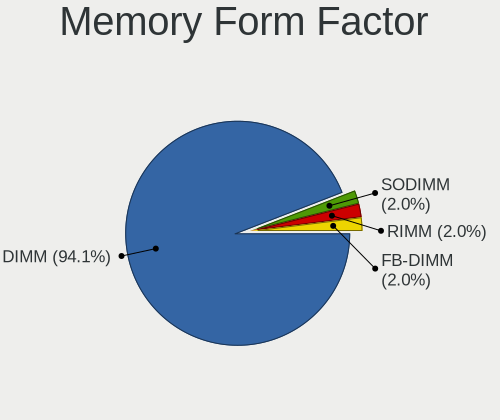

| Name    | Desktops | Percent |
|---------|----------|---------|
| DIMM    | 15       | 83.33%  |
| SODIMM  | 1        | 5.56%   |
| RIMM    | 1        | 5.56%   |
| FB-DIMM | 1        | 5.56%   |

Memory Size
-----------

Memory module size

| Size  | Desktops | Percent |
|-------|----------|---------|
| 4096  | 6        | 31.58%  |
| 8192  | 4        | 21.05%  |
| 16384 | 3        | 15.79%  |
| 2048  | 3        | 15.79%  |
| 1024  | 2        | 10.53%  |
| 32768 | 1        | 5.26%   |

Memory Speed
------------

Memory module speed

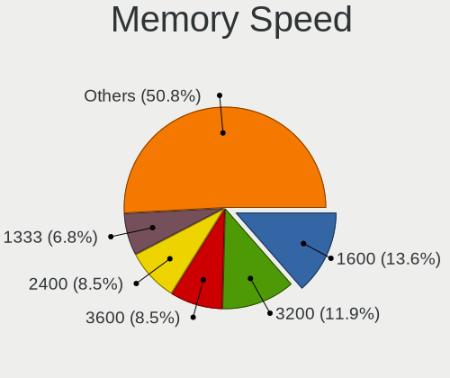

| Speed   | Desktops | Percent |
|---------|----------|---------|
| 1600    | 4        | 21.05%  |
| 3200    | 2        | 10.53%  |
| 2400    | 2        | 10.53%  |
| Unknown | 2        | 10.53%  |
| 65535   | 1        | 5.26%   |
| 3800    | 1        | 5.26%   |
| 3533    | 1        | 5.26%   |
| 2667    | 1        | 5.26%   |
| 2133    | 1        | 5.26%   |
| 1866    | 1        | 5.26%   |
| 1333    | 1        | 5.26%   |
| 800     | 1        | 5.26%   |
| 667     | 1        | 5.26%   |

Printers & scanners
-------------------

Printer Vendor
--------------

Printer device vendors

| Vendor              | Desktops | Percent |
|---------------------|----------|---------|
| QinHeng Electronics | 1        | 25%     |
| Hewlett-Packard     | 1        | 25%     |
| Dell                | 1        | 25%     |
| Canon               | 1        | 25%     |

Printer Model
-------------

Printer device models

| Model                        | Desktops | Percent |
|------------------------------|----------|---------|
| QinHeng CH340S               | 1        | 25%     |
| HP OfficeJet Pro 9010 series | 1        | 25%     |
| Dell 2330d Laser Printer     | 1        | 25%     |
| Canon LiDE 300               | 1        | 25%     |

Scanner Vendor
--------------

Scanner device vendors

| Vendor      | Desktops | Percent |
|-------------|----------|---------|
| Seiko Epson | 1        | 100%    |

Scanner Model
-------------

Scanner device models

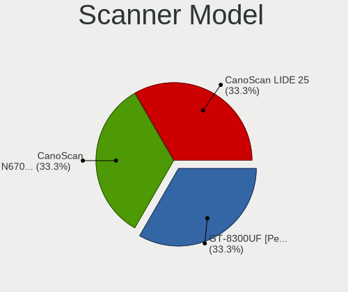

| Model                                         | Desktops | Percent |
|-----------------------------------------------|----------|---------|
| Seiko Epson GT-8300UF [Perfection 1660 PHOTO] | 1        | 100%    |

Camera
------

Camera Vendor
-------------

Camera device vendors

| Vendor   | Desktops | Percent |
|----------|----------|---------|
| Logitech | 3        | 100%    |

Camera Model
------------

Camera device models

| Model                           | Desktops | Percent |
|---------------------------------|----------|---------|
| Logitech Webcam C270            | 1        | 33.33%  |
| Logitech QuickCam Pro 9000      | 1        | 33.33%  |
| Logitech C922 Pro Stream Webcam | 1        | 33.33%  |

Security
--------

Fingerprint Vendor
------------------

Fingerprint sensor vendors

Zero info for selected period =(

Fingerprint Model
-----------------

Fingerprint sensor models

Zero info for selected period =(

Chipcard Vendor
---------------

Chipcard module vendors

| Vendor      | Desktops | Percent |
|-------------|----------|---------|
| Alcor Micro | 1        | 100%    |

Chipcard Model
--------------

Chipcard module models

| Model                               | Desktops | Percent |
|-------------------------------------|----------|---------|
| Alcor Micro AU9540 Smartcard Reader | 1        | 100%    |

Unsupported
-----------

Unsupported Devices
-------------------

Total unsupported devices on board

| Total | Desktops | Percent |
|-------|----------|---------|
| 0     | 13       | 68.42%  |
| 1     | 3        | 15.79%  |
| 4     | 1        | 5.26%   |
| 3     | 1        | 5.26%   |
| 2     | 1        | 5.26%   |

Unsupported Device Types
------------------------

Types of unsupported devices

| Type                     | Desktops | Percent |
|--------------------------|----------|---------|
| Sound                    | 3        | 25%     |
| Unassigned class         | 2        | 16.67%  |
| Graphics card            | 2        | 16.67%  |
| Communication controller | 2        | 16.67%  |
| Net/wireless             | 1        | 8.33%   |
| Net/ethernet             | 1        | 8.33%   |
| Chipcard                 | 1        | 8.33%   |

