Slackware 15.0 - Tested Hardware & Statistics (Desktops)
--------------------------------------------------------

A project to collect tested hardware configurations for Slackware 15.0.

Anyone can contribute to this report by the [hw-probe](https://github.com/linuxhw/hw-probe) tool:

    sudo -E hw-probe -all -upload

Please contribute! Especially if your hardware is rare.

Contents
--------

* [ Test Cases ](#test-cases)

* [ System ](#system)
  - [ Kernel                   ](#kernel)
  - [ Kernel Family            ](#kernel-family)
  - [ Kernel Major Ver.        ](#kernel-major-ver)
  - [ Arch                     ](#arch)
  - [ DE                       ](#de)
  - [ Display Server           ](#display-server)
  - [ Display Manager          ](#display-manager)
  - [ OS Lang                  ](#os-lang)
  - [ Boot Mode                ](#boot-mode)
  - [ Filesystem               ](#filesystem)
  - [ Part. scheme             ](#part-scheme)
  - [ Dual Boot with Linux/BSD ](#dual-boot-with-linuxbsd)
  - [ Dual Boot (Win)          ](#dual-boot-win)

* [ Board ](#board)
  - [ Vendor                   ](#vendor)
  - [ Model                    ](#model)
  - [ Model Family             ](#model-family)
  - [ MFG Year                 ](#mfg-year)
  - [ Form Factor              ](#form-factor)
  - [ Secure Boot              ](#secure-boot)
  - [ Coreboot                 ](#coreboot)
  - [ RAM Size                 ](#ram-size)
  - [ RAM Used                 ](#ram-used)
  - [ Total Drives             ](#total-drives)
  - [ Has CD-ROM               ](#has-cd-rom)
  - [ Has Ethernet             ](#has-ethernet)
  - [ Has WiFi                 ](#has-wifi)
  - [ Has Bluetooth            ](#has-bluetooth)

* [ Location ](#location)
  - [ Country                  ](#country)
  - [ City                     ](#city)

* [ Drives ](#drives)
  - [ Drive Vendor             ](#drive-vendor)
  - [ Drive Model              ](#drive-model)
  - [ HDD Vendor               ](#hdd-vendor)
  - [ SSD Vendor               ](#ssd-vendor)
  - [ Drive Kind               ](#drive-kind)
  - [ Drive Connector          ](#drive-connector)
  - [ Drive Size               ](#drive-size)
  - [ Space Total              ](#space-total)
  - [ Space Used               ](#space-used)
  - [ Malfunc. Drives          ](#malfunc-drives)
  - [ Malfunc. Drive Vendor    ](#malfunc-drive-vendor)
  - [ Malfunc. HDD Vendor      ](#malfunc-hdd-vendor)
  - [ Malfunc. Drive Kind      ](#malfunc-drive-kind)
  - [ Failed Drives            ](#failed-drives)
  - [ Failed Drive Vendor      ](#failed-drive-vendor)
  - [ Drive Status             ](#drive-status)

* [ Storage controller ](#storage-controller)
  - [ Storage Vendor           ](#storage-vendor)
  - [ Storage Model            ](#storage-model)
  - [ Storage Kind             ](#storage-kind)

* [ Processor ](#processor)
  - [ CPU Vendor               ](#cpu-vendor)
  - [ CPU Model                ](#cpu-model)
  - [ CPU Model Family         ](#cpu-model-family)
  - [ CPU Cores                ](#cpu-cores)
  - [ CPU Sockets              ](#cpu-sockets)
  - [ CPU Threads              ](#cpu-threads)
  - [ CPU Op-Modes             ](#cpu-op-modes)
  - [ CPU Microcode            ](#cpu-microcode)
  - [ CPU Microarch            ](#cpu-microarch)

* [ Graphics ](#graphics)
  - [ GPU Vendor               ](#gpu-vendor)
  - [ GPU Model                ](#gpu-model)
  - [ GPU Combo                ](#gpu-combo)
  - [ GPU Driver               ](#gpu-driver)
  - [ GPU Memory               ](#gpu-memory)

* [ Monitor ](#monitor)
  - [ Monitor Vendor           ](#monitor-vendor)
  - [ Monitor Model            ](#monitor-model)
  - [ Monitor Resolution       ](#monitor-resolution)
  - [ Monitor Diagonal         ](#monitor-diagonal)
  - [ Monitor Width            ](#monitor-width)
  - [ Aspect Ratio             ](#aspect-ratio)
  - [ Monitor Area             ](#monitor-area)
  - [ Pixel Density            ](#pixel-density)
  - [ Multiple Monitors        ](#multiple-monitors)

* [ Network ](#network)
  - [ Net Controller Vendor    ](#net-controller-vendor)
  - [ Net Controller Model     ](#net-controller-model)
  - [ Wireless Vendor          ](#wireless-vendor)
  - [ Wireless Model           ](#wireless-model)
  - [ Ethernet Vendor          ](#ethernet-vendor)
  - [ Ethernet Model           ](#ethernet-model)
  - [ Net Controller Kind      ](#net-controller-kind)
  - [ Used Controller          ](#used-controller)
  - [ NICs                     ](#nics)
  - [ IPv6                     ](#ipv6)

* [ Bluetooth ](#bluetooth)
  - [ Bluetooth Vendor         ](#bluetooth-vendor)
  - [ Bluetooth Model          ](#bluetooth-model)

* [ Sound ](#sound)
  - [ Sound Vendor             ](#sound-vendor)
  - [ Sound Model              ](#sound-model)

* [ Memory ](#memory)
  - [ Memory Vendor            ](#memory-vendor)
  - [ Memory Model             ](#memory-model)
  - [ Memory Kind              ](#memory-kind)
  - [ Memory Form Factor       ](#memory-form-factor)
  - [ Memory Size              ](#memory-size)
  - [ Memory Speed             ](#memory-speed)

* [ Printers & scanners ](#printers--scanners)
  - [ Printer Vendor           ](#printer-vendor)
  - [ Printer Model            ](#printer-model)
  - [ Scanner Vendor           ](#scanner-vendor)
  - [ Scanner Model            ](#scanner-model)

* [ Camera ](#camera)
  - [ Camera Vendor            ](#camera-vendor)
  - [ Camera Model             ](#camera-model)

* [ Security ](#security)
  - [ Fingerprint Vendor       ](#fingerprint-vendor)
  - [ Fingerprint Model        ](#fingerprint-model)
  - [ Chipcard Vendor          ](#chipcard-vendor)
  - [ Chipcard Model           ](#chipcard-model)

* [ Unsupported ](#unsupported)
  - [ Unsupported Devices      ](#unsupported-devices)
  - [ Unsupported Device Types ](#unsupported-device-types)

Test Cases
----------

Total: 44

| Vendor        | Model                   | Probe                                                      | Date         |
|---------------|-------------------------|------------------------------------------------------------|--------------|
| Fujitsu       | FujitsuTP7000 -1        | [231d7f8182](https://linux-hardware.org/?probe=231d7f8182) | Jun 18, 2023 |
| MSI           | X99A GAMING 7           | [ec94d173a7](https://linux-hardware.org/?probe=ec94d173a7) | May 23, 2023 |
| ASRock        | N68-S3 FX               | [0ed94fe810](https://linux-hardware.org/?probe=0ed94fe810) | May 10, 2023 |
| HEDYCOMPUT... | IH81MF-Q3               | [3444236ed4](https://linux-hardware.org/?probe=3444236ed4) | Apr 30, 2023 |
| Gigabyte      | AB350-Gaming 3-CF       | [7f052050d9](https://linux-hardware.org/?probe=7f052050d9) | Apr 10, 2023 |
| ASUSTek       | TUF Gaming B450-PLUS II | [70314c0c37](https://linux-hardware.org/?probe=70314c0c37) | Mar 23, 2023 |
| Dell          | 0MY171 A00              | [47fd974afd](https://linux-hardware.org/?probe=47fd974afd) | Mar 20, 2023 |
| ASUSTek       | PRIME B450M-A           | [053498458e](https://linux-hardware.org/?probe=053498458e) | Mar 03, 2023 |
| Dell          | 0MY171 A00              | [795f707b1a](https://linux-hardware.org/?probe=795f707b1a) | Feb 25, 2023 |
| Dell          | 04YP6J A03              | [696cc9b57a](https://linux-hardware.org/?probe=696cc9b57a) | Feb 19, 2023 |
| ASRock        | 990FX Extreme4          | [7ce91f2b1e](https://linux-hardware.org/?probe=7ce91f2b1e) | Feb 16, 2023 |
| ASRock        | N68-S UCC               | [cb4c89a390](https://linux-hardware.org/?probe=cb4c89a390) | Jan 18, 2023 |
| ASUSTek       | ROG STRIX B550-I GAMING | [1c9dc6792e](https://linux-hardware.org/?probe=1c9dc6792e) | Jan 13, 2023 |
| ASRock        | B550 Taichi             | [469f9d71e2](https://linux-hardware.org/?probe=469f9d71e2) | Dec 29, 2022 |
| Dell          | 0MY171 A00              | [055bc4ea78](https://linux-hardware.org/?probe=055bc4ea78) | Dec 13, 2022 |
| ASUSTek       | SABERTOOTH X99          | [c0bf1336d5](https://linux-hardware.org/?probe=c0bf1336d5) | Dec 12, 2022 |
| HP            | 8906 SMVB               | [d000e4e926](https://linux-hardware.org/?probe=d000e4e926) | Dec 02, 2022 |
| Lenovo        | 31900058 STD            | [1408b2dc5f](https://linux-hardware.org/?probe=1408b2dc5f) | Nov 18, 2022 |
| HP            | 3031h                   | [b6849a29a2](https://linux-hardware.org/?probe=b6849a29a2) | Sep 24, 2022 |
| HP            | 3031h                   | [40160588bb](https://linux-hardware.org/?probe=40160588bb) | Sep 20, 2022 |
| MSI           | H110M PRO-VD            | [2299dc1786](https://linux-hardware.org/?probe=2299dc1786) | Sep 17, 2022 |
| ASUSTek       | ROG CROSSHAIR VIII HERO | [a954ba4e86](https://linux-hardware.org/?probe=a954ba4e86) | Aug 26, 2022 |
| Dell          | 0200DY A03              | [e0e14cd1f2](https://linux-hardware.org/?probe=e0e14cd1f2) | Aug 19, 2022 |
| Gigabyte      | N3160TN                 | [e2f44a8274](https://linux-hardware.org/?probe=e2f44a8274) | May 31, 2022 |
| ASUSTek       | TUF B450-PLUS GAMING    | [533b8a9f83](https://linux-hardware.org/?probe=533b8a9f83) | Apr 13, 2022 |
| MSI           | 970 GAMING              | [25d8968f19](https://linux-hardware.org/?probe=25d8968f19) | Apr 13, 2022 |
| ASRock        | N68-S3 FX               | [ca818bd06d](https://linux-hardware.org/?probe=ca818bd06d) | Apr 08, 2022 |
| MSI           | MS-7365                 | [8948dea4de](https://linux-hardware.org/?probe=8948dea4de) | Apr 07, 2022 |
| Unknown       | X79-P3                  | [40e38e9a8d](https://linux-hardware.org/?probe=40e38e9a8d) | Apr 07, 2022 |
| HP            | 0A08h                   | [4df5b0832f](https://linux-hardware.org/?probe=4df5b0832f) | Apr 06, 2022 |
| ASRock        | H410M-ITX/ac            | [ae936790c9](https://linux-hardware.org/?probe=ae936790c9) | Apr 03, 2022 |
| ASUSTek       | PRIME Z390-A            | [5307aba2c3](https://linux-hardware.org/?probe=5307aba2c3) | Mar 30, 2022 |
| Acer          | FMCP7A-ION-LE           | [bbce73c6d6](https://linux-hardware.org/?probe=bbce73c6d6) | Mar 14, 2022 |
| ASRock        | H270 Pro4               | [ae79ca8557](https://linux-hardware.org/?probe=ae79ca8557) | Mar 12, 2022 |
| Lenovo        | 31900058 STD            | [bc59b862f4](https://linux-hardware.org/?probe=bc59b862f4) | Mar 02, 2022 |
| Biostar       | X470GTA                 | [8d400b49f8](https://linux-hardware.org/?probe=8d400b49f8) | Feb 13, 2022 |
| MSI           | G31TM-P21               | [dda6a57223](https://linux-hardware.org/?probe=dda6a57223) | Feb 07, 2022 |
| HP            | 212B                    | [353b0dde99](https://linux-hardware.org/?probe=353b0dde99) | Jan 29, 2022 |
| MSI           | B450 TOMAHAWK MAX       | [85543358d3](https://linux-hardware.org/?probe=85543358d3) | Jan 14, 2022 |
| MSI           | G31TM-P21               | [25d668ee95](https://linux-hardware.org/?probe=25d668ee95) | Jan 10, 2022 |
| MSI           | H61M-P31                | [58651bba67](https://linux-hardware.org/?probe=58651bba67) | Dec 07, 2021 |
| MSI           | B450M-A PRO MAX         | [b7df25ba5d](https://linux-hardware.org/?probe=b7df25ba5d) | Oct 25, 2021 |
| ASUSTek       | SABERTOOTH X99          | [64e5ee1691](https://linux-hardware.org/?probe=64e5ee1691) | Oct 13, 2021 |
| MSI           | B450M-A PRO MAX         | [17d37c5316](https://linux-hardware.org/?probe=17d37c5316) | Oct 12, 2021 |

System
------

Kernel
------

Version of the Linux kernel

| Version        | Desktops | Percent |
|----------------|----------|---------|
| 5.15.19        | 6        | 14.63%  |
| 5.19.17        | 4        | 9.76%   |
| 5.15.63        | 4        | 9.76%   |
| 5.19.17-Unraid | 3        | 7.32%   |
| 5.15.94        | 2        | 4.88%   |
| 5.15.30-Unraid | 2        | 4.88%   |
| 5.15.27        | 2        | 4.88%   |
| 6.1.20         | 1        | 2.44%   |
| 6.1.13         | 1        | 2.44%   |
| 5.19.16        | 1        | 2.44%   |
| 5.17.2         | 1        | 2.44%   |
| 5.17.0-custom  | 1        | 2.44%   |
| 5.16.18        | 1        | 2.44%   |
| 5.16.13        | 1        | 2.44%   |
| 5.16.11        | 1        | 2.44%   |
| 5.15.6         | 1        | 2.44%   |
| 5.15.38        | 1        | 2.44%   |
| 5.15.14        | 1        | 2.44%   |
| 5.15.13        | 1        | 2.44%   |
| 5.15.103       | 1        | 2.44%   |
| 5.14.15-Unraid | 1        | 2.44%   |
| 5.14.15        | 1        | 2.44%   |
| 5.14.12        | 1        | 2.44%   |
| 5.14.11        | 1        | 2.44%   |
| 5.13.12        | 1        | 2.44%   |

Kernel Family
-------------

Linux kernel without a distro release

| Version  | Desktops | Percent |
|----------|----------|---------|
| 5.19.17  | 7        | 17.07%  |
| 5.15.19  | 6        | 14.63%  |
| 5.15.63  | 4        | 9.76%   |
| 5.15.94  | 2        | 4.88%   |
| 5.15.30  | 2        | 4.88%   |
| 5.15.27  | 2        | 4.88%   |
| 5.14.15  | 2        | 4.88%   |
| 6.1.20   | 1        | 2.44%   |
| 6.1.13   | 1        | 2.44%   |
| 5.19.16  | 1        | 2.44%   |
| 5.17.2   | 1        | 2.44%   |
| 5.17.0   | 1        | 2.44%   |
| 5.16.18  | 1        | 2.44%   |
| 5.16.13  | 1        | 2.44%   |
| 5.16.11  | 1        | 2.44%   |
| 5.15.6   | 1        | 2.44%   |
| 5.15.38  | 1        | 2.44%   |
| 5.15.14  | 1        | 2.44%   |
| 5.15.13  | 1        | 2.44%   |
| 5.15.103 | 1        | 2.44%   |
| 5.14.12  | 1        | 2.44%   |
| 5.14.11  | 1        | 2.44%   |
| 5.13.12  | 1        | 2.44%   |

Kernel Major Ver.
-----------------

Linux kernel major version

| Version | Desktops | Percent |
|---------|----------|---------|
| 5.15    | 21       | 52.5%   |
| 5.19    | 8        | 20%     |
| 5.14    | 4        | 10%     |
| 5.16    | 3        | 7.5%    |
| 5.17    | 2        | 5%      |
| 6.1     | 1        | 2.5%    |
| 5.13    | 1        | 2.5%    |

Arch
----

OS architecture (x86_64, i586, etc.)

| Name   | Desktops | Percent |
|--------|----------|---------|
| x86_64 | 37       | 100%    |

DE
--

Desktop Environment

| Name       | Desktops | Percent |
|------------|----------|---------|
| KDE5       | 14       | 36.84%  |
| XFCE       | 11       | 28.95%  |
| Unknown    | 10       | 26.32%  |
| X-Generic  | 1        | 2.63%   |
| X-Cinnamon | 1        | 2.63%   |
| FVWM       | 1        | 2.63%   |

Display Server
--------------

X11 or Wayland

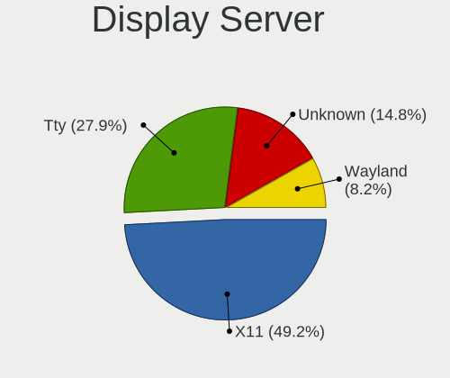

| Name    | Desktops | Percent |
|---------|----------|---------|
| X11     | 21       | 53.85%  |
| Tty     | 11       | 28.21%  |
| Unknown | 5        | 12.82%  |
| Wayland | 2        | 5.13%   |

Display Manager
---------------

SDDM, LightDM, etc.

| Name    | Desktops | Percent |
|---------|----------|---------|
| SDDM    | 16       | 42.11%  |
| Unknown | 14       | 36.84%  |
| XDM     | 4        | 10.53%  |
| LightDM | 3        | 7.89%   |
| SLiM    | 1        | 2.63%   |

OS Lang
-------

Language

| Lang        | Desktops | Percent |
|-------------|----------|---------|
| en_US       | 19       | 51.35%  |
| Unknown     | 9        | 24.32%  |
| en_GB       | 2        | 5.41%   |
| ru_RU       | 1        | 2.7%    |
| pt_PT       | 1        | 2.7%    |
| pt_BR       | 1        | 2.7%    |
| it_IT       | 1        | 2.7%    |
| es_ES.UTF8  | 1        | 2.7%    |
| es_ES       | 1        | 2.7%    |
| en_US.ASCII | 1        | 2.7%    |

Boot Mode
---------

EFI or BIOS

| Mode | Desktops | Percent |
|------|----------|---------|
| BIOS | 20       | 54.05%  |
| EFI  | 17       | 45.95%  |

Filesystem
----------

Type of filesystem

| Type    | Desktops | Percent |
|---------|----------|---------|
| Ext4    | 22       | 59.46%  |
| Btrfs   | 6        | 16.22%  |
| Xfs     | 3        | 8.11%   |
| Overlay | 2        | 5.41%   |
| Tmpfs   | 1        | 2.7%    |
| Rootfs  | 1        | 2.7%    |
| F2fs    | 1        | 2.7%    |
| Ext2    | 1        | 2.7%    |

Part. scheme
------------

Scheme of partitioning

| Type    | Desktops | Percent |
|---------|----------|---------|
| GPT     | 26       | 68.42%  |
| MBR     | 7        | 18.42%  |
| Unknown | 5        | 13.16%  |

Dual Boot with Linux/BSD
------------------------

Hosting more than one Linux/BSD

| Dual boot | Desktops | Percent |
|-----------|----------|---------|
| No        | 23       | 60.53%  |
| Yes       | 15       | 39.47%  |

Dual Boot (Win)
---------------

Hosting Linux and Windows

| Dual boot | Desktops | Percent |
|-----------|----------|---------|
| No        | 27       | 72.97%  |
| Yes       | 10       | 27.03%  |

Board
-----

Vendor
------

Motherboard manufacturer

| Name                | Desktops | Percent |
|---------------------|----------|---------|
| MSI                 | 8        | 21.62%  |
| ASUSTek Computer    | 7        | 18.92%  |
| ASRock              | 7        | 18.92%  |
| Hewlett-Packard     | 4        | 10.81%  |
| Dell                | 3        | 8.11%   |
| Gigabyte Technology | 2        | 5.41%   |
| Lenovo              | 1        | 2.7%    |
| HEDYCOMPUTER        | 1        | 2.7%    |
| Fujitsu             | 1        | 2.7%    |
| Biostar             | 1        | 2.7%    |
| Acer                | 1        | 2.7%    |
| Unknown             | 1        | 2.7%    |

Model
-----

Motherboard model

| Name                                 | Desktops | Percent |
|--------------------------------------|----------|---------|
| ASRock N68-S3 FX                     | 2        | 5.41%   |
| MSI MS-7C52                          | 1        | 2.7%    |
| MSI MS-7C02                          | 1        | 2.7%    |
| MSI MS-7996                          | 1        | 2.7%    |
| MSI MS-7885                          | 1        | 2.7%    |
| MSI MS-7788                          | 1        | 2.7%    |
| MSI MS-7693                          | 1        | 2.7%    |
| MSI MS-7529                          | 1        | 2.7%    |
| MSI MS-7365                          | 1        | 2.7%    |
| Lenovo H50-05 90BH001WIX             | 1        | 2.7%    |
| HP Z440 Workstation                  | 1        | 2.7%    |
| HP xw8400 Workstation                | 1        | 2.7%    |
| HP Pavilion Gaming Desktop TG01-2xxx | 1        | 2.7%    |
| HP Compaq dc7900 Small Form Factor   | 1        | 2.7%    |
| HEDYCOMPUTER IH81MF-Q3               | 1        | 2.7%    |
| Gigabyte N3160TN                     | 1        | 2.7%    |
| Gigabyte AB350-Gaming 3              | 1        | 2.7%    |
| Fujitsu FujitsuTP7000                | 1        | 2.7%    |
| Dell Precision WorkStation 690       | 1        | 2.7%    |
| Dell OptiPlex 780                    | 1        | 2.7%    |
| Dell OptiPlex 3020                   | 1        | 2.7%    |
| Biostar X470GTA                      | 1        | 2.7%    |
| ASUS TUF Gaming B450-PLUS II         | 1        | 2.7%    |
| ASUS TUF B450-PLUS GAMING            | 1        | 2.7%    |
| ASUS ROG STRIX B550-I GAMING         | 1        | 2.7%    |
| ASUS ROG CROSSHAIR VIII HERO         | 1        | 2.7%    |
| ASUS PRIME Z390-A                    | 1        | 2.7%    |
| ASUS PRIME B450M-A                   | 1        | 2.7%    |
| ASUS All Series                      | 1        | 2.7%    |
| ASRock N68-S UCC                     | 1        | 2.7%    |
| ASRock H410M-ITX/ac                  | 1        | 2.7%    |
| ASRock H270 Pro4                     | 1        | 2.7%    |
| ASRock B550 Taichi                   | 1        | 2.7%    |
| ASRock 990FX Extreme4                | 1        | 2.7%    |
| Acer Aspire R3610                    | 1        | 2.7%    |
| Unknown                              | 1        | 2.7%    |

Model Family
------------

Motherboard model prefix

| Name                   | Desktops | Percent |
|------------------------|----------|---------|
| Dell OptiPlex          | 2        | 5.41%   |
| ASUS TUF               | 2        | 5.41%   |
| ASUS ROG               | 2        | 5.41%   |
| ASUS PRIME             | 2        | 5.41%   |
| ASRock N68-S3          | 2        | 5.41%   |
| MSI MS-7C52            | 1        | 2.7%    |
| MSI MS-7C02            | 1        | 2.7%    |
| MSI MS-7996            | 1        | 2.7%    |
| MSI MS-7885            | 1        | 2.7%    |
| MSI MS-7788            | 1        | 2.7%    |
| MSI MS-7693            | 1        | 2.7%    |
| MSI MS-7529            | 1        | 2.7%    |
| MSI MS-7365            | 1        | 2.7%    |
| Lenovo H50-05          | 1        | 2.7%    |
| HP Z440                | 1        | 2.7%    |
| HP xw8400              | 1        | 2.7%    |
| HP Pavilion            | 1        | 2.7%    |
| HP Compaq              | 1        | 2.7%    |
| HEDYCOMPUTER IH81MF-Q3 | 1        | 2.7%    |
| Gigabyte N3160TN       | 1        | 2.7%    |
| Gigabyte AB350-Gaming  | 1        | 2.7%    |
| Fujitsu FujitsuTP7000  | 1        | 2.7%    |
| Dell Precision         | 1        | 2.7%    |
| Biostar X470GTA        | 1        | 2.7%    |
| ASUS All               | 1        | 2.7%    |
| ASRock N68-S           | 1        | 2.7%    |
| ASRock H410M-ITX       | 1        | 2.7%    |
| ASRock H270            | 1        | 2.7%    |
| ASRock B550            | 1        | 2.7%    |
| ASRock 990FX           | 1        | 2.7%    |
| Acer Aspire            | 1        | 2.7%    |
| Unknown                | 1        | 2.7%    |

MFG Year
--------

Motherboard manufacture year

| Year | Desktops | Percent |
|------|----------|---------|
| 2011 | 5        | 13.51%  |
| 2020 | 4        | 10.81%  |
| 2019 | 4        | 10.81%  |
| 2015 | 4        | 10.81%  |
| 2018 | 3        | 8.11%   |
| 2017 | 3        | 8.11%   |
| 2008 | 3        | 8.11%   |
| 2022 | 2        | 5.41%   |
| 2014 | 2        | 5.41%   |
| 2009 | 2        | 5.41%   |
| 2021 | 1        | 2.7%    |
| 2016 | 1        | 2.7%    |
| 2012 | 1        | 2.7%    |
| 2010 | 1        | 2.7%    |
| 2007 | 1        | 2.7%    |

Form Factor
-----------

Physical design of the computer

| Name    | Desktops | Percent |
|---------|----------|---------|
| Desktop | 37       | 100%    |

Secure Boot
-----------

Enabled or disabled

| State    | Desktops | Percent |
|----------|----------|---------|
| Disabled | 37       | 100%    |

Coreboot
--------

Have coreboot on board

| Used | Desktops | Percent |
|------|----------|---------|
| No   | 37       | 100%    |

RAM Size
--------

Total RAM memory

| Size in GB  | Desktops | Percent |
|-------------|----------|---------|
| 16.01-24.0  | 10       | 26.32%  |
| 32.01-64.0  | 7        | 18.42%  |
| 3.01-4.0    | 5        | 13.16%  |
| 64.01-256.0 | 4        | 10.53%  |
| 8.01-16.0   | 4        | 10.53%  |
| 4.01-8.0    | 3        | 7.89%   |
| 1.01-2.0    | 3        | 7.89%   |
| 24.01-32.0  | 2        | 5.26%   |

RAM Used
--------

Used RAM memory

| Used GB    | Desktops | Percent |
|------------|----------|---------|
| 4.01-8.0   | 10       | 26.32%  |
| 1.01-2.0   | 9        | 23.68%  |
| 2.01-3.0   | 8        | 21.05%  |
| 0.51-1.0   | 4        | 10.53%  |
| 3.01-4.0   | 2        | 5.26%   |
| 8.01-16.0  | 2        | 5.26%   |
| 32.01-64.0 | 1        | 2.63%   |
| 16.01-24.0 | 1        | 2.63%   |
| 0.01-0.5   | 1        | 2.63%   |

Total Drives
------------

Number of drives on board

| Drives | Desktops | Percent |
|--------|----------|---------|
| 2      | 12       | 30.77%  |
| 3      | 9        | 23.08%  |
| 1      | 9        | 23.08%  |
| 6      | 4        | 10.26%  |
| 4      | 2        | 5.13%   |
| 11     | 1        | 2.56%   |
| 9      | 1        | 2.56%   |
| 0      | 1        | 2.56%   |

Has CD-ROM
----------

Has CD-ROM on board

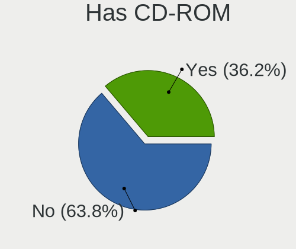

| Presented | Desktops | Percent |
|-----------|----------|---------|
| Yes       | 19       | 50%     |
| No        | 19       | 50%     |

Has Ethernet
------------

Has Ethernet on board

| Presented | Desktops | Percent |
|-----------|----------|---------|
| Yes       | 37       | 100%    |

Has WiFi
--------

Has WiFi module

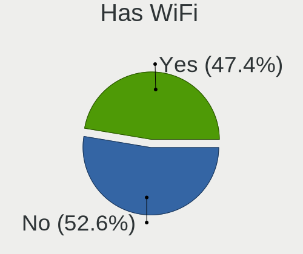

| Presented | Desktops | Percent |
|-----------|----------|---------|
| No        | 21       | 55.26%  |
| Yes       | 17       | 44.74%  |

Has Bluetooth
-------------

Has Bluetooth module

| Presented | Desktops | Percent |
|-----------|----------|---------|
| No        | 24       | 64.86%  |
| Yes       | 13       | 35.14%  |

Location
--------

Country
-------

Geographic location (country)

| Country      | Desktops | Percent |
|--------------|----------|---------|
| USA          | 8        | 21.62%  |
| UK           | 4        | 10.81%  |
| Brazil       | 4        | 10.81%  |
| Kazakhstan   | 3        | 8.11%   |
| Italy        | 3        | 8.11%   |
| Spain        | 2        | 5.41%   |
| Russia       | 2        | 5.41%   |
| Hong Kong    | 2        | 5.41%   |
| Germany      | 2        | 5.41%   |
| South Africa | 1        | 2.7%    |
| Portugal     | 1        | 2.7%    |
| Japan        | 1        | 2.7%    |
| China        | 1        | 2.7%    |
| Canada       | 1        | 2.7%    |
| Australia    | 1        | 2.7%    |
| Argentina    | 1        | 2.7%    |

City
----

Geographic location (city)

| City                 | Desktops | Percent |
|----------------------|----------|---------|
| Ust-Kamenogorsk      | 2        | 5.26%   |
| Winter Springs       | 1        | 2.63%   |
| Tsukuba              | 1        | 2.63%   |
| Toronto              | 1        | 2.63%   |
| Tatuí               | 1        | 2.63%   |
| St Petersburg        | 1        | 2.63%   |
| Springfield          | 1        | 2.63%   |
| Sham Shui Po         | 1        | 2.63%   |
| Seville              | 1        | 2.63%   |
| Senhora da Hora      | 1        | 2.63%   |
| Santa Cruz do Sul    | 1        | 2.63%   |
| Saint Paul           | 1        | 2.63%   |
| Rome                 | 1        | 2.63%   |
| Rock                 | 1        | 2.63%   |
| Porto Alegre         | 1        | 2.63%   |
| Nanping              | 1        | 2.63%   |
| Moscow               | 1        | 2.63%   |
| Milwaukee            | 1        | 2.63%   |
| Milan                | 1        | 2.63%   |
| Mead                 | 1        | 2.63%   |
| McKinney             | 1        | 2.63%   |
| Luton                | 1        | 2.63%   |
| London               | 1        | 2.63%   |
| Lisbon               | 1        | 2.63%   |
| Leipzig              | 1        | 2.63%   |
| Karaganda            | 1        | 2.63%   |
| Hamburg              | 1        | 2.63%   |
| Granada              | 1        | 2.63%   |
| Gold Coast           | 1        | 2.63%   |
| Frosinone            | 1        | 2.63%   |
| Fayetteville         | 1        | 2.63%   |
| Colorado Springs     | 1        | 2.63%   |
| Central              | 1        | 2.63%   |
| Cape Town            | 1        | 2.63%   |
| Cachoeiras de Macacu | 1        | 2.63%   |
| Buenos Aires         | 1        | 2.63%   |
| Belfast              | 1        | 2.63%   |

Drives
------

Drive Vendor
------------

Hard drive vendors

| Vendor              | Desktops | Drives | Percent |
|---------------------|----------|--------|---------|
| Seagate             | 17       | 22     | 20.99%  |
| WDC                 | 15       | 32     | 18.52%  |
| Samsung Electronics | 11       | 14     | 13.58%  |
| Toshiba             | 7        | 18     | 8.64%   |
| Hitachi             | 5        | 8      | 6.17%   |
| Kingston            | 4        | 6      | 4.94%   |
| Crucial             | 4        | 5      | 4.94%   |
| Transcend           | 2        | 2      | 2.47%   |
| ZHITAI              | 1        | 2      | 1.23%   |
| SK hynix            | 1        | 1      | 1.23%   |
| PNY                 | 1        | 1      | 1.23%   |
| Phison Electronics  | 1        | 1      | 1.23%   |
| Patriot             | 1        | 1      | 1.23%   |
| Maxtor              | 1        | 1      | 1.23%   |
| Lexar               | 1        | 1      | 1.23%   |
| KIOXIA              | 1        | 1      | 1.23%   |
| Intenso             | 1        | 1      | 1.23%   |
| Intel               | 1        | 2      | 1.23%   |
| HGST                | 1        | 1      | 1.23%   |
| Hewlett-Packard     | 1        | 1      | 1.23%   |
| Gigabyte Technology | 1        | 1      | 1.23%   |
| DUEX                | 1        | 1      | 1.23%   |
| China               | 1        | 1      | 1.23%   |
| A-DATA Technology   | 1        | 1      | 1.23%   |

Drive Model
-----------

Hard drive models

| Model                             | Desktops | Percent |
|-----------------------------------|----------|---------|
| WDC WD20EFRX-68EUZN0 2TB          | 2        | 2.06%   |
| WDC WD10EZEX-08WN4A0 1TB          | 2        | 2.06%   |
| Seagate ST2000DM008-2FR102 2TB    | 2        | 2.06%   |
| Seagate ST2000DL003-9VT166 2TB    | 2        | 2.06%   |
| Seagate ST1000DM003-1SB102 1TB    | 2        | 2.06%   |
| Seagate Expansion Desk 5TB        | 2        | 2.06%   |
| Samsung SSD 970 EVO 250GB         | 2        | 2.06%   |
| Crucial CT500MX500SSD1 500GB      | 2        | 2.06%   |
| ZHITAI SC001 Active 1TB SSD       | 1        | 1.03%   |
| ZHITAI PC005 Active 512GB         | 1        | 1.03%   |
| WDC WDS500G2B0A-00SM50 500GB SSD  | 1        | 1.03%   |
| WDC WDS480G2G0A-00JH30 480GB SSD  | 1        | 1.03%   |
| WDC WDS100T2B0A-00SM50 1TB SSD    | 1        | 1.03%   |
| WDC WD5000AAKX-22ERMA0 500GB      | 1        | 1.03%   |
| WDC WD5000AAKS-007AA0 500GB       | 1        | 1.03%   |
| WDC WD5000AADS-00S9B0 500GB       | 1        | 1.03%   |
| WDC WD40EZRX-00SPEB0 4TB          | 1        | 1.03%   |
| WDC WD40EJRX-89T1XY0 4TB          | 1        | 1.03%   |
| WDC WD400BD-60LTA0 40GB           | 1        | 1.03%   |
| WDC WD3200AAJS-65B4A0 320GB       | 1        | 1.03%   |
| WDC WD30EZRX-00SPEB0 3TB          | 1        | 1.03%   |
| WDC WD30EZRX-00MMMB0 3TB          | 1        | 1.03%   |
| WDC WD20EZRZ-00Z5HB0 2TB          | 1        | 1.03%   |
| WDC WD20EZRX-00D8PB0 2TB          | 1        | 1.03%   |
| WDC WD20EARX-00PASB0 2TB          | 1        | 1.03%   |
| WDC WD10JPVX-75JC3T0 1TB          | 1        | 1.03%   |
| WDC WD10EZEX-00RKKA0 1TB          | 1        | 1.03%   |
| WDC WD10EZEX-00MFCA0 1TB          | 1        | 1.03%   |
| Transcend TS480GSSD220S 480GB     | 1        | 1.03%   |
| Transcend TS32GSSD370S 32GB       | 1        | 1.03%   |
| Toshiba THNSNH128GBST SSD         | 1        | 1.03%   |
| Toshiba THNSF5512GPUK 512GB       | 1        | 1.03%   |
| Toshiba MK5055GSX 500GB           | 1        | 1.03%   |
| Toshiba MG08ADA800E 8TB           | 1        | 1.03%   |
| Toshiba MG05ACA800E 8TB           | 1        | 1.03%   |
| Toshiba MD04ABA400V 4TB           | 1        | 1.03%   |
| Toshiba HDWD240 4TB               | 1        | 1.03%   |
| Toshiba HDWD130 3TB               | 1        | 1.03%   |
| Toshiba DT01ACA300 3TB            | 1        | 1.03%   |
| SK hynix SHGS31-500GS-2 500GB SSD | 1        | 1.03%   |

HDD Vendor
----------

Hard disk drive vendors

| Vendor              | Desktops | Drives | Percent |
|---------------------|----------|--------|---------|
| Seagate             | 17       | 22     | 37.78%  |
| WDC                 | 14       | 29     | 31.11%  |
| Toshiba             | 6        | 13     | 13.33%  |
| Hitachi             | 5        | 8      | 11.11%  |
| Samsung Electronics | 1        | 1      | 2.22%   |
| Maxtor              | 1        | 1      | 2.22%   |
| HGST                | 1        | 1      | 2.22%   |

SSD Vendor
----------

Solid state drive vendors

| Vendor              | Desktops | Drives | Percent |
|---------------------|----------|--------|---------|
| Samsung Electronics | 5        | 7      | 18.52%  |
| Kingston            | 4        | 6      | 14.81%  |
| Crucial             | 3        | 4      | 11.11%  |
| WDC                 | 2        | 3      | 7.41%   |
| Transcend           | 2        | 2      | 7.41%   |
| ZHITAI              | 1        | 1      | 3.7%    |
| Toshiba             | 1        | 3      | 3.7%    |
| SK hynix            | 1        | 1      | 3.7%    |
| PNY                 | 1        | 1      | 3.7%    |
| Patriot             | 1        | 1      | 3.7%    |
| Lexar               | 1        | 1      | 3.7%    |
| Intenso             | 1        | 1      | 3.7%    |
| Intel               | 1        | 2      | 3.7%    |
| Hewlett-Packard     | 1        | 1      | 3.7%    |
| DUEX                | 1        | 1      | 3.7%    |
| China               | 1        | 1      | 3.7%    |

Drive Kind
----------

HDD or SSD

| Kind | Desktops | Drives | Percent |
|------|----------|--------|---------|
| HDD  | 28       | 75     | 45.16%  |
| SSD  | 23       | 36     | 37.1%   |
| NVMe | 11       | 14     | 17.74%  |

Drive Connector
---------------

SATA, SAS, NVMe, etc.

| Type | Desktops | Drives | Percent |
|------|----------|--------|---------|
| SATA | 34       | 109    | 72.34%  |
| NVMe | 11       | 14     | 23.4%   |
| SAS  | 2        | 2      | 4.26%   |

Drive Size
----------

Size of hard drive

| Size in TB | Desktops | Drives | Percent |
|------------|----------|--------|---------|
| 0.01-0.5   | 26       | 38     | 40%     |
| 0.51-1.0   | 13       | 28     | 20%     |
| 1.01-2.0   | 10       | 13     | 15.38%  |
| 3.01-4.0   | 7        | 14     | 10.77%  |
| 4.01-10.0  | 5        | 7      | 7.69%   |
| 2.01-3.0   | 4        | 11     | 6.15%   |

Space Total
-----------

Amount of disk space available on the file system

| Size in GB     | Desktops | Percent |
|----------------|----------|---------|
| 101-250        | 7        | 17.5%   |
| Unknown        | 7        | 17.5%   |
| 501-1000       | 6        | 15%     |
| 251-500        | 5        | 12.5%   |
| 2001-3000      | 5        | 12.5%   |
| 1-20           | 4        | 10%     |
| 1001-2000      | 3        | 7.5%    |
| More than 3000 | 2        | 5%      |
| 51-100         | 1        | 2.5%    |

Space Used
----------

Amount of used disk space

| Used GB        | Desktops | Percent |
|----------------|----------|---------|
| 101-250        | 9        | 23.08%  |
| Unknown        | 7        | 17.95%  |
| 1-20           | 6        | 15.38%  |
| 501-1000       | 6        | 15.38%  |
| 251-500        | 3        | 7.69%   |
| 21-50          | 3        | 7.69%   |
| 1001-2000      | 3        | 7.69%   |
| More than 3000 | 1        | 2.56%   |
| 51-100         | 1        | 2.56%   |

Malfunc. Drives
---------------

Drive models with a malfunction

| Model                                 | Desktops | Drives | Percent |
|---------------------------------------|----------|--------|---------|
| WDC WDS480G2G0A-00JH30 480GB SSD      | 1        | 1      | 7.14%   |
| WDC WD5000AAKX-22ERMA0 500GB          | 1        | 1      | 7.14%   |
| WDC WD3200AAJS-65B4A0 320GB           | 1        | 1      | 7.14%   |
| WDC WD30EZRX-00MMMB0 3TB              | 1        | 1      | 7.14%   |
| WDC WD20EFRX-68EUZN0 2TB              | 1        | 2      | 7.14%   |
| WDC WD20EARX-00PASB0 2TB              | 1        | 1      | 7.14%   |
| Seagate ST380011A 80GB                | 1        | 1      | 7.14%   |
| Seagate ST3000VX006-1HH166 3TB        | 1        | 1      | 7.14%   |
| Seagate ST2000DL003-9VT166 2TB        | 1        | 1      | 7.14%   |
| Seagate ST1000DM003-1ER162 1TB        | 1        | 2      | 7.14%   |
| Samsung Electronics SSD 970 EVO 500GB | 1        | 1      | 7.14%   |
| Hitachi HUA723030ALA640 3TB           | 1        | 1      | 7.14%   |
| Hitachi HDS721016CLA382 160GB         | 1        | 1      | 7.14%   |
| DUEX DX300256A5xnEMLC 256GB SSD       | 1        | 1      | 7.14%   |

Malfunc. Drive Vendor
---------------------

Vendors of faulty drives

| Vendor              | Desktops | Drives | Percent |
|---------------------|----------|--------|---------|
| WDC                 | 5        | 7      | 41.67%  |
| Seagate             | 3        | 5      | 25%     |
| Hitachi             | 2        | 2      | 16.67%  |
| Samsung Electronics | 1        | 1      | 8.33%   |
| DUEX                | 1        | 1      | 8.33%   |

Malfunc. HDD Vendor
-------------------

Vendors of faulty HDD drives

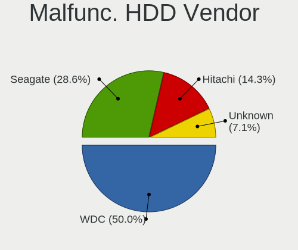

| Vendor  | Desktops | Drives | Percent |
|---------|----------|--------|---------|
| WDC     | 4        | 6      | 44.44%  |
| Seagate | 3        | 5      | 33.33%  |
| Hitachi | 2        | 2      | 22.22%  |

Malfunc. Drive Kind
-------------------

Kinds of faulty drives

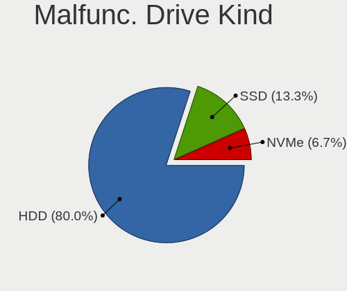

| Kind | Desktops | Drives | Percent |
|------|----------|--------|---------|
| HDD  | 7        | 13     | 70%     |
| SSD  | 2        | 2      | 20%     |
| NVMe | 1        | 1      | 10%     |

Failed Drives
-------------

Failed drive models

Zero info for selected period =(

Failed Drive Vendor
-------------------

Failed drive vendors

Zero info for selected period =(

Drive Status
------------

Number of failed and malfunc. drives

| Status   | Desktops | Drives | Percent |
|----------|----------|--------|---------|
| Works    | 28       | 79     | 59.57%  |
| Malfunc  | 10       | 16     | 21.28%  |
| Detected | 9        | 30     | 19.15%  |

Storage controller
------------------

Storage Vendor
--------------

Storage controller vendors

| Vendor                       | Desktops | Percent |
|------------------------------|----------|---------|
| Intel                        | 18       | 32.14%  |
| AMD                          | 14       | 25%     |
| Samsung Electronics          | 6        | 10.71%  |
| Nvidia                       | 4        | 7.14%   |
| Marvell Technology Group     | 3        | 5.36%   |
| JMicron Technology           | 2        | 3.57%   |
| Yangtze Memory Technologies  | 1        | 1.79%   |
| Toshiba America Info Systems | 1        | 1.79%   |
| Realtek Semiconductor        | 1        | 1.79%   |
| Phison Electronics           | 1        | 1.79%   |
| Micron/Crucial Technology    | 1        | 1.79%   |
| LSI Logic / Symbios Logic    | 1        | 1.79%   |
| KIOXIA                       | 1        | 1.79%   |
| ASMedia Technology           | 1        | 1.79%   |
| Adaptec                      | 1        | 1.79%   |

Storage Model
-------------

Storage controller models

| Model                                                                                   | Desktops | Percent |
|-----------------------------------------------------------------------------------------|----------|---------|
| AMD FCH SATA Controller [AHCI mode]                                                     | 7        | 9.09%   |
| AMD 400 Series Chipset SATA Controller                                                  | 7        | 9.09%   |
| Samsung NVMe SSD Controller SM981/PM981/PM983                                           | 5        | 6.49%   |
| Nvidia MCP61 SATA Controller                                                            | 3        | 3.9%    |
| Nvidia MCP61 IDE                                                                        | 3        | 3.9%    |
| Intel C610/X99 series chipset sSATA Controller [AHCI mode]                              | 3        | 3.9%    |
| Intel C610/X99 series chipset 6-Port SATA Controller [AHCI mode]                        | 3        | 3.9%    |
| Marvell Group 88SE9215 PCIe 2.0 x1 4-port SATA 6 Gb/s Controller                        | 2        | 2.6%    |
| JMicron JMB58x AHCI SATA controller                                                     | 2        | 2.6%    |
| Intel 82801JD/DO (ICH10 Family) SATA AHCI Controller                                    | 2        | 2.6%    |
| Intel 631xESB/632xESB IDE Controller                                                    | 2        | 2.6%    |
| Intel 4 Series Chipset PT IDER Controller                                               | 2        | 2.6%    |
| AMD SB7x0/SB8x0/SB9x0 SATA Controller [AHCI mode]                                       | 2        | 2.6%    |
| AMD 500 Series Chipset SATA Controller                                                  | 2        | 2.6%    |
| Yangtze Memory Non-Volatile memory controller                                           | 1        | 1.3%    |
| Toshiba America Info Systems XG4 NVMe SSD Controller                                    | 1        | 1.3%    |
| Samsung Electronics SATA controller                                                     | 1        | 1.3%    |
| Realtek NVMe Controller                                                                 | 1        | 1.3%    |
| Phison E16 PCIe4 NVMe Controller                                                        | 1        | 1.3%    |
| Nvidia MCP79 AHCI Controller                                                            | 1        | 1.3%    |
| Micron/Crucial P2 NVMe PCIe SSD                                                         | 1        | 1.3%    |
| Marvell Group 88SE6111/6121 SATA II / PATA Controller                                   | 1        | 1.3%    |
| LSI Logic / Symbios Logic 53c1030 PCI-X Fusion-MPT Dual Ultra320 SCSI                   | 1        | 1.3%    |
| KIOXIA NVMe SSD Controller BG4                                                          | 1        | 1.3%    |
| Intel SATA Controller [RAID mode]                                                       | 1        | 1.3%    |
| Intel Q170/Q150/B150/H170/H110/Z170/CM236 Chipset SATA Controller [AHCI Mode]           | 1        | 1.3%    |
| Intel NM10/ICH7 Family SATA Controller [IDE mode]                                       | 1        | 1.3%    |
| Intel C600/X79 series chipset 6-Port SATA AHCI Controller                               | 1        | 1.3%    |
| Intel Atom/Celeron/Pentium Processor x5-E8000/J3xxx/N3xxx Series SATA Controller        | 1        | 1.3%    |
| Intel 82801IB (ICH9) 2 port SATA Controller [IDE mode]                                  | 1        | 1.3%    |
| Intel 82801I (ICH9 Family) 2 port SATA Controller [IDE mode]                            | 1        | 1.3%    |
| Intel 82801G (ICH7 Family) IDE Controller                                               | 1        | 1.3%    |
| Intel 8 Series/C220 Series Chipset Family 6-port SATA Controller 1 [AHCI mode]          | 1        | 1.3%    |
| Intel 8 Series/C220 Series Chipset Family 4-port SATA Controller 1 [IDE mode]           | 1        | 1.3%    |
| Intel 8 Series/C220 Series Chipset Family 2-port SATA Controller 2 [IDE mode]           | 1        | 1.3%    |
| Intel 631xESB/632xESB SATA RAID Controller                                              | 1        | 1.3%    |
| Intel 631xESB/632xESB SATA AHCI Controller                                              | 1        | 1.3%    |
| Intel 6 Series/C200 Series Chipset Family IDE-r Controller                              | 1        | 1.3%    |
| Intel 6 Series/C200 Series Chipset Family Desktop SATA Controller (IDE mode, ports 4-5) | 1        | 1.3%    |
| Intel 6 Series/C200 Series Chipset Family Desktop SATA Controller (IDE mode, ports 0-3) | 1        | 1.3%    |

Storage Kind
------------

Kind of storage controller (IDE, SATA, NVMe, SAS, ...)

| Kind | Desktops | Percent |
|------|----------|---------|
| SATA | 27       | 49.09%  |
| IDE  | 13       | 23.64%  |
| NVMe | 11       | 20%     |
| RAID | 2        | 3.64%   |
| SCSI | 2        | 3.64%   |

Processor
---------

CPU Vendor
----------

Processor vendors

| Vendor | Desktops | Percent |
|--------|----------|---------|
| Intel  | 20       | 54.05%  |
| AMD    | 17       | 45.95%  |

CPU Model
---------

Processor models

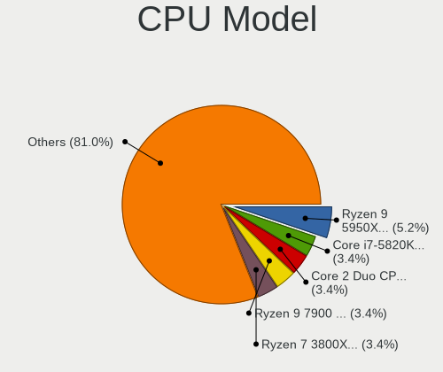

| Model                                       | Desktops | Percent |
|---------------------------------------------|----------|---------|
| Intel Core i7-5820K CPU @ 3.30GHz           | 2        | 5.26%   |
| Intel Core 2 Duo CPU E8400 @ 3.00GHz        | 2        | 5.26%   |
| AMD Ryzen 5 3600 6-Core Processor           | 2        | 5.26%   |
| AMD Athlon II X2 250 Processor              | 2        | 5.26%   |
| Intel Xeon CPU X5355 @ 2.66GHz              | 1        | 2.63%   |
| Intel Xeon CPU E5-2697 v3 @ 2.60GHz         | 1        | 2.63%   |
| Intel Xeon CPU E5-2667 v2 @ 3.30GHz         | 1        | 2.63%   |
| Intel Xeon CPU E5-2660 v3 @ 2.60GHz         | 1        | 2.63%   |
| Intel Xeon CPU 5160 @ 3.00GHz               | 1        | 2.63%   |
| Intel Pentium Dual CPU E2140 @ 1.60GHz      | 1        | 2.63%   |
| Intel Pentium CPU G3250 @ 3.20GHz           | 1        | 2.63%   |
| Intel Core i7-7700 CPU @ 3.60GHz            | 1        | 2.63%   |
| Intel Core i7-6700 CPU @ 3.40GHz            | 1        | 2.63%   |
| Intel Core i5-8600K CPU @ 3.60GHz           | 1        | 2.63%   |
| Intel Core i5-4590 CPU @ 3.30GHz            | 1        | 2.63%   |
| Intel Core i5-3330 CPU @ 3.00GHz            | 1        | 2.63%   |
| Intel Core i5-2400 CPU @ 3.10GHz            | 1        | 2.63%   |
| Intel Core i3-10105 CPU @ 3.70GHz           | 1        | 2.63%   |
| Intel Core 2 Duo CPU E8500 @ 3.16GHz        | 1        | 2.63%   |
| Intel Celeron CPU N3160 @ 1.60GHz           | 1        | 2.63%   |
| Intel Atom CPU 330 @ 1.60GHz                | 1        | 2.63%   |
| AMD Ryzen 9 5950X 16-Core Processor         | 1        | 2.63%   |
| AMD Ryzen 9 5900X 12-Core Processor         | 1        | 2.63%   |
| AMD Ryzen 7 PRO 5750G with Radeon Graphics  | 1        | 2.63%   |
| AMD Ryzen 7 3800X 8-Core Processor          | 1        | 2.63%   |
| AMD Ryzen 7 3700X 8-Core Processor          | 1        | 2.63%   |
| AMD Ryzen 5 5600G with Radeon Graphics      | 1        | 2.63%   |
| AMD Ryzen 5 2400G with Radeon Vega Graphics | 1        | 2.63%   |
| AMD Ryzen 5 1500X Quad-Core Processor       | 1        | 2.63%   |
| AMD Ryzen 3 3200G with Radeon Vega Graphics | 1        | 2.63%   |
| AMD FX-8320 Eight-Core Processor            | 1        | 2.63%   |
| AMD FX-8150 Eight-Core Processor            | 1        | 2.63%   |
| AMD FX-6300 Six-Core Processor              | 1        | 2.63%   |
| AMD A8-6410 APU with AMD Radeon R5 Graphics | 1        | 2.63%   |

CPU Model Family
----------------

Processor model prefix

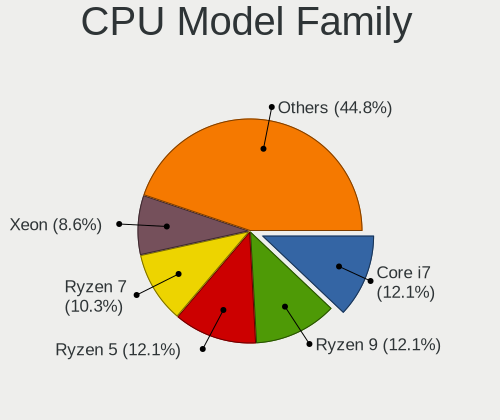

| Model              | Desktops | Percent |
|--------------------|----------|---------|
| Intel Xeon         | 5        | 13.16%  |
| AMD Ryzen 5        | 5        | 13.16%  |
| Intel Core i7      | 4        | 10.53%  |
| Intel Core i5      | 4        | 10.53%  |
| Intel Core 2 Duo   | 3        | 7.89%   |
| AMD FX             | 3        | 7.89%   |
| AMD Ryzen 9        | 2        | 5.26%   |
| AMD Ryzen 7        | 2        | 5.26%   |
| AMD Athlon II X2   | 2        | 5.26%   |
| Intel Pentium Dual | 1        | 2.63%   |
| Intel Pentium      | 1        | 2.63%   |
| Intel Core i3      | 1        | 2.63%   |
| Intel Celeron      | 1        | 2.63%   |
| Intel Atom         | 1        | 2.63%   |
| AMD Ryzen 7 PRO    | 1        | 2.63%   |
| AMD Ryzen 3        | 1        | 2.63%   |
| AMD A8             | 1        | 2.63%   |

CPU Cores
---------

Number of processor cores

| Number | Desktops | Percent |
|--------|----------|---------|
| 4      | 14       | 36.84%  |
| 2      | 8        | 21.05%  |
| 6      | 6        | 15.79%  |
| 8      | 5        | 13.16%  |
| 16     | 1        | 2.63%   |
| 14     | 1        | 2.63%   |
| 12     | 1        | 2.63%   |
| 10     | 1        | 2.63%   |
| 3      | 1        | 2.63%   |

CPU Sockets
-----------

Number of sockets

| Number | Desktops | Percent |
|--------|----------|---------|
| 1      | 35       | 94.59%  |
| 2      | 2        | 5.41%   |

CPU Threads
-----------

Threads per core (Hyper-Threading)

| Number | Desktops | Percent |
|--------|----------|---------|
| 2      | 21       | 56.76%  |
| 1      | 16       | 43.24%  |

CPU Op-Modes
------------

CPU Operation Modes (32-bit, 64-bit)

| Op mode        | Desktops | Percent |
|----------------|----------|---------|
| 32-bit, 64-bit | 37       | 100%    |

CPU Microcode
-------------

Microcode number

| Number     | Desktops | Percent |
|------------|----------|---------|
| Unknown    | 8        | 21.62%  |
| 0x306f2    | 3        | 8.11%   |
| 0x08701021 | 3        | 8.11%   |
| 0x1067a    | 2        | 5.41%   |
| 0x0a50000c | 2        | 5.41%   |
| 0x0a201016 | 2        | 5.41%   |
| 0xa0653    | 1        | 2.7%    |
| 0x906ea    | 1        | 2.7%    |
| 0x906e9    | 1        | 2.7%    |
| 0x6fd      | 1        | 2.7%    |
| 0x6fb      | 1        | 2.7%    |
| 0x506e3    | 1        | 2.7%    |
| 0x406c4    | 1        | 2.7%    |
| 0x306e4    | 1        | 2.7%    |
| 0x306c3    | 1        | 2.7%    |
| 0x306a9    | 1        | 2.7%    |
| 0x106c2    | 1        | 2.7%    |
| 0x0810100b | 1        | 2.7%    |
| 0x08001126 | 1        | 2.7%    |
| 0x07030105 | 1        | 2.7%    |
| 0x06000822 | 1        | 2.7%    |
| 0x010000b6 | 1        | 2.7%    |
| 0x00000000 | 1        | 2.7%    |

CPU Microarch
-------------

Microarchitecture

| Name        | Desktops | Percent |
|-------------|----------|---------|
| Haswell     | 5        | 13.51%  |
| Zen 3       | 4        | 10.81%  |
| Zen 2       | 4        | 10.81%  |
| Penryn      | 3        | 8.11%   |
| Core        | 3        | 8.11%   |
| Zen         | 2        | 5.41%   |
| Piledriver  | 2        | 5.41%   |
| KabyLake    | 2        | 5.41%   |
| K10         | 2        | 5.41%   |
| IvyBridge   | 2        | 5.41%   |
| Zen+        | 1        | 2.7%    |
| Skylake     | 1        | 2.7%    |
| Silvermont  | 1        | 2.7%    |
| SandyBridge | 1        | 2.7%    |
| Puma        | 1        | 2.7%    |
| CometLake   | 1        | 2.7%    |
| Bulldozer   | 1        | 2.7%    |
| Bonnell     | 1        | 2.7%    |

Graphics
--------

GPU Vendor
----------

Vendors of graphics cards

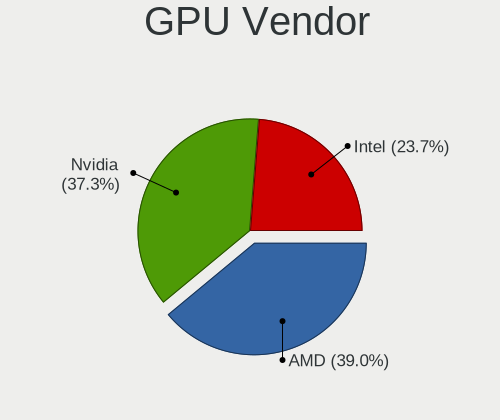

| Vendor | Desktops | Percent |
|--------|----------|---------|
| Nvidia | 18       | 47.37%  |
| AMD    | 12       | 31.58%  |
| Intel  | 8        | 21.05%  |

GPU Model
---------

Graphics card models

| Model                                                                                    | Desktops | Percent |
|------------------------------------------------------------------------------------------|----------|---------|
| AMD Ellesmere [Radeon RX 470/480/570/570X/580/580X/590]                                  | 3        | 7.69%   |
| Nvidia GP106 [GeForce GTX 1060 3GB]                                                      | 2        | 5.13%   |
| Nvidia GM107 [GeForce GTX 750 Ti]                                                        | 2        | 5.13%   |
| Nvidia GF108 [GeForce GT 630]                                                            | 2        | 5.13%   |
| Nvidia C61 [GeForce 7025 / nForce 630a]                                                  | 2        | 5.13%   |
| Intel Xeon E3-1200 v3/4th Gen Core Processor Integrated Graphics Controller              | 2        | 5.13%   |
| AMD Navi 21 [Radeon RX 6800/6800 XT / 6900 XT]                                           | 2        | 5.13%   |
| AMD Navi 14 [Radeon RX 5500/5500M / Pro 5500M]                                           | 2        | 5.13%   |
| AMD Cezanne [Radeon Vega Series / Radeon Vega Mobile Series]                             | 2        | 5.13%   |
| Nvidia GP107 [GeForce GTX 1050 Ti]                                                       | 1        | 2.56%   |
| Nvidia GP106 [GeForce GTX 1060 6GB]                                                      | 1        | 2.56%   |
| Nvidia GP104 [GeForce GTX 1070]                                                          | 1        | 2.56%   |
| Nvidia GF108GL [Quadro 600]                                                              | 1        | 2.56%   |
| Nvidia GA102 [GeForce RTX 3090]                                                          | 1        | 2.56%   |
| Nvidia GA102 [GeForce RTX 3080 Ti]                                                       | 1        | 2.56%   |
| Nvidia G96C [GeForce 9400 GT]                                                            | 1        | 2.56%   |
| Nvidia G84 [GeForce 8600 GT]                                                             | 1        | 2.56%   |
| Nvidia G71GL [Quadro FX 1500]                                                            | 1        | 2.56%   |
| Nvidia C79 [ION]                                                                         | 1        | 2.56%   |
| Intel Xeon E3-1200 v2/3rd Gen Core processor Graphics Controller                         | 1        | 2.56%   |
| Intel CometLake-S GT2 [UHD Graphics 630]                                                 | 1        | 2.56%   |
| Intel Atom/Celeron/Pentium Processor x5-E8000/J3xxx/N3xxx Integrated Graphics Controller | 1        | 2.56%   |
| Intel 82G33/G31 Express Integrated Graphics Controller                                   | 1        | 2.56%   |
| Intel 4 Series Chipset Integrated Graphics Controller                                    | 1        | 2.56%   |
| Intel 2nd Generation Core Processor Family Integrated Graphics Controller                | 1        | 2.56%   |
| AMD Raven Ridge [Radeon Vega Series / Radeon Vega Mobile Series]                         | 1        | 2.56%   |
| AMD Picasso/Raven 2 [Radeon Vega Series / Radeon Vega Mobile Series]                     | 1        | 2.56%   |
| AMD Cedar [Radeon HD 5000/6000/7350/8350 Series]                                         | 1        | 2.56%   |
| AMD Caicos XT [Radeon HD 7470/8470 / R5 235/310 OEM]                                     | 1        | 2.56%   |

GPU Combo
---------

Combinations of graphics cards

| Name           | Desktops | Percent |
|----------------|----------|---------|
| 1 x Nvidia     | 17       | 45.95%  |
| 1 x AMD        | 11       | 29.73%  |
| 1 x Intel      | 7        | 18.92%  |
| 2 x AMD        | 1        | 2.7%    |
| Intel + Nvidia | 1        | 2.7%    |

GPU Driver
----------

Free vs proprietary

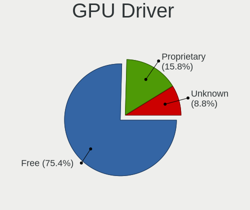

| Driver      | Desktops | Percent |
|-------------|----------|---------|
| Free        | 26       | 70.27%  |
| Proprietary | 8        | 21.62%  |
| Unknown     | 3        | 8.11%   |

GPU Memory
----------

Total video memory

| Size in GB | Desktops | Percent |
|------------|----------|---------|
| Unknown    | 14       | 37.84%  |
| 0.51-1.0   | 5        | 13.51%  |
| 7.01-8.0   | 4        | 10.81%  |
| 0.01-0.5   | 4        | 10.81%  |
| 8.01-16.0  | 3        | 8.11%   |
| 3.01-4.0   | 2        | 5.41%   |
| 1.01-2.0   | 2        | 5.41%   |
| 5.01-6.0   | 1        | 2.7%    |
| 2.01-3.0   | 1        | 2.7%    |
| 16.01-24.0 | 1        | 2.7%    |

Monitor
-------

Monitor Vendor
--------------

Monitor vendors

| Vendor                  | Desktops | Percent |
|-------------------------|----------|---------|
| Samsung Electronics     | 7        | 19.44%  |
| Dell                    | 6        | 16.67%  |
| Hewlett-Packard         | 3        | 8.33%   |
| BenQ                    | 3        | 8.33%   |
| Ancor Communications    | 3        | 8.33%   |
| Goldstar                | 2        | 5.56%   |
| AOC                     | 2        | 5.56%   |
| Acer                    | 2        | 5.56%   |
| Wacom                   | 1        | 2.78%   |
| Lenovo                  | 1        | 2.78%   |
| IOD                     | 1        | 2.78%   |
| GDH                     | 1        | 2.78%   |
| CTC                     | 1        | 2.78%   |
| Chi Mei Optoelectronics | 1        | 2.78%   |
| ASUSTek Computer        | 1        | 2.78%   |
| Unknown                 | 1        | 2.78%   |

Monitor Model
-------------

Monitor models

| Model                                                                  | Desktops | Percent |
|------------------------------------------------------------------------|----------|---------|
| Wacom Cintiq 22HDT WAC1037 1920x1080 476x268mm 21.5-inch               | 1        | 2.7%    |
| Samsung Electronics SyncMaster SAM03F2 1680x1050                       | 1        | 2.7%    |
| Samsung Electronics SyncMaster SAM03F0 1680x1050 433x271mm 20.1-inch   | 1        | 2.7%    |
| Samsung Electronics SyncMaster SAM0248 1280x1024 376x301mm 19.0-inch   | 1        | 2.7%    |
| Samsung Electronics SyncMaster SAM01AD 1600x1200 408x306mm 20.1-inch   | 1        | 2.7%    |
| Samsung Electronics SMS19A100 SAM0867 1366x768 410x230mm 18.5-inch     | 1        | 2.7%    |
| Samsung Electronics SM2333T SAM0736 1920x1080 477x268mm 21.5-inch      | 1        | 2.7%    |
| Samsung Electronics S22D300 SAM0B3E 1920x1080 477x268mm 21.5-inch      | 1        | 2.7%    |
| Samsung Electronics LCD Monitor U28D590 3840x2160                      | 1        | 2.7%    |
| Lenovo LEN L171 LEN24C9 1280x1024 337x270mm 17.0-inch                  | 1        | 2.7%    |
| IOD LCD-GL211X IOD151D 1920x1080 458x258mm 20.7-inch                   | 1        | 2.7%    |
| Hewlett-Packard Z24i HWP309E 1920x1200 518x324mm 24.1-inch             | 1        | 2.7%    |
| Hewlett-Packard x23LED HWP2912 1920x1080 509x286mm 23.0-inch           | 1        | 2.7%    |
| Hewlett-Packard 27w HPN3494 1920x1080 598x336mm 27.0-inch              | 1        | 2.7%    |
| Goldstar W1952 GSM4B77 1440x900 408x255mm 18.9-inch                    | 1        | 2.7%    |
| Goldstar E1641 GSM8B3E 1366x768 344x194mm 15.5-inch                    | 1        | 2.7%    |
| GDH Digital TV GDH0030 1440x900 1150x650mm 52.0-inch                   | 1        | 2.7%    |
| Dell U2722D DEL422D 2560x1440 597x336mm 27.0-inch                      | 1        | 2.7%    |
| Dell SP2208WFP DEL4038 1680x1050 473x296mm 22.0-inch                   | 1        | 2.7%    |
| Dell LCD Monitor P190S 3200x1080                                       | 1        | 2.7%    |
| Dell E1913 DELD051 1440x900 408x255mm 18.9-inch                        | 1        | 2.7%    |
| Dell DELL2407WFPHC DELA026 1920x1200 519x324mm 24.1-inch               | 1        | 2.7%    |
| Dell 1908FP DEL4025 1280x1024 376x301mm 19.0-inch                      | 1        | 2.7%    |
| CTC KD02909-8770A CTC0770 1024x768 304x228mm 15.0-inch                 | 1        | 2.7%    |
| Chi Mei Optoelectronics CMC 22 W CMO2228 1680x1050 473x296mm 22.0-inch | 1        | 2.7%    |
| BenQ VZ2770H BNQ7B3C 1920x1080 598x336mm 27.0-inch                     | 1        | 2.7%    |
| BenQ GL2460 BNQ78CE 1920x1080 530x300mm 24.0-inch                      | 1        | 2.7%    |
| BenQ G610HDAL BNQ785B 1366x768 344x194mm 15.5-inch                     | 1        | 2.7%    |
| ASUSTek Computer VG245 AUS24A1 1920x1080 531x299mm 24.0-inch           | 1        | 2.7%    |
| AOC 27G2G4 AOC2702 1920x1080 598x336mm 27.0-inch                       | 1        | 2.7%    |
| AOC 2778X AOC2778 2560x1440 600x340mm 27.2-inch                        | 1        | 2.7%    |
| Ancor Communications ROG PG348Q ACI3433 3440x1440 797x333mm 34.0-inch  | 1        | 2.7%    |
| Ancor Communications ASUS VS228 ACI22FD 1920x1080 476x268mm 21.5-inch  | 1        | 2.7%    |
| Ancor Communications ASUS MG28U ACI28A7 3840x2160 621x341mm 27.9-inch  | 1        | 2.7%    |
| Acer GN246HL ACR02F9 1920x1080 531x299mm 24.0-inch                     | 1        | 2.7%    |
| Acer AL1714 ACRAD18 1280x1024 338x270mm 17.0-inch                      | 1        | 2.7%    |
| Unknown                                                                | 1        | 2.7%    |

Monitor Resolution
------------------

Monitor screen resolution

| Resolution         | Desktops | Percent |
|--------------------|----------|---------|
| 1920x1080 (FHD)    | 12       | 33.33%  |
| 1280x1024 (SXGA)   | 4        | 11.11%  |
| 3840x2160 (4K)     | 3        | 8.33%   |
| 1680x1050 (WSXGA+) | 3        | 8.33%   |
| 1366x768 (WXGA)    | 3        | 8.33%   |
| 2560x1440 (QHD)    | 2        | 5.56%   |
| 1920x1200 (WUXGA)  | 2        | 5.56%   |
| 1440x900 (WXGA+)   | 2        | 5.56%   |
| 3440x1440          | 1        | 2.78%   |
| 3200x1080          | 1        | 2.78%   |
| 1600x1200          | 1        | 2.78%   |
| 1024x768 (XGA)     | 1        | 2.78%   |
| Unknown            | 1        | 2.78%   |

Monitor Diagonal
----------------

Diagonal size in inches

| Inches  | Desktops | Percent |
|---------|----------|---------|
| 27      | 6        | 16.67%  |
| 24      | 5        | 13.89%  |
| 22      | 3        | 8.33%   |
| 21      | 3        | 8.33%   |
| 19      | 3        | 8.33%   |
| 15      | 3        | 8.33%   |
| Unknown | 3        | 8.33%   |
| 23      | 2        | 5.56%   |
| 20      | 2        | 5.56%   |
| 18      | 2        | 5.56%   |
| 17      | 2        | 5.56%   |
| 52      | 1        | 2.78%   |
| 34      | 1        | 2.78%   |

Monitor Width
-------------

Physical width

| Width in mm | Desktops | Percent |
|-------------|----------|---------|
| 501-600     | 12       | 34.29%  |
| 401-500     | 10       | 28.57%  |
| 301-350     | 5        | 14.29%  |
| Unknown     | 3        | 8.57%   |
| 351-400     | 2        | 5.71%   |
| 701-800     | 1        | 2.86%   |
| 601-700     | 1        | 2.86%   |
| 1001-1500   | 1        | 2.86%   |

Aspect Ratio
------------

Proportional relationship between the width and the height

| Ratio   | Desktops | Percent |
|---------|----------|---------|
| 16/9    | 17       | 51.52%  |
| 16/10   | 7        | 21.21%  |
| 5/4     | 4        | 12.12%  |
| 4/3     | 2        | 6.06%   |
| Unknown | 2        | 6.06%   |
| 21/9    | 1        | 3.03%   |

Monitor Area
------------

Area in inch²

| Area in inch² | Desktops | Percent |
|----------------|----------|---------|
| 201-250        | 10       | 28.57%  |
| 301-350        | 6        | 17.14%  |
| 151-200        | 6        | 17.14%  |
| 141-150        | 3        | 8.57%   |
| 101-110        | 3        | 8.57%   |
| Unknown        | 3        | 8.57%   |
| 251-300        | 2        | 5.71%   |
| More than 1000 | 1        | 2.86%   |
| 351-500        | 1        | 2.86%   |

Pixel Density
-------------

Pixels per inch

| Density | Desktops | Percent |
|---------|----------|---------|
| 51-100  | 23       | 63.89%  |
| 101-120 | 8        | 22.22%  |
| Unknown | 3        | 8.33%   |
| 1-50    | 1        | 2.78%   |
| 121-160 | 1        | 2.78%   |

Multiple Monitors
-----------------

Total monitors connected

| Total | Desktops | Percent |
|-------|----------|---------|
| 1     | 29       | 78.38%  |
| 0     | 4        | 10.81%  |
| 2     | 3        | 8.11%   |
| 3     | 1        | 2.7%    |

Network
-------

Net Controller Vendor
---------------------

Controller vendors

| Vendor                | Desktops | Percent |
|-----------------------|----------|---------|
| Realtek Semiconductor | 22       | 40.74%  |
| Intel                 | 15       | 27.78%  |
| Qualcomm Atheros      | 4        | 7.41%   |
| Nvidia                | 3        | 5.56%   |
| Broadcom              | 3        | 5.56%   |
| Ralink Technology     | 2        | 3.7%    |
| TP-Link               | 1        | 1.85%   |
| Ralink                | 1        | 1.85%   |
| Qualcomm              | 1        | 1.85%   |
| Dell                  | 1        | 1.85%   |
| Broadcom Limited      | 1        | 1.85%   |

Net Controller Model
--------------------

Controller models

| Model                                                                 | Desktops | Percent |
|-----------------------------------------------------------------------|----------|---------|
| Realtek RTL8111/8168/8411 PCI Express Gigabit Ethernet Controller     | 14       | 22.95%  |
| Realtek RTL810xE PCI Express Fast Ethernet controller                 | 4        | 6.56%   |
| Ralink MT7601U Wireless Adapter                                       | 2        | 3.28%   |
| Qualcomm Atheros Killer E220x Gigabit Ethernet Controller             | 2        | 3.28%   |
| Nvidia MCP61 Ethernet                                                 | 2        | 3.28%   |
| Intel Wi-Fi 6 AX200                                                   | 2        | 3.28%   |
| Intel Ethernet Controller I225-V                                      | 2        | 3.28%   |
| Intel 82567LM-3 Gigabit Network Connection                            | 2        | 3.28%   |
| Broadcom NetXtreme BCM5752 Gigabit Ethernet PCI Express               | 2        | 3.28%   |
| TP-Link TL-WN823N v2/v3 [Realtek RTL8192EU]                           | 1        | 1.64%   |
| Realtek USB 10/100/1G/2.5G LAN                                        | 1        | 1.64%   |
| Realtek RTL88x2bu [AC1200 Techkey]                                    | 1        | 1.64%   |
| Realtek RTL8821CE 802.11ac PCIe Wireless Network Adapter              | 1        | 1.64%   |
| Realtek RTL8188CUS 802.11n WLAN Adapter                               | 1        | 1.64%   |
| Realtek RTL8125 2.5GbE Controller                                     | 1        | 1.64%   |
| Realtek RTL-8100/8101L/8139 PCI Fast Ethernet Adapter                 | 1        | 1.64%   |
| Ralink RT2790 Wireless 802.11n 1T/2R PCIe                             | 1        | 1.64%   |
| Qualcomm Nokia G400 5G                                                | 1        | 1.64%   |
| Qualcomm Atheros AR93xx Wireless Network Adapter                      | 1        | 1.64%   |
| Qualcomm Atheros AR9287 Wireless Network Adapter (PCI-Express)        | 1        | 1.64%   |
| Qualcomm Atheros AR9227 Wireless Network Adapter                      | 1        | 1.64%   |
| Nvidia MCP79 Ethernet                                                 | 1        | 1.64%   |
| Intel Wireless-AC 9260                                                | 1        | 1.64%   |
| Intel Wi-Fi 6 AX210/AX211/AX411 160MHz                                | 1        | 1.64%   |
| Intel I350 Gigabit Network Connection                                 | 1        | 1.64%   |
| Intel I211 Gigabit Network Connection                                 | 1        | 1.64%   |
| Intel Ethernet Connection (7) I219-V                                  | 1        | 1.64%   |
| Intel Ethernet Connection (2) I219-V                                  | 1        | 1.64%   |
| Intel Ethernet Connection (2) I218-V                                  | 1        | 1.64%   |
| Intel Ethernet Connection (2) I218-LM                                 | 1        | 1.64%   |
| Intel Ethernet Connection (12) I219-V                                 | 1        | 1.64%   |
| Intel Dual Band Wireless-AC 3168NGW [Stone Peak]                      | 1        | 1.64%   |
| Intel Centrino Advanced-N 6205 [Taylor Peak]                          | 1        | 1.64%   |
| Intel 82579LM Gigabit Network Connection (Lewisville)                 | 1        | 1.64%   |
| Intel 82557/8/9/0/1 Ethernet Pro 100                                  | 1        | 1.64%   |
| Dell Wireless 1450 Dual-band (802.11a/b/g) Adapter [Intersil ISL3887] | 1        | 1.64%   |
| Broadcom NetLink BCM57781 Gigabit Ethernet PCIe                       | 1        | 1.64%   |
| Broadcom Limited NetXtreme BCM5751 Gigabit Ethernet PCI Express       | 1        | 1.64%   |

Wireless Vendor
---------------

Wireless vendors

| Vendor                | Desktops | Percent |
|-----------------------|----------|---------|
| Intel                 | 6        | 35.29%  |
| Realtek Semiconductor | 3        | 17.65%  |
| Qualcomm Atheros      | 3        | 17.65%  |
| Ralink Technology     | 2        | 11.76%  |
| TP-Link               | 1        | 5.88%   |
| Ralink                | 1        | 5.88%   |
| Dell                  | 1        | 5.88%   |

Wireless Model
--------------

Wireless models

| Model                                                                 | Desktops | Percent |
|-----------------------------------------------------------------------|----------|---------|
| Ralink MT7601U Wireless Adapter                                       | 2        | 11.76%  |
| Intel Wi-Fi 6 AX200                                                   | 2        | 11.76%  |
| TP-Link TL-WN823N v2/v3 [Realtek RTL8192EU]                           | 1        | 5.88%   |
| Realtek RTL88x2bu [AC1200 Techkey]                                    | 1        | 5.88%   |
| Realtek RTL8821CE 802.11ac PCIe Wireless Network Adapter              | 1        | 5.88%   |
| Realtek RTL8188CUS 802.11n WLAN Adapter                               | 1        | 5.88%   |
| Ralink RT2790 Wireless 802.11n 1T/2R PCIe                             | 1        | 5.88%   |
| Qualcomm Atheros AR93xx Wireless Network Adapter                      | 1        | 5.88%   |
| Qualcomm Atheros AR9287 Wireless Network Adapter (PCI-Express)        | 1        | 5.88%   |
| Qualcomm Atheros AR9227 Wireless Network Adapter                      | 1        | 5.88%   |
| Intel Wireless-AC 9260                                                | 1        | 5.88%   |
| Intel Wi-Fi 6 AX210/AX211/AX411 160MHz                                | 1        | 5.88%   |
| Intel Dual Band Wireless-AC 3168NGW [Stone Peak]                      | 1        | 5.88%   |
| Intel Centrino Advanced-N 6205 [Taylor Peak]                          | 1        | 5.88%   |
| Dell Wireless 1450 Dual-band (802.11a/b/g) Adapter [Intersil ISL3887] | 1        | 5.88%   |

Ethernet Vendor
---------------

Ethernet vendors

| Vendor                | Desktops | Percent |
|-----------------------|----------|---------|
| Realtek Semiconductor | 21       | 47.73%  |
| Intel                 | 13       | 29.55%  |
| Nvidia                | 3        | 6.82%   |
| Broadcom              | 3        | 6.82%   |
| Qualcomm Atheros      | 2        | 4.55%   |
| Qualcomm              | 1        | 2.27%   |
| Broadcom Limited      | 1        | 2.27%   |

Ethernet Model
--------------

Ethernet models

| Model                                                             | Desktops | Percent |
|-------------------------------------------------------------------|----------|---------|
| Realtek RTL8111/8168/8411 PCI Express Gigabit Ethernet Controller | 14       | 31.82%  |
| Realtek RTL810xE PCI Express Fast Ethernet controller             | 4        | 9.09%   |
| Qualcomm Atheros Killer E220x Gigabit Ethernet Controller         | 2        | 4.55%   |
| Nvidia MCP61 Ethernet                                             | 2        | 4.55%   |
| Intel Ethernet Controller I225-V                                  | 2        | 4.55%   |
| Intel 82567LM-3 Gigabit Network Connection                        | 2        | 4.55%   |
| Broadcom NetXtreme BCM5752 Gigabit Ethernet PCI Express           | 2        | 4.55%   |
| Realtek USB 10/100/1G/2.5G LAN                                    | 1        | 2.27%   |
| Realtek RTL8125 2.5GbE Controller                                 | 1        | 2.27%   |
| Realtek RTL-8100/8101L/8139 PCI Fast Ethernet Adapter             | 1        | 2.27%   |
| Qualcomm Nokia G400 5G                                            | 1        | 2.27%   |
| Nvidia MCP79 Ethernet                                             | 1        | 2.27%   |
| Intel I350 Gigabit Network Connection                             | 1        | 2.27%   |
| Intel I211 Gigabit Network Connection                             | 1        | 2.27%   |
| Intel Ethernet Connection (7) I219-V                              | 1        | 2.27%   |
| Intel Ethernet Connection (2) I219-V                              | 1        | 2.27%   |
| Intel Ethernet Connection (2) I218-V                              | 1        | 2.27%   |
| Intel Ethernet Connection (2) I218-LM                             | 1        | 2.27%   |
| Intel Ethernet Connection (12) I219-V                             | 1        | 2.27%   |
| Intel 82579LM Gigabit Network Connection (Lewisville)             | 1        | 2.27%   |
| Intel 82557/8/9/0/1 Ethernet Pro 100                              | 1        | 2.27%   |
| Broadcom NetLink BCM57781 Gigabit Ethernet PCIe                   | 1        | 2.27%   |
| Broadcom Limited NetXtreme BCM5751 Gigabit Ethernet PCI Express   | 1        | 2.27%   |

Net Controller Kind
-------------------

Ethernet, WiFi or modem

| Kind     | Desktops | Percent |
|----------|----------|---------|
| Ethernet | 37       | 68.52%  |
| WiFi     | 17       | 31.48%  |

Used Controller
---------------

Currently used network controller

| Kind     | Desktops | Percent |
|----------|----------|---------|
| Ethernet | 29       | 76.32%  |
| WiFi     | 9        | 23.68%  |

NICs
----

Total network controllers on board

| Total | Desktops | Percent |
|-------|----------|---------|
| 1     | 24       | 63.16%  |
| 2     | 10       | 26.32%  |
| 3     | 2        | 5.26%   |
| 5     | 1        | 2.63%   |
| 4     | 1        | 2.63%   |

IPv6
----

IPv6 vs IPv4

| Used | Desktops | Percent |
|------|----------|---------|
| No   | 33       | 86.84%  |
| Yes  | 5        | 13.16%  |

Bluetooth
---------

Bluetooth Vendor
----------------

Controller vendors

| Vendor                   | Desktops | Percent |
|--------------------------|----------|---------|
| Intel                    | 5        | 35.71%  |
| Cambridge Silicon Radio  | 5        | 35.71%  |
| TP-Link                  | 1        | 7.14%   |
| Realtek Semiconductor    | 1        | 7.14%   |
| Micro Star International | 1        | 7.14%   |
| MediaTek                 | 1        | 7.14%   |

Bluetooth Model
---------------

Controller models

| Model                                               | Desktops | Percent |
|-----------------------------------------------------|----------|---------|
| Cambridge Silicon Radio Bluetooth Dongle (HCI mode) | 5        | 35.71%  |
| Intel AX200 Bluetooth                               | 2        | 14.29%  |
| TP-Link UB500 Adapter                               | 1        | 7.14%   |
| Realtek Bluetooth Radio                             | 1        | 7.14%   |
| Micro Star International Bluetooth Dongle           | 1        | 7.14%   |
| MediaTek Wireless_Device                            | 1        | 7.14%   |
| Intel Wireless-AC 9260 Bluetooth Adapter            | 1        | 7.14%   |
| Intel Wireless-AC 3168 Bluetooth                    | 1        | 7.14%   |
| Intel AX210 Bluetooth                               | 1        | 7.14%   |

Sound
-----

Sound Vendor
------------

Sound card vendors

| Vendor               | Desktops | Percent |
|----------------------|----------|---------|
| AMD                  | 17       | 30.36%  |
| Nvidia               | 15       | 26.79%  |
| Intel                | 15       | 26.79%  |
| Creative Labs        | 4        | 7.14%   |
| Texas Instruments    | 1        | 1.79%   |
| RME                  | 1        | 1.79%   |
| Kingston Technology  | 1        | 1.79%   |
| Holtek Semiconductor | 1        | 1.79%   |
| ASUSTek Computer     | 1        | 1.79%   |

Sound Model
-----------

Sound card models

| Model                                                                                             | Desktops | Percent |
|---------------------------------------------------------------------------------------------------|----------|---------|
| AMD Starship/Matisse HD Audio Controller                                                          | 6        | 8.82%   |
| Nvidia MCP61 High Definition Audio                                                                | 3        | 4.41%   |
| Nvidia GP106 High Definition Audio Controller                                                     | 3        | 4.41%   |
| Nvidia GF108 High Definition Audio Controller                                                     | 3        | 4.41%   |
| AMD Family 17h/19h HD Audio Controller                                                            | 3        | 4.41%   |
| AMD Ellesmere HDMI Audio [Radeon RX 470/480 / 570/580/590]                                        | 3        | 4.41%   |
| Nvidia GM107 High Definition Audio Controller [GeForce 940MX]                                     | 2        | 2.94%   |
| Nvidia GA102 High Definition Audio Controller                                                     | 2        | 2.94%   |
| Intel Xeon E3-1200 v3/4th Gen Core Processor HD Audio Controller                                  | 2        | 2.94%   |
| Intel 82801JD/DO (ICH10 Family) HD Audio Controller                                               | 2        | 2.94%   |
| Intel 8 Series/C220 Series Chipset High Definition Audio Controller                               | 2        | 2.94%   |
| Intel 6 Series/C200 Series Chipset Family High Definition Audio Controller                        | 2        | 2.94%   |
| Creative Labs CA0132 Sound Core3D [Sound Blaster Recon3D / Z-Series / Sound BlasterX AE-5 Plus]   | 2        | 2.94%   |
| AMD SBx00 Azalia (Intel HDA)                                                                      | 2        | 2.94%   |
| AMD Renoir Radeon High Definition Audio Controller                                                | 2        | 2.94%   |
| AMD Raven/Raven2/Fenghuang HDMI/DP Audio Controller                                               | 2        | 2.94%   |
| AMD Navi 21/23 HDMI/DP Audio Controller                                                           | 2        | 2.94%   |
| AMD Navi 10 HDMI Audio                                                                            | 2        | 2.94%   |
| Texas Instruments PCM2902 Audio Codec                                                             | 1        | 1.47%   |
| RME ADI-2 DAC (58825307)                                                                          | 1        | 1.47%   |
| Nvidia MCP79 High Definition Audio                                                                | 1        | 1.47%   |
| Nvidia GP107GL High Definition Audio Controller                                                   | 1        | 1.47%   |
| Nvidia GP104 High Definition Audio Controller                                                     | 1        | 1.47%   |
| Kingston Technology HyperX 7.1 Audio                                                              | 1        | 1.47%   |
| Intel NM10/ICH7 Family High Definition Audio Controller                                           | 1        | 1.47%   |
| Intel Comet Lake PCH-V cAVS                                                                       | 1        | 1.47%   |
| Intel Cannon Lake PCH cAVS                                                                        | 1        | 1.47%   |
| Intel C610/X99 series chipset HD Audio Controller                                                 | 1        | 1.47%   |
| Intel C600/X79 series chipset High Definition Audio Controller                                    | 1        | 1.47%   |
| Intel Atom/Celeron/Pentium Processor x5-E8000/J3xxx/N3xxx Series High Definition Audio Controller | 1        | 1.47%   |
| Intel 82801I (ICH9 Family) HD Audio Controller                                                    | 1        | 1.47%   |
| Intel 631xESB/632xESB High Definition Audio Controller                                            | 1        | 1.47%   |
| Intel 100 Series/C230 Series Chipset Family HD Audio Controller                                   | 1        | 1.47%   |
| Holtek Semiconductor HT82A834R Audio MCU                                                          | 1        | 1.47%   |
| Creative Labs EMU10k2/CA0100/CA0102/CA10200 [Sound Blaster Audigy Series]                         | 1        | 1.47%   |
| Creative Labs CA0108/CA10300 [Sound Blaster Audigy Series]                                        | 1        | 1.47%   |
| ASUSTek Computer XONAR SOUND CARD                                                                 | 1        | 1.47%   |
| AMD FCH Azalia Controller                                                                         | 1        | 1.47%   |
| AMD Family 17h (Models 00h-0fh) HD Audio Controller                                               | 1        | 1.47%   |
| AMD Cedar HDMI Audio [Radeon HD 5400/6300/7300 Series]                                            | 1        | 1.47%   |

Memory
------

Memory Vendor
-------------

Memory module vendors

| Vendor              | Desktops | Percent |
|---------------------|----------|---------|
| Kingston            | 8        | 19.51%  |
| Corsair             | 6        | 14.63%  |
| Samsung Electronics | 4        | 9.76%   |
| Unknown             | 3        | 7.32%   |
| SK hynix            | 3        | 7.32%   |
| G.Skill             | 3        | 7.32%   |
| Team                | 2        | 4.88%   |
| Crucial             | 2        | 4.88%   |
| Unknown             | 2        | 4.88%   |
| Transcend           | 1        | 2.44%   |
| Strontium           | 1        | 2.44%   |
| Smart               | 1        | 2.44%   |
| Silicon Power       | 1        | 2.44%   |
| Patriot             | 1        | 2.44%   |
| GLOWAY              | 1        | 2.44%   |
| AMD                 | 1        | 2.44%   |
| A-DATA Technology   | 1        | 2.44%   |

Memory Model
------------

Memory module models

| Model                                                       | Desktops | Percent |
|-------------------------------------------------------------|----------|---------|
| Unknown RAM Module 2048MB DIMM SDRAM                        | 2        | 4.65%   |
| Unknown                                                     | 2        | 4.65%   |
| Unknown RAM Module 2GB DIMM DDR2 533MT/s                    | 1        | 2.33%   |
| Transcend RAM JM1600KLN-8GK 4096MB DIMM DDR3 1600MT/s       | 1        | 2.33%   |
| Team RAM TEAMGROUP-UD4-3600 8GB DIMM DDR4 3733MT/s          | 1        | 2.33%   |
| Team RAM TEAMGROUP-UD4-3200 8GB DIMM DDR4 3800MT/s          | 1        | 2.33%   |
| Strontium RAM SRT4G86U1-P9H 4096MB DIMM DDR3 1333MT/s       | 1        | 2.33%   |
| Smart RAM SH564128FH8N6TNSQG 4GB DIMM DDR3 1600MT/s         | 1        | 2.33%   |
| SK hynix RAM HYMP512F72CP8N3-Y5 1024MB FB-DIMM DDR2 667MT/s | 1        | 2.33%   |
| SK hynix RAM HMT351U6BFR8C-H9 4GB DIMM DDR3 1333MT/s        | 1        | 2.33%   |
| SK hynix RAM HMT351S6CFR8C-PB 4GB DIMM DDR3 1600MT/s        | 1        | 2.33%   |
| Silicon Power RAM DCLT4GN568S V 4096MB DIMM DDR3 1600MT/s   | 1        | 2.33%   |
| Samsung RAM M395T5663QZ4-CE66 2048MB FB-DIMM DDR2 667MT/s   | 1        | 2.33%   |
| Samsung RAM M393A2G40DB0-CPB 16GB RIMM DDR4 2133MT/s        | 1        | 2.33%   |
| Samsung RAM M393A1K43BB0-CRC 8GB DIMM DDR4 2400MT/s         | 1        | 2.33%   |
| Samsung RAM M393A1G43EB1-CRC 8GB DIMM DDR4 2400MT/s         | 1        | 2.33%   |
| Samsung RAM M378B5173EB0-CK0 4GB DIMM DDR3 1600MT/s         | 1        | 2.33%   |
| Patriot RAM PSD48G240081 8GB DIMM DDR4 2800MT/s             | 1        | 2.33%   |
| Kingston RAM Module 2048MB FB-DIMM DDR2 667MT/s             | 1        | 2.33%   |
| Kingston RAM KHX3333C16D4/8GX 8GB DIMM DDR4 3800MT/s        | 1        | 2.33%   |
| Kingston RAM KHX3200C16D4/8GX 8GB DIMM DDR4 3600MT/s        | 1        | 2.33%   |
| Kingston RAM KHX1600C10D3/4G 4GB DIMM DDR3 1866MT/s         | 1        | 2.33%   |
| Kingston RAM HP32D4U2S8MR-8 8GB DIMM DDR4 3200MT/s          | 1        | 2.33%   |
| Kingston RAM ACR128X64D2S800C6 1GB SODIMM DDR 975MT/s       | 1        | 2.33%   |
| Kingston RAM 9965745-020.A00G 32GB DIMM DDR4 3600MT/s       | 1        | 2.33%   |
| Kingston RAM 9905678-023.A00G 8GB DIMM DDR4 2187MT/s        | 1        | 2.33%   |
| GLOWAY RAM TYA4U2666D19161C 16384MB DIMM DDR4 2667MT/s      | 1        | 2.33%   |
| G.Skill RAM F4-3200C16-16GTZSW 16GB DIMM DDR4 3200MT/s      | 1        | 2.33%   |
| G.Skill RAM F4-3200C16-16GIS 16GB DIMM DDR4 3600MT/s        | 1        | 2.33%   |
| G.Skill RAM F4-2400C15-8GVR 8GB DIMM DDR4 3200MT/s          | 1        | 2.33%   |
| Crucial RAM CT8G4DFRA32A.C8FJ 8GB DIMM DDR4 2400MT/s        | 1        | 2.33%   |
| Crucial RAM BLS4G4D240FSB.8FBD2 4096MB DIMM DDR4 2400MT/s   | 1        | 2.33%   |
| Crucial RAM BLS4G4D240FSB.8FBD 4GB DIMM DDR4 2472MT/s       | 1        | 2.33%   |
| Corsair RAM CMZ8GX3M1A1600C10 8GB DIMM DDR3 1600MT/s        | 1        | 2.33%   |
| Corsair RAM CMZ32GX3M4X1600C10 8GB DIMM DDR3 1600MT/s       | 1        | 2.33%   |
| Corsair RAM CMU32GX4M4C3400C16 8GB DIMM DDR4 3400MT/s       | 1        | 2.33%   |
| Corsair RAM CMK32GX4M4A2800C16 8GB DIMM DDR4 2133MT/s       | 1        | 2.33%   |
| Corsair RAM CMK16GX4M2B3200C16 8192MB DIMM DDR4 3600MT/s    | 1        | 2.33%   |
| Corsair RAM CMK16GX4M2A2400C16 8GB DIMM DDR4 2933MT/s       | 1        | 2.33%   |
| AMD RAM R534G1601S1SL 4GB DIMM DDR3 1600MT/s                | 1        | 2.33%   |

Memory Kind
-----------

Memory module kinds

| Kind  | Desktops | Percent |
|-------|----------|---------|
| DDR4  | 17       | 53.13%  |
| DDR3  | 10       | 31.25%  |
| DDR2  | 3        | 9.38%   |
| SDRAM | 2        | 6.25%   |

Memory Form Factor
------------------

Physical design of the memory module

| Name    | Desktops | Percent |
|---------|----------|---------|
| DIMM    | 30       | 90.91%  |
| SODIMM  | 1        | 3.03%   |
| RIMM    | 1        | 3.03%   |
| FB-DIMM | 1        | 3.03%   |

Memory Size
-----------

Memory module size

| Size  | Desktops | Percent |
|-------|----------|---------|
| 8192  | 12       | 34.29%  |
| 4096  | 9        | 25.71%  |
| 16384 | 5        | 14.29%  |
| 2048  | 4        | 11.43%  |
| 32768 | 3        | 8.57%   |
| 1024  | 2        | 5.71%   |

Memory Speed
------------

Memory module speed

| Speed   | Desktops | Percent |
|---------|----------|---------|
| 1600    | 7        | 18.92%  |
| 3600    | 4        | 10.81%  |
| 3200    | 3        | 8.11%   |
| 2400    | 3        | 8.11%   |
| 3800    | 2        | 5.41%   |
| 2667    | 2        | 5.41%   |
| 1333    | 2        | 5.41%   |
| Unknown | 2        | 5.41%   |
| 65535   | 1        | 2.7%    |
| 3733    | 1        | 2.7%    |
| 3400    | 1        | 2.7%    |
| 2933    | 1        | 2.7%    |
| 2800    | 1        | 2.7%    |
| 2472    | 1        | 2.7%    |
| 2187    | 1        | 2.7%    |
| 2133    | 1        | 2.7%    |
| 1866    | 1        | 2.7%    |
| 975     | 1        | 2.7%    |
| 667     | 1        | 2.7%    |
| 533     | 1        | 2.7%    |

Printers & scanners
-------------------

Printer Vendor
--------------

Printer device vendors

| Vendor              | Desktops | Percent |
|---------------------|----------|---------|
| QinHeng Electronics | 1        | 20%     |
| Hewlett-Packard     | 1        | 20%     |
| Dell                | 1        | 20%     |
| Canon               | 1        | 20%     |
| Brother Industries  | 1        | 20%     |

Printer Model
-------------

Printer device models

| Model                        | Desktops | Percent |
|------------------------------|----------|---------|
| QinHeng CH340S               | 1        | 20%     |
| HP OfficeJet Pro 9010 series | 1        | 20%     |
| Dell 2330d Laser Printer     | 1        | 20%     |
| Canon CanoScan LiDE 300      | 1        | 20%     |
| Brother HL-L5102DW           | 1        | 20%     |

Scanner Vendor
--------------

Scanner device vendors

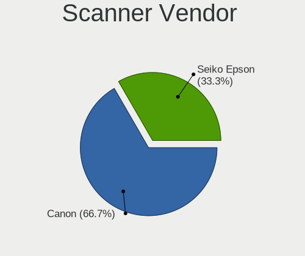

| Vendor      | Desktops | Percent |
|-------------|----------|---------|
| Seiko Epson | 1        | 50%     |
| Canon       | 1        | 50%     |

Scanner Model
-------------

Scanner device models

| Model                                         | Desktops | Percent |
|-----------------------------------------------|----------|---------|
| Seiko Epson GT-8300UF [Perfection 1660 PHOTO] | 1        | 50%     |
| Canon CanoScan LIDE 25                        | 1        | 50%     |

Camera
------

Camera Vendor
-------------

Camera device vendors

| Vendor                  | Desktops | Percent |
|-------------------------|----------|---------|
| Logitech                | 7        | 63.64%  |
| Z-Star Microelectronics | 1        | 9.09%   |
| Samsung Electronics     | 1        | 9.09%   |
| Microsoft               | 1        | 9.09%   |
| Microdia                | 1        | 9.09%   |

Camera Model
------------

Camera device models

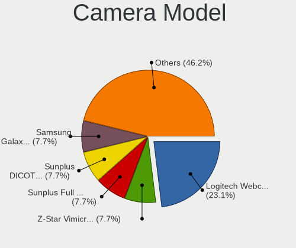

| Model                           | Desktops | Percent |
|---------------------------------|----------|---------|
| Logitech Webcam C270            | 3        | 27.27%  |
| Z-Star Vimicro USB2.0 Camera    | 1        | 9.09%   |
| Samsung Galaxy A5 (MTP)         | 1        | 9.09%   |
| Microsoft LifeCam HD-3000       | 1        | 9.09%   |
| Microdia Camera                 | 1        | 9.09%   |
| Logitech QuickCam Pro 9000      | 1        | 9.09%   |
| Logitech Logitech Webcam C160   | 1        | 9.09%   |
| Logitech HD Webcam C910         | 1        | 9.09%   |
| Logitech C922 Pro Stream Webcam | 1        | 9.09%   |

Security
--------

Fingerprint Vendor
------------------

Fingerprint sensor vendors

Zero info for selected period =(

Fingerprint Model
-----------------

Fingerprint sensor models

Zero info for selected period =(

Chipcard Vendor
---------------

Chipcard module vendors

| Vendor      | Desktops | Percent |
|-------------|----------|---------|
| Alcor Micro | 1        | 100%    |

Chipcard Model
--------------

Chipcard module models

| Model                               | Desktops | Percent |
|-------------------------------------|----------|---------|
| Alcor Micro AU9540 Smartcard Reader | 1        | 100%    |

Unsupported
-----------

Unsupported Devices
-------------------

Total unsupported devices on board

| Total | Desktops | Percent |
|-------|----------|---------|
| 0     | 25       | 67.57%  |
| 1     | 7        | 18.92%  |
| 4     | 2        | 5.41%   |
| 5     | 1        | 2.7%    |
| 3     | 1        | 2.7%    |
| 2     | 1        | 2.7%    |

Unsupported Device Types
------------------------

Types of unsupported devices

| Type                     | Desktops | Percent |
|--------------------------|----------|---------|
| Sound                    | 7        | 29.17%  |
| Graphics card            | 4        | 16.67%  |
| Unassigned class         | 3        | 12.5%   |
| Communication controller | 3        | 12.5%   |
| Net/wireless             | 2        | 8.33%   |
| Camera                   | 2        | 8.33%   |
| Storage/ide              | 1        | 4.17%   |
| Net/ethernet             | 1        | 4.17%   |
| Chipcard                 | 1        | 4.17%   |

