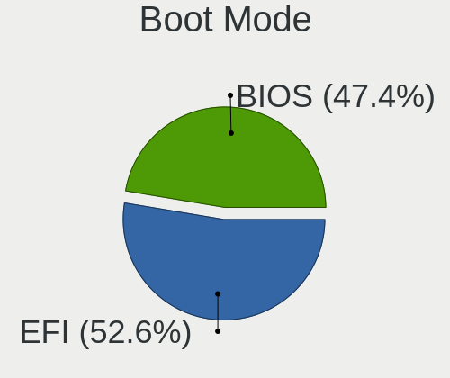
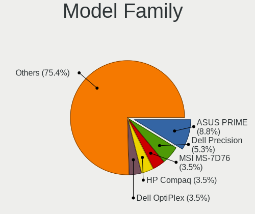
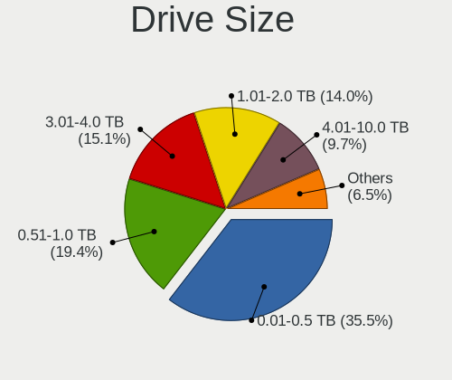
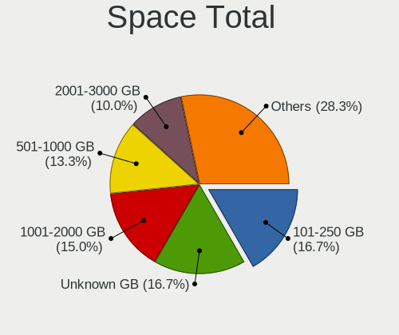
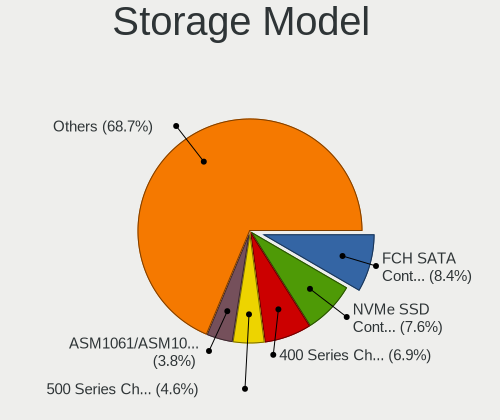
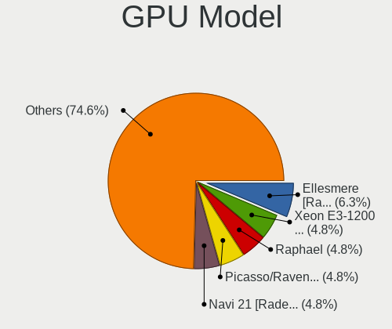
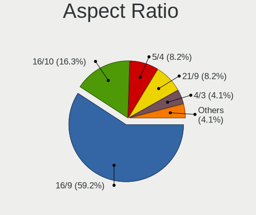
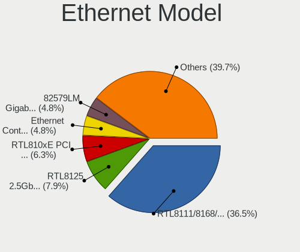
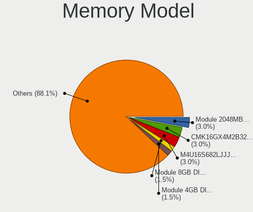
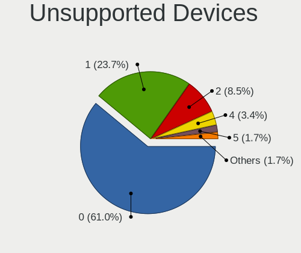

Slackware 15.0 - Tested Hardware & Statistics (Desktops)
--------------------------------------------------------

A project to collect tested hardware configurations for Slackware 15.0.

Anyone can contribute to this report by the [hw-probe](https://github.com/linuxhw/hw-probe) tool:

    sudo -E hw-probe -all -upload

Please submit a probe of your configuration if it's not presented on the page or is rare.

Full-feature report is available here: https://linux-hardware.org/?view=trends

Contents
--------

* [ Test Cases ](#test-cases)

* [ System ](#system)
  - [ Kernel                   ](#kernel)
  - [ Kernel Family            ](#kernel-family)
  - [ Kernel Major Ver.        ](#kernel-major-ver)
  - [ Arch                     ](#arch)
  - [ DE                       ](#de)
  - [ Display Server           ](#display-server)
  - [ Display Manager          ](#display-manager)
  - [ OS Lang                  ](#os-lang)
  - [ Boot Mode                ](#boot-mode)
  - [ Filesystem               ](#filesystem)
  - [ Part. scheme             ](#part-scheme)
  - [ Dual Boot with Linux/BSD ](#dual-boot-with-linuxbsd)
  - [ Dual Boot (Win)          ](#dual-boot-win)

* [ Board ](#board)
  - [ Vendor                   ](#vendor)
  - [ Model                    ](#model)
  - [ Model Family             ](#model-family)
  - [ MFG Year                 ](#mfg-year)
  - [ Form Factor              ](#form-factor)
  - [ Secure Boot              ](#secure-boot)
  - [ Coreboot                 ](#coreboot)
  - [ RAM Size                 ](#ram-size)
  - [ RAM Used                 ](#ram-used)
  - [ Total Drives             ](#total-drives)
  - [ Has CD-ROM               ](#has-cd-rom)
  - [ Has Ethernet             ](#has-ethernet)
  - [ Has WiFi                 ](#has-wifi)
  - [ Has Bluetooth            ](#has-bluetooth)

* [ Location ](#location)
  - [ Country                  ](#country)
  - [ City                     ](#city)

* [ Drives ](#drives)
  - [ Drive Vendor             ](#drive-vendor)
  - [ Drive Model              ](#drive-model)
  - [ HDD Vendor               ](#hdd-vendor)
  - [ SSD Vendor               ](#ssd-vendor)
  - [ Drive Kind               ](#drive-kind)
  - [ Drive Connector          ](#drive-connector)
  - [ Drive Size               ](#drive-size)
  - [ Space Total              ](#space-total)
  - [ Space Used               ](#space-used)
  - [ Malfunc. Drives          ](#malfunc-drives)
  - [ Malfunc. Drive Vendor    ](#malfunc-drive-vendor)
  - [ Malfunc. HDD Vendor      ](#malfunc-hdd-vendor)
  - [ Malfunc. Drive Kind      ](#malfunc-drive-kind)
  - [ Failed Drives            ](#failed-drives)
  - [ Failed Drive Vendor      ](#failed-drive-vendor)
  - [ Drive Status             ](#drive-status)

* [ Storage controller ](#storage-controller)
  - [ Storage Vendor           ](#storage-vendor)
  - [ Storage Model            ](#storage-model)
  - [ Storage Kind             ](#storage-kind)

* [ Processor ](#processor)
  - [ CPU Vendor               ](#cpu-vendor)
  - [ CPU Model                ](#cpu-model)
  - [ CPU Model Family         ](#cpu-model-family)
  - [ CPU Cores                ](#cpu-cores)
  - [ CPU Sockets              ](#cpu-sockets)
  - [ CPU Threads              ](#cpu-threads)
  - [ CPU Op-Modes             ](#cpu-op-modes)
  - [ CPU Microcode            ](#cpu-microcode)
  - [ CPU Microarch            ](#cpu-microarch)

* [ Graphics ](#graphics)
  - [ GPU Vendor               ](#gpu-vendor)
  - [ GPU Model                ](#gpu-model)
  - [ GPU Combo                ](#gpu-combo)
  - [ GPU Driver               ](#gpu-driver)
  - [ GPU Memory               ](#gpu-memory)

* [ Monitor ](#monitor)
  - [ Monitor Vendor           ](#monitor-vendor)
  - [ Monitor Model            ](#monitor-model)
  - [ Monitor Resolution       ](#monitor-resolution)
  - [ Monitor Diagonal         ](#monitor-diagonal)
  - [ Monitor Width            ](#monitor-width)
  - [ Aspect Ratio             ](#aspect-ratio)
  - [ Monitor Area             ](#monitor-area)
  - [ Pixel Density            ](#pixel-density)
  - [ Multiple Monitors        ](#multiple-monitors)

* [ Network ](#network)
  - [ Net Controller Vendor    ](#net-controller-vendor)
  - [ Net Controller Model     ](#net-controller-model)
  - [ Wireless Vendor          ](#wireless-vendor)
  - [ Wireless Model           ](#wireless-model)
  - [ Ethernet Vendor          ](#ethernet-vendor)
  - [ Ethernet Model           ](#ethernet-model)
  - [ Net Controller Kind      ](#net-controller-kind)
  - [ Used Controller          ](#used-controller)
  - [ NICs                     ](#nics)
  - [ IPv6                     ](#ipv6)

* [ Bluetooth ](#bluetooth)
  - [ Bluetooth Vendor         ](#bluetooth-vendor)
  - [ Bluetooth Model          ](#bluetooth-model)

* [ Sound ](#sound)
  - [ Sound Vendor             ](#sound-vendor)
  - [ Sound Model              ](#sound-model)

* [ Memory ](#memory)
  - [ Memory Vendor            ](#memory-vendor)
  - [ Memory Model             ](#memory-model)
  - [ Memory Kind              ](#memory-kind)
  - [ Memory Form Factor       ](#memory-form-factor)
  - [ Memory Size              ](#memory-size)
  - [ Memory Speed             ](#memory-speed)

* [ Printers & scanners ](#printers--scanners)
  - [ Printer Vendor           ](#printer-vendor)
  - [ Printer Model            ](#printer-model)
  - [ Scanner Vendor           ](#scanner-vendor)
  - [ Scanner Model            ](#scanner-model)

* [ Camera ](#camera)
  - [ Camera Vendor            ](#camera-vendor)
  - [ Camera Model             ](#camera-model)

* [ Security ](#security)
  - [ Fingerprint Vendor       ](#fingerprint-vendor)
  - [ Fingerprint Model        ](#fingerprint-model)
  - [ Chipcard Vendor          ](#chipcard-vendor)
  - [ Chipcard Model           ](#chipcard-model)

* [ Unsupported ](#unsupported)
  - [ Unsupported Devices      ](#unsupported-devices)
  - [ Unsupported Device Types ](#unsupported-device-types)

Test Cases
----------

Total: 13

| Vendor  | Model             | Probe                                                      | Date         |
|---------|-------------------|------------------------------------------------------------|--------------|
| ASUSTek | PRIME Z390-A      | [5307aba2c3](https://linux-hardware.org/?probe=5307aba2c3) | Mar 30, 2022 |
| Acer    | FMCP7A-ION-LE     | [bbce73c6d6](https://linux-hardware.org/?probe=bbce73c6d6) | Mar 14, 2022 |
| ASRock  | H270 Pro4         | [ae79ca8557](https://linux-hardware.org/?probe=ae79ca8557) | Mar 12, 2022 |
| Lenovo  | 31900058 STD      | [bc59b862f4](https://linux-hardware.org/?probe=bc59b862f4) | Mar 02, 2022 |
| Biostar | X470GTA           | [8d400b49f8](https://linux-hardware.org/?probe=8d400b49f8) | Feb 13, 2022 |
| MSI     | G31TM-P21         | [dda6a57223](https://linux-hardware.org/?probe=dda6a57223) | Feb 07, 2022 |
| HP      | 212B              | [353b0dde99](https://linux-hardware.org/?probe=353b0dde99) | Jan 29, 2022 |
| MSI     | B450 TOMAHAWK MAX | [85543358d3](https://linux-hardware.org/?probe=85543358d3) | Jan 14, 2022 |
| MSI     | G31TM-P21         | [25d668ee95](https://linux-hardware.org/?probe=25d668ee95) | Jan 10, 2022 |
| MSI     | H61M-P31          | [58651bba67](https://linux-hardware.org/?probe=58651bba67) | Dec 07, 2021 |
| MSI     | B450M-A PRO MAX   | [b7df25ba5d](https://linux-hardware.org/?probe=b7df25ba5d) | Oct 25, 2021 |
| ASUSTek | SABERTOOTH X99    | [64e5ee1691](https://linux-hardware.org/?probe=64e5ee1691) | Oct 13, 2021 |
| MSI     | B450M-A PRO MAX   | [17d37c5316](https://linux-hardware.org/?probe=17d37c5316) | Oct 12, 2021 |

System
------

Kernel
------

Version of the Linux kernel

| Version        | Desktops | Percent |
|----------------|----------|---------|
| 5.17.0-custom  | 1        | 9.09%   |
| 5.16.13        | 1        | 9.09%   |
| 5.16.11        | 1        | 9.09%   |
| 5.15.6         | 1        | 9.09%   |
| 5.15.27        | 1        | 9.09%   |
| 5.15.19        | 1        | 9.09%   |
| 5.15.14        | 1        | 9.09%   |
| 5.14.15-Unraid | 1        | 9.09%   |
| 5.14.15        | 1        | 9.09%   |
| 5.14.11        | 1        | 9.09%   |
| 5.13.12        | 1        | 9.09%   |

Kernel Family
-------------

Linux kernel without a distro release

| Version | Desktops | Percent |
|---------|----------|---------|
| 5.14.15 | 2        | 18.18%  |
| 5.17.0  | 1        | 9.09%   |
| 5.16.13 | 1        | 9.09%   |
| 5.16.11 | 1        | 9.09%   |
| 5.15.6  | 1        | 9.09%   |
| 5.15.27 | 1        | 9.09%   |
| 5.15.19 | 1        | 9.09%   |
| 5.15.14 | 1        | 9.09%   |
| 5.14.11 | 1        | 9.09%   |
| 5.13.12 | 1        | 9.09%   |

Kernel Major Ver.
-----------------

Linux kernel major version

| Version | Desktops | Percent |
|---------|----------|---------|
| 5.15    | 4        | 36.36%  |
| 5.14    | 3        | 27.27%  |
| 5.16    | 2        | 18.18%  |
| 5.17    | 1        | 9.09%   |
| 5.13    | 1        | 9.09%   |

Arch
----

OS architecture (x86_64, i586, etc.)

| Name   | Desktops | Percent |
|--------|----------|---------|
| x86_64 | 11       | 100%    |

DE
--

Desktop Environment

| Name    | Desktops | Percent |
|---------|----------|---------|
| KDE5    | 7        | 58.33%  |
| XFCE    | 2        | 16.67%  |
| Unknown | 2        | 16.67%  |
| FVWM    | 1        | 8.33%   |

Display Server
--------------

X11 or Wayland

| Name    | Desktops | Percent |
|---------|----------|---------|
| X11     | 7        | 58.33%  |
| Tty     | 4        | 33.33%  |
| Unknown | 1        | 8.33%   |

Display Manager
---------------

SDDM, LightDM, etc.

| Name    | Desktops | Percent |
|---------|----------|---------|
| SDDM    | 6        | 54.55%  |
| LightDM | 2        | 18.18%  |
| Unknown | 2        | 18.18%  |
| XDM     | 1        | 9.09%   |

OS Lang
-------

Language

| Lang        | Desktops | Percent |
|-------------|----------|---------|
| en_US       | 7        | 63.64%  |
| it_IT       | 1        | 9.09%   |
| es_ES.UTF8  | 1        | 9.09%   |
| en_US.ASCII | 1        | 9.09%   |
| Unknown     | 1        | 9.09%   |

Boot Mode
---------

EFI or BIOS

| Mode | Desktops | Percent |
|------|----------|---------|
| EFI  | 6        | 54.55%  |
| BIOS | 5        | 45.45%  |

Filesystem
----------

Type of filesystem

| Type  | Desktops | Percent |
|-------|----------|---------|
| Ext4  | 7        | 63.64%  |
| Btrfs | 2        | 18.18%  |
| Xfs   | 1        | 9.09%   |
| F2fs  | 1        | 9.09%   |

Part. scheme
------------

Scheme of partitioning

| Type    | Desktops | Percent |
|---------|----------|---------|
| GPT     | 9        | 75%     |
| MBR     | 2        | 16.67%  |
| Unknown | 1        | 8.33%   |

Dual Boot with Linux/BSD
------------------------

Hosting more than one Linux/BSD

| Dual boot | Desktops | Percent |
|-----------|----------|---------|
| No        | 7        | 63.64%  |
| Yes       | 4        | 36.36%  |

Dual Boot (Win)
---------------

Hosting Linux and Windows

| Dual boot | Desktops | Percent |
|-----------|----------|---------|
| No        | 8        | 72.73%  |
| Yes       | 3        | 27.27%  |

Board
-----

Vendor
------

Motherboard manufacturer

| Name             | Desktops | Percent |
|------------------|----------|---------|
| MSI              | 4        | 36.36%  |
| ASUSTek Computer | 2        | 18.18%  |
| Lenovo           | 1        | 9.09%   |
| Hewlett-Packard  | 1        | 9.09%   |
| Biostar          | 1        | 9.09%   |
| ASRock           | 1        | 9.09%   |
| Acer             | 1        | 9.09%   |

Model
-----

Motherboard model

| Name                     | Desktops | Percent |
|--------------------------|----------|---------|
| MSI MS-7C52              | 1        | 9.09%   |
| MSI MS-7C02              | 1        | 9.09%   |
| MSI MS-7788              | 1        | 9.09%   |
| MSI MS-7529              | 1        | 9.09%   |
| Lenovo H50-05 90BH001WIX | 1        | 9.09%   |
| HP Z440 Workstation      | 1        | 9.09%   |
| Biostar X470GTA          | 1        | 9.09%   |
| ASUS PRIME Z390-A        | 1        | 9.09%   |
| ASUS All Series          | 1        | 9.09%   |
| ASRock H270 Pro4         | 1        | 9.09%   |
| Acer Aspire R3610        | 1        | 9.09%   |

Model Family
------------

Motherboard model prefix

| Name            | Desktops | Percent |
|-----------------|----------|---------|
| MSI MS-7C52     | 1        | 9.09%   |
| MSI MS-7C02     | 1        | 9.09%   |
| MSI MS-7788     | 1        | 9.09%   |
| MSI MS-7529     | 1        | 9.09%   |
| Lenovo H50-05   | 1        | 9.09%   |
| HP Z440         | 1        | 9.09%   |
| Biostar X470GTA | 1        | 9.09%   |
| ASUS PRIME      | 1        | 9.09%   |
| ASUS All        | 1        | 9.09%   |
| ASRock H270     | 1        | 9.09%   |
| Acer Aspire     | 1        | 9.09%   |

MFG Year
--------

Motherboard manufacture year

| Year | Desktops | Percent |
|------|----------|---------|
| 2019 | 2        | 18.18%  |
| 2009 | 2        | 18.18%  |
| 2020 | 1        | 9.09%   |
| 2018 | 1        | 9.09%   |
| 2017 | 1        | 9.09%   |
| 2016 | 1        | 9.09%   |
| 2015 | 1        | 9.09%   |
| 2014 | 1        | 9.09%   |
| 2011 | 1        | 9.09%   |

Form Factor
-----------

Physical design of the computer

| Name    | Desktops | Percent |
|---------|----------|---------|
| Desktop | 11       | 100%    |

Secure Boot
-----------

Enabled or disabled

| State    | Desktops | Percent |
|----------|----------|---------|
| Disabled | 11       | 100%    |

Coreboot
--------

Have coreboot on board

| Used | Desktops | Percent |
|------|----------|---------|
| No   | 11       | 100%    |

RAM Size
--------

Total RAM memory

| Size in GB  | Desktops | Percent |
|-------------|----------|---------|
| 16.01-24.0  | 3        | 27.27%  |
| 32.01-64.0  | 2        | 18.18%  |
| 3.01-4.0    | 2        | 18.18%  |
| 64.01-256.0 | 2        | 18.18%  |
| 4.01-8.0    | 1        | 9.09%   |
| 1.01-2.0    | 1        | 9.09%   |

RAM Used
--------

Used RAM memory

| Used GB    | Desktops | Percent |
|------------|----------|---------|
| 4.01-8.0   | 4        | 33.33%  |
| 0.51-1.0   | 3        | 25%     |
| 1.01-2.0   | 2        | 16.67%  |
| 32.01-64.0 | 1        | 8.33%   |
| 2.01-3.0   | 1        | 8.33%   |
| 0.01-0.5   | 1        | 8.33%   |

Total Drives
------------

Number of drives on board

| Drives | Desktops | Percent |
|--------|----------|---------|
| 3      | 3        | 27.27%  |
| 4      | 2        | 18.18%  |
| 2      | 2        | 18.18%  |
| 1      | 2        | 18.18%  |
| 6      | 1        | 9.09%   |
| 5      | 1        | 9.09%   |

Has CD-ROM
----------

Has CD-ROM on board

| Presented | Desktops | Percent |
|-----------|----------|---------|
| No        | 7        | 63.64%  |
| Yes       | 4        | 36.36%  |

Has Ethernet
------------

Has Ethernet on board

| Presented | Desktops | Percent |
|-----------|----------|---------|
| Yes       | 11       | 100%    |

Has WiFi
--------

Has WiFi module

| Presented | Desktops | Percent |
|-----------|----------|---------|
| No        | 7        | 63.64%  |
| Yes       | 4        | 36.36%  |

Has Bluetooth
-------------

Has Bluetooth module

| Presented | Desktops | Percent |
|-----------|----------|---------|
| No        | 8        | 72.73%  |
| Yes       | 3        | 27.27%  |

Location
--------

Country
-------

Geographic location (country)

| Country      | Desktops | Percent |
|--------------|----------|---------|
| USA          | 3        | 27.27%  |
| Italy        | 3        | 27.27%  |
| UK           | 1        | 9.09%   |
| Spain        | 1        | 9.09%   |
| South Africa | 1        | 9.09%   |
| Japan        | 1        | 9.09%   |
| Brazil       | 1        | 9.09%   |

City
----

Geographic location (city)

| City         | Desktops | Percent |
|--------------|----------|---------|
| Verona       | 1        | 9.09%   |
| Saint Paul   | 1        | 9.09%   |
| Rome         | 1        | 9.09%   |
| Porto Alegre | 1        | 9.09%   |
| Musashino    | 1        | 9.09%   |
| Milwaukee    | 1        | 9.09%   |
| Mead         | 1        | 9.09%   |
| Granada      | 1        | 9.09%   |
| Frosinone    | 1        | 9.09%   |
| Cape Town    | 1        | 9.09%   |
| Belfast      | 1        | 9.09%   |

Drives
------

Drive Vendor
------------

Hard drive vendors

| Vendor              | Desktops | Drives | Percent |
|---------------------|----------|--------|---------|
| Seagate             | 5        | 6      | 20%     |
| Samsung Electronics | 5        | 7      | 20%     |
| WDC                 | 3        | 5      | 12%     |
| Hitachi             | 3        | 3      | 12%     |
| Toshiba             | 2        | 4      | 8%      |
| Kingston            | 2        | 3      | 8%      |
| Patriot             | 1        | 1      | 4%      |
| Intenso             | 1        | 1      | 4%      |
| HGST                | 1        | 1      | 4%      |
| Gigabyte Technology | 1        | 1      | 4%      |
| Crucial             | 1        | 1      | 4%      |

Drive Model
-----------

Hard drive models

| Model                                | Desktops | Percent |
|--------------------------------------|----------|---------|
| WDC WD5000AAKX-22ERMA0 500GB         | 1        | 3.45%   |
| WDC WD3200AAJS-65B4A0 320GB          | 1        | 3.45%   |
| WDC WD20EZRZ-00Z5HB0 2TB             | 1        | 3.45%   |
| WDC WD20EFRX-68EUZN0 2TB             | 1        | 3.45%   |
| Toshiba HDWD240 4TB                  | 1        | 3.45%   |
| Toshiba DT01ACA300 3TB               | 1        | 3.45%   |
| Seagate ST380011A 80GB               | 1        | 3.45%   |
| Seagate ST3000VX006-1HH166 3TB       | 1        | 3.45%   |
| Seagate ST2000DM008-2FR102 2TB       | 1        | 3.45%   |
| Seagate ST1000DM010-2EP102 1TB       | 1        | 3.45%   |
| Seagate ST1000DM003-1SB102 1TB       | 1        | 3.45%   |
| Seagate Expansion Desk 4TB           | 1        | 3.45%   |
| Samsung SSD 970 EVO Plus 500GB       | 1        | 3.45%   |
| Samsung SSD 970 EVO Plus 1TB         | 1        | 3.45%   |
| Samsung SSD 970 EVO 250GB            | 1        | 3.45%   |
| Samsung SSD 860 EVO 500GB            | 1        | 3.45%   |
| Samsung SSD 860 500GB                | 1        | 3.45%   |
| Samsung SSD 840 Series 250GB         | 1        | 3.45%   |
| Samsung MZHPV512HDGL-00000 512GB SSD | 1        | 3.45%   |
| Patriot Burst Elite 120GB SSD        | 1        | 3.45%   |
| Kingston SM2280S3G2120G 120GB SSD    | 1        | 3.45%   |
| Kingston SA400S37120G 120GB SSD      | 1        | 3.45%   |
| Intenso SSD SATAIII 512GB            | 1        | 3.45%   |
| Hitachi HUA723030ALA640 3TB          | 1        | 3.45%   |
| Hitachi HTS545025B9A300 250GB        | 1        | 3.45%   |
| Hitachi HDS721016CLA382 160GB        | 1        | 3.45%   |
| HGST HUH728080ALE600 8TB             | 1        | 3.45%   |
| Gigabyte GP-ASM2NE6100TTTD 1TB       | 1        | 3.45%   |
| Crucial CT500MX500SSD1 500GB         | 1        | 3.45%   |

HDD Vendor
----------

Hard disk drive vendors

| Vendor  | Desktops | Drives | Percent |
|---------|----------|--------|---------|
| Seagate | 5        | 6      | 35.71%  |
| WDC     | 3        | 5      | 21.43%  |
| Hitachi | 3        | 3      | 21.43%  |
| Toshiba | 2        | 4      | 14.29%  |
| HGST    | 1        | 1      | 7.14%   |

SSD Vendor
----------

Solid state drive vendors

| Vendor              | Desktops | Drives | Percent |
|---------------------|----------|--------|---------|
| Samsung Electronics | 3        | 4      | 37.5%   |
| Kingston            | 2        | 3      | 25%     |
| Patriot             | 1        | 1      | 12.5%   |
| Intenso             | 1        | 1      | 12.5%   |
| Crucial             | 1        | 1      | 12.5%   |

Drive Kind
----------

HDD or SSD

| Kind | Desktops | Drives | Percent |
|------|----------|--------|---------|
| HDD  | 9        | 19     | 47.37%  |
| SSD  | 7        | 10     | 36.84%  |
| NVMe | 3        | 4      | 15.79%  |

Drive Connector
---------------

SATA, SAS, NVMe, etc.

| Type | Desktops | Drives | Percent |
|------|----------|--------|---------|
| SATA | 10       | 28     | 71.43%  |
| NVMe | 3        | 4      | 21.43%  |
| SAS  | 1        | 1      | 7.14%   |

Drive Size
----------

Size of hard drive

| Size in TB | Desktops | Drives | Percent |
|------------|----------|--------|---------|
| 0.01-0.5   | 9        | 13     | 45%     |
| 0.51-1.0   | 4        | 4      | 20%     |
| 1.01-2.0   | 3        | 4      | 15%     |
| 3.01-4.0   | 2        | 2      | 10%     |
| 2.01-3.0   | 1        | 5      | 5%      |
| 4.01-10.0  | 1        | 1      | 5%      |

Space Total
-----------

Amount of disk space available on the file system

| Size in GB     | Desktops | Percent |
|----------------|----------|---------|
| 251-500        | 3        | 25%     |
| 101-250        | 2        | 16.67%  |
| 501-1000       | 2        | 16.67%  |
| More than 3000 | 1        | 8.33%   |
| 2001-3000      | 1        | 8.33%   |
| 1001-2000      | 1        | 8.33%   |
| 51-100         | 1        | 8.33%   |
| Unknown        | 1        | 8.33%   |

Space Used
----------

Amount of used disk space

| Used GB        | Desktops | Percent |
|----------------|----------|---------|
| 101-250        | 5        | 45.45%  |
| 251-500        | 2        | 18.18%  |
| More than 3000 | 1        | 9.09%   |
| 21-50          | 1        | 9.09%   |
| 501-1000       | 1        | 9.09%   |
| Unknown        | 1        | 9.09%   |

Malfunc. Drives
---------------

Drive models with a malfunction

| Model                          | Desktops | Drives | Percent |
|--------------------------------|----------|--------|---------|
| WDC WD5000AAKX-22ERMA0 500GB   | 1        | 1      | 14.29%  |
| WDC WD3200AAJS-65B4A0 320GB    | 1        | 1      | 14.29%  |
| WDC WD20EFRX-68EUZN0 2TB       | 1        | 2      | 14.29%  |
| Seagate ST380011A 80GB         | 1        | 1      | 14.29%  |
| Seagate ST3000VX006-1HH166 3TB | 1        | 1      | 14.29%  |
| Hitachi HUA723030ALA640 3TB    | 1        | 1      | 14.29%  |
| Hitachi HDS721016CLA382 160GB  | 1        | 1      | 14.29%  |

Malfunc. Drive Vendor
---------------------

Vendors of faulty drives

| Vendor  | Desktops | Drives | Percent |
|---------|----------|--------|---------|
| WDC     | 3        | 4      | 42.86%  |
| Seagate | 2        | 2      | 28.57%  |
| Hitachi | 2        | 2      | 28.57%  |

Malfunc. HDD Vendor
-------------------

Vendors of faulty HDD drives

| Vendor  | Desktops | Drives | Percent |
|---------|----------|--------|---------|
| WDC     | 3        | 4      | 42.86%  |
| Seagate | 2        | 2      | 28.57%  |
| Hitachi | 2        | 2      | 28.57%  |

Malfunc. Drive Kind
-------------------

Kinds of faulty drives

| Kind | Desktops | Drives | Percent |
|------|----------|--------|---------|
| HDD  | 5        | 8      | 100%    |

Failed Drives
-------------

Failed drive models

Zero info for selected period =(

Failed Drive Vendor
-------------------

Failed drive vendors

Zero info for selected period =(

Drive Status
------------

Number of failed and malfunc. drives

| Status   | Desktops | Drives | Percent |
|----------|----------|--------|---------|
| Works    | 9        | 21     | 56.25%  |
| Malfunc  | 5        | 8      | 31.25%  |
| Detected | 2        | 4      | 12.5%   |

Storage controller
------------------

Storage Vendor
--------------

Storage controller vendors

| Vendor              | Desktops | Percent |
|---------------------|----------|---------|
| Intel               | 5        | 33.33%  |
| AMD                 | 4        | 26.67%  |
| Samsung Electronics | 3        | 20%     |
| Phison Electronics  | 1        | 6.67%   |
| Nvidia              | 1        | 6.67%   |
| Adaptec             | 1        | 6.67%   |

Storage Model
-------------

Storage controller models

| Model                                                                                   | Desktops | Percent |
|-----------------------------------------------------------------------------------------|----------|---------|
| AMD FCH SATA Controller [AHCI mode]                                                     | 3        | 14.29%  |
| AMD 400 Series Chipset SATA Controller                                                  | 3        | 14.29%  |
| Samsung NVMe SSD Controller SM981/PM981/PM983                                           | 2        | 9.52%   |
| Intel C610/X99 series chipset sSATA Controller [AHCI mode]                              | 2        | 9.52%   |
| Intel C610/X99 series chipset 6-Port SATA Controller [AHCI mode]                        | 2        | 9.52%   |
| Samsung Electronics SATA controller                                                     | 1        | 4.76%   |
| Phison E16 PCIe4 NVMe Controller                                                        | 1        | 4.76%   |
| Nvidia MCP79 AHCI Controller                                                            | 1        | 4.76%   |
| Intel NM10/ICH7 Family SATA Controller [IDE mode]                                       | 1        | 4.76%   |
| Intel 82801G (ICH7 Family) IDE Controller                                               | 1        | 4.76%   |
| Intel 6 Series/C200 Series Chipset Family Desktop SATA Controller (IDE mode, ports 4-5) | 1        | 4.76%   |
| Intel 6 Series/C200 Series Chipset Family Desktop SATA Controller (IDE mode, ports 0-3) | 1        | 4.76%   |
| Intel 200 Series PCH SATA controller [AHCI mode]                                        | 1        | 4.76%   |
| Adaptec SCSI storage controller                                                         | 1        | 4.76%   |

Storage Kind
------------

Kind of storage controller (IDE, SATA, NVMe, SAS, ...)

| Kind | Desktops | Percent |
|------|----------|---------|
| SATA | 8        | 57.14%  |
| NVMe | 3        | 21.43%  |
| IDE  | 2        | 14.29%  |
| SCSI | 1        | 7.14%   |

Processor
---------

CPU Vendor
----------

Processor vendors

| Vendor | Desktops | Percent |
|--------|----------|---------|
| Intel  | 7        | 63.64%  |
| AMD    | 4        | 36.36%  |

CPU Model
---------

Processor models

| Model                                       | Desktops | Percent |
|---------------------------------------------|----------|---------|
| Intel Xeon CPU E5-2697 v3 @ 2.60GHz         | 1        | 9.09%   |
| Intel Xeon CPU E5-2660 v3 @ 2.60GHz         | 1        | 9.09%   |
| Intel Core i7-7700 CPU @ 3.60GHz            | 1        | 9.09%   |
| Intel Core i5-8600K CPU @ 3.60GHz           | 1        | 9.09%   |
| Intel Core i5-3330 CPU @ 3.00GHz            | 1        | 9.09%   |
| Intel Core 2 Duo CPU E8400 @ 3.00GHz        | 1        | 9.09%   |
| Intel Atom CPU 330 @ 1.60GHz                | 1        | 9.09%   |
| AMD Ryzen 9 5950X 16-Core Processor         | 1        | 9.09%   |
| AMD Ryzen 7 3800X 8-Core Processor          | 1        | 9.09%   |
| AMD Ryzen 7 3700X 8-Core Processor          | 1        | 9.09%   |
| AMD A8-6410 APU with AMD Radeon R5 Graphics | 1        | 9.09%   |

CPU Model Family
----------------

Processor model prefix

| Model            | Desktops | Percent |
|------------------|----------|---------|
| Intel Xeon       | 2        | 18.18%  |
| Intel Core i5    | 2        | 18.18%  |
| AMD Ryzen 7      | 2        | 18.18%  |
| Intel Core i7    | 1        | 9.09%   |
| Intel Core 2 Duo | 1        | 9.09%   |
| Intel Atom       | 1        | 9.09%   |
| AMD Ryzen 9      | 1        | 9.09%   |
| AMD A8           | 1        | 9.09%   |

CPU Cores
---------

Number of processor cores

| Number | Desktops | Percent |
|--------|----------|---------|
| 4      | 3        | 27.27%  |
| 8      | 2        | 18.18%  |
| 2      | 2        | 18.18%  |
| 16     | 1        | 9.09%   |
| 14     | 1        | 9.09%   |
| 10     | 1        | 9.09%   |
| 6      | 1        | 9.09%   |

CPU Sockets
-----------

Number of sockets

| Number | Desktops | Percent |
|--------|----------|---------|
| 1      | 11       | 100%    |

CPU Threads
-----------

Threads per core (Hyper-Threading)

| Number | Desktops | Percent |
|--------|----------|---------|
| 2      | 7        | 63.64%  |
| 1      | 4        | 36.36%  |

CPU Op-Modes
------------

CPU Operation Modes (32-bit, 64-bit)

| Op mode        | Desktops | Percent |
|----------------|----------|---------|
| 32-bit, 64-bit | 11       | 100%    |

CPU Microcode
-------------

Microcode number

| Number     | Desktops | Percent |
|------------|----------|---------|
| 0x306f2    | 2        | 18.18%  |
| 0x906ea    | 1        | 9.09%   |
| 0x906e9    | 1        | 9.09%   |
| 0x306a9    | 1        | 9.09%   |
| 0x106c2    | 1        | 9.09%   |
| 0x1067a    | 1        | 9.09%   |
| 0x0a201016 | 1        | 9.09%   |
| 0x08701021 | 1        | 9.09%   |
| 0x07030105 | 1        | 9.09%   |
| Unknown    | 1        | 9.09%   |

CPU Microarch
-------------

Microarchitecture

| Name      | Desktops | Percent |
|-----------|----------|---------|
| Zen 2     | 2        | 18.18%  |
| KabyLake  | 2        | 18.18%  |
| Haswell   | 2        | 18.18%  |
| Zen 3     | 1        | 9.09%   |
| Puma      | 1        | 9.09%   |
| Penryn    | 1        | 9.09%   |
| IvyBridge | 1        | 9.09%   |
| Bonnell   | 1        | 9.09%   |

Graphics
--------

GPU Vendor
----------

Vendors of graphics cards

| Vendor | Desktops | Percent |
|--------|----------|---------|
| AMD    | 7        | 58.33%  |
| Nvidia | 3        | 25%     |
| Intel  | 2        | 16.67%  |

GPU Model
---------

Graphics card models

| Model                                                            | Desktops | Percent |
|------------------------------------------------------------------|----------|---------|
| AMD Navi 21 [Radeon RX 6800/6800 XT / 6900 XT]                   | 2        | 16.67%  |
| AMD Ellesmere [Radeon RX 470/480/570/570X/580/580X/590]          | 2        | 16.67%  |
| Nvidia GP106 [GeForce GTX 1060 6GB]                              | 1        | 8.33%   |
| Nvidia GF108 [GeForce GT 630]                                    | 1        | 8.33%   |
| Nvidia C79 [ION]                                                 | 1        | 8.33%   |
| Intel Xeon E3-1200 v2/3rd Gen Core processor Graphics Controller | 1        | 8.33%   |
| Intel 82G33/G31 Express Integrated Graphics Controller           | 1        | 8.33%   |
| AMD Navi 14 [Radeon RX 5500/5500M / Pro 5500M]                   | 1        | 8.33%   |
| AMD Cedar [Radeon HD 5000/6000/7350/8350 Series]                 | 1        | 8.33%   |
| AMD Caicos XT [Radeon HD 7470/8470 / R5 235/310 OEM]             | 1        | 8.33%   |

GPU Combo
---------

Combinations of graphics cards

| Name           | Desktops | Percent |
|----------------|----------|---------|
| 1 x AMD        | 7        | 63.64%  |
| 1 x Nvidia     | 2        | 18.18%  |
| Intel + Nvidia | 1        | 9.09%   |
| 1 x Intel      | 1        | 9.09%   |

GPU Driver
----------

Free vs proprietary

| Driver | Desktops | Percent |
|--------|----------|---------|
| Free   | 11       | 100%    |

GPU Memory
----------

Total video memory

| Size in GB | Desktops | Percent |
|------------|----------|---------|
| Unknown    | 3        | 27.27%  |
| 7.01-8.0   | 2        | 18.18%  |
| 8.01-16.0  | 2        | 18.18%  |
| 0.51-1.0   | 2        | 18.18%  |
| 5.01-6.0   | 1        | 9.09%   |
| 0.01-0.5   | 1        | 9.09%   |

Monitor
-------

Monitor Vendor
--------------

Monitor vendors

| Vendor               | Desktops | Percent |
|----------------------|----------|---------|
| Samsung Electronics  | 3        | 23.08%  |
| Ancor Communications | 3        | 23.08%  |
| BenQ                 | 2        | 15.38%  |
| Wacom                | 1        | 7.69%   |
| Lenovo               | 1        | 7.69%   |
| IOD                  | 1        | 7.69%   |
| Hewlett-Packard      | 1        | 7.69%   |
| Acer                 | 1        | 7.69%   |

Monitor Model
-------------

Monitor models

| Model                                                                 | Desktops | Percent |
|-----------------------------------------------------------------------|----------|---------|
| Wacom Cintiq 22HDT WAC1037 1920x1080 476x268mm 21.5-inch              | 1        | 7.69%   |
| Samsung Electronics SyncMaster SAM01AD 1600x1200 408x306mm 20.1-inch  | 1        | 7.69%   |
| Samsung Electronics SM2333T SAM0736 1920x1080 510x290mm 23.1-inch     | 1        | 7.69%   |
| Samsung Electronics S22D300 SAM0B3E 1920x1080 477x268mm 21.5-inch     | 1        | 7.69%   |
| Lenovo LEN L171 LEN24C9 1280x1024 337x270mm 17.0-inch                 | 1        | 7.69%   |
| IOD LCD-GL211X IOD151D 1920x1080 458x258mm 20.7-inch                  | 1        | 7.69%   |
| Hewlett-Packard 27w HPN3494 1920x1080 598x336mm 27.0-inch             | 1        | 7.69%   |
| BenQ VZ2770H BNQ7B3C 1920x1080 598x336mm 27.0-inch                    | 1        | 7.69%   |
| BenQ GL2460 BNQ78CE 1920x1080 531x299mm 24.0-inch                     | 1        | 7.69%   |
| Ancor Communications ROG PG348Q ACI3433 3440x1440 800x340mm 34.2-inch | 1        | 7.69%   |
| Ancor Communications ASUS VS228 ACI22FD 1920x1080 480x270mm 21.7-inch | 1        | 7.69%   |
| Ancor Communications ASUS MG28U ACI28A7 3840x2160 621x341mm 27.9-inch | 1        | 7.69%   |
| Acer AL1714 ACRAD18 1280x1024 338x270mm 17.0-inch                     | 1        | 7.69%   |

Monitor Resolution
------------------

Monitor screen resolution

| Resolution       | Desktops | Percent |
|------------------|----------|---------|
| 1920x1080 (FHD)  | 8        | 61.54%  |
| 1280x1024 (SXGA) | 2        | 15.38%  |
| 3840x2160 (4K)   | 1        | 7.69%   |
| 3440x1440        | 1        | 7.69%   |
| 1600x1200        | 1        | 7.69%   |

Monitor Diagonal
----------------

Diagonal size in inches

| Inches | Desktops | Percent |
|--------|----------|---------|
| 27     | 3        | 23.08%  |
| 21     | 3        | 23.08%  |
| 20     | 2        | 15.38%  |
| 17     | 2        | 15.38%  |
| 34     | 1        | 7.69%   |
| 24     | 1        | 7.69%   |
| 23     | 1        | 7.69%   |

Monitor Width
-------------

Physical width

| Width in mm | Desktops | Percent |
|-------------|----------|---------|
| 501-600     | 4        | 33.33%  |
| 401-500     | 4        | 33.33%  |
| 301-350     | 2        | 16.67%  |
| 701-800     | 1        | 8.33%   |
| 601-700     | 1        | 8.33%   |

Aspect Ratio
------------

Proportional relationship between the width and the height

| Ratio | Desktops | Percent |
|-------|----------|---------|
| 16/9  | 8        | 66.67%  |
| 5/4   | 2        | 16.67%  |
| 4/3   | 1        | 8.33%   |
| 21/9  | 1        | 8.33%   |

Monitor Area
------------

Area in inch²

| Area in inch² | Desktops | Percent |
|----------------|----------|---------|
| 201-250        | 4        | 33.33%  |
| 301-350        | 3        | 25%     |
| 151-200        | 2        | 16.67%  |
| 141-150        | 2        | 16.67%  |
| 351-500        | 1        | 8.33%   |

Pixel Density
-------------

Pixels per inch

| Density | Desktops | Percent |
|---------|----------|---------|
| 51-100  | 7        | 53.85%  |
| 101-120 | 5        | 38.46%  |
| 121-160 | 1        | 7.69%   |

Multiple Monitors
-----------------

Total monitors connected

| Total | Desktops | Percent |
|-------|----------|---------|
| 1     | 10       | 90.91%  |
| 3     | 1        | 9.09%   |

Network
-------

Net Controller Vendor
---------------------

Controller vendors

| Vendor                | Desktops | Percent |
|-----------------------|----------|---------|
| Realtek Semiconductor | 6        | 42.86%  |
| Intel                 | 4        | 28.57%  |
| Ralink                | 1        | 7.14%   |
| Qualcomm Atheros      | 1        | 7.14%   |
| Nvidia                | 1        | 7.14%   |
| Broadcom Limited      | 1        | 7.14%   |

Net Controller Model
--------------------

Controller models

| Model                                                             | Desktops | Percent |
|-------------------------------------------------------------------|----------|---------|
| Realtek RTL8111/8168/8411 PCI Express Gigabit Ethernet Controller | 3        | 18.75%  |
| Realtek RTL810xE PCI Express Fast Ethernet controller             | 3        | 18.75%  |
| Realtek RTL8188CUS 802.11n WLAN Adapter                           | 1        | 6.25%   |
| Ralink RT2790 Wireless 802.11n 1T/2R PCIe                         | 1        | 6.25%   |
| Qualcomm Atheros AR9287 Wireless Network Adapter (PCI-Express)    | 1        | 6.25%   |
| Nvidia MCP79 Ethernet                                             | 1        | 6.25%   |
| Intel Wireless-AC 9260                                            | 1        | 6.25%   |
| Intel Ethernet Connection (7) I219-V                              | 1        | 6.25%   |
| Intel Ethernet Connection (2) I219-V                              | 1        | 6.25%   |
| Intel Ethernet Connection (2) I218-V                              | 1        | 6.25%   |
| Intel Ethernet Connection (2) I218-LM                             | 1        | 6.25%   |
| Broadcom Limited NetXtreme BCM5751 Gigabit Ethernet PCI Express   | 1        | 6.25%   |

Wireless Vendor
---------------

Wireless vendors

| Vendor                | Desktops | Percent |
|-----------------------|----------|---------|
| Realtek Semiconductor | 1        | 25%     |
| Ralink                | 1        | 25%     |
| Qualcomm Atheros      | 1        | 25%     |
| Intel                 | 1        | 25%     |

Wireless Model
--------------

Wireless models

| Model                                                          | Desktops | Percent |
|----------------------------------------------------------------|----------|---------|
| Realtek RTL8188CUS 802.11n WLAN Adapter                        | 1        | 25%     |
| Ralink RT2790 Wireless 802.11n 1T/2R PCIe                      | 1        | 25%     |
| Qualcomm Atheros AR9287 Wireless Network Adapter (PCI-Express) | 1        | 25%     |
| Intel Wireless-AC 9260                                         | 1        | 25%     |

Ethernet Vendor
---------------

Ethernet vendors

| Vendor                | Desktops | Percent |
|-----------------------|----------|---------|
| Realtek Semiconductor | 6        | 50%     |
| Intel                 | 4        | 33.33%  |
| Nvidia                | 1        | 8.33%   |
| Broadcom Limited      | 1        | 8.33%   |

Ethernet Model
--------------

Ethernet models

| Model                                                             | Desktops | Percent |
|-------------------------------------------------------------------|----------|---------|
| Realtek RTL8111/8168/8411 PCI Express Gigabit Ethernet Controller | 3        | 25%     |
| Realtek RTL810xE PCI Express Fast Ethernet controller             | 3        | 25%     |
| Nvidia MCP79 Ethernet                                             | 1        | 8.33%   |
| Intel Ethernet Connection (7) I219-V                              | 1        | 8.33%   |
| Intel Ethernet Connection (2) I219-V                              | 1        | 8.33%   |
| Intel Ethernet Connection (2) I218-V                              | 1        | 8.33%   |
| Intel Ethernet Connection (2) I218-LM                             | 1        | 8.33%   |
| Broadcom Limited NetXtreme BCM5751 Gigabit Ethernet PCI Express   | 1        | 8.33%   |

Net Controller Kind
-------------------

Ethernet, WiFi or modem

| Kind     | Desktops | Percent |
|----------|----------|---------|
| Ethernet | 11       | 73.33%  |
| WiFi     | 4        | 26.67%  |

Used Controller
---------------

Currently used network controller

| Kind     | Desktops | Percent |
|----------|----------|---------|
| Ethernet | 11       | 91.67%  |
| WiFi     | 1        | 8.33%   |

NICs
----

Total network controllers on board

| Total | Desktops | Percent |
|-------|----------|---------|
| 1     | 7        | 63.64%  |
| 2     | 3        | 27.27%  |
| 3     | 1        | 9.09%   |

IPv6
----

IPv6 vs IPv4

| Used | Desktops | Percent |
|------|----------|---------|
| No   | 11       | 100%    |

Bluetooth
---------

Bluetooth Vendor
----------------

Controller vendors

| Vendor                  | Desktops | Percent |
|-------------------------|----------|---------|
| Cambridge Silicon Radio | 2        | 66.67%  |
| Intel                   | 1        | 33.33%  |

Bluetooth Model
---------------

Controller models

| Model                                               | Desktops | Percent |
|-----------------------------------------------------|----------|---------|
| Cambridge Silicon Radio Bluetooth Dongle (HCI mode) | 2        | 66.67%  |
| Intel Bluetooth Device                              | 1        | 33.33%  |

Sound
-----

Sound Vendor
------------

Sound card vendors

| Vendor           | Desktops | Percent |
|------------------|----------|---------|
| AMD              | 7        | 41.18%  |
| Nvidia           | 3        | 17.65%  |
| Intel            | 3        | 17.65%  |
| Creative Labs    | 3        | 17.65%  |
| ASUSTek Computer | 1        | 5.88%   |

Sound Model
-----------

Sound card models

| Model                                                                             | Desktops | Percent |
|-----------------------------------------------------------------------------------|----------|---------|
| AMD Starship/Matisse HD Audio Controller                                          | 3        | 14.29%  |
| Creative Labs Sound Core3D [Sound Blaster Recon3D / Z-Series]                     | 2        | 9.52%   |
| AMD Navi 21/23 HDMI/DP Audio Controller                                           | 2        | 9.52%   |
| AMD Ellesmere HDMI Audio [Radeon RX 470/480 / 570/580/590]                        | 2        | 9.52%   |
| Nvidia MCP79 High Definition Audio                                                | 1        | 4.76%   |
| Nvidia GP106 High Definition Audio Controller                                     | 1        | 4.76%   |
| Nvidia GF108 High Definition Audio Controller                                     | 1        | 4.76%   |
| Intel NM10/ICH7 Family High Definition Audio Controller                           | 1        | 4.76%   |
| Intel Cannon Lake PCH cAVS                                                        | 1        | 4.76%   |
| Intel 6 Series/C200 Series Chipset Family High Definition Audio Controller        | 1        | 4.76%   |
| Creative Labs EMU10k2/CA0100/CA0102/CA10200 [Sound Blaster Audigy Series]         | 1        | 4.76%   |
| ASUSTek Computer XONAR SOUND CARD                                                 | 1        | 4.76%   |
| AMD Navi 10 HDMI Audio                                                            | 1        | 4.76%   |
| AMD FCH Azalia Controller                                                         | 1        | 4.76%   |
| AMD Cedar HDMI Audio [Radeon HD 5400/6300/7300 Series]                            | 1        | 4.76%   |
| AMD Caicos HDMI Audio [Radeon HD 6450 / 7450/8450/8490 OEM / R5 230/235/235X OEM] | 1        | 4.76%   |

Memory
------

Memory Vendor
-------------

Memory module vendors

| Vendor              | Desktops | Percent |
|---------------------|----------|---------|
| Samsung Electronics | 3        | 27.27%  |
| Kingston            | 2        | 18.18%  |
| Unknown             | 1        | 9.09%   |
| Team                | 1        | 9.09%   |
| Strontium           | 1        | 9.09%   |
| G.Skill             | 1        | 9.09%   |
| Crucial             | 1        | 9.09%   |
| A-DATA Technology   | 1        | 9.09%   |

Memory Model
------------

Memory module models

| Model                                                     | Desktops | Percent |
|-----------------------------------------------------------|----------|---------|
| Unknown RAM Module 2048MB DIMM SDRAM                      | 1        | 7.69%   |
| Team RAM TEAMGROUP-UD4-3200 8GB DIMM DDR4 3200MT/s        | 1        | 7.69%   |
| Strontium RAM SRT4G86U1-P9H 4096MB DIMM DDR3 1333MT/s     | 1        | 7.69%   |
| Samsung RAM M393A2G40DB0-CPB 16GB RIMM DDR4 2133MT/s      | 1        | 7.69%   |
| Samsung RAM M393A1K43BB0-CRC 8GB DIMM DDR4 2400MT/s       | 1        | 7.69%   |
| Samsung RAM M393A1G43EB1-CRC 8GB DIMM DDR4 2400MT/s       | 1        | 7.69%   |
| Samsung RAM M378B5173EB0-CK0 4GB DIMM DDR3 1600MT/s       | 1        | 7.69%   |
| Kingston RAM KHX3333C16D4/8GX 8GB DIMM DDR4 3800MT/s      | 1        | 7.69%   |
| Kingston RAM ACR128X64D2S800C6 1GB SODIMM DDR2 800MT/s    | 1        | 7.69%   |
| G.Skill RAM F4-3200C16-16GTZSW 16384MB DIMM DDR4 3200MT/s | 1        | 7.69%   |
| Crucial RAM BLS4G4D240FSB.8FBD2 4GB DIMM DDR4 2400MT/s    | 1        | 7.69%   |
| Crucial RAM BLS4G4D240FSB.8FBD 4GB DIMM DDR4 2400MT/s     | 1        | 7.69%   |
| A-DATA RAM Module 4096MB DIMM DDR3 1333MT/s               | 1        | 7.69%   |

Memory Kind
-----------

Memory module kinds

| Kind  | Desktops | Percent |
|-------|----------|---------|
| DDR4  | 6        | 60%     |
| DDR3  | 2        | 20%     |
| SDRAM | 1        | 10%     |
| DDR2  | 1        | 10%     |

Memory Form Factor
------------------

Physical design of the memory module

| Name   | Desktops | Percent |
|--------|----------|---------|
| DIMM   | 8        | 80%     |
| SODIMM | 1        | 10%     |
| RIMM   | 1        | 10%     |

Memory Size
-----------

Memory module size

| Size  | Desktops | Percent |
|-------|----------|---------|
| 4096  | 3        | 30%     |
| 16384 | 2        | 20%     |
| 8192  | 2        | 20%     |
| 32768 | 1        | 10%     |
| 2048  | 1        | 10%     |
| 1024  | 1        | 10%     |

Memory Speed
------------

Memory module speed

| Speed   | Desktops | Percent |
|---------|----------|---------|
| 3200    | 2        | 20%     |
| 2400    | 2        | 20%     |
| 3800    | 1        | 10%     |
| 2133    | 1        | 10%     |
| 1600    | 1        | 10%     |
| 1333    | 1        | 10%     |
| 800     | 1        | 10%     |
| Unknown | 1        | 10%     |

Printers & scanners
-------------------

Printer Vendor
--------------

Printer device vendors

| Vendor              | Desktops | Percent |
|---------------------|----------|---------|
| QinHeng Electronics | 1        | 25%     |
| Hewlett-Packard     | 1        | 25%     |
| Dell                | 1        | 25%     |
| Canon               | 1        | 25%     |

Printer Model
-------------

Printer device models

| Model                        | Desktops | Percent |
|------------------------------|----------|---------|
| QinHeng CH340S               | 1        | 25%     |
| HP OfficeJet Pro 9010 series | 1        | 25%     |
| Dell 2330d Laser Printer     | 1        | 25%     |
| Canon CanoScan LiDE 300      | 1        | 25%     |

Scanner Vendor
--------------

Scanner device vendors

Zero info for selected period =(

Scanner Model
-------------

Scanner device models

Zero info for selected period =(

Camera
------

Camera Vendor
-------------

Camera device vendors

| Vendor   | Desktops | Percent |
|----------|----------|---------|
| Logitech | 2        | 100%    |

Camera Model
------------

Camera device models

| Model                           | Desktops | Percent |
|---------------------------------|----------|---------|
| Logitech QuickCam Pro 9000      | 1        | 50%     |
| Logitech C922 Pro Stream Webcam | 1        | 50%     |

Security
--------

Fingerprint Vendor
------------------

Fingerprint sensor vendors

Zero info for selected period =(

Fingerprint Model
-----------------

Fingerprint sensor models

Zero info for selected period =(

Chipcard Vendor
---------------

Chipcard module vendors

| Vendor      | Desktops | Percent |
|-------------|----------|---------|
| Alcor Micro | 1        | 100%    |

Chipcard Model
--------------

Chipcard module models

| Model                               | Desktops | Percent |
|-------------------------------------|----------|---------|
| Alcor Micro AU9540 Smartcard Reader | 1        | 100%    |

Unsupported
-----------

Unsupported Devices
-------------------

Total unsupported devices on board

| Total | Desktops | Percent |
|-------|----------|---------|
| 0     | 7        | 63.64%  |
| 1     | 3        | 27.27%  |
| 3     | 1        | 9.09%   |

Unsupported Device Types
------------------------

Types of unsupported devices

| Type                     | Desktops | Percent |
|--------------------------|----------|---------|
| Unassigned class         | 2        | 33.33%  |
| Sound                    | 1        | 16.67%  |
| Graphics card            | 1        | 16.67%  |
| Communication controller | 1        | 16.67%  |
| Chipcard                 | 1        | 16.67%  |

