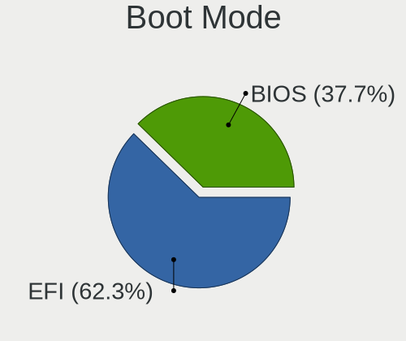
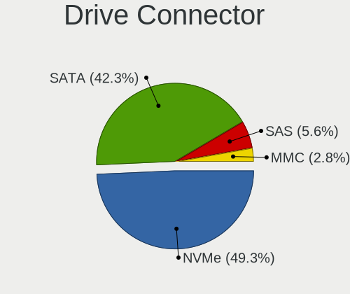
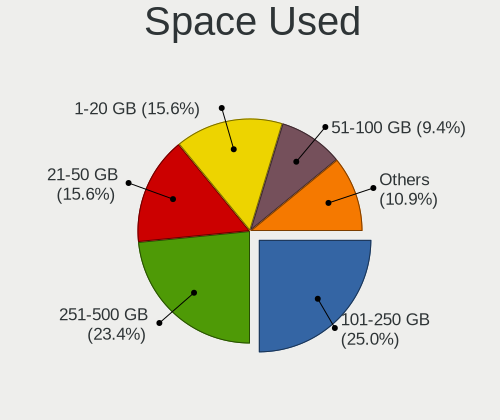
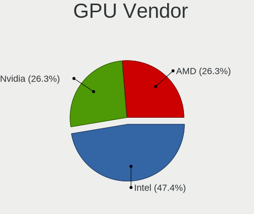
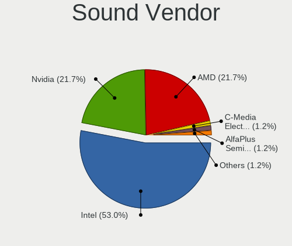

Slackware 15.0 - Tested Hardware & Statistics (Notebooks)
---------------------------------------------------------

A project to collect tested hardware configurations for Slackware 15.0.

Anyone can contribute to this report by the [hw-probe](https://github.com/linuxhw/hw-probe) tool:

    sudo -E hw-probe -all -upload

Please contribute! Especially if your hardware is rare.

Contents
--------

* [ Test Cases ](#test-cases)

* [ System ](#system)
  - [ Kernel                   ](#kernel)
  - [ Kernel Family            ](#kernel-family)
  - [ Kernel Major Ver.        ](#kernel-major-ver)
  - [ Arch                     ](#arch)
  - [ DE                       ](#de)
  - [ Display Server           ](#display-server)
  - [ Display Manager          ](#display-manager)
  - [ OS Lang                  ](#os-lang)
  - [ Boot Mode                ](#boot-mode)
  - [ Filesystem               ](#filesystem)
  - [ Part. scheme             ](#part-scheme)
  - [ Dual Boot with Linux/BSD ](#dual-boot-with-linuxbsd)
  - [ Dual Boot (Win)          ](#dual-boot-win)

* [ Board ](#board)
  - [ Vendor                   ](#vendor)
  - [ Model                    ](#model)
  - [ Model Family             ](#model-family)
  - [ MFG Year                 ](#mfg-year)
  - [ Form Factor              ](#form-factor)
  - [ Secure Boot              ](#secure-boot)
  - [ Coreboot                 ](#coreboot)
  - [ RAM Size                 ](#ram-size)
  - [ RAM Used                 ](#ram-used)
  - [ Total Drives             ](#total-drives)
  - [ Has CD-ROM               ](#has-cd-rom)
  - [ Has Ethernet             ](#has-ethernet)
  - [ Has WiFi                 ](#has-wifi)
  - [ Has Bluetooth            ](#has-bluetooth)

* [ Location ](#location)
  - [ Country                  ](#country)
  - [ City                     ](#city)

* [ Drives ](#drives)
  - [ Drive Vendor             ](#drive-vendor)
  - [ Drive Model              ](#drive-model)
  - [ HDD Vendor               ](#hdd-vendor)
  - [ SSD Vendor               ](#ssd-vendor)
  - [ Drive Kind               ](#drive-kind)
  - [ Drive Connector          ](#drive-connector)
  - [ Drive Size               ](#drive-size)
  - [ Space Total              ](#space-total)
  - [ Space Used               ](#space-used)
  - [ Malfunc. Drives          ](#malfunc-drives)
  - [ Malfunc. Drive Vendor    ](#malfunc-drive-vendor)
  - [ Malfunc. HDD Vendor      ](#malfunc-hdd-vendor)
  - [ Malfunc. Drive Kind      ](#malfunc-drive-kind)
  - [ Failed Drives            ](#failed-drives)
  - [ Failed Drive Vendor      ](#failed-drive-vendor)
  - [ Drive Status             ](#drive-status)

* [ Storage controller ](#storage-controller)
  - [ Storage Vendor           ](#storage-vendor)
  - [ Storage Model            ](#storage-model)
  - [ Storage Kind             ](#storage-kind)

* [ Processor ](#processor)
  - [ CPU Vendor               ](#cpu-vendor)
  - [ CPU Model                ](#cpu-model)
  - [ CPU Model Family         ](#cpu-model-family)
  - [ CPU Cores                ](#cpu-cores)
  - [ CPU Sockets              ](#cpu-sockets)
  - [ CPU Threads              ](#cpu-threads)
  - [ CPU Op-Modes             ](#cpu-op-modes)
  - [ CPU Microcode            ](#cpu-microcode)
  - [ CPU Microarch            ](#cpu-microarch)

* [ Graphics ](#graphics)
  - [ GPU Vendor               ](#gpu-vendor)
  - [ GPU Model                ](#gpu-model)
  - [ GPU Combo                ](#gpu-combo)
  - [ GPU Driver               ](#gpu-driver)
  - [ GPU Memory               ](#gpu-memory)

* [ Monitor ](#monitor)
  - [ Monitor Vendor           ](#monitor-vendor)
  - [ Monitor Model            ](#monitor-model)
  - [ Monitor Resolution       ](#monitor-resolution)
  - [ Monitor Diagonal         ](#monitor-diagonal)
  - [ Monitor Width            ](#monitor-width)
  - [ Aspect Ratio             ](#aspect-ratio)
  - [ Monitor Area             ](#monitor-area)
  - [ Pixel Density            ](#pixel-density)
  - [ Multiple Monitors        ](#multiple-monitors)

* [ Network ](#network)
  - [ Net Controller Vendor    ](#net-controller-vendor)
  - [ Net Controller Model     ](#net-controller-model)
  - [ Wireless Vendor          ](#wireless-vendor)
  - [ Wireless Model           ](#wireless-model)
  - [ Ethernet Vendor          ](#ethernet-vendor)
  - [ Ethernet Model           ](#ethernet-model)
  - [ Net Controller Kind      ](#net-controller-kind)
  - [ Used Controller          ](#used-controller)
  - [ NICs                     ](#nics)
  - [ IPv6                     ](#ipv6)

* [ Bluetooth ](#bluetooth)
  - [ Bluetooth Vendor         ](#bluetooth-vendor)
  - [ Bluetooth Model          ](#bluetooth-model)

* [ Sound ](#sound)
  - [ Sound Vendor             ](#sound-vendor)
  - [ Sound Model              ](#sound-model)

* [ Memory ](#memory)
  - [ Memory Vendor            ](#memory-vendor)
  - [ Memory Model             ](#memory-model)
  - [ Memory Kind              ](#memory-kind)
  - [ Memory Form Factor       ](#memory-form-factor)
  - [ Memory Size              ](#memory-size)
  - [ Memory Speed             ](#memory-speed)

* [ Printers & scanners ](#printers--scanners)
  - [ Printer Vendor           ](#printer-vendor)
  - [ Printer Model            ](#printer-model)
  - [ Scanner Vendor           ](#scanner-vendor)
  - [ Scanner Model            ](#scanner-model)

* [ Camera ](#camera)
  - [ Camera Vendor            ](#camera-vendor)
  - [ Camera Model             ](#camera-model)

* [ Security ](#security)
  - [ Fingerprint Vendor       ](#fingerprint-vendor)
  - [ Fingerprint Model        ](#fingerprint-model)
  - [ Chipcard Vendor          ](#chipcard-vendor)
  - [ Chipcard Model           ](#chipcard-model)

* [ Unsupported ](#unsupported)
  - [ Unsupported Devices      ](#unsupported-devices)
  - [ Unsupported Device Types ](#unsupported-device-types)

Test Cases
----------

Total: 61

| Vendor    | Model                       | Probe                                                      | Date         |
|-----------|-----------------------------|------------------------------------------------------------|--------------|
| Lenovo    | V330-14ARR 81B1             | [b80592c227](https://linux-hardware.org/?probe=b80592c227) | Oct 21, 2023 |
| Toshiba   | Satellite C660              | [483998d7de](https://linux-hardware.org/?probe=483998d7de) | Oct 20, 2023 |
| HP        | OMEN by Laptop 16-b1xxx     | [aafdab7043](https://linux-hardware.org/?probe=aafdab7043) | Oct 13, 2023 |
| HP        | OMEN by Laptop 16-b1xxx     | [a1a64b6621](https://linux-hardware.org/?probe=a1a64b6621) | Oct 05, 2023 |
| Notebook  | P7xxTM                      | [e14cfa2f1f](https://linux-hardware.org/?probe=e14cfa2f1f) | Sep 22, 2023 |
| Notebook  | P7xxTM                      | [41b1348520](https://linux-hardware.org/?probe=41b1348520) | Sep 22, 2023 |
| Lenovo    | ThinkPad E16 Gen 1 21JT0... | [586c1fab43](https://linux-hardware.org/?probe=586c1fab43) | Sep 06, 2023 |
| ASUSTek   | ASUS TUF Dash F15 FX517Z... | [10db09006a](https://linux-hardware.org/?probe=10db09006a) | Aug 31, 2023 |
| Dell      | Vostro 3405                 | [2ba4151315](https://linux-hardware.org/?probe=2ba4151315) | Aug 19, 2023 |
| Lenovo    | ThinkPad X1 Carbon 4th 2... | [b8ceea98b8](https://linux-hardware.org/?probe=b8ceea98b8) | Aug 18, 2023 |
| Valve     | Jupiter                     | [eee501d93c](https://linux-hardware.org/?probe=eee501d93c) | Aug 09, 2023 |
| Lenovo    | IdeaPad 5 15ALC05 82LN      | [eec04bec1d](https://linux-hardware.org/?probe=eec04bec1d) | Aug 08, 2023 |
| HP        | Laptop 14s-fq0xxx           | [0a7b2a3fcc](https://linux-hardware.org/?probe=0a7b2a3fcc) | Aug 03, 2023 |
| Acer      | Swift SF114-34              | [ec48f7a207](https://linux-hardware.org/?probe=ec48f7a207) | May 28, 2023 |
| Apple     | MacBookAir7,2               | [941aa94750](https://linux-hardware.org/?probe=941aa94750) | Apr 13, 2023 |
| Valve     | Jupiter                     | [e9844f7162](https://linux-hardware.org/?probe=e9844f7162) | Mar 13, 2023 |
| HP        | ENVY Laptop 17-cr0xxx       | [fde666c0ea](https://linux-hardware.org/?probe=fde666c0ea) | Feb 17, 2023 |
| HP        | ENVY Laptop 17-cr0xxx       | [5ce5272a93](https://linux-hardware.org/?probe=5ce5272a93) | Feb 17, 2023 |
| Lenovo    | ThinkPad X140e 20BMS03E0... | [fb4c4aebf9](https://linux-hardware.org/?probe=fb4c4aebf9) | Jan 31, 2023 |
| Lenovo    | ThinkPad T470p 20J60018M... | [9324b897c3](https://linux-hardware.org/?probe=9324b897c3) | Jan 19, 2023 |
| ASUSTek   | VivoBook_ASUSLaptop K650... | [1b50127412](https://linux-hardware.org/?probe=1b50127412) | Jan 14, 2023 |
| HP        | EliteBook 8440p             | [9edc837033](https://linux-hardware.org/?probe=9edc837033) | Jan 13, 2023 |
| HP        | OMEN by Laptop 17-ck0xxx    | [9655429e71](https://linux-hardware.org/?probe=9655429e71) | Jan 06, 2023 |
| ASUSTek   | VivoBook_ASUSLaptop K650... | [4900ec9966](https://linux-hardware.org/?probe=4900ec9966) | Jan 05, 2023 |
| Acer      | Nitro AN515-54              | [5205b7c248](https://linux-hardware.org/?probe=5205b7c248) | Dec 27, 2022 |
| ASUSTek   | VivoBook_ASUSLaptop K650... | [1cf2ac2b8b](https://linux-hardware.org/?probe=1cf2ac2b8b) | Dec 27, 2022 |
| HP        | OMEN by Laptop 16-b1xxx     | [799470f1aa](https://linux-hardware.org/?probe=799470f1aa) | Dec 05, 2022 |
| HP        | OMEN by Laptop 16-b1xxx     | [0cd3005f69](https://linux-hardware.org/?probe=0cd3005f69) | Dec 01, 2022 |
| HP        | OMEN by Laptop 16-b1xxx     | [32b68762df](https://linux-hardware.org/?probe=32b68762df) | Nov 30, 2022 |
| Lenovo    | ThinkPad T470 20JNS01R01    | [abb8194196](https://linux-hardware.org/?probe=abb8194196) | Oct 21, 2022 |
| Lenovo    | ThinkPad T61 765912G        | [e7f2dc737e](https://linux-hardware.org/?probe=e7f2dc737e) | Oct 09, 2022 |
| Lenovo    | ThinkPad T410 2518C3U       | [4d250adf3b](https://linux-hardware.org/?probe=4d250adf3b) | Oct 04, 2022 |
| Lenovo    | ThinkPad T61 765912G        | [bd04e564a0](https://linux-hardware.org/?probe=bd04e564a0) | Sep 24, 2022 |
| Fujitsu   | LIFEBOOK A544               | [e5785106f1](https://linux-hardware.org/?probe=e5785106f1) | Aug 09, 2022 |
| MSI       | Modern 14 B10MW             | [b9cde08864](https://linux-hardware.org/?probe=b9cde08864) | Jul 25, 2022 |
| Sony      | SVE1713A1EW                 | [c3a65d695d](https://linux-hardware.org/?probe=c3a65d695d) | May 10, 2022 |
| Lenovo    | ThinkPad X1 Carbon 5th 2... | [f837aaeb12](https://linux-hardware.org/?probe=f837aaeb12) | May 08, 2022 |
| HP        | Pavilion Gaming Laptop 1... | [bd2dda1d8a](https://linux-hardware.org/?probe=bd2dda1d8a) | Apr 29, 2022 |
| HP        | Pavilion Gaming Laptop 1... | [cfc9c5dbf7](https://linux-hardware.org/?probe=cfc9c5dbf7) | Apr 29, 2022 |
| MSI       | GP76 Leopard 11UG           | [aebd373a66](https://linux-hardware.org/?probe=aebd373a66) | Apr 12, 2022 |
| MSI       | GE76 Raider 11UE            | [3072e065a3](https://linux-hardware.org/?probe=3072e065a3) | Apr 12, 2022 |
| Notebook  | X170KM-G                    | [4ecba03d19](https://linux-hardware.org/?probe=4ecba03d19) | Apr 11, 2022 |
| Dell      | Latitude 3520               | [4398aa2a03](https://linux-hardware.org/?probe=4398aa2a03) | Apr 06, 2022 |
| HP        | ProBook 6570b               | [cf1305eacc](https://linux-hardware.org/?probe=cf1305eacc) | Apr 06, 2022 |
| Lenovo    | IdeaPad 310-15ISK 80SM      | [d406cb4819](https://linux-hardware.org/?probe=d406cb4819) | Apr 05, 2022 |
| Dell      | Precision M4700             | [ab99532bd5](https://linux-hardware.org/?probe=ab99532bd5) | Apr 04, 2022 |
| Lenovo    | ThinkPad X230 2325P38       | [1a0cab737b](https://linux-hardware.org/?probe=1a0cab737b) | Mar 10, 2022 |
| ASUSTek   | ROG Zephyrus G14 GA401IV... | [0b0c1aca1b](https://linux-hardware.org/?probe=0b0c1aca1b) | Mar 10, 2022 |
| HP        | Pavilion Gaming Laptop 1... | [c7825c54fc](https://linux-hardware.org/?probe=c7825c54fc) | Mar 10, 2022 |
| Framework | Laptop                      | [ae37705198](https://linux-hardware.org/?probe=ae37705198) | Mar 10, 2022 |
| Lenovo    | ThinkPad Edge E530c 3366... | [8ce0419468](https://linux-hardware.org/?probe=8ce0419468) | Feb 13, 2022 |
| Dynabook  | P1-C7MP-BL                  | [268f94787e](https://linux-hardware.org/?probe=268f94787e) | Jan 14, 2022 |
| HP        | Laptop 15-bs1xx             | [b6c9f34c4c](https://linux-hardware.org/?probe=b6c9f34c4c) | Dec 07, 2021 |
| System76  | Oryx Pro                    | [3cd05d02a8](https://linux-hardware.org/?probe=3cd05d02a8) | Oct 27, 2021 |
| MSI       | Modern 14 B11MO             | [e8f13facfd](https://linux-hardware.org/?probe=e8f13facfd) | Oct 03, 2021 |
| MSI       | Modern 14 B11MO             | [9f5c2e0fde](https://linux-hardware.org/?probe=9f5c2e0fde) | Sep 27, 2021 |
| Dell      | Inspiron 15-3552            | [f76339b0af](https://linux-hardware.org/?probe=f76339b0af) | Aug 31, 2021 |
| HP        | 245 G7 Notebook PC          | [c0806e4955](https://linux-hardware.org/?probe=c0806e4955) | Aug 23, 2021 |
| HP        | 245 G7 Notebook PC          | [c409287d23](https://linux-hardware.org/?probe=c409287d23) | Aug 23, 2021 |
| HP        | EliteBook 840 G5            | [4c196e1abd](https://linux-hardware.org/?probe=4c196e1abd) | Aug 18, 2021 |
| Dell      | Vostro 3500                 | [53a1179121](https://linux-hardware.org/?probe=53a1179121) | Aug 12, 2021 |

System
------

Kernel
------

Version of the Linux kernel

| Version     | Notebooks | Percent |
|-------------|-----------|---------|
| 5.15.19     | 12        | 23.53%  |
| 5.15.117    | 4         | 7.84%   |
| 5.19.17     | 3         | 5.88%   |
| 6.1.44      | 2         | 3.92%   |
| 5.17.1      | 2         | 3.92%   |
| 5.15.80     | 2         | 3.92%   |
| 5.15.38     | 2         | 3.92%   |
| 5.13.8      | 2         | 3.92%   |
| 6.5.5       | 1         | 1.96%   |
| 6.1.51      | 1         | 1.96%   |
| 6.1.12      | 1         | 1.96%   |
| 6.1.1       | 1         | 1.96%   |
| 5.17.5      | 1         | 1.96%   |
| 5.17.2      | 1         | 1.96%   |
| 5.16.9-joe1 | 1         | 1.96%   |
| 5.16.12     | 1         | 1.96%   |
| 5.15.78.a   | 1         | 1.96%   |
| 5.15.63     | 1         | 1.96%   |
| 5.15.37.a   | 1         | 1.96%   |
| 5.15.33.kjh | 1         | 1.96%   |
| 5.15.27     | 1         | 1.96%   |
| 5.15.118    | 1         | 1.96%   |
| 5.15.1      | 1         | 1.96%   |
| 5.14.9      | 1         | 1.96%   |
| 5.14.8      | 1         | 1.96%   |
| 5.14.10     | 1         | 1.96%   |
| 5.14.0      | 1         | 1.96%   |
| 5.13.5      | 1         | 1.96%   |
| 5.13.11     | 1         | 1.96%   |
| 5.10.91     | 1         | 1.96%   |

Kernel Family
-------------

Linux kernel without a distro release

| Version  | Notebooks | Percent |
|----------|-----------|---------|
| 5.15.19  | 12        | 23.53%  |
| 5.15.117 | 4         | 7.84%   |
| 5.19.17  | 3         | 5.88%   |
| 6.1.44   | 2         | 3.92%   |
| 5.17.1   | 2         | 3.92%   |
| 5.15.80  | 2         | 3.92%   |
| 5.15.38  | 2         | 3.92%   |
| 5.13.8   | 2         | 3.92%   |
| 6.5.5    | 1         | 1.96%   |
| 6.1.51   | 1         | 1.96%   |
| 6.1.12   | 1         | 1.96%   |
| 6.1.1    | 1         | 1.96%   |
| 5.17.5   | 1         | 1.96%   |
| 5.17.2   | 1         | 1.96%   |
| 5.16.9   | 1         | 1.96%   |
| 5.16.12  | 1         | 1.96%   |
| 5.15.78  | 1         | 1.96%   |
| 5.15.63  | 1         | 1.96%   |
| 5.15.37  | 1         | 1.96%   |
| 5.15.33  | 1         | 1.96%   |
| 5.15.27  | 1         | 1.96%   |
| 5.15.118 | 1         | 1.96%   |
| 5.15.1   | 1         | 1.96%   |
| 5.14.9   | 1         | 1.96%   |
| 5.14.8   | 1         | 1.96%   |
| 5.14.10  | 1         | 1.96%   |
| 5.14.0   | 1         | 1.96%   |
| 5.13.5   | 1         | 1.96%   |
| 5.13.11  | 1         | 1.96%   |
| 5.10.91  | 1         | 1.96%   |

Kernel Major Ver.
-----------------

Linux kernel major version

| Version | Notebooks | Percent |
|---------|-----------|---------|
| 5.15    | 27        | 54%     |
| 6.1     | 5         | 10%     |
| 5.17    | 4         | 8%      |
| 5.13    | 4         | 8%      |
| 5.19    | 3         | 6%      |
| 5.14    | 3         | 6%      |
| 5.16    | 2         | 4%      |
| 6.5     | 1         | 2%      |
| 5.10    | 1         | 2%      |

Arch
----

OS architecture (x86_64, i586, etc.)

| Name   | Notebooks | Percent |
|--------|-----------|---------|
| x86_64 | 48        | 100%    |

DE
--

Desktop Environment

| Name      | Notebooks | Percent |
|-----------|-----------|---------|
| KDE5      | 24        | 48.98%  |
| XFCE      | 14        | 28.57%  |
| Unknown   | 5         | 10.2%   |
| xwmconfig | 1         | 2.04%   |
| MATE      | 1         | 2.04%   |
| KDE       | 1         | 2.04%   |
| GNOME     | 1         | 2.04%   |
| awesome   | 1         | 2.04%   |
| 2bwm      | 1         | 2.04%   |

Display Server
--------------

X11 or Wayland

| Name    | Notebooks | Percent |
|---------|-----------|---------|
| X11     | 28        | 54.9%   |
| Tty     | 20        | 39.22%  |
| Wayland | 3         | 5.88%   |

Display Manager
---------------

SDDM, LightDM, etc.

| Name    | Notebooks | Percent |
|---------|-----------|---------|
| SDDM    | 27        | 52.94%  |
| Unknown | 12        | 23.53%  |
| XDM     | 10        | 19.61%  |
| LightDM | 1         | 1.96%   |
| GDM     | 1         | 1.96%   |

OS Lang
-------

Language

| Lang  | Notebooks | Percent |
|-------|-----------|---------|
| en_US | 38        | 79.17%  |
| de_DE | 3         | 6.25%   |
| pt_BR | 2         | 4.17%   |
| it_IT | 2         | 4.17%   |
| fr_FR | 2         | 4.17%   |
| ru_RU | 1         | 2.08%   |

Boot Mode
---------

EFI or BIOS

| Mode | Notebooks | Percent |
|------|-----------|---------|
| EFI  | 30        | 61.22%  |
| BIOS | 19        | 38.78%  |

Filesystem
----------

Type of filesystem

| Type    | Notebooks | Percent |
|---------|-----------|---------|
| Ext4    | 42        | 84%     |
| Btrfs   | 4         | 8%      |
| Overlay | 3         | 6%      |
| Xfs     | 1         | 2%      |

Part. scheme
------------

Scheme of partitioning

| Type    | Notebooks | Percent |
|---------|-----------|---------|
| GPT     | 32        | 65.31%  |
| Unknown | 9         | 18.37%  |
| MBR     | 8         | 16.33%  |

Dual Boot with Linux/BSD
------------------------

Hosting more than one Linux/BSD

| Dual boot | Notebooks | Percent |
|-----------|-----------|---------|
| No        | 41        | 83.67%  |
| Yes       | 8         | 16.33%  |

Dual Boot (Win)
---------------

Hosting Linux and Windows

| Dual boot | Notebooks | Percent |
|-----------|-----------|---------|
| No        | 29        | 59.18%  |
| Yes       | 20        | 40.82%  |

Board
-----

Vendor
------

Motherboard manufacturer

| Name             | Notebooks | Percent |
|------------------|-----------|---------|
| Lenovo           | 13        | 27.08%  |
| Hewlett-Packard  | 11        | 22.92%  |
| Dell             | 5         | 10.42%  |
| MSI              | 4         | 8.33%   |
| ASUSTek Computer | 4         | 8.33%   |
| Notebook         | 2         | 4.17%   |
| Acer             | 2         | 4.17%   |
| Valve            | 1         | 2.08%   |
| Toshiba          | 1         | 2.08%   |
| System76         | 1         | 2.08%   |
| Sony             | 1         | 2.08%   |
| Fujitsu          | 1         | 2.08%   |
| Framework        | 1         | 2.08%   |
| Dynabook         | 1         | 2.08%   |

Model
-----

Motherboard model

| Name                                     | Notebooks | Percent |
|------------------------------------------|-----------|---------|
| ASUS VivoBook_ASUSLaptop K6500ZE_K6500ZE | 2         | 4.17%   |
| Valve Jupiter                            | 1         | 2.08%   |
| Toshiba Satellite C660                   | 1         | 2.08%   |
| System76 Oryx Pro                        | 1         | 2.08%   |
| Sony SVE1713A1EW                         | 1         | 2.08%   |
| Notebook X170KM-G                        | 1         | 2.08%   |
| Notebook P7xxTM                          | 1         | 2.08%   |
| MSI Modern 14 B11MO                      | 1         | 2.08%   |
| MSI Modern 14 B10MW                      | 1         | 2.08%   |
| MSI GP76 Leopard 11UG                    | 1         | 2.08%   |
| MSI GE76 Raider 11UE                     | 1         | 2.08%   |
| Lenovo V330-14ARR 81B1                   | 1         | 2.08%   |
| Lenovo ThinkPad X230 2325P38             | 1         | 2.08%   |
| Lenovo ThinkPad X140e 20BMS03E00         | 1         | 2.08%   |
| Lenovo ThinkPad X1 Carbon 5th 20HQS04300 | 1         | 2.08%   |
| Lenovo ThinkPad X1 Carbon 4th 20FCS2FT00 | 1         | 2.08%   |
| Lenovo ThinkPad T61 765912G              | 1         | 2.08%   |
| Lenovo ThinkPad T470p 20J60018MS         | 1         | 2.08%   |
| Lenovo ThinkPad T470 20JNS01R01          | 1         | 2.08%   |
| Lenovo ThinkPad T410 2518C3U             | 1         | 2.08%   |
| Lenovo ThinkPad Edge E530c 336669G       | 1         | 2.08%   |
| Lenovo ThinkPad E16 Gen 1 21JT000PJP     | 1         | 2.08%   |
| Lenovo IdeaPad 5 15ALC05 82LN            | 1         | 2.08%   |
| Lenovo IdeaPad 310-15ISK 80SM            | 1         | 2.08%   |
| HP ProBook 6570b                         | 1         | 2.08%   |
| HP Pavilion Gaming Laptop 16-a0xxx       | 1         | 2.08%   |
| HP Pavilion Gaming Laptop 15-ec1xxx      | 1         | 2.08%   |
| HP OMEN by Laptop 17-ck0xxx              | 1         | 2.08%   |
| HP OMEN by Laptop 16-b1xxx               | 1         | 2.08%   |
| HP Laptop 15-bs1xx                       | 1         | 2.08%   |
| HP Laptop 14s-fq0xxx                     | 1         | 2.08%   |
| HP ENVY Laptop 17-cr0xxx                 | 1         | 2.08%   |
| HP EliteBook 8440p                       | 1         | 2.08%   |
| HP EliteBook 840 G5                      | 1         | 2.08%   |
| HP 245 G7 Notebook PC                    | 1         | 2.08%   |
| Fujitsu LIFEBOOK A544                    | 1         | 2.08%   |
| Framework Laptop                         | 1         | 2.08%   |
| Dynabook P1-C7MP-BL                      | 1         | 2.08%   |
| Dell Vostro 3500                         | 1         | 2.08%   |
| Dell Vostro 3405                         | 1         | 2.08%   |

Model Family
------------

Motherboard model prefix

| Name                | Notebooks | Percent |
|---------------------|-----------|---------|
| Lenovo ThinkPad     | 10        | 20.83%  |
| MSI Modern          | 2         | 4.17%   |
| Lenovo IdeaPad      | 2         | 4.17%   |
| HP Pavilion         | 2         | 4.17%   |
| HP OMEN             | 2         | 4.17%   |
| HP Laptop           | 2         | 4.17%   |
| HP EliteBook        | 2         | 4.17%   |
| Dell Vostro         | 2         | 4.17%   |
| ASUS VivoBook       | 2         | 4.17%   |
| Valve Jupiter       | 1         | 2.08%   |
| Toshiba Satellite   | 1         | 2.08%   |
| System76 Oryx       | 1         | 2.08%   |
| Sony SVE1713A1EW    | 1         | 2.08%   |
| Notebook X170KM-G   | 1         | 2.08%   |
| Notebook P7xxTM     | 1         | 2.08%   |
| MSI GP76            | 1         | 2.08%   |
| MSI GE76            | 1         | 2.08%   |
| Lenovo V330-14ARR   | 1         | 2.08%   |
| HP ProBook          | 1         | 2.08%   |
| HP ENVY             | 1         | 2.08%   |
| HP 245              | 1         | 2.08%   |
| Fujitsu LIFEBOOK    | 1         | 2.08%   |
| Framework Laptop    | 1         | 2.08%   |
| Dynabook P1-C7MP-BL | 1         | 2.08%   |
| Dell Precision      | 1         | 2.08%   |
| Dell Latitude       | 1         | 2.08%   |
| Dell Inspiron       | 1         | 2.08%   |
| ASUS ROG            | 1         | 2.08%   |
| ASUS ASUS           | 1         | 2.08%   |
| Acer Swift          | 1         | 2.08%   |
| Acer Nitro          | 1         | 2.08%   |

MFG Year
--------

Motherboard manufacture year

| Year | Notebooks | Percent |
|------|-----------|---------|
| 2020 | 10        | 20.83%  |
| 2021 | 8         | 16.67%  |
| 2022 | 6         | 12.5%   |
| 2012 | 5         | 10.42%  |
| 2017 | 4         | 8.33%   |
| 2019 | 3         | 6.25%   |
| 2010 | 3         | 6.25%   |
| 2016 | 2         | 4.17%   |
| 2023 | 1         | 2.08%   |
| 2018 | 1         | 2.08%   |
| 2015 | 1         | 2.08%   |
| 2014 | 1         | 2.08%   |
| 2013 | 1         | 2.08%   |
| 2009 | 1         | 2.08%   |
| 2007 | 1         | 2.08%   |

Form Factor
-----------

Physical design of the computer

| Name     | Notebooks | Percent |
|----------|-----------|---------|
| Notebook | 48        | 100%    |

Secure Boot
-----------

Enabled or disabled

| State    | Notebooks | Percent |
|----------|-----------|---------|
| Disabled | 48        | 100%    |

Coreboot
--------

Have coreboot on board

| Used | Notebooks | Percent |
|------|-----------|---------|
| No   | 46        | 95.83%  |
| Yes  | 2         | 4.17%   |

RAM Size
--------

Total RAM memory

| Size in GB  | Notebooks | Percent |
|-------------|-----------|---------|
| 8.01-16.0   | 15        | 30.61%  |
| 4.01-8.0    | 9         | 18.37%  |
| 16.01-24.0  | 9         | 18.37%  |
| 3.01-4.0    | 8         | 16.33%  |
| 32.01-64.0  | 3         | 6.12%   |
| 64.01-256.0 | 3         | 6.12%   |
| 24.01-32.0  | 2         | 4.08%   |

RAM Used
--------

Used RAM memory

| Used GB    | Notebooks | Percent |
|------------|-----------|---------|
| 2.01-3.0   | 17        | 32.69%  |
| 1.01-2.0   | 13        | 25%     |
| 4.01-8.0   | 11        | 21.15%  |
| 3.01-4.0   | 4         | 7.69%   |
| 0.51-1.0   | 4         | 7.69%   |
| 0.01-0.5   | 2         | 3.85%   |
| 16.01-24.0 | 1         | 1.92%   |

Total Drives
------------

Number of drives on board

| Drives | Notebooks | Percent |
|--------|-----------|---------|
| 1      | 34        | 69.39%  |
| 2      | 12        | 24.49%  |
| 4      | 2         | 4.08%   |
| 3      | 1         | 2.04%   |

Has CD-ROM
----------

Has CD-ROM on board

| Presented | Notebooks | Percent |
|-----------|-----------|---------|
| No        | 39        | 81.25%  |
| Yes       | 9         | 18.75%  |

Has Ethernet
------------

Has Ethernet on board

| Presented | Notebooks | Percent |
|-----------|-----------|---------|
| Yes       | 40        | 83.33%  |
| No        | 8         | 16.67%  |

Has WiFi
--------

Has WiFi module

| Presented | Notebooks | Percent |
|-----------|-----------|---------|
| Yes       | 48        | 100%    |

Has Bluetooth
-------------

Has Bluetooth module

| Presented | Notebooks | Percent |
|-----------|-----------|---------|
| Yes       | 42        | 87.5%   |
| No        | 6         | 12.5%   |

Location
--------

Country
-------

Geographic location (country)

| Country      | Notebooks | Percent |
|--------------|-----------|---------|
| USA          | 11        | 22.92%  |
| Portugal     | 3         | 6.25%   |
| Kazakhstan   | 3         | 6.25%   |
| Japan        | 3         | 6.25%   |
| Italy        | 3         | 6.25%   |
| Germany      | 3         | 6.25%   |
| France       | 3         | 6.25%   |
| South Africa | 2         | 4.17%   |
| India        | 2         | 4.17%   |
| Brazil       | 2         | 4.17%   |
| UK           | 1         | 2.08%   |
| Sweden       | 1         | 2.08%   |
| Spain        | 1         | 2.08%   |
| Serbia       | 1         | 2.08%   |
| Russia       | 1         | 2.08%   |
| Romania      | 1         | 2.08%   |
| Mexico       | 1         | 2.08%   |
| Iran         | 1         | 2.08%   |
| Greece       | 1         | 2.08%   |
| China        | 1         | 2.08%   |
| Chile        | 1         | 2.08%   |
| Canada       | 1         | 2.08%   |
| Argentina    | 1         | 2.08%   |

City
----

Geographic location (city)

| City              | Notebooks | Percent |
|-------------------|-----------|---------|
| Ust-Kamenogorsk   | 2         | 4.08%   |
| Tsukuba           | 2         | 4.08%   |
| Sun Prairie       | 2         | 4.08%   |
| Lisbon            | 2         | 4.08%   |
| Greater Noida     | 2         | 4.08%   |
| Frignano          | 2         | 4.08%   |
| Worpswede         | 1         | 2.04%   |
| Villa Carlos Paz  | 1         | 2.04%   |
| Tehran            | 1         | 2.04%   |
| Skövde           | 1         | 2.04%   |
| Sao Paulo         | 1         | 2.04%   |
| Santiago          | 1         | 2.04%   |
| Round Rock        | 1         | 2.04%   |
| Reno              | 1         | 2.04%   |
| Renazzo           | 1         | 2.04%   |
| Plainwell         | 1         | 2.04%   |
| Ōtsu             | 1         | 2.04%   |
| Oberstreit        | 1         | 2.04%   |
| Moscow            | 1         | 2.04%   |
| Montreal          | 1         | 2.04%   |
| Mexico City       | 1         | 2.04%   |
| Meuselwitz        | 1         | 2.04%   |
| McKinney          | 1         | 2.04%   |
| Luxeuil-les-Bains | 1         | 2.04%   |
| League City       | 1         | 2.04%   |
| Kent              | 1         | 2.04%   |
| Karaganda         | 1         | 2.04%   |
| Johannesburg      | 1         | 2.04%   |
| Hayward           | 1         | 2.04%   |
| Harringay         | 1         | 2.04%   |
| Guimaraes         | 1         | 2.04%   |
| Guangzhou         | 1         | 2.04%   |
| Fortaleza         | 1         | 2.04%   |
| Fayetteville      | 1         | 2.04%   |
| Colombes          | 1         | 2.04%   |
| Chessy            | 1         | 2.04%   |
| Chania            | 1         | 2.04%   |
| Cape Town         | 1         | 2.04%   |
| Bucharest         | 1         | 2.04%   |
| Bremervoerde      | 1         | 2.04%   |

Drives
------

Drive Vendor
------------

Hard drive vendors

| Vendor                      | Notebooks | Drives | Percent |
|-----------------------------|-----------|--------|---------|
| Samsung Electronics         | 13        | 19     | 20.97%  |
| WDC                         | 8         | 9      | 12.9%   |
| Kingston                    | 6         | 6      | 9.68%   |
| Intel                       | 5         | 5      | 8.06%   |
| Sandisk                     | 4         | 6      | 6.45%   |
| Toshiba                     | 3         | 3      | 4.84%   |
| SK hynix                    | 3         | 3      | 4.84%   |
| Seagate                     | 3         | 3      | 4.84%   |
| HGST                        | 3         | 3      | 4.84%   |
| Micron Technology           | 2         | 2      | 3.23%   |
| Crucial                     | 2         | 2      | 3.23%   |
| Unknown                     | 1         | 2      | 1.61%   |
| Transcend                   | 1         | 1      | 1.61%   |
| Silicon Motion              | 1         | 1      | 1.61%   |
| Plextor                     | 1         | 1      | 1.61%   |
| Micron/Crucial Technology   | 1         | 1      | 1.61%   |
| KIOXIA                      | 1         | 1      | 1.61%   |
| Kingston Technology Company | 1         | 1      | 1.61%   |
| Hewlett-Packard             | 1         | 2      | 1.61%   |
| Gigabyte Technology         | 1         | 1      | 1.61%   |
| External                    | 1         | 1      | 1.61%   |

Drive Model
-----------

Hard drive models

| Model                                                 | Notebooks | Percent |
|-------------------------------------------------------|-----------|---------|
| Kingston SA400S37240G 240GB SSD                       | 4         | 5.88%   |
| WDC WD10SPZX-60Z10T0 1TB                              | 2         | 2.94%   |
| Intel SSD 660P Series 1024GB                          | 2         | 2.94%   |
| HGST HTS725050A7E630 500GB                            | 2         | 2.94%   |
| WDC WDS100T2B0B-00YS70 1TB SSD                        | 1         | 1.47%   |
| WDC WDS100T2B0A-00SM50 1TB SSD                        | 1         | 1.47%   |
| WDC WD5000BEKT-60KA9T0 500GB                          | 1         | 1.47%   |
| WDC WD10JPVT-08A1YT2 1TB                              | 1         | 1.47%   |
| WDC WD Green 2.5 240GB                                | 1         | 1.47%   |
| WDC PC SN530 SDBPNPZ-1T00-1002 1TB                    | 1         | 1.47%   |
| WDC PC SN530 SDBPMPZ-512G-1101 512GB                  | 1         | 1.47%   |
| Unknown MMC Card  512GB                               | 1         | 1.47%   |
| Transcend TS256GMTE352T-VLV 256GB                     | 1         | 1.47%   |
| Toshiba MQ04ABF100 1TB                                | 1         | 1.47%   |
| Toshiba MQ01ACF032 320GB                              | 1         | 1.47%   |
| Toshiba MQ01ABF050 500GB                              | 1         | 1.47%   |
| SK hynix HFM001TD3JX013N 1024GB                       | 1         | 1.47%   |
| SK hynix BC511 HFM512GDJTNI-82A0A 512GB               | 1         | 1.47%   |
| SK hynix BC511 512GB                                  | 1         | 1.47%   |
| Silicon Motion SM2263EN/SM2263XT SSD Controller 256GB | 1         | 1.47%   |
| Seagate ST2000LX001-1RG174 2TB                        | 1         | 1.47%   |
| Seagate ST1000LM048-2E7172 1TB                        | 1         | 1.47%   |
| Seagate ST1000LM024 HN-M101MBB 1TB                    | 1         | 1.47%   |
| Sandisk WD PC SN740 SDDQNQD-1T00-1201 1024GB          | 1         | 1.47%   |
| Sandisk WD Black SN850 1TB                            | 1         | 1.47%   |
| SanDisk Ultra II 960GB SSD                            | 1         | 1.47%   |
| SanDisk SDSSDA240G 240GB                              | 1         | 1.47%   |
| SanDisk NVMe SSD Drive 1TB                            | 1         | 1.47%   |
| Samsung SSD PM830 2.5 7mm 128GB                       | 1         | 1.47%   |
| Samsung SSD 980 PRO 500GB                             | 1         | 1.47%   |
| Samsung SSD 980 PRO 2TB                               | 1         | 1.47%   |
| Samsung SSD 980 PRO 1TB                               | 1         | 1.47%   |
| Samsung SSD 970 EVO Plus 500GB                        | 1         | 1.47%   |
| Samsung SSD 970 EVO Plus 2TB                          | 1         | 1.47%   |
| Samsung SSD 970 EVO 2TB                               | 1         | 1.47%   |
| Samsung SSD 870 EVO 1TB                               | 1         | 1.47%   |
| Samsung SSD 860 EVO mSATA 500GB                       | 1         | 1.47%   |
| Samsung PM963 2.5" NVMe PCIe SSD 256GB                | 1         | 1.47%   |
| Samsung NVMe SSD Controller SM961/PM961/SM963 121GB   | 1         | 1.47%   |
| Samsung MZVLQ512HALU-000H1 512GB                      | 1         | 1.47%   |

HDD Vendor
----------

Hard disk drive vendors

| Vendor   | Notebooks | Drives | Percent |
|----------|-----------|--------|---------|
| WDC      | 4         | 4      | 28.57%  |
| Toshiba  | 3         | 3      | 21.43%  |
| Seagate  | 3         | 3      | 21.43%  |
| HGST     | 3         | 3      | 21.43%  |
| External | 1         | 1      | 7.14%   |

SSD Vendor
----------

Solid state drive vendors

| Vendor              | Notebooks | Drives | Percent |
|---------------------|-----------|--------|---------|
| Kingston            | 6         | 6      | 35.29%  |
| Samsung Electronics | 4         | 6      | 23.53%  |
| WDC                 | 2         | 3      | 11.76%  |
| SanDisk             | 2         | 2      | 11.76%  |
| Plextor             | 1         | 1      | 5.88%   |
| Gigabyte Technology | 1         | 1      | 5.88%   |
| Crucial             | 1         | 1      | 5.88%   |

Drive Kind
----------

HDD or SSD

| Kind | Notebooks | Drives | Percent |
|------|-----------|--------|---------|
| NVMe | 29        | 37     | 48.33%  |
| SSD  | 17        | 20     | 28.33%  |
| HDD  | 13        | 14     | 21.67%  |
| MMC  | 1         | 2      | 1.67%   |

Drive Connector
---------------

SATA, SAS, NVMe, etc.

| Type | Notebooks | Drives | Percent |
|------|-----------|--------|---------|
| NVMe | 29        | 37     | 50.88%  |
| SATA | 24        | 31     | 42.11%  |
| SAS  | 3         | 3      | 5.26%   |
| MMC  | 1         | 2      | 1.75%   |

Drive Size
----------

Size of hard drive

| Size in TB | Notebooks | Drives | Percent |
|------------|-----------|--------|---------|
| 0.01-0.5   | 19        | 22     | 63.33%  |
| 0.51-1.0   | 9         | 10     | 30%     |
| 1.01-2.0   | 2         | 2      | 6.67%   |

Space Total
-----------

Amount of disk space available on the file system

| Size in GB     | Notebooks | Percent |
|----------------|-----------|---------|
| 501-1000       | 15        | 30%     |
| 101-250        | 14        | 28%     |
| 251-500        | 9         | 18%     |
| 1001-2000      | 6         | 12%     |
| 21-50          | 2         | 4%      |
| 1-20           | 2         | 4%      |
| More than 3000 | 1         | 2%      |
| 2001-3000      | 1         | 2%      |

Space Used
----------

Amount of used disk space

| Used GB   | Notebooks | Percent |
|-----------|-----------|---------|
| 101-250   | 14        | 27.45%  |
| 251-500   | 9         | 17.65%  |
| 21-50     | 8         | 15.69%  |
| 1-20      | 8         | 15.69%  |
| 51-100    | 5         | 9.8%    |
| 501-1000  | 4         | 7.84%   |
| 1001-2000 | 3         | 5.88%   |

Malfunc. Drives
---------------

Drive models with a malfunction

| Model                               | Notebooks | Drives | Percent |
|-------------------------------------|-----------|--------|---------|
| Samsung Electronics SSD 870 EVO 1TB | 1         | 1      | 25%     |
| Plextor PX-128M6S 128GB SSD         | 1         | 1      | 25%     |
| HGST HTS725050A7E630 500GB          | 1         | 1      | 25%     |
| HGST HTS545050A7E380 500GB          | 1         | 1      | 25%     |

Malfunc. Drive Vendor
---------------------

Vendors of faulty drives

| Vendor              | Notebooks | Drives | Percent |
|---------------------|-----------|--------|---------|
| HGST                | 2         | 2      | 50%     |
| Samsung Electronics | 1         | 1      | 25%     |
| Plextor             | 1         | 1      | 25%     |

Malfunc. HDD Vendor
-------------------

Vendors of faulty HDD drives

| Vendor | Notebooks | Drives | Percent |
|--------|-----------|--------|---------|
| HGST   | 2         | 2      | 100%    |

Malfunc. Drive Kind
-------------------

Kinds of faulty drives

| Kind | Notebooks | Drives | Percent |
|------|-----------|--------|---------|
| SSD  | 2         | 2      | 50%     |
| HDD  | 2         | 2      | 50%     |

Failed Drives
-------------

Failed drive models

Zero info for selected period =(

Failed Drive Vendor
-------------------

Failed drive vendors

Zero info for selected period =(

Drive Status
------------

Number of failed and malfunc. drives

| Status   | Notebooks | Drives | Percent |
|----------|-----------|--------|---------|
| Works    | 39        | 50     | 72.22%  |
| Detected | 11        | 19     | 20.37%  |
| Malfunc  | 4         | 4      | 7.41%   |

Storage controller
------------------

Storage Vendor
--------------

Storage controller vendors

| Vendor                      | Notebooks | Percent |
|-----------------------------|-----------|---------|
| Intel                       | 28        | 48.28%  |
| Samsung Electronics         | 9         | 15.52%  |
| AMD                         | 6         | 10.34%  |
| SanDisk                     | 4         | 6.9%    |
| SK hynix                    | 3         | 5.17%   |
| Micron/Crucial Technology   | 2         | 3.45%   |
| Micron Technology           | 2         | 3.45%   |
| Silicon Motion              | 1         | 1.72%   |
| KIOXIA                      | 1         | 1.72%   |
| Kingston Technology Company | 1         | 1.72%   |
| Biwin Storage Technology    | 1         | 1.72%   |

Storage Model
-------------

Storage controller models

| Model                                                                            | Notebooks | Percent |
|----------------------------------------------------------------------------------|-----------|---------|
| AMD FCH SATA Controller [AHCI mode]                                              | 5         | 7.94%   |
| Samsung NVMe SSD Controller PM9A1/PM9A3/980PRO                                   | 4         | 6.35%   |
| Intel 82801 Mobile SATA Controller [RAID mode]                                   | 4         | 6.35%   |
| Intel 7 Series Chipset Family 6-port SATA Controller [AHCI mode]                 | 4         | 6.35%   |
| Samsung NVMe SSD Controller 980 (DRAM-less)                                      | 3         | 4.76%   |
| Intel Volume Management Device NVMe RAID Controller                              | 3         | 4.76%   |
| Intel SSD 660P Series                                                            | 3         | 4.76%   |
| Intel 5 Series/3400 Series Chipset 6 port SATA AHCI Controller                   | 3         | 4.76%   |
| SK hynix BC511 NVMe SSD                                                          | 2         | 3.17%   |
| Samsung NVMe SSD Controller SM981/PM981/PM983                                    | 2         | 3.17%   |
| Samsung NVMe SSD Controller SM961/PM961/SM963                                    | 2         | 3.17%   |
| Micron/Crucial P2 [Nick P2] / P3 / P3 Plus NVMe PCIe SSD (DRAM-less)             | 2         | 3.17%   |
| Intel Sunrise Point-LP SATA Controller [AHCI mode]                               | 2         | 3.17%   |
| SK hynix Gold P31/BC711/PC711 NVMe Solid State Drive                             | 1         | 1.59%   |
| Silicon Motion SM2263EN/SM2263XT (DRAM-less) NVMe SSD Controllers                | 1         | 1.59%   |
| SanDisk WD PC SN810 / Black SN850 NVMe SSD                                       | 1         | 1.59%   |
| SanDisk WD Black SN770 / PC SN740 256GB / PC SN560 (DRAM-less) NVMe SSD          | 1         | 1.59%   |
| SanDisk Ultra 3D / WD Blue SN550 NVMe SSD                                        | 1         | 1.59%   |
| SanDisk PC SN530 NVMe SSD (DRAM-less)                                            | 1         | 1.59%   |
| Micron 3400 NVMe SSD [Hendrix]                                                   | 1         | 1.59%   |
| Micron 2210 NVMe SSD [Cobain]                                                    | 1         | 1.59%   |
| KIOXIA NVMe SSD Controller BG4 (DRAM-less)                                       | 1         | 1.59%   |
| Kingston Company OM3PDP3 NVMe SSD                                                | 1         | 1.59%   |
| Intel Wildcat Point-LP SATA Controller [AHCI Mode]                               | 1         | 1.59%   |
| Intel Tiger Lake-LP SATA Controller                                              | 1         | 1.59%   |
| Intel SSD 670p Series [Keystone Harbor]                                          | 1         | 1.59%   |
| Intel SSD 600P Series                                                            | 1         | 1.59%   |
| Intel HM170/QM170 Chipset SATA Controller [AHCI Mode]                            | 1         | 1.59%   |
| Intel Atom/Celeron/Pentium Processor x5-E8000/J3xxx/N3xxx Series SATA Controller | 1         | 1.59%   |
| Intel 82801HM/HEM (ICH8M/ICH8M-E) SATA Controller [AHCI mode]                    | 1         | 1.59%   |
| Intel 82801HM/HEM (ICH8M/ICH8M-E) IDE Controller                                 | 1         | 1.59%   |
| Intel 8 Series/C220 Series Chipset Family 6-port SATA Controller 1 [AHCI mode]   | 1         | 1.59%   |
| Intel 500 Series Chipset Family SATA AHCI Controller                             | 1         | 1.59%   |
| Intel 5 Series/3400 Series Chipset 4 port SATA AHCI Controller                   | 1         | 1.59%   |
| Intel 200 Series PCH SATA controller [AHCI mode]                                 | 1         | 1.59%   |
| Biwin Storage EX950 NVMe SSD                                                     | 1         | 1.59%   |
| AMD FCH SATA Controller [IDE mode]                                               | 1         | 1.59%   |

Storage Kind
------------

Kind of storage controller (IDE, SATA, NVMe, SAS, ...)

| Kind | Notebooks | Percent |
|------|-----------|---------|
| NVMe | 29        | 47.54%  |
| SATA | 25        | 40.98%  |
| RAID | 6         | 9.84%   |
| IDE  | 1         | 1.64%   |

Processor
---------

CPU Vendor
----------

Processor vendors

| Vendor | Notebooks | Percent |
|--------|-----------|---------|
| Intel  | 38        | 79.17%  |
| AMD    | 10        | 20.83%  |

CPU Model
---------

Processor models

| Model                                         | Notebooks | Percent |
|-----------------------------------------------|-----------|---------|
| Intel 11th Gen Core i7-11800H @ 2.30GHz       | 4         | 8.33%   |
| Intel 12th Gen Core i7-12700H                 | 3         | 6.25%   |
| Intel Core i5-6300U CPU @ 2.40GHz             | 2         | 4.17%   |
| Intel 11th Gen Core i5-1135G7 @ 2.40GHz       | 2         | 4.17%   |
| Intel Pentium Silver N6000 @ 1.10GHz          | 1         | 2.08%   |
| Intel Pentium CPU 2020M @ 2.40GHz             | 1         | 2.08%   |
| Intel Core i7-9750H CPU @ 2.60GHz             | 1         | 2.08%   |
| Intel Core i7-8700K CPU @ 3.70GHz             | 1         | 2.08%   |
| Intel Core i7-8550U CPU @ 1.80GHz             | 1         | 2.08%   |
| Intel Core i7-7700HQ CPU @ 2.80GHz            | 1         | 2.08%   |
| Intel Core i7-7600U CPU @ 2.80GHz             | 1         | 2.08%   |
| Intel Core i7-6500U CPU @ 2.50GHz             | 1         | 2.08%   |
| Intel Core i7-3840QM CPU @ 2.80GHz            | 1         | 2.08%   |
| Intel Core i7-10870H CPU @ 2.20GHz            | 1         | 2.08%   |
| Intel Core i7-10510U CPU @ 1.80GHz            | 1         | 2.08%   |
| Intel Core i5-4310M CPU @ 2.70GHz             | 1         | 2.08%   |
| Intel Core i5-3360M CPU @ 2.80GHz             | 1         | 2.08%   |
| Intel Core i5-3320M CPU @ 2.60GHz             | 1         | 2.08%   |
| Intel Core i5-3230M CPU @ 2.60GHz             | 1         | 2.08%   |
| Intel Core i5-10210U CPU @ 1.60GHz            | 1         | 2.08%   |
| Intel Core i5 CPU M 560 @ 2.67GHz             | 1         | 2.08%   |
| Intel Core i5 CPU M 540 @ 2.53GHz             | 1         | 2.08%   |
| Intel Core i5 CPU M 460 @ 2.53GHz             | 1         | 2.08%   |
| Intel Core i3-5005U CPU @ 2.00GHz             | 1         | 2.08%   |
| Intel Core i3 CPU M 370 @ 2.40GHz             | 1         | 2.08%   |
| Intel Core 2 Duo CPU T7300 @ 2.00GHz          | 1         | 2.08%   |
| Intel Celeron CPU N3060 @ 1.60GHz             | 1         | 2.08%   |
| Intel 12th Gen Core i7-12650H                 | 1         | 2.08%   |
| Intel 12th Gen Core i7-1255U                  | 1         | 2.08%   |
| Intel 11th Gen Core i9-11900K @ 3.50GHz       | 1         | 2.08%   |
| Intel 11th Gen Core i7-1165G7 @ 2.80GHz       | 1         | 2.08%   |
| AMD Ryzen 9 4900HS with Radeon Graphics       | 1         | 2.08%   |
| AMD Ryzen 7 7730U with Radeon Graphics        | 1         | 2.08%   |
| AMD Ryzen 7 5700U with Radeon Graphics        | 1         | 2.08%   |
| AMD Ryzen 7 4700U with Radeon Graphics        | 1         | 2.08%   |
| AMD Ryzen 5 4600H with Radeon Graphics        | 1         | 2.08%   |
| AMD Ryzen 5 3500U with Radeon Vega Mobile Gfx | 1         | 2.08%   |
| AMD Ryzen 5 3450U with Radeon Vega Mobile Gfx | 1         | 2.08%   |
| AMD Ryzen 5 2500U with Radeon Vega Mobile Gfx | 1         | 2.08%   |
| AMD E1-2500 APU with Radeon HD Graphics       | 1         | 2.08%   |

CPU Model Family
----------------

Processor model prefix

| Model                | Notebooks | Percent |
|----------------------|-----------|---------|
| Other                | 14        | 29.17%  |
| Intel Core i5        | 10        | 20.83%  |
| Intel Core i7        | 9         | 18.75%  |
| AMD Ryzen 5          | 4         | 8.33%   |
| AMD Ryzen 7          | 3         | 6.25%   |
| Intel Core i3        | 2         | 4.17%   |
| Intel Pentium Silver | 1         | 2.08%   |
| Intel Pentium        | 1         | 2.08%   |
| Intel Core 2 Duo     | 1         | 2.08%   |
| Intel Celeron        | 1         | 2.08%   |
| AMD Ryzen 9          | 1         | 2.08%   |
| AMD E1               | 1         | 2.08%   |

CPU Cores
---------

Number of processor cores

| Number | Notebooks | Percent |
|--------|-----------|---------|
| 2      | 17        | 35.42%  |
| 4      | 13        | 27.08%  |
| 8      | 10        | 20.83%  |
| 14     | 3         | 6.25%   |
| 6      | 3         | 6.25%   |
| 10     | 2         | 4.17%   |

CPU Sockets
-----------

Number of sockets

| Number | Notebooks | Percent |
|--------|-----------|---------|
| 1      | 48        | 100%    |

CPU Threads
-----------

Threads per core (Hyper-Threading)

| Number | Notebooks | Percent |
|--------|-----------|---------|
| 2      | 42        | 87.5%   |
| 1      | 6         | 12.5%   |

CPU Op-Modes
------------

CPU Operation Modes (32-bit, 64-bit)

| Op mode        | Notebooks | Percent |
|----------------|-----------|---------|
| 32-bit, 64-bit | 48        | 100%    |

CPU Microcode
-------------

Microcode number

| Number     | Notebooks | Percent |
|------------|-----------|---------|
| Unknown    | 12        | 24.49%  |
| 0x306a9    | 5         | 10.2%   |
| 0x906a3    | 4         | 8.16%   |
| 0x806d1    | 4         | 8.16%   |
| 0x806c1    | 3         | 6.12%   |
| 0x406e3    | 2         | 4.08%   |
| 0x20655    | 2         | 4.08%   |
| 0x08600106 | 2         | 4.08%   |
| 0x08108109 | 2         | 4.08%   |
| 0xa0671    | 1         | 2.04%   |
| 0xa0652    | 1         | 2.04%   |
| 0x906ea    | 1         | 2.04%   |
| 0x906c0    | 1         | 2.04%   |
| 0x906a4    | 1         | 2.04%   |
| 0x806ec    | 1         | 2.04%   |
| 0x806ea    | 1         | 2.04%   |
| 0x406c4    | 1         | 2.04%   |
| 0x306d4    | 1         | 2.04%   |
| 0x306c3    | 1         | 2.04%   |
| 0x08900201 | 1         | 2.04%   |
| 0x08608102 | 1         | 2.04%   |
| 0x07000106 | 1         | 2.04%   |

CPU Microarch
-------------

Microarchitecture

| Name             | Notebooks | Percent |
|------------------|-----------|---------|
| KabyLake         | 7         | 14.29%  |
| IvyBridge        | 5         | 10.2%   |
| Icelake          | 5         | 10.2%   |
| Alderlake Hybrid | 5         | 10.2%   |
| Westmere         | 4         | 8.16%   |
| Zen 2            | 3         | 6.12%   |
| TigerLake        | 3         | 6.12%   |
| Skylake          | 3         | 6.12%   |
| Unknown          | 3         | 6.12%   |
| Zen+             | 2         | 4.08%   |
| Zen 3            | 1         | 2.04%   |
| Zen              | 1         | 2.04%   |
| Tremont          | 1         | 2.04%   |
| Silvermont       | 1         | 2.04%   |
| Jaguar           | 1         | 2.04%   |
| Haswell          | 1         | 2.04%   |
| Core             | 1         | 2.04%   |
| CometLake        | 1         | 2.04%   |
| Broadwell        | 1         | 2.04%   |

Graphics
--------

GPU Vendor
----------

Vendors of graphics cards

| Vendor | Notebooks | Percent |
|--------|-----------|---------|
| Intel  | 30        | 48.39%  |
| Nvidia | 18        | 29.03%  |
| AMD    | 14        | 22.58%  |

GPU Model
---------

Graphics card models

| Model                                                                                    | Notebooks | Percent |
|------------------------------------------------------------------------------------------|-----------|---------|
| Nvidia GA104M [GeForce RTX 3070 Mobile / Max-Q]                                          | 4         | 6.35%   |
| Nvidia GA107M [GeForce RTX 3050 Ti Mobile]                                               | 3         | 4.76%   |
| Intel TigerLake-LP GT2 [Iris Xe Graphics]                                                | 3         | 4.76%   |
| Intel TigerLake-H GT1 [UHD Graphics]                                                     | 3         | 4.76%   |
| Intel Skylake GT2 [HD Graphics 520]                                                      | 3         | 4.76%   |
| Intel Alder Lake-P GT2 [Iris Xe Graphics]                                                | 3         | 4.76%   |
| AMD Renoir [Radeon RX Vega 6 (Ryzen 4000/5000 Mobile Series)]                            | 3         | 4.76%   |
| Nvidia TU117M [GeForce GTX 1650 Ti Mobile]                                               | 2         | 3.17%   |
| Nvidia GA106M [GeForce RTX 3060 Mobile / Max-Q]                                          | 2         | 3.17%   |
| Intel Core Processor Integrated Graphics Controller                                      | 2         | 3.17%   |
| Intel CometLake-U GT2 [UHD Graphics]                                                     | 2         | 3.17%   |
| Intel 3rd Gen Core processor Graphics Controller                                         | 2         | 3.17%   |
| AMD Thames [Radeon HD 7550M/7570M/7650M]                                                 | 2         | 3.17%   |
| AMD Picasso/Raven 2 [Radeon Vega Series / Radeon Vega Mobile Series]                     | 2         | 3.17%   |
| Nvidia TU117M [GeForce GTX 1650 Mobile / Max-Q]                                          | 1         | 1.59%   |
| Nvidia TU106M [GeForce RTX 2060 Max-Q]                                                   | 1         | 1.59%   |
| Nvidia TU106BM [GeForce RTX 2070 Mobile / Max-Q]                                         | 1         | 1.59%   |
| Nvidia GT218M [NVS 3100M]                                                                | 1         | 1.59%   |
| Nvidia GT218M [GeForce 310M]                                                             | 1         | 1.59%   |
| Nvidia GM108M [GeForce 940MX]                                                            | 1         | 1.59%   |
| Nvidia GA107M [GeForce RTX 2050]                                                         | 1         | 1.59%   |
| Intel UHD Graphics 620                                                                   | 1         | 1.59%   |
| Intel Mobile GM965/GL960 Integrated Graphics Controller (secondary)                      | 1         | 1.59%   |
| Intel Mobile GM965/GL960 Integrated Graphics Controller (primary)                        | 1         | 1.59%   |
| Intel JasperLake [UHD Graphics]                                                          | 1         | 1.59%   |
| Intel HD Graphics 630                                                                    | 1         | 1.59%   |
| Intel HD Graphics 620                                                                    | 1         | 1.59%   |
| Intel HD Graphics 5500                                                                   | 1         | 1.59%   |
| Intel CometLake-H GT2 [UHD Graphics]                                                     | 1         | 1.59%   |
| Intel CoffeeLake-H GT2 [UHD Graphics 630]                                                | 1         | 1.59%   |
| Intel Atom/Celeron/Pentium Processor x5-E8000/J3xxx/N3xxx Integrated Graphics Controller | 1         | 1.59%   |
| Intel Alder Lake-UP3 GT2 [Iris Xe Graphics]                                              | 1         | 1.59%   |
| Intel Alder Lake-P GT1 [UHD Graphics]                                                    | 1         | 1.59%   |
| Intel 4th Gen Core Processor Integrated Graphics Controller                              | 1         | 1.59%   |
| AMD VanGogh [AMD Custom GPU 0405]                                                        | 1         | 1.59%   |
| AMD Raven Ridge [Radeon Vega Series / Radeon Vega Mobile Series]                         | 1         | 1.59%   |
| AMD Park [Mobility Radeon HD 5430/5450/5470]                                             | 1         | 1.59%   |
| AMD Lucienne                                                                             | 1         | 1.59%   |
| AMD Kabini [Radeon HD 8240 / R3 Series]                                                  | 1         | 1.59%   |
| AMD Chelsea XT GL [FirePro M4000]                                                        | 1         | 1.59%   |

GPU Combo
---------

Combinations of graphics cards

| Name           | Notebooks | Percent |
|----------------|-----------|---------|
| 1 x Intel      | 18        | 37.5%   |
| 1 x AMD        | 13        | 27.08%  |
| Intel + Nvidia | 11        | 22.92%  |
| 1 x Nvidia     | 5         | 10.42%  |
| AMD + Nvidia   | 1         | 2.08%   |

GPU Driver
----------

Free vs proprietary

| Driver      | Notebooks | Percent |
|-------------|-----------|---------|
| Free        | 41        | 83.67%  |
| Proprietary | 8         | 16.33%  |

GPU Memory
----------

Total video memory

| Size in GB | Notebooks | Percent |
|------------|-----------|---------|
| Unknown    | 29        | 59.18%  |
| 0.51-1.0   | 5         | 10.2%   |
| 0.01-0.5   | 5         | 10.2%   |
| 7.01-8.0   | 4         | 8.16%   |
| 1.01-2.0   | 3         | 6.12%   |
| 5.01-6.0   | 2         | 4.08%   |
| 3.01-4.0   | 1         | 2.04%   |

Monitor
-------

Monitor Vendor
--------------

Monitor vendors

| Vendor              | Notebooks | Percent |
|---------------------|-----------|---------|
| BOE                 | 12        | 21.82%  |
| AU Optronics        | 9         | 16.36%  |
| LG Display          | 7         | 12.73%  |
| Chimei Innolux      | 7         | 12.73%  |
| Samsung Electronics | 4         | 7.27%   |
| Hewlett-Packard     | 3         | 5.45%   |
| Sharp               | 2         | 3.64%   |
| Lenovo              | 2         | 3.64%   |
| Goldstar            | 2         | 3.64%   |
| Valve               | 1         | 1.82%   |
| Sony                | 1         | 1.82%   |
| PANDA               | 1         | 1.82%   |
| Hyundai ImageQuest  | 1         | 1.82%   |
| HKC                 | 1         | 1.82%   |
| Dell                | 1         | 1.82%   |
| AOC                 | 1         | 1.82%   |

Monitor Model
-------------

Monitor models

| Model                                                                 | Notebooks | Percent |
|-----------------------------------------------------------------------|-----------|---------|
| Samsung Electronics LCD Monitor SDC416E 2880x1620 344x194mm 15.5-inch | 2         | 3.64%   |
| Goldstar ULTRAGEAR GSM7765 2560x1440 697x392mm 31.5-inch              | 2         | 3.64%   |
| Chimei Innolux LCD Monitor CMN14FF 1920x1080 309x173mm 13.9-inch      | 2         | 3.64%   |
| Valve ANX7530 U VLV3001 800x1280 100x150mm 7.1-inch                   | 1         | 1.82%   |
| Sony TV SNY8102 1360x768                                              | 1         | 1.82%   |
| Sharp LQ173M1JW05 SHP14EC 1920x1080 382x215mm 17.3-inch               | 1         | 1.82%   |
| Sharp LQ156M1JW01 SHP14C3 1920x1080 344x194mm 15.5-inch               | 1         | 1.82%   |
| Samsung Electronics U32J59x SAM0F35 3840x2160 697x392mm 31.5-inch     | 1         | 1.82%   |
| Samsung Electronics LCD Monitor SEC3152 1366x768 344x194mm 15.5-inch  | 1         | 1.82%   |
| PANDA LCD Monitor NCP0050 1920x1080 309x174mm 14.0-inch               | 1         | 1.82%   |
| LG Display LCD Monitor LGD0625 1920x1080 340x190mm 15.3-inch          | 1         | 1.82%   |
| LG Display LCD Monitor LGD0599 1920x1080 309x174mm 14.0-inch          | 1         | 1.82%   |
| LG Display LCD Monitor LGD0521 1920x1080 309x174mm 14.0-inch          | 1         | 1.82%   |
| LG Display LCD Monitor LGD0353 1366x768 345x194mm 15.6-inch           | 1         | 1.82%   |
| LG Display LCD Monitor LGD032C 1920x1080 344x194mm 15.5-inch          | 1         | 1.82%   |
| LG Display LCD Monitor LGD028A 1366x768 344x194mm 15.5-inch           | 1         | 1.82%   |
| LG Display LCD Monitor LGD0258 1600x900 345x194mm 15.6-inch           | 1         | 1.82%   |
| Lenovo LCD Monitor LEN4035 1280x800 303x189mm 14.1-inch               | 1         | 1.82%   |
| Lenovo LCD Monitor LEN4031 1280x800 304x190mm 14.1-inch               | 1         | 1.82%   |
| Hyundai ImageQuest B70A HIQ5004 1280x1024 337x270mm 17.0-inch         | 1         | 1.82%   |
| HKC LCD Monitor HKC36B1 1366x768 309x174mm 14.0-inch                  | 1         | 1.82%   |
| Hewlett-Packard P223 HPN3392 1920x1080 477x268mm 21.5-inch            | 1         | 1.82%   |
| Hewlett-Packard 27m HPN3579 1920x1080 598x336mm 27.0-inch             | 1         | 1.82%   |
| Hewlett-Packard 22fw HPN3541 1920x1080 476x268mm 21.5-inch            | 1         | 1.82%   |
| Dell U2415 DELA0BA 1920x1200 518x324mm 24.1-inch                      | 1         | 1.82%   |
| Chimei Innolux LCD Monitor CMN1774 1920x1080 381x214mm 17.2-inch      | 1         | 1.82%   |
| Chimei Innolux LCD Monitor CMN153C 1920x1080 344x193mm 15.5-inch      | 1         | 1.82%   |
| Chimei Innolux LCD Monitor CMN151E 1920x1080 344x193mm 15.5-inch      | 1         | 1.82%   |
| Chimei Innolux LCD Monitor CMN14D4 1920x1080 309x173mm 13.9-inch      | 1         | 1.82%   |
| Chimei Innolux LCD Monitor CMN14C3 1366x768 309x173mm 13.9-inch       | 1         | 1.82%   |
| BOE LCD Monitor BOE0AAD 1920x1080 355x200mm 16.0-inch                 | 1         | 1.82%   |
| BOE LCD Monitor BOE0A85 1920x1080 344x194mm 15.5-inch                 | 1         | 1.82%   |
| BOE LCD Monitor BOE0A7D 1920x1200 345x215mm 16.0-inch                 | 1         | 1.82%   |
| BOE LCD Monitor BOE095F 2256x1504 285x190mm 13.5-inch                 | 1         | 1.82%   |
| BOE LCD Monitor BOE08F6 1920x1080 355x200mm 16.0-inch                 | 1         | 1.82%   |
| BOE LCD Monitor BOE08D7 1920x1080 309x174mm 14.0-inch                 | 1         | 1.82%   |
| BOE LCD Monitor BOE06DF 1920x1080 309x173mm 13.9-inch                 | 1         | 1.82%   |
| BOE LCD Monitor BOE06BB 1920x1080 309x173mm 13.9-inch                 | 1         | 1.82%   |
| BOE LCD Monitor BOE06B3 1920x1080                                     | 1         | 1.82%   |
| BOE LCD Monitor BOE06A5 1366x768 344x194mm 15.5-inch                  | 1         | 1.82%   |

Monitor Resolution
------------------

Monitor screen resolution

| Resolution        | Notebooks | Percent |
|-------------------|-----------|---------|
| 1920x1080 (FHD)   | 27        | 50.94%  |
| 1366x768 (WXGA)   | 10        | 18.87%  |
| 3840x2160 (4K)    | 3         | 5.66%   |
| 2880x1620         | 2         | 3.77%   |
| 2560x1440 (QHD)   | 2         | 3.77%   |
| 1600x900 (HD+)    | 2         | 3.77%   |
| 1280x800 (WXGA)   | 2         | 3.77%   |
| 800x1280          | 1         | 1.89%   |
| 2256x1504         | 1         | 1.89%   |
| 1920x1200 (WUXGA) | 1         | 1.89%   |
| 1360x768          | 1         | 1.89%   |
| 1280x1024 (SXGA)  | 1         | 1.89%   |

Monitor Diagonal
----------------

Diagonal size in inches

| Inches | Notebooks | Percent |
|--------|-----------|---------|
| 15     | 18        | 32.73%  |
| 14     | 8         | 14.55%  |
| 13     | 8         | 14.55%  |
| 17     | 6         | 10.91%  |
| 31     | 3         | 5.45%   |
| 16     | 3         | 5.45%   |
| 27     | 2         | 3.64%   |
| 72     | 1         | 1.82%   |
| 24     | 1         | 1.82%   |
| 23     | 1         | 1.82%   |
| 21     | 1         | 1.82%   |
| 12     | 1         | 1.82%   |
| 11     | 1         | 1.82%   |
| 7      | 1         | 1.82%   |

Monitor Width
-------------

Physical width

| Width in mm | Notebooks | Percent |
|-------------|-----------|---------|
| 301-350     | 35        | 63.64%  |
| 351-400     | 7         | 12.73%  |
| 601-700     | 3         | 5.45%   |
| 501-600     | 3         | 5.45%   |
| 201-300     | 3         | 5.45%   |
| 401-500     | 2         | 3.64%   |
| 1501-2000   | 1         | 1.82%   |
| 1-100       | 1         | 1.82%   |

Aspect Ratio
------------

Proportional relationship between the width and the height

| Ratio | Notebooks | Percent |
|-------|-----------|---------|
| 16/9  | 41        | 85.42%  |
| 16/10 | 4         | 8.33%   |
| 5/4   | 1         | 2.08%   |
| 3/2   | 1         | 2.08%   |
| 0.67  | 1         | 2.08%   |

Monitor Area
------------

Area in inch²

| Area in inch² | Notebooks | Percent |
|----------------|-----------|---------|
| 101-110        | 20        | 36.36%  |
| 81-90          | 16        | 29.09%  |
| 121-130        | 5         | 9.09%   |
| 351-500        | 3         | 5.45%   |
| 301-350        | 2         | 3.64%   |
| More than 1000 | 1         | 1.82%   |
| 61-70          | 1         | 1.82%   |
| 51-60          | 1         | 1.82%   |
| 1-40           | 1         | 1.82%   |
| 251-300        | 1         | 1.82%   |
| 201-250        | 1         | 1.82%   |
| 151-200        | 1         | 1.82%   |
| 141-150        | 1         | 1.82%   |
| 111-120        | 1         | 1.82%   |

Pixel Density
-------------

Pixels per inch

| Density       | Notebooks | Percent |
|---------------|-----------|---------|
| 121-160       | 28        | 53.85%  |
| 101-120       | 11        | 21.15%  |
| 51-100        | 7         | 13.46%  |
| 161-240       | 4         | 7.69%   |
| More than 240 | 1         | 1.92%   |
| 1-50          | 1         | 1.92%   |

Multiple Monitors
-----------------

Total monitors connected

| Total | Notebooks | Percent |
|-------|-----------|---------|
| 1     | 40        | 83.33%  |
| 2     | 8         | 16.67%  |

Network
-------

Net Controller Vendor
---------------------

Controller vendors

| Vendor                | Notebooks | Percent |
|-----------------------|-----------|---------|
| Intel                 | 31        | 41.89%  |
| Realtek Semiconductor | 27        | 36.49%  |
| Qualcomm Atheros      | 3         | 4.05%   |
| MediaTek              | 3         | 4.05%   |
| Broadcom Limited      | 3         | 4.05%   |
| ASIX Electronics      | 3         | 4.05%   |
| Sitecom Europe        | 1         | 1.35%   |
| Ralink Technology     | 1         | 1.35%   |
| Huawei Technologies   | 1         | 1.35%   |
| Hewlett-Packard       | 1         | 1.35%   |

Net Controller Model
--------------------

Controller models

| Model                                                             | Notebooks | Percent |
|-------------------------------------------------------------------|-----------|---------|
| Realtek RTL8111/8168/8411 PCI Express Gigabit Ethernet Controller | 18        | 19.57%  |
| Intel Wireless 8265 / 8275                                        | 4         | 4.35%   |
| Intel Wi-Fi 6 AX210/AX211/AX411 160MHz                            | 4         | 4.35%   |
| Realtek RTL8822CE 802.11ac PCIe Wireless Network Adapter          | 3         | 3.26%   |
| Realtek RTL8821CE 802.11ac PCIe Wireless Network Adapter          | 3         | 3.26%   |
| Intel Wi-Fi 6 AX200                                               | 3         | 3.26%   |
| Intel 82579LM Gigabit Network Connection (Lewisville)             | 3         | 3.26%   |
| Realtek RTL810xE PCI Express Fast Ethernet controller             | 2         | 2.17%   |
| Realtek Killer E3000 2.5GbE Controller                            | 2         | 2.17%   |
| MediaTek MT7922 802.11ax PCI Express Wireless Network Adapter     | 2         | 2.17%   |
| Intel Wireless 8260                                               | 2         | 2.17%   |
| Intel Wi-Fi 6 AX201                                               | 2         | 2.17%   |
| Intel Tiger Lake PCH CNVi WiFi                                    | 2         | 2.17%   |
| Intel Ethernet Connection I219-LM                                 | 2         | 2.17%   |
| Intel Ethernet Connection (4) I219-LM                             | 2         | 2.17%   |
| Intel Centrino Advanced-N 6205 [Taylor Peak]                      | 2         | 2.17%   |
| Intel Alder Lake-P PCH CNVi WiFi                                  | 2         | 2.17%   |
| Intel 82577LM Gigabit Network Connection                          | 2         | 2.17%   |
| Broadcom Limited BCM43228 802.11a/b/g/n                           | 2         | 2.17%   |
| ASIX AX88179 Gigabit Ethernet                                     | 2         | 2.17%   |
| Sitecom Europe WL-113 rev 2 Wireless Network USB Adapter          | 1         | 1.09%   |
| Realtek RTL8723DE Wireless Network Adapter                        | 1         | 1.09%   |
| Realtek RTL8191SEvB Wireless LAN Controller                       | 1         | 1.09%   |
| Realtek RTL8188CUS 802.11n WLAN Adapter                           | 1         | 1.09%   |
| Realtek RTL8188CE 802.11b/g/n WiFi Adapter                        | 1         | 1.09%   |
| Realtek RTL8153 Gigabit Ethernet Adapter                          | 1         | 1.09%   |
| Realtek RTL8125 2.5GbE Controller                                 | 1         | 1.09%   |
| Realtek Realtek WLAN controller                                   | 1         | 1.09%   |
| Ralink MT7601U Wireless Adapter                                   | 1         | 1.09%   |
| Qualcomm Atheros QCA9377 802.11ac Wireless Network Adapter        | 1         | 1.09%   |
| Qualcomm Atheros Killer E2500 Gigabit Ethernet Controller         | 1         | 1.09%   |
| Qualcomm Atheros AR9485 Wireless Network Adapter                  | 1         | 1.09%   |
| MediaTek MT7921 802.11ax PCI Express Wireless Network Adapter     | 1         | 1.09%   |
| Intel Wireless 7260                                               | 1         | 1.09%   |
| Intel Wireless 3165                                               | 1         | 1.09%   |
| Intel Wi-Fi 6 AX201 160MHz                                        | 1         | 1.09%   |
| Intel PRO/Wireless 4965 AG or AGN [Kedron] Network Connection     | 1         | 1.09%   |
| Intel Ethernet Connection (5) I219-V                              | 1         | 1.09%   |
| Intel Ethernet Connection (16) I219-LM                            | 1         | 1.09%   |
| Intel Dual Band Wireless-AC 3165 Plus Bluetooth                   | 1         | 1.09%   |

Wireless Vendor
---------------

Wireless vendors

| Vendor                | Notebooks | Percent |
|-----------------------|-----------|---------|
| Intel                 | 29        | 59.18%  |
| Realtek Semiconductor | 10        | 20.41%  |
| MediaTek              | 3         | 6.12%   |
| Broadcom Limited      | 3         | 6.12%   |
| Qualcomm Atheros      | 2         | 4.08%   |
| Sitecom Europe        | 1         | 2.04%   |
| Ralink Technology     | 1         | 2.04%   |

Wireless Model
--------------

Wireless models

| Model                                                         | Notebooks | Percent |
|---------------------------------------------------------------|-----------|---------|
| Intel Wireless 8265 / 8275                                    | 4         | 8%      |
| Intel Wi-Fi 6 AX210/AX211/AX411 160MHz                        | 4         | 8%      |
| Realtek RTL8822CE 802.11ac PCIe Wireless Network Adapter      | 3         | 6%      |
| Realtek RTL8821CE 802.11ac PCIe Wireless Network Adapter      | 3         | 6%      |
| Intel Wi-Fi 6 AX200                                           | 3         | 6%      |
| MediaTek MT7922 802.11ax PCI Express Wireless Network Adapter | 2         | 4%      |
| Intel Wireless 8260                                           | 2         | 4%      |
| Intel Wi-Fi 6 AX201                                           | 2         | 4%      |
| Intel Tiger Lake PCH CNVi WiFi                                | 2         | 4%      |
| Intel Centrino Advanced-N 6205 [Taylor Peak]                  | 2         | 4%      |
| Intel Alder Lake-P PCH CNVi WiFi                              | 2         | 4%      |
| Broadcom Limited BCM43228 802.11a/b/g/n                       | 2         | 4%      |
| Sitecom Europe WL-113 rev 2 Wireless Network USB Adapter      | 1         | 2%      |
| Realtek RTL8723DE Wireless Network Adapter                    | 1         | 2%      |
| Realtek RTL8191SEvB Wireless LAN Controller                   | 1         | 2%      |
| Realtek RTL8188CUS 802.11n WLAN Adapter                       | 1         | 2%      |
| Realtek RTL8188CE 802.11b/g/n WiFi Adapter                    | 1         | 2%      |
| Realtek Realtek WLAN controller                               | 1         | 2%      |
| Ralink MT7601U Wireless Adapter                               | 1         | 2%      |
| Qualcomm Atheros QCA9377 802.11ac Wireless Network Adapter    | 1         | 2%      |
| Qualcomm Atheros AR9485 Wireless Network Adapter              | 1         | 2%      |
| MediaTek MT7921 802.11ax PCI Express Wireless Network Adapter | 1         | 2%      |
| Intel Wireless 7260                                           | 1         | 2%      |
| Intel Wireless 3165                                           | 1         | 2%      |
| Intel Wi-Fi 6 AX201 160MHz                                    | 1         | 2%      |
| Intel PRO/Wireless 4965 AG or AGN [Kedron] Network Connection | 1         | 2%      |
| Intel Dual Band Wireless-AC 3165 Plus Bluetooth               | 1         | 2%      |
| Intel Comet Lake PCH-LP CNVi WiFi                             | 1         | 2%      |
| Intel Comet Lake PCH CNVi WiFi                                | 1         | 2%      |
| Intel Centrino Ultimate-N 6300                                | 1         | 2%      |
| Broadcom Limited BCM43224 802.11a/b/g/n                       | 1         | 2%      |

Ethernet Vendor
---------------

Ethernet vendors

| Vendor                | Notebooks | Percent |
|-----------------------|-----------|---------|
| Realtek Semiconductor | 23        | 57.5%   |
| Intel                 | 12        | 30%     |
| ASIX Electronics      | 3         | 7.5%    |
| Qualcomm Atheros      | 1         | 2.5%    |
| Huawei Technologies   | 1         | 2.5%    |

Ethernet Model
--------------

Ethernet models

| Model                                                             | Notebooks | Percent |
|-------------------------------------------------------------------|-----------|---------|
| Realtek RTL8111/8168/8411 PCI Express Gigabit Ethernet Controller | 18        | 43.9%   |
| Intel 82579LM Gigabit Network Connection (Lewisville)             | 3         | 7.32%   |
| Realtek RTL810xE PCI Express Fast Ethernet controller             | 2         | 4.88%   |
| Realtek Killer E3000 2.5GbE Controller                            | 2         | 4.88%   |
| Intel Ethernet Connection I219-LM                                 | 2         | 4.88%   |
| Intel Ethernet Connection (4) I219-LM                             | 2         | 4.88%   |
| Intel 82577LM Gigabit Network Connection                          | 2         | 4.88%   |
| ASIX AX88179 Gigabit Ethernet                                     | 2         | 4.88%   |
| Realtek RTL8153 Gigabit Ethernet Adapter                          | 1         | 2.44%   |
| Realtek RTL8125 2.5GbE Controller                                 | 1         | 2.44%   |
| Qualcomm Atheros Killer E2500 Gigabit Ethernet Controller         | 1         | 2.44%   |
| Intel Ethernet Connection (5) I219-V                              | 1         | 2.44%   |
| Intel Ethernet Connection (16) I219-LM                            | 1         | 2.44%   |
| Intel 82566MM Gigabit Network Connection                          | 1         | 2.44%   |
| Huawei E353/E3131                                                 | 1         | 2.44%   |
| ASIX AX88772A Fast Ethernet                                       | 1         | 2.44%   |

Net Controller Kind
-------------------

Ethernet, WiFi or modem

| Kind     | Notebooks | Percent |
|----------|-----------|---------|
| WiFi     | 48        | 53.93%  |
| Ethernet | 40        | 44.94%  |
| Modem    | 1         | 1.12%   |

Used Controller
---------------

Currently used network controller

| Kind     | Notebooks | Percent |
|----------|-----------|---------|
| WiFi     | 41        | 75.93%  |
| Ethernet | 13        | 24.07%  |

NICs
----

Total network controllers on board

| Total | Notebooks | Percent |
|-------|-----------|---------|
| 2     | 35        | 72.92%  |
| 1     | 13        | 27.08%  |

IPv6
----

IPv6 vs IPv4

| Used | Notebooks | Percent |
|------|-----------|---------|
| No   | 40        | 83.33%  |
| Yes  | 8         | 16.67%  |

Bluetooth
---------

Bluetooth Vendor
----------------

Controller vendors

| Vendor                          | Notebooks | Percent |
|---------------------------------|-----------|---------|
| Intel                           | 25        | 59.52%  |
| Realtek Semiconductor           | 6         | 14.29%  |
| Broadcom                        | 5         | 11.9%   |
| IMC Networks                    | 4         | 9.52%   |
| Qualcomm Atheros Communications | 1         | 2.38%   |
| Foxconn / Hon Hai               | 1         | 2.38%   |

Bluetooth Model
---------------

Controller models

| Model                                            | Notebooks | Percent |
|--------------------------------------------------|-----------|---------|
| Intel Bluetooth wireless interface               | 9         | 21.43%  |
| Intel AX201 Bluetooth                            | 7         | 16.67%  |
| Intel AX210 Bluetooth                            | 4         | 9.52%   |
| Realtek  Bluetooth 4.2 Adapter                   | 3         | 7.14%   |
| Realtek Bluetooth Radio                          | 3         | 7.14%   |
| Intel AX200 Bluetooth                            | 3         | 7.14%   |
| IMC Networks Wireless_Device                     | 3         | 7.14%   |
| Qualcomm Atheros  Bluetooth Device               | 1         | 2.38%   |
| Intel Bluetooth Device                           | 1         | 2.38%   |
| Intel Bluetooth 9460/9560 Jefferson Peak (JfP)   | 1         | 2.38%   |
| IMC Networks Bluetooth Radio                     | 1         | 2.38%   |
| Foxconn / Hon Hai Bluetooth USB Host Controller  | 1         | 2.38%   |
| Broadcom HP Portable SoftSailing                 | 1         | 2.38%   |
| Broadcom BCM20702A0 Bluetooth 4.0                | 1         | 2.38%   |
| Broadcom BCM20702A0                              | 1         | 2.38%   |
| Broadcom BCM20702 Bluetooth 4.0 [ThinkPad]       | 1         | 2.38%   |
| Broadcom BCM2045B (BDC-2) [Bluetooth Controller] | 1         | 2.38%   |

Sound
-----

Sound Vendor
------------

Sound card vendors

| Vendor              | Notebooks | Percent |
|---------------------|-----------|---------|
| Intel               | 38        | 55.07%  |
| Nvidia              | 16        | 23.19%  |
| AMD                 | 13        | 18.84%  |
| C-Media Electronics | 1         | 1.45%   |
| ASUSTek Computer    | 1         | 1.45%   |

Sound Model
-----------

Sound card models

| Model                                                                                             | Notebooks | Percent |
|---------------------------------------------------------------------------------------------------|-----------|---------|
| AMD Family 17h/19h HD Audio Controller                                                            | 8         | 10.13%  |
| Intel Tiger Lake-H HD Audio Controller                                                            | 5         | 6.33%   |
| Intel Sunrise Point-LP HD Audio                                                                   | 5         | 6.33%   |
| Intel Alder Lake PCH-P High Definition Audio Controller                                           | 5         | 6.33%   |
| Intel 7 Series/C216 Chipset Family High Definition Audio Controller                               | 5         | 6.33%   |
| Nvidia GA104 High Definition Audio Controller                                                     | 4         | 5.06%   |
| Intel 5 Series/3400 Series Chipset High Definition Audio                                          | 4         | 5.06%   |
| AMD Renoir Radeon High Definition Audio Controller                                                | 4         | 5.06%   |
| Nvidia TU107 GeForce GTX 1650 High Definition Audio Controller                                    | 3         | 3.8%    |
| Nvidia Audio device                                                                               | 3         | 3.8%    |
| Intel Tiger Lake-LP Smart Sound Technology Audio Controller                                       | 3         | 3.8%    |
| AMD Raven/Raven2/Fenghuang HDMI/DP Audio Controller                                               | 3         | 3.8%    |
| Nvidia TU106 High Definition Audio Controller                                                     | 2         | 2.53%   |
| Nvidia High Definition Audio Controller                                                           | 2         | 2.53%   |
| Nvidia GA106 High Definition Audio Controller                                                     | 2         | 2.53%   |
| Intel Comet Lake PCH-LP cAVS                                                                      | 2         | 2.53%   |
| AMD Turks HDMI Audio [Radeon HD 6500/6600 / 6700M Series]                                         | 2         | 2.53%   |
| Intel Xeon E3-1200 v3/4th Gen Core Processor HD Audio Controller                                  | 1         | 1.27%   |
| Intel Wildcat Point-LP High Definition Audio Controller                                           | 1         | 1.27%   |
| Intel Jasper Lake HD Audio                                                                        | 1         | 1.27%   |
| Intel Comet Lake PCH cAVS                                                                         | 1         | 1.27%   |
| Intel CM238 HD Audio Controller                                                                   | 1         | 1.27%   |
| Intel Cannon Lake PCH cAVS                                                                        | 1         | 1.27%   |
| Intel Broadwell-U Audio Controller                                                                | 1         | 1.27%   |
| Intel Atom/Celeron/Pentium Processor x5-E8000/J3xxx/N3xxx Series High Definition Audio Controller | 1         | 1.27%   |
| Intel 82801H (ICH8 Family) HD Audio Controller                                                    | 1         | 1.27%   |
| Intel 8 Series/C220 Series Chipset High Definition Audio Controller                               | 1         | 1.27%   |
| Intel 200 Series PCH HD Audio                                                                     | 1         | 1.27%   |
| C-Media Electronics CM6631A Audio Processor                                                       | 1         | 1.27%   |
| ASUSTek Computer C-Media Audio                                                                    | 1         | 1.27%   |
| AMD Rembrandt Radeon High Definition Audio Controller                                             | 1         | 1.27%   |
| AMD Oland/Hainan/Cape Verde/Pitcairn HDMI Audio [Radeon HD 7000 Series]                           | 1         | 1.27%   |
| AMD Kabini HDMI/DP Audio                                                                          | 1         | 1.27%   |
| AMD FCH Azalia Controller                                                                         | 1         | 1.27%   |

Memory
------

Memory Vendor
-------------

Memory module vendors

| Vendor              | Notebooks | Percent |
|---------------------|-----------|---------|
| Samsung Electronics | 14        | 30.43%  |
| SK hynix            | 10        | 21.74%  |
| Kingston            | 7         | 15.22%  |
| Micron Technology   | 5         | 10.87%  |
| Crucial             | 3         | 6.52%   |
| Corsair             | 2         | 4.35%   |
| Neo Forza           | 1         | 2.17%   |
| Nanya Technology    | 1         | 2.17%   |
| Innodisk            | 1         | 2.17%   |
| Essencore Limited   | 1         | 2.17%   |
| A-DATA Technology   | 1         | 2.17%   |

Memory Model
------------

Memory module models

| Model                                                                | Notebooks | Percent |
|----------------------------------------------------------------------|-----------|---------|
| SK hynix RAM H9JCNNNCP3MLYR-N6E 4GB Row Of Chips LPDDR5 6400MT/s     | 2         | 4%      |
| Samsung RAM M471B5273DH0-CH9 4GB SODIMM DDR3 1334MT/s                | 2         | 4%      |
| Samsung RAM M471A1K43EB1-CWE 8GB SODIMM DDR4 3200MT/s                | 2         | 4%      |
| Samsung RAM M471A1G44AB0-CWE 8GB SODIMM DDR4 3200MT/s                | 2         | 4%      |
| Samsung RAM M425R1GB4BB0-CQKOL 8GB SODIMM DDR5 4800MT/s              | 2         | 4%      |
| Corsair RAM CMSX32GX4M2A2666C18 16GB SODIMM DDR4 2667MT/s            | 2         | 4%      |
| SK hynix RAM HMT41GS6BFR8A-PB 8192MB SODIMM DDR3 1600MT/s            | 1         | 2%      |
| SK hynix RAM HMT351S6CFR8C-PB 4GB SODIMM DDR3 1600MT/s               | 1         | 2%      |
| SK hynix RAM HMT351S6CFR8C-H9 4GB SODIMM DDR3 1333MT/s               | 1         | 2%      |
| SK hynix RAM HMA851S6JJR6N-VK 4GB SODIMM DDR4 2667MT/s               | 1         | 2%      |
| SK hynix RAM HMA81GS6DJR8N-XN 8GB SODIMM DDR4 3200MT/s               | 1         | 2%      |
| SK hynix RAM HMA81GS6CJR8N-XN 8192MB SODIMM DDR4 3200MT/s            | 1         | 2%      |
| SK hynix RAM HMA81GS6AFR8N-UH 8GB SODIMM DDR4 2667MT/s               | 1         | 2%      |
| SK hynix RAM H9CCNNNCLGALAR-NUD 8GB Row Of Chips LPDDR3 1867MT/s     | 1         | 2%      |
| SK hynix RAM H9CCNNNBJTMLAR 4GB SODIMM LPDDR3 1867MT/s               | 1         | 2%      |
| SK hynix RAM H9CCNNNBJTMLAR 4GB Chip LPDDR3 1867MT/s                 | 1         | 2%      |
| Samsung RAM M471B5773DH0-CK0 2GB SODIMM DDR3 1600MT/s                | 1         | 2%      |
| Samsung RAM M471B5773DH0-CH9 2048MB SODIMM DDR3 1600MT/s             | 1         | 2%      |
| Samsung RAM M471B5273DH0-YK0 4GB SODIMM DDR3 1600MT/s                | 1         | 2%      |
| Samsung RAM M471B5173BH0-CK0 4GB SODIMM DDR3 1600MT/s                | 1         | 2%      |
| Samsung RAM M471A5244CB0-CWE 4GB SODIMM DDR4 3200MT/s                | 1         | 2%      |
| Samsung RAM M471A5244BB0-CPB 4GB SODIMM DDR4 2400MT/s                | 1         | 2%      |
| Samsung RAM K3LK7K70BM-BGCP000 4GB SODIMM LPDDR5 4266MT/s            | 1         | 2%      |
| Neo Forza RAM NMSO480E82-3200E 8GB SODIMM DDR4 3200MT/s              | 1         | 2%      |
| Nanya RAM NT4GC64C88B1NS-DI 4096MB SODIMM DDR3 1600MT/s              | 1         | 2%      |
| Micron RAM MT40A1G16RC-062E:B 8GB Row Of Chips DDR4 3200MT/s         | 1         | 2%      |
| Micron RAM 8ATF1G64HZ-3G2R1 8GB SODIMM DDR4 3200MT/s                 | 1         | 2%      |
| Micron RAM 8ATF1G64HZ-3G2J1 8GB SODIMM DDR4 3200MT/s                 | 1         | 2%      |
| Micron RAM 53E512M32D2NP-046 1024MB Row Of Chips LPDDR4 4267MT/s     | 1         | 2%      |
| Micron RAM 16KTF51264HZ-1G4 4096MB SODIMM DDR3 701MT/s               | 1         | 2%      |
| Kingston RAM KNWMX1-ETB 4GB SODIMM DDR3 1600MT/s                     | 1         | 2%      |
| Kingston RAM KKRVFX-MIE 8GB SODIMM DDR4 3200MT/s                     | 1         | 2%      |
| Kingston RAM KHX1600C9S3L/8G 8GB SODIMM DDR3 1600MT/s                | 1         | 2%      |
| Kingston RAM KF2666C15S4/16G 16GB SODIMM DDR4 2667MT/s               | 1         | 2%      |
| Kingston RAM CL15-15-15 D4-2133 4096MB SODIMM DDR4 2133MT/s          | 1         | 2%      |
| Kingston RAM 9905712-007.A00G 16GB SODIMM DDR4 2400MT/s              | 1         | 2%      |
| Kingston RAM 9905711-032.A00G 8GB SODIMM DDR4 2667MT/s               | 1         | 2%      |
| Kingston RAM 9905703-011.A00G 16GB SODIMM DDR4 2400MT/s              | 1         | 2%      |
| Innodisk RAM M4S08S681QMMM52-12 8GB SODIMM DDR4 3200MT/s             | 1         | 2%      |
| Essencore Limited RAM KD4AGSA8M-26N1900 16384MB SODIMM DDR4 2667MT/s | 1         | 2%      |

Memory Kind
-----------

Memory module kinds

| Kind   | Notebooks | Percent |
|--------|-----------|---------|
| DDR4   | 21        | 52.5%   |
| DDR3   | 11        | 27.5%   |
| LPDDR5 | 3         | 7.5%    |
| LPDDR3 | 2         | 5%      |
| DDR5   | 2         | 5%      |
| LPDDR4 | 1         | 2.5%    |

Memory Form Factor
------------------

Physical design of the memory module

| Name         | Notebooks | Percent |
|--------------|-----------|---------|
| SODIMM       | 35        | 85.37%  |
| Row Of Chips | 5         | 12.2%   |
| Chip         | 1         | 2.44%   |

Memory Size
-----------

Memory module size

| Size  | Notebooks | Percent |
|-------|-----------|---------|
| 8192  | 23        | 50%     |
| 4096  | 15        | 32.61%  |
| 16384 | 6         | 13.04%  |
| 32768 | 1         | 2.17%   |
| 2048  | 1         | 2.17%   |

Memory Speed
------------

Memory module speed

| Speed | Notebooks | Percent |
|-------|-----------|---------|
| 3200  | 14        | 31.82%  |
| 1600  | 10        | 22.73%  |
| 2667  | 5         | 11.36%  |
| 6400  | 2         | 4.55%   |
| 4800  | 2         | 4.55%   |
| 2400  | 2         | 4.55%   |
| 1867  | 2         | 4.55%   |
| 1334  | 2         | 4.55%   |
| 4267  | 1         | 2.27%   |
| 4266  | 1         | 2.27%   |
| 2133  | 1         | 2.27%   |
| 1333  | 1         | 2.27%   |
| 701   | 1         | 2.27%   |

Printers & scanners
-------------------

Printer Vendor
--------------

Printer device vendors

Zero info for selected period =(

Printer Model
-------------

Printer device models

Zero info for selected period =(

Scanner Vendor
--------------

Scanner device vendors

Zero info for selected period =(

Scanner Model
-------------

Scanner device models

Zero info for selected period =(

Camera
------

Camera Vendor
-------------

Camera device vendors

| Vendor                                 | Notebooks | Percent |
|----------------------------------------|-----------|---------|
| Chicony Electronics                    | 14        | 31.11%  |
| Bison Electronics                      | 7         | 15.56%  |
| Realtek Semiconductor                  | 4         | 8.89%   |
| Microdia                               | 4         | 8.89%   |
| Syntek                                 | 3         | 6.67%   |
| Sonix Technology                       | 3         | 6.67%   |
| Luxvisions Innotech Limited            | 3         | 6.67%   |
| Quanta                                 | 2         | 4.44%   |
| Sunplus Innovation Technology          | 1         | 2.22%   |
| Samsung Electronics                    | 1         | 2.22%   |
| Logitech                               | 1         | 2.22%   |
| Lenovo                                 | 1         | 2.22%   |
| Cheng Uei Precision Industry (Foxlink) | 1         | 2.22%   |

Camera Model
------------

Camera device models

| Model                                                          | Notebooks | Percent |
|----------------------------------------------------------------|-----------|---------|
| Chicony Integrated Camera                                      | 3         | 6.67%   |
| Bison HD Webcam                                                | 3         | 6.67%   |
| Syntek Integrated Camera                                       | 2         | 4.44%   |
| Sonix USB2.0 FHD UVC WebCam                                    | 2         | 4.44%   |
| Luxvisions Innotech Limited HP TrueVision HD Camera            | 2         | 4.44%   |
| Chicony HD User Facing                                         | 2         | 4.44%   |
| Bison BisonCam,NB Pro                                          | 2         | 4.44%   |
| Syntek USB2.0 Camera                                           | 1         | 2.22%   |
| Sunplus Integrated_Webcam_HD                                   | 1         | 2.22%   |
| Sonix USB2.0 HD UVC WebCam                                     | 1         | 2.22%   |
| Samsung Galaxy series, misc. (MTP mode)                        | 1         | 2.22%   |
| Realtek Laptop Camera                                          | 1         | 2.22%   |
| Realtek Integrated Camera                                      | 1         | 2.22%   |
| Realtek EasyCamera                                             | 1         | 2.22%   |
| Realtek Bluetooth Radio                                        | 1         | 2.22%   |
| Quanta HP Wide Vision HD Camera                                | 1         | 2.22%   |
| Quanta HP Webcam                                               | 1         | 2.22%   |
| Microdia Laptop_Integrated_Webcam_2M                           | 1         | 2.22%   |
| Microdia Integrated_Webcam_HD                                  | 1         | 2.22%   |
| Microdia Integrated Webcam                                     | 1         | 2.22%   |
| Microdia Dell Integrated HD Webcam                             | 1         | 2.22%   |
| Luxvisions Innotech Limited HP Wide Vision HD Camera           | 1         | 2.22%   |
| Logitech C920 PRO HD Webcam                                    | 1         | 2.22%   |
| Lenovo Integrated Webcam [R5U877]                              | 1         | 2.22%   |
| Chicony Web Camera - FHD                                       | 1         | 2.22%   |
| Chicony Integrated Camera [ThinkPad]                           | 1         | 2.22%   |
| Chicony Integrated Camera (1280x720@30)                        | 1         | 2.22%   |
| Chicony HP TrueVision HD Camera                                | 1         | 2.22%   |
| Chicony HP True Vision 5MP Camera                              | 1         | 2.22%   |
| Chicony HP HD Webcam [Fixed]                                   | 1         | 2.22%   |
| Chicony HP HD Camera                                           | 1         | 2.22%   |
| Chicony FJ Camera                                              | 1         | 2.22%   |
| Chicony Chicony USB 2.0 Camera                                 | 1         | 2.22%   |
| Cheng Uei Precision Industry (Foxlink) HP TrueVision HD Camera | 1         | 2.22%   |
| Bison ThinkPad Integrated Camera                               | 1         | 2.22%   |
| Bison Integrated Camera                                        | 1         | 2.22%   |

Security
--------

Fingerprint Vendor
------------------

Fingerprint sensor vendors

| Vendor                             | Notebooks | Percent |
|------------------------------------|-----------|---------|
| Validity Sensors                   | 6         | 42.86%  |
| Synaptics                          | 3         | 21.43%  |
| Realtek USB2.0 Finger Print Bridge | 2         | 14.29%  |
| STMicroelectronics                 | 1         | 7.14%   |
| Shenzhen Goodix Technology         | 1         | 7.14%   |
| Elan Microelectronics              | 1         | 7.14%   |

Fingerprint Model
-----------------

Fingerprint sensor models

| Model                                                           | Notebooks | Percent |
|-----------------------------------------------------------------|-----------|---------|
| Validity Sensors Synaptics WBDI                                 | 3         | 21.43%  |
| Realtek USB2.0 Finger Print Bridge FocalTech Fingerprint Device | 2         | 14.29%  |
| Validity Sensors VFS7500 Touch Fingerprint Sensor               | 1         | 7.14%   |
| Validity Sensors VFS451 Fingerprint Reader                      | 1         | 7.14%   |
| Validity Sensors VFS300 Fingerprint Reader                      | 1         | 7.14%   |
| Synaptics WBDI Device                                           | 1         | 7.14%   |
| Synaptics TouchPad                                              | 1         | 7.14%   |
| STMicroelectronics Fingerprint Reader                           | 1         | 7.14%   |
| Shenzhen Goodix  FingerPrint Device                             | 1         | 7.14%   |
| Elan ELAN:ARM-M4                                                | 1         | 7.14%   |
| Unknown                                                         | 1         | 7.14%   |

Chipcard Vendor
---------------

Chipcard module vendors

| Vendor      | Notebooks | Percent |
|-------------|-----------|---------|
| Lenovo      | 1         | 50%     |
| Alcor Micro | 1         | 50%     |

Chipcard Model
--------------

Chipcard module models

| Model                               | Notebooks | Percent |
|-------------------------------------|-----------|---------|
| Lenovo Integrated Smart Card Reader | 1         | 50%     |
| Alcor Micro AU9540 Smartcard Reader | 1         | 50%     |

Unsupported
-----------

Unsupported Devices
-------------------

Total unsupported devices on board

| Total | Notebooks | Percent |
|-------|-----------|---------|
| 0     | 28        | 57.14%  |
| 1     | 16        | 32.65%  |
| 2     | 5         | 10.2%   |

Unsupported Device Types
------------------------

Types of unsupported devices

| Type                  | Notebooks | Percent |
|-----------------------|-----------|---------|
| Fingerprint reader    | 14        | 51.85%  |
| Graphics card         | 4         | 14.81%  |
| Multimedia controller | 3         | 11.11%  |
| Net/wireless          | 2         | 7.41%   |
| Chipcard              | 2         | 7.41%   |
| Camera                | 1         | 3.7%    |
| Bluetooth             | 1         | 3.7%    |

