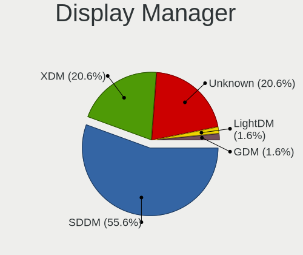
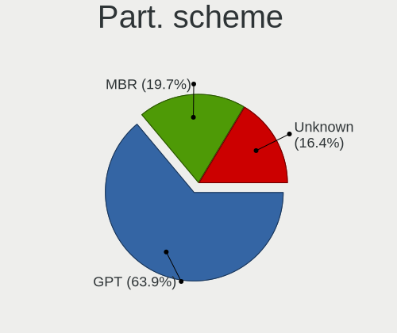
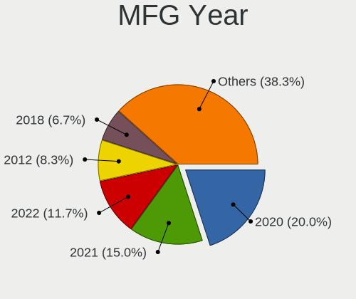
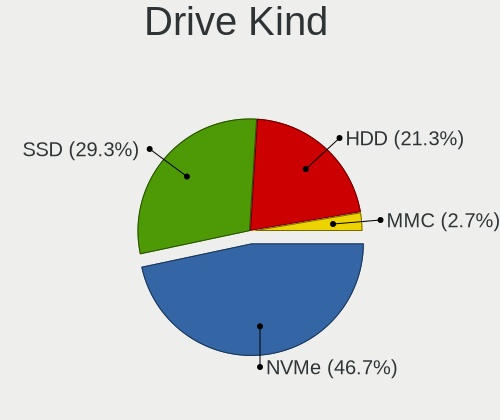
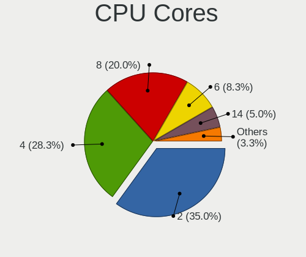
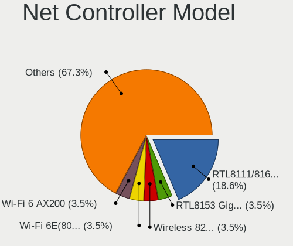
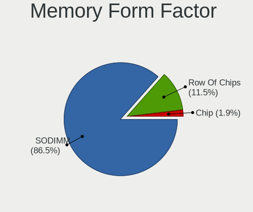

Slackware 15.0 - Tested Hardware & Statistics (Notebooks)
---------------------------------------------------------

A project to collect tested hardware configurations for Slackware 15.0.

Anyone can contribute to this report by the [hw-probe](https://github.com/linuxhw/hw-probe) tool:

    sudo -E hw-probe -all -upload

Please contribute! Especially if your hardware is rare.

Contents
--------

* [ Test Cases ](#test-cases)

* [ System ](#system)
  - [ Kernel                   ](#kernel)
  - [ Kernel Family            ](#kernel-family)
  - [ Kernel Major Ver.        ](#kernel-major-ver)
  - [ Arch                     ](#arch)
  - [ DE                       ](#de)
  - [ Display Server           ](#display-server)
  - [ Display Manager          ](#display-manager)
  - [ OS Lang                  ](#os-lang)
  - [ Boot Mode                ](#boot-mode)
  - [ Filesystem               ](#filesystem)
  - [ Part. scheme             ](#part-scheme)
  - [ Dual Boot with Linux/BSD ](#dual-boot-with-linuxbsd)
  - [ Dual Boot (Win)          ](#dual-boot-win)

* [ Board ](#board)
  - [ Vendor                   ](#vendor)
  - [ Model                    ](#model)
  - [ Model Family             ](#model-family)
  - [ MFG Year                 ](#mfg-year)
  - [ Form Factor              ](#form-factor)
  - [ Secure Boot              ](#secure-boot)
  - [ Coreboot                 ](#coreboot)
  - [ RAM Size                 ](#ram-size)
  - [ RAM Used                 ](#ram-used)
  - [ Total Drives             ](#total-drives)
  - [ Has CD-ROM               ](#has-cd-rom)
  - [ Has Ethernet             ](#has-ethernet)
  - [ Has WiFi                 ](#has-wifi)
  - [ Has Bluetooth            ](#has-bluetooth)

* [ Location ](#location)
  - [ Country                  ](#country)
  - [ City                     ](#city)

* [ Drives ](#drives)
  - [ Drive Vendor             ](#drive-vendor)
  - [ Drive Model              ](#drive-model)
  - [ HDD Vendor               ](#hdd-vendor)
  - [ SSD Vendor               ](#ssd-vendor)
  - [ Drive Kind               ](#drive-kind)
  - [ Drive Connector          ](#drive-connector)
  - [ Drive Size               ](#drive-size)
  - [ Space Total              ](#space-total)
  - [ Space Used               ](#space-used)
  - [ Malfunc. Drives          ](#malfunc-drives)
  - [ Malfunc. Drive Vendor    ](#malfunc-drive-vendor)
  - [ Malfunc. HDD Vendor      ](#malfunc-hdd-vendor)
  - [ Malfunc. Drive Kind      ](#malfunc-drive-kind)
  - [ Failed Drives            ](#failed-drives)
  - [ Failed Drive Vendor      ](#failed-drive-vendor)
  - [ Drive Status             ](#drive-status)

* [ Storage controller ](#storage-controller)
  - [ Storage Vendor           ](#storage-vendor)
  - [ Storage Model            ](#storage-model)
  - [ Storage Kind             ](#storage-kind)

* [ Processor ](#processor)
  - [ CPU Vendor               ](#cpu-vendor)
  - [ CPU Model                ](#cpu-model)
  - [ CPU Model Family         ](#cpu-model-family)
  - [ CPU Cores                ](#cpu-cores)
  - [ CPU Sockets              ](#cpu-sockets)
  - [ CPU Threads              ](#cpu-threads)
  - [ CPU Op-Modes             ](#cpu-op-modes)
  - [ CPU Microcode            ](#cpu-microcode)
  - [ CPU Microarch            ](#cpu-microarch)

* [ Graphics ](#graphics)
  - [ GPU Vendor               ](#gpu-vendor)
  - [ GPU Model                ](#gpu-model)
  - [ GPU Combo                ](#gpu-combo)
  - [ GPU Driver               ](#gpu-driver)
  - [ GPU Memory               ](#gpu-memory)

* [ Monitor ](#monitor)
  - [ Monitor Vendor           ](#monitor-vendor)
  - [ Monitor Model            ](#monitor-model)
  - [ Monitor Resolution       ](#monitor-resolution)
  - [ Monitor Diagonal         ](#monitor-diagonal)
  - [ Monitor Width            ](#monitor-width)
  - [ Aspect Ratio             ](#aspect-ratio)
  - [ Monitor Area             ](#monitor-area)
  - [ Pixel Density            ](#pixel-density)
  - [ Multiple Monitors        ](#multiple-monitors)

* [ Network ](#network)
  - [ Net Controller Vendor    ](#net-controller-vendor)
  - [ Net Controller Model     ](#net-controller-model)
  - [ Wireless Vendor          ](#wireless-vendor)
  - [ Wireless Model           ](#wireless-model)
  - [ Ethernet Vendor          ](#ethernet-vendor)
  - [ Ethernet Model           ](#ethernet-model)
  - [ Net Controller Kind      ](#net-controller-kind)
  - [ Used Controller          ](#used-controller)
  - [ NICs                     ](#nics)
  - [ IPv6                     ](#ipv6)

* [ Bluetooth ](#bluetooth)
  - [ Bluetooth Vendor         ](#bluetooth-vendor)
  - [ Bluetooth Model          ](#bluetooth-model)

* [ Sound ](#sound)
  - [ Sound Vendor             ](#sound-vendor)
  - [ Sound Model              ](#sound-model)

* [ Memory ](#memory)
  - [ Memory Vendor            ](#memory-vendor)
  - [ Memory Model             ](#memory-model)
  - [ Memory Kind              ](#memory-kind)
  - [ Memory Form Factor       ](#memory-form-factor)
  - [ Memory Size              ](#memory-size)
  - [ Memory Speed             ](#memory-speed)

* [ Printers & scanners ](#printers--scanners)
  - [ Printer Vendor           ](#printer-vendor)
  - [ Printer Model            ](#printer-model)
  - [ Scanner Vendor           ](#scanner-vendor)
  - [ Scanner Model            ](#scanner-model)

* [ Camera ](#camera)
  - [ Camera Vendor            ](#camera-vendor)
  - [ Camera Model             ](#camera-model)

* [ Security ](#security)
  - [ Fingerprint Vendor       ](#fingerprint-vendor)
  - [ Fingerprint Model        ](#fingerprint-model)
  - [ Chipcard Vendor          ](#chipcard-vendor)
  - [ Chipcard Model           ](#chipcard-model)

* [ Unsupported ](#unsupported)
  - [ Unsupported Devices      ](#unsupported-devices)
  - [ Unsupported Device Types ](#unsupported-device-types)

Test Cases
----------

Total: 24

| Vendor    | Model                       | Probe                                                      | Date         |
|-----------|-----------------------------|------------------------------------------------------------|--------------|
| HP        | Pavilion Gaming Laptop 1... | [bd2dda1d8a](https://linux-hardware.org/?probe=bd2dda1d8a) | Apr 29, 2022 |
| HP        | Pavilion Gaming Laptop 1... | [cfc9c5dbf7](https://linux-hardware.org/?probe=cfc9c5dbf7) | Apr 29, 2022 |
| MSI       | GP76 Leopard 11UG           | [aebd373a66](https://linux-hardware.org/?probe=aebd373a66) | Apr 12, 2022 |
| MSI       | GE76 Raider 11UE            | [3072e065a3](https://linux-hardware.org/?probe=3072e065a3) | Apr 12, 2022 |
| Notebook  | X170KM-G                    | [4ecba03d19](https://linux-hardware.org/?probe=4ecba03d19) | Apr 11, 2022 |
| Dell      | Latitude 3520               | [4398aa2a03](https://linux-hardware.org/?probe=4398aa2a03) | Apr 06, 2022 |
| HP        | ProBook 6570b               | [cf1305eacc](https://linux-hardware.org/?probe=cf1305eacc) | Apr 06, 2022 |
| Lenovo    | IdeaPad 310-15ISK 80SM      | [d406cb4819](https://linux-hardware.org/?probe=d406cb4819) | Apr 05, 2022 |
| Dell      | Precision M4700             | [ab99532bd5](https://linux-hardware.org/?probe=ab99532bd5) | Apr 04, 2022 |
| Lenovo    | ThinkPad X230 2325P38       | [1a0cab737b](https://linux-hardware.org/?probe=1a0cab737b) | Mar 10, 2022 |
| ASUSTek   | ROG Zephyrus G14 GA401IV... | [0b0c1aca1b](https://linux-hardware.org/?probe=0b0c1aca1b) | Mar 10, 2022 |
| HP        | Pavilion Gaming Laptop 1... | [c7825c54fc](https://linux-hardware.org/?probe=c7825c54fc) | Mar 10, 2022 |
| Framework | Laptop                      | [ae37705198](https://linux-hardware.org/?probe=ae37705198) | Mar 10, 2022 |
| Lenovo    | ThinkPad Edge E530c 3366... | [8ce0419468](https://linux-hardware.org/?probe=8ce0419468) | Feb 13, 2022 |
| Dynabook  | P1-C7MP-BL                  | [268f94787e](https://linux-hardware.org/?probe=268f94787e) | Jan 14, 2022 |
| HP        | Laptop 15-bs1xx             | [b6c9f34c4c](https://linux-hardware.org/?probe=b6c9f34c4c) | Dec 07, 2021 |
| System76  | Oryx Pro                    | [3cd05d02a8](https://linux-hardware.org/?probe=3cd05d02a8) | Oct 27, 2021 |
| MSI       | Modern 14 B11MO             | [e8f13facfd](https://linux-hardware.org/?probe=e8f13facfd) | Oct 03, 2021 |
| MSI       | Modern 14 B11MO             | [9f5c2e0fde](https://linux-hardware.org/?probe=9f5c2e0fde) | Sep 27, 2021 |
| Dell      | Inspiron 15-3552            | [f76339b0af](https://linux-hardware.org/?probe=f76339b0af) | Aug 31, 2021 |
| HP        | 245 G7 Notebook PC          | [c0806e4955](https://linux-hardware.org/?probe=c0806e4955) | Aug 23, 2021 |
| HP        | 245 G7 Notebook PC          | [c409287d23](https://linux-hardware.org/?probe=c409287d23) | Aug 23, 2021 |
| HP        | EliteBook 840 G5            | [4c196e1abd](https://linux-hardware.org/?probe=4c196e1abd) | Aug 18, 2021 |
| Dell      | Vostro 3500                 | [53a1179121](https://linux-hardware.org/?probe=53a1179121) | Aug 12, 2021 |

System
------

Kernel
------

Version of the Linux kernel

| Version     | Notebooks | Percent |
|-------------|-----------|---------|
| 5.15.19     | 5         | 22.73%  |
| 5.17.1      | 2         | 9.09%   |
| 5.13.8      | 2         | 9.09%   |
| 5.17.2      | 1         | 4.55%   |
| 5.16.9-joe1 | 1         | 4.55%   |
| 5.16.12     | 1         | 4.55%   |
| 5.15.33.kjh | 1         | 4.55%   |
| 5.15.27     | 1         | 4.55%   |
| 5.15.1      | 1         | 4.55%   |
| 5.14.9      | 1         | 4.55%   |
| 5.14.8      | 1         | 4.55%   |
| 5.14.10     | 1         | 4.55%   |
| 5.14.0      | 1         | 4.55%   |
| 5.13.5      | 1         | 4.55%   |
| 5.13.11     | 1         | 4.55%   |
| 5.10.91     | 1         | 4.55%   |

Kernel Family
-------------

Linux kernel without a distro release

| Version | Notebooks | Percent |
|---------|-----------|---------|
| 5.15.19 | 5         | 22.73%  |
| 5.17.1  | 2         | 9.09%   |
| 5.13.8  | 2         | 9.09%   |
| 5.17.2  | 1         | 4.55%   |
| 5.16.9  | 1         | 4.55%   |
| 5.16.12 | 1         | 4.55%   |
| 5.15.33 | 1         | 4.55%   |
| 5.15.27 | 1         | 4.55%   |
| 5.15.1  | 1         | 4.55%   |
| 5.14.9  | 1         | 4.55%   |
| 5.14.8  | 1         | 4.55%   |
| 5.14.10 | 1         | 4.55%   |
| 5.14.0  | 1         | 4.55%   |
| 5.13.5  | 1         | 4.55%   |
| 5.13.11 | 1         | 4.55%   |
| 5.10.91 | 1         | 4.55%   |

Kernel Major Ver.
-----------------

Linux kernel major version

| Version | Notebooks | Percent |
|---------|-----------|---------|
| 5.15    | 8         | 38.1%   |
| 5.13    | 4         | 19.05%  |
| 5.17    | 3         | 14.29%  |
| 5.14    | 3         | 14.29%  |
| 5.16    | 2         | 9.52%   |
| 5.10    | 1         | 4.76%   |

Arch
----

OS architecture (x86_64, i586, etc.)

| Name   | Notebooks | Percent |
|--------|-----------|---------|
| x86_64 | 21        | 100%    |

DE
--

Desktop Environment

| Name      | Notebooks | Percent |
|-----------|-----------|---------|
| KDE5      | 11        | 52.38%  |
| XFCE      | 4         | 19.05%  |
| Unknown   | 3         | 14.29%  |
| xwmconfig | 1         | 4.76%   |
| MATE      | 1         | 4.76%   |
| KDE       | 1         | 4.76%   |

Display Server
--------------

X11 or Wayland

| Name    | Notebooks | Percent |
|---------|-----------|---------|
| X11     | 13        | 59.09%  |
| Tty     | 7         | 31.82%  |
| Wayland | 2         | 9.09%   |

Display Manager
---------------

SDDM, LightDM, etc.

| Name    | Notebooks | Percent |
|---------|-----------|---------|
| SDDM    | 13        | 61.9%   |
| Unknown | 5         | 23.81%  |
| XDM     | 3         | 14.29%  |

OS Lang
-------

Language

| Lang  | Notebooks | Percent |
|-------|-----------|---------|
| en_US | 18        | 85.71%  |
| ru_RU | 1         | 4.76%   |
| pt_BR | 1         | 4.76%   |
| fr_FR | 1         | 4.76%   |

Boot Mode
---------

EFI or BIOS

| Mode | Notebooks | Percent |
|------|-----------|---------|
| EFI  | 13        | 61.9%   |
| BIOS | 8         | 38.1%   |

Filesystem
----------

Type of filesystem

| Type    | Notebooks | Percent |
|---------|-----------|---------|
| Ext4    | 16        | 76.19%  |
| Btrfs   | 3         | 14.29%  |
| Overlay | 2         | 9.52%   |

Part. scheme
------------

Scheme of partitioning

| Type    | Notebooks | Percent |
|---------|-----------|---------|
| GPT     | 15        | 71.43%  |
| MBR     | 4         | 19.05%  |
| Unknown | 2         | 9.52%   |

Dual Boot with Linux/BSD
------------------------

Hosting more than one Linux/BSD

| Dual boot | Notebooks | Percent |
|-----------|-----------|---------|
| No        | 18        | 81.82%  |
| Yes       | 4         | 18.18%  |

Dual Boot (Win)
---------------

Hosting Linux and Windows

| Dual boot | Notebooks | Percent |
|-----------|-----------|---------|
| No        | 11        | 52.38%  |
| Yes       | 10        | 47.62%  |

Board
-----

Vendor
------

Motherboard manufacturer

| Name             | Notebooks | Percent |
|------------------|-----------|---------|
| Hewlett-Packard  | 6         | 28.57%  |
| Dell             | 4         | 19.05%  |
| MSI              | 3         | 14.29%  |
| Lenovo           | 3         | 14.29%  |
| System76         | 1         | 4.76%   |
| Notebook         | 1         | 4.76%   |
| Framework        | 1         | 4.76%   |
| Dynabook         | 1         | 4.76%   |
| ASUSTek Computer | 1         | 4.76%   |

Model
-----

Motherboard model

| Name                                  | Notebooks | Percent |
|---------------------------------------|-----------|---------|
| System76 Oryx Pro                     | 1         | 4.76%   |
| Notebook X170KM-G                     | 1         | 4.76%   |
| MSI Modern 14 B11MO                   | 1         | 4.76%   |
| MSI GP76 Leopard 11UG                 | 1         | 4.76%   |
| MSI GE76 Raider 11UE                  | 1         | 4.76%   |
| Lenovo ThinkPad X230 2325P38          | 1         | 4.76%   |
| Lenovo ThinkPad Edge E530c 336669G    | 1         | 4.76%   |
| Lenovo IdeaPad 310-15ISK 80SM         | 1         | 4.76%   |
| HP ProBook 6570b                      | 1         | 4.76%   |
| HP Pavilion Gaming Laptop 16-a0xxx    | 1         | 4.76%   |
| HP Pavilion Gaming Laptop 15-ec1xxx   | 1         | 4.76%   |
| HP Laptop 15-bs1xx                    | 1         | 4.76%   |
| HP EliteBook 840 G5                   | 1         | 4.76%   |
| HP 245 G7 Notebook PC                 | 1         | 4.76%   |
| Framework Laptop                      | 1         | 4.76%   |
| Dynabook P1-C7MP-BL                   | 1         | 4.76%   |
| Dell Vostro 3500                      | 1         | 4.76%   |
| Dell Precision M4700                  | 1         | 4.76%   |
| Dell Latitude 3520                    | 1         | 4.76%   |
| Dell Inspiron 15-3552                 | 1         | 4.76%   |
| ASUS ROG Zephyrus G14 GA401IV_GA401IV | 1         | 4.76%   |

Model Family
------------

Motherboard model prefix

| Name                | Notebooks | Percent |
|---------------------|-----------|---------|
| Lenovo ThinkPad     | 2         | 9.52%   |
| HP Pavilion         | 2         | 9.52%   |
| System76 Oryx       | 1         | 4.76%   |
| Notebook X170KM-G   | 1         | 4.76%   |
| MSI Modern          | 1         | 4.76%   |
| MSI GP76            | 1         | 4.76%   |
| MSI GE76            | 1         | 4.76%   |
| Lenovo IdeaPad      | 1         | 4.76%   |
| HP ProBook          | 1         | 4.76%   |
| HP Laptop           | 1         | 4.76%   |
| HP EliteBook        | 1         | 4.76%   |
| HP 245              | 1         | 4.76%   |
| Framework Laptop    | 1         | 4.76%   |
| Dynabook P1-C7MP-BL | 1         | 4.76%   |
| Dell Vostro         | 1         | 4.76%   |
| Dell Precision      | 1         | 4.76%   |
| Dell Latitude       | 1         | 4.76%   |
| Dell Inspiron       | 1         | 4.76%   |
| ASUS ROG            | 1         | 4.76%   |

MFG Year
--------

Motherboard manufacture year

| Year | Notebooks | Percent |
|------|-----------|---------|
| 2021 | 6         | 28.57%  |
| 2020 | 5         | 23.81%  |
| 2012 | 4         | 19.05%  |
| 2019 | 1         | 4.76%   |
| 2018 | 1         | 4.76%   |
| 2017 | 1         | 4.76%   |
| 2016 | 1         | 4.76%   |
| 2015 | 1         | 4.76%   |
| 2010 | 1         | 4.76%   |

Form Factor
-----------

Physical design of the computer

| Name     | Notebooks | Percent |
|----------|-----------|---------|
| Notebook | 21        | 100%    |

Secure Boot
-----------

Enabled or disabled

| State    | Notebooks | Percent |
|----------|-----------|---------|
| Disabled | 21        | 100%    |

Coreboot
--------

Have coreboot on board

| Used | Notebooks | Percent |
|------|-----------|---------|
| No   | 19        | 90.48%  |
| Yes  | 2         | 9.52%   |

RAM Size
--------

Total RAM memory

| Size in GB  | Notebooks | Percent |
|-------------|-----------|---------|
| 8.01-16.0   | 5         | 23.81%  |
| 4.01-8.0    | 4         | 19.05%  |
| 3.01-4.0    | 4         | 19.05%  |
| 16.01-24.0  | 4         | 19.05%  |
| 32.01-64.0  | 2         | 9.52%   |
| 24.01-32.0  | 1         | 4.76%   |
| 64.01-256.0 | 1         | 4.76%   |

RAM Used
--------

Used RAM memory

| Used GB    | Notebooks | Percent |
|------------|-----------|---------|
| 2.01-3.0   | 7         | 31.82%  |
| 4.01-8.0   | 6         | 27.27%  |
| 1.01-2.0   | 6         | 27.27%  |
| 16.01-24.0 | 1         | 4.55%   |
| 0.51-1.0   | 1         | 4.55%   |
| 0.01-0.5   | 1         | 4.55%   |

Total Drives
------------

Number of drives on board

| Drives | Notebooks | Percent |
|--------|-----------|---------|
| 1      | 14        | 66.67%  |
| 2      | 6         | 28.57%  |
| 4      | 1         | 4.76%   |

Has CD-ROM
----------

Has CD-ROM on board

| Presented | Notebooks | Percent |
|-----------|-----------|---------|
| No        | 16        | 76.19%  |
| Yes       | 5         | 23.81%  |

Has Ethernet
------------

Has Ethernet on board

| Presented | Notebooks | Percent |
|-----------|-----------|---------|
| Yes       | 17        | 80.95%  |
| No        | 4         | 19.05%  |

Has WiFi
--------

Has WiFi module

| Presented | Notebooks | Percent |
|-----------|-----------|---------|
| Yes       | 21        | 100%    |

Has Bluetooth
-------------

Has Bluetooth module

| Presented | Notebooks | Percent |
|-----------|-----------|---------|
| Yes       | 20        | 95.24%  |
| No        | 1         | 4.76%   |

Location
--------

Country
-------

Geographic location (country)

| Country      | Notebooks | Percent |
|--------------|-----------|---------|
| USA          | 7         | 33.33%  |
| Kazakhstan   | 3         | 14.29%  |
| South Africa | 2         | 9.52%   |
| Japan        | 2         | 9.52%   |
| Sweden       | 1         | 4.76%   |
| Spain        | 1         | 4.76%   |
| Serbia       | 1         | 4.76%   |
| Mexico       | 1         | 4.76%   |
| France       | 1         | 4.76%   |
| Canada       | 1         | 4.76%   |
| Brazil       | 1         | 4.76%   |

City
----

Geographic location (city)

| City            | Notebooks | Percent |
|-----------------|-----------|---------|
| Ust-Kamenogorsk | 2         | 9.52%   |
| Skövde       | 1         | 4.76%   |
| Round Rock      | 1         | 4.76%   |
| Reno            | 1         | 4.76%   |
| Plainwell       | 1         | 4.76%   |
| Ōtsu           | 1         | 4.76%   |
| Musashino       | 1         | 4.76%   |
| Montreal        | 1         | 4.76%   |
| Mexico City     | 1         | 4.76%   |
| McKinney        | 1         | 4.76%   |
| League City     | 1         | 4.76%   |
| Karaganda       | 1         | 4.76%   |
| Johannesburg    | 1         | 4.76%   |
| Hayward         | 1         | 4.76%   |
| Fortaleza       | 1         | 4.76%   |
| Chessy          | 1         | 4.76%   |
| Cape Town       | 1         | 4.76%   |
| Belgrade        | 1         | 4.76%   |
| Algeciras       | 1         | 4.76%   |
| Abingdon        | 1         | 4.76%   |

Drives
------

Drive Vendor
------------

Hard drive vendors

| Vendor              | Notebooks | Drives | Percent |
|---------------------|-----------|--------|---------|
| Samsung Electronics | 8         | 12     | 30.77%  |
| WDC                 | 4         | 4      | 15.38%  |
| Toshiba             | 2         | 2      | 7.69%   |
| SK Hynix            | 2         | 2      | 7.69%   |
| SanDisk             | 2         | 2      | 7.69%   |
| Seagate             | 1         | 1      | 3.85%   |
| PLEXTOR             | 1         | 1      | 3.85%   |
| KIOXIA              | 1         | 1      | 3.85%   |
| Kingston            | 1         | 1      | 3.85%   |
| HGST                | 1         | 1      | 3.85%   |
| Hewlett-Packard     | 1         | 2      | 3.85%   |
| Gigabyte Technology | 1         | 1      | 3.85%   |
| Crucial             | 1         | 1      | 3.85%   |

Drive Model
-----------

Hard drive models

| Model                                   | Notebooks | Percent |
|-----------------------------------------|-----------|---------|
| WDC WD10SPZX-60Z10T0 1TB                | 2         | 6.9%    |
| WDC WD10JPVT-08A1YT2 1TB                | 1         | 3.45%   |
| WDC PC SN530 SDBPNPZ-1T00-1002 1TB      | 1         | 3.45%   |
| Toshiba MQ04ABF100 1TB                  | 1         | 3.45%   |
| Toshiba MQ01ABF050 500GB                | 1         | 3.45%   |
| SK Hynix HFM001TD3JX013N 1TB            | 1         | 3.45%   |
| SK Hynix BC511 HFM512GDJTNI-82A0A 512GB | 1         | 3.45%   |
| Seagate ST1000LM024 HN-M101MBB 1TB      | 1         | 3.45%   |
| SanDisk Ultra II 960GB SSD              | 1         | 3.45%   |
| SanDisk SDSSDA240G 240GB                | 1         | 3.45%   |
| Samsung SSD 980 PRO 500GB               | 1         | 3.45%   |
| Samsung SSD 980 PRO 2TB                 | 1         | 3.45%   |
| Samsung SSD 970 EVO Plus 2TB            | 1         | 3.45%   |
| Samsung SSD 970 EVO 2TB                 | 1         | 3.45%   |
| Samsung SSD 870 EVO 1TB                 | 1         | 3.45%   |
| Samsung SSD 860 EVO mSATA 500GB         | 1         | 3.45%   |
| Samsung NVMe SSD Drive 256GB            | 1         | 3.45%   |
| Samsung MZVLQ512HALU-000H1 512GB        | 1         | 3.45%   |
| Samsung MZVL21T0HCLR-00B00 1TB          | 1         | 3.45%   |
| Samsung MZVKW512HMJP-000H1 512GB        | 1         | 3.45%   |
| Samsung MZ7LN256HCHP-000L7 256GB SSD    | 1         | 3.45%   |
| PLEXTOR PX-128M6S 128GB SSD             | 1         | 3.45%   |
| KIOXIA KBG40ZNS256G NVMe 256GB          | 1         | 3.45%   |
| Kingston SUV400S37240G 240GB SSD        | 1         | 3.45%   |
| HGST HTS725050A7E630 500GB              | 1         | 3.45%   |
| HP SSD EX950 2TB                        | 1         | 3.45%   |
| Gigabyte GP-GSTFS31240GNTD 240GB        | 1         | 3.45%   |
| Crucial CT500P2SSD8 500GB               | 1         | 3.45%   |

HDD Vendor
----------

Hard disk drive vendors

| Vendor  | Notebooks | Drives | Percent |
|---------|-----------|--------|---------|
| WDC     | 3         | 3      | 42.86%  |
| Toshiba | 2         | 2      | 28.57%  |
| Seagate | 1         | 1      | 14.29%  |
| HGST    | 1         | 1      | 14.29%  |

SSD Vendor
----------

Solid state drive vendors

| Vendor              | Notebooks | Drives | Percent |
|---------------------|-----------|--------|---------|
| SanDisk             | 2         | 2      | 28.57%  |
| Samsung Electronics | 2         | 3      | 28.57%  |
| PLEXTOR             | 1         | 1      | 14.29%  |
| Kingston            | 1         | 1      | 14.29%  |
| Gigabyte Technology | 1         | 1      | 14.29%  |

Drive Kind
----------

HDD or SSD

| Kind | Notebooks | Drives | Percent |
|------|-----------|--------|---------|
| NVMe | 12        | 16     | 46.15%  |
| SSD  | 7         | 8      | 26.92%  |
| HDD  | 7         | 7      | 26.92%  |

Drive Connector
---------------

SATA, SAS, NVMe, etc.

| Type | Notebooks | Drives | Percent |
|------|-----------|--------|---------|
| NVMe | 12        | 16     | 50%     |
| SATA | 12        | 15     | 50%     |

Drive Size
----------

Size of hard drive

| Size in TB | Notebooks | Drives | Percent |
|------------|-----------|--------|---------|
| 0.51-1.0   | 7         | 7      | 50%     |
| 0.01-0.5   | 7         | 8      | 50%     |

Space Total
-----------

Amount of disk space available on the file system

| Size in GB     | Notebooks | Percent |
|----------------|-----------|---------|
| 501-1000       | 8         | 38.1%   |
| 251-500        | 5         | 23.81%  |
| 1001-2000      | 3         | 14.29%  |
| 101-250        | 2         | 9.52%   |
| 1-20           | 2         | 9.52%   |
| More than 3000 | 1         | 4.76%   |

Space Used
----------

Amount of used disk space

| Used GB   | Notebooks | Percent |
|-----------|-----------|---------|
| 251-500   | 5         | 23.81%  |
| 101-250   | 5         | 23.81%  |
| 1-20      | 4         | 19.05%  |
| 21-50     | 3         | 14.29%  |
| 501-1000  | 2         | 9.52%   |
| 1001-2000 | 1         | 4.76%   |
| 51-100    | 1         | 4.76%   |

Malfunc. Drives
---------------

Drive models with a malfunction

| Model                               | Notebooks | Drives | Percent |
|-------------------------------------|-----------|--------|---------|
| Samsung Electronics SSD 870 EVO 1TB | 1         | 1      | 33.33%  |
| PLEXTOR PX-128M6S 128GB SSD         | 1         | 1      | 33.33%  |
| HGST HTS725050A7E630 500GB          | 1         | 1      | 33.33%  |

Malfunc. Drive Vendor
---------------------

Vendors of faulty drives

| Vendor              | Notebooks | Drives | Percent |
|---------------------|-----------|--------|---------|
| Samsung Electronics | 1         | 1      | 33.33%  |
| PLEXTOR             | 1         | 1      | 33.33%  |
| HGST                | 1         | 1      | 33.33%  |

Malfunc. HDD Vendor
-------------------

Vendors of faulty HDD drives

| Vendor | Notebooks | Drives | Percent |
|--------|-----------|--------|---------|
| HGST   | 1         | 1      | 100%    |

Malfunc. Drive Kind
-------------------

Kinds of faulty drives

| Kind | Notebooks | Drives | Percent |
|------|-----------|--------|---------|
| SSD  | 2         | 2      | 66.67%  |
| HDD  | 1         | 1      | 33.33%  |

Failed Drives
-------------

Failed drive models

Zero info for selected period =(

Failed Drive Vendor
-------------------

Failed drive vendors

Zero info for selected period =(

Drive Status
------------

Number of failed and malfunc. drives

| Status   | Notebooks | Drives | Percent |
|----------|-----------|--------|---------|
| Works    | 19        | 25     | 79.17%  |
| Malfunc  | 3         | 3      | 12.5%   |
| Detected | 2         | 3      | 8.33%   |

Storage controller
------------------

Storage Vendor
--------------

Storage controller vendors

| Vendor                    | Notebooks | Percent |
|---------------------------|-----------|---------|
| Intel                     | 12        | 44.44%  |
| Samsung Electronics       | 6         | 22.22%  |
| AMD                       | 3         | 11.11%  |
| SK Hynix                  | 2         | 7.41%   |
| Sandisk                   | 1         | 3.7%    |
| Micron/Crucial Technology | 1         | 3.7%    |
| KIOXIA                    | 1         | 3.7%    |
| Biwin Storage Technology  | 1         | 3.7%    |

Storage Model
-------------

Storage controller models

| Model                                                                            | Notebooks | Percent |
|----------------------------------------------------------------------------------|-----------|---------|
| Samsung NVMe SSD Controller PM9A1/PM9A3/980PRO                                   | 3         | 10.71%  |
| Intel 82801 Mobile SATA Controller [RAID mode]                                   | 3         | 10.71%  |
| Intel 7 Series Chipset Family 6-port SATA Controller [AHCI mode]                 | 3         | 10.71%  |
| AMD FCH SATA Controller [AHCI mode]                                              | 3         | 10.71%  |
| Samsung NVMe SSD Controller 980                                                  | 2         | 7.14%   |
| SK Hynix Gold P31 SSD                                                            | 1         | 3.57%   |
| SK Hynix BC511                                                                   | 1         | 3.57%   |
| Sandisk WD Blue SN550 NVMe SSD                                                   | 1         | 3.57%   |
| Samsung NVMe SSD Controller SM981/PM981/PM983                                    | 1         | 3.57%   |
| Samsung NVMe SSD Controller SM961/PM961/SM963                                    | 1         | 3.57%   |
| Micron/Crucial P2 NVMe PCIe SSD                                                  | 1         | 3.57%   |
| KIOXIA Non-Volatile memory controller                                            | 1         | 3.57%   |
| Intel Wildcat Point-LP SATA Controller [AHCI Mode]                               | 1         | 3.57%   |
| Intel Tiger Lake-LP SATA Controller [AHCI mode]                                  | 1         | 3.57%   |
| Intel Sunrise Point-LP SATA Controller [AHCI mode]                               | 1         | 3.57%   |
| Intel Atom/Celeron/Pentium Processor x5-E8000/J3xxx/N3xxx Series SATA Controller | 1         | 3.57%   |
| Intel 500 Series Chipset Family SATA AHCI Controller                             | 1         | 3.57%   |
| Intel 5 Series/3400 Series Chipset 6 port SATA AHCI Controller                   | 1         | 3.57%   |
| Biwin Storage Non-Volatile memory controller                                     | 1         | 3.57%   |

Storage Kind
------------

Kind of storage controller (IDE, SATA, NVMe, SAS, ...)

| Kind | Notebooks | Percent |
|------|-----------|---------|
| NVMe | 12        | 44.44%  |
| SATA | 12        | 44.44%  |
| RAID | 3         | 11.11%  |

Processor
---------

CPU Vendor
----------

Processor vendors

| Vendor | Notebooks | Percent |
|--------|-----------|---------|
| Intel  | 18        | 85.71%  |
| AMD    | 3         | 14.29%  |

CPU Model
---------

Processor models

| Model                                         | Notebooks | Percent |
|-----------------------------------------------|-----------|---------|
| Intel 11th Gen Core i7-11800H @ 2.30GHz       | 3         | 14.29%  |
| Intel 11th Gen Core i5-1135G7 @ 2.40GHz       | 2         | 9.52%   |
| Intel Core i7-8550U CPU @ 1.80GHz             | 1         | 4.76%   |
| Intel Core i7-6500U CPU @ 2.50GHz             | 1         | 4.76%   |
| Intel Core i7-3840QM CPU @ 2.80GHz            | 1         | 4.76%   |
| Intel Core i7-10870H CPU @ 2.20GHz            | 1         | 4.76%   |
| Intel Core i7-10510U CPU @ 1.80GHz            | 1         | 4.76%   |
| Intel Core i5-3360M CPU @ 2.80GHz             | 1         | 4.76%   |
| Intel Core i5-3320M CPU @ 2.60GHz             | 1         | 4.76%   |
| Intel Core i5-3230M CPU @ 2.60GHz             | 1         | 4.76%   |
| Intel Core i5 CPU M 460 @ 2.53GHz             | 1         | 4.76%   |
| Intel Core i3-5005U CPU @ 2.00GHz             | 1         | 4.76%   |
| Intel Celeron CPU N3060 @ 1.60GHz             | 1         | 4.76%   |
| Intel 11th Gen Core i9-11900K @ 3.50GHz       | 1         | 4.76%   |
| Intel 11th Gen Core i7-1165G7 @ 2.80GHz       | 1         | 4.76%   |
| AMD Ryzen 9 4900HS with Radeon Graphics       | 1         | 4.76%   |
| AMD Ryzen 5 4600H with Radeon Graphics        | 1         | 4.76%   |
| AMD Ryzen 5 3500U with Radeon Vega Mobile Gfx | 1         | 4.76%   |

CPU Model Family
----------------

Processor model prefix

| Model         | Notebooks | Percent |
|---------------|-----------|---------|
| Other         | 7         | 33.33%  |
| Intel Core i7 | 5         | 23.81%  |
| Intel Core i5 | 4         | 19.05%  |
| AMD Ryzen 5   | 2         | 9.52%   |
| Intel Core i3 | 1         | 4.76%   |
| Intel Celeron | 1         | 4.76%   |
| AMD Ryzen 9   | 1         | 4.76%   |

CPU Cores
---------

Number of processor cores

| Number | Notebooks | Percent |
|--------|-----------|---------|
| 4      | 7         | 33.33%  |
| 2      | 7         | 33.33%  |
| 8      | 6         | 28.57%  |
| 6      | 1         | 4.76%   |

CPU Sockets
-----------

Number of sockets

| Number | Notebooks | Percent |
|--------|-----------|---------|
| 1      | 21        | 100%    |

CPU Threads
-----------

Threads per core (Hyper-Threading)

| Number | Notebooks | Percent |
|--------|-----------|---------|
| 2      | 20        | 95.24%  |
| 1      | 1         | 4.76%   |

CPU Op-Modes
------------

CPU Operation Modes (32-bit, 64-bit)

| Op mode        | Notebooks | Percent |
|----------------|-----------|---------|
| 32-bit, 64-bit | 21        | 100%    |

CPU Microcode
-------------

Microcode number

| Number     | Notebooks | Percent |
|------------|-----------|---------|
| 0x306a9    | 4         | 19.05%  |
| 0x806d1    | 3         | 14.29%  |
| 0x806c1    | 3         | 14.29%  |
| Unknown    | 3         | 14.29%  |
| 0xa0671    | 1         | 4.76%   |
| 0xa0652    | 1         | 4.76%   |
| 0x806ea    | 1         | 4.76%   |
| 0x406e3    | 1         | 4.76%   |
| 0x406c4    | 1         | 4.76%   |
| 0x306d4    | 1         | 4.76%   |
| 0x08600106 | 1         | 4.76%   |
| 0x08108109 | 1         | 4.76%   |

CPU Microarch
-------------

Microarchitecture

| Name       | Notebooks | Percent |
|------------|-----------|---------|
| IvyBridge  | 4         | 19.05%  |
| Icelake    | 4         | 19.05%  |
| TigerLake  | 3         | 14.29%  |
| Zen 2      | 2         | 9.52%   |
| KabyLake   | 2         | 9.52%   |
| Zen+       | 1         | 4.76%   |
| Westmere   | 1         | 4.76%   |
| Skylake    | 1         | 4.76%   |
| Silvermont | 1         | 4.76%   |
| CometLake  | 1         | 4.76%   |
| Broadwell  | 1         | 4.76%   |

Graphics
--------

GPU Vendor
----------

Vendors of graphics cards

| Vendor | Notebooks | Percent |
|--------|-----------|---------|
| Intel  | 14        | 51.85%  |
| Nvidia | 8         | 29.63%  |
| AMD    | 5         | 18.52%  |

GPU Model
---------

Graphics card models

| Model                                                                                    | Notebooks | Percent |
|------------------------------------------------------------------------------------------|-----------|---------|
| Nvidia GA104M [GeForce RTX 3070 Mobile / Max-Q]                                          | 3         | 11.11%  |
| Intel TigerLake-LP GT2 [Iris Xe Graphics]                                                | 3         | 11.11%  |
| Nvidia TU117M [GeForce GTX 1650 Ti Mobile]                                               | 2         | 7.41%   |
| Intel TigerLake-H GT1 [UHD Graphics]                                                     | 2         | 7.41%   |
| Intel 3rd Gen Core processor Graphics Controller                                         | 2         | 7.41%   |
| AMD Renoir                                                                               | 2         | 7.41%   |
| Nvidia TU106M [GeForce RTX 2060 Max-Q]                                                   | 1         | 3.7%    |
| Nvidia GT218M [GeForce 310M]                                                             | 1         | 3.7%    |
| Nvidia GA106M [GeForce RTX 3060 Mobile / Max-Q]                                          | 1         | 3.7%    |
| Intel UHD Graphics 620                                                                   | 1         | 3.7%    |
| Intel Skylake GT2 [HD Graphics 520]                                                      | 1         | 3.7%    |
| Intel HD Graphics 5500                                                                   | 1         | 3.7%    |
| Intel Core Processor Integrated Graphics Controller                                      | 1         | 3.7%    |
| Intel CometLake-U GT2 [UHD Graphics]                                                     | 1         | 3.7%    |
| Intel CometLake-H GT2 [UHD Graphics]                                                     | 1         | 3.7%    |
| Intel Atom/Celeron/Pentium Processor x5-E8000/J3xxx/N3xxx Integrated Graphics Controller | 1         | 3.7%    |
| AMD Thames [Radeon HD 7550M/7570M/7650M]                                                 | 1         | 3.7%    |
| AMD Picasso/Raven 2 [Radeon Vega Series / Radeon Vega Mobile Series]                     | 1         | 3.7%    |
| AMD Chelsea XT GL [FirePro M4000]                                                        | 1         | 3.7%    |

GPU Combo
---------

Combinations of graphics cards

| Name           | Notebooks | Percent |
|----------------|-----------|---------|
| 1 x Intel      | 10        | 47.62%  |
| Intel + Nvidia | 4         | 19.05%  |
| 1 x AMD        | 4         | 19.05%  |
| 1 x Nvidia     | 2         | 9.52%   |
| AMD + Nvidia   | 1         | 4.76%   |

GPU Driver
----------

Free vs proprietary

| Driver      | Notebooks | Percent |
|-------------|-----------|---------|
| Free        | 18        | 85.71%  |
| Proprietary | 3         | 14.29%  |

GPU Memory
----------

Total video memory

| Size in GB | Notebooks | Percent |
|------------|-----------|---------|
| Unknown    | 13        | 61.9%   |
| 7.01-8.0   | 2         | 9.52%   |
| 0.51-1.0   | 2         | 9.52%   |
| 0.01-0.5   | 2         | 9.52%   |
| 5.01-6.0   | 1         | 4.76%   |
| 1.01-2.0   | 1         | 4.76%   |

Monitor
-------

Monitor Vendor
--------------

Monitor vendors

| Vendor              | Notebooks | Percent |
|---------------------|-----------|---------|
| BOE                 | 7         | 28%     |
| LG Display          | 5         | 20%     |
| AU Optronics        | 4         | 16%     |
| Sharp               | 2         | 8%      |
| Hewlett-Packard     | 2         | 8%      |
| Sony                | 1         | 4%      |
| Samsung Electronics | 1         | 4%      |
| PANDA               | 1         | 4%      |
| Dell                | 1         | 4%      |
| Chimei Innolux      | 1         | 4%      |

Monitor Model
-------------

Monitor models

| Model                                                                | Notebooks | Percent |
|----------------------------------------------------------------------|-----------|---------|
| Sony TV SNY8102 1360x768 1600x900mm 72.3-inch                        | 1         | 4%      |
| Sharp LQ173M1JW05 SHP14EC 1920x1080 382x215mm 17.3-inch              | 1         | 4%      |
| Sharp LQ156M1JW01 SHP14C3 1920x1080 344x194mm 15.5-inch              | 1         | 4%      |
| Samsung Electronics LCD Monitor SEC3152 1366x768 344x194mm 15.5-inch | 1         | 4%      |
| PANDA LCD Monitor NCP0050 1920x1080 309x174mm 14.0-inch              | 1         | 4%      |
| LG Display LCD Monitor LGD0625 1920x1080 344x194mm 15.5-inch         | 1         | 4%      |
| LG Display LCD Monitor LGD0599 1920x1080 309x174mm 14.0-inch         | 1         | 4%      |
| LG Display LCD Monitor LGD032C 1920x1080 344x194mm 15.5-inch         | 1         | 4%      |
| LG Display LCD Monitor LGD028A 1366x768 344x194mm 15.5-inch          | 1         | 4%      |
| LG Display LCD Monitor LGD0258 1600x900 345x194mm 15.6-inch          | 1         | 4%      |
| Hewlett-Packard P223 HPN3392 1920x1080 477x268mm 21.5-inch           | 1         | 4%      |
| Hewlett-Packard 27m HPN3579 1920x1080 598x336mm 27.0-inch            | 1         | 4%      |
| Dell U2415 DELA0BA 1920x1200 518x324mm 24.1-inch                     | 1         | 4%      |
| Chimei Innolux LCD Monitor CMN14C3 1366x768 309x173mm 13.9-inch      | 1         | 4%      |
| BOE LCD Monitor BOE0A85 1920x1080 344x194mm 15.5-inch                | 1         | 4%      |
| BOE LCD Monitor BOE095F 2256x1504 285x190mm 13.5-inch                | 1         | 4%      |
| BOE LCD Monitor BOE08F6 1920x1080 355x200mm 16.0-inch                | 1         | 4%      |
| BOE LCD Monitor BOE08D7 1920x1080 309x174mm 14.0-inch                | 1         | 4%      |
| BOE LCD Monitor BOE06A5 1366x768 344x194mm 15.5-inch                 | 1         | 4%      |
| BOE LCD Monitor BOE0672 1366x768 344x194mm 15.5-inch                 | 1         | 4%      |
| BOE LCD Monitor BOE0671 1366x768 344x194mm 15.5-inch                 | 1         | 4%      |
| AU Optronics LCD Monitor AUO978F 1920x1080 382x215mm 17.3-inch       | 1         | 4%      |
| AU Optronics LCD Monitor AUO61ED 1920x1080 344x194mm 15.5-inch       | 1         | 4%      |
| AU Optronics LCD Monitor AUO309B 3840x2160 381x214mm 17.2-inch       | 1         | 4%      |
| AU Optronics LCD Monitor AUO106C 1366x768 277x156mm 12.5-inch        | 1         | 4%      |

Monitor Resolution
------------------

Monitor screen resolution

| Resolution      | Notebooks | Percent |
|-----------------|-----------|---------|
| 1920x1080 (FHD) | 12        | 52.17%  |
| 1366x768 (WXGA) | 7         | 30.43%  |
| 3840x2160 (4K)  | 1         | 4.35%   |
| 2256x1504       | 1         | 4.35%   |
| 1600x900 (HD+)  | 1         | 4.35%   |
| 1360x768        | 1         | 4.35%   |

Monitor Diagonal
----------------

Diagonal size in inches

| Inches | Notebooks | Percent |
|--------|-----------|---------|
| 15     | 11        | 44%     |
| 17     | 3         | 12%     |
| 14     | 3         | 12%     |
| 13     | 2         | 8%      |
| 72     | 1         | 4%      |
| 27     | 1         | 4%      |
| 24     | 1         | 4%      |
| 21     | 1         | 4%      |
| 16     | 1         | 4%      |
| 12     | 1         | 4%      |

Monitor Width
-------------

Physical width

| Width in mm | Notebooks | Percent |
|-------------|-----------|---------|
| 301-350     | 15        | 60%     |
| 351-400     | 4         | 16%     |
| 501-600     | 2         | 8%      |
| 201-300     | 2         | 8%      |
| 401-500     | 1         | 4%      |
| 1501-2000   | 1         | 4%      |

Aspect Ratio
------------

Proportional relationship between the width and the height

| Ratio | Notebooks | Percent |
|-------|-----------|---------|
| 16/9  | 20        | 90.91%  |
| 3/2   | 1         | 4.55%   |
| 16/10 | 1         | 4.55%   |

Monitor Area
------------

Area in inch²

| Area in inch² | Notebooks | Percent |
|----------------|-----------|---------|
| 101-110        | 12        | 48%     |
| 81-90          | 5         | 20%     |
| 121-130        | 3         | 12%     |
| More than 1000 | 1         | 4%      |
| 61-70          | 1         | 4%      |
| 301-350        | 1         | 4%      |
| 251-300        | 1         | 4%      |
| 151-200        | 1         | 4%      |

Pixel Density
-------------

Pixels per inch

| Density       | Notebooks | Percent |
|---------------|-----------|---------|
| 121-160       | 12        | 50%     |
| 101-120       | 7         | 29.17%  |
| 51-100        | 2         | 8.33%   |
| More than 240 | 1         | 4.17%   |
| 1-50          | 1         | 4.17%   |
| 161-240       | 1         | 4.17%   |

Multiple Monitors
-----------------

Total monitors connected

| Total | Notebooks | Percent |
|-------|-----------|---------|
| 1     | 17        | 80.95%  |
| 2     | 4         | 19.05%  |

Network
-------

Net Controller Vendor
---------------------

Controller vendors

| Vendor                | Notebooks | Percent |
|-----------------------|-----------|---------|
| Intel                 | 16        | 50%     |
| Realtek Semiconductor | 13        | 40.63%  |
| Ralink Technology     | 1         | 3.13%   |
| Hewlett-Packard       | 1         | 3.13%   |
| Broadcom Limited      | 1         | 3.13%   |

Net Controller Model
--------------------

Controller models

| Model                                                             | Notebooks | Percent |
|-------------------------------------------------------------------|-----------|---------|
| Realtek RTL8111/8168/8411 PCI Express Gigabit Ethernet Controller | 10        | 25%     |
| Intel Wi-Fi 6 AX210/AX211/AX411 160MHz                            | 3         | 7.5%    |
| Intel 82579LM Gigabit Network Connection (Lewisville)             | 3         | 7.5%    |
| Realtek Killer E3000 2.5GbE Controller                            | 2         | 5%      |
| Intel Wi-Fi 6 AX201                                               | 2         | 5%      |
| Intel Wi-Fi 6 AX200                                               | 2         | 5%      |
| Intel Tiger Lake PCH CNVi WiFi                                    | 2         | 5%      |
| Intel Centrino Advanced-N 6205 [Taylor Peak]                      | 2         | 5%      |
| Realtek RTL8822CE 802.11ac PCIe Wireless Network Adapter          | 1         | 2.5%    |
| Realtek RTL8821CE 802.11ac PCIe Wireless Network Adapter          | 1         | 2.5%    |
| Realtek RTL8723DE Wireless Network Adapter                        | 1         | 2.5%    |
| Realtek RTL8153 Gigabit Ethernet Adapter                          | 1         | 2.5%    |
| Realtek RTL8125 2.5GbE Controller                                 | 1         | 2.5%    |
| Ralink MT7601U Wireless Adapter                                   | 1         | 2.5%    |
| Intel Wireless 8265 / 8275                                        | 1         | 2.5%    |
| Intel Wireless 3165                                               | 1         | 2.5%    |
| Intel Ethernet Connection (4) I219-LM                             | 1         | 2.5%    |
| Intel Dual Band Wireless-AC 3165 Plus Bluetooth                   | 1         | 2.5%    |
| Intel Comet Lake PCH CNVi WiFi                                    | 1         | 2.5%    |
| Intel Centrino Ultimate-N 6300                                    | 1         | 2.5%    |
| HP hs2350 HSPA+ MobileBroadband                                   | 1         | 2.5%    |
| Broadcom Limited BCM43228 802.11a/b/g/n                           | 1         | 2.5%    |

Wireless Vendor
---------------

Wireless vendors

| Vendor                | Notebooks | Percent |
|-----------------------|-----------|---------|
| Intel                 | 16        | 76.19%  |
| Realtek Semiconductor | 3         | 14.29%  |
| Ralink Technology     | 1         | 4.76%   |
| Broadcom Limited      | 1         | 4.76%   |

Wireless Model
--------------

Wireless models

| Model                                                    | Notebooks | Percent |
|----------------------------------------------------------|-----------|---------|
| Intel Wi-Fi 6 AX210/AX211/AX411 160MHz                   | 3         | 14.29%  |
| Intel Wi-Fi 6 AX201                                      | 2         | 9.52%   |
| Intel Wi-Fi 6 AX200                                      | 2         | 9.52%   |
| Intel Tiger Lake PCH CNVi WiFi                           | 2         | 9.52%   |
| Intel Centrino Advanced-N 6205 [Taylor Peak]             | 2         | 9.52%   |
| Realtek RTL8822CE 802.11ac PCIe Wireless Network Adapter | 1         | 4.76%   |
| Realtek RTL8821CE 802.11ac PCIe Wireless Network Adapter | 1         | 4.76%   |
| Realtek RTL8723DE Wireless Network Adapter               | 1         | 4.76%   |
| Ralink MT7601U Wireless Adapter                          | 1         | 4.76%   |
| Intel Wireless 8265 / 8275                               | 1         | 4.76%   |
| Intel Wireless 3165                                      | 1         | 4.76%   |
| Intel Dual Band Wireless-AC 3165 Plus Bluetooth          | 1         | 4.76%   |
| Intel Comet Lake PCH CNVi WiFi                           | 1         | 4.76%   |
| Intel Centrino Ultimate-N 6300                           | 1         | 4.76%   |
| Broadcom Limited BCM43228 802.11a/b/g/n                  | 1         | 4.76%   |

Ethernet Vendor
---------------

Ethernet vendors

| Vendor                | Notebooks | Percent |
|-----------------------|-----------|---------|
| Realtek Semiconductor | 13        | 76.47%  |
| Intel                 | 4         | 23.53%  |

Ethernet Model
--------------

Ethernet models

| Model                                                             | Notebooks | Percent |
|-------------------------------------------------------------------|-----------|---------|
| Realtek RTL8111/8168/8411 PCI Express Gigabit Ethernet Controller | 10        | 55.56%  |
| Intel 82579LM Gigabit Network Connection (Lewisville)             | 3         | 16.67%  |
| Realtek Killer E3000 2.5GbE Controller                            | 2         | 11.11%  |
| Realtek RTL8153 Gigabit Ethernet Adapter                          | 1         | 5.56%   |
| Realtek RTL8125 2.5GbE Controller                                 | 1         | 5.56%   |
| Intel Ethernet Connection (4) I219-LM                             | 1         | 5.56%   |

Net Controller Kind
-------------------

Ethernet, WiFi or modem

| Kind     | Notebooks | Percent |
|----------|-----------|---------|
| WiFi     | 21        | 53.85%  |
| Ethernet | 17        | 43.59%  |
| Modem    | 1         | 2.56%   |

Used Controller
---------------

Currently used network controller

| Kind     | Notebooks | Percent |
|----------|-----------|---------|
| WiFi     | 19        | 73.08%  |
| Ethernet | 7         | 26.92%  |

NICs
----

Total network controllers on board

| Total | Notebooks | Percent |
|-------|-----------|---------|
| 2     | 16        | 76.19%  |
| 1     | 5         | 23.81%  |

IPv6
----

IPv6 vs IPv4

| Used | Notebooks | Percent |
|------|-----------|---------|
| No   | 20        | 95.24%  |
| Yes  | 1         | 4.76%   |

Bluetooth
---------

Bluetooth Vendor
----------------

Controller vendors

| Vendor                | Notebooks | Percent |
|-----------------------|-----------|---------|
| Intel                 | 13        | 65%     |
| Broadcom              | 4         | 20%     |
| Realtek Semiconductor | 3         | 15%     |

Bluetooth Model
---------------

Controller models

| Model                                      | Notebooks | Percent |
|--------------------------------------------|-----------|---------|
| Intel Bluetooth Device                     | 5         | 25%     |
| Intel Bluetooth wireless interface         | 3         | 15%     |
| Intel AX210 Bluetooth                      | 3         | 15%     |
| Realtek  Bluetooth 4.2 Adapter             | 2         | 10%     |
| Intel AX200 Bluetooth                      | 2         | 10%     |
| Realtek Bluetooth Radio                    | 1         | 5%      |
| Broadcom HP Portable SoftSailing           | 1         | 5%      |
| Broadcom BCM20702A0 Bluetooth 4.0          | 1         | 5%      |
| Broadcom BCM20702A0                        | 1         | 5%      |
| Broadcom BCM20702 Bluetooth 4.0 [ThinkPad] | 1         | 5%      |

Sound
-----

Sound Vendor
------------

Sound card vendors

| Vendor              | Notebooks | Percent |
|---------------------|-----------|---------|
| Intel               | 18        | 56.25%  |
| Nvidia              | 8         | 25%     |
| AMD                 | 5         | 15.63%  |
| C-Media Electronics | 1         | 3.13%   |

Sound Model
-----------

Sound card models

| Model                                                                                             | Notebooks | Percent |
|---------------------------------------------------------------------------------------------------|-----------|---------|
| Intel Tiger Lake-H HD Audio Controller                                                            | 4         | 11.43%  |
| Intel 7 Series/C216 Chipset Family High Definition Audio Controller                               | 4         | 11.43%  |
| Nvidia GA104 High Definition Audio Controller                                                     | 3         | 8.57%   |
| Intel Tiger Lake-LP Smart Sound Technology Audio Controller                                       | 3         | 8.57%   |
| AMD Family 17h/19h HD Audio Controller                                                            | 3         | 8.57%   |
| Nvidia TU107 GeForce GTX 1650 High Definition Audio Controller                                    | 2         | 5.71%   |
| Intel Sunrise Point-LP HD Audio                                                                   | 2         | 5.71%   |
| Nvidia TU106 High Definition Audio Controller                                                     | 1         | 2.86%   |
| Nvidia High Definition Audio Controller                                                           | 1         | 2.86%   |
| Nvidia Audio device                                                                               | 1         | 2.86%   |
| Intel Wildcat Point-LP High Definition Audio Controller                                           | 1         | 2.86%   |
| Intel Comet Lake PCH-LP cAVS                                                                      | 1         | 2.86%   |
| Intel Comet Lake PCH cAVS                                                                         | 1         | 2.86%   |
| Intel Broadwell-U Audio Controller                                                                | 1         | 2.86%   |
| Intel Atom/Celeron/Pentium Processor x5-E8000/J3xxx/N3xxx Series High Definition Audio Controller | 1         | 2.86%   |
| Intel 5 Series/3400 Series Chipset High Definition Audio                                          | 1         | 2.86%   |
| C-Media Electronics CM6631A Audio Processor                                                       | 1         | 2.86%   |
| AMD Turks HDMI Audio [Radeon HD 6500/6600 / 6700M Series]                                         | 1         | 2.86%   |
| AMD Renoir Radeon High Definition Audio Controller                                                | 1         | 2.86%   |
| AMD Raven/Raven2/Fenghuang HDMI/DP Audio Controller                                               | 1         | 2.86%   |
| AMD Oland/Hainan/Cape Verde/Pitcairn HDMI Audio [Radeon HD 7000 Series]                           | 1         | 2.86%   |

Memory
------

Memory Vendor
-------------

Memory module vendors

| Vendor              | Notebooks | Percent |
|---------------------|-----------|---------|
| Kingston            | 5         | 21.74%  |
| SK Hynix            | 4         | 17.39%  |
| Samsung Electronics | 3         | 13.04%  |
| Micron Technology   | 3         | 13.04%  |
| Crucial             | 3         | 13.04%  |
| Neo Forza           | 1         | 4.35%   |
| Nanya Technology    | 1         | 4.35%   |
| Essencore Limited   | 1         | 4.35%   |
| Corsair             | 1         | 4.35%   |
| A-DATA Technology   | 1         | 4.35%   |

Memory Model
------------

Memory module models

| Model                                                                | Notebooks | Percent |
|----------------------------------------------------------------------|-----------|---------|
| SK Hynix RAM HMT41GS6BFR8A-PB 8192MB SODIMM DDR3 1600MT/s            | 1         | 4%      |
| SK Hynix RAM HMT351S6CFR8C-PB 4GB SODIMM DDR3 1600MT/s               | 1         | 4%      |
| SK Hynix RAM HMT351S6CFR8C-H9 4GB SODIMM DDR3 1333MT/s               | 1         | 4%      |
| SK Hynix RAM HMA851S6JJR6N-VK 4GB SODIMM DDR4 2667MT/s               | 1         | 4%      |
| SK Hynix RAM HMA81GS6CJR8N-XN 8GB SODIMM DDR4 3200MT/s               | 1         | 4%      |
| Samsung RAM M471B5173BH0-CK0 4GB SODIMM DDR3 1600MT/s                | 1         | 4%      |
| Samsung RAM M471A5244CB0-CWE 4GB SODIMM DDR4 3200MT/s                | 1         | 4%      |
| Samsung RAM M471A5244BB0-CPB 4GB SODIMM DDR4 2400MT/s                | 1         | 4%      |
| Neo Forza RAM NMSO480E82-3200E 8GB SODIMM DDR4 3200MT/s              | 1         | 4%      |
| Nanya RAM NT4GC64C88B1NS-DI 4096MB SODIMM DDR3 1600MT/s              | 1         | 4%      |
| Micron RAM 8ATF1G64HZ-3G2R1 8GB SODIMM DDR4 3200MT/s                 | 1         | 4%      |
| Micron RAM 8ATF1G64HZ-3G2J1 8192MB SODIMM DDR4 3200MT/s              | 1         | 4%      |
| Micron RAM 16KTF51264HZ-1G4 4096MB SODIMM DDR3 701MT/s               | 1         | 4%      |
| Kingston RAM KNWMX1-ETB 4GB SODIMM DDR3 1600MT/s                     | 1         | 4%      |
| Kingston RAM KKRVFX-MIE 8GB SODIMM DDR4 3200MT/s                     | 1         | 4%      |
| Kingston RAM CL15-15-15 D4-2133 4096MB SODIMM DDR4 2133MT/s          | 1         | 4%      |
| Kingston RAM 9905712-007.A00G 16384MB SODIMM DDR4 2400MT/s           | 1         | 4%      |
| Kingston RAM 9905711-032.A00G 8GB SODIMM DDR4 2667MT/s               | 1         | 4%      |
| Kingston RAM 9905703-011.A00G 16GB SODIMM DDR4 2400MT/s              | 1         | 4%      |
| Essencore Limited RAM KD4AGSA8M-26N1900 16384MB SODIMM DDR4 2667MT/s | 1         | 4%      |
| Crucial RAM CT32G4SFD832A.C16FE 32GB SODIMM DDR4 3200MT/s            | 1         | 4%      |
| Crucial RAM CT102464BF160B.M16 8GB SODIMM DDR3 1600MT/s              | 1         | 4%      |
| Crucial RAM BL8G32C16S4B.8FE 8GB SODIMM DDR4 2667MT/s                | 1         | 4%      |
| Corsair RAM CMSX32GX4M2A2666C18 16GB SODIMM DDR4 2667MT/s            | 1         | 4%      |
| A-DATA RAM AO1L16BC4R1-BX7S 4096MB SODIMM DDR3 1600MT/s              | 1         | 4%      |

Memory Kind
-----------

Memory module kinds

| Kind | Notebooks | Percent |
|------|-----------|---------|
| DDR4 | 13        | 68.42%  |
| DDR3 | 6         | 31.58%  |

Memory Form Factor
------------------

Physical design of the memory module

| Name   | Notebooks | Percent |
|--------|-----------|---------|
| SODIMM | 19        | 100%    |

Memory Size
-----------

Memory module size

| Size  | Notebooks | Percent |
|-------|-----------|---------|
| 8192  | 10        | 43.48%  |
| 4096  | 9         | 39.13%  |
| 16384 | 3         | 13.04%  |
| 32768 | 1         | 4.35%   |

Memory Speed
------------

Memory module speed

| Speed | Notebooks | Percent |
|-------|-----------|---------|
| 3200  | 7         | 31.82%  |
| 1600  | 6         | 27.27%  |
| 2667  | 4         | 18.18%  |
| 2400  | 2         | 9.09%   |
| 2133  | 1         | 4.55%   |
| 1333  | 1         | 4.55%   |
| 701   | 1         | 4.55%   |

Printers & scanners
-------------------

Printer Vendor
--------------

Printer device vendors

Zero info for selected period =(

Printer Model
-------------

Printer device models

Zero info for selected period =(

Scanner Vendor
--------------

Scanner device vendors

Zero info for selected period =(

Scanner Model
-------------

Scanner device models

Zero info for selected period =(

Camera
------

Camera Vendor
-------------

Camera device vendors

| Vendor                                 | Notebooks | Percent |
|----------------------------------------|-----------|---------|
| Acer                                   | 6         | 27.27%  |
| Chicony Electronics                    | 5         | 22.73%  |
| Microdia                               | 4         | 18.18%  |
| Realtek Semiconductor                  | 2         | 9.09%   |
| Samsung Electronics                    | 1         | 4.55%   |
| Quanta                                 | 1         | 4.55%   |
| Luxvisions Innotech Limited            | 1         | 4.55%   |
| Logitech                               | 1         | 4.55%   |
| Cheng Uei Precision Industry (Foxlink) | 1         | 4.55%   |

Camera Model
------------

Camera device models

| Model                                                          | Notebooks | Percent |
|----------------------------------------------------------------|-----------|---------|
| Acer HD Webcam                                                 | 2         | 9.09%   |
| Acer BisonCam,NB Pro                                           | 2         | 9.09%   |
| Samsung Galaxy A5 (MTP)                                        | 1         | 4.55%   |
| Realtek Laptop Camera                                          | 1         | 4.55%   |
| Realtek EasyCamera                                             | 1         | 4.55%   |
| Quanta HP Webcam                                               | 1         | 4.55%   |
| Microdia Laptop_Integrated_Webcam_2M                           | 1         | 4.55%   |
| Microdia Integrated_Webcam_HD                                  | 1         | 4.55%   |
| Microdia Integrated Webcam                                     | 1         | 4.55%   |
| Microdia Dell Integrated HD Webcam                             | 1         | 4.55%   |
| Luxvisions Innotech Limited HP TrueVision HD Camera            | 1         | 4.55%   |
| Logitech C920 PRO HD Webcam                                    | 1         | 4.55%   |
| Chicony Web Camera - FHD                                       | 1         | 4.55%   |
| Chicony Integrated Camera [ThinkPad]                           | 1         | 4.55%   |
| Chicony HP TrueVision HD Camera                                | 1         | 4.55%   |
| Chicony HP HD Webcam [Fixed]                                   | 1         | 4.55%   |
| Chicony HP HD Camera                                           | 1         | 4.55%   |
| Cheng Uei Precision Industry (Foxlink) HP TrueVision HD Camera | 1         | 4.55%   |
| Acer ThinkPad Integrated Camera                                | 1         | 4.55%   |
| Acer Integrated Camera                                         | 1         | 4.55%   |

Security
--------

Fingerprint Vendor
------------------

Fingerprint sensor vendors

| Vendor           | Notebooks | Percent |
|------------------|-----------|---------|
| Synaptics        | 2         | 66.67%  |
| Validity Sensors | 1         | 33.33%  |

Fingerprint Model
-----------------

Fingerprint sensor models

| Model                                      | Notebooks | Percent |
|--------------------------------------------|-----------|---------|
| Unknown                                    | 2         | 66.67%  |
| Validity Sensors VFS300 Fingerprint Reader | 1         | 33.33%  |

Chipcard Vendor
---------------

Chipcard module vendors

Zero info for selected period =(

Chipcard Model
--------------

Chipcard module models

Zero info for selected period =(

Unsupported
-----------

Unsupported Devices
-------------------

Total unsupported devices on board

| Total | Notebooks | Percent |
|-------|-----------|---------|
| 0     | 14        | 66.67%  |
| 1     | 6         | 28.57%  |
| 2     | 1         | 4.76%   |

Unsupported Device Types
------------------------

Types of unsupported devices

| Type                  | Notebooks | Percent |
|-----------------------|-----------|---------|
| Fingerprint reader    | 3         | 37.5%   |
| Multimedia controller | 2         | 25%     |
| Net/wireless          | 1         | 12.5%   |
| Graphics card         | 1         | 12.5%   |
| Bluetooth             | 1         | 12.5%   |

