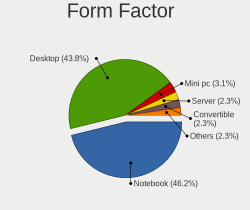
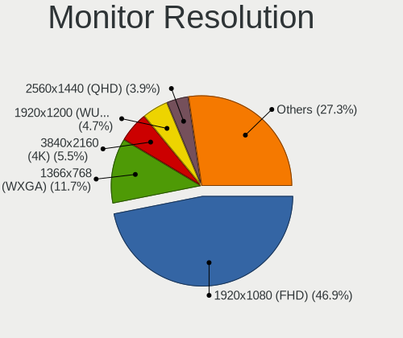
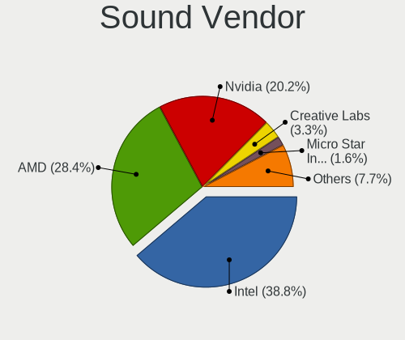
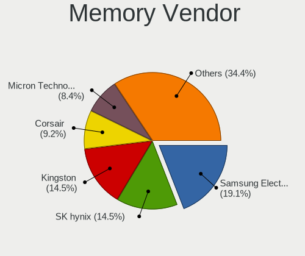
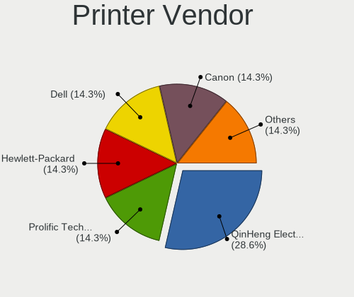

Slackware 15.0 - Tested Hardware & Statistics
---------------------------------------------

A project to collect tested hardware configurations for Slackware 15.0.

Anyone can contribute to this report by the [hw-probe](https://github.com/linuxhw/hw-probe) tool:

    sudo -E hw-probe -all -upload

Please contribute! Especially if your hardware is rare.

This is a report for all computer types. See also reports for [desktops](/Dist/Slackware_15.0/Desktop/README.md) and [notebooks](/Dist/Slackware_15.0/Notebook/README.md).

Contents
--------

* [ Test Cases ](#test-cases)

* [ System ](#system)
  - [ Kernel                   ](#kernel)
  - [ Kernel Family            ](#kernel-family)
  - [ Kernel Major Ver.        ](#kernel-major-ver)
  - [ Arch                     ](#arch)
  - [ DE                       ](#de)
  - [ Display Server           ](#display-server)
  - [ Display Manager          ](#display-manager)
  - [ OS Lang                  ](#os-lang)
  - [ Boot Mode                ](#boot-mode)
  - [ Filesystem               ](#filesystem)
  - [ Part. scheme             ](#part-scheme)
  - [ Dual Boot with Linux/BSD ](#dual-boot-with-linuxbsd)
  - [ Dual Boot (Win)          ](#dual-boot-win)

* [ Board ](#board)
  - [ Vendor                   ](#vendor)
  - [ Model                    ](#model)
  - [ Model Family             ](#model-family)
  - [ MFG Year                 ](#mfg-year)
  - [ Form Factor              ](#form-factor)
  - [ Secure Boot              ](#secure-boot)
  - [ Coreboot                 ](#coreboot)
  - [ RAM Size                 ](#ram-size)
  - [ RAM Used                 ](#ram-used)
  - [ Total Drives             ](#total-drives)
  - [ Has CD-ROM               ](#has-cd-rom)
  - [ Has Ethernet             ](#has-ethernet)
  - [ Has WiFi                 ](#has-wifi)
  - [ Has Bluetooth            ](#has-bluetooth)

* [ Location ](#location)
  - [ Country                  ](#country)
  - [ City                     ](#city)

* [ Drives ](#drives)
  - [ Drive Vendor             ](#drive-vendor)
  - [ Drive Model              ](#drive-model)
  - [ HDD Vendor               ](#hdd-vendor)
  - [ SSD Vendor               ](#ssd-vendor)
  - [ Drive Kind               ](#drive-kind)
  - [ Drive Connector          ](#drive-connector)
  - [ Drive Size               ](#drive-size)
  - [ Space Total              ](#space-total)
  - [ Space Used               ](#space-used)
  - [ Malfunc. Drives          ](#malfunc-drives)
  - [ Malfunc. Drive Vendor    ](#malfunc-drive-vendor)
  - [ Malfunc. HDD Vendor      ](#malfunc-hdd-vendor)
  - [ Malfunc. Drive Kind      ](#malfunc-drive-kind)
  - [ Failed Drives            ](#failed-drives)
  - [ Failed Drive Vendor      ](#failed-drive-vendor)
  - [ Drive Status             ](#drive-status)

* [ Storage controller ](#storage-controller)
  - [ Storage Vendor           ](#storage-vendor)
  - [ Storage Model            ](#storage-model)
  - [ Storage Kind             ](#storage-kind)

* [ Processor ](#processor)
  - [ CPU Vendor               ](#cpu-vendor)
  - [ CPU Model                ](#cpu-model)
  - [ CPU Model Family         ](#cpu-model-family)
  - [ CPU Cores                ](#cpu-cores)
  - [ CPU Sockets              ](#cpu-sockets)
  - [ CPU Threads              ](#cpu-threads)
  - [ CPU Op-Modes             ](#cpu-op-modes)
  - [ CPU Microcode            ](#cpu-microcode)
  - [ CPU Microarch            ](#cpu-microarch)

* [ Graphics ](#graphics)
  - [ GPU Vendor               ](#gpu-vendor)
  - [ GPU Model                ](#gpu-model)
  - [ GPU Combo                ](#gpu-combo)
  - [ GPU Driver               ](#gpu-driver)
  - [ GPU Memory               ](#gpu-memory)

* [ Monitor ](#monitor)
  - [ Monitor Vendor           ](#monitor-vendor)
  - [ Monitor Model            ](#monitor-model)
  - [ Monitor Resolution       ](#monitor-resolution)
  - [ Monitor Diagonal         ](#monitor-diagonal)
  - [ Monitor Width            ](#monitor-width)
  - [ Aspect Ratio             ](#aspect-ratio)
  - [ Monitor Area             ](#monitor-area)
  - [ Pixel Density            ](#pixel-density)
  - [ Multiple Monitors        ](#multiple-monitors)

* [ Network ](#network)
  - [ Net Controller Vendor    ](#net-controller-vendor)
  - [ Net Controller Model     ](#net-controller-model)
  - [ Wireless Vendor          ](#wireless-vendor)
  - [ Wireless Model           ](#wireless-model)
  - [ Ethernet Vendor          ](#ethernet-vendor)
  - [ Ethernet Model           ](#ethernet-model)
  - [ Net Controller Kind      ](#net-controller-kind)
  - [ Used Controller          ](#used-controller)
  - [ NICs                     ](#nics)
  - [ IPv6                     ](#ipv6)

* [ Bluetooth ](#bluetooth)
  - [ Bluetooth Vendor         ](#bluetooth-vendor)
  - [ Bluetooth Model          ](#bluetooth-model)

* [ Sound ](#sound)
  - [ Sound Vendor             ](#sound-vendor)
  - [ Sound Model              ](#sound-model)

* [ Memory ](#memory)
  - [ Memory Vendor            ](#memory-vendor)
  - [ Memory Model             ](#memory-model)
  - [ Memory Kind              ](#memory-kind)
  - [ Memory Form Factor       ](#memory-form-factor)
  - [ Memory Size              ](#memory-size)
  - [ Memory Speed             ](#memory-speed)

* [ Printers & scanners ](#printers--scanners)
  - [ Printer Vendor           ](#printer-vendor)
  - [ Printer Model            ](#printer-model)
  - [ Scanner Vendor           ](#scanner-vendor)
  - [ Scanner Model            ](#scanner-model)

* [ Camera ](#camera)
  - [ Camera Vendor            ](#camera-vendor)
  - [ Camera Model             ](#camera-model)

* [ Security ](#security)
  - [ Fingerprint Vendor       ](#fingerprint-vendor)
  - [ Fingerprint Model        ](#fingerprint-model)
  - [ Chipcard Vendor          ](#chipcard-vendor)
  - [ Chipcard Model           ](#chipcard-model)

* [ Unsupported ](#unsupported)
  - [ Unsupported Devices      ](#unsupported-devices)
  - [ Unsupported Device Types ](#unsupported-device-types)

Test Cases
----------

Total: 75

| Vendor        | Model                       | Form-Factor | Probe                                                      | Date         |
|---------------|-----------------------------|-------------|------------------------------------------------------------|--------------|
| ASRock        | B550 Taichi                 | Desktop     | [469f9d71e2](https://linux-hardware.org/?probe=469f9d71e2) | Dec 29, 2022 |
| Acer          | Nitro AN515-54              | Notebook    | [5205b7c248](https://linux-hardware.org/?probe=5205b7c248) | Dec 27, 2022 |
| ASUSTek       | VivoBook_ASUSLaptop K650... | Notebook    | [1cf2ac2b8b](https://linux-hardware.org/?probe=1cf2ac2b8b) | Dec 27, 2022 |
| Dell          | 0MY171 A00                  | Desktop     | [055bc4ea78](https://linux-hardware.org/?probe=055bc4ea78) | Dec 13, 2022 |
| ASUSTek       | SABERTOOTH X99              | Desktop     | [c0bf1336d5](https://linux-hardware.org/?probe=c0bf1336d5) | Dec 12, 2022 |
| HP            | OMEN by Laptop 16-b1xxx     | Notebook    | [799470f1aa](https://linux-hardware.org/?probe=799470f1aa) | Dec 05, 2022 |
| HP            | 8906 SMVB                   | Desktop     | [d000e4e926](https://linux-hardware.org/?probe=d000e4e926) | Dec 02, 2022 |
| HP            | OMEN by Laptop 16-b1xxx     | Notebook    | [0cd3005f69](https://linux-hardware.org/?probe=0cd3005f69) | Dec 01, 2022 |
| HP            | OMEN by Laptop 16-b1xxx     | Notebook    | [32b68762df](https://linux-hardware.org/?probe=32b68762df) | Nov 30, 2022 |
| Lenovo        | 31900058 STD                | Desktop     | [1408b2dc5f](https://linux-hardware.org/?probe=1408b2dc5f) | Nov 18, 2022 |
| Lenovo        | ThinkPad T470 20JNS01R01    | Notebook    | [abb8194196](https://linux-hardware.org/?probe=abb8194196) | Oct 21, 2022 |
| Lenovo        | ThinkPad T61 765912G        | Notebook    | [e7f2dc737e](https://linux-hardware.org/?probe=e7f2dc737e) | Oct 09, 2022 |
| Lenovo        | ThinkPad T410 2518C3U       | Notebook    | [4d250adf3b](https://linux-hardware.org/?probe=4d250adf3b) | Oct 04, 2022 |
| HP            | 3031h                       | Desktop     | [b6849a29a2](https://linux-hardware.org/?probe=b6849a29a2) | Sep 24, 2022 |
| Lenovo        | ThinkPad T61 765912G        | Notebook    | [bd04e564a0](https://linux-hardware.org/?probe=bd04e564a0) | Sep 24, 2022 |
| HP            | 3031h                       | Desktop     | [40160588bb](https://linux-hardware.org/?probe=40160588bb) | Sep 20, 2022 |
| MSI           | H110M PRO-VD                | Desktop     | [2299dc1786](https://linux-hardware.org/?probe=2299dc1786) | Sep 17, 2022 |
| ASUSTek       | ROG CROSSHAIR VIII HERO     | Desktop     | [a954ba4e86](https://linux-hardware.org/?probe=a954ba4e86) | Aug 26, 2022 |
| Dell          | 0200DY A03                  | Desktop     | [e0e14cd1f2](https://linux-hardware.org/?probe=e0e14cd1f2) | Aug 19, 2022 |
| Fujitsu       | LIFEBOOK A544               | Notebook    | [e5785106f1](https://linux-hardware.org/?probe=e5785106f1) | Aug 09, 2022 |
| MSI           | Modern 14 B10MW             | Notebook    | [b9cde08864](https://linux-hardware.org/?probe=b9cde08864) | Jul 25, 2022 |
| Gigabyte      | N3160TN                     | Desktop     | [e2f44a8274](https://linux-hardware.org/?probe=e2f44a8274) | May 31, 2022 |
| Sony          | SVE1713A1EW                 | Notebook    | [c3a65d695d](https://linux-hardware.org/?probe=c3a65d695d) | May 10, 2022 |
| Lenovo        | ThinkPad X1 Carbon 5th 2... | Notebook    | [f837aaeb12](https://linux-hardware.org/?probe=f837aaeb12) | May 08, 2022 |
| HP            | Pavilion Gaming Laptop 1... | Notebook    | [bd2dda1d8a](https://linux-hardware.org/?probe=bd2dda1d8a) | Apr 29, 2022 |
| HP            | Pavilion Gaming Laptop 1... | Notebook    | [cfc9c5dbf7](https://linux-hardware.org/?probe=cfc9c5dbf7) | Apr 29, 2022 |
| ASUSTek       | TUF B450-PLUS GAMING        | Desktop     | [533b8a9f83](https://linux-hardware.org/?probe=533b8a9f83) | Apr 13, 2022 |
| MSI           | 970 GAMING                  | Desktop     | [25d8968f19](https://linux-hardware.org/?probe=25d8968f19) | Apr 13, 2022 |
| MSI           | GP76 Leopard 11UG           | Notebook    | [aebd373a66](https://linux-hardware.org/?probe=aebd373a66) | Apr 12, 2022 |
| MSI           | GE76 Raider 11UE            | Notebook    | [3072e065a3](https://linux-hardware.org/?probe=3072e065a3) | Apr 12, 2022 |
| Notebook      | X170KM-G                    | Notebook    | [4ecba03d19](https://linux-hardware.org/?probe=4ecba03d19) | Apr 11, 2022 |
| ASRock        | N68-S3 FX                   | Desktop     | [ca818bd06d](https://linux-hardware.org/?probe=ca818bd06d) | Apr 08, 2022 |
| MSI           | MS-7365                     | Desktop     | [8948dea4de](https://linux-hardware.org/?probe=8948dea4de) | Apr 07, 2022 |
| Unknown       | X79-P3                      | Desktop     | [40e38e9a8d](https://linux-hardware.org/?probe=40e38e9a8d) | Apr 07, 2022 |
| Dell          | Latitude 3520               | Notebook    | [4398aa2a03](https://linux-hardware.org/?probe=4398aa2a03) | Apr 06, 2022 |
| HP            | ProBook 6570b               | Notebook    | [cf1305eacc](https://linux-hardware.org/?probe=cf1305eacc) | Apr 06, 2022 |
| HP            | 0A08h                       | Desktop     | [4df5b0832f](https://linux-hardware.org/?probe=4df5b0832f) | Apr 06, 2022 |
| Lenovo        | IdeaPad 310-15ISK 80SM      | Notebook    | [d406cb4819](https://linux-hardware.org/?probe=d406cb4819) | Apr 05, 2022 |
| Dell          | Precision M4700             | Notebook    | [ab99532bd5](https://linux-hardware.org/?probe=ab99532bd5) | Apr 04, 2022 |
| ASRock        | H410M-ITX/ac                | Desktop     | [ae936790c9](https://linux-hardware.org/?probe=ae936790c9) | Apr 03, 2022 |
| ASUSTek       | PRIME Z390-A                | Desktop     | [5307aba2c3](https://linux-hardware.org/?probe=5307aba2c3) | Mar 30, 2022 |
| Apple         | Mac-F4238CC8 PVT            | All in one  | [c8289cd264](https://linux-hardware.org/?probe=c8289cd264) | Mar 26, 2022 |
| Apple         | Mac-F4238CC8 PVT            | All in one  | [5c6b1616fa](https://linux-hardware.org/?probe=5c6b1616fa) | Mar 21, 2022 |
| Acer          | FMCP7A-ION-LE               | Desktop     | [bbce73c6d6](https://linux-hardware.org/?probe=bbce73c6d6) | Mar 14, 2022 |
| Apple         | Mac-F65AE981FFA204ED Mac... | Mini pc     | [5f36bc3969](https://linux-hardware.org/?probe=5f36bc3969) | Mar 12, 2022 |
| ASRock        | H270 Pro4                   | Desktop     | [ae79ca8557](https://linux-hardware.org/?probe=ae79ca8557) | Mar 12, 2022 |
| HP            | 86F3 00100                  | All in one  | [7de0381db8](https://linux-hardware.org/?probe=7de0381db8) | Mar 11, 2022 |
| Lenovo        | ThinkPad X230 2325P38       | Notebook    | [1a0cab737b](https://linux-hardware.org/?probe=1a0cab737b) | Mar 10, 2022 |
| ASUSTek       | ROG Zephyrus G14 GA401IV... | Notebook    | [0b0c1aca1b](https://linux-hardware.org/?probe=0b0c1aca1b) | Mar 10, 2022 |
| HP            | Pavilion Gaming Laptop 1... | Notebook    | [c7825c54fc](https://linux-hardware.org/?probe=c7825c54fc) | Mar 10, 2022 |
| Framework     | Laptop                      | Notebook    | [ae37705198](https://linux-hardware.org/?probe=ae37705198) | Mar 10, 2022 |
| Dell          | 068NXX A00                  | Server      | [85004f427a](https://linux-hardware.org/?probe=85004f427a) | Mar 09, 2022 |
| Lenovo        | 31900058 STD                | Desktop     | [bc59b862f4](https://linux-hardware.org/?probe=bc59b862f4) | Mar 02, 2022 |
| TYAN Compu... | S7012                       | Server      | [fec98b51da](https://linux-hardware.org/?probe=fec98b51da) | Feb 27, 2022 |
| TYAN Compu... | S7012                       | Server      | [81a490184b](https://linux-hardware.org/?probe=81a490184b) | Feb 26, 2022 |
| Biostar       | X470GTA                     | Desktop     | [8d400b49f8](https://linux-hardware.org/?probe=8d400b49f8) | Feb 13, 2022 |
| Lenovo        | ThinkPad Edge E530c 3366... | Notebook    | [8ce0419468](https://linux-hardware.org/?probe=8ce0419468) | Feb 13, 2022 |
| MSI           | G31TM-P21                   | Desktop     | [dda6a57223](https://linux-hardware.org/?probe=dda6a57223) | Feb 07, 2022 |
| HP            | 212B                        | Desktop     | [353b0dde99](https://linux-hardware.org/?probe=353b0dde99) | Jan 29, 2022 |
| MSI           | B450 TOMAHAWK MAX           | Desktop     | [85543358d3](https://linux-hardware.org/?probe=85543358d3) | Jan 14, 2022 |
| Dynabook      | P1-C7MP-BL                  | Notebook    | [268f94787e](https://linux-hardware.org/?probe=268f94787e) | Jan 14, 2022 |
| MSI           | G31TM-P21                   | Desktop     | [25d668ee95](https://linux-hardware.org/?probe=25d668ee95) | Jan 10, 2022 |
| MSI           | H61M-P31                    | Desktop     | [58651bba67](https://linux-hardware.org/?probe=58651bba67) | Dec 07, 2021 |
| HP            | Laptop 15-bs1xx             | Notebook    | [b6c9f34c4c](https://linux-hardware.org/?probe=b6c9f34c4c) | Dec 07, 2021 |
| System76      | Oryx Pro                    | Notebook    | [3cd05d02a8](https://linux-hardware.org/?probe=3cd05d02a8) | Oct 27, 2021 |
| MSI           | B450M-A PRO MAX             | Desktop     | [b7df25ba5d](https://linux-hardware.org/?probe=b7df25ba5d) | Oct 25, 2021 |
| ASUSTek       | SABERTOOTH X99              | Desktop     | [64e5ee1691](https://linux-hardware.org/?probe=64e5ee1691) | Oct 13, 2021 |
| MSI           | B450M-A PRO MAX             | Desktop     | [17d37c5316](https://linux-hardware.org/?probe=17d37c5316) | Oct 12, 2021 |
| MSI           | Modern 14 B11MO             | Notebook    | [e8f13facfd](https://linux-hardware.org/?probe=e8f13facfd) | Oct 03, 2021 |
| MSI           | Modern 14 B11MO             | Notebook    | [9f5c2e0fde](https://linux-hardware.org/?probe=9f5c2e0fde) | Sep 27, 2021 |
| Dell          | Inspiron 15-3552            | Notebook    | [f76339b0af](https://linux-hardware.org/?probe=f76339b0af) | Aug 31, 2021 |
| HP            | 245 G7 Notebook PC          | Notebook    | [c0806e4955](https://linux-hardware.org/?probe=c0806e4955) | Aug 23, 2021 |
| HP            | 245 G7 Notebook PC          | Notebook    | [c409287d23](https://linux-hardware.org/?probe=c409287d23) | Aug 23, 2021 |
| HP            | EliteBook 840 G5            | Notebook    | [4c196e1abd](https://linux-hardware.org/?probe=4c196e1abd) | Aug 18, 2021 |
| Dell          | Vostro 3500                 | Notebook    | [53a1179121](https://linux-hardware.org/?probe=53a1179121) | Aug 12, 2021 |

System
------

Kernel
------

Version of the Linux kernel

| Version           | Computers | Percent |
|-------------------|-----------|---------|
| 5.15.19           | 15        | 23.08%  |
| 5.19.17           | 4         | 6.15%   |
| 5.15.27           | 4         | 6.15%   |
| 5.15.63           | 3         | 4.62%   |
| 5.17.2            | 2         | 3.08%   |
| 5.17.1            | 2         | 3.08%   |
| 5.16.13           | 2         | 3.08%   |
| 5.15.38           | 2         | 3.08%   |
| 5.15.30-Unraid    | 2         | 3.08%   |
| 5.13.8            | 2         | 3.08%   |
| 6.1.1             | 1         | 1.54%   |
| 5.19.16           | 1         | 1.54%   |
| 5.17.5            | 1         | 1.54%   |
| 5.17.0-custom     | 1         | 1.54%   |
| 5.16.9-joe1       | 1         | 1.54%   |
| 5.16.18           | 1         | 1.54%   |
| 5.16.12           | 1         | 1.54%   |
| 5.16.11           | 1         | 1.54%   |
| 5.15.6            | 1         | 1.54%   |
| 5.15.37.a         | 1         | 1.54%   |
| 5.15.33.kjh       | 1         | 1.54%   |
| 5.15.21-hardened1 | 1         | 1.54%   |
| 5.15.14           | 1         | 1.54%   |
| 5.15.13           | 1         | 1.54%   |
| 5.15.1            | 1         | 1.54%   |
| 5.14.9            | 1         | 1.54%   |
| 5.14.8            | 1         | 1.54%   |
| 5.14.15-Unraid    | 1         | 1.54%   |
| 5.14.15           | 1         | 1.54%   |
| 5.14.12           | 1         | 1.54%   |
| 5.14.11           | 1         | 1.54%   |
| 5.14.10           | 1         | 1.54%   |
| 5.14.0            | 1         | 1.54%   |
| 5.13.5            | 1         | 1.54%   |
| 5.13.12           | 1         | 1.54%   |
| 5.13.11           | 1         | 1.54%   |
| 5.10.91           | 1         | 1.54%   |

Kernel Family
-------------

Linux kernel without a distro release

| Version | Computers | Percent |
|---------|-----------|---------|
| 5.15.19 | 15        | 23.08%  |
| 5.19.17 | 4         | 6.15%   |
| 5.15.27 | 4         | 6.15%   |
| 5.15.63 | 3         | 4.62%   |
| 5.17.2  | 2         | 3.08%   |
| 5.17.1  | 2         | 3.08%   |
| 5.16.13 | 2         | 3.08%   |
| 5.15.38 | 2         | 3.08%   |
| 5.15.30 | 2         | 3.08%   |
| 5.14.15 | 2         | 3.08%   |
| 5.13.8  | 2         | 3.08%   |
| 6.1.1   | 1         | 1.54%   |
| 5.19.16 | 1         | 1.54%   |
| 5.17.5  | 1         | 1.54%   |
| 5.17.0  | 1         | 1.54%   |
| 5.16.9  | 1         | 1.54%   |
| 5.16.18 | 1         | 1.54%   |
| 5.16.12 | 1         | 1.54%   |
| 5.16.11 | 1         | 1.54%   |
| 5.15.6  | 1         | 1.54%   |
| 5.15.37 | 1         | 1.54%   |
| 5.15.33 | 1         | 1.54%   |
| 5.15.21 | 1         | 1.54%   |
| 5.15.14 | 1         | 1.54%   |
| 5.15.13 | 1         | 1.54%   |
| 5.15.1  | 1         | 1.54%   |
| 5.14.9  | 1         | 1.54%   |
| 5.14.8  | 1         | 1.54%   |
| 5.14.12 | 1         | 1.54%   |
| 5.14.11 | 1         | 1.54%   |
| 5.14.10 | 1         | 1.54%   |
| 5.14.0  | 1         | 1.54%   |
| 5.13.5  | 1         | 1.54%   |
| 5.13.12 | 1         | 1.54%   |
| 5.13.11 | 1         | 1.54%   |
| 5.10.91 | 1         | 1.54%   |

Kernel Major Ver.
-----------------

Linux kernel major version

| Version | Computers | Percent |
|---------|-----------|---------|
| 5.15    | 33        | 51.56%  |
| 5.14    | 7         | 10.94%  |
| 5.17    | 6         | 9.38%   |
| 5.16    | 6         | 9.38%   |
| 5.19    | 5         | 7.81%   |
| 5.13    | 5         | 7.81%   |
| 6.1     | 1         | 1.56%   |
| 5.10    | 1         | 1.56%   |

Arch
----

OS architecture (x86_64, i586, etc.)

| Name   | Computers | Percent |
|--------|-----------|---------|
| x86_64 | 62        | 100%    |

DE
--

Desktop Environment

| Name      | Computers | Percent |
|-----------|-----------|---------|
| KDE5      | 31        | 48.44%  |
| XFCE      | 15        | 23.44%  |
| Unknown   | 9         | 14.06%  |
| GNOME     | 3         | 4.69%   |
| xwmconfig | 1         | 1.56%   |
| X-Generic | 1         | 1.56%   |
| MATE      | 1         | 1.56%   |
| KDE       | 1         | 1.56%   |
| FVWM      | 1         | 1.56%   |
| awesome   | 1         | 1.56%   |

Display Server
--------------

X11 or Wayland

| Name    | Computers | Percent |
|---------|-----------|---------|
| X11     | 35        | 53.03%  |
| Tty     | 23        | 34.85%  |
| Wayland | 5         | 7.58%   |
| Unknown | 3         | 4.55%   |

Display Manager
---------------

SDDM, LightDM, etc.

| Name    | Computers | Percent |
|---------|-----------|---------|
| SDDM    | 36        | 56.25%  |
| Unknown | 17        | 26.56%  |
| XDM     | 8         | 12.5%   |
| LightDM | 2         | 3.13%   |
| GDM     | 1         | 1.56%   |

OS Lang
-------

Language

| Lang        | Computers | Percent |
|-------------|-----------|---------|
| en_US       | 43        | 69.35%  |
| Unknown     | 5         | 8.06%   |
| ru_RU       | 2         | 3.23%   |
| pt_BR       | 2         | 3.23%   |
| it_IT       | 2         | 3.23%   |
| fr_FR       | 2         | 3.23%   |
| de_DE       | 2         | 3.23%   |
| pt_PT       | 1         | 1.61%   |
| es_ES.UTF8  | 1         | 1.61%   |
| en_US.ASCII | 1         | 1.61%   |
| en_GB       | 1         | 1.61%   |

Boot Mode
---------

EFI or BIOS

| Mode | Computers | Percent |
|------|-----------|---------|
| EFI  | 34        | 54.84%  |
| BIOS | 28        | 45.16%  |

Filesystem
----------

Type of filesystem

| Type    | Computers | Percent |
|---------|-----------|---------|
| Ext4    | 44        | 70.97%  |
| Btrfs   | 7         | 11.29%  |
| Xfs     | 5         | 8.06%   |
| Overlay | 4         | 6.45%   |
| Zfs     | 1         | 1.61%   |
| F2fs    | 1         | 1.61%   |

Part. scheme
------------

Scheme of partitioning

| Type    | Computers | Percent |
|---------|-----------|---------|
| GPT     | 45        | 71.43%  |
| MBR     | 9         | 14.29%  |
| Unknown | 9         | 14.29%  |

Dual Boot with Linux/BSD
------------------------

Hosting more than one Linux/BSD

| Dual boot | Computers | Percent |
|-----------|-----------|---------|
| No        | 49        | 76.56%  |
| Yes       | 15        | 23.44%  |

Dual Boot (Win)
---------------

Hosting Linux and Windows

| Dual boot | Computers | Percent |
|-----------|-----------|---------|
| No        | 40        | 64.52%  |
| Yes       | 22        | 35.48%  |

Board
-----

Vendor
------

Motherboard manufacturer

| Name                | Computers | Percent |
|---------------------|-----------|---------|
| Hewlett-Packard     | 12        | 19.35%  |
| MSI                 | 11        | 17.74%  |
| Lenovo              | 8         | 12.9%   |
| Dell                | 7         | 11.29%  |
| ASUSTek Computer    | 6         | 9.68%   |
| ASRock              | 4         | 6.45%   |
| Apple               | 2         | 3.23%   |
| Acer                | 2         | 3.23%   |
| TYAN Computer       | 1         | 1.61%   |
| System76            | 1         | 1.61%   |
| Sony                | 1         | 1.61%   |
| Notebook            | 1         | 1.61%   |
| Gigabyte Technology | 1         | 1.61%   |
| Fujitsu             | 1         | 1.61%   |
| Framework           | 1         | 1.61%   |
| Dynabook            | 1         | 1.61%   |
| Biostar             | 1         | 1.61%   |
| Unknown             | 1         | 1.61%   |

Model
-----

Motherboard model

| Name                                     | Computers | Percent |
|------------------------------------------|-----------|---------|
| TYAN S7012                               | 1         | 1.61%   |
| System76 Oryx Pro                        | 1         | 1.61%   |
| Sony SVE1713A1EW                         | 1         | 1.61%   |
| Notebook X170KM-G                        | 1         | 1.61%   |
| MSI MS-7C52                              | 1         | 1.61%   |
| MSI MS-7C02                              | 1         | 1.61%   |
| MSI MS-7996                              | 1         | 1.61%   |
| MSI MS-7788                              | 1         | 1.61%   |
| MSI MS-7693                              | 1         | 1.61%   |
| MSI MS-7529                              | 1         | 1.61%   |
| MSI MS-7365                              | 1         | 1.61%   |
| MSI Modern 14 B11MO                      | 1         | 1.61%   |
| MSI Modern 14 B10MW                      | 1         | 1.61%   |
| MSI GP76 Leopard 11UG                    | 1         | 1.61%   |
| MSI GE76 Raider 11UE                     | 1         | 1.61%   |
| Lenovo ThinkPad X230 2325P38             | 1         | 1.61%   |
| Lenovo ThinkPad X1 Carbon 5th 20HQS04300 | 1         | 1.61%   |
| Lenovo ThinkPad T61 765912G              | 1         | 1.61%   |
| Lenovo ThinkPad T470 20JNS01R01          | 1         | 1.61%   |
| Lenovo ThinkPad T410 2518C3U             | 1         | 1.61%   |
| Lenovo ThinkPad Edge E530c 336669G       | 1         | 1.61%   |
| Lenovo IdeaPad 310-15ISK 80SM            | 1         | 1.61%   |
| Lenovo H50-05 90BH001WIX                 | 1         | 1.61%   |
| HP Z440 Workstation                      | 1         | 1.61%   |
| HP xw8400 Workstation                    | 1         | 1.61%   |
| HP ProBook 6570b                         | 1         | 1.61%   |
| HP Pavilion Gaming Laptop 16-a0xxx       | 1         | 1.61%   |
| HP Pavilion Gaming Laptop 15-ec1xxx      | 1         | 1.61%   |
| HP Pavilion Gaming Desktop TG01-2xxx     | 1         | 1.61%   |
| HP OMEN by Laptop 16-b1xxx               | 1         | 1.61%   |
| HP Laptop 15-bs1xx                       | 1         | 1.61%   |
| HP EliteBook 840 G5                      | 1         | 1.61%   |
| HP Compaq dc7900 Small Form Factor       | 1         | 1.61%   |
| HP 245 G7 Notebook PC                    | 1         | 1.61%   |
| HP 205 G4 22 All-in-One PC               | 1         | 1.61%   |
| Gigabyte N3160TN                         | 1         | 1.61%   |
| Fujitsu LIFEBOOK A544                    | 1         | 1.61%   |
| Framework Laptop                         | 1         | 1.61%   |
| Dynabook P1-C7MP-BL                      | 1         | 1.61%   |
| Dell Vostro 3500                         | 1         | 1.61%   |

Model Family
------------

Motherboard model prefix

| Name                | Computers | Percent |
|---------------------|-----------|---------|
| Lenovo ThinkPad     | 6         | 9.68%   |
| HP Pavilion         | 3         | 4.84%   |
| MSI Modern          | 2         | 3.23%   |
| Dell Precision      | 2         | 3.23%   |
| ASUS ROG            | 2         | 3.23%   |
| TYAN S7012          | 1         | 1.61%   |
| System76 Oryx       | 1         | 1.61%   |
| Sony SVE1713A1EW    | 1         | 1.61%   |
| Notebook X170KM-G   | 1         | 1.61%   |
| MSI MS-7C52         | 1         | 1.61%   |
| MSI MS-7C02         | 1         | 1.61%   |
| MSI MS-7996         | 1         | 1.61%   |
| MSI MS-7788         | 1         | 1.61%   |
| MSI MS-7693         | 1         | 1.61%   |
| MSI MS-7529         | 1         | 1.61%   |
| MSI MS-7365         | 1         | 1.61%   |
| MSI GP76            | 1         | 1.61%   |
| MSI GE76            | 1         | 1.61%   |
| Lenovo IdeaPad      | 1         | 1.61%   |
| Lenovo H50-05       | 1         | 1.61%   |
| HP Z440             | 1         | 1.61%   |
| HP xw8400           | 1         | 1.61%   |
| HP ProBook          | 1         | 1.61%   |
| HP OMEN             | 1         | 1.61%   |
| HP Laptop           | 1         | 1.61%   |
| HP EliteBook        | 1         | 1.61%   |
| HP Compaq           | 1         | 1.61%   |
| HP 245              | 1         | 1.61%   |
| HP 205              | 1         | 1.61%   |
| Gigabyte N3160TN    | 1         | 1.61%   |
| Fujitsu LIFEBOOK    | 1         | 1.61%   |
| Framework Laptop    | 1         | 1.61%   |
| Dynabook P1-C7MP-BL | 1         | 1.61%   |
| Dell Vostro         | 1         | 1.61%   |
| Dell PowerEdge      | 1         | 1.61%   |
| Dell OptiPlex       | 1         | 1.61%   |
| Dell Latitude       | 1         | 1.61%   |
| Dell Inspiron       | 1         | 1.61%   |
| Biostar X470GTA     | 1         | 1.61%   |
| ASUS VivoBook       | 1         | 1.61%   |

MFG Year
--------

Motherboard manufacture year

| Year | Computers | Percent |
|------|-----------|---------|
| 2021 | 9         | 14.52%  |
| 2020 | 8         | 12.9%   |
| 2019 | 5         | 8.06%   |
| 2017 | 5         | 8.06%   |
| 2012 | 5         | 8.06%   |
| 2022 | 4         | 6.45%   |
| 2015 | 4         | 6.45%   |
| 2011 | 4         | 6.45%   |
| 2018 | 3         | 4.84%   |
| 2009 | 3         | 4.84%   |
| 2008 | 3         | 4.84%   |
| 2007 | 3         | 4.84%   |
| 2016 | 2         | 3.23%   |
| 2014 | 2         | 3.23%   |
| 2013 | 1         | 1.61%   |
| 2010 | 1         | 1.61%   |

Form Factor
-----------

Physical design of the computer

| Name       | Computers | Percent |
|------------|-----------|---------|
| Notebook   | 31        | 50%     |
| Desktop    | 26        | 41.94%  |
| All in one | 2         | 3.23%   |
| Server     | 2         | 3.23%   |
| Mini pc    | 1         | 1.61%   |

Secure Boot
-----------

Enabled or disabled

| State    | Computers | Percent |
|----------|-----------|---------|
| Disabled | 62        | 100%    |

Coreboot
--------

Have coreboot on board

| Used | Computers | Percent |
|------|-----------|---------|
| No   | 60        | 96.77%  |
| Yes  | 2         | 3.23%   |

RAM Size
--------

Total RAM memory

| Size in GB  | Computers | Percent |
|-------------|-----------|---------|
| 16.01-24.0  | 15        | 23.81%  |
| 3.01-4.0    | 11        | 17.46%  |
| 4.01-8.0    | 10        | 15.87%  |
| 8.01-16.0   | 9         | 14.29%  |
| 32.01-64.0  | 8         | 12.7%   |
| 64.01-256.0 | 6         | 9.52%   |
| 24.01-32.0  | 2         | 3.17%   |
| 1.01-2.0    | 2         | 3.17%   |

RAM Used
--------

Used RAM memory

| Used GB    | Computers | Percent |
|------------|-----------|---------|
| 2.01-3.0   | 18        | 27.27%  |
| 1.01-2.0   | 16        | 24.24%  |
| 4.01-8.0   | 14        | 21.21%  |
| 0.51-1.0   | 9         | 13.64%  |
| 3.01-4.0   | 3         | 4.55%   |
| 16.01-24.0 | 2         | 3.03%   |
| 0.01-0.5   | 2         | 3.03%   |
| 32.01-64.0 | 1         | 1.52%   |
| 8.01-16.0  | 1         | 1.52%   |

Total Drives
------------

Number of drives on board

| Drives | Computers | Percent |
|--------|-----------|---------|
| 1      | 30        | 46.88%  |
| 2      | 16        | 25%     |
| 3      | 8         | 12.5%   |
| 4      | 5         | 7.81%   |
| 6      | 3         | 4.69%   |
| 9      | 1         | 1.56%   |
| 0      | 1         | 1.56%   |

Has CD-ROM
----------

Has CD-ROM on board

| Presented | Computers | Percent |
|-----------|-----------|---------|
| No        | 39        | 61.9%   |
| Yes       | 24        | 38.1%   |

Has Ethernet
------------

Has Ethernet on board

| Presented | Computers | Percent |
|-----------|-----------|---------|
| Yes       | 56        | 90.32%  |
| No        | 6         | 9.68%   |

Has WiFi
--------

Has WiFi module

| Presented | Computers | Percent |
|-----------|-----------|---------|
| Yes       | 47        | 75.81%  |
| No        | 15        | 24.19%  |

Has Bluetooth
-------------

Has Bluetooth module

| Presented | Computers | Percent |
|-----------|-----------|---------|
| Yes       | 42        | 67.74%  |
| No        | 20        | 32.26%  |

Location
--------

Country
-------

Geographic location (country)

| Country      | Computers | Percent |
|--------------|-----------|---------|
| USA          | 15        | 24.19%  |
| Kazakhstan   | 6         | 9.68%   |
| Italy        | 5         | 8.06%   |
| Brazil       | 4         | 6.45%   |
| UK           | 3         | 4.84%   |
| South Africa | 3         | 4.84%   |
| Japan        | 3         | 4.84%   |
| Greece       | 3         | 4.84%   |
| Spain        | 2         | 3.23%   |
| Russia       | 2         | 3.23%   |
| Portugal     | 2         | 3.23%   |
| Hong Kong    | 2         | 3.23%   |
| Germany      | 2         | 3.23%   |
| France       | 2         | 3.23%   |
| Canada       | 2         | 3.23%   |
| Switzerland  | 1         | 1.61%   |
| Sweden       | 1         | 1.61%   |
| Serbia       | 1         | 1.61%   |
| Netherlands  | 1         | 1.61%   |
| Mexico       | 1         | 1.61%   |
| Chile        | 1         | 1.61%   |

City
----

Geographic location (city)

| City              | Computers | Percent |
|-------------------|-----------|---------|
| Ust-Kamenogorsk   | 4         | 6.35%   |
| Chania            | 3         | 4.76%   |
| Tsukuba           | 2         | 3.17%   |
| McKinney          | 2         | 3.17%   |
| Karaganda         | 2         | 3.17%   |
| Cape Town         | 2         | 3.17%   |
| Worpswede         | 1         | 1.59%   |
| Winter Springs    | 1         | 1.59%   |
| Toronto           | 1         | 1.59%   |
| Sun Prairie       | 1         | 1.59%   |
| St Petersburg     | 1         | 1.59%   |
| Skövde           | 1         | 1.59%   |
| Sham Shui Po      | 1         | 1.59%   |
| Senhora da Hora   | 1         | 1.59%   |
| Sao Paulo         | 1         | 1.59%   |
| Santiago          | 1         | 1.59%   |
| Santa Cruz do Sul | 1         | 1.59%   |
| Saint Paul        | 1         | 1.59%   |
| Round Rock        | 1         | 1.59%   |
| Rome              | 1         | 1.59%   |
| Rock              | 1         | 1.59%   |
| Reno              | 1         | 1.59%   |
| Renazzo           | 1         | 1.59%   |
| Porto Alegre      | 1         | 1.59%   |
| Plainwell         | 1         | 1.59%   |
| Ōtsu             | 1         | 1.59%   |
| Oberstreit        | 1         | 1.59%   |
| Naaldwijk         | 1         | 1.59%   |
| Moscow            | 1         | 1.59%   |
| Montreal          | 1         | 1.59%   |
| Milwaukee         | 1         | 1.59%   |
| Milan             | 1         | 1.59%   |
| Mexico City       | 1         | 1.59%   |
| Mead              | 1         | 1.59%   |
| Luxeuil-les-Bains | 1         | 1.59%   |
| London            | 1         | 1.59%   |
| Lisbon            | 1         | 1.59%   |
| Liebefeld         | 1         | 1.59%   |
| League City       | 1         | 1.59%   |
| Johannesburg      | 1         | 1.59%   |

Drives
------

Drive Vendor
------------

Hard drive vendors

| Vendor              | Computers | Drives | Percent |
|---------------------|-----------|--------|---------|
| Samsung Electronics | 17        | 25     | 17%     |
| Seagate             | 16        | 24     | 16%     |
| WDC                 | 15        | 23     | 15%     |
| Toshiba             | 8         | 12     | 8%      |
| Kingston            | 5         | 7      | 5%      |
| Hitachi             | 5         | 8      | 5%      |
| SanDisk             | 3         | 4      | 3%      |
| Intel               | 3         | 4      | 3%      |
| HGST                | 3         | 3      | 3%      |
| Crucial             | 3         | 3      | 3%      |
| SK hynix            | 2         | 2      | 2%      |
| KIOXIA              | 2         | 2      | 2%      |
| Hewlett-Packard     | 2         | 3      | 2%      |
| Gigabyte Technology | 2         | 2      | 2%      |
| ZHITAI              | 1         | 2      | 1%      |
| PNY                 | 1         | 1      | 1%      |
| Plextor             | 1         | 1      | 1%      |
| Phison Electronics  | 1         | 1      | 1%      |
| Patriot             | 1         | 1      | 1%      |
| Micron Technology   | 1         | 1      | 1%      |
| JMicron Technology  | 1         | 1      | 1%      |
| Intenso             | 1         | 1      | 1%      |
| GOODRAM             | 1         | 1      | 1%      |
| External            | 1         | 1      | 1%      |
| DUEX                | 1         | 1      | 1%      |
| China               | 1         | 1      | 1%      |
| Apple               | 1         | 1      | 1%      |
| A-DATA Technology   | 1         | 1      | 1%      |

Drive Model
-----------

Hard drive models

| Model                                   | Computers | Percent |
|-----------------------------------------|-----------|---------|
| WDC WDS100T2B0A-00SM50 1TB SSD          | 2         | 1.69%   |
| WDC WD20EFRX-68EUZN0 2TB                | 2         | 1.69%   |
| WDC WD10SPZX-60Z10T0 1TB                | 2         | 1.69%   |
| WDC WD10EZEX-08WN4A0 1TB                | 2         | 1.69%   |
| Seagate ST1000DM003-1SB102 1TB          | 2         | 1.69%   |
| Samsung SSD 970 EVO 250GB               | 2         | 1.69%   |
| Crucial CT500MX500SSD1 500GB            | 2         | 1.69%   |
| ZHITAI SC001 Active 1TB SSD             | 1         | 0.85%   |
| ZHITAI PC005 Active 512GB               | 1         | 0.85%   |
| WDC WDS480G2G0A-00JH30 480GB SSD        | 1         | 0.85%   |
| WDC WDS100T2B0B-00YS70 1TB SSD          | 1         | 0.85%   |
| WDC WD5000AAKX-22ERMA0 500GB            | 1         | 0.85%   |
| WDC WD40EJRX-89T1XY0 4TB                | 1         | 0.85%   |
| WDC WD400BD-60LTA0 40GB                 | 1         | 0.85%   |
| WDC WD3200AAJS-65B4A0 320GB             | 1         | 0.85%   |
| WDC WD20EZRZ-00Z5HB0 2TB                | 1         | 0.85%   |
| WDC WD20EZRX-00D8PB0 2TB                | 1         | 0.85%   |
| WDC WD10JPVT-08A1YT2 1TB                | 1         | 0.85%   |
| WDC WD10EZEX-00RKKA0 1TB                | 1         | 0.85%   |
| WDC WD10EZEX-00MFCA0 1TB                | 1         | 0.85%   |
| WDC WD Green 2.5 240GB                  | 1         | 0.85%   |
| WDC PC SN530 SDBPNPZ-1T00-1002 1TB      | 1         | 0.85%   |
| Toshiba THNSNH128GBST SSD               | 1         | 0.85%   |
| Toshiba THNSF5512GPUK 512GB             | 1         | 0.85%   |
| Toshiba MQ04ABF100 1TB                  | 1         | 0.85%   |
| Toshiba MQ01ACF032 320GB                | 1         | 0.85%   |
| Toshiba MQ01ABF050 500GB                | 1         | 0.85%   |
| Toshiba MK5055GSX 500GB                 | 1         | 0.85%   |
| Toshiba MD04ABA400V 4TB                 | 1         | 0.85%   |
| Toshiba HDWD240 4TB                     | 1         | 0.85%   |
| Toshiba DT01ACA300 3TB                  | 1         | 0.85%   |
| SK hynix HFM001TD3JX013N 1TB            | 1         | 0.85%   |
| SK hynix BC511 HFM512GDJTNI-82A0A 512GB | 1         | 0.85%   |
| Seagate ST4000VX000-2AG166 4TB          | 1         | 0.85%   |
| Seagate ST4000DM004-2CV104 4TB          | 1         | 0.85%   |
| Seagate ST4000DM000-1F2168 4TB          | 1         | 0.85%   |
| Seagate ST380011A 80GB                  | 1         | 0.85%   |
| Seagate ST3500630AS 500GB               | 1         | 0.85%   |
| Seagate ST3250820AS Q 250GB             | 1         | 0.85%   |
| Seagate ST3160211AS 160GB               | 1         | 0.85%   |

HDD Vendor
----------

Hard disk drive vendors

| Vendor  | Computers | Drives | Percent |
|---------|-----------|--------|---------|
| Seagate | 16        | 24     | 37.21%  |
| WDC     | 12        | 17     | 27.91%  |
| Toshiba | 7         | 9      | 16.28%  |
| Hitachi | 5         | 8      | 11.63%  |
| HGST    | 3         | 3      | 6.98%   |

SSD Vendor
----------

Solid state drive vendors

| Vendor              | Computers | Drives | Percent |
|---------------------|-----------|--------|---------|
| Samsung Electronics | 7         | 11     | 21.21%  |
| Kingston            | 5         | 7      | 15.15%  |
| WDC                 | 3         | 5      | 9.09%   |
| SanDisk             | 2         | 2      | 6.06%   |
| Crucial             | 2         | 2      | 6.06%   |
| ZHITAI              | 1         | 1      | 3.03%   |
| Toshiba             | 1         | 1      | 3.03%   |
| PNY                 | 1         | 1      | 3.03%   |
| Plextor             | 1         | 1      | 3.03%   |
| Patriot             | 1         | 1      | 3.03%   |
| JMicron Technology  | 1         | 1      | 3.03%   |
| Intenso             | 1         | 1      | 3.03%   |
| Intel               | 1         | 2      | 3.03%   |
| Hewlett-Packard     | 1         | 1      | 3.03%   |
| GOODRAM             | 1         | 1      | 3.03%   |
| Gigabyte Technology | 1         | 1      | 3.03%   |
| DUEX                | 1         | 1      | 3.03%   |
| China               | 1         | 1      | 3.03%   |
| Apple               | 1         | 1      | 3.03%   |

Drive Kind
----------

HDD or SSD

| Kind | Computers | Drives | Percent |
|------|-----------|--------|---------|
| HDD  | 31        | 61     | 35.63%  |
| SSD  | 30        | 42     | 34.48%  |
| NVMe | 26        | 34     | 29.89%  |

Drive Connector
---------------

SATA, SAS, NVMe, etc.

| Type | Computers | Drives | Percent |
|------|-----------|--------|---------|
| SATA | 45        | 101    | 61.64%  |
| NVMe | 25        | 33     | 34.25%  |
| SAS  | 3         | 3      | 4.11%   |

Drive Size
----------

Size of hard drive

| Size in TB | Computers | Drives | Percent |
|------------|-----------|--------|---------|
| 0.01-0.5   | 33        | 45     | 47.83%  |
| 0.51-1.0   | 18        | 28     | 26.09%  |
| 3.01-4.0   | 6         | 12     | 8.7%    |
| 1.01-2.0   | 6         | 8      | 8.7%    |
| 2.01-3.0   | 3         | 7      | 4.35%   |
| 4.01-10.0  | 3         | 3      | 4.35%   |

Space Total
-----------

Amount of disk space available on the file system

| Size in GB     | Computers | Percent |
|----------------|-----------|---------|
| 501-1000       | 16        | 24.62%  |
| 101-250        | 14        | 21.54%  |
| 251-500        | 11        | 16.92%  |
| 1001-2000      | 6         | 9.23%   |
| 1-20           | 5         | 7.69%   |
| Unknown        | 5         | 7.69%   |
| 2001-3000      | 4         | 6.15%   |
| More than 3000 | 3         | 4.62%   |
| 51-100         | 1         | 1.54%   |

Space Used
----------

Amount of used disk space

| Used GB        | Computers | Percent |
|----------------|-----------|---------|
| 101-250        | 16        | 24.62%  |
| 21-50          | 11        | 16.92%  |
| 1-20           | 11        | 16.92%  |
| 251-500        | 8         | 12.31%  |
| 501-1000       | 6         | 9.23%   |
| 1001-2000      | 5         | 7.69%   |
| Unknown        | 5         | 7.69%   |
| 51-100         | 2         | 3.08%   |
| More than 3000 | 1         | 1.54%   |

Malfunc. Drives
---------------

Drive models with a malfunction

| Model                               | Computers | Drives | Percent |
|-------------------------------------|-----------|--------|---------|
| WDC WDS480G2G0A-00JH30 480GB SSD    | 1         | 1      | 6.25%   |
| WDC WD5000AAKX-22ERMA0 500GB        | 1         | 1      | 6.25%   |
| WDC WD3200AAJS-65B4A0 320GB         | 1         | 1      | 6.25%   |
| WDC WD20EFRX-68EUZN0 2TB            | 1         | 2      | 6.25%   |
| Seagate ST380011A 80GB              | 1         | 1      | 6.25%   |
| Seagate ST3500630AS 500GB           | 1         | 1      | 6.25%   |
| Seagate ST3000VX006-1HH166 3TB      | 1         | 1      | 6.25%   |
| Seagate ST2000DL003-9VT166 2TB      | 1         | 1      | 6.25%   |
| Seagate ST1000DM003-1ER162 1TB      | 1         | 2      | 6.25%   |
| Samsung Electronics SSD 870 EVO 1TB | 1         | 1      | 6.25%   |
| Plextor PX-128M6S 128GB SSD         | 1         | 1      | 6.25%   |
| Hitachi HUA723030ALA640 3TB         | 1         | 1      | 6.25%   |
| Hitachi HDS721016CLA382 160GB       | 1         | 1      | 6.25%   |
| HGST HTS725050A7E630 500GB          | 1         | 1      | 6.25%   |
| HGST HTS545050A7E380 500GB          | 1         | 1      | 6.25%   |
| DUEX DX300256A5xnEMLC 256GB SSD     | 1         | 1      | 6.25%   |

Malfunc. Drive Vendor
---------------------

Vendors of faulty drives

| Vendor              | Computers | Drives | Percent |
|---------------------|-----------|--------|---------|
| WDC                 | 4         | 5      | 26.67%  |
| Seagate             | 4         | 6      | 26.67%  |
| Hitachi             | 2         | 2      | 13.33%  |
| HGST                | 2         | 2      | 13.33%  |
| Samsung Electronics | 1         | 1      | 6.67%   |
| Plextor             | 1         | 1      | 6.67%   |
| DUEX                | 1         | 1      | 6.67%   |

Malfunc. HDD Vendor
-------------------

Vendors of faulty HDD drives

| Vendor  | Computers | Drives | Percent |
|---------|-----------|--------|---------|
| Seagate | 4         | 6      | 36.36%  |
| WDC     | 3         | 4      | 27.27%  |
| Hitachi | 2         | 2      | 18.18%  |
| HGST    | 2         | 2      | 18.18%  |

Malfunc. Drive Kind
-------------------

Kinds of faulty drives

| Kind | Computers | Drives | Percent |
|------|-----------|--------|---------|
| HDD  | 9         | 14     | 69.23%  |
| SSD  | 4         | 4      | 30.77%  |

Failed Drives
-------------

Failed drive models

Zero info for selected period =(

Failed Drive Vendor
-------------------

Failed drive vendors

Zero info for selected period =(

Drive Status
------------

Number of failed and malfunc. drives

| Status   | Computers | Drives | Percent |
|----------|-----------|--------|---------|
| Works    | 48        | 92     | 64.86%  |
| Detected | 13        | 27     | 17.57%  |
| Malfunc  | 13        | 18     | 17.57%  |

Storage controller
------------------

Storage Vendor
--------------

Storage controller vendors

| Vendor                       | Computers | Percent |
|------------------------------|-----------|---------|
| Intel                        | 36        | 42.86%  |
| AMD                          | 14        | 16.67%  |
| Samsung Electronics          | 11        | 13.1%   |
| SK hynix                     | 2         | 2.38%   |
| SanDisk                      | 2         | 2.38%   |
| Nvidia                       | 2         | 2.38%   |
| Marvell Technology Group     | 2         | 2.38%   |
| KIOXIA                       | 2         | 2.38%   |
| ASMedia Technology           | 2         | 2.38%   |
| Yangtze Memory Technologies  | 1         | 1.19%   |
| Toshiba America Info Systems | 1         | 1.19%   |
| Realtek Semiconductor        | 1         | 1.19%   |
| Phison Electronics           | 1         | 1.19%   |
| Micron/Crucial Technology    | 1         | 1.19%   |
| Micron Technology            | 1         | 1.19%   |
| LSI Logic / Symbios Logic    | 1         | 1.19%   |
| JMicron Technology           | 1         | 1.19%   |
| Broadcom / LSI               | 1         | 1.19%   |
| Biwin Storage Technology     | 1         | 1.19%   |
| Adaptec                      | 1         | 1.19%   |

Storage Model
-------------

Storage controller models

| Model                                                                            | Computers | Percent |
|----------------------------------------------------------------------------------|-----------|---------|
| AMD FCH SATA Controller [AHCI mode]                                              | 11        | 10.68%  |
| Intel 7 Series Chipset Family 6-port SATA Controller [AHCI mode]                 | 5         | 4.85%   |
| AMD 400 Series Chipset SATA Controller                                           | 5         | 4.85%   |
| Samsung NVMe SSD Controller SM981/PM981/PM983                                    | 4         | 3.88%   |
| Intel 82801 Mobile SATA Controller [RAID mode]                                   | 4         | 3.88%   |
| Samsung NVMe SSD Controller PM9A1/PM9A3/980PRO                                   | 3         | 2.91%   |
| Samsung NVMe SSD Controller SM961/PM961/SM963                                    | 2         | 1.94%   |
| Samsung NVMe SSD Controller 980                                                  | 2         | 1.94%   |
| KIOXIA NVMe SSD Controller BG4                                                   | 2         | 1.94%   |
| Intel C610/X99 series chipset sSATA Controller [AHCI mode]                       | 2         | 1.94%   |
| Intel C610/X99 series chipset 6-Port SATA Controller [AHCI mode]                 | 2         | 1.94%   |
| Intel Atom/Celeron/Pentium Processor x5-E8000/J3xxx/N3xxx Series SATA Controller | 2         | 1.94%   |
| Intel 82801JD/DO (ICH10 Family) SATA AHCI Controller                             | 2         | 1.94%   |
| Intel 82801HM/HEM (ICH8M/ICH8M-E) SATA Controller [AHCI mode]                    | 2         | 1.94%   |
| Intel 82801HM/HEM (ICH8M/ICH8M-E) IDE Controller                                 | 2         | 1.94%   |
| Intel 631xESB/632xESB IDE Controller                                             | 2         | 1.94%   |
| Intel 5 Series/3400 Series Chipset 6 port SATA AHCI Controller                   | 2         | 1.94%   |
| Intel 4 Series Chipset PT IDER Controller                                        | 2         | 1.94%   |
| ASMedia ASM1062 Serial ATA Controller                                            | 2         | 1.94%   |
| Yangtze Memory Non-Volatile memory controller                                    | 1         | 0.97%   |
| Toshiba America Info Systems XG4 NVMe SSD Controller                             | 1         | 0.97%   |
| SK hynix Gold P31/PC711 NVMe Solid State Drive                                   | 1         | 0.97%   |
| SK hynix BC511                                                                   | 1         | 0.97%   |
| SanDisk WD PC SN810 / Black SN850 NVMe SSD                                       | 1         | 0.97%   |
| SanDisk WD Blue SN550 NVMe SSD                                                   | 1         | 0.97%   |
| Samsung Electronics SATA controller                                              | 1         | 0.97%   |
| Realtek Realtek Non-Volatile memory controller                                   | 1         | 0.97%   |
| Phison E16 PCIe4 NVMe Controller                                                 | 1         | 0.97%   |
| Nvidia MCP79 AHCI Controller                                                     | 1         | 0.97%   |
| Nvidia MCP61 SATA Controller                                                     | 1         | 0.97%   |
| Nvidia MCP61 IDE                                                                 | 1         | 0.97%   |
| Micron/Crucial P2 NVMe PCIe SSD                                                  | 1         | 0.97%   |
| Micron Non-Volatile memory controller                                            | 1         | 0.97%   |
| Marvell Group 88SE9215 PCIe 2.0 x1 4-port SATA 6 Gb/s Controller                 | 1         | 0.97%   |
| Marvell Group 88SE6111/6121 SATA II / PATA Controller                            | 1         | 0.97%   |
| LSI Logic / Symbios Logic 53c1030 PCI-X Fusion-MPT Dual Ultra320 SCSI            | 1         | 0.97%   |
| JMicron JMB58x AHCI SATA controller                                              | 1         | 0.97%   |
| Intel Wildcat Point-LP SATA Controller [AHCI Mode]                               | 1         | 0.97%   |
| Intel Volume Management Device NVMe RAID Controller                              | 1         | 0.97%   |
| Intel Tiger Lake-LP SATA Controller                                              | 1         | 0.97%   |

Storage Kind
------------

Kind of storage controller (IDE, SATA, NVMe, SAS, ...)

| Kind | Computers | Percent |
|------|-----------|---------|
| SATA | 41        | 47.67%  |
| NVMe | 25        | 29.07%  |
| IDE  | 11        | 12.79%  |
| RAID | 6         | 6.98%   |
| SCSI | 3         | 3.49%   |

Processor
---------

CPU Vendor
----------

Processor vendors

| Vendor | Computers | Percent |
|--------|-----------|---------|
| Intel  | 47        | 75.81%  |
| AMD    | 15        | 24.19%  |

CPU Model
---------

Processor models

| Model                                   | Computers | Percent |
|-----------------------------------------|-----------|---------|
| Intel 11th Gen Core i7-11800H @ 2.30GHz | 3         | 4.76%   |
| Intel Core 2 Duo CPU T7300 @ 2.00GHz    | 2         | 3.17%   |
| Intel Core 2 Duo CPU E8400 @ 3.00GHz    | 2         | 3.17%   |
| Intel 12th Gen Core i7-12700H           | 2         | 3.17%   |
| Intel 11th Gen Core i5-1135G7 @ 2.40GHz | 2         | 3.17%   |
| Intel Xeon CPU X5680 @ 3.33GHz          | 1         | 1.59%   |
| Intel Xeon CPU X5355 @ 2.66GHz          | 1         | 1.59%   |
| Intel Xeon CPU E5-2697 v3 @ 2.60GHz     | 1         | 1.59%   |
| Intel Xeon CPU E5-2667 v2 @ 3.30GHz     | 1         | 1.59%   |
| Intel Xeon CPU E5-2660 v3 @ 2.60GHz     | 1         | 1.59%   |
| Intel Xeon CPU 5160 @ 3.00GHz           | 1         | 1.59%   |
| Intel Pentium Dual CPU E2140 @ 1.60GHz  | 1         | 1.59%   |
| Intel Pentium CPU 2020M @ 2.40GHz       | 1         | 1.59%   |
| Intel Core i7-9750H CPU @ 2.60GHz       | 1         | 1.59%   |
| Intel Core i7-8550U CPU @ 1.80GHz       | 1         | 1.59%   |
| Intel Core i7-7700 CPU @ 3.60GHz        | 1         | 1.59%   |
| Intel Core i7-7600U CPU @ 2.80GHz       | 1         | 1.59%   |
| Intel Core i7-6700 CPU @ 3.40GHz        | 1         | 1.59%   |
| Intel Core i7-6500U CPU @ 2.50GHz       | 1         | 1.59%   |
| Intel Core i7-5820K CPU @ 3.30GHz       | 1         | 1.59%   |
| Intel Core i7-3840QM CPU @ 2.80GHz      | 1         | 1.59%   |
| Intel Core i7-3720QM CPU @ 2.60GHz      | 1         | 1.59%   |
| Intel Core i7-10870H CPU @ 2.20GHz      | 1         | 1.59%   |
| Intel Core i7-10510U CPU @ 1.80GHz      | 1         | 1.59%   |
| Intel Core i5-8600K CPU @ 3.60GHz       | 1         | 1.59%   |
| Intel Core i5-6300U CPU @ 2.40GHz       | 1         | 1.59%   |
| Intel Core i5-4310M CPU @ 2.70GHz       | 1         | 1.59%   |
| Intel Core i5-3360M CPU @ 2.80GHz       | 1         | 1.59%   |
| Intel Core i5-3330 CPU @ 3.00GHz        | 1         | 1.59%   |
| Intel Core i5-3320M CPU @ 2.60GHz       | 1         | 1.59%   |
| Intel Core i5-3230M CPU @ 2.60GHz       | 1         | 1.59%   |
| Intel Core i5-10210U CPU @ 1.60GHz      | 1         | 1.59%   |
| Intel Core i5 CPU M 540 @ 2.53GHz       | 1         | 1.59%   |
| Intel Core i5 CPU M 460 @ 2.53GHz       | 1         | 1.59%   |
| Intel Core i3-5005U CPU @ 2.00GHz       | 1         | 1.59%   |
| Intel Core i3-10105 CPU @ 3.70GHz       | 1         | 1.59%   |
| Intel Core 2 Duo CPU E8500 @ 3.16GHz    | 1         | 1.59%   |
| Intel Celeron CPU N3160 @ 1.60GHz       | 1         | 1.59%   |
| Intel Celeron CPU N3060 @ 1.60GHz       | 1         | 1.59%   |
| Intel Atom CPU 330 @ 1.60GHz            | 1         | 1.59%   |

CPU Model Family
----------------

Processor model prefix

| Model              | Computers | Percent |
|--------------------|-----------|---------|
| Intel Core i7      | 11        | 17.46%  |
| Intel Core i5      | 10        | 15.87%  |
| Other              | 9         | 14.29%  |
| Intel Xeon         | 6         | 9.52%   |
| Intel Core 2 Duo   | 5         | 7.94%   |
| AMD Ryzen 5        | 4         | 6.35%   |
| AMD Ryzen 9        | 3         | 4.76%   |
| Intel Core i3      | 2         | 3.17%   |
| Intel Celeron      | 2         | 3.17%   |
| AMD Ryzen 7        | 2         | 3.17%   |
| AMD FX             | 2         | 3.17%   |
| Intel Pentium Dual | 1         | 1.59%   |
| Intel Pentium      | 1         | 1.59%   |
| Intel Atom         | 1         | 1.59%   |
| AMD Ryzen 7 PRO    | 1         | 1.59%   |
| AMD EPYC           | 1         | 1.59%   |
| AMD Athlon         | 1         | 1.59%   |
| AMD A8             | 1         | 1.59%   |

CPU Cores
---------

Number of processor cores

| Number | Computers | Percent |
|--------|-----------|---------|
| 2      | 20        | 31.75%  |
| 4      | 18        | 28.57%  |
| 8      | 12        | 19.05%  |
| 6      | 5         | 7.94%   |
| 14     | 3         | 4.76%   |
| 12     | 2         | 3.17%   |
| 16     | 1         | 1.59%   |
| 10     | 1         | 1.59%   |
| 3      | 1         | 1.59%   |

CPU Sockets
-----------

Number of sockets

| Number | Computers | Percent |
|--------|-----------|---------|
| 1      | 59        | 95.16%  |
| 2      | 3         | 4.84%   |

CPU Threads
-----------

Threads per core (Hyper-Threading)

| Number | Computers | Percent |
|--------|-----------|---------|
| 2      | 47        | 75.81%  |
| 1      | 15        | 24.19%  |

CPU Op-Modes
------------

CPU Operation Modes (32-bit, 64-bit)

| Op mode        | Computers | Percent |
|----------------|-----------|---------|
| 32-bit, 64-bit | 62        | 100%    |

CPU Microcode
-------------

Microcode number

| Number     | Computers | Percent |
|------------|-----------|---------|
| Unknown    | 11        | 17.74%  |
| 0x306a9    | 7         | 11.29%  |
| 0x806d1    | 3         | 4.84%   |
| 0x806c1    | 3         | 4.84%   |
| 0x906a3    | 2         | 3.23%   |
| 0x406c4    | 2         | 3.23%   |
| 0x306f2    | 2         | 3.23%   |
| 0x1067a    | 2         | 3.23%   |
| 0x0a50000c | 2         | 3.23%   |
| 0x0a201016 | 2         | 3.23%   |
| 0x08108109 | 2         | 3.23%   |
| 0xa0671    | 1         | 1.61%   |
| 0xa0653    | 1         | 1.61%   |
| 0xa0652    | 1         | 1.61%   |
| 0x906ea    | 1         | 1.61%   |
| 0x906e9    | 1         | 1.61%   |
| 0x806ec    | 1         | 1.61%   |
| 0x806ea    | 1         | 1.61%   |
| 0x6fd      | 1         | 1.61%   |
| 0x6fb      | 1         | 1.61%   |
| 0x6fa      | 1         | 1.61%   |
| 0x506e3    | 1         | 1.61%   |
| 0x406e3    | 1         | 1.61%   |
| 0x306e4    | 1         | 1.61%   |
| 0x306d4    | 1         | 1.61%   |
| 0x306c3    | 1         | 1.61%   |
| 0x206c2    | 1         | 1.61%   |
| 0x106c2    | 1         | 1.61%   |
| 0x08701021 | 1         | 1.61%   |
| 0x08600106 | 1         | 1.61%   |
| 0x0830104d | 1         | 1.61%   |
| 0x0810100b | 1         | 1.61%   |
| 0x07030105 | 1         | 1.61%   |
| 0x06000822 | 1         | 1.61%   |
| 0x00000000 | 1         | 1.61%   |

CPU Microarch
-------------

Microarchitecture

| Name             | Computers | Percent |
|------------------|-----------|---------|
| IvyBridge        | 8         | 12.9%   |
| KabyLake         | 7         | 11.29%  |
| Zen 2            | 5         | 8.06%   |
| Core             | 5         | 8.06%   |
| Zen 3            | 4         | 6.45%   |
| Icelake          | 4         | 6.45%   |
| Westmere         | 3         | 4.84%   |
| TigerLake        | 3         | 4.84%   |
| Skylake          | 3         | 4.84%   |
| Penryn           | 3         | 4.84%   |
| Haswell          | 3         | 4.84%   |
| Zen+             | 2         | 3.23%   |
| Silvermont       | 2         | 3.23%   |
| Piledriver       | 2         | 3.23%   |
| CometLake        | 2         | 3.23%   |
| Alderlake Hybrid | 2         | 3.23%   |
| Zen              | 1         | 1.61%   |
| Puma             | 1         | 1.61%   |
| Broadwell        | 1         | 1.61%   |
| Bonnell          | 1         | 1.61%   |

Graphics
--------

GPU Vendor
----------

Vendors of graphics cards

| Vendor                     | Computers | Percent |
|----------------------------|-----------|---------|
| Intel                      | 29        | 40.28%  |
| Nvidia                     | 24        | 33.33%  |
| AMD                        | 18        | 25%     |
| Matrox Electronics Systems | 1         | 1.39%   |

GPU Model
---------

Graphics card models

| Model                                                                                    | Computers | Percent |
|------------------------------------------------------------------------------------------|-----------|---------|
| Nvidia GA104M [GeForce RTX 3070 Mobile / Max-Q]                                          | 3         | 4.05%   |
| Intel TigerLake-LP GT2 [Iris Xe Graphics]                                                | 3         | 4.05%   |
| Intel 3rd Gen Core processor Graphics Controller                                         | 3         | 4.05%   |
| Nvidia TU117M [GeForce GTX 1650 Ti Mobile]                                               | 2         | 2.7%    |
| Nvidia GP106 [GeForce GTX 1060 6GB]                                                      | 2         | 2.7%    |
| Nvidia GF108 [GeForce GT 630]                                                            | 2         | 2.7%    |
| Nvidia GA107M [GeForce RTX 3050 Ti Mobile]                                               | 2         | 2.7%    |
| Intel TigerLake-H GT1 [UHD Graphics]                                                     | 2         | 2.7%    |
| Intel Skylake GT2 [HD Graphics 520]                                                      | 2         | 2.7%    |
| Intel Core Processor Integrated Graphics Controller                                      | 2         | 2.7%    |
| Intel CometLake-U GT2 [UHD Graphics]                                                     | 2         | 2.7%    |
| Intel Atom/Celeron/Pentium Processor x5-E8000/J3xxx/N3xxx Integrated Graphics Controller | 2         | 2.7%    |
| Intel Alder Lake-P Integrated Graphics Controller                                        | 2         | 2.7%    |
| AMD Thames [Radeon HD 7550M/7570M/7650M]                                                 | 2         | 2.7%    |
| AMD Renoir                                                                               | 2         | 2.7%    |
| AMD Picasso/Raven 2 [Radeon Vega Series / Radeon Vega Mobile Series]                     | 2         | 2.7%    |
| AMD Navi 21 [Radeon RX 6800/6800 XT / 6900 XT]                                           | 2         | 2.7%    |
| AMD Navi 14 [Radeon RX 5500/5500M / Pro 5500M]                                           | 2         | 2.7%    |
| AMD Ellesmere [Radeon RX 470/480/570/570X/580/580X/590]                                  | 2         | 2.7%    |
| AMD Cezanne [Radeon Vega Series / Radeon Vega Mobile Series]                             | 2         | 2.7%    |
| Nvidia TU117M [GeForce GTX 1650 Mobile / Max-Q]                                          | 1         | 1.35%   |
| Nvidia TU106M [GeForce RTX 2060 Max-Q]                                                   | 1         | 1.35%   |
| Nvidia GT218M [GeForce 310M]                                                             | 1         | 1.35%   |
| Nvidia GP107 [GeForce GTX 1050 Ti]                                                       | 1         | 1.35%   |
| Nvidia GP106 [GeForce GTX 1060 3GB]                                                      | 1         | 1.35%   |
| Nvidia GP104 [GeForce GTX 1070]                                                          | 1         | 1.35%   |
| Nvidia GM107 [GeForce GTX 750 Ti]                                                        | 1         | 1.35%   |
| Nvidia GF108GL [Quadro 600]                                                              | 1         | 1.35%   |
| Nvidia GA106M [GeForce RTX 3060 Mobile / Max-Q]                                          | 1         | 1.35%   |
| Nvidia GA102 [GeForce RTX 3080 Ti]                                                       | 1         | 1.35%   |
| Nvidia G84 [GeForce 8600 GT]                                                             | 1         | 1.35%   |
| Nvidia G71GL [Quadro FX 1500]                                                            | 1         | 1.35%   |
| Nvidia C79 [ION]                                                                         | 1         | 1.35%   |
| Matrox Electronics Systems Integrated Matrox G200eW3 Graphics Controller                 | 1         | 1.35%   |
| Intel Xeon E3-1200 v2/3rd Gen Core processor Graphics Controller                         | 1         | 1.35%   |
| Intel UHD Graphics 620                                                                   | 1         | 1.35%   |
| Intel Mobile GM965/GL960 Integrated Graphics Controller (secondary)                      | 1         | 1.35%   |
| Intel Mobile GM965/GL960 Integrated Graphics Controller (primary)                        | 1         | 1.35%   |
| Intel HD Graphics 620                                                                    | 1         | 1.35%   |
| Intel HD Graphics 5500                                                                   | 1         | 1.35%   |

GPU Combo
---------

Combinations of graphics cards

| Name           | Computers | Percent |
|----------------|-----------|---------|
| 1 x Intel      | 21        | 33.87%  |
| 1 x AMD        | 16        | 25.81%  |
| 1 x Nvidia     | 14        | 22.58%  |
| Intel + Nvidia | 8         | 12.9%   |
| 2 x AMD        | 1         | 1.61%   |
| 1 x Matrox     | 1         | 1.61%   |
| AMD + Nvidia   | 1         | 1.61%   |

GPU Driver
----------

Free vs proprietary

| Driver      | Computers | Percent |
|-------------|-----------|---------|
| Free        | 49        | 79.03%  |
| Proprietary | 12        | 19.35%  |
| Unknown     | 1         | 1.61%   |

GPU Memory
----------

Total video memory

| Size in GB | Computers | Percent |
|------------|-----------|---------|
| Unknown    | 30        | 48.39%  |
| 0.51-1.0   | 8         | 12.9%   |
| 0.01-0.5   | 6         | 9.68%   |
| 7.01-8.0   | 5         | 8.06%   |
| 5.01-6.0   | 3         | 4.84%   |
| 3.01-4.0   | 3         | 4.84%   |
| 1.01-2.0   | 3         | 4.84%   |
| 8.01-16.0  | 3         | 4.84%   |
| 2.01-3.0   | 1         | 1.61%   |

Monitor
-------

Monitor Vendor
--------------

Monitor vendors

| Vendor               | Computers | Percent |
|----------------------|-----------|---------|
| Samsung Electronics  | 9         | 13.43%  |
| BOE                  | 9         | 13.43%  |
| LG Display           | 7         | 10.45%  |
| Hewlett-Packard      | 6         | 8.96%   |
| Dell                 | 6         | 8.96%   |
| AU Optronics         | 5         | 7.46%   |
| Lenovo               | 3         | 4.48%   |
| Ancor Communications | 3         | 4.48%   |
| Sharp                | 2         | 2.99%   |
| Chimei Innolux       | 2         | 2.99%   |
| BenQ                 | 2         | 2.99%   |
| Acer                 | 2         | 2.99%   |
| Wacom                | 1         | 1.49%   |
| UGD                  | 1         | 1.49%   |
| Sony                 | 1         | 1.49%   |
| PANDA                | 1         | 1.49%   |
| IOD                  | 1         | 1.49%   |
| Iiyama               | 1         | 1.49%   |
| Goldstar             | 1         | 1.49%   |
| GDH                  | 1         | 1.49%   |
| Apple                | 1         | 1.49%   |
| AOC                  | 1         | 1.49%   |
| Unknown              | 1         | 1.49%   |

Monitor Model
-------------

Monitor models

| Model                                                                 | Computers | Percent |
|-----------------------------------------------------------------------|-----------|---------|
| Wacom Cintiq 22HDT WAC1037 1920x1080 476x268mm 21.5-inch              | 1         | 1.47%   |
| UGD LCD Monitor UGD1302 1920x1080 290x160mm 13.0-inch                 | 1         | 1.47%   |
| Sony TV SNY8102 1360x768                                              | 1         | 1.47%   |
| Sharp LQ173M1JW05 SHP14EC 1920x1080 382x215mm 17.3-inch               | 1         | 1.47%   |
| Sharp LQ156M1JW01 SHP14C3 1920x1080 344x194mm 15.5-inch               | 1         | 1.47%   |
| Samsung Electronics SyncMaster SAM04DF 1360x768 410x230mm 18.5-inch   | 1         | 1.47%   |
| Samsung Electronics SyncMaster SAM03F0 1680x1050 433x271mm 20.1-inch  | 1         | 1.47%   |
| Samsung Electronics SyncMaster SAM0248 1280x1024 380x300mm 19.1-inch  | 1         | 1.47%   |
| Samsung Electronics SyncMaster SAM01AD 1600x1200 408x306mm 20.1-inch  | 1         | 1.47%   |
| Samsung Electronics SMS27A650 SAM082D 1920x1080 598x336mm 27.0-inch   | 1         | 1.47%   |
| Samsung Electronics SMS19A100 SAM0867 1366x768 410x230mm 18.5-inch    | 1         | 1.47%   |
| Samsung Electronics SM2333T SAM0736 1920x1080 477x268mm 21.5-inch     | 1         | 1.47%   |
| Samsung Electronics S22D300 SAM0B3E 1920x1080 477x268mm 21.5-inch     | 1         | 1.47%   |
| Samsung Electronics LCD Monitor SEC3152 1366x768 344x194mm 15.5-inch  | 1         | 1.47%   |
| Samsung Electronics LCD Monitor SDC416E 2880x1620 344x194mm 15.5-inch | 1         | 1.47%   |
| PANDA LCD Monitor NCP0050 1920x1080 309x174mm 14.0-inch               | 1         | 1.47%   |
| LG Display LCD Monitor LGD0625 1920x1080 344x194mm 15.5-inch          | 1         | 1.47%   |
| LG Display LCD Monitor LGD0599 1920x1080 309x174mm 14.0-inch          | 1         | 1.47%   |
| LG Display LCD Monitor LGD0521 1920x1080 309x174mm 14.0-inch          | 1         | 1.47%   |
| LG Display LCD Monitor LGD0353 1366x768 345x194mm 15.6-inch           | 1         | 1.47%   |
| LG Display LCD Monitor LGD032C 1920x1080 344x194mm 15.5-inch          | 1         | 1.47%   |
| LG Display LCD Monitor LGD028A 1366x768 344x194mm 15.5-inch           | 1         | 1.47%   |
| LG Display LCD Monitor LGD0258 1600x900 345x194mm 15.6-inch           | 1         | 1.47%   |
| Lenovo LEN L171p LEN24C9 1280x1024 338x270mm 17.0-inch                | 1         | 1.47%   |
| Lenovo LCD Monitor LEN4035 1280x800 303x190mm 14.1-inch               | 1         | 1.47%   |
| Lenovo LCD Monitor LEN4031 1280x800 303x190mm 14.1-inch               | 1         | 1.47%   |
| IOD LCD-GL211X IOD151D 1920x1080 458x258mm 20.7-inch                  | 1         | 1.47%   |
| Iiyama PL2783Q IVM661F 2560x1440 597x336mm 27.0-inch                  | 1         | 1.47%   |
| Hewlett-Packard Z24i HWP309E 1920x1200 518x324mm 24.1-inch            | 1         | 1.47%   |
| Hewlett-Packard x23LED HWP2912 1920x1080 509x286mm 23.0-inch          | 1         | 1.47%   |
| Hewlett-Packard P223 HPN3392 1920x1080 477x268mm 21.5-inch            | 1         | 1.47%   |
| Hewlett-Packard ALL-in-One HPN4021 1920x1080 476x268mm 21.5-inch      | 1         | 1.47%   |
| Hewlett-Packard 27w HPN3494 1920x1080 598x336mm 27.0-inch             | 1         | 1.47%   |
| Hewlett-Packard 27m HPN3579 1920x1080 598x336mm 27.0-inch             | 1         | 1.47%   |
| Goldstar E1641 GSM8B3E 1366x768 344x194mm 15.5-inch                   | 1         | 1.47%   |
| GDH CHHWJT GDH0030 1440x900 1150x650mm 52.0-inch                      | 1         | 1.47%   |
| Dell U2722D DEL422D 2560x1440 597x336mm 27.0-inch                     | 1         | 1.47%   |
| Dell U2415 DELA0BA 1920x1200 520x320mm 24.0-inch                      | 1         | 1.47%   |
| Dell SP2208WFP DEL4038 1680x1050 473x296mm 22.0-inch                  | 1         | 1.47%   |
| Dell LCD Monitor P190S 3200x1080                                      | 1         | 1.47%   |

Monitor Resolution
------------------

Monitor screen resolution

| Resolution         | Computers | Percent |
|--------------------|-----------|---------|
| 1920x1080 (FHD)    | 30        | 46.15%  |
| 1366x768 (WXGA)    | 10        | 15.38%  |
| 1280x1024 (SXGA)   | 4         | 6.15%   |
| 3840x2160 (4K)     | 3         | 4.62%   |
| 1680x1050 (WSXGA+) | 3         | 4.62%   |
| 2560x1440 (QHD)    | 2         | 3.08%   |
| 1920x1200 (WUXGA)  | 2         | 3.08%   |
| 1360x768           | 2         | 3.08%   |
| 1280x800 (WXGA)    | 2         | 3.08%   |
| 3440x1440          | 1         | 1.54%   |
| 3200x1080          | 1         | 1.54%   |
| 2880x1620          | 1         | 1.54%   |
| 2256x1504          | 1         | 1.54%   |
| 1600x900 (HD+)     | 1         | 1.54%   |
| 1600x1200          | 1         | 1.54%   |
| Unknown            | 1         | 1.54%   |

Monitor Diagonal
----------------

Diagonal size in inches

| Inches  | Computers | Percent |
|---------|-----------|---------|
| 15      | 15        | 22.73%  |
| 27      | 7         | 10.61%  |
| 14      | 6         | 9.09%   |
| 24      | 5         | 7.58%   |
| 21      | 5         | 7.58%   |
| 17      | 5         | 7.58%   |
| 13      | 5         | 7.58%   |
| 20      | 3         | 4.55%   |
| 23      | 2         | 3.03%   |
| 22      | 2         | 3.03%   |
| 19      | 2         | 3.03%   |
| 18      | 2         | 3.03%   |
| 16      | 2         | 3.03%   |
| 72      | 1         | 1.52%   |
| 52      | 1         | 1.52%   |
| 34      | 1         | 1.52%   |
| 12      | 1         | 1.52%   |
| Unknown | 1         | 1.52%   |

Monitor Width
-------------

Physical width

| Width in mm | Computers | Percent |
|-------------|-----------|---------|
| 301-350     | 26        | 40%     |
| 501-600     | 13        | 20%     |
| 401-500     | 11        | 16.92%  |
| 351-400     | 7         | 10.77%  |
| 201-300     | 3         | 4.62%   |
| 701-800     | 1         | 1.54%   |
| 601-700     | 1         | 1.54%   |
| 1501-2000   | 1         | 1.54%   |
| 1001-1500   | 1         | 1.54%   |
| Unknown     | 1         | 1.54%   |

Aspect Ratio
------------

Proportional relationship between the width and the height

| Ratio   | Computers | Percent |
|---------|-----------|---------|
| 16/9    | 43        | 72.88%  |
| 16/10   | 8         | 13.56%  |
| 5/4     | 4         | 6.78%   |
| 4/3     | 1         | 1.69%   |
| 3/2     | 1         | 1.69%   |
| 21/9    | 1         | 1.69%   |
| Unknown | 1         | 1.69%   |

Monitor Area
------------

Area in inch²

| Area in inch² | Computers | Percent |
|----------------|-----------|---------|
| 101-110        | 17        | 26.15%  |
| 81-90          | 10        | 15.38%  |
| 201-250        | 8         | 12.31%  |
| 301-350        | 7         | 10.77%  |
| 151-200        | 7         | 10.77%  |
| 141-150        | 4         | 6.15%   |
| 251-300        | 3         | 4.62%   |
| 121-130        | 3         | 4.62%   |
| More than 1000 | 2         | 3.08%   |
| 71-80          | 1         | 1.54%   |
| 61-70          | 1         | 1.54%   |
| 351-500        | 1         | 1.54%   |
| Unknown        | 1         | 1.54%   |

Pixel Density
-------------

Pixels per inch

| Density       | Computers | Percent |
|---------------|-----------|---------|
| 51-100        | 23        | 35.38%  |
| 121-160       | 18        | 27.69%  |
| 101-120       | 17        | 26.15%  |
| 161-240       | 3         | 4.62%   |
| 1-50          | 2         | 3.08%   |
| More than 240 | 1         | 1.54%   |
| Unknown       | 1         | 1.54%   |

Multiple Monitors
-----------------

Total monitors connected

| Total | Computers | Percent |
|-------|-----------|---------|
| 1     | 49        | 79.03%  |
| 2     | 7         | 11.29%  |
| 0     | 4         | 6.45%   |
| 4     | 1         | 1.61%   |
| 3     | 1         | 1.61%   |

Network
-------

Net Controller Vendor
---------------------

Controller vendors

| Vendor                   | Computers | Percent |
|--------------------------|-----------|---------|
| Realtek Semiconductor    | 36        | 38.71%  |
| Intel                    | 35        | 37.63%  |
| Broadcom                 | 5         | 5.38%   |
| Qualcomm Atheros         | 4         | 4.3%    |
| Ralink Technology        | 2         | 2.15%   |
| MediaTek                 | 2         | 2.15%   |
| Broadcom Limited         | 2         | 2.15%   |
| TP-Link                  | 1         | 1.08%   |
| Sitecom Europe           | 1         | 1.08%   |
| Ralink                   | 1         | 1.08%   |
| Qualcomm                 | 1         | 1.08%   |
| Nvidia                   | 1         | 1.08%   |
| Marvell Technology Group | 1         | 1.08%   |
| Hewlett-Packard          | 1         | 1.08%   |

Net Controller Model
--------------------

Controller models

| Model                                                             | Computers | Percent |
|-------------------------------------------------------------------|-----------|---------|
| Realtek RTL8111/8168/8411 PCI Express Gigabit Ethernet Controller | 25        | 21.93%  |
| Intel Wi-Fi 6 AX200                                               | 4         | 3.51%   |
| Realtek RTL8821CE 802.11ac PCIe Wireless Network Adapter          | 3         | 2.63%   |
| Realtek RTL810xE PCI Express Fast Ethernet controller             | 3         | 2.63%   |
| Intel Wi-Fi 6 AX210/AX211/AX411 160MHz                            | 3         | 2.63%   |
| Intel Centrino Advanced-N 6205 [Taylor Peak]                      | 3         | 2.63%   |
| Intel 82579LM Gigabit Network Connection (Lewisville)             | 3         | 2.63%   |
| Realtek RTL8188CUS 802.11n WLAN Adapter                           | 2         | 1.75%   |
| Realtek RTL8125 2.5GbE Controller                                 | 2         | 1.75%   |
| Realtek Killer E3000 2.5GbE Controller                            | 2         | 1.75%   |
| Ralink MT7601U Wireless Adapter                                   | 2         | 1.75%   |
| Intel Wireless 8265 / 8275                                        | 2         | 1.75%   |
| Intel Wi-Fi 6 AX201                                               | 2         | 1.75%   |
| Intel Tiger Lake PCH CNVi WiFi                                    | 2         | 1.75%   |
| Intel Ethernet Connection (4) I219-LM                             | 2         | 1.75%   |
| Intel 82567LM-3 Gigabit Network Connection                        | 2         | 1.75%   |
| Broadcom NetXtreme BCM5752 Gigabit Ethernet PCI Express           | 2         | 1.75%   |
| TP-Link TL-WN823N v2/v3 [Realtek RTL8192EU]                       | 1         | 0.88%   |
| Sitecom Europe WL-113 rev 2 Wireless Network USB Adapter          | 1         | 0.88%   |
| Realtek USB 10/100/1G/2.5G LAN                                    | 1         | 0.88%   |
| Realtek RTL88x2bu [AC1200 Techkey]                                | 1         | 0.88%   |
| Realtek RTL8822CE 802.11ac PCIe Wireless Network Adapter          | 1         | 0.88%   |
| Realtek RTL8723DE Wireless Network Adapter                        | 1         | 0.88%   |
| Realtek RTL8191SEvB Wireless LAN Controller                       | 1         | 0.88%   |
| Realtek RTL8153 Gigabit Ethernet Adapter                          | 1         | 0.88%   |
| Realtek RTL-8100/8101L/8139 PCI Fast Ethernet Adapter             | 1         | 0.88%   |
| Ralink RT2790 Wireless 802.11n 1T/2R PCIe                         | 1         | 0.88%   |
| Qualcomm MegaFon M150-4                                           | 1         | 0.88%   |
| Qualcomm Atheros Killer E220x Gigabit Ethernet Controller         | 1         | 0.88%   |
| Qualcomm Atheros AR9485 Wireless Network Adapter                  | 1         | 0.88%   |
| Qualcomm Atheros AR93xx Wireless Network Adapter                  | 1         | 0.88%   |
| Qualcomm Atheros AR9287 Wireless Network Adapter (PCI-Express)    | 1         | 0.88%   |
| Qualcomm Atheros AR9227 Wireless Network Adapter                  | 1         | 0.88%   |
| Nvidia MCP79 Ethernet                                             | 1         | 0.88%   |
| MediaTek WLAN controller                                          | 1         | 0.88%   |
| MediaTek MT7921 802.11ax PCI Express Wireless Network Adapter     | 1         | 0.88%   |
| Marvell Group 88E8058 PCI-E Gigabit Ethernet Controller           | 1         | 0.88%   |
| Intel Wireless-AC 9260                                            | 1         | 0.88%   |
| Intel Wireless 8260                                               | 1         | 0.88%   |
| Intel Wireless 7260                                               | 1         | 0.88%   |

Wireless Vendor
---------------

Wireless vendors

| Vendor                | Computers | Percent |
|-----------------------|-----------|---------|
| Intel                 | 26        | 54.17%  |
| Realtek Semiconductor | 8         | 16.67%  |
| Qualcomm Atheros      | 4         | 8.33%   |
| Ralink Technology     | 2         | 4.17%   |
| MediaTek              | 2         | 4.17%   |
| Broadcom              | 2         | 4.17%   |
| TP-Link               | 1         | 2.08%   |
| Sitecom Europe        | 1         | 2.08%   |
| Ralink                | 1         | 2.08%   |
| Broadcom Limited      | 1         | 2.08%   |

Wireless Model
--------------

Wireless models

| Model                                                          | Computers | Percent |
|----------------------------------------------------------------|-----------|---------|
| Intel Wi-Fi 6 AX200                                            | 4         | 8.16%   |
| Realtek RTL8821CE 802.11ac PCIe Wireless Network Adapter       | 3         | 6.12%   |
| Intel Wi-Fi 6 AX210/AX211/AX411 160MHz                         | 3         | 6.12%   |
| Intel Centrino Advanced-N 6205 [Taylor Peak]                   | 3         | 6.12%   |
| Realtek RTL8188CUS 802.11n WLAN Adapter                        | 2         | 4.08%   |
| Ralink MT7601U Wireless Adapter                                | 2         | 4.08%   |
| Intel Wireless 8265 / 8275                                     | 2         | 4.08%   |
| Intel Wi-Fi 6 AX201                                            | 2         | 4.08%   |
| Intel Tiger Lake PCH CNVi WiFi                                 | 2         | 4.08%   |
| TP-Link TL-WN823N v2/v3 [Realtek RTL8192EU]                    | 1         | 2.04%   |
| Sitecom Europe WL-113 rev 2 Wireless Network USB Adapter       | 1         | 2.04%   |
| Realtek RTL88x2bu [AC1200 Techkey]                             | 1         | 2.04%   |
| Realtek RTL8822CE 802.11ac PCIe Wireless Network Adapter       | 1         | 2.04%   |
| Realtek RTL8723DE Wireless Network Adapter                     | 1         | 2.04%   |
| Realtek RTL8191SEvB Wireless LAN Controller                    | 1         | 2.04%   |
| Ralink RT2790 Wireless 802.11n 1T/2R PCIe                      | 1         | 2.04%   |
| Qualcomm Atheros AR9485 Wireless Network Adapter               | 1         | 2.04%   |
| Qualcomm Atheros AR93xx Wireless Network Adapter               | 1         | 2.04%   |
| Qualcomm Atheros AR9287 Wireless Network Adapter (PCI-Express) | 1         | 2.04%   |
| Qualcomm Atheros AR9227 Wireless Network Adapter               | 1         | 2.04%   |
| MediaTek WLAN controller                                       | 1         | 2.04%   |
| MediaTek MT7921 802.11ax PCI Express Wireless Network Adapter  | 1         | 2.04%   |
| Intel Wireless-AC 9260                                         | 1         | 2.04%   |
| Intel Wireless 8260                                            | 1         | 2.04%   |
| Intel Wireless 7260                                            | 1         | 2.04%   |
| Intel Wireless 3165                                            | 1         | 2.04%   |
| Intel PRO/Wireless 4965 AG or AGN [Kedron] Network Connection  | 1         | 2.04%   |
| Intel Dual Band Wireless-AC 3168NGW [Stone Peak]               | 1         | 2.04%   |
| Intel Dual Band Wireless-AC 3165 Plus Bluetooth                | 1         | 2.04%   |
| Intel Comet Lake PCH-LP CNVi WiFi                              | 1         | 2.04%   |
| Intel Comet Lake PCH CNVi WiFi                                 | 1         | 2.04%   |
| Intel Centrino Ultimate-N 6300                                 | 1         | 2.04%   |
| Broadcom Limited BCM43228 802.11a/b/g/n                        | 1         | 2.04%   |
| Broadcom BCM4331 802.11a/b/g/n                                 | 1         | 2.04%   |
| Broadcom BCM4321 802.11a/b/g/n                                 | 1         | 2.04%   |

Ethernet Vendor
---------------

Ethernet vendors

| Vendor                   | Computers | Percent |
|--------------------------|-----------|---------|
| Realtek Semiconductor    | 34        | 54.84%  |
| Intel                    | 19        | 30.65%  |
| Broadcom                 | 4         | 6.45%   |
| Qualcomm Atheros         | 1         | 1.61%   |
| Qualcomm                 | 1         | 1.61%   |
| Nvidia                   | 1         | 1.61%   |
| Marvell Technology Group | 1         | 1.61%   |
| Broadcom Limited         | 1         | 1.61%   |

Ethernet Model
--------------

Ethernet models

| Model                                                             | Computers | Percent |
|-------------------------------------------------------------------|-----------|---------|
| Realtek RTL8111/8168/8411 PCI Express Gigabit Ethernet Controller | 25        | 39.06%  |
| Realtek RTL810xE PCI Express Fast Ethernet controller             | 3         | 4.69%   |
| Intel 82579LM Gigabit Network Connection (Lewisville)             | 3         | 4.69%   |
| Realtek RTL8125 2.5GbE Controller                                 | 2         | 3.13%   |
| Realtek Killer E3000 2.5GbE Controller                            | 2         | 3.13%   |
| Intel Ethernet Connection (4) I219-LM                             | 2         | 3.13%   |
| Intel 82567LM-3 Gigabit Network Connection                        | 2         | 3.13%   |
| Broadcom NetXtreme BCM5752 Gigabit Ethernet PCI Express           | 2         | 3.13%   |
| Realtek USB 10/100/1G/2.5G LAN                                    | 1         | 1.56%   |
| Realtek RTL8153 Gigabit Ethernet Adapter                          | 1         | 1.56%   |
| Realtek RTL-8100/8101L/8139 PCI Fast Ethernet Adapter             | 1         | 1.56%   |
| Qualcomm MegaFon M150-4                                           | 1         | 1.56%   |
| Qualcomm Atheros Killer E220x Gigabit Ethernet Controller         | 1         | 1.56%   |
| Nvidia MCP79 Ethernet                                             | 1         | 1.56%   |
| Marvell Group 88E8058 PCI-E Gigabit Ethernet Controller           | 1         | 1.56%   |
| Intel I211 Gigabit Network Connection                             | 1         | 1.56%   |
| Intel Ethernet Controller I225-V                                  | 1         | 1.56%   |
| Intel Ethernet Connection I219-LM                                 | 1         | 1.56%   |
| Intel Ethernet Connection (7) I219-V                              | 1         | 1.56%   |
| Intel Ethernet Connection (2) I219-V                              | 1         | 1.56%   |
| Intel Ethernet Connection (2) I218-V                              | 1         | 1.56%   |
| Intel Ethernet Connection (2) I218-LM                             | 1         | 1.56%   |
| Intel Ethernet Connection (12) I219-V                             | 1         | 1.56%   |
| Intel 82577LM Gigabit Network Connection                          | 1         | 1.56%   |
| Intel 82576 Gigabit Network Connection                            | 1         | 1.56%   |
| Intel 82574L Gigabit Network Connection                           | 1         | 1.56%   |
| Intel 82566MM Gigabit Network Connection                          | 1         | 1.56%   |
| Intel 82557/8/9/0/1 Ethernet Pro 100                              | 1         | 1.56%   |
| Broadcom NetXtreme BCM57766 Gigabit Ethernet PCIe                 | 1         | 1.56%   |
| Broadcom NetXtreme BCM5720 Gigabit Ethernet PCIe                  | 1         | 1.56%   |
| Broadcom Limited NetXtreme BCM5751 Gigabit Ethernet PCI Express   | 1         | 1.56%   |

Net Controller Kind
-------------------

Ethernet, WiFi or modem

| Kind     | Computers | Percent |
|----------|-----------|---------|
| Ethernet | 56        | 53.85%  |
| WiFi     | 47        | 45.19%  |
| Modem    | 1         | 0.96%   |

Used Controller
---------------

Currently used network controller

| Kind     | Computers | Percent |
|----------|-----------|---------|
| WiFi     | 36        | 55.38%  |
| Ethernet | 29        | 44.62%  |

NICs
----

Total network controllers on board

| Total | Computers | Percent |
|-------|-----------|---------|
| 2     | 36        | 57.14%  |
| 1     | 23        | 36.51%  |
| 4     | 2         | 3.17%   |
| 3     | 2         | 3.17%   |

IPv6
----

IPv6 vs IPv4

| Used | Computers | Percent |
|------|-----------|---------|
| No   | 53        | 85.48%  |
| Yes  | 9         | 14.52%  |

Bluetooth
---------

Bluetooth Vendor
----------------

Controller vendors

| Vendor                   | Computers | Percent |
|--------------------------|-----------|---------|
| Intel                    | 21        | 50%     |
| Realtek Semiconductor    | 5         | 11.9%   |
| Broadcom                 | 5         | 11.9%   |
| Cambridge Silicon Radio  | 4         | 9.52%   |
| IMC Networks             | 2         | 4.76%   |
| Apple                    | 2         | 4.76%   |
| TP-Link                  | 1         | 2.38%   |
| Micro Star International | 1         | 2.38%   |
| Foxconn / Hon Hai        | 1         | 2.38%   |

Bluetooth Model
---------------

Controller models

| Model                                               | Computers | Percent |
|-----------------------------------------------------|-----------|---------|
| Intel Bluetooth wireless interface                  | 6         | 14.29%  |
| Intel AX201 Bluetooth                               | 5         | 11.9%   |
| Intel AX200 Bluetooth                               | 4         | 9.52%   |
| Cambridge Silicon Radio Bluetooth Dongle (HCI mode) | 4         | 9.52%   |
| Realtek  Bluetooth 4.2 Adapter                      | 3         | 7.14%   |
| Intel AX210 Bluetooth                               | 3         | 7.14%   |
| Realtek Bluetooth Radio                             | 2         | 4.76%   |
| IMC Networks Wireless_Device                        | 2         | 4.76%   |
| TP-Link UB500 Adapter                               | 1         | 2.38%   |
| Micro Star International Bluetooth Dongle           | 1         | 2.38%   |
| Intel Wireless-AC 9260 Bluetooth Adapter            | 1         | 2.38%   |
| Intel Wireless-AC 3168 Bluetooth                    | 1         | 2.38%   |
| Intel Bluetooth 9460/9560 Jefferson Peak (JfP)      | 1         | 2.38%   |
| Foxconn / Hon Hai Bluetooth USB Host Controller     | 1         | 2.38%   |
| Broadcom HP Portable SoftSailing                    | 1         | 2.38%   |
| Broadcom BCM20702A0 Bluetooth 4.0                   | 1         | 2.38%   |
| Broadcom BCM20702A0                                 | 1         | 2.38%   |
| Broadcom BCM20702 Bluetooth 4.0 [ThinkPad]          | 1         | 2.38%   |
| Broadcom BCM2045B (BDC-2) [Bluetooth Controller]    | 1         | 2.38%   |
| Apple Bluetooth USB Host Controller                 | 1         | 2.38%   |
| Apple Bluetooth HCI MacBookPro (HID mode)           | 1         | 2.38%   |

Sound
-----

Sound Vendor
------------

Sound card vendors

| Vendor                 | Computers | Percent |
|------------------------|-----------|---------|
| Intel                  | 41        | 44.57%  |
| Nvidia                 | 22        | 23.91%  |
| AMD                    | 19        | 20.65%  |
| Creative Labs          | 4         | 4.35%   |
| C-Media Electronics    | 2         | 2.17%   |
| Texas Instruments      | 1         | 1.09%   |
| RME                    | 1         | 1.09%   |
| Generalplus Technology | 1         | 1.09%   |
| ASUSTek Computer       | 1         | 1.09%   |

Sound Model
-----------

Sound card models

| Model                                                                                             | Computers | Percent |
|---------------------------------------------------------------------------------------------------|-----------|---------|
| Intel 7 Series/C216 Chipset Family High Definition Audio Controller                               | 6         | 5.71%   |
| AMD Family 17h/19h HD Audio Controller                                                            | 6         | 5.71%   |
| Intel Tiger Lake-H HD Audio Controller                                                            | 4         | 3.81%   |
| Intel Sunrise Point-LP HD Audio                                                                   | 4         | 3.81%   |
| AMD Starship/Matisse HD Audio Controller                                                          | 4         | 3.81%   |
| Nvidia TU107 GeForce GTX 1650 High Definition Audio Controller                                    | 3         | 2.86%   |
| Nvidia GP106 High Definition Audio Controller                                                     | 3         | 2.86%   |
| Nvidia GF108 High Definition Audio Controller                                                     | 3         | 2.86%   |
| Nvidia GA104 High Definition Audio Controller                                                     | 3         | 2.86%   |
| Intel Tiger Lake-LP Smart Sound Technology Audio Controller                                       | 3         | 2.86%   |
| AMD Renoir Radeon High Definition Audio Controller                                                | 3         | 2.86%   |
| AMD Raven/Raven2/Fenghuang HDMI/DP Audio Controller                                               | 3         | 2.86%   |
| Nvidia Audio device                                                                               | 2         | 1.9%    |
| Intel Comet Lake PCH-LP cAVS                                                                      | 2         | 1.9%    |
| Intel Cannon Lake PCH cAVS                                                                        | 2         | 1.9%    |
| Intel Atom/Celeron/Pentium Processor x5-E8000/J3xxx/N3xxx Series High Definition Audio Controller | 2         | 1.9%    |
| Intel Alder Lake PCH-P High Definition Audio Controller                                           | 2         | 1.9%    |
| Intel 82801JD/DO (ICH10 Family) HD Audio Controller                                               | 2         | 1.9%    |
| Intel 82801H (ICH8 Family) HD Audio Controller                                                    | 2         | 1.9%    |
| Intel 5 Series/3400 Series Chipset High Definition Audio                                          | 2         | 1.9%    |
| Creative Labs CA0132 Sound Core3D [Sound Blaster Recon3D / Z-Series / Sound BlasterX AE-5 Plus]   | 2         | 1.9%    |
| AMD Turks HDMI Audio [Radeon HD 6500/6600 / 6700M Series]                                         | 2         | 1.9%    |
| AMD Navi 21/23 HDMI/DP Audio Controller                                                           | 2         | 1.9%    |
| AMD Navi 10 HDMI Audio                                                                            | 2         | 1.9%    |
| AMD Ellesmere HDMI Audio [Radeon RX 470/480 / 570/580/590]                                        | 2         | 1.9%    |
| Texas Instruments PCM2902 Audio Codec                                                             | 1         | 0.95%   |
| RME ADI-2 DAC (57750520)                                                                          | 1         | 0.95%   |
| Nvidia TU106 High Definition Audio Controller                                                     | 1         | 0.95%   |
| Nvidia MCP79 High Definition Audio                                                                | 1         | 0.95%   |
| Nvidia MCP61 High Definition Audio                                                                | 1         | 0.95%   |
| Nvidia High Definition Audio Controller                                                           | 1         | 0.95%   |
| Nvidia GP107GL High Definition Audio Controller                                                   | 1         | 0.95%   |
| Nvidia GP104 High Definition Audio Controller                                                     | 1         | 0.95%   |
| Nvidia GM107 High Definition Audio Controller [GeForce 940MX]                                     | 1         | 0.95%   |
| Nvidia GA106 High Definition Audio Controller                                                     | 1         | 0.95%   |
| Nvidia GA102 High Definition Audio Controller                                                     | 1         | 0.95%   |
| Intel Xeon E3-1200 v3/4th Gen Core Processor HD Audio Controller                                  | 1         | 0.95%   |
| Intel Wildcat Point-LP High Definition Audio Controller                                           | 1         | 0.95%   |
| Intel NM10/ICH7 Family High Definition Audio Controller                                           | 1         | 0.95%   |
| Intel Comet Lake PCH-V cAVS                                                                       | 1         | 0.95%   |

Memory
------

Memory Vendor
-------------

Memory module vendors

| Vendor              | Computers | Percent |
|---------------------|-----------|---------|
| Kingston            | 15        | 22.73%  |
| SK hynix            | 12        | 18.18%  |
| Samsung Electronics | 9         | 13.64%  |
| Crucial             | 5         | 7.58%   |
| Corsair             | 4         | 6.06%   |
| Micron Technology   | 3         | 4.55%   |
| Unknown             | 2         | 3.03%   |
| Team                | 2         | 3.03%   |
| A-DATA Technology   | 2         | 3.03%   |
| Unknown             | 2         | 3.03%   |
| Transcend           | 1         | 1.52%   |
| Strontium           | 1         | 1.52%   |
| Silicon Power       | 1         | 1.52%   |
| Neo Forza           | 1         | 1.52%   |
| Nanya Technology    | 1         | 1.52%   |
| Goodram             | 1         | 1.52%   |
| GLOWAY              | 1         | 1.52%   |
| G.Skill             | 1         | 1.52%   |
| Essencore Limited   | 1         | 1.52%   |
| AMD                 | 1         | 1.52%   |

Memory Model
------------

Memory module models

| Model                                                            | Computers | Percent |
|------------------------------------------------------------------|-----------|---------|
| Unknown RAM Module 2048MB DIMM SDRAM                             | 2         | 2.78%   |
| Unknown                                                          | 2         | 2.78%   |
| Transcend RAM JM1600KLN-8GK 4096MB DIMM DDR3 1600MT/s            | 1         | 1.39%   |
| Team RAM TEAMGROUP-UD4-3600 8GB DIMM DDR4 3733MT/s               | 1         | 1.39%   |
| Team RAM TEAMGROUP-UD4-3200 16GB DIMM DDR4 3800MT/s              | 1         | 1.39%   |
| Strontium RAM SRT4G86U1-P9H 4096MB DIMM DDR3 1333MT/s            | 1         | 1.39%   |
| SK hynix RAM HYMP512F72CP8N3-Y5 1024MB FB-DIMM DDR2 667MT/s      | 1         | 1.39%   |
| SK hynix RAM HMT41GV7BMR4A-H9 16GB DIMM 1333MT/s                 | 1         | 1.39%   |
| SK hynix RAM HMT41GS6BFR8A-PB 8GB SODIMM DDR3 1600MT/s           | 1         | 1.39%   |
| SK hynix RAM HMT351U6BFR8C-H9 4096MB DIMM DDR3 1333MT/s          | 1         | 1.39%   |
| SK hynix RAM HMT351S6CFR8C-PB 4GB SODIMM DDR3 1600MT/s           | 1         | 1.39%   |
| SK hynix RAM HMT351S6CFR8C-H9 4GB SODIMM DDR3 1333MT/s           | 1         | 1.39%   |
| SK hynix RAM HMT31GR7BFR4A-H9 16GB DIMM 1333MT/s                 | 1         | 1.39%   |
| SK hynix RAM HMT125R7BFR8C-H9 2GB DIMM 1333MT/s                  | 1         | 1.39%   |
| SK hynix RAM HMA851S6JJR6N-VK 4GB SODIMM DDR4 2667MT/s           | 1         | 1.39%   |
| SK hynix RAM HMA851S6CJR6N-XN 4GB SODIMM DDR4 3200MT/s           | 1         | 1.39%   |
| SK hynix RAM HMA81GS6DJR8N-XN 8GB SODIMM DDR4 3200MT/s           | 1         | 1.39%   |
| SK hynix RAM HMA81GS6CJR8N-XN 8192MB SODIMM DDR4 3200MT/s        | 1         | 1.39%   |
| SK hynix RAM HMA81GR7CJR8N-XN 8192MB DIMM DDR4 3200MT/s          | 1         | 1.39%   |
| SK hynix RAM H9JCNNNCP3MLYR-N6E 2GB Row Of Chips 6400MT/s        | 1         | 1.39%   |
| SK hynix RAM H9CCNNNCLGALAR-NUD 8GB Row Of Chips LPDDR3 1867MT/s | 1         | 1.39%   |
| Silicon Power RAM DCLT4GN568S V 4096MB DIMM DDR3 1600MT/s        | 1         | 1.39%   |
| Samsung RAM M471B5273DH0-YK0 4GB SODIMM DDR3 1600MT/s            | 1         | 1.39%   |
| Samsung RAM M471B5173BH0-CK0 4GB SODIMM DDR3 1600MT/s            | 1         | 1.39%   |
| Samsung RAM M471A5244CB0-CWE 4GB SODIMM DDR4 3200MT/s            | 1         | 1.39%   |
| Samsung RAM M471A5244BB0-CPB 4GB SODIMM DDR4 2400MT/s            | 1         | 1.39%   |
| Samsung RAM M425R1GB4BB0-CQKOL 8GB SODIMM DDR5 4800MT/s          | 1         | 1.39%   |
| Samsung RAM M395T5663QZ4-CE66 2048MB FB-DIMM DDR2 667MT/s        | 1         | 1.39%   |
| Samsung RAM M393A2G40DB0-CPB 16GB RIMM DDR4 2133MT/s             | 1         | 1.39%   |
| Samsung RAM M393A1K43BB0-CRC 8GB DIMM DDR4 2400MT/s              | 1         | 1.39%   |
| Samsung RAM M393A1G43EB1-CRC 8GB DIMM DDR4 2400MT/s              | 1         | 1.39%   |
| Samsung RAM M378B5173EB0-CK0 4GB DIMM DDR3 1600MT/s              | 1         | 1.39%   |
| Neo Forza RAM NMSO480E82-3200E 8GB SODIMM DDR4 3200MT/s          | 1         | 1.39%   |
| Nanya RAM NT4GC64C88B1NS-DI 4096MB SODIMM DDR3 1600MT/s          | 1         | 1.39%   |
| Micron RAM 8ATF1G64HZ-3G2R1 8GB SODIMM DDR4 3200MT/s             | 1         | 1.39%   |
| Micron RAM 8ATF1G64HZ-3G2J1 8GB SODIMM DDR4 3200MT/s             | 1         | 1.39%   |
| Micron RAM 16KTF51264HZ-1G4 4096MB SODIMM DDR3 701MT/s           | 1         | 1.39%   |
| Kingston RAM Module 8192MB SODIMM DDR3 1600MT/s                  | 1         | 1.39%   |
| Kingston RAM Module 2048MB FB-DIMM DDR2 667MT/s                  | 1         | 1.39%   |
| Kingston RAM KNWMX1-ETB 4GB SODIMM DDR3 1600MT/s                 | 1         | 1.39%   |

Memory Kind
-----------

Memory module kinds

| Kind    | Computers | Percent |
|---------|-----------|---------|
| DDR4    | 28        | 51.85%  |
| DDR3    | 17        | 31.48%  |
| DDR2    | 3         | 5.56%   |
| SDRAM   | 2         | 3.7%    |
| LPDDR5  | 1         | 1.85%   |
| LPDDR3  | 1         | 1.85%   |
| DDR5    | 1         | 1.85%   |
| Unknown | 1         | 1.85%   |

Memory Form Factor
------------------

Physical design of the memory module

| Name         | Computers | Percent |
|--------------|-----------|---------|
| SODIMM       | 27        | 50%     |
| DIMM         | 23        | 42.59%  |
| Row Of Chips | 2         | 3.7%    |
| RIMM         | 1         | 1.85%   |
| FB-DIMM      | 1         | 1.85%   |

Memory Size
-----------

Memory module size

| Size  | Computers | Percent |
|-------|-----------|---------|
| 8192  | 23        | 37.7%   |
| 4096  | 19        | 31.15%  |
| 16384 | 8         | 13.11%  |
| 2048  | 5         | 8.2%    |
| 32768 | 4         | 6.56%   |
| 1024  | 2         | 3.28%   |

Memory Speed
------------

Memory module speed

| Speed   | Computers | Percent |
|---------|-----------|---------|
| 3200    | 13        | 21.31%  |
| 1600    | 13        | 21.31%  |
| 2667    | 5         | 8.2%    |
| 2400    | 5         | 8.2%    |
| 1333    | 4         | 6.56%   |
| 3800    | 2         | 3.28%   |
| 3600    | 2         | 3.28%   |
| 2133    | 2         | 3.28%   |
| 667     | 2         | 3.28%   |
| Unknown | 2         | 3.28%   |
| 65535   | 1         | 1.64%   |
| 6400    | 1         | 1.64%   |
| 4800    | 1         | 1.64%   |
| 3733    | 1         | 1.64%   |
| 2933    | 1         | 1.64%   |
| 2472    | 1         | 1.64%   |
| 2187    | 1         | 1.64%   |
| 1867    | 1         | 1.64%   |
| 1866    | 1         | 1.64%   |
| 975     | 1         | 1.64%   |
| 701     | 1         | 1.64%   |

Printers & scanners
-------------------

Printer Vendor
--------------

Printer device vendors

| Vendor              | Computers | Percent |
|---------------------|-----------|---------|
| QinHeng Electronics | 1         | 25%     |
| Hewlett-Packard     | 1         | 25%     |
| Dell                | 1         | 25%     |
| Canon               | 1         | 25%     |

Printer Model
-------------

Printer device models

| Model                        | Computers | Percent |
|------------------------------|-----------|---------|
| QinHeng CH340S               | 1         | 25%     |
| HP OfficeJet Pro 9010 series | 1         | 25%     |
| Dell 2330d Laser Printer     | 1         | 25%     |
| Canon CanoScan LiDE 300      | 1         | 25%     |

Scanner Vendor
--------------

Scanner device vendors

| Vendor      | Computers | Percent |
|-------------|-----------|---------|
| Seiko Epson | 1         | 100%    |

Scanner Model
-------------

Scanner device models

| Model                                         | Computers | Percent |
|-----------------------------------------------|-----------|---------|
| Seiko Epson GT-8300UF [Perfection 1660 PHOTO] | 1         | 100%    |

Camera
------

Camera Vendor
-------------

Camera device vendors

| Vendor                                 | Computers | Percent |
|----------------------------------------|-----------|---------|
| Chicony Electronics                    | 9         | 23.08%  |
| Acer                                   | 7         | 17.95%  |
| Microdia                               | 5         | 12.82%  |
| Logitech                               | 5         | 12.82%  |
| Realtek Semiconductor                  | 2         | 5.13%   |
| Luxvisions Innotech Limited            | 2         | 5.13%   |
| Cheng Uei Precision Industry (Foxlink) | 2         | 5.13%   |
| Syntek                                 | 1         | 2.56%   |
| Sonix Technology                       | 1         | 2.56%   |
| Samsung Electronics                    | 1         | 2.56%   |
| Quanta                                 | 1         | 2.56%   |
| Microsoft                              | 1         | 2.56%   |
| Lenovo                                 | 1         | 2.56%   |
| Apple                                  | 1         | 2.56%   |

Camera Model
------------

Camera device models

| Model                                                          | Computers | Percent |
|----------------------------------------------------------------|-----------|---------|
| Acer HD Webcam                                                 | 3         | 7.69%   |
| Logitech Webcam C270                                           | 2         | 5.13%   |
| Chicony Integrated Camera                                      | 2         | 5.13%   |
| Acer Integrated Camera                                         | 2         | 5.13%   |
| Acer BisonCam,NB Pro                                           | 2         | 5.13%   |
| Syntek USB2.0 Camera                                           | 1         | 2.56%   |
| Sonix USB2.0 FHD UVC WebCam                                    | 1         | 2.56%   |
| Samsung Galaxy A5 (MTP)                                        | 1         | 2.56%   |
| Realtek Laptop Camera                                          | 1         | 2.56%   |
| Realtek EasyCamera                                             | 1         | 2.56%   |
| Quanta HP Webcam                                               | 1         | 2.56%   |
| Microsoft LifeCam HD-3000                                      | 1         | 2.56%   |
| Microdia Laptop_Integrated_Webcam_2M                           | 1         | 2.56%   |
| Microdia Integrated_Webcam_HD                                  | 1         | 2.56%   |
| Microdia Integrated Webcam                                     | 1         | 2.56%   |
| Microdia Dell Integrated HD Webcam                             | 1         | 2.56%   |
| Microdia Camera                                                | 1         | 2.56%   |
| Luxvisions Innotech Limited HP Wide Vision HD Camera           | 1         | 2.56%   |
| Luxvisions Innotech Limited HP TrueVision HD Camera            | 1         | 2.56%   |
| Logitech QuickCam Pro 9000                                     | 1         | 2.56%   |
| Logitech C922 Pro Stream Webcam                                | 1         | 2.56%   |
| Logitech C920 PRO HD Webcam                                    | 1         | 2.56%   |
| Lenovo Integrated Webcam [R5U877]                              | 1         | 2.56%   |
| Chicony Web Camera - FHD                                       | 1         | 2.56%   |
| Chicony Integrated Camera [ThinkPad]                           | 1         | 2.56%   |
| Chicony HP TrueVision HD Camera                                | 1         | 2.56%   |
| Chicony HP HD Webcam [Fixed]                                   | 1         | 2.56%   |
| Chicony HP HD Camera                                           | 1         | 2.56%   |
| Chicony HD User Facing                                         | 1         | 2.56%   |
| Chicony FJ Camera                                              | 1         | 2.56%   |
| Cheng Uei Precision Industry (Foxlink) HP TrueVision HD Camera | 1         | 2.56%   |
| Cheng Uei Precision Industry (Foxlink) HP 5M Camera            | 1         | 2.56%   |
| Apple Built-in iSight                                          | 1         | 2.56%   |

Security
--------

Fingerprint Vendor
------------------

Fingerprint sensor vendors

| Vendor                             | Computers | Percent |
|------------------------------------|-----------|---------|
| Validity Sensors                   | 3         | 42.86%  |
| Synaptics                          | 2         | 28.57%  |
| STMicroelectronics                 | 1         | 14.29%  |
| Realtek USB2.0 Finger Print Bridge | 1         | 14.29%  |

Fingerprint Model
-----------------

Fingerprint sensor models

| Model                                                           | Computers | Percent |
|-----------------------------------------------------------------|-----------|---------|
| Validity Sensors Synaptics WBDI                                 | 2         | 28.57%  |
| Unknown                                                         | 2         | 28.57%  |
| Validity Sensors VFS300 Fingerprint Reader                      | 1         | 14.29%  |
| STMicroelectronics Fingerprint Reader                           | 1         | 14.29%  |
| Realtek USB2.0 Finger Print Bridge FocalTech Fingerprint Device | 1         | 14.29%  |

Chipcard Vendor
---------------

Chipcard module vendors

| Vendor      | Computers | Percent |
|-------------|-----------|---------|
| Lenovo      | 1         | 50%     |
| Alcor Micro | 1         | 50%     |

Chipcard Model
--------------

Chipcard module models

| Model                               | Computers | Percent |
|-------------------------------------|-----------|---------|
| Lenovo Integrated Smart Card Reader | 1         | 50%     |
| Alcor Micro AU9540 Smartcard Reader | 1         | 50%     |

Unsupported
-----------

Unsupported Devices
-------------------

Total unsupported devices on board

| Total | Computers | Percent |
|-------|-----------|---------|
| 0     | 44        | 69.84%  |
| 1     | 13        | 20.63%  |
| 2     | 4         | 6.35%   |
| 4     | 1         | 1.59%   |
| 3     | 1         | 1.59%   |

Unsupported Device Types
------------------------

Types of unsupported devices

| Type                     | Computers | Percent |
|--------------------------|-----------|---------|
| Fingerprint reader       | 7         | 25%     |
| Sound                    | 4         | 14.29%  |
| Graphics card            | 4         | 14.29%  |
| Net/wireless             | 3         | 10.71%  |
| Unassigned class         | 2         | 7.14%   |
| Multimedia controller    | 2         | 7.14%   |
| Communication controller | 2         | 7.14%   |
| Chipcard                 | 2         | 7.14%   |
| Net/ethernet             | 1         | 3.57%   |
| Bluetooth                | 1         | 3.57%   |

