Solus - Tested Hardware & Statistics
------------------------------------

A project to collect tested hardware configurations for Solus.

Anyone can contribute to this report by the [hw-probe](https://github.com/linuxhw/hw-probe) tool:

    sudo -E hw-probe -all -upload

Please contribute! Especially if your hardware is rare.

This is a report for all computer types. See also reports for [desktops](/Dist/Solus/Desktop/README.md) and [notebooks](/Dist/Solus/Notebook/README.md).

Contents
--------

* [ Test Cases ](#test-cases)

* [ System ](#system)
  - [ OS                       ](#os)
  - [ OS Family                ](#os-family)
  - [ Kernel                   ](#kernel)
  - [ Kernel Family            ](#kernel-family)
  - [ Kernel Major Ver.        ](#kernel-major-ver)
  - [ Arch                     ](#arch)
  - [ DE                       ](#de)
  - [ Display Server           ](#display-server)
  - [ Display Manager          ](#display-manager)
  - [ OS Lang                  ](#os-lang)
  - [ Boot Mode                ](#boot-mode)
  - [ Filesystem               ](#filesystem)
  - [ Part. scheme             ](#part-scheme)
  - [ Dual Boot with Linux/BSD ](#dual-boot-with-linuxbsd)
  - [ Dual Boot (Win)          ](#dual-boot-win)

* [ Board ](#board)
  - [ Vendor                   ](#vendor)
  - [ Model                    ](#model)
  - [ Model Family             ](#model-family)
  - [ MFG Year                 ](#mfg-year)
  - [ Form Factor              ](#form-factor)
  - [ Secure Boot              ](#secure-boot)
  - [ Coreboot                 ](#coreboot)
  - [ RAM Size                 ](#ram-size)
  - [ RAM Used                 ](#ram-used)
  - [ Total Drives             ](#total-drives)
  - [ Has CD-ROM               ](#has-cd-rom)
  - [ Has Ethernet             ](#has-ethernet)
  - [ Has WiFi                 ](#has-wifi)
  - [ Has Bluetooth            ](#has-bluetooth)

* [ Location ](#location)
  - [ Country                  ](#country)
  - [ City                     ](#city)

* [ Drives ](#drives)
  - [ Drive Vendor             ](#drive-vendor)
  - [ Drive Model              ](#drive-model)
  - [ HDD Vendor               ](#hdd-vendor)
  - [ SSD Vendor               ](#ssd-vendor)
  - [ Drive Kind               ](#drive-kind)
  - [ Drive Connector          ](#drive-connector)
  - [ Drive Size               ](#drive-size)
  - [ Space Total              ](#space-total)
  - [ Space Used               ](#space-used)
  - [ Malfunc. Drives          ](#malfunc-drives)
  - [ Malfunc. Drive Vendor    ](#malfunc-drive-vendor)
  - [ Malfunc. HDD Vendor      ](#malfunc-hdd-vendor)
  - [ Malfunc. Drive Kind      ](#malfunc-drive-kind)
  - [ Failed Drives            ](#failed-drives)
  - [ Failed Drive Vendor      ](#failed-drive-vendor)
  - [ Drive Status             ](#drive-status)

* [ Storage controller ](#storage-controller)
  - [ Storage Vendor           ](#storage-vendor)
  - [ Storage Model            ](#storage-model)
  - [ Storage Kind             ](#storage-kind)

* [ Processor ](#processor)
  - [ CPU Vendor               ](#cpu-vendor)
  - [ CPU Model                ](#cpu-model)
  - [ CPU Model Family         ](#cpu-model-family)
  - [ CPU Cores                ](#cpu-cores)
  - [ CPU Sockets              ](#cpu-sockets)
  - [ CPU Threads              ](#cpu-threads)
  - [ CPU Op-Modes             ](#cpu-op-modes)
  - [ CPU Microcode            ](#cpu-microcode)
  - [ CPU Microarch            ](#cpu-microarch)

* [ Graphics ](#graphics)
  - [ GPU Vendor               ](#gpu-vendor)
  - [ GPU Model                ](#gpu-model)
  - [ GPU Combo                ](#gpu-combo)
  - [ GPU Driver               ](#gpu-driver)
  - [ GPU Memory               ](#gpu-memory)

* [ Monitor ](#monitor)
  - [ Monitor Vendor           ](#monitor-vendor)
  - [ Monitor Model            ](#monitor-model)
  - [ Monitor Resolution       ](#monitor-resolution)
  - [ Monitor Diagonal         ](#monitor-diagonal)
  - [ Monitor Width            ](#monitor-width)
  - [ Aspect Ratio             ](#aspect-ratio)
  - [ Monitor Area             ](#monitor-area)
  - [ Pixel Density            ](#pixel-density)
  - [ Multiple Monitors        ](#multiple-monitors)

* [ Network ](#network)
  - [ Net Controller Vendor    ](#net-controller-vendor)
  - [ Net Controller Model     ](#net-controller-model)
  - [ Wireless Vendor          ](#wireless-vendor)
  - [ Wireless Model           ](#wireless-model)
  - [ Ethernet Vendor          ](#ethernet-vendor)
  - [ Ethernet Model           ](#ethernet-model)
  - [ Net Controller Kind      ](#net-controller-kind)
  - [ Used Controller          ](#used-controller)
  - [ NICs                     ](#nics)
  - [ IPv6                     ](#ipv6)

* [ Bluetooth ](#bluetooth)
  - [ Bluetooth Vendor         ](#bluetooth-vendor)
  - [ Bluetooth Model          ](#bluetooth-model)

* [ Sound ](#sound)
  - [ Sound Vendor             ](#sound-vendor)
  - [ Sound Model              ](#sound-model)

* [ Memory ](#memory)
  - [ Memory Vendor            ](#memory-vendor)
  - [ Memory Model             ](#memory-model)
  - [ Memory Kind              ](#memory-kind)
  - [ Memory Form Factor       ](#memory-form-factor)
  - [ Memory Size              ](#memory-size)
  - [ Memory Speed             ](#memory-speed)

* [ Printers & scanners ](#printers--scanners)
  - [ Printer Vendor           ](#printer-vendor)
  - [ Printer Model            ](#printer-model)
  - [ Scanner Vendor           ](#scanner-vendor)
  - [ Scanner Model            ](#scanner-model)

* [ Camera ](#camera)
  - [ Camera Vendor            ](#camera-vendor)
  - [ Camera Model             ](#camera-model)

* [ Security ](#security)
  - [ Fingerprint Vendor       ](#fingerprint-vendor)
  - [ Fingerprint Model        ](#fingerprint-model)
  - [ Chipcard Vendor          ](#chipcard-vendor)
  - [ Chipcard Model           ](#chipcard-model)

* [ Unsupported ](#unsupported)
  - [ Unsupported Devices      ](#unsupported-devices)
  - [ Unsupported Device Types ](#unsupported-device-types)

Test Cases
----------

Total: 376

| Vendor        | Model                       | Form-Factor | Probe                                                      | Date         |
|---------------|-----------------------------|-------------|------------------------------------------------------------|--------------|
| Dell          | Precision 3570              | Notebook    | [1a9b95dcae](https://linux-hardware.org/?probe=1a9b95dcae) | Jan 03, 2026 |
| ASUSTek       | B650E MAX GAMING WIFI       | Desktop     | [9c92ad13b6](https://linux-hardware.org/?probe=9c92ad13b6) | Dec 30, 2025 |
| GMKtec        | M5 PLUS                     | Mini pc     | [cc91b8f7e4](https://linux-hardware.org/?probe=cc91b8f7e4) | Dec 28, 2025 |
| Lenovo        | ThinkPad Yoga 11e 5th Ge... | Convertible | [11855bbeb0](https://linux-hardware.org/?probe=11855bbeb0) | Dec 27, 2025 |
| ASUSTek       | P5Q                         | Desktop     | [b885f5491e](https://linux-hardware.org/?probe=b885f5491e) | Dec 23, 2025 |
| ASRock        | B450M/ac R2.0               | Desktop     | [ad03d79f3e](https://linux-hardware.org/?probe=ad03d79f3e) | Dec 21, 2025 |
| MSI           | B450 TOMAHAWK MAX           | Desktop     | [895734ccb0](https://linux-hardware.org/?probe=895734ccb0) | Dec 21, 2025 |
| ASUSTek       | H170 PRO GAMING             | Desktop     | [3c0c7d4d9d](https://linux-hardware.org/?probe=3c0c7d4d9d) | Dec 20, 2025 |
| Dell          | Precision 3571              | Notebook    | [0942b4bb93](https://linux-hardware.org/?probe=0942b4bb93) | Dec 20, 2025 |
| Dell          | Precision 3571              | Notebook    | [daafd2460d](https://linux-hardware.org/?probe=daafd2460d) | Dec 20, 2025 |
| Packard Be... | EasyNote TV44HC             | Notebook    | [48edc79d87](https://linux-hardware.org/?probe=48edc79d87) | Dec 19, 2025 |
| Gigabyte      | F2A68HM-S1                  | Desktop     | [9842a53845](https://linux-hardware.org/?probe=9842a53845) | Dec 14, 2025 |
| RM Educati... | RM                          | Notebook    | [adfa017c9d](https://linux-hardware.org/?probe=adfa017c9d) | Dec 12, 2025 |
| HP            | 18E7                        | Desktop     | [4de9e03be4](https://linux-hardware.org/?probe=4de9e03be4) | Dec 12, 2025 |
| ASUSTek       | TUF B360-PLUS GAMING        | Desktop     | [c1983f571d](https://linux-hardware.org/?probe=c1983f571d) | Dec 11, 2025 |
| Lenovo        | LOQ 15ARP9 83JC             | Notebook    | [da99a12403](https://linux-hardware.org/?probe=da99a12403) | Dec 02, 2025 |
| ASUSTek       | X550CC                      | Notebook    | [4c81a5aac8](https://linux-hardware.org/?probe=4c81a5aac8) | Nov 26, 2025 |
| ASUSTek       | X550CC                      | Notebook    | [d0cd150ef0](https://linux-hardware.org/?probe=d0cd150ef0) | Nov 26, 2025 |
| ASUSTek       | ROG Strix G16 G614PR_G61... | Notebook    | [071ca43f75](https://linux-hardware.org/?probe=071ca43f75) | Nov 25, 2025 |
| ASUSTek       | ROG Strix G16 G614PR_G61... | Notebook    | [3f64f87783](https://linux-hardware.org/?probe=3f64f87783) | Nov 25, 2025 |
| HP            | EliteBook 840 G3            | Notebook    | [6d325ce274](https://linux-hardware.org/?probe=6d325ce274) | Nov 23, 2025 |
| Apple         | MacBookPro13,3              | Notebook    | [c1b9c4d567](https://linux-hardware.org/?probe=c1b9c4d567) | Nov 17, 2025 |
| Apple         | MacBookPro13,3              | Notebook    | [867492e2b0](https://linux-hardware.org/?probe=867492e2b0) | Nov 17, 2025 |
| ASUSTek       | ASUS TUF Gaming A15 FA50... | Notebook    | [9de97b6e4f](https://linux-hardware.org/?probe=9de97b6e4f) | Nov 11, 2025 |
| MSI           | B550M PRO-VDH WIFI          | Desktop     | [f37c4f0517](https://linux-hardware.org/?probe=f37c4f0517) | Nov 08, 2025 |
| MSI           | B550M PRO-VDH WIFI          | Desktop     | [ffb581ecee](https://linux-hardware.org/?probe=ffb581ecee) | Nov 08, 2025 |
| MSI           | B350 TOMAHAWK ARCTIC        | Desktop     | [2d5f1962c0](https://linux-hardware.org/?probe=2d5f1962c0) | Nov 06, 2025 |
| Acer          | Aspire ES1-512              | Notebook    | [a0e490d4b4](https://linux-hardware.org/?probe=a0e490d4b4) | Nov 04, 2025 |
| Acer          | Aspire ES1-512              | Notebook    | [a41555ee7c](https://linux-hardware.org/?probe=a41555ee7c) | Nov 04, 2025 |
| MSI           | X570-A PRO                  | Desktop     | [6a0a1c5b61](https://linux-hardware.org/?probe=6a0a1c5b61) | Oct 27, 2025 |
| HP            | 245 14 inch G9 Notebook ... | Notebook    | [6bb5902730](https://linux-hardware.org/?probe=6bb5902730) | Oct 12, 2025 |
| Gigabyte      | H310M S2H                   | Desktop     | [923c3eb49b](https://linux-hardware.org/?probe=923c3eb49b) | Oct 09, 2025 |
| HP            | OmniBook Ultra Laptop 14... | Notebook    | [3c21cfa5bc](https://linux-hardware.org/?probe=3c21cfa5bc) | Oct 03, 2025 |
| Lenovo        | ThinkPad E420 1141RG2       | Notebook    | [a15a1429c2](https://linux-hardware.org/?probe=a15a1429c2) | Sep 21, 2025 |
| Dell          | XPS 17 9710                 | Notebook    | [f34c563b5c](https://linux-hardware.org/?probe=f34c563b5c) | Sep 15, 2025 |
| ASUSTek       | X55A                        | Notebook    | [79761a2d94](https://linux-hardware.org/?probe=79761a2d94) | Aug 25, 2025 |
| Lenovo        | IdeaPad 1 15ALC7 82R4       | Notebook    | [3ee9f80cfb](https://linux-hardware.org/?probe=3ee9f80cfb) | Jul 24, 2025 |
| Lenovo        | IdeaPad 1 15ALC7 82R4       | Notebook    | [7c0926543d](https://linux-hardware.org/?probe=7c0926543d) | Jul 22, 2025 |
| Lenovo        | Legion 5 Pro 16ACH6H 82J... | Notebook    | [fddf7462e2](https://linux-hardware.org/?probe=fddf7462e2) | Jul 06, 2025 |
| MSI           | MAG B550 TOMAHAWK           | Desktop     | [7d12fa4f67](https://linux-hardware.org/?probe=7d12fa4f67) | Jul 02, 2025 |
| ASUSTek       | PRIME Z490-A                | Desktop     | [5340f9a647](https://linux-hardware.org/?probe=5340f9a647) | Jun 14, 2025 |
| ASUSTek       | PRIME Z490-A                | Desktop     | [3c4bf78a6d](https://linux-hardware.org/?probe=3c4bf78a6d) | Jun 09, 2025 |
| MSI           | MAG B550 TOMAHAWK           | Desktop     | [f7965a62eb](https://linux-hardware.org/?probe=f7965a62eb) | May 31, 2025 |
| Gigabyte      | B850I AORUS PRO             | Desktop     | [8c9f3b1964](https://linux-hardware.org/?probe=8c9f3b1964) | May 15, 2025 |
| Gigabyte      | B850I AORUS PRO             | Desktop     | [54e0a4e53c](https://linux-hardware.org/?probe=54e0a4e53c) | May 14, 2025 |
| ASRock        | H510M-HVS                   | Desktop     | [dcbacfe063](https://linux-hardware.org/?probe=dcbacfe063) | May 12, 2025 |
| Alienware     | M11xR3                      | Notebook    | [05e481f1de](https://linux-hardware.org/?probe=05e481f1de) | May 10, 2025 |
| Dell          | 0654JC A01                  | Desktop     | [1187373c19](https://linux-hardware.org/?probe=1187373c19) | Apr 19, 2025 |
| ASUSTek       | T304UA                      | Tablet      | [293bf3b686](https://linux-hardware.org/?probe=293bf3b686) | Apr 16, 2025 |
| ASRock        | X670E PG Lightning          | Desktop     | [0b50f8b8c6](https://linux-hardware.org/?probe=0b50f8b8c6) | Apr 05, 2025 |
| HP            | Pavilion dv5                | Notebook    | [261d9f36c6](https://linux-hardware.org/?probe=261d9f36c6) | Mar 31, 2025 |
| HP            | Pavilion dv5                | Notebook    | [baf65cacdb](https://linux-hardware.org/?probe=baf65cacdb) | Mar 31, 2025 |
| HP            | Pavilion dv5                | Notebook    | [8859541838](https://linux-hardware.org/?probe=8859541838) | Mar 24, 2025 |
| ASUSTek       | VivoBook_ASUSLaptop M650... | Notebook    | [3a287866bf](https://linux-hardware.org/?probe=3a287866bf) | Mar 18, 2025 |
| ASUSTek       | X405UA                      | Notebook    | [c5d1fe15d1](https://linux-hardware.org/?probe=c5d1fe15d1) | Mar 02, 2025 |
| Acer          | TravelMate P214-54          | Notebook    | [dff8eee6b5](https://linux-hardware.org/?probe=dff8eee6b5) | Feb 25, 2025 |
| Lenovo        | 330B NOK                    | Mini pc     | [62bfa91135](https://linux-hardware.org/?probe=62bfa91135) | Feb 19, 2025 |
| HP            | Laptop 17-by0xxx            | Notebook    | [cd7140443c](https://linux-hardware.org/?probe=cd7140443c) | Feb 10, 2025 |
| Dell          | Latitude E5550              | Notebook    | [cb0a51f3fc](https://linux-hardware.org/?probe=cb0a51f3fc) | Dec 23, 2024 |
| Dell          | Inspiron 1545               | Notebook    | [9ac7ef6ed0](https://linux-hardware.org/?probe=9ac7ef6ed0) | Dec 06, 2024 |
| Lenovo        | IdeaPad 3 17ABA7 82RQ       | Notebook    | [f518a2fbc3](https://linux-hardware.org/?probe=f518a2fbc3) | Nov 30, 2024 |
| HP            | Pavilion Laptop 14-ce3xx... | Notebook    | [43af28812b](https://linux-hardware.org/?probe=43af28812b) | Nov 16, 2024 |
| MSI           | Z97 GAMING 5                | Desktop     | [62aa62c973](https://linux-hardware.org/?probe=62aa62c973) | Oct 25, 2024 |
| Google        | Pirika                      | Notebook    | [e41945c3f4](https://linux-hardware.org/?probe=e41945c3f4) | Oct 16, 2024 |
| HP            | Pavilion Laptop 14-ce3xx... | Notebook    | [4f00b3769d](https://linux-hardware.org/?probe=4f00b3769d) | Sep 19, 2024 |
| Apple         | MacBook4,1                  | Notebook    | [492b40fefb](https://linux-hardware.org/?probe=492b40fefb) | Sep 13, 2024 |
| Toshiba       | Satellite Pro C850-1J2      | Notebook    | [95322ce7fc](https://linux-hardware.org/?probe=95322ce7fc) | Sep 02, 2024 |
| Dell          | Latitude E5470              | Notebook    | [42433b40f6](https://linux-hardware.org/?probe=42433b40f6) | Aug 31, 2024 |
| HUAWEI        | MACHD-WXX9                  | Notebook    | [87961c091a](https://linux-hardware.org/?probe=87961c091a) | Aug 15, 2024 |
| Dell          | Latitude 5590               | Notebook    | [9963ff0d8f](https://linux-hardware.org/?probe=9963ff0d8f) | Jun 06, 2024 |
| Dell          | Latitude 5590               | Notebook    | [452b9560aa](https://linux-hardware.org/?probe=452b9560aa) | May 29, 2024 |
| HUAWEI        | MACHD-WXX9                  | Notebook    | [53c26896f2](https://linux-hardware.org/?probe=53c26896f2) | May 25, 2024 |
| HP            | Compaq nc6400 (RH478EA#A... | Notebook    | [3a7873efe4](https://linux-hardware.org/?probe=3a7873efe4) | May 24, 2024 |
| Lenovo        | Yoga 7 16ARP8 83BS          | Convertible | [c19c792972](https://linux-hardware.org/?probe=c19c792972) | Apr 29, 2024 |
| Acer          | Aspire 5738                 | Notebook    | [c065f8efda](https://linux-hardware.org/?probe=c065f8efda) | Mar 31, 2024 |
| Packard Be... | EasyNote MH36               | Notebook    | [db4c360048](https://linux-hardware.org/?probe=db4c360048) | Mar 30, 2024 |
| MSI           | Z170A PC MATE               | Desktop     | [927a9e8dee](https://linux-hardware.org/?probe=927a9e8dee) | Mar 27, 2024 |
| Dell          | Latitude E5470              | Notebook    | [844e9a99df](https://linux-hardware.org/?probe=844e9a99df) | Mar 24, 2024 |
| Dell          | Latitude E5470              | Notebook    | [a268f7138b](https://linux-hardware.org/?probe=a268f7138b) | Mar 24, 2024 |
| Lenovo        | ThinkPad T410 253725G       | Notebook    | [33a07105de](https://linux-hardware.org/?probe=33a07105de) | Mar 24, 2024 |
| ASUSTek       | H110M-K                     | Desktop     | [7f9c1e49a4](https://linux-hardware.org/?probe=7f9c1e49a4) | Mar 03, 2024 |
| Apple         | MacBookPro12,1              | Notebook    | [c3230ba277](https://linux-hardware.org/?probe=c3230ba277) | Mar 03, 2024 |
| Positivo      | POS-EINM10CB POSITIVO       | Desktop     | [efe2537d0f](https://linux-hardware.org/?probe=efe2537d0f) | Jan 28, 2024 |
| HUAWEI        | BOD-WXX9                    | Notebook    | [d8e2dd481d](https://linux-hardware.org/?probe=d8e2dd481d) | Dec 28, 2023 |
| Gigabyte      | EP45-UD3P                   | Desktop     | [20f689bbac](https://linux-hardware.org/?probe=20f689bbac) | Nov 11, 2023 |
| ASRock        | X470 Master SLI             | Desktop     | [b44384b1ba](https://linux-hardware.org/?probe=b44384b1ba) | Oct 05, 2023 |
| Gigabyte      | B550M AORUS PRO-P           | Desktop     | [96c62ad87e](https://linux-hardware.org/?probe=96c62ad87e) | Oct 03, 2023 |
| Google        | Kip                         | Notebook    | [344f7b3eda](https://linux-hardware.org/?probe=344f7b3eda) | Sep 21, 2023 |
| Apple         | Mac-F4238CC8 PVT            | All in one  | [4425992293](https://linux-hardware.org/?probe=4425992293) | Sep 21, 2023 |
| MSI           | B350 TOMAHAWK ARCTIC        | Desktop     | [31c6babc26](https://linux-hardware.org/?probe=31c6babc26) | Sep 16, 2023 |
| Apple         | Mac-F4238CC8 PVT            | All in one  | [d16f2005c0](https://linux-hardware.org/?probe=d16f2005c0) | Sep 05, 2023 |
| Intel         | X99H                        | Desktop     | [e020530bc8](https://linux-hardware.org/?probe=e020530bc8) | Sep 01, 2023 |
| Dell          | Latitude E6400              | Notebook    | [d3bc465020](https://linux-hardware.org/?probe=d3bc465020) | Aug 23, 2023 |
| Dell          | Latitude E6400              | Notebook    | [a1b816015e](https://linux-hardware.org/?probe=a1b816015e) | Aug 23, 2023 |
| Packard Be... | EasyNote TE11HC             | Notebook    | [f69a3b4363](https://linux-hardware.org/?probe=f69a3b4363) | Aug 17, 2023 |
| Packard Be... | EasyNote TE11HC             | Notebook    | [af4abf9f1d](https://linux-hardware.org/?probe=af4abf9f1d) | Aug 16, 2023 |
| Lenovo        | IdeaPadFlex 5 14IAU7 82R... | Convertible | [738a42f72e](https://linux-hardware.org/?probe=738a42f72e) | Aug 05, 2023 |
| Acer          | Nitro AN515-45              | Notebook    | [fda8d0a543](https://linux-hardware.org/?probe=fda8d0a543) | Aug 02, 2023 |
| Lenovo        | Yoga 7 15ITL5 82BJ          | Convertible | [0a72297cb9](https://linux-hardware.org/?probe=0a72297cb9) | Jul 19, 2023 |
| Lenovo        | Yoga 7 15ITL5 82BJ          | Convertible | [488495f486](https://linux-hardware.org/?probe=488495f486) | Jul 15, 2023 |
| HP            | Stream x360 Convertible ... | Convertible | [2662eb02e7](https://linux-hardware.org/?probe=2662eb02e7) | Jul 13, 2023 |
| HP            | Stream x360 Convertible ... | Convertible | [b3f84b24e7](https://linux-hardware.org/?probe=b3f84b24e7) | Jul 13, 2023 |
| Valve         | Jupiter                     | Notebook    | [b7af0e09ea](https://linux-hardware.org/?probe=b7af0e09ea) | Jul 12, 2023 |
| HP            | Pavilion Laptop 15-eh1xx... | Notebook    | [33a8b4ab02](https://linux-hardware.org/?probe=33a8b4ab02) | Jul 08, 2023 |
| Sony          | VPCF236FM                   | Notebook    | [21a805fe1d](https://linux-hardware.org/?probe=21a805fe1d) | Jul 08, 2023 |
| ASUSTek       | UX430UAR                    | Notebook    | [6a51948293](https://linux-hardware.org/?probe=6a51948293) | Jul 03, 2023 |
| Dell          | Latitude 3420               | Notebook    | [730bdb05fe](https://linux-hardware.org/?probe=730bdb05fe) | Jun 23, 2023 |
| ASUSTek       | VivoBook_ASUSLaptop M350... | Notebook    | [d7e8503e88](https://linux-hardware.org/?probe=d7e8503e88) | Jun 23, 2023 |
| ASUSTek       | PRIME X370-A                | Desktop     | [137d8d57ee](https://linux-hardware.org/?probe=137d8d57ee) | May 18, 2023 |
| Lenovo        | IdeaPad 530S-14ARR 81H1     | Notebook    | [299733170c](https://linux-hardware.org/?probe=299733170c) | Apr 03, 2023 |
| ASUSTek       | TUF Gaming B550-PLUS        | Desktop     | [dbf0b56c64](https://linux-hardware.org/?probe=dbf0b56c64) | Mar 24, 2023 |
| Lenovo        | ThinkPad T14 Gen 1 20S00... | Notebook    | [db0f4c6df3](https://linux-hardware.org/?probe=db0f4c6df3) | Mar 16, 2023 |
| Lenovo        | ThinkPad L380 Yoga 20M70... | Convertible | [73a3777352](https://linux-hardware.org/?probe=73a3777352) | Mar 06, 2023 |
| Gigabyte      | EP45-UD3P                   | Desktop     | [da7b0aca1f](https://linux-hardware.org/?probe=da7b0aca1f) | Feb 03, 2023 |
| MSI           | B350 TOMAHAWK ARCTIC        | Desktop     | [10f14c4cbd](https://linux-hardware.org/?probe=10f14c4cbd) | Jan 23, 2023 |
| ASRock        | X300M-STX                   | Desktop     | [13ce0469f3](https://linux-hardware.org/?probe=13ce0469f3) | Jan 23, 2023 |
| Dell          | Inspiron 7460               | Notebook    | [141874b125](https://linux-hardware.org/?probe=141874b125) | Jan 08, 2023 |
| ASRock        | X300M-STX                   | Desktop     | [55db2decf3](https://linux-hardware.org/?probe=55db2decf3) | Jan 07, 2023 |
| Gigabyte      | EP45-UD3P                   | Desktop     | [fa5bdcfc4c](https://linux-hardware.org/?probe=fa5bdcfc4c) | Jan 06, 2023 |
| ASRock        | FM2A88M-HD+ R3.0            | Desktop     | [acbd8114d2](https://linux-hardware.org/?probe=acbd8114d2) | Jan 04, 2023 |
| Gigabyte      | EP45-UD3P                   | Desktop     | [d89c5688d2](https://linux-hardware.org/?probe=d89c5688d2) | Jan 03, 2023 |
| ASRock        | FM2A88X Extreme4+           | Desktop     | [3fb1b015e3](https://linux-hardware.org/?probe=3fb1b015e3) | Jan 02, 2023 |
| Gigabyte      | B550M AORUS PRO-P           | Desktop     | [cdb2bf4725](https://linux-hardware.org/?probe=cdb2bf4725) | Jan 02, 2023 |
| HP            | 2B47                        | Desktop     | [8980bff4e8](https://linux-hardware.org/?probe=8980bff4e8) | Dec 21, 2022 |
| Samsung       | R430/P430/R480              | Notebook    | [ae3789203b](https://linux-hardware.org/?probe=ae3789203b) | Dec 18, 2022 |
| Toshiba       | Satellite L855              | Notebook    | [932d8fec2d](https://linux-hardware.org/?probe=932d8fec2d) | Dec 12, 2022 |
| ASUSTek       | P5G41T-M LX3                | Desktop     | [7d42818fc5](https://linux-hardware.org/?probe=7d42818fc5) | Dec 06, 2022 |
| MSI           | Modern 14 B5M               | Notebook    | [2bd9abfe2c](https://linux-hardware.org/?probe=2bd9abfe2c) | Nov 20, 2022 |
| Intel         | D946GZIS AAD66165-302       | Desktop     | [ef34a2a126](https://linux-hardware.org/?probe=ef34a2a126) | Nov 16, 2022 |
| Lenovo        | IdeaPad 5 15ALC05 82LN      | Notebook    | [12b14f3cbc](https://linux-hardware.org/?probe=12b14f3cbc) | Nov 06, 2022 |
| Quanta        | TWS                         | Notebook    | [a800f54191](https://linux-hardware.org/?probe=a800f54191) | Nov 06, 2022 |
| ASRock        | X570M Pro4                  | Desktop     | [087a173c0d](https://linux-hardware.org/?probe=087a173c0d) | Oct 08, 2022 |
| Toshiba       | Satellite L855              | Notebook    | [1065197a6e](https://linux-hardware.org/?probe=1065197a6e) | Sep 15, 2022 |
| Unknown       | TB-4000                     | Desktop     | [8f7f2e486a](https://linux-hardware.org/?probe=8f7f2e486a) | Aug 30, 2022 |
| Unknown       | TB-4000                     | Desktop     | [a3cfbd4659](https://linux-hardware.org/?probe=a3cfbd4659) | Aug 25, 2022 |
| Unknown       | TB-4000                     | Desktop     | [906699e408](https://linux-hardware.org/?probe=906699e408) | Aug 14, 2022 |
| Dell          | Latitude E5470              | Notebook    | [8cd7ffad9e](https://linux-hardware.org/?probe=8cd7ffad9e) | Aug 08, 2022 |
| Lenovo        | IdeaPad S340-15API 81NC     | Notebook    | [76083d81dc](https://linux-hardware.org/?probe=76083d81dc) | Jul 30, 2022 |
| Acer          | Aspire A315-54              | Notebook    | [9e0bbc26f4](https://linux-hardware.org/?probe=9e0bbc26f4) | Jul 22, 2022 |
| ASRock        | H81 Pro BTC R2.0            | Desktop     | [1ff4c1d5df](https://linux-hardware.org/?probe=1ff4c1d5df) | Jul 10, 2022 |
| AZW           | SEi                         | Notebook    | [7556cabcae](https://linux-hardware.org/?probe=7556cabcae) | Jul 07, 2022 |
| GPU Compan... | GWTC116-2                   | Notebook    | [d0c0f4f120](https://linux-hardware.org/?probe=d0c0f4f120) | Jul 06, 2022 |
| GPU Compan... | GWTC116-2                   | Notebook    | [9d0dd21c70](https://linux-hardware.org/?probe=9d0dd21c70) | Jul 06, 2022 |
| Lenovo        | CRESCENTBAY 31900058 STD    | Desktop     | [f42a689093](https://linux-hardware.org/?probe=f42a689093) | Jun 10, 2022 |
| HP            | ProBook 450 G5              | Notebook    | [c4880f9bab](https://linux-hardware.org/?probe=c4880f9bab) | Jun 02, 2022 |
| HP            | ProBook 455 G8 Notebook ... | Notebook    | [5330a5aa11](https://linux-hardware.org/?probe=5330a5aa11) | Jun 02, 2022 |
| Gigabyte      | Z68AP-D3                    | Desktop     | [90b0bc8a37](https://linux-hardware.org/?probe=90b0bc8a37) | Jun 02, 2022 |
| HP            | ProBook 450 G5              | Notebook    | [7f8acf64cd](https://linux-hardware.org/?probe=7f8acf64cd) | May 31, 2022 |
| HP            | ProBook 450 G5              | Notebook    | [2fbbe84744](https://linux-hardware.org/?probe=2fbbe84744) | May 31, 2022 |
| Google        | Edgar                       | Notebook    | [fef9eeb5db](https://linux-hardware.org/?probe=fef9eeb5db) | May 02, 2022 |
| ASUSTek       | B85M-E                      | Desktop     | [31572b098d](https://linux-hardware.org/?probe=31572b098d) | Apr 24, 2022 |
| ASUSTek       | B85M-E                      | Desktop     | [037b7180fd](https://linux-hardware.org/?probe=037b7180fd) | Apr 23, 2022 |
| Lenovo        | Z50-70 20354                | Notebook    | [6d50395aee](https://linux-hardware.org/?probe=6d50395aee) | Apr 22, 2022 |
| ASUSTek       | TUF Gaming X570-PRO         | Desktop     | [8e0d54760d](https://linux-hardware.org/?probe=8e0d54760d) | Apr 22, 2022 |
| MSI           | B450M MORTAR                | Desktop     | [74323309f1](https://linux-hardware.org/?probe=74323309f1) | Apr 20, 2022 |
| Dell          | XPS 13 7390                 | Notebook    | [80c38b1425](https://linux-hardware.org/?probe=80c38b1425) | Apr 19, 2022 |
| Gigabyte      | F2A68HM-H                   | Desktop     | [68eec83e55](https://linux-hardware.org/?probe=68eec83e55) | Apr 15, 2022 |
| Fujitsu       | D3227-A1 S26361-D3227-A1    | Desktop     | [e60647876c](https://linux-hardware.org/?probe=e60647876c) | Apr 13, 2022 |
| ASRock        | B450 Gaming-ITX/ac          | Desktop     | [1211bed149](https://linux-hardware.org/?probe=1211bed149) | Apr 13, 2022 |
| ASRock        | H81 Pro BTC R2.0            | Desktop     | [0c294047d9](https://linux-hardware.org/?probe=0c294047d9) | Apr 13, 2022 |
| ASRock        | H81 Pro BTC R2.0            | Desktop     | [50c38c2cc6](https://linux-hardware.org/?probe=50c38c2cc6) | Apr 12, 2022 |
| Gigabyte      | GA-MA770-UD3                | Desktop     | [18063bba4f](https://linux-hardware.org/?probe=18063bba4f) | Apr 10, 2022 |
| Unknown       | HX90                        | Desktop     | [ab8a381a52](https://linux-hardware.org/?probe=ab8a381a52) | Apr 08, 2022 |
| Unknown       | HX90                        | Desktop     | [a83217f763](https://linux-hardware.org/?probe=a83217f763) | Apr 07, 2022 |
| Unknown       | HX90                        | Desktop     | [fa9981d1bd](https://linux-hardware.org/?probe=fa9981d1bd) | Apr 07, 2022 |
| Lenovo        | ThinkPad T15 Gen 2i 20W4... | Notebook    | [9391fc9592](https://linux-hardware.org/?probe=9391fc9592) | Mar 23, 2022 |
| Lenovo        | ThinkPad T15 Gen 2i 20W4... | Notebook    | [81ec123b24](https://linux-hardware.org/?probe=81ec123b24) | Mar 15, 2022 |
| Dell          | XPS 13 9380                 | Notebook    | [efc6123d49](https://linux-hardware.org/?probe=efc6123d49) | Mar 06, 2022 |
| Google        | Delbin                      | Notebook    | [fbf8763bd4](https://linux-hardware.org/?probe=fbf8763bd4) | Feb 05, 2022 |
| Acer          | Aspire A315-54              | Notebook    | [5eb9b9e574](https://linux-hardware.org/?probe=5eb9b9e574) | Jan 22, 2022 |
| ASUSTek       | A88X-PRO                    | Desktop     | [fb6f0426c3](https://linux-hardware.org/?probe=fb6f0426c3) | Jan 20, 2022 |
| ASRock        | H81 Pro BTC R2.0            | Desktop     | [06673a4f1e](https://linux-hardware.org/?probe=06673a4f1e) | Jan 12, 2022 |
| ASRock        | H81 Pro BTC R2.0            | Desktop     | [5f7b4e3335](https://linux-hardware.org/?probe=5f7b4e3335) | Jan 12, 2022 |
| ASRock        | H81 Pro BTC R2.0            | Desktop     | [ebd229b5fb](https://linux-hardware.org/?probe=ebd229b5fb) | Jan 12, 2022 |
| Acer          | Swift SF114-34              | Notebook    | [15431686d8](https://linux-hardware.org/?probe=15431686d8) | Jan 06, 2022 |
| Toshiba       | TECRA R840                  | Notebook    | [753c7caef6](https://linux-hardware.org/?probe=753c7caef6) | Dec 27, 2021 |
| Dell          | 06X1TJ A00                  | Desktop     | [315e535dd5](https://linux-hardware.org/?probe=315e535dd5) | Dec 21, 2021 |
| Sony          | VPCYB15AB                   | Notebook    | [780ef18db3](https://linux-hardware.org/?probe=780ef18db3) | Dec 13, 2021 |
| ASUSTek       | ROG STRIX B450-F GAMING     | Desktop     | [d65256bf72](https://linux-hardware.org/?probe=d65256bf72) | Dec 12, 2021 |
| Dell          | Latitude 5580               | Notebook    | [a10f022f63](https://linux-hardware.org/?probe=a10f022f63) | Nov 26, 2021 |
| Gigabyte      | H110M-DS2V-CF               | Desktop     | [63edfe6809](https://linux-hardware.org/?probe=63edfe6809) | Nov 24, 2021 |
| Gigabyte      | H110M-DS2V-CF               | Desktop     | [a4986016ca](https://linux-hardware.org/?probe=a4986016ca) | Nov 23, 2021 |
| MEGA          | G41T-M7 LGT                 | Desktop     | [7238b4cd22](https://linux-hardware.org/?probe=7238b4cd22) | Nov 21, 2021 |
| Gigabyte      | B85M-D3H                    | Desktop     | [7119b7f25b](https://linux-hardware.org/?probe=7119b7f25b) | Nov 19, 2021 |
| Framework     | Laptop                      | Notebook    | [7995a7a4de](https://linux-hardware.org/?probe=7995a7a4de) | Nov 18, 2021 |
| MSI           | B350 TOMAHAWK ARCTIC        | Desktop     | [9cc745f754](https://linux-hardware.org/?probe=9cc745f754) | Nov 16, 2021 |
| Dell          | Latitude E6220              | Notebook    | [09a75055c9](https://linux-hardware.org/?probe=09a75055c9) | Nov 12, 2021 |
| ASRock        | X470 Master SLI             | Desktop     | [7058d85808](https://linux-hardware.org/?probe=7058d85808) | Nov 11, 2021 |
| Framework     | Laptop                      | Notebook    | [72a07a2e81](https://linux-hardware.org/?probe=72a07a2e81) | Nov 11, 2021 |
| HP            | 805F                        | Desktop     | [f7bfb95642](https://linux-hardware.org/?probe=f7bfb95642) | Oct 26, 2021 |
| LattePanda    | Alpha                       | Desktop     | [cfe529288b](https://linux-hardware.org/?probe=cfe529288b) | Oct 26, 2021 |
| Biostar       | H61MLV2                     | Desktop     | [118f61b356](https://linux-hardware.org/?probe=118f61b356) | Oct 23, 2021 |
| AZW           | SEi                         | Notebook    | [0e29003348](https://linux-hardware.org/?probe=0e29003348) | Oct 18, 2021 |
| ASUSTek       | VivoBook_ASUSLaptop X509... | Notebook    | [c7f1620c1c](https://linux-hardware.org/?probe=c7f1620c1c) | Oct 05, 2021 |
| HP            | OMEN Laptop 15-en0xxx       | Notebook    | [f19ad7cba2](https://linux-hardware.org/?probe=f19ad7cba2) | Sep 16, 2021 |
| HP            | OMEN Laptop 15-en0xxx       | Notebook    | [1cca1c6ce5](https://linux-hardware.org/?probe=1cca1c6ce5) | Sep 13, 2021 |
| HP            | OMEN Laptop 15-en0xxx       | Notebook    | [888bf75e20](https://linux-hardware.org/?probe=888bf75e20) | Sep 13, 2021 |
| Gigabyte      | GA-78LMT-USB3               | Desktop     | [99c69c213a](https://linux-hardware.org/?probe=99c69c213a) | Sep 05, 2021 |
| Acer          | Nitro AN515-45              | Notebook    | [5bad88330d](https://linux-hardware.org/?probe=5bad88330d) | Sep 01, 2021 |
| ASUSTek       | TUF B450-PRO GAMING         | Desktop     | [f7d38e2f91](https://linux-hardware.org/?probe=f7d38e2f91) | Aug 29, 2021 |
| Dell          | Inspiron 1525               | Notebook    | [3f3cd9c9e2](https://linux-hardware.org/?probe=3f3cd9c9e2) | Aug 25, 2021 |
| Dell          | Inspiron 1525               | Notebook    | [de3cb038ef](https://linux-hardware.org/?probe=de3cb038ef) | Aug 25, 2021 |
| Gigabyte      | P31-ES3G                    | Desktop     | [1563940d09](https://linux-hardware.org/?probe=1563940d09) | Aug 22, 2021 |
| Gigabyte      | P31-ES3G                    | Desktop     | [34cd2a9116](https://linux-hardware.org/?probe=34cd2a9116) | Aug 22, 2021 |
| Acer          | Nitro AN515-45              | Notebook    | [d98d816e7f](https://linux-hardware.org/?probe=d98d816e7f) | Aug 18, 2021 |
| eMachines     | EL1852G                     | Desktop     | [7683cbf5bb](https://linux-hardware.org/?probe=7683cbf5bb) | Aug 16, 2021 |
| eMachines     | EL1852G                     | Desktop     | [86003fc5b7](https://linux-hardware.org/?probe=86003fc5b7) | Aug 15, 2021 |
| Apple         | Mac-B809C3757DA9BB8D iMa... | All in one  | [14f7d2a3c6](https://linux-hardware.org/?probe=14f7d2a3c6) | Aug 15, 2021 |
| Acer          | Nitro AN515-45              | Notebook    | [5320b136ea](https://linux-hardware.org/?probe=5320b136ea) | Aug 12, 2021 |
| Apple         | Mac-B809C3757DA9BB8D iMa... | All in one  | [488ebb20fc](https://linux-hardware.org/?probe=488ebb20fc) | Aug 08, 2021 |
| Dell          | Vostro 15-3568              | Notebook    | [5f68a1fdaa](https://linux-hardware.org/?probe=5f68a1fdaa) | Aug 07, 2021 |
| HP            | ProBook 650 G2              | Notebook    | [15257858f3](https://linux-hardware.org/?probe=15257858f3) | Aug 07, 2021 |
| Gigabyte      | H81M-S2V                    | Desktop     | [16b2e8c32f](https://linux-hardware.org/?probe=16b2e8c32f) | Aug 06, 2021 |
| Gigabyte      | H81M-S2V                    | Desktop     | [db8fadad17](https://linux-hardware.org/?probe=db8fadad17) | Aug 06, 2021 |
| Dell          | Inspiron 15-3573            | Notebook    | [52916532a3](https://linux-hardware.org/?probe=52916532a3) | Aug 06, 2021 |
| MSI           | B450 GAMING PRO CARBON A... | Desktop     | [b6ae0cb479](https://linux-hardware.org/?probe=b6ae0cb479) | Aug 05, 2021 |
| Gigabyte      | B360M AORUS Gaming 3-CF     | Desktop     | [fc89bec579](https://linux-hardware.org/?probe=fc89bec579) | Jul 16, 2021 |
| Lenovo        | IdeaPad 320-15ISK 80XH      | Notebook    | [75ec31cefd](https://linux-hardware.org/?probe=75ec31cefd) | Jul 16, 2021 |
| Lenovo        | ThinkCentre M71e 3157G6S    | Desktop     | [89217c2643](https://linux-hardware.org/?probe=89217c2643) | Jul 14, 2021 |
| Dell          | Vostro 15-3568              | Notebook    | [3d6d3007cf](https://linux-hardware.org/?probe=3d6d3007cf) | Jul 10, 2021 |
| Dell          | Vostro 15-3568              | Notebook    | [66d001f315](https://linux-hardware.org/?probe=66d001f315) | Jul 09, 2021 |
| ASUSTek       | N53SV                       | Notebook    | [53fef6a61a](https://linux-hardware.org/?probe=53fef6a61a) | Jul 08, 2021 |
| Apple         | Mac-B809C3757DA9BB8D iMa... | All in one  | [48cb73de41](https://linux-hardware.org/?probe=48cb73de41) | Jul 01, 2021 |
| Biostar       | A320MH                      | Desktop     | [2c478119e9](https://linux-hardware.org/?probe=2c478119e9) | Jun 30, 2021 |
| Dell          | Inspiron 3537               | Notebook    | [6fc3976633](https://linux-hardware.org/?probe=6fc3976633) | Jun 18, 2021 |
| Lenovo        | ThinkPad X1 Carbon 4th 2... | Notebook    | [0e1e07507e](https://linux-hardware.org/?probe=0e1e07507e) | Jun 15, 2021 |
| Dell          | 06X1TJ A00                  | Desktop     | [4fc48865ef](https://linux-hardware.org/?probe=4fc48865ef) | Jun 15, 2021 |
| HP            | ProBook 650 G1              | Notebook    | [120d5f24fe](https://linux-hardware.org/?probe=120d5f24fe) | Jun 07, 2021 |
| Gigabyte      | B360M AORUS Gaming 3-CF     | Desktop     | [f5c8f64400](https://linux-hardware.org/?probe=f5c8f64400) | Jun 03, 2021 |
| Howard Com... | W350                        | Notebook    | [3e55c8284e](https://linux-hardware.org/?probe=3e55c8284e) | May 28, 2021 |
| MSI           | B450 GAMING PRO CARBON A... | Desktop     | [dfa5c022b3](https://linux-hardware.org/?probe=dfa5c022b3) | May 26, 2021 |
| Acer          | Aspire E5-575G              | Notebook    | [ce04df7bae](https://linux-hardware.org/?probe=ce04df7bae) | May 23, 2021 |
| MSI           | B450 GAMING PRO CARBON A... | Desktop     | [a33e231e6b](https://linux-hardware.org/?probe=a33e231e6b) | May 23, 2021 |
| Shuttle       | FS35V4                      | Desktop     | [6f9a85a086](https://linux-hardware.org/?probe=6f9a85a086) | May 21, 2021 |
| Shuttle       | FS35V4                      | Desktop     | [acd3144c20](https://linux-hardware.org/?probe=acd3144c20) | May 21, 2021 |
| Apple         | Mac-B809C3757DA9BB8D iMa... | All in one  | [e53c63ba89](https://linux-hardware.org/?probe=e53c63ba89) | May 19, 2021 |
| ASUSTek       | P9X79 DELUXE                | Desktop     | [f759ad1793](https://linux-hardware.org/?probe=f759ad1793) | May 13, 2021 |
| ASUSTek       | P9X79 DELUXE                | Desktop     | [f28f1ea67d](https://linux-hardware.org/?probe=f28f1ea67d) | May 13, 2021 |
| Intel         | X99 V102                    | Desktop     | [bc57aedd09](https://linux-hardware.org/?probe=bc57aedd09) | May 02, 2021 |
| Gigabyte      | AORUS 17G KB                | Notebook    | [fd9385ff3c](https://linux-hardware.org/?probe=fd9385ff3c) | Apr 29, 2021 |
| ASUSTek       | ROG CROSSHAIR VIII HERO     | Desktop     | [b5f3f78ddb](https://linux-hardware.org/?probe=b5f3f78ddb) | Apr 25, 2021 |
| Packard Be... | EasyNote TS11HR             | Notebook    | [5c51b7f289](https://linux-hardware.org/?probe=5c51b7f289) | Apr 25, 2021 |
| Lenovo        | ThinkPad T430 2349CV2       | Notebook    | [98063e03b9](https://linux-hardware.org/?probe=98063e03b9) | Apr 21, 2021 |
| Dell          | 0FH884                      | Desktop     | [93acc58efb](https://linux-hardware.org/?probe=93acc58efb) | Apr 10, 2021 |
| HP            | Pavilion dv7                | Notebook    | [e8b5a1786b](https://linux-hardware.org/?probe=e8b5a1786b) | Apr 08, 2021 |
| HP            | ProBook 650 G1              | Notebook    | [e25f4adb0b](https://linux-hardware.org/?probe=e25f4adb0b) | Mar 31, 2021 |
| HP            | ProBook 650 G1              | Notebook    | [4ba1bb5165](https://linux-hardware.org/?probe=4ba1bb5165) | Mar 29, 2021 |
| Apple         | Mac-B809C3757DA9BB8D iMa... | All in one  | [c7c0f7323d](https://linux-hardware.org/?probe=c7c0f7323d) | Mar 08, 2021 |
| ASUSTek       | PRIME Z390-P                | Desktop     | [accdafb993](https://linux-hardware.org/?probe=accdafb993) | Mar 08, 2021 |
| Gigabyte      | J4005ND2P-CF                | Desktop     | [f4e39d4730](https://linux-hardware.org/?probe=f4e39d4730) | Mar 04, 2021 |
| Toshiba       | Satellite L855              | Notebook    | [e507a57307](https://linux-hardware.org/?probe=e507a57307) | Feb 23, 2021 |
| Lenovo        | Legion Y530-15ICH 81FV      | Notebook    | [f1c277189f](https://linux-hardware.org/?probe=f1c277189f) | Feb 16, 2021 |
| Acer          | Aspire 5735                 | Notebook    | [d8b7b99dd0](https://linux-hardware.org/?probe=d8b7b99dd0) | Feb 16, 2021 |
| ASUSTek       | PRIME Z390-P                | Desktop     | [cdd0998f7c](https://linux-hardware.org/?probe=cdd0998f7c) | Feb 14, 2021 |
| ASUSTek       | PRIME Z390-P                | Desktop     | [f4ee71d37f](https://linux-hardware.org/?probe=f4ee71d37f) | Feb 12, 2021 |
| Toshiba       | Satellite L855              | Notebook    | [7a2993f67a](https://linux-hardware.org/?probe=7a2993f67a) | Feb 03, 2021 |
| Gigabyte      | H61M-HD2                    | Desktop     | [78c877458a](https://linux-hardware.org/?probe=78c877458a) | Jan 28, 2021 |
| Lenovo        | ThinkPad T410 2522Y1L       | Notebook    | [3c4543a94f](https://linux-hardware.org/?probe=3c4543a94f) | Jan 26, 2021 |
| Gigabyte      | H61M-HD2                    | Desktop     | [6caba093b5](https://linux-hardware.org/?probe=6caba093b5) | Jan 24, 2021 |
| HP            | Spectre x360 Convertible... | Convertible | [bd5bdfd31f](https://linux-hardware.org/?probe=bd5bdfd31f) | Jan 21, 2021 |
| MSI           | 990FXA-GD65                 | Desktop     | [f8c2afa143](https://linux-hardware.org/?probe=f8c2afa143) | Jan 20, 2021 |
| ASRock        | B550M-ITX/ac                | Desktop     | [f69556d436](https://linux-hardware.org/?probe=f69556d436) | Jan 15, 2021 |
| Gigabyte      | Z390 D                      | Desktop     | [010be27c6a](https://linux-hardware.org/?probe=010be27c6a) | Jan 11, 2021 |
| Dell          | XPS 13 9360                 | Notebook    | [56d39c0f21](https://linux-hardware.org/?probe=56d39c0f21) | Jan 02, 2021 |
| ASRock        | X470 Master SLI             | Desktop     | [f2c8ec14c7](https://linux-hardware.org/?probe=f2c8ec14c7) | Jan 02, 2021 |
| Toshiba       | Satellite L855              | Notebook    | [0173204c7f](https://linux-hardware.org/?probe=0173204c7f) | Dec 23, 2020 |
| HUAWEI        | NBLK-WAX9X                  | Notebook    | [26447067ee](https://linux-hardware.org/?probe=26447067ee) | Dec 20, 2020 |
| Acer          | Aspire A315-21              | Notebook    | [5f78418b58](https://linux-hardware.org/?probe=5f78418b58) | Dec 19, 2020 |
| HP            | EliteBook 840 G3            | Notebook    | [708eaf5602](https://linux-hardware.org/?probe=708eaf5602) | Dec 14, 2020 |
| Toshiba       | Satellite L855              | Notebook    | [3d3a517e96](https://linux-hardware.org/?probe=3d3a517e96) | Dec 11, 2020 |
| Sony          | VPCEB1S1E                   | Notebook    | [ebcb16e616](https://linux-hardware.org/?probe=ebcb16e616) | Nov 27, 2020 |
| HP            | Elite Dragonfly             | Convertible | [ce851e2475](https://linux-hardware.org/?probe=ce851e2475) | Nov 25, 2020 |
| Panasonic     | CF-C2CCEZXCM                | Notebook    | [cba289e868](https://linux-hardware.org/?probe=cba289e868) | Nov 22, 2020 |
| MSI           | MAG B550 TOMAHAWK           | Desktop     | [8e3d2a963b](https://linux-hardware.org/?probe=8e3d2a963b) | Nov 18, 2020 |
| ASUSTek       | PRIME X370-A                | Desktop     | [c8f850e40f](https://linux-hardware.org/?probe=c8f850e40f) | Nov 15, 2020 |
| ASUSTek       | PRIME X370-A                | Desktop     | [c86804a559](https://linux-hardware.org/?probe=c86804a559) | Nov 14, 2020 |
| Apple         | Mac-B809C3757DA9BB8D iMa... | All in one  | [3a3a530ac9](https://linux-hardware.org/?probe=3a3a530ac9) | Nov 08, 2020 |
| Gigabyte      | B85M-D3H                    | Desktop     | [cdd1a3be02](https://linux-hardware.org/?probe=cdd1a3be02) | Nov 07, 2020 |
| Acer          | Aspire E1-532P              | Notebook    | [4a2a5fd18c](https://linux-hardware.org/?probe=4a2a5fd18c) | Nov 01, 2020 |
| Timi          | TM1701                      | Notebook    | [36446e6594](https://linux-hardware.org/?probe=36446e6594) | Oct 26, 2020 |
| Apple         | MacBook5,2                  | Notebook    | [b21d4ca9d0](https://linux-hardware.org/?probe=b21d4ca9d0) | Oct 26, 2020 |
| Apple         | MacBook5,2                  | Notebook    | [eb1b0d459f](https://linux-hardware.org/?probe=eb1b0d459f) | Oct 25, 2020 |
| Toshiba       | PORTEGE Z20T-B              | Notebook    | [9d789eba3c](https://linux-hardware.org/?probe=9d789eba3c) | Oct 12, 2020 |
| Toshiba       | Satellite P50-A             | Notebook    | [884731a198](https://linux-hardware.org/?probe=884731a198) | Sep 28, 2020 |
| ASRock        | X570 Steel Legend           | Desktop     | [80550be62d](https://linux-hardware.org/?probe=80550be62d) | Sep 28, 2020 |
| HP            | ProBook 450 G5              | Notebook    | [d04bae5c49](https://linux-hardware.org/?probe=d04bae5c49) | Sep 14, 2020 |
| Lenovo        | ThinkPad Edge E440 20C5A... | Notebook    | [2f729ef2af](https://linux-hardware.org/?probe=2f729ef2af) | Sep 11, 2020 |
| ASRock        | X470 Master SLI             | Desktop     | [9968dc910c](https://linux-hardware.org/?probe=9968dc910c) | Sep 10, 2020 |
| ASRock        | X470 Master SLI             | Desktop     | [2ae445db73](https://linux-hardware.org/?probe=2ae445db73) | Sep 10, 2020 |
| Lenovo        | ThinkPad T440p 20AN009CU... | Notebook    | [bcc44c581c](https://linux-hardware.org/?probe=bcc44c581c) | Sep 09, 2020 |
| Dell          | 0M017G A00                  | Desktop     | [e51b08ee63](https://linux-hardware.org/?probe=e51b08ee63) | Sep 08, 2020 |
| MSI           | B450M PRO-M2 V2             | Desktop     | [5e2142357f](https://linux-hardware.org/?probe=5e2142357f) | Sep 08, 2020 |
| MSI           | 990FXA-GD65                 | Desktop     | [e60be6cba2](https://linux-hardware.org/?probe=e60be6cba2) | Sep 06, 2020 |
| Dell          | Inspiron 5577               | Notebook    | [b46a79f93e](https://linux-hardware.org/?probe=b46a79f93e) | Sep 03, 2020 |
| Gigabyte      | Z390 AORUS PRO WIFI-CF      | Desktop     | [4bf4f029df](https://linux-hardware.org/?probe=4bf4f029df) | Sep 03, 2020 |
| MSI           | B450 GAMING PRO CARBON A... | Desktop     | [aca54beb89](https://linux-hardware.org/?probe=aca54beb89) | Sep 02, 2020 |
| MSI           | B450 GAMING PRO CARBON A... | Desktop     | [d150d7a9ea](https://linux-hardware.org/?probe=d150d7a9ea) | Sep 02, 2020 |
| Acer          | Aspire ES1-111M             | Notebook    | [fcee1a2241](https://linux-hardware.org/?probe=fcee1a2241) | Aug 21, 2020 |
| Acer          | Aspire ES1-111M             | Notebook    | [43f35553ae](https://linux-hardware.org/?probe=43f35553ae) | Aug 21, 2020 |
| Lenovo        | IdeaPad 330S-15IKB 81F5     | Notebook    | [793085b89a](https://linux-hardware.org/?probe=793085b89a) | Aug 15, 2020 |
| HP            | ProBook 440 G4              | Notebook    | [191f1be39f](https://linux-hardware.org/?probe=191f1be39f) | Aug 14, 2020 |
| HP            | ProBook 440 G4              | Notebook    | [c34e36f36e](https://linux-hardware.org/?probe=c34e36f36e) | Aug 10, 2020 |
| HP            | ProBook 440 G4              | Notebook    | [5b6c3861bb](https://linux-hardware.org/?probe=5b6c3861bb) | Aug 10, 2020 |
| ASUSTek       | TUF Gaming FX505DV_FX505... | Notebook    | [8eb28a49c4](https://linux-hardware.org/?probe=8eb28a49c4) | Aug 03, 2020 |
| Pegatron      | IPM31G                      | Desktop     | [ed7c9fc9dc](https://linux-hardware.org/?probe=ed7c9fc9dc) | Jul 24, 2020 |
| HP            | ENVY x360 Convertible 13... | Convertible | [fda411a3d7](https://linux-hardware.org/?probe=fda411a3d7) | Jul 24, 2020 |
| Avell High... | Avell G1750 MUV / C65 MU... | Notebook    | [cf035fee07](https://linux-hardware.org/?probe=cf035fee07) | Jul 24, 2020 |
| Lenovo        | MIIX 310-10ICR 80SG         | Tablet      | [7744b749d9](https://linux-hardware.org/?probe=7744b749d9) | Jul 09, 2020 |
| ASUSTek       | ZenBook UX431DA_UM431DA     | Notebook    | [2fdc7ceb31](https://linux-hardware.org/?probe=2fdc7ceb31) | Jul 03, 2020 |
| HP            | Presario C700               | Notebook    | [6b50a4fad1](https://linux-hardware.org/?probe=6b50a4fad1) | Jun 26, 2020 |
| ASUSTek       | K45A                        | Notebook    | [57c5b7b4bd](https://linux-hardware.org/?probe=57c5b7b4bd) | Jun 08, 2020 |
| MSI           | H87-G41 PC Mate             | Desktop     | [6081e4a770](https://linux-hardware.org/?probe=6081e4a770) | Jun 07, 2020 |
| MSI           | H310M PRO-M2 PLUS           | Desktop     | [5d852ecca8](https://linux-hardware.org/?probe=5d852ecca8) | Jun 06, 2020 |
| Acer          | Predator PH315-52           | Notebook    | [b5e7780315](https://linux-hardware.org/?probe=b5e7780315) | Jun 04, 2020 |
| Lenovo        | Z51-70 80K6                 | Notebook    | [7b25fce04c](https://linux-hardware.org/?probe=7b25fce04c) | May 24, 2020 |
| Samsung       | 270E5K/270E5Q/271E5K/257... | Notebook    | [cb0fe570e2](https://linux-hardware.org/?probe=cb0fe570e2) | May 22, 2020 |
| Dell          | Latitude 7390               | Notebook    | [49112c8937](https://linux-hardware.org/?probe=49112c8937) | May 20, 2020 |
| HP            | ProBook 6470b               | Notebook    | [59db0f436f](https://linux-hardware.org/?probe=59db0f436f) | May 13, 2020 |
| MSI           | H87-G41 PC Mate             | Desktop     | [b3513301a1](https://linux-hardware.org/?probe=b3513301a1) | May 08, 2020 |
| Samsung       | 270E5K/270E5Q/271E5K/257... | Notebook    | [e98c6a162c](https://linux-hardware.org/?probe=e98c6a162c) | May 03, 2020 |
| Toshiba       | Satellite L655              | Notebook    | [32a9d86996](https://linux-hardware.org/?probe=32a9d86996) | May 02, 2020 |
| Acer          | Aspire E1-532P              | Notebook    | [b401e8b701](https://linux-hardware.org/?probe=b401e8b701) | Apr 30, 2020 |
| Lenovo        | Yoga 730-13IKB 81CT         | Convertible | [670ddc1e5c](https://linux-hardware.org/?probe=670ddc1e5c) | Apr 13, 2020 |
| HP            | Pavilion dv6                | Notebook    | [6939cb8715](https://linux-hardware.org/?probe=6939cb8715) | Apr 11, 2020 |
| Acer          | Aspire E5-575               | Notebook    | [328b82f240](https://linux-hardware.org/?probe=328b82f240) | Apr 11, 2020 |
| HP            | Pavilion dv6                | Notebook    | [0c6dc861d6](https://linux-hardware.org/?probe=0c6dc861d6) | Apr 06, 2020 |
| MSI           | H87-G41 PC Mate             | Desktop     | [acad555779](https://linux-hardware.org/?probe=acad555779) | Apr 01, 2020 |
| Lenovo        | IdeaCentre K320 10031       | Desktop     | [ef01565711](https://linux-hardware.org/?probe=ef01565711) | Apr 01, 2020 |
| Lenovo        | IdeaCentre K320 10031       | Desktop     | [7c54db2820](https://linux-hardware.org/?probe=7c54db2820) | Apr 01, 2020 |
| HP            | Pavilion dv6                | Notebook    | [3d9d707ea7](https://linux-hardware.org/?probe=3d9d707ea7) | Mar 30, 2020 |
| Chuwi         | LapBook SE                  | Notebook    | [f7cfd1b163](https://linux-hardware.org/?probe=f7cfd1b163) | Mar 26, 2020 |
| ASUSTek       | P5PL2                       | Desktop     | [19fbc6cfd3](https://linux-hardware.org/?probe=19fbc6cfd3) | Mar 25, 2020 |
| Acer          | Swift SF314-56              | Notebook    | [3826e4d14c](https://linux-hardware.org/?probe=3826e4d14c) | Mar 24, 2020 |
| Google        | Kip                         | Notebook    | [4f62ee34a3](https://linux-hardware.org/?probe=4f62ee34a3) | Mar 22, 2020 |
| Acer          | Spin SP111-32N              | Convertible | [96e42952bb](https://linux-hardware.org/?probe=96e42952bb) | Mar 17, 2020 |
| Dell          | Vostro 3446                 | Notebook    | [c42d273e36](https://linux-hardware.org/?probe=c42d273e36) | Mar 12, 2020 |
| Gigabyte      | GA-890XA-UD3                | Desktop     | [e2cafdec0d](https://linux-hardware.org/?probe=e2cafdec0d) | Mar 09, 2020 |
| HP            | ProBook 450 G5              | Notebook    | [0c527b2640](https://linux-hardware.org/?probe=0c527b2640) | Mar 08, 2020 |
| Acer          | Aspire VN7-792G             | Notebook    | [3924df2c92](https://linux-hardware.org/?probe=3924df2c92) | Feb 28, 2020 |
| Apple         | MacBookPro10,2              | Notebook    | [1281c8c30d](https://linux-hardware.org/?probe=1281c8c30d) | Feb 26, 2020 |
| Lenovo        | ThinkPad T480 20L5S08L00    | Notebook    | [3c23e0d823](https://linux-hardware.org/?probe=3c23e0d823) | Feb 20, 2020 |
| MSI           | 990FXA-GD65                 | Desktop     | [fdc69c0b70](https://linux-hardware.org/?probe=fdc69c0b70) | Feb 08, 2020 |
| Gigabyte      | Z390 AORUS ELITE-CF         | Desktop     | [771600b1ae](https://linux-hardware.org/?probe=771600b1ae) | Feb 07, 2020 |
| MSI           | 990FXA-GD65                 | Desktop     | [4060a4338e](https://linux-hardware.org/?probe=4060a4338e) | Feb 05, 2020 |
| Lenovo        | ThinkPad W530 243852U       | Notebook    | [eb8bd4a219](https://linux-hardware.org/?probe=eb8bd4a219) | Jan 20, 2020 |
| ASUSTek       | X556UQK                     | Notebook    | [5070b3831b](https://linux-hardware.org/?probe=5070b3831b) | Dec 29, 2019 |
| Gigabyte      | X570 AORUS MASTER           | Desktop     | [ad271d2feb](https://linux-hardware.org/?probe=ad271d2feb) | Dec 28, 2019 |
| Intel         | NUC8BEB J72688-306          | Mini pc     | [b039aefd9e](https://linux-hardware.org/?probe=b039aefd9e) | Dec 25, 2019 |
| Lenovo        | ThinkPad X301 4057WHQ       | Notebook    | [badcab7790](https://linux-hardware.org/?probe=badcab7790) | Dec 22, 2019 |
| Dell          | Inspiron N5040              | Notebook    | [493965d4d4](https://linux-hardware.org/?probe=493965d4d4) | Dec 19, 2019 |
| Dell          | Inspiron N5040              | Notebook    | [ac12864629](https://linux-hardware.org/?probe=ac12864629) | Dec 19, 2019 |
| Gigabyte      | X570 AORUS MASTER           | Desktop     | [627975dcd4](https://linux-hardware.org/?probe=627975dcd4) | Dec 18, 2019 |
| ASUSTek       | Maximus IV Extreme          | Desktop     | [b0d238eb2e](https://linux-hardware.org/?probe=b0d238eb2e) | Dec 11, 2019 |
| ASUSTek       | Maximus IV Extreme          | Desktop     | [9f6135476f](https://linux-hardware.org/?probe=9f6135476f) | Dec 10, 2019 |
| Howard Com... | W350                        | Notebook    | [7434be9250](https://linux-hardware.org/?probe=7434be9250) | Dec 10, 2019 |
| Samsung       | 300E5EV/300E4EV/270E5EV/... | Notebook    | [ad5138a45f](https://linux-hardware.org/?probe=ad5138a45f) | Dec 04, 2019 |
| Acer          | Aspire E5-575G              | Notebook    | [99d56262c0](https://linux-hardware.org/?probe=99d56262c0) | Dec 03, 2019 |
| HP            | Pavilion 17                 | Notebook    | [09c3d61b20](https://linux-hardware.org/?probe=09c3d61b20) | Nov 18, 2019 |
| HP            | Stream Laptop 14-cb1XX      | Notebook    | [372f025649](https://linux-hardware.org/?probe=372f025649) | Nov 18, 2019 |
| Gigabyte      | Z390 DESIGNARE-CF           | Desktop     | [2395d81be3](https://linux-hardware.org/?probe=2395d81be3) | Nov 15, 2019 |
| Gigabyte      | Z390 DESIGNARE-CF           | Desktop     | [7f6fec93cc](https://linux-hardware.org/?probe=7f6fec93cc) | Nov 15, 2019 |
| HP            | 255 G1                      | Notebook    | [0a0d476781](https://linux-hardware.org/?probe=0a0d476781) | Nov 06, 2019 |
| HP            | 255 G1                      | Notebook    | [2aa8aaffc1](https://linux-hardware.org/?probe=2aa8aaffc1) | Nov 04, 2019 |
| Acer          | Swift SF315-52              | Notebook    | [c5950fe2b2](https://linux-hardware.org/?probe=c5950fe2b2) | Oct 20, 2019 |
| Toshiba       | Unknown                     | Notebook    | [64c90921de](https://linux-hardware.org/?probe=64c90921de) | Oct 18, 2019 |
| Dell          | Latitude 7490               | Notebook    | [2381ee7707](https://linux-hardware.org/?probe=2381ee7707) | Oct 14, 2019 |
| HP            | ENVY dv7                    | Notebook    | [1f13304239](https://linux-hardware.org/?probe=1f13304239) | Oct 06, 2019 |
| HP            | Pavilion Laptop 15-cw0xx... | Notebook    | [4e34d8767a](https://linux-hardware.org/?probe=4e34d8767a) | Aug 03, 2019 |
| Dell          | XPS 15 9560                 | Notebook    | [65f14ca77f](https://linux-hardware.org/?probe=65f14ca77f) | Jun 11, 2019 |
| ASUSTek       | STRIX Z270I GAMING          | Desktop     | [9e0b67b32e](https://linux-hardware.org/?probe=9e0b67b32e) | May 05, 2019 |
| ASUSTek       | PRIME X470-PRO              | Desktop     | [d61154eabe](https://linux-hardware.org/?probe=d61154eabe) | Apr 16, 2019 |
| HP            | EliteBook 8770w             | Notebook    | [fdba82a5b5](https://linux-hardware.org/?probe=fdba82a5b5) | Apr 01, 2019 |
| Lenovo        | Yoga 510-14ISK 80S7         | Convertible | [4aced2b19a](https://linux-hardware.org/?probe=4aced2b19a) | Feb 28, 2019 |
| Acer          | Aspire V3-571G              | Notebook    | [0ffa9711e1](https://linux-hardware.org/?probe=0ffa9711e1) | Jan 07, 2019 |
| Acer          | Aspire V3-571G              | Notebook    | [46de1b2636](https://linux-hardware.org/?probe=46de1b2636) | Jan 07, 2019 |
| Acer          | Aspire E1-532P              | Notebook    | [26e0937896](https://linux-hardware.org/?probe=26e0937896) | Nov 01, 2018 |

System
------

OS
--

Installed operating systems

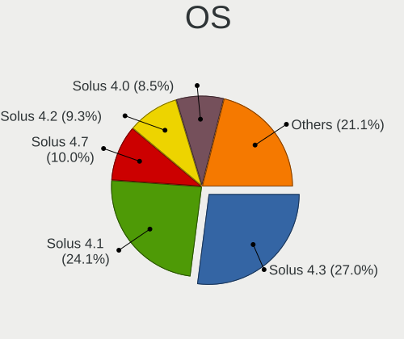

| Name         | Computers | Percent |
|--------------|-----------|---------|
| Solus 4.3    | 73        | 27.04%  |
| Solus 4.1    | 65        | 24.07%  |
| Solus 4.7    | 27        | 10%     |
| Solus 4.2    | 25        | 9.26%   |
| Solus 4.0    | 23        | 8.52%   |
| Solus 4.4    | 17        | 6.3%    |
| Solus 4.8    | 16        | 5.93%   |
| Solus 4.5    | 16        | 5.93%   |
| Solus 4.6    | 6         | 2.22%   |
| Solus 3.9999 | 2         | 0.74%   |

OS Family
---------

OS without a version

| Name  | Computers | Percent |
|-------|-----------|---------|
| Solus | 252       | 100%    |

Kernel
------

Version of the Linux kernel

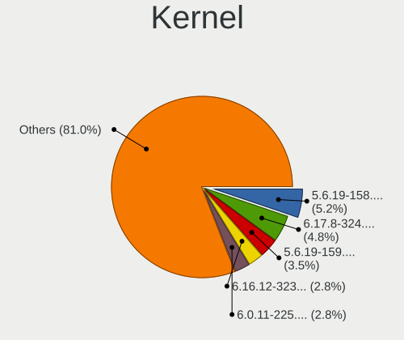

| Version             | Computers | Percent |
|---------------------|-----------|---------|
| 5.6.19-158.current  | 15        | 5.19%   |
| 6.17.8-324.current  | 14        | 4.84%   |
| 5.6.19-159.current  | 10        | 3.46%   |
| 6.16.12-323.current | 8         | 2.77%   |
| 6.0.11-225.current  | 8         | 2.77%   |
| 5.15.32-213.current | 8         | 2.77%   |
| 5.13.1-187.current  | 8         | 2.77%   |
| 5.5.7-150.current   | 7         | 2.42%   |
| 5.14.21-210.current | 7         | 2.42%   |
| 6.3.8-240.current   | 6         | 2.08%   |
| 5.6.4-152.current   | 6         | 2.08%   |
| 5.6.13-153.current  | 6         | 2.08%   |
| 5.15.50-216.current | 6         | 2.08%   |
| 5.14.16-205.current | 6         | 2.08%   |
| 6.16.5-322.current  | 5         | 1.73%   |
| 6.1.5-229.current   | 5         | 1.73%   |
| 5.6.18-156.current  | 5         | 1.73%   |
| 5.4.12-144.current  | 5         | 1.73%   |
| 5.13.6-190.current  | 5         | 1.73%   |
| 5.13.12-193.current | 5         | 1.73%   |
| 5.11.12-177.current | 5         | 1.73%   |
| 5.5.11-151.current  | 4         | 1.38%   |
| 5.11.22-180.current | 4         | 1.38%   |
| 5.10.15-172.current | 4         | 1.38%   |
| 6.8.10-291.current  | 3         | 1.04%   |
| 6.6.21-280.current  | 3         | 1.04%   |
| 6.14.4-318.current  | 3         | 1.04%   |
| 6.12.19-315.current | 3         | 1.04%   |
| 6.12.12-313.current | 3         | 1.04%   |
| 6.11.10-310.current | 3         | 1.04%   |
| 5.3.7-132.current   | 3         | 1.04%   |
| 5.3.15-138.current  | 3         | 1.04%   |
| 5.2.20-130.current  | 3         | 1.04%   |
| 5.15.77-219.current | 3         | 1.04%   |
| 5.10.7-168.current  | 3         | 1.04%   |
| 6.6.22-281.current  | 2         | 0.69%   |
| 6.5.5-258.current   | 2         | 0.69%   |
| 6.4.15-254.current  | 2         | 0.69%   |
| 6.15.6-321.current  | 2         | 0.69%   |
| 6.14.6-319.current  | 2         | 0.69%   |

Kernel Family
-------------

Linux kernel without a distro release

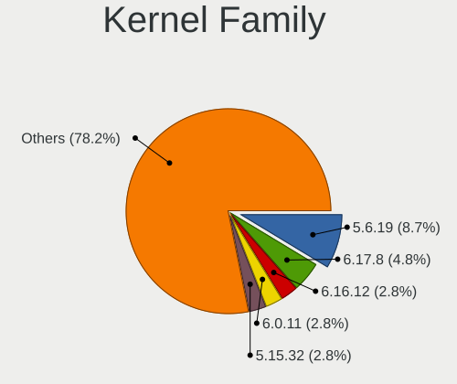

| Version | Computers | Percent |
|---------|-----------|---------|
| 5.6.19  | 25        | 8.65%   |
| 6.17.8  | 14        | 4.84%   |
| 6.16.12 | 8         | 2.77%   |
| 6.0.11  | 8         | 2.77%   |
| 5.15.32 | 8         | 2.77%   |
| 5.13.1  | 8         | 2.77%   |
| 5.5.7   | 7         | 2.42%   |
| 5.14.21 | 7         | 2.42%   |
| 5.14.16 | 7         | 2.42%   |
| 6.3.8   | 6         | 2.08%   |
| 5.6.4   | 6         | 2.08%   |
| 5.6.18  | 6         | 2.08%   |
| 5.6.13  | 6         | 2.08%   |
| 5.4.12  | 6         | 2.08%   |
| 5.15.50 | 6         | 2.08%   |
| 6.16.5  | 5         | 1.73%   |
| 6.1.5   | 5         | 1.73%   |
| 5.13.6  | 5         | 1.73%   |
| 5.13.12 | 5         | 1.73%   |
| 5.11.12 | 5         | 1.73%   |
| 5.5.11  | 4         | 1.38%   |
| 5.11.22 | 4         | 1.38%   |
| 5.10.15 | 4         | 1.38%   |
| 6.8.10  | 3         | 1.04%   |
| 6.6.21  | 3         | 1.04%   |
| 6.14.4  | 3         | 1.04%   |
| 6.12.19 | 3         | 1.04%   |
| 6.12.12 | 3         | 1.04%   |
| 6.11.10 | 3         | 1.04%   |
| 5.3.7   | 3         | 1.04%   |
| 5.3.15  | 3         | 1.04%   |
| 5.2.20  | 3         | 1.04%   |
| 5.15.77 | 3         | 1.04%   |
| 5.10.7  | 3         | 1.04%   |
| 6.6.22  | 2         | 0.69%   |
| 6.5.5   | 2         | 0.69%   |
| 6.4.15  | 2         | 0.69%   |
| 6.3.12  | 2         | 0.69%   |
| 6.15.6  | 2         | 0.69%   |
| 6.14.6  | 2         | 0.69%   |

Kernel Major Ver.
-----------------

Linux kernel major version

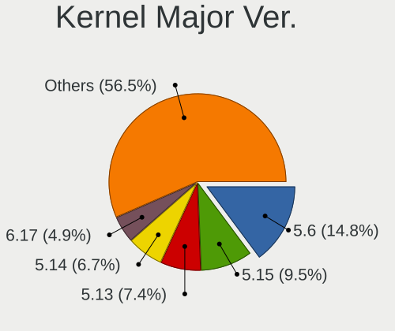

| Version | Computers | Percent |
|---------|-----------|---------|
| 5.6     | 42        | 14.84%  |
| 5.15    | 27        | 9.54%   |
| 5.13    | 21        | 7.42%   |
| 5.14    | 19        | 6.71%   |
| 6.17    | 14        | 4.95%   |
| 5.5     | 14        | 4.95%   |
| 5.11    | 14        | 4.95%   |
| 6.16    | 13        | 4.59%   |
| 5.10    | 13        | 4.59%   |
| 6.6     | 9         | 3.18%   |
| 5.3     | 9         | 3.18%   |
| 6.3     | 8         | 2.83%   |
| 6.12    | 8         | 2.83%   |
| 6.0     | 8         | 2.83%   |
| 5.4     | 8         | 2.83%   |
| 6.14    | 6         | 2.12%   |
| 6.10    | 6         | 2.12%   |
| 6.1     | 6         | 2.12%   |
| 5.2     | 6         | 2.12%   |
| 6.8     | 4         | 1.41%   |
| 6.4     | 4         | 1.41%   |
| 6.11    | 4         | 1.41%   |
| 6.5     | 3         | 1.06%   |
| 5.12    | 3         | 1.06%   |
| 4.20    | 3         | 1.06%   |
| 4.14    | 3         | 1.06%   |
| 6.15    | 2         | 0.71%   |
| 5.0     | 2         | 0.71%   |
| 6.9     | 1         | 0.35%   |
| 6.2     | 1         | 0.35%   |
| 4.9     | 1         | 0.35%   |
| 4.18    | 1         | 0.35%   |

Arch
----

OS architecture (x86_64, i586, etc.)

| Name   | Computers | Percent |
|--------|-----------|---------|
| x86_64 | 252       | 100%    |

DE
--

Desktop Environment

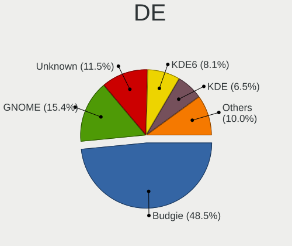

| Name    | Computers | Percent |
|---------|-----------|---------|
| Budgie  | 126       | 48.46%  |
| GNOME   | 40        | 15.38%  |
| Unknown | 30        | 11.54%  |
| KDE6    | 21        | 8.08%   |
| KDE     | 17        | 6.54%   |
| MATE    | 15        | 5.77%   |
| KDE5    | 10        | 3.85%   |
| XFCE    | 1         | 0.38%   |

Display Server
--------------

X11 or Wayland

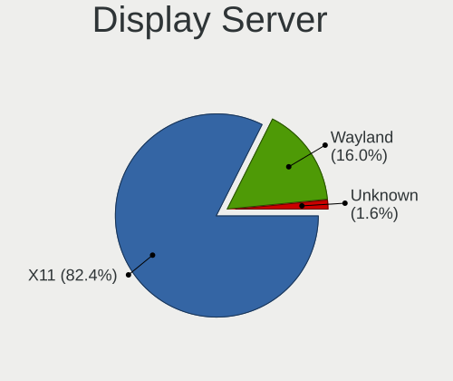

| Name    | Computers | Percent |
|---------|-----------|---------|
| X11     | 211       | 82.42%  |
| Wayland | 41        | 16.02%  |
| Unknown | 4         | 1.56%   |

Display Manager
---------------

SDDM, LightDM, etc.

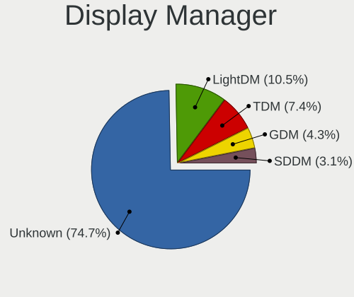

| Name    | Computers | Percent |
|---------|-----------|---------|
| Unknown | 192       | 74.71%  |
| LightDM | 27        | 10.51%  |
| TDM     | 19        | 7.39%   |
| GDM     | 11        | 4.28%   |
| SDDM    | 8         | 3.11%   |

OS Lang
-------

Language

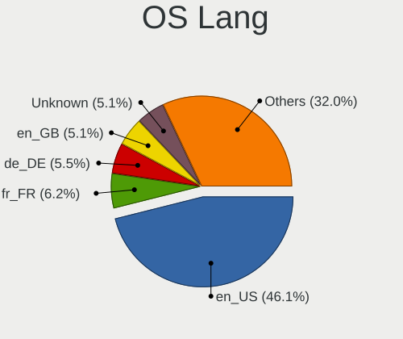

| Lang    | Computers | Percent |
|---------|-----------|---------|
| en_US   | 118       | 46.09%  |
| fr_FR   | 16        | 6.25%   |
| de_DE   | 14        | 5.47%   |
| en_GB   | 13        | 5.08%   |
| Unknown | 13        | 5.08%   |
| ru_RU   | 11        | 4.3%    |
| pt_BR   | 11        | 4.3%    |
| es_ES   | 8         | 3.13%   |
| pl_PL   | 7         | 2.73%   |
| ro_RO   | 5         | 1.95%   |
| it_IT   | 5         | 1.95%   |
| en_AU   | 4         | 1.56%   |
| fi_FI   | 3         | 1.17%   |
| en_CA   | 3         | 1.17%   |
| tr_TR   | 2         | 0.78%   |
| es_MX   | 2         | 0.78%   |
| en_NZ   | 2         | 0.78%   |
| en_IN   | 2         | 0.78%   |
| vi_VN   | 1         | 0.39%   |
| uk_UA   | 1         | 0.39%   |
| pt_PT   | 1         | 0.39%   |
| nl_NL   | 1         | 0.39%   |
| id_ID   | 1         | 0.39%   |
| hu_HU   | 1         | 0.39%   |
| es_VE   | 1         | 0.39%   |
| es_CO   | 1         | 0.39%   |
| es_CL   | 1         | 0.39%   |
| en_SG   | 1         | 0.39%   |
| en_IE   | 1         | 0.39%   |
| en_DK   | 1         | 0.39%   |
| de_CH   | 1         | 0.39%   |
| de_AT   | 1         | 0.39%   |
| cs_CZ   | 1         | 0.39%   |
| ar_SA   | 1         | 0.39%   |
| ar_EG   | 1         | 0.39%   |

Boot Mode
---------

EFI or BIOS

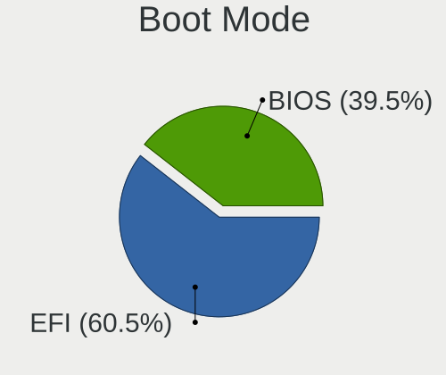

| Mode | Computers | Percent |
|------|-----------|---------|
| EFI  | 155       | 60.55%  |
| BIOS | 101       | 39.45%  |

Filesystem
----------

Type of filesystem

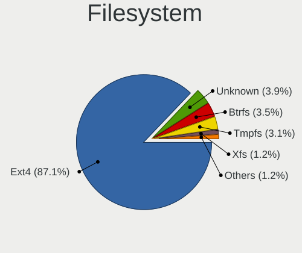

| Type    | Computers | Percent |
|---------|-----------|---------|
| Ext4    | 223       | 87.11%  |
| Unknown | 10        | 3.91%   |
| Btrfs   | 9         | 3.52%   |
| Tmpfs   | 8         | 3.13%   |
| Xfs     | 3         | 1.17%   |
| Overlay | 3         | 1.17%   |

Part. scheme
------------

Scheme of partitioning

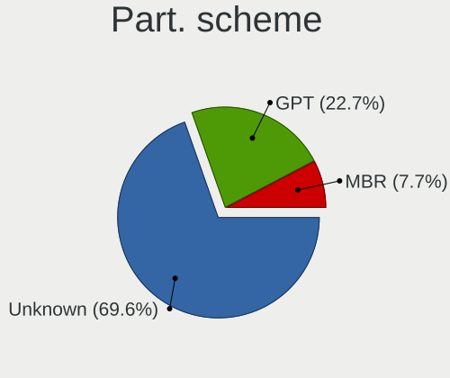

| Type    | Computers | Percent |
|---------|-----------|---------|
| Unknown | 181       | 69.62%  |
| GPT     | 59        | 22.69%  |
| MBR     | 20        | 7.69%   |

Dual Boot with Linux/BSD
------------------------

Hosting more than one Linux/BSD

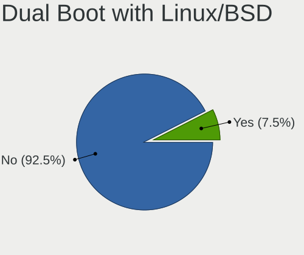

| Dual boot | Computers | Percent |
|-----------|-----------|---------|
| No        | 235       | 92.52%  |
| Yes       | 19        | 7.48%   |

Dual Boot (Win)
---------------

Hosting Linux and Windows

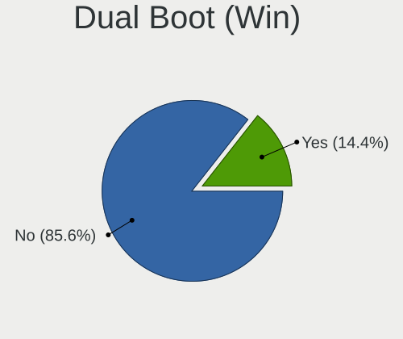

| Dual boot | Computers | Percent |
|-----------|-----------|---------|
| No        | 220       | 85.6%   |
| Yes       | 37        | 14.4%   |

Board
-----

Vendor
------

Motherboard manufacturer

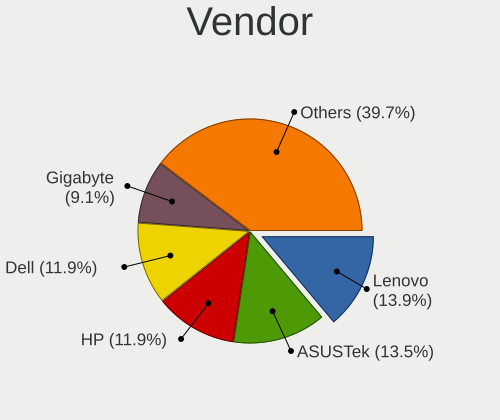

| Name                   | Computers | Percent |
|------------------------|-----------|---------|
| Lenovo                 | 35        | 13.89%  |
| ASUSTek Computer       | 34        | 13.49%  |
| Hewlett-Packard        | 30        | 11.9%   |
| Dell                   | 30        | 11.9%   |
| Gigabyte Technology    | 23        | 9.13%   |
| Acer                   | 19        | 7.54%   |
| MSI                    | 13        | 5.16%   |
| ASRock                 | 11        | 4.37%   |
| Toshiba                | 7         | 2.78%   |
| Apple                  | 7         | 2.78%   |
| Google                 | 5         | 1.98%   |
| Packard Bell           | 4         | 1.59%   |
| Intel                  | 4         | 1.59%   |
| Sony                   | 3         | 1.19%   |
| Samsung Electronics    | 3         | 1.19%   |
| HUAWEI                 | 2         | 0.79%   |
| Biostar                | 2         | 0.79%   |
| Unknown                | 2         | 0.79%   |
| Valve                  | 1         | 0.4%    |
| Timi                   | 1         | 0.4%    |
| Shuttle                | 1         | 0.4%    |
| RM Education           | 1         | 0.4%    |
| Positivo               | 1         | 0.4%    |
| Pegatron               | 1         | 0.4%    |
| Panasonic              | 1         | 0.4%    |
| MEGA                   | 1         | 0.4%    |
| Howard Computers       | 1         | 0.4%    |
| GPU Company            | 1         | 0.4%    |
| GMKtec                 | 1         | 0.4%    |
| Fujitsu                | 1         | 0.4%    |
| Framework              | 1         | 0.4%    |
| eMachines              | 1         | 0.4%    |
| Chuwi                  | 1         | 0.4%    |
| AZW                    | 1         | 0.4%    |
| Avell High Performance | 1         | 0.4%    |
| Alienware              | 1         | 0.4%    |

Model
-----

Motherboard model

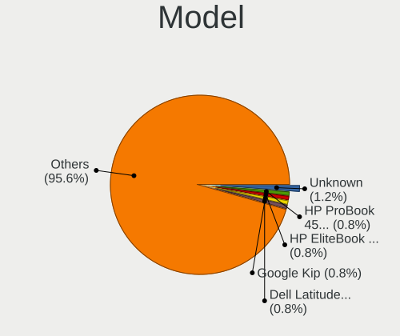

| Name                                                  | Computers | Percent |
|-------------------------------------------------------|-----------|---------|
| Unknown                                               | 3         | 1.19%   |
| HP ProBook 450 G5                                     | 2         | 0.79%   |
| HP EliteBook 840 G3                                   | 2         | 0.79%   |
| Google Kip                                            | 2         | 0.79%   |
| Dell Latitude E5470                                   | 2         | 0.79%   |
| Acer Nitro AN515-45                                   | 2         | 0.79%   |
| Acer Aspire E5-575G                                   | 2         | 0.79%   |
| Valve Jupiter                                         | 1         | 0.4%    |
| Toshiba TECRA R840                                    | 1         | 0.4%    |
| Toshiba Satellite Pro C850-1J2                        | 1         | 0.4%    |
| Toshiba Satellite P50-A                               | 1         | 0.4%    |
| Toshiba Satellite L855                                | 1         | 0.4%    |
| Toshiba Satellite L655                                | 1         | 0.4%    |
| Toshiba PORTEGE Z20T-B                                | 1         | 0.4%    |
| Timi TM1701                                           | 1         | 0.4%    |
| Sony VPCYB15AB                                        | 1         | 0.4%    |
| Sony VPCF236FM                                        | 1         | 0.4%    |
| Sony VPCEB1S1E                                        | 1         | 0.4%    |
| Shuttle XS35V4                                        | 1         | 0.4%    |
| Samsung R430/P430/R480                                | 1         | 0.4%    |
| Samsung 300E5EV/300E4EV/270E5EV/270E4EV/2470EV/2470EE | 1         | 0.4%    |
| Samsung 270E5K/270E5Q/271E5K/2570EK                   | 1         | 0.4%    |
| RM Education RM                                       | 1         | 0.4%    |
| Positivo POS-EINM10CB                                 | 1         | 0.4%    |
| Pegatron IPM31                                        | 1         | 0.4%    |
| Panasonic CF-C2CCEZXCM                                | 1         | 0.4%    |
| Packard Bell EasyNote TV44HC                          | 1         | 0.4%    |
| Packard Bell EasyNote TS11HR                          | 1         | 0.4%    |
| Packard Bell EasyNote TE11HC                          | 1         | 0.4%    |
| Packard Bell EasyNote MH36                            | 1         | 0.4%    |
| MSI MS-7C95                                           | 1         | 0.4%    |
| MSI MS-7C91                                           | 1         | 0.4%    |
| MSI MS-7C37                                           | 1         | 0.4%    |
| MSI MS-7C02                                           | 1         | 0.4%    |
| MSI MS-7B89                                           | 1         | 0.4%    |
| MSI MS-7B85                                           | 1         | 0.4%    |
| MSI MS-7B84                                           | 1         | 0.4%    |
| MSI MS-7A34                                           | 1         | 0.4%    |
| MSI MS-7971                                           | 1         | 0.4%    |
| MSI MS-7917                                           | 1         | 0.4%    |

Model Family
------------

Motherboard model prefix

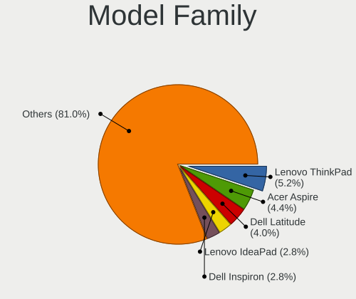

| Name                  | Computers | Percent |
|-----------------------|-----------|---------|
| Lenovo ThinkPad       | 13        | 5.16%   |
| Acer Aspire           | 11        | 4.37%   |
| Dell Latitude         | 10        | 3.97%   |
| Lenovo IdeaPad        | 7         | 2.78%   |
| Dell Inspiron         | 7         | 2.78%   |
| HP Pavilion           | 6         | 2.38%   |
| HP ProBook            | 5         | 1.98%   |
| Dell XPS              | 5         | 1.98%   |
| ASUS TUF              | 5         | 1.98%   |
| Toshiba Satellite     | 4         | 1.59%   |
| Packard Bell EasyNote | 4         | 1.59%   |
| Lenovo Yoga           | 4         | 1.59%   |
| Gigabyte Z390         | 4         | 1.59%   |
| ASUS PRIME            | 4         | 1.59%   |
| HP EliteBook          | 3         | 1.19%   |
| Dell OptiPlex         | 3         | 1.19%   |
| ASUS VivoBook         | 3         | 1.19%   |
| ASUS ROG              | 3         | 1.19%   |
| Acer Swift            | 3         | 1.19%   |
| Unknown               | 3         | 1.19%   |
| Lenovo ThinkCentre    | 2         | 0.79%   |
| Lenovo Legion         | 2         | 0.79%   |
| Intel X99             | 2         | 0.79%   |
| HP Stream             | 2         | 0.79%   |
| HP ProDesk            | 2         | 0.79%   |
| HP ENVY               | 2         | 0.79%   |
| Google Kip            | 2         | 0.79%   |
| Dell Vostro           | 2         | 0.79%   |
| Dell Precision        | 2         | 0.79%   |
| Acer Nitro            | 2         | 0.79%   |
| Valve Jupiter         | 1         | 0.4%    |
| Toshiba TECRA         | 1         | 0.4%    |
| Toshiba PORTEGE       | 1         | 0.4%    |
| Timi TM1701           | 1         | 0.4%    |
| Sony VPCYB15AB        | 1         | 0.4%    |
| Sony VPCF236FM        | 1         | 0.4%    |
| Sony VPCEB1S1E        | 1         | 0.4%    |
| Shuttle XS35V4        | 1         | 0.4%    |
| Samsung R430          | 1         | 0.4%    |
| Samsung 300E5EV       | 1         | 0.4%    |

MFG Year
--------

Motherboard manufacture year

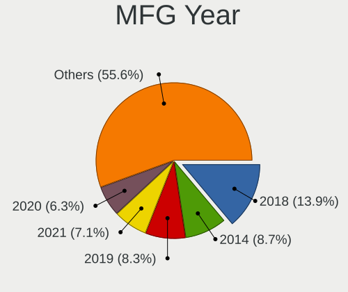

| Year | Computers | Percent |
|------|-----------|---------|
| 2018 | 35        | 13.89%  |
| 2014 | 22        | 8.73%   |
| 2019 | 21        | 8.33%   |
| 2021 | 18        | 7.14%   |
| 2020 | 16        | 6.35%   |
| 2017 | 16        | 6.35%   |
| 2016 | 16        | 6.35%   |
| 2012 | 16        | 6.35%   |
| 2011 | 16        | 6.35%   |
| 2008 | 14        | 5.56%   |
| 2013 | 12        | 4.76%   |
| 2022 | 10        | 3.97%   |
| 2015 | 10        | 3.97%   |
| 2010 | 8         | 3.17%   |
| 2009 | 6         | 2.38%   |
| 2023 | 5         | 1.98%   |
| 2024 | 4         | 1.59%   |
| 2006 | 4         | 1.59%   |
| 2007 | 2         | 0.79%   |
| 2025 | 1         | 0.4%    |

Form Factor
-----------

Physical design of the computer

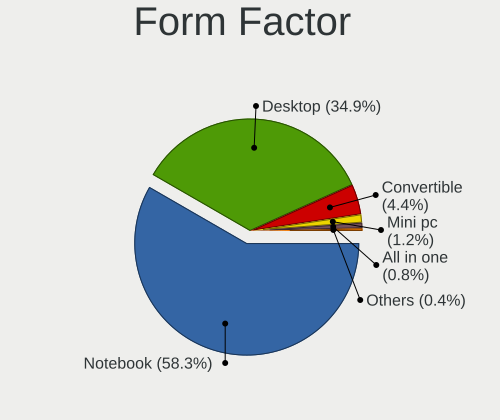

| Name        | Computers | Percent |
|-------------|-----------|---------|
| Notebook    | 147       | 58.33%  |
| Desktop     | 88        | 34.92%  |
| Convertible | 11        | 4.37%   |
| Mini pc     | 3         | 1.19%   |
| All in one  | 2         | 0.79%   |
| Tablet      | 1         | 0.4%    |

Secure Boot
-----------

Enabled or disabled

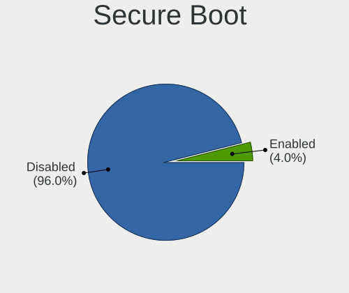

| State    | Computers | Percent |
|----------|-----------|---------|
| Disabled | 242       | 96.03%  |
| Enabled  | 10        | 3.97%   |

Coreboot
--------

Have coreboot on board

| Used | Computers | Percent |
|------|-----------|---------|
| No   | 247       | 98.02%  |
| Yes  | 5         | 1.98%   |

RAM Size
--------

Total RAM memory

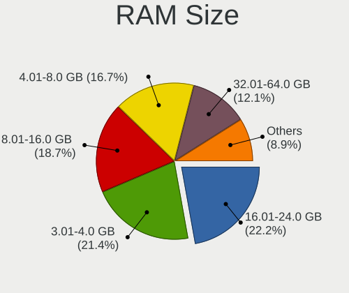

| Size in GB  | Computers | Percent |
|-------------|-----------|---------|
| 16.01-24.0  | 57        | 22.18%  |
| 3.01-4.0    | 55        | 21.4%   |
| 8.01-16.0   | 48        | 18.68%  |
| 4.01-8.0    | 43        | 16.73%  |
| 32.01-64.0  | 31        | 12.06%  |
| 24.01-32.0  | 8         | 3.11%   |
| 1.01-2.0    | 6         | 2.33%   |
| 64.01-256.0 | 5         | 1.95%   |
| 2.01-3.0    | 4         | 1.56%   |

RAM Used
--------

Used RAM memory

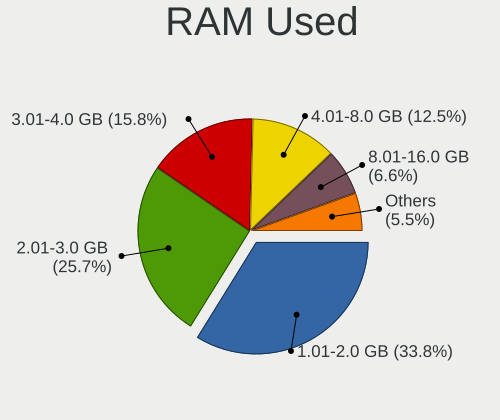

| Used GB    | Computers | Percent |
|------------|-----------|---------|
| 1.01-2.0   | 92        | 33.82%  |
| 2.01-3.0   | 70        | 25.74%  |
| 3.01-4.0   | 43        | 15.81%  |
| 4.01-8.0   | 34        | 12.5%   |
| 8.01-16.0  | 18        | 6.62%   |
| 0.51-1.0   | 14        | 5.15%   |
| 16.01-24.0 | 1         | 0.37%   |

Total Drives
------------

Number of drives on board

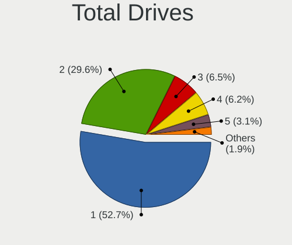

| Drives | Computers | Percent |
|--------|-----------|---------|
| 1      | 137       | 52.69%  |
| 2      | 77        | 29.62%  |
| 3      | 17        | 6.54%   |
| 4      | 16        | 6.15%   |
| 5      | 8         | 3.08%   |
| 6      | 3         | 1.15%   |
| 8      | 1         | 0.38%   |
| 7      | 1         | 0.38%   |

Has CD-ROM
----------

Has CD-ROM on board

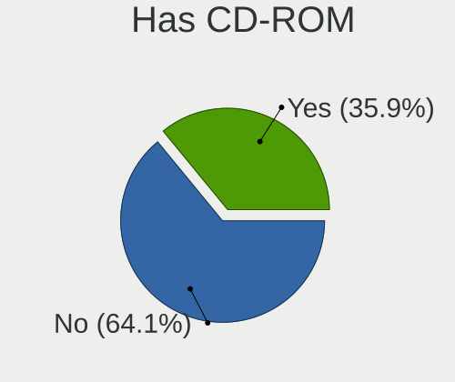

| Presented | Computers | Percent |
|-----------|-----------|---------|
| No        | 164       | 64.06%  |
| Yes       | 92        | 35.94%  |

Has Ethernet
------------

Has Ethernet on board

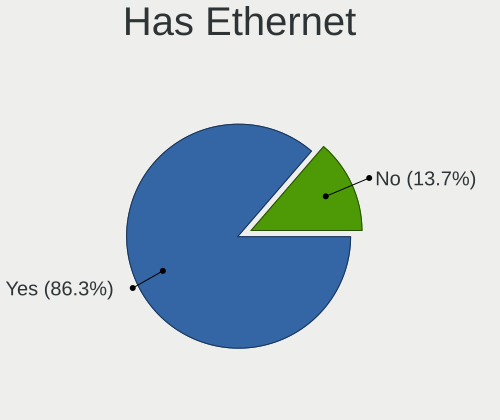

| Presented | Computers | Percent |
|-----------|-----------|---------|
| Yes       | 219       | 86.9%   |
| No        | 33        | 13.1%   |

Has WiFi
--------

Has WiFi module

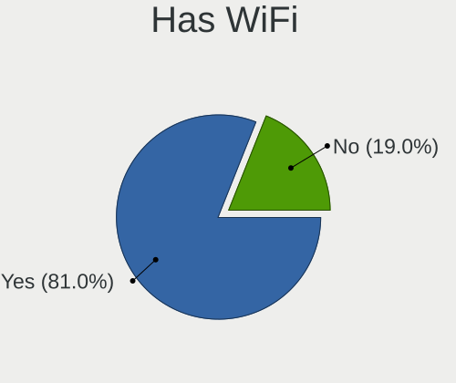

| Presented | Computers | Percent |
|-----------|-----------|---------|
| Yes       | 205       | 81.03%  |
| No        | 48        | 18.97%  |

Has Bluetooth
-------------

Has Bluetooth module

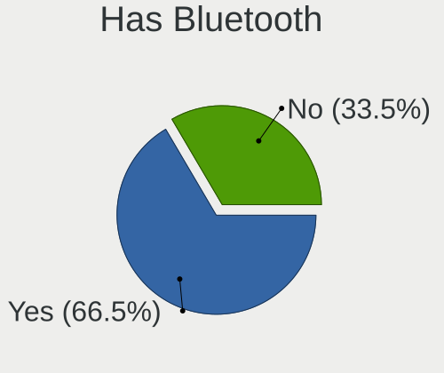

| Presented | Computers | Percent |
|-----------|-----------|---------|
| Yes       | 169       | 66.54%  |
| No        | 85        | 33.46%  |

Location
--------

Country
-------

Geographic location (country)

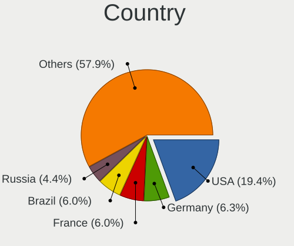

| Country      | Computers | Percent |
|--------------|-----------|---------|
| USA          | 49        | 19.44%  |
| Germany      | 16        | 6.35%   |
| France       | 15        | 5.95%   |
| Brazil       | 15        | 5.95%   |
| Russia       | 11        | 4.37%   |
| Netherlands  | 10        | 3.97%   |
| India        | 10        | 3.97%   |
| UK           | 8         | 3.17%   |
| Poland       | 8         | 3.17%   |
| Canada       | 8         | 3.17%   |
| Sweden       | 6         | 2.38%   |
| Spain        | 5         | 1.98%   |
| Australia    | 5         | 1.98%   |
| Switzerland  | 4         | 1.59%   |
| Norway       | 4         | 1.59%   |
| New Zealand  | 4         | 1.59%   |
| Mexico       | 4         | 1.59%   |
| Finland      | 4         | 1.59%   |
| Turkey       | 3         | 1.19%   |
| Romania      | 3         | 1.19%   |
| Italy        | 3         | 1.19%   |
| Indonesia    | 3         | 1.19%   |
| Czechia      | 3         | 1.19%   |
| Chile        | 3         | 1.19%   |
| Austria      | 3         | 1.19%   |
| Argentina    | 3         | 1.19%   |
| Vietnam      | 2         | 0.79%   |
| Venezuela    | 2         | 0.79%   |
| Ukraine      | 2         | 0.79%   |
| Saudi Arabia | 2         | 0.79%   |
| Iran         | 2         | 0.79%   |
| Hungary      | 2         | 0.79%   |
| Guatemala    | 2         | 0.79%   |
| Greece       | 2         | 0.79%   |
| Colombia     | 2         | 0.79%   |
| China        | 2         | 0.79%   |
| Belgium      | 2         | 0.79%   |
| Albania      | 2         | 0.79%   |
| Thailand     | 1         | 0.4%    |
| Singapore    | 1         | 0.4%    |

City
----

Geographic location (city)

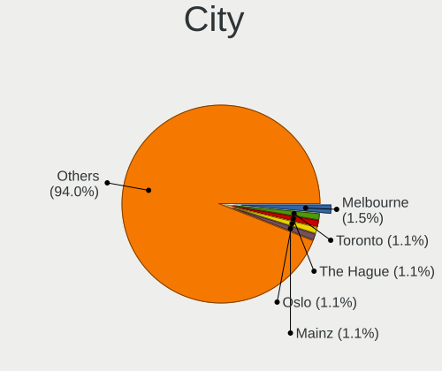

| City                      | Computers | Percent |
|---------------------------|-----------|---------|
| Melbourne                 | 4         | 1.49%   |
| Toronto                   | 3         | 1.12%   |
| The Hague                 | 3         | 1.12%   |
| Oslo                      | 3         | 1.12%   |
| Mainz                     | 3         | 1.12%   |
| Constanța                | 3         | 1.12%   |
| Amsterdam                 | 3         | 1.12%   |
| Zurich                    | 2         | 0.75%   |
| Vienna                    | 2         | 0.75%   |
| Vancouver                 | 2         | 0.75%   |
| Stockholm                 | 2         | 0.75%   |
| St Petersburg             | 2         | 0.75%   |
| Severna Park              | 2         | 0.75%   |
| San Justo                 | 2         | 0.75%   |
| San Francisco del Rincón | 2         | 0.75%   |
| New York                  | 2         | 0.75%   |
| Moscow                    | 2         | 0.75%   |
| Ilford                    | 2         | 0.75%   |
| Hyderabad                 | 2         | 0.75%   |
| Hrubieszów               | 2         | 0.75%   |
| Helsinki                  | 2         | 0.75%   |
| Guelph                    | 2         | 0.75%   |
| Guatemala City            | 2         | 0.75%   |
| Fresno                    | 2         | 0.75%   |
| Curitiba                  | 2         | 0.75%   |
| Columbus                  | 2         | 0.75%   |
| Caracas                   | 2         | 0.75%   |
| Bucaramanga               | 2         | 0.75%   |
| Beijing                   | 2         | 0.75%   |
| Auckland                  | 2         | 0.75%   |
| Appomattox                | 2         | 0.75%   |
| Zollikofen                | 1         | 0.37%   |
| Zhytomyr                  | 1         | 0.37%   |
| Yverdon-les-Bains         | 1         | 0.37%   |
| Yekaterinburg             | 1         | 0.37%   |
| Wendell                   | 1         | 0.37%   |
| Weil am Rhein             | 1         | 0.37%   |
| Warrensburg               | 1         | 0.37%   |
| Vineland                  | 1         | 0.37%   |
| Viby J                    | 1         | 0.37%   |

Drives
------

Drive Vendor
------------

Hard drive vendors

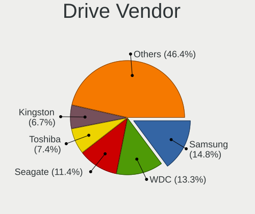

| Vendor                       | Computers | Drives | Percent |
|------------------------------|-----------|--------|---------|
| Samsung Electronics          | 60        | 110    | 14.81%  |
| WDC                          | 54        | 82     | 13.33%  |
| Seagate                      | 46        | 76     | 11.36%  |
| Toshiba                      | 30        | 35     | 7.41%   |
| Kingston                     | 27        | 32     | 6.67%   |
| SanDisk                      | 25        | 31     | 6.17%   |
| Unknown                      | 20        | 22     | 4.94%   |
| Intel                        | 17        | 24     | 4.2%    |
| Crucial                      | 16        | 19     | 3.95%   |
| SK hynix                     | 13        | 14     | 3.21%   |
| Micron Technology            | 13        | 14     | 3.21%   |
| Hitachi                      | 9         | 9      | 2.22%   |
| A-DATA Technology            | 7         | 7      | 1.73%   |
| Phison Electronics           | 4         | 5      | 0.99%   |
| Micron/Crucial Technology    | 4         | 4      | 0.99%   |
| Kingston Technology Company  | 4         | 4      | 0.99%   |
| HGST                         | 4         | 4      | 0.99%   |
| Silicon Motion               | 3         | 3      | 0.74%   |
| PNY                          | 3         | 3      | 0.74%   |
| Patriot                      | 3         | 6      | 0.74%   |
| Maxtor                       | 3         | 3      | 0.74%   |
| China                        | 3         | 3      | 0.74%   |
| Apple                        | 3         | 7      | 0.74%   |
| Verbatim                     | 2         | 2      | 0.49%   |
| Phison                       | 2         | 2      | 0.49%   |
| KIOXIA                       | 2         | 2      | 0.49%   |
| Gigabyte Technology          | 2         | 2      | 0.49%   |
| Emtec                        | 2         | 2      | 0.49%   |
| X12                          | 1         | 1      | 0.25%   |
| Viper                        | 1         | 2      | 0.25%   |
| TWSC                         | 1         | 1      | 0.25%   |
| Transcend                    | 1         | 1      | 0.25%   |
| Team                         | 1         | 2      | 0.25%   |
| SPCC Sol                     | 1         | 1      | 0.25%   |
| SPCC                         | 1         | 1      | 0.25%   |
| Shenzhen Longsys Electronics | 1         | 1      | 0.25%   |
| SABRENT                      | 1         | 1      | 0.25%   |
| ORICO                        | 1         | 1      | 0.25%   |
| O2 Micro                     | 1         | 1      | 0.25%   |
| LITEON                       | 1         | 1      | 0.25%   |

Drive Model
-----------

Hard drive models

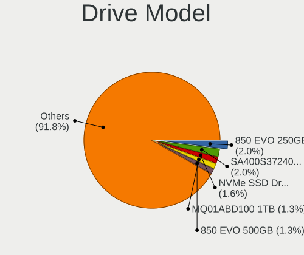

| Model                                             | Computers | Percent |
|---------------------------------------------------|-----------|---------|
| Samsung SSD 850 EVO 250GB                         | 9         | 2%      |
| Kingston SA400S37240G 240GB SSD                   | 9         | 2%      |
| Samsung NVMe SSD Drive 500GB                      | 7         | 1.56%   |
| Toshiba MQ01ABD100 1TB                            | 6         | 1.33%   |
| Samsung SSD 850 EVO 500GB                         | 6         | 1.33%   |
| Samsung NVMe SSD Controller SM981/PM981/PM983 1TB | 6         | 1.33%   |
| Unknown MMC Card  32GB                            | 4         | 0.89%   |
| Seagate ST500DM002-1BD142 500GB                   | 4         | 0.89%   |
| Seagate ST4000DM004-2CV104 4TB                    | 4         | 0.89%   |
| Samsung SSD 860 EVO 500GB                         | 4         | 0.89%   |
| Phison E12 NVMe Controller 1TB                    | 4         | 0.89%   |
| WDC WD10EZEX-08WN4A0 1TB                          | 3         | 0.67%   |
| Unknown MMC Card  128GB                           | 3         | 0.67%   |
| SK hynix NVMe SSD Drive 128GB                     | 3         | 0.67%   |
| Seagate ST31000528AS 1TB                          | 3         | 0.67%   |
| Seagate ST2000DX002-2DV164 2TB                    | 3         | 0.67%   |
| Seagate ST2000DM006-2DM164 2TB                    | 3         | 0.67%   |
| SanDisk NVMe SSD Drive 256GB                      | 3         | 0.67%   |
| Samsung SSD 860 EVO 250GB                         | 3         | 0.67%   |
| Samsung SSD 860 EVO 1TB                           | 3         | 0.67%   |
| Intel NVMe SSD Drive 256GB                        | 3         | 0.67%   |
| Crucial CT1000MX500SSD1 1TB                       | 3         | 0.67%   |
| WDC WD5000AAKS-00A7B0 500GB                       | 2         | 0.44%   |
| WDC WD2500BEVT-22ZCT0 250GB                       | 2         | 0.44%   |
| WDC WD20EARX-00PASB0 2TB                          | 2         | 0.44%   |
| WDC WD2003FZEX-00SRLA0 2TB                        | 2         | 0.44%   |
| WDC WD10SPZX-24Z10T0 1TB                          | 2         | 0.44%   |
| WDC WD10SPZX-24Z10 1TB                            | 2         | 0.44%   |
| WDC WD10JPVX-22JC3T0 1TB                          | 2         | 0.44%   |
| WDC WD10EZEX-08M2NA0 1TB                          | 2         | 0.44%   |
| WDC WD10EADS-00M2B0 1TB                           | 2         | 0.44%   |
| Unknown TP02000GB 2TB                             | 2         | 0.44%   |
| Toshiba NVMe SSD Drive 256GB                      | 2         | 0.44%   |
| Toshiba DT01ACA100 1TB                            | 2         | 0.44%   |
| Toshiba DT01ACA050 500GB                          | 2         | 0.44%   |
| Toshiba BG3 NVMe SSD Controller 256GB             | 2         | 0.44%   |
| SK hynix SC311 SATA 256GB                         | 2         | 0.44%   |
| SK hynix PC401 HFS256GD9TNG-62A0A 256GB           | 2         | 0.44%   |
| Seagate ST31000524AS 1TB                          | 2         | 0.44%   |
| Seagate ST2000DX001-1NS164 2TB                    | 2         | 0.44%   |

HDD Vendor
----------

Hard disk drive vendors

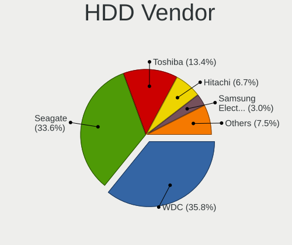

| Vendor              | Computers | Drives | Percent |
|---------------------|-----------|--------|---------|
| WDC                 | 48        | 74     | 35.82%  |
| Seagate             | 45        | 75     | 33.58%  |
| Toshiba             | 18        | 23     | 13.43%  |
| Hitachi             | 9         | 9      | 6.72%   |
| Samsung Electronics | 4         | 6      | 2.99%   |
| HGST                | 4         | 4      | 2.99%   |
| Maxtor              | 3         | 3      | 2.24%   |
| Unknown             | 1         | 1      | 0.75%   |
| Intenso             | 1         | 2      | 0.75%   |
| AAPL                | 1         | 1      | 0.75%   |

SSD Vendor
----------

Solid state drive vendors

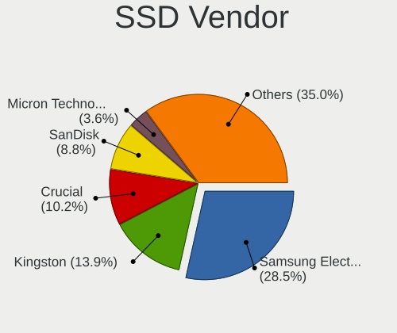

| Vendor              | Computers | Drives | Percent |
|---------------------|-----------|--------|---------|
| Samsung Electronics | 39        | 62     | 28.47%  |
| Kingston            | 19        | 22     | 13.87%  |
| Crucial             | 14        | 17     | 10.22%  |
| SanDisk             | 12        | 16     | 8.76%   |
| Micron Technology   | 5         | 6      | 3.65%   |
| A-DATA Technology   | 5         | 5      | 3.65%   |
| Intel               | 4         | 5      | 2.92%   |
| WDC                 | 3         | 3      | 2.19%   |
| Toshiba             | 3         | 3      | 2.19%   |
| SK hynix            | 3         | 4      | 2.19%   |
| PNY                 | 3         | 3      | 2.19%   |
| Patriot             | 3         | 6      | 2.19%   |
| China               | 3         | 3      | 2.19%   |
| Apple               | 3         | 7      | 2.19%   |
| Unknown             | 2         | 2      | 1.46%   |
| Gigabyte Technology | 2         | 2      | 1.46%   |
| Emtec               | 2         | 2      | 1.46%   |
| X12                 | 1         | 1      | 0.73%   |
| Verbatim            | 1         | 1      | 0.73%   |
| Transcend           | 1         | 1      | 0.73%   |
| Team                | 1         | 2      | 0.73%   |
| SPCC Sol            | 1         | 1      | 0.73%   |
| SPCC                | 1         | 1      | 0.73%   |
| SABRENT             | 1         | 1      | 0.73%   |
| LITEON              | 1         | 1      | 0.73%   |
| Hypertec            | 1         | 1      | 0.73%   |
| FORESEE             | 1         | 1      | 0.73%   |
| Corsair             | 1         | 1      | 0.73%   |
| Advantech           | 1         | 1      | 0.73%   |

Drive Kind
----------

HDD or SSD

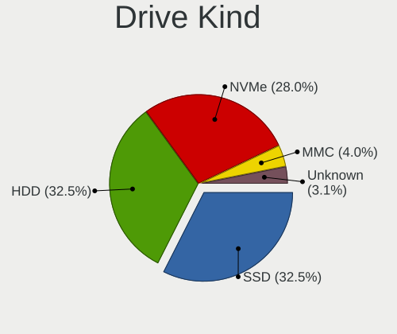

| Kind    | Computers | Drives | Percent |
|---------|-----------|--------|---------|
| SSD     | 115       | 181    | 32.49%  |
| HDD     | 115       | 198    | 32.49%  |
| NVMe    | 99        | 147    | 27.97%  |
| MMC     | 14        | 15     | 3.95%   |
| Unknown | 11        | 13     | 3.11%   |

Drive Connector
---------------

SATA, SAS, NVMe, etc.

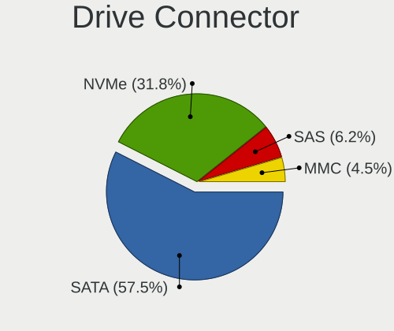

| Type | Computers | Drives | Percent |
|------|-----------|--------|---------|
| SATA | 177       | 364    | 57.47%  |
| NVMe | 98        | 145    | 31.82%  |
| SAS  | 19        | 30     | 6.17%   |
| MMC  | 14        | 15     | 4.55%   |

Drive Size
----------

Size of hard drive

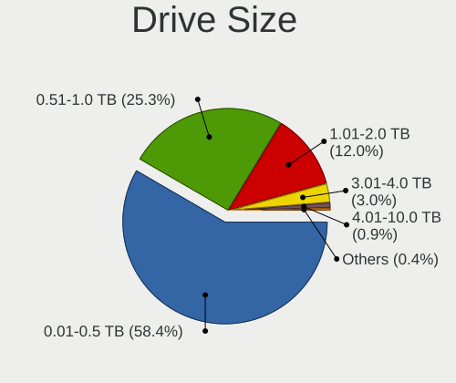

| Size in TB | Computers | Drives | Percent |
|------------|-----------|--------|---------|
| 0.01-0.5   | 136       | 219    | 58.37%  |
| 0.51-1.0   | 59        | 92     | 25.32%  |
| 1.01-2.0   | 28        | 54     | 12.02%  |
| 3.01-4.0   | 7         | 11     | 3%      |
| 4.01-10.0  | 2         | 2      | 0.86%   |
| 10.01-20.0 | 1         | 1      | 0.43%   |

Space Total
-----------

Amount of disk space available on the file system

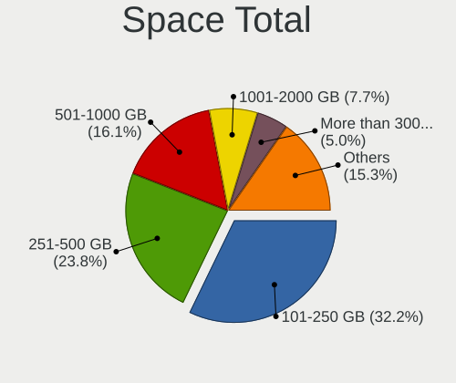

| Size in GB     | Computers | Percent |
|----------------|-----------|---------|
| 101-250        | 84        | 32.18%  |
| 251-500        | 62        | 23.75%  |
| 501-1000       | 42        | 16.09%  |
| 1001-2000      | 20        | 7.66%   |
| More than 3000 | 13        | 4.98%   |
| 2001-3000      | 13        | 4.98%   |
| 51-100         | 11        | 4.21%   |
| 21-50          | 8         | 3.07%   |
| Unknown        | 6         | 2.3%    |
| 1-20           | 2         | 0.77%   |

Space Used
----------

Amount of used disk space

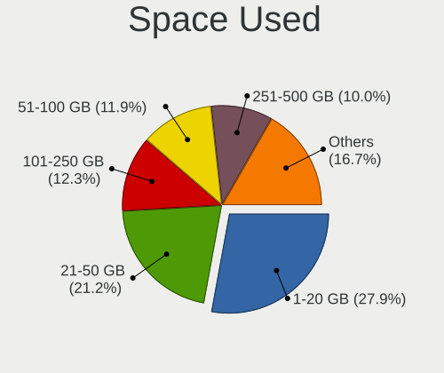

| Used GB        | Computers | Percent |
|----------------|-----------|---------|
| 1-20           | 75        | 27.88%  |
| 21-50          | 57        | 21.19%  |
| 101-250        | 33        | 12.27%  |
| 51-100         | 32        | 11.9%   |
| 251-500        | 27        | 10.04%  |
| 501-1000       | 18        | 6.69%   |
| 1001-2000      | 14        | 5.2%    |
| Unknown        | 6         | 2.23%   |
| 2001-3000      | 4         | 1.49%   |
| More than 3000 | 3         | 1.12%   |

Malfunc. Drives
---------------

Drive models with a malfunction

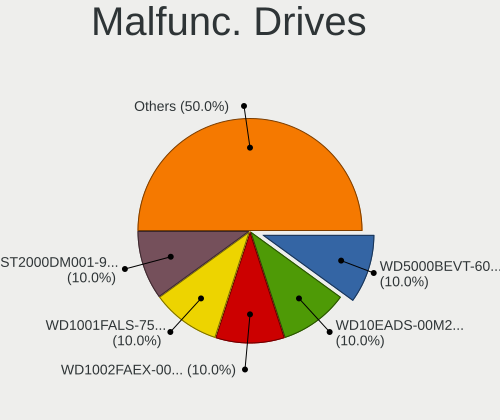

| Model                                          | Computers | Drives | Percent |
|------------------------------------------------|-----------|--------|---------|
| WDC WD5000BEVT-60ZAT1 500GB                    | 1         | 1      | 7.69%   |
| WDC WD20EARX-00PASB0 2TB                       | 1         | 1      | 7.69%   |
| WDC WD10EADS-00M2B0 1TB                        | 1         | 1      | 7.69%   |
| WDC WD1002FAEX-00Y9A0 1TB                      | 1         | 1      | 7.69%   |
| WDC WD1001FALS-75J7B0 1TB                      | 1         | 1      | 7.69%   |
| Toshiba MK7559GSXP 752GB                       | 1         | 1      | 7.69%   |
| Seagate ST9320325AS 320GB                      | 1         | 2      | 7.69%   |
| Seagate ST2000DM001-9YN164 2TB                 | 1         | 1      | 7.69%   |
| Samsung Electronics SSD 970 EVO 500GB          | 1         | 1      | 7.69%   |
| Samsung Electronics MZVLB512HAJQ-000L7 512GB   | 1         | 1      | 7.69%   |
| Micron Technology 1100_MTFDDAV256TBN 256GB SSD | 1         | 1      | 7.69%   |
| Hitachi HTS543216L9SA02 160GB                  | 1         | 1      | 7.69%   |
| Crucial CT1000P1SSD8 1TB                       | 1         | 1      | 7.69%   |

Malfunc. Drive Vendor
---------------------

Vendors of faulty drives

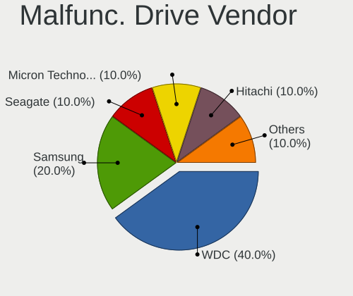

| Vendor              | Computers | Drives | Percent |
|---------------------|-----------|--------|---------|
| WDC                 | 5         | 5      | 38.46%  |
| Seagate             | 2         | 3      | 15.38%  |
| Samsung Electronics | 2         | 2      | 15.38%  |
| Toshiba             | 1         | 1      | 7.69%   |
| Micron Technology   | 1         | 1      | 7.69%   |
| Hitachi             | 1         | 1      | 7.69%   |
| Crucial             | 1         | 1      | 7.69%   |

Malfunc. HDD Vendor
-------------------

Vendors of faulty HDD drives

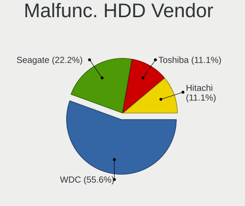

| Vendor  | Computers | Drives | Percent |
|---------|-----------|--------|---------|
| WDC     | 5         | 5      | 55.56%  |
| Seagate | 2         | 3      | 22.22%  |
| Toshiba | 1         | 1      | 11.11%  |
| Hitachi | 1         | 1      | 11.11%  |

Malfunc. Drive Kind
-------------------

Kinds of faulty drives

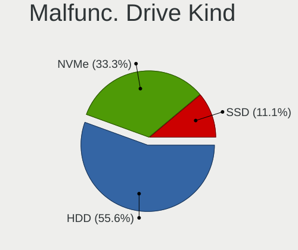

| Kind | Computers | Drives | Percent |
|------|-----------|--------|---------|
| HDD  | 8         | 10     | 66.67%  |
| NVMe | 3         | 3      | 25%     |
| SSD  | 1         | 1      | 8.33%   |

Failed Drives
-------------

Failed drive models

Zero info for selected period =(

Failed Drive Vendor
-------------------

Failed drive vendors

Zero info for selected period =(

Drive Status
------------

Number of failed and malfunc. drives

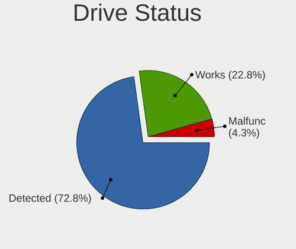

| Status   | Computers | Drives | Percent |
|----------|-----------|--------|---------|
| Detected | 201       | 435    | 72.83%  |
| Works    | 63        | 105    | 22.83%  |
| Malfunc  | 12        | 14     | 4.35%   |

Storage controller
------------------

Storage Vendor
--------------

Storage controller vendors

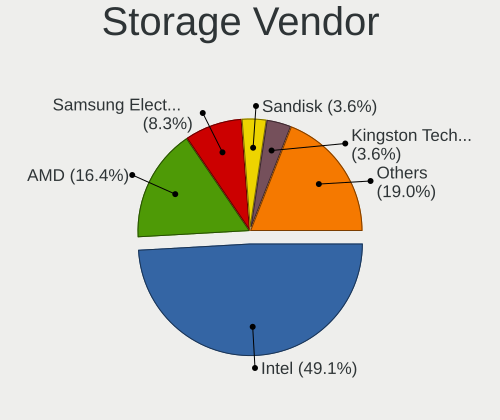

| Vendor                          | Computers | Percent |
|---------------------------------|-----------|---------|
| Intel                           | 165       | 49.11%  |
| AMD                             | 55        | 16.37%  |
| Samsung Electronics             | 28        | 8.33%   |
| Sandisk                         | 12        | 3.57%   |
| Kingston Technology Company     | 12        | 3.57%   |
| SK hynix                        | 10        | 2.98%   |
| Toshiba America Info Systems    | 9         | 2.68%   |
| Micron Technology               | 8         | 2.38%   |
| Phison Electronics              | 6         | 1.79%   |
| Micron/Crucial Technology       | 6         | 1.79%   |
| JMicron Technology              | 4         | 1.19%   |
| Silicon Motion                  | 3         | 0.89%   |
| Marvell Technology Group        | 3         | 0.89%   |
| ADATA Technology                | 3         | 0.89%   |
| INNOGRIT                        | 2         | 0.6%    |
| ASMedia Technology              | 2         | 0.6%    |
| Solidigm                        | 1         | 0.3%    |
| Shenzhen Techwinsemi Technology | 1         | 0.3%    |
| Shenzhen Longsys Electronics    | 1         | 0.3%    |
| Seagate Technology              | 1         | 0.3%    |
| O2 Micro                        | 1         | 0.3%    |
| Nvidia                          | 1         | 0.3%    |
| Lenovo                          | 1         | 0.3%    |
| KIOXIA                          | 1         | 0.3%    |

Storage Model
-------------

Storage controller models

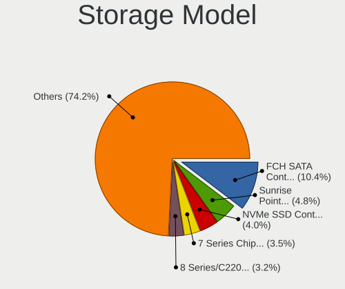

| Model                                                                          | Computers | Percent |
|--------------------------------------------------------------------------------|-----------|---------|
| AMD FCH SATA Controller [AHCI mode]                                            | 39        | 10.37%  |
| Intel Sunrise Point-LP SATA Controller [AHCI mode]                             | 18        | 4.79%   |
| Samsung NVMe SSD Controller SM981/PM981/PM983                                  | 15        | 3.99%   |
| Intel 7 Series Chipset Family 6-port SATA Controller [AHCI mode]               | 13        | 3.46%   |
| Intel 8 Series/C220 Series Chipset Family 6-port SATA Controller 1 [AHCI mode] | 12        | 3.19%   |
| Intel Q170/Q150/B150/H170/H110/Z170/CM236 Chipset SATA Controller [AHCI Mode]  | 9         | 2.39%   |
| Intel NM10/ICH7 Family SATA Controller [IDE mode]                              | 9         | 2.39%   |
| Intel 82801 Mobile SATA Controller [RAID mode]                                 | 9         | 2.39%   |
| Intel 6 Series/C200 Series Chipset Family 6 port Mobile SATA AHCI Controller   | 9         | 2.39%   |
| AMD 400 Series Chipset SATA Controller                                         | 9         | 2.39%   |
| Intel 82801IBM/IEM (ICH9M/ICH9M-E) 4 port SATA Controller [AHCI mode]          | 8         | 2.13%   |
| Intel 82801G (ICH7 Family) IDE Controller                                      | 8         | 2.13%   |
| Intel Cannon Lake PCH SATA AHCI Controller                                     | 7         | 1.86%   |
| Intel 8 Series SATA Controller 1 [AHCI mode]                                   | 7         | 1.86%   |
| Samsung NVMe SSD Controller SM961/PM961/SM963                                  | 5         | 1.33%   |
| Phison E12 NVMe Controller                                                     | 5         | 1.33%   |
| Intel SSD 660P Series                                                          | 5         | 1.33%   |
| AMD 500 Series Chipset SATA Controller                                         | 5         | 1.33%   |
| SK hynix BC501 NVMe Solid State Drive                                          | 4         | 1.06%   |
| Kingston Company KC2000/KC2500 NVMe SSD [SM2262EN]                             | 4         | 1.06%   |
| Intel Celeron/Pentium Silver Processor SATA Controller                         | 4         | 1.06%   |
| AMD SB7x0/SB8x0/SB9x0 SATA Controller [AHCI mode]                              | 4         | 1.06%   |
| Toshiba America Info Systems XG4 NVMe SSD Controller                           | 3         | 0.8%    |
| SanDisk Ultra 3D / WD PC SN530, IX SN530, Blue SN550 NVMe SSD (DRAM-less)      | 3         | 0.8%    |
| Micron 2450 NVMe SSD [HendrixV] (DRAM-less)                                    | 3         | 0.8%    |
| Intel Wildcat Point-LP SATA Controller [AHCI Mode]                             | 3         | 0.8%    |
| Intel HM170/QM170 Chipset SATA Controller [AHCI Mode]                          | 3         | 0.8%    |
| Intel Cannon Point-LP SATA Controller [AHCI Mode]                              | 3         | 0.8%    |
| Intel 82801JI (ICH10 Family) 4 port SATA IDE Controller #1                     | 3         | 0.8%    |
| Intel 82801JI (ICH10 Family) 2 port SATA IDE Controller #2                     | 3         | 0.8%    |
| Intel 82801HM/HEM (ICH8M/ICH8M-E) SATA Controller [AHCI mode]                  | 3         | 0.8%    |
| Intel 82801HM/HEM (ICH8M/ICH8M-E) IDE Controller                               | 3         | 0.8%    |
| Intel 6 Series/C200 Series Chipset Family 6 port Desktop SATA AHCI Controller  | 3         | 0.8%    |
| Intel 5 Series/3400 Series Chipset 6 port SATA AHCI Controller                 | 3         | 0.8%    |
| Intel 5 Series/3400 Series Chipset 4 port SATA AHCI Controller                 | 3         | 0.8%    |
| AMD SB7x0/SB8x0/SB9x0 IDE Controller                                           | 3         | 0.8%    |
| Toshiba America Info Systems XG6 NVMe SSD Controller                           | 2         | 0.53%   |
| Toshiba America Info Systems BG3 x2 NVMe SSD Controller (DRAM-less)            | 2         | 0.53%   |
| SK hynix PC401 NVMe Solid State Drive 256GB                                    | 2         | 0.53%   |
| Silicon Motion SM2263EN/SM2263XT (DRAM-less) NVMe SSD Controllers              | 2         | 0.53%   |

Storage Kind
------------

Kind of storage controller (IDE, SATA, NVMe, SAS, ...)

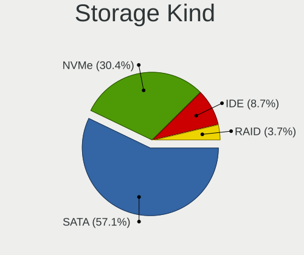

| Kind | Computers | Percent |
|------|-----------|---------|
| SATA | 184       | 57.14%  |
| NVMe | 98        | 30.43%  |
| IDE  | 28        | 8.7%    |
| RAID | 12        | 3.73%   |

Processor
---------

CPU Vendor
----------

Processor vendors

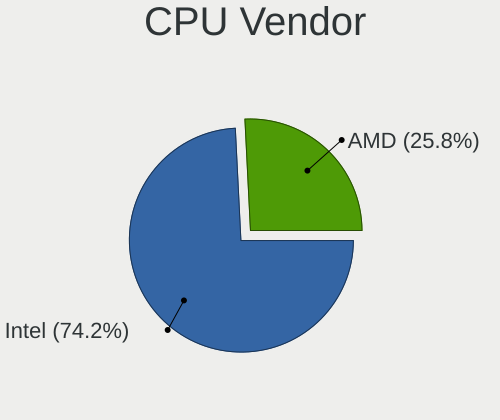

| Vendor | Computers | Percent |
|--------|-----------|---------|
| Intel  | 187       | 74.21%  |
| AMD    | 65        | 25.79%  |

CPU Model
---------

Processor models

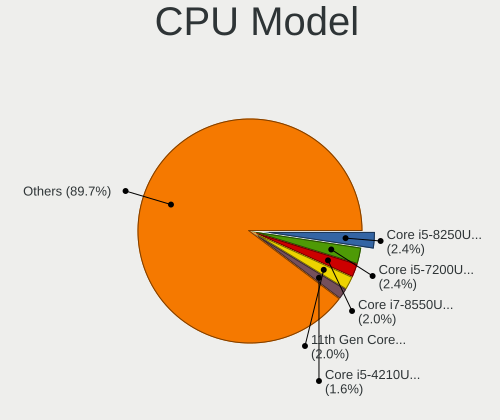

| Model                                       | Computers | Percent |
|---------------------------------------------|-----------|---------|
| Intel Core i5-8250U CPU @ 1.60GHz           | 6         | 2.37%   |
| Intel Core i5-7200U CPU @ 2.50GHz           | 6         | 2.37%   |
| Intel Core i7-8550U CPU @ 1.80GHz           | 5         | 1.98%   |
| Intel 11th Gen Core i7-1165G7 @ 2.80GHz     | 5         | 1.98%   |
| Intel Core i5-4210U CPU @ 1.70GHz           | 4         | 1.58%   |
| AMD Ryzen 7 3700X 8-Core Processor          | 4         | 1.58%   |
| Intel Core i5-6300U CPU @ 2.40GHz           | 3         | 1.19%   |
| Intel Core i5-3320M CPU @ 2.60GHz           | 3         | 1.19%   |
| Intel Core i5-3210M CPU @ 2.50GHz           | 3         | 1.19%   |
| Intel Celeron CPU N2840 @ 2.16GHz           | 3         | 1.19%   |
| AMD Ryzen 7 5800X 8-Core Processor          | 3         | 1.19%   |
| AMD Ryzen 7 4800H with Radeon Graphics      | 3         | 1.19%   |
| AMD Ryzen 5 5600H with Radeon Graphics      | 3         | 1.19%   |
| AMD Ryzen 5 3600 6-Core Processor           | 3         | 1.19%   |
| Intel Pentium Silver N6000 @ 1.10GHz        | 2         | 0.79%   |
| Intel Pentium Dual-Core CPU T4300 @ 2.10GHz | 2         | 0.79%   |
| Intel Pentium Dual-Core CPU T4200 @ 2.00GHz | 2         | 0.79%   |
| Intel Core i7-9750H CPU @ 2.60GHz           | 2         | 0.79%   |
| Intel Core i7-6820HQ CPU @ 2.70GHz          | 2         | 0.79%   |
| Intel Core i7-6700K CPU @ 4.00GHz           | 2         | 0.79%   |
| Intel Core i7-4600M CPU @ 2.90GHz           | 2         | 0.79%   |
| Intel Core i7-2640M CPU @ 2.80GHz           | 2         | 0.79%   |
| Intel Core i7-2630QM CPU @ 2.00GHz          | 2         | 0.79%   |
| Intel Core i7-2600K CPU @ 3.40GHz           | 2         | 0.79%   |
| Intel Core i7-10510U CPU @ 1.80GHz          | 2         | 0.79%   |
| Intel Core i5-9400F CPU @ 2.90GHz           | 2         | 0.79%   |
| Intel Core i5-8350U CPU @ 1.70GHz           | 2         | 0.79%   |
| Intel Core i5-6400 CPU @ 2.70GHz            | 2         | 0.79%   |
| Intel Core i5 CPU M 540 @ 2.53GHz           | 2         | 0.79%   |
| Intel Core i3-7100U CPU @ 2.40GHz           | 2         | 0.79%   |
| Intel Core i3-4160 CPU @ 3.60GHz            | 2         | 0.79%   |
| Intel Core i3-2310M CPU @ 2.10GHz           | 2         | 0.79%   |
| Intel Core 2 Duo CPU P7450 @ 2.13GHz        | 2         | 0.79%   |
| Intel Celeron N4100 CPU @ 1.10GHz           | 2         | 0.79%   |
| Intel Celeron N4000 CPU @ 1.10GHz           | 2         | 0.79%   |
| Intel Celeron CPU N2940 @ 1.83GHz           | 2         | 0.79%   |
| Intel 12th Gen Core i5-1235U                | 2         | 0.79%   |
| Intel 11th Gen Core i3-1115G4 @ 3.00GHz     | 2         | 0.79%   |
| AMD Ryzen 7 5825U with Radeon Graphics      | 2         | 0.79%   |
| AMD Ryzen 7 5700U with Radeon Graphics      | 2         | 0.79%   |

CPU Model Family
----------------

Processor model prefix

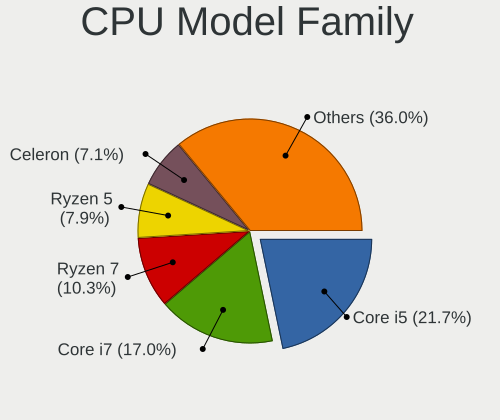

| Model                   | Computers | Percent |
|-------------------------|-----------|---------|
| Intel Core i5           | 55        | 21.74%  |
| Intel Core i7           | 43        | 17%     |
| AMD Ryzen 7             | 26        | 10.28%  |
| AMD Ryzen 5             | 20        | 7.91%   |
| Intel Celeron           | 18        | 7.11%   |
| Intel Core i3           | 17        | 6.72%   |
| Other                   | 16        | 6.32%   |
| Intel Core 2 Duo        | 9         | 3.56%   |
| Intel Pentium Dual-Core | 6         | 2.37%   |
| Intel Pentium           | 6         | 2.37%   |
| AMD Ryzen 9             | 5         | 1.98%   |
| Intel Xeon              | 4         | 1.58%   |
| AMD A10                 | 4         | 1.58%   |
| Intel Core 2 Quad       | 3         | 1.19%   |
| Intel Atom              | 3         | 1.19%   |
| Intel Pentium Silver    | 2         | 0.79%   |
| Intel Pentium D         | 2         | 0.79%   |
| Intel Core i9           | 2         | 0.79%   |
| Intel Core 2            | 2         | 0.79%   |
| AMD Phenom II X4        | 2         | 0.79%   |
| AMD FX                  | 2         | 0.79%   |
| Intel Pentium Dual      | 1         | 0.4%    |
| Intel Core M            | 1         | 0.4%    |
| AMD Ryzen 3             | 1         | 0.4%    |
| AMD E1                  | 1         | 0.4%    |
| AMD E                   | 1         | 0.4%    |
| AMD A8                  | 1         | 0.4%    |

CPU Cores
---------

Number of processor cores

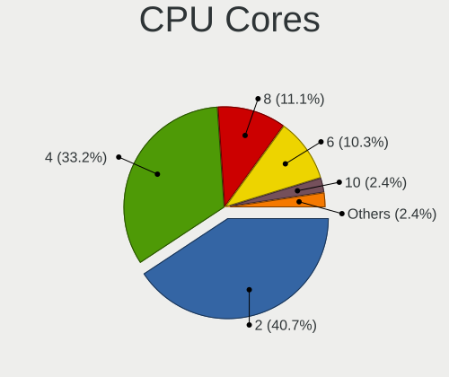

| Number | Computers | Percent |
|--------|-----------|---------|
| 2      | 103       | 40.71%  |
| 4      | 84        | 33.2%   |
| 8      | 28        | 11.07%  |
| 6      | 26        | 10.28%  |
| 10     | 6         | 2.37%   |
| 16     | 2         | 0.79%   |
| 14     | 1         | 0.4%    |
| 12     | 1         | 0.4%    |
| 3      | 1         | 0.4%    |
| 1      | 1         | 0.4%    |

CPU Sockets
-----------

Number of sockets

| Number | Computers | Percent |
|--------|-----------|---------|
| 1      | 252       | 100%    |

CPU Threads
-----------

Threads per core (Hyper-Threading)

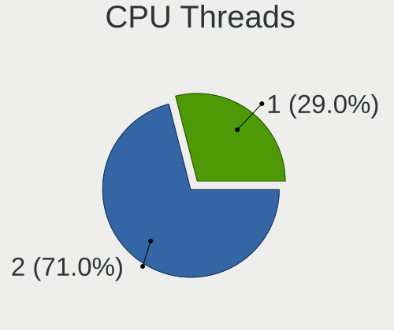

| Number | Computers | Percent |
|--------|-----------|---------|
| 2      | 179       | 71.03%  |
| 1      | 73        | 28.97%  |

CPU Op-Modes
------------

CPU Operation Modes (32-bit, 64-bit)

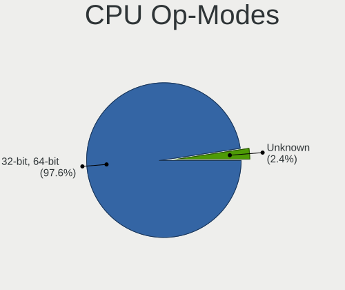

| Op mode        | Computers | Percent |
|----------------|-----------|---------|
| 32-bit, 64-bit | 247       | 97.63%  |
| Unknown        | 6         | 2.37%   |

CPU Microcode
-------------

Microcode number

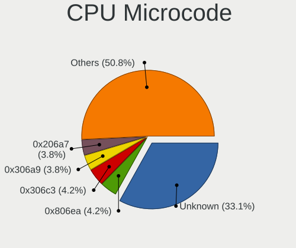

| Number     | Computers | Percent |
|------------|-----------|---------|
| Unknown    | 86        | 33.08%  |
| 0x806ea    | 11        | 4.23%   |
| 0x306c3    | 11        | 4.23%   |
| 0x306a9    | 10        | 3.85%   |
| 0x206a7    | 10        | 3.85%   |
| 0x1067a    | 9         | 3.46%   |
| 0x806e9    | 7         | 2.69%   |
| 0x40651    | 6         | 2.31%   |
| 0x906e9    | 5         | 1.92%   |
| 0x806ec    | 5         | 1.92%   |
| 0x506e3    | 5         | 1.92%   |
| 0x20655    | 5         | 1.92%   |
| 0x0a50000c | 5         | 1.92%   |
| 0x08701021 | 5         | 1.92%   |
| 0x906ea    | 4         | 1.54%   |
| 0x806c1    | 4         | 1.54%   |
| 0x706a1    | 4         | 1.54%   |
| 0x406e3    | 4         | 1.54%   |
| 0x0800820d | 4         | 1.54%   |
| 0x306d4    | 3         | 1.15%   |
| 0x30678    | 3         | 1.15%   |
| 0x08701013 | 3         | 1.15%   |
| 0x08600106 | 3         | 1.15%   |
| 0x08108102 | 3         | 1.15%   |
| 0x0810100b | 3         | 1.15%   |
| 0x06003106 | 3         | 1.15%   |
| 0x906ec    | 2         | 0.77%   |
| 0x6fd      | 2         | 0.77%   |
| 0x08108109 | 2         | 0.77%   |
| 0x0800820b | 2         | 0.77%   |
| 0x06000852 | 2         | 0.77%   |
| 0xf64      | 1         | 0.38%   |
| 0xf62      | 1         | 0.38%   |
| 0xa0652    | 1         | 0.38%   |
| 0x906ed    | 1         | 0.38%   |
| 0x906eb    | 1         | 0.38%   |
| 0x906c0    | 1         | 0.38%   |
| 0x806eb    | 1         | 0.38%   |
| 0x706a8    | 1         | 0.38%   |
| 0x6f2      | 1         | 0.38%   |

CPU Microarch
-------------

Microarchitecture

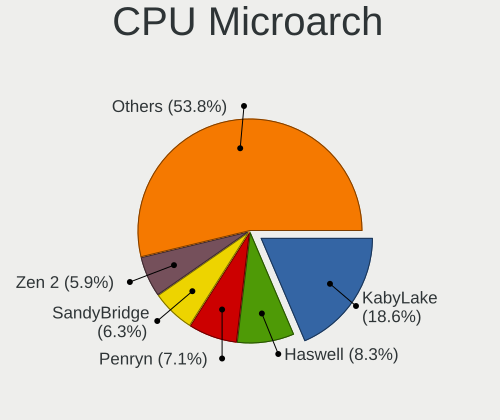

| Name             | Computers | Percent |
|------------------|-----------|---------|
| KabyLake         | 47        | 18.58%  |
| Haswell          | 21        | 8.3%    |
| Penryn           | 18        | 7.11%   |
| SandyBridge      | 16        | 6.32%   |
| Zen 2            | 15        | 5.93%   |
| Skylake          | 15        | 5.93%   |
| Zen 3            | 14        | 5.53%   |
| IvyBridge        | 13        | 5.14%   |
| Unknown          | 12        | 4.74%   |
| Zen+             | 10        | 3.95%   |
| Westmere         | 8         | 3.16%   |
| Silvermont       | 8         | 3.16%   |
| TigerLake        | 7         | 2.77%   |
| Goldmont plus    | 6         | 2.37%   |
| Core             | 6         | 2.37%   |
| Broadwell        | 6         | 2.37%   |
| Zen              | 4         | 1.58%   |
| Steamroller      | 4         | 1.58%   |
| Alderlake Hybrid | 4         | 1.58%   |
| Piledriver       | 3         | 1.19%   |
| CometLake        | 3         | 1.19%   |
| Tremont          | 2         | 0.79%   |
| NetBurst         | 2         | 0.79%   |
| K10              | 2         | 0.79%   |
| Icelake          | 2         | 0.79%   |
| Bobcat           | 2         | 0.79%   |
| Goldmont         | 1         | 0.4%    |
| Excavator        | 1         | 0.4%    |
| Bonnell          | 1         | 0.4%    |

Graphics
--------

GPU Vendor
----------

Vendors of graphics cards

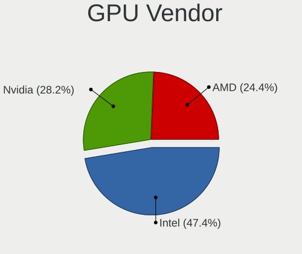

| Vendor | Computers | Percent |
|--------|-----------|---------|
| Intel  | 146       | 47.4%   |
| Nvidia | 87        | 28.25%  |
| AMD    | 75        | 24.35%  |

GPU Model
---------

Graphics card models

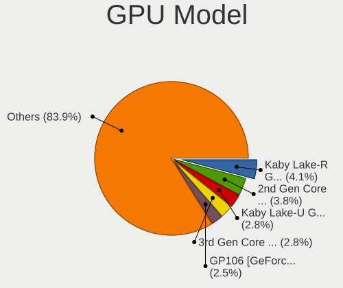

| Model                                                                       | Computers | Percent |
|-----------------------------------------------------------------------------|-----------|---------|
| Intel Kaby Lake-R GT2 [UHD Graphics 620]                                    | 13        | 4.11%   |
| Intel 2nd Generation Core Processor Family Integrated Graphics Controller   | 12        | 3.8%    |
| Intel Kaby Lake-U GT2 [HD Graphics 620]                                     | 9         | 2.85%   |
| Intel 3rd Gen Core processor Graphics Controller                            | 9         | 2.85%   |
| Nvidia GP106 [GeForce GTX 1060 6GB]                                         | 8         | 2.53%   |
| Intel Haswell-ULT Integrated Graphics Controller                            | 7         | 2.22%   |
| Intel Mobile 4 Series Chipset Integrated Graphics Controller                | 6         | 1.9%    |
| Intel GeminiLake [UHD Graphics 600]                                         | 6         | 1.9%    |
| Intel Atom Processor Z36xxx/Z37xxx Series Graphics & Display                | 6         | 1.9%    |
| Intel TigerLake-LP GT2 [Iris Xe Graphics]                                   | 5         | 1.58%   |
| Intel Core Processor Integrated Graphics Controller                         | 5         | 1.58%   |
| AMD Picasso/Raven 2 [Radeon Vega Series / Radeon Vega Mobile Series]        | 5         | 1.58%   |
| Nvidia GF108M [GeForce GT 540M]                                             | 4         | 1.27%   |
| Intel Skylake-U GT2 [HD Graphics 520]                                       | 4         | 1.27%   |
| Intel 4th Gen Core Processor Integrated Graphics Controller                 | 4         | 1.27%   |
| Intel 4 Series Chipset Integrated Graphics Controller                       | 4         | 1.27%   |
| AMD Renoir [Radeon Vega Series / Radeon Vega Mobile Series]                 | 4         | 1.27%   |
| AMD Navi 10 [Radeon RX 5600 OEM/5600 XT / 5700/5700 XT]                     | 4         | 1.27%   |
| AMD Ellesmere [Radeon RX 470/480/570/570X/580/580X/590]                     | 4         | 1.27%   |
| AMD Cezanne [Radeon Vega Series / Radeon Vega Mobile Series]                | 4         | 1.27%   |
| Nvidia TU106M [GeForce RTX 2060 Mobile]                                     | 3         | 0.95%   |
| Nvidia GP107 [GeForce GTX 1050 Ti]                                          | 3         | 0.95%   |
| Nvidia GP102 [GeForce GTX 1080 Ti]                                          | 3         | 0.95%   |
| Nvidia GM108M [GeForce 940MX]                                               | 3         | 0.95%   |
| Nvidia GF117M [GeForce 610M/710M/810M/820M / GT 620M/625M/630M/720M]        | 3         | 0.95%   |
| Intel Xeon E3-1200 v3/4th Gen Core Processor Integrated Graphics Controller | 3         | 0.95%   |
| Intel WhiskeyLake-U GT2 [UHD Graphics 620]                                  | 3         | 0.95%   |
| Intel Skylake-H GT2 [HD Graphics 530]                                       | 3         | 0.95%   |
| Intel Mobile GM965/GL960 Integrated Graphics Controller (secondary)         | 3         | 0.95%   |
| Intel Mobile GM965/GL960 Integrated Graphics Controller (primary)           | 3         | 0.95%   |
| Intel Kaby Lake-H GT2 [HD Graphics 630]                                     | 3         | 0.95%   |
| Intel CometLake-U GT2 [UHD Graphics]                                        | 3         | 0.95%   |
| Intel CoffeeLake-S GT2 [UHD Graphics 630]                                   | 3         | 0.95%   |
| Intel CoffeeLake-H GT2 [UHD Graphics 630]                                   | 3         | 0.95%   |
| Intel Broadwell-U GT2 [HD Graphics 5500]                                    | 3         | 0.95%   |
| Intel Alder Lake-UP3 GT2 [Iris Xe Graphics]                                 | 3         | 0.95%   |
| AMD Raven Ridge [Radeon Vega Series / Radeon Vega Mobile Series]            | 3         | 0.95%   |
| AMD Lucienne                                                                | 3         | 0.95%   |
| AMD Kaveri [Radeon R7 Graphics]                                             | 3         | 0.95%   |
| AMD Barcelo                                                                 | 3         | 0.95%   |

GPU Combo
---------

Combinations of graphics cards

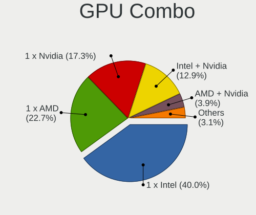

| Name           | Computers | Percent |
|----------------|-----------|---------|
| 1 x Intel      | 102       | 40%     |
| 1 x AMD        | 58        | 22.75%  |
| 1 x Nvidia     | 44        | 17.25%  |
| Intel + Nvidia | 33        | 12.94%  |
| AMD + Nvidia   | 10        | 3.92%   |
| Intel + AMD    | 7         | 2.75%   |
| 2 x AMD        | 1         | 0.39%   |

GPU Driver
----------

Free vs proprietary

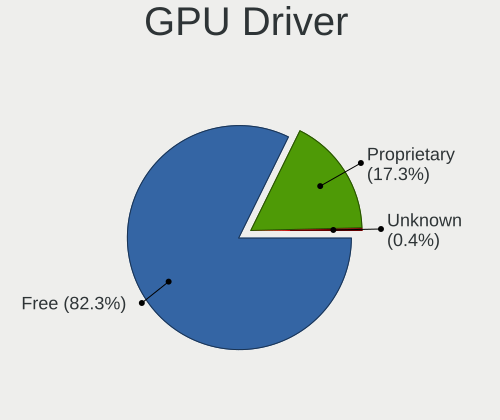

| Driver      | Computers | Percent |
|-------------|-----------|---------|
| Free        | 209       | 82.28%  |
| Proprietary | 44        | 17.32%  |
| Unknown     | 1         | 0.39%   |

GPU Memory
----------

Total video memory

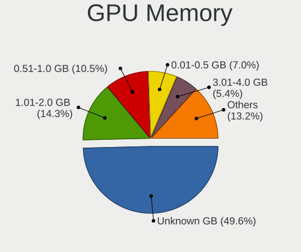

| Size in GB | Computers | Percent |
|------------|-----------|---------|
| Unknown    | 128       | 49.61%  |
| 1.01-2.0   | 37        | 14.34%  |
| 0.51-1.0   | 27        | 10.47%  |
| 0.01-0.5   | 18        | 6.98%   |
| 3.01-4.0   | 14        | 5.43%   |
| 7.01-8.0   | 12        | 4.65%   |
| 5.01-6.0   | 12        | 4.65%   |
| 8.01-16.0  | 6         | 2.33%   |
| 2.01-3.0   | 4         | 1.55%   |

Monitor
-------

Monitor Vendor
--------------

Monitor vendors

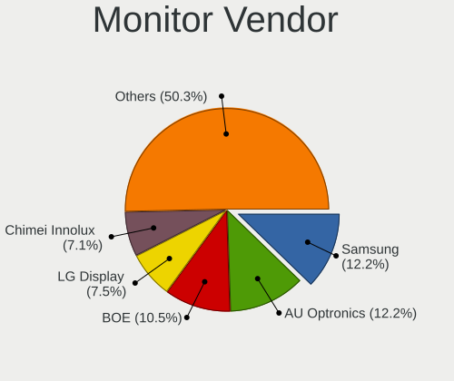

| Vendor                  | Computers | Percent |
|-------------------------|-----------|---------|
| Samsung Electronics     | 36        | 12.24%  |
| AU Optronics            | 36        | 12.24%  |
| BOE                     | 31        | 10.54%  |
| LG Display              | 22        | 7.48%   |
| Chimei Innolux          | 21        | 7.14%   |
| Goldstar                | 20        | 6.8%    |
| AOC                     | 16        | 5.44%   |
| Dell                    | 15        | 5.1%    |
| Ancor Communications    | 9         | 3.06%   |
| Lenovo                  | 8         | 2.72%   |
| BenQ                    | 8         | 2.72%   |
| Apple                   | 7         | 2.38%   |
| Acer                    | 6         | 2.04%   |
| Sharp                   | 5         | 1.7%    |
| Hewlett-Packard         | 5         | 1.7%    |
| Chi Mei Optoelectronics | 5         | 1.7%    |
| LG Electronics          | 4         | 1.36%   |
| Philips                 | 3         | 1.02%   |
| MSI                     | 3         | 1.02%   |
| ASUSTek Computer        | 3         | 1.02%   |
| Unknown (XXX)           | 2         | 0.68%   |
| Unknown                 | 2         | 0.68%   |
| PANDA                   | 2         | 0.68%   |
| NEC Computers           | 2         | 0.68%   |
| LG Philips              | 2         | 0.68%   |
| Iiyama                  | 2         | 0.68%   |
| CSO                     | 2         | 0.68%   |
| Unknown                 | 2         | 0.68%   |
| ___                     | 1         | 0.34%   |
| ViewSonic               | 1         | 0.34%   |
| Valve                   | 1         | 0.34%   |
| Toshiba                 | 1         | 0.34%   |
| Sony                    | 1         | 0.34%   |
| Sceptre Tech            | 1         | 0.34%   |
| Positivo                | 1         | 0.34%   |
| MStar                   | 1         | 0.34%   |
| Microstep               | 1         | 0.34%   |
| Mi                      | 1         | 0.34%   |
| JRY                     | 1         | 0.34%   |
| Japannext               | 1         | 0.34%   |

Monitor Model
-------------

Monitor models

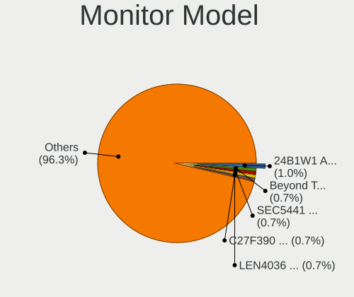

| Model                                                                | Computers | Percent |
|----------------------------------------------------------------------|-----------|---------|
| AOC 24B1W1 AOC2401 1920x1080 527x296mm 23.8-inch                     | 3         | 1%      |
| Unknown (XXX) Beyond TV XXX2851 3840x2160 1209x680mm 54.6-inch       | 2         | 0.66%   |
| Samsung Electronics LCD Monitor SEC5441 1280x800 331x207mm 15.4-inch | 2         | 0.66%   |
| Samsung Electronics C27F390 SAM0D32 1920x1080 598x336mm 27.0-inch    | 2         | 0.66%   |
| Lenovo LCD Monitor LEN4036 1440x900 303x190mm 14.1-inch              | 2         | 0.66%   |
| Goldstar L227W GSM566E 1680x1050 474x296mm 22.0-inch                 | 2         | 0.66%   |
| Chimei Innolux LCD Monitor CMN15CB 1920x1080 344x193mm 15.5-inch     | 2         | 0.66%   |
| BOE LCD Monitor BOE0653 1920x1080 309x173mm 13.9-inch                | 2         | 0.66%   |
| BOE LCD Monitor BOE0638 1920x1080 309x173mm 13.9-inch                | 2         | 0.66%   |
| AU Optronics LCD Monitor AUO70EC 1366x768 344x193mm 15.5-inch        | 2         | 0.66%   |
| AU Optronics LCD Monitor AUO403D 1920x1080 309x174mm 14.0-inch       | 2         | 0.66%   |
| AU Optronics LCD Monitor AUO2E3C 1366x768 309x173mm 13.9-inch        | 2         | 0.66%   |
| AU Optronics LCD Monitor AUO21ED 1920x1080 344x193mm 15.5-inch       | 2         | 0.66%   |
| Apple Color LCD APP9C5B 1280x800 286x179mm 13.3-inch                 | 2         | 0.66%   |
| AOC 24G2W1G3 AOC2402 1920x1080 527x296mm 23.8-inch                   | 2         | 0.66%   |
| Ancor Communications LCD Monitor MG248 1920x1080                     | 2         | 0.66%   |
| Unknown                                                              | 2         | 0.66%   |
| ___ LCD TV ___9000 1360x768                                          | 1         | 0.33%   |
| ViewSonic VP191b-H VSC0E11 1280x1024 376x301mm 19.0-inch             | 1         | 0.33%   |
| Valve ANX7530 U VLV3001 800x1280 100x150mm 7.1-inch                  | 1         | 0.33%   |
| Unknown LCDTV16 9000 1360x768 1600x900mm 72.3-inch                   | 1         | 0.33%   |
| Unknown LCD Monitor HIC 3200x1080                                    | 1         | 0.33%   |
| Toshiba Internal LCD TOS5091 1366x768 309x174mm 14.0-inch            | 1         | 0.33%   |
| Sony Nvidia Defaul t Flat Panel SNY05FA 1366x768 309x174mm 14.0-inch | 1         | 0.33%   |
| Sharp LQ133M1JW08 SHP1425 1920x1080 294x165mm 13.3-inch              | 1         | 0.33%   |
| Sharp LCD Monitor SHP1517 3840x2400 366x229mm 17.0-inch              | 1         | 0.33%   |
| Sharp LCD Monitor SHP1476 3840x2160 346x194mm 15.6-inch              | 1         | 0.33%   |
| Sharp LCD Monitor SHP1449 1920x1080 294x165mm 13.3-inch              | 1         | 0.33%   |
| Sharp LCD Monitor HDMI 1920x1080                                     | 1         | 0.33%   |
| Sceptre Tech Sceptre E24 SPT099D 1920x1080 521x293mm 23.5-inch       | 1         | 0.33%   |
| Samsung Electronics SyncMaster SAM05CB 1920x1080 530x300mm 24.0-inch | 1         | 0.33%   |
| Samsung Electronics SyncMaster SAM0375 1680x1050 494x320mm 23.2-inch | 1         | 0.33%   |
| Samsung Electronics SyncMaster SAM0302 1680x1050 459x296mm 21.5-inch | 1         | 0.33%   |
| Samsung Electronics SyncMaster SAM029A 1920x1200 582x364mm 27.0-inch | 1         | 0.33%   |
| Samsung Electronics SyncMaster SAM0272 1280x1024 338x270mm 17.0-inch | 1         | 0.33%   |
| Samsung Electronics SyncMaster SAM01CE 1024x768 304x228mm 15.0-inch  | 1         | 0.33%   |
| Samsung Electronics SyncMaster SAM01B7 1280x1024 340x270mm 17.1-inch | 1         | 0.33%   |
| Samsung Electronics SMS24A650 SAM082A 1920x1080 531x299mm 24.0-inch  | 1         | 0.33%   |
| Samsung Electronics SMB2230N SAM0635 1920x1080 477x268mm 21.5-inch   | 1         | 0.33%   |
| Samsung Electronics SM2333TN SAM06FC 1920x1080 477x268mm 21.5-inch   | 1         | 0.33%   |

Monitor Resolution
------------------

Monitor screen resolution

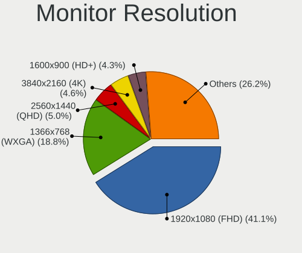

| Resolution         | Computers | Percent |
|--------------------|-----------|---------|
| 1920x1080 (FHD)    | 116       | 41.13%  |
| 1366x768 (WXGA)    | 53        | 18.79%  |
| 2560x1440 (QHD)    | 14        | 4.96%   |
| 3840x2160 (4K)     | 13        | 4.61%   |
| 1600x900 (HD+)     | 12        | 4.26%   |
| 1920x1200 (WUXGA)  | 9         | 3.19%   |
| 1440x900 (WXGA+)   | 8         | 2.84%   |
| 1280x1024 (SXGA)   | 8         | 2.84%   |
| 1680x1050 (WSXGA+) | 7         | 2.48%   |
| 1280x800 (WXGA)    | 7         | 2.48%   |
| Unknown            | 6         | 2.13%   |
| 2560x1080          | 5         | 1.77%   |
| 3840x1080          | 3         | 1.06%   |
| 2560x1600          | 3         | 1.06%   |
| 1360x768           | 3         | 1.06%   |
| 3440x1440          | 2         | 0.71%   |
| 2880x1620          | 2         | 0.71%   |
| 800x1280           | 1         | 0.35%   |
| 5760x1080          | 1         | 0.35%   |
| 4480x1440          | 1         | 0.35%   |
| 3840x2400          | 1         | 0.35%   |
| 3200x1080          | 1         | 0.35%   |
| 3000x2000          | 1         | 0.35%   |
| 2880x1800          | 1         | 0.35%   |
| 2256x1504          | 1         | 0.35%   |
| 2240x1400          | 1         | 0.35%   |
| 1152x864           | 1         | 0.35%   |
| 1024x768 (XGA)     | 1         | 0.35%   |

Monitor Diagonal
----------------

Diagonal size in inches

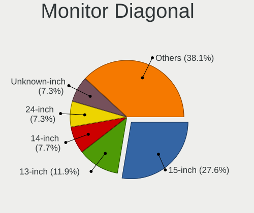

| Inches  | Computers | Percent |
|---------|-----------|---------|
| 15      | 79        | 27.62%  |
| 13      | 34        | 11.89%  |
| 14      | 22        | 7.69%   |
| 24      | 21        | 7.34%   |
| Unknown | 21        | 7.34%   |
| 27      | 16        | 5.59%   |
| 17      | 14        | 4.9%    |
| 21      | 13        | 4.55%   |
| 23      | 12        | 4.2%    |
| 18      | 8         | 2.8%    |
| 19      | 5         | 1.75%   |
| 11      | 5         | 1.75%   |
| 34      | 4         | 1.4%    |
| 31      | 4         | 1.4%    |
| 22      | 4         | 1.4%    |
| 20      | 4         | 1.4%    |
| 16      | 4         | 1.4%    |
| 40      | 3         | 1.05%   |
| 72      | 2         | 0.7%    |
| 63      | 2         | 0.7%    |
| 29      | 2         | 0.7%    |
| 12      | 2         | 0.7%    |
| 84      | 1         | 0.35%   |
| 52      | 1         | 0.35%   |
| 49      | 1         | 0.35%   |
| 25      | 1         | 0.35%   |
| 7       | 1         | 0.35%   |

Monitor Width
-------------

Physical width

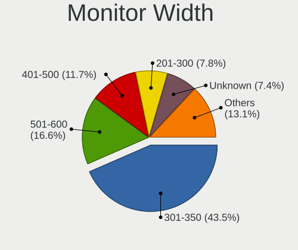

| Width in mm | Computers | Percent |
|-------------|-----------|---------|
| 301-350     | 123       | 43.46%  |
| 501-600     | 47        | 16.61%  |
| 401-500     | 33        | 11.66%  |
| 201-300     | 22        | 7.77%   |
| Unknown     | 21        | 7.42%   |
| 351-400     | 16        | 5.65%   |
| 601-700     | 6         | 2.12%   |
| 701-800     | 4         | 1.41%   |
| 1001-1500   | 4         | 1.41%   |
| 801-900     | 3         | 1.06%   |
| 1501-2000   | 3         | 1.06%   |
| 1-100       | 1         | 0.35%   |

Aspect Ratio
------------

Proportional relationship between the width and the height

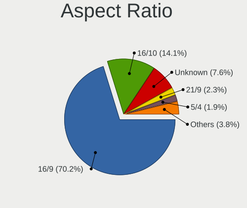

| Ratio   | Computers | Percent |
|---------|-----------|---------|
| 16/9    | 184       | 70.23%  |
| 16/10   | 37        | 14.12%  |
| Unknown | 20        | 7.63%   |
| 21/9    | 6         | 2.29%   |
| 5/4     | 5         | 1.91%   |
| 3/2     | 5         | 1.91%   |
| 4/3     | 2         | 0.76%   |
| 6/5     | 1         | 0.38%   |
| 32/9    | 1         | 0.38%   |
| 0.67    | 1         | 0.38%   |

Monitor Area
------------

Area in inch²

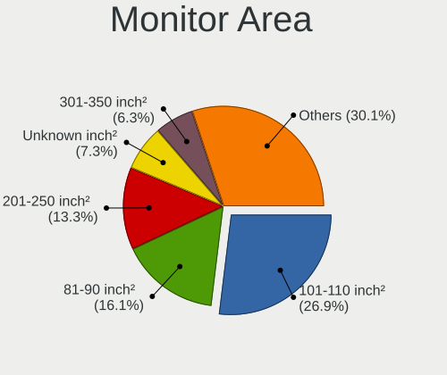

| Area in inch² | Computers | Percent |
|----------------|-----------|---------|
| 101-110        | 77        | 26.92%  |
| 81-90          | 46        | 16.08%  |
| 201-250        | 38        | 13.29%  |
| Unknown        | 21        | 7.34%   |
| 301-350        | 18        | 6.29%   |
| 151-200        | 14        | 4.9%    |
| 71-80          | 10        | 3.5%    |
| 251-300        | 10        | 3.5%    |
| 141-150        | 10        | 3.5%    |
| 121-130        | 10        | 3.5%    |
| 351-500        | 8         | 2.8%    |
| More than 1000 | 6         | 2.1%    |
| 51-60          | 5         | 1.75%   |
| 111-120        | 5         | 1.75%   |
| 501-1000       | 4         | 1.4%    |
| 61-70          | 2         | 0.7%    |
| 1-40           | 1         | 0.35%   |
| 91-100         | 1         | 0.35%   |

Pixel Density
-------------

Pixels per inch

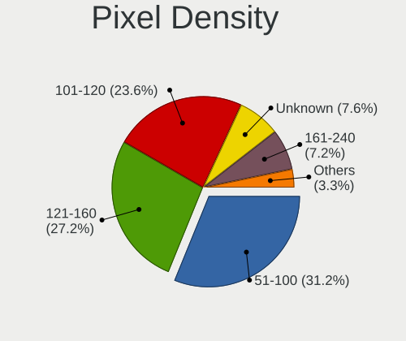

| Density       | Computers | Percent |
|---------------|-----------|---------|
| 51-100        | 86        | 31.16%  |
| 121-160       | 75        | 27.17%  |
| 101-120       | 65        | 23.55%  |
| Unknown       | 21        | 7.61%   |
| 161-240       | 20        | 7.25%   |
| More than 240 | 6         | 2.17%   |
| 1-50          | 3         | 1.09%   |

Multiple Monitors
-----------------

Total monitors connected

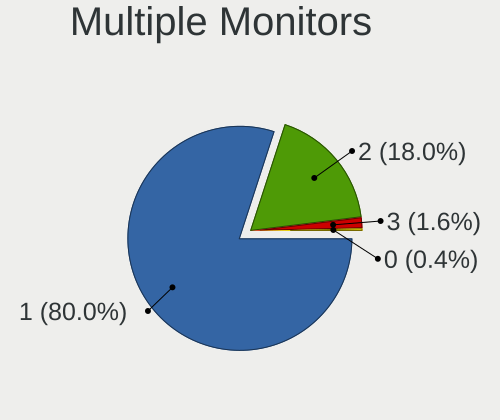

| Total | Computers | Percent |
|-------|-----------|---------|
| 1     | 204       | 80%     |
| 2     | 46        | 18.04%  |
| 3     | 4         | 1.57%   |
| 0     | 1         | 0.39%   |

Network
-------

Net Controller Vendor
---------------------

Controller vendors

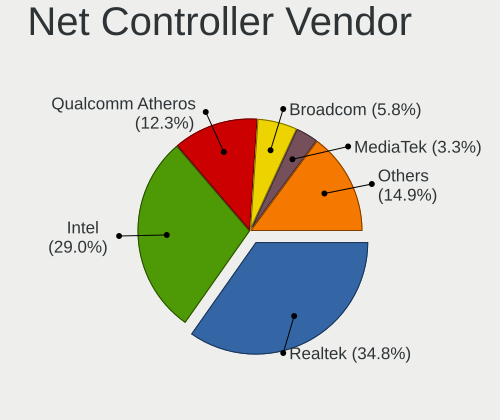

| Vendor                          | Computers | Percent |
|---------------------------------|-----------|---------|
| Realtek Semiconductor           | 138       | 34.76%  |
| Intel                           | 115       | 28.97%  |
| Qualcomm Atheros                | 49        | 12.34%  |
| Broadcom                        | 23        | 5.79%   |
| MediaTek                        | 13        | 3.27%   |
| Marvell Technology Group        | 7         | 1.76%   |
| TP-Link                         | 5         | 1.26%   |
| Ralink Technology               | 5         | 1.26%   |
| Xiaomi                          | 4         | 1.01%   |
| Ralink                          | 4         | 1.01%   |
| Broadcom Limited                | 3         | 0.76%   |
| Shenzhen Goodix Technology      | 2         | 0.5%    |
| Samsung Electronics             | 2         | 0.5%    |
| Qualcomm Atheros Communications | 2         | 0.5%    |
| Huawei Technologies             | 2         | 0.5%    |
| Dell                            | 2         | 0.5%    |
| ASIX Electronics                | 2         | 0.5%    |
| ZTE WCDMA Technologies MSM      | 1         | 0.25%   |
| T & A Mobile Phones             | 1         | 0.25%   |
| Sierra Wireless                 | 1         | 0.25%   |
| Qualcomm                        | 1         | 0.25%   |
| OnePlus Technology (Shenzhen)   | 1         | 0.25%   |
| Nvidia                          | 1         | 0.25%   |
| NetGear                         | 1         | 0.25%   |
| Motorola PCS                    | 1         | 0.25%   |
| Microchip Technology            | 1         | 0.25%   |
| Linksys                         | 1         | 0.25%   |
| Lenovo                          | 1         | 0.25%   |
| LeEco                           | 1         | 0.25%   |
| Jolla Oy                        | 1         | 0.25%   |
| Hewlett-Packard                 | 1         | 0.25%   |
| Google                          | 1         | 0.25%   |
| DisplayLink                     | 1         | 0.25%   |
| D-Link System                   | 1         | 0.25%   |
| Belkin Components               | 1         | 0.25%   |
| Aquantia                        | 1         | 0.25%   |

Net Controller Model
--------------------

Controller models

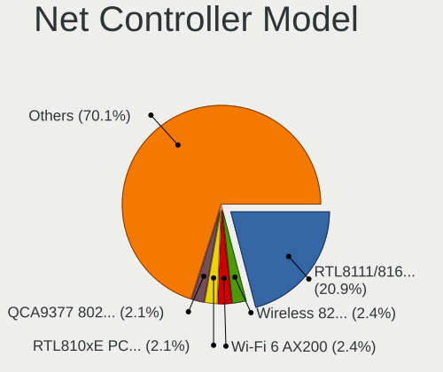

| Model                                                                  | Computers | Percent |
|------------------------------------------------------------------------|-----------|---------|
| Realtek RTL8111/8168/8211/8411 PCI Express Gigabit Ethernet Controller | 98        | 20.94%  |
| Intel Wireless 8265 / 8275                                             | 11        | 2.35%   |
| Intel Wi-Fi 6 AX200                                                    | 11        | 2.35%   |
| Realtek RTL810xE PCI Express Fast Ethernet controller                  | 10        | 2.14%   |
| Qualcomm Atheros QCA9377 802.11ac Wireless Network Adapter             | 10        | 2.14%   |
| Qualcomm Atheros QCA9565 / AR9565 Wireless Network Adapter             | 9         | 1.92%   |
| Intel I211 Gigabit Network Connection                                  | 9         | 1.92%   |
| Realtek RTL8125 2.5GbE Controller                                      | 8         | 1.71%   |
| Intel Wireless 7265                                                    | 7         | 1.5%    |
| Intel Wireless 7260                                                    | 7         | 1.5%    |
| Intel 82579LM Gigabit Network Connection (Lewisville)                  | 7         | 1.5%    |
| Realtek RTL8822BE 802.11a/b/g/n/ac WiFi adapter                        | 6         | 1.28%   |
| Qualcomm Atheros AR9285 Wireless Network Adapter (PCI-Express)         | 6         | 1.28%   |
| Intel Wi-Fi 6 AX201                                                    | 6         | 1.28%   |
| Realtek RTL8153 Gigabit Ethernet Adapter                               | 5         | 1.07%   |
| Qualcomm Atheros QCA6174 802.11ac Wireless Network Adapter             | 5         | 1.07%   |
| MediaTek MT7922 802.11ax PCI Express Wireless Network Adapter          | 5         | 1.07%   |
| Intel Wireless 8260                                                    | 5         | 1.07%   |
| Intel Wireless 3165                                                    | 5         | 1.07%   |
| Intel Ethernet Connection (7) I219-V                                   | 5         | 1.07%   |
| Intel Centrino Advanced-N 6205 [Taylor Peak]                           | 5         | 1.07%   |
| Xiaomi Mi/Redmi series (RNDIS)                                         | 4         | 0.85%   |
| Realtek RTL8822CE 802.11ac PCIe Wireless Network Adapter               | 4         | 0.85%   |
| Qualcomm Atheros AR9485 Wireless Network Adapter                       | 4         | 0.85%   |
| MediaTek MT7921 802.11ax PCIe Wireless Network Adapter [Filogic 330]   | 4         | 0.85%   |
| Intel Ethernet Connection I217-LM                                      | 4         | 0.85%   |
| Intel Alder Lake-P PCH CNVi WiFi                                       | 4         | 0.85%   |
| Realtek RTL88x2bu [AC1200 Techkey]                                     | 3         | 0.64%   |
| Realtek RTL8152 Fast Ethernet Adapter                                  | 3         | 0.64%   |
| Realtek Killer E2600 GbE Controller                                    | 3         | 0.64%   |
| Marvell Group 88E8040 PCI-E Fast Ethernet Controller                   | 3         | 0.64%   |
| Intel Ethernet Controller I225-V                                       | 3         | 0.64%   |
| Intel Ethernet Connection I219-LM                                      | 3         | 0.64%   |
| Intel Ethernet Connection (4) I219-LM                                  | 3         | 0.64%   |
| Intel Dual Band Wireless-AC 3168NGW [Stone Peak]                       | 3         | 0.64%   |
| Intel Centrino Advanced-N 6200                                         | 3         | 0.64%   |
| Intel Cannon Lake PCH CNVi WiFi                                        | 3         | 0.64%   |
| Broadcom NetLink BCM57785 Gigabit Ethernet PCIe                        | 3         | 0.64%   |
| Broadcom BCM43602 802.11ac Wireless LAN SoC                            | 3         | 0.64%   |
| Broadcom BCM43142 802.11b/g/n                                          | 3         | 0.64%   |

Wireless Vendor
---------------

Wireless vendors

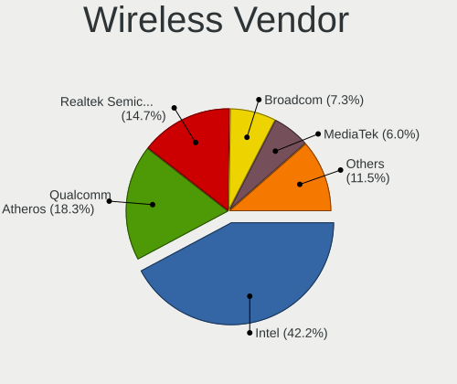

| Vendor                          | Computers | Percent |
|---------------------------------|-----------|---------|
| Intel                           | 92        | 42.2%   |
| Qualcomm Atheros                | 40        | 18.35%  |
| Realtek Semiconductor           | 32        | 14.68%  |
| Broadcom                        | 16        | 7.34%   |
| MediaTek                        | 13        | 5.96%   |
| Ralink Technology               | 5         | 2.29%   |
| TP-Link                         | 4         | 1.83%   |
| Ralink                          | 4         | 1.83%   |
| Broadcom Limited                | 3         | 1.38%   |
| Qualcomm Atheros Communications | 2         | 0.92%   |
| Sierra Wireless                 | 1         | 0.46%   |
| NetGear                         | 1         | 0.46%   |
| Linksys                         | 1         | 0.46%   |
| Hewlett-Packard                 | 1         | 0.46%   |
| Dell                            | 1         | 0.46%   |
| D-Link System                   | 1         | 0.46%   |
| Belkin Components               | 1         | 0.46%   |

Wireless Model
--------------

Wireless models

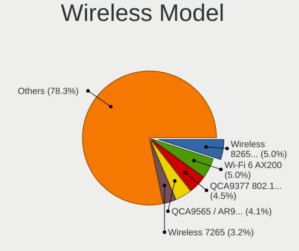

| Model                                                                | Computers | Percent |
|----------------------------------------------------------------------|-----------|---------|
| Intel Wireless 8265 / 8275                                           | 11        | 4.98%   |
| Intel Wi-Fi 6 AX200                                                  | 11        | 4.98%   |
| Qualcomm Atheros QCA9377 802.11ac Wireless Network Adapter           | 10        | 4.52%   |
| Qualcomm Atheros QCA9565 / AR9565 Wireless Network Adapter           | 9         | 4.07%   |
| Intel Wireless 7265                                                  | 7         | 3.17%   |
| Intel Wireless 7260                                                  | 7         | 3.17%   |
| Realtek RTL8822BE 802.11a/b/g/n/ac WiFi adapter                      | 6         | 2.71%   |
| Qualcomm Atheros AR9285 Wireless Network Adapter (PCI-Express)       | 6         | 2.71%   |
| Intel Wi-Fi 6 AX201                                                  | 6         | 2.71%   |
| Qualcomm Atheros QCA6174 802.11ac Wireless Network Adapter           | 5         | 2.26%   |
| MediaTek MT7922 802.11ax PCI Express Wireless Network Adapter        | 5         | 2.26%   |
| Intel Wireless 8260                                                  | 5         | 2.26%   |
| Intel Wireless 3165                                                  | 5         | 2.26%   |
| Intel Centrino Advanced-N 6205 [Taylor Peak]                         | 5         | 2.26%   |
| Realtek RTL8822CE 802.11ac PCIe Wireless Network Adapter             | 4         | 1.81%   |
| Qualcomm Atheros AR9485 Wireless Network Adapter                     | 4         | 1.81%   |
| MediaTek MT7921 802.11ax PCIe Wireless Network Adapter [Filogic 330] | 4         | 1.81%   |
| Realtek RTL88x2bu [AC1200 Techkey]                                   | 3         | 1.36%   |
| Intel Dual Band Wireless-AC 3168NGW [Stone Peak]                     | 3         | 1.36%   |
| Intel Centrino Advanced-N 6200                                       | 3         | 1.36%   |
| Intel Cannon Lake PCH CNVi WiFi                                      | 3         | 1.36%   |
| Broadcom BCM43602 802.11ac Wireless LAN SoC                          | 3         | 1.36%   |
| Broadcom BCM43142 802.11b/g/n                                        | 3         | 1.36%   |
| TP-Link TL-WN823N v2/v3 [Realtek RTL8192EU]                          | 2         | 0.9%    |
| Realtek RTL8852BE PCIe 802.11ax Wireless Network Controller          | 2         | 0.9%    |
| Realtek RTL8723AE PCIe Wireless Network Adapter                      | 2         | 0.9%    |
| Realtek RTL8188CE 802.11b/g/n WiFi Adapter                           | 2         | 0.9%    |
| Realtek RTL8187 Wireless Adapter                                     | 2         | 0.9%    |
| Realtek 802.11ac NIC                                                 | 2         | 0.9%    |
| Ralink MT7601U Wireless Adapter                                      | 2         | 0.9%    |
| Ralink RT2790 Wireless 802.11n 1T/2R PCIe                            | 2         | 0.9%    |
| Qualcomm Atheros AR9271 802.11n                                      | 2         | 0.9%    |
| Qualcomm Atheros AR922X Wireless Network Adapter                     | 2         | 0.9%    |
| MediaTek MT7921K (RZ608) Wi-Fi 6E 80MHz                              | 2         | 0.9%    |
| Intel Wi-Fi 6E(802.11ax) AX210/AX1675* 2x2 [Typhoon Peak]            | 2         | 0.9%    |
| Intel Wi-Fi 5(802.11ac) Wireless-AC 9x6x [Thunder Peak]              | 2         | 0.9%    |
| Intel Jasper Lake PCH CNVi WiFi                                      | 2         | 0.9%    |
| Intel Centrino Advanced-N 6230 [Rainbow Peak]                        | 2         | 0.9%    |
| Intel Cannon Point-LP CNVi [Wireless-AC]                             | 2         | 0.9%    |
| Intel Alder Lake-P PCH CNVi WiFi                                     | 2         | 0.9%    |

Ethernet Vendor
---------------

Ethernet vendors

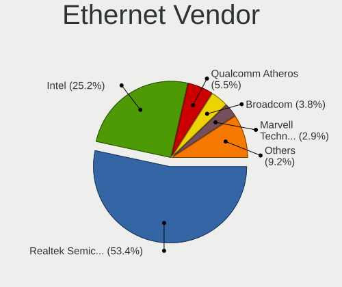

| Vendor                     | Computers | Percent |
|----------------------------|-----------|---------|
| Realtek Semiconductor      | 127       | 53.36%  |
| Intel                      | 60        | 25.21%  |
| Qualcomm Atheros           | 13        | 5.46%   |
| Broadcom                   | 9         | 3.78%   |
| Marvell Technology Group   | 7         | 2.94%   |
| Xiaomi                     | 4         | 1.68%   |
| Samsung Electronics        | 2         | 0.84%   |
| Huawei Technologies        | 2         | 0.84%   |
| ASIX Electronics           | 2         | 0.84%   |
| ZTE WCDMA Technologies MSM | 1         | 0.42%   |
| TP-Link                    | 1         | 0.42%   |
| T & A Mobile Phones        | 1         | 0.42%   |
| Qualcomm                   | 1         | 0.42%   |
| Nvidia                     | 1         | 0.42%   |
| Motorola PCS               | 1         | 0.42%   |
| Lenovo                     | 1         | 0.42%   |
| LeEco                      | 1         | 0.42%   |
| Jolla Oy                   | 1         | 0.42%   |
| Google                     | 1         | 0.42%   |
| DisplayLink                | 1         | 0.42%   |
| Aquantia                   | 1         | 0.42%   |

Ethernet Model
--------------

Ethernet models

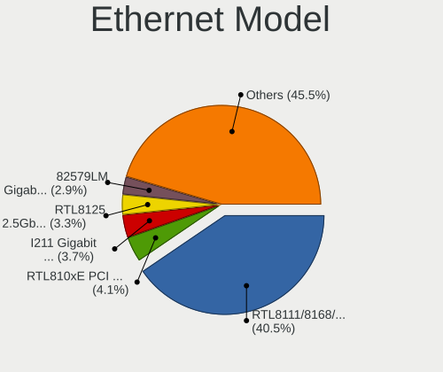

| Model                                                                  | Computers | Percent |
|------------------------------------------------------------------------|-----------|---------|
| Realtek RTL8111/8168/8211/8411 PCI Express Gigabit Ethernet Controller | 98        | 40.5%   |
| Realtek RTL810xE PCI Express Fast Ethernet controller                  | 10        | 4.13%   |
| Intel I211 Gigabit Network Connection                                  | 9         | 3.72%   |
| Realtek RTL8125 2.5GbE Controller                                      | 8         | 3.31%   |
| Intel 82579LM Gigabit Network Connection (Lewisville)                  | 7         | 2.89%   |
| Realtek RTL8153 Gigabit Ethernet Adapter                               | 5         | 2.07%   |
| Intel Ethernet Connection (7) I219-V                                   | 5         | 2.07%   |
| Xiaomi Mi/Redmi series (RNDIS)                                         | 4         | 1.65%   |
| Intel Ethernet Connection I217-LM                                      | 4         | 1.65%   |
| Realtek RTL8152 Fast Ethernet Adapter                                  | 3         | 1.24%   |
| Realtek Killer E2600 GbE Controller                                    | 3         | 1.24%   |
| Marvell Group 88E8040 PCI-E Fast Ethernet Controller                   | 3         | 1.24%   |
| Intel Ethernet Controller I225-V                                       | 3         | 1.24%   |
| Intel Ethernet Connection I219-LM                                      | 3         | 1.24%   |
| Intel Ethernet Connection (4) I219-LM                                  | 3         | 1.24%   |
| Broadcom NetLink BCM57785 Gigabit Ethernet PCIe                        | 3         | 1.24%   |
| Realtek RTL-8100/8101L/8139 PCI Fast Ethernet Adapter                  | 2         | 0.83%   |
| Qualcomm Atheros QCA8171 Gigabit Ethernet                              | 2         | 0.83%   |
| Qualcomm Atheros AR8151 v2.0 Gigabit Ethernet                          | 2         | 0.83%   |
| Qualcomm Atheros AR8131 Gigabit Ethernet                               | 2         | 0.83%   |
| Marvell Group 88E8058 PCI-E Gigabit Ethernet Controller                | 2         | 0.83%   |
| Intel Ethernet Connection (2) I219-V                                   | 2         | 0.83%   |
| Intel Ethernet Connection (16) I219-LM                                 | 2         | 0.83%   |
| Intel Alder Lake-P PCH CNVi WiFi                                       | 2         | 0.83%   |
| Intel 82577LM Gigabit Network Connection                               | 2         | 0.83%   |
| Intel 82567LM Gigabit Network Connection                               | 2         | 0.83%   |
| Broadcom NetXtreme BCM57786 Gigabit Ethernet PCIe                      | 2         | 0.83%   |
| ASIX AX88179 Gigabit Ethernet                                          | 2         | 0.83%   |
| ZTE WCDMA MSM Yota Router                                              | 1         | 0.41%   |
| TP-Link UE300 10/100/1000 LAN (ethernet mode) [Realtek RTL8153]        | 1         | 0.41%   |
| T & A Mobile Phones TCL 50 XL 5G                                       | 1         | 0.41%   |
| Samsung GT-I9070 (network tethering, USB debugging enabled)            | 1         | 0.41%   |
| Samsung Galaxy series, misc. (tethering mode)                          | 1         | 0.41%   |
| Realtek RTL8922AE 802.11be PCIe Wireless Network Adapter               | 1         | 0.41%   |
| Realtek RTL8111/8168/8411 PCI Express Gigabit Ethernet Controller      | 1         | 0.41%   |
| Qualcomm YUPIK-QRD _SN:AC1D5909                                        | 1         | 0.41%   |
| Qualcomm Atheros Killer E2500 Gigabit Ethernet Controller              | 1         | 0.41%   |
| Qualcomm Atheros Killer E220x Gigabit Ethernet Controller              | 1         | 0.41%   |
| Qualcomm Atheros AR8162 Fast Ethernet                                  | 1         | 0.41%   |
| Qualcomm Atheros AR8161 Gigabit Ethernet                               | 1         | 0.41%   |

Net Controller Kind
-------------------

Ethernet, WiFi or modem

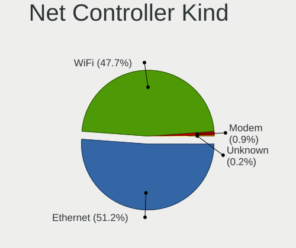

| Kind     | Computers | Percent |
|----------|-----------|---------|
| Ethernet | 219       | 51.17%  |
| WiFi     | 204       | 47.66%  |
| Modem    | 4         | 0.93%   |
| Unknown  | 1         | 0.23%   |

Used Controller
---------------

Currently used network controller

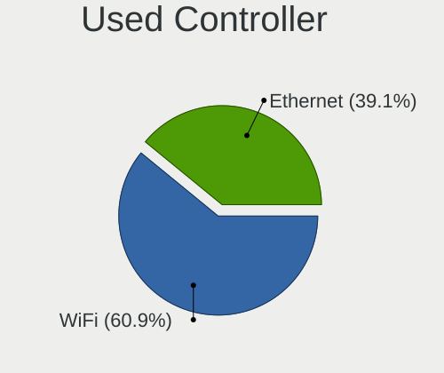

| Kind     | Computers | Percent |
|----------|-----------|---------|
| WiFi     | 159       | 60.92%  |
| Ethernet | 102       | 39.08%  |

NICs
----

Total network controllers on board

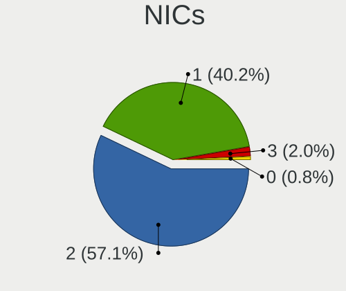

| Total | Computers | Percent |
|-------|-----------|---------|
| 2     | 145       | 57.09%  |
| 1     | 102       | 40.16%  |
| 3     | 5         | 1.97%   |
| 0     | 2         | 0.79%   |

IPv6
----

IPv6 vs IPv4

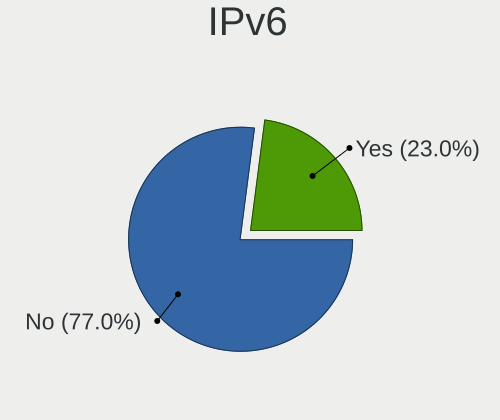

| Used | Computers | Percent |
|------|-----------|---------|
| No   | 198       | 77.04%  |
| Yes  | 59        | 22.96%  |

Bluetooth
---------

Bluetooth Vendor
----------------

Controller vendors

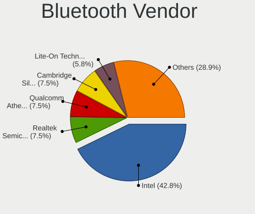

| Vendor                          | Computers | Percent |
|---------------------------------|-----------|---------|
| Intel                           | 74        | 42.77%  |
| Realtek Semiconductor           | 13        | 7.51%   |
| Qualcomm Atheros Communications | 13        | 7.51%   |
| Cambridge Silicon Radio         | 13        | 7.51%   |
| Lite-On Technology              | 10        | 5.78%   |
| Broadcom                        | 10        | 5.78%   |
| IMC Networks                    | 7         | 4.05%   |
| Foxconn / Hon Hai               | 7         | 4.05%   |
| Apple                           | 7         | 4.05%   |
| MediaTek                        | 6         | 3.47%   |
| Dell                            | 3         | 1.73%   |
| Toshiba                         | 2         | 1.16%   |
| Hewlett-Packard                 | 2         | 1.16%   |
| ASUSTek Computer                | 2         | 1.16%   |
| TP-Link                         | 1         | 0.58%   |
| SiW                             | 1         | 0.58%   |
| Realtek                         | 1         | 0.58%   |
| Ralink                          | 1         | 0.58%   |

Bluetooth Model
---------------

Controller models

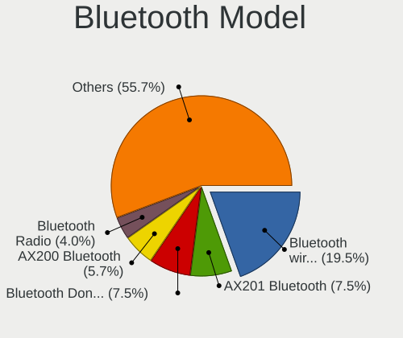

| Model                                               | Computers | Percent |
|-----------------------------------------------------|-----------|---------|
| Intel Bluetooth wireless interface                  | 34        | 19.54%  |
| Intel AX201 Bluetooth                               | 13        | 7.47%   |
| Cambridge Silicon Radio Bluetooth Dongle (HCI mode) | 13        | 7.47%   |
| Intel AX200 Bluetooth                               | 10        | 5.75%   |
| Realtek Bluetooth Radio                             | 7         | 4.02%   |
| MediaTek Wireless_Device                            | 6         | 3.45%   |
| Intel Bluetooth 9460/9560 Jefferson Peak (JfP)      | 6         | 3.45%   |
| Qualcomm Atheros  Bluetooth Device                  | 5         | 2.87%   |
| Lite-On Qualcomm Atheros QCA9377 Bluetooth          | 5         | 2.87%   |
| IMC Networks Bluetooth Radio                        | 5         | 2.87%   |
| Realtek  Bluetooth 4.2 Adapter                      | 4         | 2.3%    |
| Qualcomm Atheros AR3012 Bluetooth 4.0               | 4         | 2.3%    |
| Intel Wireless-AC 3168 Bluetooth                    | 3         | 1.72%   |
| Foxconn / Hon Hai Wireless_Device                   | 3         | 1.72%   |
| Broadcom BCM20702A0 Bluetooth 4.0                   | 3         | 1.72%   |
| Toshiba RT Bluetooth Radio                          | 2         | 1.15%   |
| Qualcomm Atheros QCA61x4 Bluetooth 4.0              | 2         | 1.15%   |
| Lite-On Wireless_Device                             | 2         | 1.15%   |
| Lite-On Atheros AR3012 Bluetooth                    | 2         | 1.15%   |
| Intel Wireless-AC 9260 Bluetooth Adapter            | 2         | 1.15%   |
| Intel Centrino Advanced-N 6230 Bluetooth adapter    | 2         | 1.15%   |
| Intel Bluetooth Device                              | 2         | 1.15%   |
| Intel AX210 Bluetooth                               | 2         | 1.15%   |
| HP Bluetooth 2.0 Interface [Broadcom BCM2045]       | 2         | 1.15%   |
| Foxconn / Hon Hai Bluetooth Device                  | 2         | 1.15%   |
| Dell DW375 Bluetooth Module                         | 2         | 1.15%   |
| Broadcom BCM43142A0 Bluetooth Device                | 2         | 1.15%   |
| Apple Bluetooth USB Host Controller                 | 2         | 1.15%   |
| Apple Bluetooth Host Controller                     | 2         | 1.15%   |
| Apple Bluetooth HCI                                 | 2         | 1.15%   |
| TP-Link TP-T@- UB500 Adapter                        | 1         | 0.57%   |
| SiW SiW                                             | 1         | 0.57%   |
| Realtek RTL8822BE Bluetooth 4.2 Adapter             | 1         | 0.57%   |
| Realtek RTL8821A Bluetooth                          | 1         | 0.57%   |
| Realtek Bluetooth Radio                             | 1         | 0.57%   |
| Ralink RT3290 Bluetooth                             | 1         | 0.57%   |
| Qualcomm Atheros AR9462 Bluetooth                   | 1         | 0.57%   |
| Qualcomm Atheros AR3011 Bluetooth                   | 1         | 0.57%   |
| Lite-On Bluetooth Device                            | 1         | 0.57%   |
| Intel Centrino Bluetooth Wireless Transceiver       | 1         | 0.57%   |

Sound
-----

Sound Vendor
------------

Sound card vendors

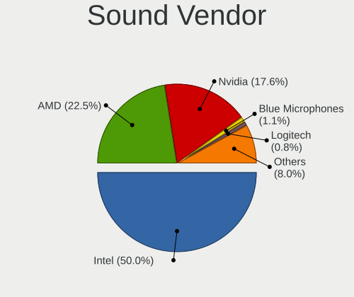

| Vendor                  | Computers | Percent |
|-------------------------|-----------|---------|
| Intel                   | 182       | 50%     |
| AMD                     | 82        | 22.53%  |
| Nvidia                  | 64        | 17.58%  |
| Blue Microphones        | 4         | 1.1%    |
| Logitech                | 3         | 0.82%   |
| C-Media Electronics     | 3         | 0.82%   |
| Texas Instruments       | 2         | 0.55%   |
| SteelSeries ApS         | 2         | 0.55%   |
| JMTek                   | 2         | 0.55%   |
| Creative Technology     | 2         | 0.55%   |
| Conexant Systems        | 2         | 0.55%   |
| Yamaha                  | 1         | 0.27%   |
| Tenx Technology         | 1         | 0.27%   |
| SmartlinkTechnology     | 1         | 0.27%   |
| SAVITECH                | 1         | 0.27%   |
| Samsung Electronics     | 1         | 0.27%   |
| RME                     | 1         | 0.27%   |
| Ploopy                  | 1         | 0.27%   |
| Mark of the Unicorn     | 1         | 0.27%   |
| liyuany                 | 1         | 0.27%   |
| Hewlett-Packard         | 1         | 0.27%   |
| GYROCOM C&C             | 1         | 0.27%   |
| Giga-Byte Technology    | 1         | 0.27%   |
| Creative Labs           | 1         | 0.27%   |
| Cooler Master           | 1         | 0.27%   |
| BEHRINGER International | 1         | 0.27%   |
| ASUSTek Computer        | 1         | 0.27%   |

Sound Model
-----------

Sound card models

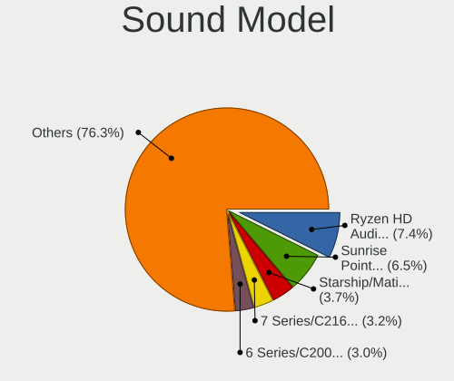

| Model                                                                      | Computers | Percent |
|----------------------------------------------------------------------------|-----------|---------|
| AMD Ryzen HD Audio Controller                                              | 32        | 7.37%   |
| Intel Sunrise Point-LP HD Audio                                            | 28        | 6.45%   |
| AMD Starship/Matisse HD Audio Controller                                   | 16        | 3.69%   |
| Intel 7 Series/C216 Chipset Family High Definition Audio Controller        | 14        | 3.23%   |
| Intel 6 Series/C200 Series Chipset Family High Definition Audio Controller | 13        | 3%      |
| Intel 8 Series/C220 Series Chipset High Definition Audio Controller        | 12        | 2.76%   |
| AMD Renoir/Cezanne HDMI/DP Audio Controller                                | 12        | 2.76%   |
| Intel Cannon Lake PCH cAVS                                                 | 10        | 2.3%    |
| Intel 100 Series/C230 Series Chipset Family HD Audio Controller            | 10        | 2.3%    |
| Nvidia GP106 High Definition Audio Controller                              | 9         | 2.07%   |
| Intel Xeon E3-1200 v3/4th Gen Core Processor HD Audio Controller           | 9         | 2.07%   |
| Intel NM10/ICH7 Family High Definition Audio Controller                    | 9         | 2.07%   |
| Intel 82801I (ICH9 Family) HD Audio Controller                             | 9         | 2.07%   |
| Intel 5 Series/3400 Series Chipset High Definition Audio                   | 8         | 1.84%   |
| Intel Tiger Lake-LP Smart Sound Technology Audio Controller                | 7         | 1.61%   |
| Intel Haswell-ULT HD Audio Controller                                      | 7         | 1.61%   |
| Intel 8 Series HD Audio Controller                                         | 7         | 1.61%   |
| AMD Raven/Raven2/Fenghuang HDMI/DP Audio Controller                        | 7         | 1.61%   |
| Nvidia GF108 High Definition Audio Controller                              | 6         | 1.38%   |
| Intel Celeron/Pentium Silver Processor High Definition Audio               | 6         | 1.38%   |
| Intel Atom Processor Z36xxx/Z37xxx Series High Definition Audio Controller | 6         | 1.38%   |
| AMD Radeon High Definition Audio Controller                                | 6         | 1.38%   |
| AMD FCH Azalia Controller                                                  | 6         | 1.38%   |
| Nvidia TU106 High Definition Audio Controller                              | 5         | 1.15%   |
| Intel Wildcat Point-LP High Definition Audio Controller                    | 5         | 1.15%   |
| Intel Cannon Point-LP High Definition Audio Controller                     | 5         | 1.15%   |
| Intel Broadwell-U Audio Controller                                         | 5         | 1.15%   |
| AMD SBx00 Azalia (Intel HDA)                                               | 5         | 1.15%   |
| AMD Oland/Hainan/Cape Verde/Pitcairn HDMI Audio [Radeon HD 7000 Series]    | 5         | 1.15%   |
| AMD Navi 10 HDMI Audio                                                     | 5         | 1.15%   |
| Nvidia TU116 High Definition Audio Controller                              | 4         | 0.92%   |
| Nvidia GP107GL High Definition Audio Controller                            | 4         | 0.92%   |
| Nvidia GP104 High Definition Audio Controller                              | 4         | 0.92%   |
| Intel Alder Lake PCH-P High Definition Audio Controller                    | 4         | 0.92%   |
| Intel 82801H (ICH8 Family) HD Audio Controller                             | 4         | 0.92%   |
| AMD Navi 21/23 HDMI/DP Audio Controller                                    | 4         | 0.92%   |
| AMD Family 17h (Models 00h-0fh) HD Audio Controller                        | 4         | 0.92%   |
| AMD Ellesmere HDMI Audio [Radeon RX 470/480 / 570/580/590]                 | 4         | 0.92%   |
| AMD Baffin HDMI/DP Audio [Radeon RX 550 640SP / RX 560/560X]               | 4         | 0.92%   |
| Nvidia GP102 HDMI Audio Controller                                         | 3         | 0.69%   |

Memory
------

Memory Vendor
-------------

Memory module vendors

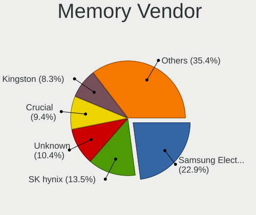

| Vendor              | Computers | Percent |
|---------------------|-----------|---------|
| Samsung Electronics | 22        | 22.92%  |
| SK hynix            | 13        | 13.54%  |
| Unknown             | 10        | 10.42%  |
| Crucial             | 9         | 9.38%   |
| Kingston            | 8         | 8.33%   |
| Micron Technology   | 7         | 7.29%   |
| Corsair             | 7         | 7.29%   |
| A-DATA Technology   | 7         | 7.29%   |
| Nanya Technology    | 3         | 3.13%   |
| Ramaxel Technology  | 2         | 2.08%   |
| G.Skill             | 2         | 2.08%   |
| Elpida              | 2         | 2.08%   |
| Transcend           | 1         | 1.04%   |
| Team                | 1         | 1.04%   |
| Patriot             | 1         | 1.04%   |
| ChangXin Memory     | 1         | 1.04%   |

Memory Model
------------

Memory module models

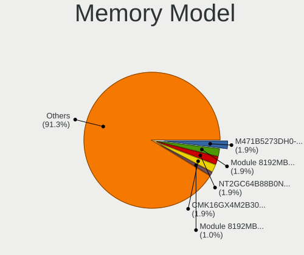

| Model                                                            | Computers | Percent |
|------------------------------------------------------------------|-----------|---------|
| SK hynix RAM Module 8192MB SODIMM DDR4 2400MT/s                  | 2         | 1.94%   |
| Samsung RAM M471B5273DH0-CK0 4GB SODIMM DDR3 2400MT/s            | 2         | 1.94%   |
| Nanya RAM NT2GC64B88B0NS-CG 2048MB SODIMM DDR3 1334MT/s          | 2         | 1.94%   |
| Corsair RAM CMK16GX4M2B3000C15 8GB DIMM DDR4 3600MT/s            | 2         | 1.94%   |
| Unknown RAM Module 8192MB SODIMM DDR3 1867MT/s                   | 1         | 0.97%   |
| Unknown RAM Module 4GB SODIMM DDR3                               | 1         | 0.97%   |
| Unknown RAM Module 4GB DIMM DDR3 1600MT/s                        | 1         | 0.97%   |
| Unknown RAM Module 4096MB SODIMM DDR3 1600MT/s                   | 1         | 0.97%   |
| Unknown RAM Module 4096MB SODIMM DDR3                            | 1         | 0.97%   |
| Unknown RAM Module 4096MB DIMM DDR3 1066MT/s                     | 1         | 0.97%   |
| Unknown RAM Module 2048MB SODIMM DDR3 1600MT/s                   | 1         | 0.97%   |
| Unknown RAM Module 2048MB DIMM DDR3 1066MT/s                     | 1         | 0.97%   |
| Unknown RAM Module 1GB SODIMM DDR                                | 1         | 0.97%   |
| Unknown RAM Module 1GB DIMM 667MT/s                              | 1         | 0.97%   |
| Unknown RAM 3600 C17 Series 8GB DIMM DDR4 3200MT/s               | 1         | 0.97%   |
| Transcend RAM JM1333KLN-4G 4GB DIMM DDR3 1333MT/s                | 1         | 0.97%   |
| Team RAM TEAMGROUP-SD4-3200 16GB SODIMM DDR4 3200MT/s            | 1         | 0.97%   |
| SK hynix RAM Module 2048MB SODIMM DDR2 800MT/s                   | 1         | 0.97%   |
| SK hynix RAM HMT41GS6MFR8C-PB 8GB SODIMM DDR3 1600MT/s           | 1         | 0.97%   |
| SK hynix RAM HMT41GS6AFR8A-PB 8GiB SODIMM DDR3 2667MT/s          | 1         | 0.97%   |
| SK hynix RAM HMT351S6BFR8C-H9 4GB SODIMM DDR3 1333MT/s           | 1         | 0.97%   |
| SK hynix RAM HMAA2GS6CJR8N-XN 16GB SODIMM DDR4 3200MT/s          | 1         | 0.97%   |
| SK hynix RAM HMAA1GS6CMR6N-VK 8GB SODIMM DDR4 2667MT/s           | 1         | 0.97%   |
| SK hynix RAM HMA81GS6DJR8N-XN 8GB SODIMM DDR4 3200MT/s           | 1         | 0.97%   |
| SK hynix RAM HMA81GS6AFR8N-UH 8GB SODIMM DDR4 2667MT/s           | 1         | 0.97%   |
| SK hynix RAM HMA451S6AFR8N-TF 4GB SODIMM DDR4 2133MT/s           | 1         | 0.97%   |
| SK hynix RAM HCNNNBKMMLXR-NEE 1GB Row Of Chips LPDDR4 4267MT/s   | 1         | 0.97%   |
| SK hynix RAM H9CCNNNCLGALAR-NVD 8GB Row Of Chips LPDDR3 2133MT/s | 1         | 0.97%   |
| Samsung RAM Module 8192MB SODIMM DDR4 2133MT/s                   | 1         | 0.97%   |
| Samsung RAM Module 8192MB Row Of Chips LPDDR3 2133MT/s           | 1         | 0.97%   |
| Samsung RAM Module 4096MB SODIMM LPDDR3 1600MT/s                 | 1         | 0.97%   |
| Samsung RAM M471B5773CHS-CK0 2GB SODIMM DDR3 1600MT/s            | 1         | 0.97%   |
| Samsung RAM M471B5173DB0-YK0 4GB SODIMM DDR3 1600MT/s            | 1         | 0.97%   |
| Samsung RAM M471B1G73BH0-YK0 8GB SODIMM DDR3 1600MT/s            | 1         | 0.97%   |
| Samsung RAM M471A5244CB0-CWE 4GB Row Of Chips DDR4 3200MT/s      | 1         | 0.97%   |
| Samsung RAM M471A5244CB0-CTD 4GB SODIMM DDR4 3266MT/s            | 1         | 0.97%   |
| Samsung RAM M471A5244CB0-CRC 4GB SODIMM DDR4 2667MT/s            | 1         | 0.97%   |
| Samsung RAM M471A4G43MB1-CTD 32GB SODIMM DDR4 2667MT/s           | 1         | 0.97%   |
| Samsung RAM M471A2K43EB1-CWE 16GB SODIMM DDR4 3200MT/s           | 1         | 0.97%   |
| Samsung RAM M471A2G44AM0-CWE 16GB SODIMM DDR4 3200MT/s           | 1         | 0.97%   |

Memory Kind
-----------

Memory module kinds

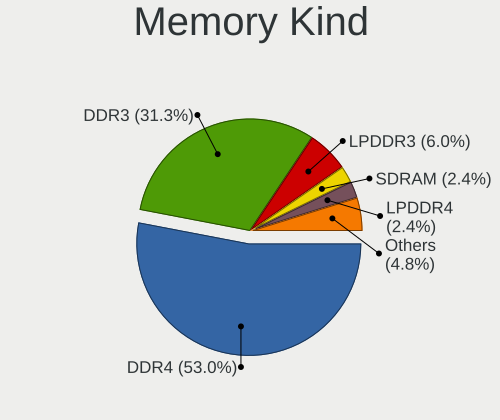

| Kind    | Computers | Percent |
|---------|-----------|---------|
| DDR4    | 44        | 53.01%  |
| DDR3    | 26        | 31.33%  |
| LPDDR3  | 5         | 6.02%   |
| SDRAM   | 2         | 2.41%   |
| LPDDR4  | 2         | 2.41%   |
| DDR2    | 2         | 2.41%   |
| DDR     | 1         | 1.2%    |
| Unknown | 1         | 1.2%    |

Memory Form Factor
------------------

Physical design of the memory module

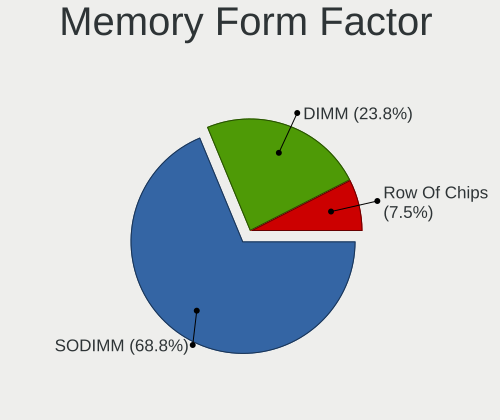

| Name         | Computers | Percent |
|--------------|-----------|---------|
| SODIMM       | 55        | 68.75%  |
| DIMM         | 19        | 23.75%  |
| Row Of Chips | 6         | 7.5%    |

Memory Size
-----------

Memory module size

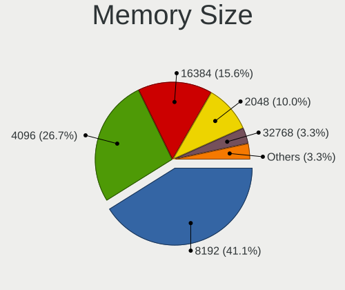

| Size  | Computers | Percent |
|-------|-----------|---------|
| 8192  | 37        | 41.11%  |
| 4096  | 24        | 26.67%  |
| 16384 | 14        | 15.56%  |
| 2048  | 9         | 10%     |
| 32768 | 3         | 3.33%   |
| 1024  | 3         | 3.33%   |

Memory Speed
------------

Memory module speed

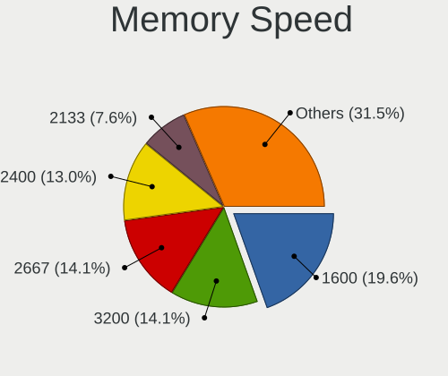

| Speed   | Computers | Percent |
|---------|-----------|---------|
| 1600    | 18        | 19.57%  |
| 3200    | 13        | 14.13%  |
| 2667    | 13        | 14.13%  |
| 2400    | 12        | 13.04%  |
| 2133    | 7         | 7.61%   |
| 3600    | 3         | 3.26%   |
| 1867    | 3         | 3.26%   |
| Unknown | 3         | 3.26%   |
| 3733    | 2         | 2.17%   |
| 1334    | 2         | 2.17%   |
| 1333    | 2         | 2.17%   |
| 667     | 2         | 2.17%   |
| 8400    | 1         | 1.09%   |
| 4267    | 1         | 1.09%   |
| 3866    | 1         | 1.09%   |
| 3400    | 1         | 1.09%   |
| 3266    | 1         | 1.09%   |
| 3000    | 1         | 1.09%   |
| 2048    | 1         | 1.09%   |
| 1866    | 1         | 1.09%   |
| 1800    | 1         | 1.09%   |
| 1067    | 1         | 1.09%   |
| 1066    | 1         | 1.09%   |
| 800     | 1         | 1.09%   |

Printers & scanners
-------------------

Printer Vendor
--------------

Printer device vendors

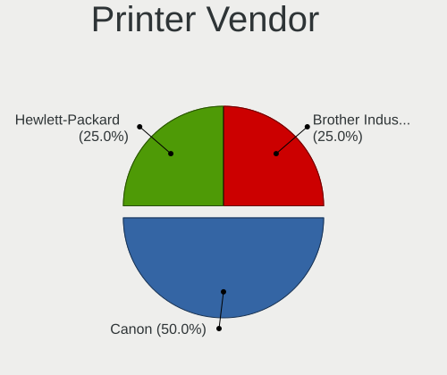

| Vendor             | Computers | Percent |
|--------------------|-----------|---------|
| Hewlett-Packard    | 3         | 50%     |
| Canon              | 2         | 33.33%  |
| Brother Industries | 1         | 16.67%  |

Printer Model
-------------

Printer device models

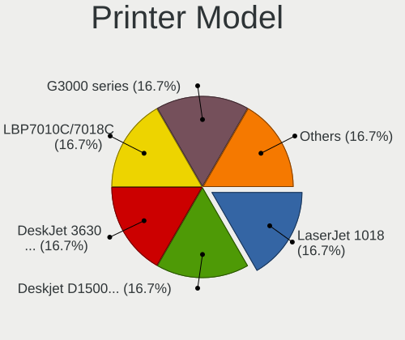

| Model                   | Computers | Percent |
|-------------------------|-----------|---------|
| HP LaserJet 1018        | 1         | 16.67%  |
| HP Deskjet D1500 series | 1         | 16.67%  |
| HP DeskJet 3630 series  | 1         | 16.67%  |
| Canon LBP7010C/7018C    | 1         | 16.67%  |
| Canon G3000 series      | 1         | 16.67%  |
| Brother MFC-9330CDW     | 1         | 16.67%  |

Scanner Vendor
--------------

Scanner device vendors

| Vendor | Computers | Percent |
|--------|-----------|---------|
| Canon  | 1         | 100%    |

Scanner Model
-------------

Scanner device models

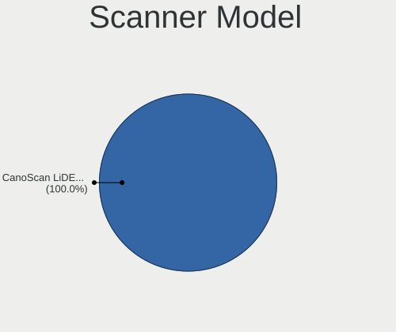

| Model                   | Computers | Percent |
|-------------------------|-----------|---------|
| Canon CanoScan LiDE 220 | 1         | 100%    |

Camera
------

Camera Vendor
-------------

Camera device vendors

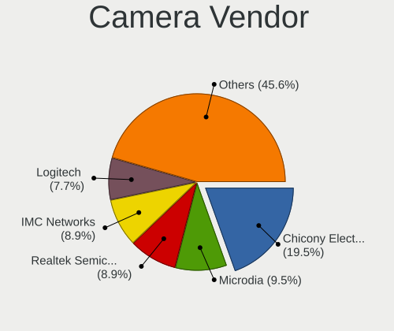

| Vendor                                 | Computers | Percent |
|----------------------------------------|-----------|---------|
| Chicony Electronics                    | 33        | 19.53%  |
| Microdia                               | 16        | 9.47%   |
| Realtek Semiconductor                  | 15        | 8.88%   |
| IMC Networks                           | 15        | 8.88%   |
| Logitech                               | 13        | 7.69%   |
| Quanta                                 | 9         | 5.33%   |
| Sunplus Innovation Technology          | 8         | 4.73%   |
| Bison Electronics                      | 8         | 4.73%   |
| Cheng Uei Precision Industry (Foxlink) | 7         | 4.14%   |
| Suyin                                  | 6         | 3.55%   |
| Lite-On Technology                     | 6         | 3.55%   |
| Syntek                                 | 5         | 2.96%   |
| Apple                                  | 5         | 2.96%   |
| Microsoft                              | 3         | 1.78%   |
| Sonix Technology                       | 2         | 1.18%   |
| Luxvisions Innotech Limited            | 2         | 1.18%   |
| Lenovo                                 | 2         | 1.18%   |
| Importek                               | 2         | 1.18%   |
| A4Tech                                 | 2         | 1.18%   |
| Z-Star Microelectronics                | 1         | 0.59%   |
| Unknown                                | 1         | 0.59%   |
| Silicon Motion                         | 1         | 0.59%   |
| Samsung Electronics                    | 1         | 0.59%   |
| Ricoh                                  | 1         | 0.59%   |
| MacroSilicon                           | 1         | 0.59%   |
| LG Electronics                         | 1         | 0.59%   |
| Intel                                  | 1         | 0.59%   |
| Hewlett-Packard                        | 1         | 0.59%   |
| ARC International                      | 1         | 0.59%   |

Camera Model
------------

Camera device models

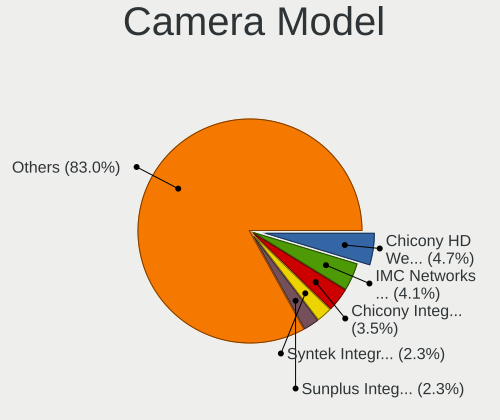

| Model                                         | Computers | Percent |
|-----------------------------------------------|-----------|---------|
| Chicony HD WebCam                             | 8         | 4.68%   |
| IMC Networks USB2.0 HD UVC WebCam             | 7         | 4.09%   |
| Chicony Integrated Camera                     | 6         | 3.51%   |
| Syntek Integrated Camera                      | 4         | 2.34%   |
| Sunplus Integrated_Webcam_HD                  | 4         | 2.34%   |
| Microdia Integrated_Webcam_HD                 | 4         | 2.34%   |
| IMC Networks Integrated Camera                | 4         | 2.34%   |
| Realtek Integrated Webcam_HD                  | 3         | 1.75%   |
| Realtek HD WebCam                             | 3         | 1.75%   |
| Logitech Webcam C270                          | 3         | 1.75%   |
| Logitech HD Pro Webcam C920                   | 3         | 1.75%   |
| Chicony VGA Webcam                            | 3         | 1.75%   |
| Suyin HP TrueVision HD Integrated Webcam      | 2         | 1.17%   |
| Sonix USB2.0 FHD UVC WebCam                   | 2         | 1.17%   |
| Realtek Integrated_Webcam_HD                  | 2         | 1.17%   |
| Quanta HP TrueVision HD Webcam                | 2         | 1.17%   |
| Quanta HD User Facing                         | 2         | 1.17%   |
| Microdia Camera                               | 2         | 1.17%   |
| Logitech Logitech Webcam C160                 | 2         | 1.17%   |
| IMC Networks USB2.0 VGA UVC WebCam            | 2         | 1.17%   |
| Chicony HP Truevision HD camera               | 2         | 1.17%   |
| Chicony EasyCamera                            | 2         | 1.17%   |
| Cheng Uei Precision Industry (Foxlink) Webcam | 2         | 1.17%   |
| Apple FaceTime HD Camera (Built-in)           | 2         | 1.17%   |
| Z-Star Webcam                                 | 1         | 0.58%   |
| Unknown ATIV VGA CAMERA                       | 1         | 0.58%   |
| Syntek USB2.0 Camera                          | 1         | 0.58%   |
| Suyin HP webcam [dv6-1190en]                  | 1         | 0.58%   |
| Suyin HP TrueVision FHD RGB-IR                | 1         | 0.58%   |
| Suyin Acer/HP Integrated Webcam [CN0314]      | 1         | 0.58%   |
| Suyin 1.3M HD WebCam                          | 1         | 0.58%   |
| Sunplus Laptop_Integrated_Webcam_HD           | 1         | 0.58%   |
| Sunplus Laptop Integrated WebCam HD           | 1         | 0.58%   |
| Sunplus Full HD webcam                        | 1         | 0.58%   |
| Sunplus Asus Webcam                           | 1         | 0.58%   |
| Silicon Motion WebCam SC-10HDD12636N          | 1         | 0.58%   |
| Samsung Galaxy series, misc. (MTP mode)       | 1         | 0.58%   |
| Ricoh USB2.0 Camera                           | 1         | 0.58%   |
| Realtek Laptop Camera                         | 1         | 0.58%   |
| Realtek Integrated_Webcam_FHD                 | 1         | 0.58%   |

Security
--------

Fingerprint Vendor
------------------

Fingerprint sensor vendors

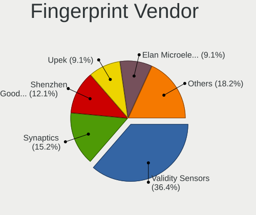

| Vendor                     | Computers | Percent |
|----------------------------|-----------|---------|
| Validity Sensors           | 12        | 36.36%  |
| Synaptics                  | 5         | 15.15%  |
| Shenzhen Goodix Technology | 4         | 12.12%  |
| Upek                       | 3         | 9.09%   |
| Elan Microelectronics      | 3         | 9.09%   |
| AuthenTec                  | 3         | 9.09%   |
| LighTuning Technology      | 2         | 6.06%   |
| Focal-systems.Corp         | 1         | 3.03%   |

Fingerprint Model
-----------------

Fingerprint sensor models

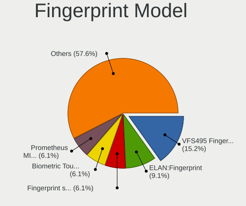

| Model                                                  | Computers | Percent |
|--------------------------------------------------------|-----------|---------|
| Validity Sensors VFS495 Fingerprint Reader             | 5         | 15.15%  |
| Elan ELAN:Fingerprint                                  | 3         | 9.09%   |
| Validity Sensors Fingerprint scanner                   | 2         | 6.06%   |
| Upek Biometric Touchchip/Touchstrip Fingerprint Sensor | 2         | 6.06%   |
| Synaptics Prometheus MIS Touch Fingerprint Reader      | 2         | 6.06%   |
| Shenzhen Goodix  Fingerprint Device                    | 2         | 6.06%   |
| Shenzhen Goodix Fingerprint Reader                     | 2         | 6.06%   |
| LighTuning EgisTec Touch Fingerprint Sensor            | 2         | 6.06%   |
| Validity Sensors VFS7500 Touch Fingerprint Sensor      | 1         | 3.03%   |
| Validity Sensors VFS5011 Fingerprint Reader            | 1         | 3.03%   |
| Validity Sensors VFS491                                | 1         | 3.03%   |
| Validity Sensors VFS Fingerprint sensor                | 1         | 3.03%   |
| Validity Sensors VFS 5011 fingerprint sensor           | 1         | 3.03%   |
| Upek TCS5B Fingerprint sensor                          | 1         | 3.03%   |
| Synaptics WBDI                                         | 1         | 3.03%   |
| Synaptics  WBDI                                        | 1         | 3.03%   |
| Synaptics Metallica MIS Touch Fingerprint Reader       | 1         | 3.03%   |
| Focal-systems.Corp FT9201Fingerprint.                  | 1         | 3.03%   |
| AuthenTec Fingerprint Sensor                           | 1         | 3.03%   |
| AuthenTec AES2810                                      | 1         | 3.03%   |
| AuthenTec AES2501 Fingerprint Sensor                   | 1         | 3.03%   |

Chipcard Vendor
---------------

Chipcard module vendors

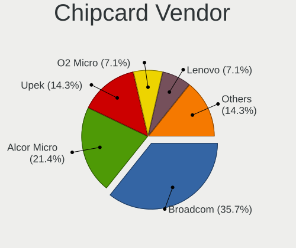

| Vendor      | Computers | Percent |
|-------------|-----------|---------|
| Broadcom    | 5         | 35.71%  |
| Alcor Micro | 3         | 21.43%  |
| Upek        | 2         | 14.29%  |
| O2 Micro    | 1         | 7.14%   |
| Lenovo      | 1         | 7.14%   |
| Bit4id      | 1         | 7.14%   |
| Aktiv       | 1         | 7.14%   |

Chipcard Model
--------------

Chipcard module models

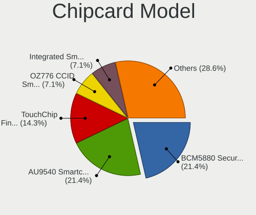

| Model                                                      | Computers | Percent |
|------------------------------------------------------------|-----------|---------|
| Broadcom BCM5880 Secure Applications Processor             | 3         | 21.43%  |
| Alcor Micro AU9540 Smartcard Reader                        | 3         | 21.43%  |
| Upek TouchChip Fingerprint Coprocessor (WBF advanced mode) | 2         | 14.29%  |
| O2 Micro OZ776 CCID Smartcard Reader                       | 1         | 7.14%   |
| Lenovo Integrated Smart Card Reader                        | 1         | 7.14%   |
| Broadcom 5880                                              | 1         | 7.14%   |
| Broadcom 58200                                             | 1         | 7.14%   |
| Bit4id miniLector EVO                                      | 1         | 7.14%   |
| Aktiv Rutoken lite                                         | 1         | 7.14%   |

Unsupported
-----------

Unsupported Devices
-------------------

Total unsupported devices on board

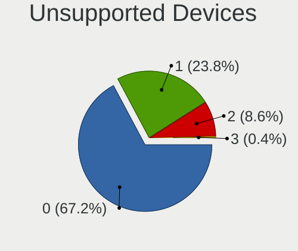

| Total | Computers | Percent |
|-------|-----------|---------|
| 0     | 172       | 67.19%  |
| 1     | 61        | 23.83%  |
| 2     | 22        | 8.59%   |
| 3     | 1         | 0.39%   |

Unsupported Device Types
------------------------

Types of unsupported devices

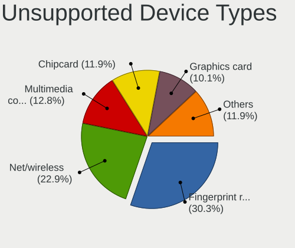

| Type                     | Computers | Percent |
|--------------------------|-----------|---------|
| Fingerprint reader       | 33        | 30.28%  |
| Net/wireless             | 25        | 22.94%  |
| Multimedia controller    | 14        | 12.84%  |
| Chipcard                 | 13        | 11.93%  |
| Graphics card            | 11        | 10.09%  |
| Camera                   | 3         | 2.75%   |
| Unassigned class         | 2         | 1.83%   |
| Net/ethernet             | 2         | 1.83%   |
| Tv card                  | 1         | 0.92%   |
| Storage                  | 1         | 0.92%   |
| Network                  | 1         | 0.92%   |
| Communication controller | 1         | 0.92%   |
| Card reader              | 1         | 0.92%   |
| Bluetooth                | 1         | 0.92%   |

