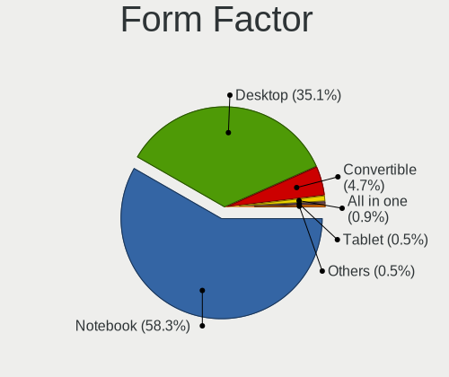
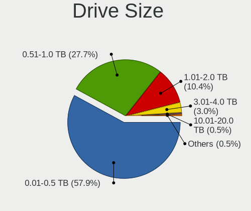
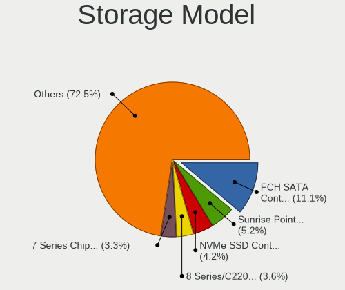
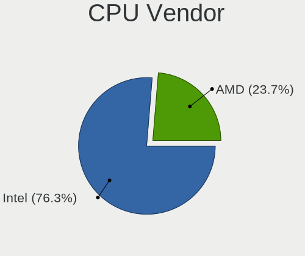
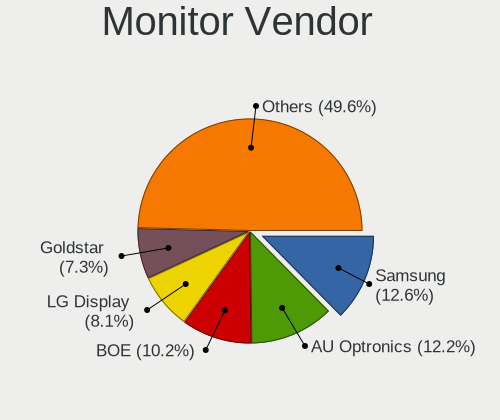
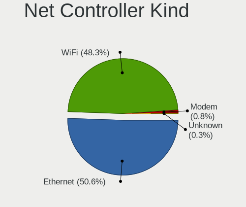
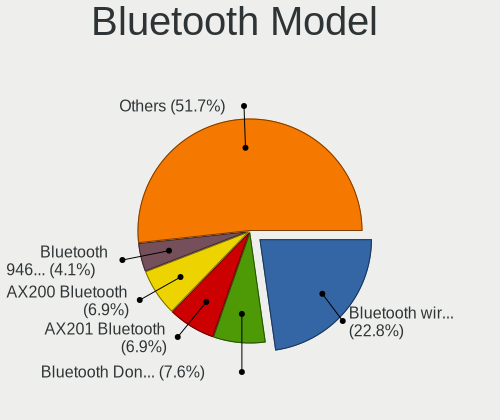
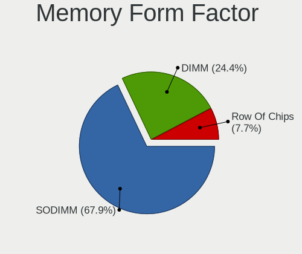
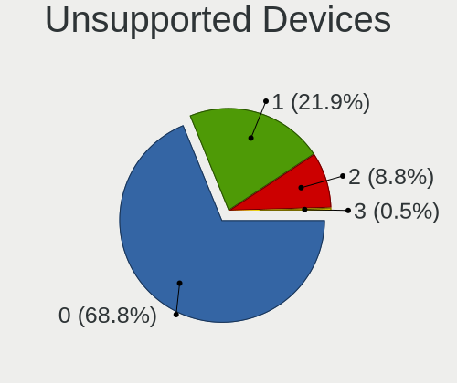

Solus - Tested Hardware & Statistics
------------------------------------

A project to collect tested hardware configurations for Solus.

Anyone can contribute to this report by the [hw-probe](https://github.com/linuxhw/hw-probe) tool:

    sudo -E hw-probe -all -upload

Please contribute! Especially if your hardware is rare.

This is a report for all computer types. See also reports for [desktops](/Dist/Solus/Desktop/README.md) and [notebooks](/Dist/Solus/Notebook/README.md).

Contents
--------

* [ Test Cases ](#test-cases)

* [ System ](#system)
  - [ OS                       ](#os)
  - [ OS Family                ](#os-family)
  - [ Kernel                   ](#kernel)
  - [ Kernel Family            ](#kernel-family)
  - [ Kernel Major Ver.        ](#kernel-major-ver)
  - [ Arch                     ](#arch)
  - [ DE                       ](#de)
  - [ Display Server           ](#display-server)
  - [ Display Manager          ](#display-manager)
  - [ OS Lang                  ](#os-lang)
  - [ Boot Mode                ](#boot-mode)
  - [ Filesystem               ](#filesystem)
  - [ Part. scheme             ](#part-scheme)
  - [ Dual Boot with Linux/BSD ](#dual-boot-with-linuxbsd)
  - [ Dual Boot (Win)          ](#dual-boot-win)

* [ Board ](#board)
  - [ Vendor                   ](#vendor)
  - [ Model                    ](#model)
  - [ Model Family             ](#model-family)
  - [ MFG Year                 ](#mfg-year)
  - [ Form Factor              ](#form-factor)
  - [ Secure Boot              ](#secure-boot)
  - [ Coreboot                 ](#coreboot)
  - [ RAM Size                 ](#ram-size)
  - [ RAM Used                 ](#ram-used)
  - [ Total Drives             ](#total-drives)
  - [ Has CD-ROM               ](#has-cd-rom)
  - [ Has Ethernet             ](#has-ethernet)
  - [ Has WiFi                 ](#has-wifi)
  - [ Has Bluetooth            ](#has-bluetooth)

* [ Location ](#location)
  - [ Country                  ](#country)
  - [ City                     ](#city)

* [ Drives ](#drives)
  - [ Drive Vendor             ](#drive-vendor)
  - [ Drive Model              ](#drive-model)
  - [ HDD Vendor               ](#hdd-vendor)
  - [ SSD Vendor               ](#ssd-vendor)
  - [ Drive Kind               ](#drive-kind)
  - [ Drive Connector          ](#drive-connector)
  - [ Drive Size               ](#drive-size)
  - [ Space Total              ](#space-total)
  - [ Space Used               ](#space-used)
  - [ Malfunc. Drives          ](#malfunc-drives)
  - [ Malfunc. Drive Vendor    ](#malfunc-drive-vendor)
  - [ Malfunc. HDD Vendor      ](#malfunc-hdd-vendor)
  - [ Malfunc. Drive Kind      ](#malfunc-drive-kind)
  - [ Failed Drives            ](#failed-drives)
  - [ Failed Drive Vendor      ](#failed-drive-vendor)
  - [ Drive Status             ](#drive-status)

* [ Storage controller ](#storage-controller)
  - [ Storage Vendor           ](#storage-vendor)
  - [ Storage Model            ](#storage-model)
  - [ Storage Kind             ](#storage-kind)

* [ Processor ](#processor)
  - [ CPU Vendor               ](#cpu-vendor)
  - [ CPU Model                ](#cpu-model)
  - [ CPU Model Family         ](#cpu-model-family)
  - [ CPU Cores                ](#cpu-cores)
  - [ CPU Sockets              ](#cpu-sockets)
  - [ CPU Threads              ](#cpu-threads)
  - [ CPU Op-Modes             ](#cpu-op-modes)
  - [ CPU Microcode            ](#cpu-microcode)
  - [ CPU Microarch            ](#cpu-microarch)

* [ Graphics ](#graphics)
  - [ GPU Vendor               ](#gpu-vendor)
  - [ GPU Model                ](#gpu-model)
  - [ GPU Combo                ](#gpu-combo)
  - [ GPU Driver               ](#gpu-driver)
  - [ GPU Memory               ](#gpu-memory)

* [ Monitor ](#monitor)
  - [ Monitor Vendor           ](#monitor-vendor)
  - [ Monitor Model            ](#monitor-model)
  - [ Monitor Resolution       ](#monitor-resolution)
  - [ Monitor Diagonal         ](#monitor-diagonal)
  - [ Monitor Width            ](#monitor-width)
  - [ Aspect Ratio             ](#aspect-ratio)
  - [ Monitor Area             ](#monitor-area)
  - [ Pixel Density            ](#pixel-density)
  - [ Multiple Monitors        ](#multiple-monitors)

* [ Network ](#network)
  - [ Net Controller Vendor    ](#net-controller-vendor)
  - [ Net Controller Model     ](#net-controller-model)
  - [ Wireless Vendor          ](#wireless-vendor)
  - [ Wireless Model           ](#wireless-model)
  - [ Ethernet Vendor          ](#ethernet-vendor)
  - [ Ethernet Model           ](#ethernet-model)
  - [ Net Controller Kind      ](#net-controller-kind)
  - [ Used Controller          ](#used-controller)
  - [ NICs                     ](#nics)
  - [ IPv6                     ](#ipv6)

* [ Bluetooth ](#bluetooth)
  - [ Bluetooth Vendor         ](#bluetooth-vendor)
  - [ Bluetooth Model          ](#bluetooth-model)

* [ Sound ](#sound)
  - [ Sound Vendor             ](#sound-vendor)
  - [ Sound Model              ](#sound-model)

* [ Memory ](#memory)
  - [ Memory Vendor            ](#memory-vendor)
  - [ Memory Model             ](#memory-model)
  - [ Memory Kind              ](#memory-kind)
  - [ Memory Form Factor       ](#memory-form-factor)
  - [ Memory Size              ](#memory-size)
  - [ Memory Speed             ](#memory-speed)

* [ Printers & scanners ](#printers--scanners)
  - [ Printer Vendor           ](#printer-vendor)
  - [ Printer Model            ](#printer-model)
  - [ Scanner Vendor           ](#scanner-vendor)
  - [ Scanner Model            ](#scanner-model)

* [ Camera ](#camera)
  - [ Camera Vendor            ](#camera-vendor)
  - [ Camera Model             ](#camera-model)

* [ Security ](#security)
  - [ Fingerprint Vendor       ](#fingerprint-vendor)
  - [ Fingerprint Model        ](#fingerprint-model)
  - [ Chipcard Vendor          ](#chipcard-vendor)
  - [ Chipcard Model           ](#chipcard-model)

* [ Unsupported ](#unsupported)
  - [ Unsupported Devices      ](#unsupported-devices)
  - [ Unsupported Device Types ](#unsupported-device-types)

Test Cases
----------

Total: 280

| Vendor        | Model                       | Form-Factor | Probe                                                      | Date         |
|---------------|-----------------------------|-------------|------------------------------------------------------------|--------------|
| Lenovo        | IdeaPadFlex 5 14IAU7 82R... | Convertible | [738a42f72e](https://linux-hardware.org/?probe=738a42f72e) | Aug 05, 2023 |
| Acer          | Nitro AN515-45              | Notebook    | [fda8d0a543](https://linux-hardware.org/?probe=fda8d0a543) | Aug 02, 2023 |
| Lenovo        | Yoga 7 15ITL5 82BJ          | Convertible | [0a72297cb9](https://linux-hardware.org/?probe=0a72297cb9) | Jul 19, 2023 |
| Lenovo        | Yoga 7 15ITL5 82BJ          | Convertible | [488495f486](https://linux-hardware.org/?probe=488495f486) | Jul 15, 2023 |
| HP            | Stream x360 Convertible ... | Convertible | [2662eb02e7](https://linux-hardware.org/?probe=2662eb02e7) | Jul 13, 2023 |
| HP            | Stream x360 Convertible ... | Convertible | [b3f84b24e7](https://linux-hardware.org/?probe=b3f84b24e7) | Jul 13, 2023 |
| Valve         | Jupiter                     | Notebook    | [b7af0e09ea](https://linux-hardware.org/?probe=b7af0e09ea) | Jul 12, 2023 |
| HP            | Pavilion Laptop 15-eh1xx... | Notebook    | [33a8b4ab02](https://linux-hardware.org/?probe=33a8b4ab02) | Jul 08, 2023 |
| Sony          | VPCF236FM                   | Notebook    | [21a805fe1d](https://linux-hardware.org/?probe=21a805fe1d) | Jul 08, 2023 |
| ASUSTek       | UX430UAR                    | Notebook    | [6a51948293](https://linux-hardware.org/?probe=6a51948293) | Jul 03, 2023 |
| Dell          | Latitude 3420               | Notebook    | [730bdb05fe](https://linux-hardware.org/?probe=730bdb05fe) | Jun 23, 2023 |
| ASUSTek       | VivoBook_ASUSLaptop M350... | Notebook    | [d7e8503e88](https://linux-hardware.org/?probe=d7e8503e88) | Jun 23, 2023 |
| ASUSTek       | PRIME X370-A                | Desktop     | [137d8d57ee](https://linux-hardware.org/?probe=137d8d57ee) | May 18, 2023 |
| Lenovo        | IdeaPad 530S-14ARR 81H1     | Notebook    | [299733170c](https://linux-hardware.org/?probe=299733170c) | Apr 03, 2023 |
| ASUSTek       | TUF Gaming B550-PLUS        | Desktop     | [dbf0b56c64](https://linux-hardware.org/?probe=dbf0b56c64) | Mar 24, 2023 |
| Lenovo        | ThinkPad T14 Gen 1 20S00... | Notebook    | [db0f4c6df3](https://linux-hardware.org/?probe=db0f4c6df3) | Mar 16, 2023 |
| Lenovo        | ThinkPad L380 Yoga 20M70... | Convertible | [73a3777352](https://linux-hardware.org/?probe=73a3777352) | Mar 06, 2023 |
| Gigabyte      | EP45-UD3P                   | Desktop     | [da7b0aca1f](https://linux-hardware.org/?probe=da7b0aca1f) | Feb 03, 2023 |
| MSI           | B350 TOMAHAWK ARCTIC        | Desktop     | [10f14c4cbd](https://linux-hardware.org/?probe=10f14c4cbd) | Jan 23, 2023 |
| ASRock        | X300M-STX                   | Desktop     | [13ce0469f3](https://linux-hardware.org/?probe=13ce0469f3) | Jan 23, 2023 |
| Dell          | Inspiron 7460               | Notebook    | [141874b125](https://linux-hardware.org/?probe=141874b125) | Jan 08, 2023 |
| ASRock        | X300M-STX                   | Desktop     | [55db2decf3](https://linux-hardware.org/?probe=55db2decf3) | Jan 07, 2023 |
| Gigabyte      | EP45-UD3P                   | Desktop     | [fa5bdcfc4c](https://linux-hardware.org/?probe=fa5bdcfc4c) | Jan 06, 2023 |
| ASRock        | FM2A88M-HD+ R3.0            | Desktop     | [acbd8114d2](https://linux-hardware.org/?probe=acbd8114d2) | Jan 04, 2023 |
| Gigabyte      | EP45-UD3P                   | Desktop     | [d89c5688d2](https://linux-hardware.org/?probe=d89c5688d2) | Jan 03, 2023 |
| ASRock        | FM2A88X Extreme4+           | Desktop     | [3fb1b015e3](https://linux-hardware.org/?probe=3fb1b015e3) | Jan 02, 2023 |
| Gigabyte      | B550M AORUS PRO-P           | Desktop     | [cdb2bf4725](https://linux-hardware.org/?probe=cdb2bf4725) | Jan 02, 2023 |
| HP            | 2B47                        | Desktop     | [8980bff4e8](https://linux-hardware.org/?probe=8980bff4e8) | Dec 21, 2022 |
| Samsung       | R430/P430/R480              | Notebook    | [ae3789203b](https://linux-hardware.org/?probe=ae3789203b) | Dec 18, 2022 |
| Toshiba       | Satellite L855              | Notebook    | [932d8fec2d](https://linux-hardware.org/?probe=932d8fec2d) | Dec 12, 2022 |
| ASUSTek       | P5G41T-M LX3                | Desktop     | [7d42818fc5](https://linux-hardware.org/?probe=7d42818fc5) | Dec 06, 2022 |
| MSI           | Modern 14 B5M               | Notebook    | [2bd9abfe2c](https://linux-hardware.org/?probe=2bd9abfe2c) | Nov 20, 2022 |
| Intel         | D946GZIS AAD66165-302       | Desktop     | [ef34a2a126](https://linux-hardware.org/?probe=ef34a2a126) | Nov 16, 2022 |
| Lenovo        | IdeaPad 5 15ALC05 82LN      | Notebook    | [12b14f3cbc](https://linux-hardware.org/?probe=12b14f3cbc) | Nov 06, 2022 |
| Quanta        | TWS                         | Notebook    | [a800f54191](https://linux-hardware.org/?probe=a800f54191) | Nov 06, 2022 |
| ASRock        | X570M Pro4                  | Desktop     | [087a173c0d](https://linux-hardware.org/?probe=087a173c0d) | Oct 08, 2022 |
| Toshiba       | Satellite L855              | Notebook    | [1065197a6e](https://linux-hardware.org/?probe=1065197a6e) | Sep 15, 2022 |
| Unknown       | TB-4000                     | Desktop     | [8f7f2e486a](https://linux-hardware.org/?probe=8f7f2e486a) | Aug 30, 2022 |
| Unknown       | TB-4000                     | Desktop     | [a3cfbd4659](https://linux-hardware.org/?probe=a3cfbd4659) | Aug 25, 2022 |
| Unknown       | TB-4000                     | Desktop     | [906699e408](https://linux-hardware.org/?probe=906699e408) | Aug 14, 2022 |
| Dell          | Latitude E5470              | Notebook    | [8cd7ffad9e](https://linux-hardware.org/?probe=8cd7ffad9e) | Aug 08, 2022 |
| Lenovo        | IdeaPad S340-15API 81NC     | Notebook    | [76083d81dc](https://linux-hardware.org/?probe=76083d81dc) | Jul 30, 2022 |
| Acer          | Aspire A315-54              | Notebook    | [9e0bbc26f4](https://linux-hardware.org/?probe=9e0bbc26f4) | Jul 22, 2022 |
| ASRock        | H81 Pro BTC R2.0            | Desktop     | [1ff4c1d5df](https://linux-hardware.org/?probe=1ff4c1d5df) | Jul 10, 2022 |
| AZW           | SEi                         | Notebook    | [7556cabcae](https://linux-hardware.org/?probe=7556cabcae) | Jul 07, 2022 |
| GPU Compan... | GWTC116-2                   | Notebook    | [d0c0f4f120](https://linux-hardware.org/?probe=d0c0f4f120) | Jul 06, 2022 |
| GPU Compan... | GWTC116-2                   | Notebook    | [9d0dd21c70](https://linux-hardware.org/?probe=9d0dd21c70) | Jul 06, 2022 |
| Lenovo        | CRESCENTBAY 31900058 STD    | Desktop     | [f42a689093](https://linux-hardware.org/?probe=f42a689093) | Jun 10, 2022 |
| HP            | ProBook 450 G5              | Notebook    | [c4880f9bab](https://linux-hardware.org/?probe=c4880f9bab) | Jun 02, 2022 |
| HP            | ProBook 455 G8 Notebook ... | Notebook    | [5330a5aa11](https://linux-hardware.org/?probe=5330a5aa11) | Jun 02, 2022 |
| Gigabyte      | Z68AP-D3                    | Desktop     | [90b0bc8a37](https://linux-hardware.org/?probe=90b0bc8a37) | Jun 02, 2022 |
| HP            | ProBook 450 G5              | Notebook    | [7f8acf64cd](https://linux-hardware.org/?probe=7f8acf64cd) | May 31, 2022 |
| HP            | ProBook 450 G5              | Notebook    | [2fbbe84744](https://linux-hardware.org/?probe=2fbbe84744) | May 31, 2022 |
| Google        | Edgar                       | Notebook    | [fef9eeb5db](https://linux-hardware.org/?probe=fef9eeb5db) | May 02, 2022 |
| ASUSTek       | B85M-E                      | Desktop     | [31572b098d](https://linux-hardware.org/?probe=31572b098d) | Apr 24, 2022 |
| ASUSTek       | B85M-E                      | Desktop     | [037b7180fd](https://linux-hardware.org/?probe=037b7180fd) | Apr 23, 2022 |
| Lenovo        | Z50-70 20354                | Notebook    | [6d50395aee](https://linux-hardware.org/?probe=6d50395aee) | Apr 22, 2022 |
| ASUSTek       | TUF Gaming X570-PRO         | Desktop     | [8e0d54760d](https://linux-hardware.org/?probe=8e0d54760d) | Apr 22, 2022 |
| MSI           | B450M MORTAR                | Desktop     | [74323309f1](https://linux-hardware.org/?probe=74323309f1) | Apr 20, 2022 |
| Dell          | XPS 13 7390                 | Notebook    | [80c38b1425](https://linux-hardware.org/?probe=80c38b1425) | Apr 19, 2022 |
| Gigabyte      | F2A68HM-H                   | Desktop     | [68eec83e55](https://linux-hardware.org/?probe=68eec83e55) | Apr 15, 2022 |
| Fujitsu       | D3227-A1 S26361-D3227-A1    | Desktop     | [e60647876c](https://linux-hardware.org/?probe=e60647876c) | Apr 13, 2022 |
| ASRock        | B450 Gaming-ITX/ac          | Desktop     | [1211bed149](https://linux-hardware.org/?probe=1211bed149) | Apr 13, 2022 |
| ASRock        | H81 Pro BTC R2.0            | Desktop     | [0c294047d9](https://linux-hardware.org/?probe=0c294047d9) | Apr 13, 2022 |
| ASRock        | H81 Pro BTC R2.0            | Desktop     | [50c38c2cc6](https://linux-hardware.org/?probe=50c38c2cc6) | Apr 12, 2022 |
| Gigabyte      | GA-MA770-UD3                | Desktop     | [18063bba4f](https://linux-hardware.org/?probe=18063bba4f) | Apr 10, 2022 |
| Unknown       | HX90                        | Desktop     | [ab8a381a52](https://linux-hardware.org/?probe=ab8a381a52) | Apr 08, 2022 |
| Unknown       | HX90                        | Desktop     | [a83217f763](https://linux-hardware.org/?probe=a83217f763) | Apr 07, 2022 |
| Unknown       | HX90                        | Desktop     | [fa9981d1bd](https://linux-hardware.org/?probe=fa9981d1bd) | Apr 07, 2022 |
| Lenovo        | ThinkPad T15 Gen 2i 20W4... | Notebook    | [9391fc9592](https://linux-hardware.org/?probe=9391fc9592) | Mar 23, 2022 |
| Lenovo        | ThinkPad T15 Gen 2i 20W4... | Notebook    | [81ec123b24](https://linux-hardware.org/?probe=81ec123b24) | Mar 15, 2022 |
| Dell          | XPS 13 9380                 | Notebook    | [efc6123d49](https://linux-hardware.org/?probe=efc6123d49) | Mar 06, 2022 |
| Google        | Delbin                      | Notebook    | [fbf8763bd4](https://linux-hardware.org/?probe=fbf8763bd4) | Feb 05, 2022 |
| Acer          | Aspire A315-54              | Notebook    | [5eb9b9e574](https://linux-hardware.org/?probe=5eb9b9e574) | Jan 22, 2022 |
| ASUSTek       | A88X-PRO                    | Desktop     | [fb6f0426c3](https://linux-hardware.org/?probe=fb6f0426c3) | Jan 20, 2022 |
| ASRock        | H81 Pro BTC R2.0            | Desktop     | [06673a4f1e](https://linux-hardware.org/?probe=06673a4f1e) | Jan 12, 2022 |
| ASRock        | H81 Pro BTC R2.0            | Desktop     | [5f7b4e3335](https://linux-hardware.org/?probe=5f7b4e3335) | Jan 12, 2022 |
| ASRock        | H81 Pro BTC R2.0            | Desktop     | [ebd229b5fb](https://linux-hardware.org/?probe=ebd229b5fb) | Jan 12, 2022 |
| Acer          | Swift SF114-34              | Notebook    | [15431686d8](https://linux-hardware.org/?probe=15431686d8) | Jan 06, 2022 |
| Toshiba       | TECRA R840                  | Notebook    | [753c7caef6](https://linux-hardware.org/?probe=753c7caef6) | Dec 27, 2021 |
| Dell          | 06X1TJ A00                  | Desktop     | [315e535dd5](https://linux-hardware.org/?probe=315e535dd5) | Dec 21, 2021 |
| Sony          | VPCYB15AB                   | Notebook    | [780ef18db3](https://linux-hardware.org/?probe=780ef18db3) | Dec 13, 2021 |
| ASUSTek       | ROG STRIX B450-F GAMING     | Desktop     | [d65256bf72](https://linux-hardware.org/?probe=d65256bf72) | Dec 12, 2021 |
| Dell          | Latitude 5580               | Notebook    | [a10f022f63](https://linux-hardware.org/?probe=a10f022f63) | Nov 26, 2021 |
| Gigabyte      | H110M-DS2V-CF               | Desktop     | [63edfe6809](https://linux-hardware.org/?probe=63edfe6809) | Nov 24, 2021 |
| Gigabyte      | H110M-DS2V-CF               | Desktop     | [a4986016ca](https://linux-hardware.org/?probe=a4986016ca) | Nov 23, 2021 |
| MEGA          | G41T-M7 LGT                 | Desktop     | [7238b4cd22](https://linux-hardware.org/?probe=7238b4cd22) | Nov 21, 2021 |
| Gigabyte      | B85M-D3H                    | Desktop     | [7119b7f25b](https://linux-hardware.org/?probe=7119b7f25b) | Nov 19, 2021 |
| Framework     | Laptop                      | Notebook    | [7995a7a4de](https://linux-hardware.org/?probe=7995a7a4de) | Nov 18, 2021 |
| MSI           | B350 TOMAHAWK ARCTIC        | Desktop     | [9cc745f754](https://linux-hardware.org/?probe=9cc745f754) | Nov 16, 2021 |
| Dell          | Latitude E6220              | Notebook    | [09a75055c9](https://linux-hardware.org/?probe=09a75055c9) | Nov 12, 2021 |
| ASRock        | X470 Master SLI             | Desktop     | [7058d85808](https://linux-hardware.org/?probe=7058d85808) | Nov 11, 2021 |
| Framework     | Laptop                      | Notebook    | [72a07a2e81](https://linux-hardware.org/?probe=72a07a2e81) | Nov 11, 2021 |
| HP            | 805F                        | Desktop     | [f7bfb95642](https://linux-hardware.org/?probe=f7bfb95642) | Oct 26, 2021 |
| LattePanda    | Alpha                       | Desktop     | [cfe529288b](https://linux-hardware.org/?probe=cfe529288b) | Oct 26, 2021 |
| Biostar       | H61MLV2                     | Desktop     | [118f61b356](https://linux-hardware.org/?probe=118f61b356) | Oct 23, 2021 |
| AZW           | SEi                         | Notebook    | [0e29003348](https://linux-hardware.org/?probe=0e29003348) | Oct 18, 2021 |
| ASUSTek       | VivoBook_ASUSLaptop X509... | Notebook    | [c7f1620c1c](https://linux-hardware.org/?probe=c7f1620c1c) | Oct 05, 2021 |
| HP            | OMEN Laptop 15-en0xxx       | Notebook    | [f19ad7cba2](https://linux-hardware.org/?probe=f19ad7cba2) | Sep 16, 2021 |
| HP            | OMEN Laptop 15-en0xxx       | Notebook    | [1cca1c6ce5](https://linux-hardware.org/?probe=1cca1c6ce5) | Sep 13, 2021 |
| HP            | OMEN Laptop 15-en0xxx       | Notebook    | [888bf75e20](https://linux-hardware.org/?probe=888bf75e20) | Sep 13, 2021 |
| Gigabyte      | GA-78LMT-USB3               | Desktop     | [99c69c213a](https://linux-hardware.org/?probe=99c69c213a) | Sep 05, 2021 |
| Acer          | Nitro AN515-45              | Notebook    | [5bad88330d](https://linux-hardware.org/?probe=5bad88330d) | Sep 01, 2021 |
| ASUSTek       | TUF B450-PRO GAMING         | Desktop     | [f7d38e2f91](https://linux-hardware.org/?probe=f7d38e2f91) | Aug 29, 2021 |
| Dell          | Inspiron 1525               | Notebook    | [3f3cd9c9e2](https://linux-hardware.org/?probe=3f3cd9c9e2) | Aug 25, 2021 |
| Dell          | Inspiron 1525               | Notebook    | [de3cb038ef](https://linux-hardware.org/?probe=de3cb038ef) | Aug 25, 2021 |
| Gigabyte      | P31-ES3G                    | Desktop     | [1563940d09](https://linux-hardware.org/?probe=1563940d09) | Aug 22, 2021 |
| Gigabyte      | P31-ES3G                    | Desktop     | [34cd2a9116](https://linux-hardware.org/?probe=34cd2a9116) | Aug 22, 2021 |
| Acer          | Nitro AN515-45              | Notebook    | [d98d816e7f](https://linux-hardware.org/?probe=d98d816e7f) | Aug 18, 2021 |
| eMachines     | EL1852G                     | Desktop     | [7683cbf5bb](https://linux-hardware.org/?probe=7683cbf5bb) | Aug 16, 2021 |
| eMachines     | EL1852G                     | Desktop     | [86003fc5b7](https://linux-hardware.org/?probe=86003fc5b7) | Aug 15, 2021 |
| Apple         | Mac-B809C3757DA9BB8D iMa... | All in one  | [14f7d2a3c6](https://linux-hardware.org/?probe=14f7d2a3c6) | Aug 15, 2021 |
| Acer          | Nitro AN515-45              | Notebook    | [5320b136ea](https://linux-hardware.org/?probe=5320b136ea) | Aug 12, 2021 |
| Apple         | Mac-B809C3757DA9BB8D iMa... | All in one  | [488ebb20fc](https://linux-hardware.org/?probe=488ebb20fc) | Aug 08, 2021 |
| Dell          | Vostro 15-3568              | Notebook    | [5f68a1fdaa](https://linux-hardware.org/?probe=5f68a1fdaa) | Aug 07, 2021 |
| HP            | ProBook 650 G2              | Notebook    | [15257858f3](https://linux-hardware.org/?probe=15257858f3) | Aug 07, 2021 |
| Gigabyte      | H81M-S2V                    | Desktop     | [16b2e8c32f](https://linux-hardware.org/?probe=16b2e8c32f) | Aug 06, 2021 |
| Gigabyte      | H81M-S2V                    | Desktop     | [db8fadad17](https://linux-hardware.org/?probe=db8fadad17) | Aug 06, 2021 |
| Dell          | Inspiron 15-3573            | Notebook    | [52916532a3](https://linux-hardware.org/?probe=52916532a3) | Aug 06, 2021 |
| MSI           | B450 GAMING PRO CARBON A... | Desktop     | [b6ae0cb479](https://linux-hardware.org/?probe=b6ae0cb479) | Aug 05, 2021 |
| Gigabyte      | B360M AORUS Gaming 3-CF     | Desktop     | [fc89bec579](https://linux-hardware.org/?probe=fc89bec579) | Jul 16, 2021 |
| Lenovo        | IdeaPad 320-15ISK 80XH      | Notebook    | [75ec31cefd](https://linux-hardware.org/?probe=75ec31cefd) | Jul 16, 2021 |
| Lenovo        | ThinkCentre M71e 3157G6S    | Desktop     | [89217c2643](https://linux-hardware.org/?probe=89217c2643) | Jul 14, 2021 |
| Dell          | Vostro 15-3568              | Notebook    | [3d6d3007cf](https://linux-hardware.org/?probe=3d6d3007cf) | Jul 10, 2021 |
| Dell          | Vostro 15-3568              | Notebook    | [66d001f315](https://linux-hardware.org/?probe=66d001f315) | Jul 09, 2021 |
| ASUSTek       | N53SV                       | Notebook    | [53fef6a61a](https://linux-hardware.org/?probe=53fef6a61a) | Jul 08, 2021 |
| Apple         | Mac-B809C3757DA9BB8D iMa... | All in one  | [48cb73de41](https://linux-hardware.org/?probe=48cb73de41) | Jul 01, 2021 |
| Biostar       | A320MH                      | Desktop     | [2c478119e9](https://linux-hardware.org/?probe=2c478119e9) | Jun 30, 2021 |
| Dell          | Inspiron 3537               | Notebook    | [6fc3976633](https://linux-hardware.org/?probe=6fc3976633) | Jun 18, 2021 |
| Lenovo        | ThinkPad X1 Carbon 4th 2... | Notebook    | [0e1e07507e](https://linux-hardware.org/?probe=0e1e07507e) | Jun 15, 2021 |
| Dell          | 06X1TJ A00                  | Desktop     | [4fc48865ef](https://linux-hardware.org/?probe=4fc48865ef) | Jun 15, 2021 |
| HP            | ProBook 650 G1              | Notebook    | [120d5f24fe](https://linux-hardware.org/?probe=120d5f24fe) | Jun 07, 2021 |
| Gigabyte      | B360M AORUS Gaming 3-CF     | Desktop     | [f5c8f64400](https://linux-hardware.org/?probe=f5c8f64400) | Jun 03, 2021 |
| Howard Com... | W350                        | Notebook    | [3e55c8284e](https://linux-hardware.org/?probe=3e55c8284e) | May 28, 2021 |
| MSI           | B450 GAMING PRO CARBON A... | Desktop     | [dfa5c022b3](https://linux-hardware.org/?probe=dfa5c022b3) | May 26, 2021 |
| Acer          | Aspire E5-575G              | Notebook    | [ce04df7bae](https://linux-hardware.org/?probe=ce04df7bae) | May 23, 2021 |
| MSI           | B450 GAMING PRO CARBON A... | Desktop     | [a33e231e6b](https://linux-hardware.org/?probe=a33e231e6b) | May 23, 2021 |
| Shuttle       | FS35V4                      | Desktop     | [6f9a85a086](https://linux-hardware.org/?probe=6f9a85a086) | May 21, 2021 |
| Shuttle       | FS35V4                      | Desktop     | [acd3144c20](https://linux-hardware.org/?probe=acd3144c20) | May 21, 2021 |
| Apple         | Mac-B809C3757DA9BB8D iMa... | All in one  | [e53c63ba89](https://linux-hardware.org/?probe=e53c63ba89) | May 19, 2021 |
| ASUSTek       | P9X79 DELUXE                | Desktop     | [f759ad1793](https://linux-hardware.org/?probe=f759ad1793) | May 13, 2021 |
| ASUSTek       | P9X79 DELUXE                | Desktop     | [f28f1ea67d](https://linux-hardware.org/?probe=f28f1ea67d) | May 13, 2021 |
| Intel         | X99 V102                    | Desktop     | [bc57aedd09](https://linux-hardware.org/?probe=bc57aedd09) | May 02, 2021 |
| Gigabyte      | AORUS 17G KB                | Notebook    | [fd9385ff3c](https://linux-hardware.org/?probe=fd9385ff3c) | Apr 29, 2021 |
| ASUSTek       | ROG CROSSHAIR VIII HERO     | Desktop     | [b5f3f78ddb](https://linux-hardware.org/?probe=b5f3f78ddb) | Apr 25, 2021 |
| Packard Be... | EasyNote TS11HR             | Notebook    | [5c51b7f289](https://linux-hardware.org/?probe=5c51b7f289) | Apr 25, 2021 |
| Lenovo        | ThinkPad T430 2349CV2       | Notebook    | [98063e03b9](https://linux-hardware.org/?probe=98063e03b9) | Apr 21, 2021 |
| Dell          | 0FH884                      | Desktop     | [93acc58efb](https://linux-hardware.org/?probe=93acc58efb) | Apr 10, 2021 |
| HP            | Pavilion dv7                | Notebook    | [e8b5a1786b](https://linux-hardware.org/?probe=e8b5a1786b) | Apr 08, 2021 |
| HP            | ProBook 650 G1              | Notebook    | [e25f4adb0b](https://linux-hardware.org/?probe=e25f4adb0b) | Mar 31, 2021 |
| HP            | ProBook 650 G1              | Notebook    | [4ba1bb5165](https://linux-hardware.org/?probe=4ba1bb5165) | Mar 29, 2021 |
| Apple         | Mac-B809C3757DA9BB8D iMa... | All in one  | [c7c0f7323d](https://linux-hardware.org/?probe=c7c0f7323d) | Mar 08, 2021 |
| ASUSTek       | PRIME Z390-P                | Desktop     | [accdafb993](https://linux-hardware.org/?probe=accdafb993) | Mar 08, 2021 |
| Gigabyte      | J4005ND2P-CF                | Desktop     | [f4e39d4730](https://linux-hardware.org/?probe=f4e39d4730) | Mar 04, 2021 |
| Toshiba       | Satellite L855              | Notebook    | [e507a57307](https://linux-hardware.org/?probe=e507a57307) | Feb 23, 2021 |
| Lenovo        | Legion Y530-15ICH 81FV      | Notebook    | [f1c277189f](https://linux-hardware.org/?probe=f1c277189f) | Feb 16, 2021 |
| Acer          | Aspire 5735                 | Notebook    | [d8b7b99dd0](https://linux-hardware.org/?probe=d8b7b99dd0) | Feb 16, 2021 |
| ASUSTek       | PRIME Z390-P                | Desktop     | [cdd0998f7c](https://linux-hardware.org/?probe=cdd0998f7c) | Feb 14, 2021 |
| ASUSTek       | PRIME Z390-P                | Desktop     | [f4ee71d37f](https://linux-hardware.org/?probe=f4ee71d37f) | Feb 12, 2021 |
| Toshiba       | Satellite L855              | Notebook    | [7a2993f67a](https://linux-hardware.org/?probe=7a2993f67a) | Feb 03, 2021 |
| Gigabyte      | H61M-HD2                    | Desktop     | [78c877458a](https://linux-hardware.org/?probe=78c877458a) | Jan 28, 2021 |
| Lenovo        | ThinkPad T410 2522Y1L       | Notebook    | [3c4543a94f](https://linux-hardware.org/?probe=3c4543a94f) | Jan 26, 2021 |
| Gigabyte      | H61M-HD2                    | Desktop     | [6caba093b5](https://linux-hardware.org/?probe=6caba093b5) | Jan 24, 2021 |
| HP            | Spectre x360 Convertible... | Convertible | [bd5bdfd31f](https://linux-hardware.org/?probe=bd5bdfd31f) | Jan 21, 2021 |
| MSI           | 990FXA-GD65                 | Desktop     | [f8c2afa143](https://linux-hardware.org/?probe=f8c2afa143) | Jan 20, 2021 |
| ASRock        | B550M-ITX/ac                | Desktop     | [f69556d436](https://linux-hardware.org/?probe=f69556d436) | Jan 15, 2021 |
| Gigabyte      | Z390 D                      | Desktop     | [010be27c6a](https://linux-hardware.org/?probe=010be27c6a) | Jan 11, 2021 |
| Dell          | XPS 13 9360                 | Notebook    | [56d39c0f21](https://linux-hardware.org/?probe=56d39c0f21) | Jan 02, 2021 |
| ASRock        | X470 Master SLI             | Desktop     | [f2c8ec14c7](https://linux-hardware.org/?probe=f2c8ec14c7) | Jan 02, 2021 |
| Toshiba       | Satellite L855              | Notebook    | [0173204c7f](https://linux-hardware.org/?probe=0173204c7f) | Dec 23, 2020 |
| HUAWEI        | NBLK-WAX9X                  | Notebook    | [26447067ee](https://linux-hardware.org/?probe=26447067ee) | Dec 20, 2020 |
| Acer          | Aspire A315-21              | Notebook    | [5f78418b58](https://linux-hardware.org/?probe=5f78418b58) | Dec 19, 2020 |
| HP            | EliteBook 840 G3            | Notebook    | [708eaf5602](https://linux-hardware.org/?probe=708eaf5602) | Dec 14, 2020 |
| Toshiba       | Satellite L855              | Notebook    | [3d3a517e96](https://linux-hardware.org/?probe=3d3a517e96) | Dec 11, 2020 |
| Sony          | VPCEB1S1E                   | Notebook    | [ebcb16e616](https://linux-hardware.org/?probe=ebcb16e616) | Nov 27, 2020 |
| HP            | Elite Dragonfly             | Convertible | [ce851e2475](https://linux-hardware.org/?probe=ce851e2475) | Nov 25, 2020 |
| Panasonic     | CF-C2CCEZXCM                | Notebook    | [cba289e868](https://linux-hardware.org/?probe=cba289e868) | Nov 22, 2020 |
| MSI           | MAG B550 TOMAHAWK           | Desktop     | [8e3d2a963b](https://linux-hardware.org/?probe=8e3d2a963b) | Nov 18, 2020 |
| ASUSTek       | PRIME X370-A                | Desktop     | [c8f850e40f](https://linux-hardware.org/?probe=c8f850e40f) | Nov 15, 2020 |
| ASUSTek       | PRIME X370-A                | Desktop     | [c86804a559](https://linux-hardware.org/?probe=c86804a559) | Nov 14, 2020 |
| Apple         | Mac-B809C3757DA9BB8D iMa... | All in one  | [3a3a530ac9](https://linux-hardware.org/?probe=3a3a530ac9) | Nov 08, 2020 |
| Gigabyte      | B85M-D3H                    | Desktop     | [cdd1a3be02](https://linux-hardware.org/?probe=cdd1a3be02) | Nov 07, 2020 |
| Acer          | Aspire E1-532P              | Notebook    | [4a2a5fd18c](https://linux-hardware.org/?probe=4a2a5fd18c) | Nov 01, 2020 |
| Timi          | TM1701                      | Notebook    | [36446e6594](https://linux-hardware.org/?probe=36446e6594) | Oct 26, 2020 |
| Apple         | MacBook5,2                  | Notebook    | [b21d4ca9d0](https://linux-hardware.org/?probe=b21d4ca9d0) | Oct 26, 2020 |
| Apple         | MacBook5,2                  | Notebook    | [eb1b0d459f](https://linux-hardware.org/?probe=eb1b0d459f) | Oct 25, 2020 |
| Toshiba       | PORTEGE Z20T-B              | Notebook    | [9d789eba3c](https://linux-hardware.org/?probe=9d789eba3c) | Oct 12, 2020 |
| Toshiba       | Satellite P50-A             | Notebook    | [884731a198](https://linux-hardware.org/?probe=884731a198) | Sep 28, 2020 |
| ASRock        | X570 Steel Legend           | Desktop     | [80550be62d](https://linux-hardware.org/?probe=80550be62d) | Sep 28, 2020 |
| HP            | ProBook 450 G5              | Notebook    | [d04bae5c49](https://linux-hardware.org/?probe=d04bae5c49) | Sep 14, 2020 |
| Lenovo        | ThinkPad Edge E440 20C5A... | Notebook    | [2f729ef2af](https://linux-hardware.org/?probe=2f729ef2af) | Sep 11, 2020 |
| ASRock        | X470 Master SLI             | Desktop     | [9968dc910c](https://linux-hardware.org/?probe=9968dc910c) | Sep 10, 2020 |
| ASRock        | X470 Master SLI             | Desktop     | [2ae445db73](https://linux-hardware.org/?probe=2ae445db73) | Sep 10, 2020 |
| Lenovo        | ThinkPad T440p 20AN009CU... | Notebook    | [bcc44c581c](https://linux-hardware.org/?probe=bcc44c581c) | Sep 09, 2020 |
| Dell          | 0M017G A00                  | Desktop     | [e51b08ee63](https://linux-hardware.org/?probe=e51b08ee63) | Sep 08, 2020 |
| MSI           | B450M PRO-M2 V2             | Desktop     | [5e2142357f](https://linux-hardware.org/?probe=5e2142357f) | Sep 08, 2020 |
| MSI           | 990FXA-GD65                 | Desktop     | [e60be6cba2](https://linux-hardware.org/?probe=e60be6cba2) | Sep 06, 2020 |
| Dell          | Inspiron 5577               | Notebook    | [b46a79f93e](https://linux-hardware.org/?probe=b46a79f93e) | Sep 03, 2020 |
| Gigabyte      | Z390 AORUS PRO WIFI-CF      | Desktop     | [4bf4f029df](https://linux-hardware.org/?probe=4bf4f029df) | Sep 03, 2020 |
| MSI           | B450 GAMING PRO CARBON A... | Desktop     | [aca54beb89](https://linux-hardware.org/?probe=aca54beb89) | Sep 02, 2020 |
| MSI           | B450 GAMING PRO CARBON A... | Desktop     | [d150d7a9ea](https://linux-hardware.org/?probe=d150d7a9ea) | Sep 02, 2020 |
| Acer          | Aspire ES1-111M             | Notebook    | [fcee1a2241](https://linux-hardware.org/?probe=fcee1a2241) | Aug 21, 2020 |
| Acer          | Aspire ES1-111M             | Notebook    | [43f35553ae](https://linux-hardware.org/?probe=43f35553ae) | Aug 21, 2020 |
| Lenovo        | IdeaPad 330S-15IKB 81F5     | Notebook    | [793085b89a](https://linux-hardware.org/?probe=793085b89a) | Aug 15, 2020 |
| HP            | ProBook 440 G4              | Notebook    | [191f1be39f](https://linux-hardware.org/?probe=191f1be39f) | Aug 14, 2020 |
| HP            | ProBook 440 G4              | Notebook    | [c34e36f36e](https://linux-hardware.org/?probe=c34e36f36e) | Aug 10, 2020 |
| HP            | ProBook 440 G4              | Notebook    | [5b6c3861bb](https://linux-hardware.org/?probe=5b6c3861bb) | Aug 10, 2020 |
| ASUSTek       | TUF Gaming FX505DV_FX505... | Notebook    | [8eb28a49c4](https://linux-hardware.org/?probe=8eb28a49c4) | Aug 03, 2020 |
| Pegatron      | IPM31G                      | Desktop     | [ed7c9fc9dc](https://linux-hardware.org/?probe=ed7c9fc9dc) | Jul 24, 2020 |
| HP            | ENVY x360 Convertible 13... | Convertible | [fda411a3d7](https://linux-hardware.org/?probe=fda411a3d7) | Jul 24, 2020 |
| Avell High... | Avell G1750 MUV / C65 MU... | Notebook    | [cf035fee07](https://linux-hardware.org/?probe=cf035fee07) | Jul 24, 2020 |
| Lenovo        | MIIX 310-10ICR 80SG         | Tablet      | [7744b749d9](https://linux-hardware.org/?probe=7744b749d9) | Jul 09, 2020 |
| ASUSTek       | ZenBook UX431DA_UM431DA     | Notebook    | [2fdc7ceb31](https://linux-hardware.org/?probe=2fdc7ceb31) | Jul 03, 2020 |
| HP            | Presario C700               | Notebook    | [6b50a4fad1](https://linux-hardware.org/?probe=6b50a4fad1) | Jun 26, 2020 |
| ASUSTek       | K45A                        | Notebook    | [57c5b7b4bd](https://linux-hardware.org/?probe=57c5b7b4bd) | Jun 08, 2020 |
| MSI           | H87-G41 PC Mate             | Desktop     | [6081e4a770](https://linux-hardware.org/?probe=6081e4a770) | Jun 07, 2020 |
| MSI           | H310M PRO-M2 PLUS           | Desktop     | [5d852ecca8](https://linux-hardware.org/?probe=5d852ecca8) | Jun 06, 2020 |
| Acer          | Predator PH315-52           | Notebook    | [b5e7780315](https://linux-hardware.org/?probe=b5e7780315) | Jun 04, 2020 |
| Lenovo        | Z51-70 80K6                 | Notebook    | [7b25fce04c](https://linux-hardware.org/?probe=7b25fce04c) | May 24, 2020 |
| Samsung       | 270E5K/270E5Q/271E5K/257... | Notebook    | [cb0fe570e2](https://linux-hardware.org/?probe=cb0fe570e2) | May 22, 2020 |
| Dell          | Latitude 7390               | Notebook    | [49112c8937](https://linux-hardware.org/?probe=49112c8937) | May 20, 2020 |
| HP            | ProBook 6470b               | Notebook    | [59db0f436f](https://linux-hardware.org/?probe=59db0f436f) | May 13, 2020 |
| MSI           | H87-G41 PC Mate             | Desktop     | [b3513301a1](https://linux-hardware.org/?probe=b3513301a1) | May 08, 2020 |
| Samsung       | 270E5K/270E5Q/271E5K/257... | Notebook    | [e98c6a162c](https://linux-hardware.org/?probe=e98c6a162c) | May 03, 2020 |
| Toshiba       | Satellite L655              | Notebook    | [32a9d86996](https://linux-hardware.org/?probe=32a9d86996) | May 02, 2020 |
| Acer          | Aspire E1-532P              | Notebook    | [b401e8b701](https://linux-hardware.org/?probe=b401e8b701) | Apr 30, 2020 |
| Lenovo        | Yoga 730-13IKB 81CT         | Convertible | [670ddc1e5c](https://linux-hardware.org/?probe=670ddc1e5c) | Apr 13, 2020 |
| HP            | Pavilion dv6                | Notebook    | [6939cb8715](https://linux-hardware.org/?probe=6939cb8715) | Apr 11, 2020 |
| Acer          | Aspire E5-575               | Notebook    | [328b82f240](https://linux-hardware.org/?probe=328b82f240) | Apr 11, 2020 |
| HP            | Pavilion dv6                | Notebook    | [0c6dc861d6](https://linux-hardware.org/?probe=0c6dc861d6) | Apr 06, 2020 |
| MSI           | H87-G41 PC Mate             | Desktop     | [acad555779](https://linux-hardware.org/?probe=acad555779) | Apr 01, 2020 |
| Lenovo        | IdeaCentre K320 10031       | Desktop     | [ef01565711](https://linux-hardware.org/?probe=ef01565711) | Apr 01, 2020 |
| Lenovo        | IdeaCentre K320 10031       | Desktop     | [7c54db2820](https://linux-hardware.org/?probe=7c54db2820) | Apr 01, 2020 |
| HP            | Pavilion dv6                | Notebook    | [3d9d707ea7](https://linux-hardware.org/?probe=3d9d707ea7) | Mar 30, 2020 |
| Chuwi         | LapBook SE                  | Notebook    | [f7cfd1b163](https://linux-hardware.org/?probe=f7cfd1b163) | Mar 26, 2020 |
| ASUSTek       | P5PL2                       | Desktop     | [19fbc6cfd3](https://linux-hardware.org/?probe=19fbc6cfd3) | Mar 25, 2020 |
| Acer          | Swift SF314-56              | Notebook    | [3826e4d14c](https://linux-hardware.org/?probe=3826e4d14c) | Mar 24, 2020 |
| Google        | Kip                         | Notebook    | [4f62ee34a3](https://linux-hardware.org/?probe=4f62ee34a3) | Mar 22, 2020 |
| Acer          | Spin SP111-32N              | Convertible | [96e42952bb](https://linux-hardware.org/?probe=96e42952bb) | Mar 17, 2020 |
| Dell          | Vostro 3446                 | Notebook    | [c42d273e36](https://linux-hardware.org/?probe=c42d273e36) | Mar 12, 2020 |
| Gigabyte      | GA-890XA-UD3                | Desktop     | [e2cafdec0d](https://linux-hardware.org/?probe=e2cafdec0d) | Mar 09, 2020 |
| HP            | ProBook 450 G5              | Notebook    | [0c527b2640](https://linux-hardware.org/?probe=0c527b2640) | Mar 08, 2020 |
| Acer          | Aspire VN7-792G             | Notebook    | [3924df2c92](https://linux-hardware.org/?probe=3924df2c92) | Feb 28, 2020 |
| Apple         | MacBookPro10,2              | Notebook    | [1281c8c30d](https://linux-hardware.org/?probe=1281c8c30d) | Feb 26, 2020 |
| Lenovo        | ThinkPad T480 20L5S08L00    | Notebook    | [3c23e0d823](https://linux-hardware.org/?probe=3c23e0d823) | Feb 20, 2020 |
| MSI           | 990FXA-GD65                 | Desktop     | [fdc69c0b70](https://linux-hardware.org/?probe=fdc69c0b70) | Feb 08, 2020 |
| Gigabyte      | Z390 AORUS ELITE-CF         | Desktop     | [771600b1ae](https://linux-hardware.org/?probe=771600b1ae) | Feb 07, 2020 |
| MSI           | 990FXA-GD65                 | Desktop     | [4060a4338e](https://linux-hardware.org/?probe=4060a4338e) | Feb 05, 2020 |
| Lenovo        | ThinkPad W530 243852U       | Notebook    | [eb8bd4a219](https://linux-hardware.org/?probe=eb8bd4a219) | Jan 20, 2020 |
| ASUSTek       | X556UQK                     | Notebook    | [5070b3831b](https://linux-hardware.org/?probe=5070b3831b) | Dec 29, 2019 |
| Gigabyte      | X570 AORUS MASTER           | Desktop     | [ad271d2feb](https://linux-hardware.org/?probe=ad271d2feb) | Dec 28, 2019 |
| Intel         | NUC8BEB J72688-306          | Mini pc     | [b039aefd9e](https://linux-hardware.org/?probe=b039aefd9e) | Dec 25, 2019 |
| Lenovo        | ThinkPad X301 4057WHQ       | Notebook    | [badcab7790](https://linux-hardware.org/?probe=badcab7790) | Dec 22, 2019 |
| Dell          | Inspiron N5040              | Notebook    | [493965d4d4](https://linux-hardware.org/?probe=493965d4d4) | Dec 19, 2019 |
| Dell          | Inspiron N5040              | Notebook    | [ac12864629](https://linux-hardware.org/?probe=ac12864629) | Dec 19, 2019 |
| Gigabyte      | X570 AORUS MASTER           | Desktop     | [627975dcd4](https://linux-hardware.org/?probe=627975dcd4) | Dec 18, 2019 |
| ASUSTek       | Maximus IV Extreme          | Desktop     | [b0d238eb2e](https://linux-hardware.org/?probe=b0d238eb2e) | Dec 11, 2019 |
| ASUSTek       | Maximus IV Extreme          | Desktop     | [9f6135476f](https://linux-hardware.org/?probe=9f6135476f) | Dec 10, 2019 |
| Howard Com... | W350                        | Notebook    | [7434be9250](https://linux-hardware.org/?probe=7434be9250) | Dec 10, 2019 |
| Samsung       | 300E5EV/300E4EV/270E5EV/... | Notebook    | [ad5138a45f](https://linux-hardware.org/?probe=ad5138a45f) | Dec 04, 2019 |
| Acer          | Aspire E5-575G              | Notebook    | [99d56262c0](https://linux-hardware.org/?probe=99d56262c0) | Dec 03, 2019 |
| HP            | Pavilion 17                 | Notebook    | [09c3d61b20](https://linux-hardware.org/?probe=09c3d61b20) | Nov 18, 2019 |
| HP            | Stream Laptop 14-cb1XX      | Notebook    | [372f025649](https://linux-hardware.org/?probe=372f025649) | Nov 18, 2019 |
| Gigabyte      | Z390 DESIGNARE-CF           | Desktop     | [2395d81be3](https://linux-hardware.org/?probe=2395d81be3) | Nov 15, 2019 |
| Gigabyte      | Z390 DESIGNARE-CF           | Desktop     | [7f6fec93cc](https://linux-hardware.org/?probe=7f6fec93cc) | Nov 15, 2019 |
| HP            | 255 G1                      | Notebook    | [0a0d476781](https://linux-hardware.org/?probe=0a0d476781) | Nov 06, 2019 |
| HP            | 255 G1                      | Notebook    | [2aa8aaffc1](https://linux-hardware.org/?probe=2aa8aaffc1) | Nov 04, 2019 |
| Acer          | Swift SF315-52              | Notebook    | [c5950fe2b2](https://linux-hardware.org/?probe=c5950fe2b2) | Oct 20, 2019 |
| Toshiba       | Unknown                     | Notebook    | [64c90921de](https://linux-hardware.org/?probe=64c90921de) | Oct 18, 2019 |
| Dell          | Latitude 7490               | Notebook    | [2381ee7707](https://linux-hardware.org/?probe=2381ee7707) | Oct 14, 2019 |
| HP            | ENVY dv7                    | Notebook    | [1f13304239](https://linux-hardware.org/?probe=1f13304239) | Oct 06, 2019 |
| HP            | Pavilion Laptop 15-cw0xx... | Notebook    | [4e34d8767a](https://linux-hardware.org/?probe=4e34d8767a) | Aug 03, 2019 |
| Dell          | XPS 15 9560                 | Notebook    | [65f14ca77f](https://linux-hardware.org/?probe=65f14ca77f) | Jun 11, 2019 |
| ASUSTek       | STRIX Z270I GAMING          | Desktop     | [9e0b67b32e](https://linux-hardware.org/?probe=9e0b67b32e) | May 05, 2019 |
| ASUSTek       | PRIME X470-PRO              | Desktop     | [d61154eabe](https://linux-hardware.org/?probe=d61154eabe) | Apr 16, 2019 |
| HP            | EliteBook 8770w             | Notebook    | [fdba82a5b5](https://linux-hardware.org/?probe=fdba82a5b5) | Apr 01, 2019 |
| Lenovo        | Yoga 510-14ISK 80S7         | Convertible | [4aced2b19a](https://linux-hardware.org/?probe=4aced2b19a) | Feb 28, 2019 |
| Acer          | Aspire V3-571G              | Notebook    | [0ffa9711e1](https://linux-hardware.org/?probe=0ffa9711e1) | Jan 07, 2019 |
| Acer          | Aspire V3-571G              | Notebook    | [46de1b2636](https://linux-hardware.org/?probe=46de1b2636) | Jan 07, 2019 |
| Acer          | Aspire E1-532P              | Notebook    | [26e0937896](https://linux-hardware.org/?probe=26e0937896) | Nov 01, 2018 |

System
------

OS
--

Installed operating systems

| Name         | Computers | Percent |
|--------------|-----------|---------|
| Solus 4.3    | 73        | 37.24%  |
| Solus 4.1    | 65        | 33.16%  |
| Solus 4.2    | 25        | 12.76%  |
| Solus 4.0    | 23        | 11.73%  |
| Solus 4.4    | 8         | 4.08%   |
| Solus 3.9999 | 2         | 1.02%   |

OS Family
---------

OS without a version

| Name  | Computers | Percent |
|-------|-----------|---------|
| Solus | 185       | 100%    |

Kernel
------

Version of the Linux kernel

| Version             | Computers | Percent |
|---------------------|-----------|---------|
| 5.6.19-158.current  | 15        | 7.11%   |
| 5.6.19-159.current  | 10        | 4.74%   |
| 6.0.11-225.current  | 8         | 3.79%   |
| 5.15.32-213.current | 8         | 3.79%   |
| 5.13.1-187.current  | 8         | 3.79%   |
| 5.5.7-150.current   | 7         | 3.32%   |
| 5.14.21-210.current | 7         | 3.32%   |
| 5.6.4-152.current   | 6         | 2.84%   |
| 5.6.13-153.current  | 6         | 2.84%   |
| 5.15.50-216.current | 6         | 2.84%   |
| 5.14.16-205.current | 6         | 2.84%   |
| 6.1.5-229.current   | 5         | 2.37%   |
| 5.6.18-156.current  | 5         | 2.37%   |
| 5.4.12-144.current  | 5         | 2.37%   |
| 5.13.6-190.current  | 5         | 2.37%   |
| 5.13.12-193.current | 5         | 2.37%   |
| 5.11.12-177.current | 5         | 2.37%   |
| 6.3.8-240.current   | 4         | 1.9%    |
| 5.5.11-151.current  | 4         | 1.9%    |
| 5.11.22-180.current | 4         | 1.9%    |
| 5.10.15-172.current | 4         | 1.9%    |
| 5.3.7-132.current   | 3         | 1.42%   |
| 5.3.15-138.current  | 3         | 1.42%   |
| 5.2.20-130.current  | 3         | 1.42%   |
| 5.15.77-219.current | 3         | 1.42%   |
| 5.10.7-168.current  | 3         | 1.42%   |
| 5.5.4-148.current   | 2         | 0.95%   |
| 5.4.1-137.current   | 2         | 0.95%   |
| 5.3.10-134.current  | 2         | 0.95%   |
| 5.2.2-122.current   | 2         | 0.95%   |
| 5.15.43-215.current | 2         | 0.95%   |
| 5.15.37-214.current | 2         | 0.95%   |
| 5.15.30-212.current | 2         | 0.95%   |
| 5.15.26-211.current | 2         | 0.95%   |
| 5.14.14-202.current | 2         | 0.95%   |
| 5.13.0-186.current  | 2         | 0.95%   |
| 5.12.10-182.current | 2         | 0.95%   |
| 5.11.9-176.current  | 2         | 0.95%   |
| 5.11.21-179.current | 2         | 0.95%   |
| 5.11.16-178.current | 2         | 0.95%   |

Kernel Family
-------------

Linux kernel without a distro release

| Version | Computers | Percent |
|---------|-----------|---------|
| 5.6.19  | 25        | 11.85%  |
| 6.0.11  | 8         | 3.79%   |
| 5.15.32 | 8         | 3.79%   |
| 5.13.1  | 8         | 3.79%   |
| 5.5.7   | 7         | 3.32%   |
| 5.14.21 | 7         | 3.32%   |
| 5.14.16 | 7         | 3.32%   |
| 5.6.4   | 6         | 2.84%   |
| 5.6.18  | 6         | 2.84%   |
| 5.6.13  | 6         | 2.84%   |
| 5.4.12  | 6         | 2.84%   |
| 5.15.50 | 6         | 2.84%   |
| 6.1.5   | 5         | 2.37%   |
| 5.13.6  | 5         | 2.37%   |
| 5.13.12 | 5         | 2.37%   |
| 5.11.12 | 5         | 2.37%   |
| 6.3.8   | 4         | 1.9%    |
| 5.5.11  | 4         | 1.9%    |
| 5.11.22 | 4         | 1.9%    |
| 5.10.15 | 4         | 1.9%    |
| 5.3.7   | 3         | 1.42%   |
| 5.3.15  | 3         | 1.42%   |
| 5.2.20  | 3         | 1.42%   |
| 5.15.77 | 3         | 1.42%   |
| 5.10.7  | 3         | 1.42%   |
| 6.3.12  | 2         | 0.95%   |
| 5.5.4   | 2         | 0.95%   |
| 5.4.1   | 2         | 0.95%   |
| 5.3.10  | 2         | 0.95%   |
| 5.2.2   | 2         | 0.95%   |
| 5.15.43 | 2         | 0.95%   |
| 5.15.37 | 2         | 0.95%   |
| 5.15.30 | 2         | 0.95%   |
| 5.15.26 | 2         | 0.95%   |
| 5.14.14 | 2         | 0.95%   |
| 5.13.0  | 2         | 0.95%   |
| 5.12.10 | 2         | 0.95%   |
| 5.11.9  | 2         | 0.95%   |
| 5.11.21 | 2         | 0.95%   |
| 5.11.16 | 2         | 0.95%   |

Kernel Major Ver.
-----------------

Linux kernel major version

| Version | Computers | Percent |
|---------|-----------|---------|
| 5.6     | 42        | 20.29%  |
| 5.15    | 26        | 12.56%  |
| 5.13    | 21        | 10.14%  |
| 5.14    | 19        | 9.18%   |
| 5.5     | 14        | 6.76%   |
| 5.11    | 14        | 6.76%   |
| 5.10    | 13        | 6.28%   |
| 5.3     | 9         | 4.35%   |
| 6.0     | 8         | 3.86%   |
| 5.4     | 8         | 3.86%   |
| 6.3     | 6         | 2.9%    |
| 6.1     | 6         | 2.9%    |
| 5.2     | 6         | 2.9%    |
| 5.12    | 3         | 1.45%   |
| 4.20    | 3         | 1.45%   |
| 4.14    | 3         | 1.45%   |
| 5.0     | 2         | 0.97%   |
| 6.4     | 1         | 0.48%   |
| 6.2     | 1         | 0.48%   |
| 4.9     | 1         | 0.48%   |
| 4.18    | 1         | 0.48%   |

Arch
----

OS architecture (x86_64, i586, etc.)

| Name   | Computers | Percent |
|--------|-----------|---------|
| x86_64 | 185       | 100%    |

DE
--

Desktop Environment

| Name    | Computers | Percent |
|---------|-----------|---------|
| Budgie  | 105       | 54.4%   |
| Unknown | 30        | 15.54%  |
| GNOME   | 19        | 9.84%   |
| KDE     | 16        | 8.29%   |
| MATE    | 13        | 6.74%   |
| KDE5    | 10        | 5.18%   |

Display Server
--------------

X11 or Wayland

| Name    | Computers | Percent |
|---------|-----------|---------|
| X11     | 183       | 98.39%  |
| Wayland | 2         | 1.08%   |
| Unknown | 1         | 0.54%   |

Display Manager
---------------

SDDM, LightDM, etc.

| Name    | Computers | Percent |
|---------|-----------|---------|
| Unknown | 135       | 71.43%  |
| LightDM | 20        | 10.58%  |
| TDM     | 19        | 10.05%  |
| GDM     | 8         | 4.23%   |
| SDDM    | 7         | 3.7%    |

OS Lang
-------

Language

| Lang    | Computers | Percent |
|---------|-----------|---------|
| en_US   | 95        | 50.53%  |
| Unknown | 13        | 6.91%   |
| de_DE   | 11        | 5.85%   |
| ru_RU   | 8         | 4.26%   |
| pt_BR   | 8         | 4.26%   |
| es_ES   | 8         | 4.26%   |
| en_GB   | 8         | 4.26%   |
| fr_FR   | 7         | 3.72%   |
| en_AU   | 4         | 2.13%   |
| ro_RO   | 3         | 1.6%    |
| pl_PL   | 3         | 1.6%    |
| tr_TR   | 2         | 1.06%   |
| it_IT   | 2         | 1.06%   |
| en_NZ   | 2         | 1.06%   |
| uk_UA   | 1         | 0.53%   |
| pt_PT   | 1         | 0.53%   |
| nl_NL   | 1         | 0.53%   |
| id_ID   | 1         | 0.53%   |
| fi_FI   | 1         | 0.53%   |
| es_VE   | 1         | 0.53%   |
| es_CL   | 1         | 0.53%   |
| en_IN   | 1         | 0.53%   |
| en_IE   | 1         | 0.53%   |
| en_DK   | 1         | 0.53%   |
| en_CA   | 1         | 0.53%   |
| de_AT   | 1         | 0.53%   |
| ar_SA   | 1         | 0.53%   |
| ar_EG   | 1         | 0.53%   |

Boot Mode
---------

EFI or BIOS

| Mode | Computers | Percent |
|------|-----------|---------|
| EFI  | 109       | 57.98%  |
| BIOS | 79        | 42.02%  |

Filesystem
----------

Type of filesystem

| Type    | Computers | Percent |
|---------|-----------|---------|
| Ext4    | 174       | 93.05%  |
| Unknown | 9         | 4.81%   |
| Overlay | 2         | 1.07%   |
| Xfs     | 1         | 0.53%   |
| Btrfs   | 1         | 0.53%   |

Part. scheme
------------

Scheme of partitioning

| Type    | Computers | Percent |
|---------|-----------|---------|
| Unknown | 126       | 65.63%  |
| GPT     | 50        | 26.04%  |
| MBR     | 16        | 8.33%   |

Dual Boot with Linux/BSD
------------------------

Hosting more than one Linux/BSD

| Dual boot | Computers | Percent |
|-----------|-----------|---------|
| No        | 170       | 91.4%   |
| Yes       | 16        | 8.6%    |

Dual Boot (Win)
---------------

Hosting Linux and Windows

| Dual boot | Computers | Percent |
|-----------|-----------|---------|
| No        | 153       | 80.95%  |
| Yes       | 36        | 19.05%  |

Board
-----

Vendor
------

Motherboard manufacturer

| Name                   | Computers | Percent |
|------------------------|-----------|---------|
| Lenovo                 | 26        | 14.05%  |
| ASUSTek Computer       | 23        | 12.43%  |
| Hewlett-Packard        | 22        | 11.89%  |
| Dell                   | 21        | 11.35%  |
| Gigabyte Technology    | 20        | 10.81%  |
| Acer                   | 16        | 8.65%   |
| ASRock                 | 9         | 4.86%   |
| MSI                    | 8         | 4.32%   |
| Toshiba                | 6         | 3.24%   |
| Sony                   | 3         | 1.62%   |
| Samsung Electronics    | 3         | 1.62%   |
| Intel                  | 3         | 1.62%   |
| Google                 | 3         | 1.62%   |
| Apple                  | 3         | 1.62%   |
| Biostar                | 2         | 1.08%   |
| Unknown                | 2         | 1.08%   |
| Valve                  | 1         | 0.54%   |
| Timi                   | 1         | 0.54%   |
| Shuttle                | 1         | 0.54%   |
| Pegatron               | 1         | 0.54%   |
| Panasonic              | 1         | 0.54%   |
| Packard Bell           | 1         | 0.54%   |
| MEGA                   | 1         | 0.54%   |
| Howard Computers       | 1         | 0.54%   |
| GPU Company            | 1         | 0.54%   |
| Fujitsu                | 1         | 0.54%   |
| Framework              | 1         | 0.54%   |
| eMachines              | 1         | 0.54%   |
| Chuwi                  | 1         | 0.54%   |
| AZW                    | 1         | 0.54%   |
| Avell High Performance | 1         | 0.54%   |

Model
-----

Motherboard model

| Name                                                  | Computers | Percent |
|-------------------------------------------------------|-----------|---------|
| Unknown                                               | 3         | 1.62%   |
| HP ProBook 450 G5                                     | 2         | 1.08%   |
| Acer Nitro AN515-45                                   | 2         | 1.08%   |
| Acer Aspire E5-575G                                   | 2         | 1.08%   |
| Valve Jupiter                                         | 1         | 0.54%   |
| Toshiba TECRA R840                                    | 1         | 0.54%   |
| Toshiba Satellite P50-A                               | 1         | 0.54%   |
| Toshiba Satellite L855                                | 1         | 0.54%   |
| Toshiba Satellite L655                                | 1         | 0.54%   |
| Toshiba PORTEGE Z20T-B                                | 1         | 0.54%   |
| Timi TM1701                                           | 1         | 0.54%   |
| Sony VPCYB15AB                                        | 1         | 0.54%   |
| Sony VPCF236FM                                        | 1         | 0.54%   |
| Sony VPCEB1S1E                                        | 1         | 0.54%   |
| Shuttle XS35V4                                        | 1         | 0.54%   |
| Samsung R430/P430/R480                                | 1         | 0.54%   |
| Samsung 300E5EV/300E4EV/270E5EV/270E4EV/2470EV/2470EE | 1         | 0.54%   |
| Samsung 270E5K/270E5Q/271E5K/2570EK                   | 1         | 0.54%   |
| Pegatron IPM31                                        | 1         | 0.54%   |
| Panasonic CF-C2CCEZXCM                                | 1         | 0.54%   |
| Packard Bell EasyNote TS11HR                          | 1         | 0.54%   |
| MSI MS-7C91                                           | 1         | 0.54%   |
| MSI MS-7B89                                           | 1         | 0.54%   |
| MSI MS-7B85                                           | 1         | 0.54%   |
| MSI MS-7B84                                           | 1         | 0.54%   |
| MSI MS-7A34                                           | 1         | 0.54%   |
| MSI MS-7850                                           | 1         | 0.54%   |
| MSI MS-7640                                           | 1         | 0.54%   |
| MSI Modern 14 B5M                                     | 1         | 0.54%   |
| MEGA G41T-M7 LGT                                      | 1         | 0.54%   |
| Lenovo Z51-70 80K6                                    | 1         | 0.54%   |
| Lenovo Z50-70 20354                                   | 1         | 0.54%   |
| Lenovo Yoga 730-13IKB 81CT                            | 1         | 0.54%   |
| Lenovo Yoga 7 15ITL5 82BJ                             | 1         | 0.54%   |
| Lenovo Yoga 510-14ISK 80S7                            | 1         | 0.54%   |
| Lenovo ThinkPad X301 4057WHQ                          | 1         | 0.54%   |
| Lenovo ThinkPad X1 Carbon 4th 20FCS1DN00              | 1         | 0.54%   |
| Lenovo ThinkPad W530 243852U                          | 1         | 0.54%   |
| Lenovo ThinkPad T480 20L5S08L00                       | 1         | 0.54%   |
| Lenovo ThinkPad T440p 20AN009CUS                      | 1         | 0.54%   |

Model Family
------------

Motherboard model prefix

| Name                   | Computers | Percent |
|------------------------|-----------|---------|
| Lenovo ThinkPad        | 10        | 5.41%   |
| Acer Aspire            | 9         | 4.86%   |
| Dell Latitude          | 6         | 3.24%   |
| Dell Inspiron          | 6         | 3.24%   |
| Lenovo IdeaPad         | 5         | 2.7%    |
| HP ProBook             | 5         | 2.7%    |
| HP Pavilion            | 4         | 2.16%   |
| Gigabyte Z390          | 4         | 2.16%   |
| Dell XPS               | 4         | 2.16%   |
| ASUS TUF               | 4         | 2.16%   |
| Toshiba Satellite      | 3         | 1.62%   |
| Lenovo Yoga            | 3         | 1.62%   |
| ASUS PRIME             | 3         | 1.62%   |
| Acer Swift             | 3         | 1.62%   |
| Unknown                | 3         | 1.62%   |
| HP Stream              | 2         | 1.08%   |
| HP ENVY                | 2         | 1.08%   |
| HP EliteBook           | 2         | 1.08%   |
| Dell Vostro            | 2         | 1.08%   |
| Dell OptiPlex          | 2         | 1.08%   |
| ASUS VivoBook          | 2         | 1.08%   |
| ASUS ROG               | 2         | 1.08%   |
| Acer Nitro             | 2         | 1.08%   |
| Valve Jupiter          | 1         | 0.54%   |
| Toshiba TECRA          | 1         | 0.54%   |
| Toshiba PORTEGE        | 1         | 0.54%   |
| Timi TM1701            | 1         | 0.54%   |
| Sony VPCYB15AB         | 1         | 0.54%   |
| Sony VPCF236FM         | 1         | 0.54%   |
| Sony VPCEB1S1E         | 1         | 0.54%   |
| Shuttle XS35V4         | 1         | 0.54%   |
| Samsung R430           | 1         | 0.54%   |
| Samsung 300E5EV        | 1         | 0.54%   |
| Samsung 270E5K         | 1         | 0.54%   |
| Pegatron IPM31         | 1         | 0.54%   |
| Panasonic CF-C2CCEZXCM | 1         | 0.54%   |
| Packard Bell EasyNote  | 1         | 0.54%   |
| MSI MS-7C91            | 1         | 0.54%   |
| MSI MS-7B89            | 1         | 0.54%   |
| MSI MS-7B85            | 1         | 0.54%   |

MFG Year
--------

Motherboard manufacture year

| Year | Computers | Percent |
|------|-----------|---------|
| 2018 | 30        | 16.22%  |
| 2019 | 18        | 9.73%   |
| 2014 | 16        | 8.65%   |
| 2017 | 15        | 8.11%   |
| 2016 | 15        | 8.11%   |
| 2021 | 13        | 7.03%   |
| 2020 | 13        | 7.03%   |
| 2012 | 12        | 6.49%   |
| 2011 | 11        | 5.95%   |
| 2013 | 10        | 5.41%   |
| 2010 | 8         | 4.32%   |
| 2008 | 8         | 4.32%   |
| 2015 | 6         | 3.24%   |
| 2009 | 4         | 2.16%   |
| 2006 | 3         | 1.62%   |
| 2022 | 2         | 1.08%   |
| 2007 | 1         | 0.54%   |

Form Factor
-----------

Physical design of the computer

| Name        | Computers | Percent |
|-------------|-----------|---------|
| Notebook    | 104       | 56.22%  |
| Desktop     | 69        | 37.3%   |
| Convertible | 9         | 4.86%   |
| Tablet      | 1         | 0.54%   |
| Mini pc     | 1         | 0.54%   |
| All in one  | 1         | 0.54%   |

Secure Boot
-----------

Enabled or disabled

| State    | Computers | Percent |
|----------|-----------|---------|
| Disabled | 183       | 98.92%  |
| Enabled  | 2         | 1.08%   |

Coreboot
--------

Have coreboot on board

| Used | Computers | Percent |
|------|-----------|---------|
| No   | 182       | 98.38%  |
| Yes  | 3         | 1.62%   |

RAM Size
--------

Total RAM memory

| Size in GB  | Computers | Percent |
|-------------|-----------|---------|
| 16.01-24.0  | 46        | 24.47%  |
| 3.01-4.0    | 40        | 21.28%  |
| 8.01-16.0   | 39        | 20.74%  |
| 4.01-8.0    | 31        | 16.49%  |
| 32.01-64.0  | 20        | 10.64%  |
| 24.01-32.0  | 4         | 2.13%   |
| 1.01-2.0    | 4         | 2.13%   |
| 2.01-3.0    | 3         | 1.6%    |
| 64.01-256.0 | 1         | 0.53%   |

RAM Used
--------

Used RAM memory

| Used GB   | Computers | Percent |
|-----------|-----------|---------|
| 1.01-2.0  | 72        | 36%     |
| 2.01-3.0  | 51        | 25.5%   |
| 3.01-4.0  | 28        | 14%     |
| 4.01-8.0  | 26        | 13%     |
| 8.01-16.0 | 12        | 6%      |
| 0.51-1.0  | 11        | 5.5%    |

Total Drives
------------

Number of drives on board

| Drives | Computers | Percent |
|--------|-----------|---------|
| 1      | 104       | 54.45%  |
| 2      | 52        | 27.23%  |
| 4      | 14        | 7.33%   |
| 3      | 11        | 5.76%   |
| 5      | 6         | 3.14%   |
| 6      | 3         | 1.57%   |
| 7      | 1         | 0.52%   |

Has CD-ROM
----------

Has CD-ROM on board

| Presented | Computers | Percent |
|-----------|-----------|---------|
| No        | 118       | 63.1%   |
| Yes       | 69        | 36.9%   |

Has Ethernet
------------

Has Ethernet on board

| Presented | Computers | Percent |
|-----------|-----------|---------|
| Yes       | 159       | 85.95%  |
| No        | 26        | 14.05%  |

Has WiFi
--------

Has WiFi module

| Presented | Computers | Percent |
|-----------|-----------|---------|
| Yes       | 150       | 81.08%  |
| No        | 35        | 18.92%  |

Has Bluetooth
-------------

Has Bluetooth module

| Presented | Computers | Percent |
|-----------|-----------|---------|
| Yes       | 123       | 65.78%  |
| No        | 64        | 34.22%  |

Location
--------

Country
-------

Geographic location (country)

| Country      | Computers | Percent |
|--------------|-----------|---------|
| USA          | 35        | 18.92%  |
| Germany      | 12        | 6.49%   |
| Brazil       | 12        | 6.49%   |
| Netherlands  | 10        | 5.41%   |
| India        | 9         | 4.86%   |
| Russia       | 8         | 4.32%   |
| France       | 6         | 3.24%   |
| Canada       | 6         | 3.24%   |
| Sweden       | 5         | 2.7%    |
| Spain        | 5         | 2.7%    |
| Australia    | 5         | 2.7%    |
| Poland       | 4         | 2.16%   |
| Norway       | 4         | 2.16%   |
| UK           | 3         | 1.62%   |
| Turkey       | 3         | 1.62%   |
| Switzerland  | 3         | 1.62%   |
| Romania      | 3         | 1.62%   |
| New Zealand  | 3         | 1.62%   |
| Mexico       | 3         | 1.62%   |
| Indonesia    | 3         | 1.62%   |
| Chile        | 3         | 1.62%   |
| Argentina    | 3         | 1.62%   |
| Venezuela    | 2         | 1.08%   |
| Ukraine      | 2         | 1.08%   |
| Saudi Arabia | 2         | 1.08%   |
| Iran         | 2         | 1.08%   |
| Guatemala    | 2         | 1.08%   |
| Greece       | 2         | 1.08%   |
| Finland      | 2         | 1.08%   |
| Albania      | 2         | 1.08%   |
| Vietnam      | 1         | 0.54%   |
| Thailand     | 1         | 0.54%   |
| Portugal     | 1         | 0.54%   |
| Philippines  | 1         | 0.54%   |
| Peru         | 1         | 0.54%   |
| Oman         | 1         | 0.54%   |
| Nepal        | 1         | 0.54%   |
| Latvia       | 1         | 0.54%   |
| Kazakhstan   | 1         | 0.54%   |
| Japan        | 1         | 0.54%   |

City
----

Geographic location (city)

| City                      | Computers | Percent |
|---------------------------|-----------|---------|
| Melbourne                 | 4         | 2.03%   |
| Toronto                   | 3         | 1.52%   |
| The Hague                 | 3         | 1.52%   |
| Oslo                      | 3         | 1.52%   |
| Mainz                     | 3         | 1.52%   |
| Constana                | 3         | 1.52%   |
| Amsterdam                 | 3         | 1.52%   |
| Zurich                    | 2         | 1.02%   |
| Stockholm                 | 2         | 1.02%   |
| St Petersburg             | 2         | 1.02%   |
| Severna Park              | 2         | 1.02%   |
| San Justo                 | 2         | 1.02%   |
| San Francisco del Rincn | 2         | 1.02%   |
| New York                  | 2         | 1.02%   |
| Guelph                    | 2         | 1.02%   |
| Guatemala City            | 2         | 1.02%   |
| Curitiba                  | 2         | 1.02%   |
| Columbus                  | 2         | 1.02%   |
| Caracas                   | 2         | 1.02%   |
| Auckland                  | 2         | 1.02%   |
| Zhytomyr                  | 1         | 0.51%   |
| Yverdon-les-Bains         | 1         | 0.51%   |
| Yekaterinburg             | 1         | 0.51%   |
| Wendell                   | 1         | 0.51%   |
| Weil am Rhein             | 1         | 0.51%   |
| Warrensburg               | 1         | 0.51%   |
| Vineland                  | 1         | 0.51%   |
| Vienna                    | 1         | 0.51%   |
| Viby J                    | 1         | 0.51%   |
| Vasco da Gama             | 1         | 0.51%   |
| Vancouver                 | 1         | 0.51%   |
| Uppsala                   | 1         | 0.51%   |
| Uberlndia               | 1         | 0.51%   |
| Trondheim                 | 1         | 0.51%   |
| Trabzon                   | 1         | 0.51%   |
| Tirana                    | 1         | 0.51%   |
| Thessaloniki              | 1         | 0.51%   |
| Terranuova Bracciolini    | 1         | 0.51%   |
| Teresopolis               | 1         | 0.51%   |
| Tehran                    | 1         | 0.51%   |

Drives
------

Drive Vendor
------------

Hard drive vendors

| Vendor                      | Computers | Drives | Percent |
|-----------------------------|-----------|--------|---------|
| WDC                         | 49        | 69     | 16.5%   |
| Samsung Electronics         | 44        | 78     | 14.81%  |
| Seagate                     | 34        | 59     | 11.45%  |
| Toshiba                     | 24        | 29     | 8.08%   |
| SanDisk                     | 19        | 25     | 6.4%    |
| Kingston                    | 19        | 23     | 6.4%    |
| Unknown                     | 17        | 19     | 5.72%   |
| Intel                       | 15        | 19     | 5.05%   |
| SK hynix                    | 11        | 11     | 3.7%    |
| Crucial                     | 11        | 12     | 3.7%    |
| Micron Technology           | 6         | 7      | 2.02%   |
| A-DATA Technology           | 6         | 6      | 2.02%   |
| Hitachi                     | 5         | 5      | 1.68%   |
| Silicon Motion              | 3         | 3      | 1.01%   |
| PNY                         | 3         | 3      | 1.01%   |
| Kingston Technology Company | 3         | 3      | 1.01%   |
| Phison                      | 2         | 2      | 0.67%   |
| Patriot                     | 2         | 2      | 0.67%   |
| HGST                        | 2         | 2      | 0.67%   |
| China                       | 2         | 2      | 0.67%   |
| Apple                       | 2         | 6      | 0.67%   |
| Transcend                   | 1         | 1      | 0.34%   |
| SPCC Sol                    | 1         | 1      | 0.34%   |
| SABRENT                     | 1         | 1      | 0.34%   |
| Phison Electronics          | 1         | 1      | 0.34%   |
| O2 Micro                    | 1         | 1      | 0.34%   |
| Micron/Crucial Technology   | 1         | 1      | 0.34%   |
| Maxtor                      | 1         | 1      | 0.34%   |
| Lenovo                      | 1         | 1      | 0.34%   |
| KIOXIA                      | 1         | 1      | 0.34%   |
| KingFast                    | 1         | 1      | 0.34%   |
| Intenso                     | 1         | 2      | 0.34%   |
| HFS512GD                    | 1         | 1      | 0.34%   |
| Gigabyte Technology         | 1         | 1      | 0.34%   |
| FORESEE                     | 1         | 1      | 0.34%   |
| Emtec                       | 1         | 1      | 0.34%   |
| Corsair                     | 1         | 1      | 0.34%   |
| Advantech                   | 1         | 1      | 0.34%   |
| AAPL                        | 1         | 1      | 0.34%   |

Drive Model
-----------

Hard drive models

| Model                                   | Computers | Percent |
|-----------------------------------------|-----------|---------|
| Samsung SSD 850 EVO 250GB               | 9         | 2.7%    |
| Samsung NVMe SSD Drive 500GB            | 7         | 2.1%    |
| Kingston SA400S37240G 240GB SSD         | 6         | 1.8%    |
| Toshiba MQ01ABD100 1TB                  | 5         | 1.5%    |
| Samsung SSD 850 EVO 500GB               | 5         | 1.5%    |
| Samsung SSD 860 EVO 500GB               | 4         | 1.2%    |
| WDC WD10EZEX-08WN4A0 1TB                | 3         | 0.9%    |
| Unknown MMC Card  32GB                  | 3         | 0.9%    |
| SK hynix NVMe SSD Drive 128GB           | 3         | 0.9%    |
| Seagate ST500DM002-1BD142 500GB         | 3         | 0.9%    |
| Seagate ST4000DM004-2CV104 4TB          | 3         | 0.9%    |
| Seagate ST31000528AS 1TB                | 3         | 0.9%    |
| Seagate ST2000DX002-2DV164 2TB          | 3         | 0.9%    |
| Seagate ST2000DM006-2DM164 2TB          | 3         | 0.9%    |
| SanDisk NVMe SSD Drive 256GB            | 3         | 0.9%    |
| Samsung SSD 860 EVO 250GB               | 3         | 0.9%    |
| Intel NVMe SSD Drive 256GB              | 3         | 0.9%    |
| Crucial CT1000MX500SSD1 1TB             | 3         | 0.9%    |
| WDC WD5000AAKS-00A7B0 500GB             | 2         | 0.6%    |
| WDC WD2500BEVT-22ZCT0 250GB             | 2         | 0.6%    |
| WDC WD20EARX-00PASB0 2TB                | 2         | 0.6%    |
| WDC WD2003FZEX-00SRLA0 2TB              | 2         | 0.6%    |
| WDC WD10SPZX-24Z10T0 1TB                | 2         | 0.6%    |
| WDC WD10SPZX-24Z10 1TB                  | 2         | 0.6%    |
| WDC WD10JPVX-22JC3T0 1TB                | 2         | 0.6%    |
| WDC WD10EZEX-08M2NA0 1TB                | 2         | 0.6%    |
| WDC WD10EADS-00M2B0 1TB                 | 2         | 0.6%    |
| Unknown TP02000GB 2TB                   | 2         | 0.6%    |
| Unknown MMC Card  128GB                 | 2         | 0.6%    |
| Toshiba KBG30ZMS128G 128GB NVMe SSD     | 2         | 0.6%    |
| Toshiba DT01ACA050 500GB                | 2         | 0.6%    |
| SK hynix PC401 HFS256GD9TNG-62A0A 256GB | 2         | 0.6%    |
| Seagate ST31000524AS 1TB                | 2         | 0.6%    |
| Seagate ST2000DX001-1NS164 2TB          | 2         | 0.6%    |
| SanDisk SDSSDA240G 240GB                | 2         | 0.6%    |
| Samsung SSD 860 EVO 1TB                 | 2         | 0.6%    |
| Samsung NVMe SSD Drive 1TB              | 2         | 0.6%    |
| PNY CS900 240GB SSD                     | 2         | 0.6%    |
| Kingston Company A2000 NVMe SSD 1TB     | 2         | 0.6%    |
| Kingston SV300S37A120G 120GB SSD        | 2         | 0.6%    |

HDD Vendor
----------

Hard disk drive vendors

| Vendor              | Computers | Drives | Percent |
|---------------------|-----------|--------|---------|
| WDC                 | 44        | 63     | 40.74%  |
| Seagate             | 34        | 59     | 31.48%  |
| Toshiba             | 16        | 21     | 14.81%  |
| Hitachi             | 5         | 5      | 4.63%   |
| Samsung Electronics | 3         | 4      | 2.78%   |
| HGST                | 2         | 2      | 1.85%   |
| Unknown             | 1         | 1      | 0.93%   |
| Maxtor              | 1         | 1      | 0.93%   |
| Intenso             | 1         | 2      | 0.93%   |
| AAPL                | 1         | 1      | 0.93%   |

SSD Vendor
----------

Solid state drive vendors

| Vendor              | Computers | Drives | Percent |
|---------------------|-----------|--------|---------|
| Samsung Electronics | 32        | 47     | 31.37%  |
| Kingston            | 13        | 16     | 12.75%  |
| SanDisk             | 10        | 14     | 9.8%    |
| Crucial             | 9         | 10     | 8.82%   |
| Micron Technology   | 5         | 6      | 4.9%    |
| Intel               | 4         | 5      | 3.92%   |
| A-DATA Technology   | 4         | 4      | 3.92%   |
| WDC                 | 3         | 3      | 2.94%   |
| PNY                 | 3         | 3      | 2.94%   |
| Unknown             | 2         | 2      | 1.96%   |
| Toshiba             | 2         | 2      | 1.96%   |
| SK hynix            | 2         | 2      | 1.96%   |
| Patriot             | 2         | 2      | 1.96%   |
| China               | 2         | 2      | 1.96%   |
| Apple               | 2         | 6      | 1.96%   |
| Transcend           | 1         | 1      | 0.98%   |
| SPCC Sol            | 1         | 1      | 0.98%   |
| Gigabyte Technology | 1         | 1      | 0.98%   |
| FORESEE             | 1         | 1      | 0.98%   |
| Emtec               | 1         | 1      | 0.98%   |
| Corsair             | 1         | 1      | 0.98%   |
| Advantech           | 1         | 1      | 0.98%   |

Drive Kind
----------

HDD or SSD

| Kind    | Computers | Drives | Percent |
|---------|-----------|--------|---------|
| HDD     | 93        | 159    | 34.96%  |
| SSD     | 87        | 131    | 32.71%  |
| NVMe    | 67        | 92     | 25.19%  |
| MMC     | 12        | 13     | 4.51%   |
| Unknown | 7         | 9      | 2.63%   |

Drive Connector
---------------

SATA, SAS, NVMe, etc.

| Type | Computers | Drives | Percent |
|------|-----------|--------|---------|
| SATA | 133       | 277    | 59.11%  |
| NVMe | 67        | 91     | 29.78%  |
| SAS  | 13        | 23     | 5.78%   |
| MMC  | 12        | 13     | 5.33%   |

Drive Size
----------

Size of hard drive

| Size in TB | Computers | Drives | Percent |
|------------|-----------|--------|---------|
| 0.01-0.5   | 104       | 168    | 56.83%  |
| 0.51-1.0   | 53        | 75     | 28.96%  |
| 1.01-2.0   | 19        | 37     | 10.38%  |
| 3.01-4.0   | 4         | 7      | 2.19%   |
| 4.01-10.0  | 2         | 2      | 1.09%   |
| 10.01-20.0 | 1         | 1      | 0.55%   |

Space Total
-----------

Amount of disk space available on the file system

| Size in GB     | Computers | Percent |
|----------------|-----------|---------|
| 101-250        | 65        | 34.21%  |
| 251-500        | 41        | 21.58%  |
| 501-1000       | 32        | 16.84%  |
| 1001-2000      | 15        | 7.89%   |
| 51-100         | 10        | 5.26%   |
| More than 3000 | 9         | 4.74%   |
| 21-50          | 7         | 3.68%   |
| 2001-3000      | 6         | 3.16%   |
| Unknown        | 3         | 1.58%   |
| 1-20           | 2         | 1.05%   |

Space Used
----------

Amount of used disk space

| Used GB        | Computers | Percent |
|----------------|-----------|---------|
| 1-20           | 63        | 31.98%  |
| 21-50          | 37        | 18.78%  |
| 101-250        | 24        | 12.18%  |
| 51-100         | 21        | 10.66%  |
| 251-500        | 19        | 9.64%   |
| 1001-2000      | 13        | 6.6%    |
| 501-1000       | 12        | 6.09%   |
| 2001-3000      | 3         | 1.52%   |
| Unknown        | 3         | 1.52%   |
| More than 3000 | 2         | 1.02%   |

Malfunc. Drives
---------------

Drive models with a malfunction

| Model                                          | Computers | Drives | Percent |
|------------------------------------------------|-----------|--------|---------|
| WDC WD5000BEVT-60ZAT1 500GB                    | 1         | 1      | 7.69%   |
| WDC WD20EARX-00PASB0 2TB                       | 1         | 1      | 7.69%   |
| WDC WD10EADS-00M2B0 1TB                        | 1         | 1      | 7.69%   |
| WDC WD1002FAEX-00Y9A0 1TB                      | 1         | 1      | 7.69%   |
| WDC WD1001FALS-75J7B0 1TB                      | 1         | 1      | 7.69%   |
| Toshiba MK7559GSXP 752GB                       | 1         | 1      | 7.69%   |
| Seagate ST9320325AS 320GB                      | 1         | 2      | 7.69%   |
| Seagate ST2000DM001-9YN164 2TB                 | 1         | 1      | 7.69%   |
| Samsung Electronics SSD 970 EVO 500GB          | 1         | 1      | 7.69%   |
| Samsung Electronics MZVLB512HAJQ-000L7 512GB   | 1         | 1      | 7.69%   |
| Micron Technology 1100_MTFDDAV256TBN 256GB SSD | 1         | 1      | 7.69%   |
| Hitachi HTS543216L9SA02 160GB                  | 1         | 1      | 7.69%   |
| Crucial CT1000P1SSD8 1TB                       | 1         | 1      | 7.69%   |

Malfunc. Drive Vendor
---------------------

Vendors of faulty drives

| Vendor              | Computers | Drives | Percent |
|---------------------|-----------|--------|---------|
| WDC                 | 5         | 5      | 38.46%  |
| Seagate             | 2         | 3      | 15.38%  |
| Samsung Electronics | 2         | 2      | 15.38%  |
| Toshiba             | 1         | 1      | 7.69%   |
| Micron Technology   | 1         | 1      | 7.69%   |
| Hitachi             | 1         | 1      | 7.69%   |
| Crucial             | 1         | 1      | 7.69%   |

Malfunc. HDD Vendor
-------------------

Vendors of faulty HDD drives

| Vendor  | Computers | Drives | Percent |
|---------|-----------|--------|---------|
| WDC     | 5         | 5      | 55.56%  |
| Seagate | 2         | 3      | 22.22%  |
| Toshiba | 1         | 1      | 11.11%  |
| Hitachi | 1         | 1      | 11.11%  |

Malfunc. Drive Kind
-------------------

Kinds of faulty drives

| Kind | Computers | Drives | Percent |
|------|-----------|--------|---------|
| HDD  | 8         | 10     | 66.67%  |
| NVMe | 3         | 3      | 25%     |
| SSD  | 1         | 1      | 8.33%   |

Failed Drives
-------------

Failed drive models

Zero info for selected period =(

Failed Drive Vendor
-------------------

Failed drive vendors

Zero info for selected period =(

Drive Status
------------

Number of failed and malfunc. drives

| Status   | Computers | Drives | Percent |
|----------|-----------|--------|---------|
| Detected | 136       | 300    | 66.02%  |
| Works    | 58        | 90     | 28.16%  |
| Malfunc  | 12        | 14     | 5.83%   |

Storage controller
------------------

Storage Vendor
--------------

Storage controller vendors

| Vendor                       | Computers | Percent |
|------------------------------|-----------|---------|
| Intel                        | 123       | 51.25%  |
| AMD                          | 44        | 18.33%  |
| Samsung Electronics          | 19        | 7.92%   |
| SK hynix                     | 9         | 3.75%   |
| Kingston Technology Company  | 9         | 3.75%   |
| SanDisk                      | 8         | 3.33%   |
| Toshiba America Info Systems | 6         | 2.5%    |
| JMicron Technology           | 4         | 1.67%   |
| Silicon Motion               | 3         | 1.25%   |
| Phison Electronics           | 3         | 1.25%   |
| Micron/Crucial Technology    | 3         | 1.25%   |
| Marvell Technology Group     | 2         | 0.83%   |
| ADATA Technology             | 2         | 0.83%   |
| O2 Micro                     | 1         | 0.42%   |
| Nvidia                       | 1         | 0.42%   |
| Micron Technology            | 1         | 0.42%   |
| Lenovo                       | 1         | 0.42%   |
| ASMedia Technology           | 1         | 0.42%   |

Storage Model
-------------

Storage controller models

| Model                                                                          | Computers | Percent |
|--------------------------------------------------------------------------------|-----------|---------|
| AMD FCH SATA Controller [AHCI mode]                                            | 33        | 12.04%  |
| Intel Sunrise Point-LP SATA Controller [AHCI mode]                             | 15        | 5.47%   |
| Samsung NVMe SSD Controller SM981/PM981/PM983                                  | 12        | 4.38%   |
| Intel 8 Series/C220 Series Chipset Family 6-port SATA Controller 1 [AHCI mode] | 11        | 4.01%   |
| Intel NM10/ICH7 Family SATA Controller [IDE mode]                              | 8         | 2.92%   |
| Intel 7 Series Chipset Family 6-port SATA Controller [AHCI mode]               | 8         | 2.92%   |
| AMD 400 Series Chipset SATA Controller                                         | 8         | 2.92%   |
| Intel 82801G (ICH7 Family) IDE Controller                                      | 7         | 2.55%   |
| Intel 8 Series SATA Controller 1 [AHCI mode]                                   | 7         | 2.55%   |
| Intel 6 Series/C200 Series Chipset Family 6 port Mobile SATA AHCI Controller   | 7         | 2.55%   |
| Intel Q170/Q150/B150/H170/H110/Z170/CM236 Chipset SATA Controller [AHCI Mode]  | 6         | 2.19%   |
| Intel Cannon Lake PCH SATA AHCI Controller                                     | 5         | 1.82%   |
| Intel 82801 Mobile SATA Controller [RAID mode]                                 | 5         | 1.82%   |
| SK hynix BC501 NVMe Solid State Drive                                          | 4         | 1.46%   |
| Samsung NVMe SSD Controller SM961/PM961/SM963                                  | 4         | 1.46%   |
| Intel SSD 660P Series                                                          | 4         | 1.46%   |
| Intel Celeron/Pentium Silver Processor SATA Controller                         | 4         | 1.46%   |
| Intel 82801IBM/IEM (ICH9M/ICH9M-E) 4 port SATA Controller [AHCI mode]          | 4         | 1.46%   |
| AMD SB7x0/SB8x0/SB9x0 SATA Controller [AHCI mode]                              | 4         | 1.46%   |
| AMD 500 Series Chipset SATA Controller                                         | 4         | 1.46%   |
| Toshiba America Info Systems XG4 NVMe SSD Controller                           | 3         | 1.09%   |
| SanDisk WD Blue SN550 NVMe SSD                                                 | 3         | 1.09%   |
| Kingston Company KC2000/KC2500 NVMe SSD                                        | 3         | 1.09%   |
| Intel Wildcat Point-LP SATA Controller [AHCI Mode]                             | 3         | 1.09%   |
| Intel HM170/QM170 Chipset SATA Controller [AHCI Mode]                          | 3         | 1.09%   |
| Intel Cannon Point-LP SATA Controller [AHCI Mode]                              | 3         | 1.09%   |
| Intel 6 Series/C200 Series Chipset Family 6 port Desktop SATA AHCI Controller  | 3         | 1.09%   |
| Intel 5 Series/3400 Series Chipset 4 port SATA AHCI Controller                 | 3         | 1.09%   |
| AMD SB7x0/SB8x0/SB9x0 IDE Controller                                           | 3         | 1.09%   |
| Toshiba America Info Systems XG6 NVMe SSD Controller                           | 2         | 0.73%   |
| SK hynix PC401 NVMe Solid State Drive 256GB                                    | 2         | 0.73%   |
| Silicon Motion SM2263EN/SM2263XT (DRAM-less) NVMe SSD Controllers              | 2         | 0.73%   |
| SanDisk WD Blue SN500 / PC SN520 NVMe SSD                                      | 2         | 0.73%   |
| Samsung NVMe SSD Controller PM9A1/PM9A3/980PRO                                 | 2         | 0.73%   |
| Samsung NVMe SSD Controller 980                                                | 2         | 0.73%   |
| Phison E12 NVMe Controller                                                     | 2         | 0.73%   |
| Micron/Crucial P1 NVMe PCIe SSD[Frampton]                                      | 2         | 0.73%   |
| Kingston Company U-SNS8154P3 NVMe SSD                                          | 2         | 0.73%   |
| Kingston Company A2000 NVMe SSD                                                | 2         | 0.73%   |
| JMicron JMB363 SATA/IDE Controller                                             | 2         | 0.73%   |

Storage Kind
------------

Kind of storage controller (IDE, SATA, NVMe, SAS, ...)

| Kind | Computers | Percent |
|------|-----------|---------|
| SATA | 139       | 59.15%  |
| NVMe | 67        | 28.51%  |
| IDE  | 21        | 8.94%   |
| RAID | 8         | 3.4%    |

Processor
---------

CPU Vendor
----------

Processor vendors

| Vendor | Computers | Percent |
|--------|-----------|---------|
| Intel  | 137       | 74.05%  |
| AMD    | 48        | 25.95%  |

CPU Model
---------

Processor models

| Model                                         | Computers | Percent |
|-----------------------------------------------|-----------|---------|
| Intel Core i5-8250U CPU @ 1.60GHz             | 6         | 3.24%   |
| Intel Core i5-7200U CPU @ 2.50GHz             | 6         | 3.24%   |
| Intel Core i7-8550U CPU @ 1.80GHz             | 4         | 2.16%   |
| Intel Core i5-4210U CPU @ 1.70GHz             | 4         | 2.16%   |
| Intel 11th Gen Core i7-1165G7 @ 2.80GHz       | 4         | 2.16%   |
| AMD Ryzen 7 3700X 8-Core Processor            | 4         | 2.16%   |
| Intel Core i5-3320M CPU @ 2.60GHz             | 3         | 1.62%   |
| AMD Ryzen 5 5600H with Radeon Graphics        | 3         | 1.62%   |
| Intel Core i7-9750H CPU @ 2.60GHz             | 2         | 1.08%   |
| Intel Core i7-4600M CPU @ 2.90GHz             | 2         | 1.08%   |
| Intel Core i7-2640M CPU @ 2.80GHz             | 2         | 1.08%   |
| Intel Core i7-2630QM CPU @ 2.00GHz            | 2         | 1.08%   |
| Intel Core i7-2600K CPU @ 3.40GHz             | 2         | 1.08%   |
| Intel Core i7-10510U CPU @ 1.80GHz            | 2         | 1.08%   |
| Intel Core i5-3210M CPU @ 2.50GHz             | 2         | 1.08%   |
| Intel Core i3-4160 CPU @ 3.60GHz              | 2         | 1.08%   |
| Intel Core 2 Duo CPU P7450 @ 2.13GHz          | 2         | 1.08%   |
| Intel Celeron N4000 CPU @ 1.10GHz             | 2         | 1.08%   |
| Intel Celeron CPU N2840 @ 2.16GHz             | 2         | 1.08%   |
| AMD Ryzen 7 5800X 8-Core Processor            | 2         | 1.08%   |
| AMD Ryzen 7 4800H with Radeon Graphics        | 2         | 1.08%   |
| AMD Ryzen 7 3700U with Radeon Vega Mobile Gfx | 2         | 1.08%   |
| AMD Ryzen 7 2700X Eight-Core Processor        | 2         | 1.08%   |
| AMD Ryzen 5 3600 6-Core Processor             | 2         | 1.08%   |
| AMD Ryzen 5 2600X Six-Core Processor          | 2         | 1.08%   |
| AMD Ryzen 5 2500U with Radeon Vega Mobile Gfx | 2         | 1.08%   |
| Intel Xeon CPU E5-2620 v3 @ 2.40GHz           | 1         | 0.54%   |
| Intel Xeon CPU E3-1271 v3 @ 3.60GHz           | 1         | 0.54%   |
| Intel Xeon CPU E3-1230 v3 @ 3.30GHz           | 1         | 0.54%   |
| Intel Pentium Silver N6000 @ 1.10GHz          | 1         | 0.54%   |
| Intel Pentium Dual-Core CPU T4300 @ 2.10GHz   | 1         | 0.54%   |
| Intel Pentium Dual-Core CPU E6600 @ 3.06GHz   | 1         | 0.54%   |
| Intel Pentium Dual-Core CPU E5500 @ 2.80GHz   | 1         | 0.54%   |
| Intel Pentium Dual CPU T3400 @ 2.16GHz        | 1         | 0.54%   |
| Intel Pentium D CPU 3.40GHz                   | 1         | 0.54%   |
| Intel Pentium D CPU 3.00GHz                   | 1         | 0.54%   |
| Intel Pentium CPU P6200 @ 2.13GHz             | 1         | 0.54%   |
| Intel Pentium CPU N4200 @ 1.10GHz             | 1         | 0.54%   |
| Intel Pentium CPU 4405U @ 2.10GHz             | 1         | 0.54%   |
| Intel Pentium 3556U @ 1.70GHz                 | 1         | 0.54%   |

CPU Model Family
----------------

Processor model prefix

| Model                   | Computers | Percent |
|-------------------------|-----------|---------|
| Intel Core i5           | 41        | 22.16%  |
| Intel Core i7           | 37        | 20%     |
| AMD Ryzen 7             | 17        | 9.19%   |
| AMD Ryzen 5             | 15        | 8.11%   |
| Intel Celeron           | 14        | 7.57%   |
| Intel Core i3           | 13        | 7.03%   |
| Other                   | 8         | 4.32%   |
| Intel Pentium           | 4         | 2.16%   |
| Intel Core 2 Duo        | 4         | 2.16%   |
| Intel Xeon              | 3         | 1.62%   |
| Intel Pentium Dual-Core | 3         | 1.62%   |
| Intel Core 2 Quad       | 3         | 1.62%   |
| AMD Ryzen 9             | 3         | 1.62%   |
| AMD A10                 | 3         | 1.62%   |
| Intel Pentium D         | 2         | 1.08%   |
| Intel Atom              | 2         | 1.08%   |
| AMD Phenom II X4        | 2         | 1.08%   |
| AMD FX                  | 2         | 1.08%   |
| Intel Pentium Silver    | 1         | 0.54%   |
| Intel Pentium Dual      | 1         | 0.54%   |
| Intel Core M            | 1         | 0.54%   |
| Intel Core i9           | 1         | 0.54%   |
| Intel Core 2            | 1         | 0.54%   |
| AMD Ryzen 3             | 1         | 0.54%   |
| AMD E1                  | 1         | 0.54%   |
| AMD E                   | 1         | 0.54%   |
| AMD A8                  | 1         | 0.54%   |

CPU Cores
---------

Number of processor cores

| Number | Computers | Percent |
|--------|-----------|---------|
| 2      | 77        | 41.62%  |
| 4      | 68        | 36.76%  |
| 6      | 18        | 9.73%   |
| 8      | 17        | 9.19%   |
| 16     | 1         | 0.54%   |
| 12     | 1         | 0.54%   |
| 10     | 1         | 0.54%   |
| 3      | 1         | 0.54%   |
| 1      | 1         | 0.54%   |

CPU Sockets
-----------

Number of sockets

| Number | Computers | Percent |
|--------|-----------|---------|
| 1      | 185       | 100%    |

CPU Threads
-----------

Threads per core (Hyper-Threading)

| Number | Computers | Percent |
|--------|-----------|---------|
| 2      | 136       | 73.51%  |
| 1      | 49        | 26.49%  |

CPU Op-Modes
------------

CPU Operation Modes (32-bit, 64-bit)

| Op mode        | Computers | Percent |
|----------------|-----------|---------|
| 32-bit, 64-bit | 180       | 96.77%  |
| Unknown        | 6         | 3.23%   |

CPU Microcode
-------------

Microcode number

| Number     | Computers | Percent |
|------------|-----------|---------|
| Unknown    | 18        | 9.47%   |
| 0x806ea    | 11        | 5.79%   |
| 0x306c3    | 11        | 5.79%   |
| 0x306a9    | 10        | 5.26%   |
| 0x206a7    | 10        | 5.26%   |
| 0x1067a    | 8         | 4.21%   |
| 0x806e9    | 7         | 3.68%   |
| 0x40651    | 6         | 3.16%   |
| 0x906e9    | 5         | 2.63%   |
| 0x806ec    | 5         | 2.63%   |
| 0x506e3    | 5         | 2.63%   |
| 0x20655    | 5         | 2.63%   |
| 0x0a50000c | 5         | 2.63%   |
| 0x08701021 | 5         | 2.63%   |
| 0x906ea    | 4         | 2.11%   |
| 0x806c1    | 4         | 2.11%   |
| 0x706a1    | 4         | 2.11%   |
| 0x406e3    | 4         | 2.11%   |
| 0x0800820d | 4         | 2.11%   |
| 0x306d4    | 3         | 1.58%   |
| 0x30678    | 3         | 1.58%   |
| 0x08701013 | 3         | 1.58%   |
| 0x08600106 | 3         | 1.58%   |
| 0x08108102 | 3         | 1.58%   |
| 0x0810100b | 3         | 1.58%   |
| 0x06003106 | 3         | 1.58%   |
| 0x906ec    | 2         | 1.05%   |
| 0x6fd      | 2         | 1.05%   |
| 0x08108109 | 2         | 1.05%   |
| 0x0800820b | 2         | 1.05%   |
| 0x06000852 | 2         | 1.05%   |
| 0xf64      | 1         | 0.53%   |
| 0xf62      | 1         | 0.53%   |
| 0xa0652    | 1         | 0.53%   |
| 0x906ed    | 1         | 0.53%   |
| 0x906eb    | 1         | 0.53%   |
| 0x906c0    | 1         | 0.53%   |
| 0x806eb    | 1         | 0.53%   |
| 0x706a8    | 1         | 0.53%   |
| 0x6f2      | 1         | 0.53%   |

CPU Microarch
-------------

Microarchitecture

| Name             | Computers | Percent |
|------------------|-----------|---------|
| KabyLake         | 41        | 22.16%  |
| Haswell          | 19        | 10.27%  |
| Zen 2            | 12        | 6.49%   |
| SandyBridge      | 12        | 6.49%   |
| Penryn           | 11        | 5.95%   |
| Zen+             | 10        | 5.41%   |
| IvyBridge        | 10        | 5.41%   |
| Skylake          | 9         | 4.86%   |
| Zen 3            | 8         | 4.32%   |
| Westmere         | 6         | 3.24%   |
| Silvermont       | 6         | 3.24%   |
| TigerLake        | 5         | 2.7%    |
| Goldmont plus    | 5         | 2.7%    |
| Zen              | 4         | 2.16%   |
| Core             | 4         | 2.16%   |
| Steamroller      | 3         | 1.62%   |
| Piledriver       | 3         | 1.62%   |
| Broadwell        | 3         | 1.62%   |
| Unknown          | 3         | 1.62%   |
| NetBurst         | 2         | 1.08%   |
| K10              | 2         | 1.08%   |
| Bobcat           | 2         | 1.08%   |
| Tremont          | 1         | 0.54%   |
| Goldmont         | 1         | 0.54%   |
| Excavator        | 1         | 0.54%   |
| CometLake        | 1         | 0.54%   |
| Alderlake Hybrid | 1         | 0.54%   |

Graphics
--------

GPU Vendor
----------

Vendors of graphics cards

| Vendor | Computers | Percent |
|--------|-----------|---------|
| Intel  | 109       | 48.02%  |
| Nvidia | 62        | 27.31%  |
| AMD    | 56        | 24.67%  |

GPU Model
---------

Graphics card models

| Model                                                                       | Computers | Percent |
|-----------------------------------------------------------------------------|-----------|---------|
| Intel UHD Graphics 620                                                      | 11        | 4.78%   |
| Intel HD Graphics 620                                                       | 8         | 3.48%   |
| Intel 2nd Generation Core Processor Family Integrated Graphics Controller   | 8         | 3.48%   |
| Intel Haswell-ULT Integrated Graphics Controller                            | 7         | 3.04%   |
| Intel 3rd Gen Core processor Graphics Controller                            | 7         | 3.04%   |
| Nvidia GP106 [GeForce GTX 1060 6GB]                                         | 5         | 2.17%   |
| Intel GeminiLake [UHD Graphics 600]                                         | 5         | 2.17%   |
| AMD Picasso/Raven 2 [Radeon Vega Series / Radeon Vega Mobile Series]        | 5         | 2.17%   |
| Intel TigerLake-LP GT2 [Iris Xe Graphics]                                   | 4         | 1.74%   |
| Intel Atom Processor Z36xxx/Z37xxx Series Graphics & Display                | 4         | 1.74%   |
| Intel 4th Gen Core Processor Integrated Graphics Controller                 | 4         | 1.74%   |
| Intel 4 Series Chipset Integrated Graphics Controller                       | 4         | 1.74%   |
| AMD Navi 10 [Radeon RX 5600 OEM/5600 XT / 5700/5700 XT]                     | 4         | 1.74%   |
| AMD Ellesmere [Radeon RX 470/480/570/570X/580/580X/590]                     | 4         | 1.74%   |
| AMD Cezanne [Radeon Vega Series / Radeon Vega Mobile Series]                | 4         | 1.74%   |
| Nvidia GP107 [GeForce GTX 1050 Ti]                                          | 3         | 1.3%    |
| Nvidia GM108M [GeForce 940MX]                                               | 3         | 1.3%    |
| Nvidia GF108M [GeForce GT 540M]                                             | 3         | 1.3%    |
| Intel WhiskeyLake-U GT2 [UHD Graphics 620]                                  | 3         | 1.3%    |
| Intel Mobile 4 Series Chipset Integrated Graphics Controller                | 3         | 1.3%    |
| Intel HD Graphics 630                                                       | 3         | 1.3%    |
| Intel HD Graphics 530                                                       | 3         | 1.3%    |
| Intel Core Processor Integrated Graphics Controller                         | 3         | 1.3%    |
| Intel CometLake-U GT2 [UHD Graphics]                                        | 3         | 1.3%    |
| Intel CoffeeLake-H GT2 [UHD Graphics 630]                                   | 3         | 1.3%    |
| AMD Renoir                                                                  | 3         | 1.3%    |
| AMD Raven Ridge [Radeon Vega Series / Radeon Vega Mobile Series]            | 3         | 1.3%    |
| Nvidia TU116M [GeForce GTX 1660 Ti Mobile]                                  | 2         | 0.87%   |
| Nvidia TU106M [GeForce RTX 2060 Mobile]                                     | 2         | 0.87%   |
| Nvidia GP108M [GeForce MX150]                                               | 2         | 0.87%   |
| Nvidia GP107M [GeForce GTX 1050 Mobile]                                     | 2         | 0.87%   |
| Nvidia GP102 [GeForce GTX 1080 Ti]                                          | 2         | 0.87%   |
| Nvidia GM108M [GeForce 930MX]                                               | 2         | 0.87%   |
| Nvidia GM108M [GeForce 840M]                                                | 2         | 0.87%   |
| Nvidia GK208M [GeForce GT 740M]                                             | 2         | 0.87%   |
| Nvidia GF117M [GeForce 610M/710M/810M/820M / GT 620M/625M/630M/720M]        | 2         | 0.87%   |
| Nvidia GA107M [GeForce RTX 3050 Mobile]                                     | 2         | 0.87%   |
| Intel Xeon E3-1200 v3/4th Gen Core Processor Integrated Graphics Controller | 2         | 0.87%   |
| Intel Skylake GT2 [HD Graphics 520]                                         | 2         | 0.87%   |
| Intel Mobile GM965/GL960 Integrated Graphics Controller (secondary)         | 2         | 0.87%   |

GPU Combo
---------

Combinations of graphics cards

| Name           | Computers | Percent |
|----------------|-----------|---------|
| 1 x Intel      | 73        | 39.04%  |
| 1 x AMD        | 45        | 24.06%  |
| 1 x Nvidia     | 30        | 16.04%  |
| Intel + Nvidia | 27        | 14.44%  |
| Intel + AMD    | 6         | 3.21%   |
| AMD + Nvidia   | 6         | 3.21%   |

GPU Driver
----------

Free vs proprietary

| Driver      | Computers | Percent |
|-------------|-----------|---------|
| Free        | 144       | 77.84%  |
| Proprietary | 41        | 22.16%  |

GPU Memory
----------

Total video memory

| Size in GB | Computers | Percent |
|------------|-----------|---------|
| Unknown    | 79        | 42.25%  |
| 1.01-2.0   | 30        | 16.04%  |
| 0.51-1.0   | 23        | 12.3%   |
| 3.01-4.0   | 13        | 6.95%   |
| 0.01-0.5   | 12        | 6.42%   |
| 7.01-8.0   | 11        | 5.88%   |
| 5.01-6.0   | 11        | 5.88%   |
| 8.01-16.0  | 5         | 2.67%   |
| 2.01-3.0   | 3         | 1.6%    |

Monitor
-------

Monitor Vendor
--------------

Monitor vendors

| Vendor                  | Computers | Percent |
|-------------------------|-----------|---------|
| AU Optronics            | 30        | 13.76%  |
| Samsung Electronics     | 28        | 12.84%  |
| BOE                     | 19        | 8.72%   |
| LG Display              | 18        | 8.26%   |
| Goldstar                | 16        | 7.34%   |
| Chimei Innolux          | 16        | 7.34%   |
| AOC                     | 13        | 5.96%   |
| Dell                    | 10        | 4.59%   |
| Ancor Communications    | 9         | 4.13%   |
| Lenovo                  | 6         | 2.75%   |
| BenQ                    | 6         | 2.75%   |
| Acer                    | 5         | 2.29%   |
| Sharp                   | 4         | 1.83%   |
| LG Electronics          | 4         | 1.83%   |
| Philips                 | 3         | 1.38%   |
| Hewlett-Packard         | 3         | 1.38%   |
| Chi Mei Optoelectronics | 3         | 1.38%   |
| ASUSTek Computer        | 3         | 1.38%   |
| Apple                   | 3         | 1.38%   |
| Unknown                 | 2         | 0.92%   |
| PANDA                   | 2         | 0.92%   |
| NEC Computers           | 2         | 0.92%   |
| Unknown                 | 2         | 0.92%   |
| ___                     | 1         | 0.46%   |
| ViewSonic               | 1         | 0.46%   |
| Valve                   | 1         | 0.46%   |
| Toshiba                 | 1         | 0.46%   |
| Sony                    | 1         | 0.46%   |
| MSI                     | 1         | 0.46%   |
| Microstep               | 1         | 0.46%   |
| JRY                     | 1         | 0.46%   |
| Iiyama                  | 1         | 0.46%   |
| GKK                     | 1         | 0.46%   |
| CSO                     | 1         | 0.46%   |

Monitor Model
-------------

Monitor models

| Model                                                                | Computers | Percent |
|----------------------------------------------------------------------|-----------|---------|
| AOC 24P1W1 AOC2401 1920x1080 527x296mm 23.8-inch                     | 3         | 1.34%   |
| Samsung Electronics C27F390 SAM0D32 1920x1080 598x336mm 27.0-inch    | 2         | 0.89%   |
| Goldstar L227W GSM566E 1680x1050 474x296mm 22.0-inch                 | 2         | 0.89%   |
| Chimei Innolux LCD Monitor CMN15CB 1920x1080 344x193mm 15.5-inch     | 2         | 0.89%   |
| AU Optronics LCD Monitor AUO70EC 1366x768 344x193mm 15.5-inch        | 2         | 0.89%   |
| AU Optronics LCD Monitor AUO403D 1920x1080 309x174mm 14.0-inch       | 2         | 0.89%   |
| AU Optronics LCD Monitor AUO2E3C 1366x768 309x173mm 13.9-inch        | 2         | 0.89%   |
| AU Optronics LCD Monitor AUO21ED 1920x1080 344x194mm 15.5-inch       | 2         | 0.89%   |
| Ancor Communications LCD Monitor MG248 1920x1080                     | 2         | 0.89%   |
| Unknown                                                              | 2         | 0.89%   |
| ___ LCDTV16 ___9000 1360x768                                         | 1         | 0.45%   |
| ViewSonic VP191b VSC0E11 1280x1024 376x301mm 19.0-inch               | 1         | 0.45%   |
| Valve ANX7530 U VLV3001 800x1280 100x150mm 7.1-inch                  | 1         | 0.45%   |
| Unknown LCDTV16 9000 1360x768 1600x900mm 72.3-inch                   | 1         | 0.45%   |
| Unknown LCD Monitor HIC 3200x1080                                    | 1         | 0.45%   |
| Toshiba Internal LCD TOS5091 1366x768 344x193mm 15.5-inch            | 1         | 0.45%   |
| Sony LCD Monitor SNY05FA 1366x768 340x190mm 15.3-inch                | 1         | 0.45%   |
| Sharp LQ133M1JW08 SHP1425 1920x1080 294x165mm 13.3-inch              | 1         | 0.45%   |
| Sharp LCD Monitor SHP1476 3840x2160 346x194mm 15.6-inch              | 1         | 0.45%   |
| Sharp LCD Monitor SHP1449 1920x1080 294x165mm 13.3-inch              | 1         | 0.45%   |
| Sharp LCD Monitor HDMI 1920x1080                                     | 1         | 0.45%   |
| Samsung Electronics SyncMaster SAM05CB 1920x1080 530x300mm 24.0-inch | 1         | 0.45%   |
| Samsung Electronics SyncMaster SAM0375 1680x1050 494x320mm 23.2-inch | 1         | 0.45%   |
| Samsung Electronics SyncMaster SAM029A 1920x1200 582x364mm 27.0-inch | 1         | 0.45%   |
| Samsung Electronics SyncMaster SAM0272 1280x1024 338x270mm 17.0-inch | 1         | 0.45%   |
| Samsung Electronics SyncMaster SAM01CE 1024x768 304x228mm 15.0-inch  | 1         | 0.45%   |
| Samsung Electronics SyncMaster SAM01B7 1280x1024 338x270mm 17.0-inch | 1         | 0.45%   |
| Samsung Electronics SMS24A650 SAM082A 1920x1080 531x299mm 24.0-inch  | 1         | 0.45%   |
| Samsung Electronics SMB2230N SAM0635 1920x1080 477x268mm 21.5-inch   | 1         | 0.45%   |
| Samsung Electronics SM2333TN SAM06FC 1920x1080 477x268mm 21.5-inch   | 1         | 0.45%   |
| Samsung Electronics S27D590C SAM0BEA 1920x1080 598x336mm 27.0-inch   | 1         | 0.45%   |
| Samsung Electronics S23B300 SAM08AF 1920x1080 510x287mm 23.0-inch    | 1         | 0.45%   |
| Samsung Electronics S22B150 SAM08A3 1920x1080 477x268mm 21.5-inch    | 1         | 0.45%   |
| Samsung Electronics S19C200 SAM09B3 1440x900 408x255mm 18.9-inch     | 1         | 0.45%   |
| Samsung Electronics LCD Monitor SM2333TN 1920x1080                   | 1         | 0.45%   |
| Samsung Electronics LCD Monitor SEC5541 1366x768 344x193mm 15.5-inch | 1         | 0.45%   |
| Samsung Electronics LCD Monitor SEC5441 1366x768 344x194mm 15.5-inch | 1         | 0.45%   |
| Samsung Electronics LCD Monitor SEC4545 1280x800 331x207mm 15.4-inch | 1         | 0.45%   |
| Samsung Electronics LCD Monitor SEC3641 1280x800 331x207mm 15.4-inch | 1         | 0.45%   |
| Samsung Electronics LCD Monitor SEC3358 1280x800 331x207mm 15.4-inch | 1         | 0.45%   |

Monitor Resolution
------------------

Monitor screen resolution

| Resolution         | Computers | Percent |
|--------------------|-----------|---------|
| 1920x1080 (FHD)    | 91        | 43.75%  |
| 1366x768 (WXGA)    | 40        | 19.23%  |
| 1600x900 (HD+)     | 11        | 5.29%   |
| 2560x1440 (QHD)    | 10        | 4.81%   |
| 3840x2160 (4K)     | 7         | 3.37%   |
| 1280x1024 (SXGA)   | 7         | 3.37%   |
| 1440x900 (WXGA+)   | 6         | 2.88%   |
| Unknown            | 6         | 2.88%   |
| 1920x1200 (WUXGA)  | 5         | 2.4%    |
| 1680x1050 (WSXGA+) | 5         | 2.4%    |
| 3840x1080          | 3         | 1.44%   |
| 2560x1080          | 3         | 1.44%   |
| 1280x800 (WXGA)    | 3         | 1.44%   |
| 1360x768           | 2         | 0.96%   |
| 800x1280           | 1         | 0.48%   |
| 5760x1080          | 1         | 0.48%   |
| 4480x1440          | 1         | 0.48%   |
| 3440x1440          | 1         | 0.48%   |
| 3200x1080          | 1         | 0.48%   |
| 2560x1600          | 1         | 0.48%   |
| 2256x1504          | 1         | 0.48%   |
| 1152x864           | 1         | 0.48%   |
| 1024x768 (XGA)     | 1         | 0.48%   |

Monitor Diagonal
----------------

Diagonal size in inches

| Inches  | Computers | Percent |
|---------|-----------|---------|
| 15      | 59        | 27.96%  |
| 13      | 26        | 12.32%  |
| Unknown | 21        | 9.95%   |
| 14      | 15        | 7.11%   |
| 24      | 14        | 6.64%   |
| 27      | 12        | 5.69%   |
| 23      | 10        | 4.74%   |
| 21      | 10        | 4.74%   |
| 17      | 10        | 4.74%   |
| 18      | 6         | 2.84%   |
| 22      | 4         | 1.9%    |
| 40      | 3         | 1.42%   |
| 20      | 3         | 1.42%   |
| 19      | 3         | 1.42%   |
| 11      | 3         | 1.42%   |
| 34      | 2         | 0.95%   |
| 31      | 2         | 0.95%   |
| 12      | 2         | 0.95%   |
| 72      | 1         | 0.47%   |
| 49      | 1         | 0.47%   |
| 29      | 1         | 0.47%   |
| 25      | 1         | 0.47%   |
| 16      | 1         | 0.47%   |
| 7       | 1         | 0.47%   |

Monitor Width
-------------

Physical width

| Width in mm | Computers | Percent |
|-------------|-----------|---------|
| 301-350     | 88        | 42.31%  |
| 501-600     | 33        | 15.87%  |
| 401-500     | 25        | 12.02%  |
| Unknown     | 21        | 10.1%   |
| 201-300     | 17        | 8.17%   |
| 351-400     | 12        | 5.77%   |
| 601-700     | 4         | 1.92%   |
| 801-900     | 3         | 1.44%   |
| 701-800     | 2         | 0.96%   |
| 1501-2000   | 1         | 0.48%   |
| 1001-1500   | 1         | 0.48%   |
| 1-100       | 1         | 0.48%   |

Aspect Ratio
------------

Proportional relationship between the width and the height

| Ratio   | Computers | Percent |
|---------|-----------|---------|
| 16/9    | 138       | 71.5%   |
| 16/10   | 20        | 10.36%  |
| Unknown | 20        | 10.36%  |
| 5/4     | 4         | 2.07%   |
| 3/2     | 3         | 1.55%   |
| 21/9    | 3         | 1.55%   |
| 4/3     | 2         | 1.04%   |
| 6/5     | 1         | 0.52%   |
| 32/9    | 1         | 0.52%   |
| 0.67    | 1         | 0.52%   |

Monitor Area
------------

Area in inch

| Area in inch | Computers | Percent |
|----------------|-----------|---------|
| 101-110        | 57        | 27.01%  |
| 81-90          | 31        | 14.69%  |
| 201-250        | 31        | 14.69%  |
| Unknown        | 21        | 9.95%   |
| 301-350        | 13        | 6.16%   |
| 71-80          | 10        | 4.74%   |
| 151-200        | 10        | 4.74%   |
| 141-150        | 7         | 3.32%   |
| 121-130        | 7         | 3.32%   |
| 251-300        | 6         | 2.84%   |
| 351-500        | 4         | 1.9%    |
| 501-1000       | 4         | 1.9%    |
| 51-60          | 3         | 1.42%   |
| 61-70          | 2         | 0.95%   |
| 111-120        | 2         | 0.95%   |
| More than 1000 | 1         | 0.47%   |
| 1-40           | 1         | 0.47%   |
| 91-100         | 1         | 0.47%   |

Pixel Density
-------------

Pixels per inch

| Density       | Computers | Percent |
|---------------|-----------|---------|
| 51-100        | 62        | 30.39%  |
| 121-160       | 54        | 26.47%  |
| 101-120       | 47        | 23.04%  |
| Unknown       | 21        | 10.29%  |
| 161-240       | 15        | 7.35%   |
| More than 240 | 4         | 1.96%   |
| 1-50          | 1         | 0.49%   |

Multiple Monitors
-----------------

Total monitors connected

| Total | Computers | Percent |
|-------|-----------|---------|
| 1     | 146       | 78.07%  |
| 2     | 38        | 20.32%  |
| 3     | 3         | 1.6%    |

Network
-------

Net Controller Vendor
---------------------

Controller vendors

| Vendor                        | Computers | Percent |
|-------------------------------|-----------|---------|
| Realtek Semiconductor         | 104       | 35.62%  |
| Intel                         | 88        | 30.14%  |
| Qualcomm Atheros              | 42        | 14.38%  |
| Broadcom                      | 14        | 4.79%   |
| MediaTek                      | 6         | 2.05%   |
| Marvell Technology Group      | 4         | 1.37%   |
| Xiaomi                        | 3         | 1.03%   |
| TP-Link                       | 3         | 1.03%   |
| Ralink Technology             | 3         | 1.03%   |
| Ralink                        | 2         | 0.68%   |
| Dell                          | 2         | 0.68%   |
| ASIX Electronics              | 2         | 0.68%   |
| ZTE WCDMA Technologies MSM    | 1         | 0.34%   |
| T & A Mobile Phones           | 1         | 0.34%   |
| Sierra Wireless               | 1         | 0.34%   |
| Samsung Electronics           | 1         | 0.34%   |
| Qualcomm                      | 1         | 0.34%   |
| OnePlus Technology (Shenzhen) | 1         | 0.34%   |
| Nvidia                        | 1         | 0.34%   |
| NetGear                       | 1         | 0.34%   |
| Microchip Technology          | 1         | 0.34%   |
| Linksys                       | 1         | 0.34%   |
| Lenovo                        | 1         | 0.34%   |
| LeEco                         | 1         | 0.34%   |
| Jolla Oy                      | 1         | 0.34%   |
| Huawei Technologies           | 1         | 0.34%   |
| Hewlett-Packard               | 1         | 0.34%   |
| D-Link System                 | 1         | 0.34%   |
| Broadcom Limited              | 1         | 0.34%   |
| Belkin Components             | 1         | 0.34%   |
| Aquantia                      | 1         | 0.34%   |

Net Controller Model
--------------------

Controller models

| Model                                                             | Computers | Percent |
|-------------------------------------------------------------------|-----------|---------|
| Realtek RTL8111/8168/8411 PCI Express Gigabit Ethernet Controller | 76        | 22.22%  |
| Intel Wi-Fi 6 AX200                                               | 11        | 3.22%   |
| Qualcomm Atheros QCA9377 802.11ac Wireless Network Adapter        | 10        | 2.92%   |
| Intel Wireless 8265 / 8275                                        | 10        | 2.92%   |
| Intel I211 Gigabit Network Connection                             | 9         | 2.63%   |
| Qualcomm Atheros QCA9565 / AR9565 Wireless Network Adapter        | 8         | 2.34%   |
| Realtek RTL810xE PCI Express Fast Ethernet controller             | 7         | 2.05%   |
| Intel 82579LM Gigabit Network Connection (Lewisville)             | 7         | 2.05%   |
| Qualcomm Atheros AR9285 Wireless Network Adapter (PCI-Express)    | 6         | 1.75%   |
| Intel Wireless 7265                                               | 6         | 1.75%   |
| Realtek RTL8125 2.5GbE Controller                                 | 5         | 1.46%   |
| Qualcomm Atheros QCA6174 802.11ac Wireless Network Adapter        | 5         | 1.46%   |
| Intel Wireless 7260                                               | 5         | 1.46%   |
| Intel Wireless 3165                                               | 5         | 1.46%   |
| Realtek RTL8822BE 802.11a/b/g/n/ac WiFi adapter                   | 4         | 1.17%   |
| Intel Wi-Fi 6 AX201                                               | 4         | 1.17%   |
| Intel Centrino Advanced-N 6205 [Taylor Peak]                      | 4         | 1.17%   |
| Xiaomi Mi/Redmi series (RNDIS)                                    | 3         | 0.88%   |
| Realtek RTL8153 Gigabit Ethernet Adapter                          | 3         | 0.88%   |
| Realtek Killer E2600 Gigabit Ethernet Controller                  | 3         | 0.88%   |
| Qualcomm Atheros AR9485 Wireless Network Adapter                  | 3         | 0.88%   |
| MediaTek MT7921 802.11ax PCI Express Wireless Network Adapter     | 3         | 0.88%   |
| Intel Wireless 8260                                               | 3         | 0.88%   |
| Intel Ethernet Connection I217-LM                                 | 3         | 0.88%   |
| Intel Ethernet Connection (7) I219-V                              | 3         | 0.88%   |
| Intel Dual Band Wireless-AC 3168NGW [Stone Peak]                  | 3         | 0.88%   |
| Intel Cannon Lake PCH CNVi WiFi                                   | 3         | 0.88%   |
| Broadcom BCM43142 802.11b/g/n                                     | 3         | 0.88%   |
| TP-Link TL-WN823N v2/v3 [Realtek RTL8192EU]                       | 2         | 0.58%   |
| Realtek RTL88x2bu [AC1200 Techkey]                                | 2         | 0.58%   |
| Realtek RTL8822CE 802.11ac PCIe Wireless Network Adapter          | 2         | 0.58%   |
| Realtek RTL8187 Wireless Adapter                                  | 2         | 0.58%   |
| Realtek RTL-8100/8101L/8139 PCI Fast Ethernet Adapter             | 2         | 0.58%   |
| Realtek 802.11ac NIC                                              | 2         | 0.58%   |
| Qualcomm Atheros QCA8171 Gigabit Ethernet                         | 2         | 0.58%   |
| Qualcomm Atheros AR922X Wireless Network Adapter                  | 2         | 0.58%   |
| MediaTek MT7921K (RZ608) Wi-Fi 6E 80MHz                           | 2         | 0.58%   |
| Marvell Group 88E8040 PCI-E Fast Ethernet Controller              | 2         | 0.58%   |
| Intel Wi-Fi 6 AX210/AX211/AX411 160MHz                            | 2         | 0.58%   |
| Intel Ethernet Controller I225-V                                  | 2         | 0.58%   |

Wireless Vendor
---------------

Wireless vendors

| Vendor                | Computers | Percent |
|-----------------------|-----------|---------|
| Intel                 | 72        | 44.44%  |
| Qualcomm Atheros      | 37        | 22.84%  |
| Realtek Semiconductor | 21        | 12.96%  |
| Broadcom              | 11        | 6.79%   |
| MediaTek              | 6         | 3.7%    |
| Ralink Technology     | 3         | 1.85%   |
| TP-Link               | 2         | 1.23%   |
| Ralink                | 2         | 1.23%   |
| Sierra Wireless       | 1         | 0.62%   |
| NetGear               | 1         | 0.62%   |
| Linksys               | 1         | 0.62%   |
| Hewlett-Packard       | 1         | 0.62%   |
| Dell                  | 1         | 0.62%   |
| D-Link System         | 1         | 0.62%   |
| Broadcom Limited      | 1         | 0.62%   |
| Belkin Components     | 1         | 0.62%   |

Wireless Model
--------------

Wireless models

| Model                                                          | Computers | Percent |
|----------------------------------------------------------------|-----------|---------|
| Intel Wi-Fi 6 AX200                                            | 11        | 6.67%   |
| Qualcomm Atheros QCA9377 802.11ac Wireless Network Adapter     | 10        | 6.06%   |
| Intel Wireless 8265 / 8275                                     | 10        | 6.06%   |
| Qualcomm Atheros QCA9565 / AR9565 Wireless Network Adapter     | 8         | 4.85%   |
| Qualcomm Atheros AR9285 Wireless Network Adapter (PCI-Express) | 6         | 3.64%   |
| Intel Wireless 7265                                            | 6         | 3.64%   |
| Qualcomm Atheros QCA6174 802.11ac Wireless Network Adapter     | 5         | 3.03%   |
| Intel Wireless 7260                                            | 5         | 3.03%   |
| Intel Wireless 3165                                            | 5         | 3.03%   |
| Realtek RTL8822BE 802.11a/b/g/n/ac WiFi adapter                | 4         | 2.42%   |
| Intel Wi-Fi 6 AX201                                            | 4         | 2.42%   |
| Intel Centrino Advanced-N 6205 [Taylor Peak]                   | 4         | 2.42%   |
| Qualcomm Atheros AR9485 Wireless Network Adapter               | 3         | 1.82%   |
| MediaTek MT7921 802.11ax PCI Express Wireless Network Adapter  | 3         | 1.82%   |
| Intel Wireless 8260                                            | 3         | 1.82%   |
| Intel Dual Band Wireless-AC 3168NGW [Stone Peak]               | 3         | 1.82%   |
| Intel Cannon Lake PCH CNVi WiFi                                | 3         | 1.82%   |
| Broadcom BCM43142 802.11b/g/n                                  | 3         | 1.82%   |
| TP-Link TL-WN823N v2/v3 [Realtek RTL8192EU]                    | 2         | 1.21%   |
| Realtek RTL88x2bu [AC1200 Techkey]                             | 2         | 1.21%   |
| Realtek RTL8822CE 802.11ac PCIe Wireless Network Adapter       | 2         | 1.21%   |
| Realtek RTL8187 Wireless Adapter                               | 2         | 1.21%   |
| Realtek 802.11ac NIC                                           | 2         | 1.21%   |
| Qualcomm Atheros AR922X Wireless Network Adapter               | 2         | 1.21%   |
| MediaTek MT7921K (RZ608) Wi-Fi 6E 80MHz                        | 2         | 1.21%   |
| Intel Wi-Fi 6 AX210/AX211/AX411 160MHz                         | 2         | 1.21%   |
| Intel Centrino Advanced-N 6230 [Rainbow Peak]                  | 2         | 1.21%   |
| Intel Cannon Point-LP CNVi [Wireless-AC]                       | 2         | 1.21%   |
| Broadcom BCM4311 802.11b/g WLAN                                | 2         | 1.21%   |
| Sierra Wireless EM7305                                         | 1         | 0.61%   |
| Realtek RTL8821CE 802.11ac PCIe Wireless Network Adapter       | 1         | 0.61%   |
| Realtek RTL8821AE 802.11ac PCIe Wireless Network Adapter       | 1         | 0.61%   |
| Realtek RTL8723BE PCIe Wireless Network Adapter                | 1         | 0.61%   |
| Realtek RTL8723AE PCIe Wireless Network Adapter                | 1         | 0.61%   |
| Realtek RTL8192EU 802.11b/g/n WLAN Adapter                     | 1         | 0.61%   |
| Realtek RTL8188EUS 802.11n Wireless Network Adapter            | 1         | 0.61%   |
| Realtek RTL8188EE Wireless Network Adapter                     | 1         | 0.61%   |
| Realtek RTL8188CE 802.11b/g/n WiFi Adapter                     | 1         | 0.61%   |
| Realtek 802.11n WLAN Adapter                                   | 1         | 0.61%   |
| Ralink RT5372 Wireless Adapter                                 | 1         | 0.61%   |

Ethernet Vendor
---------------

Ethernet vendors

| Vendor                     | Computers | Percent |
|----------------------------|-----------|---------|
| Realtek Semiconductor      | 94        | 55.29%  |
| Intel                      | 44        | 25.88%  |
| Qualcomm Atheros           | 8         | 4.71%   |
| Broadcom                   | 5         | 2.94%   |
| Marvell Technology Group   | 4         | 2.35%   |
| Xiaomi                     | 3         | 1.76%   |
| ASIX Electronics           | 2         | 1.18%   |
| ZTE WCDMA Technologies MSM | 1         | 0.59%   |
| TP-Link                    | 1         | 0.59%   |
| T & A Mobile Phones        | 1         | 0.59%   |
| Qualcomm                   | 1         | 0.59%   |
| Nvidia                     | 1         | 0.59%   |
| Lenovo                     | 1         | 0.59%   |
| LeEco                      | 1         | 0.59%   |
| Jolla Oy                   | 1         | 0.59%   |
| Huawei Technologies        | 1         | 0.59%   |
| Aquantia                   | 1         | 0.59%   |

Ethernet Model
--------------

Ethernet models

| Model                                                                          | Computers | Percent |
|--------------------------------------------------------------------------------|-----------|---------|
| Realtek RTL8111/8168/8411 PCI Express Gigabit Ethernet Controller              | 76        | 43.93%  |
| Intel I211 Gigabit Network Connection                                          | 9         | 5.2%    |
| Realtek RTL810xE PCI Express Fast Ethernet controller                          | 7         | 4.05%   |
| Intel 82579LM Gigabit Network Connection (Lewisville)                          | 7         | 4.05%   |
| Realtek RTL8125 2.5GbE Controller                                              | 5         | 2.89%   |
| Xiaomi Mi/Redmi series (RNDIS)                                                 | 3         | 1.73%   |
| Realtek RTL8153 Gigabit Ethernet Adapter                                       | 3         | 1.73%   |
| Realtek Killer E2600 Gigabit Ethernet Controller                               | 3         | 1.73%   |
| Intel Ethernet Connection I217-LM                                              | 3         | 1.73%   |
| Intel Ethernet Connection (7) I219-V                                           | 3         | 1.73%   |
| Realtek RTL-8100/8101L/8139 PCI Fast Ethernet Adapter                          | 2         | 1.16%   |
| Qualcomm Atheros QCA8171 Gigabit Ethernet                                      | 2         | 1.16%   |
| Marvell Group 88E8040 PCI-E Fast Ethernet Controller                           | 2         | 1.16%   |
| Intel Ethernet Controller I225-V                                               | 2         | 1.16%   |
| Intel Ethernet Connection (4) I219-LM                                          | 2         | 1.16%   |
| Broadcom NetXtreme BCM57786 Gigabit Ethernet PCIe                              | 2         | 1.16%   |
| ASIX AX88179 Gigabit Ethernet                                                  | 2         | 1.16%   |
| ZTE WCDMA MSM Yota Router                                                      | 1         | 0.58%   |
| TP-Link UE300 10/100/1000 LAN (ethernet mode) [Realtek RTL8153]                | 1         | 0.58%   |
| T & A Mobile Phones Alcatel 3X                                                 | 1         | 0.58%   |
| Realtek RTL8152 Fast Ethernet Adapter                                          | 1         | 0.58%   |
| Qualcomm SM6150-IDP _SN:488AC473                                               | 1         | 0.58%   |
| Qualcomm Atheros Killer E2500 Gigabit Ethernet Controller                      | 1         | 0.58%   |
| Qualcomm Atheros AR8162 Fast Ethernet                                          | 1         | 0.58%   |
| Qualcomm Atheros AR8152 v2.0 Fast Ethernet                                     | 1         | 0.58%   |
| Qualcomm Atheros AR8152 v1.1 Fast Ethernet                                     | 1         | 0.58%   |
| Qualcomm Atheros AR8151 v2.0 Gigabit Ethernet                                  | 1         | 0.58%   |
| Qualcomm Atheros AR8131 Gigabit Ethernet                                       | 1         | 0.58%   |
| Nvidia MCP79 Ethernet                                                          | 1         | 0.58%   |
| Marvell Group Yukon Optima 88E8059 [PCIe Gigabit Ethernet Controller with AVB] | 1         | 0.58%   |
| Marvell Group 88E8071 PCI-E Gigabit Ethernet Controller                        | 1         | 0.58%   |
| Lenovo Thinkpad LAN                                                            | 1         | 0.58%   |
| LeEco Android                                                                  | 1         | 0.58%   |
| Jolla Oy Jolla Phone Developer                                                 | 1         | 0.58%   |
| Intel PRO/100 VE Network Connection                                            | 1         | 0.58%   |
| Intel Ethernet Connection I219-V                                               | 1         | 0.58%   |
| Intel Ethernet Connection I219-LM                                              | 1         | 0.58%   |
| Intel Ethernet Connection I218-LM                                              | 1         | 0.58%   |
| Intel Ethernet Connection I217-V                                               | 1         | 0.58%   |
| Intel Ethernet Connection (6) I219-V                                           | 1         | 0.58%   |

Net Controller Kind
-------------------

Ethernet, WiFi or modem

| Kind     | Computers | Percent |
|----------|-----------|---------|
| Ethernet | 159       | 50.96%  |
| WiFi     | 149       | 47.76%  |
| Modem    | 3         | 0.96%   |
| Unknown  | 1         | 0.32%   |

Used Controller
---------------

Currently used network controller

| Kind     | Computers | Percent |
|----------|-----------|---------|
| WiFi     | 120       | 61.86%  |
| Ethernet | 74        | 38.14%  |

NICs
----

Total network controllers on board

| Total | Computers | Percent |
|-------|-----------|---------|
| 2     | 106       | 56.99%  |
| 1     | 74        | 39.78%  |
| 3     | 4         | 2.15%   |
| 0     | 2         | 1.08%   |

IPv6
----

IPv6 vs IPv4

| Used | Computers | Percent |
|------|-----------|---------|
| No   | 158       | 83.6%   |
| Yes  | 31        | 16.4%   |

Bluetooth
---------

Bluetooth Vendor
----------------

Controller vendors

| Vendor                          | Computers | Percent |
|---------------------------------|-----------|---------|
| Intel                           | 59        | 46.83%  |
| Qualcomm Atheros Communications | 13        | 10.32%  |
| Lite-On Technology              | 10        | 7.94%   |
| Cambridge Silicon Radio         | 9         | 7.14%   |
| Broadcom                        | 8         | 6.35%   |
| Realtek Semiconductor           | 7         | 5.56%   |
| IMC Networks                    | 5         | 3.97%   |
| Apple                           | 4         | 3.17%   |
| MediaTek                        | 2         | 1.59%   |
| Foxconn / Hon Hai               | 2         | 1.59%   |
| ASUSTek Computer                | 2         | 1.59%   |
| Toshiba                         | 1         | 0.79%   |
| Ralink                          | 1         | 0.79%   |
| ISSC                            | 1         | 0.79%   |
| Hewlett-Packard                 | 1         | 0.79%   |
| Dell                            | 1         | 0.79%   |

Bluetooth Model
---------------

Controller models

| Model                                                                               | Computers | Percent |
|-------------------------------------------------------------------------------------|-----------|---------|
| Intel Bluetooth wireless interface                                                  | 29        | 22.83%  |
| Intel AX200 Bluetooth                                                               | 10        | 7.87%   |
| Cambridge Silicon Radio Bluetooth Dongle (HCI mode)                                 | 9         | 7.09%   |
| Intel AX201 Bluetooth                                                               | 7         | 5.51%   |
| Qualcomm Atheros  Bluetooth Device                                                  | 5         | 3.94%   |
| Lite-On Qualcomm Atheros QCA9377 Bluetooth                                          | 5         | 3.94%   |
| Intel Bluetooth 9460/9560 Jefferson Peak (JfP)                                      | 5         | 3.94%   |
| Qualcomm Atheros AR3012 Bluetooth 4.0                                               | 4         | 3.15%   |
| Realtek  Bluetooth 4.2 Adapter                                                      | 3         | 2.36%   |
| Intel Wireless-AC 3168 Bluetooth                                                    | 3         | 2.36%   |
| IMC Networks Bluetooth Radio                                                        | 3         | 2.36%   |
| Realtek Bluetooth Radio                                                             | 2         | 1.57%   |
| Qualcomm Atheros QCA61x4 Bluetooth 4.0                                              | 2         | 1.57%   |
| MediaTek Wireless_Device                                                            | 2         | 1.57%   |
| Lite-On Wireless_Device                                                             | 2         | 1.57%   |
| Lite-On Atheros AR3012 Bluetooth                                                    | 2         | 1.57%   |
| Intel Centrino Advanced-N 6230 Bluetooth adapter                                    | 2         | 1.57%   |
| Intel AX210 Bluetooth                                                               | 2         | 1.57%   |
| Broadcom BCM43142A0 Bluetooth Device                                                | 2         | 1.57%   |
| Apple Bluetooth USB Host Controller                                                 | 2         | 1.57%   |
| Toshiba RT Bluetooth Radio                                                          | 1         | 0.79%   |
| Realtek RTL8822BE Bluetooth 4.2 Adapter                                             | 1         | 0.79%   |
| Realtek RTL8821A Bluetooth                                                          | 1         | 0.79%   |
| Ralink RT3290 Bluetooth                                                             | 1         | 0.79%   |
| Qualcomm Atheros AR9462 Bluetooth                                                   | 1         | 0.79%   |
| Qualcomm Atheros AR3011 Bluetooth                                                   | 1         | 0.79%   |
| Lite-On Bluetooth Device                                                            | 1         | 0.79%   |
| ISSC Bluetooth Device                                                               | 1         | 0.79%   |
| Intel Wireless-AC 9260 Bluetooth Adapter                                            | 1         | 0.79%   |
| Intel Centrino Bluetooth Wireless Transceiver                                       | 1         | 0.79%   |
| IMC Networks Wireless_Device                                                        | 1         | 0.79%   |
| IMC Networks Bluetooth Device                                                       | 1         | 0.79%   |
| HP Bluetooth 2.0 Interface [Broadcom BCM2045]                                       | 1         | 0.79%   |
| Foxconn / Hon Hai Foxconn T77H114 BCM2070 [Single-Chip Bluetooth 2.1 + EDR Adapter] | 1         | 0.79%   |
| Foxconn / Hon Hai Bluetooth Device                                                  | 1         | 0.79%   |
| Dell DW375 Bluetooth Module                                                         | 1         | 0.79%   |
| Broadcom Bluetooth 2.1 Device                                                       | 1         | 0.79%   |
| Broadcom BCM43142 Bluetooth 4.0                                                     | 1         | 0.79%   |
| Broadcom BCM20702A0 Bluetooth 4.0                                                   | 1         | 0.79%   |
| Broadcom BCM20702 Bluetooth 4.0 [ThinkPad]                                          | 1         | 0.79%   |

Sound
-----

Sound Vendor
------------

Sound card vendors

| Vendor                  | Computers | Percent |
|-------------------------|-----------|---------|
| Intel                   | 133       | 50.96%  |
| AMD                     | 61        | 23.37%  |
| Nvidia                  | 43        | 16.48%  |
| Blue Microphones        | 4         | 1.53%   |
| C-Media Electronics     | 3         | 1.15%   |
| Texas Instruments       | 2         | 0.77%   |
| Logitech                | 2         | 0.77%   |
| Yamaha                  | 1         | 0.38%   |
| Tenx Technology         | 1         | 0.38%   |
| SteelSeries ApS         | 1         | 0.38%   |
| SAVITECH                | 1         | 0.38%   |
| Samsung Electronics     | 1         | 0.38%   |
| RME                     | 1         | 0.38%   |
| JMTek                   | 1         | 0.38%   |
| GYROCOM C&C             | 1         | 0.38%   |
| Creative Technology     | 1         | 0.38%   |
| Creative Labs           | 1         | 0.38%   |
| Cooler Master           | 1         | 0.38%   |
| Conexant Systems        | 1         | 0.38%   |
| BEHRINGER International | 1         | 0.38%   |

Sound Model
-----------

Sound card models

| Model                                                                      | Computers | Percent |
|----------------------------------------------------------------------------|-----------|---------|
| Intel Sunrise Point-LP HD Audio                                            | 23        | 7.35%   |
| AMD Family 17h/19h HD Audio Controller                                     | 19        | 6.07%   |
| AMD Starship/Matisse HD Audio Controller                                   | 12        | 3.83%   |
| Intel 8 Series/C220 Series Chipset High Definition Audio Controller        | 11        | 3.51%   |
| Intel 6 Series/C200 Series Chipset Family High Definition Audio Controller | 11        | 3.51%   |
| Intel 7 Series/C216 Chipset Family High Definition Audio Controller        | 9         | 2.88%   |
| Intel Xeon E3-1200 v3/4th Gen Core Processor HD Audio Controller           | 8         | 2.56%   |
| Intel Cannon Lake PCH cAVS                                                 | 8         | 2.56%   |
| Intel NM10/ICH7 Family High Definition Audio Controller                    | 7         | 2.24%   |
| Intel Haswell-ULT HD Audio Controller                                      | 7         | 2.24%   |
| Intel 8 Series HD Audio Controller                                         | 7         | 2.24%   |
| AMD Renoir Radeon High Definition Audio Controller                         | 7         | 2.24%   |
| AMD Raven/Raven2/Fenghuang HDMI/DP Audio Controller                        | 7         | 2.24%   |
| Nvidia GP106 High Definition Audio Controller                              | 6         | 1.92%   |
| Intel 5 Series/3400 Series Chipset High Definition Audio                   | 6         | 1.92%   |
| Intel 100 Series/C230 Series Chipset Family HD Audio Controller            | 6         | 1.92%   |
| Nvidia GF108 High Definition Audio Controller                              | 5         | 1.6%    |
| Intel Tiger Lake-LP Smart Sound Technology Audio Controller                | 5         | 1.6%    |
| Intel Celeron/Pentium Silver Processor High Definition Audio               | 5         | 1.6%    |
| Intel Cannon Point-LP High Definition Audio Controller                     | 5         | 1.6%    |
| AMD SBx00 Azalia (Intel HDA)                                               | 5         | 1.6%    |
| AMD Oland/Hainan/Cape Verde/Pitcairn HDMI Audio [Radeon HD 7000 Series]    | 5         | 1.6%    |
| AMD Navi 10 HDMI Audio                                                     | 5         | 1.6%    |
| AMD FCH Azalia Controller                                                  | 5         | 1.6%    |
| Nvidia TU106 High Definition Audio Controller                              | 4         | 1.28%   |
| Nvidia GP107GL High Definition Audio Controller                            | 4         | 1.28%   |
| Intel Atom Processor Z36xxx/Z37xxx Series High Definition Audio Controller | 4         | 1.28%   |
| Intel 82801I (ICH9 Family) HD Audio Controller                             | 4         | 1.28%   |
| AMD Family 17h (Models 00h-0fh) HD Audio Controller                        | 4         | 1.28%   |
| AMD Ellesmere HDMI Audio [Radeon RX 470/480 / 570/580/590]                 | 4         | 1.28%   |
| Nvidia TU116 High Definition Audio Controller                              | 3         | 0.96%   |
| Intel Wildcat Point-LP High Definition Audio Controller                    | 3         | 0.96%   |
| Intel Comet Lake PCH-LP cAVS                                               | 3         | 0.96%   |
| Intel CM238 HD Audio Controller                                            | 3         | 0.96%   |
| Intel Broadwell-U Audio Controller                                         | 3         | 0.96%   |
| Blue Microphones Yeti Stereo Microphone                                    | 3         | 0.96%   |
| Nvidia GP104 High Definition Audio Controller                              | 2         | 0.64%   |
| Nvidia GP102 HDMI Audio Controller                                         | 2         | 0.64%   |
| Nvidia GM107 High Definition Audio Controller [GeForce 940MX]              | 2         | 0.64%   |
| Nvidia GK208 HDMI/DP Audio Controller                                      | 2         | 0.64%   |

Memory
------

Memory Vendor
-------------

Memory module vendors

| Vendor              | Computers | Percent |
|---------------------|-----------|---------|
| Samsung Electronics | 21        | 23.6%   |
| SK hynix            | 11        | 12.36%  |
| Unknown             | 10        | 11.24%  |
| Crucial             | 8         | 8.99%   |
| Kingston            | 7         | 7.87%   |
| Corsair             | 7         | 7.87%   |
| A-DATA Technology   | 7         | 7.87%   |
| Micron Technology   | 6         | 6.74%   |
| Nanya Technology    | 3         | 3.37%   |
| Ramaxel Technology  | 2         | 2.25%   |
| G.Skill             | 2         | 2.25%   |
| Elpida              | 2         | 2.25%   |
| Transcend           | 1         | 1.12%   |
| Team                | 1         | 1.12%   |
| Patriot             | 1         | 1.12%   |

Memory Model
------------

Memory module models

| Model                                                            | Computers | Percent |
|------------------------------------------------------------------|-----------|---------|
| SK hynix RAM Module 8192MB SODIMM DDR4 2400MT/s                  | 2         | 2.08%   |
| Nanya RAM NT2GC64B88B0NS-CG 2GB SODIMM DDR3 1334MT/s             | 2         | 2.08%   |
| Corsair RAM CMK16GX4M2B3000C15 8GB DIMM DDR4 3533MT/s            | 2         | 2.08%   |
| Unknown RAM Module 8192MB SODIMM DDR3 1867MT/s                   | 1         | 1.04%   |
| Unknown RAM Module 4GB SODIMM DDR3                               | 1         | 1.04%   |
| Unknown RAM Module 4GB DIMM DDR3 1600MT/s                        | 1         | 1.04%   |
| Unknown RAM Module 4096MB SODIMM DDR3 1600MT/s                   | 1         | 1.04%   |
| Unknown RAM Module 4096MB SODIMM DDR3                            | 1         | 1.04%   |
| Unknown RAM Module 4096MB DIMM DDR3 1066MT/s                     | 1         | 1.04%   |
| Unknown RAM Module 2048MB SODIMM DDR3 1600MT/s                   | 1         | 1.04%   |
| Unknown RAM Module 2048MB DIMM DDR3 1066MT/s                     | 1         | 1.04%   |
| Unknown RAM Module 1GB SODIMM DDR                                | 1         | 1.04%   |
| Unknown RAM Module 1GB DIMM 667MT/s                              | 1         | 1.04%   |
| Unknown RAM 3600 C17 Series 8GB DIMM DDR4 3200MT/s               | 1         | 1.04%   |
| Transcend RAM JM1333KLN-4G 4096MB DIMM SDRAM 1600MT/s            | 1         | 1.04%   |
| Team RAM TEAMGROUP-SD4-3200 32GB SODIMM DDR4 3200MT/s            | 1         | 1.04%   |
| SK hynix RAM Module 2048MB SODIMM DDR2 800MT/s                   | 1         | 1.04%   |
| SK hynix RAM HMT41GS6MFR8C-PB 8GB SODIMM DDR3 1600MT/s           | 1         | 1.04%   |
| SK hynix RAM HMT41GS6AFR8A-PB 8192MB SODIMM DDR3 1600MT/s        | 1         | 1.04%   |
| SK hynix RAM HMT351S6BFR8C-H9 4GB SODIMM DDR3 1333MT/s           | 1         | 1.04%   |
| SK hynix RAM HMAA1GS6CMR6N-VK 8GB SODIMM DDR4 2667MT/s           | 1         | 1.04%   |
| SK hynix RAM HMA81GS6DJR8N-XN 8GB SODIMM DDR4 3200MT/s           | 1         | 1.04%   |
| SK hynix RAM HMA451S6AFR8N-TF 4GB SODIMM DDR4 2133MT/s           | 1         | 1.04%   |
| SK hynix RAM HCNNNBKMMLXR-NEE 4GB Row Of Chips LPDDR4 4267MT/s   | 1         | 1.04%   |
| SK hynix RAM H9CCNNNCLGALAR-NVD 8GB Row Of Chips LPDDR3 2133MT/s | 1         | 1.04%   |
| Samsung RAM Module 8192MB SODIMM DDR4 2133MT/s                   | 1         | 1.04%   |
| Samsung RAM Module 8192MB Row Of Chips LPDDR3 2133MT/s           | 1         | 1.04%   |
| Samsung RAM Module 4096MB SODIMM LPDDR3 1600MT/s                 | 1         | 1.04%   |
| Samsung RAM M471B5773CHS-CK0 2GB SODIMM DDR3 1600MT/s            | 1         | 1.04%   |
| Samsung RAM M471B5273DH0-CK0 4GB SODIMM DDR3 1600MT/s            | 1         | 1.04%   |
| Samsung RAM M471B5173DB0-YK0 4GB SODIMM DDR3 1600MT/s            | 1         | 1.04%   |
| Samsung RAM M471B1G73BH0-YK0 8GB SODIMM DDR3 1600MT/s            | 1         | 1.04%   |
| Samsung RAM M471A5244CB0-CWE 4GB Row Of Chips DDR4 3200MT/s      | 1         | 1.04%   |
| Samsung RAM M471A5244CB0-CTD 4GB SODIMM DDR4 3266MT/s            | 1         | 1.04%   |
| Samsung RAM M471A5244CB0-CRC 4GB SODIMM DDR4 2667MT/s            | 1         | 1.04%   |
| Samsung RAM M471A4G43MB1-CTD 32GB SODIMM DDR4 2667MT/s           | 1         | 1.04%   |
| Samsung RAM M471A2K43EB1-CWE 16GB SODIMM DDR4 3200MT/s           | 1         | 1.04%   |
| Samsung RAM M471A2G44AM0-CWE 16GB SODIMM DDR4 3200MT/s           | 1         | 1.04%   |
| Samsung RAM M471A2G43AB2-CWE 16GB SODIMM DDR4 3200MT/s           | 1         | 1.04%   |
| Samsung RAM M471A1K43DB1-CTD 8GB SODIMM DDR4 2667MT/s            | 1         | 1.04%   |

Memory Kind
-----------

Memory module kinds

| Kind    | Computers | Percent |
|---------|-----------|---------|
| DDR4    | 38        | 50.67%  |
| DDR3    | 25        | 33.33%  |
| LPDDR3  | 5         | 6.67%   |
| SDRAM   | 2         | 2.67%   |
| DDR2    | 2         | 2.67%   |
| LPDDR4  | 1         | 1.33%   |
| DDR     | 1         | 1.33%   |
| Unknown | 1         | 1.33%   |

Memory Form Factor
------------------

Physical design of the memory module

| Name         | Computers | Percent |
|--------------|-----------|---------|
| SODIMM       | 50        | 67.57%  |
| DIMM         | 19        | 25.68%  |
| Row Of Chips | 5         | 6.76%   |

Memory Size
-----------

Memory module size

| Size  | Computers | Percent |
|-------|-----------|---------|
| 8192  | 34        | 40.96%  |
| 4096  | 25        | 30.12%  |
| 16384 | 10        | 12.05%  |
| 2048  | 9         | 10.84%  |
| 32768 | 3         | 3.61%   |
| 1024  | 2         | 2.41%   |

Memory Speed
------------

Memory module speed

| Speed   | Computers | Percent |
|---------|-----------|---------|
| 1600    | 18        | 21.18%  |
| 3200    | 12        | 14.12%  |
| 2667    | 10        | 11.76%  |
| 2400    | 9         | 10.59%  |
| 2133    | 8         | 9.41%   |
| 1867    | 3         | 3.53%   |
| Unknown | 3         | 3.53%   |
| 3600    | 2         | 2.35%   |
| 3533    | 2         | 2.35%   |
| 1334    | 2         | 2.35%   |
| 1333    | 2         | 2.35%   |
| 667     | 2         | 2.35%   |
| 4267    | 1         | 1.18%   |
| 3866    | 1         | 1.18%   |
| 3733    | 1         | 1.18%   |
| 3400    | 1         | 1.18%   |
| 3266    | 1         | 1.18%   |
| 3000    | 1         | 1.18%   |
| 2048    | 1         | 1.18%   |
| 1866    | 1         | 1.18%   |
| 1800    | 1         | 1.18%   |
| 1067    | 1         | 1.18%   |
| 1066    | 1         | 1.18%   |
| 800     | 1         | 1.18%   |

Printers & scanners
-------------------

Printer Vendor
--------------

Printer device vendors

| Vendor             | Computers | Percent |
|--------------------|-----------|---------|
| Hewlett-Packard    | 2         | 40%     |
| Canon              | 2         | 40%     |
| Brother Industries | 1         | 20%     |

Printer Model
-------------

Printer device models

| Model                  | Computers | Percent |
|------------------------|-----------|---------|
| HP LaserJet 1018       | 1         | 20%     |
| HP DeskJet 3630 series | 1         | 20%     |
| Canon LBP7010C/7018C   | 1         | 20%     |
| Canon G3000 series     | 1         | 20%     |
| Brother MFC-9330CDW    | 1         | 20%     |

Scanner Vendor
--------------

Scanner device vendors

Zero info for selected period =(

Scanner Model
-------------

Scanner device models

Zero info for selected period =(

Camera
------

Camera Vendor
-------------

Camera device vendors

| Vendor                                 | Computers | Percent |
|----------------------------------------|-----------|---------|
| Chicony Electronics                    | 27        | 21.6%   |
| Microdia                               | 12        | 9.6%    |
| Realtek Semiconductor                  | 11        | 8.8%    |
| Logitech                               | 11        | 8.8%    |
| IMC Networks                           | 11        | 8.8%    |
| Quanta                                 | 6         | 4.8%    |
| Bison Electronics                      | 6         | 4.8%    |
| Sunplus Innovation Technology          | 5         | 4%      |
| Suyin                                  | 4         | 3.2%    |
| Lite-On Technology                     | 4         | 3.2%    |
| Cheng Uei Precision Industry (Foxlink) | 4         | 3.2%    |
| Syntek                                 | 3         | 2.4%    |
| Microsoft                              | 3         | 2.4%    |
| Apple                                  | 3         | 2.4%    |
| Lenovo                                 | 2         | 1.6%    |
| Importek                               | 2         | 1.6%    |
| Z-Star Microelectronics                | 1         | 0.8%    |
| Unknown                                | 1         | 0.8%    |
| Silicon Motion                         | 1         | 0.8%    |
| Samsung Electronics                    | 1         | 0.8%    |
| Ricoh                                  | 1         | 0.8%    |
| MacroSilicon                           | 1         | 0.8%    |
| Luxvisions Innotech Limited            | 1         | 0.8%    |
| LG Electronics                         | 1         | 0.8%    |
| Intel                                  | 1         | 0.8%    |
| Hewlett-Packard                        | 1         | 0.8%    |
| A4Tech                                 | 1         | 0.8%    |

Camera Model
------------

Camera device models

| Model                                         | Computers | Percent |
|-----------------------------------------------|-----------|---------|
| Chicony Integrated Camera                     | 6         | 4.72%   |
| Chicony HD WebCam                             | 6         | 4.72%   |
| IMC Networks USB2.0 HD UVC WebCam             | 5         | 3.94%   |
| Microdia Integrated_Webcam_HD                 | 4         | 3.15%   |
| Sunplus Integrated_Webcam_HD                  | 3         | 2.36%   |
| Realtek HD WebCam                             | 3         | 2.36%   |
| Logitech HD Pro Webcam C920                   | 3         | 2.36%   |
| IMC Networks Integrated Camera                | 3         | 2.36%   |
| Syntek Integrated Camera                      | 2         | 1.57%   |
| Suyin HP TrueVision HD Integrated Webcam      | 2         | 1.57%   |
| Realtek Integrated Webcam_HD                  | 2         | 1.57%   |
| Quanta HD User Facing                         | 2         | 1.57%   |
| Microdia USB 2.0 Camera                       | 2         | 1.57%   |
| Microdia Camera                               | 2         | 1.57%   |
| Logitech Webcam C270                          | 2         | 1.57%   |
| Logitech Logitech Webcam C160                 | 2         | 1.57%   |
| IMC Networks USB2.0 VGA UVC WebCam            | 2         | 1.57%   |
| Chicony VGA WebCam                            | 2         | 1.57%   |
| Chicony HP Truevision HD camera               | 2         | 1.57%   |
| Chicony EasyCamera                            | 2         | 1.57%   |
| Cheng Uei Precision Industry (Foxlink) Webcam | 2         | 1.57%   |
| Apple FaceTime HD Camera (Built-in)           | 2         | 1.57%   |
| Z-Star Webcam                                 | 1         | 0.79%   |
| Unknown ATIV VGA CAMERA                       | 1         | 0.79%   |
| Syntek USB2.0 Camera                          | 1         | 0.79%   |
| Suyin HP TrueVision FHD RGB-IR                | 1         | 0.79%   |
| Suyin 1.3M HD WebCam                          | 1         | 0.79%   |
| Sunplus Laptop_Integrated_Webcam_HD           | 1         | 0.79%   |
| Sunplus HD WebCam                             | 1         | 0.79%   |
| Silicon Motion WebCam SC-10HDD12636N          | 1         | 0.79%   |
| Samsung Galaxy series, misc. (MTP mode)       | 1         | 0.79%   |
| Ricoh USB2.0 Camera                           | 1         | 0.79%   |
| Realtek Laptop Camera                         | 1         | 0.79%   |
| Realtek Integrated_Webcam_HD                  | 1         | 0.79%   |
| Realtek Integrated Webcam HD                  | 1         | 0.79%   |
| Realtek Integrated Webcam                     | 1         | 0.79%   |
| Realtek Integrated Camera                     | 1         | 0.79%   |
| Realtek HP Truevision HD                      | 1         | 0.79%   |
| Quanta VGA WebCam                             | 1         | 0.79%   |
| Quanta USB2.0 HD UVC WebCam                   | 1         | 0.79%   |

Security
--------

Fingerprint Vendor
------------------

Fingerprint sensor vendors

| Vendor                     | Computers | Percent |
|----------------------------|-----------|---------|
| Validity Sensors           | 11        | 39.29%  |
| Synaptics                  | 5         | 17.86%  |
| Elan Microelectronics      | 3         | 10.71%  |
| Upek                       | 2         | 7.14%   |
| Shenzhen Goodix Technology | 2         | 7.14%   |
| LighTuning Technology      | 2         | 7.14%   |
| AuthenTec                  | 2         | 7.14%   |
| Focal-systems.Corp         | 1         | 3.57%   |

Fingerprint Model
-----------------

Fingerprint sensor models

| Model                                                  | Computers | Percent |
|--------------------------------------------------------|-----------|---------|
| Validity Sensors VFS495 Fingerprint Reader             | 4         | 14.29%  |
| Elan ELAN:Fingerprint                                  | 3         | 10.71%  |
| Validity Sensors Fingerprint scanner                   | 2         | 7.14%   |
| Synaptics Prometheus MIS Touch Fingerprint Reader      | 2         | 7.14%   |
| LighTuning EgisTec Touch Fingerprint Sensor            | 2         | 7.14%   |
| Validity Sensors VFS7500 Touch Fingerprint Sensor      | 1         | 3.57%   |
| Validity Sensors VFS5011 Fingerprint Reader            | 1         | 3.57%   |
| Validity Sensors VFS491                                | 1         | 3.57%   |
| Validity Sensors VFS Fingerprint sensor                | 1         | 3.57%   |
| Validity Sensors VFS 5011 fingerprint sensor           | 1         | 3.57%   |
| Upek TCS5B Fingerprint sensor                          | 1         | 3.57%   |
| Upek Biometric Touchchip/Touchstrip Fingerprint Sensor | 1         | 3.57%   |
| Synaptics WBDI                                         | 1         | 3.57%   |
| Synaptics  WBDI                                        | 1         | 3.57%   |
| Synaptics Metallica MIS Touch Fingerprint Reader       | 1         | 3.57%   |
| Shenzhen Goodix  FingerPrint Device                    | 1         | 3.57%   |
| Shenzhen Goodix Fingerprint Reader                     | 1         | 3.57%   |
| Focal-systems.Corp FT9201Fingerprint.                  | 1         | 3.57%   |
| AuthenTec Fingerprint Sensor                           | 1         | 3.57%   |
| AuthenTec AES2810                                      | 1         | 3.57%   |

Chipcard Vendor
---------------

Chipcard module vendors

| Vendor      | Computers | Percent |
|-------------|-----------|---------|
| Alcor Micro | 3         | 27.27%  |
| Upek        | 2         | 18.18%  |
| Broadcom    | 2         | 18.18%  |
| O2 Micro    | 1         | 9.09%   |
| Lenovo      | 1         | 9.09%   |
| BIT4ID      | 1         | 9.09%   |
| Aktiv       | 1         | 9.09%   |

Chipcard Model
--------------

Chipcard module models

| Model                                                      | Computers | Percent |
|------------------------------------------------------------|-----------|---------|
| Alcor Micro AU9540 Smartcard Reader                        | 3         | 27.27%  |
| Upek TouchChip Fingerprint Coprocessor (WBF advanced mode) | 2         | 18.18%  |
| O2 Micro OZ776 CCID Smartcard Reader                       | 1         | 9.09%   |
| Lenovo Integrated Smart Card Reader                        | 1         | 9.09%   |
| Broadcom BCM5880 Secure Applications Processor             | 1         | 9.09%   |
| Broadcom 5880                                              | 1         | 9.09%   |
| BIT4ID miniLector EVO                                      | 1         | 9.09%   |
| Aktiv Rutoken lite                                         | 1         | 9.09%   |

Unsupported
-----------

Unsupported Devices
-------------------

Total unsupported devices on board

| Total | Computers | Percent |
|-------|-----------|---------|
| 0     | 127       | 67.91%  |
| 1     | 43        | 22.99%  |
| 2     | 16        | 8.56%   |
| 3     | 1         | 0.53%   |

Unsupported Device Types
------------------------

Types of unsupported devices

| Type                  | Computers | Percent |
|-----------------------|-----------|---------|
| Fingerprint reader    | 28        | 35%     |
| Net/wireless          | 19        | 23.75%  |
| Chipcard              | 10        | 12.5%   |
| Multimedia controller | 7         | 8.75%   |
| Graphics card         | 7         | 8.75%   |
| Unassigned class      | 2         | 2.5%    |
| Camera                | 2         | 2.5%    |
| Tv card               | 1         | 1.25%   |
| Storage               | 1         | 1.25%   |
| Network               | 1         | 1.25%   |
| Net/ethernet          | 1         | 1.25%   |
| Bluetooth             | 1         | 1.25%   |

