Solus - Tested Hardware & Statistics (Desktops)
-----------------------------------------------

A project to collect tested hardware configurations for Solus.

Anyone can contribute to this report by the [hw-probe](https://github.com/linuxhw/hw-probe) tool:

    sudo -E hw-probe -all -upload

Please contribute! Especially if your hardware is rare.

Contents
--------

* [ Test Cases ](#test-cases)

* [ System ](#system)
  - [ OS                       ](#os)
  - [ OS Family                ](#os-family)
  - [ Kernel                   ](#kernel)
  - [ Kernel Family            ](#kernel-family)
  - [ Kernel Major Ver.        ](#kernel-major-ver)
  - [ Arch                     ](#arch)
  - [ DE                       ](#de)
  - [ Display Server           ](#display-server)
  - [ Display Manager          ](#display-manager)
  - [ OS Lang                  ](#os-lang)
  - [ Boot Mode                ](#boot-mode)
  - [ Filesystem               ](#filesystem)
  - [ Part. scheme             ](#part-scheme)
  - [ Dual Boot with Linux/BSD ](#dual-boot-with-linuxbsd)
  - [ Dual Boot (Win)          ](#dual-boot-win)

* [ Board ](#board)
  - [ Vendor                   ](#vendor)
  - [ Model                    ](#model)
  - [ Model Family             ](#model-family)
  - [ MFG Year                 ](#mfg-year)
  - [ Form Factor              ](#form-factor)
  - [ Secure Boot              ](#secure-boot)
  - [ Coreboot                 ](#coreboot)
  - [ RAM Size                 ](#ram-size)
  - [ RAM Used                 ](#ram-used)
  - [ Total Drives             ](#total-drives)
  - [ Has CD-ROM               ](#has-cd-rom)
  - [ Has Ethernet             ](#has-ethernet)
  - [ Has WiFi                 ](#has-wifi)
  - [ Has Bluetooth            ](#has-bluetooth)

* [ Location ](#location)
  - [ Country                  ](#country)
  - [ City                     ](#city)

* [ Drives ](#drives)
  - [ Drive Vendor             ](#drive-vendor)
  - [ Drive Model              ](#drive-model)
  - [ HDD Vendor               ](#hdd-vendor)
  - [ SSD Vendor               ](#ssd-vendor)
  - [ Drive Kind               ](#drive-kind)
  - [ Drive Connector          ](#drive-connector)
  - [ Drive Size               ](#drive-size)
  - [ Space Total              ](#space-total)
  - [ Space Used               ](#space-used)
  - [ Malfunc. Drives          ](#malfunc-drives)
  - [ Malfunc. Drive Vendor    ](#malfunc-drive-vendor)
  - [ Malfunc. HDD Vendor      ](#malfunc-hdd-vendor)
  - [ Malfunc. Drive Kind      ](#malfunc-drive-kind)
  - [ Failed Drives            ](#failed-drives)
  - [ Failed Drive Vendor      ](#failed-drive-vendor)
  - [ Drive Status             ](#drive-status)

* [ Storage controller ](#storage-controller)
  - [ Storage Vendor           ](#storage-vendor)
  - [ Storage Model            ](#storage-model)
  - [ Storage Kind             ](#storage-kind)

* [ Processor ](#processor)
  - [ CPU Vendor               ](#cpu-vendor)
  - [ CPU Model                ](#cpu-model)
  - [ CPU Model Family         ](#cpu-model-family)
  - [ CPU Cores                ](#cpu-cores)
  - [ CPU Sockets              ](#cpu-sockets)
  - [ CPU Threads              ](#cpu-threads)
  - [ CPU Op-Modes             ](#cpu-op-modes)
  - [ CPU Microcode            ](#cpu-microcode)
  - [ CPU Microarch            ](#cpu-microarch)

* [ Graphics ](#graphics)
  - [ GPU Vendor               ](#gpu-vendor)
  - [ GPU Model                ](#gpu-model)
  - [ GPU Combo                ](#gpu-combo)
  - [ GPU Driver               ](#gpu-driver)
  - [ GPU Memory               ](#gpu-memory)

* [ Monitor ](#monitor)
  - [ Monitor Vendor           ](#monitor-vendor)
  - [ Monitor Model            ](#monitor-model)
  - [ Monitor Resolution       ](#monitor-resolution)
  - [ Monitor Diagonal         ](#monitor-diagonal)
  - [ Monitor Width            ](#monitor-width)
  - [ Aspect Ratio             ](#aspect-ratio)
  - [ Monitor Area             ](#monitor-area)
  - [ Pixel Density            ](#pixel-density)
  - [ Multiple Monitors        ](#multiple-monitors)

* [ Network ](#network)
  - [ Net Controller Vendor    ](#net-controller-vendor)
  - [ Net Controller Model     ](#net-controller-model)
  - [ Wireless Vendor          ](#wireless-vendor)
  - [ Wireless Model           ](#wireless-model)
  - [ Ethernet Vendor          ](#ethernet-vendor)
  - [ Ethernet Model           ](#ethernet-model)
  - [ Net Controller Kind      ](#net-controller-kind)
  - [ Used Controller          ](#used-controller)
  - [ NICs                     ](#nics)
  - [ IPv6                     ](#ipv6)

* [ Bluetooth ](#bluetooth)
  - [ Bluetooth Vendor         ](#bluetooth-vendor)
  - [ Bluetooth Model          ](#bluetooth-model)

* [ Sound ](#sound)
  - [ Sound Vendor             ](#sound-vendor)
  - [ Sound Model              ](#sound-model)

* [ Memory ](#memory)
  - [ Memory Vendor            ](#memory-vendor)
  - [ Memory Model             ](#memory-model)
  - [ Memory Kind              ](#memory-kind)
  - [ Memory Form Factor       ](#memory-form-factor)
  - [ Memory Size              ](#memory-size)
  - [ Memory Speed             ](#memory-speed)

* [ Printers & scanners ](#printers--scanners)
  - [ Printer Vendor           ](#printer-vendor)
  - [ Printer Model            ](#printer-model)
  - [ Scanner Vendor           ](#scanner-vendor)
  - [ Scanner Model            ](#scanner-model)

* [ Camera ](#camera)
  - [ Camera Vendor            ](#camera-vendor)
  - [ Camera Model             ](#camera-model)

* [ Security ](#security)
  - [ Fingerprint Vendor       ](#fingerprint-vendor)
  - [ Fingerprint Model        ](#fingerprint-model)
  - [ Chipcard Vendor          ](#chipcard-vendor)
  - [ Chipcard Model           ](#chipcard-model)

* [ Unsupported ](#unsupported)
  - [ Unsupported Devices      ](#unsupported-devices)
  - [ Unsupported Device Types ](#unsupported-device-types)

Test Cases
----------

Total: 117

| Vendor     | Model                       | Probe                                                      | Date         |
|------------|-----------------------------|------------------------------------------------------------|--------------|
| MSI        | B350 TOMAHAWK ARCTIC        | [31c6babc26](https://linux-hardware.org/?probe=31c6babc26) | Sep 16, 2023 |
| Intel      | X99H                        | [e020530bc8](https://linux-hardware.org/?probe=e020530bc8) | Sep 01, 2023 |
| ASUSTek    | PRIME X370-A                | [137d8d57ee](https://linux-hardware.org/?probe=137d8d57ee) | May 18, 2023 |
| ASUSTek    | TUF Gaming B550-PLUS        | [dbf0b56c64](https://linux-hardware.org/?probe=dbf0b56c64) | Mar 24, 2023 |
| Gigabyte   | EP45-UD3P                   | [da7b0aca1f](https://linux-hardware.org/?probe=da7b0aca1f) | Feb 03, 2023 |
| MSI        | B350 TOMAHAWK ARCTIC        | [10f14c4cbd](https://linux-hardware.org/?probe=10f14c4cbd) | Jan 23, 2023 |
| ASRock     | X300M-STX                   | [13ce0469f3](https://linux-hardware.org/?probe=13ce0469f3) | Jan 23, 2023 |
| ASRock     | X300M-STX                   | [55db2decf3](https://linux-hardware.org/?probe=55db2decf3) | Jan 07, 2023 |
| Gigabyte   | EP45-UD3P                   | [fa5bdcfc4c](https://linux-hardware.org/?probe=fa5bdcfc4c) | Jan 06, 2023 |
| ASRock     | FM2A88M-HD+ R3.0            | [acbd8114d2](https://linux-hardware.org/?probe=acbd8114d2) | Jan 04, 2023 |
| Gigabyte   | EP45-UD3P                   | [d89c5688d2](https://linux-hardware.org/?probe=d89c5688d2) | Jan 03, 2023 |
| ASRock     | FM2A88X Extreme4+           | [3fb1b015e3](https://linux-hardware.org/?probe=3fb1b015e3) | Jan 02, 2023 |
| Gigabyte   | B550M AORUS PRO-P           | [cdb2bf4725](https://linux-hardware.org/?probe=cdb2bf4725) | Jan 02, 2023 |
| HP         | 2B47                        | [8980bff4e8](https://linux-hardware.org/?probe=8980bff4e8) | Dec 21, 2022 |
| ASUSTek    | P5G41T-M LX3                | [7d42818fc5](https://linux-hardware.org/?probe=7d42818fc5) | Dec 06, 2022 |
| Intel      | D946GZIS AAD66165-302       | [ef34a2a126](https://linux-hardware.org/?probe=ef34a2a126) | Nov 16, 2022 |
| ASRock     | X570M Pro4                  | [087a173c0d](https://linux-hardware.org/?probe=087a173c0d) | Oct 08, 2022 |
| Unknown    | TB-4000                     | [8f7f2e486a](https://linux-hardware.org/?probe=8f7f2e486a) | Aug 30, 2022 |
| Unknown    | TB-4000                     | [a3cfbd4659](https://linux-hardware.org/?probe=a3cfbd4659) | Aug 25, 2022 |
| Unknown    | TB-4000                     | [906699e408](https://linux-hardware.org/?probe=906699e408) | Aug 14, 2022 |
| ASRock     | H81 Pro BTC R2.0            | [1ff4c1d5df](https://linux-hardware.org/?probe=1ff4c1d5df) | Jul 10, 2022 |
| Lenovo     | CRESCENTBAY 31900058 STD    | [f42a689093](https://linux-hardware.org/?probe=f42a689093) | Jun 10, 2022 |
| Gigabyte   | Z68AP-D3                    | [90b0bc8a37](https://linux-hardware.org/?probe=90b0bc8a37) | Jun 02, 2022 |
| ASUSTek    | B85M-E                      | [31572b098d](https://linux-hardware.org/?probe=31572b098d) | Apr 24, 2022 |
| ASUSTek    | B85M-E                      | [037b7180fd](https://linux-hardware.org/?probe=037b7180fd) | Apr 23, 2022 |
| ASUSTek    | TUF Gaming X570-PRO         | [8e0d54760d](https://linux-hardware.org/?probe=8e0d54760d) | Apr 22, 2022 |
| MSI        | B450M MORTAR                | [74323309f1](https://linux-hardware.org/?probe=74323309f1) | Apr 20, 2022 |
| Gigabyte   | F2A68HM-H                   | [68eec83e55](https://linux-hardware.org/?probe=68eec83e55) | Apr 15, 2022 |
| Fujitsu    | D3227-A1 S26361-D3227-A1    | [e60647876c](https://linux-hardware.org/?probe=e60647876c) | Apr 13, 2022 |
| ASRock     | B450 Gaming-ITX/ac          | [1211bed149](https://linux-hardware.org/?probe=1211bed149) | Apr 13, 2022 |
| ASRock     | H81 Pro BTC R2.0            | [0c294047d9](https://linux-hardware.org/?probe=0c294047d9) | Apr 13, 2022 |
| ASRock     | H81 Pro BTC R2.0            | [50c38c2cc6](https://linux-hardware.org/?probe=50c38c2cc6) | Apr 12, 2022 |
| Gigabyte   | GA-MA770-UD3                | [18063bba4f](https://linux-hardware.org/?probe=18063bba4f) | Apr 10, 2022 |
| Unknown    | HX90                        | [ab8a381a52](https://linux-hardware.org/?probe=ab8a381a52) | Apr 08, 2022 |
| Unknown    | HX90                        | [a83217f763](https://linux-hardware.org/?probe=a83217f763) | Apr 07, 2022 |
| Unknown    | HX90                        | [fa9981d1bd](https://linux-hardware.org/?probe=fa9981d1bd) | Apr 07, 2022 |
| ASUSTek    | A88X-PRO                    | [fb6f0426c3](https://linux-hardware.org/?probe=fb6f0426c3) | Jan 20, 2022 |
| ASRock     | H81 Pro BTC R2.0            | [06673a4f1e](https://linux-hardware.org/?probe=06673a4f1e) | Jan 12, 2022 |
| ASRock     | H81 Pro BTC R2.0            | [5f7b4e3335](https://linux-hardware.org/?probe=5f7b4e3335) | Jan 12, 2022 |
| ASRock     | H81 Pro BTC R2.0            | [ebd229b5fb](https://linux-hardware.org/?probe=ebd229b5fb) | Jan 12, 2022 |
| Dell       | 06X1TJ A00                  | [315e535dd5](https://linux-hardware.org/?probe=315e535dd5) | Dec 21, 2021 |
| ASUSTek    | ROG STRIX B450-F GAMING     | [d65256bf72](https://linux-hardware.org/?probe=d65256bf72) | Dec 12, 2021 |
| Gigabyte   | H110M-DS2V-CF               | [63edfe6809](https://linux-hardware.org/?probe=63edfe6809) | Nov 24, 2021 |
| Gigabyte   | H110M-DS2V-CF               | [a4986016ca](https://linux-hardware.org/?probe=a4986016ca) | Nov 23, 2021 |
| MEGA       | G41T-M7 LGT                 | [7238b4cd22](https://linux-hardware.org/?probe=7238b4cd22) | Nov 21, 2021 |
| Gigabyte   | B85M-D3H                    | [7119b7f25b](https://linux-hardware.org/?probe=7119b7f25b) | Nov 19, 2021 |
| MSI        | B350 TOMAHAWK ARCTIC        | [9cc745f754](https://linux-hardware.org/?probe=9cc745f754) | Nov 16, 2021 |
| ASRock     | X470 Master SLI             | [7058d85808](https://linux-hardware.org/?probe=7058d85808) | Nov 11, 2021 |
| HP         | 805F                        | [f7bfb95642](https://linux-hardware.org/?probe=f7bfb95642) | Oct 26, 2021 |
| LattePanda | Alpha                       | [cfe529288b](https://linux-hardware.org/?probe=cfe529288b) | Oct 26, 2021 |
| Biostar    | H61MLV2                     | [118f61b356](https://linux-hardware.org/?probe=118f61b356) | Oct 23, 2021 |
| Gigabyte   | GA-78LMT-USB3               | [99c69c213a](https://linux-hardware.org/?probe=99c69c213a) | Sep 05, 2021 |
| ASUSTek    | TUF B450-PRO GAMING         | [f7d38e2f91](https://linux-hardware.org/?probe=f7d38e2f91) | Aug 29, 2021 |
| Gigabyte   | P31-ES3G                    | [1563940d09](https://linux-hardware.org/?probe=1563940d09) | Aug 22, 2021 |
| Gigabyte   | P31-ES3G                    | [34cd2a9116](https://linux-hardware.org/?probe=34cd2a9116) | Aug 22, 2021 |
| eMachines  | EL1852G                     | [7683cbf5bb](https://linux-hardware.org/?probe=7683cbf5bb) | Aug 16, 2021 |
| eMachines  | EL1852G                     | [86003fc5b7](https://linux-hardware.org/?probe=86003fc5b7) | Aug 15, 2021 |
| Gigabyte   | H81M-S2V                    | [16b2e8c32f](https://linux-hardware.org/?probe=16b2e8c32f) | Aug 06, 2021 |
| Gigabyte   | H81M-S2V                    | [db8fadad17](https://linux-hardware.org/?probe=db8fadad17) | Aug 06, 2021 |
| MSI        | B450 GAMING PRO CARBON A... | [b6ae0cb479](https://linux-hardware.org/?probe=b6ae0cb479) | Aug 05, 2021 |
| Gigabyte   | B360M AORUS Gaming 3-CF     | [fc89bec579](https://linux-hardware.org/?probe=fc89bec579) | Jul 16, 2021 |
| Lenovo     | ThinkCentre M71e 3157G6S    | [89217c2643](https://linux-hardware.org/?probe=89217c2643) | Jul 14, 2021 |
| Biostar    | A320MH                      | [2c478119e9](https://linux-hardware.org/?probe=2c478119e9) | Jun 30, 2021 |
| Dell       | 06X1TJ A00                  | [4fc48865ef](https://linux-hardware.org/?probe=4fc48865ef) | Jun 15, 2021 |
| Gigabyte   | B360M AORUS Gaming 3-CF     | [f5c8f64400](https://linux-hardware.org/?probe=f5c8f64400) | Jun 03, 2021 |
| MSI        | B450 GAMING PRO CARBON A... | [dfa5c022b3](https://linux-hardware.org/?probe=dfa5c022b3) | May 26, 2021 |
| MSI        | B450 GAMING PRO CARBON A... | [a33e231e6b](https://linux-hardware.org/?probe=a33e231e6b) | May 23, 2021 |
| Shuttle    | FS35V4                      | [6f9a85a086](https://linux-hardware.org/?probe=6f9a85a086) | May 21, 2021 |
| Shuttle    | FS35V4                      | [acd3144c20](https://linux-hardware.org/?probe=acd3144c20) | May 21, 2021 |
| ASUSTek    | P9X79 DELUXE                | [f759ad1793](https://linux-hardware.org/?probe=f759ad1793) | May 13, 2021 |
| ASUSTek    | P9X79 DELUXE                | [f28f1ea67d](https://linux-hardware.org/?probe=f28f1ea67d) | May 13, 2021 |
| Intel      | X99 V102                    | [bc57aedd09](https://linux-hardware.org/?probe=bc57aedd09) | May 02, 2021 |
| ASUSTek    | ROG CROSSHAIR VIII HERO     | [b5f3f78ddb](https://linux-hardware.org/?probe=b5f3f78ddb) | Apr 25, 2021 |
| Dell       | 0FH884                      | [93acc58efb](https://linux-hardware.org/?probe=93acc58efb) | Apr 10, 2021 |
| ASUSTek    | PRIME Z390-P                | [accdafb993](https://linux-hardware.org/?probe=accdafb993) | Mar 08, 2021 |
| Gigabyte   | J4005ND2P-CF                | [f4e39d4730](https://linux-hardware.org/?probe=f4e39d4730) | Mar 04, 2021 |
| ASUSTek    | PRIME Z390-P                | [cdd0998f7c](https://linux-hardware.org/?probe=cdd0998f7c) | Feb 14, 2021 |
| ASUSTek    | PRIME Z390-P                | [f4ee71d37f](https://linux-hardware.org/?probe=f4ee71d37f) | Feb 12, 2021 |
| Gigabyte   | H61M-HD2                    | [78c877458a](https://linux-hardware.org/?probe=78c877458a) | Jan 28, 2021 |
| Gigabyte   | H61M-HD2                    | [6caba093b5](https://linux-hardware.org/?probe=6caba093b5) | Jan 24, 2021 |
| MSI        | 990FXA-GD65                 | [f8c2afa143](https://linux-hardware.org/?probe=f8c2afa143) | Jan 20, 2021 |
| ASRock     | B550M-ITX/ac                | [f69556d436](https://linux-hardware.org/?probe=f69556d436) | Jan 15, 2021 |
| Gigabyte   | Z390 D                      | [010be27c6a](https://linux-hardware.org/?probe=010be27c6a) | Jan 11, 2021 |
| ASRock     | X470 Master SLI             | [f2c8ec14c7](https://linux-hardware.org/?probe=f2c8ec14c7) | Jan 02, 2021 |
| MSI        | MAG B550 TOMAHAWK           | [8e3d2a963b](https://linux-hardware.org/?probe=8e3d2a963b) | Nov 18, 2020 |
| ASUSTek    | PRIME X370-A                | [c8f850e40f](https://linux-hardware.org/?probe=c8f850e40f) | Nov 15, 2020 |
| ASUSTek    | PRIME X370-A                | [c86804a559](https://linux-hardware.org/?probe=c86804a559) | Nov 14, 2020 |
| Gigabyte   | B85M-D3H                    | [cdd1a3be02](https://linux-hardware.org/?probe=cdd1a3be02) | Nov 07, 2020 |
| ASRock     | X570 Steel Legend           | [80550be62d](https://linux-hardware.org/?probe=80550be62d) | Sep 28, 2020 |
| ASRock     | X470 Master SLI             | [9968dc910c](https://linux-hardware.org/?probe=9968dc910c) | Sep 10, 2020 |
| ASRock     | X470 Master SLI             | [2ae445db73](https://linux-hardware.org/?probe=2ae445db73) | Sep 10, 2020 |
| Dell       | 0M017G A00                  | [e51b08ee63](https://linux-hardware.org/?probe=e51b08ee63) | Sep 08, 2020 |
| MSI        | B450M PRO-M2 V2             | [5e2142357f](https://linux-hardware.org/?probe=5e2142357f) | Sep 08, 2020 |
| MSI        | 990FXA-GD65                 | [e60be6cba2](https://linux-hardware.org/?probe=e60be6cba2) | Sep 06, 2020 |
| Gigabyte   | Z390 AORUS PRO WIFI-CF      | [4bf4f029df](https://linux-hardware.org/?probe=4bf4f029df) | Sep 03, 2020 |
| MSI        | B450 GAMING PRO CARBON A... | [aca54beb89](https://linux-hardware.org/?probe=aca54beb89) | Sep 02, 2020 |
| MSI        | B450 GAMING PRO CARBON A... | [d150d7a9ea](https://linux-hardware.org/?probe=d150d7a9ea) | Sep 02, 2020 |
| Pegatron   | IPM31G                      | [ed7c9fc9dc](https://linux-hardware.org/?probe=ed7c9fc9dc) | Jul 24, 2020 |
| MSI        | H87-G41 PC Mate             | [6081e4a770](https://linux-hardware.org/?probe=6081e4a770) | Jun 07, 2020 |
| MSI        | H310M PRO-M2 PLUS           | [5d852ecca8](https://linux-hardware.org/?probe=5d852ecca8) | Jun 06, 2020 |
| MSI        | H87-G41 PC Mate             | [b3513301a1](https://linux-hardware.org/?probe=b3513301a1) | May 08, 2020 |
| MSI        | H87-G41 PC Mate             | [acad555779](https://linux-hardware.org/?probe=acad555779) | Apr 01, 2020 |
| Lenovo     | IdeaCentre K320 10031       | [ef01565711](https://linux-hardware.org/?probe=ef01565711) | Apr 01, 2020 |
| Lenovo     | IdeaCentre K320 10031       | [7c54db2820](https://linux-hardware.org/?probe=7c54db2820) | Apr 01, 2020 |
| ASUSTek    | P5PL2                       | [19fbc6cfd3](https://linux-hardware.org/?probe=19fbc6cfd3) | Mar 25, 2020 |
| Gigabyte   | GA-890XA-UD3                | [e2cafdec0d](https://linux-hardware.org/?probe=e2cafdec0d) | Mar 09, 2020 |
| MSI        | 990FXA-GD65                 | [fdc69c0b70](https://linux-hardware.org/?probe=fdc69c0b70) | Feb 08, 2020 |
| Gigabyte   | Z390 AORUS ELITE-CF         | [771600b1ae](https://linux-hardware.org/?probe=771600b1ae) | Feb 07, 2020 |
| MSI        | 990FXA-GD65                 | [4060a4338e](https://linux-hardware.org/?probe=4060a4338e) | Feb 05, 2020 |
| Gigabyte   | X570 AORUS MASTER           | [ad271d2feb](https://linux-hardware.org/?probe=ad271d2feb) | Dec 28, 2019 |
| Gigabyte   | X570 AORUS MASTER           | [627975dcd4](https://linux-hardware.org/?probe=627975dcd4) | Dec 18, 2019 |
| ASUSTek    | Maximus IV Extreme          | [b0d238eb2e](https://linux-hardware.org/?probe=b0d238eb2e) | Dec 11, 2019 |
| ASUSTek    | Maximus IV Extreme          | [9f6135476f](https://linux-hardware.org/?probe=9f6135476f) | Dec 10, 2019 |
| Gigabyte   | Z390 DESIGNARE-CF           | [2395d81be3](https://linux-hardware.org/?probe=2395d81be3) | Nov 15, 2019 |
| Gigabyte   | Z390 DESIGNARE-CF           | [7f6fec93cc](https://linux-hardware.org/?probe=7f6fec93cc) | Nov 15, 2019 |
| ASUSTek    | STRIX Z270I GAMING          | [9e0b67b32e](https://linux-hardware.org/?probe=9e0b67b32e) | May 05, 2019 |
| ASUSTek    | PRIME X470-PRO              | [d61154eabe](https://linux-hardware.org/?probe=d61154eabe) | Apr 16, 2019 |

System
------

OS
--

Installed operating systems

| Name      | Desktops | Percent |
|-----------|----------|---------|
| Solus 4.3 | 39       | 51.32%  |
| Solus 4.1 | 19       | 25%     |
| Solus 4.2 | 11       | 14.47%  |
| Solus 4.0 | 5        | 6.58%   |
| Solus 4.4 | 2        | 2.63%   |

OS Family
---------

OS without a version

| Name  | Desktops | Percent |
|-------|----------|---------|
| Solus | 70       | 100%    |

Kernel
------

Version of the Linux kernel

| Version             | Desktops | Percent |
|---------------------|----------|---------|
| 6.0.11-225.current  | 6        | 7.06%   |
| 5.6.19-158.current  | 6        | 7.06%   |
| 5.15.32-213.current | 5        | 5.88%   |
| 5.14.21-210.current | 4        | 4.71%   |
| 5.14.16-205.current | 4        | 4.71%   |
| 6.1.5-229.current   | 3        | 3.53%   |
| 5.6.19-159.current  | 3        | 3.53%   |
| 5.4.12-144.current  | 3        | 3.53%   |
| 5.13.12-193.current | 3        | 3.53%   |
| 5.11.12-177.current | 3        | 3.53%   |
| 5.6.13-153.current  | 2        | 2.35%   |
| 5.5.7-150.current   | 2        | 2.35%   |
| 5.15.50-216.current | 2        | 2.35%   |
| 5.15.43-215.current | 2        | 2.35%   |
| 5.15.30-212.current | 2        | 2.35%   |
| 5.14.14-202.current | 2        | 2.35%   |
| 5.13.6-190.current  | 2        | 2.35%   |
| 5.13.1-187.current  | 2        | 2.35%   |
| 5.11.16-178.current | 2        | 2.35%   |
| 5.10.7-168.current  | 2        | 2.35%   |
| 5.10.5-167.current  | 2        | 2.35%   |
| 5.10.15-172.current | 2        | 2.35%   |
| 6.4.15-254.current  | 1        | 1.18%   |
| 6.4.11-251.current  | 1        | 1.18%   |
| 6.2.14-232.current  | 1        | 1.18%   |
| 5.6.4-152.current   | 1        | 1.18%   |
| 5.6.18-156.current  | 1        | 1.18%   |
| 5.5.11-151.current  | 1        | 1.18%   |
| 5.4.1-137.current   | 1        | 1.18%   |
| 5.3.8-133.current   | 1        | 1.18%   |
| 5.15.77-219.current | 1        | 1.18%   |
| 5.15.68-218.current | 1        | 1.18%   |
| 5.15.37-214.current | 1        | 1.18%   |
| 5.15.26-211.current | 1        | 1.18%   |
| 5.13.8-191.current  | 1        | 1.18%   |
| 5.12.13-185.current | 1        | 1.18%   |
| 5.11.22-180.current | 1        | 1.18%   |
| 5.11.21-179.current | 1        | 1.18%   |
| 5.10.9-169.current  | 1        | 1.18%   |
| 5.0.5-113.current   | 1        | 1.18%   |

Kernel Family
-------------

Linux kernel without a distro release

| Version | Desktops | Percent |
|---------|----------|---------|
| 5.6.19  | 9        | 10.59%  |
| 6.0.11  | 6        | 7.06%   |
| 5.15.32 | 5        | 5.88%   |
| 5.14.21 | 4        | 4.71%   |
| 5.14.16 | 4        | 4.71%   |
| 6.1.5   | 3        | 3.53%   |
| 5.4.12  | 3        | 3.53%   |
| 5.13.12 | 3        | 3.53%   |
| 5.11.12 | 3        | 3.53%   |
| 5.6.13  | 2        | 2.35%   |
| 5.5.7   | 2        | 2.35%   |
| 5.15.50 | 2        | 2.35%   |
| 5.15.43 | 2        | 2.35%   |
| 5.15.30 | 2        | 2.35%   |
| 5.14.14 | 2        | 2.35%   |
| 5.13.6  | 2        | 2.35%   |
| 5.13.1  | 2        | 2.35%   |
| 5.11.16 | 2        | 2.35%   |
| 5.10.7  | 2        | 2.35%   |
| 5.10.5  | 2        | 2.35%   |
| 5.10.15 | 2        | 2.35%   |
| 6.4.15  | 1        | 1.18%   |
| 6.4.11  | 1        | 1.18%   |
| 6.2.14  | 1        | 1.18%   |
| 5.6.4   | 1        | 1.18%   |
| 5.6.18  | 1        | 1.18%   |
| 5.5.11  | 1        | 1.18%   |
| 5.4.1   | 1        | 1.18%   |
| 5.3.8   | 1        | 1.18%   |
| 5.15.77 | 1        | 1.18%   |
| 5.15.68 | 1        | 1.18%   |
| 5.15.37 | 1        | 1.18%   |
| 5.15.26 | 1        | 1.18%   |
| 5.13.8  | 1        | 1.18%   |
| 5.12.13 | 1        | 1.18%   |
| 5.11.22 | 1        | 1.18%   |
| 5.11.21 | 1        | 1.18%   |
| 5.10.9  | 1        | 1.18%   |
| 5.0.5   | 1        | 1.18%   |
| 4.9.168 | 1        | 1.18%   |

Kernel Major Ver.
-----------------

Linux kernel major version

| Version | Desktops | Percent |
|---------|----------|---------|
| 5.15    | 14       | 16.87%  |
| 5.6     | 12       | 14.46%  |
| 5.14    | 10       | 12.05%  |
| 5.13    | 8        | 9.64%   |
| 5.11    | 7        | 8.43%   |
| 5.10    | 7        | 8.43%   |
| 6.0     | 6        | 7.23%   |
| 5.4     | 4        | 4.82%   |
| 6.1     | 3        | 3.61%   |
| 5.5     | 3        | 3.61%   |
| 6.4     | 2        | 2.41%   |
| 6.2     | 1        | 1.2%    |
| 5.3     | 1        | 1.2%    |
| 5.12    | 1        | 1.2%    |
| 5.0     | 1        | 1.2%    |
| 4.9     | 1        | 1.2%    |
| 4.20    | 1        | 1.2%    |
| 4.14    | 1        | 1.2%    |

Arch
----

OS architecture (x86_64, i586, etc.)

| Name   | Desktops | Percent |
|--------|----------|---------|
| x86_64 | 70       | 100%    |

DE
--

Desktop Environment

| Name    | Desktops | Percent |
|---------|----------|---------|
| Budgie  | 44       | 61.11%  |
| GNOME   | 11       | 15.28%  |
| KDE     | 6        | 8.33%   |
| Unknown | 5        | 6.94%   |
| MATE    | 3        | 4.17%   |
| KDE5    | 3        | 4.17%   |

Display Server
--------------

X11 or Wayland

| Name    | Desktops | Percent |
|---------|----------|---------|
| X11     | 68       | 97.14%  |
| Wayland | 2        | 2.86%   |

Display Manager
---------------

SDDM, LightDM, etc.

| Name    | Desktops | Percent |
|---------|----------|---------|
| Unknown | 56       | 78.87%  |
| LightDM | 7        | 9.86%   |
| TDM     | 3        | 4.23%   |
| GDM     | 3        | 4.23%   |
| SDDM    | 2        | 2.82%   |

OS Lang
-------

Language

| Lang    | Desktops | Percent |
|---------|----------|---------|
| en_US   | 28       | 38.89%  |
| ru_RU   | 7        | 9.72%   |
| pt_BR   | 6        | 8.33%   |
| es_ES   | 5        | 6.94%   |
| de_DE   | 5        | 6.94%   |
| fr_FR   | 4        | 5.56%   |
| ro_RO   | 3        | 4.17%   |
| en_GB   | 2        | 2.78%   |
| Unknown | 2        | 2.78%   |
| pt_PT   | 1        | 1.39%   |
| pl_PL   | 1        | 1.39%   |
| nl_NL   | 1        | 1.39%   |
| fi_FI   | 1        | 1.39%   |
| es_VE   | 1        | 1.39%   |
| en_IE   | 1        | 1.39%   |
| en_DK   | 1        | 1.39%   |
| en_AU   | 1        | 1.39%   |
| ar_SA   | 1        | 1.39%   |
| ar_EG   | 1        | 1.39%   |

Boot Mode
---------

EFI or BIOS

| Mode | Desktops | Percent |
|------|----------|---------|
| BIOS | 37       | 52.86%  |
| EFI  | 33       | 47.14%  |

Filesystem
----------

Type of filesystem

| Type    | Desktops | Percent |
|---------|----------|---------|
| Ext4    | 67       | 94.37%  |
| Unknown | 2        | 2.82%   |
| Xfs     | 1        | 1.41%   |
| Btrfs   | 1        | 1.41%   |

Part. scheme
------------

Scheme of partitioning

| Type    | Desktops | Percent |
|---------|----------|---------|
| Unknown | 58       | 78.38%  |
| MBR     | 8        | 10.81%  |
| GPT     | 8        | 10.81%  |

Dual Boot with Linux/BSD
------------------------

Hosting more than one Linux/BSD

| Dual boot | Desktops | Percent |
|-----------|----------|---------|
| No        | 63       | 88.73%  |
| Yes       | 8        | 11.27%  |

Dual Boot (Win)
---------------

Hosting Linux and Windows

| Dual boot | Desktops | Percent |
|-----------|----------|---------|
| No        | 58       | 78.38%  |
| Yes       | 16       | 21.62%  |

Board
-----

Vendor
------

Motherboard manufacturer

| Name                | Desktops | Percent |
|---------------------|----------|---------|
| Gigabyte Technology | 19       | 27.14%  |
| ASUSTek Computer    | 15       | 21.43%  |
| ASRock              | 9        | 12.86%  |
| MSI                 | 7        | 10%     |
| Lenovo              | 3        | 4.29%   |
| Intel               | 3        | 4.29%   |
| Dell                | 3        | 4.29%   |
| Hewlett-Packard     | 2        | 2.86%   |
| Biostar             | 2        | 2.86%   |
| Unknown             | 2        | 2.86%   |
| Shuttle             | 1        | 1.43%   |
| Pegatron            | 1        | 1.43%   |
| MEGA                | 1        | 1.43%   |
| Fujitsu             | 1        | 1.43%   |
| eMachines           | 1        | 1.43%   |

Model
-----

Motherboard model

| Name                             | Desktops | Percent |
|----------------------------------|----------|---------|
| Unknown                          | 2        | 2.86%   |
| Shuttle XS35V4                   | 1        | 1.43%   |
| Pegatron IPM31                   | 1        | 1.43%   |
| MSI MS-7C91                      | 1        | 1.43%   |
| MSI MS-7B89                      | 1        | 1.43%   |
| MSI MS-7B85                      | 1        | 1.43%   |
| MSI MS-7B84                      | 1        | 1.43%   |
| MSI MS-7A34                      | 1        | 1.43%   |
| MSI MS-7850                      | 1        | 1.43%   |
| MSI MS-7640                      | 1        | 1.43%   |
| MEGA G41T-M7 LGT                 | 1        | 1.43%   |
| Lenovo ThinkCentre M71e 3157G6S  | 1        | 1.43%   |
| Lenovo IdeaCentre K320 10031     | 1        | 1.43%   |
| Lenovo C50-30 F0B1002EFR         | 1        | 1.43%   |
| Intel X99 V102                   | 1        | 1.43%   |
| Intel X99                        | 1        | 1.43%   |
| Intel D946GZIS AAD66165-302      | 1        | 1.43%   |
| HP ProDesk 490 G3 MT Business PC | 1        | 1.43%   |
| HP 750-171                       | 1        | 1.43%   |
| Gigabyte Z68AP-D3                | 1        | 1.43%   |
| Gigabyte Z390 DESIGNARE          | 1        | 1.43%   |
| Gigabyte Z390 D                  | 1        | 1.43%   |
| Gigabyte Z390 AORUS PRO WIFI     | 1        | 1.43%   |
| Gigabyte Z390 AORUS ELITE        | 1        | 1.43%   |
| Gigabyte X570 AORUS MASTER       | 1        | 1.43%   |
| Gigabyte P31-ES3G                | 1        | 1.43%   |
| Gigabyte J4005ND2P-CF            | 1        | 1.43%   |
| Gigabyte H81M-S2V                | 1        | 1.43%   |
| Gigabyte H61M-HD2                | 1        | 1.43%   |
| Gigabyte H110M-DS2V              | 1        | 1.43%   |
| Gigabyte GA-MA770-UD3            | 1        | 1.43%   |
| Gigabyte GA-890XA-UD3            | 1        | 1.43%   |
| Gigabyte GA-78LMT-USB3 6.0       | 1        | 1.43%   |
| Gigabyte F2A68HM-H               | 1        | 1.43%   |
| Gigabyte EP45-UD3P               | 1        | 1.43%   |
| Gigabyte B85M-D3H                | 1        | 1.43%   |
| Gigabyte B550M AORUS PRO-P       | 1        | 1.43%   |
| Gigabyte B360M AORUS Gaming 3    | 1        | 1.43%   |
| Fujitsu CELSIUS W530             | 1        | 1.43%   |
| eMachines EL1852G                | 1        | 1.43%   |

Model Family
------------

Motherboard model prefix

| Name                   | Desktops | Percent |
|------------------------|----------|---------|
| Gigabyte Z390          | 4        | 5.71%   |
| ASUS TUF               | 3        | 4.29%   |
| ASUS PRIME             | 3        | 4.29%   |
| Intel X99              | 2        | 2.86%   |
| Dell OptiPlex          | 2        | 2.86%   |
| ASUS ROG               | 2        | 2.86%   |
| Unknown                | 2        | 2.86%   |
| Shuttle XS35V4         | 1        | 1.43%   |
| Pegatron IPM31         | 1        | 1.43%   |
| MSI MS-7C91            | 1        | 1.43%   |
| MSI MS-7B89            | 1        | 1.43%   |
| MSI MS-7B85            | 1        | 1.43%   |
| MSI MS-7B84            | 1        | 1.43%   |
| MSI MS-7A34            | 1        | 1.43%   |
| MSI MS-7850            | 1        | 1.43%   |
| MSI MS-7640            | 1        | 1.43%   |
| MEGA G41T-M7           | 1        | 1.43%   |
| Lenovo ThinkCentre     | 1        | 1.43%   |
| Lenovo IdeaCentre      | 1        | 1.43%   |
| Lenovo C50-30          | 1        | 1.43%   |
| Intel D946GZIS         | 1        | 1.43%   |
| HP ProDesk             | 1        | 1.43%   |
| HP 750-171             | 1        | 1.43%   |
| Gigabyte Z68AP-D3      | 1        | 1.43%   |
| Gigabyte X570          | 1        | 1.43%   |
| Gigabyte P31-ES3G      | 1        | 1.43%   |
| Gigabyte J4005ND2P-CF  | 1        | 1.43%   |
| Gigabyte H81M-S2V      | 1        | 1.43%   |
| Gigabyte H61M-HD2      | 1        | 1.43%   |
| Gigabyte H110M-DS2V    | 1        | 1.43%   |
| Gigabyte GA-MA770-UD3  | 1        | 1.43%   |
| Gigabyte GA-890XA-UD3  | 1        | 1.43%   |
| Gigabyte GA-78LMT-USB3 | 1        | 1.43%   |
| Gigabyte F2A68HM-H     | 1        | 1.43%   |
| Gigabyte EP45-UD3P     | 1        | 1.43%   |
| Gigabyte B85M-D3H      | 1        | 1.43%   |
| Gigabyte B550M         | 1        | 1.43%   |
| Gigabyte B360M         | 1        | 1.43%   |
| Fujitsu CELSIUS        | 1        | 1.43%   |
| eMachines EL1852G      | 1        | 1.43%   |

MFG Year
--------

Motherboard manufacture year

| Year | Desktops | Percent |
|------|----------|---------|
| 2018 | 15       | 21.43%  |
| 2014 | 9        | 12.86%  |
| 2019 | 7        | 10%     |
| 2020 | 5        | 7.14%   |
| 2011 | 5        | 7.14%   |
| 2013 | 4        | 5.71%   |
| 2008 | 4        | 5.71%   |
| 2021 | 3        | 4.29%   |
| 2017 | 3        | 4.29%   |
| 2012 | 3        | 4.29%   |
| 2010 | 3        | 4.29%   |
| 2006 | 3        | 4.29%   |
| 2016 | 2        | 2.86%   |
| 2015 | 2        | 2.86%   |
| 2022 | 1        | 1.43%   |
| 2009 | 1        | 1.43%   |

Form Factor
-----------

Physical design of the computer

| Name    | Desktops | Percent |
|---------|----------|---------|
| Desktop | 70       | 100%    |

Secure Boot
-----------

Enabled or disabled

| State    | Desktops | Percent |
|----------|----------|---------|
| Disabled | 70       | 100%    |

Coreboot
--------

Have coreboot on board

| Used | Desktops | Percent |
|------|----------|---------|
| No   | 70       | 100%    |

RAM Size
--------

Total RAM memory

| Size in GB | Desktops | Percent |
|------------|----------|---------|
| 16.01-24.0 | 25       | 34.72%  |
| 3.01-4.0   | 13       | 18.06%  |
| 32.01-64.0 | 12       | 16.67%  |
| 8.01-16.0  | 10       | 13.89%  |
| 4.01-8.0   | 9        | 12.5%   |
| 24.01-32.0 | 2        | 2.78%   |
| 2.01-3.0   | 1        | 1.39%   |

RAM Used
--------

Used RAM memory

| Used GB   | Desktops | Percent |
|-----------|----------|---------|
| 1.01-2.0  | 29       | 37.18%  |
| 2.01-3.0  | 15       | 19.23%  |
| 3.01-4.0  | 13       | 16.67%  |
| 4.01-8.0  | 11       | 14.1%   |
| 8.01-16.0 | 7        | 8.97%   |
| 0.51-1.0  | 3        | 3.85%   |

Total Drives
------------

Number of drives on board

| Drives | Desktops | Percent |
|--------|----------|---------|
| 2      | 22       | 29.73%  |
| 1      | 19       | 25.68%  |
| 4      | 14       | 18.92%  |
| 3      | 9        | 12.16%  |
| 5      | 6        | 8.11%   |
| 6      | 3        | 4.05%   |
| 7      | 1        | 1.35%   |

Has CD-ROM
----------

Has CD-ROM on board

| Presented | Desktops | Percent |
|-----------|----------|---------|
| No        | 42       | 58.33%  |
| Yes       | 30       | 41.67%  |

Has Ethernet
------------

Has Ethernet on board

| Presented | Desktops | Percent |
|-----------|----------|---------|
| Yes       | 70       | 100%    |

Has WiFi
--------

Has WiFi module

| Presented | Desktops | Percent |
|-----------|----------|---------|
| Yes       | 35       | 50%     |
| No        | 35       | 50%     |

Has Bluetooth
-------------

Has Bluetooth module

| Presented | Desktops | Percent |
|-----------|----------|---------|
| No        | 44       | 61.11%  |
| Yes       | 28       | 38.89%  |

Location
--------

Country
-------

Geographic location (country)

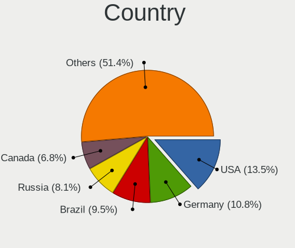

| Country      | Desktops | Percent |
|--------------|----------|---------|
| USA          | 10       | 14.29%  |
| Germany      | 8        | 11.43%  |
| Russia       | 6        | 8.57%   |
| Brazil       | 6        | 8.57%   |
| Canada       | 5        | 7.14%   |
| Sweden       | 4        | 5.71%   |
| Romania      | 3        | 4.29%   |
| France       | 3        | 4.29%   |
| Spain        | 2        | 2.86%   |
| Netherlands  | 2        | 2.86%   |
| Australia    | 2        | 2.86%   |
| Argentina    | 2        | 2.86%   |
| Venezuela    | 1        | 1.43%   |
| Thailand     | 1        | 1.43%   |
| Saudi Arabia | 1        | 1.43%   |
| Portugal     | 1        | 1.43%   |
| Poland       | 1        | 1.43%   |
| Philippines  | 1        | 1.43%   |
| Norway       | 1        | 1.43%   |
| Mexico       | 1        | 1.43%   |
| Kazakhstan   | 1        | 1.43%   |
| Ireland      | 1        | 1.43%   |
| Iran         | 1        | 1.43%   |
| India        | 1        | 1.43%   |
| Guyana       | 1        | 1.43%   |
| Greece       | 1        | 1.43%   |
| Finland      | 1        | 1.43%   |
| Denmark      | 1        | 1.43%   |
| Albania      | 1        | 1.43%   |

City
----

Geographic location (city)

| City          | Desktops | Percent |
|---------------|----------|---------|
| Constanța    | 3        | 3.95%   |
| Toronto       | 2        | 2.63%   |
| Stockholm     | 2        | 2.63%   |
| Mainz         | 2        | 2.63%   |
| Guelph        | 2        | 2.63%   |
| Yekaterinburg | 1        | 1.32%   |
| Weil am Rhein | 1        | 1.32%   |
| Warrensburg   | 1        | 1.32%   |
| Viby J        | 1        | 1.32%   |
| Vancouver     | 1        | 1.32%   |
| Uppsala       | 1        | 1.32%   |
| Thessaloniki  | 1        | 1.32%   |
| SГЈo Pedro  | 1        | 1.32%   |
| St Petersburg | 1        | 1.32%   |
| Songkhla      | 1        | 1.32%   |
| Seville       | 1        | 1.32%   |
| Severna Park  | 1        | 1.32%   |
| Santa Maria   | 1        | 1.32%   |
| Santa Cruz    | 1        | 1.32%   |
| San Justo     | 1        | 1.32%   |
| Portsmouth    | 1        | 1.32%   |
| Phoenix       | 1        | 1.32%   |
| Perm          | 1        | 1.32%   |
| Paripiranga   | 1        | 1.32%   |
| Oslo          | 1        | 1.32%   |
| Orenburg      | 1        | 1.32%   |
| Ochten        | 1        | 1.32%   |
| Novosibirsk   | 1        | 1.32%   |
| New York      | 1        | 1.32%   |
| Nea Peramos   | 1        | 1.32%   |
| Munich        | 1        | 1.32%   |
| Moita Bonita  | 1        | 1.32%   |
| Millstadt     | 1        | 1.32%   |
| Mexico City   | 1        | 1.32%   |
| Martos        | 1        | 1.32%   |
| Martigues     | 1        | 1.32%   |
| Mandurah      | 1        | 1.32%   |
| Malmo         | 1        | 1.32%   |
| Lohja         | 1        | 1.32%   |
| Lipa City     | 1        | 1.32%   |

Drives
------

Drive Vendor
------------

Hard drive vendors

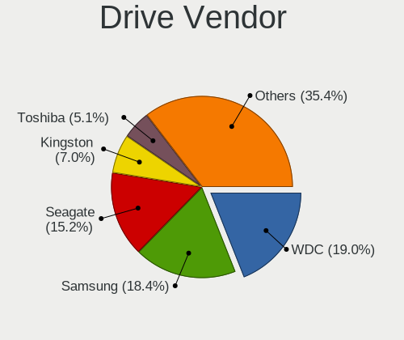

| Vendor                      | Desktops | Drives | Percent |
|-----------------------------|----------|--------|---------|
| WDC                         | 30       | 51     | 20%     |
| Samsung Electronics         | 27       | 62     | 18%     |
| Seagate                     | 23       | 45     | 15.33%  |
| Kingston                    | 11       | 15     | 7.33%   |
| Crucial                     | 8        | 8      | 5.33%   |
| Toshiba                     | 7        | 9      | 4.67%   |
| SanDisk                     | 6        | 7      | 4%      |
| Unknown                     | 5        | 7      | 3.33%   |
| Intel                       | 4        | 5      | 2.67%   |
| A-DATA Technology           | 4        | 4      | 2.67%   |
| Kingston Technology Company | 3        | 3      | 2%      |
| Hitachi                     | 3        | 3      | 2%      |
| China                       | 3        | 3      | 2%      |
| PNY                         | 2        | 2      | 1.33%   |
| Patriot                     | 2        | 3      | 1.33%   |
| SPCC Sol                    | 1        | 1      | 0.67%   |
| SK hynix                    | 1        | 1      | 0.67%   |
| Silicon Motion              | 1        | 1      | 0.67%   |
| Phison Electronics          | 1        | 1      | 0.67%   |
| Phison                      | 1        | 1      | 0.67%   |
| Micron Technology           | 1        | 1      | 0.67%   |
| Maxtor                      | 1        | 1      | 0.67%   |
| Intenso                     | 1        | 2      | 0.67%   |
| HGST                        | 1        | 1      | 0.67%   |
| HFS512GD                    | 1        | 1      | 0.67%   |
| Emtec                       | 1        | 1      | 0.67%   |
| Corsair                     | 1        | 1      | 0.67%   |

Drive Model
-----------

Hard drive models

| Model                               | Desktops | Percent |
|-------------------------------------|----------|---------|
| Samsung SSD 850 EVO 250GB           | 8        | 4.37%   |
| Samsung NVMe SSD Drive 500GB        | 7        | 3.83%   |
| Samsung SSD 850 EVO 500GB           | 4        | 2.19%   |
| WDC WD10EZEX-08WN4A0 1TB            | 3        | 1.64%   |
| Seagate ST500DM002-1BD142 500GB     | 3        | 1.64%   |
| Seagate ST4000DM004-2CV104 4TB      | 3        | 1.64%   |
| Seagate ST31000528AS 1TB            | 3        | 1.64%   |
| Seagate ST2000DX002-2DV164 2TB      | 3        | 1.64%   |
| Seagate ST2000DM006-2DM164 2TB      | 3        | 1.64%   |
| Samsung SSD 860 EVO 500GB           | 3        | 1.64%   |
| Kingston SA400S37240G 240GB SSD     | 3        | 1.64%   |
| WDC WD5000AAKS-00A7B0 500GB         | 2        | 1.09%   |
| WDC WD20EARX-00PASB0 2TB            | 2        | 1.09%   |
| WDC WD2003FZEX-00SRLA0 2TB          | 2        | 1.09%   |
| WDC WD10EZEX-08M2NA0 1TB            | 2        | 1.09%   |
| WDC WD10EADS-00M2B0 1TB             | 2        | 1.09%   |
| Unknown TP02000GB 2TB               | 2        | 1.09%   |
| Toshiba DT01ACA050 500GB            | 2        | 1.09%   |
| Seagate ST31000524AS 1TB            | 2        | 1.09%   |
| Seagate ST2000DX001-1NS164 2TB      | 2        | 1.09%   |
| SanDisk SDSSDA240G 240GB            | 2        | 1.09%   |
| Samsung NVMe SSD Drive 1TB          | 2        | 1.09%   |
| Kingston Company A2000 NVMe SSD 1TB | 2        | 1.09%   |
| Kingston SA400S37480G 480GB SSD     | 2        | 1.09%   |
| Intel NVMe SSD Drive 1024GB         | 2        | 1.09%   |
| Hitachi HTS545032B9A300 320GB       | 2        | 1.09%   |
| Crucial CT1000P1SSD8 1TB            | 2        | 1.09%   |
| Crucial CT1000MX500SSD1 1TB         | 2        | 1.09%   |
| WDC WDS480G2G0B-00EPW0 480GB SSD    | 1        | 0.55%   |
| WDC WD6400AAKS-75A7B2 640GB         | 1        | 0.55%   |
| WDC WD6400AAKS-65A7B2 640GB         | 1        | 0.55%   |
| WDC WD5000AVDS-63U7B1 500GB         | 1        | 0.55%   |
| WDC WD5000AVCS-632DY1 500GB         | 1        | 0.55%   |
| WDC WD5000AAKX-003CA0 500GB         | 1        | 0.55%   |
| WDC WD5000AAKX-001CA0 500GB         | 1        | 0.55%   |
| WDC WD40EZRZ-00GXCB0 4TB            | 1        | 0.55%   |
| WDC WD3200AAJS-00YZCA0 320GB        | 1        | 0.55%   |
| WDC WD32 00AAJS-00L7A0 320GB        | 1        | 0.55%   |
| WDC WD3000GLFS-01F8U0 304GB         | 1        | 0.55%   |
| WDC WD2500HHTZ-04N21V1 250GB        | 1        | 0.55%   |

HDD Vendor
----------

Hard disk drive vendors

| Vendor              | Desktops | Drives | Percent |
|---------------------|----------|--------|---------|
| WDC                 | 29       | 49     | 42.65%  |
| Seagate             | 23       | 45     | 33.82%  |
| Toshiba             | 6        | 8      | 8.82%   |
| Samsung Electronics | 3        | 4      | 4.41%   |
| Hitachi             | 3        | 3      | 4.41%   |
| Unknown             | 1        | 1      | 1.47%   |
| Maxtor              | 1        | 1      | 1.47%   |
| Intenso             | 1        | 2      | 1.47%   |
| HGST                | 1        | 1      | 1.47%   |

SSD Vendor
----------

Solid state drive vendors

| Vendor              | Desktops | Drives | Percent |
|---------------------|----------|--------|---------|
| Samsung Electronics | 23       | 39     | 37.7%   |
| Kingston            | 8        | 11     | 13.11%  |
| Crucial             | 6        | 6      | 9.84%   |
| SanDisk             | 5        | 6      | 8.2%    |
| A-DATA Technology   | 4        | 4      | 6.56%   |
| China               | 3        | 3      | 4.92%   |
| Unknown             | 2        | 2      | 3.28%   |
| PNY                 | 2        | 2      | 3.28%   |
| Patriot             | 2        | 3      | 3.28%   |
| WDC                 | 1        | 1      | 1.64%   |
| SPCC Sol            | 1        | 1      | 1.64%   |
| Micron Technology   | 1        | 1      | 1.64%   |
| Intel               | 1        | 1      | 1.64%   |
| Emtec               | 1        | 1      | 1.64%   |
| Corsair             | 1        | 1      | 1.64%   |

Drive Kind
----------

HDD or SSD

| Kind    | Desktops | Drives | Percent |
|---------|----------|--------|---------|
| HDD     | 54       | 114    | 41.86%  |
| SSD     | 49       | 82     | 37.98%  |
| NVMe    | 22       | 38     | 17.05%  |
| Unknown | 4        | 6      | 3.1%    |

Drive Connector
---------------

SATA, SAS, NVMe, etc.

| Type | Desktops | Drives | Percent |
|------|----------|--------|---------|
| SATA | 65       | 189    | 69.15%  |
| NVMe | 22       | 38     | 23.4%   |
| SAS  | 7        | 13     | 7.45%   |

Drive Size
----------

Size of hard drive

| Size in TB | Desktops | Drives | Percent |
|------------|----------|--------|---------|
| 0.01-0.5   | 56       | 108    | 52.34%  |
| 0.51-1.0   | 26       | 41     | 24.3%   |
| 1.01-2.0   | 17       | 35     | 15.89%  |
| 3.01-4.0   | 4        | 7      | 3.74%   |
| 4.01-10.0  | 2        | 2      | 1.87%   |
| 2.01-3.0   | 1        | 2      | 0.93%   |
| 10.01-20.0 | 1        | 1      | 0.93%   |

Space Total
-----------

Amount of disk space available on the file system

| Size in GB     | Desktops | Percent |
|----------------|----------|---------|
| 101-250        | 18       | 24.32%  |
| 501-1000       | 15       | 20.27%  |
| 251-500        | 14       | 18.92%  |
| More than 3000 | 9        | 12.16%  |
| 1001-2000      | 7        | 9.46%   |
| 2001-3000      | 6        | 8.11%   |
| 51-100         | 3        | 4.05%   |
| 21-50          | 2        | 2.7%    |

Space Used
----------

Amount of used disk space

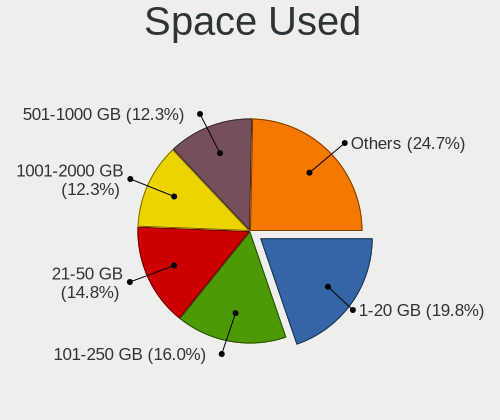

| Used GB        | Desktops | Percent |
|----------------|----------|---------|
| 1-20           | 16       | 21.33%  |
| 21-50          | 12       | 16%     |
| 101-250        | 11       | 14.67%  |
| 1001-2000      | 10       | 13.33%  |
| 501-1000       | 9        | 12%     |
| 251-500        | 7        | 9.33%   |
| 51-100         | 5        | 6.67%   |
| 2001-3000      | 3        | 4%      |
| More than 3000 | 2        | 2.67%   |

Malfunc. Drives
---------------

Drive models with a malfunction

| Model                                 | Desktops | Drives | Percent |
|---------------------------------------|----------|--------|---------|
| WDC WD20EARX-00PASB0 2TB              | 1        | 1      | 14.29%  |
| WDC WD10EADS-00M2B0 1TB               | 1        | 1      | 14.29%  |
| WDC WD1002FAEX-00Y9A0 1TB             | 1        | 1      | 14.29%  |
| WDC WD1001FALS-75J7B0 1TB             | 1        | 1      | 14.29%  |
| Seagate ST2000DM001-9YN164 2TB        | 1        | 1      | 14.29%  |
| Samsung Electronics SSD 970 EVO 500GB | 1        | 1      | 14.29%  |
| Crucial CT1000P1SSD8 1TB              | 1        | 1      | 14.29%  |

Malfunc. Drive Vendor
---------------------

Vendors of faulty drives

| Vendor              | Desktops | Drives | Percent |
|---------------------|----------|--------|---------|
| WDC                 | 4        | 4      | 57.14%  |
| Seagate             | 1        | 1      | 14.29%  |
| Samsung Electronics | 1        | 1      | 14.29%  |
| Crucial             | 1        | 1      | 14.29%  |

Malfunc. HDD Vendor
-------------------

Vendors of faulty HDD drives

| Vendor  | Desktops | Drives | Percent |
|---------|----------|--------|---------|
| WDC     | 4        | 4      | 80%     |
| Seagate | 1        | 1      | 20%     |

Malfunc. Drive Kind
-------------------

Kinds of faulty drives

| Kind | Desktops | Drives | Percent |
|------|----------|--------|---------|
| HDD  | 4        | 5      | 66.67%  |
| NVMe | 2        | 2      | 33.33%  |

Failed Drives
-------------

Failed drive models

Zero info for selected period =(

Failed Drive Vendor
-------------------

Failed drive vendors

Zero info for selected period =(

Drive Status
------------

Number of failed and malfunc. drives

| Status   | Desktops | Drives | Percent |
|----------|----------|--------|---------|
| Detected | 59       | 192    | 71.08%  |
| Works    | 18       | 41     | 21.69%  |
| Malfunc  | 6        | 7      | 7.23%   |

Storage controller
------------------

Storage Vendor
--------------

Storage controller vendors

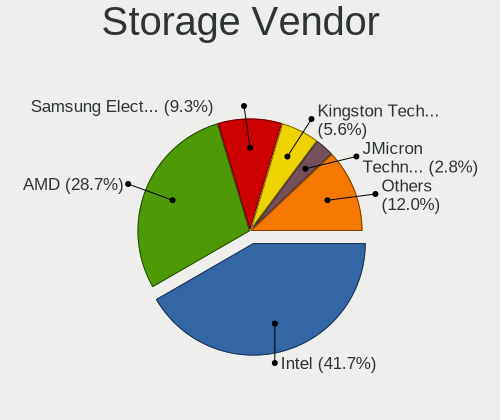

| Vendor                       | Desktops | Percent |
|------------------------------|----------|---------|
| Intel                        | 41       | 40.2%   |
| AMD                          | 31       | 30.39%  |
| Samsung Electronics          | 10       | 9.8%    |
| Kingston Technology Company  | 6        | 5.88%   |
| JMicron Technology           | 3        | 2.94%   |
| Phison Electronics           | 2        | 1.96%   |
| Micron/Crucial Technology    | 2        | 1.96%   |
| Marvell Technology Group     | 2        | 1.96%   |
| Toshiba America Info Systems | 1        | 0.98%   |
| SK hynix                     | 1        | 0.98%   |
| Silicon Motion               | 1        | 0.98%   |
| SanDisk                      | 1        | 0.98%   |
| ASMedia Technology           | 1        | 0.98%   |

Storage Model
-------------

Storage controller models

| Model                                                                                   | Desktops | Percent |
|-----------------------------------------------------------------------------------------|----------|---------|
| AMD FCH SATA Controller [AHCI mode]                                                     | 21       | 16.03%  |
| Samsung NVMe SSD Controller SM981/PM981/PM983                                           | 8        | 6.11%   |
| Intel NM10/ICH7 Family SATA Controller [IDE mode]                                       | 8        | 6.11%   |
| AMD 400 Series Chipset SATA Controller                                                  | 8        | 6.11%   |
| Intel 82801G (ICH7 Family) IDE Controller                                               | 7        | 5.34%   |
| Intel 8 Series/C220 Series Chipset Family 6-port SATA Controller 1 [AHCI mode]          | 7        | 5.34%   |
| Intel Cannon Lake PCH SATA AHCI Controller                                              | 5        | 3.82%   |
| AMD 500 Series Chipset SATA Controller                                                  | 4        | 3.05%   |
| Samsung NVMe SSD Controller SM961/PM961/SM963                                           | 3        | 2.29%   |
| Kingston Company KC2000/KC2500 NVMe SSD                                                 | 3        | 2.29%   |
| Intel Q170/Q150/B150/H170/H110/Z170/CM236 Chipset SATA Controller [AHCI Mode]           | 3        | 2.29%   |
| Intel 6 Series/C200 Series Chipset Family 6 port Desktop SATA AHCI Controller           | 3        | 2.29%   |
| AMD SB7x0/SB8x0/SB9x0 SATA Controller [AHCI mode]                                       | 3        | 2.29%   |
| AMD SB7x0/SB8x0/SB9x0 IDE Controller                                                    | 3        | 2.29%   |
| Phison E12 NVMe Controller                                                              | 2        | 1.53%   |
| Micron/Crucial P1 NVMe PCIe SSD[Frampton]                                               | 2        | 1.53%   |
| Kingston Company A2000 NVMe SSD                                                         | 2        | 1.53%   |
| JMicron JMB363 SATA/IDE Controller                                                      | 2        | 1.53%   |
| Intel SSD 660P Series                                                                   | 2        | 1.53%   |
| Intel SATA Controller [RAID mode]                                                       | 2        | 1.53%   |
| Intel 82801JI (ICH10 Family) 4 port SATA IDE Controller #1                              | 2        | 1.53%   |
| Intel 82801JI (ICH10 Family) 2 port SATA IDE Controller #2                              | 2        | 1.53%   |
| Intel 6 Series/C200 Series Chipset Family Desktop SATA Controller (IDE mode, ports 4-5) | 2        | 1.53%   |
| Intel 6 Series/C200 Series Chipset Family Desktop SATA Controller (IDE mode, ports 0-3) | 2        | 1.53%   |
| AMD FCH IDE Controller                                                                  | 2        | 1.53%   |
| Toshiba America Info Systems XG4 NVMe SSD Controller                                    | 1        | 0.76%   |
| SK hynix PC601 NVMe Solid State Drive                                                   | 1        | 0.76%   |
| Silicon Motion SM2262/SM2262EN SSD Controller                                           | 1        | 0.76%   |
| SanDisk WD Blue SN550 NVMe SSD                                                          | 1        | 0.76%   |
| Samsung NVMe SSD Controller PM9A1/PM9A3/980PRO                                          | 1        | 0.76%   |
| Marvell Group 88SE9182 PCIe 2.0 x2 2-port SATA 6 Gb/s Controller                        | 1        | 0.76%   |
| Marvell Group 88SE9128 PCIe SATA 6 Gb/s RAID controller with HyperDuo                   | 1        | 0.76%   |
| Kingston Company OM3PDP3 NVMe SSD                                                       | 1        | 0.76%   |
| JMicron JMB362 SATA Controller                                                          | 1        | 0.76%   |
| Intel SSD DC P4101/Pro 7600p/760p/E 6100p Series                                        | 1        | 0.76%   |
| Intel Celeron/Pentium Silver Processor SATA Controller                                  | 1        | 0.76%   |
| Intel C610/X99 series chipset 6-Port SATA Controller [AHCI mode]                        | 1        | 0.76%   |
| Intel Atom Processor E3800 Series SATA IDE Controller                                   | 1        | 0.76%   |
| Intel 9 Series Chipset Family SATA Controller [AHCI Mode]                               | 1        | 0.76%   |
| Intel 8 Series SATA Controller 1 [AHCI mode]                                            | 1        | 0.76%   |

Storage Kind
------------

Kind of storage controller (IDE, SATA, NVMe, SAS, ...)

| Kind | Desktops | Percent |
|------|----------|---------|
| SATA | 56       | 56.57%  |
| NVMe | 23       | 23.23%  |
| IDE  | 18       | 18.18%  |
| RAID | 2        | 2.02%   |

Processor
---------

CPU Vendor
----------

Processor vendors

| Vendor | Desktops | Percent |
|--------|----------|---------|
| Intel  | 39       | 55.71%  |
| AMD    | 31       | 44.29%  |

CPU Model
---------

Processor models

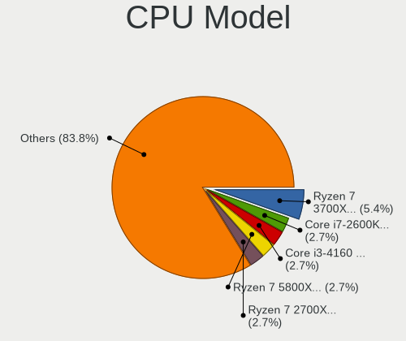

| Model                                       | Desktops | Percent |
|---------------------------------------------|----------|---------|
| AMD Ryzen 7 3700X 8-Core Processor          | 4        | 5.71%   |
| Intel Core i7-2600K CPU @ 3.40GHz           | 2        | 2.86%   |
| Intel Core i3-4160 CPU @ 3.60GHz            | 2        | 2.86%   |
| AMD Ryzen 7 5800X 8-Core Processor          | 2        | 2.86%   |
| AMD Ryzen 7 2700X Eight-Core Processor      | 2        | 2.86%   |
| AMD Ryzen 5 3600 6-Core Processor           | 2        | 2.86%   |
| AMD Ryzen 5 2600X Six-Core Processor        | 2        | 2.86%   |
| Intel Xeon CPU E5-2630 v4 @ 2.20GHz         | 1        | 1.43%   |
| Intel Xeon CPU E5-2620 v3 @ 2.40GHz         | 1        | 1.43%   |
| Intel Xeon CPU E3-1271 v3 @ 3.60GHz         | 1        | 1.43%   |
| Intel Xeon CPU E3-1230 v3 @ 3.30GHz         | 1        | 1.43%   |
| Intel Pentium Dual-Core CPU E6600 @ 3.06GHz | 1        | 1.43%   |
| Intel Pentium Dual-Core CPU E5500 @ 2.80GHz | 1        | 1.43%   |
| Intel Pentium D CPU 3.40GHz                 | 1        | 1.43%   |
| Intel Pentium D CPU 3.00GHz                 | 1        | 1.43%   |
| Intel Core i9-9900K CPU @ 3.60GHz           | 1        | 1.43%   |
| Intel Core i7-9700K CPU @ 3.60GHz           | 1        | 1.43%   |
| Intel Core i7-8700K CPU @ 3.70GHz           | 1        | 1.43%   |
| Intel Core i7-7700K CPU @ 4.20GHz           | 1        | 1.43%   |
| Intel Core i7-6700 CPU @ 3.40GHz            | 1        | 1.43%   |
| Intel Core i7-4770 CPU @ 3.40GHz            | 1        | 1.43%   |
| Intel Core i7-3960X CPU @ 3.30GHz           | 1        | 1.43%   |
| Intel Core i5-9600K CPU @ 3.70GHz           | 1        | 1.43%   |
| Intel Core i5-9400F CPU @ 2.90GHz           | 1        | 1.43%   |
| Intel Core i5-6500 CPU @ 3.20GHz            | 1        | 1.43%   |
| Intel Core i5-4690 CPU @ 3.50GHz            | 1        | 1.43%   |
| Intel Core i5-4590 CPU @ 3.30GHz            | 1        | 1.43%   |
| Intel Core i5-4210U CPU @ 1.70GHz           | 1        | 1.43%   |
| Intel Core i3-8100 CPU @ 3.60GHz            | 1        | 1.43%   |
| Intel Core i3-3220 CPU @ 3.30GHz            | 1        | 1.43%   |
| Intel Core i3-3210 CPU @ 3.20GHz            | 1        | 1.43%   |
| Intel Core i3-2100 CPU @ 3.10GHz            | 1        | 1.43%   |
| Intel Core i3 CPU 550 @ 3.20GHz             | 1        | 1.43%   |
| Intel Core 2 Quad CPU Q9550 @ 2.83GHz       | 1        | 1.43%   |
| Intel Core 2 Quad CPU Q9400 @ 2.66GHz       | 1        | 1.43%   |
| Intel Core 2 Quad CPU Q8200 @ 2.33GHz       | 1        | 1.43%   |
| Intel Core 2 CPU 4300 @ 1.80GHz             | 1        | 1.43%   |
| Intel Celeron J4005 CPU @ 2.00GHz           | 1        | 1.43%   |
| Intel Celeron CPU J1900 @ 1.99GHz           | 1        | 1.43%   |
| Intel Celeron CPU G3930 @ 2.90GHz           | 1        | 1.43%   |

CPU Model Family
----------------

Processor model prefix

| Model                   | Desktops | Percent |
|-------------------------|----------|---------|
| AMD Ryzen 7             | 11       | 15.71%  |
| Intel Core i7           | 8        | 11.43%  |
| AMD Ryzen 5             | 8        | 11.43%  |
| Intel Core i3           | 7        | 10%     |
| Intel Core i5           | 6        | 8.57%   |
| Intel Celeron           | 5        | 7.14%   |
| Intel Xeon              | 4        | 5.71%   |
| Intel Core 2 Quad       | 3        | 4.29%   |
| AMD Ryzen 9             | 3        | 4.29%   |
| AMD A10                 | 3        | 4.29%   |
| Intel Pentium Dual-Core | 2        | 2.86%   |
| Intel Pentium D         | 2        | 2.86%   |
| AMD Phenom II X4        | 2        | 2.86%   |
| AMD FX                  | 2        | 2.86%   |
| Intel Core i9           | 1        | 1.43%   |
| Intel Core 2            | 1        | 1.43%   |
| AMD Ryzen 3             | 1        | 1.43%   |
| AMD A8                  | 1        | 1.43%   |

CPU Cores
---------

Number of processor cores

| Number | Desktops | Percent |
|--------|----------|---------|
| 4      | 21       | 30%     |
| 2      | 20       | 28.57%  |
| 8      | 14       | 20%     |
| 6      | 11       | 15.71%  |
| 16     | 1        | 1.43%   |
| 12     | 1        | 1.43%   |
| 10     | 1        | 1.43%   |
| 3      | 1        | 1.43%   |

CPU Sockets
-----------

Number of sockets

| Number | Desktops | Percent |
|--------|----------|---------|
| 1      | 70       | 100%    |

CPU Threads
-----------

Threads per core (Hyper-Threading)

| Number | Desktops | Percent |
|--------|----------|---------|
| 2      | 48       | 68.57%  |
| 1      | 22       | 31.43%  |

CPU Op-Modes
------------

CPU Operation Modes (32-bit, 64-bit)

| Op mode        | Desktops | Percent |
|----------------|----------|---------|
| 32-bit, 64-bit | 69       | 98.57%  |
| Unknown        | 1        | 1.43%   |

CPU Microcode
-------------

Microcode number

| Number     | Desktops | Percent |
|------------|----------|---------|
| 0x306c3    | 7        | 9.72%   |
| Unknown    | 6        | 8.33%   |
| 0x1067a    | 5        | 6.94%   |
| 0x08701021 | 5        | 6.94%   |
| 0x0800820d | 4        | 5.56%   |
| 0x206a7    | 3        | 4.17%   |
| 0x08701013 | 3        | 4.17%   |
| 0x06003106 | 3        | 4.17%   |
| 0x906ec    | 2        | 2.78%   |
| 0x906e9    | 2        | 2.78%   |
| 0x506e3    | 2        | 2.78%   |
| 0x306a9    | 2        | 2.78%   |
| 0x0a50000c | 2        | 2.78%   |
| 0x08600106 | 2        | 2.78%   |
| 0x0800820b | 2        | 2.78%   |
| 0x06000852 | 2        | 2.78%   |
| 0xf64      | 1        | 1.39%   |
| 0xf62      | 1        | 1.39%   |
| 0x906ed    | 1        | 1.39%   |
| 0x906eb    | 1        | 1.39%   |
| 0x906ea    | 1        | 1.39%   |
| 0x706a1    | 1        | 1.39%   |
| 0x6f2      | 1        | 1.39%   |
| 0x40651    | 1        | 1.39%   |
| 0x30678    | 1        | 1.39%   |
| 0x206d7    | 1        | 1.39%   |
| 0x20655    | 1        | 1.39%   |
| 0x10677    | 1        | 1.39%   |
| 0x0a201204 | 1        | 1.39%   |
| 0x0a201016 | 1        | 1.39%   |
| 0x0a201009 | 1        | 1.39%   |
| 0x08108109 | 1        | 1.39%   |
| 0x08101016 | 1        | 1.39%   |
| 0x06001119 | 1        | 1.39%   |
| 0x010000db | 1        | 1.39%   |
| 0x010000c8 | 1        | 1.39%   |

CPU Microarch
-------------

Microarchitecture

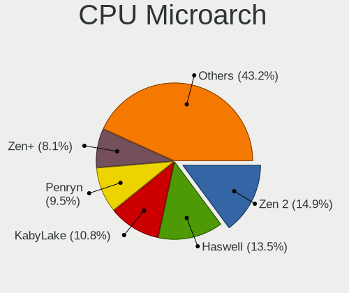

| Name          | Desktops | Percent |
|---------------|----------|---------|
| Zen 2         | 11       | 15.71%  |
| Haswell       | 9        | 12.86%  |
| KabyLake      | 8        | 11.43%  |
| Penryn        | 7        | 10%     |
| Zen+          | 6        | 8.57%   |
| Zen 3         | 5        | 7.14%   |
| SandyBridge   | 4        | 5.71%   |
| Steamroller   | 3        | 4.29%   |
| Piledriver    | 3        | 4.29%   |
| Skylake       | 2        | 2.86%   |
| NetBurst      | 2        | 2.86%   |
| K10           | 2        | 2.86%   |
| IvyBridge     | 2        | 2.86%   |
| Zen           | 1        | 1.43%   |
| Westmere      | 1        | 1.43%   |
| Silvermont    | 1        | 1.43%   |
| Goldmont plus | 1        | 1.43%   |
| Core          | 1        | 1.43%   |
| Broadwell     | 1        | 1.43%   |

Graphics
--------

GPU Vendor
----------

Vendors of graphics cards

| Vendor | Desktops | Percent |
|--------|----------|---------|
| Nvidia | 30       | 38.46%  |
| AMD    | 30       | 38.46%  |
| Intel  | 18       | 23.08%  |

GPU Model
---------

Graphics card models

| Model                                                                       | Desktops | Percent |
|-----------------------------------------------------------------------------|----------|---------|
| Nvidia GP106 [GeForce GTX 1060 6GB]                                         | 5        | 6.25%   |
| Intel 4 Series Chipset Integrated Graphics Controller                       | 4        | 5%      |
| AMD Navi 10 [Radeon RX 5600 OEM/5600 XT / 5700/5700 XT]                     | 4        | 5%      |
| AMD Ellesmere [Radeon RX 470/480/570/570X/580/580X/590]                     | 4        | 5%      |
| Nvidia GP107 [GeForce GTX 1050 Ti]                                          | 3        | 3.75%   |
| Nvidia GP102 [GeForce GTX 1080 Ti]                                          | 2        | 2.5%    |
| Intel Xeon E3-1200 v3/4th Gen Core Processor Integrated Graphics Controller | 2        | 2.5%    |
| Intel CoffeeLake-S GT2 [UHD Graphics 630]                                   | 2        | 2.5%    |
| Intel 4th Generation Core Processor Family Integrated Graphics Controller   | 2        | 2.5%    |
| Intel 2nd Generation Core Processor Family Integrated Graphics Controller   | 2        | 2.5%    |
| AMD Renoir                                                                  | 2        | 2.5%    |
| AMD Lexa PRO [Radeon 540/540X/550/550X / RX 540X/550/550X]                  | 2        | 2.5%    |
| AMD Kaveri [Radeon R7 Graphics]                                             | 2        | 2.5%    |
| AMD Cedar [Radeon HD 5000/6000/7350/8350 Series]                            | 2        | 2.5%    |
| Nvidia TU116 [GeForce GTX 1660 SUPER]                                       | 1        | 1.25%   |
| Nvidia TU106 [GeForce RTX 2070]                                             | 1        | 1.25%   |
| Nvidia TU106 [GeForce RTX 2060 Rev. A]                                      | 1        | 1.25%   |
| Nvidia TU102 [GeForce RTX 2080 Ti Rev. A]                                   | 1        | 1.25%   |
| Nvidia GT218 [GeForce 210]                                                  | 1        | 1.25%   |
| Nvidia GT216 [GeForce GT 220]                                               | 1        | 1.25%   |
| Nvidia GP106 [GeForce GTX 1060 3GB]                                         | 1        | 1.25%   |
| Nvidia GP104 [GeForce GTX 1080]                                             | 1        | 1.25%   |
| Nvidia GP104 [GeForce GTX 1070]                                             | 1        | 1.25%   |
| Nvidia GM107 [GeForce GTX 750 Ti]                                           | 1        | 1.25%   |
| Nvidia GK208 [GeForce GT 630 Rev. 2]                                        | 1        | 1.25%   |
| Nvidia GK104 [GeForce GTX 770]                                              | 1        | 1.25%   |
| Nvidia GK104 [GeForce GTX 680]                                              | 1        | 1.25%   |
| Nvidia GF119 [GeForce 605]                                                  | 1        | 1.25%   |
| Nvidia GF117M [GeForce 610M/710M/810M/820M / GT 620M/625M/630M/720M]        | 1        | 1.25%   |
| Nvidia GF114 [GeForce GTX 560 Ti]                                           | 1        | 1.25%   |
| Nvidia GF108 [GeForce GT 730]                                               | 1        | 1.25%   |
| Nvidia GF108 [GeForce GT 630]                                               | 1        | 1.25%   |
| Nvidia GF106GL [Quadro 2000]                                                | 1        | 1.25%   |
| Nvidia GA104 [GeForce RTX 3060 Ti Lite Hash Rate]                           | 1        | 1.25%   |
| Nvidia G92 [GeForce 9800 GT]                                                | 1        | 1.25%   |
| Intel Xeon E3-1200 v2/3rd Gen Core processor Graphics Controller            | 1        | 1.25%   |
| Intel HD Graphics 530                                                       | 1        | 1.25%   |
| Intel Haswell-ULT Integrated Graphics Controller                            | 1        | 1.25%   |
| Intel GeminiLake [UHD Graphics 600]                                         | 1        | 1.25%   |
| Intel Atom Processor Z36xxx/Z37xxx Series Graphics & Display                | 1        | 1.25%   |

GPU Combo
---------

Combinations of graphics cards

| Name           | Desktops | Percent |
|----------------|----------|---------|
| 1 x Nvidia     | 28       | 38.89%  |
| 1 x AMD        | 28       | 38.89%  |
| 1 x Intel      | 11       | 15.28%  |
| Intel + Nvidia | 2        | 2.78%   |
| Intel + AMD    | 2        | 2.78%   |
| AMD + Nvidia   | 1        | 1.39%   |

GPU Driver
----------

Free vs proprietary

| Driver      | Desktops | Percent |
|-------------|----------|---------|
| Free        | 48       | 68.57%  |
| Proprietary | 22       | 31.43%  |

GPU Memory
----------

Total video memory

| Size in GB | Desktops | Percent |
|------------|----------|---------|
| 1.01-2.0   | 13       | 18.06%  |
| 7.01-8.0   | 12       | 16.67%  |
| Unknown    | 12       | 16.67%  |
| 0.51-1.0   | 11       | 15.28%  |
| 5.01-6.0   | 8        | 11.11%  |
| 3.01-4.0   | 6        | 8.33%   |
| 8.01-16.0  | 5        | 6.94%   |
| 2.01-3.0   | 3        | 4.17%   |
| 0.01-0.5   | 2        | 2.78%   |

Monitor
-------

Monitor Vendor
--------------

Monitor vendors

| Vendor               | Desktops | Percent |
|----------------------|----------|---------|
| Samsung Electronics  | 14       | 16.87%  |
| Goldstar             | 12       | 14.46%  |
| AOC                  | 10       | 12.05%  |
| Dell                 | 8        | 9.64%   |
| Ancor Communications | 7        | 8.43%   |
| LG Electronics       | 4        | 4.82%   |
| BenQ                 | 4        | 4.82%   |
| Acer                 | 4        | 4.82%   |
| Hewlett-Packard      | 3        | 3.61%   |
| Philips              | 2        | 2.41%   |
| NEC Computers        | 2        | 2.41%   |
| Lenovo               | 2        | 2.41%   |
| Unknown              | 2        | 2.41%   |
| ViewSonic            | 1        | 1.2%    |
| Unknown              | 1        | 1.2%    |
| Sharp                | 1        | 1.2%    |
| MStar                | 1        | 1.2%    |
| MSI                  | 1        | 1.2%    |
| Microstep            | 1        | 1.2%    |
| JRY                  | 1        | 1.2%    |
| Iiyama               | 1        | 1.2%    |
| ASUSTek Computer     | 1        | 1.2%    |

Monitor Model
-------------

Monitor models

| Model                                                                | Desktops | Percent |
|----------------------------------------------------------------------|----------|---------|
| AOC 24P1X AOC2401 1920x1200 518x324mm 24.1-inch                      | 3        | 3.41%   |
| Samsung Electronics C27F390 SAM0D32 1920x1080 598x336mm 27.0-inch    | 2        | 2.27%   |
| Goldstar L227W GSM566E 1680x1050 474x296mm 22.0-inch                 | 2        | 2.27%   |
| Ancor Communications LCD Monitor MG248 1920x1080                     | 2        | 2.27%   |
| Unknown                                                              | 2        | 2.27%   |
| ViewSonic VP191b VSC0E11 1280x1024 376x301mm 19.0-inch               | 1        | 1.14%   |
| Unknown LCD Monitor HIC 3200x1080                                    | 1        | 1.14%   |
| Sharp LCD Monitor HDMI 1920x1080                                     | 1        | 1.14%   |
| Samsung Electronics SyncMaster SAM05CB 1920x1080 530x300mm 24.0-inch | 1        | 1.14%   |
| Samsung Electronics SyncMaster SAM029A 1920x1200 582x364mm 27.0-inch | 1        | 1.14%   |
| Samsung Electronics SyncMaster SAM0272 1280x1024 338x270mm 17.0-inch | 1        | 1.14%   |
| Samsung Electronics SyncMaster SAM01CE 1024x768 300x230mm 14.9-inch  | 1        | 1.14%   |
| Samsung Electronics SyncMaster SAM01B7 1280x1024 338x270mm 17.0-inch | 1        | 1.14%   |
| Samsung Electronics SMB2230N SAM0635 1920x1080 477x268mm 21.5-inch   | 1        | 1.14%   |
| Samsung Electronics SM2333TN SAM06FC 1920x1080 477x268mm 21.5-inch   | 1        | 1.14%   |
| Samsung Electronics S27D590C SAM0BEA 1920x1080 598x336mm 27.0-inch   | 1        | 1.14%   |
| Samsung Electronics S23B300 SAM08AF 1920x1080 510x287mm 23.0-inch    | 1        | 1.14%   |
| Samsung Electronics S22B150 SAM08A3 1920x1080 477x268mm 21.5-inch    | 1        | 1.14%   |
| Samsung Electronics S19C200 SAM09B3 1440x900 408x255mm 18.9-inch     | 1        | 1.14%   |
| Samsung Electronics LCD Monitor SM2333TN 1920x1080                   | 1        | 1.14%   |
| Samsung Electronics LCD Monitor SAM0B54 1366x768 609x347mm 27.6-inch | 1        | 1.14%   |
| Philips PHL 276E6 PHLC0FA 1920x1080 598x336mm 27.0-inch              | 1        | 1.14%   |
| Philips 223E PHLC049 1920x1080 476x268mm 21.5-inch                   | 1        | 1.14%   |
| NEC Computers LCD Monitor LCD92VM 1280x1024                          | 1        | 1.14%   |
| NEC Computers EA191M NEC673E 1280x1024 376x301mm 19.0-inch           | 1        | 1.14%   |
| MStar Demo MST0030 1360x765 1150x650mm 52.0-inch                     | 1        | 1.14%   |
| MSI G27C5 MSI3CA9 1920x1080 598x336mm 27.0-inch                      | 1        | 1.14%   |
| Microstep LCD Monitor MSI G241                                       | 1        | 1.14%   |
| LG Electronics LCD Monitor W1952 1440x900                            | 1        | 1.14%   |
| LG Electronics LCD Monitor LG ULTRAWIDE 3440x1440                    | 1        | 1.14%   |
| LG Electronics LCD Monitor LG HDR WFHD 2560x1080                     | 1        | 1.14%   |
| LG Electronics LCD Monitor E2241 1920x1080                           | 1        | 1.14%   |
| Lenovo LEN LT2452pwC LEN1144 1920x1080 518x324mm 24.1-inch           | 1        | 1.14%   |
| Lenovo LEN L220xwC LEN1151 1920x1200 474x296mm 22.0-inch             | 1        | 1.14%   |
| JRY HDMI JRY1950 1600x900 368x207mm 16.6-inch                        | 1        | 1.14%   |
| Iiyama PLE2483H IVM6113 1920x1080 531x299mm 24.0-inch                | 1        | 1.14%   |
| Hewlett-Packard ZR24w HWP2869 1920x1200 546x352mm 25.6-inch          | 1        | 1.14%   |
| Hewlett-Packard S2031 HWP2903 1600x900 443x249mm 20.0-inch           | 1        | 1.14%   |
| Hewlett-Packard 24yh HPN3504 1920x1080 528x297mm 23.9-inch           | 1        | 1.14%   |
| Goldstar W1942 GSM4B70 1440x900 408x255mm 18.9-inch                  | 1        | 1.14%   |

Monitor Resolution
------------------

Monitor screen resolution

| Resolution         | Desktops | Percent |
|--------------------|----------|---------|
| 1920x1080 (FHD)    | 30       | 36.59%  |
| 2560x1440 (QHD)    | 7        | 8.54%   |
| 1280x1024 (SXGA)   | 7        | 8.54%   |
| Unknown            | 6        | 7.32%   |
| 1680x1050 (WSXGA+) | 4        | 4.88%   |
| 1600x900 (HD+)     | 4        | 4.88%   |
| 1366x768 (WXGA)    | 4        | 4.88%   |
| 3840x2160 (4K)     | 3        | 3.66%   |
| 1920x1200 (WUXGA)  | 3        | 3.66%   |
| 1440x900 (WXGA+)   | 3        | 3.66%   |
| 3840x1080          | 2        | 2.44%   |
| 2560x1080          | 2        | 2.44%   |
| 5760x1080          | 1        | 1.22%   |
| 4480x1440          | 1        | 1.22%   |
| 3440x1440          | 1        | 1.22%   |
| 3200x1080          | 1        | 1.22%   |
| 1360x768           | 1        | 1.22%   |
| 1152x864           | 1        | 1.22%   |
| 1024x768 (XGA)     | 1        | 1.22%   |

Monitor Diagonal
----------------

Diagonal size in inches

| Inches  | Desktops | Percent |
|---------|----------|---------|
| Unknown | 20       | 25.97%  |
| 24      | 10       | 12.99%  |
| 27      | 8        | 10.39%  |
| 23      | 6        | 7.79%   |
| 21      | 6        | 7.79%   |
| 18      | 5        | 6.49%   |
| 22      | 4        | 5.19%   |
| 20      | 3        | 3.9%    |
| 19      | 3        | 3.9%    |
| 17      | 3        | 3.9%    |
| 40      | 2        | 2.6%    |
| 15      | 2        | 2.6%    |
| 52      | 1        | 1.3%    |
| 34      | 1        | 1.3%    |
| 31      | 1        | 1.3%    |
| 29      | 1        | 1.3%    |
| 25      | 1        | 1.3%    |

Monitor Width
-------------

Physical width

| Width in mm | Desktops | Percent |
|-------------|----------|---------|
| 501-600     | 22       | 29.33%  |
| Unknown     | 20       | 26.67%  |
| 401-500     | 19       | 25.33%  |
| 301-350     | 5        | 6.67%   |
| 601-700     | 3        | 4%      |
| 801-900     | 2        | 2.67%   |
| 351-400     | 2        | 2.67%   |
| 701-800     | 1        | 1.33%   |
| 1001-1500   | 1        | 1.33%   |

Aspect Ratio
------------

Proportional relationship between the width and the height

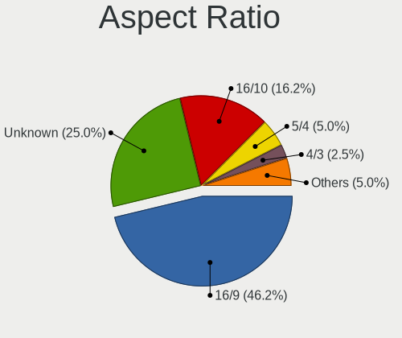

| Ratio   | Desktops | Percent |
|---------|----------|---------|
| 16/9    | 34       | 44.74%  |
| Unknown | 20       | 26.32%  |
| 16/10   | 12       | 15.79%  |
| 5/4     | 4        | 5.26%   |
| 4/3     | 2        | 2.63%   |
| 21/9    | 2        | 2.63%   |
| 6/5     | 1        | 1.32%   |
| 3/2     | 1        | 1.32%   |

Monitor Area
------------

Area in inch²

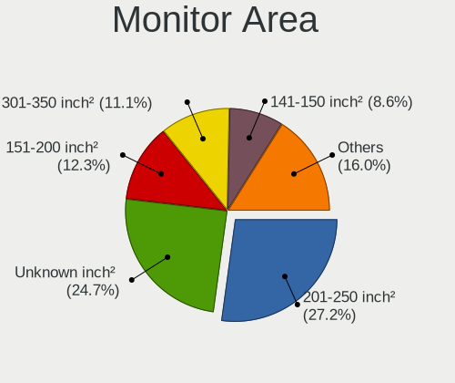

| Area in inch² | Desktops | Percent |
|----------------|----------|---------|
| 201-250        | 21       | 27.27%  |
| Unknown        | 20       | 25.97%  |
| 301-350        | 9        | 11.69%  |
| 151-200        | 9        | 11.69%  |
| 141-150        | 6        | 7.79%   |
| 251-300        | 5        | 6.49%   |
| 351-500        | 2        | 2.6%    |
| 501-1000       | 2        | 2.6%    |
| More than 1000 | 1        | 1.3%    |
| 111-120        | 1        | 1.3%    |
| 101-110        | 1        | 1.3%    |

Pixel Density
-------------

Pixels per inch

| Density | Desktops | Percent |
|---------|----------|---------|
| 51-100  | 42       | 56.76%  |
| Unknown | 20       | 27.03%  |
| 101-120 | 10       | 13.51%  |
| 1-50    | 1        | 1.35%   |
| 161-240 | 1        | 1.35%   |

Multiple Monitors
-----------------

Total monitors connected

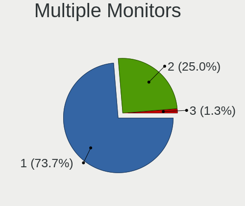

| Total | Desktops | Percent |
|-------|----------|---------|
| 1     | 51       | 71.83%  |
| 2     | 19       | 26.76%  |
| 3     | 1        | 1.41%   |

Network
-------

Net Controller Vendor
---------------------

Controller vendors

| Vendor                     | Desktops | Percent |
|----------------------------|----------|---------|
| Realtek Semiconductor      | 51       | 46.36%  |
| Intel                      | 28       | 25.45%  |
| Qualcomm Atheros           | 11       | 10%     |
| Ralink Technology          | 3        | 2.73%   |
| Xiaomi                     | 2        | 1.82%   |
| TP-Link                    | 2        | 1.82%   |
| MediaTek                   | 2        | 1.82%   |
| Broadcom                   | 2        | 1.82%   |
| ZTE WCDMA Technologies MSM | 1        | 0.91%   |
| NetGear                    | 1        | 0.91%   |
| Microchip Technology       | 1        | 0.91%   |
| Linksys                    | 1        | 0.91%   |
| Huawei Technologies        | 1        | 0.91%   |
| D-Link System              | 1        | 0.91%   |
| Broadcom Limited           | 1        | 0.91%   |
| Belkin Components          | 1        | 0.91%   |
| Aquantia                   | 1        | 0.91%   |

Net Controller Model
--------------------

Controller models

| Model                                                             | Desktops | Percent |
|-------------------------------------------------------------------|----------|---------|
| Realtek RTL8111/8168/8411 PCI Express Gigabit Ethernet Controller | 43       | 33.86%  |
| Intel I211 Gigabit Network Connection                             | 9        | 7.09%   |
| Realtek RTL8125 2.5GbE Controller                                 | 5        | 3.94%   |
| Intel Wi-Fi 6 AX200                                               | 5        | 3.94%   |
| Intel Ethernet Connection (7) I219-V                              | 3        | 2.36%   |
| Xiaomi Mi/Redmi series (RNDIS)                                    | 2        | 1.57%   |
| TP-Link TL-WN823N v2/v3 [Realtek RTL8192EU]                       | 2        | 1.57%   |
| Realtek RTL88x2bu [AC1200 Techkey]                                | 2        | 1.57%   |
| Realtek 802.11ac NIC                                              | 2        | 1.57%   |
| Ralink MT7601U Wireless Adapter                                   | 2        | 1.57%   |
| Qualcomm Atheros QCA9565 / AR9565 Wireless Network Adapter        | 2        | 1.57%   |
| Qualcomm Atheros AR922X Wireless Network Adapter                  | 2        | 1.57%   |
| Intel Wireless 7265                                               | 2        | 1.57%   |
| Intel Wireless 3165                                               | 2        | 1.57%   |
| Intel Ethernet Controller I225-V                                  | 2        | 1.57%   |
| Intel Ethernet Connection I217-LM                                 | 2        | 1.57%   |
| Intel Dual Band Wireless-AC 3168NGW [Stone Peak]                  | 2        | 1.57%   |
| ZTE WCDMA MSM Yota Router                                         | 1        | 0.79%   |
| Realtek RTL8723BE PCIe Wireless Network Adapter                   | 1        | 0.79%   |
| Realtek RTL8192EU 802.11b/g/n WLAN Adapter                        | 1        | 0.79%   |
| Realtek RTL8188EUS 802.11n Wireless Network Adapter               | 1        | 0.79%   |
| Realtek RTL8188EE Wireless Network Adapter                        | 1        | 0.79%   |
| Realtek RTL8187 Wireless Adapter                                  | 1        | 0.79%   |
| Realtek RTL8153 Gigabit Ethernet Adapter                          | 1        | 0.79%   |
| Realtek RTL8152 Fast Ethernet Adapter                             | 1        | 0.79%   |
| Realtek RTL-8100/8101L/8139 PCI Fast Ethernet Adapter             | 1        | 0.79%   |
| Ralink RT5372 Wireless Adapter                                    | 1        | 0.79%   |
| Qualcomm Atheros QCA8171 Gigabit Ethernet                         | 1        | 0.79%   |
| Qualcomm Atheros QCA6174 802.11ac Wireless Network Adapter        | 1        | 0.79%   |
| Qualcomm Atheros AR9485 Wireless Network Adapter                  | 1        | 0.79%   |
| Qualcomm Atheros AR9285 Wireless Network Adapter (PCI-Express)    | 1        | 0.79%   |
| Qualcomm Atheros AR9227 Wireless Network Adapter                  | 1        | 0.79%   |
| Qualcomm Atheros AR8152 v2.0 Fast Ethernet                        | 1        | 0.79%   |
| Qualcomm Atheros AR8151 v2.0 Gigabit Ethernet                     | 1        | 0.79%   |
| Qualcomm Atheros AR5212/5213/2414 Wireless Network Adapter        | 1        | 0.79%   |
| NetGear A6150                                                     | 1        | 0.79%   |
| Microchip MCP2200 USB Serial Port Emulator                        | 1        | 0.79%   |
| MediaTek MT7921K (RZ608) Wi-Fi 6E 80MHz                           | 1        | 0.79%   |
| MediaTek MT7612U 802.11a/b/g/n/ac Wireless Adapter                | 1        | 0.79%   |
| Linksys WUSB6100M 802.11a/b/g/n/ac Wireless Adapter               | 1        | 0.79%   |

Wireless Vendor
---------------

Wireless vendors

| Vendor                | Desktops | Percent |
|-----------------------|----------|---------|
| Intel                 | 12       | 27.91%  |
| Realtek Semiconductor | 9        | 20.93%  |
| Qualcomm Atheros      | 9        | 20.93%  |
| Ralink Technology     | 3        | 6.98%   |
| TP-Link               | 2        | 4.65%   |
| MediaTek              | 2        | 4.65%   |
| NetGear               | 1        | 2.33%   |
| Linksys               | 1        | 2.33%   |
| D-Link System         | 1        | 2.33%   |
| Broadcom Limited      | 1        | 2.33%   |
| Broadcom              | 1        | 2.33%   |
| Belkin Components     | 1        | 2.33%   |

Wireless Model
--------------

Wireless models

| Model                                                                                   | Desktops | Percent |
|-----------------------------------------------------------------------------------------|----------|---------|
| Intel Wi-Fi 6 AX200                                                                     | 5        | 11.11%  |
| TP-Link TL-WN823N v2/v3 [Realtek RTL8192EU]                                             | 2        | 4.44%   |
| Realtek RTL88x2bu [AC1200 Techkey]                                                      | 2        | 4.44%   |
| Realtek 802.11ac NIC                                                                    | 2        | 4.44%   |
| Ralink MT7601U Wireless Adapter                                                         | 2        | 4.44%   |
| Qualcomm Atheros QCA9565 / AR9565 Wireless Network Adapter                              | 2        | 4.44%   |
| Qualcomm Atheros AR922X Wireless Network Adapter                                        | 2        | 4.44%   |
| Intel Wireless 7265                                                                     | 2        | 4.44%   |
| Intel Wireless 3165                                                                     | 2        | 4.44%   |
| Intel Dual Band Wireless-AC 3168NGW [Stone Peak]                                        | 2        | 4.44%   |
| Realtek RTL8723BE PCIe Wireless Network Adapter                                         | 1        | 2.22%   |
| Realtek RTL8192EU 802.11b/g/n WLAN Adapter                                              | 1        | 2.22%   |
| Realtek RTL8188EUS 802.11n Wireless Network Adapter                                     | 1        | 2.22%   |
| Realtek RTL8188EE Wireless Network Adapter                                              | 1        | 2.22%   |
| Realtek RTL8187 Wireless Adapter                                                        | 1        | 2.22%   |
| Ralink RT5372 Wireless Adapter                                                          | 1        | 2.22%   |
| Qualcomm Atheros QCA6174 802.11ac Wireless Network Adapter                              | 1        | 2.22%   |
| Qualcomm Atheros AR9485 Wireless Network Adapter                                        | 1        | 2.22%   |
| Qualcomm Atheros AR9285 Wireless Network Adapter (PCI-Express)                          | 1        | 2.22%   |
| Qualcomm Atheros AR9227 Wireless Network Adapter                                        | 1        | 2.22%   |
| Qualcomm Atheros AR5212/5213/2414 Wireless Network Adapter                              | 1        | 2.22%   |
| NetGear A6150                                                                           | 1        | 2.22%   |
| MediaTek MT7921K (RZ608) Wi-Fi 6E 80MHz                                                 | 1        | 2.22%   |
| MediaTek MT7612U 802.11a/b/g/n/ac Wireless Adapter                                      | 1        | 2.22%   |
| Linksys WUSB6100M 802.11a/b/g/n/ac Wireless Adapter                                     | 1        | 2.22%   |
| Intel Wireless-AC 9260                                                                  | 1        | 2.22%   |
| Intel PRO/Wireless 4965 AG or AGN [Kedron] Network Connection                           | 1        | 2.22%   |
| Intel Cannon Lake PCH CNVi WiFi                                                         | 1        | 2.22%   |
| D-Link System AirPlus G DWL-G122 Wireless Adapter(rev.C1) [Ralink RT2571W]              | 1        | 2.22%   |
| Broadcom Limited BCM4331 802.11a/b/g/n                                                  | 1        | 2.22%   |
| Broadcom BCM4360 802.11ac Wireless Network Adapter                                      | 1        | 2.22%   |
| Belkin Components F7D2102 802.11n N300 Micro Wireless Adapter v3000 [Realtek RTL8192CU] | 1        | 2.22%   |

Ethernet Vendor
---------------

Ethernet vendors

| Vendor                     | Desktops | Percent |
|----------------------------|----------|---------|
| Realtek Semiconductor      | 48       | 61.54%  |
| Intel                      | 21       | 26.92%  |
| Qualcomm Atheros           | 3        | 3.85%   |
| Xiaomi                     | 2        | 2.56%   |
| ZTE WCDMA Technologies MSM | 1        | 1.28%   |
| Huawei Technologies        | 1        | 1.28%   |
| Broadcom                   | 1        | 1.28%   |
| Aquantia                   | 1        | 1.28%   |

Ethernet Model
--------------

Ethernet models

| Model                                                             | Desktops | Percent |
|-------------------------------------------------------------------|----------|---------|
| Realtek RTL8111/8168/8411 PCI Express Gigabit Ethernet Controller | 43       | 53.09%  |
| Intel I211 Gigabit Network Connection                             | 9        | 11.11%  |
| Realtek RTL8125 2.5GbE Controller                                 | 5        | 6.17%   |
| Intel Ethernet Connection (7) I219-V                              | 3        | 3.7%    |
| Xiaomi Mi/Redmi series (RNDIS)                                    | 2        | 2.47%   |
| Intel Ethernet Controller I225-V                                  | 2        | 2.47%   |
| Intel Ethernet Connection I217-LM                                 | 2        | 2.47%   |
| ZTE WCDMA MSM Yota Router                                         | 1        | 1.23%   |
| Realtek RTL8153 Gigabit Ethernet Adapter                          | 1        | 1.23%   |
| Realtek RTL8152 Fast Ethernet Adapter                             | 1        | 1.23%   |
| Realtek RTL-8100/8101L/8139 PCI Fast Ethernet Adapter             | 1        | 1.23%   |
| Qualcomm Atheros QCA8171 Gigabit Ethernet                         | 1        | 1.23%   |
| Qualcomm Atheros AR8152 v2.0 Fast Ethernet                        | 1        | 1.23%   |
| Qualcomm Atheros AR8151 v2.0 Gigabit Ethernet                     | 1        | 1.23%   |
| Intel PRO/100 VE Network Connection                               | 1        | 1.23%   |
| Intel Ethernet Connection (2) I219-V                              | 1        | 1.23%   |
| Intel 82583V Gigabit Network Connection                           | 1        | 1.23%   |
| Intel 82579V Gigabit Network Connection                           | 1        | 1.23%   |
| Intel 82578DC Gigabit Network Connection                          | 1        | 1.23%   |
| Huawei JKM-LX1                                                    | 1        | 1.23%   |
| Broadcom NetXtreme BCM5751 Gigabit Ethernet PCI Express           | 1        | 1.23%   |
| Aquantia AQC107 NBase-T/IEEE 802.3bz Ethernet Controller [AQtion] | 1        | 1.23%   |

Net Controller Kind
-------------------

Ethernet, WiFi or modem

| Kind     | Desktops | Percent |
|----------|----------|---------|
| Ethernet | 70       | 66.04%  |
| WiFi     | 35       | 33.02%  |
| Modem    | 1        | 0.94%   |

Used Controller
---------------

Currently used network controller

| Kind     | Desktops | Percent |
|----------|----------|---------|
| Ethernet | 56       | 72.73%  |
| WiFi     | 21       | 27.27%  |

NICs
----

Total network controllers on board

| Total | Desktops | Percent |
|-------|----------|---------|
| 1     | 43       | 60.56%  |
| 2     | 24       | 33.8%   |
| 3     | 4        | 5.63%   |

IPv6
----

IPv6 vs IPv4

| Used | Desktops | Percent |
|------|----------|---------|
| No   | 56       | 76.71%  |
| Yes  | 17       | 23.29%  |

Bluetooth
---------

Bluetooth Vendor
----------------

Controller vendors

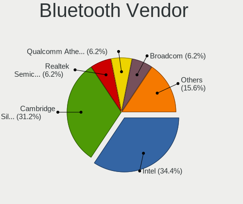

| Vendor                          | Desktops | Percent |
|---------------------------------|----------|---------|
| Intel                           | 11       | 35.48%  |
| Cambridge Silicon Radio         | 9        | 29.03%  |
| Realtek Semiconductor           | 2        | 6.45%   |
| Qualcomm Atheros Communications | 2        | 6.45%   |
| Broadcom                        | 2        | 6.45%   |
| ASUSTek Computer                | 2        | 6.45%   |
| MediaTek                        | 1        | 3.23%   |
| ISSC                            | 1        | 3.23%   |
| Apple                           | 1        | 3.23%   |

Bluetooth Model
---------------

Controller models

| Model                                               | Desktops | Percent |
|-----------------------------------------------------|----------|---------|
| Cambridge Silicon Radio Bluetooth Dongle (HCI mode) | 9        | 28.13%  |
| Intel Bluetooth wireless interface                  | 4        | 12.5%   |
| Intel AX200 Bluetooth                               | 4        | 12.5%   |
| Realtek Bluetooth Radio                             | 2        | 6.25%   |
| Intel Wireless-AC 3168 Bluetooth                    | 2        | 6.25%   |
| Qualcomm Atheros  Bluetooth Device                  | 1        | 3.13%   |
| Qualcomm Atheros AR3012 Bluetooth 4.0               | 1        | 3.13%   |
| MediaTek Wireless_Device                            | 1        | 3.13%   |
| ISSC Bluetooth Device                               | 1        | 3.13%   |
| Intel Wireless-AC 9260 Bluetooth Adapter            | 1        | 3.13%   |
| Intel Bluetooth 9460/9560 Jefferson Peak (JfP)      | 1        | 3.13%   |
| Broadcom BCM20702A0 Bluetooth 4.0                   | 1        | 3.13%   |
| Broadcom BCM2045 Bluetooth                          | 1        | 3.13%   |
| ASUS Qualcomm Bluetooth 4.1                         | 1        | 3.13%   |
| ASUS Broadcom BCM20702A0 Bluetooth                  | 1        | 3.13%   |
| Apple Bluetooth USB Host Controller                 | 1        | 3.13%   |

Sound
-----

Sound Vendor
------------

Sound card vendors

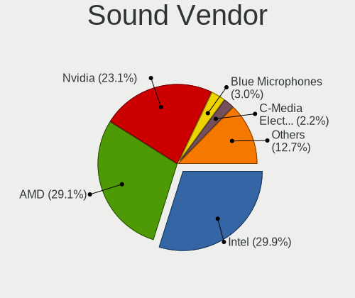

| Vendor                  | Desktops | Percent |
|-------------------------|----------|---------|
| AMD                     | 39       | 31.2%   |
| Intel                   | 37       | 29.6%   |
| Nvidia                  | 28       | 22.4%   |
| Blue Microphones        | 4        | 3.2%    |
| C-Media Electronics     | 3        | 2.4%    |
| Texas Instruments       | 2        | 1.6%    |
| Logitech                | 2        | 1.6%    |
| Yamaha                  | 1        | 0.8%    |
| Tenx Technology         | 1        | 0.8%    |
| SteelSeries ApS         | 1        | 0.8%    |
| SAVITECH                | 1        | 0.8%    |
| RME                     | 1        | 0.8%    |
| JMTek                   | 1        | 0.8%    |
| Creative Technology     | 1        | 0.8%    |
| Creative Labs           | 1        | 0.8%    |
| Cooler Master           | 1        | 0.8%    |
| BEHRINGER International | 1        | 0.8%    |

Sound Model
-----------

Sound card models

| Model                                                                      | Desktops | Percent |
|----------------------------------------------------------------------------|----------|---------|
| AMD Starship/Matisse HD Audio Controller                                   | 12       | 7.84%   |
| Intel NM10/ICH7 Family High Definition Audio Controller                    | 7        | 4.58%   |
| Intel 8 Series/C220 Series Chipset High Definition Audio Controller        | 7        | 4.58%   |
| Nvidia GP106 High Definition Audio Controller                              | 6        | 3.92%   |
| AMD Family 17h/19h HD Audio Controller                                     | 6        | 3.92%   |
| Intel Cannon Lake PCH cAVS                                                 | 5        | 3.27%   |
| AMD Navi 10 HDMI Audio                                                     | 5        | 3.27%   |
| Intel Xeon E3-1200 v3/4th Gen Core Processor HD Audio Controller           | 4        | 2.61%   |
| Intel 6 Series/C200 Series Chipset Family High Definition Audio Controller | 4        | 2.61%   |
| AMD SBx00 Azalia (Intel HDA)                                               | 4        | 2.61%   |
| AMD Renoir Radeon High Definition Audio Controller                         | 4        | 2.61%   |
| AMD Oland/Hainan/Cape Verde/Pitcairn HDMI Audio [Radeon HD 7000 Series]    | 4        | 2.61%   |
| AMD FCH Azalia Controller                                                  | 4        | 2.61%   |
| AMD Family 17h (Models 00h-0fh) HD Audio Controller                        | 4        | 2.61%   |
| AMD Ellesmere HDMI Audio [Radeon RX 470/480 / 570/580/590]                 | 4        | 2.61%   |
| Nvidia GP107GL High Definition Audio Controller                            | 3        | 1.96%   |
| Intel 100 Series/C230 Series Chipset Family HD Audio Controller            | 3        | 1.96%   |
| Blue Microphones Yeti Stereo Microphone                                    | 3        | 1.96%   |
| AMD Baffin HDMI/DP Audio [Radeon RX 550 640SP / RX 560/560X]               | 3        | 1.96%   |
| Nvidia TU106 High Definition Audio Controller                              | 2        | 1.31%   |
| Nvidia GP104 High Definition Audio Controller                              | 2        | 1.31%   |
| Nvidia GP102 HDMI Audio Controller                                         | 2        | 1.31%   |
| Nvidia GK104 HDMI Audio Controller                                         | 2        | 1.31%   |
| Nvidia GF108 High Definition Audio Controller                              | 2        | 1.31%   |
| Intel 82801JI (ICH10 Family) HD Audio Controller                           | 2        | 1.31%   |
| C-Media Electronics Audio Adapter (Unitek Y-247A)                          | 2        | 1.31%   |
| AMD Navi 21/23 HDMI/DP Audio Controller                                    | 2        | 1.31%   |
| AMD Cedar HDMI Audio [Radeon HD 5400/6300/7300 Series]                     | 2        | 1.31%   |
| Yamaha Steinberg UR44                                                      | 1        | 0.65%   |
| Texas Instruments PCM2904 Audio Codec                                      | 1        | 0.65%   |
| Texas Instruments PCM2902 Audio Codec                                      | 1        | 0.65%   |
| Tenx Technology USB AUDIO                                                  | 1        | 0.65%   |
| SteelSeries ApS Arctis 7 wireless adapter                                  | 1        | 0.65%   |
| SAVITECH ODAC-revB                                                         | 1        | 0.65%   |
| RME Babyface Pro (Class Compliant Mode)                                    | 1        | 0.65%   |
| Nvidia TU116 High Definition Audio Controller                              | 1        | 0.65%   |
| Nvidia TU102 High Definition Audio Controller                              | 1        | 0.65%   |
| Nvidia High Definition Audio Controller                                    | 1        | 0.65%   |
| Nvidia GT216 HDMI Audio Controller                                         | 1        | 0.65%   |
| Nvidia GM107 High Definition Audio Controller [GeForce 940MX]              | 1        | 0.65%   |

Memory
------

Memory Vendor
-------------

Memory module vendors

| Vendor              | Desktops | Percent |
|---------------------|----------|---------|
| Corsair             | 7        | 35%     |
| Unknown             | 4        | 20%     |
| Kingston            | 2        | 10%     |
| Crucial             | 2        | 10%     |
| Transcend           | 1        | 5%      |
| Samsung Electronics | 1        | 5%      |
| Patriot             | 1        | 5%      |
| G.Skill             | 1        | 5%      |
| A-DATA Technology   | 1        | 5%      |

Memory Model
------------

Memory module models

| Model                                                  | Desktops | Percent |
|--------------------------------------------------------|----------|---------|
| Corsair RAM CMK16GX4M2B3000C15 8GB DIMM DDR4 3533MT/s  | 2        | 8%      |
| Unknown RAM Module 4GB DIMM DDR3 1600MT/s              | 1        | 4%      |
| Unknown RAM Module 4096MB DIMM DDR3 1066MT/s           | 1        | 4%      |
| Unknown RAM Module 2048MB DIMM DDR3 1066MT/s           | 1        | 4%      |
| Unknown RAM Module 1GB DIMM 667MT/s                    | 1        | 4%      |
| Unknown RAM 3600 C17 Series 8GB DIMM DDR4 3200MT/s     | 1        | 4%      |
| Transcend RAM JM1333KLN-4G 4096MB DIMM SDRAM 1600MT/s  | 1        | 4%      |
| Samsung RAM M378B1G73EB0-YK0 8GB DIMM DDR3 1600MT/s    | 1        | 4%      |
| Patriot RAM 2133 CL11 Series 4GB DIMM DDR3 2400MT/s    | 1        | 4%      |
| Kingston RAM KHX1866C9D3/4GX 4GB DIMM DDR3 1867MT/s    | 1        | 4%      |
| Kingston RAM KHX1600C10D3/4G 4GB DIMM DDR3 1600MT/s    | 1        | 4%      |
| Kingston RAM 9905403-176.A00LF 2GB DIMM DDR3 1333MT/s  | 1        | 4%      |
| G.Skill RAM F4-3600C16-16GVKC 16GB DIMM DDR4 3866MT/s  | 1        | 4%      |
| G.Skill RAM F4-2400C15-8GVR 8GB DIMM DDR4 3200MT/s     | 1        | 4%      |
| Crucial RAM CT51264BA160BJ.M8F 4GB DIMM DDR3 1600MT/s  | 1        | 4%      |
| Crucial RAM BLS8G4D32AESBK.M8FE 8GB DIMM DDR4 3400MT/s | 1        | 4%      |
| Corsair RAM CMY8GX3M2A1600C9 4GB DIMM DDR3 1600MT/s    | 1        | 4%      |
| Corsair RAM CMX8GX3M2B1600C9 4GB DIMM DDR3 1600MT/s    | 1        | 4%      |
| Corsair RAM CMX8GX3M2A1600C9 4GB DIMM DDR3 1800MT/s    | 1        | 4%      |
| Corsair RAM CMW16GX4M2C3200C16 8GB DIMM DDR4 3733MT/s  | 1        | 4%      |
| Corsair RAM CMK32GX4M2B3000C15 16GB DIMM DDR4 3000MT/s | 1        | 4%      |
| Corsair RAM CMK16GX4M2Z3200C16 8GB DIMM DDR4 3200MT/s  | 1        | 4%      |
| Corsair RAM CMK16GX4M2B3200C16 8GB DIMM DDR4 3600MT/s  | 1        | 4%      |
| A-DATA RAM Module 8192MB DIMM DDR4 2400MT/s            | 1        | 4%      |

Memory Kind
-----------

Memory module kinds

| Kind    | Desktops | Percent |
|---------|----------|---------|
| DDR4    | 9        | 47.37%  |
| DDR3    | 8        | 42.11%  |
| SDRAM   | 1        | 5.26%   |
| Unknown | 1        | 5.26%   |

Memory Form Factor
------------------

Physical design of the memory module

| Name | Desktops | Percent |
|------|----------|---------|
| DIMM | 19       | 100%    |

Memory Size
-----------

Memory module size

| Size  | Desktops | Percent |
|-------|----------|---------|
| 8192  | 10       | 43.48%  |
| 4096  | 8        | 34.78%  |
| 16384 | 2        | 8.7%    |
| 2048  | 2        | 8.7%    |
| 1024  | 1        | 4.35%   |

Memory Speed
------------

Memory module speed

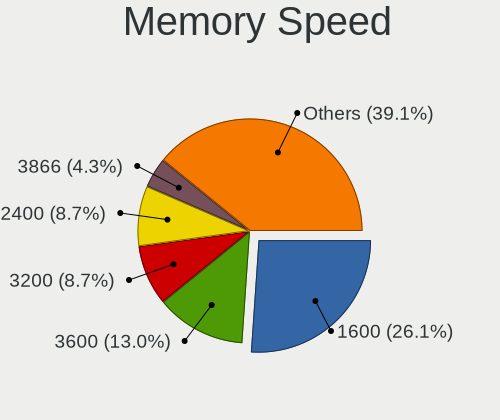

| Speed | Desktops | Percent |
|-------|----------|---------|
| 1600  | 6        | 25%     |
| 3600  | 2        | 8.33%   |
| 3533  | 2        | 8.33%   |
| 3200  | 2        | 8.33%   |
| 2400  | 2        | 8.33%   |
| 3866  | 1        | 4.17%   |
| 3733  | 1        | 4.17%   |
| 3400  | 1        | 4.17%   |
| 3000  | 1        | 4.17%   |
| 1867  | 1        | 4.17%   |
| 1866  | 1        | 4.17%   |
| 1800  | 1        | 4.17%   |
| 1333  | 1        | 4.17%   |
| 1066  | 1        | 4.17%   |
| 667   | 1        | 4.17%   |

Printers & scanners
-------------------

Printer Vendor
--------------

Printer device vendors

| Vendor          | Desktops | Percent |
|-----------------|----------|---------|
| Hewlett-Packard | 2        | 50%     |
| Canon           | 2        | 50%     |

Printer Model
-------------

Printer device models

| Model                  | Desktops | Percent |
|------------------------|----------|---------|
| HP LaserJet 1018       | 1        | 25%     |
| HP DeskJet 3630 series | 1        | 25%     |
| Canon LBP7010C/7018C   | 1        | 25%     |
| Canon G3000 series     | 1        | 25%     |

Scanner Vendor
--------------

Scanner device vendors

Zero info for selected period =(

Scanner Model
-------------

Scanner device models

Zero info for selected period =(

Camera
------

Camera Vendor
-------------

Camera device vendors

| Vendor              | Desktops | Percent |
|---------------------|----------|---------|
| Logitech            | 8        | 42.11%  |
| Microsoft           | 2        | 10.53%  |
| Microdia            | 2        | 10.53%  |
| Samsung Electronics | 1        | 5.26%   |
| MacroSilicon        | 1        | 5.26%   |
| LG Electronics      | 1        | 5.26%   |
| Hewlett-Packard     | 1        | 5.26%   |
| Bison Electronics   | 1        | 5.26%   |
| Apple               | 1        | 5.26%   |
| A4Tech              | 1        | 5.26%   |

Camera Model
------------

Camera device models

| Model                                   | Desktops | Percent |
|-----------------------------------------|----------|---------|
| Logitech HD Pro Webcam C920             | 3        | 15.79%  |
| Microdia Camera                         | 2        | 10.53%  |
| Logitech Logitech Webcam C160           | 2        | 10.53%  |
| Samsung Galaxy series, misc. (MTP mode) | 1        | 5.26%   |
| Microsoft Xbox NUI Camera               | 1        | 5.26%   |
| Microsoft LifeCam HD-3000               | 1        | 5.26%   |
| MacroSilicon ShadowCast                 | 1        | 5.26%   |
| Logitech Webcam C270                    | 1        | 5.26%   |
| Logitech StreamCam                      | 1        | 5.26%   |
| Logitech C922 Pro Stream Webcam         | 1        | 5.26%   |
| LG Optimus (Various Models) MTP Mode    | 1        | 5.26%   |
| HP Webcam HD 2300                       | 1        | 5.26%   |
| Bison LENOVO LBG 720P CAM               | 1        | 5.26%   |
| Apple iPhone 5/5C/5S/6/SE/7/8/X/XR      | 1        | 5.26%   |
| A4Tech FHD 1080P PC Camera              | 1        | 5.26%   |

Security
--------

Fingerprint Vendor
------------------

Fingerprint sensor vendors

| Vendor             | Desktops | Percent |
|--------------------|----------|---------|
| Focal-systems.Corp | 1        | 100%    |

Fingerprint Model
-----------------

Fingerprint sensor models

| Model                                 | Desktops | Percent |
|---------------------------------------|----------|---------|
| Focal-systems.Corp FT9201Fingerprint. | 1        | 100%    |

Chipcard Vendor
---------------

Chipcard module vendors

| Vendor | Desktops | Percent |
|--------|----------|---------|
| BIT4ID | 1        | 50%     |
| Aktiv  | 1        | 50%     |

Chipcard Model
--------------

Chipcard module models

| Model                 | Desktops | Percent |
|-----------------------|----------|---------|
| BIT4ID miniLector EVO | 1        | 50%     |
| Aktiv Rutoken lite    | 1        | 50%     |

Unsupported
-----------

Unsupported Devices
-------------------

Total unsupported devices on board

| Total | Desktops | Percent |
|-------|----------|---------|
| 0     | 59       | 81.94%  |
| 1     | 8        | 11.11%  |
| 2     | 4        | 5.56%   |
| 3     | 1        | 1.39%   |

Unsupported Device Types
------------------------

Types of unsupported devices

| Type                  | Desktops | Percent |
|-----------------------|----------|---------|
| Net/wireless          | 8        | 42.11%  |
| Multimedia controller | 2        | 10.53%  |
| Graphics card         | 2        | 10.53%  |
| Chipcard              | 2        | 10.53%  |
| Unassigned class      | 1        | 5.26%   |
| Tv card               | 1        | 5.26%   |
| Network               | 1        | 5.26%   |
| Fingerprint reader    | 1        | 5.26%   |
| Camera                | 1        | 5.26%   |

