Solus - Tested Hardware & Statistics (Notebooks)
------------------------------------------------

A project to collect tested hardware configurations for Solus.

Anyone can contribute to this report by the [hw-probe](https://github.com/linuxhw/hw-probe) tool:

    sudo -E hw-probe -all -upload

Please contribute! Especially if your hardware is rare.

Contents
--------

* [ Test Cases ](#test-cases)

* [ System ](#system)
  - [ OS                       ](#os)
  - [ OS Family                ](#os-family)
  - [ Kernel                   ](#kernel)
  - [ Kernel Family            ](#kernel-family)
  - [ Kernel Major Ver.        ](#kernel-major-ver)
  - [ Arch                     ](#arch)
  - [ DE                       ](#de)
  - [ Display Server           ](#display-server)
  - [ Display Manager          ](#display-manager)
  - [ OS Lang                  ](#os-lang)
  - [ Boot Mode                ](#boot-mode)
  - [ Filesystem               ](#filesystem)
  - [ Part. scheme             ](#part-scheme)
  - [ Dual Boot with Linux/BSD ](#dual-boot-with-linuxbsd)
  - [ Dual Boot (Win)          ](#dual-boot-win)

* [ Board ](#board)
  - [ Vendor                   ](#vendor)
  - [ Model                    ](#model)
  - [ Model Family             ](#model-family)
  - [ MFG Year                 ](#mfg-year)
  - [ Form Factor              ](#form-factor)
  - [ Secure Boot              ](#secure-boot)
  - [ Coreboot                 ](#coreboot)
  - [ RAM Size                 ](#ram-size)
  - [ RAM Used                 ](#ram-used)
  - [ Total Drives             ](#total-drives)
  - [ Has CD-ROM               ](#has-cd-rom)
  - [ Has Ethernet             ](#has-ethernet)
  - [ Has WiFi                 ](#has-wifi)
  - [ Has Bluetooth            ](#has-bluetooth)

* [ Location ](#location)
  - [ Country                  ](#country)
  - [ City                     ](#city)

* [ Drives ](#drives)
  - [ Drive Vendor             ](#drive-vendor)
  - [ Drive Model              ](#drive-model)
  - [ HDD Vendor               ](#hdd-vendor)
  - [ SSD Vendor               ](#ssd-vendor)
  - [ Drive Kind               ](#drive-kind)
  - [ Drive Connector          ](#drive-connector)
  - [ Drive Size               ](#drive-size)
  - [ Space Total              ](#space-total)
  - [ Space Used               ](#space-used)
  - [ Malfunc. Drives          ](#malfunc-drives)
  - [ Malfunc. Drive Vendor    ](#malfunc-drive-vendor)
  - [ Malfunc. HDD Vendor      ](#malfunc-hdd-vendor)
  - [ Malfunc. Drive Kind      ](#malfunc-drive-kind)
  - [ Failed Drives            ](#failed-drives)
  - [ Failed Drive Vendor      ](#failed-drive-vendor)
  - [ Drive Status             ](#drive-status)

* [ Storage controller ](#storage-controller)
  - [ Storage Vendor           ](#storage-vendor)
  - [ Storage Model            ](#storage-model)
  - [ Storage Kind             ](#storage-kind)

* [ Processor ](#processor)
  - [ CPU Vendor               ](#cpu-vendor)
  - [ CPU Model                ](#cpu-model)
  - [ CPU Model Family         ](#cpu-model-family)
  - [ CPU Cores                ](#cpu-cores)
  - [ CPU Sockets              ](#cpu-sockets)
  - [ CPU Threads              ](#cpu-threads)
  - [ CPU Op-Modes             ](#cpu-op-modes)
  - [ CPU Microcode            ](#cpu-microcode)
  - [ CPU Microarch            ](#cpu-microarch)

* [ Graphics ](#graphics)
  - [ GPU Vendor               ](#gpu-vendor)
  - [ GPU Model                ](#gpu-model)
  - [ GPU Combo                ](#gpu-combo)
  - [ GPU Driver               ](#gpu-driver)
  - [ GPU Memory               ](#gpu-memory)

* [ Monitor ](#monitor)
  - [ Monitor Vendor           ](#monitor-vendor)
  - [ Monitor Model            ](#monitor-model)
  - [ Monitor Resolution       ](#monitor-resolution)
  - [ Monitor Diagonal         ](#monitor-diagonal)
  - [ Monitor Width            ](#monitor-width)
  - [ Aspect Ratio             ](#aspect-ratio)
  - [ Monitor Area             ](#monitor-area)
  - [ Pixel Density            ](#pixel-density)
  - [ Multiple Monitors        ](#multiple-monitors)

* [ Network ](#network)
  - [ Net Controller Vendor    ](#net-controller-vendor)
  - [ Net Controller Model     ](#net-controller-model)
  - [ Wireless Vendor          ](#wireless-vendor)
  - [ Wireless Model           ](#wireless-model)
  - [ Ethernet Vendor          ](#ethernet-vendor)
  - [ Ethernet Model           ](#ethernet-model)
  - [ Net Controller Kind      ](#net-controller-kind)
  - [ Used Controller          ](#used-controller)
  - [ NICs                     ](#nics)
  - [ IPv6                     ](#ipv6)

* [ Bluetooth ](#bluetooth)
  - [ Bluetooth Vendor         ](#bluetooth-vendor)
  - [ Bluetooth Model          ](#bluetooth-model)

* [ Sound ](#sound)
  - [ Sound Vendor             ](#sound-vendor)
  - [ Sound Model              ](#sound-model)

* [ Memory ](#memory)
  - [ Memory Vendor            ](#memory-vendor)
  - [ Memory Model             ](#memory-model)
  - [ Memory Kind              ](#memory-kind)
  - [ Memory Form Factor       ](#memory-form-factor)
  - [ Memory Size              ](#memory-size)
  - [ Memory Speed             ](#memory-speed)

* [ Printers & scanners ](#printers--scanners)
  - [ Printer Vendor           ](#printer-vendor)
  - [ Printer Model            ](#printer-model)
  - [ Scanner Vendor           ](#scanner-vendor)
  - [ Scanner Model            ](#scanner-model)

* [ Camera ](#camera)
  - [ Camera Vendor            ](#camera-vendor)
  - [ Camera Model             ](#camera-model)

* [ Security ](#security)
  - [ Fingerprint Vendor       ](#fingerprint-vendor)
  - [ Fingerprint Model        ](#fingerprint-model)
  - [ Chipcard Vendor          ](#chipcard-vendor)
  - [ Chipcard Model           ](#chipcard-model)

* [ Unsupported ](#unsupported)
  - [ Unsupported Devices      ](#unsupported-devices)
  - [ Unsupported Device Types ](#unsupported-device-types)

Test Cases
----------

Total: 171

| Vendor        | Model                       | Probe                                                      | Date         |
|---------------|-----------------------------|------------------------------------------------------------|--------------|
| Dell          | Latitude E5550              | [cb0a51f3fc](https://linux-hardware.org/?probe=cb0a51f3fc) | Dec 23, 2024 |
| Dell          | Inspiron 1545               | [9ac7ef6ed0](https://linux-hardware.org/?probe=9ac7ef6ed0) | Dec 06, 2024 |
| Lenovo        | IdeaPad 3 17ABA7 82RQ       | [f518a2fbc3](https://linux-hardware.org/?probe=f518a2fbc3) | Nov 30, 2024 |
| HP            | Pavilion Laptop 14-ce3xx... | [43af28812b](https://linux-hardware.org/?probe=43af28812b) | Nov 16, 2024 |
| Google        | Pirika                      | [e41945c3f4](https://linux-hardware.org/?probe=e41945c3f4) | Oct 16, 2024 |
| HP            | Pavilion Laptop 14-ce3xx... | [4f00b3769d](https://linux-hardware.org/?probe=4f00b3769d) | Sep 19, 2024 |
| Apple         | MacBook4,1                  | [492b40fefb](https://linux-hardware.org/?probe=492b40fefb) | Sep 13, 2024 |
| Toshiba       | Satellite Pro C850-1J2      | [95322ce7fc](https://linux-hardware.org/?probe=95322ce7fc) | Sep 02, 2024 |
| Dell          | Latitude E5470              | [42433b40f6](https://linux-hardware.org/?probe=42433b40f6) | Aug 31, 2024 |
| HUAWEI        | MACHD-WXX9                  | [87961c091a](https://linux-hardware.org/?probe=87961c091a) | Aug 15, 2024 |
| Dell          | Latitude 5590               | [9963ff0d8f](https://linux-hardware.org/?probe=9963ff0d8f) | Jun 06, 2024 |
| Dell          | Latitude 5590               | [452b9560aa](https://linux-hardware.org/?probe=452b9560aa) | May 29, 2024 |
| HUAWEI        | MACHD-WXX9                  | [53c26896f2](https://linux-hardware.org/?probe=53c26896f2) | May 25, 2024 |
| HP            | Compaq nc6400 (RH478EA#A... | [3a7873efe4](https://linux-hardware.org/?probe=3a7873efe4) | May 24, 2024 |
| Acer          | Aspire 5738                 | [c065f8efda](https://linux-hardware.org/?probe=c065f8efda) | Mar 31, 2024 |
| Packard Be... | EasyNote MH36               | [db4c360048](https://linux-hardware.org/?probe=db4c360048) | Mar 30, 2024 |
| Dell          | Latitude E5470              | [844e9a99df](https://linux-hardware.org/?probe=844e9a99df) | Mar 24, 2024 |
| Dell          | Latitude E5470              | [a268f7138b](https://linux-hardware.org/?probe=a268f7138b) | Mar 24, 2024 |
| Lenovo        | ThinkPad T410 253725G       | [33a07105de](https://linux-hardware.org/?probe=33a07105de) | Mar 24, 2024 |
| Apple         | MacBookPro12,1              | [c3230ba277](https://linux-hardware.org/?probe=c3230ba277) | Mar 03, 2024 |
| HUAWEI        | BOD-WXX9                    | [d8e2dd481d](https://linux-hardware.org/?probe=d8e2dd481d) | Dec 28, 2023 |
| Google        | Kip                         | [344f7b3eda](https://linux-hardware.org/?probe=344f7b3eda) | Sep 21, 2023 |
| Dell          | Latitude E6400              | [d3bc465020](https://linux-hardware.org/?probe=d3bc465020) | Aug 23, 2023 |
| Dell          | Latitude E6400              | [a1b816015e](https://linux-hardware.org/?probe=a1b816015e) | Aug 23, 2023 |
| Packard Be... | EasyNote TE11HC             | [f69a3b4363](https://linux-hardware.org/?probe=f69a3b4363) | Aug 17, 2023 |
| Packard Be... | EasyNote TE11HC             | [af4abf9f1d](https://linux-hardware.org/?probe=af4abf9f1d) | Aug 16, 2023 |
| Acer          | Nitro AN515-45              | [fda8d0a543](https://linux-hardware.org/?probe=fda8d0a543) | Aug 02, 2023 |
| Valve         | Jupiter                     | [b7af0e09ea](https://linux-hardware.org/?probe=b7af0e09ea) | Jul 12, 2023 |
| HP            | Pavilion Laptop 15-eh1xx... | [33a8b4ab02](https://linux-hardware.org/?probe=33a8b4ab02) | Jul 08, 2023 |
| Sony          | VPCF236FM                   | [21a805fe1d](https://linux-hardware.org/?probe=21a805fe1d) | Jul 08, 2023 |
| ASUSTek       | UX430UAR                    | [6a51948293](https://linux-hardware.org/?probe=6a51948293) | Jul 03, 2023 |
| Dell          | Latitude 3420               | [730bdb05fe](https://linux-hardware.org/?probe=730bdb05fe) | Jun 23, 2023 |
| ASUSTek       | VivoBook_ASUSLaptop M350... | [d7e8503e88](https://linux-hardware.org/?probe=d7e8503e88) | Jun 23, 2023 |
| Lenovo        | IdeaPad 530S-14ARR 81H1     | [299733170c](https://linux-hardware.org/?probe=299733170c) | Apr 03, 2023 |
| Lenovo        | ThinkPad T14 Gen 1 20S00... | [db0f4c6df3](https://linux-hardware.org/?probe=db0f4c6df3) | Mar 16, 2023 |
| Dell          | Inspiron 7460               | [141874b125](https://linux-hardware.org/?probe=141874b125) | Jan 08, 2023 |
| Samsung       | R430/P430/R480              | [ae3789203b](https://linux-hardware.org/?probe=ae3789203b) | Dec 18, 2022 |
| Toshiba       | Satellite L855              | [932d8fec2d](https://linux-hardware.org/?probe=932d8fec2d) | Dec 12, 2022 |
| MSI           | Modern 14 B5M               | [2bd9abfe2c](https://linux-hardware.org/?probe=2bd9abfe2c) | Nov 20, 2022 |
| Lenovo        | IdeaPad 5 15ALC05 82LN      | [12b14f3cbc](https://linux-hardware.org/?probe=12b14f3cbc) | Nov 06, 2022 |
| Quanta        | TWS                         | [a800f54191](https://linux-hardware.org/?probe=a800f54191) | Nov 06, 2022 |
| Toshiba       | Satellite L855              | [1065197a6e](https://linux-hardware.org/?probe=1065197a6e) | Sep 15, 2022 |
| Dell          | Latitude E5470              | [8cd7ffad9e](https://linux-hardware.org/?probe=8cd7ffad9e) | Aug 08, 2022 |
| Lenovo        | IdeaPad S340-15API 81NC     | [76083d81dc](https://linux-hardware.org/?probe=76083d81dc) | Jul 30, 2022 |
| Acer          | Aspire A315-54              | [9e0bbc26f4](https://linux-hardware.org/?probe=9e0bbc26f4) | Jul 22, 2022 |
| AZW           | SEi                         | [7556cabcae](https://linux-hardware.org/?probe=7556cabcae) | Jul 07, 2022 |
| GPU Compan... | GWTC116-2                   | [d0c0f4f120](https://linux-hardware.org/?probe=d0c0f4f120) | Jul 06, 2022 |
| GPU Compan... | GWTC116-2                   | [9d0dd21c70](https://linux-hardware.org/?probe=9d0dd21c70) | Jul 06, 2022 |
| HP            | ProBook 450 G5              | [c4880f9bab](https://linux-hardware.org/?probe=c4880f9bab) | Jun 02, 2022 |
| HP            | ProBook 455 G8 Notebook ... | [5330a5aa11](https://linux-hardware.org/?probe=5330a5aa11) | Jun 02, 2022 |
| HP            | ProBook 450 G5              | [7f8acf64cd](https://linux-hardware.org/?probe=7f8acf64cd) | May 31, 2022 |
| HP            | ProBook 450 G5              | [2fbbe84744](https://linux-hardware.org/?probe=2fbbe84744) | May 31, 2022 |
| Google        | Edgar                       | [fef9eeb5db](https://linux-hardware.org/?probe=fef9eeb5db) | May 02, 2022 |
| Lenovo        | Z50-70 20354                | [6d50395aee](https://linux-hardware.org/?probe=6d50395aee) | Apr 22, 2022 |
| Dell          | XPS 13 7390                 | [80c38b1425](https://linux-hardware.org/?probe=80c38b1425) | Apr 19, 2022 |
| Lenovo        | ThinkPad T15 Gen 2i 20W4... | [9391fc9592](https://linux-hardware.org/?probe=9391fc9592) | Mar 23, 2022 |
| Lenovo        | ThinkPad T15 Gen 2i 20W4... | [81ec123b24](https://linux-hardware.org/?probe=81ec123b24) | Mar 15, 2022 |
| Dell          | XPS 13 9380                 | [efc6123d49](https://linux-hardware.org/?probe=efc6123d49) | Mar 06, 2022 |
| Google        | Delbin                      | [fbf8763bd4](https://linux-hardware.org/?probe=fbf8763bd4) | Feb 05, 2022 |
| Acer          | Aspire A315-54              | [5eb9b9e574](https://linux-hardware.org/?probe=5eb9b9e574) | Jan 22, 2022 |
| Acer          | Swift SF114-34              | [15431686d8](https://linux-hardware.org/?probe=15431686d8) | Jan 06, 2022 |
| Toshiba       | TECRA R840                  | [753c7caef6](https://linux-hardware.org/?probe=753c7caef6) | Dec 27, 2021 |
| Sony          | VPCYB15AB                   | [780ef18db3](https://linux-hardware.org/?probe=780ef18db3) | Dec 13, 2021 |
| Dell          | Latitude 5580               | [a10f022f63](https://linux-hardware.org/?probe=a10f022f63) | Nov 26, 2021 |
| Framework     | Laptop                      | [7995a7a4de](https://linux-hardware.org/?probe=7995a7a4de) | Nov 18, 2021 |
| Dell          | Latitude E6220              | [09a75055c9](https://linux-hardware.org/?probe=09a75055c9) | Nov 12, 2021 |
| Framework     | Laptop                      | [72a07a2e81](https://linux-hardware.org/?probe=72a07a2e81) | Nov 11, 2021 |
| AZW           | SEi                         | [0e29003348](https://linux-hardware.org/?probe=0e29003348) | Oct 18, 2021 |
| ASUSTek       | VivoBook_ASUSLaptop X509... | [c7f1620c1c](https://linux-hardware.org/?probe=c7f1620c1c) | Oct 05, 2021 |
| HP            | OMEN Laptop 15-en0xxx       | [f19ad7cba2](https://linux-hardware.org/?probe=f19ad7cba2) | Sep 16, 2021 |
| HP            | OMEN Laptop 15-en0xxx       | [1cca1c6ce5](https://linux-hardware.org/?probe=1cca1c6ce5) | Sep 13, 2021 |
| HP            | OMEN Laptop 15-en0xxx       | [888bf75e20](https://linux-hardware.org/?probe=888bf75e20) | Sep 13, 2021 |
| Acer          | Nitro AN515-45              | [5bad88330d](https://linux-hardware.org/?probe=5bad88330d) | Sep 01, 2021 |
| Dell          | Inspiron 1525               | [3f3cd9c9e2](https://linux-hardware.org/?probe=3f3cd9c9e2) | Aug 25, 2021 |
| Dell          | Inspiron 1525               | [de3cb038ef](https://linux-hardware.org/?probe=de3cb038ef) | Aug 25, 2021 |
| Acer          | Nitro AN515-45              | [d98d816e7f](https://linux-hardware.org/?probe=d98d816e7f) | Aug 18, 2021 |
| Acer          | Nitro AN515-45              | [5320b136ea](https://linux-hardware.org/?probe=5320b136ea) | Aug 12, 2021 |
| Dell          | Vostro 15-3568              | [5f68a1fdaa](https://linux-hardware.org/?probe=5f68a1fdaa) | Aug 07, 2021 |
| HP            | ProBook 650 G2              | [15257858f3](https://linux-hardware.org/?probe=15257858f3) | Aug 07, 2021 |
| Dell          | Inspiron 15-3573            | [52916532a3](https://linux-hardware.org/?probe=52916532a3) | Aug 06, 2021 |
| Lenovo        | IdeaPad 320-15ISK 80XH      | [75ec31cefd](https://linux-hardware.org/?probe=75ec31cefd) | Jul 16, 2021 |
| Dell          | Vostro 15-3568              | [3d6d3007cf](https://linux-hardware.org/?probe=3d6d3007cf) | Jul 10, 2021 |
| Dell          | Vostro 15-3568              | [66d001f315](https://linux-hardware.org/?probe=66d001f315) | Jul 09, 2021 |
| ASUSTek       | N53SV                       | [53fef6a61a](https://linux-hardware.org/?probe=53fef6a61a) | Jul 08, 2021 |
| Dell          | Inspiron 3537               | [6fc3976633](https://linux-hardware.org/?probe=6fc3976633) | Jun 18, 2021 |
| Lenovo        | ThinkPad X1 Carbon 4th 2... | [0e1e07507e](https://linux-hardware.org/?probe=0e1e07507e) | Jun 15, 2021 |
| HP            | ProBook 650 G1              | [120d5f24fe](https://linux-hardware.org/?probe=120d5f24fe) | Jun 07, 2021 |
| Howard Com... | W350                        | [3e55c8284e](https://linux-hardware.org/?probe=3e55c8284e) | May 28, 2021 |
| Acer          | Aspire E5-575G              | [ce04df7bae](https://linux-hardware.org/?probe=ce04df7bae) | May 23, 2021 |
| Gigabyte      | AORUS 17G KB                | [fd9385ff3c](https://linux-hardware.org/?probe=fd9385ff3c) | Apr 29, 2021 |
| Packard Be... | EasyNote TS11HR             | [5c51b7f289](https://linux-hardware.org/?probe=5c51b7f289) | Apr 25, 2021 |
| Lenovo        | ThinkPad T430 2349CV2       | [98063e03b9](https://linux-hardware.org/?probe=98063e03b9) | Apr 21, 2021 |
| HP            | Pavilion dv7                | [e8b5a1786b](https://linux-hardware.org/?probe=e8b5a1786b) | Apr 08, 2021 |
| HP            | ProBook 650 G1              | [e25f4adb0b](https://linux-hardware.org/?probe=e25f4adb0b) | Mar 31, 2021 |
| HP            | ProBook 650 G1              | [4ba1bb5165](https://linux-hardware.org/?probe=4ba1bb5165) | Mar 29, 2021 |
| Toshiba       | Satellite L855              | [e507a57307](https://linux-hardware.org/?probe=e507a57307) | Feb 23, 2021 |
| Lenovo        | Legion Y530-15ICH 81FV      | [f1c277189f](https://linux-hardware.org/?probe=f1c277189f) | Feb 16, 2021 |
| Acer          | Aspire 5735                 | [d8b7b99dd0](https://linux-hardware.org/?probe=d8b7b99dd0) | Feb 16, 2021 |
| Toshiba       | Satellite L855              | [7a2993f67a](https://linux-hardware.org/?probe=7a2993f67a) | Feb 03, 2021 |
| Lenovo        | ThinkPad T410 2522Y1L       | [3c4543a94f](https://linux-hardware.org/?probe=3c4543a94f) | Jan 26, 2021 |
| Dell          | XPS 13 9360                 | [56d39c0f21](https://linux-hardware.org/?probe=56d39c0f21) | Jan 02, 2021 |
| Toshiba       | Satellite L855              | [0173204c7f](https://linux-hardware.org/?probe=0173204c7f) | Dec 23, 2020 |
| HUAWEI        | NBLK-WAX9X                  | [26447067ee](https://linux-hardware.org/?probe=26447067ee) | Dec 20, 2020 |
| Acer          | Aspire A315-21              | [5f78418b58](https://linux-hardware.org/?probe=5f78418b58) | Dec 19, 2020 |
| HP            | EliteBook 840 G3            | [708eaf5602](https://linux-hardware.org/?probe=708eaf5602) | Dec 14, 2020 |
| Toshiba       | Satellite L855              | [3d3a517e96](https://linux-hardware.org/?probe=3d3a517e96) | Dec 11, 2020 |
| Sony          | VPCEB1S1E                   | [ebcb16e616](https://linux-hardware.org/?probe=ebcb16e616) | Nov 27, 2020 |
| Panasonic     | CF-C2CCEZXCM                | [cba289e868](https://linux-hardware.org/?probe=cba289e868) | Nov 22, 2020 |
| Acer          | Aspire E1-532P              | [4a2a5fd18c](https://linux-hardware.org/?probe=4a2a5fd18c) | Nov 01, 2020 |
| Timi          | TM1701                      | [36446e6594](https://linux-hardware.org/?probe=36446e6594) | Oct 26, 2020 |
| Apple         | MacBook5,2                  | [b21d4ca9d0](https://linux-hardware.org/?probe=b21d4ca9d0) | Oct 26, 2020 |
| Apple         | MacBook5,2                  | [eb1b0d459f](https://linux-hardware.org/?probe=eb1b0d459f) | Oct 25, 2020 |
| Toshiba       | PORTEGE Z20T-B              | [9d789eba3c](https://linux-hardware.org/?probe=9d789eba3c) | Oct 12, 2020 |
| Toshiba       | Satellite P50-A             | [884731a198](https://linux-hardware.org/?probe=884731a198) | Sep 28, 2020 |
| HP            | ProBook 450 G5              | [d04bae5c49](https://linux-hardware.org/?probe=d04bae5c49) | Sep 14, 2020 |
| Lenovo        | ThinkPad Edge E440 20C5A... | [2f729ef2af](https://linux-hardware.org/?probe=2f729ef2af) | Sep 11, 2020 |
| Lenovo        | ThinkPad T440p 20AN009CU... | [bcc44c581c](https://linux-hardware.org/?probe=bcc44c581c) | Sep 09, 2020 |
| Dell          | Inspiron 5577               | [b46a79f93e](https://linux-hardware.org/?probe=b46a79f93e) | Sep 03, 2020 |
| Acer          | Aspire ES1-111M             | [fcee1a2241](https://linux-hardware.org/?probe=fcee1a2241) | Aug 21, 2020 |
| Acer          | Aspire ES1-111M             | [43f35553ae](https://linux-hardware.org/?probe=43f35553ae) | Aug 21, 2020 |
| Lenovo        | IdeaPad 330S-15IKB 81F5     | [793085b89a](https://linux-hardware.org/?probe=793085b89a) | Aug 15, 2020 |
| HP            | ProBook 440 G4              | [191f1be39f](https://linux-hardware.org/?probe=191f1be39f) | Aug 14, 2020 |
| HP            | ProBook 440 G4              | [c34e36f36e](https://linux-hardware.org/?probe=c34e36f36e) | Aug 10, 2020 |
| HP            | ProBook 440 G4              | [5b6c3861bb](https://linux-hardware.org/?probe=5b6c3861bb) | Aug 10, 2020 |
| ASUSTek       | TUF Gaming FX505DV_FX505... | [8eb28a49c4](https://linux-hardware.org/?probe=8eb28a49c4) | Aug 03, 2020 |
| Avell High... | Avell G1750 MUV / C65 MU... | [cf035fee07](https://linux-hardware.org/?probe=cf035fee07) | Jul 24, 2020 |
| ASUSTek       | ZenBook UX431DA_UM431DA     | [2fdc7ceb31](https://linux-hardware.org/?probe=2fdc7ceb31) | Jul 03, 2020 |
| HP            | Presario C700               | [6b50a4fad1](https://linux-hardware.org/?probe=6b50a4fad1) | Jun 26, 2020 |
| ASUSTek       | K45A                        | [57c5b7b4bd](https://linux-hardware.org/?probe=57c5b7b4bd) | Jun 08, 2020 |
| Acer          | Predator PH315-52           | [b5e7780315](https://linux-hardware.org/?probe=b5e7780315) | Jun 04, 2020 |
| Lenovo        | Z51-70 80K6                 | [7b25fce04c](https://linux-hardware.org/?probe=7b25fce04c) | May 24, 2020 |
| Samsung       | 270E5K/270E5Q/271E5K/257... | [cb0fe570e2](https://linux-hardware.org/?probe=cb0fe570e2) | May 22, 2020 |
| Dell          | Latitude 7390               | [49112c8937](https://linux-hardware.org/?probe=49112c8937) | May 20, 2020 |
| HP            | ProBook 6470b               | [59db0f436f](https://linux-hardware.org/?probe=59db0f436f) | May 13, 2020 |
| Samsung       | 270E5K/270E5Q/271E5K/257... | [e98c6a162c](https://linux-hardware.org/?probe=e98c6a162c) | May 03, 2020 |
| Toshiba       | Satellite L655              | [32a9d86996](https://linux-hardware.org/?probe=32a9d86996) | May 02, 2020 |
| Acer          | Aspire E1-532P              | [b401e8b701](https://linux-hardware.org/?probe=b401e8b701) | Apr 30, 2020 |
| HP            | Pavilion dv6                | [6939cb8715](https://linux-hardware.org/?probe=6939cb8715) | Apr 11, 2020 |
| Acer          | Aspire E5-575               | [328b82f240](https://linux-hardware.org/?probe=328b82f240) | Apr 11, 2020 |
| HP            | Pavilion dv6                | [0c6dc861d6](https://linux-hardware.org/?probe=0c6dc861d6) | Apr 06, 2020 |
| HP            | Pavilion dv6                | [3d9d707ea7](https://linux-hardware.org/?probe=3d9d707ea7) | Mar 30, 2020 |
| Chuwi         | LapBook SE                  | [f7cfd1b163](https://linux-hardware.org/?probe=f7cfd1b163) | Mar 26, 2020 |
| Acer          | Swift SF314-56              | [3826e4d14c](https://linux-hardware.org/?probe=3826e4d14c) | Mar 24, 2020 |
| Google        | Kip                         | [4f62ee34a3](https://linux-hardware.org/?probe=4f62ee34a3) | Mar 22, 2020 |
| Dell          | Vostro 3446                 | [c42d273e36](https://linux-hardware.org/?probe=c42d273e36) | Mar 12, 2020 |
| HP            | ProBook 450 G5              | [0c527b2640](https://linux-hardware.org/?probe=0c527b2640) | Mar 08, 2020 |
| Acer          | Aspire VN7-792G             | [3924df2c92](https://linux-hardware.org/?probe=3924df2c92) | Feb 28, 2020 |
| Apple         | MacBookPro10,2              | [1281c8c30d](https://linux-hardware.org/?probe=1281c8c30d) | Feb 26, 2020 |
| Lenovo        | ThinkPad T480 20L5S08L00    | [3c23e0d823](https://linux-hardware.org/?probe=3c23e0d823) | Feb 20, 2020 |
| Lenovo        | ThinkPad W530 243852U       | [eb8bd4a219](https://linux-hardware.org/?probe=eb8bd4a219) | Jan 20, 2020 |
| ASUSTek       | X556UQK                     | [5070b3831b](https://linux-hardware.org/?probe=5070b3831b) | Dec 29, 2019 |
| Lenovo        | ThinkPad X301 4057WHQ       | [badcab7790](https://linux-hardware.org/?probe=badcab7790) | Dec 22, 2019 |
| Dell          | Inspiron N5040              | [493965d4d4](https://linux-hardware.org/?probe=493965d4d4) | Dec 19, 2019 |
| Dell          | Inspiron N5040              | [ac12864629](https://linux-hardware.org/?probe=ac12864629) | Dec 19, 2019 |
| Howard Com... | W350                        | [7434be9250](https://linux-hardware.org/?probe=7434be9250) | Dec 10, 2019 |
| Samsung       | 300E5EV/300E4EV/270E5EV/... | [ad5138a45f](https://linux-hardware.org/?probe=ad5138a45f) | Dec 04, 2019 |
| Acer          | Aspire E5-575G              | [99d56262c0](https://linux-hardware.org/?probe=99d56262c0) | Dec 03, 2019 |
| HP            | Pavilion 17                 | [09c3d61b20](https://linux-hardware.org/?probe=09c3d61b20) | Nov 18, 2019 |
| HP            | Stream Laptop 14-cb1XX      | [372f025649](https://linux-hardware.org/?probe=372f025649) | Nov 18, 2019 |
| HP            | 255 G1                      | [0a0d476781](https://linux-hardware.org/?probe=0a0d476781) | Nov 06, 2019 |
| HP            | 255 G1                      | [2aa8aaffc1](https://linux-hardware.org/?probe=2aa8aaffc1) | Nov 04, 2019 |
| Acer          | Swift SF315-52              | [c5950fe2b2](https://linux-hardware.org/?probe=c5950fe2b2) | Oct 20, 2019 |
| Toshiba       | Unknown                     | [64c90921de](https://linux-hardware.org/?probe=64c90921de) | Oct 18, 2019 |
| Dell          | Latitude 7490               | [2381ee7707](https://linux-hardware.org/?probe=2381ee7707) | Oct 14, 2019 |
| HP            | ENVY dv7                    | [1f13304239](https://linux-hardware.org/?probe=1f13304239) | Oct 06, 2019 |
| HP            | Pavilion Laptop 15-cw0xx... | [4e34d8767a](https://linux-hardware.org/?probe=4e34d8767a) | Aug 03, 2019 |
| Dell          | XPS 15 9560                 | [65f14ca77f](https://linux-hardware.org/?probe=65f14ca77f) | Jun 11, 2019 |
| HP            | EliteBook 8770w             | [fdba82a5b5](https://linux-hardware.org/?probe=fdba82a5b5) | Apr 01, 2019 |
| Acer          | Aspire V3-571G              | [0ffa9711e1](https://linux-hardware.org/?probe=0ffa9711e1) | Jan 07, 2019 |
| Acer          | Aspire V3-571G              | [46de1b2636](https://linux-hardware.org/?probe=46de1b2636) | Jan 07, 2019 |
| Acer          | Aspire E1-532P              | [26e0937896](https://linux-hardware.org/?probe=26e0937896) | Nov 01, 2018 |

System
------

OS
--

Installed operating systems

| Name         | Notebooks | Percent |
|--------------|-----------|---------|
| Solus 4.1    | 39        | 30.47%  |
| Solus 4.3    | 33        | 25.78%  |
| Solus 4.0    | 17        | 13.28%  |
| Solus 4.2    | 13        | 10.16%  |
| Solus 4.5    | 12        | 9.38%   |
| Solus 4.4    | 8         | 6.25%   |
| Solus 4.6    | 5         | 3.91%   |
| Solus 3.9999 | 1         | 0.78%   |

OS Family
---------

OS without a version

| Name  | Notebooks | Percent |
|-------|-----------|---------|
| Solus | 123       | 100%    |

Kernel
------

Version of the Linux kernel

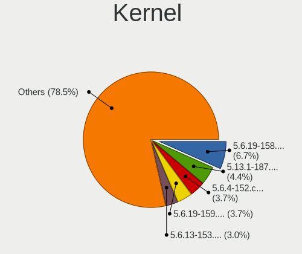

| Version             | Notebooks | Percent |
|---------------------|-----------|---------|
| 5.6.19-158.current  | 9         | 6.67%   |
| 5.13.1-187.current  | 6         | 4.44%   |
| 5.6.4-152.current   | 5         | 3.7%    |
| 5.6.19-159.current  | 5         | 3.7%    |
| 5.6.13-153.current  | 4         | 2.96%   |
| 5.5.7-150.current   | 4         | 2.96%   |
| 5.15.50-216.current | 4         | 2.96%   |
| 6.8.10-291.current  | 3         | 2.22%   |
| 6.6.21-280.current  | 3         | 2.22%   |
| 6.3.8-240.current   | 3         | 2.22%   |
| 6.11.10-310.current | 3         | 2.22%   |
| 5.3.7-132.current   | 3         | 2.22%   |
| 5.2.20-130.current  | 3         | 2.22%   |
| 5.15.32-213.current | 3         | 2.22%   |
| 5.14.21-210.current | 3         | 2.22%   |
| 5.11.22-180.current | 3         | 2.22%   |
| 6.10.6-300.current  | 2         | 1.48%   |
| 6.1.5-229.current   | 2         | 1.48%   |
| 6.0.11-225.current  | 2         | 1.48%   |
| 5.6.18-156.current  | 2         | 1.48%   |
| 5.5.4-148.current   | 2         | 1.48%   |
| 5.5.11-151.current  | 2         | 1.48%   |
| 5.4.12-144.current  | 2         | 1.48%   |
| 5.3.15-138.current  | 2         | 1.48%   |
| 5.3.10-134.current  | 2         | 1.48%   |
| 5.2.2-122.current   | 2         | 1.48%   |
| 5.15.77-219.current | 2         | 1.48%   |
| 5.14.16-205.current | 2         | 1.48%   |
| 5.13.6-190.current  | 2         | 1.48%   |
| 5.13.12-193.current | 2         | 1.48%   |
| 5.12.10-182.current | 2         | 1.48%   |
| 5.11.9-176.current  | 2         | 1.48%   |
| 5.11.12-177.current | 2         | 1.48%   |
| 5.10.12-171.current | 2         | 1.48%   |
| 6.9.10-295.current  | 1         | 0.74%   |
| 6.8.11-292.current  | 1         | 0.74%   |
| 6.6.9-269.current   | 1         | 0.74%   |
| 6.6.8-268.current   | 1         | 0.74%   |
| 6.6.22-281.current  | 1         | 0.74%   |
| 6.4.15-254.current  | 1         | 0.74%   |

Kernel Family
-------------

Linux kernel without a distro release

| Version | Notebooks | Percent |
|---------|-----------|---------|
| 5.6.19  | 14        | 10.37%  |
| 5.13.1  | 6         | 4.44%   |
| 5.6.4   | 5         | 3.7%    |
| 5.6.13  | 4         | 2.96%   |
| 5.5.7   | 4         | 2.96%   |
| 5.15.50 | 4         | 2.96%   |
| 6.8.10  | 3         | 2.22%   |
| 6.6.21  | 3         | 2.22%   |
| 6.3.8   | 3         | 2.22%   |
| 6.11.10 | 3         | 2.22%   |
| 5.6.18  | 3         | 2.22%   |
| 5.4.12  | 3         | 2.22%   |
| 5.3.7   | 3         | 2.22%   |
| 5.2.20  | 3         | 2.22%   |
| 5.15.32 | 3         | 2.22%   |
| 5.14.21 | 3         | 2.22%   |
| 5.14.16 | 3         | 2.22%   |
| 5.11.22 | 3         | 2.22%   |
| 6.3.12  | 2         | 1.48%   |
| 6.10.6  | 2         | 1.48%   |
| 6.1.5   | 2         | 1.48%   |
| 6.0.11  | 2         | 1.48%   |
| 5.5.4   | 2         | 1.48%   |
| 5.5.11  | 2         | 1.48%   |
| 5.3.15  | 2         | 1.48%   |
| 5.3.10  | 2         | 1.48%   |
| 5.2.2   | 2         | 1.48%   |
| 5.15.77 | 2         | 1.48%   |
| 5.13.6  | 2         | 1.48%   |
| 5.13.12 | 2         | 1.48%   |
| 5.12.10 | 2         | 1.48%   |
| 5.11.9  | 2         | 1.48%   |
| 5.11.12 | 2         | 1.48%   |
| 5.10.12 | 2         | 1.48%   |
| 6.9.10  | 1         | 0.74%   |
| 6.8.11  | 1         | 0.74%   |
| 6.6.9   | 1         | 0.74%   |
| 6.6.8   | 1         | 0.74%   |
| 6.6.22  | 1         | 0.74%   |
| 6.4.15  | 1         | 0.74%   |

Kernel Major Ver.
-----------------

Linux kernel major version

| Version | Notebooks | Percent |
|---------|-----------|---------|
| 5.6     | 26        | 19.55%  |
| 5.15    | 13        | 9.77%   |
| 5.13    | 12        | 9.02%   |
| 5.5     | 9         | 6.77%   |
| 5.14    | 9         | 6.77%   |
| 5.3     | 7         | 5.26%   |
| 6.6     | 6         | 4.51%   |
| 5.2     | 6         | 4.51%   |
| 5.11    | 6         | 4.51%   |
| 6.3     | 5         | 3.76%   |
| 6.10    | 5         | 3.76%   |
| 5.10    | 5         | 3.76%   |
| 6.11    | 4         | 3.01%   |
| 5.4     | 4         | 3.01%   |
| 6.8     | 3         | 2.26%   |
| 6.1     | 3         | 2.26%   |
| 6.0     | 2         | 1.5%    |
| 5.12    | 2         | 1.5%    |
| 6.9     | 1         | 0.75%   |
| 6.4     | 1         | 0.75%   |
| 5.0     | 1         | 0.75%   |
| 4.20    | 1         | 0.75%   |
| 4.18    | 1         | 0.75%   |
| 4.14    | 1         | 0.75%   |

Arch
----

OS architecture (x86_64, i586, etc.)

| Name   | Notebooks | Percent |
|--------|-----------|---------|
| x86_64 | 123       | 100%    |

DE
--

Desktop Environment

| Name    | Notebooks | Percent |
|---------|-----------|---------|
| Budgie  | 59        | 46.46%  |
| Unknown | 23        | 18.11%  |
| MATE    | 12        | 9.45%   |
| GNOME   | 12        | 9.45%   |
| KDE     | 10        | 7.87%   |
| KDE5    | 7         | 5.51%   |
| KDE6    | 4         | 3.15%   |

Display Server
--------------

X11 or Wayland

| Name    | Notebooks | Percent |
|---------|-----------|---------|
| X11     | 115       | 93.5%   |
| Wayland | 7         | 5.69%   |
| Unknown | 1         | 0.81%   |

Display Manager
---------------

SDDM, LightDM, etc.

| Name    | Notebooks | Percent |
|---------|-----------|---------|
| Unknown | 87        | 69.6%   |
| LightDM | 16        | 12.8%   |
| TDM     | 12        | 9.6%    |
| SDDM    | 5         | 4%      |
| GDM     | 5         | 4%      |

OS Lang
-------

Language

| Lang    | Notebooks | Percent |
|---------|-----------|---------|
| en_US   | 66        | 52.8%   |
| Unknown | 10        | 8%      |
| en_GB   | 7         | 5.6%    |
| de_DE   | 6         | 4.8%    |
| it_IT   | 5         | 4%      |
| fr_FR   | 5         | 4%      |
| pl_PL   | 4         | 3.2%    |
| pt_BR   | 3         | 2.4%    |
| es_ES   | 3         | 2.4%    |
| en_AU   | 3         | 2.4%    |
| tr_TR   | 2         | 1.6%    |
| en_NZ   | 2         | 1.6%    |
| uk_UA   | 1         | 0.8%    |
| ru_RU   | 1         | 0.8%    |
| fi_FI   | 1         | 0.8%    |
| es_MX   | 1         | 0.8%    |
| es_CL   | 1         | 0.8%    |
| en_SG   | 1         | 0.8%    |
| en_IN   | 1         | 0.8%    |
| en_CA   | 1         | 0.8%    |
| de_AT   | 1         | 0.8%    |

Boot Mode
---------

EFI or BIOS

| Mode | Notebooks | Percent |
|------|-----------|---------|
| EFI  | 78        | 61.9%   |
| BIOS | 48        | 38.1%   |

Filesystem
----------

Type of filesystem

| Type    | Notebooks | Percent |
|---------|-----------|---------|
| Ext4    | 106       | 84.8%   |
| Unknown | 8         | 6.4%    |
| Tmpfs   | 6         | 4.8%    |
| Overlay | 3         | 2.4%    |
| Xfs     | 1         | 0.8%    |
| Btrfs   | 1         | 0.8%    |

Part. scheme
------------

Scheme of partitioning

| Type    | Notebooks | Percent |
|---------|-----------|---------|
| Unknown | 75        | 60%     |
| GPT     | 38        | 30.4%   |
| MBR     | 12        | 9.6%    |

Dual Boot with Linux/BSD
------------------------

Hosting more than one Linux/BSD

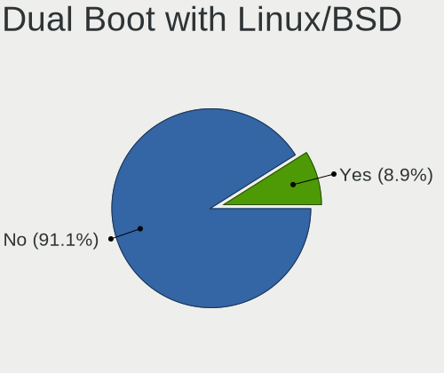

| Dual boot | Notebooks | Percent |
|-----------|-----------|---------|
| No        | 112       | 91.06%  |
| Yes       | 11        | 8.94%   |

Dual Boot (Win)
---------------

Hosting Linux and Windows

| Dual boot | Notebooks | Percent |
|-----------|-----------|---------|
| No        | 105       | 85.37%  |
| Yes       | 18        | 14.63%  |

Board
-----

Vendor
------

Motherboard manufacturer

| Name                   | Notebooks | Percent |
|------------------------|-----------|---------|
| Dell                   | 23        | 18.7%   |
| Lenovo                 | 20        | 16.26%  |
| Hewlett-Packard        | 18        | 14.63%  |
| Acer                   | 16        | 13.01%  |
| ASUSTek Computer       | 8         | 6.5%    |
| Toshiba                | 7         | 5.69%   |
| Google                 | 5         | 4.07%   |
| Apple                  | 4         | 3.25%   |
| Sony                   | 3         | 2.44%   |
| Samsung Electronics    | 3         | 2.44%   |
| Packard Bell           | 3         | 2.44%   |
| HUAWEI                 | 2         | 1.63%   |
| Valve                  | 1         | 0.81%   |
| Timi                   | 1         | 0.81%   |
| Panasonic              | 1         | 0.81%   |
| MSI                    | 1         | 0.81%   |
| Howard Computers       | 1         | 0.81%   |
| GPU Company            | 1         | 0.81%   |
| Gigabyte Technology    | 1         | 0.81%   |
| Framework              | 1         | 0.81%   |
| Chuwi                  | 1         | 0.81%   |
| AZW                    | 1         | 0.81%   |
| Avell High Performance | 1         | 0.81%   |

Model
-----

Motherboard model

| Name                                                  | Notebooks | Percent |
|-------------------------------------------------------|-----------|---------|
| HP ProBook 450 G5                                     | 2         | 1.63%   |
| Google Kip                                            | 2         | 1.63%   |
| Dell Latitude E5470                                   | 2         | 1.63%   |
| Acer Nitro AN515-45                                   | 2         | 1.63%   |
| Acer Aspire E5-575G                                   | 2         | 1.63%   |
| Valve Jupiter                                         | 1         | 0.81%   |
| Toshiba TECRA R840                                    | 1         | 0.81%   |
| Toshiba Satellite Pro C850-1J2                        | 1         | 0.81%   |
| Toshiba Satellite P50-A                               | 1         | 0.81%   |
| Toshiba Satellite L855                                | 1         | 0.81%   |
| Toshiba Satellite L655                                | 1         | 0.81%   |
| Toshiba PORTEGE Z20T-B                                | 1         | 0.81%   |
| Timi TM1701                                           | 1         | 0.81%   |
| Sony VPCYB15AB                                        | 1         | 0.81%   |
| Sony VPCF236FM                                        | 1         | 0.81%   |
| Sony VPCEB1S1E                                        | 1         | 0.81%   |
| Samsung R430/P430/R480                                | 1         | 0.81%   |
| Samsung 300E5EV/300E4EV/270E5EV/270E4EV/2470EV/2470EE | 1         | 0.81%   |
| Samsung 270E5K/270E5Q/271E5K/2570EK                   | 1         | 0.81%   |
| Panasonic CF-C2CCEZXCM                                | 1         | 0.81%   |
| Packard Bell EasyNote TS11HR                          | 1         | 0.81%   |
| Packard Bell EasyNote TE11HC                          | 1         | 0.81%   |
| Packard Bell EasyNote MH36                            | 1         | 0.81%   |
| MSI Modern 14 B5M                                     | 1         | 0.81%   |
| Lenovo Z51-70 80K6                                    | 1         | 0.81%   |
| Lenovo Z50-70 20354                                   | 1         | 0.81%   |
| Lenovo ThinkPad X301 4057WHQ                          | 1         | 0.81%   |
| Lenovo ThinkPad X1 Carbon 4th 20FCS1DN00              | 1         | 0.81%   |
| Lenovo ThinkPad W530 243852U                          | 1         | 0.81%   |
| Lenovo ThinkPad T480 20L5S08L00                       | 1         | 0.81%   |
| Lenovo ThinkPad T440p 20AN009CUS                      | 1         | 0.81%   |
| Lenovo ThinkPad T430 2349CV2                          | 1         | 0.81%   |
| Lenovo ThinkPad T410 253725G                          | 1         | 0.81%   |
| Lenovo ThinkPad T410 2522Y1L                          | 1         | 0.81%   |
| Lenovo ThinkPad T15 Gen 2i 20W4CTO1WW                 | 1         | 0.81%   |
| Lenovo ThinkPad T14 Gen 1 20S00013FR                  | 1         | 0.81%   |
| Lenovo ThinkPad Edge E440 20C5A03300                  | 1         | 0.81%   |
| Lenovo Legion Y530-15ICH 81FV                         | 1         | 0.81%   |
| Lenovo IdeaPad S340-15API 81NC                        | 1         | 0.81%   |
| Lenovo IdeaPad 530S-14ARR 81H1                        | 1         | 0.81%   |

Model Family
------------

Motherboard model prefix

| Name                   | Notebooks | Percent |
|------------------------|-----------|---------|
| Lenovo ThinkPad        | 11        | 8.94%   |
| Dell Latitude          | 10        | 8.13%   |
| Acer Aspire            | 10        | 8.13%   |
| Dell Inspiron          | 7         | 5.69%   |
| Lenovo IdeaPad         | 6         | 4.88%   |
| HP ProBook             | 5         | 4.07%   |
| HP Pavilion            | 5         | 4.07%   |
| Toshiba Satellite      | 4         | 3.25%   |
| Dell XPS               | 4         | 3.25%   |
| Packard Bell EasyNote  | 3         | 2.44%   |
| Acer Swift             | 3         | 2.44%   |
| HP EliteBook           | 2         | 1.63%   |
| Google Kip             | 2         | 1.63%   |
| Dell Vostro            | 2         | 1.63%   |
| ASUS VivoBook          | 2         | 1.63%   |
| Acer Nitro             | 2         | 1.63%   |
| Valve Jupiter          | 1         | 0.81%   |
| Toshiba TECRA          | 1         | 0.81%   |
| Toshiba PORTEGE        | 1         | 0.81%   |
| Timi TM1701            | 1         | 0.81%   |
| Sony VPCYB15AB         | 1         | 0.81%   |
| Sony VPCF236FM         | 1         | 0.81%   |
| Sony VPCEB1S1E         | 1         | 0.81%   |
| Samsung R430           | 1         | 0.81%   |
| Samsung 300E5EV        | 1         | 0.81%   |
| Samsung 270E5K         | 1         | 0.81%   |
| Panasonic CF-C2CCEZXCM | 1         | 0.81%   |
| MSI Modern             | 1         | 0.81%   |
| Lenovo Z51-70          | 1         | 0.81%   |
| Lenovo Z50-70          | 1         | 0.81%   |
| Lenovo Legion          | 1         | 0.81%   |
| HUAWEI MACHD-WXX9      | 1         | 0.81%   |
| HUAWEI BOD-WXX9        | 1         | 0.81%   |
| Howard Computers W350  | 1         | 0.81%   |
| HP Stream              | 1         | 0.81%   |
| HP Presario            | 1         | 0.81%   |
| HP OMEN                | 1         | 0.81%   |
| HP ENVY                | 1         | 0.81%   |
| HP Compaq              | 1         | 0.81%   |
| HP 255                 | 1         | 0.81%   |

MFG Year
--------

Motherboard manufacture year

| Year | Notebooks | Percent |
|------|-----------|---------|
| 2018 | 13        | 10.57%  |
| 2021 | 12        | 9.76%   |
| 2016 | 12        | 9.76%   |
| 2012 | 11        | 8.94%   |
| 2019 | 10        | 8.13%   |
| 2017 | 10        | 8.13%   |
| 2014 | 8         | 6.5%    |
| 2008 | 8         | 6.5%    |
| 2020 | 6         | 4.88%   |
| 2013 | 6         | 4.88%   |
| 2011 | 6         | 4.88%   |
| 2015 | 5         | 4.07%   |
| 2010 | 5         | 4.07%   |
| 2009 | 5         | 4.07%   |
| 2023 | 2         | 1.63%   |
| 2022 | 2         | 1.63%   |
| 2007 | 1         | 0.81%   |
| 2006 | 1         | 0.81%   |

Form Factor
-----------

Physical design of the computer

| Name     | Notebooks | Percent |
|----------|-----------|---------|
| Notebook | 123       | 100%    |

Secure Boot
-----------

Enabled or disabled

| State    | Notebooks | Percent |
|----------|-----------|---------|
| Disabled | 119       | 96.75%  |
| Enabled  | 4         | 3.25%   |

Coreboot
--------

Have coreboot on board

| Used | Notebooks | Percent |
|------|-----------|---------|
| No   | 118       | 95.93%  |
| Yes  | 5         | 4.07%   |

RAM Size
--------

Total RAM memory

| Size in GB  | Notebooks | Percent |
|-------------|-----------|---------|
| 3.01-4.0    | 33        | 26.61%  |
| 8.01-16.0   | 28        | 22.58%  |
| 16.01-24.0  | 24        | 19.35%  |
| 4.01-8.0    | 23        | 18.55%  |
| 32.01-64.0  | 7         | 5.65%   |
| 1.01-2.0    | 4         | 3.23%   |
| 2.01-3.0    | 3         | 2.42%   |
| 24.01-32.0  | 1         | 0.81%   |
| 64.01-256.0 | 1         | 0.81%   |

RAM Used
--------

Used RAM memory

| Used GB   | Notebooks | Percent |
|-----------|-----------|---------|
| 1.01-2.0  | 45        | 33.83%  |
| 2.01-3.0  | 40        | 30.08%  |
| 3.01-4.0  | 18        | 13.53%  |
| 4.01-8.0  | 17        | 12.78%  |
| 0.51-1.0  | 10        | 7.52%   |
| 8.01-16.0 | 3         | 2.26%   |

Total Drives
------------

Number of drives on board

| Drives | Notebooks | Percent |
|--------|-----------|---------|
| 1      | 91        | 73.98%  |
| 2      | 31        | 25.2%   |
| 3      | 1         | 0.81%   |

Has CD-ROM
----------

Has CD-ROM on board

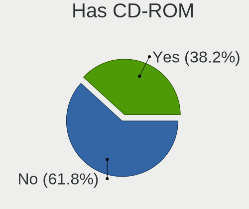

| Presented | Notebooks | Percent |
|-----------|-----------|---------|
| No        | 76        | 61.79%  |
| Yes       | 47        | 38.21%  |

Has Ethernet
------------

Has Ethernet on board

| Presented | Notebooks | Percent |
|-----------|-----------|---------|
| Yes       | 98        | 79.67%  |
| No        | 25        | 20.33%  |

Has WiFi
--------

Has WiFi module

| Presented | Notebooks | Percent |
|-----------|-----------|---------|
| Yes       | 123       | 100%    |

Has Bluetooth
-------------

Has Bluetooth module

| Presented | Notebooks | Percent |
|-----------|-----------|---------|
| Yes       | 99        | 80.49%  |
| No        | 24        | 19.51%  |

Location
--------

Country
-------

Geographic location (country)

| Country            | Notebooks | Percent |
|--------------------|-----------|---------|
| USA                | 26        | 21.14%  |
| India              | 8         | 6.5%    |
| Netherlands        | 7         | 5.69%   |
| Brazil             | 7         | 5.69%   |
| Poland             | 5         | 4.07%   |
| Germany            | 5         | 4.07%   |
| France             | 5         | 4.07%   |
| UK                 | 4         | 3.25%   |
| Spain              | 3         | 2.44%   |
| Russia             | 3         | 2.44%   |
| Mexico             | 3         | 2.44%   |
| Italy              | 3         | 2.44%   |
| Chile              | 3         | 2.44%   |
| Australia          | 3         | 2.44%   |
| Ukraine            | 2         | 1.63%   |
| Turkey             | 2         | 1.63%   |
| Norway             | 2         | 1.63%   |
| New Zealand        | 2         | 1.63%   |
| Indonesia          | 2         | 1.63%   |
| Guatemala          | 2         | 1.63%   |
| Finland            | 2         | 1.63%   |
| China              | 2         | 1.63%   |
| Austria            | 2         | 1.63%   |
| Vietnam            | 1         | 0.81%   |
| Venezuela          | 1         | 0.81%   |
| Switzerland        | 1         | 0.81%   |
| Sweden             | 1         | 0.81%   |
| Singapore          | 1         | 0.81%   |
| Saudi Arabia       | 1         | 0.81%   |
| Oman               | 1         | 0.81%   |
| Nepal              | 1         | 0.81%   |
| Latvia             | 1         | 0.81%   |
| Japan              | 1         | 0.81%   |
| Iran               | 1         | 0.81%   |
| Hungary            | 1         | 0.81%   |
| Greece             | 1         | 0.81%   |
| Dominican Republic | 1         | 0.81%   |
| Czechia            | 1         | 0.81%   |
| Canada             | 1         | 0.81%   |
| Belgium            | 1         | 0.81%   |

City
----

Geographic location (city)

| City                      | Notebooks | Percent |
|---------------------------|-----------|---------|
| The Hague                 | 3         | 2.33%   |
| Melbourne                 | 3         | 2.33%   |
| Vienna                    | 2         | 1.55%   |
| San Francisco del Rincón | 2         | 1.55%   |
| Oslo                      | 2         | 1.55%   |
| Hrubieszów               | 2         | 1.55%   |
| Guatemala City            | 2         | 1.55%   |
| Columbus                  | 2         | 1.55%   |
| Beijing                   | 2         | 1.55%   |
| Auckland                  | 2         | 1.55%   |
| Amsterdam                 | 2         | 1.55%   |
| Zhytomyr                  | 1         | 0.78%   |
| Yverdon-les-Bains         | 1         | 0.78%   |
| Wendell                   | 1         | 0.78%   |
| Vineland                  | 1         | 0.78%   |
| Vasco da Gama             | 1         | 0.78%   |
| Uberlândia               | 1         | 0.78%   |
| Toronto                   | 1         | 0.78%   |
| Toluca                    | 1         | 0.78%   |
| Tirana                    | 1         | 0.78%   |
| Terranuova Bracciolini    | 1         | 0.78%   |
| Teresopolis               | 1         | 0.78%   |
| Tehran                    | 1         | 0.78%   |
| Stroudsburg               | 1         | 0.78%   |
| Stare Babice              | 1         | 0.78%   |
| St Petersburg             | 1         | 0.78%   |
| Singapore                 | 1         | 0.78%   |
| Severna Park              | 1         | 0.78%   |
| Semarang                  | 1         | 0.78%   |
| Santo Domingo Este        | 1         | 0.78%   |
| Santiago                  | 1         | 0.78%   |
| San Justo                 | 1         | 0.78%   |
| San Francisco             | 1         | 0.78%   |
| Saint-Just-Saint-Rambert  | 1         | 0.78%   |
| Saint Paul                | 1         | 0.78%   |
| Riyadh                    | 1         | 0.78%   |
| Riga                      | 1         | 0.78%   |
| Red Oak                   | 1         | 0.78%   |
| Quilicura                 | 1         | 0.78%   |
| Portland                  | 1         | 0.78%   |

Drives
------

Drive Vendor
------------

Hard drive vendors

| Vendor                    | Notebooks | Drives | Percent |
|---------------------------|-----------|--------|---------|
| WDC                       | 19        | 20     | 12.5%   |
| Samsung Electronics       | 18        | 20     | 11.84%  |
| Toshiba                   | 17        | 20     | 11.18%  |
| Seagate                   | 13        | 16     | 8.55%   |
| SanDisk                   | 11        | 13     | 7.24%   |
| SK hynix                  | 10        | 11     | 6.58%   |
| Kingston                  | 10        | 11     | 6.58%   |
| Unknown                   | 9         | 9      | 5.92%   |
| Intel                     | 8         | 13     | 5.26%   |
| Micron Technology         | 5         | 6      | 3.29%   |
| Hitachi                   | 4         | 4      | 2.63%   |
| Crucial                   | 4         | 5      | 2.63%   |
| Silicon Motion            | 2         | 2      | 1.32%   |
| HGST                      | 2         | 2      | 1.32%   |
| Gigabyte Technology       | 2         | 2      | 1.32%   |
| Apple                     | 2         | 2      | 1.32%   |
| A-DATA Technology         | 2         | 2      | 1.32%   |
| Transcend                 | 1         | 1      | 0.66%   |
| SABRENT                   | 1         | 1      | 0.66%   |
| PNY                       | 1         | 1      | 0.66%   |
| Phison Electronics        | 1         | 1      | 0.66%   |
| Phison                    | 1         | 1      | 0.66%   |
| Patriot                   | 1         | 2      | 0.66%   |
| O2 Micro                  | 1         | 1      | 0.66%   |
| Micron/Crucial Technology | 1         | 1      | 0.66%   |
| Lenovo                    | 1         | 1      | 0.66%   |
| KIOXIA                    | 1         | 1      | 0.66%   |
| KingFast                  | 1         | 1      | 0.66%   |
| FORESEE                   | 1         | 1      | 0.66%   |
| Advantech                 | 1         | 1      | 0.66%   |
| AAPL                      | 1         | 1      | 0.66%   |

Drive Model
-----------

Hard drive models

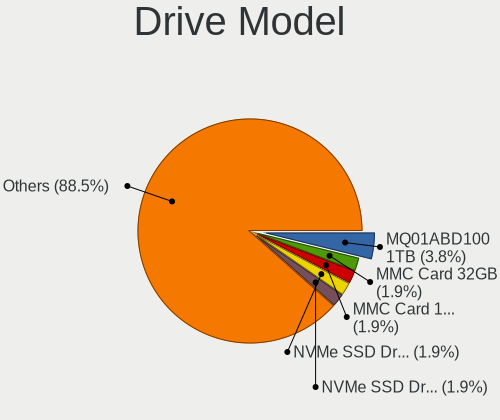

| Model                                   | Notebooks | Percent |
|-----------------------------------------|-----------|---------|
| Toshiba MQ01ABD100 1TB                  | 6         | 3.85%   |
| Unknown MMC Card  32GB                  | 3         | 1.92%   |
| Unknown MMC Card  128GB                 | 3         | 1.92%   |
| SK hynix NVMe SSD Drive 128GB           | 3         | 1.92%   |
| SanDisk NVMe SSD Drive 256GB            | 3         | 1.92%   |
| Kingston SA400S37240G 240GB SSD         | 3         | 1.92%   |
| WDC WD2500BEVT-22ZCT0 250GB             | 2         | 1.28%   |
| WDC WD10SPZX-24Z10 1TB                  | 2         | 1.28%   |
| WDC WD10JPVX-22JC3T0 1TB                | 2         | 1.28%   |
| SK hynix SC311 SATA 256GB SSD           | 2         | 1.28%   |
| Samsung SSD 860 EVO 250GB               | 2         | 1.28%   |
| WDC WDS500G2B0B-00YS70 500GB SSD        | 1         | 0.64%   |
| WDC WDS120G2G0A-00JH30 120GB SSD        | 1         | 0.64%   |
| WDC WDS100T2B0C-00PXH0 1TB              | 1         | 0.64%   |
| WDC WD5000BEVT-60ZAT1 500GB             | 1         | 0.64%   |
| WDC WD3200BEVT-75ZCT2 320GB             | 1         | 0.64%   |
| WDC WD2500LPVX-22V0TT0 250GB            | 1         | 0.64%   |
| WDC WD2500BEVT-22A23T0 250GB            | 1         | 0.64%   |
| WDC WD2500BEVT-00A23T0 250GB            | 1         | 0.64%   |
| WDC WD1600BEVT-75ZCT2 160GB             | 1         | 0.64%   |
| WDC WD10SPZX-24Z10T0 1TB                | 1         | 0.64%   |
| WDC WD10JPVX-08JC3T5 1TB                | 1         | 0.64%   |
| WDC WD10JPCX-24UE4T0 1TB                | 1         | 0.64%   |
| WDC PC SN520 SDAPNUW-256G-1006 256GB    | 1         | 0.64%   |
| Unknown USB DISK 3.2 1TB                | 1         | 0.64%   |
| Unknown MMC Card  64GB                  | 1         | 0.64%   |
| Unknown AJNB4R  16GB                    | 1         | 0.64%   |
| Transcend TS240GSSD220S 240GB           | 1         | 0.64%   |
| Toshiba THNSNJ256GVNU 256GB SSD         | 1         | 0.64%   |
| Toshiba THNS128GG4BNAA 128GB SSD        | 1         | 0.64%   |
| Toshiba NVMe SSD Drive 512GB            | 1         | 0.64%   |
| Toshiba NVMe SSD Drive 256GB            | 1         | 0.64%   |
| Toshiba NVMe SSD Drive 1024GB           | 1         | 0.64%   |
| Toshiba MQ01ABF050 500GB                | 1         | 0.64%   |
| Toshiba MQ01ABD075 752GB                | 1         | 0.64%   |
| Toshiba MK7575GSX 752GB                 | 1         | 0.64%   |
| Toshiba MK7559GSXP 752GB                | 1         | 0.64%   |
| Toshiba MK5055GSX 500GB                 | 1         | 0.64%   |
| Toshiba KXG60ZNV512G NVMe 512GB         | 1         | 0.64%   |
| SK hynix PC401 HFS256GD9TNG-62A0A 256GB | 1         | 0.64%   |

HDD Vendor
----------

Hard disk drive vendors

| Vendor              | Notebooks | Drives | Percent |
|---------------------|-----------|--------|---------|
| WDC                 | 15        | 16     | 31.25%  |
| Seagate             | 13        | 16     | 27.08%  |
| Toshiba             | 11        | 14     | 22.92%  |
| Hitachi             | 4         | 4      | 8.33%   |
| HGST                | 2         | 2      | 4.17%   |
| Samsung Electronics | 1         | 1      | 2.08%   |
| SABRENT             | 1         | 1      | 2.08%   |
| AAPL                | 1         | 1      | 2.08%   |

SSD Vendor
----------

Solid state drive vendors

| Vendor              | Notebooks | Drives | Percent |
|---------------------|-----------|--------|---------|
| Samsung Electronics | 8         | 8      | 17.78%  |
| Kingston            | 6         | 6      | 13.33%  |
| SanDisk             | 4         | 4      | 8.89%   |
| Micron Technology   | 4         | 5      | 8.89%   |
| Crucial             | 4         | 5      | 8.89%   |
| SK hynix            | 3         | 4      | 6.67%   |
| Intel               | 3         | 4      | 6.67%   |
| WDC                 | 2         | 2      | 4.44%   |
| Toshiba             | 2         | 2      | 4.44%   |
| Gigabyte Technology | 2         | 2      | 4.44%   |
| Apple               | 2         | 2      | 4.44%   |
| Transcend           | 1         | 1      | 2.22%   |
| PNY                 | 1         | 1      | 2.22%   |
| Patriot             | 1         | 2      | 2.22%   |
| FORESEE             | 1         | 1      | 2.22%   |
| Advantech           | 1         | 1      | 2.22%   |

Drive Kind
----------

HDD or SSD

| Kind    | Notebooks | Drives | Percent |
|---------|-----------|--------|---------|
| HDD     | 47        | 55     | 32.87%  |
| NVMe    | 43        | 57     | 30.07%  |
| SSD     | 42        | 50     | 29.37%  |
| MMC     | 9         | 9      | 6.29%   |
| Unknown | 2         | 2      | 1.4%    |

Drive Connector
---------------

SATA, SAS, NVMe, etc.

| Type | Notebooks | Drives | Percent |
|------|-----------|--------|---------|
| SATA | 80        | 103    | 58.39%  |
| NVMe | 43        | 56     | 31.39%  |
| MMC  | 9         | 9      | 6.57%   |
| SAS  | 5         | 5      | 3.65%   |

Drive Size
----------

Size of hard drive

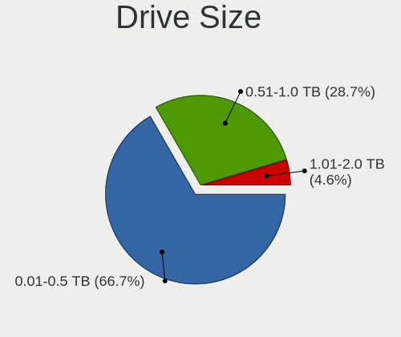

| Size in TB | Notebooks | Drives | Percent |
|------------|-----------|--------|---------|
| 0.01-0.5   | 58        | 72     | 66.67%  |
| 0.51-1.0   | 25        | 29     | 28.74%  |
| 1.01-2.0   | 4         | 4      | 4.6%    |

Space Total
-----------

Amount of disk space available on the file system

| Size in GB | Notebooks | Percent |
|------------|-----------|---------|
| 101-250    | 51        | 40.8%   |
| 251-500    | 31        | 24.8%   |
| 501-1000   | 16        | 12.8%   |
| 1001-2000  | 7         | 5.6%    |
| 21-50      | 5         | 4%      |
| 51-100     | 5         | 4%      |
| Unknown    | 5         | 4%      |
| 2001-3000  | 3         | 2.4%    |
| 1-20       | 2         | 1.6%    |

Space Used
----------

Amount of used disk space

| Used GB   | Notebooks | Percent |
|-----------|-----------|---------|
| 1-20      | 45        | 34.35%  |
| 21-50     | 30        | 22.9%   |
| 51-100    | 16        | 12.21%  |
| 101-250   | 15        | 11.45%  |
| 251-500   | 14        | 10.69%  |
| Unknown   | 5         | 3.82%   |
| 1001-2000 | 3         | 2.29%   |
| 501-1000  | 2         | 1.53%   |
| 2001-3000 | 1         | 0.76%   |

Malfunc. Drives
---------------

Drive models with a malfunction

| Model                                          | Notebooks | Drives | Percent |
|------------------------------------------------|-----------|--------|---------|
| WDC WD5000BEVT-60ZAT1 500GB                    | 1         | 1      | 16.67%  |
| Toshiba MK7559GSXP 752GB                       | 1         | 1      | 16.67%  |
| Seagate ST9320325AS 320GB                      | 1         | 2      | 16.67%  |
| Samsung Electronics MZVLB512HAJQ-000L7 512GB   | 1         | 1      | 16.67%  |
| Micron Technology 1100_MTFDDAV256TBN 256GB SSD | 1         | 1      | 16.67%  |
| Hitachi HTS543216L9SA02 160GB                  | 1         | 1      | 16.67%  |

Malfunc. Drive Vendor
---------------------

Vendors of faulty drives

| Vendor              | Notebooks | Drives | Percent |
|---------------------|-----------|--------|---------|
| WDC                 | 1         | 1      | 16.67%  |
| Toshiba             | 1         | 1      | 16.67%  |
| Seagate             | 1         | 2      | 16.67%  |
| Samsung Electronics | 1         | 1      | 16.67%  |
| Micron Technology   | 1         | 1      | 16.67%  |
| Hitachi             | 1         | 1      | 16.67%  |

Malfunc. HDD Vendor
-------------------

Vendors of faulty HDD drives

| Vendor  | Notebooks | Drives | Percent |
|---------|-----------|--------|---------|
| WDC     | 1         | 1      | 25%     |
| Toshiba | 1         | 1      | 25%     |
| Seagate | 1         | 2      | 25%     |
| Hitachi | 1         | 1      | 25%     |

Malfunc. Drive Kind
-------------------

Kinds of faulty drives

| Kind | Notebooks | Drives | Percent |
|------|-----------|--------|---------|
| HDD  | 4         | 5      | 66.67%  |
| NVMe | 1         | 1      | 16.67%  |
| SSD  | 1         | 1      | 16.67%  |

Failed Drives
-------------

Failed drive models

Zero info for selected period =(

Failed Drive Vendor
-------------------

Failed drive vendors

Zero info for selected period =(

Drive Status
------------

Number of failed and malfunc. drives

| Status   | Notebooks | Drives | Percent |
|----------|-----------|--------|---------|
| Detected | 86        | 121    | 66.15%  |
| Works    | 38        | 45     | 29.23%  |
| Malfunc  | 6         | 7      | 4.62%   |

Storage controller
------------------

Storage Vendor
--------------

Storage controller vendors

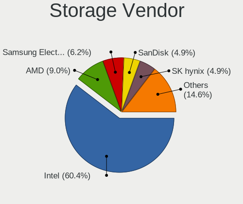

| Vendor                       | Notebooks | Percent |
|------------------------------|-----------|---------|
| Intel                        | 87        | 60.42%  |
| AMD                          | 13        | 9.03%   |
| Samsung Electronics          | 9         | 6.25%   |
| SK hynix                     | 7         | 4.86%   |
| SanDisk                      | 7         | 4.86%   |
| Toshiba America Info Systems | 5         | 3.47%   |
| Kingston Technology Company  | 4         | 2.78%   |
| Silicon Motion               | 2         | 1.39%   |
| Phison Electronics           | 2         | 1.39%   |
| ADATA Technology             | 2         | 1.39%   |
| O2 Micro                     | 1         | 0.69%   |
| Nvidia                       | 1         | 0.69%   |
| Micron/Crucial Technology    | 1         | 0.69%   |
| Micron Technology            | 1         | 0.69%   |
| Lenovo                       | 1         | 0.69%   |
| JMicron Technology           | 1         | 0.69%   |

Storage Model
-------------

Storage controller models

| Model                                                                          | Notebooks | Percent |
|--------------------------------------------------------------------------------|-----------|---------|
| Intel Sunrise Point-LP SATA Controller [AHCI mode]                             | 15        | 9.93%   |
| AMD FCH SATA Controller [AHCI mode]                                            | 12        | 7.95%   |
| Intel 7 Series Chipset Family 6-port SATA Controller [AHCI mode]               | 10        | 6.62%   |
| Intel 82801IBM/IEM (ICH9M/ICH9M-E) 4 port SATA Controller [AHCI mode]          | 7         | 4.64%   |
| Intel 82801 Mobile SATA Controller [RAID mode]                                 | 7         | 4.64%   |
| Intel 6 Series/C200 Series Chipset Family 6 port Mobile SATA AHCI Controller   | 7         | 4.64%   |
| Intel 8 Series SATA Controller 1 [AHCI mode]                                   | 6         | 3.97%   |
| SK hynix BC501 NVMe Solid State Drive                                          | 4         | 2.65%   |
| Samsung NVMe SSD Controller SM981/PM981/PM983                                  | 4         | 2.65%   |
| Intel 8 Series/C220 Series Chipset Family 6-port SATA Controller 1 [AHCI mode] | 4         | 2.65%   |
| Intel Wildcat Point-LP SATA Controller [AHCI Mode]                             | 3         | 1.99%   |
| Intel HM170/QM170 Chipset SATA Controller [AHCI Mode]                          | 3         | 1.99%   |
| Intel Celeron/Pentium Silver Processor SATA Controller                         | 3         | 1.99%   |
| Intel 5 Series/3400 Series Chipset 4 port SATA AHCI Controller                 | 3         | 1.99%   |
| Toshiba America Info Systems XG6 NVMe SSD Controller                           | 2         | 1.32%   |
| Toshiba America Info Systems XG4 NVMe SSD Controller                           | 2         | 1.32%   |
| Silicon Motion SM2263EN/SM2263XT (DRAM-less) NVMe SSD Controllers              | 2         | 1.32%   |
| SanDisk WD Blue SN500 / PC SN520 x2 M.2 2280 NVMe SSD                          | 2         | 1.32%   |
| SanDisk Ultra 3D / WD PC SN530, IX SN530, Blue SN550 NVMe SSD (DRAM-less)      | 2         | 1.32%   |
| Kingston Company A1000/U-SNS8154P3 x2 NVMe SSD                                 | 2         | 1.32%   |
| Intel SSD 600P Series                                                          | 2         | 1.32%   |
| Intel Q170/Q150/B150/H170/H110/Z170/CM236 Chipset SATA Controller [AHCI Mode]  | 2         | 1.32%   |
| Intel Cannon Point-LP SATA Controller [AHCI Mode]                              | 2         | 1.32%   |
| Intel Cannon Lake Mobile PCH SATA AHCI Controller                              | 2         | 1.32%   |
| Intel 82801HM/HEM (ICH8M/ICH8M-E) SATA Controller [AHCI mode]                  | 2         | 1.32%   |
| Intel 82801HM/HEM (ICH8M/ICH8M-E) IDE Controller                               | 2         | 1.32%   |
| Intel 5 Series/3400 Series Chipset 6 port SATA AHCI Controller                 | 2         | 1.32%   |
| Toshiba America Info Systems XG5 NVMe SSD Controller                           | 1         | 0.66%   |
| SK hynix PC401 NVMe Solid State Drive 256GB                                    | 1         | 0.66%   |
| SK hynix PC300 NVMe Solid State Drive 256GB                                    | 1         | 0.66%   |
| SK hynix Gold P31/BC711/PC711 NVMe Solid State Drive                           | 1         | 0.66%   |
| SanDisk PC SN520 x2 M.2 2242 NVMe SSD                                          | 1         | 0.66%   |
| SanDisk Extreme Pro / WD Black SN750 / PC SN730 / Red SN700 NVMe SSD           | 1         | 0.66%   |
| SanDisk Extreme Pro / WD Black 2018/SN750/PC SN720 NVMe SSD                    | 1         | 0.66%   |
| Samsung S4LN058A01[SSUBX] AHCI SSD Controller (Apple slot)                     | 1         | 0.66%   |
| Samsung NVMe SSD Controller SM961/PM961/SM963                                  | 1         | 0.66%   |
| Samsung NVMe SSD Controller PM9B1 (DRAM-less)                                  | 1         | 0.66%   |
| Samsung NVMe SSD Controller PM9A1/PM9A3/980PRO                                 | 1         | 0.66%   |
| Samsung NVMe SSD Controller 980 (DRAM-less)                                    | 1         | 0.66%   |
| Phison PS5013-E13 PCIe3 NVMe Controller (DRAM-less)                            | 1         | 0.66%   |

Storage Kind
------------

Kind of storage controller (IDE, SATA, NVMe, SAS, ...)

| Kind | Notebooks | Percent |
|------|-----------|---------|
| SATA | 90        | 62.07%  |
| NVMe | 42        | 28.97%  |
| RAID | 7         | 4.83%   |
| IDE  | 6         | 4.14%   |

Processor
---------

CPU Vendor
----------

Processor vendors

| Vendor | Notebooks | Percent |
|--------|-----------|---------|
| Intel  | 106       | 86.18%  |
| AMD    | 17        | 13.82%  |

CPU Model
---------

Processor models

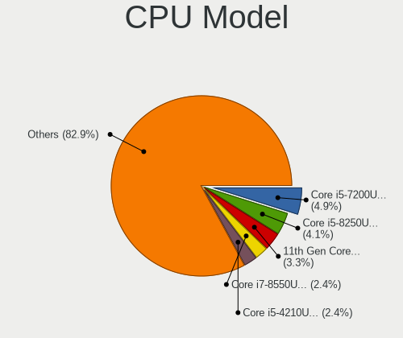

| Model                                         | Notebooks | Percent |
|-----------------------------------------------|-----------|---------|
| Intel Core i5-7200U CPU @ 2.50GHz             | 6         | 4.88%   |
| Intel Core i5-8250U CPU @ 1.60GHz             | 5         | 4.07%   |
| Intel 11th Gen Core i7-1165G7 @ 2.80GHz       | 4         | 3.25%   |
| Intel Core i7-8550U CPU @ 1.80GHz             | 3         | 2.44%   |
| Intel Core i5-4210U CPU @ 1.70GHz             | 3         | 2.44%   |
| Intel Core i5-3320M CPU @ 2.60GHz             | 3         | 2.44%   |
| Intel Core i5-3210M CPU @ 2.50GHz             | 3         | 2.44%   |
| AMD Ryzen 5 5600H with Radeon Graphics        | 3         | 2.44%   |
| Intel Pentium Silver N6000 @ 1.10GHz          | 2         | 1.63%   |
| Intel Pentium Dual-Core CPU T4300 @ 2.10GHz   | 2         | 1.63%   |
| Intel Pentium Dual-Core CPU T4200 @ 2.00GHz   | 2         | 1.63%   |
| Intel Core i7-9750H CPU @ 2.60GHz             | 2         | 1.63%   |
| Intel Core i7-4600M CPU @ 2.90GHz             | 2         | 1.63%   |
| Intel Core i7-2640M CPU @ 2.80GHz             | 2         | 1.63%   |
| Intel Core i7-2630QM CPU @ 2.00GHz            | 2         | 1.63%   |
| Intel Core i7-10510U CPU @ 1.80GHz            | 2         | 1.63%   |
| Intel Core i5-8350U CPU @ 1.70GHz             | 2         | 1.63%   |
| Intel Core i5-6300U CPU @ 2.40GHz             | 2         | 1.63%   |
| Intel Core i5 CPU M 540 @ 2.53GHz             | 2         | 1.63%   |
| Intel Core 2 Duo CPU P7450 @ 2.13GHz          | 2         | 1.63%   |
| Intel Celeron N4000 CPU @ 1.10GHz             | 2         | 1.63%   |
| Intel Celeron CPU N2940 @ 1.83GHz             | 2         | 1.63%   |
| Intel 11th Gen Core i3-1115G4 @ 3.00GHz       | 2         | 1.63%   |
| AMD Ryzen 7 3700U with Radeon Vega Mobile Gfx | 2         | 1.63%   |
| Intel Pentium Dual CPU T3400 @ 2.16GHz        | 1         | 0.81%   |
| Intel Pentium CPU P6200 @ 2.13GHz             | 1         | 0.81%   |
| Intel Pentium CPU B960 @ 2.20GHz              | 1         | 0.81%   |
| Intel Pentium 3556U @ 1.70GHz                 | 1         | 0.81%   |
| Intel Core M-5Y51 CPU @ 1.10GHz               | 1         | 0.81%   |
| Intel Core i7-8750H CPU @ 2.20GHz             | 1         | 0.81%   |
| Intel Core i7-8565U CPU @ 1.80GHz             | 1         | 0.81%   |
| Intel Core i7-7820HQ CPU @ 2.90GHz            | 1         | 0.81%   |
| Intel Core i7-7700HQ CPU @ 2.80GHz            | 1         | 0.81%   |
| Intel Core i7-7500U CPU @ 2.70GHz             | 1         | 0.81%   |
| Intel Core i7-6820HQ CPU @ 2.70GHz            | 1         | 0.81%   |
| Intel Core i7-6700HQ CPU @ 2.60GHz            | 1         | 0.81%   |
| Intel Core i7-5500U CPU @ 2.40GHz             | 1         | 0.81%   |
| Intel Core i7-4700MQ CPU @ 2.40GHz            | 1         | 0.81%   |
| Intel Core i7-3740QM CPU @ 2.70GHz            | 1         | 0.81%   |
| Intel Core i7-2670QM CPU @ 2.20GHz            | 1         | 0.81%   |

CPU Model Family
----------------

Processor model prefix

| Model                   | Notebooks | Percent |
|-------------------------|-----------|---------|
| Intel Core i5           | 41        | 33.33%  |
| Intel Core i7           | 25        | 20.33%  |
| Intel Celeron           | 9         | 7.32%   |
| Other                   | 8         | 6.5%    |
| AMD Ryzen 7             | 7         | 5.69%   |
| Intel Core i3           | 6         | 4.88%   |
| Intel Core 2 Duo        | 6         | 4.88%   |
| AMD Ryzen 5             | 6         | 4.88%   |
| Intel Pentium Dual-Core | 4         | 3.25%   |
| Intel Pentium           | 3         | 2.44%   |
| Intel Pentium Silver    | 2         | 1.63%   |
| Intel Pentium Dual      | 1         | 0.81%   |
| Intel Core M            | 1         | 0.81%   |
| Intel Core 2            | 1         | 0.81%   |
| Intel Atom              | 1         | 0.81%   |
| AMD E1                  | 1         | 0.81%   |
| AMD E                   | 1         | 0.81%   |

CPU Cores
---------

Number of processor cores

| Number | Notebooks | Percent |
|--------|-----------|---------|
| 2      | 68        | 55.28%  |
| 4      | 43        | 34.96%  |
| 6      | 7         | 5.69%   |
| 8      | 4         | 3.25%   |
| 1      | 1         | 0.81%   |

CPU Sockets
-----------

Number of sockets

| Number | Notebooks | Percent |
|--------|-----------|---------|
| 1      | 123       | 100%    |

CPU Threads
-----------

Threads per core (Hyper-Threading)

| Number | Notebooks | Percent |
|--------|-----------|---------|
| 2      | 92        | 74.8%   |
| 1      | 31        | 25.2%   |

CPU Op-Modes
------------

CPU Operation Modes (32-bit, 64-bit)

| Op mode        | Notebooks | Percent |
|----------------|-----------|---------|
| 32-bit, 64-bit | 119       | 95.97%  |
| Unknown        | 5         | 4.03%   |

CPU Microcode
-------------

Microcode number

| Number     | Notebooks | Percent |
|------------|-----------|---------|
| Unknown    | 26        | 20.8%   |
| 0x806ea    | 9         | 7.2%    |
| 0x306a9    | 8         | 6.4%    |
| 0x806e9    | 7         | 5.6%    |
| 0x206a7    | 7         | 5.6%    |
| 0x40651    | 5         | 4%      |
| 0x806ec    | 4         | 3.2%    |
| 0x806c1    | 4         | 3.2%    |
| 0x306c3    | 4         | 3.2%    |
| 0x20655    | 4         | 3.2%    |
| 0x1067a    | 4         | 3.2%    |
| 0x906ea    | 3         | 2.4%    |
| 0x906e9    | 3         | 2.4%    |
| 0x706a1    | 3         | 2.4%    |
| 0x406e3    | 3         | 2.4%    |
| 0x306d4    | 3         | 2.4%    |
| 0x0a50000c | 3         | 2.4%    |
| 0x08108102 | 3         | 2.4%    |
| 0x6fd      | 2         | 1.6%    |
| 0x506e3    | 2         | 1.6%    |
| 0x30678    | 2         | 1.6%    |
| 0x0810100b | 2         | 1.6%    |
| 0xa0652    | 1         | 0.8%    |
| 0x906c0    | 1         | 0.8%    |
| 0x806eb    | 1         | 0.8%    |
| 0x706a8    | 1         | 0.8%    |
| 0x20652    | 1         | 0.8%    |
| 0x10676    | 1         | 0.8%    |
| 0x10661    | 1         | 0.8%    |
| 0x08900201 | 1         | 0.8%    |
| 0x08608103 | 1         | 0.8%    |
| 0x08600106 | 1         | 0.8%    |
| 0x08108109 | 1         | 0.8%    |
| 0x06006704 | 1         | 0.8%    |
| 0x05000119 | 1         | 0.8%    |
| 0x05000029 | 1         | 0.8%    |

CPU Microarch
-------------

Microarchitecture

| Name          | Notebooks | Percent |
|---------------|-----------|---------|
| KabyLake      | 30        | 24.39%  |
| Haswell       | 10        | 8.13%   |
| SandyBridge   | 9         | 7.32%   |
| Penryn        | 9         | 7.32%   |
| IvyBridge     | 9         | 7.32%   |
| Westmere      | 6         | 4.88%   |
| TigerLake     | 6         | 4.88%   |
| Skylake       | 6         | 4.88%   |
| Broadwell     | 5         | 4.07%   |
| Zen+          | 4         | 3.25%   |
| Zen 3         | 4         | 3.25%   |
| Silvermont    | 4         | 3.25%   |
| Goldmont plus | 4         | 3.25%   |
| Core          | 4         | 3.25%   |
| Unknown       | 3         | 2.44%   |
| Zen           | 2         | 1.63%   |
| Tremont       | 2         | 1.63%   |
| Bobcat        | 2         | 1.63%   |
| Zen 2         | 1         | 0.81%   |
| IceLake       | 1         | 0.81%   |
| Excavator     | 1         | 0.81%   |
| CometLake     | 1         | 0.81%   |

Graphics
--------

GPU Vendor
----------

Vendors of graphics cards

| Vendor | Notebooks | Percent |
|--------|-----------|---------|
| Intel  | 96        | 61.54%  |
| Nvidia | 32        | 20.51%  |
| AMD    | 28        | 17.95%  |

GPU Model
---------

Graphics card models

| Model                                                                     | Notebooks | Percent |
|---------------------------------------------------------------------------|-----------|---------|
| Intel UHD Graphics 620                                                    | 10        | 6.25%   |
| Intel HD Graphics 620                                                     | 8         | 5%      |
| Intel 3rd Gen Core processor Graphics Controller                          | 7         | 4.38%   |
| Intel 2nd Generation Core Processor Family Integrated Graphics Controller | 7         | 4.38%   |
| Intel Haswell-ULT Integrated Graphics Controller                          | 6         | 3.75%   |
| Intel Mobile 4 Series Chipset Integrated Graphics Controller              | 5         | 3.13%   |
| Intel TigerLake-LP GT2 [Iris Xe Graphics]                                 | 4         | 2.5%    |
| Intel GeminiLake [UHD Graphics 600]                                       | 4         | 2.5%    |
| Intel Core Processor Integrated Graphics Controller                       | 4         | 2.5%    |
| Intel 4th Gen Core Processor Integrated Graphics Controller               | 4         | 2.5%    |
| AMD Picasso/Raven 2 [Radeon Vega Series / Radeon Vega Mobile Series]      | 4         | 2.5%    |
| Nvidia GM108M [GeForce 940MX]                                             | 3         | 1.88%   |
| Nvidia GF108M [GeForce GT 540M]                                           | 3         | 1.88%   |
| Intel Skylake GT2 [HD Graphics 520]                                       | 3         | 1.88%   |
| Intel Mobile GM965/GL960 Integrated Graphics Controller (secondary)       | 3         | 1.88%   |
| Intel Mobile GM965/GL960 Integrated Graphics Controller (primary)         | 3         | 1.88%   |
| Intel HD Graphics 630                                                     | 3         | 1.88%   |
| Intel HD Graphics 5500                                                    | 3         | 1.88%   |
| Intel CometLake-U GT2 [UHD Graphics]                                      | 3         | 1.88%   |
| Intel CoffeeLake-H GT2 [UHD Graphics 630]                                 | 3         | 1.88%   |
| Intel Atom Processor Z36xxx/Z37xxx Series Graphics & Display              | 3         | 1.88%   |
| AMD Cezanne [Radeon Vega Series / Radeon Vega Mobile Series]              | 3         | 1.88%   |
| Nvidia TU116M [GeForce GTX 1660 Ti Mobile]                                | 2         | 1.25%   |
| Nvidia TU106M [GeForce RTX 2060 Mobile]                                   | 2         | 1.25%   |
| Nvidia GP107M [GeForce GTX 1050 Mobile]                                   | 2         | 1.25%   |
| Nvidia GM108M [GeForce 930MX]                                             | 2         | 1.25%   |
| Nvidia GM108M [GeForce 840M]                                              | 2         | 1.25%   |
| Nvidia GK208M [GeForce GT 740M]                                           | 2         | 1.25%   |
| Nvidia GA107M [GeForce RTX 3050 Mobile]                                   | 2         | 1.25%   |
| Intel WhiskeyLake-U GT2 [UHD Graphics 620]                                | 2         | 1.25%   |
| Intel Tiger Lake-LP GT2 [UHD Graphics G4]                                 | 2         | 1.25%   |
| Intel JasperLake [UHD Graphics]                                           | 2         | 1.25%   |
| Intel HD Graphics 530                                                     | 2         | 1.25%   |
| AMD Raven Ridge [Radeon Vega Series / Radeon Vega Mobile Series]          | 2         | 1.25%   |
| AMD Madison [Mobility Radeon HD 5650/5750 / 6530M/6550M]                  | 2         | 1.25%   |
| AMD Lucienne                                                              | 2         | 1.25%   |
| Nvidia TU117M [GeForce GTX 1650 Mobile / Max-Q]                           | 1         | 0.63%   |
| Nvidia GP108M [GeForce MX150]                                             | 1         | 0.63%   |
| Nvidia GP107M [GeForce GTX 1050 Ti Mobile]                                | 1         | 0.63%   |
| Nvidia GM107M [GeForce GTX 950M]                                          | 1         | 0.63%   |

GPU Combo
---------

Combinations of graphics cards

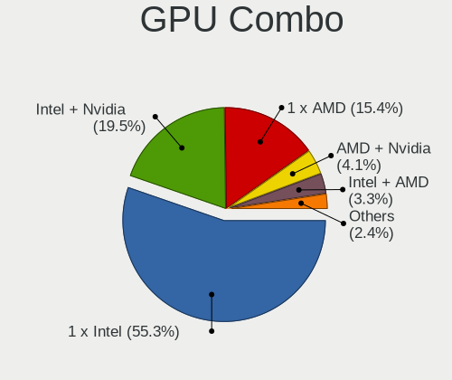

| Name           | Notebooks | Percent |
|----------------|-----------|---------|
| 1 x Intel      | 68        | 55.28%  |
| Intel + Nvidia | 24        | 19.51%  |
| 1 x AMD        | 19        | 15.45%  |
| AMD + Nvidia   | 5         | 4.07%   |
| Intel + AMD    | 4         | 3.25%   |
| 1 x Nvidia     | 3         | 2.44%   |

GPU Driver
----------

Free vs proprietary

| Driver      | Notebooks | Percent |
|-------------|-----------|---------|
| Free        | 104       | 84.55%  |
| Proprietary | 19        | 15.45%  |

GPU Memory
----------

Total video memory

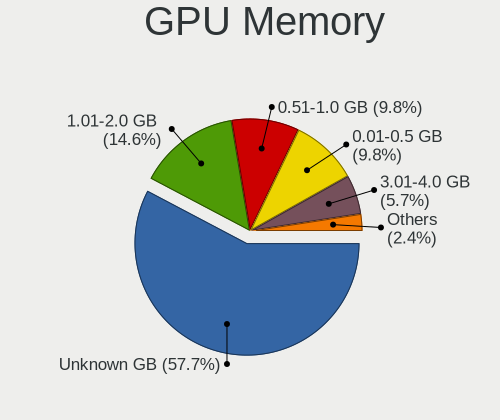

| Size in GB | Notebooks | Percent |
|------------|-----------|---------|
| Unknown    | 71        | 57.72%  |
| 1.01-2.0   | 18        | 14.63%  |
| 0.51-1.0   | 12        | 9.76%   |
| 0.01-0.5   | 12        | 9.76%   |
| 3.01-4.0   | 7         | 5.69%   |
| 5.01-6.0   | 3         | 2.44%   |

Monitor
-------

Monitor Vendor
--------------

Monitor vendors

| Vendor                  | Notebooks | Percent |
|-------------------------|-----------|---------|
| AU Optronics            | 29        | 20%     |
| BOE                     | 20        | 13.79%  |
| LG Display              | 18        | 12.41%  |
| Samsung Electronics     | 17        | 11.72%  |
| Chimei Innolux          | 15        | 10.34%  |
| Lenovo                  | 6         | 4.14%   |
| Goldstar                | 5         | 3.45%   |
| Apple                   | 4         | 2.76%   |
| Sharp                   | 3         | 2.07%   |
| Dell                    | 3         | 2.07%   |
| Chi Mei Optoelectronics | 3         | 2.07%   |
| AOC                     | 3         | 2.07%   |
| PANDA                   | 2         | 1.38%   |
| LG Philips              | 2         | 1.38%   |
| CSO                     | 2         | 1.38%   |
| BenQ                    | 2         | 1.38%   |
| Ancor Communications    | 2         | 1.38%   |
| ___                     | 1         | 0.69%   |
| Valve                   | 1         | 0.69%   |
| Unknown                 | 1         | 0.69%   |
| Toshiba                 | 1         | 0.69%   |
| Sony                    | 1         | 0.69%   |
| Philips                 | 1         | 0.69%   |
| GKK                     | 1         | 0.69%   |
| CPT                     | 1         | 0.69%   |
| Acer                    | 1         | 0.69%   |

Monitor Model
-------------

Monitor models

| Model                                                                 | Notebooks | Percent |
|-----------------------------------------------------------------------|-----------|---------|
| Samsung Electronics LCD Monitor SEC5441 1280x800 286x179mm 13.3-inch  | 2         | 1.37%   |
| Lenovo LCD Monitor LEN4036 1440x900 303x189mm 14.1-inch               | 2         | 1.37%   |
| Chimei Innolux LCD Monitor CMN15CB 1920x1080 344x193mm 15.5-inch      | 2         | 1.37%   |
| BOE LCD Monitor BOE0653 1920x1080 309x173mm 13.9-inch                 | 2         | 1.37%   |
| BOE LCD Monitor BOE0638 1920x1080 309x173mm 13.9-inch                 | 2         | 1.37%   |
| AU Optronics LCD Monitor AUO70EC 1366x768 344x193mm 15.5-inch         | 2         | 1.37%   |
| AU Optronics LCD Monitor AUO403D 1920x1080 309x174mm 14.0-inch        | 2         | 1.37%   |
| AU Optronics LCD Monitor AUO2E3C 1366x768 309x173mm 13.9-inch         | 2         | 1.37%   |
| AU Optronics LCD Monitor AUO21ED 1920x1080 344x193mm 15.5-inch        | 2         | 1.37%   |
| Apple Color LCD APP9C5B 1280x800 286x179mm 13.3-inch                  | 2         | 1.37%   |
| ___ LCD TV ___9000 1360x768                                           | 1         | 0.68%   |
| Valve ANX7530 U VLV3001 800x1280 100x150mm 7.1-inch                   | 1         | 0.68%   |
| Unknown LCDTV16 9000 1360x768 1600x900mm 72.3-inch                    | 1         | 0.68%   |
| Toshiba Internal LCD TOS5091 1366x768 309x174mm 14.0-inch             | 1         | 0.68%   |
| Sony LCD Monitor SNY05FA 1366x768 310x170mm 13.9-inch                 | 1         | 0.68%   |
| Sharp LQ133M1JW08 SHP1425 1920x1080 294x165mm 13.3-inch               | 1         | 0.68%   |
| Sharp LCD Monitor SHP1476 3840x2160 346x194mm 15.6-inch               | 1         | 0.68%   |
| Sharp LCD Monitor SHP1449 1920x1080 294x165mm 13.3-inch               | 1         | 0.68%   |
| Samsung Electronics SyncMaster SAM0375 1680x1050 494x320mm 23.2-inch  | 1         | 0.68%   |
| Samsung Electronics SMS24A650 SAM082A 1920x1080 531x299mm 24.0-inch   | 1         | 0.68%   |
| Samsung Electronics LCD Monitor SEC5541 1366x768 344x193mm 15.5-inch  | 1         | 0.68%   |
| Samsung Electronics LCD Monitor SEC4545 1280x800 331x207mm 15.4-inch  | 1         | 0.68%   |
| Samsung Electronics LCD Monitor SEC3641 1366x768 353x198mm 15.9-inch  | 1         | 0.68%   |
| Samsung Electronics LCD Monitor SEC3358 1280x800 331x207mm 15.4-inch  | 1         | 0.68%   |
| Samsung Electronics LCD Monitor SEC3150 1366x768 344x193mm 15.5-inch  | 1         | 0.68%   |
| Samsung Electronics LCD Monitor SEC3046 1366x768 344x193mm 15.5-inch  | 1         | 0.68%   |
| Samsung Electronics LCD Monitor SDC5441 1366x768 309x174mm 14.0-inch  | 1         | 0.68%   |
| Samsung Electronics LCD Monitor SDC4C48 1920x1080 239x134mm 10.8-inch | 1         | 0.68%   |
| Samsung Electronics LCD Monitor SDC4250 1920x1080 276x156mm 12.5-inch | 1         | 0.68%   |
| Samsung Electronics LCD Monitor SDC4161 1920x1080 344x194mm 15.5-inch | 1         | 0.68%   |
| Samsung Electronics LCD Monitor SDC3654 1600x900 382x215mm 17.3-inch  | 1         | 0.68%   |
| Samsung Electronics C27F591 SAM0D37 1920x1080 598x336mm 27.0-inch     | 1         | 0.68%   |
| Samsung Electronics C27F591 SAM0D36 1920x1080 598x336mm 27.0-inch     | 1         | 0.68%   |
| Samsung Electronics C24F390 SAM0D2C 1920x1080 521x293mm 23.5-inch     | 1         | 0.68%   |
| Philips 273PLPH PHL08A8 1920x1080 598x336mm 27.0-inch                 | 1         | 0.68%   |
| PANDA LCD Monitor NCP0046 1920x1080 344x194mm 15.5-inch               | 1         | 0.68%   |
| PANDA LCD Monitor NCP0035 1920x1080 309x174mm 14.0-inch               | 1         | 0.68%   |
| LG Philips LCD Monitor LPL8D00 1280x800 304x190mm 14.1-inch           | 1         | 0.68%   |
| LG Philips LCD Monitor LPL0140 1440x900 304x190mm 14.1-inch           | 1         | 0.68%   |
| LG Display LCD Monitor LGD06FB 1920x1080 309x174mm 14.0-inch          | 1         | 0.68%   |

Monitor Resolution
------------------

Monitor screen resolution

| Resolution         | Notebooks | Percent |
|--------------------|-----------|---------|
| 1920x1080 (FHD)    | 64        | 47.06%  |
| 1366x768 (WXGA)    | 38        | 27.94%  |
| 1600x900 (HD+)     | 7         | 5.15%   |
| 1280x800 (WXGA)    | 6         | 4.41%   |
| 1440x900 (WXGA+)   | 4         | 2.94%   |
| 3840x2160 (4K)     | 3         | 2.21%   |
| 2560x1440 (QHD)    | 3         | 2.21%   |
| 2560x1600          | 2         | 1.47%   |
| 2560x1080          | 2         | 1.47%   |
| 800x1280           | 1         | 0.74%   |
| 3840x1080          | 1         | 0.74%   |
| 3000x2000          | 1         | 0.74%   |
| 2256x1504          | 1         | 0.74%   |
| 1920x1200 (WUXGA)  | 1         | 0.74%   |
| 1680x1050 (WSXGA+) | 1         | 0.74%   |
| 1360x768           | 1         | 0.74%   |

Monitor Diagonal
----------------

Diagonal size in inches

| Inches  | Notebooks | Percent |
|---------|-----------|---------|
| 15      | 61        | 42.36%  |
| 13      | 27        | 18.75%  |
| 14      | 18        | 12.5%   |
| 17      | 8         | 5.56%   |
| 24      | 5         | 3.47%   |
| 23      | 4         | 2.78%   |
| 21      | 4         | 2.78%   |
| 34      | 2         | 1.39%   |
| 27      | 2         | 1.39%   |
| 18      | 2         | 1.39%   |
| 12      | 2         | 1.39%   |
| 11      | 2         | 1.39%   |
| 72      | 1         | 0.69%   |
| 49      | 1         | 0.69%   |
| 40      | 1         | 0.69%   |
| 31      | 1         | 0.69%   |
| 16      | 1         | 0.69%   |
| 7       | 1         | 0.69%   |
| Unknown | 1         | 0.69%   |

Monitor Width
-------------

Physical width

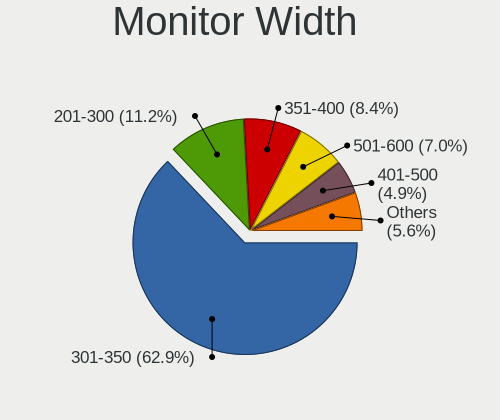

| Width in mm | Notebooks | Percent |
|-------------|-----------|---------|
| 301-350     | 90        | 62.94%  |
| 201-300     | 16        | 11.19%  |
| 351-400     | 12        | 8.39%   |
| 501-600     | 10        | 6.99%   |
| 401-500     | 7         | 4.9%    |
| 701-800     | 2         | 1.4%    |
| 801-900     | 1         | 0.7%    |
| 601-700     | 1         | 0.7%    |
| 1501-2000   | 1         | 0.7%    |
| 1001-1500   | 1         | 0.7%    |
| 1-100       | 1         | 0.7%    |
| Unknown     | 1         | 0.7%    |

Aspect Ratio
------------

Proportional relationship between the width and the height

| Ratio | Notebooks | Percent |
|-------|-----------|---------|
| 16/9  | 107       | 84.25%  |
| 16/10 | 13        | 10.24%  |
| 3/2   | 3         | 2.36%   |
| 21/9  | 2         | 1.57%   |
| 32/9  | 1         | 0.79%   |
| 0.67  | 1         | 0.79%   |

Monitor Area
------------

Area in inch²

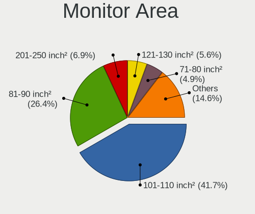

| Area in inch² | Notebooks | Percent |
|----------------|-----------|---------|
| 101-110        | 60        | 41.67%  |
| 81-90          | 38        | 26.39%  |
| 201-250        | 10        | 6.94%   |
| 121-130        | 8         | 5.56%   |
| 71-80          | 7         | 4.86%   |
| 351-500        | 3         | 2.08%   |
| 61-70          | 2         | 1.39%   |
| 51-60          | 2         | 1.39%   |
| 301-350        | 2         | 1.39%   |
| 251-300        | 2         | 1.39%   |
| 141-150        | 2         | 1.39%   |
| 501-1000       | 2         | 1.39%   |
| More than 1000 | 1         | 0.69%   |
| 1-40           | 1         | 0.69%   |
| 151-200        | 1         | 0.69%   |
| 111-120        | 1         | 0.69%   |
| 91-100         | 1         | 0.69%   |
| Unknown        | 1         | 0.69%   |

Pixel Density
-------------

Pixels per inch

| Density       | Notebooks | Percent |
|---------------|-----------|---------|
| 121-160       | 59        | 42.14%  |
| 101-120       | 41        | 29.29%  |
| 51-100        | 24        | 17.14%  |
| 161-240       | 10        | 7.14%   |
| More than 240 | 4         | 2.86%   |
| 1-50          | 1         | 0.71%   |
| Unknown       | 1         | 0.71%   |

Multiple Monitors
-----------------

Total monitors connected

| Total | Notebooks | Percent |
|-------|-----------|---------|
| 1     | 101       | 81.45%  |
| 2     | 20        | 16.13%  |
| 3     | 2         | 1.61%   |
| 0     | 1         | 0.81%   |

Network
-------

Net Controller Vendor
---------------------

Controller vendors

| Vendor                          | Notebooks | Percent |
|---------------------------------|-----------|---------|
| Intel                           | 65        | 32.99%  |
| Realtek Semiconductor           | 55        | 27.92%  |
| Qualcomm Atheros                | 31        | 15.74%  |
| Broadcom                        | 14        | 7.11%   |
| Marvell Technology Group        | 6         | 3.05%   |
| MediaTek                        | 4         | 2.03%   |
| Ralink                          | 3         | 1.52%   |
| Dell                            | 2         | 1.02%   |
| Broadcom Limited                | 2         | 1.02%   |
| Xiaomi                          | 1         | 0.51%   |
| TP-Link                         | 1         | 0.51%   |
| T & A Mobile Phones             | 1         | 0.51%   |
| Sierra Wireless                 | 1         | 0.51%   |
| Samsung Electronics             | 1         | 0.51%   |
| Ralink Technology               | 1         | 0.51%   |
| Qualcomm Atheros Communications | 1         | 0.51%   |
| Qualcomm                        | 1         | 0.51%   |
| OnePlus Technology (Shenzhen)   | 1         | 0.51%   |
| Nvidia                          | 1         | 0.51%   |
| Lenovo                          | 1         | 0.51%   |
| LeEco                           | 1         | 0.51%   |
| Jolla Oy                        | 1         | 0.51%   |
| Hewlett-Packard                 | 1         | 0.51%   |
| ASIX Electronics                | 1         | 0.51%   |

Net Controller Model
--------------------

Controller models

| Model                                                                  | Notebooks | Percent |
|------------------------------------------------------------------------|-----------|---------|
| Realtek RTL8111/8168/8211/8411 PCI Express Gigabit Ethernet Controller | 35        | 14.96%  |
| Intel Wireless 8265 / 8275                                             | 10        | 4.27%   |
| Qualcomm Atheros QCA9377 802.11ac Wireless Network Adapter             | 9         | 3.85%   |
| Realtek RTL810xE PCI Express Fast Ethernet controller                  | 7         | 2.99%   |
| Intel 82579LM Gigabit Network Connection (Lewisville)                  | 7         | 2.99%   |
| Qualcomm Atheros QCA9565 / AR9565 Wireless Network Adapter             | 6         | 2.56%   |
| Intel Wireless 7260                                                    | 6         | 2.56%   |
| Qualcomm Atheros AR9285 Wireless Network Adapter (PCI-Express)         | 5         | 2.14%   |
| Intel Wi-Fi 6 AX201                                                    | 5         | 2.14%   |
| Intel Wi-Fi 6 AX200                                                    | 5         | 2.14%   |
| Qualcomm Atheros QCA6174 802.11ac Wireless Network Adapter             | 4         | 1.71%   |
| Intel Wireless 8260                                                    | 4         | 1.71%   |
| Intel Wireless 7265                                                    | 4         | 1.71%   |
| Intel Centrino Advanced-N 6205 [Taylor Peak]                           | 4         | 1.71%   |
| Realtek RTL8822BE 802.11a/b/g/n/ac WiFi adapter                        | 3         | 1.28%   |
| Realtek Killer E2600 GbE Controller                                    | 3         | 1.28%   |
| MediaTek MT7921 802.11ax PCI Express Wireless Network Adapter          | 3         | 1.28%   |
| Marvell Group 88E8040 PCI-E Fast Ethernet Controller                   | 3         | 1.28%   |
| Intel Wireless 3165                                                    | 3         | 1.28%   |
| Intel Ethernet Connection (4) I219-LM                                  | 3         | 1.28%   |
| Realtek RTL8822CE 802.11ac PCIe Wireless Network Adapter               | 2         | 0.85%   |
| Realtek RTL8723AE PCIe Wireless Network Adapter                        | 2         | 0.85%   |
| Realtek RTL8188CE 802.11b/g/n WiFi Adapter                             | 2         | 0.85%   |
| Realtek RTL8153 Gigabit Ethernet Adapter                               | 2         | 0.85%   |
| Ralink RT2790 Wireless 802.11n 1T/2R PCIe                              | 2         | 0.85%   |
| Qualcomm Atheros AR9485 Wireless Network Adapter                       | 2         | 0.85%   |
| Intel Wi-Fi 6E(802.11ax) AX210/AX1675* 2x2 [Typhoon Peak]              | 2         | 0.85%   |
| Intel Wi-Fi 6 AX201 160MHz                                             | 2         | 0.85%   |
| Intel Ethernet Connection I219-LM                                      | 2         | 0.85%   |
| Intel Centrino Advanced-N 6230 [Rainbow Peak]                          | 2         | 0.85%   |
| Intel Centrino Advanced-N 6200                                         | 2         | 0.85%   |
| Intel Cannon Lake PCH CNVi WiFi                                        | 2         | 0.85%   |
| Intel 82577LM Gigabit Network Connection                               | 2         | 0.85%   |
| Intel 82567LM Gigabit Network Connection                               | 2         | 0.85%   |
| Broadcom NetXtreme BCM57786 Gigabit Ethernet PCIe                      | 2         | 0.85%   |
| Broadcom NetLink BCM57785 Gigabit Ethernet PCIe                        | 2         | 0.85%   |
| Broadcom Limited BCM4312 802.11b/g LP-PHY                              | 2         | 0.85%   |
| Broadcom BCM43142 802.11b/g/n                                          | 2         | 0.85%   |
| Broadcom BCM4311 802.11b/g WLAN                                        | 2         | 0.85%   |
| Xiaomi Mi/Redmi series (RNDIS)                                         | 1         | 0.43%   |

Wireless Vendor
---------------

Wireless vendors

| Vendor                          | Notebooks | Percent |
|---------------------------------|-----------|---------|
| Intel                           | 64        | 49.61%  |
| Qualcomm Atheros                | 28        | 21.71%  |
| Realtek Semiconductor           | 14        | 10.85%  |
| Broadcom                        | 9         | 6.98%   |
| MediaTek                        | 4         | 3.1%    |
| Ralink                          | 3         | 2.33%   |
| Broadcom Limited                | 2         | 1.55%   |
| Sierra Wireless                 | 1         | 0.78%   |
| Ralink Technology               | 1         | 0.78%   |
| Qualcomm Atheros Communications | 1         | 0.78%   |
| Hewlett-Packard                 | 1         | 0.78%   |
| Dell                            | 1         | 0.78%   |

Wireless Model
--------------

Wireless models

| Model                                                          | Notebooks | Percent |
|----------------------------------------------------------------|-----------|---------|
| Intel Wireless 8265 / 8275                                     | 10        | 7.69%   |
| Qualcomm Atheros QCA9377 802.11ac Wireless Network Adapter     | 9         | 6.92%   |
| Qualcomm Atheros QCA9565 / AR9565 Wireless Network Adapter     | 6         | 4.62%   |
| Intel Wireless 7260                                            | 6         | 4.62%   |
| Qualcomm Atheros AR9285 Wireless Network Adapter (PCI-Express) | 5         | 3.85%   |
| Intel Wi-Fi 6 AX201                                            | 5         | 3.85%   |
| Intel Wi-Fi 6 AX200                                            | 5         | 3.85%   |
| Qualcomm Atheros QCA6174 802.11ac Wireless Network Adapter     | 4         | 3.08%   |
| Intel Wireless 8260                                            | 4         | 3.08%   |
| Intel Wireless 7265                                            | 4         | 3.08%   |
| Intel Centrino Advanced-N 6205 [Taylor Peak]                   | 4         | 3.08%   |
| Realtek RTL8822BE 802.11a/b/g/n/ac WiFi adapter                | 3         | 2.31%   |
| MediaTek MT7921 802.11ax PCI Express Wireless Network Adapter  | 3         | 2.31%   |
| Intel Wireless 3165                                            | 3         | 2.31%   |
| Realtek RTL8822CE 802.11ac PCIe Wireless Network Adapter       | 2         | 1.54%   |
| Realtek RTL8723AE PCIe Wireless Network Adapter                | 2         | 1.54%   |
| Realtek RTL8188CE 802.11b/g/n WiFi Adapter                     | 2         | 1.54%   |
| Ralink RT2790 Wireless 802.11n 1T/2R PCIe                      | 2         | 1.54%   |
| Qualcomm Atheros AR9485 Wireless Network Adapter               | 2         | 1.54%   |
| Intel Wi-Fi 6E(802.11ax) AX210/AX1675* 2x2 [Typhoon Peak]      | 2         | 1.54%   |
| Intel Wi-Fi 6 AX201 160MHz                                     | 2         | 1.54%   |
| Intel Centrino Advanced-N 6230 [Rainbow Peak]                  | 2         | 1.54%   |
| Intel Centrino Advanced-N 6200                                 | 2         | 1.54%   |
| Intel Cannon Lake PCH CNVi WiFi                                | 2         | 1.54%   |
| Broadcom Limited BCM4312 802.11b/g LP-PHY                      | 2         | 1.54%   |
| Broadcom BCM43142 802.11b/g/n                                  | 2         | 1.54%   |
| Broadcom BCM4311 802.11b/g WLAN                                | 2         | 1.54%   |
| Sierra Wireless EM7305                                         | 1         | 0.77%   |
| Realtek RTL8852BE PCIe 802.11ax Wireless Network Controller    | 1         | 0.77%   |
| Realtek RTL8821CE 802.11ac PCIe Wireless Network Adapter       | 1         | 0.77%   |
| Realtek RTL8821AE 802.11ac PCIe Wireless Network Adapter       | 1         | 0.77%   |
| Realtek RTL8187 Wireless Adapter                               | 1         | 0.77%   |
| Realtek 802.11n WLAN Adapter                                   | 1         | 0.77%   |
| Ralink RT2870/RT3070 Wireless Adapter                          | 1         | 0.77%   |
| Ralink RT3290 Wireless 802.11n 1T/1R PCIe                      | 1         | 0.77%   |
| Qualcomm Atheros AR9271 802.11n                                | 1         | 0.77%   |
| Qualcomm Atheros AR928X Wireless Network Adapter (PCI-Express) | 1         | 0.77%   |
| Qualcomm Atheros AR9287 Wireless Network Adapter (PCI-Express) | 1         | 0.77%   |
| MediaTek MT7921K (RZ608) Wi-Fi 6E 80MHz                        | 1         | 0.77%   |
| Intel Wireless 3160                                            | 1         | 0.77%   |

Ethernet Vendor
---------------

Ethernet vendors

| Vendor                   | Notebooks | Percent |
|--------------------------|-----------|---------|
| Realtek Semiconductor    | 48        | 47.52%  |
| Intel                    | 27        | 26.73%  |
| Marvell Technology Group | 6         | 5.94%   |
| Broadcom                 | 6         | 5.94%   |
| Qualcomm Atheros         | 5         | 4.95%   |
| Xiaomi                   | 1         | 0.99%   |
| TP-Link                  | 1         | 0.99%   |
| T & A Mobile Phones      | 1         | 0.99%   |
| Qualcomm                 | 1         | 0.99%   |
| Nvidia                   | 1         | 0.99%   |
| Lenovo                   | 1         | 0.99%   |
| LeEco                    | 1         | 0.99%   |
| Jolla Oy                 | 1         | 0.99%   |
| ASIX Electronics         | 1         | 0.99%   |

Ethernet Model
--------------

Ethernet models

| Model                                                                          | Notebooks | Percent |
|--------------------------------------------------------------------------------|-----------|---------|
| Realtek RTL8111/8168/8211/8411 PCI Express Gigabit Ethernet Controller         | 35        | 34.65%  |
| Realtek RTL810xE PCI Express Fast Ethernet controller                          | 7         | 6.93%   |
| Intel 82579LM Gigabit Network Connection (Lewisville)                          | 7         | 6.93%   |
| Realtek Killer E2600 GbE Controller                                            | 3         | 2.97%   |
| Marvell Group 88E8040 PCI-E Fast Ethernet Controller                           | 3         | 2.97%   |
| Intel Ethernet Connection (4) I219-LM                                          | 3         | 2.97%   |
| Realtek RTL8153 Gigabit Ethernet Adapter                                       | 2         | 1.98%   |
| Intel Ethernet Connection I219-LM                                              | 2         | 1.98%   |
| Intel 82577LM Gigabit Network Connection                                       | 2         | 1.98%   |
| Intel 82567LM Gigabit Network Connection                                       | 2         | 1.98%   |
| Broadcom NetXtreme BCM57786 Gigabit Ethernet PCIe                              | 2         | 1.98%   |
| Broadcom NetLink BCM57785 Gigabit Ethernet PCIe                                | 2         | 1.98%   |
| Xiaomi Mi/Redmi series (RNDIS)                                                 | 1         | 0.99%   |
| TP-Link UE300 10/100/1000 LAN (ethernet mode) [Realtek RTL8153]                | 1         | 0.99%   |
| T & A Mobile Phones TCL 30 Z                                                   | 1         | 0.99%   |
| Realtek RTL-8100/8101L/8139 PCI Fast Ethernet Adapter                          | 1         | 0.99%   |
| Qualcomm POCO F3                                                               | 1         | 0.99%   |
| Qualcomm Atheros QCA8171 Gigabit Ethernet                                      | 1         | 0.99%   |
| Qualcomm Atheros Killer E2500 Gigabit Ethernet Controller                      | 1         | 0.99%   |
| Qualcomm Atheros AR8162 Fast Ethernet                                          | 1         | 0.99%   |
| Qualcomm Atheros AR8152 v1.1 Fast Ethernet                                     | 1         | 0.99%   |
| Qualcomm Atheros AR8131 Gigabit Ethernet                                       | 1         | 0.99%   |
| Nvidia MCP79 Ethernet                                                          | 1         | 0.99%   |
| Marvell Group Yukon Optima 88E8059 [PCIe Gigabit Ethernet Controller with AVB] | 1         | 0.99%   |
| Marvell Group 88E8071 PCI-E Gigabit Ethernet Controller                        | 1         | 0.99%   |
| Marvell Group 88E8058 PCI-E Gigabit Ethernet Controller                        | 1         | 0.99%   |
| Lenovo Thinkpad LAN                                                            | 1         | 0.99%   |
| LeEco Android                                                                  | 1         | 0.99%   |
| Jolla Oy Jolla Phone Developer                                                 | 1         | 0.99%   |
| Intel Ethernet Connection I219-V                                               | 1         | 0.99%   |
| Intel Ethernet Connection I218-LM                                              | 1         | 0.99%   |
| Intel Ethernet Connection I217-V                                               | 1         | 0.99%   |
| Intel Ethernet Connection I217-LM                                              | 1         | 0.99%   |
| Intel Ethernet Connection (5) I219-LM                                          | 1         | 0.99%   |
| Intel Ethernet Connection (4) I219-V                                           | 1         | 0.99%   |
| Intel Ethernet Connection (3) I218-V                                           | 1         | 0.99%   |
| Intel Ethernet Connection (3) I218-LM                                          | 1         | 0.99%   |
| Intel Ethernet Connection (2) I219-LM                                          | 1         | 0.99%   |
| Intel Ethernet Connection (13) I219-V                                          | 1         | 0.99%   |
| Intel Ethernet Connection (10) I219-V                                          | 1         | 0.99%   |

Net Controller Kind
-------------------

Ethernet, WiFi or modem

| Kind     | Notebooks | Percent |
|----------|-----------|---------|
| WiFi     | 123       | 54.91%  |
| Ethernet | 98        | 43.75%  |
| Modem    | 2         | 0.89%   |
| Unknown  | 1         | 0.45%   |

Used Controller
---------------

Currently used network controller

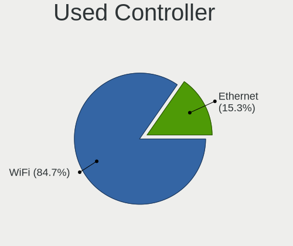

| Kind     | Notebooks | Percent |
|----------|-----------|---------|
| WiFi     | 105       | 84.68%  |
| Ethernet | 19        | 15.32%  |

NICs
----

Total network controllers on board

| Total | Notebooks | Percent |
|-------|-----------|---------|
| 2     | 91        | 73.98%  |
| 1     | 31        | 25.2%   |
| 0     | 1         | 0.81%   |

IPv6
----

IPv6 vs IPv4

| Used | Notebooks | Percent |
|------|-----------|---------|
| No   | 105       | 84.68%  |
| Yes  | 19        | 15.32%  |

Bluetooth
---------

Bluetooth Vendor
----------------

Controller vendors

| Vendor                          | Notebooks | Percent |
|---------------------------------|-----------|---------|
| Intel                           | 50        | 50.51%  |
| Qualcomm Atheros Communications | 10        | 10.1%   |
| Lite-On Technology              | 10        | 10.1%   |
| Realtek Semiconductor           | 5         | 5.05%   |
| IMC Networks                    | 5         | 5.05%   |
| Broadcom                        | 4         | 4.04%   |
| Apple                           | 4         | 4.04%   |
| Toshiba                         | 2         | 2.02%   |
| Hewlett-Packard                 | 2         | 2.02%   |
| Foxconn / Hon Hai               | 2         | 2.02%   |
| Dell                            | 2         | 2.02%   |
| Ralink                          | 1         | 1.01%   |
| MediaTek                        | 1         | 1.01%   |
| Cambridge Silicon Radio         | 1         | 1.01%   |

Bluetooth Model
---------------

Controller models

| Model                                                                               | Notebooks | Percent |
|-------------------------------------------------------------------------------------|-----------|---------|
| Intel Bluetooth wireless interface                                                  | 27        | 27.27%  |
| Intel AX201 Bluetooth                                                               | 8         | 8.08%   |
| Lite-On Qualcomm Atheros QCA9377 Bluetooth                                          | 5         | 5.05%   |
| Intel AX200 Bluetooth                                                               | 5         | 5.05%   |
| Intel Bluetooth 9460/9560 Jefferson Peak (JfP)                                      | 4         | 4.04%   |
| Qualcomm Atheros  Bluetooth Device                                                  | 3         | 3.03%   |
| Qualcomm Atheros AR3012 Bluetooth 4.0                                               | 3         | 3.03%   |
| IMC Networks Bluetooth Radio                                                        | 3         | 3.03%   |
| Toshiba RT Bluetooth Radio                                                          | 2         | 2.02%   |
| Realtek  Bluetooth 4.2 Adapter                                                      | 2         | 2.02%   |
| Qualcomm Atheros QCA61x4 Bluetooth 4.0                                              | 2         | 2.02%   |
| Lite-On Wireless_Device                                                             | 2         | 2.02%   |
| Lite-On Atheros AR3012 Bluetooth                                                    | 2         | 2.02%   |
| Intel Centrino Advanced-N 6230 Bluetooth adapter                                    | 2         | 2.02%   |
| Intel AX210 Bluetooth                                                               | 2         | 2.02%   |
| HP Bluetooth 2.0 Interface [Broadcom BCM2045]                                       | 2         | 2.02%   |
| Apple Bluetooth Host Controller                                                     | 2         | 2.02%   |
| Realtek RTL8822BE Bluetooth 4.2 Adapter                                             | 1         | 1.01%   |
| Realtek RTL8821A Bluetooth                                                          | 1         | 1.01%   |
| Realtek Bluetooth Radio                                                             | 1         | 1.01%   |
| Ralink RT3290 Bluetooth                                                             | 1         | 1.01%   |
| Qualcomm Atheros AR9462 Bluetooth                                                   | 1         | 1.01%   |
| Qualcomm Atheros AR3011 Bluetooth                                                   | 1         | 1.01%   |
| MediaTek Wireless_Device                                                            | 1         | 1.01%   |
| Lite-On Bluetooth Device                                                            | 1         | 1.01%   |
| Intel Wireless-AC 3168 Bluetooth                                                    | 1         | 1.01%   |
| Intel Centrino Bluetooth Wireless Transceiver                                       | 1         | 1.01%   |
| IMC Networks Wireless_Device                                                        | 1         | 1.01%   |
| IMC Networks Bluetooth Device                                                       | 1         | 1.01%   |
| Foxconn / Hon Hai Foxconn T77H114 BCM2070 [Single-Chip Bluetooth 2.1 + EDR Adapter] | 1         | 1.01%   |
| Foxconn / Hon Hai Bluetooth Device                                                  | 1         | 1.01%   |
| Dell Wireless 370 Bluetooth Mini-card                                               | 1         | 1.01%   |
| Dell DW375 Bluetooth Module                                                         | 1         | 1.01%   |
| Cambridge Silicon Radio Bluetooth Dongle (HCI mode)                                 | 1         | 1.01%   |
| Broadcom Bluetooth 2.1 Device                                                       | 1         | 1.01%   |
| Broadcom BCM43142A0 Bluetooth Device                                                | 1         | 1.01%   |
| Broadcom BCM43142 Bluetooth 4.0                                                     | 1         | 1.01%   |
| Broadcom BCM20702 Bluetooth 4.0 [ThinkPad]                                          | 1         | 1.01%   |
| Apple Built-in Bluetooth 2.0+EDR HCI                                                | 1         | 1.01%   |
| Apple Bluetooth HCI                                                                 | 1         | 1.01%   |

Sound
-----

Sound Vendor
------------

Sound card vendors

| Vendor              | Notebooks | Percent |
|---------------------|-----------|---------|
| Intel               | 105       | 70%     |
| AMD                 | 24        | 16%     |
| Nvidia              | 15        | 10%     |
| Conexant Systems    | 2         | 1.33%   |
| SmartlinkTechnology | 1         | 0.67%   |
| Samsung Electronics | 1         | 0.67%   |
| GYROCOM C&C         | 1         | 0.67%   |
| ASUSTek Computer    | 1         | 0.67%   |

Sound Model
-----------

Sound card models

| Model                                                                      | Notebooks | Percent |
|----------------------------------------------------------------------------|-----------|---------|
| Intel Sunrise Point-LP HD Audio                                            | 22        | 12.43%  |
| AMD Family 17h/19h/1ah HD Audio Controller                                 | 13        | 7.34%   |
| Intel 7 Series/C216 Chipset Family High Definition Audio Controller        | 11        | 6.21%   |
| Intel 82801I (ICH9 Family) HD Audio Controller                             | 8         | 4.52%   |
| Intel 6 Series/C200 Series Chipset Family High Definition Audio Controller | 7         | 3.95%   |
| Intel Tiger Lake-LP Smart Sound Technology Audio Controller                | 6         | 3.39%   |
| Intel Haswell-ULT HD Audio Controller                                      | 6         | 3.39%   |
| Intel 8 Series HD Audio Controller                                         | 6         | 3.39%   |
| Intel 5 Series/3400 Series Chipset High Definition Audio                   | 6         | 3.39%   |
| Intel Wildcat Point-LP High Definition Audio Controller                    | 5         | 2.82%   |
| Intel Broadwell-U Audio Controller                                         | 5         | 2.82%   |
| AMD Raven/Raven2/Fenghuang HDMI/DP Audio Controller                        | 5         | 2.82%   |
| Intel Xeon E3-1200 v3/4th Gen Core Processor HD Audio Controller           | 4         | 2.26%   |
| Intel Celeron/Pentium Silver Processor High Definition Audio               | 4         | 2.26%   |
| Intel 8 Series/C220 Series Chipset High Definition Audio Controller        | 4         | 2.26%   |
| AMD Renoir Radeon High Definition Audio Controller                         | 4         | 2.26%   |
| Nvidia GF108 High Definition Audio Controller                              | 3         | 1.69%   |
| Intel Comet Lake PCH-LP cAVS                                               | 3         | 1.69%   |
| Intel CM238 HD Audio Controller                                            | 3         | 1.69%   |
| Intel Cannon Point-LP High Definition Audio Controller                     | 3         | 1.69%   |
| Intel Cannon Lake PCH cAVS                                                 | 3         | 1.69%   |
| Intel Atom Processor Z36xxx/Z37xxx Series High Definition Audio Controller | 3         | 1.69%   |
| Intel 82801H (ICH8 Family) HD Audio Controller                             | 3         | 1.69%   |
| Nvidia TU116 High Definition Audio Controller                              | 2         | 1.13%   |
| Nvidia TU106 High Definition Audio Controller                              | 2         | 1.13%   |
| Intel Jasper Lake HD Audio                                                 | 2         | 1.13%   |
| Intel 100 Series/C230 Series Chipset Family HD Audio Controller            | 2         | 1.13%   |
| AMD Wrestler HDMI Audio                                                    | 2         | 1.13%   |
| AMD RV710/730 HDMI Audio [Radeon HD 4000 series]                           | 2         | 1.13%   |
| AMD Redwood HDMI Audio [Radeon HD 5000 Series]                             | 2         | 1.13%   |
| SmartlinkTechnology USB2.0 Device                                          | 1         | 0.56%   |
| Samsung Electronics USBC Headset                                           | 1         | 0.56%   |
| Nvidia TU107 GeForce GTX 1650 High Definition Audio Controller             | 1         | 0.56%   |
| Nvidia MCP79 High Definition Audio                                         | 1         | 0.56%   |
| Nvidia GP107GL High Definition Audio Controller                            | 1         | 0.56%   |
| Nvidia GM107 High Definition Audio Controller [GeForce 940MX]              | 1         | 0.56%   |
| Nvidia GK208 HDMI/DP Audio Controller                                      | 1         | 0.56%   |
| Nvidia GK107 HDMI Audio Controller                                         | 1         | 0.56%   |
| Nvidia GA107 High Definition Audio Controller                              | 1         | 0.56%   |
| Nvidia GA106 High Definition Audio Controller                              | 1         | 0.56%   |

Memory
------

Memory Vendor
-------------

Memory module vendors

| Vendor              | Notebooks | Percent |
|---------------------|-----------|---------|
| Samsung Electronics | 19        | 29.69%  |
| SK hynix            | 11        | 17.19%  |
| Crucial             | 6         | 9.38%   |
| A-DATA Technology   | 6         | 9.38%   |
| Kingston            | 5         | 7.81%   |
| Micron Technology   | 4         | 6.25%   |
| Unknown             | 3         | 4.69%   |
| Nanya Technology    | 3         | 4.69%   |
| Ramaxel Technology  | 2         | 3.13%   |
| Elpida              | 2         | 3.13%   |
| Team                | 1         | 1.56%   |
| G.Skill             | 1         | 1.56%   |
| ChangXin Memory     | 1         | 1.56%   |

Memory Model
------------

Memory module models

| Model                                                               | Notebooks | Percent |
|---------------------------------------------------------------------|-----------|---------|
| SK hynix RAM Module 8192MB SODIMM DDR4 2400MT/s                     | 2         | 3.08%   |
| Samsung RAM M471B5273DH0-CK0 4GB SODIMM DDR3 2400MT/s               | 2         | 3.08%   |
| Nanya RAM NT2GC64B88B0NS-CG 2GB SODIMM DDR3 1334MT/s                | 2         | 3.08%   |
| Unknown RAM Module 4GB SODIMM DDR3                                  | 1         | 1.54%   |
| Unknown RAM Module 4096MB SODIMM DDR3                               | 1         | 1.54%   |
| Unknown RAM Module 1GB SODIMM DDR                                   | 1         | 1.54%   |
| Team RAM TEAMGROUP-SD4-3200 16GB SODIMM DDR4 3200MT/s               | 1         | 1.54%   |
| SK hynix RAM Module 2048MB SODIMM DDR2 800MT/s                      | 1         | 1.54%   |
| SK hynix RAM HMT41GS6MFR8C-PB 8GB SODIMM DDR3 1600MT/s              | 1         | 1.54%   |
| SK hynix RAM HMT41GS6AFR8A-PB 8GB SODIMM DDR3 2667MT/s              | 1         | 1.54%   |
| SK hynix RAM HMT351S6BFR8C-H9 4GB SODIMM DDR3 1333MT/s              | 1         | 1.54%   |
| SK hynix RAM HMAA1GS6CMR6N-VK 8GB SODIMM DDR4 2667MT/s              | 1         | 1.54%   |
| SK hynix RAM HMA81GS6DJR8N-XN 8GB SODIMM DDR4 3200MT/s              | 1         | 1.54%   |
| SK hynix RAM HMA81GS6AFR8N-UH 8GB SODIMM DDR4 2667MT/s              | 1         | 1.54%   |
| SK hynix RAM HCNNNBKMMLXR-NEE 1GB Row Of Chips LPDDR4 4267MT/s      | 1         | 1.54%   |
| SK hynix RAM H9CCNNNCLGALAR-NVD 8192MB Row Of Chips LPDDR3 2133MT/s | 1         | 1.54%   |
| Samsung RAM Module 8192MB SODIMM DDR4 2133MT/s                      | 1         | 1.54%   |
| Samsung RAM Module 4096MB SODIMM LPDDR3 1600MT/s                    | 1         | 1.54%   |
| Samsung RAM M471B5773CHS-CK0 2GB SODIMM DDR3 1600MT/s               | 1         | 1.54%   |
| Samsung RAM M471B5173DB0-YK0 4GB SODIMM DDR3 1600MT/s               | 1         | 1.54%   |
| Samsung RAM M471B1G73BH0-YK0 8GB SODIMM DDR3 1600MT/s               | 1         | 1.54%   |
| Samsung RAM M471A5244CB0-CTD 4GB SODIMM DDR4 3266MT/s               | 1         | 1.54%   |
| Samsung RAM M471A5244CB0-CRC 4GB SODIMM DDR4 2667MT/s               | 1         | 1.54%   |
| Samsung RAM M471A4G43MB1-CTD 32GB SODIMM DDR4 2667MT/s              | 1         | 1.54%   |
| Samsung RAM M471A2K43EB1-CWE 16GB SODIMM DDR4 3200MT/s              | 1         | 1.54%   |
| Samsung RAM M471A2G44AM0-CWE 16GB SODIMM DDR4 3200MT/s              | 1         | 1.54%   |
| Samsung RAM M471A2G43AB2-CWE 16GB SODIMM DDR4 3200MT/s              | 1         | 1.54%   |
| Samsung RAM M471A1K43DB1-CTD 8GB SODIMM DDR4 2667MT/s               | 1         | 1.54%   |
| Samsung RAM M471A1K43CB1-CRC 8GB SODIMM DDR4 2667MT/s               | 1         | 1.54%   |
| Samsung RAM M471A1K43BB1-CRC 8GB SODIMM DDR4 2667MT/s               | 1         | 1.54%   |
| Samsung RAM M471A1G44AB0-CWE 8GB SODIMM DDR4 3200MT/s               | 1         | 1.54%   |
| Samsung RAM M4 70T5663QZ3-CF7 2GB SODIMM DDR2 2048MT/s              | 1         | 1.54%   |
| Samsung RAM K4EBE304EC-EGCG 8GB Row Of Chips LPDDR3 2133MT/s        | 1         | 1.54%   |
| Samsung RAM K4E8E324EB-EGCF 2GB SODIMM LPDDR3 1867MT/s              | 1         | 1.54%   |
| Ramaxel RAM RMT3170EB68E9W1600 4GB SODIMM DDR3 1600MT/s             | 1         | 1.54%   |
| Ramaxel RAM RMT1970ED48E8F1066 2GB SODIMM DDR3 1067MT/s             | 1         | 1.54%   |
| Nanya RAM NT4GC64B8HG0NS-DI 4GB SODIMM DDR3 1600MT/s                | 1         | 1.54%   |
| Micron RAM 8HTF12864HDY-667E1 1GB SODIMM DDR2 667MT/s               | 1         | 1.54%   |
| Micron RAM 8ATF1G64HZ-2G3H1 8GB SODIMM DDR4 2400MT/s                | 1         | 1.54%   |
| Micron RAM 4ATS2G64HZ-3G2B1 16GB SODIMM DDR4 3200MT/s               | 1         | 1.54%   |

Memory Kind
-----------

Memory module kinds

| Kind   | Notebooks | Percent |
|--------|-----------|---------|
| DDR4   | 29        | 53.7%   |
| DDR3   | 15        | 27.78%  |
| LPDDR3 | 4         | 7.41%   |
| LPDDR4 | 2         | 3.7%    |
| DDR2   | 2         | 3.7%    |
| SDRAM  | 1         | 1.85%   |
| DDR    | 1         | 1.85%   |

Memory Form Factor
------------------

Physical design of the memory module

| Name         | Notebooks | Percent |
|--------------|-----------|---------|
| SODIMM       | 47        | 92.16%  |
| Row Of Chips | 4         | 7.84%   |

Memory Size
-----------

Memory module size

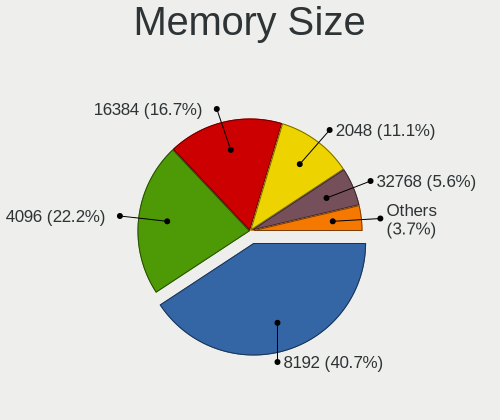

| Size  | Notebooks | Percent |
|-------|-----------|---------|
| 8192  | 22        | 40.74%  |
| 4096  | 12        | 22.22%  |
| 16384 | 9         | 16.67%  |
| 2048  | 6         | 11.11%  |
| 32768 | 3         | 5.56%   |
| 1024  | 2         | 3.7%    |

Memory Speed
------------

Memory module speed

| Speed   | Notebooks | Percent |
|---------|-----------|---------|
| 2667    | 12        | 20.69%  |
| 1600    | 10        | 17.24%  |
| 3200    | 9         | 15.52%  |
| 2400    | 8         | 13.79%  |
| 2133    | 5         | 8.62%   |
| Unknown | 3         | 5.17%   |
| 1334    | 2         | 3.45%   |
| 4267    | 1         | 1.72%   |
| 3733    | 1         | 1.72%   |
| 3266    | 1         | 1.72%   |
| 2048    | 1         | 1.72%   |
| 1867    | 1         | 1.72%   |
| 1333    | 1         | 1.72%   |
| 1067    | 1         | 1.72%   |
| 800     | 1         | 1.72%   |
| 667     | 1         | 1.72%   |

Printers & scanners
-------------------

Printer Vendor
--------------

Printer device vendors

| Vendor             | Notebooks | Percent |
|--------------------|-----------|---------|
| Brother Industries | 1         | 100%    |

Printer Model
-------------

Printer device models

| Model               | Notebooks | Percent |
|---------------------|-----------|---------|
| Brother MFC-9330CDW | 1         | 100%    |

Scanner Vendor
--------------

Scanner device vendors

Zero info for selected period =(

Scanner Model
-------------

Scanner device models

Zero info for selected period =(

Camera
------

Camera Vendor
-------------

Camera device vendors

| Vendor                                 | Notebooks | Percent |
|----------------------------------------|-----------|---------|
| Chicony Electronics                    | 24        | 21.62%  |
| Realtek Semiconductor                  | 14        | 12.61%  |
| IMC Networks                           | 13        | 11.71%  |
| Microdia                               | 11        | 9.91%   |
| Quanta                                 | 7         | 6.31%   |
| Sunplus Innovation Technology          | 6         | 5.41%   |
| Cheng Uei Precision Industry (Foxlink) | 6         | 5.41%   |
| Suyin                                  | 4         | 3.6%    |
| Lite-On Technology                     | 4         | 3.6%    |
| Bison Electronics                      | 4         | 3.6%    |
| Syntek                                 | 3         | 2.7%    |
| Logitech                               | 3         | 2.7%    |
| Lenovo                                 | 2         | 1.8%    |
| Importek                               | 2         | 1.8%    |
| Z-Star Microelectronics                | 1         | 0.9%    |
| Unknown                                | 1         | 0.9%    |
| Silicon Motion                         | 1         | 0.9%    |
| Ricoh                                  | 1         | 0.9%    |
| Microsoft                              | 1         | 0.9%    |
| Intel                                  | 1         | 0.9%    |
| Apple                                  | 1         | 0.9%    |
| Acer                                   | 1         | 0.9%    |

Camera Model
------------

Camera device models

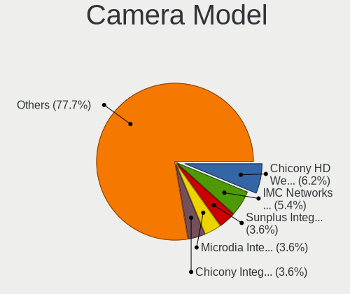

| Model                                         | Notebooks | Percent |
|-----------------------------------------------|-----------|---------|
| Chicony HD WebCam                             | 7         | 6.25%   |
| IMC Networks USB2.0 HD UVC WebCam             | 6         | 5.36%   |
| Sunplus Integrated_Webcam_HD                  | 4         | 3.57%   |
| Microdia Integrated_Webcam_HD                 | 4         | 3.57%   |
| Chicony Integrated Camera                     | 4         | 3.57%   |
| Realtek Integrated Webcam_HD                  | 3         | 2.68%   |
| Realtek HD WebCam                             | 3         | 2.68%   |
| IMC Networks Integrated Camera                | 3         | 2.68%   |
| Syntek Integrated Camera                      | 2         | 1.79%   |
| Suyin HP TrueVision HD Integrated Webcam      | 2         | 1.79%   |
| Realtek Integrated_Webcam_HD                  | 2         | 1.79%   |
| Quanta HP TrueVision HD Webcam                | 2         | 1.79%   |
| Quanta HD User Facing                         | 2         | 1.79%   |
| Microdia USB 2.0 Camera                       | 2         | 1.79%   |
| IMC Networks USB2.0 VGA UVC WebCam            | 2         | 1.79%   |
| Cheng Uei Precision Industry (Foxlink) Webcam | 2         | 1.79%   |
| Z-Star Webcam                                 | 1         | 0.89%   |
| Unknown ATIV VGA CAMERA                       | 1         | 0.89%   |
| Syntek USB2.0 Camera                          | 1         | 0.89%   |
| Suyin Acer/HP Integrated Webcam [CN0314]      | 1         | 0.89%   |
| Suyin 1.3M HD WebCam                          | 1         | 0.89%   |
| Sunplus Laptop_Integrated_Webcam_HD           | 1         | 0.89%   |
| Sunplus Laptop Integrated WebCam HD           | 1         | 0.89%   |
| Silicon Motion WebCam SC-10HDD12636N          | 1         | 0.89%   |
| Ricoh USB2.0 Camera                           | 1         | 0.89%   |
| Realtek Laptop Camera                         | 1         | 0.89%   |
| Realtek Integrated Webcam HD                  | 1         | 0.89%   |
| Realtek Integrated Webcam                     | 1         | 0.89%   |
| Realtek Integrated Camera                     | 1         | 0.89%   |
| Realtek HP Truevision HD                      | 1         | 0.89%   |
| Realtek Dell_Monitor_IR_Webcam                | 1         | 0.89%   |
| Quanta VGA WebCam                             | 1         | 0.89%   |
| Quanta USB2.0 HD UVC WebCam                   | 1         | 0.89%   |
| Quanta HP Wide Vision HD Camera               | 1         | 0.89%   |
| Microsoft LifeCam Studio                      | 1         | 0.89%   |
| Microdia Webcam                               | 1         | 0.89%   |
| Microdia Laptop_Integrated_Webcam_0.3M        | 1         | 0.89%   |
| Microdia Integrated_Webcam_1.3M               | 1         | 0.89%   |
| Microdia Integrated Webcam HD                 | 1         | 0.89%   |
| Microdia Dell Laptop Integrated Webcam HD     | 1         | 0.89%   |

Security
--------

Fingerprint Vendor
------------------

Fingerprint sensor vendors

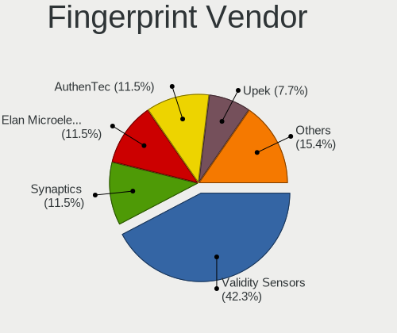

| Vendor                     | Notebooks | Percent |
|----------------------------|-----------|---------|
| Validity Sensors           | 11        | 42.31%  |
| Synaptics                  | 3         | 11.54%  |
| Elan Microelectronics      | 3         | 11.54%  |
| AuthenTec                  | 3         | 11.54%  |
| Upek                       | 2         | 7.69%   |
| Shenzhen Goodix Technology | 2         | 7.69%   |
| LighTuning Technology      | 2         | 7.69%   |

Fingerprint Model
-----------------

Fingerprint sensor models

| Model                                                  | Notebooks | Percent |
|--------------------------------------------------------|-----------|---------|
| Validity Sensors VFS495 Fingerprint Reader             | 4         | 15.38%  |
| Elan ELAN:Fingerprint                                  | 3         | 11.54%  |
| Validity Sensors Fingerprint scanner                   | 2         | 7.69%   |
| Synaptics Prometheus MIS Touch Fingerprint Reader      | 2         | 7.69%   |
| Shenzhen Goodix  Fingerprint Device                    | 2         | 7.69%   |
| LighTuning EgisTec Touch Fingerprint Sensor            | 2         | 7.69%   |
| Validity Sensors VFS7500 Touch Fingerprint Sensor      | 1         | 3.85%   |
| Validity Sensors VFS5011 Fingerprint Reader            | 1         | 3.85%   |
| Validity Sensors VFS491                                | 1         | 3.85%   |
| Validity Sensors VFS Fingerprint sensor                | 1         | 3.85%   |
| Validity Sensors VFS 5011 fingerprint sensor           | 1         | 3.85%   |
| Upek TCS5B Fingerprint sensor                          | 1         | 3.85%   |
| Upek Biometric Touchchip/Touchstrip Fingerprint Sensor | 1         | 3.85%   |
| Synaptics Metallica MIS Touch Fingerprint Reader       | 1         | 3.85%   |
| AuthenTec Fingerprint Sensor                           | 1         | 3.85%   |
| AuthenTec AES2810                                      | 1         | 3.85%   |
| AuthenTec AES2501 Fingerprint Sensor                   | 1         | 3.85%   |

Chipcard Vendor
---------------

Chipcard module vendors

| Vendor      | Notebooks | Percent |
|-------------|-----------|---------|
| Broadcom    | 4         | 36.36%  |
| Alcor Micro | 3         | 27.27%  |
| Upek        | 2         | 18.18%  |
| O2 Micro    | 1         | 9.09%   |
| Lenovo      | 1         | 9.09%   |

Chipcard Model
--------------

Chipcard module models

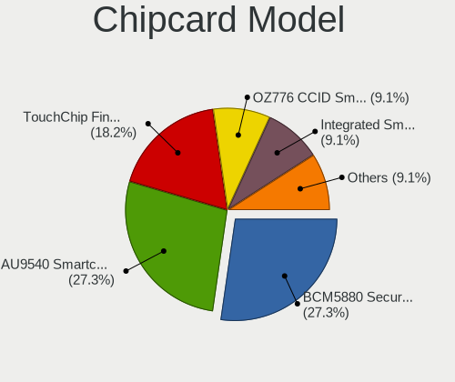

| Model                                                      | Notebooks | Percent |
|------------------------------------------------------------|-----------|---------|
| Broadcom BCM5880 Secure Applications Processor             | 3         | 27.27%  |
| Alcor Micro AU9540 Smartcard Reader                        | 3         | 27.27%  |
| Upek TouchChip Fingerprint Coprocessor (WBF advanced mode) | 2         | 18.18%  |
| O2 Micro OZ776 CCID Smartcard Reader                       | 1         | 9.09%   |
| Lenovo Integrated Smart Card Reader                        | 1         | 9.09%   |
| Broadcom 5880                                              | 1         | 9.09%   |

Unsupported
-----------

Unsupported Devices
-------------------

Total unsupported devices on board

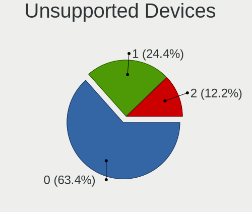

| Total | Notebooks | Percent |
|-------|-----------|---------|
| 0     | 78        | 63.41%  |
| 1     | 30        | 24.39%  |
| 2     | 15        | 12.2%   |

Unsupported Device Types
------------------------

Types of unsupported devices

| Type                     | Notebooks | Percent |
|--------------------------|-----------|---------|
| Fingerprint reader       | 26        | 41.94%  |
| Net/wireless             | 10        | 16.13%  |
| Chipcard                 | 10        | 16.13%  |
| Multimedia controller    | 6         | 9.68%   |
| Graphics card            | 4         | 6.45%   |
| Unassigned class         | 1         | 1.61%   |
| Storage                  | 1         | 1.61%   |
| Net/ethernet             | 1         | 1.61%   |
| Communication controller | 1         | 1.61%   |
| Camera                   | 1         | 1.61%   |
| Bluetooth                | 1         | 1.61%   |

