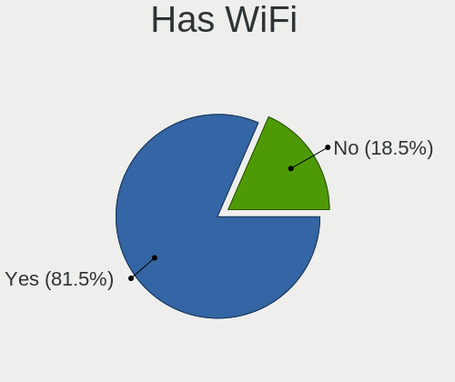
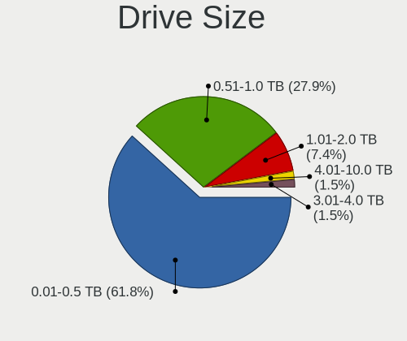
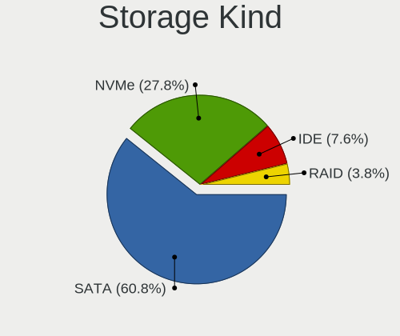
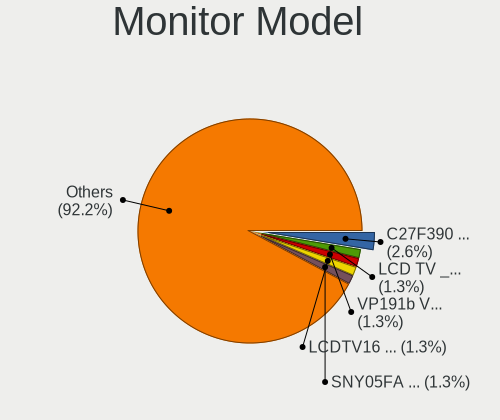
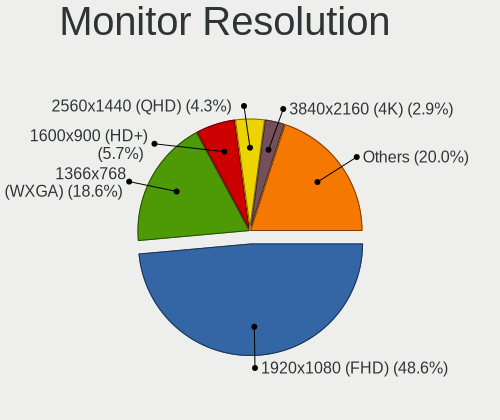
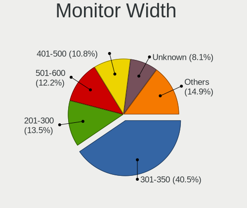
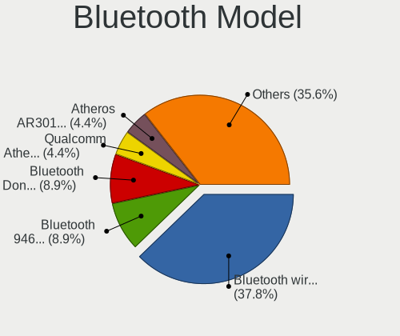
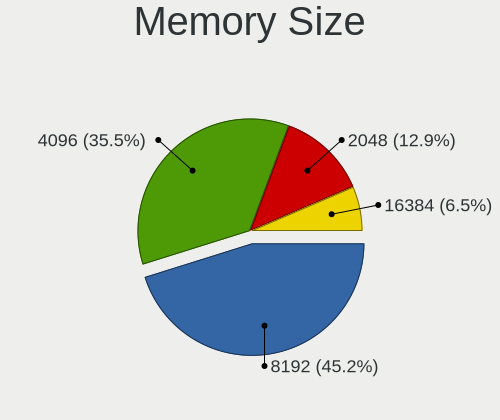

Solus 4.1 - Tested Hardware & Statistics
----------------------------------------

A project to collect tested hardware configurations for Solus 4.1.

Anyone can contribute to this report by the [hw-probe](https://github.com/linuxhw/hw-probe) tool:

    sudo -E hw-probe -all -upload

Please contribute! Especially if your hardware is rare.

This is a report for all computer types. See also reports for [desktops](/Dist/Solus_4.1/Desktop/README.md) and [notebooks](/Dist/Solus_4.1/Notebook/README.md).

Contents
--------

* [ Test Cases ](#test-cases)

* [ System ](#system)
  - [ Kernel                   ](#kernel)
  - [ Kernel Family            ](#kernel-family)
  - [ Kernel Major Ver.        ](#kernel-major-ver)
  - [ Arch                     ](#arch)
  - [ DE                       ](#de)
  - [ Display Server           ](#display-server)
  - [ Display Manager          ](#display-manager)
  - [ OS Lang                  ](#os-lang)
  - [ Boot Mode                ](#boot-mode)
  - [ Filesystem               ](#filesystem)
  - [ Part. scheme             ](#part-scheme)
  - [ Dual Boot with Linux/BSD ](#dual-boot-with-linuxbsd)
  - [ Dual Boot (Win)          ](#dual-boot-win)

* [ Board ](#board)
  - [ Vendor                   ](#vendor)
  - [ Model                    ](#model)
  - [ Model Family             ](#model-family)
  - [ MFG Year                 ](#mfg-year)
  - [ Form Factor              ](#form-factor)
  - [ Secure Boot              ](#secure-boot)
  - [ Coreboot                 ](#coreboot)
  - [ RAM Size                 ](#ram-size)
  - [ RAM Used                 ](#ram-used)
  - [ Total Drives             ](#total-drives)
  - [ Has CD-ROM               ](#has-cd-rom)
  - [ Has Ethernet             ](#has-ethernet)
  - [ Has WiFi                 ](#has-wifi)
  - [ Has Bluetooth            ](#has-bluetooth)

* [ Location ](#location)
  - [ Country                  ](#country)
  - [ City                     ](#city)

* [ Drives ](#drives)
  - [ Drive Vendor             ](#drive-vendor)
  - [ Drive Model              ](#drive-model)
  - [ HDD Vendor               ](#hdd-vendor)
  - [ SSD Vendor               ](#ssd-vendor)
  - [ Drive Kind               ](#drive-kind)
  - [ Drive Connector          ](#drive-connector)
  - [ Drive Size               ](#drive-size)
  - [ Space Total              ](#space-total)
  - [ Space Used               ](#space-used)
  - [ Malfunc. Drives          ](#malfunc-drives)
  - [ Malfunc. Drive Vendor    ](#malfunc-drive-vendor)
  - [ Malfunc. HDD Vendor      ](#malfunc-hdd-vendor)
  - [ Malfunc. Drive Kind      ](#malfunc-drive-kind)
  - [ Failed Drives            ](#failed-drives)
  - [ Failed Drive Vendor      ](#failed-drive-vendor)
  - [ Drive Status             ](#drive-status)

* [ Storage controller ](#storage-controller)
  - [ Storage Vendor           ](#storage-vendor)
  - [ Storage Model            ](#storage-model)
  - [ Storage Kind             ](#storage-kind)

* [ Processor ](#processor)
  - [ CPU Vendor               ](#cpu-vendor)
  - [ CPU Model                ](#cpu-model)
  - [ CPU Model Family         ](#cpu-model-family)
  - [ CPU Cores                ](#cpu-cores)
  - [ CPU Sockets              ](#cpu-sockets)
  - [ CPU Threads              ](#cpu-threads)
  - [ CPU Op-Modes             ](#cpu-op-modes)
  - [ CPU Microcode            ](#cpu-microcode)
  - [ CPU Microarch            ](#cpu-microarch)

* [ Graphics ](#graphics)
  - [ GPU Vendor               ](#gpu-vendor)
  - [ GPU Model                ](#gpu-model)
  - [ GPU Combo                ](#gpu-combo)
  - [ GPU Driver               ](#gpu-driver)
  - [ GPU Memory               ](#gpu-memory)

* [ Monitor ](#monitor)
  - [ Monitor Vendor           ](#monitor-vendor)
  - [ Monitor Model            ](#monitor-model)
  - [ Monitor Resolution       ](#monitor-resolution)
  - [ Monitor Diagonal         ](#monitor-diagonal)
  - [ Monitor Width            ](#monitor-width)
  - [ Aspect Ratio             ](#aspect-ratio)
  - [ Monitor Area             ](#monitor-area)
  - [ Pixel Density            ](#pixel-density)
  - [ Multiple Monitors        ](#multiple-monitors)

* [ Network ](#network)
  - [ Net Controller Vendor    ](#net-controller-vendor)
  - [ Net Controller Model     ](#net-controller-model)
  - [ Wireless Vendor          ](#wireless-vendor)
  - [ Wireless Model           ](#wireless-model)
  - [ Ethernet Vendor          ](#ethernet-vendor)
  - [ Ethernet Model           ](#ethernet-model)
  - [ Net Controller Kind      ](#net-controller-kind)
  - [ Used Controller          ](#used-controller)
  - [ NICs                     ](#nics)
  - [ IPv6                     ](#ipv6)

* [ Bluetooth ](#bluetooth)
  - [ Bluetooth Vendor         ](#bluetooth-vendor)
  - [ Bluetooth Model          ](#bluetooth-model)

* [ Sound ](#sound)
  - [ Sound Vendor             ](#sound-vendor)
  - [ Sound Model              ](#sound-model)

* [ Memory ](#memory)
  - [ Memory Vendor            ](#memory-vendor)
  - [ Memory Model             ](#memory-model)
  - [ Memory Kind              ](#memory-kind)
  - [ Memory Form Factor       ](#memory-form-factor)
  - [ Memory Size              ](#memory-size)
  - [ Memory Speed             ](#memory-speed)

* [ Printers & scanners ](#printers--scanners)
  - [ Printer Vendor           ](#printer-vendor)
  - [ Printer Model            ](#printer-model)
  - [ Scanner Vendor           ](#scanner-vendor)
  - [ Scanner Model            ](#scanner-model)

* [ Camera ](#camera)
  - [ Camera Vendor            ](#camera-vendor)
  - [ Camera Model             ](#camera-model)

* [ Security ](#security)
  - [ Fingerprint Vendor       ](#fingerprint-vendor)
  - [ Fingerprint Model        ](#fingerprint-model)
  - [ Chipcard Vendor          ](#chipcard-vendor)
  - [ Chipcard Model           ](#chipcard-model)

* [ Unsupported ](#unsupported)
  - [ Unsupported Devices      ](#unsupported-devices)
  - [ Unsupported Device Types ](#unsupported-device-types)

Test Cases
----------

Total: 88

| Vendor        | Model                       | Form-Factor | Probe                                                      | Date         |
|---------------|-----------------------------|-------------|------------------------------------------------------------|--------------|
| Gigabyte      | H61M-HD2                    | Desktop     | [78c877458a](https://linux-hardware.org/?probe=78c877458a) | Jan 28, 2021 |
| Lenovo        | ThinkPad T410 2522Y1L       | Notebook    | [3c4543a94f](https://linux-hardware.org/?probe=3c4543a94f) | Jan 26, 2021 |
| Gigabyte      | H61M-HD2                    | Desktop     | [6caba093b5](https://linux-hardware.org/?probe=6caba093b5) | Jan 24, 2021 |
| HP            | Spectre x360 Convertible... | Convertible | [bd5bdfd31f](https://linux-hardware.org/?probe=bd5bdfd31f) | Jan 21, 2021 |
| MSI           | 990FXA-GD65                 | Desktop     | [f8c2afa143](https://linux-hardware.org/?probe=f8c2afa143) | Jan 20, 2021 |
| ASRock        | B550M-ITX/ac                | Desktop     | [f69556d436](https://linux-hardware.org/?probe=f69556d436) | Jan 15, 2021 |
| Gigabyte      | Z390 D                      | Desktop     | [010be27c6a](https://linux-hardware.org/?probe=010be27c6a) | Jan 11, 2021 |
| Dell          | XPS 13 9360                 | Notebook    | [56d39c0f21](https://linux-hardware.org/?probe=56d39c0f21) | Jan 02, 2021 |
| ASRock        | X470 Master SLI             | Desktop     | [f2c8ec14c7](https://linux-hardware.org/?probe=f2c8ec14c7) | Jan 02, 2021 |
| Toshiba       | Satellite L855              | Notebook    | [0173204c7f](https://linux-hardware.org/?probe=0173204c7f) | Dec 23, 2020 |
| HUAWEI        | NBLK-WAX9X                  | Notebook    | [26447067ee](https://linux-hardware.org/?probe=26447067ee) | Dec 20, 2020 |
| Acer          | Aspire A315-21              | Notebook    | [5f78418b58](https://linux-hardware.org/?probe=5f78418b58) | Dec 19, 2020 |
| HP            | EliteBook 840 G3            | Notebook    | [708eaf5602](https://linux-hardware.org/?probe=708eaf5602) | Dec 14, 2020 |
| Toshiba       | Satellite L855              | Notebook    | [3d3a517e96](https://linux-hardware.org/?probe=3d3a517e96) | Dec 11, 2020 |
| Sony          | VPCEB1S1E                   | Notebook    | [ebcb16e616](https://linux-hardware.org/?probe=ebcb16e616) | Nov 27, 2020 |
| HP            | Elite Dragonfly             | Convertible | [ce851e2475](https://linux-hardware.org/?probe=ce851e2475) | Nov 25, 2020 |
| Panasonic     | CF-C2CCEZXCM                | Notebook    | [cba289e868](https://linux-hardware.org/?probe=cba289e868) | Nov 22, 2020 |
| MSI           | MAG B550 TOMAHAWK           | Desktop     | [8e3d2a963b](https://linux-hardware.org/?probe=8e3d2a963b) | Nov 18, 2020 |
| ASUSTek       | PRIME X370-A                | Desktop     | [c8f850e40f](https://linux-hardware.org/?probe=c8f850e40f) | Nov 15, 2020 |
| ASUSTek       | PRIME X370-A                | Desktop     | [c86804a559](https://linux-hardware.org/?probe=c86804a559) | Nov 14, 2020 |
| Apple         | Mac-B809C3757DA9BB8D iMa... | All in one  | [3a3a530ac9](https://linux-hardware.org/?probe=3a3a530ac9) | Nov 08, 2020 |
| Gigabyte      | B85M-D3H                    | Desktop     | [cdd1a3be02](https://linux-hardware.org/?probe=cdd1a3be02) | Nov 07, 2020 |
| Acer          | Aspire E1-532P              | Notebook    | [4a2a5fd18c](https://linux-hardware.org/?probe=4a2a5fd18c) | Nov 01, 2020 |
| Timi          | TM1701                      | Notebook    | [36446e6594](https://linux-hardware.org/?probe=36446e6594) | Oct 26, 2020 |
| Apple         | MacBook5,2                  | Notebook    | [b21d4ca9d0](https://linux-hardware.org/?probe=b21d4ca9d0) | Oct 26, 2020 |
| Apple         | MacBook5,2                  | Notebook    | [eb1b0d459f](https://linux-hardware.org/?probe=eb1b0d459f) | Oct 25, 2020 |
| Toshiba       | PORTEGE Z20T-B              | Notebook    | [9d789eba3c](https://linux-hardware.org/?probe=9d789eba3c) | Oct 12, 2020 |
| Toshiba       | Satellite P50-A             | Notebook    | [884731a198](https://linux-hardware.org/?probe=884731a198) | Sep 28, 2020 |
| ASRock        | X570 Steel Legend           | Desktop     | [80550be62d](https://linux-hardware.org/?probe=80550be62d) | Sep 28, 2020 |
| HP            | ProBook 450 G5              | Notebook    | [d04bae5c49](https://linux-hardware.org/?probe=d04bae5c49) | Sep 14, 2020 |
| Lenovo        | ThinkPad Edge E440 20C5A... | Notebook    | [2f729ef2af](https://linux-hardware.org/?probe=2f729ef2af) | Sep 11, 2020 |
| ASRock        | X470 Master SLI             | Desktop     | [9968dc910c](https://linux-hardware.org/?probe=9968dc910c) | Sep 10, 2020 |
| ASRock        | X470 Master SLI             | Desktop     | [2ae445db73](https://linux-hardware.org/?probe=2ae445db73) | Sep 10, 2020 |
| Lenovo        | ThinkPad T440p 20AN009CU... | Notebook    | [bcc44c581c](https://linux-hardware.org/?probe=bcc44c581c) | Sep 09, 2020 |
| Dell          | 0M017G A00                  | Desktop     | [e51b08ee63](https://linux-hardware.org/?probe=e51b08ee63) | Sep 08, 2020 |
| MSI           | B450M PRO-M2 V2             | Desktop     | [5e2142357f](https://linux-hardware.org/?probe=5e2142357f) | Sep 08, 2020 |
| MSI           | 990FXA-GD65                 | Desktop     | [e60be6cba2](https://linux-hardware.org/?probe=e60be6cba2) | Sep 06, 2020 |
| Dell          | Inspiron 5577               | Notebook    | [b46a79f93e](https://linux-hardware.org/?probe=b46a79f93e) | Sep 03, 2020 |
| Gigabyte      | Z390 AORUS PRO WIFI-CF      | Desktop     | [4bf4f029df](https://linux-hardware.org/?probe=4bf4f029df) | Sep 03, 2020 |
| MSI           | B450 GAMING PRO CARBON A... | Desktop     | [aca54beb89](https://linux-hardware.org/?probe=aca54beb89) | Sep 02, 2020 |
| MSI           | B450 GAMING PRO CARBON A... | Desktop     | [d150d7a9ea](https://linux-hardware.org/?probe=d150d7a9ea) | Sep 02, 2020 |
| Acer          | Aspire ES1-111M             | Notebook    | [fcee1a2241](https://linux-hardware.org/?probe=fcee1a2241) | Aug 21, 2020 |
| Acer          | Aspire ES1-111M             | Notebook    | [43f35553ae](https://linux-hardware.org/?probe=43f35553ae) | Aug 21, 2020 |
| Lenovo        | IdeaPad 330S-15IKB 81F5     | Notebook    | [793085b89a](https://linux-hardware.org/?probe=793085b89a) | Aug 15, 2020 |
| HP            | ProBook 440 G4              | Notebook    | [191f1be39f](https://linux-hardware.org/?probe=191f1be39f) | Aug 14, 2020 |
| HP            | ProBook 440 G4              | Notebook    | [c34e36f36e](https://linux-hardware.org/?probe=c34e36f36e) | Aug 10, 2020 |
| HP            | ProBook 440 G4              | Notebook    | [5b6c3861bb](https://linux-hardware.org/?probe=5b6c3861bb) | Aug 10, 2020 |
| ASUSTek       | TUF Gaming FX505DV_FX505... | Notebook    | [8eb28a49c4](https://linux-hardware.org/?probe=8eb28a49c4) | Aug 03, 2020 |
| Pegatron      | IPM31G                      | Desktop     | [ed7c9fc9dc](https://linux-hardware.org/?probe=ed7c9fc9dc) | Jul 24, 2020 |
| HP            | ENVY x360 Convertible 13... | Convertible | [fda411a3d7](https://linux-hardware.org/?probe=fda411a3d7) | Jul 24, 2020 |
| Avell High... | Avell G1750 MUV / C65 MU... | Notebook    | [cf035fee07](https://linux-hardware.org/?probe=cf035fee07) | Jul 24, 2020 |
| Lenovo        | MIIX 310-10ICR 80SG         | Tablet      | [7744b749d9](https://linux-hardware.org/?probe=7744b749d9) | Jul 09, 2020 |
| ASUSTek       | ZenBook UX431DA_UM431DA     | Notebook    | [2fdc7ceb31](https://linux-hardware.org/?probe=2fdc7ceb31) | Jul 03, 2020 |
| HP            | Presario C700               | Notebook    | [6b50a4fad1](https://linux-hardware.org/?probe=6b50a4fad1) | Jun 26, 2020 |
| ASUSTek       | K45A                        | Notebook    | [57c5b7b4bd](https://linux-hardware.org/?probe=57c5b7b4bd) | Jun 08, 2020 |
| MSI           | H87-G41 PC Mate             | Desktop     | [6081e4a770](https://linux-hardware.org/?probe=6081e4a770) | Jun 07, 2020 |
| MSI           | H310M PRO-M2 PLUS           | Desktop     | [5d852ecca8](https://linux-hardware.org/?probe=5d852ecca8) | Jun 06, 2020 |
| Acer          | Predator PH315-52           | Notebook    | [b5e7780315](https://linux-hardware.org/?probe=b5e7780315) | Jun 04, 2020 |
| Lenovo        | Z51-70 80K6                 | Notebook    | [7b25fce04c](https://linux-hardware.org/?probe=7b25fce04c) | May 24, 2020 |
| Samsung       | 270E5K/270E5Q/271E5K/257... | Notebook    | [cb0fe570e2](https://linux-hardware.org/?probe=cb0fe570e2) | May 22, 2020 |
| Dell          | Latitude 7390               | Notebook    | [49112c8937](https://linux-hardware.org/?probe=49112c8937) | May 20, 2020 |
| HP            | ProBook 6470b               | Notebook    | [59db0f436f](https://linux-hardware.org/?probe=59db0f436f) | May 13, 2020 |
| MSI           | H87-G41 PC Mate             | Desktop     | [b3513301a1](https://linux-hardware.org/?probe=b3513301a1) | May 08, 2020 |
| Samsung       | 270E5K/270E5Q/271E5K/257... | Notebook    | [e98c6a162c](https://linux-hardware.org/?probe=e98c6a162c) | May 03, 2020 |
| Toshiba       | Satellite L655              | Notebook    | [32a9d86996](https://linux-hardware.org/?probe=32a9d86996) | May 02, 2020 |
| Acer          | Aspire E1-532P              | Notebook    | [b401e8b701](https://linux-hardware.org/?probe=b401e8b701) | Apr 30, 2020 |
| Lenovo        | Yoga 730-13IKB 81CT         | Convertible | [670ddc1e5c](https://linux-hardware.org/?probe=670ddc1e5c) | Apr 13, 2020 |
| HP            | Pavilion dv6                | Notebook    | [6939cb8715](https://linux-hardware.org/?probe=6939cb8715) | Apr 11, 2020 |
| Acer          | Aspire E5-575               | Notebook    | [328b82f240](https://linux-hardware.org/?probe=328b82f240) | Apr 11, 2020 |
| HP            | Pavilion dv6                | Notebook    | [0c6dc861d6](https://linux-hardware.org/?probe=0c6dc861d6) | Apr 06, 2020 |
| MSI           | H87-G41 PC Mate             | Desktop     | [acad555779](https://linux-hardware.org/?probe=acad555779) | Apr 01, 2020 |
| Lenovo        | IdeaCentre K320 10031       | Desktop     | [ef01565711](https://linux-hardware.org/?probe=ef01565711) | Apr 01, 2020 |
| Lenovo        | IdeaCentre K320 10031       | Desktop     | [7c54db2820](https://linux-hardware.org/?probe=7c54db2820) | Apr 01, 2020 |
| HP            | Pavilion dv6                | Notebook    | [3d9d707ea7](https://linux-hardware.org/?probe=3d9d707ea7) | Mar 30, 2020 |
| Chuwi         | LapBook SE                  | Notebook    | [f7cfd1b163](https://linux-hardware.org/?probe=f7cfd1b163) | Mar 26, 2020 |
| ASUSTek       | P5PL2                       | Desktop     | [19fbc6cfd3](https://linux-hardware.org/?probe=19fbc6cfd3) | Mar 25, 2020 |
| Acer          | Swift SF314-56              | Notebook    | [3826e4d14c](https://linux-hardware.org/?probe=3826e4d14c) | Mar 24, 2020 |
| Google        | Kip                         | Notebook    | [4f62ee34a3](https://linux-hardware.org/?probe=4f62ee34a3) | Mar 22, 2020 |
| Acer          | Spin SP111-32N              | Convertible | [96e42952bb](https://linux-hardware.org/?probe=96e42952bb) | Mar 17, 2020 |
| Dell          | Vostro 3446                 | Notebook    | [c42d273e36](https://linux-hardware.org/?probe=c42d273e36) | Mar 12, 2020 |
| Gigabyte      | GA-890XA-UD3                | Desktop     | [e2cafdec0d](https://linux-hardware.org/?probe=e2cafdec0d) | Mar 09, 2020 |
| HP            | ProBook 450 G5              | Notebook    | [0c527b2640](https://linux-hardware.org/?probe=0c527b2640) | Mar 08, 2020 |
| Acer          | Aspire VN7-792G             | Notebook    | [3924df2c92](https://linux-hardware.org/?probe=3924df2c92) | Feb 28, 2020 |
| Apple         | MacBookPro10,2              | Notebook    | [1281c8c30d](https://linux-hardware.org/?probe=1281c8c30d) | Feb 26, 2020 |
| Lenovo        | ThinkPad T480 20L5S08L00    | Notebook    | [3c23e0d823](https://linux-hardware.org/?probe=3c23e0d823) | Feb 20, 2020 |
| MSI           | 990FXA-GD65                 | Desktop     | [fdc69c0b70](https://linux-hardware.org/?probe=fdc69c0b70) | Feb 08, 2020 |
| Gigabyte      | Z390 AORUS ELITE-CF         | Desktop     | [771600b1ae](https://linux-hardware.org/?probe=771600b1ae) | Feb 07, 2020 |
| MSI           | 990FXA-GD65                 | Desktop     | [4060a4338e](https://linux-hardware.org/?probe=4060a4338e) | Feb 05, 2020 |

System
------

Kernel
------

Version of the Linux kernel

| Version            | Computers | Percent |
|--------------------|-----------|---------|
| 5.6.19-158.current | 15        | 21.74%  |
| 5.6.19-159.current | 9         | 13.04%  |
| 5.5.7-150.current  | 7         | 10.14%  |
| 5.6.4-152.current  | 6         | 8.7%    |
| 5.6.13-153.current | 6         | 8.7%    |
| 5.6.18-156.current | 5         | 7.25%   |
| 5.4.12-144.current | 5         | 7.25%   |
| 5.5.11-151.current | 4         | 5.8%    |
| 5.5.4-148.current  | 2         | 2.9%    |
| 5.10.7-168.current | 2         | 2.9%    |
| 5.10.5-167.current | 2         | 2.9%    |
| 5.6.18-155.current | 1         | 1.45%   |
| 5.5.3-147.current  | 1         | 1.45%   |
| 5.10.9-169.current | 1         | 1.45%   |
| 5.10.2-164.current | 1         | 1.45%   |
| 4.14.215-164.lts   | 1         | 1.45%   |
| 4.14.189-161.lts   | 1         | 1.45%   |

Kernel Family
-------------

Linux kernel without a distro release

| Version  | Computers | Percent |
|----------|-----------|---------|
| 5.6.19   | 24        | 34.78%  |
| 5.5.7    | 7         | 10.14%  |
| 5.6.4    | 6         | 8.7%    |
| 5.6.18   | 6         | 8.7%    |
| 5.6.13   | 6         | 8.7%    |
| 5.4.12   | 5         | 7.25%   |
| 5.5.11   | 4         | 5.8%    |
| 5.5.4    | 2         | 2.9%    |
| 5.10.7   | 2         | 2.9%    |
| 5.10.5   | 2         | 2.9%    |
| 5.5.3    | 1         | 1.45%   |
| 5.10.9   | 1         | 1.45%   |
| 5.10.2   | 1         | 1.45%   |
| 4.14.215 | 1         | 1.45%   |
| 4.14.189 | 1         | 1.45%   |

Kernel Major Ver.
-----------------

Linux kernel major version

| Version | Computers | Percent |
|---------|-----------|---------|
| 5.6     | 41        | 60.29%  |
| 5.5     | 14        | 20.59%  |
| 5.10    | 6         | 8.82%   |
| 5.4     | 5         | 7.35%   |
| 4.14    | 2         | 2.94%   |

Arch
----

OS architecture (x86_64, i586, etc.)

| Name   | Computers | Percent |
|--------|-----------|---------|
| x86_64 | 65        | 100%    |

DE
--

Desktop Environment

| Name    | Computers | Percent |
|---------|-----------|---------|
| Budgie  | 43        | 64.18%  |
| KDE     | 10        | 14.93%  |
| Unknown | 7         | 10.45%  |
| MATE    | 4         | 5.97%   |
| GNOME   | 3         | 4.48%   |

Display Server
--------------

X11 or Wayland

| Name | Computers | Percent |
|------|-----------|---------|
| X11  | 65        | 100%    |

Display Manager
---------------

SDDM, LightDM, etc.

| Name    | Computers | Percent |
|---------|-----------|---------|
| Unknown | 46        | 69.7%   |
| TDM     | 11        | 16.67%  |
| LightDM | 5         | 7.58%   |
| SDDM    | 2         | 3.03%   |
| GDM     | 2         | 3.03%   |

OS Lang
-------

Language

| Lang    | Computers | Percent |
|---------|-----------|---------|
| en_US   | 35        | 53.85%  |
| fr_FR   | 4         | 6.15%   |
| en_AU   | 4         | 6.15%   |
| de_DE   | 4         | 6.15%   |
| ru_RU   | 3         | 4.62%   |
| pt_BR   | 3         | 4.62%   |
| es_ES   | 3         | 4.62%   |
| pl_PL   | 2         | 3.08%   |
| uk_UA   | 1         | 1.54%   |
| tr_TR   | 1         | 1.54%   |
| it_IT   | 1         | 1.54%   |
| en_NZ   | 1         | 1.54%   |
| en_GB   | 1         | 1.54%   |
| de_AT   | 1         | 1.54%   |
| Unknown | 1         | 1.54%   |

Boot Mode
---------

EFI or BIOS

| Mode | Computers | Percent |
|------|-----------|---------|
| EFI  | 40        | 61.54%  |
| BIOS | 25        | 38.46%  |

Filesystem
----------

Type of filesystem

| Type | Computers | Percent |
|------|-----------|---------|
| Ext4 | 65        | 100%    |

Part. scheme
------------

Scheme of partitioning

| Type    | Computers | Percent |
|---------|-----------|---------|
| Unknown | 41        | 61.19%  |
| GPT     | 22        | 32.84%  |
| MBR     | 4         | 5.97%   |

Dual Boot with Linux/BSD
------------------------

Hosting more than one Linux/BSD

| Dual boot | Computers | Percent |
|-----------|-----------|---------|
| No        | 60        | 92.31%  |
| Yes       | 5         | 7.69%   |

Dual Boot (Win)
---------------

Hosting Linux and Windows

| Dual boot | Computers | Percent |
|-----------|-----------|---------|
| No        | 53        | 79.1%   |
| Yes       | 14        | 20.9%   |

Board
-----

Vendor
------

Motherboard manufacturer

| Name                   | Computers | Percent |
|------------------------|-----------|---------|
| Lenovo                 | 9         | 13.85%  |
| Hewlett-Packard        | 9         | 13.85%  |
| Acer                   | 8         | 12.31%  |
| Gigabyte Technology    | 6         | 9.23%   |
| MSI                    | 5         | 7.69%   |
| Dell                   | 5         | 7.69%   |
| ASUSTek Computer       | 5         | 7.69%   |
| Toshiba                | 4         | 6.15%   |
| ASRock                 | 3         | 4.62%   |
| Apple                  | 3         | 4.62%   |
| Timi                   | 1         | 1.54%   |
| Sony                   | 1         | 1.54%   |
| Samsung Electronics    | 1         | 1.54%   |
| Pegatron               | 1         | 1.54%   |
| Panasonic              | 1         | 1.54%   |
| Google                 | 1         | 1.54%   |
| Chuwi                  | 1         | 1.54%   |
| Avell High Performance | 1         | 1.54%   |

Model
-----

Motherboard model

| Name                                 | Computers | Percent |
|--------------------------------------|-----------|---------|
| Toshiba Satellite P50-A              | 1         | 1.54%   |
| Toshiba Satellite L855               | 1         | 1.54%   |
| Toshiba Satellite L655               | 1         | 1.54%   |
| Toshiba PORTEGE Z20T-B               | 1         | 1.54%   |
| Timi TM1701                          | 1         | 1.54%   |
| Sony VPCEB1S1E                       | 1         | 1.54%   |
| Samsung 270E5K/270E5Q/271E5K/2570EK  | 1         | 1.54%   |
| Pegatron IPM31                       | 1         | 1.54%   |
| Panasonic CF-C2CCEZXCM               | 1         | 1.54%   |
| MSI MS-7C91                          | 1         | 1.54%   |
| MSI MS-7B85                          | 1         | 1.54%   |
| MSI MS-7B84                          | 1         | 1.54%   |
| MSI MS-7850                          | 1         | 1.54%   |
| MSI MS-7640                          | 1         | 1.54%   |
| Lenovo Z51-70 80K6                   | 1         | 1.54%   |
| Lenovo Yoga 730-13IKB 81CT           | 1         | 1.54%   |
| Lenovo ThinkPad T480 20L5S08L00      | 1         | 1.54%   |
| Lenovo ThinkPad T440p 20AN009CUS     | 1         | 1.54%   |
| Lenovo ThinkPad T410 2522Y1L         | 1         | 1.54%   |
| Lenovo ThinkPad Edge E440 20C5A03300 | 1         | 1.54%   |
| Lenovo MIIX 310-10ICR 80SG           | 1         | 1.54%   |
| Lenovo IdeaPad 330S-15IKB 81F5       | 1         | 1.54%   |
| Lenovo IdeaCentre K320 10031         | 1         | 1.54%   |
| HP Spectre x360 Convertible 15-bl1XX | 1         | 1.54%   |
| HP ProBook 6470b                     | 1         | 1.54%   |
| HP ProBook 450 G5                    | 1         | 1.54%   |
| HP ProBook 440 G4                    | 1         | 1.54%   |
| HP Presario C700                     | 1         | 1.54%   |
| HP Pavilion dv6                      | 1         | 1.54%   |
| HP ENVY x360 Convertible 13-ag0xxx   | 1         | 1.54%   |
| HP EliteBook 840 G3                  | 1         | 1.54%   |
| HP Elite Dragonfly                   | 1         | 1.54%   |
| Google Kip                           | 1         | 1.54%   |
| Gigabyte Z390 D                      | 1         | 1.54%   |
| Gigabyte Z390 AORUS PRO WIFI         | 1         | 1.54%   |
| Gigabyte Z390 AORUS ELITE            | 1         | 1.54%   |
| Gigabyte H61M-HD2                    | 1         | 1.54%   |
| Gigabyte GA-890XA-UD3                | 1         | 1.54%   |
| Gigabyte B85M-D3H                    | 1         | 1.54%   |
| Dell XPS 13 9360                     | 1         | 1.54%   |

Model Family
------------

Motherboard model prefix

| Name                         | Computers | Percent |
|------------------------------|-----------|---------|
| Acer Aspire                  | 5         | 7.69%   |
| Lenovo ThinkPad              | 4         | 6.15%   |
| Toshiba Satellite            | 3         | 4.62%   |
| HP ProBook                   | 3         | 4.62%   |
| Gigabyte Z390                | 3         | 4.62%   |
| Toshiba PORTEGE              | 1         | 1.54%   |
| Timi TM1701                  | 1         | 1.54%   |
| Sony VPCEB1S1E               | 1         | 1.54%   |
| Samsung 270E5K               | 1         | 1.54%   |
| Pegatron IPM31               | 1         | 1.54%   |
| Panasonic CF-C2CCEZXCM       | 1         | 1.54%   |
| MSI MS-7C91                  | 1         | 1.54%   |
| MSI MS-7B85                  | 1         | 1.54%   |
| MSI MS-7B84                  | 1         | 1.54%   |
| MSI MS-7850                  | 1         | 1.54%   |
| MSI MS-7640                  | 1         | 1.54%   |
| Lenovo Z51-70                | 1         | 1.54%   |
| Lenovo Yoga                  | 1         | 1.54%   |
| Lenovo MIIX                  | 1         | 1.54%   |
| Lenovo IdeaPad               | 1         | 1.54%   |
| Lenovo IdeaCentre            | 1         | 1.54%   |
| HP Spectre                   | 1         | 1.54%   |
| HP Presario                  | 1         | 1.54%   |
| HP Pavilion                  | 1         | 1.54%   |
| HP ENVY                      | 1         | 1.54%   |
| HP EliteBook                 | 1         | 1.54%   |
| HP Elite                     | 1         | 1.54%   |
| Google Kip                   | 1         | 1.54%   |
| Gigabyte H61M-HD2            | 1         | 1.54%   |
| Gigabyte GA-890XA-UD3        | 1         | 1.54%   |
| Gigabyte B85M-D3H            | 1         | 1.54%   |
| Dell XPS                     | 1         | 1.54%   |
| Dell Vostro                  | 1         | 1.54%   |
| Dell Studio                  | 1         | 1.54%   |
| Dell Latitude                | 1         | 1.54%   |
| Dell Inspiron                | 1         | 1.54%   |
| Chuwi LapBook                | 1         | 1.54%   |
| Avell High Performance Avell | 1         | 1.54%   |
| ASUS ZenBook                 | 1         | 1.54%   |
| ASUS TUF                     | 1         | 1.54%   |

MFG Year
--------

Motherboard manufacture year

| Year | Computers | Percent |
|------|-----------|---------|
| 2018 | 11        | 16.92%  |
| 2019 | 8         | 12.31%  |
| 2017 | 7         | 10.77%  |
| 2016 | 7         | 10.77%  |
| 2014 | 5         | 7.69%   |
| 2013 | 5         | 7.69%   |
| 2020 | 4         | 6.15%   |
| 2012 | 4         | 6.15%   |
| 2010 | 4         | 6.15%   |
| 2015 | 3         | 4.62%   |
| 2009 | 3         | 4.62%   |
| 2008 | 2         | 3.08%   |
| 2007 | 1         | 1.54%   |
| 2006 | 1         | 1.54%   |

Form Factor
-----------

Physical design of the computer

| Name        | Computers | Percent |
|-------------|-----------|---------|
| Notebook    | 39        | 60%     |
| Desktop     | 19        | 29.23%  |
| Convertible | 5         | 7.69%   |
| Tablet      | 1         | 1.54%   |
| All in one  | 1         | 1.54%   |

Secure Boot
-----------

Enabled or disabled

| State    | Computers | Percent |
|----------|-----------|---------|
| Disabled | 65        | 100%    |

Coreboot
--------

Have coreboot on board

| Used | Computers | Percent |
|------|-----------|---------|
| No   | 64        | 98.46%  |
| Yes  | 1         | 1.54%   |

RAM Size
--------

Total RAM memory

| Size in GB | Computers | Percent |
|------------|-----------|---------|
| 16.01-24.0 | 22        | 33.85%  |
| 3.01-4.0   | 14        | 21.54%  |
| 8.01-16.0  | 13        | 20%     |
| 4.01-8.0   | 9         | 13.85%  |
| 32.01-64.0 | 3         | 4.62%   |
| 24.01-32.0 | 2         | 3.08%   |
| 1.01-2.0   | 2         | 3.08%   |

RAM Used
--------

Used RAM memory

| Used GB   | Computers | Percent |
|-----------|-----------|---------|
| 1.01-2.0  | 22        | 32.35%  |
| 2.01-3.0  | 16        | 23.53%  |
| 4.01-8.0  | 10        | 14.71%  |
| 3.01-4.0  | 8         | 11.76%  |
| 8.01-16.0 | 7         | 10.29%  |
| 0.51-1.0  | 5         | 7.35%   |

Total Drives
------------

Number of drives on board

| Drives | Computers | Percent |
|--------|-----------|---------|
| 1      | 34        | 51.52%  |
| 2      | 22        | 33.33%  |
| 4      | 5         | 7.58%   |
| 5      | 2         | 3.03%   |
| 7      | 1         | 1.52%   |
| 6      | 1         | 1.52%   |
| 3      | 1         | 1.52%   |

Has CD-ROM
----------

Has CD-ROM on board

| Presented | Computers | Percent |
|-----------|-----------|---------|
| No        | 42        | 64.62%  |
| Yes       | 23        | 35.38%  |

Has Ethernet
------------

Has Ethernet on board

| Presented | Computers | Percent |
|-----------|-----------|---------|
| Yes       | 54        | 83.08%  |
| No        | 11        | 16.92%  |

Has WiFi
--------

Has WiFi module

| Presented | Computers | Percent |
|-----------|-----------|---------|
| Yes       | 53        | 81.54%  |
| No        | 12        | 18.46%  |

Has Bluetooth
-------------

Has Bluetooth module

| Presented | Computers | Percent |
|-----------|-----------|---------|
| Yes       | 45        | 69.23%  |
| No        | 20        | 30.77%  |

Location
--------

Country
-------

Geographic location (country)

| Country            | Computers | Percent |
|--------------------|-----------|---------|
| USA                | 12        | 18.46%  |
| Brazil             | 5         | 7.69%   |
| France             | 4         | 6.15%   |
| Australia          | 4         | 6.15%   |
| Russia             | 3         | 4.62%   |
| Germany            | 3         | 4.62%   |
| Switzerland        | 2         | 3.08%   |
| Spain              | 2         | 3.08%   |
| Poland             | 2         | 3.08%   |
| New Zealand        | 2         | 3.08%   |
| Netherlands        | 2         | 3.08%   |
| Mexico             | 2         | 3.08%   |
| Indonesia          | 2         | 3.08%   |
| India              | 2         | 3.08%   |
| Canada             | 2         | 3.08%   |
| Venezuela          | 1         | 1.54%   |
| Ukraine            | 1         | 1.54%   |
| Turkey             | 1         | 1.54%   |
| Sweden             | 1         | 1.54%   |
| Saudi Arabia       | 1         | 1.54%   |
| Peru               | 1         | 1.54%   |
| Oman               | 1         | 1.54%   |
| Latvia             | 1         | 1.54%   |
| Japan              | 1         | 1.54%   |
| Hungary            | 1         | 1.54%   |
| Guatemala          | 1         | 1.54%   |
| Dominican Republic | 1         | 1.54%   |
| China              | 1         | 1.54%   |
| Chile              | 1         | 1.54%   |
| Belarus            | 1         | 1.54%   |
| Austria            | 1         | 1.54%   |

City
----

Geographic location (city)

| City                      | Computers | Percent |
|---------------------------|-----------|---------|
| Zurich                    | 2         | 2.99%   |
| Melbourne                 | 2         | 2.99%   |
| Mainz                     | 2         | 2.99%   |
| Columbus                  | 2         | 2.99%   |
| Zhytomyr                  | 1         | 1.49%   |
| Yekaterinburg             | 1         | 1.49%   |
| Vienna                    | 1         | 1.49%   |
| Uppsala                   | 1         | 1.49%   |
| Toronto                   | 1         | 1.49%   |
| Teresopolis               | 1         | 1.49%   |
| Severna Park              | 1         | 1.49%   |
| Semarang                  | 1         | 1.49%   |
| Santo Domingo Este        | 1         | 1.49%   |
| Santiago de Surco         | 1         | 1.49%   |
| San Francisco del Rincón | 1         | 1.49%   |
| Riga                      | 1         | 1.49%   |
| Quilicura                 | 1         | 1.49%   |
| Port Orange               | 1         | 1.49%   |
| Pessac                    | 1         | 1.49%   |
| Paracuellos de Jarama     | 1         | 1.49%   |
| Novosibirsk               | 1         | 1.49%   |
| New York                  | 1         | 1.49%   |
| Muscat                    | 1         | 1.49%   |
| Minsk                     | 1         | 1.49%   |
| Minneapolis               | 1         | 1.49%   |
| Millstadt                 | 1         | 1.49%   |
| Mexico City               | 1         | 1.49%   |
| Martigues                 | 1         | 1.49%   |
| Mandurah                  | 1         | 1.49%   |
| Makkah                    | 1         | 1.49%   |
| Madrid                    | 1         | 1.49%   |
| Lower Hutt                | 1         | 1.49%   |
| Kayseri                   | 1         | 1.49%   |
| Jeddah                    | 1         | 1.49%   |
| Jansen                    | 1         | 1.49%   |
| Jakarta                   | 1         | 1.49%   |
| Ichinoseki                | 1         | 1.49%   |
| Hyderabad                 | 1         | 1.49%   |
| Humble                    | 1         | 1.49%   |
| Hrubieszów               | 1         | 1.49%   |

Drives
------

Drive Vendor
------------

Hard drive vendors

| Vendor              | Computers | Drives | Percent |
|---------------------|-----------|--------|---------|
| Samsung Electronics | 17        | 33     | 17%     |
| WDC                 | 16        | 23     | 16%     |
| Seagate             | 13        | 26     | 13%     |
| Toshiba             | 10        | 13     | 10%     |
| Unknown             | 8         | 10     | 8%      |
| SanDisk             | 7         | 7      | 7%      |
| Intel               | 7         | 8      | 7%      |
| Kingston            | 5         | 5      | 5%      |
| SK hynix            | 3         | 3      | 3%      |
| Crucial             | 3         | 4      | 3%      |
| Micron Technology   | 2         | 2      | 2%      |
| Hitachi             | 2         | 2      | 2%      |
| Apple               | 2         | 2      | 2%      |
| Silicon Motion      | 1         | 1      | 1%      |
| Lenovo              | 1         | 1      | 1%      |
| FORESEE             | 1         | 1      | 1%      |
| AAPL                | 1         | 1      | 1%      |
| A-DATA Technology   | 1         | 1      | 1%      |

Drive Model
-----------

Hard drive models

| Model                                   | Computers | Percent |
|-----------------------------------------|-----------|---------|
| Samsung NVMe SSD Drive 500GB            | 4         | 3.36%   |
| Toshiba MQ01ABD100 1TB                  | 3         | 2.52%   |
| Samsung SSD 860 EVO 500GB               | 3         | 2.52%   |
| Samsung SSD 850 EVO 500GB               | 3         | 2.52%   |
| Samsung SSD 850 EVO 250GB               | 3         | 2.52%   |
| WDC WD5000AAKS-00A7B0 500GB             | 2         | 1.68%   |
| WDC WD10EZEX-08WN4A0 1TB                | 2         | 1.68%   |
| Unknown TP02000GB 2TB                   | 2         | 1.68%   |
| SK hynix PC401 HFS256GD9TNG-62A0A 256GB | 2         | 1.68%   |
| Seagate ST31000528AS 1TB                | 2         | 1.68%   |
| Samsung SSD 860 EVO 250GB               | 2         | 1.68%   |
| Samsung NVMe SSD Drive 1TB              | 2         | 1.68%   |
| Kingston SA400S37240G 240GB SSD         | 2         | 1.68%   |
| Intel NVMe SSD Drive 256GB              | 2         | 1.68%   |
| Intel NVMe SSD Drive 1024GB             | 2         | 1.68%   |
| WDC WDS500G2B0B-00YS70 500GB SSD        | 1         | 0.84%   |
| WDC WDS100T2B0C-00PXH0 1TB              | 1         | 0.84%   |
| WDC WD6400AAKS-65A7B2 640GB             | 1         | 0.84%   |
| WDC WD5000BEVT-60ZAT1 500GB             | 1         | 0.84%   |
| WDC WD5000AAKX-001CA0 500GB             | 1         | 0.84%   |
| WDC WD40EZRZ-00GXCB0 4TB                | 1         | 0.84%   |
| WDC WD2500LPVX-22V0TT0 250GB            | 1         | 0.84%   |
| WDC WD2500BEVT-00A23T0 250GB            | 1         | 0.84%   |
| WDC WD2003FZEX-00SRLA0 2TB              | 1         | 0.84%   |
| WDC WD10JPVX-22JC3T0 1TB                | 1         | 0.84%   |
| WDC WD10JPVX-08JC3T5 1TB                | 1         | 0.84%   |
| WDC WD10EZEX-08M2NA0 1TB                | 1         | 0.84%   |
| WDC WD10EADS-22M2B0 1TB                 | 1         | 0.84%   |
| WDC WD10EADS-00M2B0 1TB                 | 1         | 0.84%   |
| WDC WD1002FAEX-00Y9A0 1TB               | 1         | 0.84%   |
| WDC WD1001FALS-75J7B0 1TB               | 1         | 0.84%   |
| Unknown SATA3 SSD 128GB                 | 1         | 0.84%   |
| Unknown MMC Card  32GB                  | 1         | 0.84%   |
| Unknown HCG4a2  64GB                    | 1         | 0.84%   |
| Unknown EC1S5  64GB                     | 1         | 0.84%   |
| Unknown AJNB4R  16GB                    | 1         | 0.84%   |
| Unknown 00000  64GB                     | 1         | 0.84%   |
| Toshiba THNSNJ256GVNU 256GB SSD         | 1         | 0.84%   |
| Toshiba NVMe SSD Drive 256GB            | 1         | 0.84%   |
| Toshiba NVMe SSD Drive 1024GB           | 1         | 0.84%   |

HDD Vendor
----------

Hard disk drive vendors

| Vendor              | Computers | Drives | Percent |
|---------------------|-----------|--------|---------|
| WDC                 | 14        | 21     | 35.9%   |
| Seagate             | 13        | 26     | 33.33%  |
| Toshiba             | 7         | 10     | 17.95%  |
| Samsung Electronics | 2         | 2      | 5.13%   |
| Hitachi             | 2         | 2      | 5.13%   |
| AAPL                | 1         | 1      | 2.56%   |

SSD Vendor
----------

Solid state drive vendors

| Vendor              | Computers | Drives | Percent |
|---------------------|-----------|--------|---------|
| Samsung Electronics | 13        | 19     | 38.24%  |
| SanDisk             | 5         | 5      | 14.71%  |
| Kingston            | 4         | 4      | 11.76%  |
| Crucial             | 3         | 4      | 8.82%   |
| Apple               | 2         | 2      | 5.88%   |
| WDC                 | 1         | 1      | 2.94%   |
| Unknown             | 1         | 1      | 2.94%   |
| Toshiba             | 1         | 1      | 2.94%   |
| Micron Technology   | 1         | 1      | 2.94%   |
| Intel               | 1         | 1      | 2.94%   |
| FORESEE             | 1         | 1      | 2.94%   |
| A-DATA Technology   | 1         | 1      | 2.94%   |

Drive Kind
----------

HDD or SSD

| Kind    | Computers | Drives | Percent |
|---------|-----------|--------|---------|
| SSD     | 32        | 41     | 34.04%  |
| HDD     | 32        | 62     | 34.04%  |
| NVMe    | 23        | 30     | 24.47%  |
| MMC     | 5         | 6      | 5.32%   |
| Unknown | 2         | 4      | 2.13%   |

Drive Connector
---------------

SATA, SAS, NVMe, etc.

| Type | Computers | Drives | Percent |
|------|-----------|--------|---------|
| SATA | 47        | 100    | 58.75%  |
| NVMe | 23        | 30     | 28.75%  |
| SAS  | 5         | 7      | 6.25%   |
| MMC  | 5         | 6      | 6.25%   |

Drive Size
----------

Size of hard drive

| Size in TB | Computers | Drives | Percent |
|------------|-----------|--------|---------|
| 0.01-0.5   | 42        | 61     | 60.87%  |
| 0.51-1.0   | 19        | 21     | 27.54%  |
| 1.01-2.0   | 6         | 19     | 8.7%    |
| 3.01-4.0   | 1         | 1      | 1.45%   |
| 4.01-10.0  | 1         | 1      | 1.45%   |

Space Total
-----------

Amount of disk space available on the file system

| Size in GB     | Computers | Percent |
|----------------|-----------|---------|
| 101-250        | 29        | 43.94%  |
| 251-500        | 10        | 15.15%  |
| 501-1000       | 10        | 15.15%  |
| More than 3000 | 5         | 7.58%   |
| 1001-2000      | 4         | 6.06%   |
| 51-100         | 3         | 4.55%   |
| 2001-3000      | 2         | 3.03%   |
| 21-50          | 1         | 1.52%   |
| 1-20           | 1         | 1.52%   |
| Unknown        | 1         | 1.52%   |

Space Used
----------

Amount of used disk space

| Used GB        | Computers | Percent |
|----------------|-----------|---------|
| 1-20           | 20        | 29.85%  |
| 21-50          | 10        | 14.93%  |
| 101-250        | 9         | 13.43%  |
| 51-100         | 9         | 13.43%  |
| 251-500        | 7         | 10.45%  |
| 501-1000       | 4         | 5.97%   |
| 2001-3000      | 3         | 4.48%   |
| 1001-2000      | 3         | 4.48%   |
| More than 3000 | 1         | 1.49%   |
| Unknown        | 1         | 1.49%   |

Malfunc. Drives
---------------

Drive models with a malfunction

| Model                                        | Computers | Drives | Percent |
|----------------------------------------------|-----------|--------|---------|
| WDC WD5000BEVT-60ZAT1 500GB                  | 1         | 1      | 14.29%  |
| WDC WD10EADS-00M2B0 1TB                      | 1         | 1      | 14.29%  |
| WDC WD1002FAEX-00Y9A0 1TB                    | 1         | 1      | 14.29%  |
| WDC WD1001FALS-75J7B0 1TB                    | 1         | 1      | 14.29%  |
| Seagate ST2000DM001-9YN164 2TB               | 1         | 1      | 14.29%  |
| Samsung Electronics MZVLB512HAJQ-000L7 512GB | 1         | 1      | 14.29%  |
| Hitachi HTS543216L9SA02 160GB                | 1         | 1      | 14.29%  |

Malfunc. Drive Vendor
---------------------

Vendors of faulty drives

| Vendor              | Computers | Drives | Percent |
|---------------------|-----------|--------|---------|
| WDC                 | 4         | 4      | 57.14%  |
| Seagate             | 1         | 1      | 14.29%  |
| Samsung Electronics | 1         | 1      | 14.29%  |
| Hitachi             | 1         | 1      | 14.29%  |

Malfunc. HDD Vendor
-------------------

Vendors of faulty HDD drives

| Vendor  | Computers | Drives | Percent |
|---------|-----------|--------|---------|
| WDC     | 4         | 4      | 66.67%  |
| Seagate | 1         | 1      | 16.67%  |
| Hitachi | 1         | 1      | 16.67%  |

Malfunc. Drive Kind
-------------------

Kinds of faulty drives

| Kind | Computers | Drives | Percent |
|------|-----------|--------|---------|
| HDD  | 5         | 6      | 83.33%  |
| NVMe | 1         | 1      | 16.67%  |

Failed Drives
-------------

Failed drive models

Zero info for selected period =(

Failed Drive Vendor
-------------------

Failed drive vendors

Zero info for selected period =(

Drive Status
------------

Number of failed and malfunc. drives

| Status   | Computers | Drives | Percent |
|----------|-----------|--------|---------|
| Detected | 47        | 101    | 62.67%  |
| Works    | 22        | 35     | 29.33%  |
| Malfunc  | 6         | 7      | 8%      |

Storage controller
------------------

Storage Vendor
--------------

Storage controller vendors

| Vendor                       | Computers | Percent |
|------------------------------|-----------|---------|
| Intel                        | 47        | 59.49%  |
| AMD                          | 12        | 15.19%  |
| Samsung Electronics          | 8         | 10.13%  |
| SK hynix                     | 3         | 3.8%    |
| Toshiba America Info Systems | 2         | 2.53%   |
| Silicon Motion               | 1         | 1.27%   |
| SanDisk                      | 1         | 1.27%   |
| Nvidia                       | 1         | 1.27%   |
| Micron Technology            | 1         | 1.27%   |
| Lenovo                       | 1         | 1.27%   |
| Kingston Technology Company  | 1         | 1.27%   |
| JMicron Technology           | 1         | 1.27%   |

Storage Model
-------------

Storage controller models

| Model                                                                          | Computers | Percent |
|--------------------------------------------------------------------------------|-----------|---------|
| AMD FCH SATA Controller [AHCI mode]                                            | 8         | 8.7%    |
| Samsung NVMe SSD Controller SM981/PM981/PM983                                  | 6         | 6.52%   |
| Intel Sunrise Point-LP SATA Controller [AHCI mode]                             | 5         | 5.43%   |
| Intel 8 Series/C220 Series Chipset Family 6-port SATA Controller 1 [AHCI mode] | 5         | 5.43%   |
| Intel 7 Series Chipset Family 6-port SATA Controller [AHCI mode]               | 4         | 4.35%   |
| Samsung NVMe SSD Controller SM961/PM961/SM963                                  | 3         | 3.26%   |
| Intel Wildcat Point-LP SATA Controller [AHCI Mode]                             | 3         | 3.26%   |
| Intel SSD 660P Series                                                          | 3         | 3.26%   |
| Intel 8 Series SATA Controller 1 [AHCI mode]                                   | 3         | 3.26%   |
| AMD 400 Series Chipset SATA Controller                                         | 3         | 3.26%   |
| SK hynix PC401 NVMe Solid State Drive 256GB                                    | 2         | 2.17%   |
| Intel SSD Pro 7600p/760p/E 6100p Series                                        | 2         | 2.17%   |
| Intel NM10/ICH7 Family SATA Controller [IDE mode]                              | 2         | 2.17%   |
| Intel HM170/QM170 Chipset SATA Controller [AHCI Mode]                          | 2         | 2.17%   |
| Intel Cannon Lake PCH SATA AHCI Controller                                     | 2         | 2.17%   |
| Intel 82801G (ICH7 Family) IDE Controller                                      | 2         | 2.17%   |
| Intel 82801 Mobile SATA Controller [RAID mode]                                 | 2         | 2.17%   |
| Intel 5 Series/3400 Series Chipset 6 port SATA AHCI Controller                 | 2         | 2.17%   |
| Intel 5 Series/3400 Series Chipset 4 port SATA AHCI Controller                 | 2         | 2.17%   |
| AMD SB7x0/SB8x0/SB9x0 SATA Controller [AHCI mode]                              | 2         | 2.17%   |
| AMD 500 Series Chipset SATA Controller                                         | 2         | 2.17%   |
| Toshiba America Info Systems XG5 NVMe SSD Controller                           | 1         | 1.09%   |
| Toshiba America Info Systems XG4 NVMe SSD Controller                           | 1         | 1.09%   |
| SK hynix BC501 NVMe Solid State Drive                                          | 1         | 1.09%   |
| Silicon Motion SM2263EN/SM2263XT SSD Controller                                | 1         | 1.09%   |
| SanDisk WD Blue SN550 NVMe SSD                                                 | 1         | 1.09%   |
| Samsung Electronics SATA controller                                            | 1         | 1.09%   |
| Nvidia MCP79 AHCI Controller                                                   | 1         | 1.09%   |
| Micron Non-Volatile memory controller                                          | 1         | 1.09%   |
| Lenovo Non-Volatile memory controller                                          | 1         | 1.09%   |
| Kingston Company U-SNS8154P3 NVMe SSD                                          | 1         | 1.09%   |
| JMicron JMB363 SATA/IDE Controller                                             | 1         | 1.09%   |
| Intel SATA Controller [RAID mode]                                              | 1         | 1.09%   |
| Intel Q170/Q150/B150/H170/H110/Z170/CM236 Chipset SATA Controller [AHCI Mode]  | 1         | 1.09%   |
| Intel Non-Volatile memory controller                                           | 1         | 1.09%   |
| Intel Celeron/Pentium Silver Processor SATA Controller                         | 1         | 1.09%   |
| Intel Celeron N3350/Pentium N4200/Atom E3900 Series SATA AHCI Controller       | 1         | 1.09%   |
| Intel Cannon Point-LP SATA Controller [AHCI Mode]                              | 1         | 1.09%   |
| Intel Cannon Lake Mobile PCH SATA AHCI Controller                              | 1         | 1.09%   |
| Intel Atom Processor E3800 Series SATA AHCI Controller                         | 1         | 1.09%   |

Storage Kind
------------

Kind of storage controller (IDE, SATA, NVMe, SAS, ...)

| Kind | Computers | Percent |
|------|-----------|---------|
| SATA | 49        | 62.03%  |
| NVMe | 22        | 27.85%  |
| IDE  | 6         | 7.59%   |
| RAID | 2         | 2.53%   |

Processor
---------

CPU Vendor
----------

Processor vendors

| Vendor | Computers | Percent |
|--------|-----------|---------|
| Intel  | 52        | 80%     |
| AMD    | 13        | 20%     |

CPU Model
---------

Processor models

| Model                                       | Computers | Percent |
|---------------------------------------------|-----------|---------|
| Intel Core i7-8550U CPU @ 1.80GHz           | 4         | 6.15%   |
| AMD Ryzen 7 3700X 8-Core Processor          | 3         | 4.62%   |
| Intel Core i7-9750H CPU @ 2.60GHz           | 2         | 3.08%   |
| Intel Core i5-8250U CPU @ 1.60GHz           | 2         | 3.08%   |
| Intel Core i5-7200U CPU @ 2.50GHz           | 2         | 3.08%   |
| Intel Core i5-3210M CPU @ 2.50GHz           | 2         | 3.08%   |
| Intel Core 2 Duo CPU P7450 @ 2.13GHz        | 2         | 3.08%   |
| Intel Xeon CPU E3-1230 v3 @ 3.30GHz         | 1         | 1.54%   |
| Intel Pentium Dual-Core CPU E5500 @ 2.80GHz | 1         | 1.54%   |
| Intel Pentium D CPU 3.40GHz                 | 1         | 1.54%   |
| Intel Pentium CPU N4200 @ 1.10GHz           | 1         | 1.54%   |
| Intel Pentium 3556U @ 1.70GHz               | 1         | 1.54%   |
| Intel Core M-5Y51 CPU @ 1.10GHz             | 1         | 1.54%   |
| Intel Core i9-9900K CPU @ 3.60GHz           | 1         | 1.54%   |
| Intel Core i7-8700K CPU @ 3.70GHz           | 1         | 1.54%   |
| Intel Core i7-8665U CPU @ 1.90GHz           | 1         | 1.54%   |
| Intel Core i7-6700K CPU @ 4.00GHz           | 1         | 1.54%   |
| Intel Core i7-6700HQ CPU @ 2.60GHz          | 1         | 1.54%   |
| Intel Core i7-5500U CPU @ 2.40GHz           | 1         | 1.54%   |
| Intel Core i7-4700MQ CPU @ 2.40GHz          | 1         | 1.54%   |
| Intel Core i7-4600M CPU @ 2.90GHz           | 1         | 1.54%   |
| Intel Core i5-9400F CPU @ 2.90GHz           | 1         | 1.54%   |
| Intel Core i5-8350U CPU @ 1.70GHz           | 1         | 1.54%   |
| Intel Core i5-7300HQ CPU @ 2.50GHz          | 1         | 1.54%   |
| Intel Core i5-6200U CPU @ 2.30GHz           | 1         | 1.54%   |
| Intel Core i5-5200U CPU @ 2.20GHz           | 1         | 1.54%   |
| Intel Core i5-4300U CPU @ 1.90GHz           | 1         | 1.54%   |
| Intel Core i5-4210U CPU @ 1.70GHz           | 1         | 1.54%   |
| Intel Core i5-4200M CPU @ 2.50GHz           | 1         | 1.54%   |
| Intel Core i5-3320M CPU @ 2.60GHz           | 1         | 1.54%   |
| Intel Core i5 CPU M 540 @ 2.53GHz           | 1         | 1.54%   |
| Intel Core i5 CPU M 480 @ 2.67GHz           | 1         | 1.54%   |
| Intel Core i5 CPU M 430 @ 2.27GHz           | 1         | 1.54%   |
| Intel Core i3-8145U CPU @ 2.10GHz           | 1         | 1.54%   |
| Intel Core i3-7100U CPU @ 2.40GHz           | 1         | 1.54%   |
| Intel Core i3-4160 CPU @ 3.60GHz            | 1         | 1.54%   |
| Intel Core i3-3220 CPU @ 3.30GHz            | 1         | 1.54%   |
| Intel Core i3 CPU 550 @ 3.20GHz             | 1         | 1.54%   |
| Intel Core 2 Quad CPU Q8200 @ 2.33GHz       | 1         | 1.54%   |
| Intel Core 2 Duo CPU T5250 @ 1.50GHz        | 1         | 1.54%   |

CPU Model Family
----------------

Processor model prefix

| Model                   | Computers | Percent |
|-------------------------|-----------|---------|
| Intel Core i5           | 18        | 27.69%  |
| Intel Core i7           | 13        | 20%     |
| Intel Core i3           | 5         | 7.69%   |
| AMD Ryzen 7             | 5         | 7.69%   |
| AMD Ryzen 5             | 5         | 7.69%   |
| Intel Celeron           | 4         | 6.15%   |
| Intel Core 2 Duo        | 3         | 4.62%   |
| Intel Pentium           | 2         | 3.08%   |
| Other                   | 1         | 1.54%   |
| Intel Xeon              | 1         | 1.54%   |
| Intel Pentium Dual-Core | 1         | 1.54%   |
| Intel Pentium D         | 1         | 1.54%   |
| Intel Core M            | 1         | 1.54%   |
| Intel Core i9           | 1         | 1.54%   |
| Intel Core 2 Quad       | 1         | 1.54%   |
| Intel Atom              | 1         | 1.54%   |
| AMD Phenom II X4        | 1         | 1.54%   |
| AMD FX                  | 1         | 1.54%   |

CPU Cores
---------

Number of processor cores

| Number | Computers | Percent |
|--------|-----------|---------|
| 2      | 30        | 46.15%  |
| 4      | 24        | 36.92%  |
| 6      | 7         | 10.77%  |
| 8      | 4         | 6.15%   |

CPU Sockets
-----------

Number of sockets

| Number | Computers | Percent |
|--------|-----------|---------|
| 1      | 65        | 100%    |

CPU Threads
-----------

Threads per core (Hyper-Threading)

| Number | Computers | Percent |
|--------|-----------|---------|
| 2      | 48        | 73.85%  |
| 1      | 17        | 26.15%  |

CPU Op-Modes
------------

CPU Operation Modes (32-bit, 64-bit)

| Op mode        | Computers | Percent |
|----------------|-----------|---------|
| 32-bit, 64-bit | 65        | 100%    |

CPU Microcode
-------------

Microcode number

| Number     | Computers | Percent |
|------------|-----------|---------|
| 0x806ea    | 6         | 9.23%   |
| 0x306c3    | 5         | 7.69%   |
| 0x306a9    | 4         | 6.15%   |
| 0x08701021 | 4         | 6.15%   |
| Unknown    | 4         | 6.15%   |
| 0x906ea    | 3         | 4.62%   |
| 0x806e9    | 3         | 4.62%   |
| 0x40651    | 3         | 4.62%   |
| 0x306d4    | 3         | 4.62%   |
| 0x20655    | 3         | 4.62%   |
| 0x30678    | 2         | 3.08%   |
| 0x1067a    | 2         | 3.08%   |
| 0x08108102 | 2         | 3.08%   |
| 0xf64      | 1         | 1.54%   |
| 0x906ec    | 1         | 1.54%   |
| 0x906e9    | 1         | 1.54%   |
| 0x806ec    | 1         | 1.54%   |
| 0x806eb    | 1         | 1.54%   |
| 0x706a1    | 1         | 1.54%   |
| 0x6fd      | 1         | 1.54%   |
| 0x506e3    | 1         | 1.54%   |
| 0x506c9    | 1         | 1.54%   |
| 0x406e3    | 1         | 1.54%   |
| 0x406c4    | 1         | 1.54%   |
| 0x206a7    | 1         | 1.54%   |
| 0x20652    | 1         | 1.54%   |
| 0x10677    | 1         | 1.54%   |
| 0x10676    | 1         | 1.54%   |
| 0x08108109 | 1         | 1.54%   |
| 0x0810100b | 1         | 1.54%   |
| 0x0800820d | 1         | 1.54%   |
| 0x06006704 | 1         | 1.54%   |
| 0x06000852 | 1         | 1.54%   |
| 0x010000db | 1         | 1.54%   |

CPU Microarch
-------------

Microarchitecture

| Name          | Computers | Percent |
|---------------|-----------|---------|
| KabyLake      | 18        | 27.69%  |
| Haswell       | 8         | 12.31%  |
| Zen 2         | 5         | 7.69%   |
| Zen+          | 4         | 6.15%   |
| Westmere      | 4         | 6.15%   |
| Penryn        | 4         | 6.15%   |
| IvyBridge     | 4         | 6.15%   |
| Skylake       | 3         | 4.62%   |
| Silvermont    | 3         | 4.62%   |
| Broadwell     | 3         | 4.62%   |
| Zen           | 1         | 1.54%   |
| SandyBridge   | 1         | 1.54%   |
| Piledriver    | 1         | 1.54%   |
| NetBurst      | 1         | 1.54%   |
| K10           | 1         | 1.54%   |
| Goldmont plus | 1         | 1.54%   |
| Goldmont      | 1         | 1.54%   |
| Excavator     | 1         | 1.54%   |
| Core          | 1         | 1.54%   |

Graphics
--------

GPU Vendor
----------

Vendors of graphics cards

| Vendor | Computers | Percent |
|--------|-----------|---------|
| Intel  | 39        | 48.75%  |
| Nvidia | 24        | 30%     |
| AMD    | 17        | 21.25%  |

GPU Model
---------

Graphics card models

| Model                                                                | Computers | Percent |
|----------------------------------------------------------------------|-----------|---------|
| Intel UHD Graphics 620                                               | 7         | 8.54%   |
| Nvidia GP106 [GeForce GTX 1060 6GB]                                  | 3         | 3.66%   |
| Intel HD Graphics 620                                                | 3         | 3.66%   |
| Intel Haswell-ULT Integrated Graphics Controller                     | 3         | 3.66%   |
| Intel 4th Gen Core Processor Integrated Graphics Controller          | 3         | 3.66%   |
| Intel 3rd Gen Core processor Graphics Controller                     | 3         | 3.66%   |
| AMD Picasso/Raven 2 [Radeon Vega Series / Radeon Vega Mobile Series] | 3         | 3.66%   |
| Nvidia GP108M [GeForce MX150]                                        | 2         | 2.44%   |
| Nvidia GK208M [GeForce GT 740M]                                      | 2         | 2.44%   |
| Intel WhiskeyLake-U GT2 [UHD Graphics 620]                           | 2         | 2.44%   |
| Intel HD Graphics 5500                                               | 2         | 2.44%   |
| Intel CoffeeLake-H GT2 [UHD Graphics 630]                            | 2         | 2.44%   |
| Intel Atom Processor Z36xxx/Z37xxx Series Graphics & Display         | 2         | 2.44%   |
| AMD Navi 10 [Radeon RX 5600 OEM/5600 XT / 5700/5700 XT]              | 2         | 2.44%   |
| AMD Madison [Mobility Radeon HD 5650/5750 / 6530M/6550M]             | 2         | 2.44%   |
| Nvidia TU117M [GeForce GTX 1650 Mobile / Max-Q]                      | 1         | 1.22%   |
| Nvidia TU116M [GeForce GTX 1660 Ti Mobile]                           | 1         | 1.22%   |
| Nvidia TU116 [GeForce GTX 1660 SUPER]                                | 1         | 1.22%   |
| Nvidia TU106M [GeForce RTX 2060 Mobile]                              | 1         | 1.22%   |
| Nvidia TU106 [GeForce RTX 2070]                                      | 1         | 1.22%   |
| Nvidia TU102 [GeForce RTX 2080 Ti Rev. A]                            | 1         | 1.22%   |
| Nvidia GP107M [GeForce GTX 1050 Mobile]                              | 1         | 1.22%   |
| Nvidia GP107 [GeForce GTX 1050 Ti]                                   | 1         | 1.22%   |
| Nvidia GP104 [GeForce GTX 1070]                                      | 1         | 1.22%   |
| Nvidia GP102 [GeForce GTX 1080 Ti]                                   | 1         | 1.22%   |
| Nvidia GM108M [GeForce 930MX]                                        | 1         | 1.22%   |
| Nvidia GM107M [GeForce GTX 950M]                                     | 1         | 1.22%   |
| Nvidia GM107 [GeForce GTX 750 Ti]                                    | 1         | 1.22%   |
| Nvidia GK208M [GeForce GT 730M]                                      | 1         | 1.22%   |
| Nvidia GK208BM [GeForce 920M]                                        | 1         | 1.22%   |
| Nvidia GK104 [GeForce GTX 680]                                       | 1         | 1.22%   |
| Nvidia GF117M [GeForce 610M/710M/810M/820M / GT 620M/625M/630M/720M] | 1         | 1.22%   |
| Nvidia C79 [GeForce 9400M G]                                         | 1         | 1.22%   |
| Intel Xeon E3-1200 v2/3rd Gen Core processor Graphics Controller     | 1         | 1.22%   |
| Intel Skylake GT2 [HD Graphics 520]                                  | 1         | 1.22%   |
| Intel Mobile GM965/GL960 Integrated Graphics Controller (secondary)  | 1         | 1.22%   |
| Intel Mobile GM965/GL960 Integrated Graphics Controller (primary)    | 1         | 1.22%   |
| Intel HD Graphics 630                                                | 1         | 1.22%   |
| Intel HD Graphics 5300                                               | 1         | 1.22%   |
| Intel HD Graphics 530                                                | 1         | 1.22%   |

GPU Combo
---------

Combinations of graphics cards

| Name           | Computers | Percent |
|----------------|-----------|---------|
| 1 x Intel      | 26        | 40%     |
| 1 x AMD        | 14        | 21.54%  |
| Intel + Nvidia | 12        | 18.46%  |
| 1 x Nvidia     | 10        | 15.38%  |
| AMD + Nvidia   | 2         | 3.08%   |
| Intel + AMD    | 1         | 1.54%   |

GPU Driver
----------

Free vs proprietary

| Driver      | Computers | Percent |
|-------------|-----------|---------|
| Free        | 49        | 75.38%  |
| Proprietary | 16        | 24.62%  |

GPU Memory
----------

Total video memory

| Size in GB | Computers | Percent |
|------------|-----------|---------|
| Unknown    | 28        | 43.08%  |
| 1.01-2.0   | 9         | 13.85%  |
| 0.51-1.0   | 7         | 10.77%  |
| 7.01-8.0   | 5         | 7.69%   |
| 5.01-6.0   | 5         | 7.69%   |
| 3.01-4.0   | 5         | 7.69%   |
| 0.01-0.5   | 3         | 4.62%   |
| 2.01-3.0   | 2         | 3.08%   |
| 8.01-16.0  | 1         | 1.54%   |

Monitor
-------

Monitor Vendor
--------------

Monitor vendors

| Vendor               | Computers | Percent |
|----------------------|-----------|---------|
| AU Optronics         | 12        | 15.38%  |
| Samsung Electronics  | 11        | 14.1%   |
| BOE                  | 8         | 10.26%  |
| LG Display           | 7         | 8.97%   |
| Goldstar             | 7         | 8.97%   |
| AOC                  | 5         | 6.41%   |
| Chimei Innolux       | 4         | 5.13%   |
| Dell                 | 3         | 3.85%   |
| Apple                | 3         | 3.85%   |
| Ancor Communications | 3         | 3.85%   |
| Sharp                | 2         | 2.56%   |
| ___                  | 1         | 1.28%   |
| ViewSonic            | 1         | 1.28%   |
| Unknown              | 1         | 1.28%   |
| Sony                 | 1         | 1.28%   |
| Philips              | 1         | 1.28%   |
| PANDA                | 1         | 1.28%   |
| MSI                  | 1         | 1.28%   |
| LG Electronics       | 1         | 1.28%   |
| Lenovo               | 1         | 1.28%   |
| Hewlett-Packard      | 1         | 1.28%   |
| GKK                  | 1         | 1.28%   |
| BenQ                 | 1         | 1.28%   |
| ASUSTek Computer     | 1         | 1.28%   |

Monitor Model
-------------

Monitor models

| Model                                                                 | Computers | Percent |
|-----------------------------------------------------------------------|-----------|---------|
| Samsung Electronics C27F390 SAM0D32 1920x1080 598x336mm 27.0-inch     | 2         | 2.56%   |
| ___ LCDTV16 ___9000 1360x768                                          | 1         | 1.28%   |
| ViewSonic VP191b VSC0E11 1280x1024 376x301mm 19.0-inch                | 1         | 1.28%   |
| Unknown LCDTV16 9000 1360x768 1600x900mm 72.3-inch                    | 1         | 1.28%   |
| Sony NvidiaDefault SNY05FA 1366x768 290x170mm 13.2-inch               | 1         | 1.28%   |
| Sharp LQ133M1JW08 SHP1425 1920x1080 294x165mm 13.3-inch               | 1         | 1.28%   |
| Sharp LCD Monitor SHP1449 1920x1080 294x165mm 13.3-inch               | 1         | 1.28%   |
| Samsung Electronics SyncMaster SAM0375 1680x1050 494x320mm 23.2-inch  | 1         | 1.28%   |
| Samsung Electronics SMB2230N SAM0635 1920x1080 477x268mm 21.5-inch    | 1         | 1.28%   |
| Samsung Electronics SM2333TN SAM06FC 1920x1080 477x268mm 21.5-inch    | 1         | 1.28%   |
| Samsung Electronics S23B300 SAM08AF 1920x1080 510x287mm 23.0-inch     | 1         | 1.28%   |
| Samsung Electronics LCD Monitor SEC4545 1280x800 331x207mm 15.4-inch  | 1         | 1.28%   |
| Samsung Electronics LCD Monitor SEC3641 1280x800 331x207mm 15.4-inch  | 1         | 1.28%   |
| Samsung Electronics LCD Monitor SEC3150 1366x768 344x193mm 15.5-inch  | 1         | 1.28%   |
| Samsung Electronics LCD Monitor SDC4250 1920x1080 276x156mm 12.5-inch | 1         | 1.28%   |
| Samsung Electronics LCD Monitor SAM0B54 1366x768 609x347mm 27.6-inch  | 1         | 1.28%   |
| Philips PHL 276E6 PHLC0FA 1920x1080 598x336mm 27.0-inch               | 1         | 1.28%   |
| PANDA LCD Monitor NCP0035 1920x1080 309x174mm 14.0-inch               | 1         | 1.28%   |
| MSI G27C4 MSI3CA9 1920x1080 598x336mm 27.0-inch                       | 1         | 1.28%   |
| LG Electronics LCD Monitor LG ULTRAWIDE 3440x1440                     | 1         | 1.28%   |
| LG Display LCD Monitor LGD05B4 1920x1080 294x165mm 13.3-inch          | 1         | 1.28%   |
| LG Display LCD Monitor LGD0597 1920x1080 294x165mm 13.3-inch          | 1         | 1.28%   |
| LG Display LCD Monitor LGD0570 1920x1080 344x194mm 15.5-inch          | 1         | 1.28%   |
| LG Display LCD Monitor LGD0521 1920x1080 309x174mm 14.0-inch          | 1         | 1.28%   |
| LG Display LCD Monitor LGD0469 1920x1080 382x215mm 17.3-inch          | 1         | 1.28%   |
| LG Display LCD Monitor LGD0404 1366x768 277x156mm 12.5-inch           | 1         | 1.28%   |
| LG Display LCD Monitor LGD02F8 1366x768 309x174mm 14.0-inch           | 1         | 1.28%   |
| Lenovo LCD Monitor LEN4036 1440x900 303x189mm 14.1-inch               | 1         | 1.28%   |
| Hewlett-Packard S2031 HWP2903 1600x900 443x249mm 20.0-inch            | 1         | 1.28%   |
| Goldstar ULTRAWIDE GSM76E4 3440x1440 800x335mm 34.1-inch              | 1         | 1.28%   |
| Goldstar ULTRAWIDE GSM59F1 2560x1080 798x334mm 34.1-inch              | 1         | 1.28%   |
| Goldstar T730SH GSM43CB 1280x960 310x230mm 15.2-inch                  | 1         | 1.28%   |
| Goldstar LG ULTRAGEAR GSM5B7F 2560x1440 600x340mm 27.2-inch           | 1         | 1.28%   |
| Goldstar IPS FULLHD GSM5AB8 1920x1080 480x270mm 21.7-inch             | 1         | 1.28%   |
| Goldstar E2241 GSM581A 1920x1080 477x268mm 21.5-inch                  | 1         | 1.28%   |
| Goldstar E2241 GSM5819 1920x1080 477x268mm 21.5-inch                  | 1         | 1.28%   |
| GKK MONITOR GKK3034 1920x1080                                         | 1         | 1.28%   |
| Dell S2719DGF DELD0E6 2560x1440 597x336mm 27.0-inch                   | 1         | 1.28%   |
| Dell S2009W DELA044 1600x900 443x249mm 20.0-inch                      | 1         | 1.28%   |
| Dell LCD Monitor U2412M                                               | 1         | 1.28%   |

Monitor Resolution
------------------

Monitor screen resolution

| Resolution         | Computers | Percent |
|--------------------|-----------|---------|
| 1920x1080 (FHD)    | 34        | 47.89%  |
| 1366x768 (WXGA)    | 13        | 18.31%  |
| 2560x1440 (QHD)    | 4         | 5.63%   |
| 1600x900 (HD+)     | 4         | 5.63%   |
| 3840x2160 (4K)     | 2         | 2.82%   |
| 1440x900 (WXGA+)   | 2         | 2.82%   |
| 1280x800 (WXGA)    | 2         | 2.82%   |
| Unknown            | 2         | 2.82%   |
| 4480x1440          | 1         | 1.41%   |
| 3440x1440          | 1         | 1.41%   |
| 2560x1600          | 1         | 1.41%   |
| 2560x1080          | 1         | 1.41%   |
| 1680x1050 (WSXGA+) | 1         | 1.41%   |
| 1360x768           | 1         | 1.41%   |
| 1280x1024 (SXGA)   | 1         | 1.41%   |
| 1152x864           | 1         | 1.41%   |

Monitor Diagonal
----------------

Diagonal size in inches

| Inches  | Computers | Percent |
|---------|-----------|---------|
| 15      | 20        | 26.67%  |
| 13      | 12        | 16%     |
| 14      | 8         | 10.67%  |
| 27      | 7         | 9.33%   |
| Unknown | 6         | 8%      |
| 21      | 5         | 6.67%   |
| 23      | 4         | 5.33%   |
| 34      | 2         | 2.67%   |
| 24      | 2         | 2.67%   |
| 20      | 2         | 2.67%   |
| 17      | 2         | 2.67%   |
| 12      | 2         | 2.67%   |
| 72      | 1         | 1.33%   |
| 40      | 1         | 1.33%   |
| 19      | 1         | 1.33%   |

Monitor Width
-------------

Physical width

| Width in mm | Computers | Percent |
|-------------|-----------|---------|
| 301-350     | 30        | 40.54%  |
| 501-600     | 11        | 14.86%  |
| 201-300     | 10        | 13.51%  |
| 401-500     | 8         | 10.81%  |
| Unknown     | 6         | 8.11%   |
| 351-400     | 4         | 5.41%   |
| 701-800     | 2         | 2.7%    |
| 801-900     | 1         | 1.35%   |
| 601-700     | 1         | 1.35%   |
| 1501-2000   | 1         | 1.35%   |

Aspect Ratio
------------

Proportional relationship between the width and the height

| Ratio   | Computers | Percent |
|---------|-----------|---------|
| 16/9    | 50        | 76.92%  |
| 16/10   | 5         | 7.69%   |
| Unknown | 5         | 7.69%   |
| 21/9    | 2         | 3.08%   |
| 6/5     | 1         | 1.54%   |
| 4/3     | 1         | 1.54%   |
| 3/2     | 1         | 1.54%   |

Monitor Area
------------

Area in inch²

| Area in inch² | Computers | Percent |
|----------------|-----------|---------|
| 101-110        | 18        | 24%     |
| 81-90          | 13        | 17.33%  |
| 201-250        | 10        | 13.33%  |
| 71-80          | 7         | 9.33%   |
| 301-350        | 7         | 9.33%   |
| Unknown        | 6         | 8%      |
| 151-200        | 3         | 4%      |
| 61-70          | 2         | 2.67%   |
| 351-500        | 2         | 2.67%   |
| 121-130        | 2         | 2.67%   |
| More than 1000 | 1         | 1.33%   |
| 251-300        | 1         | 1.33%   |
| 111-120        | 1         | 1.33%   |
| 501-1000       | 1         | 1.33%   |
| 91-100         | 1         | 1.33%   |

Pixel Density
-------------

Pixels per inch

| Density       | Computers | Percent |
|---------------|-----------|---------|
| 121-160       | 19        | 25.68%  |
| 51-100        | 19        | 25.68%  |
| 101-120       | 18        | 24.32%  |
| 161-240       | 10        | 13.51%  |
| Unknown       | 6         | 8.11%   |
| More than 240 | 1         | 1.35%   |
| 1-50          | 1         | 1.35%   |

Multiple Monitors
-----------------

Total monitors connected

| Total | Computers | Percent |
|-------|-----------|---------|
| 1     | 49        | 75.38%  |
| 2     | 15        | 23.08%  |
| 3     | 1         | 1.54%   |

Network
-------

Net Controller Vendor
---------------------

Controller vendors

| Vendor                   | Computers | Percent |
|--------------------------|-----------|---------|
| Realtek Semiconductor    | 33        | 34.38%  |
| Intel                    | 33        | 34.38%  |
| Qualcomm Atheros         | 16        | 16.67%  |
| Broadcom                 | 7         | 7.29%   |
| TP-Link                  | 1         | 1.04%   |
| Sierra Wireless          | 1         | 1.04%   |
| Samsung Electronics      | 1         | 1.04%   |
| Nvidia                   | 1         | 1.04%   |
| Marvell Technology Group | 1         | 1.04%   |
| Lenovo                   | 1         | 1.04%   |
| Dell                     | 1         | 1.04%   |

Net Controller Model
--------------------

Controller models

| Model                                                                          | Computers | Percent |
|--------------------------------------------------------------------------------|-----------|---------|
| Realtek RTL8111/8168/8411 PCI Express Gigabit Ethernet Controller              | 27        | 24.11%  |
| Intel Wireless 8265 / 8275                                                     | 7         | 6.25%   |
| Qualcomm Atheros QCA9565 / AR9565 Wireless Network Adapter                     | 4         | 3.57%   |
| Intel Wireless 7260                                                            | 4         | 3.57%   |
| Realtek RTL8153 Gigabit Ethernet Adapter                                       | 3         | 2.68%   |
| Intel Wireless 7265                                                            | 3         | 2.68%   |
| Intel I211 Gigabit Network Connection                                          | 3         | 2.68%   |
| Intel Cannon Lake PCH CNVi WiFi                                                | 3         | 2.68%   |
| Qualcomm Atheros QCA9377 802.11ac Wireless Network Adapter                     | 2         | 1.79%   |
| Qualcomm Atheros QCA6174 802.11ac Wireless Network Adapter                     | 2         | 1.79%   |
| Qualcomm Atheros AR9285 Wireless Network Adapter (PCI-Express)                 | 2         | 1.79%   |
| Qualcomm Atheros AR922X Wireless Network Adapter                               | 2         | 1.79%   |
| Intel Wireless 3165                                                            | 2         | 1.79%   |
| Intel Ethernet Connection (7) I219-V                                           | 2         | 1.79%   |
| Broadcom NetXtreme BCM57786 Gigabit Ethernet PCIe                              | 2         | 1.79%   |
| TP-Link TL-WN823N v2/v3 [Realtek RTL8192EU]                                    | 1         | 0.89%   |
| Sierra Wireless EM7305                                                         | 1         | 0.89%   |
| Samsung GT-I9070 (network tethering, USB debugging enabled)                    | 1         | 0.89%   |
| Realtek RTL8822CE 802.11ac PCIe Wireless Network Adapter                       | 1         | 0.89%   |
| Realtek RTL8822BE 802.11a/b/g/n/ac WiFi adapter                                | 1         | 0.89%   |
| Realtek RTL8723AE PCIe Wireless Network Adapter                                | 1         | 0.89%   |
| Realtek RTL8125 2.5GbE Controller                                              | 1         | 0.89%   |
| Realtek RTL810xE PCI Express Fast Ethernet controller                          | 1         | 0.89%   |
| Realtek RTL-8100/8101L/8139 PCI Fast Ethernet Adapter                          | 1         | 0.89%   |
| Qualcomm Atheros QCA8171 Gigabit Ethernet                                      | 1         | 0.89%   |
| Qualcomm Atheros Killer E2500 Gigabit Ethernet Controller                      | 1         | 0.89%   |
| Qualcomm Atheros AR9485 Wireless Network Adapter                               | 1         | 0.89%   |
| Qualcomm Atheros AR8162 Fast Ethernet                                          | 1         | 0.89%   |
| Qualcomm Atheros AR8152 v1.1 Fast Ethernet                                     | 1         | 0.89%   |
| Nvidia MCP79 Ethernet                                                          | 1         | 0.89%   |
| Marvell Group Yukon Optima 88E8059 [PCIe Gigabit Ethernet Controller with AVB] | 1         | 0.89%   |
| Lenovo Thinkpad LAN                                                            | 1         | 0.89%   |
| Intel Wireless-AC 9260                                                         | 1         | 0.89%   |
| Intel Wireless 8260                                                            | 1         | 0.89%   |
| Intel Wireless 3160                                                            | 1         | 0.89%   |
| Intel Wi-Fi 6 AX200                                                            | 1         | 0.89%   |
| Intel PRO/Wireless 5100 AGN [Shiloh] Network Connection                        | 1         | 0.89%   |
| Intel Ethernet Connection I219-V                                               | 1         | 0.89%   |
| Intel Ethernet Connection I218-LM                                              | 1         | 0.89%   |
| Intel Ethernet Connection I217-LM                                              | 1         | 0.89%   |

Wireless Vendor
---------------

Wireless vendors

| Vendor                | Computers | Percent |
|-----------------------|-----------|---------|
| Intel                 | 29        | 53.7%   |
| Qualcomm Atheros      | 13        | 24.07%  |
| Broadcom              | 6         | 11.11%  |
| Realtek Semiconductor | 3         | 5.56%   |
| TP-Link               | 1         | 1.85%   |
| Sierra Wireless       | 1         | 1.85%   |
| Dell                  | 1         | 1.85%   |

Wireless Model
--------------

Wireless models

| Model                                                          | Computers | Percent |
|----------------------------------------------------------------|-----------|---------|
| Intel Wireless 8265 / 8275                                     | 7         | 12.96%  |
| Qualcomm Atheros QCA9565 / AR9565 Wireless Network Adapter     | 4         | 7.41%   |
| Intel Wireless 7260                                            | 4         | 7.41%   |
| Intel Wireless 7265                                            | 3         | 5.56%   |
| Intel Cannon Lake PCH CNVi WiFi                                | 3         | 5.56%   |
| Qualcomm Atheros QCA9377 802.11ac Wireless Network Adapter     | 2         | 3.7%    |
| Qualcomm Atheros QCA6174 802.11ac Wireless Network Adapter     | 2         | 3.7%    |
| Qualcomm Atheros AR9285 Wireless Network Adapter (PCI-Express) | 2         | 3.7%    |
| Qualcomm Atheros AR922X Wireless Network Adapter               | 2         | 3.7%    |
| Intel Wireless 3165                                            | 2         | 3.7%    |
| TP-Link TL-WN823N v2/v3 [Realtek RTL8192EU]                    | 1         | 1.85%   |
| Sierra Wireless EM7305                                         | 1         | 1.85%   |
| Realtek RTL8822CE 802.11ac PCIe Wireless Network Adapter       | 1         | 1.85%   |
| Realtek RTL8822BE 802.11a/b/g/n/ac WiFi adapter                | 1         | 1.85%   |
| Realtek RTL8723AE PCIe Wireless Network Adapter                | 1         | 1.85%   |
| Qualcomm Atheros AR9485 Wireless Network Adapter               | 1         | 1.85%   |
| Intel Wireless-AC 9260                                         | 1         | 1.85%   |
| Intel Wireless 8260                                            | 1         | 1.85%   |
| Intel Wireless 3160                                            | 1         | 1.85%   |
| Intel Wi-Fi 6 AX200                                            | 1         | 1.85%   |
| Intel PRO/Wireless 5100 AGN [Shiloh] Network Connection        | 1         | 1.85%   |
| Intel Dual Band Wireless-AC 3168NGW [Stone Peak]               | 1         | 1.85%   |
| Intel Dual Band Wireless-AC 3165 Plus Bluetooth                | 1         | 1.85%   |
| Intel Centrino Advanced-N 6205 [Taylor Peak]                   | 1         | 1.85%   |
| Intel Centrino Advanced-N 6200                                 | 1         | 1.85%   |
| Intel Cannon Point-LP CNVi [Wireless-AC]                       | 1         | 1.85%   |
| Dell DW5811e Snapdragon™ X7 LTE                           | 1         | 1.85%   |
| Broadcom BCM43602 802.11ac Wireless LAN SoC                    | 1         | 1.85%   |
| Broadcom BCM4350 802.11ac Wireless Network Adapter             | 1         | 1.85%   |
| Broadcom BCM4331 802.11a/b/g/n                                 | 1         | 1.85%   |
| Broadcom BCM4322 802.11a/b/g/n Wireless LAN Controller         | 1         | 1.85%   |
| Broadcom BCM4313 802.11bgn Wireless Network Adapter            | 1         | 1.85%   |
| Broadcom BCM4311 802.11b/g WLAN                                | 1         | 1.85%   |

Ethernet Vendor
---------------

Ethernet vendors

| Vendor                   | Computers | Percent |
|--------------------------|-----------|---------|
| Realtek Semiconductor    | 31        | 55.36%  |
| Intel                    | 14        | 25%     |
| Qualcomm Atheros         | 4         | 7.14%   |
| Broadcom                 | 3         | 5.36%   |
| Samsung Electronics      | 1         | 1.79%   |
| Nvidia                   | 1         | 1.79%   |
| Marvell Technology Group | 1         | 1.79%   |
| Lenovo                   | 1         | 1.79%   |

Ethernet Model
--------------

Ethernet models

| Model                                                                          | Computers | Percent |
|--------------------------------------------------------------------------------|-----------|---------|
| Realtek RTL8111/8168/8411 PCI Express Gigabit Ethernet Controller              | 27        | 46.55%  |
| Realtek RTL8153 Gigabit Ethernet Adapter                                       | 3         | 5.17%   |
| Intel I211 Gigabit Network Connection                                          | 3         | 5.17%   |
| Intel Ethernet Connection (7) I219-V                                           | 2         | 3.45%   |
| Broadcom NetXtreme BCM57786 Gigabit Ethernet PCIe                              | 2         | 3.45%   |
| Samsung GT-I9070 (network tethering, USB debugging enabled)                    | 1         | 1.72%   |
| Realtek RTL8125 2.5GbE Controller                                              | 1         | 1.72%   |
| Realtek RTL810xE PCI Express Fast Ethernet controller                          | 1         | 1.72%   |
| Realtek RTL-8100/8101L/8139 PCI Fast Ethernet Adapter                          | 1         | 1.72%   |
| Qualcomm Atheros QCA8171 Gigabit Ethernet                                      | 1         | 1.72%   |
| Qualcomm Atheros Killer E2500 Gigabit Ethernet Controller                      | 1         | 1.72%   |
| Qualcomm Atheros AR8162 Fast Ethernet                                          | 1         | 1.72%   |
| Qualcomm Atheros AR8152 v1.1 Fast Ethernet                                     | 1         | 1.72%   |
| Nvidia MCP79 Ethernet                                                          | 1         | 1.72%   |
| Marvell Group Yukon Optima 88E8059 [PCIe Gigabit Ethernet Controller with AVB] | 1         | 1.72%   |
| Lenovo Thinkpad LAN                                                            | 1         | 1.72%   |
| Intel Ethernet Connection I219-V                                               | 1         | 1.72%   |
| Intel Ethernet Connection I218-LM                                              | 1         | 1.72%   |
| Intel Ethernet Connection I217-LM                                              | 1         | 1.72%   |
| Intel Ethernet Connection (4) I219-V                                           | 1         | 1.72%   |
| Intel Ethernet Connection (4) I219-LM                                          | 1         | 1.72%   |
| Intel Ethernet Connection (3) I218-V                                           | 1         | 1.72%   |
| Intel 82579LM Gigabit Network Connection (Lewisville)                          | 1         | 1.72%   |
| Intel 82578DC Gigabit Network Connection                                       | 1         | 1.72%   |
| Intel 82577LM Gigabit Network Connection                                       | 1         | 1.72%   |
| Broadcom NetXtreme BCM57766 Gigabit Ethernet PCIe                              | 1         | 1.72%   |

Net Controller Kind
-------------------

Ethernet, WiFi or modem

| Kind     | Computers | Percent |
|----------|-----------|---------|
| Ethernet | 54        | 50.94%  |
| WiFi     | 52        | 49.06%  |

Used Controller
---------------

Currently used network controller

| Kind     | Computers | Percent |
|----------|-----------|---------|
| WiFi     | 46        | 69.7%   |
| Ethernet | 20        | 30.3%   |

NICs
----

Total network controllers on board

| Total | Computers | Percent |
|-------|-----------|---------|
| 2     | 40        | 61.54%  |
| 1     | 24        | 36.92%  |
| 0     | 1         | 1.54%   |

IPv6
----

IPv6 vs IPv4

| Used | Computers | Percent |
|------|-----------|---------|
| No   | 65        | 100%    |

Bluetooth
---------

Bluetooth Vendor
----------------

Controller vendors

| Vendor                          | Computers | Percent |
|---------------------------------|-----------|---------|
| Intel                           | 24        | 53.33%  |
| Lite-On Technology              | 5         | 11.11%  |
| Cambridge Silicon Radio         | 4         | 8.89%   |
| Apple                           | 3         | 6.67%   |
| Qualcomm Atheros Communications | 2         | 4.44%   |
| Toshiba                         | 1         | 2.22%   |
| Realtek Semiconductor           | 1         | 2.22%   |
| IMC Networks                    | 1         | 2.22%   |
| Hewlett-Packard                 | 1         | 2.22%   |
| Foxconn / Hon Hai               | 1         | 2.22%   |
| Broadcom                        | 1         | 2.22%   |
| ASUSTek Computer                | 1         | 2.22%   |

Bluetooth Model
---------------

Controller models

| Model                                                                               | Computers | Percent |
|-------------------------------------------------------------------------------------|-----------|---------|
| Intel Bluetooth wireless interface                                                  | 17        | 37.78%  |
| Intel Bluetooth 9460/9560 Jefferson Peak (JfP)                                      | 4         | 8.89%   |
| Cambridge Silicon Radio Bluetooth Dongle (HCI mode)                                 | 4         | 8.89%   |
| Lite-On Qualcomm Atheros QCA9377 Bluetooth                                          | 2         | 4.44%   |
| Lite-On Atheros AR3012 Bluetooth                                                    | 2         | 4.44%   |
| Toshiba RT Bluetooth Radio                                                          | 1         | 2.22%   |
| Realtek  Bluetooth 4.2 Adapter                                                      | 1         | 2.22%   |
| Qualcomm Atheros QCA61x4 Bluetooth 4.0                                              | 1         | 2.22%   |
| Qualcomm Atheros AR3012 Bluetooth 4.0                                               | 1         | 2.22%   |
| Lite-On Bluetooth Device                                                            | 1         | 2.22%   |
| Intel Wireless-AC 9260 Bluetooth Adapter                                            | 1         | 2.22%   |
| Intel Wireless-AC 3168 Bluetooth                                                    | 1         | 2.22%   |
| Intel AX200 Bluetooth                                                               | 1         | 2.22%   |
| IMC Networks Bluetooth Radio                                                        | 1         | 2.22%   |
| HP Bluetooth 2.0 Interface [Broadcom BCM2045]                                       | 1         | 2.22%   |
| Foxconn / Hon Hai Foxconn T77H114 BCM2070 [Single-Chip Bluetooth 2.1 + EDR Adapter] | 1         | 2.22%   |
| Broadcom BCM2045A0                                                                  | 1         | 2.22%   |
| ASUS Broadcom BCM20702A0 Bluetooth                                                  | 1         | 2.22%   |
| Apple Built-in Bluetooth 2.0+EDR HCI                                                | 1         | 2.22%   |
| Apple Bluetooth USB Host Controller                                                 | 1         | 2.22%   |
| Apple Bluetooth Host Controller                                                     | 1         | 2.22%   |

Sound
-----

Sound Vendor
------------

Sound card vendors

| Vendor              | Computers | Percent |
|---------------------|-----------|---------|
| Intel               | 50        | 53.19%  |
| AMD                 | 21        | 22.34%  |
| Nvidia              | 15        | 15.96%  |
| Blue Microphones    | 3         | 3.19%   |
| SteelSeries ApS     | 1         | 1.06%   |
| JMTek               | 1         | 1.06%   |
| GYROCOM C&C         | 1         | 1.06%   |
| Creative Technology | 1         | 1.06%   |
| C-Media Electronics | 1         | 1.06%   |

Sound Model
-----------

Sound card models

| Model                                                                      | Computers | Percent |
|----------------------------------------------------------------------------|-----------|---------|
| Intel Sunrise Point-LP HD Audio                                            | 11        | 9.91%   |
| Intel Cannon Lake PCH cAVS                                                 | 5         | 4.5%    |
| Intel 8 Series/C220 Series Chipset High Definition Audio Controller        | 5         | 4.5%    |
| AMD Starship/Matisse HD Audio Controller                                   | 5         | 4.5%    |
| Intel 7 Series/C216 Chipset Family High Definition Audio Controller        | 4         | 3.6%    |
| Intel 5 Series/3400 Series Chipset High Definition Audio                   | 4         | 3.6%    |
| AMD Family 17h/19h HD Audio Controller                                     | 4         | 3.6%    |
| Nvidia GP106 High Definition Audio Controller                              | 3         | 2.7%    |
| Intel Xeon E3-1200 v3/4th Gen Core Processor HD Audio Controller           | 3         | 2.7%    |
| Intel Wildcat Point-LP High Definition Audio Controller                    | 3         | 2.7%    |
| Intel Haswell-ULT HD Audio Controller                                      | 3         | 2.7%    |
| Intel Broadwell-U Audio Controller                                         | 3         | 2.7%    |
| Intel 8 Series HD Audio Controller                                         | 3         | 2.7%    |
| AMD Raven/Raven2/Fenghuang HDMI/DP Audio Controller                        | 3         | 2.7%    |
| Nvidia TU116 High Definition Audio Controller                              | 2         | 1.8%    |
| Nvidia TU106 High Definition Audio Controller                              | 2         | 1.8%    |
| Intel NM10/ICH7 Family High Definition Audio Controller                    | 2         | 1.8%    |
| Intel Cannon Point-LP High Definition Audio Controller                     | 2         | 1.8%    |
| Intel Atom Processor Z36xxx/Z37xxx Series High Definition Audio Controller | 2         | 1.8%    |
| Intel 100 Series/C230 Series Chipset Family HD Audio Controller            | 2         | 1.8%    |
| Blue Microphones Yeti Stereo Microphone                                    | 2         | 1.8%    |
| AMD SBx00 Azalia (Intel HDA)                                               | 2         | 1.8%    |
| AMD Redwood HDMI Audio [Radeon HD 5000 Series]                             | 2         | 1.8%    |
| AMD Oland/Hainan/Cape Verde/Pitcairn HDMI Audio [Radeon HD 7000 Series]    | 2         | 1.8%    |
| AMD Navi 10 HDMI Audio                                                     | 2         | 1.8%    |
| SteelSeries ApS Arctis 7 wireless adapter                                  | 1         | 0.9%    |
| Nvidia TU107 GeForce GTX 1650 High Definition Audio Controller             | 1         | 0.9%    |
| Nvidia TU102 High Definition Audio Controller                              | 1         | 0.9%    |
| Nvidia MCP79 High Definition Audio                                         | 1         | 0.9%    |
| Nvidia GP107GL High Definition Audio Controller                            | 1         | 0.9%    |
| Nvidia GP104 High Definition Audio Controller                              | 1         | 0.9%    |
| Nvidia GP102 HDMI Audio Controller                                         | 1         | 0.9%    |
| Nvidia GM107 High Definition Audio Controller [GeForce 940MX]              | 1         | 0.9%    |
| Nvidia GK208 HDMI/DP Audio Controller                                      | 1         | 0.9%    |
| Nvidia GK104 HDMI Audio Controller                                         | 1         | 0.9%    |
| JMTek USB PnP Audio Device                                                 | 1         | 0.9%    |
| Intel CM238 HD Audio Controller                                            | 1         | 0.9%    |
| Intel Celeron/Pentium Silver Processor High Definition Audio               | 1         | 0.9%    |
| Intel Celeron N3350/Pentium N4200/Atom E3900 Series Audio Cluster          | 1         | 0.9%    |
| Intel 82801JI (ICH10 Family) HD Audio Controller                           | 1         | 0.9%    |

Memory
------

Memory Vendor
-------------

Memory module vendors

| Vendor              | Computers | Percent |
|---------------------|-----------|---------|
| Samsung Electronics | 8         | 24.24%  |
| Unknown             | 5         | 15.15%  |
| SK hynix            | 5         | 15.15%  |
| Corsair             | 5         | 15.15%  |
| Kingston            | 3         | 9.09%   |
| Micron Technology   | 2         | 6.06%   |
| A-DATA Technology   | 2         | 6.06%   |
| G.Skill             | 1         | 3.03%   |
| Elpida              | 1         | 3.03%   |
| Crucial             | 1         | 3.03%   |

Memory Model
------------

Memory module models

| Model                                                    | Computers | Percent |
|----------------------------------------------------------|-----------|---------|
| SK hynix RAM Module 8192MB SODIMM DDR4 2400MT/s          | 2         | 5.56%   |
| Corsair RAM CMK16GX4M2B3000C15 8GB DIMM DDR4 3200MT/s    | 2         | 5.56%   |
| Unknown RAM Module 8192MB SODIMM DDR3 1867MT/s           | 1         | 2.78%   |
| Unknown RAM Module 4096MB SODIMM DDR3 1600MT/s           | 1         | 2.78%   |
| Unknown RAM Module 4096MB SODIMM DDR3                    | 1         | 2.78%   |
| Unknown RAM Module 4096MB DIMM DDR3 1066MT/s             | 1         | 2.78%   |
| Unknown RAM Module 2048MB SODIMM DDR3 1600MT/s           | 1         | 2.78%   |
| Unknown RAM Module 2048MB DIMM DDR3 1066MT/s             | 1         | 2.78%   |
| SK hynix RAM Module 2048MB SODIMM DDR2 800MT/s           | 1         | 2.78%   |
| SK hynix RAM HMT41GS6AFR8A-PB 8GB SODIMM DDR3 1600MT/s   | 1         | 2.78%   |
| SK hynix RAM HMAA1GS6CMR6N-VK 8GB SODIMM DDR4 2667MT/s   | 1         | 2.78%   |
| Samsung RAM Module 8192MB Row Of Chips LPDDR3 2133MT/s   | 1         | 2.78%   |
| Samsung RAM Module 4096MB SODIMM LPDDR3 1600MT/s         | 1         | 2.78%   |
| Samsung RAM M471B5173DB0-YK0 4GB SODIMM DDR3 1600MT/s    | 1         | 2.78%   |
| Samsung RAM M471B1G73BH0-YK0 8GB SODIMM DDR3 1600MT/s    | 1         | 2.78%   |
| Samsung RAM M471A5244CB0-CTD 4GB SODIMM DDR4 3266MT/s    | 1         | 2.78%   |
| Samsung RAM M471A1K43CB1-CRC 8GB SODIMM DDR4 2667MT/s    | 1         | 2.78%   |
| Samsung RAM M471A1K43BB1-CRC 8192MB SODIMM DDR4 2667MT/s | 1         | 2.78%   |
| Samsung RAM M4 70T5663QZ3-CF7 2GB SODIMM DDR2 2048MT/s   | 1         | 2.78%   |
| Micron RAM Module 4096MB SODIMM DDR3 1867MT/s            | 1         | 2.78%   |
| Micron RAM 4ATF51264HZ-2G3E1 4GB SODIMM DDR4 2667MT/s    | 1         | 2.78%   |
| Kingston RAM HP24D4S7S8MBP-8 8GB SODIMM DDR4 2400MT/s    | 1         | 2.78%   |
| Kingston RAM ACR26D4S9S8ME-8 8GB SODIMM DDR4 2667MT/s    | 1         | 2.78%   |
| Kingston RAM 99U5428-063.A00LF 8GB SODIMM DDR3 1600MT/s  | 1         | 2.78%   |
| G.Skill RAM F4-2400C15-8GVR 8GB DIMM DDR4 3200MT/s       | 1         | 2.78%   |
| Elpida RAM Module 4096MB SODIMM DDR3 1600MT/s            | 1         | 2.78%   |
| Crucial RAM CT8G4SFS824A.C8FE 8GB SODIMM DDR4 2667MT/s   | 1         | 2.78%   |
| Corsair RAM CMY8GX3M2A1600C9 4GB DIMM DDR3 1600MT/s      | 1         | 2.78%   |
| Corsair RAM CMX8GX3M2B1600C9 4GB DIMM DDR3 1600MT/s      | 1         | 2.78%   |
| Corsair RAM CMX8GX3M2A1600C9 4GB DIMM DDR3 1800MT/s      | 1         | 2.78%   |
| Corsair RAM CMK32GX4M2B3000C15 16GB DIMM DDR4 3000MT/s   | 1         | 2.78%   |
| Corsair RAM CMK16GX4M2B3200C16 8GB DIMM DDR4 3600MT/s    | 1         | 2.78%   |
| A-DATA RAM Module 8192MB SODIMM DDR4 2400MT/s            | 1         | 2.78%   |
| A-DATA RAM AM1P26KC8T1-BBSS 8GB SODIMM DDR4 2667MT/s     | 1         | 2.78%   |

Memory Kind
-----------

Memory module kinds

| Kind   | Computers | Percent |
|--------|-----------|---------|
| DDR4   | 14        | 48.28%  |
| DDR3   | 11        | 37.93%  |
| LPDDR3 | 2         | 6.9%    |
| SDRAM  | 1         | 3.45%   |
| DDR2   | 1         | 3.45%   |

Memory Form Factor
------------------

Physical design of the memory module

| Name         | Computers | Percent |
|--------------|-----------|---------|
| SODIMM       | 21        | 72.41%  |
| DIMM         | 7         | 24.14%  |
| Row Of Chips | 1         | 3.45%   |

Memory Size
-----------

Memory module size

| Size  | Computers | Percent |
|-------|-----------|---------|
| 8192  | 14        | 45.16%  |
| 4096  | 11        | 35.48%  |
| 2048  | 4         | 12.9%   |
| 16384 | 2         | 6.45%   |

Memory Speed
------------

Memory module speed

| Speed   | Computers | Percent |
|---------|-----------|---------|
| 1600    | 9         | 28.13%  |
| 2667    | 7         | 21.88%  |
| 2400    | 3         | 9.38%   |
| 3466    | 2         | 6.25%   |
| 3600    | 1         | 3.13%   |
| 3266    | 1         | 3.13%   |
| 3200    | 1         | 3.13%   |
| 3000    | 1         | 3.13%   |
| 2133    | 1         | 3.13%   |
| 2048    | 1         | 3.13%   |
| 1867    | 1         | 3.13%   |
| 1800    | 1         | 3.13%   |
| 1066    | 1         | 3.13%   |
| 800     | 1         | 3.13%   |
| Unknown | 1         | 3.13%   |

Printers & scanners
-------------------

Printer Vendor
--------------

Printer device vendors

| Vendor | Computers | Percent |
|--------|-----------|---------|
| Canon  | 2         | 100%    |

Printer Model
-------------

Printer device models

| Model                | Computers | Percent |
|----------------------|-----------|---------|
| Canon LBP7010C/7018C | 1         | 50%     |
| Canon G3000 series   | 1         | 50%     |

Scanner Vendor
--------------

Scanner device vendors

Zero info for selected period =(

Scanner Model
-------------

Scanner device models

Zero info for selected period =(

Camera
------

Camera Vendor
-------------

Camera device vendors

| Vendor                                 | Computers | Percent |
|----------------------------------------|-----------|---------|
| Chicony Electronics                    | 12        | 24%     |
| Microdia                               | 5         | 10%     |
| Logitech                               | 4         | 8%      |
| IMC Networks                           | 4         | 8%      |
| Realtek Semiconductor                  | 3         | 6%      |
| Sunplus Innovation Technology          | 2         | 4%      |
| Lite-On Technology                     | 2         | 4%      |
| Importek                               | 2         | 4%      |
| Cheng Uei Precision Industry (Foxlink) | 2         | 4%      |
| Apple                                  | 2         | 4%      |
| Acer                                   | 2         | 4%      |
| Unknown                                | 1         | 2%      |
| Syntek                                 | 1         | 2%      |
| Suyin                                  | 1         | 2%      |
| Samsung Electronics                    | 1         | 2%      |
| Quanta                                 | 1         | 2%      |
| Microsoft                              | 1         | 2%      |
| Luxvisions Innotech Limited            | 1         | 2%      |
| Lenovo                                 | 1         | 2%      |
| Intel                                  | 1         | 2%      |
| Hewlett-Packard                        | 1         | 2%      |

Camera Model
------------

Camera device models

| Model                                                        | Computers | Percent |
|--------------------------------------------------------------|-----------|---------|
| Chicony HD Webcam                                            | 4         | 7.69%   |
| Chicony Integrated Camera                                    | 3         | 5.77%   |
| Microdia Camera                                              | 2         | 3.85%   |
| IMC Networks USB2.0 HD UVC WebCam                            | 2         | 3.85%   |
| Chicony VGA WebCam                                           | 2         | 3.85%   |
| Apple FaceTime HD Camera (Built-in)                          | 2         | 3.85%   |
| Unknown ATIV VGA CAMERA                                      | 1         | 1.92%   |
| Syntek USB2.0 Camera                                         | 1         | 1.92%   |
| Suyin HP TrueVision FHD RGB-IR                               | 1         | 1.92%   |
| Sunplus Laptop Integrated WebCam HD                          | 1         | 1.92%   |
| Sunplus Integrated_Webcam_HD                                 | 1         | 1.92%   |
| Samsung Galaxy A5 (MTP)                                      | 1         | 1.92%   |
| Realtek Integrated_Webcam_HD                                 | 1         | 1.92%   |
| Realtek Integrated Camera                                    | 1         | 1.92%   |
| Realtek HD WebCam                                            | 1         | 1.92%   |
| Quanta HP TrueVision HD Webcam                               | 1         | 1.92%   |
| Microsoft Xbox NUI Camera                                    | 1         | 1.92%   |
| Microdia Webcam                                              | 1         | 1.92%   |
| Microdia USB 2.0 Camera                                      | 1         | 1.92%   |
| Microdia Integrated_Webcam_HD                                | 1         | 1.92%   |
| Luxvisions Innotech Limited HP HD Camera                     | 1         | 1.92%   |
| Logitech Webcam C270                                         | 1         | 1.92%   |
| Logitech StreamCam                                           | 1         | 1.92%   |
| Logitech Logitech Webcam C160                                | 1         | 1.92%   |
| Logitech HD Pro Webcam C920                                  | 1         | 1.92%   |
| Lite-On HP Wide Vision HD Camera                             | 1         | 1.92%   |
| Lite-On HP IR Camera                                         | 1         | 1.92%   |
| Lite-On HP HD Camera                                         | 1         | 1.92%   |
| Lenovo Integrated Webcam [R5U877]                            | 1         | 1.92%   |
| Intel RealSense 3D Camera (Front F200)                       | 1         | 1.92%   |
| Importek TOSHIBA Web Camera - HD                             | 1         | 1.92%   |
| Importek Laptop Integrated Webcam                            | 1         | 1.92%   |
| IMC Networks UVC VGA Webcam                                  | 1         | 1.92%   |
| IMC Networks Integrated Camera                               | 1         | 1.92%   |
| HP Webcam HD 2300                                            | 1         | 1.92%   |
| Chicony TOSHIBA Web Camera - FHD                             | 1         | 1.92%   |
| Chicony TOSHIBA Web Camera - 5M                              | 1         | 1.92%   |
| Chicony HP HD Camera                                         | 1         | 1.92%   |
| Chicony HD WebCam (Acer)                                     | 1         | 1.92%   |
| Cheng Uei Precision Industry (Foxlink) XiaoMi USB 2.0 Webcam | 1         | 1.92%   |

Security
--------

Fingerprint Vendor
------------------

Fingerprint sensor vendors

| Vendor                | Computers | Percent |
|-----------------------|-----------|---------|
| Validity Sensors      | 4         | 40%     |
| Synaptics             | 2         | 20%     |
| Elan Microelectronics | 2         | 20%     |
| Upek                  | 1         | 10%     |
| LighTuning Technology | 1         | 10%     |

Fingerprint Model
-----------------

Fingerprint sensor models

| Model                                                  | Computers | Percent |
|--------------------------------------------------------|-----------|---------|
| Validity Sensors VFS495 Fingerprint Reader             | 2         | 20%     |
| Elan ELAN:Fingerprint                                  | 2         | 20%     |
| Validity Sensors VFS5011 Fingerprint Reader            | 1         | 10%     |
| Validity Sensors VFS 5011 fingerprint sensor           | 1         | 10%     |
| Upek Biometric Touchchip/Touchstrip Fingerprint Sensor | 1         | 10%     |
| Synaptics  WBDI                                        | 1         | 10%     |
| Synaptics Metallica MIS Touch Fingerprint Reader       | 1         | 10%     |
| LighTuning EgisTec Touch Fingerprint Sensor            | 1         | 10%     |

Chipcard Vendor
---------------

Chipcard module vendors

| Vendor      | Computers | Percent |
|-------------|-----------|---------|
| Alcor Micro | 1         | 100%    |

Chipcard Model
--------------

Chipcard module models

| Model                               | Computers | Percent |
|-------------------------------------|-----------|---------|
| Alcor Micro AU9540 Smartcard Reader | 1         | 100%    |

Unsupported
-----------

Unsupported Devices
-------------------

Total unsupported devices on board

| Total | Computers | Percent |
|-------|-----------|---------|
| 0     | 47        | 72.31%  |
| 1     | 14        | 21.54%  |
| 2     | 4         | 6.15%   |

Unsupported Device Types
------------------------

Types of unsupported devices

| Type                  | Computers | Percent |
|-----------------------|-----------|---------|
| Fingerprint reader    | 10        | 45.45%  |
| Net/wireless          | 3         | 13.64%  |
| Multimedia controller | 2         | 9.09%   |
| Graphics card         | 2         | 9.09%   |
| Camera                | 2         | 9.09%   |
| Tv card               | 1         | 4.55%   |
| Net/ethernet          | 1         | 4.55%   |
| Chipcard              | 1         | 4.55%   |

